# 《计算机科学和Python编程｜6.100L Introduction to CS and Programming using Python, 2022》 - P16：-16-Lecture 16_ Recursion on Non-numerics.zh_en - GPT中英字幕课程资源 - BV1PAxJzVEs3

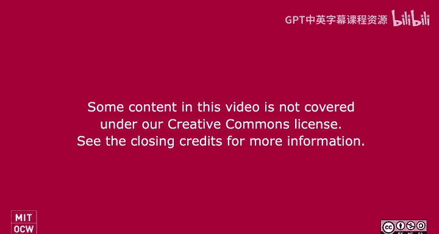

Let's get started， everybody。So last lecture we began talking about this topic of recursion and it hopefully solidified a few sort of really fundamental ideas about recursion that we're going to use in today's lecture。

 today's lecture， the first half of it Ih， we're going to talk about recursion just kind of to review on some actual numerical examples。

 but then the second half which is the main event for today is going to be recursion on nonnumerics。

 so specifically recursion on lists， but the techniques we'll see on lists can be applied to other things that are nonnumeric as well。

 like two poles or strings or things like that。So let's do。

 let's start the review of a little bit of a review of what we talked about last time and some of the big ideas by looking at this example。

 So we're going to write a recursive function for the Fibonacci sequence。

 And the Fibonacci sequence exists in nature。 in a lot of places。

 One specific place is you can model mating of rabbits using Fibonacci sequence。嗯。

But we won't be setting that in depth today。 We're just gonna to be looking at the sequence itself。

 So just to remind you， the idea behind Fibonacci is we start out with two sort of basic values。

 Fibonacci of1 is1 and Fibonacci of 2 is1。 So in my table here， I've got these two starting values。

 And we can fill in the remainder of the table by basically saying Fibonacci of n is Fibonacci of n -1 plus Fibonacci of n-2。

So Fibonacci of 3 will be  one plus 1。 Fibonacci of 4 will be 2 plus1。 Fibonacci 5 is 3 plus 2。

 Fibonacci of 6 is 5 plus 3， and Fibonacci of 7 is 8 plus 5。 right。

 That's the sequence we all know in love。Okay， so our two base cases。

 if we're going to put this in sort of mathematical terms， are Fibonacci of 1 is 1。

 Fibonacci of 2 is one。And our recursive step， right， in terms of the math and s programming。

 lingo is going to be the Fibonacci of n is equal to Fibonacci of n -1 plus Fibonacci of n -2。

So we put that in our function。 So we slap a definition around that that code and turn it into a nice function that we can run If x is 1 or x is 2。

 those are our two base cases。 we just return one right off the bat， right， nothing to call。

 no functions to call。 There are base cases， but otherwise we have we're going to return a value。

 And the thing we're going to return is a call to Fibonacci of n -1 plus Fibonacci of n -2 just like the mathematical definition said to do。

So this is different than what we saw last lecture。 Last lecture in our recursive step。

 We had basically just one function called to ourselves， right。

 So whatever function we had to find up here， we only had return， you know。

 some variation of that function down here with some， you know。

 something else tacked onto to it like an addition of some value or something else。

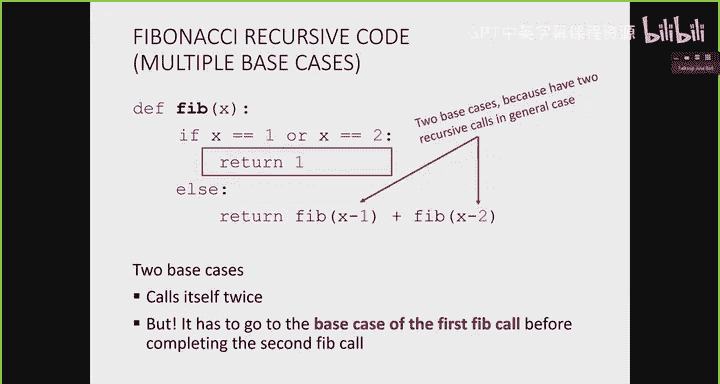

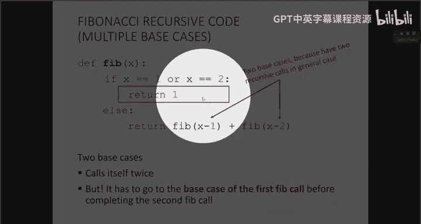

In this case， we actually have the function being called twice。 Okay。

 so we're going to see what implications this has。As we trace through the code。

 And so as I trace through the code， I'll remind you of some of the big ideas that we learned last。

 last lecture。So let's say that we wanted to calculate Fibonacci of 6。

 And so I'm going to illustrate a function call just by， you know， this。

 the name of the function with the parameter that I'm calling。

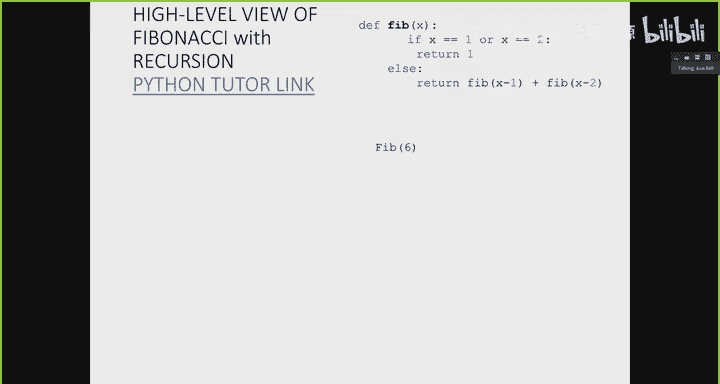

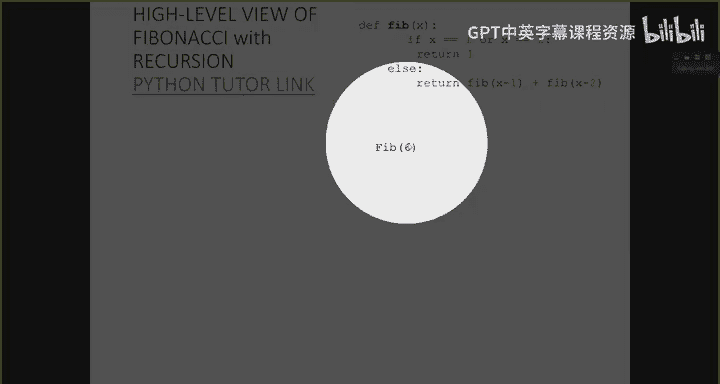

So one of the big ideas from last lecture was that when you make a function call that。

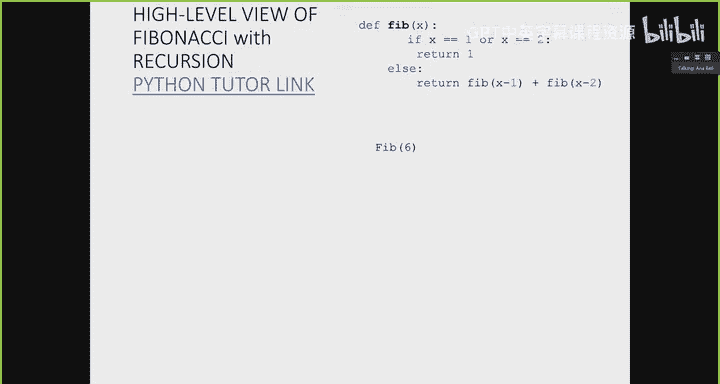

To a function that's recursive。You're going to， trace through that function call and the environment for that function just as you normally would。

 But as soon as you see another function call。 So in this case。

 Fibonacci of 6 doesn't enter the base cases。 it goes up into the recursive step。And it says。

 I'm going to calculate Fibonacci of x -1 plus Fibonacci of x -2。

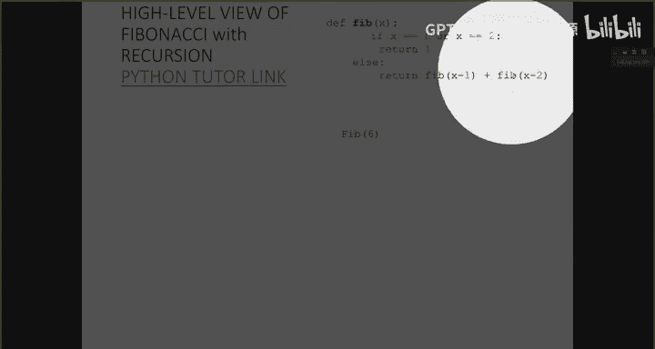

So for this Fibonacci of 6 function call， let's follow along and say， well， Fibonacci of 6 will say。

 I want to calculate Fibonacci of 5。

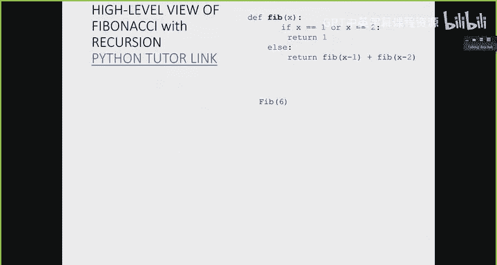

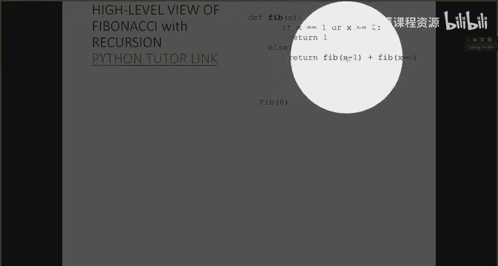

Is it， this is my question to you。 Is it going to now calculate Fibonacia of 4。No。Very good。

Because Fibonacci of 5 is a function call， right， we need to explore what this function will return before Fibonacci of 6 can add the result of this。

 the return of this to Fibonacci of 4。Right。

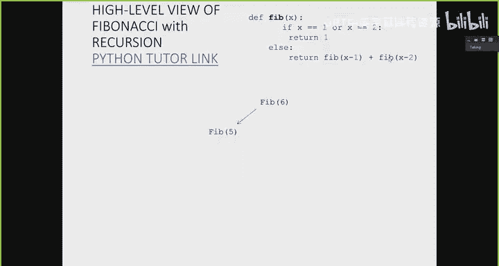

So that means then this new Fib 5 is an entirely new environment calling Fibonacci with n is equal to 5。

 completely separate than our original Fibonacci of 6 call。

 So let's explore what Fibonacci of 5 is going to do。 Well， in its function call。

 it's going to again， go in the recursive step。 it's going to figure out Fibonacci of 4。

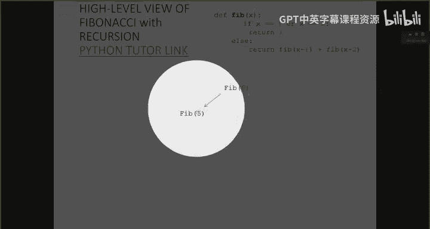

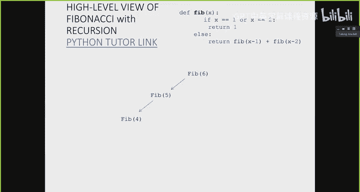

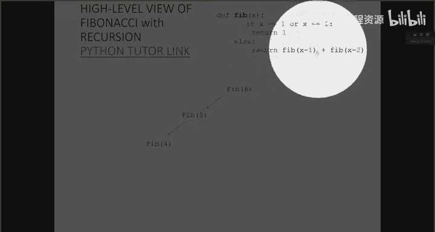

And then it's gonna pause there， right， because it needs to figure out what Fibonacciio 4 is before it finishes its other half。

 right， to do Fibonacciio of 3。So Fibonacci 4 will now create a new environment。

 and now it has to explore its return。 So it figures out Fibonacci 4 is again。

 going into the recursive step to calculate Fibonacci of 3 plus something。

 But we don't know what that something is yet because we have to explore what Fibonacci of 3 is right So already where four function calls deep and we haven't really done any work any work that we can see the result of。

 right， There's no values being passed back。 All we're doing is exploring this path down until we get to some sort of base case that will kick off our our our sort of conquer step where we pass values back up the chain。

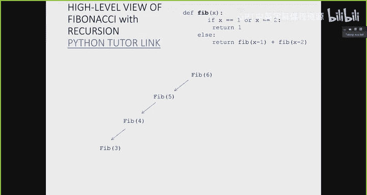

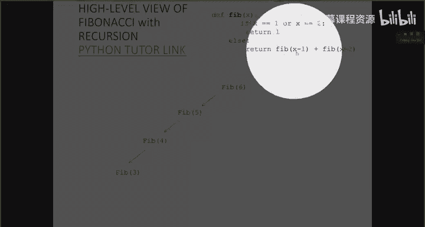

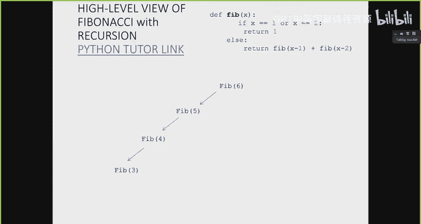

So Fibonacci of 3， again， is going to look at Fibonacci of 2。 And finally， we've reached a base case。

 So Fibonacci of 2 will immediately return， right， It doesn't make another function call。

 So Fibonacci of 2 will return a value。 and then Fibonacci of 3。😊。

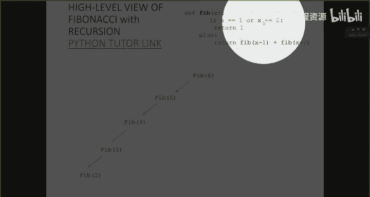

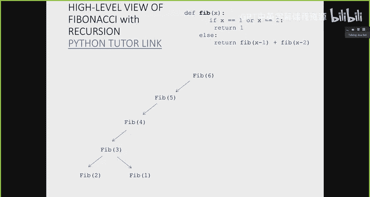

In its function call has the result for Fibonacci of 2。

 And then it's going to do plus that value plus Fibonacci of 1， right，3-2。 So that's this one here。

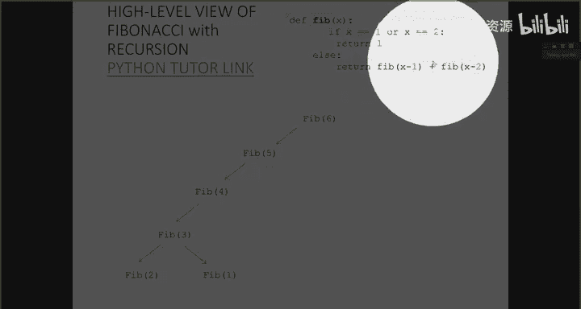

It can easily grab the， the， the， do that edition and return the value back up to Fibonacci of 3。

 So now。Fibbonacci of3 has its first half ready， right， So Fibonacci of 4。

Sorry， so Fibonacci of 4 has its first half ready。 Fibonacci of 3。

So Fibonacci of 4 was trying to figure out what Fb 3 was。 and it did， right， It was Fb 2 plus Fb 1，2。

 So now it has a value for its first half here， and it needs to add that value to Fibonacci of 2，4-2。

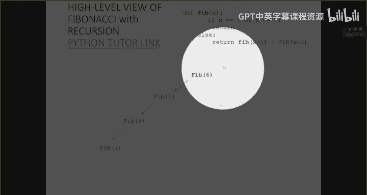

So it will explore that path。 That's a base case。 So all it does is return the value immediately。

 And now Fibonacciia 4 has its value。 Whatever Fb 3 was that we figured out plus Fib 2。

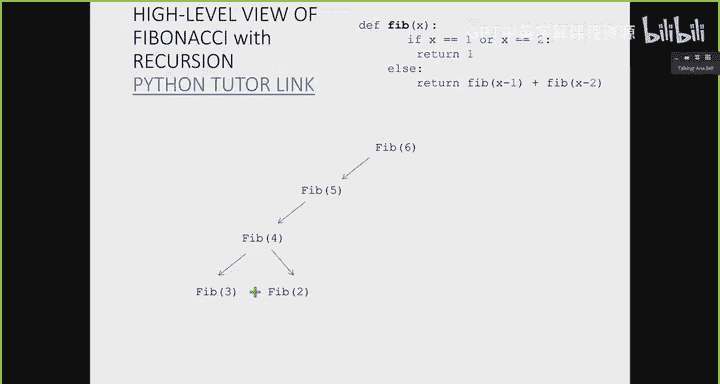

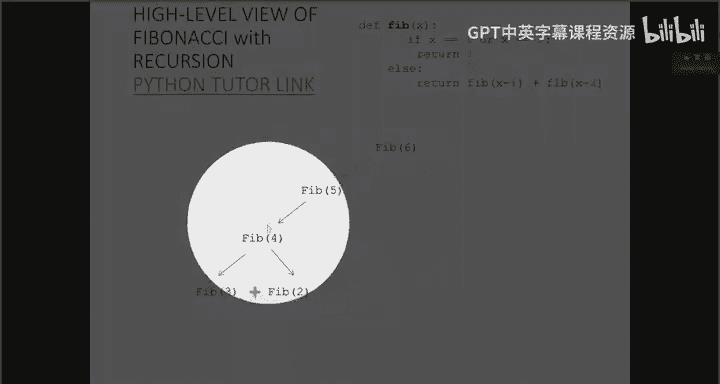

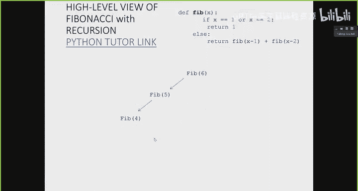

Now， Fb 4， we have a value for it when we called Fb 5。

 so Fb5 is now halfway happy because it knows what Fb4 is， but it needs to add that to Fb3。

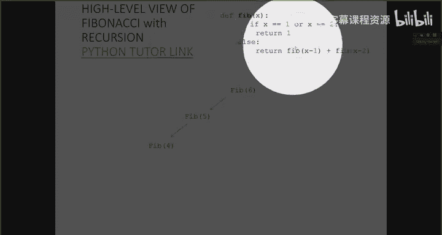

So Fb 5 is still halted， right， It can't return anything。

 but because it now it needs to explore what Fb 3 is。 Well， Fb 3 is going to be。

Have to do another function call， right， So it's going to call Fb 2 and Fb1。

 which are two base cases， which easily return the value back up to Fb 3。

 And now Fb 5 is happy because it knows this value and now it knows this value。

 It can add them together。 And Fb 5 now has a value that it it can keep track of。😊，And now， finally。

 Fb 6， we're not even close to being done。 You guys。 Fb 6 has a Fb 5 value。

 So it has half of the things it needs to figure out what Fb 6 is。

 because now it has to figure out what Fb 4 is。

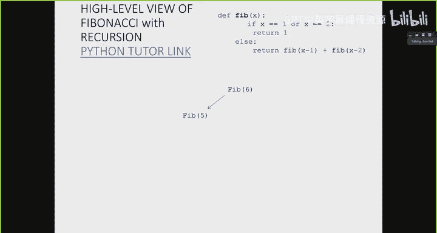

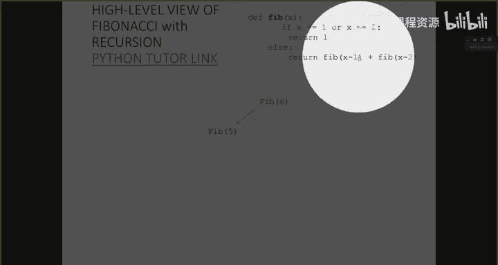

And already you can tell what we're going do next， we're going to start exploring the exact same way like we did before。

 Fb 4 needs to calculate Fb3。 It can't do Fb2 yet because Fb 3 needs to calculate Fb 2 and Fb1。

 right Pass back up the value。 Fb4 can now finish its job by calculating Fb 3 and F2。

 Pass up the value。 And now finally， Fb 6 has its two halves here。 Fb 5 and Fb 4。

 and it can add them together and return the value。😊，Okay， so。

A super inefficient algorithm because there's a lot of sort of stuff going on。

 but not much work being done until the end， right， We've got a bunch of base cases we get to。

 And then we can start building back up our result。

And the reason why I say it's inefficient is because， well， we're exploring these paths。

 and as we go along the way， right， we figure out what Fb 3 is and what Fb4 is， right。

But then when we explore this， the right half of Fb 6 over here。

 we're actually recalculating these values all over again。

 That's why I said we're not even halfway done。 because when we got Fb 5。

 we had to explore Fb 4 and Fb 4。 this， this branch down here is basically a copy of this one down here。

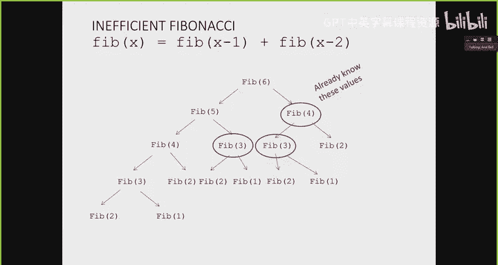

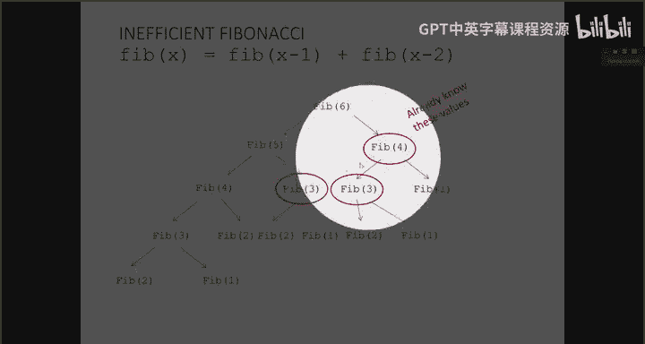

Okay， so there's a lot of work being done here where you just do the same thing over and over again。

And so that leads me to say， well， what if we didn't have to do all this work all over again， right。

 If only there was some sort of data structure that we could use to keep track of things as we calculate them。

 right。Right， to basically map one thing to another。

 So if we already calculated Fib 4 to be some value， why don't we just look it up。

So anytime we use things like keeping track of and looking things up。That。Should， you know， ring。

 ring a little bell that says dictionaries can help us do that。

And so what we can do is actually write a more efficient Fibonacci recursive Fibonacci function that uses's still recursive。

 but it uses dictionaries to keep track of values as we calculate them。Okay， and so this is。

 this is the Fibonacci efficient function。 So my name is Fib efficienticient。

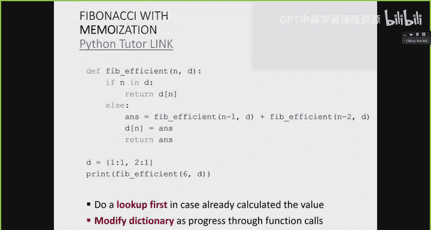

Notice we're still calculating Fibonacci of some n， but we're going to pass in another parameter。

 a dictionary。 And this dictionary will keep track of the Fibonacci values as we calculate。

 Can't calculate them。 So the key will be the n。 and the value will be fib of that n。

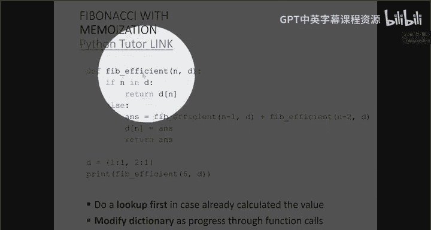

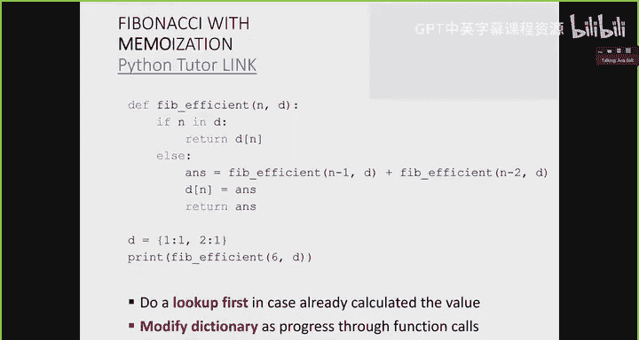

And so down here， you can see we're going to initialize a dictionary that has Fb of one maps to one and Fb of two maps to one。

 right， those are our base cases。

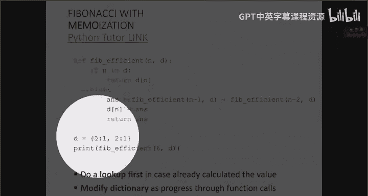

So let's take a look at our Fibonacci recursive function now that uses dictionaries。

 No longer do we need to think about the base cases as， you know。

 Fibonacci of one is this And Fibonacci of 2 is this。 Now， all we need to do is say， well。

 let's look up the value in our dictionary。 That's， that's what our base case will be。

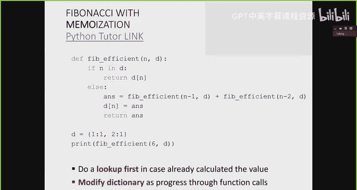

And we don't need to make a call to ourselves if the item is already in the dictionary， right。

 so we can just return。The value associated with N in dictionary D。

 if that n is already in the dictionary。 So our two base cases down here will initially be in our dictionary。

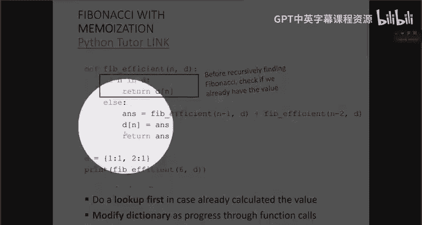

And as we figure out the values of Fibonacci， we'll add them to their dictionary。

And that's exactly what the recursive step will do。So else， the value is not in our dictionary。

 So unfortunately， we have to calculate it， right， which is fine。

 We'll basically do that the first time through that sort of exploring the left half of our。

 of our path。 But that's pretty much the only times that we're going to calculate it All the other times。

 we'll just look it up。So this is gonna be a little different than what we've seen before。

 because I'm not right off the bat returning Fib and -1 plus fib and -2。

 I'm actually still running the same， you know， the same recursive step， Fb n -1 plus fib and and -2。

 But I'm saving it in a variable。 And that's totally fine to do。

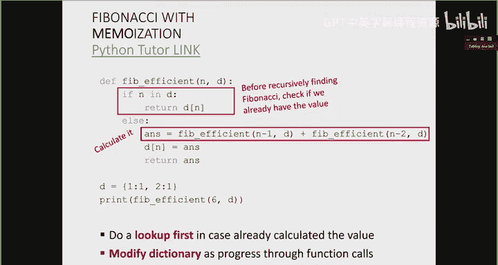

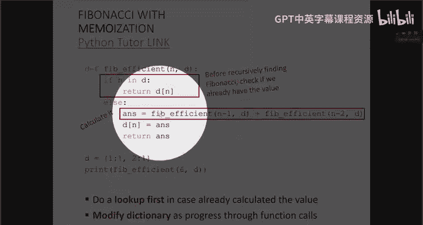

And then before I actually return this value， let me add it to my dictionary。 So this is simply just。

 you know， saying this dictionary at this particular N for this particular function is equal to this thing that I just calculated。

 Just a straight up， you know， dictionary edition。

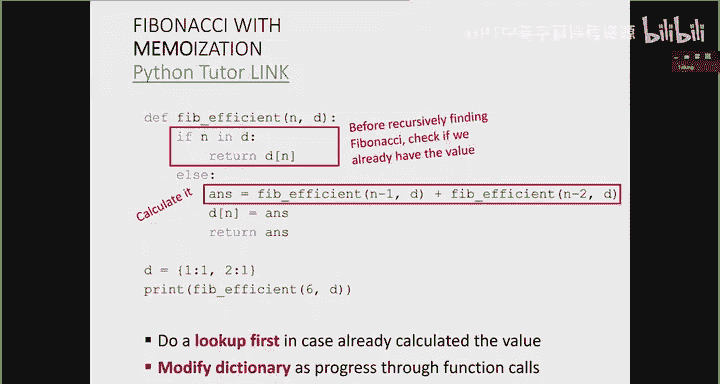

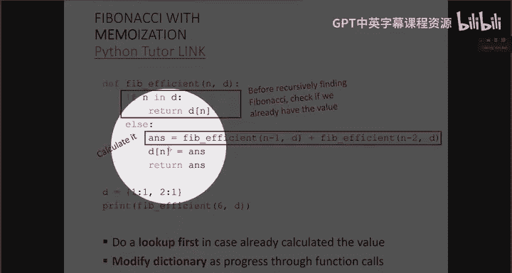

Adding this item to the dictionary。And then after I've added it to my dictionary。

 I can return the answer return that that value。 So still passing it back up the chain of function calls。

 but we'll save it first。Everyone okay with this code。Okay。

 so then this is the dictionary I mentioned where we initialize our two base cases， and then we can。

 you know， print the function。 So let's trace through the code to see what exactly happens with these function calls now。

 So we're initializing our dictionary where we have N1 Fibonacci of1 is1 and。

 and2 Fibonacci of 2 is one， right， our base cases。

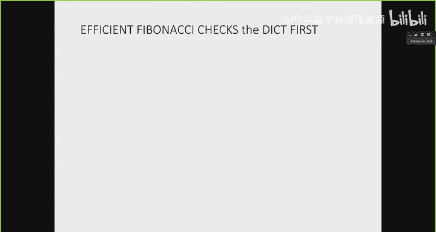

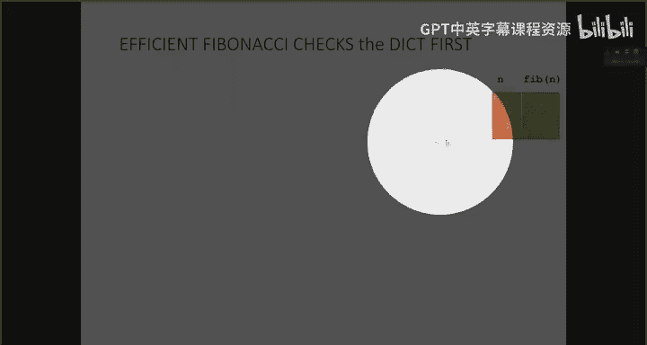

Fibbonacci of 6 again。 We're doing the same function calls， right。

 so that means there's nothing stored for Fb 5。 So we still have to explore what it what value it it will be。

 Nothing stored for Fb4。 We're still exploring， nothing stored for Fb3。 We're still exploring。

 We've reached a base case。 So now you know， the first thing we do is check if it's in the dictionary。

 It is。 So we just return the one directly。

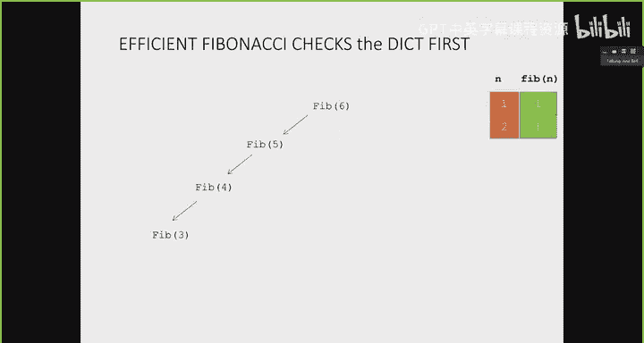

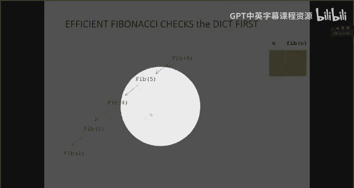

Check if the other half is in the dictionary， return the one directly。

 And now we've got a value for Fb 3。Before returning it， let's store it in our dictionary。

 So I just calculated what Fb3 was。 Let's put it in。 The key is 3， and Fb 3 is 2。

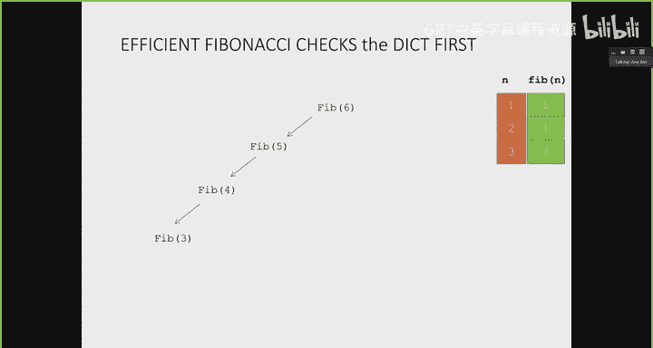

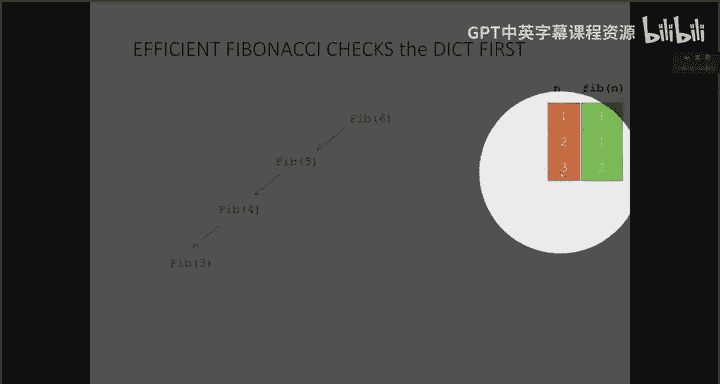

Okay， so far so good。 it's pretty similar to what we've done before， except that we're， you know。

 storing this value in the dictionary。 So now we explore the right half of this Fb4。Right。

53 plus5 through，52。 it's already in the dictionary。 So it immediately returns this edition。Now。

 we know what Fb 4 is。 So we add it to our dictionary。 Fb 4 is 3。Explore the right part of Fb5。

 right， So F 4 plus FIip 3， do we go further now， right， in the previous case， we explored2 and1。

 in this case， do we keep exploring。

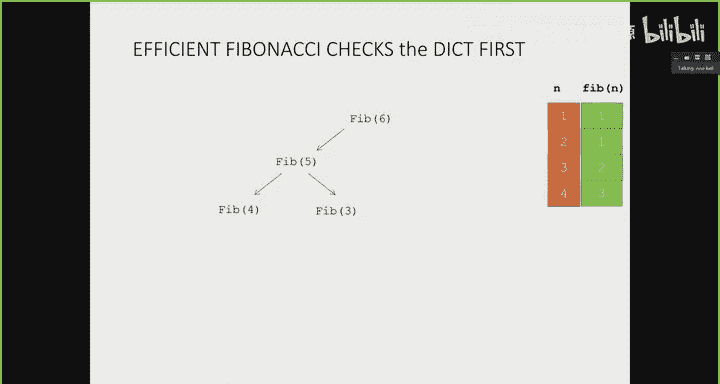

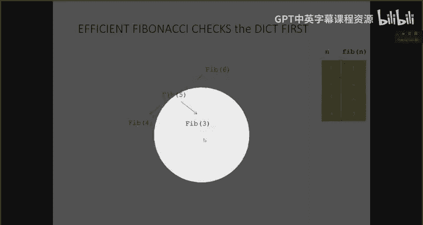

No， exactly。 because our base case says if it， if 3 is already in the dictionary。

 simply return the value associated with it。So， yep， there it is right there。 We added a while ago。

 We just returned the two immediately。 No need to go down this path。

So now Fb 5 is done pretty quickly。 So the right half， So that means we have the value for Fb 5。

 and we add it to a dictionary。 We explore the right half of Fb 6。 Remember beforehand。

 I said we were not done。

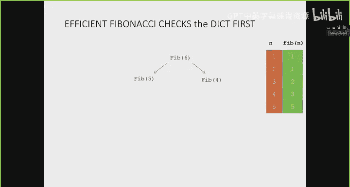

We don't need， We't need to explore this Fb4 anymore because we added it to our dictionary long ago。

 So now all we need to do is look up the value associated with four from our dictionary。

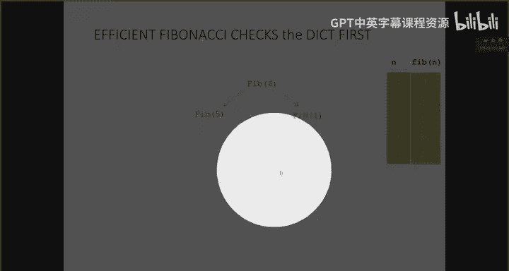

So boom， there it is。 And then we can just add Fb 5 and Fip 4 together and get the value for Fb 6 stored in the dictionary。

 And， you know， this case， it's， it's the end。 We don't need to do anything else with this value passing it back already。

So we're not recalculating any anything else， right。

 We're just checking the dictionary and if need be recalculated， so。It's an improvement。

 But how much of an improvement is it， actually。So if we run this function and it's in the Python code。

 you can play around with it yourself。If you run the function that we originally wrote， Fib。

The one where we don't store anything a dictionary， if we try to calculate Fibonacci of 34。

It results in 111 a half million function calls。That's a lot of function calls because right。

 even Fb 6 had Fb 3 being called twice， right， Fb 4 being called Fb 3 being called three times Fb 4 being called twice。

 things like that。 So can you imagine how many times， you know。

 Fb 3 will be called when we are trying to calculate Fb 34， probably thousands。If not more。Right。

 so overall， the number of function calls we're making is 11 and a half million with our original code。

 But the efficient version only makes 65。It's not like we went from 111 a half million to like。

 2 million。Right， we went from the order of millions to tens。Which is really。

 really impressive in terms of speed。 So if you try to run this program， it'll know。

 take a couple seconds for F 34， but the efficient one will be instant。

And all of these function calls have some overhead， right。

 You need to create an environment in Python and need to passs these parameters。

 So all of these function calls take a lot of time。

Whereas a dictionary lookup is basically instantaneous， right， So in this particular case。

 we've given up some of our memory to store values。Right，The dictionary is storing 34 entries。

 which is not much， but there are applications where you can't spare 34 entries right in your memory。

 in which case you might， you know， spare some time to。

 to to continue calculating without taking up some memory。

 So there's a little bit of trade off between these two programs， right。

 One of them doesn't store anything but is slow。 The other one stores things but is fast。

Let's look at one more example where we do Fibonacci on numerics。 And this。

 I don't know when you'd use Fibonacci in your real world you know， real life。

 But knowing all the possible ways， you can make a score of basketball is a little bit more useful。

 So let's think about this problem recursively。 Certainly we could do it iteratively and brute force our way through all the possible combinations of scores right。

 So in basketball， you can make basket that's worth 1。2 points or three points。

 So you can think about all the possible combinations， you can make to give you some score of X。

We're going to think about this problem recursively， right， So let's start with our base cases。

Base cases， we've got three of them。So if we think about a score of one。 So if x is equal to1。

 So that means if we have a score of one in basketball。

 what are all the possible ways we could have made a one。Well， you could just score one point。

 and then that's it。I just did one plus here or just emphasize that we're just scoring one。

If we make a basket， that's worth two points or if we have two points in basketball。

 what are all the possible ways we could have made two。 Well， we could have scored a one and a one。

 or we could have just scored two right off the bat。

 So that's two possible ways to make a score of 2。And similarly， to make a score of three。

 what are all the possible ways， Well， we could have scored a one then a1 then a1。

 We could have scored a2 and a1， or we could have scored a3 right off the bat。

 So that's three different ways You can make a score of three in basketball。Allright。

 everyone with me so far。 These are our base cases， okay。

Becauseuse the recursive step will be very will blow your minds。 It's so simple。 Okay。

 so the recursive step。Looks like this。Now， somebody give me what's a reasonable basketball score。

Like 14，87， okay。It's been probably 25 years since I've played pro basketball in grade 5， you guys。

 So I forgot what's a reasonable score。 Allright， so 87。

So let's say now we're not dealing with our base case。 We're dealing with。

Some number that's bigger than one of these base cases。

How do we think about this problem recursively。Well， there's three possibilities， right。

If I have a final score of 87。Let's say that。I think about the score of 86。Right。

If I know all the possible ways， I can make a score of 86。All I need to do is add one to that score。

Right， it'll give me 807。Right。So that's one possibility here。But。That's not the only possibility。

 right， because I could have a score of 85。And if I add 2 to that 85。Not two counts， right。

 just the score。 If I have an original score at 85， if I just add 2 to that score， it gives me my。

Desired score of 87。So if I know the possible combinations to make 85。

 then I know that all I need to do is， you know， attitude to my score。And thatll give me 87。

 And then the last possibility is。Is to score is to know all the possible ways to make 84。

 a score of 84， because then I would just add a score。

 I would take that score and add a 3 to it to give me 87。

So I'm sort of using my base cases to guide my recursive step。

So the number of ways I can make a score of 87。Is the sum of all the possible ways I can make 86 or 85 or 84。

Right。Cause if I've made 86， I would just add one to it。 If I made 85， I had2 to it。

 And if I made 84， I'd add 3 to the score。So this， so that's essentially what this recursive step is doing。

 right？ I've got， these are all the possible ways I can make a score of 80， you know， x-1。

 right So 87，86。And that's just me calling my function， right， So score count x -1， score count x。

Plus， all the possible ways to make a score of x -2。Plus。

 all the possible ways to make a score of x -3。 So if I add all these three ways together。

 I would get all the possible ways I can make a score of x。Does that make sense。So that's it。 right。

 It's pretty clean code。 It looks really nice。 If we were to write this iteratively。

 it would be a mess。😊，Because we'd probably have a whole bunch of nested loops to try to brute force all the possible combinations of scores that we can make。

 and it wouldn't look very， very nice， very pythonic。So let's do a trace of this code just you know。

 to bring it all together。 The trace will be very similar to the Fibonacci trace。

 except that now we have three paths to explore before having a return value right？

 So for a score of 6， I would explore how can I make a score of5。 And of course。

 I will explore how can I make a score of 4 and 3， but I not there yet， right， First。

 I need to explore how to make a score of 5， which is a function call。

 This one will explore how to make a score of 4 and， of course， a3 and a two， but not just yet。

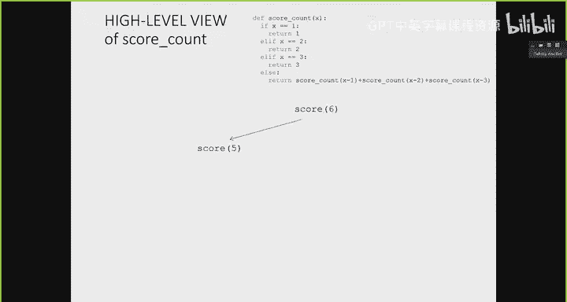

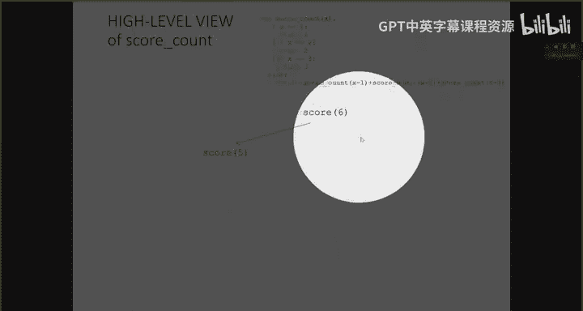

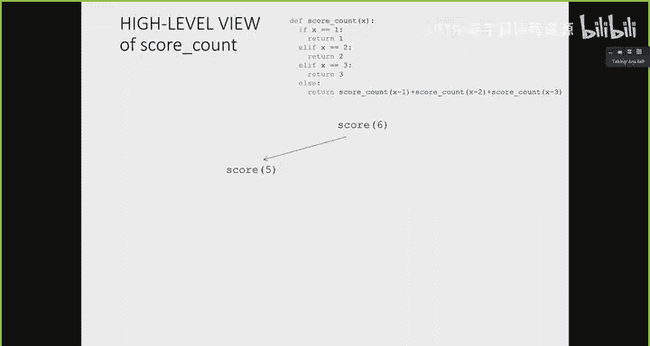

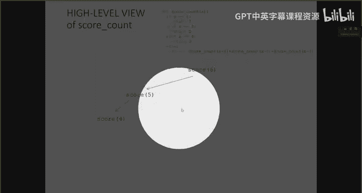

A score of 4 is our will will lead us to our base cases。

 It's just how to make a score of 3 and a 2 and a1。These are base cases。 They immediately return。

 and we know how to make a score of 4。 A score of three is also a base case。

 and a score of two is also a base case。 So these ones will immediately return to give us the score of 5。

So now we know how to make a score of five。 We need to follow through how to make a score of four。

 which is just three and2 and1。 oops， I should change that to be a one and then how how to make a score of three。

 and that's just a base case。So very similar trace as the Fibonacci。靠不住。All right。

Questions about those examples。Are they okay， Do they make sense？O。

So there is one exercise in the Python file。 It's， it's for the for at home。 I。

 I would like you to try to memorize this code。 So memorize means basically try to use a memo。

 a dictionary to store values as you calculate them because you see that it's going to be just as ineffic as the Fibonacci code。

 right？ So here we're calculating score of4 again where we had cal it way back here， right。

And so try your hand at， at adding a dictionary to this code to try to， try to speed it up。Okay。

 so the next， the second half of this lecture， we're now going to move away from recursion on numbers and sort of。

 you know， having these nice mathematical operations that we can just translate to code easily and start looking at recursion on。

😊，Not numerical things。 And we're just gonna look at lists。 But again， as I said。

 you can apply these very similar codes to any sequences of values。

 tuples or strings or things like that。So the reason why we're looking at lists is because lists are naturally recursive。

 So one of the motivations I gave at the end of last lecture is that we have lists that can have elements that are other lists that can have elements that are other lists that can have elements as other lists。

 So without knowing sort of how deep these lists within lists within lists go。

 it's going to be really hard to write iterative code。 It's possible。

 but it's going to be really hard。 And instead we're going to see that the recursive version of this code is going to be a lot more intuitive in the long run。

 maybe not know maybe not write off the bat， but definitely it's a lot easier to write to write and to read。

So let's think about lists in a recursive way。So if we were doing iteratively。

 what we'd say is we're going to loop through each element and do something。

 The problem we're going to solve is figuring out the sum of all the elements in a list to begin with。

So iteratively， we just said， right we loop over each element in the list and keep it in our result。

 So I've got these state variables I talked about last time， right。

 result and E that keep track of which element we're at and what the value is。

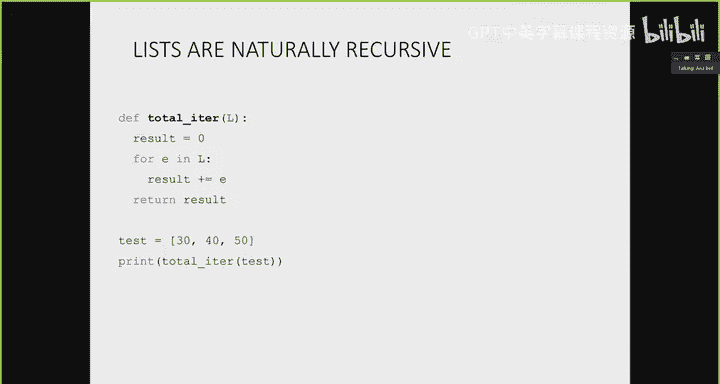

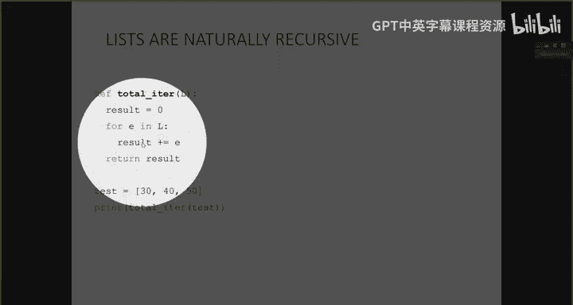

Recursively。Remember， we're going to make all these function calls until we get to a base case。

 at which point we're going to start to build up our result。So how can we think about this。

 this list recursively， Well， let's say that we have a list and we want to find the sum of all elements。

 That's our original problem。Now， let's say that we take the first element。

And we just extract it out， right。We know we have this list with a bunch of elements。

 Let's sync the first one。 We know it's a 10。And then let's consider the remaining elements。

 So the 20 onward。If。🤢，I take my 10。

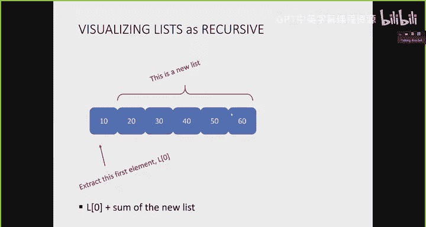

And I know the answer to the sum of all the elements in 20 onward。

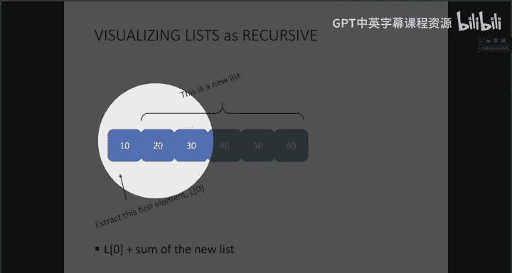

Right， then all I need to do to figure out the sum of my original list， right。

 This one here is to say it's the 10 plus the sum of whatever the sum of the 20 onward is。Now。

 the sum for elements 20 onward is the same problem again， right。

 It's the problem of finding the sum of all the elements in a list。

 It just so happens that our list is now our original list without that first element in it。

Does everyone understand that， right， We've got our original problem。

 and we've just made the same problem again， just a slightly different version of it。 All the list。

 except for that first element。So now we do the same thing， right， Let's say this is our new list。

We extract the first element from it。And we consider the elements， except for that first one。

 as a new list。And again， if I knew what the sum of 30 all the way on to 60 was。

 all I need to do is add it to the 20 that I extracted。 and I would know the sum of this list。

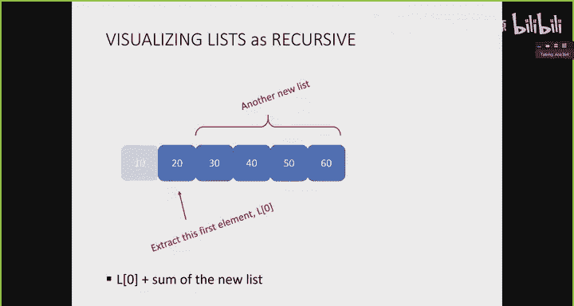

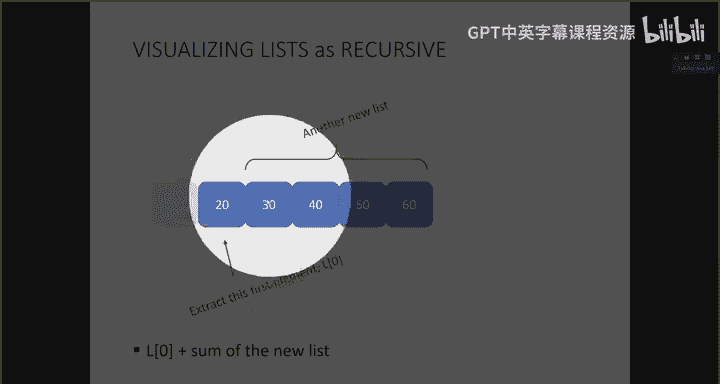

So we keep doing that， right， we take our list， extract the 30。

And consider the remaining elements as a， as a list。Same deal。 If I knew what 40 plus 50 plus 60 was。

 right， the sum of all the elements in this list， I'd just added it to the 30。

 and I have the answer to that problem。And we keep doing this。

 extracting an element and considering the remaining lists all the way down to when we have a list with just one element in it。

Well， this is a pretty simple problem to solve。 If I have a list with one element in it。

 the sum of the elements within that list is just the value of that element， right， It's just 60。

So very simple problem。 No need to keep sort of going further。

 dividing this problem into smaller pieces。 I already know the answer to this one。 It's very simple。

So this is our base case。 And we know the sum of the elements of in a list with link 1 is that element。

So once we reach the base case， we build back up our results， right？ We take the 60。

 and we had extracted the 50 originally。 So we're going to pass the sum back up to whoever called it。

 which was the function that extracted the 50。 So now the 50 plus the 60 is 110。 Now。

 this 110 gets passed back up the chain。 When we extracted the 40。

 we said what I'm going to add the 40 to the sum of the 50 and the 60，110， which is 150。

Passed that answer back up the chain。 When I extracted the 30， I said。

 I was just going to add the 30 with the sum of the remaining things， which I figured out is 1，50。

The 20， right， I had extracted it becomes 20 plus the sum of everybody else， which is 1，80。 right。

 So the sum is 200。 And then finally， my original question was to take extract the 10。

 Add it to everything else， which is the 200 that we figured out。 So the full sum is 2，10。

Does that make sense， this， this animation， Okay， so weve got the division all the way down to the base case and building back up the results。

So let's try to write it。 So we're going to write it in pieces。So the function is called total recur。

 It takes an list L。 We're going recursively figure out the sum of all the elements in this list。

So we can have a base case when the list is empty， we can return 0 up to you。 Another base case。

 which is the one that I illustrated on the previous slide， is when the length of the list is one。开。

So when the length of the list is one， what's the sum going to be， No need for recursion。

 It's just that element。

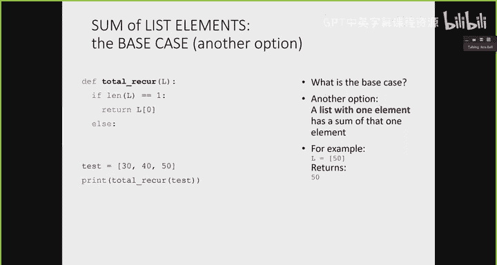

And so in these slides， what I've also included， right， in addition to the code is a little example。

 So it helps you think about what the function returns right。 So in this base case。

 when the length of the list is one， the list would look something like this。

 And all I'd need to do do is return L at index 0。 So the 50。 And that's my sum。

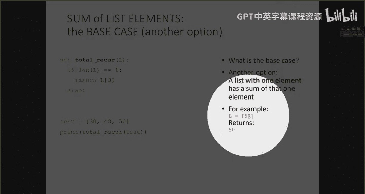

And that's what I'm doing here， returning L at index here。酷。

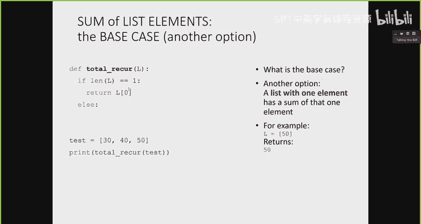

Now， the recursive step。Remember， in the recursive step， I extracted the first element， and I said。

 let me save this first element。 So here it is being saved as L at index 0。

And I'm going to add it to something， right？ So in this example here。

 I've got this list that's longer than one。 I'm extracting the 30 L 0。

 And I'm going add it to something。

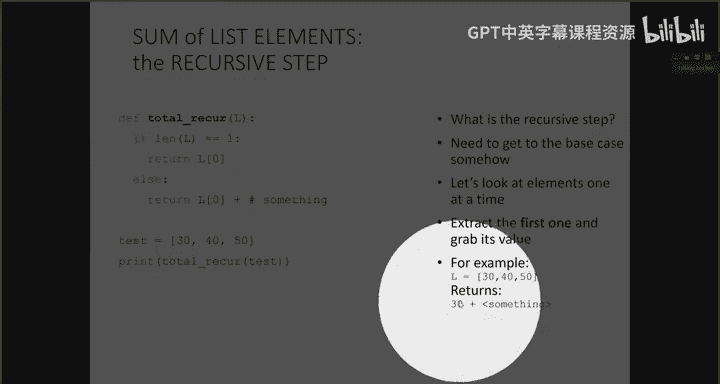

Well， that's something based on the slides， the previous slide， right。

 where I did the animation is going to be us putting our trust in the fact that we write this function correctly。

 right？

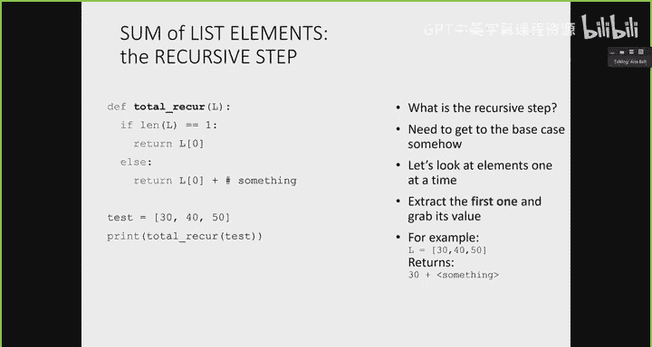

That something is going to be us figuring out what the sum is of 40 and 50。

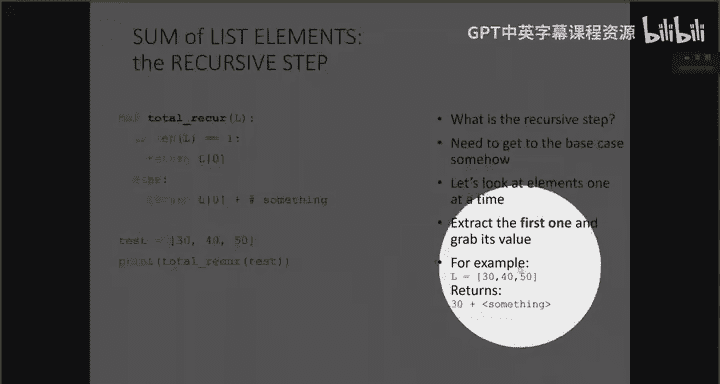

Right， it's the same problem we're trying to solve right now。 the sum of 30，40，50。

 except that now I'm just gonna take the sum of just the 40 and the 50。Okay。

 so that something becomes the same function we're writing right now， total recur。

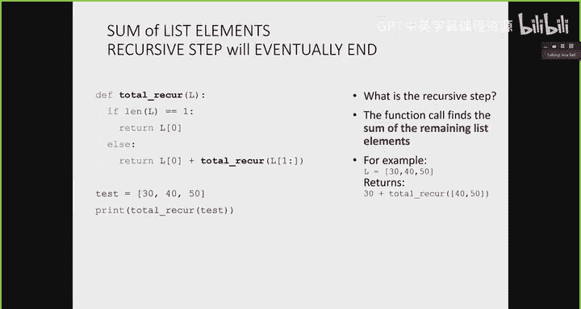

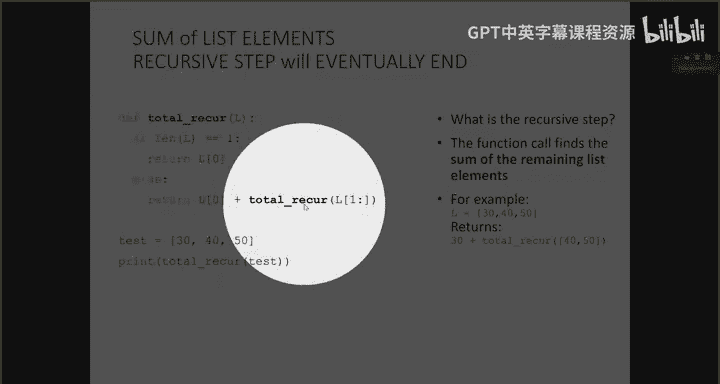

Except that I'm not calling it on L。 Not the whole thing all over again。 That would be bad。

 but I'm going call it on L from index 1 onward。 So essentially， removing that first element。

Does everyone okay with that。开。So that's it。 That's the function。 Nothing else to write， right。

 No loop。 We've basically written a function assuming that we wrote the function correctly， right。

 which is a very strange way to think about。Recursion， but that's essentially what it is。

 You're trusting yourself to write this function correctly。

 such that your recursive step leads you to the base case so that you can build back up the result correctly。

 So there's a lot of trust involved in writing these functions， recursive。啊，Okay。

 so I'm not gonna go through the Python tutor， but you should definitely go through it on your own。

 you know， as a practice for the quiz， things like that。Let's have you write this， then。Okay。

 so it's gonna be a slight modification to the code we just wrote。

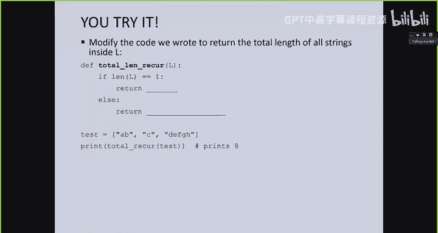

So it's gonna take in a list。As its parameter。 and instead of summing the elements in the list。

 right， like we did， know 10 plus 20 plus 30， whatever。

 I would like you to sum the lengths of the elements in the list， right。

 So if I pass it in this function， it's going to sum the length of this 2 plus the length of this 1 plus the length of this 5。

2 plus 1 plus5。

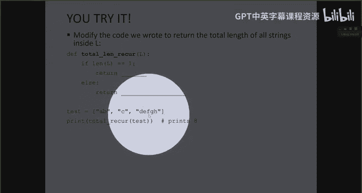

So it will be a very slight modification to the code that we just looked at。 And here it is online。

70 ish。So think about the base case right， If you have a list with one element in it。

 what do you return and if you have a list with many elements。

 how can you put your trust in something that you just wrote to help you get get to the answer。

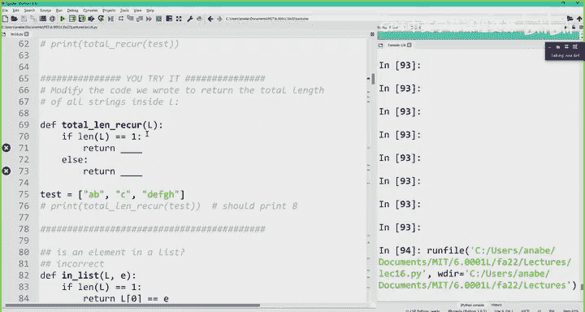

All right， what do you guys have for me。So let's start with the base case And if you're having trouble。

 I encourage you to just in a little comment， just write down sort of what that base case looks like。

 right like I did in the slides。 It looks like this， right？

 So what would I return if I have a list with one element in it。Yep， exactly。

So we would determine the length of that element， right？ So the length of whatever this is， A B。

 whatever。2。How do we do the recursive step。Yes， exactly。Total。Lenry Kerr with what L？Yep。

 so we're gonna extract that first one。 So this will give us the some of the links of everybody else。

Exactly， so we also need to add it to。L at0， right？So it's its， it's fine to do it even before after。

 because we're just summing these two values。 So it doesn' it matter if you're， you know。

 the order that you're summing them。 So that that's perfect。 Any questions about this code。Yes。

Then doing the what？So in terms of efficiency， recur this this function will be。

Slightly less efficient， I would say。Yeah， because it there's a little overhead in actually making a function call。

Whereas if you use a built in operator， it's been optimized to work pretty fast。だす。No。

 when it's doing plus equals， it's definitely not doing this in the background， exactly， y。

But this is just， I mean， we're， we're， I'm trying to。Show you recursion on something that， you know。

 you wouldn't typically use recursion on just to help illustrate the idea of recursion。 Certainly。

 you can use an iterative algorithm， obviously， to calculate the sum of these， these elements。

 And it's more intuitive， more in line with what we've been learning so far。O。Excellent， so。Now。

 let's look at a slightly different problem。 So instead of finding some of all the elements in a list。

 let's tackle the problem of looking for an element in a list。 completely different。

 But we're still doing some sort of list operations。

We're going to start with an implementation that's not quite right。

 And you will see why in a little bit。 So let's follow the same sort of pattern that we've seen in the previous one。

 So let's consider a list of length 1。In this particular case。

 if I have a list with only one element in it， how do I know if that element is the 1 I'm looking for。

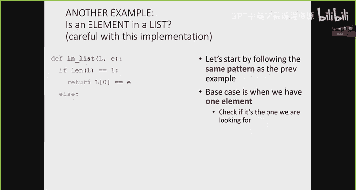

Well， I'm just going to return this boolean， right， whether L at index 0。

 that element is the 1 I'm looking for。 the E。 So notice this inlist is passing in a list。

 the list itself and the element I'm looking for。

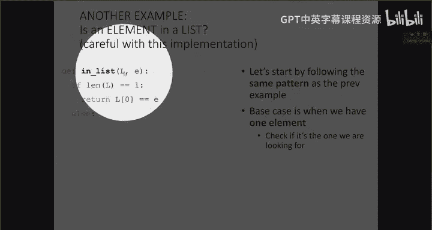

嗯。I think。Okay。So then let's look at the recursive step。The recursive step in this particular case。

 let's say it says， well， else， right。We might think to say， well， if it's not the 1 I'm looking for。

 then let's look at the remainder of the list。So like we did in the previous case。

 let's apply the same function we're writing right now to all the elements except for the first one。

 right， And we're still looking for element E in that remaining those remaining element。

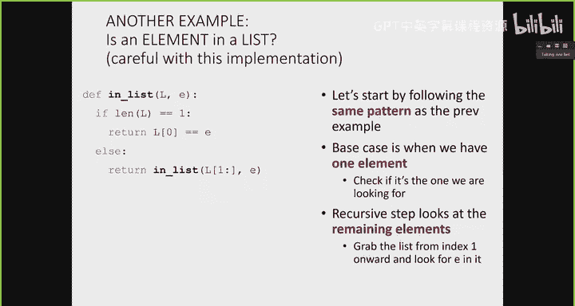

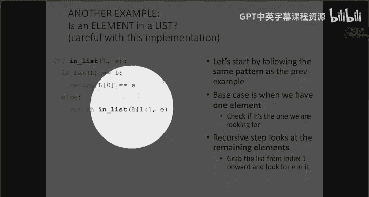

O。So we can test it out。 And if we actually run it again， please。

 I encourage you to do Python tutor on your own， but we can test it out。And say。

If in this particular case，2，5，8，1， if I actually run this code， it will give me true。

 So it found the one。Inside the list，2，5，8，1， which is good。Right，It's exactly what we wanted。

But if I change my input list slightly， right， and I've got 2，1，5，8。

 the element I'm looking for is here。

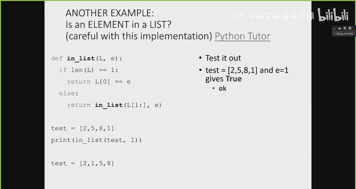

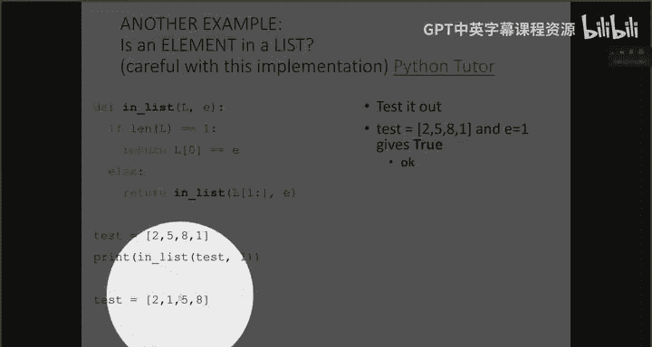

The code will actually give me false。 The one that I just wrote， which is not O， right。

 I see the one is right over there。

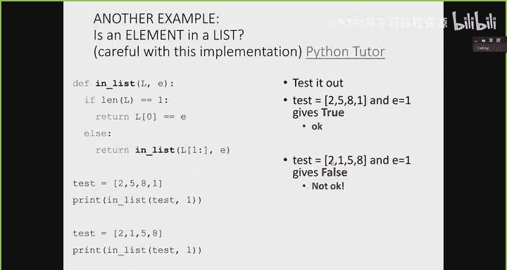

And so what exactly is going on So we can run。The code。Here so this is this code here。

If you see that it gives you the incorrect value， one thing you could do when you're doing recursion is to put a print statement within within the function itself。

 right， so we can print maybe the list we're currently at and the element we're looking for and see exactly what's going on。

 So if I run it， it will say， well， first time through the through the function call。

 I'm looking for the number one in this list。

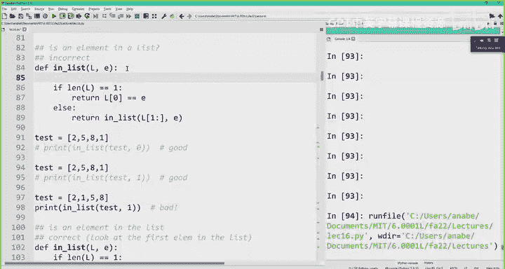

The next time I'm looking for the one in this list。

 the next time I'm looking for the one in this list。 And the last time for my function call。

 I'm looking for the one in this list。Right， and already。

 we see something went wrong because as I was looking through these lists。Right。

 I'm basically skipping over important elements， right。

What this code is actually doing is only checking if the last element is the one you're looking for。

Right， because it basically ignores that first element in the code。Right， the code here。 yes。

 it extracts that first element， but it doesn't do anything with it。So， that's our problem。系。

What we want to do is still look at further elements in the list。

 So that part of the code is correct。 But we， we only want to do it in a certain situation。

 And that situation is when the element that we just extracted L add index 0。

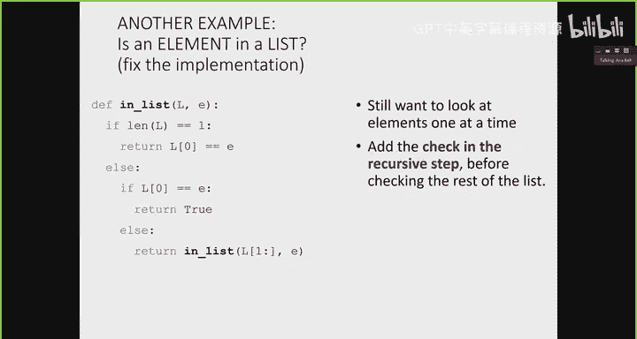

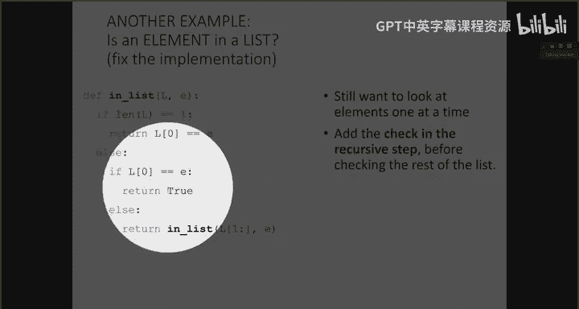

Is not the one we're looking for， right， that little else case。

So we still want to extract the first element if we have a list with more than one element in it。

But as we've extracted it， check if it's the one we're looking for， if it is returned true。

 no need to keep searching the rest of the elements in the list。

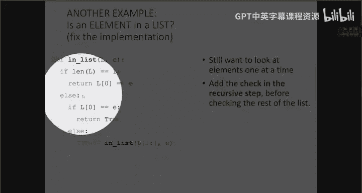

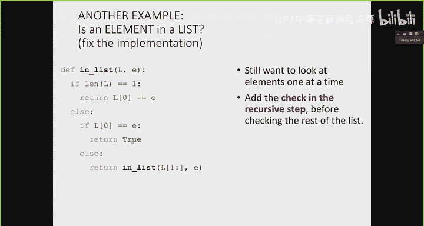

If it's not the one we're looking for， this else here。

 then we can look at the remaining elements in the list and run the exact same function we're writing。

 right to check if the elements is in the remaining list。

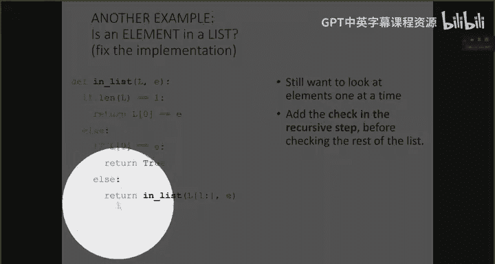

Does this code make sense， Is it all right。So the way I wrote this code is sort of how I personally think about the problem and if we run the code again。

 it'll give me the correct answers each time。 But I wanted to mention that we can actually clean up the code a little bit and write it a little bit more pythonically So it's you know it's a little bit nicer to read。

 it' it's more cleaned up。 But one of the things that was confusing for me when I first started learning recursion is that I would always see these beautiful。

 cleaned up versions of code that do the recursion。😊。

And that's not sort of how we approach thinking about the problem， right， I。

 I can't come up with this nice form right off the bat。 And this is one example。

 But there are certainly other examples of more complicated code where you see it。 And it's just。

 it looks beautiful。 And yes， if I look at it， I can figure it out。 and I say， okay， yeah。

 that makes sense。 But I personally could never come up with it on my own。

So I was I was writing these lectures， I thought， well how do I actually think about the problem。

 So I just went back one slide and the way I think about the problem is to kind of separate it into these smaller a bunch of different base cases or a bunch of different cases。

 And so that's what I've been trying to do in this particular lecture to help you guys understand recursion。

 It's you know， think about the case when we have a list with one element in it。

How would you solve that problem？And then think about the case when you have a list with many elements in it。

 How would you solve that problem。

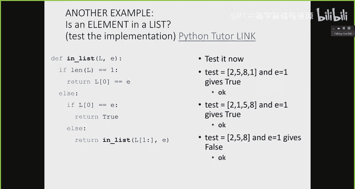

Yes， it's true。 There are some pieces here that are that are repeating， right。

 So we've got L at 0 equal E is in a couple places。

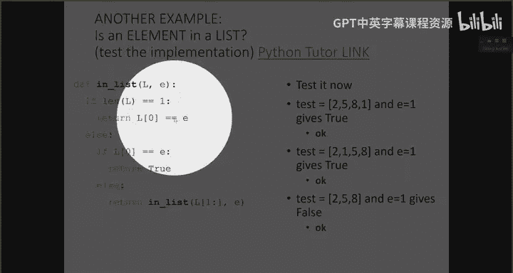

But you can do that clean up later， right， So here I've got two test cases that return two cases that return L at 0。

 so we can pop them into the same test case here。 And then we can check if the length of the list is 0。

 we can add that test case。 and else， we check the remainder of the list， right， That's totally fine。

 And if it helps you think about the problem this way。 That's okay。😊。

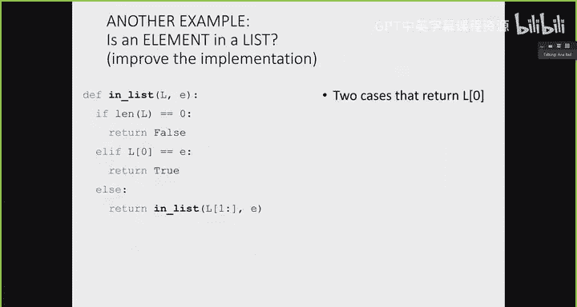

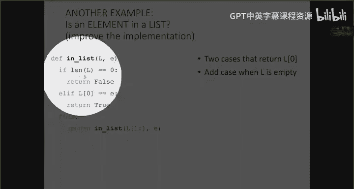

2， but personally， for me， it was a lot easier to think about the problem in terms of a list with one element in it and then a list with many elements in it。

But it's totally fine to write， you know， a little bit quote unquote inefficient looking code to begin with。

Certainly don't hard code all the base cases， right， If length is 0， do this， If length is one。

 do this， If length is 2， do this， right， But some reasonable base cases are O to do。

So this is just showing the simplified code。One thing that I wanted to mention。 and hopefully。

 you've noticed this already is the function that you're writing， all of the return。

Returns from this function need to have the same type。When we wrote， I'll go back a couple slides。

 When we wrote the function that calculated the sum of all the elements in a list。

 So that's this one here。

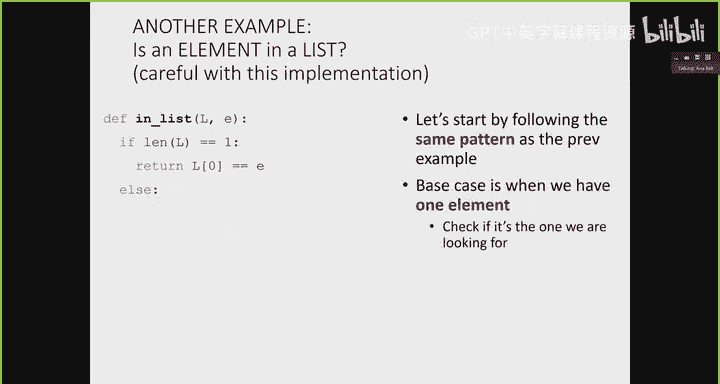

What were we returning Here， we were returning an actual number。

 And then here we were assuming that this function return an actual number that we can add to this actual number。

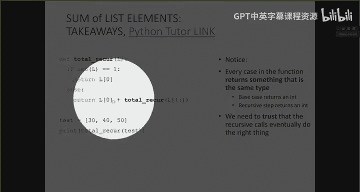

So every single return statement needs to return the same type of object， because if you don't。

 if you're assuming that the base case returns a list， but then at some point in the code。

 you're going to be you working with a number or a Boolean， then Python。

 as soon as it gets that base case is going to say hey， you're trying to add a Boolean to a list。

 what's up right？😡，And so in the summing of the list elements， all the test cases returned a number。

 And in this case， where we are trying to return the whether the element is a list or not。

 notice every single one of my returns is going to return a Boolean。 So here， Boolean， here Boolean。

 and here in the recursive step， I'm assuming that I'm just passing this boolean back up the chain of command。

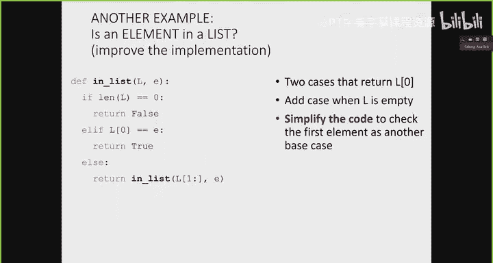

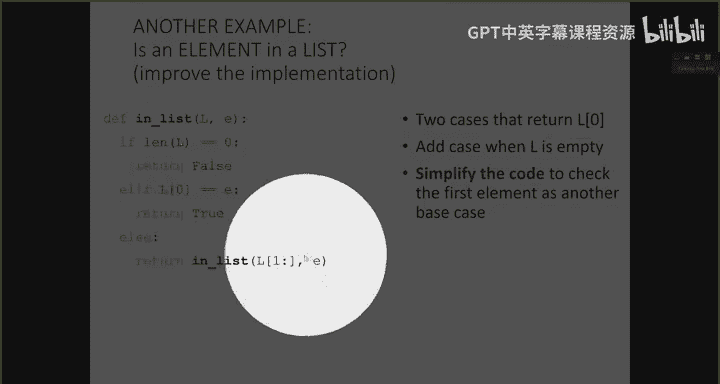

So very， very important thing。 again， something I that was not made clear to me when I first started recursion。

 but， you know， once I knew this， it was， it just made so much more sense and it helped me write my code you know。

 better， more perfectly right off the bat。

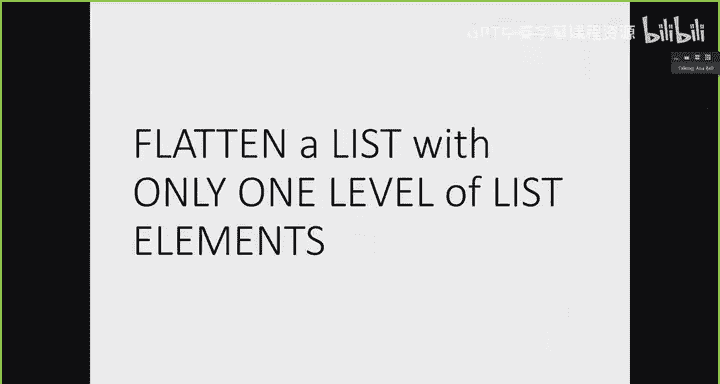

Let's look at a slightly different example now。 So we've looked at taking the sum of all the elements in the list。

 We've looked at figuring out whether an element is in the list。

 Let's do something completely different。Still working with lists。

 Let's say that we now have an input list that looks like this。 So we've got a list。 We。

 this is my list， beginning an end。

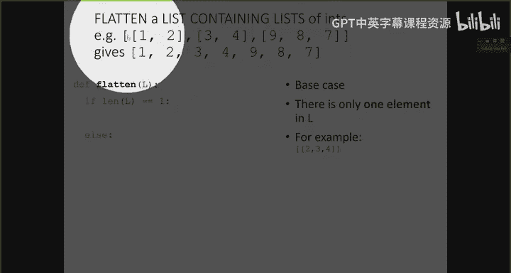

And this list only has list elements within it。 So no integers， but its elements are lists。

 So here's one list element。 Here's another list element， and here's another list element。

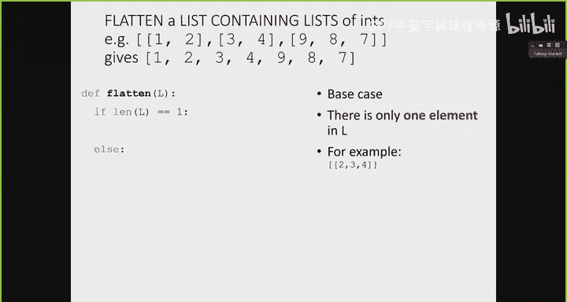

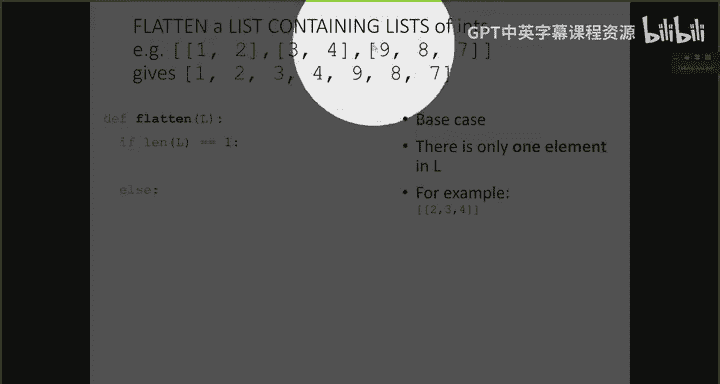

So in this example， I've got a list with three list elements。

What I'd like to do is to flatten this list。

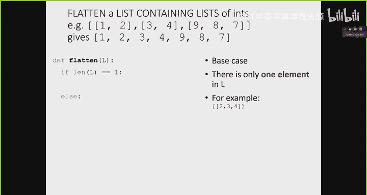

Which means that I want to remove any semblance of sublists。

And take just all the elements of these sublists and put them top level。

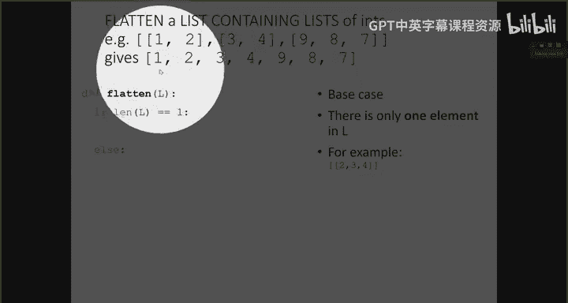

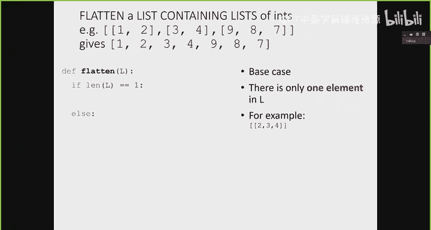

Does this task make sense。So I'm not assuming I've got lists within lists within lists。

 I'm just assuming I've got lists with list elements that have integers or whatever in。O。So， again。

 let's think about the base case。 Let's think about the case when we have a list with one element in it。

 and then we can figure out the recursive step。So if I have a list with one element in it， again。

 I've got an example here on the right hand side。 It's a list， right， with one list element in it。

 That's why I've got the double square bracket。

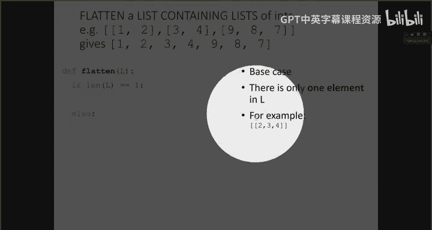

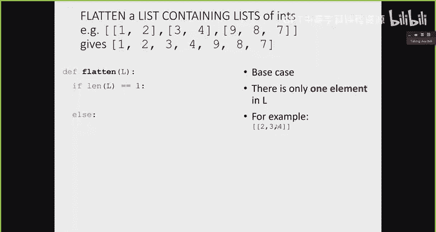

If I wanted to flatten this。What could I do。I could just grab the element at index 0， right。

 because the element at index 0 is this inner list， and it is a flattened version of my list。

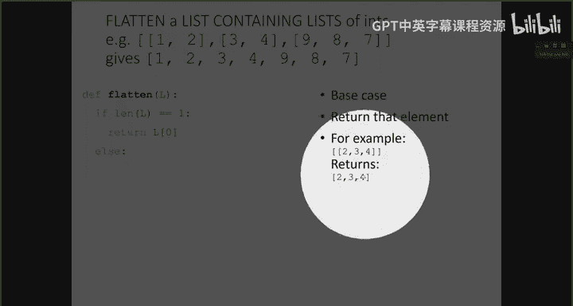

Okay。Else， what am I going to do， Well， let's do the same pattern。

 It seems to have worked so far for us。 Let's do the pattern of extracting that first element。

 So grab element at index 0。 So here we would grab something like square brackets，1 coa 2。

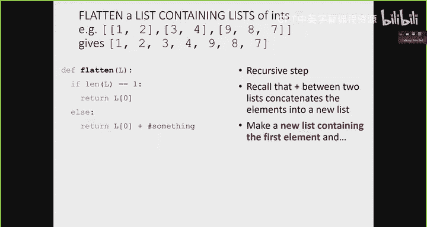

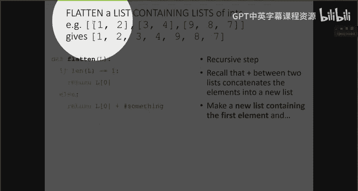

And concatenated with something。Remember， when we cancate a list with another list。

 it gives us a big list with all the elements in it。 exactlyly what we're looking for， right。

 when we want to flatten a list。So the something we're going to add this。

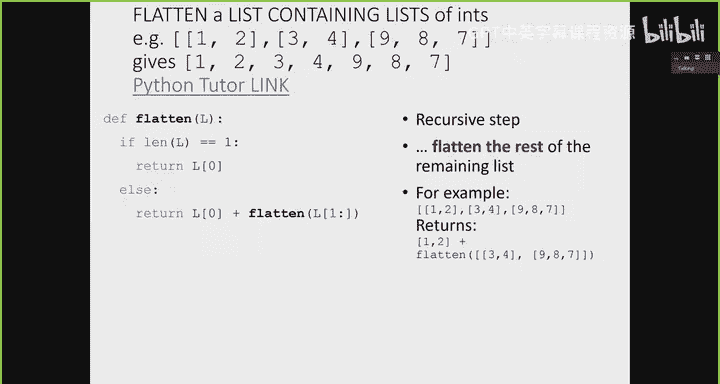

L indexduct 0 with this。Is just us flattening the remainder of our list。

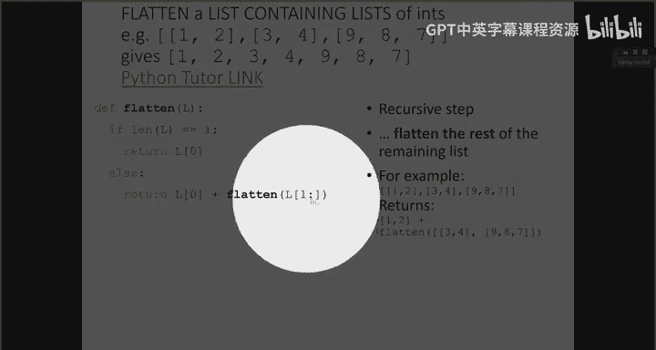

Again， same pattern we've been seeing already。

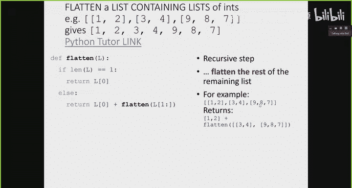

So if I extract in this example here， the1 comma 2 as a list。

 I'm going to concatenate it with the assumption that the function I'm writing will work correctly to flatten 3 comma 4 and 9 comma 8 comma 7 so if I flatten that。

 this will give me just a list with 3，4，9，8，7。

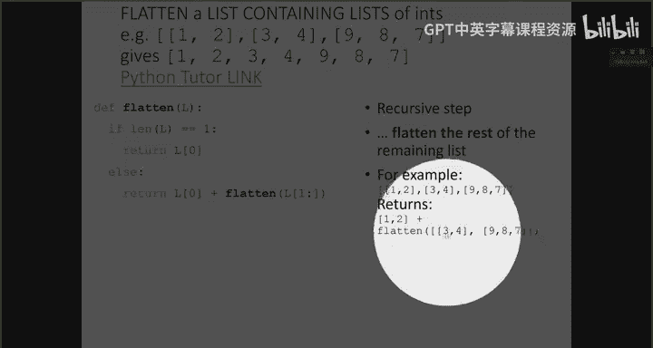

And if I can countate1 comma 2 with 3，4，9，8，7， that just gives me 3，4，9，8，7。Everyone with me。

 is that al right。 Okay， good。 I see some nods。 So that's actually a pretty good sign， okay。Okay。

 you are with me， right？Because now it is your turn。So。We're going to write。

Variation of whether an element is in a list。So I'm going give you a very similar scenario to this flatten one。

 So I'm gonna to give you a list that contains list elements。

 So here's my list that contains list elements in it。

And what I'd like you to do is write a recursive function that checks whether this element。

 whatever the second parameter of the function call in the my function call is in。

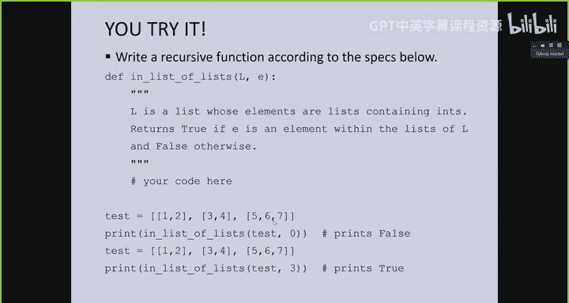

These list elements。 So not at the top level， like we wrote last the last code to check if an element is in the list。

 right， But in these sub lists。

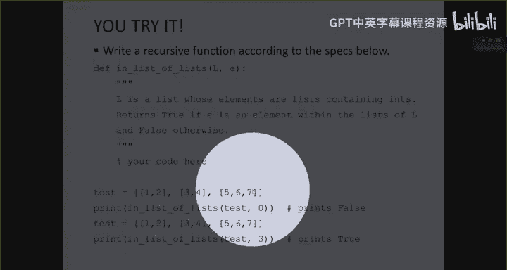

So just to show you kind of the difference， if I check whether three is in one comma 2 comma 3。

 that will be true。 but if I check whether3 is in， you know the list containing the list1 comma 2 comma 3。

 that's false because it's checking whether the three is equal to this list right。

 It's just doing a top level equality here。So。Let's have you write this code down on line 1，66。

You may use the in operatortor， to check if an element is in a list itself。

 but obviously you won't be able to use the inoptor nor should you because then we're not writing a recursci function to check if the element is within a list element。

So。嗯。Have you worked on it for a couple minutes， and then we can write it together。Alright。

 Does anyone have a start， So let's look at the case where we have one element in it。 How do you。

Check whether that element is within within the the list inside。So， if。Right。

 this is our our case with one element in it， the length of L。E equals one。第二。Yeah， exactly。

 E and E and L is is is the correct thing to do L at index 0， right。So if this is our L。

 that's why I added this little example here so it can help us。 So L added deck 0 is this guy here。

And all I need to do is check if E is in L at index 0， And I can just return that right off the bat。

I could do if E in L 0 return true L return false， but E in L 0 is already a boolean。

 So I can just return that directly。O。Else， we have a list with more than one element in it， right。

So。What do we do here。Remember， extract the first element， and then。No。Do the rest。So let's say this。

 Let's say the first element is L at index 0， right， That'll help us think about it a little bit。

So before looking at the remainder of the list， right， and calling our recursive function。

 What did we do when we checked if an element was in a list when we just had a plain list。

We just said if。You know。嗯。Ei is in。First。Return true。 else， Re false。Right。

But we don't want to do else， return false。Because that's not quite true。Else。

We want to look at the remainder of the list。Right， we want to see if the element， obviously。

 if the element is not in the first。Thing that I just extracted， right， this list here。

Then I would like to say， is it in the rest of this list。

Which is us calling the function that we're just writing all over again。So， we can return。

The name of this function in lists。Of what did I call it lists， of lists。

And then L from one onward with the same element we're trying to find。And， of course。

 we can simplify this just like we could simplify the previous one。

But it helps to think about it in these two cases， a list with one element and a list with many elements。

Any questions about this？Yes。This one。This one， we're considering a list with one list inside it。

嗯Yeah。We could include another base case， I suppose， if the length of L is 0 return falses。

 that would also work。Becauseuse obviously， if the list is emied， then there's it's not in there。

Okay， so when do we use recursion， Obviously， a lot of the examples we've seen here， we。

 they're very intuitive to write iteratively， right？

 But I mentioned a couple examples last time where it's more intuitive to use recursion and specifically。

I wanted to draw a little bit of a parallel to this thing when we learned about wild loops， right。

 we said， well， what if we tried to code a little game that just used if else。

I said that we would have a bunch of nested if L statements， right， without a while loop。

 because we don't know how deep to make these if， L， if， L， you know， if statement。

And so a very similar idea exists with recursion and when to use recursion。

 So if I had a list with a whole bunch of lists in it and those lists could have lists within it and so on and so on。

 I don't know how long I need to how deep I need to make my code go right So an example using a for loop would be to say for each element in L right。

 I'm going to say I'm going to look at each element， I'm going to say， well， if you're not a list。

 then I can deal with you directly， but if you are a list then I need to iterate over you。

And so I've got this other iteration here for each J and I right from one of those lists。Again。

 I would say， are you a list。 If not， I'll deal with you directly， else， you are a list。

 So I do need to iterate over you。 Okay， and you can see this nested idea now comes into play here。

 And， of course， we could try to use a while loop to optimize the code a little bit。 say。

 you know while this element type is not a list to do this。 know， things like that。

 But it leads to some really verbose and verbose code。

 And so recursion is a way for us to deal with these lists within lists within lists。 And， of course。

 when you have data structures that you don't know how long how deep they go。

 So I mentioned file systems and a set of operations last lecture has really nice places to use recursion。

 scooby do gangang looking for you know their culprit rooms that have doors that lead to other rooms that have doors lead to other rooms。

 they don't know how many doors they need to go through to get to a room without。

 obviously recursion， they should use and then a bunch of other fun examples of places to use recursion。

😊，So the last。Bit of class。 I would like to work through this example where we're going to see the code。

To solve lists within lists， within lists， within lists。But before we do that。

 we're going to talk about。 So we're gonna do that example in the context of reversing a list。

But before we look at a list that has all these different sublists within it。

 let's look at a list that has just integers。How would we think about this problem recursively to reverse all the elements in this list？

O。So again， we're going to use the very same pattern we've been using all throughout today when we've been dealing with lists。

 We're going to take out the first element， extract it。

And we're going to deal with the remainder of the list。Basically。

 by writing running the same function， we're writing on the remainder of the list。

So let's say I have my original list， and I look at my first element， just like before。

 I'm going extract it out。If I take this first element。And I pop it at the end。

And then I consider the remainder list， right， everything except for that first element that I put at the end。

I can just call the same function I'm writing right now to reverse the remaining list。

Which means that I'm going to take this remaining list， grab the first element。

 pop it at the end and deal with the remaining list。Again， take the first element， pop it at the end。

 De with the remaining list until I have a list with length 1。

How do I reverse a list that only has one element in it。It's just that list， right， I just。You。

 reversing a list L is just L。Right。So， that's the idea。

And notice that when we're building back up the result。

 we took that first element and we tacked it onto the end。

 So we're going to do another list concatenation kind of deal。

Except that the thing that I'm concatednating now that first element will be at the end， right。

 that itll be the second part of my plus。So I just giving you a heads up。

 that's what it would look like。So let's write the code If the length of the list is one， right。

 if I'm reversing a list with one element in it。Just return that list。Easy， Pasy， right。

 It's just the list itself。Okay， elses。And this is where the fun comes in， right， I've got something。

 So I'm gonna。😊，Do something concatenated with。Something else。So I'm extracting the first element。

 There it is L I index 0， but it's sitting somewhere funny that we haven't seen it sit before。

It's sitting on the second to the right of the concatenation。

 And that's fine because what we want to do is take the element from the first。

 the beginning of the list and tack it onto the end。Right。

And there's something else that's funny about it。I've put it in square brackets。Now， I'， again。

 I'm including this example to help us think about it。 Why are those square brackets there。

Think about。What we want this function to return， Is it returning a number。No。

 is it returning a booleion？ No， it's returning a list， right。This function。

 I want to take in a list and give me back a list。 But where my elements are in reversed order。

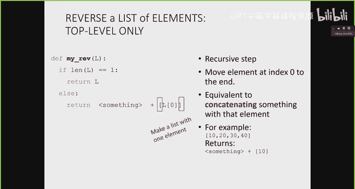

So what I want to do， right， you can already see this return over here is returning a list， right。

 So it'll be square brackets，10 or whatever。

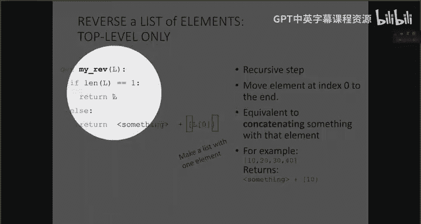

In my。Recursive step。

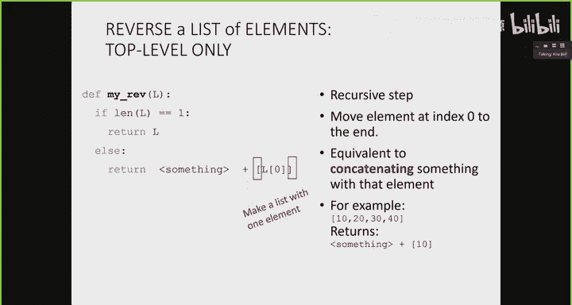

If I'm concatenating。I want to concatenate this thing here。

 which I'll tell you about in the next slide。 But I'm going to concatenate it with is going to be a list with some other list。

 right， If I concatenate a list with a number。That L at 0 is L at 0 is a 10， right？

 So if I can catate a list with a number， Python will yell at me。

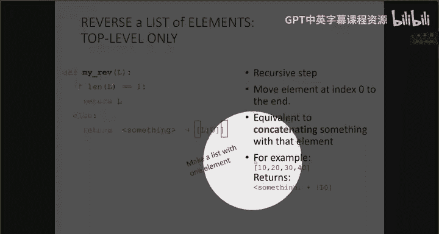

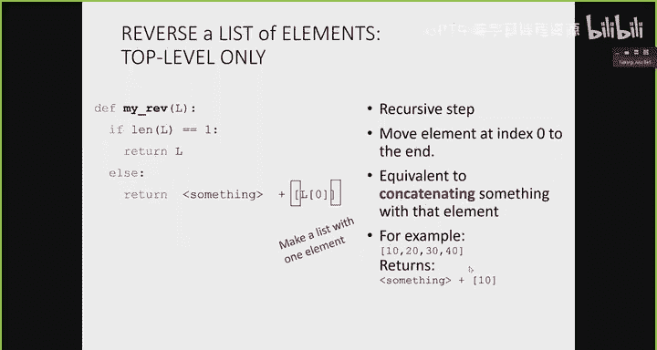

Okay， so what I need to do is make that number that I just extracted L at 0 be a list。

 So I'm just gonna slap a square bracket around it and say， hey， Python。

 this is a list with one element in it。

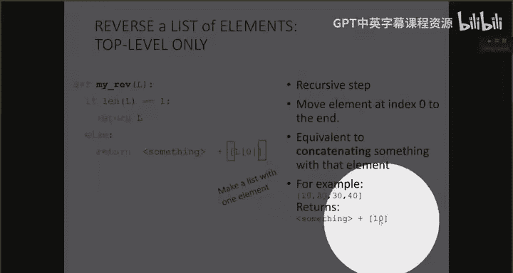

Does that make sense。Cool， so then what that means is I've got this 10 that I extracted。

 I'm going concatenate something with that 10。 And that something is me putting my trust into the function I'm writing to say that something is going to be the 2030。

40， successfully reversed， right，40，3020。😊，If I can do that，40，3020， and I concatennate it with a 10。

My job is done。 I've successfully reversed 102030，40 to be 40，30，2010。

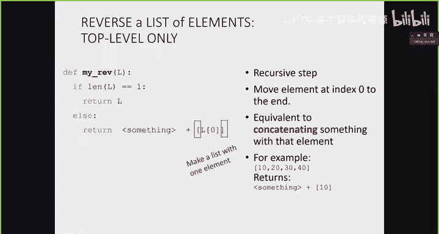

And so let's just do that。 That's me putting my trust in this function I'm writing。

 I'm calling the same function again， saying， hey， I would like to reverse the remainder of the list。

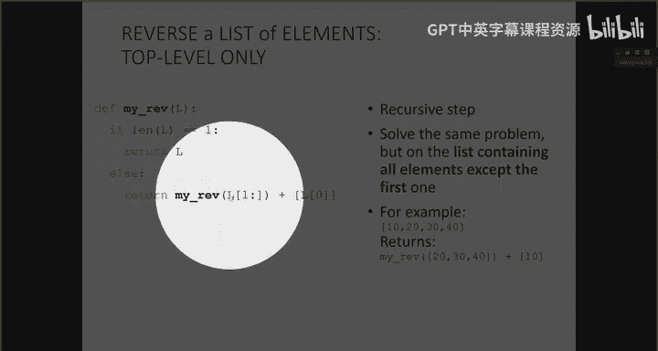

Exactly as we have been in the past。Super weird to think about still。

 because we're trusting something that we're right。Cool， so then it， let's test it out。 Let's run it。

 So if I run it with list 1，2， AB，C。Python will reverse my list， right， so it will print ABC。

 then the two then the one。

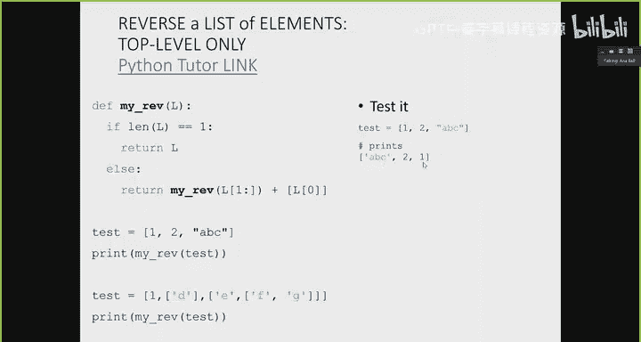

Let's say I run it now with something slightly different。 So I run it with this list here。

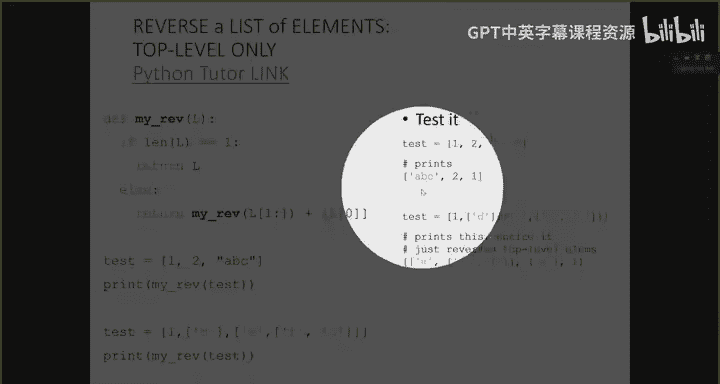

How many elements does this list have test。You guys tell me。3， exactly。 The first one is an integer。

 The second one is a list， and the last one is a list that's got a bunch of garbage in it。

 But as test， I don't care because I just care that I have three elements inside。

And so when I run this function on test， it will reverse just the top level because that's what this is doing。

 right， No in here。Did I say， I want to reverse lists within lists， right。

 I didn't say if you're a list， also reverse yourself。I just said top level， take this element。

 put it at the end。 So when I reverse test。This funky looking test over here。

 It'll take that first element， put it at the end。 The middle element stays where it is。

 and the last element becomes first。Is everyone O so far。

 I'm worried there aren't many more questions， so。Okay。Alright， so that's good。But， this is now。

Not really what I'd like， right， What I'd like is。If I have lists within lists within lists。

 within lists and those lists have some sort of elements within them， right at the。

 at the lowest level， I've got a list that's going have some。

 you know integer string or whatever in it。What I would like to do is to reverse those elements as well。

 So really， what I would have liked to have if I passed in this function here this list here is to say。

 well， why don't reverse， why don't you reverse everything， So I would like to have had， you know。

 G F as a list and then the E and then the D and then the one。

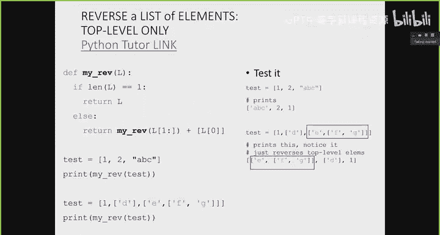

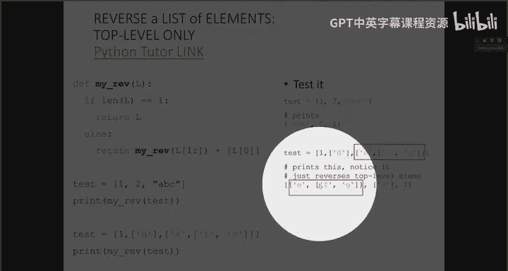

And so， this is where。We're going to do that。So let's say I now have a list。

 So each one of these blue squares is my list are my list elements and my top level。

And they happen to have some sort of lists within them。

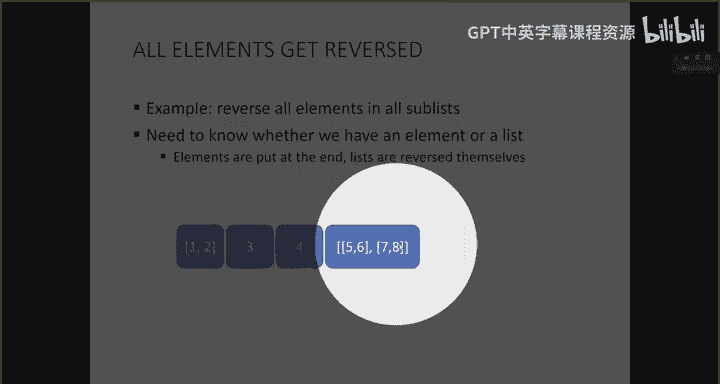

How do I do this？ Well， now that I have potential list elements。

 I need to have my recursive function test whether the element I'm currently considering is a list or not。

If it's not like the three and the four， I can treat them in the exact same way that we treated them in this case。

But if it is a list as this one is， right， This is a list element。

 And this is also a list element that has list elements within it。 So that's even funier。

 then we need to consider them separately。

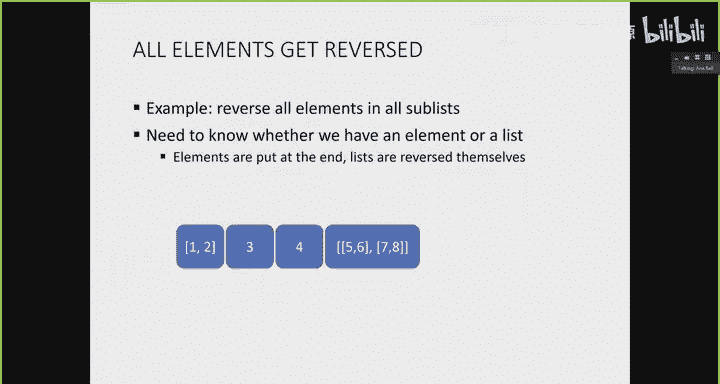

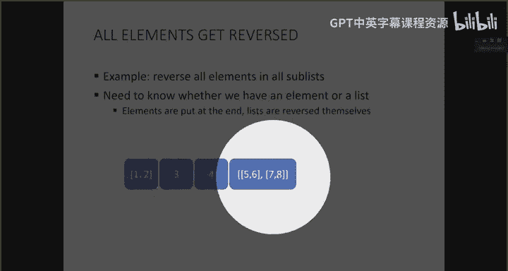

So let's take the code that we wrote in the previous slide， because it's a good start。

Extract the first element， right， Put it at the end。That's what we did before。But before leaving。

Let's say if you are a list， right， if you are a list， then also reverse yourself。

So not only do I want top level that list， you know， that element to go to the end。

 I also want to consider what you are， right， I don't want this last element to be one comma 2。

 I want to reverse its elements 2 to be 2 comma 1。 So in the end， what I want this to give me is 8，7。

6，5，4，3，2，1。Alright， so that deals with that first element being， being popped at the end there。Now。

 I consider my new list。 And again， this is going be the recursive step。The the element at the front。

 again， I extract it。 It's just a number， right， Nothing special here。 So you just go to the end。

Right， just like before， nothing to consider， Nothing to reverse in for that three。Again， the four。

 just like before， it goes to the end。And now， what about this list with lists within it and so on。

Well。We've reached sort of this quote unquote base case。 So there's nothing to put at the end。

 But you can imagine being put at the end if it was， if there were other elements within it。

So this one is going to stay as is。 Sorry about that。 This one is going to stay as is。

 But what we're going to do is going to say， well， you are a list， just like this one was a list。

 right， It was a list with two numbers in it。 So you are also a list with two elements in it。

 So the first step I would like you to do is reverse yourself。So the 7，8 will come to the front。

 and the 5，6 will go after it。喂。But。Its elements also are lists。So not only do I want to reverse you。

 but I want you to tell all your elements to reverse themselves， so。The 6，5， the 5。

6 should reverse to be become a 6，5， and the 7，8 should reverse itself to become 87。Okay。

 does that make sense？Conceptually， I think we got it。

So we want to reverse as far deep as we can until we get to some， some numbers， okay。OK。So。

Let's write the code。 Okay， we're gonna do a very similar thing to what we've done in the past。

 right， All of these examples following the exact same pattern。

Consider a list with one element in it， and then consider a list with many elements in it。

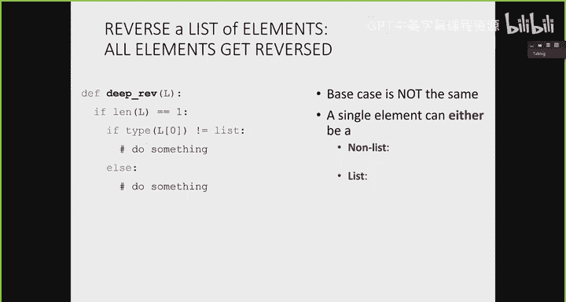

If I have a list with one element in it。 So here， here's a list。Right。

 it's going to have only one element in it。If。The list is a。

 if that element within that list is a number。I'm gonna do something different than if the element within this list is a list。

Right。So what I actually want to do inside this， if L L is equal to1， is have two subparts。

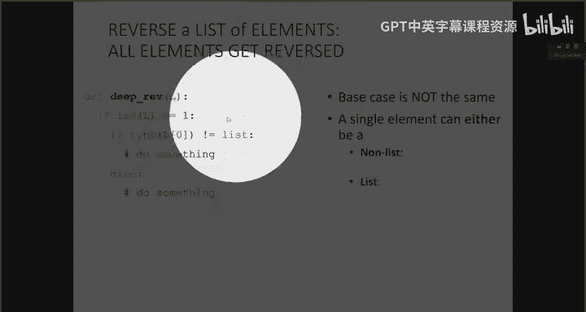

Right， depending on whether it's a list or not。Cause if it's just a number。

I'm happy to just leave it as is， right， Like， this number is already in place， right。

 It's already reversed。😊，But。The element within it is。Is a list。

RightThis element is one element inside my list， is also a list。 I want it to reverse itself。

So if the length， so if the length of the list is one。I now check the type。

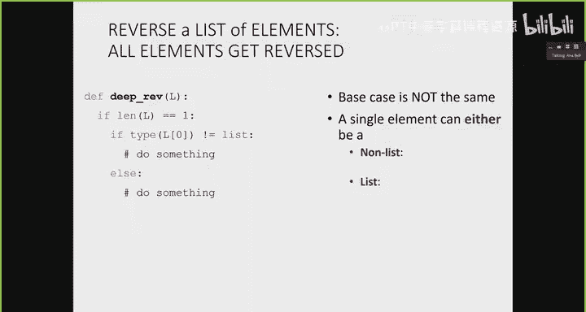

If it's not a list， I do exactly the same thing as I did before。 If it's not a list。

 you are already reversed。 No need to reverse anything else。 Yes， question。

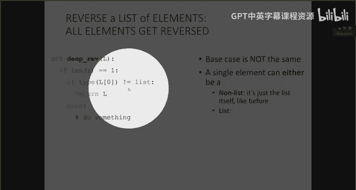

Yeah， so we're just dividing it into one element or two or more than one。

 So in the case where we have one element， right， this is my list。And this is the one element。

And if I have an element。That's a list itself。 Then this is still one element。Yeahep。

Let see you with。Yeah。This is now a list with two elements in it。Yeah， exactly。

But I am considering the case where I have a list with one element。 It happens to be another list。

 And what's inside it， I， I don't currently care。So， if。It's not a list。 It's already reversed。

 otherwise。

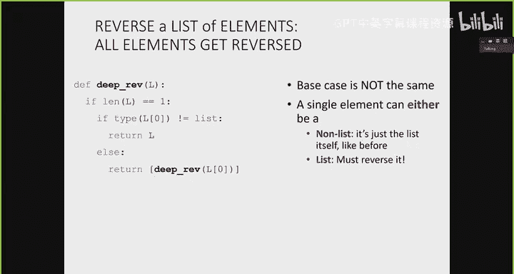

What do we do。Well， we want to ask it to reverse itself。

 And that's the function we're currently writing。Okay。Is that cool， I guess。Okay， again。

 a lot of trust going on here， you guys。 So we're calling deep reverse this function we are currently writing on this list element。

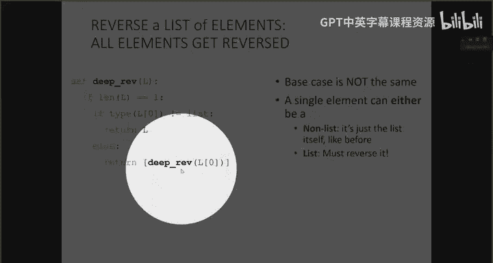

Allied index0， right， It's our only， our only element。And notice， again。

I've got these square brackets around here。Because。嗯。This。

 this function is supposed to return a list。Right。So just like in the previous case。

 where I slapped on some square brackets or on the number， I have to do it here， as well。

Everyone okay with this case。Because the recursive step is going to be even crazier。 Okay， else。

 we have a list with more than one element in it。 Okay， so we have a list with， you know。

 some stuff here。 And then I have， you know， potentially another list and a bunch of other stuff here。

😊， so then what I would like to do is again， according to our。嗯。

Sort of pattern that we've been looking at is to say。

 I'm going to extract the first element in the list， right。So if I have a list with many elements。

 let's extract the first one and deal with it。But again。

 I need to take care because that first element may be a number or a string or whatever。

 or it may be a list。Okay， and I deal with these two cases separately。If it's just a number。

 So that's this if case here。 So if the type of L at 0， the thing that I've extracted is a list。

Then what I need to do is what I had in the previous example。I grabbed that first element。

 slap square brackets around it and concatenate it with deep reverse of the rest of it。

Exactly the same as the previous case， right， because it's just a number。 I do what I did before。

 Plop it to the end， and we're done。And again， I'm making a function call here to myself。Else， okay。

 this thing here， this L 0 that I' have extracted is a list。Right。

 so not only do I have to call deep reverse on these guys here。But。Everybody together。

 we have to call deep reverse。On the first element as well， right， because it's a list。

 I can't just put it to the end。 I want to reverse it to reverse all of its element。

So this is the code to do that。Right。This bit here， D perverse L 1 colon。

Tells the remaining of the list， remainder of the list to reverse itself。

Exactly like we did in theteger case。 All was the same。But we concatenate that again。

 by putting square brackets around it because we want to concatenate with the list。

 We concatenate that with de revversing our element and indexer。 right。

 So not only do we put this at the end。To reverse it。

 But we needed it to reverse all of its elements， as well。ok。There are no more lines to this code。

 but。What are your thoughts？I know。 yeah。So， yeah， so we put square brackets because we want to maintain the same structure of what the original list was。

 So if it's an integer is I guess the simplest， the simplest case to explain it。

 So if it's an integer， you can't concatenate the list with the integer。 right it'll be a problem。

 So you want to concatenate the list with the integer inside a list as as a signal。

So what we can do is we can simplify the code。 again。

 I personally think of this as a bit easier to think about just as I'm extracting out the。

 the case where I have one the list with one thing and the list with many things。

 But you can certainly， you know， think of it like this。 So if I have an empty list。

 just return an empty list else。 I I'm extracting the element and0 directly。 and I depreverse that。

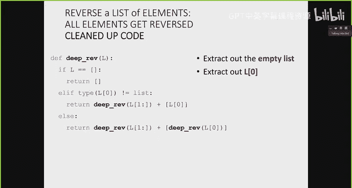

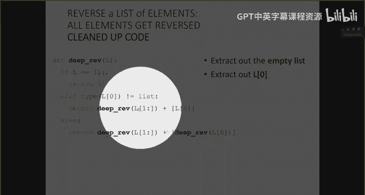

The rest of the list concatenated with that element at the end。 again。

 oops noting that we are putting this element as a list and else we can dere the rest of the list concatenated with dereersing this guy here。

 Right， So not only do we put it at the end， but we also reverse all of its elements。

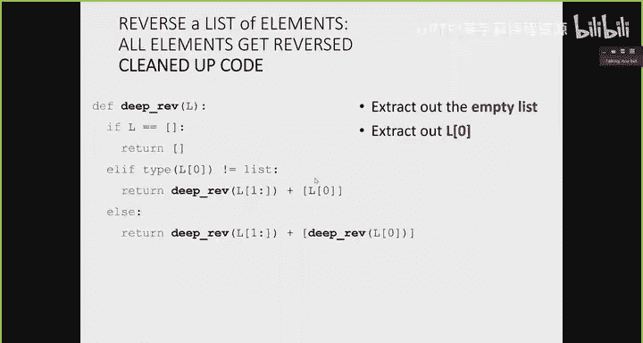

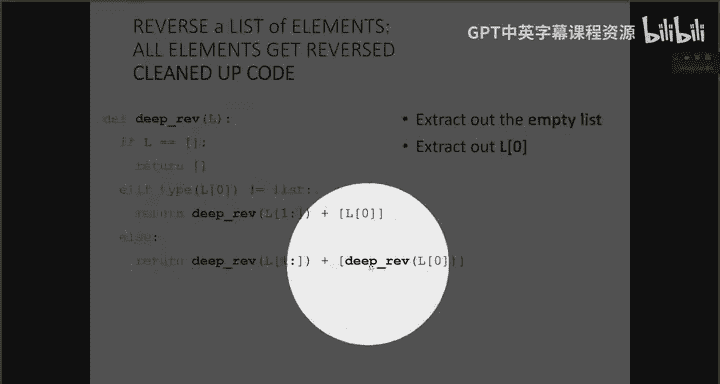

So this is the simplified version as a simplified。Okay。So。This recursion that we saw。

 all these examples here that we applied to lists can actually be applied to any indexable ordered sequences。

 right， The same code will work for tuples。 The same code will work for strings except for the one word because you can't have strings within strings within strings。

 But certainly， you know summing the elements in a list and checking whether and elements in a list will work for tus as well。

 And you know， some of these will work for strings as long as you can do that operation on the strings。

 because these are all indexable sequences， right So it shouldn't be a problem。😊。

So lots of takeaways here with recursion。This last example， namely。

 is it looks really nice in the cleaned up form。 And its you want like five lines of code to solve this really kind of hard problem that you would otherwise have to solve using while loops and for loops and things like that。

 So I I， I definitely encourage you to take a look through the Python tutor links that I've。

 I've put in。😊，My two tips。 So the two big takeaways on recursion is this thing about based case cases。

 right， Anytime you have a return statement and you're writing a recursive function。

 make sure that every single return statement is returning something that is of that same type。

 Otherwise， you'll have type mismatches all over the place。

 Okay and then the recursive step takes advantage of the fact that you are returning these kinds of types。

 right， So then those operations in the recursive step will work with those types。

And the second is the function doesn't have to be efficient on the first pass。 right。

 So the way we thought about the problem by separating and en list with one element and many is easier for me to think about because I can wrap my head around the problem。

And， you know， you don't have to write the most efficient code right off the bat for recursion。

 Certainly no need to do that。 But you can definitely clean it up after you have something that works。

Many practice problems on the Python on the Python file for today。 many， many practice problems。

 memorizing the basketball。 Obviously， I mentioned that an example。

 a little practice with no lists within lists， an example or a practice with lists within lists within lists。

 And then I included three buggy recursion implementations for you to try to fix。

 So a little bit of debugging practice plus recursion practice。😊。

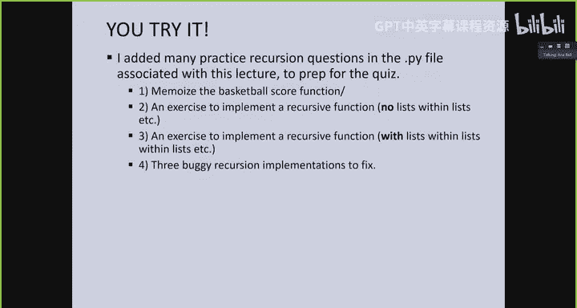

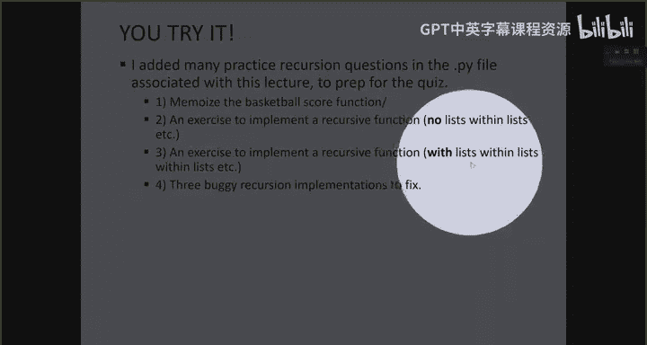

All right。Thanks， all。

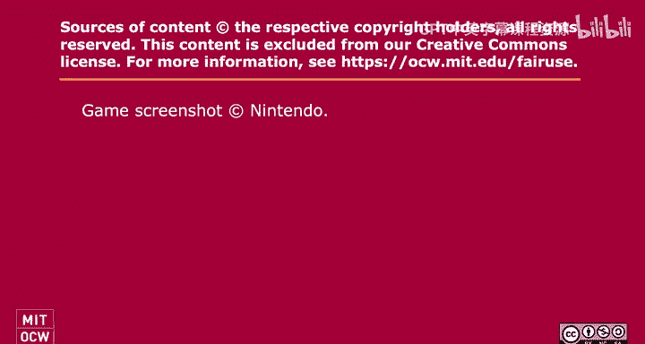

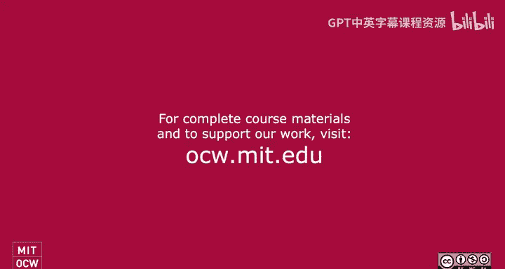