# 《计算机科学和Python编程｜6.100L Introduction to CS and Programming using Python, 2022》 - P17：-17-Lecture 17_ Python Classes.zh_en - GPT中英字幕课程资源 - BV1PAxJzVEs3

Allright， let's， let's get started。 So today we're going to be starting a completely new set of topics。

 and we'll be talking about these topics for the next four lectures。 And it's a big topic。

 the big idea we're trying to accomplish。 And these next four lectures is for us to start defining our own object types。

 Okay， and we'll be we'll be defining these object types through these things called Python classes。

 Allright， so today's lecture will just give you a really we'll define a really simple object type。

 and then we'll build up from there on。So let's take a step back and think about particular objects。

 like really specific objects that we've been working with。 So， for example。

 we've been working with probably the number 1234。 We've been working with the float pi 3。14159。

 We've been working with sequences of characters like HLLO with lists of numbers， right。

 So here's a list with those specific elements within it。 And we've been working with dictionaries。

 And here's a specific dictionary with these entries。

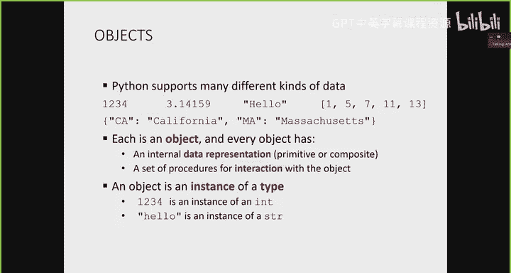

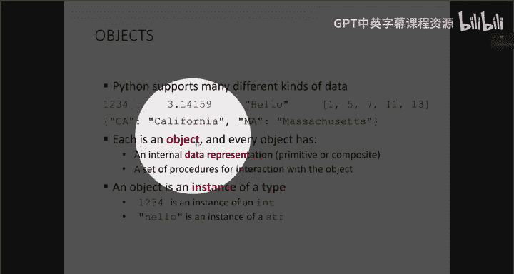

Now， every one of these things up here is an object， right， we have it in our program。

 we can manipulate it， we can add it to other things。 we can index， we can do all these things。

 But every one of these objects is basically has a a certain type， right。

 we talked about this back in lecture 1 when I introduce types of object。So what does that mean。

 Well， in that lecture， I said that the type of an object basically tells us the kinds of things that we can do with it。

 right， So the things you can do with a number are going to be different than the kinds of things you can do with strings。

 And we've been seeing this， you know， since that lecture up until today。Today。

 we're going to see how we can create our own object types。 So to do that。

 we have to understand the following thing。 And this is something I'll keep repeating today。

 So once you decide to create an object type， every one of these objects， for example。

 has been created using some blueprint， right。And when you're creating these objects。

 you need to think about two things。 The first is what data will represent this object。

 And the second is， what behaviors will this object have。

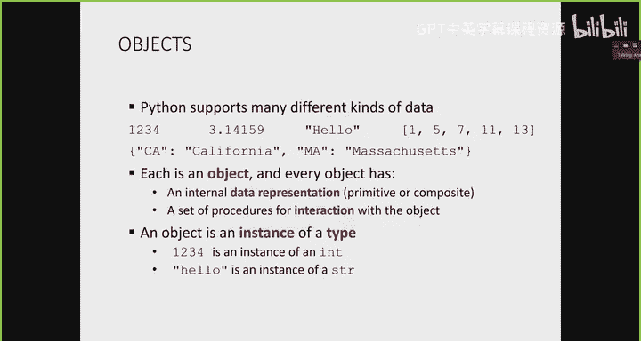

Now， the objects up here are pretty simple， right， the kinds of data that represents， you know。

 this integer is， well， there's no data really， it's just the number itself， but， you know。

 it has some operations， some things that you can do with this integer now。

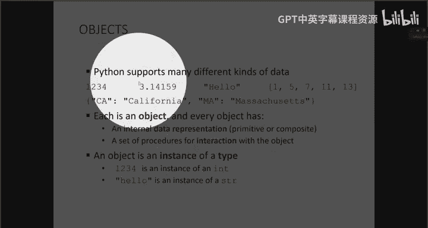

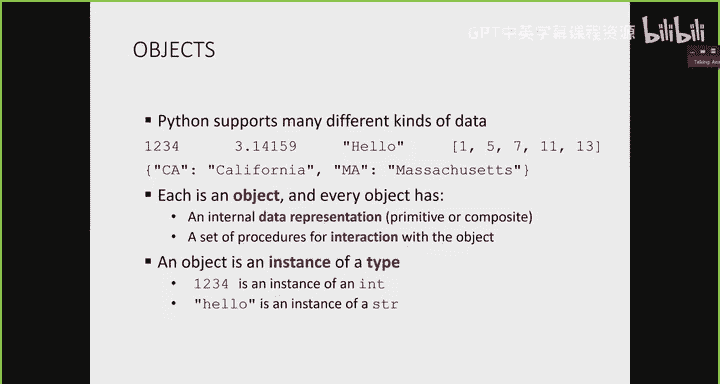

The， the data that represents a list is going to be different than the data that represents an inju because a list is kind of made up of a sequence of numbers or。

 you know， objects。

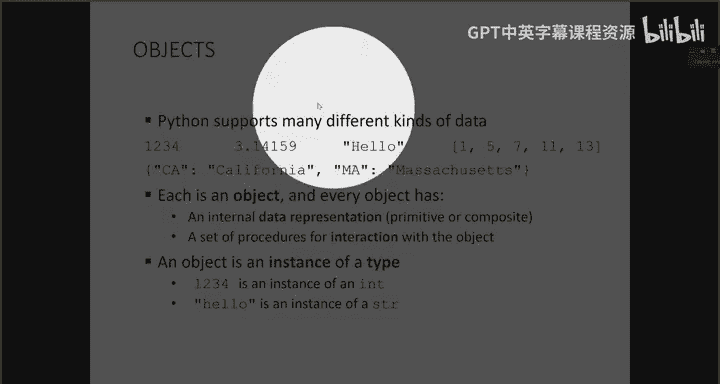

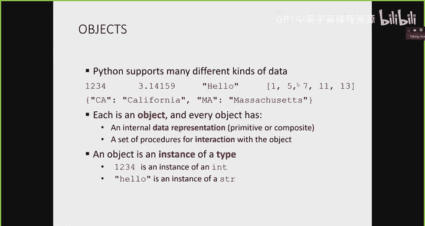

And then the data that makes up a dictionary is completely different than the data that makes up the list because a dictionary has entries where each entry has a key and a value pair。

 and then you have a bunch of these entries。

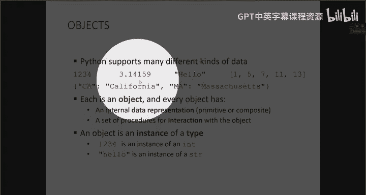

Right， so the data representing each one of these objects is different。

 And we're going to decide what data represents the new objects that we want to create。And。

 of course， this is something we've known from the first lecture。

 The kinds of ways that we can interact with these objects is also different amongst all these different object types。

 right， So in terms of terminology， when we create an actual object that we want to manipulate。

We call it an instance of a type。 So this per specific number 1234 is an instance of an integer。

 And this specific sequence of characters， lowercase， H L，LO is an instance of a string。

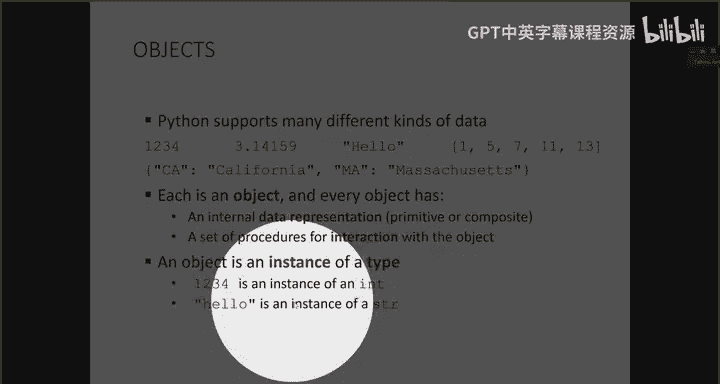

Alright， so the idea of object or programming is basically that everything in Python is an is an object。

 And this， we've talked about when we were introducing functions。 We treated functions like objects。

And what that means is its that we can create new objects that have some type。

 So we actually create these very specific objects that we can manipulate。

 and we can also destroy the objects， right so you can create them， manipulate them and destroy them。

 as you will。 But each one of these objects has a specific type。

So let's talk a little bit more about the data abstraction。

 So once you have an object that you'd like to create。 So think of， you know。

 anything in in the world， right， some， some something。

The two things that you need to think about are what is going to be the way that you represent the object in terms of data。

And the other thing is， what are the behaviors of this object。

 How can other programmers or other objects interact with this thing that you're creating。

So when we're creating our own object type， we have to think about these data abstractions。 Okay。

 so let's take a more sort of real life example。 So let's say I have these two very specific cars that actually。

 you know， exist in the real world。 So we can actually， you know， drive these cars around。

 We can manipulate them， right， They have already been created。 They are actual objects， right， Well。

 behind the scenes， These objects were created using some blueprint。 right， This。

 this blueprint is not an actual tangible thing。 It's basically some abstract notion of how to create those specific objects。

 Those specific cars。So as we're thinking about creating our own object types。

 we have to think about design decisions， right， If I want to create a blueprint for a car that somebody can then use to create an actual car in real life。

 how do I abstract the car。And as we're creating these objects ourselves。

 we get to make these design decisions， which is pretty cool。 So if I were creating this car， right。

 the blueprint for a car， I would say， well， I'm going to use maybe the length of the car。

 the width of the car in the height of the car and the color of the car。

 And those four data attributes will represent a car object。 But of course。

 that's my design decision， right， if you are more familiar with cars。

 or if you wanted to get into a more detailed description or representation。

 you would also you know have a number for how many horsepowers it has， how many doors it has。

 maybe how many people could fit know other things like that。

 But a very simple data abstraction for a car is length width height and color。😊，Allright。

So that's data abstraction。 So what data represents this object you're trying to create。 Now。

 how about the interface？ Well， in terms of the interface。

 we decide what are some ways that programmers can interact with the object or other objects can interact with this object。

So we could say that we could let the users change the color of the car， right。

We could say that we can let the car make a noise。 So honk the horn could be maybe one you know thing one function that this car could do。

 And if we say honk the horn， then maybe we would print something to the screen， something like that。

 And then we can have the car drive from point A to point B， or we could have the car， you know。

 you know go in a circle。 you could have the car crash another car and all of these behaviors will are are part of this of the interface for this particular car。

 But we're going to define them such that any car that we create from here on any actual object that we create will' have all of these behaviors and all of these data attribute。

So an example a little closer to home is the list。Right， we've been working with lists so far。

So behind the scenes， somebody created the data type list， right。

 So there's some code in Python that basically defines the data that makes up the list。

 the data attributes。 How is a list described。And the behaviors， the procedures。

 the functions that a list can do， right So in terms of data attributes， Well。

 there's many design decisions that， you know， whoever decided to create this list class could have done。

 how could they have represented the list。 Well， they could have said I'm going to allocate sort of a contiguous block of memory。

 and where and your elements will go in that order， right。

 from the smallest memory value to the biggest memory value。 That's one design decision。

 Another one could be that instead of allocating sort of a contiguous block of memory， you could say。

 I can allocate memories here and there。 That's okay。

 But then each element in my in my list will then be represented by two things。

 The first being the value at that location。 And the second could be maybe another integer or something that tells Python。

 which memory location to go to to get the next element in the list。So both valid design decisions。

 I think Python did the second one。So those are， that's how you represent the data that represents a list。

 And in terms of behaviors， well， we've already been working with lists。

 So we know a bunch of the behaviors that lists have， right， You can index into it。

 You can sort a list。 You can append an item to the end of the list。

 You can get the maximum element within a list。 All of these different procedures。

 functions are things that you can do with lists， right， And we've been working with。

And we've been working with lists without actually knowing the representation。

 how somebody decided to represent this class。Which is pretty cool。

So a couple more real life examples， right if we were to think about representing one of each of these。

 So if we think about the object and elevator， right again。

 it's up to us to make the design decision， it's basically a box that can change floors。

 so we could represent it using the length of width the height。

 maybe we could also which are all floats or something like that。

 we can also represent it using the max capacity and the current floor It' act。

 So all five of these variables know together values together， represent my elevator And again。

 it's my design decision to do this。 yours might be different。

 And in terms of things that the elevator can do well， we can change its current floor。

 which is basically saying you know change the value of the variable current floor to be something else。

 add people to it， maybe checking if you're at max capacity or not maybe printing out a warning if you're above that。

 removing people， things like that。An employee is also a pretty common example of something that's typically implemented in a bunch of programming languages。

 So an employee， basically a person that has a salary， right， maybe works for company X。

 So you could represent this employee using their name， right， maybe a string for the first name。

 a string for the last name， and then their birth date， maybe and then their salary。

 which is you know， a float or an something like that。And in terms of behaviors。

 what can employees do， Well you can change their name。 You can change their salary。

 You can maybe activate or deactivate them as current employees， things like that。A queue at a store。

 also a really nice example。 And it kind of goes hand in hand with stack of pancakes。

How would you represent a queue at a store？ Well， the representation isn't going to be a set of things。

 The representation could be something really simple， like just a list。Right。Which is fine。

 So maybe the list will have， you know， some strings with the names of the people who are currently in the queue at its store。

But what's going make a queue kind of special is that is the way that we'll be using it， right。

 So the representation isn't super unique。 It's just a list。

But the way that we the way that a queue operates will be special。

 because if you think about the queue， the first person who comes into the queue will be the the first person out of the queue。

 right， a first in first out kind of situation。 So that means if you make the design decision to add new people at the end of the queue。

 right？ So if I have a new person that gets added here。They're the newest person in。

 That means if I'm removing a person from the queue， I better remove the oldest one。

 which is going to be over on the at the first at the beginning of my list， right？

 So the way that you use the queue will be consistent with this idea。 And then， you know。

 people and then you can basically simulate the cu。 And the stack of pancakes is very similar。

 if you think about pancakes。The， the first one you made is the last one you eat， right。

 So it's a first and last out of kind of situation。

 So that means that we can still represent a stack of pancakes using a。A， a list， right。

 So the representation， the data representation for a stack of pancakes will be the same as， as a cu。

 except that the behavior will be different， right。

 Because if I just made a new pancake and it goes at the end here。Right。

 the newest one that I made is the first one that I'm going to eat。So if I add， I。

 if I add a pancake to the end of my list， I'm gonna remove the pancake that I want to eat from the end of my list as well。

OK。So the idea of object ored programming。 and the reason we're doing this is because now we're bundling basically data and behaviors into one thing。

 And so we can create all of these different objects that have the same type that all are going to function in the same way。

 We know they're going be consistent right， Theyre going be they're going to be consistent in the data that represents them and consistent in the way that we use them right。

 So right we we know for sure that the Q is going to be a first in first out kind of situation。

 right。And the way we're gonna implement this is using these things called Python classes。

 And the reason we create these Python classes is to make code that's very nicely reusable。

 We can create really simple Python classes that we'll see today。

 And then we can build upon these Python classes to create more complex classes。

 which we'll see on Wednesday。😊，But the big idea here。

 and this is something that I was a little bit confused about when I first started and you know learning about object going to programming is you get to be in charge of the design decision right So you get to decide what data represents the class and you decide what behaviors represent the class。

 So if you wanted to say that， you know you represent a queue using a list right first in first out。

 if you add items to the end， you remove items from the beginning。 That's one design decision。

 another design decision could be， well， you still represent it as a list。

 but new items get added to the front。But to be consistent with the idea of a queue。

 that means you remove items from the back。 And then the behavior is the same， right。

 We're implementing the a queue， no matter which one of those design decisions we've made。Okay。

 so as we're going through today's lecture， I want to make a note of a couple things。

 So I've got these little tabs up at the top here。

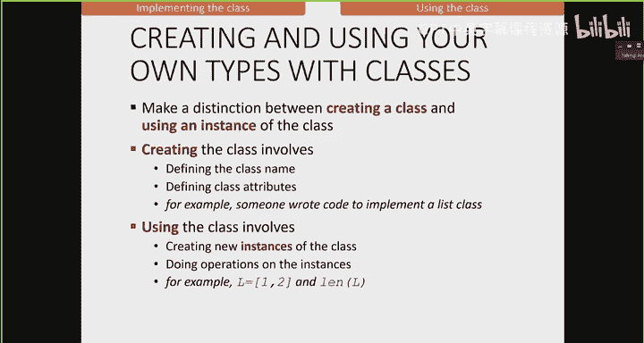

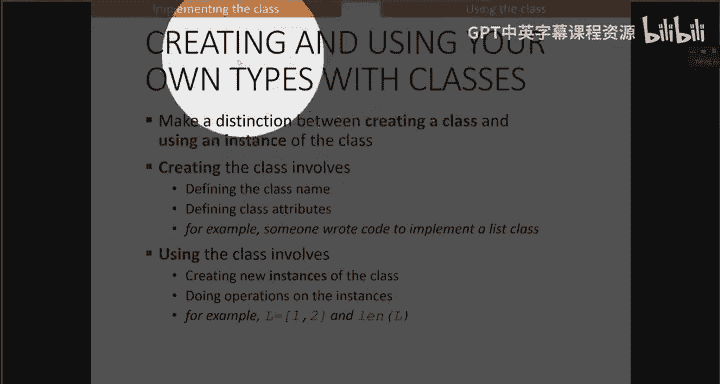

嗯。We're going to be basically switching our brains a little bit today。

 We're going to be defining a Python object， right。

 So we're going to be writing code that tells Python， hey。

 I am telling you I would like to create this object type。Okay， and these are the， you know， data。

 these are the， this is the data that represents them。 represents it。

 And this these are the behaviors that represents it。 So that's us implementing the class。

 So telling Python that we are now creating and telling you what， one。

 what an object of this type is in us。

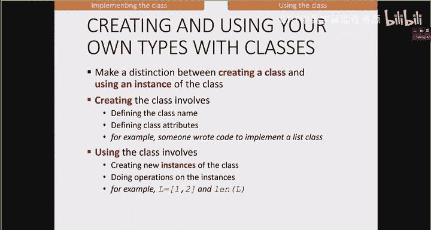

And the other thing is， once we have a definition for this object type。

 we're going to actually use the type。

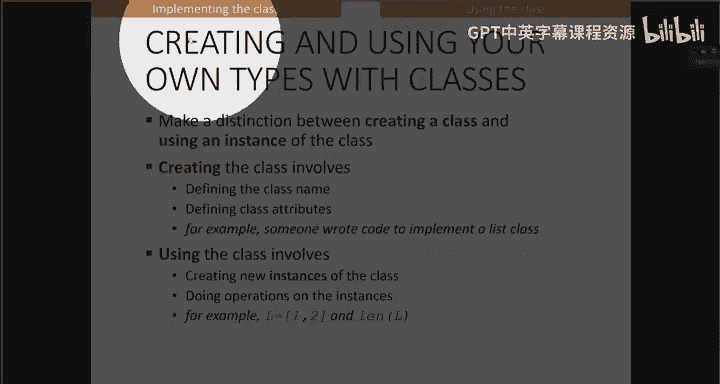

Right， we're gonna create new objects of this type。So when we're creating the class。

 when we're telling Python that's an object like this exists， we're deciding the name of our class。

 we're deciding what data abstracts it， we're deciding what behaviors we can do with it， right。

 So if we think about the list， we haven't actually seen the code to do this。

 but someone wrote code to define this list class。Now。

 using the class means that we're assuming that this code already exists， right。

 And you're just creating a whole bunch of objects of this type。 So we've been doing this definitely。

 right， If we think about the list class again here， you know， for example。

 we created an actual object that we can manipulate， right， L is equal to one comma 2。

 We've also created L is equal to3 comma 4， comma 5 and all these things， right。

 We're basically creating these instances that we can manipulate and use in our program to achieve something useful。

😊，And today， we're going to see how we can do both of those things。

I want to draw a little parallel with functions because its it's going to feel very similar right。

 And with functions， when we when we were defining a function。

 we were telling Python that I would like to， you know。

 abstract some code that does something useful using this class using this function definition。Right。

 so we were writing the definition for the function in this abstract way。

 We didn't actually run the function at that point， right， We just defined it。

And so when we define a class， that's basically what we're doing。

 We're telling Python that we're creating this object that bundles data and behaviors together。

When we created instances of， of this data type that were that we're gonna define。

 that's kind of like we called the actual function that we defined。 right。

 So when we called the function， we were now doing something useful in our program。Right， we said。

 here are some actual parameters I want you to run this function with。 Now。

 tell me what the output is。OAnd that's exactly what we're gonna do when we create instances of the of the data type we're defining。

 We're now creating actual objects that we can manipulate and， and use in our class。Okay。

 so the object we're going to create in today's lecture is a coordinate in a 2D plane。Pretty simple。

 pretty mathematical。 So before we actually write the code。

 let's kind of think about what it actually means to put a coordinate in a 2D plane。

 So we're going to think about if we had a bunch of instances， right。

 if we had a bunch of coordinates in a 2D plane， What do they look like。

 What kind of data are we interested in， you know， grabbing from these instances。

 What are some things we can do with it。So here I have a point in my 2D plane。

So if we think about how we look this at this coordinate， well。

 we know how far away the coordinate is on the X axis and we know how far away the coordinate is on the Y axis。

 right。So that's one instance of a coordinate object。 Now， let's say we had another one， right。

 Here's another dot in my 2D plane。 Again， this dot will also know how far away it is on the X axis and how far away it is on the Y axis。

So one reasonable data abstraction for a coordinate in a 2D plane could be to say。

 I want two numbers， one representing how far away it is on the X axis and one for how far away it is on the Y axis。

 right， That seems pretty reasonable。 I don't care about color， right。

 even though I colored these things。 But you can imagine making a cuter version of this coordinate object that also has a color associated with it。

Okay， so the data that will represent my point in a coordinate plane and a2D coordinate plane is just two numbers。

 right，1 for the X，1 for the Y。Now， what are some things that we can do with these coordinate objects。

 Certainly， something really simple we can do is to say， well， point， you know， one of these points。

 you know， the orange1， for example， tell me how far away you are on the X axis。

Or tell me how far away you're on the Y axis， right， So those two commands could return， you know。

 something like three for that's how far away that point is on the X axis or4 for how far away it is on the y axis。

Those are pretty simple things to do。 One more interesting thing to do is to say， well， hey。

 you point orange point right over there。 Can you tell me how far away you are between the green point。

Right， so that would be the Euclidean distance between these two points。

 And we're gonna to write code that figures out how far away one coordinate object is from another coordinate object。

系。Alright， so let's start defining this class coordinate。 We're going to， you can see here。

 This is the code that implements the class。 So this will tell Python that we are now creating this object type coordinate。

Okay， so we're not using it yet。 We're not creating any objects。

 any object instances were're just telling Python that we'd like to create this object type。

So we start with the keyword class。Right， in parallel。

 we started with a Q word D F to define a function。 Then we say the name of our object type。

 So this will be literally the type of the object。 So coordinate， just like we had list and float。

 you know， all those things。 this will be of type coordinate。And then in parentheses here。

 we say the parent of this class。 So usually we say object until two lectures from now when we're gonna to see what happens when we put something else in there。

But when we put object in the parentheses there， we're telling Python that anything a generic Python object can do。

Our object can do as well。 So something really， really basic is saying that I'm going create this object in memory and assign a variable to it so that I get a handle for that object using this variable。

 right， something super basic。 Any Python object has this ability and our will， too。

 because I've put this object in the parentheses here。😊，All right。So。Now， we've told Python。

 we're creating a data type called coordinate。 What are we gonna fill in the body of this class。

So the things we need to fill in are going to be our attributes。Now， again， what makes up an object。

 two things， the data that you want to represent this object with and the procedures， AK functions。

 AK behaviors that you'd like this object to have。唔系。So the data will be two things， right。

 We decided that we're going represent a coordinate using two numbers。Now what about behaviors？

Behaviors will essentially be functions that work with objects of this particular type。

So we're going to define them as functions， but we're going define them in a really special way that tells Python you can only run this function on an object of type coordinate。

 which makes sense。 I would not like to find the distance between， you know， two integers。

 That's just subtraction。 or I would not like to find the distance between two dictionaries。

 What does that even mean。😊，So distance method that we mentioned is one thing we'd like to implement will only work with objects of Tcorn。

Okay。So these special functions are actually called methods。 Okay。

 and I'm going to use this term a little bit today。 Hopefully you get used to it。

 And then from now on from there from next lecture on。

 I'll just use the word methods to refer to functions that only work with objects of this。Okay。

 so we so far in the previous slide had class coordinate object。 Now。

 what is the next thing you have to do， So the， the next thing you always have to do when you tell Python you're creating a new data type is to tell Python how you want to construct this data type。

Okay。Kind of a constructor， a constructor function。And the way we do this is by defining。

 So you can see we're defining it like a function， D E F。

 but we're going to define a function that has a special name。

And the name is double underscore in it， double underscore。So that's the name of this function。

 And you can see it's a function， D F name， and then parentheses。

 And there's a bunch of stuff in the parentheses。 The first thing will be this thing called self。

 So already， it's going to be a little bit different than regular functions。Now， I'm gonna。

 this is not the only time I'll explain self。 I'll explain it you know， throughout this lecture。

 but the basic idea of self is that it's always going to be the first parameter of a method。

A function that only works with an object of this class， of this type。

And the reason why we have it here is because all we're doing here is telling Python that we'd like to create this object type。

We don't have an actual object to manipulate， right， I haven't created an actual object yet。

 I'm just telling Python， I'd like to create this object。

So if I don't have an actual object created yet， I need some way to refer。To an instance。

 without actually having one yet。And that's what the self is doing。Right。

 it's basically a variable that tells Python that this is an object of。

 that this is a function that only works with an object of this type。

And I'm going to use this variable self。To refer to this object myself。

 my data attributes and my methods and things like that。

SoItll become clear there will be many examples， but for now。

 it's basically a way for us to refer to an object of this type。

 an instance of this type without actually having created one。

Anything after self is basically parameters you'd like to create this object with。So for us。

 it doesn't make sense to say， create this coordinate object without actually initializing its x and y values right。

 when we put a coordinate object in an 2D plane， I would like to put it in that 2D plane。

 So it needs an initial X and initial y value。So these parameters here will tell Python you need to pass in a value for x and Y when you create your object。

And then。The body of this in it will have。Whatever you'd like。

 whatever code you'd like to initialize your object。 Yes， question。

The underscores is part of how you write it。 So you have to have underscore， underscore in it。

 underscore underscore。 Yeah， it's a special function。 We'll talk about the next lecture。

 It's called a Dunder function。Double underscore function down。Okay。

 so the body of this function can contain a bunch of initialization codes。

 So anything you'd like to initialize when you create an object of this type。

 that's what you stick in here， okay。Usually， most of the time，99% of the time。

 you want to initialize the data that makes up your object， right。

 So the data we decided makes up our object is how far you are in the X axis and how far away you are in the Y axis。

 So here this data that I want every single one of my objects to have a value for x and the value for y is initialized using self dot right。

 So self dot， a variable named X and self dot， a variable named Y。

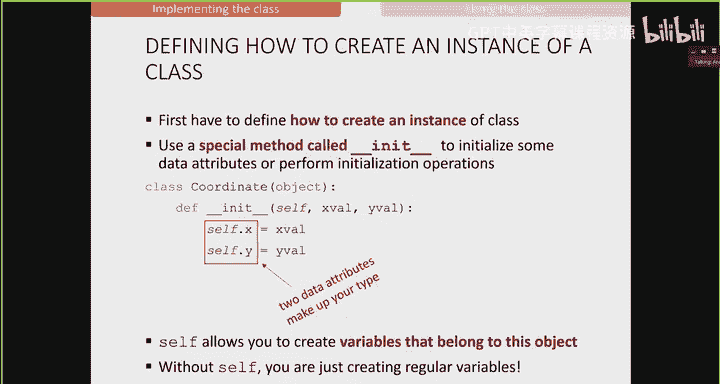

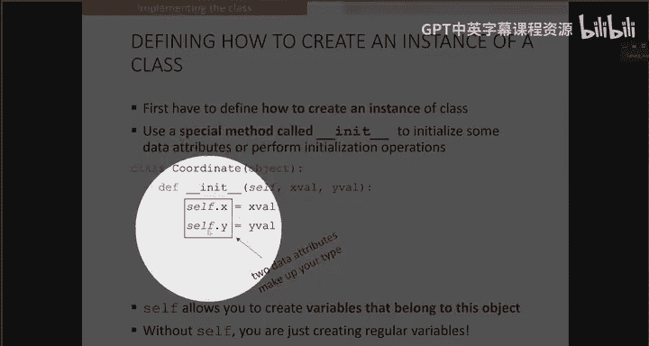

And the self dot before these variables distinguishes these variables。

 X and Y here from regular variables， right， If I were to just say x equals x v and y equals y v。

 X and y will just be regular variables。 As soon as my in function terminates。

 those variables are gone。 But because I've got self dot X and self dot Y。

 This means that these values X and y will persist throughout the lifetime of my object。

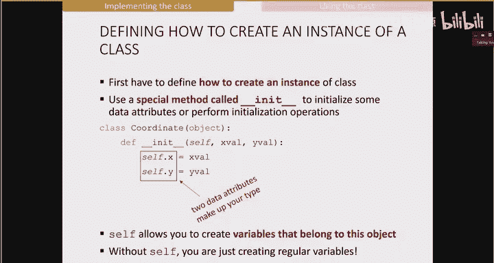

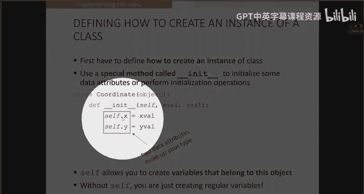

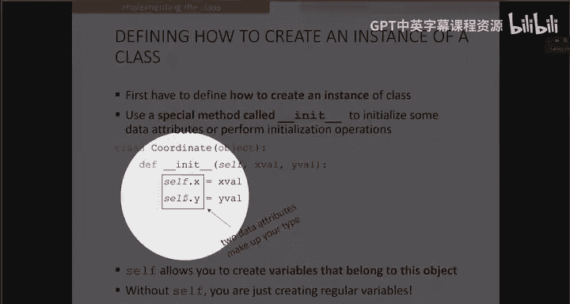

When I create my actual object and every single object I create will have their own X and Y values。

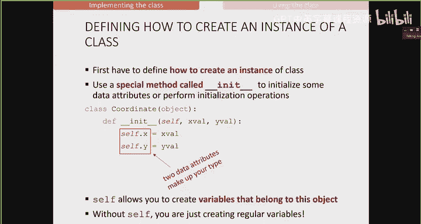

Question。有。Good question。 Does this self dot thing have to be different， It does not have to be。

 So you can have self dot X value equals x Val and self dot Y value equals y value。

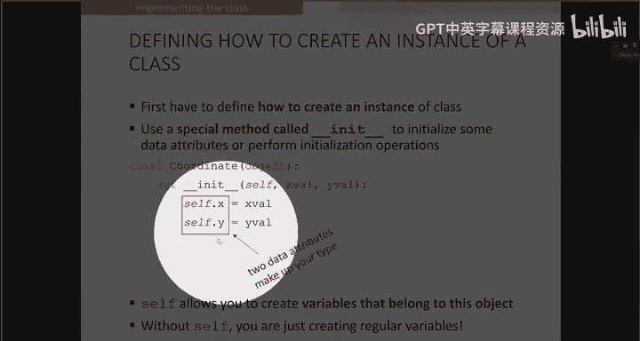

The reason I did it here is to showcase that they actually do not have to be the same。

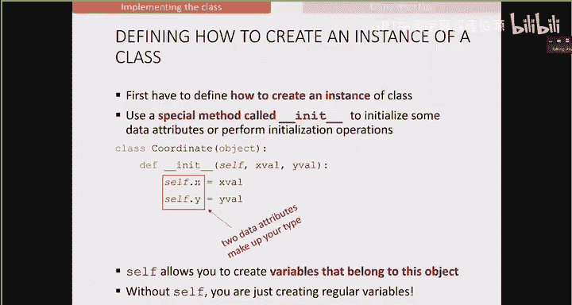

Yeah。😊，They are completely different， right， So self dot X is different than X value。

 We just happened to be assigning this value to be whatever is passed in。

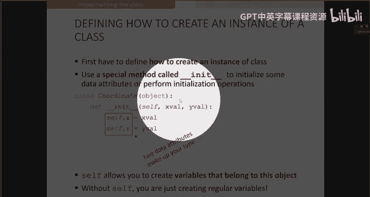

O。So a little bit of， kind of， again， just kind of explaining what the self is in the context of a blueprint。

 So if we think about a blueprint in real life， right。

 So here I have a blueprint for a room that I might want to create。

 I don't actually have this room created yet， right， It's just an idea。

But what I know is that I'm going to use this blueprint， right？

To have to have a room that contains two chairs， a coffee table and a sofa。So in this blueprint。

 I don't have actual rooms that I've implemented， you know， this， this thing。

 and I don't have actual rooms where I've put two chair chairs a coffee table on a sofa。

 It's just an idea。But self is， is kind of the way that a blueprint accesses its attributes， right。

 So I've got， if I say self dot coffee table， that means if in the future， I have an actual room。

Self dot coffee table means I'm referring to that room's coffee table。O k。So。The。

 the self is a variable that we used to refer to data or to attributes for for a blueprint when I don't have actual rooms created。

 But once I create instances of rooms， right， So for example， here。

 I I have something called living room created， right So I've taken my blueprint。

 And now somebody asked me to create a room with this blueprint， right， now I no longer use self。

 because I have an actual room in hand。 So now I would refer to coffee table in this living room as living room do coffee table or living room。

 coffee table， no longer selfs coffee table。So self is only used in the context of my blueprint。

 okay。And to sort of find bring the， the last point home the idea that with the blueprint。

 you can create many different instances。 Well， here's a living room that I've applied my blueprint to。

 And here's another living room， completely different room that somebody asked me to use my blueprint for to create it。

Different chairs， different coffee tables， different colored， you know， things。

 These are all different instances that I use my one template， my one blueprint for the room on。

So when we're defining the class， we don't have actual objects， right， Again。

 that's just kind of a really big idea here。 We're just telling Python。

 I'd like to create this object。 And this is what it looks like。

 I'm bundling this data with these behaviors together。

 but I don't have actual objects of this type created idea。So let's actually create some objects。

 The code that does this is as follows。 So I've put the definition for my class， the constructor。

 the unit method for my class up here， just to remind us what it looks like。

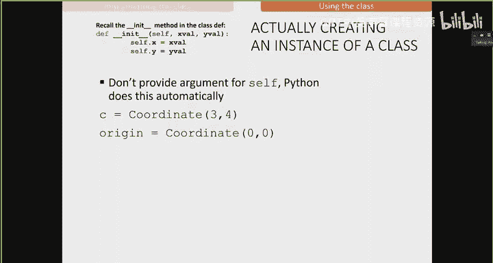

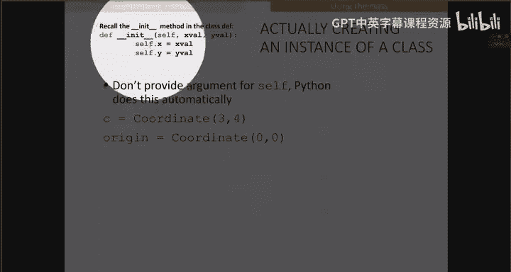

And with that code， we can now start to create actual objects that we can manipulate。

 So when we created something like， you know， L is equal to one， you know。

 square bracket lists 1 comma 2。 Now I'm creating these actual coordinates in my code。

 using my blueprint。😊，So the way we do that is we invoke the name of our class。So you say coordinate。

 that's what we named it， right， That's our data type。

 And here I'm passing in every single parameter， except for self。

So I initialized a coordinate object using X v and y Val。

 So I need to put in two parameters here for X v and y Val。

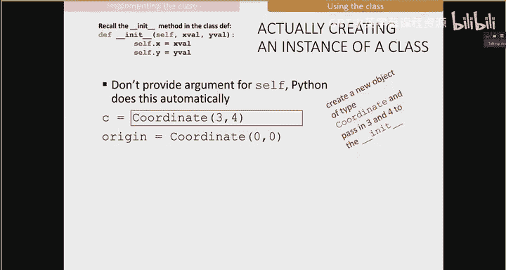

And self actually becomes this thing that I just created， this object。

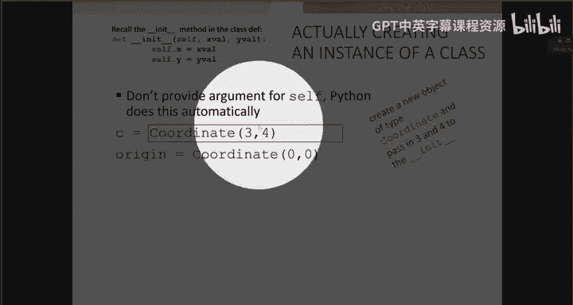

Right so coordinate 3， comma 4 is now an object that's being referenced by variable named C。

And whichch is why I'm not passing in。So it's kind of weird to think about。

But now I have one object in memory。 It's referenced by name C。 And on the next line。

 I have another object in memory。 right， Again， I've invoked the name of my class coordinate。

 This particular object， X value will be 0 and y value will be 0。

 So different than the than the the 1 I just did on the previous line。

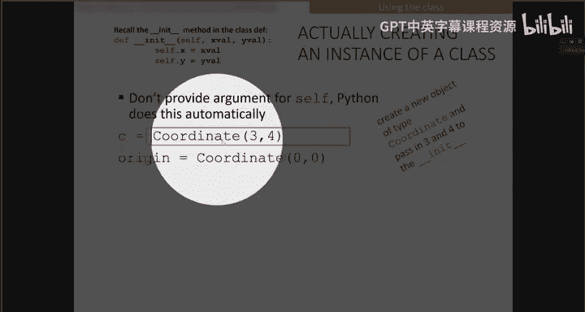

But they'll have the same structure， right， So they will both have some X and Y value。

 They'll just be different from each other， but they'll both have X， and they'll both have Y。

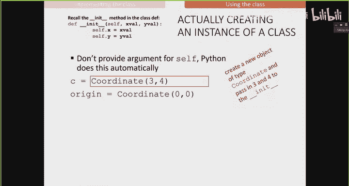

The 1 I've named down here is going to be origin。 Okay， so I've got two objects of type coordinate。

 One is referenced by C by name C， and the other one is referenced by name origin。

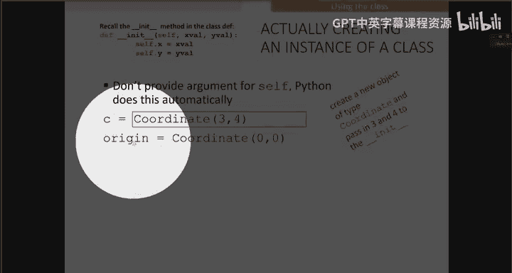

So now that I have these objects in hand， I can access any of their attributes。

 and Python will grab for me the attribute of that particular object。

So here I've got this thing called dot notation， which we've seen before。

 and I'll explain it again in a couple slides。 but the dot notation tells Python to access the X data attribute of object C。

So this will grab for me the x value of seat 3， right。

And the next line will grab for me the x value of origin，0。And this is all made possible， because X。

And we could also access Y。 X and Y were defined in the class definition using self dot。

 If I didn't use self dot， those would just be variables。 And as soon as I created my object。

 they would have gone away because that function had terminated。But in order to have these variables。

 X and Y persist throughout the lifetime of my object。

 I've defined them using self dot X and self dot Y。 So any object I've created。

 that's of type hornnet will have some value for x and some value for Y， right。

 so we can access that value through this notation。Does that make sense so far。 Is that al right。okK。

So we're gonna visualize this in a slightly different way。

 So the exact same code as on the previous slide。 we're now going to do it in this in our little memory sort of type。

 So here I have C is equal to coordinate 3，4， exactly what I had on the previous slide。 So in memory。

 the way you think about it is know， as we've been thinking about other object。

 So it's not much different。 We have C is our name right。

 And it's bound to an object of type coordinate。 It just so happens we defined this object。

 but it's the same idea。 I've got a name bound to some object。 And this object has its own x value。

 and it own Y value。😊。

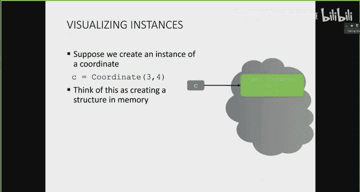

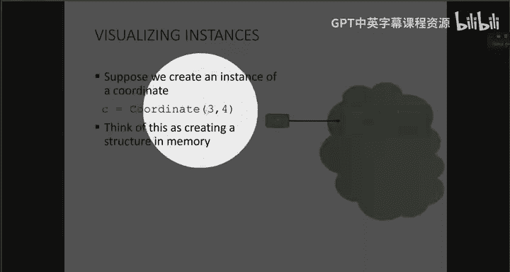

So when you evaluate C dot X， Python goes into memory， it says， hey， what type is C， and it says， oh。

 it's a coordinate object。 Does coordinate object have a data attribute named X。 Yes。

 it does because it looks at the init。 And then it says， well， what's its value， It's 3。

 And so it just returns that。

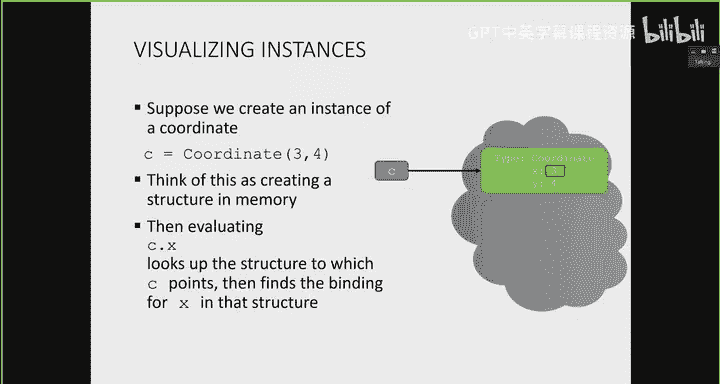

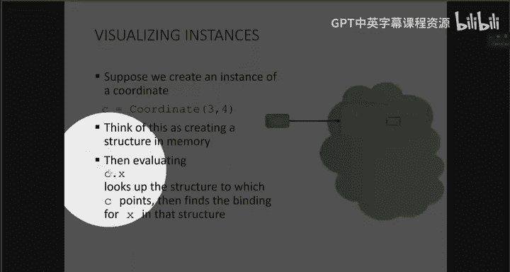

And so。

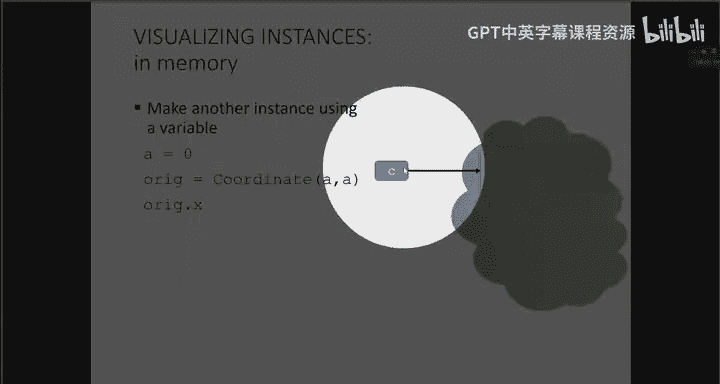

The， the， the next three lines here are slightly different from two slides two slides ago。

 but very similar。 A is equal to 0 creates for me a variable named a bound to the value 0， right。

 just to showcase that it's exactly the same as having a variable named C bound to this object that we created。

And then when I say or rigg equals coordinate a comma A， Python says， allright， well。

 here's the name O rigg。Or origin。What is it bound， What is it bound to， Well。

 it's also bound to an object of type coordinate。And。It's an object we defined。

 So we defined an object of type coordinate having an X and Y value。 So here they are。

 and they're originally here。

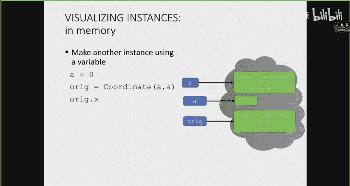

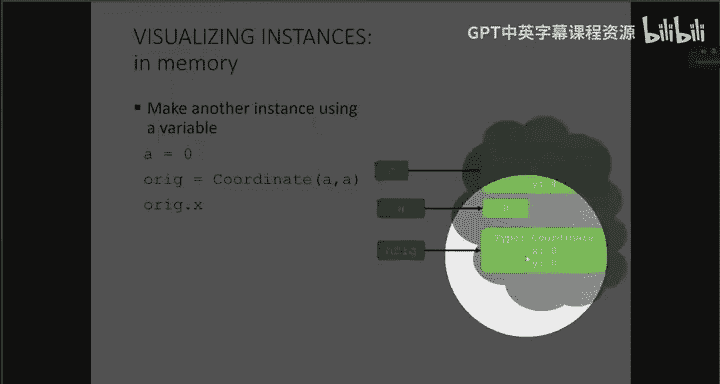

There is set to 0 when I created this object。 So when I say or rigig dot X。

 Python will look up or rigig， It's going to say， hey， what type are you， Oh， you're a coordinate。

 Do you have an X value， You do。 That's what we define in the in。 Let me grab that value from you。

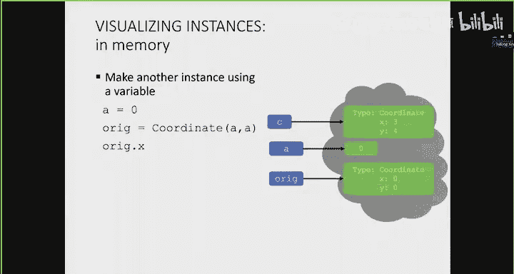

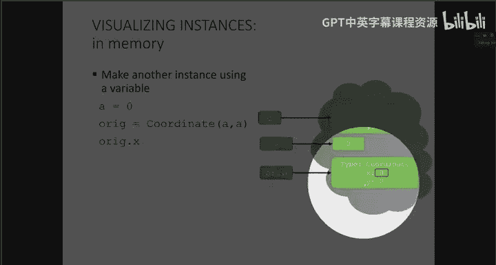

So we're just manipulating objects in memory。 right now that we've written the code to。

 to work with objects that we created。 We're just creating a whole bunch of these objects in memory。

 and then you know， grabbing their X values。 And then we're going to get the distance between two objects in them in a bit。

😊，One more way to kind of show you that exact same code is to visualize it。

So here is the code all the， the entire code， as you would have it in a file。 right。

 So you would have all this all together。The gray box is the definition for my object type。

And the blue box is me using this object that I just created。Okay。

 I've just separated that out just for clarity。

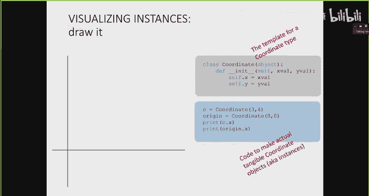

So when I have my gray box， there's nothing to display， right， It just sits in memory。

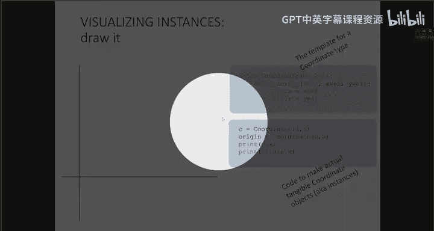

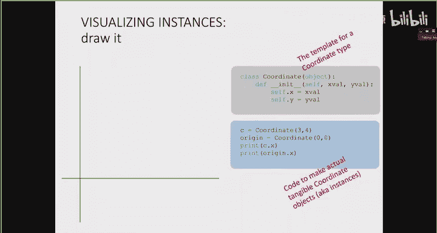

And Python knows of this type of class coordinate that has two data attributes。

 the things that I've defined using self dot， right， X and Y。

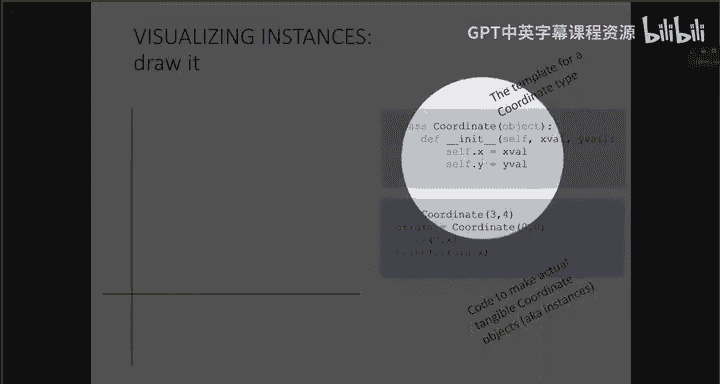

When I create C is equal to coordinate 3，4， visualizing what we're trying to do here here I've got this object whose name is C。

 and it's at 3 comma 4， and then I've got this object name the origin。

 and its x and y values are 0 comma 0。

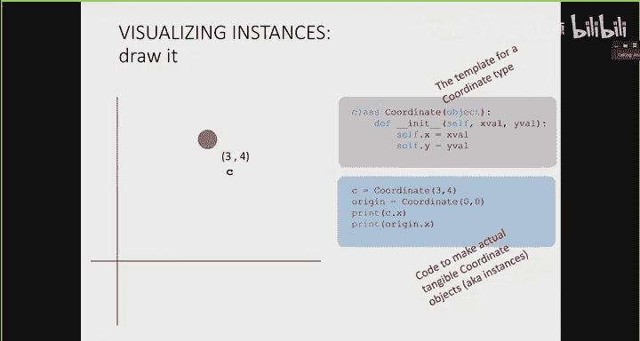

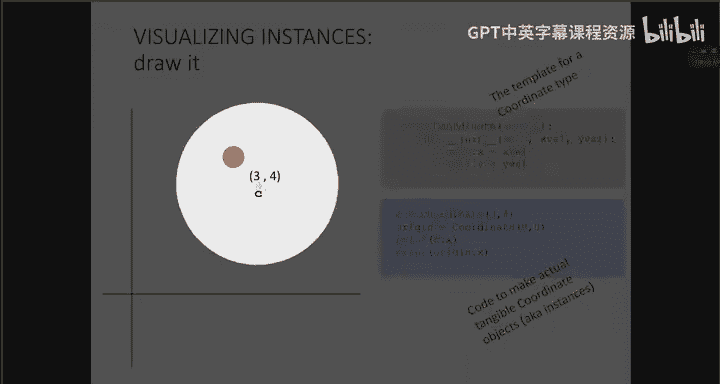

So because I've created these objects using the same blueprint， right。

 the coordinate blueprint that I've defined up in the gray。

 that means every object that I've created， C and origin has a self dot X and self dot y value。

 right， It just so happens that the actual values for x and Y are different between these two objects。

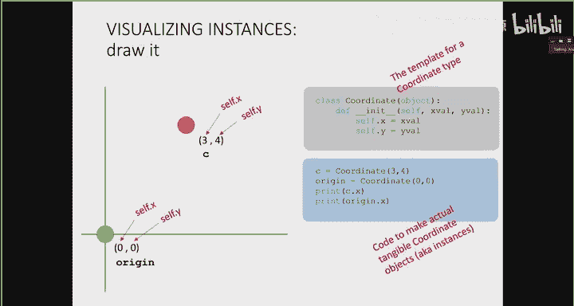

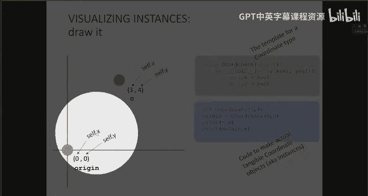

So when I grab origin dot X， I'm looking up origin， and I'm grabbing its x value，0。

SoJust another way to visualize it。O。Is everyone okay with these data attributes。Allright。

So now let's add a method。 So a method， remember， is just a function。

That works with an object of this type。ok。So the way that we tell Python。

 we'd like to create a method is by passing in self as the first parameter。So let's。

Create this function named distance。 If you look in the actual Python code for today。

 I've got two more functions， One to get the x value of this current object and one to get the Y value。

 But those are not as interesting。 This distance  one is interesting though。

So I would like to create this function that only works with an object of type coordinate。

So what we've done so far is this， these lines up here。 So now we've got D F， again。

 it's just the function。 So we've got F。Name of it， distance。 and then the parameters。 So， again。

 since this is a function that only works with an object of type coordinate。

 I need to put self as the first parameter。And this self will help us refer to the object when I call the method on it。

 right， So， so if self is the first parameter， that means that this distance method will be called on self。

So when I call， when I have an actual object in hand that I'm calling distance on the self parameter will take on the value。

 That is that object。 We're going to see this in the next slide。O。

So self is the thing that I'm calling this function on。

 And then what other parameters do I want to take give to this function？ Well。

 I want to find the distance between myself。 So this object that I'm gonna call distance on。

And another coordinate object。那。Other than maybe a dock string here that says， hey， warning。

 others should be an object of type coordinate， There isn't really anything that that enforces the type of other when you make a function call or when you make a method call。

So you can call this distance method with other being an integer， right。

 which is not an object of type coordinate。The code will run， but will immediately crash。

Because of what's going on inside。So the only way this code will work is if you're calling it on an object of type coordinate for the other。

So the reason for that is because， well， when we think about grabing the distance between two objects that are coordinates in a 2D plane。

 we take the difference between the x values square square that。

 Take the difference between the y values。 square that， right Pythagoras。Add those two together。

 Take the square root。So if I'm calling this distance method on an object of type coordinate E self。

 how do I grab myself's X value。Well， I just say self dot X， right， My X value。 What is it。

And then I would like to subtract that from the other coordinate objects， X value。

What's my other corner object， It's the thing that I'm passing in as a parameter。

 So grab their x value。So if I take self dot x minus other dot X。

 Python will grab my x value subtracted from others x value。Square that。

 We do the exact same thing with y， right， grabab my X Y value， subtract it from others Y value。

 square that。 And then the rest is just pythagoras。 Add those two and take the square root。

 I take it to the power of a half。And this function is just a regular function other than this self being the first parameter and us working with。

 you know， data attributes of myself and potentially other。Prameters， but， you know。

 you can see it returns a value。 It has the D， F， and aim and things like that。

So the way we're gonna to use this method that we just wrote is using the dot operator。

 just like we accessed a data attribute of a object that I created。

 I can access a procedural attribute。 I。e。 a method of an object I just created。

So we use the dot operator for this。The thing before the dot is the object I would like to call the methadon。

Dot。The name of the method I'd like to call。 And in parentheses， it's just a function。

 So I need to give it any parameters this method expects。Now， this should look very familiar。

 We introduced do notation when we worked with lists， right？ Remember that。And I said。

 when we work with a list， right， you for now， have to remember why we use this special way of writing this this function。

 But it was the same idea。 The thing before the dot was the list I wanted to apply the function to right。

 So my list is the name of a list variable。 I wanted to apply the function ofend。

 and it happened to take an integer a parameter。And same with you。

 sort here is also another one but this one didn't take any parameters。

 but it's the same idea of the doation。So in terms of our class here。

 I've got two coordinateed objects， right， and I've got a dot notation being used here to find the distance between one object and another one。

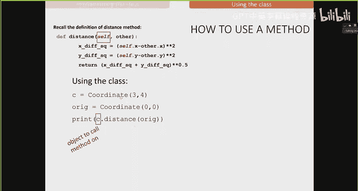

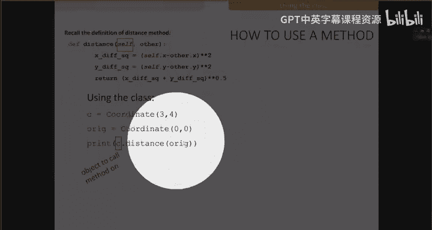

So the thing before the dot is an object I would like to use the distance method on。Pick one of them。

 C。Dot distance， the name of the method I would like to call。And in parentheses。

 I've got another coordinate object， or rig。

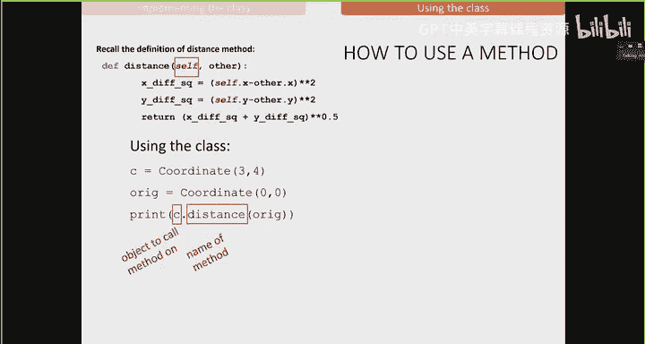

So， here。I am using the class， right， And I've got actual values， right。

 actual objects that I'm manipulating， right， C and orig。

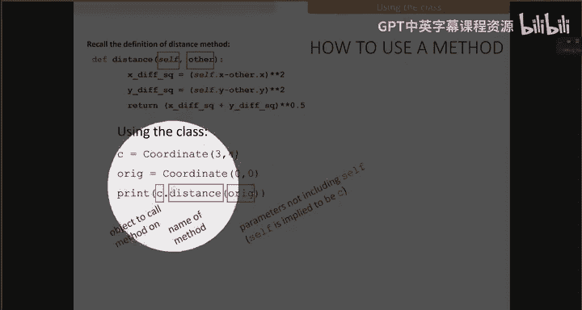

系。收。This might look a little bit weird。 but when we actually call the function。 Remember。

 we omitted self。 when we， when we omitted sorry， we omitted self when we made this function call。

 But that's because self implicitly becomes the thing before the dot。

 The thing you're calling this me。

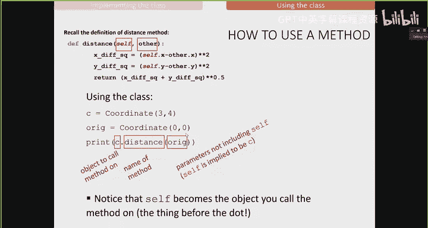

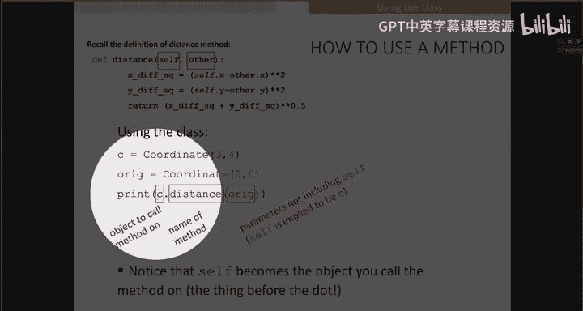

So let's visualize that in our memory。 So here I've got my class definition for a coordinate。

 It has some data attributes and some procedural attributes。

 I've got these two objects being created。 C is this object of type coordinate。

 or rig is this object of type coordinate， They've got different X and Y values。

 but they both have X and Y， some X and Y values。Would I make a function call。To see to sorry。

 a method call on C。Python says， allright， let me look at this thing before the dot。What is it。

 It's an object of type coordinate。Okay。😊，Then it looks at the method you're trying to call distance。

It says， hey， does coordinate have a distance method defined。 Why， yes， it does。 We just wrote it。

And then it says， allright， Well， let me call this distance method。 It's going to set self as C。

The thing before the dot。And any other parameters will be set in order to whatever is being passed in here。

 So or rig will become the other parameter from my class， from my definition for that function。收。

This is just the conventional way of calling methods。

 And it's the way we've been working with lists and dictionaries and things like that。 So， again。

 we've got some object， the thing before the dot， some method to run。And when we call it this way。

 the thing before the dot becomes self in our class definition， right in our method definition。

 And then all the other parameters become assigned one by one。Right， everything， except for self。Now。

 to sort of demystify this， I would like to show you what this is actually equivalent to。

 so we can run the function， the method that we defined using by by actually passing in a value for self。

 right， if this is more， if this is clear to you。So in that case。

 the thing before the dot cannot be an object。Right。

 because if it is an object of the type coordinate， then Python will say， well。

 this is the object I'm running the distance method on。So to demystify this。

 you can actually invoke the name of the class， right， the object that you're trying to create。

 the name， the data type， right， coordinate。And then Python says， oh， I see。

 You're calling the name of the class。It's not an object。 So then what do you want from me， Okay。

 The thing after the dot says， I would like to run this method on you。

But now it needs all the parameters in the parameter list， including self。So here I would set。

 you know， I would have to give it explicitly C comma 0 instead of just 0。

 because the thing before the dot is the name of my class。

 not an actual object like it is on the side。 So this is actually the conventional way to do this。

 right， This is the shorthand， the pythonic way to do this。

 But this hopefully demystifies the self deal。 and the way we actually， you know。

 set that first parameter to the thing before the dot。All right， yes question。Yeah， exactly。

 If there's more praner， just pop in those extra ones with commas， just like a regular function。

Alright， so this dot operator basically accesses either our data， C dot X or our methods， right。

 C dot distance， whatever or whatever method name we have。So that's it。 for today's lecture。

 Next lecture， we're going to build on this coordinate object by creating circles。

 and then we'll create some fraction objects， and we'll look at some other way some other objects that we can bundle together。

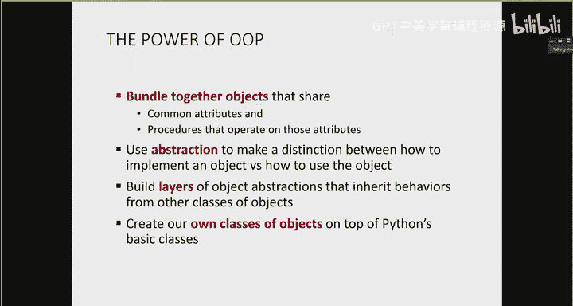

