# 《计算机科学和Python编程｜6.100L Introduction to CS and Programming using Python, 2022》 - P18：-18-Lecture 18_ More Python Class Methods.zh_en - GPT中英字幕课程资源 - BV1PAxJzVEs3

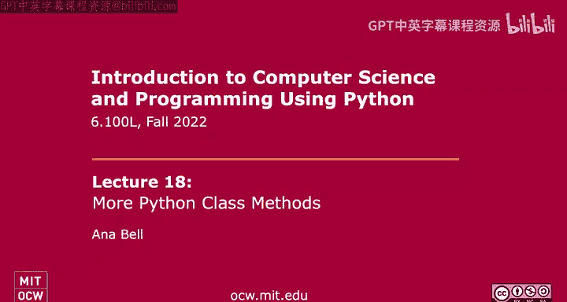

All right。Let's begin today's lecture。Last class， we began our adventure with creating our own data types。

 Today， we're going to start off with a little bit of a recap just to remind you some of the details about creating our own data types。

 and then we're going to build upon that coordinate class。 we started in a last class。

 We'll build we'll build a circle class and then we'll build some fraction data types。Allright。

 so the first thing I'd like to mention is to remind you guys about sort of writing code from these two different perspectives。

 right so just like when we wrote a functions， we were kind of writing the definition of the function。

 telling Python we have this function that we're defining abstractly and this is what it does。

 And then we were calling the function later on in a program many， many times， well。

 the same thing exists the same idea exists now that we're creating creating our own data types。

 we have to write code from the point of view of somebody who's implementing the class So deciding all of these details that goes into creating the class itself versus somebody who's just using a class that's already been written where we create instances a bunch of different objects that just happened to be this data type。

 So when we implement the class what were some of the things we did。 Well。

 we're telling Python that this object now exists。 we're telling Python the name of the data type that we'。

Something we choose。 we're deciding we're making these design decisions where we decide what attributes make up our class。

 So the attributes are either data， like the properties。

 What are the variables that make up your object and the behaviors through methods， right。

So that's implementing the class。 And then when we're using the class， we're now saying， all right。

 let's assume that this class definition exists。 There's this object that has these behaviors and these data attributes。

 let's now create a whole bunch of objects that are of this type。

 and this is when we're creating these instances and then manipulating all of these instances by running methods on them。

 things like that。

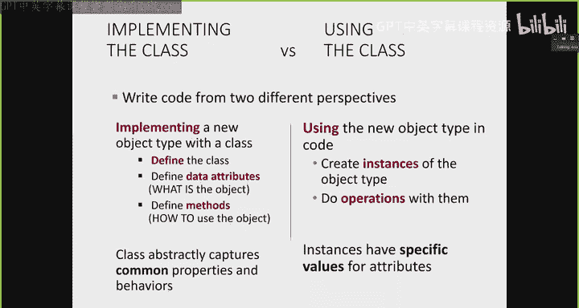

So when we're implementing the class， right， this thing on the left hand side。

 we're basically telling Python in abstract terms， what are the common properties and behaviors of our data type。

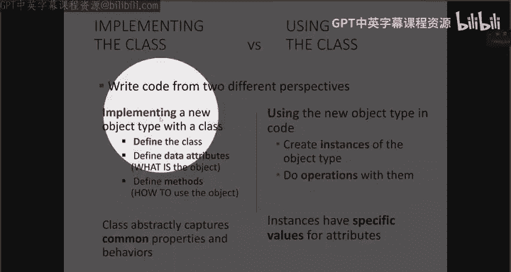

And then when we're using the class， the thing on the right hand side here。

 we're creating actual objects with very specific values for their data attributes that we can manipulate in different ways。

So let's remember this coordinate class that we wrote last lecture this is not new so but I will just go over it real quick。

 So first line here tells Python we're creating a new data type。

 It name is coordinate and this keyword class tells Python we're creating the data type the parentheses here is object which stands for the Python object data type。

 So it's something really generic and this in the parentheses here is the parent of our class So anything that a regular Python object can do the very basic things。

 our class can do as well。 last lecture I mentioned an example of such a basic thing is to take a variable name and assign it to an object type that we create。

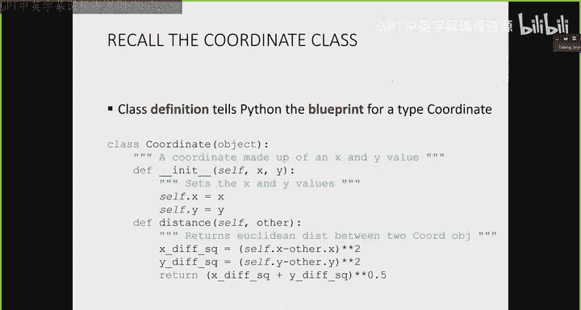

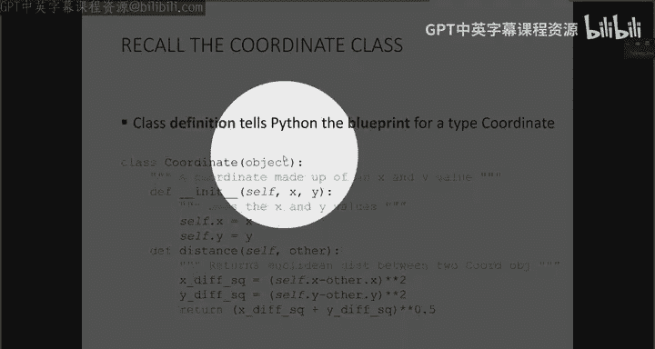

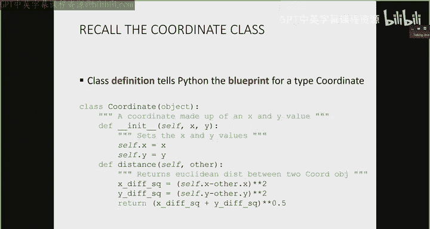

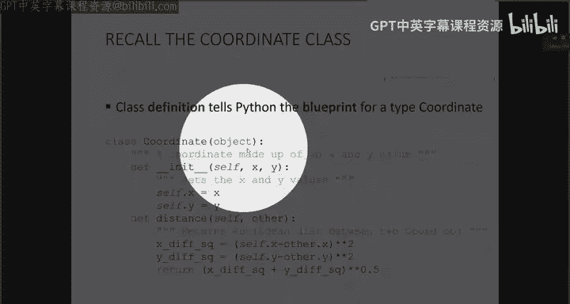

The very first method that we should write for a new data type that we create is the init method。

And this， I called a Dunder method because it starts with double underscores before the in and double and ends with double underscores after the in。

 That's the actual name of this method。 doubleub underscore in it， double underscore。

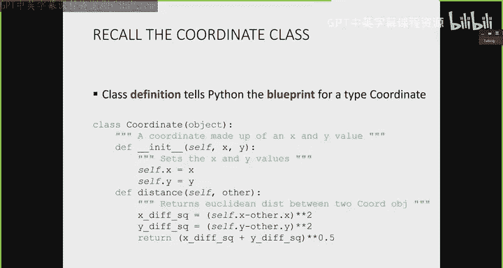

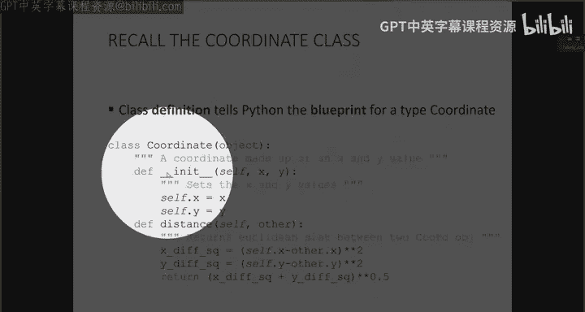

So this method is like a constructor for the class。 It tells Python。

 how do you create an actual object of this type。

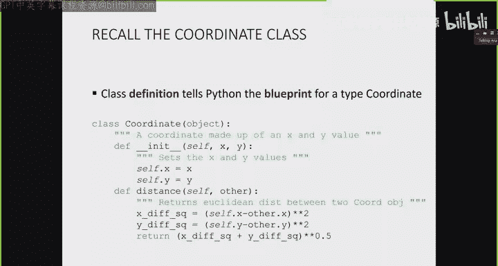

So it's， it's a function。It's just a function that works only with objects of type coordinates。

 So as a function， it takes parameters。You can see it takes three parameters here， the self。

 the X and the Y。

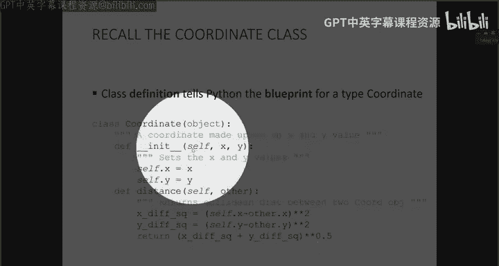

Now， when we're actually creating objects of type coordinate。

 we only pass in parameters for everything other than self。

Because self is a variable name that we use to describe having an instance of the class without actually creating one yet。

 right， Because remember what we're doing here in this definition。

 we're telling Python that this object type now exists。 We're writing it as we speak。

But we don't have an actual instance to manipulate yet， right， This is just the definition。

 And so the self tells Python that。When we're writing this code。

 we're going to use the self variable name as sort of a formal name to be able to run this mead。

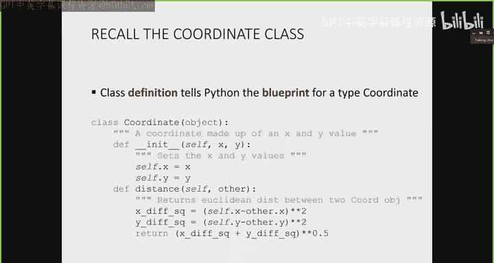

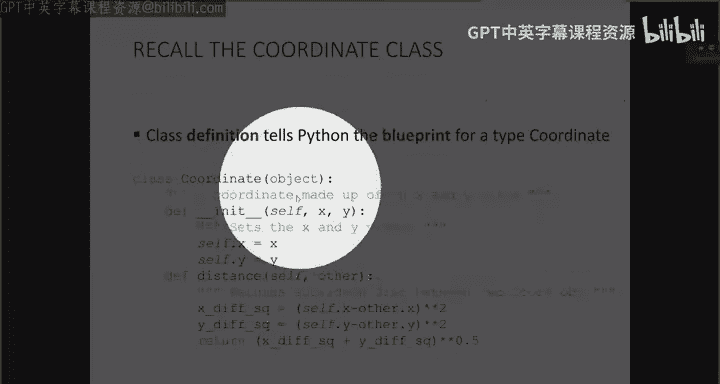

So we're going to see in the next slide exactly what maps to self when we run it。

 but that's what the self means inside the parameter list here and here。And then beyond that。

 we use a self within the init method。To tell Python which one of these variables are actually data attributes versus which of these variables are just plain old variables。

 as we've been working with。So any variable that's defined using self dot。

 So here I got self dot X and self dot Y are data attributes。 So that means any object I create。

 that's of type coordinate， I know will have a variable X and Y associated with it。Right。

 because I've defined these X and ys using self dot X and self dot Y。

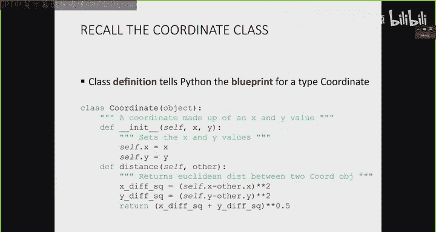

Now， in the last lecture， I actually had these parameter list。

 the parameters in this list here be different in the next and y。 I think I had X v， Y Val。

And then I had self dot x equals x Val， where this x here to the right of the equal sign is the x from the parameter list。

 right， but so in that sense， it doesn't matter what these variables are in the parameter list。

 they're just going to be the same over here on the right hand side of the equal sign。

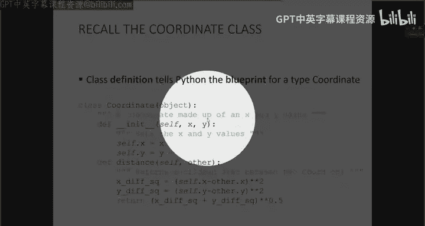

But the actual parameters， sorry， the actual data attributes are self dot X and self dot Y of my object。

Okay， so then we had one method that we wrote last lecture。 It was called distance。

 and it took two parameters。 So the first one， of course， is self。

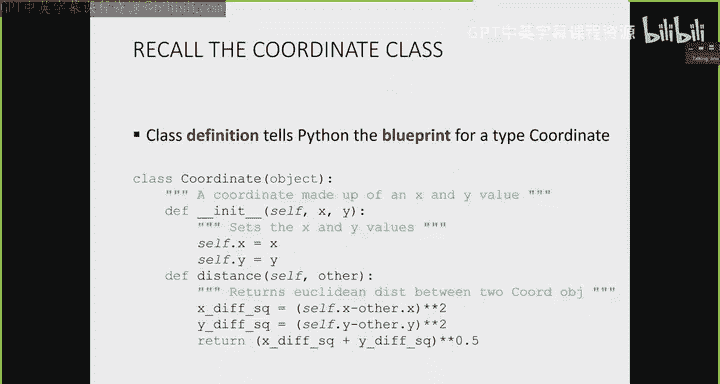

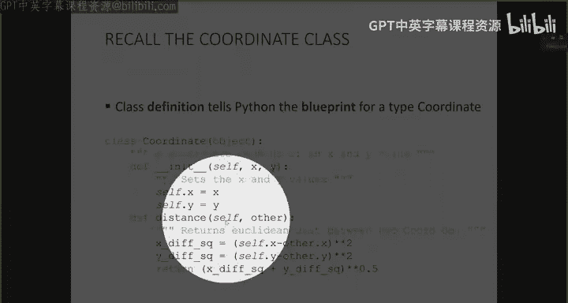

And this self represents the thing。 this object that you're gonna call the method on。

 I don't have that object yet。 So I'm just calling itself for now。

 because this is the class definition。 And then this other parameter is。

Some other coordinate object that I'm going to run this methadone。So the body of distance says。

 allright， Well， how do I find the distance between two points in the 2D plane， It's just Pythagoras。

 right。

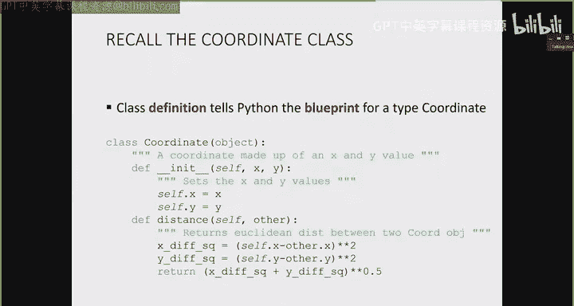

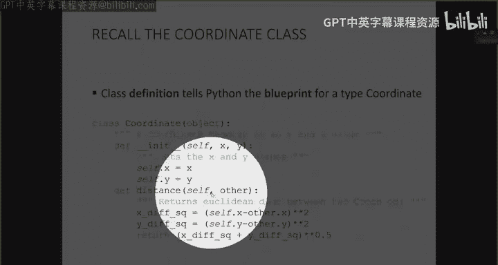

So that means grab the x value of one of my points， subtract the x value of the other point。

 square them， same with the Y's， square them， add them， take the square root。

So what's the x value of one point？ Well， one of the points is going be the thing that I'm calling the distance method on self。

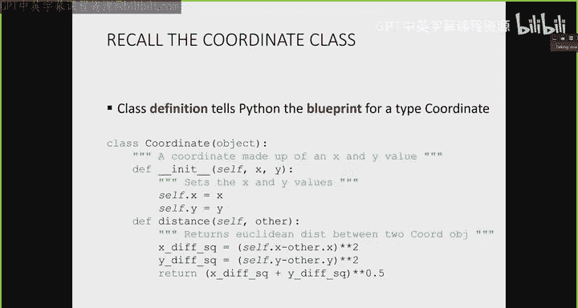

So I grabbed the X value of self using this dot notation， self dot X。

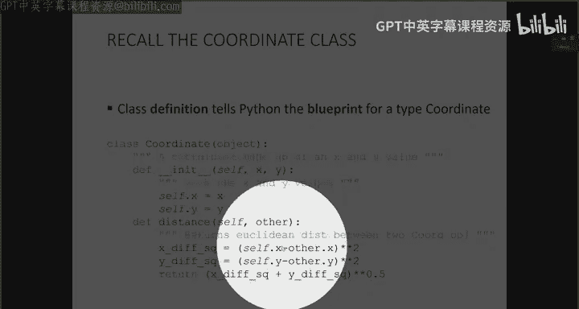

And then what's the x value of this other coordinate point。 Well。

 it's called other in my parameter list。 So I'm going grab the x value of other again。

 using do notation。

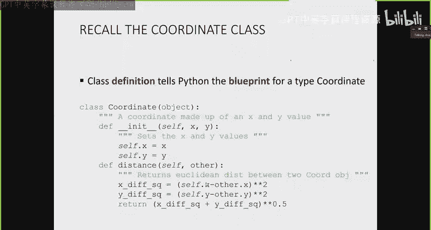

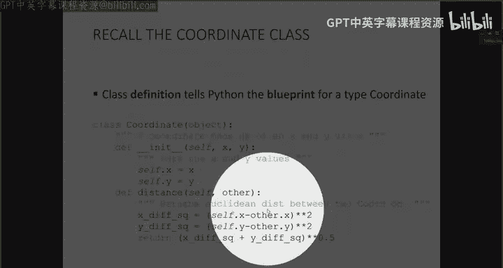

And then we just do the math。Yes。😊，快。Yeah， so you can make methods。

 You can make methods for a particular class。诶。Exactly， yeah。Now。

A class is something other than an object。In the parentheses， yes。

 we can put other things in the parentheses。 So that's actually what Monday's lecture will be about。

 In that case， the thing in the parentheses becomes the parent of the class that you're currently writing。

 So I won't go into too much detail。 But to， to have this other object as a parent means that everything that that object can do automatically。

 your object can do as well。And then on top of that。

 you can decide a bunch of additional stuff your new object does。 But in a sense。

 your coordinate object is a whatever this thing in the parentheses is。

 And then it can do a bunch of other stuff as well。好。Yeah。Oh， to make a copy of the object or。Oh。

 so here we're not， you can't make a copy of the class here specifically because we're just defining the class。

 but when you're creating coordinate objects， then you could define a method that copies your object into another object。

So in essence， it would return a new object of type coordinate with whatever parameters you'd want。

So all， yeah， all of these things are， are possible， yeah。So let's add one more method to this class。

 Let's call it to underscore origin。So this distance method， just to remind ourselves。

 returned a number， right？ So it just took the difference between these two points and it returned a number。

 just how far away they are。But this two origin methods going to do slightly different。Essentially。

 what I'm gonna have this method do is to take my point from wherever it is in my 2D plane that it has been initialized to and say。

 I'm going to reset it back to the origin。Right， so to do that。

 all that means is I'm going to make its x value and its y value be 0。

 so I can manipulate the x and y data attributes of this particular object to be whatever I want them to be。

 So I can reset them both to be 0。 So if I ever call this method on an object whose x and y values are something other than 0。

 They'll be reset to 0。So let's actually run the code that we just wrote。

 So here I've got two coordinate objects being created。

 So the beauty of writing this class for us is that now we can create as many coordinate objects as we'd like。

 They all will have an x value and a Y value associated with them。

 It's just that the specific values for X and Y will be different。

 right So here I've got a coordinate object with x 3 and y 4 being created。

 And it's going to be bound by the variable named C。 And here。

 a coordinate object with x and y values， both0 bound to a variable named origin。😊。

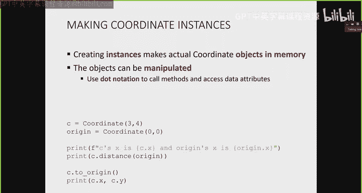

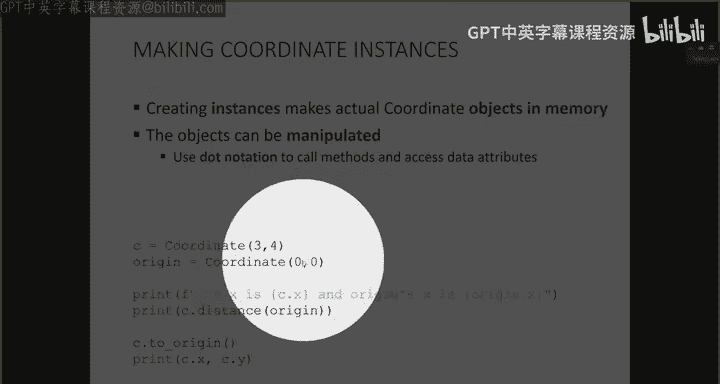

So then I can use this dot notation that we talked about last lecture to access either data or to run methods on on the object。

So in this print print F statement here， I'm using dot notation on C and origin to grab the x values of C over here and origin over here。

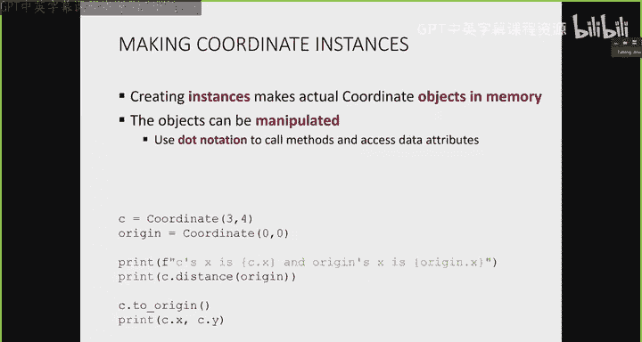

And then I'm running the distance method on C。 So remember。

 dot notation says the thing before the dot is going to be an object。

The thing after the dot is going to be the method name that can run on this object of type。

 whatever this is coordinate。 And then in the parentheses， it's just a function。

 we just pass in all the variables that option that that method expects。

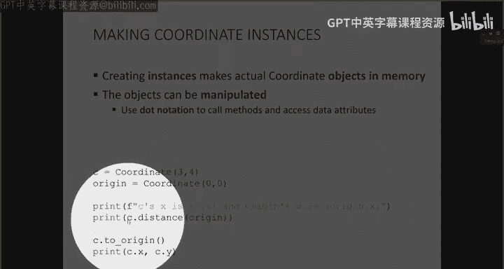

Right， so C dot distance will print whatever， you know， however far away it is。 I know5。

 because those are nice numbers。So then if we run this function that we just wrote， dot2 origin。

 this function， just to remind you， doesn't actually return anything， right。

 It just resets the variables X and Y for that particular object back to 0。So in here。

 what I call this method here， right， again， dot notation， the thing before the dot is an object。

 it's C。Its X and Y values are currently 3 and 4。But after I run this function， it returns none。

 by the way。Its X and Y values will be changed to 0 and 0。So if I look at my code here， right。

 so here's this print F statement。Right， so Cs x values is 3 and Cs an origins x is 0， fine。

And then I've got these two calls here， So C dot2 origin， right？

I'm making this function call before the function call， C's x is 3， C's Y is 4。

 And after the function call， you can see C's x is 0 and Cs Y is 0。

 So I'm literally changing the X and Y values of this object， C。All right， so。Questions so far。

 so far， so good。 hopefully a recap。Okay， so again。

 sort of similar to the first slide we started with， right？

 So we've got this class coordinate object， right， the class name is our type。

 So this object I'm creating is a type coordinate。 We're defining the class in a generic way in an abstract way。

 right？ So we have to use the self variable。Either in the parameter list to tell Python。

 what's the thing before the dot going to map to， Well。

 it's going to map to self in my parameter list。Or we use the self to tell Python what the data attributes of this object are。

 So anything defined with self dot， some variable name will be a data attribute that's common across all the instances I create。

 So from of this type。When we create actual instances， that's when our， our blueprint。

 our abstract definition now you know， gets put into use。

 And now I'm creating actual objects that I can grab X values from， change X values from， you know。

 get distances between other objects and so on and so on。Okay， so what I'd like to do next is to。

Take this coordinate class and build a circle class with it。

 So this comes sort of hand in hand with the idea of when you're deciding how to create a class。

 you get to make the design decision， right， So when the finger exercise for Mondays like today's Wednesday yes。

 Monday's lecture， you guys had to create a center sorry， a circle class， right？

 But the way we defined the circle class in that finger exercise was basically by that circles radius。

 That's the only sort of way we abstracted that circle， right。😊，But now in， in this lecture。

 we're going to make a different design decision and say that。

Let's say and say that a circle will now be defined using two things。The first is the radius， right。

 So I'm gonna say that that's an integer。 And the second is going be the center of the circle。Right。

 so as in the picture there， I'm gonna to say that a circle is， you know。

 based on this center and this radius and the center。Is not gonna be a float。

 It's not gonna be a tuple。 It's not gonna be an int。 It's gonna be a coordinate object。

The data type that we were just writing。Alright， good。 It's not a secret。

 but that didn't lower my voice on purpose。 just just wanted to let that sink in。 right。

 So the one of our data attributes for the circle class is a coordinate object。

 So we're using an object that we just wrote to create a more complex object， a circle。😊，Okay。

 so here's my class definition。 The data type is called circle。 Again。

 it inherits all the parent of circle is just a generic Python object。

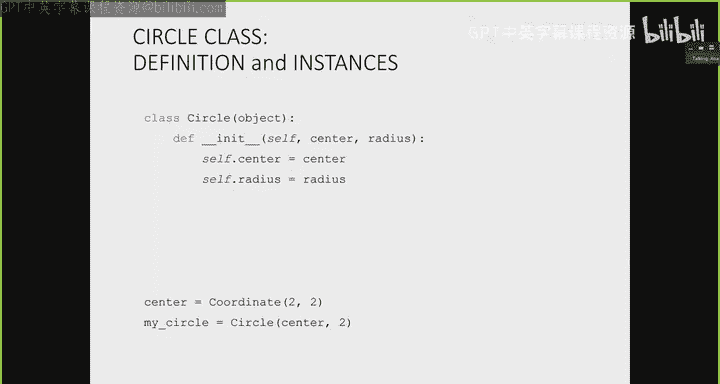

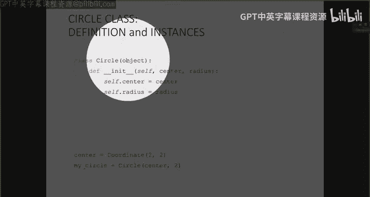

First method we have to write is the in method。

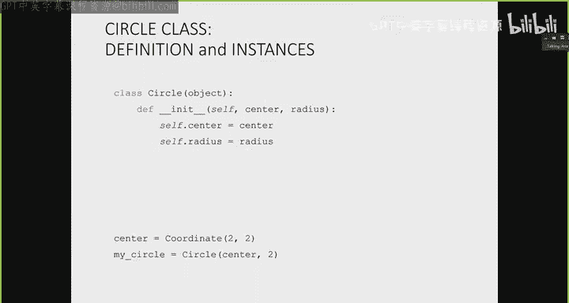

First parameter self。 So this thing that I'm creating right now。 And I say that to create a circle。

 I have to give it a center， and I have to give it a radius。

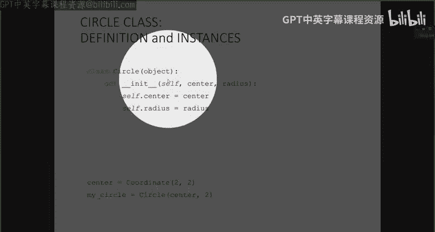

The data attributes of this circle class， right？ So the。

 the two attributes that make up my circle are this self dot center。

 So this center variable here and self dot radius。

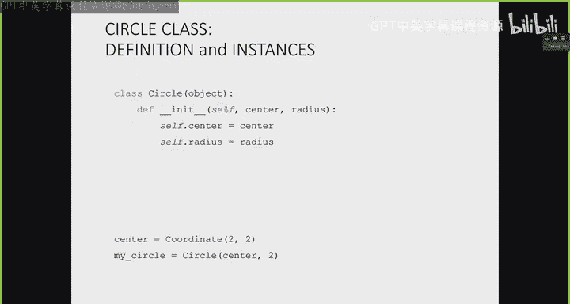

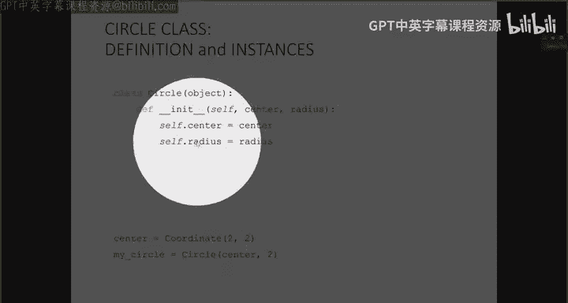

So these two things together。Make up our circle object。And initially， in the in method， right。

 when we construct our object， we're just going to set these two things to be whatever is passed in as parameters in that in the constructor。

Art。So。What I'd like to say is that this center thing center parameter will be a coordinate object。

 and radius will be an int。 Now， notice in this code， I'm not actually enforcing this， right。

 I could create a set a circle object by just passing in two strings。Right， at this point。

 this code doesn't care。Right， nowhere am I enforcing the fact that center is a coordinate and radius will be in it。

 But you know， that's just something that we， we know。

So then when we create the actual object down here。

 right my underscore circle is going to be a variable that's bound to my circle object。

 So here I'm invoking the name of my class circle and then what are the two parameters I'm passing in Well。

 the first one I said right up here that it should be a center a coordinateed object。

So center is a variable name， and what is it， Well， I had to create this coordinate object。Right。

 so I'm just invoking the name of coordinate， this class that creates for me a coordinate object。

 And I happen to put the center of the circle at two comma 2。呃。

So this center thing is a coordinate object， right， It's not a tuple or float or whatever。

 It's a coordinate object。 And then the radius of this circle is 2 and。Everyone， okay with that。Okay。

So what I'd like you to do next is to modify this in method just slightly。

 just to show you that the init method doesn't just always set the data attributes and it's done。

 It can do a lot of initialization code。 One of the more important things it can do is to try to enforce the types on the on the parameters here。

 right？ So what I'd like you to do is add to this code。

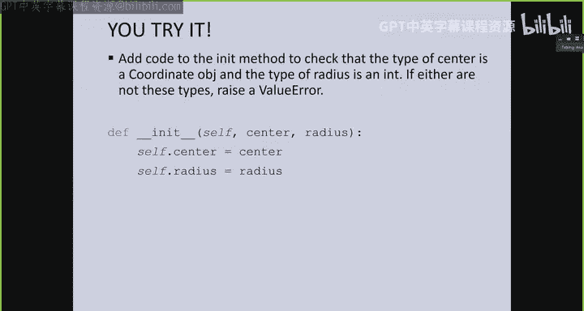

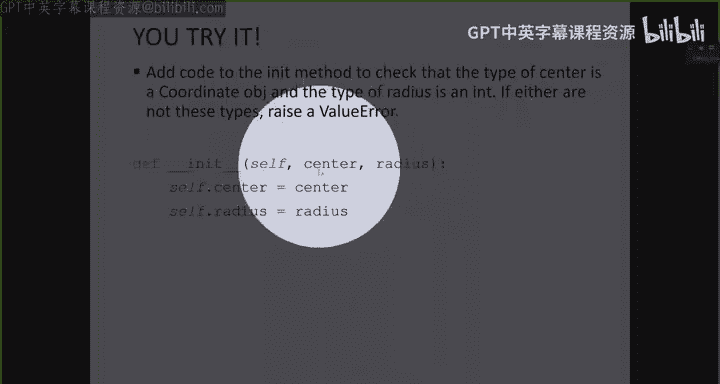

To， to， to check that the type of center is a coordinate and the type of radius is an integer。

 And only if those two things are true， then do you set the， the two data attributes and otherwise。

 raise for me a value error。

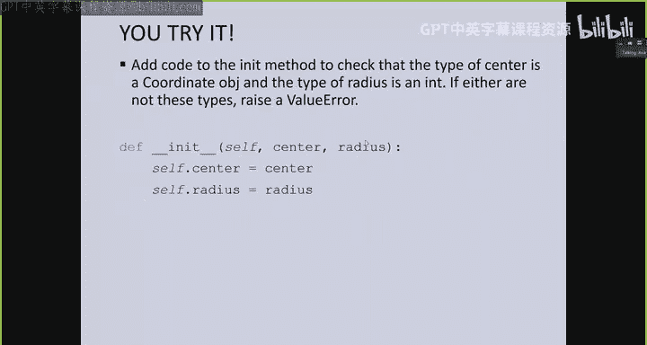

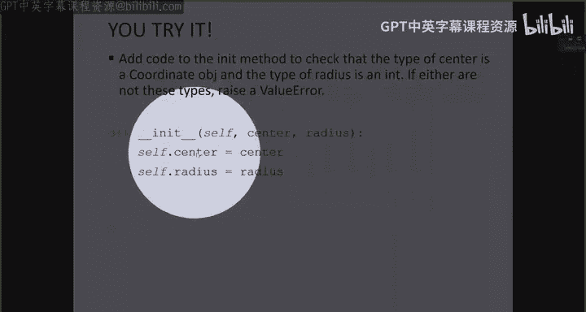

So that should be around line 48。O。Does anyone have some code for me？Yeah。Not equal coordinate。 Yep。

 so that's raise value error。Yeah。Cool， so that takes care of one， yep。Yep， so if the type of radius。

 because that's the parameter passed in， not equal to int。Raise value。

So if we drop into each of any of these ifs， then we immediately raise the value error， right。

 the code doesn't complete。 And then only if we didn't drop into this one or this one。

 do we then go on to create my object。So then here we are。 These two lines here will succeed， right？

 So there's no error raiseds or anything like that。But then this line here。

Where is it our value error？Because we tried to create a circle where the center is an integer。

 right， obviously， not a coordinate object。 And then here again。

 we raised a value error because we tried to pass in a string as the radius。

Any questions about this code。哎呀。Yeah， so it's， it's important to place them before you actually create the object。

 right， because you don't want to create it unless， unless， yeah， unless everything's。Appropriate。

Okay。So now let's add one more useful method to our class circle。

Now that we've defined a circle using a center point and a radius。

 we can add this little function that checks if another coordinate object。

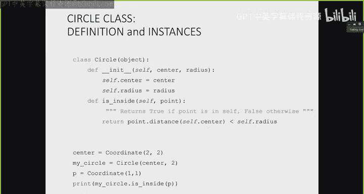

Is inside our circle。

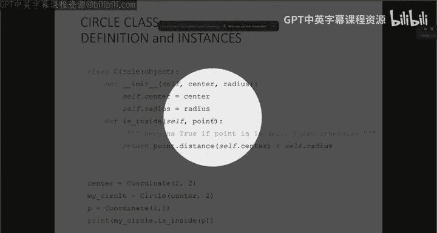

Okay， so again， I'm not going to be able to enforce。That this point is a coordinate object， but。

 you know， you could do it in the dock string or you could do a check or something like that。 But。

 you know， again， we're just going to assume the user using this method is going to follow the rules。

 So how is this method going to work， The idea here is that we're going to use the center。

 which is a coordinate object and some other point you know， P， wherever it may be。

 What we're going to do is we're going to say what's the distance between this point and the center of the circle。

If it's greater than the radius， we know the point is outside the circle。

 If it's smaller than the radius， we know the point is in the circle， right。

So this code is just enforcing that。 So we have just a simple return statement。

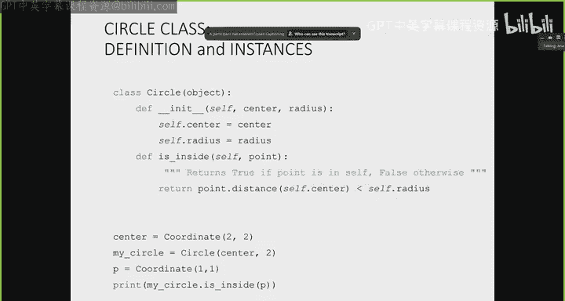

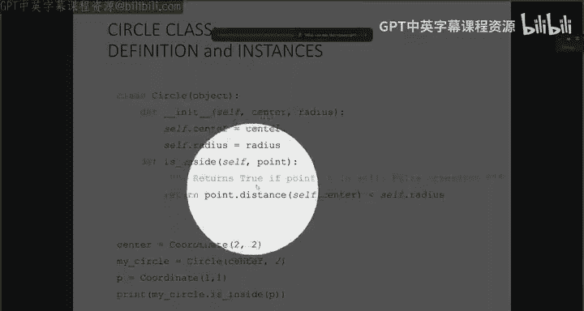

That's going to run the distance method。Right， this is a method that we wrote。

Back in the coordinate class。

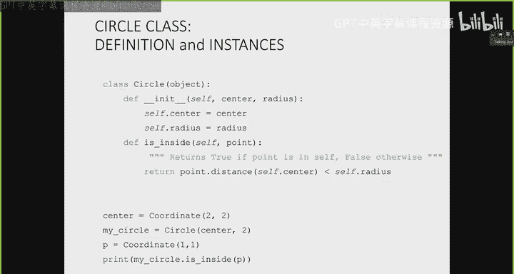

Right。That's fine， because you know what， point。Is an object of type coordinate and self dot center。

 So the center of this circle object I'm trying to manipulate。

 right to tell if another point is inside me or not is also a coordinate object。So why not？

 We already wrote the code that calculates the distance between these two points。 So let's call it。

 So here I've got the thing before the dot a coordinate object， dot notation。

 the method I want to run on this coordinate object。 And then in parentheses。

 this is another coordinate object。 So this will just tell me some number for how far away these two points are。

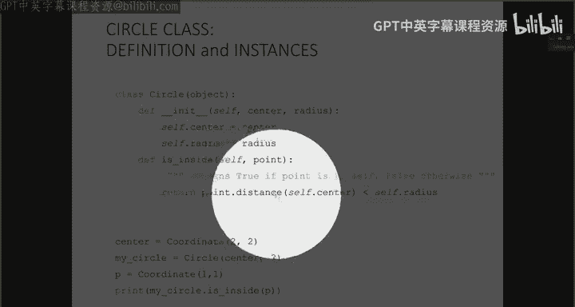

And all we do is return whether that number is less than the radius。Does that make sense？And again。

 this only works if point， the thing that's passed in here is a coordinate object。 Otherwise。

 this code will fail because it's going to try to pass in。

 it's going to try to run the distance method on a string， for example。 And， of course。

 this string doesn't have a distance method。

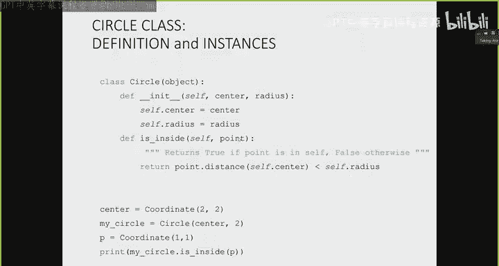

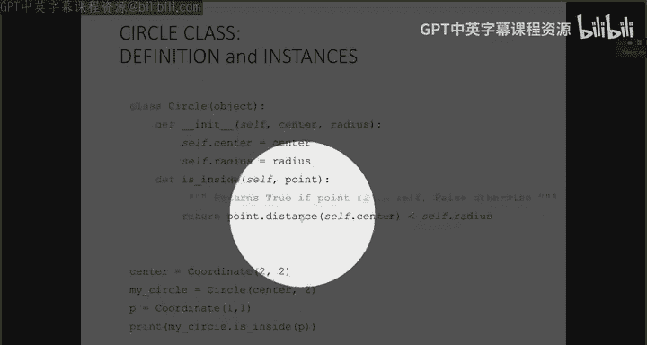

So down here， these two lines are exactly as we had before。

 We create a circle object whose center is at two comma 2 and radius is 2。

 And then I've got another coordinate object down here。 It's at one comma 1， right。

 So clearly within the circle。 So that print statement will then print true So that's just basically what I wrote。

 This is a coordinate object。 This is the method。 This is another coordinate object。Okay。

 so let's run it。So this is exactly the code from the slide。

 So if I run this method on a coordinate object， that's one comma 1 somewhere in here。 So true。

And otherwise， if I run it on coordinate object， right here， P 10 comma 10。

 clearly outside the circle， it prints false。Questions。啊。Yes， that's exactly what I said already。

So now I want you to answer this question。 Nothing to code here。

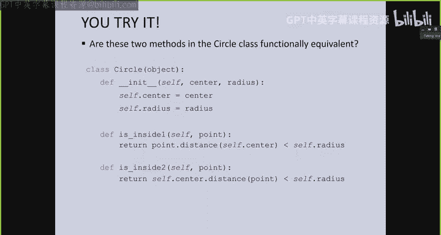

But I've got these two is inside methods。 So the first one here is inside1 is exactly the one that we just saw。

RightIt runs distance method with point and self dot center。

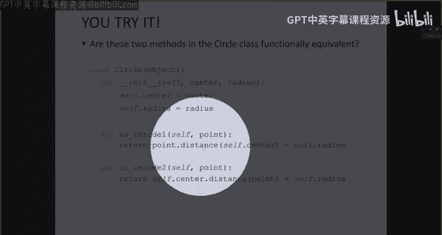

Is inside  too， looks slightly different。 The differences I've highlighted in this box。

 What I'd like you to tell me， we can do a show of hands is are these two function of these two methods functionally equivalent。

 That is。Will they return the same thing， given the same input。So think about it and then。I will。

Do a shopping。So who thinks， yes， they are functionally equivalent。Like given the same input。

 they will both return true。Okay， who thinks no， they are not functionally equivalent。Some。

 half and half。Okay， well， let's think about what the distance method is doing。

It's being run on an object of type。

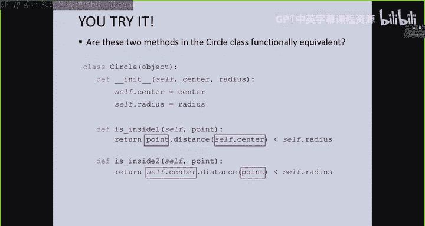

What。Coordinate， exactly。So in here is point an object of type coordinate？Yes， okay。And then， here。

What is the， a parameter to the distance method， Is it object of type。

Coordinate self dot center isn't an object of type coordinate。Yes， so now let's look at is inside 2。

What is the type of self dot center。Coordinate， and we're running the distance method on this object of type coordinate。

 And what is the object in the parameter list here。

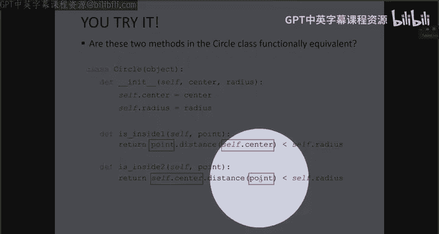

What's its type。Coordinate。So when we wrote the distance method， does it matter。

Which object we call the method on to get the distance between these two points。No， right。

 because the distance between saying， I want the distance between this point and this point is the same as saying I want the distance between this point and this point。

 right， It's just the order is different。Right。So just the way that this distance method works。

 right， it doesn't actually matter which object I call the methodone。Right。

As long as they're both corded objects， which they are。Does that make sense Is that all right。

 Any questions about this for those who are in the Npa， yeah。

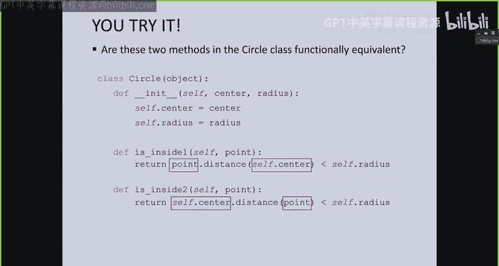

Self dot center。 Self dot center is an object of type coordinate， not circle。

Because self is a circle。Right， because self is， is talking about me。

 the class that I'm currently defining and the class I'm currently defining is a circle。

But self dot center， right， we even row code， we would like to enforce that it is a coordinate object。

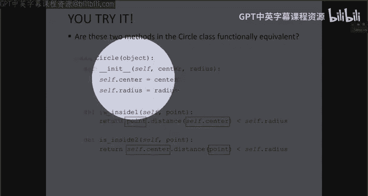

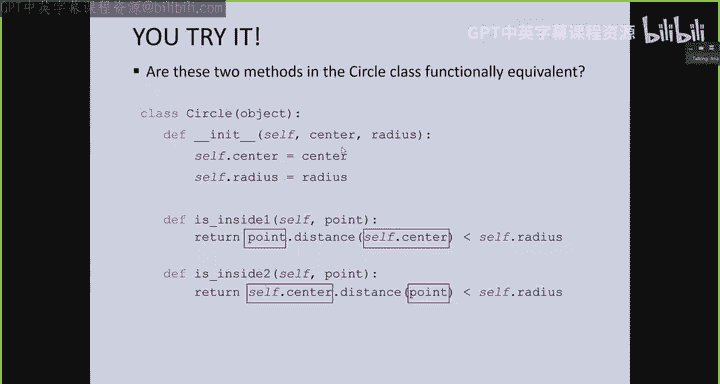

So we could have put parentheses around this self dot center if we wanted to。

 and then called the distance on that。

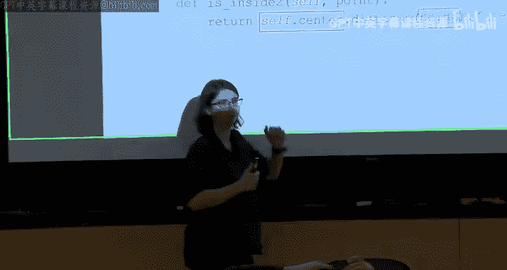

Does that make sense？Alright， so that's all I had regarding the circle class。

 Now we're going to switch gears and we're going to look at fractions， right。

 so numerator slash denominator situation here。 So we're going to create a new data type to represent a number as a fraction。

So first thing we need to do is make the design decision what data will represent our fraction。

Think about it。 You guys tell me， what do you think， what's a reasonable？

Set of data that could represent our number as a fraction。When you think of a。Yeah， a set of two。

 two things， maybe integers， right， One representing the numerator。

 the thing above the the line and one， the thenominator， the thing below the line。

That's exactly what I had in mind。What are some behaviors of fractions？You guys tell me。

What should what things should fractions do。Yeah。Yes， adding them， multiplying fractions together。

 dividing them， inverting a fraction， also something we could do， right。

 So one over what it currently is， things like that。Alright， so we're gonna write it together。

 The full code is actually in the Python file。 So mostly。

 I'm gonna to go through the slides just because it's incremental。

 So it's easier for me to talk about it。 But， you know， the exact full code is。

 is already in the in the Python file。 if you're running it later。

So the first thing we're going to do is create this fraction class。

 and I'm actually going to name it simple fraction instead of fraction because we're going to improve upon this simple fraction object in a little bit。

 So this one， I'm just going to call simple fraction。😊。

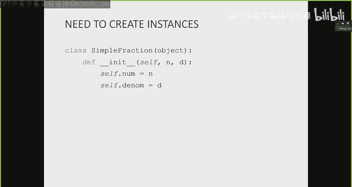

Like before its parent it is， is the generic Python object。 right， So again， very， very simple it。

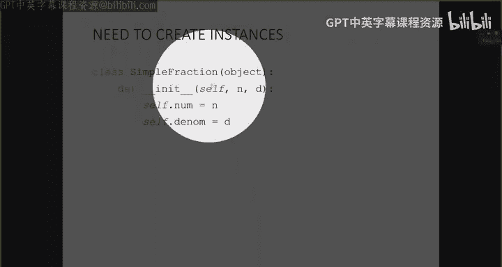

It doesn't do anything special yet。The first method we need to write is the in method。

So how do we initialize a fraction object？ Obviously。

 we don't want the numerator or the denominator to be empty， right？

 So when we create a simple fraction object， we want the user to tell us the values for the numerator and the denominator。

So those are the two parameters that I would love the user to to initiate this fraction with。

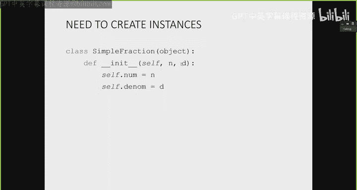

And then what are going what will be the two data attributes that we had decided on Well， numerator。

 So self dom and self do Dom will be the two data attributes right So self dom and self do Dm are data attributes。

 and they're going to be set initially to whatever is passed in that constructor call。

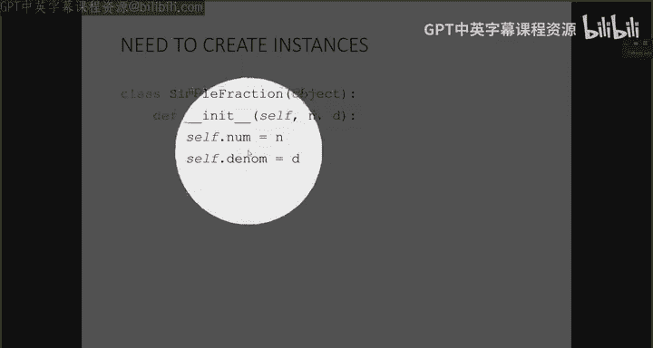

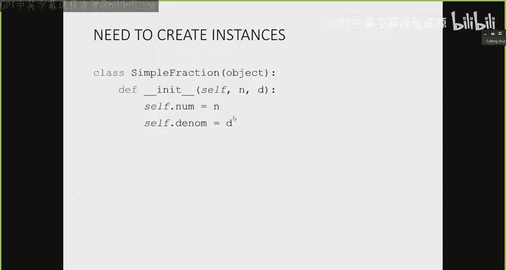

Okay， so far so good。 Let's write a method that helps us multiply two fraction objects together。

 So we'll call it times。So this times method will be called on an object， the thing before the dot。

That object， that thing before the dot， will get mapped to self。

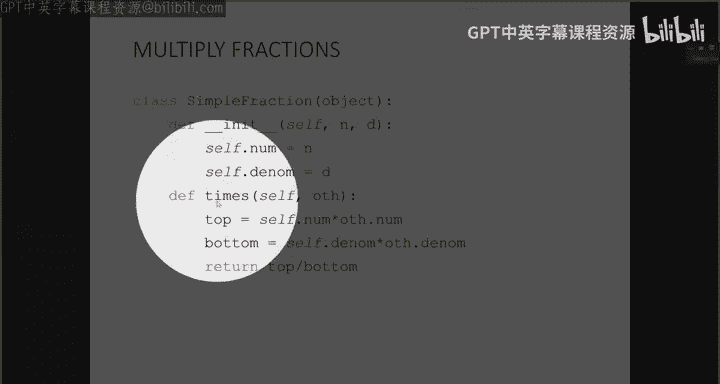

And then the thing in the parentheses， the one other parameter will be mapped to O T H。

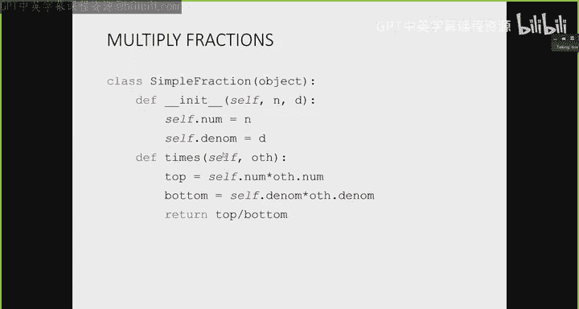

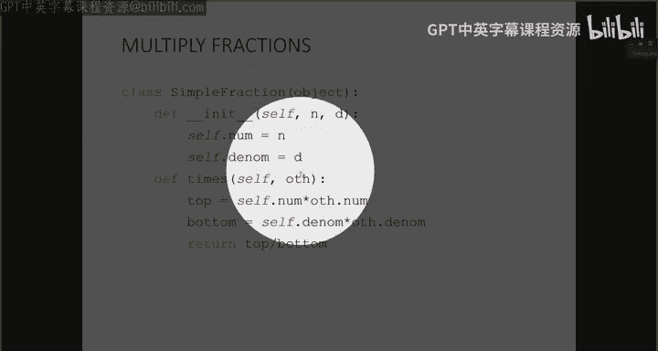

So how do we multiply two fraction objects together？Take the numerators， multiply them。

 Take the denominators， multiply them。 You got your new numerator， and you got your new denominator。

 right。So how do we grab the numerators of both of these objects。

So the numerator of the thing before the dot， right， that maps to self is self dot nu。

And the numerator of the other object that's going to be in the parameter list is the name of my parameter。

 O T H， dot， their numerator， no。

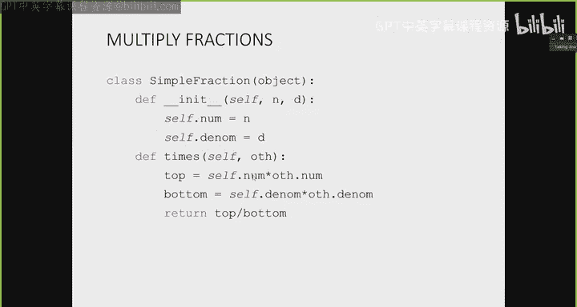

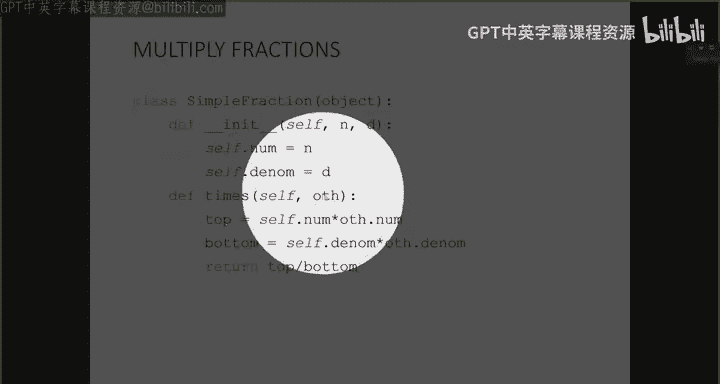

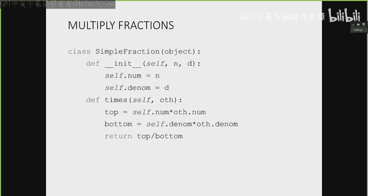

Everyone， okay， so far。Yes， okay。 I saw some headnots。 So that's good。

The denominator will be the same。 So my new denominator is just multiplying my denominator。

 the thing before the dot。 What with the thing in the parameters denominator。

So I've got my new numerator， my new denominator。 And all I'm going to do is do the division and return this value。

 What's the type of the return here， What's this method going to return， What type。

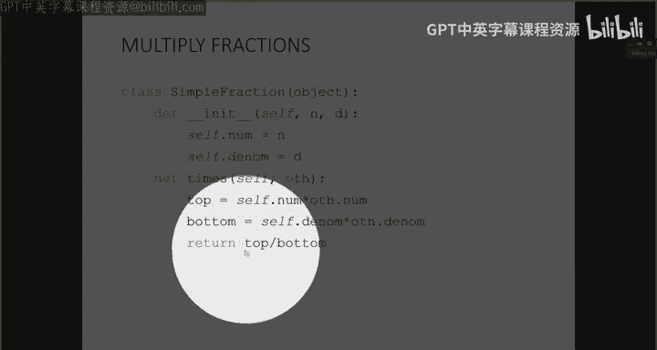

Afloat。 exactly。 Yeah， good。Yep， because all I'm doing is dividing one number by another number。O。

Perfect， so that's what I've already said。Now， we can define another method plus to add two fraction objects together。

Very similar thing， except the top is gonna be slightly different， right。

 You take the numerator of one。Times the denominator of the other plus the numerator of other times the denominator of the first one。

The crisscross thing， the denominator is the same， right， Just multiply the denos together。

 And again， we return the division top divided by bottom。 again。

 the the return of this method will be a float。So even though I'm multiplying or adding these two fraction objects together。

 my return will be afloat。

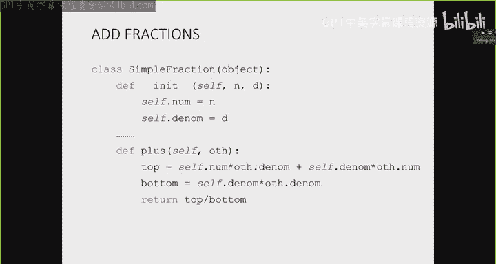

Fine。So let's run the code。I'm creating two simple fraction objects。

First one is going to be accessed using variable named F1。

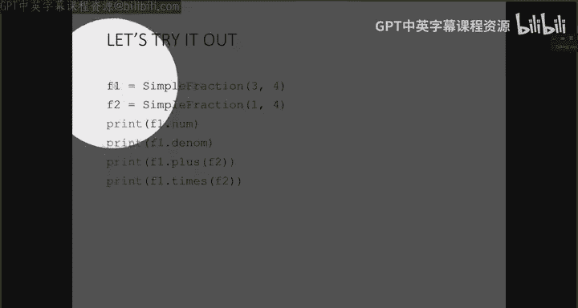

So this one represents the number three over4。

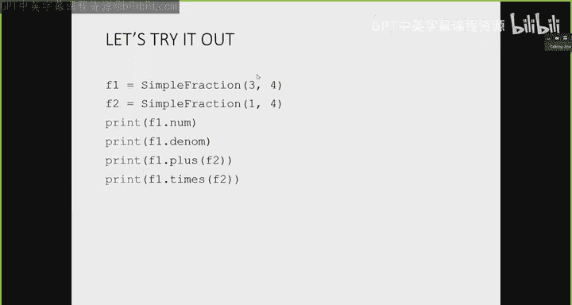

Second one is accessed by variable named def2， and this one represents the fraction 1 over4。

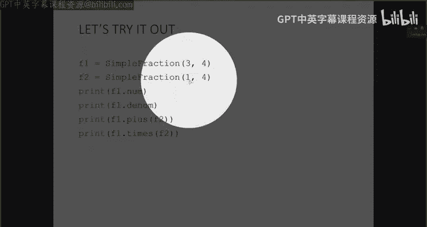

So now if I access the numerator of F1。

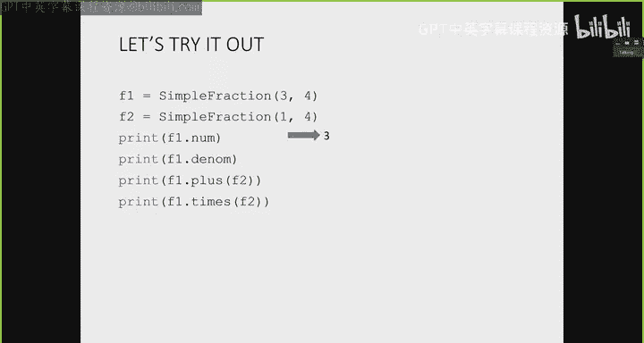

Python says， well， what's the object before the dot， It's F1。 So what is your numerator？ Well。

 I set it to3。 So this one tells me it's 3。

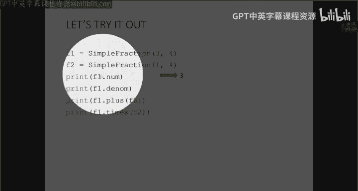

Pretty simple。Same thing with the denominator of F1。 Again， it looks at the thing before the dot。

 It's a fraction object。 It says， do you have a dom， a date attribute you do， and its value is 4。

 So that's 4。

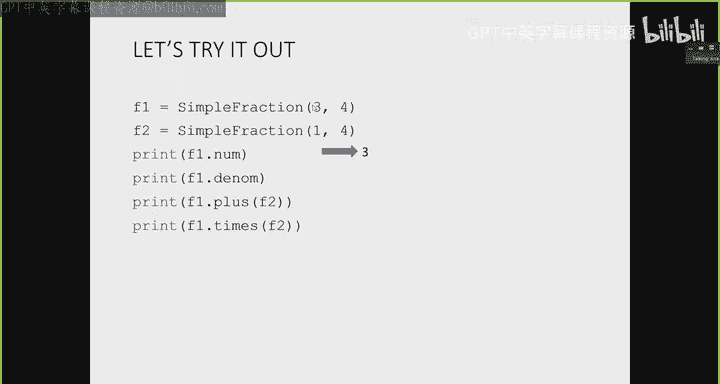

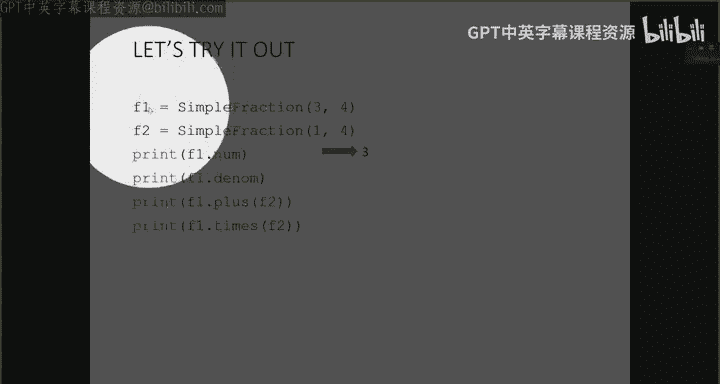

Now， what's the result of F1 dot plus F2。 super weird way to write it。

 But it's what we've got so far， right， So the thing before the dot is an object。

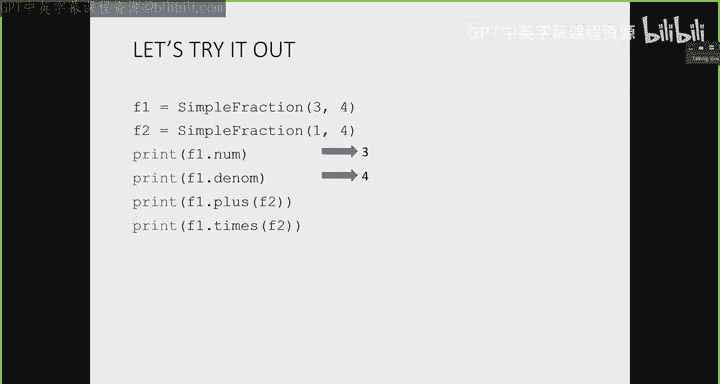

It's a simple fraction object。

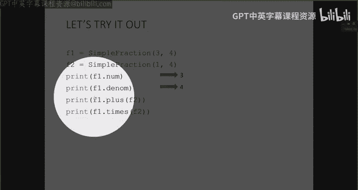

And the thing before the dot， remember， maps to self in my parameter list。Right， because it's。

 it's just a function。 So like usual functions， you know， a bunch of lectures ago。

 we basically mapped the actual parameters。When we run the function to the formal parameters。

 the things from my function definition。

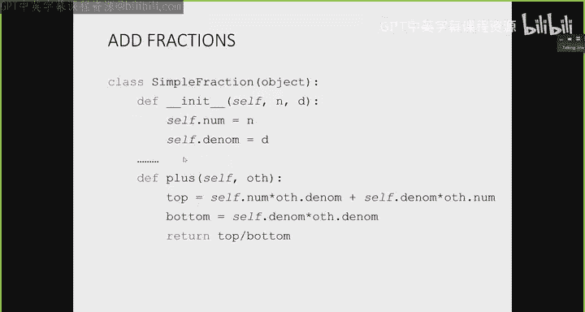

So the actual parameter here for self is the thing before the dot F1 and the。

 and the and the parameter F 2 gets mapped to O T， H。

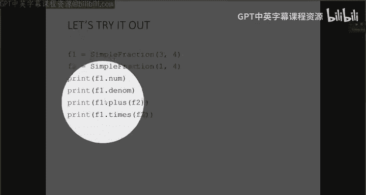

That's how we read that。So this is just doing the， the addition， right， So this will give me 1。

0 because it's a float。

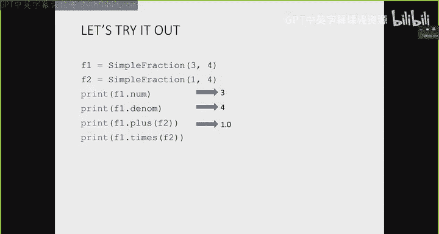

Same with the times， the thing before the dot maps to self and every other parameter in the parameter list maps to all everything else except for self。

 So this one will do 3 over 16 to give me 。1875。

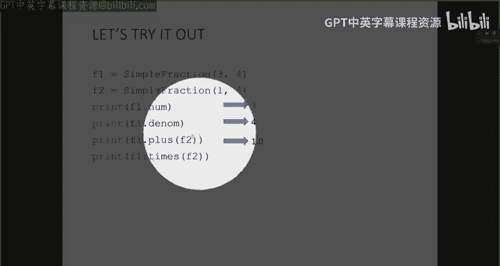

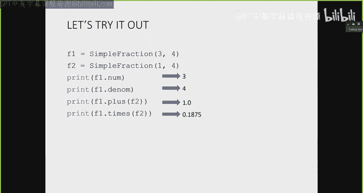

Okay， everyone O so far。The trick here is to remember that the thing before the dot maps to self。

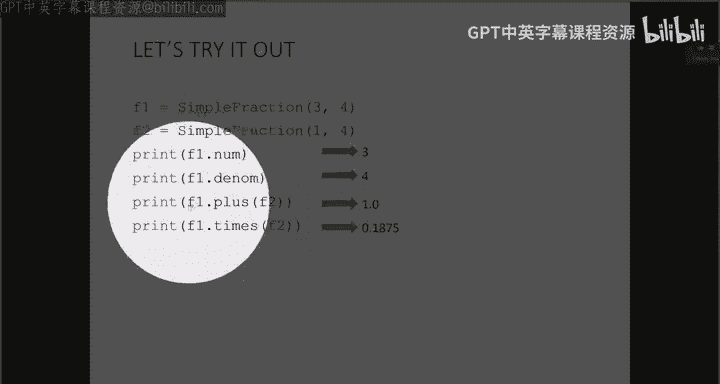

the method definition， and then everything else maps to everything other than stuff。Okay。

I'm glad everything's O so far because I'm gonna get you to write this， this code here。

 It looks like a lot。 But the first half of it is just re defining the init method for simple fraction。

😊。

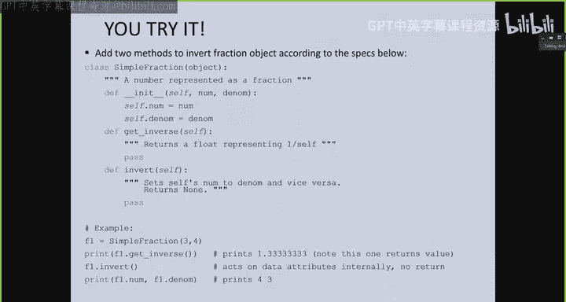

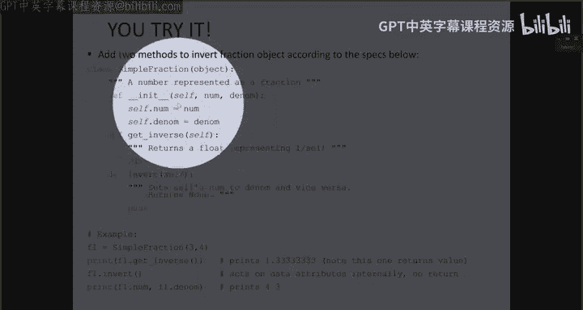

I want you to write these two methods， and they're going to be one liners， basically。 So get inverse。

Will return something， and it returns a floatat representing one over myself。 right， So if the input。

 as is in this example here， if I have a simple fraction object representing 3 over 4。

If I call get inverse on it right here， F1 dot get inverse self becomes F1。

 and I would like it to return and therefore print4 over 3。 So 1。3333333。

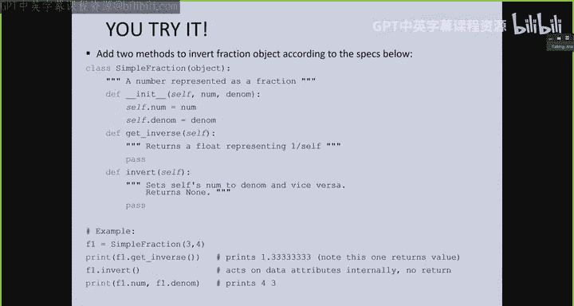

That's get inverse。 And then invert is a method that doesn't return anything。 So it returns none。

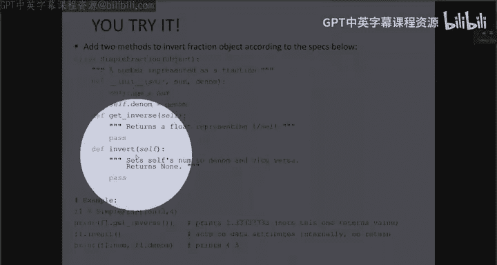

And instead， it just internally switches the numerator on the denominator of self。Right。

 so self numerator becomes whatever its denominator is and the other way around。So when you call it。

 this one doesn't print anything。 But instead， if we access F1's numerator and denominator。

 they will have been switched。So this is down online。1，33。Give you a couple moments。

 and then we can write it together。Should not be a lot of code。O。How do we write the get inverse？

 So remember， you have to return something。How do we return， one over？1 over self。So remember。

 self is an object of type simple fraction， right， So we need to manipulate its numerator and the denominator if we want to do the return。

 because if we just do this。Is it this one， Yeah， this one here。Then Python says， oh， sorry。

 It's trying to divide one， an integer by an object of type simple fraction。 right。

 And that's the error that we get here。And it doesn't know how to do a division between an integer and a simple fraction。

So how can we do that by working with actual numbers that are part of my simple fraction。いや。

Self do genomeum divided by self donam。Yep， we can do that， yep。

Or one over self do nu divideide by self do genomeum。 That's also fine。 Yeah。

 But this is a little bit cleaner。So now Dome is an integer， right， because when we create it。

We pass in int int。 So Dam and num are integers， which means that Python knows how to do a division between a number and another number。

So if we run that。Now， it prints 1。33333。Okay， how do we do the invert function method， sorry。Sorry。

Go ahead。要。第二。That like that。Yep， that's one way to do it。Yep。

 so you can see now accessing the new numerator and denominator Give me4 over three。

 Any other ways that you've done it， yeah。嗯。Yep， the tuple trick， I like it。Self done， yep。Perfect。

Oh okay， yeah， that also works， yeah。Perfect， all very valid ways of doing it， nice。Yep， so notice。

 there's no return for this one， right， I didn't want to return anything。

 Python will automatically return none， and these internal numerator and denominators will have been flipped。

Perfect。Questions about this code。O。So let's try it out a little bit more。

 So here I've got these two additions， right， So this is exactly what we had previously。

 the exact same code。

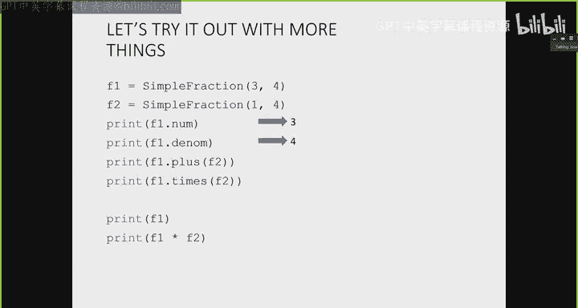

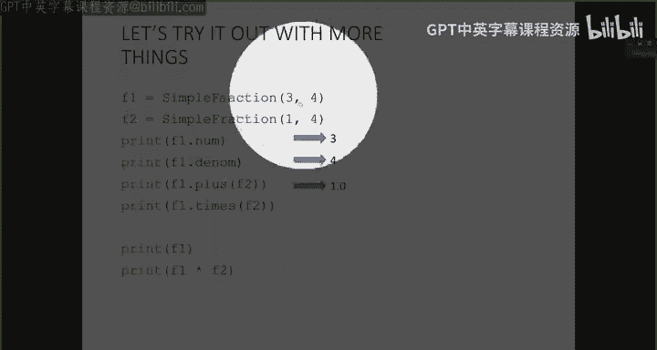

What's weird， though， And you might have been weirded out by this， too。 when we first ran it is。

I am doing operations with two fraction objects。 and yet the plus and the and the times methods give me floats。

Which is a little weird， right？ Ially， if we're working with fraction objects。

 I would like the return to also be a fraction object so I can then work with more fraction objects later on。

That's one weird thing。 Another weird thing is， if we then print。

One of our objects that we've created， F1 in this case， we use print statements often， right。

 to debug， things like that。 If I use the print statement on an object of type that I've created in this case。

 a simple fraction， Python spits this out。It says， hey。

 your object is an object of type simple fraction at this memory location。

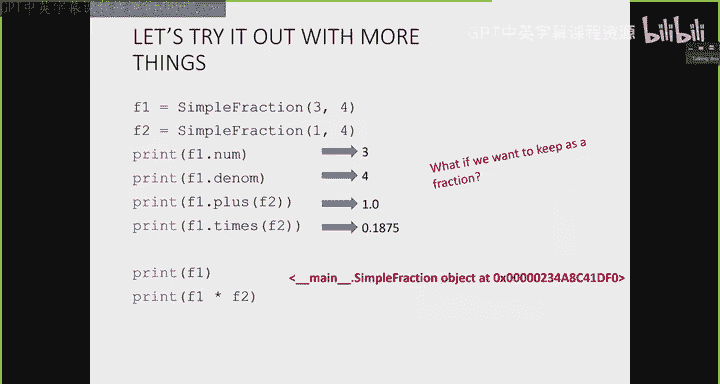

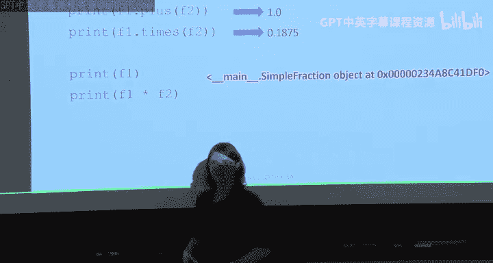

No， thank you。 That's not very useful to me， right？

 What I'd like to know is maybe a nice representation of my fraction object， like 3 slash 4。😊。

Right I don't care about what memory location it's at。And one more thing we'd like to try to do。

 This is a class that that represents something numerical。

So something that people might instinctually want to do is to use operators like the star or the plus or the slash。

 right， to divide add， multiply these fraction things。

But if we run the star operator between object of type simple fraction， right。Times another object。

 times of type simple fraction。 Python gives us an error。And I'll even show you the error。So。

So here I am printing my object， right， so it spits this out， which is fine， but not what I want。

 This one， you know， obviously， we've seen this it already prints this out。

 And then if I try to multiply my two simple fraction objects together， it says。

I don't know how to do that。So it's unsupported operain types， so the operain simple fraction。

 simple fraction are not supported with the star operator。Well， no surprise there。

 How is Python supposed to know how to multiply two simple fraction objects together， right。

 right before I even ran this program， I didn't even know what a simple fraction object was。

So we need to tell it all of these details。And we will do just that。

So all of these operators print L that we've been using star ad， right。

 less than greater than even the square brackets to index into something。

 These are actually shorthand notations。Right，They are really common operations that you want to do。

And Python lets you use these common operations in。

 instead of writing these really verbose function names。But really， behind the scenes。

All of these shorthand operations actually run a method。Okay， okay， not a secret。

 I'm not lowering my voice because it's a secret， but it's just， it's really cool， so。😊。

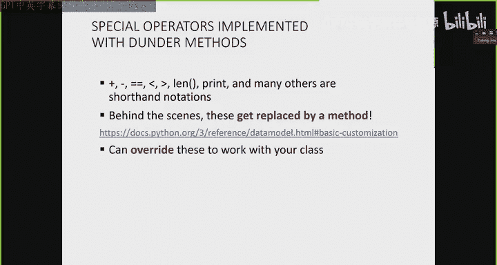

All of these operations， like the multiplication or the print statement。

 just gets replaced with a method。

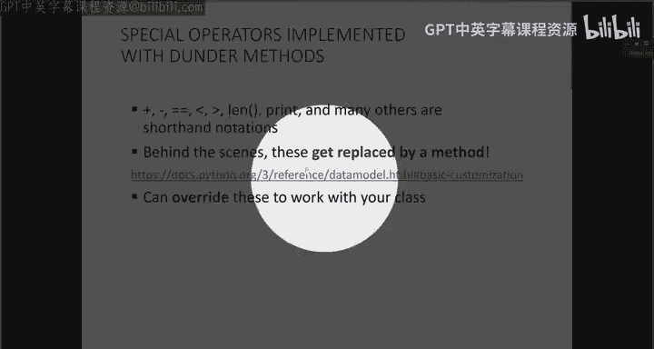

Okay，And the method names look like this。They are dunder methods。

 just like the inni method was a special method that Python ran when something special happened。

 like you're creating an object。Well， when something special happens。

 like you're using the plus operator between an object of your type and something else。

 Python will also run this special Dunder method behind the seats。Right， and same here。

 if I want to multiply my object with something else。

 Python will run this special Dunder method behind the scenes。

If I want to print an object of my type， Python will run this special Dunder method behind the scenes。

Even something like casting， if I want to cast my object to a float or to a string or something。

 Python will run this special Dunder method behind the scenes。And then， you know。

 there's a whole bunch of other ones， even indexing into a list or sorry， not a list。

 indexing into an object of your type。 So if you make an object like a queue or a stack where you know。

 you have a bunch of sequences of objects， you can tell Python how to index into an object of your type into an object。

 That's a Q， right。So all of these things， all of these methods need to be implemented somewhere。Now。

Most of them are not implemented in the basic Python object， except for the SR。

 So the STR method actually just prints the memory location of this object。

 That's exactly what we had seen， right by the default behavior。

 But none of these other ones are really implemented。 And so if you want。

The object that you're currently writing to work with the star or the plus or the double equal sign to for test for equality between this object and something else。

 You have to write the method。In your class definition。Okay。

 so you have to implement it to tell Python that this is what you want to do when somebody uses this special shorthand notation。

So let's start with the print because it's the most basic thing you will probably want to implement when you create a new data type。

 right， for debugging purposes， you'll find yourself instinctualively saying， hey。

 print F1 to print this fraction object to see what it looks like。

And so the S TR method is one of the really basic things you should implement right after the inni method。

So let's look at it in the context of the coordinate object。

 So here I've got my coordinate object 3 comma 4。 And even when I print this coordinate object。

 Python tells me this still un informativeative message that this object is of type coordinate at this memory location。

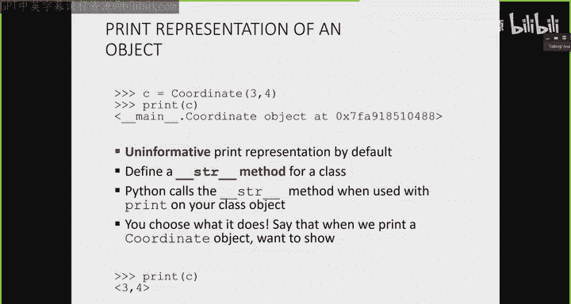

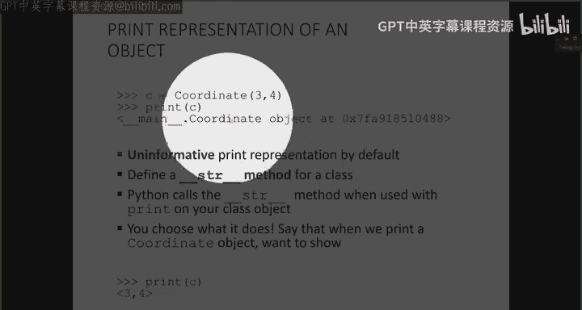

Okay， I don't care。 Instead， what I would really like to do is say， hey。

 I want to represent a coordinate object by something like this。 angle bracket。

 the value of the X coordinate， comma， the value of the y coordinate， close angle bracket。Right。

 so that would be a far more informative print statement than what memory location this thing is at。

So let's do that。Well， here we are our coordinateed object。

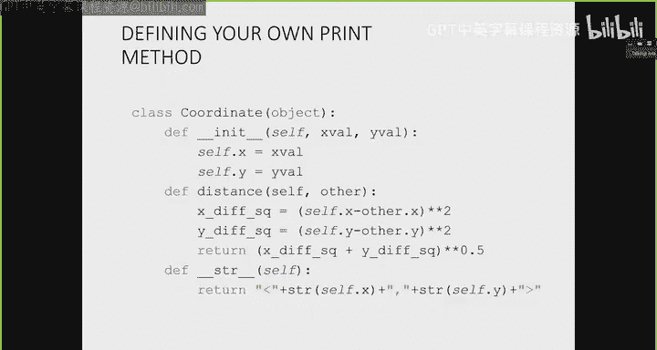

The distance， the init like we had before。 And here I'm defining my SR method。

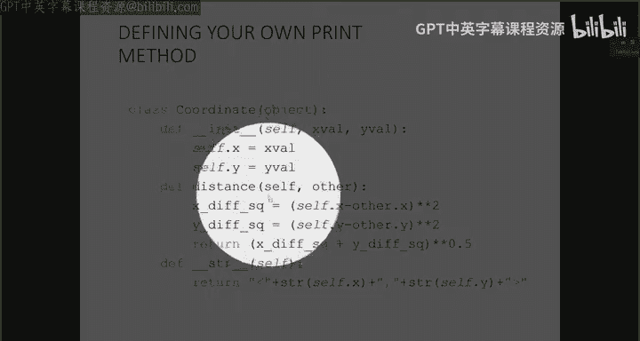

，So double underscore， STR， double underscore。No other parameters except for self。

 So me calling this method on an object。And what is this going to do， It will return。Not print。

Return a string。And the string is going to represent the thing you want to be printed out。Right。

 so it returns a string doesn't print it。 However， you want to make up the string is up to you。

 So here I've just used concatenation of a bunch of stuff。

 So I'm concatenating the angle bracket with the X value of my current object。Cast to a string。

 concatenated with the comma， concatenated with the y value of my current object cast to a string。

 concatenated with the closed ankle bracket。That's the design decision we made for how a coordinate object should be printed。

Everyone， O so far。O。So if you want to use an F string to make up this thing to return totally fine。

 if you want to make a variable， right in between the return and the definition here that you just keep concatenating with。

 you can concatenate it with new lines and things like that， Also totally fine。 at the end。

 you just have to return that string that represents the thing you want to preprint it out。

So now let's see what happens when we actually run。The code， right。

 So here I'm creating a coordinate object， and then I'm printing that coordinate object。Well。

 Python says， hey， you just called a special shorthand notation on an object of type coordinate。

 Let me see if you implemented the STR method。

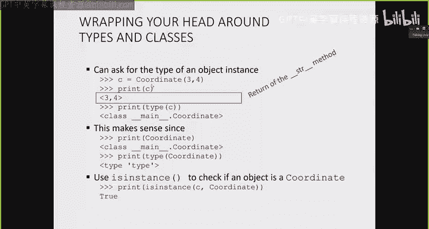

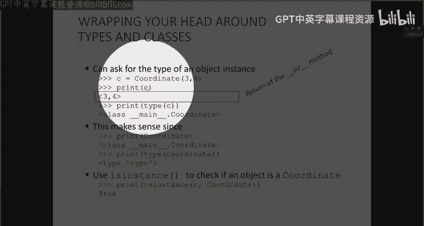

It looks in the class definition。 It sees the STR method implemented here。

 And then it runs the code inside and says， you want to grab C's X value and sees Y value and concatenated with these things here。

 Sure， I can do that for you。 And then it goes and。

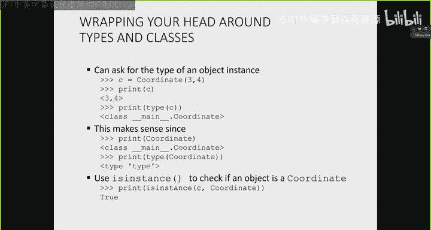

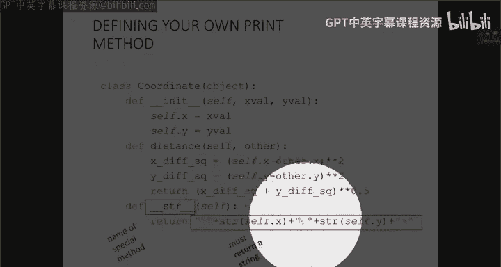

Print this out to the screen。Okay， very cool。 right。

 Now we can decide how to print objects that we create。Alright。

 so let's try to wrap our minds around types here。 Okay， so if we print this C。

C is an instance of a recordeded object， right， It's， it's， it's， it's， it's。

 it's an actual object that we're manipulating。 It's not the class definition。

 It's not anything abstract like that。 It's an actual object。 Like the integer 3， right。

 is an actual object。So if we print that C， Python uses the SDR method。 Well。

 what if we print the type of C。

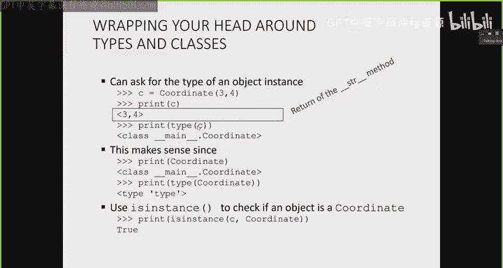

Somebody， tell me what's the type of C。Coordinate， yeah， it's the class name that we define。

So when we print the type of C， Python says this is a class coordinate。

Which makes sense because if we just replace type of C here with what it is， coordinate。

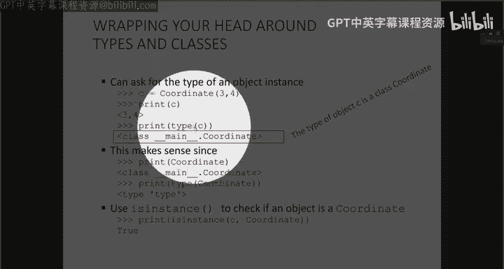

We'll get the same print statement。 If we just print coordinate。

 Python says this is a class of type4。So those two lines are equivalent。

And then let me blow your minds a little bit more。 What if we print the type of coordinate， Well。

 what is coordinate。It's a type。Right， we're defining a new type in Python called a coordinate。

 So coordinate is a new data type in Python。 So its type is。type。Okay。

 so everything in Python is an object。Even types。One more thing。

 So we've used the type of something equals something else， right。

 when we checked that the type of the， the circles center was a coordinate。

 that's one way to check for types。 Another way is to use this is instance function just as an aside。

 so you can。Check that C is an instance of type coordinate by using this is instance method。 And。

 you know， this will tell you true。 And， you know， just to draw parallel， you can say， you know。

 is instance 3 comma int。 that would also say true， right， because 3 is an object of type integer。

So just another way to check for。Okay， so the remainder of this class。

 I would like to go back to our fraction class。And make it better。Now that we know Dunder methods。

 right， let's implement a whole bunch of Dunder methods to help us to help us and people who want to use our class use it in a more efficient way。

 right so we're going to implement the star operator， the plus operator。

 we're going to implement the print， and then we're going to implement implement converting to a float。

Alright， so the first thing that we should probably add is the SR method。 right。

 because then it will help us in debugging when we print an object of type fraction。

So let's define double underscore S T R double underscore， right， again。

 no parameters except for self， because that's the the the method we're the object we're calling this method on。

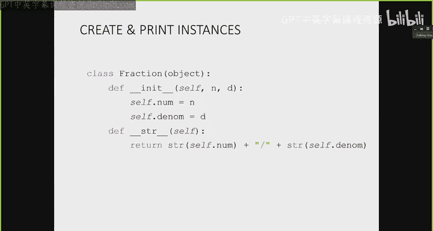

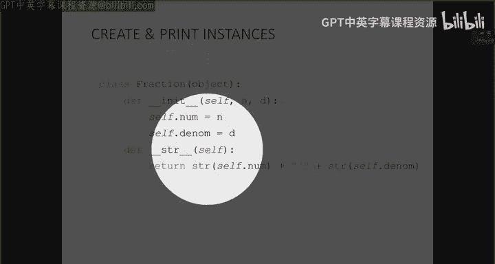

And again， however， you want to form this string is up to you。

 You can use F strings or a variable that you keep adding onto to。

 I just did it straight in here with concatenation。

 So I've got the numerator slash the denominator as a very reasonable way to represent a string right。

 So three slash4 as three over4。

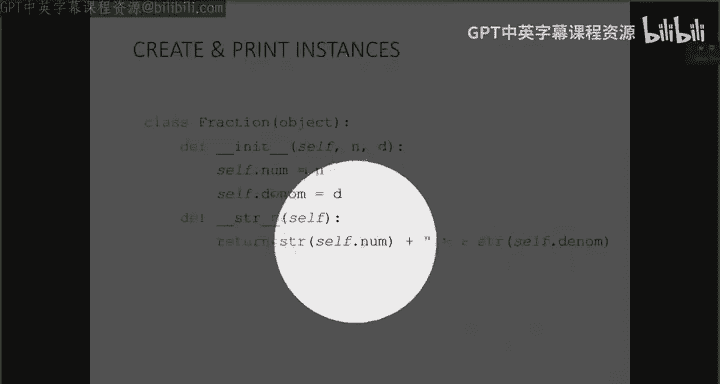

Okay， so one thing I guess to keep， keep， keep track of is if you're concatenating。

 you just have to remember to cast the strings， right。

 if it's a number that or something that's not a string。So， let's try it out。

I've got three fraction objects here。 Okay， so the first two we've already seen。

 So I've got a fraction representing3 over4， a fraction representing one over 4。

 and F 3 is now going to be a fraction representing 5 over  one。

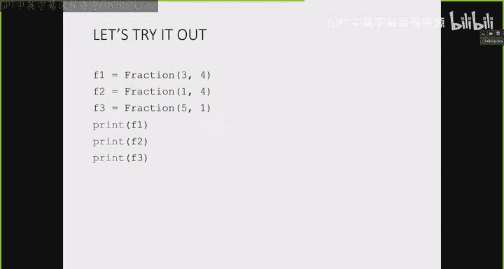

If we print F1， again， Python asks， hey， did you implement an STR method in your class definition。

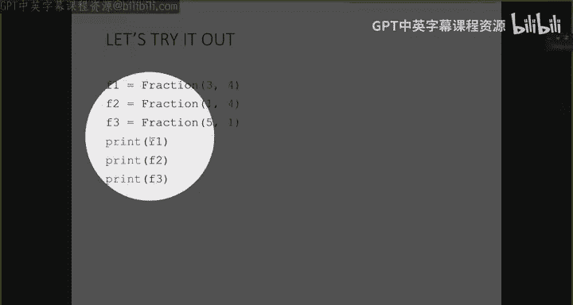

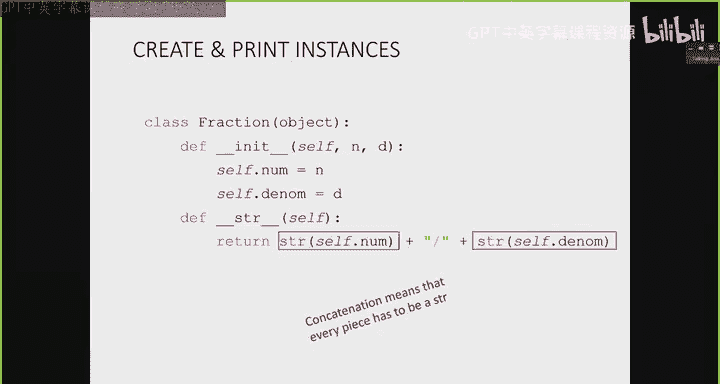

Yes， you did。 Good job。 Let me use it。 So then it uses this， right， So it grabs the numerator of F1。

 slash the numerator of sorry， the denominator of F1。

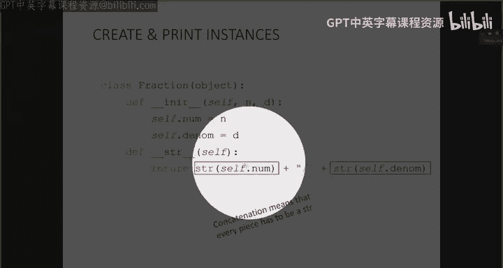

So this will print3， the numerator of one， slash the denominator of a one。Same with F2。

 except that now it's going to grab F2's numerator and denominator。1 slash4。

So notice now it's not doing the divisions like it did before。 or sorry， never mind。

 We're not there yet。 There's nothing to divide。 It's just。

Grabbing the numerators and denominators and just printing them out， right。

 It's not doing any divisions。Now， when we print5 the， the。

 the the fraction object representing5 over  one， it prints 5 slash1。I don't like that。

Because it looks weird。Right。Do you like that？So then I'm gonna have you fix it。

Change the STR method just a little bit。Such that if the denominator is one。

Just have it print the numerator。

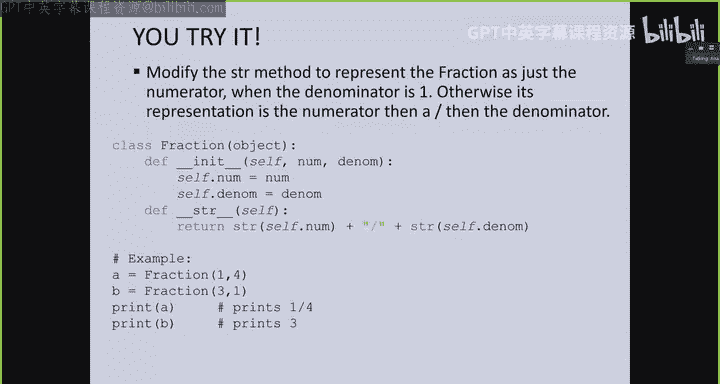

Right， and otherwise， the representation should be as before numerator slash denominator。

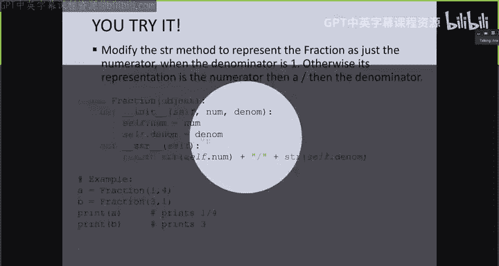

So this should be down line。1，40。Where is it？Very far down。2，65。O。Anyone have some code for me。Yes。

第二。Yep， we can do an else。That else is not needed。 I don't think， because if we dropped into the if。

 we just immediately return。 Otherwise， we would just do the the remaining thing， but perfectly fine。

要。And let's run it。🤧。Right so the A is a fraction representing1 over4。

 so it nicely printed one over4。 and B， the fraction 3 over one is just printing three。

Questions about this code。Okay。For the remaining lecture， though。

 we're not going to use this modified this nicer， better S TR method。

 So let's just forget what we just did and just remember that it looks like this。 Okay， just。Okay。

 so now let's implement the Dunder methods for addition multiplication division and things like that。

 So I'm going to do the multiplication just because it's not as long for the numerator。

 So just convenience factor here。The left hand side， I've got our old， simple fraction code。

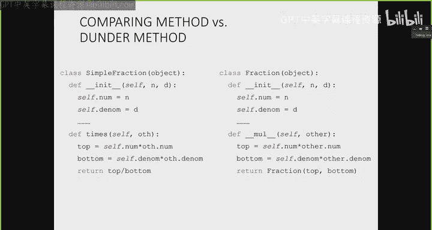

And the right hand side has my new fraction code。 Okay， so the old， simple fraction code， remember。

 had this times method。That took himself an O TH， a calculated a nuummerator and a denominator and returned this。

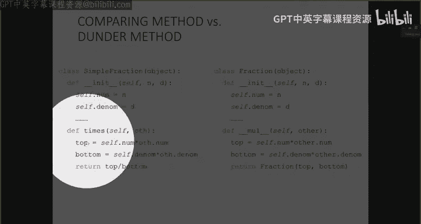

Now， my new fraction code will no longer need to call times， right。

 So we're not even going to implement a method called times。 Instead。

 we're going to implement the method behind the scenes for the shorthand notation star to multiply to fraction fraction object。

So we need to implement D F， double underscore， Mole。

 double underscore parameter list is the same because we still have a thing before the star and a thing after the star as the two fraction object we'd like to multiply。

Within the code itself， the new calculations of the new numerator and the new denominator are the same as well。

 right， We're still grabbing the numerators of self another。

 the denominators of self another multiplying those together。What's different is in the returns。

 right？ What was the return type for the the times method。

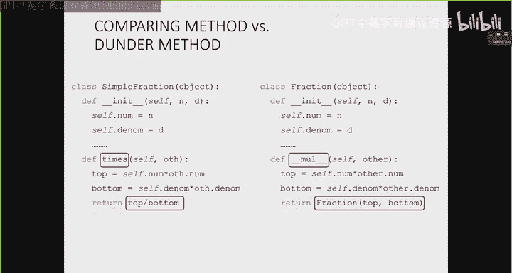

A decimal。 Yeah， a floatat， exactly。What's the return type of my new。Method。咁冇。

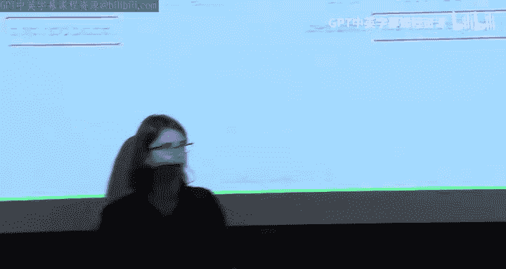

A fraction， exactly。 So， yes， I am operating with fraction objects。

 So I'm expecting that the return type。Of this method， the star。

 doublech mo is also a fraction object。 So then I can just keep working with fraction objects throughout my code。

 not having to worry about whether this thing is now floatat or not。Right。

So how are we creating this fraction object？Well， just like we would create a regular fraction object up in。

 you know， the previous slides， right， So here， right。

 here's an example of us creating a new fraction object。Right， numerator 1 denominator 4。 Well。

 same here。 This method will return a new fraction object whose numerator is the thing that I just calculated the top。

 And the denominator is the thing that I just calculated bottom。Does that make sense？O。

So this one returns afloat。 This one returns a fraction。Let's run it。 So A is fraction 1 over 4。

 B is a fraction representing3 over 4。 Good。 Those are the numbers we've been working with。

 If we print a， the print statement says this is the fraction object 1 slash 4， right。

 whose representation is one slash 4。 Now， if I use the star operator between A and B。

The thing before the star is kind of like the thing before the dot。 It's the self。

 It gets mapped to self in my double underscore mo。And the thing after the star， right， the。

 the second parameter， so to speak is the is the is is the one parameter that my method takes， right。

So this will create， will run the mole method behind the scenes。 Right， So Python。

 when it sees that star asks， do you have a mole method implemented in your class fraction。

Because the thing before the star is a fraction object。Yes， we do。 What is it return。 Well。

 it does the multiplication。 And in the end， the return of this method is this thing here， right。

 So I literally just， you know， made this， I guess copied this from the return using the numbers of A and B。

 So it creates a new fraction object whose numerator is 3 and denominator is 60。

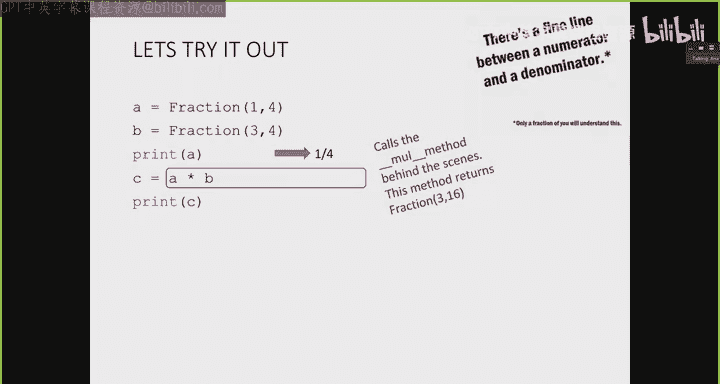

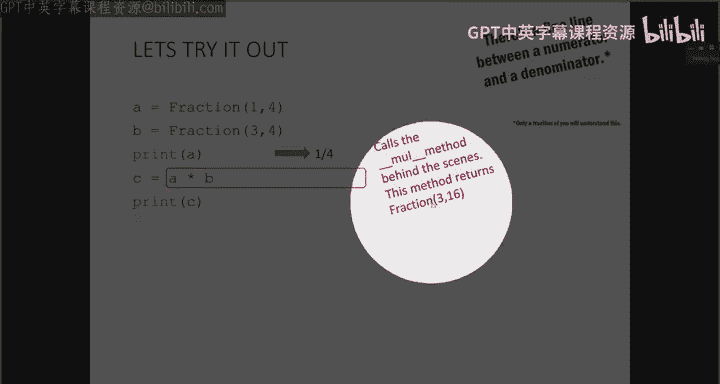

So C equals fraction parentheses 3 comma 16， basically just another fraction object。So now。

 when I print C。It's going to use the STR method for a fraction object， right。

 because C is a fraction object right there， right， That's exactly what C was。

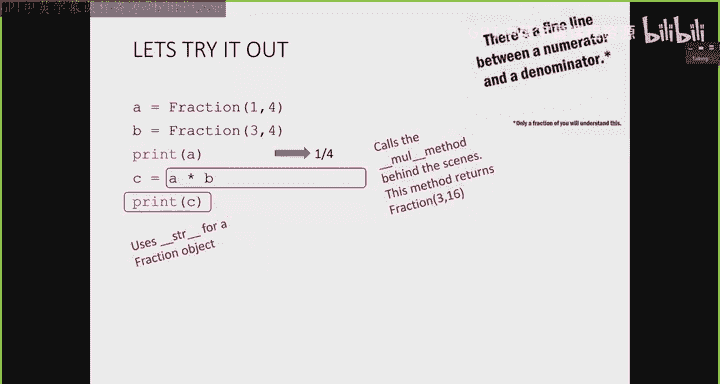

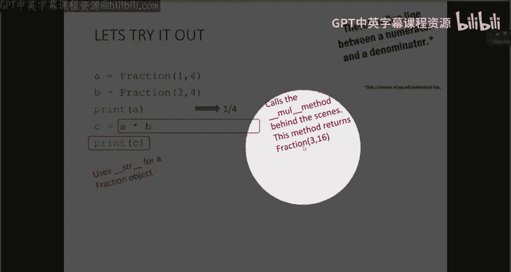

So this will also print the way we ask to print fraction objects。

 numerator slash denominator 3 slash 60。Everyone， O， so far。Okay。

 so the following lines are all equivalent。O。Using this shorthand notation。Very nice。

 very pythonic way to multiply two fractions together。But behind the scenes。

 this is just running a method。So， of course， if you really want to。

 you can just use the same old way of calling a method， right， thing before the dot， dot method name。

 parentheses， parameter list。

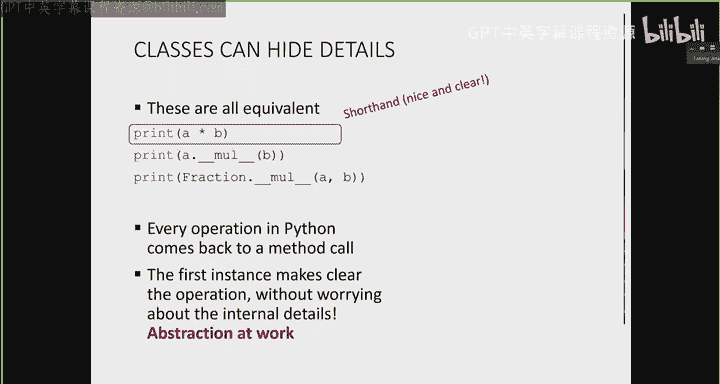

So here thing before the dot is a dot， the name of my method， doubleroncr Ma double underscore。

 parentheses， all of the parameter list， except for the thing I'm calling it on。

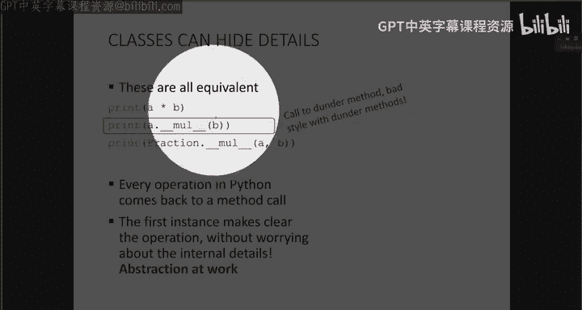

So those two are equivalent。 and of course， last time I mentioned sort of a way to hopefully demystify running these methods where the self becomes this thing before the dot。

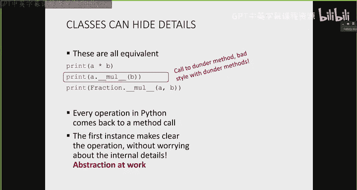

You could call the method on the name of your data type， right， the。

 the type that you're currently creating fraction。

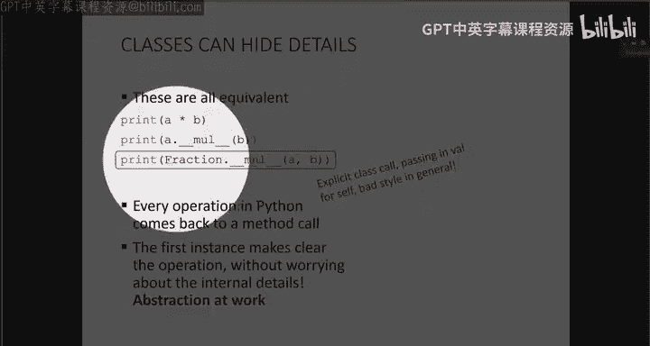

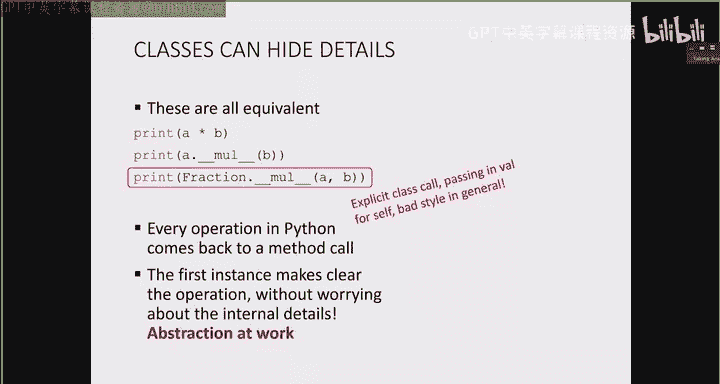

So fraction is not an instance， right， A was an instance。 It was an actual object that we created。

 but fraction is just the name of my class。

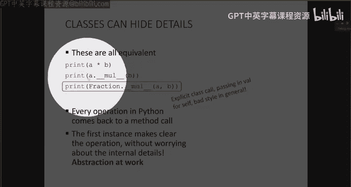

So if you call the method on the name of your class， then Python expects the full parameter list。

 right， So something for self， something for other， something for whatever parameters you have。

 And so there we would explicitly pass in both A and B as part of my parameter list because the thing before the dot is not an object。

 So there's not it doesn't map it to self。But I would never， ever。

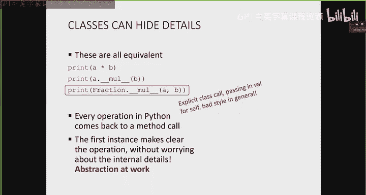

Ever。Run a line of code like this。 This last one here。 right， This is just for your information。

 It's non pythonic。 It's， it's just very verbose， right。

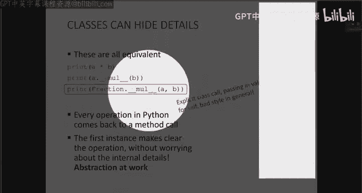

And so this， these， these dunder methods。Help us abstract away a bunch of these details， right。

 So how annoying would it be to always use dot notation when we want to multiply an integer with another integer。

 Can you imagine constantly writing 3 dot double square M de1 score 4。That would be very bad code。

 It would take forever to read， right？ And so we're abstracting away all the details for calling these methods into these nice。

 little shorthand notations。 And as I said， the shorthand notations exist for a lot of different operations。

 We saw print， You can do length， comparisons like equality， even you know， indexing into things。

 You can always， you can abstract all of those away。

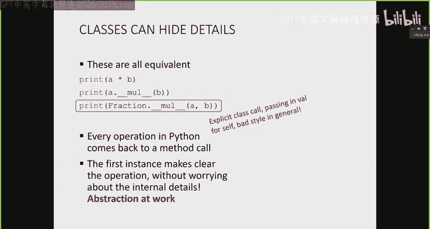

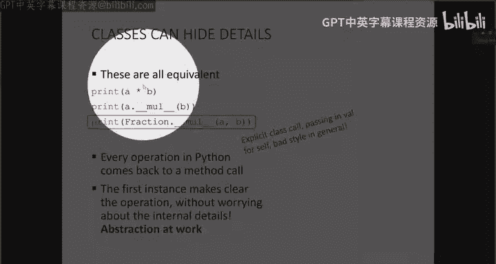

It with into shorthand notations。 And behind the scenes， these methods will be run。Okay， so big idea。

 right， exactly what I said， all these special operations that we've been using already。

Behind the scenes， these methods get run and these methods were written inside the class definition for the types that we've been using。

 right， So when we index into a list L square brackets。3 or whatever。

 There's a method being called behind the scenes in the list class to grab the element at index 3。

 I don't remember the D method name for that， but probably like double and I index， double one score。

 I don't know。 But there is some method behind the scenes。Alright， let's do a couple more things。

Sorry。You can't ask Python， but you can look at the documentation。

 I think it's like in Python do org， there's a website that lists basically everything that you can。

 That's a under method。 Yeah， under categories， like in all the indexing type stuff。

 all the numerical type stuff，Okay， so let's do one more thing。 Let's say that well。

 we're working with fraction objects。 And so the dunder methods that we're writing are now returning other fraction objects。

So let's allow the user the opportunity to cast one of these fraction objects to a float。

 just in case they would like to grab you know the float value of 3/ 60。Right。

That's a very reasonable thing they might want to do。 So let's， you know。

 get ahead of them and add that as part of our class definition。

So to cast things to af float in this particular case。

 the Dunder method for that is double underscore floatat， double underscore。

And all it's going to do is grab the numerator of self。And divide it by the denominator of self。

 right， So this will just do a division。 Self dot numbm is a number。 Self dot Dome is another number。

 It does the division， and this returns a float。Right， so here。

 when we multiply C is equal to a times B， remember that C became a fraction object with numerator 3 and denominator 16。

 right， You remember that。So then when we cast it to a float。Down here， Python says， hey。

 did you implement the Ddunder method， double underscore， float， double underscore。 Oh， yeah。

 you did。 Let me just go ahead and do the thing that you want me to do inside it。

 So it takes the three， divides it by the 16。 and it prints 0。1875。

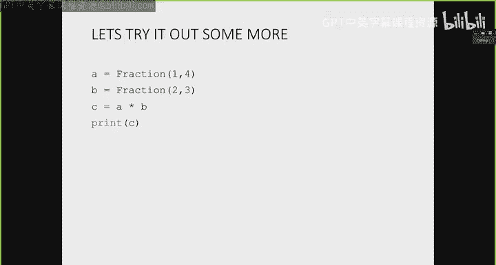

Okay， let's try it out a little bit more。 So here I've got two fraction objects。

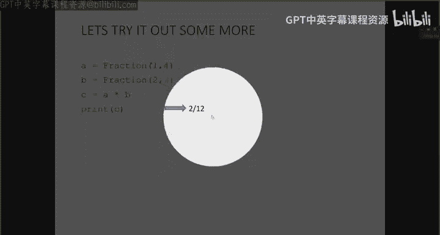

One representing one over4， the other one representing two over three。 I multiply those two together。

 again， this gives me a fraction object， right， because it's running the mo under method and the mo under method gives me a fraction object with a new numerator and denominator。

 So when I print the return of that。 when I print C， this print the nu numerator。

 which is two times1 divided by the new denominator， which is four times3。 So prints 2 over 12。

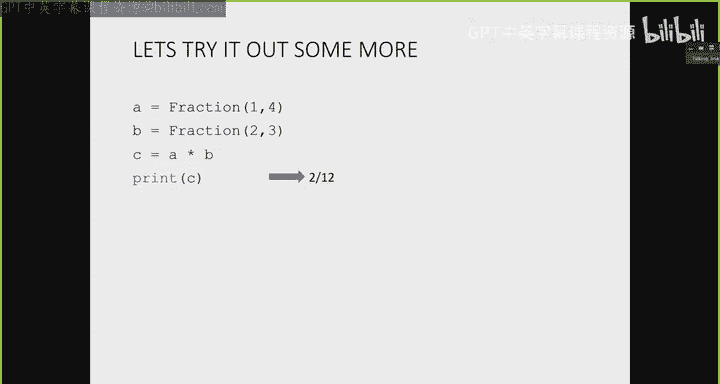

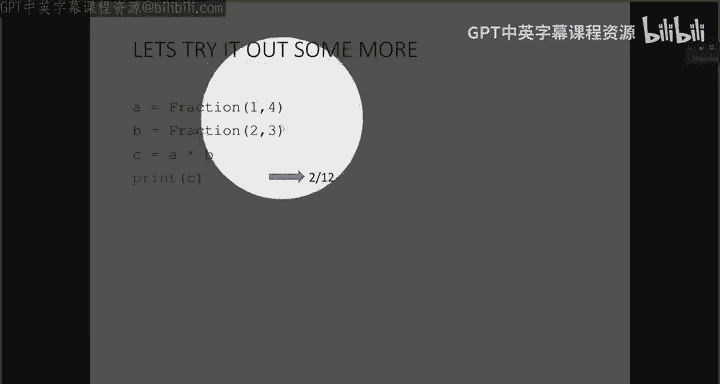

Does that look okay to you？I mean， it looks okay。 but suppose you're doing， you know。

 calculations with a whole bunch of numbers。 And at some point。

 you get to really big numerators and really big denominators。But then。

You stare at it long enough and realize that that big numerator divided by that big denominator is actually something like  one over 4。

呵呵。Right， so this is not reduced。Right， which is fine。 Our code is not doing the reduction。But。

 it would be nice。To write a method that allows the user to reduce a fraction， right。

That would be really nice。So can we fix this， Yes， we can。 Otherwise， we wouldn't be here。

 So let's write this method to reduce a fraction object。It looks like a lot。But it's not trust me。

 Okay， It's just a bunch of if else's。So the first part of it is a little helper function。

 not a method， right？ Notice there's no self going on in this GCD function。Right。

This is just a regular function that I will use to help me get the greatest common divisor for the two parameters。

 N and D。😊，ok。Because when I have two numbers， right， if I want to reduce them。

 I find the greatest common divisors， and I'm going to divide the top and the bottom by that divisor。

And that will help me reduce it。So this GCD function helps me find this greatest common device。

， so here I'm just defining the function。 I'm not actually using it。And then I've got two。

 an if and an L if。

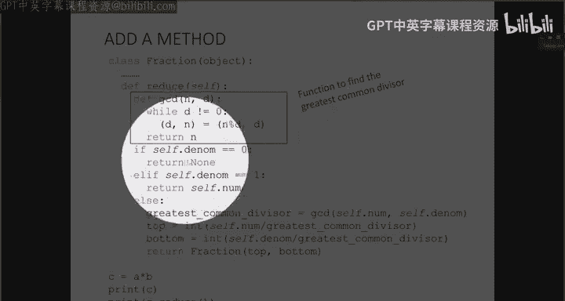

So if the denominator is 0， somethings super weird。 So I'm just going return none， right。

 because having a fraction where the denominator 0 maybe something went wrong。

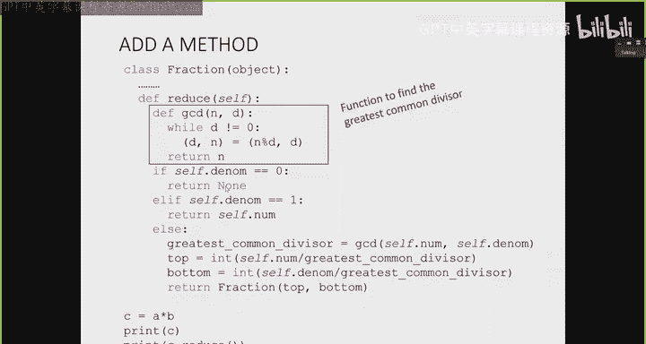

Else， if the denominator is one， we don't need to do any reduction， right， No reducing is needed。

 So we just return the numerator。

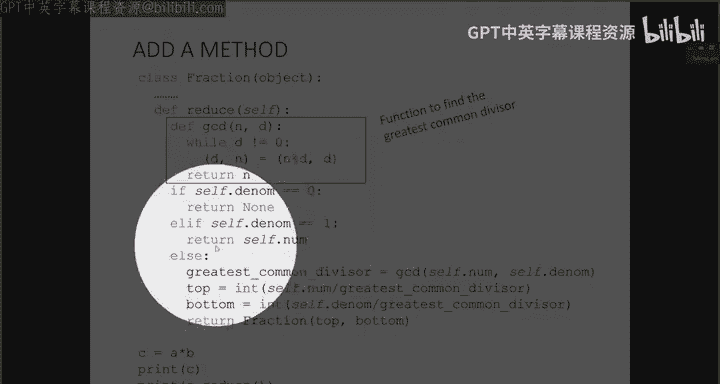

And else。I do have two actual numbers that I could， maybe could potentially reduce。

 So let's just reduce them。

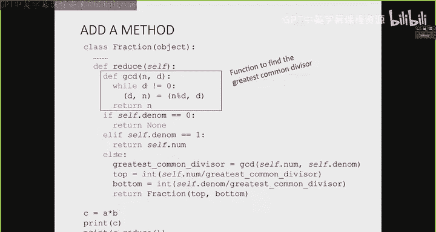

The first line here runs this function， this helper function that I wrote。

On the numer and denominator to grab the greatest common divisor。So， you know， if it's2 over 12。

 it'll find two。Then the next line here takes the nu the numerator and divides by that greatest common divisor and casts it to an int。

 right， because I want my numerator to be an int and my denominator to be an it。

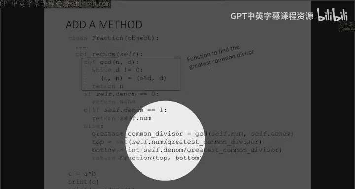

Al， so it'll take the numerator and divide by， for example，2。

Same with denominator。 I'm going to take my denominator and divide by that same GD I found。

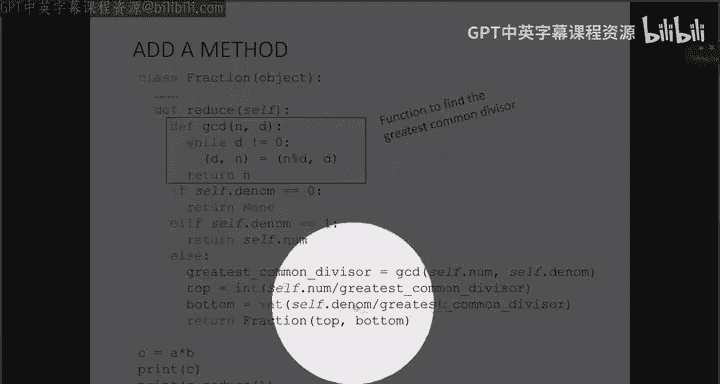

Casting to an end。

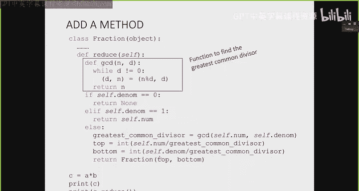

So my new top and my new bottom will now be used to create a new fraction object。

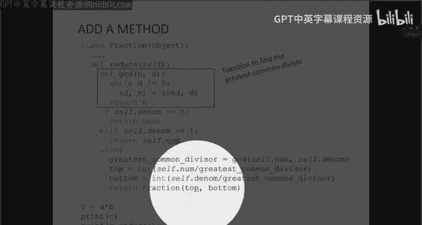

That is in reduced form。So one slash6， for the example， 212。Right， so here it is。

 This is my previous example where I multiplied that thing that gave me2 slash 12。

And then if I do C dot reduce， Python will call the reduced method on C。

 So the object whose numerator is 2 and denominator is 12。And then this will reduce it to one over6。

 and it will print called the print STR method on an object of type fraction to give me one over6。

Everyone， okay。You could put it outside the reduce。

 But since it's being used specifically in the reduce， we'd like to just keep it within， right。

 So it's not， if it doesn't need to be used by other things。

 we'll just keep it only to the sort of scope where it needs to exist。But it， it can be outside。

 yeah。O。So one thing is weird here， though。Right， this e here。

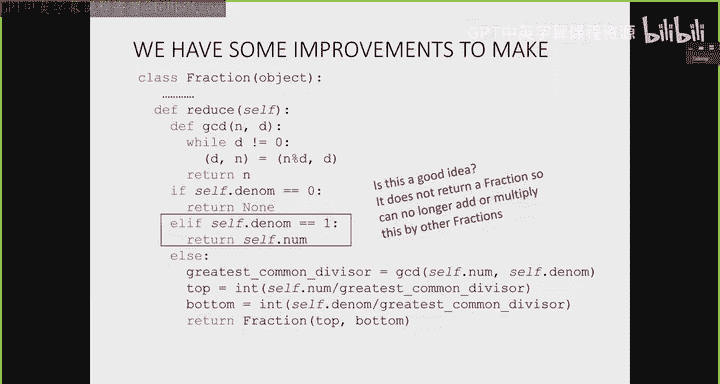

What is the type that is gets returned from the else， You guys tell me。

 what's this type here that gets returned down in the else。Fraction。

 what is the type being returned in the L F。

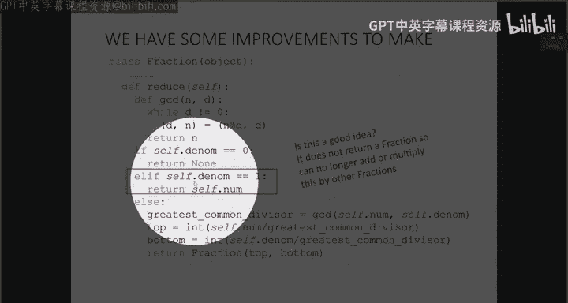

Yes， an int。So if the denominator happens to be a one。

 this function this method reduce returns an integer。If it's not， it returns a fraction。

So if at some point in the future， you're mixing， you know。

 you you happen to reduce something that has a denominator of one。 You're now working with integers。

 and then potentially you'd be doing further operations by mixing that with fraction object。

 So as an example here， I've got a fraction object， a4 over1， B3 over 9。Reducing a gives me a 4。

 fineine。 It's the integer 4， and reducing B gives me 1 over 3。 It's fraction 1 over 3， right。

So the type just to show you exactly， you know， that I'm not。

Lying the type of the A reduced is an in。 right， That's what the code is doing。

 And the type of B reduced is a fraction。So then when we do the star operator between A R and B R。

 Python is going to say， you're trying to multiply an int with a fraction。

Did you ever tell me how to do that， No， right， We told it how to multiply a fraction in another fraction。

 but not an inch with a fraction。And so， Python will fail here。

So one thing that you can do to fix it。

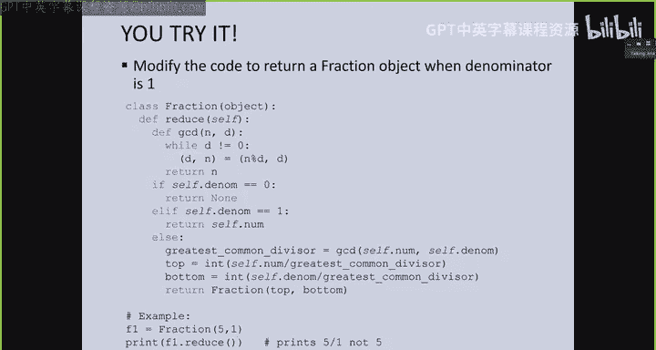

Is to change this。L if here。 So let's have everything consistent。

 So I want you to do this change instead of returning self dot num。

 return for me a fraction object representing the numerator。

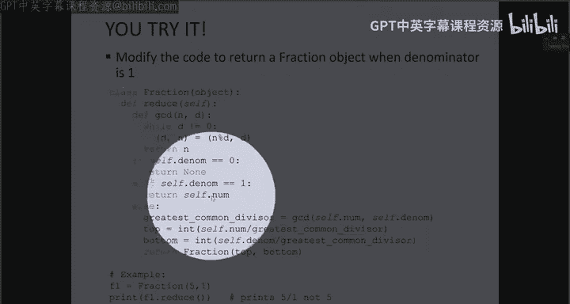

All right， does anyone know，' just a small change to instead of returning self num。

 what should I return？How do I make a fraction object？Just invoke the name of fraction， right。

What's the numerator of this fraction object supposed to be。It's already there。Self donm。

 What's the denominator of this fraction object。Exactly。

So it just returns a fraction object whose numerator is self done numb and denominator is one。

 exactly。 so now all the different cases， except for this randomly weird denominator being 0， right。

 in case that happens， some， something's gone wrong， maybe。

All the other cases are returning a fraction object， which is good because now it's consistent。Oh。

 yeah， exactly。 So we did say we didn't want it to be 5 over one。

 but this is actually using the old STR method where we didn't do that check。

So it will print 5 over one。 But if we， you know， if we do the check， if self dot domic equal 1。

 then return stir self dotm。 Like if we add that， then it won't。对的。

But this is just using the old SR method that doesn't do that Nice formatting for us。Questions。

We've been working a lot with returning new objects of the same type that we're writing， right。

 that's。Sort of a new thing today。Okay。So。What's the purpose of these two lectures， right？

 So hopefully， it shows that。It's very useful to to bundle data and behaviors together right So the ultimate goal when we're writing programs is to write code that's modular organized right。

 because in the future you might want to build upon this code in the future。

 you might want to read this code to use it for something else in the future。

 Other people might want to read this code or use this code。

 this class that you wrote to build more complex classes， right。

 like we use the coordinate class to build a circle class， right。

 Other people might use your circle class to build， I don't know。

 a sphere class or something like that。 something more complicated。

And so it's really nice to create these little data types that are organized， right modular。

 And so we're basically bundling together these。😊，Data， right？

 So what makes up your object and behaviors together so we can use these objects in a nicely consistent way。

So remember， back when we were learning about functions， right。

 the ideas of decomposition and abstraction were very important。

Functions basically took a chunk of code。And decompose them into one module that we could reuse many。

 many different places， right， And we abstracted away the details of the function。

Through dock strings。 So people didn't have to slog through a whole bunch of code to figure out what the function did。

 All they did was read the dock string， and they knew exactly what we wanted。Now。

 object orient programming and pythonic classes have that same big decomposition and abstraction energy。

 right？ They've got a bunch of modules that we're creating here where we're bundling together data and behaviors。

 right， So we can create a whole bunch of objects that behave in the exact same way。

 Nice consistent so that we know that if I create a coordinate object here。

 it's gonna to have an X and Y value。 And if I create another coordinate object。

 it's also going have an X and y value。 It's not suddenly going to have an X， Y and Z value。

 right So creating these objects that work in a consistent way is is very。

 is a very know decomposition an abstraction。😊。

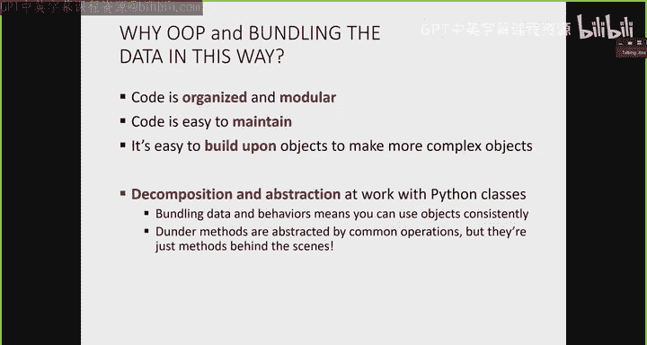

呃。🤢，A are working with the ideas of decompositioning abstraction， just like functions did。Okay。

 so next lecture， we will be starting on。We'll do a little bit more of these classes。

 and then we'll start on inheritance。 So having parents， the objects that we created。Right。

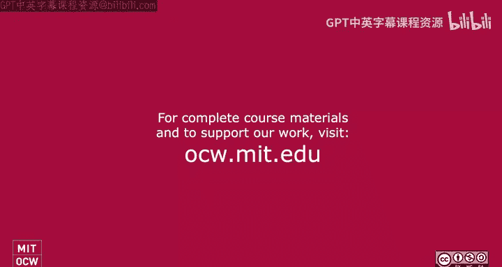