# 《计算机科学和Python编程｜6.100L Introduction to CS and Programming using Python, 2022》 - P19：-19-Lecture 19_ Inheritance.zh_en - GPT中英字幕课程资源 - BV1PAxJzVEs3

All right， let's get started。So today's lecture is lecture 3 out of four on the idea of object oriented programming and creating our own object types through Python classes。

 the majority of today's lecture will be on this idea of inheritance。 but before we get there。

 I'd like to do a little bit of a recap of the big things that we've seen already， and along the way。

 we'll be writing a new data type for something more abstract and animal class more abstract than what we've seen before。

 but then when we get to the idea of inheritance well build upon this animal class with some more animal objects。

So the big idea behind creating our own data types is that we want to mimic what's going on in real life。

 right and in real life， we basically have all of these different objects in the world。

 right But these objects kind of can be grouped according to some categories， right。

 So in this particular slide， I've got six different objects。

 But the three on the left can kind of be grouped together， right。

 we know that they are a kind of cat。 And as such， we know that all these cats have。

 you know we can describe them using some common properties and common behaviors。 So for these cats。

 I would give I would say that all these cats have a name an age and to color associated with them。

 right So I know that all cats will therefore， you know。

 generally have a name an agent of color and then some similar set of behaviors。

The items on the right， right those three objects。 I know they can be categorized together。

 Let's say that they're wild rabbits。 And let's say that for the wild rabbits。

 I don't actually give them a name。 So I would categorize them again。

 using common properties properties just an age and a color， right， No name。

 And then those three objects on the right also have a common set of behaviors different than the objects on the left。

 And so we're trying to mimic these the idea of these categorizations。

 data types that we see in real life。Okay， so。A little bit of recap rate。

 When we define our own data type in Python， we decide on a bunch of attributes。

 and attributes can either be data or they can be procedures。The data is。

 you think of them as sort of what variables make up your object。

 And this is something that you decide。 So for a coordinate object。

 we've seen this example a lot of times。 we decided on X and Y values for this more abstract idea of an animal。

 Well， we can just say that we can describe an animal by its age。 So how long it's been alive， right。

 since birth。In terms of procedural attributes， these we implemented using methods in Python classes。

 and these， the idea behind these is just how can somebody or somebody who's creating an object of this type manipulate the object。

 What are some ways to interface with this object。So our coordinate class。

 we one of the more interesting things was to find a distance between a coordinate and another coordinate。

 but some of the simpler things were， you， to just get the value of the X coordinate。

 the Y coordinate， things like that。For our animal class that we're implementing today。

 it's going to be a little bit more abstract。 But one of the simplest things is to just say， hey。

 tell me how long you've been alive。 That's basically just grabbing the， the value of the attribute。

 the H， right。So here we're defining our object our data object， right。

 The class keyword tells Python we're creating a new data type。 This is the name of our data type。

 So the type of this thing that we're creating is animal。In parentheses here， animal inherits。

 Anim as parent is the generic Python object。 And later today's lecture。

 we're gonna to see what happens when we put something else in those parentheses。So the。

 the parent of a class that we create is something other than just the generic Python object。

And then the very first method that we always write in our new object definition is the init method。

 This tells Python， how do you create an object of this type。

 like a very basic information that Python needs to know。So the in method is a special Dunder method。

 double underscore， init double underscore。And by now， you're familiar。

 the first parameter of every single method that we define inside a class is this thing called self。

And remember， self is is a variable， right， it's a variable name that allows us to talk about an object without having created one yet。

 because all we're doing here is defining the class， right？ We don't have actual objects created。

 And so this method here， the in method and all the other methods are run on an object of type animal。

 but we don't have that object yet。So the first parameter will be that object in this abstract sort of way。

And then you can put other parameters in， in that list。

 And so we say that when we create a new animal object， we're gonna initialize it by its age。

 So a some number。Within the in。What do we usually do， Well。

 we usually initialize all the data attributes， also called instance variables。 So here。

 how many data attributes do I have。For the animal class。2， exactly。 Yeah，2。 The first one。

 self dot age， right， is a data attribute。 And we know it's a data attribute because we have that self appearing again。

 right， If it just， it was just a variable name like age or years or time or something like that。

 it would just be a regular old variable。 And as soon as that in it method ended。

 that variable would go away。 But the fact that we've we've initialize this variable using self dot tells Python。

 hey， this is a variable that I want to persist for as long as this object exists in memory。 Okay。

 so it's， it's an instance variable。So self dot age equals age will create this data attribute age and assign it to the parameter。

Past in H。Now， selft name is also data attribute。It's just not being passed in the parameter list。

 And that's okay。 Not everything has to be passed into the parameter list。 So here。

 what we're effectively doing is saying when we create a new animal object。

 we have to tell it the age， how long it's been alive for。

But then the name data attribute is always going to be none。

 So there's an absence of a value for the name for every animal we create right off the bat。O。

Everyone， O with me so far here。What's the purpose of defining this to be none， Well， later on。

 I'm gonna add some methods that allow you to give a name to an animal if you'd like。 But again。

 this is a design choice that I made。 So you， yeah， you， you might not make the same design choices。

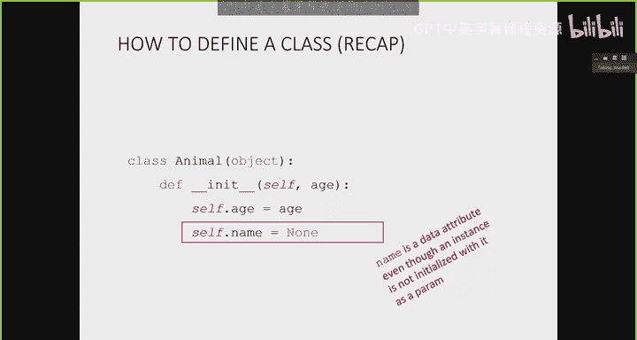

So that's the definition for my class。 right， Just these four lines of code。 And then down here。

 we saw in the past couple lectures how to create actual new objects， right。

 So this is where the the actual it actually happens， right。

 So here I'm creating a new animal object， a variable。 My animal is bound to that animal object。

 right， So that's my variable name。 name it anything you want。

 And then you're telling Python to create a new animal object simply by invoking the name of the class。

 And then passing in all the parameters that we're expecting here。 except for self， right。

 because self becomes this thing。 Like if I were to draw box around animal 3， that is self。

 that is this object that I just created。😊。

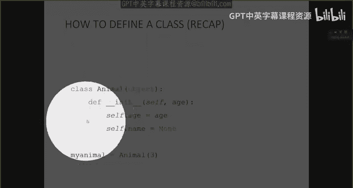

O。So that's the Internet method。 Last lecture， we saw some Dunder methods。

 And I think I said probably the second method you'd ever want to implement for a new class is this Dunder SR method。

Now， the Dunder STR method tells Python， how Python should print an object of type animal。Right。

 because initially right off the bat， if we didn't implement this Dunder STR method。

 Python would default to the STR method of the generic Python object。

 which just tells us the memory location this object has been created at which is not very useful when we print an animal object。

 And again， my design choice， is to say， I'm going to print animal colon。

 the name of that animal colon and the age of that animal。

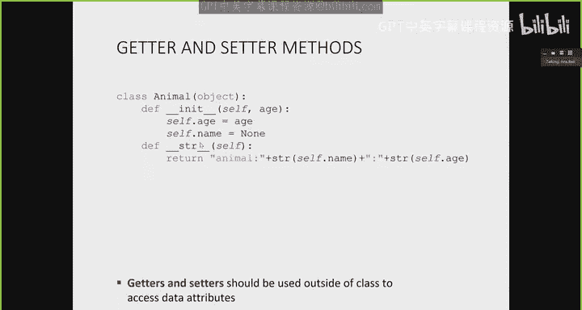

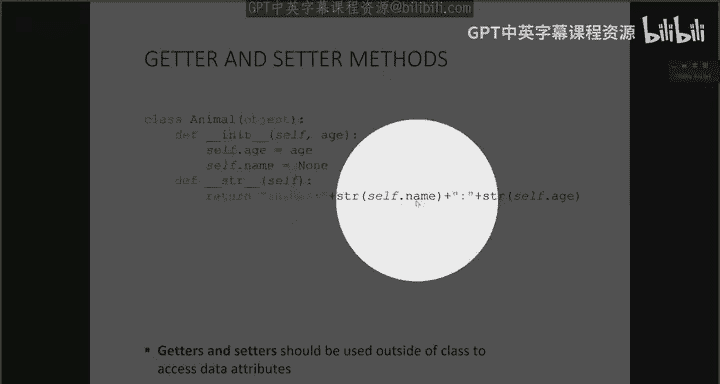

Again， my design choice。And remember， the D S TR method returns the string you want to print out。

 It doesn't print it out。Straight up。Everyone okay with that so far should be review。

So then the other things that we， we want to include in our class。

 And this is something that you included， no matter what the language you're working with。

 is these things called getters and setters。So getters are these two right here。

Gettterters are basically very simple functions that return the values of the data attributes that this object has。

This object just has two， right， an age and a name。

 because they were defined using self dot age and self dot name。 So here's a getter to。

 to just tell me the value of self dot age。 So all it does is return self dot age。

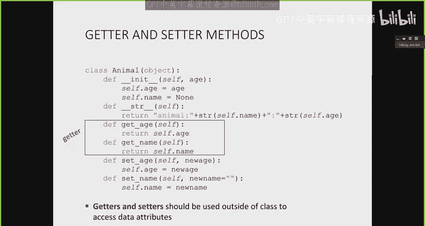

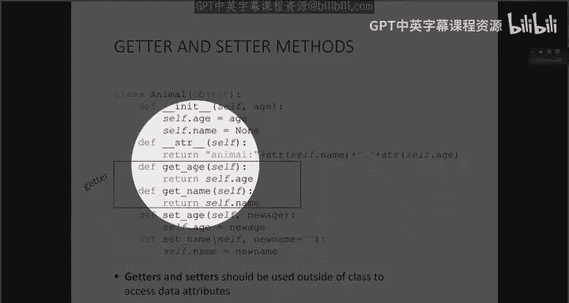

And name all it does is return self dot name。 Very， very simple。Seters same idea。

 except that now we're allowing someone using our class to set the values of these data attributes through this。

 through these methods。Right， so here all it's doing is taking in a parameter for the thing you want to change the age or the name to。

 right？ And all it does is say， well， save self dot age is going to be equal to the thing you passed in。

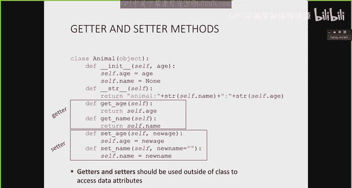

嗯。That's the age。 So we're changing this to a different number。

 And then the set name is changing the name， data attribute to a different string。

 And here I'm using this default parameter that we talked about way back in in when we talked about functions。

 right， So if you don't pass in an actual string value， we'll default to the empty string。

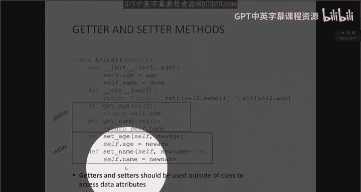

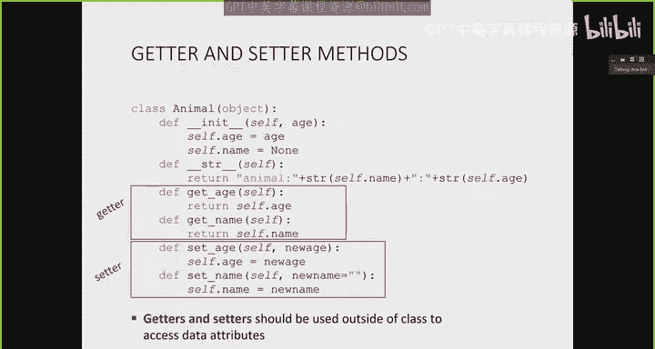

So let me show you how this works。So this is my animal class。 exactly as in the slides。

 I've got my unit S TR and my two getters and setters。

And then I've got two animals being created here， right？ So here's a print for animal with age 4。

 and here's a print of animal age 6。 So if I run these。

 it should print animal colon none because I didn't set the name to anything for these two。

 and then their respective ages， right。So this is using the STR method for on A。

 and this is using the STR method on B。O。And then we can access， of course， using dot notation。

 all of our data attributes。 So here I'm accessing the age directly。But since the getter。

 get age just returns for me the value of that data attribute。

 these will actually print the same thing。 So I'm just going to comment these out。

 So if I'm accessing A's age through either the data attribute directly or through the getter method。

 it'll print four for both。

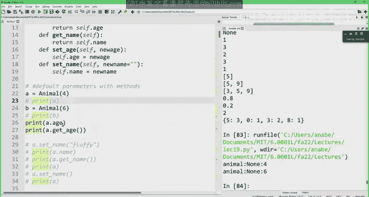

Pretty， pretty straightforward。And then we can do some things like this。

 So I can call the set name method。 So here I'm passing an actual name for it。

 and then I can print the name， or I can use the， the getter。To print the name， right。

 So if I run that， you'll see the name has now been changed for object a。

And then if I run the print method on A， then write a print animal Co in the new name that I just said it to fluffy。

 and then the age has been unchanged。If I run set name without a parameter。

 it'll revert to that default parameter for the name， which is the empty string。

So the new name of my animal A will just be empty strings。

 So it's just gonna be colon with nothing in there， right， So just empty， no space or anything just。

Nothing。O。Everyone on right so far。 hopefully， a little review。

So we saw that we can actually grab the exact same value right， for the age using by。

 by accessing the age data attribute directly， right， using dot notation or our getter。That we wrote。

One of these is better than the other in terms of style and in terms of， you know。

 good coding practices and in terms of writing code that's easy to read， easy to modify， robust。

 things like that。The one that is better to use is the one that accesses the method Both are using Don notation。

 but the first one is actually accessing the internals of of my of my class definition。 right。

 Were in order to know the value of my data attribute as someone who's just using this code for an animal class。

 I have to actually go in and read right， the inni method to know these data attributes that are being initialized。

 I don't know by you， but I actually， let's take an example of a list， right。

 something we've used a lot。 Have you ever gone into the definition of the list class to see the data attributes that are being initialized。

 I haven't right， All we've been doing is working with methods that allow us to make changes to lists to do operations on lists and things like that。

 So the internal workings of the list class is hidden from us。 And that's just the way we like it。

 right， I don't care how the list is actually implemented。And the same thing should happen here。

 right， I shouldn't care how I implement the animal class。 I shouldn't care what variable， you know。

 what instance variables they're being they're using。So。Let me show you why。

 So if someone who's writing the animal class decides in the future。

 that age was a strange variable name to use， and they decide to change that， the。

 the variable associated with how long this animal has been alive to， to be years。

RightSo here' I've got self dot years equals age。 That's the only change I've made to my animal class。

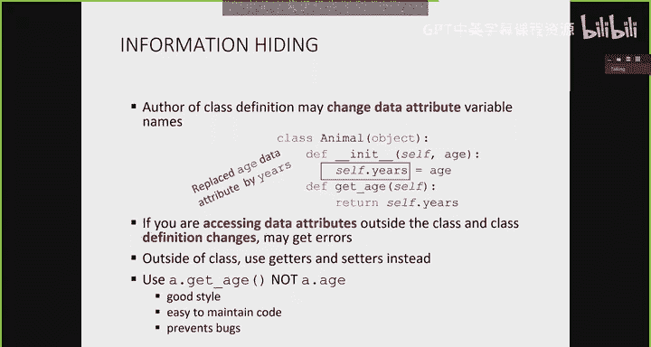

Right， so I've made the design decision to change the this data attribute to be years。 And then。

 of course， since I'm making this class， I need to make sure all my getters and setters and everything still works with this new data attribute。

 So my get age will return self dot years。

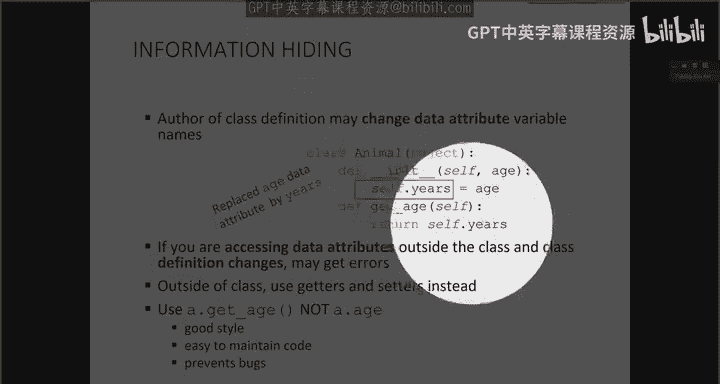

Right， I'm returning this variable data attribute that I've， I've changed to。Well。

This is the full code。 So this is， you can see the changed data attribute here。

 I'm using self dot years equals H。 And then my getter is going to， oops。

 my getter is going to return self dot years。 and my setter is going to set self dot years。

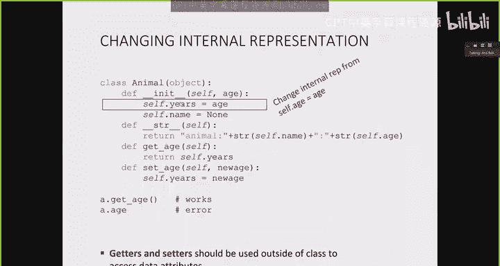

Well， if this implementation should be hidden， right， from me。

 somebody who is just trying to create a bunch of animals in their code。

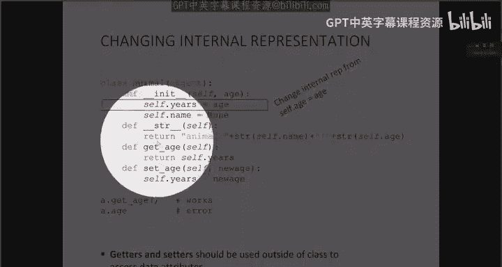

So this code down here。Will work。If I use my method， right， because the method should still work。

 no matter what the data attribute is called， right， age or years or time or whatever。

But if I had code that access that data attribute directly， it doesn't work anymore。

 It throws in there because surprise that hit attribute no longer exists， right。So。

 it's much better style。And， you know， you can more robust to use only getters and setters。

 only methods to make changes and to manipulate the objects。 You should never。

 ever really have to use the， the data attributes， right。Questions about that。Okay， good。

 because that's something that you'll have to keep in mind on the quiz next Monday。

Not using data attributes。All right。So。Having said that。

 Python does allow you to do a bunch of questionable stuff。So first of all， it allows you。

 as we just saw， to access the data attribute of a particular instance that you create。

 right so you create an object， it's a very specific animal with a specific age。

 you can just access the use dot notation to access the value of all of these data attributes。Fine。

 we're not， you know， we're not。 well， well mess ourselves up in the future because， you know。

 maybe this won't work， but it's not so bad。

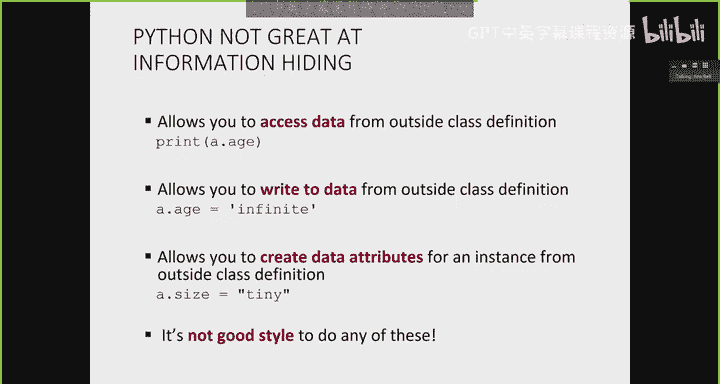

However， Python also allows you to change the value of a data attribute outside of the class definition So this is code we write。

 not within the class。 It's code we write as somebody who's using the class。

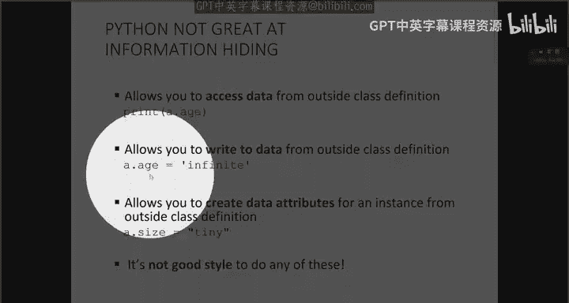

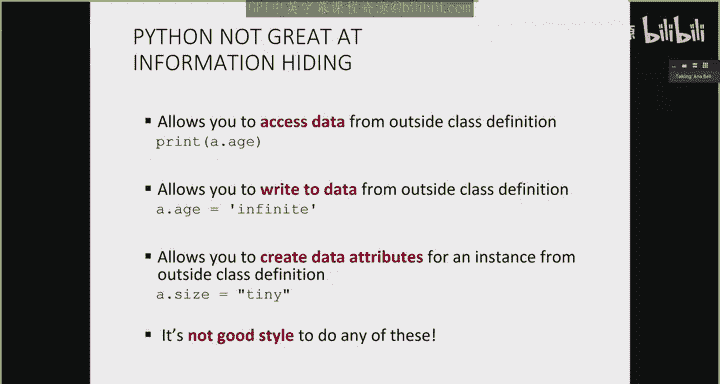

So what does this mean， Well， now I'm going to set the age data attribute to be whatever I want outside the class definition。

 right， I could even set it to a dictionary if I wanted to。

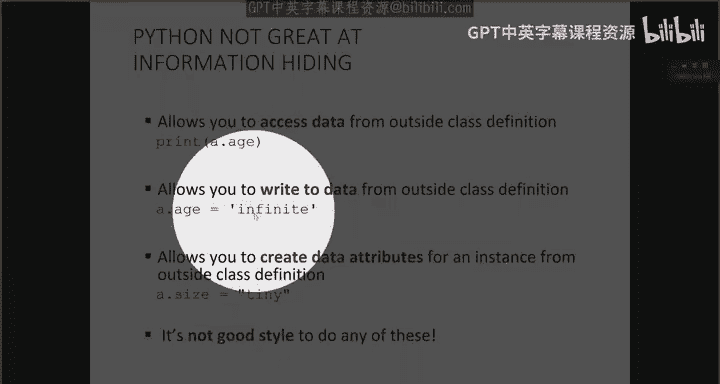

In this particular case， I'm setting it to a string infinite。 But if I do this， then I risk。

 you know， code on this animal class not working further on because maybe they assume that the age is always a number。

 And so a different method I might run will not work anymore if I happen to set it to this string。

 right。And then one other thing Python actually allows you to do is to add data attributes to instances。

So now the problem with this is that let's say I create a whole bunch of instances of animals， right。

 This animal got age 4。 This animal got age 6。 This animal got age 5。 And then one of these animals。

 I decide to add a new data attribute to it。 Like only one of these instances。

 now has three data attributes associated with it。 A name and age。 and now the size。

All the other data， all the other animal instances I've created only have a name and an age associated with them。

 Just this one happens to have this extra date attribute。

So now the whole reason why we're creating our own data types， right， was to be consistent。

 to bundle the specific set of data and specific set of behaviors together flies out the window because now I have one instance that now has this extra data attribute associated with it and nobody else does。

Right， so all that consistency has， has， you know， is。Has gone out the window。Never。

 ever do any of these outside of the class definition。

 It's totally okay to access data attributes while you're defining class， right。

 but not okay to do any of these outside of the class definition。

 even though Python allows you to do them。Okay， so one of the things I wanted to show you in this lecture is something we haven't really seen so far。

 And that's actually just working with objects that we create。Yes。

 when we created fractions and coordinates， we just created a whole bunch of objects and then。

 you know， printed， you know， the numerators or you know。

 printed the object or multiplied them together。 But we never actually wrote nice functions that kind of work with objects of our type。

So one of the things I wanted to show you is how how to do that。 So here's a function。

That creates a dictionary out of a list。So the input here is going to be a list of whatever I want。

And the function， what I would like it to do is to pick up from the list only numbers that are non negative。

And just integers。 So in this particular case， I would like my function to pick up the two。

 the5 and the0， ignoring everything else。And I would like to create a dictionary out of these numbers。

And what the dictionary should do is map each one of these numbers。 So the two， the five and the0。

These would be like keys， and they should be mapped to animal objects。With these。Ages。Right。

 so that's an animal with2 of age 2。 And this is an animal with age 5。

 And this should be an animal with age 0， right， So my keys types are ins。

And the values associated with the keys， the type should be animal， this object that I just created。

Alright， so the code is pretty straightforward。 We just have a little loop that goes through each element one at a time in my list。

 That's for N And L。 And then I'm just going to do something to the elements that are integers and greater or equal to 0。

 right， non negative。😊，So that'll extract only the two。

 the5 and the0 as we go through the loop over the element in L。

And then the key line here is this one in red。I'm going to say I'm going to this line just adds an entry to my dictionary。

 right？ So this is the syntax for putting something in a dictionary。 right。

 There's no append or plus in a dictionary or anything like that。

 It's just straight up indexing the key you want is n。 So either a2 a5 or a0。

 And the value I want to associate with that key is an animal with age whatever this is 2，5 or0。

 right， So exactly what I wrote here。Everyone， O， so far。All right。

The loop goes through to the end of the list。 And then we've created our dictionary， and we're done。

As we're writing this code， how would we debug it or how would we check to see that it worked？Well。

 the instinct is to say， okay， well， let me check to see if this function worked。 So here this line。

 animals equals animal D to L will run this function。And it runs it on this L。 And at the end。

 it returns a dictionary， right， something that looks like this。

So our instinct is to just print that return to dictionary。

But if we were to print that and you can actually run the code in the Python。 if you print that。

 you get something like this。And that's because Python doesn't dig through elements of dictionaries or even elements of lists to run the print method。

Sort of recursively， right， It just runs the print method the top level。 And the problem is。

 it knows how to print integers just fine， but it doesn't know how to print a dictionary where the values are animal objects。

And so we run into the same problem where now the value associated with key2 is this animal object at that memory location。

 But how do I know that I didn't screw up sort of my， you know。

 I created an animal with age 5 where it should have been to， right。So the solution。

 and you'll probably encounter this on the next quiz if you're debugging your code。

 the solution is to just iterate through the dictionary， right。

 in such a way that you run that print statement directly on an object of type animal。

 Python knows how to do that， right， We told it the STR method。Right， we have an STR method here。

 so it knows how to run the print directly on an animal object。

 It just doesn't know how to run the print where the value of a dictionary is an animal object。

So let's replace this print of the dictionary。With a little loop。It goes through this。

 the the dictionary's items。Right， so n is going be my key。

 and a is going to be the value associated with that key。And I've just got the print statement here。

 So I'm print， I'm using an F string here， that print key and whatever value that key is with Val。

 whatever value that that is， right， So now the print statement is being run directly on an object of type animal。

And now the result of this loop will be this， right， So key to with value。

 And then it uses the print statement on my animal object。Does that make sense， Everyone O so far。

It's convert， Yeah， exactly。 It's converting the stuff in the dictionary strings because my print statement is being run directly on that object right of type animal。

 And it knows how to do that。 I I implemented the dest year。Everyone， okay。O。

So let's have you try this。 Let's have you write a little code。So， this function。

It's going to be very similar。 We're not making dictionaries。 You'll be making a list。

 but you'll encounter the same problem。

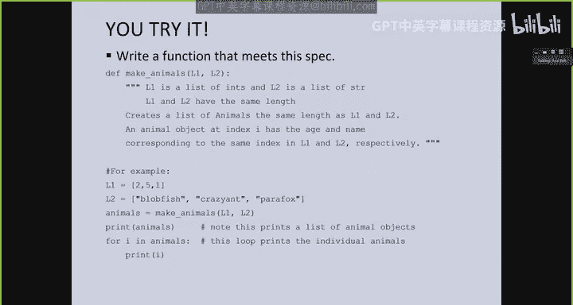

The input here is going to be two lists of the same length。One list has numbers。

 One list has strings。

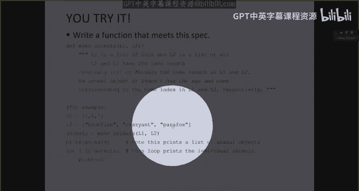

And what I'd like you to do is create for me a new list。

And the new list is going to have animal objects。Where you match sort of index by index。 So the。

 the resulting animal object at index 0 will basically create for me a new animal with age 2 and name blobfish。

 right。

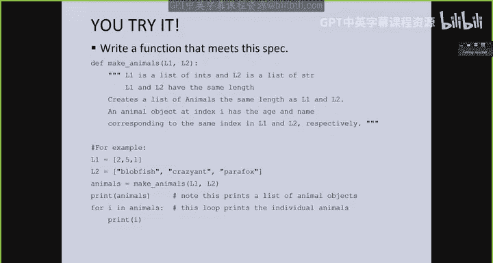

The animal object in the resulting list at index1 will create an will be with age 5 and name crazy ant。

 And then the animal object at index 2 will be age1 and name para fox。

 So we're just doing the same thing index by index where you create a new animal object。

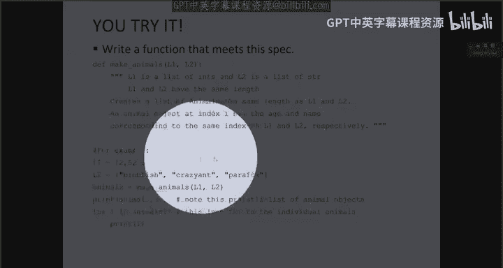

With the。Age this value， right，11 at a time。 And you set the name to be this value one at a time。

 and then return that list。So that should be line。啊。79。O。Who has a start for me。Okay。

 should we call it L3？O。嗯h。😊，Yes， but then if you're doing L2 of n， then this should be the index。

 right？So how do I make this be the index instead of the element directly。Yeah呃 yeah。Yeah， exactly。

 right。 So instead of looking at the element directly， let's just look at the the range。

 So for ion range， and then we need to do L， pick one of the lists，ca they're the same length。

So now I is 0，1，2，3，4，5， like all the index values。嗯。So L1 at index I。

 So I need to create an animal with that age， right， So let's do， let's do this。呃。🤢。

Age equals L1 at index I， right， just to save it as a variable and name equals L2 at index I。Right。

 does we agree？So now that I have age and name stored in these variables。

 how do I make an animal object with。With that age。Yeah。Well。

 the inni method creates for me an animal with that age， right。

RightSo when we just create a new animal object， we just pass in that age。Right。

 like the constructor。Requires the age of the animal。Right。So when we construct a new animal object。

 we just invoke the name of our animal。 Where is it here， right。Or sorry， our animal type。

 our animal class， and then we pass in the age that we want to create this animal with。And that。

 according to the init method， creates self dot age。Be whatever is passed in。And a name。None。

So we're halfway there。 We've created an animal object with the age that we want。

But the name data attribute for this object is none。Everyone with me so far。So how do we。

 how do we make the name of this animal object be the one that we saved， right， from that L 2 list。

Yeah， exactly。 We can use a set function。 Yeah， set name right here。Right。

 don't access the attribute directly。 But yeah， we can use a set function。So。

So this created for me that new animal， right， but。I need to actually save that animal somehow。

 right， because I need to reference it later。So let me do this。 A equals animal with that age。

 And then we run the setter function on this object。 A， right， set。amme。It's just a function。

 And what name do we want to set it at this thing here。

 So name here is this variable that we extracted from the L2 list。Everyone， O so far。So。

 now what I have is an object A is a variable that's bound to an animal object。The name。

 the the the age was set when we first created it。And the name we just set through this setter function。

And now。We should just put it in my list。 My list is originally empty， right， So now let's。

 instead of， I don't have a bunch of elements to add it to。 So let's just append it to L 3。Like that。

Right。I mean， theoretically， I could have created an empty list that was， you know。

 three elements long。 And then I could do L 3 at I。But this works too。And then at the end。

 let's return L3。Right。Questions about this。Ors this all right？Okay。

 so if we run it and we just print the list with these animal objects。

 we run the same problem as that dictionary one， right？ You see。

 I've got a bunch of memory locations here。So to test that I did it right。

 instead of printing the list， let's iterate through our list through this little for loop。

And just run the print method directly on my object。So now if I run that。

 it should just run the print statement directly on each of these animals， right， so that's。

Does that make sense。Yeah。Oh， so instead of printing the list， this thing。

 I looped through my list and printed the elements。That's not in the function。 though。 That's just。

 yeah， that's outside。But this is something pretty common that you'll run into you make a， you know。

 a list or dictionary some structure or tuple or something like that with objects of your type。

 And when you run the print statement directly on that structure。

 it doesn't go deeper than top level。 And so it prints， you know， that uninformative stuff。Okay， so。

We in this particular， in these examples， we saw that it's better to access the attributes through getters and setters。

 So you know， in addition to the init， the STR method。

 writing getters and setters to have a consistent way of accessing and modifying these data attributes is really important。

 And then you can even impose restriction。 something like， you know。

 the types have to be this or maybe they can， know， the age can't be a negative number。

 something like that。 And it allows， you know， a lot more consistent use of the object。

So now let's move on to hierarchies。 Okay， and this is where we're going to talk about inheritance。

So there's something like maybe 28 objects on this slide， right。

 There's the6 we encountered at the beginning of this lecture and 22 up there。

 So there's 228 separate objects on this slide。And all of these objects。

 we could say are of type animal， right， because by our definition。

 an animal has the the attributes for an animal is how long they've been alive。

 And these all are objects that have been alive for some time。

But in addition to having how the attribute for how long they've been alive and an unknown name。

 we can actually then create separate categories， right？

 And each one of these boxes that I've that I've， I've created is a different subset of animal。

 right， We call it we'll call it a subclass or child of an animal class。

And that's because they will bring about different data attributes。

 in addition to what an animal's data attributes are。

And they will bring about different behaviors in addition to the behaviors of our really generic animal object。

 right， So the things a cat can do， a rabbit might not be able to do and things a person can do。

 a cat won't do and a rabbit can do， right， So then they're all animals。

 but they all are going to have additional data attributes and additional behaviors that are different in these three categories。

Right， so I might say something like the cat has a name， an age and， you know， a pattern or a color。

 The rabbit。 again， I said are wild， so maybe they don't get a name。

 but they'll have a color or pattern。 And then the age， of course， from the animal。 People。

 of course， have the， the person object has the the age， right， that comes from animal。

 But in addition， they might have a list of friends or something associated。

 something like that associated with them， right， And a list of friends， something doesn't。

 something a cat doesn't have something that a rabbit doesn't have。 You So you see what I mean。

And we can even go further。 We can say， well， if I take my person object。

 I can now subcateorize that as well and say， well， this is a student class。

And in this student class， I would say a student is a person。

 So all the data attributes and all the behaviors that a person has， the student also has。 And。

 of course， all the animal stuff， because a person is an animal。So， for example， let's say。

 right an animal is a generic object。 It doesn't speak。

 but let's say a person gets the behavior to speak， right， So they for speaking。

 I might just print hello to the screen or something simple like that。A student is a person。

 so maybe they they they also get something like their age。

 the name and maybe a list of friends associated with them。

 but a student might also have a major or a favorite subject in school associated with them。

 something that a person doesn't have right so that's a new data attribute associated with a student that's not associated with a person。

A student might also have different behaviors like tell me your favorite subject in school。

 things like that， or it might override behaviors of a person。 So if a person speaks， you know。

 says hello， Prince hello to the screen， we can say， hey， if I ask the student to speak。

 they might say， I have homework instead or something like that， right。So what we're trying to do is。

Take those relationships and implement them in code。 So here I've got an animal class。

 which is sort of my base class。It's gonna to be my also called parent class or superclass。

 And then anything that an animal has， all the data attributes and all the behaviors of animal will be inherited by person。

 cat and rabbit。 So anything。 So a person is an animal。 A cat is an animal， a rabbit is an animal。

 So everything they have。 all these three subtypes will have as well。

But all these subtype will be different amongst themselves， right。

 A person will have an ability to speak。 Maybe print hello to the screen。

 A cat could also have the ability to speak， but maybe they'll print me out of the screen。

 A rabbit won't even have the ability to speak at all。 A person might have a list of friends， right。

 Whereas a cat won't。 A rabbit won't。 things like that。 So we can either add more information。

 Like list of friends was an example of that。 We can add more behavior。

 like the ability to speak is an example of that。And an example of overriding behavior。

 like I mentioned is， let's say we have a subclass student of person。If a person's speak method said。

 you know， said to say to print hello to the screen， we can override that behavior。

Through a speak method inside student where you don't just print hello to the screen， you can print。

 I have homework。So let's try to start implementing this relationship。This is just our animal class。

 There's nothing new here。 I'm just doing a little refresher on what this class looks like。

 So we've got our in knit where we initialize an age and a name that's none。

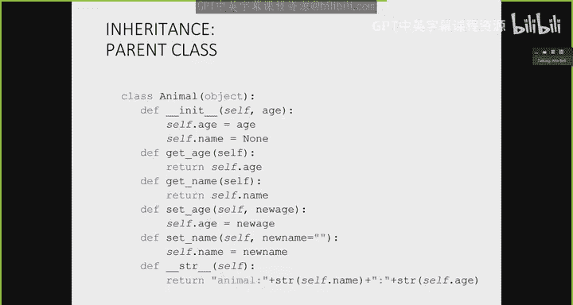

We've got two getters， two setters， and this STR method that prints animal colon name colon H。

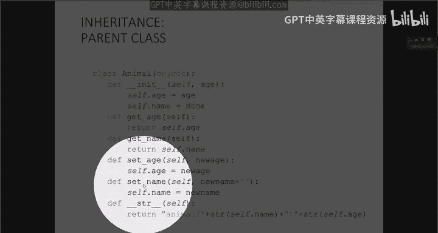

Let's。So， yeah， O。 So this animal class inherits from objects。 So the generic Python object。

And now let's work on a subclass cat。 So when I create my subclass cat。

 the way I tell Python that this cat is an animal is by putting in the parentheses here the name of the type that I want this class to inherit from。

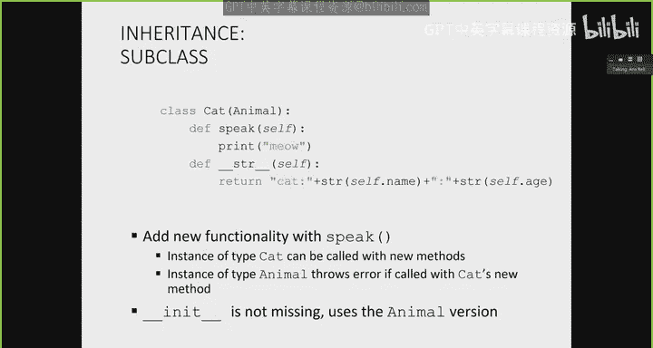

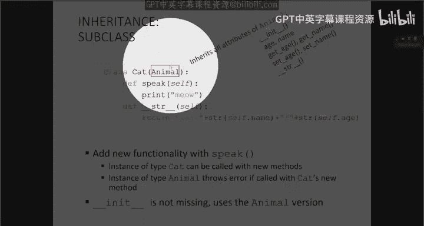

So a cat is an animal。那。One of the things I kept coming back to is anytime you create a new data type。

 you have to have an init method。

This。Doesn't specifically have an init method， right， I've just got two other methods here。

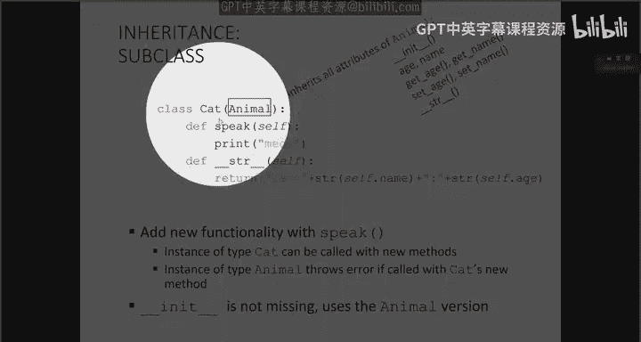

So you might think that it's missing， but it's actually not。

Because as soon as you put another data type here in the parentheses。So that cat is an animal。

 Think of it like Python going into the animal class。

 copying and pasting everything that's part of that animal class or copying everything that's part of that animal class and pasting it inside cat。

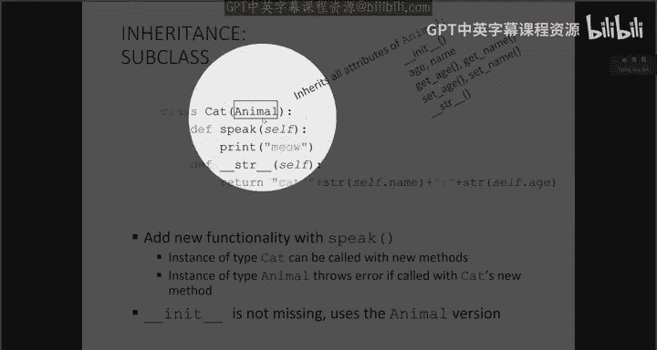

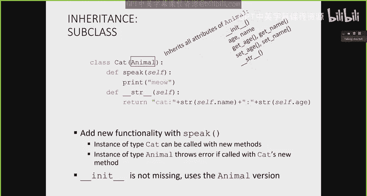

So since I don't have an in method in specifically defined in cat， Python will say， oh。

 we'll just use the in method of your parent animal。

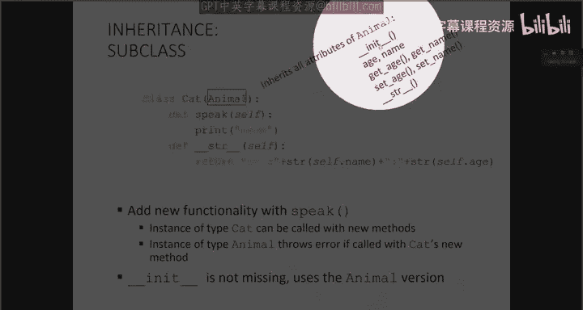

So the way we create a cat is going to be exactly the same way we create an animal。

Except that the name is gonna be cat as my object type， instead of animal。

But we just pass it in one thing， which is the age of this cat。

So since we're copying and pastcing everything yeah， question。Yes， exactly。

 So the parent class of animal is objects。 So cat will also be a Python object。

 But that's super generic stuff like binding a variable name to this object， things like that。

So not only does the in get copied in， but every single data attribute， age and name。

Every single way that that data attribute gets created。

 So the self dot age is going to be a data attribute of cat。

 and it's going to be set to whatever is passed in as a parameter。

 Self dot name will be initialized to none， just like for animal。 I've got my two getters。

 my two setters that also work with cats。 and then the STR method of animal will also be inherited in here。

But now we notice one thing。 And that's we have an STR method defined in the animal class。

 But then in my cat class， I define an STR method as well。

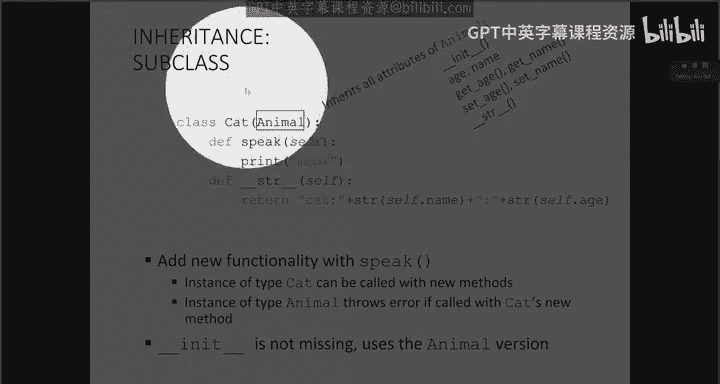

So that's called overriding your parents's class。And when we create an object of type cat。

 if this object has a method that has the same name as their parent。

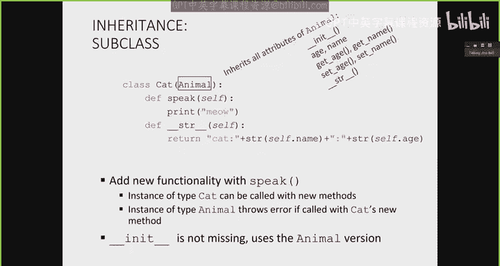

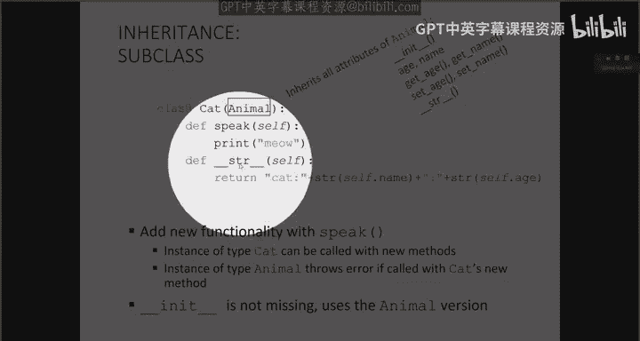

We use this method。There's no reason to go up to your parent to ask for their method。

 We use the one that is for this object。

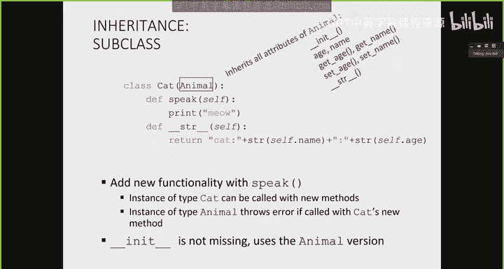

And cat， in addition to having everything that animal has。Implementments a new behavior。

 which is the ability to speak。 And all it does is print me out of the screen。

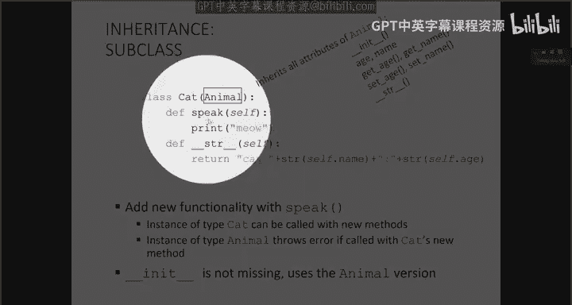

So let's look at some code。So， here's my cat。So I create a new cat object the same way I would create an animal。

 but， you know， I'm invoking the name of this class cat。

 The way I create an animal is just by passing in the age of this thing， right？

 So here I'm creating a cat whose age is5。 The name of this cat is none right。

 because that's what the in method of animal does。But I can run the methods on animal on my cat object。

 because a cat is an animal。 So all the methods that work with animals will work with an object of type cat。

So here I can just run the set name method on my cat object。

 even though the method's not explicitly defined in here， it's defined in my parent。

So if I set the name to fluffy and then I print the cat object， it's going to print。

 It's a cat colon， the name colon， the H。Speak is just going to print me out of the screen。

We can do the getter methods as well， right， So all of these methods that were implemented with the animal work with cats as well。

Now。A here。Object A was created up here when we talked about animals。

It's an animal object because it was created using the animal invocation here。

Does the animal class have a method to speak。No， so if I actually run this， it'll give me an error。

 right， It just says there's no attribute to speak， which makes sense。 I never define that。

 I define that in your child， not the parent。Questions about cats。O。So。

I want to briefly touch upon overriding methods because it can get a little bit confusing。

 So you notice the STR method right was implemented in both of these objects。

 The STR method is in cat， which overrides the animal method to print cat colon name colon age and the animal method。

 STR method prints animal colon name colon age。 So the rule is。When you。

 when you're running a method that， you know， exists in a whole bunch of these inherited。Objects。

You look at which one is it， It's SDR， right， So it would be the print method， right， or any method。

 it doesn't matter what it is。 You look at the object you're calling the methodthadone， right。

 So if it's a dot notation， you look at the thing before the dot。 If it's， you know。

 one of these special methods， What's the object you're running this method on。

So here I've got the print method on object C。 Python asks， what is your type， Oh， you're a cat。

 Do you have an STR method defined， Yes， you do。 So then it uses the one that it finds right away。

But if， for some reason， the。The current object doesn't have that method。

 So an example of that is set name， right。Right， that name is not a method defined in cat。

 C as an object of type cat。 It doesn't have that method。 Python says， oh。

 you don't have that method。 Let me look at your parent。 Does your parent have that method。

And then it， you know， looks through in here。 it finds it good。 If it finds it， it uses that one。

 If it doesn't find it， it looks at your parent's parent。Right， if your parents's parent has it。

 it uses that one。 And if it doesn't， it looks so your's parents parents。

Until it gets to the generic Python object， this one right here， if they have it， it uses that one。

And if it doesn't， then it throws an air。So an example of something that the generic Python object has is the STR method。

 right， It just prints the memory location。 and that's why when we don't implement our STR method in our class。

Python defaults to the generic Python object。嗯。Questions。Okay， let's look at a person。So。

Let's create a person object。This person object， again， will inherit from animal because on animals。

 the only things we， we， we said an animal is defined as is being alive for some period of time。

 And it has no name， right， The name is none。 So we don't even pass that in。

So let's say the parent class of person is animal。But this is my design choice。

 also to highlight a bunch of stuff。 But let's say that this parent， this sorry， this person class。

 when I create a new person object， I would like to pass in an age and a name。Right。

 so I don't just want to create a person with an age。

 I want to actually create it using a name in that parameter list。So as an example in my code here。

 when I create a person， I would like to pass in their name， comma and the age。

 two parameters to make a person。Well。I can't use the animals in knit method。 right。

 I could for cat because cat was happy to just be created using an age。

But I can't do that for a person because I would like to create a person by passing in two parameters in the creation of the person。

So what I have to do is effectively override the in method of animal by implementing it in my class definition。

Right。So here I have to define my own init method， and I do it because now I'm not just passing in an age。

 I'm want to pass in a name and an age on the parameter list。

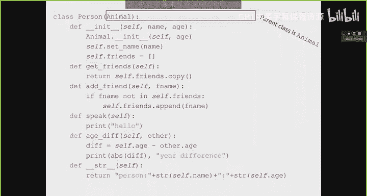

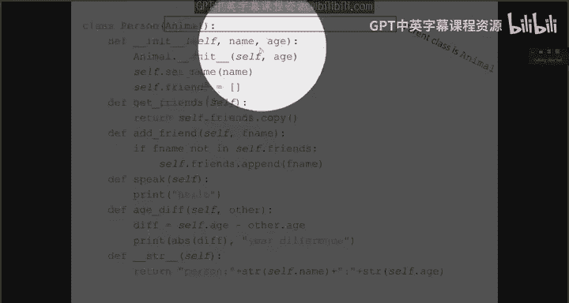

And then beyond that， what do I do inside the in method？I know that this person is an animal。

 So what I'm going to do to make my life simpler is to call animals in it method。

 So here we use this donnotation on the name of the class。

 sort of similar to how I showed you that sort of long way of calling methods。

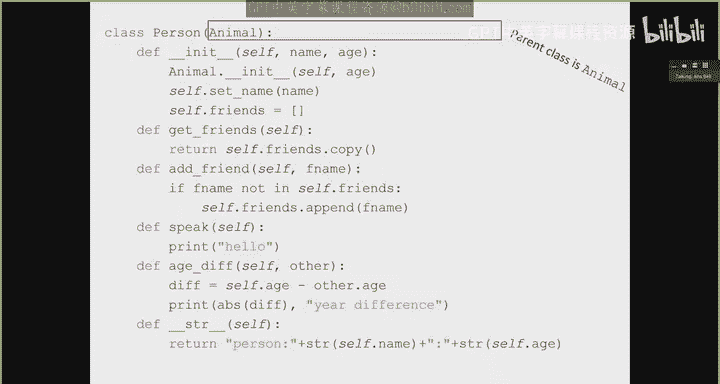

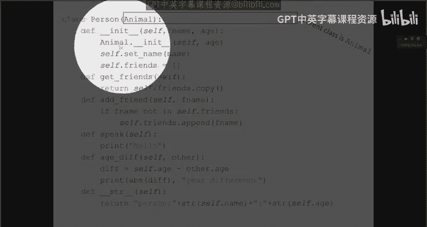

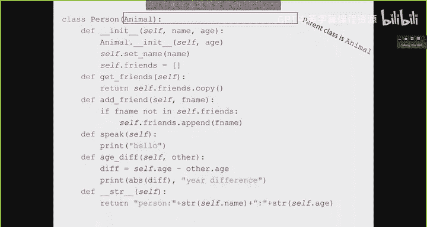

Well， here's the name of the class， dot the name of the method in it。

 and now I pass in all the parameters self and age。

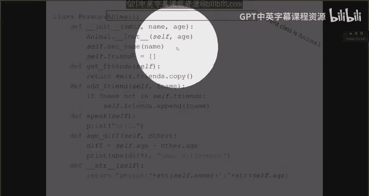

So I'm gonna call animals in knit method， which will create that self dot age。

 set it to age and create that self dot name and set it to none。

 So I'm taking advantage of the fact that that init method already does those two lines for me。

 right？ So I've turned those two lines into a one line here。

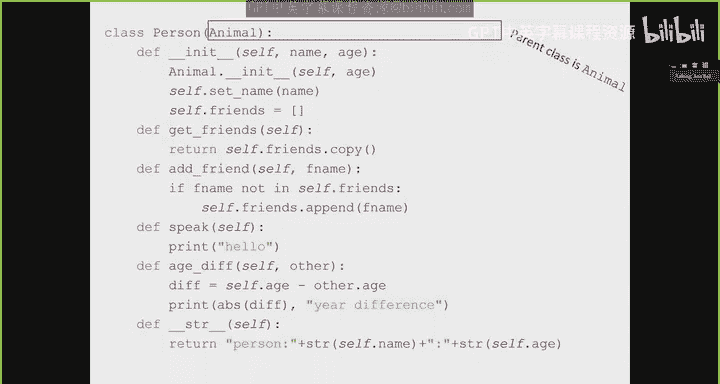

And then I'm going to say， well， I'd like to set the name of my person。

 so I'm going to call the method set name with the parameter that's passed in。

And then I'm also going to initialize another data attribute for a person。

 which is a list of friends initially empty。

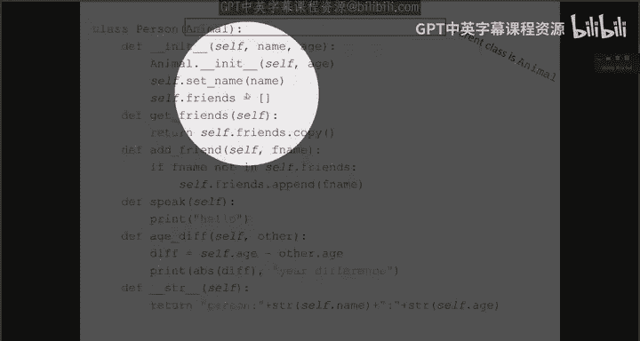

So what's nice about this and when we implement the student class， it'll look even nicer。

 What's nice about this is we're taking advantage of the fact that the inni method of animal already does some work for us。

 but at the same time we can clearly see in this subclass what what the person object brings in addition to the animal object right so in addition to just being an animal。

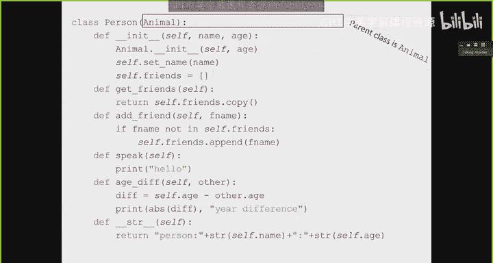

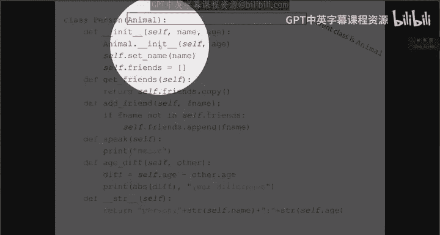

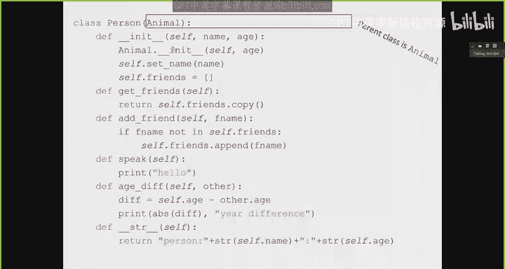

We give a name。

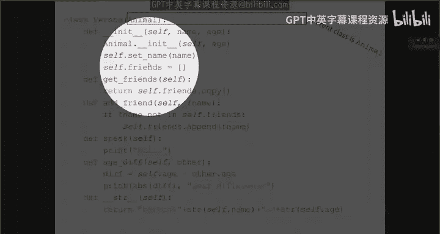

And get a list of friends。 right， So it's very nice to see the extra data attributes or what。

 what you need to change with respect to the animal to make a person。😊，And then beyond that。

 So I think that's going to what I said。 Sorry， I didn't go through that as I said it。

 And then beyond that， I've got some， you know， we can add some getters and setters。

 I just did a select few， but you should add them for all of them。

 So the get friends just returns a copy of my list because maybe I want to keep my original order or something like that。

 It's just good style to return a copy of a list。

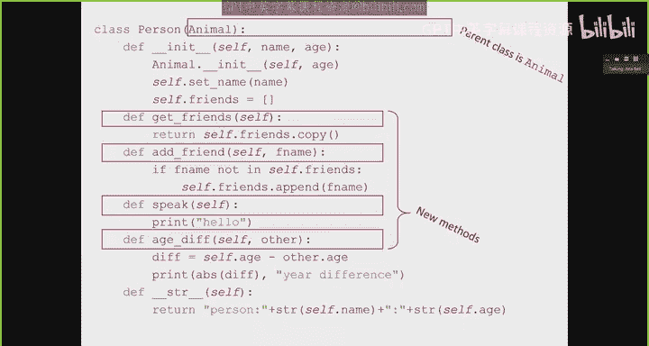

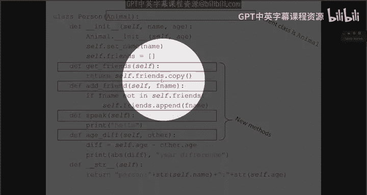

The ability to add a friend to my list basically just adds a friend name as a string if it's not already in the list。

 so I can't have， you know two Anna's in my list， I consider them the same ability to speak。

 just print hello to the screen。 and then I added this cute little function to tell me the age difference between this object that I'm calling age difference on and some other person。

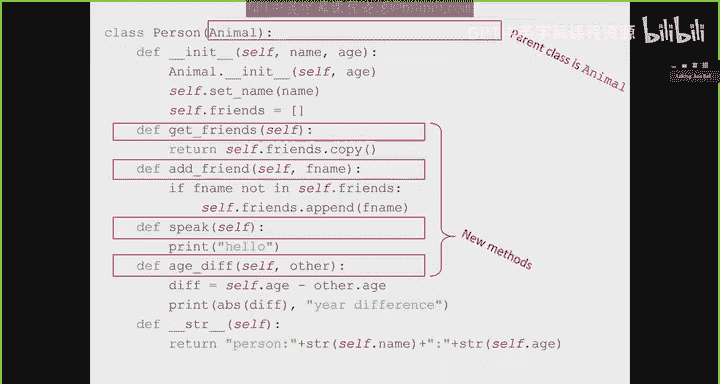

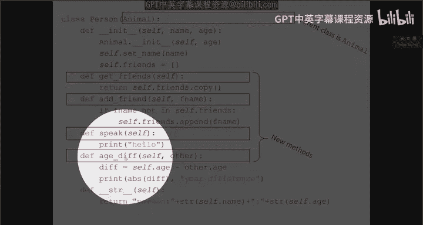

Right， and all it does is grab the two ages， take the absolute value of the difference and print that to the screen。

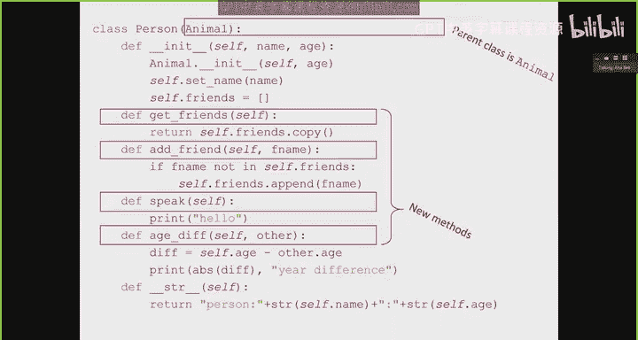

And then lastly， we're going to override the STR method of animal to instead of saying animal colon name colon age to say person colon name colon age。

 So this way， it helps me figure out the， the type as well。

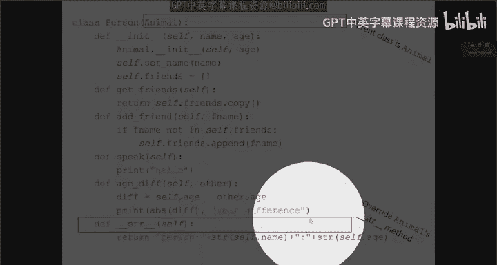

So， in my。codeode here。 I've got two people， right， P1 P2。 Here's Jack H 30 heels Jill H 25， a P run。

The get name， get age on both of these， right， This will run animals get age。 get name。

 I've not defined these in here。Which is fine。 We inherit from animal。

 and animal knows how to grab the agent name。 So there they are。If I ask， if I print P1。

 it'll print person colon name age。If I ask P1 to speak， it just Prince hello。

If I ask the age difference between P1 P2， no matter what just takes the absolute value。

 prints5 your difference。And then let's add some friends to P1。 So here I've got two bobs。

 but it's just a list keeping unique names。Okay， so let's have you try this for a little bit。

It's a little bit again working with objects of this type。

 so it's a function that takes in a dictionary， so I'll tell you what the dictionary looks like。

 it maps a person object。

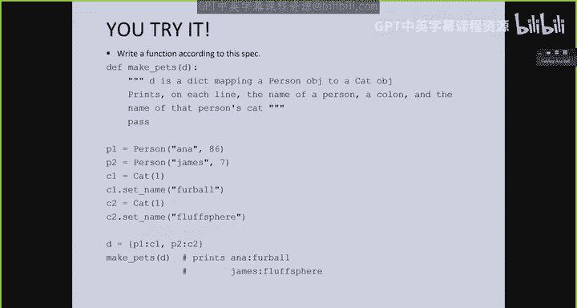

To a cat object。Al， so that's my dictionary。 So this is the key。 This is the value。

 So I've got all these person objects， right， being mapped to cat objects。So as an example。

 here's an input dictionary。 P1 is this person。Here。And P2 is this person here。

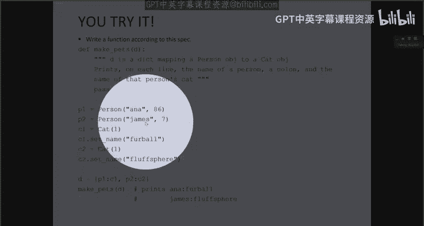

So my two keys， P1 P2 are person objects， They're not integers， float strings。

 They're person objects。

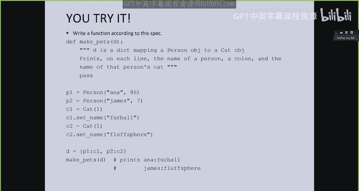

And then the values associated with those are cat objects。

 So here's an object of type cat with this name。 I just ran set name on that cat after I created it。

 Same here。 Here's the name。Set to this new cat object。 So I've mapped P1 to C1 P2 to C2。

 So if I run this function， what I'd like to do， not return anything， this function。

 it just prints something on each line as you're going through all the items in the dictionary。

 it just prints the name。

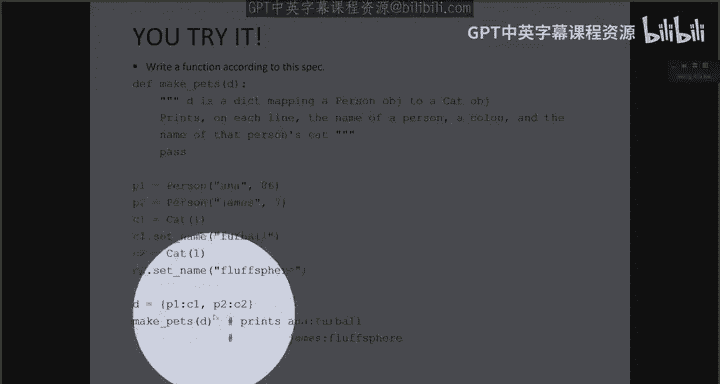

Of that key。Colon， the value of， the name of the value。

So all I'd like to do is write code that extracts the name from my person object and from the cat object。

你开。I know what you're thinking。 I look really young for 86。

But it's diet exercise and hanging out with you guys。I add candy， for sure。So here。

 let's write this code on 178。Alright， does anyone have a start。Yeah。Do that items， yep。

Let's write a note for ourselves。 K is person。Vus cat。Yep。Yep， so k dot get name。

 you want to save it as a variable。Oh or no。Oh， you want to put it on the one line， that's fine yep。

Print K dot get name。一。V dot get name exactly。 Yep， perfect。And yeah， nothing to return。So。

 let's run that。Does anyone have questions about that？

Right so we're just manipulating these object types。 And again， if it's confusing。

 I highly recommend quiz situations and things like that。 now that we're working with object types。

 just make little notes。 right， I know we're iterating through a dictionary and it' kind of convention。

 right keys are integerors， things like that。 But this particular case。

 just a little note that K is a person will help you remember that you need to run a method on this K variable。

 right， like we did here。 K dot gett name and then V dot get name。O。呃，呀。

How do you ensure that the key keys are person？Just because you can't ensure it in this particular case。

 I mean， you could say if。Type of K equal equal person capital P person。

 then do the code and else probably just skip it or raise a value error or something。

 like you could enforce it that way。 But in this particular case。

 we're just assuming that the tester will make person objects mapped to cat objects。But yeah。

 certainly if you're making like a software for something more complex。

 you should probably make sure that enforce that。Okay。

 so the big idea with inheritance is that now that we have subclasses， also known as child classes。

 those subclasses use a parent's attribute。 So everything that a parent has and can do。

 a child has and can do as well。 but that child can override certain parents's behaviors。

 and and a child can add new behaviors or new attributes in addition to the parent。

Let's look at one more subclass student before we go on to one last thing。

 So student here from our pictures and diagrams inherits from person， not from animal。

 but indirectly from animal， right， so a student is a person。And when I create a person。

 I would love to create it using a name， an age and a major。

 but we can use a default parameter for that major to be none if we don't actually want to pass it in。

 But I would like to create it using by setting its major their major as well。😊，So now。

I can't use the parents init method because I've got three parameters I would like to initiate my student with。

 So I would I would like to create my own init method inside person。

 So here I am defining my own init method。

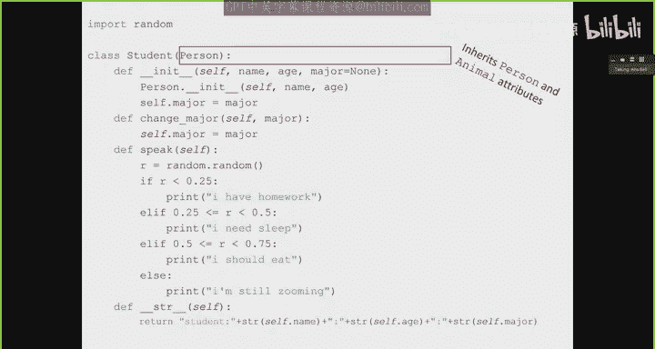

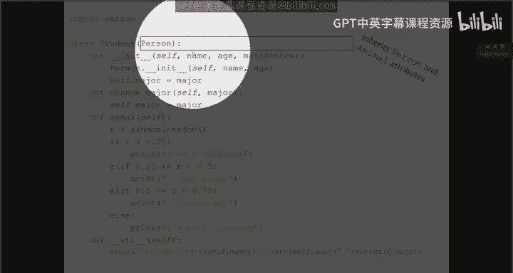

And now it becomes apparent why it's nice to call the init method of your parent because。

If I say a student is a person， all I need to do to initialize a person type like all the attributes associated with a person and the in method of the person is just call the in method of the person that will create my name。

 my age， set my name， create my list of friends， all that stuff。 So those five lines。

 get compacted into this one line。

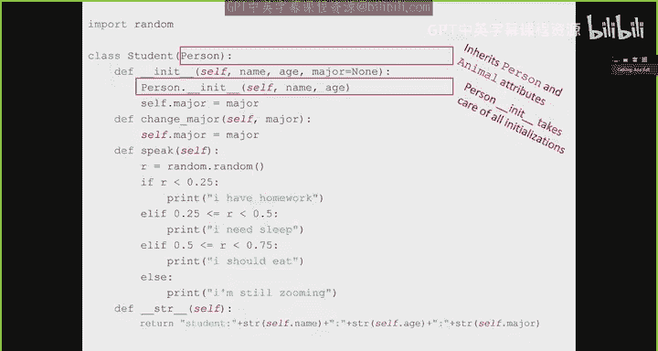

And then it also becomes really easy to see what the student has， in addition to the person。 Well。

 it just has a a major data attribute， right， Self do major is set to whatever is past it。

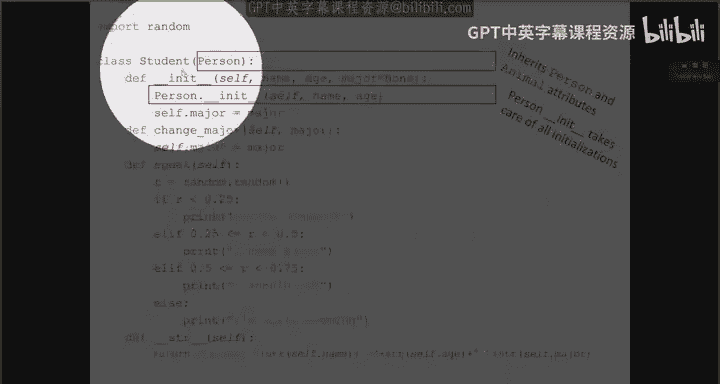

And then beyond this， it's just， you know methods here and there to do stuff。

 So here I've got a change major method。 It just sets the major to something。

 I should probably put add a getter in there as well。 But I ran out of room。

 And here's a speak method that gets overridden from the method of person。

 So the speak method for student。 I made it。Slightly more complex than what the the the parent has。

 So here I'm using this random library， not a random library。 I found， like arbitrary library。

 It's a library called random。 And it it has a bunch of functions that allow you to deal with random numbers。

So one of the functions that this random library has gives you a number between 0 and 1 at random。

 So the float。So what I'm doing in the speak method for student is randomly printing one of four strings。

Right， according to where that random number that's gotten lies between 0 and1。And then。Oops。

 not yet。 And then here I've， I've got， I'm overriding my SDR method。 so we can see in the student。

Class here here。 I've created two students。 So this one actually has a major。

 This one's major is going to be set to none。 just the default value。And then if I run this code。

 you can see every time I run it， the student one says something different。

 Student 2 says something different。 So it's just， you know， running this random number。

And then choosing what to print。Maybe more often than not， I should。Bs it towards something。

All right， so one more class I'd like to talk about， rabbit。

 That's the one that we actually haven't talked about from those little subcategories。

 And as we talk about this rabbit class， I'd like to introduce one more idea of a variable。 So far。

 we've had just plain old variables， right， that go away as soon as like a environment disappears。

 We've talked about instance variables， Aka data attributes， right。

 which are consistent for objects that you create a certain type。

 but have different values for different instances。

The last kind of variable I like to talk about is a class variable。

What's cool about a class variable is that it' you think of it like a shared resource。

 So it's a variable that any instance of this particular type can access and modify。

 And if it's modified， all the other instances， we'll see this modified value， right。

 so it's just shared across all the instances of type rabbit in this particular case。😊。

And so there's many different ways to use class variables for in object oriented programming。

 they're pretty useful。 The way I'm going to use it here is to give me the ability to basically count how many instances of this type rabbit I've created in my program。

 So when I run the program， I can remember I can create a whole bunch of instances。

 I'm going to try to use this class variable as a way for me to basically keep a counter of how many of these instances I've created。

Allright， so。Let's look at the code。 So the first thing I'm gonna do is just in from animal。

Gets a name and an age。 And that's about it。 All those， those getters and setters and the SDR method。

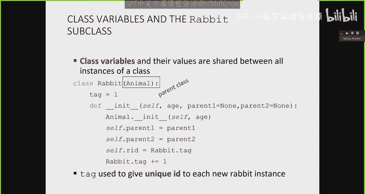

Now to create my class variable， notice I'm defining this variable。

 just planal variable outside of any methods within the class。

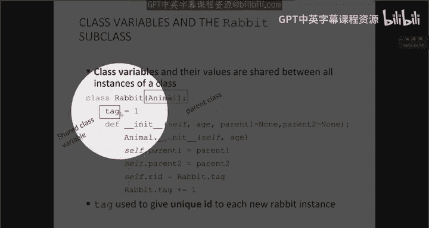

Definition， right， So here's tag is equal to one。The very first variable。

 the very first instance of a rabbit I create will grab the value of whatever it says here。

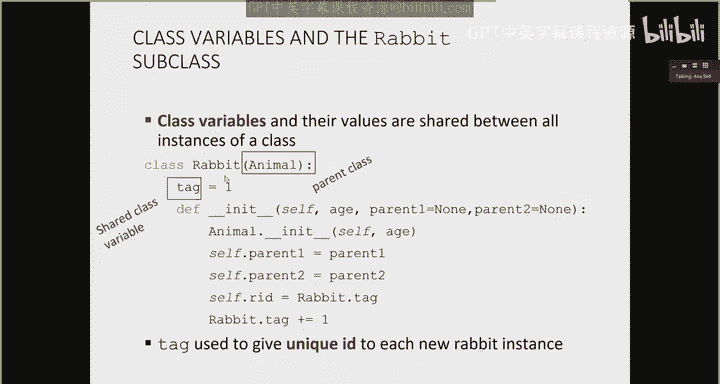

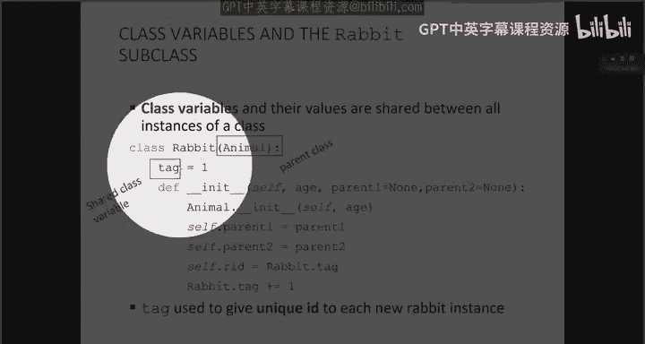

But then， if any instance。Changes this value。Other instances， well see that changed value。系。

So what we're gonna do is we're going to implement I D numbers for these rabbits。 right。

 So sort of like you know， tagging them to keep track of how many there are。

So in the in method of animal or of rabbit， I'm going to create a new rabbit using an age and two parents。

 So again， different than animals。 So I'm going to have to implement my own in method。

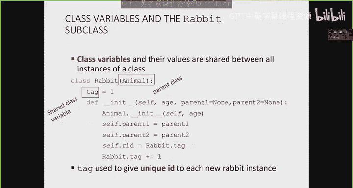

But I'll call animals in that method because it does some work for me。

Then I'm going to add two data attributes for the two parents to be whatever is passed in。

And then down here is where I'm going to use this class variable， the shared resource。

 these two lines。

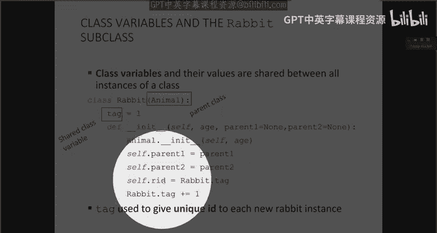

So the first thing I'm going to do is add one last data attribute for my rabbit。

 which is the R I D value。 So it's the rabbit I D。 And this is going to be a unique value for every rabbit I create。

 First rabbit will have a value of one that I create in my program。

 Second rabbit I create will have a value of 2 and so on。So what am I setting it to， Well。

 I'm going to set it to whatever the tag is。 So the very first rabbit I create。

 their R Id will be one。 That's what the tag is initially said to。

But then before I finish the oip method。There's one other line of code。Rabid dot tag plus equals one。

So this instance， right before it finishes creating itself is going to take that tag and incremented by one。

 So the next rabbit I create。It's going to grab the tag value that was just changed。Okay。

 let's visualize it。So。We're going to do it with actual rabbits。Okay， so first。I'm going to。

 So there's gonna be three lines of code。 And this is the program I'm gonna run。

 So the first thing I'm gonna do is create my first rabbit， right。It's our。

 it's our I D will be whatever the value of tag is originally， right？ So originally。

 we said the tag is one。So behind the scenes， what's going to happen is Python says， oh。

 you're the first instance of rabbit class。 So the tag was initialized to one。

 So your R I D is going to be whatever the value is one。Okay， so I've got this rabbit。 It's ages 8。

 Two parents are none， and our I is one。

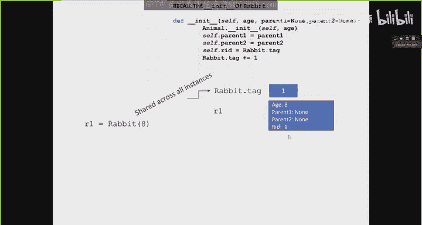

But then before I finish creating this rabbit， the last line of the in method says take the tag and incremented by one。

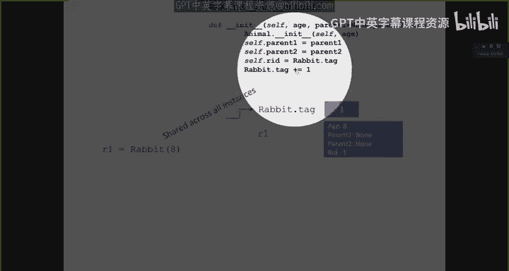

Alright， next line in the code says here， let me create another rabbit。

 This 1 I'm going to pass in age 6 as my parameter。 So that's the age 6。

 Two parents are none by default。

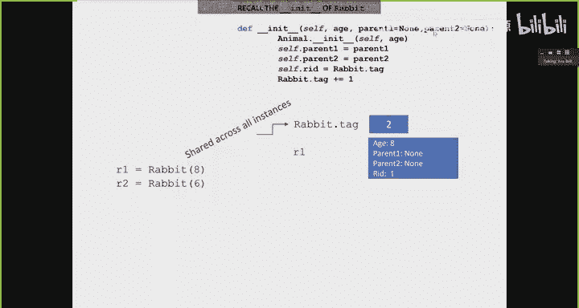

So Python says， allright。 Well， here's a new rabbit object。 It's ages 6。 The two parents are none。

Line that says self dot R I D。 So the R I D of R 2 will be whatever tag is right now。

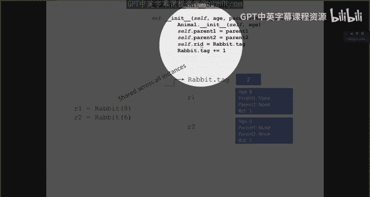

Well， the previous rabbit incremented it to2。 So the R I D of this next rabbit is 2。right。Okay。

 the last line of code before this rabbit finishes it creating itself is to increment the tag to 3。

Right so now， if I have one more line of code， I'm creating one more rabbit。 This age is 10， right？

 So behind the scenes， Python creates this variable named R 3。

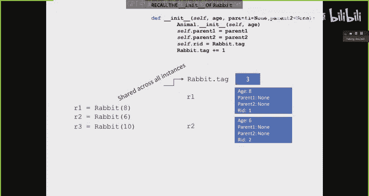

It's bound to an object， a rabbit object whose age is 10。 Two parents are none， of course。

 because we didn't pass in any parents。 And the R I D is whatever the tag is right now，3。

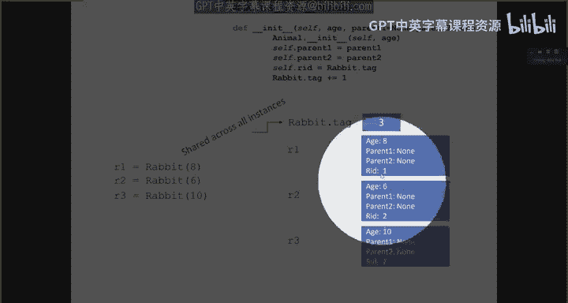

Okay， well， here's the one with idea 3。And before we finish creating。

 let's just increment the tag so that we set it up for the next rabbit。Everyone okay， So sorry yeah。

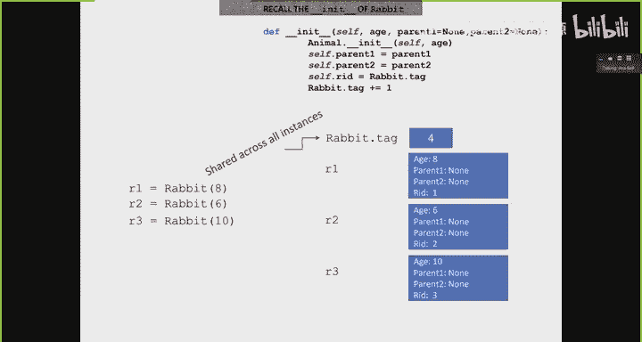

いや。Yes。Yes。It gives you two。Because when you run this line， Rabbit 8。

 it has to run the in to completion。And the last line of the in always increments it to be one more than what it started with。

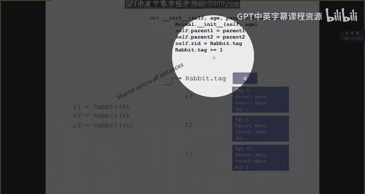

Like you can't， I guess， pause the function run in the middle to check。Okay。

 so let's look at a couple other methods。That we can implement for sorry， other questions about that。

Very cool way of creating rabbits。Yeah。有。Yes， let's go back here。

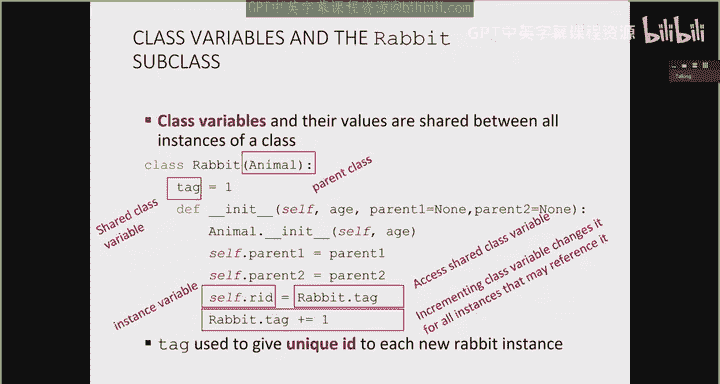

嗯哼。😊，Mostly just this。 Yeah， mostly you want the object to have things associated with it。 So。

 you know， really shared stuff is is nice， but it's a little tenuous in using it just because you should use it for pretty specific situations。

 right， You don't just want to define a whole bunch of variables that everybody can access here in there only specific situations。

 Yeah， most of the time you just have methods in the definition。Yeah。

But maybe there's other stuff I just don't know about it right now。Okay。

 let's look at a couple more methods for the rabbit。 So here I've got a getter， just three getters。

 I should probably put some I don't want to put a setter for the R I D because that would mess up my my counting。

 And probably I don't want setters for parents， too， but maybe we might， I don't know。

 The only thing that looks a little bit weird for the get R I D is this Z fill。

 And I added that as a cute little thing to basically make the I look like an I D number。

 So it prefills the front with zeros。 Like it pads the front with zeros。 So for the I D of1。

 you can see it's 0，0，0，0，1 for an I of 123。 It would be 0，0，1，2，3。

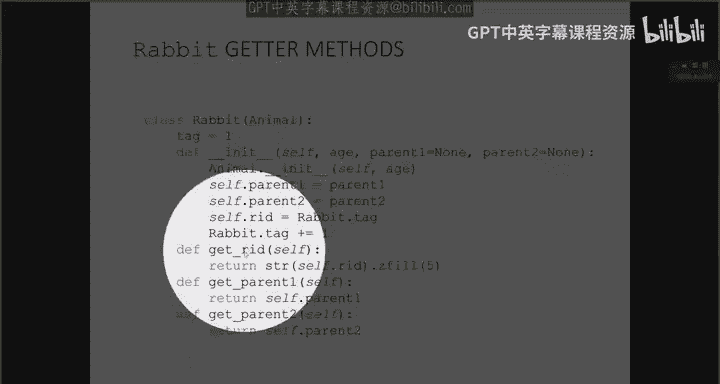

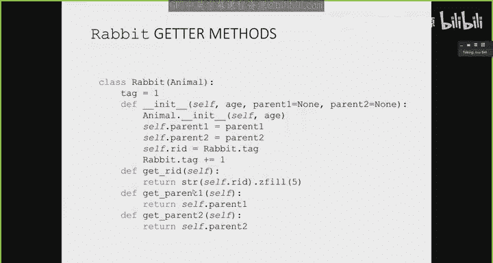

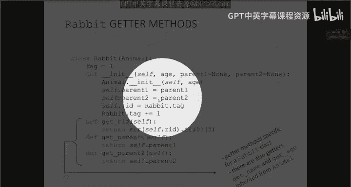

Right， so just like， it just makes it look nice when we print it out when we print out the I D。

 And otherwise， the two parents just return the parent object。

One interesting method that I would like to add and we'll play on the fact that rabbits mate here is to add two rabbits together。

 So we're implementing the Dunder method， double underscore， add double underscore。

To have the ability to add two rabbits together in our code。

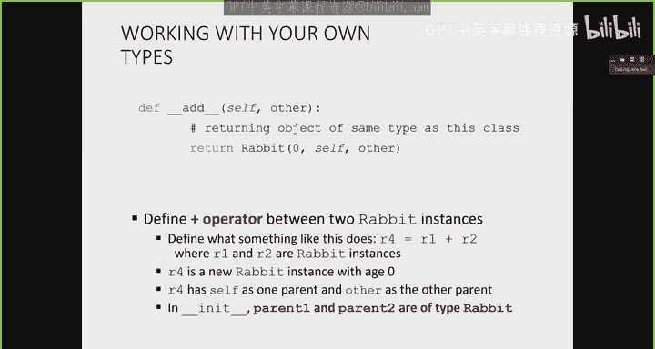

Alright， so again， this is a design decision I made。 So when I create。

 when I add two rabbits together， I'm gonna create a new rabbit object。

And that's exactly what the code is doing inside here， right。

 So I'm going to run this add Dunder method on self and other， right。

 and then behind or in front of the scenes， I guess， is going to be this plus operator。

 So the self will be the thing before the plus and the other will be the thing after the plus。

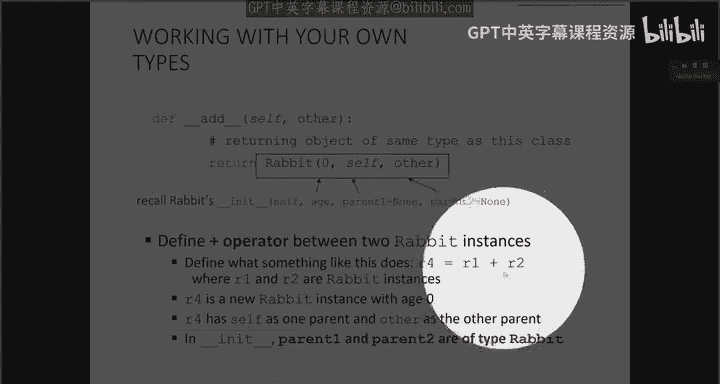

Just like what we saw last lecture。So when we add R1 plus R2。

 what I would like the result to be is another rabbit object。Who。

 who has one parent are one and the other parent are two。 right。

 Those are the things we added together。And let's say this new rabbit object is age of 0， right。

 It's a newborn。

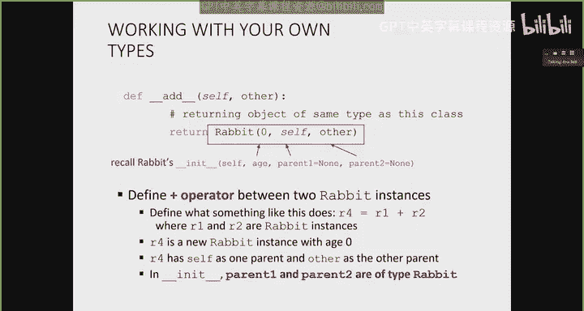

So to implement that， we just have， we're returning a new rabbit object here， right。

 So we're just creating a new rabbit object on the fly in this method。

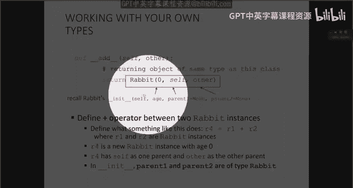

How do we create a rabbit object， we need to give it an age and the two parents。Originally。

 when we created those three R1 or two R threes， right， their they didn't have parents， right。

 They were just unknown or something like that。 But in this particular case。

 we do want know what their parents are。 Their parents are the thing before the plus and the thing after the plus。

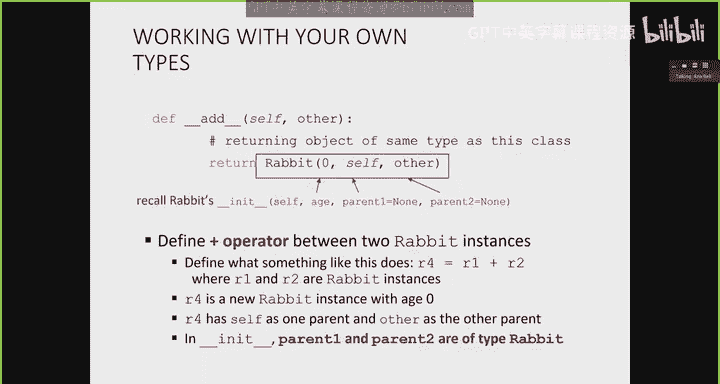

So one parent will be self， and the other parent will be other。

 The thing that's in the parameterless。

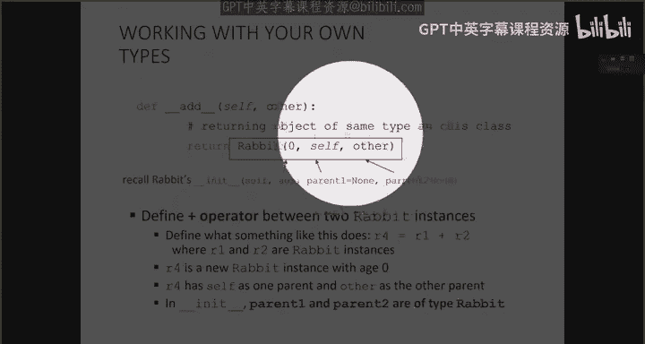

So let's continue on with our program here， right， We had these three lines of code that were run。

 and I created these three rabbits with these Is or yeah，1，2，3。 If I add two rabbits together。

 R 1 plus R2 to give me a rabbit object variable R 4 Python says， allright， well。

 let me run this Dunder method behind the scenes of the plus。

So our four effectively becomes what will we replace right， the in the previous slide。

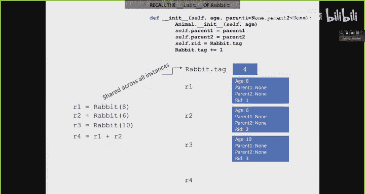

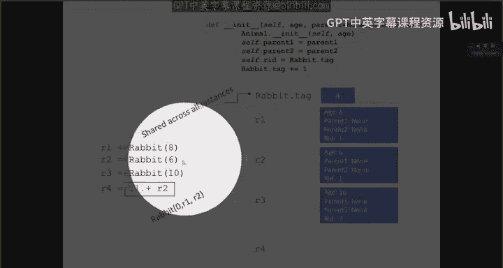

Right here， the return is rabbit 0， one parent， comma， the other parent。

 So when we make this addition， we have rabbit0 comma， one parent， the thing before the dot， comma。

 the other parent the thing before the plus， and then the thing after the plus。

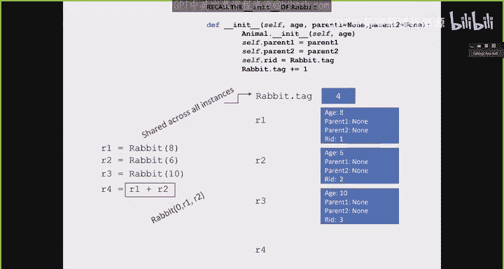

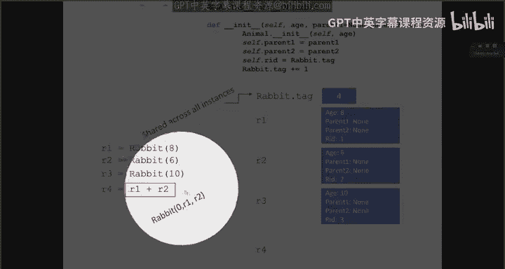

So my R 4 becomes the result of adding R 1 plus R 2， right， So its parents are these two。Now。

 how does this rabbit get created。Right。It's a new rabbit object。

 So we run the inni method of the rabbit object， right， which means that here's a variable。

 It's bound to rabbit object。 It's ages 0。 It has these two parents that are objects bound to other rabbit objects up here are1 and R 2。

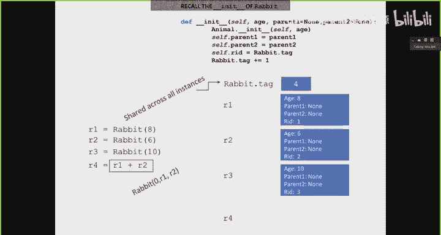

And the ID， just like before， is whatever the tag is right now。 Well。

 we already created three rapid objects ahead of this one， so this one's tag will be4。

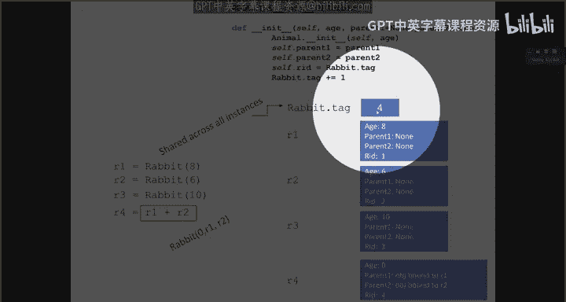

And then right before we finish， we increment the tag to phi。

So no matter how we're creating these random these rabbit objects。

 either just plain old in our program directly or through an indirect method， right， in this case。

 the plus。We're still creating rabbit objects in our program， right？ So that counter。

 that shared variable tag， is still coming into play。

 right So we're still counting all of these rabbit objects created。Does that make sense？O。So。Yeah。

 that's fine。So one last method。 So this is a method that checks for equality between two rabbits。

 And again， my design choice is to say that two rabbits are equal。 So if I say r1 equal equal r2。

 that will tell me true or false， and my design choice is to say that two rabbits are equal if they have the same parents。

So if I create another rabbit object。Right，4 was R1 plus R2。But if 5 is R 2 plus R 1。

 I want to say that 5 and 4 are equal because they have the same parents。Right。

 I don't care that it was R 1 plus R 2 or R 2 plus R 1。 They have the same parents。

 It's just an opposite order。And so that's what this E Q method is， is doing。

's a underunder method to， to implement equality between two rabbits。

So parent same is a Boolean here that just checks the RID。

 So this Boolean parent same is going to check that the addition was made R1 plus R2， R1 plus R2。

 right？And parents opposite is also going to be a boolean。

 either true or false that checks if I made the rabbits R1 plus R2 and then R 2 plus R1。

 So backward in the parents。But they still have the same parents。And the reason I'm checking for Is。

Is because I Ds are unique。 So originally， when I wrote this code a long time ago。

 I actually ended up my first iteration checking just the straight up parents。Values， right。

 So it was comparing basically rabid objects together。

But the problem with that code is that at some point， it tried to compare a nun。Some， you know， some。

 some rabbits might have a nun as their parent with an actual rabbit object。

 And then the the code crashed。 And then I realized I can just compare the I values directly because those are one just numbers。

 So very easy to compare。 And two， they're unique。 So I know I'm not gonna have two rabbits with the same I D。

And so in this particular case， I've got these two rabbits should say they're equal。

 but then if I add R2 plus r3， r6， this one is not going to be equal to any of my other rabbits。So。

 here's my code。So here I've got my three rabbits， right， So this is just。

 I think we've printed this out already。 But right， so here's our one。 It's a rabbit with this Id。

 rabbit with this Id， rabbit with this Id。And then， you know， our one's parents。

 our two's parents and our threes parents all have none are are， are none。

But then when I add R R 4 as R 1 plus R 2。I can print。R 4 right， is a rabbit with idea of 4。

 and then R1 and R2 are as usual what we just saw。 And then when we grab the parents of R4。

 it's going to be R1， which is this rabbit with this I D and R2 with this this rabbit with this I。

And then we can check the equality。 So here I can create our4， R 5 and R 6。

 So R 3 plus R 4 and R 4 plus R 3， they should be equivalent。Right。

 so here I've got our 5 and our 6 down here。See， I'm just running the double equal sign on objects of type rabbit。

 which is pretty cool。And they are the same， right， because they have the same two parents。

 I don't care that they're in opposite order。But then our four and our 6 have different parents。

 right， Our four had one and 2 and our sixth head。What do of，3 and 4。Questions about this code。Okay。

 so class fair is pretty cool。 you share them across all the instances， so one instance modifies it。

 they'll be modified for all the other instances。 So we have one more example to look at next lecture。

 we're actually going to implement our own fitness tracker class。

 So it's going to be a little bit more complex， but we're going to see a lot of the same ideas that we saw today just in this slightly more complex setting of implementing our own fitness tracker。

 So it's still kind of an abstract thing， but more useful than animals and rabbits and person and student classes。

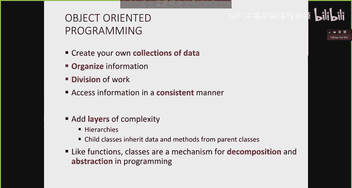

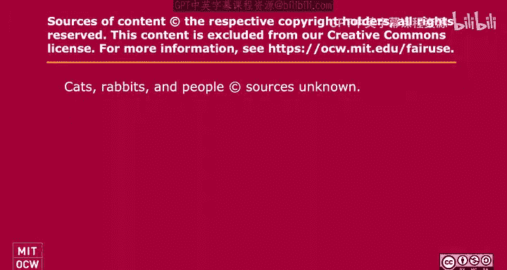

