# 《计算机科学和Python编程｜6.100L Introduction to CS and Programming using Python, 2022》 - P1：-01-Lecture 1_ Introduction to CS and Programming Using Python.zh_en - GPT中英字幕课程资源 - BV1PAxJzVEs3

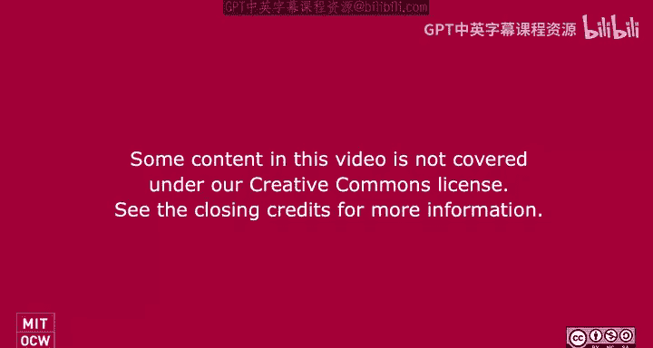

Alright， so welcome to the first lecture of 6100 L。 That's our new number。 My name is Anna Bell。

 That's two separate names。 First name， Anna last name Bell， super confusing。

 But I've been a lecture here in the sales department for probably almost 10 years now。

 And I've been doing the intro course for a while。 I'm really happy to be teaching this full semester version of 6100 a。

 So today， what we're gonna do is go over a little bit of course administrative information and then we'll dive right into just some thoughts about computers highlevel how they work and then we'll start going into some Python basics。

 So we're gonna get coding right away。 So I highly encourage you since you're in this class to download the lecture slides beforehand to take notes and run code when I do some of the lectures are interactive。

 So and we'll have break。 So there'll be a place where you can take a break to actually do some coding。

😊，And that's important。 I call them you try breaks。

 That's important to make sure that you're actually practicing what we are learning right at this time。

 The main idea for lectures is， yes， I will do some teaching。

 but there will also be opportunities for questions。

 And for you guys to try some programming right on the spot。

 even if you don't finish writing a program that we start talking about。 I will finish it。

 And we can all kind of talk about it together。 and I'll kind of show you some pitfalls and things like that。

There will be lots of opportunities to practice in this class through at various degrees of granularity。

 and then there's also lots of opportunities that I have in the handouts to do extra practice at home and through a bunch of different resources as well。

The reason why I stress participation and practice is because。

Part of the reason you're here is you want to learn how to program。

 right you don't know how to program yet。 And programming is actually a skill， right。

 It's like math or reading。 It's something that you have to practice。

 You can't just watch me type in a bunch of lines of code。

 And then when it comes time for to do the quiz， you automatically know how to do it。

 You need to do it， often more and more so that it becomes sort of second nature， right。

So the three big things you'll get out of this class are knowledge of concepts。 Obviously。

 we're gonna to learn some computer science ideas， programming still and problem solving。

 problem solving skills， lectures and exams。😊，Basically help you with your knowledge of test your knowledge of concepts and help you get knowledge of concepts。

 finger exercises， get give you the programming skills and the problem sets help you with problem solving。

 Basically， if you're given an English version you of a problem in English。

 how do you go from that to thinking about what computer science concepts can I apply？

 And then after that， how do I take those computer science concepts and actually do the programming。

So what are some topics we'll be covering。We will be at the core of it learning computational thinking。

 So in the future， when you encounter a problem， you can your first thought shouldn't be how do I kind of mathematically solve this or how do I rootte for manually solve this problem。

 how can I apply computation to help me solve this problem And throughout these lectures。

 you're going to see some examples of us applying computation to a problem you might have already seen and maybe solved mathematically which is pretty cool。

 Obviously to get to that， we're going to learn the Python programming language once we get the basics。

 we're going to see how we can start to structure our code to look a little bit better So we don't just have a bunch of code dumped in a file。

 We're going start to organize our code and see how we can make a neat readable and modular。

And then towards the not in this lecture， but in a couple lectures and as a theme throughout this this class。

 we're going to look at some algorithms。 They're not super complicated。

 but they are kind of the base algorithms for a bunch of algorithms you might see in the future。

 if you decide to take more C S classes。Lastly， towards the end of the class。

 we're going to see algorithmic complexity， which basically means we're going to start asking or trying to answer the question how do we know the programs we write are efficient。

 right， we can write programs， but how do we know that they're fast and how do we know that they don't you know take up all the memory in the computer。

 So things like that， comparing different algorithms that do the same thing against each other。

So if there's no questions。Again， as I said， a bunch of this information is already in the handout。

 plus more。 we can。毕。Okay， so let's start by talking about knowledge。

Deeclarative knowledge is a statement of fact， and a lot of us probably in math and in the past have worked with declarative knowledge。

 but this is not how computer sciences is not how this class works。 in computer science。

 what we do is we we work with imperative knowledge， which is basically a recipe。

 how to do something。And when we're programming， all we're doing is writing a recipe for the computer to do something。

 That's it。So here's a numerical example。 The first statement is a declarative statement， right。

 The square root of a number x is y such that y times y is equal to X。

 There are many possible values for x and Y that this statement can be true。Right。

But if we gave that statement to a computer， it wouldn't know what to do with it。

 What we need to do is tell the computer how to find the square root of a number。

And then tell us what the squared root of that number is。 And so the computer then needs a recipe。

So the recipe， a really simple one for finding the squared of a number， is steps 1，2，3。

So what we do is， let's say we want to find the square of 16。It， we obviously know it's 4。

 but the computer doesn't。 And so we give it an initial guess。 Let's say the guest is 3。

How do we go from there， So the steps we follow， Step 1， If  three times 3，9 is close enough to 16。

 we can stop。 It's not really close enough for me。 So let's keep going。Step 2。Otherwise。

 so we're going to make a new guess by averaging G， which is our original guess 3 and x over G。

 which is 16 over 3， right，16 was the square we wanted to find。 So our next guest is 4。17。Okay。

 using the new guess repeat the process until we are close enough。 So we go back to step 1。

 That's the first part of the process。 We find guess squared，4。17 squared is 17。36。 So now we say。

 is that close enough。Not really。 It's not， it's 17。 It's not really even close 16。

 So let's do it again。We make a new guess by averaging 4。17 and 16 divided by 4。17。

That gives us our new guess 4。 double035。Okay， next step， right， using the new guess。

 we repeat the process。 So 4。 double035 squared is 16。2770277。Is that close enough to x。Yeah。

 I could be happy with this。 I could stop there because we're within sort of plus-1。 So I'm。

 I'm okay with that。 But if we wanted to be within plus or -1 times 10 to the negative like 6 or 7 or something like that。

 then we would continue the process。So really， what we had there is an algorithm。 right。

 It's a sequence of steps， step 1， step 2， step 3。 There's some sort of flow of control。 right。

 We had a place where we said if this is， you know， if， if the guess is close enough， then， you know。

 we can stop Otherwise， we do something else。 We had another flow of control where we said。

 repeat this thing， right， So we're kind of not going linearly， but we're changing the flow。

And then lastly， is a way to stop， right， We don't want the algorithm to go on forever。

 We would like to stop at some point。 And the stopping point， I was kind of vague about it。

 But it could be， you know， when we were within plus or- one of the actual answer。And so， write。

 recipes。Are basically algorithms， right？ My grandmother was basically teaching algorithms when she would teach me to like to bake a cake。

 right， she didn't call it that， but she was really。 And so even recipes have that same structure。

 There's a sequence of steps。 there's a flow of control。

 Like if you don't have egg use egg substitute or repeat this you know。

 repeat sticking a toothpick to see if it comes out clean every minute or something like that。

And then there's a mean a way to stop， right， when the toothpick comes out clean。

 you take it out of the oven， and you eat it。And so computers are machines that execute these algorithms。

 They're actually dumb， right， Computers are not very smart。 They don't make decisions on their own。

 They just follow these sequences of steps that we told them to do。

Computers are good at storing lots and lots of data， right， We can't really do that。

 but computers can store gigabytes of storage， terabytes， even。

 And computers can do operations really， really quickly， which is something we can't do。

 right They're good at those two things， but they're not very smart。

 They can't make decisions unless they're told to make the decisions。嗯。So really。

 the computer only does what you tell it to do。And that's one of the big ideas that I want you to come away from this。

 from this lecture with。 Computer only does what you tell it to do， right。

 the sequences of steps that you tell it to do。 That's the only thing it follows。

So a little brief history， just to kind of make him appreciate programming Python programming language before we actually get started with it is。

So before the 1940s， we had these things called fixed program computers。 Okay。

 like a pocket calculator is an example of that， every button。Was an operation。You could， you know。

 in the little screen， you could use parentheses to put a bunch of different operations together。

 but there was no way to sort of store all these operations together to to you know later put in different inputs for that same sequence of operations。

 You had to input it every single input those sequences of operations every single time。

After the 1940s， stored programs， Comp computers came into play。

 and they were able to store instructions to do things as data。😊，Okay。

 and there was a special program called an interpreter that executed these instructions。

 It knew how to follow simple sequences of steps when the program told it to go to a different location。

 It did。 So it was， it was basically executing these instructions。

And the instructions that it it did were arithmetic and logical。 So addition subtraction。

 things like that， simpleple tests like checking for equality between two values and moving data。

 So taking this value and putting it at a different memory location。

So I just wanted to give you a really brief overview。 And this is not super accurate。

 but it gives you a sense of how exactly things happen low level in， in the computer。

 So the computer basically has memory where things are stored。

It has an arithmetic logic unit that does operations。 It knows how to add things， subtract things。

 multiply things， compare things。And then it has the control unit where this program counter is。

 is set。 And this is where you put a program in。 So lets see if this works。 This is a program。

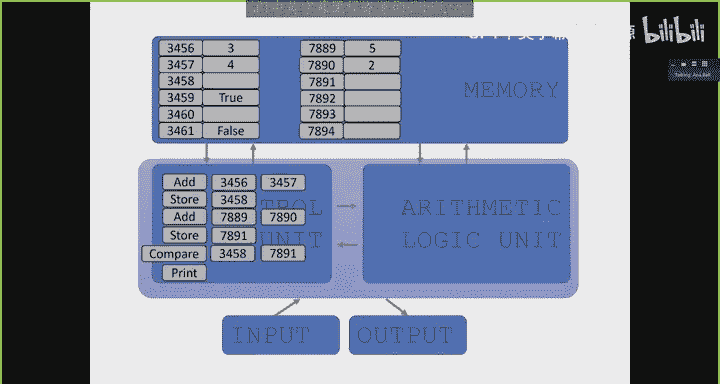

And up here is our memory。 So we have a bunch of memory locations，3，4，5，6，3，4，5，7。

 And at each of these memory locations， we have some values stored， pre， you know， prefilled。😊。

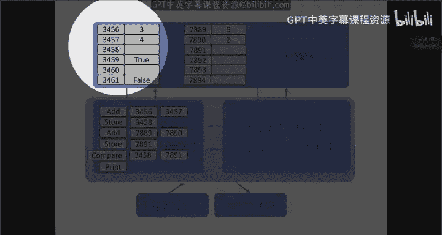

So when we first run this program， what ends up happening is the interpreter sees the first instruction add。

 the values at 3，4，5，6 and 3，4，5，7 together。 So it goes to these memory locations here。

 grabs the three and the4， and sends them to the arithmetic logic unit。

 The A U knows how to do the addition。 So it adds 3 plus4，7 and sends the result back here。

Now， we never told it to store that result anywhere。

 But the next instruction says store the value you just got back from the A L U at this memory location。

3，4，5，8。 So the next step basically takes that 3，4 that 7 and stores it at memory location 3，4，5，8。

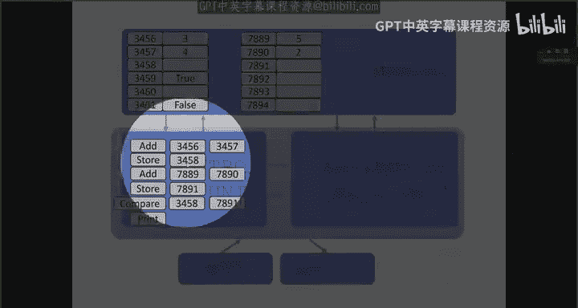

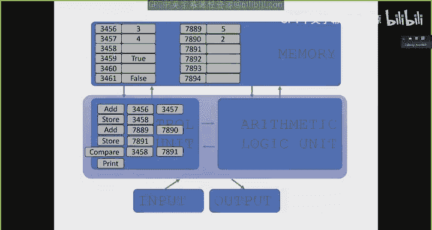

Super tedious。 All we did was add 3 plus 4。We do that again。 We add 7， the values at 7，8，8，9 and 7，8。

9，0。 So it goes in the memory。 It grabs the5 and the two sends it to the A L U。

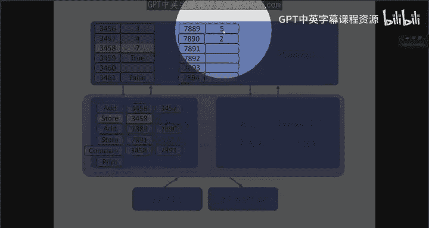

The A L U calculates it as 7， brings it back。 And then we store that in location 7，8，9，1。

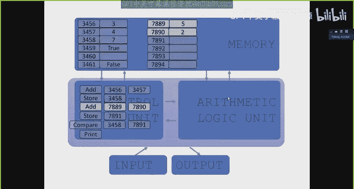

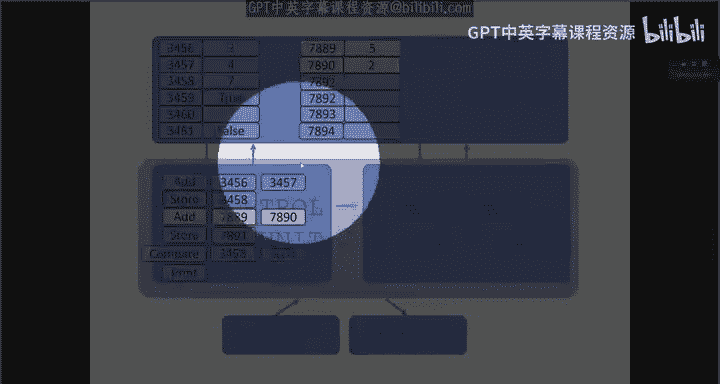

And then after that， all we've done is two additions。

 And then the next instruction says compare the values at memory locations 3，4，5，8， and 7，8，9，1。

 So we're gonna compare the 7 with a 7。

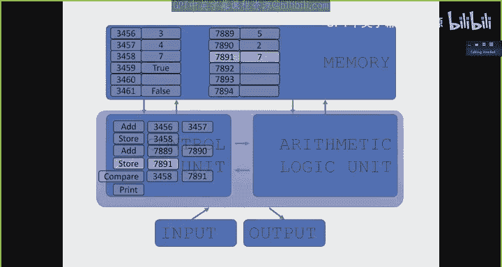

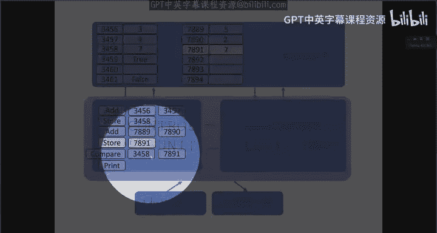

The A U again does this comparison and says， all right， Well， 7 and 7 are equivalent。 So this is。

 you know， true or whatever it wants to give， give back to the to the interpreter。

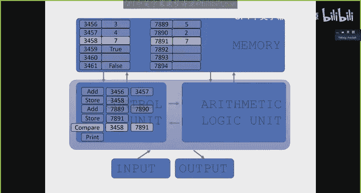

And then the last instruction here we have is print the result of that comparison。

 So we print true because they were equal。

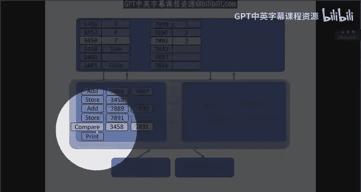

Again， super high level， but it kind of gives you an appreciation for programming languages these days。

 right， This is very tedious to write If we had to write programs in， in this manner。😊，Alan Tring。

 a long time ago showed that you can compute anything with actually a very an even more basic set of primitives。

 not addition subtraction。 But instead with a tape， you would actually have six primitives。

 move the tape left， move the tape right， read the value at the tape， put a value on the tape。

 erase the value from the tape， and no operation。And so since he showed this。

 what the result of it actually was。Is down here？Anything computable in one language is computable in any other programming language。

 So if we had some， you know， some program written in Java that basically boils down to， right。

 something super long， but something that is made up of these six primitives。

That means that if we boil down this program to these six primitives。

 we can build back up the same program in a completely different language。

 And that's really powerful。 That's a really cool statement。😊，Now。

 we're not gonna to be working with those primitives。 We're gonna to be using the Python primitives。

 which are more convenient， and they allow us to do a lot more things in much less time。

 I'm going do a little comparison as we talk about the primitives of Python with English。

So in English， some of the primitives might be words， or even we can do letters or characters。 But。

 you know， we can say， we can say it's words。You know， with characters， we can build up words。

 with words， we can build up sentences， with sentences。 We can build up stories， with stories。

 We can build up books and things like that。In programming， in programming languages。

 the primitives are numbers。Sequences of characters。Operators like addition multiplication， division。

啊。checking for equality， checking that something is greater than things like that。

So once we have these primitives in a language， we can start to build up the syntax of the language。

 So in English， having something like noun and noun and noun doesn't make any sense。 right。

 Cat dog boy doesn't make much sense。 It's not syntactically valid。

But noun verb noun is syntactically valid。Similarly， in programming languages。

 we can have two objects。

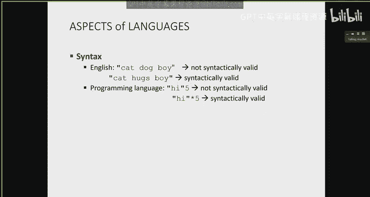

Kind of side by side。 So here， this is a sequence of characters H and I。

 And this is the number 5 right beside that sequence of characters。

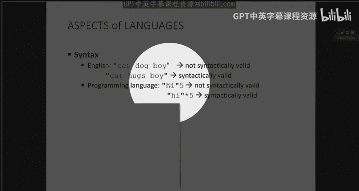

But that doesn't make any sense。 right， What does it mean to have this sequence of characters in that number right beside it it has no meaning in Python。

Instead， what we have to do is we have to add an operator in between these two objects。

 So here we add a little star operator in between the sequence of characters high and the number5。

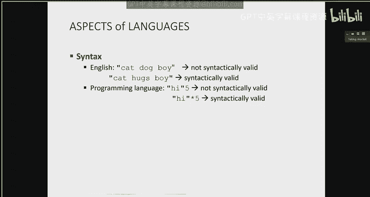

And in Python， the meaning to this is I want to repeat the sequence of characters high H I  five times。

 So this would basically give me high， high， high， high， high。

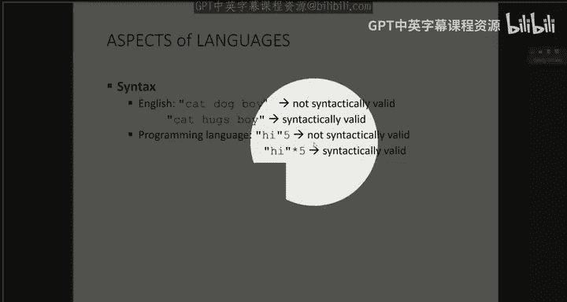

So once we have sentences in English， right， and， and expressions that are synically valid。

 we can now talk about the static semantics of the language。So in English。

 saying something like I are hungry isnt is syntactically correct， but it's not syn static。

 It's not sorry， it's not。 It doesn't have good static semantics， right， There's no meaning。

 there's no meaning to that because the R is for， you know， you are plural。

Similarly in programming languages， and this will differ depending on what programming language you use here。

 you know， in the previous slide， we saw that you can use the star operator between the sequence of characters and the number。

 and that meant repeat that sequence many times。 But if we use a plus operator in between the sequence of characters and a number。

 that doesn't have any meaning in Python。 So it has a static semantic error。

 even though it's syntactically valid， right， we have operator sorry， object operator object。

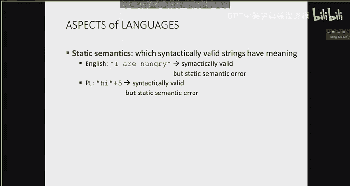

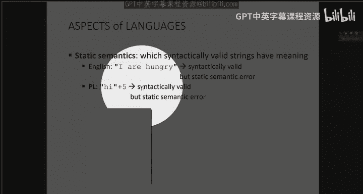

So so far， we've been able to find really nice parallels with English， right。

 English language and the programming languages。 But this is kind of where things break down。

 When we talk about the semantics of a language。😊，So in English。

 you can have many different meanings。 right， The chicken is ready to eat means。

Let's eat this chicken or the chicken is ready to eat means the chicken wants to eat something。

 right。Programming languages， there is no multiple meanings to a program that you write because the。

 because the computer， the machine， the language， follows the set of instructions。To a T。

 there is no ambiguity about what it needs to do， right。

 It just follows the instructions and does what it needs to do to the end till it reaches you know。

 the it terminates the program。And so programs only have one meaning。

 But the problem is it might not be the meaning that you intended it to have。

And that's when things start to go wrong。We can have syntactic errors in our program。

 spelling errors anddentation errors， things like that。 And those are easy to catch。

 Staatic semantic errors are 90%， probably easy to catch。But the problem comes in with the semantics。

 right， the meaning that you intended this program to have might not be what it's actually doing。

 And that's where most of my errors happen。 And that's where I get super frustrated when I program。

 And that's probably where you guys will get super frustrated to。

 because you write a program that you think is doing one thing。

 But instead either it crashes right away or it runs forever and doesn't really stop。

 or it terminates， but it gives you an incorrect answer。 It's not what you were expecting。And we。

 we'll talk about this in a in a few a few lectures。So when we write programs。

 we're basically writing sequences of definitions and commands。

And we're gonna write these either in a file editor or in a shell。 The first today。

 at least we're writing in the shell directly。 and half of tomorrow will write in the shell。

 because we're not really writing any we're not really writing many lines of code。

 We're just gonna be I'm just gonna be showing you some really quick quick things that we can do with the Python programming language。

 So hopefully you all have installed the programming environment。 This is the code editor。

 So tomorrow will start working in here。 But for today。

 we're really just gonna to work on in the shell。 And even in the future。

 you can still type commands in the shell。 I find the shell very useful。

 If there's just something really quick that I want to check that I don't want to write know。

 write a program for and then run， it's just like a simple command that I want to check to make sure it's doing what I think it's doing before I insert it in my code editor。

😊。

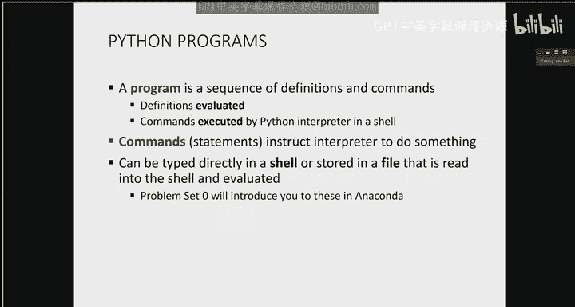

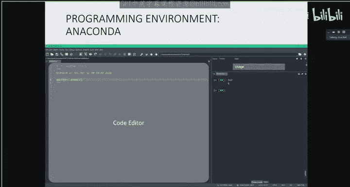

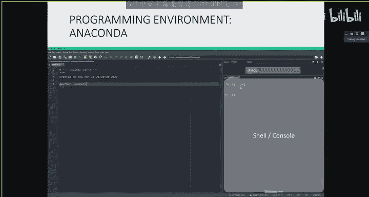

So here we have。This。Right， so mine is， I guess I I'm using the white thing just because I find it easier for you guys to see。

 This is the file editor。 And this is just a bunch of expressions yeah。

 a bunch of code that we're gonna type in today。 And we're gonna type it in the shell today。

 So the thing on the right hand side。

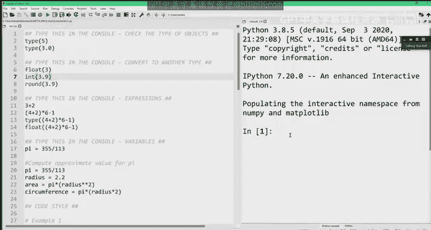

Okay， so。What exactly do we do when we write a program。At the base of it。

 we're going to create objects inside our programs， and we're going to manipulate them。 That's it。

 That's what programming is mostly about at its， at its core。Now， when we create objects。

It's important。 This is kind of something we're gonna come back to again and again， and it kind of。

More high level setting， but。Right now， what I want you to understand is that when we create an object。

 an object has a type。ok。And the type that an object has tells Python the things you're allowed to do with that object。

So here are two examples， The number 30。It's a number。The type， we， we'll talk about it in a bit。

 The type is an integer。 It's a whole number。But basically。

 what are the things we can do with this integer with this number， We can add it to another number。

 We can subtract it to another number。 We can take it to another power。

 We can take some other number to this power of 30， right。

 a bunch of sort of mathematical operations， as you would expect。So that's pretty straightforward。

What about this one here， This quotation， capital A， lowercase， A lowercase and lowercase。

 A quotation。

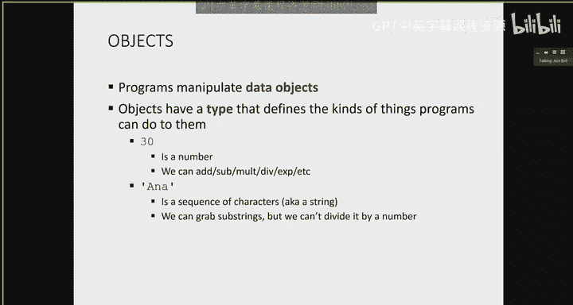

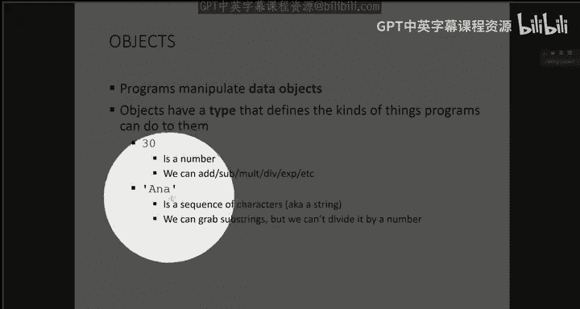

So this is something we'll talk about in next lecture。 It's called a string。

 and it's a sequence of characters。The quotations tell Python it's a sequence of characters。

 And the characters， part of it are capital A， lowercase and lowercase A。

The kinds of things I can do with this string。Are not the same kinds of things I'm allowed to do with a number。

 right， If I tried to take Anna and divide it by the sequence of characters， Bob。

Python would complain very much， right， because you can't divide a string by another string。

 A sequence of characters。 Does't make sense to divide it by another sequence of characters。

Similarly， I can't take Anna to some power， right， I can't multiply or I can't multiply by itself。

 things like that。But the kinds of things that I am allowed to do on a sequence of characters is different than the kinds of things I'm allowed to do on a number。

 So the things I can do with a sequence of characters is I can say， well。

 what's the character at the first position。What's the middle character。

 How long is the sequence of characters， right？ How many characters do I have。

And so now you can see that the， the type of the object is actually really important。

 Python uses it to， to know the kinds of operations you're allowed to do with it。

And so there's actually scalar objects。 and these are Python's primitives， numbers and truth values。

 And there are nonscalear objects。 We're not talking about these yet。

 We'll talk about these in a few lectures， but these have some sort of structure。 So， for example。

 a list of numbers has a structure because there's a number at the beginning of the list。

 There's a number at the end of the list， things like that。A number itself doesn't have a structure。

 It's just the number。So what are the types of the scalar objects。

 What are the types of the primitives in Python integers。So number 5，0， negative 100 a million。

Float is another type。 It represents all the real numbers。 So 3， you know，3。27，2。

0 is a float because it has a decimal number， even though to us， that just means2。 But to Python。

 if you put in 2。0， it says that's a type float。Negative 3。14，159， things like that。

Buule is a boolean。 It represents truth values。 And there's only two possible values that a Boolean type has。

True and false。 And it has to be capital T true and capital T sorry， capital F false。

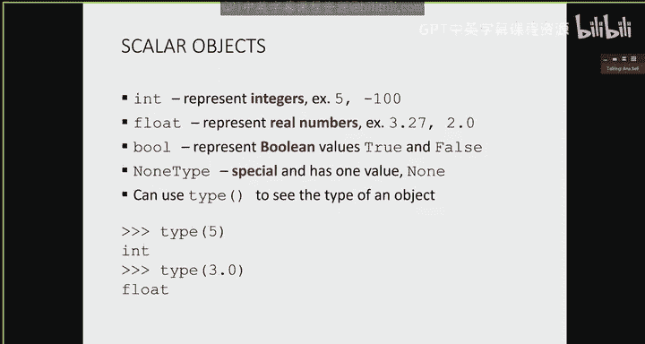

And the last one is this nu type type。 It's literally called nu type。

 And it has only one special value。 None。 We're not going to talk about it for a bit。

 but we will sometime in the future。

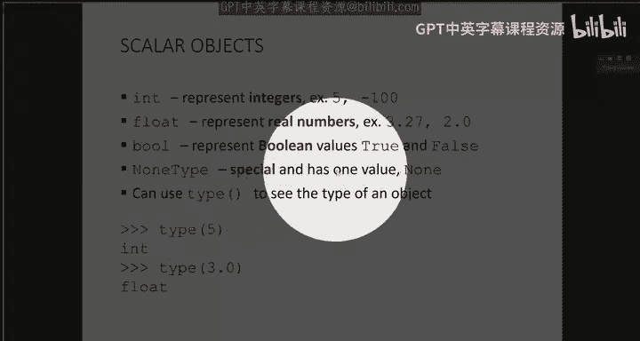

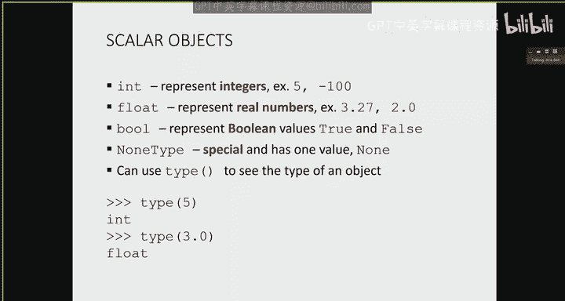

So to figure out the type of an object， when you create that object， you you use the type command。

 so we can say something like type parentheses。 And this is a command。 And inside the parentheses。

 you say， what do you want to find the type of。 So if we do type of 7， it tells me it's an。

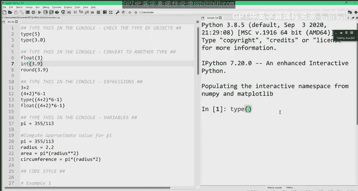

And if you want to do the same command again， I hit the up arrow and it automatically puts in what I wrote previously。

 And then if I want to do type of 0。0。It's a floatat， because there's a decimal point。

So this is basically what I said。 So we type this in the shell。

 and the shell tells us what the output is。So。Just to reiterate。Int float。

 bo and nu type are types of objects。And there can be many different objects you can create of that type。

 right， So if you think about it Ins and floats， we basically have an infinite number of objects we can create of those types。

 right， because we can have 0，1，2，3，100，200，300 a million， right， There's and all the negatives。

 There's almost， you know， infinite number of values， objects that we can create of type in float。

But bull， there's only two。 The truth values true or false。 and the nu type。

 there's only one this nu。So that's the type。 And these are the possible values。

 possible objects we can create。You try it， so you can just yell out the answers。

 There's nothing to type unless you want to check yourself。 So what is the type of 1234。

Int type of 8。99。Float type of 9。0。Float type of true。Bol and type of false bo， perfect。

 If you ever wonder what the type of something is， you type it in here。 Just you guys are doing well。

 typey his bo type of lowercase T true。Is an error。 Just wanted to point that out。

 Just to reiterate the fact that capitalization matters in Python。 This is our first error。

 by the way， guys， Very exciting。 The error is a name error。

 And this is the message associated with it。You also know that it's something special in Python when you have color coded stuff。

 So you see capital T true capital F false are this dark blue here， right。

 whereas anything that's not special in Python is just black。Right， so type is a special command。

 right， This is a float。 So you see their their color coded。O。So once we create objects。

 one thing we can do with these objects is to cast them to a different type。 Now。

 this is a little bit。Maybe confusing because we're not actually changing the object once we've created it。

 So once we create the integer 3。It's there in memory。

If we cast that integer to a float version of it。We're creating a new object in memory。

 We're not changing the three。 The three already exists。

 We're just getting the float version of it and storing it as a new object in memory。😊。

So when we do float 3， this is a command that gets for me。 the float version of the integer 3。Okay。

 so that will give me 3。0。 So， for example。

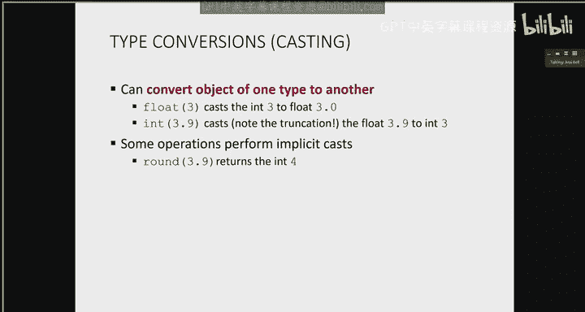

Right， this is what I had。 Fat 3。Right， the output is 3。0。If I do int of five point。2。

It truncates it， and it gives me the integer portion of this float。If I do in of 5。9。

 it still truncates it and gives me the integer version of this float。 It doesn't round。Right。

 I'm just asking for the integer version of this of this， of this float。

Some operations like round is an operation we can do， has an implicit cast in it。 So if I round 5。9。

 it's actually going to round it to 6。0 and then cast it to an integer。

 So notice it doesn't give me as an output 6。0。 It then rounds it to just 6。

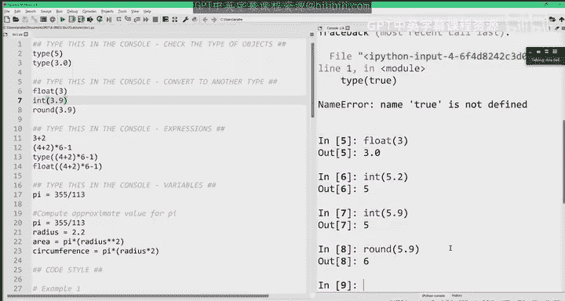

ok。So that's basically what I said in the example。So let's have you try this。

What are the types of the following， I don't need the values， but the types。

 So if I get type of float of 1 hundred23， What is the type of that。Float， yeah， exactly。 Yep， I'm。

 yep。 what， What if I round 7。9， What's the type of the result， It， yep。

 what if I create a float of the round of 7。2。Yes， good。 Flow would be 7。0， and the int of 7。2。Int。

 yes， exactly。 I want the type that the value and the int of 7。9 is an int。 Exly awesome， good。😊。

Okay， so we've created a bunch of objects， right， We know that we can create a bunch of objects in our programs。

 What do we do with them。Well， we can combine them into expressions。So let's say we have 3 plus 2。

 I've got object， operator object。Cool， syntactically valid in Python and has no static semantic air。

 So if I do that in Python， it's going to。

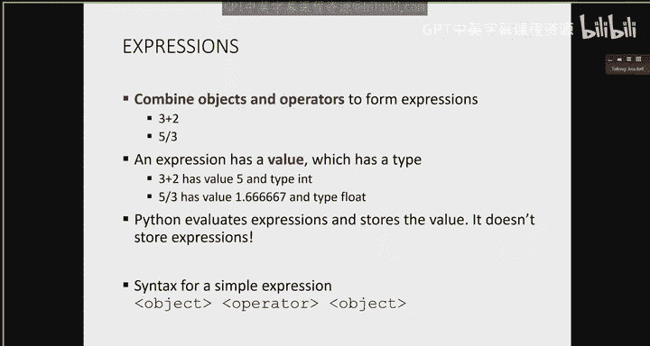

Be okay，3 plus 2。5。And the type of3 plus 2。Is an integer。Right， so basically， what I've done here。

 I've put an expression within this type。Command， and that's okay。 that's， in fact。

 encouraged in Python。 You don't just want to calculate and then stick in。 that would be very。

 very tedious。 So you can insert expressions in many， many different places。

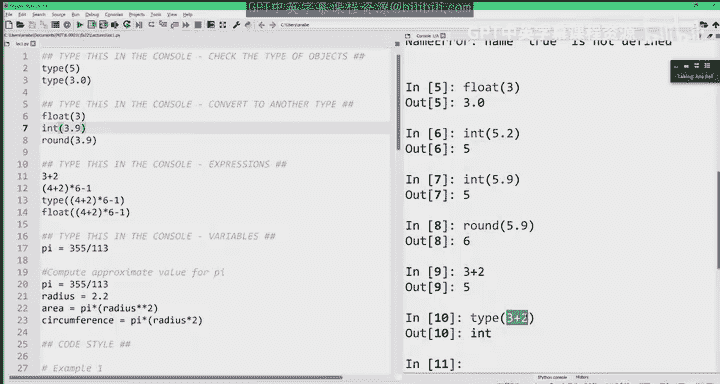

Right， so here we have 3 plus 2，5 divided by3。 Again， we've got， you know。

5 divided by3 has this decimal value。 and the result has a float has a type， is of type float。

So the important thing to remember when we're doing expressions is Python reads the expression。

 but it does not store the expression in memory。Okay， what it does is it reads the expression。

 evaluates it to one single value。And then it stores the result value in memory。

 So it never stores the expression。 It evaluates the expression， and then stores the value。Okay。

 and so this is the syntax for an expression， object， operator object， as we just， just saw。

 And that's really， And the idea I I said before， right， where Python stores。Values of expressions。

 not the expressions themselves is really， really important。Right。

 so this is my first big idea slide。 I decided to insert these because I think they kind of stress the importance of several concepts。

 So I hope this is one。 So， you know， we're taking expressions。 They can be as complex as you'd like。

 We can use parentheses。 You know， a bunch of， it can doesn't just have to be operator object。

 operator object。 It can be more complex than that。But basically， however complex that expression is。

 we evaluate it and we replace it with one value。And the expression。

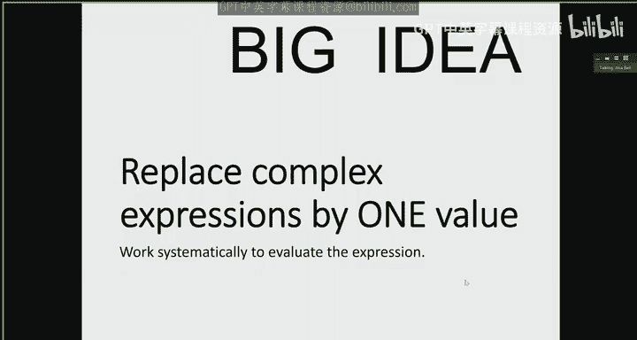

Can be something like this。 It doesn't just have to be something that's mathematical， right。

 This was a mathematical expression， but this is also an expression。 And it evaluates。

 So this entire thing evaluates to this word， you know， this word which represents the type integer。

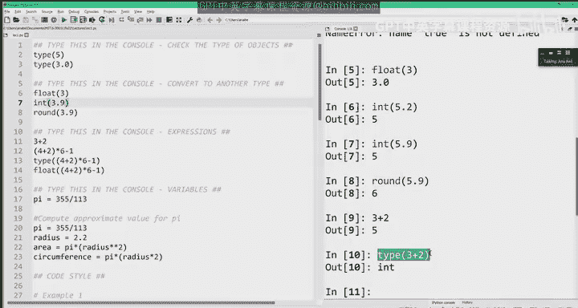

So here are some more examples，3 plus 2。 again， we got。

 we've got these examples with the parentheses，4 plus 2 times 6-1， obviously gives us the number 35。

 And then we can insert expressions wherever we'd like。

 So here I'm inserting that specific expression。

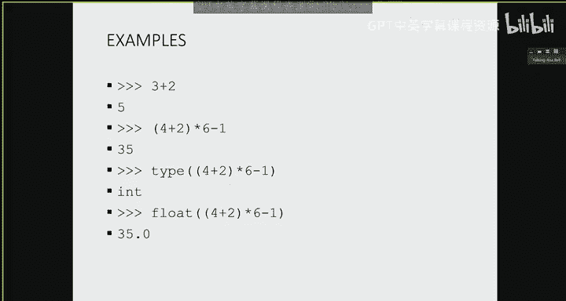

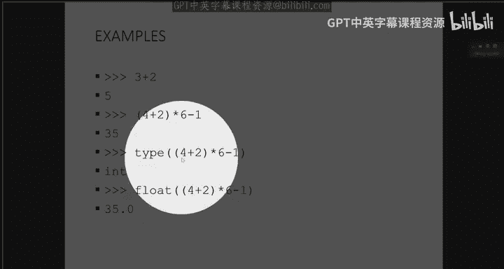

In the type command。And this is also an expression， like I just said， and its result is int。Okay。

 and similarly， we can also insert that expression here， and then we can wrap that around cast。

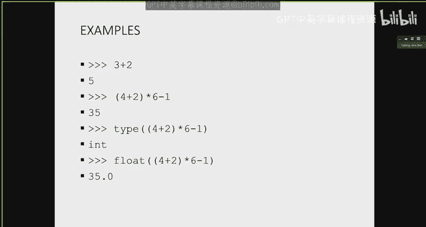

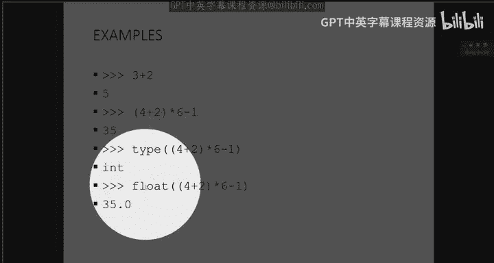

And it gives us a flip， yes。I with the operator。When you'reing， sorry， when you're inserting what。

2星期岁。And you said that uniquely object， operator object。対。Oh， I see。 Yeah。

 that' good that's a good question so。😊，In this particular case， the type and the float are not。

 There is no operator， I guess， in this particular case。

 it's more like a command that gives us an output， but there is still something there is。

 there is still an output that that it gives us。 So we can then take the result of this and save it somewhere else。

Sorry， yeah。 I guess the， the example I gave on the previous slide was just an example of an expression where we could do object。

 operator object。嗯。Okay， yeah。 so when we have these， I guess it works for mathematical expressions。

 mathematical expressions work left to right， just like in math， parentheses can override certain。

precederents。If we have。Commands that have computations。

 Then we have this command with the parenthses， and we evaluate what's inside the parenthsesis first。

 So we work our way in to out in that particular case。So here's some examples。

 let's have you try these so we can type these in our console。

 What are the values of the following expressions， So 13 minus-4 divided by 12 times 12。

 so we can try that。

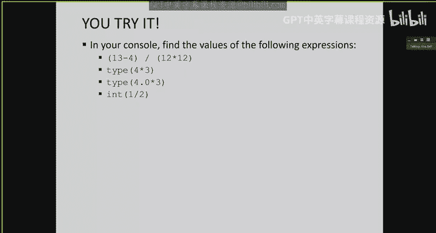

I don't know off the top of my head。 So we'll have to type it in 。0625。 Okay。

 so the value of that expression is a floatat， right， point0625。

 What's the value of the expression type 4 times 3。

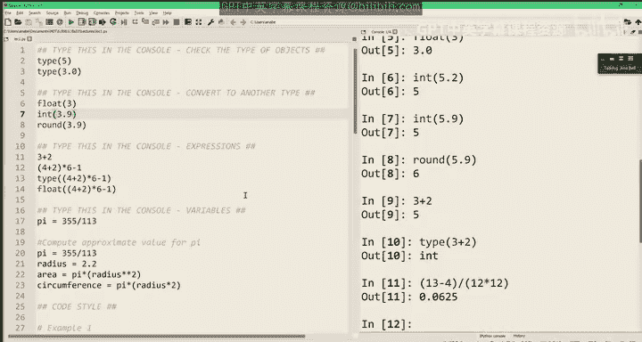

And yep， what about the type of the expression 4。0 times 3。

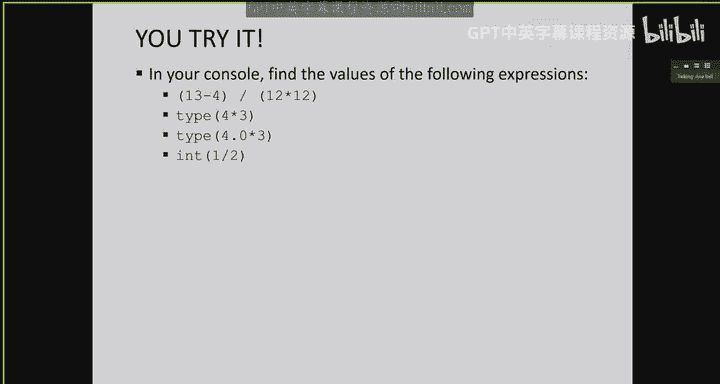

Yes， exactly。 That's very good。 So type of four times 3。Is int but 4。0 times 3 is a floatat， good。

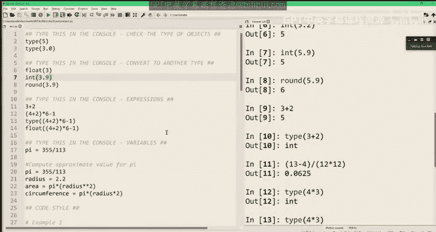

And then what about int of a half or of one over2。Yeah， exactly。 it's 0。要。Ca it's 0。5。

 and we truncate to 0。The reason I had this here is because it leads nicely into this slide。

 You don't have to memorize these rules。 You can always check it out in the console。

 but there are some rules for the resulting types when we do operations， so。

When we do operations with numbers， addition， subtraction and multiplication。

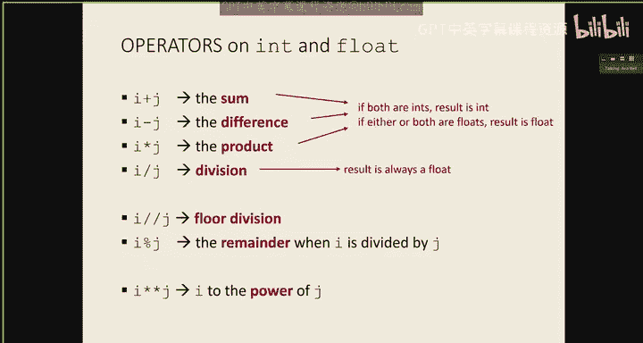

Always yield an integer。 If both of the operators are integers。If one is a float or both are floats。

 then it gives me a float。Division is different， no matter what types you divide。

 you'll always get afloat。

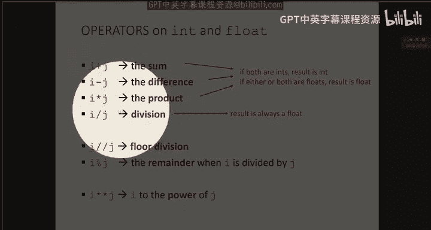

Now， what about this slash slash and this percent， These are actually useful operations。

 They kind of go hand in hand with division。

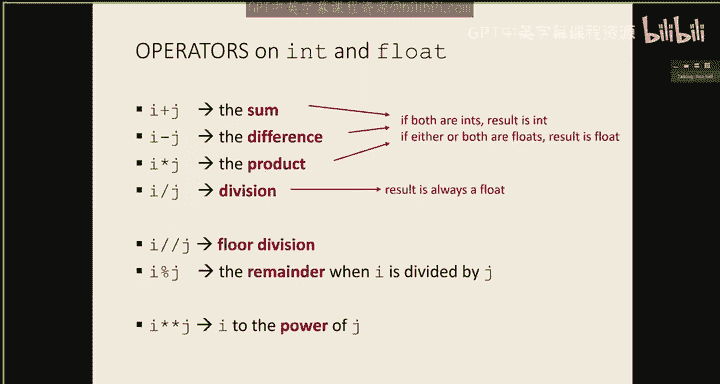

So when I do 5 divided by 3， it's this 1。667。Slash slash is basically a floor or you know。

 getting the integer portion of the division。 So 5 slash slash 3 gives me one， right， It truncates。

The the fraction。The percent gives me the remainder。

So 5%3 gives me the remainder when I divide 5 by 3。 So it's gonna give me。

 give it to me in a a whole number， right， So that's gonna be 2。

Cause there's two left over when I divide 5 by 3。So these are pretty useful operations， the。

 the slash slash and the percent when， when we do sort of mathematical programs。

The last thing is the star star is how we denote power exponentiation。

Kind of different than than you might be used to in math。 So 2 to the power of 3，8， right。

2 to the power of 3。08。0。 And the rules for integer integer division。

Percent and exponation are just like addition subtraction multiplication。 If one is a floatat。

 then the result will be a floatat as well。

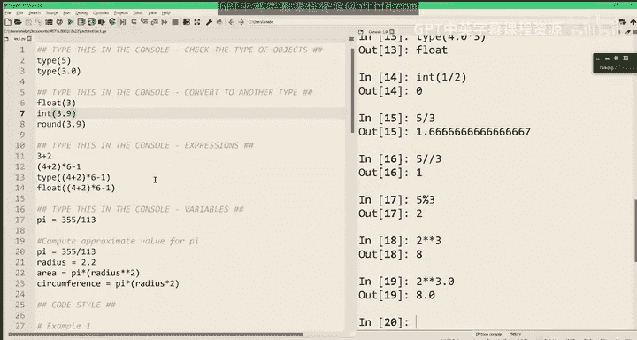

嗯。And we talked about the type of output。So I think I briefly mentioned this。

 The operator precedence is exponentiation， and then multiplication division percent remainder at the next level and then addition subtraction at the bottom。

 But you can always override these using parentheses。O。Questions so far before we move on。Yes。

So why iss division， Hawaii is always result like give like9 by3。 and that's be like why。Yeah。

 so the question is， why does it always result in a float。If it didn't。

 I think it would the operation itself would have to do extra work to figure out whether it's a whole number or not。

 So I think it's just easier that it gives us always a float。I guess previous versions of Python。

 the slash was actually， I think， integer division。

Which is super counterintuitive because you would use that in your program。

 and then you would basically inte your divide and things would go wrong。 But again。

 I just a design choice on behalf of the programmers， yeah。Other questions so far。Okay。

 so we have a lot of objects， right， Object have different types。 Again， floats， integers， Booleions。

 What can we do with them， right， so far， they're kind of just sitting in there and we can get properties about them。

 But what we'd like to do is write programs。 Basically trying to automate some things about these objects。

 manipulate them to help us achieve， you know， a more complicated and interesting program。So。

 what we can do。To， to get to that， to that end is to start assigning names to some of these objects。

Okay， if I create an object。For， for Pi， right， in my program to 20 decimal places somehow。

 And I have that number in my program that float in my program。

 If I want to use that number in many different places in my program。

 I'd have to copy and paste it a whole bunch of times， right， so far。Which is very tedious。

 Lots of errors will happen。Right， I don't want to do that。 So instead。

 what I can do is I can give a name to this ridiculously long value of pi called pi， right。

 And then I can just use this name anywhere。 I want to grab that ridiculously long value for pi in my program。

It's a lot easier to read， right， It's a lot easier for me to write this program。And， you know。

 it leads so really nice。A neat program。So what we can do is we can start saying that， you know。

 the float point 001 will be referenced by the name small or， you know， the the 100。

4 will be referenced by the name temp。So what we want to do is create these things called variables。

And a variable is different in computer science from a mathematical variable or variables that you've known so far in math。

So math variables come back to the idea of declarative knowledge， a declarative statement。

You can have something like A plus B is equal to B -1 in math。Right， or x is equal to。

 or x times x is equal to y。 And that's perfectly O， right， in math。

 we basically say that variable x represents all the square roots of y。

That's not going to fly in computer science。Computer science， we don't have， right。

 We don't do declarative knowledge。 We do imperative knowledge。

 And so what we're working with in computer science is a bunch of。Assignment statements。

So what we can do in computer science is we're going to basically bind a value to a variable。

 So we're gonna say this variable name is bound to this value。 Every time I want to grab this value。

 I'm going invoke this variable name。So here are some examples。 I've got A is equal to B plus1。

The thing on the right hand side will evaluate to some value as long as I have something that be you know。

 be as a value  for。 I've got here M is equal to 10， right？ So M is a variable。 Its value is 10。

I've got F is equal to。M times 9。98。 So again， I have an expression on the right hand side。

 and that's okay。 I'm gonna use the value of 10。 So F's value will be 99。8。Thank for。

Is it like this one value of M or can you have it， like it's going to do whatever M？And you sent me。

Yeah， the question is， can you have M whatever it recently is， So in this particular case。

 I just have these two lines and M will be whatever 10 is。

 But we'll see in a couple lectures that we can write like a loop。Where you change M。

 and then every time you change M， you re immediately calculate F。

And then itll calculate F based on the new value of M。 But if we just have these two lines。

 that's that's all there is。 It just uses 10。was there another question。Okay。

So in computer science variable， you have only one variable to the left of this equal sign called the assignment operator。

 And you have a value to the right hand side of the equal sign， the assignment operator。

So one variable basically maps to or binds to one value。So。The equal sign is an assignment statement。

 It's not equality。 It's not a solve for X type of situation。 It's just an assignment。

 It binds this name to this value。So the way that we figure out the name with the value is， well。

 if we have this assignment statement here， we first look at the right hand side。

 we always start with the right hand side， and we evaluate it。Remember。

 we have an expression on the right。 We have to evaluate it to one value。So this will be 3。14。

 whatever it is，1。159。And then we take that value and bind it to the name pi。

So any time I type in P pi in my program from now on， Python will automatically grab 3。

14159 from memory， So it's bound to that value now。O。

There are some rules that I have them on the previous on。 Yes， there are some rules to。

Variable names。But we'll talk about that in a bit。 For now。

 I want you to tell me if any of the following are allowed。 If I do x is equal to 6。

 I that allowed in Python。Yes， it is good cause I have one variable name， Bi to 1 value 6。

 What about 6 equals x。 It's just backward。

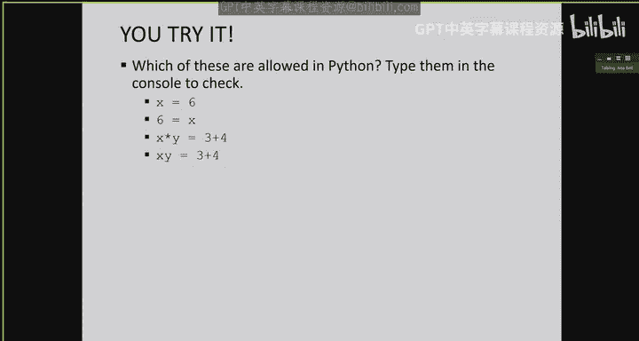

Okay， good，6 equals x is bad syntax error。

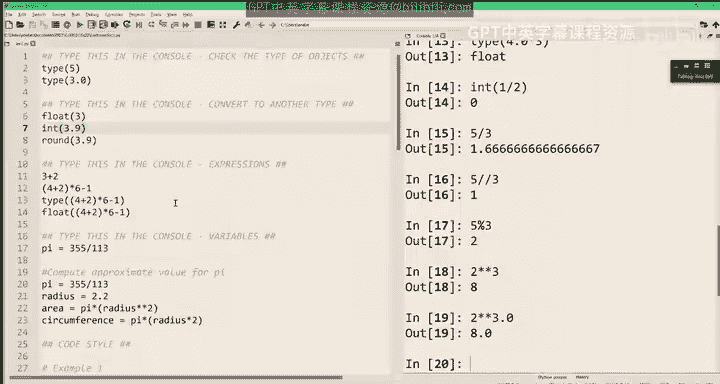

How about x times y equals 3 plus 4。Nope， exactly， because the thing on the left has an operator in it。

 and operators are special， right， So it can't have。 You can't have a variable with that。

Star as a name。How about X， Y equals 3 plus 4。

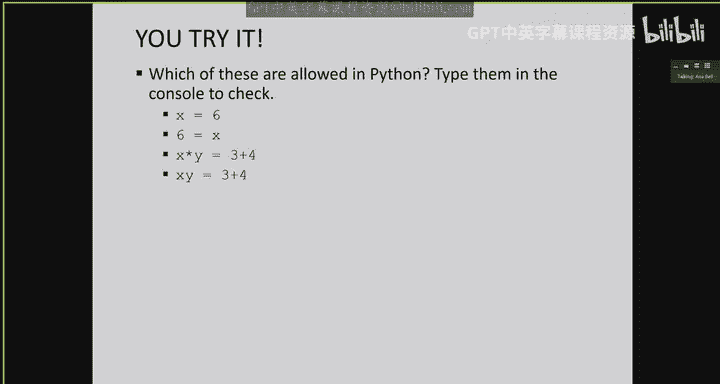

Allowud， yes， exactly。 I was hoping to get you guys with that， but I didn't。

 X Y equals 3 plus 4 is okay。 There was no error。 and then I can invoke the name of the variable I just created simply by typing it in。

 So if I type in X， Y， it gives me 7， right， and then I can do operations with it X Y plus1。Is 8。

 right， yeah。します。So those are strings， right， sequences of characters here。 These are variables。

 So these are names that I， I am giving to as a variable。 Yeah， that's a great question。

 So this is going to be a string。 And you notice it， it changed to color， right。

 It has some meaning in Python。But X， Y is a variable that I， I create。

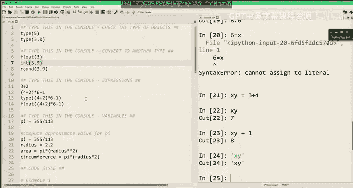

O。So why do we want to give names to variables， Because as I showed you with a pi example。

 it's a lot easier to write code， write readable code if you have variable names within within your programs。

 So when you grab when you write programs， it's important to choose variable names wisely。

 you don't want to use just single letters。 you don't want to name it something that doesn't have something to do with the program you're writing。

 because you're going to want to read read these programs sometime in the future or others might want to read your programs。

 sometime in the future。So here's an example of a nice program。

 It's just basically four assignment statements that do some calculations。

The first line of the program is not really a line。 It's called a comment。

You can have as many of these as you'd like。 They start with a hash。

 It's a line that starts with a hash。 And it's basically text that you write that helps you or others figure out what the code is supposed to do。

 And usually we comment sort of large chunks of code at a time， not line by line。

Then we have these four equal four assignment statements。

 So here I'm defining variable named pi bound to the value here。 So not the division， but 3。14059。

Variable named radius bound to this float 2。2。 And then I have a variable named area which is bound to the result of this expression。

Okay， so when Python sees my pi and my radius， it grabs them from memory。

 replaces them with the values， evaluates the expression。

Gras that one value that that we evaluated  to，15 point something。

 whatever this is and binds the 15 point something to the name area。Same with circumference。

Coode style is something that we're actually going look at in your problem sets。

 So I just wanted to quickly talk about that。 Here is a program that has really bad style。 actually。

 that shouldn't be me。 It should be， you know， terrible or something like that。

 But it's in case you haven't noticed it's the same program as on the previous slide。

 But if I gave you this program straight off the bat， you probably wouldn't know what it's doing。

It's reusing 3，5，5 over 1，1，3 twice here。 It's using just A and C as variable names。

 Its description is due calculations。

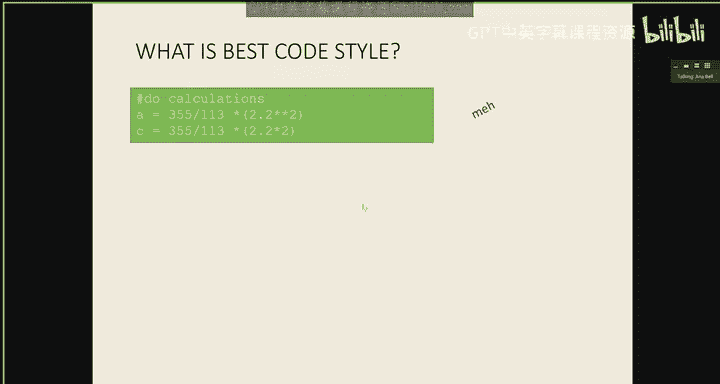

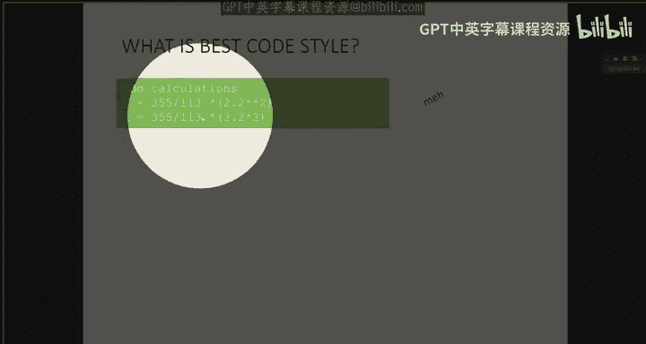

So pretty bad。 This is a little bit better。 I've recognized that 3，5，5 over 1，1。

3 is being used twice， So I'm saving it as a variable， but my variables are still single characters。

 And my comments are pretty bad。 I'm basically saying what the code is doing。 Please don't do that。

 We can see that a equals P times R times R。 right I see that I'm multilying P with R squared。

 I don't need to read that in English。😊。

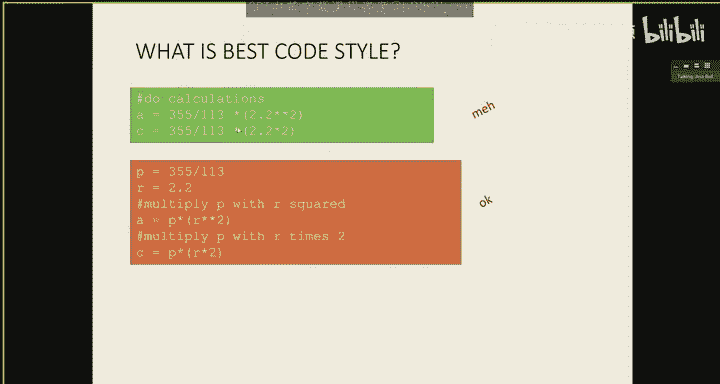

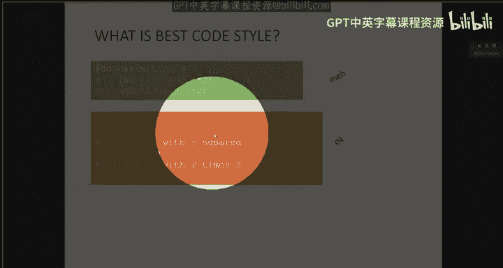

What I would like to see is a comment like this here， I'm commenting， you know， a chunk of code。

 and someone who doesn't want to read this chunk of code just reads the comment。

 And I already know that I'm calculating the areaN circumference using an approximation for pi。

 That's a pretty nice。Comment there and good descriptive names and all that。So we can actually。

 once we create an object， a variable， sorry， Once we create an object and bind it to a variable。

 we can change the bindings。So we can take that variable name and bind it to a completely different value。

This might not be sort of useful right now， but it will be useful when we introduce control flow in our programs。

So to rebind a variable， what that means is we're going to take the name。

 We're going to lose the binding to the previous value， and we're gonna rebind it to a new value。

 So I'm gonna show you how this looks like in memory。

I'm going to use this sort of cloud picture to represent what happens behind the scenes whenever we write programs。

 And it's like a a little animation to help you understand line by line， what's going on。

So here we have pi equals 3。14。 So the green 3。14 is my value in memory。Clloud is memory。

 That's my value and memory。 And it's bound to this name pi。 So this is my variable name。

The next line， radius equals 2。2。 Same thing。 I've got 2。2 as my value and memory， my object。

 and radius is the name for that object。Area equals pi times raius squared。

 So what happens behind the scenes is it calculates this value， right。

 It doesn't store the expression。 It stores the value resulting from the calculation。

 and then it saves it。 it or binds it to the name area。Okay， everything O so far。

 we've seen this code before。 Cool， So now what happens when we do this radius equals radius plus 1。

In math。That would say，0 equals  one。But we're not in math here， right， We're in computer science。

 and this is perfectly valid。We're following the rule， right， when we have an assignment that says。

 look at the right hand side first。And evaluate it。And then bind it to the left hand side。

So if we look at the right head side first， right， we see radius。 Well， what's the value，2。2。

We see add one to it。3。2。Save that in memory。 And then we see the assignment。 Now。

 save it with the name radius。Okay， so we can only have one variable assigned to one value at a time。

 right， this is not math。 This is computer science。

 So you can only have radius point to one thing at a time。With this line of code。

 radius equals radius plus 1， we've lost the binding to 2。2， this object in memory。

 and we've rebound it to the value 3。2。Okay， and that's perfectly fine。2。

2 is now just sitting in memory。 We can't get back to it unless we say maybe radius equals 2。2。

 It just sits in memory。 And then you know， may I be collected later on by or reclaimed by garbage collection or something like that。

 But for now， we can't get back to it。Now， what's the value for area。At the end of these lines。Well。

 according to this， it's 15。1976。 So it's using the old 2。2 value for radius。And that's okay。

 because。The program， never told。I never had a line that said。

 recalculate area after we change the radius。Right， it's just following dumb line by line， right。

 It doesn't know that， hey， if I change the radius， the user might want the area changed， right。

 It doesn't make those connections。 It's just following instruction。And that's okay。

 If we wanted to change the area， we would have to copy this line and paste it。

After we've changed the radius， and then the area would change as well。Does that make sense。

 That's kind of an important part of this lecture。O。

So big idea here is our lines are evaluated one after the other。 We're not skipping。

 We're not repeating things。 That's something we're gonna learn about later。 But for now。

 line by line。So here's a little you try it。 These three lines are executed in order。

 What are the values for meters and feet variables at each line。 So how about it the first line。

 What's the value for meters。

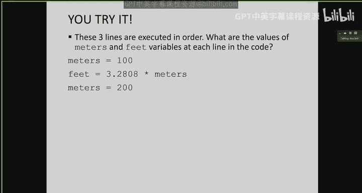

After we execute the first line。100， what about feet。So feet at the end of the first line。

 there is no value for feet yet。 How about after the second line，3，28。8， right。

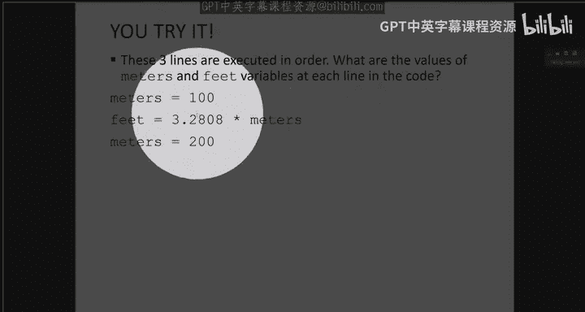

How about the value for meters。100 still。 And what about after the third line。

 I'm changing meters to 200。Exactly， yeah， Mters is 200， but feet is still 328。08。And。

This is something I want to show you guys today。 And we're gonna use this Python tutor a lot more in the future。

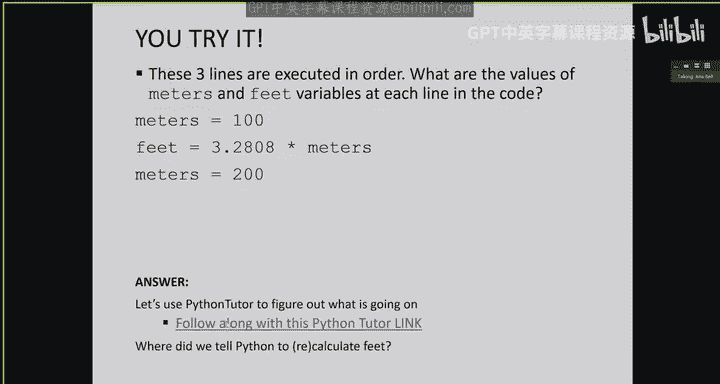

Python Tutor is a nice website that allows you to step in your code， step through your code。

 step by step。So， at each。Line that you execute。 You get to see the values of all the variables in the code。

 It very useful debugging tool。 I hope you'll try it out today。 And on Monday。

 maybe for the finger exercises， if you're if you're having trouble and， you know。

 you can use it for quizzes to help you debug。 But we can， I can just show you。

 it's pretty simple here because it's just a step by step。

 So we step through So the red says the line I'm going to execute。 green is the line I just executed。

 So I just executed meters 100。 So here I have my meters variable with the value 100。

Step through next。 So I just executed feet equals this。 So I now have a variable named feet。

Within a value 3，28。08。Meters still 100。 And then。Meters 200 feet remained 3，28。08。

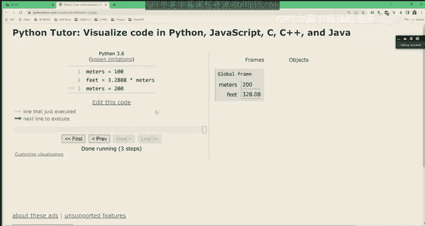

So obviously， this is a pretty simple program to run the Python tutor on。

 But you can imagine using it in。In more complex settings。How about one more。

 And this is my last example。I want you to try to write a program that swaps the values of X and Y。

 So originally， and I'll draw this the memory diagram real quick。 So we have。As is our memory。

 we have x' is bound to one。Why is bound to2。And what I want to do。Without saying x equals 2。

 y equals 1， what I want to do is swap the values。 I want x to be associated with 2 and y to be associated with one。

 but only using commands like this。Right。And so， the code here。Is buggy。 That means it's wrong。

 It has an error in it。Because， well， let's， let's step through a little bit at a time。Y equals x。

What do I do when y equals x here。Yeah， exactly。 Why is going move from 2。To one。Now。

 what happens when I do x equals y。Yes， x stays the same。

 My first line Y equals X lost the binding to 2， right， And now。

It's almost mess up becauseuse I can't get it back。So instead， so， if you didn't understand this。

 you can click Python Tutor and just kind of step through step by step on your own。

But how can we fix this。Create a third variable。 Yeah， that's a great idea。 Yep。

 we can create a third variable。 So x is 1， Y is 1。Y is 2。 so we can create a third variable。

 But what do you want to make the variable equal to。X。Or why， yeah， either one。I made it why。

 So let's do why。 So here I've got a temporary variable called temp。😊，And I made it equal to 2。

And now， what can I do。Which one can I reassign now， X equals y or y equals x。Exactly， y equals。

 if I do x equals y， I lose my binding to  one。 and I'm， I messed up again。 So y equals x is O to do。

 So I'm gonna lose the binding from y。From 2 and bind it up to one。And now what do I do？Yeah。

 now I can safely resign X to。Temp， right？ So I can say x is equal to temp because temp points to 2。

 And I want to make x point to 2， as well。So in terms of code， So that's sort of the diagram。 But。

 you know， we can write the code。 So you don't。 let's see。

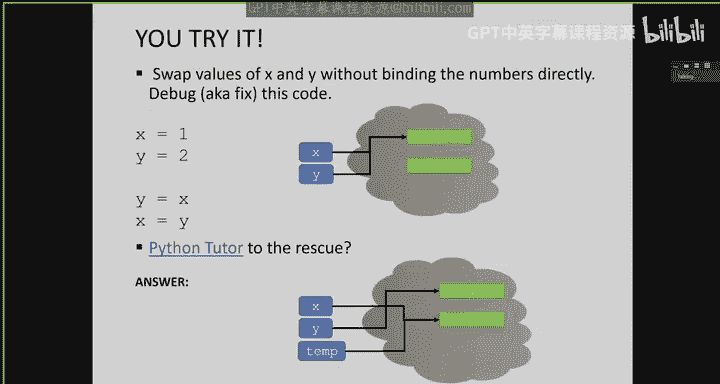

We don't write it in here， but， you know， on on your own or you can write it in here if you'd like。

 or we can do it together。 So x is equal。 oops， x equals 1， y equals 2， right？

 And then we can have we had temp。 We wanted to assign it to whatever y was， right？

 So we say temp is equal to Y。And if you want to check the values of the variables。

 you can just invoke the names， right， So x is 1。 Y is 2， and temp。Should be whatever y is， too。

good so far。

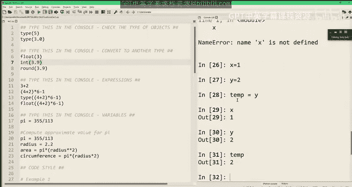

So now I'm at the。Step。Here， I think， right， I've just created this。

 and then the last thing I need to do is lose the binding from X。To whatever temp is， right。

 So I want to do this operation here。

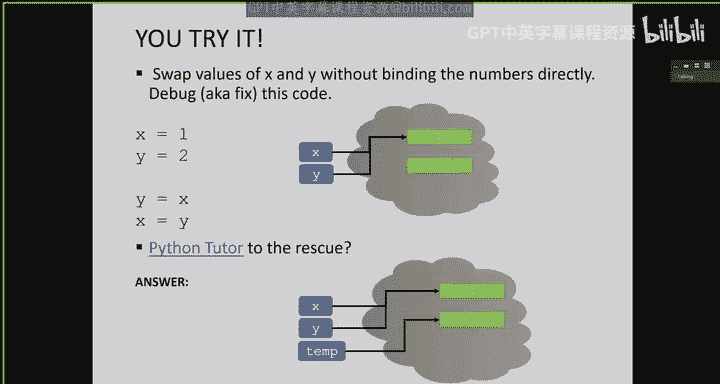

Which means I want to assign x to be equal to temp。Right， so now x is2。 Y is what。What did I do。Yeah。

 let's， so this happens。 Sometimes we can just start all over right。So y equals temp sorry temp。

Equals y。Y equals x。Y is1。 X is1， and then x equals temp0。Why is one。Acces to。

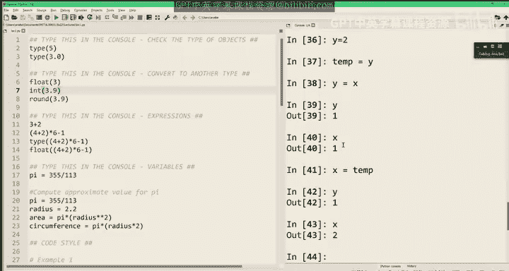

So it's okay。 if things go wrong， they will go wrong。

 We can just start all over in this particular case by redefining our variables and just trying it out all over again。

 So that's kind of what the shell is for。 That's what I use it for。

 That's what we're gonna use it for in the future。 just to do quick things like this。 you know。

 and also things like checking the types and， and other commands we've done。Elier。Okay。

 so any questions before we do the summary， Was this。

 I'll write pace or was it too fast or it's okay。Y， okay， good。 thumbs up is good。

 So let's do a quick summary。 We saw that we can create programs by manipulating objects。

 We created objects in Python， and we saw that objects have a particular type。

 The type that the object has tells Python the things that you can do with that object。😊，Right。

 we can combine objects in expressions， and these expressions evaluate or boil down to one particular value。

Objects or values can be stored in variables， and these variables allow us to access these values。

With nicer names later on in our program。 and， and then we're able to write neater。

 more legible programs as well。Right， so the equal sign I showed you a couple of differences between math and computer science。

 The equal sign was one notable difference， right， The equal sign in in math is declarative。

 and the equal sign in computer science is an assignment。

 You're basically saying this is associated with this， right？

 And we're not doing any sort of equality in computer science。嗯。And， yes。

 computers do what you tell them to do。That's kind of the big， the big thing here， right。

 line by line， it executes starting from the top， goes line by line。

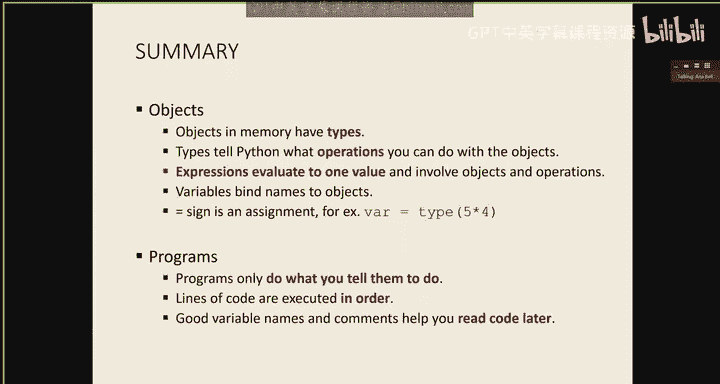

So far， we haven't seen any places where we where the computer makes a decision。 But next lecture。

 we will see how we can insert decision points in our programs for， for the computer to， you know。

 either execute one set of code or another set of code。So that's the end of today's lecture。

Thank you all for joining。 I will see you on Monday。

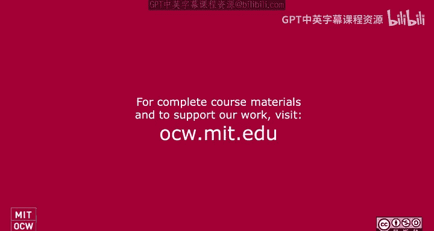