# 《计算机科学和Python编程｜6.100L Introduction to CS and Programming using Python, 2022》 - P20：-20-Lecture 20_ Fitness Tracker Object-Oriented Programming Example.zh_en - GPT中英字幕课程资源 - BV1PAxJzVEs3

OK。So let's get started。Today's lecture will be the last one we have on object oriented programming and creating our own data types with Python classes。

 So in today's lecture， we're going to go through an example that's sort of more involved。

 We're going to be creating our own fitness tracker object。

 and specifically we're going to create a class for that implements the idea of a workout。😊。

And the slides for today are going to feel very similar to the slides from Monday's lecture。

 a lot of them are just kind of reinforcing the same ideas we saw last lecture on creating getters and setrs。

 creating class variables and the idea of inheritance。

 but we're just going to do it in the context of this more involved example， the fitness tracker。

So let me remind you， first of all， something we've been talking about and hopefully you understand at this point in our our lectures on object or even programming。

 And that's the idea that when we write our own object types。

 we're writing code from two different perspectives， right。

 The first perspective is the one on the left hand side here where we are making design decisions for how we want to implement this new object。

 this new data type。And when we make these design decisions， we decide the name of the object。

 We decide the attributes， which are either data or procedures that we want the object to have。

And then once we've decided on this and we've implemented our data type。

 then we can start to use the data type and to use it。

 we are creating a whole bunch of objects of this type。

 And we're manipulating these objects in some interesting and useful way。So the left hand side。

 we're creating this blueprint， this abstract notion of an object。 and the right hand side。

 we are creating actual instances that we manipulate， right。

 So up until this object oriented set of lectures， we've really just been working with the right hand side。

 right， we've been working with objects that other people have created。

 But the big idea of these set of lectures is that we now get to create our own object types。

 So we get to write this code here。😊，Okay， so we're going to write code to create a tracker for workouts。

 And today's lecture， we're there's gonna to be sort of a sequence of of things that we're gonna do。

 We're going start out with a really simple workout object。 and then we're going to improve on it。

 So I've actually set out a little roadmap here on the board that we can follow。

 So every time we finish sort of a little section， we'll check it off。

 So just easier to understand sort of where we are in today's lecture。😊。

So we're going to create first， just a very simple workout object。

 sort of in the same spirit that we've created， we've been creating objects。

 Then we're going to improve on it a little bit by adding nicer methods and things like that。

 And then we're going to go through the idea of inheritance to create very specific types of workouts。

 So if we think about workouts。We have many different kinds of workouts， right， We've got biking。

 swimming， running。

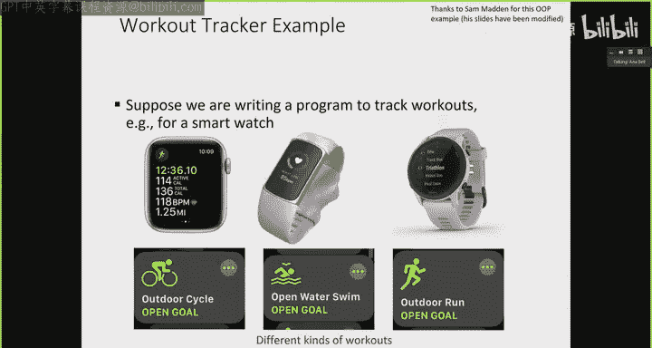

But really at the core of all these workouts， right。

 if we think about sort of the information related to just a very generic workout。

 not a running or a swimming specific one or a biking one， just just a generic workout。

 there are some common properties that all these workouts have。Right so I've listed them here， right？

 the a workout might have an icon associated with it， right， So this this this。

 but whatever it may be， there is an icon sort of property for a workout， the kind of workout。

 So biking， swimming， running things like that。 a date。 So maybe start date and an end date。

 start time， end time， that kind of information， the heart rate。

 maybe average heart rate throughout that entire activity。

 the distance and the number of calories burned right All of these properties are common to any kind of workout that we might want to create。

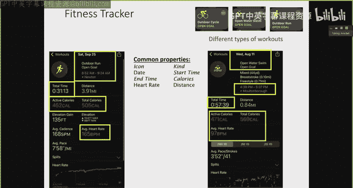

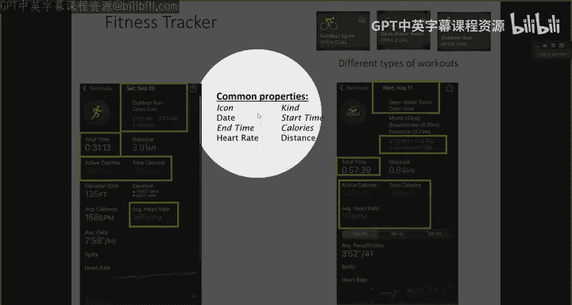

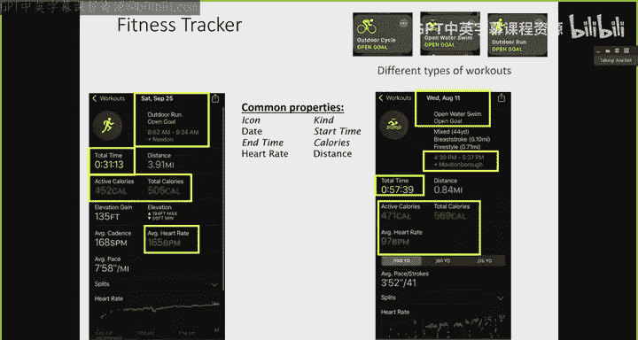

But now that we have specific kinds of workouts that we might want to create， we can actually think。

 well， in addition to these common properties， a swimming specific workout might actually have some more information that we'd like to save。

 right， And we'd like to allow the user to work with。So the swimming pace， maybe the stroke type。

 the0 yards splits， things like that for swimming。And for running。

 we might want to show the user the cadence。 the running pace。

 the mile splits and maybe the total elevation throughout that throughout that run。Right。

But the idea here is that we have some core set of properties and no matter what kind of workout we're creating。

 we would like to save and we would like to allow the user to store and to do operations。Now。

 when we implement our workout class， we're not going to implement all of these。

 They're not all necessary。 We're going to just keep some of the core ones。

 So the ones we're actually going to implement in this class are italicized， right。

 So we're going to keep the icon and the kind of workout， the start time and times。

 and then the number of calories burn。 That's something that we're going to just save as a really common the common set of attributes for a workout。

But， of course， you can see that if you make the design decision to improve upon this workout class。

 you might include a bunch of these other ones as well。Okay， so。

So we're gonna have to decide the data attributes。 So we just mentioned on the previous slide， right。

 when we make design decisions， we figure out the attributes that we'd like to have for our object type。

 So that's the data and the behaviors。 for the data for a workout。

 We've decided it would be the start time， the end time and the number of calories burned。

 So those three things together。 maybe start time is a string and time in the string and calories is a number。

 right， either a floaterant， whatever。 Those three things together， make up the object。 a workout。

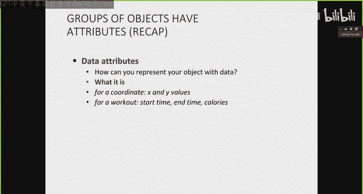

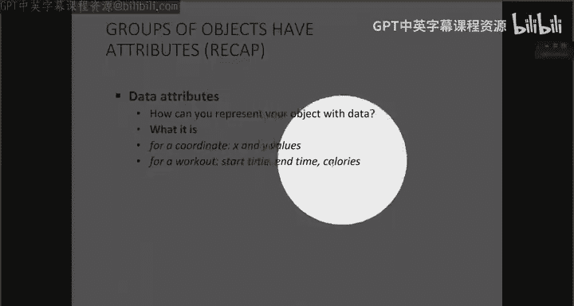

And then in terms of functional attributes。 So these are the methods that our object might have。

 Well， we can have， of course， the ability to， you know， tell us the number of calories burned。

 So something like a getter method to set the number of calories burned if we accidentally input it the wrong number。

 reset it and then maybe something like displaying an information card right， So something like this。

 if we ask if the user asks us to print a workout object。

 we might display information in this nice manner here。Alright， so let's start defining our class。

 So this is a very simple workout class。 So we're gonna do box number one up there before we improve on it。

 So this is in the same spirit as we have been defining classes in the past three lectures。 right。

 So we tell Python， we're creating a new object by saying this is a class。

 and the name of this object。 So the type of this object is workout。 Okay。

 and the parent of this object is the generic Python object。 so far， so good， right。😊，Now。

 the first method we have to implement is the in method， right。

 It tells Python how to create an object of type workout， the constructor。

And we've got a bunch of parameters in here because it's just a regular function。

 that's a little bit special。 The first parameter of every method is， of course， self， right。

 Because when we call a method， we call it on an object。😊，Right， so some object dot this method name。

 the thing before the dot。Effectively gets mapped to the variable self。

 which is why every one of these methods has self as the first parameter。

And then we've got a whole bunch of other parameters for how we would like to initialize a workout object。

So we're going to say when we create a workout object， we're going to tell it the start time。

 the end time and the number of calories burn。

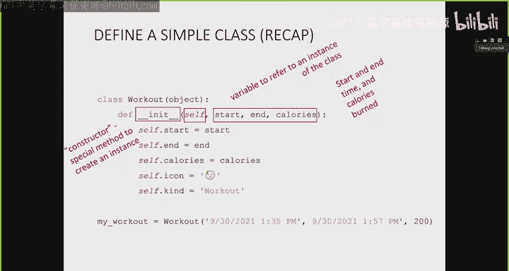

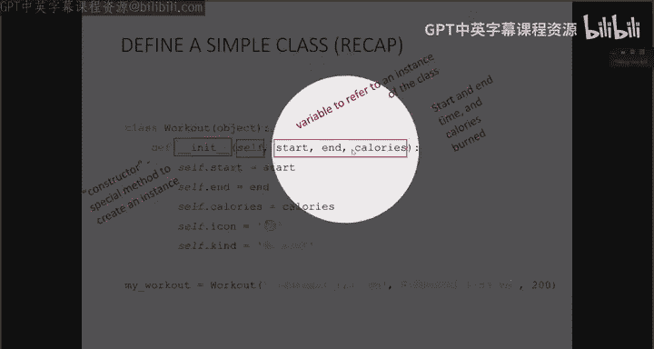

So that's the， the function stub， I guess。 that's how you create the， the object。

 And then what does this function actually do， What does this method actually do。Well。

 it does some of the usual things that we know at this point。

 So it basically maps every one of these input parameters to data attributes， self dot start。

 self dot end and self dot caries。

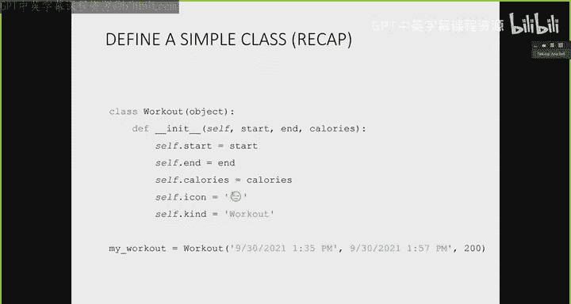

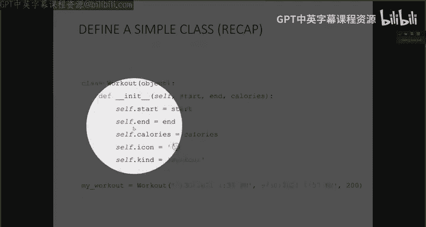

But in addition to just saving these as data attributes。

 the things that are passed in when you create the object， we would like to do two more things。

 We're creating two more data attributes， right， So in total。

 a workout object is defined by five data attributes。

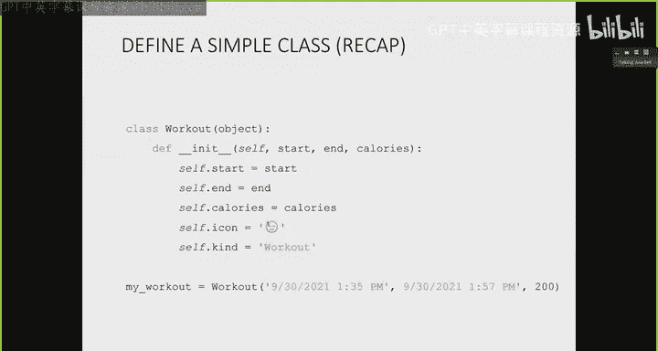

These last two data attributes， we don't need to pass in。 right， We're just going to by default。

 make them two two strings。 The icon is going to be the string， this sweating person， emoji， right。

 And you can have emojis inside strings， which is actually pretty cool。😊。

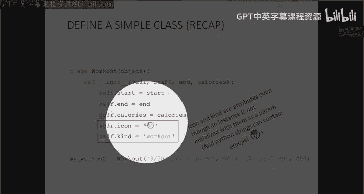

And the kind is going be just the kind of workout。 So we're just going to set it to be the string workout。

 When we create running workouts， it'll just be the string running。 when we create biking workouts。

 it'll be a string biking， right， whatever you want it to be。And we're gonna to see where these。

 where these sh up later on。Okay， so that's the definition of my class workout。 And then。For now。

 that's it。 That's all we have in terms of the class definition。 Now。

 what happens when we create an actual workout object？ Well， we invoke the name of the class。

 So we say here work， right？ And we're gonna save this object to the right hand side of the equal sign as variable my underscore workout。

 so far review。

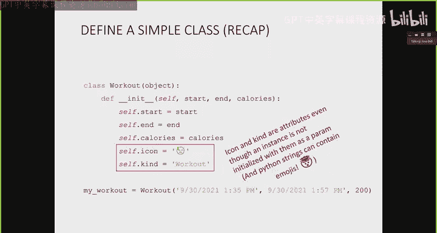

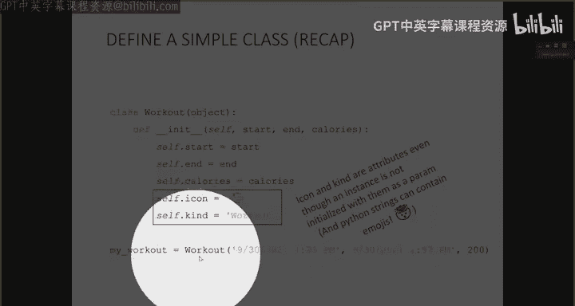

We pass in the parameters that the workout object expects。

 So here's a string representing the start time， a string representing the end time。

 and the calories burned for this particular workout to 200。Yes， good。O。

So then we can add a whole bunch more methods to our class right That was just the in method。

 But last lecture I mentioned that it's important to add getters and setter methods to allow the user to grab or set various data attributes。

 So here I've got three getter methods to grab for me the calories start time and end time and three setter methods to set the calories start time and end time。

All right。So what I wanted to show you， and this is not something we've actually seen before。

 I wanted to show you that every time you create an object of。

 of some type or even an object that already exists。

 you can actually look into sort of where this object is stored in memory， which is kind of cool。

 So if we think about the class definition that we've done so far。

 So not creating an actual instance， just defining the class。😊。

This class definition is actually kind of like an object stored away in Python memory so here I have my workout class and associated with my workout class definition。

 Python knows about all of these methods that you're allowed to do with this Python class and this is called the class state dictionary。

 so it's a dictionary that basically holds the state of your object。

So I wanted to show you what that looks like in code。So this is my workout class。

And the way you access the state dictionary is by invoking the name of your class。

 So not an instance， the name of the actual class。Dot this Dunder method。

 double underscore di double underscore。 So this holds the dictionary， the state dictionary。

And if we just access the keys， we're going to see here every single method we've defined in our class。

Right so you see here， here's my dictionary。 I could cast it to a list if I wanted to。

 but not necessary， but you can see every single method that we've defined， right， So all getters。

 all our setters， the in method， the double underscore doc actually grabs for us this doc string that you've put right under the class definition。

Right， so that's kind of cool。 So that's the dictionary keys。 And， of course， you know， as we know。

 keys have values associated with them。 So the values associated with each one of these keys is going to be。

 And we can see here。 So， for example， the value associated with the dock string is going to be literally the thing that I printed out。

😊，Right the little dock string that I put right underneath my class definition。

Right so now it knows the dock string for this class that I just created。

And the values associated with my getter methods and my setter methods and the in method and all the methods I created are just the locations in memory where Python can find these methods to run。

Right， they don't have actual values with them， of course， associated with them。 Of course。

 because they're just method definitions。 But Python just knows where to go in which memory location to actually run this function。

Okay。So， that's kind of cool。Pool to know。Okay， so that's the state dictionary of my definition。

 right， the implementation of my class。Now， what happens when I create an actual instance， right？

 So here I've got my workout equals。 and now I've got this actual instance of this class type workout。

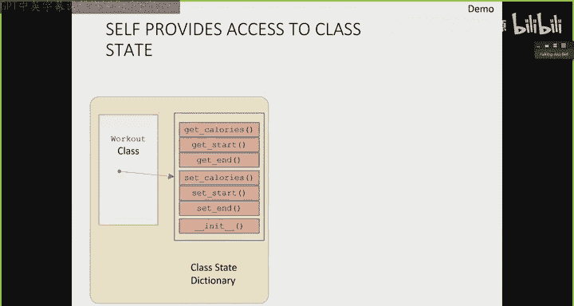

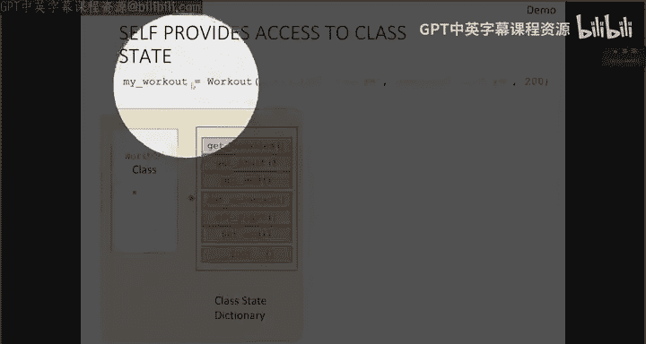

When Python sees this line， it says， okay， what kind of object do you want to create a workout object。

 It looks at the inep method of that workout object。

And then it runs all the lines associated with that workout object。

 So now it creates a new object in memory， puts that at some memory location。

 This object is going to be of type， workout class。😊。

And now this object is going to have its own state dictionary。 where in the object state dictionary。

 we're not storing methods or things like that。 We're storing the actual data attributes associated with this object。

Right， so this object， all the data attributes are all the things that you access via the self dot keyword。

 right， Se dot icon， self dot kind， self dot start， self dot end and self dot calories。

So we can actually go in the code just like we did when we looked at the class state dictionary and look at the state dictionary for one specific object。

 one instance。So， again， we can call the double underscore diict method on this instance。

 So now I have an actual object that has some values associated with it。

 And if I look at just the keys。We see these are the data attributes associated with an object of type workout。

 right， I've got my five data attributes。And then the values associated with those keys are going to be the values that are specific to this object。

 right， So my start is this date here。 My end is the date here。 calories was 200。

 The icon was the little sweaty person， emoji， and the kind of workout is work。

So it's kind of neat to be able to look into that sort of detail of where things are stored inside。

 inside memory。Okay。So。We saw how to create an instance of an object。

 and we can create a whole bunch of workouts that we then store， right。

 And then we can use do notation to access all of these attributes。

 right so we can either access attributes directly or we can access methods， right。

 we already know this。 So last lecture， I said that you can use donotation to access data attributes。

 So here we're accessing the calories value， right And that's fine。

 But what's preferred is to use the getter methods。

 right So get calories will in this particular case。

 return the exact same value as just accessing the calories data attribute。😊。

But the note that I made last lecture was that it was better to use a getter method because the implementation behind the scenes might change。

Right， and if the implementation changes， then if you access the calories method directly or sorry。

 the calories data attribute directly， your code might crash。But not only that。

 somebody who's writing a getter method for this， for this workout function might actually make that method be a lot more complex。

 complex than just returning that data attribute。And that's what we're going to see in the next slide。

 right？ So the idea behind using these consistent methods instead of accessing。

 using data attributes is that you want to keep information hidden， right？

 You don't want to start messing around with looking at how something is implemented because that goes against the principle of abstraction。

 modularity and information hiding， right， you want to keep things hidden because you want to use that these data these the objects that somebody else has created in a nicely consistent manner。

The way we use them in a consistent manner is by always using methods that are associated with that object type。

 okay。And so using getter methods might have seemed inconsequential when we wrote like the animal class last lecture。

 but it's going to seem it's going to be a lot more important in this particular lecture。

So with that， we finished。Our simple workout class。

 And now we're going to change the implementation just a little bit。Right。

 and what we're gonna to do is we're going to make a change to the。

 the way that we store the information。We're going to use a class variable。

 And I'll remind you what a class variable is in the next slide。

 And we're going to make a change to the get calories method。And we're going to allow the user。

To say， hey， I'm going to create this workout object， but I don't know about you。

 I don't know how many calories I burn， right， when I do a workout for， you know，40 minutes， right。

 I don't know that right off the bat。So if the user doesn't supply the number of calories burned。

We're have， we're gonna have our get calories method kind of estimate those calories burned。

Based on the duration of that workout。So we're going to allow the user to either supply the number of calories in which case they probably know what they're doing。

 And then when they ask us to tell us to get the calories。

 we're going to use those or we're going to allow the user to not supply the number of calories and instead estimate those calories based on the duration that they said this workout out lasted。

Alright， so that's the big change that we're going to do here in in the workout class。

 So we're gonna do a better get calories method。All right。

This is the new implementation of my workout class。

First thing you'll notice is we're using this class variable。 right。

 We talked about this last lecture when we did the rabbits example。In the rabbits example。

 we had each rabbit change this class variable value。 In this example。

 I'm not going to change this class variable value。

 I'm actually just going to use it as a variable that's that every one of these instances will is going to be able to access。

 right And I， and I'm just not going to change it， which is fine。

 You don't have to change this class variable。So this class variable will represent how many calories per hour are burnt。

 Okay， sos just a number。And then the in method。 And again， we're。

 we're going to make a different in method than what we saw in the previous slides。

 The in method is going to be new and improved。We're going to take in still the same number of parameters。

 but the calories are going to have a default value。Right。

 so if the user actually passes in the number of calories， the value for calories here。

 Self dot calories will be whatever the user passed in。

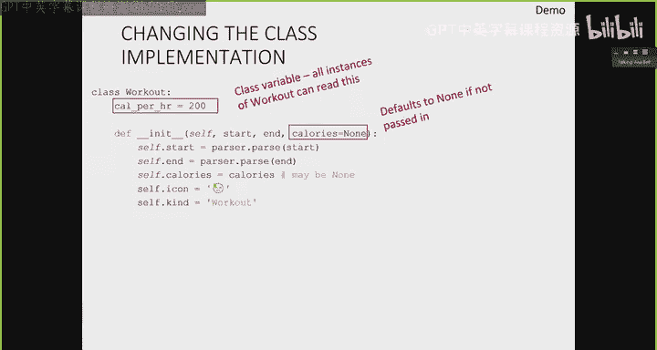

But if the user doesn't pass in the number of calories， then this parameter here。

 self do calories will be none。

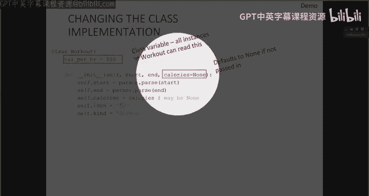

Right。None using being used to represent the absence of a value。Okay。

So two options here when we create the object。Other things you might notice is that the selft start。

 So the start time and the end time are no longer just start and end。

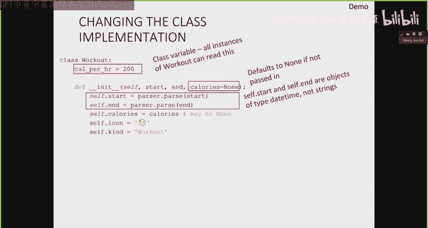

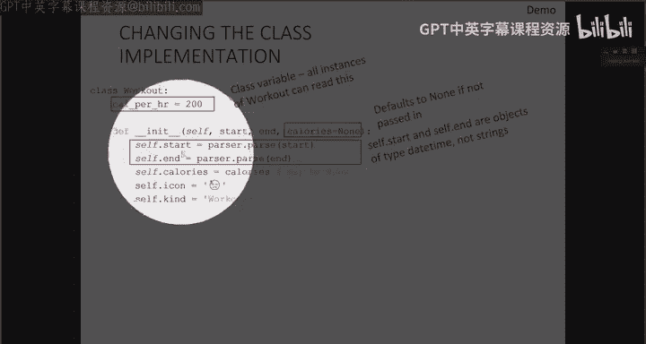

OK。I'm going talk about this on the next slide。 But essentially。

 what I'm doing here is I'm saying the start and end will be passed in as strings。

 just like we have been in the past， right， like September 1，2022， One，35 PM。 That's fine。

 We can still pass in the start time as a string。

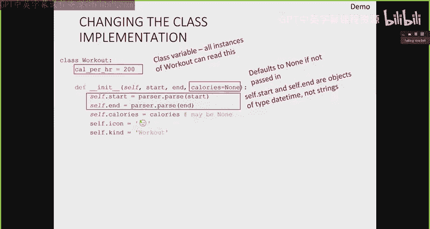

But when I'm storing it inside my object， I'm actually going to store it as whatever this thing gives me。

 and this thing is actually going to be returning or parsing the string as a new data type。

 something we've not worked with before called a datetime object。😡。

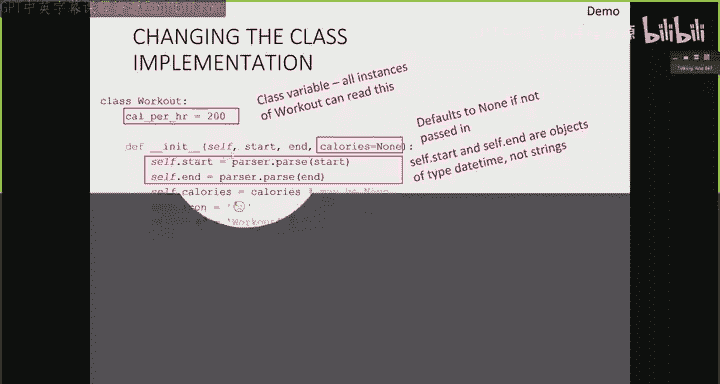

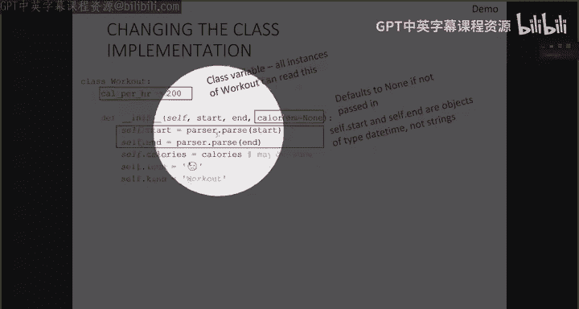

We're going to look at this on the next slide in a little bit more detail。 But for now。

 all we need to know is that the self dot start and self dot end will be a new data type。

 a datetime object。

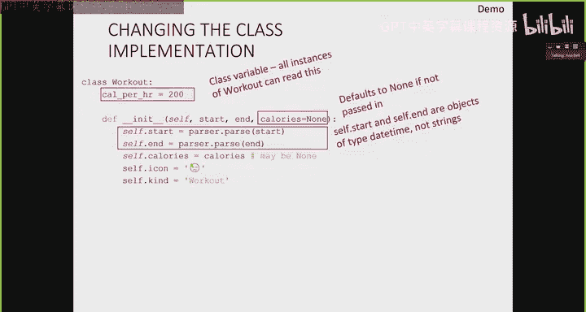

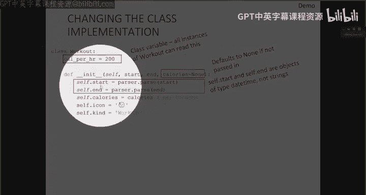

O。So that's my knit method。 So few changes。Now， my get calories method。

Will look a little bit different as well， right， We're not just returning self dot calories like we had in that simple workout class。

 right， We're going to do a little switch。So， if。The user supplies the number of calories。

 So if the calories here were actually passed in。

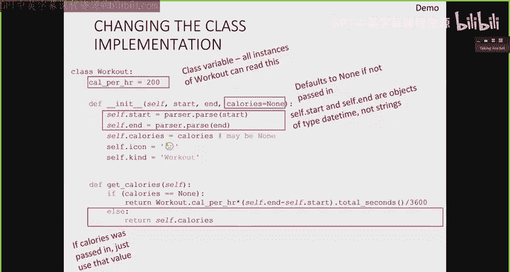

Then we don't re we don't resort to the calories being none， right， calories will be 100 or 4。

50 or whatever it is。And then this if statement is false。

 So we go in the else and we just return that value。

 So it's exactly the same behavior as in my simple workout classroom back there。

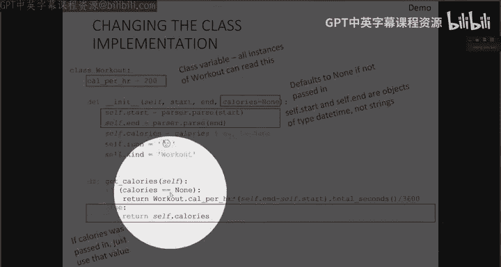

But if the user does not supply the number of calories when they create an object。

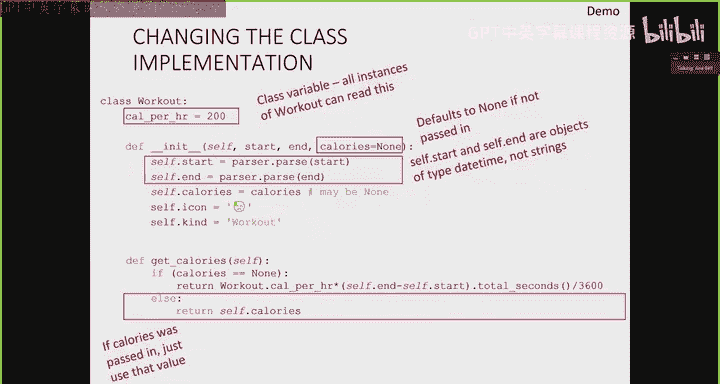

Then the calories will be none here。 When I create my object。

 the data attributes selfdot calories will be none here。

 So when I ask the when I asked the workout to tell me how many calories I burned。

 we're going to go inside the if statement， and we're going to do something。

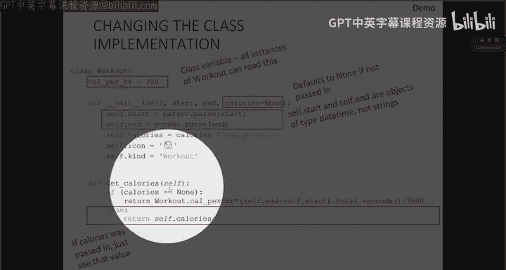

The thing we're going to do is subtract。The end time minus the start time。Okay。

And something like this is allowed on a datetime object， but obviously not allowed on strings。

 which is why I'm converting that these strings representing a date and a time into this datetime object。

This date time， this subtraction here gives me something like something that's called a time Delta object。

And it's just a new type of object we haven't really worked with before。

 but it's an object type that we can run a method on。And the method is going to be the total seconds。

 So for this time Delta object or 10 minutes or 18 minutes or whatever it may be。

 if we run this method called total seconds， it will tell us how many seconds are in that time Delta object。

Divide by 3，6，00 to tell us the number of hours and then multiply by the the class variable c per hour will tell us how many calories were burned in that eappsed time。

O。Like all of that。Oh， workout dot is just this thing here。 Work dot help per hour。 That's just this。

 And then we multiply by that， yeah， that number。Questions about that。O。So essentially。

 this is going to do the estimation for us for how many calories we burned in some number of hours or some number of minutes。

 Now， let's demystify this start and end time stuff。

So the way that we are converting to this this string to a datetime object is by using this library up here。

 So a library is a collection of objects， a collection of maybe also functions that all deal with the same type of things。

 So in this particular case， they all deal with dates and times and manipulating dates and times and things like that。

 In the last lecture， we saw an example of a library。

 that random library that allowed us to do operations with random numbers。

 right So it's just a nice collection of functions and objects that deal with one sort of common thing。

😊，So in this particular case， there is a function inside that， that library。

This parser dot parse function that takes in a string。And can parse it to this datetime object。 Okay。

 So if we print the type of start date and the type of end date。

 it'll show us that it's this type date time thing。So it's a new object type。

 We haven't worked with yet， but it's an object type like a list is like a dictionary is like our workout is。

 right。And so the reason why we're doing the conversion is because。

We don't want to deal with the messy part of grabbing in a string and then figuring out how long the elapsed time is based on just parsing characters throughout this string。

 right， I certainly don't want to do that。 But you know what。

 somebody who was passionate about doing that did it in this nice little library for us。

 So all we're doing is just reusing the work that they've done， right， to save it as this object。

 And then they basically said， let me implement the minus sign to work with objects of type date time。

And it makes things like this very easy。 We can just subtract to dates from each other， right。

 And it'll tell us the elapsed time。 We can run a method on that elapsed time to tell us how many seconds that elapsed time is。

 So pretty cool， yeah。😊，Yeah， the yes， the total seconds gets imported with the date you tell parser。

 yeah， exactly。It's an operation that can be run on this date time Dlta， I think， type object here。

I think there might be like total minutes and total hours， also， yeah。Yeah。MYeah， exactly。 yeah。

 exactly。这样。是。Yeah， so we usually import all our stuff right at the top。

 So I was just going show the code。 so here I've got everything that I need to import way at the beginning。

 so it's kind of like Python goes and copies and pastes everything in those files and puts them in your files。

 So now everything that's defined in those files is now accessible in your file。

 You just have to sort of do this the dot notation on on these libraries here。

So I just wanted to show you。Down here。 So here， I shouldn't have imported again。

 but it's just part of this exercise。 So here I've got the， the parser being imported。

 I've got the start time。 These are just strings， right， Nothing special about them。

And we can parse them。 So I've got these strings parsed and the types of these objects， again。

 are not strings anymore。 Now that I've parsed them， right， start date and end date are now。

These datetime objects， daytime， not datetime。And then we can do operations like this。

 So if I just simply subtract one time from the other。And print that time Delta object。

 Python puts it in this nice little format for me。 I should just comment these out。 It's hard to see。

 It puts it in this nice little format for me。 So here's number of second hours， colon。

 number of minutes， colon number of seconds， right。

 So this is the STR method that was implemented for that kind of object。

 It printed in this nice little form， right， our colon minutes， colon seconds。And then， which is。

 and then we can do this useful thing， which is what we're doing in our code。

 We can run the total seconds function on an object of this time delta。

 And it tells us that this 10 minutes， right， is equivalent to 600 seconds。😊，So very， very cool。

 very useful。 And you know， we don't even need to know how any of that is implemented。

 We just make use of these functions。What's cool about the parser， though， And this will be really。

 really cool。 You can actually write the time and the date in any format。

 It doesn't have to be month slash day slash year space， this， right。

 So this is kind of how I wrote this one。 We can actually write it something like Sept 30，2021。

 right like that。😊，And it knows how to read that。Or we can write out September all the way。

 Put the comma there， Put the comma there， Put the PM lowercase and closer to the to the time。

 And it knows how to read that as well。 So knows how to parse all these different ways of writing the dates and save them as these daytime objects for。

 for using。In this very nice， very readable way。Isn't that cool？啊。😊，O。

So very useful if you ever want to work with date types。OK。So now。嗯。Okay。

 so now this is our state dictionary， sort of for how we ended up with our simple workout class。

 But what are the changes we made to improve it， Well， in my state dictionary。

 I added my class variable。 calories per hour。 So now this calorie per hour is available。

For any instance that I create， right， we already knew this。

 but this is kind of the representation of that。And we didn't add anything to the instances。

 those haven't changed。Okay， so little aside on class variables right。

 so this CA per hour here is available for all of these instances。

 Now a class variable right is just like an instance variable。

 we can access it from within the class definition， which is how it should always be done。

But Python being Python， they allow you to access that class variable from outside the class definition as well。

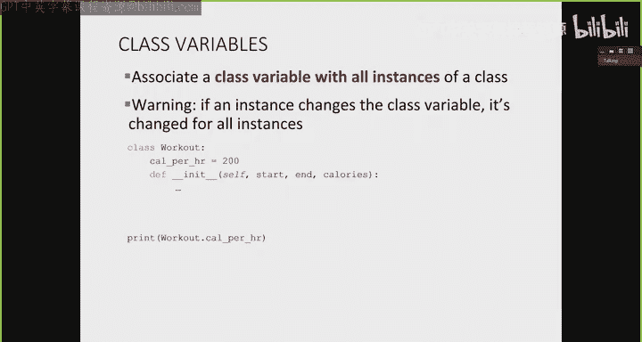

So we can do something like this so we can call the Cal per hour class variable on the name of this class。

 right， outside of the definition， right， This is my class definition。 It ended here， right。

 And this is just code that's outside of the definition。

 And Python will be happy to tell you what that value is。😊。

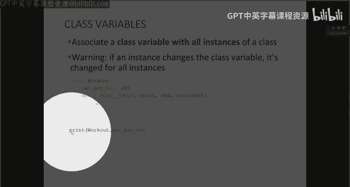

Python will also be happy to tell you what that value is if you access it through an instance。

 So here I've created an actual instance of type workout。

 So I'm not calling the c per hour on the name of my class。

 I'm just grabbing it through one of my instances。😊。

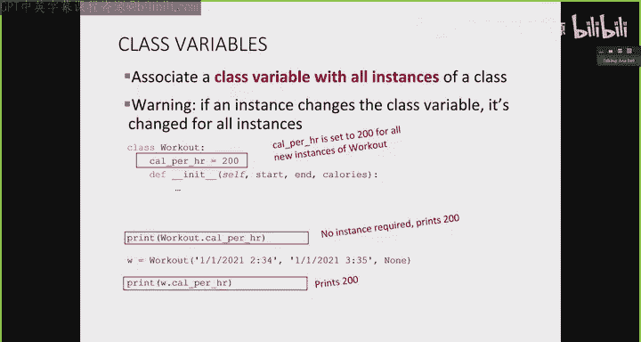

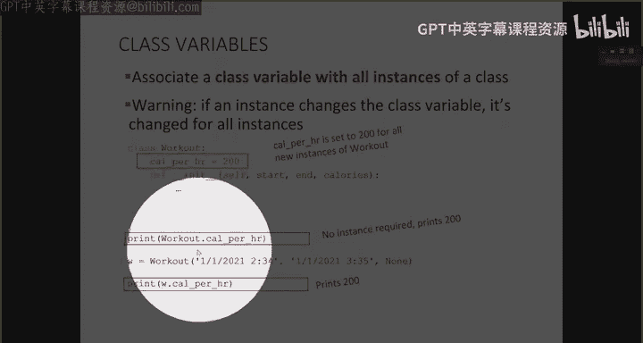

And if I print instance dot c per hour， Python will also happily tell me what that value is。

And Python being Python， they're going to allow you to change the value of that Cal per hour outside of the class definition as well。

 So here， outside the class definition， I'm going to say workout dot Cal per hour equals 2，50。

So now the c per hour is changed permanently to 250， no matter how I access it。

 either by calling the name of my class directly or by calling the class variable through one of the instances。

Okay。So no good。Never， ever work with these data with these data access data attributes or access class variables outside the class definition。

 If you really want the user to be able to do something like this， right， then write a method for it。

 And then they can change it or access it in a consistent way。

 the way that you want them to access it。Okay， so just a little bit of practice for you guys to create a couple of workout objects。

 just to make sure everyone's on the same page。 we understand what a workout object is。

 So just create for me two objects and then print the calories for these workout objects。

 So the first 1 I would like you to create name the variable W underscore 1。

 it started this workout started in January12001， Three30。 and it went till 4 PM。

 And you want to estimate the calories from this workout。

 You don't know how many calories you burned right And then print the value for that calories。

 And then the second object。 same same start date， same end date。

 But you know that you burned 300 calories。 So create these two objects and then print the number of calories burn。

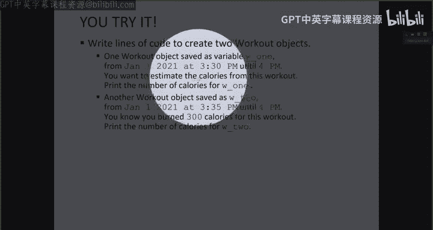

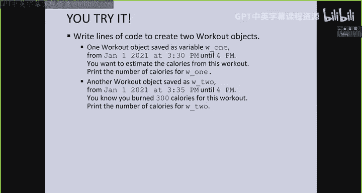

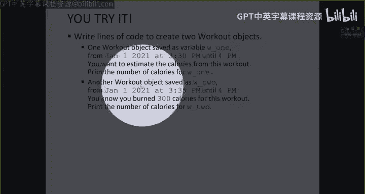

So this is online。199。And it's okay to scroll back up， right。

 to the in method of workout just to see how it's implemented。

No reason you should have memorized it by now。Alright， how do we create these two objects？

 What's W 1 equal to。嗯对。Yeah。Yep。Yep， the start date would be first so I can just。As a string。

 perfect， yep。有。I'm not。 I don't think I'll say that。 I don't know if that works。

And then the end date， right is the next one。So this one's 4 PMm。Right like that， we could do that。

And then what else do I put。Or do I put anything else？Exactly， yep， in this particular case， I。

 I'm going to let it default to none。And then how do I grab the number of calories burned for this object。

 for this workout object？How do I print that out？Yep。

 so Ive just called the get calories method on W1。 and let's slap a print statement around that like that。

看。Yeah。Perfect。So what is it， A 30 minute workout at 200 calories per hour。 It's 100 calories， right。

 burnedt。Second one will be pretty similar， right， So I'm just going copy and paste。

 What's the difference between this one and the previous one。When I create my object。

What's the one difference？Yeah。Yep， exactly。 We will pass in 300 as the last parameter ra。Right。

And so then if we run that。100 was my first print statement， and 300 is my second on right。

 So it relies on。The the， the number that was passed in as opposed to calculating it by estimating it based on the start net。

Alright， everyone okay with this。 We all sort of understand， get calories method perfect。

 So weve finished our improved method here。 We saw this better get calories method。

 very neat method that allows estimation。 And we saw a little bit about using these daytime objects。

😊，Okay， so the next up， the rest of this lecture， will be implementing one subclass of this date of this workout object。

Called a run workout class。 Okay， And so we're going to use the idea of hierarchies and class inheritance to do this。

 So let's remember a little bit about hierarchies in terms of Python。So。

When we create a class that we know will be sort of this， this parent class。 That's。

 that's a base class， right， It's the most basic thing that we'd like to work off of。

 We call that the parent class or the super class。And this one parent class can have many subclasses associated with it。

 right， So in this particular case， just as an example， we can have two types of workouts， right。

 one outdoor workout and one kind is an outdoor workout， and the other kind is an indoor workout。

And both of these。A workouts， right？ So everything that a workout has and everything that we can do with a workout。

We will be able to， will， will exist in outdoor workout and indoor workout and well be able to do with outdoor workout and indoor workout。

 right。

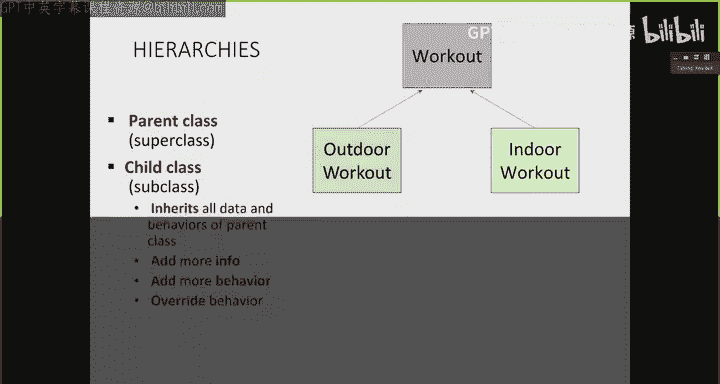

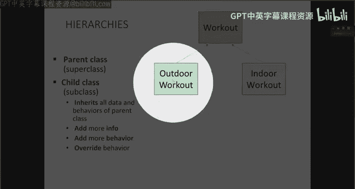

So a child class is a parent class。 A subclass is a super class。But these， these subclasses。

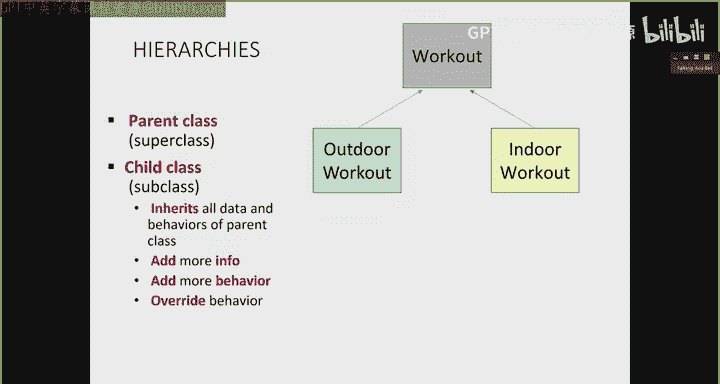

Can bring about。

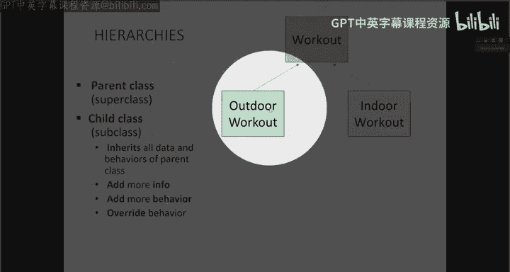

Some of their own。Quote unquote， ideas， right， their own attributes。So for an outdoor workout。

 we might add more information， right， so add more attributes， maybe location， something like that。

 for indoor workout， you know， you might not need a location and you might not add any extra data attributes。

We might add more behaviors， right， So for outdoor workout， I don't know。 you'd add some different。

 some different behavior than just a regular workout。

Same for indoor workout or you might override behaviors。

 so you might change something that workout does to be specific to an outdoor workout。

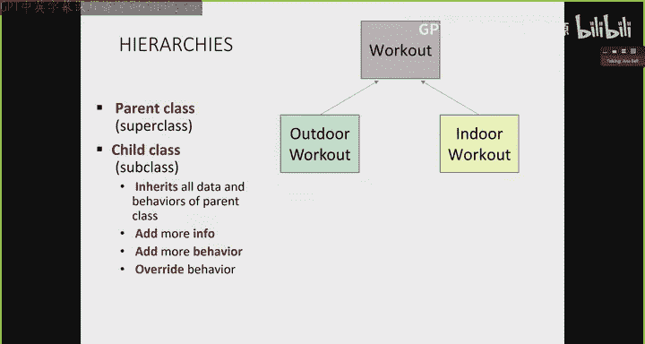

And， of course， we can create as many of these subclass as we'd like。 So for outdoor workouts。

 we can now have two different types of outdoor workouts or running or swimming。

 And for indoor workouts， we might have treadmiller Waits types of workouts， right。

 And whenever you create these child classes， they inherit everything that their parents has。

 So a running class is an outdoor workout。 And by default， it's also going to be a workout。

 because outdoor workout was a workout。😊。

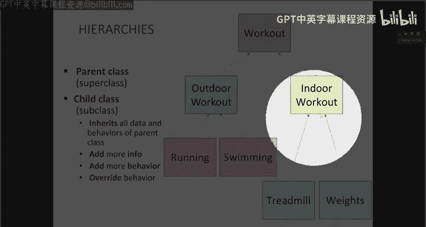

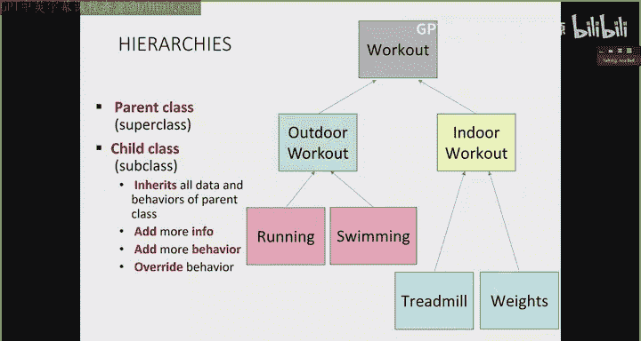

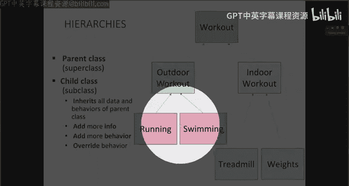

So what we're going to do in this run workout class is I'm going to show you three sort of methods implemented。

 The first one is going to be just reusing something that our parent can do。

The second one is going to be overriding a method。That our parent already can do to make it better and more specific to the child class。

 And the third one is to add a method that our parent didn't even have。

Okay so we're going to do these three things in the run workout object。Okay， so let's remember the。

 this， this example here about common properties that all of our workouts have， right。

 So this is basically us implementing our workout super class。

 So I know we did implement all of these。 But in theory。

 we can implement all of the things that are highlighted in yellow in our parent class。

 And these are common， no matter what kinds of workouts we create。😊，Now in the Python file。

 I actually have a swimming subclass， we're not going to go over the swimming subclass in the lecture。

 but please feel free to go through it in the Python file for this lecture。

 and I think you'll also be working with it in recitation on Friday as well。In lecture。

 we're going to be creating some a subclass that's specific to running。And this running class will。

 of course， inherit all of these properties that our parent workout class has。

 but we're also going to add our own data， and we're going to you know override some data that the workout class has and things like that。

 So specifically the only thing we're actually going to implement that that's different than a regular workout is to add an elevation。

An elevation attribute。Right， so beyond that， start time， end time calories， an icon will also exist。

 and the kind of workout will also exist。 Those are our five data attributes right from workout。

 And we're gonna add elevation for running workout to make 6。Okay， so this was our parent class。

 right， just as a reminder， this is what it looked like。 We had our class attribute here。

 class variable and this init method here。

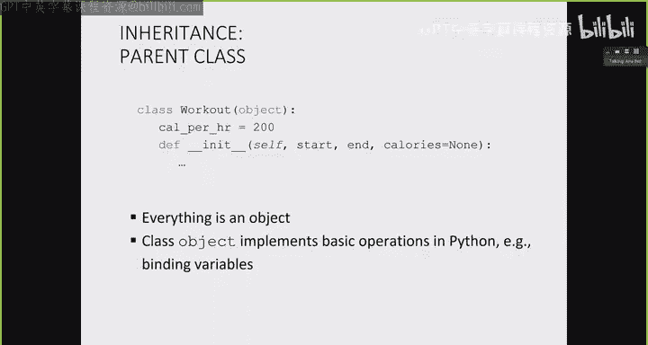

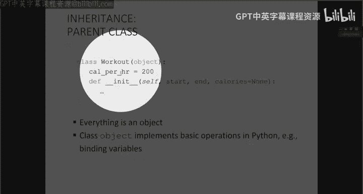

The class workout is their parent was the generic Python object。Now， when we create our run workout。

 our parent will be the workout class， right， So we don't just want it to be a Python object。

 We want it to be a workout object。So as soon as we do that inside our code， Python says， allright。

 let me just grab all of the stuff。 everything that's defined inside your parent class。

 this workout and quote， unquote， copy and paste it into this class。 So right off the bat。

 we've got all of the things that workout has。But， that's not。嗯。

That doesn't quite work with our run workout。Because when we create a run workout。 and again。

 this is a design decision， we would like the user to be able to pass in an extra parameter here。

The elevation value。So in addition to the start time， end time and the calories burned。

 I'm going to slip in this elevation value right before the calories burned parameter。

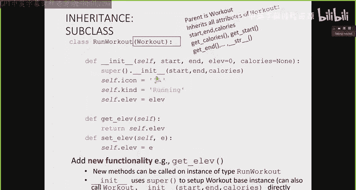

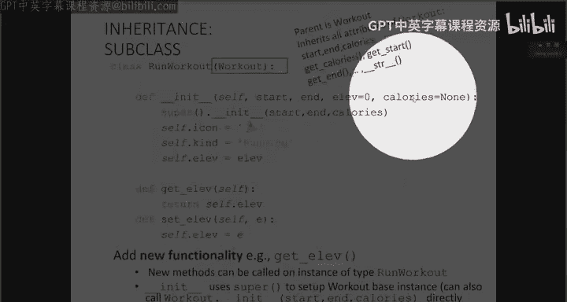

OK。So when I initialize my run workout， I could theoretically pass in four values。String， string。

 number， number。Or since elevation is 0。 elevation has a default parameter in calories has a default parameter。

 I could pass in just string string， and those other two will default。Okay。

 so what is this init method doing， It's calling the super function。

I know we haven't done this before， but I just wanted to show you this。

 This is another way to ask Python to tell you who your parent is。Right。

 so when you run this function super inside a class definition。Python effectively returns。

 So the replacement of this function， right， This is just a function。 It has a return value。

 The return will be the thing in the parentheses here。

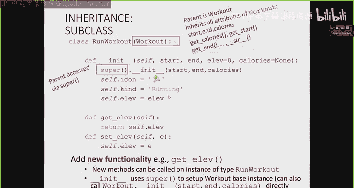

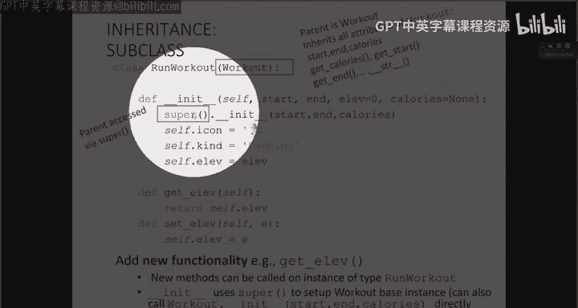

So effectively， that line becomes workout dot double underscore in it。

 double underscore exactly what as we saw in last lecture， when we did animal。

 rabbits and all those stuff。Alright， so what we're doing here is we're saying， well。

 I know workout can do all those initializations for me。 So let me just take advantage of that。

 not copy and paste it and just let work， you know， do the job and initialize all that stuff for me。

So this line of code here initializes the start end times right by parsing them。

 the calories and the icon to the sweaty person emoji and the kind to workout string。

But since this is a run workout， I would like to replace the icon with a little running person emoji。

And the kind of workout this is is no longer just a workout， let's say it's a running。Right。

 so it becomes a string running。 So I'm overriding those data attributes to be these strings。

And then the thing that run workout has that workout didn't have at all is this elevation data attribute。

 right， So self dot is now a new data attribute that did not exist in the regular workout。

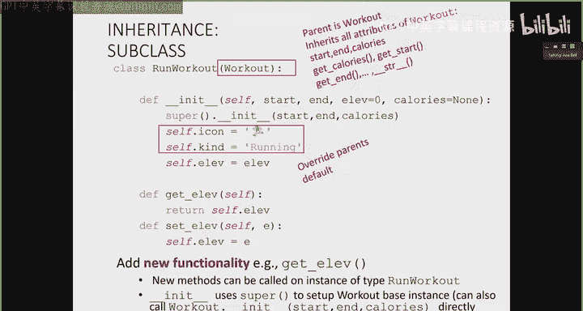

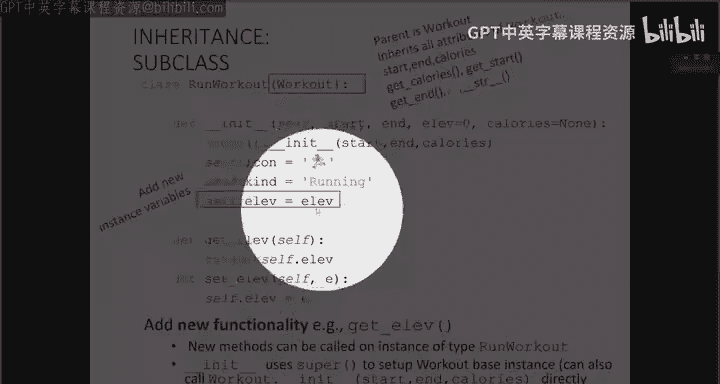

Okay。And then I've got these two these two function methods down here。

 a getter for the elevation and the setter for the elevation。 Nothing fancy with them。

 They just return andcent， yeah。Yeah， so the super in calls the parents in method。

 And the reason I do that is because I know the parent can just initialize all that stuff for me。

 So I'm just taking advantage of the fact that it does all that stuff for me， right。

 You can imagine the init method。 Maybe it also check the types， right。

 to make sure that the person who created this， you know。

 to kind of enforce that start as a string and as a string。

 like all that extra code that would happen in the init method of workout， we would just。

Let run with this line here。 So we don't have to copy and。Yes， you mean from this， these two。一。啊对。

Yes， exactly。 actually。 Yes。 you're right。 So the reason this works is because the in method of my workout takes in the start and the end and the calories。

 right， If， if I said that the in method of run workout doesn't need start an end or something like that。

 I wouldn't be able to run this in method， exactly。

 or maybe I would run it with some defaults or something like like if you actually want to run it。

 you have to pass it， you still have to follow the the stub of that in method。That's。

 that's a great point。Of the parent。Without having to。Yeah， so this you're right。

 I wasn't writing the super thing。 I was just naming the parent directly。 So in the animal 1。

 I said animal dot double underscore in it， double underscore。 And in this particular case。

 I'm just showing you a different way to do it。 Maybe you don't know who your parent is。

 question mark in that case， you can just run this function。 and it tells you who your parent is。

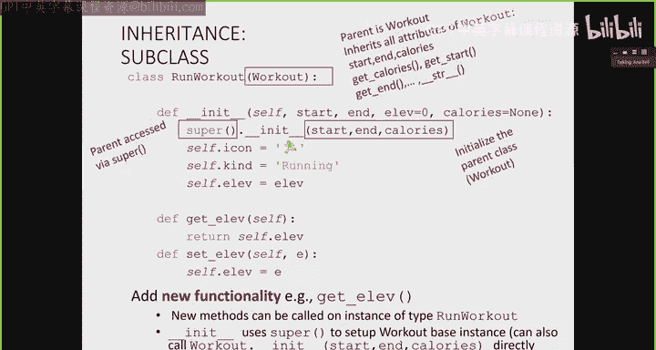

But this line would work just as well。 if I said work out， right， this thing， dot。

 double underscore in it， double underscore。 And that would be exactly the same as I had done last lecture。

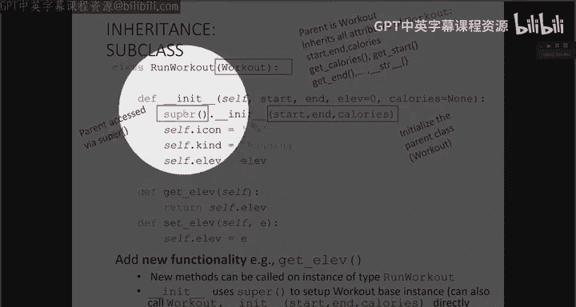

So let's look at the state dictionary for this one， right， for this new edition here。

 So this is a state dictionary of just my plain old workout class， right， we've done。

 we saw this before。 It's all my getters， all my setters。

 the init and this cow per hour from the new and improved workout class。Now my subclass。

 the run workout。The super method basically says， hey， this is you are a workout。The super method。

 the state dictionary for it， will additionally have these two getters sorry。

 this getter in the setter， these two methods。Right。

 we're not copying all the stuff all over again down in the run workout state dictionary because that already exists up here。

 right？ But in addition， the run workout has this get elevation and set elevation method。

 Those are the only things that we've defined in this class。

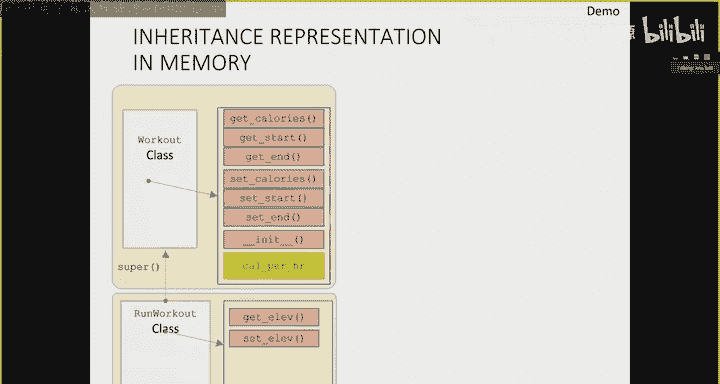

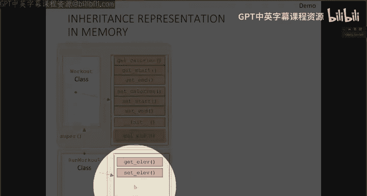

So then when I create a run workout instance， So this is an instance of run workout， not workout。

 Python points to this run workout class。

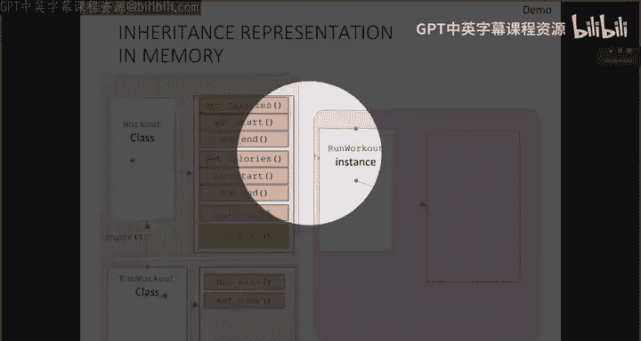

And the data attributes for a run workout instance are going to be， of course。

 all the data attributes of a regular workout。That 5 plus。The elevation。

 the new data attribute that Id just added。Okay。So we're using inheritance in this particular case。

 right， in the spirit of。Modularity in the spirit of abstraction。

 in the spirit of writing code that's reusable。 That's readable。 That's understandable in the future。

Right， so we're not。 if we were writing the run workout by basically copying and pasting everything in there all over again。

 it would be a really long class where most of it was just a copy and paste off of the workout。

 right， So now in this particular， if we define it in this way， we can easily seed new functionality。

RightAnd new data attributes that run Work has， in addition to just being a workout object。

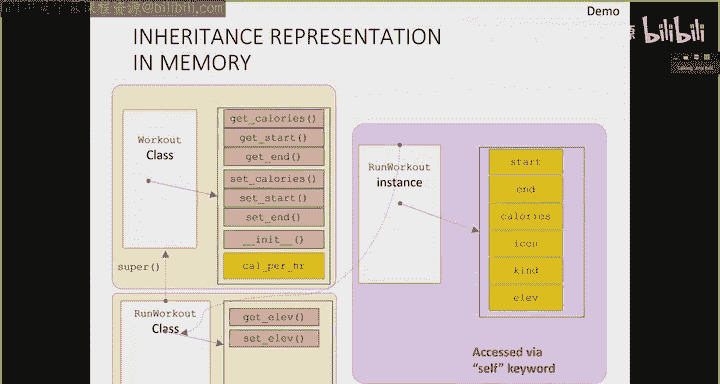

Okay。So all those good things for writing， very nice clear code。Okay。

 so now we're going to look at a function or sorry， a method that's being reused from our parent。

 And that's this double underscore STR method。So， this SR method。It looks like a beast， right？

 It's very， very long， but I promise you it's not so bad。 So this STR method。

 let's remember what it does。 It tells Python what to do when you print an object of type workout。

 right， because it's defined inside the workout class here。

 So I'll show you what it actually looks like。

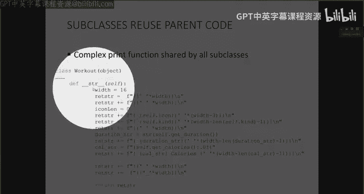

In the actual workout class， so here's my workout， right。There's my class variable， myni， my getters。

 my setters， all that。 and then here's my STR method。It's long， right， It takes an entire page。

This is not a method that I would like to copy and paste in every single one of my subclasses， right。

 because that would be a lot of code。Again， against the spirit of abstraction， modularity。

 all that good stuff。So what we're doing is we're just defining it once in our parent class workout。

And。It's going to do the following。 So a STR method has to return a string， right。

 It doesn't print the string， right， This is a very important distinction。

 It returns a string that will eventually be printed when you call the print method。

So the thing that I'm doing throughout this whole function throughout this whole method is to basically just build up my string to return Re register is return string。

And I'm building it just by concatenating it piece by piece with more and more stuff that I want to eventually print out。

So the output would look something like this。Right， I'm basically printing out on the console。

 sort of like the little square of a watch， right， Very cute。So what am I composing here。

 The first bit， right， this thing in the red box prints this line over here。

 just horizontal line that's some width lung。The next bit here。

You notice it grabs the icon data attribute。Puts it here on a line。

 along with a vertical bar and a bunch of spaces and a vertical bar。

The next bit here prints the kind of workout by accessing the kind data attribute， right。

 So either workout or running or swimming， whatever that string is。

Print it right underneath the emoji。The next bit here。😡，Is composing the duration。

So remember when we did the datetime object just over here， right。

 when we were printing the duration where we just simply subtracted an end time minus the start time。

 it looked like this。I'm perfectly happy with that。 That looks really nice。 So let's just use that。😊。

So the duration here， the get duration just does the subtraction。

 It's a method inside my workout class， and then we just sort of keep composing that to our return stream。

Next， we are going to figure out how many calories were burned in this workout object， so again。

 we're grabbing the Get calories method。Right， the return value from that method。However。

 it may be calculated， right， So for this workout type。

 either we gave the value directly or we let it estimate it from the duration of the workout。

 However， it decides to calculate it according to how this workout object was made。

 That value gets put right there。And then the last bit is this last line down at the bottom。

So then we can create any kind of workout， right， because all the child classes inherit all of the methods from the parent class。

 So， of course， all these child classes will inherit the STR method of workout。😊。

So no matter what kind of workout I'm creating。 So here I'm just creating a regular workout， here。

 a running workout， and here a swim workout。 no matter how I'm creating it。

 they'll use the same STR method。 So all of these will print it in this really nice format， right。

 The first bit will be specific to the kind of workout we have， right。

 the little emojis will be different because I've set those separately， right within the subclasses。

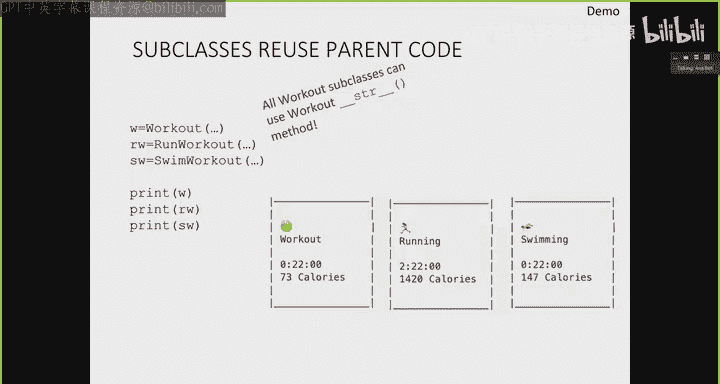

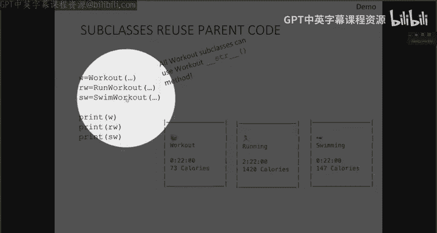

The kind as well， the， the， the label， right， it work out or running or swimming。

The calories burned and the duration will be， will be you will be you know。

 calculated using the get calories method and then the get duration method。 So again。

 in a nicely consistent way。So I'll show you what this looks like in the actual code。

Let me just comment that。So here I've got three workouts created。

 and then I'm just printing these three different kinds of workouts and just to show you I'm not。

Lying， see， the swim workout doesn't have an STR method defined， right。

 And neither does the run workout， right， It just has a bunch of other stuff defined。

 but no STR methods。 So we're just using the STR method of our parent。 And then when we run it。

 it looks like this。So I've got a regular workout with their icon and label， running workout。

 with their icon and label and a swimming workout with their icon and label。Isn't that cute？Right。

 so we've made our own little。对知道。Okay。So。This begs the question， right。

 when can we use an instance of a class， right， of a subclass。Well。

 you can use an instance of this run workout anywhere where you can use workout， right， because。

 again， the way I think about it is you say， well， a run workout is a workout。

 So anything I can do with a workout， I should be able to do with a run workout or a swim workout or any of the subclasses。

 But the opposite is not true。 If I can do something with a run workout will run workout has a bunch of other specific things that it can do。

 Of course， a regular workout is not going to be able to do those specific things。Right。

 so let's think about these two helper functions。 This one calculates the total calories。

 given a list of workouts， and this one calculates the total elevation， given a list of workouts。

The code looks very similar for both。 We're just iterating through the loop。

 grabbing each workout object。And then we're calling the get calories or the get elevation on that workout object。

 right， so this will give me a number。 And then I'm just keeping a running sum for the total elevation and the total calories。

 And at the end I return。Right。So， again， the list here is important。

 These are workout objects and workout objects。So what if I have a bunch of， So here I've got two。

 two workout objects and two running workout objects。So these workout objects。Are 30 minutes long。

 right？ So using 200 calories per hour， these ones will each be 100 calories。

These running workouts are two hours long。So， they will。It doesn't actually matter， right， Sorry。

 sorry。 These running workouts are two hours long。 So they're gonna be 400 calories， right。

 because these parameters here。Correspond to the elevation。Okay。

 and they correspond to the elevation because if we look at the way we defined a running workout right here。

Right， this is the order of the parameters。 start time， end time elevation value calories。

 So when I pass in very parameters， they need to go in that order。And I， I， I can't skip around。

 right， If I want one of them to be， to be the default variable， then that has to be at the end。

So in this particular case， I've got these two running workouts at 400 calories， because by default。

I didn't actually pass in the number of calories。 And then the elevation is 100 and 200。

Then you would just put， if you wanted both to be default， then you just put nothing。 You。

 you can't just leave an empty comma。Yeah， so then you。

 then you would have to actually explicitly say， like calories equals， whatever you want。

So so at that point， yeah， now that we're working with default variables。

 it becomes a little bit tricky， you can't go wrong with just saying like L equals whatever you want it to be。

 calories equals whatever you want， and then you can do whatever you'd like。

But in this particular case， we know our workouts are 400， and elevation is those values。

So when we run total calories on all of the workouts， no matter what kind of workout I have。

 it it doesn't actually matter， right， because。Python will just grab calories for all of these workout types。

 right， So it just sums that up elevation。If I run it only on running workouts。

 Python will know what to do。 Here's 100 and 200 because those running workouts have an elevation data attribute。

But if I ask for it， oops， but if I ask for the elevation for a running workout and just a regular workout。

 Python will spit out an error。Because as soon as it sees this workout one， it says， well。

 what's the workout dot get live method。And it's gonna say。

 I don't have a get love method for a regular workout。 That's not something I know， right。

 because that's something that we implemented in the child class。So let's go through these together。

 And it's actually nothing to code just to sort of run。So it's just down here。

 So this is just kind of making sure you understand sort of the order of operations。

 And I think one of the ones that was questioned here where we actually passed in the number of calories is。

 is at the end。So when I create a regular workout， let me just remove that over here。

What is the value when I ask Python to tell you the calories。

Right for this workout at 200 calories an hour， what's the value here。Just yell it out。30 minutes。

Hundred， right？What's the elevation when I asked Python to tell me the elevation for this object。

Error， exactly， yep。Yep， because the workout object has no attribute， right， has no method get L。

 That's something specific to a runner running workout。Okay， how about this one， Run work out here。

 So here I'm actually， oops， I didn't mean to do that。 What happens if I grab the calories for W2。

Yep，4，50， yep， pretty， which just grabs whatever's passed in， right， Does't estimate。

 How about the elevation。Yep， error again， perfect。Now， let's create three kinds of running workouts。

 So here's one。What's the calories and elevation for this one， I'll just do them all both together。

 right， So R W1， this parameter is the only one passed in。 What does that correspond to。

 calories or elevation。Yeah， elevation。 Remember， our parameter list。

 elevation comes before calories。 So the elevations 250 and the calories will be estimated， right。

 based on whatever this is。Right， so calories is first at 100 elevations， to50。

How about running workout two？So here I've got 450 and 700 in that order。Which one is the elevation？

Yep，4，50， and calories is 700。 So when we print it， I printed them backward just to confuse us all。

And then lastly， how about this run workout3。 So here this is to sort of answer the question。

 what if I wanted elevation to be default， but I wanted to pass in calories。

 So here I just say the name of my parameter there。 and I give it an actual value。Right。

 so clearly here， calories will be 300 and elevation defaults to 0。So just a little practice。

 reading the specifications。Okay， so that finishes reusing the STR method from the parent。

 Now let's override our super class， so our improved workout class。

 remember has a get calories method that estimates the calories based on the time that it took you to do this workout。

Whether it was a running workout or a regular workout。

But what I'm doing in this method is I'm going to actually implement my own get calories method inside the class definition for a run workout。

 right， so here's my run workout class definition。 And I've got my own get calories method。

 So when I run get calories on a run workout， Python will use this one。What is this one going to do。

So we're going to do something really cool。 We're going to estimate the number of calories burned for a run workout based on a set of points。

 latitude longitude points。 So what we can actually do is we're going to pass in a list of tus。😊。

Like this。Which represent sort of the route that we take， right， So from point8。

 So in this particular case， I've got sort of four places that I have， you know， jogged between。

 So these are my four latitude longitude points。 So each tuple is latitude comma longitude。

So I can make this as precise as I'd like。But。What I want this method to do is to potentially。

 if the user does give me a set of latitude longitude points that they actually went through to calculate the calories burned based on a class variable called calories per kilometer。

Right，So given a set of these points， what I'd like to do is to calculate the total kilometers traveled between all of these latitude longitude points。

Multiply that distance， those that kilometer distance by the calories per kilometer。

 and use that as the estimate for the calories burned in this particular run workout。

So this is how the code achieves that。 So I've got another class variable that's only specific to this run workout。

 So workout does not know about this。 calories per kilometers100。

 And now I've got my own get calories method here。 it's overridden。

 So if we run this get calories on a run workout。It will use this one。And what does it do？

If we don't give it any GPS points， if we don't give it a list of tus there。

Python will default to the else。What does the else do， Well， it says， hey， who's your parent。

 run their get calories method。 So that's just estimating it based on the total time elapsed in this workout。

 right， That's our default parent。But if the user got fancy and gave us a bunch of tuples representing latitude and longitude points for all of their workouts。

Then we're gonna do the following stuff。We're going to iterate through all of these pairs of GPS points。

 right， pair by pair。We're going to calculate the distance， right， given this latitude。

 longitude value。Add on to this running total for the total distance pass total distance Ram and then return that total distance multiplied by this data attribute。

 sorry， class variable calories per kilometer。So let me show you what this actually looks like because the only thing that is。

 is sort of still mystifying here is this GPS distance。And this GPS distance is actually a function。

That's in this lecture helper file， which is included in today's Python zip file。And it's just。

 you know， from the Internet， it's how it's a way to calculate the kilometers， but the the kilometer。

 the distance right traveled between two latitude longitude pairs。 That's all it is。

 So does some fancy stuff with signs and cosines and things like that to figure out the the distance between these two la lawn pairs。

Okay， that's all it is。So we're just running that function nicely down here。

To help us calculate that total distance， right beyond that， everything is， is pretty simple。

 It's just looking at consecutive pairs of these， of these tuples。Right。

 getting that distance plus this distance， plus distances and then multiplying by the cprit club。

So in the end， what we get is something like this。 So here， let me show you。Here here are two points。

 latitude longitude points， so I've got Boston and Newton。

 so here I've just got a straight shot right， so not counting， you know。

 getting very precise with blocks and things like that。

 But if I create a running workout here with the start time end time elevation value and now I pass in the root GPS points。

Right， this is another piece to my in method。I forgot to show you that， sorry about that。

So here's my in method for。Run workout。I skipped that a little bit last parameter here is to actually pass in some root GPS points。

And if I actually pass in those root GPS points， when I run the get calories method。

 it tells me that I earned this many， right， And it calculates it based on that distance between Boston and Newton。

In the second example here， I don't actually pass in the value。For the GPS points。

 So we're defaulting to just our regular calories function from workout。

 which is to calculate it based on the start time and the end time。 So from 1，35 to 3，57， right。

That's why it's a weird， not round number of calories。So I think that's also really cool。 you guys。

 this， this function here。😊，Okay， so these overridden methods， just to show you sort of。

 for completion's sake， how this run workout class looks。

 Everything is the same as what we ended up with before。

 But now I'm going to reimplement my get calories method， right。

 So now run workout knows about a calories method。And I've also got this data attribute。 Sorry。

 class variable。 Sorry， I always got messed up。 This class variable cows per kilometer， right。

 And any run workout instance will know about， of course， the cows per kilometer。

 as well as the cow per hour from our parent。Questions about that。

We're building something really nice here， right， So I guess the question is。

 and I think you've probably figured this out。 How do you know which method to call well。

You just look at the object before the dot， right， You run out method， your object dot method name。

 What's the thing before the dot。 What is its type。If the type， like， for example， get calories。

 if the type is running。You look to see if that class definition has a get calories method。

 If it does， you use that。If it doesn't and only if it doesn't， you look at your parent and say。

 does your parent have a get calories method。If it does， you use that。 And if it doesn't。

 you look at the parent's parent。 Does the parent' parent have a get calories calories method。

RightIf it does use that， if it doesn't， you look at the parent' parent' parent all the way up。

 you keep going all the way up the chain until you get to the generic Python object。

 If the Python object type has a function or method named what you'd like to call。

 you use that otherwise error， right， No such method was found anywhere within our chain of hierarchies up until the Python object。

All right。So that finishes overriding our get calories method。And now we're going do one more thing。

 which is to add something new to run workout that didn't actually exist in， in workout。

 Although I guess I am implementing it in workout。So it's not actually adding new。

 but we're going to override it anyway。 So the class workout。

 let's say that we want to compare two workouts together。So to do that。

 we're going to implement the D method， double underscore， E Q， double underscore。

 And this will allow us to compare two running workout objects or two workout objects or running and workout objects using the double equal sign。

 right， So W1 equal equal run W2 or whatever， right。

 So we can use the double equal sign to compare objects of our type。So again。

 my decision for comparing these objects types for comparing these two objects。

 work objects is to say， well， first， let's compare the types。

So if I'm comparing a workout versus I'm running workout right off the bat。

 they're not going to be equal。Right， so first of all， the type of this object should be the same。

 So I should be comparing workouts with workouts， running workouts with running workouts or swims with swims。

And I also want every one of the other data attributes to be the same。 right， So the start time。

 end times， the kind and the get calories。So as long as all of these things are the same。

 I'm going to say that these workouts are the same， are equivalent。

So this is the equal method in my workout。 And then in my class workout。

 I can actually override that method。So this should actually be add。Override， right。

 just like the other one。And in run workout， I'm going to override the equal method。

 but I'm going to do it in a very modular， pythonic way。

 I'm going to say that a run workout is going to be the same。As another workout。If。

Everything in my parent is the same。So here， I'm just calling the super method。Sa workout， dot。

 double underscore， equal， double underscore other。So with this little bit here， right。

 this line here， just the super dot double minus square equal double square other。

This compares all of these things。So I don't need to rewrite that in the EQ method of run workout。

And I can clearly see what else， in addition to regular workout comparison。

 I need to have happen for them to be equal。I also want the elevations to be equal。

 right That's the other data attribute。Right， so you can see now how nicely modular this code looks。

 right， It's very clear what differentiates a run workout to a regular workout。

 right with this and this line。Questions about this。O。Yeah， exactly。 yeah。

 so this should all be on one line， right？But the backslash actually just breaks up the line into multiple lines for visibility。

So， in the code。Here's a bunch of workouts， right？ And I mean， we can run some of them。

 but you can see why they're true or false。 So here， W1 and W2 are not the same。

Because the calories are burned are different， right， They're both regular workouts。

 They're both have the same start and end times， but the calories burned are different。

 So this print false right， just equality on these workouts。嗯。And then here's a true one。

W2 is equivalent to W3 because the start end times are the same， the length is the same right。

 and the calories burned are the same W1， W3。You're sorry， W2 and W3， these two。

This one just used the default value， but that default calculated values was calculated to be 100 because it's a 30 minute workout anymore。

So you can go through some of the other ones on your own。

I guess the other interesting one is this W1 with R W1。Everything about this is the same。

 calories burned。Right， everything is the same， except for the fact that they are different kinds of workouts。

 right， One is a run， One is a regular。So I around that， that's false。Other questions？

Or any questions？OK。😊，So last slide， This is the last lecture on object going in programming。

Hopefully， it gave you an idea for how to create your own objects。

 And this last example specifically showed how we can just improve it a little bit at a time to make it be。

 you know， this really cool thing， right， we added way to estimate calories。

 We added a way to estimate calories using GPS points。 And we just did it incrementally， right。

 So you don't want to do that right off the bat， just write a little bit at a time。 And in the end。

 you can write a really cool object type。😊，嗯。Now that you know how to create your own object types。

 you can create objects using other objects， right。

 So some of the data attributes for something more complex。Could be a workout object。

 something like that。 but it's possible to overdo it， right。

 especially now that we're not writing super complex classes。

 it's possible to overengineer right And when you overengineer。

 it becomes kind of annoying to just keep scrolling back and forth to this in it to that in it to figure out you know what methods were in this when this class。

 what methods were in the other class。 And so if you know if you can achieve it using just one one object type or maybe just a function。

 no need to create your own， you know all these complicated object types that build upon object types。

 But I just wanted to show you that it is possible know especially as you might be building more complex things in future classes。

 things like that， it is possible to write really complex classes that don't look so bad because you're building upon code that you've already written right So now we've got these ideas of abstraction。

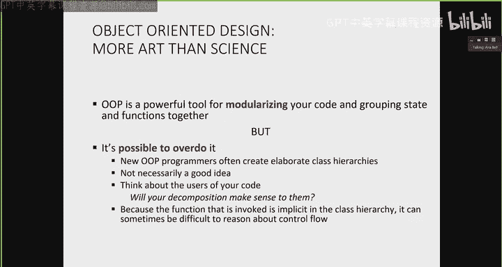

information hiding that all work together to help you achieve this really cool。

 cool object or cool class or a cool program。Okay， so the next lecture， next set of lectures。

 we're going to leave programming for a little bit。

 and we're going to look at figuring out how to write efficient programs and how to figure out whether our programs are efficient or not and and things like that。

 So we're going to go into a more theoretical side of of computer science。

