# 《计算机科学和Python编程｜6.100L Introduction to CS and Programming using Python, 2022》 - P21：-21-Lecture 21_ Timing Programs and Counting Operations.zh_en - GPT中英字幕课程资源 - BV1PAxJzVEs3

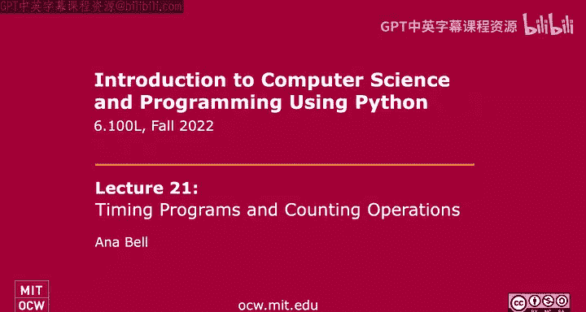

Let's get started。So today's lecture will be super short。

 We've got a 45 minute quiz on objectgraed programming classes， that kind of stuff。

 So I wanted to give you guys an extra bit of time to work through three programming problems But the actual lecture part we're going to switch gears a little bit And we're going to start talking about something more theoretical。

 which is how to figure out whether the programs we write are efficient and how efficient are they so we're going to do that today using the idea of timing our programs and then counting number of operations as I'll describe in a little bit。

 But first of all， a little bit of motivation。 So why do we actually care about this topic It's a topic that's high research area on computer science so far in this class though we've emphasize correctness in problem sets the unit tests check for whether that the programs you wrote were correct in quizzes。

We basically look at how many test cases you pass right and to determine the grade But you know these days。

 we actually have a whole bunch of data coming at us right so we have a lot of data that we need to analyze。

 we need to read， we need to visualize we need to make sense of and so the programs that we write。

 yes， they have to be correct， which is a large part of it。

 but they also have to be fast right So if it takes a year to analyze you know a bunch of information on YouTube videos nobody's gonna really want to wait that long right And so we're going to emphasize in the next three or four lectures。

 I forget exactly how many， but the next little section in this class the idea of how to determine the efficiency of our programs。

So when we're talking about efficiency， we can talk about the time efficiency of programs and also the space efficiency of programs。

 and usually there's going to be a tradeoff between these two。 So very rarely these days。

 can you come up with an algorithm that's both efficient in time and space compared to algorithms that are already out there。

So usually， there's a trade off。 And the most， the best example is the one that we saw with Fibonacci。

 So we saw an code that was recursive to calculate Fibonacci。

 So Fibonacci of n was Fibonacci of n -1 plus Fibonacci of n -2， right， That was our recursive step。

😊，That program that that was recursive took something like 30 million steps to calculate Fibonacci of 30 something right。

 It was 30 million recursive calls， which was pretty slow。 It took a couple seconds for it to run。

But then we saw a version with memorization。 No， there's no R missing there。 It's just memorization。

 that sort of the process of keeping a memo through a dictionary in that particular case。

And the memorization idea was that we would take some values that we calculate。

 And as we calculate them， store them in the memo。So in the memorization example， we had。

 we had given up some of our memory， right， to store these values so that we didn't have to compute them。

 And in the process of doing so， we had a program that ran really， really quick。

 right much quicker than the plane percursive version that we or had originally seen。

So there's this tradeoff right where you have a program that's fast but might store some values and take up more memory or a program that doesn't store anything。

 but then is not going to be as fast， it's going to be slower because it needs to keep computing a bunch of different values。

So what we're gonna to do in this lecture is kind of show you a very simple way of of figuring out how efficient our programs are。

 which is we're just going time them。 And then we're going to count the number of operations that these programs take。

But we're going do so sort of with the idea in the back of our mind that there's going to be a better way to。

 to figure out the efficiency of these programs。And ultimately。

 we don't really want to figure out the efficiency of an implementation， right。

 An implementation means， you know， you implement a program that， you know。

 finds a sum using a while loop。 I implement the program find to find a sum using a for loop。 right。

 Those are two different implementations。 But at their core。

 the algorithms or behind the scenes is going to be the same。

And so what we what we want to do is to try to figure out how to evaluate algorithms as opposed to these different implementations。

 because each one of you is going to come up with a completely different implementation for today's quiz。

 right， But I don't want to evaluate that。 I would like to evaluate sort of the algorithms behind the scenes。

Okay， so we're going to do， like I mentioned， we're going to today look at measuring how long our program takes with an actual timer。

 And then we're going to also count how many operations our program takes。

And then we're not going to look at this other abstract notion。

 We're going to look at that next lecture。So today's lecture， we're going to use another module。

 We've been looking at modules So in the past couple lectures already， right。

 we've seen the random module， which helps us deal with random numbers。 We've seen the date。

 time module， which helps us deal with or was it date till， something like that。

 which helps us deal with date time objects and converting dates into objects that were nicely usable Today。

 we're going to use the time module right here。 which will help us deal with the system clock。

So if we're timing functions that we run， we're going to want to access the system clock to figure out exactly what time we started this function and what time we ended the function。

So just a little thing of you probably already know this。

 how to calm these functions within these modules。 So the modules basically bring in a whole bunch of functions and maybe objects and things like that related to one topic or one subject into your code and then to run the the the functions in your code。

 you just use thisnotation on the module name。 So if I wanted to use the sign function from the math math module。

 I would just say math dot sign。 And then I have access to that sign function。O。

So let's start looking at timing a program。 Okay， the simplest way to figure out how fast the program runs。

So we're going to use the time module。 So I'm importing it here。 And when I do that。

 Python is going to bring in all of these functions related to the time。

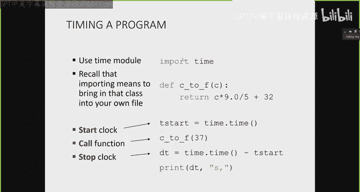

Now， we're going to look in this particular lecture at three different functions。

 and we're going to time them each of them。Next lecture。

 we're gonna look at a whole bunch more functions just to give you a little bit more practice with timing and counting operations。

 And then we'll introduce a more abstract notion of this order of growth。

So the three functions we're going to look at are these ones。 So Celsius to Fahrenheit。

 my sum and square。So Celsius to Fahrenheit， pretty self explanatory。 It takes in one parameter。

 the number for a Celsius temperature and converts it to Fahrenheit。 So we did this lecture 1。

Just using the formula。This function， my sum will take in a number X。 So， you know，7 or 10 or 100。

 whatever it is。 And it uses a loop。Right， so computationally uses this loop that iterates through each number from 0 all the way up to including x and keeps a running total。

 So it adds I to itself to the total。And returns it。 So， of course。

 we could have rewritten this in a more efficient way by using the the formula， right， to。

 to calculate the sum。 What is N and n times n plus1 over2。

 But here we're just doing it using this for loop。And then， lastly。Is this function called square。

 And this one's going to be even more inefficient。 We're going to calculate n squared。

 So the parameter here， N。Will be squared， but we're not doing， you know。

 return N times n or return and star start 2。 We're not doing any of that。

 We're actually gonna use two nested loops。 right， So I've got an outer four loop that goes through the number 0 to n。

Not including an inner four loop that goes through number 0 to n， not including。

 And this where sum here adds one to itself every time。So effectively。

 we're going through and adding one to that sum n squared times。All right， so super inefficient。

 but this is where we're at。

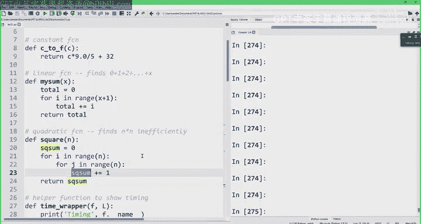

And so how do we actually time these functions。

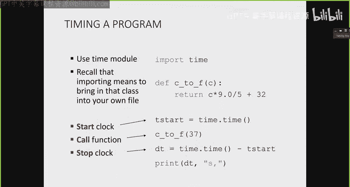

So here's the， this is basically， you know， one some lines of code in a file。

 So I've got the time module imported here。 I've got the function here。

 I'm going to call the time module。

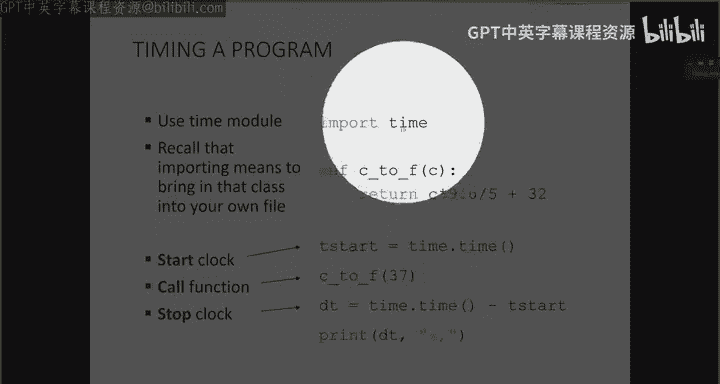

And the time function within the time module。So this tells me the number of seconds that have passed since January 1。

1970。 That's called the the epoch。Okay。So the beginning of time in computer speak。

 So if I grab how many seconds have have passed since that time。

 then T start towards that number of seconds。 then I'm going to run my function， Celsius to Fheit 37。

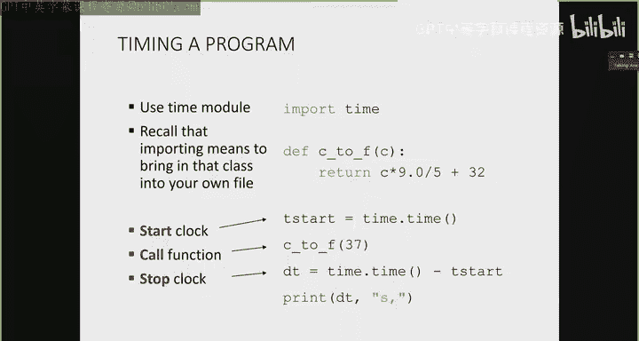

And then I'm going to get the time again down here and subtract the time right now after the function has finished。

 minus the time it was right before I started my function。

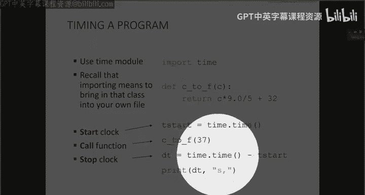

，So that gives me the the D T。 And then I just print that out。

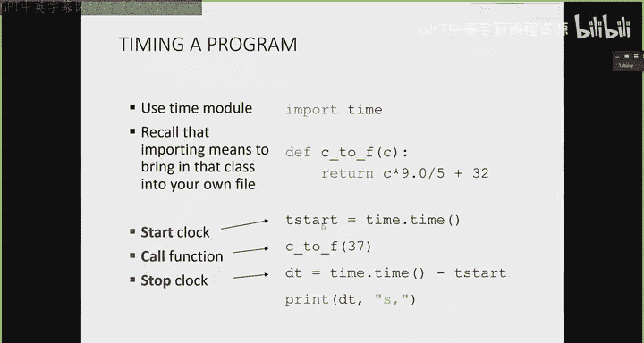

So we can run it together。The way I'm gonna run it is by actually doing a little bit of modularization to this code。

So I have this function， and this is the only function I'm actually going to run down here。 Its my。

 I call it a time wrapper。 It's a raper function。And it takes in two parameters。

 The first is the actual function I want to run。 So I'll show you down here。

 You can see I'm running the time wrapper with the name。

 literally the name of the function I want to run。 This is not a function call。

 It's just the name of my function。So that's the first parameter。

 And the second parameter is a whole bunch of different inputs I want to run the function with。So。

 this LN。Is created up here。 And it just makes for me the list of all of these inputs。

 So I'm gonna run Celsius to Fahrenheit with the number one Celsius to Fahrenheit with the number 10 Celsius to Fahrenit with 100 and so on。

 So these will be all my inputs to my function。😊，And so when I call this wrapper。

 Python' is just going replace F with the function that I'm actually running。

 So Celsius to Fheit or my sum or square。 And you can see here for each one of the different inputs。

 I'm going to grab the time， run the function。😊。

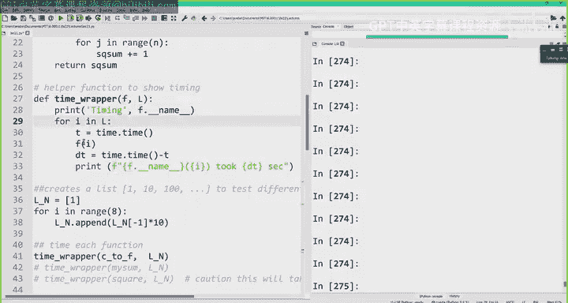

Grab the time again to grab get the D T and then print how long it took。

So I'll show you what that looks like。 So here I ran Celsius to Fahrenheit with inputs，1，10，1000000。

10000 and so on。It was really fast。Okay， it took 0 seconds every single time。

 So no matter what the input，0 seconds。 So fast that， you know。

 Python didn't even tell me exactly how how slow it was。 And you know。

10 to the negative 9 or whatever。 It's just 0 seconds。And that's in part to the time function。

 But we'll leave it at that。 It's just very fast。Okay， how about the next function。Let's do my some。

So my sum is not just doing calculations。 It has a loop。Right， that's a function of the input。

So our input changes， and you might have noticed that as our input got bigger。

 we actually had to wait a little while for this result to come come by。So we see down here。

 right or up here when the input's pretty small， yes， it took zero seconds。

 It's so fast that it didn't even register it。But at some point， we started to get actual numbers。

 So with 10000， it took 。000，99 seconds with 100000 it took。01 with。What is this a million， Yeah。

 with a million， it took 0。05 seconds。So we can actually see a little pattern， right。

 if we stare at it long enough， especially for the bigger numbers， right， so down here， right。

 these first two are iffy， But when we get to a big number like a million， we say it took 0。

05 seconds。 when we increase Christine put by 10。To 10 million， the input took 05 seconds。

 And when we increase the input by 10 again， it took 5 seconds。

So we could guess that when we increase the input again by 10， it will take about 50 seconds to run。

 right， And you can even try that out if you'd like to wait for 50 seconds。Alright。

 that's the my sum function。 Now， what about the square， Remember。

 the square had the two nested  four loops，4，4， and then just a regular addition in there。

 So let's run that。Alright， prettyty fast， pretty fast Square of 1000 is already taking 005 or 。

06 seconds。Square of 10000 is now taking 6 seconds。What do we notice？With one more round。

 if we waited for square of 100000， we might be able to see a pattern， or we can guess the pattern。

Does anyone want to wager a guess what the next number should be here。Can you think about it？600。

Yeah， about 600。 right， we're going from 0。06 to maybe about 6。 So I don't know。

 we could say about 600。 I'm certainly not going to wait for 600 seconds。

 and I'm actually not going make my computer do that just in case it crashes。But yeah。

 we could guess something like， you know， on the order of some hundreds， right，600。

 something like that。

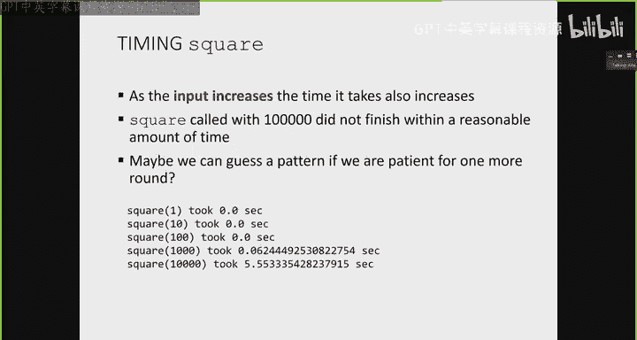

So that's one thing to notice。 The other thing to notice is that already at 10000， right。

 where the input is just 10000。 This took5 seconds already。In the previous function here， my sum。

 we got， we had to get to 100 million as my input to run for5 seconds。

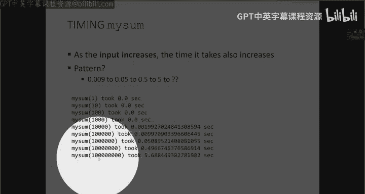

Right， so that's also a big difference here。 Already。

 this program Square is taking a really long time to run。

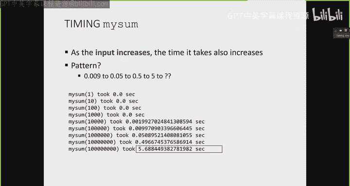

When the input is not very big。Okay。All right。So some things to notice about timing。 And as I said。

 we're gonna look at some more programs next lecture。

 I just wanted to give you a general sense of timing programs。First of all， the green check is good。

 We want all these to be green checks。 The green check is good because if we have different algorithms。

 they're gonna take a different amount of time， right。

 the time that it takes for these algorithms to run will be different， which is good。

But if we have different implementations for the same sort of program， for the same algorithm。

 that's also going to give us different timings。 And really， in the long run。

 I don't really care about that。 What I would really like to evaluate is just the algorithm itself。

Because when， when we're talking about algorithms， there's probably only a handful of algorithms out there in the world。

 that we can apply to a given problem， whereasas there's probably thousands of different implementations。

 we can apply to a problem。 So， for example， you could have a for loop versus a while loop。 right。

 you could have creating intermediate variables as an implementation。

 or you could have a list comprehension version of an implementation。

 But underlying all that is going to be just some algorithm that you're trying to implement。Okay。

 so the running time will vary between different implementations。

 which is not really something I want。The running time will also vary between computers。

 If I ran the same programs on an older computer。It's probably not going take 5 seconds， right。

 to run with an input of 100 million。 It might take 10， or it might take 11， right。

 So the timing is also going to differ between different computers。

 It will also differ between different languages， right， So Java versus Python versus C， if you know。

 C is very efficient at memory， management， it's going to run very fast。

 whereasas if you know Python' is a little bit slower， it's gonna run slower。So again。

 we're actually capturing- the timing is capturing implementation variations between languages。

And the timing is not very predictable for small inputs。 So if， for some reason， right。

 when I was running the square function here with one。

 I was also running Netflix in the background or my computer decided to update， you know， something。

 And it decided to just dedicate resources to doing that task at that moment when I'm trying to run the square of one。

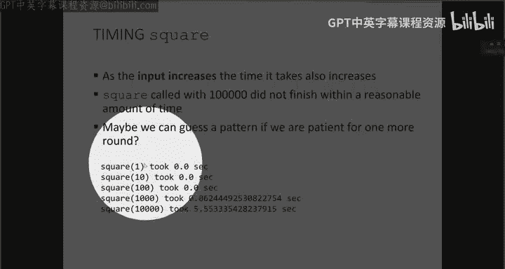

This 0。0 seconds might not be 0。0 seconds。 It might take away from the time it takes the time that it it allocates to running my square program。

 And then what we'll see is that this will no longer be 0。0 It might be 0。1 or something like that。收。

Timing programs is not very good， it's not very consistent with sort of our goal here。

 which is to evaluate algorithms。Alright， let's see if we can do better with the idea of counting the number of operations。

So， rather than focusing on。Describing our program in terms of human time， right，1 second。5 seconds。

 things like that。 Let's come up with some operations in Python that take one time unit。Right。

 and we're gonna say that all of these really basic operations。

 We can say that they take the same amount of time。

 I don't care if they're like 10 to the negative 9 seconds or  two times 10 to the negative 9 seconds。

 I don't care about that。 I just know that they're really fast。And if they're really fast。

 I can say that each of them just take one unit of time。

 So I'll just count them all as one unit of time。So the examples of those are mathematical operations。

 right， They're pretty fast。 So no matter whether I'm multiplying， dividing， and adding， subtracting。

 taking something to the power of something else， I'm going to say that each one of those takes one unit of time。

Comparing something， so a less than B，3， greater than four， things like that。

 equality also super fast to do， also takes one unit of time。Assigning something。 So a is equal to 3。

 That assignment statement right there， also pretty fast to do。

 takes one unit of time and then accessing objects in memory， right， also pretty fast takes one。

 you know， one unit of time。So with this new definition of time， quote unquote， right。

 where we have these units of time， let's figure out what these functions actually。

 how long these functions actually take。So our Celsius toFahrenheit function has three operations in it。

 right。I got a multiplication， a division， and an addition。 I don't care。

 It are the little variations that each one of these take to actually do inside computer memory。

 I'm going to say that the Celsius to Fahrenheit program takes three units of time。O。

So no matter what the input is， if I'm converting0 Celsius or a million Celsius。

 the the program will still just take three units of time to complete。How about my son。

So we'll go through step by step。 So in my sum， I've got one assignment statement here。

 So that's going to be one operation。The for loop here is going to take I and assign it to one of the values in the range。

 right， That's just internally what it does。 So that's going be one operation each time through the loop。

And then total plus equals I is going to be two operations， because I have。Total。Plus， I。

 on the right hand side， that's one operation。 And then assigning that back to total。

Is my second operation。Okay， so that's two operations there。And that's it。But notice our for loop。

These three operations here， the one for assigning I to be a value here。

 and these two operations here repeat x plus one times。Right，0 all the way up to x。

 That's x plus one total times。So， how。How， how long does this program actually take。Well。

 we count all that up。 So the one for the total equals 0 plus。

 and we're multiplying x plus one times what。The one plus the two。

 which gives us 3 x plus 4 total operations。 So now we're noting this in terms of the input。

 which is kind of cool。😊，Right， so now I have this less little formula where if I know my input is 10。

 I can actually tell you how many quote unquote units of time this program will take。Alright。

 how about the square？ It's going to be very similar。 So I've got one operation for assignment here。

This is one operation for putting grabbing the eye and making it one of the values in the range。

 Similarlyly for the inner loop， one operation there。

 and then square sum plus equals1 for the same reason as this is two operations， right。

 one for the right hand side， doing the addition and two for making the assignment。

Let's not forget our four loops， right， We've got two four loops here。

 So the inner one will repeat n times。And for each one of those outer end times。

 we do the inner end times。This nested for loop situation here。

So the total number of time units that this square will take is the one over here for this square sum equals 0 plus。

 And then I've got these nested four loops。 So the other one goes through n times。Sorry， end times。

The one operation。Multiplied by the inner4 loop also n times times what is the operations done in the inner four loop。

 Well， it's this one plus these two， so the one plus the two。So in total。

3 n squared plus one operations。O。So， let's run this。And now that we're counting operations。

 we should be able to see a more， a better pattern。 So here's my Celsius to Fahrenheit。

 My sum and square slightly changed。😊，Because I've got this little counter variable within each function。

That is going to increment each time I see an operation。 So obviously， for Celsius to Fahrenheit。

 it's always3。RightSo when I do my return， I'm just going to return the counter variable and then the regular thing that this function should return as a tuple。

For my sum， this counter equals1 stands for this assignment statement。

 and then each time through the loop， I'm going to increment my counter for the three operations。

 right， assigning the I to be one of the values in the range。

 and then two more for this total plus equals I。So that's gonna gettingcremented each time through the loop。

And then the square similarly。 So here's my counter equals one for this statement here。

 counter plus equals one for grabbing the I as one of these values。

 and then counter plus equals 3 for grabbing the J to be one of these values and incrementing this mice。

So because of where I've placed these counters， Python will automatically count it all up each for no matter how many loops I've got。

So here's my wrapper for counting。 slightly different than the timing one。

 because now I'm actually going to also keep track of how much。

How many more operations I've done compared to the previous input。Okay。

 so let me show you what that means。 Let's run Celsius to Fahrenheit with the following inputs。

So I'm first of all， reporting the total number of operations， just like it did with timing。

 So always three operations。 No surprise there。 That's what we coded up。 basically。

 But then I'm also reporting here。 and that's done inside the wrapper function。 The count wrappper。

 how many more time， how many more operations is this based on the previous one。

 So the first one's a little weird。 But when my input is 10 times more， right。

 I went from 100 to 1000， I've done one more operation。No change， obviously， right。

 because it's always three operations done in total。So， just for。Ption sake， right。

 This is the slide。 So no matter what happens to the to the input here。

 the number of operations in these sort of units of time。

 which we're just counting number of operations is 3。

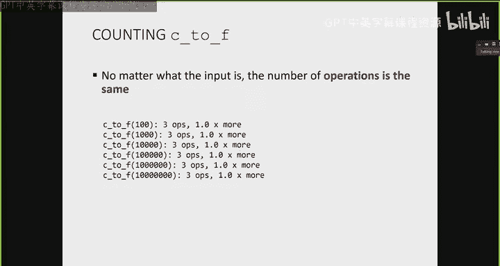

What about the sum， So remember， the sum had that for loop in it。

Let's run that and see how many operations are here。

Okay so first I'm going to report the number of operations。 so when the input is 100， it's 304。

 when the input is 100， it's 3004， when the input is 10000 it's 30004。

 so that matches up the formula we came up with right。

 3 x plus4 so that's pretty cool and then you can see now here I'm reporting how many more operations is this line based on the previous line。

So it's about 9。8 times more right， so when my input increases by 10 from 100 to 1000。

 I am doing approximately 9。88 times more operations。When by input increases from 1，000 to 10，000。

 again by 10， I'm doing 9。988 times more operations。

So we see sort of like a nice little set state going on here， right， where when my input gets really。

 really big。

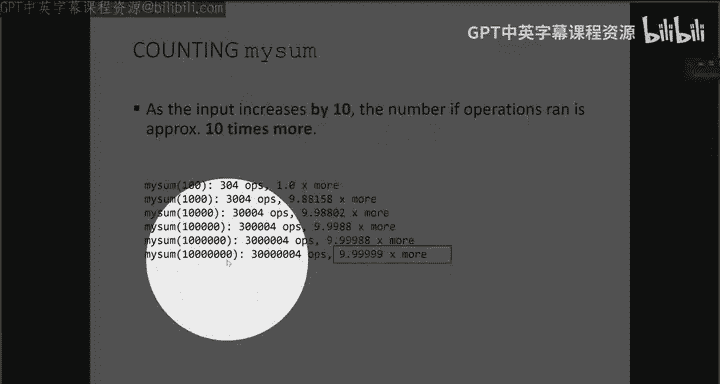

It looks like I'm approaching approximately 10 times as many operations， right。

 when my input is 10 times more。This is obviously more apparent when the input is big because the tiny variations in my formula。

 right， the plus 4 specifically。Makes less of an impact when my input is really large。

And this is kind of going in line with our motivation When the input data is really， really big。

 what I'd like to report is sort of the algorithm and how long it takes。

 I don't care that the algorithm takes 3 x plus4 or 3 x you know times3 x as operations right when the input is really big All I care is that it's sort of on the order of X right and that's something we'll get at next lecture。

But this is the big idea here When the input increases by 10， it seems like at steady state。

Our number of operations increases by 10 as well。 So it's sort of this linear relationship。Al right。

 what about。The last。Function， the square。So I'm doing something a little special here。

I have two different inputs。 I'm going to run the square with。So the first one is L2A。

So I'm going to run square with input 1，2，2，56，5，12，1024。 So I'm basically increasing my input by 2。

 right， I'm multilying my input by 2。EachEach time。And then I'm going to run it with L2 B。

 where my input increases by 10 each time。So we're going to see if we can figure out a relationship between these。

For the square， because that one was a little hard to figure out in just pure timing without actually waiting for。

 you know， minutes or or days。Okay， so we've got something to work with here。

 So here Ive got my square。 So this first bit here。😊，Is when my input increased by two。And down here。

 just finished is when my input increases by 10。收。Number of operations when my input increases by2。

 are not so important。Yes， they're big。 But what I'm really interested in。

 just like what we saw in the my sum example is what happens to the steady state as the input gets really big。

 right？ How many more operations are we doing。And what we can see is that the number of operations as the input gets really big is approximately 10 times sorry。

 four times more in the case where I increase my input by two every rat。Okay。

 so when I increase my input by 2。The number of operations are going to be four times more。Well。

 what about when I increase my input by 10， right，1，10，1001000， so on。Again， I'm not so。

 much interested in number of operations， but what happens to the steady state with very few operations。

 it's hard to tell。 But as we increase it， we see that it goes towards approximately 100。Right。

 so when my input increases by 10， that takes me to about 100 fold increase in the number of operation。

So now do you guys， can you guys see the relationship between the input for the square and the number of operations。

You can， right， So it's approximately sort of an n squared relationship， right。

 when my input increases by， you know， some by when my input is n。

 the number of operations is going to be on the order of n squared more。

So counting operations is actually a lot better than timing。 as we can see， right。

 we've eliminated a bunch of those red X's， right， We no longer we no longer have to deal with variations between computers because before counting this on the computer that's slow or fast。

 we're still counting the same amount of stuff。Lguages， again。

 it's not going to matter because you'll implement it in a similar way。

 Small inputs is still sort of iffy， right， We saw the square was a little bit unpredictable when the input was pretty small right down here。

 you know，60 than straight up to 90。 but we didn't take long to see the steady state。

 So it's actually better than before， better than timing。 It's not  zero， at least。

But now the problem becomes， sort of what's the definition of which operations to count。

 Notice our functions have a return value。Do we count the return as an operation？Technically。

 you should， right， That's a value that's being passed between functions。

 So that's going to take some time to run。But we didn't actually count it in in our example， right。

 But you， you could， if you wanted to。So， that's。Where we stand， right。

 we've got timing and counting， just as an initial。Initial examples。 Next lecture。

 we're gonna look at a few more examples with lists and things like that。 Just again。

 timing and counting those functions。But again， the big idea here is that we're trying to get at evaluating just a handful of different algorithms。

 sort of what's the order of growth as the input becomes really， really big， right。

 because all we're interested in is how scalable are these programs that we're running when the input is really big right when we're dealing with big data。

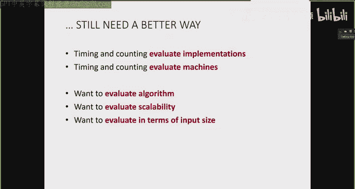

And so that's what we're going to start talking about next lecture。

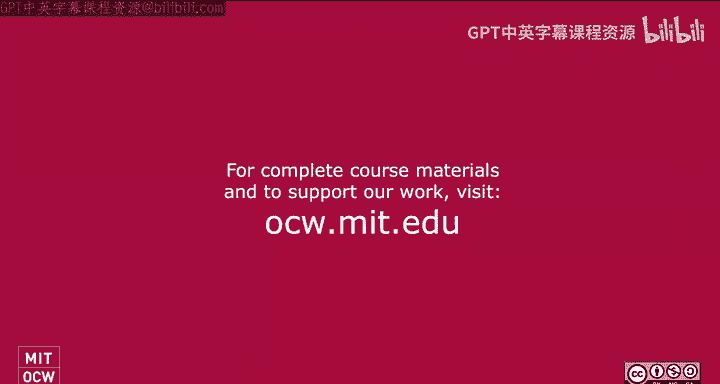