# 《计算机科学和Python编程｜6.100L Introduction to CS and Programming using Python, 2022》 - P22：-22-Lecture 22_ Big Oh and Theta.zh_en - GPT中英字幕课程资源 - BV1PAxJzVEs3

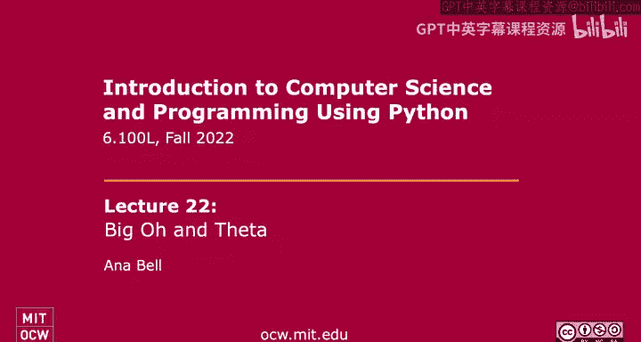

Allright， let's get started。 Last lecture， we began talking about an entirely new topic in computer science and we have begun learning about how to figure out the runtime of our programs right so we did we looked at how to actually time the program by figuring out exactly how long it takes and then how to count the number of operations in the program Today。

 we're going to do very same thing to begin with So for the first half of the lecture。

 we'll time a bunch of programs and we'll count the number of operations just like before。

 but we're going to do them in the context of slightly different。

 slightly more interesting programs or functions involving just pure numbers as our parameters and then functions that involve lists as our parameters。

That'll be the first half of the lecture。 And then from there on。

 we're going to look at the idea of order of growth。

 which is kind of what we're building up this set of lectures to。 And then the order of growth。

 there'll be a little bit of math。A little bit of graphing， but not， not too much。 And then were。

 we're just going see how to actually evaluate the order of growth of functions from there on out。

Okay， so let's begin by just figuring out the run time of our programs。 right。

 This was a really quick and easy way for us to figure out exactly how long our programs take。

 So last lecture， we imported this time module， and we're doing that again this time。

But instead of actually running the time function that we had seen last lecture here， right。

 instead of running the time function， which gave us this sort of global absolute time since some some date in the past。

 we're going to run this slightly different function called performance counter。

 and this is what is typically used in the real world to figure out how long an actual program or function takes to run。

The reason we're using this is because it's more accurate。

 So the time dot time function that we use last lecture gave us maybe precision to one times 10 negative 3 or something very。

 very big like that。 The performance counter can actually give us precision to something that's a lot。

 lot smaller。 So maybe one time 10 negative8 or So something very small。

 So we'll be able to see the timings of some functions that were basically0 in the last lecture。😊。

Okay， so just a quick review of how we actually get the time that a function takes to run。

 We run this performance counter time。 And this one gives us not a absolute time， but more of a。

A shorter time frame， not from some time in the past。

And the performance counter is very useful when we're getting these D Ts， right。

 the difference in sometimes。

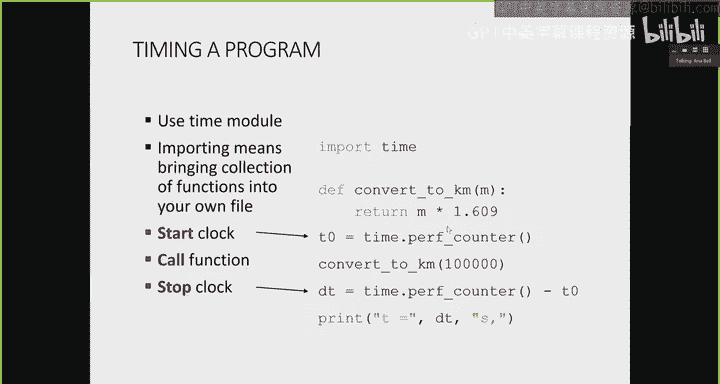

So we're running the performance counter to get the quote unquote， starting time。

 We run the function。 We run the performance counter again to get the quote unquote， stopping time。

 Subtract the starting time to get the D T。😊。

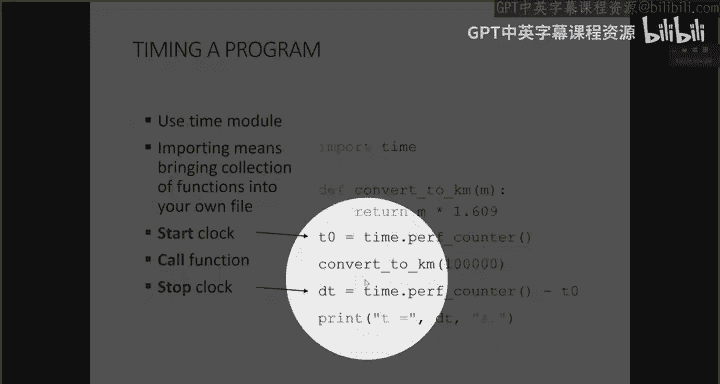

So， and then we will print that， that time to see how long the function actually takes to run。3。Okay。

 so we're gonna look at two different functions than than last time。 but they're gonna。

 they're gonna have sort of the same overarching themes that we saw last lecture。

 So the first function we're going to look at is called convert to kilometers。

 taking in some miles and returns the value in kilometers。

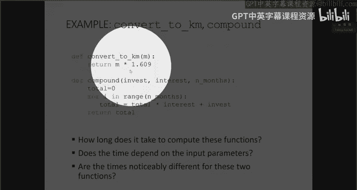

And the second function is a function named compound。 So this one should seem very familiar。

 It will bring flashbacks to problem set 1。

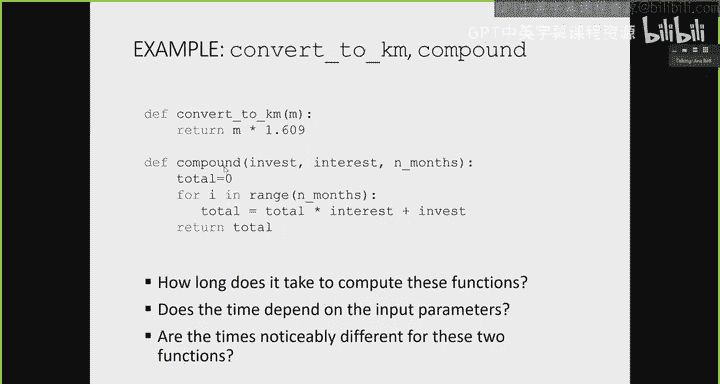

It's a function that takes in a monthly investment。

An interest rate for the month and some number of months to invest that much。

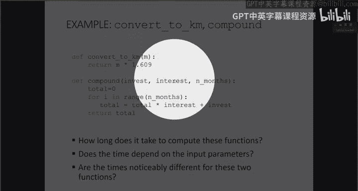

And it returns how much money you've made over those number of months。 So you can see here。

 youd have a total initialized a loop that goes through that many months。

 and it updates the total based on the interest rate and how much money you have there right now。

 plus whatever you've invested for that month。

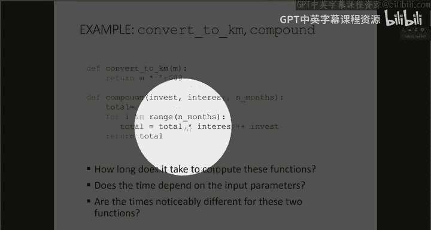

Okay， so the three questions we're going to answer。

 just like we answered last lecture is how long natural seconds does it take to run these functions。

 Which input parameters does the function actually depend on。

 And do these two functions actually run at for different amounts of time and。

 and sort of what is that difference， right， Does one run in 12 seconds and the other one1 run in 。

5 what， what is the the actual time that it takes for them to run。

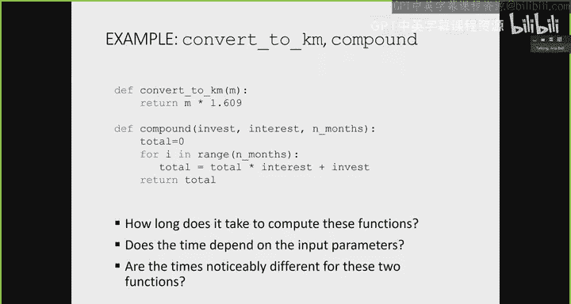

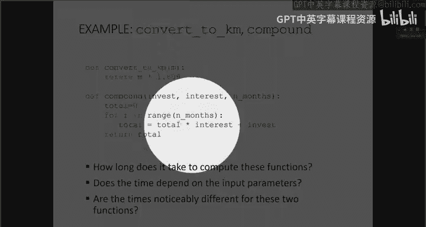

So this is our code。 So these are the two functions。 Before we go on。

 let me just show you how we're creating the inputs。 So just like before。

 we're creating a list of all of the different inputs we're going to run the function with。😊。

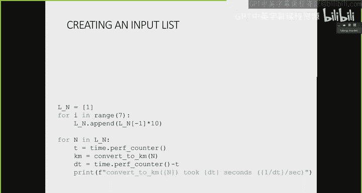

So here I've got this L N that will contain the numbers 1，10，1000000 and so on。

 And these are gonna be the parameters to my function，1 at a time， of course。

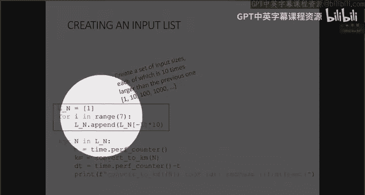

And then I've got my loop here for each one of those inputs，1，1010000。

 I'm just gonna run my function， right， So here I'm measuring the time it takes。

 And then I'm going to report that， the time that it took to run the program。And just for fun。

 I'm also going to report how many times this program could run in one second， because for me。

 it was a little bit hard to read， you know， one timestead negative you know。

58 or something like that。 But it was a lot easier for me to see this big number for how many times that function could have run in one second。

So here I've got。Convert to kilometers。So I'm going to run it。And we're going to see。

 it's this right here。How long the function actually took。

 So last time we ran a program that was really simple like this。

 All of it basically said it took 0 seconds， right It was just so fast that that time that time function was。

 wasn't able to pick up that precise time difference。 But this performance counter can， right。

 which is a lot nicer。 So now we see that no matter what the input。

 it looks like the time is pretty much the same， right，3 times 10 to negative7 seconds。

 no matter what the input is。That was。Expected。Now， what about the the compound function。

This one's gonna be a little bit more interesting because there are actually three parameters to this function。

 right。So what we're going to do is change each one。

And see which one of those parameters actually has an effect on the runtime。So here， this bit。

Is going to fix my interest rate。And fix the number of months。

 And I'm going to change the amount I invest every month。Okay， so if I run that。

 that was pretty fast。Again， we look at the results here。

 and no matter how much I invest every month， it looks like the program doesn't really change how long it takes to run。

 right， It's always about one times 10 to the negative 6 seconds to run。All right。

What if I change the interest rate， So this ones was a little bit harder to change。

 But I settled on this。As the thing I'm varying。Sorry， I'm varying it in this way。

 so it's going to be 1。1。1 or 1。01 or 1。001。 That's what I'm going to invest。

That the interest rate for whatever I'm going to invest in。

 And I'm going to fix $10 as my investment per month and fix the 12 months again。So if I run that。

Same deal。 It looks like changing this investment isn't really making much of a difference in how long it takes the program to run。

Allright。One last parameter to try。So now I'm going to fix the initial investment to $10 a month。

 and I'm going to fix my interest rate to this per month。

And I'm going to vary how many months I'm going to invest this。So again， this n will be 1， 10， 100。

 1000， 10，000， and so on。So let's see what this is going to do。Already。

 it's doing something different than the other two because it hasn't finished running yet， right。

 So it's still working on this last one down here。 But we can see that more interesting things are happening now。

 right， So here I've got initially， it's a little bit hard to tell for those small numbers。

 which is fine。 But luckily， we're able to run it for a bunch of a bunch of inputs。

 So starting from about here， right， when I start investing sorry。

 when I start investing my money over 1000 months，10000 months，100000 months and so on。

 It looks like we can kind of see a pattern again， for 1 thousand00 months。

 it takes the program takes about five times 10 negative 5 seconds to run。

 if I increase the number of months by 10， it takes five times 11s in the negative 4 seconds to run and then as my input increases by 10 the number of months。

 my time to run seems to increase by 10 as well， right， So 0005。05。7。8 something。Like that。O。

So this is from a previous run。 Of course， each run will be different because we're just calculated。

 we're just purely grabbing the time that the program took to run。

 So the actual time will be different， but。A fewew things to notice。

 So Python actually reported the time it took the program to run in scientific notation。

 which is kind of cool。 So this is 4。3 times 10 in the negative 6。

 So it knew how to show it to me like that。 What's not， does't have a bunch of zeros in there。😊。

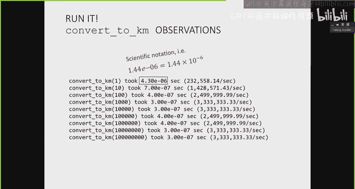

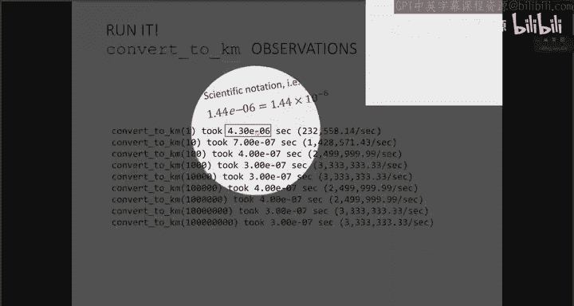

And then the observation， as we might have， you know， as you might have guessed in。

For this convert to kilometers was independent。 right， So this is the kilometers。

 not the compound function。But then the compound function here。This is， again， from a previous run。

 We can make a few observations。So the first was that the time only change， only。Actually。

 changed with the， with the input。When we changed end months， right。

 when we changed the initial investment or the interest rate。

 the program just basically took the same amount of time to run。

 So it was only end months that actually made a difference for us。Second observation。Again。

 something we noticed is as we increase the number of uss by 10。

The time it takes the program to run also increases by 10。Again， something we've， we talked about。

 And the last observation。嗯。Is that we have this relationship very apparent as the input is really big。

Right as the input is small， I think I mentioned this last time， if for some reason。

 my computer you know updates or decides to dedicate some some resources to to running an app in the background for whatever reason。

 as it's trying to figure out the compound function with an input of one。

 this number could be changed dramatically right because two times10 and negative 6 can be affected a lot by just a little bit of time dedicated to something else。

 whereas you know4 seconds or 14 seconds， if my computer dedicates a little bit of time to something else。

 that 4 or 14 won't be affected as much， right So when the numbers are big。

 that's when we can see the behavior of our function a lot more clearly。

 not when the numbers are small。O。So。Now， I'd like to look at some more functions。

 These functions are going to have the input being a list。As opposed to just numbers， right。

 we've seen a bunch of examples with numbers。 But let's see what happens when my input is a list。

So here's a very simple function。It takes in a list L。

And it sums all of the elements in the list out。So we've seen this a bunch of times already。

 We initialize a total to be 0。 We iterate through each element in L。

 and we keep our running total by just adding the element to to that total。 right prettyt simple。

 And we return it。

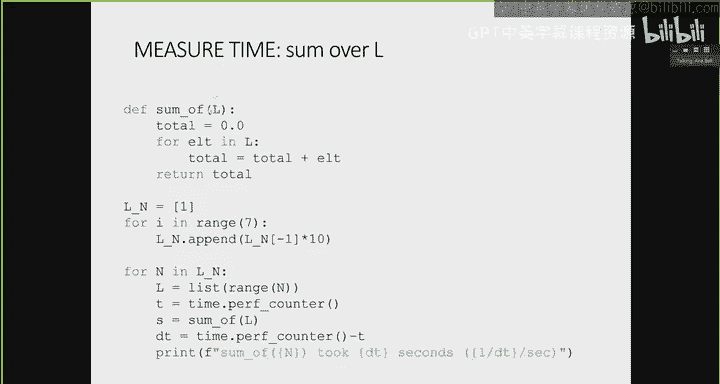

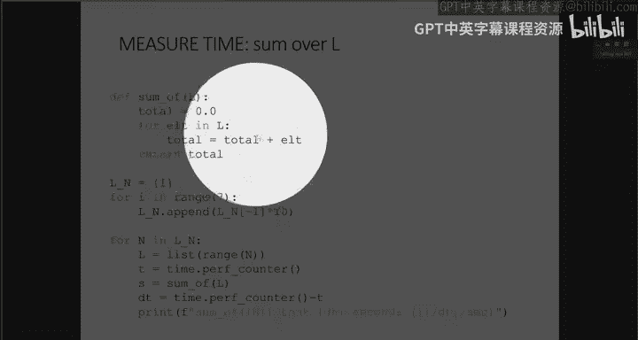

Now， how do we actually run this function with a whole bunch of different inputs。Well。

 that's what we're gonna to see next。 So this bit here is exactly the same as before。

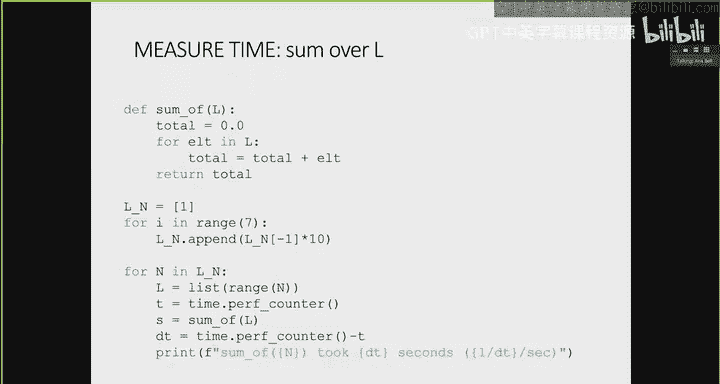

It's actually creating for us the list of 1，10，1001000，10000 and so on。

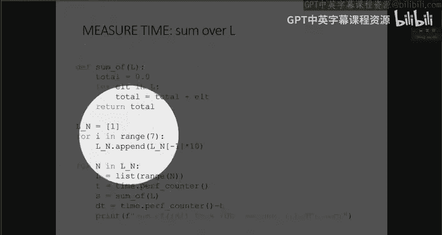

But clearly， the number 10 cannot be an input to this function， right。

 because this function is expecting a list。Right， so L cannot be 10。

 It needs to be a list with some things in it。So instead。

 what we're going to do out of that number 1，10，1001000 and so on。

 we're actually going to make a list with just some random dummy numbers in it。

 I don't actually care what these numbers are。 So let's just make them be the number 0 to 9，0 to 99。

0 to 999。And in effect， each one of these lists will then have one element in it，10 elements in it。

100 elements in it，1000 elements in it and so on。All right， everyone okay with that。Right。

 so the input is now different。 It needs to be a list。

 We're just creating a bunch of lists of varying lengths。

So the relationship between these lengths are that the lists are 10 times as big as the the previous list。

 right。Okay， so then now I have my input list here。 I do the exact same thing as before。Not yet。

 I run the performance counter to create my starting time。 I run my function， and I get the D T。

 and I report the exact same thing as before。All right， so let's run that。Down here。Right， running。

 running， running。Again， we have to wait a little bit。 It looks like it's working。

 but it's just getting slower and slower， which is fine。So what do we notice。

 So when we had one element in my list， it took one times 10 negative 5 seconds to run When I had 10。

 it took one times 10 negative 6 seconds to run。It was actually shorter to have more elements in it。

 See， this is what I mean when it's very unpredictable for low numbers。

 but as we get to lists of length， thousand0，10000，100000 a million and so on。

 we can start to see the pattern。So with 10000， it took  four times 10 negative 4 seconds to run with 100000。

 it took  four times 10 negative 3 seconds to run。 And then as the input increases by 10。

 that is the length of my list increases by 10。 It looks like the program takes 10 times as long to run。

A very similar thing as before。 So the first observation that we can make out of this this。

 this function is that the size of the input， obviously， is now the length of our list， right。

 It's not just the number 10 or the number 1000。 It's a length of length。

0 list of length 10 or a list of length1000。Second observation is that， again。

 just like in the previous case， the average time increases by 10 as the length of our list increases by 10。

Okay， again， very good。And just like before， this relationship between the size and time is more predictable for large sizes than it was for small sizes。

 right， as we just saw here， which will surprise me a little bit as well。

 is if for us a list of that's longer， it took a shorter amount of time to run。

 which is counterintuitive。 But again， that's probably because my computer did something here to take a little bit longer to run。

Okay， and then the last observation， this is， this is compared to the compound function where we change the number of months。

It looks like the time that this program actually takes to run is pretty comparable。

 just in terms of pure you know seconds is comparable to how long it took for the compound to run。

Right， so here， when my input was 100 million。Yeah，100 million。 It took about 8 seconds to run。

 And when my list had 100 million elements in it， it took about 7 seconds to run， right。

 and then 10 times faster going。When we decrease our input by1。So already。

 we're starting to see something something that we're gonna to get。 Yeah， good ahead。嗯。Oh。

 some of is just this function that I wrote here。Yep， that's just yeah。

Did I name it something differently in here no。Yeah， so already。

 we're starting to get at this idea where I have two functions that do wildly different things。Right。

 one sums the elements in a list。 The other one just loops over some number of months and does some calculation。

 but it looks like they're sort of in terms of just algorithmically wise， they are very similar。

 They take similar amounts of time。 they increase at the same rate。 And basically。

 they just have a for loop， right， or some sort of loop that iterates through the input and does something。

 So algorithmically， we want to consider both of these functions the same。

 even though they implement completely different things。

Other questions before we go on another list function。O。

So let's look at a slightly different problem。Dealing with lists。

 So this function or these three functions deal with finding an element in a list。

 And we're gonna compare the run times of these three functions。

So the first function is going to be a very brute4y method to find the element in a list。

Its was there a question？Yeah。哦，我。All right， no worries。Okay。

 so the the first function will do a brute force search to find an element X。Right here。

 one of my parameters within a list， the other one of my parameters。Basically。

 given a list of a bunch of elements， this function will just painstakingly look at each element。

 one at a time and ask whether that element is the one that I'm looking for。 so starting over here。

 the beginning of my list and going to the end of my list， that's what is in does。The next one。

 binary search， also looks for an element in a list。Making sure that the list is ordered。

But the way that it's going to do it is in a slightly smarter way。

 So I'm actually gonna draw my list this way。So each one of these is gonna be you know。

 elements in my list。So this is going to do a bisection search to find the element in the list。 So。

 again， we're looking for element X within this list L。And remember， by section search。

 we start with a lot with a a beginning endpoint。And an ending end point。And our first guess for。

 where， for the element or whatever we're looking for is to just say， what's the。

 is it the middle element。Right， so look at the element in the middle and ask。

 are you the 1 I'm looking for In this particular case。

 you look at the element in the middle and you say。Are you the X I'm looking for， right。

So that's this one right here。So the midpoint calculation is right here。Right。

The reason why we're doing slash slash for integer division is in the case where I have a list where I would actually。

 you know， look at the midpoint here， right， Obviously。

 I can't ask the I ask Python for the element at index 3。5。Right， it doesn't work like that。

 So I'm just going to round down。 You could also round up if you wanted to。

 I just made the choice to round down just so I'm actually grabbing the element at， an integer index。

Right， so I've grabbed my middle element， and then I ask， are you the1 I'm looking for， And if not。

 I ask whether this one is too low or too high。And then if it's too low。

 then I know I need to search this。Part of my list。 And if it's too high。

 I need to search this part of my list。Right， so that's what this little if else is doing， right？

And when I make my decision as to which side to look at， then I reset my endpoints。

And I do the process all over again， by asking。The midpoint there are you the 1 I'm looking for。

 so on and so on。So this does a bisection search。Also called binary search for the element in a list。

And the last way for us to search whether an element is in the list is one that we've already been doing。

 It's this little one liner here。Is X in L。 So using the keyword in。Right。

 so that's I call that the the built in function， the built in operator in。O。So。

It would be unfair if we just asked Python to figure out or to just pick a random number and ask whether that element was the one we're looking for。

 okay。So instead， what we're gonna to do is to kind of take an average for each one of these three functions just to make it fair。

So we're going to say when we're searching for an element in the list。

 I'm going to say that I'm going to take the average of the case when the element is the first one in the list。

And I can find it maybe right away in this case or maybe not right away in this case。

The average went with that plus when the element is the last one in the list。And plus。

 when the element is the middle one in my list。Right， so in that way， we're actually， you know。

 kind of covering all our bases， kind of best case， worst case， medium case scenarios。Right。

So each one of these three functions。We'll be run with that。In mind。 So that's these three functions。

 So this is my brute force is in。 This is my binary search。And the in， it's， obviously。

 I'm just gonna type in in when I run it。So I'll just show you for one of them。

 So we're going to un this entire bit here。And run it。But you can see here。

 So instead of just running the performance counter and making one function call。

 I'm actually gonna run three function calls。Iterated over this little loop where I'm looking for the element at the zeroth location。

 the element at the halfway location。And the element at the end of my list。

 And I'm just averaging those。Down here， the time it takes to find those three。Does that make sense？

Okay。Alright， so this is a lot to look at。Luckily， I'm gonna summarize it in the next few slides。

 so we don't have to stare at that at that Python screen there。Okay。

 so we had three functions to run。 Let's first look at how each of these three functions did individually。

 And then we can start comparing them to each other。So the first function we ran was the is in。

 So remember， this was the brute force one。 We're painstakingly going through each element and asking if it's the one we're looking for。

 So no， no smart way about that。 Just brute force your way through。We notice that。As the input list。

Grows by 10。The time it takes for to find the element in the list， whether it's the first one。

 last one or in the middle， On average， also grows by 10。O。All right。Next。

Let's look at the built in function。We'll worry about the binary one later。The built in function。

 So just using the in operator。 And you see， this was down here。

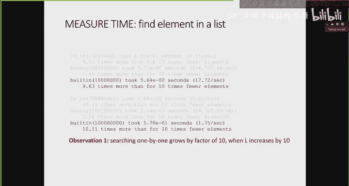

So this in。 So basically， the function I'm running is purely just asking whether X is in L， right。

 And that returns true or false。So I didn't need to make a function for that。

 but that built in in operator also has a very similar trend。Right。

 as the length of my list increases by 10。The time it takes for my program to run is also 10 times as long。

 right， I went 。05 to。5。 and the next one would be 5 and so on。Okay。

 so those seem to be doing approximately the same sort of they， they have the same performance。Now。

 what about the bisection search or binary search。Well， this one is not so clear， right。

If we look at the input， right， the input clearly increases by 10 from here to here。

The time increases9 times in the negative 6 to 1。1 times 1 negative 5， right， And so the factor。

 how many more times it took is very unclear， right。It's not quite one。

 If it was one that meant it's independent， right， It's constant。

 It doesn't matter what the input size is。 It's always going to give us this amount。

 It's always going to run in this amount of time。 So it's not quite one。

 So it's almost independent of size， but it's not linear， right， Like the other two functions were。

 right， It's not 10 when the input grows by 10。So we're not quite sure what this function is， right。

 But clearly， it's not as bad as the other two， but not as good as no relation。O。😊。

Observation  was observation 3。 Ob 4 will now compare the function that we wrote。

 The is in this one here to the binary search。 this one down here。Well。

Binary search was orders of magnitude faster than。

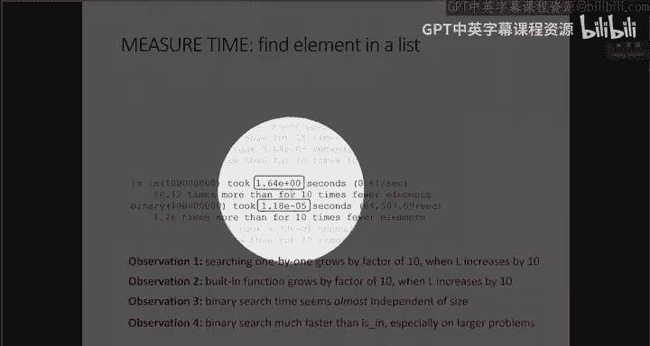

Brote force。Right， roof force， when the input was， what is this 10 million or 100 million。

 I'm not sure when the input was 100 million。Bte force took 1。6 seconds。But the bisection search。

 the binary search took。00，00，1 seconds。So it's not like we went from 1。5 seconds to 1。

2 seconds or to 。5 seconds。 We were orders of magnitude faster， right，10 to the negative 5。Right。

 so there's a really big difference between this algorithm。

 the one that forces its way through and between this algorithm that does something smart about removing half of the search space with each each loop。

Alright， so that's important to know。And lastly， just kind of comparing pure time that it takes these programs to run。

Let's compare the function that we wrote， the one that loops one at a time through this list。

And the built in in function。The built in in function。

 while it's still the same sort of has the same relationship linear， right， with the input size。

 it seems to do a lot better consistently by about 10 seconds。 sorry，10 times as fast。Right。

 so when our function took point1 seconds， the built in one took 005 seconds。

 where when our function took  one second， the built in function took 05 seconds。 So consistently。

 it's just faster to use the built in in function than to make our own。Allright。

 questions about any of these observations。They make sense。Are they interesting？Okay。

 so what do we see， Just a quick recap of those three functions。Right。

 the first one we saw is linear in the size of the argument。

 So when the input list size increases by 10， the program takes 10 times as long to run。

 But this other one is something less than linear， but not constant。

 So we're not quite sure what it is。Alright， we'll come back to this in a little bit。

 We'll end up plotting some of these runtime。 So we'll actually be able to see the relationship。

 in a few slides。The next thing I actually want to do is do one more sort of function。

This one is called the diameter。 Allright， and I'll explain what it's doing because it looks a little bit scary。

 But suppose we actually have some points in a 2D plane。Right， so it looks like this。Basically。

 what this function is going to do is it's going to figure out the biggest distance。

Between all of these points。 So， you know， the distance between these two points is， you know。

 something。 Thiss the distance between these two points is something else。

 Which two points yield the biggest distance， right。

 That's what this function aims to tell us and what that distance is。

So the way it works is it has nested for loops。 So this is different than what we've seen so far。

 right， We saw an example of this last lecture， but now we're seeing it in the context of something actually useful。

So in this particular case， we're going to create an input list。All right。Again。

 our input list will just have some dummy values in it。 I don't actually care what these numbers are。

 I just want to populate a whole bunch of points in a 2D plane。

So what we're gonna do is pretty much just iterate from number 0 to 10。 Sorry，0 to 9，0 to 99。

0 to 999 and so on， just like we did before。And to get us a little coordinate。

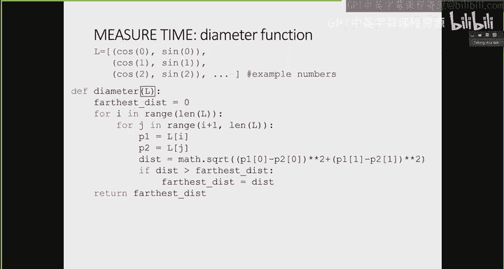

In the 2D plane， based on those numbers， I'm just going to take the cosine。

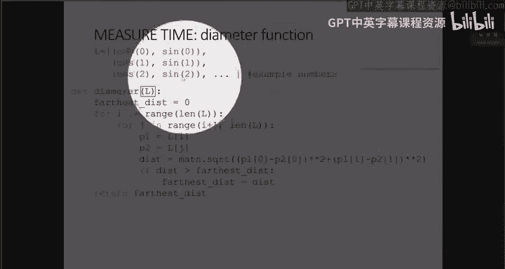

Of that number， comma， the sign of that number。 So that together。 So like cosine of， you know。

1 or whatever sign of one will be this point here。Set up as a tuple。

 And then this one might be cosine of 5， right， comma sine of 5。Something like that。

 So I'm just making a whole bunch of coordinates in a 2D plane， ensuring that I have N coordinates。

Okay， now the loop。sorryrry， there's gonna be two loops。

The outer loop will basically take us through。Each of these elements。

I have five in this particular case。And the inner loop will go through every other element， right。

 But notice it starts from I plus 1。 And I'll tell you why that is， instead of starting from 0。So。

 let's just walk through。Let's say we start out with this element。

 This Laga is our first element in our outer for loop。So right now。

 we've grabbed the first element in our outer for loop。

And what we're going to do is figure out the distance between it and everybody else。

 So now we're iterating through the inner for loop。Going through each element， except for myself。

So I'm gonna get the distance between this one and this one。 since it's the first one。 Obviously。

 it's， the biggest one。But then I'm going to get the distance between this one and this one。Right。

And I'm going to say， are you bigger than this one， It looks like no。

 So we're still keeping this one as our longest one。

 Then I'm going grab the distance between this and this one and this and this one。

 And as I'm going through， this little， if statement here keeps track of the farthest one。

 So the one that has the biggest magnitude。

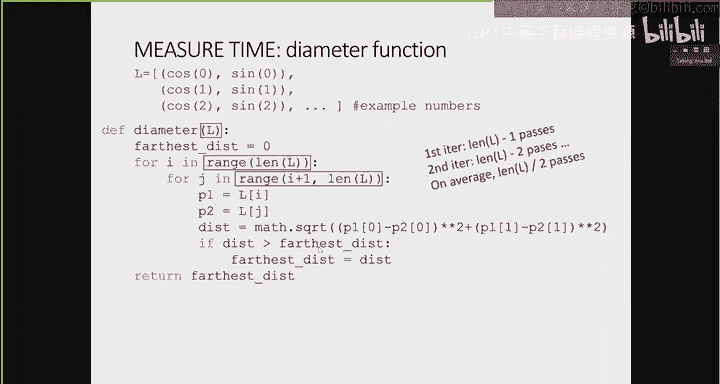

In this case， that's probably the first one we looked at。And after I've gone through each element。

 each other element， I've concluded my first iteration in my outer fore loop。

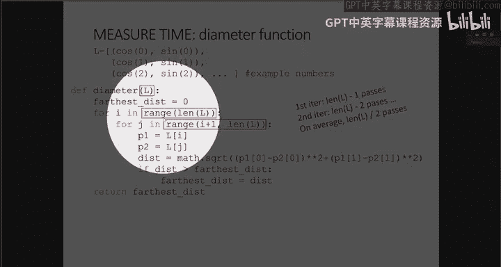

So， now。The outer for loop goes to the next element in the list。

Let's say it's this one doesn't actually matter。This one will look at the distance between itself and everybody else。

 except for the one we already looked at because we already know this distance， right。

 We kept track of it already。 when we iterated through this one。

So as I'm going through my outer for loop， keeping track of this， this point here。

 it figures out the distance between this one。This one， which is suddenly bigger than that one。

 which we had kept track of。 And then this one right here。Alright， good。

 So now we're still keeping track of the biggest distance we've seen。 It's probably this one here。

 And I've concluded the second iteration of my outer for loop。 And now I go to the next element。

 Let's say it's this one。 Does't matter again。Now， this one is going to get the distance between itself and everybody else。

 except for the two that we've already seen。 this one and this one， right。

 So that's why our inner loop starts at I plus  one。

So this one will get the distance between itself and this one all the way back there and this one all the way over here。

Right， and then next iteration in the outer four loop takes a look at this one。 Let's say。

 and it finds the distance between itself and everybody else。 But you know what。

 There's only one left。Thatone there。And then the last time through。

 this one doesn't even get a chance to find the distance between itself and anybody else because everybody else already found the distance between it。

Okay， and so on this way， we're basically finding all the possible pairs of all of these points in this 2D plane and keeping track of the longest。

 of the biggest distance。So in terms of the list， the input list， the way that looks like。

 this i plus1 business here， the outer loop basically says。

 I'm going to start with you and I'm going to get the difference between U and the element at index 1。

 the element at index 2 and the element at index 3。This outer for loop is done。 Next。

 we're gonna get the difference， between the distance between this one and everybody else， right。

 So obviously， not the element index0 because we already know that distance。

 So we're gonna get the distance between element and index 1 and index 2 at index 3。

And then we're done。 And then the last loop， outer loop gets the distance between element and index 2 and index 3。

 And then it's done。So just these， the two nested loops just does all of this。

Until it finds all all of these pairs， it basically pairs up everybody together。Okay。

 so if we run it。What are we going to see， So my input for this particular function。You'll notice。

 first of all， is going to be much， much smaller than the inputs for everything we've done so far。

 right， Some of the inputs we had seen in the past were  a million，10 million，100 million。

 in this particular case， I'm only going go up to 6000。

Because it's just gonna take way too long to run if I make it go for any， much any longer than that。

So what do we see already， We've got 100 points。 So 100 of these。Right。

 finding the distance finding the maximum distance between a bunch of these pairs took about 0。

03 seconds。 If we doubled that to 200 points， it took001 seconds。 If we doubled that to 400 points。

 it took 0。05 seconds and so on and so on。So just like before。

 let's take a look at big numbers to see our trend。So as the numbers increase right by 2。

 if my input increases by2， it looks like the time that it takes for me to find out the biggest distance increases by 4。

Al， so my input increases by 2。 The time increases by 4。And I'm not going to run this。

 but you can make a new list on your own and change this to be you know inputs that are multiple that are yeah。

 multiples of 10， right， increasing by 10 each time。

 And you'll see a very similar pattern where the out where the time it takes to run that program will be about 100 times is slow。

So the relationship there is a n squared kind of relationship。Right。

 so a few observations here as well。 First 1 I already mentioned is this program just on just takes a lot longer to run in general。

Right， so here we were able with compound and with finding weather and elements in the list and getting the sum of all the elements in the list。

 we were able to run， you know，100 million， a list with 100 million elements。

 and it still took about， you know， once， one something seconds。😊。

Whereas with this diameter function， we can barely get to 6000 and it's already taking 14 seconds。

 so just way， way， way slower program in general。And then the relationship seems to be an n squared kind of relationship relating the input to how long the program takes。

So let's actually plot， well， I already did this。 but here are the relationships for these sort of three types of algorithms that we've seen so far。

So the， this is the finding the element in a list。 those three versions， sorry。

 those two versions that we saw。 And this is the diameter function。

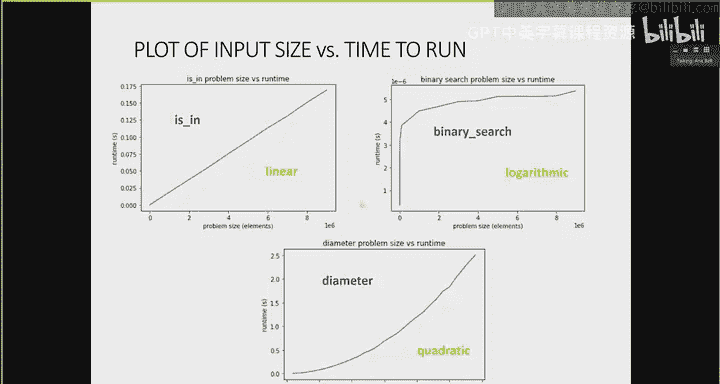

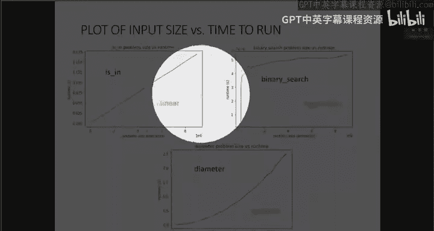

So if we plot how long it takes the program to run when the input increase when sorry。

 when the input is this size， we can see that there is a linear relationship。

 So the time it takes for the program to run is linear in the input。

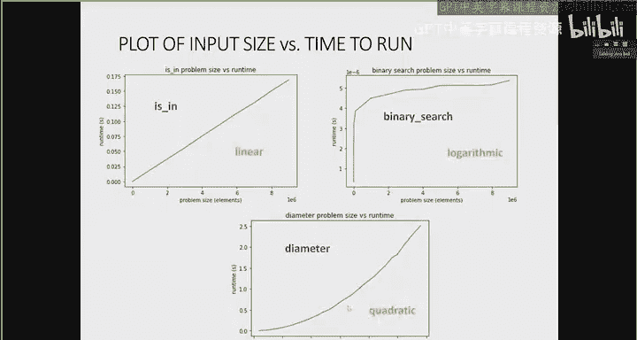

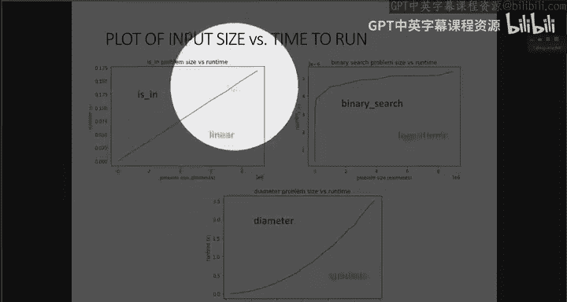

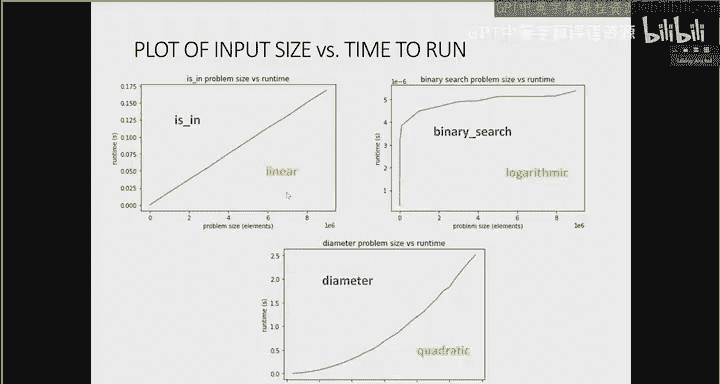

嗯。The diameter， we'll talk about the binary search in a bit。 The diameter。 we again。

 notice this just by looking at the pure numbers， but it's a lot easier to see it visually when the this is on the x axis。

 the size of the problem。 So how many points we actually are finding the diameter between。

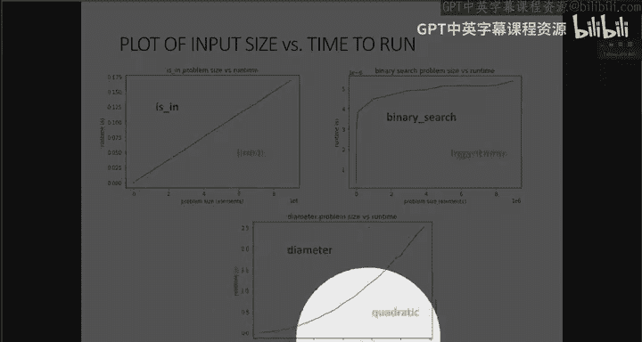

And how long it actually takes the program to run， again， the relationship is quadratic。

 Now that we plot it， we clearly see the quadratic relationship。And then this binary search。

 we were very unsure of what it was， right， It wasn't quite constant。 It definitely wasn't linear。

 But now that we've plotted it。 So this is the input size。

 And this is how long it actually takes the program to run。

 You can see it drastically increases when the input size is very small。

 But then it kind of sort of asymptotically reaches some sort of value。

 It's actually a logarithmic relationship。

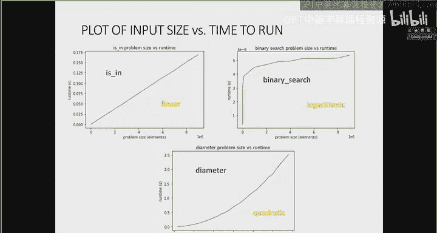

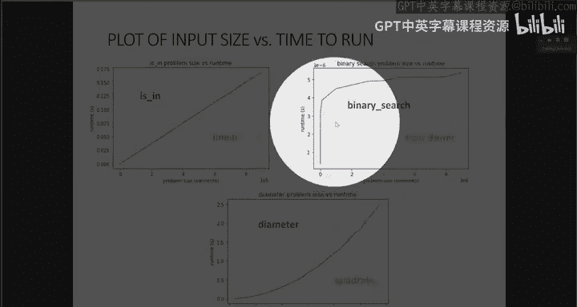

All right。Last thing I wanted to mention about timing before we move on to counting is just。

Pure running， just purely running these functions on different computers will just give us different values just right off the bat。

So for my， on this you know， newerishh computer， how long did it take to run this compound。 Well。

 know what it like 3 seconds or something，1。 something seconds on an older laptop。 It took you know。

6，63 seconds on an even older desktop。 It took 1226 seconds。 right， So just。

 youre just purely timing things。 The machine you're running it on is going to make a difference。

Okay。And then。That's fine， right It's， it's important to know how long it takes。

 But if you're just looking at the relationship between input and how long the program takes to run。

 that's the same。 So it doesn't matter what machine you're running it on。

 when you increase the input by 10， the program will take 10 times as long to run。

 No matter whether you're running it on a fast laptop， old laptop or super old desktop。

So just timing a program is really important， right。

 You'd like to know whether the program you wrote， you're gonna have to wait， you know。

 a month for it to finish or a couple minutes for it to finish。 That's an important thing to know。

But what we're gonna get at towards the end of this lecture is something that's complementary。

 And that's this idea of asymptotic complexity。 So kind of mathematically saying， you know what。

 this program is not going be that bad to run。Right。

 you're not going have to wait for for months to run without actually running it， of course。

So you'd be able to glance at a program and say this one is reasonable to run。

And so we're gonna do that in terms of this idea of order of growth。

 which we'll get at to at in a little bit。Okay， any questions on timing before we get to count。

 Oh yeah。Yes， can you assume that all built in functions are optimal in terms of running time， yes。

Certainly more better than when we， when we write them。Yes， in Python。 And then， of course。

 in other languages， you know， there would be， there maybe take advantage of other speed ups as well。

 like putting things in memory efficiently。 But yeah， generally。

 it's better to run something that's already been made than to make it yourself。O。

So now what we're gonna do is we're gonna count operations just like we did last lecture。Clearly。

 timing is nice， but it doesn't give us a nice relationship besides us like spotting it， right。

 There's no formula。 There's no relationship that relates the input to how long it takes the program to run。

Counting will get us a little bit closer to that。 And we saw that last lecture。

 Let me remind you the idea of counting， so。The idea of counting is that we're going to take a bunch of these operations like mathematical operations。

 comparisons， indexing into something， assigning a value to a variable， All of these things。 right。

 When we run them， Yes， they might run for different amounts of time。

 one time1 negative9 versus two times1 negative 9， something like that。But that's very。

 that's not a very big difference。 And so what we're going to say is that every one of these operations will consider to be constant。

 right， They will take one unit of time。So if we say that。

 we can actually come up with a relationship that tells us。According to， you know that。

 that relates to the input。2， how much this， how many operations this program will will run。

So here in the convert to kilometers， what do we have， We have one multiplication。And， you know。

 just for the heck of it， this lecture， let's say the return also counts as an operation。

So in this convert to kilometer function， we have two operations。

Notice that it's not really related to the input at all。So then。

 the amount of operations that this program takes to run is always 2。It matches what our timing said。

 right， It basically didn't matter what the input was。

 It always took approximately the same amount of time to run。The sum of function。

 So it takes in an input list， and it gets the sum of all the elements。

This one will'll have one operation for doing this assignment。

It'll have one operation for grabbing an an element in my list L and assigning it to I。

It'll have two operations for this total plus equals I， right， remember。

Total plus I on the right hand side is one operation， and total equals that is my second operation。

 So that's two operations。And then let's not forget our for loop。

 That's kind of the important part of this function。

 How many times will these three operations repeat This one plus these two。 Well。

 it's going repeat however many elements I have in L。 So length L times。And then again。

 let's say we count the return。 The return will also be one operation。

 So the total number of operations for the sum of function will be one for the total equals 0 plus length of L times 3。

 because there's three operations being done for each length of L plus another one for the return。

 So that's going to be three length L plus 2。That's a nice little formula that relates。How， how。

 how many units of time will'll have to wait depending on the size of the list。Right。

 that's pretty cool。So the way that we're going to count the number of operations， again。

 I'm going to do it slightly differently in the last lecture。

 just to show you that there is another way to do it。So this is our function is in。

 It's going to count how many operations we have。 And I'm going to use something called a global variable。

 I'll show you again the difference between them。 So it's just these three lines that I added。

And you should never， ever use global variables in your programs， except in this situation。

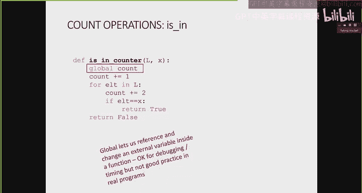

The idea of global variables is that you can define variables just in the main program outside of any functions。

And you can access those variables within some function purely by saying， you。

 if we defined count out here before this function definition count equals 0 or whatever。

 inside of any function， we can say， hey， Python， I would like to access this variable that I defined outside of this function。

 you say that you tell Python using global and then the name of that variable。

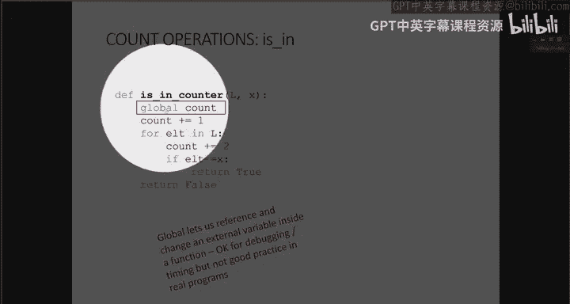

And Python will grab that variable that's basically quote unquote sharedhar across the entire program and modify that variable right sos in essence。

 we're basically saying this is now a shared variable。

 if I modify it within this counter within this function。

 it'll be obviously modified for everything else。

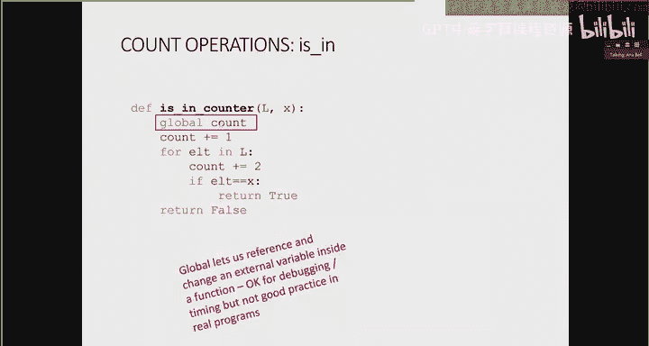

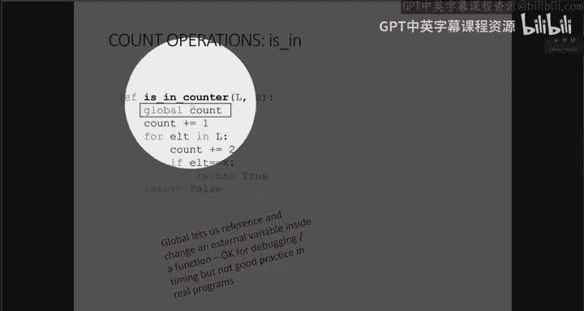

It's very tempting to use global variables because， you know。

 all the variables you could ever want to create are gonna be accessible by everybody， right。

 No need to pass in parameters。 no need to do， but it's very， very bad programming。

 So we won't ever do it except in this particular case。

 because we'd like to keep a counter of things that are happening or for debugging purposes and things like that。

So the count variable will keep track of it'll just increment in key places where we have these constant unit of times happening。

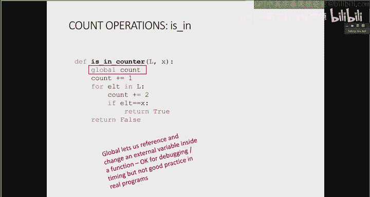

So I've got count plus equals one here。

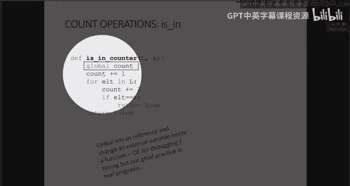

Because I've got my return value。 I've got count plus equals 2 here。

 because I grab an element from L， and I do the equality check here。 And then that's it。

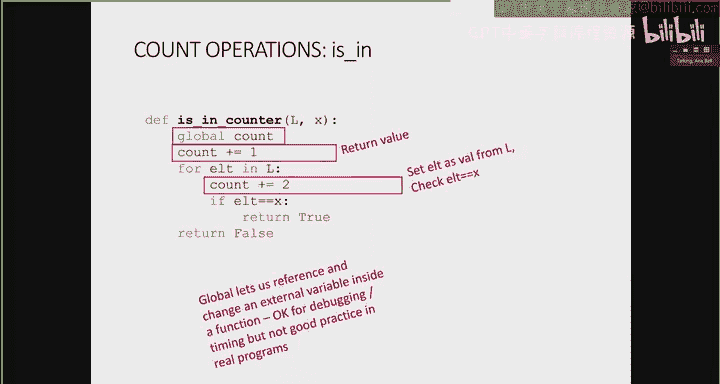

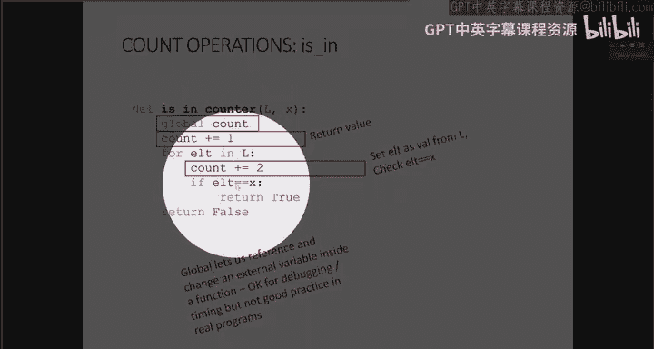

So if I run that。It's down here。What are we going to see？Well。I didn't actually do how many。

 how much more it ran， But we can see the， the relationship， right。

 We go 9 to 37 to 307 to 30007 to 3007 and so on。 So again。

 the same relationship where we increase the input by 10。

The amount number of operations we do is 10 times as more， exactly like the formula said it would be。

What about the binary search？So， again， we're going to use this global variable。

 and we're going to have the counter keep track of all of these operations。

 So this count incrementing by 3 accounts for setting the load to 0。

 setting the height this thing and grabbing this actual value of length。

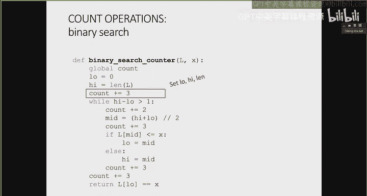

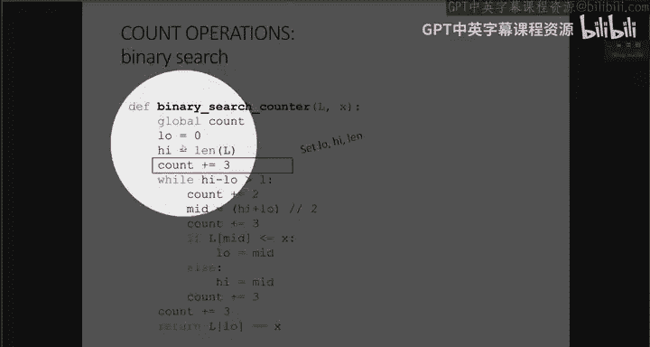

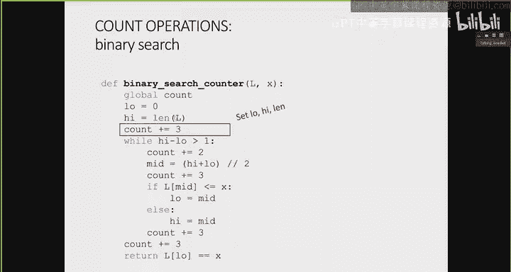

Incrementing the count within this while loop will keep track of this subtraction as one operation and the test that is greater than one as another operation。

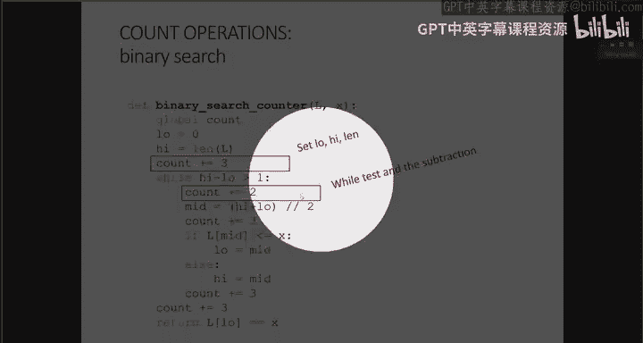

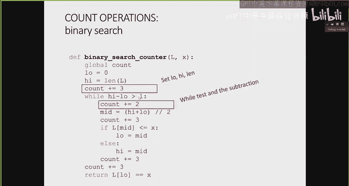

Counting increasing by3 here accounts for high plus low。

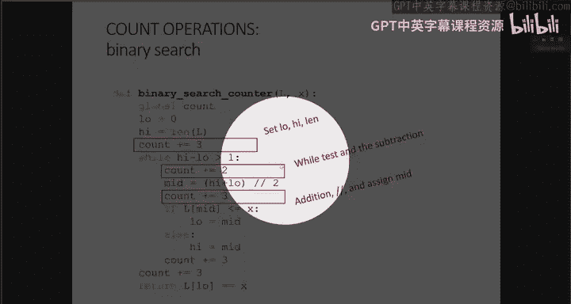

The integer division and assigning that value back to mid。

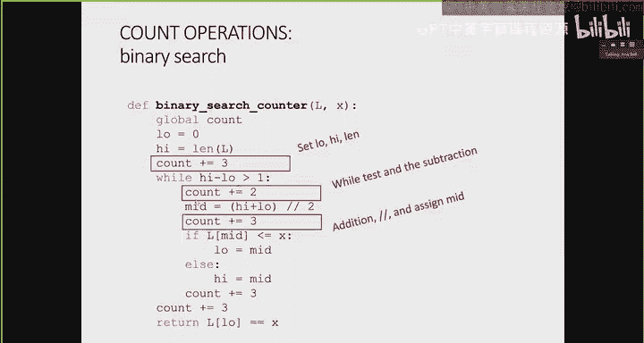

Count plus 3 here accounts for indexing into this L。The less than or equal check。

 And then either doing this reassignment of low or this reassignment of high。

 that's three operations。 And then lastly， count increases by three once more because I've got these operations here。

 So indexing into the into low， checking for equality， and then doing the return。

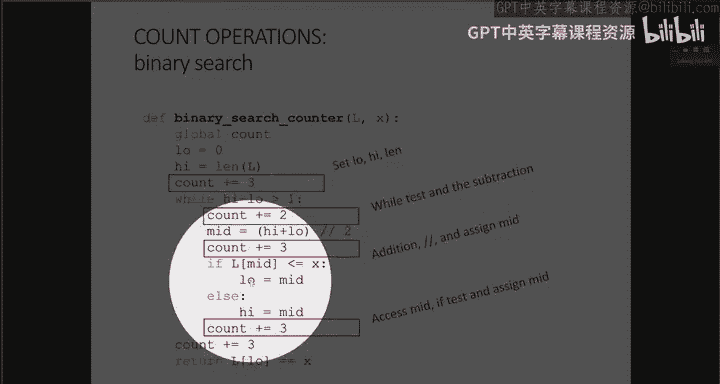

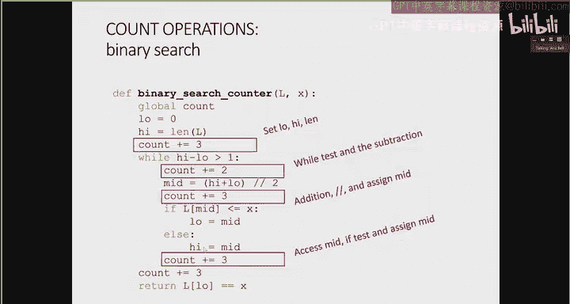

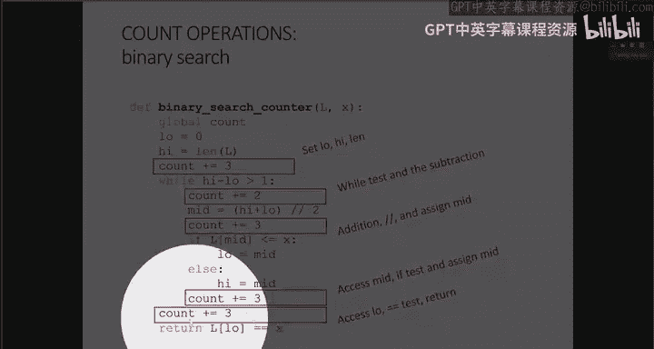

So the actual number of operations will be kept track of in， right， by the counter。

So all we're doing is just kind of reporting how many times， how many operations we've done。

 So as we increase the input by 10， just like with timing。

 we can't quite tell what the relationship is。Right， again。

 it's like one point something right with each run。Alright， so this is， these are the， the results。

 So the observation 1， as I mentioned， when we increase the input by 10， this brute force。

 I released it。 But the brute force is in function also is does 10 times as many operations。

The binary search， again， we don't know what rate it is at， but we can plot them。

So here I have the plots， just like when I plotted the input size versus how long the program actually took to run。

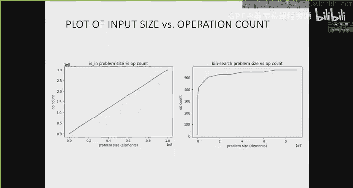

I'm now plotting the input size versus actually just the number of operations being done。

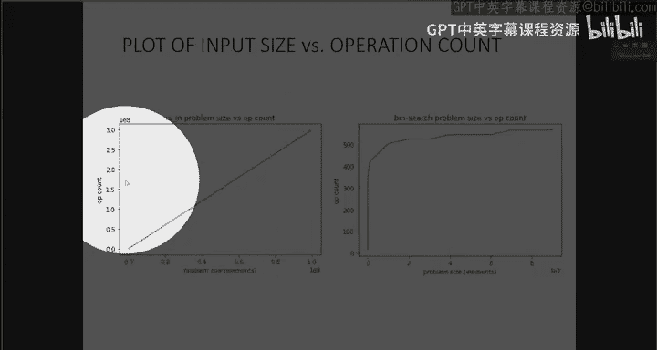

So the is in function， that brute force way of finding whether an element is in the list。

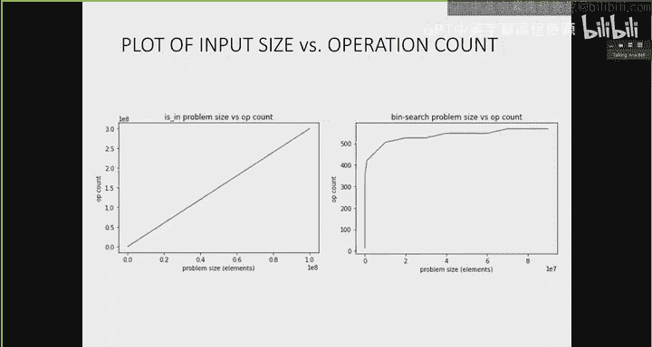

Girls linearly， no surprise there。 And how lucky for us。The binary search matches。

 The graph matches the one that we had for timing。 right， So as I increase my size。

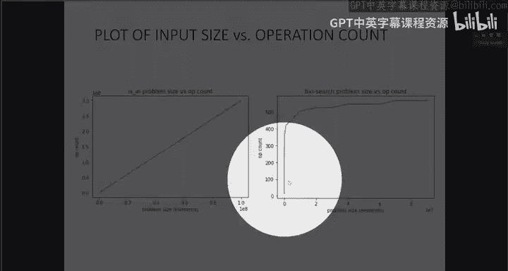

In the binary search method， the number of operations that I do is logarithmic。In time。

 just like we saw in the actual time。O。So。Timing and counting are really nice， right。

 Timiming gives us pure number of seconds or you know。

 months or whatever we need to wait for this program to finish。😊。

But counting gives us a nice little formula， right， that relates the input to the number of， of。

 of operations Yeah， you have to do。You might have noticed。

 I briefly touched upon this that throughout this entire lecture and last lecture。

 we basically just saw something like， you know， three different algorithms。 right。

 We saw something that's constant， something that's linear， something that's you know。

 quadratic and something that's by a binary a logarithmic in this particular case， right。

 So that's four different algorithms。 But we saw way more functions run， right。

 So what we'd like to do is evaluate the algorithms， not the different implementations， right。

 And what we'd like to do is evaluate these algorithms as the input gets really， really big。

So what we're going to do is figure out a relationship between the program's runtime。And the input。

 But what we're gonna to do is focus on the biggest terms that contribute to the program's runtime。

Right， so we saw these examples last time， right， this my sum。

 which basically summed all the elements sorry， all the numbers from 0 to x and this the silly square function that had nested loops。

 kind of like this diameter one， right， we were able to say something like。

 you know when the input increases by 10， the program is 10 times as long to run。

So the efficiency of that program was on the order of x。 when the input increased by x。

The program took x times as long to run。The square had a similar。

 We could have said it in a similar way， right， When the input increases by x。

 the program took x squared as long to run。So I don't actually care， right。

 about all of these differences in the exact timings，1 times 10 negative 6，1。

3 times 10 to negative 6。 I don't care。 What I do care is the order of growth。

 How does the program run in relation to the input。Okay。

 and I care about that when the input is really， really big。

 So what we're going to do is express the program's runtime in an order of not exact kind of relationship。

So while counting was really nice， right， It told us a nice relationship between the input and the number of operations。

😊，When the input is really， really big， like 3 x plus 4， when x is really， really big。

 I don't care that the number of operations is 3 x plus 4， right because when x is really。

 really big， that plus 4 might as well be plus 0 and that 3 x is basically like x when the input is really。

 really big。Right。So that's what we're gonna try to do， alright。Now， before we do that。

 we need to decide what to measure， right， Because when we write functions。

 we're going to have functions that have a whole bunch of inputs， potentially， right。

So the input could be an integer， like in convert to kilometers。

 It could be a list in which case we would be interested in maybe the length of the list。

 And if you have many parameters， you'd have to decide。Right。

 what is the parameter that contributes to the， to the growth of this function。So here's an example。

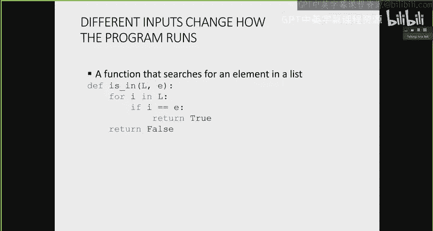

This is our is in function， it looks for an element E in list L。

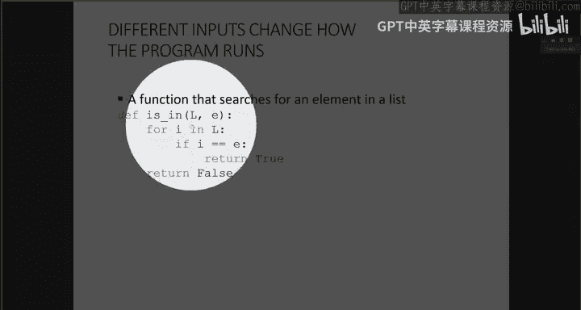

So there's two parameters to this one。We can ask， does the program take longer to run as E increases。

 right， It's one of the parameters。 Let's see what happens as we make E bigger。

 So we can look at a little example if we find out whether 0 is in this list containing 1，2。

3 or whether 1000 is in the list 1，2，3， Does the program take longer to run。No， exactly。

 So E is not really relevant in my runtime， sort of。A calculation。Allright， well。

 let's consider L now。When we say L is going to change， it could change in two ways， right。

The elements in L could have different values。Right， or the list length itself could be different。

So in this particular function， let's say that the elements in L are small numbers versus big numbers。

Okay， that's certainly something that could happen。 And certainly with some functions。

 that's going to make a difference。So let's say in this particular function。

 if the elements in L are big versus small， is it going to make an impact on my runtime。 Well。

 here's a little example。 Let's say I'm looking for the number 0 inside a list with 1，2。

3 and the number 0 inside a list with 1000，20003000。Is that going to make a difference。No， right。

So the size of the elements themselves don't really matter。And what last thing to ask ourselves is。

 what about the length of the list。 So if L has different lengths。

 will this make a difference in our runtime。So if I'm looking for0 in a list of three elements or0 in a list with 10 elements where clearly that zero is nowhere to be found。

Is that linked list that's gonna to have a difference。Yeah in this case， it will exactly。

 So here in this particular function， the input I'd be interested in。

 in in sort of reporting the runtime from is the length of the list。Not the elements in the list。

 not E itself， but the length of the list。O。So the last thing that I'll mention is for this particular class。

 we're going to talk about the worst case scenario。

 So you might have noticed in this previous example here， right。

 I always looked for an element that wasn't even in the list。Right。

 so when you're faced with a function， you ask yourself this particular class， at least。

 what is the worst case scenario？And finding out what there are functions in the list。

 the worst case scenario for us is if it's not in the list at all， right。

So that's sort of another aspect of of runtime that we don't actually。

 we won't talk about because for us， we're always interested in the worst case。

 but there are certain certainly analyses where you could look at the best case scenario， which is。

 well， the element is the first one in the list。 right， In that case。

 you're always going find it right away。 So it's constant or an average case scenario。

 which is kind of what people do in the real world， right。

 You're not always encountering the worst case。But for us。

 we're going to look at the worst case scenario。So our goal is going to be to describe how the runtime grows as the size of the input grows in a really general way。

 So we're not going to be interested in figuring out the exact up number of operations。

 No 3 x plus2 kind of deal here。 We're just going to focus on terms that are really that grow the fastest。

 We're going to eliminate any sort of additive， more duplicative constants and things like that。

 So we're just going to focus on terms that grow the fastest。

 And that will give us our order of growth。So the way we're going denote the order of growth is using this notation called big O and big theta。

Now。Warning。We're gonna have some math coming our way。

 It's gonna be like three slides of just pure math。 Okay， you can sit back。

 You won't need to know it。We won't need to know the details。

 but it will motivate us to kind of give us the idea about this asymptotic order of growth。Arright。

 so this is the mathematical definition of Biggo。So what we would like to do。

 there will be a drawing story。 So what we would like to do is figure out an upper bound for our function。

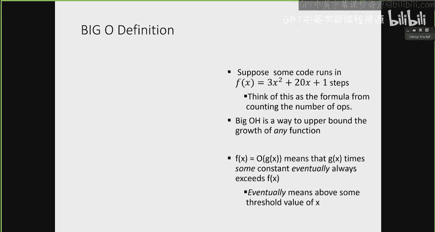

So the function might look like this。And I know this is just an F。

 But we relate this to our class by saying， you know what。 If we did the order of calculation， sorry。

 the number of operations analysis， right， for a function。

 we could basically come up with something like this， right， We came up with 3 x plus 2。

 We could come up with 3 x squared plus 20 x plus  one for some random function that we wrote， right。

 So that we considered the function。😊。

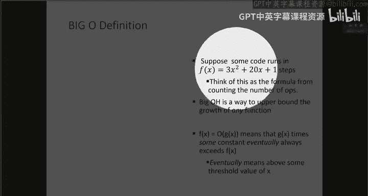

Now， the big O is going to be the upper bound on this function。 So if I plot this function in my。

 in my X， Y axis， this is what it looks like。The big O will be some other function。

That's going to upper bound this one， the blue one。O。

And it's going to upper bound it for all values beyond some X， right。

 So for all values beyond some X， some， some number on the x axis， some crossover point。

This big O of G， this G will always be bigger than my F。 That's the idea here。So clearly。

 X is not going to upper bound it， right， Because after this crossover point。

X will be below my function。No matter how big， how big of a constant I tack onto that X。

 I could have 1000 x。That's still not going to upper bound my little blue line here。

So what we're going to do is we're going to increase the the， the exponential there。

 So let's take x squared。 Well， x squared is getting closer。 It looks like they're both quadratics。

But this orange line is not above the blue line for some crossover point。2 x。Getting closer，3 x。

 Getting closer，4 x。Is an upper bound on my F。Because after this little crossover point here at about 20。

 my orange line。The G。Will be always above my blue line， my F。Right so far so good。

 just visually speaking。Yeah， the orange one is below it。

 That's totally fine because what we're interested in is the behavior when the input is really big。

So that's why I don't care about like weird stuff happening down there。 All I care about is when。

 when my X is super big。O。So now I've found this G。 So I can say that after this point，20。

 my orange line will always be above my blue。 So I can say that my F。

Is big O of G square is big O of x squared。Okay， because。

I don't care about this for so much because it's just a multiplicative constant。Because this 4 x。

Is always greater than my function for all X greater than this crossover point here。八证。

That's the definition。 right， So the G here is basically this function without the multiplicative constant in front of it。

Okay， so I say 3 x squared plus 20 x plus1 is big of x squared。So generally speaking。

 that was just an example。 General speaking， the big O is an upper bound on my function。 Okay。

 and this is now just using variables like constants and things like that。

 But it's exactly the same situation that we had from before。

 Okay so I'm going try to map the blue to the blue and the orange to the orange and the purple to the purple to help you kind of match up what we saw in the previous slide。

 So basically， we say that our function F is big O of this orange G， right。

 If we can find some blue constant right， where this constant was this4 here。😊。

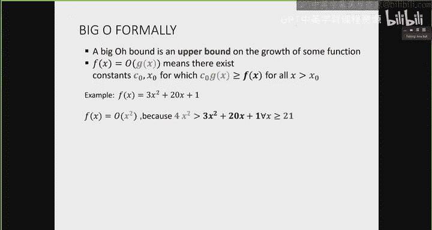

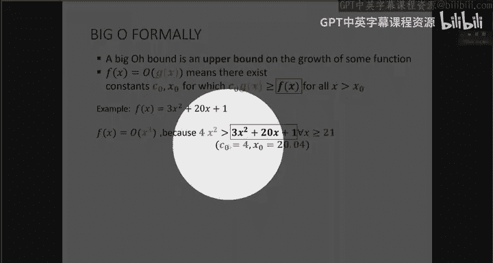

Where that constant multiplied by G， the x squared is greater than my function for all。

Values beyond that crossover point， right， So I found my 4 because 4 x squared is always greater than my function beyond 21。

That's what we saw in in the picture。

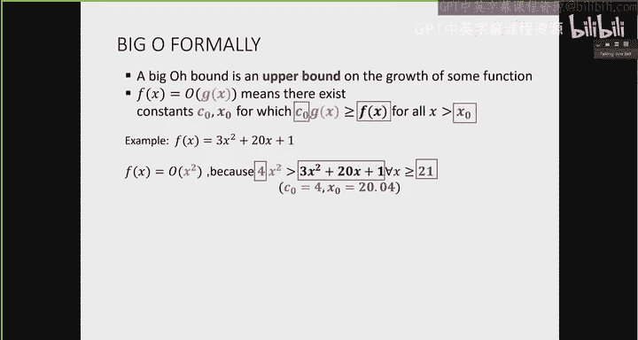

So then we can say that my function f is big O of G of x， where that G is x squared。

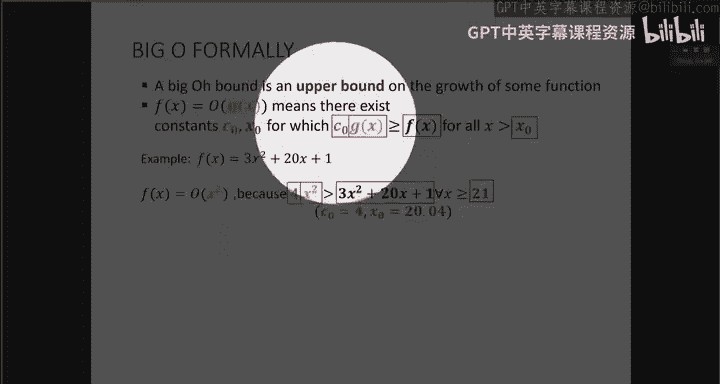

that。All right。So in terms of the， the picture here， right。

 this is kind of a little zoom in of what happens。 Anything can happen down here。

 But beyond the crossover point， which is here in the big picture， that crossover point。

Beyond that crossover point， my orange is always greater than my blue。So what does this mean。

 We're going to talk about this in a few slides， but you might have thought about this。

 I can actually pick any function that grows faster than what is this 3 x squared， right。

 I can pick x factorial。 X factorial grows super fast or two to the X that also grows super fast。

 All of those functions that grow way faster than mine are also upper bounds on this。😊。

On this function。Okay， so that's big O。 It's just an upper bound。Then what is theta？😡。

For the reason I just stated， right， I said X square sorry， x factorial2 to the x。

 all of these functions that grow much faster than my function are all upper bounds。

And that's not really helpful for us when we say， oh， this function is big O of whatever， right。

 Because you can just pick something that's ludicrously fast that grows ludicrously， you know。

 fast and say that that has no meaning。So instead， what we usually report is the theta。

 which is actually an upper bound and a lower bound for our function。Right。

 so using the exact same reasoning， we're gonna find some constant tact on to that G of X such that that function grows is。

 is always underneath our function。So I again， I'll put up a lot of math。 But basically。

 these first two lines here。 This one here， there exists， blah， bh blah blah， blah。 that first here。

 this is is the big O definition。 So we've already know what that means。

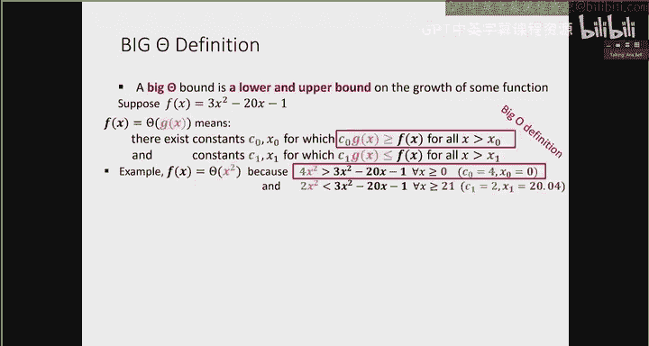

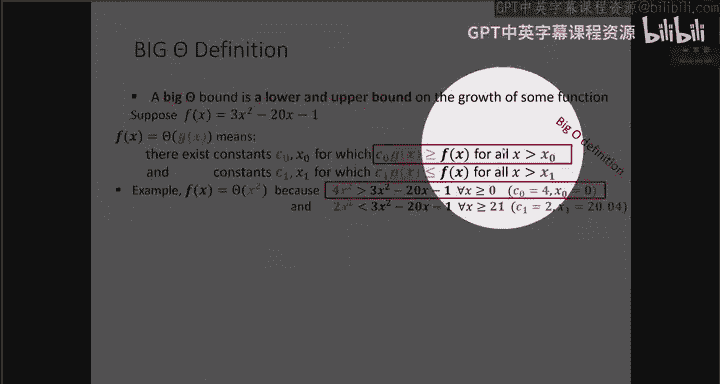

All we're gonna do is tack on another condition， which is that we can find another constant for that same G。

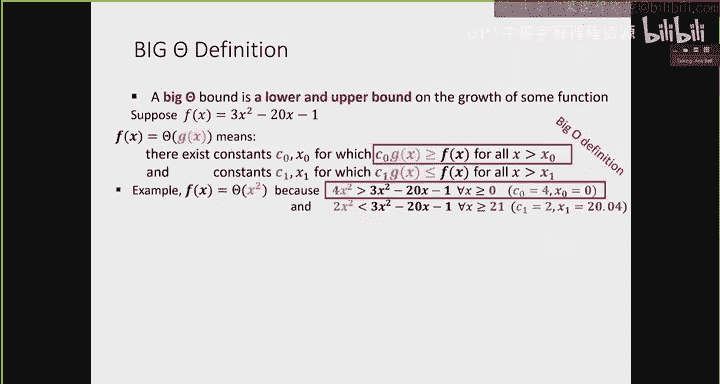

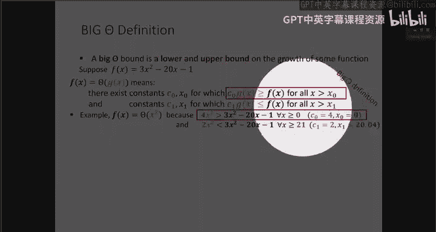

Where that function beyond some crossover point is always below my blue， my blue line。

So here's an example， right，4 x squared。 We saw that it grew faster than 3 x squared beyond a crossover point。

Well， we could say 2 x squared will always grow slower than its own crossover point。Okay。

 so the constant 4 was the same as we had seen before。 But this constant 2 now becomes a lower bound。

 right？ So I'm basically trying to have that same G， both upper bind and lower bound。

 my blue function。And that's the definition of theta。So now I can no longer say that two to the x。

 right， an exponential， both upper bounds and lower bounds it。

 because that two to the X will grow faster than my function。

 no matter what constant I tack I tack onto it。So now what we see is that really the G of x is going to be the term that grows the fastest。

 It's just going to be that term here， right， It's going to be the thing without the fastest growing term in my function。

 without the constant on。Okay。So， yes， we will never remember all that。

 But we're gonna to do a bunch of exercises。 and you're gonna to see just how easy it is to figure out the order of growth。

 Okay， but I will mention this just again because it's very important， right。

 So when we're talking about upper bounds。 you can pick any function that grows faster than yours。

 right F of x， this3 x squared thing is O of x squared， Yes。

 but it's also O of x cubed O of x to the5 O of x to the100 O of2 to the x O of x factoria。

 All of those things that grow much faster。😊。

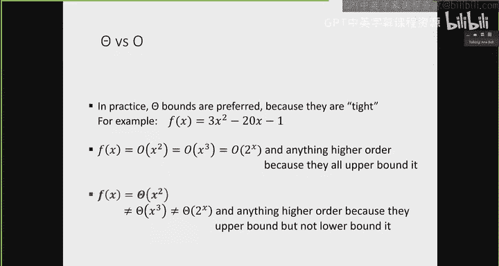

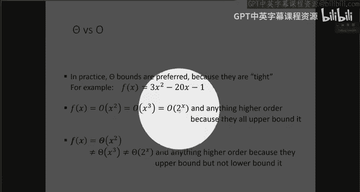

But my f of x is only one theta， and it's theta of x squared。 right， And that's the term that grow。

 That's the term that grows the fastest in my function here。So when we look at a function， right。

 based on the number of operations， or however， you know， you know， you're given the function。

 When we look at the order of growth of the function， we just focus on the dominant term。Right。

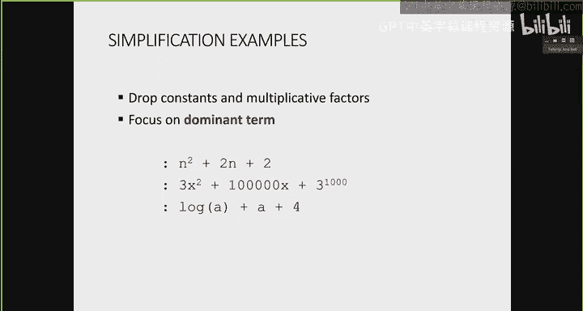

So， in the first one。The input here is n。😡。

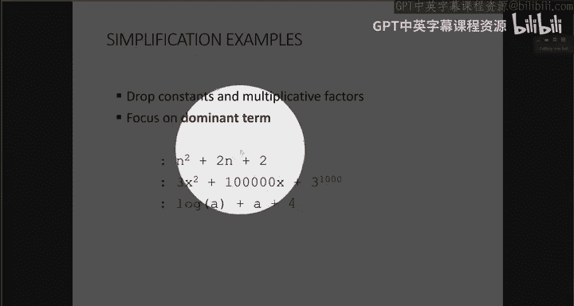

And the function is n squared plus 2 n plus 2。 Which one of these is the dominant term。You tell me。

Yes， exactly。 n squared。 So this function is just going to be theta of n squared。 That's it。

How about in the next one， What's the dominant term here。

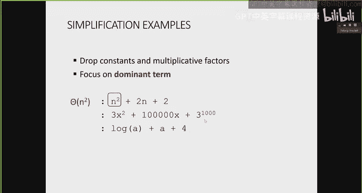

Yeah， exactly，3 x squared。 even though 100000 x is gonna be huge for a while。

 and this constant is also going be huge for a while as x gets really， really big， this 3 x squared。

 and， in fact， just x squared will kind of take over everything else， right。

 So this next one is also is theta of x squared。😊。

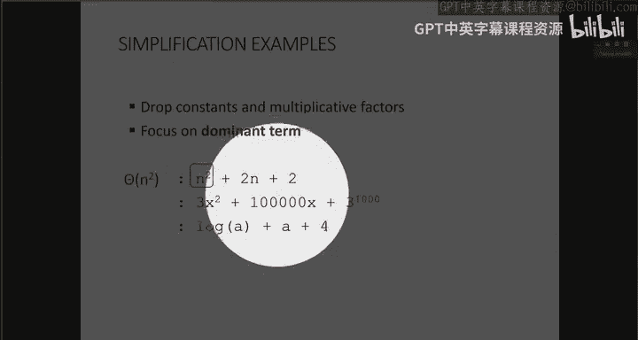

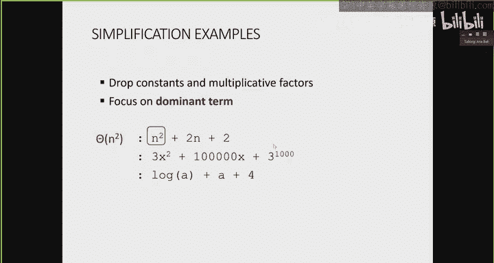

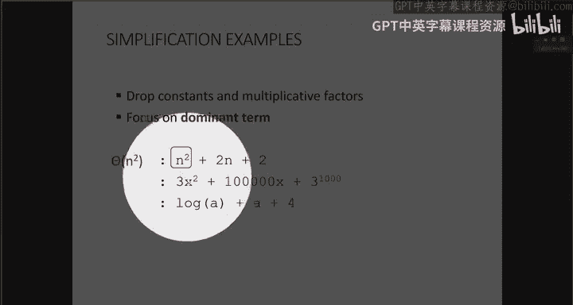

How about the next one。What's the term that grows the fastest here？Yeah， exactly。 A， right。

 Lo is so growth。 right， So this theta of this function is just theta of a。

So notice what we're doing here is just focusing on the dominant term。

 We're going to drop the multiplicative constants， drop every other term and relate the theta in terms of the input。

 right， So I don't just use theta of n all the time。 right， in the previous one。

 It's tempting to say the first one theta n squared。 The next one is theta n squared。 the last one。

 theta of n。But N is not always the input to your function。 right， If it is great， if it's not。

 you always have to relate it according to the input of the function。 Maybe it's length L。

 Maybe it's， you know， something else。Okay， so let's have you try a couple more。

 What is the theta of the first one here。It's the term that grows the fastest。Yeah。Theta of x。

 next one。And cubed， exactly， Theta and cubed。 I told you it' is going be so easy。

 I know that math was scary。 How about the next one。That's the term that grows the fastest。

 But then it's theta of drop any multiplicative constants。 And it's just theta of y。

The last one is going to be tricky。 What is the theta if， if the variable is only B。Yeah，2 to the B。

 What about if the variable is only a。A cubed exactly。

 And if my function is both a function of A and B。And a。Plus。2 to plus a cubed， right。

 Because both will contribute to the runtime of this function， right， not just the B。Right。

 so if this function， whatever this crazy function is that I wrote that takes so long to run was had both inputs。

 B And A， right， as its parameters， the theta for that function is both is in terms of both B And A。

 right， the dominant terms of each。

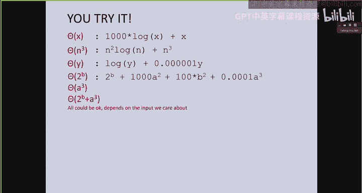

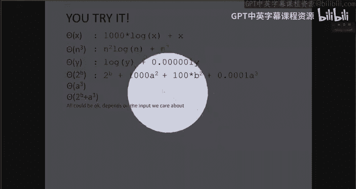

Yeah。No， no need to worry about negative coefficients。哦，不。Yeah。Yeah。Yeah， question。Oh。

 some different parameter variable that's not even here。 Yeah， if the， if we were， if the parameter。

 the function was C。Let's say for this last one。 but the formula is this。

 then the theta would be just constant theta of 1。Because it doesn't even depend on these variables。

 So these are just considered constant time。That's a great question， yeah。

If the parameter was C or something else。Okay， so now we can actually look at functions that we write。

 and we do the exact same thing。 We can first start out with just saying。

 how many operations does this function take， Come up with that relationship and just theta that。

 right， just like we did on the previous slide。😊，So here's a function that that calculates the factorial。

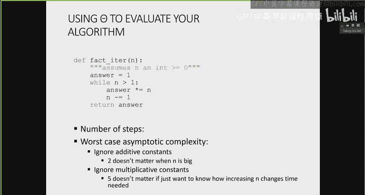

What do we have here？ Well， we've got this is constant here， right？

 we've got just one while loop where there's five things going on here。 There's the comparison。

 There's this times equals， which is two operations， this minus equals its two operations。

 So this function is just5 n plus2 by the same analysis we did you know a few slides ago。

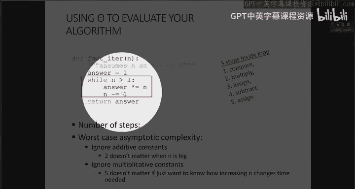

Right， so if we say what's the theta of this function， Well， what's the theta of this thing。

5 n plus 2。 super easy， right， It's just theta of n。And in this case。

 the parameter r function is truly a。When we have functions that are slightly more complex and we've got things that are in series。

 Like， for example， here， I've got two，4 loops，1 right after the other。

We basically use this law of addition to take care of that。

 So that means we figure out what the theta is for the first four loop。

 the theta for the next four loop。 and we just add those two thetas together。

So the first four loop here is theta of n。Because it's something that depends on parameter n。

 And the next four loop here is theta of n squared， right？ And this。

 this because the parameter here is n times n。The stuff inside the four loops are constant。

 so they don't contribute anything to our thetas， right。

 There's no more things to multiply the complexity there。So that， if this is my entire function here。

 the theta for this function is theta of n plus theta n squared， right？

 And the law of addition just says theta n plus theta n squared is just theta of。

Sticking those two inside as， as part of my function， n plus n squared。And we know how to do that。

 That just simplifies to the dominant term， which is n squared。O。😊，So that's the law of addition。

 So that's when we have loops or things like that in series。

 What about when we have loops that are nested， right？ Then we use the law of multiplication。

Because for each one of these things， we're gonna have to do this that many times。 right。

 So in this particular case， we need to be careful。 The outer four loop is gonna to be theta of n。

And the inner for loop。Is also theta of n， Even though I'm dividing n by 2， right，0。

5 times n is still theta of n， right， that multiupplicative constant in front of that N is 05。

 which is just。You know， it's just， it still leaves me to be fate of it。The print is constant。

 so there's nothing else to multiply there。So the log multiplication just says theta n times theta of n is theta of n squared inside there。

Okay， so let's look at this program。What is the theta for this？Well。

 we could do it sort of in very grave detail。 We've got X as our parameter。

 So we only count loops and things like that that are a function of X。

 If I had a loop that was a function of， I don't know， n or something。

 that doesn't count because it's not a function of my input。

So only look at things that are function of x。I've got one outer four loop。That goes through x times。

 So that's theta of x。I've got an inner4 loop that starts from I and goes to X。

That's a little bit tricky。But in the end， overall。

 it's gonna be theta of x because it's gonna be the first time it's gonna go through x times。

 The next time it's gonna go x -1， then x -2， then x -3。

 So we're effectively just kind of adding over all of these runs X plus sorry。

1 plus 2 plus 3 plus 4 plus 5 all the way up to x。 And that's just。Some function of X， right。

 It's definitely not going to be constant。So the inner loop is also theta of x。

Everything else is theta of 1。 right， There's nothing else that depends on X。

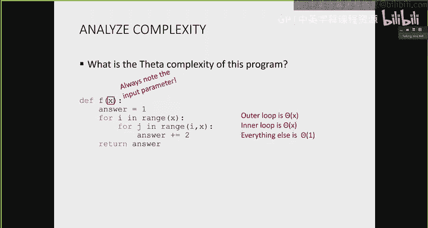

So this whole function is going to be theta of 1 for this assignment here。

 theta of x times theta of x for this nested loop here， and theta of 1 for this return down here。

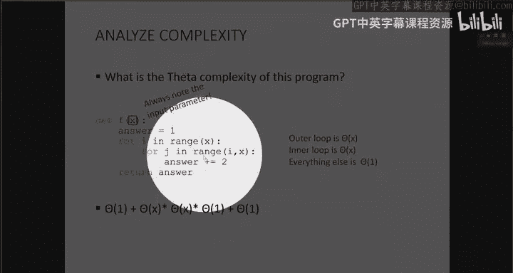

So overall， it's just going to be theta of right， So that's。That's that。 And so overall。

 it's just gonna be theta of x squared just by the laws of multiplication and addition。Like。

 think about this。And then tell me what you think it is。What do you guys think it is。

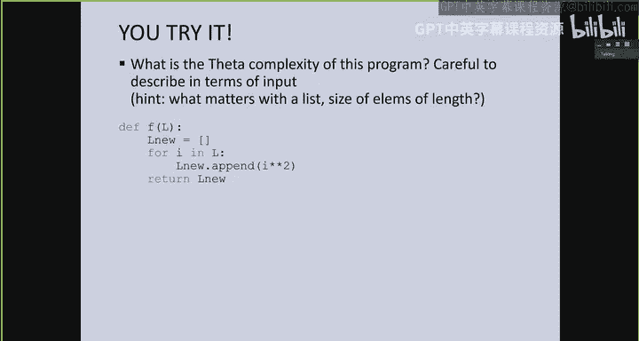

Yeah， theta of length of L。 absolutelysolutely right。 So this is constant。

 This stuff inside the loop is constant。 The return is constant。

 The only thing that depends on L is the length of the list， right， this loop。

 So the answer is theta length of， perfect。

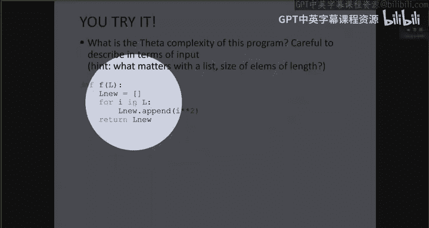

How about this one？So here we're assuming the all the inputs are the same length。Yeah。

 theta of length of pick your favorite one。 Theta of length L is reasonable。

 You could also say theta of length L 1 or theta of length L 2。

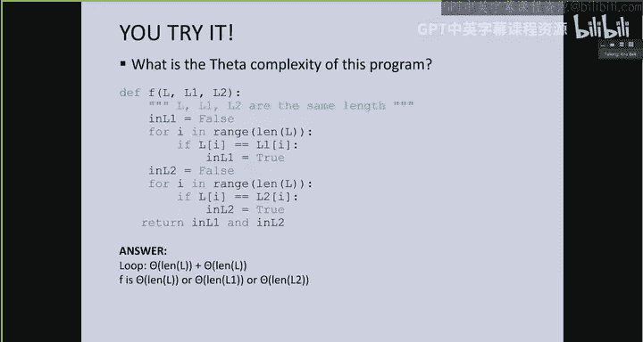

Because these are two loops that are in series， right？

 So this one just loops through the length of L。 But inside。

 we're not doing anything that costs more than just constant time。 right here。

 we're just comparing two numbers， like 3 and 2。 We're just assigning something to true。

 So nothing else really depends on the the length of the list。So this is the of lengthhal。

 This is plus the of lengthal。 So that's just theta of length。

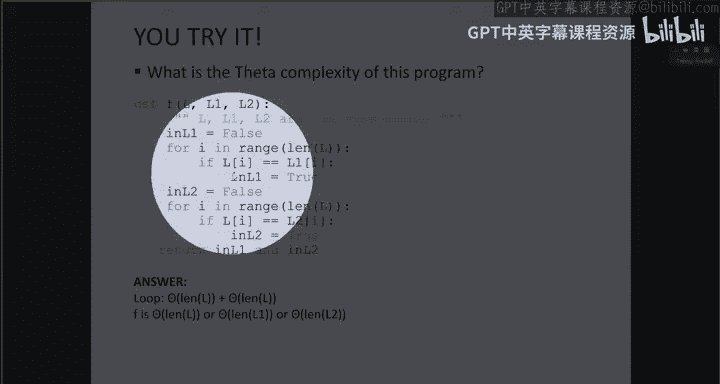

Alright， so we saw a bunch of different algorithms， right， sorry， No， we didn't say a bunch。

 We saw a bunch of different programs， but we could kind of classify them all into one of these categories。

 right？ And this is all basically all the different algorithms that you could ever write。In general。

 right， So something that's constant theta of 1， something that's logarithmic is theta log n。

 something that's linear。 We saw many of these is theta of n， Something that's log linear。

 We haven't seen any yet， but that's theta n log n。

 Theta of n to some constant like n squared and cubed is polynomial and theta of some constant to the n。

 like 2 to the n，3 to the n is exponential。And when we're writing our programs。

 you can do a quick analysis of the， of the program that you just wrote。 Look at the loops。

 look at to see how efficient you wrote it， And you could basically classify your program into one of these categories。

 right， If you had nested loops that both depend on the input。

 you probably wrote a polynomial type algorithm。If you just had one loop that depended on the input。

 you probably wrote a linear time algorithm。Right， and when we write these algorithms at a first pass。

 we want to be somewhere up here。 You don't want to do anything that's ex polynomial or definitely non exponential because things get slow really quickly with those numbers。

 right？ And so we never， ever want to be in that situation。 although sometimes it's unavoidable。

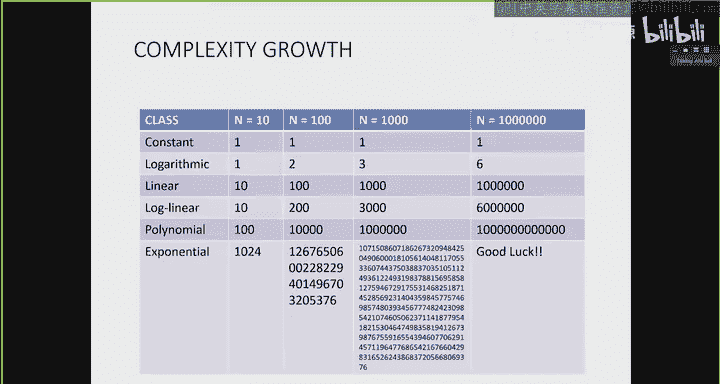

So that's all I've got。 Next lecture， we will be going through a bunch of those different complexity classes and looking at different programs that land in those classes。

 right， especially the the logarithmic and the log linear。All right。

