# 《计算机科学和Python编程｜6.100L Introduction to CS and Programming using Python, 2022》 - P23：-23-Lecture 23_ Complexity Classes Examples.zh_en - GPT中英字幕课程资源 - BV1PAxJzVEs3

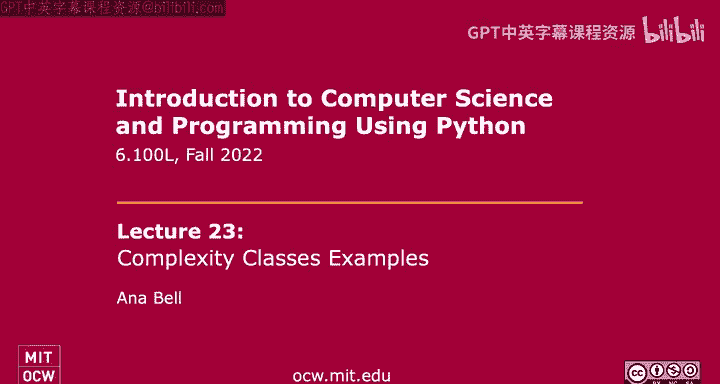

Alright， so let's get started with today's lecture。

 We're gonna look at a lot more code where we basically figure out the complexity class of that given code。

So first， let's remember what we learned at the end of the last lecture。

 So we introduced this theta notation as a notation to mark the order of growth of a particular function or a particular piece of code right。

 And the theta， we preferred over big O notation because the theta allowed us to get this asymptotic upper bound on the worst case runtime of our function。

 So we wanted an asymptotic bound as opposed to an upper bound because that upper bound can be anything that grows faster than our function。

 right So we preferred this theta as the asymptotic bound。So at the end of last lecture。

 we basically said that given some function， the theta for that function is going to be the dominant term of that function。

 So if we have a whole bunch of terms， we focus on the one that grows the most。

 We drop any additive constants， any multiplicative constants and all the other terms that don't grow as fast as that one。

 as that biggest one。So we ended up with some classes of algorithms that we're going to go over today。

 We're gonna to see a bunch of codes that fall within those classes of algorithms。

 But before we go into that， I wanted to just quickly recap sort of the the the the end of last lecture。

 So we saw an example that was pretty similar to this one， if not the same。

So we know that given some function， we can grab the theta of that function by focusing on that dominant term。

 But how do we get at that function。 So given some piece of code。

 the idea to get at that function was to first start by looking at the inputs to the function。

 So we have three inputs in this particular case。 L， L 1 and L 2， right。

Once we figure out the inputs to this function， we we go on and look at everything within the code that depends on these input parameters。

 So they could be direct， like a loop that goes over something related to the input。

 or it could be indirect， as we're gonna to see in some examples later today。

But we basically look at just the parts of the function that， that deal with this input。

If we want to be exact， right， we start by finding out the exact number of operations that we do within this code。

 right， That's something that we did when we counted the number of operations， given some function。

 So we're gonna count the number of operations， given this code。In relation to L 1， L 2 and L。So。

 we've got。This relationship that we can come up with that relates the number of operations run as a function of L。

 L 1 and L 2。So the one over here is constant because we just have an assignment here for。

 for some variable。The next term here is not constant。

 There are five constant things that we're doing， assigning I to be a value in range。

 grabbing indexing into L at I。 That's two indexing into L I L1 at I。 That's 3。

 checking the equality。 That's 4。 and then setting an L1 to be true。 That's 5。

 So there's five operations。 But these are repeated How many times。 Well。

 they're repeated length L1 times because this loop goes through length L1。So this term here。

 this for loop here is length L 1 times 5 number of operations。

Then the one here is this assignment over here。 And then this loop down at the bottom is exactly the same as the loop up at the top。

 except that now this bottom loop repeats length L2 times。 right， So as L 2 gets bigger。

 this loop will take longer to run。 right， That's how we think about that。 And then lastly。

 the plus2 at the end of that relationship is finding the end of these two variables and then doing a return。

So that leads us to simplify it as five times length L 1 plus five times length L 2 plus 3。

 And this becomes the function that we can then grab the theta of right。

 So now we just use the regular rules of theta law of addition and law of multiplication。

 if there's anything to add or multiply in this particular case。

 Let's say that L L1 and L2 are all the same length。

 And then we can simplify the above function to 10 length L plus 3。

 and then the theta of that becomes just theta of length L because we drop the3。

 We drop the 10 multi the 10 multiplying L。 and then we just keep length L。

So this is how we get at the theta of a particular function。 This is when we looked at last time。

 But as we get， as we look at more functions today。

 we're gonna to get better at just identifying the parts of the code that just deal with our inputs。

 right This in L1 equals false， this in L2 equals false。

 This return this and those are all constant things that are happening。

 So we don't need to focus in on those。 We just maybe glance at them really quickly to make sure there's nothing funky going on。

 that's dependent on the length of our lists， But we can just basically say， well。

 we've got our inputs。 We've got one for loop that goes through the length。

 another four loop that goes through the length。 They're in series。

 So we use the law of addition to say that this function is theta of length L1 plus length L2 And so that we can quickly tell the theta of that function just by looking at the parts that depend on。

Right。So that leads us。 So at the end of last lecture， we ended up with looking at these sorry。

 deciding that these are the complexity classes that we can categorize a lot of our functions in。

 right， So theta of1 is constant。 Theta log n is logarithmic here。

 N is assuming assuming n is the input to my function。 Theta of N is linear。

 Theta of n log n is log linear。 Theta of n。😊，If n is my input to some constant。

 like n squared and cubed runs in polynomial time， and then theta of some constant to the n。

 where n is my input is going to be exponential。 like 2 to the n，3 to the n。

 those are all considered exponential time algorithms。And when we write our algorithms。

 we want to be up in this maybe top 4， maybe top5， though polynomial is going to grow pretty quickly as our input gets big So if we can take our code and just quickly glance at it and classify it within one of these algorithms。

 that can guide us towards writing towards deciding whether the algorithm we wrote was good or bad。

 right， if we glance at it and say， hey， this algorithms exponential or this function that I wrote is exponential。

 maybe we want to rethink our approach to the problem and try to get it into one of the upper complexity classes。

So what we're gonna do the rest of this class is just go through a bunch of these complexity classes。

 and we're gonna see some codes that belong to these complexity classes and hopefully give you an idea of you know what code looks like that fits in one of these complexity classes。

😊，So the first one we'll look at is the constant complexity class。 It's pretty simple。

 It's not really very interesting。 If， if your code belongs in the in this constant complexity class。

 that means that it does not depend on the input at all。 It always runs in constant time。

So your code can have loops， or it can have some sort of recursive structure。

But though that loop or that recursive structure doesn't depend on the input at all。 right。

 So it's fine to have loops。 It's just as long as it doesn't depend on the input。

 it's considered constant。So there are some built in operations that are constant time。

 So if you see any of these operations like indexing into a list， appending to a list。

 grabbing the value associated with the dictionary。 key， those are all constant time。

 So if you see them in your code， you don't need to account for them at all。

 But we're gonna see in a few slides that there are some operations on lists and dictionaries that do add some nonconst complexity。

 So you can't just brush them off。😊，Alright， let's look at a couple examples of code。

 So here's a very simple function。 Add X comma Y。 So X and y are my inputs。

 There is no loop or nothing recursive。 nothing that takes time here。

 that nothing that repeats in this code。So the complexity of this code is theta of  one。啊对。

Here's another example。 This is our kilolometer example taking in miles。

 All it does is a multiplication。 Again， theta of one。 There's nothing interesting going on here。

 no loop， no recursive。Here's a function that does have a loop within it。First thing we look at。

 though， is my input。 What variable is my input here。 It's X， right？

 So which part of my code here depends on X。

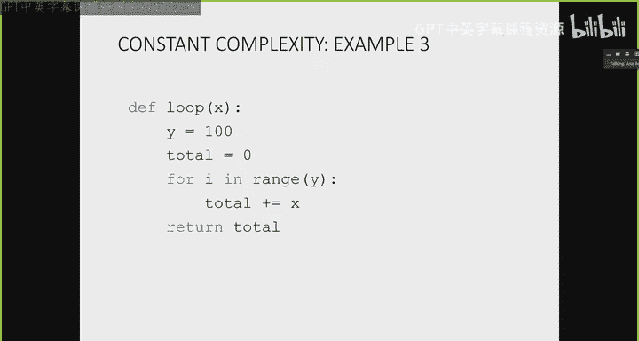

Well， there's something that I'm adding here。 So I'm adding X onto some number。

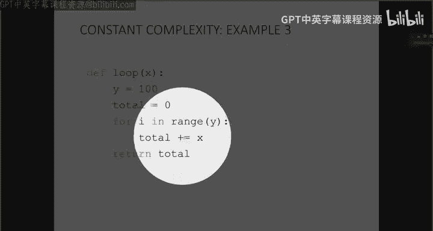

And I do have a loop， But does the loop depend on x。 No。

 it depends on some number that is just 100 within my function。

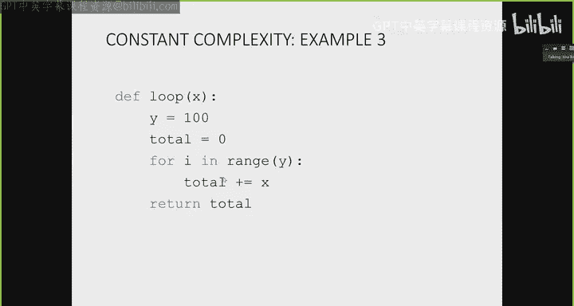

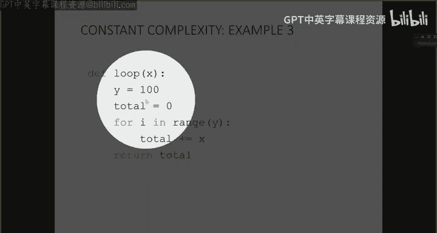

If y equals x。

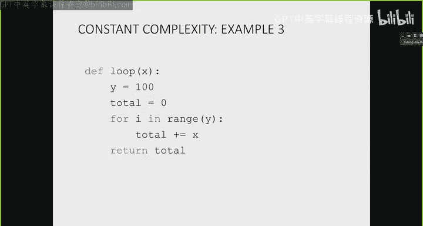

Here， then this code wouldn't be constant， right， because this loop will go through x times。

 But here， y is just 100。 So this code is theta of one complexity。

 There's nothing here that depends on x as x grows。

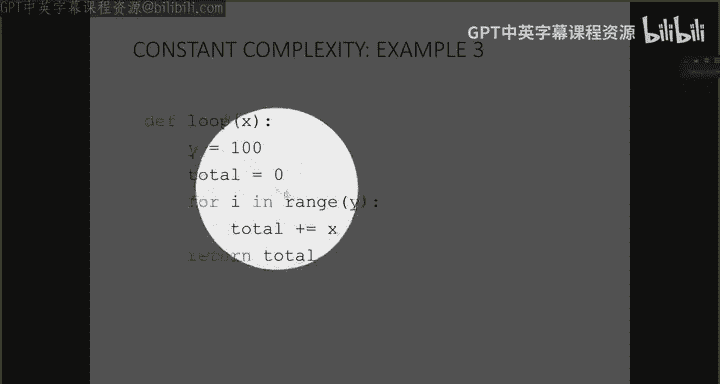

Alright， so not very interesting examples there。 So let's move on to the next simplest class of。

 of functions， the linear complexity class。😊，And these functions will be usually denoted by one loop。

In， or maybe many loops in series or something like that。

 But these loops all depend just linearly on N。You could also have a recursive function that repeats。

 That's also linearly an n。 So we're gonna see an example of a recursive function in a little bit。

 But first， we'll start out with just some functions that loop linearly within。

There are some built in operations， though， that are linear in time。

 So if we ever see these operations within our code， we can't ignore them。

Because they will contribute a the of N complexity to our code。 right。

 So we have to account for them。 like if we have some E in N within some other loop。

 we can't just say this E and N is constant。 We'd have to use the law of multiplication or something like that to account for it。

So checking if an element is in a list， obviously， is linear because you have to look at each element in a list to determine that that E is in it or not。

 making a copy of your list is also linear in time。

 Even though we're making a copy of half of our list， right？ So the first half of our list。

It's still linear because copying 0。5 times length L。Is still theta of length L， right。

 That multiplicative constant on the front of our length L is 05。 So if we drop it。

 that's still theta of length L。Checking for equality between two lists is also constant because you have to look at each element in the list。

 compareare them to make sure that they're the same or not。And deleting an item in a list is also。

 is also linear in time。Sorry， this one was constant time is also sorry， This one was linear in time。

 This de is deletion is also linear in time just because of the way lists are stored in memory。

 So if you delete an item in the end of from your list。

 Python will count that as a linear time complexity。So let's look at some examples。 First。

 we'll just start out with just some regular functions with loops。

 and then we'll look at one recursive function。So here I've got multiply X by y。

 It loops through range y。

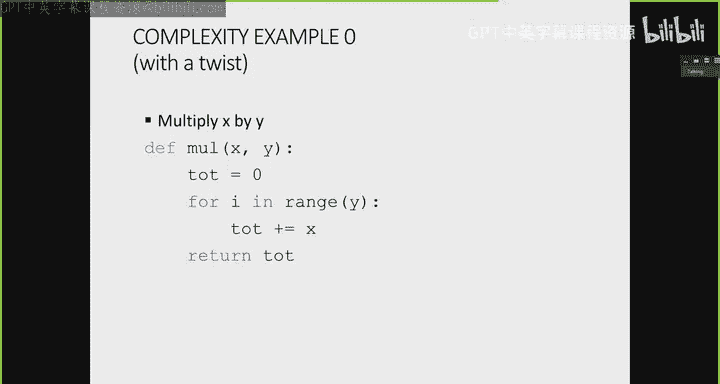

And it just adds x plus x plus x plus x y times。

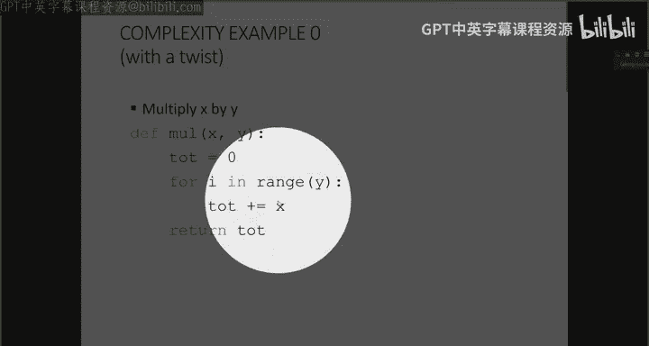

So I've got two parameters here。 So I need to think about the complexity of this function with regards to both of them。

So the complexity with respect to y is theta y， right， because I've got one loop。

That's a function of y。 So this loop will repeat however big y is。 So if y increases this loop will。

 the time this loop takes will also increase， right。

So the theta complexity of this function is theta of y。With respect to Y。

 But what's the complexity of this function with respect to X。I have no looping structure here。

 That's with respect to X， right， All I'm doing to X is just adding on to some number。

So the complexity with respect to x is just theta1。

So the overall complexity of this function is just going to be theta of y。

 X does not contribute anything to this， the runtime of this。Alright。

 so this and the previous sort of loop function from the constant kind of tells us that we need to be careful about what the inputs are。

 right， When we report the complexity， we have to report it with respect to the inputs to our function。

 We don't always just say theta of n or theta n squared or theta of length n， whatever it is。

 we have to relate it to the inputs or a function。 And if we have more than one input。

 we have to be careful that to， to account for all of the inputs that contribute to the complexity。

Alright， let's look at another example。 So here's one where you take in a string S。

We loop through each character in S。 We cast each character to an integer。

 and then we add on to some value。 So we're essentially just adding on all of the characters in S in the string S。

So this has one loop that loops through all the elements in S。 Now， If S is a string。

 what's going to make this program slower。Is it that the string like so。

 so the numerical value of the string is， is bigger。No， because if I'm looping through the string 1。

0，0，0， it's gonna take the same amount of time as if I'm looping through this string 9，9，9，9。

 It's the length of the string that matters。So that's what this loop is doing， right。

 It's taking into account the， the length of the string。So if my string is longer。

 then it's going to take longer to run。 So the complexity of this function is just the of length S。

 because that's the length of the string contributes to my， to slowing down in my function。

Everything else that we do is constant。 So the overall complexity is theta of length S。

 Or if it's simpler， you can just say theta of n。 But then you have to say where n is， you know。

 something like length of S。Al， here's another example。

 This is a factorial program that does it iteratively。

So it's going to use a loop to keep adding sorry， to keep multiplying on I to calculate the factorial of some n。

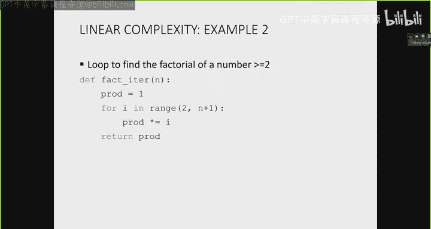

So in this case， my input is N。 So now I'm going to look through my function to see what。

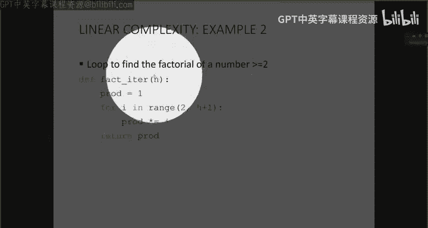

Part of my function depends on N。So here， n is just a number。

And I'm looping through from 2 all the way up to n plus 1。

 So I'm gonna loop through n-1 times overall。Since I'm looping through n -1 times。

 there's nothing else really that's contributing to the complexity。

 So theta of n -1 is just theta of n。So the complexity of this function is just theta of n。

Everyone O， so far。So very simple programs that just have one loop just depends on the input linearly。

Okay， I will make a little note about the factorial because this is kind of something important。

 It's going to tell us kind of the difference between theory。

 which is what this class is mostly about the or the set of lectures and the real world。

So I actually ran the iterative version of factorial on the computer。

 And you can see here I've multiplied the input by 2。 So 40，81，63，20 and so on。

 So as I'm multiplying the input by  two If I'm expecting this function to be linearly related to the input。

 right？ I'm expecting that the time that this function takes to run is going to be approximately twice as long。

 right， If the input increases by2， the time it takes for this program to run should just increase by  two as well。

😊。

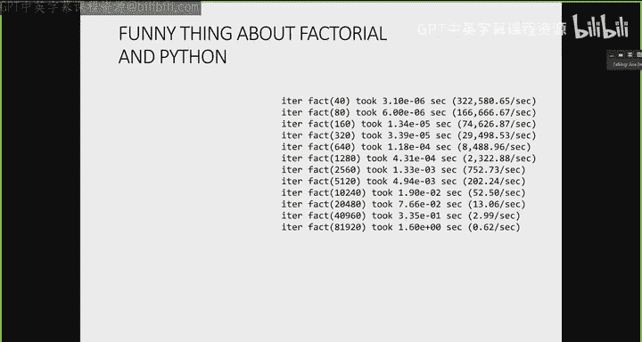

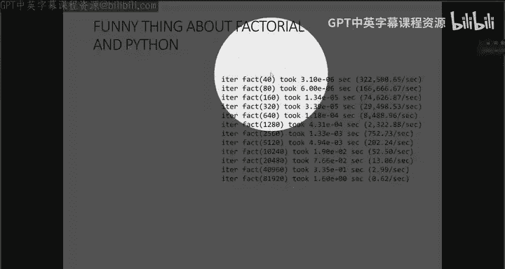

And it does， right， It does all the way up to somewhere between 6，40 and 1280。Right。

 so if we do the math， that's approximately times  two each time。inus， you know。

 because we're just doing times here。 But then after somewhere within 6，40 and 1280。

 the time that it takes to run my program no longer follows this linear pattern。

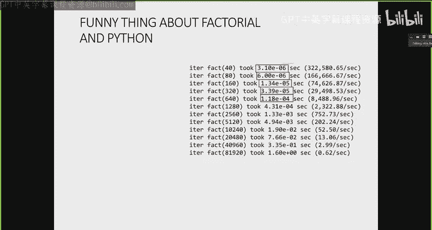

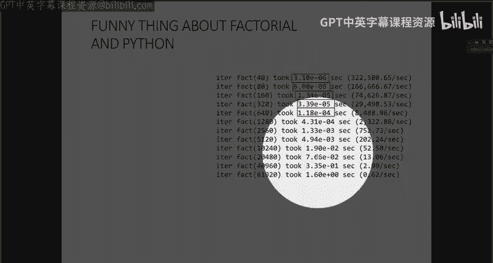

In fact， it starts to grow faster than linear。 And from， you know， at a first glance。

 it looks like it grows squared， right， polynomially。So instead of， you know。

 if you increase the input by2， it looks like the the time it takes for this program to run increases by 4 after some point。

And that's because。In the real world。I've got， you know， Python running on the machine。

 There's only some set number of bits that my computer can hold。

 right when it when it stores numbers。And the factorial of some number within between 6。

40 and 1280 becomes so large。That when Python and the machine is trying to deal with multiplying these big numbers by these big numbers altogether。

 it's just taking a really long time to run because it can't store these big numbers as efficiently as it could store these smaller numbers。

And so in the real world， what ends up happening is after some， you know。

 after I'm trying to store some really large value and doing the operations with some really large values。

 the the， the time complexity goes down dramatically， right， and and squared is a pretty big jump。

And so this is kind of shows the difference between theory and the real world， right。

 So in the real world， we can't store these values as efficiently as they get big。Yeah。

 so if we use like a machine that had more bits to store values。

 then we'd be able to be more efficient farther along， right。Yeah exactly。And we could， I。

 I guess we could。 if we had a language that was maybe doing some smarter things and storing these big values in a much smarter way。

 that could also have an impact in the timing as well。But for the purposes of this class。

 we're just interested in the theoretical， you know， the theoretical happenings here， right。

 So as the input increases by X， we expect that the time that it takes to run the program will be x times as long because we're looking at values that are really。

 really big in， in theory。Okay， so let's look at another example。

 So this is a factorial function that does it recursively。 We've seen this function before。

 We just looked at the iterative version of factorial。

 Now we're looking at the recursive version of factorial。 So what do we have。 We have one base case。

 right， that our code will eventually get down to and a recursive step。

 which is just n times factorial n -1。😊，So how do we do the analysis of recursive algorithm。

 Because in this recursive algorithm， we don't have a loop， right？ In the previous examples。

 we had a loop that we could definitively say， hey， this loop will repeat this many times。

 So clearly increasing and will increase this， the lot the time it takes for this loop to run。

So when we're dealing with recursive functions， we think about the how many times the recursive function is going to be called right。

 because when we call factorial， right， we have factorial of some， you know，5 or whatever it is。

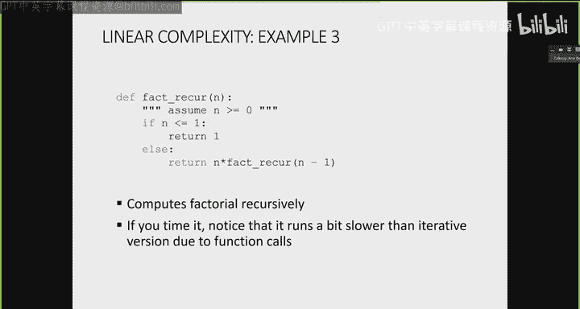

And this calls factorial of 4。 and this calls factorial of 3， right？ And so we have this chain。

Of function calls where we get down to the base case。And once we get down to the base case。

 we start to kick off the， the， the， the step that returns the result，1 at a time。

So when we're talking about recursive functions， what we really care about is how many times we call the function。

O， that's our quote unquote loop for recursive functions， right。

 It's just the function calling itself to ask itself to do the work。

And it does the work with a slightly changed parameter。 right？

 So what we need to to do is think about how many times does this function call itself。

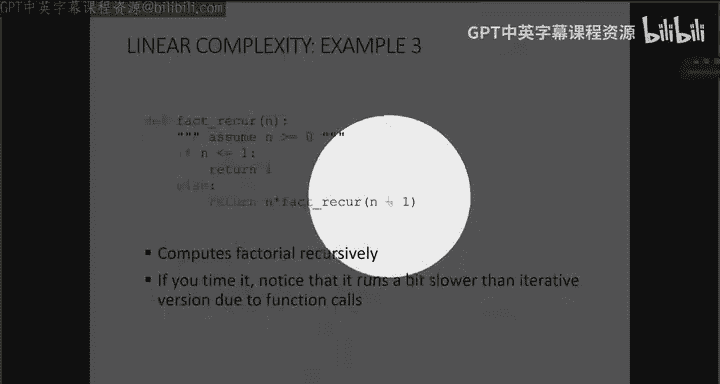

And on top of that， is there some sort of overhead that's not constant。In this particular case。

 when we call factorial recursive， we're going to go essentially theta of n times， right。

 because we start with n， Then we do n -1 n -2 and -3 all the way up down down to 0， right。

 So effectively， we've called ourselves about n time。 So theta of n。

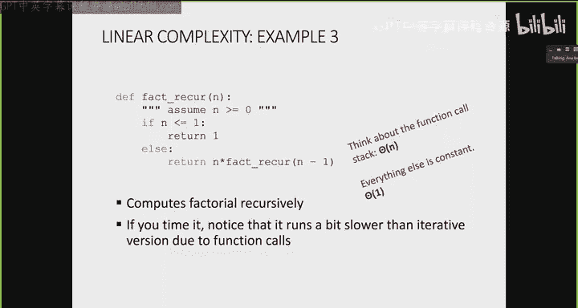

And the overhead for each one of those calls is constant because all I'm doing to N is subtracting by one。

 And that's a constant thing。 right And -1 is theta of 1。 It's just constant。

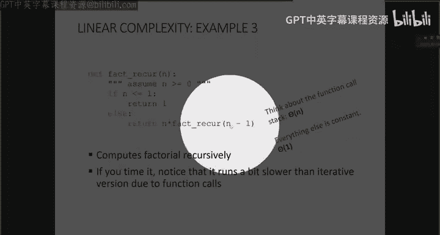

So the overall complexity of this is just theta of n， where n is just my input。

So what we notice is that the iterative and the recursive versions of factorial are both theta of n。

Right， which means that。Generally speaking， if we were trying to decide whether to implement factorial recursively or iteratively。

 it won't really matter in the long run because the worst case complexity is theta n。

 It's the same for both。 So it would be your choice which one to actually use。

 So then it maybe comes down to readability or you know other factors。All right。Another example。

 So this is compound。 We saw this last lecture。 We actually timed it and counted how many。

 actually did we count。 I don't remember。 I don't think we counted the number of operations。

 or maybe we did， but we definitely timed it。So， this function。Took in three parameters。

 So we can have to be careful which one of these parameters or which。

 which parameters of these actually contribute to my complexity。

 So this function calculates the amount of money I have If I invest some monthly amount at some monthly interest over some number of months。

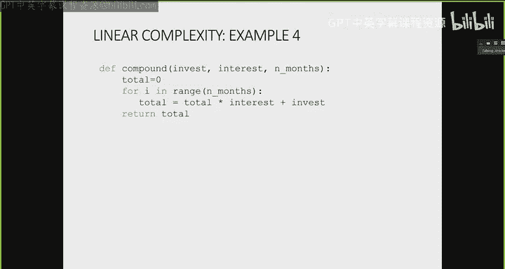

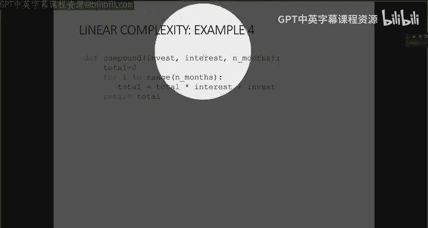

Right， so the loop here iterates through number of months。

 And then everything else is seems to be constant， right， I have gone one loop。

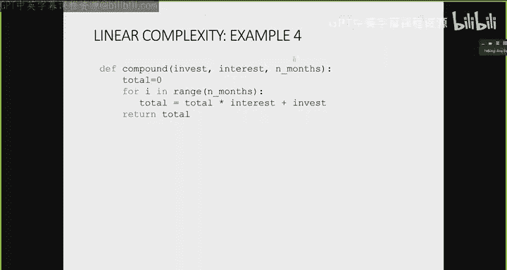

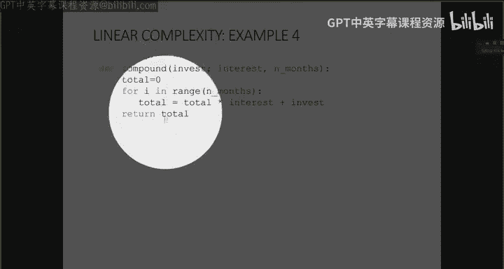

So the inside of the loop is constant。 I do have to double check that。 But so far so good， it's just。

 it's not looping anything else。 It's not。A function of anything else。The loop itself， though。

 is theta of n months， right。So the overall complexity of this function is theta of n months。

 or we could say theta of n where n is equal to n months。

None of the other parameters contribute to my complexity。

 And that's exactly what we saw when we ran the code， right。

 we ran it by changing each one of the parameters。 and we saw only n months contributed to a slowing program。

嗯，If we really wanted to， we could have done this analysis in depth， right。

 as we've done last lecture to actually count the full number of operations。

 or as we did at the beginning of this lecture。 So， you know， total equals 0 is theta of 1。

 The loop is theta of n months， multiplied by four operations。

 So I grabbing a value and range taking multiplication。 addition and then saving that into total。

 That's 4 multiplied by theta of n， where n is N months， plus theta of 1 to do the return。

 So that ends up being theta 1 plus 4 and plus1， which is simplifies the theta of n where n is n。

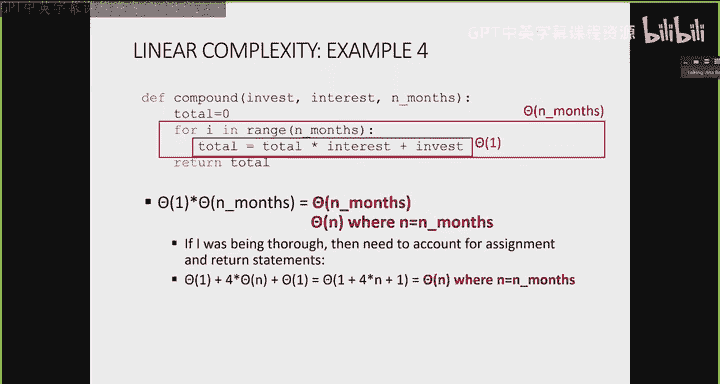

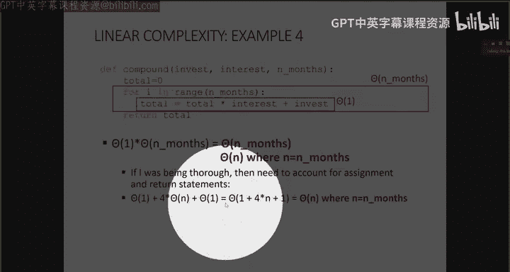

Yeah， so we're just looking at operations， right， We're doing calculations with interest and invest and。

 and multiplying it with total， right？ But the fact that interest is bigger。 Like。

 if the interest is $1 or if the interest is 1000， is this going to make that line of code much slower。

No， right。 because all we're doing is a multiplication between two numbers。

So that's why the inside is theta 1， right， But having a loop where we repeat this over and over again is going to slow the program down。

Okay， how about this Fibonacci function。So this is an iterative version of Fibonacci。 We have。

 I don't know if we've seen this before。 Again， we could do sort of a rough。

 quick analysis where we just briefly glance at every single line and ask ourselves whether it's contributing theta of one or something worse to our total analysis。

 total runtime analysis。So we've got this first part here， which is just constant state of one。

 right， Nothing here is， is loopy。 There's no recursive going on。

 nothing that depends on the input in a non constant way。In the L， we've got this constant。 again。

 just assigning two parameters。 We've got a loop。So now this loop is going to be non constant。

 The stuff inside the loop is constant， though， right， So the loop itself depends on n， my input。

 So that's going to be theta of n。But that theta n is multiplied by theta of 1。

 like the stuff inside the loop is just constant。 So that's theta n times theta of 1。

 which is just theta n。 And then the return， of course， is theta of 1。

So we could do a calculation like this。 or you could just， you know， quickly scan and say， hey。

 I've just got a loop that looks thats that depends on n。 And that's theta n。

 So the overall complexity of this。 If we wanted to be detailed is this， right。

 Theta 1 plus theta 1 plus theta n times theta 1 plus theta 1。 But overall。

 that just gives us theta n， because that loop is the only thing that depends on my input。

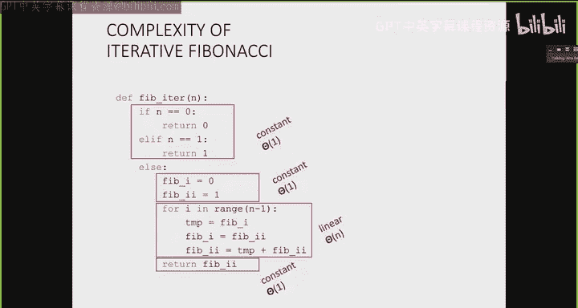

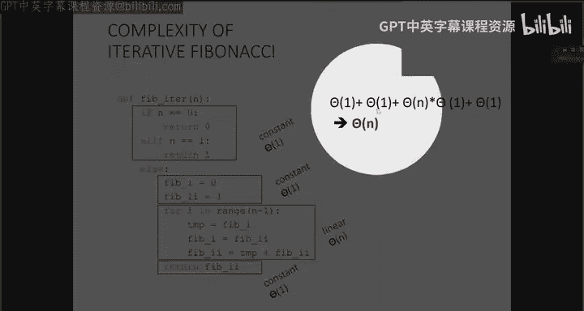

Everyone all write so far。Okay。Perfect， so now let's move on to the second easiest complexity to kind of identify。

 That's the polynomial complexity。 So polynomial complexity generally deals with functions that have nested loops。

 right？ So if we have two nested loops that linearly depend on my input。

 that's going to be a function that's n squared。 If I've got three nested loops that all depend on my input linearly。

 that's gonna be N cube， right。So。Let's see some examples。

 So here I have a really simple nested loop situation。 I've got a function called G。

And it's going to take in an input N。 So I'm going to look for everything that depends on n。

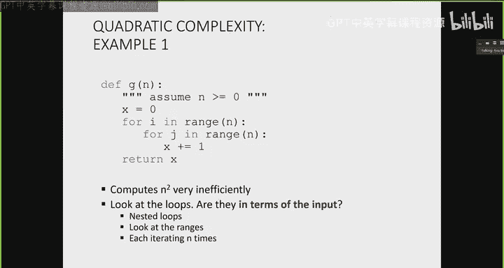

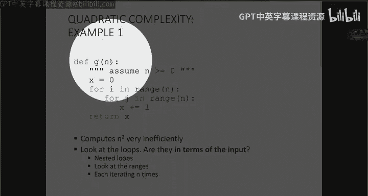

Well， I've got a for loop here that's going to iterate n times。 So that's theta n。

And I've got an inner for loop。 So for each thing in my outer for loop。

 I'm gonna to do the inner thing n times as well。

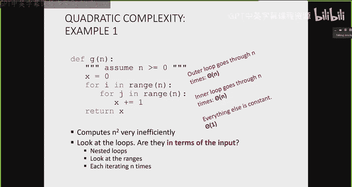

Right。And then the stuff inside my inner for loop is constant。 So that's theta of n。

 and the stuff outside of my loops are sorry， the stuff inside my inner four loop is theta of1。

 and the stuff outside of any of the four loops are theta of 1 as well。

 So they contribute nothing to this complexity。 So the only thing that I need to to account for is my outer loop。

 which is theta of n， and law of multiplication says my inner loop is going to be multiplied。

 It multiply its complexity to my outer loops complexity。

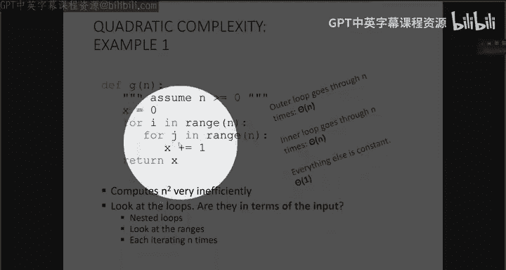

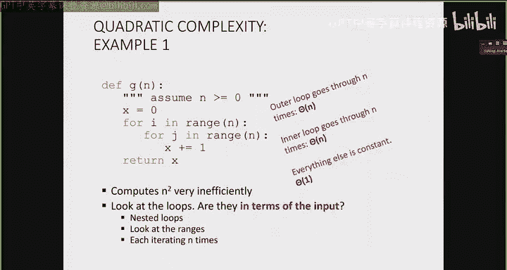

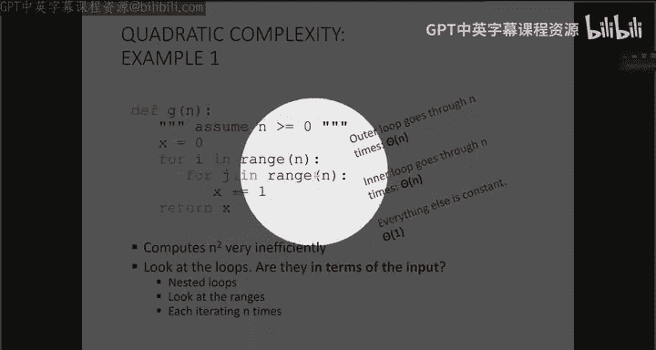

So the overall complexity of this function is the of n squared because the number of times that I'm gonna do this operation and。

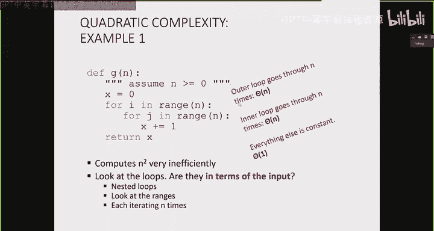

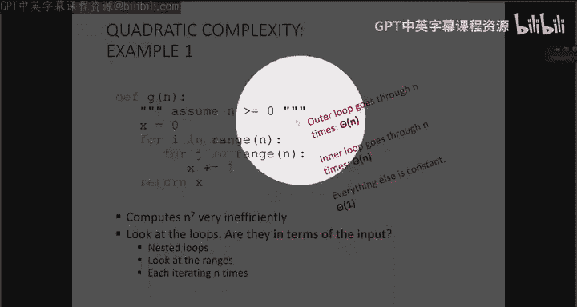

Is going to be n squared times。O。Perfect。Alright， so now let's look at some examples with lists。

 right， We haven't seen those yet。So now we have to think about the input。 In this case。

 it's gonna be two lists。 And when we're dealing with lists。

 one of the things that the most common thing we're interested in is what happens to the behavior of the function。

As the lists get bigger， right， as we saw sort of in in in last lecture。

 the size of the elements within the list typically don't matter。

 But the fact that I have more elements to do stuff with does matter。 right。

 So if my list now has twice as many elements， this program or most programs will probably be twice as slow。

So here's a function called I subset takes in two lists， L 1 and L 2。

 I've added two little examples up here。

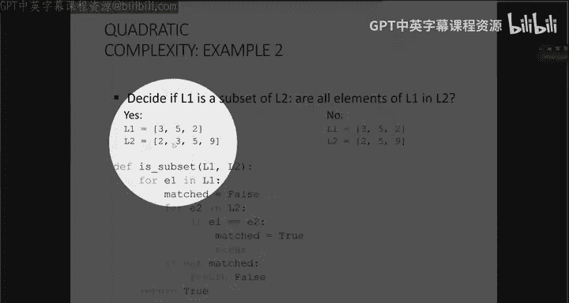

To help us figure out what this function does。 So it's going to tell us whether the elements of L1 are in L 2。

 right， So in the first example here， elements in L 1 are 3 and 5 and 2。

 and L 2 does have the three and the5 and the two， but it also has other stuff。

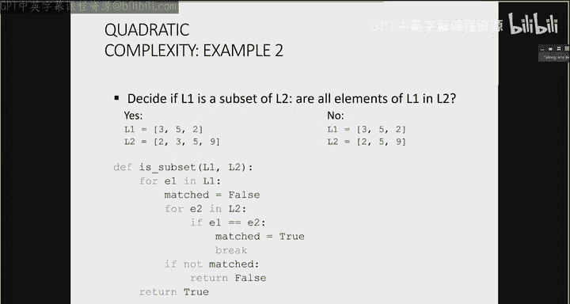

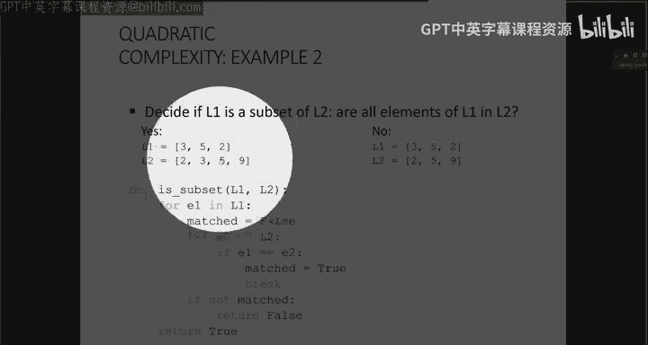

That's totally fine。 All the elements in L1 are in L 2。

 So this function will return true for those examples。 Those those L1 and L 2。

 And then here's an example where it will return false。 So the elements of L 1 are 3 and 5 and 2。

 and L 2 is missing the3。 So then that one will return false。 right。

 The elements of L 1 are not all in L 2。

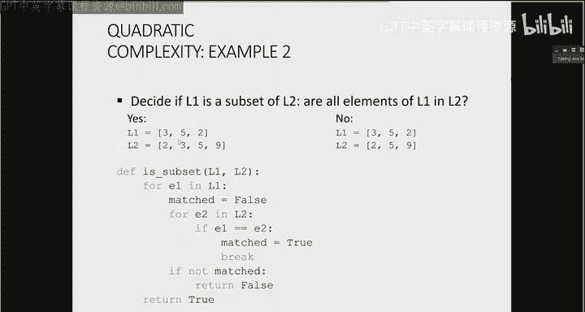

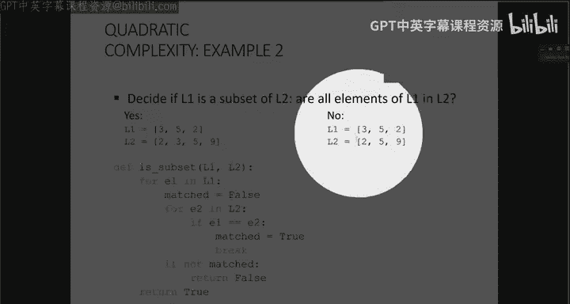

So it's not a subset。

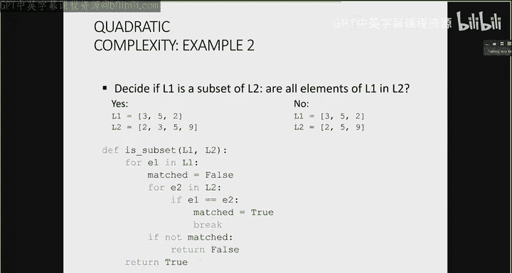

Alright， so what's this function doing， Well， it's iterating through all the elements in L 1。

 So it's gonna first look at the three， then the five and the two。

It's going to look through each element in L2 for every one of those L 1 elements。

 So it's going to look at the three and the2， the3 and the3， the3 and the5， the three and the 9。

 Then it's going to look at the5 and the2， the5 and the 3，5 and 5，5 and 9。

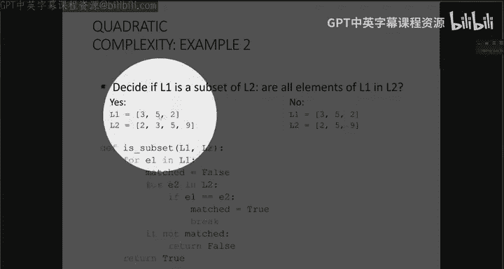

It's going to keep doing that。

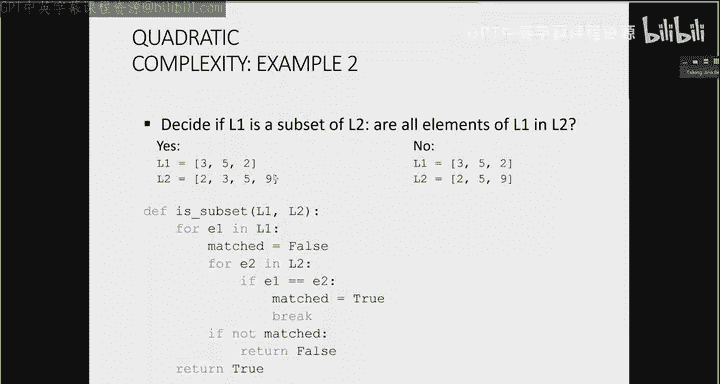

And it's going to keep track of this Boolean。matchched。Called matched。 And it's going to。

 as long as it finds this element E1 within my L 2， it's going to save matched to be true。

 And it's gonna keep doing this。

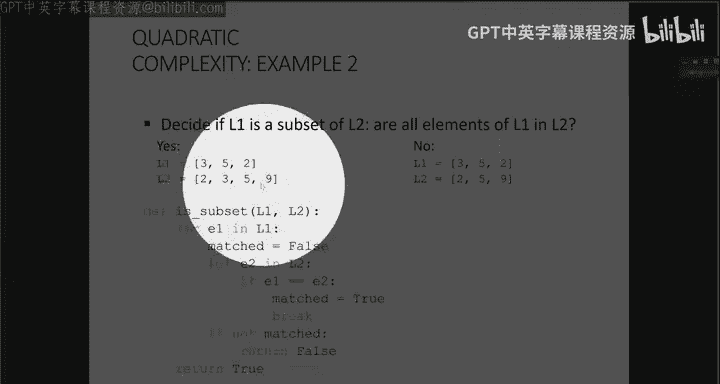

Until it does not find sorry， until it keeps finding matches， it long sorry， until it finds a match。

 as soon as it finds a match， it breaks because there's no need for it to keep looking at the remaining elements of L 2。

 It already found one that match。

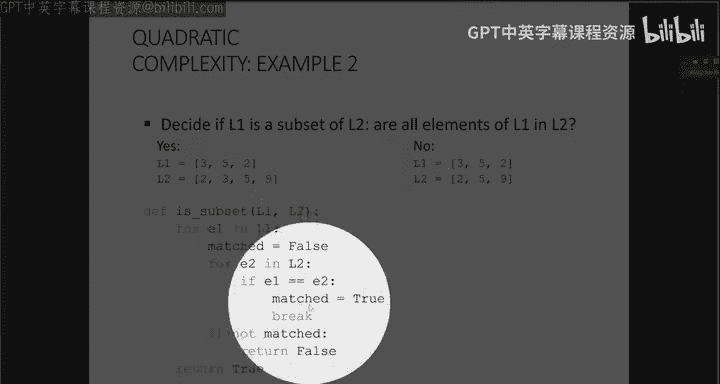

So this code could actually be rewritten by saying kind of the inverse， right。

 If E1 is not equal to L 2， we can just immediately return false because we've already found an element that from L 1。

 that's not an L2。

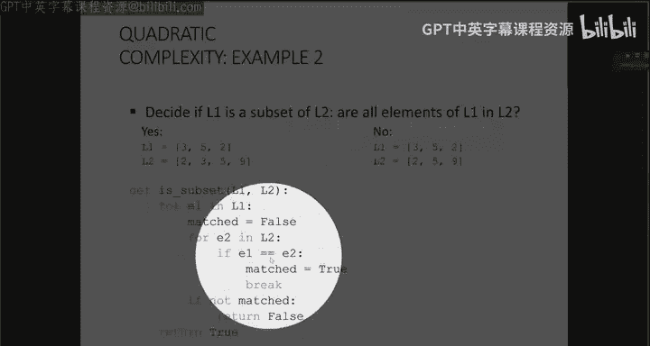

So we could have rewritten this code in many different ways。

 but the ultimate analysis will be the same。So let's look at the analysis for this function。Well。

We have two inputs。 So we have to be careful about both of these inputs。

 Which parts of this function depend on L 1 and L2。Well， we've got an outer for loop。Right。

 so what happens。To the complexity with regards to this， this loop。Well。

 if I have more elements in L 1， then this code， this loop will go through more times。

 So this loop will be executed length L1 times。So the theta for this outer loop is going to be theta of length of 1。

But there is an inner loop。 So for each element in my outer loop， I'm also going to do。

Everything in this inner loop， right， So in the worst case。

 I need to look through each element in L 2。To find a match。

So the inner loop will execute at most length L2 times， again， in the worst case， right。

 So the inner loop will be theta of length L 2。So the overall complexity since I've got this nested loop situation。

 law of multiplication says that it's going to be the theta of my outer loop multiplied by the theta of my inner loop。

 So theta of length of 1 times length of 2。

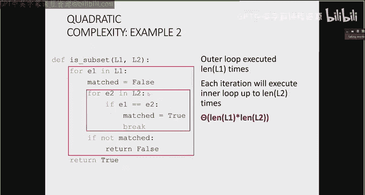

Okay， everyone Yeah， question。Yes。So， like。Here， in this， if。

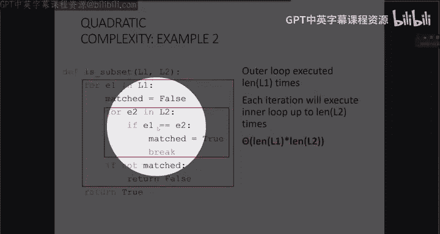

Yes， if the if had something like。Using an in。Right， which where in is， is linear。 Then， yes。

 there would be another like。It would be like there was another loop at the third level。 Yeah。

 so then it would be unced。Still polynomial， but。So if L1 and L 2 are the same length。

 which you know， sometimes we， we put on to simplify the complexity。

 put this condition on to simplify the complexity， then we say that it's theta of length L 1 squared。

It's still polynomial complexity。O。Let's look， sorry， the question。Yes。

 if there were not the same length， you have to denote it in the terms of the both。Okay。

 let's look at another example。 So here's a function that grabs the intersect of two lists。 So again。

 I've got a little example up here。 example， L 1 and L 2。

 So the intersect are gonna be the common elements within L 1 and L2。

 but I'm only gonna I'm not gonna do duplicates。 So I'm just gonna keep the unique numbers。

 So here I've got L 1 and L 2 contain 3，5，2 and 2，3，5，9。

 So notice the2 and the 3 and the5 both occur。 all all occur in both lists。

 So the intersect that these two lists is 2，3 and 5。

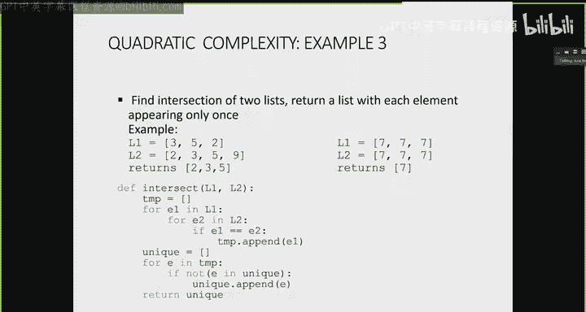

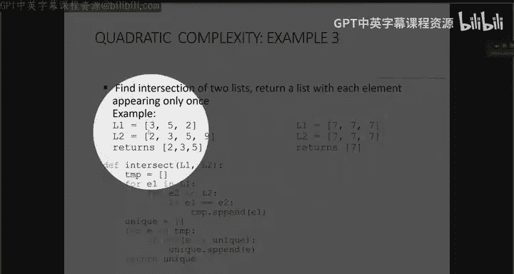

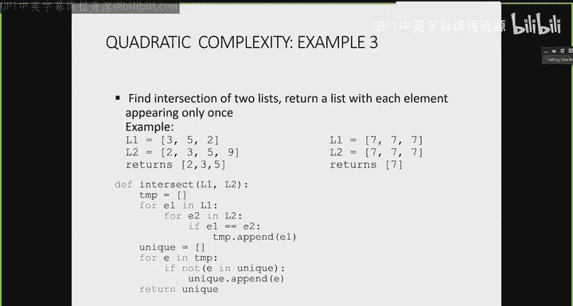

This example here on the right side， is going to be a little bit。

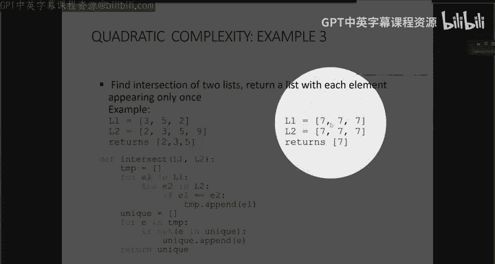

Trickier， right， It's kind of a unique edge case。 But the code still works for that edge case。

 It's if I have L 1 that has duplicates of some number and L 2 that has duplicates of that same number。

 the returned list of the of the intersect should just be 7， right， that one number once。

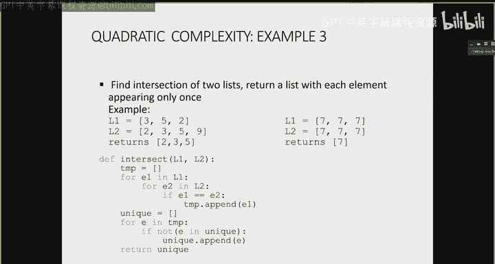

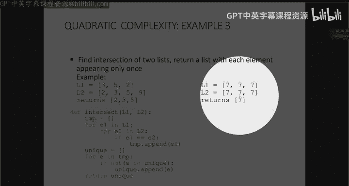

So how does the code achieve this。So you notice a nice little structure here。

 I've got kind of two blocks of code， right？ I've got something here。

Which is going to actually help us build this list of all of the elements that are common within the two lists。

 And then something down here where I'm going to cu that list to keep only the unique values。

Right so up here， this has a nested loop situation。 just like in the previous example。

 I have to look at all of the pairs right， from L 1 and L 2 to figure out which are common。 right？

 So this four loop over L 1 is going to go through the three， the5 and the2。

 And then the inner 4 loop through L 2 is going to basically match take take a look at。

 does the three match the2。 Does the three match the three， Does the three match the 5。

 Does the three match the9， right， And then the5 match the2，5 match the three and so on。

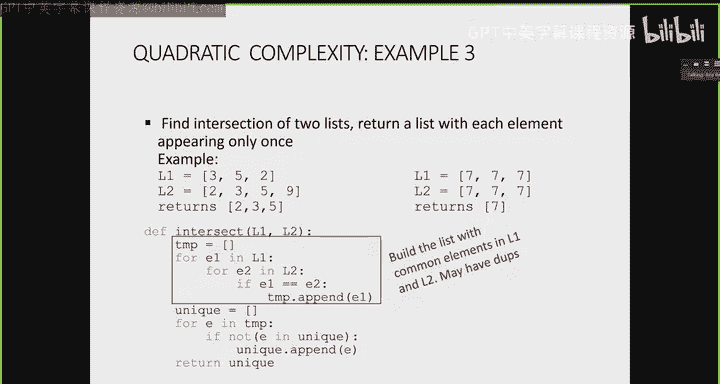

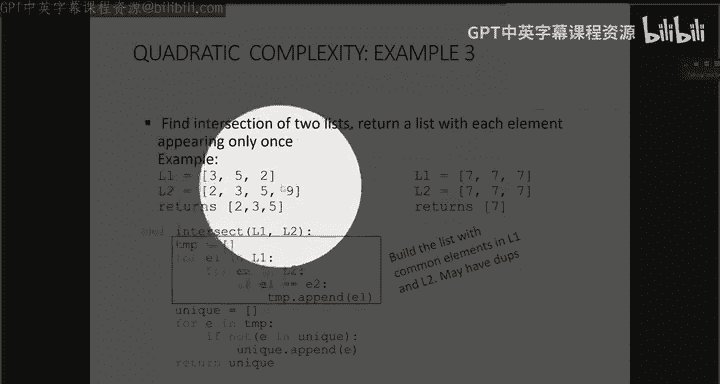

So that's what those loops are doing。 And as soon as we find a match。

 we're going to append it to this temporary list。 And it's okay if we have duplicates in this list。

So if you look at the example on the right hand side there with the seven duplicated many times。

 that's actually going to create a temporary list， right， that's going to contain 9 times that 7。

So it's going to look at the 7 with the 7 and it's going to say， hey， that's a match。 Let me add it。

 Then it's going look at the 7 with the middle 7 and L2。 And it's going to say， let me add that。

 And then it's going to look at the first7 and L1 with the last 7 and L2。

 And it's going to say let me add that right And then it's going to do that same thing all over again when it looks at the middle 7 and L1 along with each element in L2。

 So it's going to add the 7 three more times。And then again， when it looks at the last 7 and L1。

 along with each7 and L 2。So that's totally fine。 That's just what this code is doing。

And then the bottom part down here is going take this temporary list that we created。

And it's gonna just keep the unique values within it。 right。

 So it's gonna keep that create that unique list。 And it's gonna to say。

 if I haven't seen this value in unique at。And if I have， don't do anything。 So in the end。

 this code down here is going to take that big list here and just keep the unique values。Al。

 so let's do the analysis for this。 So I've got my outer for loop and my inner for loop up in the top half of my code here that generates my temporary。

 long， temporary list， potentially long temporary list。

 So that we already know from the previous example is theta of length L 1 times theta of length L 2。

 right， pretty simple。Now， what about this bottom half here。

 Because we have to be careful about this bottom half。

 This one could also contribute to the complexity， right。It's looping through a temporary variable。

 a list variable that we created。But。This list is created by doing something to L1 and L 2， right。

 by looking at elements in L 1 and L2。 So it's actually indirectly。Related to L 1 and L2。

 So we can't just cast it aside because it could potentially contribute to the complexity of my program。

Right。And in the worst case。I create this temporary variable that looks like this。 right。

 So in the worst possible case， my temporary variabless length。

Is going be length L 1 times length L 2， right， I basically added that character every time I compare a value。

Right， so I， this list at worst case is length L 1 times length L2 block。

So if I'm iterating through that list。Then the complexity of that second half is also theta of lengthhal 1 times lengthil 2。

 in the worst case。

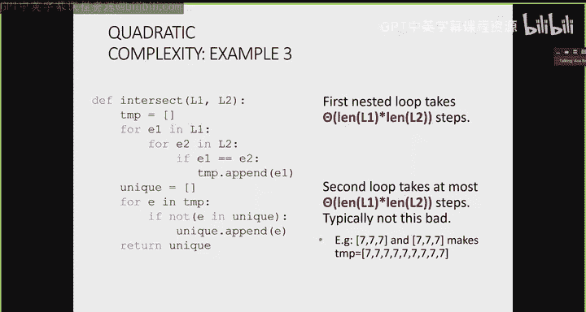

Right。So the overall complexity of the function is theta length L 1 times lengthil 2 up here plus theta of length L 1 times lengthil 2 down here。

So in this particular case， the fact that I'm iterating over temp didn't actually increase my complexity。

 but you can imagine code where， you know， something doing something funky like this。

 where you indirectly reference have some loop over something related to the input could affect the complexity。

 So in this case， the overall complexity is still theta of length L 1 times length L 2。

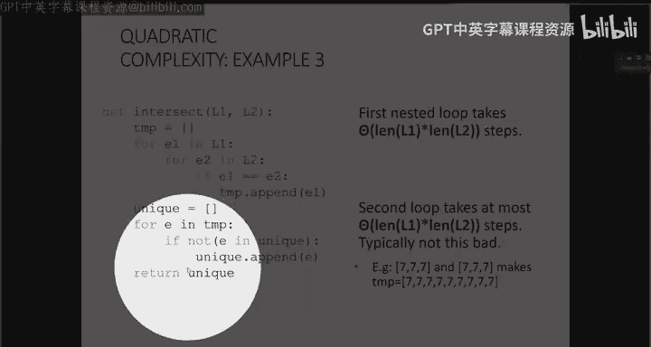

Questions about this one。O。一呀。Again。Like I I。It varies for each problem， right， But in the analysis。

 we're interested in the worst case scenario， right。The。

 like the asymptotic behavior of the worst case。 And in the worst case， we've added this number。

Lengthhal，1 times lengthhal， two times。Most of the time， of course， it's not gonna be this bad。

It's just in this one particular case that it is this bad。哦。Okay， let's look at one more function。

 That's polynomial。 So here's diameter。 We saw this last lecture。 Basically。

 if we have a bunch of points in a 2D plane， this function tells us the distance， sorry。

 the maximum distance between any two points。 right， So I drew that。pictureicture in the 2D plane。

 So this one is going to have nested loops again。So the outer loop iterates through。Length L times。

 So remember， our L is just a list of two poles representing these X， Y coordinates。

 So the outer loop easily goes through length L times。 But what does the inner loop go through。

 right， the inner loop。Is actually starting at I not 0， right， If it started at 0。

 the inner loop would be clearly theta of length L。But it， it's not right。 It starts at I。On average。

 though， how many times does that inner loop go through。Well。

 the first time it goes through that inner loop， it's going to look at length。

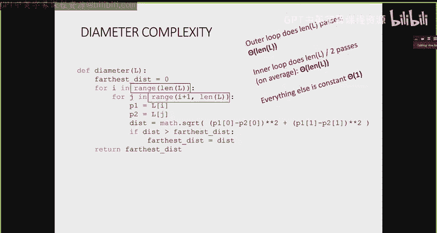

L-1 elements。 Next time it's gonna look at length L-2 elements。 Next time。

 it's gonna look at length L-3 elements， right， until we get to the end where it's going to look at one and then 0 element。

So if we think about how many times that inner loop actually iterates。

 it's going to be what is it like length L-1 multiplied by length L over 2。 Is that the function。

 I think， to add all these together， something like that。

 which is basically still something that's a function of length L， right。

 Like we can simplify it to be 0。5 length L。So it's still a function of length L。

 even because the coefficient in the front of that length L is 05。 right。

 So the overall complexity of the inner loop is still theta of length L。Rightright。

 everything else within this code is constant。

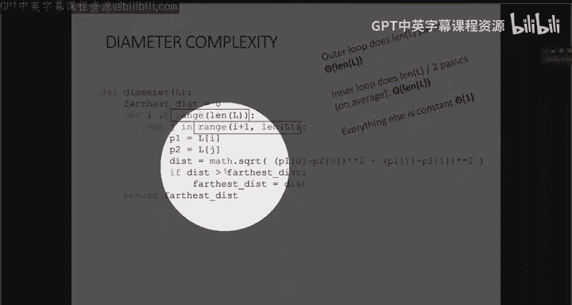

So the overall complexity is just theta of length， L squared。

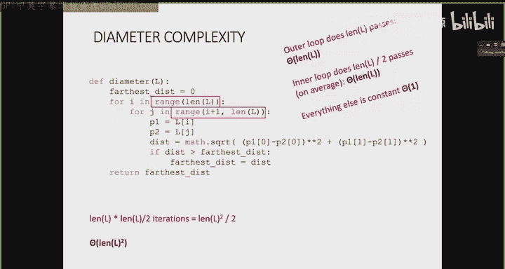

Sorry， where did the one half come。 Oh， it's the formula to add like。

 like if you add one plus 2 plus 3 plus 4 plus all the way up to n， Like。

 what's the formula to do that， I think it's like n times n plus1 over 2。Something like that。

 So this is not exactly half， but it's like something on the order， plus。I don't know something。

 right？Whatever this calculates to。But in effect， it's like something that's smaller than length L。

 but it's still a function of length L， right， And so that front coefficient on on in right before length L just goes away。

 right， even like if it was 10， we would still， you know， cast it away。 In this case， it's， you know。

0。5 or whatever it is。 right， So it's still less than  one， but we still cast it away。

 because we're interested in the theta of this。嗯。EI mean。

 the inner loop could just not depend on the input at all。

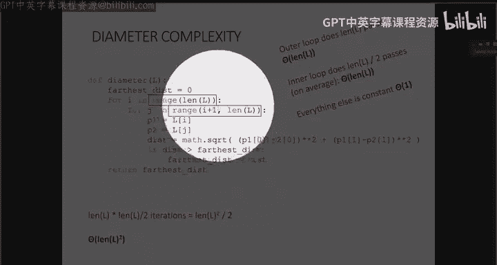

Right。Like here， it's n squared because the both of the loops depend linearly on the input。

 But if the inner loop depend， like if the outer loop went through range length L squared。

 then the overall complexity would be length L cubed in this case， right。

 because it's length L squared times length L。

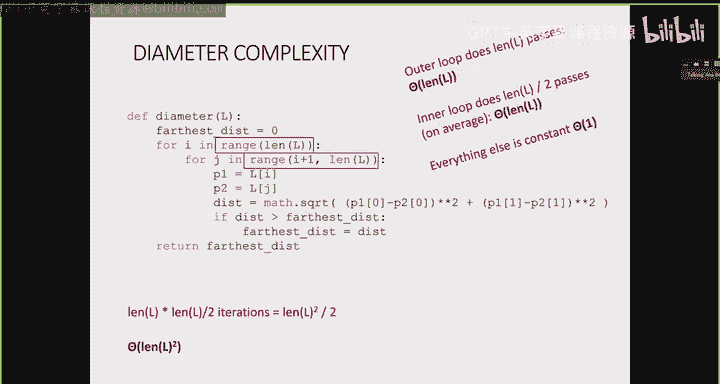

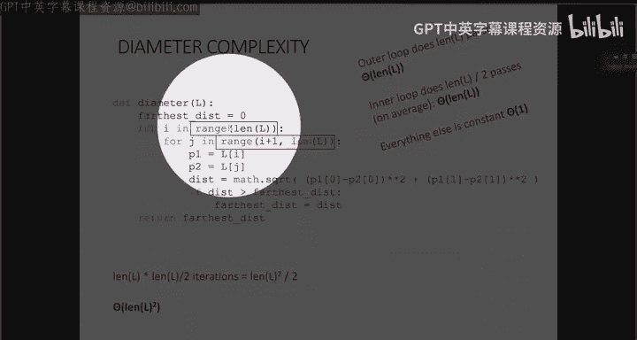

Or if one of the loops doesn't depend on the input at all。

 then it contributes nothing constant and it nothing linear。 So it's， it's constant。Okay。

 let's have you think about this question for a bit。So think about the input。

 think about parts of the function that depend on the input。 and then what is the complexity。

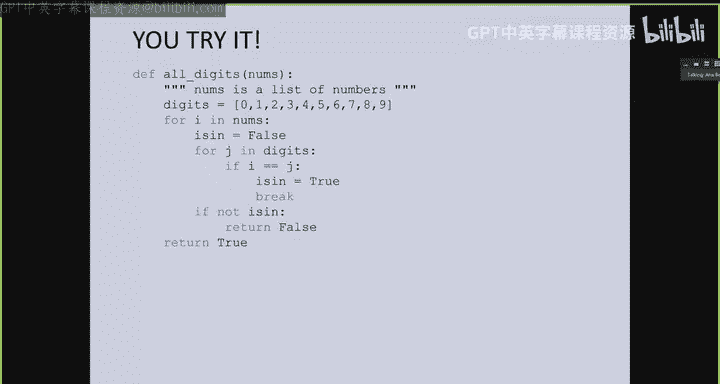

Okay， what's the。

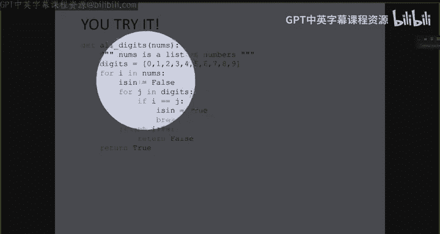

Outer loop。Fate of。Yeah。Yes， nus is a list。 So the outer loop is theta of length of nus， correct。

 good。What's the inner loop theta of。Yeah， is that what you're gonna say。 Theta of 1， exactlyactly。

 It's the length of digits， but digits is not my input， right， Nums is my input。

So the inner loop will always just iterate through 10 times。

 So in the eyes of the inputs to the function， that's just constant。 right， So the input is nus。

 The outer loop is theta of nus。 The inner loop is theta of  one。

 So the overall complexity is theta of length of nus。Perfect。How about this one。What are my inputs？

Do any loops depend on these inputs。Alright， what's the outer loop complexity。Yeah， s of length O 1。

 exactly。 What's the inner loop complexity。

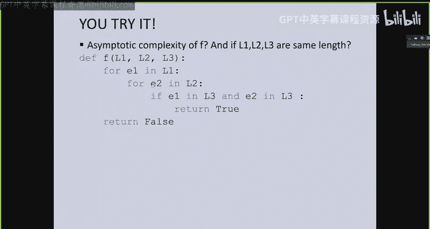

Theta of length of L 2， perfect。 And is there anything else that contributes to the complexity here。

我在。The if statement， yes， what about it is making you question that the complexity is not constant。

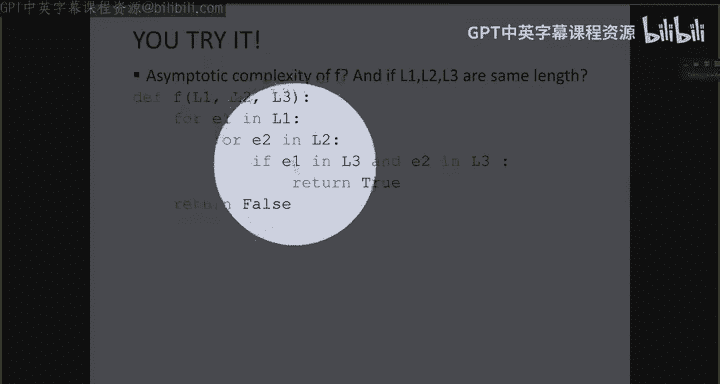

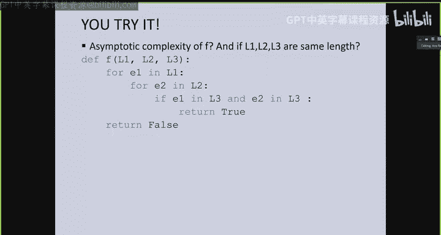

Exactly， yes， very nice。 So in iterates through the length of L 3， right。

 looking for an element in L 3， E1 in L 3 is not constant， right。

 You have to look through the whole length of L 3 to figure out whether it's there or not。

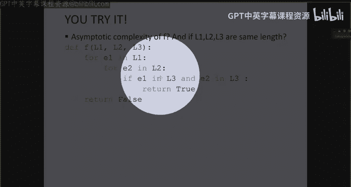

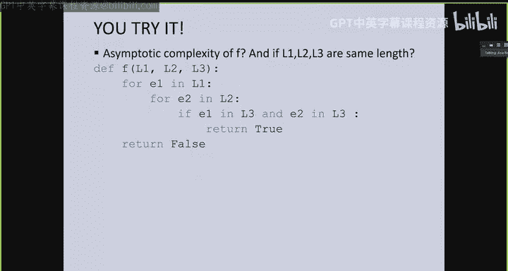

So the this inner bit here right， is not constant。 It's theta of length L 3。 In fact， it's， you know。

 two times length L 3， right。

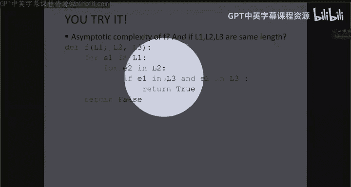

So the overall complexity of this function is theta of length O 1 times theta of length O 2 times theta of length O 3。

O。Cool， let's look at the exponential complexity。 So this is a complexity that grows really。

 really quickly。 We never want the algorithms that we write to land within this class。 Unfortunately。

 there are just some problems in real life that we have to compute that are just naturally part of this complexity class。

 There are some techniques to deal with making these algorithms a little bit faster， but inherently。

 there are just exponential algorithms that we just can't do any better than exponential in in。

 in solving some these problems。At。So。Let's look at Fibonacci， again。

We looked at Fibonacci a few slides ago， iterative version， and the iterative version was theta of n。

But if we look at the recursive version of Fibonacci， it's not theta of n at all。 In fact。

 as you can see， it's in this exponential set of slides， the it。

 the recursive version of Fibonacci is actually exponential， okay。

So let's recall what this code is doing。 So there's two base cases， right， Fiacci of 0 and1。

 And then Fi， the recursive step is Fibacci of n -1 plus Fibonacci of n -2。

 So for every level that we go down。

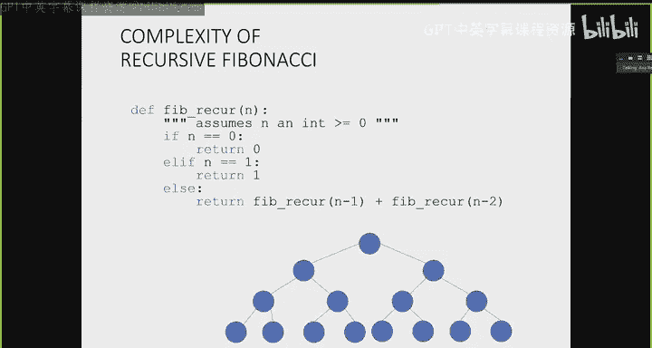

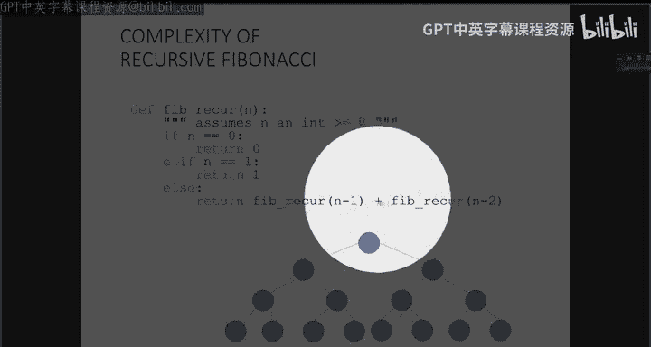

There's going be times two more paths that we need to explore to grab the values from， right。

 So for some for the very first end， we've got just one， you know。

 one value to grab for the next end， we've got times to that value to grab the next level for the next end。

 we've got two times more values to grab and so on。 right。

 So the fact that there are two recursive calls in this recursive step leads us to this little inverted tree kind of structure。

 right， And we even drew this when we looked at how many function calls are being run right。

 remember， when we're figuring out the the complexity with a recursive function。

 we need to figure out how many of these function how many recursive calls are we actually doing。

So because of this tree structure， every time we add a new level。

 we basically have two completely separate paths to explore further， right。

 And those two paths have their own two paths and so on。So this leads us to this tree structure。

 which is actually going to lead to the total number of。Recursive calls to be exponential。

 So theta of two to the N。Now， if we looked at the actual recursive call tree， right。

 we looked at this， and it looked something like this， right， bunch of lectures ago。

 you might notice that the tree actually thins out a little bit to the right， right。

 It's not a full tree with the leaves nicely all the way down。 And that's because， well。

 the left path calculates fib 5， but the right path calculates Fb know 4。

 So n-1 of the of the left path。But that's fine。 It's not that we are actually going to speed up anything。

By some sort of order of magnitude， right， just because the tree thins out a little bit on the right hand side is not going to speed up the overall complexity of this function。

 It's gonna be theta of 2 to the n minus， you know， some theta that's less than 2 to the n。

So that subtraction is not going to really decrease the overall complexity of our function。

 So the order of this is still exponential。All right。Here's another example of an exponential code。

 So this is a function that is going to generate all the subsets of a list。 Okay， so I've， again。

 I've added a little example here to help us understand what it's doing。

 So here I've got three numbers， a list with three numbers，1，2， and 3。😊。

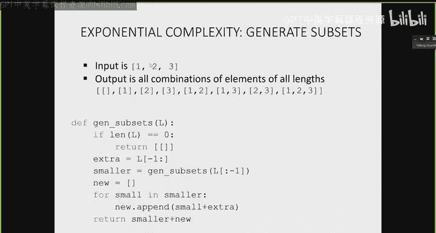

And to generate subsets， what this means is that I'm going to create a new list。

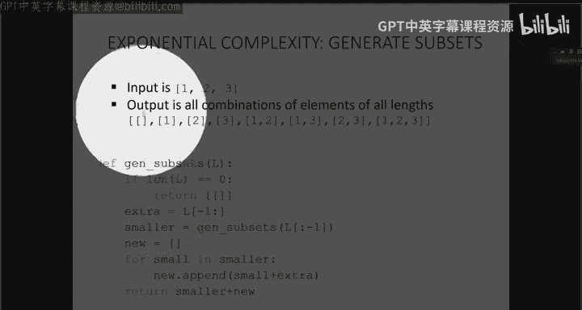

Of all of the possible combinations of numbers within my original list， of all the possible lengths。

 right， So first， one subset of this list could be just the empty list。

 So that's not taking any of my original numbers at all。

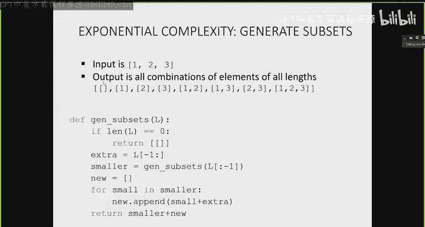

The next one is a list with just one of the numbers in it。 So either the one or the two or the three。

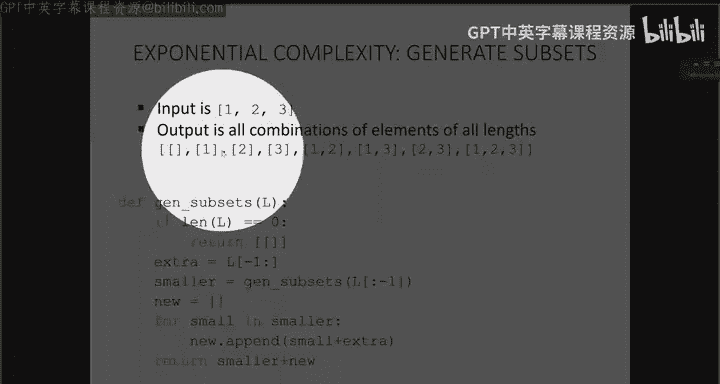

A next part next subset of my list could be taking just two of the elements。 So  one in 2。

1 in 3 and 2 and 3。

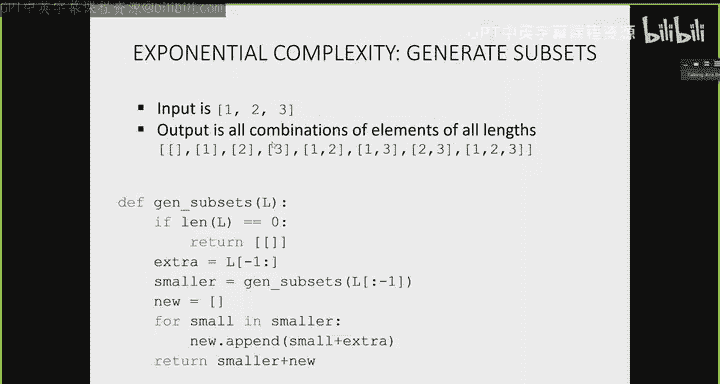

And then lastly， I can just grab all the elements。 So one and the two and the three。

 I don't care about the order。 right， I just care that I have all of these different combinations of all of the different lengths in my final list。

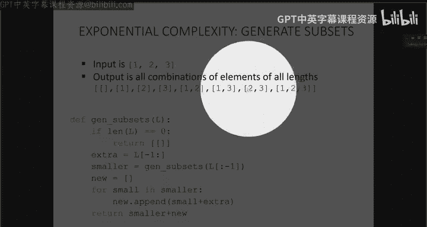

，So does everyone understand kind of the goal of this function。Okay， so how do we achieve this？ Well。

 you might not be surprised。 We're going to do it recursively。

 That's really the only reasonable way to write this code。 Okay。

 so I'm gonna go through this slide kind of just explaining what each line does。

 But on the next slide， I'll have a little animation that shows step by step how the function creates this subset list。

So first thing， it's recursive。 So I've got my base case up there。 It's。

 if I have a list of length 0， then I， the subset of an empty list， right。

 is just gonna be this list with the empty thing inside it。 right。 So if I have no elements。

 there's only one subset， that's the empty list。Then if I have more than one element inside it。

 I'm going to do the same idea that we saw when we worked with lists back in the recursion lectures。

 right， I'm going to extract one of my elements。I'm going to work on the remaining list。

 and then I'm gonna do something by taking that element and tacking it back on to the result。

So in this particular case， the thing that I'm extracting is the last element in my list。

 So if my list is 1，2， and 3。At a step here， I'm gonna extract the three and make it into its own list。

 right， So that's what that step is doing。 It extracts the last element in the list。

Then I make a function call to generate subsets on everything， except for that last element。

 So if I'm so I say。He function。That I'm currently writing right now。

If you can generate for me the subset of all the elements， right， the subset for this list。

 then you're going to come up with something that looks like this。 It's going to be the empty list。

 the one， the two and the one and the two together。 right？

 So the subset of this list is going to be this group of elements here。

So that's what this is going to do。 So this is， again。

 us trusting that the function we write will generate something that looks like this。

If we've got to this point， then smaller is going to be a list that looks like this。

So the next part of the code is going to take that little extra thing that I had saved previously。

And it's going to tack on that three to every element within this list。

 So then I'm going to basically say， I'm going to take this three and make a list with the three in it。

 a list with the one and the three in it， a list with the two and the three in it。

And the list with the one and the two and the three in it。

 So I've just taken that three and added it to everything that resulted from this line of code here。

 from my， my function calling itself。And then， all it does is。Returns smaller plus new。

 So if I add these two together， this is going generate for me my final subset that I was interested in。

 right， I've got the empty thing。 I've got the one， the two and the three by itself。 I've got the 1。

2， the 1，3 and the2，3 by itself， and then the 1，2，3 altogether。😊，So that's the big idea here。 Okay。

 so let's just go through step by step。Recursively calling ourselves。

 So this is me finding out the my kicking off my function call， saying， hey。

 generate the subsets for the list 1，2，3。I'm going to keep the extra aside。

I need to make another function call because I'm not at my base case。

 So I'm gonna call Gen subsets on one comma 2。This is also not my base case。

 So I'm gonna call take my last element， put it aside。

 and I'm gonna call Gen subsets on just the one。Still not the base case。 I'm gonna take this extra。

 put it aside。 And I'm gonna call Gen subsets on the empty list。

 And this is where I reach my base case。 So far， nothing has been returned at all。

 No work has been done。At my base case， Python will say， I know what this is。

 is's gonna be the list with just the empty thing in it。Alright， cool。 next， that gets returned。

 So this function call goes away。 So now what is it going to do， Well。

 it's gonna take that extra I set aside。Take the smaller list that I just returned and basically double that smaller list。

 So this is my smaller list。And then I'm going double that by saying。

 I'm gonna put this one to the end of everything in my smaller list。

Maybe this is not so apparent at this step， but let's go one more step and see what happens。

 So now this function also terminates。 It returns this empty list and one in it。

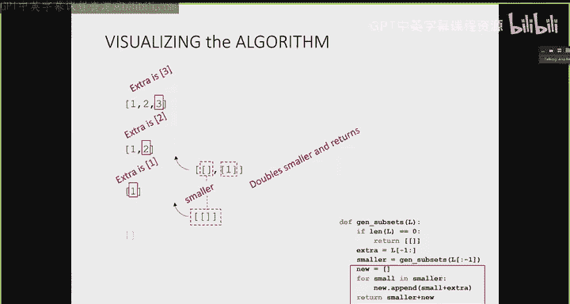

And says， allright， here with this function call， I had saved the two separately and said。

 I'm going to now tack on this two to the end of everything that I had just returned。 right。

 So this is smaller。

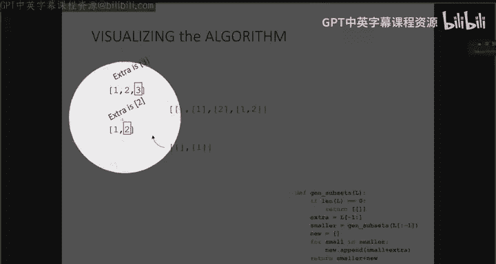

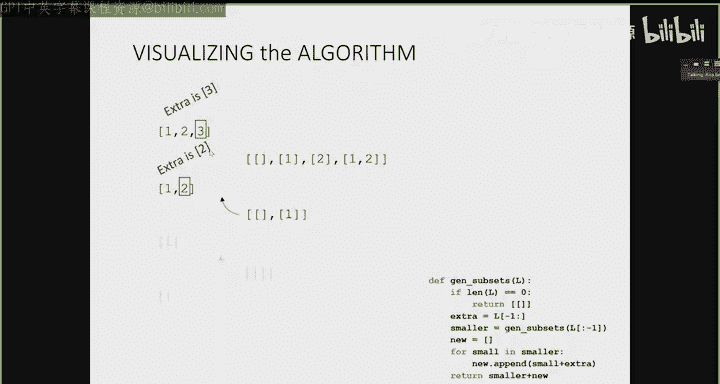

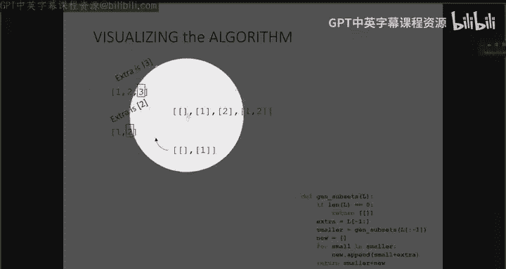

This is smaller over here。 And all I'm going to do is take this extra thing and tack it on to the end of everything that wasn't smaller。

 So I'm gonna tack it on to the end of this empty list。

 So it just gives me this two and tack it on to the end of this one。 So it gives me the one comment。

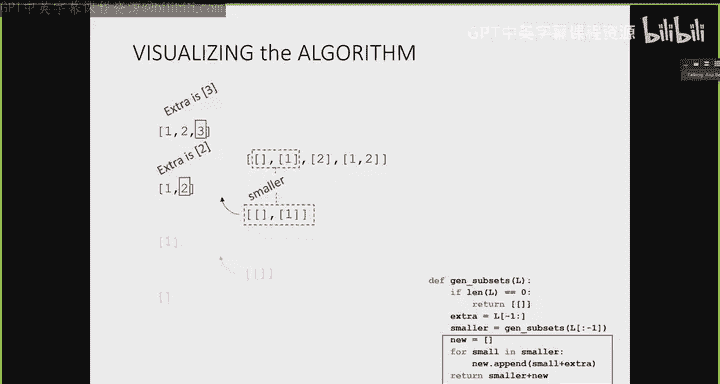

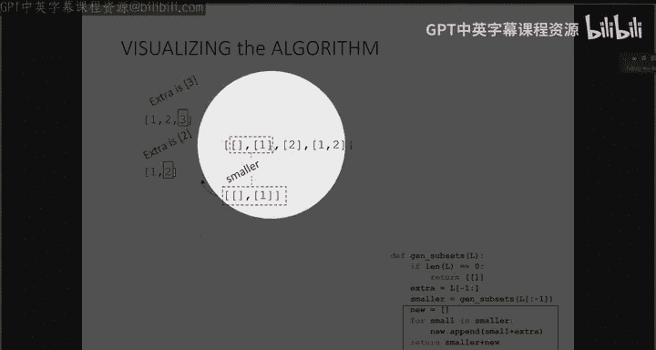

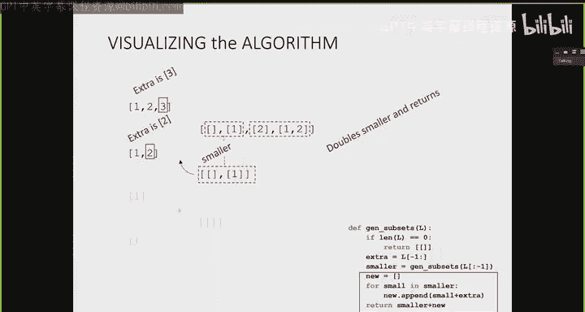

So I basically doubled my list at this stage。One more step。This gets returned。

 And now this is my original function call。 The thing that I had extracted was the three。

 So now we're basically at this step here。

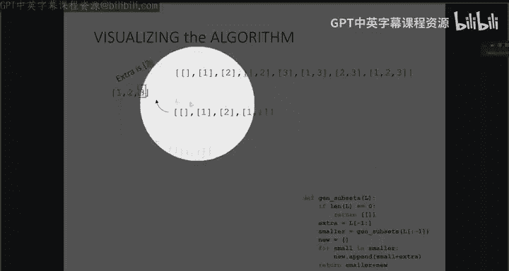

I extracted the three， the function just， just below it just returned this smaller， right。

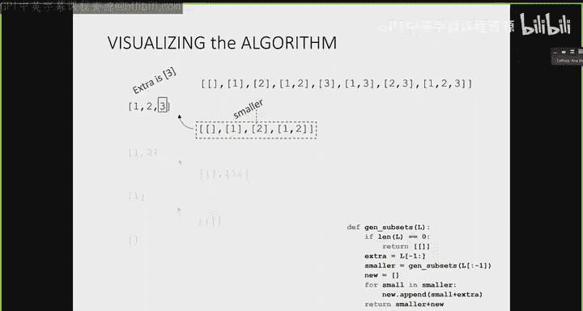

So that means that this three is going to get appended to the end of everything that wasn't smaller。

 right， So it's going to be appended to the end of this empty list to give me just the three to the end of the one。

 to give me the one and the3， to the end of the two。

 to give me the two and the three and to the end of the 1，2， to give me the 1，2，3。

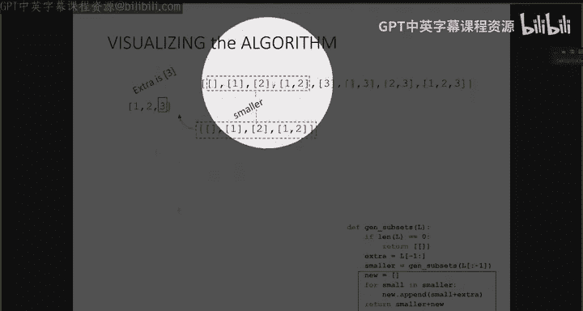

Now， this is the final answer， right， So I basically keep what I had returned from the previous function call and concatenate that with the thing that I had just created。

 right， where I tacked on my three。

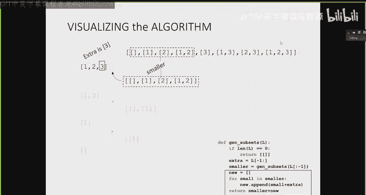

And this is my final answer。 It's just sort of out of order to what we intuitively would have written by hand。

 But it hits on all of the elements that I wanted to have anyway， right， So I've got the empty list。

 Everything with just one element in it， everything with the two elements in it and everything with all three elements。

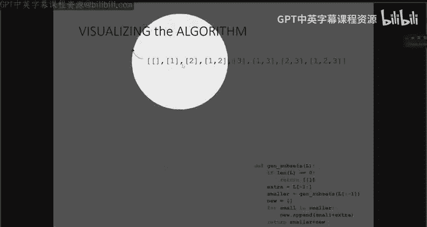

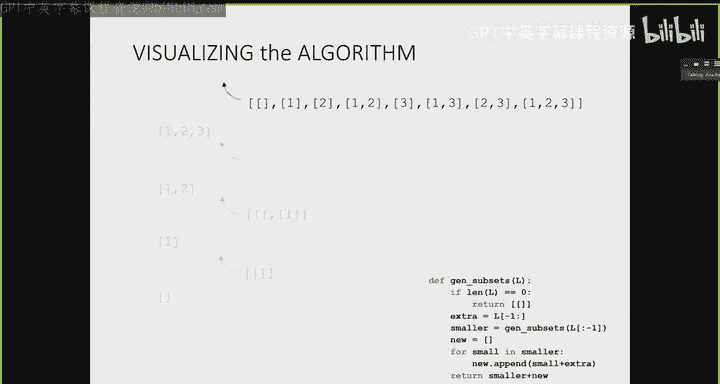

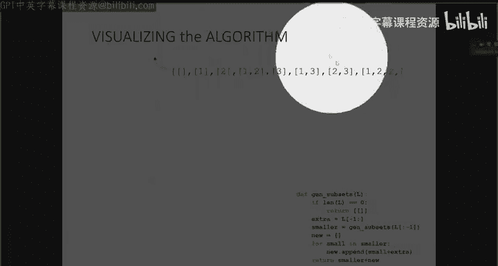

So let's look at the complexity analysis of this。We've got two things going on here。

 One is how many of these function calls are actually being done， right。

 like with the inverse tree structure， how many of those function calls do we need to do to get to the end of our to to our base case。

And on top of that， that， sorry， that will tell us how many actual elements in the list we will have。

 And on top of that， we have actually a time complexity that's not constant。 That's to copy our list。

Okay， so copying a list is not constant， right， because it takes some time to take all the elements in a list and make a copy of them。

So if we think about the time it takes to make our list at each step， right。

 how many of these sub elements we're creating。Well， at the very base case。

 we have one element at the case just above it， we had two elements。 At the case， just above that。

 we had four elements。 At the case， just above that， we had eight elements。So at each step。

 the number of sublists that we were generating was basically twice as much as the previous step。

So the overall number of subsets was on the order of 2 to the n。

But there was also a time complexity to make a copy of the list within each one of those subsets。

So we're multiplying the complexity it takes to make all those function calls and generate all those subsets by the time it takes to make a copy of the list。

 So the overall complexity is actually going be theta n times 2 to the n。

Because it's a little bit harder。It's a little bit worse than exponential。

 just purely for the fact that we're copying the list at each step。O。Alright。

 so let's move on to logarithmic complexity。 This one's gonna be a little bit tricky because right off the bat。

 we're not going to be able to see a direct relationship between the input and what loop we actually have。

So here， I've got a function called digit ad。

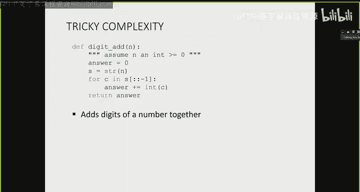

It's going take in a number。 So like 1，2，3，4， something like that。 number 1234。

The code casts it to a string。 So it takes in a pure numerical value。It makes a string out of it。

And then iterates through the string。Right。So， the function here。

In terms of time complexity is theta of length S， right here。

 we're iterating through the string backward， basically 4 than 3 than two than one。

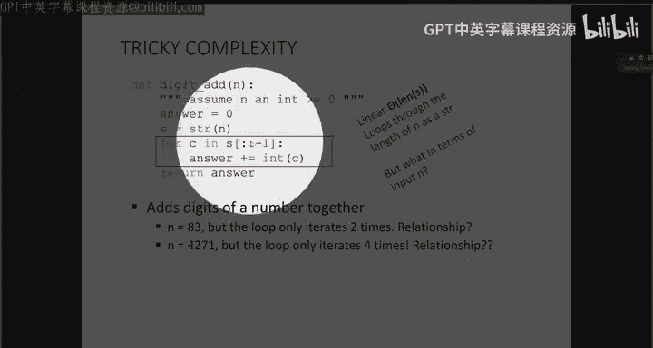

But。😡，What's my input。 It's N。 It's not S， right？ So the time complexity of this function。

 while it's linear in S， S is not linear in N。Because when my number is 83。

 my loop only iterates twice。 If my number has four digits in it，4271， my loop iterates four times。

Right， so this relationship is not linear， right。So what is it exactly， Well。

 let's think about what that loop is actually doing， right。

 If I have a number with four digits in it， right， something in the thousands。

When I iterate through the the number by sort of backward， right， this number has a string。

 I'm basically taking that one。And keeping it in my running sum。Then it's kind of like。

 I divided that number by 10。I grabbed the remainder when I divided that number by 10。

 And that's the thing that I just added。The whole number left over when I divided by 10 is this bit here。

So now think of it like taking this， to take this last element here。

 It's like I take this number and divide by 10 again。

I grab the remainder when I divide by 10 and add it to my running total。

 And the whole number I'm left over when dividing by 10 is just this。One more time， I take the two。

 the remainder when I divided that 42， what2。 and the whole number I was left over with is 4。

 And then lastly， I can do that Last thing again。So what's the relationship between the magnitude of n。

 right， this 4000 something or this 80 something to how many times I have to loop through to get every digit in my number。

Well， the trick here is to think about taking my magnitude， my N。

 a magnitude of n and dividing it by 10 a bunch of times。

How many times do I divide by 10 to basically grab every single element。

 every single digit in my head。Well， length S times， right。

 That's kind of like taking each character one at a time， right。

 to take each character  one at a time。 That's like dividing by 10 to grab the remainder。

 And then I've done that length S times。 right， That's what this loop is doing。

So the the relationship between the magnitude of n and how many times I go through the loop is this n divided by 10 some number of times length as times is equal to 1。

 That means I've finished going through this entire element， this entire number。

 all the digits within the number。So the relationship between n and length S is length S is equal to log of n。

And now that I have this nice relationship。 Well， I said that this function was linear in length S。

 So if it's theta of length S， it's going to be theta of log n。I just map those two together。

Questions about this。This， this trick can work in many different ways。

 What's important to realize is that here there's kind of an indirect relationship between what's actually happening in the code。

And my input， right， It's not as， as clear cut。But there is some relationship which is not constant and not linear。

OK。So the overall complexity of this function is theta of log n。

 where I don't actually care about the base when I report the complexity in terms of log。This case。

 it's base 10， but。If it was base，2 would be the same login。Okay， so we saw some a bunch of examples。

 just one of logarithmic complexity。 But we're gonna see next that searching for an element in the list will also be logarithmic complexityities。

 a complexity。Before we get to that， I'd like to just make just put this slide up to remind you that there are several functions built in functions with lists and dictionaries that aren't constant right。

 So like that examples， the example you guys did where we use the in operator， right。

 we had to be careful。 if you ever see these operations being done in the code。

 don't just push them aside。 You have to account for them within the complexity analysis。Okay。

 so next， we're going to look at some searching algorithms。 Okay， these algorithms。

 we're gonna see a bunch of different codes that implement searching。 These will again。

 they'll be very similar to the ones that we actually timed last lecture。

 So we're going to look at searching for an element in a list。

We're going to look at a bunch of different implementations of the plain brute force searching element in a list。

 right， whether it's sorted or unsorted， as long as you just brute force your way from the beginning of the list to the end of the list。

 you'll be able to find the element you're looking for or say that it's not there。

So we're going to look at some linear search functions。

 And then we're going to look at the bisection search a couple bisection search implementations。

 And that's where we divide the list in half and discard one of the halves。 And this。

 those implementations， though， will will need our list to be sorted。

 right So the bruforcing our way doesn't really matter whether it's sorted or not。

 But the bisection search only gives the correct answer if the list is sorted to begin with。

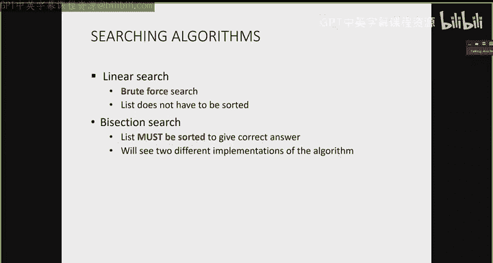

Alright， so first， let's look at linear search on an unsorted list。

This is code that is going to search for element E in list L。

It loops through the length of the list and keeps this Boolean flag in mind If it finds the element we're looking for。

 just sets the flag。 And at the end of iterating through the whole list。

 it tells us whether it found it or not。

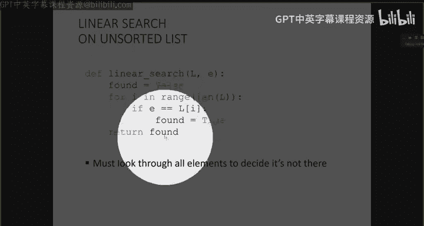

So the worst case scenario， analysis says that we have to look through the entire list to determine the element is there or not。

So。The theta of this particular function is theta of length L。Right。

 there's only one loop depends on the length of L that nothing really special about this。

 this function。Now， you might notice that there's something inefficient about this function and that once it finds an element。

 let's say at the beginning of the list， this function actually just sets the flag and keeps going through to the end of the list。

So we can actually do a little bit of a speed up with this bit here and say that， hey， if we find it。

 just return true right away。 No need to keep going to the end of the list。

So what's the analysis for this code。Well， again， we're doing worst case analysis。

 So in the worst case， the element is not there。 So we still have to search through every single element in the list beginning to end to determine it's not there。

So the worst case， theta analysis for this function is that we still have to go through to the end of the list to determine it's not there。

 So it's still going to be， sorry，'s still going to be theta of oh sorry， theta of length L time。

So this is on an unsorted list。 But what if we look at a sorted list。Okay。

 so we can do a little something clever in our code。 If the function， if the list is sorted。

We can say。We're gonna start at， let's say it's increasing sorted， right。

 We can start at the beginning of the list。 Look through each element。 If we find it return true。

 if we reach an element that's bigger than the one we're looking for， the list is sorted。

 So all the remaining elements in the list are also bigger than the one we're looking for， right。

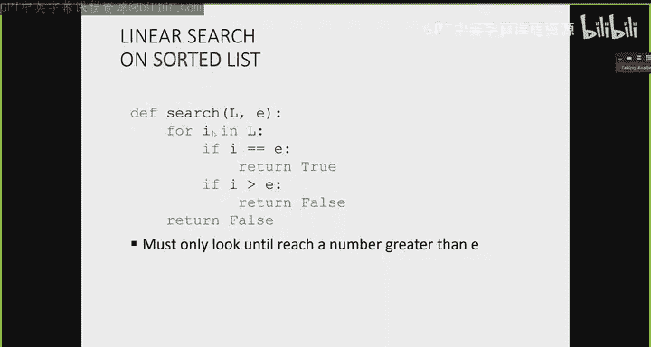

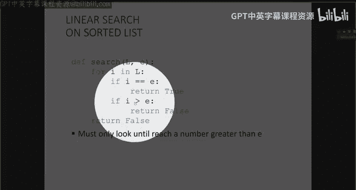

And then we can just return false right away。Well， we think we're pretty clever。

 But the worst case analysis says that the list is the element is not even in the list at all。

 So we still have to go through and look to the end of the list to figure out that that element is not there。

 So we still have to touch each element in the list to determine it's not there。 So the theta。

 worst case theta complexity analysis still says that this is theta of length L。Right。

 because everything else is constant。O。So now let's look at bisection search。 So as。

 as far as we can tell， just doing a linear brute force search way is not going to give us anything better than theta of n。

But when we looked at the timings in last lecture， we saw that this binary searcher bise search on an element in the list was actually much。

 much faster， right， It grew at of something faster rate than linear， but not quite constant。

So let's remember how that code looked。 So we basically had a list with a bunch of elements in it。

 We looked at the element at the middle of the list。And we said。

 are you the one we're looking for In the worst case， it's not， right？ So then we have to ask。

 are you bigger or smaller than the one we're looking for。If it's bigger。

 then we know we have to look in the lower half of the list。 If it's smaller。

 we look in the upper half of the list。And now that we either look in the lower， the upper half。

 we notice we have the exact same problem to solve。

So this should ring a little bell that says we should use recursion， right。

 now we have the same problem to solve an element E in a slightly smaller list。Is it in that list。

So that's exactly what we're going to implement。So visually speaking， this is what we're going to do。

 We're going to have an original list with N elements in it。We're going to look at the halfway point。

 Wors case。 It's not the one we're looking for。 So we're going to decide on one of the sides to next search through。

Now， we have N over two elements to look through。Again， it's not their worstor case。

 So we have to decide on which have to look through。 Now。

 we have N over four elements to look through。We keep doing this。

 We keep sort of having more and more recursive calls until we reach a base case。

 And the base case is that we now have a list with one element in it。

Either that element is the one we're looking for or worst case。 It's not。

 And we've determined that the element we're looking for is not in these n elements at all， right。

So our base case is down here， and we started with n elements over here。

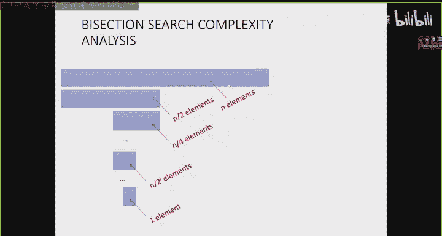

So the bisection search algorithm will repeat this task of dividing the list in half。

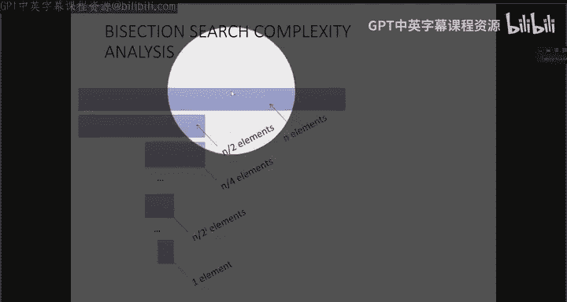

Let's say， I times。Right， so this is quote unquote， how many iterations we would have made， right。

 But since this is recursion， there's no iterations。

 This is how many function calls we have until we reach the base case。 I function calls。

So if we take our original n elements and we divide them by2 so many times。

That we have only one element left to search for。 That's when we found our answer。

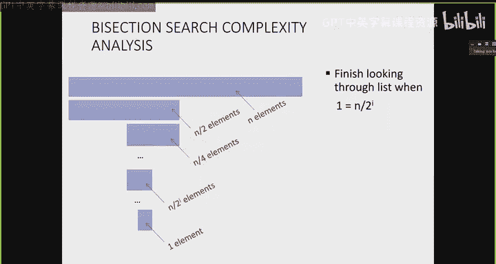

So we now have a a relationship between how many elements we had， originally and elements。

And how many times we had to divide our loop to get to our answer， right。

 how many of these levels we have right and divided by two to the I equals  one。

 That's our relationship。

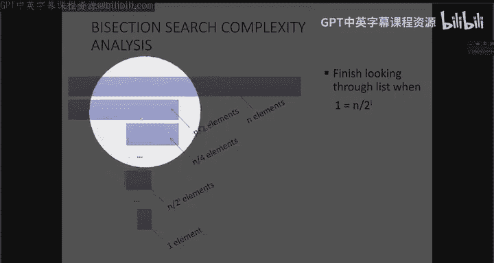

So in the bisection search algorithm， how many times are we calling this recursive function to get to the base case。

 Well， I times。 So what is I in terms of n， Well， the relationship between I and N is similar to the one we had over here。

 right， where we divided this number by 10 each time。

 except that now we're dividing a list of n elements by 2 each time。

So the relationship is still logarithmic。Right， it relates the number of elements I originally had。

 And with how many times I had to divide my list to get to one element whether it's。

 it's the1 I'm looking for。So the complexity of just the pure bise search algorithm is theta of login。

Where n is the length of the list。 right， That's how many subdivisions I need to do to get to one element to。

 to decide it's got the1 I'm looking。So now we're going to look at two different implementations of the code to do bisection search。

 One will be more efficient than the other。 Let's start with the one that's simpler to write。

 but less efficient。So this code， you can see here。

 it looks for element E and list L has two base cases up there。 Those are both constant。

And one recursive step here。 right， So either we do this one or this one。

 So this one is if we decided we need to look in the lower half。

 And this is if we decided we need to look in the upper half for the element。

So this is just pure bisection search， which on the previous slide， we decided is theta of log。

 of length of the list， Theta of log。Now。That's fine。 But what do we have as a parameter here。

It's half of my list， right？ So in addition to doing bisection search and just doing the algorithm。

 having a bunch of bisection search calls that take me to that one list of one element。

On top of that， each time I make that bisection search call， I'm copying my list。

So this is not constant。 It's theta of length L over 2， right， I grab half of my list。

So the complexity of that code。Is theta of n times log n。Fate of log n for the bisection search bit。

 But the of n tacked on each one of those calls because I have to grab a copy of my list with each function call。

So it's not quite that efficient。Now。Let's look at a slightly different implementation。

 This particular one is going to use integers to keep track of endpoint。

 So instead of copying my list， let me just keep track of a number for my low end point and a number for my high end point。

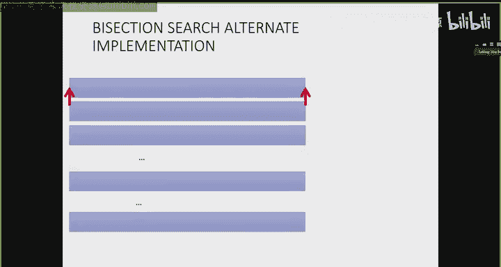

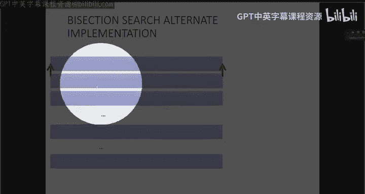

The complexity analysis for the bisection search is going to be exactly the same because even though I'm just keeping track of these high and low endpoints。

 I'm still dividing the list in half with each call。 But I'm using。

 I'm doing it by keeping track of integer indices。So the size of the problem is still reduced by two at each step。

 I'm keeping track of these integer indices。 I'm not copying the list at this point。

 I'm just changing an integer value from， you know， you know，10 to 5 or whatever it is。

So the complexity analysis of the， theta of the bisection search is theta of login。

 The code looks a little bit messier。But overall， it still does the same sort of things。

 It's messier because now。I want bi section search to look for an element Ean list L。

 but I'd like my recursive call to keep track of two endpoints， right。

 These integers low and the integer high。 The thing that I want to search my list between。

So I'm going to create another function that I kick off down here。

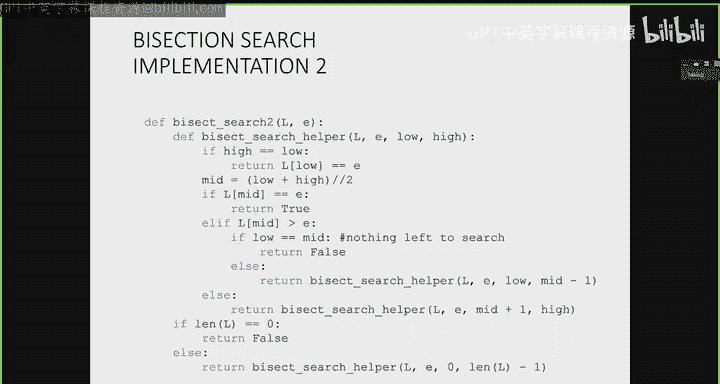

Which look for looks for an element E list L。 But I'm also going to keep track of my low and high end points as parameter to by my to by。

 to my bisection search function。

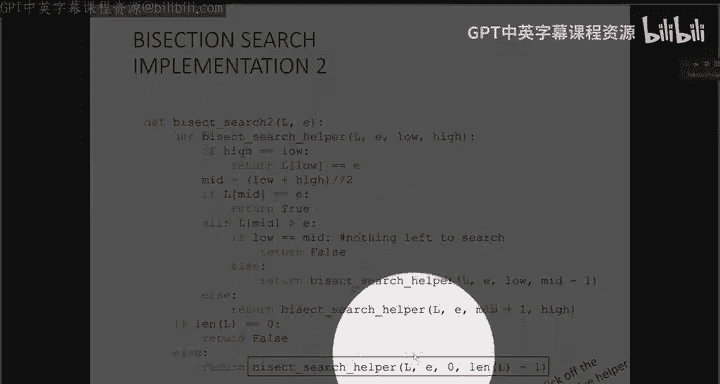

So bisection search helper here is now going take in these four parameters。The rest of the code。

 is just details。 But what's important is everything is constant。

 except for my two bise search callss right here I'm changing my low。 I'm sorry。

 I'm changing my high。 If I want to look in the lower half of the list。 And here I'm changing my low。

 if I want to look in the upper half of the list。So those biseal search calls are still going to be theta of log N。

 But what's the overhead now， The overhead is nothing， right， It's constant。 This L is the same1。

 I'm not making a copy of it。 I'm just passing it through。 E is just a number。 Low is just a number。

 and mid-1 is just a constant operation。 There's nothing being copied here。

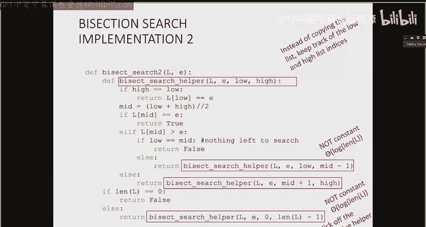

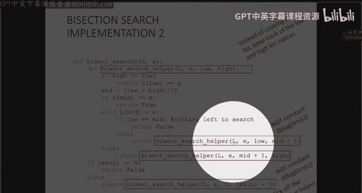

So the overall complexity of this code， while it looks a little bit messier， is just theta of login。

 right， because the overhead is constant on each one of those functional callss。

So that brings us to this final question。Right， clearly。

 bi section search on a sorted list is faster。 It's state of log n than by then a pure brute force search on a list that could be sorted or unsorted。

So， the question is。When does it make sense to sort the list first， So given an unsorted list。

 when do you sort the list and use this fast binary search versus just using a straight up linear search。

Well， that's when the time it takes to do the sort。Right。

 an initial sort plus the complexity to do binary search is less than doing the straight up linear search。

Because the list has to be sorted for this to work。Well， when is that true？Well。

 this implies that the time it takes to do the sort。Is less than theta of。So that means what。

 can you sort a list without even looking at all the elements once。No， right。 Like。

 you have to look at all the elements once to even say that， hey， this list is already sorted。So。

 this is actually never true。Right， so what does that mean。

 Does that mean we never want to do binary search on a list unless it's already sorted。Kind of。But。

 in fact， you know， there are various situations when it does make sense to do the sort first and then use binary search。

 And that's the case where you， you're given a data and you want to do a whole bunch of searches on that data。

So if you can take that sort。Do it once。And then amortize the cost。

 It took you to do that sort over K different searches。Then it makes sense to pay the price。

 to do the sort once and then do it over， and then do the binary search over all these searches。

 all these， yeah， all these searches。

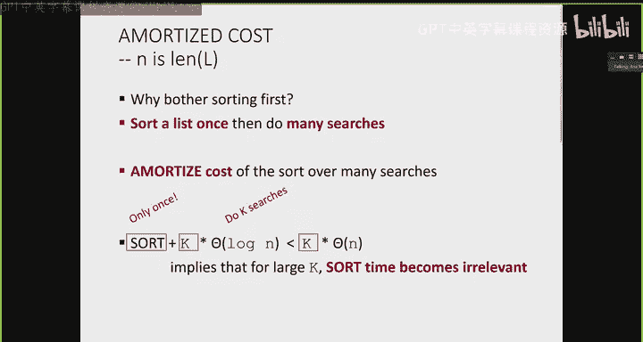

And so as K gets really big， the time it takes for you to do the sort becomes irrelevant。 right。

 The theta of doing this thing on the left becomes just the theta to do the search。

 the search logarithmically， than it does to do the search linear。Okay。

 so if you're only doing the search once。Please do not sort your list and then do a binary search。

 That's going take longer than just looking at the elements in your list straight through using brute force。

 But if you're gonna do a whole bunch of searches， make sense to do the sort and then do do the search。

That's all I've got。 Next lecture。 we're gonna look at a bunch of different sorting algorithms。

 and we'll have a quiz。

