# 《计算机科学和Python编程｜6.100L Introduction to CS and Programming using Python, 2022》 - P24：-24-Lecture 24_ Sorting Algorithms.zh_en - GPT中英字幕课程资源 - BV1PAxJzVEs3

Alright， so today marks the last lecture on the subject of sorting algorithms or on the subject of complexity。

 And specifically， we will be talking about sorting algorithms。

So let's remember where we left off at the end of last lecture。 we。

 we tried to look for elements within a list。 And this is a really common problem in computer science where the list is basically a large data that you might have gathered on。

 I don't know， biology information or physical experimental data。 some big file of data。

 And one of the most common things you might want to do on such a file is to search for something within that file。

 Basically， you'll read it in as a list， and you'll search for something of interest within this list。

So we saw two algorithms to search for an element within a list。

 The first was just a straight up linear search。That linear search we did on a unsorted list。

 and we also did it on a sorted list。 And what we saw was that the worst case time complexity for searching for an element within a within a list using linear search was theta of N。

 That's the best that we could do。😊，Now。We saw the binary search algorithm as an alternate way to search for an element in list。

 But the caveat to using the binary search algorithm was that we had to have a sorted list。

 We can't use this binary search search algorithm on an unsorted list because it will give us an incorrect answer。

So assuming the list assorted binary search does a much better job。

 a much faster job at finding the element within a list。 It does it in theta of log n time。

 which is faster than theta of n。 The timing timings through a code that we did showed this counting the number of operations showed this。

 and then the theory also showed this。Alright， so clearly。

 it is better to use binary search because it's faster。

 But when does it make sense to use binary search？ So the idea is given some sort of data set， right。

 some list of elements， we would have to first sort them in order to do binary search。

 So the question then becomes the time that it takes for us to do a sort。Plus。

 the time that it takes for us to use binary search to look for an element within that list should be less than the time that it takes for us to do linear search。

 right In that case， it makes sense for us to do a sort and binary search。

This implies that the time it takes for us to sort is less than this subtraction。

 So theta of n minus theta of login。 So this implies that we can sort a list in less than theta of n time。

 That means we can sort a list without even looking at each element in the list。

And that's not possible， right， We have to at least go through each element in the list one at a time to determine that that list is sorted to begin with。

 right， So even in the best case scenario to to sort a list， that's going to be theta of n time。

 So clearly， this will never be true。So then the question becomes。

 why do we bother doing binary search in the first place？ Well， that's because oftentimes。

 if you download a data or， you know， you want to do some， some search on some。

 some list or some data that you get。Most of the time， you're not going to want to do it just once。

 You're going to want to sort that list one time。And then do a whole bunch of searches for a whole bunch of different things within that list。

 So if we can somehow amortize the cost of doing one sort。Over K different searches。As k gets really。

 really big， it makes sense to do binary search on the sorted list。

 rather than just to look through using linear search K different times， right。

 So then that time to do the sort only once kind of gets absorbed and goes to 0 as the number。

 the K number of searches goes to some really big number。So clearly， we've shown that if you。

 if you want to do many searches on a data set， it makes sense to do this sort only once。Alright。

 so now we're gonna to look at a bunch of different sorting algorithms。

 We're going to start with some really bad ones， and then we're going to work our way up to what is considered one of the best sorting algorithms。

 the best that we can do。So let's begin by showing a really， really bad sorting algorithm。

 And there are actually competitions where people can come up with really bad sorting algorithms that kind of sort lists in a really weird way while being really bad。

 still making forward progress。 And this is one of them。

So this one is called bogo sort coming from the bogus sort， also called random sort or monkey sort。

So the idea here， and I'm gonna use these cards as we look at these different sorting algorithms。

 The idea of bogo sort is that we're gonna use randomness to help us sort the list。So。

If we wanted to sort a list or a deck of cards， for example。

 the idea of bogo sort is that we're going to take all our cards。

 We're going to throw them up in the air。 We're going to pick them up as they land。

 and we're going check to see if they're sorted。 If they are were done。 if they're not。

 we're going repeat the process。 We're going throw them up in the air， let them fall where they may。

 and then we're going check if they're sorted。Okay。So the code would look something like this。

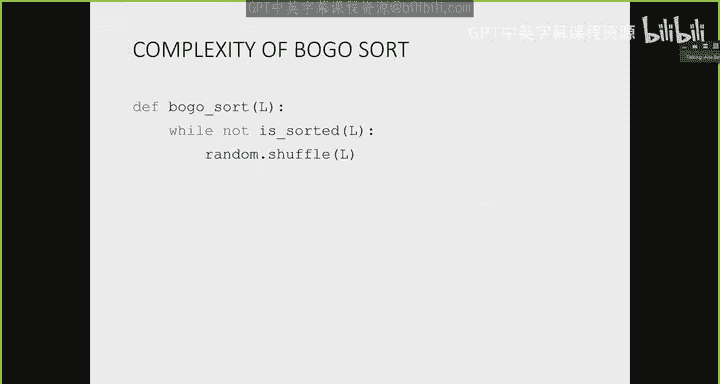

It takes in a list L， and it says， while the list is not sorted。

 we're going to call this shuffle function from the random library。

 and the shuffle function just reshuffles or rearranges the elements in the list at random。

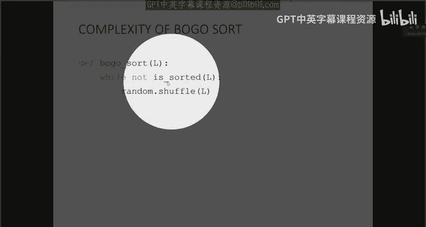

So let me show you how that looks like。 So here's the sorted function。嗯。I'm going run it。

So it starts out with this list of， obviously elements， not in order。

 and it took about 02 seconds to just randomly keep reshuffling the elements of that list to give me for them to become in sorted order right So it did about 30000 shuffles。

 And if I run it again， it will take a completely different amount of time each time it's run right。

 So now it was really fast。 But if I keep running it， you know， one time I ran it last night。

 It took about two seconds。 So you can see it's just random。

So what's the complexity of this function？ Clearly， it's not going to be very good。At best。

 So in the best case scenario， let's say my input list is already sorted。

So in the best case scenario， the theta would be just theta of n， where n is the length of the list。

 because we have to look at each element once to make sure that it's in its rightful place。

But in the worst case scenario， the theta complexity of this is unbounded。 It so infinity。

 because at worst case， we're going to be super unlucky and we're just never going to get the elements in asorted order。

So clearly， not a very good sort algorithm。 If you go to the Wikipedia page for this。

 it will give you a whole bunch of other examples of algorithms similar in this。

 in the spirit of you know， being bad， but making forward progress towards an answer。So next。

 we're going to look at a different sorting algorithm called bubble sort。

 And it's one of the most popular one popular sorting algorithms， not because it's good。

 but because people really like to make fun of it。So it's best to understand it。

 So the idea of bubble sort is that we're going to start with an originally unsorted list。

 And like I said， I'm going to use this as an example。

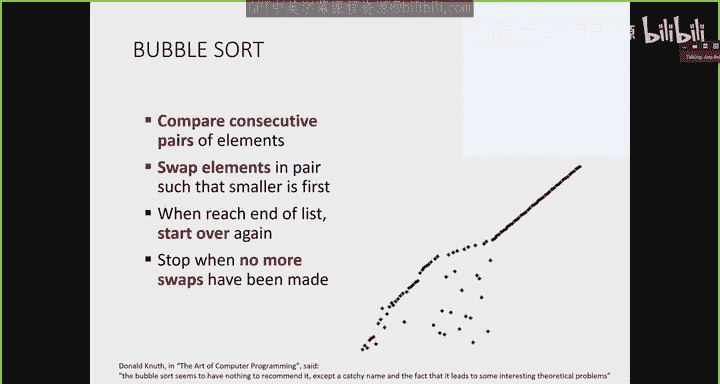

And we're going to try to compare consecutive elements， one at a time。And as we do so。

 we're effectively going to bubble up the， the largest element towards the end of the list。

So we're going to start our first pass on this clearly unsorted list。

 and we're going to compare the first two elements。

 If the element at index I is smaller than the element at index I minus-1。

 then I'm going to do a swap。 So here they were。 So I did a swap。

 Then I'm going to compare the next set of elements。 So these two are already sorted。 right。

 These two are not。 So I'm going to swap them。 These two are not。 I'm going swap them。

 These two are not， I'm going to swap them， they're not， I'm going to swap them。

 and these two are not， and I'm going to swap them。Okay。

But just do it over because that table got in the way。Right， so after I finished my first pass。

 this number 11 effectively bubbled up from wherever it was towards the end of the list。

 the place where it belongs， basically， right， it belongs at the end of the list because it's the biggest number。

Since I've done at least one swap on that previous run。

 I'm going to go through again because in the process of doing a swap。

 I might have disarranged something that was already sort of in order。

So now I'm going to start all over again， I'm going to say are these two in sorted order， they are。

 are these two no， so I swap， are these two no， so I swap， are these two no， so I swap， I swap。

 and I swap。And now after two passes， I've effectively bubbled up the next biggest number。

You guys can see。Okay。Next time through， next time through。

 I'm gonna have to go again because I am I did one swap last time。 So again。

 I'm going compare these two。 I need to swap them， These two， I need to swap them。

 These two I need to swap them， swap them， swap them。 And these are in order。 and these are in order。

Again，5 and the four needs to swap，5 and the one needs to swap 5 and the 0 needs to swap 5 and the two needs to swap。

 These are an order。 These are an order。 These are an order。4 and the one needs a swap。

 These two need a swap。 These need a swap， ordered， ordered， ordered， ordered。 Next。

 these two need a swap。 These are okay。 These are okay and so on。And now that I've not。

I'm going to do one final check。 These are all in order， right。

 So now that I haven't done any more swaps， I can say that this list is now in sorted order。

So with each pass， I'm bubbling up the biggest element towards the end of the list。

 So at the end of n passes the top， the last n elements will be in sorted order。

So the code looks something like this。I've got a Boolean flag here that keeps track of whether or not I have done a swap。

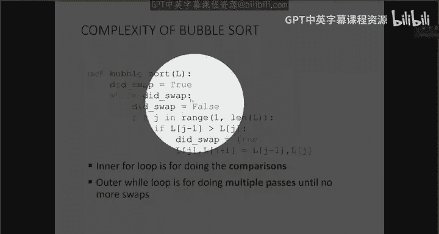

If I've done a swap， then I know I need to go through and double check that everything is still in order by comparing index I and I minus1。

So to do that， we've got a for loop that goes through from one all the way up to the end of the list。

 because I'm going to compare element at index I with I -1。 If I started at 0。

 we'd get an index out of bounds error。 So that's why I start with one over there。

 And then the inside of the for loop just checks if the element at， I guess J。

 I use J instead of I J and J -1 are in the right order。 Now， obviously they are。

 But when I first started this demo they were not right。

 So as long as this J-1 and J are not in order， do a swap。

 So here I just change I use this sort this this tuple trick here to do the swap of element。

 J -1 and J。

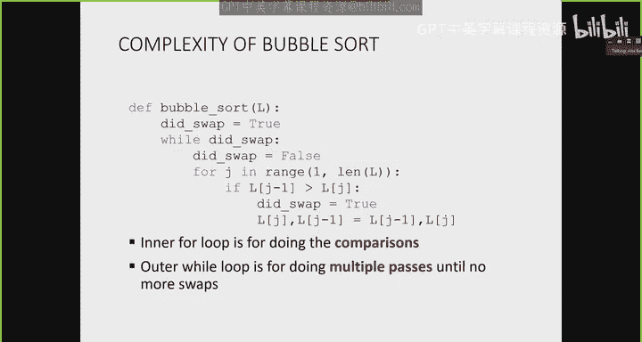

And I also reset the Boolean flag that I did the swap to true。

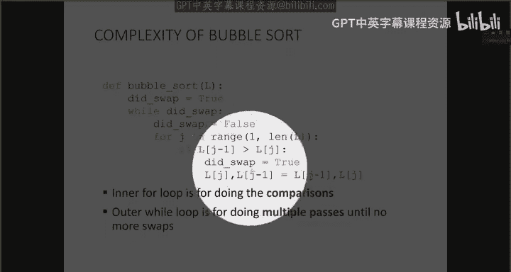

And this goes through until I don't do any more swaps。

 And then the code will not go through the while loop anymore。

So let's print how this actually looks like when we run it on our list。

So here I have my original list。Each set here。Delineated by this line break represents one。

1 loop of my wild loop。 So this thing here。Right， one iteration of my while loop。

And each line within here represents one iteration of my for loop。

So what we can see is that as we're comparing the four and the8， the eight bubbles up one step over。

 then we compare the8 and the6， the8 bubbles one itself over and so on and so on until it encounters the 11 and then the 11 starts to bubble itself up all the way to the end。

 So at the end of the first while loop pass my 11 is in its rightful spot at the top of the list at the end of the list。

Next time through the Y loop， I'm effectively bubbling up the eight to the end， so over here。

 next time through the Y loop the six bubbles to the end， next time the five bubbles through the end。

 then the four， then the two， then the one， and then the zero。Art。So what's the， yeah question。まいで。

Oh， we don't need the brackets。 just， I mean， you can put them in。 it won't harm。 But you。

 if you don't put them， it's， it's okay。 Python knows that it's， it's doing an assignment one by one。

 So this one to that one and that one to that one。Okay。

 so let's look at the worst case complexity analysis。

 So the easy one we can already know is this inner for loop， right。

 This one goes through from one to the length of the list。 So that's the of length list。

We have another complexity， though， because in the worst case scenario。

 our list is completely backward。And so this while loop up here will repeat length L times because we're going to bubble up every single one of the elements all the way through to the end of the list。

So the complexity of that while loop will be fate of length L as well。

 because thinking about the worst case is when our biggest element is here。

 Second biggest element is here and so on。Alright， so the worst case complexity this is theta of length。

 length L squared。Or theta of n squared where n is the length of the list just to be less verbose。O。

Clearly， not a great sorting algorithm。 It's pretty inefficient in some of the things it's doing。

 I once it's reached， you know， sorted some of the stuff up here。

 it keeps comparing them through to the end。 So it just always goes through to the length of the list。

We can do， we can look at another sorting algorithm called selection sort。

 which is sort of like bubble sort。 But it does things in a little bit of a smarter way。

 So let me start again with unsorted list。And let's see how selection sort will。Do this， okay。Okay。

 so the idea of selection sort is that with each pass。

 we're going to decide which one of these elements belongs at some index。 So with my first pass。

 I'll decide which element belongs at index0。With my second pass。

 I'll decide which element belongs at index 1， with my third。

 which element belongs at index 2 and so on。 Okay， So the way we're going to do that is by saying。

 all right， I'm going take this element。 It's the first one in the list。

 It's the one currently at index 0。 And I'm going to compare it with every single element from the rest of the list。

And as I find an element that's smaller than the one currently there。

 I'm going to swap them because I know that that smaller one obviously belongs at index0。

So I'm going compare the5 with the 8。 I'm going to say， well， the5 is smaller than the 8。

 So it currently belongs at index 0。 I compare the5 with the one。 The one is smaller。

 So I'm going to do a swap and say the one belongs here，5 with the 11， the one belong， sorry。

 the one with the 11， the one belongs here。1 with the6， the one belongs，1 with the two。

 the one still there，1 with the 0， Well，0 is smaller than one。 So let me swap it 0 with the4。

 we're done。So now at the end of the first pass， I've decided that the zero is the smallest out of everybody here。

 so it belongs at index0。Next time my next， my second pass， I'm not gonna worry about this 1。

 I know it's already the smallest， So I'm going determine which element belongs at index 1。Right。

 so the8 is the first one there。 It's the one currently at index1。

 So I'm going to start with it being the one that belongs there。

 And I'm going to successively compare it with everybody else。 So the8 with the5。

 the5 clearly is smaller than the 8，5 with the 11， the five is smaller，5 with the 6， the5 is smaller。

5 with the two needs a swap， because the two is smaller。2 with the one， again， we swap。

 the one is smaller。 and then one with the4，So at the end of the second pass。

 I've decided that the one belongs at the next index。

 So now these two elements are in their correct place。 They're in sorted order。Okay， third pass。

 we're going to decide which element it belongs at the next index， right， the index 2。

 So 8 with the 11 is okay，8 with the 6。 We need to swap 6 with the 5。 We need to swap 5 with the two。

 We need to swap 2 with the 4。 Everything's okay。Three passes。

 the first three elements are in sorted order now we just need to figure out between these leftovers。

 which one belongs at the next level， so eight with the 11， we do a swap，8 with the6， we do the swap。

 six with the five， we bring the five here， five with the four， we bring it here。Okay。Again。

11 with the8， we swap these，8 with the 6。 We swap these，6 with the  five， we swap them。 right。

 So as you can see， as I'm making my way through to figure out which element belongs at the next index。

 I have fewer elements to， to decide between which belongs at the next index， right， So here the 8。

 the 11 needs a swap。8 with the six needs a swap， and then lastly like that。O， so。

Slightly more efficient in that we're not comparing a bunch of pairs all the time all the way through to the length of the list。

 So the code looks like this。I've got one for loop that goes through the length of the list。

And one inner for loop that only starts at I and goes through to the end of the list。 right。

 So unlike bubble sort， which started at one and went through to the end of the list all the time here。

 I'm starting at I and going through to the end of the list because。In selection sort。

 with each pass， I've decided which element belongs at a specific index。

 So I no longer need to worry about comparing that element with everybody else。 right。

 So when we were， you know， we were like that。We had decided these were in sorted order。

 I only needed to compare these three amongst themselves to decide which one fit at the next spot。

 Everybody else was already sorted。So what's the complexity analysis of this。

 This is gonna feel very similar to diameter from last lecture because diameter also had this funky thing where we started from I and went through to the length of the list。

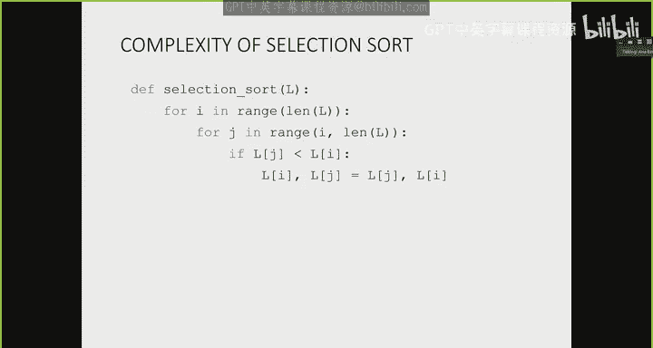

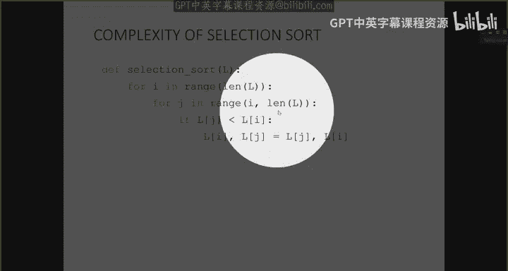

Well， it's gonna be theta of length L squared again。So there's two ways to think about this。 Okay。

 The first one is to look at each loop individually。Clearly。

 the outer loop goes through theta of length L。Right， no question about that。

 That just goes through range of length out。The inner loop is a little bit trickier， right。

 because it doesn't always go from some fixed number to the length of the list。

But what we can think about is on average， right？The first time。

When were trying to figure out the element that belongs at the first index or index 0。

 we went through to the length of the list。 We had to compare with everybody else。

 The next time we have to compare with length list -1。 then length list -2。 And then at the end。

 we only had， you know， one item to compare。So on average。

 that inner loop goes through length out over two times， right， On average。

 we have to look through about half of the elements in the list。To， to do the comparison。

So if the inner loop here， on average， is theta of length is length L over 2， right？

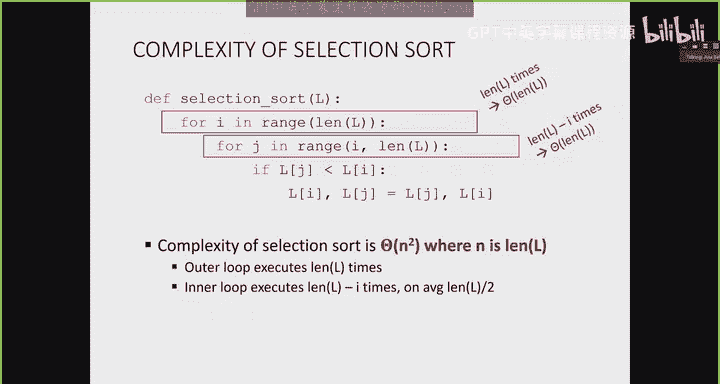

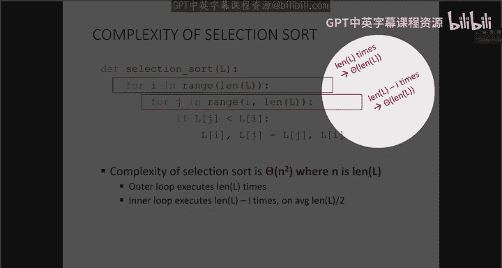

Then the theta of length L over 2 is theta of length L。 There's just the 0。5 in front of that。

So that's the first way to think about the complexity analysis of this。 The other way。

Is to ask yourself， well， what part of this code is doing the repetitions， Like。

 if we were to think about what we're counting in terms of units， which part of this code repeats。

 Well， the stuff inside the inner for loop repeats， right？

 So you're going to do a whole bunch of comparisons。So how many actual comparisons will you do。Well。

 the very first time， like the outer first pass through to the end of the list。

 you're going to do approximately length L comparisons。

The next time you're gonna do length L -1 comparisons。

 then length L -2 comparisons and so on and so on， down to only one comparison。

So if we do that sum 1 plus 2 plus3 plus all the way up to length L。

 the sum that formula becomes length L times length L plus1 over 2。

 So that becomes length L squared over 2 plus length L over2。 and that becomes theta of length L。

Squared。Right， so just a couple ways to think about the analysis of this。

And this is a pretty common thing you'll see。 But just because we start at I doesn't mean that it decreases the complexity of this function dramatically。

 It doesn't decrease it by some order。 It just decreases it by half， right。

 So it's still theta of length。Okay。So we can actually do a little variation on this because you might have noticed it was a little inefficient to do the swap every time I noticed another element that's smaller。

 right。I didn't have to do the switch。 All I had to do was kind of just keep track through a variable of the smallest number that I have seen so far and only do the switch at the end when I've determined that that's the smallest number。

😡，Right， so the variation， basically， if this is my list， says， hey。

 I'm going look at this element that belongs in this very first slot。

8 is the first one that I'm going to look through the elements all the way up to the end of the list and keep track of the smallest one。

 The4， the one is currently smallest。6 is not。5 is not 9 is not。2 is not。

 the0 is smaller than the one。 So if I see the0 is smallest， then I swap it。

 So I only do one swap at the end。Next time through。

 I'm going decide which element belongs at this index。 The one is the smallest I see。

 So I do the swap only at the end。Right， then I decide which element belongs here。

 The two is smallest out of everybody left。 The two goes there。So I'm doing all these comparisons。

 but I only do the swap at the end， right when I've decided， hey， this is the smallest element。

 Let me just swap it with the one that's currently there。

So it's just going to go through to the end of that。Okay， so I wrote that variation here。

 So this is selection sort。Just as we saw it。So we can see here that the first pass with the outer loop。

 we have length L。Comparisons to make， because we're always comparing these two， right。

 then the one that's currently at this index and the next the one index over。

 the one that's currently at this index and one index over and so on。So the first pass。

 I've done length L swaps sorry length L comparisons。The next pass。

 I've done length L -1 comparisons because I don't need to look at the0 anymore。

 I already know that's in the right place。 Then after that， I do length L -2 comparisons。

 then length L -3 comparisons。 So you can see as we're making progress through our outer loop。

 we have fewer and fewer comparisons to do right So you might think that this is much better。

 but the theta complexity analysis says it's not。So that's the original selection sort。

 and the variation on selection sort。Looks a little more complicated。But it's not doing a swap。

 So it's only doing a swap down here。 As you can see。

 it's doing it after it finishes this inner for loop。

And all this inner for loop is doing is checking is doing the comparisons and keeping track of the smallest number it sees in this variable call smallest。

And the index associated with that smallest variable in smallest J。Now。

 if we look at the analysis for this， Well， we still have an outer for loop that goes through length L。

 We still have an inner for loop that goes from I to length L。

All it's doing is eliminating this line here。 It does it only once at the end。

 but it's still doing all these comparisons。 It still has to look through all of these elements1 pair by pair to do the comparison。

 So actually， this slight speed up doesn't have a big impact on my theta complexity。

 It's still going be theta of length L squared。Any questions so far？On these sorting algorithms。O。

So clearly， we're not really doing a very good job about。Thinking of a unique way to do。

 to do the sorting。Right， because all of these different variations where we're doing slight speedups here and there aren't doing a drastic enough job to bring us a whole complexity class lower。

 right So we have to think about the problem in a completely different way。

 So the iterative approach is not working out for us， right， where we basically have a loop。

That does something in another loop。 that does some sort of comparison， right。

 That's not going to get us a whole， a whole complexity class speed up。So instead。

 what we're going to do is approach the problem from。

Sort of inspired by binary bisection search or binary search。 in bisection search。

We weren't looking at each element 1 at a time。 We were taking our list and dividing it in half。

Right， so we can try to do a similar approach here。 And that's what this merge sort algorithm does。

 And's going to take an original list， and it's going to divide this list in half with each step。

And it's going to do this recursively。 It's going to be a divide and conquer algorithm。

 So it's going to recursively divide this list in half each step。

And then it's going to merge sorted lists in a really smart way。

 such that it'll give us the speed up that we're interested in。

So let me explain to you how we're going to merge it。

And then we'll see how we can write up this whole algorithm。So let's say that we have， let's do this。

Let's say。That。We've done some sort of division of lists。Right。

 and let's say that we've written this algorithm and it works really nicely in such a way that it gives us。

Two sorted lists。Right。So if somehow， my algorithm。

Right where I had one full list of all of these eight elements here。Divided itself。

 And when it came back together， it gave me two sublists that themselves are sorted， right。

 So this is a sorted list， and this is a sorted list by itself。

Then there's this really smart merge step that we can do。

So we can recognize that if this list is sorted by itself and this list is sorted by itself。

To determine the element， that is the smallest between both of these lists。

 all we have to do is look at the first element of each list。 each sublist， right。

 This is the smallest out of these guys。 This is the smallest out of these guys。

 So if I just compare the0 and the 4， I know the0 will be smallest out of everything。Okay。

Then I'm left with this list。 It's still sorted。 This list is still sorted。

 I look at the first element of each of these lists。Which one of these is the smallest。 Well。

 the one is smaller than the four。 So I'm going to take this one and say this one comes next。

 So we're using the property that these two lists themselves are sorted。

 So all I need to do is compare the first element of each list。 Then I compare the two and the4。

 I say the two is smaller than the4。 The6 and the4， The four goes next。 The6 and the 5。

 The5 goes here，6 and the8。6ix goes here，8 and the 11。 Well， they're already in sorted orders。

 so we're done。So that really smart merge step touched every element only once to bring it into my master sorted list。

 right， I didn't have to do multiple passes。 I just had to look at the first element of each list。

So if we can somehow get to this point where we have these two sublists that are sorted。

 I can just do a little merge by looking at the first element in each of these sorted lists。

 and that basically gives me a theta of n complexity to do the merge from two smaller sorted lists into one big sorted list。

😡，So here's the idea of this merge sort algorithm。 We're gonna to take an original big。

 unsorted list containing N elements。It's unsorted。 We're gonna divide it in half。Of course。

 these two halves。 There's no order to them。 So they are potentially very unsorted。

We're gonna take each one of those halves and divide them as well in half。More unsorted sublists。

 Now， I've got four unsorted sublists of smaller lengths。

 Then I'm going to keep dividing them in half。I have now maybe just two elements in each of these unsorted lists。

 There's no guarantee that they're sorted。 And then I divide in half once more to have a list with one element in each yeah。

 a list with one element。 Maybe some of these will be empty， but you know。

So then if I can get to this point where I just have lists containing one element in each list。

 those lists themselves are sorted， right， An element with just a one in it。

 A list with just a one in it is sorted。So then I can begin a merge step， which says， hey， these two。

Here that were originally unsorted。 Let's just merge the pairs back up。And we'll do that。

 that smart merge mergeway， right？ So these two will merge back in。

To give me all of these8 sortded lists of element of length to。

 And then we're going to merge these pairs back up again。

 using that smart merge merge way to give me。4 sorted lists。

 And then we're gonna merge these pairs of sorted lists to give me bigger sorted lists。 And finally。

 we're gonna merge these two sorted lists to give me my final master sorted list。Okay。

So let's do the process of doing the sort。Right， step out of time。So， we're going to take。

Original list。いク。try this。I'm going to need some room to move them down。

 So this is my original unsorted list。Let's put this here。Something like that。

So what's the process going to be， Step 1 is to divide them in half。Step two。

 divide each of these in half。Step 3， divide each of them in half。

 So now I've got a bunch of lists with only one element in it。Now I need to merge them back up。

 So merging these two together to give me a list with two elements says I'm just going to compare them。

 The one that's smaller goes first， the one that's bigger goes second。Again， these ones compare them。

 The one that's smaller goes first， the one that's bigger goes second。Again， compare them。Again。

 compare them。So now I've done one merge where I have four lists that are sorted。By themselves。

 right？So now I'm going merge these two together and these two together。

So I'm only looking at the first element of each， so I compare the0 and the two。

 and I know the zero is smaller than the two。Then the two and the8， the two is smaller。

 then the8 and the 11， and then the 11。 So now this list is now sorted by itself， same process here。

 compareare only the first element of each list， the one comes first， then the four comes next。

 then the five comes next and then the6 right。So now I've reached the exact same spot I was at when I was talking about the merge step。

 right， when I showed you that that we could get to that spot。

 So I've got these two lists that are themselves sorted to merge。

 So all I need to do is look at the first element in each list。 So there's my0 goes first。

 one compared with the two， the one goes next，2 compared with the four， the two goes next。

4 compared with the8， the4 goes next，5 compared with the8， the5 goes next，6 compared with the8。

 the6 goes next。 And I've removed all the elements in this list。

 So I know I just need to grab whatever is left in here and whatever order it's there because everything's already sorted。

Okay。So that's the entire merge sort algorithm， right。Now， if I do this demo。

 this is actually going to show you the exact steps that the recursive algorithm is doing。

 and it's not going to be sort of in the same order that I showed you。

 It's not going to be dividing this in half and then dividing in half and so on。

 because when we're doing the re the recursion first。

 we're going to figure out how to sort a left sublist right So if I have my original unsorted list here。

 we're going to figure out how to sort a left sublist first。

That's a recursive step that we haven't reached the base case for yet。

 We still have to sort this list。 So we're gonna try to sort the left sublist of this one。

 And then we're going to try to sort the left sublist of this one。

 So we're going to do something that feels really similar。To the Fibonacci sequence， yes， Fibonacci。

 right， Fibonacci of n is Fibonacci of n -1 plus Fibonacci of n -2， right？ In that particular case。

 when we were trying to find Fibonacci of 6 or something like that。

 we were going and exploring the left side until we reached a base case， right。

And only once we reach the base case could we pop up and do the other half。

And so this algorithm is going feel very similar to that。 So here's on my original list。

 I'm splitting the left hand side to try to figure out how to merge those。

 all the way to the those left lists。 So the 8 and the4 will be compared。

 and the 4 goes before the 8。And then I'm gonna merge the。

 then I'm going to merge the one and the6 by themselves。 Those are already sorted。 as we know。

 Then we're gonna merge the4 and the8 back with the one in the6 using that merge step。

 And then we're gonna do the same thing to that right hand。Side， right， one at a time。

We'll do another example where we go step by step。Right， and now we've got our two。

 four elements together。 So now we're just doing our final merge step where we decide which one belongs next。

Okay。So let's look at the merge code。And this is， this is not yet。 So， sorry， let's look at the。

 the merge step once more。 So if I have two lists that I'm trying to merge。

 the idea was that you look at the first element of each。So first。

 the one and the two compared means the one is smaller。 So a goes into my result。

 The5 and the two gets compared。 The two is smaller。 So the two goes into the result。

 The five and the three gets compared。 The three is smaller。

 So the three goes in the result and so on and so on。

 So we keep doing this process where we just keep looking at the first element。Until。

We have one of the lists become empty， right， So this is my left sub list。 This is my right sublist。

 When one of these lists becomes empty， I no longer need to compare 18 with nothing， right。

 All I need to do is grab all these elements and stick them through at the end。

So let's look at the code for just the merge step。 We don't need to look at the code for the full algorithm yet。

 but the merge step code is just the part that takes us from two sortded lists。

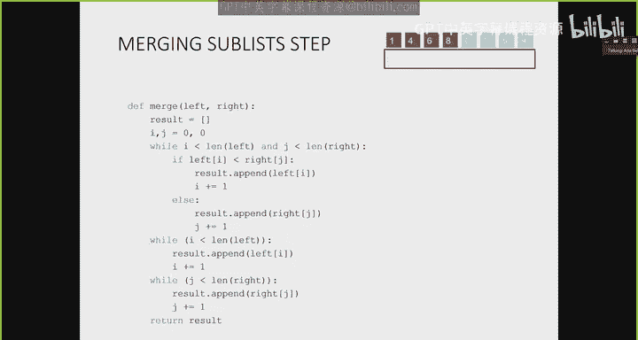

Into one bigger sorted list。So does that step in one。This is where the main event happens。

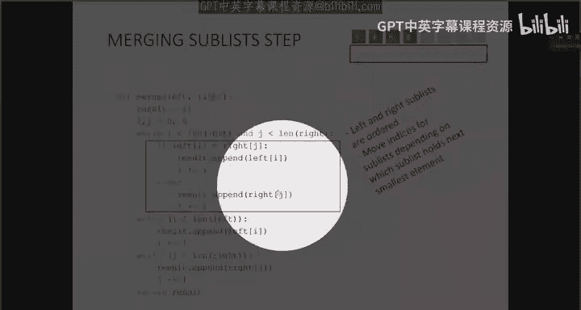

So this is just going to use indices to compare which element we need to grab next。

 So if I have sort of something like this。Like that， right？

 Then I'm not actually going to make a copy of a list or， you know。

 or do any sort of funky stuff with list copying， because that'll increase the complexity。

 But we are going to do that trick where we take where we use an integer index to decide where。

 where we're going to which element we're gonna grab next。 So that's what this I and J is for。

 We've got I is going to be the in index from my left sub list。

 And J will be the index for my right sub list。And all it does is it says。

 while I still have elements in both of these lists。

 just take the pointer and say which one of the elements at these two pointers I and J is smaller。

 So if the0 is smaller， I'm going to create a new list here that's going to have the zero in it。

 I'm not actually taking this element and moving it here。

 all I will do next is say the pointer that tells me which element I should be looking at next moves over one。

 So this list remains unchanged。 then I'm going compare the two with the one that one comes next。

 So I'm going take the one and put it in my list here。 and this pointer。

Moves here to the next element。 So now， while this list stays as is。

 I'm looking at the element at this pointer and comparing it with the element at this pointer。

 So then the two comes next and this pointer increments by one。So that's what that code does。

 These two while loops just deal with the case when we have one list that has finished inserting its elements。

 So like in this particular case here， when my right sub list became empty。

 we've already put on all the elements in it into our master list。

 Then all we need to do is take everything that's left over and copy them into my master list。

 and that's what these two while loops are doing。So the complexity of this merch store。

 So that's just what it's what it's doing。So it's just doing one pass。It's not doing multiple passes。

 So we just look at each element once。 So the complexity of this merge sort of not the sort。

 just the merge step is theta of length of the list， right。

 because we're just looking at all of these elements once。

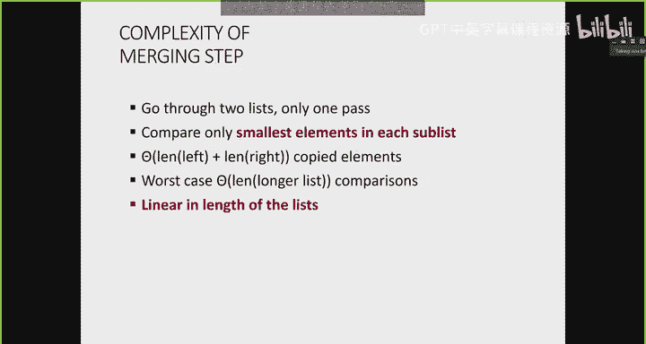

Now， what about the actual algorithm， right， So here I've got the merge function down here。ok。

I's going to take a left list and a right list。 And it's going to do that step that we just did where you look at the smallest element in each。

 What about the rest of it， Well， the rest of it is just recursion。

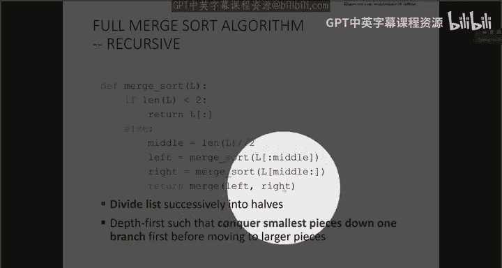

My base case is when I have a list that's empty or a list with one element in it。

 then I just grab that list。 That's my， that's going be my merge。And else。

 what we're going to do is we're going to do the step where we divide the list in half。

 So we're doing integer division from the length of the list because we don't want the middle to be 7。

5， for example。So we're going grab some integer index。 And then we're going to say， I'm going to。

 again， there's a lot of faith involved in recursion。 I'm going to say the left sub list。

 So this one here。If my algorithm somehow works correctly， will now be a sorted list。Okay。

 and then my right。Over here， right equals this thing here will also somehow be a sortred list。

 So this is me putting faith in my algorithm that I can get a sortred list right from the index 0 all the way up to the midpoint and the midpoint all the way up to the end of the list。

So if somehow， I can get a left subliist that's sorted by itself and a right subliist that's sorted by itself。

 All I need to do to get this。The final sorted list is to merge them。

 So that's what the merge function is to。O， so。Let's step through。So I've got my original list here。

 And this is where we're going to be thinking about how we kind of step through Fibonacci。

 Here's my original list。 The first step is to do is to， is to figure out the left part。

So we're going to divide it in half， and it says， I need to figure out the sorted version of 8，4，1，6。

 but it's not my base case。 So I need to figure out the sorted version of the left part of that。

 the 8，4。 Again， it's not my base case。 So I need to figure out the sorted version of the left。

 just the8。 It's single by itself。 So that's just going to be the8。

 Then we can figure out the right half of it。 It's4 by itself。 and we merge them。

Then we can figure out the right half of this one here，8，4，1，6。

 So we need to figure out what's the sorted version of 1，6。 Well， as humans。

 we know it's already sorted， but the algorithm goes through， looks at the left side。

 looks at the right side， merges them up。 Now we merge the 4，8，1，6。

 according to the little merge step。

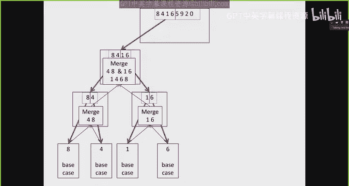

To give us 1，4，6，8。 And at this point， we've finished just the left half of 8，4，1，6，5，9，2，0。

 And now we need to do the right half。 So we do the whole process all over again by taking that 5，9。

2，0， looking only at the left piece。

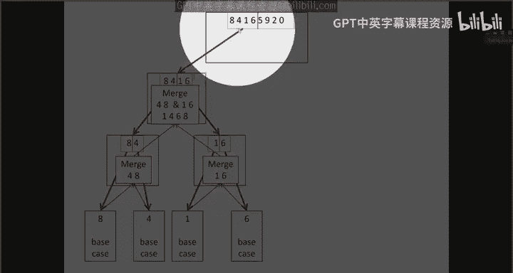

Then the left piece of that。Then the right piece of that base case， merging them back up。

The right step。The left part of that right step， the right part of that right step。

 merging them back up。 So then we do the merge step of 5，9， and 0，2。

And then the merge step of these two two lists，1，4，6，8， and 0，2，5，9。

So you can see it has a similar feel to exploring one side of the branch first。

 just like with Fibonacci， for the exact same reason。

 because we've got a function call that's recursive。

 We can't complete it until we've explored all the way down to the bottom。

So the overall complexity of this is going to be the mergerch step itself is theta of n。

 like we just talked about。 But how many levels do we have， That is。

 how many times do we take our original list and subdivide it until we get to our base case。

And the number of times is， according to this function， very much like when we did bisection search。

 we're going to take an original n elements in my list。

 And I'm going to keep dividing this n elements by 2。

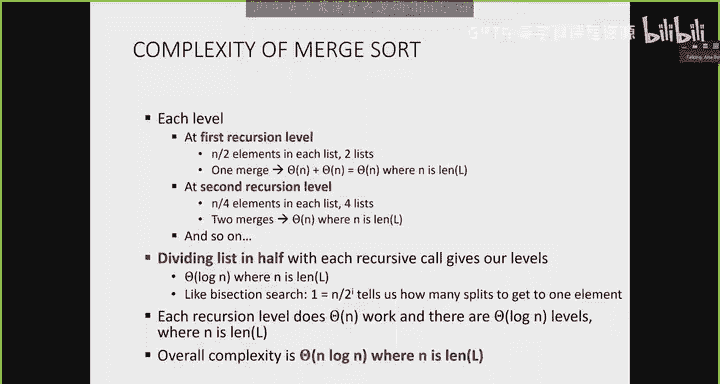

In a bunch of sublists， i times。

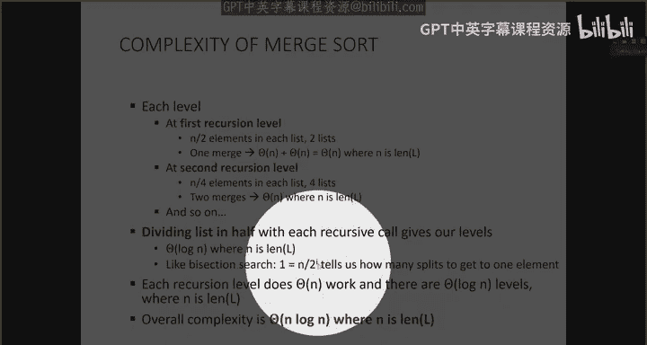

So I times is how many times we're gonna subdivide this list until we get to a base case。

 So what is I in terms of n， Well， I is equal to log log of n。So at each merge step。Sorry。

 so at each sub level， I've got a merge step。 So I've got theta of log of n levels multiplied by theta of n。

For my merged steps。 So the overall complexity of this function is theta of n log n where n is the length of the list。

O。So it turns out that theta of N log N is actually the fastest we can have a sort B。

 You cannot do a sorting algorithm that's faster than that。

 You can do little tricks here and there based on your data。

 Maybe you don't divide the list exactly in half。 Maybe you divide it。

 and you find some sort of pivot point。 That's a little bit smarter about the data。 But in general。

 the complexity of this function of of a sorting algorithm is always going to be the fastest it's going to be is theta of N log。

O。All right。We've seen a bunch of different algorithms here to help us design programs。

 So the reason why we do this complexity analysis is to guide the design of a program。

 So if you already have a bunch of nested for loops in the program that you're trying to consider writing。

 you'll already know it's gonna to be pretty inefficient and slow。

 So you might want to rethink the design to begin。

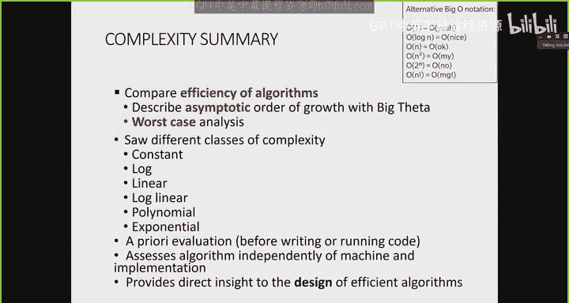

All right。

