# 《计算机科学和Python编程｜6.100L Introduction to CS and Programming using Python, 2022》 - P25：-25-Lecture 25_ Plotting.zh_en - GPT中英字幕课程资源 - BV1PAxJzVEs3

Allright， so let's begin today's lecture。 we have only two lectures left。 this one。 and next Monday。

 I realize that there are no more deliverables for this class， no more quizzes after tonight。

 no more P setss。 So I do appreciate you coming to these lectures。

 they're intended to be a little bit more fun。 you know， no need to take notes。

 just kind of sit back and enjoy the content today。

 we're gonna be talking about library and Python that can help you do plotting。

 And the reason why we talk about this plotting library as opposed to something else that's maybe more machine learning or something else like that is because at one point or another。

 if you decide to take any other course that kind of builds upon thistro course。

 you'll probably want to create some graphs or visualize something even if you do a Europe。

 you'll probably have to visualize some sort of data。

 And it's a really nice next step to show you how to use a library that already exists。

 So somebody already put in。😊，Work in creating this library that can plot things for us。

 So let's just try to use it。 And so it's just a really。

 really nice way for us to kind of wrap up the course by by showing this visualization library。

So we're going to， the library we're going to do to use is called matplotlib。

 And it's kind of the most basic plotting visualization library that we can have。

 And the way that we bring it into our code， just like we have in the past few lectures is is with this import statement。

And the actual file that comes into our into our that we would bring into our program is called mapplotlib do Piplot。

 Now， that's kind of a mouthful。 And a lot of times when we want to use this or when we want to use this library。

 you'd have to basically say mapplotlib dot Pipl dot function name from that file。

And so that's a lot of writing and a lot of typing。

 So when we bring it into our when we bring in this library into our own file。

 we can actually rename it。 So as P L T tells Python that now I would like to refer to this file and this library as the name P L T。

So if we ever want to call functions or maybe objects and things like that from this file。

 we would do it using P L T dot and then the name of whatever we want to use。

 So it's just a much nicer way to grab the contents of the file instead of always writing Maclaid dot Pilo dot。

 something else。 Yeah， question。You can think of it as a variable name。 It's。

 it's anything you want it to be。 So you can import it。 Mattpllolib dot Pilo as Anna。

 And then from there on， you can say Anna dot， you know， process name or， you know。

 plot or whatever it is。 So it's just whatever name you want to get。嗯。O。

So there are other visualization libraries that exist out there。

A lot of them or all of them build upon this one。 So this is kind of the most basic library that you can get。

 And the other ones that exist build upon it by kind of， you know。

 doing some things behind the scenes to maybe make your lives easier or to do some really cool visualizations or maybe things where you can like hover the mouse over a coordinate and things like that。

 But we don't need to do any of that。 at this time。

 It's just nice to take a look at this really basic visualization library。😊，So throughout。

 throughout the lecture， we're gonna look a little bit at some code。

 We're going run it on the Python from the Python file。 and we'll just talk about it on the slides。

So whenever we're plotting things， we need to tell Python a set of X values and a set of y values。

 That's pretty common。 if you've used Matlab， you'll know that that's kind of the way it's done。

 samee and Python。So when we're creating the coordinates that we'd like to plot in a 2D plane。

 we're essentially just creating two lists where index by index。

 we're going to have a list containing all the values that we want for the X coordinate and a list and in a separate list。

 all the values that we'd like for the y coordinate， so at index 0 in each of these lists。

 you're basically creating， you know x values at index 0， Y values at index0 becomes the coordinate。

 one coordinate point。So one of the very simplest things that we can do is we can create a nice list of values that will be our x X values。

 So our x axis will basically be the number 0 through 29。And then down here。

 we can create four different lists containing four different y y value coordinates。

 So when we're plotting， we're gonna to plot this x value list against all these linear points。

 This x value list against all these pdratic points and this x value list against the cubic points and so on。

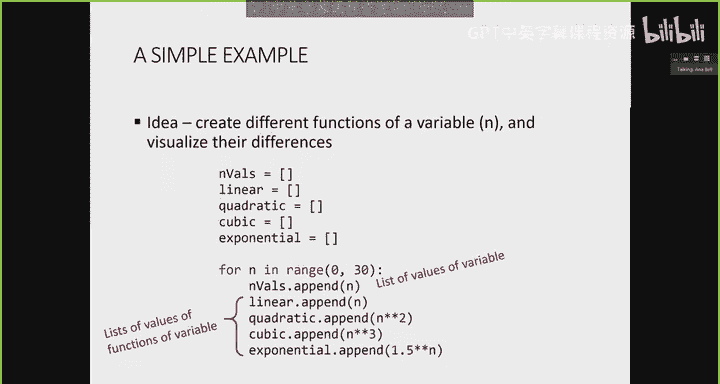

So the way we're creating these lists are pretty familiar a Python syntax。

 Our n is going through 0 to 29。 And then we're appending to the end of each one of these lists。

 Linear quadratic， cubic and exponential。 some function of that n。 right。

 So the linear list will just have all the values again。 So we're plotting 0，0，1，1，2，2， so on。

 The quadratic list will be plotting 0，0，1，1，2，4，3，9， and so on。 Sam with the cubic。

 and then this exponential。

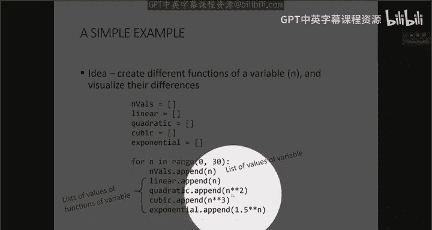

I just chose randomly 1。5 to the power of N just because it kind of looked nice in the plot。

 But you can imagine different number for the exponential in there。So the way we plot some。

 some values is by not surprisingly， the plot command。

 So P L T was how we decided to import that library as the name that we gave it。

 dot plot tells Python we'd like to plot some list of X and Y values。

 So the parameters to the plot command are going to be two sequences of values。 They can be lists。

 typically， but they could also be tuples。 they could also be you know。

 the keys you get from a dictionary。 that was also an iterable things like that。

So we have to pass in a list of， of numerical things。

 So this will be typically the stuff on your X axis。

 And the second parameter is gonna be the function of those values of the X axis。

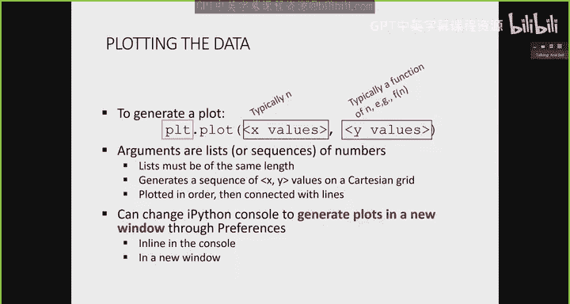

The lists have to be the same length， obviously， so Python knows which coordinates were plotting if they're not the same length by accident。

 then Python will throw an error and then you don't know it just won't plot anything。

So when we run the code， Python will generally plot the values in either a new window or directly in line in the console。

 So right over here， right， So right in here， it could put the plot directly sort of in line with a bunch of stuff that you might print out。

To toggle between that， just out of curiosity， you go to tools preferences， iPython console graphics。

 and then here you can choose either automatic， which will make a new window for us that's interactive。

 you can zoom in and out， things like that， or in line which will just put the plot that you tell Python to generate directly in the console here。

So I prefer the the， the new window because it's easier for me to interact with it。 So we'll do that。

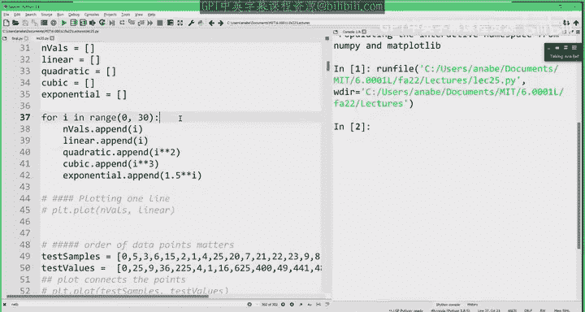

So let's actually run one of the plot commands。 So PL T dot plot。

 Were we're plotting here the X axis the X axis as just the number 0 through 29。

 and the y axis is just going to also be the value 0 through 29。

 So we've made a nice little linear plot。And you notice it popped up a little window down here for me。

 And this is the plot that it generated。 Yay， not surprising。

 This is exactly what we expected out of it。Right。OK。So what do we notice about that plot。

We notice how Python nicely fit the line within this frame， right。

 So it added a little bit of wiggle room to the left and to the right of my line and to the below and above my line。

 just so it fits nicely within the frame。 It didn't zoom out to some standard， you know。

0 to 100 value。 It zoomed in to this 0 to 30 ish range 0 to 30 is on the y axis range。 So really。

 really nice that it， did all that for us。The order of the points does matter in the list。

 So you'll notice one of the other things in this， in this plot here is we gave it actual points that it needed to plot。

 but the plot command doesn't plot the points by default。 Instead。

 it just connects all the points by line。 So it connects consecutive indices of points by a line。

 So it connected the 0，0，1，1，2，2， and so on。So the order of the points does actually matter if。

 if we have a function。For example， in this case， n and n squared， right。

 So n being 0 through 29 and n squared being you know，0，1，2，4，0，1，4，9， and so on。 But they're in out。

 but they're out of order。 Python will just take consecutive pairs from those lists and connect them with a line。

So here's an example。 I've got my lists， my X values list is this test samples。

 It's all the numbers 0 through 29， but out of order。

 and the test values associated with each one of those again。They are correct。

 It's this is 0 squared。 This 25 is 5 squared。 This 9 is3 squared， but they're out of order。

So if we run that。Just with a pure plot command， we're gonna get。Some garbage。Right。

 doesn't look very nice。And we already know what's wrong， right， Python just connected 0，0，5，25。

 and then， you know，3，9 by line。Not really， very nice。Instead， what we'd like to do。

Is to just tell Python to plot the points。 So I don't care about connecting them with a line。

 In this case， I would tell Python， instead of just plotting it to create a scatter plot for me。

 So P L T dot scatter with the same list of X and and Y values is going to just create for me。

This nice plot where it plots the coordinates。Does't matter that they're out of order because they just get plotted without anything connecting。

So pretty nice。So that's this example that we just did here。

 and then this is us doing a scatter plot， giving us this nice plot。OK。

One of the other things that you might want to do is to have a whole bunch of lines being plotted on one window。

 right？ So to do that， all you have to tell Python is just a sequence of all the commands。

 all the plotting commands or everything that you'd like to plot on the one figure。

 So without telling Python， you'd like to create a new figure。Anytime it sees a plot command。

 it will just keep adding whatever points get generated or whatever lines get generated to the current figure that's open。

 So we just have one thing that's open right now。 So it'll just keep adding stuff to our figure。

So here I've got four plotting commands in a row。 I never explicitly told Python to create a new figure for me。

 so it's just going to add all four of these lines to the same plot。

So it just doesn't create a new figure。 It just keeps adding stuff to my plot。

 So you can imagine if I added a scatter plot as well。

 it would just add the individual dots to this plot。O。So， again， what do we notice well。

Python nicely framed everything for me， right， to make sure that every line that I have fits within this。

 this graph。 So my X axis is comfortably between 0 and 30。

 and my y axis is also comfortably between 0 and 1 hundred 20000。

 So there's a little bit of gap up at that top of the of that exponential line。

But this leads us if we were presented this graph to kind of mistakenly。

Not know what's going on with these bottom lines here， right， So this is our linear， the blue line。

 and the orange one is the quadratic。 We're not really sure what's going on down there， right。

 because the scales are just is just is just the Y scale is just too high。So in this particular case。

 it would be better to visualize the data in in separate different windows， right， So in。

 instead of having everything be plotted in one。Window。

 we're going to tell Python to create a new window。And plot some stuff in it。

So the way we tell Python to create an new window for us is with the command P， L T dot figure。

So as soon as Python sees PL T dot figure。It will create a new window。 bring it to the foreground。

 and any further plotting commands will be added to this new figure。

So there's a parameter that this figure can take。 And that's gonna be the name of the figure。 So。

 you know， like when you have a window at the top， there it has a name for like the name of the program or whatever is running。

 Well， the string that you put in there is going to be the name that you give to that figure。If。

Python doesn't have a figure with that name already there。 It creates a new figure。

 brings it to the foreground。 But if there's a figure with that name already there and you just happen to call PL T that figure with that same name。

 it'll just rebring that that that window up to the foreground again to re add more stuff to it。

So we're going to look at this this example here。We've got a whole bunch of stuff being plotted。

 So the first two lines of code here。 First， we've got a a new figure being created。

 and we called it Expo。 And then this plot command here coming up right after the figure will add this exponential that we created to that expo figure。

Then we've got a P， L T dot figure right after that。

 So Python will bring this new figure to the foreground。

And the plot command that comes right after that will add the linear this line to this new figure that we called Ly。

A couple more times we're going to create， do the same thing to create this quad in this cube。

 and those will each get one line added to them。And then down here， we're going to say， well。

 let me just go back to that exponential figure and add another different exponential curve to it。

 So we're going to create the exponential curve this time，1。6 to the power vi instead of 1。

5 to the power V。Then we're going to tell Python to bring the figure called Expo back up to the foreground。

 So remember we created it up here， so it doesn't create a new figure。

 It'll just bring that one back up and it already has a curve in it。

 And then we're going to tell Python to plot a second curve to it。

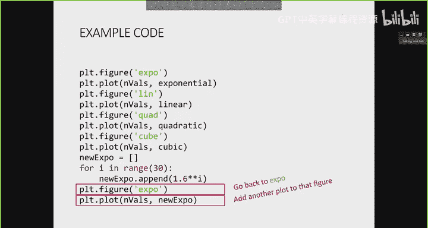

So let's see that。That's all this code right here。 Run it。Okay， so not just one figure，1。

1 window got created， but four。 So this is my cube。 And you can see up in the top here。

 a little hard to see。 But that's the name that we gave it。 This is my quad。 This is my L， my linear。

 and this is my exponential。So we see the exponential one was has two lines in it because we added one way at the beginning。

 Then we brought it back for processing to add another line to it。

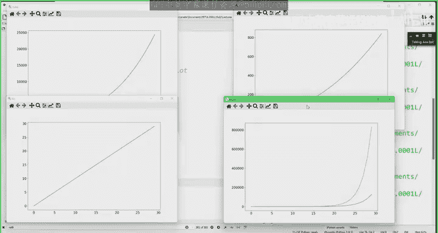

So， again， just。So， you know， these， these graphs are actually on slide。 This is the quad1。

 This is the cube 1， This is linear one， and this is the exponential one。

 The blue line was our original curve，1。5 to the power of x， and the orange one is 1。

6 to the power of x。 So they both got added to the same plot。过。So again， just know。

 something to note， you'll see how Python nicely framed our lines so that it's able to fit everything that it needs to plot within this this graph。

OK。So what we're gonna do next。 I know that was a little bit tedious。

 But we're gonna to do next is we're start looking at some real example， some real world data。

 So first， we're gonna do some toy real world data。 And then soon。

 we're going to start dealing with some， some actual data sets that we're going to read in。

 We're going to plot。 We're going to investigate， try to answer some questions about them and things like that。

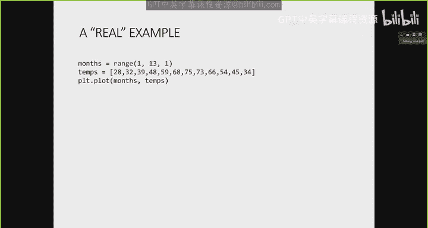

So first， let's look at this real life example where we've got months。

And temperatures for each of those months。 So notice the months here is actually this， this。

 the value that this range returns， which is like an iterable， like a tuple。

 So it's still a sequence of values。 It's not a list， but totally fine to be passed in as。

 as an argument to the pla。

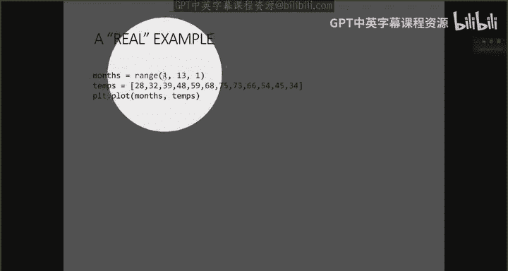

And temps， of course， are going to be temperatures corresponding to each of those months as a list。

So the plot looks something like this。If we actually run that code。What do we notice， Well。

 just like before， Mattpllolibb nicely framed our data， right。

 It's got a little bit of wiggle room left and right， top and bottom。

 and it automatically selected the scales， right， how low to go。

 how high to go and the tick marks for this。But let's say that youre the advisor to a student and they came to you with a plot that looked like this。

Would you be able to tell anything about this plot。

Right without knowing exactly what the code that generated this plot is， Not really， right。

 It just looks like a bump。 It could be any sort of data。 So what we'd like to do before actually。

 you know， for Europes and things like that in the future， before presenting a plot to somebody else。

 you'll want to add a title， and you'll want to label your axes。Right。So， what we want to do。

In addition to actually plotting the data is to tell Python to add for us a title and labels for our axes。

 So we do this using these three lines of code here。

 So since it's we haven't told Python to create a new figure or anything like that。 Anything。

 any commands that we do with regards to plotting， will'll just get added on to this figure。

 So here I've got Python adding this， this title， these two labels to our axis to our axes。

So here I've got this。And this blocked。 So I run it。 And ta， we have something that looks much nicer。

 right， So now we can hand this plot to somebody and they'll know what it's about。Now， that's fine。

 But since its temperatures， what I'd really like to do is to say， well， the temperature。

 the lowest temperature I have should really start at the Y axis here。

 This intersect with the Y axis。 And the highest temperature I've got。

 I don't really want that wiggle room， because this is my last temperature value。

 Let's just have the frame just end there。So we can do that little change by setting limits on our X axisax。

So here I'm going to limit the x axis to say that it starts from one and it ends at 12。

So if I do that， again， that's just a little command we put in continuation with the rest of the commands。

 And it gets applied to this plot。So as soon as I do that， Python now creates for me the same plot。

 except that the Y the the X axis starts at one and ends at 12 nicely framed within here。

 So no more wiggle room。O。Still some improvements to be made to this plot。As in here， the month skip。

 right， So Python decided that it's， its， it's you know， it's best to just show 2，4，6，8。

1012 as the ticks on the X axis。 But I decide that I would， since I'm， you know， decide。

 since I'm showing all the months of the year and their temperatures。

 I would really like to have ticks for every single month。So again。

 a little command will do that for us。 So PL T dot X ticks takes in a tuple of all of the places where you'd like one of those little ticks to be created。

 Okay， So if we do that， again， just another little command in in series here。If we do that。

 Python now fills in the ticks for every single spot that we told it to fill it。

So it's looking way better already， right？But's still not quite right。

 I promise this will be the last improvement we make。

 I personally find it hard to map numbers to the months。 I still count my finger。

So what would be nice is to say， well， instead of having numbers on my X axis。

 I would like to have the actual names of my months， right， Jan， Feb Mar and so on。😊，So to do that。

 we're going to make one small change to our X ticks command here。

 We're going to give it a second parameter。 So first one is， of course。

 what we had before saying these are all the ticks that I would like to have。

And the second parameter is the labels for each one of those ticks。 So one by one， they'll be mapped。

 So one will be mapped to Jann 2 mapped to Feb and so on。 So instead of using the numerical values。

 Python will create for us the。The the string values that I've told it to do。So here it is， run。

Cates for me this nice， very nice looking plot。 So this， I would be happy to receive as an advisor。😊。

Compared to that very first one that we had。Art。Questions so far。We'll see all right。嗯。Okay。

 the other thing that you can do is potentially add grid lines if you wanted to。

 So P L T dot grid will either toggle the grid lines on and off。

 So if there's already grid grid lines， itll toggle them off when it sees that command。

 If there are no grid lines， it'll toggle them on。 So you could potentially have a bunch of P T dot grid commands that keep toggling things on and off et so。

Okay， so that was us plotting one temperature， one city's temperature values for a year。

 let's say an average。Let's say that we wanted to plot two different cities。

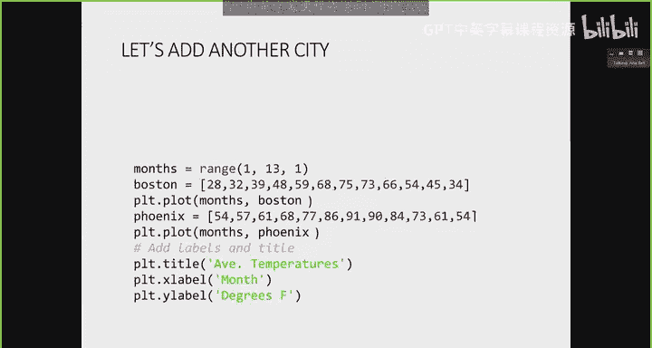

The code to do that is as follows。 So again， we've got months being this range 1 through 12 inclusive。

 I've got a list of all the Boston temperatures here。 I plot that。

 I list of all the Phoenix temperatures here， and I plot that。 And of course。

 I'm gonna add some labels to my， to my graph。

That。So if I run that。We get something that looks like this。 Now， of course。

 I could kind of remove that little， those little wiggle rooms on the left and right。 But for now。

 it's fine。What's missing from this plot。Let's say you didn't see the code。

 and you were just given this plot。Yeah， exactly。 I don't know what。 Like， yes。

 these are different temperatures from the title the and the labels。

 but you don't know which city is which， exactly。So what we'd like to do is tell Python how to label these two lines。

 right。So to do that， it's just an extra parameter here in the plot command。

 So when you tell it which data to plot， you can also tell it what label that data should get。

 So here I've got Boston label for the first one， Phoenix label for the second one。

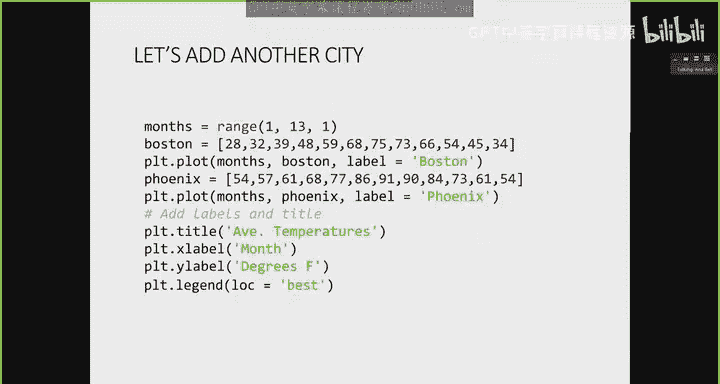

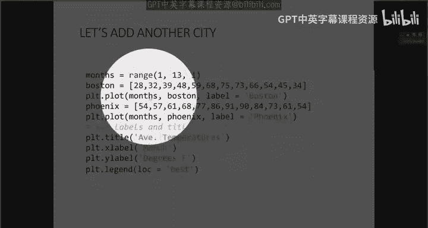

And then you tell Python to add a legend to your plot。So here。

 the parameter is the location for the legend。 And best just means Python should decide where to put the legend。

 top left， top right， middle， wherever。 So it doesn't really interfere much with the with the data。

 or you can just tell it where to put that legend， right。

 So you can force the legend to be in a particular spot。So here， I've got already labeled data。

 And then we add the legend。 And now you can see in this particular case。

 it decided to put it in the top right。 But again， you could force it to go somewhere else。

 Bootom middles seemed like a fine choice as well。O。Very nice。 So now we've got Python。 you know。

 it it automatically did the X and Y axes for us， as we told it to do。

 But the colors that it picked were random。 Now we can specify a bunch of different details for the plot。

 So we're gonna do that next。 just to show you that you can。

 So we're gonna choose different colors and different styles for our plots。

 We're gonna to choose different widths for our， for our lines。

 And then maybe we can and then we'll also add some markers。

 So where exactly each data point we have were going to mark。😊。

And then I'll show you how you can create subplots。 So instead of creating new windows。

 you can actually have one window with different little subplots with it。Okay。

 so the first thing we're gonna do see is how to customize the data to have a certain line style and a certain color。

So there's a shorthand notation to do this。 instead of actually passing in the parameter name in the plot command。

 we could do it shorthand notation。 So you might have already noticed this little extra bit here。So。

The more you use it， the more you'll get used to it。

 But this basically tells Python that I would like this plot。

 this line corresponding to this data to be blue。 That's what the B stand for and to be a solid line。

Okay， that's what that little dash means。The Phoenix one， you may have guessed。

 tells Python that I would like this one to be red or for red and to be a dashed line。

And then the last one， I'm going to add one more temperature here， temperature data for Minneapolis。

 I would like this one to be green and a dash dashdot line。So we can run that。

And it looks something like this。All right， so here I got my solid blue line for Boston。

 my dashed line for Phoenix and my dashdot dashdot line for Minneapolis。Very nice。Now。

 instead of doing that shorthand notation where we've got this one parameter that just somehow magically knows the the color and the style based on just being passed in。

 we can actually tell Python the parameter values。That it should that correspond to the color。

 So here I've got color equals B for blue。 And then the correspond to the line style。

 So here line style equals。 And then you explicitly pass in the the line style that you'd like。

 right， So this may be more more intuitive， according to what we've learned。

 But Python does allow you the option to kind of do it all in one。😊，So if we do。

 if we run it with this with these specific explicit parameters。

 then we'll get the exact same graph as before。 right， No surprise。

So there's a lot of options that we can have here。 So these are all the line style options。

 So you can also add a dotted line， which I didn't show。 These are all the color options。

 plus many more。 You could also pass in the RGB values or maybe the hex values if you want a very specific shade of magenta or something。

 And then we can also add markers to our to our lines。 We haven't seen this yet。

 but let's do that next。

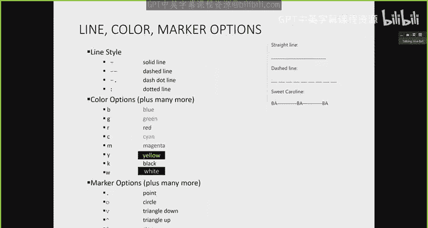

So let's say that I would like to have the actual data points that I've that I've plotted show up in my lines。

 right， right now， the lines just get connected or so the data points just get connected with our lines dashed or dotted or whatever we chose。

 But the marker， the， the data points themselves don't show up with markers。So again。

 in shorthand notation， we can tell Python， hey， let's add these markers。

 So here I'm telling Python to just do a dot for this blue solid line here I'm telling Python to do a larger dot for this red dash line。

 and here I'm telling it to do a star for the green dash dot dash dot line。All， so that's down here。

Run it。And now we see nice little markers for every one of our data points， right。

So we can also do triangles。 We could do squares。 There's lots of other marker options。

 and they all exist in the documentation for Mattplot Li。唔该。So this is what we got。

The last thing that we can do is to add a thickness to our lines。 So oftentimes， it's good to。

 first of all， delineate the， the lines using， you know， dashes or dots and things like that。

 but also with。So here， another parameter passed in the line width。 This is gonna be a skinny line。

 This is gonna be maybe a thicker line。 And this one's gonna be unreasonably thick。

So let's see exactly what this will look like， it's going to look super weird。Yeah。As I said。

 unreasonably thick line， but there it is。 And then you can see that the legend itself also adjusted to whatever you chose for your。

 your line styles。O。So that's exactly what I said。Cool， last thing I want to talk about is subplots。

 So right now， the only things that we've kind of learned about plotting is you either plot every line that you have on one figure or you create a new figure。

 and then it becomes a new window that you have to kind of switch between for whatever you'd like to plot。

Oftentimes， what's really nice to do is to create only one figure。 So you have one one。

 only one thing that pops up， right， like one window。And within that window with some name here。

 right。And within that window， you can create a bunch of different subplots。 right。

 So here I've created6 different subplots。So we can tell that to Python。

 and we do that using the subplot command。So in this particular case。

 I've told Python to create for me a subplot。With。2 rows。 That's what the first parameter says。

 And one column。That's what the second parameter says。 So here this is one window with two。

 two positions within it。The third parameter tells Python which one of these positions to open for adding lines to or data to So one means this is the one that you're opening and two means this is the second one that you're opening。

 So you can see here the very top subplot command tells Python to open up this one for for for editing。

 Basically， So we're gonna add to it。 the Boston temperature。

 So this is all the plotting commands and all the labels and everything after it belong to this top subplot here。

 And then subplot command down here tells Python that on this figure with two rows in one column。

 I would like to now open position number two for editing and then everything that I have thereafter gets added to the subplot at this position。

So the way that this is going to look is as follows。 So I've got these。

 this is just one window that gets created。 And you can see the top one has the Boston temperature。

 and the bottom one has the Phoenix temperature。嗯。At first glance。

 does this look right in terms of temperatures， Like if you're just to look at the pictures themselves。

I don't know about you， but I。At first glance， I thought that the temperatures for Boston and Phoenix were the same because I didn't look closely at the Y axes。

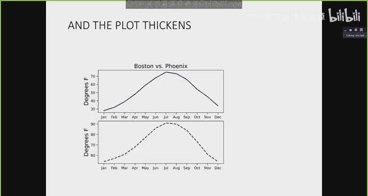

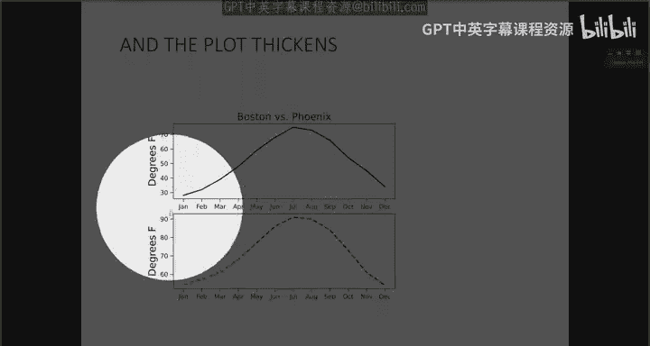

Right， it kind of looked like， hey， they both bottom out in the same way。

 They both top out in the same way。 So they look very similar to me。

 But if we inspect the Y axisxes closer， we see that the Boston temperature starts at 30 goes to 70。

 But the Phoenix1 starts at， you know， what is this 50 and goes to 90。

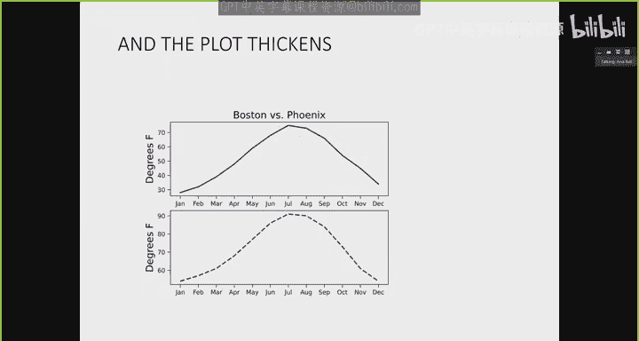

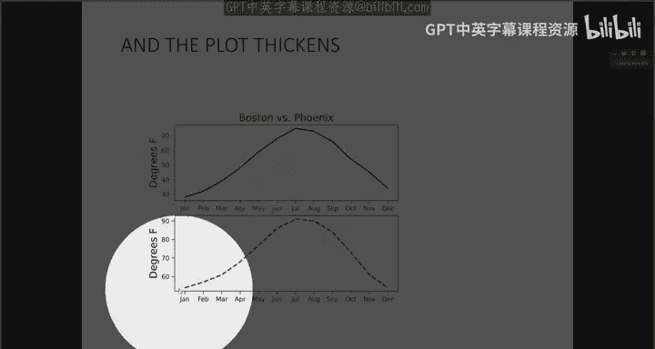

So if we're presenting plots in one figure， what would be really nice to do is to make sure that the axes are both bounded in a similar way。

 especially if we're plotting similar data， right， temperature in this particular case。So in our。

 in our code， what we'd also like to do is set limits on our axes and just the y axis because the X axis is the same。

 right， So here I can limit the， the y axis from 0 to 100。

 a reasonable set of temperatures in Fahrenhe。So if I fix these temperature temperature limits from 0 to 100。

 and now I plot， I get something that looks like this。And now， at first glance。

 this makes a lot more sense to me， right， I've got the Phoenix temperatures you know。

 seem to be on for this， you know， for this year， on average， higher than the Boston temperatures。

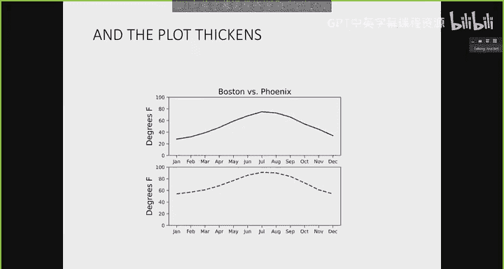

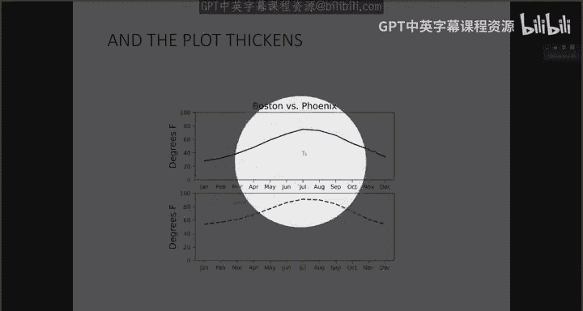

O。So we can plot now multiple。 we can create multiple subplots。 So here， you know。

 in the previous example， I just had two top and bottom。

 but I can create as many subplots as I'd like within my window。So when I create them and I。

 and I tell Python how many rows and columns I have in this particular example I just drew here。

 I have three rows right， and two columns。 So the third parameter that I pass in will basically tell Python which one of these subplots to open up for。

 for processing。 So this will be the first one。 This will be the second one， kind of the way we read。

 Third， fourth。5th and 6。 So that third parameter to these subplot commands will be either 1，2，3，4。

5 or 6， telling Python which one of these sections I'm gonna add plots to。In this particular case。

 I had a Boston Phoenix in Minneapolis temperature。 So I'm just creating a  two by two matrix， right。

 So here I just have this thing that looks like this。 a figure with these four subplots。

And I am going to add the Boston one over here。 the Phoenix one over here。 and then the Minneapolis。

Down here， right？ So 1，2 and 3 as my subplot subplots that I'm opening。Nothing in four。

 So that fourth spot will just be empty。 So the plots will look something like this。 And I。

 I haven't changed the line widths in this particular case。 I didn't need to right。

 And you can see everything's plotted with the the heights again， limited from 0 to 100。

 just so everything's comparable and notice the empty spot here because I had nothing to fill in for。

Questions about this， this interesting。O。All right。So， that。

Finishes up just some really basic things that we can do with plotting basic， you know。

 customizations。 Now， what I'd like to do is just open up a few different data sets for。

 for processing。 We can start by just plotting the pure values on a regular plot。

 and then we can start to investigate things that we visualize ask more questions and and and see where we go from there。

 So the first thing I'd like to do is open up a file on the US population。

 So this particular file contains 40 different numbers。

So it has a population value over about 400 years every 10 years。

 So that's 40 different values for the temperatures starting from， I don't know。

 from a really long time ago till about 2010 or something like that。

So the file looks something like this。 So it starts in at 1610。

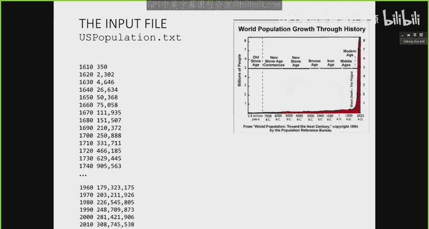

And goes down to 2010。 So this is 40 lines for 40 years，40400 years， every 10 years。

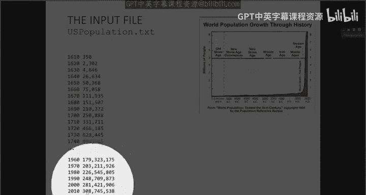

Then there's a space in the file。 And then I've got the population value。

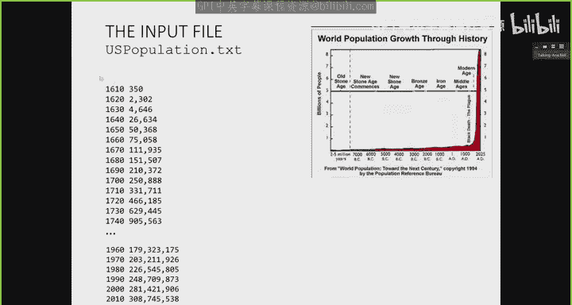

Okay， so it starts at 3，50， increases goes down to 300000 in 2010。

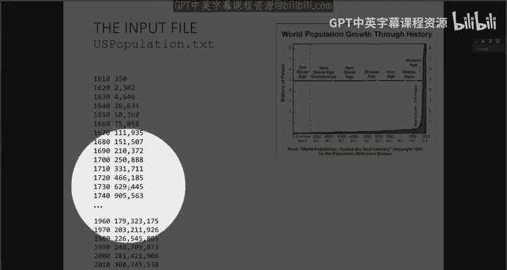

So that's what the file looks like。 It's important to know what the file looks like。

 because you're going have to read in this value， this data and save it in some sort of data structure that's easy to manipulate。

 So in our case， a data structure that's really easy to manipulate where you have a whole sequence of values is a list。

 right。So what we can do is we can open up this file for processing， read in the years as a list。

 and then read in the， the population values as a list as well。

 We could use a dictionary also if we wanted to。 But， you know， in this case， I just used two lists。

So let's look at the code to do that。 It looks like a lot， but I'll kind of go through it。

 So here is the function that's going to read in the file。 It just opens up the file。

 creates two empty lists。 One contain will contain the dates， the other one contain the populations。

 It iterates through each line in the file。 So I've put up what a line in the file kind of looks like up here。

 So it's got some numbers， space， some other number。

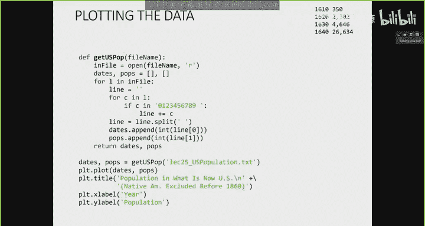

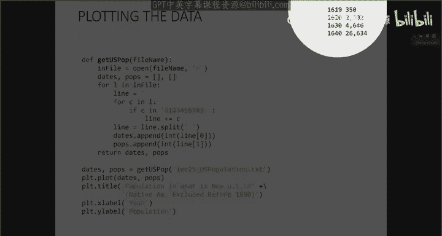

But when we read in file， when we read in a line from a file， Python actually reads it as a string。

So what that means for us is we're going to have to take this string。 each line being the string。

 you know，1，6，4，0 space，2，6， comma 6，3，4， something like that。

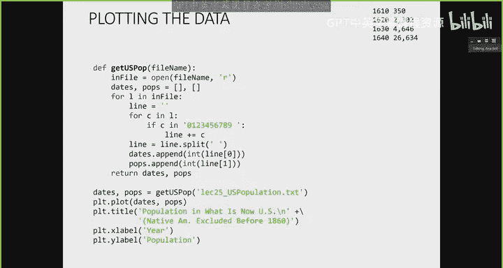

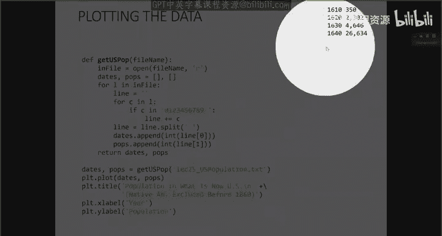

And somehow separate it so that we have the date and then the number， right， of the population。

 And then， you know， somehow save those two pieces to lists。

So the first thing to notice is that we have a pesky comma in our population values。

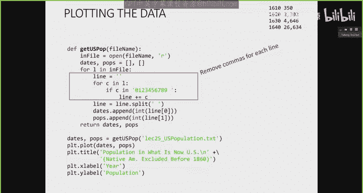

Right， those values are human readable， so it makes it easy for us to read。But the。

 the computer is not so happy about them。Right， so if I have a number like， you know，11345， whatever。

 this is red in as a string， right。And if I just try to cast that as an integer。

 just straight without doing any sort of processing on it。Python's very unhappy。

So what we need to do is remove that comma， because as long as I don't have a comma there， Python。

Can convert that， that， you know， that， that string number into a regular integer number for us to then plot。

Okay， so that's what this bit of the code is doing。 It's doing it in kind of a weird。Weird way。

 It's saying， hey， take this entire line of characters。

And only keep characters that are either a digit or a space。

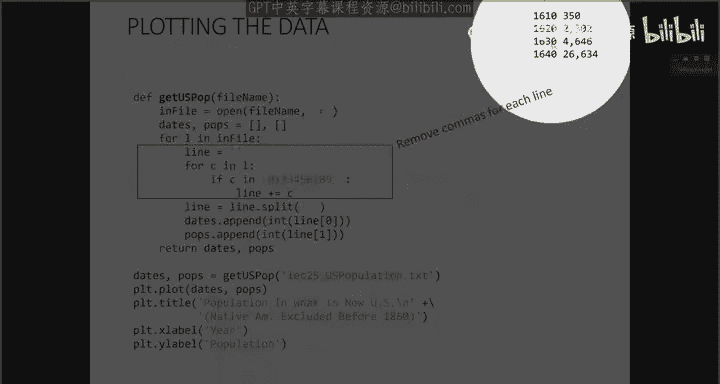

So in doing so， it effectively removes the comma because it creates a new version of that line containing only digits and spaces。

 So it'll just take the 2，6 and then the 6，3，4 right after。

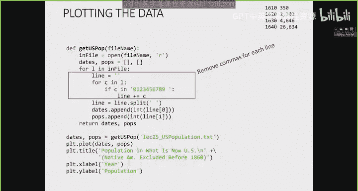

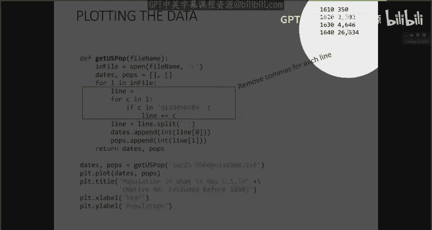

So it just creates this new line that looks like that。And then after it has this new line。

 we're going to split on the space because we note that every single after every date， every year。

 we've got a space that separates our population value and our date。

 So if we split on the space using the split command。

 the thing before the space So the line at index 0 gives us the date we'll just cast that to an int and append it to dates and then the line at index1 is the thing after the space。

 again， without the comma because we did that trick。

 and then we cast that to an integer and append that to our populations value。

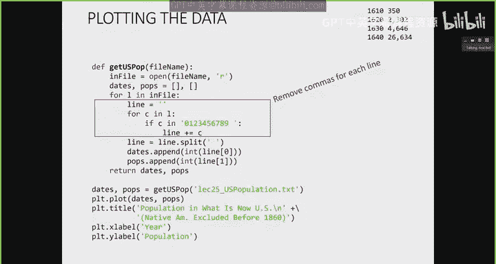

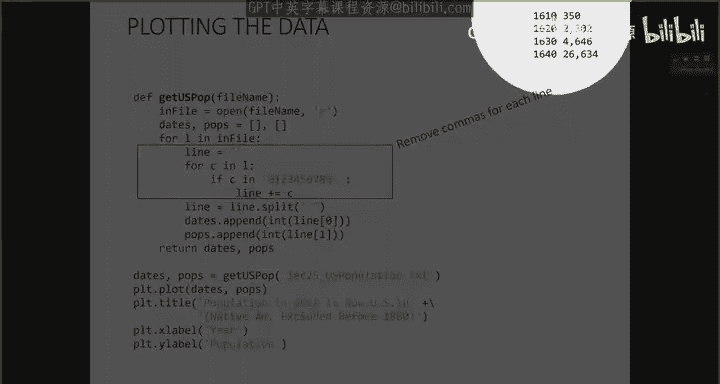

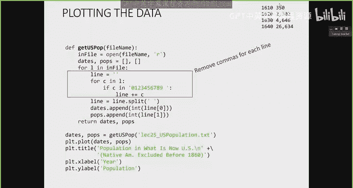

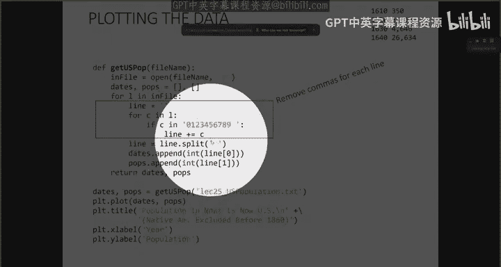

So that's what we do there， and that's what we do there。And there， from there on out。

 we just return the dates and the populations。 The dates become my x value， X values for my plot。

 and the populations become the y values for my plot。Okay。

And then we plot it and it looks something like this。

 So much easier to read to tell or to tell what's going on than just looking at pure numbers， right。

 always nicer to visualize things than to just read a whole bunch of numbers， even if it's just 40。

And， in fact， we can tell a couple things that we weren't able to tell， you know。

 we could definitely couldn't have been able to tell from just peer looking at peer numbers。

The first。Is that we notice a little bump right here。Right。In the population。

 this is the impact of World War I on the population。Second。

 a little harder to tell is another little bump down here。

 And that's the impact of the civil war and the population， so。Nicer to visualize。

 It exposes some interesting things。The other thing to notice is， well， what's going on down here。

It kind of looks like the population is not really growing much， right。

And then maybe from 1750 onward， it starts to grow exponentially。

 It's hard to tell what exactly is going on in that lower part。

So let's think about a different way of showing this data。

Instead of having a linear scale on our Y axis， let's see about doing it in a logarithmic scale。

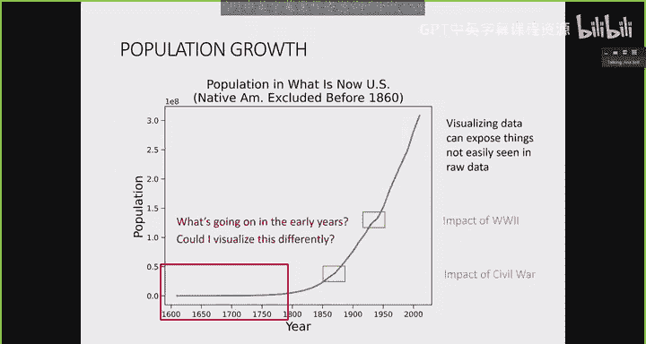

Right， so we're gonna add， a command that tells Python to make our y axis a log act a logarithmic scale instead of linear。

Okay， so if we do that， then that means that every no。

Every regular increment in our on our Y axis is going to imply an exponential increase in the population。

Right。Okay， so let's plot that。And if we plot that， we get something that looks like this。

 The X axis remains unchanged。 We're still incrementing the years linearly， right？

 But the Y axis is now logar。

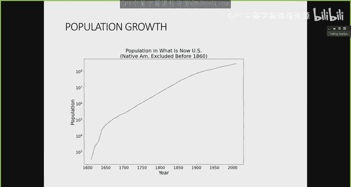

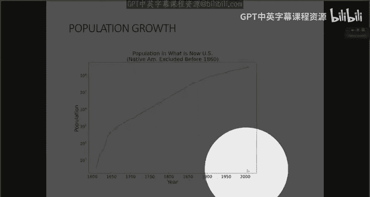

So what do we notice。Well， I see。Linear line here。And I see another line here。Again。

 linear growth on a log scale means exponential growth， right and on a linear scale。

 So what we notice is that there's sort of these two time periods of exponential growth。 And in fact。

 those early years actually seemed to be growing。 The population seems to be growing at a faster rate than the later years。

 right， And that was not readily visible on the previous graph that we have。So the question。

 you know， I have a question for you。 Which one of those did you find more informative， Well。

 it kind of depends on what we're interested in finding out， right。

 If we're interested in sort of big trends in the data where you know in the top left one we spotted here。

 the impacts of wars on the population。 Well， then the top left one is the one to look at。

 But if we visualize the data in a slightly different way gives us different insights into what's happened to the population right That wasn't as apparent in in the previous graph。

 So it really kind of just depends on what you're interested in finding in finding out which one of these plots you find more informative and you know。

 sometimes both are probably necessary to figure out exactly what happened。O。

So that finishes our example on the US population。 Now， let's look at a slightly different file。

This particular file， we're going to look at country populations。

So these are the populations in a whole bunch of different countries。 or sorry。

 all the countries ordered from countries with the highest population up at the top of the file down to the countries with the lowest population at the bottom of the file。

 So they are basically ranked in this border。 Right， So I know that this order is correct。

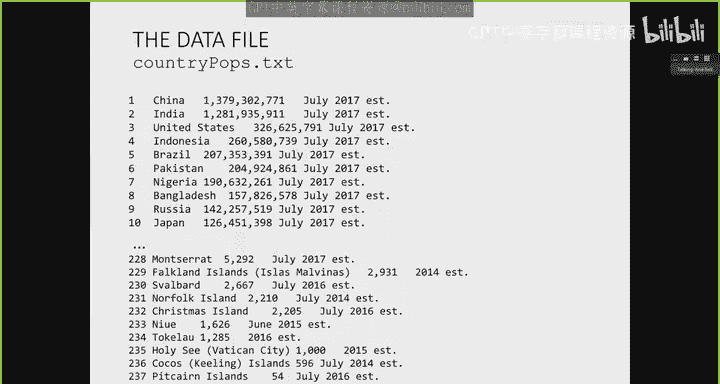

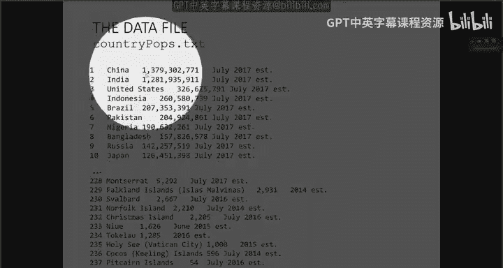

So there's，237 lines in this file。What do we notice about the data。

 So we need to know what the data looks like in order to read the file in。 And again。

 we're going to be interested in， in， in kind of extracting certain parts of it for the particular analysis。

 I'm going to do next， I'm actually only interested in the population itself。

 So I don't care about the rank。And I don't actually care about the country， either。So all that my。

 the code that's going to read in the file will only be interested in extracting the population value。

And notice， once again， we've got our commas here in the population values， right。

 so we're going to use the same trick to get rid of those。 again， nice human readable format here。

 but not so good for reading in the file and dealing with， with the data itself。

 So we're gonna have to take care of that when we read in。So here's the file the the。

 the function that reads in the file。 It's gonna have a very similar feel to the previous one。 Again。

 I've got a little sample of our file up here just to remind ourselves what it looks like。

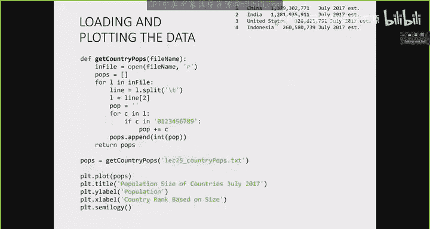

So this particular file， I'm only interested in grabbing the population value。

 and it's actually a tab separated file。 So I've got you know， rank tab， country tab， population tab。

 and then the date。

So when I take a line of code。What I'm first going to do is split it on the tab character。

 And the tab character is this backslash teeth。So once I split it on the tab character。

 the thing at index 0 is by rank。 The thing at index 1 is my country and the thing at index 2 is my population。

 The thing at index 3 is my date。

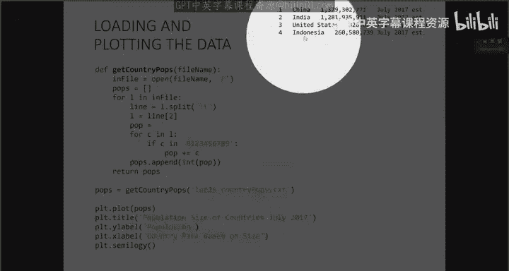

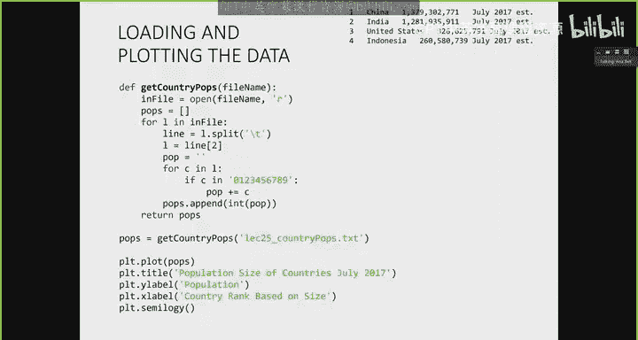

So if I'm only interested in grabbing the population， I'm going to look at the thing at index 2。

 And this gives me this， the population as a string here。

And then we do the exact same trick as before to， to eliminate the commas。

 There's no space in this particular case， right， because I've just got the number saved because of my tab split。

 So all I need to do is keep digits。 And then if I keep the digits。

 then I'm just going to keep that number as a population。

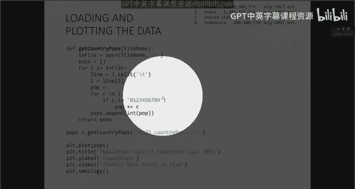

Again， I cast it to an integer because I would like to work with numbers in my lists。

 as opposed to strings。 That would be very weird。 And at the end of this function。

 I've got all of the populations in the same order that they were in that file read in as a list。

 right， numbersumb， not string。

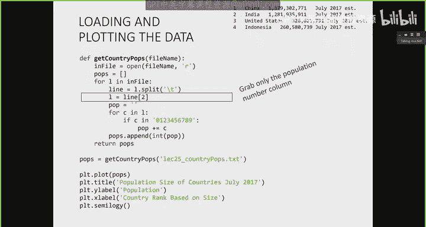

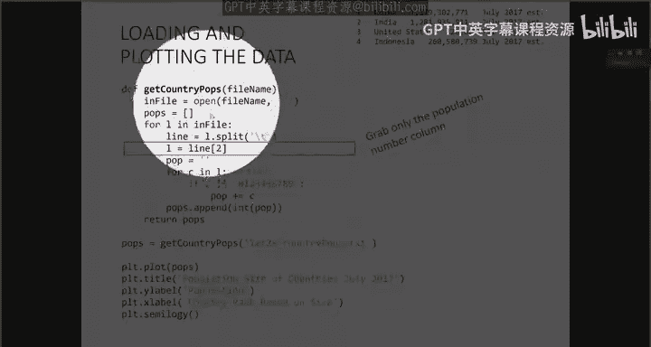

And so if we plot the populations， just pure populations， I'm going to have something like this。

Right， if I plot just the pure populations， I see something that looks like this。

 kind of hard to tell。 I mean， it's a big exponential decrease， but is that really what it is。

 So again， we'll do a little semi log plot on the Y axis to see exactly if there's， you know。

 any sort of linear action going on on that log plot。And， you know， unsurprisingly。You know。

 it kind of matches our intuition。 There are very few countries that have a really high population。

 There are very few countries that have a low population。

 and then a bunch of countries that are kind of in the middle here where the population just exponentially decreases。

All right。But that's not the analysis I would like to do on this， on this data。

Because that's kind of boring。 So instead， what we're going to analyze is actually just the first digits from every country's population。

Right。So what I'd like to do from that data set is once I've grabbed a list of all of the country populations。

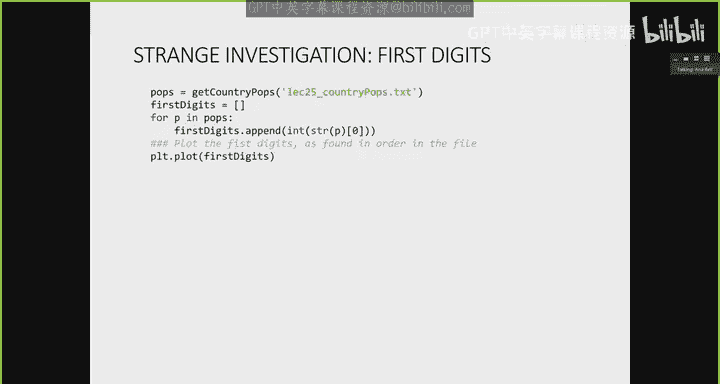

I am going to extract that first digit。 So the way we do it is， you know， if we have a population。

 I don't know to。

5，4。wo。3，6， whatever。 I'm gonna take this number， Ca it to a string。

 That's what this one line of code is doing。 All in one。 It cast it to a string。

 extracts the element at index 0。 This becomes the string 2。 And then we cast that to an integer。

Right。To give us2。So that line of code does all of those steps in order。 So at the end of this loop。

 I've got this first digits list that contains all of the first digits of every single one of those country populations。

So I'll print that for you just to give you a sense of what it looks like。

 So we see this right So we had two countries up at the top that had 1 billion people。

1 billion people， then the next country down had 300 million people。

 then 200 million then 200 million then 200 million 100 million and so on right So just extracting that first digit。

 we see this kind of this pattern of values。So if we plot that。

 but that's exactly what we do down here， and I'll just do it in the slides。

 If we plot that list in that order， we get a plot that looks something like this。

 It's a nice little saw tooooth pattern。And if we stare at it a bit。

 it makes sense because the numbers that we got right， from the file were already in ranked order。

Highest population to the lowest population。So here， down here， we had。Sorry， down here。

 this little dot right here had two countries that were 1 billion。 so one1。

 and then had one country that had 300 million， and then it had three countries that had 200 million。

 then a bunch of countries that had， you know，100 million something。 So 11，1，1，1，1，1。

And then since we're going in decreasing order in terms of rank， right。

 once we finish going to that significant digit， when we move down。

 then we're going to start looking at countries that have you know， 90 million，90 million，90 million。

80 million， 80 million and so on。 So just the order of all of these values。

 the first digits of every one of these values。 It makes sense to have that saw tooooth pattern。

 right， We basically have， you know，9，8，7，6，5，4，3，2，1，9，8，7，6，5，4，3，2，1， and so on。Right。So。

 we get this pattern。What I'd like to do is ask。How many。

 how many countries have their first digit a one。It seems like there's a lot， right。

 If we count sort of how many of these countries are down here， seems to be a lot。

 How many countries have a first digit of two。 So again。

 we count how many countries are on this step of my saw tooth。

 How many did countries have the first digit 3 and so on。 And it kind of looks like， I don't know。

 Maybe there are more countries that have a first digit of one。

 than there are countries that have a first digit of 9， right， There's only a couple here。

 maybe like five here， maybe one here， a couple here， a couple here。

 Whereas the number of countries that have a one are actually a lot。So let's try to plot this data。

 the values here。So what I'm interested in doing is creating a histogram。So a histogram。

On the X axis has a bunch of bins。 In this particular case， what I。

 the way I'd like to bin my data is by saying my bins are gonna be the digits 1，2，3，4，5，6，7，8， and 9。

That's the X axis。 And the Y axis is going to be a count， right。

 a frequency of how many of my countries have the number one as their first digit。

 How many countries have the number two as my first digit and so on。

So in terms of this list containing all of the first digits in the of the countries。

 Im essentially have I essentially have one bin that counts how many ones I have in this list。

 Another bin that counts how many twos I have in this list。

 Another bin that counts how many threes I have in this list and so on。O。So if I plot that histogram。

 it looks like this。Now， I would have expected this histogram to be about even right， Like。

 why does it matter the first digit， It seems like in this particular case。

 the first digit has a higher probability of being a one than being a 9。 but intuitively。

 I would have expected every digit to come out with equal probability， right， like 11%，1 over 9。

But instead， what we get is this really surprising result。

 which is that the first digit seems to be about 30%。Right， to have the first sorry。

 to have the first digit of one seems to be about 30%。

 to have the first first digit being a two seems to be about， you know， 18 or something percent。

And so on and so on。 And then the first edge of being a 9 is is pretty low。

 It's going to be about what is this 12 out of 200 countries。 So pretty low probability。

So as it turns out， this graph actually follows something called Benford's law。

And this is a well proven law。 It applies to a bunch of different data sets that we find in nature。

 data sets that don't really have upper or lower bounds， right， like country populations， right。

So Benford's law effectively says the probability of the first digit in some set some big set of numbers being a one。

 a two a3， whatever， this D being the one， a two， a three or whatever。Is according to this formula。

 So if we find the probability of that first digit being a one， we basically find log base 10 of 2。

 which is about 。28。

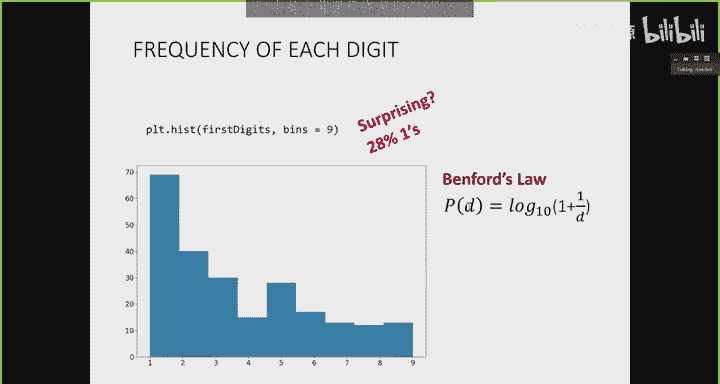

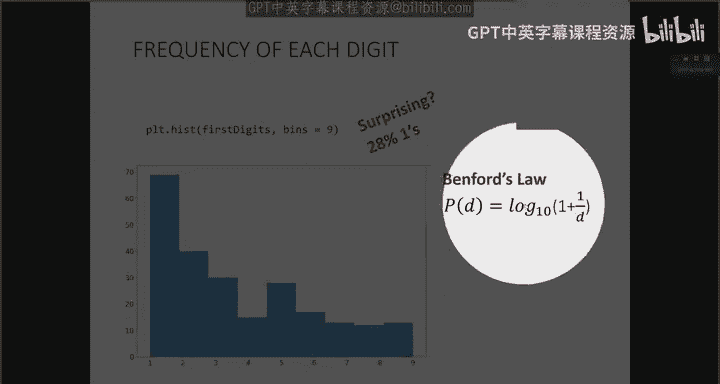

Probability of that first digit being a two is log base 10 of one and a2， which is about 017。

So our data， the country populations， right。If we look at just the first digit of our data。

It also follows this law。 Just pretty neat， right。So a lot of data that we deal with on a daily basis follows this law。

 number of social media followers， number of posts people make stock values， grocery prices。

 sports statistics， building heights， income taxes， things like that， all follow this， this law。

 which is pretty cool。As an aside， one of the ways that people figure out tax fraud on income taxes is by applying Benford's law to income tax is submitted。

 people， when they kind of submit fraudulent numbers。

 they tend to make every number kind of come up with an equal probability。

 they forget about Benford's law。 And so， you know。

 they run this Benford's law on potentially fraudulent tax submissions and they figure out that。

 you know， whatever those people submitted don't actually follow his law。 And hence it's fraudulent。

 So， you know， if you're making up numbers， just remember Benford's law。Cool， so yeah， that's。

That's a really interesting thing that， that can come out of of some data。 And again。

 we got to visualize it and see the， the law in action。O。One last example I want to go through。

 This one will have to will kind of show a bunch of different things。 It's gonna have a lot of code。

 I'm just gonna briefly talk about it。 but the code is in the slides。 or sorry， in the Python file。

 if you want to look at it more in depth。I'm going to compare city temperatures， again。

But we're gonna do a more in depth analysis dealing with a whole bunch more data。

So this particular data set， I've got daily temperatures。For 55 years。For 21 different cities。

 So the amount of data that I have here is going to be 3，65 times 55 times 21。

 So that's how many rows would exist in my data set。So that's a lot of numbers to look at manually。

 So instead， we're going to rely on kind of aggregating it in with averages and things like that to kind of make sense of all of this data。

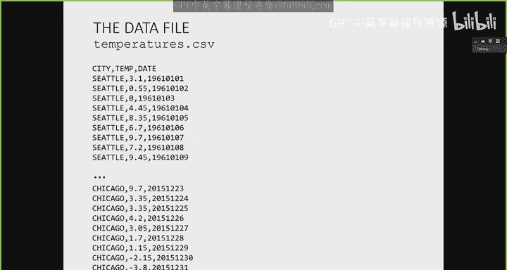

So this is what the file would look like。 I've got three columns effectively separated by commas。

 So the first one corresponds to the city。 Second one corresponds to the temperature in Celsius。

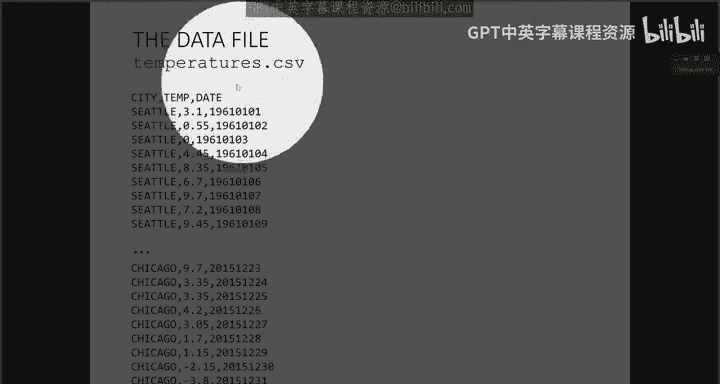

And the third one is the date that it was taken。 So it's it's nicely in order。

 The date is delineated like this。 So it's got year， year， year， year， month， month day day。

 So this is 1961， January 4， That's how we would read that， right， So later。

 when we're trying to think about， you know what which one of grabbing you know。

 particular temperatures for a specific year or things like that。 Then we can use the format。

 keep the format in mind and use that to extract relevant information。

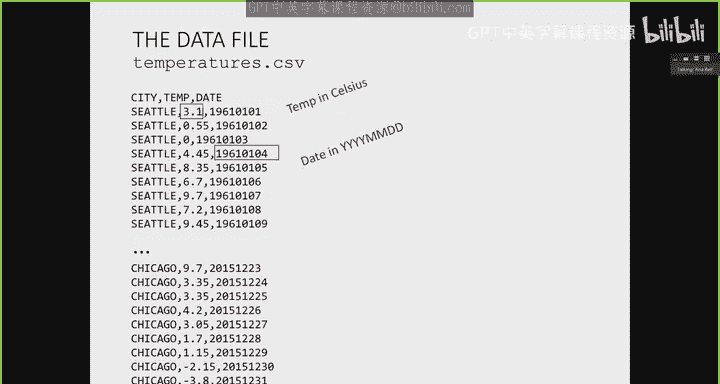

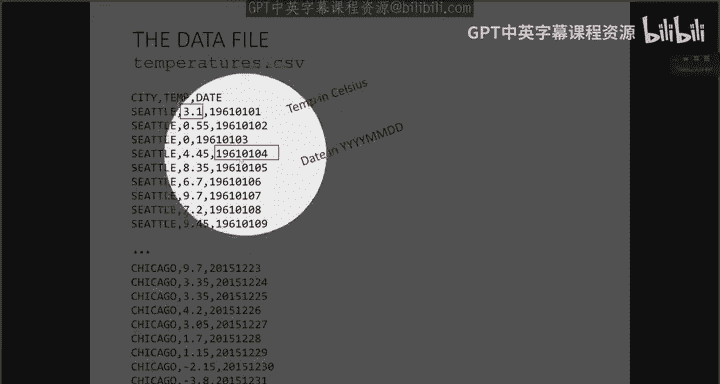

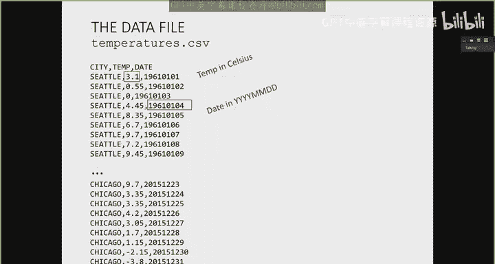

Okay， so the first thing we want to do is to grab this data and save it again in a nice data structure that allows us to manipulate it。

 Her heart's content。 That is a list。So we're going to open up our file for reading。

 I'm creating two lists here， one for the temperatures， the other one for the dates。

 I'm going to loop through each line in my file， and I know it's comma separated。

 So I'm going to split it on the comma。 The thing at index 0 will be my date will be my city。

 The thing at index1 will be my temperature value。 The thing at index 2 will be my date okay。

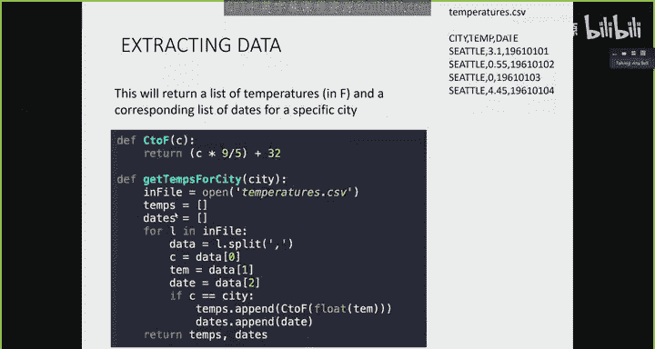

I would like to take the temperature value and save it as a number because， you know。

 I want to plot these numbers。

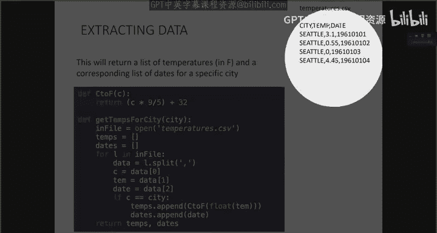

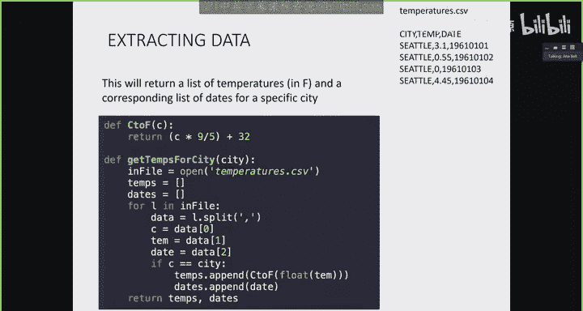

This specific function will get a list of all of the temperatures for a particular city。

 So the city here is going to be a parameter。

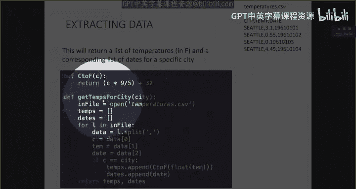

So as I'm reading the file， I would only like to grab the lines that match that city。

 So here I've got this if statement， so I'm only going to do this stuff inside this if statement if the city is matching the one I'm interested in and then what do we do。

 Well， we're going to take our temperature value， which is the thing on index1 because I' split on the commas。

Convert it to a float。 There's no commas or anything weird like that in that number。

 So it's just a pure float。 You know，0。55 as a string。 If we cast it to a float。

 Python will happily do that for us。Then we're going to run a Celsius to Fahrenheit function。

 Thr back to lecture 1 to convert that Celsius to a Fahrenheit value。

 And then we're going to append all of these temperatures in a nice list。

And at the end of the function， we're gonna return all the temperatures。 So it's going to be 3。

65 times 55， right？ That's how many temperature values we have for one city。

And what we'd like to do as a first step is to just get a sense of the average temperatures for each one of these different cities。

 right。So over every single data point that we have for a particular city。

 What is the average temperature over all these days for all of these years。

 So I would like one number to represent the temperature per city。So that's what this code is doing。

 It's going to first get all of the cities that are in my file。 So all the unique values。

 then it's going to get the average temperature over all of those 365 times 55 years。

 Then it's going to grab the name of my city as just the first two characters。

 and then it's going to create as nice scatter plot。

 So I don't want to link all of these city values together。

 I would just like them to be dots in my plot。

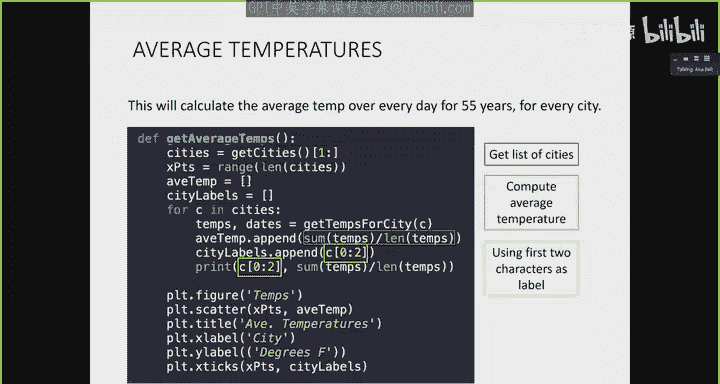

If we do that， we get something that looks like this。

 so this point here represents the temperature in Seattle over every day， over 55 years。

 so one point temperature point that represents the Seattle temperature right for all of this data that I've got。

What does this tell us， Well， not much that we didn't already know。

 I've got these cities down here that are super cold。And those cities up there that are super warm。

 right， And then all the rest of my cities are somewhere in the middle， on average。Right。

 so nothing that we didn't really know。 Nothing groundbreaking here。

What would be a nicer thing to look at is the temperature change over time。Right， so here。

 my one data point tells me。The temperature kind of that represents that city。

 But what I' would like to do is grab the temperature that represents that city for each year。

So for each year， I would like to get the average temperature for that year。

 And maybe I could see a trend， you know， for the temperatures getting warmer over time or or cooling over time something like or not having any change at all。

So this is the code that does that。 I've got get temperatures by year for city。

 This is kind of the function that gets run。 and it calls the one at the top。

 So here I've got the code from the previous slide。

 It gets a list of all the temperatures for a particular city。 So over all those 55 years。

And then I'm interested in all of these different years。 So for each one of these years。

 I'm going to get a temperature value， right， This get temps for year is the function up there。

And all it does is it looks at that third column and grabs the year。

 It matches those first four characters of the year entry。Alright。

 and as long as it matches that year， then it's going to get added to this running sum。

 And at the end， I'm going to get the average for the year。

And let's say that I'm going to compare four different cities。

 So I've got 55 values for each city representing the average temperature in those 55 years。

 and I've got four cities to compare。So this is what one plot would look like for Boston。 sorry。

 So this is what the plot would look like。 I've got one line for Boston。 That's the blue。

1 line for San Diego， the red， one line for Phoenix， the orange and one line for Miami， the green。

What do we see， Well， yes， Boston， on average， is a lot colder than any of the three other cities。

 Co， we do that。Miami and Phoenix are nicely hot there。 I would like to be there right now。

 And what about trends， right， This is why we did this analysis。 What do we see from the trends here。

 Well， the Boston temperature maybe increases a little bit slightly over time。

 San Diego seems to say about steady。 The Phoenix one seems to increase， right。

 prettyty dramatically as time has gone by， on average。😊。

And the Miami1 may be also slightly increased。But this only tells us average temperatures。

So one thing that we can do is check out the extremes。 In addition to plotting the average。

 let's also plot the minimum for Boston and the maximum for Boston。Right。

 and see exactly how close that average is。 is the average， you know， in the middle。

 and then the minimum and maximums are super far away from the average。

 or are they all pretty much close to the average。

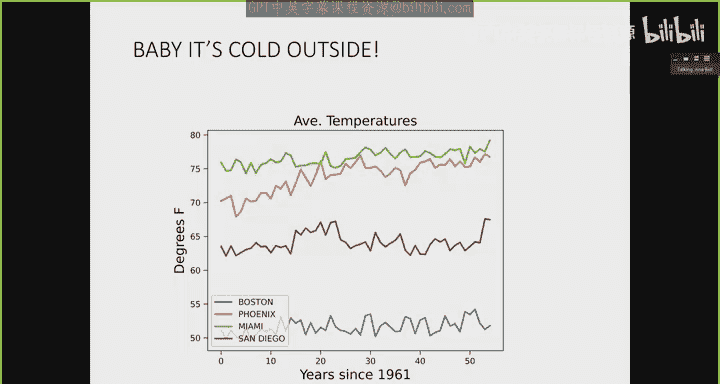

So this is the code that does that。

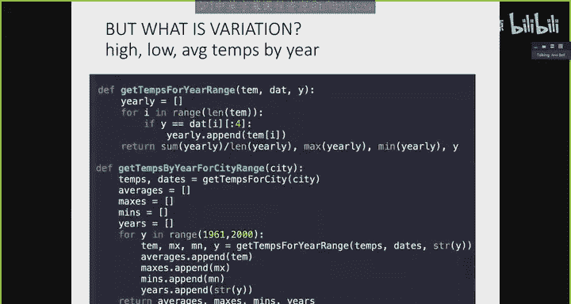

The function here is exactly the same as on the previous slide。

 the only difference is instead of returning the average。

 we're also going to grab the max and the min for that list of temperatures。

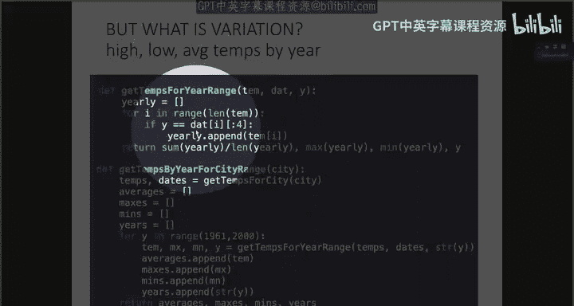

And then we've got all of the different cities to plot this for。

 So we get something that looks like this。

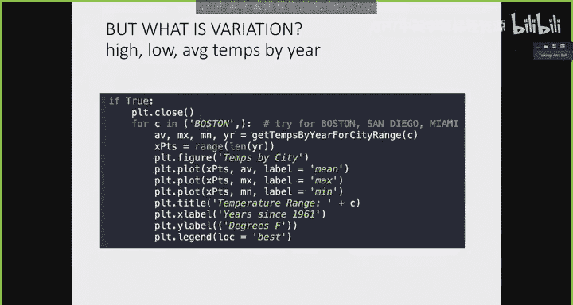

Again。At first glance， I have I tend to ignore the y axes at first glance。 So at first glance again。

 it looks like， hey， the minimums are pretty much the same。 The maximums are pretty much the same。

 Averages are pretty much the same。 So misleading to think about that。 So once again。

 let's help the the the the reader and set limits on our y axes。

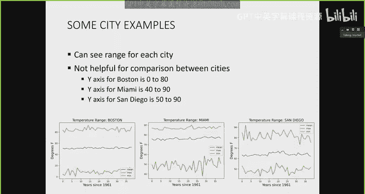

Right， so here I've got a limit to my function or to my code。

 It's going to have every one of my graphs start at 0 and top out at 100。

And now the plots are nicely comparable。 So now I'm plotting the average temperature for each year。

 So there's 55 of these data points， the minimum temperature for each year and the maximum temperature for each year。

 So 55 data points being plot。What can we tell a lot easier to infer information from this， right？

 So we could see that the average temperature in Boston is the minimum temperature in Miami and San Diego。

What else can we see， The variation in Boston is pretty high， right？

 The variation in Miami and San Diego is a lot lower， right， San Diego goes from 40 to 80。

 whereas Boston goes from 0 to 90。 So pretty high variation。

The average for Boston and San Diego seems to be almost the same， right， But that variation is。

 is very different between these two cities。O， so。What happen if there's a value low？Oh， yeah。

 then it doesn't get plotted。Yeah， so yeah， that that was a tenuous there， but it didn't go down。

 I I could imagine like the minimum in Boston being below  zero for one year。 But yeah。

 then it just wouldn't get plotted。嗯。So you could use that to guide， you guide your limits。

 like the the， the code here could say y limit equals minimum of those three lists， right。

 And then you'll be sure to make sure to like， to， you'll ensure that that minimum will be。

 will be hidden the limit。Great question。Okay， so one other thing that we can look at is the distribution of temperatures。

 right， So this is a nice plot。 It gives us sort of an。

 an overview look at what happens year by year。 But what if we focus on one specific year。

And now for that year， let's think about what the temperature distribution looks like。

So what I'm interested in in plottdding is something like this。 So I've got on the X axis。

 maybe bins that correspond to different temperatures。 So a temperature of 0， temperature of 1。

 temperature of 2，3，4， and so on。 And then this is gonna be pretty big because maybe my max temperature will be 100。

So for one particular year， I would like to have 100 bins。

And the height of each bin is going to be a count of how many days within that year we reached a temperature of 0。

 How many days within the year we reached a temperature of one。

And we can average things or we can round temperatures， right， because obviously。

 the temperature would be like 20。6 or something like that， right。

 And then we can just round it so it fits in one of these bits。

So that's exactly what this code is doing。So here it's looping over every single one of the。

 the dates。 And we're creating this list of the temperatures。 And the list is for one specific year。

 So this year is my parameter here。So here， this is just going through the data and ensuring that I'm grabbing only the rows that match that year。

And then down here is where I'm creating a list of 100 elements， right， So this down here。

 you can think of it as a list。Like this。And the index nicely， it worked out really nicely。

 The index is going to correspond to a temperature value。

Which is weird to think it only works in this particular scenario with Fahrenheit temperatures。

 but the index in this list corresponds to a temperature。

So as I'm iterating through my list of temperatures over 3，65 days in a year。

 I'm going to round that temperature。And I'm going to add it to the index that I believe it belongs to。

 right， So in this way， I'm going to have， you know， if the temperature was  four degrees。

 then at index 4， I'm going to increment my count by one And if further on in the list。

 I've got another temperature that's 4 at index 4， I'm going to increment it again。

 So I've got this nice list these nice counts of all of the temperatures at different sorry。

 all of the the counts。At all of these different temperatures。So out of those 3，65 days。

 how many days had a temperature of four。3，65 days， How many days had a temperature of 85。Okay。

 and then we can plot it。 And we're not gonna plot a regular plot because we don't want these connected。

 We're not going to do a histogram because we made our own。

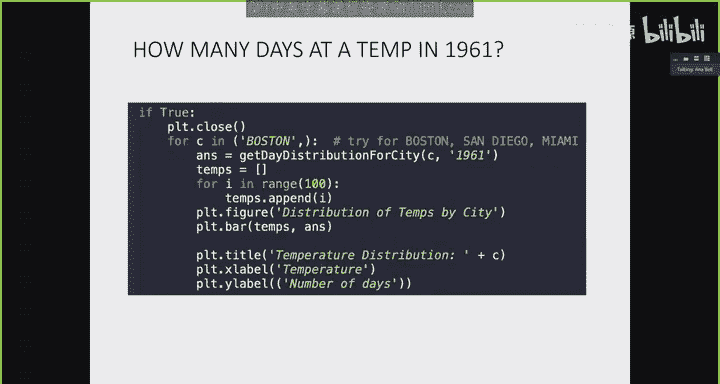

Histogram here。 Instead， we're going to do a bar plot。 and the bar plot takes in my X axis。

And my Y axis， the X axis being this list。0 through 100 corresponding temperatures and the y axis being the count of how many days had each one of those temperatures。

 And we get something that looks like this。So this is only for one here， right。

 So if we count the sum of all of these bars， right， how many， how many times they appear。

 it should add up to 3，65 days。So this is the the distribution， I think， in 1961。

 left is Boston and right is San Diego。嗯。Already， we can tell some pretty interesting things from this。

 right， So 1961， what does the distribution look like for these two cities。 Well。

 it looks like this is something we could already tell from the minimum and maximum。

 It looks like temperatures in Boston kind of went from about 0 to 85。😊。

But what the distribution tells us that the minimum and maximum couldn't tell us is how many days were that low。

 right， How many days were that high。Is it that we have some sort of nice looking bell curve type distribution。

 right， where most of our temperatures land comfortably in this middle range， right。

 That's one option。Or。Maybe there is some city out there where it just has an even distribution。

 right， So basically， they're going to have temperatures that。sorry。

 the count of the temperatures basically is even。 So it doesn't really matter what temperature you're talking about。

 There will be an even number of days throughout the year that are at that temperature。

So this kind of graph can tell us this。 So it looks like the temperature in Boston kind of maybe follows a very wide bell shaped curve。

 kind of maybe two bumps bimodal temperature in San Diego again much a much lower variability。

 but also seems to follow this bell type curve here where maybe bimodal with two bumps here。

 one with temperatures that are just know in the 55s。

 very few temperatures in the middle and then you know a bunch of temperatures in the 70s。

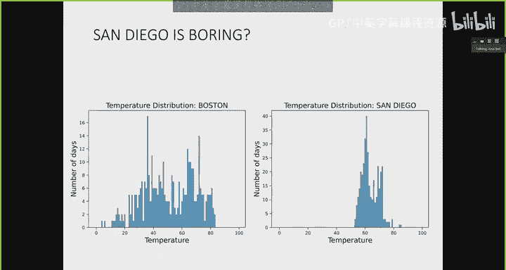

So this is the distribution for 1961。And then we can again ask what happens to the distribution in a later year。

So if we take more than one year that we plot here， I'm gonna plot 1961 and 2015。 So just two years。

 not everything in between。 That would be a very， very cluttered graph。

I'm going label the 1961 temperatures blue and the 2015 temperatures red。

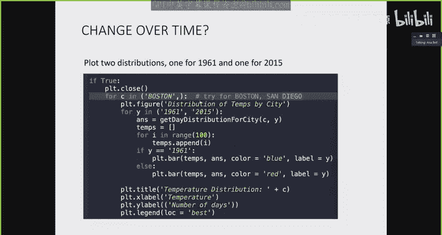

So then I get something that looks like this。A little hard to tell。

 So what we can do for this graph is we can actually add something called an alpha value。

 So a transparency so we can kind of see what's behind the red。

 Does the blue go all the way down here。 Is the blue just， you know， slightly below the the red。

 Hard to tell from this。One thing we can do is to add that transparency。 Like I said。

 Another thing that we can do is to just plot them on two separate subplots。

And then we can try to compare them to see exactly what happened from 1961 in terms of the distribution to 2015。

 again， in terms of the distribution， right， So you can。

 if you want play around with different cities， you know。

 your home city and see exactly what happened to the temperatures over all those years。

 So it's kind of a cute thing to try。Any questions。O。So that's the end。

 We've really just scratched the surface of the things that you can do with plotting today。

 right We saw how to customize our graphs。 We saw how to create labels。

 you know some really really basic things。 but I hope that sort of throughout all this。

 you saw how useful it is to visualize the data the commands are not so important right because you can always look those up。

 But what's important is to take some sort of set of data which you'll be working with in the real world if you do at Europeop if you decide to take other computer science courses in other departments。

 computation courses， you'll be working with data。 And as soon as you get it。

 it's important to just visualize it to see what it looks like， sort of get a general sense of it。

 and once you get a sense of it， it can lead to more questions which will cause you to kind of visualize the data in a slightly different way。

 which becomes more useful answering questions and potentially posing new questions to investigate。

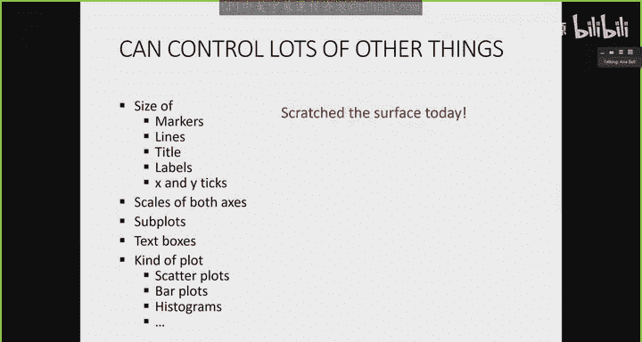

So that's it for today。 Next lecture， we'll be just tying up some loose ends regarding dictionaries and just some ideas and hash tables and how dictionaries are stored in memory。

 as well as doing a little bit of preview of simulations。

 which is something that's a really useful technique， you know， again。

 if you're gonna do some more computation courses and other departments。

 a simulation is something that's going to be really， really helpful。

