# 《计算机科学和Python编程｜6.100L Introduction to CS and Programming using Python, 2022》 - P26：-26-Lecture 26_ List Access, Hashing, Simulations, and Wrap-Up.zh_en - GPT中英字幕课程资源 - BV1PAxJzVEs3

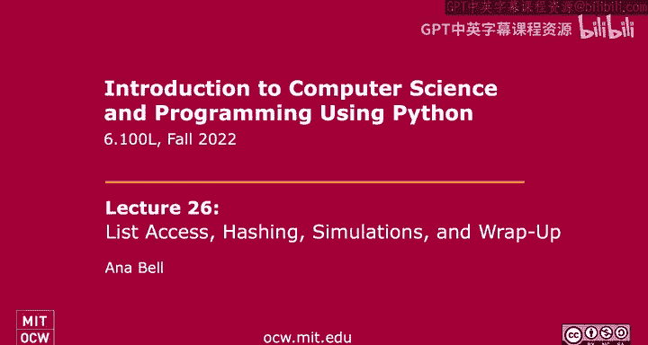

So welcome to the last class。 Please don't come on Wednesday。 I will not be here today。

 we will just be tying up some loose ends regarding some topics that we've seen throughout the course。

 and then I'm going to do just a wrap up of things we've learned and potential courses that you might want to take after this。

 Okay， so today， as I mentioned， we're going to tie up some loose ends regarding lists， dictionaries。

 So those two topics are kind of going to be combined into one sort of kind of one part of this lecture。

 It's going to also include a little bit about complexity。

 So just some things that we've learned kind of demystifying some details that I kind of skip throughout the past few lectures。

 And then we're going to talk about simulations。 So simulations are very。

 very useful is a very useful idea that you can already do with what you've learned in this class。

 and I'll show you some useful places where you can apply computation。

And simulation to do some interesting， some interesting things。 And then we'll do the wrap up。So。

 let's first。Start talking about lists。 So lists were the first data structure that we encountered。

 that was really useful， right， Like we did see strings and we did see tus and things like that。

 But once we saw lists， it opened up a whole new world of possibilities for how we can manipulate data。

 right， So lists are sequences of objects。😊，I kind of skip past how they're actually implemented in memory。

 So I do want to talk about that a little bit。 But what we did talk about was the complexity。

 the asymptotic complexity of list operations。 So some of these are were pretty obvious。

 So the ones that are theta of n down here were obvious because well。

 to check for equality between two list， you of course， have to look at each element in the list。

 right， So that's theta of the length of the list to check whether an item is in a list or to iterate over list。

 obviously， it's theta of n， because you have to look at each element in the list。

 But we didn't really talk about the complexityities up here。

 So accessing an item in the list specifically is theta of1。

 So that means if you have a list with a whole bunch of elements in it to grab the element at a specific memory location。

 it's constant time complexity， right So it's basically doesn't depend on the length of the list。

 It's instant。

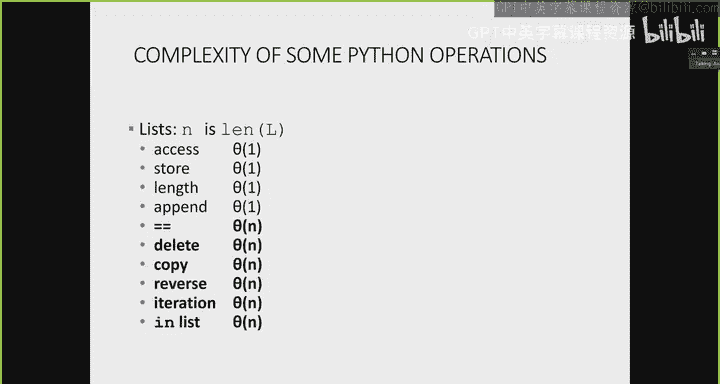

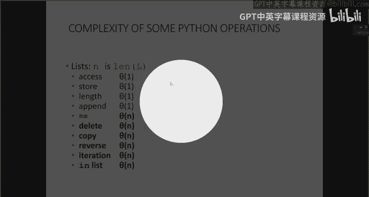

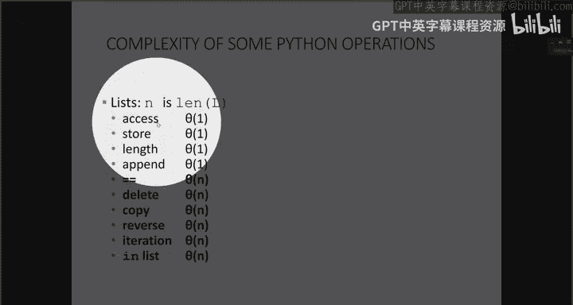

So we're gonna to see why that is。Let's first， for simplicity sake sake。

 assume that we're storing a list in memory of just integers， right。

 So I know lists can store other lists and dictionaries and things like that。

 But just for the this first slide， let's assume all we're doing is storing integers。😊。

So the way Python does this is when you create a list。

 let's say youre initially populated with length L。

 Python initially allocates a contiguous memory block with with length L memory locations。 Okay。

 So if you have a list with 100 elements in it， initially populated with 100 elements in it。

 Python will initially create for US sequence of memory locations that are reserved for this list。😊。

Then it says， well， if this is going to contain just integers。

 I'm going say each one of these memory locations will hold。4 B for that integer。

 That's kind of how we represent an integer。 And it could be， you know，8 B。

 something else for different machines。 But in this particular example。

 let's just say each one of those memory locations will start an integer。 and that's 4 B long。Well。

 if this list is contiguous， right， a bunch of blocks of memory in all in order。

 then to access the if element， All you need to do is a little bit of math。 right。

 So here I've got an integer in one position in my contiguous block。

 Then I have maybe another integer at the next position and so on and so on until I have another integer at the I position。

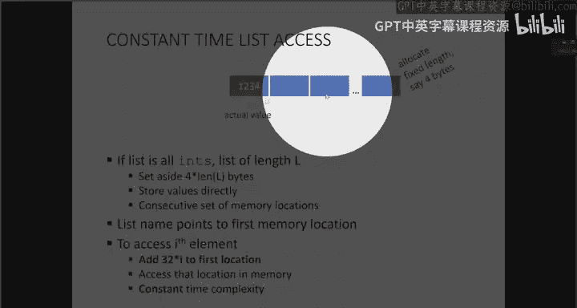

So since these are consecutive to access the location of them， of the element in this I spot。

 all I need to do is look up that many memory locations from the start of my list。

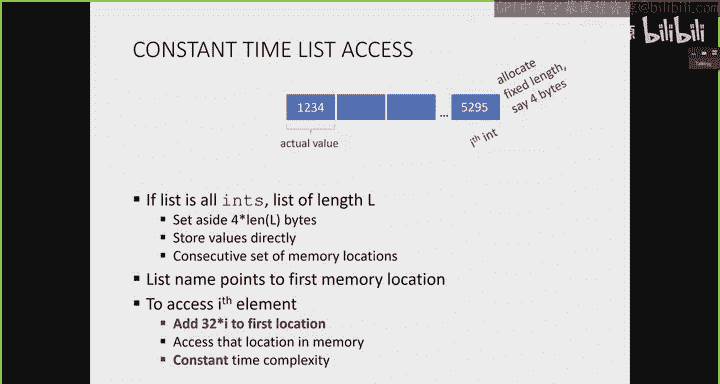

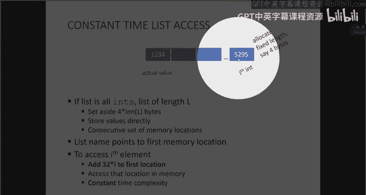

Okay， so that's just pure math。 So 1 B is 8 B。 So if I have four times。

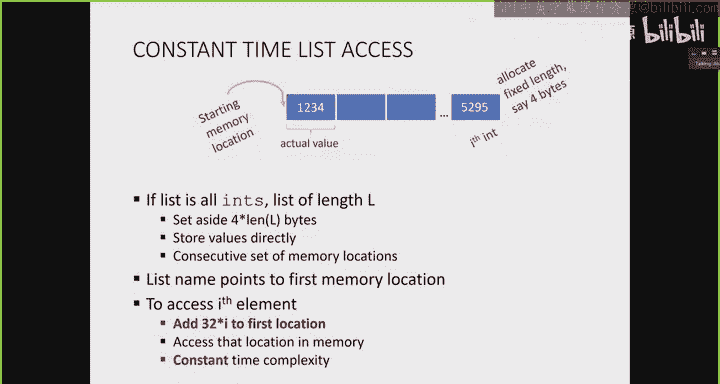

4 times 8 Bs multiplied by I plus the first location that will tell me exactly the location of the Ih integer。

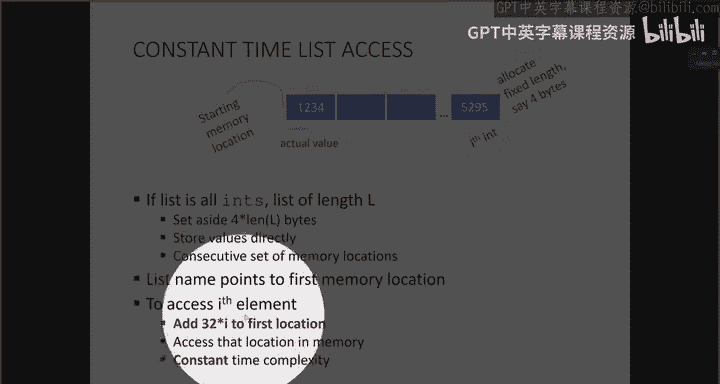

So this is all made possible because these memory these memory locations are allocated in order。

 If they were allocated not in in order， then maybe this would not be as， as easy， yeah。32。

 because so if I say an integer is stored as 4 B in Bs， that's  four times 8 because 8 B is in 1 B。

 So 8 times 4 is 32 B。Alright， But this is assuming that I'm sooring integers。 And obviously。

 lists can contain other lists。 They can contain tus。 They can contain dictionaries。

 And some of those objects might not fit within this set number of Bs， right， within4 Bs。

 because some of those objects might be very， very large themselves。So in that particular case。

 let's say the list is heterogeneous。That doesn't faz us because we can say， well。

 instead of storing the object itself at each memory location that work for integers。

 but not might not work when we have to store a list of， you know。

1000 elements at a particular memory location。Let's instead of sooring the element itself。

 let's store a pointer。 and a pointer is just a number that tells you which memory location that list might be stored at or that dictionary might be stored at right So if we store a pointer at a particular memory location。

 then that means that this is my， again， contiguous memory allocated for a list of length L or something like that。

 Then here I'm sooring and still an integer。 and that integer tells Python which memory location to jump to to grab the integer that's stored there or something like that。

And here I might have another list that I'm storing。

 but I'm not storing it exactly in that memory location。

 It's pointed to by by this pointer that tells Python again to jump to a different memory location where that list might be contiguously stored itself。

Right， so here in this， in this example， I'm still storing。嗯。Numbers。

 it's just that these numbers correspond to a memory location that tells Python where to go to get my element in that list。

So in terms of the computation to get the I element in the list， it's going to be the same。

 I'm still allocating in my original list 4 Bs to store my pointer。 again， just a number。

 And so to get the I location。 All I need to do is tell Python to go the start of this list plus 32 times I locations down to get to that element。

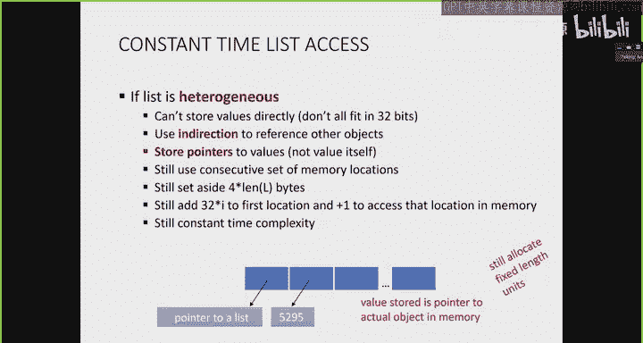

So， this。Formula here， right。Adding the start of this memory location of the list plus 32 times I is just math。

 There's nothing here that depends on the length of the list， right。

 So to grab the element at the I location， right， somewhere within here。

 all we're doing is some math， right， an addition and a multiplication。

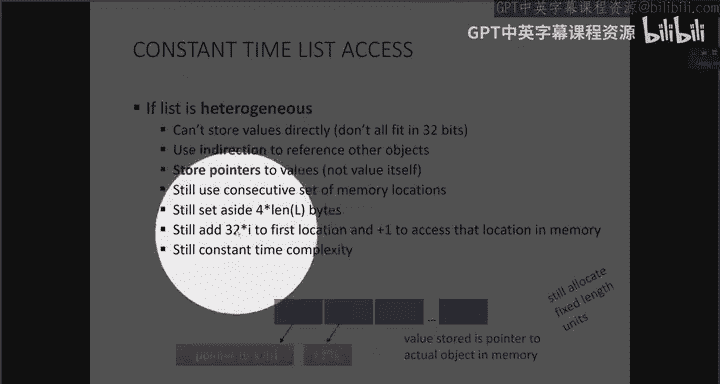

And since that is just， you know， then none none of that depends on the length of the list。

 the complexity to access the Ih element in the list is constant， right， just math。

 And we're using this idea that we are， we know exactly how many memory locations we need a jump to get to the Ih location。

 Does that make sense。O。So that leads us to the question。 Well， okay。

 we're storing a list of elements。 and we're using the idea that a list has indices， right。

 to tell us the value， There's an element at index 0， an element at index 1。

 an element at index 2 and so on。 So there's an order to the lists， right？ And because of that order。

 we're able to index an element at the Ih location in constant time。😊。

But let's say we wanted to store a dictionary。A dictionary does not have an order to it， right。

 And what is a dictionary stored It stores a key value pair。In a list。

 you could think of the quote unquote key as the index，0，1，2，3，4， and so on。

 And the value was the element at that index。But in a dictionary， the key is not ordered， right。

 The key can be anything。 So here I've got a dictionary that maps maybe a name to a Booleion。 Maybe。

 you know， the student is in this class， true or false。

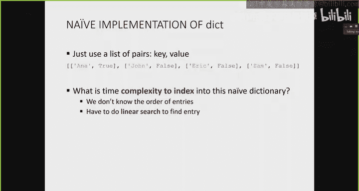

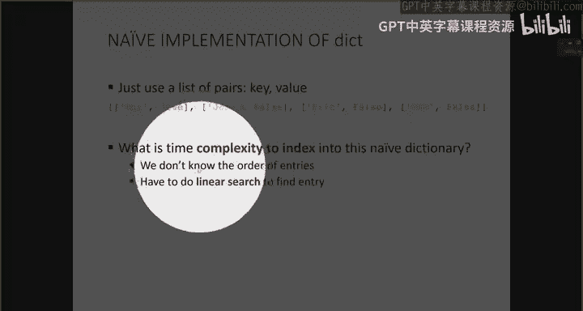

So a naive implementation of a dictionary could be to say， well。

 let's implement elements of the dictionary。 So a key value pair as a list。 So just two elements。

 The first element in that list is my key。 And the second element in my list is my value， right。

 So here， a really naive implementation uses the list。 And I've got four entries in my dictionary。

The element at index 0 are all strings。 The element at index 1 in each location is my value associated with that key。

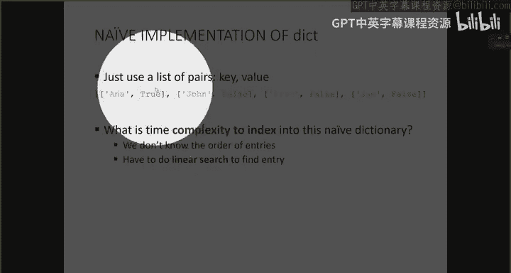

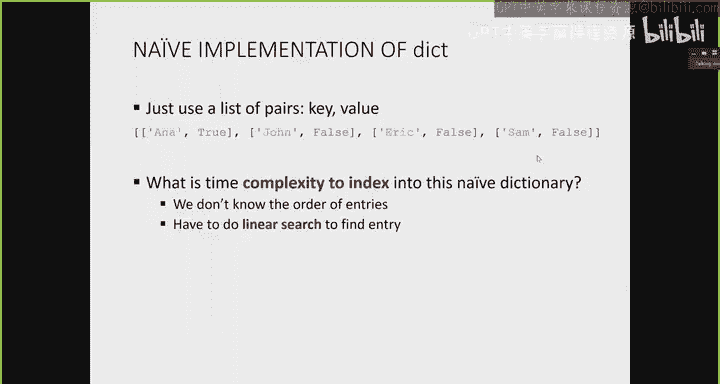

Well， if I were to index into this list， right， to grab the value associated with Eric， for example。

Can I do that in constant time。No， right， because there's no numerical index here。

 There's no order to this set of values， right。It's not even an alphabetical order， right。

 So A then J then E then S。 And there's no order guaranteed for dictionaries anyway。

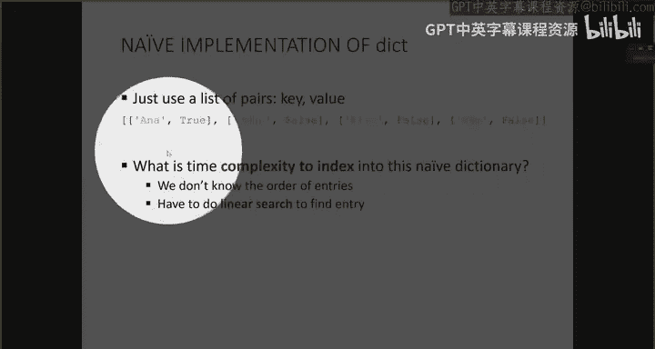

So in order to look up an item in this naive implementation of a dictionary where you're just putting all the elements in order in a list。

 it's theta of n， where n is the length of our list。And so。

This implementation of a dictionary doesn't work。And yet， when I showed you this slide a few， a few。

 a few lectures ago， we saw something interesting。 So this is what we just。

 what we just kind of proved， quote， unquote， the access time in a list is constant。

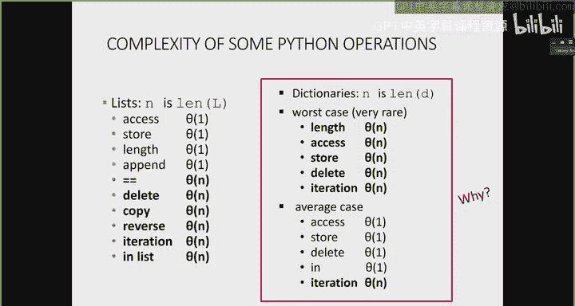

But the access time in a dictionary is， is constant as well in the average case。In the worst case。

 it is theta of n， right， Accessing an item in a dictionary is theta n， because in the worst case。

 we might store the dictionary like this， right， It's just a list of all of our dictionary entries all in order。

 So to look up one index。 we'd have to go through the entire list and check if the element at index 0 is the one we're looking for and then grab the element and index 1 as its value。

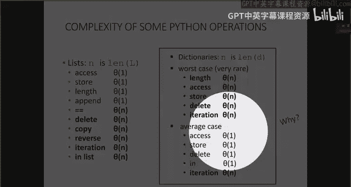

But in the average case， and this is what we're going to see next。 in the average case， the access。

 the time it takes to do a look up for a key in a dictionary is constant。 It's actually theta of one。

 which makes dictionaries really powerful data structures to use in a lot of situations。

So why is this？Well， it has to do with the idea of hashing。

So the way that dictionaries are actually stored memory is not as a list of a bunch of entries。

 right， We just showed that that is not feasible。 That leads to a theta of n lookup time。So instead。

 they use something called a hash table。 We briefly spoke about this。

A hash table is just like a long list。And the indices of the hash table are actually things that you look up using a hash function。

So how does this work， well。Any key that you'd like to add to a dictionary。

Can actually actually has a hash function run on it。And this hash function takes in maybe an integer。

 maybe a float， maybe a string， maybe a tuple， any sort of any hashable object。Haashhees it。

 which means it takes that object。 If it's a string， it'll give us an integer。 If it's a tuple。

 it'll give us an integer。 So if it hashees it， that means it takes it in as an input and gives us back a number。

 an integer。And that integer is what is used as the index to look it up in the hash table。

 to look up the value associated with it in a hash table。So in that sense。

 the lookup itself is constant time because we just showed looking up an item in a dictionary using the index is constant time。

And if that hash function is also constant time， then the time it takes to look up an item in a dictionary is also constant time。

So here are some examples of the Python hash function actually being run on different objects。

 So up here， if I run， it's， it's literally a function in Python hash of some parameters。

 So in this case，123， it just gives me the value back。

 So the hash of some number is the number itself。

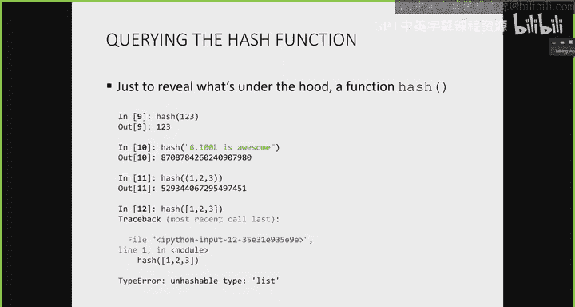

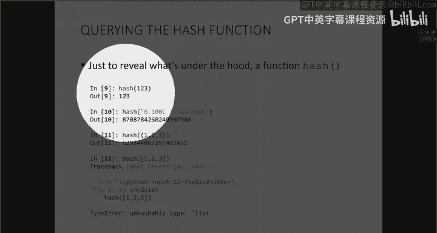

We can hash a string。

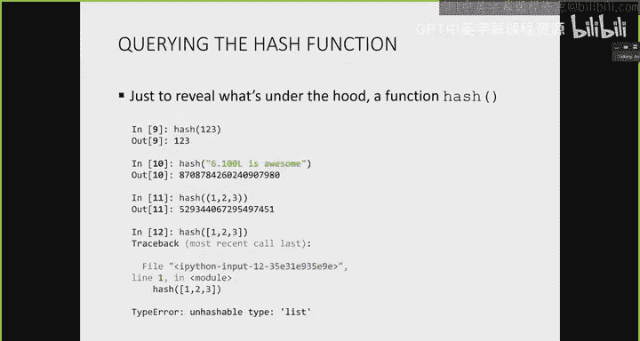

That'll give us， you know， this particular number。 So again， an integer。

 the hash of a tuple also gives us some number back。 So these are all this。

 these are all just some function running behind the scenes that takes in this hashable object and gives us back a number。

 That's it。

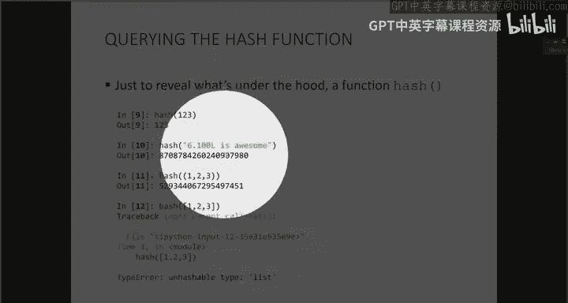

Now， we can't run a hash function on a list because a list is mutable and therefore unhaashable。

 right， If the object changes， then the hash function run on this object will give us a different value。

O。So if you actually run this on your own computer， you might get different answers。

 or if you run it at different times。 you might get different answers because Python adds a little bit of randomness to the。

 the hash values just in case you want to encrypt data and things like that。 But generally。

 you will always get some integer back。 if you run the hash function on a on a immutable object。Okay。

 so then that begs the question， how big should a hash table be， right。

 So if a hash table is basically just a long list。And if I run a function on some object to give me the value of an index within that list。

 how big should this table be， How many indices should I have 1000，1 million，10 million， right？

 What's a good number。Well， let's take a example of a string。 Okay， so first a string。

 what we can do is， and we can use my name as an example。

If we want to hash my name such that every single name hashees to something unique。

What we can do is the following so we can take each character in somebody's name。

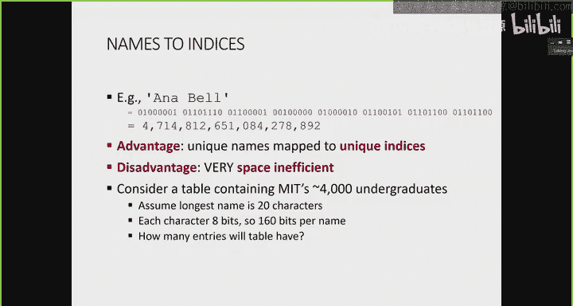

And behind the scenes， each one of these characters actually has an integer sorry。

 an ASI code associated with it， which is something numeric。

 And what we can do is just convert that number to binary。

 So the letter capital a happens to be this binary value， right，0，1，0，0，0，0，0，1。

 The lowercase N is this value。 the lowercase A is this value and so on。 right。

 So I've got 7 different sort of groups of 8 B。

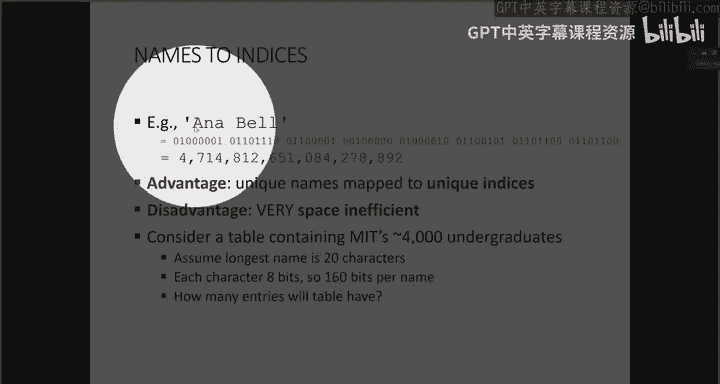

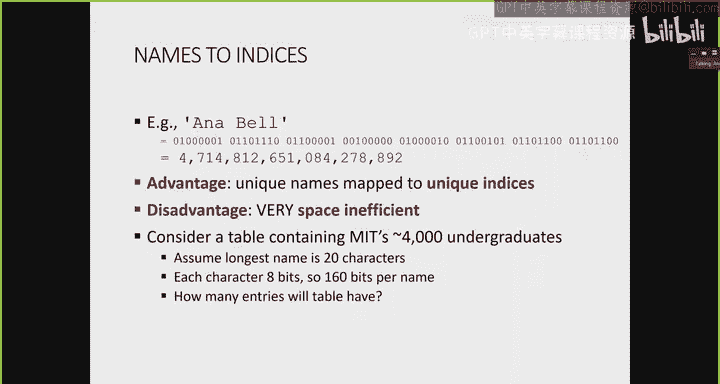

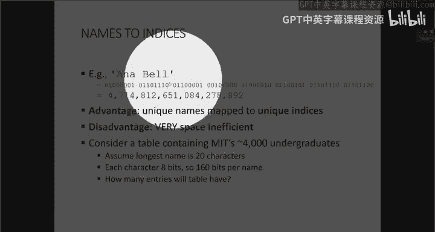

Here， for corresponding to each letter in my name。Now。

 if I take those bits and now just smsh them together， concatenate them to give me one really。

 really big number。

Right， so this is all going to be one really big number。

The corresponding number in base 10 is this really long thing。

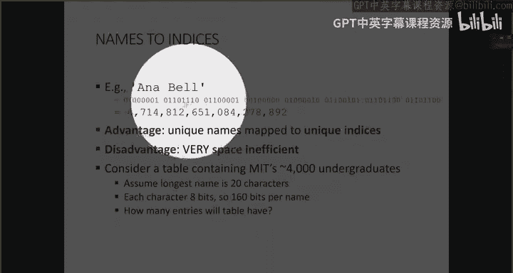

Okay。And so if I do this， as long as someone's name is unique。

 they will end up with a unique number associated with their name， right， And therefore。

 that unique number can be used as a unique index into a really big hash table。

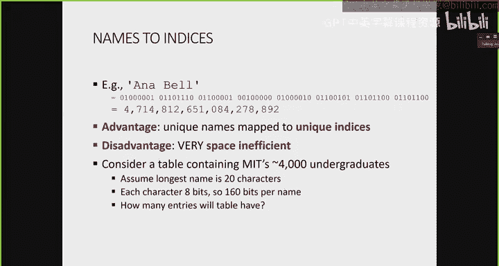

So let's think about hashing the names of MIT's 4000 undergrads， right。

Let's assume that the longest name is 20 characters long， right。

 So there's going to be 20 of these different letters that we need to hash。

 So we use the same process here。 Each one of those 20 characters gets its own 8 bit representation。

So in total， the number of bits that I'm going to use to represent that 20 long character is going be 8 times 20。

 So 1 60 different bits。

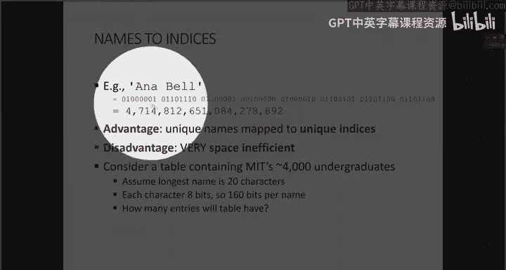

That's a lot of bits。 And if I concatenate all those together。

The number that that corresponds to is 2 to the 160， which is this thing here。Okay。

 so if I want every single combination。Of letters in the alphabet to be a unique value in this long list。

 Then I will need to have a list that is this long。

I'm not even going try to figure out or to say how big this number is， but it's really， really big。

And having a list。A K hash table that has this many entries will guarantee for me that names that are 20 characters long will each hash to something unique。

But I only have 4000 names that I'd like to put in my table。

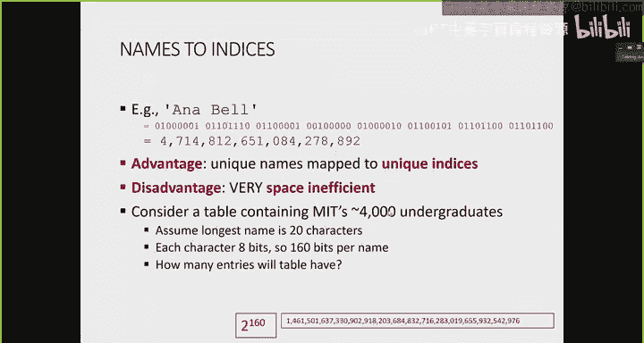

So I have 4000 names that I'd like to put in a table that has this many spots。

RightSo that's a lot of wasted space。気持ちいい？Yeah， so exactly。

 So each one of the characters has 8 Bs associated with it， right。

 So there's gonna to be 160 of these zeros or ones in a row。

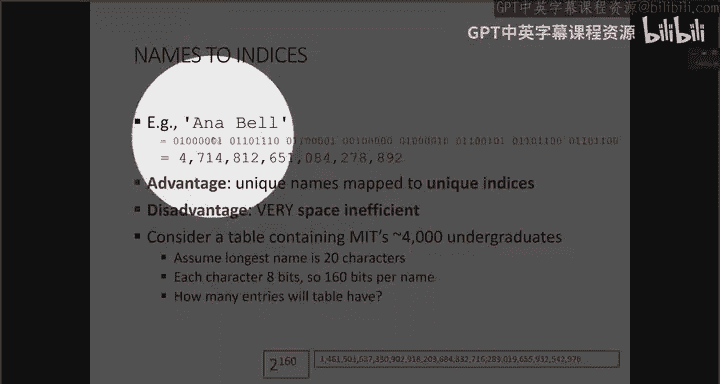

So to tell the number that that is that's associated with， we basically say。

 we basically calculate 1，0，0，0，0，0，0，0，0，20 with 20 zeros at the end。And that gives me2 to the 160。

Right， that's going to be how big my number。That is going to be that's gonna be for one， for one。

 that's gonna be how many slots I'll need in order to have unique combinations of letters be mapped to one slot。

Right。So 0 is， is，0，1， will' map to one thing，0，0，0，1，0， will map to another thing。0 is，0，1。

1 will map to another thing。 So like all these combinations of letters will each map to something unique。

 And I， in order to guarantee that， I need this many slots。But since again。

 since I only have 4000 undergrads， Well， that's a lot of wasted space。 right。

 I'm only using 4000 of these slots to hold students names。

 And that's because a lot of those combinations of letters aren't really valid， right。

So what's the solution。There's a lot of wasted space there。 So the solution would be to say， well。

 you know what。I would be fine with having a smaller hash table。

 I don't need that giant number of entries in my hash table。 I would be fine with maybe having。

 you know，10000 spots。And then having some names that happen to hash to the same thing or saying。

 I'm fine with having a hash table that has a million spots。 And， you know， out of those 4000。

 some will be used， some will be unused， and some might collide to the same hash value。

 And that's totally okay。Okay， so if we allow collisions， what is this going to look like？

 So here's a visualization of our hash table。So think of the hash table like a list。

 The reason why we think of it as a list is because indexing into a list is constant time， right。

 We're taking advantage of the idea that if we index into a list， that's gonna be constant。

So let's say we're adding some names and grades into our hash table。 right。

 So this is our representation of a dictionary。

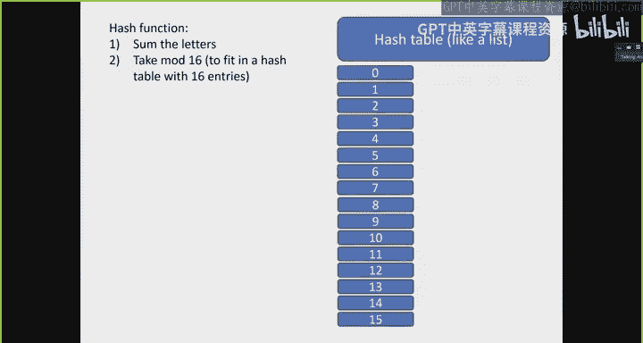

The values here says that I have a hash table that has 16 different entries， right，0 to 15。

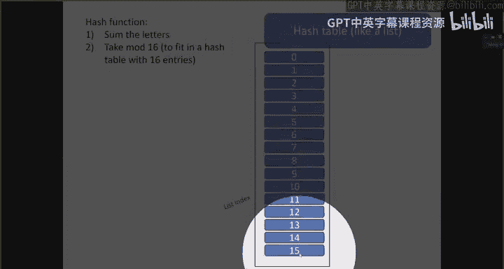

And 0 to 15 corresponds to like， the list index。OK。

So if I have a name and a grade that I'd like to add to my hash table。

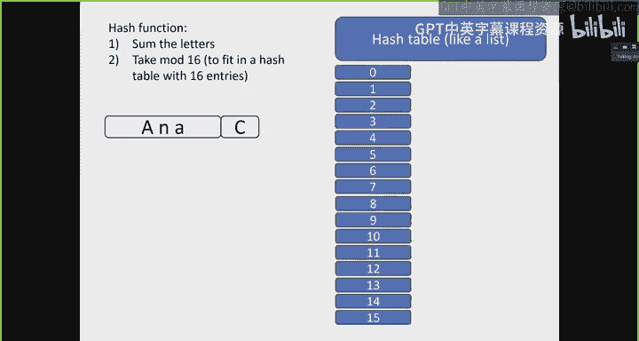

I need to run a hash function on the key。 So the key is the name。

 and the grade is the the value associated with the name。

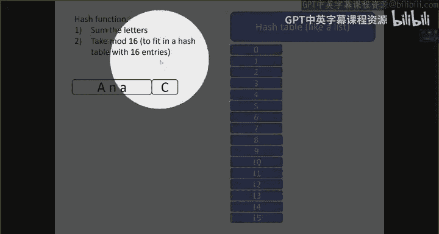

So to add Anna with the grade of C to my hash table， I need to take my Anna。

 which is the key and run a hash function on it， such that when I run the hash function on this name。

 A And A， it'll give me a number， an integer between 0 and 50。

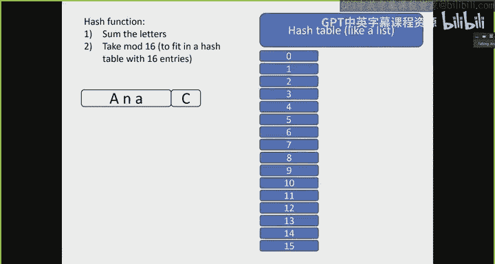

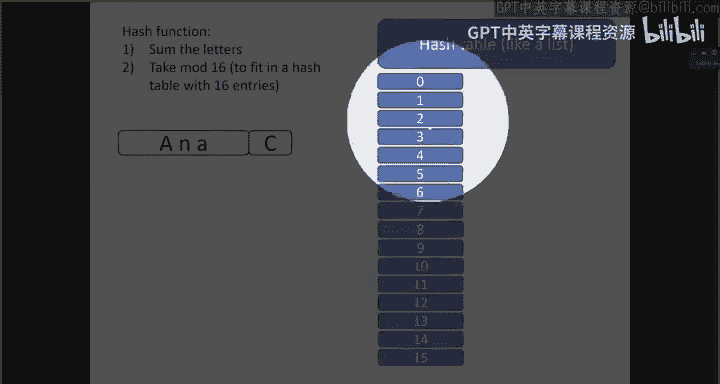

Okay， and if I can do that， then I know I've added my， my entry here into one of these buckets。

So a reasonable hash function to run on the name。 and we saw this in the dictionary lecture is to say。

 well， let's have a map to1， B map to2， C map to3， and so on。

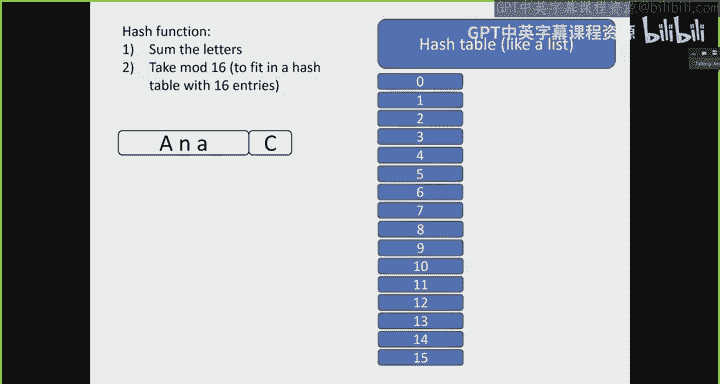

So in for my name， I've got  one plus 14 plus1 equals 16。

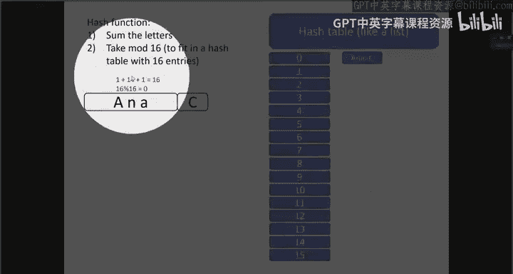

But since I want to ensure that this hash function gives me a number between 0 and 15。

 let's mod that with 16， right， so I can sum all the letters in my name just fine。

 And then let's finalize it by saying mod 16 to give me the remainder either 0，1，2 or 15。

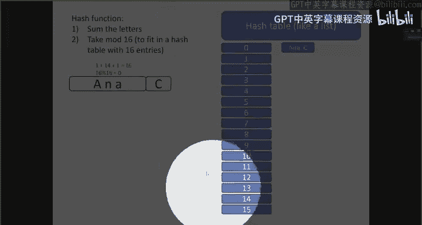

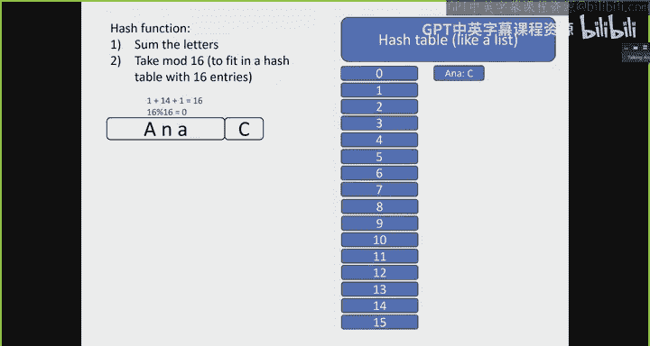

And if I do that， I'm ensured that this key value pair will be added to one of these buckets from 0 to 50。

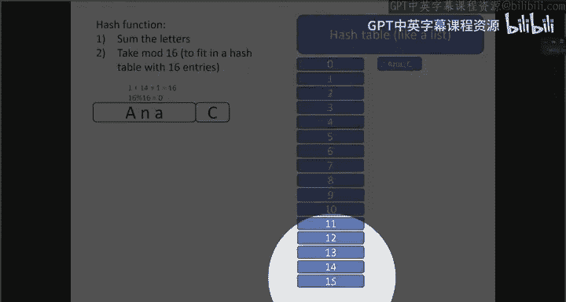

So in this particular case， Anna with a grade of C maps to0 right That's what the hash function on my name told me to add the location that the hash function on my name told me to add to。

 So there I am putting my name in there。 Let's add a couple more people。 So here's Eric。

 His name hashes to 35 mod 16。 So that's three。 So I'm going add Eric and his grade to bucket number 3。

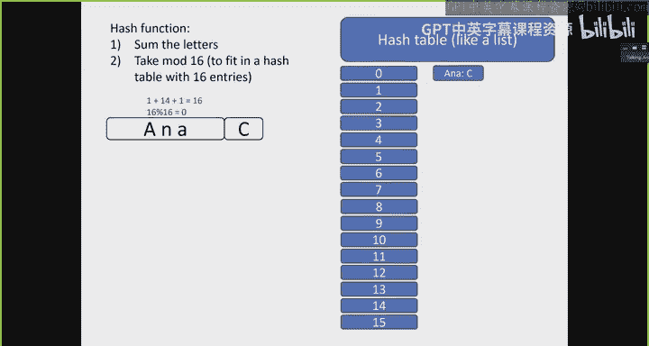

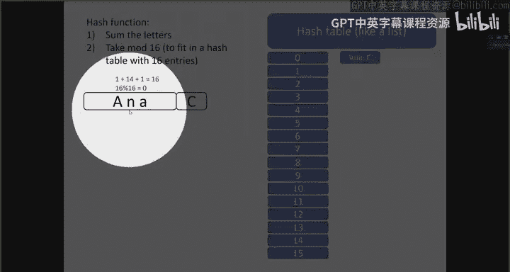

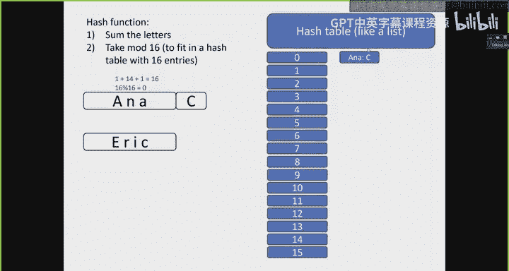

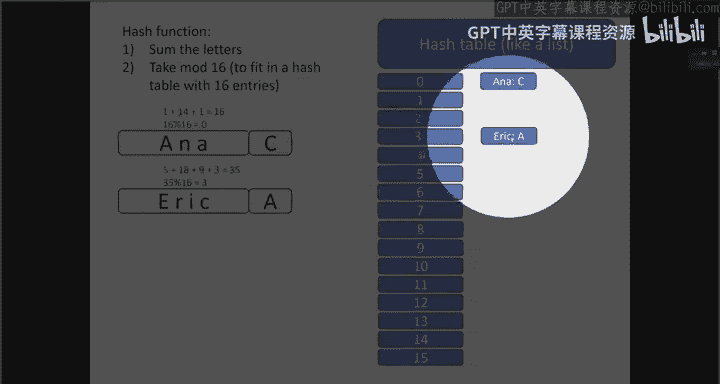

Then we can add John with a grade of B。 His name hashes to 47 modd 16。 So that's 15。

 So we can add John down in bucket 15。

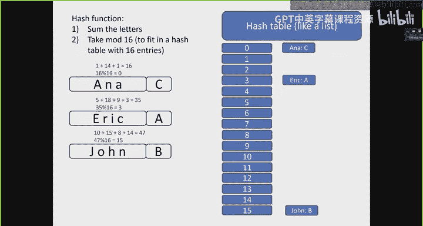

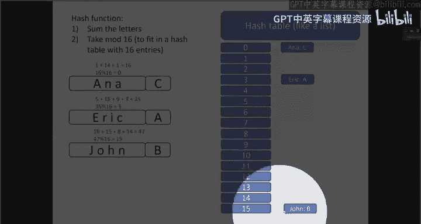

Okay， and then let's add Eve with a grade of B。 So she hashees to 32 mod 16， which is also 0。

 And you know what， Anna was already in the bucket 0。

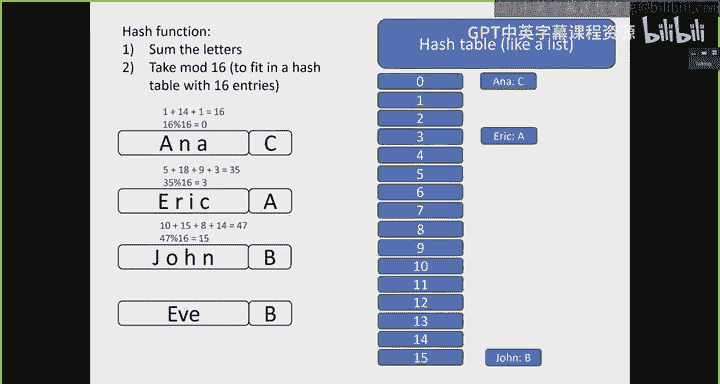

But， that's fine。Because you know what， I have four number， four names here。

 So four entries that I want to add to my hash table dictionary， and two of them collided。

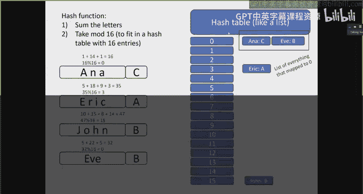

That's fine。 I still have many other buckets that are empty here。 So if I have， you know， you know。

10 students in my class， probably they won't all hash to 0。 They'll probably hash， you know。

 somewhere within here so that it's nicely balanced。

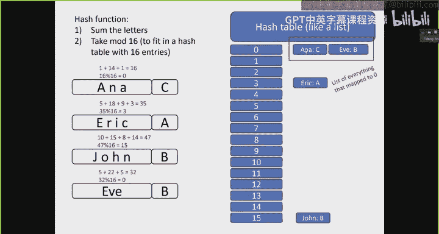

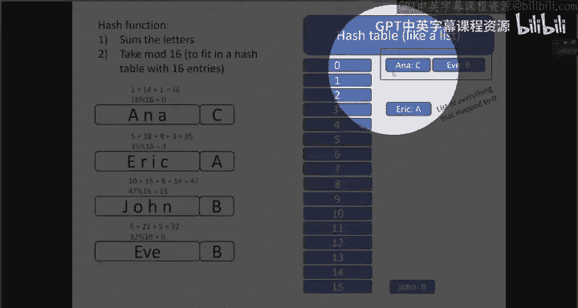

And so maybe out of 10 students in my class， only two collided。

And that's way better than having all of the students in the class be， you know。

 enumerated in one long list， right。

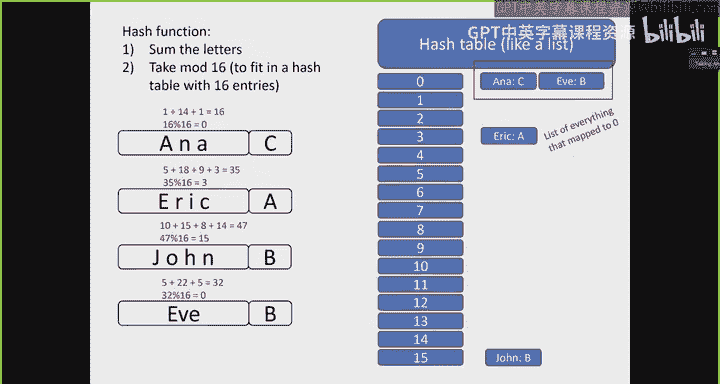

So when I look up Anna， the way that this works is you hash the name Anna against， right。

 So when you want to look up the grade of Anna， you that's the key。 you hash the value。 Anna again。

 you say， hey， Anna hash to 0。 So then I'm gonna look in bucket 0 and say， allright。

 let me enumerate everybody who's in bucket 0 and see if I can find Anna with her grade happens to be the first one。

 But， you know， if it was later on， then I'd still be able to grab it much faster than if I had everybody in one long list。

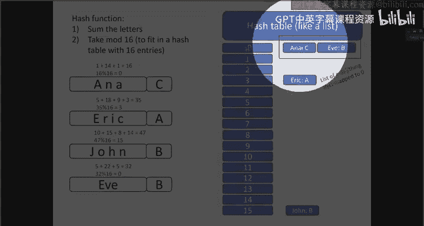

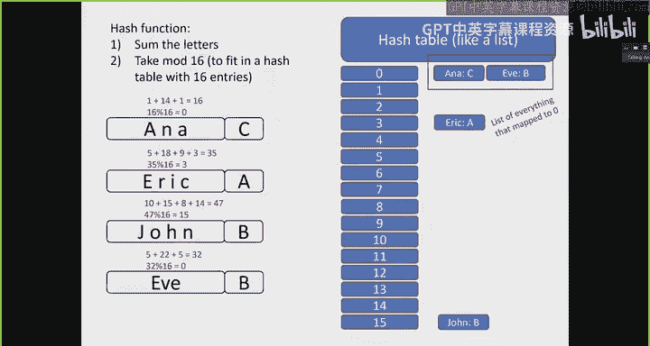

Does that make sense。Like the idea of， yeah， go ahead。You can still like。Like， you might get。Exactly。

 yeah， you can still access them。 You just might have to look through a list of two， right。

 So here at bucket 0， I'm effectively storing a list of these， everything that hashed to a0。Which is。

 it's fine。 Yes， that's， that's  two that I have to look through。 It's not 4。 It's not 10。 It's not。

 you know，100。 It's not everybody all in a row。Right， yeah。

So the complexity of this is actually gonna be smaller than theta of n， right。

 And it itll depend on the hash function that we use， right。

 This hash function needs to be nicely balanced。 It shouldn't。Put everyone in bucket 0， right。

 then that's a useless hash function。 And it depends on the size of the hash table。 right。

 If I have maybe， you know，1000 people that I'm storing in 15 buckets。

 I'm gonna have a lot of collisions， right？ But if I'm only storing these  four or maybe， you know。

8 or 10 or something smaller than the size of my table， then there will be far fewer collisions。

 it'll be more nicely valid。And like the things in。Oh， theta of n for the things in 0。 Yes。

 and that's fine because usually what we care about is theta of the length of the input， right。

 So in this case， it's theta of， if I have four students in my class， right， I've got only two that。

😊。

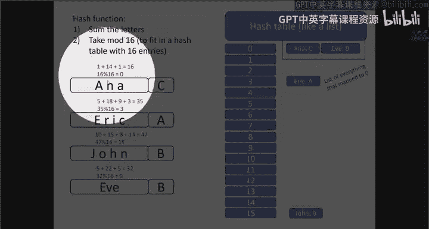

That mapped to 0。 So here it's， you know， length over2。 But if I had more students。

 then it would be far fewer， right， it would be two out of 10 or maybe two out of 15。

 that hash to the same thing。So， yeah， so as， as a question said。

 what makes a good hash table and hash function pair， right？

 Because this only works if you have a really good hash function and a nice hash table to go along with it。

 So this is actually a problem in computer science， you know， a research problem all by itself。

 So people actually study this for their， for their lives coming up with good hash functions and and hash tables。

😊，So some， some base rules， you want to have the domain of interest。 So in this particular case。

 you know， a tuple or a string or whatever it is。Map  two integers between 0 and the size of the hash table。

 So in the previous example， we don't want to have a hash function that mods 2 because then everything will either hash to 0 or one。

Right， if our hash table has 15 things， well， we better make sure that our hash function is going give us a number between 0 and 15。

Second， you want the hash， the hash value to be fully determined by the value being hashed。

 So in this case， we don't want any sort of randomness to go on for the reason that， well。

 if I want to look up Eve's grade。Later on in， you know， in in the code or whatever。

 then I need to run the exact same hash function on her name to determine the grade。

 So if there's randomness involved in this hash function。

 then you might not get back the same value that it hash to originally， right。

 So you'll be looking in the wrong bucket and you'll you know。

 incorrectly say she doesn't have a value or she's not there。

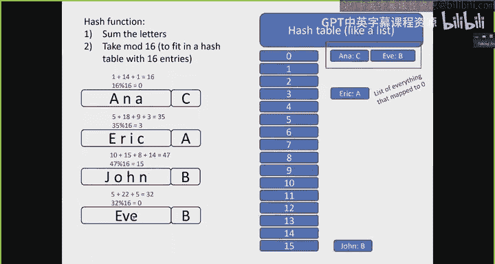

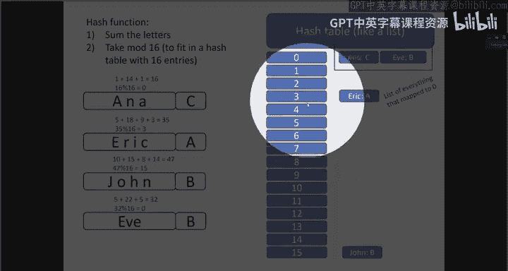

Third， you want to use the whole input to hash the the function。 should use the whole input to。

 to run the hash function。So。Again， in this example。

 we don't just want to use the first letters of people's names。

 because then that will lead to a lot more collisions than if we use the entire， you know。

 the sum of all the letters in the alphabet or all the letters in their name。

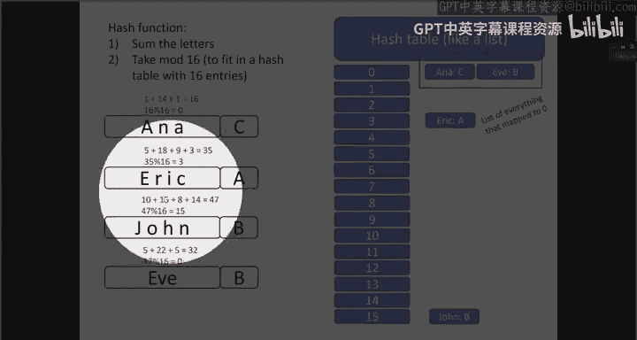

Okay， so those are really big ideas。 And then what we want out of our hash function is all the values。

 right， If you run this hash function on a bunch of different inputs for your storing names or your storing。

 I don't know， Tples or whatever you're storing， you want this function to give you a nice uniform distribution of values right So in our hash table previously here。

 if I add more names to my hash table， I want to ensure that they're gonna land in buckets， you know。

2，5，67，8，9，1112，1314， I don't want everything to hash to the number 0。 right， that would be very bad。

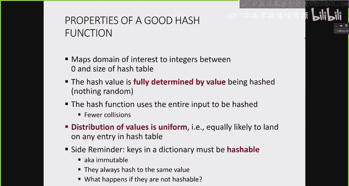

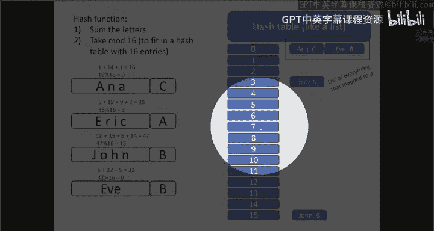

So as a side reminder， back in the lecture on dictionaries， I actually said something like。啊。For now。

 think of the objects that can be keys to a dictionary as immutable objects， right， And I said。

 technically hasable， but we don't need to know what that is。Well， hashable means just this。

 You can run a hash function on the object and you'll get the same value back。

 no matter how many times you run the hash function on that object， right。

So we looked at this example。 What happens if we add a student whose name is not immutable。

 not hashable。So lists are mutable objects。 So as such they are not hashable。

 That means if we run a hash function on a list today and then we potentially mutate the list tomorrow。

 that list will not hash to the same thing。 So we saw this example。

 Let's say Kate with a K is added to our hash table。 So her name currently hashes to 37 mod 16。

 which is a 5， right？ So we added her there。 Now， let's say， you know， tomorrow。

 we want to look up her grades to， you know， do whatever to integrate it into a bigger spreadsheet。

 She had changed her name between yesterday and today。Now she's Kate with a C。

If we run the same hash function again， on her name。That leads us to look in a different bucket。

Right， she's still there。 She's Kate with a K， as we had originally added her。

 But now her name is Kate with a C。 We run the same hash function， tells us to look bucket 13。

 and she's not there。Right， so that's why we only want hasable objects to be added to be keys to the dictionary。

 because we want the same value to come back to us。When we run the hash function on them。

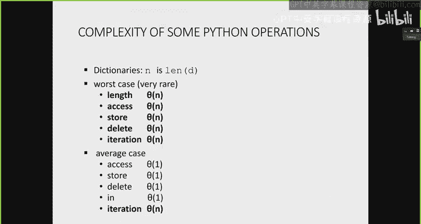

Okay， so now we can see in the worst case scenario。

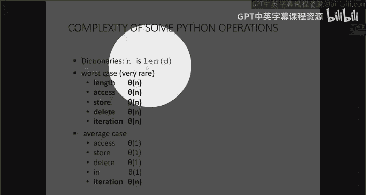

Everything maps to the same bucket in my hash table。 My list， right。

 Every single thing I add is It has a really bad hash function on it。

 Let's say the hash function always returns 3。Right， if my hash function always returns3。

 no matter what I'm adding to my addiction， no matter what I'm hashing。

 then every single item essentially gets put in a really long list at bucket number 3。

So when I look up a value will surprise， it hashes to three。

 and now I need to look through every single thing in that bucket number three to find the one I'm looking。

Right， so it's just very， very bad。 And in the worst case scenario， this is the complexity。

 It's theta of n， where n is the length of whatever items we have that we're adding to our buckets。

To our hasht。But in the average case， and this is only when we have a hash table that's pretty big relative to the things that we're adding to it。

 and when we have a hash function that's good enough right that has a nice uniform distribution of values。

 only in that case in the average in the average case。

 the time it takes for us to grab a value from a dictionary is theta of one， constant。

And so that's why dictionaries are really， really useful data structures to store things and to retrieve things from back in back when I was doing a little project。

 I didn't know about Python dictionaries I had just learned about the language and I was actually using lists to read in genomic data files and I was storing everything in lists like genomic names and things like that。

 And it was really slow like you know my advisor would be like you know is the code done yet。

 I'm like， no， it's been a couple days still waiting and then you know someone told me， hey。

 just use a dictionary to store the values and then the lookup is gonna be a lot faster。

 it was done you know within a couple seconds。So very， very useful。

 the time complex because it's genomic data。 It's huge amounts of data， right， So the， the。

 the theta of n versus theta of one is really， it makes a really big difference when you deal with large data sets。

 right。😊，Just on paper， it'， it actually makes a big difference。Okay， questions about this。

 I hope this ties in， yeah。说拍出。P cash。Yeah。😊，配そ。Can they change。我れ是。So you don't。 Yeah。

 So Python right now uses specific hash function in a future version。

 They might use a different hash function。 We don't really use the numbers associated with the hash functions。

 I mean， you could for your programs， but it would be， I guess， relative to whatever value you get。

 right？ So you wouldn't kind of hard code the value for， you know， the the 20 1，2，3 as something。

 right， You just get what you get。And， and， and that's what it is。But it。

 it could give you a different hash function。 If you ran out of your computer， actually。

 you might get a different hash value than mine。嗯。So this topic kind of ties in data structures。

 We've seen lists and dictionaries。 Some of the behind the scenes look at how things are stored。

 puts a little complexity in there。 We're talking about algorithms and and runtime。

 So it ties in a bunch of the topics that we've seen in this class really， really nicely。收。

One other thing that I'd like to now talk about is the idea of a simulation。

 And this hopefully is going to be a little bit more useful to you if you decide to take another computer science course or computational course in a different field。

 whatever you'd like。 computation simulations are very useful tools in computer science。

 So it allows you to computationally describe the world。 So if you see an event in the world。

 you can actually simulate it computationally what you've learned with what you've learned so far。

 you can totally simulate a whole bunch of things。 and we're using randomness to simulate these events that you might see in the real world。

 So， for example， you might have seen sort of the hurricane paths when you see in the news or whatever the most likely path that a hurricane might take but then they also have the little models that show know other likely paths。

 they simulated using a bunch of data that they have。Of the most likely path for that hurricane。

 right。Another place where simulation where where simulation is useful is if you see a real world event that's actually kind of complex。

 you can take a simpler set of rules and simulate those and then add in more rules you know。

 to make it closer and closer to the thing that you actually observe in the real world， okay。

So the idea of a simulation is that you have some event in the real world and you want to calculate something about it。

We're gonna use computation to design an experiment。Right。

 and we're going to use randomness for that。Once we've done that。

 we're going to repeat the experiment a whole bunch of times， computationally。

 And that just means we're going to put a for loop around whatever experiment we've designed computationally。

And if you're interested in some outcome， some particular outcome， like as we're going see。

 we're going to roll a die and we're interested in how many times， you know， a four comes up。

 then we're going to keep track of that outcome， okay。

And you keep track of it however many times that outcome happened in your whole bunch of repetitions。

 And then after the end of the repetitions， you can report some value of interest。

 Maybe the probability that a four comes up on a di roll。So here's the example。

 It's going to be very simple because it's something we can calculate already right off the bat。

 but it'll give you a sense of how you can write code around such a real world event。

So here we're interested in just rolling a dice and seeing the probability to get a dot， dot dot dot。

 right， to get a four on， on the dice on， on one of the dice rolls or the probability to get a dot。

 whichever。So here， the event is that we're rolling a dice。

 and then we're interested in getting the probability of some face。

So we're going to design an experiment for that。Dice roll。

And this is just one way to design the experiment。 There are a whole other， many。

 many other ways to design it。 This is just one that I chose that felt illustrated most how we can take a real world example and put it into code。

So a dye has six faces。

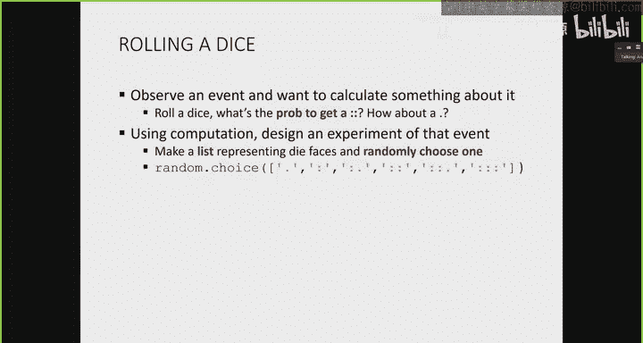

So what I have done here is I've created a list of each one of those faces。

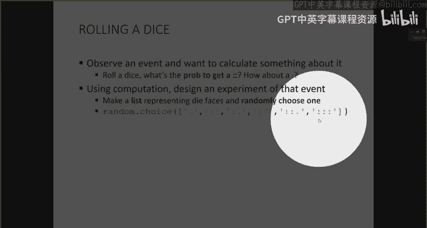

Right， you could have used numbers as the elements in the list。 In this case。

 I just used strings to be a little bit cuter or cuter。 But you know， whatever。

 however you'd like to represent each one of those diefaces， Here's a list of six things in it。

And then I'm using this choice function from this random library。 Again。

 the random library super duper useful library。Random dot choice will effectively select one of the elements in this list for me。

 So if I type in random dot choice in the console now， it might give me the dot dot。

 If I type it in right after， it might give me the dot dot dot dot， whatever。

 It's gonna be random each time I run this function。

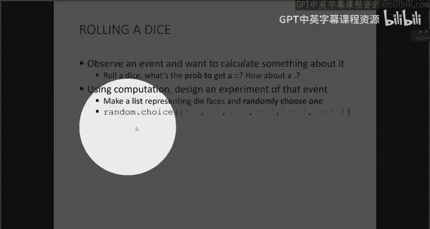

But this line of code effectively simulates me taking a dice and rolling。

And then we can repeat this experiment a whole lot of times。 right。

 If I'm taking a dice and rolling it， that's like what one or two seconds per roll。

 I don't think I have time to repeat that experiment 10000 times。

 But with simulation with computation right with programming。

 we can simulate it 10000 times or a million times， and then just wait a couple seconds。 So very。

 very useful application of programming。 So how do you simulate this dice roll 10000 times。

 Just slap a loop around that line of code。Right， so for sum number in range 10000。

 That means I'm gonna get this run this line of code 10000 times。All of a sudden。

 I've just rolled a dice 10000 times。As I'm doing so， I'm interested in the outcome of some events。

 So let's say how many times did a dot， dot， dot dot come up right before。Well。

Each time in my for loop， I can keep track of the value of role。If it was a four。Increment counter。

If it was not a for， I don't care。 Do nothing。So each time I have a counter that tells me how many times4 it came up。

And then after the for loop is done， I've repeated my experiment 10000 times。

 and I can report the probability to get a4， right， So the counter divided by 10000。So。

 this is the code。That's it。 It's super simple。

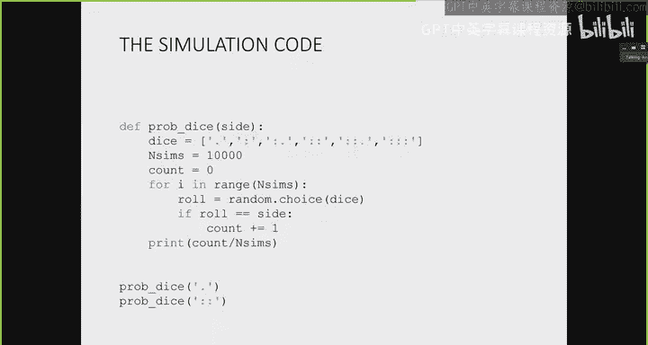

I wrote a function， and it actually takes it a parameter。

 So if we're interested in the probability for， you know， a dot dot， dot dot to come up。

 then we pass in the value of that particular of that side。

 If I'm interested in the probability that a dot comes up， then I pass in the dot as a string。

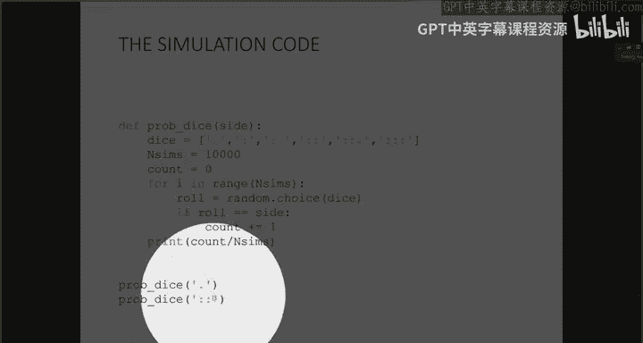

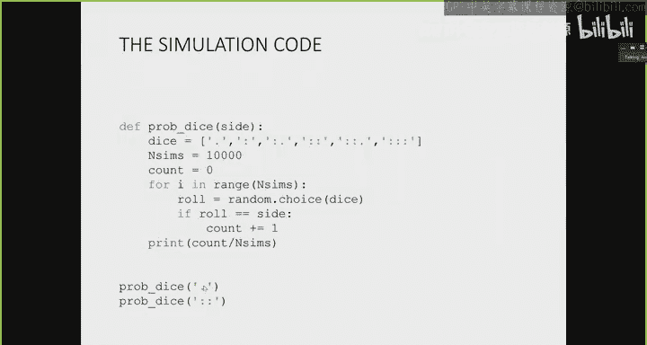

So what does it do， Well， just like in the previous slide。

 I've got this for loop here that tells Python how many times to repeat the experiment。

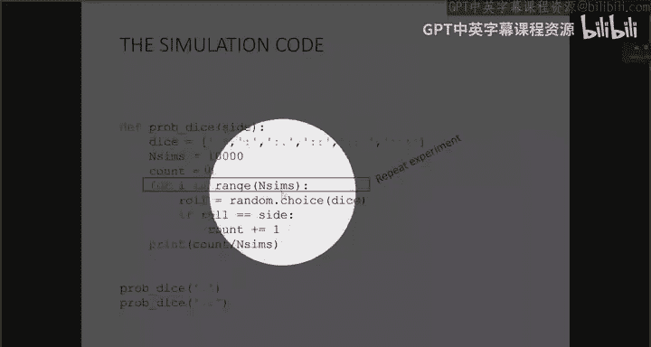

I have the experiment number here as a variable， so I can easily just change it to be something else。

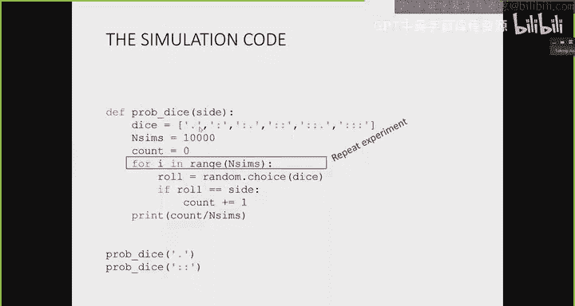

And then I've got my role here。 So this is me actually doing the experiments。

 So just here's me rolling the dice。 Here's roll value。

 And then I check what the value of the roll was and increment the counter if it was the side of interest。

 right， The thing I've passed as a parameter。 And then at the end， I just do a printed。

 But you could imagine doing a return or something like that。

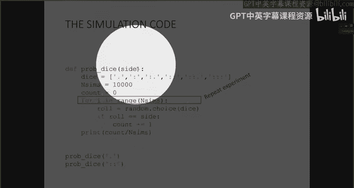

So， if I run it。We're going to get the probability that the side dot came up was 0。167。

 and the probability that dot dot dot dot came up was 0。1602。Intuition says they should be the same。

 But you know what， that's。That's， that's our intuition。 right， We already know the problem。

 If we didn't know how to calculate the probability of， you know， one of these sides coming up。

 this would be pretty good。Right， the beauty of computation is we can just add two more zeros on there。

 run it， right， and maybe uncomment it。 So we actually see the values run it。

 We wait a couple seconds。 But now the probability is getting closer and closer to the true probability。

😊，Right， so the more experiments I do， the better my answer becomes。

 And I just had to wait a couple seconds。 If I increase it by 10 more。

 I would have to wait 10 more times， right。10 times as long。 So maybe 20 seconds。

 I'm not gonna do it。So it's still a guesstimate， but it's a pretty close guesstimate。Now。

 the other beauty of writing code is that we can now ask， well， this is a fair die， right。

 Every single one of these sides comes up with an equal probability。

What do you guys think the change I should make to to make an unfair die。

Let's say it's weighted unfairly towards the， the， the， the， the dot， right the one。Yeah， exactly。

 Let me just add another dot here here。 I've got another dot。 And now the die is weighted unfairly。

 right， It comes up more times on the one than on anything else。 So if I run the code again。

 wait a couple seconds， probability to get a one twice as high as probability to get a 4。

So a really easy change。 It helped me answer another question。

 a small variation of my original problem。 And I didn't have to， you know。

 roll a dice 10000 times in， in the real world。Okay。So that was really easy simulation， right。

 The probability of getting one die of calculating sides of dies coming up is， is pretty simple。

 So why did we bother with the code， right？ because we could just do it mathematically。

side question that I asked was also kind of simple to figure out because we can actually ask harder questions and harder variations of our original problem。

 We could certainly come up with mathematical solutions to these harder problems as well。

 but I wouldn't be as certain about my answers to those， as I would be just writing code For me。

 it would bell be easier to debug code than it would be to answer to mathematically write probabilities to much harder questions。

And you can see once you've written the code， right。

 once you've kind of framed your experiment in this way。

 it's really easy to just go ahead and change it a little bit。 right。

 So the code is easy to change once it's written。So let's look at a new question。 This one says。

One experiment is no longer to just roll a die once。

One experiment is now that we're rolling a dye seven times。

And I'm interested to know the probability to get the dot， dot。

 dot dot at least three times out of those seven rules。Much harder question， right than before。

 It would require a little bit of thinking， some paper， right， to figure out。But in terms of code。

 it's going to be really simple。 So now one experiment is no longer just one choice from my list of。

 of dice faces， but it's going to be  seven choices from my list of difaces， right。

 representing the seven roles that I have for one experiment。Right， and out of those seven roles。

 what I'm interested to do is keeping track of， right， incrementing a counter whenever I see a4 dot。

 dot， dot， dot。

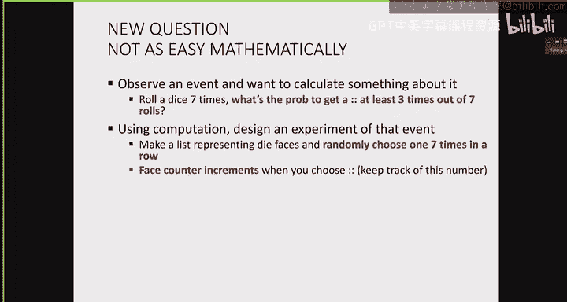

And then just like before， slap a before loop around it， repeat that experiment 10。

000 a million times， however many times you'd like。

 and then keep track of how many times that four came up three or more times out of the seven rolls。

So this is our event。 count how many times out of the 10000 in that case， but it could be a million。

 whatever it is。 The we incremented our counter to be more than three， more than or equal to3。

And then our value of interest is the probability of that happening。

 So take that counter and divide by 10000， because that's how many times we repeated our experiment。

So this is the code slightly longer。 And I've actually divided it into two parts。 This one up here。

 and then this one down here。So， the code up here。Is going to do the simulation 10000 times。

 So I've got one for loop here that goes through 10000 or a million。

 However many times you want to repeat the， the experiment。

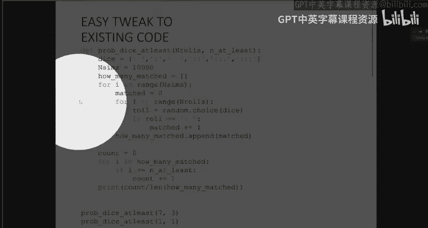

Within here， sorry， and I， sorry， I forgot to mention that here I have a function where I've kind of generalized a bunch of stuff。

 so we could run it with different values。 So instead of set three times out of seven rolls。

 we could have 15 times out of 3000 rolls， right， so we can generalize this。

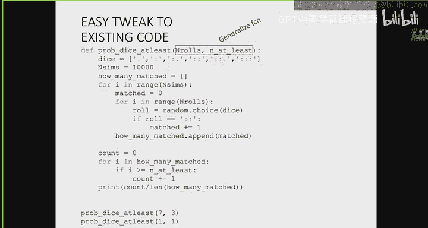

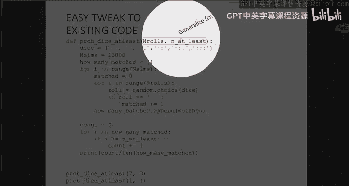

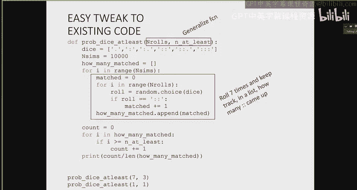

So here inside this for loop， I've got the simulation of rolling seven times right。

 so here I've got range of n rolls in the previous slide I said at  seven。

 but it could be anything you'd like。 and then I've got choosing one of the faces seven times。

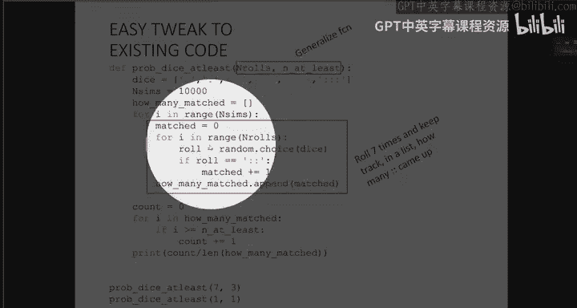

And keeping track of how many times out of those 7， I got a dot， dot， dot， dot。

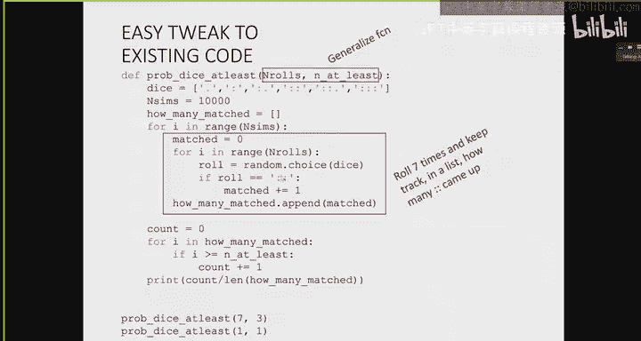

So at the end of this for loop here。I've counted how many times I got a dot， dot， dot， dot。

 And then I'm going keep track of that number in this list。 How many matched。

 So how many matched will be a list of 10000 elements， right，10000 elements。

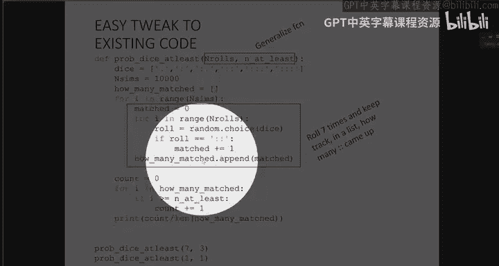

One element for each one of my experiments。 So the first time maybe three dot， dot。

 dot dots came up out of 7， then the next time 1， then the next time 5， then the next time 4。

 however， many， right， So now I've got a list of how many times the dot， dot， dot。

 dot came up out of7 rows。So the code down here， that's why I split it up because it's a little bit easier for me to think about it。

 The code down here is now going to iterate through this list of 10000 experiments and say which one of these is greater or equal to 3。

 This one， this one， this one。 So I'm incrementing a counter anytime that is true。

And at the end of this loop down there， I'm going know how many times out of those 10000 trials I had。

Three or more times out of seven。 come up on the dot， dot， dot， dot。

So I can run the code and here I've got the exact problem on the previous slide。

 So if I'm interested in the probability of the four coming up at least three or more times out of  seven rolls。

 that's 0。0955。And then I also down here。Wrote it like this。And this probability is 。16。

What is this problem down here， Does it look familiar。So the probability of dot， dot， dot。

 dot coming up at least once out of one rule。That's just the previous problem， right。

 on the previous slide。I just have one role， and I count the probability to get the four。

So this matches what I got with my the previous function that I wrote。

 But hey now I wrote a better function that can actually， that's more general。

 And I can also run it to get the probability that I from the previous code， right。

 So this is actually a much better code to run。😊，Okay， questions about this。Interesting。I mean。

 it's dice rolls。 How interesting can it be。So let's look at a more interesting problem。

 something that you might apply to， you know， to the real world。

So you might see this in a calculus course。 might not， but it is more of a calculus problem。

So I've got water that runs through a faucet。At random。

 somewhere between 1 gallons per minute and 3 gallons per minute。 This is a setup。

What is the time it takes to fill the 600 gallon pool。

 Does anyone have an intuition for how we could solve this。If not， I can just click next。Yeah。

 definitely between the lowest rate and the highest rate， right， So between 200 gallons per minute。

 sorry， between 200 minutes and 600 minutes， right，200 at best。

 If the water flows at 3 gallon per minute and 600 minutes at worst， if the water flows super slowly。

1 gallon per minute。

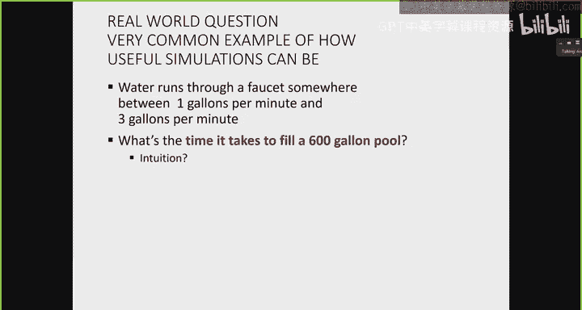

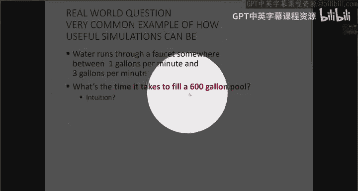

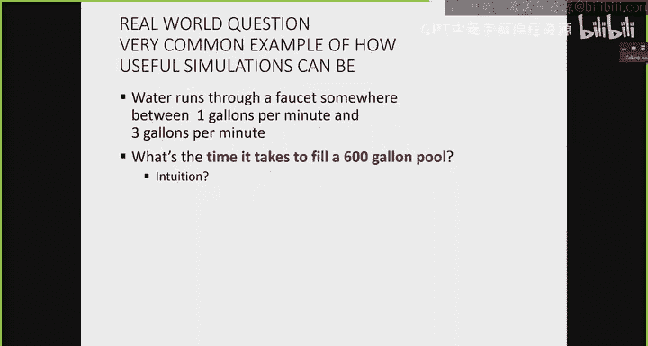

So we could say， well， let's take the average of the flow1。

 the average between one and three gallons is 2， right？

 So if we take 600 gallons divided by two gallons per minute， that would give us 300 minutes。

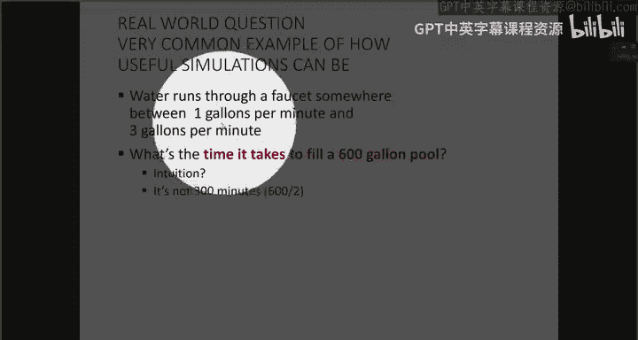

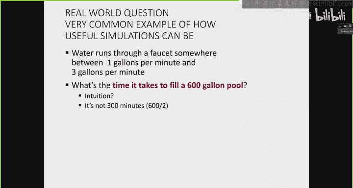

It's a reasonable guess， but that's not actually the right answer。Another way we could say is， well。

 let's take the slowest and the fastest it could run， right， So it could take。

 So here I've got 600 minutes and 200 minutes and average those numbers out， right， divided by 2。

 So that's 400 minutes。

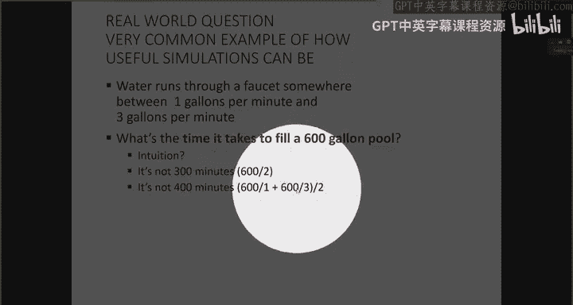

But that's actually not right either， yeah。You could。 Yeah， I don't want to do integrals， though。

Yeah， but that's exactly the right answer。 Yeah， you have to do an integral。And yeah， yeah， yeah。

 we're teaching computer science。So we're not gonna to do integrals in this class instead。

We're gonna do code， and the code is gonna be like five lines。 Okay， to do。

 to find the answer to this。So all we're gonna to do is grab a whole bunch of numbers between one and 3。

A million of them， if you want， these will represent a bunch of random values。

 You could have the water flow， right， B。And then we're going to say。

 for each one of these numbers chosen at random， how long would it take to fill the pool？

 So do you do 600 divided by that rate， right。It just how long it takes。

And then we're going to average all of these rates。 right， So we have a million of these numbers。

 potential times that it could take to fill the pool。

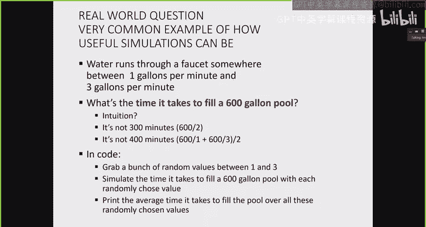

Some of them all average them。This is the code。 It looks like a lot。 But down here。

 the bottom half of this is just us reporting the results。 This is， you know。

 here's two print statements。 And here I'm actually also plotting what the。

 what the what the dots look like。

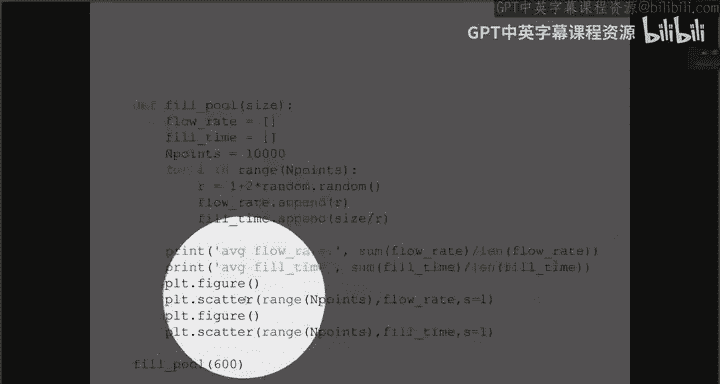

All the flow rates。The actual code to do the simulation is these。 Okay， I lied 7 lines of code， not5。

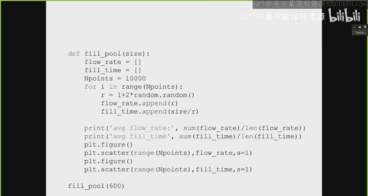

So I've got a function， fill pool。 It can take in a size parameter。

 We could even do a lower range and an upper range if we wanted to for the flow rate。 For now。

 we'll just hard code it to be between 1 and 3。 I've got two lists that I'm gonna populate with a bunch of different random numbers。

 So the flow rate will be chosen between1 and 3。 So here I've got random dot random is another useful random function from the random library that gives me a number between 0 and1。

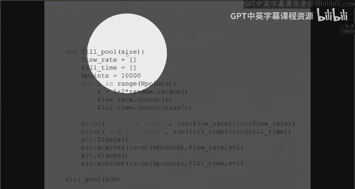

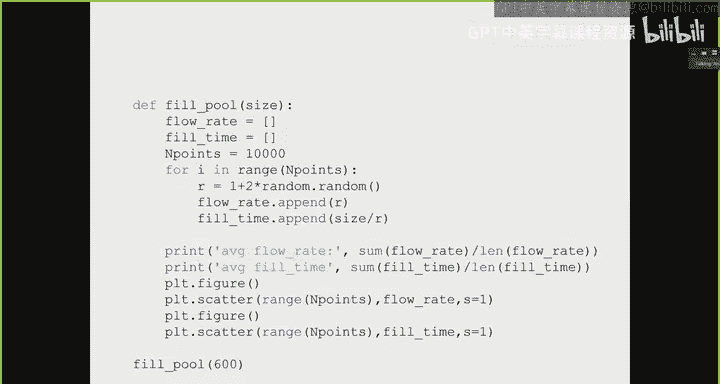

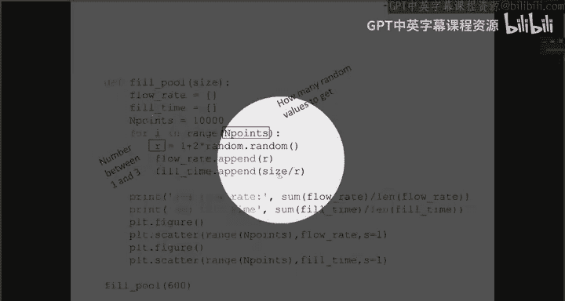

So to get a number between one and3。

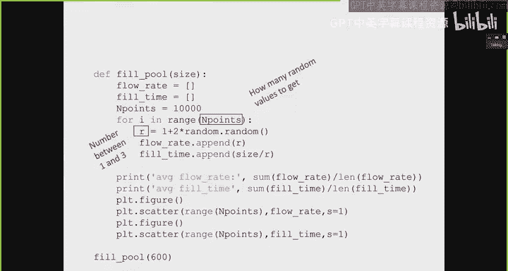

At random， I'll just multiply by  two and add one， right， So bottom case。

 it'll be one top case will be。

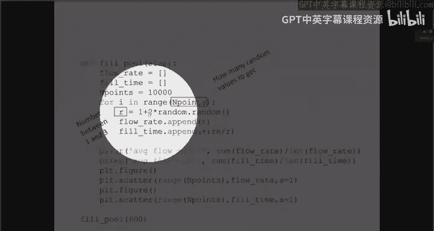

Two times1 plus one。

Right， so R， all we need to know will be a random number between 1 and 3。 afloat， right。

 So it could be anything。Append that random number to our list of flow rates。

And then using that flow rate that we just randomly chose。

 figure out how long it takes to fill the pool size， the pool of size size。

 So size divided by the rate， right。

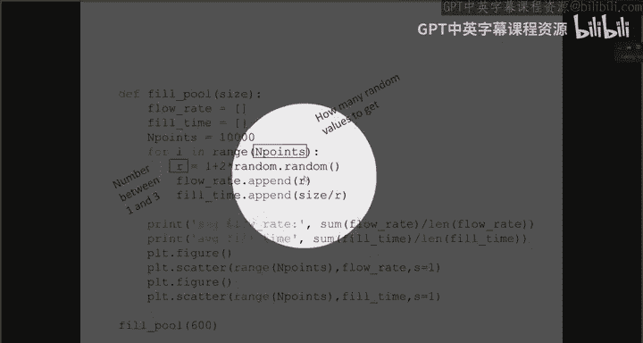

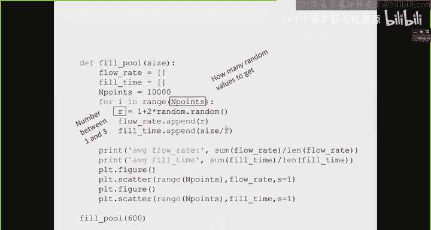

Just very simple math。 And then we now have a list that's populated with all of these times that it takes to fill the pool。

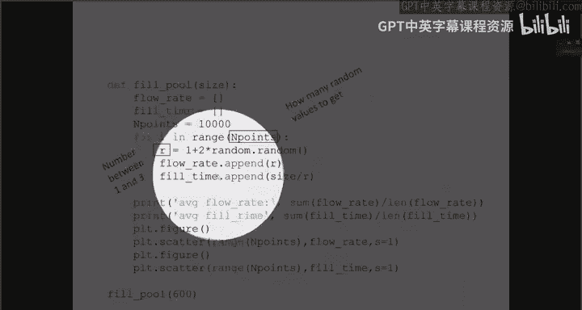

Okay。And that's the stuff inside the loop， the for loop here is one experiment， right。

 So I grabbed one random number。 I figured out how long it takes for me to fill my pool。

 And then I repeated that 10000 times。

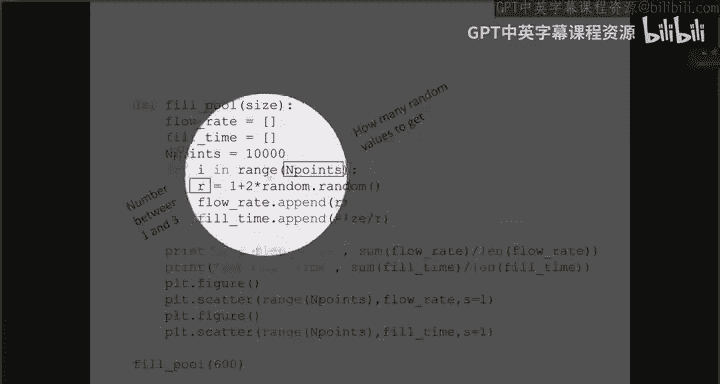

Okay。So down here， I'm gonna report the average flow rate， which should be 2， right。

 becauseuse if we're choosing a random number between  one and 3。

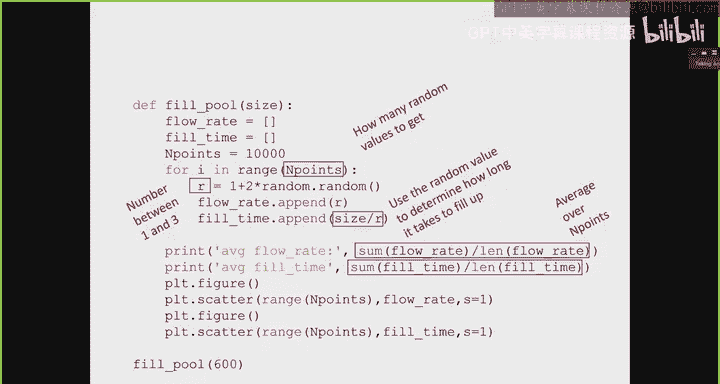

The average of those numbers better be2。And then I'm reporting the thing that we're actually interested in。

 which is the average fill time， right， which was not either of those two things we had the intuition for。

 but it is the integral。And down here， I'm doing some plots。

 So these are the things that I've plotted。 So on the left side， I've got on the X axis apologies。

 I forgot to label my axes and put a title on this。 So I'm just gonna talk about it。

 So the X axis is number 0 through 10000 represents each basically like， you know，0，1，2，3。

4 represents one of my experiments， right， choosing a random number。

 And the y axis is the random number that was chosen。

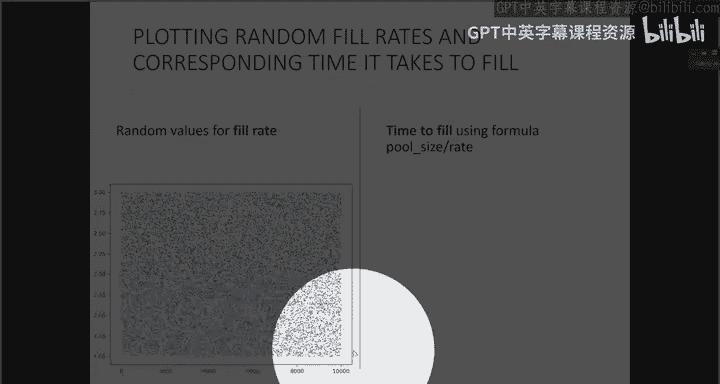

Right。So this is looks like a nicemattering of randomness here， which is what we wanted。

And then for each one of these values， I'm gonna have a corresponding fill rate。Right。

 so for example， here， if at  point0， the fill rate happened to be one， right。

 then that means a time it took for me to fill the pool should be up there at about 600。 right。

 It could be that little point right there。So this is a graph of random numbers between1 and 3。

10000 of them chosen。 and this is the graph of the corresponding times it took for me to fill the pool with each one of these dots that we randomly chose。

We notice。That the plot on the right is not uniformly scattered。Right， in fact。

 it's more kind of densely populated down towards the bottom。So， our two guesses。

Were that the fill rate was either 300 or 400， on average。Right， and neither of those were right。

Let's view these graphs in a slightly different way。 I'm actually going to sort the values。

 So right now， right， it was just a random number gotten between1 and 3， But I can sort them。

 It doesn't matter the order that I got these random numbers。 I can sort them。And if I sort them。

 I get something that looks like this。 So again， I've got randomly chosen numbers，10000 of them。

And with equal probability， right， that's why we see this nice line。

 I chose the number between one and three。Does that make sense。Okay， and so then。

The corresponding time it took for me to fill my pool for each one of these numbers， right。

 is a number between 200 and 600 as we had guessed。Now。

 the average of the time it takes of the fill rate is 2。Which is true， right。

 That is not a surprise for us because it's a random number between one and 3。

But the actual average time it takes to fill my pool is down here。

 If I were to average every single one of these values， it's down here。At around 330。So it's not 300。

 It's not 400。 It's definitely between， you know， between those two。

 but it's not really close to one or the other。 That's because I've got more points kind of dense。

 more densely populated down towards the bottom than the top。

So the actual values that I got for 10000 different randomly chosen numbers is 3，31。

I think the actual value， if we do the integral is like 3，29 point something rather。

 So we're pretty close。 but then again， we only did 10000。 We could do a million。

 and we would get pretty close to the actual value。So it's not 300 or 400。

 and that's because as was mentioned from from one of your from fellow students。

 there is an inverse relationship between the fill time right and and the pool rate。Right。

 so it's the size of the pool divided by the rate。 So what we actually need to do if we wanted to figure out the the value is to solve the integral between  one and 3 of。

D D X over x， whatever that would be。So I don't want to bother with that。

 but I will bother with seven lines of code。 and then just wait， you know。

Wait 5 seconds for that code to repeat， you know，5 million times or a million times or 10 million times。

Is that cool？And this is totally within your reach， right， It's， it's not hard code to do。

 It's just for loops。 It's using a random library， right。

 to just randomly grab a whole bunch of numbers and then just knowing the problem at hand。

 filling a pool， you know， at a certain rate， simple math。 And then you get a nice， a nice answer。

 a nice approximation， but still an answer to the question。

So hopefully this shows you how powerful computation can be。

 This is just another example of how you can just apply computation programming to a problem that you see in real life。

 If you choose to do like a Europe or take future courses in in you know a different field。

 maybe not in CS。 you will probably apply computation to concepts and ideas and problems in those fields。

 and it'll be something similar to this。 you observe something。

 you try to think of it computationally model it with a bunch of you randomness， and then。

Calculate an idea， something of interest。O。So that's the end of 6，100 L。

 I've got a little wrap up to remind ourselves where we've been and where we will go。

 So what did we learn。 Oh， also， this is also these slides will be kind of like a meme dump of every remaining meme that I have。

Okay， so this is gonna be very me heavy。 Okay， so what did we learn。 We've got， of course。

 we learned Python programming， right， We learned a lot of Python syntax。

 Some lectures were heavier on Python syntax and others。 But hopefully you've got a handle on that。

 We learned， of course， flow of control， right， with branches， if statements， sorry， hell lifts。

 L statements allow us to either do one thing or another in the code make a decision point。

 loops for loops and while loops as well as exceptions as a way for us to deal with unexpected things coming up in the course。

😊，The ideas here， flow of control are actually transferable to any other programming language。 So。

 you know， if you know the ideas， if you have the intuition for what kind of flow of control you'd like to use。

 all you'd have to do is change the syntax。 And then suddenly。

 you can write some code in another language。Of course we learned about data structures。

 so we did lists， right really useful data structures， dictionaries， super useful data structures。

 tus， things like that， so you can learn about more advanced data structures in a future course if you'd like。

 but those are really the top two or three most useful data structures。We talked a lot。 Actually。

 it was a common。 We didn't talk a lot specifically。

 but it was a common theme in this class organization of code， right？

 So these ideas of decomposition and abstraction， they came up a lot when we talked about functions。

 That's our first introduction。 So functions helped us take some functional piece of code。

 like some code that does something， abstracted away into a nice little module， right。

 decompose it into one little module。You have to write it one， maybe write it a few times。

 but debug it a few times and then use it a whole bunch of times you know。

 without worrying that it's going to change。 So it's just a very nice way for us to decompose functional pieces of code。

And then we saw it come up again when we did classes， object oriented programming， right。

 we were able to bundle behaviors and data together into one nice little object， right。

 that we could then create many of in many different parts of the code and then manipulate individually。

😊，Another common theme throughout this class was algorithms。

 So we talked about bisection search algorithm way at the beginning of the lectures， right。

 We talked about it in piece at one， and it came up again towards the end when we talked about complexity and searching and sorting algorithms。

 things like that。 So that was kind of your only big algorithm that you saw in this class。

 But it shows you just how you can implement you know。

Some code in a completely different way to behave in completely different way， to be a lot faster。

 you know， with some conditions like being sorted， things like that。 And then lastly。

 the last part of the class was a little bit more theory heavy。

 we talked about computational complexity and that big theta notation。

 So that gave you a sense of how to maybe design algorithms， right。

 So if you have a first crack of pseudocode on piece of paper， you can see， well。

 if I need to run this code on a really large data set， it's not gonna work because it's too slow。

 you've got three nested loops or something like that。

 So it might force you to rethink the design of the algorithm sooner than， you know。

 having already implemented it。But， you know， if you're dealing with small data sets。

 maybe you wouldn't care that you've got three nested four loops or， you know。

 a really inefficient recursion algorithm。So that's those are the big。

 the big things that we learned in this class。Your experience。

 I kind of categorize in three different， three different ways。

 So you might have been a natural if you kind of joined this class and immediately got logic。

 immediately learned， you know， knew how to do the problem sets。 That's totally fine。

 I still hope you got something out of this class。 and you learned some， some， something。😊。

You might have joined the class late， right， if you found 6100 A to be too fast or too challenging。

 you might have joined it joined it late， kicked it to the curb and said， let me join 100 L。

 I welcomed you。 We did it a little bit of research and found that even if you joined late。

 it does not actually hinder your performance in the class。 So hopefully that was your experience。嗯。

Did you work hard， So maybe you didn't get all the concepts right away。

 Maybe you struggled a little bit with the problem sets。

 Maybe you struggled a little bit on the Pet or on the quizzes。

 But I still think that you learned a lot。 And the test is always to go back and look at the first problem set。

So if you do that， when you go home tonight， you look back at the first problem set in this class。

 You look back at the code that you wrote， it will seem so easy。I， I promise you this。

 And that's because I think you all did such a good job。 You tried your， your hardest in this class。

 I know it's not easy。 I know it's slower pace， but it's still not， you know， not， not an easy class。

 And I think you've learned a lot。 Looking back at the first problem set。 We'll just。

 we'll show you that for sure。So what's next， there have been some questions about what are some future classes that you might want to take or what can you do once you've。

 you know， once you've finished here。Here we go。 So we've got 6。

100 B is kind of the most natural next step。 It's a half semester class in the second half of the semester。

 So they're finishing up right now， basically， it's an overview of really interesting topics in computer science。

 And with a focus on data science。 though。 So what we talk and I actually run that class as well。

 So what we talk about there is optimization algorithms。 So for example。

 let's say you want to create a schedule for your classes next semester and you will have some constraints right。

 like you don't want to have classes at 8 AM or 90 AM or 10 AM or 11 AM。

 and you want it to all be within， you know， some time limit or things like that。😊。

Optimization algorithm could be something that you write。

 and you could just apply it to something that you have。Simulations。

 exactly what we saw today of the， you know， the physics filling the pool thing。 you'll see more。

Examples of that and ask different questions about it as well。 So you'll see things like。

Youll calculate， you know， things like standard deviations。

 How many times do we need to repeat this experiment in order to be within some confidence interval。

 Right， So how confident are you about your answers， So we'll be doing more things like that。

 And then there's， of course， the machine learning aspect of it。

 So if you have a bunch of experiments that you do that you get a whole bunch of data from。

How can you fit a curve to those experiments？ And then， you know， for a future experiment。

 what's the expected value， right， So that's a little bit of machine learning on experimental data。

 And then some more machine learning in sort of a more classical sense is dealing with clustering algorithms and classification of。

 of data and things like that。So 6，100 B， I know a lot about becauses I also teach it。

 It's a really good next class。 If， if you want to kind of be employable for an internship。

 if you take this， I think you'll be good to go。6101 is also a really nice class to take next。

 If you really enjoyed the programming in this class，6101 will be your next step。

 it's called fundamentals of programming and it is in Python。 that one has it's pretty fast pace。

 So there will be problem sets every week and they're gonna to be pretty hardcore there's going to be a lot of debugging involved in those problem sets。

 And I actually was a recitation instructor for that class。 and to get a first for the problem sets。

 at least to get something working， doesn't take that long。

 but to make it work according to the specifications that they have will take a little bit of debugging and reworking。

 That's because they deal with a lot of real worldorld data。

 So writing code that's really efficient is very important right So again。

 writing you know nested for loops， of course， we can totally do that。

 but making it efficient using data。Structures like sets to make the code efficient using you know。

 proper algorithms that are efficient is very important part of this class。 But you'll learn a lot。

 If you take this class， you'll be very employable for an internship in some， you know。

 some some computer science or some computer science company。6102 is also a nice next class。

 If you're interested in software construction， it is actually in a different language。

 It's in Typescript these days， used to be in Java。 you can take what you've learned here。

 And if you're interested in you know learning a different language， this is a nice one to try。

Its their their motto is youre writing code that is safe from bugs。

 easy to understand and ready for change。 So they have also lots of problem sets。

 but you're also working in a team。 So you get to learn how to work in a team well with with other students。

 how to code together， how to write code that has you。

 nice documentation is you know lots of debugging， things like that。

 So more of that those ideas of decomposition abstraction that we learned in this class will definitely be prominent in this class in 6。

102。And then of course we've got other classes I'm happy to chat about。

 so machine learning is a nice one if again， if you have a handle on programming really well and want to try just applying programming to machine learning。

 an algorithms class is also a fine next step if you're more interested in the complexity part of this class that we saw。

 also very， very reasonable things to try to do next after this class。Yes， last slide。

If you're not going to code for a while， but think you might code in a couple semesters or something like that。

 Like， you know， you want to take a more computational class in some desired field， I would say。

That you should try to practice coding at least once a week。 So in our website。

 we've got a little help menu where you can go to we've listed some other websites。

 There's a little bit of coding practice you can do。 it doesn't need to be a lot30 minutes， you know。

 once a week， something like that。 just so you don't forget to code can go a really long way because I know。

 you know， over the summer， sometimes I don't code for a month or so because I do other stuff besides coding in my life。

 And you know， me back into it takes a little bit of time And it's just without practice like with anything else。

 it's just easy to forget。 and it's hard to get back into it。

 So even if you just do a little bit of coding write a really simple program once a week。

 It' it's going to go a long way， right。So that's， that's it。

 I want to thank you all for being in this class。 And thank you for coming to this last lecture。

 I know you didn't have to。 but I， I do appreciate it。 Happy coding and， you know。

 good luck with exams and have a good break。 everyone。 Thank you。😊。

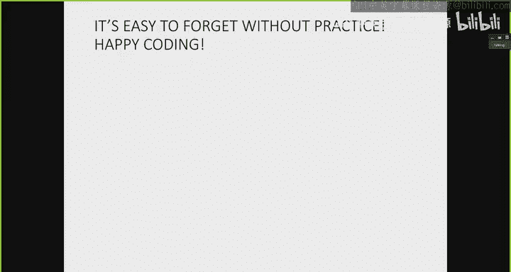

