# 《计算机科学和Python编程｜6.100L Introduction to CS and Programming using Python, 2022》 - P2：-02-Lecture 2_ Strings, Input_Output, and Branching.zh_en - GPT中英字幕课程资源 - BV1PAxJzVEs3

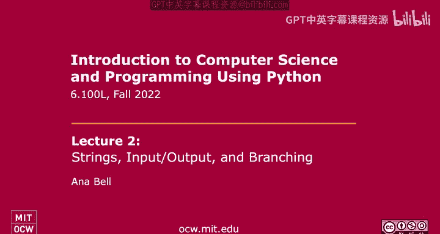

So let's start today's lecture。 We're going to be looking at sort of three different topics。

The first is we're going to look at a new object type called a string。

 we briefly mentioned this word last lecture。Then we're going to see how we can write programs that start to get input from the user and show the user output。

And finally， we're going to go into writing a little bit more interesting programs that that make decisions based on decisions that we actually input in the code。

 So not decisions spontaneously， but things that we will code within our programs。

 But before we go on to these topics， I just wanted to do a quick recap of what we learned last lecture just to make sure we're all on the same page。

 So we introduced the idea of an object。 And every object in Python has a specific type。

 And the type tells Python the kinds of things you're allowed to do with that object。😊。

We talked about once you have objects， you can actually assign these objects to variables。

 and these variables basically bind a name to the object and memory。With objects。

 you can also create expressions by combining objects together。

 and the expressions can either be things that we've seen in math。

 like with parentheses and with operator， like object operator object。

 or they can be things like this， which we， which was kind of introduced in programming。

 It's an expression， but it's kind of a different one。 It's more like a command。

 or I'm asking Python to do this operation for me， what is the object that comes back from this operation。

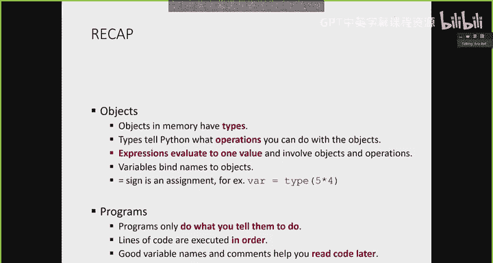

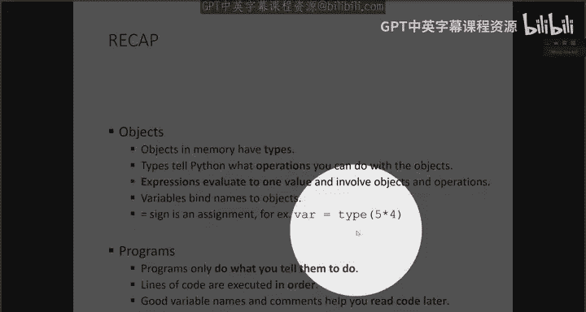

So today I'm going to go over this little sort of memory diagram。 We started drawing last lecture。

 and I'm going to use this memory diagram today as well。

 Here's some lines of code that we wrote last lecture。

 So we created we wrote a line in Python that created an object。 It value is 3。14 afloat in memory。

And the name we gave this object was pi， so just the name pi PI。Radius equals 2。

2 is another assignment statement in Python， and it binds the name radius to the value 2。2 in memory。

And once we've created these variables， we can just invoke their names。

 We can use their names to tell Python to grab for me the values from memory。

 So when Python sees pi times radius star star2， that means take pi multiply with the radius squared。

 So behind the scenes， Python goes， grabs the value 3。14 from memory， replaces pi with that value。

 grabs 2。2 from memory replaces radius with that value， does the operation。

 according to the precedence rules。 and then that expression。

 the thing on the right hand side of this equal sign， becomes a value。

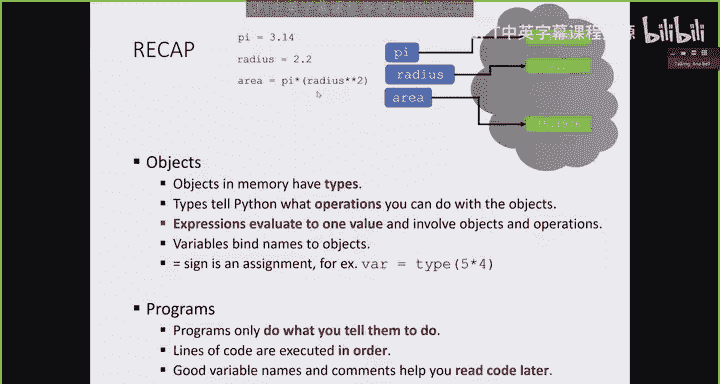

That value is then created as a new object in memory right here。😡。

And that object in memory is then bound to the name area。

 that's exactly what this assignment statement said。

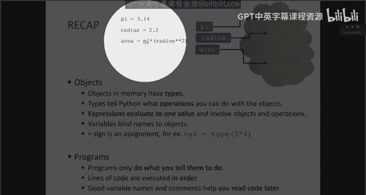

And。We can do something like this in Python， which we can't actually do in math。

 right If we did this in math， the expression would basically say0 equals 1。 but in Python。

 it's totally fine because again， we evaluate the thing on the right hand side of the equal sign。

 So on the right hand side of the equal sign， we say I want to grab the value of radius。 So 2。

2 add1 to it3。2。 create this object in memory here I have a whole new object in memory 3。2。

 and then assign it to the name radius。 So I've lost the binding from the original 2。

2 and rebound the name to 3。2。So we're not modifying objects in memory。

 We're creating new objects in memory whenever we do such operations。

 We're going to see how we can modify objects way into the future。And just sort of for completion。

 when we have a line that says var is equal type 5 multiplied by 4。

 Python also sees this as an expression。 And so as an expression， it has a value。

 So the right hand side of this equal sign says， well。

 I'm gonna to sort of systematically evaluate this and say， what's five times 4。 It's 20。

What's the type of 20。 It's an integer。 And so that's what the right hand side evaluates to an integer。

 And I'm going to bind that value int to the name var。 So var is another variable name。

 and it's valued is int， right， the type of my object。Which is a little strange right so far。

 We've kind of just put numbers in our memory， but we can put any object type in memory。O。

So let's move on a little bit in onto the new object type called a string。

So a string is actually a sequence of k sensitive characters。The characters can be anything。

 We have lowercase letters， uppercase letters， the numbers on your keyboard。

 the special characters you see on the keyboard， even the enter。

 when you do a new line or a tab has a special character associated with it。

And the way we tell Python， we're creating an object of type string is by enclosing the the characters we want to be part of that object in these quotation marks。

 So when Python sees the quotation mark， it knows you're creating a string object。

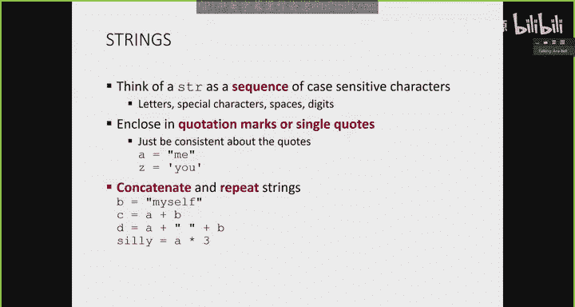

So here I'm creating the string object， which has the lowercase letter M， lowercase letter E。

And here I'm creating the string object which has the lowercase Y， lowercase O。

 and lowercase U letters。And these objects are。Things in Python。

 And we're just going to give them a handle， a binding with some more convenient variable names。

 A and Z。

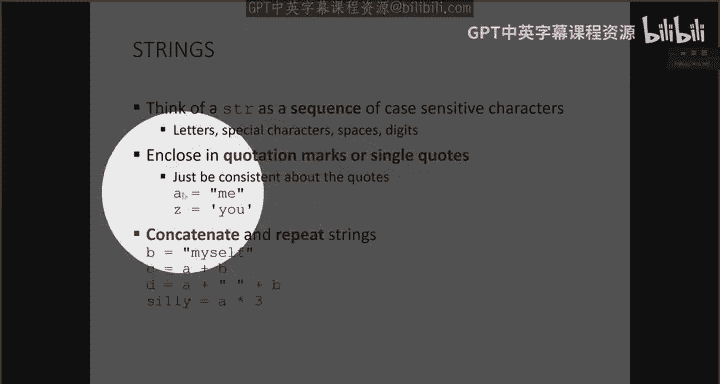

So in memory， the way this would look in a little memory diagram is we would have this string characters M E bound to the variable A。

 So basically what we've seen before。Alright， so now what are some things we can do with strings。

Well， some really common operations is are that we can concatenate strings or we can repeat strings。

So here， I'm not going put the Z in memory。 You can kind of imagine how that would look like。

 But let's say I create now a variable B equals the letters M， Y， S， E， L，F。

What if I do a plus operator between these two strings。

 The plus operator tells Python that I'm going to take these two strings。

 the individual characters in each string and kind of just put them together to make one new object that is all of these letters put together。

So C is equal to A+ B is another assignment operator。

 and on the right hand side we have an expression plus operator between two objects。

It's going to put M E， which is the the C letters and the M S， E LF。

 the B letters all together to create a new object， which I then give a handle or a binding C。

So from now on， any time I want this particular string of characters。 and we M E M， Y S E L F。

 I can just invoke the name C in my program。 That's just the variable name that I gave it。Now。

 notice it didn't insert a space， right， It didn't do me space myself because we didn't tell it to do a space。

 So if we wanted to do a space， we'd have to put it in ourselves so we can concatenate so we can have a larger expression where we concatenate A with a space and with B。

Together， so that will give me an entirely new object in memory。 This string M， E space， M， Y， S， E。

 L，F， This new object is bound to the name D。😊，Is that okay so far， Does that make sense。O。Alright。

 so that's concatenation。 Basically takes these two string characters。

 Puts them together in a new object。 What about the star。

 I kind of briefly talked about this as repeating something last lecture。 Well。

 the star operator works between a string and a number。It doesn't work between a string and a string。

 It doesn't work between things like that。 It works between a string and a number in either order。

 So a number string or string times number。So here again， it's an assignment operator。

 the right hand side we're going to figure out what it evaluates to first。

 So a times 3 means I'm going to repeat this particular sequence of characters ME because that's what a is。

 It's ME。Three times。 So this line of code here is going to create M E， M E， M E as a new object。

And the equal sign tells it to bind it to the name silly。

 So anytime I want to grab this particular string of characters for memory。

 I can just type in silly in my program， and that will automatically grab that particular sequence of characters for them。

😊，Al right， let's do a quick exercise to make sure that。You all have this。

 and as you're thinking about what this does， I can start typing it in to the to the console。

 or you can either even type it in to check yourself。

 So B is going to be colon and C is going to be the close parentheesis。So if we go here。

 right we have B as equal to just this colon。And C is equal to the closed parentheesis。

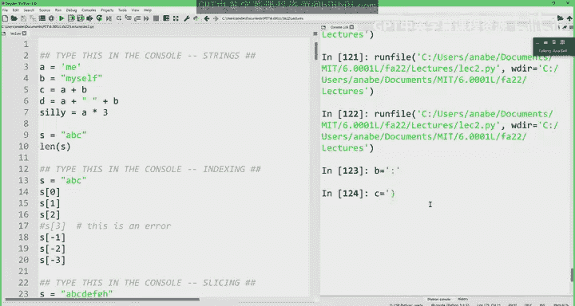

And we don't have to do all the operations at once， right。

 We can just do something like two times C and figure out what that is。

 right It's just repeating the closed parenthesis twice， and then we can do B plus2 times C。

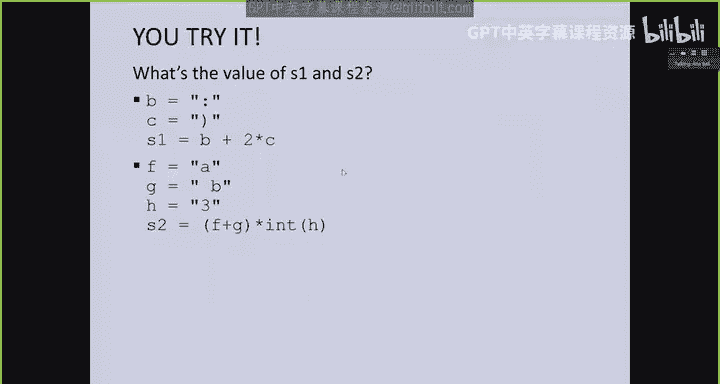

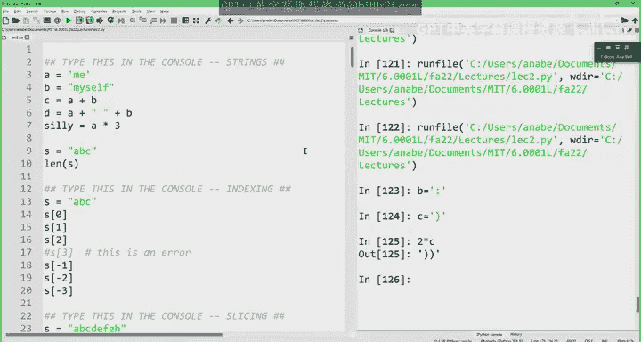

To give us close parenthesis Col close parenthes， close parenthesis， right， so super happy。

What about the next one， F is a。

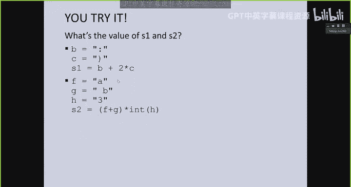

G is actually the space。

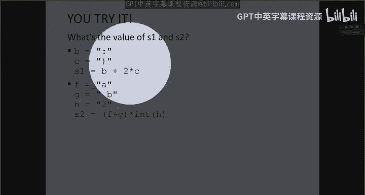

B， right。 So there's a space character in there。 A little tricky， and H is 3。

Is this the number  three or the string 3 for H。Yeah， exactly。 It's the string 3。So what is F plus G。

 Again， we can do it in pieces。 What is F plus G。A space B， exactly， right。 A is A is by itself。

 and G is a space B。What is int H。Yeah， it's just three。 What's the type of three？Int exactly。

 I just cast it to an int， right？ So if I have F is equal to A， G is equal to space B。

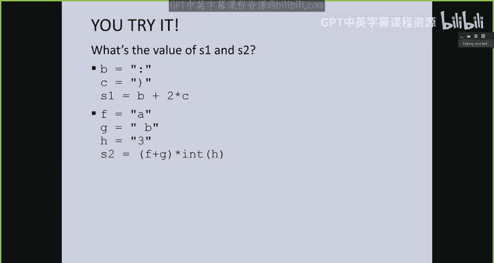

And H is equal to the string3。F plus G， we're doing it a little bit at a time， right， is a space B。

And H is just see the string through here。 So if I cast it to。An integer。

 it gives me just the number three。RightAnd we can wrap each of these in a type command to see the exact type。

 But we can tell right away。So if we do F plus G。Multiplied by int of three。Or sorry， oops in of H。

 right， which is just a three。 It's going to repeat a space B three times， right， So there's one。

 there's 2， and there's 3。What would have happened if I forgot to cast it to an integer？

 What do you think？If I just did H。An error。 Yeah， exactly。They're not scary。

 They're kind of informative once you get to know them。 So it's a type error。 Yeah。

 something's wrong with our types can't multiply a sequence。

 So an integer or a string a sequence by a non integer。

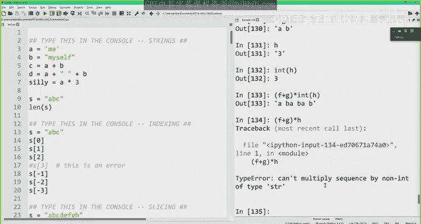

O。So what are some other operations we can do with strings？

 There are some different things we can do with strings that we actually haven't seen with。

 with numbers in last lecture。One of the more common operations is to get the length of a string。

 So this tells us how many characters are in the string。So if we say S is equal to ABC here。

 I'm creating a string with characters A B and C， and I'm giving it the name S now anytime in my program when I say S。

 Python will replace that with this string of characters ABC。I could wrap S in this L command。

And this L command is， is an expression。 Basically， Python reads this。

 and it evaluates it to one value。 So replaces this expression with one value。

How many characters are in my string？So L S will basically become the number three。So in my program。

 I can say something like another assignment statement down here， right， Charrs is equal to L S。

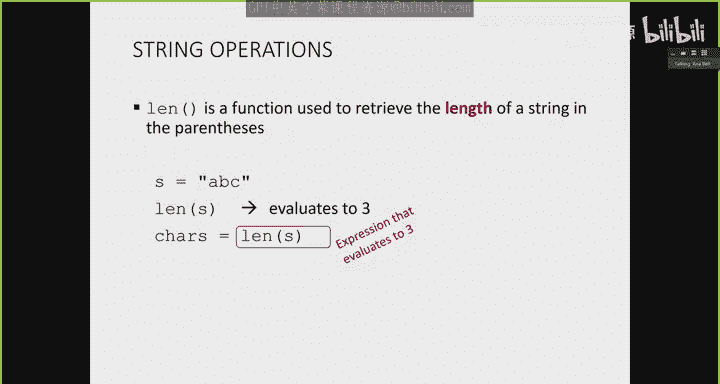

This is an expression， right， like in the previous line that evaluates to3。 So basically。

 this line says chas is equal to 3。

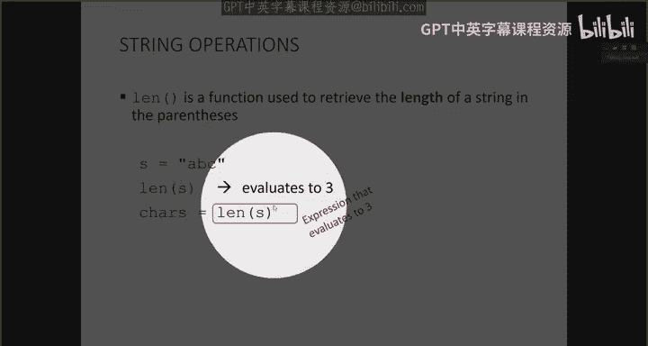

Okay。That's a pretty simple operation with strings。 Now， we're going get into a little bit more。

Detailed ones that requires you to kind of remember this Python syntax。

One thing we can do with strings is we can grab individual characters at different positions。

So that's called slicing。The syntax or the way that we actually do this in Python is using square brackets。

 So you can see this here， right We have some square bracket notation。

 and this is just how Python does it。So if we have string S is equal to the characters ABC。

The way we tell Python， we'd like to extract a character at a particular position is by indexing into that string。

Now， in Python and modern programming languages， indexing happens from 0。

 We count from 0 in programming， in computer science。So what that means is the index。

Of the first character， the index of a is 0。 The index of B is 1， and the index of C is 2。

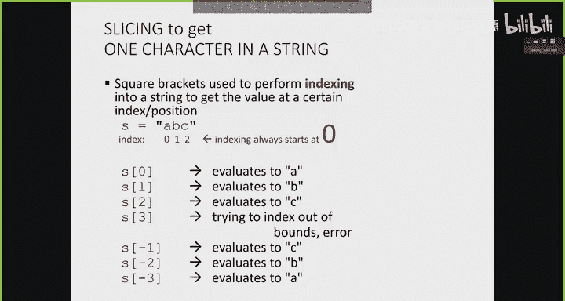

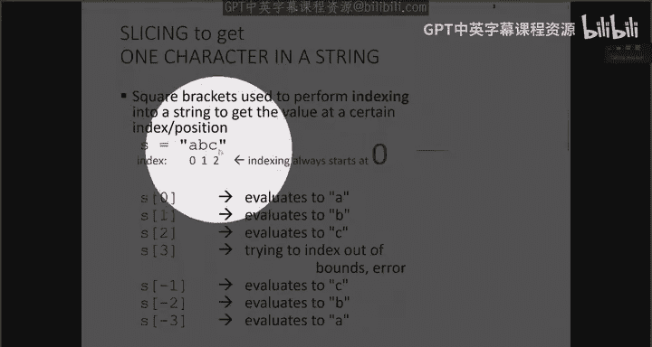

Right， so we can say the what's the character at the first position or the first location。

But in computer science speak， we say that's the character at index 0。

 the character at index1 is the character at location 2 and so on。

So when we're indexing into a string， we're always starting to count from zero。So S at index 0。

 that's how we call this line here is another Python expression it has it just looks different than the expressions we've seen so far。

 but this entire expression Python evaluates to a particular value and the value it evaluates it to is the character at that index。

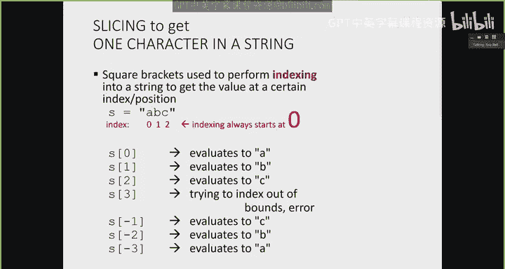

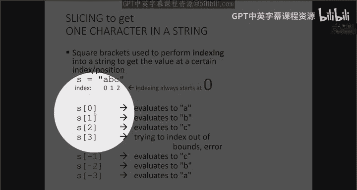

So just to show you kind of what that looks like in here， if s is equal to ABC。

 all we would type is this S at index0。

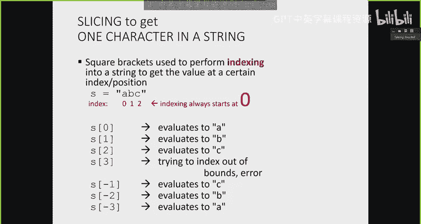

And this expression evaluates to that single character， a。S set index 1， B， S set index 2， C。

 S set index 3。Basically says， what is the character at the fourth position？Well。

 ABC only has three positions。 So this will actually give us our second error of the class。

 an index error。This is a pretty common error as we start working with more complex programs。

 It basically means you've indexed too far into the list， either to the right or to the left。

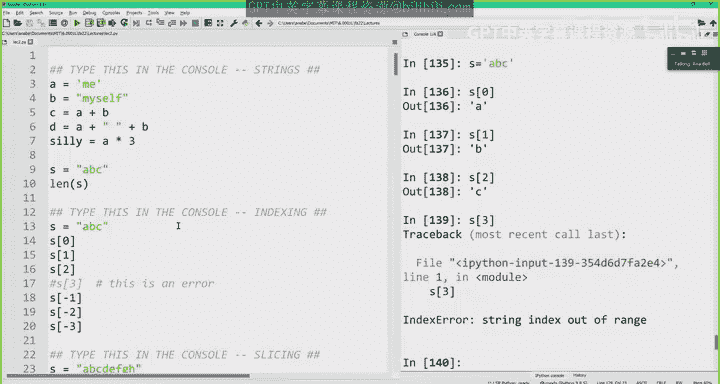

You can index into a list with negative indices， as well。

So if you ever want to grab the character at the last position。 So at the rightmost place。

That's the character at index negative one。It's a really convenient way to grab that last character。

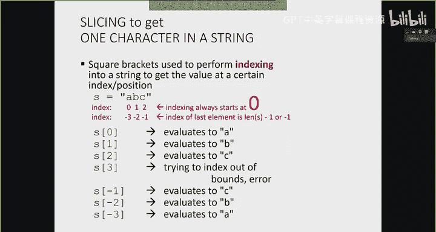

You basically ask， what's S at negative one， and Python automatically grabs for us that last character。

 So we don't have to use an expression sort of like L of S negative one。 right。

 That would be C as well。And here， I've inserted an expression L S-1 directly in that index。

 And that's totally fine。 Again， Python evaluates things into out， left to right。

It evaluated L S 1 to be 2。 and basically this line became what's S at index 2， which we knew was C。

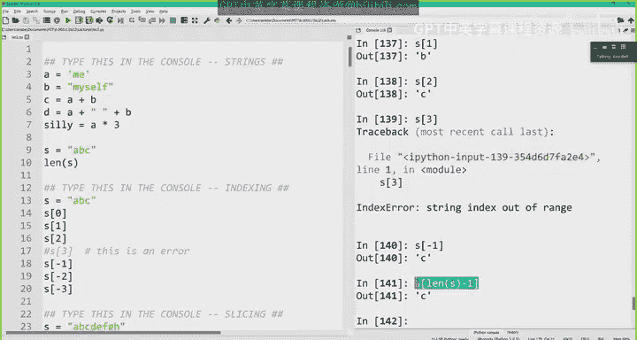

でこです。Because when you index into negative numbers， we start counting from the right hand side。

 just Python convention。And so S at negative 4 will give us an error as well。

 because now we're indexing too far to the left。 There's nothing there。Okay。

 so we can index to get single characters。That's fine。

 We just use square bracket and say the index that we'd like to get the character at。

We can also slice to get substrs。 So instead of getting single characters。

 we could ask Python to get us a substr starting from one index。

 going up to some other index and potentially skipping characters。

 You can take every character along the way。 You can skip every other character or some other。

 you know， some other pattern like that。The syntax for that is similar to slicing to get a single character。

 slightly different， though。 it's similar in that we have square brackets involved。

Slightly different because now we have to give three numbers within those square brackets。

Separated by colons。The first number remember will represent， what's the start index。

 So where do you want to start your substream from。The second is what's the stop index。

 So we're going to take every character from that start index going all the way up to。

 but not including the stop。Okay。And the step means how many characters do we skip。

 So if the step is one， we're taking every character， if the step is two。

 we'll take every other character。 The step is three， we skip every two characters and so on。

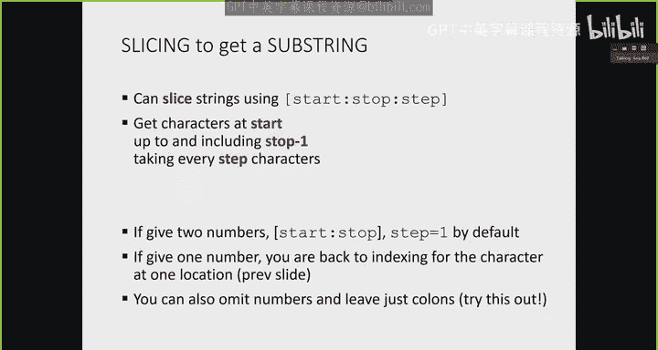

Now， there's a bunch of combinations we can do within with these three。

3 numbers within the square brackets that you'll， you know， as you work with these。

 with these exercises， you'll sort of get the hang of。

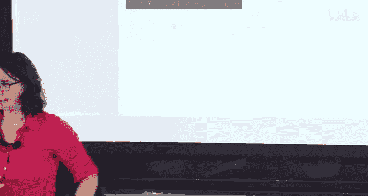

For now， it won't hurt to always give it a start， a stop， and a step。That's perfectly fine。

But something that's really common， if you're always going to take every single character to just omit the step part。

So if you just give it two numbers。Number colon number。

 Python automatically knows that your step will be one by default， so you're not skipping anything。

If you're just giving it one number， No colons were back to the previous slide， right。

 where we're just grabbing one element。And I know this is going to be a little confusing。

 We're going look at an example on the next slide。 but this is something you'll just have to practice a little bit in the shell with the following example。

 hopefully， just， you know， just when you go home just to kind of make sure that you understand what it's doing。

 if you have a question， like what if I put in this number or this number。

Just put it in the shell and see what happens。So let's take a look at a couple of examples。

So how do we slice to get substrs， let's say our string is this longer thing， ABC， D， E FGH。

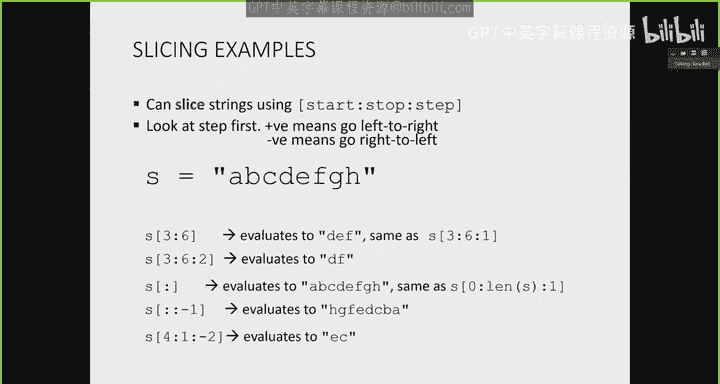

When we slice， the first thing we want to look at is the step。Is it positive or negative。

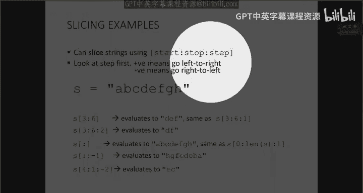

If it's positive， and remember， if you omit it by default， it's plus one。 So if it's positive。

 we're gonna work our way left to right。The way we read。If it's negative。

 we're going to work our way right to left。So what if we index S from 3 colon 6？

The step is positive one。 So we're going to work our way left to right。

So that means we're going to start at index3， so that's the D。

So we're going to grab the D and we're going to go up to get the substr from D up to。

 but not including the character at index 6。The H or the G， sorry， the G， okay。

So the characters we're going to grab are the D， the E and the F。 We start at 3。 We go up to。

 but not including 6。Taking every character because the step is one。What if the step was2。

 So same thing as we just did， except the step is 2。 again， the step is positive。

 So we're going to work work our way left to right。 We're going to start at index 3 E。

 so we're going to grab the D， and we're going to create a new object。

 which is going to be the character is D。 We're going to skip the E because the step is2。Take the F。

And that's it。 We've worked our way up to， but not including。The element at index 6。

There are some other things。 I guess tricks or you might want to call them that you can do。

 So if we just put an empty colon in here。That says， just make the same object again。

 So that will evaluate to just ABC， D， E F， G，H again。If we do colon colon negative one。

This is shorthand notation for basically grabbing for me the string backward。So H， G， F， E， D， C E。

 B A， right， Just make the same string as the original one， but backward。

And we can do something like this for one with a step negative 2。Now the step is negative。Right。

So that means we're going to work our way right to left。We're going to start at index 4。

 so we're going to grab the E。We're going to skip every other character。

 So we're not going to take the D， but we will take the C。And we're going to go down to。

 but not including the character at index1。So we're going to stop right here。

So the characters we took in this order were E and then C。 So this entire expression evaluates to EC。

Yes， question。Why do we skip D， Because the step is2， So when the step is one。

 we take every character。 The step is 2。 S every other one， yeah。For the水。Why is G not。

G is not included just by definition。 we go up to， but not including the stock。 So we'll go up to。

 but not including， the character at index 6。That's just the definition of slicing in Python。私は。

So up to it， including stop -1 means we go up to it， including5， right， Yeah， exactly。Okay， so again。

 if you're unsure what a command does， always try， you can always try it in your console。

 right the shell。 And here's an opportunity to do that。 So here's a string S， ABC。D 3 F。

 and I'm actually going to write this one down。 just ABC space。 right， There's a space here，3D。

Or D3 F。And in another space。 And G HI。So what do you guys think the first one will be 3 colon L S-1。

 I'll even do the indices here for you。What's the start？Yeah， that's great。 exactly。

 So it's gonna be a low space。What is L S -1。like。10， yeah， what's the length。

 How many characterss are in here，11， Yep， and -1 is 10。 So when we do this， when the stop is 10。

 that means we're going go up to， but not including。The character at 10。

So we're going to go up to this H， right， So we're going take the space， D，3， F， space， G， H。

 and we stop。0。Convention。Computer science programming。Except for MATLb。

 I think they still start indexing it。Other questions about this one， is that all right？Okay。

 how about the next one， S4， colon zero， colon negative one？What's the element at index 4？The D， yep。

 so we're going to grab the D。Are we working our way right or to the right or to the left？Yeah。

 exactly， so we're going to go up to， but not including the character at index0。

So we're going to get the D， the space， it' the C。be。Am I taking the A。No， exactly。 So that's it。

 D space CB。Yes。ま includes the a。The second。If you did want to include the A， actually。

You would want to do something different， I think you can't go to negative one because negative one is actually this right here。

That's a good question， I'd have to try it out， play around with it。But if you want to include it。

 I think maybe you would just do。An empty。 Sorry， go ahead。You just probably do an empty colon。

 and by default， that means。But I'd have to try it out， yeah。How about the last one，6， colon3。

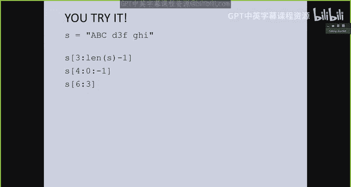

What's the element at index 6。Empty colon work。 Okay， perfect。 Thanks for trying it out。

 The empty colon works， yeah。If you wanted to grab me。All right， so S6， colon 3。

 what's the element at index 6？The F， okay， great。 And we're working our way to the right or。

 to the left。To the right， Okay， so we're going to start here， but we need to go this way。

 But what's the stop index。Yeah， it's not there。 It's behind us。So， this last one。

Is actually an empty string。And I'll even we can even， we can try it with something else to。

So if we have this ABC， right， if I'm indexing starting from two and I'm going backward to zero。

Then that gives me the empty string。And the empty string is just， quote， quote， with nothing inside。

So that means we didn't take any characters。In that particular case。

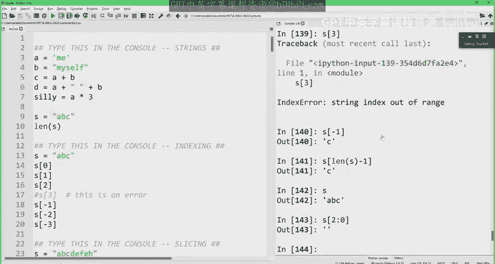

Is that right？It's valid with just， there are no characters in between the F and behind the F。Okay。

 so I'll mention the strings are actually immutable objects。

 And really a lot of the objects we've seen so far are immutable。

 That means they can't be modified once they're created。 We've kind of seen this already。

 right when I draw the memory diagrams when I create a new object， which is you know， for example。

 what's the string version of this integer or you know。

 when I cast a float to an in things like that。 I'm not changing those original objects I've created。

 I'm just making a new green box in my memory and reassigning the name。

And we're going to see later on in this course， mutable objects。

 which means that once you create them in memory， you can modify them， but for now。

 anytime you make a change to such an object， or you can't change the object right if you want to get a different version of the object。

 Python will create a new object in memory and you can reassign the variable to that new object。

So in this example， if I want to grab if I have the string C A R in memory like this and it's bound to variable S。

 and I want to change the first letter to a B， I'm not allowed to。

 Python won't let me do something like I want to change the the letter at index 0 to a B。

 That's not allowed。You can get new versions of that particular string， so you can do some you know。

Random。Expression to create the BAR that you might want。But then the CrR remains in memory。

So the CAR will still be there。 We're just losing the binding from it。So any questions so far。

On these streams。Mostly。They're a new data type， right。

 You haven't worked with them like you have with numbers。 So it's a little bit different。Again。

 you know someone had a question， how do you get the A right backward？Try it out in the console。

 I'm happy to answer questions， help you try along with you。

 but that's what the console is there for， right the shell here， that's what it's there for。

 It's just to try quick little things if you ever have a question。

 you know what if this or this and you get to try it out。Now。

 let's move on to some input output right so far， the programs that we can write are pretty stagnant。

 right， There isn't much interesting things that we can do with them。

 There's no interaction with the user。So so far， when we've tried to output things， well， we。

 you might think we have been outputting things， right， So when we write in our console。

 something like 3 plus 2， Python does show something in the shell。 right。

 This is maybe how we interact with the user。

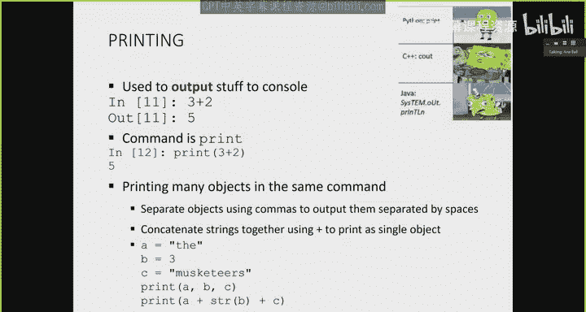

But this is not actual true output。 This is， I call this kind of like peeking into the value of the expression。

But if you were to write some some expression like this in a file editor。

 Python wouldn't actually print it out。 And so here's all the things that we've already tried today。

 right， We've created all these strings。 We've got the length of S， right。

 we indexed Anytime we type these expressions in the shell。 Python automatically gave us our value。

 right。But if I were to type those exact expressions in a file editor on the left here。

 Python's not actually going to print these out。 So this is the file editor from now on。

 we're just going to work with files。 I'm going to run it by hitting this little green run button or hitting a5。

Something happened in the show， my program ran。Right， it says here it ran this file。

 but there's no output。 right， Where was the length of S。

 Where were all these indices we've done before。And that's because these aren't actual outputs。

 right， When we type them into the shell， that was just us doing quick little expressions in the shell。

 giving us quick， no。That's why I call it peeking into the value because it's not true output。

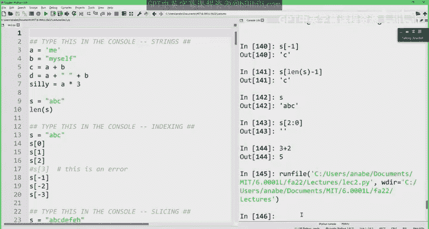

If you want the user to see output and the shell is how we're going to show the user output from running a file。

 we have to explicitly tell Python， hey， I want you to show the output from this expression。

 or I want you to show the output from this command。And we do this using the print command。

 So if we take our expression that we want to show the output from and wrap it in a print command。

Python will then show that output and only that output。

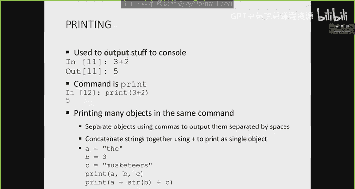

Can you imagine if we wrote a file that did all these operations and all these intermediary outputs were being shown。

 that would lead to a really messy file or a messy program right。

 and so that's why we have a command where you can explicitly tell Python just the things you want to show to the user。

So here， if you want to print the length of S。We can wrap the length of us。In a print statement。

 and then run the file。

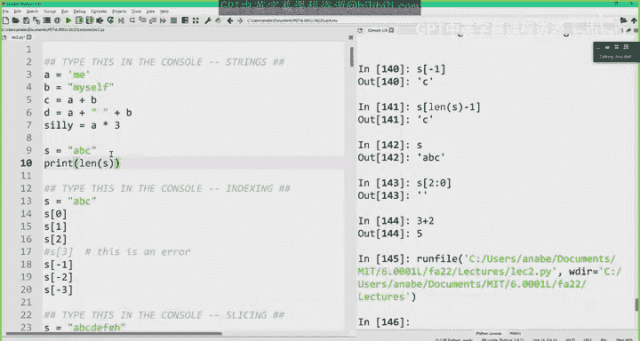

And now， the only thing that gets shown to the user is the thing I explicitly printed out。

And then down here， if I want to print this other the result of this other expression。

 I can wrap that around a print statement and Python will then print that one as well。

 But now I'm in charge of showing the user the things that I want to show show them， right。Okay。

So whenever you have a print statement， Python will print that resulting expression and then enter a new line。

 so as you saw here we had two print statements， one around L and one around S negative 3。

 and Python put the result of these expressions， each one on a different line。

Sometimes you might want to have expressions on the same line or the results of expressions all on the same line。

So we can do that。 We can put all of these different objects within the same print statement。

We separate them by comma within the print statement。 That's down here。 Python will。

Print all of our objects， no matter what types they are， and it'll separate each object by a space。

So there's my object， the， there's my object， the number three， and there's my object。

 the string musketeers。 and it printed it all on one line with a space in between them。

 And that's what this comma does。 It automatically inserts the space。Now。

 let's say you don't want a space for whatever reason。

What if we try concatenating these objects together， Remember， we saw concatenation。

 We said it doesn't automatically insert spaces。 It just kind of merges the strings together。

And we run it。 Well， I kind of already gave it away。 It's going to be an error。

But let's see the error， it's a type error。It says can only concatenate strings。

 not integers to strings。All right， makes sense， this is a string， this is not a string。

 so that's not okay， and this is a string。So instead of concatenating different objects together。

 we now have to remember to cast every object that's not a string to a string。

So this line is exactly the same as the previous one， except that B。Which was the number。

 the integer 3 is now being cast to a strength。 So I'm wrapping the B around。The STR。

And that casts my integer to the string。 and now Python is happy to concatenate these three strings for me。

Okay， that's basically what I said。So that's output using the print statement。 Now， how about input。

We can get input from the user， not surprisingly， with a command called input。

The format of input is usually like this， so we have the input command。

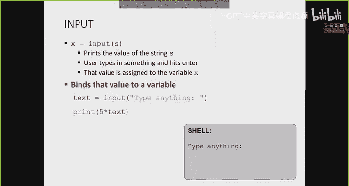

In the parentheses， we give it a string。

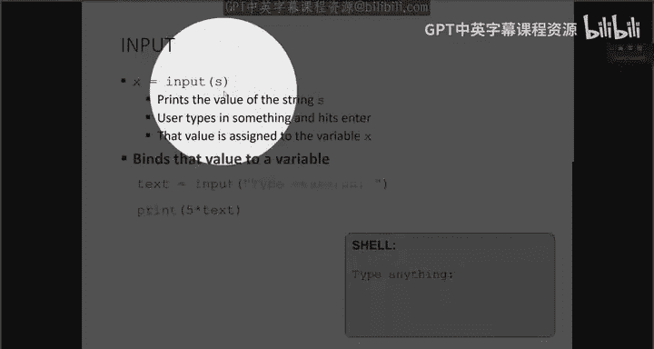

And then we usually want to save the input to a variable。

So the next few slides are going to go through step by step what happens when I have these two lines of code。

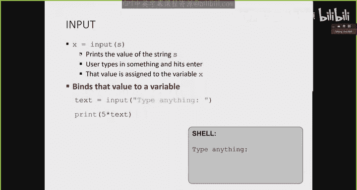

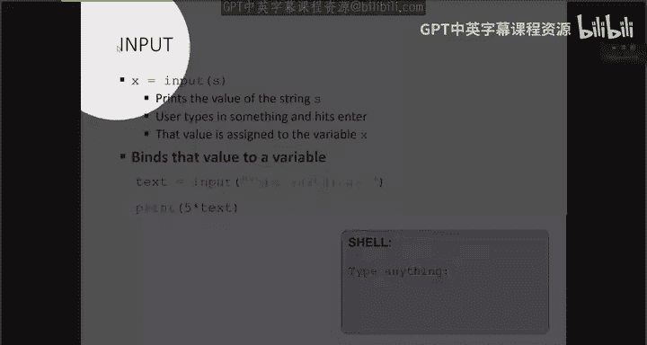

Text equals input， type anything， and then I'm going to print five times text。

So when Python sees a line that says input and then some string。

Python will automatically take the string within the input right so in this particular case here's my command。

 the string inside the input is type anything colon space。

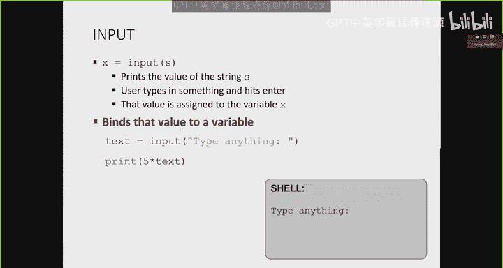

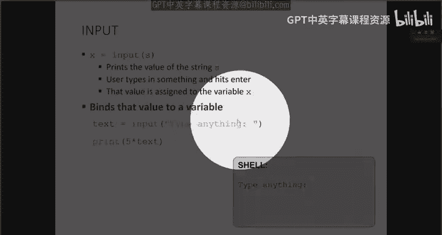

On the shell， Python will put that string for you。And then it will wait。

It waits for the user to type some stuff in。And hit enter。As soon as the user hits enter。

 whatever the user typed in。 So let's say the user typed in howdy。

Whatever the user types in will be saved as a string。

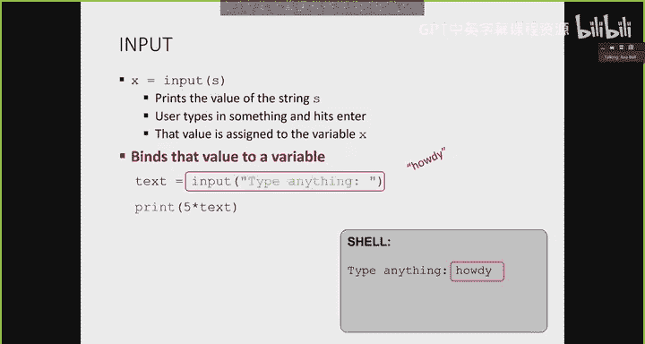

Sort of replacing this input statement。So you can think of the input kind of like an expression。

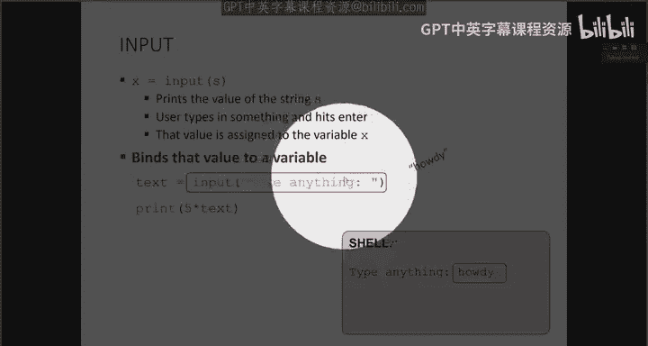

It's a weird one because it's waiting for the user to give us something right， But in the end。

 the input gets replaced by the string version of whatever the user typed in。

 so the user can type in something， you know， numbers， letters， characters。

 anything as soon as the user hits enter， whatever the user typed in will be saved as a string replacing this input。

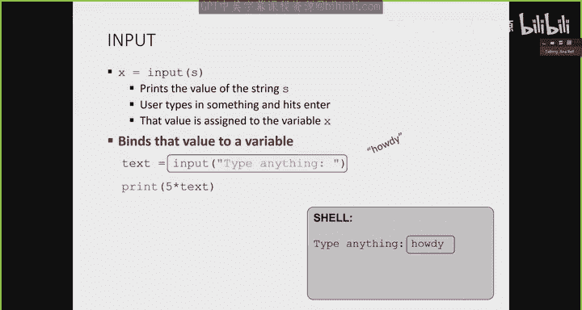

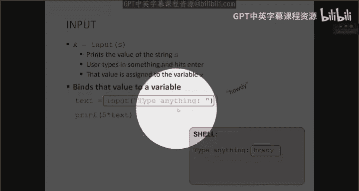

So in memory， the way this looks like is this is our， you know， memory cloud。 Here is this very。

 here is this object that I've created， which is the exact characters that user typed in。Okay， well。

 if the user typed in howdy， then what does this line end up being Text is equal to the string。Howdy。

And that basically is what we've seen on the previous two slides， right。

 when we've worked with strings， we're going to assign of this variable and bind it to this particular string of character。

Now， the next line is easy， right， We're gonna print whatever the result of repeating text is。

 five times。So the print will。Show on the shell。 Howdy， howdy， howdy， howdy， howdy。

 right whatever the user typed in five times。Okay， let's look at another example。

 in this particular one， we're going to ask the user for a number。

And I want to print five times whatever the user types in。So number one， will again grab input。

 So what we're asking the user to do is to type in a number， right？ So when the Python sees this it。

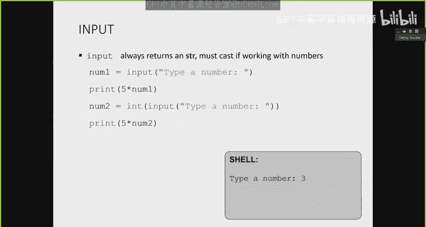

Prints type a number and then waits for user input。

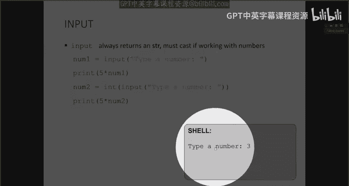

Let's say the user types in the number 3。That gets saved as the string three。Again。

 so no matter what the user types in， it's being saved as a string， even if it's a number。

 it's being saved as the string， that number， right， So to Python， it's a character to us。

 it's a number。 But to Python， it's still a character。

So number one in memory basically becomes the string 3， just one single character，3。

When I print five times number1， what is that going to look like。You guys tell me。Exactly， right，3，3。

3，3，3， right， because we're not， we're working with a string here， not an integer。

If we want to work with an integer， we have to wrap our input statement with a cast statement， right。

 So again。This is what Python does。 We can combine expressions together。 In this particular case。

 we're going to combine the casting， the input。

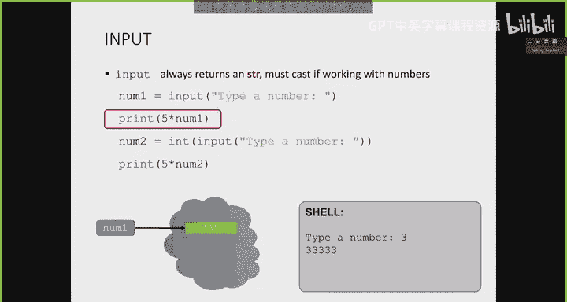

With the input statement。 So now the user can type in for me 3 again。

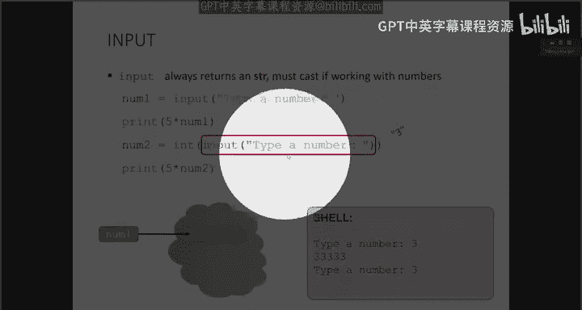

The input itself is going to be the string 3。But that line becomes numb2 equals int parentheses。

 string 3。And that I did on the show a little earlier today， right， when we cast a string to an int。

 it becomes the number that int。So number two is then going to be three。And memory。

 numb 2 is not the strengthry anymore because we've cast it to3。So when we print five times three。

 we're doing the mathematical operation， five times three， right， 15。O。Let's have you code。

So I'm going to give you a couple minutes。I'm going to have you write a program that is interactive。

 So it's going to ask the user for something， and it's going to print something back to the user。

 So we're gonna to ask the user for verb。And then I want you to print two things for me。

 The first is whatever the verb that user typed in， you're going to write， I can。

 whatever better than you。On one line。 And then on the next line。 So with another print statement。

 I want you to print that verb five times。 So if the user types and run， you're gonna to write。

 I can run better than you。 And then on the next line， run， run， run， run run。

So the way these you try its work is I actually have some space here that I've already prewritten the instructions for you。

 and all you have to do is fill in the code。Okay， so I'll give you a couple minutes。

 and then we'll write it together with suggestions from you。 and we'll see how， how far we can get。

 and we'll definitely。We'll definitely finish it together。

 so you don't have to finish it on your own。ぜ実か。You should have this file。

 It's part of the zip file we downloaded for today。啊。到退。Or does anyone have a start for me。

 So how can I ask the user for input？Yep， that works for me。

 and I'm adding a little extra space here between the colon or whatever prompt you have just so that when the user types it in it isn't right beside the colon or end of the end of this string。

So as soon as we do this， the user will， the program will wait and the user will get to type something in。

 What's the next step。What's the first， you how can you use this？This input。い。Let's print something。

I can quote， yep， I can。Outside。Yep， we can put a question， yep。

 exactly I can question comma because it's another object and I'm happy to put a space in between it。

 I can question。And another string better than you。Where。

And we don't need to write the full program right away。 We can just test this little bit out。

 So choose a verb run。 The1 I gave you is fine。That looks good so far。 Allright。

 so then then we can work keep working on the second part。 How can I print that。Verb。Five times。Yeah。

Print question times 5。Let's run it and see what happens。Run。Not quite。 I'm missing spaces。

 but this is an awesome start。 How can I add the spaces in there。Yeah。In parentheses， yep。

 we can concatenate it with the space， exactly。Times on all that Time 5。 Yeah， let's try that。R。Yep。

 that looks pretty good。I do want to mention one thing。

 There is one improvement we can make to this program。 If we look at the output here。

 the thing that we're actually run printing out is this verb space， right。There's one， two， three。

 four， and the last one actually prints it with a space at the end。

So a challenge for you and the answer is a little bit lower。

 I provide you guys with answers to these， but a challenge for you is think about how you can change it。

 change this last print statement so that this last run doesn't actually have that extra space。

Think about it， you don't have to do it right now。O。So with what we know so far。

 we can actually apply some of these ideas to a more numerical example。

 So Newton's method is a way to actually grab the roots of a polynomial numerically using this idea called successive approximation。

We can't actually write the full algorithm with what we know so far。

 but we can write a really important part of it。 The part is the。

 the part that we can write is the one that gets a next guess based on an initial guess。

So you don't need to understand how the algorithm works。

 but basically the next guess based on an original guess looks like this， this is the formula。

 So the next guess is the original guess minus， and we evaluate the formula for whatever you polynomial we want to find at the original guess divided by the derivative of that function at the same guess。

So here's just some code we've got。Asking the user for input。

 what X do we want to find the cube root of。Then we ask the user for input。

 what guest do you want to start with， And then we can just print the current estimate cubed。

 So we just guess cubed。And then the next guess is just following the formula up here。 right。

 The next guess is going to say it's my original guess。 So the G that I read in from the student。

Or from the input minus， and now I have a division。The top of it is going to be F at G。

The computer is not。Evaluating F， right， we have to give。

 We have to actually write down what the formula is。 The function is。 We want to evaluate at G。

 So it's G cube minus x。 That's our function up there， divided by the derivative。And again， the。

Program is not going to evaluate the derivative automatically。

 We're going to tell it what the derivative is manually。 So， you know。

 the derivative G cube minus X is just 3G squared。So then we just kind of hard code done it。

 and the next guest to try is just going to be that particular division and subtraction。I'm sorry。方新。

There are there are Python packages that allow you to do that。 But for our purposes。

 we we're just going to hard hard code it in this case。 but yeah。So the way this looks。

And code is as follows， right， That's exactly what we had in there。 And if we run this program。

 all it does is let's say we want to find the cube root of say， 27。 Let's start with， I don't know 5。

Right，It tells me that 5 cubeub is 1，25， way too big， obviously。 So the next guest to try is 3。6。

And that's all the program does。 It doesn't take this next guess and do another guess。

 We haven't learned how to do such a thing yet， but we will in the the next couple lectures。

One other thing I want to mention is this thing called an F string。

It's something that became available， I think， a couple years ago in Python with Python 3。6。

It's a way more convenient way for us to print out mixtures of。Literal text。

And resulting expressions。 So if you have a bunch of complicated expressions you want to print out an F string is the way to do it these days。

 What we know is these first two lines， This is what we've learned in the past couple slides。

 So if you wanted to have these two values and print you know this big number is whatever fraction percent out of the original number。

If you actually run this in in the Python file， you'll see that this comma here puts an extra space between my number and the percent and that doesn't look very good when you have 3%。

 you're expecting the percent sign to be right by the three。

But this comma adds for me an extra space。 So it looks a little bit weird。

Which means that our solution was to cast things to strings。

 So if we wanted to have that percent sign be right beside the number， we'd concatenate。This cast。

With the percent。But F strings allow us to do this all in one。

 So there's no concatenation to think about。 There's no casting to think about。

F strings basically are this F， and then a long string。

And it's a mixture of expressions and things that I want to print literally to the screen。

So the thing that's not inside a curly bracket are all things I'm going to print literally to the screen。

 So the space is space。 And then later on percent， space of percent。

 those are all things that will literally be printed to the screen。

Anything that's within a curly bracket is considered an expression in Python。

 and so before Python prints out the thing to the screen。

 it's actually going to evaluate whatever nu times fraction is。

 and it knows these are going to be variables and then later on fraction times 100 and then later on numb。

These are all variables or expressions that it will evaluate before actually putting them on the screen。

 And now notice these， these these expressions we might have had to cast to strings beforehand if we wanted to concatenate them。

 But now we don't， because they're in this special format with the curly brackets of the F。

So just something to practice， I'll interchange， I'll use sometimes this， I'll use sometimes casting。

 I'll use sometimes F strings， but you know if you can use F strings whenever you can。

 that's really the way to go in Python these days。So the big idea， actually， even with F strings。

 is that you can place expressions anywhere， right， we saw we place expression。

 I forget here where we， where we indexed， we place an expression in the index， right。

 now we're placing expressions in inside print statements。

 And now we're placing expressions inside F strings。 So expressions can be placed really anywhere。

 It is pretty awesome。 Very versatile。 Python will just evaluate them。

 and then just move on to the next line。😊，Okay， so the last topic of， Im sorry。

 Any have questions about the inputs and outputs， etc。Okay。

 so the last thing that we'll talk about today， and we will maybe talk a little bit about it next time is conditions for branching。

So right now， the kinds of programs we can write are basically very linear。

 We have a bunch of lines of code， and they get evaluated  one by one。 There's no way to skip around。

 There's no way to repeat things。 There's no decision points in the programs。 You know。

 the values that you get are just the values that are in the program。Now。

 we're going to look at ways that we can add decision points in our program。 So if some value。

 if some variable value is less than some other variable value， we want to evaluate some code。

And otherwise， we'll do some other code， right， So some code can now be skipped。

In programs with this new， with this new idea。Before we go on to showing you exactly how to do that。

 I'm going to talk about another notion of equal in programming。

 and this might be more the notion of equal you might be used to in math。

 So the first notion of equal is the one we've already seen。 It's assignment。

It's done with one equal sign。The value on the right hand side is bound to the variable on the left hand side。

 right that we've know。Double equal in， in Python。Is how we tell Python that we'd like to know whether these two expressions are equal or equivalent sorry。

so。If we're going to be looking at equivalency。How do we how do we express equivalency。Well。

 if something is equal to something else， we can say yes or no。 We can say true or false。

True or false should ring a bell。 It's the Boolean data type that we saw last lecture。

And so now that we're going to show you equality or conditionals in programming。

 we're going to start talking about Booleions a little bit more。

So expressions don't just have to be numerical。 Expressions can actually give us boolean results。So。

 for example， an expression like。Two， less than three。Is O in Python。

And this expression actually evaluates to a certain value。It's not a number， it evaluates to true。

The Boolean value true， because， yes， two is less than three。The equal sign here， this notion。

With a double equal is how we asked Python to tell us whether two things are equivalent。

And this will be the Boolean value false。So here's a bunch of other operators that we can run on any type。

 really in Python。 of most of the time， we're going to run them on numbers。

 but they can be run on strings and things like that as well。So obviously。

 the double equal sign checks for equality， So if I is the same as J。

 this entire expression is replaced with true。And if they're not equivalent。

 this entire expression is replaced with false。If we want to check for inequality， we use not equal。

 so exclamation mark equal。Is means not equal。 So if the number I or whatever ver object I is not equal to object J。

Then this entire expression is true。 if they are equal， then the entire expression is false。And then。

 of course， we've got the the less than， less than or equal to， greater。

 greater than or equal to to work with this well。We can apply these to strings。And with strings。

 it's important to be careful about case。 So， for example。

 lower case A equivalent to uppercase A is false， right because they are not the same character。

Now that we're talking about Boolean operators， we can actually start to combine them together。

So if I have the expression， for example。Two less than three， right， like I wrote on the board。

 that's true。But I can combine that expression with another one， actually， by itself。

 I can say what is not two less than three。And that will be false， right， It's the opposite of it。

But I can also combine bullolean expressions together。 So I can say， what's2 less than 3 and。

Three less than four。So 2 less than three is true， right， and 3 less than 4 is also true。

So the combination of these two expression of these two bullolean expressions is what is true and true。

Surerue。so if one is true and the other one is true。

 then both of them and both of them together are going to be true if one of these is false。

 so is three greater than four is false。Well， what's false and true， it's going to be false。

 So if one of these operators is false， then the entire expression is false。

And you don't have to remember this truth table。 you can always check it like I just did。

 right here in the console。But at a high level， when we're doing the and operator between two Boolean expressions。

 we need both of the expressions to be true。For the result and to be true。

The or is the other one we can usually do。 The or is always true。

 except for when both of the operators are false。And it kind of makes sense in English too， right？

If either operator is true， then the entire result is true。 but when both are false。

 the or of both of them is false as well。So here's a little example where we can use these operators in Python so we can draw the little memory diagram as well。

 So piece at time is 15。 There's my variable。 sleepleep time is 8。 There's my other variable。

 I'm going to print。 sleep time is greater than peace at time。

 So here my print statement is going to grab that expression， which evaluates to。

False8 is less than 15 is false， so that's going to print false。And then I have two more variables。

 These ones just happen to be bulloles。 derive is true。 Drink is false。

 so drink and derive is going to be false because one of them is false。

And so here I've got this other variable both， and then I'm going to print false to the。Okay， quick。

 you try it for you guys。So let's have you write a program that saves a secret number in a variable。

So that's going to be your program's secret。 Presumably。

 people using your program won't be looking at the program itself。

 They'll just be interacting with the program in the shell。So save a secret number and a variable。

 Ask the user to guess a number and then print either true or false if it's the same as your secret or not。

So， it's。Here in this， you try it down here so you can start with something like secret equals and then put your favorite number there。

5， whatever， and then write the rest of the code。 So ask the user to guess a number。Print a boolean。

 depending on whether the guest equals this secret or not。

So I'll give you a couple minutes to write that。一岁。If you use the symbol and it's not the same。

 you have to actually type out A And D in Python。 The and means something else。

It's like it's an operator with the bits of the number。

 So something it's not going to give the same answers。Right。

 you're thinking about Java or C++ or something， right。All right。

 does anyone have a start for me for this program， How do I grab the user input？Gues equals input。

We can be nice， please， guess。What's that。We want the user to give us an energy Yeah， a number。下。So。

ok。If we leave it like that。Then we're just grabbing the string。 So we have to cast it to an integer。

 exactly。No one。How do I check for equivalency between my secret and the guests。Secret。Equal equal。

 guess。And do you want to？Bt this， yep。Let's print that。Okay， run it。

Let's guess something that's not the same。 F。 Run it again。

 Let's guess something that's the same truth。 And we can guess something that's lower to just。

Is everyone yeah。可以。Yep， yep， exactly equal equals this thing。 Yep， and then you can。

 you know do whatever you want with that print equal or something。 That's the same。 But yeah。

 you can do other things with this variable， yeah。5。If you want at home。

 try to see what would have happened if you didn't cast it to an integer。

See if the program would have crashed or not， or if it would have just know worked。

 but given a wrong answer。So why do we do Booleanions， right。

 Booleans are important variables because they allow us to start thinking about writing programs that make decisions。

 right？The way we talk is， you know， we can say something like if this is true， do this。

 Otherwise do this。 the Boolean part is if that something is true。

 right so something is true is going to be the Boolean that we can create in our programs。

 And then the do this is some sort of commands。 And then the otherwise do that is going to be some other set of commands Okay so really simple you know。

 Boolean expression could be， it's midnight， you get a free food email。

 Do you go get the free food or do you sleep。That's the very simplest kind of decision point you can make。

But with conditionals， you can actually write a pretty cool program that gets you to that free food。

😊，Right， so let's say this is a map of MI T。 This is where you are。 That's where the free food is。

 Okay， We can write a really simple algorithm using just conditionals that takes you to that free food。

 So the algorithm goes like this。 So I'm going say I'm gonna walk always， you know。

 in this direction。 So I'm either going forward backward left and right。 I'm not turning。

 And I'm gonna say the algorithm is always going have my right hand be on a wall。So， if。

The right is clear。 So standing here， my right is clear。

 So I'm just gonna keep shimming until I reach a wall。If my right。Is blocked。

 but my forward is clear。 I'm going keep going like this all the way to the end of this the， the。

 the。The room， if my right is blocked and my forward is blocked， right。

 as if I would have reached the end of the room， I would have gone to the left。

And if my right forward and left is blocked， if I'm over there。

 I would go backward So I'd go backward。 So basically， starting from here。

 I've made my way all the way around this room， and I would go out the door down the hallway。 right。

 And if the map of M T doesn't have island。 So if the free food isn't somewhere sort of in an island in the middle here。

 if it's just a regular old maze， I would eventually make my way to the free food following this really simple。

 conditional algorithm。So how do we actually do conditionals in Python， How do we tell Python， hey。

 I want to create， I want to insert a decision point right here。We do that， using the keyword， if。

And the if starts a decision block。Now， the simplest decision block。Is just an if by itself。

 So if Python sees that if， So there's some code that it's following。 And then at some point。

 it reaches the if。The condition tells Python to check whether that condition is true。

 If the condition is true。 So this is our decision point。

 then I'm going to deviate from my main program and potential and do the code that's part of that condition。

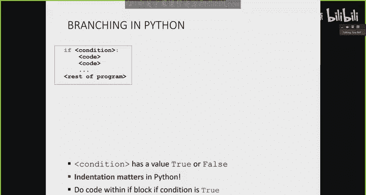

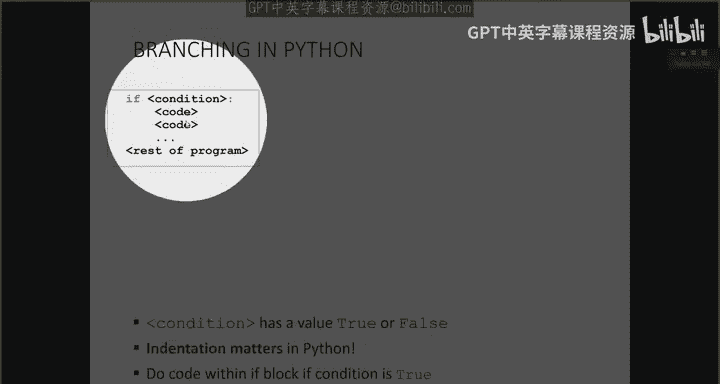

Those， I guess， two lines， dot， dot， dot inside there。If the condition is not false。

 I'm not going to go that route。 And I'll just keep following the rest of the main program。

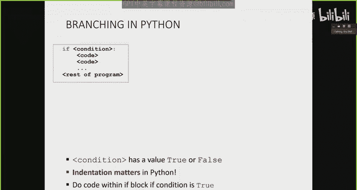

How does Python know how many code code lines to execute。 That's part of that condition。 Well。

 it looks at the indentation。 So notice here， I've kind of put a pro faces for these two and dot。

 dot， dot code blocks here。 Anything that's indented right after that。

 if statement and that colon there。

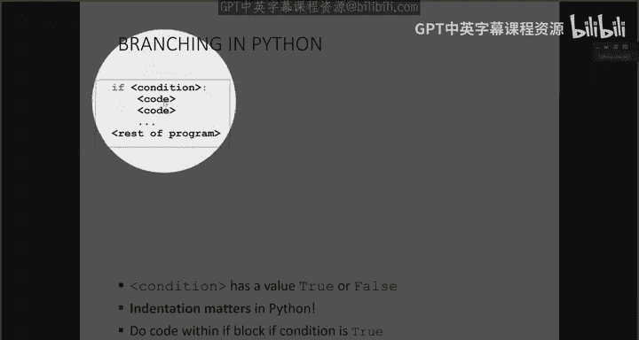

Is set of commands that are part of that block。 So anything here will get executed all at once。

And that's a really simple if， either you do this set of commands。

 extra commands if the condition is true or you don't。Now， you can add an exception to that。

 So if the condition is true。Again， we're following the program， we reach this if conditional here。

If the condition is true， again， we're going to deviate from the program and execute this other set of commands right here。

Otherwise， the condition is not true。 and we're going to execute this other set of commands over here。

 So these guys over here。

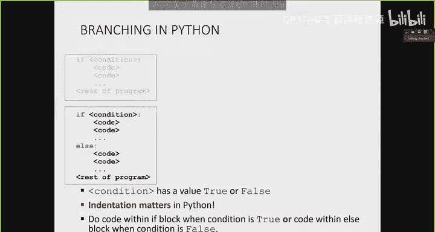

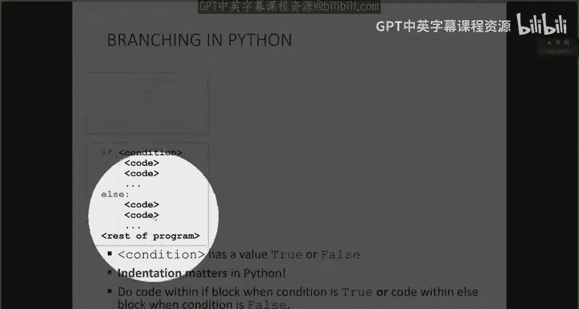

So either we do this set of commands or the other set of commands， but we never do both。

 and we never skip both of them。 So either we do one set or the other。

 When we're done executing all the indented blocks。

 part of the condition or the other one that' if the condition wasn't true。

 then we rejoin the rest of the program and continue executing。

 So this is all the rest of the program is at the same indentation level as our original。

 if and else。We can add a whole bunch of conditions， right， not just an if do this， Otherwise。

 do this。 We can actually add。A bunch of things to check using L if， which basically stands for else。

 if another condition， do this。So here's our program。 We reach a decision point。

If the condition is true， like before， we'll execute the set of commands， but otherwise。

 the condition is not true。We're going to check another condition else。

If this other condition is true， we'll execute this other set of commands。 otherwise。

 here's another Els。We'll check another condition。If it's true。

 we'll execute some other set of commands otherwise。There can be more LFs。 And at some point。

 we're going to rejoin the rest of the program。Now， these L ifs are going to be。

 each condition is checked one at a time。The very first one that's true is the one that gets executed。

We're never going to execute more than one， right， because this is an if， else， if， else， if， else。

 if， So even in English， you're only going to do one of these， right。

 You're never going to do all of them。It is possible to skip all of them， though。

 because if none of those conditions are true， you just don't do any of them。

If more than one is true， you do the first one that is true。

If you want to have sort of a catch all kind of version of the middle if， L E。

 you just add an else at the end。 So if none of those conditions are true， you can add an else。

 which says you just do this if nothing is true。

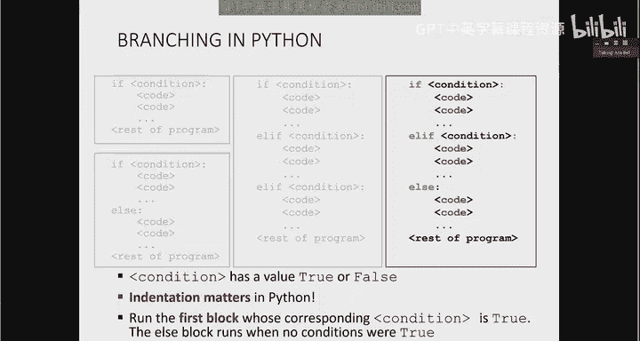

kind of like what we had over here。If this one otherwise do this， well。

 if any of these conditions are true， do one of them otherwise do this。

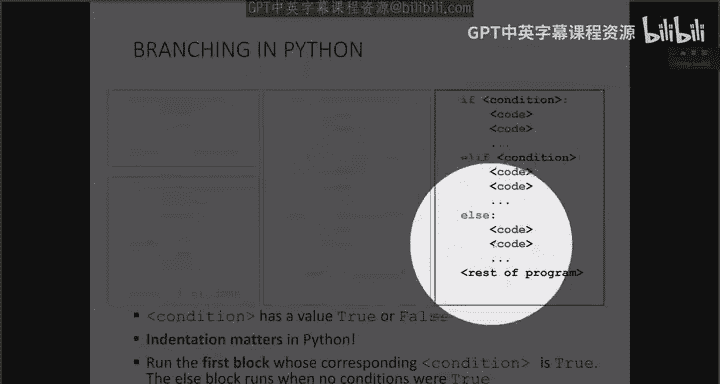

So here's an example。We've got peace at time。 We'll just put some variables in there。 S time。

 we'll put some variables in there and run it， see what we get。 I've got one code block here。

 an if L if and an else。So the first code block， the condition is it checks that the sum of those two is greater than 24。

 and it does something。 This is the block that's part of that condition。

Notice it's indented by usually four spaces。L if。 so if this one was not true。

 then I'm going to go ahead and check the next one。

 The next condition is that the addition is greater than or equal to 24。

 And then we're going to do this print statement here。And if neither of those are true。

 I'm going to do whatever is in this code block here， I'm going to do these two lines。😡，Okay。

 so this is my sort of， I call it a catch all because none of those other conditions were true。

 So we're going to catch ourselves and do this print。 do these commands here。And otherwise。

 once we finish doing either this one or this one or catching whatever is left over in here。

 we're going to evaluate the print statement here。 and I'm going to print end of day because this is the rest of my program。

 Not it's at the same indentation level as my original program。

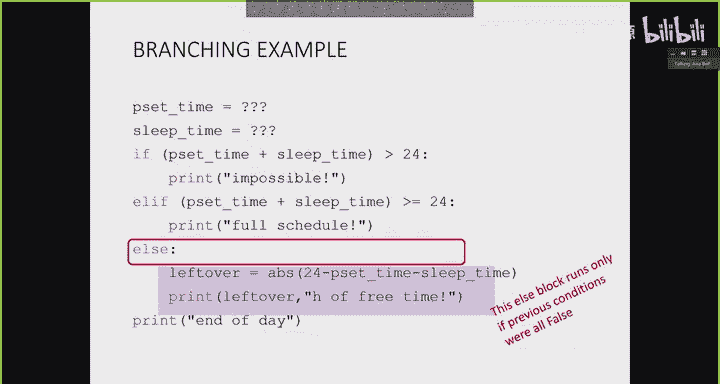

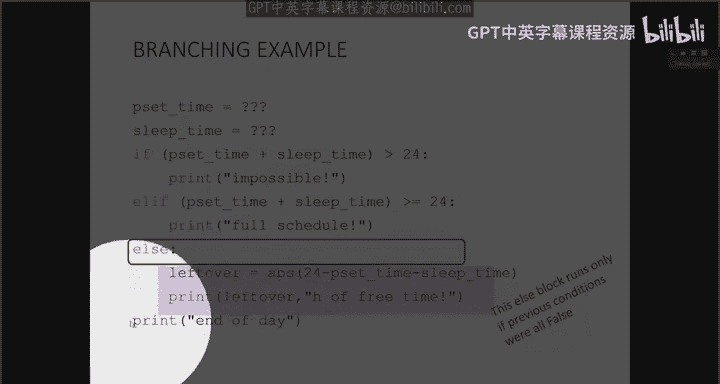

So here is。This oops， this program。So if peace at time and sleep time is 22 and 8， right。

 the addition is more than 24， so this is going to enter this code block here and print impossible。

If it's exactly equal to 24， right， So 22 and 2。We're not going to enter this one。

 but we will enter this one， right， because it's exactly equal to。 it's not greater than。

 So then we're going to print full schedule and then rejoin the rest of the program here and print end of day。

And otherwise， if this is something low， right， less than 24 and not equal to 24， right。

 so neither of these conditions are true， then we're going to enter the else and we're going to evaluate run these two lines of code here。

So the two lines of code here are going to grab the absolute value of 24 minus the peace at time。

 minus the sleep time， figuring out how much time we have left in the day。

It's also going to print this line here and then rejoin the rest of the program to print end of day。

O。Quick check， nothing to run， nothing to write here， nothing to run。Think about this program。

 what is wrong with it？So I'm grabbing a number for x， a number for y。

And then I'm checking if x is the same as y。 I'm printing。 X is the same as y。

 So if I give it 5 and 5。 I'm going to print 5 is the same as 5。And then I'd also like to print。

 These are equal。

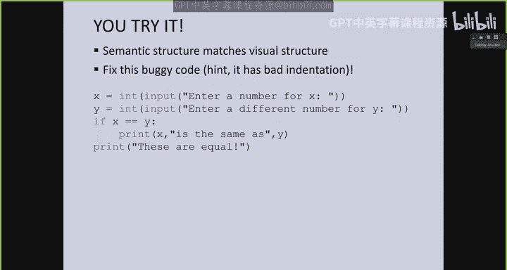

What's the problem with this program。Yeah。The is not equal to why it's still that I think these are equal。

他。Exactly， if x is not the same as y。We rejoin the rest of a program because the indentation level of this print statement is the same as the rest of our program。

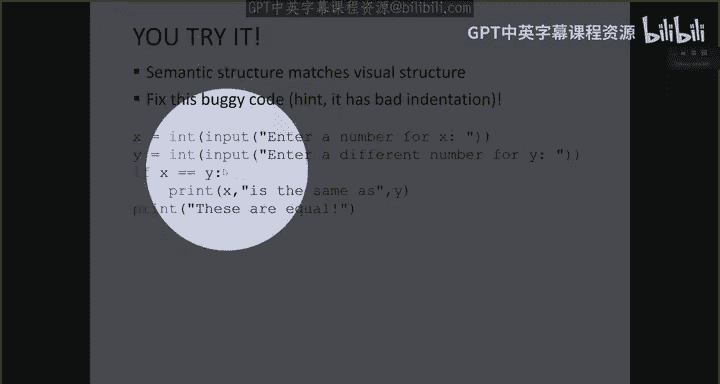

So how do we fix it？Indent， y， we'll just indent that print statement in to be at the same level as the if statement。

So we can actually nest indentation statement we can nest conditionals， right。

 because once we've created a conditional， it's just a code block。

 So here I've got an if statement with its own code block。 And inside that code block。

 I can actually have more if statements that are just going to be executed whenever this condition is true。

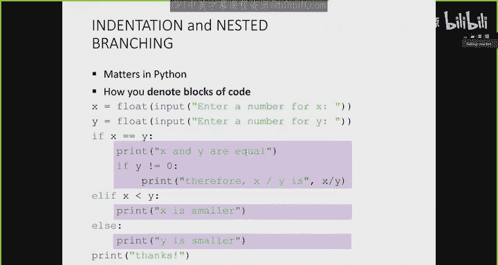

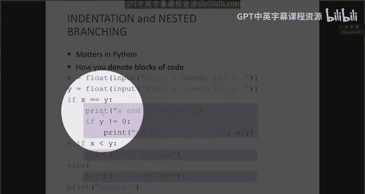

So this is the inside code block。 So， for example， the place where we would execute this inner code block is when x and y are equivalent。

 right？ Because then I'm going to enter this code block here。 This is true。

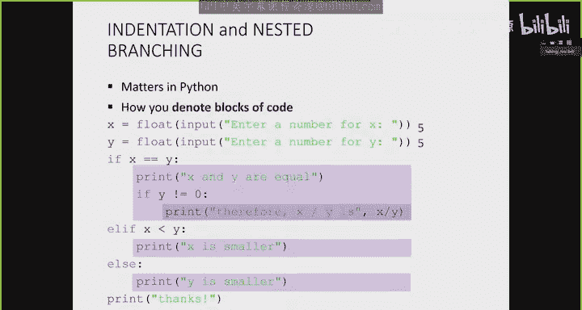

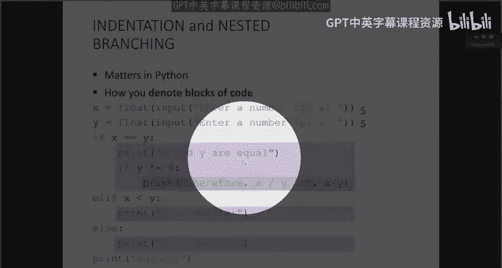

I'm going to print x and y equal。 And then this second conditional here。

 Y is not equal to0 is also true。And then I'm gonna to print this one。

I've already done one of the conditionals。 They're true。

 so I'm going to skip the LF and skip the else， and I'm going to rejoin the rest of the program。

All the other cases， right， when one value is different than the other will either take me here。

Anything else？And then rejoin the rest of the program。Or when they're equivalent， I'm going or here。

I don't actually have a case for that one on the slides。

 but when they're equivalent and y is equal to zero。

 I'm not actually going to enter this inner conditional。Because， while x and y were true。

 we're equivalent， which is true。Y was equal to 0。 So that。Not equal to zero is false。那。

And then we rejoin the rest of them。What did you do the vote for？Oh。

 I'm casting the numbers to floats。 I could cast them to ints， as well。

Just so I'm not comparing strings。So now that I've introduced conditionals。

 it's important to do a little bit more practice to get a mental model。

 a mental model of how to trace the code right and the visual structure of the code actually helps a lot。

 and Python is unique in the sense。 There's no other languages that actually force you to indent things So the other languages don't really force you to have this visual structure to match exactly what's going on。

 but it's actually really useful in Python。 that's what I like about Python。

 it just helps you see things that are going on immediately like the set of code is part of this code block。

 And so it helps you of debug a little bit more efficiently。 But the more practice you get。

 the more you'll get used to kind of tracing the code and knowing exactly。

If these variables have this value， exactly where your code is going to go。So I'm gonna skip this。

 You try it because it's just kind of you tracing the code。 And I'm gonna have you do this one。

 or we can write it real quick， or you can start， and then we can write it together。

 It's a variation of the program you just wrote。Instead of telling me whether the guess is true or is the same as the secret number。

 I just want you to print whether the guess is too low， too high or the same as the secret number。

So we're going to need to put a conditional in there。

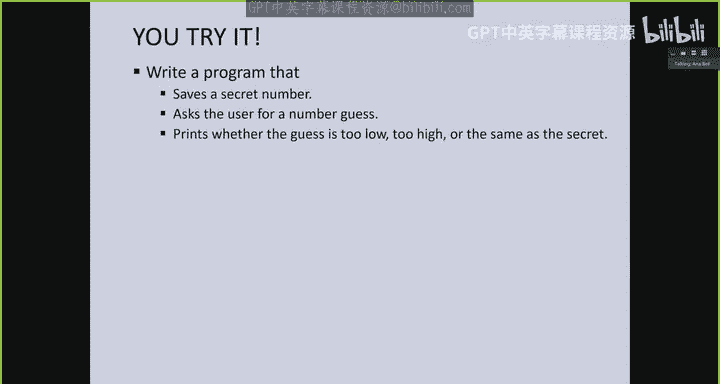

Some conditional， you know， we're going to print something。

So I'll give you about a minute and then we can write it together， and then we can be done。哎呀。

you can have two if statements in the program。 Yeah。

 and there's actually some exercises I have for you guys to try at home here where there are two if statements in the program。

 And just to see what happens， that starts to conditionals。 So if you have if some conditional。

 that one can be true。 And if some other conditional， that one can also be true。

 And then both will be evaluated。 It's not an L situation， right。That's a good question。

So I'm just going to copy the input from before。Does anyone have a start to my condition I just copied what we had before for the input。

对。Yeah。Yep。Right。Print。や。Zhuhai。Yep， that's a great start。 so we can even run it。And， you know。

 guess something thats we know is too high， perfect。あ丈。Next。Do you want to do an L or an LF，Actually。

 I would get rid of the equal sign because if we put in a5 now and we still say25。

 That's a good point。 So if we run it now， let's run it with a 5。It says too high， exactly。 Yeah。

 so let's remove the equal sign。It's a good thing we debug that。So we can do an L if。

The guess is equivalent to the secret。And then， we can print。equalqual， right。

Does everyone understand why we remove that equal sign from the greater then？Yeah。

Because we would have yeah， we would have mistakenly gone into that first path。

But L if we can have a case where the guess is equivalent to secret， sure。

 and then we'll print equal。And then the last one can either be an L。

 because we know the only other option is guess is less than。

 or we can do another L if if we want to， but we can leave it as an L。 And then we can print。Too low。

And then we can run it， and we can guess all the variations。 So something that's too high。

 something that's the same。And。I'm not sure what I did there。I should restart my career。

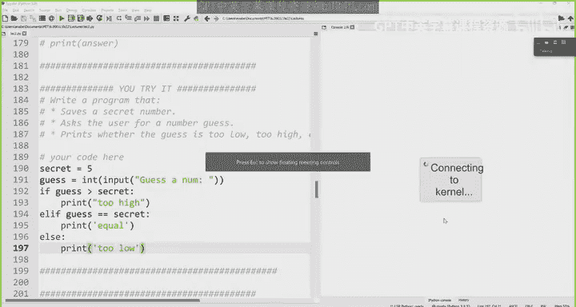

So we did something that's too high。 something that is。Equient。 And then we can do something。

 that's too low。Okay， yeah。What's the difference between。I this other announcement。

So there is no difference。 We can do an L。 if guess is less than secret。

 That would the program would work just the same。 The else is just quicker because we know there are no other options here。

We could also， in this particular case， we could also put a bunch of if statements in a row。

 But then we'd have to be careful that they are mutually exclusive。

 So like in the the previous example， right， if we have a bunch of conditions that might all all be true。

 all those ifs will execute。Right， that's the thing because the if starts a block。

 The L if is just associated with that block。 So either you do one or the other or the other。

 But if you have a whole bunch of ifs， then they might all be true， and they'll all be executed。Yeah。

 what dont these parenthees but if and also。Oh， we could use parentheses in the if L statements。

 You mean like this。 Yeah， we can do that， especially if we have a whole bunch of expressions together。

 But if there's just one， Python we'll automatically know to do the expression first and then do the if。

These are all wonderful questions， by the way。O。So as we saw， there was a little bug in our code。

 It's a good thing。 We ran it。 I should have run it with a bunch of different options。

 but it's important to debug early and debug often just to make sure that you don't introduce a bug that will kind of carry on throughout the code。

That's another big idea。 And then a quick summary of what we've learned。

 input and outputs obviously make our programs interactive。

 We added branching as a way to introduce decision points in our program。 And next time。

 we're gonna do a little bit more branching and then introduce looping。

 So ways to repeat commands in our programs。 Sorry I went a little bit over time。

 I won't do that again。

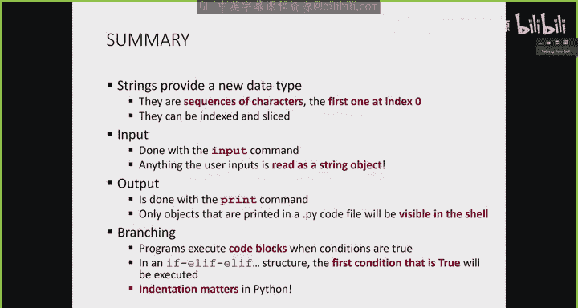

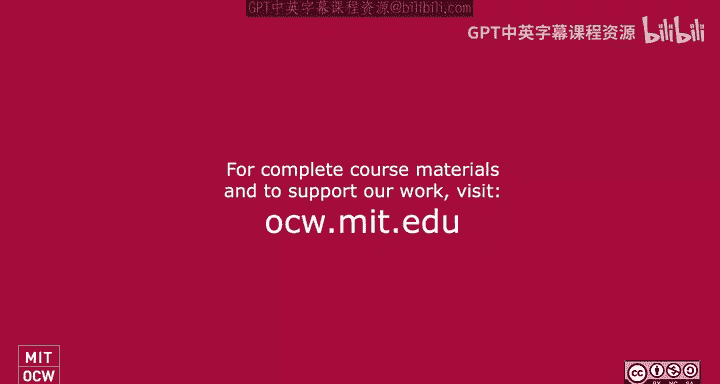