# 《计算机科学和Python编程｜6.100L Introduction to CS and Programming using Python, 2022》 - P3：-03-Lecture 3_ Iteration.zh_en - GPT中英字幕课程资源 - BV1PAxJzVEs3

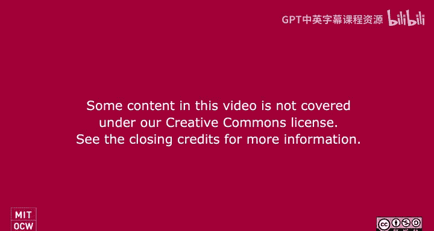

So， let's start today's lecture。Today， we're going to be talking about the idea of iteration。

 And iteration is another way we're going to add control flow to our programs。But before we do that。

 let's do a little bit of a recap on。Sorry， let's do a little bit of a recap of what we've done so far last lecture。

 because last lecture， we actually introduced a different mechanism for control flow branching。

And the control flow is basically a way for us to tell Python not to go systematically through the code。

Branching was a way for us to tell Python， hey， based on some condition of being true or false。

 either evaluate some set of code or another set of code， right， which was not going literally。

 We were actually kind of skipping around through the code。

So that's what we learned at the end of the lecture。 But we also learned about input and output。

 So a way for us to write interactive programs。 and we learned about a new data type， the string。

 So the string was a sequence of characters。 Hopefully you got a chance to do a little bit of exercises on MIT X as practice for today's quiz with quizzes with strings and branching。

Okay， so in branching， what did we learn， We talked about how to actually add a branching point in our program。

 So we did that using these particular keywords。 So when you type them in your program in the file editor。

 you'll see that they kind of turn a different color that tells you it's a special word in Python。

 And these keywords are how we told Python to put a branching branching point。

 And the colon kind of ended the branching conditional。

And then anything that was indented as part of that conditional was code that would be executed when that condition was true。

 So I'm just going to quickly go over these each one of these boxes。

 So the first one up here was the simplest way that we could add a conditional to our program。

It basically said， hey， go through the program。 When you reach this if condition。

 Python would check the condition and say if that condition is true。

 execute the code the code that's indented as part of that block。 If the condition was not true。

 don't do anything， just carry on with a remaining program。If we wanted to do something else。

 So if the condition was not true， if we wanted to do something else， we added this else clause here。

And the L also has some sort of code indented as part of its code block。

 and that code would be executed when that condition was false。Okay。

 so that was a really simple if or if else code structure。

 But sometimes we want to have code that checks for many conditions， right， not just one。

 That's where the L， if structure came in。 So we would have an if condition that starts our code block。

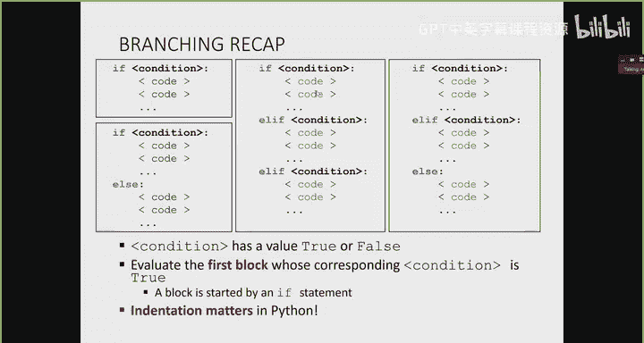

If that condition was true， as usual， we execute the code that's part of that block。E， if， so L。

 if we could insert another condition。 and Python would say， okay， well， if that one wasn't true。

 let me check if this next one is true， and then we would execute the code that's part of that code block。

 And we can add， we can chain as many of these L ifs as we want together。

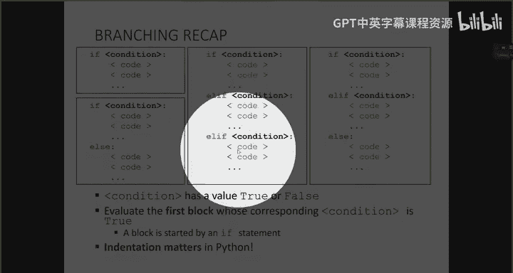

And Python will evaluate the very first one that it finds true。 That's part of this chain。

even if more than one is true。It is possible none of those conditions were true。

 in which case Python would basically skip over all of them and do nothing。

 and none of those code buff。

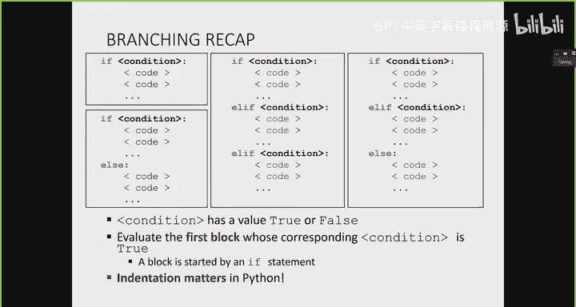

If you wanted to have a structure where if none of those conditions were true。

 you wanted to do something， you could put an else at the end of a whole chain of， if L if， L if Ls。

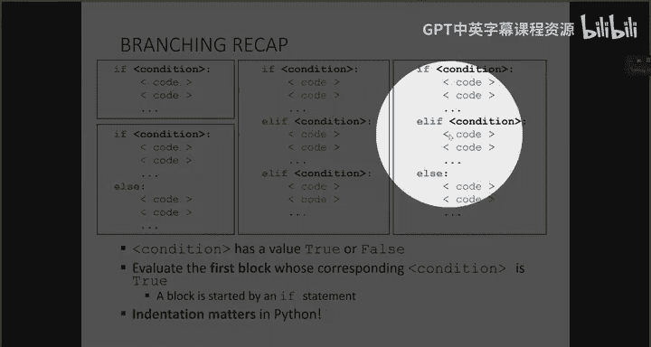

And the else would be executed when none of those conditions are true。

So hopefully this is just recap。One sort of tricky thing to remember is the if。Starts a code block。

 so the if can have an L associated with it， or it can have an LF， LF。

 LF and an else associated with it。But if you have if condition and then followed by another。

 if condition， both of those code blocks could potentially be executed because the ifs are independent。

 right， It's not an L situation。 Therere just another if code block that that that gets started。

So the way we told Python， again， just to reiterate the way we told Python。

 which code to execute when the condition is true is by indentation。

 and indentation is something you have to do。 It's not optional in Python。Okay。

 so let's take what we've learned so far and code up a really simple game。

 So this is sort of a very simple variation of the lostwoods and Zelda。 sort of my version of it。

 Let's say it's kind of a trick level where you have your character and they enter the lostwoods。

 They're presented with this screen。 And the trick here is you ask the user if they want to go left or right。

If they say right， you're basically going to present them with the exact same screen all over again。

 So it's kind of representing that they're lost in the woods。 And as long as they say。

 I want to keep going right， I want to keep going right， I want to keep going right。

 They're basically going to see the same screen over and over again。

 And the trick to getting out of the woods is to say I want to go left。So no matter how far。

 how many times they've said right in a row， as long as they type in left， they're out of the woods。

So let's try to code that up with what we know， just conditionals。We have。An if else， right。

 the if says if the user exits right， we're going to do something。 And otherwise。

 we're going to say that the user said left or something else or exit。

 and we're going to tell them that they've exited successfully。Alright， Now if they said exit right。

 what do we do， Well， we're going to show them the exact same thing again。

 So we're setting the background to the same woods background。

 And then the presented the with the choice all over again， right。

 Do you want to exit right or you want to exit left。 So if they say exit right。

 we would do something。And otherwise， we would tell them they were， they successfully exited。Okay。

 well， what if they exited right， if they exited right， then we would do something again。

 basically present them with the same situation。 So we would set the woods background again。

 And we would ask them if they want to go right or left again。 And otherwise， if they said left。

 they exit。So we already see a problem， right。 How deep do we make this nested loop situation， right。

 here we already have three in case the user said， I want to go write three times in a row。

But we don't know how persistent the user will be。 So how do we know when we're writing our code how deep to make this nested loop。

We don't。Right， we won't be able to really code this up very well with what we know so far。

 And so that's kind of the motivation for introducing iteration。

 because the situation on the previous slide fits really well with some task。

 we want to repeat multiple times。 As long as some condition is true。 In our case。

 the condition is the user says I want to exit right。 So while the user keeps saying exit right。

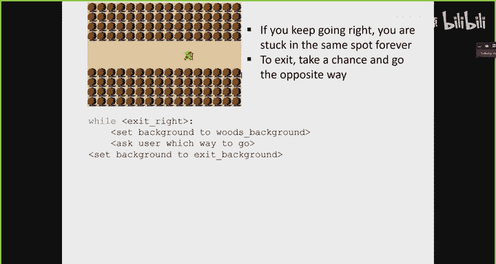

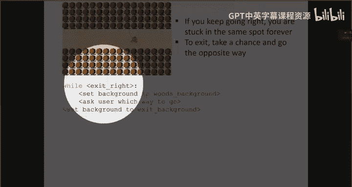

Show them the woods background and ask them again， which way do you want to go。

And so while that's true， just repeat this， this set of things。 Check that they said exit right。

 Show them the woods background， ask them again。 Check that they said exit right。

 Show them the background， ask them again。

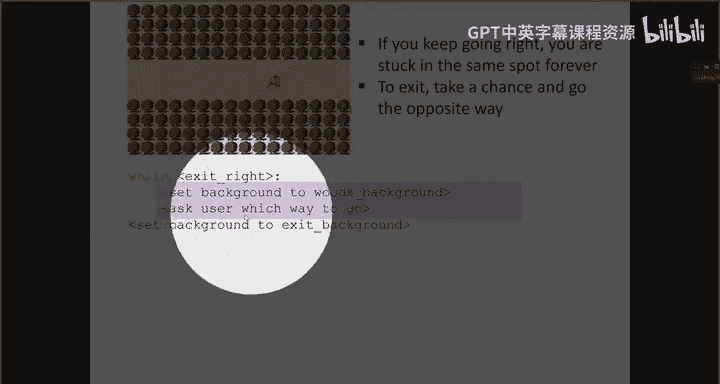

And if at any point they'd say I don't want to exit right， we break out of this loop。

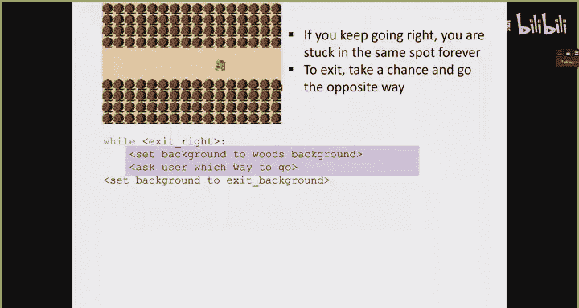

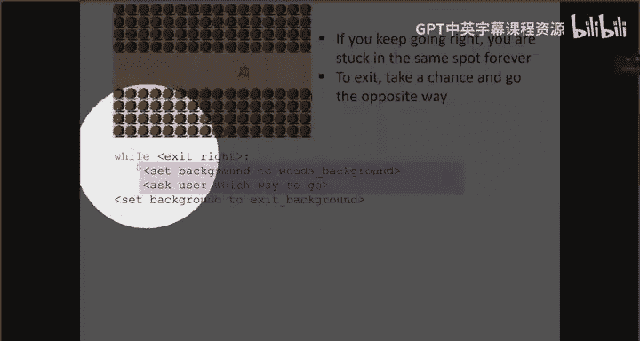

And we kind of rejoin the rest of the program。 That's kind of the terminology we use with if statements。

 right， We set the background to the exit background， and they're out of the woods。

So this sets the scene for while loops。 Here's another example of why loops。

 sort of in the context of watching a show。 So if we want to start a new show on Netflix and we want to watch all episodes of the show in one shot。

 we're gonna tell Netflix， we're starting a new show。

 And while there are more episodes to watch in this show。😊。

We're going to keep watching the next episode， right， So if there are no more episodes to watch。

 then we're done。 not Python。 Netflix will' suggest three more shows like this one。

And while there are more episodes to watch。 So， yes， there are more episodes to watch。

 we're going to play the next episode in in sequence。

So that's the idea that we're trying to get at with W loop。In Python， this is how we code them。

 so we start a while loop with the keyword while。

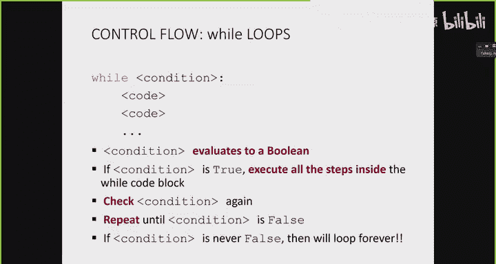

So this， again， will turn blue and Python because it's a special word。

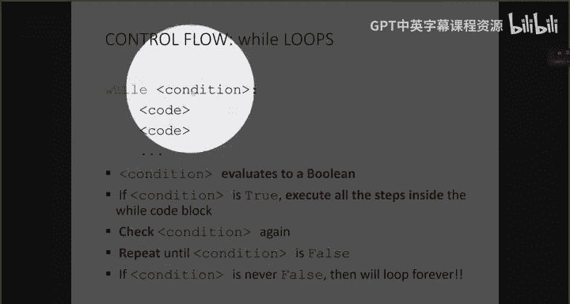

Some condition is true。so this is again some expression or something that will evaluate to a Boolean。

 like we talked about in last lecture。Okay， colon， and colon tells Python we're starting a code block that's part of the while loop being true。

And as usual， the code block means we're going to indent these lines of code。 right。

 So whatever we want to execute when the condition is true will be indented。

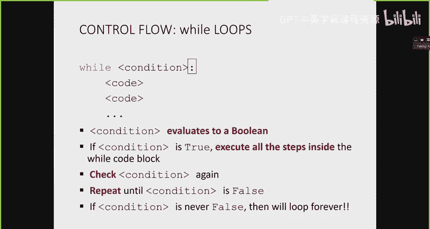

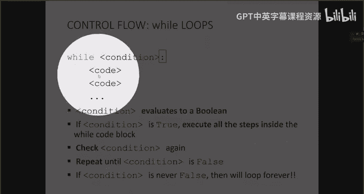

When the indented statements are finished executing。

 Python automatically goes back and rechecks that the the condition。

 So it rechecks whether the condition is true or not。

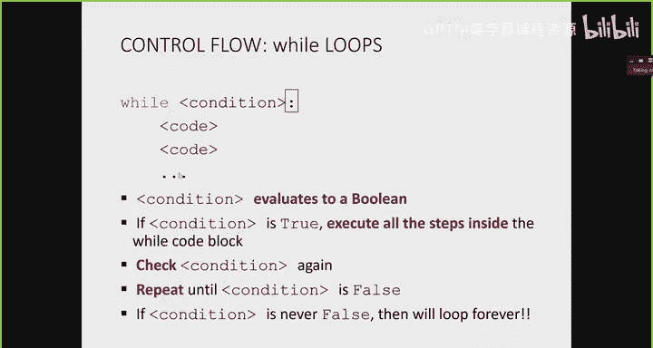

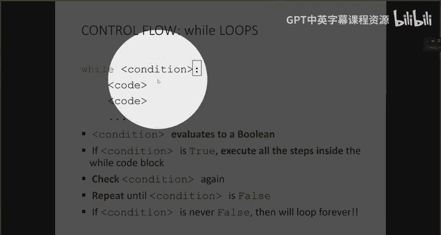

And this is done behind the scenes， right， when you code up a while loop。

 when you type in the keyword while， Python will automatically do this behavior。

 It'll check the condition。 It'll execute the lines of code indented。

 and then it'll go back and check the condition again。 If it's still true。

 it'll execute the lines of code indented again， and then it'll check the condition again。

 So it's not something you have to code up。 you don't have to tell it to go back As long as you're writing this while loop。

 Python will automatically do that sequence of steps for you。So when the condition becomes false。

 Python will no longer execute the stuff inside， the stuff that's indented inside the wire loop。

 and it'll。

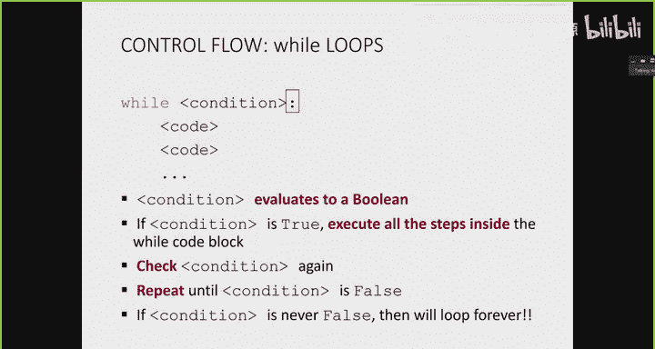

Go rejoin the rest of the program at the same indentation level as the wild。

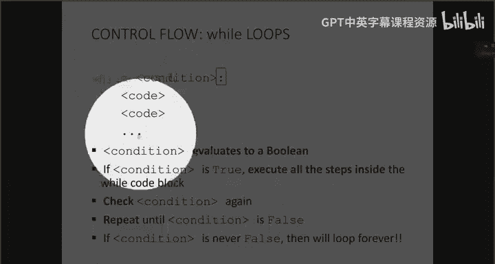

O。So notice that the condition is kind of something that's dependent on。

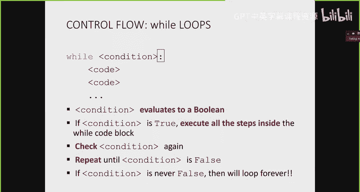

Or sorry， the， the fact that we're doing this code over and over again depends on this condition being true。

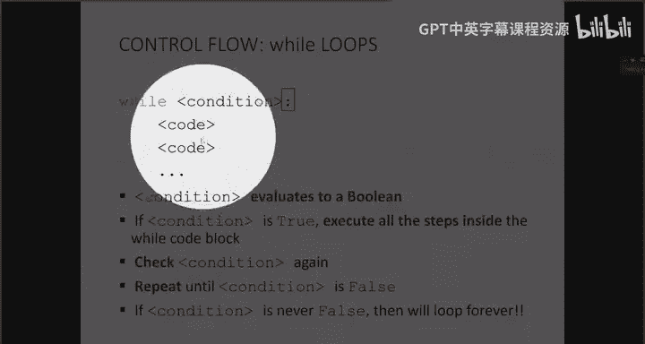

So， if。The code inside is not ever changing anything related to our condition， Then it's very likely。

It's actually for sure that this loop will execute infinite number of times。

 So this is kind of the pitfall of while loops。 It's possible that if you're not careful。

 your code will execute。Itll fit a number of times， and it'll just never terminate。

 And I'll show you how to deal with that in a couple slides。

So let's try to code up this this Los Woods program in our just with a while loop。

So here we've got our question。That we ask the user， do you want to go left or right。

 And we're going to grab the user input as a string and save it in a variable called where。

So whatever the user types in， it'll be saved in the variable called where。 So in my computer memory。

 the way this looks like， if the user types in right， that particular sequence of characters。

 that'll be saved as the variable where。So then we finish this first line of the code here。

 And then we check why the value of where is equivalent to write。What are we going to do。

 We're going to ask the user again， where do you want to go left or right。上个人。Say write again。

 And then this memory is going to look exactly the same。 If the user keeps typing in right。

 I keep reassigning the variable where to have the value。RI GHT。At some point。

 the user might type in left。In which case， we're going to lose the binding from。

A variable where from the specific sequence of characters， RIGHT。

 we're going to bind it now to the characters LEFT。 So at some point after repeating this many times。

 the user will type in left and we're going to have where is equal to left。And at that point。

 when the condition is being checked again， Python will say， nope， this is not equivalent。

 so I'm not going to go inside this code block， I'm just going to go down here and print you got out of the loss force。

So in code， the way this looks is this first one here。So you're in the lost forest， go left or right。

 So if I type in right， it just keeps asking me which way to go。And at some point。

 I can type in left， and I'm out。So it's pretty cool， right。

 We just made our own level in this text adventure。😊，Let's have you think about this question。

 What if the user types in。Capital RIGHT。What do you think will happen。

 Are we going to ask the user to go left or right again。

 or are we going to tell them that they got out of the forest。

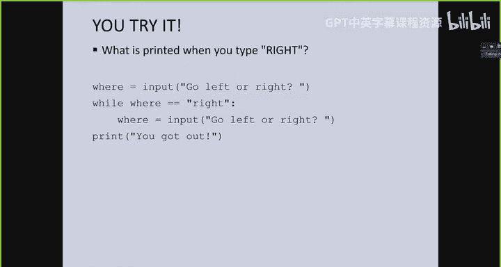

Yeah， they got out。 Do you want to say why？Yeah， exactly， because it's not lowercase。 So remember。

 when we're doing comparison of the equal equal on strings， it has to be the same case， right。

 It's case sensitive。

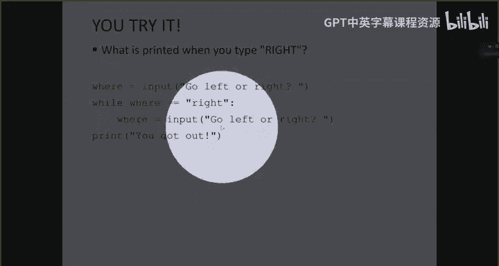

And so capital R IGHT or even some combination like just capital R lowercase RIGHD is also going to give us。

That that we got out。 So this is counterintuitive right to what we see as humans， because we see。

 you know， R I GH T， no matter what。To be。To mean right。

 So work around for this would be to use sort of a command on the string to maybe convert everything to lowercase just so it's more easily compared or something like that。

Okay， so another use of wild loops is with numbers。Let's look at this example。

 I'm going to ask the user for an integer。And then I'm going to do something really simple。

 I'm going to print X to the screen。 However many times the user。It toldold me。

 so if the user gives me 4， I'm going to print X four times to the screen。

So what is this code doing in memory？Well， the user gives me， let's say four。

 what happened step by step。 First， we see our y loop。

 So I'm going to check whether4 the current value of n is greater than0。 Yes， that's true。

 I'm going to print X to the screen And then I'm going to do the next line of code。

 that's part of this indented block， which is to take n and assign it to whatever n is -1。

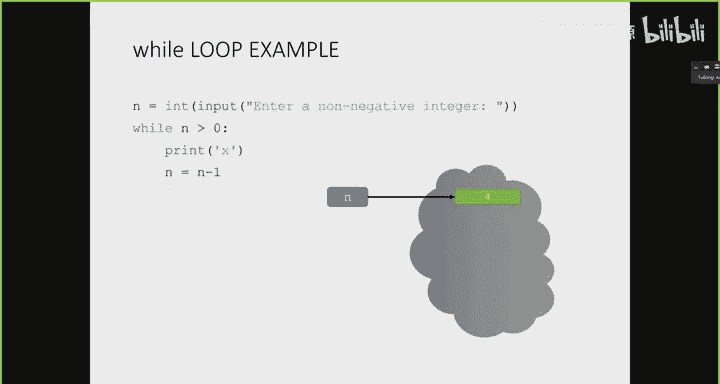

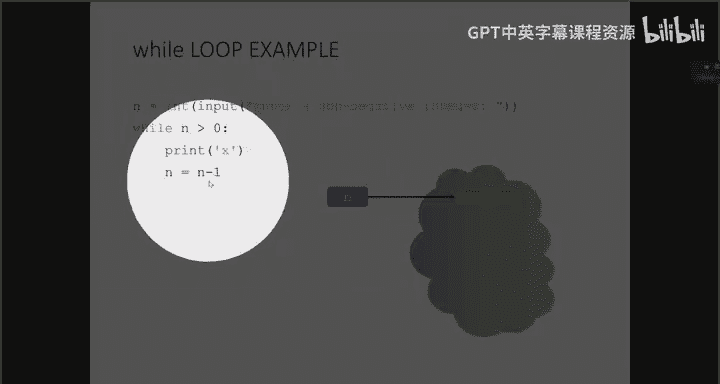

So I'm going to lose the binding from the4， and I'm going to take 4-1 to be 3。

 create a new object and bind n to the three。Okay。Next， Python， again， it's part of a while loop。

 So automatically， it looks at the condition again and says， well。

 now the value of n is still greater than 0。 Yeah，3 is still greater than 0。 So again。

 we're gonna lose the binding。 Sorry， we're printing X to the screen first。

 And then we lose the binding from the current value of n 3，2，2。

So we're decrementing n by one each time through this s loop。Then again， Python checks the condition。

 It says2 is still greater than 0。 So again， we print another x to the screen。

 and then we decrement n by one。 So we're binding n to one。Again， Python checks。

 the condition is one still greater than 0。 Yes， So we print another x to the screen。

 So we've printed four x's now to the screen。 And then Python says now I'm going to make n to be 0。

And then at this point， Python will do another check。 I it say it's going to say is 0 greater than 0。

 and that's going to be false。 So it's not going to execute the code lock anymore。

 And the program will be done。 right， There's no sort of code to rejoin anymore。

 There's just the end of the program。 So we would have printed four X's to the screen。

 And this is in the Python file I gave you。 You can feel free to run it。

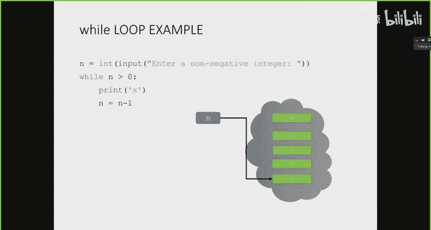

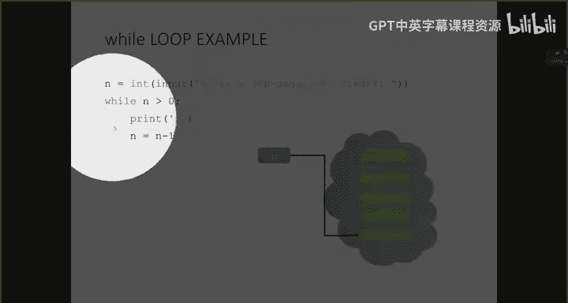

To double check。My question is， what happens， and this is a really common mistake。

 What happens if we forget this last line？We can try it， I can try it in here。Yeah， exactly。

 it's going to go on forever。 I'll show you what that looks like。

So this is the code when we just have it working as usual。 So if I type in3。

 it prints three of those x's。But if I happen to forget to write this last line。

 I'm just going to comment it out。 And if I run the program， I can enter any number。

And it'll just keep printing stuff to the console。So this is what it's just printing a whole bunch of stuff。

So you can see this is all the stuff it printed。So yeah。

 we don't have a program that terminates because the condition here is never actually being the variable that's part of this condition is never actually being changed inside my loop right。

 and so that's a big problem。

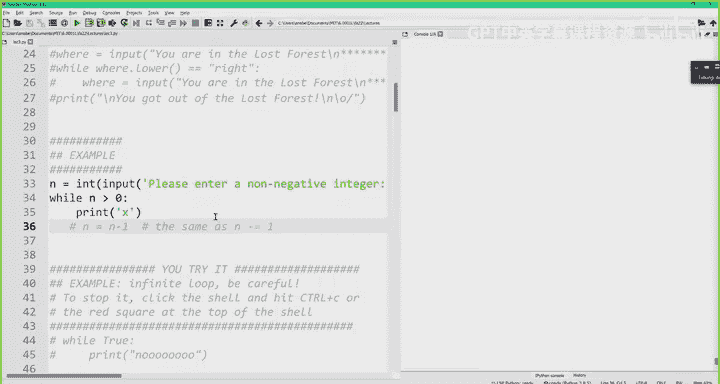

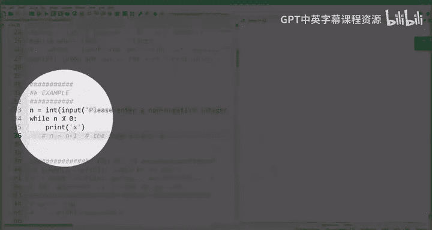

When that happens， what we can do and what I just did here is I' you can click the shell and hit control C or command C on a Mac。

 and that will just end the program manually。Or you can just click the red X in the corner。

 So here's another example of it going infinite。 And there's this little red。

 sorry red box in the corner。 You can click that or you can click the three lines。

 say interrupt kernel。 All that will stop the program。So in this class。

 we're not actually going to write programs that take seconds to run。

 So if you find yourself waiting for your program for more than one or two seconds。

 then likely you've entered an infinite loop。 So you'll want to stop it and try to see where your program went wrong。

Okay， so give this a try。If you want。Just so you get the hang of stopping an infinite program because you'll very likely run。

 write a program that， that doesn't terminate。 So while true。What's the condition here？

It's just true， right？ So there is no condition that's being checked。

 This program will run always at infinite times， no matter what。ok。

So that's just this little you try it down here on line 44， just run it as soon as you run it。

 it's just going to print that to the screen over and over again。

 be sure to click the shell to put the focus on there and hit control C or hit the Redex。All right。

So the big idea with while loops is that they can repeat the code inside them indefinitely。

 So we have to be a little bit careful with what what our conditions are and whether we're actually making progress towards having that condition become false at some point。

And when that happens， when they run indefinitely， you'll have to manually intervene to。

 to close the program。Okay， so now that we've seen a loop with a little bit of numerical computation inside it。

 So we were changing the value of N inside our loop。 let's have you work on this little program。

 It's an extension of the lost woods。This is exactly the same program that I just ran a few slides ago。

 But what I want you to add is an extra printout。

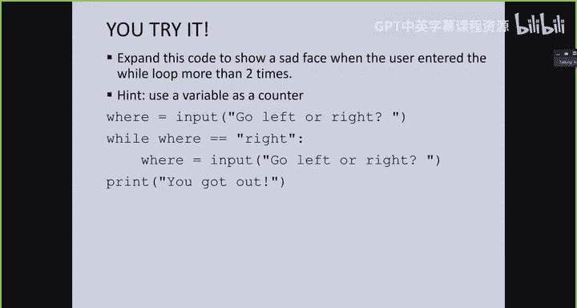

So， when。The user says right。

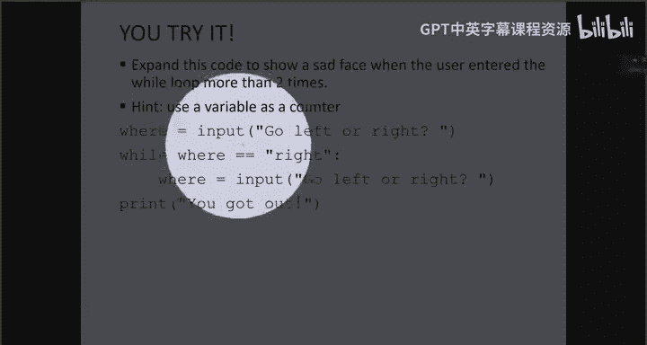

More than two times。The next time you ask them whether they go left or right。

 I'd like you to print a sad face right before you ask them that question。

 It can be on a different line。 It doesn't have to be on the same line。

And the way to do that is to try to create a new variable that's going be like your counter that keeps track of how many times。

The user has， how many times this Y loop has has repeated。

 So I'll give you a couple moments to do that， and then we'll write it together。As usual。

 the you try is is in here， so you can just uncomment the code。

With in in In it's control 1 or command 1 to batch uncomment。And then you can work off of this code。

To try to improve it。Okay， so does anyone have a start for me。 How can we do this。

 You don't have to give it to me in full。 We can work our way up to the final program。

 But what's kind of the first， your first thought here。Yes。嗯哼。😊，Okay。

 so we can create a variable N at the beginning of our program。 What do you want to make it。0， okay。

 good。0 will keep track or n will keep track of how many times we've gone through the loop。

So inside our program。When， when we want， when do we want to in to， to change N， sorry。

Every time we go through the loop， right。So every time we want to go through the loop。

 we want to change n to be a new value。 So maybe we want to increase it by one。

 So n is equal to n plus  one。So now this will keep track of how many times we've gone to the loop。

 And we can actually double check this by printing N。Right， so if we run it。And we say， right。

We've gone once， right， We've got twice， right， We've got three times， right， So this。

Means we're incrementing it correctly。Now， what can I do with this variable N now that I have it。

 and I know it's incrementing correctly。对样。Yep， we can set up an if statement so we can check if that value of N。

Is greater than 2， right， according to this specification here。

 What do you want to do when if is greater than 2。Print something， right。

 so we can print the sad face。And let's try to run it now。So if we immediately hit left， right。

 it still works。 If we go right one time， nothing， right， another time， nothing， right a last time。

 sad。 And from now on， it's going to keep showing me the sad face。😔，Questions about this code。Yeah。

他说的。Can we check for not equivalency。Here。So this， this particular check checks for what the user typed in。

嗯。It's possible we can add this。 if statement that checks for the N in here and something else。

 But then we would have to have maybe another。I'd have to think about it， But it is。

 it might be possible to try to combine them inside the wild loopop。没有。Oh， to do not equals。

 that would be the not equal sign， yeah。So another thing we can do with Y loops is to iterate through numbers in a sequence。

If we do this， there's a really common pattern， which actually leads us to the next kind of loop we're gonna to see on the next slide。

 But the pattern。When you want to iterate through numbers in the sequence is you first set a loop variable before the while loop。

Inside the condition for the loop， you do some sort of check with that variable。

So n was my loop variable outside the loop。 And then I test it inside the Y loop。

 So N is less than less than 5。And then within the while loop。

 you can do whatever commands you want to do with that N。

 But then you have to remember to change it in some way， because if you don't change it in some way。

 this while loop condition will always be true。

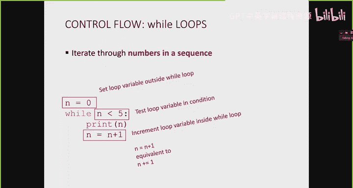

So here I'm incrementing n by one because it starts from 0。 I want n to get to something right。

 something above 5， which will lead to my condition becoming false。

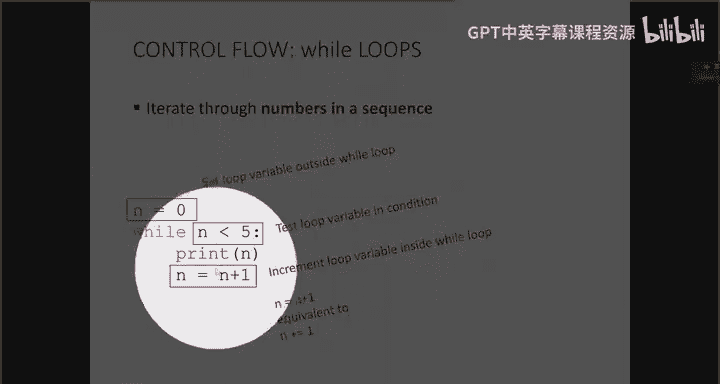

So this pattern is actually， actually exists in a bunch of different programs。

 So here's a program that calculates factorial for me。And here， I'm calculating4 factorial。

 I'm not excited about the number 4。 I that's4 factorial。How do we do this。Well。

 there's a lot of things I'm initializing here。But sort of the more you work with loops。

 you'll kind of get used to seeing right， What is the loop variable。

 So I is actually going to be my loop variable。Here。

 it's being set to some value initially outside the loop。Inside the conditional。

 I'm doing some sort of condition check with it。And then。

 and then inside the body of that conditional， I'm changing it in some way that， you know。

 that gives me some sort of that takes me to the end of my conditional here。So I'm setting I to 0。

 I'm incrementing I by one each time through the loop。

 and I'm making forward progress towards making I greater than X。😊。

At which point my conditional will become false。The rest of the code， X is equal to 4， just sets the。

 the thing I want to get the factorial of。And this factorial variable is kind of my running product。

 So it's the thing that I'm going to keep multiplying to figure out what the factorial is。

So here I'm initializing it to one。 And inside the loop。

 I'm multiplying it by my loop variable every time。

So I'm not gonna to do like a memory diagram this at this for this example。

 but I will do the Python tutor。And I'm going step through to show you exactly what this is doing。

 So X is 4。 I is one originally， and factorial is one， right。

 So X is the thing I want to get the factorial of。 I is going to be my loop variable and。

 and a factorial is my running product。So next step， I 1 is less than or equal to 4。

 So I'm going to enter the loop。Python will calculate the factorial as whatever it is right now。

 multiplied by one I。 So it's still one。And then I'm gonna increment I to whatever it is from whatever it is now to one。

 So I just want to mention this I plus equals1 is equivalent to saying I equals I plus  one。

And this is true， no matter what variable you have here， basically， if you have， fact。Times equals。

 you know，2 or something like that。 That basically means factorial equals fact。Times2。

So that's kind of the pattern here。 These are equivalent and these are equivalent。

 This is just shorthand notation and programming。So that's what this line here means。

 I plus equals1 means I equals I plus  one。So at this line here。

 I'm taking whatever I is and adding one to it，2。And then I do the check again。 And remember。

 Python does this automatically， right， because we're using a Y loop。

 It goes back to the condition and checks it again， using these new values for the variables。

2 is still less than a equal to 4。 So again， we go inside the loop body。

 factorial is whatever it is right now。1 multiplied by I 2。I is going to be 2 plus 1，3。

And then again， I'm checking that3 is less than or equal to 4。 It still is。

 So then we're going to do factorial is whatever it is now，2 multiplied by whatever I is 3。

 So now it's 6。I is it going to be one more than what it is right now，4。

4 is still less than or equal to 4。 We're going to go inside the body。

 factorial is whatever it is right now，6 multiplied by 4。And then 24。

 and then I is going to be whatever it is right now， plus 1，5。 At this point。

 Python says is5 less than or equal to 4， no。And then it breaks the loop。

 and it goes to print this statement for factorial is。

 And then it grabs whatever the value of the factorial。So here I'm using this F string print。

 that notation that we learned about last lecture。So I encourage you to go through it yourself。

Just step by step， that's what Python Tutor is really， really useful for。Okay。

 so let's look at a different kind of loop called a four loop。And the for loop is going to allow us。

 to rewrite that special kind of while loop that we saw where we initialize a variable。

 we test the variable。 We do something to the variable within the code in a more efficient。

 more readable way。So in terms of our Netflix example。

 a for loop would be equivalent to something like Netflix， right， if you're not interacting with it。

 cuts you off after four episodes， right， to save bandwidth。

And so there's a sequence of four episodes。 It knows it's going to go through if there's nothing if you're not interacting with it。

So if you've already gone through your you know， sequence of four episodes， you。

 you're allowed to watch without any interaction。It's done， right， It cuts you off。 It says。

 are you still watching。But if there are still more episodes。 if you。

 if it only showed you two out of the four， then it's going to keep showing you more episodes until it's shown you the four。

So this is the， the program we had with while loops， a couple slides ago。

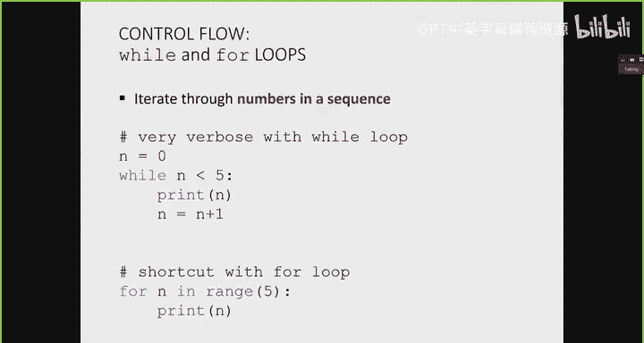

And remember， we were initializing a variable。 We were testing the variable of some condition here。

 and then we were incrementing the variable or doing something that give gives us nice forward progress towards making this condition false。

😊。

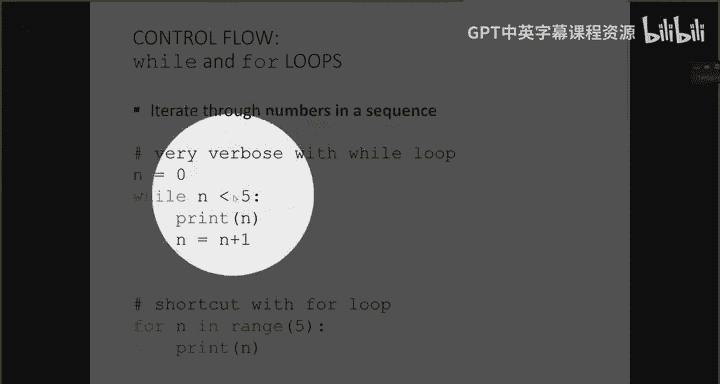

But， it's really verbose。Certainly， it works。 And you can do it。

 but it's very easy to forget to do this， something like this。

 in which case you'll get an infinite loop。

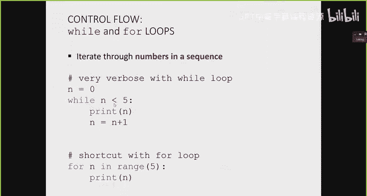

With a for loop， that， those four lines of code just look like this。 These two lines of code。

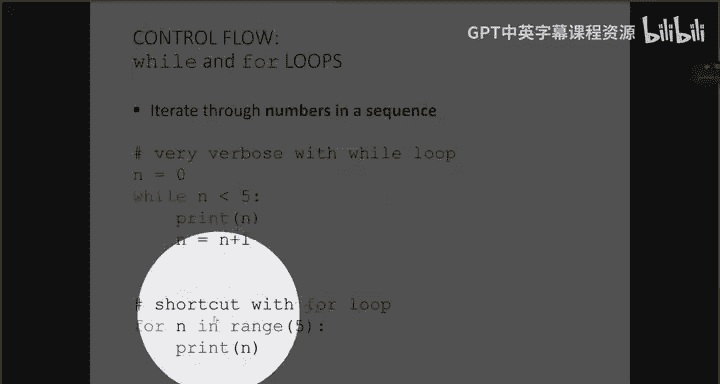

So if there's a sequence of values you ever want to iterate over。

 that's what four loops are useful for。So the syntax where for loop looks a little bit different than a while loop。

 It starts with a four keyword。This is a variable that you get to name， whatever name you'd like。

 The keyword in tells Python。 I'm going to make this variable take on values in this sequence。

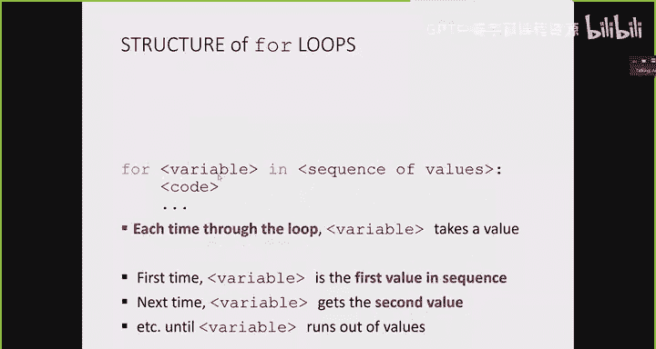

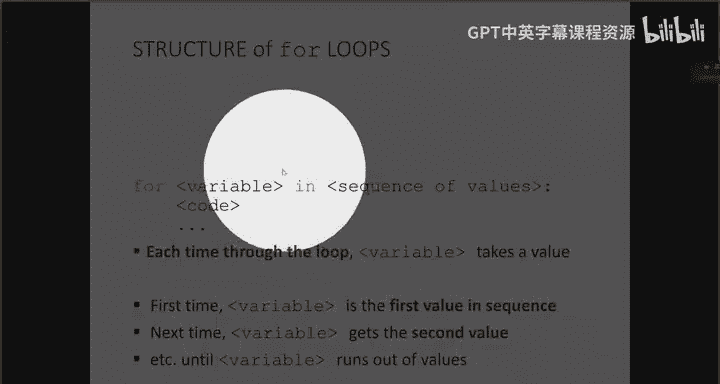

And again， we have a colon that tells Python we're gonna start a code in in indentation here。

 And whatever lines of code you have that are indented are going to be executed。However。

 many sequence of values you have。So the first time through the loop。

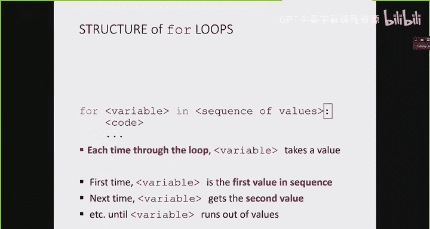

Python will make this variable name， take on the first value in the sequence。

 And then it's going to execute this code。

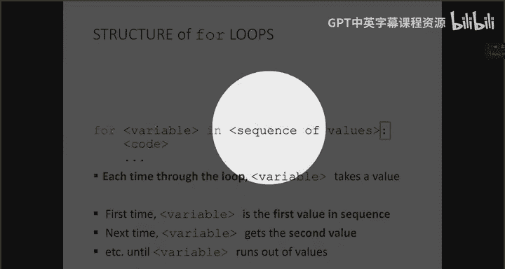

Automatically， Python will， after it finishes executing this， these codes。

 it will go back and set this variable。 have the next value in the sequence。

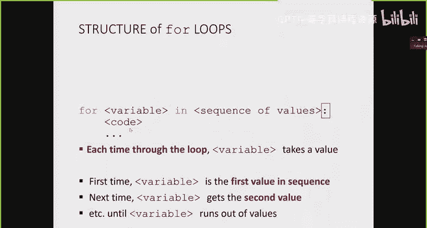

And execute the same lines of code。 When it's done。

 it's going to make the variable here take on the next values in the sequence and execute those lines of code。

 And so these lines of code will effectively be executed。

 However many values you have in your sequence。

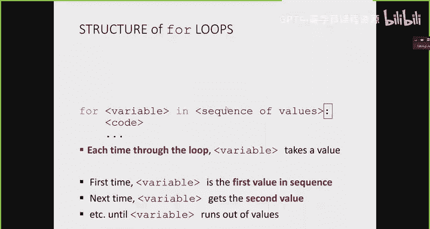

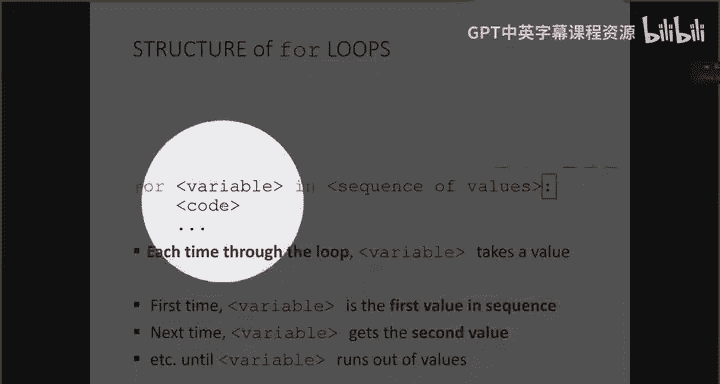

So more practically speaking， here we have a variable， So n in this case。

 in some some sequence of values。 in this case， I'm saying range 5。

 we're going to print the value of n。So I'm going to introduce range now。

 range is a way for us to grab numerical sequence， numerical sequence of values that have some sort of pattern。

So if we just say range sum number， the pattern is we start at 0 and we go up to。

 but not including that number。So range 5 means the sequence of values Python will iterate over are 0。

1，2，3， and 4。Range 10 means 0，1，2，3，4，5，6，7，8，9， So we go up to。

 but not including the value in the range， starting from 0。So each time through the loop。

 Python will change the value of n to be every one of those values automatically。So this。

 these two lines here for n and range 5 print n， the way they look like behind the scenes。

 and Python does this for you。Is first it the first time it encounters the for loop。

 It sets n to be 0。That's the first value in my sequence。And then it prints the value of n0。

Next time， through the loop， Python will say， okay。

 I've done what you asked me to do inside the code loop， print N。

I'm going to make n have the next value in my sequence。

 So loses the binding from the 0 and makes it be one。

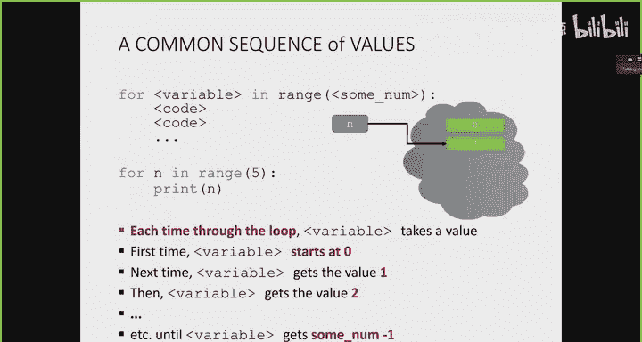

Okay， I've made N1。 Now， what do you want me to do， Well。

 I'm gonna execute whatever is in this in the indented print N。 So I'm going to print one。

So I've already printed 0。 Then I've printed one。I'm finished executing the code inside the loop。

 So now n is going to get the next value in the sequence。

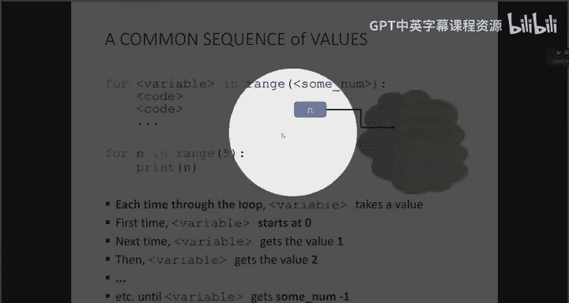

Lose the binding from one。 And you get two。And so on and so on。 And by the end。

 this program will have printed 0，1，2，3， and 4。Every single value in my range。

So it turns out that we can actually make range have three values inside the parentheses。

 not just one。 One is sort of shorthand notation if you ever want to start from zero and want to go and go up to and including sorry。

 up to， but not including the value in the parentheses。But you can actually give it three values。

 a start， a stop and a step， and Python will automatically generate a sequence of values that matches this pattern。

So this should seem familiar to you， right， because we've seen something like this when we were doing strings。

Right， except that we weren't doing parentheses。 We were doing square brackets。

 and we weren't doing commas。 We were doing colon。But it's the exact same idea。Here。

 we're generating numbers， actual integers that we want a loop variable to take on。

So if we omit start and step， start by default is 0， and step by default is one。

 If we omit step by default， it will be one。So here， I and range 4。

 the variable I will take on the value 0，1，2， and 3。

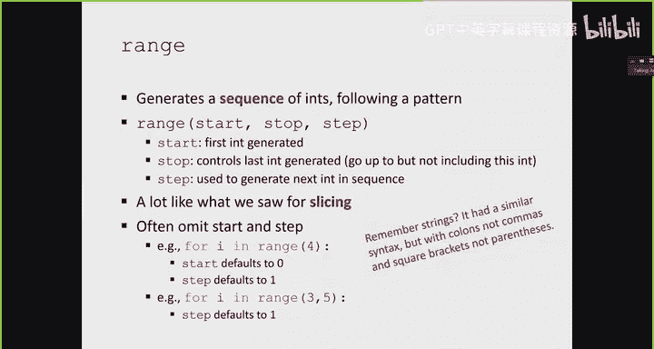

I en range 3 comma 5。 I will take on the values 3 and 4。 So we go up to， but not including the five。

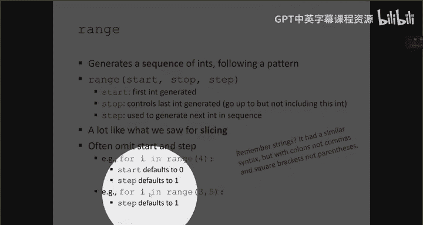

Think about these， these three questions。 So what are the range of values in in the first。

 in the first one and what are we going to print。So in 1，4，1。

 what range of values are we going to have I B， So I is going to be 1。1。2。3。Yes， and we stop。

 We go up to， but not including the stop， which is a4。And what are reprinting？Yeah，1，2，3。Just。

How about the next one， J， What will the values of J be。1。3。And that's it。 yup。

 because we're going every other every other value。 And what are we printing here。Yeah， exactly。

 So we're doing an operation with each one of these Js。 So we're going to print 2 and then 6。

 And how about the last one。We're stepping backward， right， The negative one。 So what's our start。4。

 and then。3。two。1。And that's it。 We're going to down to， but not including the end， right。

 So we're not gonna to include the 0。And what are we printing here。Yes。

$4 signs on one for the first time。 and then $3 signs， and then $2 signs。And then $1。Exactly。

So the body obviously can do can do operations and can manipulate that loop variable。

 So each time that loop goes， that variable goes through， it changes， right， it changes。

 And then you can use that to your advantage。So here's another example of something useful。

 We can use four loops to keep track of how many times we're going through a loop。

And in this particular case， we're writing a program that sums all the values from 0 all all the way up to。

 but not including whatever is in here。So how are we doing this， Let's do the memory diagram。

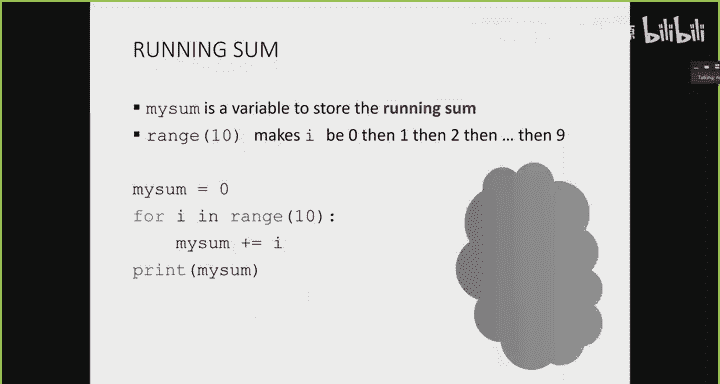

We've got my sum is equal to0 as the first line。

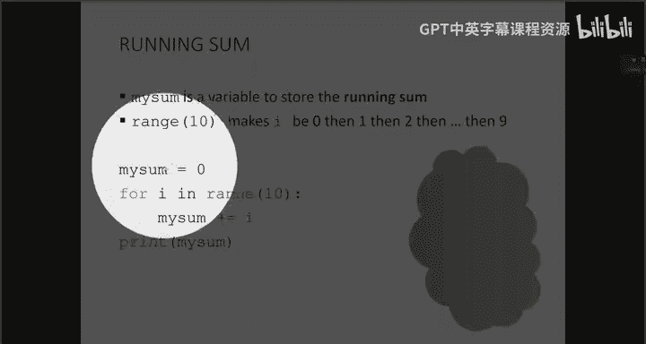

So， this will be。0 in memory， right， bound to the name my sum。

And then the four loop will generate for me the value 0 through 9， right， including。So I。

 the first time through the loop， will have a value of 0。

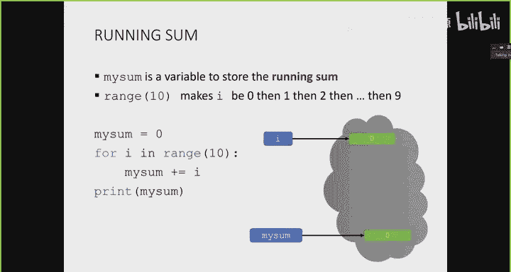

So we're going to do the operations or the code we're asked to do when I is 0。

 So my sum will be whatever it is right now， plus whatever I is0。 So it stays 0。

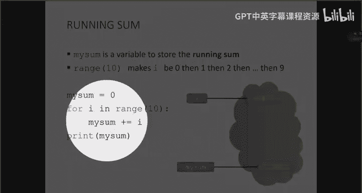

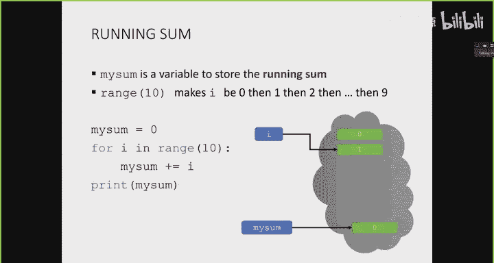

Python is done with the code inside。 so now it's going to take I and change it to the next value in the sequence  one。

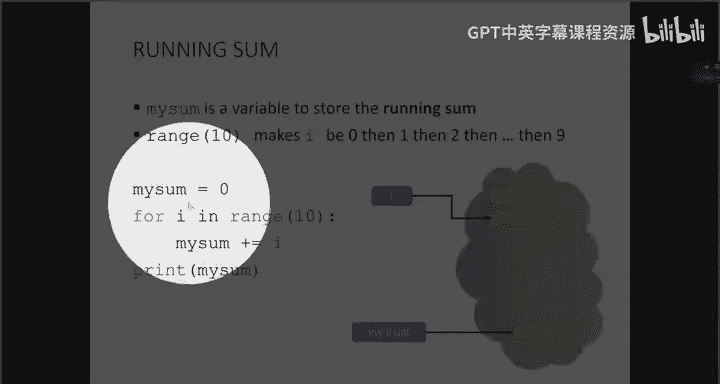

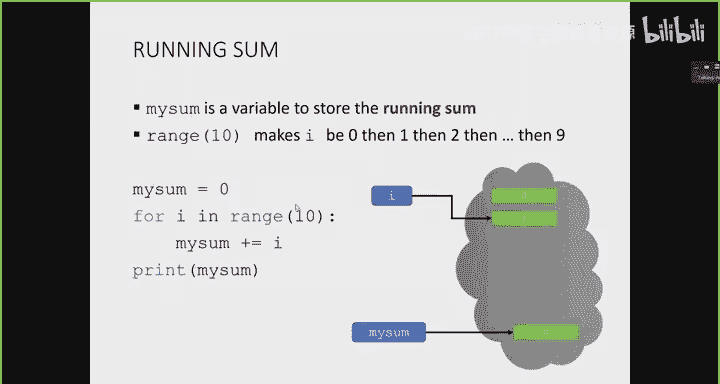

Okay， now we're gonna do again the stuff inside the loop。With I being one。

 So we're gonna take my sum whatever it is right now and add one to it。 So it's one。

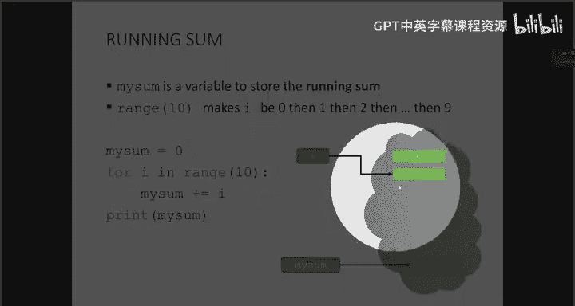

And then we're done there。 So Python will take I to be the next value in the sequence 2。

And then we're going to do again。 my sum is whatever it is now，1 plus whatever I is now 2。 So it's 3。

Again， I will increment to 3 automatically， right， That's next value in the sequence。

 So my sum will get a value of 6。And then I will change to 4。

 so on and so on and so on until I becomes 8。 right， That's sort of towards the end。 When I is 8。

 the value of my sum is 36， right。0 plus0 plus1 plus 2 all the way up to 8 to 36。

And then when I becomes 9， Python will take my sum， whatever it is right now，36。

 add 9 to it to give us 45。Okay， and then that's the end of the program。 right。

 There's nothing else to do except to print my sum。 So at the end of this loop。

 it's gone through 10 times adding 0 all the way up to 9。 We're gonna to print 45。

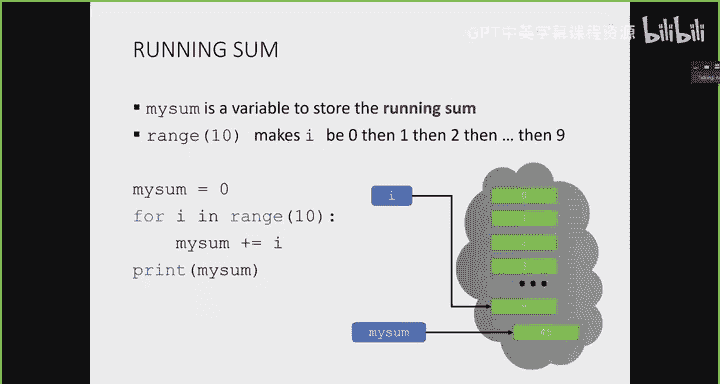

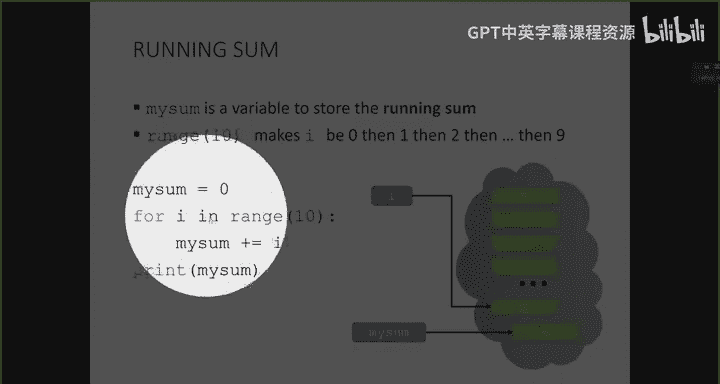

Yeah。Oh， maybe you have another print statement or it might be part of another program that's being run beforehand。

That you didn't comment out。Yeah。That's question。the plus equals what it means。 Oh。

 it just means it would be like my sum。Equals my sum。Plus， I。

It's just shorthand notation because most of your variable names might be really long。

 and it's really annoying to retype them。 And so that's generally why that shorthand notation exists。

But it basically means take whatever my sum is and add I to it。

And save it back into the variable mindset。Okay， let's have you try this code real quick。

 So here is code。 It's already on the Python file to start out with。 I want you to have this code。

It's pretty close to working。

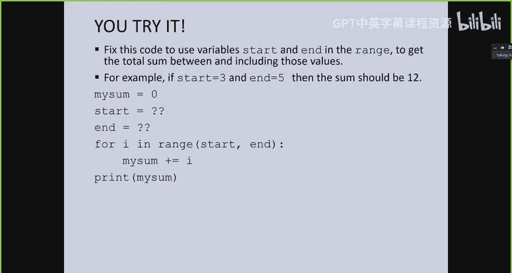

But there's one issue。 So we have this four loop that starts at start at ends at end。

 and we're keeping a running sum。 And then we're printing the sum at the end。

 So very similar to what we just saw。 But what I want this code to do is I want to go and sum up the start。

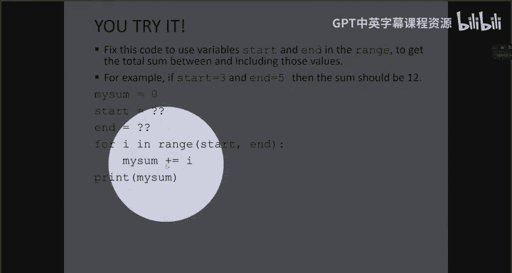

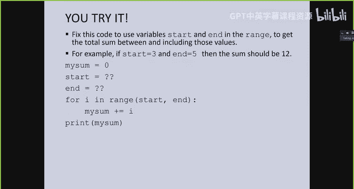

And the end。 So I， I want， if I have start 3 and N is 5， I want it to add 3 plus 4 plus 5。

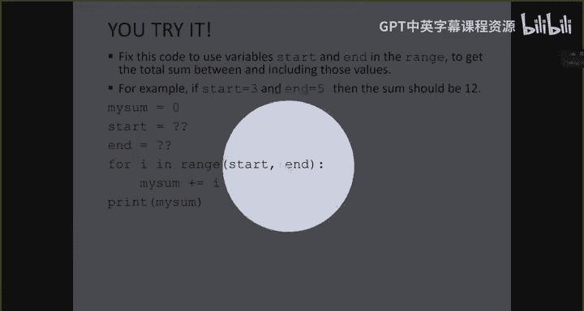

Right。And so this code is not doing quite that。 And I would like you to fix it。

Or to tell me how to fix it。So it's down here on 140 ish。

First thing you should do is run it and maybe see what answer it actually gives you。So I just ran it。

 it gave me a seven。When you're encountering an output， that's not quite what you expect。

 One of the first things to do， you can obviously use the Python tutor。

 But another thing you can do is put print statements at various places。

Useful places would be inside the for loop。So， here， we can print。I， right。

 That's a reasonable thing to print out。 And maybe we'll see exactly what values of I we are adding because we know the summing works。

Right， we just wrote the program on the previous line or previous slide。So we got 3，4，7。

 which is a little confusing。 Let's make our print statement be a little bit better。 I equals comma。

 and then print the actual value of I。So what do you guys notice， I is 3， I is 4。

 and then it prints to sum 7。 What's the problem with this code。Yeah。Yeah， we're not adding 5， right？

 We're， we're just adding 30 originally plus 3 plus 4。 And we've never added 5。

So how can we fix that， yeah。Yeah， we can do n plus  one， exactly。 So the range， remember。

 grabs the oh plus one。 The range grabs these values， you know， as， as。

 as numbers that it's working with。So start is okay。 End is okay， but we go up to。

 but not including end， right， So if we go to n plus one， we're gonna go up to。

 but not including n plus one。So if we run it now。It looks much better。 So we've got eyes 3， eyes 4。

 eyes 5， and the sum is 12 perfect。So print statements very useful when debugging code。

Questions about this one or was this， this make sense。O。

The last slide I want to do before we do a summary is just to show you that factorial code we saw using a while loop a few slides back。

 So it looks really verbo， right， We kind of have to think about it for a while before we realize what it's actually doing。

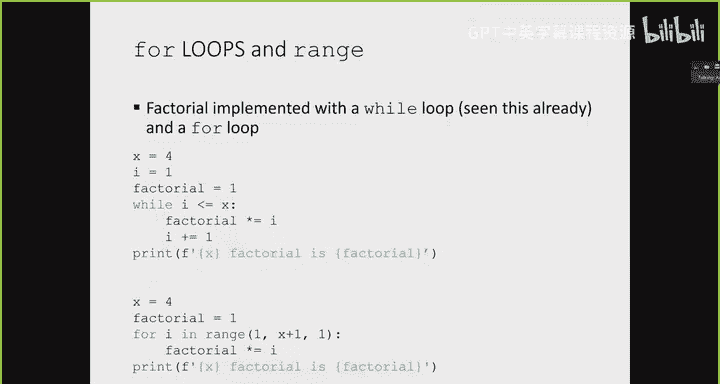

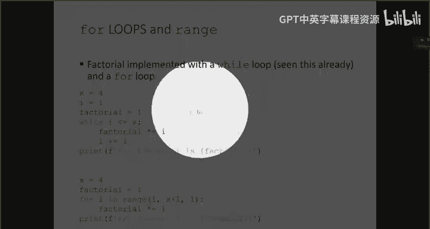

But it was， you know， calculating the factor。 Obviously。

 good variable names helped us figure that out。That same code。

In a four loop looks like this where the for loop looks like this。

 So we still have the initialization of x to 4。 We still initialize our factorial， right。

 our running product to a one。

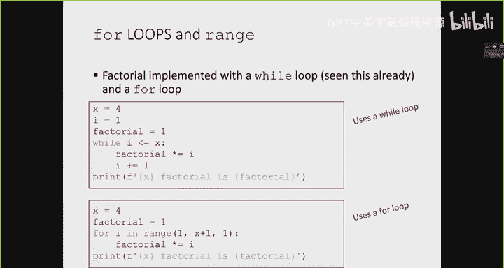

But we're losing that those， those four lines of code that kind of make up that pattern of changing numbers with while loops into 2。

 So this line I equals one， this y loop with a conditional and this incrementing of I become the for loop。

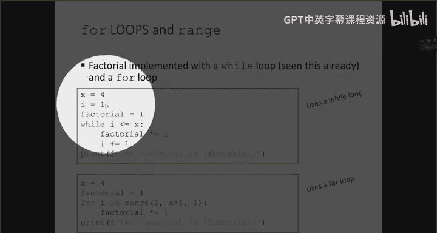

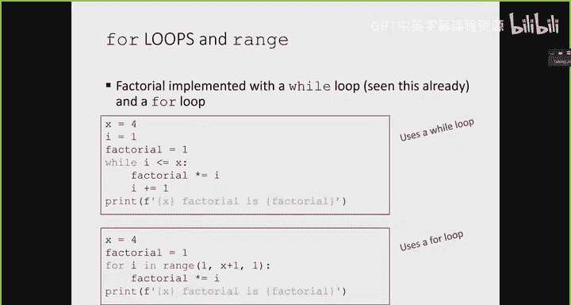

And that's it。 The for loop takes care of all of that。 The initialization。

 the increment and going up to， but not including the， the last value， right， X plus1。

 So we're gonna take multiply the factorial with one then 2 then 3 then 4， all the way up to。

 and including X。

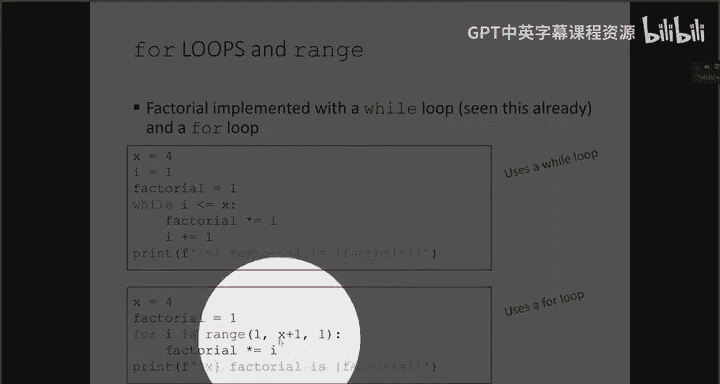

OK。So the big idea about four loops is they're going repeat， however along the sequences， right？

 So you're able to repeat certain code， a set number of times。

 which is really useful in some situations。 Why loops were useful in situations where you didn't know how many times you might want to repeat the code。

 So quick summary， we saw some looping mechanisms today。 It was a lot of syntax， I know。

 But the finger exercises for today will certainly help MiT X also has extra help extra exercises。

 It's really important to do them just to get the mental model for how exactly these loops work。

 right and how they how they how they assigned variables and how they do the checks behind the scenes。

 and it'll help you get faster at writing code and at doing quizzes as well。

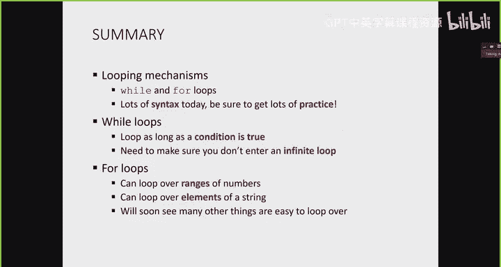

So， that's it for today。

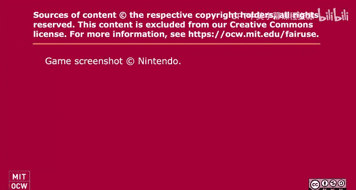

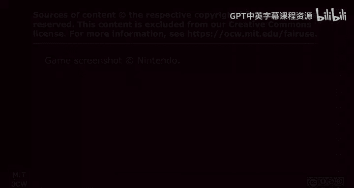

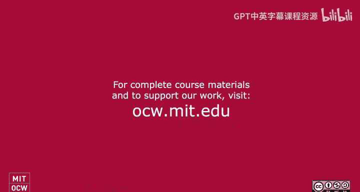