# 《计算机科学和Python编程｜6.100L Introduction to CS and Programming using Python, 2022》 - P4：-04-Lecture 4_ Loops over Strings, Guess-and-Check, and Binary.zh_en - GPT中英字幕课程资源 - BV1PAxJzVEs3

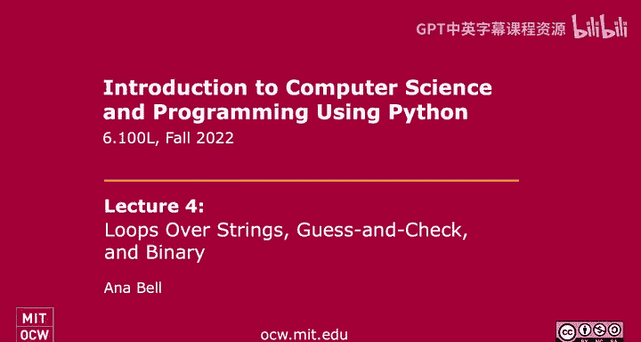

Okay， so let's get started。 today， we will be continuing talking a little bit about loops and seeing some other couple nuances of loops。

 And then we'll get started on our first algorithm， The guess and check algorithm。

 And then towards the end， we're gonna start talking about binary numbers in advance of seeing our next algorithm。

😊，So let's do a quick recap of what we learned last time。 and then we'll do a little coding example。

 And then we'll move on。 So we saw last lecture some looping mechanisms， right。

 We saw while loops and four loops。They are both a way for us to control what happens in the code。

 And specifically， they're a way for us to repeat certain lines in the code sort of automatically。

 So to speak。 So with while loops， the lines of code were repeated as long as some condition held。

And with four loops， the lines of code were repeated for some sequence of values。 Okay。

 and the sequence of values was something that we decided。

 It was numerical that that that's what we saw last lecture。 Today。

 We're gonna to see that the sequence of values can actually be non numerical as well。So。

Both of those loop types， I guess， had ended at at certain times， right。

 So the while loop ended when the condition became false。

And the for loop ended when we've exhausted our sequence of values。But oftentimes。

 we want to write programs where we break out of the loop prematurely。

 We don't want the Y loop condition to become false。

 and we don't want to exhaust our entire set of values of for loop。

So in order to exit a loop before the natural end comes。

 we can use this thing called a break statement。And the brake statement allows us to exit the loop。

And the loop at exits is going to be the one that immediately surrounds the brake statement。

 So here's a， a little example of a nested， two nested while loop， So one while loop。

 and then one nested one inside it。The outer one is going to run whenever condition one holds。

And the inner one runs whenever condition2 holds， okay。Now。

 expression A will evaluate when both condition 1 and condition 2 hold， right。

 So we enter the first while loop and we enter the second while loop。

 Both of those conditions have to be true。

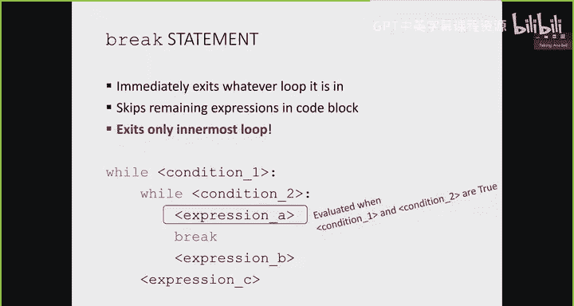

But Python， as soon as it sees this break statement。

Python will immediately exit the loop that it surround that surrounds that brake statement。

 So the loop that surrounds the brake statement is the one that has condition 2， right。

 The condition  one loop will keep going。

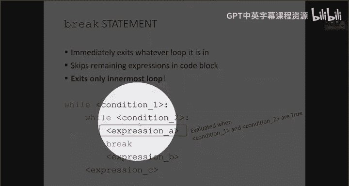

So as soon as Python sees this brake statement， it's going to immediately stop running the while loop。

 It's not even going go back up and check the condition 2。

 which means that expression B will actually never get evaluated。 So this is terrible code。

 We don't want to write code like this because expression B will never be run， right。

 But this is just to show you the impact that a break statement would have。

And expression C will then be evaluated whenever condition 1 is true。 Now。

 condition 2 may or may not have been true along the way。

 but expression C will evaluate only when condition 1 is true， right。

 conditionition 2 would have stopped being true。 And then we're going at the same indentation level as this inner while loop。

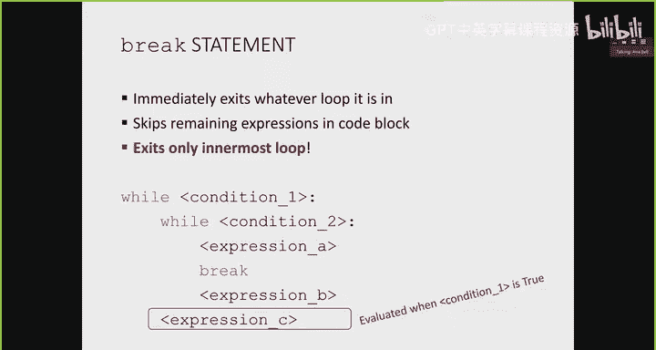

Like。It only evaluates the one。We gives a1。Because the break is。Exactly， yeah。 That's a great point。

 So it only evaluates this expression a one time because right after it evaluates it。

 it sees the break。 And then we immediately exit the Y loop and we're done。

 That is a great observation， yeah。😊。

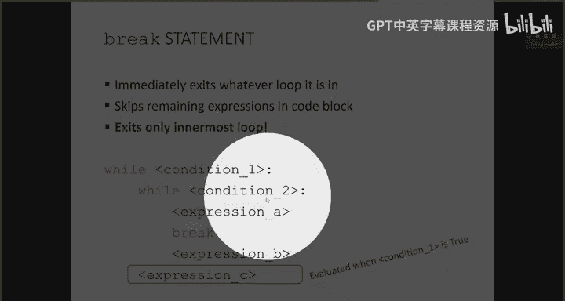

And that's what this this code will will basically show。 So here it is us doing the break statement。

 sort of the same structures as on the previous the previous slide。

 And what we're going to do is actually just run the Python tutor for this code just to give you some more practice running the Python tutor。

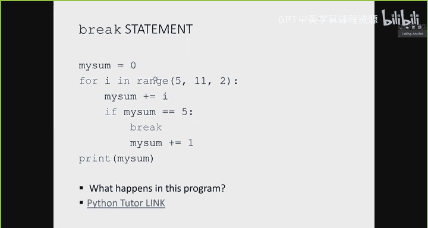

So this is the same code as on the previous slide。 I've got a for loop that goes through some sequence of values。

 Can anyone tell me what are the sequence of values this for loop will loop over。5ve。7，9。And we stop。

 right， because 11 is end， but we go up to， but not including and -1。So 5，7。

9 are the only three values we would potentially loop over。So hit next， we initialize my sum to 0。

 So in our minds， we kind of think about the fact that we're gonna to loop through make this loop variable be 5。

7，9。So the first time through the loop， I will be 5。We're gonna add I。

 which is currently 5 to my sum。 So 5 plus 0 makes my sum 5。And then we immediately see the break。

Right， because if my sum equals 5 is true， So we go inside and we immediately see the break statement。

This line will never get executed。 So we're never going to increment my sum by one。

So the break immediately breaks out of our loop。Now， the if， the if statement is not a loop， right。

 It's a conditional。 So the loop we break out of is the for loop。

And then there's no other loops surrounding it。 So then the program is basically done。

 and we print 5。Again， bad code。

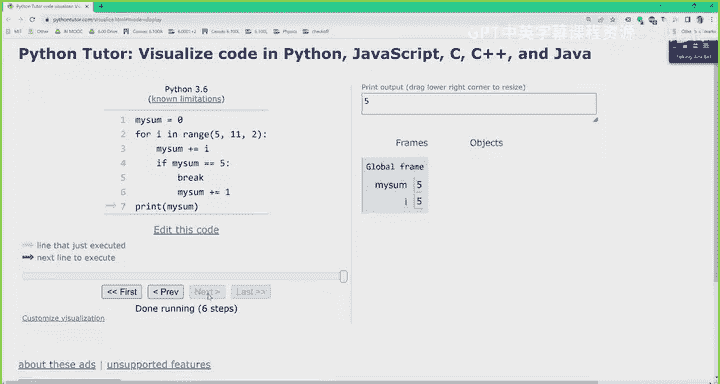

We would never write code like this， but this is just to show you exactly what happens with the breakst。

Right， so there's the code block for the for loop。 And this is the code block for the if statement。

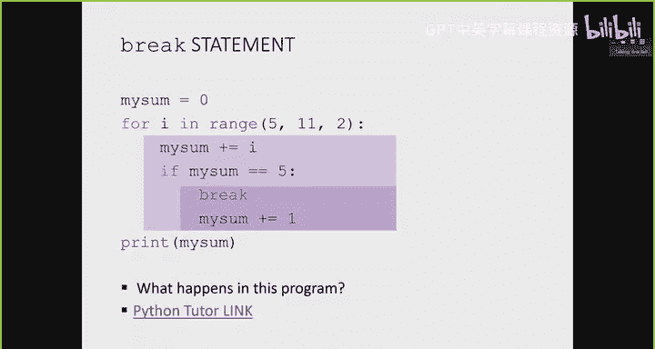

And the break breaks out of our loop， right， which is the lighter purple。

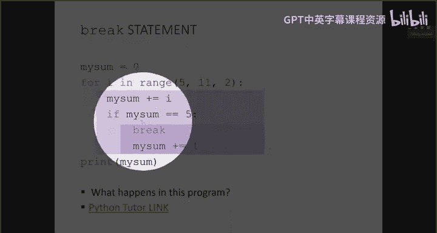

Not not the if statement。Okay， so let's have you write a little bit of code。

 And this is sort of maybe a little practice with just loops in general that that we saw last lecture。

 There's no break really in this particular program here， just a little bit of practice。

 So what I want you to do is to write code that basically has a for loop running through this range。

 So for I in。Pick one of these。 I want you to write code within that for loop that counts how many new。

 how many even numbers are in that range， right， So including the0。 So for range 5， you， you。

 your counter should basically pick up on the fact that zero is even2 is even。And4 is even。

 And then that's it。 So it should print 3。So here is that you try it and the Python file for today。

 and I've already started you off with this4 IN range5 as the first one。

And I'll give you a couple minutes to just write the code in here。Okay。

 would anyone like to start us off。With some code。我 me yeah。有。

So this line of code is going to take our eye right so in fact。

 what we could do to remind ourselves what I is， and this is very helpful for quizzes as well。

 we can write a little comment here that says I is0，1，2，3。

4 just so we don't have to remember this fact。 We can just always look here and know what I is going to be。

And then this line of code， absolutely correct。 I is going to take I and grab the remainder when I is divided by 2。

Okay， and if the remainder is 0， that means that the number is even。

And then what do we do inside here？So when this is true， when it's even。

 how do we keep track of whether or how many times this condition occurs。呀。Yes， exactly。

 Should we create a variable， Yes， we can。 So let's call it even nus。

And we'll probably want to increment it by one， right， because here's another number that's even。

 So even nus plus equals one。And then， let's remember to。Iitialize it right before our loop， right。

 So initially， before we even start our loop， we have0 even numbers。

 And then each time through our loop， we see one that's perfectly divisible by  two。

We're going to increment this little counter by one。And。Oh yeah， not the same variable。 thank you。

 even them。And the mental model you should have sort of at this point or beginning is just the fact that these three lines solve our problem。

 It does the automatic counting for us， right， because I will take on 0， then one。

 then 2 then 3 and then 4 automatically as the loop goes through this sequence of values。

 And so at the end of the loop。 So sort of at the same indentation level as the four loop。

 All we need to do is print how many。How many of these numbers we have。So if we run it， it'll print3。

And if we change this to 10。It'll print probably6， right， because it counts the0。Questions about。

 yeah， please。するとか。So if you're under counting， you maybe initialize。

 did you initialize even numbs to something else， or maybe this is not incrementing right。

 or maybe the range is different。I'll。Yeah。It worked。Awesome。O。So。

Iterating through using for loops to iterate through sequence of values is pretty useful。

Let's take another look here at this particular program。 So this program is these， this set of code。

 this code and this code actually end up doing the same thing。 But let's look at the top one for now。

So this is a program that takes in a string S as sort of an input， so to speak。

It iterates through the numbers0 to the length of S， right？

 So for I for index in range L S is basically going to say for index in range 13 or however many letters this string has。

 right。D， E， M， O， space， L O， all those letters。 There's probably 13 of them or something like that。

So this line of code here is going to have our index take on the values 0 through 13。

Representing the index in S， right？ So the lowercase D will be at index 0。

 The lowercase E will be an index 1 and so on。So with this index in hand。

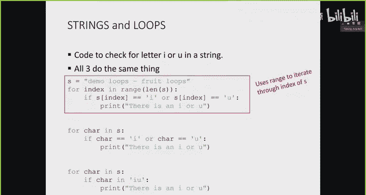

The next bit of code， if S square bracket index equal equal I will check for me if this particular character is an I or that particular character is a U。

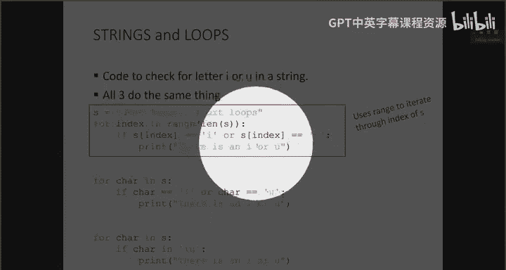

And every time that happens， I'm gonna have this print out print out to the screen。 There's an I R U。

So， inside my code here。This is the first one。And I run it。

It's going to print out that sentence twice because there's only two I's are used in here。

 And if it repeats， it'll print it out twice。 So there's one U and one I。But。

This code can actually be written a lot simpler。 Okay。

 notice it took me a little bit of a while to explain it。 And probably at first glance。

 it would take you a little bit of time to figure out what it's doing。

 And that's because we're actually relying on the index as kind of a middleman。

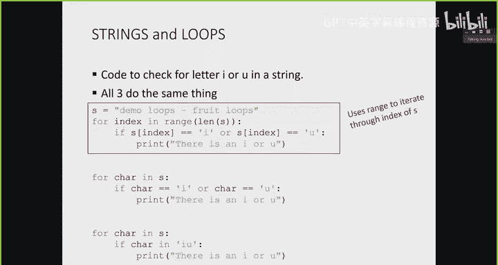

Right， we're looking。 we're iterating our for loop through the index。

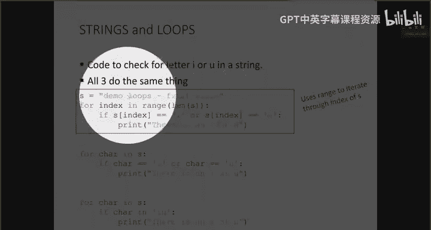

And then we're indexing into that index variable to grab the particular letter。

It turns out that with four loops， right， I told you you can iterate over any sequence of values。

 not just numbers。 And remember that strings are actually just a sequence of characters， right。

 case sensitive characters。 So in Python， we can actually write code like this。

 So the middle box right here。😊，It has our for loop iterating through each character in the string directly。

 So no longer are we looking at the index 0 through 12， But we're looking at the letter directly。

So our loop variable， which I called char， but you can call whatever you'd like。

 is now going to take on values that are the letters themselves one at a time。

 So the first time through the loop， char will be lowercase D。

 The next time through the loop char will be lowercase E。

 The next time char will be lowercase M and so on。 And so now we've got the sequence of values。

 that's the letters directly。

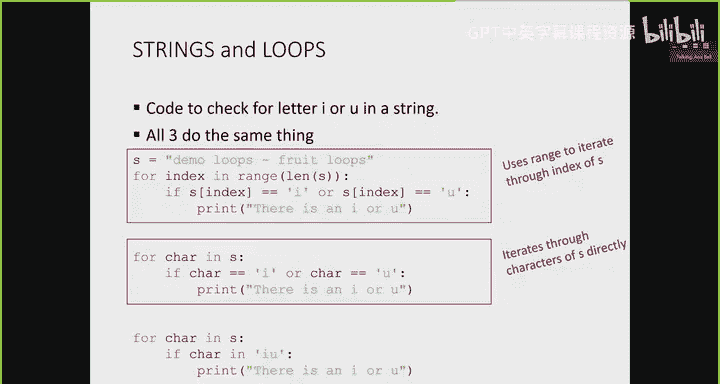

So when we check if the letter is an I or U， all I need to do is check if that character， right。

 Char my variable is equivalent to I or equivalent to you。

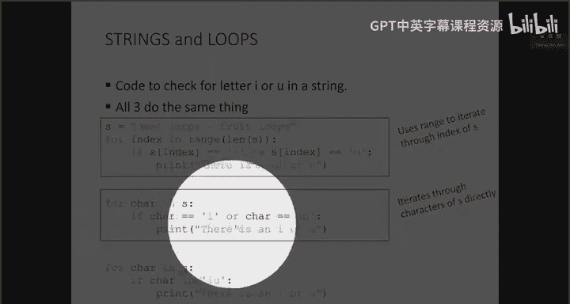

And it's going to be the same。 And it's exactly the same code。 So this is the  one we had before。

 And this is the 1 I just went through。 And again， it prints out that sentence twice， right。

 because it's the same starting string。So the sequence of values now is our characters director。

 It's the letters directly。 It's not the， the index itself。

And it turns out there's actually a much more pythonic way to write the code。

 this middle box down here。So in the bottom box， the only part that I've changed is the if statement。

 and I'm using this in keyword to test whether the character that I have in hand， lowercase D。

 lowercase E， lowercase M， and so on is in this sequence of characters， I or U。And for this case。

 it's not so important， right， because in the middle box we could do if cha is equal to I or cha is equal to U。

 which is fine。But if we were， if we wanted to test if the character is one of the digits 0 through 9。

 this。If or or or would become a really long line， right。And so all we can do is， you know。

 if char is in some particular sequence of characters。

 Python will automatically turn that into that longer if it's this or if it's this or if it's this or if it's this and so on。

Okay， so the big idea here with for loops is that， yes， we're iterating through a sequence of values。

 but we're not limited to just numbers。 And that's the cool thing about for loops。

 You can iterate through characters directly。 And we're gonna see later on。

 we can iterate through lists of numbers， lists of strings and a whole bunch of other things。😊。

So let's write a slightly more complex program。 This was version 0。01 of the cheerleader robots。

 you see up in the corner there that I wrote the robots not mine， but the code is。

 So heres a little bit of code that kind of puts together iterating through strings directly and iterating through numbers directly。

😊，So let me show you what this program is actually doing。And then we'll go over the code。

 Somebody give me some noun you're really excited about。What is that。What。Never mind。

 give me something else that I know。What is it。Pineapples， okay， pineapples。Okay。

 so there it's going to cheer for us about pineapples。

 and let's say we're enthusiastic level 8 about pineapples。Allright。

 So this is my cheerleaed program。 So I typed in a word。

 and I typed in an enthusiasm level for pineapples。😊。

And then all it does is and notice the repetition， which computers are really awesome for。

 Give me a P， P， Give me an I， I， give me an N， and and so on。 right， What does that spell？

 And then it does pineapples with three exclamation marks  eight times。

 because that's how enthusiastic I'm about pineapples。😊，Alright。

 so let's look at the code that actually does this。 Notice there's two parts to it， right？

 There's the part that does the spelling。And then there's the part that does repeating the word some number of times。

So these are two separate loops。 The spelling is up here。This for loop here。

 And then repeating some number of times is down here。Okay， so the part where we do the spelling。

Has a for loop that iterates through the letters in the word directly， right？

 I'm not doing anything special with these letters。

 So I can just iterate through the letters directly。 So for W in word。

 where word is the input that I grabbed from the user。W is a loop variable。That's going first be P。

 then I， then N， then E， then A， and so on， right。And then I have an if else here。

 And if you look carefully， the only difference between the if what we do inside the if and what we do inside the else is whether we type in on。

And then a letter or a。 and then the letter， right， because some letters make sense to say。

 give me an A as opposed to give me A A。 It just doesn't sound right in English。

The letters where it makes sense to do Un are defined up here。

 So notice they're just defined as a really long string。And so the if statement uses that。

In keyword we saw on the slide， right？ it says if W。

 so if that particular character is one of these is in this sequence of characters。Then print。

 Give me an。And that particular character。And otherwise， it's， you know。

 it's not one of these letters where it makes sense to say un。 So then you just print。

 give me a And then that letter。Here I just rewrote these two print statements using F strings。

 which we talked about back in lecture2。Just to show you how you could。

 how you could rewrite it with F strings。But it can be done both ways。Okay， so at the end of this。

 we've done the spelling。 and then we have a print statement that says what is that spell。

 And then the last part is to repeat that word， some n number of times， whatever the user told us。

 So I save that number of times in a variable called times。

 And then all I do here is I have a nice little four loop that goes through however many how much that number is right So range times means it's going to be0 all the way up through and including times -1。

That's a total of， eight times in this particular case that it loops through。

 and then all we do is print the word with three exclamation marks。

Notice that this print statement that's inside the bottom for loop is not actually doing anything with our loop variable。

 right， Our loop variable here is I， but we're not doing anything with it。 And that's totally fine。

 right。Because all we're using in the times in the loop variant in this particular case is to do this action some number of times。

 right， We don't always have to do something with that loop variant。Any questions about this code。呃呀。

Could you also have you a statement？Could you use if statements for the prints， which one。

 which prints these ones。How so。这辩护。还。嗯。Oh， F strings。 Yeah， we could have done it like this。 Yeah。

 so this is， this is how it is F。 And then we do the characters themselves inside the curly bra。Yeah。

 oh no， it's okay。 It's okay。Yeah， there's a question， yeah。Yeah， so the last four loop is。

 is still going to iterate through times， times right。

 And the loop variable each time through the loop will be0 then one then two then3。

We're not doing anything with the eye， right， The stuff that's indented is going to get done。

 but we're just not using the fact that I is 0 or1 or 2 at all。Yeah。

 it increments itself automatically。 We're just not using it。 Yeah， exactly。Okay。That's what I said。

 Okay， so let's have you write a little bit of code。

So let's assume you're going to be given a string of lowercase letters， right。

 So we're not gonna bother uppercase lowercase。 Just assume you're given lowercase letters。

 It's stored in a variable S。 So as an example， S is equal to ABC A。

I would like you to write some code that counts how many unique letters are in this string。

 right so notice a occurs twice， but the count that your code should do for this particular in this particular string should just be three。

 right， we don't want to double count the A。 So there are three unique letters in ABCA。They are A， B。

 and C。So I do have a little hint。 It involves the use of an extra variable。

 as these programs usually go。Try to think about having this extra variable be a string that contains everything you've seen so far。

So as soon as you see a letter that you haven't seen before。Add it to this。

 to this string variable that you've marking that you've now seen this， this， this letter and then。

Use this scene variable to， to write the rest of it。 So if you， as you go through your， your letters。

 make sure that you're going to check whether you've seen it already before， before recounting it。

So as usual， it's in here around line 76。This is the code to。To do it。

 So I'll give you a couple minutes， and then we can write it together。O。So。

Let me just work through it。 And this is something that I think is pretty useful in a quiz situation。

 It's just writing things on the， on paper first， just because it's， you know。

 programming and computer science class doesn't mean we have to start coding right away。

 So it's really helpful to just kind of put some ideas down on paper。

So the way I would go about this problem is clearly。

 I have to touch each character right in the string S。 So already for me， that's。

 I need to have a loop。So as I'm looking at each character， I'm going to keep track of it。

 So if it's not something I haven't seen。 So if it's something I haven't seen before。

What I want to do is say， okay。I have now seen this A， So I'm going to add it to a scene variable。

And then I'm gonna increment a counter， right， I've seen it once。 So count。Maybe equals one。

The next time I look at the next letter， I'm gonna say it's a B。 Have I seen it before， No。

 let me add it to my scene variable and increment my count。Next time I'm going look at the letter C。

 I have， have I seen it before， Nope， I'm going to add it to my scene。

 and then I'm going to increment my count。And then the last time I'm gonna to look at this letter A。

 I'm going to say， is it already in my scene。要。So I'm not gonna to do anything with this one， right。

 So when I see a letter I've that's already seen。That I've already added to my scene variable。

 I basically do nothing in my code， right， So most of the work happens when I encounter something I have never seen before。

So does anyone have some starter code。Or something we can write。

 We don't have to write it perfectly top to bottom。 We can write pieces here and there。Yeah。一。

Or car in。说ばけ。In a in。第一。これ生でした。Yeah， so that that's a great start。

 So if you want to say if it's not in scene， we can just say if char or car。

 however you pronounce it， is not in scene。 So that takes the inverse of。You know， true or false。

 whatever this is， right， His in scene will either be true or false and not that will be false or true。

So that's perfect。 yeah。Use the wordnot。实。Oh， yeah。 So we can use not when we're dealing with booles。

 right？ So something an expression that evaluates to true or false。

 that's when we use not and the not equal。 So the exclamation mark equal is used with other expressions when we're testing for equality。

 right， like  three， not equal to or like a， not equal B or something like that， right。

 So things that are that could be numerical， not necessarily just true and false。O。

So if char is not in scene。 So if I haven't seen it before， what do I want to do。It， yeah。第。Yep。

 so we can append the character that we just looked at to our scene list， right。

 just as we had done incrementally here。 So that takes care of adding the character one by one。

 if we haven't seen it to our scene。Good。Anything else we want to do。

 or we can even test it out like this， right。So， we can print。Seen each time through our loop。Right。

 so first， it's A， then it's A B， then it's ABC。 And then the last time it should still be ABC。

And it is。ok。And the last step is to just do what the problem asked us to do。

 which is to print how many characters。Are， or how many unique characters are in this list are in this string。

Yet we can have a counter。That is initially 0 before the loop。

 And every time we add a new thing to our scene。Stng， we can increment our counter。

 And then that takes care of the bulk of the work。 right， This does all the counting。

 all the adding to the unique scene。 And so at the end of the loop， we have this number in hand。

And then we can just print it。 So with this particular case， it's3。

 If we add more A's in random spots， it's still going be 3。Right。Yeah。Yeah。

 so now that we have some code that that basically that works really well。

 we can make improvements to it。 So one improvement that's suggested is instead of keeping a counter variable。

 we can actually just recognize the fact that the length of our scene。

Is just all the unique characters we've seen already， right。

 becauseuse when we double up on something， we don't re add it。So all we can do to， to print out。

The number of unique characters is to just say， I'm gonna print out the length of scene。Okay。

 and now there's no need to increment any sort of counter。And so that still gives us dream。

Questions about this code。Does it make sense。Notice there's no else， right。

 We just have a nice little if。 There's no else because there's nothing to do when we've already seen the character。

 So we could have else pass and pass is just。Some is's just a keyword in Python。 You see。

 it's turned blue because it's a keyword in Python。 It just means do nothing。Right。

 so we wouldn't write this， obviously， but。That's， that you know， if we had an else case， that。

 that's what we do。 we would just do nothing。Other questions about the code， Is that right。sorryrry。

 say again。Why are we printing the length of scene here。

So we're printing the length of scene because。Because we see that whenever we add a unique character to this scene variable。

 it's， it's one that we haven't actually seen before。Right。

 and so the only things I'm adding to my scene are things that are new。

And so even as I was going through manually here， I said I've seen the A， I've seen the B。

 I've seen the C。 I added them one by one。 And then when I saw the duplicate A。

 I didn't add it to my here， right？ And so basically the scene already contains all the unique characters in my list in my。

In my， in my string， original string。Okay， so quick summary of what we've seen so far before we start looking at our first algorithm。

 So we've seen objects， right， That's how we write Python Python programs。

 We manipulate objects by saving them to variables So the values are more easily accessible。

 We have expressions that evaluate to different things， integers floats booleans， things like that。

 We added branching as a way to control as a control flow mechanism to our program right it says。

 hey， Python either evaluate this set of statements or this other set of statements。

 depending on whether this condition is true。 And then we added the last mechanism for control flow。

 the looping mechanism that said， you know either loop or repeat this code while some condition is true or loop this code for this sequence of values。

Okay， so really， with that in hand， we basically have a really nice toolbox of things that we can use to write interesting programs。

 That's kind of all we need。But this is not the end of the class。

 We're gonna to look at other things that will make our code neater more readable。

 We can write more of it more efficiently， and things like that。 But really。

 if you want to just start writing little algorithms， this is all we need in terms of Python syntax。

So the first thing we're going to apply this knowledge to is our very first algorithm called the guess and check algorithm。

So another word for the guess and check algorithm is exhaustive enumeration。

So the idea here is that we're given a problem。We can guess a value for a solution。Okay。

 we'll just do a guess， and then we'll test whether this guess is correct。 Does it solve our problem。

If it does， we're done， we found a solution to our problem。 If it doesn't solve our problem。

 we're just going to keep making guesses until we've exhausted our set of possible guesses。Right。

 so either we find a solution or we say we weren't able to find a solution to this problem。

 Doesn't mean there one， that one doesn't exist。 It just means that with guess in check and exhaustively enumerating all these possible values。

 we were not able to find a solution。So in terms of a flow chart。

 the way this looks is we have an initial guess。 We ask， is this guess correct， if it is。

 we're done and if it's not， we're going to choose a next guess。

So let's look at finding the root of a perfect square。And that's our problem。

 And we're going to say either we found the root of this perfect square。Or we say。

 this is not a perfect square。So with guess and check， we can say， well， what if we want to find。

 what if we want to find whether 7 is a perfect square， if it is， what is its root And if it's not。

 say that it's not a perfect square。Well， we can make an initial guess，6。

That's not the right solution。 We can make another guess 9。 That's not the right solution。

 We can make another guess 2。 That's not the right solution。 We can make a guess 0。

 That's obviously not the right solution。 We can keep guessing randomly like this。

 but it's not going to be very efficient， right， What we want to do is use the power of computers and computers work with these sort of patterns in hand。

 right， Remember， range starting from 0， following a pattern going up to some number。

So the idea is to be systematic。 And then we can really harness the power of。

 of programming and computers being able to do things really， really quickly for us。

So for that same problem， finding out whether a number x is a perfect square。

 Let's be systematic and start with a guess of 0。2 two cases。

 The number we're trying to find the square root of。Is a perfect square。Let's say，4。

We're going to start with a guess of 0， is0 squared。 solve our problem。 No increment。

 Does one squared solve our problem， No increment。 Does two squared solve our problem。 Yes。

 we are done。What if x is not a perfect square。Okay， let's say。10。

Let's use the same systematic approach of guess and check。

We're going to need to add a little bit of algebra， though， because if we don't。

 we're at risk of potentially doing something that will lead to an infinite loop。

So the algebra we need to add to solve our problem is to say if。

 if we were looking at a number that's not a perfect square， we need to have to find。

 We have to find a way to stop。Right， we don't want to guess something that's infinite。

 This is guess and check。 So we need an exhaustive set of potential solutions。

So we're going to use algebra， and we're going to say we're going to stop as soon as our guest squared becomes bigger than next。

Okay， so we're gonna start guessing 0 than one then 2 then 3 then 4。 And at some point， that number。

 that guess squared will be bigger than x。 And we know we can stop because numbers bigger than that will definitely be bigger than x。

So our first guess would be 0 squared， obviously， less than 10，1 squared less than 10。

2 squared less than 10，3 squared less than 10。 right， That's 9。4 squared becomes 16。

 And we say this is where we stop。And we have not found。a square root for 10， right。

 So 10 is not a perfect square。Does that make sense， Is all right。Okay。

 so our exhaustive set of potential solutions is 0 through 4， because that brought us close。

 closest to 10。 And at 4， we've gone over 10。 And we don't need to check 5，6，7 because there's。

 it's definitely not gonna be。 Those values squared will definitely be bigger than 10。

So this is the code that solves that problem。

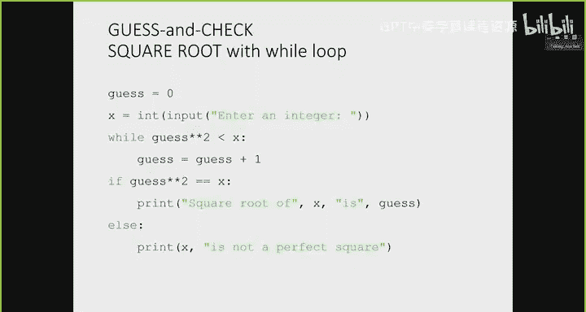

We got input from the user。 So what number do you want to find。

 whether it's a perfect square or not and what is， what is it if it is a perfect square。

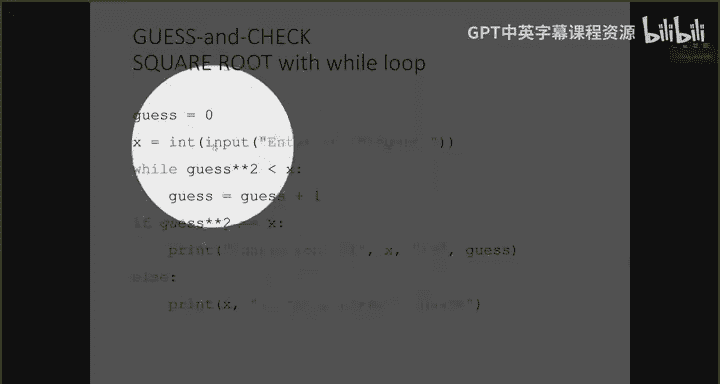

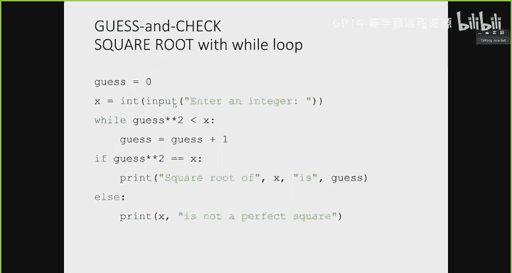

We have a wire loop that checks one condition。

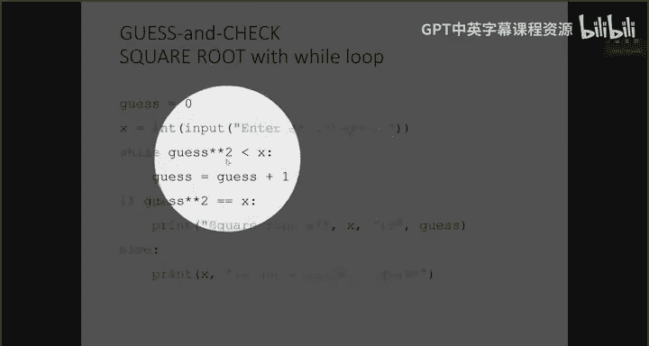

Right， that's our stopping condition here。We're going to iterate through the loop when guess squared is less than x。

 right， So on that number line， we're going to keep incrementing by one as long as our square。

Is less than X。So that's this while loop here。And what we're doing inside the loop is incrementing our guests。

Right， guess equals guess plus one。And then at some point。

 if we haven't found a perfect square or if we have found a perfect square。

 this condition becomes false， right。

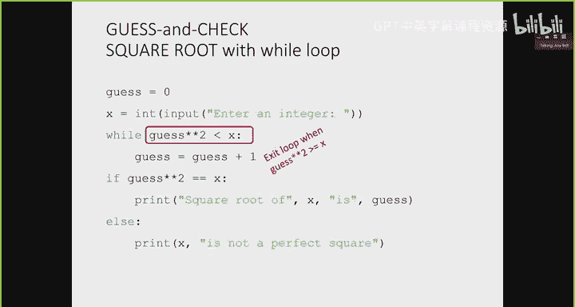

Because this is false when， when we have the opposite of this less than sine。

 So guess squared becomes greater than or equal to x。

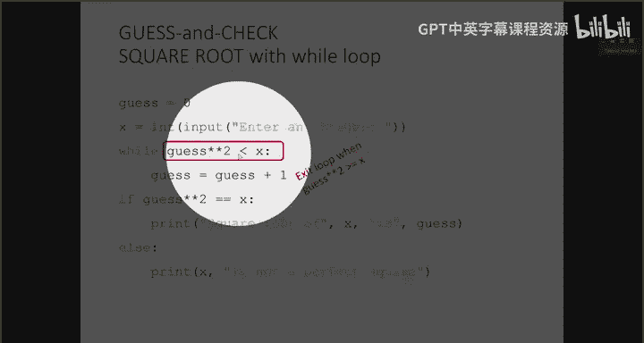

Now， that's two very different things， right， guess squared greater than x means we haven't found this perfect square。

 but guess squared is equal to x means we have found a perfect square。Right。

 and both of those cases trigger us to leave the while loop。So then right after the Y loop。

 we need to have an if else。 The F else checks for one of those two cases。

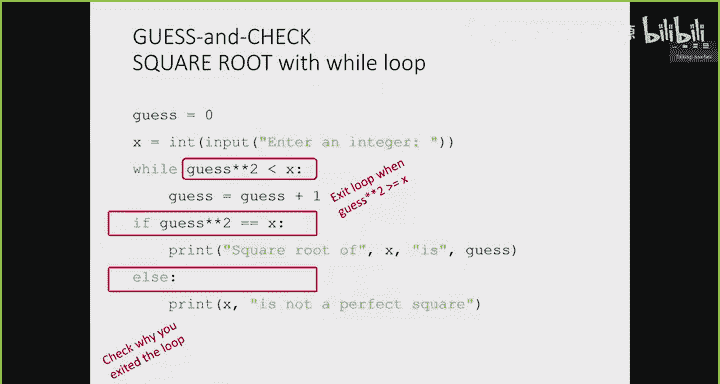

So the if guess squared is equivalent to x。

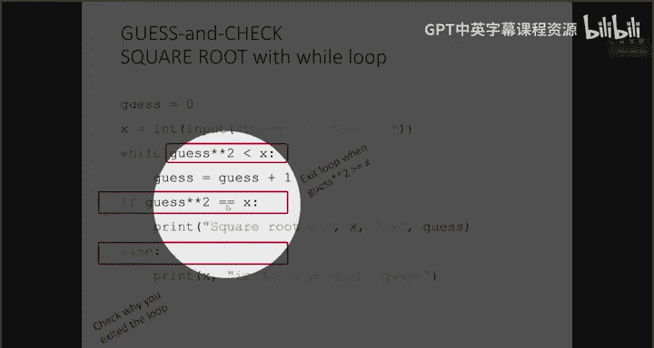

Means that we exited the while loop because we found that it was a perfect square。 So like 4。

 for example， right， if x was 4， when we hit 2， that while loop becomes false， and we exited because。

4 was a perfect square。

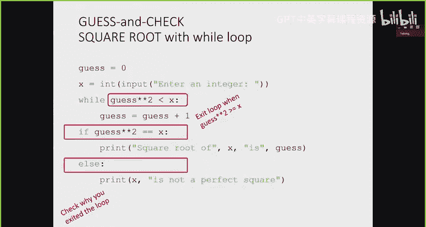

But the 10， for example， would fall within the else clause here， right。

 because we have exited the loop because guess squared 4。

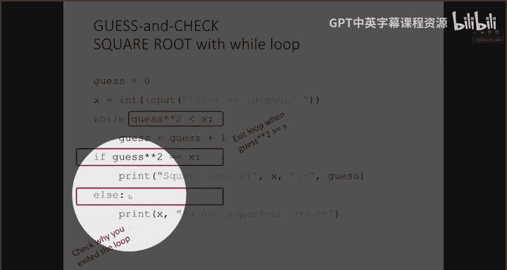

Or squared 16 was greater than 10。And so thats， then we would print X is not a perfect square。O。

So this works for many different values。As big as you'd like。 But it doesn't work for。

 It doesn't work for negative values。And the reason it doesn't work for negative values is because the loop never actually enters in the first place。

 So， for example， if we look at this whether negative 2 is， is a perfect square。

We're going start with guesses 0， just because that's how we we implemented the algorithm， right。

 on the previous slide， it says guess is equal to 0 right at the top。And so guess is0， we say。

 is0 squared less than x。No，0 is not less than negative2。

 And that while loop never even enters at all。Which is fine， right。

 because negative 2 does not or negative 4。 you know。

 negative numbers are not perfect squares unless we're talking about imaginary numbers。

 but we're not in this particular case。However， we might want to handle the case when the user gives us a negative number number。

 Maybe they accidentally typed in the negative sign or something like that。

So we can actually take care of that case by adding a little bit of extra code around what we already wrote。

So the stuff that's boxed in red is the extra code we write。

 Everything else is exactly the same as two slides ago。

So the only thing we want to do when we encounter a negative number is flag it。

Using a new variable that's either true or false。 And then at the end， we can handle that flag。

 So if it's true， we do something。 and if it's false， we do something else。

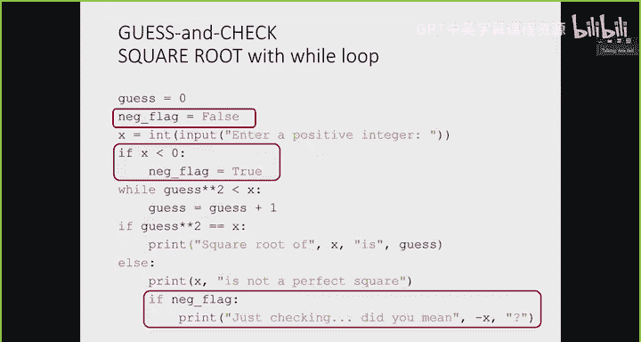

So in this particular case， we've got a negative flag initially false。

 which means that we're gonna initially assume the user gives us a positive value， right。

 So negative flag equals false。The user， we get input from the user。

 and then we check if the user gave us a negative number。 So if the x is less than 0。

 then we're going to change the value of this flag。Neeg flag equals to true。

 So we're going to change the value from false to true。

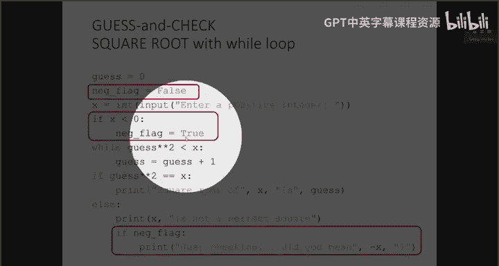

And then the rest of it is the same， right？ This is all the same as what we had two slides ago。

 except that at the end， we're gonna check to see if the user gave us actually gave us a negative number。

 We can check with them。 Did you actually mean the positive version of that number or something like that。

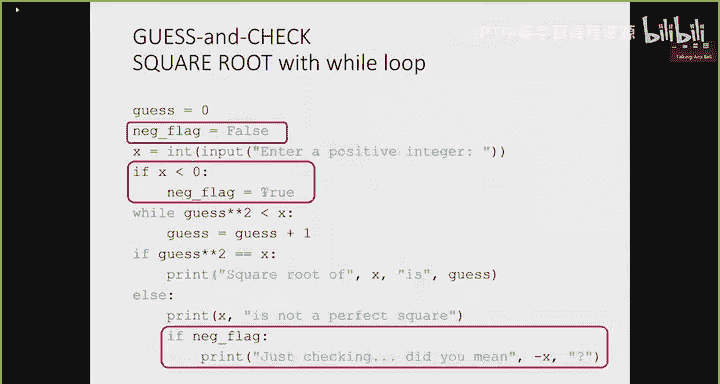

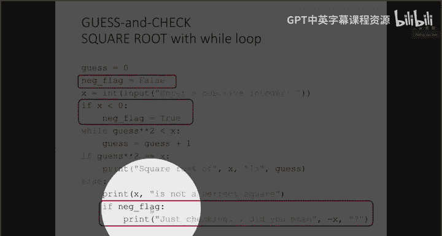

And so in code， the way this looks is。Slows。 So if we run it and we give it， you know，4， obviously。

 it tells us it's a perfect square and what its square root is 9。Works，10。

It says it's not a perfect square。 And then when we give it a negative number， square or not。It just。

tellslls us negative4 is not a perfect square。 And then it says just checking。 did you mean 4。

 So it does this extra print statement when the number was negative。哎呀，告诉。Yeah。

 so I can explain that again。 So the negative flag equals false is just a variable， right。

 I just called it Neg flag。 It's a variable I initialized to false just to say， hey。

 the number I'm gonna assume is not negative。

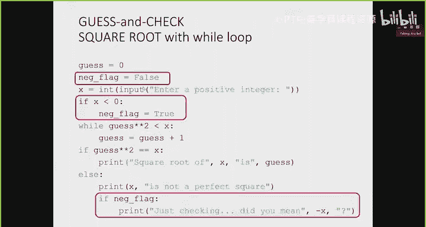

And then we only flag it to we only change its value to true if the number was negative。 So， in fact。

 we could have just had a little if else here。

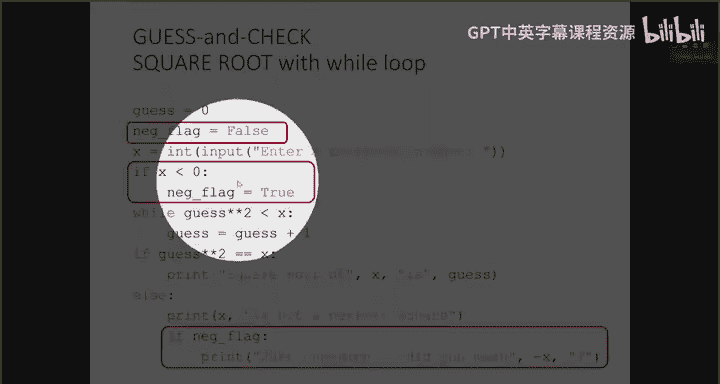

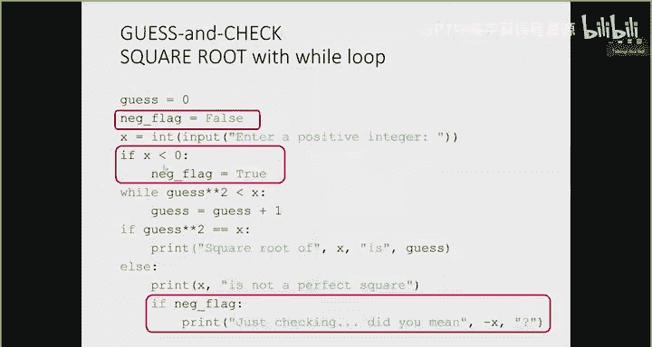

Right， so we get the X， we don't have this line up here。 We have x is equal to int。

 And then we say if x is less than 0， and eggg flag equals true， else， Neg flag equals false。

 We could have done that as well。

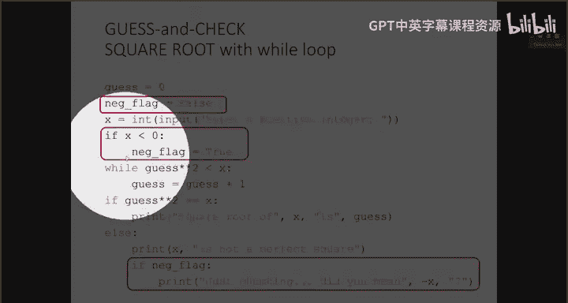

Okay， so the big idea with guess and check is we can't test an infinite number of values。

 We have to stop at some point， right。So now we've been working with the code that。

 that looks like something on the left side， right， We've been using while loops。

But we've seen that we can actually write very efficient code using for loops as well。 And in fact。

 the guess and check method maybe intuitively lends itself better to a for loop than a while loop。

 right， because we're trying to iterate through an exhaustive set of values。 right。

 the number 0 through some number， right， And so maybe a for loop is a better way to write such a guess and check algorithm。

 And we're going to see how to rewrite that in a little bit。 But in terms of a flow chart。

 the way the for loop would go is we sequentially go through all the possible values。

 when we've exhausted all the values， we say we didn't find a solution。 And otherwise。

 the for loop just automatically grabs for us the next value in the sequence。😊。

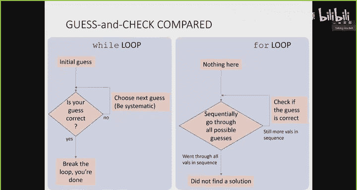

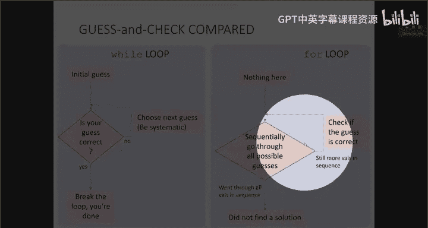

So let's have you work on this for a little bit。 I want you to hard code for me a number as a secret number。

 This is kind of what we did last lecture。 So secret equals， you know，7，5。

 whatever you'd like it to be。 And then I want you to write some code that goes through all of these numbers from  one to 10。

 inclusive， let's say。And print that it found the secret number。

 So if the secret number is within the range 0 through 10。Print that you found the number。

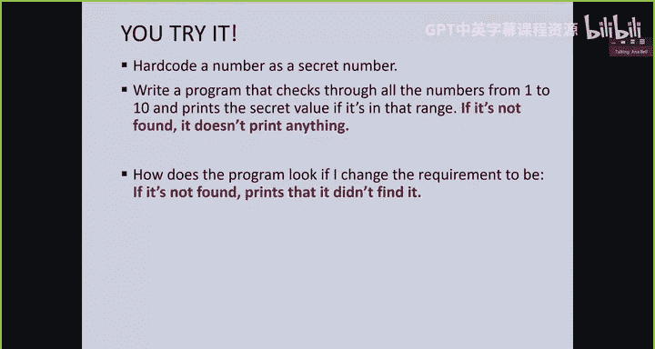

And otherwise， don't print anything。 So if you don't find the number， print nothing。

And as you're working on that， and if you finish that code。

 think about how you would change that code to do one thing differently if it's not found print that you didn't find it。

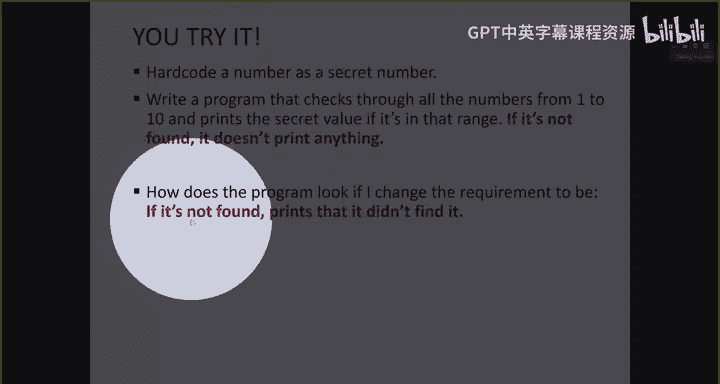

So in the first version， if you don't find it， do nothing。 But in the second version。

 if you don't find it。Tell me that You didn't find it。开。So。These codes are。

In this Python file and the easier version is about line 129。 And then if you work on， you know。

 after you finish that if you're done， you can just copy that code to lines about 144 and try to modify it to the new specification。

 So if you don't find it， print that you didn't find it。Okay， so tell me some code for the first one。

 So if we find the number print， we found it and otherwise do nothing。What's better。

 Why loop or for loop。For loop， yep。4， let's say， I in。Range。

 how do I get numbers 1 to1 to 10 inclusive。1， comma 11， exactly good。 So this， and again。

 I can write a little message for myself。 I is 1，2，3，4， dot， dot， dot 11。

What do I do to make the check whether this number I is my secret？Yep， if I equal secret。Well。

 let's say print found。Okay， run it。Obviously，4 is within that range， obviously， 100。

 not in that range。 right， So when we had four， it printed found。 and when we had 100。

 it did nothing。Okay， I'm going copy this code。And paste it down here。

 So let's try the version now where we just make one small change to our specification。 Right now。

 we request the code to say， if you don't find the number within this range。

 print that you did not find it。What are some things we can try。Else， okay。Print。Not found。O。So，4。

 obviously。Was found。But we also printed all these not found。Why。Yes。So you could try here。Yeah。

 we printed it because it's iterating through the whole range。 every time I check an eye。

 I'm either printing found or not found。So we could break， I guess。When we found it， right。Break。

runun it。Okay， then we print not found until we find it。 And then we break。 So we're getting there。

 right， It's， it's looking a little bit better。What else can we try， yes。Another break。

We can try another break， after not found。But then， the floor is not found。But。Yeah。I like the idea。

 Yeah， we can do you can't try to do a Boolean flag。 Was that your suggestion as well， Yeah， okay。

 let's try to do the Boolean flagway。 let's delete。The brakes。 Let's go back to what we had before。

 So basically， our idea is， I think what we're trying to get at is we only want to print。

 not found when we've gone through all the numbers in the range， right。

 So kind of something like this。Right， I want to print the not found only once。At the end of my loop。

Okay， but this code doesn't work either because I'm always printing， not found。

No matter if I do this extra print inside here， right。

 Because this not found at the end here is at the same indentation level as the for loop。

 So the suggestion from a couple of you is to actually set a flag， right？

 So we can set a found flag to be originally， let's say， false。Right。So before I even start my loop。

 let me just assume it's false。And I'm going to use this flag to， to。To trigger。Or I'm gonna。

 I guess I'm gonna change this flag。Whenever。I found the， the， the number。Right。

 so found is originally false and the place in my code where I know I found the number。Is here。

 right， When I is equivalent to my secret， and then I can set my found flag to be true。

I only call it a flag because it， it flags that an event happened or not。

 So it's kind of a Boolean event。But it's really just a variable， right。

 Nothing special about the word flag。 It's just a variable。Right， okay。

 so now I think the suggestion was now that we've set our flag to， to true or false。

 depending on what happened in the code， we can say， if found。Or I guess in this particular case。

 if not found， right， the inverse of my Boolean。Print， not found。Right， there。

 there's no else because the else was already taken care of when when we had the secret。

 when we found the secret within the code。So now we print found when it's 4。

And if the number is obviously outside the range， like 100， we print not found。

We can make a small change to it。 I guess。 so we don't have to print found down in there。

For maybe consistency or making things even， we can just say else， print。Or something like that。

And I think that should work as well。So 100 is not found。And four is found。

So now we're doing things kind of consistently。 We're printing out whether we found it or not down here。

 And in inside the for loop， we'll just， we're just dealing with the logic of the。

Finding or not finding it。Any questions about this code？ Does it seem all right， Does it make sense。

收。I'm showcasing these Boolean flags just because they're very useful for signaling that things happened in your code。

Right， so when you find yourself asking， how do I， how do I know that this thing happened or something like Boolean flag is the answer。

 right。Just set it to true or false，0，1， A or B， whatever you want。

 And then check the value of that variable later on in the code to。

 to see if the event happened or not。So these are the two codes that we had just written kind of side by side。

 just to show you exactly what the difference is。 So here is the code where if we don't find the number。

 we don't print anything， right， So it's just the for loop with an if and you say we found it。

 And the one on the right is the code where we did find it。 where if we didn't find it。

 we printed that， we didn't find it。 So the only things that are added in addition to the code on the left is the stuff that's bolded。

 right， So I just have this flag that I initially set to false。

 I set it to true when this event happened。 that is， I found the number。

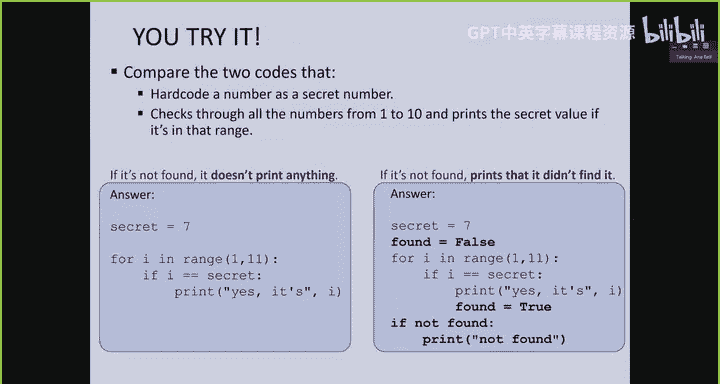

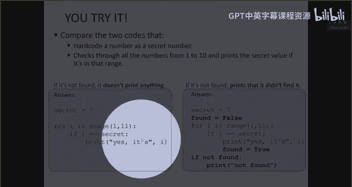

And then I do the check at the end to print or not print。I don't use else in the if， or down here。

In the F。So we don't use the L inside the if I equal equal secret， because。That， if or else。

 will be done every time through the loop。Right， and I only print that we didn't find it one time。

At the end， right。The if， if I have an an else inside the for loop。

 it's basically asking if I is the secret number。 So 0 is not the secret number。

 We would hit the else。 One is not the secret number。

 We would hit the else 2 is not the secret number。 we hit the else。

 And only when I get to 7 in this case。 It is the secret number。 So I hit the if。

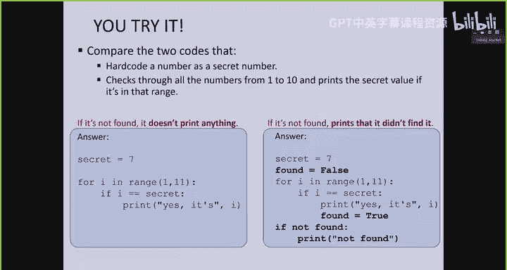

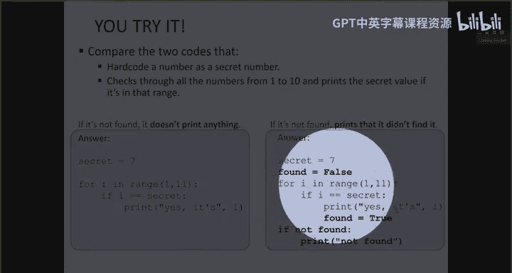

And so on。 So it's not something I want to do every time through the loop， it's。

I put it at the end because I only need to do one。that that makes sense。O。So。

Bullan variables are a variable that is in one of two states， right， I used here true or false。

 But as I mentioned， you can use 0 or1， A or B as long as you as the programmer。

 remember what values you're expecting this this variable to take on Boolean variables can be used as signals that something happened in the code。

 right， So this could be useful in a quiz situation。 We call these boolean flags。 But again。

 it's just a name Its， it's just a variable that changes state depending on if some event happened in the code。

Okay， so I'm coming back to the idea of while in for loops。

 And we've already seen that there are many situations where for loops are a lot more。

 a lot easier to use than while loops。 Okay， so when we have four loops that iterate through a sequence of values。

 So the guess and check algorithm actually lends itself a little bit better to four loops than while loops。

 So here's an example of us trying to find the cube root in this particular case。

 not the square root of a number。 And again， we're only asking if this number x is or in this case。

 cube is a perfect cube。 okay。😊，So the way the code works with a for loop。

Is we're going to iterate through all the possible values。So we have four our guests in range。

Some number。 So we're gonna check all the value 0 all the way up through cube plus 1。

 The reason why we did the plus one is because if the user gives us number one。

 we want to check one itself。 right， If we didn't have cube plus1。 If we just had cube。

 we would mistakenly stop at 0， even though one is a perfect cube。Okay， and then inside the for loop。

 we just have， if guess cubed is equal to cube。Then。We have found our perfect cube。Okay。

If we have negative numbers with cubes， it's just adding。A little bit of extra code。

 but it's not as weird as with the square root， right。

 because the cube root of a negative number is just the cube root of that positive version of that number with a negative sign in front of it。

So all we're doing with a negative number as the input is saying I'm going iterate through all these values and through 0 all the way up to the positive version of whatever the user gave me。

 So this is taking the absolute value of the number the user gave me and adding one to it。

 So just kind of like the code on the previous slide。

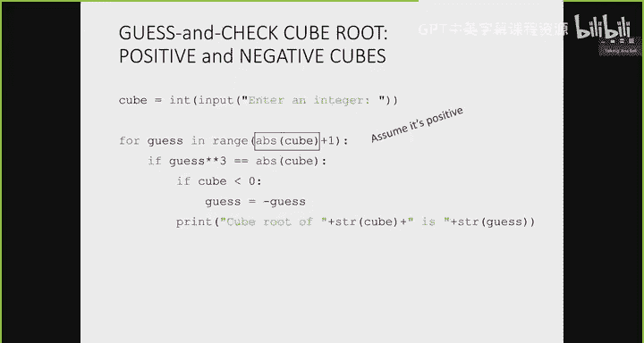

Except we're doing the absolute value of it。 We're checking if the guest cubed is equivalent to the absolute value of cubed。

 exactly the same as on the previous slide， except taking the absolute value of the cube。

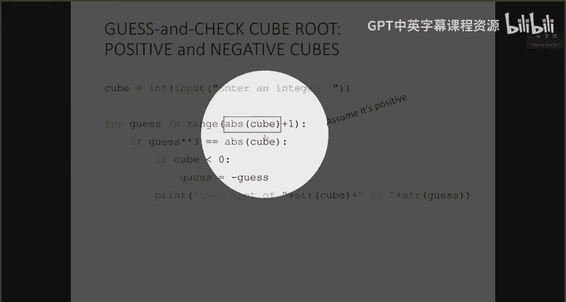

And then we have this extra little bit that checks if the user actually gave us a negative number。

 So do we need to put a negative number in front of our guests。

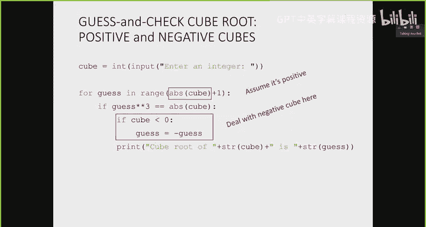

So if the user actually did give us a negative number。

 let's just take do minus whatever value we just found for the cube， and then we can print the cube。

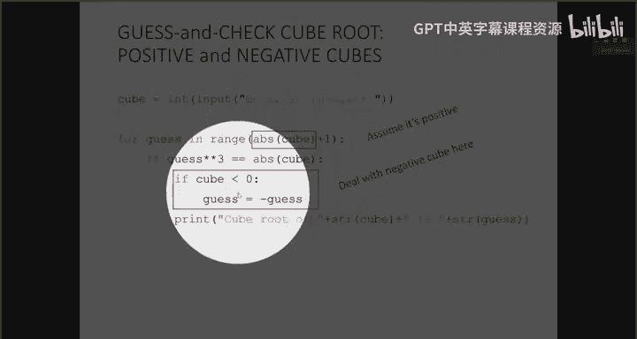

Of this perfect you。

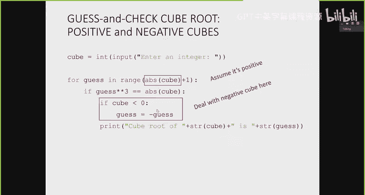

Okay， so again， same code as before。 The only difference is absolute value of cube and adding this check to deal with negative no。

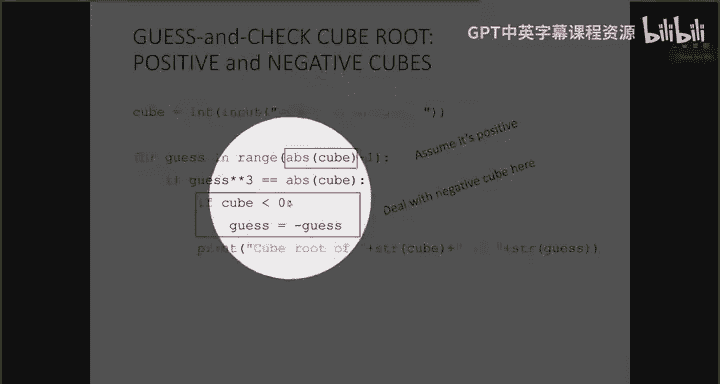

Okay， so we can actually make this code a little bit faster because， for example。

 when we're taking the you know， checking the cube root of 27， the numbers we're checking are 0，1，2。

3，4，5，6 in our for loop all the way up to 27。

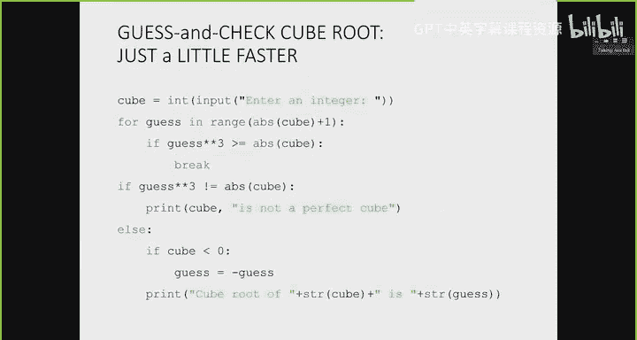

Right， but we can recognize the fact that when we reach for27，5， let's say，26。

 we can recognize the fact that when we hit 3。The guest cubed is actually 27。Right。

 and so in our for loop， it doesn't make sense to keep checking 4，5，6。

7 to see if those numbers are then going to match or be our。

 our cube root for a potentially perfect cube。And so that's what this code is doing。

 It's going to have a little if statement。In here。 So again， this is the same as before。

 But we're gonna to have a little lift statement that says if the guess cubed is greater than or equal to。

 not just equal to， but greater than or equal to。 Let's break out of the loop。

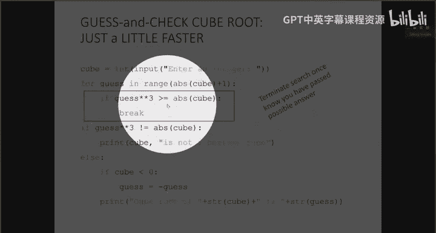

唔。😊，And so when this condition is false or sorry， when this condition is true。

 gas cubed is greater than or equal to， we have exited the loop。 But now。

 just like with the square root code， with the Y loop， we have to see why we exited the loop。

 Why did we break out of this loop prematurely。One is we exited because the guess cube was equal to the cube or the guess cube was greater than the cube。

 and so then we have a little if else， a conditional here that says if we exited because it's not equal greater then then it's not a perfect cube and otherwise we exited because it was equal to。

 which is the same code we had on the previous slide。

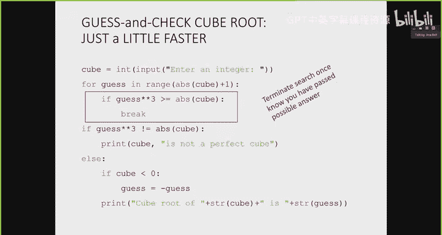

Check whether the user gave us a positive or negative value。

 put the negative sign in front of our guests， and then print the perfect Q root。

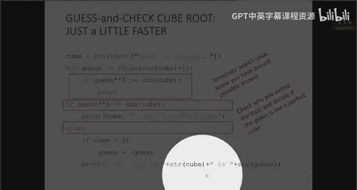

So all variations of the same sort of starter code werere just adding little bits of functionality and making the code slightly more efficient here。

So I have another example。 And this example is probably the point in this class where you're like。

 aha， this is what computational thinking means， so。Remember these word problems from childhood。

 right？ You see a math problem。 You have basically a system of equations。 Alically。

 you could probably solve it within a minute or so。

We can actually apply computation to solve problems just like these。

 So we don't need to do it algebraically。 We can just tell the computer。

 here's a bunch of values I want you to try， Try them to see if they match these systems of equations and then print out the answer。

So here's an example I've got Assa Ben and Cindy selling tickets to a fundraiser。

 Ben sells two fewer than Assa Cindy sells twice as many。10 total tickets were sold。

 How many did Alyssa sell。Here's some code that could solve this problem for us。

I'm basically figuring out all the possible combinations for tickets that Alyssa and Ben and Cindy could sell。

 right？ So I've got three loops。Each testeded， right。

 So Alyssa could have a could sell 0 or one ticket or two tickets and so on。

 But for every value of Alyssa。 So Alyssa can have can sell 0。

1 or two tickets for every one of those。 Ben can sell 0，1 or two tickets， right。

 So Alyssa can sell 0。 Ben can sell 0。 Cindy can sell 0。 Alyssa can sell 0。 Ben can sell 1。

 Cindy can sell 0 and so on。 So we're basically having these  three。

4 loops that make all the possible combinations of tickets。 So here I have Alyssa。

 Ben and Cindy trying to sell tickets to a fundraiser。😊，And then I have my system of equations here。

 So in total， they sell 10 tickets。 So here， total 2 less and twice are all Boolean variables。

So a plus B plus C is equivalent to 10 is the first condition I need to hold。

B is equal to a -2 is the second condition I need to hold。

 and C is equal to is equivalent to two times A is the last condition I need to hold。

 Those were the conditions from the previous slides， right。And so these three booles。

 whenever they hold total is true and two less is true and twice is true。 when all these things。

 three things hold， I have found the solution to my problem。So inside my code。

 this is Alyssa Ben and Cindy。Trying to sell tickets。

And the code automatically tells me they sold this mini each。

 And what's cool about this code is we can then change something about it。

 And then we can run it again。 And immediately， it tells us what the new solution is。

 We don't have to do it algebraically and solve it all over again。😊。

The problem with this code and the way I wrote it specifically is it's really slow for big numbers。

 If I change it to 1000 tickets being sold by three people， right。

 and then a couple other changes here， just to sheer fact that I've got Alyssa iterating through 0 to 1000 and Ben iterating through 0000 and Cindy iterating through 0 to 1000 takes really long time。

And so that particular code， I'm not even going to run it。

 will take a really long time if I change the values to be 1020 and twice。But instead。

 we can use kind of a mix of algebra and computation to solve the problem。

 We recognize we actually only need a loop through one loop， right。

 I only care about maybe checking Alyssa's number of tickets。

 being 0 through potentially 1000 tickets sold。And then I can use my other two equations。Right。

 Ben and Cindy， how many did they sell with respect to Alyssa。

 And then I've got my two other equations here。Which will tell me how many bud and Cindy sold with respect to Alyssa's loop。

Right， and then my last equation here is that Ben and Cindy and Elilyssa all had to sell 100。And so。

 with this particular code。I'm able to find the answer to the question。

 which is how many tickets they sold。 And again， this is really awesome because now I can make small changes to the numbers and solve the problem basically immediately like that。

 right， I don't need to go back and solve it algebraically， as I would， if I were to do math。😊，O。

So we can apply computation to many different problems。 I hope that this is a really good showcase。

 this， this word problem of what we mean by computational thinking and the kinds of things we want you to come away from。

 come away with in this class。The last thing I wanted to talk about。

 and I'll just do a quick intuition is binary numbers。

 And this is actually a precursor to the next algorithm we're going to see in the next lecture。

 an approximation algorithm。 It's going to be an improvement on the guess and check algorithm。

So so far， we've seen numbers in Python。 They can be into jrors， which are whole numbers and floats。

 which are real numbers。But in programming， some interesting things happen when we deal with floats。

Okay， and this is gonna be our motivation for talking about binary numbers and then fractions and then floats in this lecture。

 and then in the next one。 So here's an example。Of some code。So， I've got。

Is exactly what's in the slides。 I've got an integer X。

 And all I'm doing in this code is I have a loop through range 10。

 So that means it's going to loop through 10 times。 And I'm adding 01。10 times， So 。1 plus 。1 plus 。

110 times。And I'm going to print whether x the sum。1 plus 。1 plus 41 is equal to one。

And just to show you， I'm not pulling your leg， I'm going run it。And print whether x， so 01 plus 。

1 plus 。110 times is equivalent to one。 And this code prints false。Not intuitive， right。

 If I'm adding 。110 times， I should be getting one， but I'm not in programming。

 And just to show you the actual answer we get， let's print what the value of x is。

And then ask whether that's the same as just multiplying  point1 by 10。

 So doing the loop where we add this number 10 times。Gives me actually 0。9999999。

Whereas just multiplying 01 by 10 gives me one， as I expect。And this is the motivation for。

 or I guess， the precursor to our next algorithm， the approximation algorithm。ok。

So we have this thing called a floating point error。 And why does it happen。And since it happens。

 we can't do equivalency， right， We can't use the equal equal sign between。

Floats because we get things like this that are going to completely mess up our program when we expect。

 you know， something as simple as adding。1 to itself 10 times to be one。 And it's not。Right。

And so the big idea here is we have operations on floats。 And the way。

 because of the way floats are actually stored computer memory。

 these operations introduce a very small air， super， super small。😊。

Every time you do an operation with a float。 But the more you do this operation that has this tiny air。

 the more this air gets magnified， right？ And so then we see surprising results like that。

 And so that comes about with the way that floats are actually stored in the computer。

So what we have in the computer is we work with binary， zeros and ones。

 But humans actually work in base 10， right， we think from 0 to 9。 But the computer works in base 2。

 either 0 or 1。And the reason it works through 0 and1 is because of the way that the computer hardware is built。

 right。It's easy for the computer hardware to say that a magnetic spin is up or down， right，0 or1。

 It's easy for the hardware to say that it has a voltage that's lower or high。Right。

 if it would be a lot harder for the the computer hardware to say， hey。

 I have a voltage that's 0 low high。 let's say one。

 or it's one10th of the high or two1th of the high。 There would be too many errors introduced。

 And so it's a lot easier for the computer hardware to just be in one of these two states，0，1， right。

 So that's where binary comes in。And so when we're dealing with integers。

 this is not a problem because we can easily convert。Numbers。That are in base 10。To base 2。

 that are whole numbers integers。 The problem will come when we do floats。

So you don't need to know how to do the conversion。

 But it will give you an intuition for what's going happen。

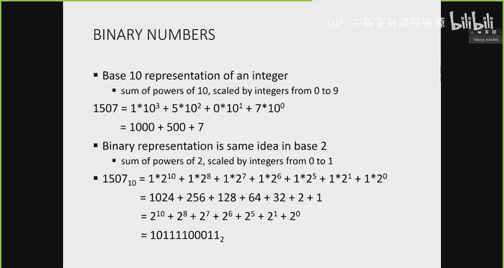

So the number 1507 in base 10。 So that's what we have up here is 1000 plus 500 plus 0 times 10 plus 7。

 right。In base 2， we have a similar pattern。 We have some。

 some whole number multiplied by some power of two。Here we had the whole number be。

 be either number 0 through 9， multiplied by some power of 10。But in base 2。

 we're gonna have either 0 or 1 multiplied by some power of 2。

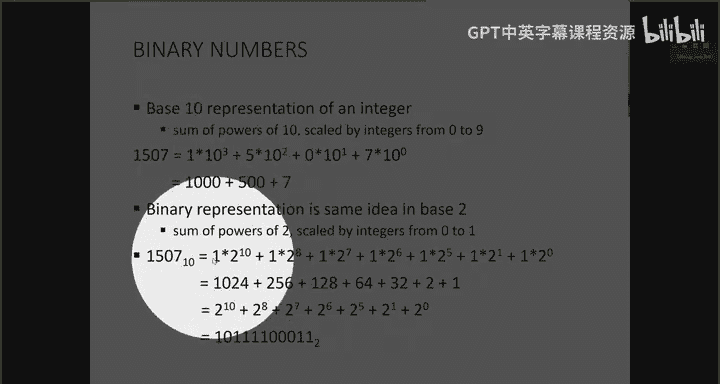

And if we're trying to convert the number 1507 from base 10 to base 2。I guess humanly speaking。

 the way we think about it is what is the biggest power of two that we can have that takes us close to。

 but not over 1507。 And that's 102 to the 10，1024， because 2 to the 11 is 2000 something。

 and that's already too big。And then you ask yourself。

 what's the next biggest power of 2 I can add to this number，2024， that brings me close to。

 but not over 1507。

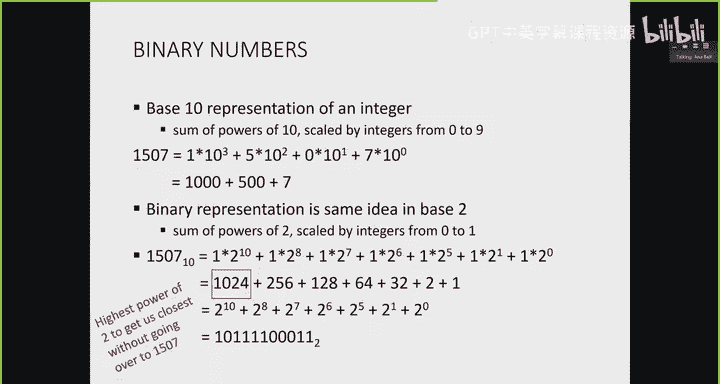

That's going be 2，56。 Notice we skipped 2 to the 9 because adding 2 to the 9 takes us over 1507。

It's adding 5，12 to 1024。And so we repeat this process where we're basically trying to figure out what are the biggest powers of two we can add in order that makes up 1507。

 And it turns out it's going to be 2 to the 10 plus 2 to the 8 plus2 to 7 plus2 to the6 plus2 the5。

2 to the4，3 and2 are all going to be zeros and2 to the1 and 2 to the zero and the bits。

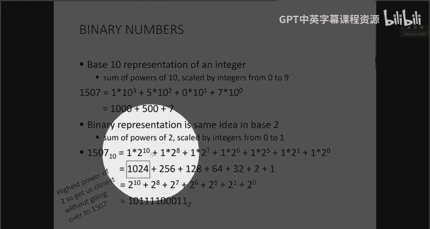

Right， one times through the 10，1 times through the 8 is basically what gets represented here。Right。

 these whole number portions that we multiply the powers of 10 by。And that's how we convert from。

 from a decimal number to a binary number。 But again， this is kind of a human way of converting。

 We can actually do it in a more systematic way， a more， not a more imperative way， right。

 a recipe way， some way that a computer can actually use to take a number and convert it to binary。

And you would never have to come up with this way。 But given this way of converting the binary。

 you should be able to code it up。So the idea here is we're gonna take a number。

And we're going to look at the remainder when we divided by 2。Right， if it's an odd number。

 obviously， the remainder is one， if it's an even number， the remainder 0。

 and that remainder actually gives us the last bit， the farthest right bit。

And then we can take that number and divide it by two fully。

And then that gives us the remaining four digits。 So you see everything else just gets shifted over。

And the way the code looks is just doing successive divisions and figuring out the remainders。

 So I'm just gonna to look at the Python tutor real quick。 And then we can， we can stop。

 So if we're trying to convert the number 1507， following this particular recipe。

 All we do is we look at the remainder when we divide the number by 2。 So this is an odd number。

 Obviously， the remainder is gonna be  one。

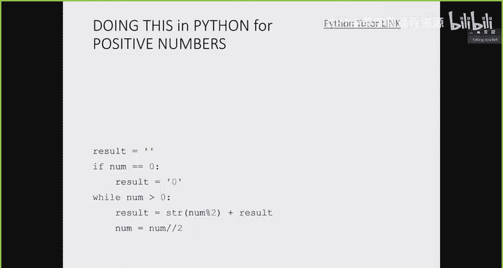

So， we add a one。To our binary representation。And then we're going to keep adding what happens when we divide the。

 the remaining numbers by 2。 We're going keep adding the remainder to the front of this string here。

So if we divide the number 1507 by 2， that gives us 753。 And now we ask， is 7。

53 odd or even it's odd。 So we add another one to the front of this string， the result string。

Divide 7，53 by 2。 It's 3，76。 This is even。 So now we add a 0 to the front of my string。

 So notice what happens to this string as we go step by step。3，76 divided by 2 is 1，88。

 What is this even number， So we add a 0 to the front of the string。1，88 divided by2 is 94。 Again。

 it's an even number。 So we add a 0 to the front of this string。94 divided by 2 is 47。 It's odd。

 So we add a 1，47 divide by 2 is 23。 It's odd。 So we add a 1，23 divide by 2 is 11。 So we add an odd。

 So we add a 1，11 divide by 2 is 5。 So it's odd。 So we add a 1。And then 5 of by，2 is even。

 We had a 0。 and then one is our last number。 So we had a one。 And notice。

 this is the exact same number we had when we did it in this human。

Thoughtful way where we are trying to figure out the highest powers of two we can take to go up to。

 but not over the number 1507。

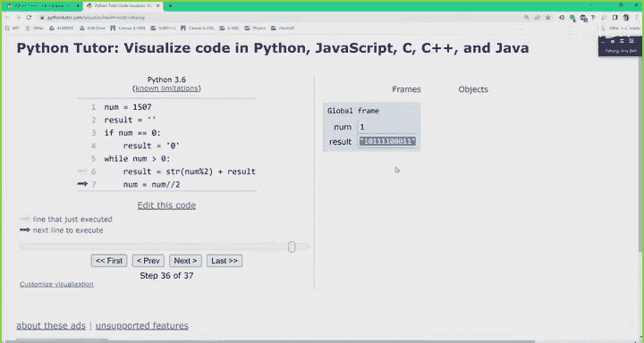

But we did this using just this， this very iterative， very nice loopy code。

 And if we wanted to do a negative number， we would just add these two boxes here。

 It just basically means we add a negative sign in front。

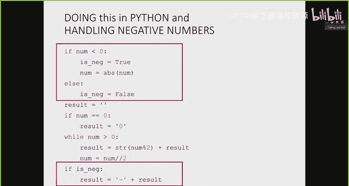

