# 《计算机科学和Python编程｜6.100L Introduction to CS and Programming using Python, 2022》 - P5：-05-Lecture 5_ Floats and Approximation Methods.zh_en - GPT中英字幕课程资源 - BV1PAxJzVEs3

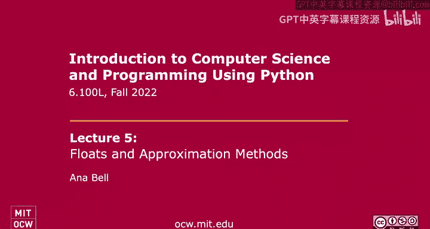

Okay， so let's get started。Today's lecture， we're going to do a little bit of a recap of the last lecture。

 We had begun talking about binary numbers， and then we're going to dive into our second algorithm of the class。

 then the approximation method algorithm。So let's remember the motivation we had for even talking about binary numbers and how numbers are represented in the computer in the first place。

 And the motivation was this piece of code。So it's very simple。 We have an initial x 0。

 and then we have a loop that just adds 01 to itself10 times。

And then we printed whether that sum equals one。And what we saw was that it was false。

Printing x equivalent to one was false。 So then we printed what the actual value of x was after adding 0。

1 to itself many 10 times。 And we saw that that summation was actually 09999999。 And， of course。

 to Python 09999 is not equal to 1。 So that's why we had printed false for x equivalent to 1。

 right that that expression。And so this is our motivation。

 Why in the world does this happen in in programming and Python and something like this could really screw us up right if we're not even able to compare floating point numbers。

So last lecture， we ended with this piece of code。It was a way for us to。

 to get the binary representation of a number in base 10。 right， So given some number。

 we followed a really simple recipe， a really simple algorithm to convert that number into base 2。

The stuff that's in in boxes， Let's not worry about it for now。

 But let's look at just this part right here。 So the stuff that's in between the two boxes。

 And this is the part that does most of the work for us or all of the work， even for us。

 It basically creates a string。

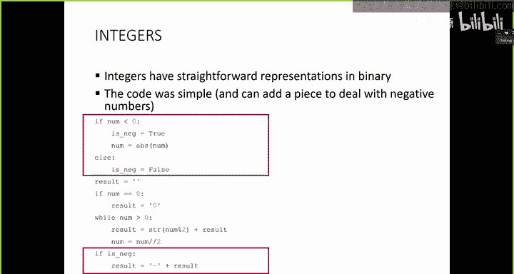

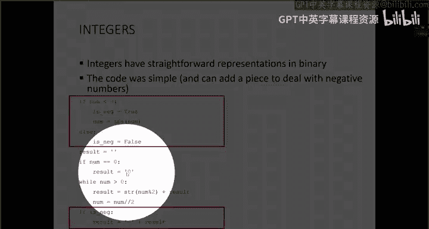

EInitially empty。And the idea was that we were going to prepend either0 or one to that string。

 depending on whether the number we had was odd or even。 So for a number like 19。

 if we wanted to convert 19 base 10 into base 2， what the algorithm was doing is over here in the loop。

It says while the， this numb， whatever it is， initially 19， is still greater than 0。

Let's get the remainder when we divide the number by 2。 So that's what this non%2 is doing。

 It's either getting a 0 or 1。 So 19， the remainder when we divide 19 by 2 is 1。

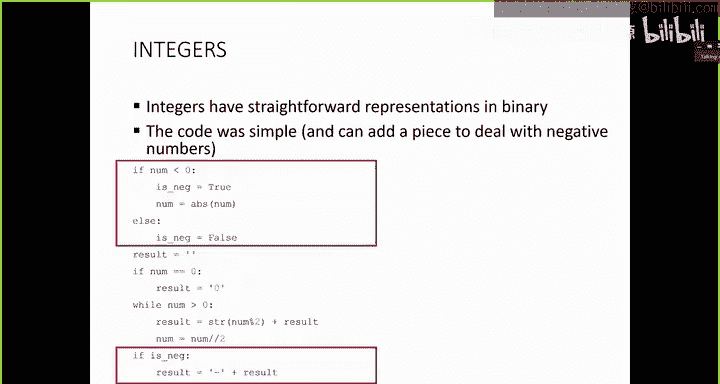

And we're going to prepen。 So we're casting this one integer to a string and preending it to this result。

 which is initially empty。So that's what this line is doing。 Result equals this thing here。

 And then we're going to take our number and integer divided by 2。

 So we're going to take the number 19 and divided it by 2， right， So that's going to be 9。5。

 But we're only interested in the integer portion of it。 So 9。 And then the loop。

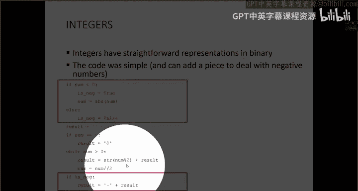

Does the check again， Is 9 still greater than 0。 It is。 So then we're going to say。

 what's the remainder when we divide 9 by 2。 It's another one。 So we're gonna preend it。

That remainder to the string that we're building up。Okay，And again。

 we're gonna divide this number by 2。 So now we have 4。5 when we only grab the integer portion of it。

4。And again， we ask。What is the remainder when we divide4 by 2？It's a zero。

So we preend the0 to our sort of this binary string we're building up。 Again， we divide by 2。

 It's a two。 The remainder when we divide 2 by 2 is 0， it's an even number。 again， we divide 2 by 2。

 it's a 1 and the remainder we get， when we divide  one by or sorry。 and yeah。

 when we divide  one by 2 is a1。And so this is the string that we had eventually sort of systematically。

 right， iteratively built up with this loop here。And numb， after we divide this is going to be 0。

 And then we break out of the loop。Right， so the binary representation of 19 was 1，0，0，1，1， base 2。

We just kept it as a string。The parts that are in red boxes is us dealing with。

 in case with a negative number。 So if the user wanted to convert negative 19 to a binary representation。

 this， if else， up here says， is the number less than 0， If yes， let's set a negative flag。

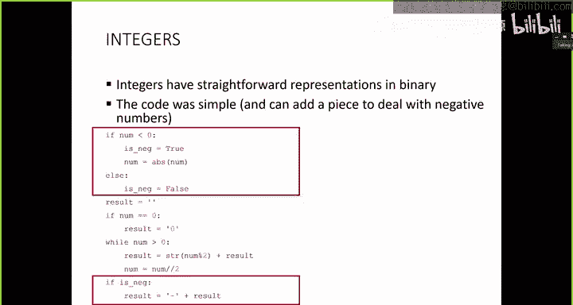

To true。 And let's just assume the user gave us a positive number。

 So we convert that negative 19 to the absolute value of itself， positive 19。

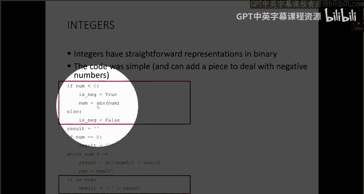

This code。Goes through as if the user had given us a positive number。 And then at the end。

 we would get， get the same number as before， except that we're going to prepend a negative sign。

So the negative， so the binary representation of negative 19 is just negative， the same thing。O。

So that was where we ended up。 We talked about these integers。But now， what about fractions， right。

 integer seems really easy。 There's a really easy， simple procedure algorithm， right。

 recipe for us to follow to get the binary representation。 But what about these fractions。Oh yeah。

 sorry。I is the negative break？はせる。Here， here， Oh， we just， it doesn't read it。

 We just pretend like we were given a positive number。

And then we just do the same process over again。I mean， it。For the purposes of the algorithm。

 it doesn't need to know because the number will come out the same。

 We just flag it as being a negative number。 And then at the end， we say， hey， you。

 we were actually given a negative number。 So let's just pop this negative sign right in front of it。

嗯h哼。😊，Like are we like going must？Is sending。We are actually doing usending when we're building up the string because we're going right to left。

So。Yeah， yeah， exactly。 So this is two to the 0， and this is 2 to the。So in terms of fractions。

 if we're thinking about what it means to talk about a fraction in in human readable base 10， right。

 So number 0 through 9， when we have 0。 ABC， we're basically saying that's a divided by 10 plus B divided by 100 plus C divided by 1000 and so on。

And in base 2， we're going to have the same sort of thing going on。

If we're talking about a base 2 representation of a number，0。 AB C。

 where now A B or C is just 0 or1 instead of 0 through 9， it's going to be the same thing。

 So we would have a divided by 2 plus B divided by 4 plus C divided by 8 and so on。

 So we' now we're dealing with powers of 2 instead of powers of 10 right because our base our base is now 2 instead of 10。

So that means the binary representation of a decimal fraction basically means can we find some sort of combination of these values。

05 times a 01 plus 025 times a 01 plus 0125 times 01， and so on and so on。

 So these are all the powers of2。

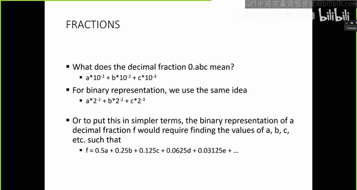

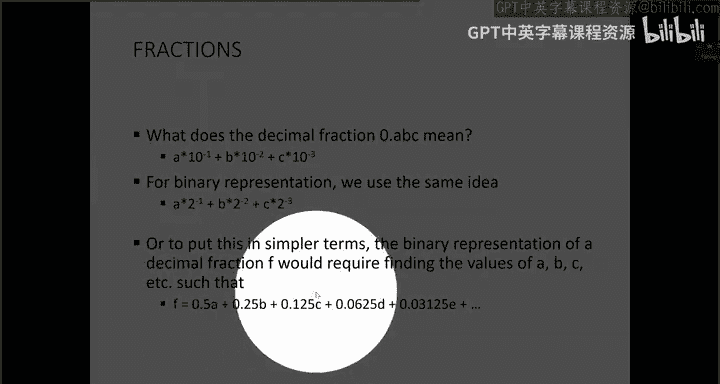

So I'll give you the recipe for how we can actually find the， the， the representation of a fraction。

 And this is not something that we expect you to come up。

 just like the recipe for this is not something we expect you to come up with。 But given the recipe。

 you should be able to sort of intuitively figure out what is the code that actually you know。

 performs this， this， this action， right， thats does this recipe。

So the idea to convert a decimal number to a a decimal fraction in base 10 to a fraction sorry。

 to a binary fraction， right in base 2 is as follows。

So let's look at the decimal number 3 divided by 8， just as an example。 So that's 0。375， right。

 But we know it's 3 over 8。In base 10， so using numbers number 0 through 9。

 we end up saying it's3 over 10 plus 7 over 100 plus 5 over 1000 right That's just base 10。

 but we need to come up with a way to convert this into base 2。

 And so the trick here is to basically say what is the biggest multiple of2。

That I can multiply my number， my decimal number。With such that I end up getting a whole number。

 an integer。That's sort of the trick to this whole thing。

 Can I multiply my 0375 or whatever fraction I'm interested in calculate in in changing to base 2 by some power of2 big enough such that I'm going to get a whole number out of this out of the multiplication。

 And it has to be a power of two， because we're converting it to binary， right， zeros and ones。

So in this simple example， 0。375 is 3 divided by 8。

 so that means that the biggest power of or the smallest power of 2 I can multiply3 over 8 by to give me a whole number is 8 right That's2 to the power of 3。

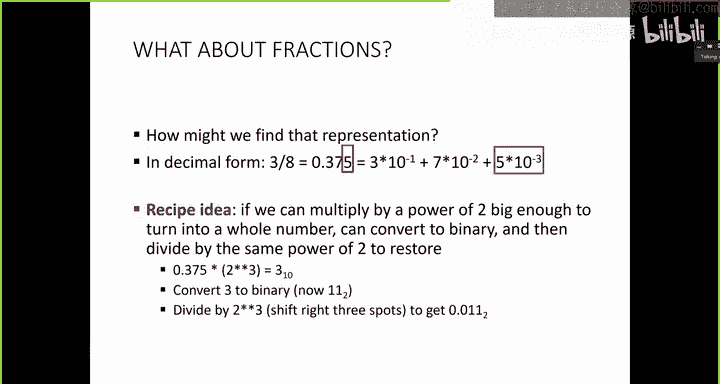

So if I multiply 0。375 by 8。

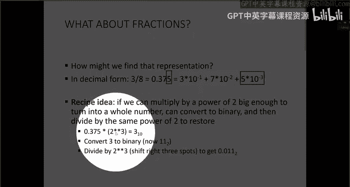

3 over 8 times 8 gives me 3 in base 10。And now， this whole number， I know how to convert to binary。

 I have a recipe， right， We've done it on the board here。 We have the code on the previous slide。

So all we have to do now is convert the number 3 to binary。

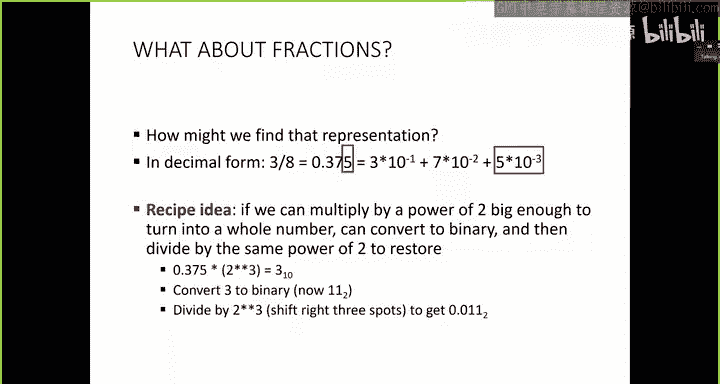

Which is just  one，1。Basedase2。But this 1，1 is a representation of the number 3。

 So in order to get back to 0375， I need to divide my 3 by 2 to the power of 3。

So I need to divide my 11。😡，By2 to the power of 3。 And in binary。

 dividing by some power of 2 just means shifting the decimal point over。 just like in base 10。

 dividing by 10 means shifting the decimal point over。

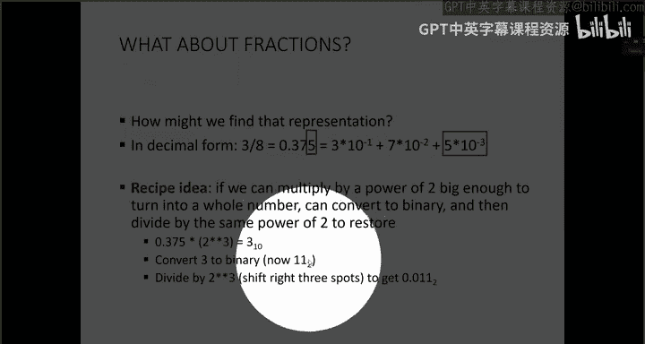

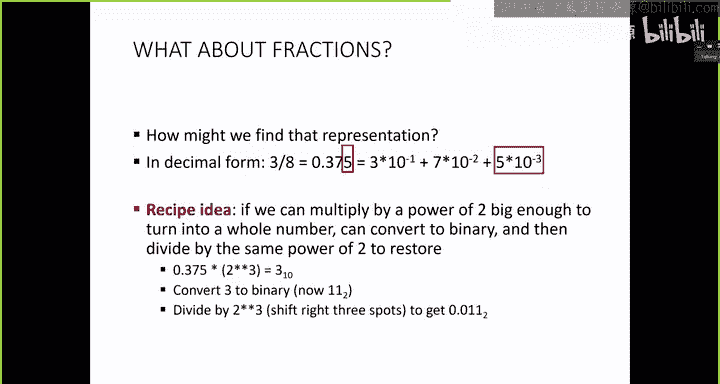

So if number 3 is 1，1， and Im multiplied by 2 to the 3 to get this value to divide by 2 to the 3。

 I just need to move the decimal point from just after the 1，1 over 1，2。 And then it add another 0。

 So the representation of the。

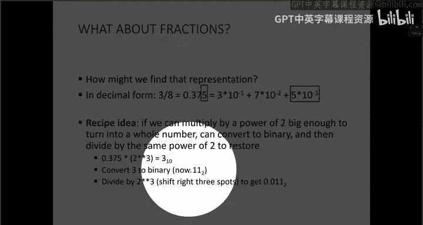

Pot375 becomes 0011。I just shifted this decimal point over by three because now we're dealing in base two。

Okay， so that's this， that's the system。 Like， that's the recipe for getting this decimal。

 this binary representation out of a decimal number。But there's a problem， right。

 This is all relying on the fact that I can find this magical power of two， right。

 that if it's big enough， right， I can find such a power of two that when I multiply with my decimal number。

 I get a whole number out of it。😊，And that's not always the case。

 Sometimes that power of two is going to be really， really big。Or it might not even exist。 Okay。

 And so if it's really big or if it doesn't exist， that's where we run into problems。

 as we're gonna see in a little bit。So this is all relying on the fact that I can find this power of two。

So here's the code to actually do this recipe that I had on the previous slide。

 finding the power of two doing the conversion and then shifting the decimal point over。

 So I'm going to do a quick sort of overview of the pieces。

 and then we can run the Python tutor just to show you exactly step by step what's going on。

So let's say I want to do 0625 and convert that to a power of 2。

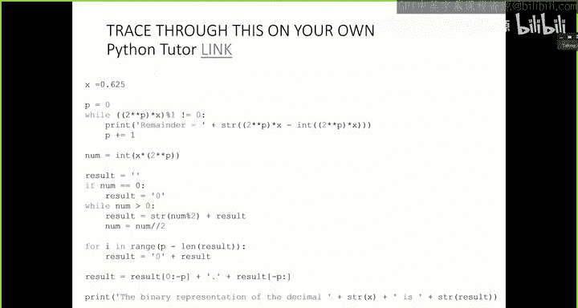

So I've got my X initialized up there。This bit here。

 So this big box here is the part that finds this magical power of two for me。

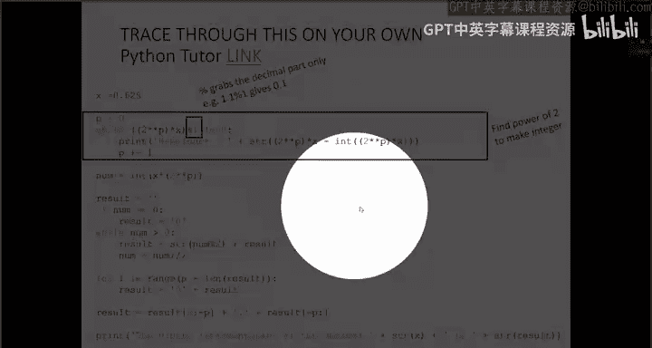

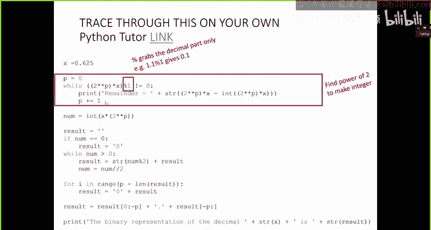

It's just a loop。That keeps incrementing the P， the power。

 such that 2 to the power of P multiplied by x。 This percent1 just gives me the decimal bit out of that multiplication is 0。

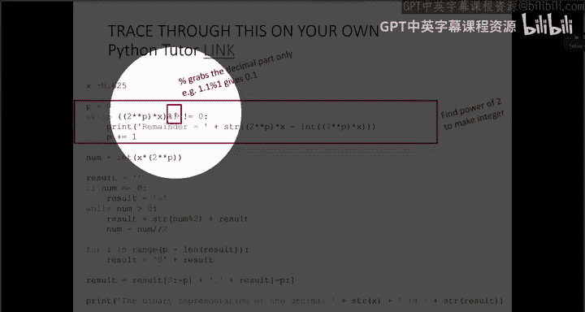

So I'm going to keep multiplying2 to some power of P by x。

As long as I still have a decimal piece to my number， as soon as this percentage percent1 becomes 0。

 that means that the number I， I end up with is some number dot 0。 right。

 There is no more decimal part to it。

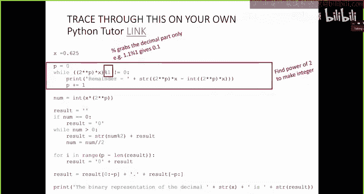

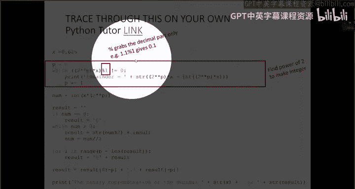

At that point， I break out of the loop， and I found my power of P。Or my power Pete。

This is going to be the integer。 So I'm multiplying x by that special power。

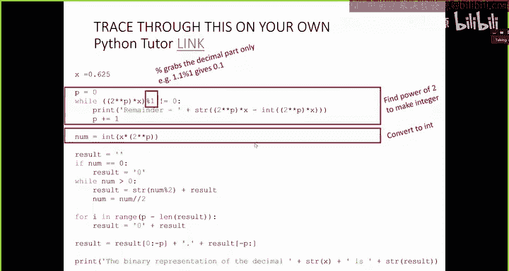

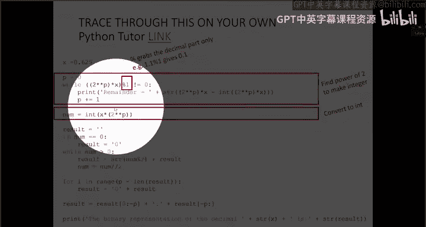

By  two to the power of， thats by2 to the power of that special power。

 And now I have this numbers on the previous slide， right， it's the number 3 in base 10。

And then this box here is exactly the same as two slides ago。 It's this procedure here。

 It's taking my number， whatever it may be and getting the binary representation of it。

And after that， we need to figure out how many spaces to move the decimal point backward。

 So what is the power of P we multiplied that number by。

 And now we need to work our way backward and say， well， that dot is here。

 Let me move the dot back P steps。And that's what this is doing。 So it's iterating through P minus。

 however long this thing is。To pad the front with zeros， Okay。

 because if because sometimes this is gonna be a really small number。

 So I need to add some leading zeroes before I put my decimal point。And then I put my decimal point。

 and that's all this line is doing。 and then I print my result。So Python tutor。

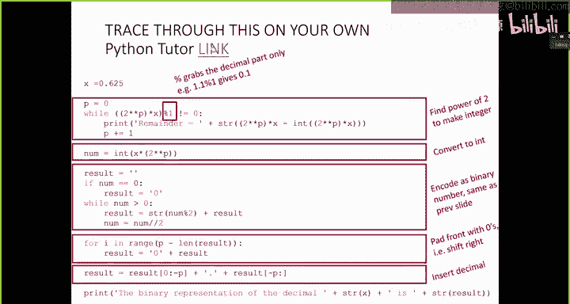

Alright， so step through。 So this is 06 to 5， just like in the slides。P is initially 0。

 So now this loop is just incrementing P1 by one to find the。

 the point where I have a remainder of 0。So here I'm actually also printing the remainder。

 So here we still have a nonzero remainder， right so it's 0。625 as a remainder，0。25 as a remainder。

 0。5 as a remainder。 And then at some point I had multiplied it by 2 to the power of 3 because PS3 and I had a0 remainder。

 So now I've broken out of that loop。And I know numb is equal to 5。

 Im multiplied by two to the power of three times。6 to 5。 to give me 5。So now I need to convert numb。

 which is 5 using this process we did here into binary。That's what this code is doing。

 And this is exactly this process we had here。 So I'm creating this results string and then preending a 0 or one。

 whether the number is divisible by  two or not。So the number 5 in binary is 1，0，1。Okay。

 so that means I have 1，01 dot as my binary representation of 5。

 And now the code is going to go through this loop。

 which means it's going to move the decimal point to the left three slots， right。

 because I multi because I have to multiply by two to the power of  three to get the five。

So you can see it's going to go loop through。3 slots， right， So here it is。 it made the 0。101。

 And then sorry， this bit， which I skipped over， applies the dot right。

 So it puts the dot in front of it。 And then the last step is to just print the representation。

 So the binary representation of 0。65 is 0。101。So here is the code。And we can run it。

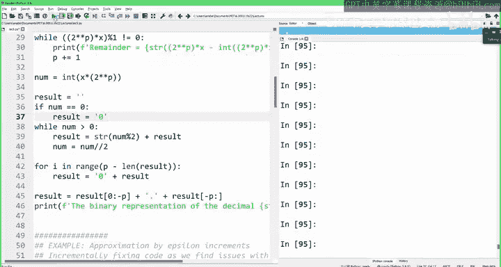

So 0。5。The representation is 010。625， which is what we had just done。 The representation is 0。101。

 right， and we can play around with a bunch of these values。 But then when we do something like 0。1。

 what is the representation of 0。1。RightBecause now we can use this code to get the representation of whatever decimal we'd like。

Pot1 was this troublesome decimal。 So let's see exactly what happened。Well。

 it had to do a whole lot of divisions， right？ It had to test a whole bunch of powers of two before it actually got to a whole number。

In fact， about 50 of them。 And we know that because there's about 50 of these zeros and ones here。

Right， so it was approximately 2 to the power of 50 that it had to multiply 01 by before it got to a whole number。

So what that means for us is a number that's kind of。

 a linear combination of powers of two is really easy and fast to compute， right。Something like。

 you know， this one here，1 times 2 to the negative 3 is 0。001， but something like 01。

 which isn't as as easy to see what the linear combination of all these powers of two are。

 is not so easy to compute， right， And in fact， we had to use our program to figure out exactly what it is。

And it for us， it was about 50 of these digits long， which was pretty long， right？

 And some of these numbers could be even longer， potentially infinite。

So the point here is that everything in computer memory is represented in terms of bits， right。

 zeros and ones。The reason we went through this whole computation is because there are some numbers that are just going to be way too big to fit inside these。

 inside the computer hardware， inside these representations。 Okay， so for integers。

 it's straightforward to deal with。 We had a really fast way to compute the the the base。

 the base2 representation。But for fractions， it's a lot harder。 and those numbers can be really。

 really big。So now， how are these numbers actually represented inside computer memory。

 So they're actually being represented in two pieces。1 one piece is the significant digit。

And the other piece is the power of two。系。So。If we had the representation， one， comma。

1 inside computer memory。Basically， the significant digit is one。And the power of two is one。

 So that means we're going to take this one dot and give it the power of2。

 So we're going to add a 0 after it。 So this is the binary 2 representation。

We basically just move the dot from here to here。 and then the number  one，0 and base 2。Is 2。0。

 right， That's what we have on the first line。 One comma negative one。

 that representation means I'm gonna take the significant digit  one。

And the power of  two is negative  one。 So I'm going take this decimal point and move it to the left one。

 So this is going be。0。1。Right，That's the this number，0。1， which is 0。5。 This is base 2。

 This is base 10。And just to bring the point home，1 hundred and 25。Okay。😊。

Is going to be 125 as a significant digit。And two to the negative 2。How is this going to work， Well。

 we're gonna take the 125 and convert it to a power of  two。 So it's what is this。

 I'm not gonna remember what is 1，1，1，1，1。0。1。This is what 1 25 is in base 2。 But the。

 but the the the exponent here tells me it's negative 2。 So instead of putting the dot here。

 I'm gonna move it 12 over。 So this is the actual number I'm representing in memory。

And now I can just convert the two pieces separately。 So this is going be 31。Dot， what is this 2，5。

 right。So this is how computers actually represent numbers inside memory。Okay。

 and we call this the object type， which is know decimal a real number afloat because this decimal point kind of floats around。

Yeah。31。Base 10 is 31。25， and 1，25 is how it's represented inside memory。

 So it's a base 10 sort of thing。 And then what is the power of  two。

So there's a couple conversions being done here。 We're representing the， the， the base 1。

25 is base 10。

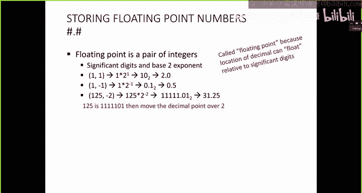

And how much we need to move the decimal point。 But first， we need to make the conversion of 1。

25 to binary， which is this long thing here， not counting this decimal point。

The negative 2 does us we need to move the decimal point over。

 and then we have the actual number we're trying to store， right。

And the reason we're doing this is because we're mostly just storing numbers as whole numbers inside the memory。

 We're not storing fractions。

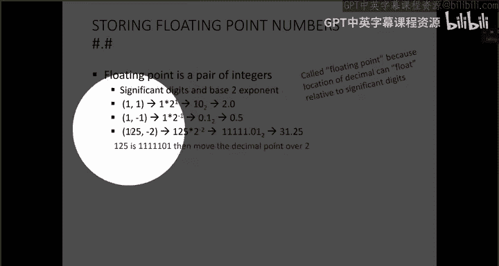

やってたゃつも。fors， exactly yeah。Okay， so in the end， we did all that because we're trying to figure out the error。

 right， Why do we get this error inside our programs。Well， in the end。

 it's because computers have a finite number of bits to store data。

Most modern computers maybe have 32， maybe 64 bits to represent significant digits。

 right So if we have 32 slots in order to put these significant digits。

 If our number base 2 representation was 50 digits long， then we're going to truncate at 32。

 we can't store those extra bits right， And so a number like 。

1 ends up actually being an approximation in base 2 inside computer memory。

 we're not able to store that number exactly perfectly。 So it becomes an approximation。Right。

 and the approximation actually ends up being at the 32nd bit。 right that either will be 0 or one。

 you know， depending on how we decide to trunnccate。And so the error is actually two to the。

 to2 to the negative 32。Right， which is on the order of two times 10 in the negative 10。

 which seems pretty small。Right， it's， it's a very small error。

 But we just saw that that error accumulates really， really quickly， right？ So while 。

1 has an error at the2 to the negative 32 slot， if we take that error and we just kind of accumulated over 10 increments as we had this loop that went through 10 times。

 we see that that error ends up becoming a big problem， right。

 we see that it actually at the negative 16th slot or something like that， it， you know。

 it starts to， to round to the wrong， the wrong thing。 And so we see things like。

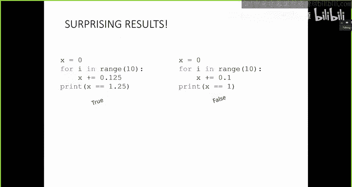

This， right， we expect it to be one， but it's not one。

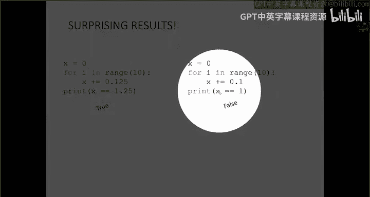

Okay， so the moral of the story is we don't want to use equivalents， right， the。

 the equivalent operator， the Eequ operator， when we're comparing it comparing floats。

Because of errors like this， the errors can accumulate， and then we start getting the wrong answer。

 and then your programs end up not doing what you expect them to do。 Okay。

 so we always want to test whether some float is within some epsilon of another float。

And so that brings us to an approximation method。Last lecture。

 we saw the guess and check method as a really simple algorithm for solving problems。

 We have a set number of solutions that we can check， and then we check each one by one。

 And then at some point， we either find the solution or we've checked all that we can check。

 and we haven't found the solution。Right，It's usually an integer。

 what we're kind of the things that we're checking。

 But as long as you have some finite set of values， you can check for a solution through。

Guess and check is totally applicable。But the problem is， it's a little bit limiting， right。

 It doesn't give us an actual approximation to the square root。

 If you remember the code we wrote last time， it didn't actually say I'm approximating the square root of。

 you know，5 to be 1。4 something or whatever it is or 2。 something， right。

It was just able to tell me the square root of a perfect square or that the number you gave me is not a perfect square。

 And so it's a really limiting algorithm。 But the approximation method。

 the one we're going to see today， actually is going to be able to give us an approximation to the square root of any number。

 Okay， so it's better than guess and check。😊，Because we don't just want the correct answer or nothing。

 It's not an all or nothing kind of situation。 It's that we can approximate the answer to some degree。

So we're gonna to use guess and check when the exact answer that we want might not be accessible。

 right， We need some way to find an answer that's just good enough。

And approximation methods will not always。 and not usually， actually。

 most of the time will not give us the right answer。 It They'll usually give us an approximation。

 That's good enough， okay。And approximation methods， these。

 they came about because of the exhaustive enumeration limitation， right。

 We're not able to test all the possible values to find the exact square root of a number， right。

 because those values are all infinite。So floating points come into play here。

 the whole thing we've been talking about at the beginning of this lecture and last time。

Flowling points come into play here because they're very important to this method。

 Now that we're comparing floats。We're have， we're going to have to be careful about how we actually do the comparison。

So how can we approximate the square root， Well， instead of looking at just whole numbers and saying whether we found the root or not。

 what we're going to do is have smaller increments。 So no longer are we doing just integer。

Guess and check。 We can do 01。2。3。4， and so on until we get to a guess that's close enough to x。

 right， So we say that 2。1 or whatever is good enough to the square root of  P。

What does it mean to be good enough， right？ Suppose we wanted to find this approximation to this square root。

 right？ The guess and check was not able to do this for us， but the approximation method can。

So what we're asking for， can we find a root such that that root times that root times itself is equal to x。

Right。And we're gonna do this such that we have a good enough approximation。

So that means that root that we're going to find。Minus x。

Is going to be less than some epsilon or the absolute value of that subtraction is going to be less than epsilon。

Right。So in where we did incremental step by step， we're gonna to go through as long as we are within or until we are within some epsilon of X。

Okay， so the algorithm will be as follows。 We're gonna start with a guess that we know is too small。

 So for the square root of a number， let's start with 0。

 And then we're gonna increment it by a really small value with guess and check。

 we incremented it by integers with this particular method。 We can increment it by 05s or 。1s or 。

0001， whatever we'd like。Okay， that new increment gives us a new guess。

 We're gonna check whether this new guess is now close enough to X。 If it is， we're good。

 And if it's not， we're just going keep incrementing the guess until we get close enough to the actual answer。

ok k。So。We are。 we have two parameters we actually need to set in the approximation algorithm。

 The first is an epsilon。 So this is down here。 How close do we want to be to the final answer。

 What's the leeway we're going allow。And second is the increment。

 So how much do we want to change our guessby。The way the algorithm performs depends on the values we choose for these。

 Obviously， if our guess is smaller， right， if we decrease the increment。

 we're going to get a much more accurate。Approxiation， right。If we increase the epsilon， how。

 you know， how close we want to be to X， our program is going to be a faster because we're going enter that plus minus epsilon boundary faster。

But。😡，It's going to be less accurate because at some point， we're going to enter the boundary。

 I'm going to say good enough。 I'm not going to get any closer to X because there's no need to。

 I'm already with an epsilon。 So here， the guess， you know。

 good enough guess was to the squared of 5 was 1。 something。 But on the previous slide， right。

 when we had a smaller epsilon， the good enough guess was 2。 something。

So the approximation algorithm is like guess and check， except that we have some small increment。

 We change by a small amount。And we stop when we're close enough。

 So we're gonna check that the absolute value of this solution。

Minus the solution minus the actual answer is with epsilon。

So here's some code where we can implement what finding the square root of a number with approximation method。

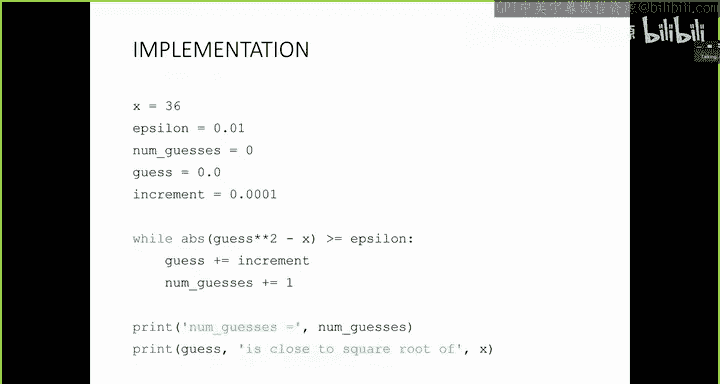

We have some stuff here that we're initializing。 So this is the fine thing we want to find the square root of。

 This is how close we want to be to the final answer。And this is our increment。

Numb guesses is just to keep track of how many actual guesses we're doing。

 and we're going to start with a guess that we know is too small， zero。

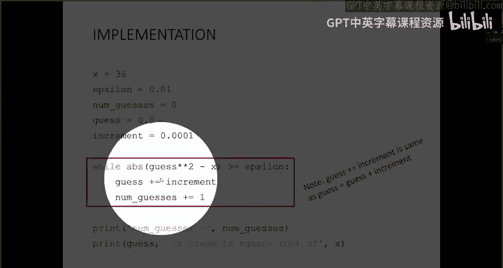

This is the loop that does all of the work for us。So the way we would say it in English is says。

 basically， while our guest is not with an epsilon， keep making new guesses。

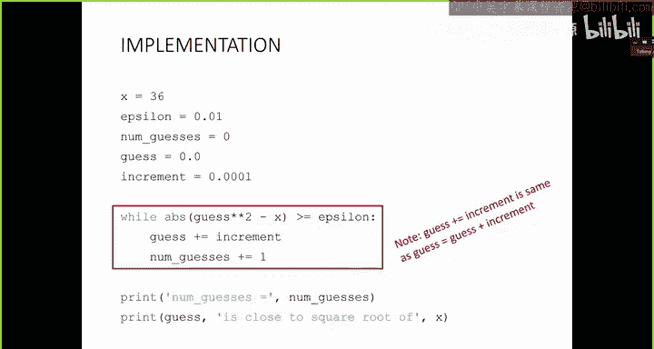

So while what does it mean for the guest to not be within plus or minus epsilon， Well。

 the absolute value of our guest squared minus x。Is greater or equal to epsilon。

 So while we're still too far away。

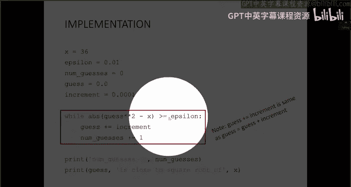

Let's make a new guess。 So we increment our guests by。The increment value。So originally， we were 0。

 then we're 0。001，01。 Then we're gonna to be 0。0002， and so on。

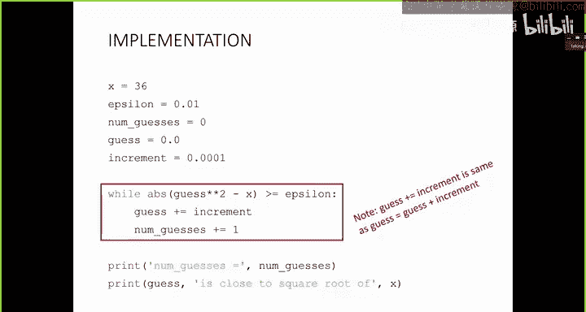

This numb guesses， again， it's just for us to keep track of how many times we've actually gone through this loop。

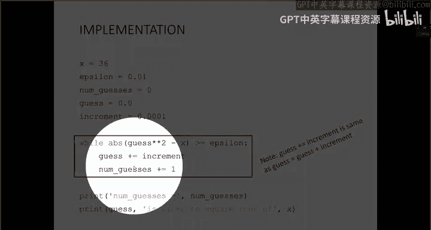

And at the end， we can print how many guesses we've done。Okay， so here's the code。And 36。

 so we could run it。 What do we see。Here's our approximation to the squared of 36。 Now。

 we know it's 6。And， of course， if we kept going， we could have found probably exactly 6。

But notice this approximation algorithm stops as soon as you enter that plus minus epsilon boundary。

Yes。Do four loops always increase in integer amounts， Yes， the step has to be on an integer。

 positive or negative。 Yeah， so exactly a for loop would not have worked here， right。Right。

 so here we stop this algorithm as soon as we entered that plus minus boundary of epsilon， right。

And so 5。9991 is close enough to a square root of 6。 And that's what we' are reporting。

The number of guesses here was about 59，9，9，2000。And thats makes sense because our increment is 0。

0001。 and we went all the way up to 5。99， right， So with each time through the loop。

 we incremented by 。0001。 So that's just this times 10000。That makes sense。

So let's try it with a couple other values。 So here it is with 24 right，4。89。 Again。

 we're seeing these floating point errors pop into play right， whenever we see this weird like 0。

00000 and in some small amount at the end， that's these floating point errors。

 just given the numbers we're working with adding up。Here's the square root of 2， right，1。41 again。

 floating point air。 But this time on the other side，99999。One， two， three， four， five， run it。

It took a second， right， There was a little pause， and then it gave us the answer just because it has to loop through about what is this 100。

1，2，3，1 million times， right， So did that loop 1 million times to get us， get us the answer。And then。

We can try one more，5，4，3，2，1。 This should take about five times as long， right， because 1200。31。

12345 took about one second。 This one should take about 5 seconds。But it's not。

I'm pretty sure I was talking for more than5 seconds， and this program is not ending。

So something's gone wrong。 I'm going to stop it。 Remember， you can stop it by clicking the shell。

 hitting control C or the little square here in the corner。So what went wrong？呃。Oh yes。

 my question is， will this loop always terminate And 5，4，3，2。

1 was an example of the loop not terminating。So what happened。We did all this。

Let's try to debug what exactly happened。 because clearly。

 what we have in code right now is not really giving us much information。

 So let's add some print statements。The print statements I'm adding is just in here。

 So everything else that's not boxed is the same as on the previous slide。

 The only thing I'm adding new is this， if statement here。

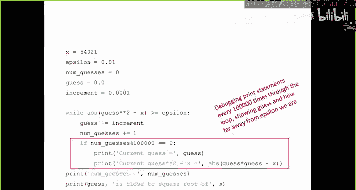

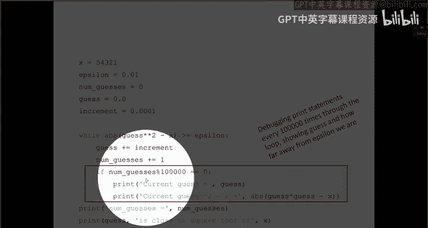

So every 1000， sorry， every 100000 guesses。So every time I've gone through this loop 100 thousand0 times。

 I'm gonna print what the current guess is。

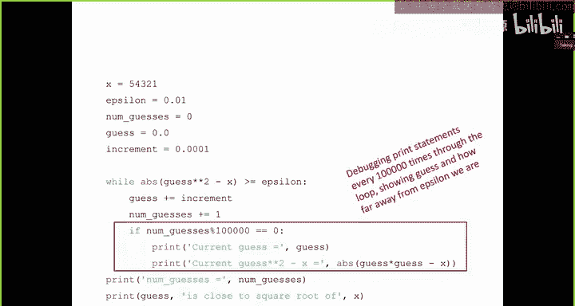

And what the guess squared minus x is。 So how far away I am from x。

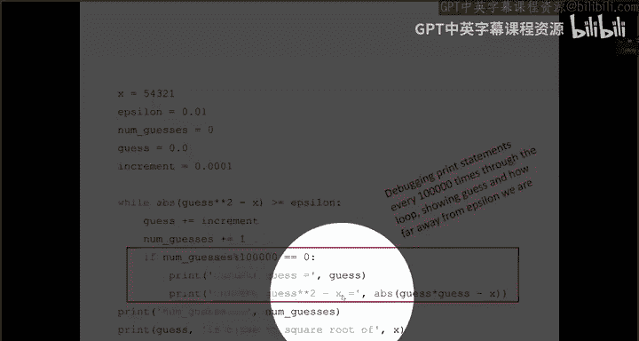

The epsilon。Not the epsilon， but how far away I am from X。So let's run that code。It's down here。

 I added a little bit of extra thing， which is just， it's not printing the whole time。

 It's just going to pause for me just to talk about what's going on。 So here I have the code run。

Has run。 So my first  hundred thousand times through the loop， I have my guess being about 10。

And how far I am from x is about 54000。 So I want to be 001 away from from x， right。

 because that's what my epsilon is。 And so here I'm 54000 away from X。 So clearly， that's too much。O。

Let's continue。 So then we make more guesses。 And then here， when my guess is 100。

 I am about 44000 away from X from 54。 So looking good。Let's continue。 So with 120， I'm 39。

000 away from x with 200， I'm 14，000 away from x， so it's looking much better， right。

 I'm getting closer and closer to getting that difference you know being 0 or 001。Continue。With 210。

 I'm 10000 away from X， and then I'm almost 6000 away from X。 and then I'm 1000 away from X。And then。

 from 230。As my guess， which brought me 1400 away from X， the next time I have 2，40。

 the next printout I have brings me to 3000 away from X。So I was 1000， but now I'm 3000。

And then from there on， things break down really quickly because I just get now farther and farther away from X。

 right， So here I am continuing the program for a little bit。 and then I just keep making guesses。

 right， because I was never within that epsilon。 So here's 500。

 And now I'm almost 200000 away from X。 And so now you see what's happening。

 This program is just going to keep getting further and further away from where I need to be。

So let's visualize what exactly happened。This is our x 5454321。And this is our epsilon。

 let's say it's 0。01， obviously not to scale。Blue is gonna be representing one guess。

 So here's a guess。 And then we have the guess squared， a green。

So let's just for visualization purposes， let's say this is our guess。 And this is our guess squared。

 Okay， we're far away from， from X。 We're definitely outside the Epsilon boundary。

 We make another guess by incrementing it a little bit。 This is the guess squared。😊。

We make another guess by incrementing it a little bit because we're still far away from that plus minus epsilon。

 This is our guest squared。We make another guess。 This is our guest squared。

 We're pretty darn close to that plus minus epsilon boundary， right。

 We want to be within that plus minus epsilon。So one more guest should make it right。

This is our next guest。But now the guess squared is on the other side。This is the big reveal， guys。

So what happened， What happens now， The program says。

 keep guessing because we're not with an epsilon。 So it's going to make another guess。Yes， squared。

And it's just going to keep guessing。And then our guest squad is just going to keep getting bigger and bigger。

So we basically overshot the epsilon， right， We've overshot our little plus minus boundary that we were interested in being within。

Right。We didn't account for that when we wrote the loop， right。

 All we wanted to do was be within Epsilon， and our program would end。So， let's fix that。

One edition will fix that。And it's something that we had been doing and guess and check anyway。Right。

 in guess and check， we would say something like， if we've passed the reasonable guess。Right。

 when we know that guess squared from here on out is definitely too big， just stop， stop guessing。

 right， Just just stop。And so we can add that same thing here。As just another ending condition。

 So everything in this code is the same as before， except for this red box。

We're adding another stopping condition。That basically says， keep guessing while we， we。

 while we're still guessing something reasonable。Right。

But when we've guess something that's not reasonable， right。

 which is when the guess squared is greater than x， right， we've we're way past it。

 Stop guessing as well。So whichever one of these conditions， either this one。

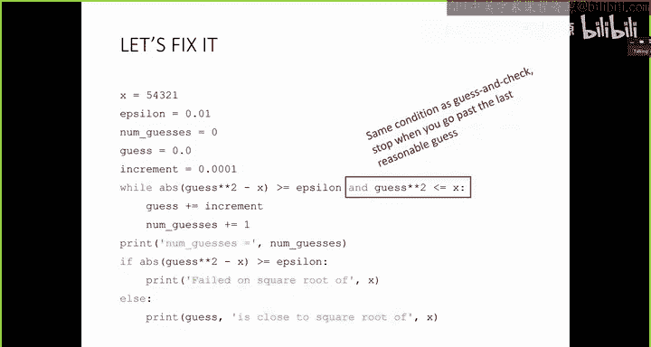

Or this one being with an epsilon is true。 We break out of the loop。

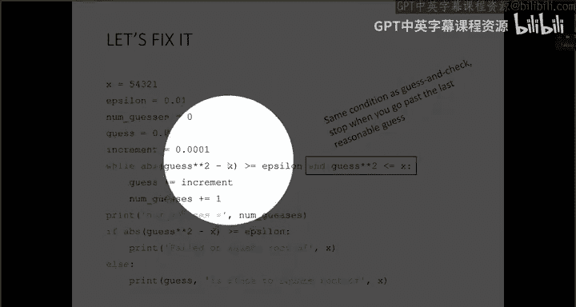

And then we have an if else kind of the same sort of thing we've been doing so far in the guess and check。

 Why did we break the loop。Did we break it Because we were with an epsilon。

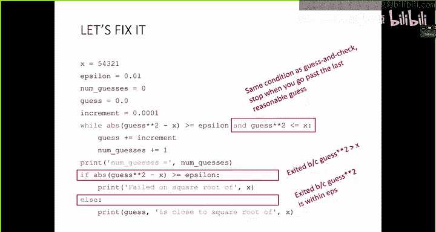

That is the else clause here， right？ If we did， then we say this is close to square root of x。

 But if we broke it because we've passed reasonable number of guesses。

 then we know we failed to find the square root， right， because we overshot the mark or whatever。

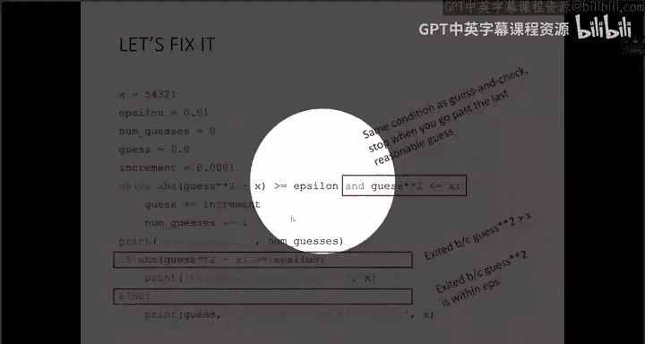

So。Here is the code with 5，4，3，21。But now we have that extra condition here。

 guess squared less than less than x。So we see that we've done some number of guesses， right，2300000。

And the message we get is we failed to find the square root。 Make sense， right。

 because we knew we would fail。 And we're also reporting what the last guess was。

 And the last guest square。 just in case the user wants to use that information for anything。

What are some solutions to fix this， right， if we don't want to fail， what what can we do。Well。

 I gave you a hint right here， we can decrement our increment， or we can decrease our increment。

If instead of adding 00001 every time through the loop， let's add 000001。 So let's make it。

 make a guess 10 times as many guesses。We're gonna have to wait a little bit， maybe about 10 seconds。

 but the program will end。 It's taking this long， obviously。

 because it's making all of these extra guesses， right。

 for every one guess we had with the program that failed， We're now making 10 guesses。

 right because we decreased our increment by 10。Okay， so it ended。

 And we see exactly that idea and the number of guesses。 So here we had 2。

3 million guesses when our increment was 。0001， But when our increment was 。00001， right，40s。

 we had 23 million guesses。 So obviously， we had 10 times as many guesses。

 which made our program be 10 times as slow。But now we didn't fail because we were able to go within that epsilon。

Right， so we found that 2，33。06864， which is pretty close to what we had before， is within 。

01 of epsilon。Right， so with approximation methods， it's possible to overshoot the epsilon， right。

 We have to be a little bit more careful now about what our end condition is。 Yes。

 we can check that we are with an epsilon， but we have to also use a little bit of common sense。

 Maybe algebra， something like that to figure out， is there a way we can overshoot the epsilon。

And how else can we， you know， stop the program without it running into an infinite loop， right。

 because that would be bad。So I think I already went over this， right。

 What are some observations about running it。 Yes， it reported failure。

 So we reset the increment down to 10 times smaller than what it was before。 The program was small。

 was slower because we had more values to check through。

So the big idea here is we want to be careful when comparing floats。

 If we we were using something like equal equal sign， right。

 that would have been a complete disaster that we might have never been with an epsilon or something like that。

嗯。Yeah， so what are some lessons we learned in approximation。Right。

 so we can't use double equal sign to check for exit conditions。

 We always have to check whether we are within plus or minus some epsilon of the actual answer。

We have to be careful that we have that the the exit condition being plus or minus within some epsilon doesn't jump over our exit test。

 as we just saw， right， In that case， we add some extra condition。

And then we saw that we actually have a trade off， right。

 We can have a program that does terminate and reports a correct answer， right。

 It doesn't say we failed， but it does report a correct answer。But that could be。

 a program that's a lot slower。Right， it's a lot slower because we had to decrease the。

 our increment。Alternatively， we could have increased our epsilon boundary， right。

 our plus minus epsilon that we allowed to be within could have been bigger。

But then we would give up on some accuracy as well。

 So there's always this trade off of speed versus accuracy to get the program to do。

 to actually give you an answer or to do what you'd like， right， And depending on the application。

 you might want accuracy versus speed or vice versa。O。So。This approximation algorithm is。

 is really slow， right， to get an answer for the square root of 54321。

 We had to decrease our increment to something like 。00001。And we ran it。

 and that program took maybe 10 seconds to run， right on my computer， because we started from 0。

 and we were just painfully incrementing that increment one at a time。

 even though we knew sort of from what the number actually was5 54000。

 that that the square root of it could not really be that low。 But that's just the algorithm we had。

 right， we had to start from something。0， just in case the user gave it other numbers， which。

 you know， didn't make sense to start higher than that。And so the approximation algorithm。

 as you saw， can be really slow。 The question I have is。

 is there a faster way that still gets good answers。And the answer， of course， is yes。

 And we're going to see this， this particular this algorithm in the next lecture。So in quick summary。

 we saw floating points。 We did a lot of calculations with binary numbers。

 You don't need to know how to do those calculations。 But again， given a recipe or an algorithm。

 can you take that and put it into code， right， Floing point numbers introduced a little bit of challenge for us in comparing them because of the way they're stored in memory。

We can't represent some of these numbers exactly in memory。 So that's a problem。

Because they're not represented exactly in memory。 We might magnify some errors， right。

 as we saw with that loop and the approximation methods use floats。 Unfortunately， or fortunate。

 right， they need to use floats because we need to have a small increment。

 and we have to be mindful of these issues when using them。

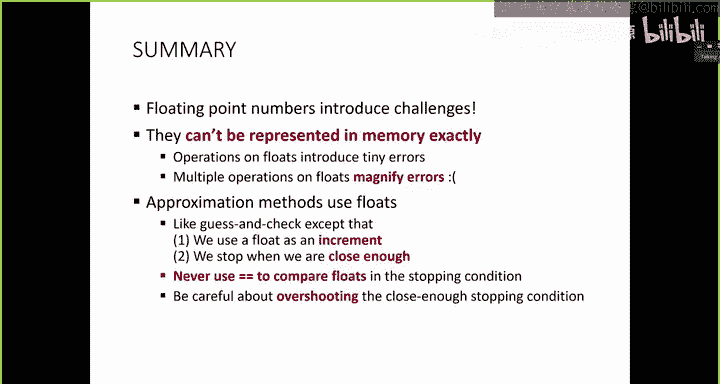

