# 《计算机科学和Python编程｜6.100L Introduction to CS and Programming using Python, 2022》 - P6：-06-Lecture 6_ Bisection Search (FIXED).zh_en - GPT中英字幕课程资源 - BV1PAxJzVEs3

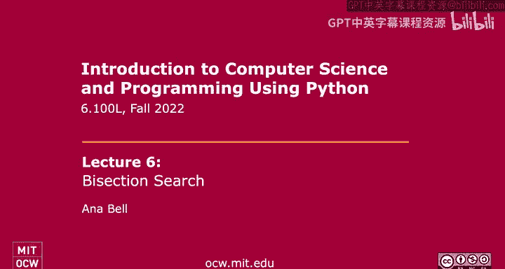

Okay， so let's get started on today's lecture。Last lecture。

 I left you off with the promise of bigger and better algorithms to do what we've been trying to do。

 which is to approximate square roots and things like that。

 So today will be the introduction of our last algorithm for a bit before we'll start talking about more Python syntax。

 But today， we're going to introduce the bisection search algorithm。Okay。

 well before we get into that， let's try to remember where we left off last time。

 So last time we talked about floating point numbers。

 and then we talked about approximation algorithms， right。

So the reason why we talked about floating point numbers is because we wanted to come up with an algorithm that was better than guess and check。

 right， guess and check was really limiting。 We were basically limited to some exhaustive number of potential solutions。

But we didn't just want to have an exhaustive set to look through for a solution。

 We wanted to be able to actually come up with an approximation to solve our problems， right。

And so we talked about floating point numbers because we said， well， instead of having， for example。

 integer increments when we searched for square roots of values。

 let's try to have smaller increments。 Okay And so if we have smaller increments， than an integer。

 well， we were starting to look at incrementing by 0。1 or 025 or 0。001， whatever we want。

And so then since we started talking about these floating point numbers。

 it was important to kind of understand what happens behind the scenes。

 and we saw that these floating point numbers can't actually be represented in memory directly exactly right There's always for the majority of the numbers。

 there's going to be some sort of rounding that happens when that number is stored in memory and the rounding is very small。

 It's something like 10 to the negative 10 or sorry 10 to2 to the negative 32。

 which is approximately 10 to the negative 10， which seems small。

 but we saw even with just a loop that added 0。1 to itself 10 times we were already getting very surprising results right。

So， the approximation method。Introduce the idea of， yes。

 we can get an approximation for the square root of a number， but we can't check for equality。

 We can't say I'm going to come up with this， this approximation such that， you know。

 this approximation squared or whatever problem we're trying to solve is exactly equal to the number we're looking for。

So we had to have a little wiggle room。 and that wiggle room came in the form of an epsilon。 right。

 So we were approximating a solution by basically saying。

 does this solution come within plus or minus epsilon of my desired value。

So we came up with a nice algorithm， the approximation algorithm。

 and we tested on a bunch of different values。 right。

 We were incrementing a small increment a little bit at a time。

And for the problem where we're trying to find approximate the square root of some value X。

 we were saying， well， I'm going to keep making these small incremental changes to my guess until I come within plus or minus epsilon of my actual value。

 right， the guess squared was within plus or minus epsilon of my X。

And this was the nice slide that we that we， that was kind of the， the， you know。

 the like the big bang of last lecture where we said。

 we have to be careful about the way we write these approximation algorithms because we might over overshoot our epsilon。

So if this is our guess and this is a guess squared， the blue arrow increments normally， right。

 whatever increment we choose。 But then it's possible that at some point the guess squared comes just short of the epsilon。

 right the lower the x minus epsilon。And with the following increment。

 the guess squared becomes just past。X plus epsilon。And so the code that we ended up writing， right。

 which was， it made sense， right when we wrote it actually ended up giving us an infinite loop because it never stopped。

We never were within that plus minus epsilon。 And so we would just keep making guesses from there on out。

 Okay， so we ended up getting an infinite loop for our program。

The solution was to take a little bit of of code from guess and check and said let's add an additional little sanity check stopping condition right And so everything except for this box was the approximation algorithm and we added the thing that I've boxed here as our sanity check that we grab from the guess and check algorithm that basically said if we've made a guess that that just just passed the reasonable number a reasonable guess we know that all the guesses from here on out will also be unreasonable And so there's no need to keep searching and that condition will cause us to stop stop our infinite loop or our potential infinite loop。

So this guess squared is less than or equal to x basically says stop when we go past the last reasonable guess。

And that condition plus the regular condition from an approximation algorithm。

 which says I want my guess squared to be plus or minus epsilon of the actual x。

Those two conditions together made up my algorithm。 And it's that's the algorithm。

 It's just this loop right here， this y loop with this increment。So it looks really， really simple。

 And so what we ended up having is these two conditions right。

 so I want to be within Epsilon and I want to still be making reasonable guesses to be sorry I want to be sorry outside of the bounds of epsilon and still be making reasonable guesses。

 that's the condition that causes me to keep making more guesses。

And when either one of these becomes false， I'm going to stop making guesses。

And that's what the if else down here says。It says one of these conditions became false。

 Either this 1， I'm making unreasonable guesses now， or I've come within plus or minus epsilon。

 So which one is it。So here I'm making unreasonable guesses。

 so I've exited the loop because I've gone too far。

 in which case I print I failed to find the square root。 And otherwise。

 I've exited because I am now within plus or minus Epsilon。

So let me just run the code to remind ourselves what it looked like。

So here we're trying to find 54321 was this troublesome value being within plus or minus-。01， right。

 our guess squared to be plus minus。01 of 54321。Our increment was seemed really small，0001。

But when we ran it。Took a couple seconds， and we made about 2。3 million guesses。

 And the code says we failed to find the square root， right。

 And we're also reporting what the last guess was and what the last guess squared was as well。

So what's the solution to this， right？ The solution was， well， we can make our epsilon bigger， right？

 So if we made our epsilon B1。 So if we wanted to be within plus or-1 of 54321。Yeah， that code works。

 right？ It didn't fail。 It made still about 2。3 million guesses， and it came up with this estimate。

 So as soon as we came with an epsilon and that boundary。We stopped the program， right。

 It didn't try to do better。 It didn't try to get closer to X。The other solution。

 if we were unhappy with the fact that we failed， was to make our steps smaller。

But what's the problem if we make our steps smaller， You guys remember when I run the program。Yeah。

 it takes longer。 And do you， can you approximate how much longer it'll take。

I decreased my step size by 10。 So every one step I made last run， I'm now going to take 10 steps。

 right， So I'm waiting basically what 1520 seconds here。 if the last run took2 seconds to run。

And now I've also doubled the number of guesses， right， or sorry， not double10 time。

 I'm making 10 times the number of guesses，23 million as opposed to 2。3 million。

But the code didn't fail， right， It found something that's pretty close to the square root of 54231。

321。ok。So， that's where we left off。And I don't know about you。

 but I don't want to wait 20 seconds to figure out what the square root of 54000 is。

 That seems like an unreasonably long amount of time to come up with with an approximation， right。

 And we don't wait that long when we do it on the computer or when we do it on the cc。

And so that leads me to the bisection search algorithm。

 It's going to be a better way for us to solve certain types of problems。Much faster。

 but only certain types of problems。So to motivate the bisection search， before we even look at code。

 I just want to give you a bit of motivation with a few different examples。 Okay， the first one is。

 I'm going to give you guys a chance to win some money。Okay。

 so suppose I put a $100 bill at one page in this book。Okay， this is actually the last edition。

 not the vision we're using this year， but I don't have this year's edition， unfortunately。

 in my office。 So this， this book is 448 pages long。 Okay， and I put some money in this book。

 And if you can guess where the money is in eight or fewer guesses， I will give you the money。

 And if you fail， you get enough。😊，Not really。Is this a game anyone would want to play。

That's what I thought。And in fact， your chances of winning are about one in 56。 Okay， and I I， I。

 yeah， I， I don't want to play that game either。But now。

 let's say I give you some additional information。 Okay， with each guess you make。

 I will tell you whether you are correct， too low or too high。Okay。

 so I give you some additional information。 Is this a game that now you would want to play。

Would anyone like to play the game with me。You want to play the game？Okay， all right。 so Europe。

 okay。Alright， so I'm gonna write down your guesses because you only have 8。 Alright。

 you remember that there's only8 guesses。 Alright， so what's your first guess， there's 448 pages。

 So between， yeah， you pick 1 to 4，48。What's your first guess？224。Alright。

 smack in the middle right there。 Alright，2，24， don't look。No money。 Allright， so。

 but now I give you extra information。 The guess is too high。Yes， your guess was too high。

 so not 224。1，12， So you want to go here。1，1， two， all right。That's two guesses now。那。😡。

The guess is too high， as well。Still too high。56。什么。Here somewhere， okay。All right。56。

The guess is too high。Still too high。28， alright，28， I'm gonna start writing up here，28。You have 1，2。

3。 You're at four guesses now，28， okay。It is。No。Wait， I now I have to remember where I put。

It's too high， it's too high， sorry。Still too high。14， okay，14 right there。Okay， now 14。Now。

 it's too low。 now that I remembered， now that I remember where I actually put it。It's too low。

 turns out sounds like。Between， yeah，14 and 28。 So now， you know， it's， yeah。21， okay。

 so right there，21。 Okay， let's see。Guys， I'm shaking。👏It's not 100。

But there is a one and a zero in it。 So there you go。All right， that was awesome。So， yes， you。

 I'm really glad you played。 And actually， you only took7 guesses to get it。

 So I could have probably rigged it a little bit better because your chances of winning this game are about one in3。

 Okay， and you， and you did a really good job。😊，So what was your thought process， Basically。

 And I think once you did a couple of them， anyone who maybe didn't think about this way and have figured it out。

 You were basically guessing the halfway point， right， each time I told you too high or too low。

And so bisection search is a method that you can use to solve problems where there is some sort of order。

To the thing you're trying to search， right？ So let's say we know our interval in this case。

 in the book， we knew that we had page 1 to 448， right？ So we had this low point。

 page 1 and this high point 4，48。And we know that our answer lies within this interval。

 and it can be integers， like in this book， or it can be， you know， fractional pieces as well。

And the idea is， you're just guessing the midpoint between this interval。

 It's as good as guesses anything， right。But based on the answer that I give you。

 because now I give you extra information， if it's too high too low。

 you can basically eliminate half of the search space， right， So with the guest 224。

 what ended up happening is you eliminated this entire half of the book right So it's like I take this original book 4。

48 pages。 get the midpoint。 Ri it in half， throw away these upper pages。

 And now you kind of think of it like having the skin your book。

 and this is now the book you're searching through。Right。

And then you're repeating the process all over again。 The low end point is still page 1。Right。

 because I have no information about how low I need to go。

 But my high end point becomes the guess that I had just made， right，2，24。Right。

 and now I make another guess， midpoint。In this skinnier book。

And so this should kind of trigger something in your brain about computation and things that we've learned as soon as we're saying I'm repeating this process。

 right， of now just doing the guess again with this smaller version of a book。

 where basically we have a loop， right， that's something that you should be thinking about。

And this loop is going something that is going to be something that just repeats the same process over and over again。

 Once I've eliminated this upper half of the book， Now。

 I'm looking through this lower half midpoint based on the answer I give you。

 you can rip the book again in half where you are now。

 And now you're searching the skinnier version of the book。

So we're basically cutting the number of things we need to search for in half。

Every time we make a guess， which is really powerful， right。

 with guess and check or with or with approximation method。

 if we're going to do guess and check on this book， we'd be asking， is it page 1， Is it page 2。

 Is it page 3， iss it page4， and that's tedious， right， We're not doing。

 we're not eliminating half the book with each guess。

 We're just eliminating one page with each guess， okay。So this idea of logarithmic growth。

 which is what happens when you eliminate this the search space in half each with each stage is logarithmic growth。

 And we'll come back to this idea again towards the last few weeks of lecture。

 When we talk about comparing algorithms in this class。

 And what does it mean for one algorithm to be more efficient than another algorithm。

 What does it mean to run faster。So that's just something I mentioned when we do guess and check where we ask one page at a time。

 that's linear growth。 because if the book， if I give you now a book that's double the size and just by bad luck。

 I put the money away at the end。 if I put the money at the end in this book that's twice as big。

 then you're gonna have to ask me twice as many questions until you get to the answer。

 But with logarithmic growth， If I still put the the money in this book that's double the size somewhere。

 all you need to do is make one extra guess， not 400 extra guesses to figure out which interval it's in。

 right， you take from this double book。Make your first guess。 And all of a sudden。

 we are at this book again。All right。So let's do another analogy just so we get kind of the sense of where this is going。

 So suppose that， you know， we don't just need to work with numbers。

 We can also work with anything that has an ordering property to it。 So suppose when you came in。

 I asked you to sit alphabetically， right， Front left is last name A back， right is last name Z。

And then I'm looking for a particular person right for me。

 the bisection search algorithm could be basically ask the person in the middle of the class what is their last name。

 right， if they， if， you know， they say what it is and， and depending on what they say， right。

 I can basically dismiss half of the people。 if their last name starts with a letter later than the one I'm looking for in the alphabet。

 I dismiss the upper half and vice versa。And then I have this only half of the people to search there and I keep repeating this process until I have only one person left。

 and either that person is the one I'm looking for。

 in which case I've decreased by half the size of the class with each guest。

 and I have one person left to ask。So what I'm looking for or that person just isn't here。

So let's try to apply the same idea of bisection search to programming。 and specifically。

 let's do the problem we've been trying to solve kind of as a common thread throughout these algorithms。

 figuring out the square root of a number， not exact。 actually。

 we're still going to be looking only for an approximation to the square root of a number。

So the idea here is that our interval is if we're trying to find the squared of x is going be between 0 and x。

Right， so basically， I can just reuse this number line here。Right。And I have。

My interval for the square root is 0。And x。So， like that。So with approximation method。

 we would start at 0 and painstakingly make our way little by little。But with bisection search。

 we're make， we're making our initial guess to be the halfway point。Again。

 we're working with numbers。 So the ordering properties is very intuitive。

 We ask at this halfway point， what is with this guess at the halfway point。

 what is the guess squared。Okay， so if the guess squared。Is up here， right， So G squared is up here。

Then I know this guess is too big。 So I know I do not need to make any further guesses up here。

RightAnd so that's this case here。If I know this guess is too big。

 then my interval now becomes this is going be the low still。 But now this is going be my high point。

 right？ And this is kind of this new interval I'm looking through。But if you think about it。

 it's the exact same problem I started with when my interval was， was larger， right。

 I still have an interval with a low and a high。 I'm still going make a guess halfway。

This new G here。 And I'm gonna ask， again， is this new guess squared less than or greater than x。

Let's say this case is less than。 So if the new guess nu G is less than x。

 the new G squared is less than x， then I know。This is New G。

Then I know that anything lower than this is definitely not going to be closer to the。

 to the answer I'm looking for。 So now I'm eliminating this half。Of the search space。

 And then I keep making the same guesses next G G， latest G。

 This is in like when you guys name your files， remember and。You know。

 you've got new new file final file， latest file， version 2， all that stuff。

 That's basically what I did。 So anyway， I have this latest G here， right， which is my new midpoint。

 And I keep making these guesses and asking the question whether this guess squared is greater than or equal or less than X。

 And I adjust my boundaries accordingly。😊，O。So at each stage。

 the number of values I have to search through are just half of what I had to search through last guess。

So， the bisection search。Takes advantage of two properties。

 And you can only use it when you have these properties in hand， right。

 There's some sort of ordering to the thing you're searching。 So， you know。

 last names are alphabetical。 You know， you have this range of values。

 and you have some sort of feedback。The feedback tell。

 it tells you whether the guess that you made was too low or too high or exact or approximate。

 whatever you want。Okay， so answer think about this for a second and answer the question。

 So you're guessing a four digit pin code right on a phone or whatever。

 And the feedback the phone tells you is whether the guess is correct or not。

Can you use bise search in this situation to quickly and correctly guess the code。No， why is that。

 What are we missing？It doesn't tell you if it's too big or too small。 Yeah， so guessing， random。

 I mean， you could use bisection search and you could choose which have to look through。

 But then basically， you just have to search through all the values anyway in worst case， right。

 And then you might as well have just gone from know0，0，0，0，0，0，0，1，0，0，2。

 just have gone incrementally upward。Okay， so how about this extreme guessing game。Alright。

 so you have a friend and you would like to play this extreme guessing game where you want to guess a number exactly。

ok。So your friend has a decimal number in mind， so it can be with a decimal point。

 like any real number from 0 to 10。 Let's say， including 0， including 10 to any precision in mind。

So the feedback your friend gives you when you play the extreme guessing game is whether your guess was correct。

 too low or too high in this case， can you use bisection search to quickly and correctly guess the number。

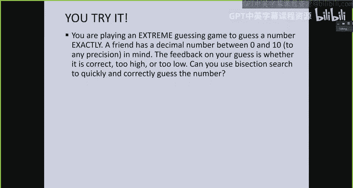

Right you。Yeah。So I， I included this word exactly here， right， If I didn't include that。

 I think the answer could be， could be yes because you could play the game to an a round or approximation to to decimal places or something like that。

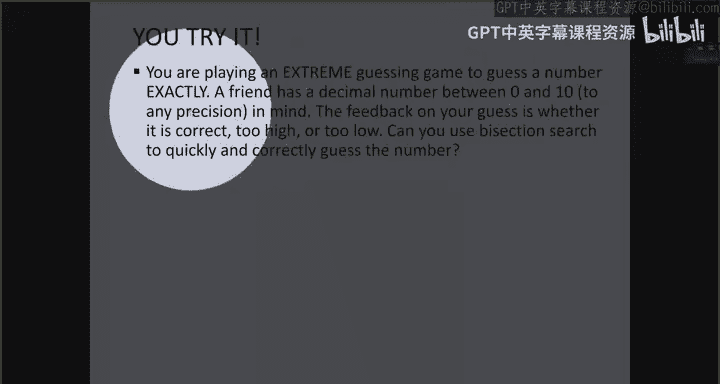

But I guess if your friend wants to flex with pie， right in your extreme guessing game。

 then bisection search wouldn't work because if you're trying to find that number exactly。

Then you'll never get to it， Right， So， yeah， you're using bisection search。

 but it's going to basically be an infinite algorithm， right， It won't terminate。O。So。

This is the same slide I had at the beginning of lecture just to remind ourselves what the code looks like when we use the approximation algorithm。

nothing new here。 So we had our， the thing that basically did the work was this while loop。

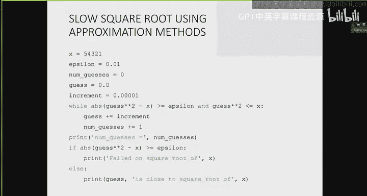

Right， while we were still farther away from Epsilon and we were still making reasonable guesses。

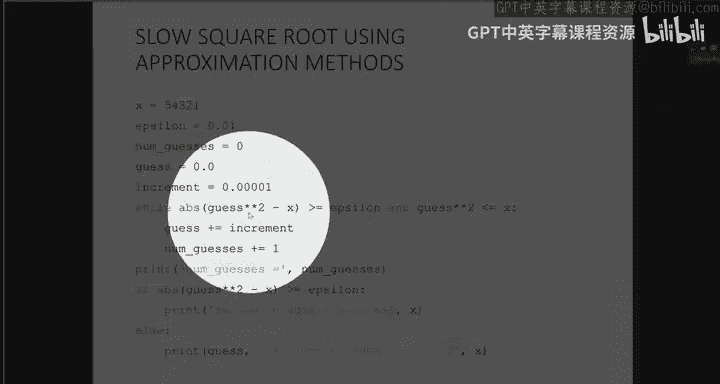

Increment our guess by 。0001。Now let's write the code for the finding approximating the square root of a number。

 but with bisection search， so we're going to follow the same kind of procedure we did here。

 and we're actually going to sort of write it together on the slides and I'm going to explain sort of the thought process that goes behind the each step。

Okay， so the first thing we're doing is we're initializing some stuff up here。

 So the thing we want to find the square root of， right。

 let's why not do the same number that gave us trouble last time。

And we still want to be within some plus a minus epsilon again。

 because we do not want to be comparing floats。

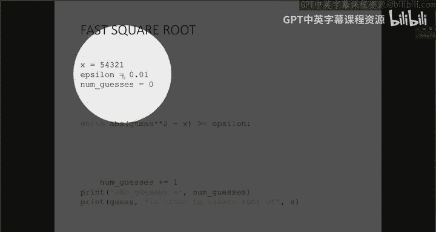

And this numb guesses is going to keep track of how many guesses we've made。 Basically。

 when we played the guessing game， how many guesses did you do to get to the， to the to the money。

All right。

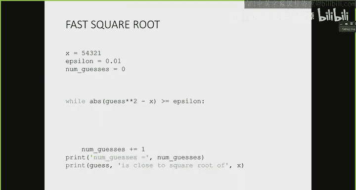

Good， And then at the bottom here， we're going to print out the， the number of guesses。

And what the guess was that brought us close to the plus or minus epsilon。

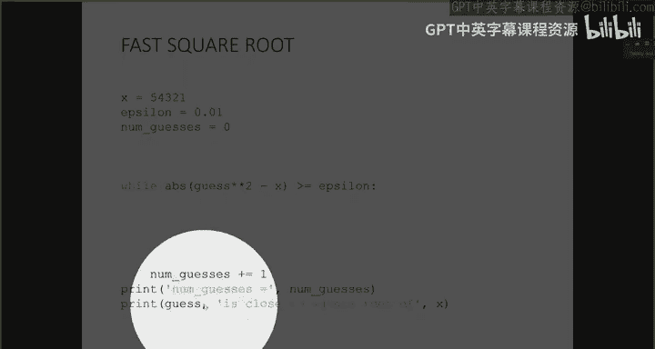

Okay， so the first thing we do is we notice there was a repetition。

 and the while loop here is exactly the same as the while loop for the approximation method。

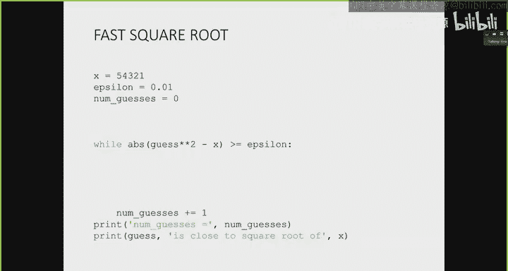

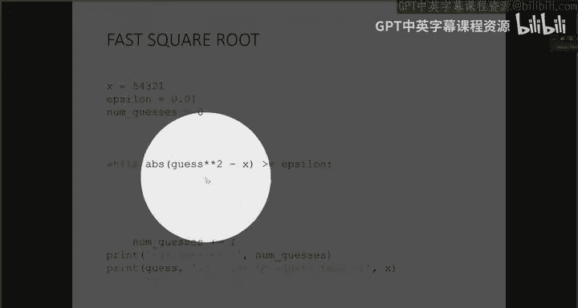

Okay， while we're still farther than epsilon away， right， while I our， while our guests squared。

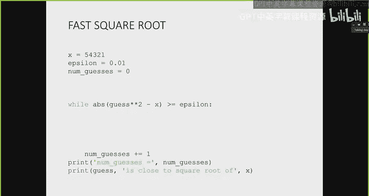

Is plus or minus epsilon away from x。 right， So absolute value of guess squared minus x is greater or equal to epsilon。

 I guess the cases could just be greater than。

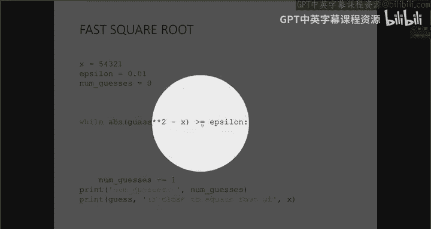

Details， let's keep making guesses。Now， the guesses are， we're not incrementing anything， right。

 This isn't the approximation method。 We need to make the guesses in a smart way。

So we're going initialize some stuff for our algorithm to work。Like our original endpoints。

And then we're going to do some stuff inside the loop， whatever is repeated， whatever we noted。

 right when we were talking about the algorithm。 What did we note that gets repeated every time。Okay。

 let's talk about the initializations。We need to initialize our two endpoints， right。

 We need the for the bisection search to work。 We need to know what our endpoints are。

 So the low is going to be 0。 So if we're trying to find the square root of x。

 we might as well make our low 0。And let's make our high point X。Our high point can be 2 x。

 It could be 3 x， whatever we want。 But that's too big。

 We know if using algebra that definitely it won't be that big。 so we can just make our high point x。

And then we just kick off this algorithm with our initial guess。

Is going to be the midpoint of low and high。 So high plus low divided by 2。Okay。

 so that brings us to just before the while loop here， right here。Okay。

 and now we're going to repeat some stuff while we're still far away。

 farther than Epsilon away from our answer。So the thing that we're repeating is going to be checking if we are too low or too high。

 right， Like we have a guess in hand Now， this midpoint here。And now。

 with this guess in hand that kind of kicked off our algorithm， we're going to say。

 is this guess too low or too high。Right， that's what the algorithm needs。So that's an if else。

 a little conditional here。If the guess squared is less than x， then the guess is too low。Okay。

 so if this is this guess squared brings us to somewhere here， right。

 then we know this guess is too low。What do I do in this case， What does the algorithm say to do。Yes。

Other way around。 Yes， so this is too low。 So I definitely don't want anything lower than here。

 exactlyly。 So we're gonna set our low end point。 If the guess is too low。

 let's set our low end point to be whatever guess we just made， because we know this is too low。

Anything lower than this is definitely too low。 So I don't care about these。Else。

We don't need an L if， because we know the L is the other way around。 else。 our guess was too high。

 right， So if the next time around， we make a guess here， or something like that。

 then we know we're too high。And then we need to set our high end point to be the guess。

Is everyone okay with that so far？O。What remains， So I've changed one of my boundaries。

 either my low or my high boundary to be whatever guess I just made。What is the next step。

 What is the， what does this algorithm do or this loop do as is。

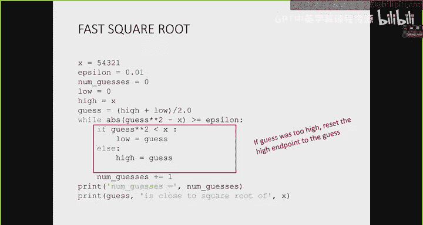

It finished doing whatever's inside， and it goes back。

And uses the guess and check whether the guess squared minus x is greater or equal to epsilon。

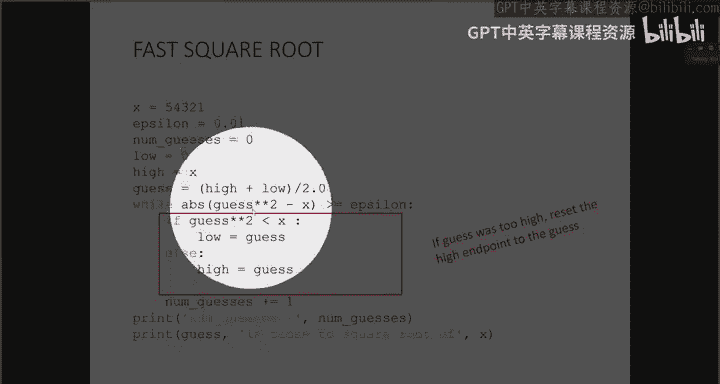

Have I changed my guess inside this loop yet？No。So that's the last step that remains。Make the guess。

Be the new midpoint。Using either the changed high or the changed low。

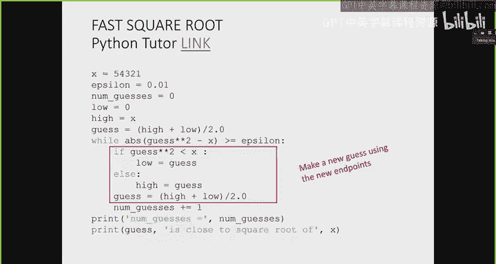

Right， so each time through my loop， I'm either changing my low to be the guess or changing my high to be the guess。

 So I'm making one of those two changes。

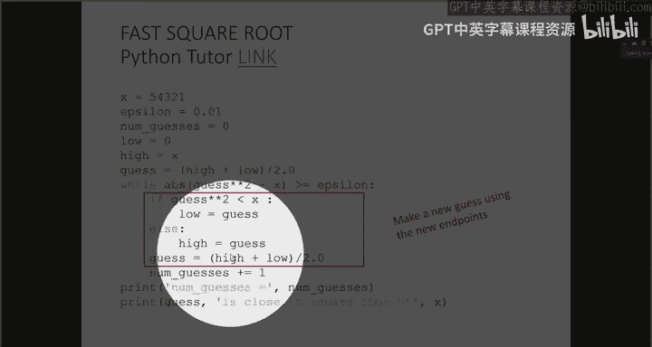

After I've made that change， I need to find the new midpoint。 right， So if I change my low。

 now I need to make my new guess。

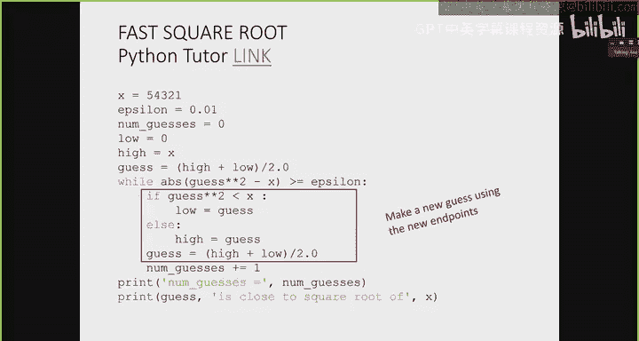

And with this new guess， then I'm happy for the while loop to check it again。😊，Right。

 take that guess squared。

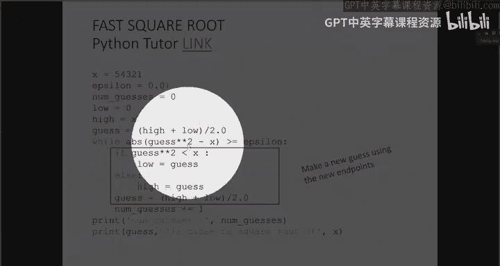

See how far away it is from X。 and then。It does the， the。Changing of the boundary all over again。

And that's it。 There's no other lines of code in here。So in some sense。

 there's a little bit of trust， right， with this loop that it does the right thing。

 But if you kind of。Do a little bit of iteration in your brain or through the Python tutor。

 you'll see that it actually does it correctly， right， so。We can just use that same number line。

And let's look at the squared， let's find an approximation to the squared root of 36。The epsilon。

 I made it one just because I don't wantanna。Do so many steps in the Python tutor。

 But you can imagine if it's smaller。 It'll just give us a better approximation。

So we're initializing the x， the thing we want to find the square root of and epsilon。

 the low and the high，0。And 36 in this particular case， right？Okay。

 stepping through the first guess is half of 36 and 0， so 18。So here's my guess is 18。

 And now we kick off our while loop by saying， what is 18 squared。 Oh， it's pretty big。

 Def bigger than 36。So I'm going to go inside this else。Because my guess is too high。

So my high becomes this。And this is sildailla。I know nothing about the low end， at this point。

So then my guess becomes the high plus low0 plus 18 divided by 2， right？ So that's going to be 9。

 So you can see my guess has updated to 9。And now I find the guess squared。 What is 9 squared。

 Is it still farther than plus or minus36 plus -1。Yes， in fact， it's still way too big。

 So now my high。Since I know 9 is still way too big for my guess， my high becomes。9ine。That。

And then I make a new guess based on 0 and 9 and the halfway point between there。So， four and a half。

So there it is updated。And using this guess， square it and see whether it's less than 36 or greater than 36。

 It's less than 36。 So now。This 4。5 becomes my low end point， right。

 now I have some information about the low end point。Like that。Right。

 so I know my final answer is within this little interval right here。Okay。

 and then I'm just gonna go quicker because now we're dealing with some fractions。

My loan point becomes 4。5。 and now I get the midpoint between4 and a half and 9。 and that's 675。

 And then we keep doing the same process over and over again。 Hopefully you get the idea now。

Where we keep changing this， while the guess squared is still 36。

Great outside of the boundary of 36 plus or -1， right， So if it's less than 35 or greater than 37。

 keep making guesses。So we're going to go till probably 60 something。I think that's the end。

So the guest being 6，0，4，6，9。Brings us to a guess squared within plus or -1。Yes， question。

If the guess was。If my guess was correct， then。We would break immediately。Right。Because this becomes。

 this is false。As yeah， we don't even enter the wide loop。O改。Okay， so let's run the code。So。

 this is the。This is the bisection search code that I just ran through the Python tutor。

 We looked on the slides， but。Running with 54321。 So just to recap the number of guesses we did with the approximation method was 23 million。

Okay， to give us an answer that said the squared of 23， the squared of 54000 is about 233。

 And now we run it with our bisection search。 And I didn't even have to wait。

 that took less than a second。Right， compared to 20 seconds that we had to wait for。

And it didn't fail。It gave us very similar answer。 It's this 2，33。

068 is close to the squared of 54000。And we did 30 guesses。Dramatic pause。23 million。

For the approximation method， 20 seconds later。Versus 30 guesses less than a second later。

 So it's not like we went from 23 million to 5 million guesses， right。

 We went from the order of millions to just tens。Which is really， really cool。Right。

That's very impressive。And that's what logarithmic growth means， right。

 That's the power of logarithmic growth。 and kind of recognizing that we can apply bi section search to these problems。

Right。嗯。So with approximation method， again， we're decreasing our search space by 。

0001 with each guess。 But with the bisection search， we're decreasing our search space by half。

With each guess， right， So if we had， you know。However， many things to search for in the book。

 we had 400 pages to search through， right， with our first guest。

 we now only have 200 pages to search through。With the second guess。

 we only have 100 pages to search through。 with the next guest。

 we only have 50 pages to search through。And the idea of bisection search just that it's logarithmic comes from the fact that。

We have to ask ourselves， how many guesses do we make until we have only， you know， for example。

 one page left to search through for the money or how many guesses do we have to make till we are within Epsilon。

 There's only that one。We reach the one value that gives us with an epsilon。

And so this came many guesses means that we've divided our search space by 2 to the power of K many times。

Okay， and that's when we've converged on the answer。

And so to converge on the answer means you've divided your search space by， by 2。K times。

 So n divided by two to the power K equals one。 You have reached your one answer。

 The moneys at this page。 The student is sitting there， or we have come within 。01 of， you know。

 of the actual answer。And so when this is true， n is equal to two to the K。

 And what we want is to kind of solve this problem in terms of。And。So K is equal to log of n。

 And that's where the logarithmic growth comes from for this particular problem。So in terms of loops。

 yes， it took us k times through the while loop to figure out the answer。

 but in terms of the size of our search space， it took us log of n times to get to our answer。O。

So let's look at a couple of nuances of the code we just wrote。

 So if we try to run the code for values between 0 and。1。What actually happened？

 So if we run it with， for example， what's the square root of 0。5。It's running。It's still running。

 I'm pretty sure it should have given us an answer by now。 So let's just stop it。

We've entered an infinite loop。So in that case， let's see what actually it's printing out。

 So when you've entered an infinite loop， it's time to put some print statements。

Best place to put print statements is within the loop itself and just print out some values for things。

So here I have this print statement where we print out what， oops， let me get that out of the way。

 What the low value is。So we've got low equals， and actually I don't need to convert this to string。

 it should just be low。And， oops， and then the high value。And then， the gas itself。Os like that。

So if we run it。That's what we get。 And it looks like it's just repeating。

 repeating over and over again。So what happens when I'm looking for a squared of。

 of value between 0 and 1。So。This is my， you know，0 to。X。But if x is between 0 and1。

 the square root of x。It's bigger than X itself， right。So the square root of 05 is bigger than 05。

 It's not smaller than 0。5， right。So what this program is doing is it's making its initial guess。

 right。High plus low divided by 2。 So 0。If my initial guess is 0 to x。

 it's making an initial guess there。 And then at some point。

 it just gets stuck in this loop because the low becomes 0。5。 After our first guess。

 the high becomes 0。5 as well。 And the halfway point between 0。5 and 0。5 is just 0。5。

So now it's just reassigning it the， the new guest to itself over and over again。Okay。

So we need to make a fix to that。 And I'm gonna have you guys make the fix to that。Okay， so just。

 you don't need to account for both cases。 but right。

 change the change the end points for this particular problem。

 such that it works with values of x between 0 and1。 So if we're trying to find the square root of。

A decimal number between 0 and 1。 What are the endpoints that you want to choose for the code to now work。

 And the code is exactly the same as before。Okay， so all you need to do is choose different endpoints。

 yes。はいワか。Oh， okay， we can， We can run it with the Python tutor。And。So for this is 0。5。Alright。

 so basically， we've made our guests like that。Right， and then we're changing our guesses。

And so you can see that it's actually changing the low。And the high， and。

It originally did the right thing。Right， like the first few guesses， it's。

 it's making the changes appropriately。But then the floating point errors come into play where at some point。

 this 。4999 and this low that it keep it keeps dividing is just going to become 05。And 。5 is。

 is a power of2。 Remember as as floating points are。 And in this particular case。

 once it reaches the  point5， then floating point errors don't come into play anymore because that  point5 can just be represented exactly。

 So I'm gonna have to probably hit next for quite a。A few more times。

 but you can kind of see right where that's getting that 0。5 from。Does that。hellp。

That and also the fact that we， we didn't really account this code doesn't actually work correctly with these values。

 So it enters in an infinite loop because of the floating point error towards the end。

 And that causes us to see just 05。5。5。 But if we were doing it to like infinite precision。

 you would start to see numbers that approach 05， but never quite get there， yeah。

But I think our code， the reason we saw 。5 here is because it already ran like， you know，100 times。

200 times。 And so now we're just seeing this。This the tail end of it， yeah。嗯。So。

Here is the code for fixing that。So what do you guys think the low end point should be and the high endpoint should be if we wanted this to work with negative with values between 0 and one。

So if this is our。RightThis is our x。 and we know x is， you know， less than1 greater than 0。

 The square root of x is going to be somewhere up here， right？

 And we know the maximum place it will be is one。And what's the minimum place that the squared of x could be。

For values within this range， I heard， yeah， X。So this is the minimum value for the squared of x。

And this is the maximum value for the squared effect。

So all we need to do is say the low is equal to x。And the high is equal to one。

And then I think this code should work。Okay。And so I did just that down here。

 So here's the code with。Actually， allowing for the user to give us any value。

 not just between 0 and 1 or greater than one。So all I did here to make the code work and be robust is add and if else。

 right at the beginning。So I allow the user to give me whatever x they'd like。

 but then I do a little check here that says if the x is greater or equal to 1。

Then my low and high end points become 0 to x， right。

 because I know the square root is going to be within that boundary。But then otherwise。

 if the user gave me a value， that's less than one。And I guess I should do greater than 0。

Just in case the user gives me negative numbers， then I would choose the boundary for the low to be x and the high to be 1。

 So just a very simple if else here。 and otherwise， the rest of the code works just the same。Okay。

 yeah， so this is exactly what we just saw in the slides， right。

 and if and an else where I choose the endpoints accordingly。Any questions about this code。

 Does it make sense。Yeah。Oh， if you make the low equal to0 here。I think that's fine， right。

 because then that means you're looking， you， you're making your low lower than it needs to be。

 And so your first guess is basically the halfway point X itself。 And then it it fixes。

I think it just fixes it。So it just goes through one extra It goes through one extra guess。 exactly。

 And that's， again， the power of bisection search， right， if for values。For values greater than one。

 if we made our high boundary beat 2 x。It would just make one extra guess to bring us to X and then。

 you know， below and so on and so on。 So like one extra guess is nothing to the computer， right。Okay。

 so a couple observations with bi sectionctions for bisection search， so。

It takes a significantly less amount of time to solve problems using bisection search than it does using the approximation method。

 And it gives us an approximation to， in this case， the square root of a number。

That was pretty just as， you know， just as good as the approximation method itself。

When we did the book example， and that's kind of the second point here It might be easier to illustrate when we did the book example。

 the very first guess eliminated more number of pages than later guesses， right。

 Our first guess eliminated 200 pages right off the bat。Right。

 our second guest only eliminated 100 pages。 Our third only 50。 And at some point。

 you can imagine that we're only eliminating something like four pages。

 And then we're eliminating only two pages at a time， as the more， more guesses you make。

 So it feels more dramatic at first。 But then， you know， it kind of dies down。

 But that's just logarithmic growth， It feels dramatic at first。

 But then you get as you get closer and closer to the actual approximation。 the actual answer。

 you're not making taking up as big steps or you're not making such dramatic cuts to the book。ok。

And so。The bisection search algorithm is really awesome。 But again。

 there are some limitations to when you can use it， right。

 You have to have your search space have end points。 That search space needs to be ordered， right。

betically in order by know numerical America， whatever。 and you have to be able to get the feedback。

 Is this guess too low or too high， right， If you don't have those。

 then you can't use bisection search for this。 Okay。

 I'm going give you a couple moments to work on this code by yourself。

 So this is you writing the bisection search algorithm to find the cube root of positive cubes。

 So don't worry about， you know， negatives or whatever。

 just assume the user gives you a positive cube。😊，I'm initializing the values for you here。

 So the cube is 27。I want you to be within plus or minus0。01， right。

 so your guess squared should be within plus or minus0。01 of 27。

Start with a low of 0 and a high of cube。And write the rest of the algorithm。 Don't copy and paste。

 Well we it for square。 Try to write it all by yourself all over again。

 It'll A give you practice coding B， make sure that you understand the actual steps of the algorithm。

 you don't need to write a top to bottom， you can write the inside of the wide loop first or what whatever you。

 whatever feels comfortable for you。 But as long as you try to write it。All by yourself。

 to try to make， you know， this coding second nature。 I'm all for that。

 So I'll give you a couple moments to do that。 And then we can write it together， but。Basically。

 it's going to be almost the same as what we've been seeing on this， on the slides。All。

 Does anyone have a start for me？ What do you want to start with。

Do you want to do a while loop or a for loop， let's ask that。AW loop， okay。Let's do while。

 And what's the condition going to be， right， for an approximation。叫。Oh， I needed to find a guess。

Perfect， okay， what should my guess be。Yes。Hi， plus low。Over2。Okay， so I have my initial guess。

 And then what is happening with my loop。I want to keep doing things as long as。Gests to the third。

mininus。Cubbe。Yep， absolute value of guests， yep。Okay。Exactly， we want it to be larger， larger。

 equal， whatever you'd like， Epsilon。So while I'm still too far away。No。

 because then we're comparing floats。We want to be。Farther， right， because if it's not equal to。

 you only stop when it becomes exactly 。01 away。Right。So， yeah， so we can draw。

 It's easier if we draw。This is our X。And this is Epsilon， right？And our guests cubed。

If it's equal to， that means G cubed。Is exactly here。I guess， or exactly here。Yes。

 you want to be out of bounds to still be making guesses。Yep。

What's our process for making a new guess using bisection search。So we have a guess。

 And now what do we need to do， We need to decide whether it's too low or too high， right。

 That's what that's what the the bisection surge says。So guess。Or guess cubed is too low or too high。

Exactly。If。The guest cubed。Yep， larger than cube。Then our guess is too high so I can even make a note for myself here。

 Gu too high。Right， so if it's too high， I know anything bigger than it I don't want。

 So I need to set my high boundary or my low or my high end point or my low end point。Yeah。

 my high end point becomes my guess。 right， I'm resetting my high to be the guess because I know that guess is too big anyway。

Else opposite， my low end point is my guess。Am I done？Nope， okay， what do I need to do。

I need to redefine my guess。 Yep， if I don't redefine my guess， my code has an infinite loop。

So my guess is exactly as before， high plus low divided by 2。And then at the end。

 same indentation level as the while loop， We can just print our guess because I know I'm going to break as soon as I become within。

Or equal to Epsilon。Yeah， that's what we were expecting。Right， and it's fine that it's 3。0000。

 something， right， I wouldn't expect it to be exactly3， even though we as humans know it is 3。

Because the algorithm says to stop as soon as we came with an epsilon， right。Yes。

 we can find a better answer if we keep going。But that's not what we asked the code to do。

 We asked the code to stop as soon as we came within plus or minus epsilon of this。系い。

It does not matter if you put the high in the for the， yeah for the low。 I mean。

 as long as you're consistent， right， If it's greater than you have to reassign the high。

 If this is less than you reassign the low。Okay。Okay。

 so we're gonna look at one more algorithm to figure out the an approximation to the square root of a number。

Just。To show you that there is something else， yet another thing。

 And this particular algorithm only works to find roots of a polynomial。Okay。

 so this is a Newton Rasson algorithm。 And basically we don't need to prove this。

 but basically they he showed that they showed that if you have a polynomial of this form。

 So you know， A X squared plus B X plus C or a x to the power of4 plus B， X cubed plus C X plus D。

 something like that， if you have a polynomial like that， then you can。Start with a guess。

Any guess you'd like？And you can come up with a better approximation。

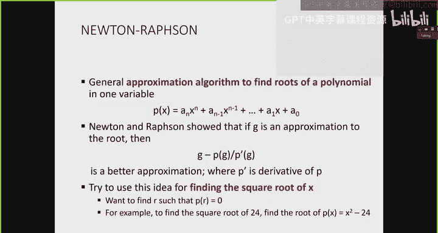

To the square root by saying a new guess。 So the new better approximation for the guess is whatever your current guess is minus that polynomial evaluated at the guess。

 So replace X with your guess divided by the derivative of that polynomial evaluated at the guess。

 So get the derivative and replace X with your guess。

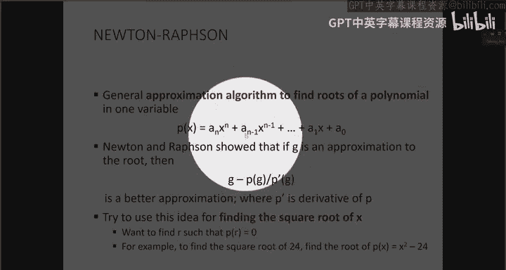

This should sound familiar because lecture2， we actually implemented just this part。

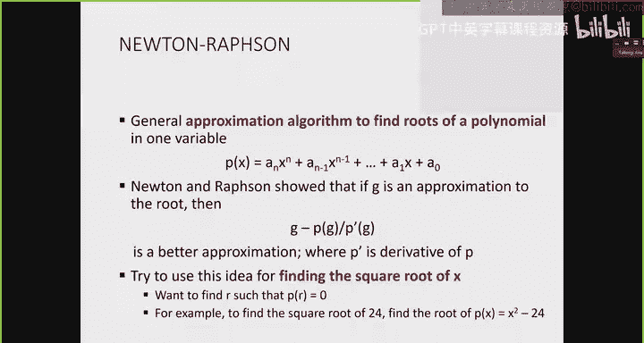

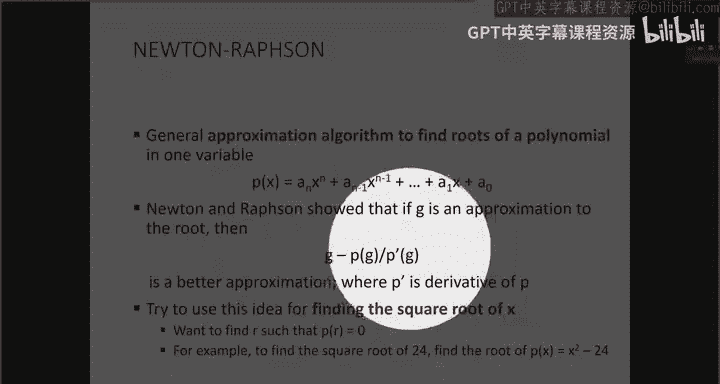

Remember when we were learning about expressions and combining them together。

 I mentioned this algorithm， and I said， we're not going to be writing the whole algorithm today。

 but we are going to be implementing the part that makes a new better guess for the square root of a number。

Well， today we're actually going to take that line。Put a wrapper around it。

 The wrapper being a little loop that makes successive guesses。

 better and better guesses using guesses that we have just made to get us close to the approximation for a square root。

 okay。

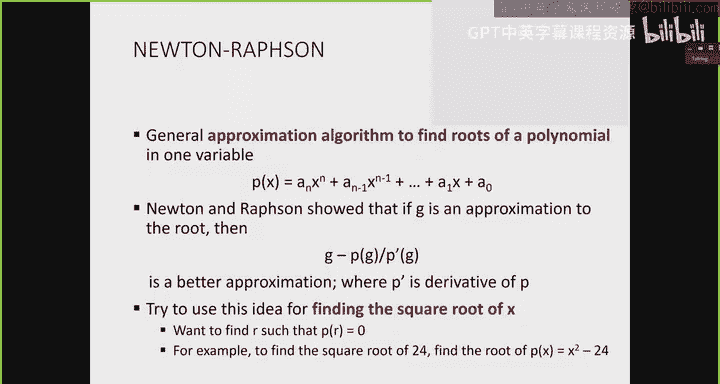

So let's start with this。 So the idea here for finding the square root of a number is to kind of realize that if we want to find the square root of。

 let's say，24。That's essentially us applying this algorithm to the polynomial that says that's x squared minus-24。

Because if x squared minus-24 equals0， then basically x squared is equal to 24。

 and to solve for x means that we are looking for the squared of 24。

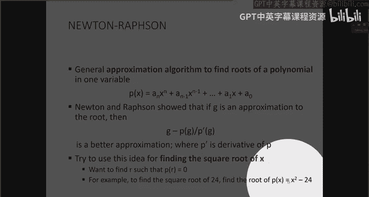

So we can try to apply this Newton Rasson method。To find the an approximation to the squared root of a number by simply solving。

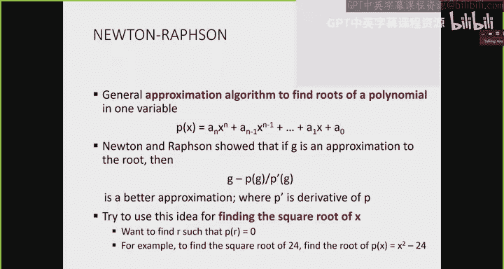

Using their method to solve applied to this polynomial x squared minus whatever value you want to find a square root。

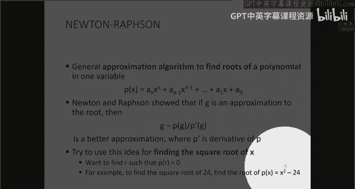

Okay。So just to give you a little intuition for how this works is so we have an initial guess。

 let's say it's this x1 right here。And you take F of X 1 that brings you。 oops。

 that brings you up here。

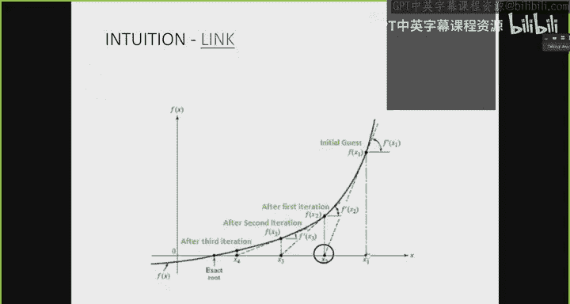

You find the derivative over here， and you follow the tangent line to the X axis for the next guess。

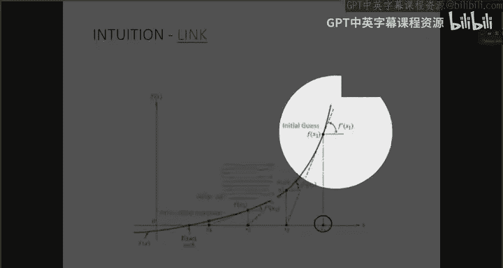

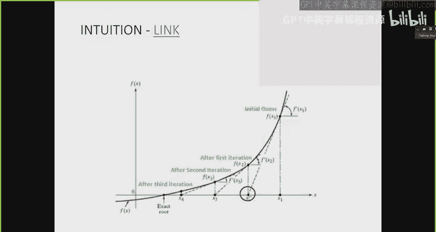

And you repeat the process， evaluate this guess。To get F of that guess， this is the tangent line。

 Follow it down to the X axis for in better guess。

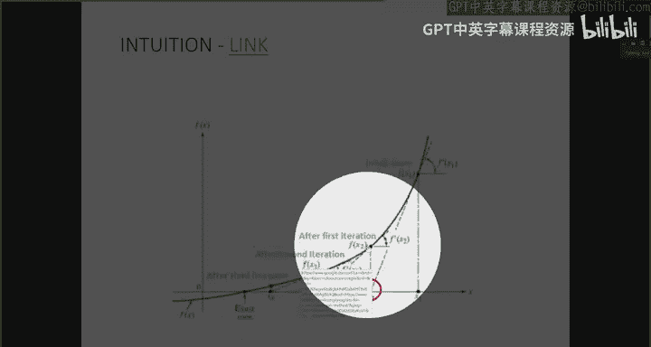

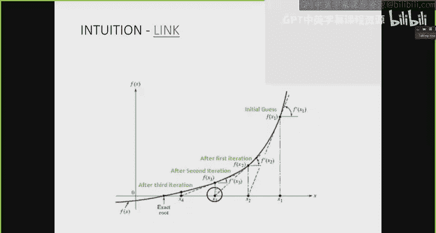

And you keep doing this until you get as close as you'd like to the square root here。

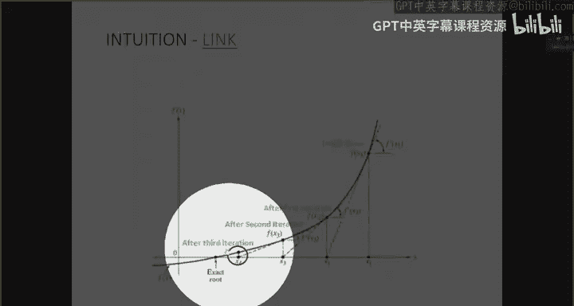

So just for completeness sake， since I did link it， this is what it looks like。

 that's your initial guess， that's your F， there's your tangent line that gives you the next guess。

Evaluate that。 Get your tangent line。 Get your next guess。 Evaluate that。 Get the tangent line。

 There's your next guess， and it basically works for any polynomial。

 but we are applying it to just finding the square root of a number。

 So our polynomial is pretty simple。

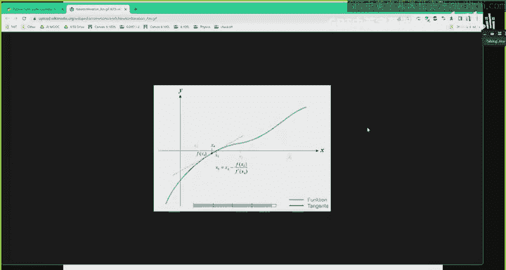

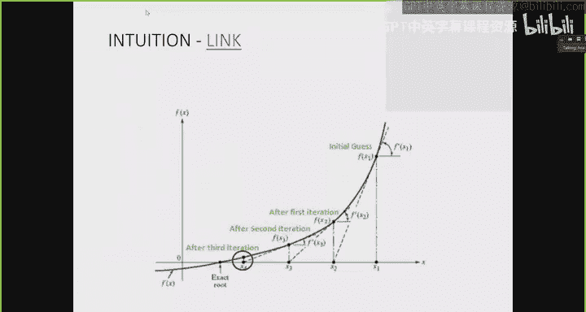

So if we want to find the squared of k， the polynomial we're interested in here is x squared minus k。

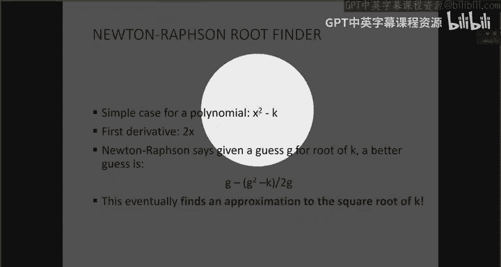

The derivative， I think， have you guys done derivatives yet right in， Okay， good。

 The derivative of x squared minus K is just 2 x， right。

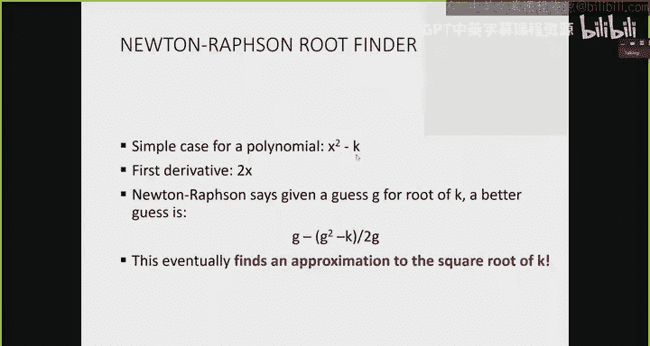

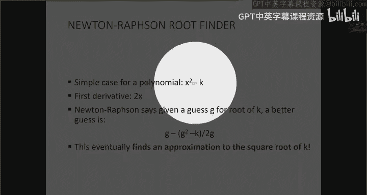

And then we can initialize our guests to be whatever we'd like。

And then all we need to do for a better guess than the one we currently have is to take our current guess minus that guess。

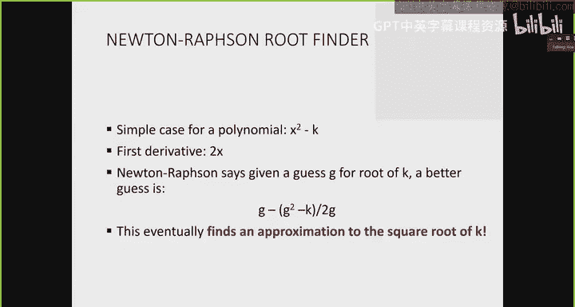

Pluged into the polynomial of interest。 So G squared minus k divided by the derivative with the guess plugged in two times G。

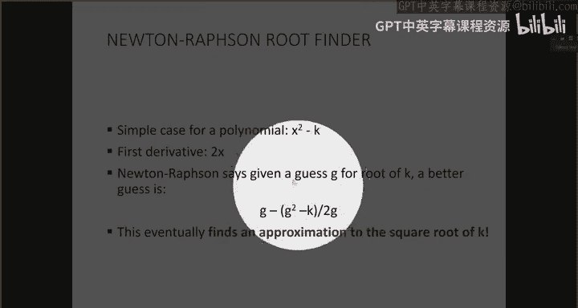

Okay， and if we repeat this many， many， many times。

 this will eventually get us to a nice approximation for the square root of the number。

And this is the code。It's even simpler than the bisection search code。

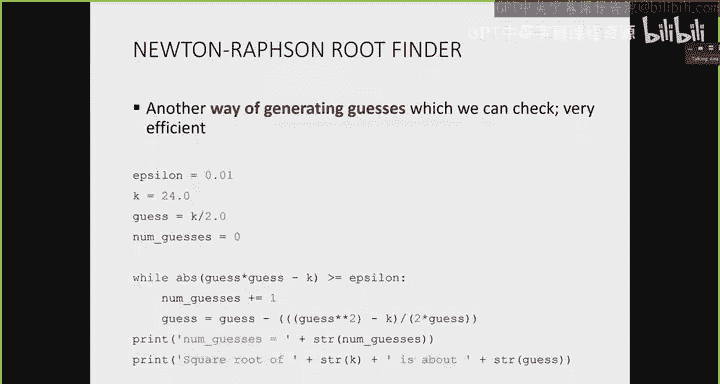

So let's say we want to be within plus or minus001 of 24 with our guests， right。

We can start with any guests we'd like。 but I guess a reasonable guess is to just take that K。

 The thing you want to find the square root of divide by  two。 Once again。

 we can keep track of how many guesses we do。And surprise。

 the while loop condition for while we keep making guesses is exactly the same as what we've seen before in approximation method and in bisection search method。

 right， as long as we're outside this plus or minus epsilon boundary。

 keep making guesses because I'm not happy with my guess， right。

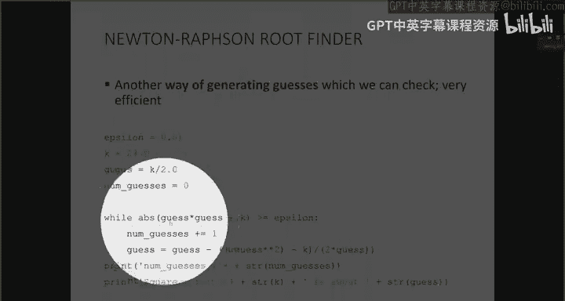

So here， while the absolute value of guess squared minus K K being the thing we want to find the square root of is bigger than epsilon。

 right So if we're farther away in both ends。

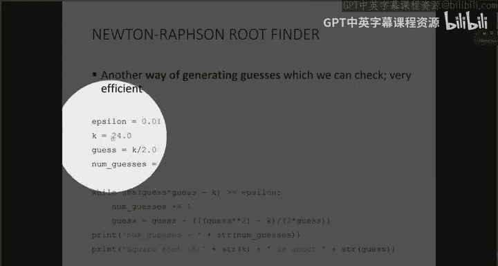

We keep track of how many guesses we've done and make our new guests。

 So this is what's different than by section or approximation。

 The guess is done by the Newton Raftson method。And this line right here is what we wrote in lecture。

2 or three。Right， our new guest is our old guest， minus。The guess evaluated at x。

 So guess squared minus k。

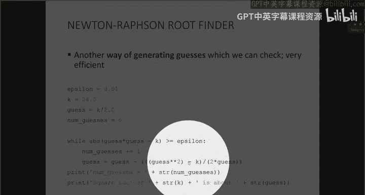

Divided by the derivative evaluated I guess， two times guess。And that's it。

 The loop takes care of the rest， and it'll keep making new guesses until it comes within plus or minus epsilon。

 So this， that's our K。 that's our function， right。That's F of guess， and that's F prime of guess。

So let's run it。Here it is。So when we made four guesses。To find the square root of 24 is about 4。9。

 Just pretty good。 We came within 。01。And if we try 5，4，3，2，1， our favorite number。

So far in this class。We only did 10 guesses， and it gave us just as good an approximation as bisection search and that ridiculously long approximation method。

Right。Yes。W is it guess K over2， It can be anything you want。

 We just started with something reasonable。 That's a function of K。It， yeah， it can be， you know，100。

 It could be whatever you you'd want to do， yeah。Because the algorithm will work no matter what。So。

That's awesome。 There's less guesses， but this is a pretty limiting algorithm， right。

 You can only use it to find square roots of a particular value。 We can't use it。 You know。

 apply this algorithm to finding， you know， the person in the middle of the room or， you know。

 or something like that， right， It's really specific to this particular problem。😊。

So a little wrap up before we go on to just in introducing the next。

 the next lecture is we talked about。Iteration， right。

 that was kind of the big thing that we added after conditional。

 So finding a way to repeat certain lines of code to， to do something useful for us。

And we looked at guess and check methods。 Now， I， I guess I'm putting all the methods we saw under guess and check because they're kind of all guess and check。

 right， We're guessing a value and we're checking whether that value is exact or within some epsilon of what we want to be。

 right？ And all these guess and check methods have the same kind of three things。

Associated with them， there's some sort of loop。Right。

There's something that you need to do over and over again。We need some way to generate the guesses。

 And that's where things are different between the different algorithms。

And then we need some way to check that the guess is right or within some epsilon or something like that。

 And then a way for us to continue making guesses。So we saw exhaustive enumeration。

 gave the original guess and check method where we basically had integers or some set values that we wanted to check。

 It was exhaustive。 So we knew exactly how many values we would have to iterate over。

approximationroxiation algorithms allowed us to have smaller increments。

 and we were able to search for approximations to square roots or cube roots or whatever problem we were trying to solve。

By section search we saw was an improvement over approximation methods。

 but only for problems that had an ordering property。

And for problems that you could figure out whether your guesses were too high or too low。

 if you can't have those， then you can't apply by section search。

 So you're stuck with an approximation algorithm or something else。

And then this Newton Raen was kind of the last thing we saw。

 it's very specific algorithm for finding square roots of values。

 but still valuable in kind of showcasing this looping construct。

 checking for something and then making a new guess okay。

This is basically a summary of what I just said also。We don't need to go over it。

 but are there any questions about these three algorithms， Do they make sense， Hopefully。

 the coding practice kind of helped a little bit during the lectures， Any questions。能。O。

So in the last five or so minutes， I want to introduce。The next， the next。

 the motivation for the next topic we're going to talk about。 Okay， so so far。

 we've basically learned how to write a bunch of code， right， We learned expressions。

 We learned variables。 We learned conditionals。 We learned loops。

 right conditionals and loops as a way to add control flow to our program。

 and we had this nice little toolbox of things to use to write algorithms。 Okay so we actually。

 it is true。 We have all that you need to know to write interesting algorithms， right。

 We wrote these interesting algorithms。😊，But we actually haven't taught you about some important concepts in programming。

 and these concepts actually exist in all of the modern programming languages。 Okay。

 and these ideas are decomposition and abstraction。Okay， so I'll just motivate these ideas today。

 We're not going to look at any code， but I'll kind of show you some。

 some sort of simpler version of decomposition abstraction that you've already been kind of doing。

 And the next lecture， will'll see how we can actually implement these ideas in code。

So the idea of decomposition is that you take a large program。

And you try to divide it into smaller parts。Each one of these parts will be self contained， right。

 so they won't really interfere with each other。As in the code from one part is not going to implement the code in another part。

 but they can sort of talk to each other。 They can send values to each other back and forth。

Okay so if you take one large spaghetti code program and you try to divide it into these nice self-contained parts。

 you can have each one of these parts solve a different part。

 a different portion of your large program， and in the end。

 they can kind of come together to solve the larger program。 that's the idea of decomposition。

And the idea of abstraction is once you write these self contained parts one time。Right。

 and you've done the work。 You've done the thought process。

 You've thought about how to write them in an efficient way。

 Nobody else needs to know exactly how you implemented them。

You want to abstract away all the details that went into figuring out how to solve that problem into just some some text or some interface that allows you to say。

 hey， I solve this problem， all you need to do is give me this input at this input at this input and my code will solve your problem and give you this output back kind of like if you're working in a group project。

 every one of you goes that does your own part， I don't care if you use you know the internet or the library to solve your part。

 all I care is that you give we all come back together and we put our results together， right。

And so that's the idea of abstraction。 There's some unnecessary details that might be in some code。

 I don't care about those details， how you solved your problem。

 I just care that you solved the problem。 So tell me how I can interact with you。So， this is sort of。

Very， very low level。 I guess in some ways that we've already been employing the ideas of decomposition and abstraction。

 okay。So thecomposition is the idea that you can write smaller pieces of code that are kind of selfcontained。

 Okay， so if I gave you this， I kind of， you know talked about spagheti code。

 This is kind of like a simpler version of spaghetti code。 If I gave you this line of code。

 It's a little bit messy， right， I've got some value here that I know is gonna have is gonna to be important。

 right， especially if I define it to some large number of decimal places。

 I've got these two values here that I'm copying over basically， this is not great coding style。

 right， It's not great coding practice。 but I can kind of。

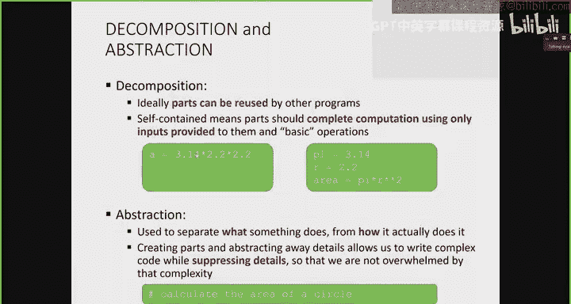

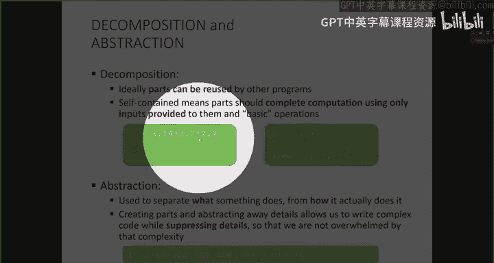

Take these values and save them or sort of decompose them into things that are reusable， right？

 So I've got pi here， which has some， which is which is interesting to me。

 I can save it in a variable。 I've got R here， right，2。2。

 I'm saving it as a variable named R that I know I'm going to use in many places。

 So instead of copying and pasting 2。2 here and here， right， I might make a mistake。

 If I type it out， I just use the variable。 And so I've decompposed this little bit of spaghetti code into these nice modular pieces。

 right， I've got pi is a module R as a module。 and then I'm just putting them together to achieve this common goal。

 which is to the area。

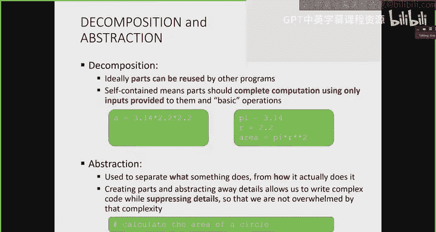

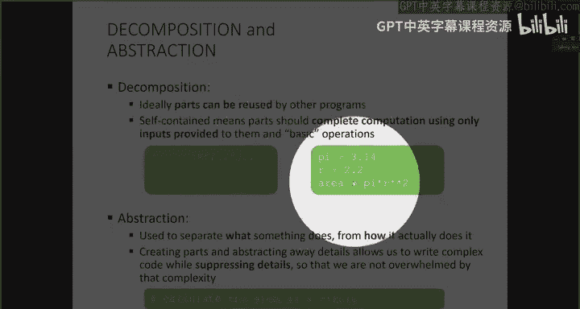

And we're gonna to see this on a larger scale using these。

 using these things called functions next lecture。Now， the idea of abstraction， again。

 we've already been kind of doing this。 Hopefully， you guys have been doing this through comments in your code。

 So if you spend some time on your problem set， you know。

 when it's first released and you write a whole chunk of code and you do a really good job at it。

 And you， you， you did it in a really cool way。😊，Come， you know， a week later。

 you forgot some details that you've done， right， and you didn't comment your code。 That's。

 that's that's that could lead you in into big trouble， right。

 because now you have to figure out what the code is doing。

If you had just written a little bit of comment right at the beginning of the code for something that。

 you know， an interesting way or hey， I use the bisection search algorithm here or so on so。

 that would actually suppress a lot of the details from your code。

 but you would still be able to remember what the code is doing。Right。

 and so the idea of suppressing details is done through comments。

 said we're going to see in the next lecture how we can suppress details for larger chunks of code as well。

 Okay， so that's the idea of abstraction here。So the big idea that we're going to look through in the next lecture is to stop writing large chunks of code where we copy and paste things that do the same thing over and over again。

 because that could lead to errors being introduced you change it in one place。

 you forget to change it in another place。 We're going to see how we can write these little modules called functions that you write only once you debug only once and then you can use them over and over and over again in your code with different inputs to give you different outputs。

 so the idea here is we want to create code。

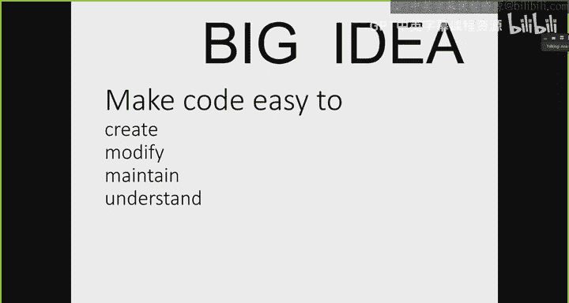

That's easy to modify。easyasy to maintain。And easy to understand。

 So if you come back to it a week from now or year from now。

 you'll still be able to know what that code is doing。So that's the motivation for next lecture。

 We'll start with a little real life example， and then we'll dive right into functions。对。

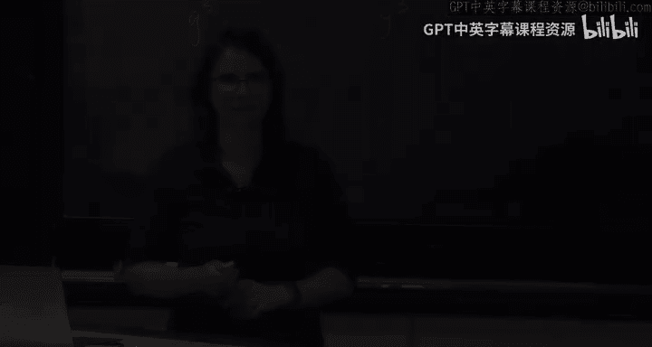

