# 《计算机科学和Python编程｜6.100L Introduction to CS and Programming using Python, 2022》 - P7：-07-Lecture 7_ Decomposition, Abstraction, and Functions.zh_en - GPT中英字幕课程资源 - BV1PAxJzVEs3

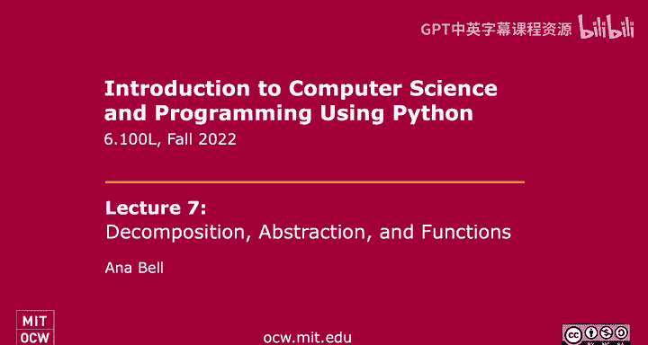

OK。So last lecture， we started talking about the idea of decomposition and abstraction。

 And we talked a little bit about what that means and how it ties into what we've already been doing。

Today， we're going to do a real world example of decomposition and abstraction。

 And then we'll see exactly how we can achieve this in programming。

So let's start by talking about an example in the real world， the smartphone。So a lot of us have it。

 But for a lot of us， it's really just a black box， right， for me。

 I know it is for most of the people in the world， the phone is a black box。

 We basically view the phone in terms of its inputs and in terms of its outputs。

 right So the phone has some buttons， you can scroll， you can touch things。

 But we don't really know exactly how all of these buttons and scrolling all these internal workings actually do their job。

 And in fact， we don't need to know how they do their job， to us is the user。

 all we really care about is the interface between us and what task we want to achieve Okay So what we need to know that that interface is basically the relationship between the input we give to to the phone and the output we get。

 So when we push that button， the phone turns off。 when we push this other button。

 the volume increases。And so that's the idea of abstraction。 right， the， the， the。

 the phone it basically abstracted away all of those hardware details。

 all of those implementations that make it actually work for the user， right。

 so the user doesn't need to know how it works in order to use it。Now。

 abstraction actually enablescomp decomposition。 What does that mean。Well。

 once we abstract away details。We can have different manufacturers working on different components of the phone to build these different components。

And if different manufacturers are working to build these hundreds of distinct parts within the phone separately。

 they need to have some way to put these parts back together。

And when they're working on their on their pieces separately， that's the idea of decomposition。

How do they know that what they're working on will actually fit in with the rest of the components Well they use the idea of decomposition。

 they're basically following a specification， they're following a set of inputs that may become into their component and a set of outputs that maybe their component needs to give to other components。

😡，And all these different manufacturers that build that are building these different parts need to know is that interface bit。

 They don't need to know how other manufacturers build their components。

 All they need to know is what functionality those other components have。

And so all of these different manufacturers can build all these different components。

 The interfaces are going to be sort of standardized， so to speak。

And that's all that they care about。 So once you know the interface。

 you can come together and put all these different components together to work towards a common goal。

 as in to make a phone work。So this is true for hardware as in the phone example。

 but it's also true for software。 And that's exactly what we will be doing in this in this lecture on functions。

 We're going to achieve decomposition and abstraction in programming。

 So treating code as a black box and making a large program。

 kind of splitting it up into these different self-contain parts。Okay， so in programming。

 we want to suppress details as well， right， not just in in hardware， like with the phone。

 we want to suppress details in in programming as well。

 And we do this using this idea of abstraction。So we will be writing code。

 as we have already been doing。With the， with the thought that the code we're writing will be done will be written only once。

 We will have some functional piece of code that will do a very useful task。

And then after we've written that code and debugged it and made sure it works well。

 we'll treat that code as a black box。 So from there on out。

 as long as we know what inputs that piece of code needs and what outputs that piece of code gives back to somebody else or to us。

 We don't care exactly how it does it。 We just care that it is there， and it is available for use。

 okay。So today's lecture， we're going to be seeing how we can actually create these little functional pieces of code。

We can then give these pieces of code to ourselves。

 We can definitely use these functional pieces of code that we written。

 or we can give them to other people so that they can use them as well。

So we're going to write these functional pieces of code。And we'll call the。

 we'll call them functions or procedures。And， in fact， we've already been using functions。

 believe it or not。These three are examples of functions we've already been using in Python。

So max is a function。 So it's some useful piece of code that when we use it in this particular way。

 it says it's taking in two inputs， and it gives me back the biggest of those two inputs。😊。

The middle1， A B， S is the absolute value function， and its input is one number， an integer。

 And it gives back to me the absolute value of that number。

And L is also a really useful one that we've been using with strings。 And basically。

 its input is a string。And its output is going to be how many characters are in the string。Right。

So we've already been using functions。 The point of today's lecture is you're going to start to write your own functions。

Hopefully， useful ones。Okay， so the idea of a function is that we want to abstract away exactly how that function achieves something useful。

 right， some useful task。And so the way that we're gonna to tell other people how to use our function is using this idea of abstraction。

 And we capture what the function does with these things called specifications。

They're also called dock strings。 And the dock string is kind of like a contract between somebody who creates this useful function and somebody who wants to use the function。

The person who uses the function might be you， the person who wrote it， or it might be somebody else。

And in the contract， the things that we're gonna mention are what are the inputs to the function。

 So in， you know， in the length function， you know， it needs a string。

 What is the function doing and what is the output of the function。

 What is the function Give back to somebody who uses this function。

And we haven't actually done this explicitly， but you've probably seen this as you type your code in。

 so here's an example of the absolute value function and it comes up with this little pop up here whenever you type it in。

 so for example， ABS parenthesis right here or if you hover over a function in your file editor。

 you'll see it pop up this little text box that says the specification or the doc string。

And here you see exactly sort of the signature of the function。 So it takes in one input， the X。

 the value you want to find the absolute value of。 And then some text here。

 which is what the function does。 So the specification of the dock string is literally just a multiline comment。

 There's nothing special about it。 as long as you kind of hit those points， the inputs。

 what the function does and what the function gives back to you， you've written a good specification。

O。Oh， so I should mention that these contracts， even though I call them contract， they're。

 they're not actually enforced by Python。 So it's really just up to the person who writes the code to make sure that their specification is really。

Detailed and you your function does what you say you will， right。

 So if your function can take in both positive and negative integers， for example。

 then you better make sure that the function itself。

 doing whatever task it needs to do can handle both positive and negative integers。

So once we write these functions， we now have these little bits of code that perform some useful task。

 right， given some input， it'll perform this task and give me back some output。

And now that we have these different little pieces of functionality。

 we can go ahead and take this large file of code， which you might you know right from now on and kind of see exactly which pieces of code maybe are getting repeated。

 that's a clue that that's something that you can kind of abstract away into a little module。

 AK a function。And then you can just use these functions to break up the code。

 a very large piece of code into smaller little self contained modules。 And then the。

 maybe the bulk of the work that the code is doing is just saying， hey。you know， this module。

 please give me this answer。 and then this module give me this answer and then putting those values back together again。

So these reusable pieces of code are called functions or procedures。

 We're basically going to try to capture some sort of computation。

 a very useful task that you'd want to do over and over again。And。

We're gonna see some details about how to write functions。 But essentially。

 it's just going to be code that you've already been writing。 just written in a special。

Way that makes it reusable。So we're gonna have to kind of switch the way we've been thinking about code for a bit。

 now that we're introducing functions。 because right now。

 when we've been writing functions in a file， we basically write some code top to bottom。

And then we think about that code as being executed line by line， top to bottom。

But now that we're creating these things called functions。

 little blocks of code that we can use many times in many different places in our code。

We're actually going to introduce the idea of defining a function。

 So that means we're going to write a piece of code。

And all that piece of code is going to do is tell Python that this is a mod or function that exists in my program。

All we're doing is defining the function。But we're not actually going to run the function when we define it。

Okay， and that's kind of the difference the the way we're gonna have to shift our thinking here。

So when you define a function， you just tell Python that here is some useful piece of code that exists that does something。

But it doesn't actually run until you call the function。

And the cool thing about writing a function is you， once you wrote it once。

 you can make 100 different function calls to that one piece of code that you wrote later on in your program。

😊，So you can call the function many times with different inputs to give you different outputs。

 but you only had to write it one time。So I would compare this to when we write code in a file right。

 when we write code in a file， yes， we can write a whole bunch of lines。

 but this code isn't running as we're writing it， right。

 We have to actually push the run button to run that file。So similarly。

 when we're telling Python that I'm going to create this function that there's something useful。

 It's not actually running those lines。 We have to tell Python that we want to run this function。

So the first thing we're going to do in this in this lecture is just actually create a function。

 We're I'm gonna show you how to define a function。 So tell Python that this function exists。

 And then we'll see how to actually run the function to give us some useful values。

So the function characteristics are going to be the function has to have a name。

 so just like when you create variables right that store some useful value like pi to 20 decimal digits that you want to reuse over and over again。

 we're going to create a function and that name is kind of like a handle for us to refer to this large chunk of code that does something useful for us。

A function has some inputs called parameters or arguments。

 It could have no inputs or more or one or more。And a function should have a dock string。

 So this is the specification。 Again， just a multilined comment that tells the user。

 the person who wants to use this function， the inputs。

 what the function does and what the output or the return or whatever this function will do for you。

And then the body of the function is just Python code。

 Ex the kind of code we've already been writing， except not wrapped in a function。

 right so if you found yourself writing a piece of code that did something useful。

 you can totally wrap that in a function and we'll see how to do that today。Right。

 so the body of the function is just a bunch of lines of code that do this useful task。

The only difference in the body is that at some point， this function has to end， right。

 It has finished its task。 It figured out a final value。

 this useful thing that's kind of the result of your task。

 And you want to give this value back to somebody who's using this function。

And we do that using this return keyword， as we're going to see in the next slide。

So here's an example of a really simple function。So it's just a definition。 So， again， this。

 these lines of code do not run。Here， we're just telling Python that we're creating a function that does something。

So we kick that off with a DF defined keyword。 So notice it's blue， if you type it in your code。

 you'll notice it changes color。So D E F tells Python we're defining a function。

 The next is the name of the function。 So this should be something descriptive。

 Usually an action word， right， because a function does something。

 So you want kind of like an actiony type name for your function。Then we have parentheses。

And inside the parentheses， you have any of the inputs， the parameters。

 the arguments to the function。 right， So what should the user give you as input to this function。

And then， of course， the colon。So in that line right there。

The only thing that is sort of customizable， quote unquote。

 is the name of the function and the parameters。 If there's  zero parameters。

 you put nothing in there。 If there's more than one， you separate them by comm。

Everything else should be is standard。 The D E F， the parentheses and the colon at the end。

Since we have a colon at the end， then we， that means we have to indent the next bit of code。That。

 the indentation will tell Python that the rest of this is part of the function。

 So everything from here on out is part of the function definition。So we have our dock string。

 of course， you start with triple quotes and you end it with triple quotes。 And in it。

 you can write whatever you want。 Just treat it like a comment that's on multiple lines。

And you can see here， I've said that this function takes in an input I。

Which I restrict to be a positive integer。 And then I say what the input gives back to the user。

 So it will return true if I is an even number and it will return false otherwise。

So I've hit all the points， the inputs， what the function does and what it gives back to whoever wants this function to run。

Beyond that， we have the body of the function。So here。

 you notice it's just lines of code that you would have written otherwise， right， if you。

 if you were given the problem on a quiz that said。

 given I defined for you write some code that that。

 you know prints true if the number is odd is even in false。 if the number is odd。

 this is basically lines of code that you would type in。

The only difference is this little return here。Right。

The function is sort of some lines of code that do a task。And that task， when it finishes。

 has to give something back。

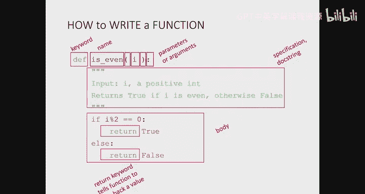

Right， it can't just sit there， I guess。 And the thing that it gives back to whoever called whoever wants this function to run。

Is。Is set up by this return statement here。So if the number is divisible by 0。

 we return true and else we return false。 So one of these either true or false values will be returned by the function。

 So this is kind of， you can think of it like the output of the function。

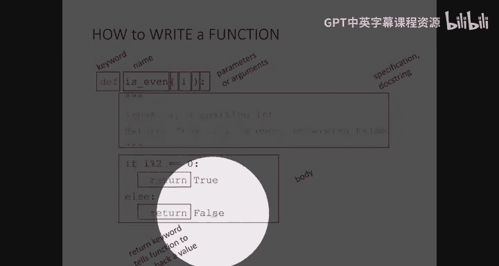

Okay， question so far。 does this make sense， Again。

 this is just us creating this function inside the computer inside Python。

 We're not actually running these lines of code yet。O。So。If you are given sort of a larger problem。

 I just want to take a couple slides to talk about how you think about writing the function。

This was a really easy one。 So， you know， obviously， it's not that hard to， to write。

 But sort of what is the thought process if you were given a larger problem。

 like in English or something like that， and you wanted to translate this into a piece of code that does something functionally interesting。

 Okay， so you'd think about what the problem is。 So our problem is given an integer。

Figure out if it's even or odd。Okay， so given this statement， you could。

 you could come up with the name of this piece of code that's functionally interesting。

 So is underscore even is a good， a good name。And give and。

 and we can also come up with the inputs for this function， right， So I。

 we are only given one number。 So there's no need for this function to take in any other input。

And then using that description， we can now start to fill in the dock string that says， well。

 our input is going be a positive integer， right， We could use sort of math to figure out restrictions on the inputs。

 and then we can write the the rest of the dock string that tells us what to return and when。

What the function is doing。And once you have that， you can just solve the problem。 So for us。

 we solve the problem by basically saying， if the remainder when we divide I by 2 is 0。

 we return true。 and otherwise， we return false， okay。So that's some。

 that's code that you could have already written right without actually this function lecture。

 But now we're putting it in the context of a function definition。

 So we're gonna be able to run this function with many different inputs to give us a bunch of different outputs。

 whether a bunch of these different numbers are， are even or not。

So when we're writing the body of the code， the only difference is from what you've been doing is the return statement。

 right， instead of printing something out to the console。

 we're going to return a value to somebody who wants。To know whether the number I is even or not。

The function can also print stuff to the console。 But the key thing here is you want to return a value to the user。

And after you wrote code， you know， right off the bat and you test and made sure it works。

 You can improve the code a little bit。 So here we're improving it by noticing that。

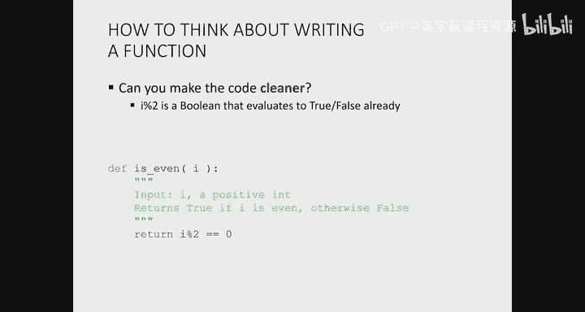

I percent 2 equal equals 0 here is actually already a boolean， right。

 If I is even3%2 equal equals 0 is true。And otherwise， it's already false。 So this line。

 these four lines of code basically say， if true， return true， else， return false。

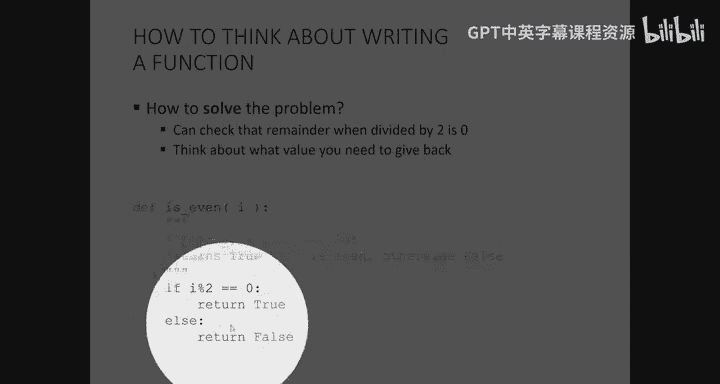

So our improvement can just be to return whether I percent2 equal equals 0 right off the bat。

So here we're going to return either true。Or return false based on what I is。So at this point， again。

 sorry I I'm stressing this enough too much， but it's really important to understand that once we write these lines of code in the context of a function definition。

 these lines of code do not run。They basically just sit in Python。

Saying that there are these lines of code that correspond to some function object whose name is is even。

That's it。So what we need to do now is to actually tell Python to run these lines of code。To do that。

 we make a function call。 And again， we've already been doing function calls just to functions that already exist in Python。

 right， Just Python itself， Max， absolute L， all that stuff。

But now we're making a function call to something that we wrote。Right。

 this nice piece of code that tells us if a number， the input is even or not。So here I've got。

 I'm going to invoke。The name of my function。 So I'm， okay K， I'm gonna call the name of my function。

 I'm basically just typing in the name of my function in the code。Prenheses。

 and then the inputs the function expects。 There's only one， right。

 The number I want to figure out if it's even or odd。And then that's it。 right。

 So I've got the name of my function and then all the input。

 the parameters that this function expects。At this point， Python goes into the function body。

 It runs the function。And it returns back a value。 So whatever the value is associated with the return。

Is that value will immediately be given back to whoever called it。What does that mean， Well。

 that return value will completely replace this function call。Okay。收。Let's think back to expressions。

 Do you remember when we were learning about Python expressions， And I said。

 you have something like object operator object， like 3 plus 2。That was an expression。

 And Python went in， evaluated that expression and replaced that entire expression by the value。5。

This is exactly the same thing。 In fact， functions are kind of like Python expressions。

 They do something useful， right， It's just that it's not math or something like that that gets evaluated。

 It's a bunch of lines of code that get evaluated。But in the end。

 that function returns back only one value。Okay， and that value replaces the entire function call。

 So this entire function call is going to be basically replaced by false， right。

 because it's an odd number。And the next one is going to be replaced by true。

The return from the function。So the way that the code looks， just this definition of is even。

 And then running a function call is this。 This is all that we would have in our， in our file。

So here we have our function definition。And then at the same indentation level。

 we have a function call， right， because it's not。 the call is not part of the function。

 The call is just making use of the function that we wrote。So what exactly happens。

 We'll do a little bit of step by step now going a little bit into more detail as to what exactly happens when we make the function call。

So when we make the function call。 So again， function definition。

 this just tells Python we have this， this function that does something in in in our in our program。

 And then here we have the function call。When as soon as Python sees the function call。

 that's when it starts doing something useful。Up here， it just sort of stores this in memory。

So as soon as it sees the function call is even  three。

 it looks at the input parameter to the function call。And here you see， we have a value， right。

 It's an actual tangible object。 It's not some random variable。 It's not something abstract。

 It's a number 3。

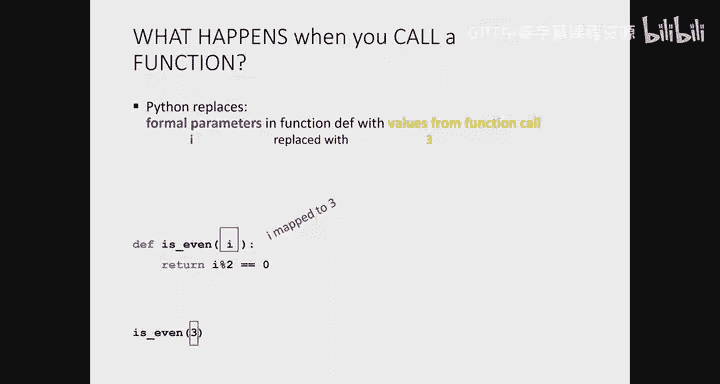

The I up here from our function definition is called a formal parameter。 It's abstract， right。

 We wrote the body of the function， assuming the user will eventually give us a value for I。

But in the actual body of the function。I is just a variable we're using。 kind of like in the quizzes。

 right for now， I've been I've been saying， you know， assume you're given some number。

 And that's defined for you。 write the code assuming， you know this number。

 It's the exact same thing。 We write the code at the body of the function。

 assuming we know value for I。So when Python sees this function call with three。

 it goes into the body of the function and says， all right， what are my parameters， There's only one。

 It's I， and it's going to map them one by one to all the actual parameters given in the function call。

 So basically just maps I to 3。

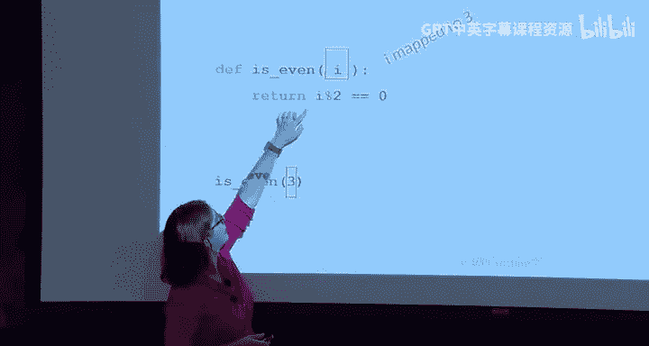

And then it executes the body of the function。 So it replaces everywhere。 you see I。

 So it might have a longer bit of code here。 But here we just have one line。

 It replaces I with three。So we have 3%2 equal equals 0。 Now we have a tangible value， right， false。

So this expression is replaced with false。 And so this line of code here will return false。

 And as soon as Python sees that return value， it immediately exits the function and gives back the value that you're returning to whoever called it。

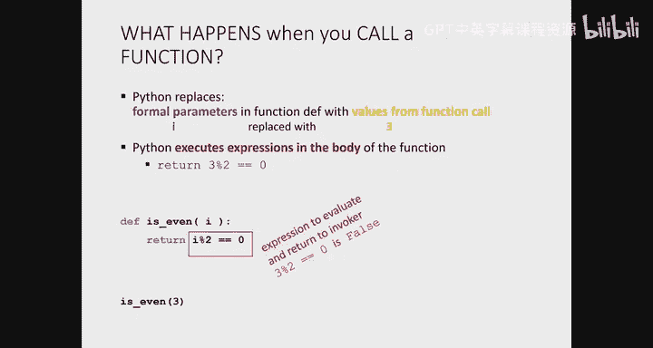

So this entire function call here will be replaced by false。Okay， that was very step by step。

 But does it make sense。OK。So this is a program that doesn't do anything， right。

 If somebody were to write this program and run it， it doesn't actually show anything to the user。

That's because in our program， it's like we had just written a line of code that said false。

Does I get printed to the output？No， right。 What we need to do is do something useful now that we have the result of a function call。

 So one useful thing we can do is to actually print the result of the function call。 right。

 So here we have print。

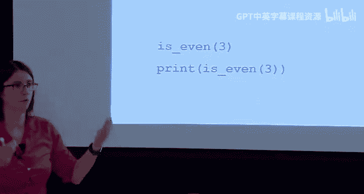

And then I have my function call I had up here。 I'm just sticking it inside the print statement。

 And Python will， as before， evaluate is even 3。 This is replaced with false。

 and this line essentially becomes print false。

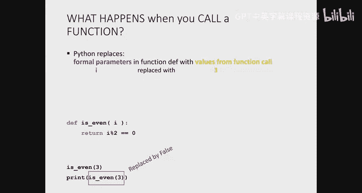

And so the way this looks in our actual code is this， right？ So here I have。

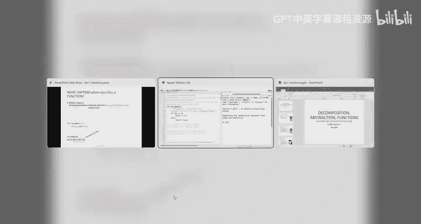

嗯。This is even function， the inefficient way of writing it。I've got two function calls here。

 but if I run the code， it doesn't print anything， right。I need to do something useful with them。

 And one useful thing we can do is to print the result of these function calls。

 So now that I've wrapped these calls inside a print statement， I see the output in my console。Okay。

 so we're writing， so we're kind of separating ourselves right when we're writing code now。One。

 we're defining a function， some code that does something useful。And then two。

 werere using this function that we wrote to make function calls。

And the beauty about writing the function is we only write it once and debug it once。

 But now we can run， run it as many times as we'd like。Without functions。

 we'd find ourselves copying and pasting right， that piece of code that does something useful in many places in our code。

 which could lead to errors。 The code is hard to modify。 It's hard to debug。

 You might all that stuff。Okay， I'll give you a chance to try this out for about a minute。

 So let's have you write this code。 So here I'm giving you the function specification。

 Most of the time， I'll give it to you， even in quizzes。

 I want you to write from me a function called div underscore by。 This one takes in two parameters。

Both integers greater than 0 and and D。 And this function will return true if D divides n evenly and false。

 if it does not divide N evenly。So if you test it out with those two values。

 the first one should give us false， and the second one should give us true。As usual。

 this is down in the Python file。 So we have around line 28 is where you should start typing in your。

Does anyone have a start for me。Should be very similar to what we just， yeah。1%。Double equals 0。

 Then print crew。Else。Pretty false。Okay。So， let's run the function。let's just do it with one。

 So the first 1 I'm expecting to print false。It does print false。

 but it also prints this weird nun right after it。 Actually， this is something we want。

 We're gonna to talk about next lecture。But does anyone know an improvement we can make to the code。

Yes。Yes， actually。 you're right。 So instead of printing true， right， Remember， it's a function。

 we want it to give us back the value true， right？ So instead of printing。We'll do a return true。

 and we don't need the parentheses in this case。And then we'll do a return false。

Right so now we don't have that weird nun right after it。

 That's something I I was going to talk about in next lecture。 But basically。

 when we had prints here。What did the function return， Did it have a return statement inside it。No。

 right。 And so if there's no return statement inside the function。

 Python automatically returns this special nun。Okay。

 this is something we'll talk about next lecture more in detail。 But yeah。

 the return true return false is， is correct here。Yes。Get高。This。Yeah， yeah。

 you don't need the return， the if else， just like before。 so we can just do return。嗯。This directly。

 right。Then we can run it with the other one。So the second one should actually return true。

But it returned false。 Does anyone know the problem， yeah。Yes， exactly。 So actually。

 we want the remainder when we divide N by D。Right。

 so this is just flipped around and percent D equal equals 0。So it's a good thing。

 Wed had two test cases to test for that。 And you don't have to test them with such big numbers。

 You could obviously test them with some smaller numbers， as well。

So let's zoom out a little bit and talk about how exactly functions are stored in memory， right。

 because I mentioned this thing about defining a function and that just doesn't do anything really that we can see。

 But what exactly happens in memory， well。Let's think about what happens when we create variables。

So when we create a is equal to 3， inside memory。Or the program scope。 again。

 we'll talk about this next lecture。 But you can think of this as the memory。

 What happens is As becomes a variable that's bound to value 3。 B equals 4 is a variable。

 B bound to value 4， and C is going to be bound to value 7。Clear， right， We already know this。

What happens when we create a function？So， again， this is something I might write in a code file。

The top bit is my function definition。 So as soon as Python sees this D E F keyword。

Everything that's indented。 That's part of the function definition in the body。

Is essentially just some code。By。To the to Python， it does not care at this point what that code is or what that code does。

All it knows is that there is a function object and functions are actually objects in Python。

 There is a function object whose name is， is even。

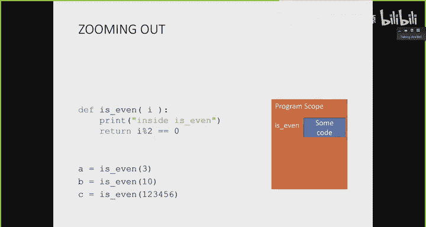

That is all it knows when we get to this point here in the code right after we define the function。

 right before a equals。Okay， so we think about the function as kind of like a variable。

 quote unquote， It's not actually a variable， but it's like a variable whose name is is even。

 and it points to it's bound to some code and memory。 And we don't care what that code is right now。

 because we might never use it。 We only care what the code is when we make function calls。

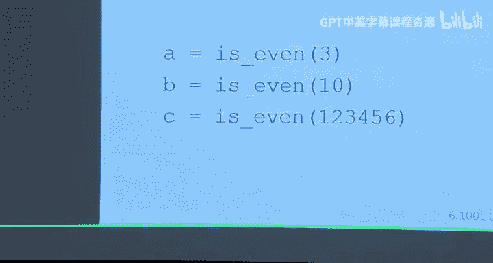

So down here is where the action actually happens when we make our function calls。

 I have a is going to be， as usual a variable， right？That's going to be bound to some value。

So the function definition is kind of just like a black box， right， Once you wrote it once and。

 you know， it works， you don't care anymore。How it actually achieves its task。

 All you care is that it takes in a number and tells you whether that number is even or odd via true false。

So down here where we make our function calls， we're just using our black box。系。

And we're using the black box by making function calls。 So a is going to be a variable。

That's bound to the value returned by is evenva。So it's going to be based on the function call false。

And then here I have another function call。 I'm using this useful piece of code that I wrote up here。

And B is going to be a variable that's bound to true。

 And C is going to be a variable that's bound to true， right。Does that make sense。

 kind of separating the code we write， which doesn't run until we actually make function calls。

That's that's the thing about functions。 and that's how it helps us write more。More robust code。

So now here we can have a more complex piece of code where we're using the function that we wrote。

Okay， not just making a function call and printing the result。

 but we're actually using it inside a more interesting program。

 So here I've got a program that will print for me the numbers between 1 and 10。

 and itll print whether that number is odd or E。So if you were just to read this code。

It's pretty easy to read， right， We have a loop that goes through the numbers 1 to 10。

 not including 10。And then I have this， if is even。Well， that's cool。 Here。

 I'm using the function that I wrote kind of just in the middle of。Another piece of code。Right。

 which is fine because， as I said， you know， a few slides ago， function calls are basically just。

Expressions， right， they get run。 They get evaluated。 You get one value back out of them。

 And then that value replaces the function call。 So that's fine。 Let's use the is even a result。

 the return from the is even method inside a conditional。

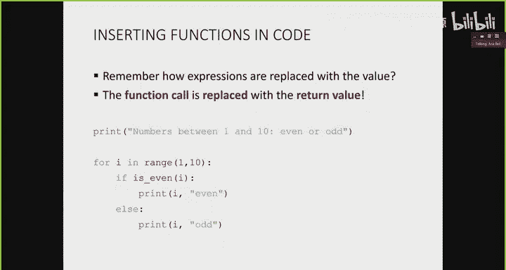

If I， if， if calling is even with I returns true， That means if the number is even。

 we print that valuea even else， we print that value comm odd。

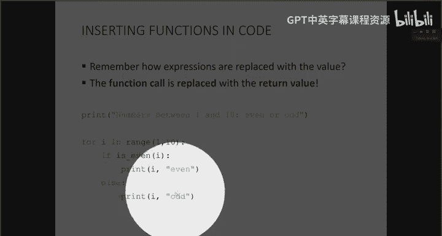

So here， I'm not defining a function。 Notice it's not wrapped in the D F or anything like that。

 I'm just using a function that I already wrote。

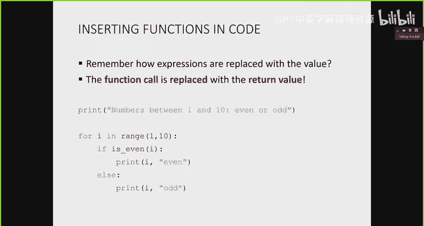

So inside here。Comit that out。This is the code we just had on the slide。 So again。

 notice it's not with it。 It's not wrapped within a function。

 It's just a loop that tells me the numbers one at a time whether they're oy even， right。

 So print one comma。Like don't like。あ。Oh， when I select everything。

 I just use spider's like ability to， so I do control one or command one probably on a Mac。

 and it just comments and uns things in batch。very useful。

And so this code is now very easy to modify， right， I can just choose 100。

 and then I can run it again， and it gives me the numbers one through 100 or or even。

 and you can imagine using your I even function in a more complex setting。And。

Is even is a really simple function to write。 But again。

 you can imagine writing a more complex function。 And then that complex function isn't a whole chunk of code that just gets stuck into this program。

 This loop， it's going to be a function that you call that you can just easily read the specification for。

 and you don't need to completely understand how it works in order to use it。

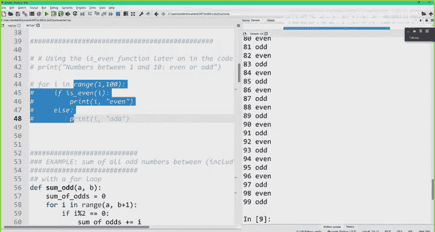

OK。So we're going to go through one other example to write a little function。

And this will also showcase kind of the best practices for writing a function and writing code。

 especially maybe in a quiz situation or something like that。 how to write incremental code。

 how to test it a little bit at a time and so on。So the last example I want to go through is I want to write some code that count that adds all the odd integers between and including A and B。

Might be something you're asked on a quiz。嗯。What the first thing you do when you're faced with such a task is to think about a nice name for the function。

 So some odd or some odds is a reasonable name。 The inputs to the function。 Well。

 I've got two end pointss。 I want some odd numbers in between。

 So the inputs might well be my two endpoints。And then what is the thing your function achieves。

 right？ Well， in the end， it's gonna give me some sum。

 So let's call that sum a variable sum underscore of underscore odds。

 and we'll return it at the end of our function。And in between， we're going to have some code。

So first thing to do is to not write code right away when you're face of the task， again。

 on a quiz or something like that。 It's best to take a piece of paper， write a little bit。

 one example and try to think about how you'd solve it， not like a human would， Because for us。

 we would immediately know the sum， right， It's very easy for humans to identify the solutions to these problems。

 But try to think about how you would write how what kind of recipe would work for this。

 Would you loop， Would you have a conditional。 Would you use a for loop or a while loop。

 and a bunch of other concepts that we'll learn about in in the following lectures。

 But the key thing is to just not write code right away。

So if we start with a really simple example on paper， we can say， let's choose endpoint。

 A is 2 and B is 4。On paper， I would probably write out 2，3，4 in a row， right。

 So I know the numbers I need to look at。 I would say2 is my A 4 is my B。

 I need to look at every one of these numbers， one at a time。Reasonable。I can do another example。

 sorry， and I know what the answer should be。 So I figure out what the answer should be so that when I write my code。

 I actually know what I'm looking for。I look at another example。

 let's say a little bit more complicated， a bigger range。 A is to be a 7。

 I try to use the same strategy I used， same recipe I use to solve that simpler example in this harder one。

 So again， I'm going to write out all the numbers between 2 and 7， inclusive。 This is my first。

 this is my last。 And my strategy was to go through one at a time。 And if it's odd。

 I take it to my running sum add it to my running sum。 And if it's even I don't， I ignore it。

And again， I know the answer for this should be 50。So with these two examples in mind。

 I can start writing code。But instead of writing code for the big problem。

 that might include some nuances or some edge cases， I can actually try to solve a similar problem。

Right， so instead of summing all the odd numbers between A and B。

 let's just sum all the numbers between A and B and see if we can get code right working for that。

 Once we do figuring out the odd ones should be a small tweak to our code。系。

So if we start with fig out the sum of all the odd numbers between and including A and B。

 that sounds like a loop， because I knew when I wrote my example on paper。

 I'd have to touch each number between and including A and B。

RightSo I know I need to loop through every one of these values。While or a for loop。

 your choice in the slides， I'll do both。 just to see what it looks like。So with a four loop。

 it's easy。 It's just for I range A B。 But with a while loop， Remember。

 we have to initialize our loop variable。 if we have one I equals a our loop condition is while I is less than or equal to B。

 right， So we're going loop through while I I'm looking at all these values up to and including B。

And I need to remember to increment my loop variable within the loop。By one each time in this case。

Okay， and then what do I do within my loop。 Well， I'm going to remember。

 we're solving a similar problem。 I'm going to keep a running sum。 So as soon as I see a new eye。

 I'm going add it to my sum。I realized here， probably my I D E。

 which showed me that there's an error。 I didn't initialize some of odds。

 So I remember to initialize some of odds right before the loop。

And then this is a good place to test the code for a little bit。

So we'll test it with a really simple example， to comma4。Okay， if we test it with two comma 4。

 the four loop gives me a 5， but the the Y loop gives me a 9。

So you guys might have noticed what the problem is。My for loop goes through up to。

 but not including the end variable， right， the B。So。

We can add a print statement in case you didn't figure that out。

 And the print statement would actually tell us， right， It tells us what we're incrementing。 First。

 it's2。 Then it's 3， but I never hit before。So the fix is to just change my end range to BB plus one。

And then we run it again and we see the answers match。And this solves the the the the bigger problem。

 So now all we need to do is adding the， the， the nuance。

 the piece where we just grabbed the odd numbers。And here we say， well。

 if I'm just grabbing the odd numbers， I only want to add I to my sum of odds when I see an odd number。

 So here I could use my is even function that I already wrote。 I would say， if not， is even。

Or I can just do it all over again。 If I percent 2 equal equal 1， then we do this。Right。

 and now we can run it again。 And hopefully， this now matches with the example I had on paper。Okay。

 so the idea here is to try to solve a simpler problem first。

 And then as you see more nuances to the problem， add in the functionality just a little bit at a time。

 So you don't actually get bogged down by a whole bunch of prop issues that might come up when you wrote a whole bunch of code。

The last step is just to test it on the other example just to make sure that it still works， right？

 And so if we print some of odds between 2 and 7， again。

 this matches what I had written down on paper。If you don't want to use print statements。

 the Python tutor is also a great debugging tool。So testing code often very useful。

 I think I've stressed this in previous lectures as well， using print or the Python Tutor to debug。

 It's also very useful。

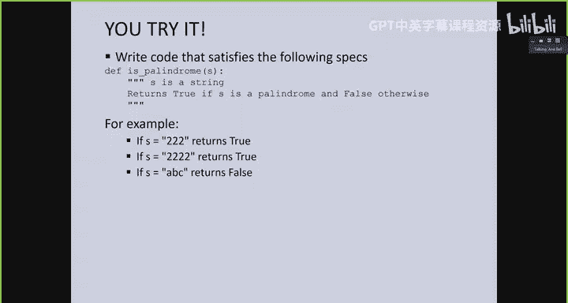

I don't actually intend to go through this。 You try it。 but this。

 along with a bunch of other examples things to try at home， are in the Python file。

 So just functions， you can you can write is palindrome， this keep consonants， this first elastic。

 read the function specification and try to write code that that matches the specification。

 And as usual， the answers are in the Python file。 but please。

 please try to do them on your own first before looking at the answers。

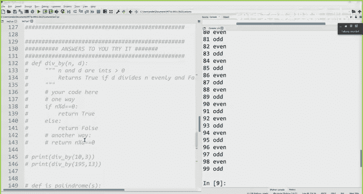

Okay， a quick summary。Functions are very useful。 allows us to abstract certain useful tasks， right。

 basically abstract away functionality that we might reuse many times in our program。

Functions taken inputs。 They have something to return。

 We're going to see next time what happens when we don't return anything。

Creating the function is different than running the function。Right， so you create the function once。

 but you can run it many， many times。 And that's what makes functions useful。

 It makes code easy to write， read， debug， modify， leads to very nice， robust code。

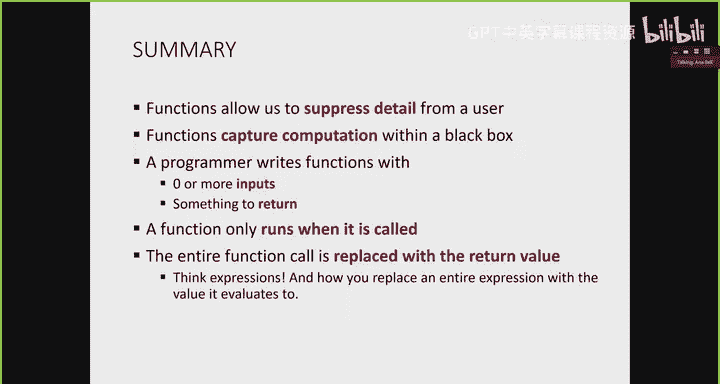

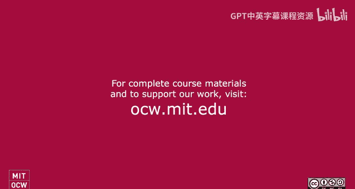