# 《计算机科学和Python编程｜6.100L Introduction to CS and Programming using Python, 2022》 - P8：-08-Lecture 8_ Functions as Objects.zh_en - GPT中英字幕课程资源 - BV1PAxJzVEs3

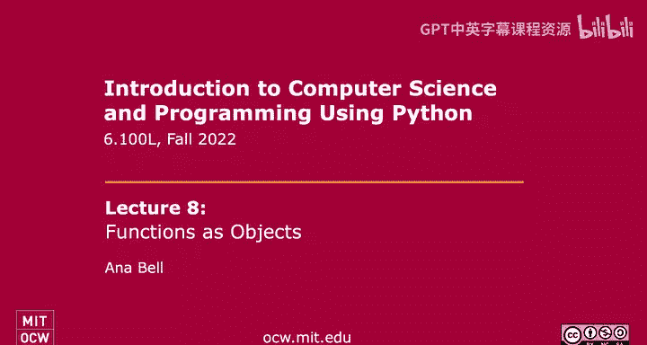

All right， everyone。 So let's get started。Last lecture。

 we introduced functions and we saw some syntax around how to create functions。

 but mostly we were interested in kind of motivating functions as a way for us to start writing really clean code。

 code that's easy to debug and code that's easy to read in the future。Today。

 we will continue our fun adventure with functions。😊。

And we'll see how what it means to treat functions as objects。

So let's recall the example we talked about last lecture。 We created this function。Is even。

So the syntax for C function is basically the keyword DEF tells Python we're defining a function。

 we decide what name to give our function， parentheses tells Python in here。

 we're going to name all the arguments， all the inputs to the function。

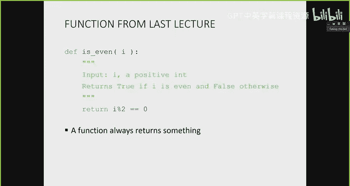

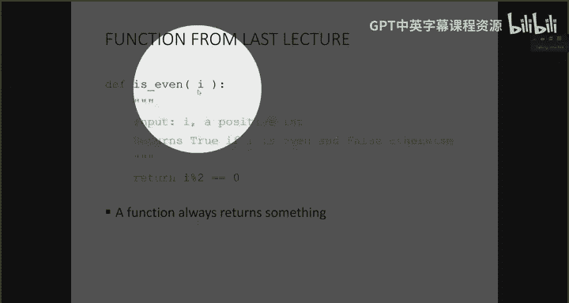

The colon starts the body of the function。

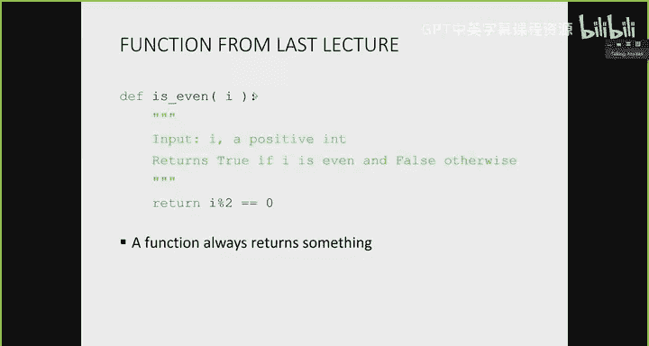

The first part， it's not required， but should always kind of be in there as a way for us to implement abstraction is called the dock string。

 So this in green is the dock string。 triple quotes starts our dock string and triple quotes ends the dock string。

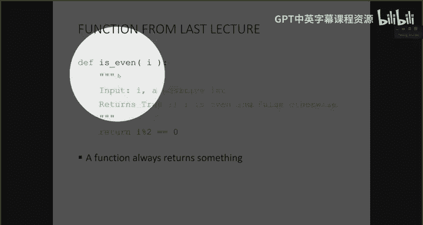

And you think of the doc string also known as a specification as just a really long comment。

 And in it， its， and the doc string is kind of， I called it a contract between the person who writes the function and a person who uses the function。

And in the contract， the person who writes the function basically says this function is going to take these inputs。

 and I guarantee this function to work correctly when you give me these inputs of these types and these restrictions on them。

 things like that。And then you also state what the function is going to do。

 And then you also state what the function will return。In this particular function。

 we have only one line， this is the body of the function。

 but you've hopefully seen functions that are a little bit longer as you did the practice from last lecture。

And the body of the function itself。 So the lines of code are basically lines of code that we've seen before。

 Okay， there's nothing sort of special about that， except for lines that start with a return。

So lines that start with a return basically tell Python that as soon as I see this line with a return hit。

In when I'm executing my function， I need to stop executing this function。

 take the value associated with this return and pass it back to whoever called me。

A function always returns something。In this particular case。

 the function will return either true or false， a boolean。

 but you can write functions I return integers， floats， strings， things like that。In this case， yeah。

 this is what is is returned。 It is possible。 And we actually saw this in one of the you trys as we were writing our code。

 It is possible to write a function that doesn't actually return anything explicitly。

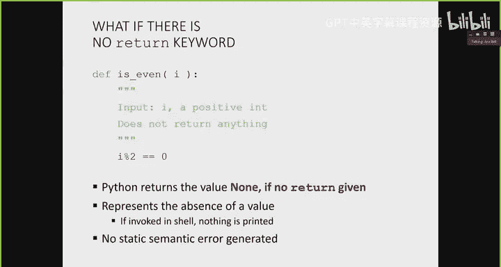

So here is the is even function。 And inside the body。

 the only change I've made is I've eliminated the little return keyword。 But otherwise。

 the work that is done is the same。 So here I'm just calculating whether the remainder is 0 or not。

So this line of code， when when the function is executed， just is replaced with either true or false。

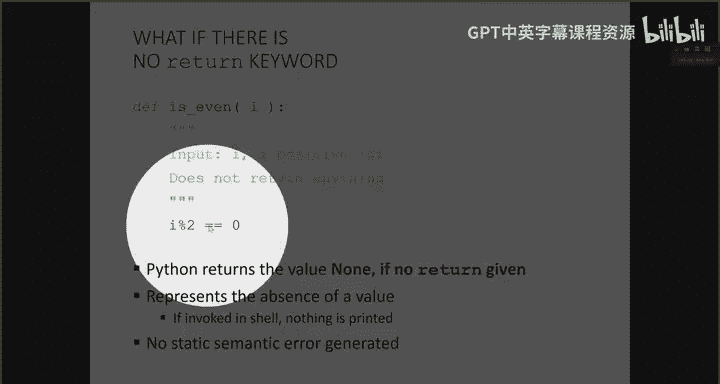

Notice this function doesn't have a return keyword， but all functions return something。

 So while function is being executed because of a function call。

 if the function reaches the end of all of these indented lines here， right。

 and everything that's indented。

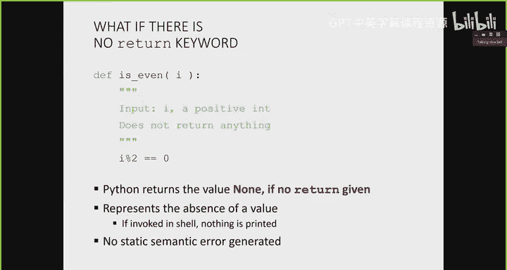

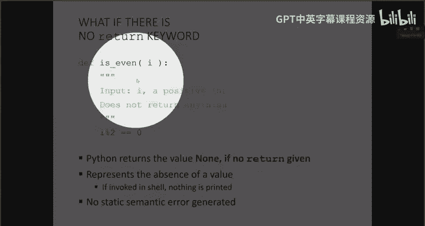

If it reaches the end and no return statement has been hit， then Python automatically returns none。

Okay， so this is the line without a return statement。

 You can think of this code as basically behind the scenes。

 Python putting this little line at the bottom that says return none。Now。

 this is not something that we would ever write。You just do the operations。

 Maybe you print some stuff out， and then you just omit the return keyword if you want to return none from the function。

And none is this nu type is a value that is of type nu type。

 we talked about it back in maybe lecture one or two， and we haven't really used it that much since。

But basically， you think of it as just having the type nu type。

 And there's just one value associated with it， none。

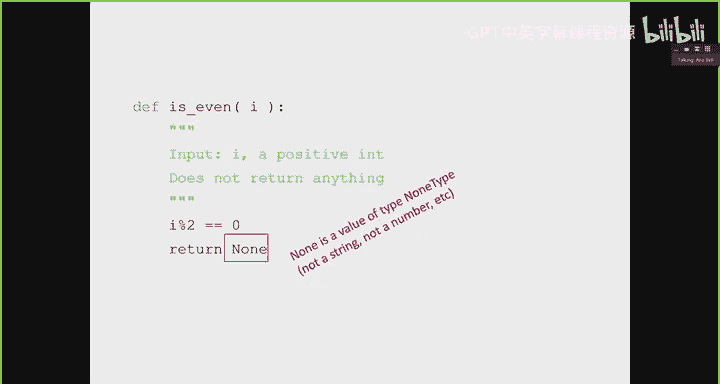

And usually， we use this value to represent the absence of a value in our code。

 So let me just run some code first， just to show you exactly some of the kind of things you might observe when you。

 when you write code that doesn't have a return statement。So here。

 I promise this is the last time we're going to see is even。

So here I have two versions of the is even function， so I have one that I named is even with return。

 and I have one that is named is even without return。They do very similar things。

 The difference is that this one has a return statement where I return whether the remainder is equal to0。

 and this one has no return statement， but it just prints whether the returns the remainder is equal to 0。

Okay， so let's look at running the code with is even with return。 And as we're doing so。

 this first function will be a recap of last lecture。

 kind of tracing through what happens when we make a function call。So I've uncommented this line。

 and now I am running。

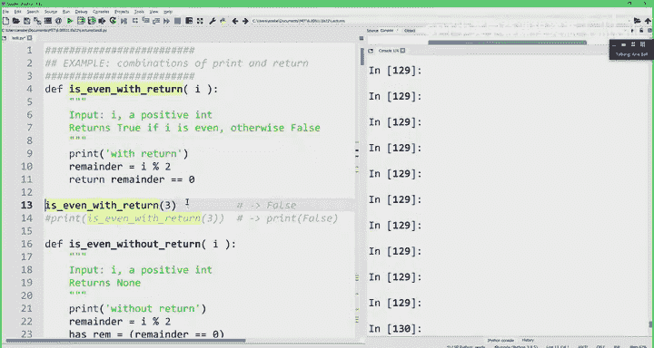

Line 13。So when Python sees this file， it basically sees this function definition。

And this is not code that runs yet， right， It's just telling Python that I've created this function inside memory。

When I have this line。Being run。 That's when the function is actually being called。

 and actually being run。So I is replaced with a parameter 3。And at this point。

 the body of the function is executed。 So the first thing that we tell the function to do is print。

The string with return。 So if I run it， you'll see it prints with return。

Then it calculates this variable remainder， which is going to be one， right， because 3%2 equals1。

And then I'm going to return whether one equal equal 0。 So that's going to be false。

 So as soon as we see this return statement， Python returns out of this function call and replaces the function call。

Entirely with the return value。 So this entire line after the the function calls executed is replaced with false。

 So I've just noted that here。We're not doing anything with this return， right？

 All we're doing is making the function call， and it just kind of sits on line 13。

In order to see the result of the function call， we saw last lecture that we actually wrap。

The function call around a print statement right and function calls， in that sense。

 are kind of just expressions， right， They do some work。

 Python evaluates them to some value and then replaces that function call with the value。

 So if we wrap is even with return 3， this function call around with a print statement。

Python does the whole thing again。 I is 3。 It returns false。

 and this line effectively becomes print parentheses false。 And we know what that does， right。

 It just prints false to the screen。And there it goes。

Notice we still did this print statement because as part of the function body。

 we tell it to do this print。Everyone okay so far。Okay。

So now let's see what happens when we run this function is even without return。So very similar。

 I've just created an extra parameter here or variable here just to show you that you can。

 So this function is even without return3 is being run on line 27， so I is3。

 this function will print without return。And then it calculates remainder to be one。

And then has Rem will be。False， right。 So the variable has Rem will have a value of false。

 And then as part of the functioned body， we're going to print the value of has Rem， which is false。

So this line here will actually print for me without return and then。This thing， false。

And then the function has no return statement explicitly in there。

 So you think about it like Python kind of implicitly adds this return none at the end of it。

 the function call。 We don't add this。 I just wrote it there just to show you that Python would add a line such as this when it reaches the end of the function。

But you would never add it。So that means that the entire function call is replaced with none。O。Yes。

When you what happened？What happens when you put print in the definition versus around the function call。

Versus在 what。Versus when you put return in the definition。 So that's the next line。

 So in the next one。If we were to do what we did before。

 which is let's print the result of the function call。 Well， Python will do everything we just did。

 right， so it'll print without return， itll print false。

 but then it'll additionally print the return from the function call。So if the return is none。

 this line effectively becomes print none。😡，So what we end up seeing or what the user would end up seeing if they actually run this program is they'll see without return。

 they see a false， and then they see this extraneous nun in the console。

So you'll see probably this in problem set two， you'll probably encounter an error such as this and maybe problem set three。

 but don't be scared。 whenever you see a nun out in the console。

 it just means you have to be careful about the function that was called right you probably forgot to return something And instead we're just you know printing the correct value within the function but just never returned it so that's just。

Something to be wary of。Yeah， so that's a good question。 Should you always use return。

 It depends on what you want the function to do。 Most functions are useful because they go off on their own。

 They do a task and they get a value at the end， and they pass the value back to whoever called it。

 And then you can use that function with many different inputs to give you many different outputs。

 So usually you'd want to make functions that return something that you can then do something else with for in another part of the program。

The， the， the prints within the， within the functions should usually be maybe for debugging or for。

 you know， like maybe the status of the function。 You know， what part is。

 it's executing or something like that。Then when you run the function， that it will。Print in the。

Exactly， yeah， if the function is not returning anything， then it'll do ill print none。Right。Yeah。

 but if the function is returning something， it will print right， this， if you wrap it with a print。

 it'll print whatever got returned。O。So let's have you work on this。 Actually。

 there's nothing to write， but think about it。 So I've got four lines of code here。 Add one， comma 2。

 print， wrap that around the print statement， molt 3， comma 4。

 and then add that around a print statement。 So try to trace through and tell me what outputs。嗯。

Each each function call will give me， right， So add one comma to。 What happens。

 What do you think the output of this function is， what gets printed。To the screen。What is it。

Am I telling it to print anything， That's the question。 Yeah。

 so nothing is actually printed to the screen， right， because in the function call add comma 2。

 right， we basically map the parameters 1 at a time。 X is 1， Y is 2。 That was good。 We return 3。

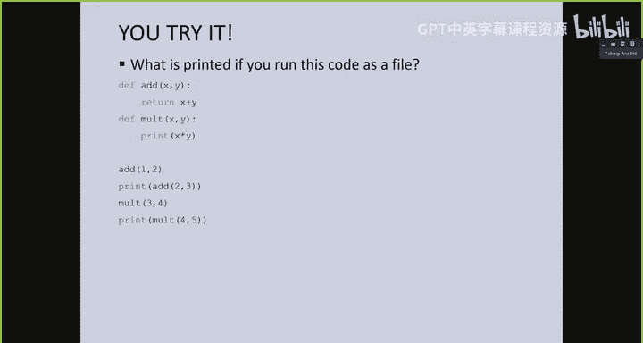

And so this entire function call is replaced with three。

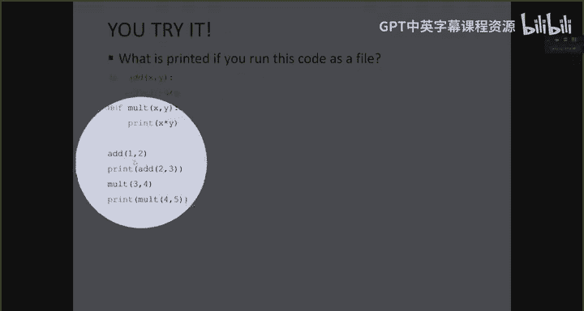

But we never told that line of code to print that result， right。

 so there's nothing printed in this case。Well， what if we wrap？This in a print statement。

Is anything printed in this case。Yes， what is printed。Yeah， exactly。 right， The ad itself。Gives me5。

 And so I'm telling it to print 5。What about the next one， Mlch。4，3，4。

Is anything printed as a result of running this line？I heard some yes， some no。Yeah。

 the print is in the function， exactly， so。

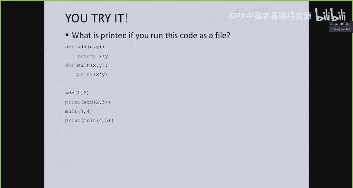

Just because it's a function call doesn't mean we。Don't print anything， right。

 We need to check out what the function is actually doing。 So in mut。X gets mapped to 3。

 Y gets mapped to 4， and the function body itself says to print the result。

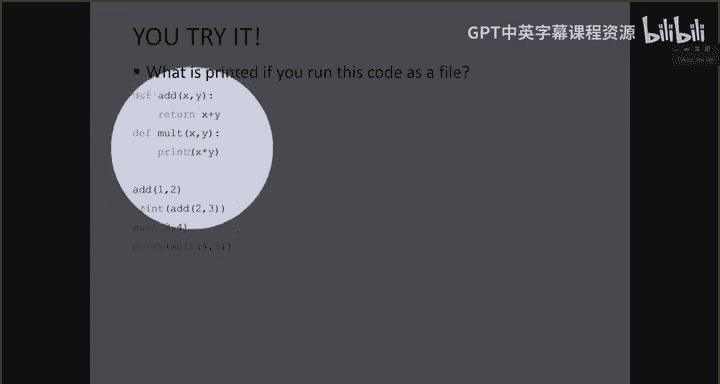

So this will print。As a part of the body， right？Prince the 2。Anything else of Prince？No。And lastly。

 what if we put a print statement around the molt？4 five。What will that print？Yeah， exactly。

20 then nonens。 So the mot itself。Is going to print。Same as there， it prints the 20。So。

The function call returns none。So this entire function called basically is replaced with none。

 and the line then becomes a print none。 So this will print。The nu to the screen。

 So there's actually four four printouts generated from these four lines。

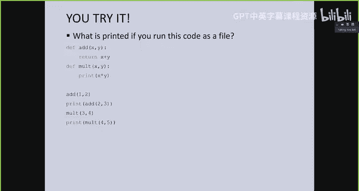

RightThe first one generates nothing， but the last one generates two lines of preto。

Any questions about this example， yes。This one here。Yeah， so the mot。 check out what it's doing。

 It's doing a print statement。 So that 20 gets printed out to the console。

 But what's the return value of mot。

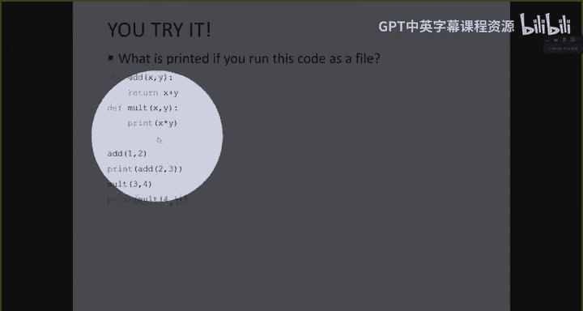

There's no return， right， So if there's no return， Python adds the nonen。

That's just something that's implicitly done。

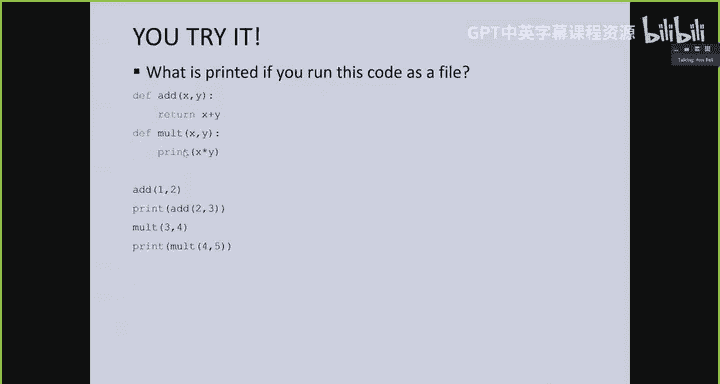

So the return for malt， because it doesn't actually have an explicit return， is none。

 So we're asking it to print the return。

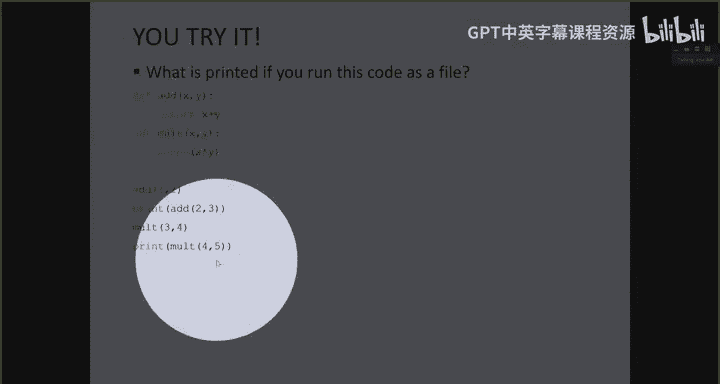

Which is not。Okay。So a couple words on return versus print。

The return only has a meaning inside a function。 So as an example。

 if I just have this file open and I have returned5 just randomly。

 that's not within a function definition Al， I'm in trouble， you see that Redex。

 And if I run that code， Python gives me a syntax here。This one's pretty easy to debug。

 There's a return outside of a function。 Yep， there it is。

So return only has a meaning inside a function。 It basically says this function has done some work for me。

 and it's returning back this value。Print statements can be put wherever you'd like。

 inside functions， outside functions。Wherever you'd like， and they all get executed。

You can have many return statements inside a function， like if you have a function that returns zero。

 if some condition applies or one， if some other condition applies。

 then you can have those two return statements， but as soon as Python during execution。

 hits one return statement， it immediately ends the function takes that return value and pops it back to whoever called it so it's not going to run more than one return statement。

Print， on the other hand， you can run as many print statements as you'd like inside the the program。

 right， and they can all be hit and they can all generate some sort of output to the console。嗯。

So the return statement has a value associated with it。 Right， So return 5 return， you know。

 we had remainder equal equals 0， whatever。 There's the associated value with that return statement。

 That value is what gets passed back to whoever called the function。The print statement， also。

 you can think of it as having a value associated with it。

 That's the thing that gets put out to the console。But that。

Value associated with the print statement is， is just something that's outputted to the console。

 It's not being passed around through the program at all。 It's just kind of static。

 It gets put to the console。 And then that's it。 Nobody else can really use that value。 You know。

 unless it's a variable。 And then you're just using a regular variable。

The last thing I want to show you， this is kind of cool。 So if we have a print statement， right？

Just in here。 And we run it。 Obviously， that prints that to the console。 But what is this print。

It's a function， right， It has all the telltale signs of a function。 The name is print。

The parentheses are there， and I'm giving it one parameter，5。Right。So， if I print。

The return of the print function。So if I wrap my print function in another print function。

 what do you think this is going to output。I'll run it。It outputs none。

So the first five is due to this that shows up on the console。But print being a function。

 It doesn't actually return anything， right， It does something useful。

 like take whatever you want and show it on the console。

 but it doesn't return anything back to whoever called it。

And so if I wrap my print function around another print function。

 I'm basically printing the return of the print function。Which is not。

So that's where the second nun comes in。So thought of another way。

 you can make a variable a equals print 5。 And if I print a， basically。

 we're saying the return of that print first print function is just not。Okay。

 so I'm gonna have you work on this code for a little bit。 Nothing to write。

 but there is something to fix。So here's a function called is triangular。 It takes in one parameter。

 and it's a number an integer greater than 0。I want this function to return true if n is triangular and false otherwise。

 So triangular just means it's a whole number such that it's equal to1 plus 2 plus 3 plus you know。

 some summation like that。Right， so one is triangular，3 is triangular，6 is triangular and so on。

 and so on。So take a look at this code。It's online。Around 49 ish。So， start by running it。

Seeing what you get。 And I'll give you about a minute or so to see if you can try to fix it。 Okay。

 so make sure it runs with all these test cases here。Okay。

 what's the first thing you should do when you're asked to fix some code that's buggy。Yes。

We can do that， but first let's run it with something， right？So let's run it with the first one。

 Print is triangular 4。So we know the answers should be false， I mean， I told you， so that it's good。

Yes， it does give me false， which is good。But it also prints out a nun。What does that mean for us？

Yes。Yeah， exactly。 perfect。 So there's no actual return statement， right。

 Like I mentioned in with this is even example， if you're seeing some nuns show up in places。

 check your returns。 So is this function actually returning something， No。

 it's just printing the the result， So it's printing the right thing in this case， right。So。

 let's start by。Changing the prints to returns。Yeah。Ced this one。O。All right， let's run。Perfect。

 yeah， so that seems to have fixed it。嗯。What should we do next？Yes。Yes， exactly。

 Let's check the rest of the print statements。 So the second one，6 is triangular。

 So that prints true。 And last one， as you mentioned， is going to fail on us。It prints false。

 but one is triangular， right， because one is just the sum of one。

 So do you know what a fix could be。Yeah， exactly。 So you've， you've spotted it。

 The range should be n plus one。If you didn't spot that right away。

 as I think somebody mentioned there， the first thing we should do is just start putting some print statements。

 and inside the loop is a great place to put a print statement。

 we can see what thing we're iterating over。Right。And so if this was still n and we didn't manage to fix it and we run it。

 we see that we've iterated when I is 0， right， right here。 And we never actually hit hit one。

So the fix for that is make sure we go up to n， including n。 And now if we run it。

And remove this print statement because it might be a little confusing。

That now gives me the correct answer。Last step should probably be to run the other two cases again。

 just in case my fix broke something else and it didn't。 The other two cases are still the same。

Questions about this code。 Does it make sense。Okay， so now last lecture。

 I mentioned that once we write functions， it's really easy to include these functions in larger pieces of code。

 and it makes those larger pieces of code very nicely readable。

 So let's try to do the same with a slightly more complex example。 Let's try to do to create。

 take our bisection root code right， and make it into a function。

 And then there's gonna to be an exercise in a couple slides where you get to use this this function。

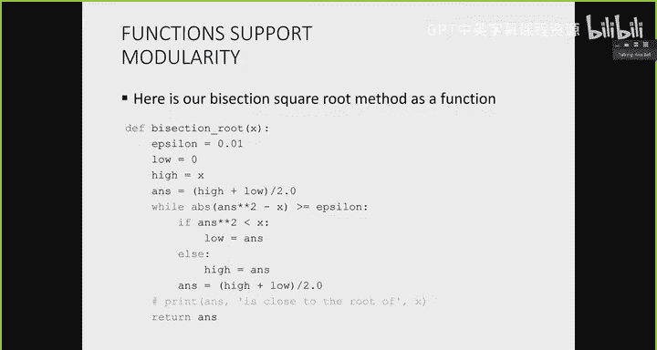

So。The inside of this。

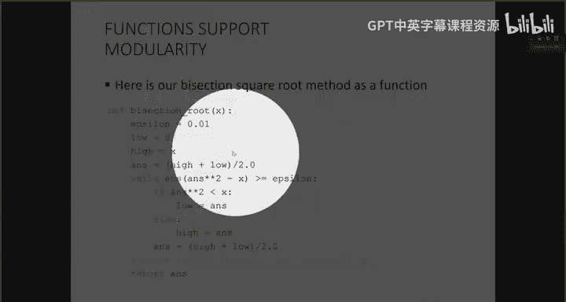

Fun here is basically what we had。Like three lectures ago， okay。

 it's just the bisection square root code。The only thing I've done is I've wrapped it around a function definition。

 So D F， I gave it a name。 bi section root is a pretty nice name and figured out what input this function should take。

 So the input should be the X I would like to approximate the square root of。

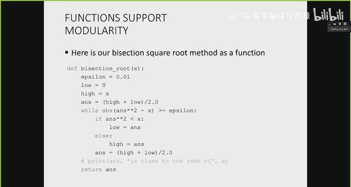

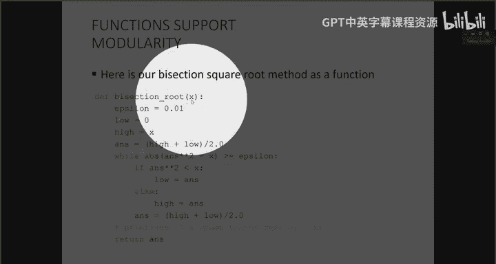

One thing I didn't do is put a dock string on this， so that's my bad。

 but you know the dock string would say x is a positive integer greater than1 and returns the approximation to the square root of x or something like that。

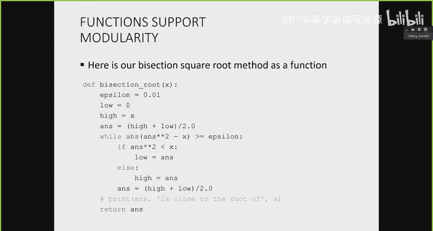

嗯。Okay， so here we're hard coding epsilon to be 001。

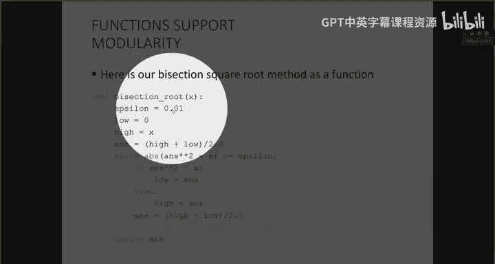

We've got our low and high endpoint， right， just remembering what the bisection route does。

 And we're starting out with a guess that's right in between the low and high。

The while loop here is going to do the work for us。

So the while loop condition is while the difference， the absolute value， right。

 the difference between our guess squared and the actual x。

 we're trying to find the square root of is bigger than epsilon。

 So while we're still farther away than epsilon， we have more guesses to make。

The way we make the guesses is by updating the low end point or the high end point， right。

 depending on whether our guess was too low or too high。 This should be reviewed， hopefully。

And then after we've decided on which end point to update。

 we update our new guess to be whatever high plus low is divided by  two again。

 So the midpoint of those where either high or low would have just changed because of this if else。

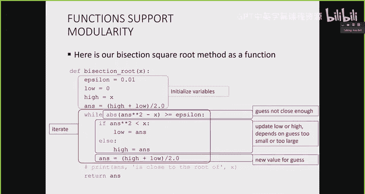

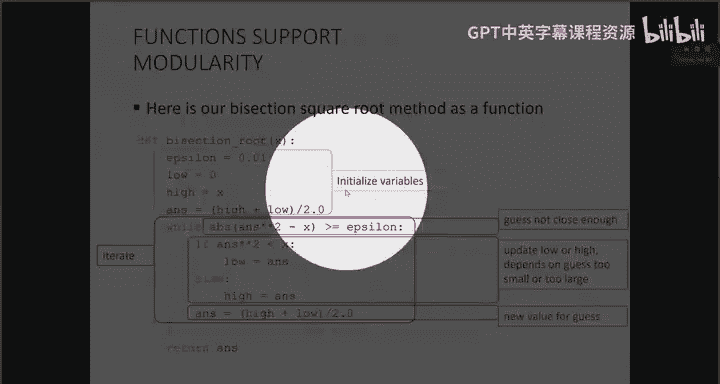

And this loop will just keep going over and over and over again。

 making better and better approximations until we come within plus or minus epsilon of the squared of x。

Oex。The difference。Between this code and what we wrote a few。

 a few lectures ago is this part down here。

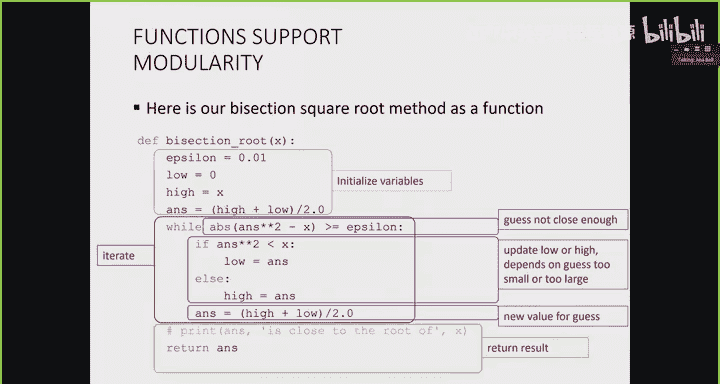

So a few lectures ago， we all we could do really was write a print statement where we took our guests that we ended up with。

 right， and we printed it along with， you know， that guess is close to the root of our original X。

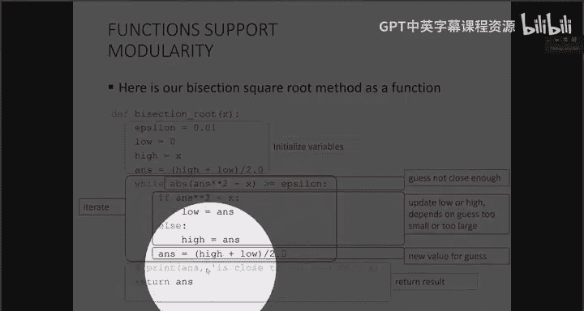

But instead， since we're writing a function， I would like to take the result， right。

 my approximation to X and return it。 So somebody can call this function many， many。

 many times with different values of X and figure out a bunch of different approximations for all of these different x's。

So here I have the function calls， right， So I've got bisection root with 4 and bisection root with 1。

23。 And then I can just print the results of these。 right So here is the bisection root function。

I've got my printout commented out because I don't actually need it。

 The rest of the code will do something useful with the approximations right， so in this case。

 bisection root of 4 was gave me a 2。0。 So that's the approximation and the bisection root of 123。

Was approximated to 11。09。O。So what I would like you to do。

 and this is gonna to be a little bit involved code。

 Itll require some thinking is to write a function called count the numbers with the square root close to。

And。Plus or minus epsilon。And I'， I'll help you out by drawing something on the board。

 But I would like you to do the code for it。So。The idea here is that you have some N that's given as an input。

And you have an epsilon that's also given out as an input。What you'd like to find out。

Is how many whole numbers？Have their square root within plus or minus epsilon of it。So， this。

Is kind of hard to wrap your mind around without actually drawing a picture。

 So this is also something you should try to do in quiz situations， Pets， things like that。

 Don't code right away。 Try to draw a picture， kind of depicting what we're asking for here。So。Here。

 we'll start with a line。Right， this is our number line because we're doing the square root。

We want to know how many integers have a square root with an epsilon of n。 So let's start with an n。

Right， and we have something plus or minus epsilon。 right， So this is epsilon。

And this is also Epsilon。In the end， we want to know how many integers have a square root。

Square root of I actually I do this square root of I。Is equal to somewhere in this range。

Does that make sense so far。That's what we're trying to figure out。

 the square root of I is somewhere in this range。So that means I。

It's going to be some giant number out here。Right， so this line can go further up。

So in the example here， I've got n is equal to 10。So I know for sure that an eye of 100 just kind of us as humans would work。

Right。Because the square root of 100 is probably going to be approximated to pretty darn close to 10。

 So I know that that value will be within plus or minus epsilon of 10。

But there's probably a couple numbers around 100 that also match this criteria。 right。

 If I take this square root of。99， according to this example。

 that approximation puts me within plus or minus epsilon of 10， right， So it's going to be。You know。

 squared of 99 is going to be like 9 point， whatever is here。9，5。Right。

 so that's within plus or minus episode。And similarly， right。

 square root of 101 and 102 also work because if I take the squared of these guys。

 thathou will also put me within plus or minus epsilon of 10。

So the goal here is basically to figure out these numbers，99，100，101 and 102。

You should use the power of computation and computers being able to do a task really really quickly to basically say。

 I'm just going to brute force my way through this problem and say， I'm going to test each number。

One at a time。All the way up to some pretty large number， right？ So you want to make sure you hit 99。

1000102， maybe going up to maybe n cubed。 right， If you go and take the square root of some I cubed。

 you know you're going to hit all these values within plus or minus epsilon。

So you're just going to brute force， Look at all the integers between 0 and n cubed。

And figure out if this， if there's square root， the approximation of this square root。

Is it moving plus or minus epsilon event？If it is， keep a counter and increment it。

 and if it's not ignoregnorant。And that's the idea to this question。Loop。And a check。

And you can definitely feel free to make use of the bisection root function that we wrote in。

 in our code， right， You should definitely use it。 it's very helpful。

So around line 96 is where you can write your code。All right。

 Does anyone have a start for this for writing this code or how would you think about it or。Yes。Ie。

For I in。Range。AndC， yet， we can do that。All right， so this will give me number 0 through。And cubed。

Perfect， so I've generated basically this sequence Now。 what do I want to do once I have I， And。

 you know， you can always write a little comment for yourself or what you want to do once you have I。

So in English， what would you want to do once you have a number like this？Take the square root。 Yeah。

 take the。Square root of I。Okay， how do you want to take the square root of I？We can。

 Shall we use our bisection route。We can， too。Yep， we can do both。

 So let's use the function we just wrote。So bi section root of I。This gives me square root。So now。

 S Q RRT。Is going to be some value here， right， It could be 10。 It could be 99。5。 It could be 99。7。

 What do I do with this number now。Yes， exactly。 Let's use an if statement。 So if。

 and there's many ways we can if use the if statement， we could do absolute value， right？

 That's what we've been doing already。 So if we take。嗯。N minus the square root。Right。

 so n minus this value we just calculated。Is less than epsilon。Alright， so here we know。That。嗯。

Square root。Is within Epsilon？And what do we want to do once we know that the skirt is with an epsilon。

Well， if we don't know， we can look at the dock string。

 so we need to return how many integers have that square root with an epsilon n。Yeah。

 exactly keep count of it， right， so count。Plus equals one。Yes。

 and I do have to initialize count count equals 0， right before。Okay。Anything else。Yeah。

 we do need a return。 So at the end of the loop。We can return our count。Okay， run it。

What is this from oh， this is from me？So，4。I think that works because from the example。

 there were four numbers that worked。To double check， we can， or if you know。

 something went wrong And the number you got was what you were expecting。Again。

 print statements very useful。 so we could print the value of I。 So this thing here。

 we're trying to find the square root of。And we can print the square root of that value， right？

 And so if we actually add it to the print state to code here。

 we see the four values that we grabbed，99，100，101，10。And now that we wrote this code。

 we can actually make really simple changes to it。And we have some pretty useful code， right。

 So if we make our boundary bigger。10 plus or -1。 We're going to get more values that match this criteria。

 right， So， in fact， we got 40 of them。Right， all the way from 81， all the way up to 120。

 They all match the criteria， which is when you take the square root of that value。

 it's plus or minus。9ine to 11。Any questions about this example， I know it's kind of involved。

 but I hope that actually drawing a picture helped explain what we were trying to get at。

 And that at that point， it should have been pretty easy to figure out the structure of the code itself。

Any questions yes？カりド。Yeah。Like。It could be smaller。 Yeah， I mean， we could have done and and。

 and to the power 4。 We just couldn't do n squared because then we might miss。 we Well。

 we would definitely miss 101 and 102 in that particular example。And in fact。

 if our epsilon is really big。We might。Actually， I'm not sure about the math。

 but if our epsilon' is really big， we might actually need to go bigger than N cubed as well。

 I'd have to think about that。But we just， it's okay。 I mean， it's fine to make it big。

 It doesn't take that much longer to compute because the you know， running the function is。

 is very quick to Python anyway。Yeah， there's a question。Is this a reason why we killed kids？

The arbitrary number that。Yeah， arbitrary number。 that's big enough。

What we could have also done just along those lines is we could have done something a little bit smarter in here where once we find this a number that actually works。

 like once we start incrementing our count we could have some sort of flag that keeps track of as long as we're incrementing the count right。

 keep going but at some point you know you're gonna to reach a number that's too big and at that point you can just end the function early right you can just break out of the loop and you don't need to keep looking at you know。

All the way up to N cubed。So we could have done something a little bit。

Smarter to make the function just a little faster。With flags。which you can try。

 So see if you can have the program stop as soon as you hit 103 right。

 So if you can write the program that uses a flag to trigger that event。

 And then when that event is true， just break out of the loop or return immediately or something like that。

Other questions。Okay。So let's zm out a little bit on functions。

 We did this a little bit last lecture。 This is a function that we actually wrote last lecture。

 It was some of odd numbers between A and B。This was essentially our black box。 right。

 Remember that now we're that we're writing functions。

 We are kind of separating ourselves as some as a programmer who writes a function， right。

 You basically make this nice modular piece of code that can be reused over and over again。

So we're separating that aspect from somebody who's using a function。

 So once there's a function already written for you， you just use it in code， right。

 Like we use the bisection route here。 right， I know we wrote it， but I guess technically。

 I wrote it， but here we just kind of used it right， And we used it to write this nicer。

 more complex piece of code。And so this is what we do。 We basically create this black box。

 And once you know the specification or the dockstr of the black box。

 you don't need to know how it's implemented in order to use it。

But what I wanted to mention is something I mentioned last lecture is the function definition is。

Just creating a function object inside inside the memory。

And the name of this function object is the name of the function。 So if we're thinking about the。

 the program there is the orange box， we have an object that just happens to be a function。

Which has some code associated with it， whose name is some odd。And。

Kind of drawing a parallel to that is when we create just the variable， as we have been so far。

 right here， we're creating an object to whose name is low。 So in that same way。

 that black box is basically saying， I am creating a function object that has some code associated with it。

 whose name is some odd。So in this case， I've got some odd。

 low and high as three sort of objects inside my program。And then only when I make a function call。

 does the。codeode associated with the function object run。 right。

 So up when I'm defining the function， it does not run。

 It just stays inside computer memory as an object that exists。

 And when I make my function call is when I use that object。

So the function call basically takes my variables， and。And matches them to the function definition。

 So A gets matched to low and B gets matched to high。

 and low and high in the function call have actual values associated with them 2 and 7。

And so that function will then go ahead and do the work。 And at the end。

 it's going to return something， either an actual value or none。

 And then that actual value replaces the entire function call。 So in my program。

 the variable my sum here is going to be equal to the return。Just a little recap。

 But hopefully this kind of keeps bringing the point home。

So now we're going to talk about in more detail what exactly happens when we make a function call。

 So when we make a function call， you can think of the program as sort of taking a pause， right。

 I've got my main program。 and in my main program， I have a function call。

 that main program will just pause for a bit。In that function call。

 you can treat it as sort of a little mini program that needs to run。

And terminate return of value before the main program can resume executing。

So that little mini program， that function call， basically creates its own little environment that it lives in。

So in that little environment， it can create variables just like we would in the regular program。

 it can modify variables， it can print things， right， it can do all this work within its body。

And at some point， it'll finish its job， finish its task。

 and it'll have some value that's the result of all of that work that it did。

 and that value is what it hopefully returns back to the main program and then the main program can finish its job。

So what's key here is that every time you make a function call。

 you basically create a new environment。 Okay， and that environment is completely separate from the main program environment。

As soon as the function call terminates， that function call environment disappears。

 So any variables that were created within that environment of the function call will also disappear。

 Okay， so all we're left with is just what's in the main program。

So now we're going to talk a little bit about environments。 Okay， And if you understand this。

 you'll understand 80% of functions and what to do with them。So basically。

 when you first run your program， the program enters what we call the global environment。

 the main program environment。And anytime you make a function call。

 we're creating this new environment。Okay， so what exactly happens when we create these。

 when we do these function calls， How， how do these environments interact。And the answer is。

 they don't actually interfere with each other that much。

 They only interfere with each other through。Passing in parameters。And through returning values。

But beyond that， these two different environments， the main program environment and a function call environment can actually have variables that have the same name。

But don't interfere with each other because they exist in different environments。 Okay。

 so we're going to look at this example to to showcase that。So here's a function。 It's pretty simple。

 It does not do much。 It takes in one parameter， probably a number and adds one to it right。

 So takes in an x and does x plus 1 reasigns x to it。

 and then it does this print statement and then returns the new value of x。

 So it added one to whatever you passed into it， and it returns that new value。

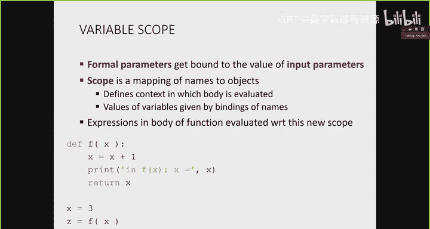

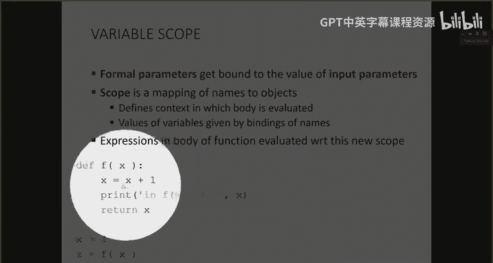

So that's the definition。 Again， this just sits in Python memory。

 It doesn't actually get run until we make a function call。The parameters here。

 when we wrote our function， are called formal parameters because。

There's no actual value associated with them， right， We're writing this function。

 assuming that at some point， we're going get a value for x。

But at the time we're writing the function， there's no value for x。 It's just this abstract variable。

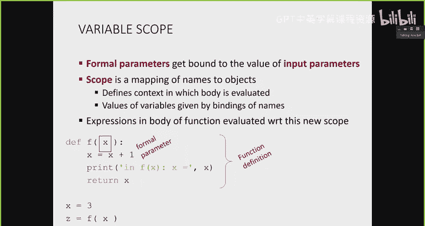

And we're using that variable x within the function body， assuming that at some point。

 we're going to get an initial value for x， right， So x is equal to 3。

 And then at which point the body can the next。

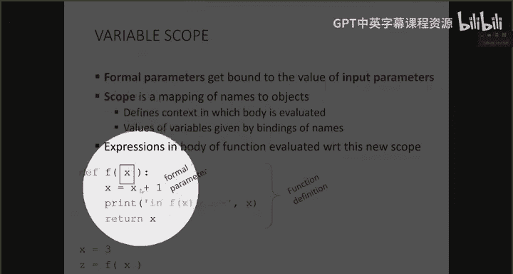

Now， when you make a function call in the main program scope。

 that's when you pass make a function call with with an actual parameter。

So here you'll notice I'm using the same name X， but this x inside the main program is different than the x。

 That's this formal parameter of the function。This actual parameter。

When we make the function call is mapped to the formal parameter。 So at that point。

 the formal parameter can get the value。Of the function call， which is 3。Okay，And in fact。

 it doesn't actually matter what we name this variable out here， right。

 We can name x is equal to3 and make the function call F of x。

 but we can also have y is equal to3 and we make the exact same function call F of y right because we want to pass in three as a parameter to this function call。

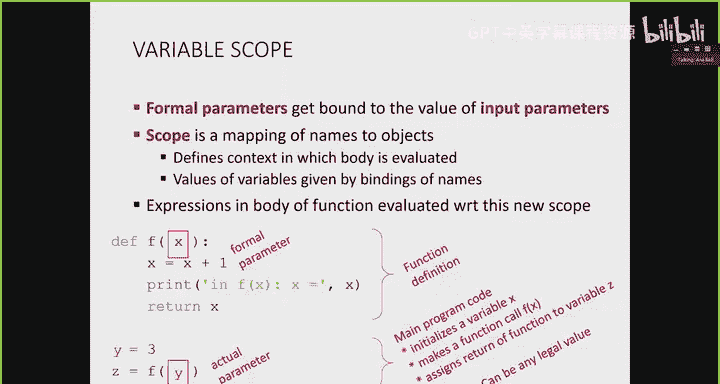

So this x out here is different than this x over here。

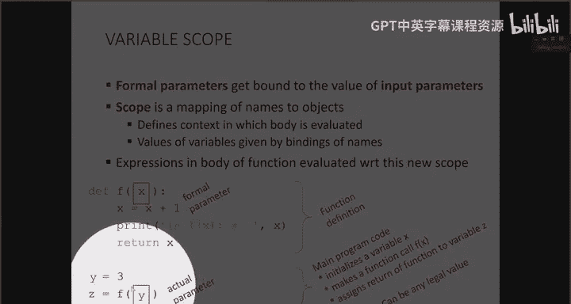

So the re Oh yeah， go ahead。The formal is the one from the function definition。

 We say it's formal because there's no value associated with it when you first write the function。

 right， You write the function first。 There's nothing going on here。And then you have some。

Code that actually now taking on some values， and you can run。

So let's trace through this code little by little to see exactly what environments get created as we make function calls。

 So again， this is by black box。 It's a function。When I first run the program。

 weve finished the function definition， so we're at this point in our program right before we do x is equal to3 inside my sort of computer Python memory。

 what I have is one environment created and that's the environment of the main program。

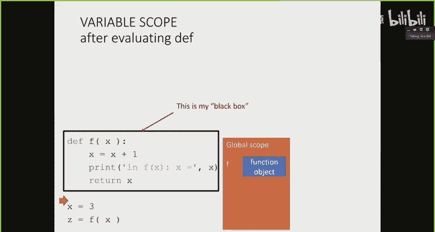

The only thing I have in this environment is by F。Right。

Because at this point in the program where the red arrow is， I just had a function definition。

So again， it's a definition。 It's， it's a function whose name is F， and it's an object， right， I。

 it's not being run quite yet。 It's an object that contains some code。

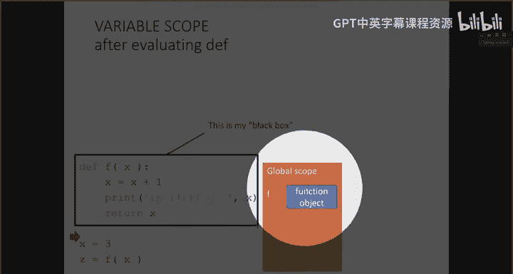

Now we have x is equal to 3。 So that's pretty easy inside my main program environment。

 I've got a variable name X， whose values is 3。And then I have my function call。

So as soon as Python sees a function call， it creates a new environment。

And the current environment where the call is being made from。

 So the main program one will be put on hold。So here I'm calling function F。

 So now I'm creating this new environment that。Think of it like this mini program。

 this little task that needs to get done before the main program can continue executing。

So I need to figure out what's going on in this mini program， right， in this function call to F。

Alright， so here's my new environment， The scope of F。

The first thing that we need to do is figure out what are the parameters of F。

 So we look at the function definition， and we see it has one parameter named X。

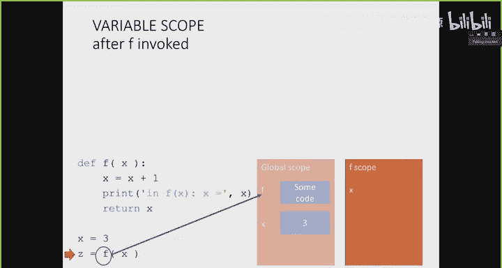

So we're going to take that X。 And the first thing we're going to do is map the formal parameter to the actual parameter。

 Okay So we're going to make the formal parameter of F named X。 Take on the value 3。

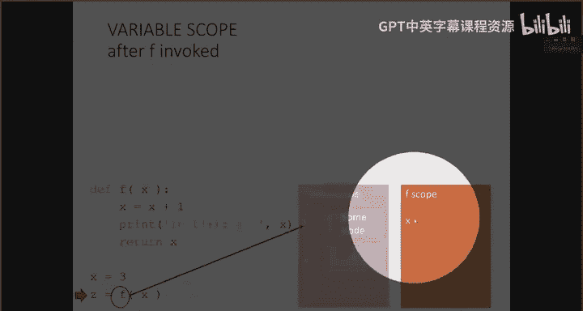

That's kind of what we've been doing already。 But now this is getting down to sort of details。

Just details。We've mapped all the parameters。

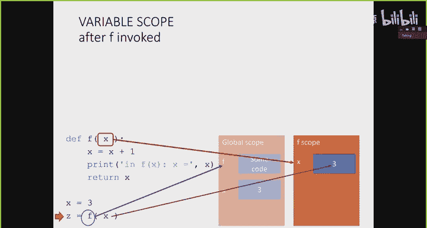

The body of the function executes。 I've， again， kind of。

Burird out this one because we're not in this global scope。

 We're trying to figure out what F is doing。So the body of F says take x。

 add one to it and reassign it to x。So what's X inside my function？It's 3。 We add one to it。

 and we make X before。

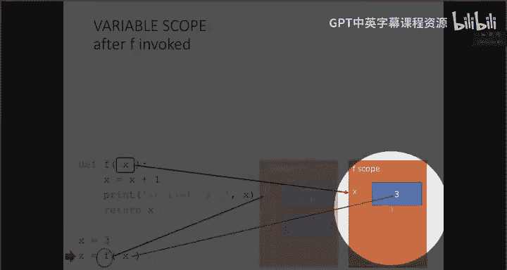

I skipped one thing， which is if in my main program， I had Y E and F of y。

 nothing really would have changed。

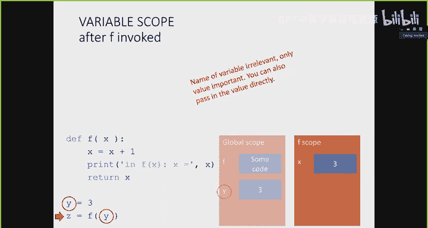

Right， my formal parameter of F。Is still x， and I'm still mapping x to the value that's in my here in the actual print。

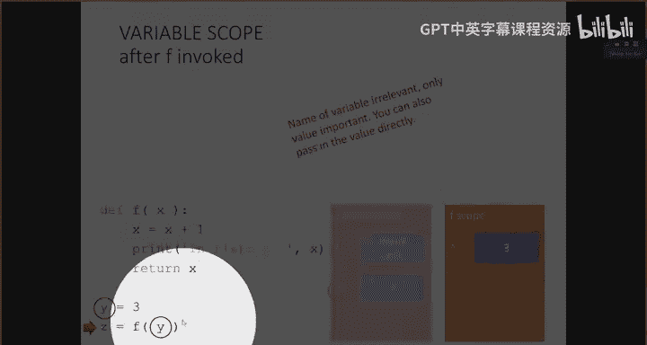

Okay， so in my scope of F， I've got x is 3。 I increment it by one。 It gives me4。

 and I resave it back into x。And again， there's no collusion。 there's no collision here， right。

 in terms of naming， because the scope of F， the environment at F has a variable named X。

 And I'm just doing stuff with the X that F knows。

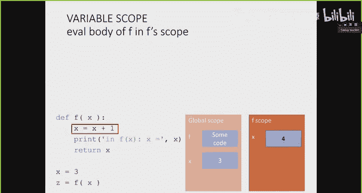

I do have another X inside my global scope， but Thou one's put on hold for now。

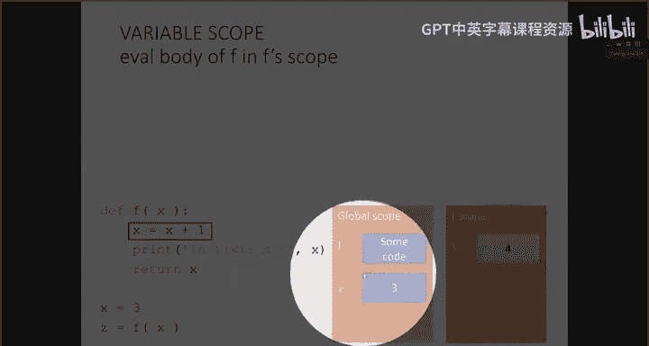

Alright， so I've done x equals x plus 1。 Then I do the print statement。 So in F of x x equals 4。

 that gets printed out。 And then I return x。 So the thing that gets returned is the value of x。 So4。

And this， again， replaces the function call。 So this gets returned back to whoever called me。

 And the environment that called me was just my main program。And here I'm going to return four。

 and this is going to replace that with four。As soon as the function sees the return。

And returns that value back。 It goes away。 So notice that X that we had created is gone。Now。

 we're in the main program， there's no， there's no confusion， right， My main program has its own X。

 that other X。 that was part of the execution of F。

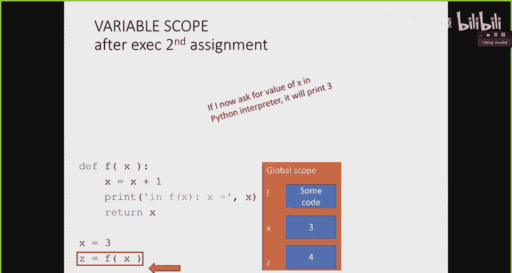

Is gone because that function finished its job， and it doesn't need its environment anymore。

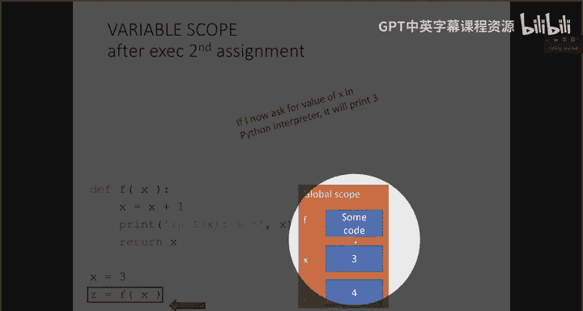

So now the return of the function replaces f of x， and we see Z as equal to 4。Okay。

 that was super detailed。 But that's kind of what happens step by step when we make a function call with the new environments being created。

 So if you could understand that。It should be it should be pretty straightforward not， you know。

 and you won't get confused when you see an X out here， you have F of x， you know， as one function。

 and then maybe another function that has G of X and so on。Okay。

 so in order to know the scope that you're in the environment that youre in。

 you need to know what expression you're evaluating， right。

 So here we were evaluating this function call。So that means that we were inside the environment of F。

Another example。 And this one's a little bit weird。 It shows some of the nuances of Python。

And these aren't necessarily true in other languages。

 So I'm just going to do the drawing of the scopes out here。So let's start with the one on the left。

So you can see here I've got one function， F of y。And I've got the main program that creates x is equal to 5。

 And then a call to Y。 So inside my main program， I've got x is equal to 5。

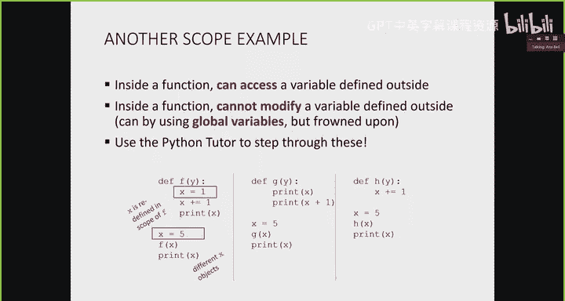

And then I have a function called to F。Function call means we need to create a new scope。

 So this one's put on hold for now until we figure out what F parentheses X is right here。

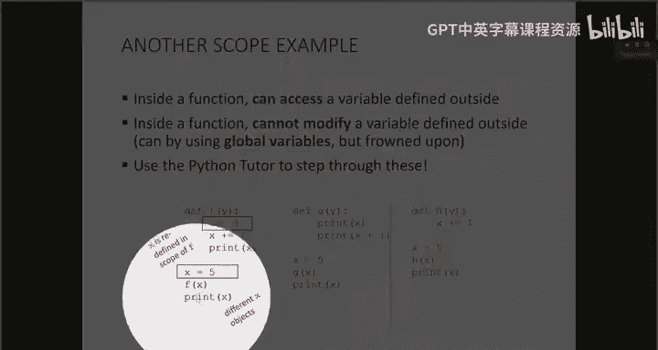

So the first thing we need to do is grab F and take all the formal parameters of F。Here's one。

 its name is Y。And map them to the actual parameter。 So I'm calling F with 5。

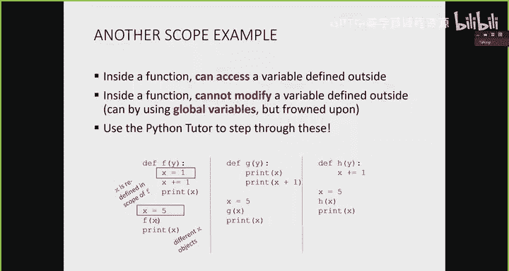

So I'm going to map Y to5。This function is going to take now do its the body of its function。

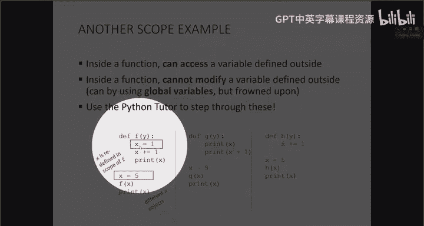

X is equal to one。 So it creates also an x whose value is one just within its scope。 It adds one to。

So this becomes two。And then it prints X。 So it's going to print2。And then the function terminates。

 it returns。None， right， There's no return statement。And it， the function is done。

So this line has now finished。 And the last thing that the function does。After it's done。

 the return is the scope goes away。And the last thing we need to do now is print X。

 So this will print the value of x in the global scope， which is 5。

So the output of this a little piece of code on the left side here is two and5。Okay。

 what about the middle code。

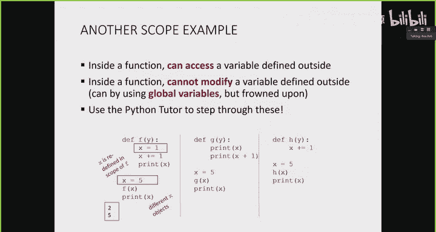

Similarly， I've got a function definition， and then I create x is equal to 5。

 and then I make a call to G。

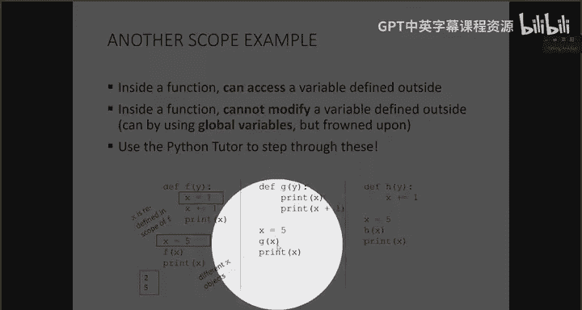

Alright， X 5。 So as soon as I see a function call， I need to create a new scope。

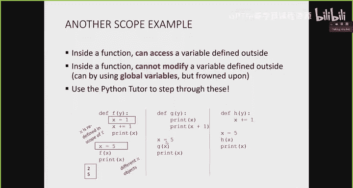

And I need a map。All the formal parameters of G。 It has one formal parameter。 Its name is Y。

That one will be mapped to whatever I made the function call with。5， right， X is 5 on here。

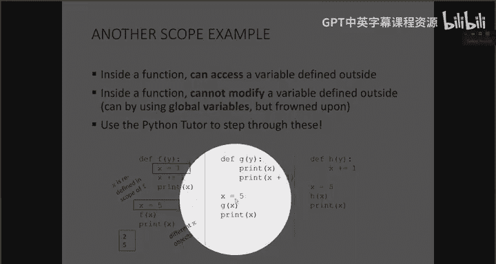

So that gets map to5。What is this function going to do， Well， it prints X。

What's x inside the scope of G？Do I have a G inside an X inside G？No。

 so this is something that Python does。 It says， well。

 if your environment doesn't have a variable named。X in this case。

 look further out and see who called you。

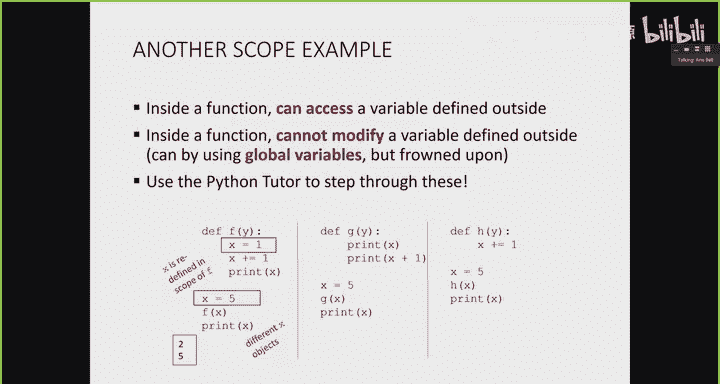

Well， which environment called this G。The main one， right？Does your bigger environment。

 the one who called you have a variable nameplex。It does， right。 It's 5。

 So Python grabs the value associated with that larger environment。

 And if that larger environment didn't have one， it would look further out and further out out until it doesn't have an environment to look at。

So G is going to print the value of x， which is 5。

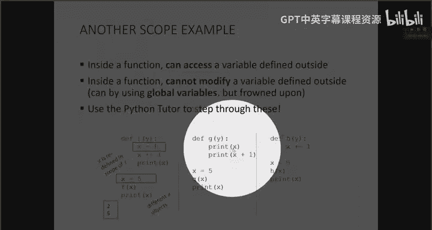

And then it's going to print x plus1。Which is six。And then it's done。It returns none。

And then as soon as it returns none， this scope goes away。

And what we're left with is the global program。And we print x， which is still 5。

What I want you to notice is that that function G printed x plus 1， but never modified X。Right。

 we never said， you know， something like x is equal x plus one or something like that。

 We just figured out what x plus one was and printed it。All right， one more example。

And this one will actually end up in an error。So here I've got x is equal to 5， just like before。

 And then I have a function call to H。 So again， a function column means a new scope is created。

 I've got one variable。 Y， that's my formal parameter。

 It gets mapped to whatever I call the function with 5。Yes。

And then what is this function doing that line？X plus equals 1。Is x is equal to x plus 1。

This is actually an error。Python doesn't let you do that。

And the error it gives you is actually what it says there。 So unbound local error。

 local variable X is referenced before an assignment。

So it doesn't actually grab the value from the outer scope like we did in the middle bit。

It doesn't grab it because it thinks you're trying to create a variable named X。Inside。H。

And you're trying to add one to X。But you never had a line that said x is equal to something。

Originally， inside H。OkayAnd so when you're trying to say x is equal to x plus 1。

 it's trying to look for an x inside the scope of H。But it doesn't have one。

And so that's where we get that error from。And this is not some， I mean。It's just a nuance of Python。

 but it's kind of important to understand that。You can access variables。

But you can't change variables outside of your scope。So the middle one just access as a variable。

 adds one to it and prints it， but we never said x is equal to this value。And it's kind of like。

 I guess the error you get is kind of like， if you made this be something completely different。

 like Z。You would get the same error。 You know， it would be error variable Z reference before assignment。

 right， like yougra X plus one， but I don't know what Z is。Make inside。えまし。and like。So if you， no。

 because if you wanna， if you want to explicitly say that you're taking it from outside。

 there's a keyword called global that you'd need to write。 that explicitly says， hey。

 I'm grabbing this variable that is not part of me。 It's part of the， it's in like， you know。

 the the main program， the global scope。Okay， the last thing I want to talk about is using functions as arguments to other functions。

 so。嗯。The way I've sort of been explaining a function definition is basically saying that when we define a function。

 Python essentially puts some code in memory whose name is the function name， right， So basically。

 the function name creates for me an object inside memory that happens to be a function object。

And just to show you sort of what that means is we have a function is even， right。

 We've definitely created it。 If we say the type of is even。It's function， right。

 So the function is even。Actually has a type， and its type is a function in Python。

So functions are basically just objects， just like an integer is an object。 A boolean is an object。

 A float is an object， right， A function。 it's an object。 It just looks different。

 It has a bunch of code associated with it。So if a function is an object。

 what that means is we can use an assignment operator on a function name。

So we can have two names that functions that point to the same function code。

We can use a function as an argument to another function， like a parameter to a function。

 Or we can return a function from another function。So， here's an example。

Pretend that this is our code file。 We've got the memory。

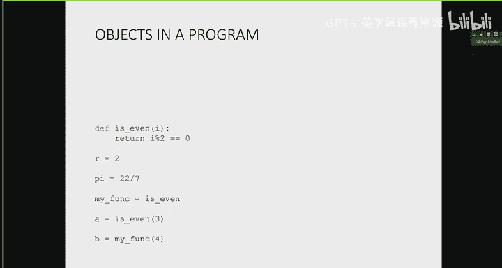

The first line of code here， the definition basically creates this function object for me in memory。

It's kind of like a variable， right， Is underscore even is the name of this function object。

 And this variable is bound to my function object with some code associated with it。

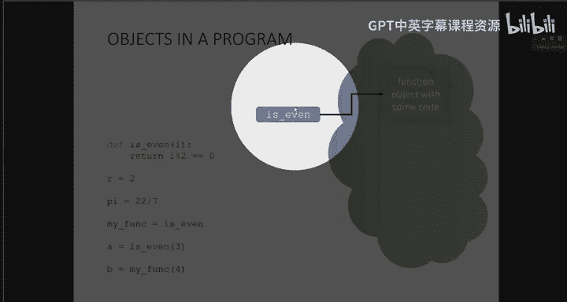

So you think of the function as just an object。

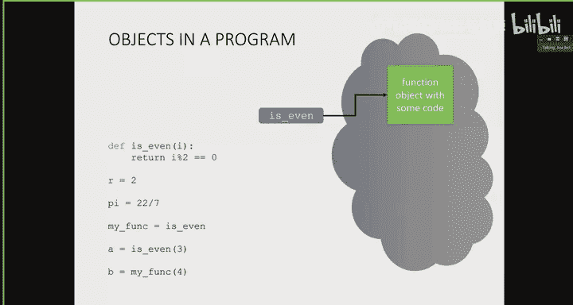

Similarly， right， when we write R is equal to 2， I think of that as the same thing， right。

 R is the name。 And I've got an integer object whose values is too。

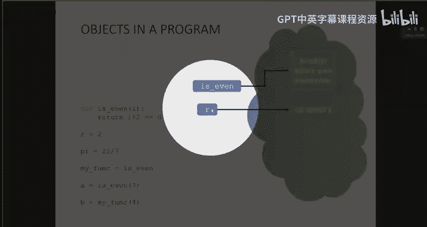

That's exactly what happens when we create a function definition。

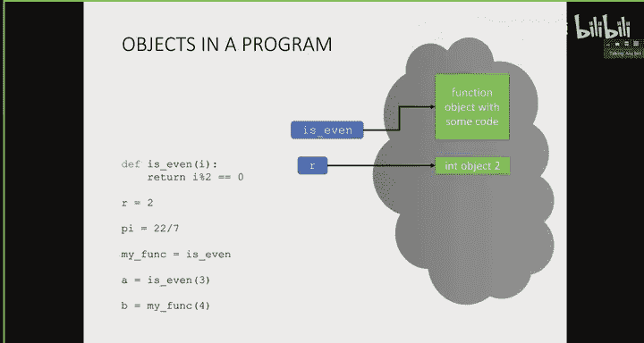

Similarly， pi is equal to 22 over 7， right pi is the name associated with a float object that has that value。

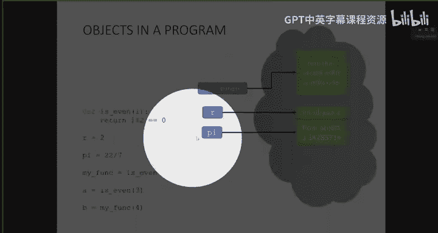

So what we can do， right， now that we've established that a function is basically an object with a name。

 we can say a line like this。 My funk equals to is even。

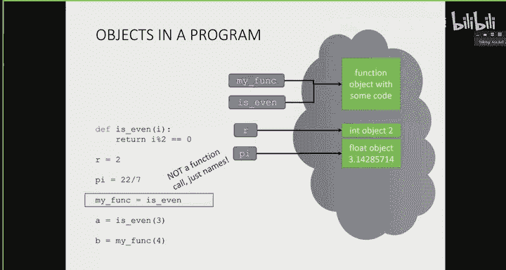

The right hand side here。Is just the name of my function。It's not a function call， right， Notice。

 there's no parentheses after is even。 There's no parameter。 none of that。

 It's literally the name of my function。

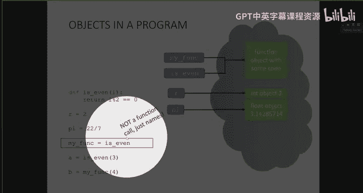

So inside memory， what I've ended up doing is I have two oops， I have two names。

My funk and is even that both point to the exact same function object。

So that means that that function object。 So this is even function。

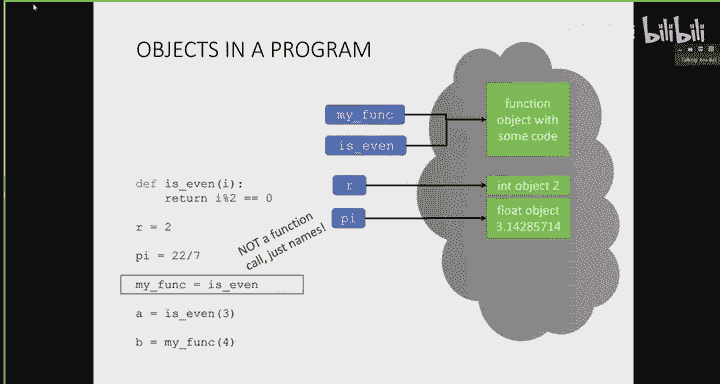

Can be referenced by both of these names。

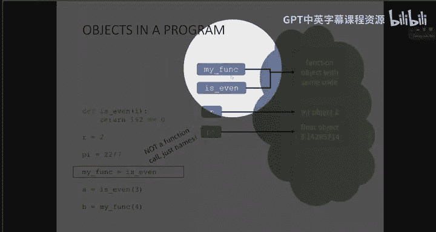

So on the next two lines here， A equals this and B equals this。 I'm running the same code。

 just referenced by different names。Right， so then A is gonna be bound to false and B is bound to true because I'm。

 I'm accessing the same code， fundamentally。By different names。Does that make sense。

So everything in Python is an object， including functions。 It's strange to think。

 but there you have it。So let's look at this code。I've got three function definitions and only one function call。

What are the functions， function definitions，1， I have named Kc。 It takes in three parameters，1。

 I have add， it takes in two parameters， and 1， I have div。 It takes in two parameters。

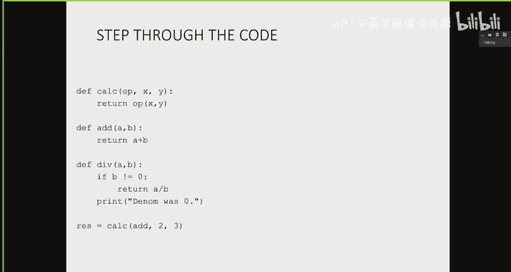

Add。Does something pretty simple。 D has maybe a print statement。

 but also does something pretty simple。Calc is the one that's really strange， right？

Because it takes in these three parameters。 But what's the thing it's doing in here。

 it's kind of treating one of the parameters OP operation as a function。

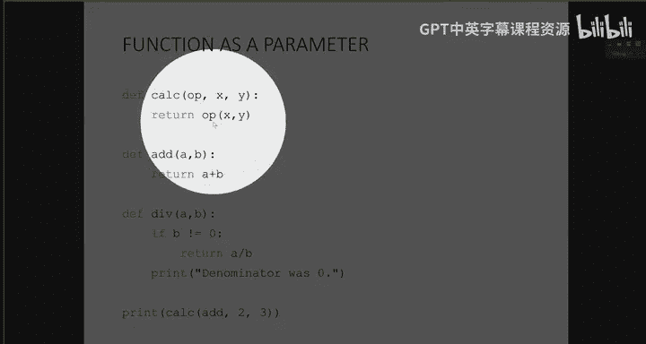

O。That's what's strange about Calx。 And let's trace through the code to see exactly what that means for us。

So when I first run my program， I have three function definitions。

 So I'm creating three function objects inside memory。 Calc， a function object that has some code。😊。

Add a function object that has some code and div a function object that has some code。

And then we get to the good stuff， Res equals the function call。So re is going to be a variable。

 that's going to have a value。What value we need to figure that out。Clk。Is a function call。

Every time we have a function call， we need to create。A new environment。

 So now we are creating our cc environment。So we've put aside the main program scope for now。

 and we're focusing on what CalC is going to do。

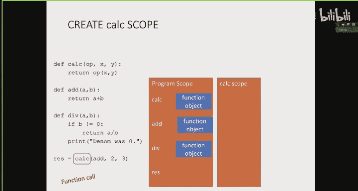

First thing we need to do is take every single one of our parameters and map it to the actual parameters。

 right？ So the first parameter is op。

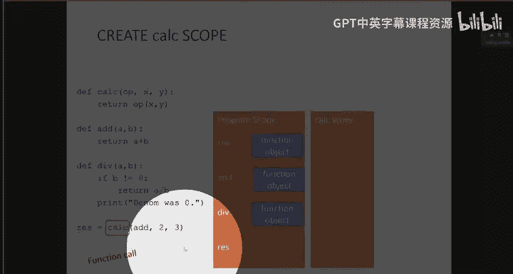

It gets mapped to。Add。The next parameter is x gets mapped to 2。

 The last parameter is Y gets mapped to 3。 Is everyone O so far。Yes， okay。

 I've literally just matched names， a formal parameter to actual parameter。

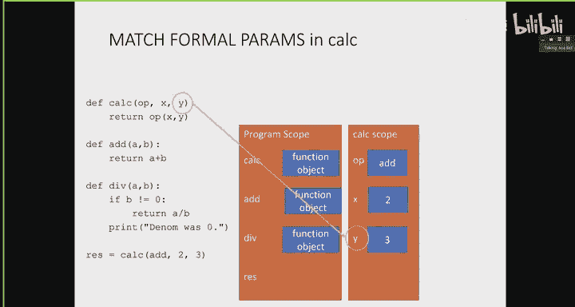

Okay， so now we finished mapping the parameters。 Next， we get to run the body of the function。

 return， what is this。

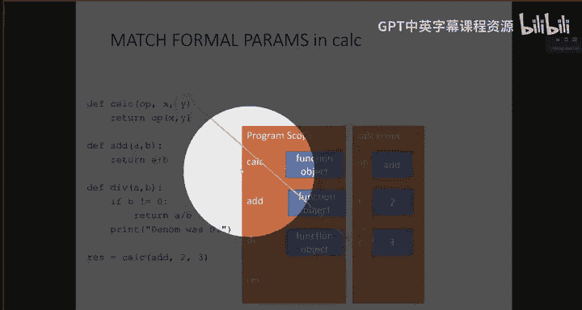

Let's replace op X and Y with the actual values。

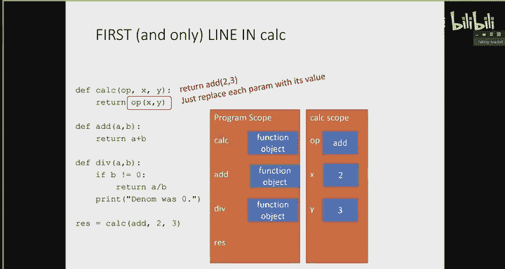

This basically becomes return， a function call， add2 comma 3。

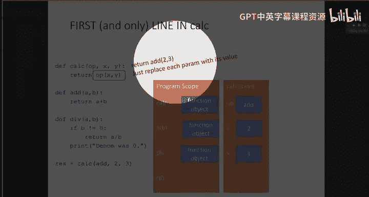

I've just replaced the names。 That's it。What's at2coma 3？It's another function call， right。

 So cc is going have to be put on hold because I have to figure out what a is going to return。ok。

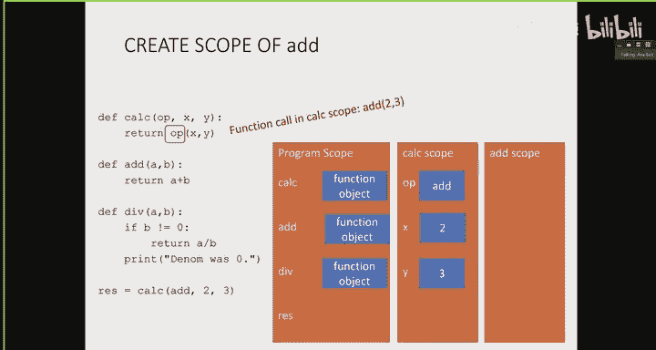

So what's a going to return for me。 Well add to comma 3 is what I'm trying to figure out。

 So I'm going to map A to 2， B to 3。 It's going to do 5 as the return。

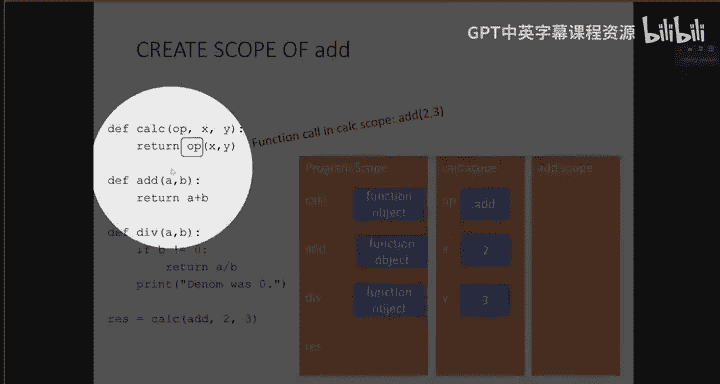

So it returns 5 to whoever called it and whoever called it was Calc。

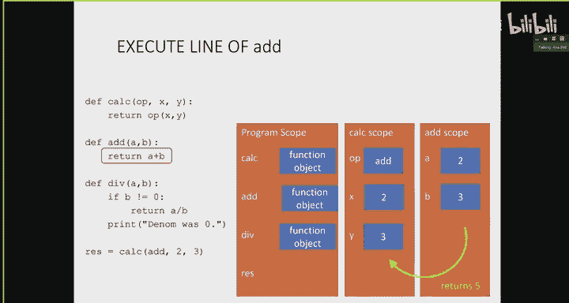

Right here。So this expression here， op x comma Y， which was add2 comma 3。

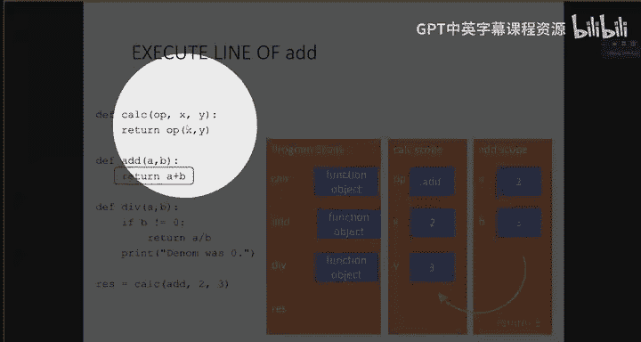

Is replaced with five。Everyone， O so far。20。Okay， and then Calc can now finish， right。

 notice ad finished its job。 So it went away。 Now， Calc can finally return its value so it can finish as well。

 So this one will return 5。

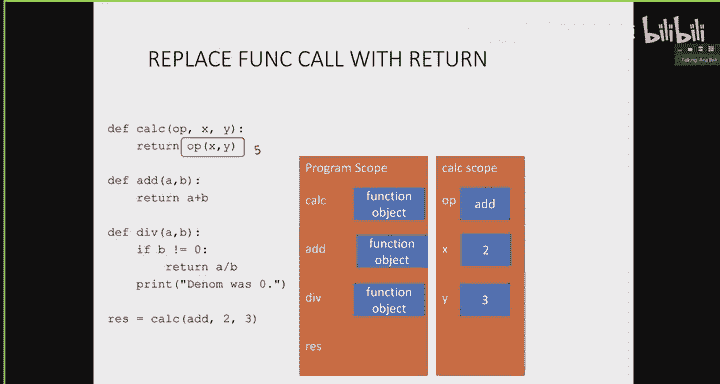

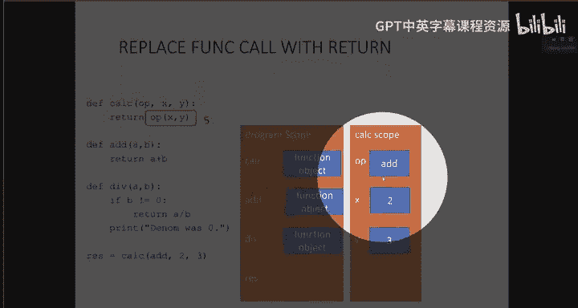

To whoever called it， which was the main program。 And finally。

 CalC has finished its job and it returned fine。So step by step。

 we just kind of trace through the code， you know， functions out to in and replacing variables wherever needed。

So it's your turn。Tell me what's the value of res given this function called a cc and what's going to get printed。

So we can even write our functions。So in the main program。What do I have。Yep。

 Calc and div are my functions。拿这。Which one。Yeah， res will be the， the， the result。 Yep。

 and there Res， we will have a question markcause we don't know what it is yet。

And what's the first thing I need to do。

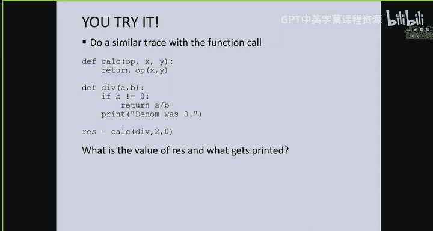

Yeah， make a new scope， exactly。So that's the scope of celc。 And we're going to map up。To div。

What do we have X and Y。2，2 and zero。 Thank you。So what's op going to do。

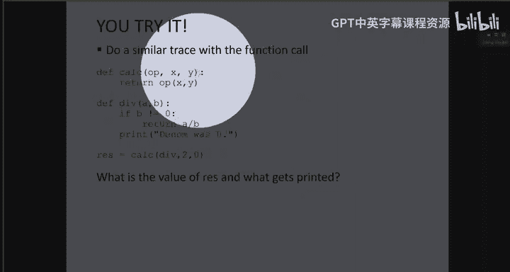

Yes。We make another scope for div。A。Is 2 and B is 0。So we're kind of two scopes deep。

What's Steve going to do？Yep， so div prints out the thing。 Then was 0。And what's Dev returning。None。

 perfect。 So div returns none here。

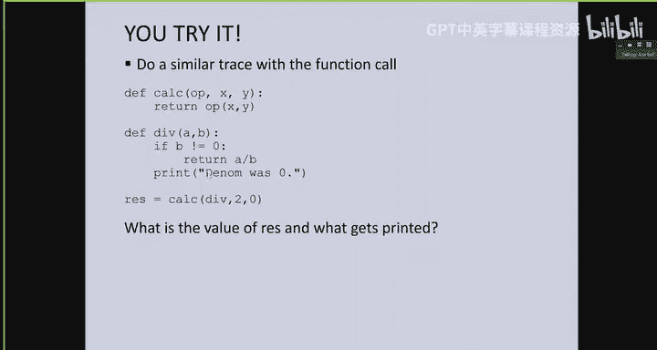

Cc。And then， Dave is gone。And then none gets returned from Calc here。

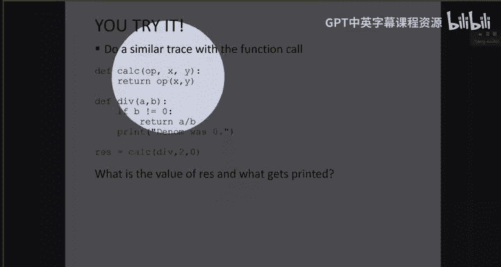

And then。Calk is gone。And all I'm left with is res equals。Not， exactly the return of kelp。

One more example， showing scope。Just kind of showcasing these sort of the same idea。

 So I've got three functions here。

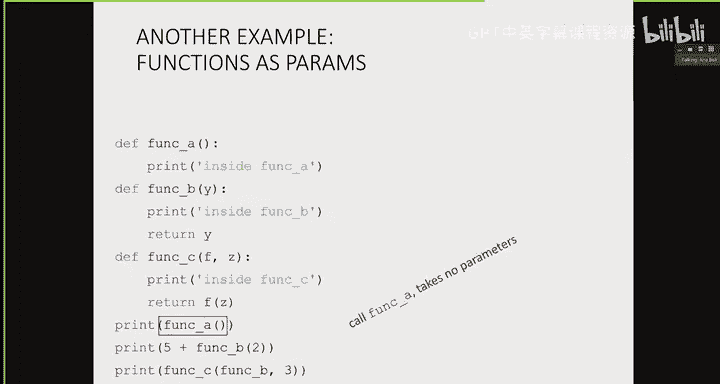

Funk A， Funk B and funnc C， Fk A takes in。 You can see no parameters。 Funk B takes in one parameter。

 Funk C takes in two parameters。 And if we scan the code。

 we see that one of them is weirdly doing something。 So it's actually going to be a function， right。

 because you see， we're calling it like a function inside here。

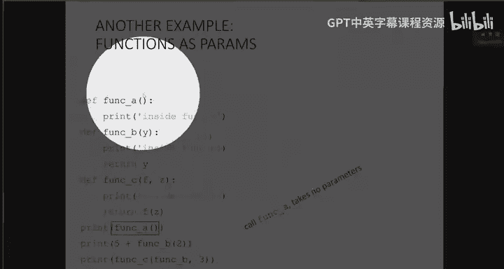

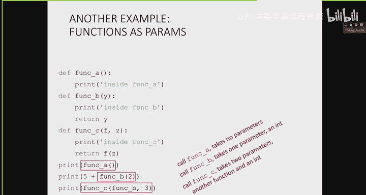

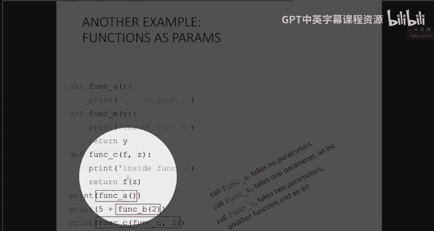

So we know F is going to have to be a function。So if we run this program。

 first three function definitions basically put some code for us in the memory。When we make。

Funk call。 sorry， Fk A call。 This creates a new scope。A has no parameter or funk A has no parameter。

 So there's nothing to bind。 All this function is going do is print。

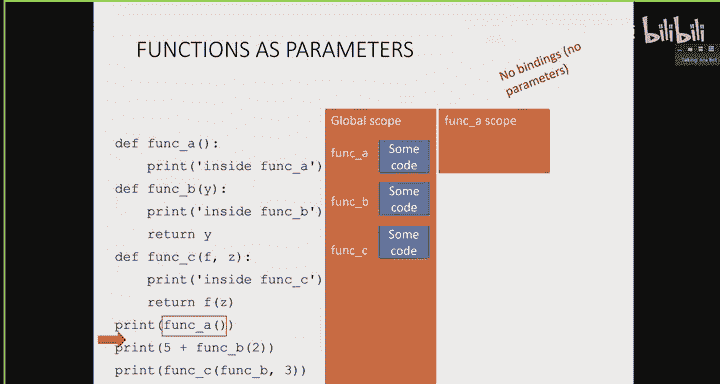

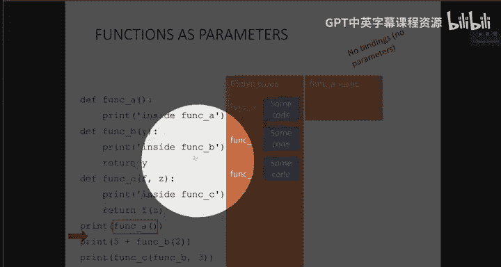

Inside funk A。And then return none。 so that whole thing is going to print none。Next， funk B。

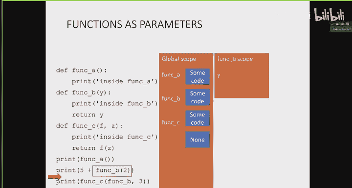

Is going to be another function call right here。 So it creates a function scope。Right here。

 we map the formal parameter y to 2。

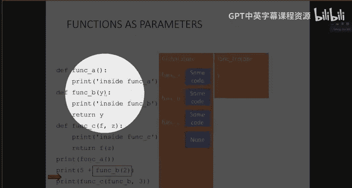

And then we finished mapping all the parameters。 And what we need to do next is do the body。

 So we print inside funk beat， and it just returns the value you passed into it。

 So not a very smart or interesting function。 So it prints that and returns to back to whoever called it。

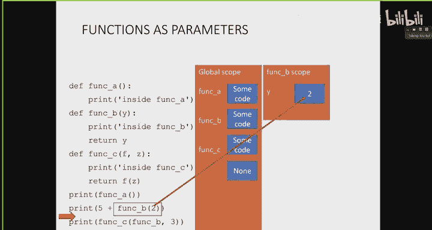

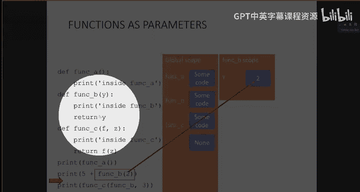

Whoever called it was here。 So this print statement becomes print 5 plus 2， the return。

So that's going to print stuff into the console。And lastly。

 the interesting one is going to be funk C。 So funk C。

 notice I'm calling it with an actual function I have in hand。 Funk B， right。

 one of these that I've defined here。

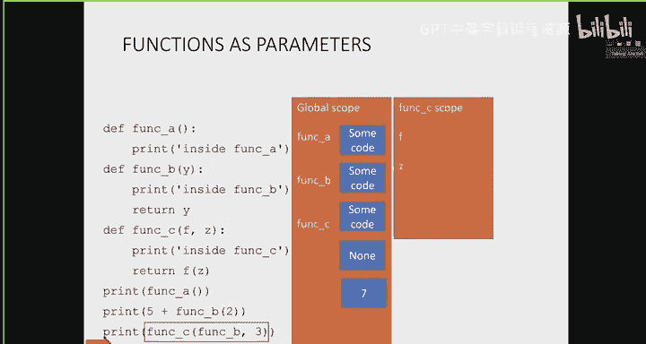

So funk C is a function call。 So there's my scope。I am mapping formal parameter F。

To funk B and Z to3。 So just mapping1 by one。

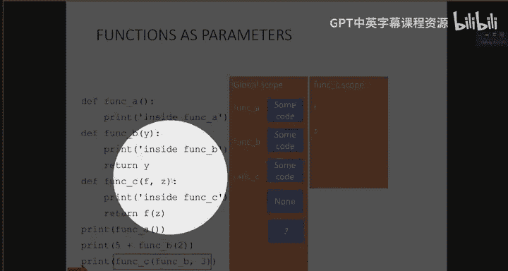

And then I'm doing the body of funy。So the body says now， print this and return this。

 So we print the statement。And then the return basically says， well， what's F。

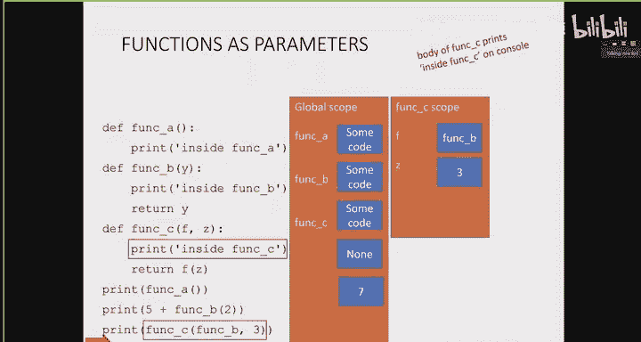

Function called F Z。 We have to figure out what the actual values are。And it's func B parentheses 3。

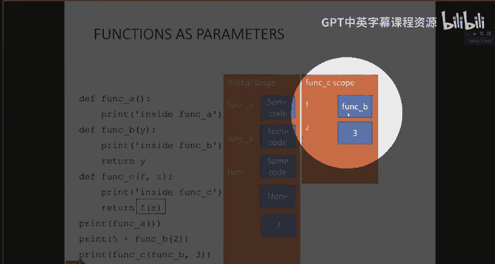

So that's another function call， which means another function scope。Again。

 not a very smart or interesting function。 this funk B。 It just takes in the three。

 it prints inside funk B， and it returns the three back to whoever called it。

So that function is done。

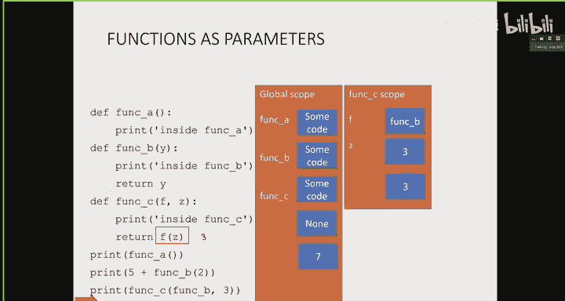

And then the funy can terminate and return three to whoever called it， which was out here。

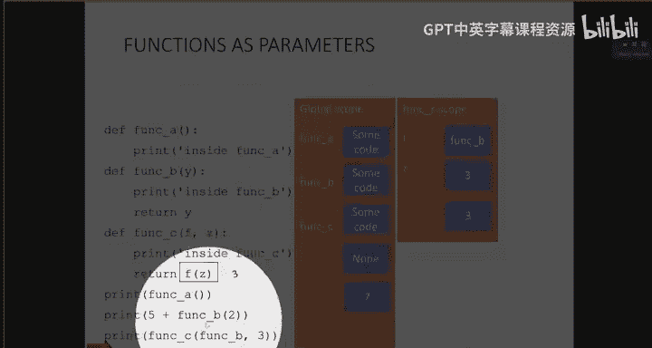

And notice， as soon as a function called terminates and does a return， it immediately， you know。

 all of its variables， everything that got created inside that environment。Go away。

 they get wiped out。OK。Give you about a minute to try this。

 So write a function that meets the following specifications。 So I have a function named to apply。

Criteria is a formal parameter， right， So at some point。

 you're going to have a function that does this。 It takes an inte a number， an integer。

 and returns a boolean。So however， a function does that。 That's what's going to be passed in。

And then is an integer。And what I want you to do is tell me how many numbers from 0 to N。

Match that criteria。 So when I apply the function criteria to number 0 through n。

 how many of those actually return true on that function。So just to show you something。

 you know what this means concretely， here's my function apply。

Here's a function that I could call the apply with is even。 sorry， I lied。

 I guess we are seeing is even a few more times in this lecture。So here's a function is even。

 and basically I run apply by saying I want to run function apply with the name is even so here I'm mapping name to number0 through 10。

I'll give you about a minute to。Triry it out。 And then I can write it just so we have some。

So we finish on time。Does anyone have a start？So we know we want to touch each number0 through n。

To see whether this criteria applies to them， right， So what's the start to get that going。Yeah。

For I range， and。Plus one， because we want to include n。

How do we apply the function criteria to each one of these values？Yeah， exactly。

 we just say criteria and this name will be replaced with whatever function we're going to call apply with。

Ie。Right， and this criteria， I will basically be the return of criteria。

 What did I say criteria returns， It takes in a number and returns a boolean。So， we know that this。

Is a boolean。 What do I want to do with this Boolean。If it's true， I want to count it。If it's not。

 I don't。 So if criteria， I。Count plus equals1。Right。up here。

And let's remember to initialize our account。And then that's it right。'， if it doesn't match。

 then I don't care about doing anything with it。 So then we just return count。

So notice I'm using my function here。 That's just a parameter。

 kind of like a placeholder for any other function。So this is even function。

When it's a parameter to apply。Will tell me 6， right，0，2，4，6，8，10。

So that's six values that match this criteria。And what's cool is that I can actually create any function。

 So if I want a function that's called is 5， for example， right。

 it takes in a number and returns true if that number is equal to 5。😊。

It's still a function that takes in an integer and returns a Boolean。

All I need to do then is run this apply with the function is 5。Alright， so I just changed that here。

 And then if I run it， it should just give me one value， right， The five， of course。

 is one that matches。This is five criteria between 0 and 10。Yeah， so that's basically it。

 So we saw some function a lot more you can do with functions。 They're basically objects in Python。

 so they can be manipulated just like you would any other object。

 You can have them be parameters to a function， you can have them be returned from a function。

 you can assign another name to this function body， things like that。

 I showed you what how to think about environments， right， so that the naming doesn't get confusing。

 as soon as a function call is made， that means another environment is created。

 So variables created within that environment， have no influence on other variables created in other environments。

 and functions are very nice， a very nice way for us to write code that can be easily be built up upon。

😊。

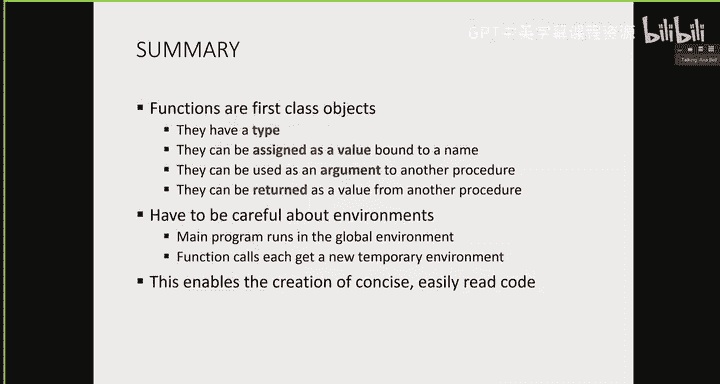

That's it。 Thank you。

