# 《计算机科学和Python编程｜6.100L Introduction to CS and Programming using Python, 2022》 - P9：-09-Lecture 9_ Lambda Functions, Tuples, and Lists.zh_en - GPT中英字幕课程资源 - BV1PAxJzVEs3

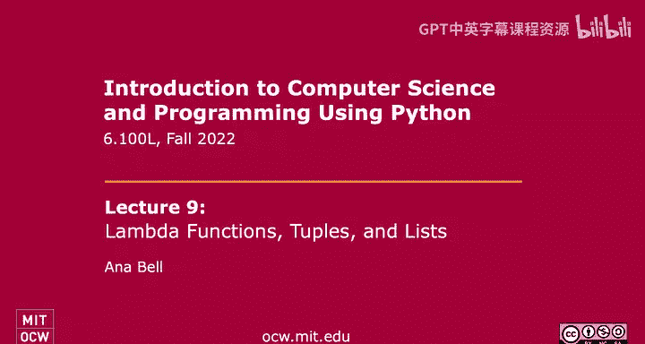

So today we're going to wrap up talking about functions by talking about these things called Lambda functions as a way for us to create anonymous functions。

 and that'll pretty much finish our exploration into creating functions。

 and the last part of the lecture we're going to introduce new object types， tus and lists。So let's。

Remember what we did last time。 Okay， we ended with this example。 We created a function。

You guys wrote it for me， and then we kind of wrote it and debugged it together。

 but we created this function called apply。 So what was interesting about this function is that one of its parameters was was a function。

 and the other one was an integer。

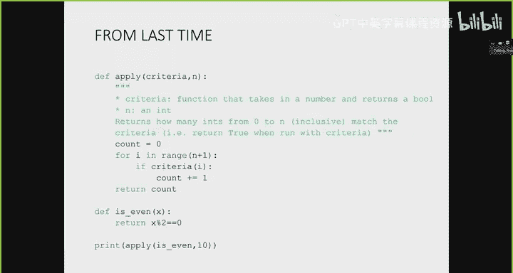

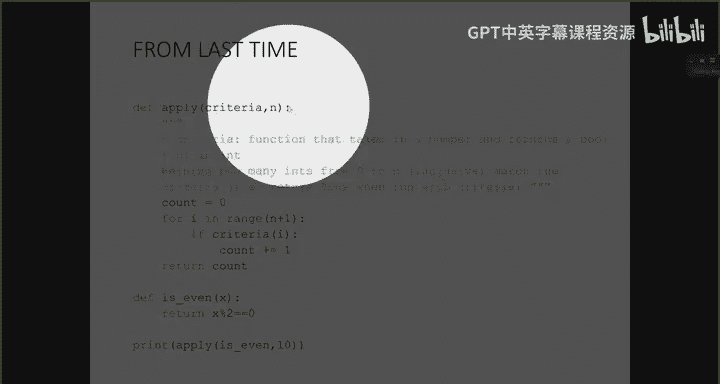

And that seemed a little strange at first， but not when we realized that functions in Python are actually just objects。

 and so they have a name， which means that anywhere where we use other kinds of objects like integers。

 floats， know we can use them as to functions， we can use other functions as parameters to functions as well。

So here criteria， we had just used it as a variable name。

 assuming that the type of criteria is a function。😡。

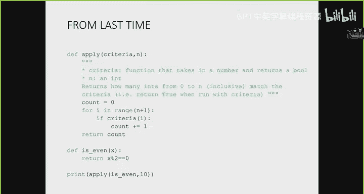

According to this documentation， we assume that it takes in a number and returns a Boolean。

 So we just wrote the body of the function assuming that that is true。

 So right here is where we used this function named criteria。

We assumed that it takes in an integer so we passed in the loop variable I as an integer and we assumed it returns a Boolean so we were able to use the return of criteria parentheses I just as a Boolean inside my as my condition for this I statement so hopefully you got a chance to look through this example from last lecture。

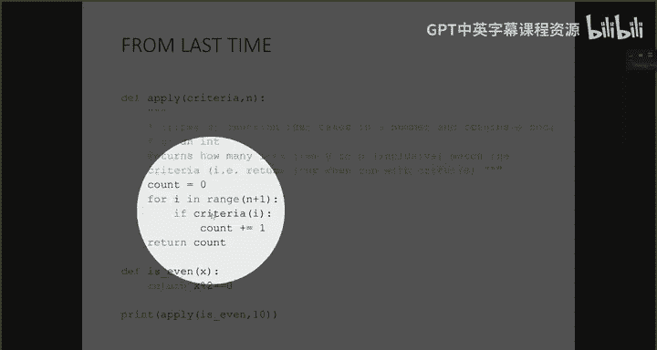

So that's the definition of this function that takes in another function as a parameter。

 And then the way we use the function is down here。

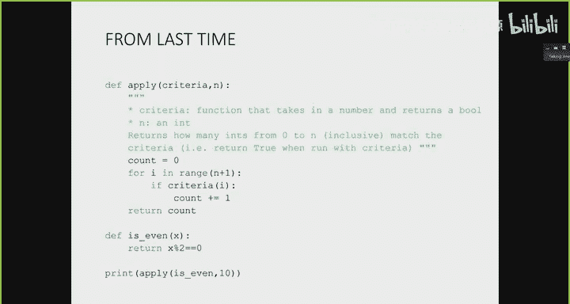

So apply is us making our function call。 And then the first parameter is the name of a function。

 and the second parameter is an integer。So the name of the function we're running is this object that we defined over here。

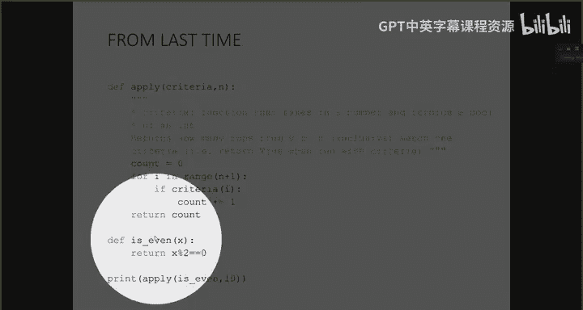

Hopefully this is just review。Now， what's interesting about this example is that this is even function is pretty simple。

 right， it's basically a one liner， it doesn't do any computations inside the function body。

 It basically just takes in a value， an input and returns something。

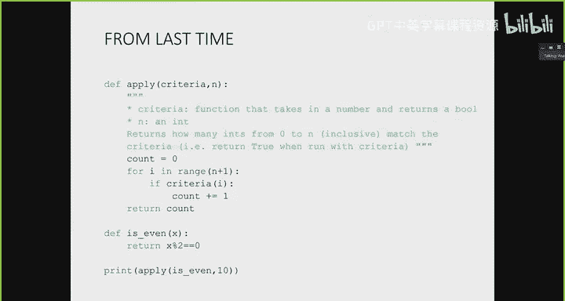

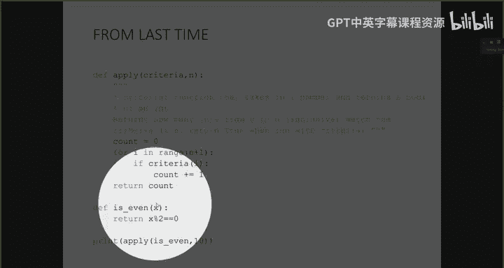

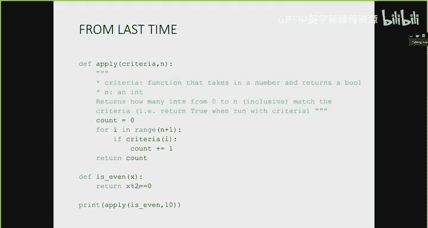

And so we didn't really need to create a function， a full fledged function definition just to do this really simple task。

And in fact， that's what a lambmbda function is， it's basically a way for us to create an anonymous function。

A function that does something really simple， but we just don't give it a name。

And so here is the function that we created with an actual definition up here。

 we can create an equivalent， anonymous function that looks like this。

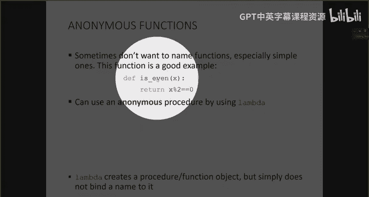

So this is a much more concise way for us to create a really simple function that we only need to use one time。

So here is， I'm going to just map out sort of one by one the important pieces of the lambmbda function。

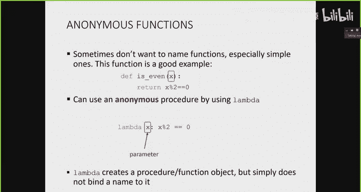

So the lambmbda keyword starts out the anonymous function。

 and it tells Python that we're creating this anonymous function。

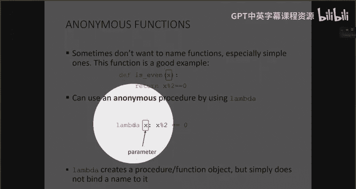

So Lambda does not the name of the function， it just tells Python we're going to create this function in one line that is nameless。

😡，X is going to be any parameters that we expect this function to take。 So if we have more than one。

 we just separate them with commas。 colon is again the same。 And then the body of the function。

 if you can write it in one liner that's not too complicated。

 you can make a lambda function out of it。 So here notice we don't actually have a return keyword when we're creating the lambda function。

 We're just doing the operation that we wish to return the value from。

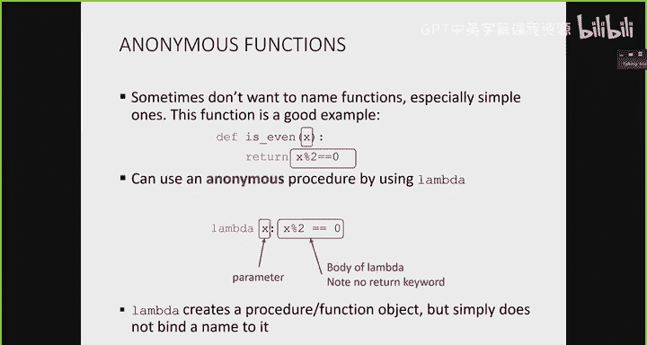

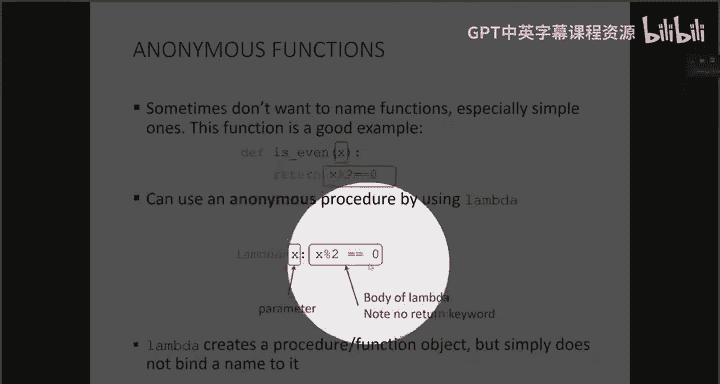

So the x percent2 equal to0 is basically the body of my lambmbda function over here。

So the key thing about Lambda functions is that it allows you to create a really quick function object that you basically want to use only one time。

 And so we're not giving it a name。

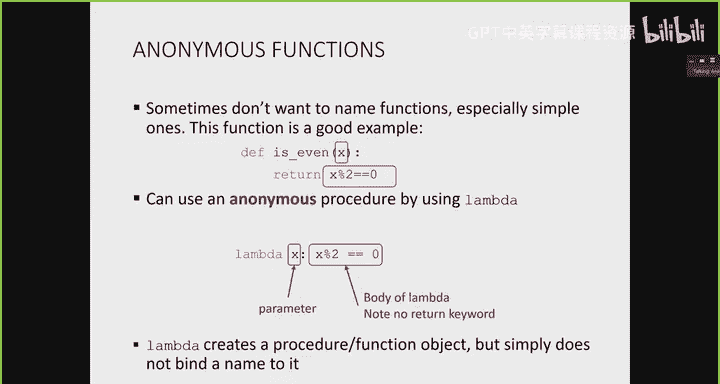

So let's look at the code。 So here is my apply function that we've seen before。 Here is us。

 I showed you this last time I created another definition for another simple function that takes in an integer and returns a Boolean。

 In this case， this function just tells me whether that input is equal to 5。

And this is kind of where we left off last time we ran a with this is five function。

 so that prints you know， applied with S 5 is1。 There's only one integer between 0 and 10。

Where applying this。Returns true。Now with an anonymous function just to show you how we would write a lambmbda function for this is underscore 5。

 it would look like this， so again， we tell Python we're creating an anonymous function。

 it has just the one input X， colon， no return， and just the body of the function is going to be the thing that we would like to return x equal equal 5。

So again， this notice we're not actually passing in the name。

 there is no name for this anonymous function， but it works in the exact same way as if we had created this function over here。

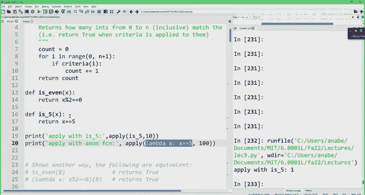

And just to sort of bring that or and I can run it again。

 and you can see apply with the function name is one， right。

 and obviously apply with this anonymous function also returns one。So just to bring the point home。

 I want to show you one other way to think of these anonymous functions。

 So here is me calling my is even function with a parameter 8。Now。

 in order for me to actually run it， run this line here。

 I had to have the function definition way up here。But again， it's a really simple function。

 If I only want to use it one time， I can create a lambda function。And this。

Over here is equivalent to this。Function definition and function definition over here。

So you can think of this line over here。 So the part that I've highlighted as sort of creating the definition all in one line。

 not giving it a name。And then the parentheses here is us calling those lines of code for that function definition with that parameter 8。

And so the usefulness of lambmbda functions is when you want to create these really quick functions that you don't want to reuse。

 obviously， if we wanted to reuse this， the functionality of the is even。

But we created it using a Lada function。 We would have to basically copy this line and paste it all over again。

 right， So we'd have to take this， copy it， paste it and give it another input。

Because this lambda function does not actually create it in memory with a name。

 There's no way for us to access the body because it's， it's nameless。O。So when we so just to。

 to finish how we call lambmbda functions。 So basically， when we called apply is even 10。

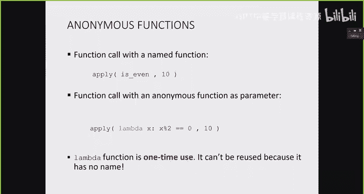

The equivalent to calling that function name， but with a lambmbda function is basically putting in the entire body of the lambmbda function inside this other function call。

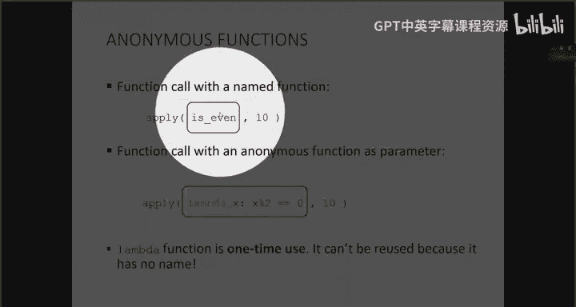

So here we're both defining and then telling Python that this is my input to the function。Okay。

So I know this is a you try it， but I thought that we would actually run through it together step by step on the next few slides。

So let's try to understand what this is doing， I've got a function definition named do twice。

It takes in one input， another input。 But if we look at the body here， this FN。

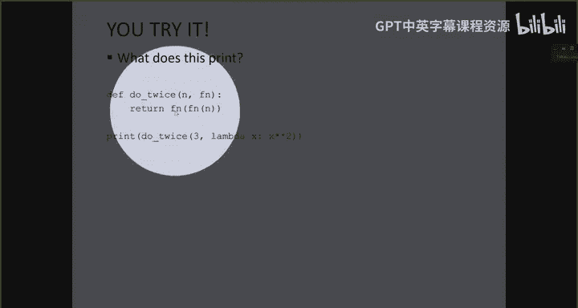

That's the input is actually being called like a function。Inside the body right。

 so we can so we can immediately tell that FN is going to be a function when we actually make the call to do twice。

 and indeed， when we make the call to do twice down here。

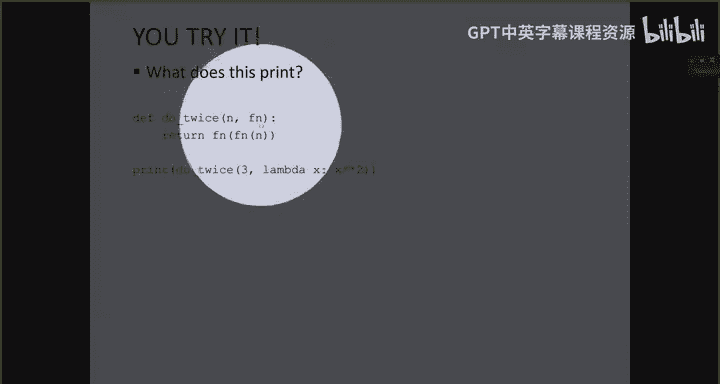

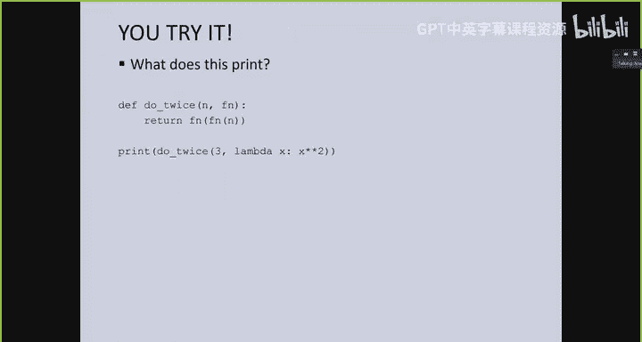

N is mapped to3， and the second parameter FN is mapped to this anonymous lambmbda function。

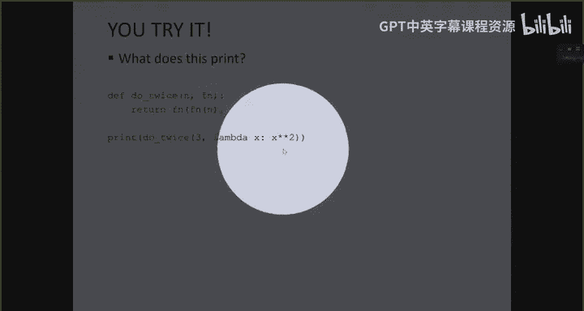

So let's step through one a little by little in the same manner that we learned last lecture。

 so creating actual environments， whatever we see a function call， mapping parameters。

 actual parameters to formal parameters， and following through on what exactly happens within each function body。

So when we first make the function call or sorry， when we first run this program。

 if it has these sort of three lines of code inside it。Python creates our global environment。

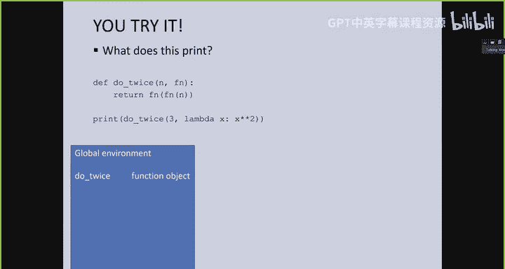

Inside the environment， we've got one function definition here。

 so this is going to be this function object。

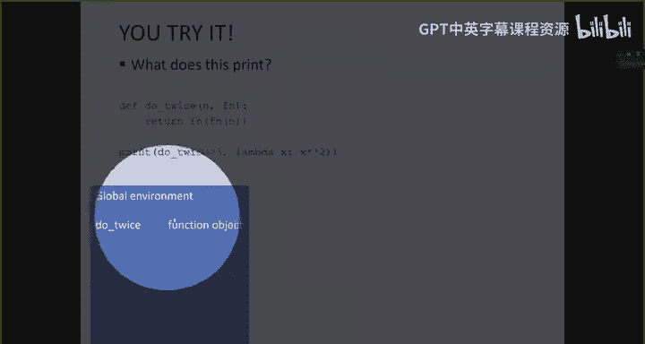

And then I've got the thing that actually kicks off my， my， you know， my function calls。

 my my program。So I've got a print statement that will print the result of doing something。

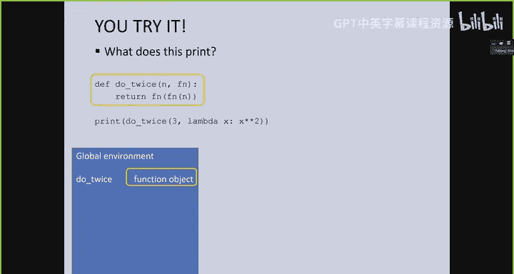

So the first thing I can see here is that I've got a function call to do twice， right。

 So I'm going left to right。 The first thing I do when I have a function call is I create a new environment。

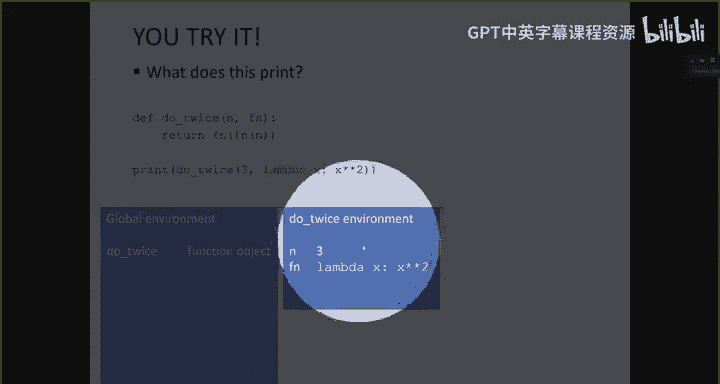

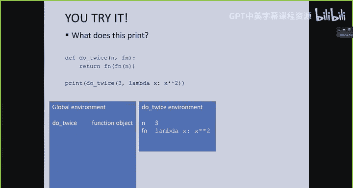

Inside this environment of do twice， I have to see what it takes in。 What are its formal parameters。

 There's one called N and one called FN。 So there's one parameter n and the other one， FN。

And now I basically map one by one the formal parameter to the actual parameter。

 so the n gets mapped to the three because that's the first parameter of do twice and the FN gets mapped to this function object here so the FN gets mapped to this lambda function here。

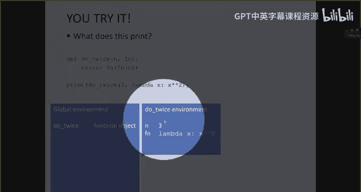

Okay， that's exactly what I said， so we've done the mapping。

And now that we've done the mapping， we can do the body of do twice。

 so the body of do twice says return， and then I have to replace everywhere I see FN with this lambda function and everywhere I see N with this three。

😡，Well。FN is going to be a function call， right， When we see a function call。

 we need to create a function scope。

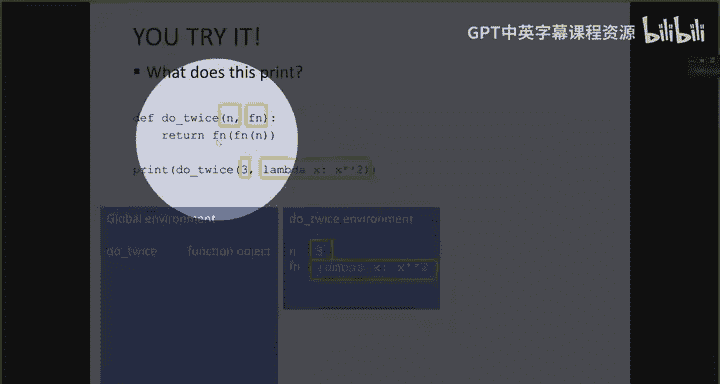

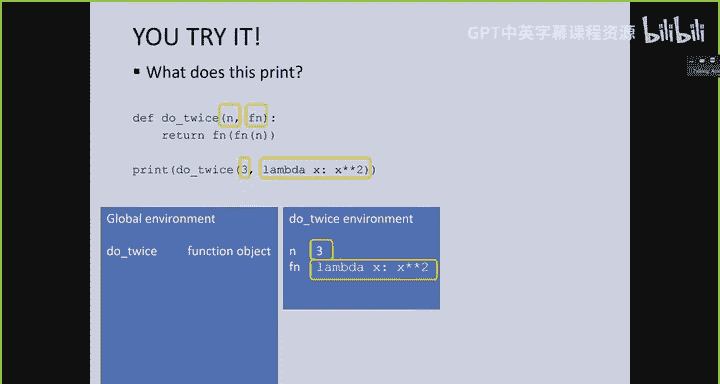

So before I can do the return， before this due twice can terminate， can return its value。

 it sees a function call。 So when there's a function call， we need to create another scope。

 right another environment。

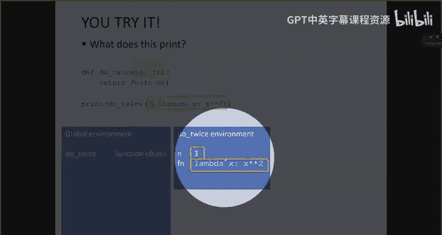

This environment belongs to the function call of lambda x colon x squared。

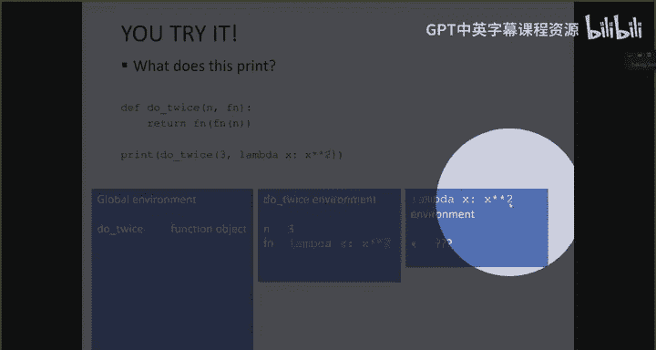

Right， now， this function， of course， doesn't have a name。Normally， I would say， you know。

 this is the F environment or this is the G environment or the is even environment。

 But there's no name for this one。 So I'm just gonna write up here the the body of that function。

All right， well， in this function， again， following sort of the rules one by one。

 what we need to do is figure out what are the parameters of this function。 Well。

 there's one called x。

So here's my parameter X， and then I need to figure out what does this map to？Well。

What it maps to is the parameter inside it。😡，But the parameter inside it is FN parentheses N。

Do we have a return value for this yet。No， right， because this is another function call。

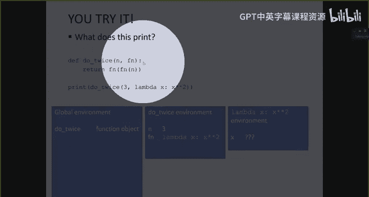

So what ends up happening is this environment gets put on hold as well because we can't figure out what parameter this lambda function takes in。

 what is its value？😡。

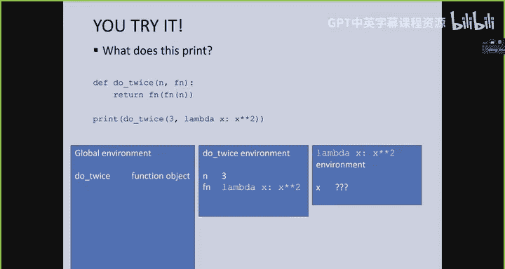

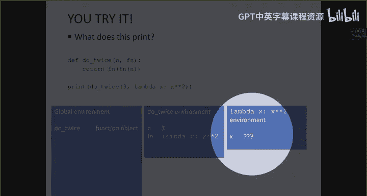

So we create another scope。Another environment。And in this particular case。

 this one is going to belong to。

This inside bit here， FN parentheses N。So this lambda x x squared is going to be the exact same function again。

 being called again。And in this particular environment， we need a map X。To its input。

 So the input to x sorry to this lambda x x squared is going to be n。Well。

 this environment doesn't know about n， so we pop up one level， this environment knows about n。

 it's  three， so it passes that value along down to this lambda call。

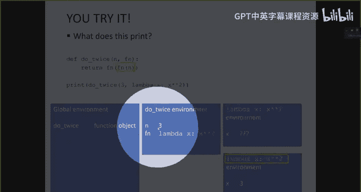

So， now that this inner。

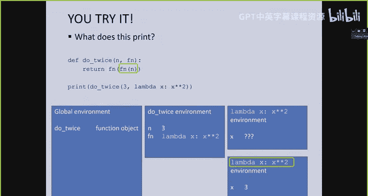

Sort of highlight yellow over here knows what it needs to do。

 It needs to take in this x and return x squared。 So it calculates 9。

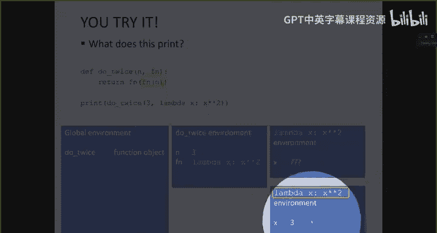

And then returns9 to whoever called it。That 9 gets replaced now， as the input。

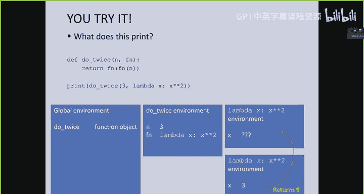

To this outer Fn。

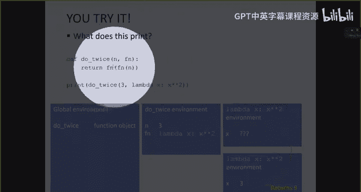

， so just to show you exactly what gets replaced， that entire function call there gets replaced with nine。

Alright， as soon as we've done the return， that environment goes away。And at this point。

 this call to lambda xx squared can terminate as well because it takes in the number9 and it returns9 squared。

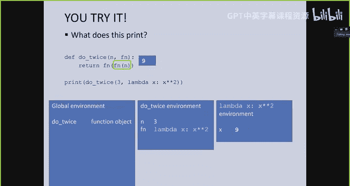

So this one returns 81。 so this entire function call is 81。

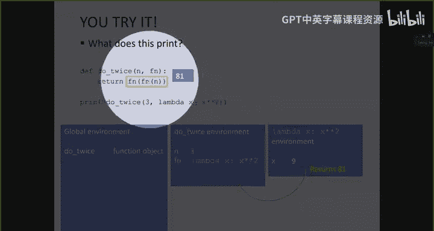

And as soon as it returns， that environment goes away and now do twice can finally finish its job and return 81。

 it just basically passes this value along backup。 so that returns 81。

So this entire due twice call is going to be 81。

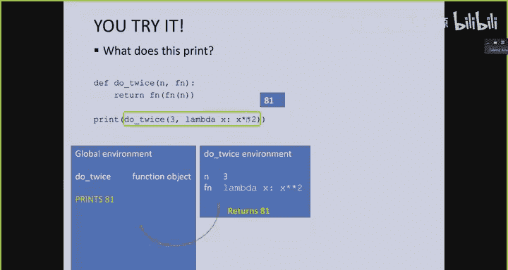

does Lada？Where there two。There were two of them because this outer FN calls an inner FN。 So we。

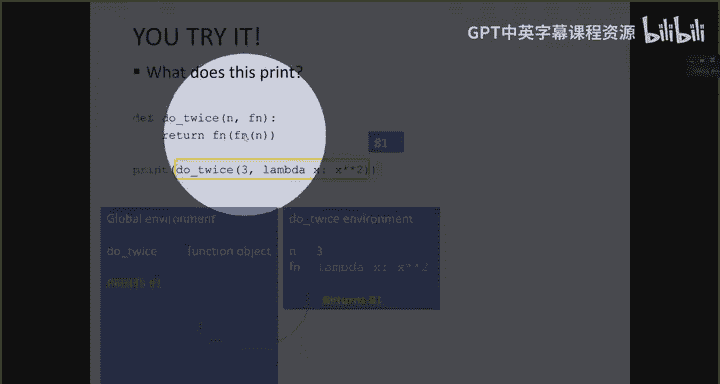

Okay， so that wraps up our discussion on functions。

 and there's a couple exercises in this the Python file associated with this lecture with Lambda functions just so you can give it a try with those。

Well， apply was just a function that I wrote。 So in this particular in this new example。

 I was just printing the result of calling that function。So again。

 this kind of trace of what happens throughout the program is really， really useful。 So if you can。

 you know， if you have some time， to try to get that down， it will be very。

 very helpful as you trace through some program。Okay， so that ends。Our discussion on functions。

 and really， the only syntax we've introduced in the past couple lectures were just about how to wrap code we've already been using in a function。

Right，So not much new syntax。 But today， we're going to introduce some new syntax。

 along with the introduction of two new data types。 One is called a tuple。

 and the other one is called a list。So what are the data types we've seen so far。

 We've seen integers， floats， basically numbers。 We've seen Booleans as truth values。

 We've seen this nu type type， which has one value， none。

And we actually also saw the string data type right。

 we could think of the string data type as sort of a compound data type like a sequence of single characters。

 and in fact， we were using that string in that way because we were able to index into the string to grab the character at index zero sort of slice the substr right to get the length of the string。

Today， we're going to introduce two more compound data types。

 So these things called tus and these things called lists。 And throughout the lecture。

 you should really think about how it's very， very similar to the strings。

 the strings that we we've already seen。 So a lot of the operations I'm actually going to skip。

Aside from sort of the syntax of how we denote a tuple or a list。

 really the operations that we do with tus and lists are going to be exactly the same as the ones that we did with strings right so if you understand indexing and slicing and getting the length of the string。

 all that stuff you'll understand how to do that for tus and lists。All right。

 so tus are indexable ordered sequences of objects that's kind of a lot so we can break that down So first of all it's a sequence of objects just like a string was a sequence of single characters。

 a tuole is going to be a sequence of not just characters but any kind of object。

Ordered sequence means that there will be an order to this sequence。

 So there's going to be an object at the first position in my tuple。

 an object at the second position in my tuple and so on。

 Just like there was a character at the first position， character at the second position and so on。

An indexable ordered sequence means that we can index into this object so we can grab the element at index 0。

 grab the element index 1 and so on and so on。So how do we create these tus。

 I should note that some people call them tus because they're just kind of like an n tuple kind of thing。

 So you can call them tus or tuples， however you'd like。All right。

 so how do we create these tuple objects？Well， we can create a tuple object that's empty using just open and close parentheses。

So we could create strings using just sort of the open and closed quotation marks。

 we create an empty tuple by doing open and closed parentheses。Now， this is different than functions。

 right， We， this is a little bit similar might be but confusing because we use parentheses to make function calls。

 but notice it's just the parentheses by themselves。 right， There's no function name。

 nothing preceding the parentheses。 So to Python， it's not going to be confusing when you just do this。

You can create a tuple with one element in it by putting open close parentheses。

 that element that you want to add to your tuple and then a comma right after it。Now。

 the comma is there。To。Differentiate a tuple with one element。

From sort of using parentheses as precedentnce over an operation。So just as an example。

 if I create a is equal to 5 like this。Right，I'm using parentheses around an integer。

But the type of a is still an integer。 I'm basically just using the parentheses to say， I want to。

 you know， do this5。Before doing anything else， which is a little strange to do and write the value of a is 5。

But if I do， b is equal to the twoal 4 comma。This tells Python that this is now a sequence of objects。

 but there's just one object in my sequence。 So the type of B。Is a tuple， not an integer。

And if I say ask what B is， you can see it's for comma， right in parentheses。 So it's an object。

 It's a tuple with one object in it。Okay， so to create a tuple with many objects in it。

 we basically put in parentheses， all the objects I want to add in my tuple separated by commas。

 So here I've got my first element in my tuple and integer 2。

 second element in the tuple the string MIT and the third element in my tuple being the integer 3。

 And notice we can mix and match now objects of different types within my tuple object。

 So here I've got integers and strings and and integers I can even add floats and booleans and whatever object types I'd like。

 I can make them elements to my tuple， which is pretty cool right different than strings in that respect。

 but still know in in order within my tuple。😊，And so the rest of this is actually operations that we've already seen on strings。

 so I'm not going to go through them in too much detail。

We can use the square bracket to index into the tuple。 So to grab the element at a particular index。

 Again， indexing starts from 0。We can use a plus operator to concatenate two tus together to create one larger tuple with all those elements in a row。

We can slice down here， we can get the length of the tuple。

 which tells us how many elements are in it， so three elements。We can use the max。

Min sum things like that to grab the maximum element and the minimum elements。

 sum all the elements of my tuupple and things like that。

 notice that here I've got parentheses for the max function call and then another set of parentheses here to denote that I have one tuple object。

 I'd like to grab the maxim。And then the last bit here is something that we're going to see that's different with lists the in next lecture。

 not today， but basically。You might think that once you create this tuple object in memory that has two MIT3 as it's three elements in it。

 you can go into memory and modify one of the elements right like if I don't want the middle one to be a string。

 I want it to be a common integer， you might think that you should be able to change it。

You can with lists， as we'll see in the next lecture， but you cannot do this with tus。

 just like once we created sort of an integer5 inside memory。

 we can't go into memory and tell Python to change this five to a6 It's just not allowed or once we created a string。

 ABC and memory， you can't go into memory and change this string。😡。

You can certainly create new objects that are based on this string。😡。

But you can't go in and modify that object once it's created。

 So once you've made your sequence of tus， you cannot go in and change it。So，哎 yeah。

If you just rewrope like T equals in the then fourth。

If you wrote T equals and then something different。 So thing Yeah， that's a good question。

 So so the variable T， So the name T and the object it's bound to are two different things。

 So the object it's bound to will still sit in memory。 We're just going to lose the binding from it。

 So that T initially points to this one。But then if you say t equals something else later on。

 this one still stays there， but that T is going to point to this new thing。

So the object itself is still in memory。 We've just lost the binding to it。

 And that's something we did sort of way back in the first early lectures where we kind of rebound variables。

So it's the same。 I， yeah， it's the same idea。嗯。One interesting thing that we can do now with tus is that we couldn't with strings。

Is to have elements of a tuple be another tuple。 Okay。

 and that's what this example is going to showcase。

 So here I've got an integer 2 as my first element。 My second element is the string A。

 My third element is my integer 4， and my fourth element is a tuple object。

 that just happens to have two elements inside it。

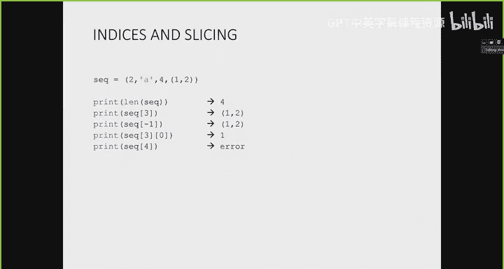

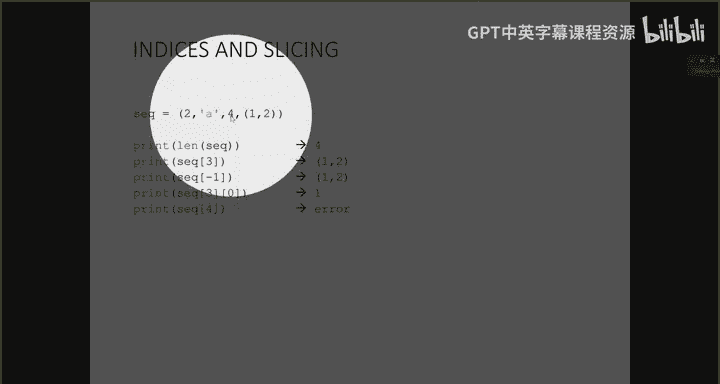

But this。

Tupple object that I'm referencing by S E Q Cq only has four elements in it。

 It just so happens that the last one is a tuple。

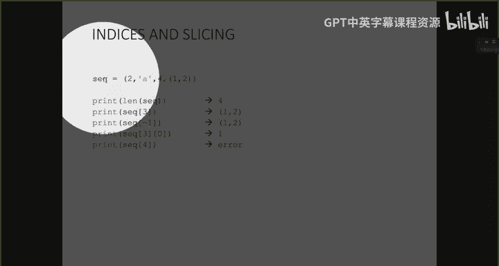

But I'm not going to dive further down to figure out if I have tus that have subtups that have subts and so on。

 Only top level I care about how many elements I have。And so when I print the length of seek。

 it's going to be four right because I have one， two， three。

 and then this last object is just one object that takes up one slot。

 it happens to have elements within it。

And so the rest of these are basically what we've seen with strings， except for this one here。

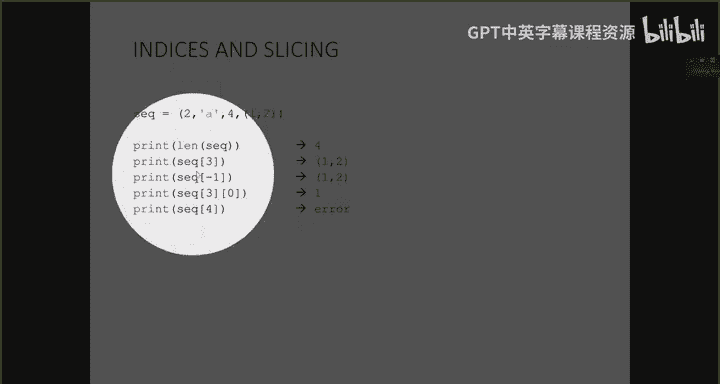

If we were to index into the last element here of Siq1 comma 2， well this is another tuple right。

 so it should follow that I can then take that tuple and further index into it。

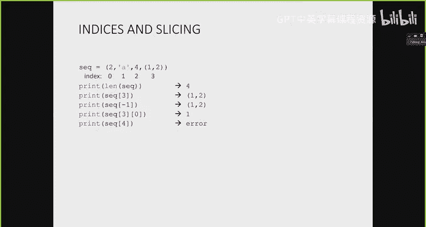

And so that's what this line here is doing。When， you know， when we read an expression。

 we go left to right。 So basically seek at index 3 grabs for me the one comma 2。

And then if I further index into one comma 2 at index 0， I'm going to grab the number one。

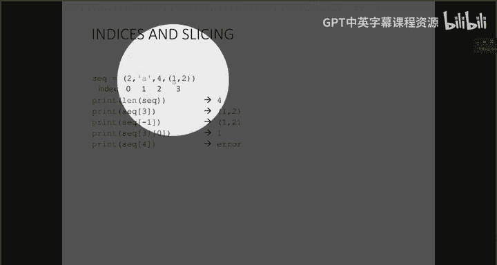

So I'm basically chaining all these indices， indexing operations together。And then this is again。

 very similar to what we've seen from strings， so it's just slicing instead of indexing into the into the tuple。

 I'm not going to go through it today， but encourage you to type them in and type in some other。

 you know。Things， as you might have done with strings。

One thing that I do want to mention is that we can iterate over a tuple just like we could iterate over a string。

I don't mean over indices， but I mean over the elements directly。

 So when we iterated over a string directly， we were able to grab in our loop variable。😊。

The characters at each index， right。Similarly， we can iterate over a tuple to grab the elements at each index directly。

 So here I've got4 E in C is going to make my loop variable E take on each element of the tuple directly。

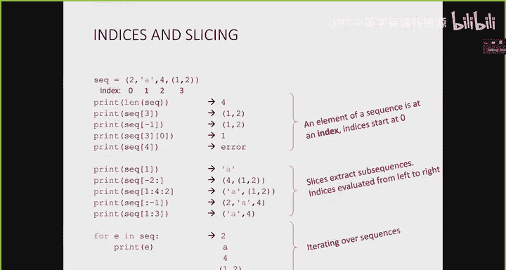

Not the index， but each element。 So as I'm looping through E will first have a value 2。

 then it'll have a value a， then it'll have a value 4， and lastly it'll have this value1 comma2。

 And so if I just print that out directly， you'll see these values printed out。

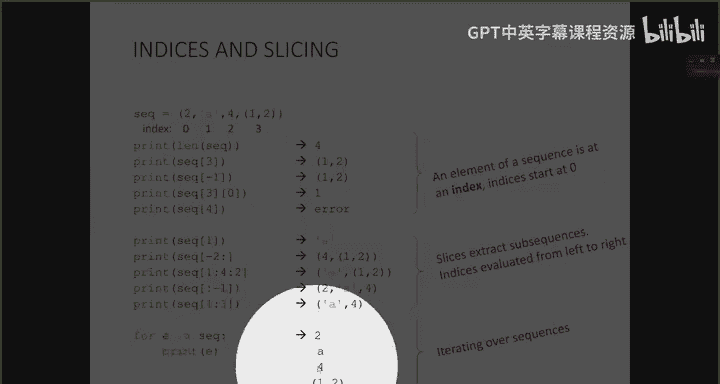

So very， very similar to some of the operations we've done with strings。

 The only difference we just now have to be careful that our tus can have elements that are other tus or basically any object in Python。

So what did we use tus for？ Well， there was this one example we did way back at the beginning of this of 6。

100 L where we tried to swap variables。 And we basically said that this way didn't work because we overrote the variable right。

 We overrote the variable。 and then we weren't able to get back to the value that was overwritten。

So our solution was to create this temporary variable to save the value before we overwrote it。

 then overwrite the variable， and then use the temporary variable to grab back that saved value。

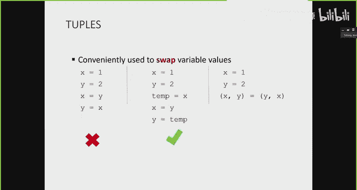

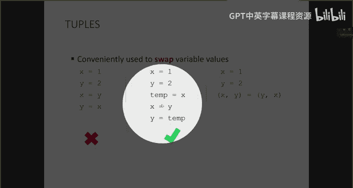

Well， it turns out tuples actually allow us to do these three lines of code in one line of code here。

So we can say x comma y equals y comma x。So this is an assignment。

 and it's allowed because the left hand side is basically a set of variables in sequence。

And the right hand side gets evaluated first as we would an assignment statement。

 so y gets the value2 because that's what it is up here and x gets the value 1。

 So y is 2 x is 1 over here on the right hand side。

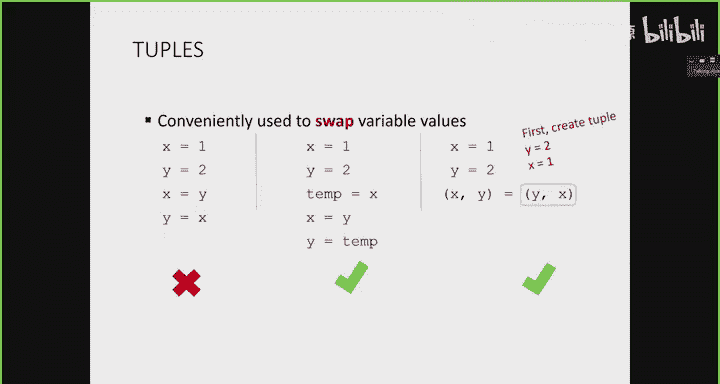

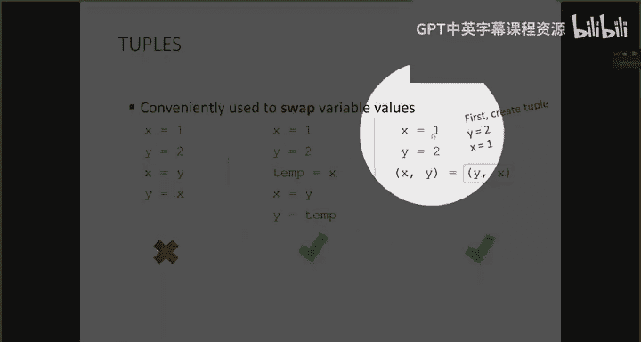

And then Python 1 at a time matches the values on the right to the values on the left。

 separated by commas。 So basically what we have here is x is equal to 2， y is equal to1。

 and then the values have been rebound。So very， very， very useful。😊，Very good use of of tus here。Now。

 this idea can actually be taken one step further。😡。

And we can use tuples to return more than one value from a function。Now。

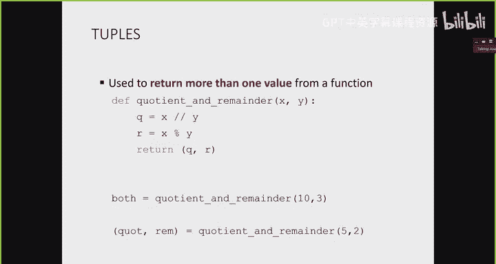

I know in the past couple lectures， I said basically you can't return more than one thing from a function。

The function returns only one thing。 As soon as it sees a return statement。

 it takes the value associated with that return and returns it back to whoever called it。

But tus are one object。They just so happened to have elements。That can have different values， right。

 You can have a tuple with 10 elements in it。 You can have a tuple with two elements in it。

Using a tuple， we can actually return one object， the tuple itself。

 It just so happens to have a whole bunch of values that my function might calculate。

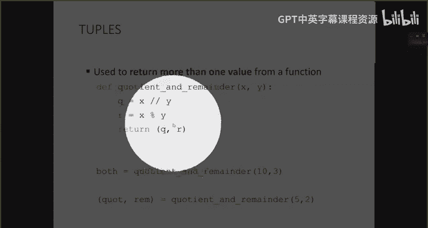

Right，And so by way of the tuple， I'm actually able to return a whole bunch of different values。

Through this one object tuple。 And so in this particular example。

 I have a function that calculates the quotient in the remainder when x is divided by y。对。

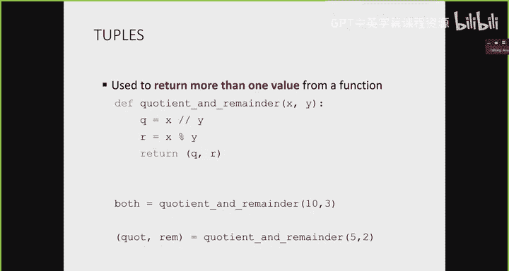

Yeah。So the function itself takes in the uses integer division to find the quotient and uses the remainder operator to find the remainder。

And then it returns that Q calculation， right some number， and that R calculation。

 another number as elements to a tuple， and Python returns this one tuple object using this line here。

 returning this object。

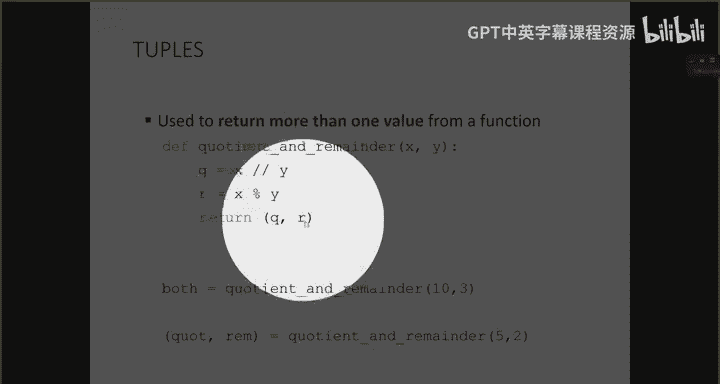

And so when I make this function call to quotient and remainder 10 comma 3， it's going to go in。

 it's going to calculate the quotient to be3， the remainder to be one。

 and it's going to return one object，3 comma 1。And then that gets assigned to this variable both that I name both in this particular case。

If I wanted to access the quotient part of both， I would do both square bracket 0。

 and the remainder part of both would be both square bracket 1， right。

 Accessing the zeroth element and the first element of the return。Now。

 if I wanted to explicitly save the quotient and remainder as variables after they got returned。

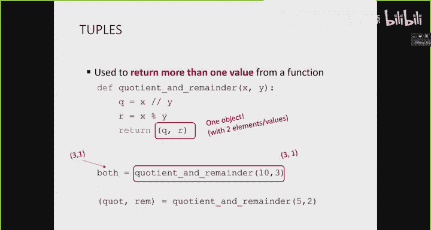

I can actually do the trick we saw in the previous slide， right。

 The tricker we saw in the previous slide was x comma Y equals some other tuple。Well。

 that's what I'm doing here。 I'm making a function called to quotient in remainder 5 comma 2。

 That's going to return two comma 1。And then I'm going to have quote comma Rem equals two comma 1。

 So Python1 at a time is going to map the quote to two and the Rem to1。

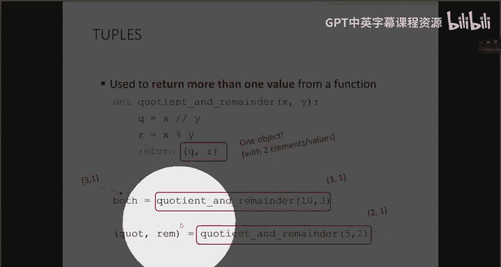

And so what that means for us in terms of the code is we can then do whatever we'd like in the remaining part of the code code。

 assuming that quote and Re are just regular variables。

 So here I'm just showing that you can print them out in these print statements right。

 So here I have quotient is two and remainder is one as these two lines of code here。O。

So the big idea of twos， the reason why we use them is you can use， you can use them to return。

More than one value via this one tuple object from a function。

 and so in this way we can have a function that does a whole bunch of calculations。

 returns this one object that might contain all of these different values as the elements to this tuple object。

So let's have you work on this for a couple minutes。Write a function that meets the specification。

 So I've got it's called cha counts。 I've got an input that is a string S。

 lowercase characters assume it's just got vowels and consonants。

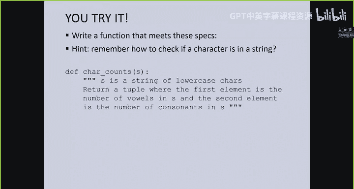

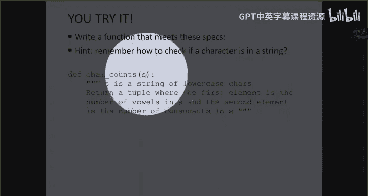

Return for me at tuple where the first element in the tuple is how many vowels are in us and the second element of the tuple is how many consonants are in us。

So should be pretty straightforward， a hint I have here。

 if you don't remember that will make your life easier is try to remember how to check if a character is in a string。

 so using the special in keyword。We saw an example of this probably back when we learned about strings。

So you can try to write your code around line 65 ish， and then we can write it together。All right。

 So how would you approach this problem。So what's the first step here？呀。Yep。

 we can make a string that contains all the vowels， vowels equals AIOU and lowercase。Vice。Next。

Then we could like。一。Yep， vowels plus equals one。And else， we know it's not a vowel。

 So we'll keep consonance count plus equals  one。So this is the consonant count。

 and this is the vowels count。What is char in this case though？Yeah， exactly， we have to loop。

 so4 cha in S。So we need to look at every character inside us。

And this is where now that we're dealing with， you know things that。

That are just that might be non integers in my for loops。 We can write little notes for ourselves。

 That's something like char is， you know， A， then B， then C or something like that。

 to remind us that char is not sort of the index， but it's an actual thing。And then what？

Else we need to do。Yeah， we can initiate C and V0， we can use the trick where you do C comma V equals0 comma 0。

Or we can just do it on separate lines， all good。And then lastly， this does the work for us。

 but the function needs to have something to show for it。Yeah， after the loop。We return。

The twople sea come。sorry， Vcomacy probably。And if we run it。It matches what we expected。 So 1。

3 and 0，5。 And you could imagine adding a couple more test cases。

 maybe something with an empty string that should return 0，0 and maybe something with all vowels。

 which should return some number comma 0。Okay， so one other thing we can do with tus is to create these functions that take a variable number of arguments is in as a parameter。

So remember when we define functions， we basically tell Python how many parameter we expect it to take。

 right， but it's possible to have some functions， for example。

 Mac or min that can take in two parameters here and notice there's no extra parentheses。

Or we can just add as many numbers as we'd like， and it will still work to take the max of all of these sets of numbers。

 and again， we didn't make this inner thing a tuple。

 although it works even with the tuple as an object。

But our goal here is to try to write a function that can take in a variable number of arguments either two or three or 10 or 20。

 and it should still work and the way we do that is using a parameter that's defined using the star notation so as soon as you create a function and it' parameter is star and then the name of your input。

 Python basically takes that input and assigns it to a tuple behind the scenes， so you don't have to。

And so in this particular case， we're not writing our own max or men or sum。

 We're writing our own mean。Function， and this mean function will take in a variable number of arguments。

 right， And it's going to figure out the mean of all of these values。

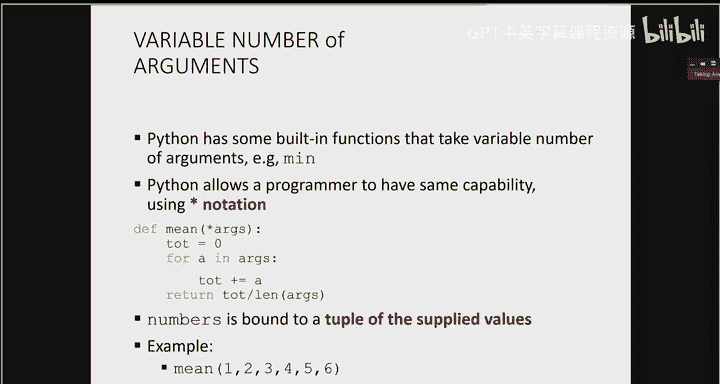

The way it does that is pretty simple now that we know that we can just treat args as a tuple of a bunch of numbers。

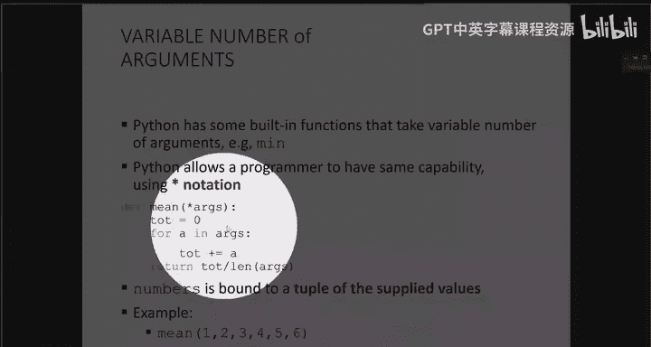

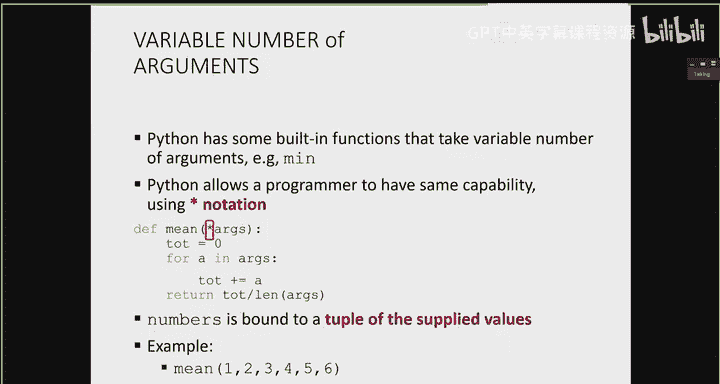

So we just loop through all of the elements in as， we add up this running total and at the end we return the total divided by how many arguments were given return total divided by the length of the args and then when we make a function call to the function we just wrote mean here。

 args will take in sorry args will become a tuple that's all of the parameters inside there。

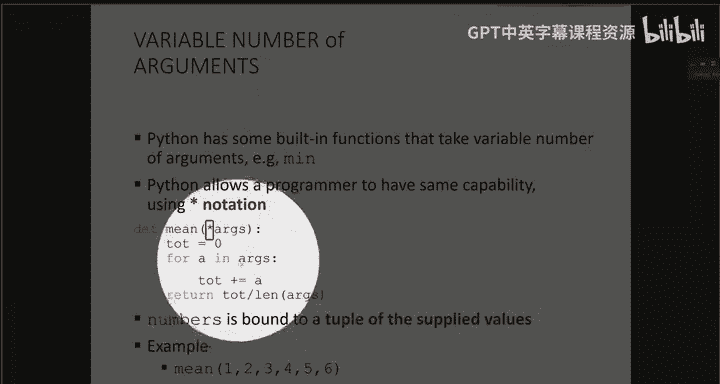

And so here's that example， which means that we can use our function to get the mean of 1，2，3，4，5，6。

But we can use the exact same function to get the mean of 60，9， for example。 So first case。

 I have  six parameters as my input。 But in the second case。

 I've got only three parameters as my input。 And that little star in my arguments。

It allows me to do this。 Now I did write a version of this mean for you guys down here where I'm assuming that meant have doesn't have the star so assuming that arg's is a tuple itself and in that case you would have to call the mean function by explicitly passing in only one argument that is a tuple。

 so this extra set of parentheses makes my argument， the tuple。

 so take a closer look at that if you're interested。So。

I want to introduce lists today and a lot of the slides here are basically copy and paste from the TL slides。

 the only difference in these slides that I have regarding lists is the way we define a list so in terms of defining a list or defining a tupo we were using parentheses。

But to define a list， we use open close square brackets。 But otherwise。

 a lot of the operations are exactly the same as lit as tuples and as strings。

We're not going to look at what it means for lists to be mutable this lecture。

 but next lecture will be all about mutability。But today I just want to give you a sense of what a list is。

So as I said， this is copy and paste from the TO slide， when I create a list。

 I just use open and close square brackets， this creates a list for me with no elements within it。

Creating a list with one element in it doesn't need that extra comma because there's no confusion with operation precedence with square brackets so there's no need for that。

 but otherwise everything else here is exactly the same as with tuples。

 we're just using square brackets instead of parentheses okay so remember strings and tuples。

 it's the same。What I do want to mention and talk a little bit about now that we've introduced tus and lists is the idea of having our loops iterate over elements of tus and lists directly and I'm going to basically write these slides in the context of lists。

 but the exact same thing is applicable to tus as well。So。Here is an example of。

 you know us wanting to find the sum of the elements in a list。

 The code on the left is a little bit hard to parse， right。

 We've got a loop variable going through range length N， and then I have to keep my running total。

 but I have to index into the list at that index here。

 and it's really hard to tell what's going on at a quick glance。

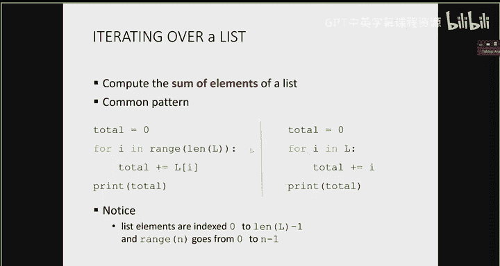

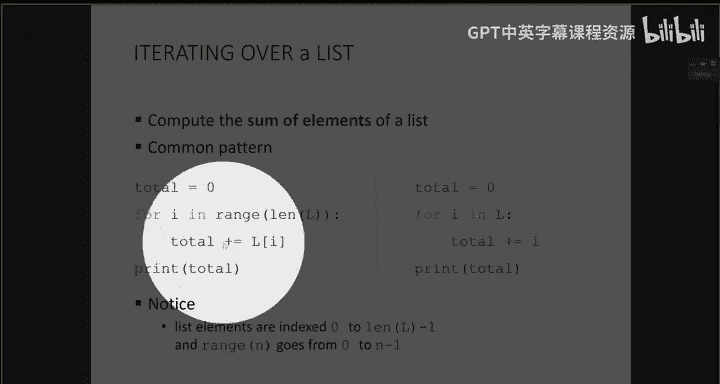

And so luckily for us， right， the way that we were able to iterate over string characters directly。

 we can iterate over tuple and list elements directly。

 So the right hand side here is exactly this is code that does exactly the same thing as the one on the left。

😊，Except that our loop variable I in this particular case will take on the values of my list directly。

And so if we take that code。Yes， and I guess we call this version more pythonic because it's a lot easier to read。

So if we take that code。And wrap it around a function to make this piece of code be something that we can reuse in a whole bunch of places to grab the sum of all the elements of a list。

 right we can do that。 So here I've taken the the code that does the work。

 I've plopped it inside this function。 I've named list sum。

 I've taken a list as a parameter and instead of printing the total， I'm returning the total。

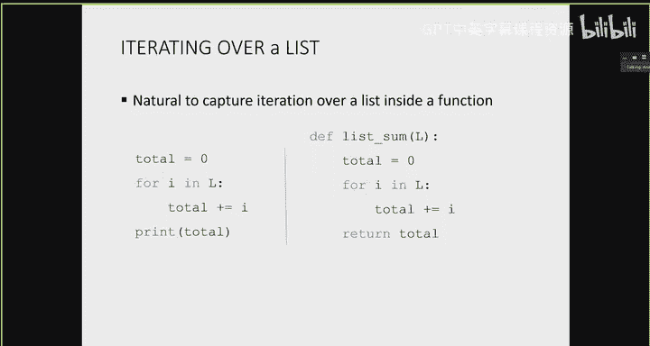

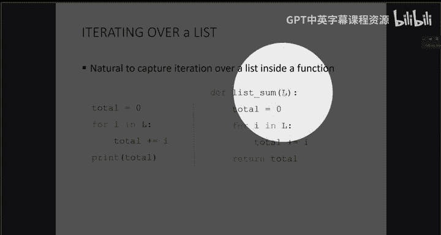

So very useful function now。

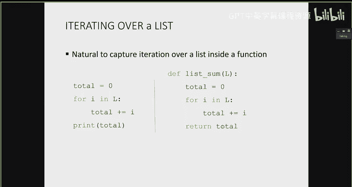

This loop variable I will take on the values8 then3 then5 if that's the list I called this function with。

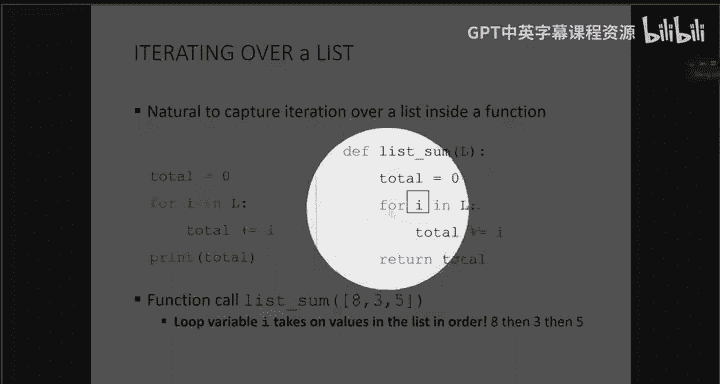

So a lot nicer than iterating over the index and then indexing into the list with the square brackets at that index。

What I do want to mention is something sort of when you're writing code。

 and this is something that I sort of used to do when I first started out is to write a little comment for yourself right underneath the for loop。

 Now， I know it's。It's a little tedious， but it does help you keep track of。

 especially if' if now that we're iterating over twoples or over lists or over string elements directly or even over the indices。

 it helps you keep track of what this loop variable is value is going to be and then you don't have to keep track of it in your mind it's on paper and you can use your mind to keep track of other things So if you just write a little comment for yourself there。

 it helps you debug along the way。So once we have these， once we iterate over list elements directly。

 it makes code that we write really easy to read。 So here。

 the code on the left is going to iterate over the elements directly and get the the running total。

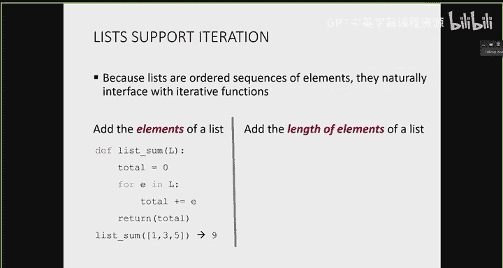

But we can make a really small change to the input list。

 Let's say our input list no longer takes in just numbers， but it can take in。

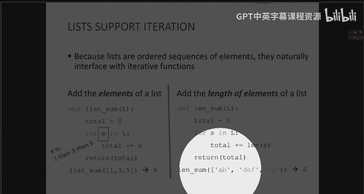

Strings。We can make one small change to our loop， to our loop body。

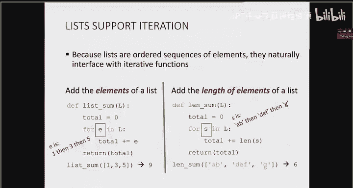

Our loop variable still iterates over all the elements in the list L。

 And then if we write the note for ourselves that S is going to be A B， then D， F and G。

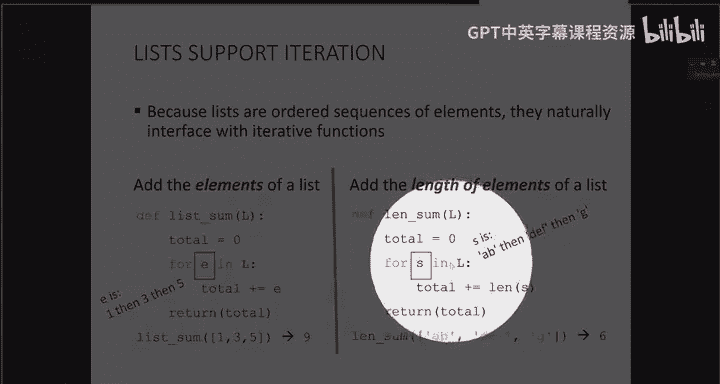

If we wanted to write code， that grabbed the sum of all of the lengths of the list。😡。

The total plus equals E on the left hand side becomes total plus equal length of S on the right hand side。

 So length of S1 at a time will take on the value 2 because A B has length 2。

 and then3 because D F has length 3， and then one because G has length 1。

So the code looks very similar， but they have different functionalities depending on what we want to do。

Okay。嗯。We don't have time to go through this， you try it， but definitely try it on your own at home。

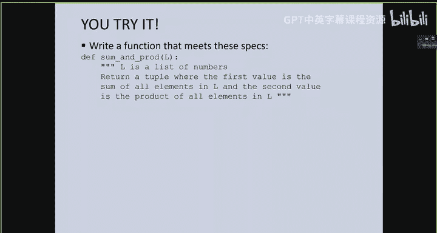

It's very useful， plus a whole bunch of other functions that I've put in this Python file for you to get a lot of experience with Tples endless lists。

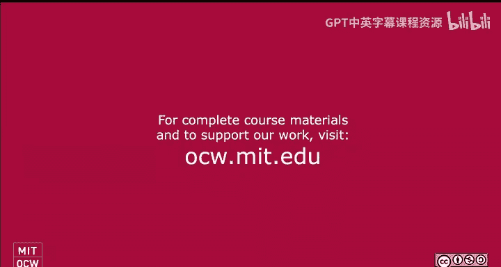