# 《计算机科学教育缺失的学期｜The Missing Semester of Your CS Education IAP 2026》中英字幕 - P1：Lecture 1_ Course Overview + Introduction to the Shell.zh_en - GPT中英字幕课程资源 - BV1vyzXB6Eps

Yes， you're in the right place。we should have written that on the black further Brus。

I have a fix for that。Suc， it is now on the screen。😊，Yeah perfect， I love that even better。😊。

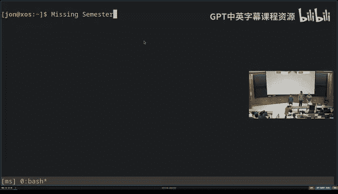

Cool， I guess we might as well start。 It's 1，37， which is an optimal start time for first class。

 So welcome to the first class of missing semester I P 2026。

 This is a class that we originally ran in 2019。 And then we ran it again in 2020。

 And then we all kind of moved on to other things。 But enough people seem to find this class useful。

 And there are enough things that changed since last time that we decided to run another iteration。

 That's what we're here for。 We were sort of colecturing the class together。

 same as we did back in 2020 and 2019。 I'm John。😊。

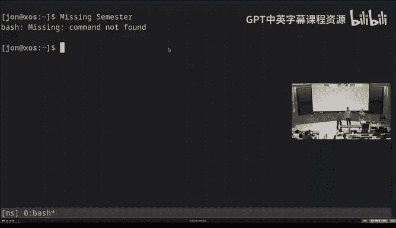

I am an niche。 Oh yeah， that's a good idea。 Is this thing on。 Yeah， yeah， I am an niche。

And I'm Jose all three of us are exMT students who did this class while we were taking doing our PhD here。

 we've sort of moved on to other things， the other things are not particularly relevant I think for this class and we're not gonna do a whole what else are we doing but enough to say that we all took a bunch of classes at MIT and all of us sort of fell through this pain of all of the things that you're supposed to know in some way or at least the classes sort of assumed that you know like Gi and editors and how to get around on the terminal and what the terminal even is and we felt like there's sort of a superpower here and that if you know how to use these environments well。

 then it makes a lot of other things in these classes easier the problem is no one teaches it to you。

 hence the name the missing semester and so the goal of this class and all past instants and in this one is for us to go over all of those things or at least as many as we can fit into the time。

 all the tools， techniques， concepts， ideas。That sort of make up the bulk of the behind the scenes knowledge。

I don't know if you have other things you want to add before you dive into the first。Topic。Yeah。

 just a little bit more on the inspiration for this class。

 So all three of us while we were grad students here tea a bunch of classes and we often found that while in office hours we'd be teaching students topics that were actually not the subject matter for the course we were teaching but just things like how to use the shell how to make most effective use of the text editor and things like that and so thought let's factor out all those topics and teach a dedicated course on it so you can focus on the course material in office hours。

 Yeah I think some of it is also like repetition like there's a lot of things we think about computers like we can write programs that automate things but we don't think about the fact that the computer can automate our tasks working with the computer as well like you I don't know。

 you're running the tests for some lab and you want to run them until they fail because you know that they fail if you stress test them enough and instead of you pressing likearrow up enterarrow up run it multiple times how can you automate this task and so those kinds of things or things that students don't even know to ask questions about because they don't necessarily know that it's possible and those are the kinds of things we want to give。

Insight to in this class。Yeah， just to add to that。 I feel like a bit of it is unknown unknowns。

 like you might not know that like a lot of smart programmers have come before you already like face these frustrations and I have solved these problems。

 just like since these solutions are not taught in your compilers class or in your algorithms class。

 you might not know about them。 And I think part of we're trying to cover here is just giving you awareness of the types of。

Tools that are out there and that you should know about and like reach out when the time comes。

 and this relates a little bit to the logistics of the class。

 So they're gonna to be nine one hour lectures That's not a lot of time。

 even though it might sound like it。 There are so many just areas to focus on not to mention individual tools。

 We will not be able to go into all of the tools and details or all the techniques in detail for a lot of this。

 Almost what we're doing is like exposure therapy right like we're like showing you what is possible and some of the tools that you should know about。

 but we might not go into detail about how they work or exactly how to use them or even like example usages of them。

 the idea is that we tell you about the tools that you should then go read more about yourself or you should go experiment with on your own。

 you'll find that we have exercises included with all of the lectures。

 And all of those exercises are intended to give you more handson experience with the stuff we teach in the class。

 So I highly recommend that you go in and do those。

Because that is the way that you will learn the most out of this class。

 The lectures are only part of the outcome。So we mention logistics real quick like what time Oh yeah。

 sure time for Friday。 Yeah， let's do that。 So the lectures are gonna be here at this time。

 So starting at 1，30 to 230 every day for the next two weeks， except for on Friday。

 we'll be in the same room， but we'll be here starting at 3 PM because the room is taken at this time。

 And on Monday， the day is off。 So we're not gonna be here on Monday。The last class。

 so not this coming Friday， but the Friday after is gonna to be class dedicated entirely to Q And A。

 So the idea is that over the course of the previous two weeks。

 hopefully you'll accumulated a bunch of， hey， but how does this work。 Or can you tell you。

 tell us more about this kind of stuff。 Then we're happy to use all of the time there to cover whatever you can think of。

😊，We're also going to record all of these lectures and put them online。

 They're going to go on Panopto first and then on YouTube。

 which means that this will be intended for sort of the general public to consume as well to learn these techniques。

 that is also why it is so important that you ask questions both during these lectures and in the Q&A session at the end because you are in a sense the voice of the people who are watching this later。

 the questions you have when watching this。 other people will also have and ideally we can capture the responses so that those people get to benefit from the answers as well。

Cool， I think we're ready to dive into the first class。If you find that you have questions about。

 Oh yeah， like that。 if you find that you have。Questions about the the course that or or even about individual topics that are not that you forget to ask in class。

 there is a way to ask questions after the fact there are too， really。

 One of them is there is a Discord channel。 It's linked on the website。

 This is part of the open source university。 that is specifically like a discord for people who are learning using open source materials We're missing semester as a channel。

 there's also a forum channel there where you can ask questions。

 And then they will show up as like questions like forum threads where we can sort of give official answers in there as well。

 Or if you want to answer your ask your question more privately。

 you can also email the instructors using the email that's on the website。Cool。

 let's dive into the first topic， which is。Dramatic effect。

 the terminal or or more specifically the shell。 What is the shell。 Well。

 computers have a bunch of different interfaces you can use to interact with them， right。

 We' all come， we're all familiar with graphical user interfaces or guis。

 Those are the ones were used move your mouse around。 you click things。 And those are fine。

 they work really well。 if they're well designedigned graphical user interfaces。

 We have other things more recently as well。 We have things like agent interfaces。

 we have voice interfaces。 we have like virtual reality， augmented reality type interfaces。

 Maybe we'll get neural interfaces at some point， right。

 We have all of these ways to interact with a computer。

 But the realities that a lot of those interfaces are sort of specialized。

 They're specialized to what the author of that interface。

 had in mind when they created the interface。 So for Gui， for example， the only things you can do。

 are the things that are programmed into that program to do。😊。

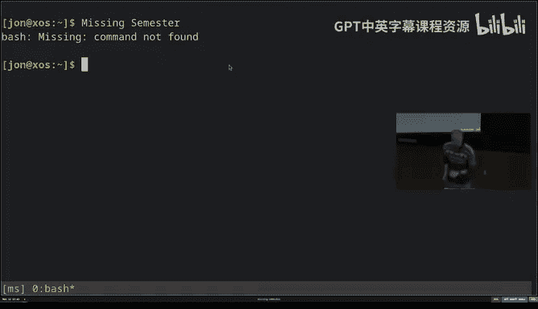

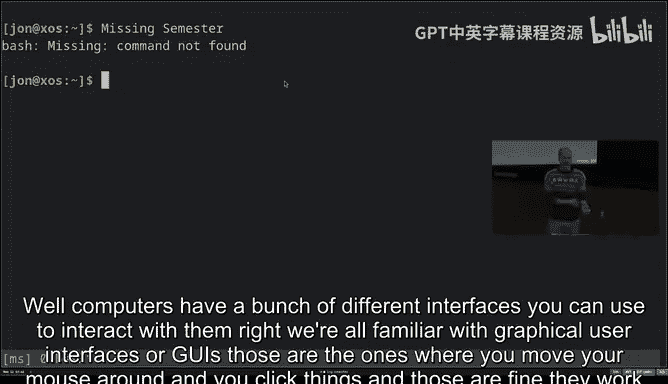

Similarly， it's pretty hard to take two different programs that are doing maybe related tasks。

 And you wish you can combine them to try and actually combine them is often pretty hard。

 It requires there to be some custom implementation of like software A from vendor A with software B from vendor B so that those two can interoperate And sometimes you really just want to drop into sort of one level lower where everything is just you can write whatever commands you want。

 You can chain them together you want。 And that is what the shell is。

 It is the textual interface to the computer。 This is the thing that we sort of had from the very beginning。

 This is what preceded all the gois。 It preceded all the other interfaces。 And it is in a way。

 the sort of core language for interacting with the computer。😊。

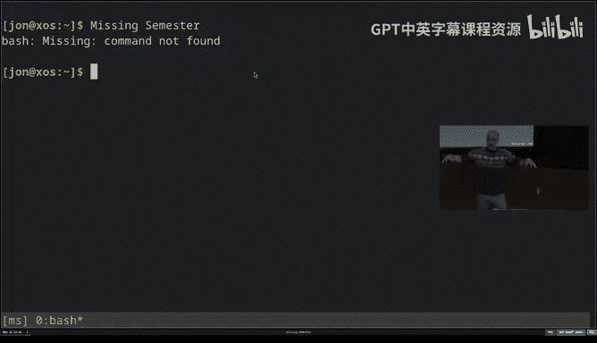

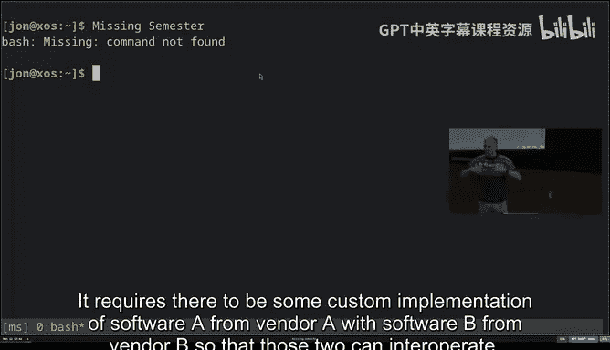

The shell is really a program on your computer that lets you give inputs。

 commands and prints the outputs of those commands。 And that's how you interface with it。

 The shell runs in the context of a terminal。 A terminal。

 you can think of as like the Gui window that is around it。 So in this case。

 you can see that there's sort of a border around this thing。 That is my terminal。

 It doesn't have any Ui。 Some terminals do mine does not。 And inside of that terminal runs a shell。

 You can open a terminal on your computer。 Most computers these days ship with some kind of terminal with some kind of shell。

 on Linux， you can usually open this with like control alt tends to work on most diss。

 or you can open your application launcher and just search for terminal。

 and you should probably find something。 on Windows， you type the Windows key in R。

 And then you can type either CD or power shell。 Those will open different the same terminal but with different shells。

 And on Macs command space to open spotlight。 And you search for terminal。 you get a terminal。😊，Now。

 these the terminal you usually don't need to worry too much about it gives you things like interactions with operating system。

 things like copy paste or mouse movement and selection。 But apart from that。

 most of the interesting stuff here is going happen in the shell the shell that is most commonly used of across the board is the born again shell or bash bash is what you're gonna to get on Linux usually when you start a terminal。

 on Macs， it also used to be bash， these days is something called Z or Z S H。

 This is also now the default on some Linux distributions as well。 Z is a bash compatible shell。

 So things that are valid in bash are usually valid valid inche。

 And Z has a bunch of other ergonomic improvements of feature improvements that make it easier to interface with you'll find that there are actually a lot of different shells that are often built for different purposes。

 And in fact， there are some that like bash is pretty old and has not seen significant new feature expansion since then。

😊，S does have a lot of ergonomic improvements， but there are also shells like fish that are intended to be written by humans on the command line。

 rather than by programs or or in programs。 And you'll find that if you talk to the instructors。

 like all of us use different shells for different reasons。

 And this is also something where you could choose to explore your own shell down the line。

 But for the initial sort of investigation and for everything we cover in this class。

 we're going to be focusing on bash and sort of by extension， also Zche。On Windows。

 you will not get a batchsh compatible prompt。 You will get either batch B A TC H or you will get powerhe。

 the newer version of the shell for Windows。 These have similar concepts。

 So what you find in bash in similar shell。 but they are kind of different。

 The syntax is kind of different。 the way you invoke programs is kind of different。

 We will not cover those in this class。 If you're on Windows。

 I recommend you install either the Windows subsystem for Linux。 W SL。

 or you install a Linux virtual machine that lets you get access to a proper shell。

 Power Shell is also very good， but for very different reasons。

 But so in this class will focus entirely on bash in its derivatives。😊，Now。

 why should you care about the shell？ Well， it's usually much faster than clicking around once you get used to the shell。

 you can do quite a lot of things with very few keystrokes。 whereasas in agui。

 it tends to become more laborious， especially the more complicated your task is。

 And part of this is because in the shell， you can automate。

 The shell is essentially a programming language that you know， the command line。

 the prompt that you see appear where I get to type things and they appear。

 That prompt is is essentially the start of a file that I get to write。

 That is a bash program that gets executed。 Most of those programs are very simple。

 They just start a program of some kind。 but you can write fairly complicated expressions here as we'll get into later。

😊，And there are a couple of other reasons why the shell is useful。

 One of them is this ability to combine programs。 We'll see that as well。

 how you can take the output of one program and feed it into another program that does something else and feed it into a third program that does something else。

 The shell is very much built for that kind of combinatorial thinking， if you will。

Knowing your way way around the shell is also useful for interacting with the open source community。

 you'll find that for almost any open source tool you find the instructions for building it。

 installing it， running it are all gonna be things that happen in your shell。

 you'll also increasingly find things like， how do I do this on my computer。

 And you'll be told to open a terminal and type something in there。

 And usually it's useful to know roughly what that command does rather than just blindly copy pasting things from stack overflow and going。

 yeah， it's probably fine。 So hopefully this gives you a bit more sort of intuition and insight into what those things actually do。

 And which things you should be worried about and which things are not。😊。

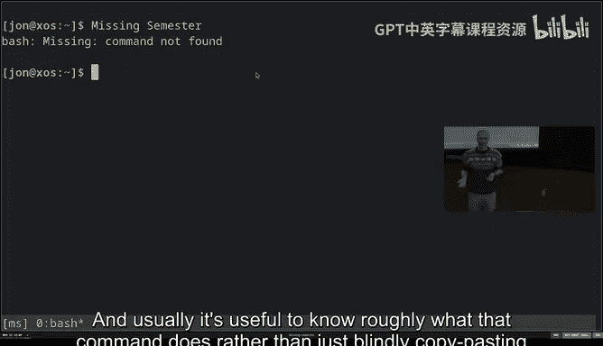

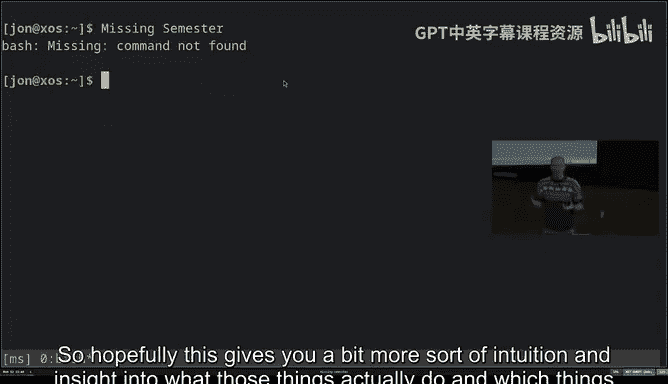

There's also increasingly use of shell in and bash in particular。

 in confis configuring continuous integrations for projects。

 You'll find this both in the open source community and also in the close source community。

 If you end up taking a job at a company。 You'll find that a lot of the configuration for how the software is built behind the scenes。

 how it is tested， how all of those pipelines flow together is also all done using shell commands。😊。

So let's then look into what is the shell。 Well so as I already explained here we have the prompt。

 the prompt is the main interface you have to your shell and it tells you this sort of start of the shell prompt over here。

 tells you that my username is John。 It tells you that the host name of the machine I'm on is XOSOS the colon is the separator just like the Empersand and the thing after the squiggly line the Tilda is the location I am at in my file system Tilda is short for my home directory So currently I'm in my home directory。

😊，Is what this prompt is telling me， The dollar is telling me that I'm not the root user。

 I'm not the admin user in this shell。 Usually， you'll just see dollar here and you don't have to worry too much about it。

 And then it's just sort of friendly waiting for me to run a command。 Now， when you run a command。

 Why is， why is it sound double when I'm standing over here， It's disturbing。

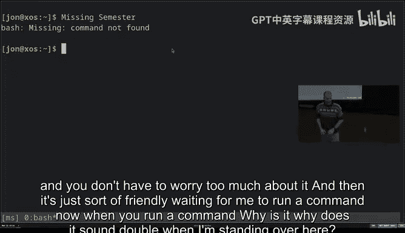

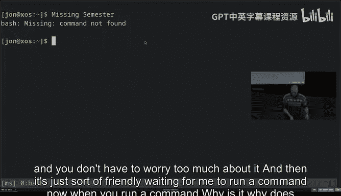

Is that still on， maybe。No， weird。 Is there a secret microphone？ Well， it'll be okay。

So on the on the prompt， you can type commands that you want to be executed。

 And the simplest kind of command you can type is just the name of a program。 So， for example。

 there's a program called date。 and perhaps perhaps unsurprisingly， when I run the date program。

 It prints the current date to my terminal。 And then I'm dropped back in a prompt where I can now type more things。

 we can also execute commands with arguments。 So arguments here are things that follow the program name in the command。

 So， for example， the echo program is a one that will take the arguments we pass to it and print them back out。

 So， for example， if I type hello world here， it prints out hello world。

 So hello and world here are arguments to the echo program。😊。

it's worth spending a few seconds here on what argument parsing is。

 argumentment parsing in bash is that you take the， the string。

 the text that the user gave you and you split it at white space boundaries。

And each white space separated word is one argument， and the first argument is the command。

 the program to execute。Now， there are ways to say that I want an argument that has white space in it。

 So you can do quoting just like you can in most of the programming languages。 Now。

 Echo prints all of its arguments。 So it's not going to be particularly useful there， but I could。

 for example， say， hello world like this。 and it will print the same thing because echo defaults to printing space separated of its arguments。

 which is the same thing I'm providing here， but for example， if I put more spaces in here。

 you'll see that now this gets treated as one arguments printed as a single thing。

 If on the other hand， I typed hello。

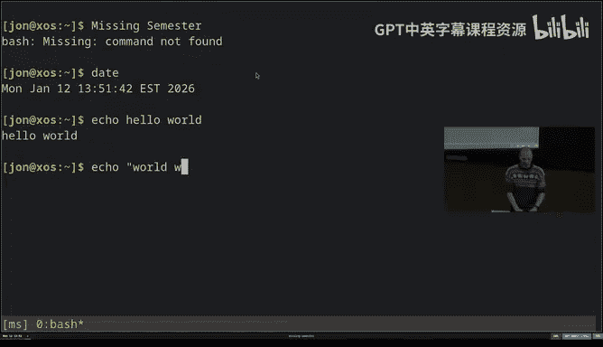

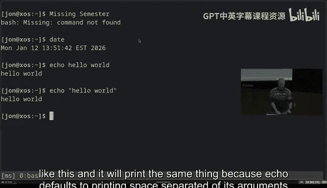

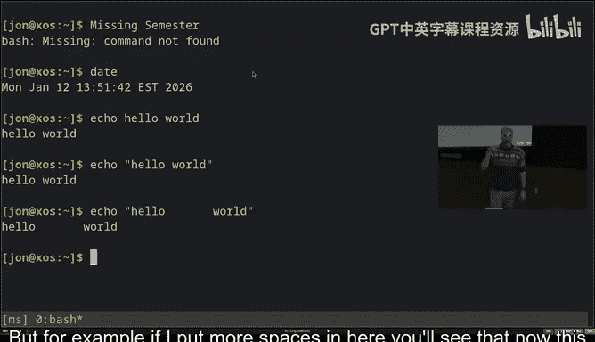

And then a bunch of spaces in world。 These are just two arguments to echo。

 They get separated as two arguments。 The white space is ignored。 It's just a separator。

 And then those two arguments are provided to echo， and it prints them back out。

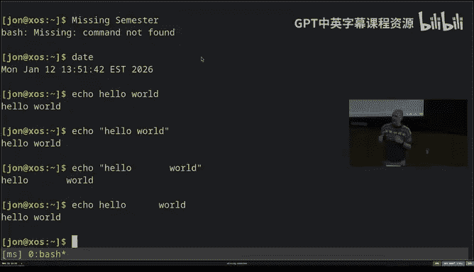

Argument parsing is something you're going to run into a lot when you start writing command lines yourself。

 because sometimes getting the quoting right can be quite annoying， yeah。

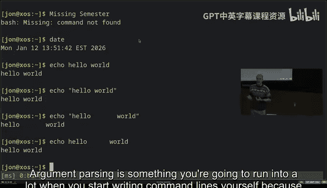

Okay， first of all， why don't the programmings have like doc Java or something or like do they normally have do job or do they not normally have do job or like？

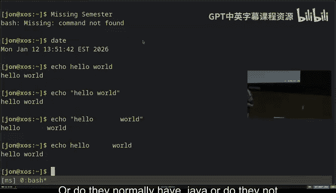

So， so these program I'll get into where we find these programs later and where theyre where they're located。

 A lot of these are pre compileiled programs that are installed on your computer。

 So they're not source files。 They are programs that are built into your computer or that you've installed after the fact。

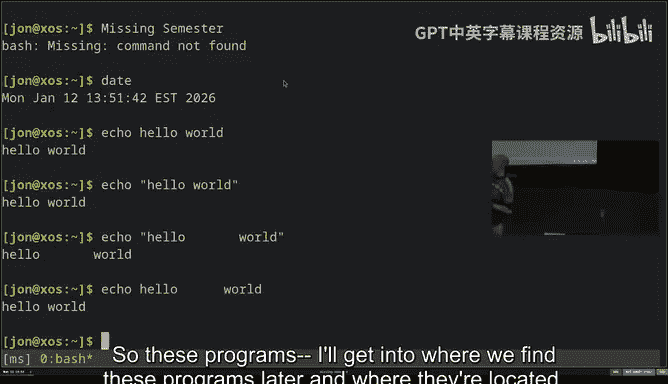

And and the strings we write afterwards， if， if， if you write Java with the static void main string arts。

 this is this is the string。 right， So the question here is， if you write， like， for example。

 a Java program and you write a sort of static main function and the as argument you get to that function。

 those are exactly what these arguments turn into。And the same thing for Python。

 if you want to access the， the RV thing that you get in Python。

 that is a list of arguments provided to the program， this is where those arguments come from。

You'll find that you end up running into quoting issues here once you start getting more complicated things。

 like maybe you have a path that has a single quote in the name of a file。 Well。

 now you need to use double quotes around it or you need to escape it and escaping is。Simply。

Putting a backslash in front of a character， you can do this multiple times to escape multiple characters。

 and now you see it has the same effect as though I quoted it。 But doing this once you have。

 let's say you have a path that includes spaces and also single quotes and also double quotes。

 and then you might need to get creative with the quoting that you do so that the arguments end up being split in the correct way you will run into annoyances around this。

 it takes a little while to get used to， but there are ways to sanely quote any argument to command in bash。

😊。

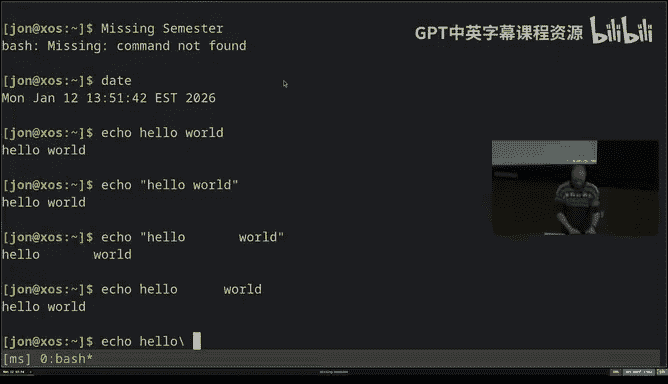

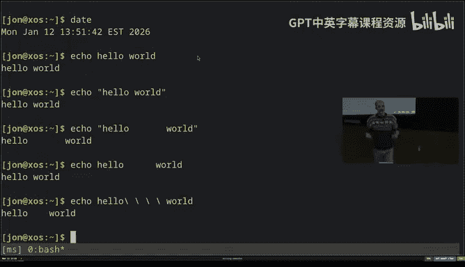

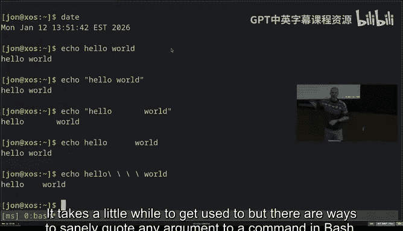

semi I saying。 yep， slashes。 so So back slashes separate the same as white spaces。 no。

 backslash is an escape character that says， don't treat the next character as special。

 So in the case of argument parsing， backslash space means a literal space。 do not split on this。

 This is not a word boundary。 It is a literal space that's part of an argument。嗯。Cool， now。

 perhaps the most important or program you will find to use in Yeah， you had a question。Oh yeah。

 I' was just going。かっ。That you could show how ecaping works for。Yeah， so if I wanted to say。

This would not work because it would think that this is one string。

And then it would say there's a trailing single quote here that doesn't get terminated。

 So it just tells me， oh， it drops in back in a continuation prompt。

 which is the thing you see at the bottom。 where' is just expecting more input。

 I've put a single quote here than you're confused。 And all the single quotes are gone。

 And so what you could do here is either say。

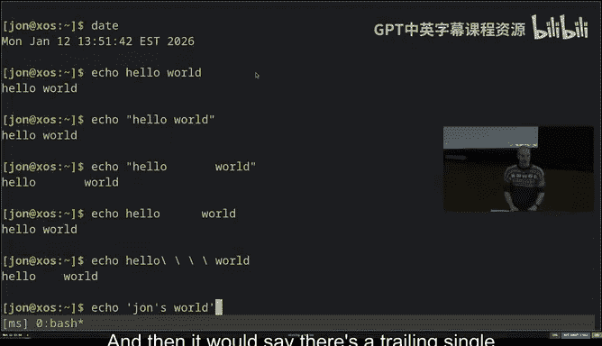

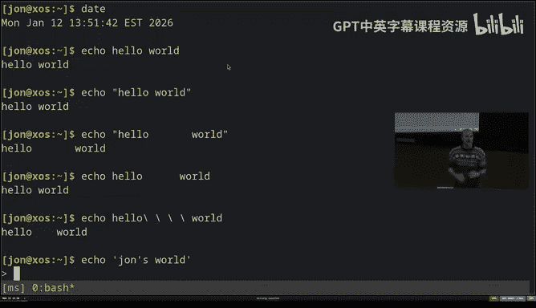

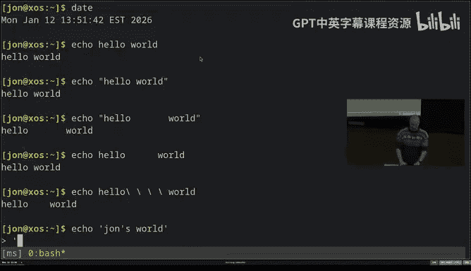

This。Or you could double quote the whole string。

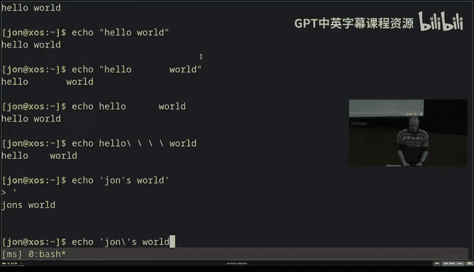

And so that， that way you would end up with， with the the expected output。Now。

 one of the most useful programs youll find on here is a program called Man short for manual。

 The manual allows you to pass in the name of another program。

 and it explains how to use that program。 So， for example， if I type man Echo。

 So echo is the argument here to man。 I get a manual page。

 And this says echo displays a line of text。 And then it shows me， all of the options。

 all of the arguments that I can pass to echo。😊。

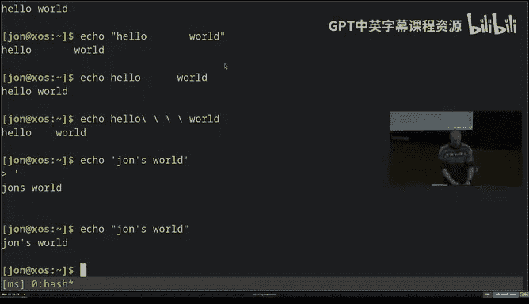

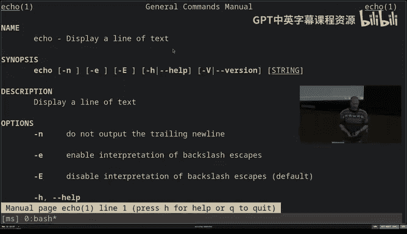

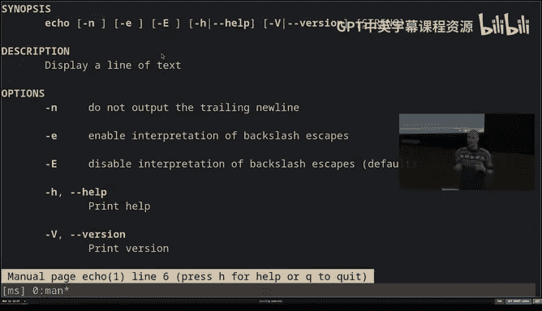

And usually， some of them will have version information at the bottom。

 Some of them will also have usage examples。 So if I look at the manual page for date。

 you'll see it prints a date。 And it also， this doest not that either。 if I do bash， maybe。

 So the bash one is pretty extensive， and it has bug reports and authors and files and restricted。

 like it has a huge manual page that explains all the various things you might want to do in bash。😊。

So the man program is one you will find you can use a lot in order to understand more about the commands you have and what things they can do。

Usually， you can get a short version of the manual page for a program by simply passing dash dash help as an argument。

 So in this case， when I run date with dash help， it prints out the help string for date。

 which is usually slightly shorter than the man page。

 Some commands also allow just dash H as a similar thing。😊，After man。

 the most important program to know about is CD for change directory。

 Change directory allows you to change where you currently are in the file system。And in this case。

 like I am currently in my home directory and so in my home directory like there are a bunch of files。

 but if I wanted to operate somewhere else in the file system。

 I could change to be in that directory instead。😊，So what does that look like， Well。

 I type C D for change directory。 and then I type a path。 So a path， in this case。

 it's a path that starts with a slash。 that makes it an absolute path。

 Well get into other kinds of paths later。 So I want to go into the bin directory under the root of my file system。

 So I want to change directory into there。When I do that， you'll see that my prompt has now changed。

 It now says I'm in slash bin instead of being in slash home。

 I can also C D directly into the root and so on。Now。

 you'll find that there are a lot of commands that will operate in the current working directory by default unless you tell it something else。

 So that's why its usually useful to know where you are。

 hence why it's in the prompt and to potentially change where you are。

 And it's particularly useful because it allows you to use relative paths。 So I hear I did slash bin。

 But imagine that I have some path that's deep under my home directory。

 So it's like slash home slash John slash dev slash project slash you know，6，8。

24 slash version 1 slash and it becomes a really long thing for me to type all the time。 So instead。

 I can change directory into the folder that I want to be operating in and then use relative paths。

 relative paths or any path that does not start with a slash。😊。

And the resolution for a relative path is in the current working directory。

 look up the first path component， path component or the slash separated parts of the path。

 look up the first one。😊，And then from there， traverse using slashes rather than starting at the root of the file system。

 So， for example， I'm now in slash。 I can type C D bin， note the lack of a slash to say。

 I want to C D into。 I want to change directory into the bin folder of what inside of the current directory。

If I'm now in bin and I tried to C D to bin again， they would tell me there's no such directory because it looks for a folder called bin in slash bin。

If I go back to slash。And then try to C D to slash。 Well， that's fine。 That's an absolute path。

 But there are a couple of other special kind of path components you can use in relative paths。

 You can use them in absolute paths， too， but theyre more common in relative paths。

 which is dot and dot dot。 So dot is the current directory。 It might seem weird。

 but I can C D into dot。 and that see these me back into the same place I already was。

 So if I C D into bin than then C D dot， I'm back into slash bin。😊。

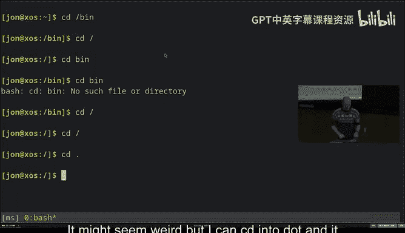

So just a way to refer to where you currently are。This can be useful。

 We'll see some examples of that later。The other special path is dot dot。

 and dot dot refers to the parent directory of wherever we are。 So if I do C D dot dot。

 I end up in slash。 I end up one level up in the file system。 If I try dot dot from slash slash。

 like the root of my file system is special where dot dot just goes back into slash。😊。

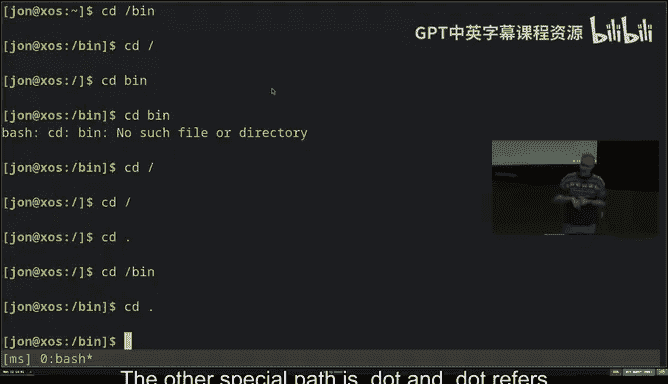

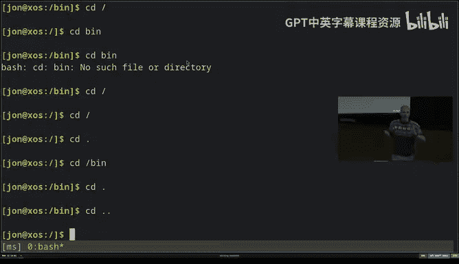

But what I can do is I can chain these so I can say I want to go into bin and then I want to go back out and then I want to go back into bin and then I want to go into itself and then into itself again and then I want to go back to the root and then back into bin and I end up in slash bin so you can combine these to create paths that navigate the file system however you see fit y。

😊。

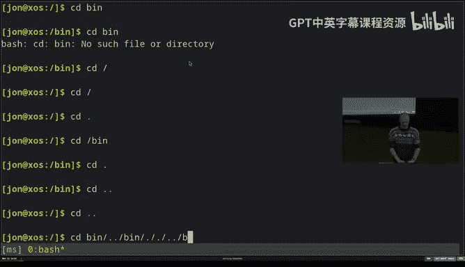

What is the use。What's the use case of this， The use case of this is， imagine you're operating in。

 I don't know。 you're working on a 6，8，2，4 project。 And now you want to move to working in on a 68，5。

8 project。 Well， then instead of typing， okay， I'm in a 2，4。

 instead of now having to use an absolute path to say， now I want to see it into home， John Dev 6，8。

5，8， I can just do C D dot dot slash 6，8，5，8。 So go one up and then one down into a different directory。

 This particular path， you probably wouldn't use because this is pretty useless。

 But you don't have to say the same path again， right， you could easily。

 because once you've done the dot dot， you are now in the reference point is one level up in the fuller hiarchy。

😊，这只有各个不少钱。

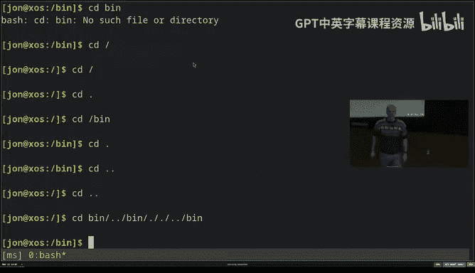

Yes， so if I do C D Tilde， you'll see I end up back in my home directory。

Slash is the paths component separator。 It is the thing that separates each recursive step of resolving the path。

 So if I go to C D A slash B， slash D， A slash B， slash C。

 what that means is change directory into A after doing that， change it B， after doing that。

 change into C。So that would go into D， the folder C that's inside the folder。 B。

 that's inside the folder A。And these paths also work with Tilda。 So I could do Tilda slash dot dot。

 and I end up in slash home because it's one directory up from my home directory。

 which is slash home slash John。😊，嗯。There are more efficient ways to navigate the shell as well。

 So you'll find， for example， in the lecture notes。

 there a reference to a tool called Zoxide that remembers all the paths you've ever cd into and then gives you a more rapid way to C D into arbitrary of them。

 rather than navigating the whole file system。 So there are tools people have built to more efficiently navigate the shell。

 But this will already get you there pretty quickly。

 There's one more trick that's useful to know here， which is tab tab in bash gives you autocomple。

 And so for example， if I do CB and then press tab Well， in this case， B as ambiguous。

 that's because I'm in the wrong place。 CB and then press tab， you'll see if I double press tab。

 it gives me all the possible options。 In this case。

 s bin and s boot are both directories I could go into。 But if I do C D B I and then press tab。

 it autocomplets the bin。 And so this is one way to more rapidly navigate through folders。

 is just type the few first few letters and then type tab。

 And if those are ambiguous tab tab will show you the options。😊。

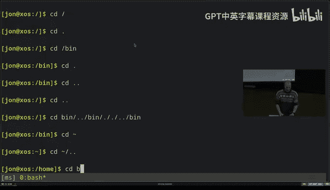

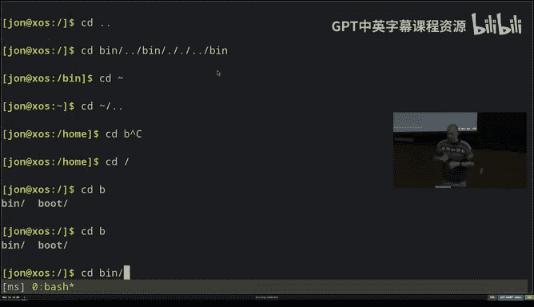

So what kind of things can we execute in the shell。 So we've already talked about echo date。

 man and C D。 But how do we figure out what else is available to us。 And in fact。

 how does the shell even know when I type date， which program to run。

 Like where is date on my computer， The reality is that when you type a command with a program name into your shell。

 What it would actually do is it will take the name of the program。

 and it will look it up in something called path path is my is an environment variable。

 So it's a variable is sort of set across my whole shell of variable to value mappings。

 usually names to strings and those will describe a bunch of meta information that the shell can make use of。

 Like what user am I， what hosts is this， what shell is being used。

 I kind of stuff and path and here we can use the echo tool again。 if I echo my path。

 it will list out a sequence of paths， They colon separated here。😊。

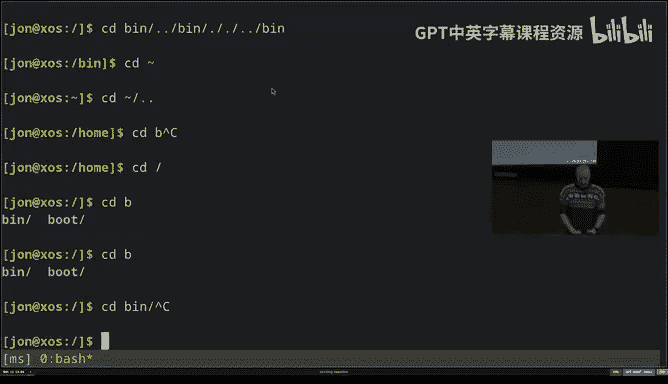

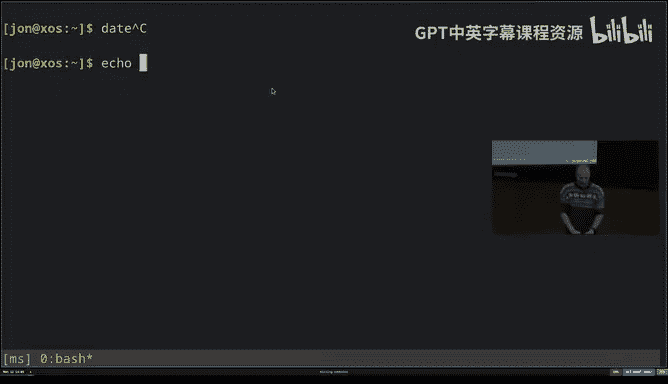

And when you try to run a program in your shell， it will walk through these folders one by one。

 looking for a file by the name of the program。 And if it finds it， run it。

 Otherwise look in the next one。And we can actually introspect this of if I run which date。

 So which is a program that will walk through the path list and print out the place where it first finds a given program。

 it will say that the location of my date command is at this path。

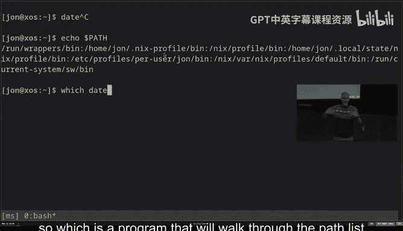

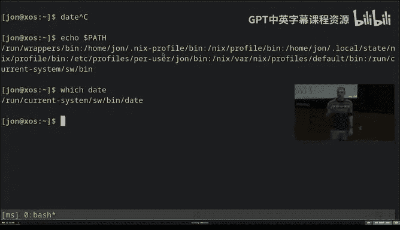

So when I run date， what actually happens is my shell discovers that path slash runs slash current system slash S W bin date。

 and then runs that program， executes that program。 And that's what ends up in my terminal。

 And this is so that we don't have to write the full paths every time。 So I could。

 if I wanted to take this path and have that be my program name。 And that will run just the same。

 But it's more convenient for the shell to be able to discover them in this way。

 which is also just a program。 So I can run which， which。

 And it tells me that the which program is located in the same folder as date was。😊。

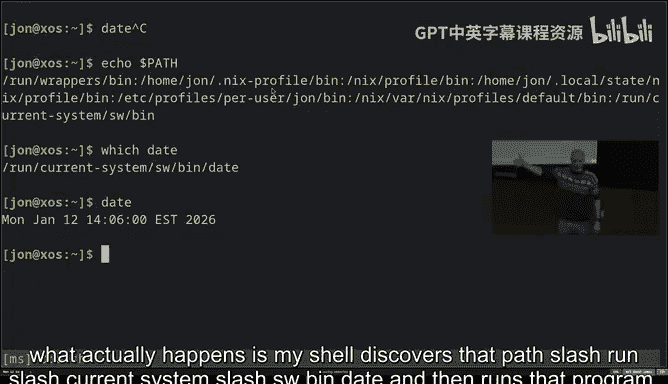

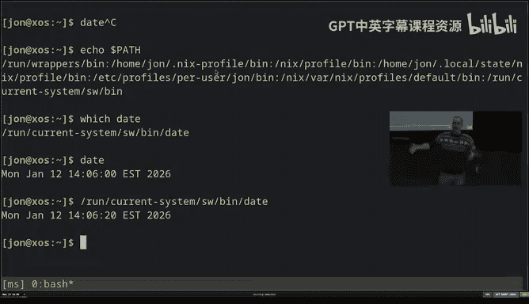

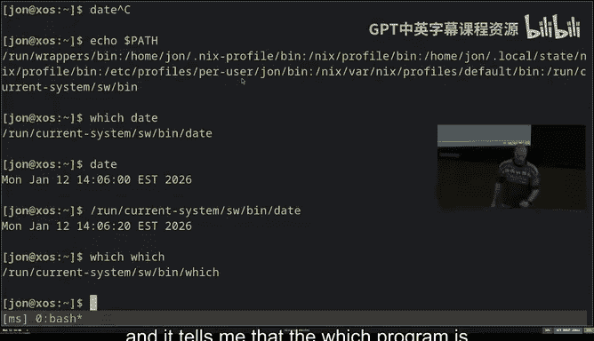

This path might be different on your host。 It just depends on where software is installed on your particular operating system。

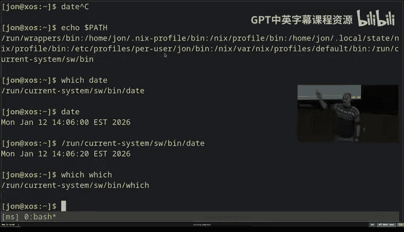

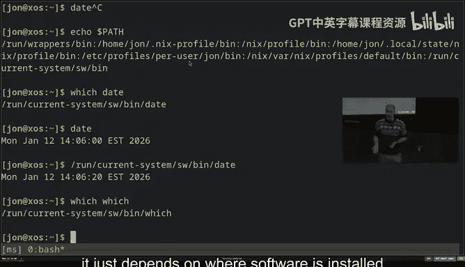

Do you have a question？Okay， so when you， okay， so when you type it non completely。

 it searches in folders that it searches in the parents of your current director。 No。

 it searches in the folders listed in my path。

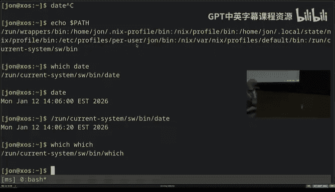

Oh。So the path variable is sort of a special variable that's known by my。

 and it will search through these directories in order for the program by the name that I gave。😊。

If you have。Fultful programs。The same name in more than one folder。 That's the path。

 Does it choose which one。 So if a particular program is present in multiple paths in my path。

 like dollar path， Michel shell will execute the first of them that it encounters in the path order。

 And you can even ask which with the dash a flag， which is for all。

 I can ask which all the copies I have of echo。 And it will say there's only one echo for you。

 If I tried to do something else like rust C。 there's also only one。

 do I have anything that would be multiple of。😊。

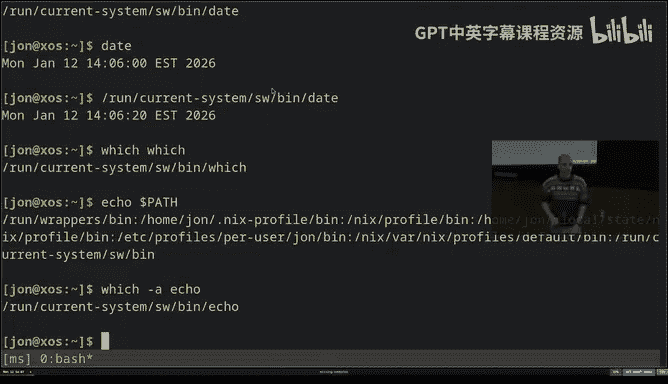

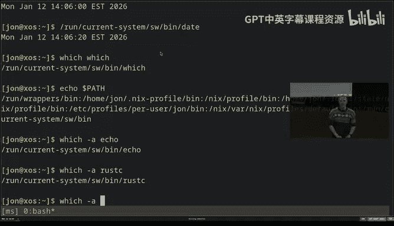

S， H， you'll see that there are actually two places in my path where S H appears。

 and it will show all of them。

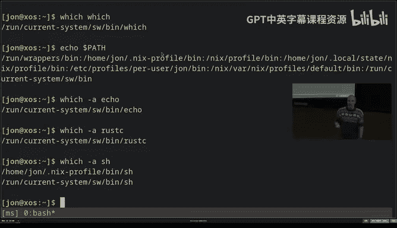

But your cell will normally execute the first one only。

We less the minus a or it's an argument to which that lets it。

 that makes it print all of the paths rather than just the one it would have selected。 And in fact。

 if I tap man which， you'll see that there's under options。

 it says dash A or dash dash all prints all matching executables in path， not just the first。

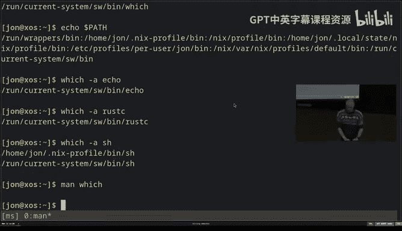

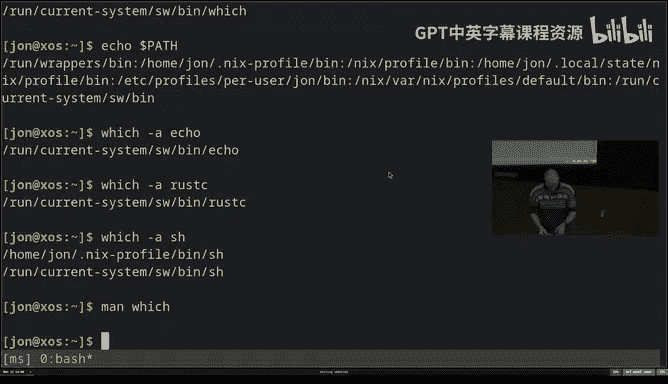

And this also gives us a clue for how we can figure out what all of the programs we have are， right。

 Is that you could walk through all the directories in your path and then just。

List the contents of all of them。 And that is all of my programs。

 You might not know what all of them do。 but you could do that by looking at the man pages and then explore。

 So if you really want to go through this process。 So in my case， for example。

 I could take this directory and do L S and this path。 L S is another program。

 That is the list program。 It lists the contents of a directory。 So in this case， I'm telling list。

 hey， can you go list the contents of that directory。 And if I do。

 it prints out a long list of all the file names that are in there。

 And these are all programs that I could run on my command line。😊。

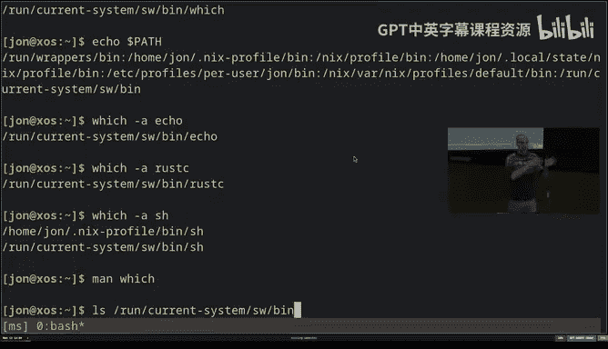

One thing worth noting here is if I type L S and don't give it a command。

 sorry don't give in an argument， then it will list the current directory。

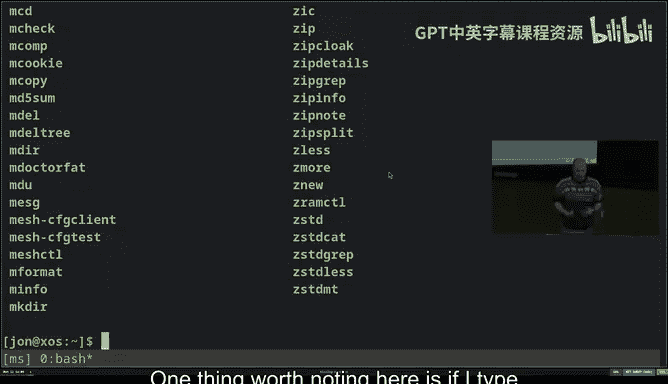

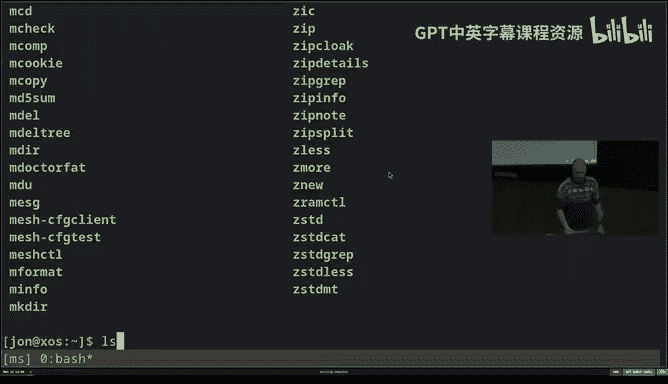

And this is what I mean by the current working directory is the thing you change with C D is often the one you want to make use of。

 because that， that is where many commands will operate by default。

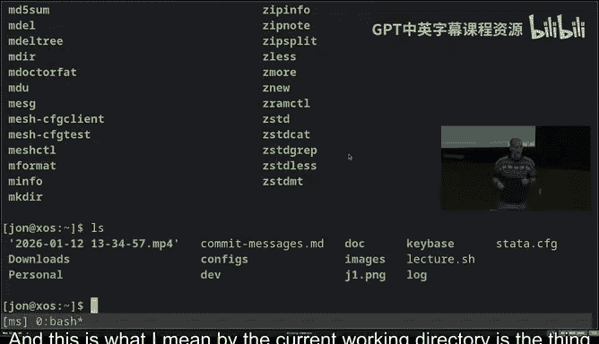

嗯。There are a bunch of other programs that are useful to know about like this。 So， for example。

 there is one called cat。 Catt will print out the contents of a file。

 So if I do cat of data that config， Then when I cat that file。

 it prints out the contents of that file and dumps them into my terminal。😊。

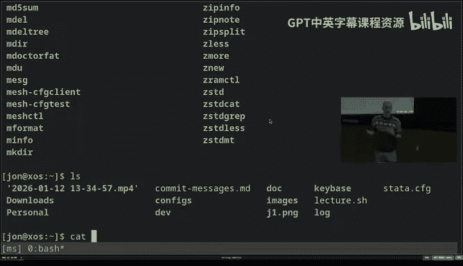

There are other commands like sort， sort will take its input or the file that is referred to on this input。

 and it will print out the lines in sorted order， so if for example here I do I create a data file and I put in a3。

 B X。

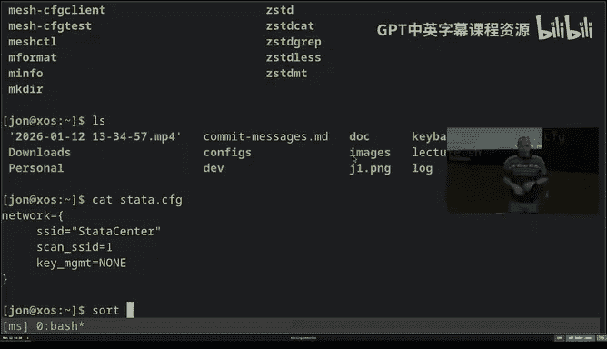

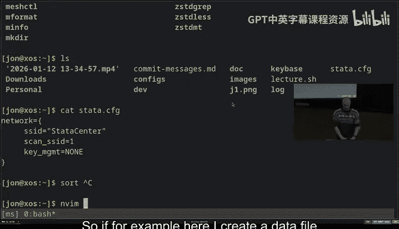

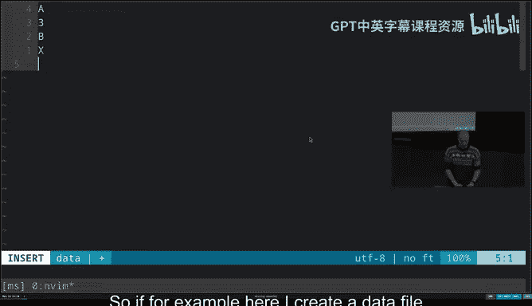

14。And I type sort data， then it will print those out in sorted order。

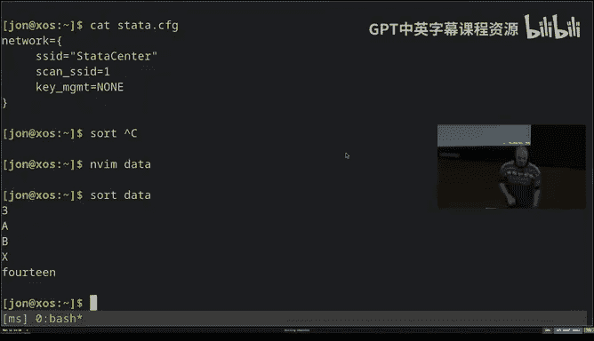

And in fact， if I do here， let's say I add。

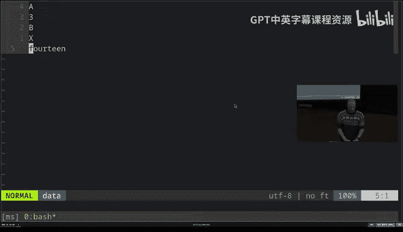

I added 31 as well。 Just prove a point。 You'll see that it does lex you graphical sorting by default。

 So 3 is followed by 31， because alphabetically， that is the order， even if numerically。

 that might not be correct。 For example， if I wanted to add in now， no。

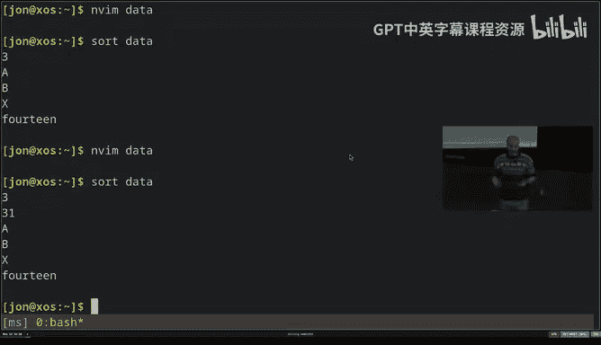

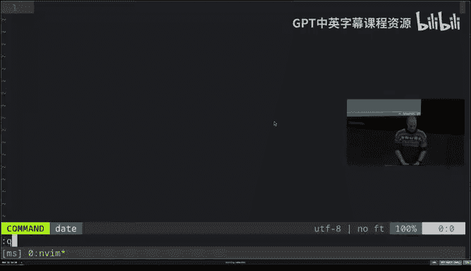

If I wanted add in four and I tried to sort data。Then you'll see that I get 3，31。

4 because they're ordered leographically， not numerically。

 But there are arguments you can pass to sort to change this behavior。

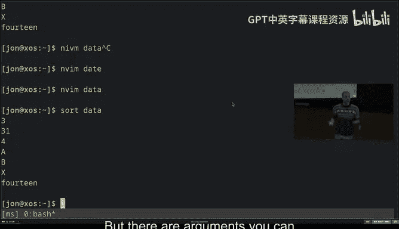

Then we have unique。 So if I here added。

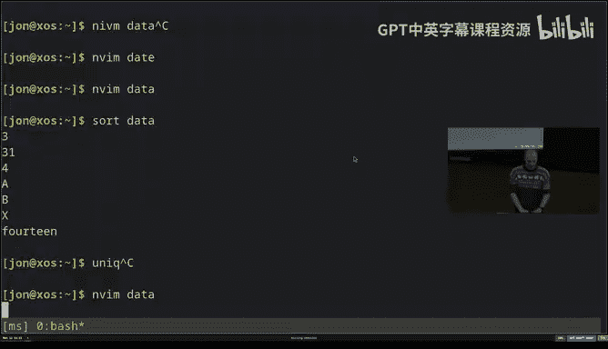

For a bunch of times， then if I now run。If I now run unique on data。

 it will only print out lines that are unique in that file。

 It only eliminates consecutive lines that are unique， though。 So if I go into data。

 and I put a three in here and type unique data。 You'll see that I get 4，3。

4 because so it's not very smart。 It doesn't remember every line it's ever seen。

 It only eliminates duplicates that are consecutive。

 But you can imagine combining sort and unique to get the functionality you want。

 or sort also has a flag， sort dash U， which does this for you， it sorts and eliminates duplicates。

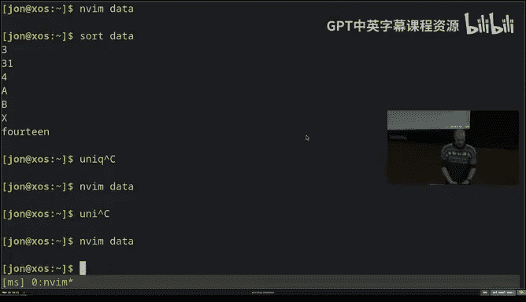

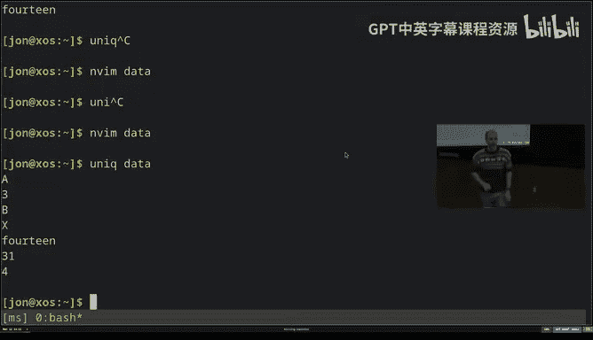

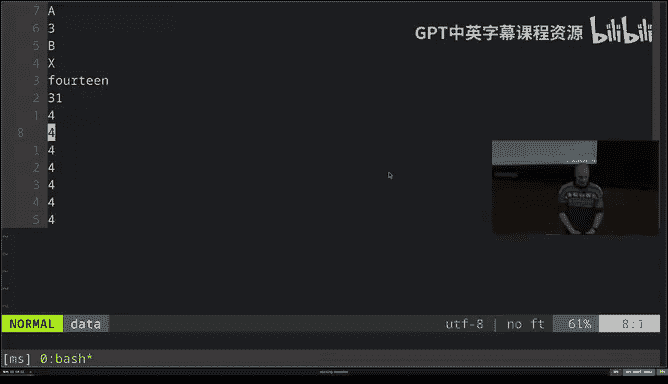

But we'll show you how to combine commands a little bit later。And then we have head and tail。

 Head prints the first N lines of a file。The default n here is 10。

 but you can pass dash n and then a numeric argument to say how many lines to include。

 So head prints from the start of the file。 And then we also have tail。

 which prints from the end of the file。

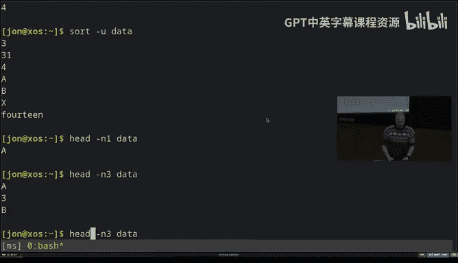

So these allow you to inspect just parts of a file rather than the full file。

And then we get into slightly more sophisticated tools。 So， for example， there's a tool called Gr。

 Gp is a a file searcher。 not， it searches in search four files。 It searches in files。

 and it searches for things that match a particular pattern。 So， for example。

 if I want to Gr for4 or three is maybe a better example， Gr for three in data。

 So Gr takes two arguments， a pattern and a file or a list of files that you wanted to search in。

 and it will print out all of the lines that match the pattern that you gave in。 So in this case。

 these lines all match 3。 the other lines do not and therefore do not get printed。😊。

Grep is actually much more powerful than it might look like here。

 because the pattern that you supply is not just a standard text。

 It is actually was known as a regular expression。 and regular expressions。

 We're gonna to touch on these later in the editor lecture。

 but regular expressions allow you to express quite complicated things。

 we'll see an example of that in a little bit that allows you to say。

 I want to find anything where the first letter is not an a。 And the next thing is any numeric digit。

 And then I want an arbitrary number of characters until a dash like those kinds of things。

 And again， we'll get into the details later。 but you can use G， therefore。

 to search for fairly sophisticated things inside of potentially large directories that you have。

 In fact， Grp also， in addition to searching files can search directories。 So if I see， for example。

 into missing semester。 And then I want to Gr for Gr in this directory。😊。

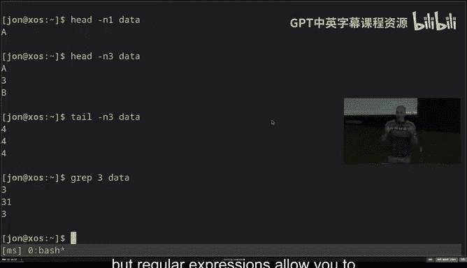

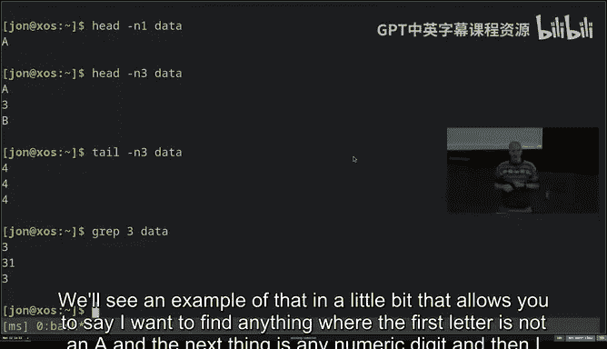

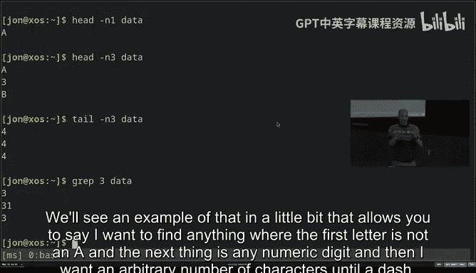

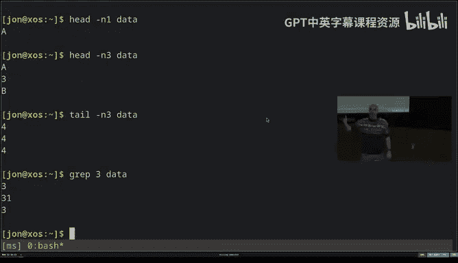

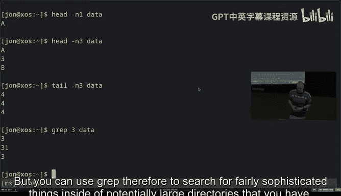

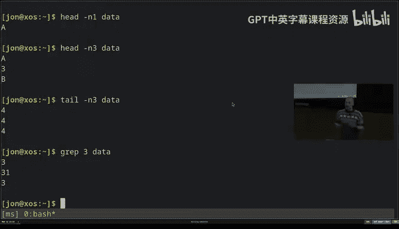

And I pass dash R， R for recursive。 So go deeply into all the nested folders you find all the way down。

 search all of those files for Gr。 starting in the current directory。

 Then this will now find me all of the files in the missing semester Git repository that contain all the lines that contain the string Gep。

😊。

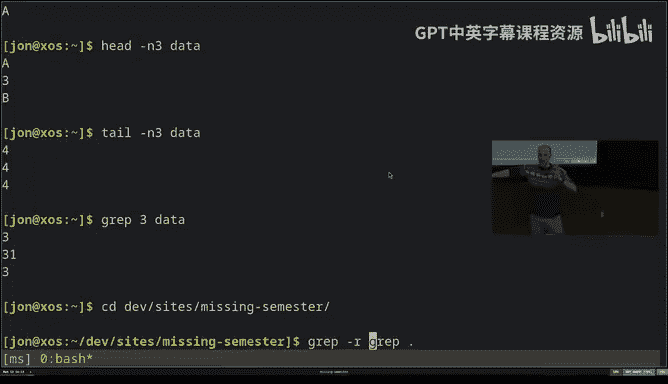

You had a question。I forgot my question to go on。😊。

There are also other kinds of tools that allow you to edit files。

 So Gp only allows you to search files， but there's a tool called said。

 which is a line editor that is intended to be programmed。

 said is interesting in that said actually has its own program language。

 The said programming language。 that allows you to program the way that it will edit your file。

 Usually， though it's used for fairly simple tasks like search and replace。

 So let's say I want to replace every instance of Gr with John。 Well。

 I could do that by doing said dash I for in place replacement。

 So I don't want to create new files that have the replacement in them。

 I want to replace the files where they are。 And this is where the said program starts。

 That's this first quoted string。 I want to substitute。 and then slash。 and then I give a pattern Gr。

 And then I want to substitute it with John。 And then I pass dash G。 The G here is for global。

 said will。😊，ate on every line 1 by one。 It's a line editor。 So when I say global。

 it means across the entire line。The reason this is needed is because otherwise。

 if I substituted Gep with John without the G， if Grep appeared twice in the line。

 only the first one would be replaced with dash G， it's global。

 So it replace all the things in the line。And then I can do star slash star dot M D。

 The path specifier here is what's known as a Gob。 We'll talk about those in the next lecture。

 but they basically allow you to give patterns for paths。 So in this case。

 I'm saying in any directory， look for any file that ends with dot M D， which is what our。

 all our course files do。😊，And when I run this and now we're on Git diff。

 you'll see that I now have a big git diff。 And the diff in all of them is that all instances of Gre have been replaced with John。

Yep。What's。The difference。うま？The wild card and。Pter stuff not like pads。And the shell can use。

Like that。For the like， regular。The past。So regular expressions and Gb expressions are both ways to express patterns。

 but they are things that are supported like they usually things that are supported by particular programs rather than the shell itself。

 So， for example， in this in both the Gr command that I showed and instead that the regular expression that you gave is just a thing that's supported by Gr or supported by said Glos on the the other hand here for specifying paths。

 like this one you'll notice is not quoted。Globs are expanded by your shell。

 so it will look for anything， any path that matches this glob and substitute that argument for all the paths that matched that argument。

But there will be programs， too， that allow you to give an argument that is a Gob。

 And then the program implements the Gob internally。 That can be useful for other reasons。

 Like if you want to rewrite history and Git， for example。

 you can give Git a Gob for the things you want to rewrite。Yeah。

 could you have regular expressions in the specific？啊。No。

 so shells usually don't support regular expressions over paths， usually over paths。

 you can only use gls。 although there might be shells that allow you to write regular expressions for paths。

 but I don't know about them。 usually regular expressions are kind of weird for paths anyway。

 because usually you want to talk about things like directories and files and regular expression doesn't have a concept of that。

 It's just matching a piece of text against a pattern， whereasas Gs here。

 the slash is actually meaningful。 The slash is saying the first star applies to the current directory set of paths。

 And the thing after the slash is the the pattern to use inside of that directory than looking for files。

😊，Yep， wait， so what does set do and what does Gloob do again。

 So set is a program that is a line editor that allows you to change the lines of a file。

 Glos Gloob is a type of pattern like this pattern over here。

 And it's similar to regular expressions。 It's just a way to write a sort of an approximation or pattern of a path。

It is not a program in and of itself。嗯。And in as well， this， this grip thing。

 this can also be a regular expression。 So here I could write things like anything that's not an a followed by any number of characters。

 then a dash followed by any digit。 And I'm not expecting you to learn regular expressions right now。

 But I can write fairly complicated things in here。

 And they will all be replaced by John if I wanted to。But I， I don't I。

A glob is specifically a pattern that uses a particular language for patterns。

 So the language for Glos are stars， question marks。curly brackets。 And I think that's it。

 So Gloob is a fairly simple pattern language。 Regular expressions are a much more complicated pattern language。

嗯。And next， the next program we want to talk about is find find is a program that finds files。

 When you run find， you tell your， you tell the find program the kinds of files you're looking for。

 And it will search wherever you tell it to for files that match that structure。 So， for example。

 I could look in my downloads directory for anything that is a file type F for type file as opposed to a directory whose name ends with zip。

😊，I don't know if I have any in my home my Dallas folder。

 We'll find out that was last modified at least 30 days ago。In this case， I don't have any。

 What if I remove the M time requirement， I still don't have any。

 What do I have in my downloads folder。

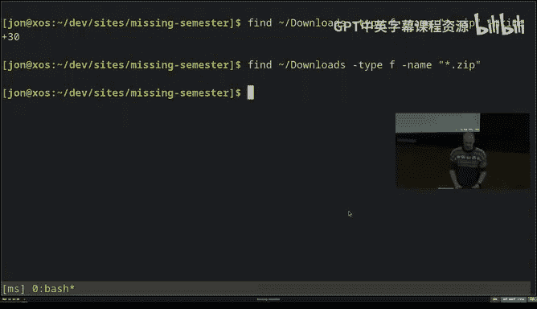

Cool， so let's say I here replace this with M time plus 30。 So any file that's more than 30 days old。

😊，Then this file is the only one that is at least 30 days old in my my download directory。 And again。

 this is just an example of the kinds of arguments that you can provide to find。

 Find as a huge language of arguments you can pass。 you can learn about where running man find。

 But you can search for all sorts of things like files that are at least so large files are at least this old or at least this recent files that have particular particular pattern in their path。

 files that are directories， files that are links， whatever it could be。

 There's a whole host of things you can use， Find for here， yeah。😊。

They probably want to use a club to like。嘅。包啊。と前を。With either one。Extenction of life。Or a difference。

即直实ま。Yeah， so so we'll talk about Gs more in in the next lecture。

 that will go more into the actual pattern language。

 but there are ways to write gllos for those things。 but Glos are fairly limited。

 like they can only express a fairly small set of operations， but very common ones。

 You find you write Glos all the time。 But they tend to be pretty simple。

 If you want something more advanced， you tend to reach for a tool like like find or or some other file program that supports regular expressions for pattern for path matching。

😊，Other cool things you could do with fine。 So， for example。

 I can search for anything in my downloads directory。

 also with type file whose size is at least 100 mebytes。 And for each such match， I want to L S。

 D L H， So what does this do。 This is weird。 So this dash xec argument defined find says for each path that matches all the filters I gave。

 So in this case， it's a file and it's at least 100 mebytes long run the following program。😊。

And I'm telling you to run LS。Which lists information about a file with the dash L H arguments。

 So I'll put this back down here at the bottom with the dash L H arguments。

 D L means show me more information about the file。

 Dash H means print the size of the file with human readable notation。

 So don't print the size in number of bytes printed with like gigabbytes， megabytes。

 kiloabbytes and so on。And then what find will do is it will do its find。

 But instead of printing all the paths， it will run that program with those arguments with the curly brackets replaced by the path that was found or all of the paths that were found。

😊，And so in this case， we'll call LS with the path that is here。

Then it willll call L S with a path that's here each time passing the dash L H argument。

 And so that's why we get these human readable sizes here。

The backstlash semicolon at the end is because imagine I wanted to provide more arguments at the end here。

 like M time plus 30。How does find know which arguments are for the command to exec and which arguments are for itself。

 It doesn't。 So the back slash semicolon is to say this is the end of the list of arguments for exec。

 This is a thing that's special to find。 Not all programs do it this way。 There。

 there are other ways that are more common these days。

 But that's why you will often see this kind of backslash semicolon in invocations of find。

But as you can imagine， this is pretty powerful。 This does is combined programs that combine the programs of find with any other command line we might want to execute。

 So instead of having this run L S， maybe I want to R M those files instead。😊。

So that would remove them。 R M is the program。 that removes all the paths that is given。

 And maybe I also add a M time。Plus 30， if I ran this command right now。

 which I'm not going to because I don't want to remove those files。

 but it would delete any file in my downloads directory that's at least 100 MBby long and has been there for at least 30 days。

All with one command。You'll see， sometimes that I。Skip a command。 Like， I don't execute it。

 I just move to the next line。 That's control C。 Control C lets you say， sort of cancel。

 This can also apply to a program that's already running。 Control C will terminate that program。嗯。

Other things that are useful to programmers。 So， for example， I could say。

 find in the current directory dot。 I want to look for anything that is an M D file， and I want to X。

 X。Grep L。To do in that file。So what will this do， This will search for all the markdown files in the current directory。

 And for each one， it will run Grep。And when we run Gr， we will search with a pattern to do。

 And dash L means print the name of the file that matched rather than the line that matched。

So this will tell me all of the markdown files in the current directory where to do is written in the file somewhere。

So this can be useful if you're programming and you're like， oh。

 which things did I mean to get back to， but I never looked for them。

This particular one might seem very similar to me doing this， right。

 Just grep for to do in the current directory。 But the difference is here， I got to say。

 find me only markdown files and only do it for those。But again。

 you can make these as complicated as you want to be。 And with find， of course。

 you can add a bunch more pattern matching to this if you wish。Now。

 the syntax of find can be pretty weird。 I'm not expecting you to learn find just from seeing these few examples。

 Man find will tell you a lot。 This is also also the kind of thing that it's really helpful。

 actually， to ask L Ms。 because there's a lot of examples online of writing find command lines。

 And then lenss can usually spit out a thing that will do roughly the thing you asked for pretty easily。

 There are also more modern tools that are more ergonomic and harder to misuse like FD that are linked in the lecture notes。

 You have a question。Can find search recursiveively you like subject。Find is recursive by default。

 So when you give it a path， it will search everywhere under that path。 Yes， so find， for example。

 has an argument called max depth。 that is the maximum depth to search down。

 And if you say max depth one， then it's only the current directory。Or0。1。Oh， right。

 And it complainsca I put it after。Fd is a fickle beasts。Next step 0。

And it needs to go before the I name， because it's。嗯，Yeah， I find is annoying。So if I do max step 0。

 then I get no results。 They do maxstep 1。 I get no results。 And if I do 2。Then I'll find those。嗯。

Next on the docket is a program called OC。 AWK。 OC like said is a program that has its own program in language built in。

 but where said is for editing files， OC is for parsing files。 OC is a tool that will by default。

 split a file by whitespace and by lines， and then let you write expressions over the result of parsing in that way。

 So if we go back to our home directory here， where we have our data file。

 let's go back and clear out that file， and I will do ABC， D， E F GH matrix， good old matrix。

 and then I write OC print2 of data。😊。

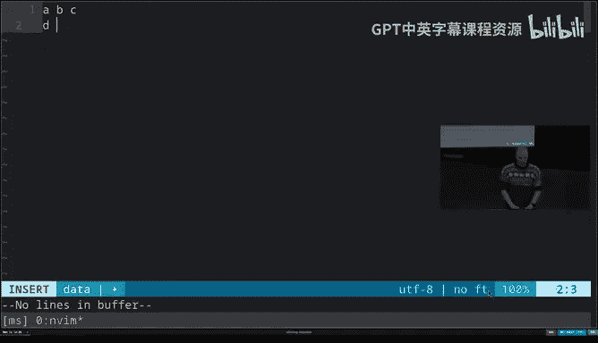

So the thing again in the quoted string is an OC program。

 We're not going to teach you the O programming language here because it's fairly extensive。

 but you can often do very simple things by just learning a couple of key bits about O。

 So this is the curly bracket here indicates run this that sort of the way to express a run and execute to block in O and you can write a pattern before the curly brackets here to say I want to only run this expression on lines that have certain properties。

 but in this case， because I didn't specify a pattern， it's all lines。😊。

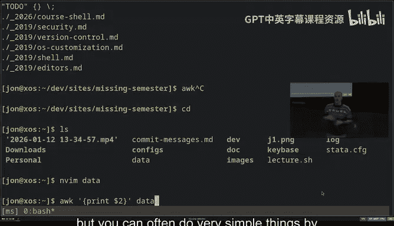

And for every line， I want to print the second field。 So O will parse the file into records。

 So rows and fields， which are columns。 And so this case， I say print out the second field。

 And the default field separator is white space。 So if I do this。

 it will print out only the second column of every row。😊。

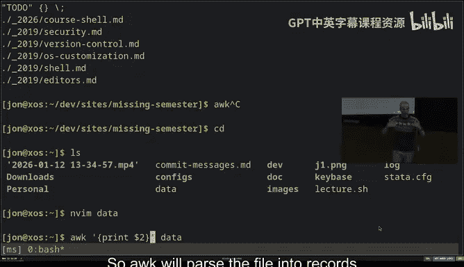

But I can change what the field separator is。 So let's say I switched this to be comma。 Well。

 this just became a CSV parser。😊，Because now it splits lines by commas into columns and the。

 the lines are records， and the columns are colon separated columns you can then print out。

 if I do this， there is no second column anymore， because everything is in the first column because there are no commas in this file。

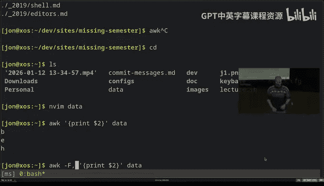

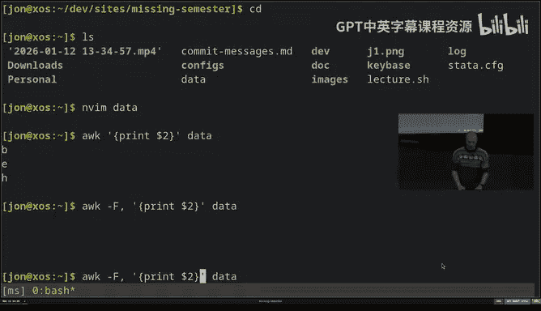

I can also do things like， in fact， I， I'll show you a more complicated O expression later for the kinds of things it can do。

 But O is a very useful tool for just pulling data out of semi structured files very easily。😊。

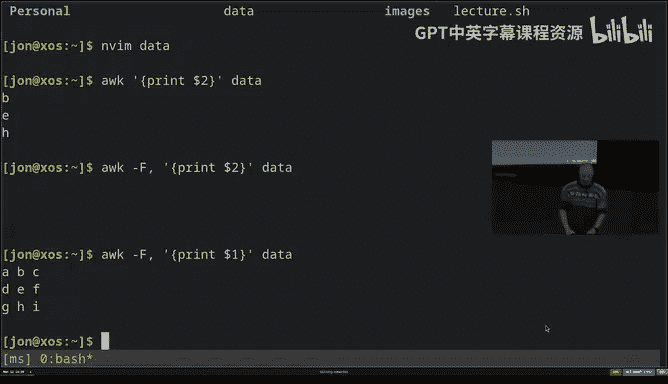

Now， putting these all together。We got some pretty cool things。 So let's see if I can。😊。

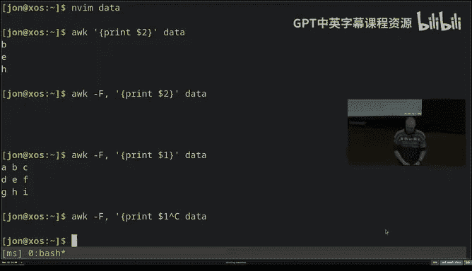

Okay， so here's a fun level command line。 This command line will S S H。

 which is a remote connection tool we'll talk about later into one of my servers in the Netherlands On that server。

 it will run the command journal CtL， which prints the logs for that server for the S S H demon。

 like the thing that you connect to when you remotely connect。 It will search for。

 it will only print the log files from the last boot。 That's dash B dash -1。😊，And then it will grip。

 So search for the string disconnected from。It will take that and will parse it to send。

Sid is going to replace in all the lines this regular expression with that backslash one。

 which is a back reference， which is another thing you can do with regular expressions。

 which references the parentheses enclosed expression。In the search string。

 So the backslash one here ends up referring to whatever this matched。

 So this is the kind of cool search replace you can do with said。 So in this case。

 it strips out the way to read this regular expression is any number of characters followed by the string disconnected from followed by a space followed by any number of characters and a space than user than a space。

 than any number of characters， then a space， Then anything that's not a space。

 then space then port and so on。 This one took me a while to get up with。 But you basically。

 as you get better at regular expressions， you learn how to write these patterns。

 What this will end up doing is taking all the logs from my SH server。

 disconnected from is the line that gets printed when someone tries to log in。

 but then either ended their session or failed to log in。😊。

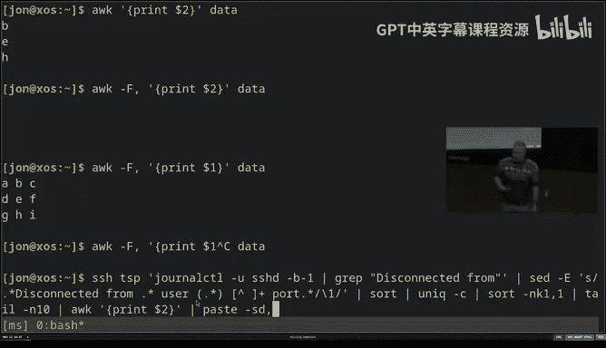

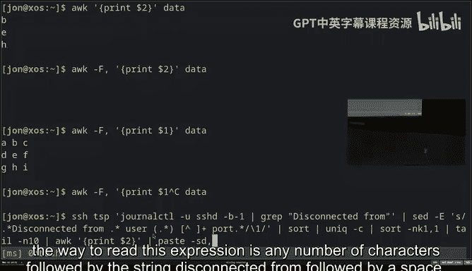

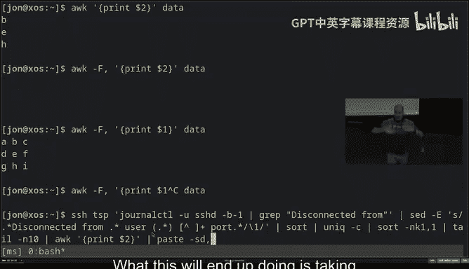

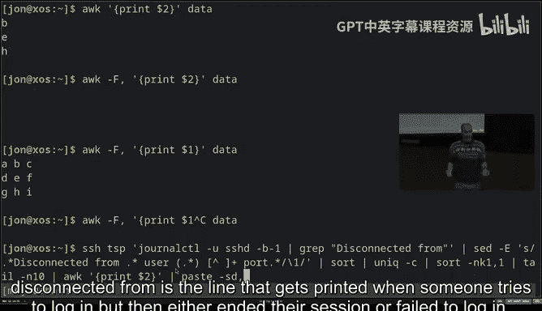

And it will extract the username they tried to use。And print only that。

 Then I sort all of those results。 Then I pick out the unique lines from that sorted result。

 The dash C argument to unique prints the count of any that were duplicates。

 So if the word John appears three times in a row， it will print John3， instead of John John， John。

 or instead of just John。 So it gives me the count。Then I sort that output numerically n。😡。

Using the first column。 So the column that contains the count。 So now I have the。

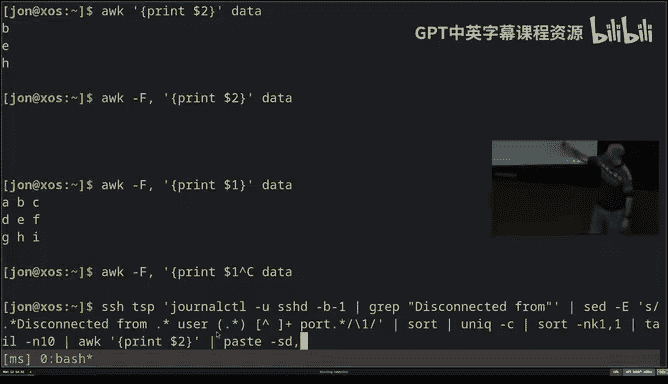

All of the user namess they were used to log in with their counts in sorted order such that the most common ones are at the bottom。

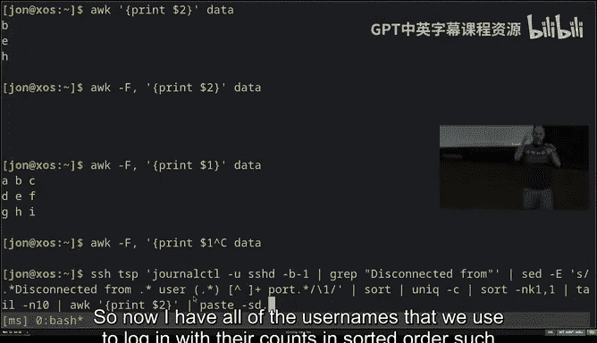

And then I use tail dash N 10 to get the last 10， which are the top 10。

 Then I use Ot to print out only the username and not the count。

And then I paste all those lines together into a single line S that are comma separated。

 which is the d comma。And so this command， when I run it， if it works correctly。

 it will take a little while because the server has to parts all of the logs on my server， which。

 it takes a little bit。

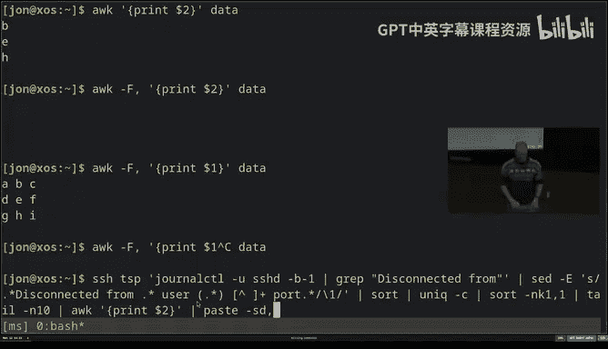

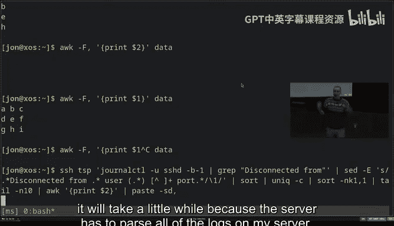

But eventually， what I'll get back。

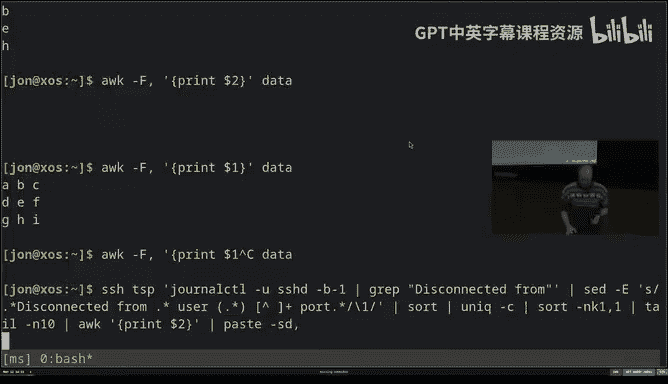

Crimerole。Come on。Come on， come on。Really awkward if this is like connection failed。Thatて。

SSH is a way to run a command on a remote machine。哦。So we'll talk about that more in the。

 in the next lecture。Well wait does Oc get used for tensor manipulation。 No。

 O is not for tensor manipulation。 although you can kind of think of it that way。

 like a tensor is really rows and columns， but I would not say that that's what it's for。

 Like it doesn't understand binary files at all。

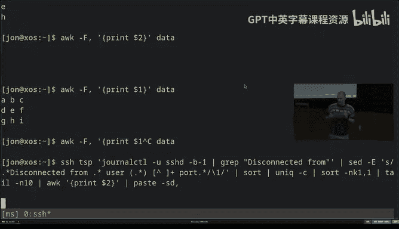

Let me see if it's just。

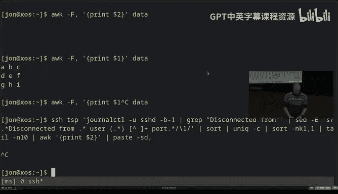

Failing for a different reason。

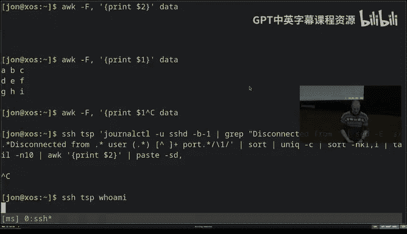

Interesting。嗯。Live demos， live demos， right？

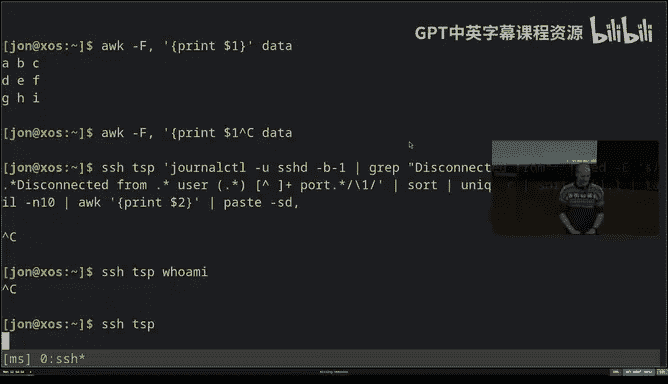

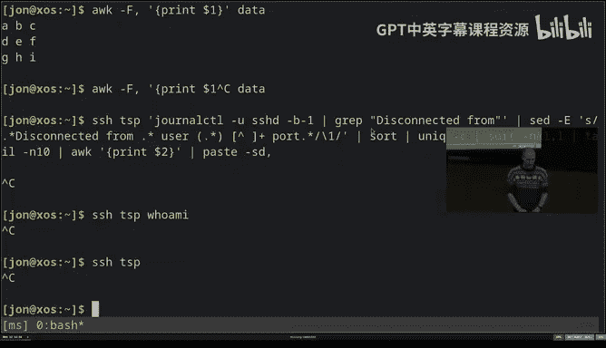

Interesting， let me try something else。 Let me try it here。

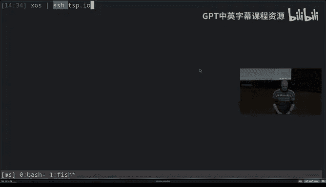

Oh， I I think I know what。 I think I know what fail。 Let me just try something real quick。

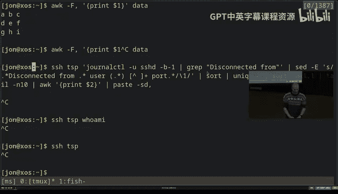

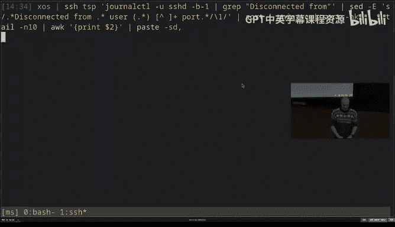

Well， maybe my server is down。 That's the thing for me to fix another day。 Well。

 just trust me that this would have printed the comma separated list of the top 10 usernames used to try to sign into my server。

 none of which are my name。 They're all spam connections。

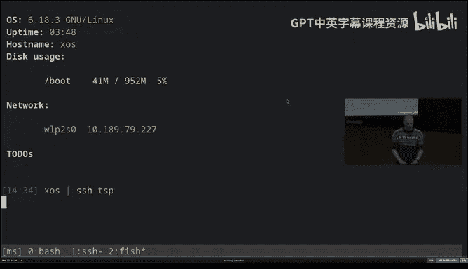

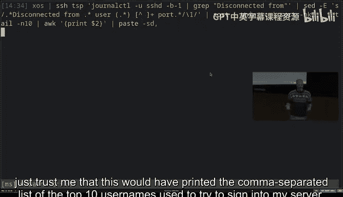

いや。I was going to ask。Would still work。确应。证明。Without。なくて。尾码。下二为。That right there。 Yeah， if you。

 if you did unique without the dash C， you would just end up with the unique names without knowledge of their accounts。

 yep。

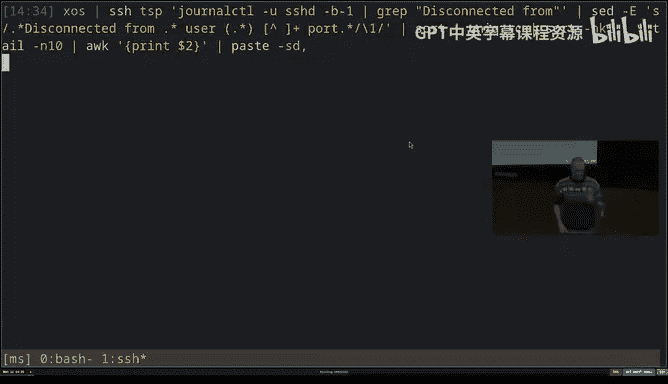

Cool， so this shows you the kind of thing that you can do with bash is that you can write decently complex expressions。

 to sort of tie all of this stuff together。 Now， one of the things you'll recognize here is that I introduce a new concept。

 This vertical bar， the pipe character。 This is this is a construct of the bash program in language。

 And what the pipe character does is it says run the left program。

 Take its output and make that be the input of the program to the right of the pipe。😊。

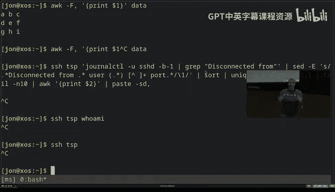

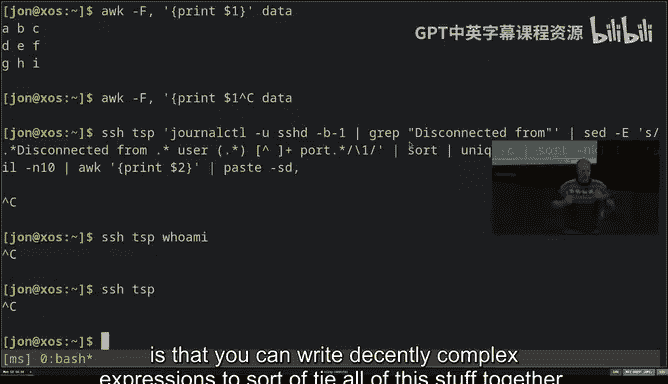

So it's a way to connect programs so that instead of the input being your keyboard and the output being your terminal。

 the input is some other program or the output is some other programs。

There are a bunch of these kinds of operators in bash。 So， for example， you know。

 I ran the date command。 Well， I can say， I want to take the date， and I want to write it into。

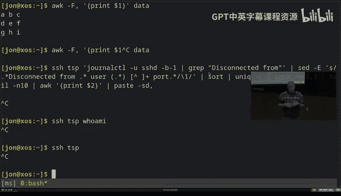

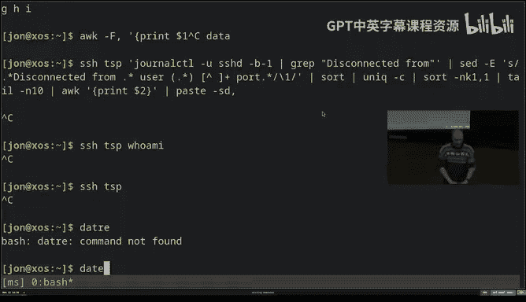

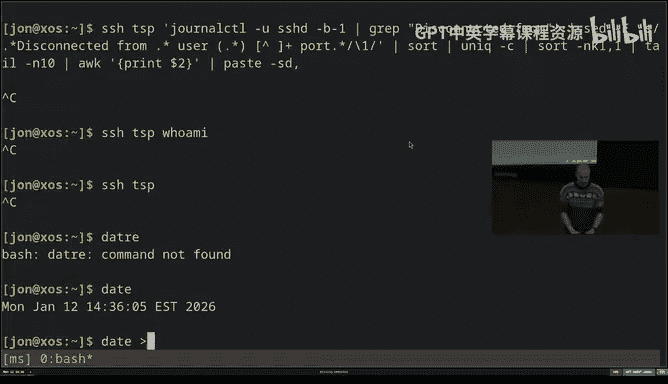

The date dot text。 So the， the angle bracket here to the right is saying。

 take the output of this command and write it into this file instead of to my terminal。

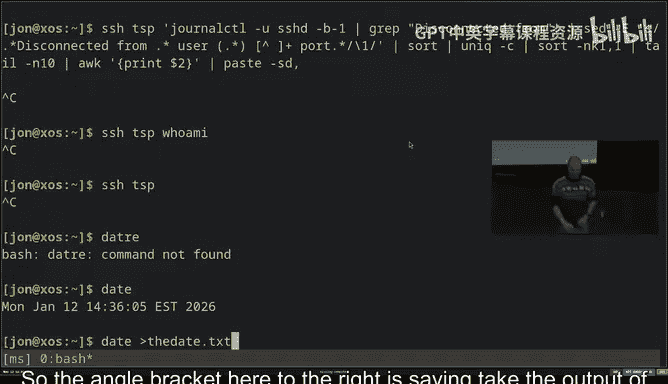

And now， if I can't so print out the contents of this file。

 you'll see that that was the result of date。Similarly。

 you can use the angle bracket in the other direction to say instead of taking input from my terminal。

 take the input from that location， so I can， for cat， for example。

 say the input for CA is going to be the data text。😊。

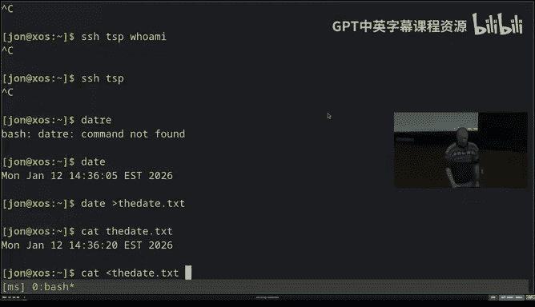

Similarly， I could do for sort。

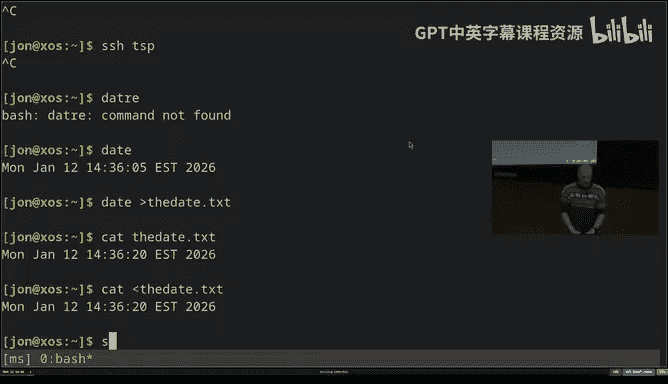

The data text， although for sort， when there's one line， there's nothing that happens。

 But this allows me to redirect the input and output of programs。 This can be useful， for example。

 to put something in a file so that you can look at it later。

 And you can walk away from your computer。 And like， even if it's scrolled far back。

 you still have it in a file。U。

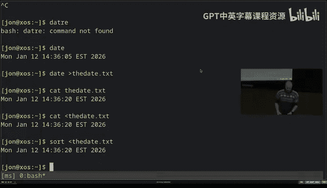

One thing to be aware of for the the the angle bracket to the right is that it overrites the file。

 So if I now cat the date， you'll see it only has one date entry。 If I run it again。

 it only has one date entry。 You can use two of them to say append to the file instead of replacing it。

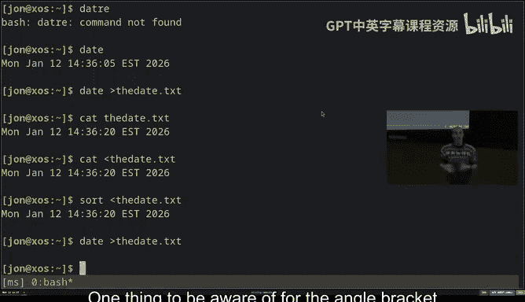

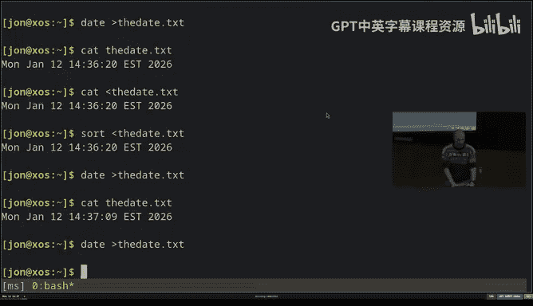

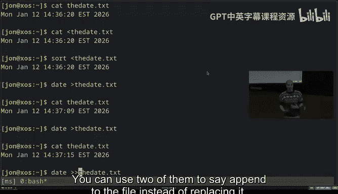

And so now it has two lines instead of one。There's a whole programming language here。

 And going into all of what bash means， we're not gonna have time for。 But let me give you a very。

 very quick recap。 So bash has conditionals So you can write things like if Gr， 2026， the data text。

 then echo it's 2026。

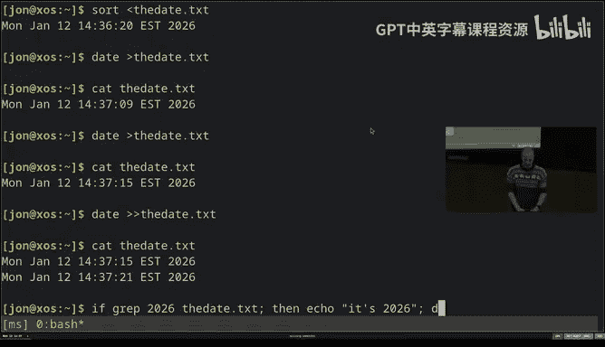

Fee。So this will run the G program。 And if the Gr program exited successfully。

 then and only then does it run the command that's after then here。

 And I I could have multiple commands here if I wanted to， hello。😊。

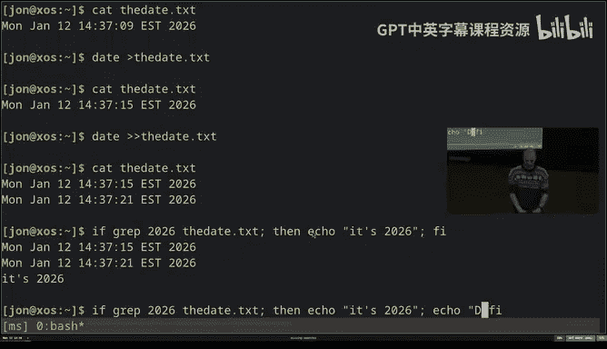

And it will execute all the programs that are in the then。

 the then branch only if the programme exited with a success。

And you'll see the syntax here is kind of archaic。 There's a bunch of semicollonons and stuff。

 LMs are very good at writing these kind of commands if you want to。

 humans less so unless you've done it a bunch of times， you'll see， for example。

 that the way to end and if is with Fi。 because why not， if you wonder。

 how did I know that G exits successfully when it finds something。

 this is something that's also in the Gr manual。 So usually in most of the Gr manuals。

 if you search for exit status， you'll find an entry that explains what this program exits with。

 So in the case of Gr， it exits with zero， if a line is selected，0 is success。 and exits with one。

 if no lines were selected and two if an error occurred。😊。

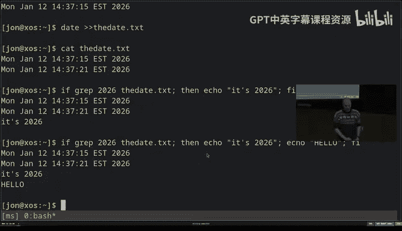

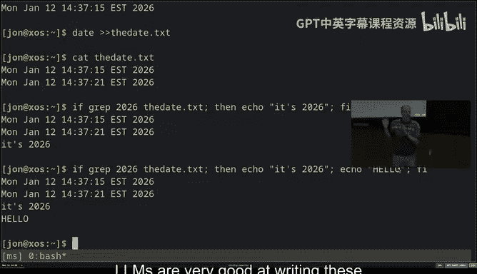

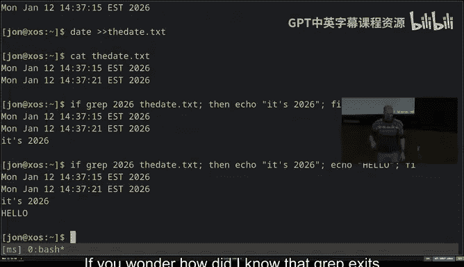

And in general， zero success and any nonze exit status is not a success。Then there are while loops。

 So you can say while Gr 2026， the date。Dt text， then echo。It's still 2026。 and then。

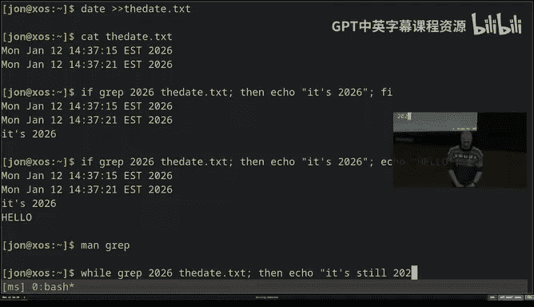

Write the date to the datet text， and then done。

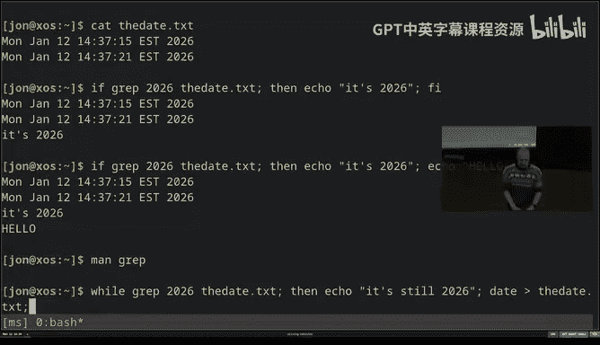

Ohpe。呃。Do。Yeah， so this is a while loop。 This will run this loop as long as this command remains true。

 So this would continue to print excessively into my terminal until it was no longer 2026。

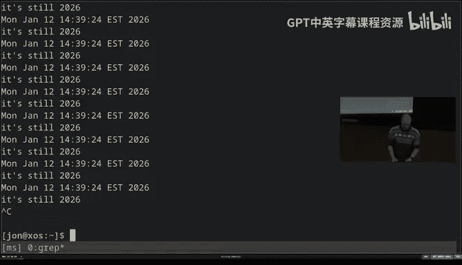

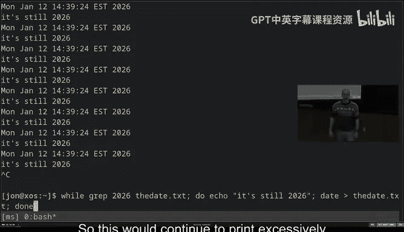

But I can inject， for example， here， sleep 10， which is sleep for 10 seconds。

 and then it will run at once。 And then it will when it gets to running sleep。

 it will wait for 10 seconds， and then it will run the command again。

 see if it remains true and keep iterating through like this。 So after about 10 seconds。

 we should seeprint again。 there we go。😊。

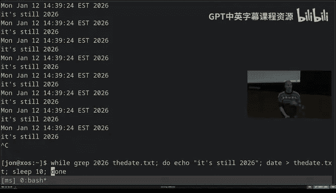

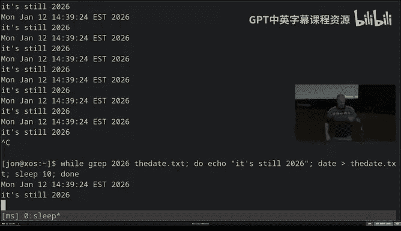

There are also four loops。4 loops are of the form，4， their variable name。In， and then a。

White space separated list of words where the for loop will be executed once per word。

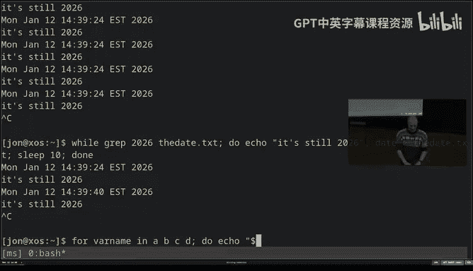

And a variable will be set by the name that you specified in the for loop。

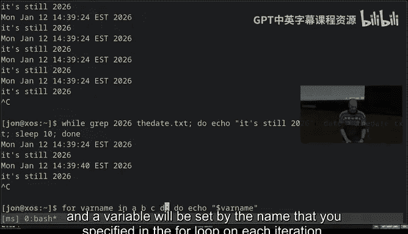

On each generation。So in this case， it will run once with Var name set to A。

 once with var name set to B， Once with Var name set to C and so on。 If you're wondering， well。

 how do I turn this into one of the four loops that I know that iterate over numbers， Well。

 you can use here a little trick。So if you use dollar parentheses， it's a way in batchsh to say。

 run the program inside the parentheses， then replace this whole thing with the output of that program。

Why does this work， Well， there， the Sikh command prints out numbers。 If I say 1 to 10。

 it will print all the numbers from 1 to 10 in increments of  one。

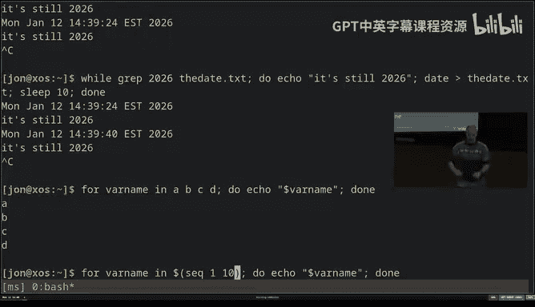

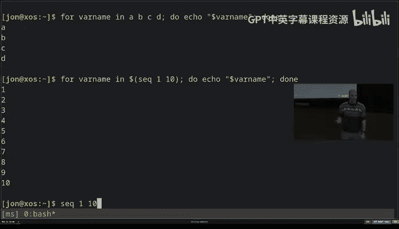

I could also say two to putting them in increments of two， if I wanted to。

 But normally you would do something like Sq1，10。 This then gets substituted for the Sikq expression in this line and then gets white space separated into the tokens one or the words 1。

2，3，4，5， and so on。 So var name gets set to each of those values on each iteration of the for loop。

 Y， does that mean you can replace the pipe operator with that。 just like S two functions。

So so you couldn't quite replace the pipe operator with this because this turns it into an argument。

 whereas the sort command， for example， takes its input on input， not as an argument， right。

 It doesn't sort its arguments。 It sorts of the contents of its argument。

But there are ways to do that as well。 but I'm not going to talk about them here because we don't quite have the time。

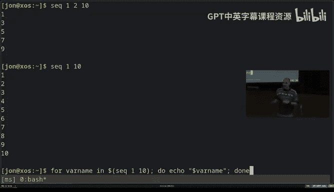

But some of the lecture exercises go into some of those kinds of things that you could do。嗯。Now。

 there are two last things I want to tell you about。 One of them is when you write if expressions。

 you might wonder， well， okay， I can do things like Gr and stuff。

 But what if I just want to compare variables。 Like what if I just want to do like numerical comparison like things that I normally do with ifs that are not related to command。

 Well， there's a program called test。 The test program。

 which happens to also be called open square bracket。

 So I can actually run which test and I can run which open square bracket。

 these are the same program， It's just a quicker way to refer to the same thing。 Well。

 I can run that program as my conditional in the if。

 and it's sort of contract is that it exits with a0 of the condition is true。

 So I can run if square bracket。 and then I can， for example， do。😊。

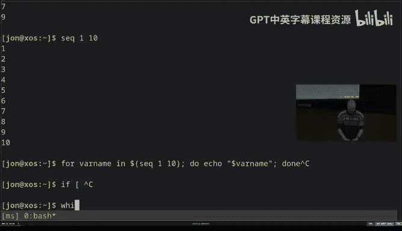

Hello equals world。Then， echo equal。Else。

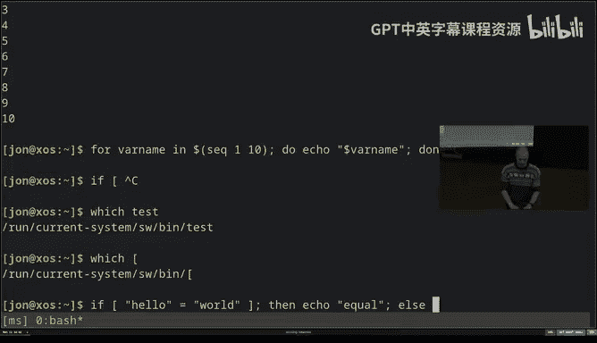

Echo， not equal。The， and this will print not equal。

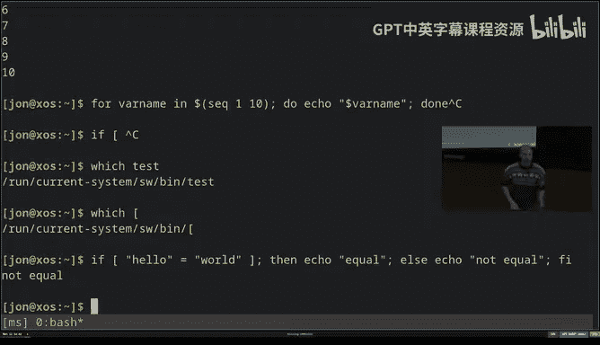

And so this way， you can write actually fairly complex expressions to test。

 And the way you understand what you can do with test is， well， we run man test， it just a program。

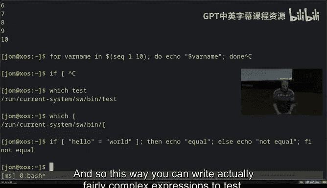

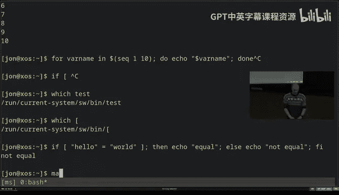

And Te explains that there's a bunch of things you can do this。

 including things like file operations。 So I can do things like if。Dash F， the date dot text。

 then echo the date exists。

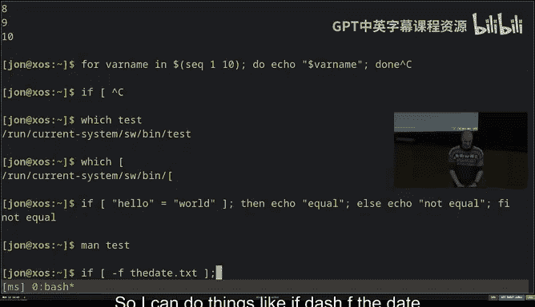

fee。And the the dash F argument to test means that it tests whether a file by the name that you specify as the argument after dash F exists。

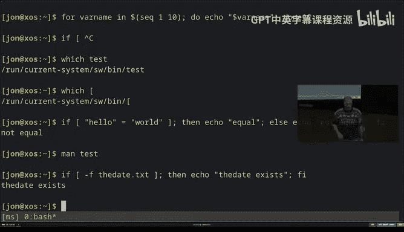

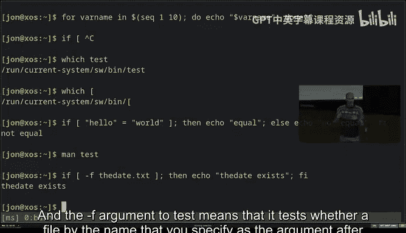

And so with this， you can start to construct fairly complicated things。

 automation around the programs you want to execute y。So if this only works。Because like。

There's a program。やっていいです。Compar。Is it also a program it's a great question， is if a program？Yeah。

 if is not a program。 Pipe is not a program。 C， D is actually also not a program。

 They are built into your shell， and they are part of the bash program language。

 The reason why C D is not built into the shell is like a particularly interesting thing。

 They will not get into， But the lecture notes go into that exercise a little bit。 But no。

 if is they built in into the language。 Same as while is。

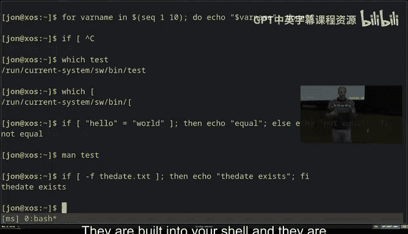

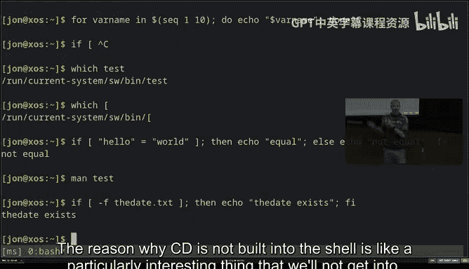

Yep。What does the carrot sea do？呃。

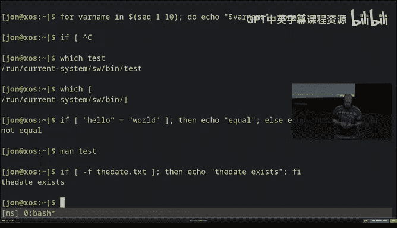

The， oh， this is just the symbol that gets printed into my terminal When I press controlt C to exit the current command。

 It doesn't do anything in and of itself。It's just like the symbolism that I pressed that button。

Cool， so that's the test program。 There's a bunch of things。 You'll often often， if you read bash。

 you'll see double square brackets instead of single ones。

 double square brackets are a built in version of test in bash that is a little harder to misuse。

 but we're not going to get into that。 It syntax is very similar。😊。

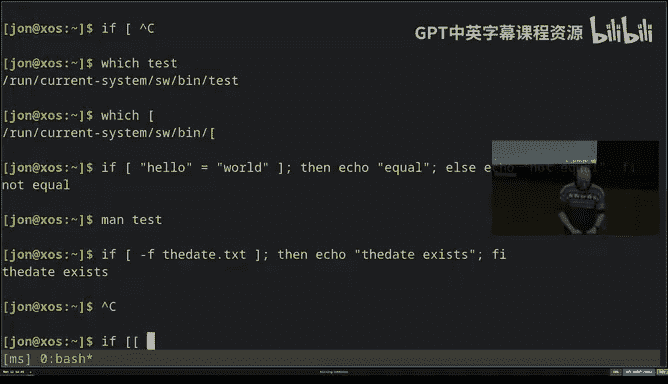

The last thing， then， is。You can imagine that as you start writing these bash scripts。

 your command line gets really long， right， So the SSH example I gave， for example。

 is like a command that spans three lines。 me going back and edit this gets pretty annoying。

 But what you can do is you can actually take these commands and stick them into a file。

 And that file is now a bash program that you can execute。 So， for example， in the lecture notes。

 you'll see that there is this program right here。 And this is a bunch of lines of bash。

 And when bash executes a program。 It will just run the lines top to bottom as if you have written them on your command line at the prompt。

😊。

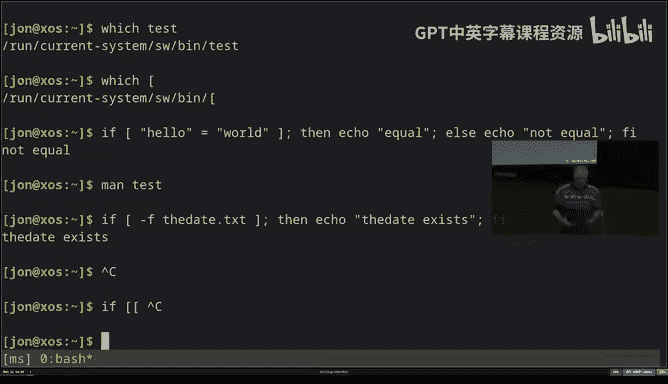

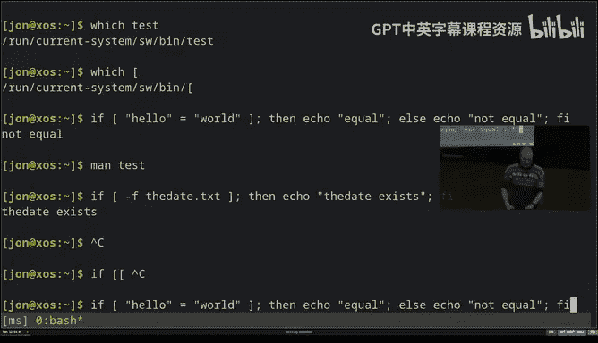

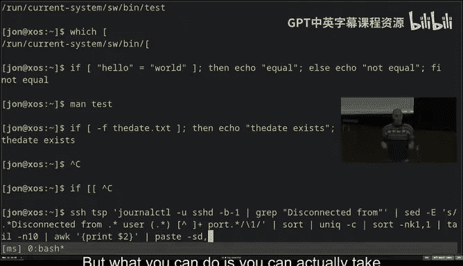

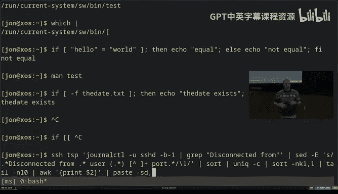

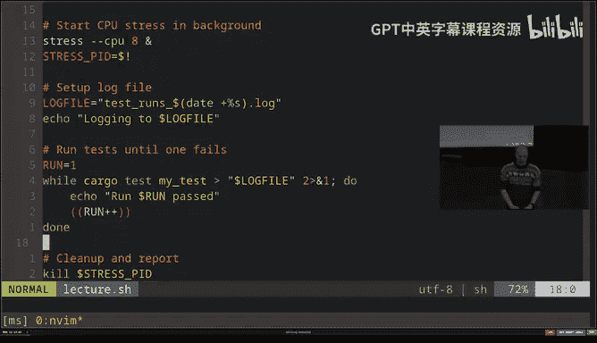

And the language is exactly the same as what you would have on your shell prompt。

 So this particular program that is shown in the in the lecture notes is one that will start a stress test of your CPU so that they get really warm。

 And then it will run a in this case， is a rust program that I'm running the test suite for。

 And I want to run a particular test until that test fails。😊，And on each run。

 I'm going to capture the log output。And only when the command no longer succeeds。

 So when the test failed， only then will I kill the stress test and print out the contents of the log。

 This is something I used in 6，8，2，4 into the super systems class where I had a bug that only manifested in a test 1 in every hundred runs。

 So I would just， instead of me sitting there like arrow up， enter， arrow up， enter， arrow up enter。

 I would just run this once and then walk and get coffee。And then when I come back。

 there's a file on my disk that has the output of the fail test。嗯。

Now the bit to know about here is at the very top of this line。

 you'll see hash and then exclamation mark， this is called a Shabang hashbang that is special。

 you'll see a lot of files start with this particular instruction if they are executables。

 this tells the shell when it runs this file if someone asks it to run this file to take this program。

😊，Execute to the program at that path and give that program the contents of this file as input。

So what does that mean， Well， it means that if I were to run this program。

If I were to run this program， it is equivalent。 This won't work。 And I'll explain why in a second。

 asll say permission denied。 but this is equivalent to slash bin slashes H with the input being lecture dot H。

Those those who are equivalent， because that is what that sheang line means。

 What's cool about the Shabbang line is that it doesn't have to be bash。 Bus H here is bash。

 But I could just as easily have said， you have been Python。😊。

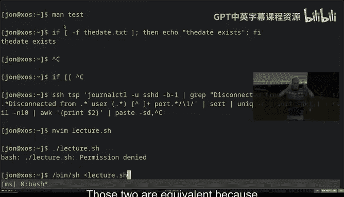

And now I can write Python code in this file。And if I try to run that file。

 it will run that Python program。 It will start Python， Take the contents of the file。

 which is a valid Python program and give it as input to Python and then run it。

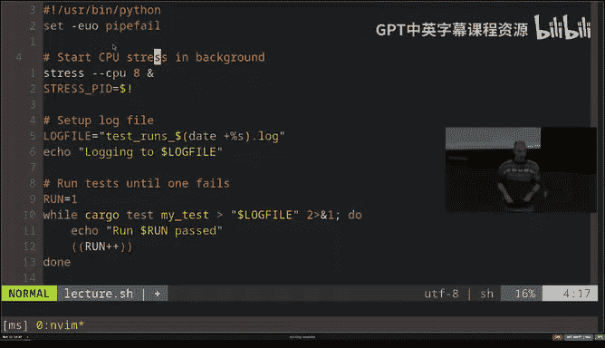

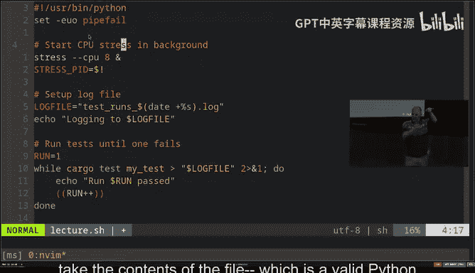

So you can use this for any programming language that allows textual input to be executed directly like this。

 also works with R， also works with Julia also works with Ruby。

 So there's a bunch of languages you can do this。

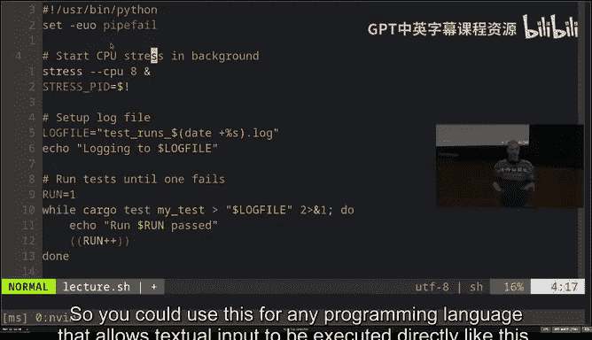

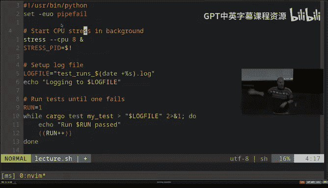

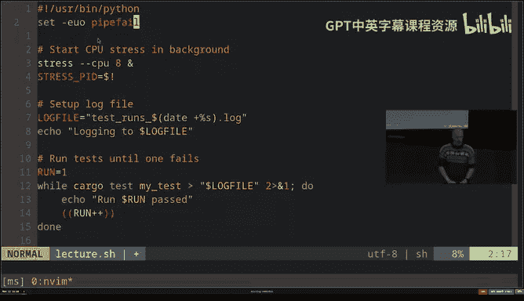

Yeah， doesn it work。 Java。 Java does not allow you to do this because Java has a separate compile step。

 So there's no one program you can run and give Java input， and it will compile and run it for you。

 But if there were you could write such a wrapper， then， yes， you could use it with the same thing。嗯。

Now， the last bit before we return it here is you'll see that I couldn't run the script。

Said permission denied this is because when you run executables。

 the shell will check that that file that you have execute permissions on them。

 So if I run L S dash L， which more information about every file。 And I give lecture dot H。

 you'll see at the left hand side here， I get some R's and Ws and stuff。

 This indicates the permissions I have on this file。 R means read W means right。

 And why there are multiple， there's an exercise on that。

 But the idea here is that because this is my file， I can read and write it。

 But I haven't told the operating system， that this is fine to execute that。

 this is actually an executable program。 If I want to do that， I have to C H mod。

 which changes the permissions of a file。 say that it's to become executable。 So plus X。

 I want to add execute permissions on this。😊。

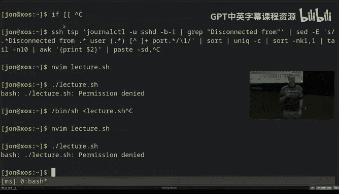

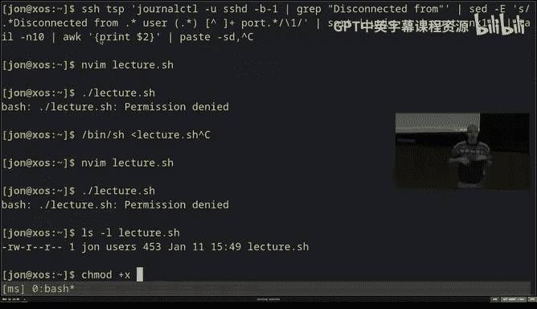

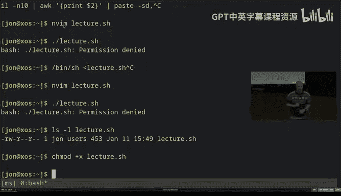

Now， if I Ls it， you'll see it change color because L S will color things are executables。

 And I now have the execute bit the execute permission on this file。 And now if I run like should H。

 then well it'll run it and it will claim that it doesn't find my rust install and everything because this is an example script。

 But now it did actually run that program。😊。

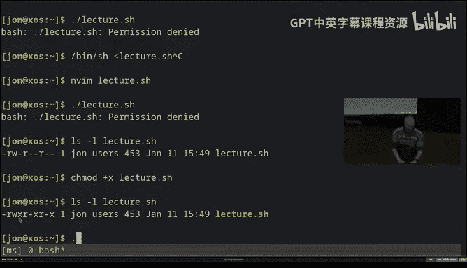

You'll also notice that I had to do dot slash。 If I do lecture dot H like this。

 It will not know that this is a program in the current directory。 Instead。

 it will search my path for a program by the name of lecture dot H， and it will not find any。

And so I have to specifically say， I want to run the program in this directory。

 This is for safety reasons。 You don't want the shell to automatically pick up whatever program happens to be in the directory you're in just because it was named the same as a program you wanted to because it would mean that if you I created a file called L S in my current directory。

 My L S would no longer work because it would pick up that L S instead of the the one in my path。

Cool， that's the end of what I have for you today。 There are a bunch of exercises I highly recommend you read through。

 The lecture notes also have more detail on some of these and some other programs you might find useful。

 I highly recommend you go take give a look to them give a look to them I highly recommend you read through them and do the exercises we'll see you here tomorrow'll talk more about the command line environment but less about the shell and more about the environment in which you're operating so Jose will give that lecture tomorrow。

 we'll see you all there。 Thanks for coming Thank you。😊。

