# 《计算机科学教育缺失的学期｜The Missing Semester of Your CS Education IAP 2026》中英字幕 - P2：Lecture 2_ Command-line Environment.zh_en - GPT中英字幕课程资源 - BV1vyzXB6Eps

Okay， I think we can start。Welcome on to the second lecture of the Miss semester 2026。

 the topic for today's lectures is the command line environment and yesterday we cover the cell and we saw many programs that you probably didn't even know that were in your computer and that you could launch them and actually combine them through the cell and there was like a lot of information if it like unlike a lot of other concepts in programming the cell has its own quis it also have like historical concepts and today in the lecture we're going to cover a lot of the kind of concepts are like as specific to the cell environment and that you should get familiar with so that when you're going through this programs you understand exactly what is going on and then in the second part of the lecture we're going to see how to operate more efficiently kind of in remote machine。

And also how to like change the behavior of your command line and your environment。And as always。

 like if anything is unclear， feel free to ask questions during the lecture So the first thing we're going to cover today is like。

😊。

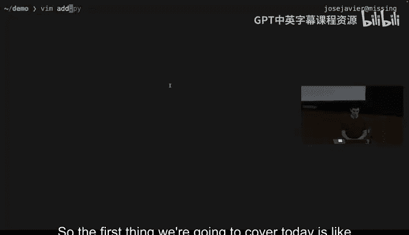

If you've seen any other type of programming， the inputs and the outputs of programs are usually very clear right you have function like this Python you have like your X and Y argument and then you have your output to is is another value。

😊，And that makes it fairly easy to understand， but then as you start writing or reading other people's cell scripts。

 it can become quite confusing exactly what are the inputs and what are the outputs of this type of scripts so for example here we see that we're getting some value in some way and if that doesn't exist we're exiting。

 we're accessing maybe variables that are not defined within this script and just to be clear you should not understand what's happening here。

 but this script has like prettymat example of all the concepts that we're going to cover today and there are like multiple input types of input and multiple types of output in cell scripts and there are conventions that prettymat all programs follow because you're communicating between programs that maybe we written by very different people。

😊。

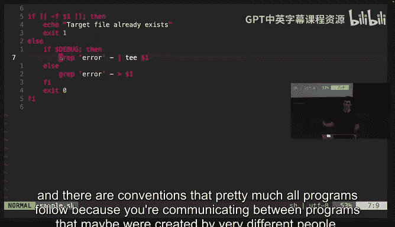

So the most simple type of input what we already saw yesterday is the notion of arguments。

 so when we run the command LS and then we give it like minus L project1。

 we're giving it input in the form of arguments and here arguments are nothing special just like strings and when we run this were telling LS and LS is getting both minus L and its getting project1 and is parsing them in order to decide what to do。

And actually， most programming languages will have like。A way to get this information in Python。

 this is the syntax and so you can see there's nothing special going on。

 we can just run Python with exactly the same inputs and we can see that when the cell calls or program with this input we're just getting literally the name of the input program and then the arguments and it's up to the program how to interpret these arguments。

Here we find the first convention that is pretty common in the cell。

 which is the notion of flags flags are like。😊，When you have an argument and it has this like single Ds or double dashs and that tellss to the program that this is an option that it will kind of change its default behavior and when you go into the manual page you will often see many of these flags documented to be fair like the cell doesn't require that you actually use this like the D or double dash syntax is just like everyone kind of agreed upon this but you will find programs that don't do it so further like the convention usually that when you have a single D it's usually like a single letter that follows so example minus a means to also list the kind of hidden files which are like by convention as well the ones that start with dot so if we touch like a file called dot a and we try toL that file is not there but when we do minus a。

It suddenly appears。And that flag is equivalent to doing does does all kind of the same its just like you can think of mine say as a shorthand to call the same option。

 you can have multiple flags in different formats when you call programs。

 usually the order doesn't matter， you can give them in any order。

And a lot of the time with this single character flags， they can be combined。

 so when I do this it's identical to all the command that I've run previously。

One important thing to note here is the cell is not giving us these features。

 all these features of like getting parsing the flags to allow you to do this syntax is because the LS program is actually doing parsing to allow you to do this and that's why when you write cell programs you will most often use libraries that automate a lot of this parsing for you。

And there are conventions， so like it's really common for like minus a to mean all it's pretty common to have minus HB help so like you can almost often rely on programs having like help or like version as their options。

And。Fel like it that covers most things about flags。

 the other arguments that you usually get with programs are just strings and when for example when we do this program project1 is just like a string pass to LS and then LS there means that this it interprets that to be a file another common convention when you are working in the cell is for programs to accept the same type of argument an arbitrary amount of times so for example when we do。

MKD， we can use it to create multiple folders and we can for example。

 create project three and we can create project four。

 but instead of calling it individually what we could have done is we could have just。Done this。

And many， many programs will expect you will accept an arbitrary number of arguments and they will do the same operation in each one of them。

 it is not guarantee will this depend on the specific program。

 but the reason why you want to do this is even though for this example it not might be that convenient。

In a case where you want to say， for example， delete or like touch， for example。

 touch is a command that just update the modification time if you want to update all the Python files in this。

Folder， we can do that asterisk dotpyY， which is a type of pattern matching that is called Gin。

 we already saw some examples yesterday， but the important thing here is when we do this。

 the that program is not getting asteriskPY as its inputs。

The asterisk dot P Y is getting expanded to try to match all the files in this folder that have this pattern。

 And in fact， if we go back to or kind of。very basic patentython script that just repeated what was received。

 we can verify that that's the case when we call it with asterisk PY。

 we're seeing that all of this is actually what the script is receiving。

Their glin is kind of a very simple language is not nearly as powerful as say regular expressions。

 but makes a lot of really common patternss f simple to do So for example， if we want to create like。

😊，A few files in。This folder you can probably guess by the syntax used here what's going to happen and what the cell is going to do is expand expand this by doing like the common pattern that is in here and now this makes it really easy for us to specify more complex patterns and operations so we could also update。

诶。All the say like Python files and cell scripts that we have in this folder。

 and this will get expanded to all every single file that matches this pattern。

In some programming sorry in some cells like for yesterday we were seeing the Bgan cell here。

 I'm using the C cell， which is like a different one supports more complex gls。

 so for example we can，A list， for example， all the python files and these will like this double asterisks with mat nested folders。

So we can see like we are getting like even we're navigating the whole structure and again。

 this is useful because there is this convention that many programs will accept multiple arguments。😊。

Okay。Then the next concept that we're going to cover is the notion of streams so yesterday we were seeing that when we launched programs we were giving them inputs and they were producing outputs。

 so when we do something like。22， something like this。

 so we have this file with just a bunch of numbers and then when we concatenate all these programs。

We can。Wait， why is it not。I think it has to be quoted so for example in this case we have like this rank which says only filter like single numbers with a single digit and one thing that I want to emphasize here is when we say like inputs are getting connected to outputs that's because when we execute a pipeline in the cell it's not like we're running the first command and then we're running the second command and then we're no no no like we're actually running all these programs in parallel and we're connecting the outputs of programs to the input of the following one and then there as output is produced is already consumed by the next process in in there so we have this python script which is a really simple script it will just。

😊，Proviewed numbers slowly。From one from0 to 10。 And if we were to run this and pipe it into。え。

Grab so we can just check for all the kind of odd numbers。We have to。Python by default buffers。

We can see that as numbers are getting produced， they already like the both programs are running in parallelal and the first one is producing output。

 the second one is kind of consuming it and producing its own output。😊。

And you can get frankly kind of complex things where when you launch like a pipeline like this here the first command is actually like we'll see later。

 what happens when we use the1 percent 1 percent command。

 but when we do this we're just launching this pipeline。

 were put in a 9 percent on the end to put it in the background so because it was going to take a while but when we do this if we what process running in this machine。

 you can see that sleep is there grip is there sort is there unique is there CA is not there and that's because CA doesnt will not start until sleep competes。

And once like now everything has complete and we get the output。Now， the。

Programs will have like a standard input， which is how they get their information。order。这个 필요机会人 좀。

It' it's processing all the different things， right。

 Can you change the order or which job it's doing。Like saying， no。

 I actually want cat to happen now before he does something else。Yeah， the rain here。

 what what' happening is， I mean cat is not running until sleep complete because we put this anpersan like the double ampersan is the kind of anopperor like cat will only execute if this program executes successfully。

But in this case， yeah like we could just remove the sleep and then that will like happen immediately and then the pipes are just the flow。

 like they define the flow of information。Then the you will。

Most programs expect like input through the standard input so for example G usually that's how it grabs the information C can also get it from a file。

 so for example when we do this just giving it a file it is convention that when you just do a single DS that means the standard input so if you ever see like this is not like in this case this DAS is not a flag it just like is convention for this to represent that you want to read from your input。

we have an input but we actually have two output when kind of a program produces its output it can produce it to what we call the a standard output stream or the standard error stream so when we do LS for example when we can list this is by default going to the standard output and we can send this to actually let's delete the file first like we can send that information to files of TXT and then files of TXT has now the value of whatever output this program produce however if we try to L a folder that doesn't exist now we get this kind of error message and if we try to capture that error message。

We haven't captured and that's because that didn't go to the standard output of the program that went to the standard error in order to capture the error。

 we actually have to use different syntax， but this is convenient because now programs have a way to communicate both of these types of information without them getting mixed into their leg output。

One common parent that you might see is like sometimes you want to ignore the output and that's why you use this dev node。

 so there's like this notion there are like some special files， dev no， for example。

 whatever you prior to it it just disappears， it actually doesn't get greater anywhere。

The next concept that you will very commonly see in the cell is the notion of environment variables。

When to define a variable in Ba， you use this syntax of like P equals bar and to access it。

 we use the kind of dollar full syntax。It is quite important to know that P equals bar with spaces is not valid。

RightLike we when we try to do this， what we're actually telling to the program is run the program fo with argument equals an argument bar and then it tells us yeah like program4 doesn't exist so we have not defined this variable。

 we can put many things in variables for example we can capture the output of programs into variables and because there is conventions that usually input will programs will look at inputs by looking splitting by new lines if we echo。

This command， we see everything is split by new lines， and then if we。Try to run grab。On top of this。

We'll see that Gr is operating line by line， even though we put everything into a variable。Yeah。

Now some variables are kind of special in that they kind of the one whenever you create a variable it goes into kind of your current like local session。

 but sometimes you want those variables to be passed into other programs that you define so here like we create full equals bar but if we try to。

If we try to create like a Dbug equals one， and then we brand this program which is just saying spawn a cell and check the value of Dbug。

 it's not there and that's because by default when we did this it was only set for kind of the local cell。

If we actually want to pass that， we can。Call it directly。

 we can prepa the command with that and now when this program gets launched in its environment it will have this variable。

The reason why environment variables are useful is because there are some conventions on things and some variables that are like commonly used for example。

 if a program wants to save configuration it might take match the home environment variable so whenever you run in a program your operating system is setting this home environment variable that says like oh the home folder for this user is here so instead of having to run my command and always specifying whatever is my home folderer。

 the program can almost often assume that this environment variable is defined and use that for their operation。

Another example is just there we saw the date command that just tells us what date it is right now。

 but for example， if we use the TZ environment variable and we say actually were now in Asia。

 Tokyo and we run date well see that the output that we get is different because the date command。

 it's checking for this environment variable and changing its behavior based on that and that it's useful because for example time zone is something many。

 many programs need to know and it would be really annoying if you always had to do date and then specify the time zone manually。

So the local variables you create only。Perist for that line。For the cell session。

 so like if I do debug equals one and then I do well I do like less or whatever， and I do like now。

Dbug again is still one it will be it will be set but it will child processes will not inherit it unless I do export like if I do export debug equals to one I'm telling okay now all the children that are process that I create will also get this variable and now if we go back to。

This example。Before we were getting nothing here， but now because we exported the variable。

It will get it。Baz do C says， okay， run at Bael running whatever I have on the right。

 just like a way of running like like if I do echo debug it will just execute exactly in my session。

 this is a way of creating like a tile cell。The next concept is like we've seen that we can we get input through environment variables argument and the standard input。

 we produce output through the standard output， but there's another output that we also produce which is the return code like we usually the standard output is just like a bunch of strings you can think of。

But in many cases， it's useful to signal whether the command that we ran was successful or not。So。😊。

The idea here is when we ran LS and everything went well we can actually check okay。

 what is the return code and the return code is just another string that is a number and in this case is zero and then convention is0 means everything went well。

 nonze is there was an error。で台分。but。People for accident。Iron， keybu。People to what。

Do you of a child小。It will have when you prepare you has sorry。

 so the question is what happens if you export and then you use the prefix？线下一子。Or and。I read。

Peoplele to find下。哦，第板的。I软爱谁也行。In that case， I think it should be one。Because you， I mean， I。Like。

 I'm。what like negative a share go more than like。就是这样3。就 are you。在后B。Yeah， the。

The idea of export is you want to export it to all the tile processes that this cell will create。

What is it like the variable。If so。So， the。Yeah， so like if we delete Dbug and we try to access it in the child process it's not there。

 if we just set it here and we try to access in the child process it's not there when we run export and we try to access it in child process it is access it's like the value is set。

The question is， perhaps if you now modified debug， is the modified debug also modified in the sub？

Yeah， I think so because you already have the that is exported， right？Yeah。Yeah， sorry。

 I was not understand thequi。so going back to what we're covering so when we run LS， if it goes well。

 we have this notion of return code， if we tried to alert something that doesn't exist and we take the return code is actually two it's like something went wrong while we' wrong this was not like a folder we could actually list。

The most of the operators in the cell language will rely on return code。

 so the for example what we saw yesterday of using like ifs and while like almost any control flow they will not look at the output of the program they will look at whatever like return code they produce and in many cases it can be fairly useful because for example GEP will produce like zero if it finds the pattern and they produce like。

No zero， if the pi is not found， so we can use the。Grad。So we yeah。

 so if we use the ampersand andpersan， which is kind of like the and operator。

 the second program will only run if the first one runs successfully。

And the opposite version of that is if we run the pipe pipe， which is or。

 the second command will only run if the previous one fails。AndI think that。Yep。

 that covers most of like return code logic or minus Q is by default Gr if we just run it will。

I'll put whatever it's doing。The minusq is the Google En why。Like run， try to match。

 but don't give any output。And the reason why why is helpful is because we might be using the return code of Gr。

The last kind of self-spec concept is the notion of signals so again yesterday we saw this idea that you can have like a common that is running for a while and then you can do control C and it suddenly stops but like what is happening behind the scenes for you to send this control C and then kind of the program actually knowing that it has to stop。

So this is happening because were sending what are called signals。

Signals are a type of software interrupt and what's happening is D cell is sending like a signal to the program with a specific code and the program is receiving it and if it has a way to deal with it。

 it will run that code， otherwise it will probably just。So when。

We do this what's happening is we're sending the signalant signal and we can actually write programs that do different behaviors based on this so for example this is a python program and Python has the signal library and we can define a0ler that like okay I've got a signal but I actually not going to stop and when when we do this we're just saying okay whenever we get a signal we're we're going to execute this function and then by default this is just going to count numbers so if we run we see that we're counting numbers we try to control C and it's not stopping because we have a way to process what's happening and we are deciding to ignore it there are many more signals for example if we do control back class we're sending SQd which is like a more aggressive like yo used to really exit and they are even more aggressive ones that can't be。

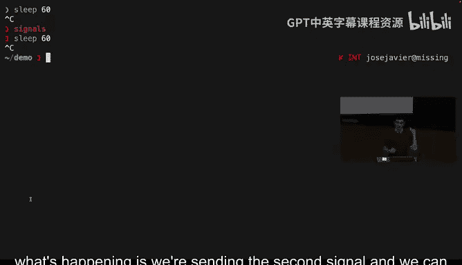

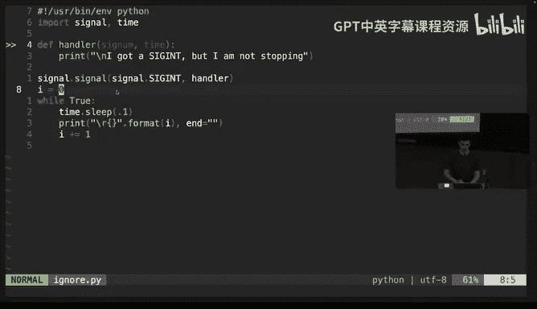

Hled like Seki， their documentation online， like many， many different options that are defined。

 but actually in practice you only be using a few of them。

The one of the reasons why this might be helpful is say for example。

 you have a script that uses some temporary files and you want to guarantee that even if something goes wrong and someone interrupts you you actually clean up those files so they are not like lingering this is what we're doing here。

 this is the same idea of we have a bass function that says like okay let's clean up the temporary files and in case we get like a signt or like a sick term then actually call this function and in here we're just creating the files sleeping and then deleting it。

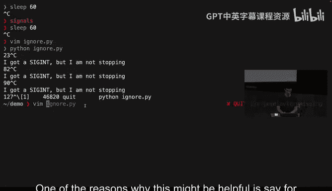

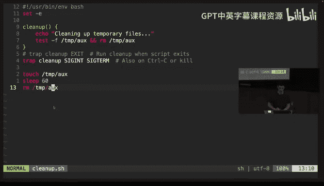

So if we。If we run this man and then we control C we see that we actually run that piece of code that handle the signal their signal that don't just interrupt the program another common one is control Z so when we send control Z what the cell does is send like a SiT stop signal that says like okay the terminal told you to stop so the program gets suspended it gets kind of like a post and now if we check of what processes we have we can see that there is this process that was suspendedpen。

We can kind of recover it， we can kind of like send it back。

 we can also send signals to that process using the kill command be you might maybe have seen kill kill is just like a way of sending any type of signal not just one to stop the program so for example here we can send the continuation signal to this suspended process and this is the process ID which is how the OS identifies it and if we now check now we see it went from suspended to run but if we wanted to still interrupted I thing actually。

It's like yeah， we can like now we have another process that is suspended and we can interrupt or like we can continue。

And then we instead of doing control C， which we can't from because it's suspended， we can。

Just interrupt it and like we interrupted it by sending the signal explicitly through K。嗯哼。

And I think this covers a lot of the abstractions。 You will kind of， this is the。

 there are a lot of conventions。 as you we see， of like having flags， reading from standard input。

 taking arguments， having arguments are like。All of them。

 like having taken many like an arbitrary number of arguments and operating in all of them。

 and as you use more of the salon every day， you will find that a lot of this just makes easier to use new programs because a lot of them are just abiding by the same rules。

The next topic we're going， oh in it generating data or files。

 happens is generated does it clear its cache？Depens depends what the process is doing。

 like for example， in the one we just the one script we wrote， was they had some intermediate files。

 but because the program had a way to dealing with the interruption。

 it had a way to clean things up by default it won by default。

 like if you just try a program and don't consider that possibility you actually might have like half grid files。

The next topic we're going to cover is the idea of working in cells that are not in your own computer but actually running in a remote server for this we use this secure cell which is SSH and syntax can look something like this we're like we are calling SSH and saying we want to authenticate as user JJGO and this is an IP address P address is like kind of the more role level way you might have seen something that looks more like this in practice that kind of server MIT or EDU。

 it's looking online someone to tell it that it's actually this number。OhAnd I have to。呃。Deive this。

So usually when you to say it， it will prompt you for the password。

 you need to show that you have you're like authorized to access this server。

 so we type the password and we are now in this machine and we can LS， we can create files。

 we can do premat the same thing。One of the annoying things is whenever you exit you don't want to keep kind of like re authenticthenticating so for that we rely on SSH keys SSH keys use a thing called public key cryptography which is like a private key and a public key and with that you can kind of show that you're authorized without having like to type your password in order to generate key you will run a command like this here's askingkin to override。

Now we have previous two files in the file system， the you can kind of less SS and we can see we have a private key and a public key。

 this public key。Is let's。This public key is a piece of information that you can give people so that they can verify that you are who you say you are so if we put this in the remote server。

 then they can verify that we actually own the private key when you for example want to upload code to GitHub for GitHub to know like that you are who you are you're probably going to give them like your public key and they will use that to verify the private key in contrast you should never give to anyone this should not leave your computer this is equivalent to your password you should never copy paste this it's fine for me to put it because this is just like a temporary key and creating for the class like just never paste your like private keys anywhere so in order for the server to know about our private key we just brand this command。

It will ask us for the password。 and now whenever we try to。SSH again。

 we didn't have to type prop passwordsor because it actually used this SSH key to verify that we were actually authorized here and if we check the SSH authorized key that kind of magical SSH copy AD command。

 the only thing that it did is just copied out one string that allows then the server to verify that we have the private key。

嗯。Then SSH is useful for interactive sessionss， but you can also use SSH to execute commands。

 so if we do that it will just execute LS but it will execute LS in the remote machine and then it will whatever output it produces it gets forwarded to the output of SSH like SSH is not a magical command is equivalent to almost every command so it can take input and it can produce output so for example if we do this where WC L just counts lines。

Well what's happening is we're running this through SSA so we're getting the output of whatever LS produce in the remote server and then we're counting the lines locally like the WC is running in the local computer not in the remote one if we wanted both of them to run in the remote computer we will do that and then now the entire pipeline executes there。

啥意思。One challenge with dealing with remote machines is sometimes it can be challenging having like many things running in parallel because you have to like SSAT and now you have like a cell and say that I actually wanted to oh actually we should first cover copying files。

So。If you want to actually copy files from your local folder to your remote machine。

 there are many programs but almost all of them are just using SSH under the hoodot which is good because you'confired your SSH key so for example if we want to copy the ignore PY file and then we say okay it will be copied to this server under this path。

 this is like this specific syntax that SCP takes。And we need to go to demo。诶。And it just says， okay。

 I successfully copied this filer and then now when we go there， we can see that I POI is here。

Issue is the moment we try to run ignore PY， actually you have two three years。

We cannot do anything else in this remote machine。 And this is where。

Terminal multiplexors where the most famous one is TmX come into play Terminal multiplexors are just programs that make easy to run many other programs within the same know environment。

 So when we run Tmax you see that now we have the same problem but now we have this bar here。

 This is running in the remote machine and we can for example。

Grant or process and giving it the right keystrokes we can create more paines for us to keep order。

 so like for example we can kind of start adding the file while the process is running in a different one it can create more windows so Windows here just the nomenclature that Tmax uses but it just you can think of it as browser tabs so for example here we can see that there's like zero and there's one and then we can switch between them。

The notes have like a lot of the keyboard circuits that TOX uses。

 TMX uses type of keyboard circuits that is not that common which is prefix based keyboard circuits where you usually always run control B and release that and then you type some other key so for example in order to create a new window you do control B and then you do C and that tells that we want to create a window if we do control B0。

 it tells us to go to window numbers here。And there are many things that you can do。

 like for example， we can now leave all of this session running so we can do control B D for Dtts and we can reattaach。

Again， one of the advantages of this is if we just had this program running and we disconnected from the remote server。

 we will have lost it and because when you actually disconnect from a remote session what the cell does is it detects that and it sends a special type of signal called the hand up signal so it's like SigH and that will kill all the processes that were running TMX decides to capture that signal and actually doesn't propagate it so now if we connect to the。

Server again and we do the Macka we can see that everything is still running and this is quite convenient because now our kind of remote session is not tied to the connection between the two servers。

那天也是星期一。That's a great question， you should definitely do it because oh yeah sorry the question is when you create an SSH key。

 should you add a passphse？😊，And the I'm saying that's a good question。

 you should definitely do it if you don't， what you're effectively doing is you're putting in your file system。

 the password to effectively SS into this。😊，Serverers。

Any program that has the ability to read your file system will probably be able to read that file assess if you don't add a passphse when you add a passphse you are effectively of encrypting it with your password and whenever you want to SS into a server you will get prompted to decode the key and then I think the notes have some examples there are programs that actually make that a bit more convenient but yeah you should put passphs in your SS keys。

你。Next topic that we're going to cover is actually customizing your cell。 So by default。

 your cell will come with many programs that are installed in your。Oerarian system， but for instance。

 maybe when you try to repeat whatever we're doing here and you run Tmax， Tmax is not available。

And that's because in some distributions TX doesn't compinstal and in order for that program to be available you have to install it so for that the kind of unfortunate news is different operating systems have different ways of installing programs so if you're on MacOS。

 the kind of D factor manager package manager is brew and Deen and Uuntu is APT and if we wanted to very ensure that TeamO install we will。

Something like this and as you try to run kind of more and more programs。

 you will find that a lot of time you have to figure out a way of installing them。

Programs can there are like many programs out there that actually make interacting with the cell easier。

 so for example there's like dripC that is like a kind of more versatile version of repP just made your life easier and we can try saying okay。

 I want to find all the Python files that have import in them。But it's not installed。

What this alist us to do it's like okay you should install dripC and once we do that process now that program that wasn't available before is now available and we can actually search for all the files that have imported them。

It might not be obvious why if we were trying to do RG。

 we had to do dripPp or like why dripTp is like RG like that mismatch can sometimes be frustrating。

 there is this fantastic website that is called command not found。

 you have you type the program that you don't know how to install and if premat tells you in a amount of different operating systems how to install it。

Your first instincts will always try to go to your package manager。连。

Next thing that we're going to cover is just modify how your cell behaves。

The yesterday we saw that there's this kind of path environment variable right and that the path environment variable has this list of folders that contain all the programs in your operating system now with what we've seen about the different properties of the cell we know that the way to。

The way to modify the path so it has more entries that it has is just doing variable assignment。

 you can say okay path is whatever it was before， plus this new path that we're trying to append and we probably want to set export because otherwise any tile processes will not inherit this。

I is our current location that they can be added。These are current locations。No。

 the path is a variable that has like a if we echo path right it's a variable that has the contents that had exactly this content and then if we make a folder and then we move into that folder。

 the path variable hasn't changed， it's the same。Does that make sense？Like by default。

 the cell will not try to use your current folder to find programs。Oh。

And that's why yesterday we saw that if you create a script。

You had to pre with like dot s to actually search in the current path。If we try to script the8。

 it will tell us this is not a command I can find in any of these folders， but if we brand the。

If we run the expert right and now the value of path is different has that extra entry that it didn't have before。

And we it will search in that batch The challenge is now if we disconnect and like we reconnect and we have like a new session。

 if we echo path now we have lost that notification。

 that notification even though we exported it for child processes。

 it's not getting persisted like new sessions do not know about that export the way to actually persist that configuration is to add it to the cell configuration file that will depend exactly on which cell you're running in the remote server we're running ba。

So if we look at the bass。A configuration file， which is。Bus or C or bus profile， depending on the。

Soillar running we here is pretty basic， but the main idea is if we include the。

Export path in here now whenever a cell process is created。

 it's going to read this file is going to evaluate this line and then pathth will have this entry。

So we can verify this by disconnecting， we can connect again。And then if we echopath。

 we can verify that it has that extra entry that otherwise you wouldn't have。

And their path is a special variable， there are variables that modify other parts of the behavior of your cell。

 so for example here we have PS1， PS1 tells the cell how to render that left prompt。

 so right now it's getting rendered in this way but if we overrode that saying PS1 is just like this plane symbol。

If we now spaponwn a new cell， you see that now iss just that symbol， there's nothing else。

And in order to。Have that。Nice behavior， we have to use a specific syntax that the cell understands。

When you were kind of trying to find command， you might try to use the history。

 so for example I know at some point I've run a VI command。

 I can search percurs like I can do like a backward search through my history to find like different things I've been。

But the cell also allows you to override that behavior so in。In this case。

 what we can do is we can load another tool， which in this case is FZF， which is a fuy finder。

 and this tool will hook into the cell and will override the controller behavior。So well actually。

 we can like the the way to do it without exiting is doing source， which means。

Evaluate line by line that file and now if we try to control our。

 we get that we get like a fast finder with all the buzzers。

 all the VM commands that we have run and there are many。

 many things that you can customize about yourself cell。

And there are like entire plug systems of things that you can do。

The in practice a lot of people will document online how their setup is configured and that's usually called dot files that's because most of these files we start with a dot to make them hidden so it's like dot bus orRC dot CCRC and people will have many of them kind of committed for just them it for them to keep track of but it can actually be really useful to read through them and understand what they're doing so for example in this case we can see that。

This user didn't want Gloin to take whether like a letter was uppercase or lowercase into account and there is this command that you can use to tell the cell not to pay attention to be case insensitive and there are many。

 many options that you can give and people have documented a lot of them online。

One extra detail is in order for you not to lose your configuration when you go to a different machine。

 it actually pays off to put it into a single place and then install that into your current environment。

To elaborate on that， if we now do Ls minus LA of this folder， actually let's grab。

We can see that my Ba or C file is actually not a file， this is how L illustrates having Ss。

 Ss are an notion in many operating systems which is this is whenever whenever anyone tries to read this file just goes somewhere else like read this other file instead。

 so this is saying like okay whenever you want to read Ba orRC you should actually go into dot dot files Ba Baar C。

😊，And this lets me put all my dot files under like dot dot files version them， I have them on GitHub。

 and then whenever I want to configure another computer to have all the options that I'm used to。

 I just have a script that actually create all these symbolic links so that the programs can find the configuration files。

What。And yeah like the dot file for all the three instructors of the course online and you can check them。

 try to like understand， I recommend not blindly copy pasting like an entire Ba orRC from someone without understanding what it's doing because it might get really confusing what the defaults they chose is actually more useful kind of going line by line and understanding。

Yeah， so there's actually a very useful link in the electron notess that elaborates on why there are multiple files and which ones are red when so BaS has different files depending on whether the terminal was interactive or not and that's why you have like BaS or C and BaAS profile so for example if it's an interactive session like the one we're seen here Ba or C will be read when you actually launch bassS not an interactively then it will not load that part of the configuration for CAT it's like a different cell and it has a different file so like you can configure the two of them completely independently because they are going to check completely different file so like if we check for here。

Oh， we have to go up one line level like there are like CC time for like CCs RRC theyre like different files are related to C8。

😊，The next notion is the notion that there are many things that you can configure and there are things that are not built into the cell but can be convenient and people built entire packages to support some features so for instance you probably have seen that through like in this terminal whenever I type things it tries to give me a way to autocomplete based on previous commands I've run in the past。

This is not the default behavior this is because I told C to load like a bunch of files that enable these behavior and the electron nodes have links to plugins that do these things and they can make your experience more convenient so for example here as well kind of L1 I type LS it's getting highlighted in green and that's no coincidence is because the LS command actually exists if I do LS X it's red because that command doesn't exist and I don't even need to run the command to see that it's not going to work because it's not available and if I type in the name of。

Oh itすねも。Oh well that was like a good example when we the demo because demo was a folder that existed。

 then that immediately got highlighted and SnowWcore in every single of this plugins。

 but you should be aware that they exist and that they can make your terminal experience way more convenient than the stock configuration can do and we have links on a few of this plugins。

 some of them will also configure how your prompt look like。

 for example here it's telling me that this user in this machine and if I go into the dot files folder is going to tell me things that are only relevant in this folder such as in in this git repo we' are in the master branch and there are like five changes that we have in run or for example。

 if we try to a less like a knownex thing。😊，The cursor changed to red because the return code of the previous command was nonci。

 so's like every very quick way for me to get information that I probably could care as well by doing it manually but it's just a much slower effort。

There's plenty of going on the WSL。And work in who strikes me career in。各位我那删了。

Works whenever you're on your machine。Okay， so the question is a， whether this will work in WSL。

 the answer is yes， because WSL， for the most part you can just think is like a Linux machine running your computer and then the other is about this will affect all cells。

or like all folders feel like folders， yes， because as you navigate。

 you are still using the same cell session， like you're using the same program that is running your computer with this configuration but if you're for example using CAT that has some configuration and then you start like a bass session that will have a different configuration actually I think I can yeah like if I run bass you can see that the prompt is different because the configurationfiguration that I have for as is different from the one I have for CAT。

Yeah the CCAT cell is reading completely different files in order to set up things like the plugin system that I described that enables that thing emsed in this case。

 I actually haven't modified because I like it as a fallback if anything breaks and it just using pre basic configuration。

😊，And how you tell us to more in these。So， if we go to。The C searchRC。

 there will be this actually yeah， for example， there is this like power level 10k prompt plugin that is the one that is actually coloring like kind of like the left prompt and the right prompt and what this line is doing is saying okay。

 if this file exists right which is the condition in em bass and then。

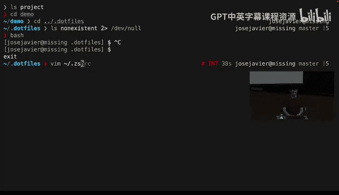

We're using the operator that we saw earlier that will only run if the previous one what oh it's using okay there's negating I don't know what I did we doing that way but like if yeah if this doesn't exist this will fail and then this is run and then source is this command that will just evaluate line by line。

 whatever this file contains and then this file that we can actually just look as well its。

An entire plugin domain didnt see it that enables a lot of these behaviors。Physically。

 a giant ba program is the blockage。How do we get that ba plug anyways copy of spectrum scenario machines？

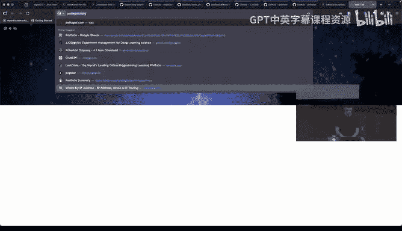

In that particular case， a lot of these plugins will live in GitHub and there will be an installation section that it tells you exactly how to install it here the most simple setup is you literally Git clone which is download that repository of files to your local machine under this specific path。

 which is like your home folderer and then at this line that enables this to run。

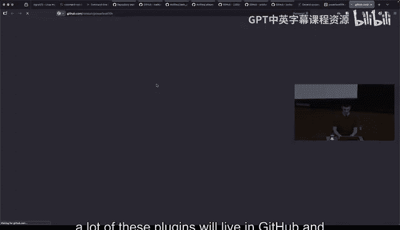

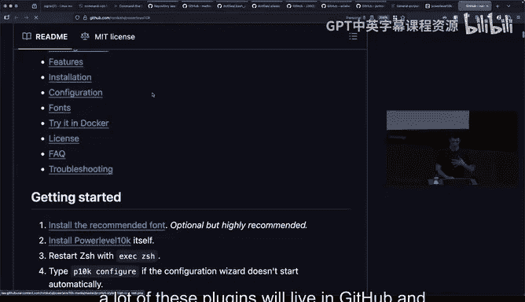

Yeah， look what this is doing is you will write this line in your CCHRC。

 but if you look at what's happening here it's saying append that to your CCRC so you don't actually have to do it with them you can literally just run this and it will append that to your CCRC。

んだ。Thanks。Oh and one very quick note， you might see entire frameworks that load many， many plugins。

 I feel like the kind of most known framework is Oys age。

Those frameworks can be good but they can also slow down your cell because they're trying to do a lot of things for you they're like enabling a lot of behaviors。

 so I actually recommend just installing one plugin at a time seeing if you actually use it and it's actually work for you and if not you just remove it I feel like having that fine grain control prevents blocking your like a cell experience。

And as a last topic， I want to quickly touch on how we can actually use AI tools in the cell。

 like you can always go to likeGT on the website and ask it questions about the cell and it will definitely work。

 but you can actually interact with these models using CLI tools。

 and that might be like more useful like more convenient。

So one tool that you can install is this LLM tool， it's linked in the electrons and here we're pretty much saying like okay。

I want a command that just finds all the Python files that were modified in the last day I know there is some syntax with the fine program that will achieve this but as we were seeing with John yesterday sometimes it's hard to get all the right flags for fine and this will ask an LLM that will have a really hard time not to give us the right answer and it just prompt us that whether were fine running this command and we can quickly inspected and it makes roughly logical sense like it name is seriesPY the things have to be files and they have to be modified in the last day we run it there kind all listed。

Beyond that， we can also use L L Ms as part of like our processes。 So， for example。

 here we have like a。File where we have many different like usernames in widely different formats and I'm sure there exists of RedX to extract them here。

 but it's just much simpler to the final variable that is okay just give me the username for this line and nothing else and then we can give that to the LLM and again this is like a good example of the LLM program is getting the instructions through an argument but the kind of input through the pipe and then we upload it and then we give it to sort。

😊，And as you can see here， it's extracting the relevant piece of information for everyone of the lines that otherwise that like unstructured par could have been like quite challenging。

😊，The last tool that I want to cover。It's a cloth， a cloth coat so cloth coat goes like step beyond that where you can。

Give it instructions in English and it will like translate a lot of them into all like cell operations or like operations in your file system。

 so you can think of it as like a meta cell program except the programming language is English。

So really don't remember what the。呃。See， yeah。So we can give it instructions。

 something like we use find again， to find it to get the most recently modified cell script and then change the bank line to use these date。

Something probably you could do， but again， Fine has like a trick syntax and what the LLM is doing here is taking all instructions is producing this Baask command which probably looks extremely alien and full of angular things but if you unpack it it actually looks fine just searching for do8 files that are acceptable and it's trying to extract which one was most recently modified runs that and instead of us getting that output and having to figure out how to feed that output into the next command it's actually determined that it actually cleanup do8 that was the most recently modified file and is proposing that we change the bank line to go from BaS to CAT。

And it can be a really powerful tool when you're doing when you actually don't know to。

 do you need to know some of the intermediate specifics or like avoiding having to kind of take the output of one of the commands only to figure out how to fit it to the next input。

And then we can accept it。The very last thing to cover is so far we've defined like the cell and we have been like running it through like some program in this case will depend on the operating system here we're using the what it's called like a terminal emulator it's like a GuI program that it's running the cell and just presenting it in our computer and there are different options and again as with dot files used to look into which terminal emulator you can run you can the one I'm using here is ala and it's like a similar thing where there are options that you can configure for example today for this lecture what I had to do was change the the font size from 32 sorry from 16 to 32 and if I try that it goes back to the size that I usually have so it's again worth it to kind when you're trying to improve from customize your。

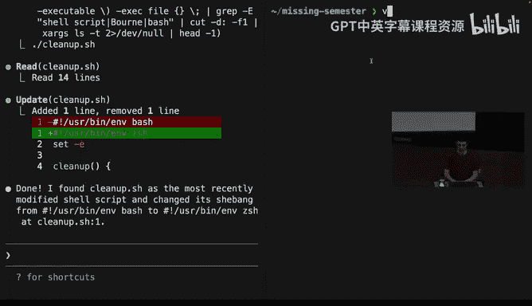

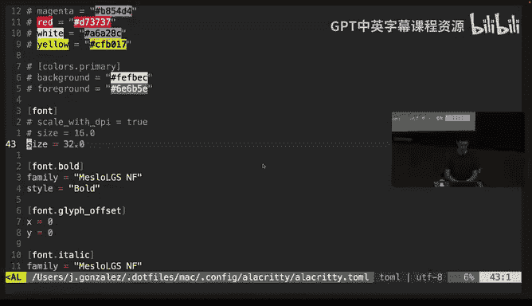

Environment， don't forget about what terminal abriator you're using。

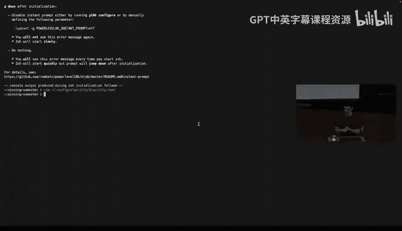

And I feel that concludes the lecture for today， anyone has any question happy to answer them。

 also happy to like answer questions individually。😊，Thank you。

