# 《计算机科学教育缺失的学期｜The Missing Semester of Your CS Education IAP 2026》中英字幕 - P3：Lecture 3_ Development Environment and Tools.zh_en - GPT中英字幕课程资源 - BV1vyzXB6Eps

Okay it's six past so let's get started welcome to day three of Miss semester today we're going to be covering development environment and tools and we actually have a huge number of subtopics we're planning to pack into a single lecture so one thing that would be really helpful for me is if this was a really interactive lecture please ask lots of questions and also help me pace the content I don't know whether I should focus more on the basics or we want to speed through the basics and focus on the more advanced topics that we've prepared for this lecture so please help me out。

😊，呃。So to get started a development environment like what is a development environment。

 it's a set of tools for developing software and there are many different shapes and forms of development environments that you might want to use so what we see on the screen right here on the right is my terminal setup I'm using Tms which was covered in the previous lecture and then there a bunch of other things open I'm using this to split panes I have a shell on the bottom right which we covered in the first and second lecture and I have a text editor open on the left actually with the lecture notes for today's lecture open in Vim and then I have a docker running in this terminal in the top right so this is one configuration of a development environment this is a terminalbased development environment and you might want to use this for certain scenarios。

😊，On the other hand， in certain scenarios you might want to use software like VS code。

 this is an integrated development environment， so it's a little bit different than the terminal base setup and instead you have everything you might need from text editing capabilities to things like code Liing and auto formatting and stuff like that。

 all within a single application。😊，And you might want to use graphical IDEs in situations where it's beneficial to have all this stuff in one place and oftentimes AI functionality tends to be better integrated into graphical IDEs。

 so it's a good place to get started， but you might want to learn terminalbased development as well for certain situations。

 for example， you might be SSaging into remote machine where you can't easily install software and you might want to run a basic text editor there to do some file editing。

はいえのな。诶。You might find more like so IDdeE stands for integrated development environment。

 kind of like everything in one place and there might be textbased IDEs like that run in the terminal。

 you can kind of turn some text editors like emX or ViIm into IDEs like kind of out of the box。

 these programs are more like text editors but you can install a bunch of plugins and make them behave more like IDEs。

 so that's always using this distinction， but to first approximation when people say IDE they generally mean graphical IDE。

Great question。Yeah啊，我是没有。The one that's up here on the screen right now， this is VS code。

 this is a very popular open source IDE from Microsoft and a bunch of other IDEs that people use these days like how many of you have heard of cursor。

 raise your hands， good chunk of the audience， yeah cursor is a fork of VS codes it's built on top of this。

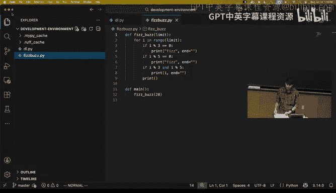

Cool so today we're planning on covering text editing and VIm so text editing is kind of like the core functionality of an IDE like you write a program you want to be able to edit the program and the files there in your repository codebase so we're going to spend some time on that after that we'll spend a little bit of time talking about code intelligence and language servers so talking about some of the more advanced functionality that IDs give you like code completion and checking errors as you type and things like that。

😊，After that we'll talk about AI power development that's a new topic for this iteration of this course。

 we have some basic topics we can cover and some more advanced ones so you guys can help me out there on what to focus on when you get to that section and then finally we'll talk briefly about regular expressions in search and replace。

So to get us started on the part on VIm， I'm curious how many of you have used VIm before or heard about VmM？

Okay， maybe like a quarter of you。Sorry， what was the question？You did the exercises。Yes。

 that's right， a number of questions referred to Vim。

 but this is the lecture where we're actually focusing on this and teaching this topic。

And we have a bunch of viIM related exercises for this lecture as well。Cool。

 only a quarter of you so yeah， Vim is this really cool thing that we want to teach you because we think it's really powerful when you're writing code generally yeah you have a bunch of text and you're modifying the text but the way you're interacting with the text and modifying it is a little bit different from other types of text editing like if you're writing an essay you might use something like Microsoft Word and the type of activities you do there often take a form like you're writing a big stream of text or you're reading a stream of text kind of top to bottom。

😊，But when editing code， the way of interacting with code is a little bit different。

 so you're often jumping around between files， you're reading little snippets of text。

 even when you're writing code， like how often do you open up a new file and just like write your entire program top to bottom。

 right how many of your are brilliant internet programmers to be able to do that？😊。

Nobody raises their hand Yeah so you often end up writing little snippets of code right you might write a function here that you might jump up in the file and write a different function。

 you might find a bug somewhere and tweak some code。

 and so the types of motions you need to do with your like cursor and with the types of text you need to type into your editor are different and so one reason why I want to teach you vim is that it's a text editor and also a way of interacting with a buffer of text that is optimized for this use case。

😊，And so the idea is that if you learn VIM， you can become really effective at editing text for the purpose of writing software。

And VIM has this really cool idea at its core， I think the people who developed them or the precursor VI observe that say switching between your keyboard and mouse is slow right like if I'm down here and I want to move up here I move my hands from my keyboard to my mouse。

 move my cursor， click somewhere to move the cursor in the program and then I can start typing and stuff like that。

It's just slow and instead if you could keep your fingers on the keyboard the whole time and had a really efficient interface for doing all the types of things you might want to do when editing code。

 you'd be really fast。And so the core idea in VIM is that the interface to VIm itself can be thought of like a programming language。

There are a bunch of primitives， like they are in programming languages。

 and you can compose those primitives to do powerful things。So for example。

 I'll just give you like a brief overview of this and then we'll actually go through in more detail all the different functionalities in VIM like in VmM if I want to move my cursor down you see my cursor here is that big enough for everybody。

 so I want to move the cursor down， for example， the J key moves the cursor down。

 I also have this keycastor thing running so you can see what keys I type so you see that thing at the bottom。

So if I press like J， it moves the cursor down。But if I want to move my cursor down by 10 positions。

 I can type 10 J and I jump down by 10 lines。Through all these other things too。

 like just to give you a brief exposition of some of the functionality。

 if I want to find the next closed bracket character。

 I can type F closed bracket and my cursor jumps over here。

 if I type percent it jumps to the matching bracket。

 if I want to change the contents inside the parentheses that follow here。

 I can do CI open parentheses and it deletes the contents there and I can start typing in here。Right。

 maybe this looks very different from other IDs， your text editors you're used to using because remember you move around the mouse and if you want to change the stuff in here。

 you will go here and click here and then backspace to delete everything in here。

 maybe you're like click and drag and select and press backspace and start typing。

 but it's so much faster to use ViIm as your way of interacting with buffers of text。😊。

Any questions so far？So VIm is what we call a modal editor。😊。

How many of you have used modal editors before？Maybe， except John。So in a modal editor。

 there are different operating modes for doing different classes of things and so in VIm there's a mode called normal mode。

That's kind of the default mode， the one you start out and you end up spending a lot of time in there。

 and then there are different modes optimized for doing different activities。

 so there's another mode called inserts mode and in insert mode you can insert and add text。

There's ways to switch between the mode so you can get from normal mode to insert mode by pressing the i key。

VM has all these key bindings that are named in kind of convenient ways so you can remember them it's like I gets you into insert if you press。

😊，The escape key。You can get back from insert mode into normal mode。

 So we have normal mode for doing a bunch of stuff， which I'll show you later。

 We have insert mode where vim kind of turns into。😊，Any other text editor that you might have used。

 like when you press a key， it just gets like typed into the text buffer。There's replace mode。

That you can get into by present capital R that lets you replace text like overwrite text。

There's visual modes。There is visual like plain visual mode。Visual line mode and visual block mode。

For selecting blocks chunks of text， for selecting lines or blocks of text。

 so you press V to get into plain mode。Shift V， so capital v。

 big V to get into line mode and control V。To get into visual block mode and that lets you select blocks of text and then there's command mode。

For running commands that you can get into with Co。Okay。

 so there are a bunch of modes for doing different types of activities。

And to show you a little bit about what these。Right。

 so she don't so you want to if you want to close day at。ラすかね？はい、だ九が。Yes。

 so the question is close a command and yes in VIm close is a command。

 so right now I'm in normal mode， here if I make this a little bit bigger。

 we'll see I have my VIm setup up so it shows me the mode in the bottom left。嗯。And， if I press colon。

To go into command mode， I see the command line down here， and if I do Q。

And we'll move this to the bottom right。See now this says colon and Q and I can press enter and haven't saved some of my changes。

Here。I will force quit by doing Q exclamation point and that quits the editor。嗯。

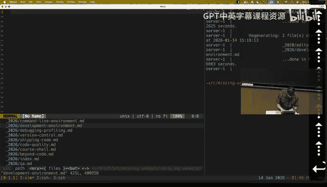

Also， even if you're not using the VIm software itself。

 VIm is such a powerful idea that a lot of other pieces of software support VIm key bindings。

 so if you're using an IDE like Vi Studio code， this thing I was showing here before。

 or if you're using even the EmX， which is a different command line text editor。

 a lot of these programs support VImM key bindings。

 the shell that we covered in the previous two lectures like Z Shell and Bsh also support VimM key bindingds。

 even things like cloududecode support VmM key bindings。

 so if you learn this wave interacting with blocks of with buffers of text。

 you can apply these ideas in many different programs。

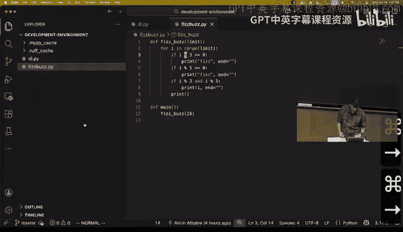

And in the previous iteration of this class， we actually focused on like VM。

 the software in particular， in this iteration of the class。

 we're focusing on the core ideas and VIM and like the key binding that are kind of common between Vm。

 VIM and like the visual studio code implementation of VI and all that。

 so you can carry over these ideas anywhere else。And so things like how to quit themm。

 this like Co and WQ thing that we were talking about。

 like not as big of a focus this year because if you're using VS code and you want to like close something。

 you can press the X button。

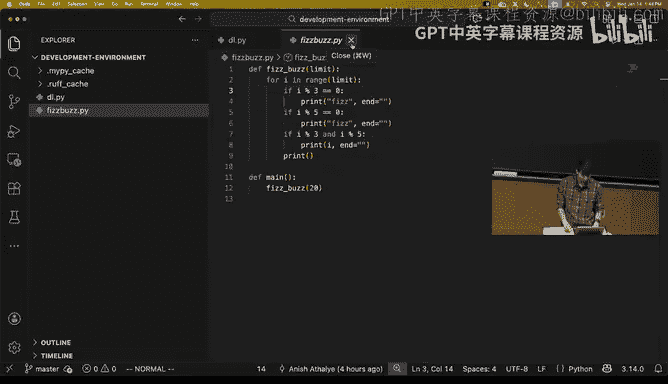

Any questions so far？Yeah， that control V and this is all in the lecture notes for today as well。😊。

So we talked about modes。😊，Let's briefly talk about normal mode and insert mode。

 so if you're just starting out using ViIm before you start using all the sophisticated functionality。

 you can kind of sort of start using it like any other text editor you know by relying on normal mode and insert mode。

 so in normal mode you can't actually change anything but if you press I it puts you into insert mode and if I type some text now like type like ABCD that just insert the text into the buffer kind of behaves like any other editor might and you can use things like the arrow keys to move around or if you're using vim configured appropriately or something like visual studio code you can use your mouse to move around and you can keep typing text and so on so this is kind of reverting viIm into a standard text editor as a starting point。

But if you use VIm in that way， you're not really taking advantage of its sophisticated functionalities。

 so really what you want to do is make use of VIm's interface being a programming language for efficiently moving around your buffer and for efficiently editing the text in there。

And for that， you have to make more use of the other modes， not just insert mode。

 so in particular we're going to focus on normal mode。So within normal mode。

 there are key bindings for doing different classes of things。

And you can compose these things together in powerful ways。There are key bindings for moving around。

There are key bindings。For selecting things， there are key bindings for making edits。

And there are other things that you can use like counts。Oh。And then there are additional modifiers。

Thank。And so let's go through a couple of the key bindings and don't worry about memorizing these right now like you can look through the lecture notes or link to a bunch of resources that you can use to actually get to a point where we memorize these key bindings。

 focus more on the core idea of how you can compose these things to do things really efficiently。😊。

As opposed to a baseline method you might use moving your hand from the keyboard to the mouse and moving your CR around and clicking around and stuff like that。

So to move around some of the basic movement commands， if I want to move my cursor up down。

 left or right， I can use the arrow keys， so if I press like down， down， down I go down by lines。

 if I up I go up by lines and so on。VIm also binds the HJ K and all keys to the basic direction so you don't need to move your hands from the home row。

 save that little bit of time， so for example if I press H， you see my cursor moves to the left。

 if I press L， my cursor moves to the right， if I press J it goes down by one line。

 if I press K it goes up by one line。There are all these other key bindings like if I press W。

 my cursor moves forward by one word at a time， so if my cursor is here and I want to go to integrations I press WWW。

If I press B， it goes to the beginning of the word， so B B B。

 notice that these key bindings are mnemonics， so W for word B for back or beginning。Yeah。

Zero goes to the beginning of the line， the dollar sign goes to the end of the line。

H goes to the top of the screen， M goes to the middle。

 this is like too small to demonstrate this M goes to the middle of the screen。

 capital L goes to the bottom of the screen。Control D scrolls down， control U scrolls up。

GG goes to the top of the line， capital G goes to the bottom of the line。

 if I type in colon followed by a line number like 12，3 and press enter， I go to the line number。

Percent finds a matching character like it goes to this closed bracket。

 percent again goes to this open bracket。Fair press。F in a character。

 it finds the next version of the character of press T in a character。

 already we're seeing some composition like if I press。F and B， it finds the next B from here。

 so from here to here is the next B， if it F and W， it finds the next W and so on。

Are these ideas making sense？Again， don't worry about memorizing the specific key binding of them going through these fast on purpose。

 so you're not focused on that。Okay， so there's some keys for moving around。

 there's another special one slash for searching so if I press slash and type like Fiz， for example。

 and press enter， I see that my cursor jumps to the first match。

Now we can briefly talk about selection， there are these visual modes we talked about which you can get to by pressing various types of V's like V capital V and control V。

 so you can use this to select blocks of text if I press V here to go into visual mode which I see indicated down here。

 press E E E so you're seeing I'm in visual mode using the movement commands to move my cursor around。

 if I press like W it'll go to the beginning of the next word and select this block of text。

Capital V selects lines rather than individual。It spans。And so if I press like J， for example。

 I select the next line and so on， control V lets me select rectangular blocks of things。

 this might be a little bit different than what you can do in the editor you're currently using。

Now for actual edits， we talked about insert mode which kind of reverseverts Vim insert mode indicated down here。

 reverseverts Vim back into mode where if you type it just goes directly into the buffer。

 but there are these other commands for doing various types of edits as well， for example。

 if you're in normal mode and you press oh， it creates a new line below so that's making an edit to the buffer but also puts you into insert mode。

😊，U for undo， if I press capital O that opens a line above where I currently am in normal mode and puts me into insert mode。

These edit commands we're talking about also compose with movement commands， so if my cursor is here。

 for example， and I want to delete this word， I can do D for delete。

 and then this command takes in a movement kind of as an argument and deletes a word。Yeah。

Or if I want to delete the line below this， I can do like DJops delete this and the line below。

 I can do DJ， and it's like move down and delete everything that's included there。You is undo， yeah。

And then there are also counts so I can worth mentioning you can do things like five U to undo five times Yes all of the it's not just movements and edits。

 but also any command Yeah John points out that yeah we're getting to counts next and you can combine these counts with other commands to do the thing that number of times and so if you want to for example。

 move forward five words you can do here I'll move the cursor here and do five W and it's like do W five times。

And so yeah， we can also do like five U and do undo five times。

And then there're also modifiers to change the meaning of。

Certain nouns or like things in Vm and so therere modifiers like I which means inside and a which means around so like if my cursor is here and I want to change the thing inside the parentheses like this is a link and mark down maybe I realize this is the wrong link I can do C for change that's edit command I for inside which is a modifier C I and then parentheses which is the noun like the thing I want to change the contents inside of so you saw like CI open parentheses that shows up a shift nine that's kind of annoying。

CI open parentheses deletes the contents of the parentheses I'm currently in and puts me into insert mode so I can replace that link with something else。

So for example， like if you're writing some code and you want to change the argument to a function if you do CI open parentheses。

 that's a very quick way of doing that right if you were to compare this to how you might do this in a standard IDE。

 like maybe move your hand from the keyboard to the mouse， like go over here。

 like clickop click and drag on this and then like press backspace and start typing in right？😊。

So again I've gone through this kind of fast， the idea is to expose you to these general concepts like there are these different types of things like movements and selection and edits and counts and modifiers。

 and then when you learn all of them you can combine them together to do editing really fast。😊。

Any questions so far？And I think you kind of have to take my word for it and in one of our exercises we suggest like take all the software we use。

 switch everything into VIm mode and just use it for a month。

 like force yourself to use it for a month， I think all three of us me John and Jose have been using VIm for a very long time and the investment has been very much worth it like you can basically get to the point where you can edit text as fast as you can think and without using an interface like this I feel like I spend a bunch of my times like moving my hands around。

Yeah， this is just a much better brain computer interface。Question。啊还还这个。系都钱他位。然么。他第。我看的来。

These you get used to M。配置啊或各样。对他。ま。下是。こ来的で。喂。すごい。But how do I feel the。太直么是。What think like。准备去。

P word。In a line or like believing the word that's like。Surrounded by clothes。

And this line or can stros。Thank give the that。Yeah， so the question is。

For functionality that's supported in another editor like undo or read or just like adding text you can figure out how to do it in VIm but for some of the other features that VIm has like being able to jump to a matching parentheses or like delete inside parentheses or things like that like how do you build intuition or even discover that VIm has these features and so I'd suggest two things one is I would suggest going through a Vm tutorial which will tell you a bunch of key bindingds and how you just do text editing exercises to try to turn some of these things into muscle memory so that's one way to get exposure to them and then the other is just use VIm and kind of keep in mind whenever you're using your text editor if you're doing something that seems kind of repetitive and annoying there's probably a better way to do it and you can Google it or ask an LLM and it'll probably tell you how to do it or if not like post in the discord for the class and will help you out。

And I think that's a great principle to keep in mind as a programmer。

 like some of the best programmers are very lazy people。

 if you're spending a bunch of time communicating to your computer， how you want text to be edited。

 there's probably a better way that other people have figured out and set up for you。

So I'll show you a quick demonstration that puts all these different pieces together。And我。

Do that through editing this broken FISBS implementation。Hopefully you're familiar with FISBuzz。

 the idea is that you want to write a program that prints the numbers one through n。

 but whenever the number is a multiple of three， you want to print Phz instead of the number and whenever it's a multiple of five。

 you want to print buzz instead of the number and when it's a multiple of both three and  five you want to print fsBuzz instead of the number。

 this is like the canonical like make sure you know how to code type of exercise。

So this is what we're looking at here is actually a broken FISBs implementation and we're going to fix it but we're gonna to fix it using VIm and we'll see just how efficient it is in terms of the number of keystrokes I have to do in order to correct this implementation so one issue here like if I here let me open up another terminal to the right here and I can try running this and nothing happens so the main function here is never cult that's the first thing I'll fix and so I open up vim I'm looking at this program my cursors up at the top I want to add some text at the bottom so VIm has a single key binding in capital G to jump to the bottom line I can press O to open a new line I have some Python support in here this auto indenting because it thinks I want to keep typing a main but I'll press backspace and then I can type in some code I'm an insert mode here。

Don't worry about the actual code if you don't know Python， this aspect is not important。

So I went into insert mode by pressing I typed in a bunch of text and then press escape to get back into normal mode。

 so I've made my first edit。Now some other issues in here。

 I'm noticing that this range starts zero instead of one so I want to make some edits up here。

 so the way I can do that I can press slash to go into search mode， type in range， enter。

 and now my cursor jumps up here。I want to change the argument to the range。

 so one way I'll do that in this first demonstration is to move forward towards so I can put WW。

I could have also done2W to jump forward two words at once， but oftentimes for these small counts。

 it just press the key multiple times。

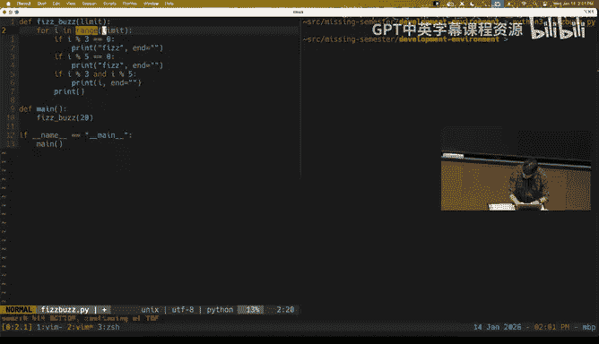

So I can press I here to switch into insert mode and then now I'm just directly adding some text in here。

 so I'll add a one comma， and then I'll press escape to go back into normal mode。

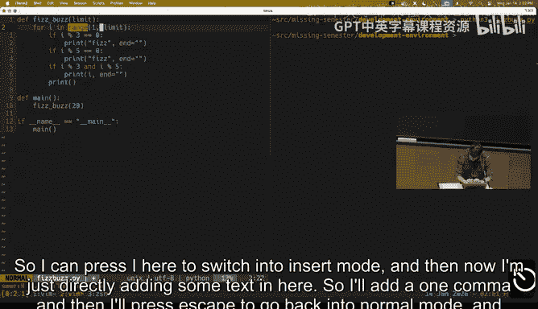

And then I can press E to jump to the end of the next word a to start a pending text so this moves the cursor one character and puts me into insert mode and you'll notice that themm has all these specialized key binding that like kind of overlap with each other like I could have had my cursor here and pressed L to just move the cursor one character to the right and then press I to go into insert mode but it saves one whole keystroke or 50% of the typing if I press a right and these things will just become muscle memory after you use this for a bit and save you a bunch of keystrokes so I'm in insert mode which again we see at the bottom I type in whatever code I want to type in press escape to go back into normal mode and so I've made my next edit。

And here you're seeing this general pattern of when we're editing code using ViIm。

 oftentimes we're kind of sitting in insert mode and then going around and doing things and sorry we're sitting in normal mode。

 going around and doing things when we want to make an edit， we will jump into insert mode。

 tweak some text， and then jump back into normal mode。

 which is the default place you'll spend most of your time。

And one other small change I'll make to this program。

 okay so I noticed this is printing fiz for multiples of three and five。

 so I want to change that second one， so I can do colon six to jump to line number six。

You'll switch on proper line numbers on the left。And then I can do look my cursors over here。

 I can do CI double quotes， and that's like change inside the double quotes the we look forward until we find the next pair of double quotes。

 delete the contents inside there and put us into insert mode when we type that and then here I can make my edit I want to make。

Escape to go back into normal mode and。We can save the file in VIm that's colon to put us into command mode and W to write the contents of the file。

 if you're using a different IDE or different tool。

 there might be other key bindings that do the same thing if you want to learn all the key binding go through one of the tutorials we link to in the lecture notes。

And so once I've done that， like， yeah， the program works。Any questions about them？

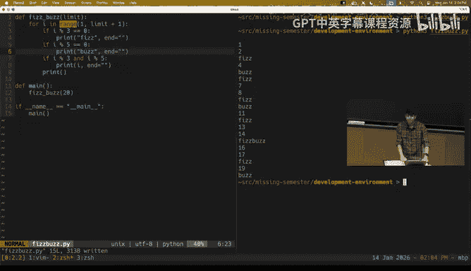

Great。Yeah， so the exercises in today's notes will share some pointers on how you can actually build the muscle memory to use this very powerful piece of software。

Cool， so moving right along to our next topic。Let's briefly talk about。

More sophisticated editor functionality。And in particular， language servers。动。

sorry we'll be mixed up。Here we go。Language servers。Yeah so。

For this part we will look at visual Studio code， this other editor I was talking about or this other ID I was talking about because I have more stuff set up in here so oftentimes IDs offer a bunch of programming language specific support like automatically formatting your code and automatically checking for errors as you type and stuff like that but the way that's implemented is that the IDE doesn't build in all that functionality itself for like every programming language you might possibly use there's a protocol where an IDE can talk to。

Something called a language server。The protocol is called language server protocol and it can talk to this language server which will provide the language specific support so one party can build an IDE and implement the like one side of the SSP protocol and then other parties can implement the language server and this side of the LSP protocol and then they can just interruptop right so you turn an M times n problem into an M plus n problem is the idea there。

And so if you're using an IDE， you should set up the IDE so it has all the proper support for the programming language you're using。

 and we have some like links to examples in the lecture notes and generally you can just like Google it like how do you get whatever go support set for visual Studio code and get things working。

And just to motivate setting up some of the support。

 I'll briefly show you what language servers enable。Maybe in the context of a different repository。

So again， I'm just showing you a random repository you don't need to be familiar with。

 I'm just going to highlight some of the functionalities that language servers in particular enable。

 so one of the things they do is code completion so you can do things like let me jump to something where I can do with code completion。

Oh。Like if I do here's an object and if I do dot， I will see all the fields that it has and all the methods that are defined on this object。

 right？And kind of have this like inline code completion and also some of documentation。Yeah。

 so you also get inline documentation， I think for this example I don't have too much any dock strings for these things。

 but if I had doc strings for these actually maybe I doops。You can just take my work for it。

For these different fields defined on the struct， you would see like the dock string for that particular field just in line here。

Some other features that we have are things like jump to definition so like if I'm looking at some code I see that this takes in like this type is an argument。

 and so I can right click on this and do that's a little bit small。

 click on go to definition and I can find the definition of thestruct。😊。

So it's very helpful for jumping around like otherwise how are you' going to find like where this thing is defined you might search your entire code base and have to poke around so it's really convenient that there's this language server that has semantic understanding of your code that can enable your IDE to do things like this。

 you can do the same thing in reverse if you want to find like oh I've defined thestruct like where am I using this thing。

 you can find all the references to thisstruct， that's another functionality that language server is enabled。

And then there's another whole bunch of quality of life things like language servers will help you with imports。

 so here I'm importing a couple modules if I use some module without importing it like maybe I do like print line high。

I see a red squiggly here。It's saying okay， this modules not found， but if I do save。

 actually the language servers figure out like， like you're doing format do something you probably want to import format and so it added this import line for me。

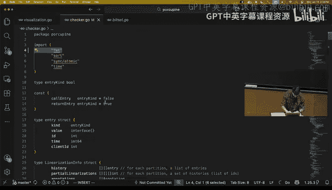

And then yeah， I get all this code quality stuff like if you invoke。methodsethod that don't exist。

 you can just see in line in your IDE like， oh， this method is undefined。

 this type has no method by this name， so you can catch errors as you type rather than waiting till you compile your code or run your tests。

So it's really brief motivation for getting all this code intelligence stuff working in your IDE for the programming languages that you use。

Any questions about that？Cool let's move on to the next topic then AI power development。

 and I think in some ways this was the hardest topic to prepare because I'm really not sure what background everybody has in terms of using these tools。

 so we can actually start with a little bit of Q&A。

 so who here has used AI tools like AI autocomplete inline chat or coding agents。

 so not counting like chat GPT or just LMs that are standalone but things that are specifically designed for interfacing with code。

 raise your hands。Oh okay， only about like a 20% of the room cool。

 so we can focus more on the fundamentals here and then the lecture notes talk about a whole bunch of advanced stuff too。

😊，Cool。So yeah， a little bit of background here， since the introduction of GitHub Copilot。

 which was like mid-2021， so it's been a little bit of time LMs have become better and better at helping people write code and now these things are quite popular。

 and there are three main types of ways people use these AI models or large language models for writing code。

 one is autocomplete， which is kind of similar to what we looked at with like automatically completing field or method names。

 but way more powerful than that but it has the same foreign factor。

 there's inline chat and coding agents。We will run through all these different form factors and maybe talk briefly about when you might want to use one versus another。

So if you use an IDE with AI integration， so something like Vi Studio code with GitHub Copilot or a cursor or any of a number of like10 pieces of software that are out there these days。

 you will have functionality that gives you really smart autocomplete and so let's go through a demonstration of this in the context of let's take an example where we're writing a script to download the contents of these lecture notes and extract all the links from there。

 like this is the task we want to do like let's write some code to do this with the help of AI。

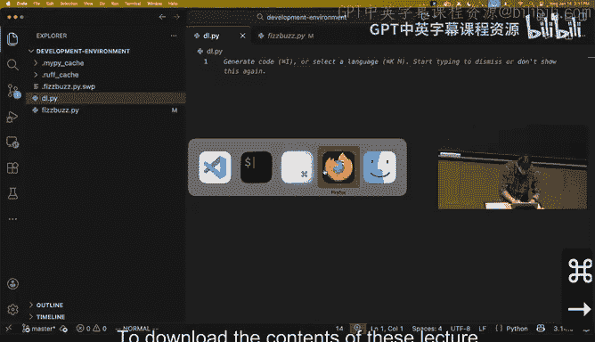

Okay， so we might have some prior knowledge about how to build this or like maybe we're fully capable of writing this code ourselves from scratch。

 but the AI can speed us up so one of the things we might want to do like writing this code in Python is import a library。

😊。

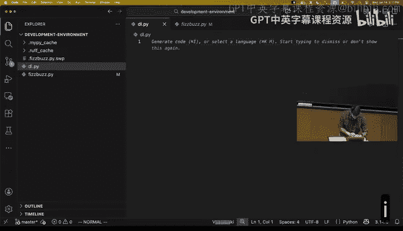

For doing HTP requests and wow we're already seeing here the autocomplete。

 so the AI suggesting AI you imported a library for doing stuff with HTP requests like one of the things you might want to because write a function that downloads the file。

 but let's ignore that and just start typing， let's say。I want to call my function download contents。

 not download file， and take in a URL that's a string and give me back a string。

AI so I'm in this demonstration I'm using Vi Studio code with GitHub Copilot Yeah and in the lecture notes we have a section on recommended software that'll link to a bunch of these things GitHub Copilot here。

But I think to first approximation， we don't want to make strong recommendations for particular pieces of software here or teach you how to use particular pieces of software。

 it's more of the underlying concepts and these are common between all the things like if you do this what I'm doing here in cursor。

 it will work like exactly the same。So we see like I can start writing some code and the AI model actually auto completes past my cursor。

 so it's suggesting this snippet of text that's shown in this slightly grayed out color。

And so here I can even cycle through the different possible completions。

 you can sample multiple results from the LLM and I can look at like。

 like what are the different ways it thinks I might want to complete this code？

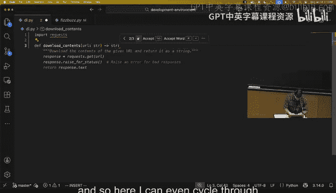

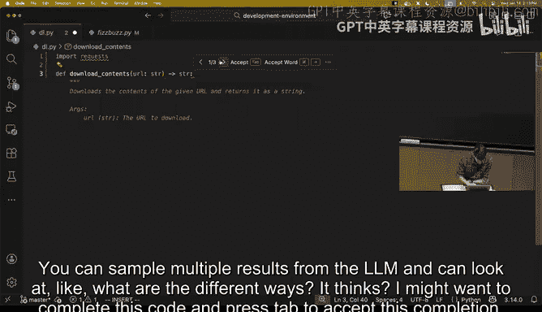

and press tab to accept this completion， so in this example all I wrote was the signature for the function and the model the AI model actually just wrote the entire function body for me。

So it save me a bunch of typing。嗯。Now， with these models， like they're just。

Probabilistic models trained on a whole bunch of data and using some other fancy methods。

They don't have intelligence in the same way that humans do。

 and so when you accept some AI completion， you really do need to look at it to make sure it's doing what you want it to do and sometimes it won't be correct and you'll need to either tweak what the AI produces or just write it from scratch yourself。

But yeah here we're seeing the most basic form of AI autocomplete， like you start typing some code。

 it suggests a completion for you， you can press tab just like you can with traditional autocomplete to accept the suggestion。

Now the standard way of using this is in this like passive way like it's just always running you're writing code。

 it'll just like randomly pop up and say here I can complete it this way for you and if it looks good you can press tab to accept the completion and it'll save you some time but another way you can use the software is you can actually steer it through comments so we can demonstrate that as well so let me continue fleshing out the script I have a function for downloading the contents of a URL and remember I wanted to extract all the links from the contents so I can write a function called extract。

That takes in the contents and produces a list of strings that are the links， and here I see， okay。

 like A is happy to autocomplete this for me。And it's doing this completion kind it's based on the rest of the program I've written so far。

 like it doesn't know that I want to extract links and the most likely completion here is the one that just separates out all the lines from the contents right so like this is kind of a useless completion for the thing I want to write。

So one way you can steer these things is by writing comments to guide the implementation。

 so if I say something like extract like I'll mark down links from it even autocomps my comment from the contents。

 you can press tab to accept that。Then it starts suggesting stuff that's actually related to this task and so here you'll also see that sometimes it doesn't produce like the entire function body in one completion。

 it'll do partial completions， so you can just press tab to accept them piece by piece so it's importing the rex library it's defining a rex pattern and it's finishing off the function and that all looks correct Yeah put in as a comment you read versus in the little box do like like when do you use that Yeah。

 that's a great question it's like when the question is when do you write comments versus ask the。

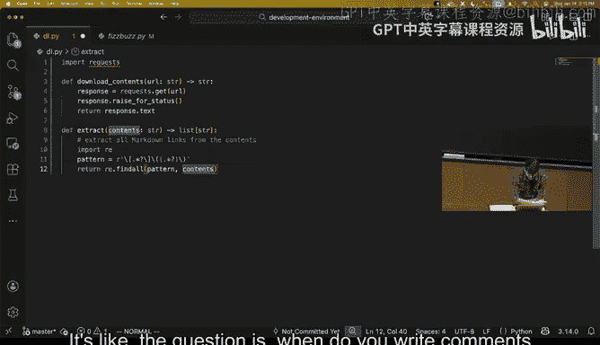

Chat box， which I've hidden whoops。

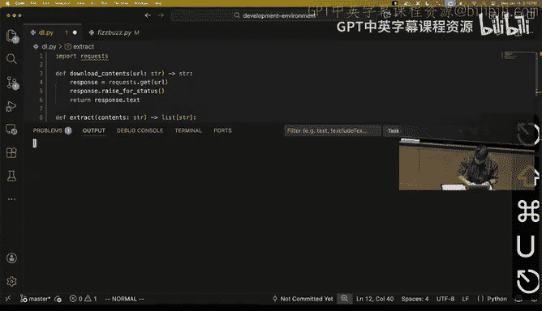

This chat box that was opened by default build with agent you can type in stuff here for it to do we will talk about this mode of interaction when we get to coding agents in a moment。

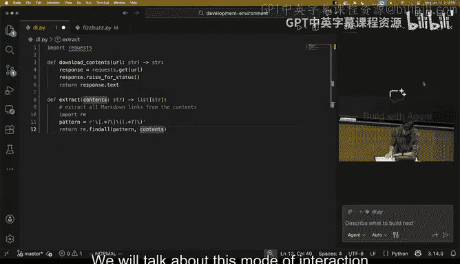

But at a higher level this。Type of AI input， this autocomplete only completes code past your cursor。

 so it can only make pretty narrowly scoped changes like in this mode of interaction you notice like here imported a library in the middle of my function like this is kind of messy right I don't want it to do this but this。

Tab completion is only allowed to just complete past my cursor if I wanted to make changes in other parts of the file。

 this mode of interaction is not the right mode for that。Any other questions？

Yeah and so here I just want to demonstrate how you can steer the AI by typing in code comments in practice you probably wouldn't want to do this。

 you would want to be even more descriptive in how you write this function and like if I called this function here let me just get rid of all that。

 if I called this function extract links and I even steered this through a doc string this is not useful if I was like。

 oops。系。Extract all links from the given markdown document。And like arguments。

 like the contents and returns。The list of extracted links here it will complete the code in the same way here is's actually completing the entire thing and one to go this is a much better way to write code because the stock string is actually useful for the future as opposed to the code comments and oftentimes when you're coding with AI support with autocomplete。

 you'll write little comments like steer the AI like you might kind of outline your function and comments let the AI tab complete below the comments and then get rid of the comments because they're not like that useful in the final artifact。

😊。

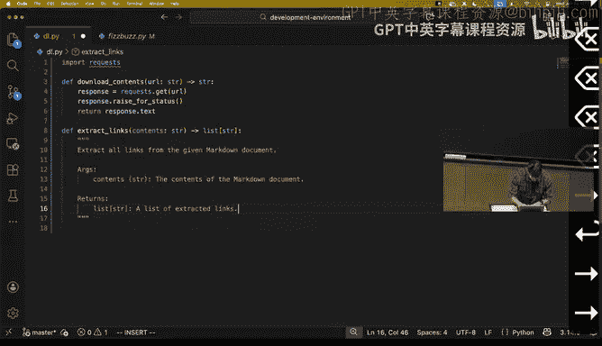

Okay so this is one mode of interaction a different mode of interaction with something called inline chat and what that lets you do is it lets you select a cursor position or a line or block of text and then give direct input to the AI to guide it to modify that in some way and so suppose I'm I've written a little bit of code here and I say I'm using this library here but this is actually a third-party library and it' would be kind of nice if this script I'm writing didn't have external dependencies so one thing I can do is I can select this block of text。

And going back to the earlier part on VIm， I have Vm bindingds enabled NVS code so I can do shift V to switch to visual line mode and then press J a couple times to select this block of text anyway。

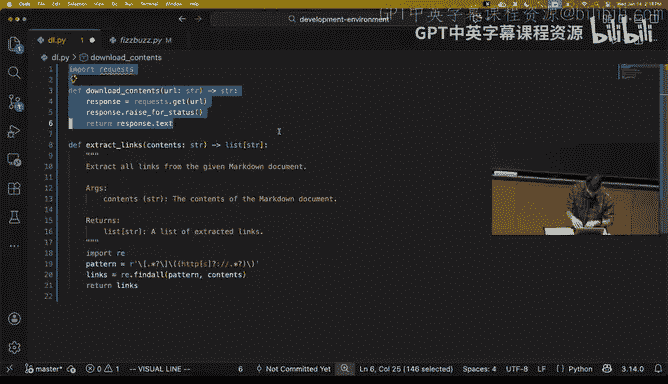

I can press in Vi Studio code with GitHub Copilot， the binding is control I or command I to bring up this inline chat thing。

 so I've selected a block of text and now I can steer the AI in a particular direction so I can say don't use third party libraries。

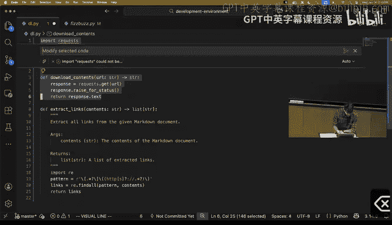

And presenter。And we'll see that the AI proposes a bunch of edits to our code。

 here we'll see dis so the red and green is deleted and added stuff respectively。

 and it was able to modify the code that's already there right so already we're seeing that this is a bit different from completing past the cursor here we're editing what's already there and I can review these edits。

 they all look reasonable to me and so I can keep the AI suggested changes。

And so that's the inline chat mode of interaction。Any questions？I觉得。はい。

In this editor the binding was command I after I've selected something， or just at a cursor position。

 like if I press command I it pops up at this。

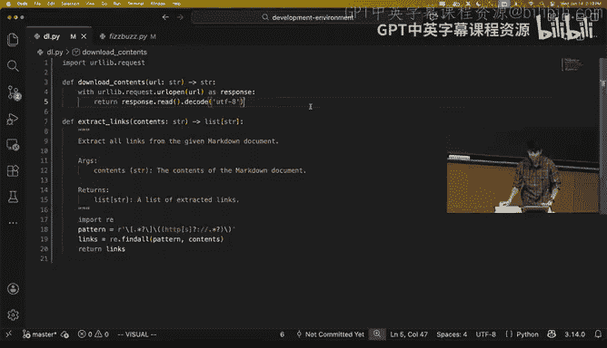

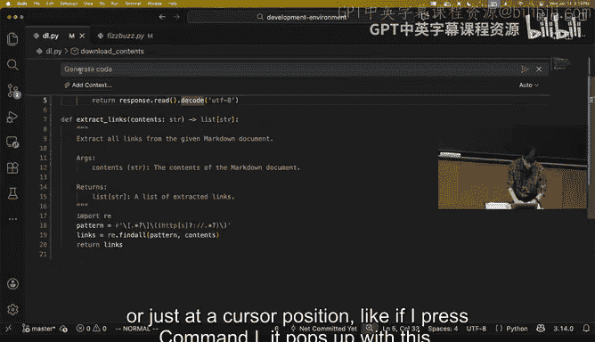

He咩 guy那。Yeah and you can select command yeah that's right you can select anything and press command I and it's like in the context of the selection。

 do the thing I am typing what if it means more than what you do what you're saying be like oh you actually。

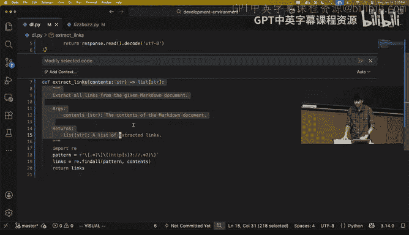

You need the next line order to do whatever。

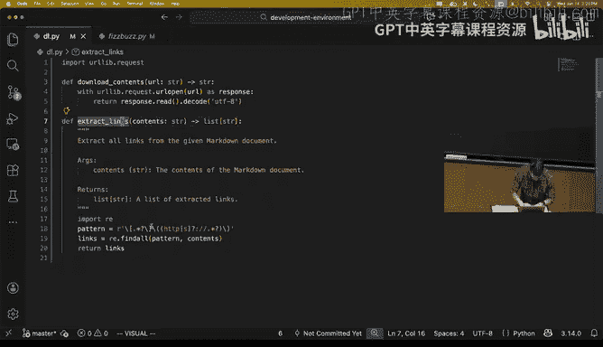

Yeah， so it depends a little bit on the implementation。

 we can demonstrate that here like I have my cursor position here and I will say move this import。

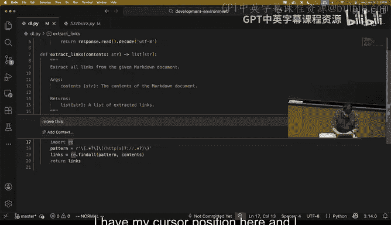

Outside。And it'll actually， yeah， so in this implementation it can only。

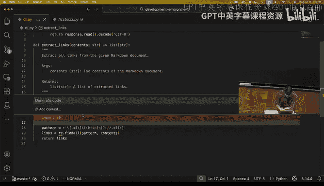

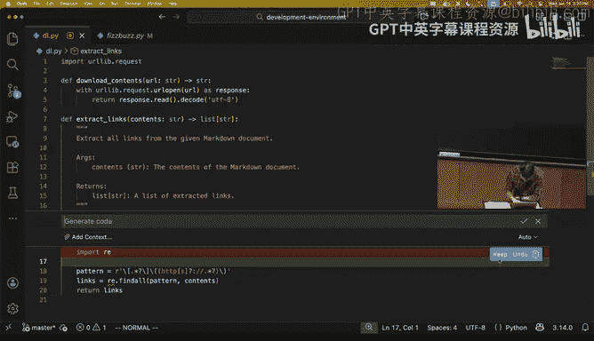

All right that doesn't really do anything useful and this implementation is only changing stuff in the selection I gave it this is a pretty new and wide open area and other editors think have their inline chat set up so that the thing can make changes in other places。

 but this is still kind of designed to be like here like here's a block of stuff like changes this in a certain way。

关这哪儿。It depends on the tool you're using。Yeah啊。

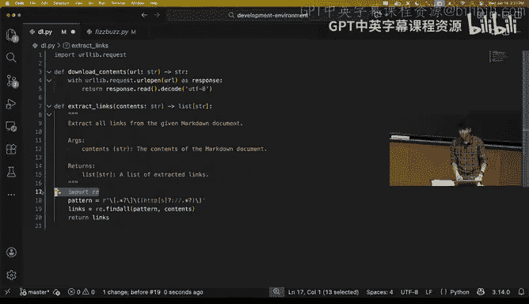

questionest。Is using AI like this requirement？Yeah。

 so the question is does using AI like this require an internet connection and like for the most part yes。

 the AI models that these tools are using are very large models that are require sophisticated hardware to run inference on in any reasonably performant way like some of these models are like trillion parameter models you need a huge amount of memory and like fancy GPUs to be able to run these。

 there are local models that you can use that are much smaller and less capable and can run on your laptop but then yeah they just don't work quite as well as the higher capacity models。

发发烧水啊。Yeah， the question is， will they use up your battery really quickly and yeah。

 like they're still doing a lot of computations so they'll use your battery up relatively quickly。

Any other questions？So we're running up against time。

 we got through only a small fraction of the topics we wanted to cover in today's lecture。

 so quick poll， would people be interested in diving deeper into coding agents in a future lecture。

 we can make some adjustments to the topics。Yeah， really。

 there's a question about how much experience you all have with these。

 would you like us to spend a bunch of time talking about how to use these tools or not。

 so raise your hand， yes， if you're interested。Okay， a decent chunk of the room。

 so I think we'll consider making a change to the。Of course schedule。

I think we don't really have enough time to go through too much more material。

 so I think we'll postpone the rest of this material into a future lecture。

 but happy to answer any questions people have about the things we've talked about so far in the back。

😊，没有。これにては。Yeah， so the question is about privacy， like is there a way to prevent our code from being uploaded to the cloud when we use these AI powered tools and like yes with an S。

 so some of these tools you can go into the configuration and toggle a bunch of settings that will be like off by default that'll say that you want additional privacy like the provider will not retain a copy of your code and will not retain a copy of the prompts you send into these tools and things like that。

 you are trusting them to do that。They're for the most part。

 not really commonly used technological means by which you can get privacy。

 there is some work in this area but these tools are not common yet。

 I think if you want privacy you do need to run the model locally。Question the back。在现在发的。还放时。不是道。

This， this I for。lot first。我有完一就。让是。Work。Yeah so the question is Python' is a really flexible language where we can do wacky things like import a module in the middle of a function and does this tab completion work worse in other languages that are not quite this flexible and my personal experience with this is that it still works kind of okay one of the features we didn't show here and I think I haven't prepared to show it is some of these tab completion models also do cursor position completion like they can kind of guess where you might want to move your cursor next and so if you're here and it recognizes like oh you want to import the Regx library before filling in the implementation here the tab completion suggestion will actually be to have your cursor jump up to the top the next suggestion will be to do the import RE。

 the next suggestion will be to jump back down and then fill in the body of the function。

So it can kind of sort of work in other situations you might want to steer it a little bit more yourself I think one of the things we didn't talk about in too much depth and maybe we'll cover it more later is。

These models are continually improving， these tools are continually improving and introducing new capabilities and as things shift you'll need to keep updating your intuition on what these AI tools are capable of doing。

 I think a great way of operating is kind of being right at the right level of abstraction if something is really easy the AI tool can just like nail it and you don't need to spend your time writing that code but if you give the AI tool a task that's too hard for the current AI like it will fumble in various ways like it'll write code that looks roughly correct but actually as bugs or will get like really confused and do crazy things and you don't want to be operating in that mode right？

But these AI tools are always getting better so you could do something today that totally doesn't work and then three months from now the AI is totally capable of nailing that task and so I don't have a great solution there except keep using these things to keep trying to push their boundaries and keep your intuition up to date on what the tools are good at doing。

Is there way that it's suggesting code to say， show me your thought process and show me why you did this or ask me questions。

Before you generate tell you you should have questions。Or tell me how。

In this is correct like all those questions Yeah so the question is can you ask the AI to tell you like why it wrote code certain way or haven it asked you questions or be able to ask it other arbitrary questions and so not in the modes of interaction we talked about so far but encoding agents yes those are more conversational tools so think roughly like chat G but it's plugged into your code and so you can just talk to it you can tell it to ask you questions you can ask it questions and it will just answer so that capability exists again you have to keep in mind that these LMs are not like intelligent in the same way that humans are intelligent they're probabilistic next token predictors and so sometimes they say things that seem reasonable and are correct and other times they will say things that might seem reasonable at first glance and it'll be totally incorrect。

And so， yeah， the way you have to use these tools is a little bit different than， for example。

 if you were to delegate the task to like an employee of viewers or something like that。

Hopefully employees don't try to gaslight you quite as much as these AI models do。

Any other questions？Co， then let's wrap up here and we will make some tweaks to the schedule online and then see you all tomorrow。

One more questionWe do have the room booked until then actually we could just keep going I think we'd posted the classes an hour long。

 but you cover stuff Yeah I will only do so if there's a big enough audience。

 otherwise we will revisit it later。Anybody else want to stay， feel free。

I think let's just stick to the schedule， I'm happy to answer questions。

 but we'll cover the new topics tomorrow or the day after。W to the place。这で是。

We need to think about that， but there might be some lower priority content or things we've covered in a previous iteration of the class。

 we taught this class in 2020， we recorded the lectures in the same way we have detailed lecture notes and so we might just say like go watch this lecture and then we will talk about AI things because those didn't exist in 2020。

😊，Yous have a giant。John also points out that we have an entire lecture for Q&A so we could just take that over。

 do you have any recommendationss for AI sessionss。

Yeah so the question is for Vesco do I have recommendations for AI extensions。

 I think since the audience is probably mostly MIT students。

 I would recommend using GitHub Copilot because it's free if you sign up for GitHub for education then you can just use the tool for free。

 a lot of the other tools out there you need to pay like 20 bucks a month or something for。

And I think to first approximation， a lot of these tools are like roughly as capable as each other。

 especially when you're getting started， so that's what I'd recommend。No。

 you need to have get coppit for so anybody can get it。

 I think they need to pay for it to get it for free。

 you need to sign up for GitHub for education and I think you need just verify that you're a student or a teacher and I think they like got a copy of your student ID or something。

 I don't remember the details of how they verify。不好。Yeah。Yeah。Thank you。Yeah。Co。

 see you all tomorrow。