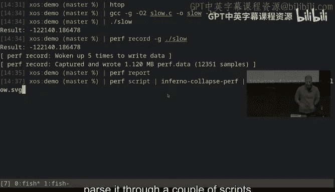
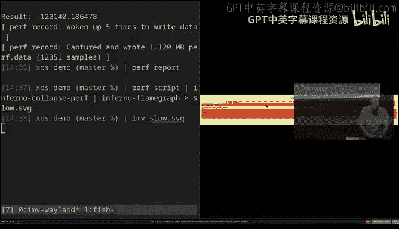
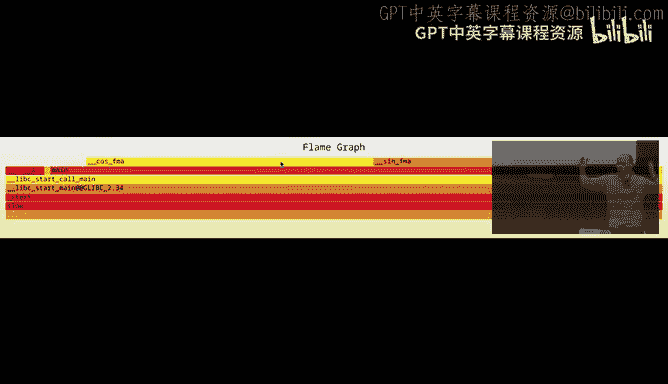
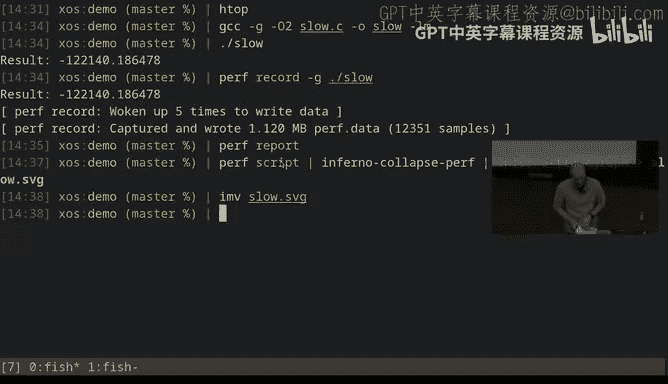

# 《计算机科学教育缺失的学期｜The Missing Semester of Your CS Education IAP 2026》中英字幕 - P4：Lecture 4_ Debugging and Profiling.zh_en - GPT中英字幕课程资源 - BV1vyzXB6Eps

All right， I think we might as well get started。People come in then people come in Co so today we're going talk about debugging and profiling the reason for this is big is as great as computers are in terms of being a tool we can make use do almost anything they also have a tendency to do only exactly what we told them which is not necessarily what we intended for them to do and hence the need for debugging to sort of try to explore that delta between what we wanted the computer to do。

 what it actually ended up doing as a result of what we told it。😊。

There's's sort of a quote from one of the famous people behind the C programming language。

 Brian Carnegan， who said the most effective debugging tool is still careful thought coupled with judicialciously placed print statements and this I think remains true for me as well。

 a lot of the debugging that I end up doing ends up just being print debugging。

 where print debugging really just means in your code， stick a bunch of print statements。

 the printout information that helps you think through what the program is doing and where your thinking about what it ought to be doing doesn't match what it turns out to be doing。

😊，ThePbuging is sort of seen as a kind of crude cudgel， if you will。

 but it actually works really well for a lot of cases。

 The biggest problem with print bugging is you sort of start from scratch each time the program runs and then you need to start to narrow down where the origin of the problem might be and so this is where we get things like logging instead logging is really just a more principled use of print statements where those print statements get to stay in your code over time so rather than just being things that you stick in there for your particular debugging sessions。

 you have these longer lived logging statements that log things that you're expecting to be useful almost any time you want to debug your software be that because it broke or because you want to understand as performance or you want implement a feature。

 whatever it might be So in general in larger code basiss and especially in production code basiss you'll find a lot of logging this can either be unstructured logging so unstructured logging tends to be things like just。

😊，out text saying what the program is doing or it can be structured logging this could be things like metrics it can also be even be JO blobs that gets logged over time so that you can more easily extract information from those logs as the program runs So if you'll remember in the first lecture where we talked about a bunch of the shell tools you have available it's often useful to be able to use the shell tools to parse and extract information from your logs and if your logs are at least semistructured that helps making it easier to use the tools to extract that information after the fact。

😊，There are a bunch of conventions around logging like usually most log entries are going to have at the very least a logging level。

 so the logging level will be things like trace debug info worn error critical to indicate how important this logging level is and most applications or libraries then have a mechanism for saying I only want to output log things that are of at least this level so when you run your codebase and production for example。

 you might turn off the trace and debug logging and only keep info level or above for example。

 or maybe only warnings and above so that you don't spam the output all the time whilst when you're debugging you might enable more of verbo logging to give you more details about what the system is doing and usually like the more sophisticated logging software or frameworks in many languages allow you to specify this per module per file to say this part of my application I want to log with trace debugging or trace logs and the rest of the application。

😊，Only it is going to be worn only because that's the part I want to dig into。

Usually logging statements are things that you put in proactively。

 so as you write the code you go this would probably be useful to log。

 but one of the things that sort of connects printbuging and logging is that when you do printbugging in a way what you're saying by sticking a print statement in there is saying this ought to have been logged so that I wouldn't have to print out this information now so usually a good sort of second step after you stick a bunch of print statements in there is so then turn them into log statements so that the next time around your program like when your program just runs normally you get more information out of it and you're less likely to have to go through the whole change and recompile cycle in order to figure out the flow of the program。

😊，You'll also find that there are a lot of thirdpart programs you interface with whether maybe you don't have the code or you don't how to build it or at least it would be annoying to do so a lot of thirdparty applications already have logging built in and the question is just to figure out how to access those logs for a lot of the command line tools you can passV or verboose to give more output from that program and you can often stack these flags you can pass likevV orVV to say be even more verbose and this can give you insights into what the program is doing and hopefully why it doesn't behave the way you expected for system services you can often introspect those services on whatever operating system you might be on for example on Linux this is usually through the journal CTL tool which as you say give me the logs like give me all of the outputs from this particular application that's running in the background like the SSHD for example for servicing remote connections。

But when you're writing programs， the reality is that printbuging only takes you so far。

 usually you start to get into a space where either it gets really annoying to recompile and redeploy your program each time or sometimes it's just like you don't really know exactly what to log you kind of need to observe the program as it executes and decide what information to extract and this is when you use debuggs and they're a bunch of different types of debuggs。

 but some of the most common ones are GDPB and LLDB that are both essentially the same program they're not the same program。

 they have very similar interfaces， similar interaction models where they attach to a currently running process and then allow you to control that processs execution so you can do things like stop when you reach this line in the code introspect memory while the program is paused。

 resume the program until the current function finishes those kinds of commands we'll see an exam。

Of that in a second。These are general purpose debuggs， so they work with basically any program。

 but they tend to prefer programs that have been compiled native programs。

 things written in C++ rust a couple of other languages like in general the things that produce like binaries that go on your file system if you have a more runtime focused language like Python Javascript Java falls into this category as well。

 then you go to an extent as well， you will usually want to use a language specific debugger so for example for Python there's a tool called PDB which is very similar as his name implies to GB。

 but it's specific to Python programs， but it lets you interface with the program in the same way to say stop when you hit this thing watch like notify me when this variable changes。

 allow me to introspect the state of the program and so on。😊。

Now what I'll show you in a second is the interface to GDP。

 but first I want to talk about something called reverse debugging or record replay debugging so when you do debugging using a debugger。

 it really just executes your program normally it starts the program at the top and it runs the program until it exits or forever if it never exits and then as it runs you get to stop it and resume it。

 those are your two primary mechanisms of control。What is sometimes frustrating about this is sometimes you let your program run and you discover that you've hit a bug of some kind but what you really want to do is now go backwards to figure out how you arrived at that bug like what was the order of operations that caused this number to be four instead of five or this Boolean to be true instead of false but by that time you know your program has already executed past where the real bug was and you're just stuck at the point where the bug manifested was is often not what you're after？

So this is thing called reverse debugging that is really useful to debug these kinds of problems there exist tools for this one of the primary ones for Linux is called RR for record replay it actually has the exact same interface as GDP all the commands are the same the only difference is that RR will record everything your program does all of its interactions with the operating system with memory。

 everything gets recorded and written down so that the program can be executed in reverse order。😊。

So when you start a program with RR， it runs your program start to finish and records everything that happens this allows you to when you hit a particular break point so when you've told you told the program stop when you hit this line for example。

 you can do a reverse step so instead of stepping to the next line of code。

 you can say undo the current line of code and pretend like we're in the world where the program is one line higher up and that let metro the state this can be very very powerful for tracking down tricky bugs。

Before I show you RR， I also want to mention that there's a class of bugs called Heisen bugs。

 so named after the uncertaintyty principle， where Heen bugs are bugs that when you try to observe them。

 they are not there。You will most commonly run into this when you do print debugging so print debugging will slow down your program because now your program has to like stop and write a bunch of characters out your terminal and then go back to running the program and that small delay can sometimes cause your program to behave differently than if it got to run faster this happens especially for concurrent programs where a bug might manifest because one thread was faster than the other if you would print statements in the faster thread then that thread now got faster and then maybe it doesn't observe the bug in the first place the same thing can happen with these debugggerers because they change the way the programs are executed this is especially true for Rrr because when Rr runs it has to record the entire program's execution and one of the ways it does that is it uses a deterministic scheduler so it runs all the threads in a very specific order。

So that it gets to capture all of their information and so that you can reverse that。

 but it could be that your bug does not manifest when the threads run in that particular order。

 so you can have a program that when you run it normally crashes or hit some bug and when you try to record it with RR。

 it does not crash， the bug does not manifest。😡，And this is the lovely world of debunkgging。

 where sometimes you have to like pick and choose the tool。

 not just based on what abilities it gives you， but also whether you can even reproduce the problem there。

So let's take a look at what RR looks like so with RR I have a program corruption。

c this is actually this program is actually in the exercises， which is why I'll remove this comment。

😊，And here we have a struct that has a string， this is a C program， it has a string， that's a name。

 it has an ID and a balance， and we have a bunch of accounts， we have Alice， Bob and Charlie。

 each of them have some amount of money in that account。

We have a function that lets you update the name of an account we have a function that prints out the balance of all the accounts and what we do is we print out the initial state of all the accounts。

 we make some changes to some of the balance it is we update the name of one of the accounts and then afterwards we print out the accounts again and in this particular case I've already narrowed down the bug a little bit so I've observed that when I do the print accounts here after updating the balances in the name something weird happens in particular the ID of one of the accounts changes like when we look at the setup of the accounts。

 account zero has ID1 account one has ID2 and account2 as ID3 but at the end here I observed that account zero no longer has ID1 but none of the code above here changed any of the IDs the only thing it did was change the balance field and the name field so why is the ID wrong？

😊，Well let's see what happens so what I'm going to do is I'm going to compile this program the dash G here is include debugging symbols this is basically like include the names of variables the names of functions and so on in the program so that when we later open it in a debugger it doesn't just see like memory addresses and locations and binary data but it also has information about this part of the binary file these assembly instructions are actually this function in your source code it sort of preserves that mapping so that's what the dash G does and we say corruption do C and0 is where do you want me to put the compiled file I'll call it corruption when I run corruption you'll see that the initial state here is as we would expect but after the operation the accounts afterwards you see that account zero has the correct name Alexandria but the ID is something completely different and we need to figure out。

😊，Why that is。So what we're going to do is we are going to do R record the execution of corruption what this will do is it will run the program。

 record all the stuff that it does and then stick it in a file on disk so if I Ls here actually sorry it stick it in a hidden directory so we can't see the file here but it records it on disk when I then do R replay what this will do is it will load that file and then it will resume the session that runs this program I could if I just to show you what the GDP version of this looks like so if I do GDP dos corruption instead and I do run then it runs the program and it leaves me at the end of the program where it exited。

😊，So this is what it learned looks like with GDP， there's no record or replay。

 it just runs the program and leaves me in this prompt where I can do things。

 and you'll notice that if I do R replay， it looks almost the same。诶。

It might be hard to sort of squint at here， but it still prints out that we're actually in GDP when I run our replay and it also shows us that there is like reading some debug symbols and if I type run here start the program from beginning it runs。

 start to finish and says program stopped and I can do continue continue and then it runs the program and you'll see it prints the same thing as if I ran the program normally just like in G when I ran it。

 it ran the program to completion and says the program is executed exit if the program crashed for some reason then it would stop where the crash was but in this case my program doesn't crash it just like prints a message saying this ID looks weird。

😊，So let's figure out why why do we get inside of this if condition in the first place so what we'll do we can type list here and list will print out the source code as GDPB sees it or as R season and so I can even do list to list more lines of code and in this case what I want to do is I want to set a break point down here on this if a break point is something where you say when execution hits this line or this part of the program binary。

 then stop executing and put me in control so in this case I'm going to say put a break point at line 52。

😊，And then I'm going to say run， I want to start the program from the beginning again because you're just finished and then I say R for run and I'm going to type C for continue because when you type R。

 it just starts the program at the beginning but it does not resume it yet to allow you to set break points and such so now the program counter the thing that points of where in the binary R points at the start of the main function when I type continue we will start executing main and it will execute all the way down to the first breakpoint hits。

😊，So in this case， you'll see it ran the initial print and then it ran the print after the balance change operations and then it says we're now at breakpoint1 in Maine at corruption。

 C line 52， this is the line that I'm about to execute。😊。

And now what I can do here is I can start to introspect the program state so for example I can do P for print。

 I could also type print but P is shorter and I can say I want to print accounts zero ID so in this scope I'm allowed to access any local variables that exist in this function I basically get to inject lines of code they get executed immediately and print out what they are I there are a bunch of ways you can modify this like I could say print this in hex or I can like explorestructs and arrays in this way there's a bunch of you can even call functions from in here so this is a pretty rich environment we won't talk about all of it but in this particular case what I actually want to see is I want to know when did that ID change when did it change from one to this weird number。

😊，In GDP I would kind of be out of luck because at this point it's already been corrupted and all I can do is continue so all I can do is go to the program end。

 so I would need to like set breakpoints earlier and earlier and earlier in the code and run it again and again and again and see oh when I set the breakpoint here it's not corrupted yet and I would sort of have to search for myself with R I can do something pretty cool I can say watch account zero。

 ID。This is also something you can do in GDP， you can say watch this expression and break whenever the value of that expression changes。

 I can do the same thing in RR。accountscounts。But now what I can do is I can do reverse， continue。

So what this will do is instead of executing down like continuing execution in Maine。

 it will undo the executions of lines in Maine until this watchpoint is hit。

 so until that value changes。And you see here when I reverse continue it says oh we hit a hardware watchpoint for this expression the old value is this and the new value is one remember this is reverse continuing so the new value is the older one and the old value is the newer one because we're executing from forward from future time and so here this is where that value changes and so the question is where is this well you can type back trace or for short BT and BT will give you a stack trace。

 a back trace that shows you the sequence of functions that you're currently in so it'll show you the whole call stack of functions all the way down to the current line that's being executed in the current scope so in this case we see the function that actually did the editing of ID is this string copy AVx2 so this is like in the C library somewhere the function that called that though was update name。

😊，And then you see down here the arguments to that function in the problematic case。

 so you see that when we give the new name of Alexandria we call update name the string copy executes and that for some reason ends up changing the ID Well that's interesting so that immediately tells us this is the function that is the problem。

So if we now do list update name。And we look at this function。

 well the update name function and all it does is it does a string copy。😊，So let's go。

 let's exit out of this by typing quitt， you exit out and we say it says here that the program is still executing and I go。

 that's fine， I don't care and you see now the program detached。But let's now look at corruption。

C again， so we had this update name， it did a string copy and there a string copy into accounts indexd。

 name well that's not ID why is that a problem if you go back to name you see that name is actually only of length 8 and if we count Alexandria plus a nullbyte as a string Terinator that's more than eight characters。

Well。It ends up writing beyond the length of this field and what is the next field while it's ID。

And so that string copy ended up overwriting our， our ID， and we get set。😡。

So this is the kind of stuff that a debargo will easily let you do and that RR can make even easier because you don't have to know in advance where you need to stop because you can move backwards。

So that's pretty cool， that is R R now。You can't always use R RR， for example。

 does not work very well on virtual machines because they require hardware support they need to be able to monitor certain things in the CPU in order to do the reverse debugging or record the stuff that you need it's also a Linux only tool but when you can use it it can be extremely powerful in general it's really useful for flaky tests it can be really useful for crashes that are hard to reproduce like we talked about in the shell lecture where you can have this like while loop that runs your tests until it fails well what about you have that while loop。

 but instead of logging to file you run R record so it will run your tests with R recording until it fails and then when it's done you just type R replay and now you have an execution of your tests you can go backwards and forwards in in time as many times as you want to track down the bug that's pretty cool The other challenge of course with RR and with GDP is that if。

your program then you have to exit your session you have to go out of GDP out of RR。

 recompile your program， and then open up GDP again， and if you open up RR again。

 the recording is no longer valid because it's a recording of the previous binary and it can't reuse that recording for a new version of the binary so this will not help you if you have to modify the code you would need to rerecord or recreate a GDP session。

😡，If you ever don't have access。あ。P为 p地七。Re that。The same break。Yep。Yeah。

 so you can easily rerun GDP with the same breakpoints from the top， so if I do GDP corruption。

 let's say I here set a breakpoint for 51 and I do run then the program now breaks at 52 and let's say I wanted to execute the next instruction so I can do next means execute the next instruction I can do next again。

 so now we're further down in that file， if I wanted to start from the top again。

 I type run and that starts the program from the beginning， but it retains all the same breakpoints。

So this is the way that you would sort of binary search here right so we could even do things like I want to watch accounts0。

id， I want to run from the beginning， and now it tells me the first time that that field is modified and then I can continue until the next time is modified and it actually points me at the same bug。

Co。こ。Um。Now the next thing you might want to do is sometimes the bug is not necessarily like in your code or you just want to understand what your program is doing like imagine for example。

 do you have a program running there just like seems to kind of be stuck but you don't know what it's stuck on so you want to introspect what the current process is doing and you don't necessarily need to care about the code it's someone else's code you want to understand what it's doing or why it fails or where all the CPU cycles are going so then you have this thing called tracing where you can trace an existing process and there are a bunch of mechanisms you can use here。

 one of the most common ones is something called Strace Sts lets you trace system calls that a given process is running so I can either be a process that you start so you say like St and then the name of a program or it can be Strays dash P and then the process ID if some already running program that Sts thing attaches to。

And let's look at what that looks like， so let's say that I hear run。

Strace LS L so LS remember is the list program It lists the files in the current directory L just means print them one on each line with a little more information about each file and I want to list all the contents of slash temp actually I don't want to I want to list all the things in this directory and'm going to hear take the this is sort of a bash redirect trick to make sure all of the output。

 whether it's errors or standard out goes to one place and then I' pipe it into less which is a pager So instead of this is being dumped into my terminal。

 it orbits a little program that I can scroll up and down in this is useful if something produces a lot of output and you'll see what I got was this long sequence of lines that if you squint at them you'll see that every line starts with the name of a function and open parentheses and then it's a list of arguments these are all of the system calls that this program ran。

😊，System calls are things that you talk to the operating system to the kernel to do so it'll be things like starter stop processes。

 open files read files， write to things access network sockets and so on they're not the functions inside of your program those will not be logged here if I zoom out a bunch here。

So its easier to say you can sort of squint at and see there is indeed one line per call。

 but some of them have a lot of arguments， so they're very long lines， but if we go back in here。

Let me scroll down a little bit。好。S trace S trace so the things at the top here。

 if you look at them you'll see things like LD or Xec of the path that is the program。

 the things at the beginning here are just the things needed to start a process in the first place it sort of actually tells the operating system to execute this file on disk it does things like load dependencies it might have on other shared libraries so the stuff at the beginning is not terribly interesting to us but if we scroll further down。

😊，诶。Let's see how far down we need to go。哎。Down here。

This is reading a bunch of here you can see it actually lists a bunch of time zone files that it opened because I asked it to do the long printing。

 that means it needs to print the modification times of the files。

 that means it needs to have time zone information to look up what that time is in my local time and therefore it needs to access a bunch of time zone files and if we go further up we can see。

😊，And let's see if I can find read there。Yes， as you can see there's a lot of stuff in here。

 it's like hard to really find anything well you can do better than this。

 so with Srays you can say I want to only show things that are related to a particular type of operation。

So I can for example， say I only want things that are related to file operations。

 so now all the things around like looking up the like network operations stuff would not be listed。

 loading dynamic libraries would not be listed and instead this will now only show things related to files。

😊，And in fact， it will also you can narrow it this down to I only want to show a specific function call like a specific system call not I say here I said percent files which means anything related to the file system but I could also say for example。

 only redirecty calls and that's the only one I'm trying to find here now Ls does more things than you actually let's try it without dashL because we don't care too much about that we can see the output here at the bottom。

😊，呃。And。Okay， fine， fine， fine， fine。 We'll do read there。Yeah， there's no read there。

I don't know why I don't see this now。诶。Interesting。Oh， I know why this is because of NIs。

 I have NIs installed and so what Ests will do is it runs the program you give and then if that program itself starts other programs。

 it doesn't trace them。So if you run program A and program A runs program B。

 then anything program B does is not logged by Sts by default。

 only things that program A does is logged by default。

 what you can do and this is where man pages are useful you'll see that Strays has a bunch of file。

 a bunch of flags like all the ones we've talked about in the past and one of the flags you can pass to Sts。

😡，Is follow forks。so you have the dash F flag which is that it also should trace the operations of other commands they get executed The reason this is related to Ns is that on inIs LS is actually a NI program that then invokes the real LS。

And so here， if I now switch this to say， I want this to follow forts and now look for things that are files。

Here we go。😊，The now。If I， let's try。Read， read。Actually， let's do open that maybe。

You'll see this line right here。This line。Is the line that the program uses to open the current directory。

 so you see here dot， open the current directory as the directory for then later read their calls so in fact。

 if I now go back and say I want all the file operations，And I search for dot in here。Oh。

 it doesn't count those files。Well。诶。Stat。Stadex。Oh， that's because I removed the dash elf flag。File。

Here we go， okay， great。So you see the the。The open a dot that we had further up now you'll also see that because I add past the L flag which tells tells the program。

 give me more information about each of the files you listed。

 it also does a list X attributes and stat X for all of the files。

 all the entries in this directory because it now not only wants to list the names but it also needs to gather that additional information and so this now tells me that Ellis is doing more work when I pass dashL because it also needs to do all these stat calls to get additional information about the files and indeed if we scroll up you also see this is more of the time zone information here we'll see the Stat X calls so list X aters list additional permission bits。

 Stat X which is it also does for every file is the thing that gives you information about file size modification time。

 those kinds of things so all of these that you trace through exactly what this program is doing when interfacing with the file system。

And this can be really useful if you try to for example。

 attach to an already executing process with the dash P flag。

 then this will just start printing reams and reams of information about what that process is actually doing if it prints nothing it means that process it's just like stuck doing CPU work it's not actually talking to the operating system at all and youll see I passed here dash E percent file if we look at。

😊，If you look at the man page for Sts。Under filtering。

 you'll see that there are a bunch of other things you can filter for。

 you can filter for a specific system call like I did with StatX， for example， or you can say all。

 which is any system call which is the default， you can say percent file。

 which is any system called related to file operations， anything related to processes。

 anything related to networks， anything related to signals and so on。

 and so you can sort of craft a list so that the only things that are printed out are the things that you care about。

😊，Strace is a useful program for this kind of stuff， but it only really does this。

 it only really does system call tracing， but what about if you actually want to do slightly fancier things like for example。

 imagine that you want to keep track of like the you want a latency distribution diagram of how long read calls to the operating system take。

😊，Estraray doesn't let you do that the Estra just tells you this function was called with these arguments so what you really need is like a thing that lets you almost inject programs into the kernel they get to measure what they want and that thing also exists it's called EBPF or extended Berkeley packet filters these are essentially these little Linux programs that you get to install into the operating system kernel on Linux and it gets to run with the permissions of the kernel and inspect internal kernel state。

😡，You can write like C programs that do this that have extreme expressive power。

 but they are also more sort of handy user utilities so that you interact with these so for example there's a tool called BPF trace and BPF trace is kind of like S trace but it uses the EBPF packet filters instead and it lets you write slightly more advanced expression so for example me clear the screen here when you see me clear the screen by the way in the terminal control L so if I do echoF and then control L it just clears my screen and goes back to just the terminal at the top so I can run BPF trace let me do a slightly different one maybe to start with。

😊，BBF traces。So BF Trare takes a dash E flag， which is a packet filtering expression。

 it is what should get executed and when？These expressions are kind of like O expressions that we talked about briefly O in the first lecture so they let you filter on the system call。

 filter on arguments of the system call and say what should happen for that system call it's a little bit of a wonky language but it is pretty flexible so in this case I say I want BPF trace to trace every trace point that is a system call that is。

😊，Entering that system call of any kind so cisentter is what the kernel calls any function that is the start of a system call from a program the star here is like it's like a pattern so I can match a system calls so I could hear for example say staticx and it would match against any system call that is staticX or I can say star which is truly any system call。

And then I put curly brackets， oops， that's annoying， BPF trace， come back。诶。

And inside the curly brackets。I can put a little BPF program， I can kind of right C in here。

 but there's also some handy syntax for certain things， so for example this program。

Will on every system call write to a map， that's what that at is， is a map。

Probe is a special word that means the name of the thing you're tracing， so in this case。

 the name of the system call equals count count as a function that every time you call it goes up by one。

😡，And so this lets me count the number of invocations of every system call。Now。

 when I run this program。It just runs， there's no output until I eventually。

Until I eventually kill the process and when I kill the process。

 it'll print out the map of everything it traced， although it seems to be very unhappy。

 why is it unhappy？No， it shouldn't need El。I think it's because it's gathering a lot of information because this BPPF trace by default will trace your entire kernel。

 it will not just trace a particular program， it will trace everything that's currently happening on your computer。

Oh， I've misspelled something。This enter probe is count。All right。

 let's do the other one that's fine。So this one is a slightly more convoluted BPF trace where I say I want to trace any open a system call and I want to print out the comm comm is the name of the program that is doing the operation and I want to print out the string argument that is the file name to this thing。

 so I basically want to print out every file that is opened。And if I run this program。

 you'll see it attached to probe and it's now just running and it's printing any time any program on my computer is opening any file。

 prints in the name of the program， and the name of the path that it opened。😡。

You can also limit these， so you could， for example。

 say here that I only want to trace where comm equals TMX， for instance。

 and this will now only trace calls to open at， where comm， so the name of the program is TMX。😡。

In this case， teamMX isn't do much， it's not because I missball team。Yeah。

I have not mispelled Tbooks， my computer doesn't like me today， it seems。呃。Okay。

 then we will instead do。This is another handy command， as we can say。

 I want the process ID to be the current process ID， and then I pass dash C and LS。

So what this does is dash C says run the following command and set CPI。

 this is like a special variable to be equal to the process ID of the thing you just started。

 and so this lets me only trace the Open at invocations for the program that you ran。

So you're going to let you see that command line again， it's also in the notes， so here it runs LS。

 it takes the process ID of LS and sets it to the current process ID and then our filter for the Open at here is saying PID equals CPID so the process ID of the process that called this particular system called that you were tracing is equal to that process ID。

And so with this， you can start to do really fancy things and luckily a lot of other people have built those fancy things for us so we don't need to build them ourselves so for example。

 there is a program called Bilatency。It's all written with BPF its basically a BF program that monitors all disk operations。

 measures how long they took from start to finish， so it monitors the enter and exit of every system call that touches the disk。

 and then whenever you kill it it prints out the distribution of times spent accessing the disk。

 so this is saying that of the system calls that happened to touch my disk。

 two of them took between four and eight microseconds and one of them took between two and four and so on。

 the longer you run it the more data it gathers。There's also one called Open Snoop。

 which is basically the program we run earlier that just snoops on every open call that happens on your computer。

 so anytime any program opens any file， it prints out what that process was and what it opened。

And again， all of this is enabled by the BPF infrastructure and using this。

 you can trace programs to do nearly anything， which would be really useful to figure out what a program is doing。

 why it's stuck and so on。😡，嗯。But there are other kind of things that you could trace。

 so for example let's say you wanted to trace your network while you can do TCP dump which is a program that will dump the traffic that goes over your network interface。

 so in this case minus WLP2 S0 is the name of my Wi-fi interface because why not or you can say any for any interface and then you can write an expression TCP dump expression that says the kinds of internet packets you want to be logged so for example I could say anything that goes to port 80。

And so now this is going to dump out information about every packet that hits port 80， well。

 there are no packets currently hitting port 80， but we can change that so we can open a new terminal。

 we can do curl htDP， nevertls。com。诶。Why is it unhappy to do that， so it connected to port 80。

 it set a request。And now if we go back to TCP dump。

You'll see here that a bunch of packets have gone out to the HTP port。

 The reason there are a bunch of them is because this logs every packet。

It doesn't log the individual request， it just runs every packet that goes over that interface that goes to port 80。

 so the message that I sent was fairly short but it was an HTTP request and so it requires multiple IP packets。

 and the same thing with the response requires a bunch of IP packets and what it prints for each one is it prints out the IP address that the traffic went from。

 the IP address that the traffic went to， the port it went from， the port it went to， IP flags。

 information about the TCP window， options， the length of a packet and all such things。

And this can be really useful if you're debugging network protocols because you can make it log whatever information you want about the packets。

 including their contents。😡，And so people have written tools on top of this like Wireshark that is a GuUI application that you can say log all the traffic that goes over here and it understands these different protocols that sit on top of IP。

 so for example there's a wire shark plugin that understands MySQL and so now you can hook that into your network interface and it will show you all the MySQL traffic going over it and what the contents of those packets are。

And you can write your own plugins for some other protocol you come up with and it would give you a nice visual visualization of it and let you debug what's happening to the protocol at the packet level。

 you can also record packets for replay later on， for example to do offline testing and so on。

 so there's a bunch of cool things you could do with this。

It will struggle with encrypted traffic of course， because it logs the raw IP packets。

 but there are tools like MITM proxy， a man in the middle proxy。

 which basically pretends to be an HTTPS server and then logs all the packets to disk after decrypting them。

😊，There's a bunch of other kinds of debugging too so not all debugging has to be manual。

 sometimes you can get programs to do it for you one of the most common things that we've seen recently are these things called recently it's like the past 20 to 30 years or maybe not recently。

 but are these things called sanitizers， sanitizers or essentially like little extensions to your compiler that make your compiler put extra instructions into the program the do sort of sanity check that your program isn't doing something bad。

So as an example， let's look at。😊，Let's look at address sanitizer which is one of the most common ones of these。

 so here I have a program called Heap overflow。This particularly hippo flow has a similar bug to what we actually observed in the RR example where I have a buffer that's a certain length and I try to copy in more bytes that fit into that buffer this is a very classical bug that you would make and see now when I build this program and run it。

😊，AHeap overflow。And I try to run this program， nothing happens and the reason nothing happens is because well。

 I didn't try to do anything with that memory afterwards。

 like it overwrote some other random part of memory。

 but I didn't observe that part of memory so it's like nothing detrimental happened in reality like we saw in the RR example。

 this might have corrupted some other state in my program but in this particular case it doesn't cause the program to crash because nothing depends on the value that was overwritten。

But even so there was a bug in there， we saw that this overwrote more memory that I was supposed to。

 but luckily I can compile with this dash F sanitize equals address。

 and this tells the compiler insert those extra instructions to like sanity check what my program is doing。

Now， if I run my program， the program actually crashes。if I scroll up。

 you'll see the program says address sanitizer， find a heat buffer overflow on this address when the program was at this program counters like the instruction it was at。

 it gives you a backt for like we saw earlier in R for these are the functions like this is the call chain you were at when this problem was was caused and indeed meM copy was the thing that was the problem。

 that was the thing that was copying over， and it gives you information about where the memory was originally allocated that got overwritten into and it gives you the contents of the memory and which parts were overwritten and by what。

😊，So now you have way more information about the exact nature of the bug that was there。一 job单买几多。

anIn a way， so you will find that for some languages like languages that have stronger runtimes tend to have more of this checking be done by the runtime sometimes it's like off by default because it can be kind of expensive also many of these languages often have ways to bypasses precisely because it can sometimes be expensive so in Java for example you have these like unsafe operations that allow you to do direct memory manipulation and these can exhibit similar kinds of problems。

But I think address sanitizer for example， I don't think you can use on Java programs because they require the Java runtime。

 they're not native code， same thing for Python， but many of these have either like a lot of it is supported by the language itself。

 or it ends up being a like they have specialized tools that you can use。

There are a bunch of other sanitizers through too， like the sanitizers that detect concurrency races between different threads in your program and so on。

 so there's a bunch of these that are useful to familiarize yourself with。

 especially if you write a lot of native programs like in C， C++ objective C， rust and so on。嗯。😊。

But these require that you recompile your application。

 you need to compile it with a compiler having these extensions installed。

 There are also tools that allow you to detect these kinds of problems using using a tool that runs your program as it was without you needing to rebuild it which can be useful for example if someone else built the program like it's not yours there is a tool called Valgrind Valgrind is a program interpreter。

 it's an extensible program interpreter so what it does is it basically pretends to be a CPU it takes your program and it executes the instructions of that program but it allows you to like because it pretends to be the CPU it gets to do special things before and after every instruction This means that it executes a lot more slowly than if you ran your program normally on the CPU but it also means you can check way more things so one of the things like school about this is Valgrind can actually check every memory operation your program does。

where without any instrumentation and tell you this instruction right here wrote to this memory that that instruction allocated and was not supposed to be used here。

 so it can be give you really really in-depth analysis of where your bugs are。

 it can also be used for a lot of other things like for example。

 it gets used a lot in profiling for giving you instruction instruction level accurate or instruction accurate profiling information like this function takes this many instructions to execute or this many cycles to execute because it gets to actually observe the instructions as they execute。

 but again slows down the program a lot。😊，For debugging I've also found that AI can be an extremely useful tool for a certain subset of debugging so in particular anything with us like cryptic error messages usually someone else has observed that cryptic error message in a slightly different way like slightly different memory addresses slightly different program names they can sometimes be really annoying to Google for if you point LLMs at them they tend to be really good at trying to explain what went wrong and trying explain workarounds you might be able to use they can also work really well for programs that have to traverse language boundaries so imagine you have a Python program that links to a rust library that in turn uses a C library for something if you find like weird behavior in your Python program and it's because of a bug in the C program debugging that yourself can be a real pain sometimes and LLMs can be very good at this especially if you give them access to the source code of all three dependencies you can tell it I'm observing this。

😊，Behavior in the Python code。And then the LLM will sort of figure out like right little reproduces to find a small use case that reproduces that bug。

 and then it'll trace that back to oh that's this rust call。

 then we'll go to the rust code and try to reproduce it using just rust code and we'll realize， oh。

 this is actually this C call and we'll go over to C and write some C programs to reproduce that and ultimately tells you like this part of the C code looks like it's wrong。

In general， my experience is that it's not very good at fixing those bugs。

 but it's very good at finding them for you， and that alone can be a time saver。

It can also be really good like when you get stack traces or crash traces。

 LLMs can be very good at like helping you navigate through those of like which function was it that you actually cared about because these stack traces have been pretty short because it's been example programs。

 but if you have stack traces like 10 functions deep。

 it can sometimes be kind of annoying to navigate and even though they have some structure to them you can usually do it yourself。

 LLMs can often help you especially if it's in an unfamiliar code base to you。😊，Yeah。

I think it's time for us to then move on to profiling。

 even though it looks like we don't have a lot of time left。

 profiling is actually surprisingly related to debugging。

 a lot of the concepts end up being similar because if you can understand what your code is doing。

 you can also usually use that to understand understand how it's performing first we need to talk about timing。

 how do you time how long something takesep。I't get an answer， but I forgot certain class like that。

So right so there is a tool that you have access to in basically every shell called time time is sort of a built into the shell and it just is followed by any command that you want to execute and when you run that program。

 it will give you this kind of summary， it'll look slightly different on different shells。

 but ultimately gives you the same information， it usually gives you three numbers。

 it gives you real user and shell， real is the amount of wall clock time that passed like if you looked at a clock from when you hit enter until the end of the output that's the real time。

😊，User is how much time the CPU spent in your code。

And then cis is how much CPU time was spent in the kernel executing that program。

And the reason I say CPU time here is because if you have many CPUs and all of them run in parallel。

 let's say you have 10 CPUs， then if one second passed and all 10 CPUs work for one second。

 then 10 CPU seconds have passed， even though one real time second has passed。Similarly。

 in this case you can see that the actual time it took to execute was 130 milliseconds。

 but the CPU time was only 54 milliseconds and the time spent in the kernel was only nine milliseconds so where did the rest of the time go well the rest of the time was just spent waiting in this case curl lets you act as a remote server over HTDP so I'm trying to fetch the class website and so a bunch of the time is just spent waiting for the packet to go to the other end of the server on the other end and come back so wall clock time passes but no CPU time is spent。

😊，This is also one of the simplest ways to profile two programs against each other。

 right is just run one with time and run the other with time。And that works。

 but it's somewhat unreliable because usually if I run this program multiple times。

The time is going to vary a little bit between the executions like this is 124。 that's 138。

 This one spent 20 milliseconds in the kernel The earlier one spent9 so what's the truth Well there are people who have written tools that help you explore this as well so for example there's a tool called hyperfine hyperfine lets you give any number of commands and it will run all of them multiple times measure the time they took to execute and then use some statistical techniques to figure out how like the standard deviation of the difference in the speed up between the two programs So here for example I'm comparing the time it takes takes you to find program against the FD program the FD program is sort of an improved version of find that is better ergonomics we talked about in lecture1。

😊，And here you see it benchmarked one of them， and then it benchmarked the other and gave me some statistics about them。

 and at the end it says find ran 40 times faster than FD。😊，This is a particularly weird case。

 this is an almost empty directory that like FD is not quite optimized for this use case。

 but it does tell me that FD is not particularly well optimized for this use case。

And it gives me some statistical like belief that this is true。

 that it wasn't just the one time I ran it that happened to be true。Sometimes with profiling。

 even just understanding what your system is doing can be useful like you run a program and it's being slow is it being slow because it's using all my CPU course is it being slow because it's only using one of my CPU course but 200% is it being slow because my disk is slow just monitoring your resource usage can be hugely available here there are a lot of tools you can use for this Htop is a good place to start so Htop shows you the utilization of your CPUs so in this case you can see I have eight course and you can see here the CPU utilization of each core shows me how much memories being used the load average over on the right here is kind of weird numbers I recommend you try to look up what they mean but they're basically how many CPU course were needed over the past period of time so what this is telling you is the demand on my CPU is a general 1。

2 CPU course has been needed over the past I think the first one is like the past 30 seconds or10。

Seconds or something and the next one is like one minute or five minutes and the next one is like 20 or 30 minutes is like increasingly lengths of time so you can see how load your load has changed over time and then at the bottom it shows you a list of all the processes that are currently running on your system and you can like switch between different views you can sort them by different columns you can move through them to see more about the information about what's being shown you can also switch to other tabs like this one shows me the IO tab here shows me how much disk read and writeite is this process doing how much network read andrite is is doing is also another tab you can get in here you can sort them by how much they're doing and so again you can see where the resource utilization on on your system is going and therefore what your program is probably bottleneck by。

There are a bunch of specialized tools as well so for example there's a tool called IOtop that specifically gives you detailed information about input and output。

 disk or network， there's tools like free that gives you information about memory usage。

 LS of which gives you information information on currently open files。

 SS which gives you information about network connections so like which ports are open。

 which connections are open， where they connected to and so on。

 there's nettgs which gives you information about which things you're using the most of your network。

 there are also other tools that are pretty cool like BTop BT is like an even better version of HT that shows you lots of stats about your system including like which disk is using like how much time to spin up and like all of these detailed statistics and you can configure it to show exactly the things you care about so you can go pretty far down this route of introspection on the resource usage of your system。

Ultimately though， what you usually want to do is you want to record information about a given program。

 like once you really get to the point of I want to make this program faster。

 you kind of want to record information about that program and then you want to。😡。

Try to show where like the hottest part of that program is like where is that program spending its time looking inside of the code like inside the functions and for that we have a tool called PEf so I'm going to build this program here called S do C。

 it's a program that does something slowly it does a math operations now here if I run slow then it runs for a little while and eventually it exits。

😡，And it computed some results who knows what it is。

 right I can do Perfcor dash G to say that I want to capture debugging information and then run the program。

😊，When I do this what PEf does is a sampling profiler so every so often it will pause the program check where every CPU is in executing that program and record that information and then let it run again and it does this many。

 many times a second to give you a sample of where in your program is the CPU spending the most time when it's done you can run Perf report what Perf report does is give you this kind of use it says100% of my time was spent in or under start the first column your children is this function and its child functions like anything it called so obviously start as the start of my binary all the time is spent under the start of my binary。

嗯。But the second column is how much time was spent in this function specifically。

 not in its descendants， so you'll see here here's my main function， I can press plus to expand it。

 and I can see that 43。6% was spent in computing cosine and 43。2% to 3% was spent in computing sign。

You can also here get annotated information around where like showing you listings of code as well to annotate to this function here I'm annotating it with just the the raw assembly there are also ways here where you can if you put H you get help information and so you can ask it to show you line numbers you can also ask it to show show additional information like source code lines。

 although now my terminal isn't tall enough so it gets sad there's a bunch of things you can use this to sort of dig into your program in fact if I go to main here I can annotate main oh why does it not give me my。

😡，呃。呃这。Toggle source code view。Oh， I don't think it， oh yeah here is just I was blind。

 so you'll see here that this for loop is this instruction。

You kind of have to squint to disambiguate the assembly instructions on the C code。

 but you see they get interspersed here so that you can see this line of code is these lines of assembly code and each of these assembly instructions took this much time into a percentage of overall compute time and so this lets you get sort of really drilled down and like this part of this line of my code is where the CPU spends the most time。

This can be hard to parse though humans are not very good at parsing this kind of information。

 especially not at scale and so people have built better tools for visualizing these things for example there's a tool called Flamegraph that here I'm using inferno which is a rust port of Fgraph just because is what I happen to have installed but it allows you to take the output of Perf in this case Perf script parse it through a couple of scripts。

And what it produces is an SVG file。 And if I open this SVG file。😊。

It gives me this kind of view。So you'll see at the bottom is sort of the entry point of my binary and then you'll see going up a little bit that my main function is here and then you'll see that in the main function。

 the width of the bar indicates how much time was spent there and you can see here about half the time of main was spent in cosine and about half the time a main was spent in signedine if you get really complex programs this will end up looking like this giant bar of flames because it colors things in that way and you can see like the wider flames are where you spend more time。

😡。

There's an example of this in the lecture notes as well for a more complicated program if you open these in your browser。

 they're even clickable so you can click to zoom， expand information about the different frames and so on。

 extremely useful for figuring out where your program is spending its time。😊。

嗯。As I mentioned though this is a sampling profiler， so it only gets to see the where your CPU is。

 when it interrupts the program， when it pauses the program。

 and that means you get imperfect information， you can increase the frequency at which it samples the program。

 but then you're also slowing the program down because it has a pause more often。

If you want like really really accurate information about where the program is spending its time。

 you can run it through Valgrind， so Valgrind， as I mentioned。

 interprets every single assembly instruction as though it were the CPU that's mostly true at least and so it gets to truly measure it doesn't sample it actually traces the program gets to measure how often every single assembly instruction is called。

 but as a result it also tends to be quite slow， so Valggriin has a bunch of these different modes where it can count different things like did you use your memory correctly or how many times each assembly instruction called so it has these extensions。

 these plugins for measuring different things that might be useful it's a very versatile tool in that sense。

😡，Now the last thing I want to mention here is that profiling is not just about being able to evaluate the runtime performance of your program。

 like how quickly different parts run， it is also about looking at the output of your program and trying to understand why that output behaves in a certain way。

😡，Sometimes it's also about why does your program's behavior change in a certain way in response to changes to the input。

 so for example， imagine you have a program that searches for strings and files kind of like the GP tool。

You might want to understand how your program slows upper speeds down in relation to the size of the input and the size of the pattern。

 or maybe the complexity of the pattern， but let's say size， like length of the pattern。😡。

For this you want to visualize the data realistically if you end up with a giant text file of all the sort of I ran it with this input size and this pattern size and it took this many microseconds。

 that long list like that long Excel spreadsheet is not going to be particularly useful to you so instead you usually want to use some kind of visualization to plot that information in the terminal we have a bunch of tools that are really helpful for doing this kind of easy plotting for example。

 there's a tool called Gnuplot Gnuplot is built for the shell so in Gplot you write these little expression similar to what we've seen now a bunch of these programs like for BPF traces remember there's like dash E and you get to write a little program in a specialized language Gnu plotot is a similar program where you can pass dash E and you have a little plotting language you can say plot this column of the input like from standard in against this column of the input so X and Y and then it plots you an image。

😊，That's X against Y， and you can change the colors， you can plot multiple things。

 you can change the axes and so on。 This is a very useful tool for just like quick and dirty plotting。

They're also more extensive tool if you want to do deeper analysis， you want to do many plots。

 you want to do fancier things with the plots or postprocesing of the data where you can easily either use mat plototlib in Python so you write a little Python program that reads the input of whatever kind it might be and then plots it or in R there is a plotting library called GG plotot2 that I personally find extremely useful in part because it has this feature called facet wrapping so facet wrapping allows you to say know I have my input I have things that are going to be the X and Y but then I also want to say。

In like create one graph where。Like let's say my x axis is the size of the input and my y axis is the time it took to execute the program for something like Gr Well what if I want to see how the complexity of the pattern changes how long this takes so not the length but the complexity Well the length might be different lines on one plot but then I want one plot per complexity and I want them all to show next to each other so I can compare them facet wrapping is a thing in G plot where you can say I want to plot where the color is dictated by this column X is dictated by this column y is indicatedd by this column and which graph is indicatedd by this column and so automatically generate a set of graphs for you and it can even then create grids of graphs so that you have like a X Xy coordinate system that is the graphs so that some other column increases across graphs and increases across graphs in this direction you can plot like。

eight dimensional data sets or something， not eight dimensional。

 five dimensional data sets in something that you can actually visually recognize and this is one of the superpowers of profiling is not just to be able to extract information about how your program behaves。

 but also to be able to visualize that information so that you can identify problems or weird patterns and do something about them。

The thing I'll end on here is when you know that you will want to do profiling。

 you often go back into your program and go， oh， I need to log all this information。

 like how big the size of the input was or how long this particular function took or I want to plot。

 you know， some internal information about the size of a graph or something。😡。

Usually this is the kind of stuff that if you take the time to think through what to log early on。

 this gets all the back back to the start of the lecture。

 think when you log information about both how you log and what you log。

 the more you can do structured logging so that it's easy to parse out later for for example。

 for plotting and the more you can proactively think about what information to log like the sizes of things then when you later want to profile your program。

 you already have all the information in the logs to then plot all these interesting graphs that will point you at potential problems or potential scaling cliffs in your program as you modify their behavior。

😡，Cool there's a bunch more details in the lecture notes here about debugging and profiling。

 including some additional tools， some additional techniques and also some of the nuances that are involved here。

 so highly recommend you go through them there are also exercises as always that's all we're a little bit over time if you have questions I'm happy to take them。

😊，Go。Okay。Thank you。