# 【如何用Golang构建一个完整的分布式文件存储系统】独立作者—中英字幕 -BV16f421v7c7-

Ladies and gentlemen， this is it。 This is going to be the 10 hour plus。Video。

 a full project where we are going to build a decentralized and fully distributed content addressable file storage that can handle very large files right that can stream very large files we on to build this completely from scratch we're going to build our own peer to PTCP library all from a blank page in Go so guys before we continue before we gonna kickstar this off I put a lot of effort into these videos and I also promise my grandma that I will have 100k subscribers by the end of the year。

 so 50% of my viewers are still still not yet subscribe consider subscribing to the channel。

L the video。Put some comments， put some questions in the comments and jump it to the Discord community link to the GettA repository and of course also the link to my two my two amazing courses Go courses are in the links down below so you can check that out if you won I wish you the best of Le guys because if you can complete this and you understand what's going on which you probably will。

 you are going to be a goal maniac。😊，Trust。😡，Good luck and see you soon。 First of all first of all。

 let's start with the basics we're going to make a main goal file。I'm going to say packageage。Ming。

What's going on it like this。 And let me say funk name so we can actually testings。Man。

 I need to warm up。 I' gonna like。 F mean。 I'm gonna say FMT print Alan。I'm going say we Gucci。

Like this。 And then you also， what is is7 T。Doing。Whatever it is what it is。

 Sometimes the compiler cannot follow。 We're gonna say a new folder， actually， maybe we should make。

I make file first， right？Make file go I' going to say built。Output is gonna be been at vast。

 maybe for stored like this。I'm going to say a run， which always will do a built。

 And then I'm going to say God slash bin evers。And maybe， of course， testing。

 And that's going be go Test the whole ship bang。And maybe minus for the， right。

 You could also do that that should raise here， but。I don't know。Cool， get。 is this working。

 make a run。嗯呃。What's going on here to go built？Go mo。 Oh， yeah， I see。

 And maybe you should do go mo。Init。Can we do this， Github， comb and yam。Whatever storage。Weguci。

 Okay， and I'm going to do this。We're going to place ads so we don't have these outputs in our。Tmin。

 Mi Migucci。 Alright， So we're ready to get this spot started。 So I think we're gonna make our。😊。

Pear to peel at first。Or maybe we switch things up and then we can go over to our disk。Storage。

 which is basically what what I think is going to happen is we just going to send a file。

 We're gonna has that file。Just a hash， a simple hash。So we can have a nice key。

 We're gonna use the has as a key。 Then we're gonna add some kind of an interface funk to transform。

😊，The key to transform the the hash file name。 Yeah。

 and then we're gonna make these subfolds just like gith。 We're gonna make these sub folders。

 maybe in pairs of two store the actual encrypted data somewhere there。

 And then we can have a nice way to do versioning of this files。 Maybe we， I don't know。

 Vering and all that good stuff。 right， That's what we're gonna do。😊。

So we're going to do a lot of working with readers， writers。

 read closers and all that that good of we' even going to make a cache and an inex system and all that。

Beautiful stuff， man， it's insane。But first， but first， but first things， first， of course。

 let's close this file。And maybe let's close the name， we are going to make we have this bin。

 we are going to make a new fault that's going to be peer to pe， right？And MP to。

 I'm going to make a new file。Maybe I can call this transport dogo。Backage beef to pe。

Because we're gonna make things very genetic， right， like it was a real library。😊，So， I think。

Maybe we should first do TCP。 And then we can actually see what kind of things we need to do for our interface。

 Not quite sure。Or maybe we can do something like type P， which is going to be an interface。

Like this。Of course， And then we could have something like。Type transport。Interface。Right。

I could say， transport。Is anything。That。Is anything？It handles the communication。Communication。

Between remote， between notes。Between the notes。N the network。Yeah， and for for a。

 if you were writing documentation on your functions， should always start with。

This word should be the first word here， right， And then we could say something like pi is。

B represents。Actually， peer is anything of no。 Pe is an interface。That represents。The remote note。

 right， That's what a P is， right， A lot of people don't know。

 But a P is basically just the remote note。 It's a representation。Of the remote note。

Of the remote connection， of the the dude or the girl that is dialing us or the dude or the girl we are。

Connecting to。So， of course， these interfaces are actually empty for now。So basically。

 that is anything that handles the communication between node and the network。

This can be of the form。TCP， UDP。Webs so getss。Right， gonna make some documentation。

 Maybe we will make it better。 I don't know。 It is what it is， but I'm teaching you best practices。

 right。Okay， so what I'm gonna do is real quick start with the TCP。

 because I think if we have the TCP， right， we can derive what kind of interfaces functions we need to have。

 We need to implement and。对。Yeah， there's going to be。DCP。Wai。

 it should be TCP and then transport right and you see where this is going right you could make your UDP transport and whatever transport you want。

 right in separate files as long as they implement the transport interface and actually maybe transporter interface should be betterish。

But I don't think it makes sense。 in Go， they want you to make interfaces。Right， but。I mean。

 why is interface not interface certain， a。Anyway， you're going to say type。

Can you please close this， yes。It's going to be type TCP transport。Going to be a strict。

A thing is that we need to be very careful so we can actually have something that we can implement in all other projects。

 So we need to， we need to engineer this。😊，Okay boss， right？DCP transport。Man， that's a good。

 good idea。 A good thing。 What， What are we going to。I think we need to have a listen attitude。

 actually。😊，No， we'm going start thought I thought making some configuration for this configuration。

Listen， address。And that's going to be a string。Maybe you want to listen that。

And I should be a net listener， which is an interface。Listen， muchdge listen， much。Yeah。

And I think the transport should be responsible for holding its sps， right， so we could do actually。

 this listener。 I don't like that its。I'm going to make everything private。For now。

 and we will see if we need to make something public， we will check how。

 but I think starting with everything private makes a lot of sense。Pce。That's going to be a map。

Of be， right？ It's an interface。 No， not be。 It's gonna be a map of string。

 And maybe we should make our own。Dype。For this。We could use a net other like this。Actually。

 that makes a lot of sense， to be honest， to use this。That makes a lot of sense。 and we will see。

But it's not going to be the address。I'm trying to think out louds， right。

 I think you that's good that will benefit you more than just copy pastcing stuff。

Let's start with a net adder we will see， we will see because the net add， if you open this。😊。

It's basically nothing more than network and string， right。It's a super easy interface to use。

 and it makes a lot of sense。 So GD， right？You need to do G and your heat if you used the。Like it。

P map added。 And I we gonna say it's going to be a P， right。

 And if we open up our normal transport thing， you see P is going to be an interface that represents the remote node。

 right， So it's going be this。 And we need to have。An Mu， right， and a muttex。

And I think you could call it M U， but maybe a peer lock。 actually， that we're gonna call it M U。

 It doesn't really matter。 You will see。Because if you have different new taxes。

How are you going to handle that， right？That's going to be a sink。

RW Muex right and you see how you need to group things right because we have this map and we have this mutex right and that basically means it's a common practice in going that you do this that you put your mutex above the thing you want to protect it。

😊，So we can see， oh， this mutex will protect the pis， right？That's good。

Then you're going to say funk mu。TCP transport。呃。It's going to be ana。Like this going to be a string。

Should it be a net a， or we gonna create one。Good question。 And that's gonna return。 We。

 We have a couple options。 We could return a TCP transport like this， right。And then say， return。

TCP transport and say that a listen address is basically the listen address。异。Give it like this。

 right？But we can also say， we can also make this actually。A little bit more。Convenient and say， a。

 this is going to be a transport。没。Of course， if you're testing this。If you make a test， right。

 let's say you have a test to eat flunk test。Testings。 the problem is， of course。

 that if you wna test this staying and you say， for example。

 T transport T is going to be a new TCP transport like this， right。

 And you give this an address like I don't know， could be anything。

 The problem is you cannot say T listener， right， you see， it doesn't work。 because yeah。

 even though you need to cost this to。A TCP transport like this。 And that is gonna work， right。

 except you see。Decisions you need to be made that need to be made。 And I wantna。

S you this kind of stuff。 because， yeah， there's a little bit advanced。 And like I said， Patreons。

 you're gonna learn in depth stuff， right， very important stuff that will make the difference between。

A decent engineer。 And basically。You know what I mean， you are the double weights。

 You are the double， the double champion or your。The double division champion， right， Con McGit。

 you know what I mean， the best of the best， that's what I'm going to teach you。So that's the thing。

 In my opinion， I'm going to try to keep the TCP transport like this。Because it doesn't matter。

 In my opinion， I just want to show you these things because sometimes people are returning the。

 the interface， right。Cool， so we have this。 then I think you need to have something。You know what。

's let's try to do this in。In the TCP transport。TCP transport test， something like this。

And let's open up， let's， let's open up test heat。And then the transports TP。一持。

So we can do the Fr save package。Peer to beat。 I'm gonna to say funnk test， TC P。Transport just。

To do stuff tea。Yous going to be testing。鸡。喂。So。Let's save this real quick。 Yeah。

 are we going to say， for example， D R is going to be a new TCP transport。

 And you're going to say the address is going to be， for example。They could say that the listen。

Other it is going to be。3000 or 4000。 I'm gonna say， okay， listen address。

 And then we could do something like。Wai that we first to go。 we're going use this for our tests。

 go get。Get up dot co。I think it's stretch。And then， test the5。Can I do something like a equal？D T。

Listen， at this。Listen to this。No weekend。Because if you're designing libraries and such or you're making production systems。

 that's actually what what we're going do。 We're gonna make this as if this was a production system for one of your clients that are going to pay you a lot of money to build this。

 So I need to teach you exactly how to make this。Quality code， right， quality。

 It's gonna take a little bit longer。 but a， it is what it is。 So we're gonna say get up。

 I'm gonna check if， if we import this package， actually， get up come。Stretches。

 not quite sure it is。Sttchhir and then test the file。And I think， assert。M， what is going on。 Yes。

 it's working。I use this package show so many times in my life that I know it on the top of my head。

 Alright， And now we can actually run this test like this。 And then everything is passinging。

 Of course， right， But just wanna make a point。😊，So we could do something like if we have a transport。

 we should say a start function or an accept function。Depends on how a server is willing to use this。

 So let's say we have。For example， this is what serve it， right？

How would you use this you're going to say， for example， T R。Except。Or or it's except already。

Called by saying T or start， right， Some things we need to。And need to taking consideration， so。

Let's see。😊，So what what does a transport always do， a transport always listens and accepts right。

 it listens， listen and accepts， that's why I think maybe a function， transport， TCP transport。

 you could say listen and accept。Something like this。And then we could say。

Or a listener adult is going to be。Ne， listen。TC p。D listen address， what the hell going on is。

He quote a little bit too enthusiastic。T listener It's not gonna be。 It's gonna be T listen address。

So we already know that we have an error， right， So we're going to say every error。Is not mill。

We need to return this。 So I think listen and accept should return an error。Adult cases。

So we can actually return this arrow。And then we could say， T L equals。Listen to。Lisen it。Equals Aen。

Like this。Or you couldu， for example， say vash。Like this。 and say， at。Adult， and then。嗯。也。

Or actually， because it's only one。And I could say something like D。

Listener man this listener thisman。T listener edge and then leave the column。

That could actually also work。De depends。Alright， so we have this listen and accept， which is Muiben。

And then we need to start up an accept loop。But。Yes， this is going to。Return thearrow。

 so we could say。Maybe a private function。TCP to make it clean it， TCP transports。

You could say something like accept loop。Like this。And say，4 T。Listen it。Its going to be this。

It's good， right， so we need to listen。Wait。This is a connection at is going to be T except。

If there is an error in the accept， we actually don't want to do anything for now。You could say， FMT。

Pnt F， I could say。TC P transcript， T， TCP。Transport。But actually TCP maybe。TCP a。Acept that or。

Like this。 And then we could do a percentage， percentage S， a new line， of course。

 and then say the errors， right。And now we have a connection。😊。

What are we going to do with this connection， we're going to handle the con， I think。

And then we could say accept loop， go accept loop， I think we should say go start。Sept loop。

And then we could say here， go。D， start except。Start accept loop。And that liquid third mill here。

 right？Now we have a con， and we could say make an other private function。

And I'm going to make handle come here。 It's very important if you're writing prediction code or very high quality code that you。

Organize all your public functions at the top and your private functions at the bottom and always organize them based on how somebody would read it or based on the。

Importance of a fiction。 right， So if a fiction is more important， put it more above。

And if it's just a simple helper function demote it to the bottom， right。

 that makes a lot of sense because I don't want to scroll to a couple of string operation functions that basically makes no sense for me to read so。

And I think here could say something like T TCP transport， we could say handle， come。

Which is going to be a G。Let's go。And handle come。Because we know that were gonna call handle K a go routine。

 So I don't think calling the in error makes a lot of sense unless you're going to do some。

Maybe a channel or something， but a。🤧嗯。嗯。So。And now， you could say。We have a connection here。

 and you could say go T。Hle刚 go。And call it a dig right。

 and then it can keep loopoping and keep listening and。Nice and tight。 Nice and tight function。

And then here we could do。 for now， we could say。F empty print F。诶。Percentage plus fee。

Maybe a new line。The connection。And we could say， for example。New incoming。Connection， right。酷。So。

Yes。Yes， so basically， how it's gonna work is we have our transport。

 which is a new TCP transport heat。 And then we can say。DR。We don't have anything to start。

 So listen， and accept listen。Lisen。And。Except。All right， so we could actually make test。

Liten except this we're going return an error。 so we could say assert。A certain L T。Right。

 that should give us no error， right？嗯。Let's run this test。So it's working fine。

 And we could also do something like。For example， if we do this and we run the tests。

 then let's go into a return error。Because this is not a valid thing so。Hey， all good。Okay。

So thing we already know。No matter what kind of transport we have， I think calling。

 listen and accept is always something that can work。 So we can go to transport。

 that we could say in our transport interface， you could say listen。And accept。And basically。

 it does not end。 It returns an error。 That's the only thing it needs to do。

 We don't care how or what a function is going do。 It just need to be listen except because that's something we are gonna call in or service。

 right， And depending on what kind of transport you're gonna have。

 were always gonna call listen and accept if it's UDP， it needs to listen and accept UDP。

 if it's Web so， it needs to do that。 if it's a local transport。

 I don't even care what kind of transport it is。 It could be even a GRPC。Listen。

 except could be make， could make sun see， right。Alright， TCP transports。 Are we gonna see。Dest。Okay。

 so what were also going to do is if we are handling the connection。We need to basically。

The question rather is， so。Are we going to decode encode are or encoder and decoder is going to be an interface also。

But where are we going to call this， Is that something that's on the server side or on the transport side or something in between。

 right， That's a thing。嗯。I think we're gonna make a pe。We have this TP transport。Let's heat。

 Let's make， I'm gonna， for now I'm gonna make it hit TC P pe。It're going to be a strict。

 We're going have a connection。We're going to say TCP P represents。Represents the room。

The remote notes over TCP established。嗯， can do。Connection。Yeah。Yeah yeah， what's going on？

Lost in salvation。 TCPP represents the remote note over TCP S Tele connection。Yeah。

Con is going to be a net con。I think because we learned our lessons in all our protocols in the poker engine and in the blockchain shenanigans。

 we're going to say if this is an outbound pe。Which is a bo。 right， What is an albumbound P。 If we。

 if we say TCP transport dial。R， and we dial。To a pe。That's going to be an outbound pe。If we。

 if we make connection with that pe。It's going to be an outbound。

 but if we accept and make a peer of the connection。😊，That's going to be an inbound pe。 right。

 It makes a lot of sense。 like this， for example， let's look， let's， let's make documentation。

 So basically。Dial。Mar， if we dial。And accept， okay。Wait a minute。 if we dial。

If we dial a connection。Howbound。But if we accept。And retrieve a connection X。Is this correct。

 except。If we accept and retrieve a connection， it's going to be outbound false。right。

 because that's going to be an inbounded P。 I hope that makes sense。You could say form。えす。

Underlying connection of。It general gar of the beat。Yeah。H，All right， all right， all right。

Next thing we're gonna do is basically。Maybe make a constructed funk new TCP pitch。

W'ch going to be a TCP peat or a pe， that't even matter。You're going say return and TCP page。

Of course， if you make a new TPP， you're going to say a connection which is going to be a netcom。😊。

Am we also going to see if this is an outbound speech。And then we can say。

 come and outbound like this。Of course， I prefer to do this。

Although they have the same names still as sort of those as possible is always a good thing because I think if you followed the blockchain from scratch。

 we already had some nasty issue by not。Providing the names in a more both way。New TCP P。

 so we're going to make the P right， we're also going to need to have some way to add P。

 The question is， are we going to do this with the channel， I don't think so。

But we're going to have a channel to communicate， right？

Every kind of transport is going to have a channel to communicate。

And we going to call that as as an interface function。Handle connection。 Do we actually。

I think we're going to need a be eat。Handle pe that， that's the thing。 The question is。

 where are we going to。嗨。H。Hle， I thought maybe we should do something like， let's create a peach。

Right you could say that the pit is going to be。In our case， a new TCP page。

 you're going to say the Kong。Right， and then if you accept it's going to be an outbound P。

 it's gonna be。True。Ord。You could make the peed heat。Not quite sure。

 but probably going to change this actually。You're going to make a new pe。New incoming connection。

 And let's do the speed。 And let's see if this actually works。 The question of this。

 we cannot block for now。 Actually， we can。 We could to select。Like this。And then。

Or we should call this in me。Could say that the dash is going to be。Appears to peer。New。

TCP transport。我来不是。ストし。Slic to P it， I guess， for some isn't visual。 Don't want to。

Implement these things。3000 like this。And I'm going to say TR is going to be， let's say。Lock。Fal。

Start。And。Except glhe what's going on here。🤧Listen and accept。Yeah。Listen， and accept。

And of course we need to block it real quick。😊，Let's make Corend this。 No， what's going on。

 of course， because it's not。 yeah， yeah yeah， I see。 I see。And。I' do it like the traditional way。

 right at。Clish。

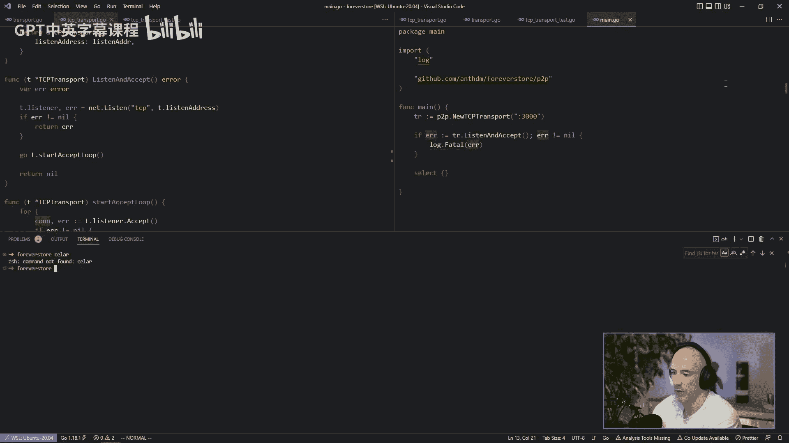

没个人。All right， so we are doing this thing， let me quickly do Tnus。Talnets local host 3000。 Alright。

 so we see we are connecting and we say a new incoming connection。 So we already have easy。

 We are already doing T P。😊。

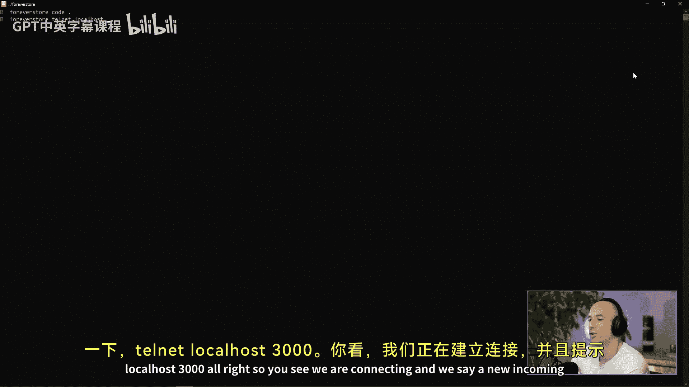

嗯。Dopamine。Dpamine， you see that this gives me dopamine， and I should give you two。Okay， cool。

 listen accept。So we have a new peer。 That's fine。嗯。

Now we need to make a very important decision because I want to make a handshake funk。

 which is going to be， look what we're going to do。嗯I think。

Because handshakes do we some some libraries need a handshake like our poker and what's a handshake。

 handshake basically means you connect to me or I connect to you it does not really matter we connect。

 and first of all， before we are going to accept you as a new pe。

 we're going and shake hands and if this handshake is not good。😊。

We're going to drop the connection and say goodbye， right？嗯。So that's why I think NTCP。

We're going to have something like what I call。A handshake it。Or the TCP。Actually。

 the handshake doesn't even it， it can No no， I have an idea。 It could be any handshake。

 The handshake it could work over。嗯。A handshake is going to be a handshake it。

And we could do something like this new file， for example， you could say this hand。Shake。

Handshake of go。 It could say package peer to piece type hand。And shake it。Enterface。

And that could be something like。Is this correct。My spelling hand。 Yeah， you could say handshake。

Or maybe。Shake hands。M handshake。And the question is， we' going return an error。

 doesn't need to even matter。It's going to be hard。 This hand shake。Because。

You're going to think about this。But the thing is， because I'm not quite sure。

You see it could do like a handshake it， right here？嗯。Let's go to handshake。 And let's say， type。

Default。And。handandshake it。Men are spelling。 Before handshake。 is going to be as strict。

Do we need to make this as strict， Does it actually make sense， because we could do something like。

That doesn't manage。 We're gonna make this。 We could also do something like a type， a hand shake。

 funk， which is going to be a funk of type。A。Something like this。

And I think that makes more sense because are we going to add stuff to this handshake。

 or are we going to have things inside of this strict。 that's a good question。I don't think so。

 I can I think we can do something like this。And make it even bedish。And say the handsh funk， right。

 And maybe we could do something like any。Could take an any。I don't know to compare something。

 I have no clue。And anCP transport。Wait， ten0sh。And we could say， yeah， yeah， yeah。

 I have a good idea。 We could say transport。And this is going to be the handshake funk。H shake funk。

 right？And this is going to be。Hshake funnk。Right， and if you're going to construct this。

 we're going to say the handshake funk。The hand shakeake funk is going to be a funk。

You could actually make this sk somewhere else。But for now， we're going to make a not funk。

Is going to be funk any。Ado。I say a return， no。喂。So it's basically doing nothing。 So we could to。

Could also do something like this， right， Like， like I said， I'm gonna teach you a lot of stuff。

 So it's， it， it could be a little bit slower， but I hope you， you have something about。 let me know。

 poke me， let me know when you think about these things。

 Should I go faster or should I explain these things。

 You could also something do like this like anob。😊，And no。And shake funk。Which takes in an any。

 we don't get an an a。And me say。ter no， right。 And then we could say， instead of doing this here。

 we could say， yo， this is a no handshake。 We don't care。 right， And if you really want to be cool。

 you can do in the handshake， you could say， a， I'm gonna provide my users。😊，With no panache funk。

But， so if they don't need a handshake， they could say yo。Oh man， I need to sneeze。Oh， no。

And I'm not gonna cut this out。 I'm not gonna go in this video to cut these things out。

 That's not my style。 man， everybody needs to sneeze。

 And this big light is shining in my eyes make it it even worse。 So you could say。😊，Handshake funk。

Handshake， funk。えー。I don't know。I don't know how to explain this。

Because we need to probably make this handshake fk a little bit badish。

And we're gonna see how this is going work。 So let's say we have the connection。 We have a pit。

 which is good。And then， we could do。I have an idea。 This handshake funk is going to be。 look。

 we're gonna say something like this， if at equals。T， handshake funk with the connection。

And if the adult is not millll。Actually。😊，I'm so sorry， but I'm going to be a perfectionist。呃，shake。

Hence。Jake K is going to be。A handshake function。 So we're going to say T shake hands with a connection。

 And if it's an error。We're going to see。Because。Were gonna hear to。

Go handle connection so we can actually start a re loop， right here。And we could say here G。No。

 not to come。An a or decoder。 man， I have so so many good ideas。 This is insane。No bad。

 what you gonna do guys。 Listen， oh my at 44 minutes， and I want to show so much stuff。

 man we're gonna make。 this is gonna be， oh my goodness。 I'm so excited。 I have so much dope。 I mean。

 you see， I did this maybe 1000 times in my life， and I'm still getting so excited by making these。

 these programs as cool to use。 It's crazy。 What is this。 Why do I have another。😊，I弄 feel I弄。Ay， man。

 let me， let me be happy。Is it， is it possible， compile it。Handshake funk。 Were also gonna say。Deder。

Ded is going to be。Should we call this decoder， It's going to be a decoder。 or is this。

 or is this too genetic。Right， and then we could make look what we're gonna do guys。

 is going be insane。 You father going say。Encoding me， you're going to call this encoding。

Go and gonna call。Be used to。Backage P to P。Basically， what I was saying this deco thing， right。

 So let's， let's get back because maybe you guys had a longer break than I。

So we have the shake hands， right， which we actually need to handle。what are we doing。

 This is going to be our read or message read loops。 are we're gonna read from the connection。

 And actually， if you wantan to read， you need to do something like this， let's say we make a buffer。

 which is。😊，A new bys perfect， right。 And then you could say an add is gonna be。Is it Gng。

read the buffer。 Why cant read the buffer like this。And then， let's just。

Elim the eliminate the adult for now。Man what going on。

 And then we could say something like the message is basically。The birth and， right。

That' that's a message。 But I want to have something badish。

We're gonna make already the file in this encoding file。Are we gonna say type。

We don't need an encoder between the decoder， but I wanna。Keep these files in the same。

 Keep these tricks interfaces in the same thing in the same file。 So we could say。Dコで。

It's going to be an interface。And that's going to be thecode。An ado。嗯。

The question of is are we going to do this？You could say they any。No， it's it's not。

 it's gonna be decoed me a slice of bys。 No， you're gonna say decocode me and Ill read it。

 That's what we gonna do。😊，De could me and I I owe readers and。嗯安妮。I'm。

 I'm thinking we could actually make this。could do so many things。Is this what we need。

 I think so because we could do something like this， right， instead of doing all the shenanigans。

 we're gonna to delete this。And I'm going to say relo。And actually， we could。

 we could boot up a new one， but it is what it is。 We're gonna do it here。 And we're gonna say。

 actually。The decoder is going to be a decoder。 That's go it。So we're going to see。In this case。

 you're going to say T。Decodedder。The code。The connection into whatever type you want， for example。

That we are doing so many things at once。 it's crazy。 We're going to say type。

 this's going to be a placeholder temp。It's going be a temp。 It's gonna be a strict。

 There' is nothing in temp because we don't care。 And we' gonna say。Heat， in this case。

 you're going to say message。Wait， what's going on？Message。Is going to be。呃，按 damp。

And I'm going to say decode me the message， right， that's good。 and that's going to be an adult。

If the man， I'm thinking so hard that I cannot type。If a is going to be this。呃M。Yes， no。

That is not Neil because my brain is already at the handshake because it's rat。It gives me an adult。

 and I'm going to say。We cannot actually log you， right， We cannot return。

Or are we gonna are we gonna do。Better about that。Are we gonna do a paraama that connection where if he sends us something we cannot decocode。

 we' gonna drop him， I don't think so。 Maybe he could do， he could do cool stuff。 He could say。

 for example， something like。A lamb decocodeed adults， right。And that's going to be 0。

 And each time we have an a。We're gonna each time we have error， were gonna say n codearrow， plus。

 plus。And if the land decos error equals five times or something， then we' gonna drop the connection。

哎。Samp protection， something like this。 I don't know。 I'm not sure it， I just came up with this。

 to be honest， I just came up with thenas。 It could be a good idea， actually。😊，Thenan I'm。

 I'm so today， it's my creative day， Not online。 I'm creative today。 I need to abuse it。😊。

So we're gonna say FMT print F。You're gonna say percentage。 You're gonna to say， actually。S TCP。

 right， you could say TCP。ThisC be error once again。 And then we're gonna say。S。Nan。爱东是。コンテニュー。

Like this， right？There's no appears to be actually cared。 It could be connection。I don't care。

 Maybe we need to delete this the slogan。 I don't know。 So we have this speed。

We're shaking hands with a connection。Maybe， maybe you want a pe。Maybe maybe we want a peach。

Handshake。What's going on， here。Handshake， handshake funk。And she could a pe。M what on你。

Crumballles on my keyboard， I hate it。 so hard and going lie。T she can， why。

 Why is this giving us issues。嗯。We don't have this。Did we， what's going on here。

 Did we not re name this。Oh man。 I forgot something。 Let me quickly do get in it。Yeah， sorry， guys。

 I missed actually committing the first episode， but I'm gonna do it right now。 Get commit F1。

B to beat beat be， beat to beat lip， something like that。

Right and then it's going to be a couple more things in it， but a。It's， it's。

It's in the patreon community， right， It's in the paton community。 You guys understand。

So we have the shake hands as good as good。 Everybody's happy。Okay， cool。 so we're gonna shake hands。

 If there is an error and shake hands， we actually need to drop this connection。 So we're gonna say。

Actually， we should start the pillow loop at the we。Do we actually want already a pe。I'm a church。

Yeah， maybe we're gonna set something in the page。 We never know。My gets。

Joining joining the YouTube studio， which is basically my living room。Wait。

 we need to do some money design decision decisions。 new pe shake hands。

 Let's shake hands with the pitch。 We don't get。 right， We will see if this another。

 we gonna say Kong。狗lo。And actually， return。Theyturn this， this thing。嗯咩喂喂。So many lack in in。

 in this this code。At。Andval。Hand shake equals。As。没。Invalt hand， shake。

 and always make your address low caps。Why is it not working， It is working。

Could say any further change is returned。If the handshake。Between。The local and remote notes。

Could not be established。As that。Bched man。Alright。So we're going say return at。

Invi handshake like this。Should we couldn't。Of course， we can't。 We are alleged retarded。Damn。

Oh over here。It was such a nice thing。 The problem is， of course， we have this start accept loop。

 And then we have this。No， man。 We cannot have this。Because it's all。

Just return and we we're going to just log this out。Like this。Actually let's tie it up。

 I'm gonna say TP a。TCP handshake adults。Like this。

Very important that we first shake hands before we。I going to thecode here right。

 because in this handshake， it could be that we in the handshake function are actually reading from a connection。

 so we need to be very careful with this。😊，All right， so。Yeah。

Let us actually open up main so we don't do we have a de， if we don't have a de。

 right that's a problem， So we're going to say TCP transport。We need to have options， right。

 Because otherwise， we need to have。We need to have some options， to be honest。Type T CP transports。

op不起。Going to be a strict。And we' actually going say you， listen。

And we need to do a lot of stuff I'm going to light， it's going to take a lot of time。

You're going to say that the listen others。You're going to be a string。Were going have。Hand， shake。

 funk。And。Shake f are going to be a hand Shakefunk。 We need a decoed。Which is going to be。Decodeish。

Or make options like this， I don't know what ops。What。I don't know， how do I need to call this？

TCP transport ops。 that's gonna that's what we're gonna be。 And then we're gonna say。

 instead of the synous， we're gonna say give us， give us the opts。

 which is gonna be the TCP transport ops。And then we're gonna say shake hands。

 We don't meet all of this。 again， shenanigans。 We're gonna say that the opts， I mean。

 the TB transport ops is gonna be the opts。Like this。 And then， instead of。We can make this public。

Listen， others。Yeah， it's fine。It's all fine。Of course， T shake hands。 that's going to be tea。

Handshake funk， right。 And then， of course， it's gonna be TVD codeed， right。Theリーder deco yeah。

Like this。 So if youre not， if you go to main， we're going say that the opts。TCP Os， right？

You're going to be peer to pe， TC P。Transport opts。Like this。

 you're going to say that you listen added。It's going to be 3000。The Godish thats a good question。

I don't know。And the handshake。Going to be a default， not pan thinkk。No handshake funk。

 because we're gonna， we're gonna do no handshake because it's always going to be。Okay， so。Yeah。

You could also say that the handshakerink is gonna return a booleion。

 if it's gonna handshake as a no bit， if it's return aarrow， you can have。A bad logging dgue。

The problem is， we don't have this TCP ops。We don't have this。Dekoish， right。So if you go to decoder。

Encoding， I mean。Good say type。I hope。Gpe， why am I laughing。

 A lot of people maybe don't like is gonna， gonna gonna understand this。

 because we are using gope so many times， and I don't like gope。😊，I actually like it， but it's not。

Here it is what it is man G。Decoded。Stlect。I I mean a strict yeah right now。 Actually。

 we don't need this， right。So we could say funk。Deck， which's going to be a gub decod。他op。

Do we need a pointer。Probably not， right， I mean。Well。

 we could do that because then we could check if it's no， and anyway， we're going to try it out。

It's gonna to be a ro decoder。 I'm gonna say deco。You're going to decode the I。R is going to be an I。

And we're going to have V is going to be an any。I'm going return anarrow， right。

 So how were gonna do this actually very easy。 You gonna say a return。Can we return Yeah we can。

 We can say rope。New decodder。 We're gonna say the read it。 and we're gonna decode。V。哎哎。

I cannot do it。 It's that easy。 I mean， it's plug and play， right。Now youre going to go to me。

And I we going to say yo。The decoded。In our case， you can make any decoder you want。

 You could decode it， and， and I don't know。You're the bo Ro。

 If you wanna extend this with your own decoder。 Men， go ahead and send me the code。

 so I don't need to do it。 Deder is going to be。呃，ho。Appear to be， Go be code。 Easy。

 That's what we're gonna do。Yes。Alright， so now we can actually do some cool stuff， right， We can。

 we can， we can test。😊，Alright， so we have this handshake。 Yes， yes， yes， decocode。

 What's gonna happen。 We have this message。 This is not true。 First of all。

 we need to make something that we can actually use in some kind of。A channel， a message。

If you want to send something over the wireage。I'm thinking， actually， how are we going to do this？

Maybe we could do mad。 doesn't make any sense。 We could make a new file。 I know it's a lot of files。

 but。Message go。 we could see packageage。Pear to peer。

 we can actually defect the this and and do whatever we want。 right， I'm gonna say type message。ORPC。

 is it not R PCC。Is it not PCC。Actually， I'm going to make this even even just more genetic。

 or just message， right？I don't want to be as strict。And a message is going to be。

Or we make it like this PTP message。Actually， why， Because it's already a full message。嗯。

It's going to hold a payload， which is going to be a slice of bys。Actually。😊，It could be any。

Is that payload do we need to know from what comes？We actually always know， right。Or not， I mean。

messagessage represents。嗯。Any or。Bbititr message， any arbitrary data。

Message holds any arbitrary data that is being sent over。嗯。Over the， over each transport。呃，Between。都。

Notes。The network。And then we could say something like this message is going to be。A message。

 you're gonna decode this stuff。 And after this， we're gonna say F empty T print。F。

Preents the new line， the message。And I could say。Message， we're going to change this， right。

 but just for testing。The see if thiss。Actually， actually， actually， actually。It doesn't。

 Does't make sense to make。Or do we actually。Aoom make run。

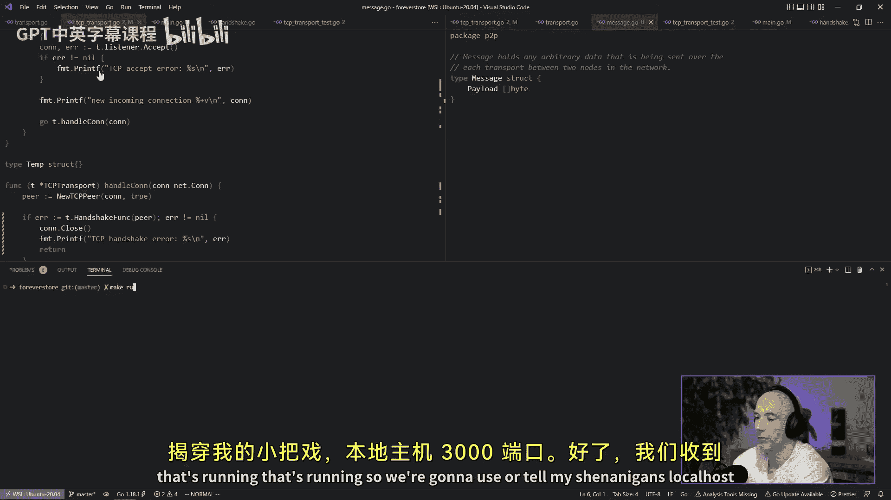

Alright， that， that's running。 that's running。 So we're gonna to use。Of Tga Chanas， local host， 3000。

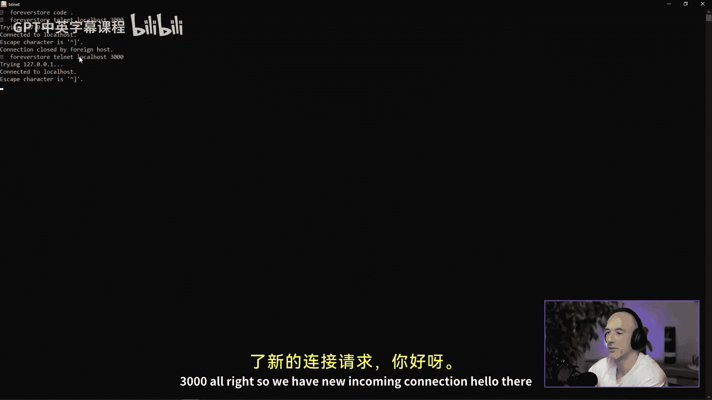

Alright， so we have new income and connection。 Hello there。

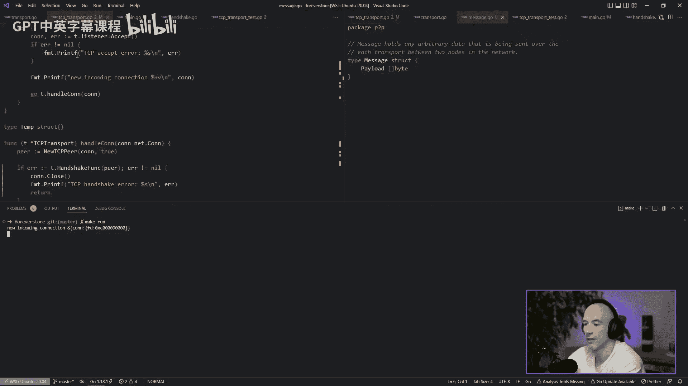

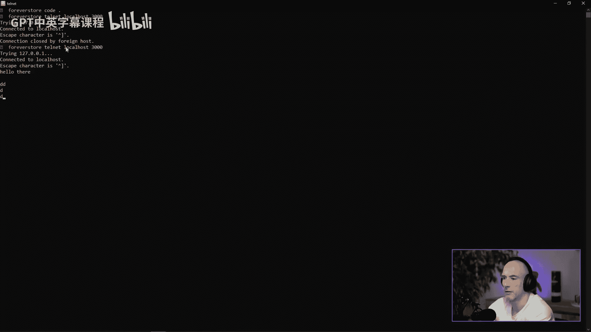

I看大看。Or we have area。Can I actually decode this in a message？Because we're not sending a message。

 right？Because the message is always going to be， unless we have something。

It cannot God cannot encode this。 That's the thing。Why， why are we decoding， by the way。Yeah， deco。

 deco， right， decocode， encoding， decoding。嗯。The problem is， look， if， if we do this real quick， the。

 this was such a good idea。 I'm gonna lie。 We could do like a above。 It's gonna be a new by。Buffford。

 and then we could see。And at。It's gonna be con read。嗯，李 both。Al right。If add， of course， is not no。

这个呢。The adult。 And then I'm gonna to say。Like it would say the。嗯。Can we do this。

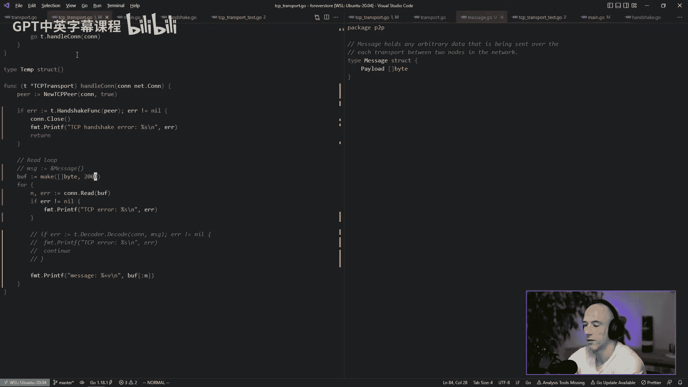

Okay， so this， this is basically something else I suppose would say Tl met。Local host，3000。

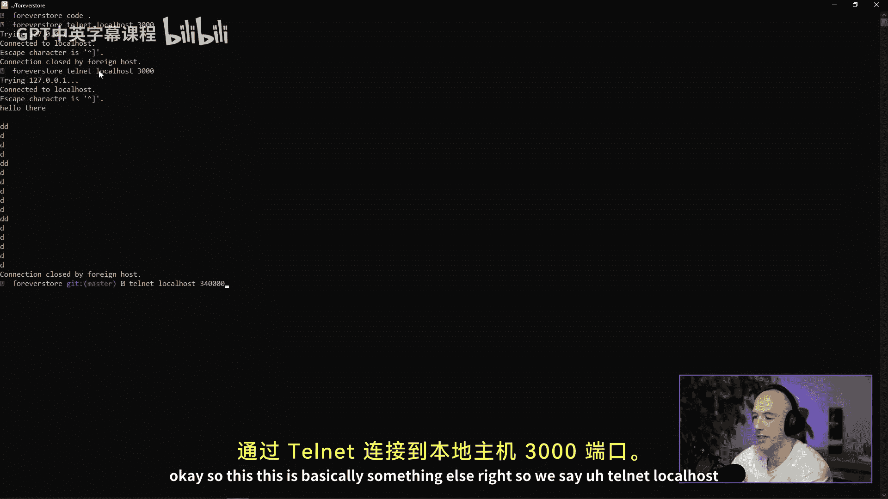

Now see that that's working， right， So we have this， these messages。

 And the reason why an normal message not work is because it's cop coding。ま。哎。Of course。

 it's not gonna work because Talmat does not send any go encoding。 So how do we fix this。

How do we fix this？Well。Well。Let me write our own and code that works for for normal connections。

 isn't it， I'm going to comment this out。Make this message。Yes。

 that's if we're gonna do real actually insane。 Trust me， we're gonna go to encoding。

A we going to say funk。Not pencoding。 Just plain bys。 Yeah，' that's a good idea。

You're gonna make a type an knob。Not decoed。Which basically not going to equal anything， right。

And I think always providing something for your library likenob this，nob that，nob，nob everything。

 It's interesting because users can just use this directly for their tests and and。

 and all that stuff。 So we're gonna say funk， X， I'm gonna copy this whole bang real quick。😊。

So I don't need to type that much。I'm going to say this is going to be a not decoder。

 Deder is all the same thing。 and we're going to say。Basically， we're gonna say， actually。

 I'm gonna make a new book。Weant to make a new bites。Buffer like this。 And I'm gonna say buffer。Reid。

 can I do this？Is that a thing？And probably， it's probably， no。

 it's different right It's odd read both。还色的灯。We can't。 It needs to bys。 doesn't matter。

You're going to say that the buffer is going to be。呃，对你的身份。Moonally the birth can be an a。Like thisす。

If at。To add， and otherwise， you're gonna to say。Of course， this any is， of course。

 is is is a problem， right？Iからか。I'm thinking， actually， because。Do we want to do the encoding in， in。

Because we are in our transport， right， we are here our transport。

 so making this is already hard coded。😊，A是net。Because this could work like this。 But I think we， we。

 we。I mean。I already quote everything into a message， right， into。

 into into a message instead of this any type。You could say it's going to be a message。

And we're gonna use this as a communication at all times。 But what's the payload gonna be， That's。

 that's generic。 That's depending on the platform。 That's what you're gonna， that's。

 that's what you're gonna decode。With， with， with whatever。We don't know。We actually don't know。

 We need， We need to give users the option ourselves the option， because maybe。

Depends on what we are gonna build。 So we could， then we could actually do something like this。 Yo。

 the message is going be。This is actually， this is this， this， this， this， this miss a point， right。

ca I we gonna say the message payload。 That's gonna be the bfish with this， right。

And then we could actually delete all the shenanigans。Always make it a message。 Who。

 I think my my caps lock is on。Right and then we have this message， which is going to be the message。

嗯呢。Yeah。Do we we we need to make sure it's a knob。Or default。Real decoder here。 Yeah， yeah， yeah。

 yeah。 And are we gonna say basically in main。We can just configure it this。

 we're going to say this decod is not going to be going to be the default decod， right？Likeです。

What's going on here。Yeah， ya， I see。 I see。 I see。这个人面艳里。2面message。没个人。V again。

 what's going on with V。没视频。

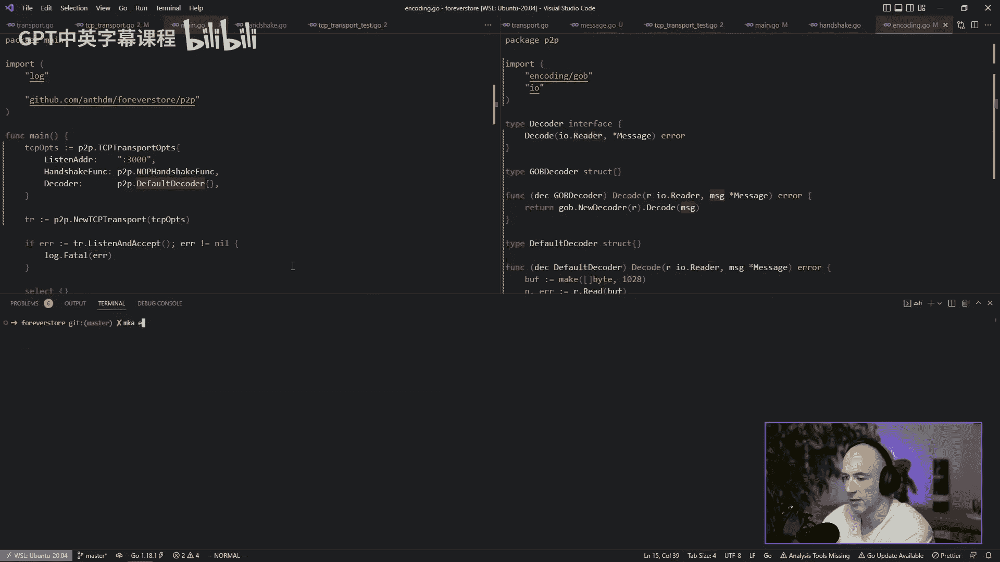

H right， So let's say Delnet。Local host。LoLo host。

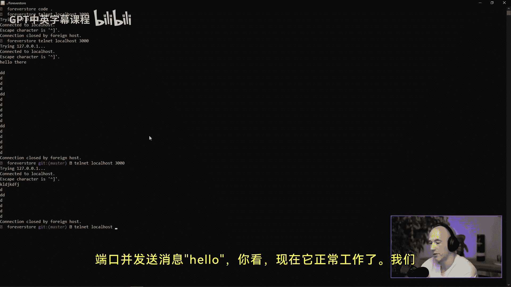

3000。Hello。you see now it's working right。 So we could give some messages some random stuff。

 and then we can see that we are actually having a message with a payload。 Yeah。

 and then we what we could do before we gonna pipe this into a channel。

 we are going to go to what's going on with TCP transport test here。 that's broken， I guess。

 But we could go into TCP transport。😊，And in what we could do is。嗯。If we take a message。

 we could say we're gonna have a forum。 So we always know。呃，也是变的。And then I could say something like。

We have this message， decode it， and then I'm going to say message。From is going to become a remote。

Remote address。 And that's not gonna work。 that's gonna be a problem because like we mentioned in the poker engine。

 it's not because the， the， if we dial somebody and his remote address is going to be the address he's listening to。

 And actually， I want to have his listen address。Because so we can actually send back。Much more easy。

But that being set。That being said， actually， for now， it's good enough， right。

 We could say make run。

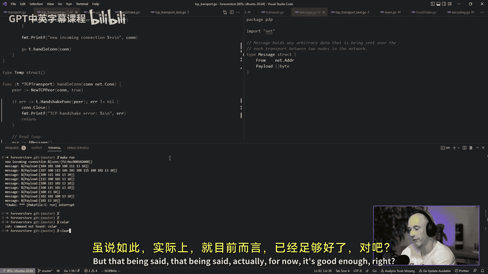

And then we can see here， go， run oh， go run。等个。Local host。呃，所。Thousand， and we can say hello。

 And then we have this message。 and it's coming from this other guy here。 And that's the payload。

 right， And are we gonna send that into a channel， just a genetic channel with a message， right。

 And everybody that's using the library。 We for the most part。 we can then say， okay， it's a channel。

 We have this here。 And we're gonna handle it in the server。 And that's gonna be。😊。

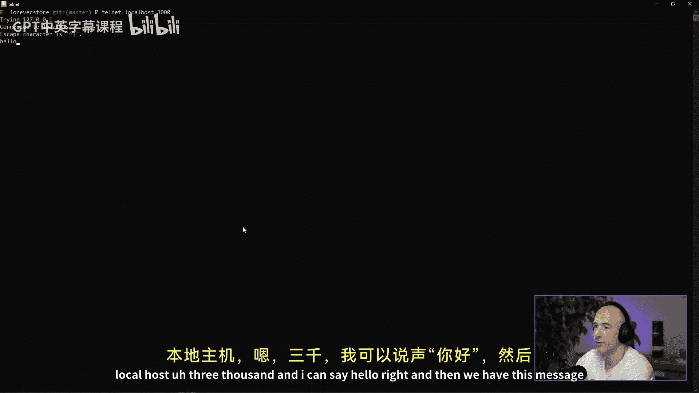

Decodeded， the p is going to be decoded。Could be an an。It could be in any。 We're going to see。

You're gonna see because now it's， it's， it's a default encoding， which is basically plain bys。

 but it could be that it's that even those two messages are going to be sent over Go andcoding over proto buffer。

 and then how we handle the inner bytes。Could be another encoding decoding。 I don't know。

 We're gonna see how this is gonna work。 I think this is。Good for this video。

I think the next video we are going to actually finish this up。 We're gonna finish this。

 this complete up so we can actually start with our key with our disk disk storage thing。

 make a server， use our own library to connect。 And everything is gonna be nice， nice， nice。

 or maybe we actually gonna do our P discovery and stuff Also in this library。 Not quite sure。

 We're gonna see。 So let me do make run。😊，Okay， I think we。Started with this peer to peer package。

 right， we are implementing our own peer to peer package。Let me see， the main。Yes。

 and then I think TP transport。Alright， we have these thing。

 So I think what we're gonna do next is basically， we are doing this message decoding。He。

And it's not the decoding of our payload， but it's the decoding of the R PCC， actually。

 the R PCC between between two peers。 And I think。We， what is this stamp， actually， what the hell。

I think remove the stamp， some relics， some leftover relics。

 let me do settings real quick first and make this 18。For the blind tomeies。

I think what we're gonna do is open up message。And I think he're gonna rename this to R PCC。

An R PCC strict。 that makes more sense。Or PCC， and maybe we should rename the package to R PCC。

 but a。嗯。Message， so we're gonna say this is an R PCC。 Were gonna say R PCC。This should be an RPC。嗯。

This is going be an RP PCC。 And， of course， this is going to be an RP PCC。ORPC， all the things。

 What is going on here， there should be a small caps or R PCC， by the way。And let me open up。

I think we're a Gucci， actually。 And I think we have some。The test is， is actually broken。Yeah， that。

 that's because we basically have our transport options， right， instead of making this。

 so we should do like ops。It's gonna be transport。DCP transport。Os like this。

And letm gonna say that the listen address is gonna be， let's do 3000。3000， please。

We need the handshake， right we the handshake funk。 That's gonna be a noob handshake funk。

 We're gonna， for now， we're not gonna implement any handshake funk。

So you see that we have the ability to create a handshake functionk。But we don't gonna use it。

 And then we need a decoder。 And， of course， we provided a default decoder。

So we can just use that and then put in ops。公那你也这样。Os inside heat。 and then。

We wanna assert the listen add。 That's gonna be the listen added。我 listen。Add。Like this。嗯。

And that's going to be。We could do something like this， right to test it。ないです。Make test real quick。

And theified message and。 Yeah， we need to change this。It's going to be嗯。

An R PCC do be actually want a point。Not quite short。Not quite sure。Make test。

I think we're blocking in a test， by the way。Yet had the select statement。This should be good。

 Let's make test real quick。 and everything is working fine。 That's good。 That let's go to main。

Let's do a make run。

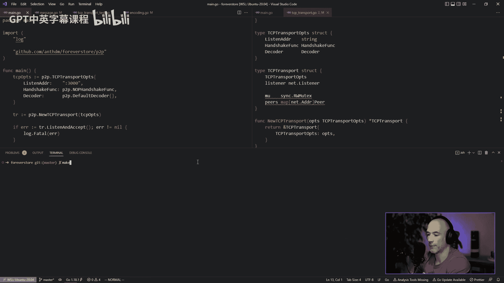

That's working。 Let's open up。呃，down nets。My microphone is is， is doing crazy。

 Tnet's gonna be a local host 3000。Now we're gonna actually send some messages。 by the way。

 We're gonna say hello， you。

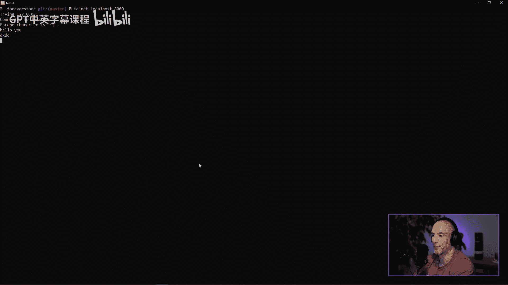

And then see what's going on。 Yeah， so it's all working fine。 We have from， from who is this。

 is this common and the payload， which is sending， which is fine。Working all good。

Let's open up transport real quick。The peer interface。

 I think the first method we're gonna have in our P is close， Very important。Cls like this。

So we can close the P S connection。And if we open up TP transport。

Or transport itself enabled to read these messages。We need to have some function。

 which is called a consume。Which will return a channel of R PCC。

And now we need to make sure that it's gonna work。 So we're gonna say TCP transport。

And that's gonna be， let me quickly think about this。 You're gonna say an R PCC Chan。

 which is gonna be a chainn of R PCC。A channel of R PCC。

 And I'm gonna say here that the R PCC channel is gonna be。Make me a chain of O PCC。Easy。😊。

Now we need to in， in， in implement our interface。 you're gonna say T， TCP transport。

 You're gonna say consume。And that's gonna return a channel of R PCC。 And you see this this syntax。

 right， This basically means if you watched the concury for beginners。

 this basically means we can only read from the channel and we cannot send to the channel， right。

 Very important。 And we're just gonna return the RPC channel like this。And then we could say。

 consume。Implements the transport。Enterface。Just like that。一个贼。嗯，围。Will， return。A read， only。乾龙。嗯。

For reading。The incoming messages。Sent from received from another P， actually received。

From another bit， another bit and the network。Yes。That's good。Alright， so now we need to。

 let's do this out of the way。Now， we need to find a way to actually put that into our into our channel。

 right， So right now， we're just printing this channel。

But we gonna say something like that the T RPC channel。Is going to be the OPC。

There's gonna be an odd PCC。It's gonna to be the LC， right， What's going on。That's。

We don't want that。Although we need the added heat for decoding。So， that's good。Yeah， this is。

 is is failing because P does not implement the， the。The close interface， right。

 the repeat interface， are we going to say。嗯，B。D seepepi， by the way。We're gonna say close。

 gonna return an a。And we're just gonna say return B。Come close。And then we can say， close M。呃。

 implementplements。The pe interface。Just like that。Alright， I think that's good。Let's test that out。

 right？How are we gonna do this， Were gonna say， listen and except maybe we're gonna boot up a new go routine here quick to test this real real fast。

You're going to see。Forth。第二是 consume。Its gonna be the message。Think it something like that。呃，别人打兰。

Message。Or we could say print F。 what's going on here put in F and then say percentage plus V。

Maybe a new line。Something like that。 Is it gonna work， I have no clue。 Let's， let's run this。

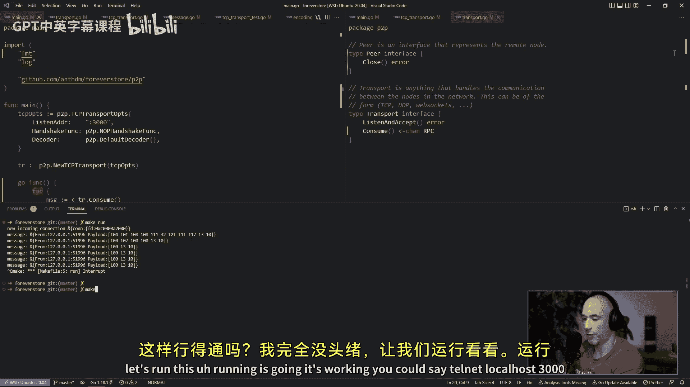

Running is going， is working。 You could say Talnets。

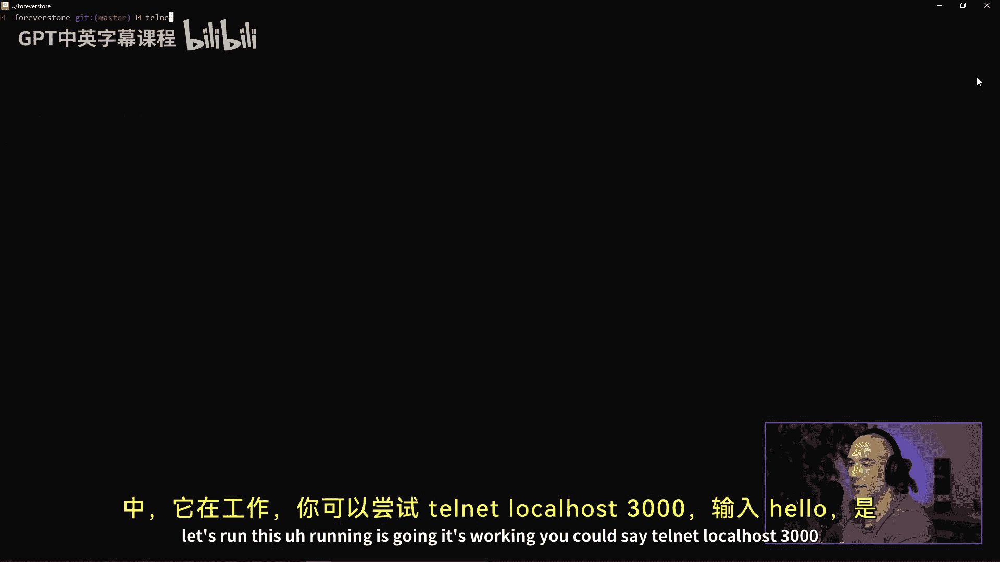

A local host，3000。Hello。Yeah， it's working fine， right， although we have thisrelic。

 this slash and the relic for some reason。Yeah， we don't have a bad new line。It's crazy。

 Why is this wrong。 Oh yeah， of course， this smell new， this is a new line。 I see。

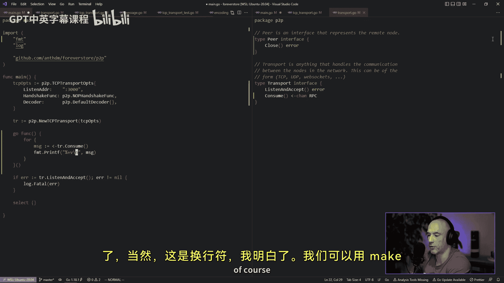

Make run， we could say tellnet local host 300 and then do it again。

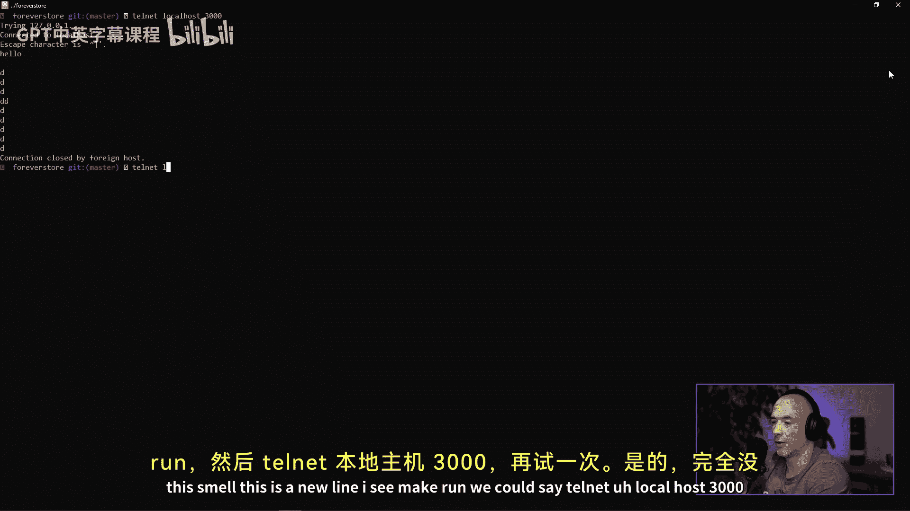

Yes， perfectly fine。 So now we can consume。 It's very important because if we attach or。😊。

Transport to a server or something in some way。 Then we need to have。

We need to call consume on any kind of transport and the TCP transport will return his channel。 But。

 for example， any other transport will also return hit his respective channel。

 which he communicates over the wire。 And in our case， it's TCP， but it could be anything， right。

 We need to make it generic。So， that's fine。嗯。It's。

 it's actually capturing out with what's going on here。 Let's close the M I O B， S。 I hope it's fine。

Alright， so we have that。 The next thing we gonna do is we need to find a way。Because。

Let's open up real real quick TCP transport。 I'm going to show you。Yeah， so this speed map。

 I don't think we' gonna， we're gonna keep it。We not need a spear map because I think the transport is not going to be responsible to keeping the peers because speed is an interface。

 So we could， I think the server is responsible to maintaining a list of his peers。

 which could be a peer。Interface， which could be any P， right， It could hold。

Pears that are connected with TP。 It could hold speeds that are connected with a local transport。

 It could even hold spears connected with GRPC。 It doesn't really matter。

 A peer is an interface and or server could hold any kind of peer， any kind of connection。

With his respect respective transport。That is the beauty of this genetic implementation。

But we need to have a function。 We need to have a way to notify the server。

That it is a new pit that the server can do with a new pit， whatever he wants。 So I think to do that。

Is to do something in TCP。And we could say something。We have decoder， we have hand。

 We could say that the pe fk or on pe。Is going to be a function。Of a pe with an adult， right。

 And then he could say。That if this function returns an error， we are not。

 Were going to drop the pitch。How are we going to do this。Firstst of all。

 I think I'm gonna do something like this。 I'm gonna say a deferred thingk。一是。I'm going to goal it。

Oh no， how does it work。It's like this， right。 And then we'm gonna see。Actually， do it heat。

 And I maybe say what a at a。那你用in。Baseds it in heat。And then we could say something like。呃，得ping。

Peach connection。Read loop。Drop peak connection。 And then we could say an a。

 which is gonna be the a here on top。Now I'm going to say come close。

So we could not do anything here。 We could just return here。This can be good。

And here we could say if at。 first of all， we're gonna say if。第一。On pe， right， if that's not mill。

 if somebody provide this function， then we'm gonna call it if somebody does not provide this function。

 then we are not gonna call it。 But if somebody has provided it as this， then we' gonna call it。

 Then'm gonna say if R T。On beach。And we going to say B。No， it's gonna be the。 Yeah， we just made。

And if the adult is not null。Now we gonna to say。These adults needs to be。Can newed， actually。

Have we gonna just be done。Yeah。Something like that。 So basically。

 what happens is were gonna do our handshake。 If that's okay， then we're gonna do the on piece。

 If that fails， we're gonna drop。 If that continues， then we're gonna start our read loop， right。嗯。

Yeah。I think that's fine。So if you go to main。We could say he on Pete。 let's， let's try this without。

 Let's try this without， first。

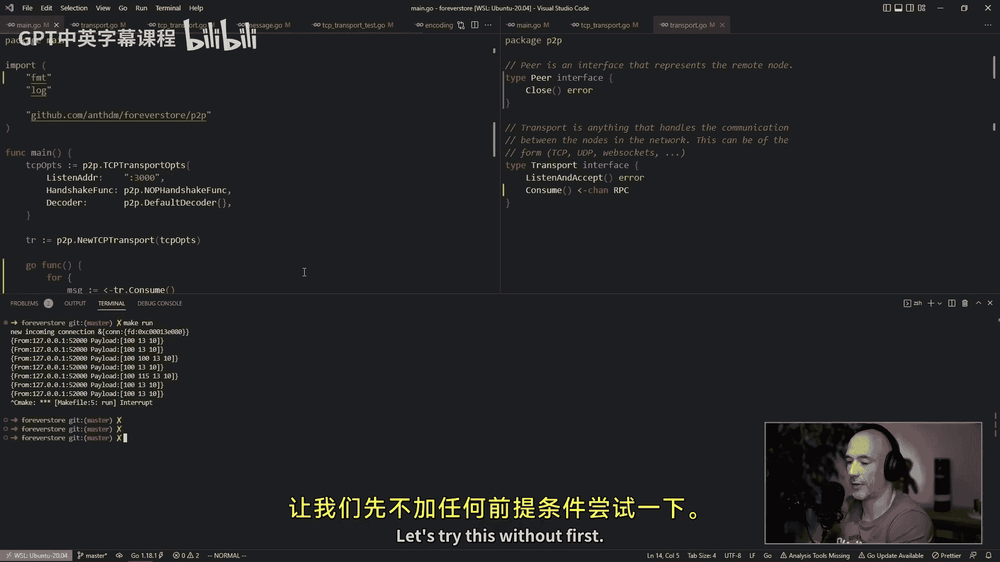

Make run。 So that should be normal， right。It could say， tnet。Local host。

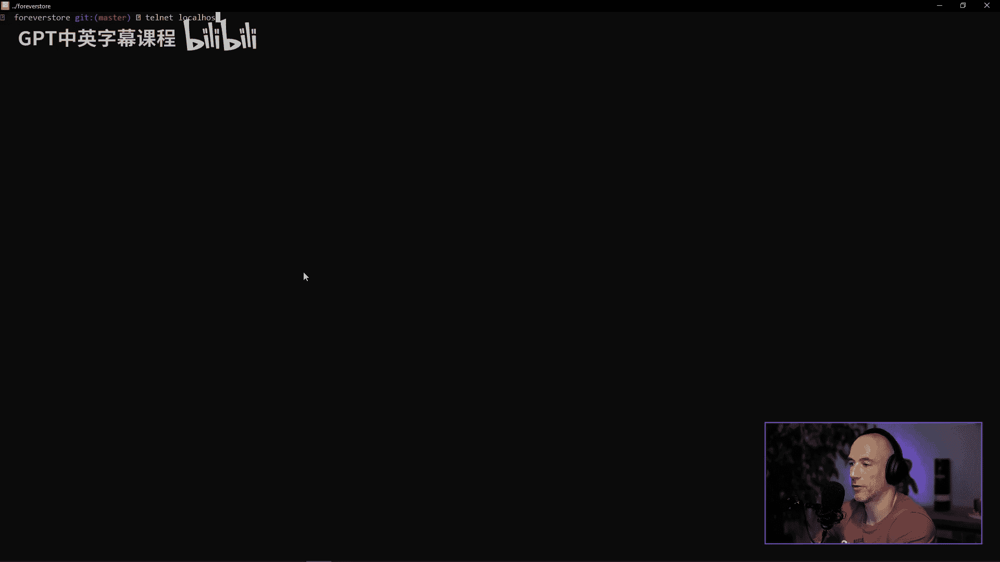

3000。Hello， you see， everything is working fine。 We got these messages。

But if we say something like on Pete， right。A we going say that's a function of B。I都是。

And Im gonna say something like。Weturn FMT A or F。Fielt。The on thinknk。

There should be a peer to pe pe。Like this。And we run this again。来。

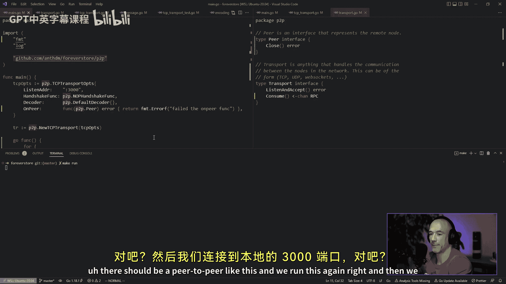

And then we connect then local host 3000， but。Wait， let me do this。

Right it instantly drops the connection， right so we connect it and suddenly Tna just exits out。😊。

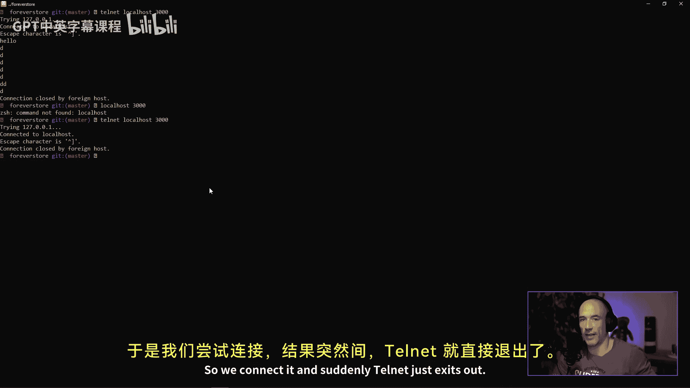

And that's because he' is right， dropping Pete connection filthty on Pete funk。

Which is nice because that means that our logic is working。And， of course。

 we could say here right we could say。Let me do。We could say on peer something。

We don't need to specify it in the in directly into the transport options。

What they could say onpe is going to be the onpeed heat。

It's gonna work perfectly fine as long as it has the correct signature， right。That's fine。Now。

 we return an adult but it could also just return no， right。

 So it gonna work Ca it could return no heat。 And then we could say A and T。呃，P， we could say。

Doing some logic with the page。Outside of。TCP transport。

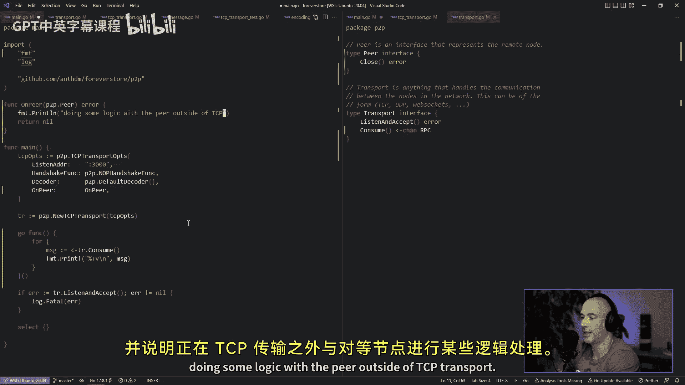

And let's boot down that up。 And then you could say hello。

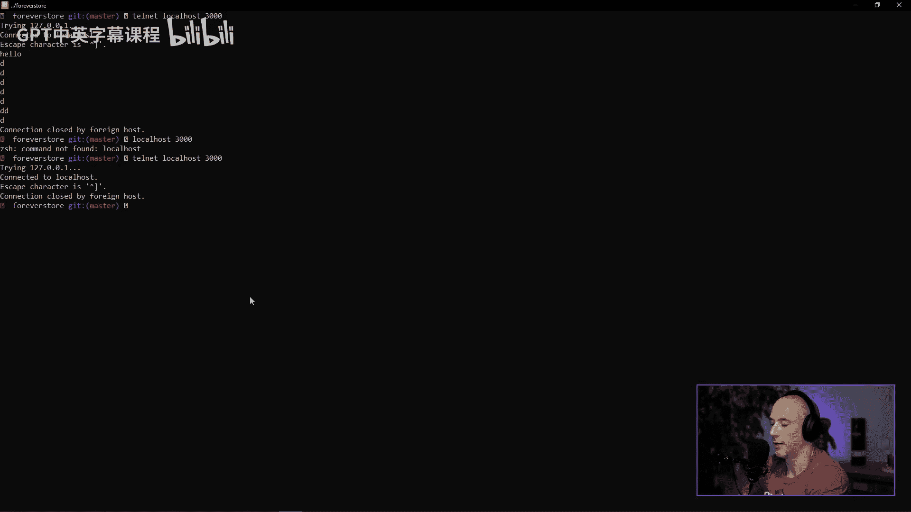

We can send messages。 And then we're gonna say doing some logic with P start transport。

 So it's all working fine。 If you have a new page。 we are actually in a good spot。 That's nice。😊。

Alright， let's close it up。Yes， I think it's good。 so。Yeah， yeah， yeah， yeah， yeah， yeah。

 I think we're in a good spot。 It's gonna be a short episode。 This one， because I think right now。

 we have everything we need to have。😊，Or maybe wait， we cant actually not。 I want to test something。

Because on P， you could say this is the P。喂。And I want to test something。

 What happens if we do be close。That's a good question。What happens if you do that。

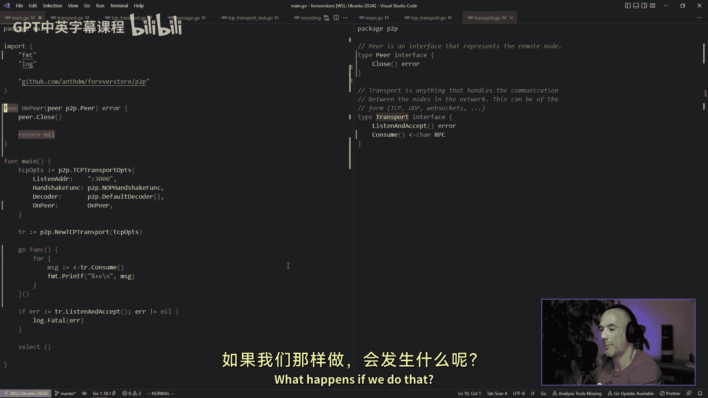

I'm gonna， I'm gonna check it out。It's a very important thing， because that's gonna basically。

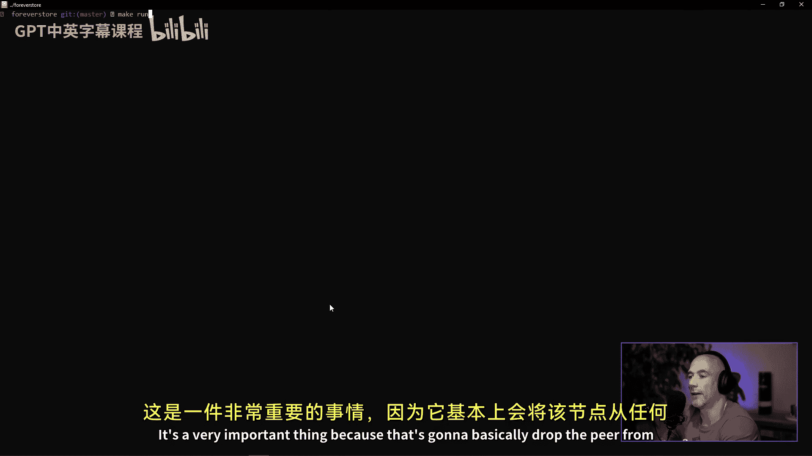

Drop the beat from， from whatever。Yeah， so we see that's goodta。 We have this error。

 Now we have this loop， right use of close network connection。 And it's in the read。😊，嗯。

How are we gonna fix this？ Let's open up P real quick。Which is in transport， right。Close。

 it's in TCP to transport， actually。It's he， right。 If you have an adult， we keep looping。嗯， me see。

So what happens is that we， we have a， we have an added heat in this decocode。

What are we going to do， What are we going to drop the connection， or are we going check the ad。

Good question。 Do let me。Can we do nets。At close。So I think we could do something like this because I think if。

 if， if somebody send us a wrong payload， I don't think we need to punish it。

I don't think we need to punish him and say yo， you're out because you sent a wrong payload。 But。

 of course， we could say something like this， right， at is going to be。This。And then we could say。

 if at。Is gonna be net at con closed。 Then we're gonna say return。And we could do it like this。

And otherwise， we're gonna say the TCP read errors。Is that something that's going work。

Let's try it out。

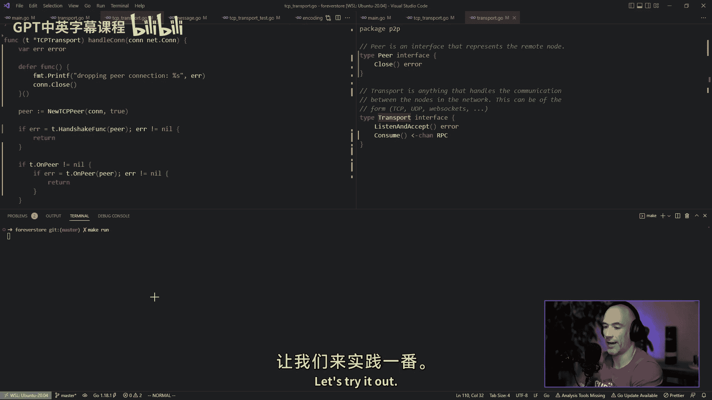

Talnets local host，300。

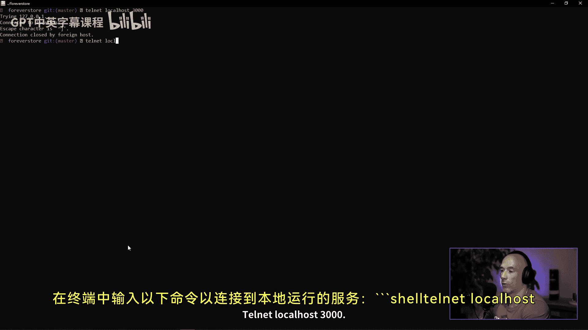

Use of close another connection。 It's， it's not the vertical again。嗯。Oh， it's return。你。

I think it's fine。Atclock at at closed is。At toastosis turn my own con it' already been closed。 Yeah。

 I think that's good， right， because。Can we， can we。

 can we panic the air to see what kind of air this is。

It's a very important thing。 We need to get working。It stop make run。 It's gonna be down that right。

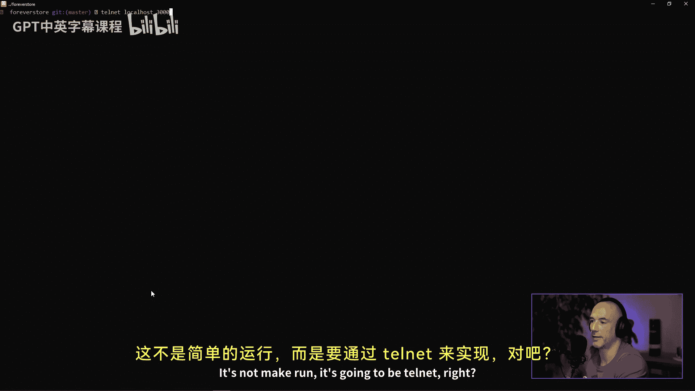

Yeah， you see it's， it's a use of of close network connection。The question is is， is。Let see。

Reflect a type of。S。

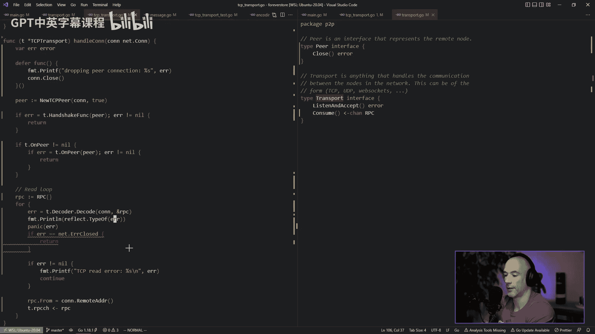

It's a net up error。嗯。That's。Can we not do this？D。Okay， I think。We need to investigate this。 I think。

 enable to make this。Let's return。Let's return for now。 Let's see。 I just returned。

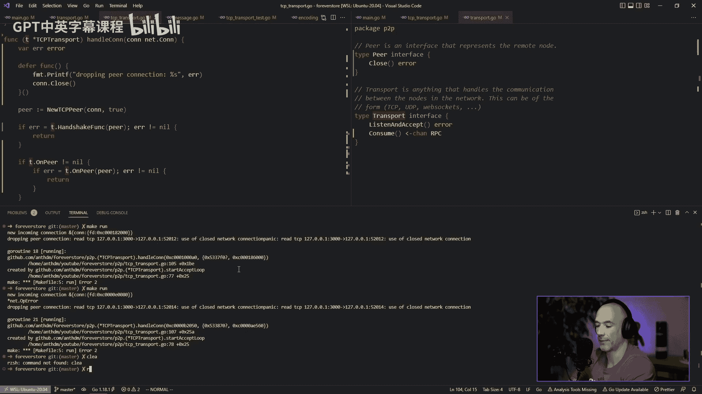

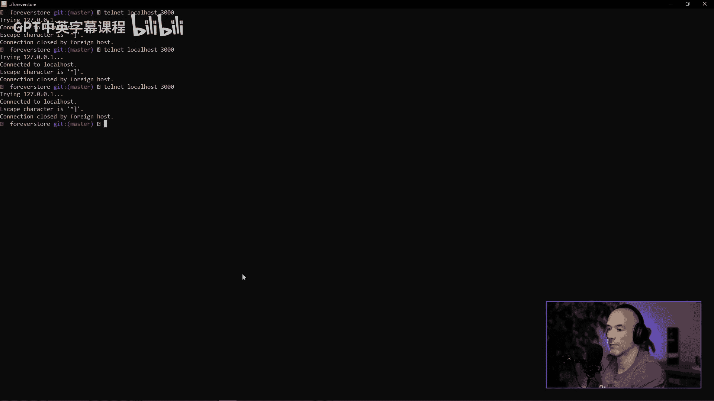

另外。And now it works。 right now we have dropping a P because we have a use of close network connection。

I think there should be a way so we can assert this specific error。

So we only drop the beat if it's that a of。Instead of just a normal error， actually， another error。

 for example， a decocode error or something， right。But hey， I think we need to figure it out soon。

 I will check it out。 how we can do this。 Maybe it's， it's， I don't know。 we can。

 we can see we're gonna make it work。 It's not a big big of a deal for now。

 I think we have a good portion of our peer to peer lip。Then we're gonna make the storage。

 Then we're gonna make a server， implement that storage into the server。

 And then we can do some shenanigans。Let me see。Whether we have main。

 I think we're gonna make a new file。 We're gonna call this。Storageco， I think， or store。

Nothing really matter。呃， packageage me。I'm going to say。タイプストレッチ。Or stored， maybe stored。

 Maybe so is good。 It's gonna be a strict。And then let me quickly find a good spot heat。

And I do we need something。Maybe stored options or something type。嗯， store。Os。

You're going be a strict， also。And we're gonna， we're gonna have some， some， some stuff。 I'm gonna。

 I'm gonna keep this here for now。 Let's， let's do。Let's going now with the sc search。

St test was this。I'm going to do。The first function。 So if you wanna write to disk， right。

 So basically， what we're gonna do is some kind of a content addressable storage where we can save anything in a deep nested folder based on the transformation。

Of the key， you will see。So I'm going to say something like Fnk S store。嗯，right stream。

Because I want to stream it。Or try， at least。We're going say key is going be a string。

 And then we're gonna say an R。 I you read it， right。What's going on， each。A like this。

You're gonna return an a。Yes， let's save it real quick。And then。So something like this， right。

 So the pat name。You could do it。Maybe this， the pad name is going to be some kind of a transformation of the key。

 right？So we could say something like。Transform。Thankk。Or maybe。Btter transform， funk。

Which is gonna be a type。Of a bad transform。Fnk喂。And I'm gonna say it's gonna be a function。

 You're gonna say of the string of the key， and it will return a string。 It's easy as that。And then。

You could say the startup ups that the bad transform funk is gonna be a bad transform Fk right。

 needs to be that signature。Yes， and then we could say here that the store opts。

We could just embed it。And I could see a phone new stored。I'm going to give this ops。

 which are stored ops。I we'm gonna return a pointer to a store， maybe an a， not quite short。

And we'm gonna return。Poin it to the store。 And Im gonna say that the store opts。

Or going to be the opts， right。Something like that。Of course， if you make a test file。

I'm going to make this store test， actually。Store test to go， right。

 And I'm gonna rename this real quick。To storage。Yes。

Let's close this and let's make another file what's going on here。Let's open up stored on this side。

 and， of course， test on this side you're gonna to say package mean。Thinknk thats stores。第一。

It's going to be testing T。 And then I'm gonna say。For example， that the S is gonna be a new stored。

We need options and options is gonna be。Store options。Yeah， and the transform think。

Let's make a default one for now。Default。ba。Tranform funk。 There' gonna be a funk of。给。String。

To a string。A we'm gonna return， actually， let's， let's make it， let's make it clean。What's going on。

Let's make it clean。 You' gonna say return turned the key。Very simple thing。

That's going to be a fuck。Yeah。And you could say default pad transform funk， which is all good。

 Im gonna say the opts heat。And then we have a storch。It's going on here。All right。Yes。

 so we have this spa name。And then we could say something like S bad transform think。で好き。Right。

 and then we have a bad name。 That's with turn millll。Lets bring it up pirate。

And then we're gonna say something like。The file and the add is gonna be O， S I actually。

 we need to make。If a is going to be O SM Kadeish， And I think we need to do all。

 especially for our content addressable shenanigans。You're going to em all the key。

 know the bad name。Like this， you're gonna say if a is not the nu。We're going return thearrow。

What does Aca deraldo do A A file name， I think it's I'm not quite sure's file name this file permissions。

We will， we will。Figureed that out。 I think it's more firm。Not quite sure。

So we're gonna make all the folders we we are needed。 and you will see， you will see why。

And then we're gonna say。Now we need a file name， actually。

And the file name for now is gonna be the key。Mchant。Let's say it's some file name。

We don't care for now， we're gonna fix this because we're gonna use some tricks。

 We're gonna make a hash of the contents。 right， We're gonna make a hash。

 and that's gonna be the file name inside of that that name folder。That's pretty neat。 you will see。

Got about this last night。Let me gonna actually see here。F， F。It's gonna be or S。Open。

 you're gonna open the file。 I think it's the bad name。B。Slash。The file name。Like this。

 And I'm gonna say if there is an ado。We're going return。The address。Now， we have a file。

And letm gonna to say， if， I think it's。And add is gonna be IO。Copy for streaming。

 for streaming copy， right， because I will copy。 Let me quick。 I will show you。

 We're gonna stream this， right。 You're gonna not。You see。I you copy。

 We gonna say copy the file with the editor。And if there is an adult。You're gonna say return the at。

 Maybe we should do an FMT or maybe a lock。Pnt F， I'm gonna to say。呃，额了登。不想的 bys。To disk。Like this。

And那 should be good。Mat you could do something like this， right。

You're going to say that and file name。It's going to be。It's going to be a bad name。Plus。

 it's gonna be this distinct thing that we did And then the file name， right， And then we could see。

Bad and file name。That's not true。 This one。Bt and file name。Did I make a mistake。Bad end。

What's OS S open， actually。就是内容。欧也。Let's see what's going on eat like this。

You could do something like。Percentage S。And maybe do the bad and file name。All right， yes。

Let's test this real quick。 So we're gonna see。And are we gonna make a transform F can make it beautiful。

😊，So we have this S is gonna be a new stored ops。 Yes， and I'm gonna say。嗯。

Let's say you want to store something， right， Let's say you want to store。As right stream。

Let's make a key。 Let's say it's going be。My special picture。Right， could be a special picture。

 And I'm gonna say it needs to be a reader， right， Let's， let's say data is gonna be bys new readers。

 And we'm gonna say bys。双机呗。SomeG back。Bs， right， it's。It doesn't matter。 It's byte， right。

 So we're gonna say it，'s gonna be some Gp， right。And I'm gonna say data。And then we're gonna say。

 if， at。Actually， we should use testify to be honest， but he。we'm going to say T。

And then the edge like this。 And then。Yeah， I think that's good enough。To test。

 can I do make test real quick？no such file or directory。What are we making。

Do we need to make the file？Maybe they need to do a S yet。That could also be a case，Make dust。Yes。

 so you can see written 14 by to disk。 And this is our location， right。

 My special picture from file name。 Let's open up B。 I mean， B， Let's open up。😊，You see。

 it's my special picture to fold it。 And then we have a file name， right。Which is good。Okay let。

 let's keep a attached。 of course， we're also gonna do a configuration where we can set the root of the。

 of the file system， blah blah， bh blah， blah。Y的や的や的right so。Alright， so let's make a， M。

 let's make a nice transform function。 We， we're gonna test this real quick here。

 We're gonna save funk。Dest。The bad transform。Fnk。Let say第呃 dustin。对。嗯嗯。A we gonna make this。

Let's make it the top。I know。We're gonna sp things out as usual， right， we're gonna。

 we're gonna make things beautiful as， as later on。Let's make it。How can I call this。

Let's make it gu。嗯，gas control addressable。But。Transform think。Are we gonna take in a key。

 which is a string。 We're gonna。Return the string。All right。And this is the magic。 You will see。

 this is gonna be so cool。 So we're gonna say fun， think。😊，Alright。 So we're gonna take a shower one。

Or an N5， it doesn't matter。 I'm gonna take a shower one because we will have motor bikes。

 We're gonna have a longer， a longer， a longer thing。Because I think M 5， let me open up M 5， M5。嗯什。

Yeah。What's M5 size。We don't know。I think it's 20。Or 16， I don'n know。 I forgot。

So guess content lessable bad transform funk。How are you going to do this。First of all， let's ha。

 let's， let's ha hash this thing。 So we're gonna say that the hash。It's gonna to be Shao oneang。什。

Of the key， right。Can we not do this？We need to have bys， right。呃， by of the key。Then we have a hash。

 Then we' gonna say that the hash string。It's gonna be hex because now we have bytes， right。

 You're gonna say hex and code to string。To string。 And it's gonna be the hash， right。

What what's going on。 Oh this well， what does it return， Hah， I think hash returns at 20， Yes，20 by。

 And， of course， and to string takes a slice so we can convert this to slice by doing this。

 a very neat trick， by the way， guys， if you wanna convert a fixed。😊，let's say you have a a 20 bys。

 right。And you want to convert this to a slice。 and you need to do this， right。I it对。

Because a lot of people are still using these loops to convert it to to a slice， which is okay。

 but it's， it's a necessary， right， it's a necessary performance。Waste of CPU。

So we have this hash thing。And I'm going to say something like the block size。那这个那笔。So we have 20。

 right， Let's say or a。A bad block size。 Let's say a book size of 5。And I'm gonna say that。

 the slice length。来这个那笔。I have no clue。I think it's L。The hashing。Divided by the b size。

I then we gonna say that。 the bats。Wait， now I need to thank you。

This is gonna be on the top of my head。 not。反痴跟那笔。Is it slice length。 Y， Yeah， yeah， yeah， it's this。

 It's this。 It's slice length。 Yeah， yeah。 So Pat， wait， so we could do。 Yeah， yeah。

But is gonna be make me。A slice of slice of bites， I guess。Or even a slice of string， actually。

 And we're gonna say the slice line。 I'm gonna premake it。Oh， yeah。 And then we'm gonna say4。

Im gonna loop to land bats， I guess。Or even， even you could say slice land， it doesn't really matter。

Sle plan is actually， it's already a number， right， So what am I doing here like this。

And we're gonna to see。From。读。It's gonna to be。嗯，It's gonna to be。I times。Block size。I。

Timemes b size。Blessss。Block size。And I'm going to say， they're going say thats y equals。The hashing。

Look at this。 The hasing from。2。Right， and now were gonna， now we have thispat。And then we could say。

 in return。Strings， join。 man， this is actually insane。 stringings join。Stings， joins， things， joins。

 things join the the， the the， the fats。Can we do this actually， we can't because。We can， we can。

 We can。 strings join spas。And I'm gonna join it with the slash， right for the patting， yes。

Let's try this。 Let's try this。 We're gonna say that the bat。The bat name。From our key， right。

 were gonna let's say we have a key， right， we' gonna store， for example。But it's gonna be a st。

 actually。 So we're gonna say moms。Best pictures。Mom was pictured， right。

 and the back name of that thing is gonna be。So we're gonna each key is going to be transformed to a certain path on disk。

Mom's best picture。And the fat name is gonna be。Ca bad transform funk。 We're gonna give that key。

And then we're gonna basically， I don't know what it's gonna be。 So， so let's， let's print it out。呃。

FMT print。Alan。The bad name。Let let us run this。You see， this is our bad name。Right。

 so we're gonna make a folder this folder。 Then inside this folder， we're gonna make this folder。

 and inside this folder this， this， this， we're gonna go in depth， right。So we're gonna have a nice。

 nice， nice depth of folders for every 10。And yeah， so we can store these things。On disk， that way。

And we could。 we could， we， we， we can change this upright。

 It could be that we only have two depth or or the three depth or whatever。

But now we have a five debt。Which is good。Nice。The question is， how how。

 how are you going to test this。Actually， what we could do is。But then this again。I have no clueing。

 I'm going to just copy this。And I'm going to say if bad name。It's not the best thing to do。 but hey。

 if bad name is not。です。Letm gonna say T at。We would say， actually。Expect， expect a bat name。

 I'm gonna say something like this。 Let's， let's yank it based in heat。Like the bad name。

 And you're gonna say to even at F。第一。Ha。This want this。Bad name。bad name。

And we don't need to do this T， by the way。All right。Something like that， something like that。

Alright， so we're gonna say that the bad name is gonna be。Transform fununkk。 So we could do。

 it's not gonna be the default transfer funk。 We' gonna say it's the gas， bad transform funk。

And you can make your own transform functionsks and， and。

 and we can extend it with whatever you wanna， you wan to do。You could do a get get type thing。

 It doesn't matter， right。Alright， so the next thing we need to do is this file name。

 This file name is not okay。 We want to have an M D 5 hash or some or even a Shah hash。

 It doesn't really matter。It needs to be hashed。So。🤧And of course， things are gonna be incaped。

 I know。 But for now。I think the problem unless you have this read， right。Dreed。

So what we could do enable to hash。The contents of the reader， the bys of the reader， right。

 We need to read， but we also need to read。To， to copy it to the file。

 not we have the file we have or or read it。 and we need to copy the reader into the file。

 which will read。 And once the reader has been read， it's， it's dumb。So to do that。

 I think you're gonna first lead into a buffer。 So you're gonna say buffer is gonna be a new。

By itss perfect。 right， It's very interesting， actually。

 because we do a lot of these networking stuff。 And now we are doing these， these， these。

File reading shenanigans， which is nice， right。And then we' going to see。I'm gonna say， I O copy。

 Are we gonna copy this city into a buffer。嗯。Then we're going to say something like that the file name itself。

The file name bytes。Is going be M5。The sun。Of the birth。Bs。Like this。

Now I'm going to say that the file name。It's going be a hex and coats。

To string of the file name bytes。Then we can do this patent and file name Dgue。

Then we're gonna create it。 And， of course， this reader is already， already。

 we can do anything with it。 So we're gonna say。Can me do birth。That would be nice。

That would be nice。 Is it gonna work。Yes， look at this。So， so now were gonna see， right。

 let's open up our folder。 So we're gonna say this one and inside this folder， we have district。

 district， district 1，2，3，4，5，6，7， Why do we have so much。Yeah， it's， it's normally。 iss it because。

 yeah， yeah， yeah。Is it。Yeah， so we have these nested folders。 right， I think it's okay。 Let me。

It's Dina And this one。This one， this one， this one。 And now we have this file， which is Zmjibe。

So we are storing this on disk already。 It's nice， nice。 Look at these folders。 I like it。 I like it。

 And if we wanna read， it's the same principle。 we we know exactly we transform the key we wanna read。

 and it will be。😊，Wait， wait， we have a trouble。😡，We cannot。 we can。

 we cannot transform it like that。Because how do we read something。If we read it， we need to。 No， no。

 no， we can't。 We can't。We made a mistake。 Let's close this up。 We cannot do this， file invites。

I think。呃，That's not true。Because right now we are storing。 let's， let's make。I think we need， you。

 you know what I'm going， right， Because if we wanna read a key and we have our key。

 we don't know what's inside most of the time， so。If we want to have the full bat。

 we need to have the bys。Of the thing we wanna read， the。

 the content of the data so we can has it to know its file name。But that's， that's impossible， right。

 to get something， so。Let's， I have an idea。 I have an idea。 We're gonna say something like。

Something like a type。A bad key。Go to be a strict。And a pat key is going to hold the pat。

The bad name， which is gonna be a string。But also， the。Original。I said the thing original key， maybe。

Original， original is good。So the spa transform funk。Could return a bad key。

Why they gonna return a pad key。 And I'm gonna say that the。You could say returned me a bad key。

And the pad key is gonna have the。The bat name and the bat name is gonna be strings。 is gonna。

 I'm gonna。Just gonna type it out again。Stings join。This thing that we did right。

 we're gonna say Pats。 And then we're gonna join it with this。

And I'm gonna say that the original is gonna be the hash string， right like this。Ex bat name。

 And I'm gonna say expected bat。Expected already G。Or G， already G， Okay。

 and that's gonna be the pad key， but without these things， right。I'm making so all。Zi。No， man。

 I cannot type original。So then' we gonna say bad key。Heeach。Now we're gonna say the bat key。

that name is going be this， right。And then we could actually copy this again， paste it。

 Then I'm gonna to say badke original。Should be the expected。Bad name。Its going be bad name original。

Let's going on with the original key。No， it's gonna be expected isn't not key。Yes。

This is gonna work work。Yeah， of course， we have some issues。 I understand。

So we're gonna say that the pad key。 can I make this like this on this。 I don't get。

 And I' we gonna say make everything。 It's gonna be the pad key。Bad name。Bad name。Wait。

 we don't need this。 We can。 We don't need to copy this。 Actually， we can。I think。I think可以。😊。

Patton file is gonna be the pad key this。 And I'm gonna say， actually， what he could do。Look at this。

I's do it like this。 I don't know what what I'm doing。 actually。 that name。 Yeah， of course。

 we have some issues in our test。Like this。 And I' we gonna see what's going on each。为这个问了。O it的。

Yeah， it's true。 What's going on， I don no field bad name。And then we gonna， we can make a function。

 right you can say funk。It could say P bat key。 and let's say， file name。Yes。

 file name is gonna return a string。And we could just return like this。 We could say return。

If we can make it clean。 We could say FMT。Epirants。S。

And we could say it's gonna be percentage S slash percentage S。 That's it。 And I'm gonna say。

Be bad name。Be original。S b。Going on， F。Yes， that's the file name。So we're going make。The bad name。

The pattern file name。Only thing we need。Actually， we could do it。That's going to be bad key。

File name。Right。And instead of copying this book， can copy the a right。

I think that's gonna gonna be something。嗯， gonna be some。I think we are at the good track。

 Let's test the storage。Yes， so we are written to disk this whole sheangang。Right。

 so now you can see that we make these folders， right。And the file name is gonna be the pad name。

 but then laid out。 So then we can find it。 right， then we can retrieve it。 right， Alright。

 so what I wanna test。Is basically a reading。So let's make something like funnk S。Store， let me。

 let me move it up here。Fnk S stored， I we gonna say read stream。A key， which is a string。

And it's going be thirdness。That's a good question。Are you read。It it sounds weird， but。And an add。

 maybe。Because we're gonna wrap these functions。 right， So now read team。

 write steam is gonna be internal functions， but we're gonna wrap them with read， right and， and。

 and easy， easy API to use。嗯。Right， so we're gonna say that Tibaki。We're gonna say the same thing。

 right， The pad key is gonna be as pad transform think of the key， right。

And we're going to say that the file name or the full pad， actually maybe。

The full pad is going to be。Actually， can we。I think you're gonna say O S open。I we gonna to see。

There's gonna be an FH file and address O S open。 And I think you're gonna say the bad key。File name。

No， it's file name it's。I don't like this file name thing， because。Where is batke file name。

The bad name。The original。I don't like original。 This is gonna be file name。

We're gonna to effect of this。 And I'm gonna say this is gonna be the full bat。The pad name and this。

 the file name will give us the full pad。 Is that， is that correct。呃， leave some comments。

If you think I'm， I'm wrong， if， if you think we can do this better because he。

So the food button is going to be the bad name with the file name。Cause this is the file， right。

 I mean。It's clear as that。 Of course， test are gonna。B name， original is gonna be the file name。

Yeses。Full bed。 Of course， we have some issues heat and heat。Let's make it full bed。

And I've got heat also，' going to be full pat。Yes， and then we're gonna say heat pad key full pad。

 that's we gonna， that's were gonna open。 If there is an a。 we're gonna return can return。 Yeah。

 we can。You're gonna return。没有。H。Now， we have a file。The question is， we can。 We can。

What do we wanna return if we want to do at each stream。That's a good question。 I think file is。

 is it either right。File is。嗯。But I think we need to have this reach stream because we're gonna do the encrypt and stuff。

The corruption needs to happen on the client side， I think， which happens， right。Well， I mean。

 we're gonna get。This is a hard one。Its file reader。 That's a question。 Let me， I think so right。

 yeah， yeah， it needs to be。Maybe， we can。Of course， we need to close these files， right？

That's a thing。 So the problem is， but we're reading， we're reading a file from disk。

 but we need to make sure we close this。 So I don't think it's gonna be a reader， but I read。

Closeage。Which basically means we can just do this。It doesnt knowsha bang。

 but that doesn't make any sense。But then we can wrap this in a function。 we could say， for example。

 as storage。And just at eat。L the key is a string。And then what we could do here is。嗯。

We could return bytes already。Not quite shared， guys。 what we need to do here。

 There are a lot of options。To be honest， so we could say， for example。

The each stream is strength disc key。Re it turn no， no。开始。来。And then we could say。

 we can make a buffer。New bytes。Perfect。嗯。Youre gonna say are you goby。F birth。No。But F。

And let'm gonna say F close。And then we'm gonna return the above。没有。Actually， what it could do。Yes是。

还是 this。这个 what did I do。I's deferreder it heat F close。Should I do it like this。Actually。

 I think it's fine。I think it's fine。 We can say def。I'm gonna say add。

 and then I'm gonna return a right。都是都是嗯。What happens it。reten al right。Oh yeah， new edibles， C IC。

Yeah， yeah， it's fine， it's fine。Is that a thing。Let's， that's this， right。 So let's。

 let's put it up higher。 So we're gonna say here data， we're gonna read what is this。

 My special picture。Let's make it key。I'm going to say the key。哎，What's going on。

There's gonna be mom specials。You're gonna read the key。 These are the bytes。These are the data。

 right， This is a new stored la la la。 We're gonna write this。 And then we' gonna read this， right。

 Then we' gonna say that he。A。At we're gonna be S at E。were gonna read the key。m to see， if at。

Asnu mill。D error that， right。T at at。嗯。Now we have this read， right， and， and。

 and I think it's important to return a read it because then you are， then you are flexible。 Then。

 then we are flexible。 If you just return the bys， I think it was important to。

 to close the file so we don't need to do that。 The usage。 well， we don't need to do that later on。

But I really it is important to have。So we're gonna say R is's gonna be， we're gonna say that to B。

Add gonna be I O deal。I eat all。At。If at is。Do we need this。And'm gonna say。Wai， what he could do is。

 instead of doing， we're gonna say this is gonna be bys。Like this。

And we're gonna say this is gonna be a bitete new reader heat。Mymic is constantly。

Doing stuff it doesn't need to do。 anyway， it is。 what it is。Yes。

 we're gonna do it like this because then。You're gonna read this by。 then we could say if。呃，B。

Is not equal to the data right that we， that we put in。You're gonna say D add F。

 You're gonna say want this。Can we do S， I think so。Have。嗯，对。We want data。 We have B。

What's going on SB is not data。Damn， it's， it's I see。Well， what he could do is this， right。

 you could say。String be。thing。エラ？As other thing。Yeah， look at this。 It just work， it just working。

 So because we could say FMT prints。Pal land， and you could say string。B， right。

 So you could see what we needed it， right。Some G8 bytes。 That's fine。 It's working。 Yeah， alright。

 so。😊，Help me。 What's going on here。We can read。Of course， I think we need to do some more step here。

 But hey， it it's fine for now。嗯。And I'm thinking。My special picture。 So we have these schools that。

 Oh， we have。What has going on it。That， of course， if you store the same file again。

This is weird behavior， well。Its going to hash。But why is it the same bat and not the same thing。CA。

 of course it's it's hasing the same be。And we do an N5。No， we don't。按呃。Doesn't matter。

We will fix that。 We will see what what， what is this， how， how that happens。

 It doesn't really matter because it's the same file。 The question about there is， what。

 what do we need to do when we are storing the same file once again。 So we。

 we're gonna fix that all later on。The basics first。Actually， we should。 we should。

Let's make a delete function so we can actually clean up our tests。 Otherwise， if we're in the test。

 we will have these folders sitting around， right。We have read。 He， let's make a delete。

If you really want to delete something， right。We're gonna say delete。 We're gonna delete the key。

 We're gonna。Return an add。And the first thing gonna do， like usual is make or bad key。

That's gonna be as transform funk。with the key。And I think we need to do。嗯。Let's do FEH。Actually。

 do we need to status， to be honest because。G we not do something like O。Remove。Removes the name。

 the named file or empty directory。 If there is an error and what's remove all。Removes， remove all。

 removes bat and children contains。 It removes everything It can but returns first and O K。

 see maybe I think it remove all。And it's gonna be the bat， key full pad。I like this。嗯， returnturn。

Of course， this， we， we can actually just return this。Unless we want to look。And even then。

 even then。But we like， like I said， this is very， very early。

 I think we're gonna add much more to this later on in these things， right。

Especially if you wanna work with a cache and everything。 So I'm gonna implement a cache。

 And if you wanna work with a cache， we need to bus the cache。

 And if you delete and blah blah and all that good stuff， right。

 So that's why this function will be big。We can actually make a deferred。Fk。

I could say something like this， right， or， or even this。It's gonna be bat key full bat， maybe。

Actually， file name， maybe。喂。This is gonna very no idea。Let make this that's right。 You could say。

 funk。That' delete。I'm gonna to be a T testing dot T。嗯。Good copy this。That's right it。

That's write mom special key。And let's then say。If ssh is S delete。K。T A F， not not A F。Thatch。

And let's make another function， actually。还ki。We， we need to make these spa key all the time。 right。

 We need to make this transform functionsnk all the time。What's going on。

I think it could do something like file。Information is O S sta。The key。 No， not the key。 the bat。

 full bat。What am I doing here with this capital B。F bad。We're gonna do what is a has。

 Do we care about this。Look， look at this。 What we're gonna do is if add is not mill。Imna return。

False。Is that a thing， actually， should we do this？So let's say if we have and we。

 and we are trying to stat something and we get an error in static。I'm gonna turn false。

 You know what I mean it's， it's。Then we're gonna to say。How can that actually turn anyway。Wait。

 maybe。Let me， let me see what Sta does。Thatat returns the file force describing。The， the file name。

 if there is an error， it will be bad a。It's bad at right？Because we don't get this file info， right。

It's not exist chance brilliant whenever thearrow is known or directly exit。New quoities。FS。At S。

 I do not exist。 Is that a thing？I don't exist。Man， this is， this is crazy。看。

If at where is this should use return add is not equal advertise this instead of if。喂。

Because if the error is the file not exist， I we turn files， right。

 because we don't have the file then。I don't understand。 Am I am I stupid， maybe。🤧。Heby man。

Let me clean up these folders real quick， actually。Do we have， We have no shenagans， Right。

 So basically， what I'm gonna do is I'm gonna test store delete key。

 I'm gonna store this key and I'm gonna delete the key。So I'm gonna run this test。

And then he says he， delete it from disk。But the problem is this distilled heat。But the file is gone。

 The file is gone。The file is gone， but the folder is still dead。Oh man。So what do we do。

Do we remove these folders also， or what is this， I thought， I thought remove all。I really， I really。

 I really totally to move all with remove the Hoshe Bank。那个老外。What。

 what happens if you do remove all the bat key， and we say we're gonna remove。The bad key bad name。

What's gonna happen then。If you do this again。I delete this。没有。That， that， that， that's crazy。是是这是随。

It's deleting。 That's for sure。Remove， remove the named file。Remove。

 remove pads and any children it contains。Oh， but。Man， why， why is it not to work you。

The bat named Pat。That's crazy。That's crazy。 I was really， really。

 really assuming that OS S from move evolve would would delete the whole bank。😊，But apparently。

 it isn't。Let me think that we could do two times what you could do， but that doesn't make any sense。

Oh， oh， but there's it's full bad， full bad。Ibet， right。So we're deleting the full pad。

 So I don't know。 I don't know。 I don't know why this is not gonna work， to be honest。

Why is V code not。Yes。Boom， so we deleted this file name， Yeah， I understand。It's gone。

 I completely agree。嗯。We'd behave it。So let's do something like。I don't know。

Im sure if is the right approach to be honest， but hey。Now return turn。We're gonna say bad， full bat。

 We're gonna say， yeah， no， not the full bat。 This is gonna be then the the， the， the bad name。

 right。Bad name， it should delete everything。 It is what it is。 I don't understand。Let's。

 let's open up。 Let's move this folder once again now。Right， and let's do this again。All right。

 now everything's no， what's going on。You know what？You you， you know what we're gonna do。

 What is this man， is， is this window she against。What were gonna do is。啊。

We're gonna say that key make a new function。 We're gonna say P。Bt key。First。Bad name。

And that's gonna be， it's gonna return done a string。And we're gonna say。Return strings。Split。

你 be bad name。Am we gonna split it with this。 And we gonna return the first。Alright。

 I we gonna say we're gonna double check because we are doing a race。So let's do pads like this。

 I're gonna say let'， let's make it actually good， right， because。嗨。People are gonna roast me。

 So we're gonna say this。 This is gonna be the bes， right， I'm gonna say if then。嗯，ba。If， if。

 if lampm passes is 0， right， I we gonna say we we could panic each because if we want have first pet name and it's0。

 but let's return nothing。It doesn't matter。I mean， you could say， yeah。

 bad name needs to return a string and an adult。 But you could， man， if you could。Yeah， yeah。 I know。

 But still， I'm not， I'm not I'm very， I'm a big fan of errors and handling errors very important。

 But these things， if youre trying to get the first bad name。But that you cannot make a bad name。

 Something is thatably wrong in your system。哎码有半年。Something to think about。 you could say a return。

 Then we'm gonna return the paths 0。 write the first one， right。So instead of doing this。

 where does M remove。Delete here。 Let me try something real quick。 let me comment this out。

 You're gonna say remove everything but you're gonna say Pat key。The first bad name。O。

Very permanently。Do it again。哎。你谁？Now， it's working。哈哈。😊，So can we actually do the complete test。

 actually， let's， let's do it。T itki， Yeah， yeah， yeah。

 So we're gonna do do our test here read every1。Have we gonna test this。

 And then we gonna basically just say。As delete。可以。Yes， too。Yeahba。呃，yes。Of course， we also wanna。

 basically， for our test。 If we wanna do a complete tear down where we delete everything we just start。

 We need to implement the root of the storage。 We need to know where the root of the storage is and。

Once we know that， then then we can just delete a complete route。Basically， so we could actually say。

Should we make function clear。not quite sure。 Well， anyway。

 let's open up store and store test real quick。And what we already can do is save things。

 We're gonna make these folders。Based on the key， right， Based on the key。

 were gonna transform that key。 And then we are gonna create some， some path to the file， right。

 content addressable。 But the problem is there is no way to specify a route， right。

 So we cannot just。St that randomly on disk。 We need to have a route that contains the Hshe Bank。

So how we want to do this is basically a couple things actually。

 because was I was inspecting this code base and we made a mistake。 Well， not a mistake。

 we forgot something。So， we have this。And let me put out away this cur sort。

 So we have this default pattern transform function， which is basically the default。

And we have no way to， basically。At default values， right。

 So we could do something like here New stored。 And we could say like if the ops。

 the bad transform F is nll， and we could actually say that the ops bad transform F is the default bad transform thing。

 But that's not gonna work because we changed。This interface， let's go up top。

Which changed where where is the staying。 The spa transform Ph is basically takes a string and and returns the pad key。

But we are returning a string still in this transform function。

 So we need to say it's gonna be a pad key。 And that's gonna be， that's gonna return。

That's gonna return a pad key。 And I think because it's the default function。

 we can say that the pad name is gonna be the key。 And then the file name can also be the key。

 Why not， right。So that's gonna， that's gonna work perfectly fine。

 The next thing I wanna do is basically add roots and the store ups， which is gonna be a string。

 whichs gonna be。Root， we can say root is the。Fol name of the root。Of the root。Containing。

Containing all the files， maybe folders。Fileles of the system。Like this。

And then we could say something。Yeah， right， you could say F opt。 actually， you could say。Let's。

 let's make a constant。 You're gonna say default。Root folder name or something。 I don't know。

And you could say it is gonna be G G rate my keys。 my， it's still。It's back to international。

 and it needs to be US keyboard layout。 Otherwise， my quotes are fucked up。

 We're gonna say G G network。Like this。 And then we could say something。each。If opt root， actually。

 we could say if the length。Of the ops root equals 0。

 That's how I that's basically how I check if strings are 0。 you could do basically like this， right。

 Theres the same thing If opts root equals this， right， but I don't like it for some reason。

And don't like it。 So I'm always doing， if lamb。Of the string is 0。

 Then we could say that the up to root is gonna be the default。Deult root folder name。Of course。

 now the whole system is， is broken， right， because we have。What is this we can delete it， I guess。

Because if we want to write。So we're gonna say pat key。

 and then we're gonna MCca did the wholesher bang， right。The pad name of the pad key。

 The problem is we need to appent， I not appent repent。We need to prevent a route name to this。

So actually， it could be something like S roots。Like this。 But that's， that's a nasty way to do that。

 I know。Right， is I I， I just wanna test this real quick。 Let me open up my folders。

And let's run test heat。 right， It's not gonna work。嗯。Why， why is it panicking， actually。

 I don't understand。Now basically， it's it's try to open。It's try to open that shenaniganance。

So right stream。 it's maybe because we're also doing read stream here。 Let's， let's delete。

So we're going to write stream heat。🎼We already have these， this complete folder sheet。 that's fine。

 So something is working。Alright， let let let us test just writing。 right， that's gonna fail。

That's gonna fail。It's the full bat。 Yeah， yeah， yeah， I see， I see what's going on。

So we basically do this MC cut did all with the root。 And then were making a full pad。

 and then we are gonna create。 But the full pad also needs to be the roots plus。The full bat， right。

🎼Let me delete is folded once again。Now that's run this again。 right now， it's。

 it's gonna work perfectly fine。 So we have a root， and then we have a file here。

 which is some Gpe bytes。 So that's already a good start。Okay。

 so how can we make this clean it with the sut thingy。Let me close his by stingy。O什。I tired。

It's still early。And I'm trying to do this as raw as possible， right。No， no， no。

 no particularly gotnigans。Wait， what is the bat name。 And then we have the full bat with。

 which is basically the bat with the file name。 And this is gonna be the bat key bat name。

 which is gonna be the bat without the file name。What we could do is make a transform thinkqui route。

 Do we want that。 I don't think so。Or we could do something like Pat key。呃。

Something like that key root or something。 And then say that it's gonna be the S root。

But I don't like it。I don't play that。So what we could do is， basically。You can keep it like this。

I'm also thinking maybe you do a bad transform Frank with the key and the root or something。

Like this。But that's， then it's not a separation of concerns， right。

 I wna have this function as spirit as possible。So what we could do to make it a little bit cleaner is basically。

It's going to be the fat name。With root。And that's gonna be an FMT Sprint F。Yeah。

 aspirant F like this。 I'm gonna say percentage。S slash percentage S。

 And I'm gonna say it's gonna be the S or root。And the bad key。It's gonna be the bad name， I guess。

Bt。Yeah， like this， right。So' already a little bit cleanerish。

 And we're gonna say bad name with roots。And then we have this fullpath。And then we couldn。

 we could say the same thing， like full pet。With the root， right， And let's let us copy this bad boy。

But that's not gonna be the bad keypa name。 It's gonna be the full pad， right。Actually， yeah。

 now we can say fullpath with root。Full bed with root。 And then this is gonna be。We written to bar。

 we written to the disk， and it's gonna be the full bad way the root。 Is that a thing。I don't know。

Let's delete this。Yeah。I let's run it again。 It's all working as expected。 That's perfectly Gucci。

🎼So let's delete it again。I think what I'm gonna do is make the delete function right now。

 because then we don't need to do it manually。But let's make this test work first， right。

So then we're gonna read。 We're gonna read the key。We're going read the key， actually。

So that basically means we need to fix it what's whats what's going on with the right stream。

And test it， it doesn't detect， It's telling me probably that it's not getting used。

Although we're using it in our test。😊，And this thing， this can be different We could do， if at。

is at O S not exist。It the same thing。Right， so if， if， if it's not existing， let return false。

 otherwise return true。read read read read。What's going on here。I this should be fine。Where is it it。

Heeach。So we're gonna do a reach stream。 Is this one。

 we're gonna say that the pad key is transformed firm with the key。

And now we're going to say read me the full pad。 That's not true。

 We're going to say that the pad key。嗯，We root。It's gonna be an FM T S actually， what we could do is。

 but it's fine。I mean， we could， we could make these things like I said in an application。

 you can keep making things even better and better and easier to to use， but hey。

Her percentage S slash percentage action is going be the as her root。 And then with the bat key。

Like this。 And then we could say， open me the bad key route， right。Is that。

I think it's gonna be the fool bad to do it， to be honest。It's going to be a reading。

 That should actually work， I think。It isn't。I see what's going on。 what was it doing heat。Oh， yeah。

 I do the pat key。 That's crazy。嗯。出百川。Yeah， so we are written。14 by to disk。 That's fine。

The question is， why don't we， do we print that out， We don't。We could we could try right。

 You could try it if， if， if you're actually reading this thing， print F。Yeah， it's gonna， it'， it'。

 it's working fine because we say want F。 So that's fine， right， But a。

 if you w tona see it on the screen， you could do a string B。And run this thing again。

 What's going on here to print F could to print a la。And do this boom。Some G pay by okay。

Working as intended。That's good。 And then we're gonna say delete key。 The question is， is。

 is this gonna work Probably not， we need to do。Some changes。 So let's open up the leads。

 It's above here。 So we're gonna say Pat key， Pat key， the file name。

But you're gonna remove the first bat name。 That's actually。It's fine， right。

So we could say first bad name。嗯，withro。Which is gonna be an FMT S print F。

Same shenanigan percent S slash percent S。 and is going be the S root and the pad key。嗯， first。

But let's just type it out instead of typing them。And then you're gonna delete everything inside this。

 I'm gonna say the first。Bad name。And let's type it out again。

 which would sometimes it's fine to not add a light on your type painting。I'm so sorry。St rest。

And I wem going to delete this。The question is， what， what， what is it gonna delete。

 I's gonna delete the whole bank。 Let's see， right， So we have this thing。 I'm gonna do run test。

It'sy， look at this。 It's working perfectly fine。😊，Yes， that's already a good start。

 Sometimes things go like it should be。That's great。 That's clean。 That's clean ands。

 That's do we need to have something else。 We have delete has， has， has， has， has。😊，Haky。

Where is Haky。A hassky。还是。We're gonna do this transport funk。

 we're gonna see if the statue of full pad。I need to say full better with root， right。

Fu bad with a root。And that's gonna be again， again， I know， I know as printprint F。

Percent S slash percentage S is gonna be S roots and the bat key。It's going to be a full bad。

 I guess， yeah。See a function initially， is it。Yeah yeah yeah。

And I'm gonna say that the full path with root is going be this。How do we test this Ha， sting he。

That's delete。Well， let's just test everything in。As the he right， you could say if。Okay。As has。啊。

的 key。And it's O。 It's not okay。 Actually， what we know， what we're gonna do is this， right。Actually。

 no。If it's not okay， it should have it， right， So we could say if not okay。And we could say T ado。F。

I could say， expect。To have the。给以。Noice。没。Sometimes。And like I said this chair， I need a new chair。

 It's my bag hurts。 Everything hurts。It's just a simple living， living room chat。You know。

 where you just eat and and dip and dip them。 But I'm sitting here for， for hours and hours。 It's。

 it's crazy。And I'm an old man。And I need to have， I don't know。So yeah， this is， this is nice。

 What I'm gonna do is real quick。 I'm gonna say get at。 And then I'm gonna do a gi commits。😊。

Added routes to the stores。N we can say add root option。To maybe store ops。Like this。 Gucci， gucci。

And once again， for the people that areions。Thank you for the support。 Of course， like usual。

 Thank you。 Thank you very much。 If you're not in the discord。

 DMmeme or or DMme on patent or something， And I will give you the correct role in discord， right。

 You get a better role。 So we have a private。 You can join the private channels where I'm basically continue。

 continue helping people out， right， So do that。 Let me know if you're not。😊。

If you don't have the correct role yet， and I will happy to give you。An exclusive status， the status。

 the status of the high value engineered， software engineered。But you are。Or you're going to become。

Yes， so that's fine。What do we need more。Actually， what I wan to do in this。And these tests。

 actually。Is make maybe make a tear down。Or maybe make some helper functions。 For example。

 we could say new， actually。New stores。I'm going to say testing。 Do we need a testing。

I don't think we need， actually。嗯。Yeah， we're gonna， we're gonna some help but finish for。 It will。

 It will make our life easier。Whats going on in it astor。We could say return， actually。Let's do this。

コピです。Do we want to root。We don't want to。 I think G G is fine。 G G network is fine。 The default one。

 So we're gonna make our cast transform Tengi。And then we can actually just return this new store。

Let's make a function is going to be teeered down。And what do we want with tear down， actually。嗨。And。

If we want testing TV， I think。Desting T and maybe the stored itself。I've got to share it， actually。

Wait， in a turngram， we need to delete everything。Do I have coffee， actually， Yes， Luc。 Well。

 this is basically once in a lifetime opportunity that I have coffee。😊，Available when I。

But I didn't expect it。So we're gonna to do a tear down function。

How can we actually remove the whole bang。I think we could do something like if at is gonna be O S。

 Where do we do this。removal。Actually， we should make a function like， for example， F storage。

And then the store one， that I think the store is basically complete。 We can store things。

 We maybe need to come back to add or cache and every10 but a。The next thing is to couple this on a。

 on。On our network so we can store things and then distribute it that's that's。

There's better magic is gonna happen， but this needs to happen also， right。

 So you're gonna say a clear function， right， Not quite sure what is it gonna do。

Will will probably return anarrow。we're going to say。我。Remove all。

 And I think you could do something like S roots。And actually， do return。 Isn't that amazing。

 Is that a thing。If that is gonna be S。Co。And the adult is not nu。Im gonna actually the address。Ash。

 is that a thing。Let's， let's try this real quick。So we don't need the stuff。

 What they could say here is basically say。S is gonna be a new storage。Like this。

And you're gonna say deferred as ti down， clear， cleared， cleared。 No， ti down。第一张。helello。Teach。

Down， T S。Is that a thing。 I'm not sure。 Let's try。Yes， you see。 now G G network is completely gone。

 And now we can keep running these tests， right， Okay， of course， this， it's， it's。😊。

It's getting cacheed， right， It's getting cacheed。 Maybe gonna make a newki fo and but。

It's getting cache。 So let's change this so the cache can be bursted heat，You see。

 and everything is working perfectly fine。 And we don't have any relics in our folders from the test。

 which is nice。😊，And the reason why we pass tear down and test why we pass testing the T and tear is basically so because clear can return narrow。

 and we can assert it。 and it's all fine。And to be honest。

 we could move these the shenanigans completely at the bottom of the file。

And because they'll just help us， right。So how do we need to test actually a little bit better this test store。

 what we could do is。We could do。 We could do this right。 You could make a full loop。

And we place every 1 in this for loop， right。Oh， I'm， I'm， I'm itching。 But is this fool embaring。

Mait， wait， wait， wait。 I made a mistake， I guess。嗯。So this is a for loop， for loop， for loop。

We're writing these bites。Where is our key。We don't have a key。 What the hell is going on。Okay。

 key is gone， but it's no problem because were gonna make a new key。 You're gonna say that the key。

It's going be FMTS print F。 And that's going be。Let's make this fool。And the score D。

Which is going to be the Y。Right， so we have conless conant。 How many times are going do this。

You can test this 50 times， right。And we're gonna make some data。 We're gonna say some G bytes。

 We could make some function for random bytes， but hey， it doesn't really matter。

I'm gonna make a new key。 Does it matter， actually， that we have a different file size。

 I don't think so。So now we can actually do this completely the same time。

 You're gonna write to disk 50 times。按呢。With different ges。We see， and it's， it's。

 it's all different keys。 right here，14 by。 I know。What's going on here Stop yes， go。Yeah， fine。

And we have no relics in our folder， which is fine。So we're basically testing writing。

 Were testing has。 We're testing read， and we're testing deletes at the same time。 But if we delete。

We need to assert。 We need to make our test pinpoint precise， right， pinpoint perfect。

 Were gonna say Ar not mill。Let we go the T a this a that we are returning。 And then we need to say。

To make this actually perfectly fine。 Now， we need to try to see if we have a key。😊。

And I'm gonna say if it's okay， right， if we have the key expected to not have that key， right。

 because we just delete it everything， right。I we gonna do this 50 times。

 So that basically means we're testing every 10。We have。

 So we don't need to test this delete because we already testing this and we don't need。 Yeah。

 that's fine。 That store new store give down。 I think this is perfectly fine。

 We're testing in one test。 We're testing the whole bang 50 times with different keys。

So we could do make that gonna fail because we have an a in in in order TCP somewhere。

 So that's failing。Boo。Right， and I think the tests are are perfectly working。Yes。不起。

Do we have an ourmic file， actually。We have rep on。 I'm gonna delete ver and make files。

 So if we test， make test right， then we don't。 Oh， yeah， it's printing anyway。My I see why its。

Makeran。Make desk， actually。Anyway， W why， why， actually， why is it failing？ It's MP to P。 What。

 what's going on， TCP transport test or something。Whats going on。 help。 How help， yeah。

What's going on in each then't test this is's gonna that's working fine well。Why do we have tests。

 We have transport test， handshake。Store test。Why is it failing？That's， that's insane。

 Make that what's going on。Fil。It's the bad transform firm that's feeling。 That's weird。

 That's weird。That's， that's weird store test。This， this is failing。 You see， we want this。ho。

This is the exact same thing。 What's going on here。嗯。Wait。

If the bad name and file name is not the expected file name。Wait， wait， wait， wait， wait， wait。

 Whats on。 What going on it。Have。Wait， let in NV S code， we can actually hover。My mouth is broken。

 you see。If you hover this， then you see on the other side that it's basically mimicking the same。

And see， it's the same thing。 So we have this。But we want this。 But that's the same thing。

So store test is gonna be。Why， why are we doing this not equal。It's 19。Line number at 19。

 What's going on。It's this one。 If the bat name file name。

 the bat key file name is not the expected file name。But they are the exact file name。W。

 this is not correct， right， because they expected。The pad key file name， that's not this one， right。

 The file name is the expected original key。This is expected file name。

This is the expected file name， and this is the expected bad name， right？ So this should be equal。

 and the file name should be the expected。File name。Right， and letm gonna say he expected file name。

That should be right。All right。I remember that we， that we changed some stuff up so that could be。

 that could be the issue。O。Yeah， I think， I think this is fine。So we can write stuff。

 We can read stuff。 We can delete stuff。 We can clear the wholeang。 We can test if we have a key。

I think this is a very good start to swap back to our。Serve it。This go back to our server。

 and then we can attach this storage there。Store a file。

 And then we're gonna basically replicate it to， to， to all our other notes in the network。

 And we're gonna do some encryption。And are we gonna see what what we need to do。 So hey。

 we are at the good part。Somebody from the community noticed something。

 not quite sure if you remember， but we had this weird warning on A or S somewhere。 I think it has。

In the Hasky。Yeah， heed， although the warning is already fixed。I think we can make this even better。

 right， instead of doing。Add or S and check if it's false， blah， blah， blah。

 we can actually do this and return this directly。What's it going on like this， right。Actually。

 return is like this。 Oh， and that should work perfectly fine。 Let's dooo make run test， actually。😊。

Yes， perfectly fine。The next thing I also want to do is make an exposure of the right stream。

Because we have this right stream heat。 And I w to expose this as a private function。

 So we're gonna say， instead of making this。Because I think were we're going to do some more stuff in it later on。

 but for now I'm going to expose it as a simple right。😊，St， we're going to just say right。

Which will take in a key which is a string and also take in an IO reader。We will turn anarrow。

 and then we can actually just say return me as right stream。With the key。

It's going on here key and O like this。 and it'll all work point。

 The next thing I want to do is start creating a server new file。

We could call it file server or server， I don't think it really matters。

Let's call it server package mean， rather。You're going to say a type。Ser it。

Which is going to be a strict。We're going to have wait。 Let's make some options， right。

Sver options is going be a strict， also。We need a listen editor。For our transport， right。

 because we need to end that peer to peer lip into the server thing。 So we're gonna say。

Let's called it file set of it。File servers。 listen now there's going to be a string。

 You also need a pack a storage route， right？Sttorory root。It's going to be a st， also。And of course。

 we also need a private key and all that stuff。Not quite sure me to implement that。😊。

Because we're gonna encrypt or。 you're gonna encrypt probably some。

 some stuff or maybe an encryption key doesn't need to be a private key。We will see。 We will see。

Start it root file server。嗯。You can say file server opt right here。Ne file out of it。

It's going to return a file third of it if you could actually say something like return and file third of it。

How we need a store， that's what we need， a store which is going to be point or to disdain。

The story we just give you edit right。 and let we going say that the store。Is gonna be， I think。

 a new store， if I remember correctly。It's goinging to be the file。Server ops。

And then we could say he that it's gonna be the opts。St the root。What's going on in new store。

 actually， What's going on storage。By transform firm。 That's the thing。

A are you going see see see so what' yeah yeah？😊，I think we should。There's gonna be a bad transfer。

 I'm going， to be honest。Because to we need to pipe in。We need to aggregate all these options。

I think。呃，呃，我也也也。We can't。 No， no， I see， I see what's going on。 I see what is going on。

I think it's gonna be a store up。 We need to make this store ups。 right it's gonna be a store。Ops。

Like this。 And then we're gonna say。At the storage root。You're gonna to be opt storage route。

And the batch transform Frank is gonna be the opts batch transform F， right。

So I'm going to be it's going to be the root here right， I think， yeah yeah， yeah。

 and then we're going to inject these store objects。Into this new story stingy， that's fine。And。

 of course， we're gonna。The file server Ops going to be the opts heat。And I mean。

 it's something like a function run。 we're gonna be。We could see our fast but as is fine。

 I're going to say file server it。Optt is going be a run。Or maybe start actually。Don't like her run。

Let's put it hide on the skiking。I think we also need TCP transport。Which is going to be a transport。

 I think。It's going to be an interface。You could say transport。Going to be a P2 peer transport。

 is that？And the configuration。All right， so how do we run this transport， by the way？😊。

Right we only have this interface only to listen and accept。嗯。Where is listen， except。

It returns an out。So we already know that stock can return this a。

 And we could say that if at is gonna be S。Transport。listen， and accept。

And the arrow is not going to be no heat。 then we're going return the arrow。Right away。

Is this blocking？It isn't。So it's going to start this accept loop， which is fine。😊。

Which is perfectly fine。 Let's let's do quickly return no。

Let's go to main to see how we can make this work。 Alright， so we have this TCP transport op right。

 The question address， Are we going to pipe everything into file server options， Probably we do。

Because we're going to configure this complete server。

 which then will spread out this configuration to the other ones， I think that's the way to go。😊。

So we're gonna have a transport。Or maybe we can just say that the transport options。

ItTP transport options。 That's nasty， because。Next。TCP transport ops。Tport ops like this， right。嗯。

Yeses。This be transport ups。 That's a fo。Wait I'm thinking， right， So then we need to specify。

Actually， no， no， no， no， no， no， no， no， no， no， no， no， no， no， no， no， we're not gonna do this。

 We're gonna say transport。 and we're gonna， Yeah， I see。 look what we're gonna do。

 Let's create everything here on page。Let's， let's， that's what we need。 We need it on beach。

 But we're gonna say like this。 We're gonna say that the F， no。

 let's say as because otherwise we can。It's going to be a new server file server， by the way。

We need to take options。 Were gonna say the file as。File several options， it's going to be。

It's gonna be a file several options， right， What do we need， We need a listen address。

 which is gonna be， let's say， the classic 1，30 one of my favorite ports at all times。😊。

the storage truth we're gonna say storage truth is gonna be。

 It's pretty important because we're gonna say 300。Fileles， the reason。For network。 I don't know。

 man。 The reason why we're gonna do is because we're gonna boot up multiple notes。

 right to see if they are。Relicating their state， right， because everybody needs to have that thing。

Everybody needs to have the storage， the same deterministic storage so we can make 3000 network， 4。

000 network and all that stuff so we can see that otherwise it will store everything on our disk。

 right？😊，If that makes a lot of sense。 then we're gonna to say the bad transform thing。

 we're gonna say it's just going to be a gas， a default one。 We can make as much as we want。

 but we already have a guess and I like it。 You can implement whatever you want。

 It does' not need to be exactly that content addressable storage。And are we gonna say transport。

 right？ So the transport is going to be a TCP transport。 and we can make it like this。

 We say TCP transport。It's gonna be a peer to pe， new。ATCP transport。Like this。

 And we need to give it up。 I'm gonna say TCP transport， actually。Well， it's fine。

 We're gonna say TB transport ops。And that's gonna be a peer to page， TCP ops。What do we need。

 let me open up this video the slide real quick for the options。Transport ops。 we need。

And shake fununk。Deko。I don't beat。I don't like to specify all that shenagans。

I think we need to have some defaults， do we have that。Do we check that。Decoder decocodes。Tamm， dam。

 dam， dam， tam。Do we have the coding and coding？I cop D E A， I see a cup。Not quite sure。

 Let's say listen address actually。So we don't need this listen to the deiege。man。

 this is gonna be nasty。 listen now if we don't need this。Like to TCP transport。Options。

 we need a handshake funk。We can we do noob pe to pe。 I saw it already。 Yes。

 a no pan thing because we， for now， we don't need one。

And I we' going to say decocode you see how how cool it is that we can actually control all these things。

😊，Of course， we only need to specify it once， but it's nice to have these interfaces and these functions so we can make our program much more genetic and testable。

😊，Although this decoder is also an interface， but we're going to say this is going to be a peer to page。

 we have a default code to look at this。😊，Man， man， man， we are literally God。 Look at this。

 We have a default code。 and then an on repeat function。We need that on function， but not for now。

We could say to do on peer funk like this。And we can say it's going to be the TP transport ops。

That's our TCP transport。 And then we can say in our transport， which is going be an interface。

 But TCP transport implements that。 We could do this。 Then we say file server opts。

 and then we say as。Startt。It's going to return an error。

 So we could say if a is going to be this starty thingy。And the other is not no。 We can actually。

I let's just look fail out here because it just testing if you're just architecting。Stuff。Of course。

 if we make run， I think the problem is with make current that we will， well。

 let's block here real quick like this。Okay， the problem is we don't see anything happening。

 So I think we should have some default。And the birds are basically。Eating bread crumbs outside。

 It's nice to see。But they are distracting me because they are with a lot。 So some logging。

 I think in transport wouldn't be too bad right here。

 we're gonna say go accept and we could here to a simple logging， actually。

 maybe a log or something print。好了。Or an F， actually， you could say。呃，TCP server。

Actuallyly transport， maybe TCP transports。Listen， and actually， listen。Listening on port。

 maybe we could see。Pscent S。 and then maybe a new one， actually。

 And then we're going say each T isna。Listen。Listen， added， yeah。Because this is， yeah， it's fine。

You see， so TCP transport listening on port 3000， all goods all set up。

And I wish I could this this terminalal on Windows。 Basically。

 you see that the difference between my font size。And theal font size is different。And already had。

Looked it up。 And I I， I I have this。S things。Zoom level。Very soon level。Zoom。

I think it's in my other settings but I'm going to plan remake my config and actually drive VS code to the limit because you can you can basically do everything in VS code right you can hook into everything I'm gonna make it completely myself completely minimalistic even more performant as it is on my site so I will share that just just a site。

😊，Just to， I know this is forever stored， but hey。I have no friends， let me talk to you。

I cannot explain this to my girlfriend。 And because she doesn't understand。 So talking to you。

 you understand what I mean。 So that's nice。Alright， let's go。 So， yeah， everything is running。

I want to。That's a service。So it's all fine。 Wait， I'm thinking。We could do a couple things。

 We could make this with with an H TTP， which is fine。 But I'm gonna make this as a terminal app。

 right， So we have a terminal。 and then we can basically。😊，Run it。

 And then we can execute comments or something with it。 right， We can execute comments with it。

And we can add files to the terminal。And， and replicate it store faster。 I don't know。

 We can do a couple things， but I'm thinking what's the next step is。Do we need a P。

 We probably need them。嗯。Let me quickly think about this， to be honest。How are you going to do this？

I think we should actually find a way to encrypt these files。

 which is going to be a simple encryption。Is going be fine。That's for another episodes。

Let's go to server real quick。 So how are you gonna use this， We have our file server。

 which basically will boot up。And then we need to find a way to command the stain。

Which could be directly， no， we can't。The thing is file service right now and that stored。

But do we want to store andbed file search？We don't。So actually we give command to the server， right。

 so we could say。Which does not mean that it needs to be over HTP， it could be。

 you could say F file server。File， are you gonna say。Sttors or something。Store file。

 I think store is good。K。String。how do we want to do this， Do we want to store the bys？

Let me do this return。S stored right？And we'm going to say key with the a reader the thing is。

What we could do is basically have a channel。For the st。A channel that it either。

And I probably should think thought about this a little bit more before I started this video。

 I'm going do this because。Otherwise， we are losing a lot of time。

So just to share my thinking process here。We have a storage， which is just a simple。

Thing that can store files on disk based on the transform phone and everything， right？

Then we're gonna have a c it。 And this is basically the c of it that we'll be running as a demon。

 right。And it will。Receive。M it it， it will receive messages。 It will。

Be in a distributed B to P network。 So each if it's， yeah， I I， I know， I know。 I know， I know。

 I know what's next step is。We need to have some。So messages， to be honest。

 instead of doing this story。I know。 I know what the next step is my bad， my bad。

 So what we need to do is this server needs to have。A loop。Going to be S。File s。

Was this file Rob star。 This is not。We're going to make a loop。

You're going to make a four select loop， by the way。Let's make it a quick channel real quick。

Qu channel is gonna be a chain， which we only。Actually利。

There're gonna be a channel of an empty strict like this。I'm going to make a channel。Is that no。

 we don't need to do this that's only when we actually want to close that。And， of course。

 we're gonna say case。 And I think we could to。As transport。Don't we have that， It's this transport。

 TCP transport。 What's going on。Transport here， it's transports。 It's as transports。It's consumed。

 I think that's the thing。Can we do this。Let's print in real quick， this message。We made an at。

What's going on with this message。Expected we made a little mistake， I guess。And I cannot to。

Find way it is。What going on。Unexpected default， unexpected case， 36。Oh yeah， I mean， is it ge man。

 what am I doing？what am I doing？Wake up。FM， FMT。Wake up， my men。Yeah， yeah it's got yeah。

 I know I know， but were also going to have a case squitch and and everything like we're going to say。

😊，呃。Like this， right， I'm going to say case squ chain。He could return heed， whatever。

I could break it。 I like to break。Maybe we can do some deferred functions here， right。Deferd。

So if we return that we can execute at the functions or we can use an outer loop and then we can break this otherer loop and then do our scnaticgan against heat or logic。

Everything is fine。 Nothing is wrong。 it's what you， what you want。 how you， how you want to do it。

 It's going on。 Why， yes。So we have this squ， I think something what I'm always doing is make this squ function heat wait。

 this is loop。We get a fluk。S file server。quit。Or stop。I don't know。 Maybe stop or something。

And then we could do something like we could do this close as quick Che， right。Alright。

 so we have this loop。Where are we gonna loop， I think。At run， right， starts。You could say go。

 actually， we can block， right， We can block at startup。 we don't block at。 So that's a question。

 Are we going。😊，I think it's always a good idea to block。

And then gave the opportunity to the user to call this in a go。5 team。

Because then he will have a quick channel if he wants。You can quit it， if you want。Yeah， maybe。Yeah。

 let's，'s， let's block。For now， not quite sure， right， and then we can do this， right？Yeah。

 so it's all fine block in。 That's good。 That's good。 That's good。 And actually， we could do。嗯。

You can start the itemedum。 You can say go funk。Like this。And we could see time， sleep。Time， second。

Times， I don't know，3 seconds or let's say， three seconds。And then we could say Squiit。Like this。

Stop， actually， at the hell。I stop， right。Is that a thing。Like this right。

Aquahe is going work perfectly fine， I think so。Yeah， you see。

 it stopped right because we we closed our quick channel。嗯，不。You can actually do it， like heat。

And see， that's why maybe let's， let's do something different。 Let's。

 let's make it a deferred fun heat。For that shenanigans。Use is great。 Actually， I don't know。

Fileles have have stopped due to use great action。 The thing is because sometimes it can stop for for another reason。

 I don't know。 Maybe we can just do this。 Do we need to close some 10。

I think we could we could clean something up。 maybe the transport。

 I don't think we have a closed thing， right， in our transports。 You see。

 we have less than accept and consume。 maybe what we need to have is something in our TC P。

 actually and。Let me open up TP transport because it could be that we need to stop something， right。

 we have a listener， right？You see， you have a listener。 So I think a good thing to have。

And a transport interface is a close。喂。Let's return an another because close and an another is always good。

And we can go to TCP transport because we don't implement this。 we could say。Fk D TCP transport。

Close。And we could say return to listener。Close。Do we need something else？To close， listen， listen。

 what am I doing， Listener， right。Transport interface。Look at Des Bo， goododles。

We are doing good stuff， right， So that's what I was saying in the beginning。 like， okay。

 we have this transport interface， but we don't know yet what types of functions is going to be exposed。

 What， what is going to be， what what's going to be needed， Although I don't want to have a a。

The whole complete bang list of of interview。Functions on that interface。

 because that's not a good practice。 Then we can do do some composibility if we want。

 But I think what do we have now， let's open up transport。 real quick to check。

 I think three functions。 I think three or four is the maximum。😊，I think。Maybe maybe I don't know，3。

4，5 max， right？So， we can do。We close up we we， and then here。We do quits。

 and then we have our deferred thing。 We could say as transports close， right。Like this。

And maybe we need to do more cleanup and n transport。

 like the Ps and everything which we will see make run。 And let's see if everything is gonna be fine。

 no errors or something。Okay， we have because we say used of closed network connection。That's fine。

 we can fixed debt。You being comment connectionally， added it's because。We close that stuff。

 We're gonna say TCP transport。Because this is， this keeps running， right， This keeps running。

 So that's bad。 So what we're gonna do is we're gonna accept T。 So if it's close， it's fine。 I see。

Yeah， yeah， yeah。 So we're gonna close it here， right。 And then we say this。

 and then we' gonna handle， Yeah， yeah， I see what's going on。😊。

I think we need to do something like this， right， if we， because we're closing it， this listener。

 I think it's fine。 But were gonna say here。😊，If adults once again， if adults is。At。It's gonna be。

 I think it's net at closed。Yeah。You're gonna return this function， right。That should。

 that should actually fix， fix or thing， I think， right。

 So then then everything is nice and and tidy， cleaned up。File service stop to use interaction。

 That's fine。 You see， we don't have any errors。 It's the listener is is being cleaned up。 We。

 we fetch the error because， yeah， I think it's everything is fine。

 What we need to do later is to see if we have， if we have peers or something。

 what how are we gonna clean that up， right because each period is a connection and， and。😊，Right。

 this is gonna be here， right， So we need to check that later on。 if we have connections。

 How are we gonna fix that。Yeah， so I think。I think in the next episode， what are we going do。

Its basically。Try to connect。And exchange messages so we can， if， if one stores。

We're going to try to connect with each other。 And then if one is storing。

You're going to have a list of bootsrap notes， right。

 That's always important that you have a list of bootsrap notes。

So we can connect to two or three people。 And then these people are gonna give us their pes。

 and at a certain point of time， we're gonna connect to whatever maximum connections of 20 different nodes or maybe 100。

 whatever we can configure。 So they basically gossip and do peer discovery right But to make it simple in the beginning。

 we're just gonna have a simple list of of predefined notes we're gonna connect to them。

 And if we store a file we're gonna broadcast that file to everybody else right that's what we we' gonna achieve in the next thing is Then we're gonna do some encryption and we're gonna make it better and better and better right Alright。

 al right， let's continue what I think is gonna be episode 8 of。😊，For every store。

The previous episode， I think， well， I think I'm pretty sure because I just made it。

 We basically created our our file server。 And now we need to。

 I wanna connect a couple servers together， or at least to。😊，And I think。

What we need in the file server ops is basically a list of bootstrap nodes， right bootstrap nodes。

 it's going to be a slice of string。😊，And what are you going to do then？Is basically， if we。Start。

We could do listen and accept， and then。嗯。It couldn't make a function actually， could see。

Like this is going to be the file set of it。Boott。Network。

I think it's going to be a deter error because it could be。 and then we could say4 S。

Ofqua is gonna be。 I think it's a。In S。Booottap notes。Arrange， actually。

What is that that let me quickly see yesterday， okay。

 cool sometimes I switch these guys up with each other。😊。

And then we need to do something like S transport。Dial， right， that's what we need to do。

Abbby don't have a dial， right？Let's return ill here real quick what you're going to do in our TCP transport。

Actually， heat。I'm going to make a dial function。And we're going to dial and address actually a string。

toるたになろ。So if we go to TCP transport， we can make this style function。

We have consumed close yada yara， yara。 Let's make it heat。 It doesn't really matter T。

 It's gonna be T CP PP， no transport。Dial。Add得。String。还东是。

And we could say that the connection and anarrow is basically net dial， which is going to be TCP。😊。

The added， man， my hands are itchy。 What's going on。Random， random stuff。

 if it is an adult of course， we gonna return。terminalal。There we have a connection。

 So what we need to do is actually create the peer， I guess。😊，Because right heat in a start loop。欢六讲。

You can do handle gun。Is it？We can do handlelock come。But we see that this outbound， so we could see。

😊，In handlelecom。We could say is this outbound。Like this heat， right？And this is start accept loop。

 so this basically albound is going to be。😊，Why that be true？Were accepting。 So it's not an album。

 right。You're going to be false。And I think we could do his。Go T handle come。

Which is going to be the connection。And this is gonna be true， right。

 It's gonna be an outbound gun because we're gonna dial。And we're going to return another lead。

Doest make sense， I think so dial implements。The transports entered。Face。Always， I'm always。

After all these years， I'm not sure do we need to do a punctuation after our comments， Yes or no。

 I have no clue， right because。Some people do it and some people don't。

 and the question is what is the correct thing， is there a correct thing， what do you think。

 let me know， let me know in the comments， I'm curious。

Although this is basically nothing we need to discuss， to be honest。

 because it's basically it doesn't really matter， but still sometimes。😊。

That question raise up in my mind。 So let me know what you think about it， right。Let me know。

 and it's up to you， you can choose it's all fine for me。What is going now with this。

 I'm gonna mute my output volume of the。Of my audio captured。Yeah， that's not quite sure the volume。

 If the volume guys， let me also know if the volume is fine， I have no clue what's going on。

Let me know if the volume is good or bad， right？Alright， so we have this dial。 right。

 Can we do this This So we gonna say here， if H。It's going to be actually。

 we can dial them in a go way。We can see Go front here right。Like this。

 and I think we need to do to do other string， we will see what the thing is telling us VS code。

 what a Li is going to tell us。嗯，As transport。You're going to dial the address。

This is just for the logging purposes， because。Actually， it's a good question， to be honest。

 or we basically go into this is returning an adult。

 although we cannot return because we're doing it in a good routine。😊，呃。Let's just print this right。

 let's just print this out。Why not okay， you see this is basically already the adult we have here right the warning so it need to be an address which is a string and let me say add。

😊，Alright， that's what we're gonna do。 We're gonna bootstrap the whole bang。

 and we're gonna do that in start， right。I'm thinking we are looping。

 but were also put up in the network。嗯。I have no clue。Let us see。 Let us experiment。Yeah。

 we' be closing the server here the other。Yeah so transport options is heat。

 we're going to say that the bootst。Do we have this in transport does noise not in transport options？

Actually， are we do， No， I don't think transport is going to be responsible for for dialing about it's responsible for dialing。

 but not responsible to， to do genetictics with with。With the bootsrap thing。

 that's something we need to take care of ourselves。It's going to be here bootsrap notes。

 and we're going to make a list of a string。And I think what we're gonna do here is basically。

Let's do 4000， although we are not connected， right I'm going to see what adult is it str at us。😊。

Yeah。Not done。What's going on here。Are we calling this here， right？Let me quickly do this。같이 그我나。

What's going on？We don't do anything heat。What's it going on here， you' going to say bootstrapping？

That。Work。Matt， what's going on I'm confused because I'm thinking already a step further。

And I cannot do two things at the same time。 excepting the network， that's fine， right。这 to真 matters。

Or at least panic to。Let's go我 on it。Wever network， It's all fine。

 I think the problem is that we don't have any of these。Yeah。😊，🤧。You're going to say at。

Attempting to connect with this guy and then were going to say transport dial the address and then we're going to panic。

 so probably something inTCP transport then。😊，So， there is no error。That's crazy。

What the hell is this？What is going on here？A recalling stuff。 Yeah， we call stuff， right。

And why is this， maybe we stopped maybe it's basically it's trying to dial and dialing time out as basically longer than three cycle that could be。

 that could be nasty if it's so we're gonna stop quitting the server it。

 We're gonna just wait what's going on。Look at this。I see。 maybe no， no， we can do that， right。

 We can do that。We could do local host， but this is going to be fine。We don't get any errors。

What is going on？嗯。Commissioner afuse right。 So we're turning an outer right。

 If a is not the only return in outers， we dial this heat。😊，Because start is， maybe。What is going on？

嗯。Maybe don't get any errors， not no panic。I doesnt to connect it to remote。We've been a heat。

Maybe I made some stupid mistake and you guys already can see it。But I cannot see it。After the panic。

Man， I'm， I'm literally confused。 No I'm gonna lie。 I'm，m， I'm totally stucky。

It's not executing thepan。 If at is transport dial。The address。And the ad is not mill。Wait。

Let tell you， oh my goodness。Oh my goodness。Oh， I could easily。 It's 5 minutes。 and I could easily。😊。

Remake this video， right， 50 minutes。 I just delete my code get set heart and go back and and do everything is fine that I'm basically a god and don't make mistakes with this。

 I'm gonna leave this in。 I'm not gonna redo it F it。 Oh man， look at this。 Oh， yeah， yeah， yeah。

 yeah， and I didn't see it。 And you guys probably saw this。 Oh man， Im， I'm gonna leave this in。

 This is this is actually too，2， too funny to delete。 Oh man Oh。😊，It's actually smiling because it's。

 it's， I thought what the hell is going on。 This makes no sense。 Okay， cool。 man， man， man， man， man。

 after the panic， everything。😊，呃， yeah yeah yeah yeah。😀嗯。Okay， what's going on。

 It's still not doing anything。 Okay， that's because。Wait。

So we dial this thing and if the ader is not nail， we're going to return the ado and dial heat。😊。

Which actually should panic。😊，Now what is this。Let's tell you， Anthony， please， can you。

Can you stop doing the shenanigans？😡，For once in your life。All right， what the hell。

 I'm going to leave this in。It's， it's just too ridiculous。 Okay， cool， this is fine。

 So we're gonna print this at here， and we can actually return this。 Yeah， let's， let's。

 let's do not go routine this so we can actually have an。😊，But do we get if we don't wanna。Actually。

 guys， I don't think it actually matters heat。 I think we're gonna read。

I think you're going to break。 No， continue， actually， if this guy is not dialing。

And then what they're going to say is basically do the gofk anyway。Eat。

I'm going to do the Gophnk anyway。Okay， we cannot continue。Why not。Oh yeah， I see。 I see。

 Of course we cannot。 It's another thing。 It's fine。 It's fine。Oh， guys， what is this。

 We gonna print the thing。 Yeah， now we need to sure we block， are we block， are we block。

 I think it block make run。Okay， so the connection is refused。 That's fine。 no big of a deal。

 It's good， right。So what we're going to do is。Oh， and it's too funny。

 What you wanna do is make a function here。 Actually， I'm gonna make it a top。😊，Make a server。

I think you're gonna set the listen address here real quick。 Listen address。

 which is gonna be a string。 And actually， what I'm gonna do is also the root。

 which is gonna be a string here。And it's going to return as a file search it and maybe an edit。

I don't know。This is actually just a convenient function to two testings right。

 so we're going to do all the shenaous heat。😊，Copy the wholeho bank。

 paste it in here right and I we'm going to say that we're going to take the lesson address here。

All the same， all the same， all the same。We could do something nasty。 We could say a listen a plus。

This， right。B that notes is going be。We cannot do this actually。 I'm gonna say。stringring。Root。

And then notes。It's going be a slice of string， all right？Yeah， this。哎嘞。I going it like this。

stringring。Wait， it's gonna be this right。Can I do this actually， probably we can。It's fine。

Now we have this server and we can actually return a new file server here do we？两回呢。

Return a new file search it。And now we can say something like that lead this whole thingy。

And we could say。S one is going to be。Make server， actually。Make sense of it。

This is gonna listen at 3000。 Was this the root is gonna be。Actually， we do the root itself。

So we don't need to root。Yeah。It's fine。And we're gonna say bootsap notes。 that's gonna be 4000。

 The problem is， actually， is' not gonna have one。 It doesn't matter because if there are none。

 we are not gonna connect， which is fine。 Now we're gonna say S1 start。Maybe an adult。Actually。

 we do， we can't because we need to arrange this in a in a separate thing。Like this， right。

And maybe we could do。Is it gonna， I it not gonna photo about this for me， What's going on。

The reason why I want to do this in a function is because then we can actually catch， we can do this。

 right， lock fatal。😊，This， is that a thing。I think it is。Yes， fine。

We're also going to make a server2。Which is going to be this guy4000 right and then we're going to say that the boots up notes is going to be 3000。

 right， which is easy And then we're going to say here as to start。Like heat， what's going on。

And that will actually boot up these two notes， I think， I think not quite sure。Yeah， it's working。

 The only thing we need to fix is transport listening。 Yeah， yeah， yeah。

 attemptinging to connect with remote 3000。This be transing on port 2000。

 attempting to correct a remote。 That's because we have no bootsap notes what we could do。

Its basically， if。are we gonna do this here， I think he could do it here， right， You could say if。

The length of。As bootsrap notes is zero。And maybe you have an empty string。

Maybe we have an empty stain that could also be the case， to be honest。Yeah， it's an empty strain。

 That's nasty。Butbably because we do it like that。Although that check is good。

 what we could do here is basically if。L added。Equals zero。I could say continue， actually。

You say perfectly fine。 So we do these things。 It's fine we have logging。

Do we actually want that date， I'm not sure maybe we're gonna make a pretty fix。In some sense。

 we could delay this listening。 Yes， yes， yes。 We have a new incoming connection。That's fine。

New income andTB transport， I guess new income in connection。 I don't lie the way。

 It doesn't tell us anything。Okay。That's all good， all good。 So what are're gonna to do。

 Do we have a something to speed。 Wait， let let's first things first， let's make our server it。嗯。

It's going to be a map string as's going to be a pe。Appeared to be like this。

I want to have a sync muttix。Wait， let me do。P lock。Is a sync comeutics， right？

appears is going to be make me a map string。point， no， no， no pointer speed like this is fine。

 gonna be appear to be beat。Yes， yes， yes。 We could also do some some mechanic where we add beers and delete bes based on a channel。

But， yeah， I don't wanna over engineer channels。 You know， it's， it's， I did。

 I did this in my blockchain series。 I did this in。I think in the X， I， I did this everywhere。

 is add P with this channels。 I'm not gonna do it this time。Because why not？Why not a mutics。

 it's not going to do anything， It's not that it's a performance action adding aedis is just。

 I don't know。It doesn't matter， it doesn't matter。And Im many to a be funk， right。Thank。

File service on Pete。It's actually nice to test our own P to P lip。

 Maybe we should actually make one， but actually。😊，Open source one， but a good one。

And I think for now， it's， it's working fine。 We have on P， which is basically various。Diallist。

 except close。No， Peter is basically just。Very is on from。It suggest TCP transporting right on P。

 doesn't matter。The thing is， should that be in an interface where the transport needs to call on pitch each time it has a pH actually。

😊，Actually。Maybe this needs to be in order。Of course， it needs to be because。😡，No。

 because it's TCP transport tops。Next level， right。Or not。Next level of complete garbage。

 It's either one of two。 It's binary， right， There's either an next level move。

Or it's either just complete dog shit， there is no in between and the weird part is that I have no clue what it is。

😊，Because you know what？You could say yeah， but transport needs on page。

 right because each transport will have a P， which is an interface and each time it's connected。

 the transport can call on page。😊，Which then everybody everybody has that transport interface can call on P on itumb and yara。

😊，That's not true。 I think this is the best option。where we have just have an oneach。

 which is a genetic function， which is also genetic， right， it's not something that's hard。

 it's genetic function。😊，呃。It' is actually crazy because this TCP transport ops and we do on peach。

 which in my opinion， should not take a pe， but the TCP page， to be honest。Yeah。

 I think that's the thing。 Maybe we're going to change that。Let me know what you think about this。

 I think it's fine because now what we can do， I think， is where is on peel thinging。😊。

And that's what I love to do the most， man， is making these things， it's insane。 I like it。

And once we have a good lip， a good B2P lip， we can use it in all of our projects。

 right and it's a lot of ball played all the time。😊，So we have on P， which basically takes a P。

 which is gonna be a TCP pitch。But that's nasty。 Actually， we could say pe， it doesn't not matter。

So this can be compatible with everything1 later on。Something we need to think about and an adult。

 right because this takes an a P weight。Actually， I think I'm going to keep it this way。

Because I'm going to keep it peace， because why？Because。

This will make it compatible for other transports， this onpe。Because we have these pieces。

 but yeah yeah。Yeah， yeah， yeah， yeah。Because then we can call on repeat on each trend because now it's only TCP transport。

 but it could be that we have web socket transport， UDP， whatever you want to。😊，DRPC， whatever so。

And every， and， and， and， and that's why we have this genetic P thinging， right， This could be。

 this could be a peer over over the TCP could be a peer over UDP。

 So this own piece can work on everything。 if we decided to。

 if you or me or whatever is gonna use this， decided to。Add other transports。Right， okay。

 so this debate is done。The debate is closed。And hey， guys， listen。If you have。

Remarks or things you think， a， why don't we do this or let's collaborate， right， I A。

 I'm open for everything。 I'm open for everything。This is how I should do it。

 but it's not it not not。This does not mean that this is the best way， it is a way it works for me。😊。

But maybe something is better， right， we don't know。 And actually to know that we need to use it。

 right。That's why I'm going further and further and further because。By using different stuff。

 you know， damnm， actually， or reflection we just implemented iss not gonna work after a couple days or something。

 right， and that's why you can make things better and better。😊，On beach。

 what were gonna to do with on P。 Were gonna say S。We're going to build like a log distinct。

 and are we going to save the first。😊，SB lock。呃，Nlock。Then look， our boy。

 and I'm gonna say S peerce with how you gonna store this？ That's a good question。

It doesn't actually matter if we could say pe。We cannot store this guy。

 We need to have some more function in our in our interface， speed interface。 right。

 we only have peer。 I think we need to have like。Addres。

Or maybe we can make it compatible with Going。😊，And we say remote address。

Which is going to return a string。Right。And看DCPP。Close。I'm going to save Frank。B。TCP page。

 and we could say。Remote ad。Sing。I turn B Go remote added network。 We don't get。

I see's are we going to do a net added？😊，Why not， let's make it compatible。

If we make this more compatible with the goating， I think it's going to be。

I think it's gonna be good。 right， especially if you want to open source this speed to peer lip returning and that add I think a lot of people appreciate that。

 because to be honest。😊，Let me go back to TCPP。TCP TCP， it's in in transport， yeah。

And another thing is basically， yeah， why is TCP P in in。

 in TCP transport and not in TCP P package TCP P file。 It doesn't matter， right。

I like to group things。A lot of people like to split things out and make TCPP to file with only 20 lines or something。

 I think it doesn't make any sense。But that's also a personal preference。 I don't matter。

 I don't care。 I like to group things in one file because。Yeah。

 I don't scroll to the files that much， I just try to search for things。

I don't care if a file is 1 million lines or something。1 million is too much。 but a。

 you get the point， right， So remote address is basically， let's say a remote address。

implementplements。M blur。Mans the P interface。And will return the remote。Actually， and willll return。

Remote address of the。underlyingly connection of the period。Of its underlying connection， maybe。off。

It's a the connection。嗯。All right。That's point。So now back to here。

 we could say S Sp and then say we could say remote added。But we are using strings。

 we could actually use remote as or， but were going to say string。Like this， right？

And then we'm going say is going be P。 right， That's it。 And then we'mre gonna to returnal。Soや。

That's this。 And maybe we gonna， we're gonna do a lock or something。 I don't know， lock print。好了。😊。

What F。嗯。Connected with。彼ch。We connected to it。 Can we say added bit to beam up something connected to it。

remoteote， which is gonna be this。 and we can actually do。P， we can actually do something nice。

 right， because P is just a P。 I don't think we have a string at。Yeah。We could implement thing。

 we're not gonna do that。 We're not gonna do that。We can say a remote addresser because a remote aer will it has a string a interface。

 which is cool， because I think if you go to remote aer。😊，I's gonna be a net a。 right。

 You see this implements a string。Do we want that to be implemented in our P， I don't think so。

 right。I don't think so。Connect to the remote。 right， Let's see what's going on each。Are we doing。

 wait， wait， wait， first of all， we have our own peer， but of course we need to implement this。😊。

Into。Or TB transport， whether we， whether we making this。 I， I I， I， you see the problem already。

 Let's go to main because we need to implement this this O P。

 We need to inject the pointer of this function into。😊，TCP transport， right。

 this on P DCC is going to be on P heat。So that basically means that we。Need to have a serve first。

哎呀 yeah。嗯，Can me to。Let me see what I can fix。So the server is going to be this guy。

You're going to return the server heat， and then I we'm going to say that the onP transport per onP is going to be the server onpi。

So yeah。I that going of work。Make run。Yeah。So we have a new incom in connection from our TCP transport。

 I don't think TCP。We actually want that。With's this new incoming connection。

 and we don't want that actually just log in。Connected to a remote， connected remote。

 so they both connected， it's pretty fine。😊，Actually， maybe I。I was thinking maybe we want a sitting。

 I don't know， or maybe we don't。So we can connect with each other That's fine。

 The next thing we need to do is I think Pete has a cent function TCPP is going to be a longer episode a little bit doesn't matter。

😊，Yeah， so T CPPP has this come。 No， no， wait， wait is。Tashbook。Yeah， B， remote other clothes。

 we also need a scent， right， we got a scent。Which will take in a slice of vites。

 and it's will returning an error。 That's what we're going to do。Very important。

 we'm going to go to TCPP transport。New TPP， remote close and all that stuff we're going to write。

 which is basically a very simple function。😊，I we gonna say。DCBB scent。bys。Like this。

 we're going to return an adult。Yes， and the only thing we're going to say is underscore at is going to be P co right。

Alright， like this。 we're gonna say B。Write the bytes， and then I'm going to return the error。U。

We could also just start this thing， but I don't wanna do that。

 We are handling the read functions here， which is fine。爷爷爷。

So and the next thing we're going to do basically is now that we have the send function for our pieces。

😊，Is each time we want to store， we're gonna send that to， to the other one。

Is gonna get that message， a store message。 and then is's gonna is gonna also replicated。

 So that's what the next。 is's gonna be amazing。 I'm。

 I'm actually thrilled to continue the previous episode， I think we killed our server， right。

 We killed our server， which basically， I think we also had something in main。😊，Yes。

 we get our server。 We have connected server one with server 2。 Let's make run real quick。

 What's going on。😊，Make run。Yeah， so theyre basically connected with each other。

 which basically means that we can start sending。Fileles， right， of course。

 we need to encrypt and all that stuff。 And another major important thing is that we cannot。

For privacy reasons， I don't think we can store。Wait， I will explain。

 I will explain because were also storing a key。 and it could be that our key would be， for example。

 my notess。Minutes。Which basically， we don't want that that it's that key is being stored on on remote server。

 right， So we want to basically store directly the。

The hash of the pads of the keypad of the pad key right。

 but that's for later on today we're going to do I think some interesting stuff because we need to stream large files over the network。

 right？😊，So let's， let's get started。Yeah， so let's open up mean that's already here， right。

 let's let me put that a little bit higher。So what we're gonna do， for example， is。

 let's say we have S server 2 is is being started， right。

So what we could do is basically say something like S2 and we could say store file， right。

 something like this store file。At the given key。And then we're gonna to see。I don't know。

 we could say that the contents， the data。It could be an IO。It's gonna be a new read， actually。

 not audio always with bytes。 right， gonna say it's gonna be bys new read it。And it's going to be。

 for example。My big data file。Heat。Like this right， and then I'm going to store this data heat。

 that's the thing。And what's going to happen is let us go over to server。嗯。Booshop network。Yeah。

 let's do it here， right， So we could say， for example， this is gonna be S。 it's just a file service。

 right。A we going to say store data？Or store file anything right could be it could be legit。

 anything。 it's a for anything store， right。That's going to be。

 we're going store this at a certain key， which is going to be a string， right。

 And I we'm gonna say it's going to be an R， which is an I reader it。

 And we're gonna add return an error。 right That's the thing。Like this。That's returnill。For now。

 right， so the first thing we need to do is basically， first of all， store this file。The disk， right。

Then we need to basically broadcast this file。To the network， right。

 that's that's the thing to all peers actually store this file。To all known peers。In the network。

 but because it could be that we only know two peers。

 but these piece are going to broadcast it back so everybody is going to get that file。

That's the main goal of this。And， of course， we need to encrypt that stuff， right。

 That's that's for sure。 that's for sure。So how are we going to do this is basically。

Let's make a a simple broadcast cost function， right， so we can， we can。

Try to scuffaffolding this out， I's say it's going to be broadcast cost。And we want to broadcast。呃，B。

可不能。We want to broadcast the P which is going to be a payload， and we're going to say error。Al right。

So this payload is going to be。A type。This is going to be a strict。

And the payload is going to have a key， right？Because weak。We' are going to send this file。

But the people need to know， the receivers need to know the peers need to know which key is going to be stored。

 Of course， for now we're going to just store the key like we it's going to be， let's say。😊。

Let's go back to Maine。 It's going to be the key， for example。My。Private data， right。

 that's gonna be my key。 Of course， we don't want to store my private data as a key as plain text。

 It could be， we know that， but the others cannot know that， right， Of course。

 it's not that big of a deal because everything is being encryptpted， but still， right， still。

 privacy first， that's very important。So， but for now， we're gonna just store it like this。

 We're gonna send it over like that。 And then later on， we're gonna we're gonna just。Put the hash。

 So actually， maybe we should already put the hash。 Anyway， we we will see。

 So there's gonna be a key， which is gonna be a string。 That's what we know。 right。

 And then we're gonna have。I don't know， maybe the data。And that's going to be a bite。Like this。

 right？It's going to be a bench of bytes。收。But we wanna stream， right。

 We wanna stream that by because， of course， we need to copy this once。

 but we don't wanna copy this to， You know what I mean， we， we wanna stream this to all the peers。

 because if we。It's very important lesson， actually， if you go to Pe。TCP， No， yeah， TCP is fine。

Right， we have the sand function。 right， you see here。 Go right。

 So it basically takes these bytes all the time。They want to do that。

 We want to basically stream the whole synnaganance over the connections to all the piece at once。嗯。

上么稿费。So enabled to do that， we're going to defect the be a little bit。😊，Let me edit turn。Nil heat。

 right， So what we gonna do is what I wantan to do heat， let's。Make this more clear。

 So in broad cost， we could say， for example，4 underscore P。In range。As peers， right。

 that we could say， for example， let's read the by heat。Is going be， for example， B is going to be。

来よ一てオ。Read all。 and we gonna。Actually， the appeal is already bys， right。 Yeah， yeah， no， no， no， no。

What you could do is basically do。Make a be or something。They're going to be a new。Bite Spett。

Like this。And then we could say， if at。It's going to be hope a new encod。New encoded。

 And we're gonna say the buffer， because that's writer。And I'm going to say and。The payloads， right？

And if the add is not mill。We can return the edge。はい。I've done added heat。Something like that。

 What's going on with Pe。 No， no， no， it's not。 it's gonna be。Yeah， this is a buffer。 Yeah， yeah。

 yeah。 And then what you could do。 So everything is in the buffer right now。 And we could say。

 for example， pe。Sense。Both bys。What it going on it both。Bs like this。 right。

 That's something we could do， but I don't like that。

So what I want to do is basically delete this whole thing。

 What I want to do is basically this I want to return。😊，呃。Ho。Or actually any encoded。

 we can make an interface for that。😊，New encoded。And I want to basically encode。

Directly to the peers connection， but we don't have access to the peer connection。

And then we could say encode the payload， right？But then。

 and then we can loop to all the peers and do the same with one pi。If that makes sense。So let's。

 let's， let's make this。You're gonna make this aesthetic clean Listen。 It's going be insanely good。

So able to do this， what I wanna do is if we open up transport， right， the speed interface。

 we have remote other and all that stuff。😊，And we could say， so we need to con here， right。

 We need to con off the pitch to make this work， right。But it's a private variable。

 So what we could say is make a function， right？Like this。 make a function and say come here， right。

 which is gonna be return a net comb because a net comb is basically a reading and writer。 right。

 That's what he could do。Why is it not working。 Yeah， of course。

 because CCPP does not implement this， But why are we doing this， right？

 it can it can be even simpler。 So instead of doing this， we can do interface em bedding right。

 We could say sun can be here。 We could just do this， right， We could say net con。Just like that。

And then instead of saying come heat， we could just do pitch because speed is already will have all these functions attached to it。

 right。 So if you go to TCP P。😊，Instead of doing this remote edit close stuff， right。

 we can delete all of this。And it will， it will be perfectly fine， I guess， because， yeah。

 the only thing we need to do He is instead of making this con a variable。😊。

We could just say not need。Right， just a netcom。You could actually say that this is going to be。

The underlying。connectionnection。Of the beat。Which in this case。Is TCP connection， right。

And instead of doing this， weend is a private variable。We could do this， make come public。Right。

 so what happens now is that the TCPP will instantly implement the as a netcom， it will be a netcom。

 it implements all these functions， so that means。😊，That we can use this directly as。

As as as as a writer or a reader right directly into this encoder， of course。

 P is payot T are not going to work， but we could do， for example， this， right， four range。😊，B and呃。

As peaces like this， right。We could to this。We cannot return because it's gonna be an issue。

You're going to say go new encoded P directly you see it works perfectly fine。

 And then you could say if at yara yara at is not mill。😊，If the add is not till。

 then we can return the error， right， And in this case， we're gonna return no。This will work fine。

But still。What we could do is even something better。

And let's basically say that we're going to make peerce。And Pice is going be。

 I want to stream this directly to all the peers。Like a streaming c。

So what we could do is say this is going to be a slice of peach， any pe。

It's going to be P to pe beat， actually P to P pe like this， right？Then we gonna loop。For actually。

 thiss gonna be P。 Yeah， let's， let's delete every 10。

And then we'm going to say peace is going to be a。Pach， peach like this。 So we have a slice of peach。

And then what we could do。say that we have a multi writer。Multi writer is going to be an IO。

Mti writer， actually。And we're going to say it's going to be pierce。I think it's going to be this。

 actually。Is that gonna to work because multi writer wants。

You're going to say it's going to be IO writers。Right， and that's gonna work perfectly fine。

 So this is very important to understand， right， So our P， or TCP P。😊，Or even Pete in general。

Is an interface。But P and that's the netcom interface， which basically。😊。

Also implements the writer reader interfaces。 right。

 This is this is this is the peak of goallang engineering。 I swear to God。

 This is the peak of goal L engineering。 So Natcom also implements reader writers。

 So what we could do is basically tell us that the slice of peers can be a slice of IO writers。

 which we can just append piece into it。 so we can then make a multiwriter of all the peers。😊。

And then we could just return rope。New encoded， which is going to be the multi writer encode。Me。

 the whole payloads。 And we're done。That's nasty。 That's， that's not nasty。

 This basically it seen on a， yeah。Yeah， I did this before using the multi write and we're going to do some some some cool stuff。

Yeah， yeah， yeah。So that's it， right？That's cool。 What's going on in main age。Yeah， it store file。

 Yeah， we don't have store file， right。S data。 actually， What's going on。Right， my private data。

So it's， now we already here install data。 So this is it's interesting because what's going to happen is that。

We need to make。The pay thing。 And let me quickly delete this and paste it in here And we， of course。

 gonna spell things out。So what are you going to say。Is that the payload？

You're going to make a payload。So the first thing we're gonna do is basically store this on disk。

 And you can see that we're gonna have some problems。 So you're gonna say if at。

It's going to be S stored right。The file， the key， the reader。If it is an et。

We're gonna return the errors， right。 So first of all， we're going to store it to our own disk。

Which basically means we're going to read from the reader。😊，But at this case， he， after we read。

The reader is empty， right， because its already being read。 It's completely empty。

So what we need to do。Because we need to read it， because we need to also send it back over the network。

 right。So what we're gonna to do is， I think we're going make a buffer。Which is going to be a new。

But and actually， I can show you first。 let's's， let's do some demonstration what's going on。So。

 let's say。Let's make the buffer。 Yeah， let's make the buffer。

 You're gonna say there's gonna be a bys Buet， actually a new Buffet， maybe。It's going to be a new。

By its biet。Right， and then we gonna say Io copy。We could say we don't care of this。

 We're gonna say the error is gonna be I O copy， which will basically do a streaming copy of reading and writer destination and so。

 So we're gonna say， wait， what's going on， I think copy the first thing is the destination going on。

 cannot。Man nasty Gopi destination。Right， so the destination is going be the birth， right。

 and the source is going be delete， right。I'm gonna say if the a is not mill。

You're going to return the arrow here， right？And then you' going to say FMT parent and。

And bring me the buff。呃， bites。Byい。So if we going to say heat。Yeah。😊，If you re this。😊，Wait。

 of course， we basically block here right， so we cannot do anything here。 we're gonna say go。

 And let's time sleep here。 So it it has time to boot up。You're going to say time sleep。

Let's say two seconds， right， maybe one， actually。Yeah。Right，So we're gonna go start testing thing。

 Right， So we written to disk， right， That's fine。 We written to 22 by to disk。

 But then we see that the birth， even though we copied from the reader， the above is empty。

 So if you wanna send that birth。😊，Because we're gonna make a payload， right， we're gonna say he。

 this is gonna be the， the B。Which is going to be a bailout。And actually， what I want。

 they should be appointed to a payload because I don't wantan to copy the shenagans into a function。

 right， because if you have large files， So you're gonna point to to the， to the payload。

And we gonna say that the key is gonna be okay。 We need to have the pad key。 So we don't。

 so we are sure we， we don't expose the the， the plane bys of the key。 But yeah， that's for later on。

 So we're gonna say it's gonna be the key。 And then we're gonna say that the pay the data， right。

 the data could be the above bys， right？ That's what we're gonna do， above bys。Right。

 and then we could say huge。We return as broadcast。You're going to broadcast the payload。

 That's what we're going to do， right， And then we are Gucci。 But the problem is。

That is going to broadcast nothing。Right， you could see this。 I think if you do make a run。Actually。

 but let's block heat so we can see what。What the other side is going to receive make run。You see。

 it's getting， it's getting this garbage stingy， right。喂，那你。Let us， let us make this real quick。

 This is actually interesting， guys。 This is so interesting。

 You probably need to watch this a couple times to completely understand this。 If you know this。

 you're literally a God。 Let's go。 if you can do this guys， I swear to God。 this is years。

 years years of experience and years of， of figuring things out， how things work。 This is nasty。😊。

So this is transport pen consume， right， So we're gonna print out this message。

 But what we're gonna do is basically say that we're gonna decode this into a payload。

 So we're gonna say P is gonna be。A payload or actually make it better， P。is going to be a bailload。

 right。And then we'm gonna say if at。It's going to be a rope。What's going on， Hope new Decode it。

 right， We' gonna decocode it。Now heads are so cold。What thought are we going to decode？😊。

We're going make。A advicenu would either be。No。M asG payload。Actually。

 you could make this into a read directly from the thing。There are so so many things we can do。

 not gonna lie。 And I'm going to say deco me this thing into。A payout。Can we make disappointed。

 I don't think it's gonna work。Yeah， it is。 If the add is not mill。

 then we're gonna basically lock fatal out for now this add。

Because actually we should not fade a lot， we could。Loop， right。Right， this is what gonna happen。

 right， Let's， let's make run。Wait， what's going on his payloads。I think it's just。呃。Rightai。

 FMT parental and let's say we're gonna receive M。 Let's see if if if receive， receive。

I should refuse go on。Yeah， I think we need to。Who is dialling。Maybe we need to sleep each。

Gaive these guys time to budddha before they connect。Yeah， so we receive a message。 Yeah， yeah yeah。

 I received a message。 cool， cool， cool cool。 Yeah， I forgot。 We need to do this。

 I'm gonna say print F， right， and we're gonna say there's gonna be a percentage plus V。😊，Like this。

 we're gonna make a new line and we're gonna say it's going to be the payload， right， So make。

 let's make run this again。You see， so it's， it's telling us the key。

 So that's the first problem we have。 So this is， this is being received on the other side， right。

 So we store to disk and we broadcast and this， this this， this。

 this output is basically on the other note of the network， right。

 And you we already see its my private data， which is not good。 But were gonna fix that。😊。

But you can see that the data is empty， right， That's a problem。

 And that's because we already read from the reader。 Can I not close this yet。

So how are we gonna fix this， is we gonna do some nasty nifty mechanics， of course。

 because we are the clip of the high value and， high value software engineers。

 So what we're gonna do is。Heres。So what we're gonna do is we're gonna make this birth。

 but we're not gonna copy， right。 What we're gonna do is what's going on。

We're going make this buffer。 Then we're gonna make a T， which is going be I O T reader。

Is it a new T reader， No， it's I O T reader。And。It right through。やいや。

It so we're gonna make the birth feed and the or E。 Is that correct。 So we're gonna read from。Wait。

 am I confusing this？Yes， yeah， yeah。 it's this。 It's gonna read。

 and it's gonna write to be Bford that school。 But we need to do this before we write this to the store。

 right。😊，Make that benefit of heat。And then we have this T reader， right。

 So what we're going to do is we're gonna read， we're gonna write a T reader dish。😊。

And then we have the both bytes。Boo。We written to disk。And we broadcast that to everyone。

That's what we did。So。Because if you don't believe me。Were gonna see。 Can we do birthing。Actually。

 the thing is he。 Yeah， yeah， what we're gonna do is on the other side。

 we're gonna say story that we gonna。We're gonna be gonna say this one。P， let's do a string。

Of B data。And then make run。What's going on each。An expected end of file。You see， okay。

 I think there some， it's basically the sleep。 We need to make sure that it's okay because they are。

We will see。So you see my big data file。That's what you receive on the other side。

 which is perfectly fine。I see sometimes we have an issue， I guess that me make。 we will debug this。

Yeah， I think it's something to do with his connection with the time sleeps。

 Maybe second is not enough。 We will see。 We will see。Yes。Okay， so the thing is， this consume。

 we're not gonna make our our logic here， right， That's not， that's not the best approach。

 What we're gonna do is basically。We've got。Make a function。

 we're going to see here S file third of it。Because we know。

 we also need to store it on on this grid。 On the other side。 We're gonna say handle。Message I guess。

Handle a message handle payout may be a better thing。It's going be a P。

 which is going to be a pointer to a payload like this。 And I'm going to say an error。嗯。

I think the payloads。Wait， I have an idea。 I think it's going to be handle message。

Which needs to be a message， actually。How we can make this even better I'm thinking。

 so we have a pilot key string， we could also make a message which is going to be sent。Over the wire。

 So it's gonna be a strict。A we going to say that the man is is nasty。Maybe you should say from。

Go be a string。And I'm going to say that the failure of the message。That could be any。

 I think something like that， because then we can actually。And this is a payload。

 I don't think is's gonna be。Could make it as a data message， which is going to be a key data。嗯。

首先这个那笔。It's gonna to be a data message， right， But then we need to make this into a message。

 So we're gonna say。You're going to build cost。We can need to put that message。

So we're going to see heat。A message I're going to encode the message here。好 right。

And I we're gonna say broadcast a message。 and we need to make a constructor。

 We're gonna to do that later on。 and it's going be from。I's gonna to be。

And we don't know to listen at。 That's crazy。We don't have that。

 That's maybe interesting that we need is the listeners of the transport。

 Let's go to transport real quick。Dial listen， and accept consume。Actually。

 do we need to listen others， I think we need to be honest。Aless add。

 which is just going return the lesson add of the transport， I think， is that a thing。

Because we make a new。File sort it， but we don't store the listen address。

Because we started transport to here I see。Yeah， so I think listen。

 Ed is pretty fine for the transport interface。TCP transport。 let's make this real quick。

 We're gonna say Frank P that's a pe。 That's a pe。 We don't need that transport heat。

 heat heat heat heat。Fk the， let's put it tired。It's going to be a TCP transport， listen。Added。

It's going to return a string。I'm going to say return T， listen added。

We don't have this It's private， I guess。We don't。给完了。What's going on， each。Oh， it's。

I see what's going on。It's the same thing is how， how are we going to fix this。

Because we make the transport， the problem is。And main， you can see we make the transports。

We make the transport heat。 and then we put that into， yeah。We， we， we gonna fix that later on。

 we're gonna fix that later on。 Where is where its transport interface。

 because I don't like to have a listen at the stagege， to be honest。

So we're gonna just do something nasty。And we're gonna save from。 need to be to do。

And I we going to see that the data。No， it's going to be the bailout of the message， I guess， yeah。

The payload is going to be。B， it's this data message here。Yeah。

And this is going to be then then we're going to say it's going to be a message。好来。

And we're going to encode into a message instead of a payload。

Because we going to send other messages also， right， a message here。Oh shit， it's the same。

 but it's nasty。Let's say， M。hTheyload like this。It's Annie， we need to switch this。

 We need to switch this。 And then here we're gonna to say handle message。Which is going be a message。

 which is going to be a message。You're gonna return this actually， we。

 we could check the error if at is gonna be S handle a message， which's gonna be the M。安M。And and。

And at the a。iss not nil。We can lock， yeah， we need to print lot these things， actually。嗯。Right。

 and then we， we， we call this function。And what you're going to say here is basically switch。MSG。

北篓s。呃，大。It'm going gonna be a V， actually。We do this。 And we're gonna say case， if it's。

If it's a data message， right， then we could say print。I see。

I would like this but we can actually say print。Is it print。 We don't have that。 That's nasty。

 Let's do FMT。Be in death。I'm going to say received data。Plus V， new line。V。Let's return null。

Is this going to work？All， we still have this unexpected end of file。

 we need to figure out why this is happening。We will see we will see。

 normally it's going to work perfectly I no， it isn't wait， wait wait， wait， wait， wait。

 It's on what's on。 what's going on。😊，So this data message which is going be the payloads。

You're gonna broadcast that message yeah。key bytes。 then we gonna say from。

I don't think we need to fill on by way， but hey。The end of file， why do we have that？Is it of bys？

And the message in broadcast and broadcast will actually， basically。Hope and quote the message。

II think it should be good it， but I think we have。Let me quickly check what's going on each。

 Do we need to sleep long， I have no clue， to be honest。I don't think it's a problem to be honest。

 guys。嗯，不退。You can try。 You can try。Okay， so we， we write it。 That's the thing。 went。 So that's cool。

 So if we， if we open up our thing that， that's fine。😊。

So I have some issues I think you make a mistake my big data file here。

 so that's perfectly fine in a 4000 network which is basically server to all working。

 all working like intended。😊，Just one more thing I want what is this？😊，As you can see。

 the camera is the top right。 and I have the lunar vim Shinaling is going on。

 I think it has about the terminal。Bigger fonts and everything。 So that's fine。 So let's make K。

 And so we can continue where we left off， right， And I' gonna say the next couple of episodes gonna be super。

 super important。 We're gonna do advanced stuff。 and I can。😊。

Swear to God that if you know these concepts very well。You're gonna be。

 you' gonna know more than everybody else。 I can swear if you， if you get。

 if you grab 10000 go developers， I think only a handful will know how these thing gonna work。

 So we see that we have this corrected data here， right， So basically。😊，That's because。

If you go to our decoder， right， you can see our decoder， which is basically， let's open up this P。

 I'm gonna show you real quick。Normally you guys should know if you follow along。

 The decoder is basically staying in the red loop where we deco our message right。

 and what we do is we decode a prefixed set of bytes， a pre allocated slice of thousand28 bytes。

 and you can already imagine that this is perfectly for our normal messages， but it's not suited for。

Big files，4 GB，8 GB，1 GB。 That's that's impossible。 It's already too small， and。

Uppping the size will basically make every computer crash because most of the computers don't have so much Ram to work with。

 So what we're gonna do is we're gonna stream。We're going to stream data directly to a file， right？

So we need to do some changes for that。So we have a server heat。😊。

The first thing we're gonna do is we're gonna， we're gonna delete some stuff， test some stuff。

 and then make it better。 So basically， this data message， we're gonna delete this real quick。

This message is perfectly fine。I'm gonna everything in here。 I'm gonna basically comment out。嗯。

And the next thing we're gonna do is basically， let's test something。

 Let's test something real quick。 I'm gonna say。嗯。4 underscore and range as P。It's going to be this。

 We're going to say if。Ad is going to be beat sent。Some bys， which we don't have yet。

And Im gonna say。I don' not know。You're going to return the a。Heat then let's。

 let's make a simple message。Go to say this is message。 This is from。A actually gonna use this。

 I don't think you're gonna use this message for， by the way。

 We're gonna say that the payload is gonna be a slice of bytes just to test。

 This is just to test to give you a concept what's going on and why we need to do this。

 It's very important to understand This is really， really， really important Trust me。嗯。

So we're going to say here， for example。It's going to be the storage key。 for example。

 you're going send the storage key。Simle thing。Then we're gonna actually encode this with Go encoing。

 want to say if at is。new encode coded。I we gonna say， we need a buffer。 actually。

 let's make a buffer real quick。 gonna say B is gonna be a new。Bs Buford。

 which is basically just exactly what it is， bys Buett。

We're gonna encode that in the buffer because the buffer is a writer an。

 And then we'm gonna say encode。 and we're gonna encode the message。I don't know。

 Do you need a pointer。 I don't think so。 And I'm gonna say a is not now。 And'm gonna return the a。

let me find the plus sign here。What's going on。Like this。Perfectly fine。

 So we're gonna have a message。We're gonna send it over to all peer。

And then we're gonna return no heat real quick。 We're gonna clean everything up。 trust， trust， trust。

And then we're gonna see where we're gonna fetch the message on the other side of the network。

On other notes， right。Where do we do this， It's a heat， right， So we're gonna handle this message。

 We're gonna comment this out。I gonna comment this out。We're going to call this。

 we're going to delete this， this is going to be an RPC。This is going to be an MSG。

 We're going to say R PCC is going to be R PCC payloads。 We're going to de to MG like this。

 And then we're going to say F and T。P Allen。Or maybe。But I've actually， am going to say a receive。嗯。

Percentage S。We're going make a string out of the。M SG payloads。

 And were gonna cost that to a slice of bytes because payload is an Are we gonna make better messages this is just for testing。

 payload isn't any type。 And we are sending bytes on the other side。 remember。

 we made this storage pad biting it。 So we're gonna cost that。 and we're gonna print that out。

So let me quickly make aend this to see what's going on。 of course， in the speed。sentent， yes。

 we need to put in the birth bytes。Just like that。And we're gonna say a make run and see data message。

 Okay， we still have some relics leftover message。 I'm gonna search for these guys。Heed one。

 And then we have。think that's it。Let dooom make current。 Okay， so the， the。

 the thing is surrounding。That's fine。Okay， so we received storage key。

 So everything is working like intended， right， So， but that's what we're gonna do。

 We are gonna send。A message type。A specific message type。 It could be， hey， a message type store。

Store file。Which basically means we hold the key and so we know， oh。

 the next thing we need to do is open up a stream。😊，Because we're going receive a file。

' going need to store it， right？That's what you're going to do。

With all complications that probably will arise。So how are we going to do this， right。

So we're going mimic a。 We're gonna to mimic a study。We're gonna mock one heat， right， So basically。

 this one。So we re sending this。 What we're gonna do is were gonna to make。A simple payout。喂。

And we're going to say thiss a slice of bytes。 and we're going to say this。Large file。

This is going to represent a large file， which is clearly not but hey。😊，嗯。

What are he gonna to do then。As were gonna again， loop， loop again to all the be。

 and we're gonna make this better。 It's just for， for devastation， right。

So the first thing we do is we send the message。Describing what we're going to do。Sttoring。

 retrieving lala。 So and then we're gonna send a big file。 That's what we're gonna mimic。

 So we sent the message and then we sent a big file， which need to be streamed， right。

But you're not gonna send a above byte。 We're gonna send the。北楼哎。Yes， right。

 That's what they're gonna do。 So if we test this。You're going to get some issues。

And that's normally fine。 That's because。Let's open observe server we serve it， by the way。对嗯。

I think we already received this first threat。😊，Yeah， it's this unexpected shenanigans。

So we received the storage key already， which is fine。 But then something happens。 right。

 So we're gonna fix this real quick。 And actually， what I wan to do here is a new one。😊，Right。

 so what I want to do is in this case， I basically wna read， right。

 So we first hit a message and then we're gonna open up the， the file for the stream， right。

So what we're going to do is。嗯。I'm gonna make a buffet。No， we don't need to。Wait。

 the first thing we're gonna do is we， we cannot read heat， right， It's very important。

 and it can be some confusing。 I'm not gonna lie。 But hey。

 you can always jump in the disccoursed and ask questions。 So what you could do here is basically。

We cannot。The， right， so。Well， we are reading here。

But we're always transferring this R PCC message to the to a server。 That's the way we communicate。

But we need a way here to。Read from， from the piece。 if that makes sense。

And the way we're going do this is to fetch the pe first。 So we're going say that the pe， okay。

And that's why we need to have this from address in in the R PCC method。 right。

 So we're gonna say P O is going to be S P。OrRPC from， right， I'm going say F not O。Maybe I。

 I'm gonna quickly， Can we return another no。That's panicic heat because it's very important to we have a pe。

 If gonna say no pe。In peacece。Map。Actually， peanut out， maybe。Ped not found。And the peer map。喂。

Then we have a P D Let let us see if， if we can find a P that if that's working fine。

 let's say just P， it's probably not gonna format， but it doesn't matter。

Just for testing bud is real quick。RRPC from。We don't have that， right。

 So I think we have a problem in this message real quick。 Yes， we're gonna delete this net address。

 we' gonna make it just a plain string。 And then we're gonna open up。TCB heat。

And we're gonna say instead of a remote address， we're gonna make it a string。Which is fine。

 Let's this this mouse is in the way。And we're going to make run just like that。

And see what's going on。 See if we get the beat。Okay。

 so we still have this interfacefaal con conversion。 What's going on here real quick。And。

stop to use quick action。 That's nice。Sd 1，4，3， actually， what's going on here。Yeah， it's this one。

 I know， I know， I know。 So what you're gonna do， We have the pis working。 That's that's。

 that's good news， right。😊，So what are were going to do。Is we gonna say。

 we could say peer read which we can't， right， Are we gonna fix everything。 But  firsts of all。

 I wan， I wan to show you something， right， I wna wanna make things。Work， So what you're gonna say。

 this is， this is a TCPP， right， So what we could do to access the read function of the connection。

 of the underlying connection， right。Actually， I think。Now we can't嗯。Is that。We can。 We can read。

 That's amazing。 That's amazing。 So we're gonna say pe reads。😊，Let's make a simple buffer no。

I'm going to say make a slice of bytes， let's make1 thousand。And we're going to read B。

And we're going to say underscore at is it going to be P so we know that something is wrong。

 Maybe we're going do this。This need some effect that need need some effect。 that's for sure。

 But just to make things clear， let's panic heat on this a because normally it won't happen， I think。

Right， so problem is right now that we are stuck at the reading。Right， so we basically are。

At reading here from the connection。嗯。I think。That's Benniche。

And if the panic is not getting triggered， we know that you are stuck。 I think we are stuck。Yes。

 mistake， right。The problem is， guys， the big problem is that in this TCP。We have a RE loop here。😊。

And it's the same read loop from this connection， right。

 this connection is the same connection sitting in this period。😊，In this speech， right。

 So the problem that's going happen is that。They're going read at the same time from this connection。

Which。It's not a problem why we are hanging。 It's the problem that maybe after hanging。

 we're going to have inconsistent results because Wu is going to read first and so on。

So we need to find a way。To communicate between this guru team or this threats or whatever。

And this regroup。Because if this message is going to be a message stream。

A store message or something。 Then we know we need to add a weight group or something。

 and that's exactly what we're going to do。So I'm gonna install a wave group。

 and I'm gonna say it's gonna be a sink。weight group。Like that。And we're going to say。

 we G is going to be。I think you。Wait good group just like this， right， And what we're gonna do is。

And， of course， we need to check the message。 And we gonna all do all that stuff。You will see。

 first of all， I want to make the。 I want to test things if this is actually gonna work what I was thinking to do。

So what we're going to do is we're going to decode this is all fine。Let's say were gonna we do。Be VG。

 iss gonna be VG。At we gonna say add one。Maybe we're gonna say print FMT。嗯，不 land waiting。

呃Theyll stream him。Is done， right？Then we're going to copy this heat。I'm gonna rate。

The weight group is gonna wait heat。Right， and then we gonna say here stream dumb。Continuing。

Normal read loop。不要吵这个 happen。All right， so。那那出来的。Okay， so we are waiting till the stream is done。

 right， So that's cool。That's that's a very important aspect。 So the thing is。

 if we are waiting here， we cannot continue the read loop， right， we cannot continue this for loop。

 which basically means that this deco or decocode will not get triggered。

 So it will not read or read stream and will interfere with the stream。

 We are actually gonna read the reach。 that makes sense。 That's the thing。

 And I think it's pretty nice。😊，Of course， we have some issues because this reading shenanigan is not going work for some reason。

And。Although we are sending this file to allP， though。Yeah， I think I know what's going on。 Yeah。

 we need to sleep it， I guess， because it's gonna sense all。呃。

Fast after each other that we are gonna decocode this into one message。

 I think that could be the problem。 not gonna share， not， not quite sure。 I'm gonna sleep for the。

都必须。To be sure， actually， it's gonna be let's， let's sleep 3 seconds or something。

And the reason we are gonna fix this later on is again， a fix we need to make is to fix or。

Or or a default code。 That's not enough。Wait， so we received the storage key， which is nice。😊。

That's the first。Bench of bys we need to receive。Is this one that's fine。Oh， what are we doing？No。

 no， that's fine sending storageky heat。And then we are going send back a payload over these。

Peace piece and pill， which is this large file。That should be fine。So why don't we receive it。He is。

嗯。Wait， I'm a little bit confused now。So we make this bite we and we we cannot panic here for some reason。

 it's not going to trigger it。No， you need to wait3 seconds before the stream will arrive。 Yes。

 oh we be panic D。 That's fine。 That's fine， fine， fine， fine， fine。嗯。Yeah， yeah， I see。 Of course。

 we， we are doing this。 We， We are so bad。 We are so bad。 We don't need to parenthe see， right。

 We're gonna。Wait， wait， wait， wait， man， man， man， man， man。 We gonna pin。Hereat， right。

 that's the first thing we're gonna do。 We're gonna print our first message， the storage key。

 Then we're gonna grab the P。 Then we're gonna read from it。And then we're going to print。Again。

 but we're gonna receive big data。We， we' gonna just do nothing。 We're gonna see。Right。

 this is gonna be this is gonna be a string of the bufferfish。I think that's fine。

Let's see what's going on。Boom， then we have a large file。 That's perfectly fine。

 This is what we see。 So I hope you guys see what's going on， so。😊。

The storage key is getting fetched from here， which will then be piped into VG group。

 which will then be piped into this R PCC message， which will be consumed here。

 We decode a message here and we print it out here。喂。Here is where we print out the message。

 the storage pad。Thenam we going to fetch the beat from who。Did we receive that。

 We're gonna fetch that P in our peer map。 We're gonna make a item。

 We're gonna read the next encoming， which basically should be the stream that's incoming， right。

Because this is not gonna read because we block with this group， right。

 And the next thing we need to do here is basically after we。Received our big file。

 What we're gonna do here is just say Pete V G。 and we're gonna call it Dong， right。Like this。

 And then。We can make a run。A G and the fine。 Yes， of course。

 The reason why we cannot do that is because。P is basically。嗯。Transported， right， P。

 P is an interface， and we only have net and sent and a netcom and sent， right。

So what we could do is we could give it actually another interface。 and we're gonna do that。

 But another neat trick is to basically cost this to a TCP P。But。I wouldn't do that。

Because then it basically abstracts completely the way it will not abstract the way why we made the speed dynamic and genetic right So we're not going do that。

 we're gonna to fix that later on we're going to make a run and to see if this works。

 So normally what we should see is a complete round trip of a complete streaming shenagans right we're gonna receive you see。

We received our large the large file here， and then it set streamdom continuing normal regroup and everything is。

😊，guci。Okay， but now we need to refactor this into something that's actually usable because this is spaghetti wetty。

 right， This is however heavy and needs weak at the same time。So。First of all。

 it's good that we have this， right？嗯。Yeah， so what we're gonna do is， first of all。

 we're gonna have a message which is appeal any， right。Then we're gonna make， actually。

 we should actually we， we should split these messages out。 but let's do it here。

 now we're gonna same type。It's going to be a message。Sted file。The question rather is。No外 not。

I'm taking because message store file a pad key。 somebody receive a。 I'm sending a pad key to you。

That means that I want to retrieve it。 No， it's gonna to be stored file。

 You're gonna say the key and the key is gonna be a string。Maybe it's gonna be a bad key。

 to be honest。Or a bad name。The bat。Actually， the key， Let's make it key。 That's， that's better。

 So we're gonna store a file based on a key。So what we're going to do if we want to store data。

We're gonna make a payload。 And that's gonna be not this one。 It's gonna be the。

It's going to be a message。Stored file。Yes。And we're gonna say that the key is this low small case。

 Actually， I'm gonna say that the key is going to be。The key we give it right there at stored data。

That's fine， that's fine。Now we're going to encode a complete message。

 we're going to send that to all the peers that's fine right let's keep it like this。

 we're not going to hassle with these things right now so we're going to comment these guys out。

And the next thing we gonna do， Let me Oh my back hurts once again， then。

The next thing we're going to do is basically see if we can fetch this thing。On the other side。

 which is basically huge。嗯。But is this a t reader。Yeah， that's because we're gonna， yeah， yeah。

 see that's that's fully it on。Heat。This is gonna be the message。

 I think this is not gonna work right this bill of byte。 It's gonna be nasty。

 What we're gonna do here is quickly。 Actually， what we're gonna do is that's print it out in a。

 in a dirty way， in a print F way。Let me say percentage plus V new line。

Which then we're gonna say a message。 maybe let's only put a payload。Let's see what we get。Nothing。

We're gonna decode the R PCC yet。 This should be a message。What's going on it。Shit。What is going on？

So you make a newbi buffer we encode that into the buffer， we range over all the peers。

And I'm going to send a buffer bytes to all the peers， yes。So why don't we receive anything。嗯。

We don't have any error even。我 was是 going on你。I'm confused real quick。

 don't we get any messages anymore。What did I do， What is this going on？Wait， no。

 nothing is happening。 it's mean， It's mean broken。哎呀呀。Youre gonna store data。

 which is basically this private key， My private data。 Yes， yes， yes。But you don't consume anymore。

 Why is that。You're going to add one。 That's fine。What's going on？Am I still sleeping， no。

That's possible。We， we， we don't consume anymore。 Why is that。嗯。A are we actually calling this。

 What the hells going on？We panic indeed DD。 That's fine because we call store data， right。

So that's good。 We're gonna encode this。 We range this。 Let's panic here。

 maybe to see if it's being being being sent。 Of course， of I think so。 It's no reason to。位ai置。

That we made a mistake。We are looking at Pice。We are block before we sent piece is gonna block。

 I think。It's to hope encode code it。It's to hope and code for some reason that blocks。Yeah。

 you can see that we are basically blocking here， but not here。

It's probably to do with these messages， I think。II know what it is。 I think we have a book。

 I think it's I know what it is。 It's look at this guys。And we need to fix this thing。

 It's gonna be a go here， actually。GoPro。It's going to be， which is the thing。Message store file。

 That's， and that's the interface type you need to register， right。

 Is there anything that we are placing in the any。Anything that we are placing any kind of type we are embedding in this any type。

 let me open up message。A message。Heat。You see the payload。 all types we。

 we place in there needs to be of encoded。 Otherwise it cannot register an interface。

 That's the problem。 That's I hope that that's the problem。 Not quite sure。 that's why it's。

It fucks up。 No， its DDD It's the same thing。 Let's DD。You're going to delete this， right。

 so now it's working， right？let's make a run。Yeses payload is key my data。That's perfectly defined。

 So we have the key。 We know it's a storage。 We know that the message type is a stream。

 A a store file。 So we now。嗯。Can open up the connection for streaming， open up a file， and。

Puied these two together and made that happened。 And that's what we're gonna do。

 and reflected that stuff in the previous episode。 Basically， lets me comment this out。

 We basically did some synnaganance where we could。

Store where we could actually send a message type store file。

And if you receive it on the other side on an note we can。

 we know its it's a store file so we need to open up a connection， a streaming connection right。

 and we get this large file right here。 So now it's actually time to store that into a file， right。

To sort into a file and to clean things up。 Yes， so let's get started。 So basically。

 we make this message hit， of course。Let me quickly think we're gonna encode this stuff。

And then we're gonna send that to。Or peers， we're gonna sleep here that we need to fix later on。

Alright， so let's， let's go to。Heat， right because heat。Is where we're gonna read from the P， right。

 here is where we actually need to store that stuff。

So why don't we clean this a little bit up to be honest？So we have this handle message sheet。Wait。

 let me see。 We decode a message。 Yes， yes， yes。 Okay， cool。 What you could do here is basically。

 let's comment this out。So we're going to handle a message， which is going to be a type of a message。

 which is fine。 We don't have a data message。 We're going to say case， probably the message。

Store file。Yeah， like this。Let's make another function。 You're gonna say file set of it。呃， handlele。

Message stored file， which is's going to be。It's going on。And that's gonna be， I think。

 do we need a from， We probably need it， right。From' going to be a string。

And then we gonna have the message。I think it's going be， yeah。A stored file message， I guess。

Massage stored file。Maybe an adult heat， right？And that's what we're going to do is turn null here and see if we actually can。

😊，Can make that work。 We're gonna say a print F。 we do a percent fee plus V new line。

 and then we say the message heat。You're going to see a return S。Handle message stored file。

We need to warm up， not going to lie， and we're going to save V。And from。We don't have that。

I think we're gonna do here and handle message We are going to get a from。It is going be a string。

Both it in here。So we're doing all that geneticticgans， let's comment this out。

Were going to decocode it。So we'm going to decode this message。 and then we'm going to say if at。

Its going to be S handle message。OPC。We could actually handle the decoding there。

It handle message instead of this thing， but it doesn't really matter。

So they're going to say message， I think is going to be the message bailload， right？Yeah。

If the data is not nil， we got。Maybe a bit unhe。Like this。

The error and then maybe return or continue， not quite sure what you're gonna do。嗯。

There's going to be the message， then。What's going on and handle the message wait。

 Let me quickly see。 It's gonna take a message itself。 Yeah， I see what's going on。

 we need a message he。 And then we need a pointer， which is this， which is fine。Alright。

 let's see if this gonna。Is gonna work。 Let's see make a run。Wait are we receiving this。

Let me quickly check。Receive。St file manage G like this， right。ItShould it work？Delicious coffee。

 Yes， receiving short file。 Private data is the key。 that's foreign。😊，Okay。オッケーオケオッケオッケーオッケー。

we can clean things up right， so we dont do， we're gonna fetch the pe and all that stuff。 Yeah， yeah。

 yeah， yeah。 so that's what we need because we're gonna open up a connection， right。

So what they're going to say is。The same thing and say Pete， okay。Is going to be。S peace。For them。

 right， if we don't have okay， we're gonna see。F and T A F。B， and then percent S。In the pin up。

We could say from some nice arrow then we have a pe heat， that's fine。

let me open up a server on the other side so we can actually。See much better what' going on。

 And I'm getting a little bit of a cold or something。 I'm not quite sure what's going on。

And that's my own fault， because I'm basically walking outside without any。Jacket or something。

 you know。Just。Bad naked almost。I think this is good。 It's here to T T。 So we have the B。

 And then yeah， okay， cool。 So what are gonna do then。It's basically， we know that's a file。So。

 we could say。As as store， right。We're going to write。でき？We're gonna write the key。

 and I we need to read it， which is basically the pitch。 right， We're gonna read from the speech。

And if the error is not nail from the storage。 we're gonna return thearrow from here。Actually。

 we good to return， right。Hm。You could just return this。嗯。

Are we going to return this or are we going to do it like this。

 maybe they need to be some logic later on， not quite sure。Well， let's just return it。

I just return it and we're going to see what's going on here。哇。Okay。Taking a comfortable position。

Yes。What's going on here。 So we have the pay loads。That's my micro City kicking in right again。

 once again。If we're gonna handle the message， then we're gonna do la， la， la。

 la la and the speed and dumb and all that stuff。 we gonna basically do delete this。And then。

 we are going。So what we're going to do here is basically， again， assert this。😊，To a TCP page。

Do we have this sweetji？It's going to be a peer to pitch， TP pitch。I'm going to call dawn on this。

 We need to fix that。Hm。🎼That's the latest folder because we're going to see if we're going to store something。

Let's see what's going on， right。Let's see what is actually going on。O。I think we。Okay。

 we have this folder。But we don't have any。Compence in it。Okay， okay。

 And I also saw that we have two read stream， which is not what we want。Of course。

 we are a legit trash， right， Look at this。Of course， of course not gonna work。

 What we need to do is this。And if the adder is not Nell。We are going to return the error here。

 and then we need to call them， and then we can say return no。Let's see。W till the stream is done。

 okay， we are blocking and I think I know why。But still， I think we should have some file， yes。

That's already been done。 So we can already。Go store。OnA server， it will broadcast this。

 And then the other server will just store it between blocking。 And I know why I will。

 I will explain。I will explain exactly what's going on。 So basically。How was this， let's kill this。

So what is going on is let me open up store real quick here。So if you open up store。

 let's go to rights。呃，ting。It's actually small gaps， right？L stream。

so R stream is basically going to copy， right。And we tested this， and it's all working。 fine。

 we don't block it。But you see， I'm going do a panic heat。 So， you know， heat。

With some exclamation marks， you will see that we are blocking and that we don't hit that panic。

Although in our test， it's working perfectly fine， because we're using a bytes。

 we we make a new read out of a slice of bytes， which basically will return end of file。😊。

If we had a last by it written， right， you see stream is dumb and we don't panic out。

 So the problem is that if you read from a connection， right。

 a connection will always will not return end the file。

So that's why basically our storage keeps waiting for new stuff to write and that reader。

So what we need to do is。A couple things we could do。

 We could say copy n and then say we only want to copy 10 bytes or or and and and certain bytes。

 right， That's how we can fix it。But we also can fix it by using some kind of limit reader。

but where are we going to do this。Lit every date。 Where are we， Where are we。Yes。

 so we basically sent this file， of course this needs to be a file that's for later on。

 that's first fix。W are we doing that， stuff， man。He restored it。So we need to have a way。

To find out。呃， how many how many bys this this is going be。Because we could make this into an I O。

 There's going be a limit read it。Lit。Like this。And let's say we want to read how many bytes is this thing。

 Let me open up。I don't know， let's say we want to read 1 bys or something， right？

Are we gonna make run。Then normally， it should。You see now， now we panic， right。

 But the problem is we only， because a limit reader basically will say， yo， this is a reader。

 but only a read。😊，The amount of buys you specify。If you now open up this file， you will see。

That dislodged， right， we only have written 10 bytes。So it's actually an easy fix， Right。

 So what we need to find a way to get。呵。To get the size of of that thing。

 we need to let the other side know what's coming in。So what we could do is， basically。

Open up a message。This one， message stored file。 We could see actually the size and could be an int。

 right。So that's what you're going to do。 and in this case。

 large file is basically this large file is 15， right？And you will see。

 we're gonna specify the correct size， not hard called it in a， in a， in a bit of time。

So we're gonna to send that over to。So basically， that means that if we handle this message。

Hand message to a file。 This is heat。Right， right right， So we can see a limit。

 And we're gonna say it's gonna be。It's going on， isn。It's going to be P and MSG size。

AndWhat's going on if yes， like this。What's going on each。And N 64。오케이 오케， 오케， 오케， 오ッ케이。

It's all fine。We're gonna， we're gonna change it a。All good， my men。

And let's make her real quick and see what's going on。 What's going on。

 Everybody's sending me messages， man。It's rigid crazy。Boom。

 everything is working like intended to get this panic and let us see。Boom， this large file。

 So now we have a way to actually completely unblock heat。And we are fine， right。

 So we're going to close this。It's fine， fine， fine， fine， fine。O。Okay。

 but now we are sending this large file， which is basically not what we want to send， right。嗯。

What is this forish。That's going to be the either we give it。 so that's fine。So， let's delete。

Let's delete P。And let's do something like a your copy。Which is gonna be a streaming copy， right。

 We're gonna say I your copy and we're gonna copy to the page。 and the reader is gonna be the reader。

 We give it。Or we could say by's， let's just dive with this by its new reader payloads。

And we're going to see。Maybe we can say an at this。And then， see， if。The error is not N。

 We can return， No， we cannot return。Can we。Yes， we can。I'm going to return thearrower heat。

 and then we could see heat。FMTP land。A received and written。Pcent D， we can't。The disk。

And we need to do it like this。 And just for the logging purposes。

And let's see if that's going to work。Yes，50 by a disk。 All good。All good。

 But now we're basically doing still this， are we doing this large file。 Yeah。

 we're doing this large file。 right， Let me quickly see it's working。 Double check。 Yes， yes， yes。Oh。

 fine。So what we're going to do now is actually take this reader。

 right That's what we're going to do。 The reader we actually give it and store data in our the main。

 right， you see。You know what I mean？We are calling here byson you read it。My big data file here。

 And I'm gonna store this at my private data key。 and it's gonna be。The that we give it， right。

So instead of making the spload heat， we're going to say we don't need to make a bite new either because it's already a heated。

Let's test that out。每个人。Okay。And expect on a file。好。Is this possible。We're gonna copy it from arch。

Which is distinguished， what？I see what's going on。Or not。 No， I don't see what's going on。

I thought it was something to do with this with the file size。Maybe it is。 I it。We can't， right。

I think it is， by the way。It' starting at the same key。Yeah。

 I think the problem is that we don't know。I'm going to be 15。22 just counter counter bys manually。😊。

Is that the problem？Yeah， that's a problem。 Now it's working fine， right。H。Alright。

 so we need to find a way to get actually the size of the file。So if you wanna make this read it。

 right， the first thing we need to do is actually store it， right。

 you're gonna say a it' gonna be as stored。And we could say， no， not stored as stored， right。The key。

It's gonna be the alright。 And then you're gonna say here at。Not no。It could return an adult here。

 right。Just like that。 But the thing is that we need to do or let me open up every real quick。T。

 do we have a T。T提T。Why can I apply。 What's going on， T。意。Man， what is it doing？へん。Tear。Yeah。

 so we need to speed it。That's what we need。 gonna copy this。 hop， hop。Do it teach。Let's delete this。

can do this。Right， we make a bet， we make a D。We're going to store the file。H。This is buffer。

 can we reuse that buffer？ No， I don't think so。Let's make it a message both then。

Let's make it a message， B。What can we do with the see。We can't take an only E threat。

D can only read。 So we have restore it to our own disk。

 Then we're gonna send that to the network to broadcast this。It's actually in heat， alright。

Let's delete this function。O， okay， okay。So what I wan to do actually in store is find a way to return。

If you do right stream， what I'm gonna do is actually return this。 And it's gonna。

I'm gonna to return an in。So， we don't。I store nothing。You read nothing。0 and no， actually no。

 that's not true。那这个能比按。That's in， we gonna do it in N an N 64， for some reason in 1 N64。Like that。

 And of course， our test will be broken。It's going to be right。 We're going to do the same thing。

're going to be in N64， which is the file size。也。So now we could say this， could say。

It's going to be tea。You could say N。Or actually， size， maybe。嗯。Yeah。

If at is not nll and then we pipe the size， well， pipe， we're going to assign the size to the size。

It's good， very nice。😮，And then。Think itre good。那'。Let's open up。Dist sting。Let's delete us。

What's going on。お。🎼windows man。 Allright， so all folder are gone。 Let's make a run。

Lets see what was coconut。I， yeah， yeah store right。 ass basically in search 160， I S C。It's he。

 right。 Let's do this because we don't need this。Make a turn。Yeah， I think we fucked up our theory。

 not quite sure。This is the。Bof bites。 I this Bu。 of course。I think we made a mistake。

This needs to be the message above， I guess。Is that true。They received and written 0 byte to disk E。

嗯。Of course， we， we got these two files， right， and we got nothing huge。

 but we got big data file here。 So it it's。We sending this。Yeah， it's it's two right。

 so we store the data。So we stored it at our own disk is fine， right， we store it at our own disk。

But broadcasting is in problem。What not what's going on。Yeah， so broadcasting is a problem。😊，Wait。

 wait， wait， wait， wait。Oh yeah， we do all。 That's not true。Of course， we made a mistake。

 This needs to be the be。Wait， but we need to be careful， right。

 because these file namings are basically cock blocking us。Yeah， we did it。 We did it。

 I think it's gonna work。 So we have 3000 heat file heat file there。 Yes。

 we distribute it our storage man， amazing。😊，Alright， But a。

 we are still not there because it's garbage。 right， It's garbage gold。 Let me quickly do my。

The serious position， the position where we， where we， yeah， if， if I'm in this position， it means。

 it means。Things are got to get serious， right？All right， so we do these things。I have this。

 this this microc， man， it's crazy。 what's going on。 Why I， why， why why do I have that。Okay。

 so I want to change some names because this is the perfect。I is a message Buett。ssage Buford。

 Buford。 that's fine。 That's fine。 That's fine。Are we going to name this。H。I speak it as a file bi。

 right， let's make it a file bi。And then we're going to say here， that makes more sense， file。

That makes more sense。That is fine。 Hop up， up， Co， cool， cool。I think the store data is is。

 is kind of good。Maybe we should do this to make it even more cleanerish。All right that's fine。

 I like it， MSg is this one。I like it， then we decocode a message here。That's fine。 It's fine。 Okay。

 cool。 that that that seems， that seems good。That seems clean。

Where is this one and then this message stingy handle message？

What we do here is basically this 1 I don't like。 We need to fix that。 We store heat。

What I'm gonna to do in store is actually。Deelete testing thing。 so we can actually do with E。

 And we're going to say n。I don't like this。And then we could say huge L and。We 10 bytes to disk。

New line， of course， what's going on here。What's going on it？

And then we're going to say it's going to be N。Now we're going to call pe Dung。

 but still we need to fix some stuff because there are a lot of things not okay because right now we do this heat N TCP transport。

 right you could see we are hard codinging this stuff。

Because it could be that we are just sending a one off message and we don't need to log this stream。

 So we need to have functionality for that。 That's what we need to do。

 What also we need to do is try to retrieve files。If we can store the file。

 if we can retrieve a file， that's fine。 we need to do the encryption， clean stuff up。

 make some tests。 And I think then we are almost dumb with this。 of course。

 you can expand upon this much further and further further。

 But I think if we all have these things in place， we have a very nice project that we made which you guys could use to get a。

 I don't know a high pay job or something。 this Basically， if you show this， guys， be honest。😊，They。

 they， they don't know what's gonna happen in the previous episode。 if I'm correct me if I'm wrong。

 we could actually distribute our files。 So if we store a file on a to certain key。

 we can actually distribute that between all the connected nodes， which is perfectly fine。

 which is actually the intention， right， So basically it means that if our computer blows up。

 our file is safely store somewhere else， which we should able to retrieve if we don't have it right。

 So that's what we're gonna do now。 Yes， that's what we gonna do now。 So let's。😊，Open up the stain。

Firstst of all， I think we need to do is basically install data。 right， what we do here is。

This bunch of thing， right， this， this Hoshe bang， what this does is it basically encodes a message and then it's going to send to all the peers。

And I think we should have a broadcast message。 Do we have that。 Yes， broadcast heat。

 I think you're gonna rename this to stream。And actually， make a new one。

 We're gonna say file server broadcast。And we're going to broadcast a message which's going to be a to a message。

Which will return an adult。Like this， right。Let's delete， let's clear the highlights。

 and then we can actually copy this thing。So， that's。copy the buffer。不。Place this in broadcast。

And instead of， you could say just birth heat。Like this。Just take bufferett。

And I'm going to say both bytes and returninal heat， I guess。

So this is gonna basically encode it and broadcast this to all the peers。 And now we can。呃，EC sayF。

The a is going be as broad cost。呃，保 to messages。If the editor is not the nu。just gonna。We can return。

 return at。Which is fine。 Let we gonna sleep。 Are we gonna fix this sleep very soon， very soon。

Then me want to copy the whole sheang， and I think we should do a multi writer heat soon。

I'm gonna say to do and let me do a high comment。呃GFG is going to be getting。Like this time to do。

at and theM。Use a multi righted he。Like this em。A multi writer， yes， so that's fine。For now。

This is gonna work。 Let me quickly test， make run to see if this all working perfectly like intended。

Yes。Right we have written two times， which is basically one on 4000 and one on the 3000 server。Good。

 good， good。 So the next thing we're gonna do is。Store data， Actually what I'm gonna do。 I'm gonna。

 I'm gonna rename this to store， actually。嗯。It's not going to work， so we're going to say storage。

Perfectly fine。 Everything is al code。 You're gonna call this stored。 And I'm gonna say funk S。

File server。And we're going to call this get， which is going to be a key。String。And that will return。

 I think it's gonna return I O reader， right。And an add。Like this， right？

So if we wanna do a get is basically the first thing we gonna do， if we're gonna say。If S stored has。

If you have the key。Now we can retrieve it locally， right， then we can say return as a store。K。まい。

But if we don't have the key， right， then we can actually say。We'm going to return no heat。Actually。

 let's let's just panic， right？Don't have， actually。Yeah一个 do。Don't that file locally， right。

 That's what you're gonna say here。Which then。Because I think we already have this file so we can comment this out。

 And I'm gonna say。Or a is gonna be as to get and let me get some fo， which we don't have。

 And the a is not nil。We're gonna lock fatal。The a， right。And otherwise。

 we could say that the byte at is going be I O。It till read all。The， the read heat。

 if let's copy this real quick。Like this。And then we can say F empty put。打lan。

The string of the bites， right。Let's make run real quick。It's gonna panic out， right。

 because we don't have this fu Ting， right， Don't have file locally， which is fine。

 But if we say that the key is gonna be。My private data， right。If we do make run。

 then it's going to what's going on。Is read all。 What am I doing。Brivate data like this。

That normally we should， we should get a file。Big data file heat， right， That's actually。

 you can see big data file here。 that's， that's what we stored in these files， right， So that's good。

It's working like in， right？So if we don't have to bi locally。

 we're gonna actually search for this file in the network， right， So we're gonna say type message。

Dap， get no message type message。Gath file is going to be a strict sheet。喂。And we're going to say。

 I think we only need a key for now。Right。And then we could say something like the message is going to be a message。

The payload is going to be。A message。Get file。A we gonna say that the key is gonna be。Thekiwi want。

Like this。 And then we could do if at is gonna be as broad cost。I'm going to broadcast this message。

And if the add is not nil。We gonna return the adult。Like this。And instead of saying panic。

 we could to。A print F don't have file。Locally。K以。はい。Don't have file locally， we could say。

Ftching from。Network。Like this。And then we'm going to broadcast that stuff。

 and that should be handled on the other side of the network， he。

So we're going to handle a message here， so we're going to say a case message get file。

We're gonna say return S handle。Message get file from V。We don't have that。

 So we're gonna say funk S。File server， handle message， get file。What's going on like this。

 And that's gonna be。嗯。From string and of course， a message get file。I is point。

We don't need a pointer because we didn't do it in the other side。 We're gonna return an a。嗯。Yes。

Let's lookil and say FMT。不认打了。Okay， we need to get a file from this and send it over to wireyatt。

Let's see if this is gonna work。 Actually， what we need to do is。Block real quick on get。 Otherwise。

 it's not gonna work。 You're gonna broadcast this。 and I'm gonna say select real quick to test it out。

What's going on， clean， make。Run。Yeah， yeah， yeah。 Of course， we just copied some stuff。

 actually handle。 did we。嗯，7 nine。And that's not going to work。呃989。Yeah， of course， we， we。

 we we turn yeah， yeah yeah。嗯。Yes。Of course， cannot I use message as message and broadcast。 Okay。

 okay， okay。Veryably not， my friend。You're right， and if you're right， you're right。

So we're going do this shenaganance。My big data file huge。Yeah， okay， cool。

 That's because we actually， we have this key， right？ So we're gonna see a new key。We don't have。

That's something we don't have in our in our storage， right， So normally， it should now send message。

Okay， so we can see， don't have file blah， blah， blah locally fetching from the network。 That's fine。

 But we also need to make sure we can send our new message over the network。 Is this thing we gonna。

怎么了，来是磊。我在来度。Copy this， paste it in。 And then were gonna say message store file。

 We're also gonna say message to get file。 right， So remember for the go encoding。

 we need to everything that's basically could be an interface in any type。

 anything that could be in there， we should register that to the go encode。 So that's what we do。

And then we couldn make a run to see cannot use blah， blah， blah。 Again， I think we made a mistake。

 it's because like this， right。My bad， my as。 So normally， right now， we should have。Yes。

 so need to get a file from disk and send it over to the wired， right。That's a thing。

Wait until a stream is done Why that。 It's because we look it。 Yes， yes， yes。

 We need to face that because it's an a dirty thing。So we sent that over the wire， that's fine。

Completely gucci。Heat， so what we're gonna to do， heatat is。First of all。

 we need to make sure that we。What are you gonna do here。 Maybe you could do if S has。

Because it could be that auto remote doesn't has it， right。

 They're going to ask for all the bes AO give me a file， but if he doesn't has it。

 he doesn't have it。And I think。We should to respond with something。

 I not sure what you're gonna do here。 I think you're gonna say if has MSG key。If we don't have it。

I don't think you're gonna， just gonna print something out。

 You' gonna say print a line of print or print F rather。Cannot fetch。Cannot read file from disk。

 Actually， file is not。On this current， not that。 And if we have the file。

We need to basically fetch the file。We need to fetch the file。 I's gonna say that the。

It's gonna be a read it and an add， right， And that's gonna be S。Sttorarch。Read。

We're gonna read MSG key， right， And if there is an error， of course。

Then we're gonna return thearrow。And now we have read it here， right， So we have read it here。

 That's what we're gonna sent over the wire。 So we need to open up。A stream， actually。

With the connection。And that's basically the P。 okay is gonna be S piece from。Right， and if not O。

Which basically mean the speed does not exist。 we could to return an FMT A or F。笔是。Not in map。This。

Let me have a repeat。 So what we could do then。It's basically copying files from this guy。To the P。

 we could do that with an at is gonna be。啊，有郭笔。Very important thingy。

 And the destination is gonna be the piece。 And what we are gonna copy is basically the reader we just fetched from our disk。

 And that's why we're using readers， right， you could say， yeah， But why are we using readers in。

 in our storage and， and people always use bys， bys， Stop using bytes， right， Stop using bys。

You should use a readerss。Because it's compatible with the whole universe。 You know what I mean。

 Read is so compatible。 You see why we you using readers because。😊，We need them。It's plug and play。

 it's plug and playboys and girls and everything else。Then we're gonna say， if there is an error。

 of course， we' gonna return an error。Alright， and then we could， we could actually log this out。

 or you could say， put it in F。嗯。Ro。It's a rotd thing。

And I'm gonna see written n bytes over the network to form。And I made a mistakes。That's fine。

Now let me quickly see。 I don't think it's going work。 but hey， let's test it out。

Listening to the transport， of course， we not we're not gonna have that file， right。

 So we're gonna say it does not exist on disk。No such file directory open。 Let's cool。 Let's cool。

 Why is this。 We are opening stuff。Oh yeah， of course。 what， what are we doing， FM T it in de。

You could return anarrow like， we need to return。 This says anarrow， actually。I mean。

 I'll need a new line here。Is this。So。Right， so there's gonna be much more cleaner。 So like this。

Right， so it's， it's telling me need to serve， server a file， but it does not exist on the disk。

 right， That's cool。 just this little typo here like this。

 And then we're gonna say file file server stopped you to server action quit。

 not quite sure why that is。😊，Is it probably for handle get file heat is heat？

We're going to handle a get message。Oh， yeah， you to turn heat here I see。Can we continue here？

We're gonna do anything， actually。Because these， these arrows causing。Need to survive。

 but I think that's better。 And this error is basically not， not that good。

File server stopped due to a。Or use create action。 something like that。 It's make more sense。

 Each time we deter and heat， this is gonna get t first， right。And got。

 I think we're gonna do the same thing。 He used， to be honest。 don't wanna quit。

We just wanna print out the error， right， And we could actually say。D勾ing。Ado。A， ya， ya， like this。

 copy this， paste in heat。 And we're gonna say he'd handle message errors。Much more clean today。

 All right。ho。😀H。😊，Intense， intense are gonna lie。 It's intense boys， but it's nice。 It's cool。

 I like it。 I love it。 And I hope you love it， too。

 I just wna make sure you guys are absolute animals on the keyboard with go。

 And it doesn't even matter if it's with go。 This is basically programming。

 This is about programming， right， This is go。 Okay。

 but you can do it And every single a language out here。

 It's just knowing how to do things is just knowing how connections work。

 How how it is what it is if you。😊，You can literally give me any language and I will make the same thing。

 literally just rest， I don't care。 rest Python， even a Yavascript。 call me a language。

 and I will make it happen。 although Go is my best language because I know a lot of things in the top of my head。

And in rest， I don't， but I doesn't care because all the things I don't know。

 I know where to find them。You know what I mean is， it's all， it's all the mindset。

 It's all knowing how to do things。 And if you know how to make these decentralized dispute storages。

 you literally can make。So much because you know these concepts。

 that's the most important thing to know。😊，And and even though these concepts。

 maybe you don't want to build a decentralized contentable storage。

 knowing these stuff can help you build other things you w to build， right， it's it's。

 it's just knowing these principles， these mechanics。All right， so。Okay， cool。

 What we' gonna do is we are 4000， right， So what we could do is we are 4000。

Which we' gonna delete a whole folder of 3000， 4000， yeah。What's going on， each。Still。

This is a filter？Its a real， real we。我是给我了。Anyway， it doesn't matter。So we don't have or fo。

So we're gonna get the。My private data stuff。Which then basically will。Well， this， this， this。

 we will have this， right， So we gonna actually we can， we can make a lock line。

 We could say FT print。F， real quick here。 And we're gonna say。Got file percentage S。

Serving over the network。Actually。Serving file。Over the network， no wine。Imazjiki。

Like that make it real quick。嗯。Yes， so we serving file my p private data over the network。

 And then it sets written 22 by over the network to that guy Wait until the stream is done。

 And now we have decodingarrow ya ya， yara， so。We copy this。 right。 That's good。

 that this copy is working is perfectly fine because that's a reader。 reserving it over the network。

 And， of course。😊，We get this deco error because right now， the file is being decoded。In the DP loop。

嗯，嗯 in the。transransport。In the TP transfer， the file is being decoed heat， right。

 He is disdaing We heat， right， But that's not because we don't basically。

I'm happy with the result already。 But the problem is that we。Is a multibriやら1。Right。

 so we do a broadcast。 But then here we need to actually。Open up3。Looking for my words。

 So are we gonna do this to open up a stream is basically， we need to broadcast this to。嗯。

Read from every page。That's what we need to do。 And we need to find a better way soon， but take。

Goon to be range as peers。I we need to do a copy。 you're gonna say N at is gonna be。Are you copy。

And we need to make a file buffer， actually， we need to make a file buffer for everyone。

Because we actually don't know。If you have a file。Maybe we should first ask。

 There are a lot of mechanics we could do to make this better。 Gu。

 We could first instead of assuming they are gonna it， we could first ask if they have it。

 And if they have it then we open up。 So we could say， hey， do you have this file， He responds。 Yes。

 I have it。 Okay， I open up yesterday。Or you could say what we are gonna do right now is basically。

 yo， do you have this file。I'm waiting for you。 actually， not good。 So we we need to fix it。

 We need to fix it。 but hey， we built this up。 Don't be too greedy in your over engineering because that will basically kill your dopamine levels。

 So we're gonna loop through this piece。 We're gonna make a file buffer， which is actually not true。

嗯。You're going to make a file buffer， which is going to be a new bytes。Beett。

And I'm going to say who is the destination， the file if is a destination。

And Pete is gonna be the edited。And we' gonna say if there is an error， of course。

 we are going to return that error。 actually， we should not do this because， but yeah。

 we're gonna actually， were gonna fix this later on。Because if you return。

 he didn add this get is gonna basically return。And it could be that just an invalid P， right。

 it could be that the first P is going to turn another while the next P is going to sort it order the file perfectly fine。

 so we cannot do this。But for now， it will be fine。 And we could say that we are receiving MMT。

Pnt a lamp。 receivedce。I think something is wrong with my。

Let me quickly check is it Windows Intel once again， no it's US A。😊，So Ive basically。

 I don't know why I have two keyboards。 One is US1 is international， and I don't need international。

 I don't know why Windows keep doing that。 should probably delete it。

 but a deleting in Windows is a opinion in the ads，'s not quite sure why that is。😊，um。

Can we actually print out this buffer。Actually， you could do both thing， right。S is going to work。

 I assume not。呃，不是。Of courses not。How many brothers do we have。Where Elizabeth。Okay， let's 1，1，0，9。

 Lets， let's， let's open up this line real quick。Did we not safe this。 What was going on。

 Just not saved it。 I'm my bad。Alright， so we're going do those genetics。O la la la la lala。

 what it going on， So we waiting till the stream is dumb。

 I think that may be a problem wait till the stream is dumb。This we G in order in order P。

We need to fix that soon。So don't the file locally fetching it from the network。

 then we wait till the stream is done， not quite sure who it is。

Serving file my private data over the network。 That's the remote。

We then gonna write 22 by over the network， which is fine。But for some reason。I think this。

I'm thinking for a good， a good thing。 receiving stream from page。And we could do this and then say。

 Pete。I'm old data of it or something like that。I think it's blocking there because we already read it from our other loop。

 which is not closed。威定特。Right， receiving steam on my page。

I think it's the same issue once again where we need to make sure。Let be time sleepy because。

 we need to fix that。 guys， I'm gonna lie。We need to fix this stuff， because otherwise。Otherwise。

 we're going read the whole she bang into the buffer into this in decocode function you see。

 so we have this 10028 so basically because we broadcasting heat and then we instantly trying to receive。

 is it？Not quite sure。 I， I think I'm wrong。 I think I'm wrong， to be honest。 I think I'm wrong。

他当时 cant be wrong。It's decoding a， which come from an unexpected kind of file。I see。 I see。 I see。

 We need to be careful， because。It's this copypy thing。The copy thing is a problem， yes。喂。

Two problems。Two problems arise。 It's a copying is first because it's a connection which will not stop。

啊呀呀呀呀呀呀呀呀。Don't the file anything from the network。 that's fine receiving from the page。

W you tell a stream is dumb， It's still not dumb。嗯。This stunning 22 bytes， right？あム。

So the problem is basically that we in R TCP transport that we read here first once again。

 So it's gonna be some juggling around with these weight groups。

 And I think it's gonna be very good a very good start to do this because we cannot leave it like this。

 we can't we just can it's bad。 like I said it works。

 It work it was good till now right some things you implement things to make things work。

 But at a certain point of time， things cannot work anymore。 You know what I mean。

 and then you you fix them。 And that's how you come to a complete solution。

 So the good thing is that we。😊，Have a way that that we actually can， can。

 can request files from the network。 We are copying them。But we have a problem receiving them。

 So we need to do some couple fixes。 And I think it's gonna be an excellent episode to do these fixes in the next one。

 So that's continue at our forever store。 And let me quickly do a make current to see where we stop。

 where we stopped。😊，So I think we started with retrieving a file。😊，But the problem is。

 if we don't have the file and we need to fetch it from all other peers of at least from one period。

 right， The problem is we we， we gonna， were gonna run into issues。 And the reason is。

If you go to this transport， right？The transport， we， we have this， this PVG ad and and。

 and we G rate basically means that we hard coded this， right。

 Because why do we need to wait is because we're gonna receive a message like a plain message。

 which we go and right and decode on the other side。But the problem is that。

We need to find a way to close that。 We're doing that。In our service。Somewhere。 But the problem is。

 the way we are doing it right now will is causing issues。 right。

 So everything was fine until it lost it right until today。 So we need to do some。

 some creation hands to to fix that， right， to support it in our in our lip。😊。

So what we're gonna do is we're gonna support streaming in our library。 super important， right。

 But the first thing I'm gonna do is I'm gonna open up main real quick。

And instead of doing this getting， which did not work yet。 right， we're gonna test it with data。

🎼With our with our store with this， this this function basically works perfectly fine， right。

 if we delete these two bad guys here， if we delete these permanently right。

 and we then do a make run here。😊，And normally， it should basically work。Like this。

 and everything is fine， right， So we have this network key， 3000 with a file， big data all good。

 now we have 4000 with a file， big data， all good， right。😊。

So the best thing is that we test there's a very common practice that you always。

 if you want to do an effect， you test this with things that already working instead of things that are broken。

 right， Okay， so how are we gonna do this Very， very important episode。 I'm not gonna lie。 This is。😊。

还有谁的？The cream on the， on the pie or something。 I don't know。Yes。

 the first thing were gonna do is we are going to open up encoding。And codinging heat， right？

Because what we do right now is we read this028 stuff。

And I already mentioned this in the previous episode as causing issues。 So what are we gonna do。

Is I was thinking about this。 And I'm not gonna lie。 I was thinking about this for a long time。

But I figured， I figured something， something neat。 I figured something out。

 which I'm gonna teach you What are we gonna do， actually， I think it's going， it's it's。

 it's implemented in a lot of other stuff also。What we're gonna do is we are going to make a pig b。

 right， a pig b。 and that's going to be make me a slice of bites。Size of bytes。

 And we're gonna make one B。 So we're going to pick the first byte。 right， and we're going to say。

First of all， we're going do something like if。A is going to be nothing because that is the by written。

 right， This is air because we're gonna read from the read it。 right。

 I'm gonna say at read me the end to the pig b。And if the error is not null。Then we are gonna。

 what's going on it， please via code， yes。Then we're going to return the adult like usual。😊。

Whathy did I do it if at， what's going on。All right， so if you're going to read the shenanigan heat。

😊，And then we're gonna say that， first of all， what I'm gonna to do is gonna open up message。 right。

 Are we gonna add some support for streaming and our R PCC， We're gonna say stream。

 which is brilliant， right， Because then we're gonna know that we are streaming。

 And if we are streaming， we know exactly what we need to do。 We need to lock our stuff。

And then we need to have a way to unlock it when the streaming is done so we don't receive other messages in that read loop。

 right， That's important。 And I'm gonna， I'm gonna show it once again。 Right， This is the read loop。

 this thing。Is our read loop， which will basically each time there is a connection。

 this read loop will run in another goruity reading from that P， reading from that connection。😊。

But if we need to， so each time there is a message being sent for the connection。

 we're gonna read it here， Decode it into an R PCC， buy that into our channel。

 and we can read it in our server。 But if we are streaming。😊，We need to lock the city loop。

 because otherwise。We're gonna have problems， right， So we cannot open up to。

 to streams of reading to， to read loops。 It's impossible。 So we're gonna lock the main read loop。

A we gonna say， hey， log this because I'm receiving a stream so we can fetch the stream directly in our server。

 That's what were gonna do。 I think it's a very， very， very nice option we're gonna add to our lip。

 right。😊，So message here， we gonna have a。Gooff an option， a support for streaming。In our lip。

So we're going to say here thats a stream。It's going be the peak b， the first bite， right。

 because we it's only one， right。And that's going be equal to， for example， I' going say0 x2， right。

 And actually， what we could do is。Maybe we could do an。And're gonna do this a message。 We could say。

 for example。How you gonna， How are you gonna call this this this variable That's a good thing。

If the pigb is a streaming type， I don't know， man， maybe stream type or something。

It's going to be0 weeks， too。Actually， what is it the type。You could take constant。

Con stream type is gonna be02， and then。Message type is going to be0 weeks1 or something， right。

And actually， why I do that， I can do this。Do this， delete this and this， something like that， right？

So we go to P to P stream type。What's going on is。She that。If we are't， we are't， we are't。 Yeah。

 it's my， it's my bad。 So if was gonna be， if the big Buffet is a stream type。Actually， sorry， guys。

 I'm gonna。Incoming message。 And I'm going to say incoming stream。So if the big B isn' an incoming。

Stream， yes， right。 Now we're gonna say if stream， right， So if， if this， if it's a stream。

Then we're gonna say that the R P， the message， which is or why do we call this actually a message anyway。

 It doesn't matter that we're going to say the message stream， right。It's going to be true， right。

 Otherwise， it's going to be false。 And we're gonna return we're gonna return。

There is no need to decode， but there is no need to call this。嗯。Could say， in this case。

In case of a stream。We are not decoding。What is being sent over the network。

Why am I actually searching for W。Like this is better。We are just setting。Stream2。

So we can handle that。In our logic or something。 I don't know。 It is what it is。Alright。

 so we're going say stream through and it's fine。 then， then， then， then。

 then we need to go to TCP transport， right。So for our TCP transport， what we're going to say is。

I'm going to decode this。Right， and then we're gonna to say first thing we're gonna to do is if。

ORPC stream。喂い。Then we gonna actually， we can do this， this RPC from can be， can be on top。

 That's all good。Theuji at。If it's a stream， you're gonna to add the VG and we're also gonna wait for the VG for the weight group。

 right？That makes sense。So if it's， if it's a stream， we're gonna wait。 So we're going say。

FMT print F。And we could say this。You could say the address of the thing。嗯。

Howre you gonna to call this incoming。Ink goinging stream。Wing。I don't know。 something like that。

 And I' we gonna say heat， actually a new line， maybe。And now we're gonna say here， it gonna be。

 do we have the come come remote address。 So we know who is saying that。

 Now we're gonna say here resuming。She enclo。呃，Resuming。A loop。Like that。 That's cool。

 And then we're gonna here we're gonna say continue， right。

 because there is no way because we are streaming， which basically means we。

 we fetched everything we need to have on the other side on our server or something somewhere。

 So there is no need to， to pipe an R PCC into it， but basically hold no bytes， right。😊。

So we're gonna say w G at。 We're gonna say wji wait。 right， That's the first thing we're gonna do。

Alright， so you can already imagine if we run this right now that that we're gonna have big troubles。

 right， We're gonna have inconsistent data。Because we are basically sending an we are picking the first byte。

 and then the rest is basically completely broken way。So what we're gonna do is in our server。

 in our server。 And I think it's broadcast cost we need to have。Broadcast， it's actually。

 I need to search for broadcast here。Yeah， like this。

 So he what we're doing here is basically we are sending just a normal message right。

 broadcast is just sending a plain message。 It's sending， give me a file。

 store a file with a file with a file name and all that stuff and a file size。

 but it's not doing any streaming shenaance right， It's not sending us that bytes over the network those file large file bytes。

So what we're gonna say here is instead of we're gonna say P， were gonna send。We are going to send。

The， the， the streaming， incoming streaming type， right， there's this byte。 We're gonna say pe sent。

 You're gonna send the slice of bytes and is's gonna be a pe to pe。Incoming message， right。

I' gonna say incoming message， by its， I don't know。 Not not quite happy with the naming yet。 right。

 So we're gonna send an incoming message So we know that if we are here， right， if we are in。

Encoding。一址。Right， so we peak。 So we know that this is the first byte。

 This is the first byte we are sending。It's going to be the peak booth。

 which going to the tournament if it's an incoming stream or just a normal message， right。

The next thing we need to do is find out where we are sending that stream over。This is get。

I'm see stream from P。 This is a receiver that doesn't matter。嗯。Handle message， handle message。

 get file， stored file。You see， here be closing， right。

 He be closing the the weight group is because the stream is dumb， right， So what we need to do。

Is we're already sending this。So right。 So we need to。So maybe we need to copy， copy， copy， copy。

So what we do here is we broadcast a message。We're gonna receive that somebody is willing to store a file。

 So we have the file name and the file size。 we then prepare on the other side， we prepare。 we open。

 we open a file on disk， which basically our storage， right， right stream。And then， after 3 seconds。

This guy is going to scent。The stream。 So the first thing you need to do is basically say P sent。

Right each be we need to send a byte and that byte is going to be。 You already guessed it。

 It's a peer to pe。呃， incoming。テリ。Just like that。喂。And normally。And I said， only normally。

They should actually work perfectly fine。Not quite sure， let's see what's going on。Yes。Yes。

 I think it just worked perfectly fine。 Incoming stream。 We wait in。 Then we receive the stream。

 We are written 22 by to disk。 and I we close the stream。 I we assume the read loop， right。

 So to make this even more testable， actually happy because it was。😊，It's advanced guys。

 This is advanced。 I see if you know these stuff， it's， it's insane。

Let's open up main because I wanna basically。And let's open up meaning here。

 So I'm definitely not coding in this window。I'm going to make this like a fort。😊。

Because I want to make it a little bit more performant。

 and I don't think that the sleep of thisyn needed。Let's do 10 times。

 Let's copy the Hsher Bank inside of he。 Let's paste it in he。Yeah。

 so what you're gonna do here is we're gonna send it。 and then we' gonna do a time sleep。

 because if we not sleep， you cannot， there is， there is no use case。 It's gonna send so fast。

 This is going to send as fast as the CPU can， which which no other note will ever do。

 It's impossible。 There is some kind of round tripping HDP。 So we need to sleep。

 Otherwise it will it will fuck us up。 It's gonna be time sleep。A we going to say， for example。

I think， maybe5。Dme， I think a millisecond is even is even enough。5 millisecond is is fine。

And then he， we， we wait 5 milliseconds to send。 I don't think it， it doesn't matter。 Wait。

 it's the same thing。 What else is going on。Where do we sleep， oh yeah， it's in yeah， yeah， I see。

 I see， I see。He is three second， we don't need this。

 but I think we need to sleep a little bit and this is all normal behavior， I think。嗯，被告4。

Many seconds。Miseconds， I du't know。5 or something。 no clue。

 We can test that out and make it even better。 Like I said， we're just gonna make it work。

 We already。Downgradeding from 3 from 3 seconds， right， make。 So let's see， let's see。 hopefully。

 we don't have any encoder decoder problems and， and。And also not quite sure what's going on each。

 I think just one more thing I want to do real quick is actually。Iner it。

Something we forgot is basically open up or quit channel， no。It's not TCB transport， by the way。

 TCB transport。Like now， we don't have a buffer channel。 We have a unbu channel， which is not good。

 Were gonna say。Thou 24 is going to be good。嗯。And let you quickly see what's going on。 normally。

 normally everything should be fine， I guess， but we never should。Yeah， that's ourselves。

 is this actually？Doing what it needs to do， I don't think so， to be honest。It isn't。

How is it going on， so we sleep five time milliseconds？I'm gonna。Make it a little bit bigish heat。

And instead of it， also。I don't know， maybe five on pitch is actually。Let me see， right。

 Let me see we're going to build things up， right， We're going to make things better for sure。

 for sure。Alright， this is this weight group， a negative weight country。 Yes， yes， yes， I see。

 The question is， why is this happening。Did we miss something。Did we miss something？This is our main。

 This is fine。So received and written bys to disk， that's all fine， I don't know maybe。嗯。

Let's make  a thousand， let's see what's going on it。Something， something is still。

Something is still not quite alright。All， so we we。We sent this you say， iss it gonna be a stream。

 Yeah。 That's fine。 Let me do。I think that's fine。Do we need to sleep1 seconds， I don't think。

Is that a thing？I don't think so。So incoming stream waiting， see， so is something it's not closing。

Let me quickly do one real quick to see what's going on it。Because with one， it actually working。

 Or did we， did we make a mistake in in between， that could be。嗯。This is fine。So。We add。We wait。

And as we continue， which go back here， let's find that we miss something and en'm codingding。

The stream， we say it's a stream。 and we did Drd， right， So it's gonna be。We peak that heat。 Yeah。

 yeah， yeah， did did we， I'm thinking what's going on here real quick。嗯。Oh， maybe we are actually。

 this is get right we don't get about get。We don't care about get where of store。Wai。

 the broadcast is fine， right， so our broadcast。嗯。We don't care about the3 message。

 broadcast is heat， right？Make a new bid spuffet。And then we， first of all， assent this to or。

It's gonna be an incoming message。 Yeah， yeah， yeah。 so we can read it。

 and then we sent up the bytes。 It's fine。 It' fine，'s fine。 It' fine。 I don't know what's going on。

We sent the incoming stream。This is get file we don't get about it。 It's a stored file here。

 so we check the P and up at the end， we unlock that。😊，Wai， first of all， let us。Do this real quick。

 Let's make some， some nice stuff。And you're gonna say written percent D bytes to disk。

 which is fine。 And it's gonna be。There's no way to check actually what address we have。

 Let's open up transport， TCP transport real quick。Let's open up transport itself。

 What I want to do is transport is basically exposed and added thingy。Which will return a st。

Or it could actually even， No， I wan to say added， which is， which is gonna return a string。

 and then in TCP transport。We got。Say funk。T TCP transport。Yeah， added。And other is gonna return。

What's going on it is's gonna return a string。 and we are just gonna return， return to lesson。

Do we ever a listen to it。What's going on， it。Oh， it's because maybe I fucked it up here。

 It's gonna be a D listen added。 Yeah， yeah， yeah。 Okay， cool。 That's fine。

 I could say that added implements。The transport。Enterface。Returning。The address。The transports。

Is except。Cnections。Cool， and then we can do actually heat， you could say as transport others。

And that's fine。All right。If you make credit， should be all fine。

Received and written bytes to disk 22。And then we say we written 22 by to disk。

 and then we close stream closed resuming read loop。 That's what we want to see。 The problem is。

 in mean。That we still， if we do this， for example， for four times or even 10， it shouldn't matter。

That should also work。 And I don't know quite an idea what's going on。You see。

 it's an in machine reading but I think we are blocking。Heし。And I' not not quite sure why that is。

Right， I think it're looking heat。😊，So we cannot release it。Always sending it too fast。

 I don't think it can， right。That's impossible， right？I think we made this a mistake， to be honest。

 but where is it right， Where is it。That's a wait5 second。 that's actually enough right。

 That' it's so much time for everything to to figure out what needs to do。Might be close the stream。

Incoming stream。Received And anyway， you see， that's a problem cause we don't。 something is wrong。

We've made a mistake。Tt。Ha。I think maybe I think I know what it is， guys。I think I know what it is。

I don't know。I don't know。 Is this， Is this it。Is this what happened。ね。5 seconds is too long。Yeah。

 you see what's going on。 It's this， right。 So yeah， man， this is， you see this nasty。

 even this can happen。😊，You see， you， you will， you will encounter this stuff。 And that's why I'm。

 why I'm， why I'm doing this stuff real life without。

P record with a screen next to me so I can see the solution so it all looks fluently。

 And you think you learned something which I actually will be。

 But you can see that seeing myself making these mistakes will。😊。

Will you make more aware And even myself， right， So making this mistake。

 the next time I'm going to do something like that， I'm going pay attention to these things， right。

It's a stupid mistake。But。It's so important， and I cannot emphasize this enough。

 It's so important for you guys to understand。Something is not quite right。 What is going on。

 But you see that I。Looking， I'm looking at certain places where this can happen and at a certain point of time。

You can see that I that I figured out that it should be something with this because depending myma said。

 okay， we set a stream to true。But we returning， we continuing。 I was thinking at this continue。

But this will be true so it will keep thinking it's a stream which is not。

 And then you know what I mean？I I hope it's this， right， basically you're not on a percent sure。

 youre not don a percent sure。 I think， I think it is because so this time second， guys。

 this is actually this is way too much， right such an application we cannot write。 So。

 but we need to sleep So we need to sleep here for the just a little bit of time because you cannot Nobody can can process this at the speed of CPU。

 right， That is not real life stuff。😊，So let's just do a five time millisecond。

 that I think that should be good。Let this hit millisecond， right？That's fine。

And then do we have a time sleep eat Also， it's two second。 That's already way， way， way。

 way too much。 You' gonna say。Miseconds， I think 5 milliseconds is fine。

 I think even one millisecond is good enough。 Let's please let's make run this and see if it finally can work so we can。

😊，Continual life。Yeah， I think it did， right， You look at this。 It's nice， right。

 in cominging stream， right to bys， stream closed， incoming stream。😊，呃。The the， the。

 the only way to test is basically to。🎼Open up this folder sheet。 Actually。

 I'm gonna delete these guys， delete permanently like this。

 And then what I'm gonna do here is instead of making the key， we could do something like。

Something like an FMT。I'm seeing that I'm not coding in my in my window here at the top and the。

I think an aspinant， right， an aspinant F。And we're gonna say my private data underscore percentage D。

And then I'm going to say why。Alright， so it's gonna have a different key。

 So it's gonna write all these files 1010 times， hopefully。

10 folders maker and let's see if something happens。Yeah， yeah， of course， of course， I was thinking。

 why there are two folder， But it is， is because the， the roots， right。 So， yeah， you can see 1，2，3。

4，5，6，7，8，9，10。 That's good。 And he' also not quite sure if there is something in。😊，Big data file。

 That's fine。 Yes， yes， I think it's working guys。 I think it's working huge。Yes。

 we did of of course， in order， in order eat。 Yeah， yes， it's， it sounds silly that I'm so happy。

 but it's， it was nasty books。 And I was thinking of I， I'm gonna be honest。 I was trying this。😊。

For a bit， because it， it was a very nasty thing we need to solve with this。

With this prefixed by what we needed to do。 And I was testing this。 And how can we do this because。

You I I cannot figure these things out at at hook， right， although this is not scripted。

 but I I still need to need to prettythink up front how a potential am I head， right。

 how it's not not on not on not on on file， not on my keyboard。 but in my head， I was thinking。

 how can I do this this And it took me some time to to think about that and to figure out what we needed to do right。

 that's something that I do right， It's thinking up front before I actually make a video because otherwise。

It wouldn't be fun for you guys that I'm sitting here for 10 minutes， just thinking in in silence。

 right， Okay， cool， so I think what you gonna do here。😊，Let me quickly check。

 So I think everything is set up fine。What we could do。

Is what you could do to make it a little bit better is and transport the speed。 Let's， let's。

 let's call this a function。 and why， why you see here。TCPP， right， There is no。T CPP， yes heat。

 right， we see P T， we cost to T P to look to close。To said don。 So basically， the， the。

 the real look can continue。 So what we're gonna do is basically say。We say close， close streaming。

Cl stream。Yeah， and that's not gonna to do anything。But close stream will close the stream。

Something we need。 And I anticipate P， what we could do is basically make this。W G public， private。

 My that。IGo to make this V G private。 So it's gonna be V G like this。

And then we are going to make a function funk。It's going to be a TCP beat。I think it's closed stream。

Yeah， like this。And then we're going to say heat B。W G done。 you're gonna call done on the V G。

And then I think we have these capitalized Vgs at the bottom。You'm going to make them。Or W or W。

 Why is this， what it going on， R W， Yeah， I think that's fine。

 And then instead of calling the speed here， we could say pe close stream。😊，Like this。And hopefully。

 that's gonna be。The same outcome。 And then we have a little dynamic implementation without hard coding shenagans。

 Yeah， I think it's sort perfectly fine。 Yes， I'm happy。

 I'm happy because this is actually never did this before。 And for me， this is also。😊。

And I was projected too because like I said， guys， I'm not doing I'd never did this before。 Well。

 I experimented with these things， but this is the first time I did this in a bigger scale。😊，Alright。

 this is looking good。 man， this is looking so good。 Yeah， and I think for the next episode。

 because we're already at 3333 minutes， the next episode。

 we are going to handle our get because right now we have a nice and clean way to handle streams。

 So now we can get the file。 If we have it， we're gonna fetch it from our local disk and everything is fine。

 If we don't find it on our local disk， we are gonna get it from our other peers which is the power of our decentralization。

 right， And I think then what we need to do still， is our encryption。

 And I think then we are coming close to the end in a previous episode。

 we let me make run real quick。😊，We fixed our TCP transport to enable to support streams， right。

 for big files。 And as you can see。We are writing a lot of， a lot of files to。The network。

 which we have node 3000 and Note 4000， and they have all the files we need to distribute。

 which is good。But now that's fine。 working fine。 The next thing we're gonna do is basically open up server。

 And maybe on the other side， we're gonna open up。 I du't know， maybe nothing actually this time。

This time， nothing。We have， let me put out this discussion。 We need to fix our get， right， so。

Let me search for that real quick。Get here， right。 So basically， we can store。 that's fine。

 But what we also need to do。 And we already did that， But it was a little bit skied because。

We need to fix our our streaming option first， or streaming support first， right。

 So what we're gonna do is we're gonna fetch a file。 Wait， let me open up main to show you better。

 Right， So we have main heat。 And what we're gonna do is we're gonna make one file。

 We're gonna store one file real quick。😊，Let's do this。 We're gonna say cool。

picturesture maybe go pictures。The gpe。Like this。 And we're going to store data， right。

That's what you're gonna do。 Let me quickly delete this folder which will fast， delete permanently。

 he's gonem。 Kaamama here。Alright， so let's do a makeren。 So we just store one file。Like this。

 of course， stream close resuming real loop。 I think we also need to fix one more thing because we' are hanging and that's not good。

 Oh， yeah lets be deseed。 I see， I see， I see。That's no big of a deal。

 So if we open up our folder right now。We don't see anything。 Is that okay。I think it's a V codeberg。

 to be honest。It's a V S code book， because if I alas in the folder heat， we see the， the。

The 3000 400。 So I'm gonna do is I'm gonna remove。The wait， we are sending this from 4000， right？

 Yeah， So I'm gonna remove the 4000 network like this。Not the I sure why， yes。

 course not showing this， but anyway， a little Burke。 Why not。So that's fine。

 I'm going to comment this。Out。And then we are gonna comment this in back， back in。

 And we're gonna say we don't wanna get the private data。 We wna get the file。

 and it's gonna be cool pictures。Co picture dot G P。 What's going on it。 G P， right。

 That's what we wna fetch。 So basically， we're gonna try to fetch this。 And we're gonna check。

 first of all， we're gonna check our local disk， right， And if we have it on our local disk。

 we're gonna serve it from our local file， from our local server from our local disk。

 But if we don't find it， then we're gonna grab the network and try to fetch it from one of our peers。

That's the main goal， right？So we're going get each。

The first thing I'm gonna do is make some because now we have support for or add， right。

 So it's very nice to prefix this with the adder of the server。 we're gonna say as transport others。

😊，And then this is gonna be the key， right。Like that。Let me close this because yes。

So we're gonna get it。 What they could do is basically say heat。 if we have the file。

 you're gonna say。I lead all is junk。嗯。Serving file。From local disk。Y。And it's going to be the file。

 which is the key。Yeah， by反 fine。And if we don't find a file。

 then we're gonna grab it from the network do that stuff。That's all good。We broadcast this。

 So we're gonna prefix that with a message。Byte。That's good。Receiving steam from Pete。

 I don't think we need this。嗯。Maybe we're gonna do a little time sleep heat。Not quite sure。

 we need to check these lipss。D am millisecond， maybe。没有离。Second， what's going on here。

I'm going to save five homes， maybe something like that。What am I doing？What am I doing。

 Still sleepy， Time millisecond times 5，500。 That's fine。We're gonna reach to the piece。

 but then we're gonna say he maybe a print F， actually。We're gonna do this percentage S received。

This amount of bytes over the network， which is gonna be a percentage D in a format。Over the network。

 And maybe we could do。From。This is gonna be S transport ad is gonna be N。 And then this is gonna be。

Bish。Or remote others。 right， that's file。Now we can， we can print a buffer here。

 but we don't need a buffer。 actually， right， we don't need a buffer because we need to store it to our disk。

 But let's try it first like this。And we don't need to forget that we need to send a three message to the speech。

Wait， are were gonna say and get this huge。嗯。So we're gonna receive it here， right。

 that that basically means that we're gonna say page close stream。Something like that。

 Let's see if this is actually gonna work。Yeah， let's try this real quick。 No， no， no， we need。

 we need to send。Is looping stiff， handle message， handle message， get file。

We're going do the same thing here。 need to serve file， but does not exist on disk。

So we're gonna say percentage S， which is gonna be S transport added。Serving file over the network。

I do the same thing heat。As transport added。 Yeah， yeah。 let's make it clean。

We're gonna read from store。 We gonna。Check or repeat。And then we're gonna copy here， right。

 So the first thing we're gonna do is speed sent。You're going to send this。

Peer to page incoming streaming。Like that。 And then we're gonna say he， we need to do a lot of。

Clean logging stuff written this amount of bytes over the network。To this guy， that's fine。

 And we're gonna say it's gonna be， again， as transport others。I'm gonna return no， right。Okay。

 let's see， let's see where we're at。 Let's see where we're at。

 I' gonna make run real quick and see what's going on。Alright， so we don't have the file。

Weserv the file。 weve written over the network。 We have a stream。We received the bytes。

 and then we say。And you can see that we that we fetched it right to see a heat。Of course。

 it's not going be。And or yeah， this this。Notcha what is what what What's up these folders。

 by the way， if you do an L all， we can see we don't have fourts because we don't store it yet onto our disk。

 so we need to fix it。Some coffee never hurt。嗯。Gold of the world There coffee。Okay。

 so what we need to do， I think actually， it works pretty fine。

 And now that we have the streaming support。 it it， it works like a breeze。What we gonna do is。

This one， right。So received， what we're gonna do is we're gonna try to receive from every page。

 That's not the best option because we need to check the first piece sending or something。

 I don't know。 But that's for later on。It's fine to receive it from H P doesn't matter。

And we can actually do use goru teams for this also， if you want。So we don't need a file buffer。

 and we don't need to copy。 what we're gonna do is S is do something like if an S is gonna be S storage。

Right。It's going to be the key， I guess。And we're going to use the pe。Yeah， and if theed is not mill。

You're gonna return an a or what you return you actually a file or readdirect actually。

 We're gonna say no a， al right。We don't need the shenas。So and it's working。 It's fine。

We cannot do that。 We need to do this。If at， right like this， then we have the add。 this file buffer。

 we don't need this。 We're gonna close this stream。And we're going to stop doing this。

And then what you could do is return。We could actually pipe this into。

 into a TD that or something so we can write to disk and then return it。

 But the problem is that we are in this loop。So I think a good option is to just return。

 once we are done with this reading is basically just return as store。I think if its the key。

 something like that。So we can actually fudge that in our mean。So we can fetch that heat， right。

And actually， do we need to select， we don't need to select。Let us see what's going on， each。

And let me see whats going on。So we don't block heat， so buy are be hanging。We are， we are hanging。

 Let me see。But we have the file。We have the file in the network， which is good。嗯嗯。I see。

 I see what's going on。 Of course， of course， Of course， Remember， Remember in。

Which varies are limited。You see， remember this limit reader where we need to tell if we' write into the store how much we're gonna read from from this connection。

 that's the exact same thing we need to do。😊，Problem actually is。

The problem that we have is basically that we don't。Noow the file size yet。We러 be copying。黑以人。嗯嗯嗯。

So what we need to do if we write here， we need to make this an I O limit。Like this。

 And then you'm gonna say， let's say 22 bys here， right。You know what I mean。

Because we know it's 22 by。But， of course， we cannot pre we cannot hardco that。 I know。 I know。

We're gonna fix that。 We're gonna say make run to see if now everything is working fine。 Let me see。

Pitchwork fine。 look at this。But we have it。 We have it。 You're gonna say， Adam。

Because we serving far from local disk That is good。 And at F， we're gonna say。And actually。

Can we to。呃，S do。Can we remove something from disk？ Let's make that real quick， to be honest。

S file service。I to move。Yeah， just remove things should also remove from the from the yeah。

That's AIC我 take on a。Let's， let's just do an an add because we also need to remove from from from all the peers。

 then。 So that's。It's gonna take some longer than just a couple， couple lines。

 So we're gonna say at MF there's gonna be 4000 by because we are sending and need to fine。

 Let's make room。 Let's see。Received。received onlys of the network。 What I was testing， actually。

Totally forgot。Yeah， yeah， yeah， you see that's 22。 So that that's why I prefix it to 22。

 So we're gonna fix that。 There is basically， I don't think a way。

To know the file size if you wan to send that， right。

So what we're going do is we're gonna send the file size over。Right heat。

So what they're gonna do is we're gonna send。I'm going to say first cent。First， sent the incoming。

Incoming stream by。To the peace。嗯。First thing coming seem to the to the piece。

And then we can send the file。Size。And I'm I sent the file size。And it's gonna be。呃。As N 64。Okay。

So we going to stream。And then we gonna say。But is the file size， actually。We need to teach。Yeah。

Let's， let's hard code it。 Let's send it hard code it over and then remove the hard code heat， right。

Bace by piece， piece by piece。 So we're gonna say， for example。Vot file size。

Which is going to be an N64。It's gonna be 22， right。Now I'm going to say by Eddieti。Actually， yeah。

 you're gonna say binary dot right。And we're going to write to the page。

We're gonna say it's going to be a binaryetty a little。安。And we're going to write this file size。

Like that。So we're going write that as binarynerity。And then we'm gonna copy that， right。

 So now we need to fetch it on the other side。 Let me find for 22。He。

So the first thing we gonna do is。You need the file size。So， we can limit。The amount。

Of bytes that we read。From the connection to。It will not。Keepep。Reading。Hanging。

All that's what you gonna do。So we're going to say file size。Which is going to be an int 64。I that。

I'm gonna say binary can we editita。 Yeah， binary edit。Did we a binary， we need to do a binary right。

Did we， Did we do this correctly。Yeah， buying it right。 Okay， okay， okay， okay okay， okay， okay。

 fine， fine， fine。Fine， fine， fine。 We did it like it。O对。Heat， so we're gonna say binary read。

 We're gonna read from the P connection。 We're gonna say it's gonna be a binary little。And then。

And we're gonna take the file size。Like this。And I'm going to say here file size。Right。

 so we did removed to。The hardcoed stuff huge。没呀。Okay。That's delete latest this again。

 at at minus RF 4000， not 3000， because。Yes， like this。 and make run and see。All right， All right。

 All right， All right。Looks good。 Looks good。Okay， cool。 so let's open up 22 here。

 So the problem at is 22 is that we need to have the file size to send it over。 The problem is。

The only thing we get from a read is basically a reader。So you could say， yeah。

 why don't we read into a buffer and。Get the file size。 But I don't think it's a good idea。

Because I we need to read it into a buffer and， and it's just nasty。

So I think I'm going to open up story。I' going to open up the heat stream。Do we have that。

Gas transform funk。 the stream is this one。Where is reach stream。They were just open。Right stream。

 Read stream。Ham。Is this actually a good way。你跟谁？你现在谁。😊，I think you are reading this into memory。

 to be honest。Instead of piping this directly to， we need to fix that。I'm going to say， instead。

We first copy。This in。Do a birth。Maybe just return the。File from the reach stream。Yeah。

 so we have this heat， right， and then。We have this this this sweet closet。Which is also a reader。

 And let we copy it first。 So why don't we。Why don't we directly， Why don't we remove this， right。

I'm good to remove this。I think that's an important aspect。 Were gonna we're gonna fix that。

 We're gonna fix that。 It's good that we have this， this to do here or maybe a fix me， actually。

Alright， so what， what， what are you gonna do here is we， we， we have this N， right。

 we have this n so we can return the amount of bytes we we have， but the problem is。

The problem is that we。If we're not gonna use this later on， then we don't have this N。

 So we don't have。 We cannot return the file size。 So what we could do。エエヌエスリチテリム。We do an O open it。

On this fullpath， can we do an O S that。Full bat。We a root。And if you doesn't know。

 you're gonna return no。What FE， do we have an size or something。We have。 That's amazing。 Alright。

 So what we're gonna return heat in each3， we're gonna change this a little bit up。

 We're gonna return a size， which is gonna be an N 64。😊，An I closes and an adult。

I'm going to do this。And'm going to say that the file。At I'm gonna to be this。Can we do file size？位置。

Let me have， let me do this。And。What does it return。发了那都是。You youre going to return here to zero？

No at。It's actually a little bit nasty。 You're gonna say FE at is gonna be stat。

 You're gonna sta a file。 not， not quite sure why that is an error。 if。

 if you already open up a file， and then you start it by。呃。This we gonna to turn an out to be honest。

 are we gonna say to turn and the same things it or no at， al right。And then we're going to return。嗯。

FE sizeize。File， no。that makes sense。Of course， our tests are gonna be broken。 I know。 I know。

 I know。Of course， this city is gonna give us some issues because there's gonna be N。

And we're gonna return also an in 64 here， right。We could do N H。 That's fine， fine， fine。

This is crazy。 Let's， let's fix this。 I don't like this。You're gonna see N。And add store read， right。

 And then we have't already an n。呃。Let's make it size。Or file size， maybe， maybe that's even better。

File size， we're gonna delete this。 We're gonna copy the file size here。Yeses。

Something is wrong instead of it。Not quite sure whatです。Let me do a make real quick。呃，89。

I need to sneeze。I'm so sorry。 live video。😊，A live on video。 Im， I'm my bad。 I'm not gonna cut it。

 man。 I'm not gonna cut it。 Hey， like I said， this is the life off。 You know what I mean。

 this is the real deal， it's。😊，As a real deal。I love you guys。Alright， so are we gonna。

 I don't think we're gonna return this。 what we're gonna do we is basically do this。And eat it a。

And then we're going to return at read it a right something like that。Maybe， maybe。

 maybe we turn the file size。 I don't know。 I don't know。Good be。 good be。呃，122。The same thing。

 right， What is this。Get a， I see。 I'm going return a stored heat。

And story it is gonna return as the thing a no read a。And you're gonna return at it is， right。

 something like that。So I think now everything should be not hard coded。From local this， I see。

 I'm gonna add。At F。4000， yes。Make run。See if we get it from the network。Yeah， yeah， yeah。 man。

 this is insane。This is insane。 So that's fine。 So what I wanna do with is binary read stuff。

 Actually， I was thinking， maybe we should abstract that， but to be honest。I think it's pretty fine。

 I mean， a little bit of logic。Is， is fine multi writer。I need to fix that。

Its it to do what to fix me。Let us see in our test real quick。 Do we have a store test。 Yeah， yeah。

 heres right stream， right。嗯。S3 is gonna return as n。What is right stream do we need。

What's going on with this？Cannot initialize one variable with two。Oh yeah， that's returning in。

And edit also。Yes， that's all working fine。 That's all taken care of。 Alright。

 the next thing I wanna do is is this。 I， I'm not happy about this read stream。😊。

Because we do this file。 Yeah， yeah。 that's fine。 But this is， is bad。 This read。嗯。You copy T。

 Why do we do this， actually， Why don't we just return。Right。

 it could actually just have done this because we don't close the file。But does it matter。

RightIt could just a， right。Look， we could actually just do this and actually get rid of one of these functions。

 We could just return as read stream。The key like this。The question is。被告呢？It should be better。

 actually。That works perfectly fine。那后这个呢呃 fetch from fromlogo。I hope you see what。

 what the problem was， right， So let's let's revert this real quick。 You see。

 so we get it from So we we do reach stream right。 So we do oceangans。 We get our file。😊。

And then what we do is we basically say， yo， a copy everything into a buffer。

 But can you imagine that's a 10 GB file。 Then we fetch it from the store。

 Then we're gonna read it into a buffer。 And then we're gonna copy that buffer。 That's not good。呃。

That's what do you want。Right， so I think。I know it's a little bit we。 So we're gonna。

Just pretend the re sea here， right， That's fine。So we can remove this。 fix me already。 Of course。

 you see this function has no nothing in it。 It just returns this so we can。

Maybe if you have a cache， right， we let's， let's keep it for， for now。 Let's keep it like that。

The thing is， what I want to do is， I'm gonna。Search for stored edit it。Because this is gonna。Ho别的宅男。

So， we return， basically。That stuff here。 So in main。I said， either， so we cannot close it。

That's why we did it， right。I see。 That's why we did that。 So we could close it first。哎呀呀呀。

You this one， right， is a。So we should actually do like a def at close， which we can't。

Well like we could do is。Can me do this。I should be a appointed to a little close， maybe。

Can we do something like this。Maybe诶。That's nice。Yeah， I'm gonna explain。 Actually。

 I was thinking to how basically what to do is we check if the， the thing we fetched the。

 the read we check if it's a read close。😊，If it's a red closer， we're gonna say the R C close。

 We're gonna close it。可那我呢。Let me quickly see if we can test that， make run。And we。

 and we can assert this。 I'm gonna explain real quick。 closing because it's fine。 That's cool。

 So what you could do and go is basically， you could assert if certain implementations are true。

 right， you could say the read closer。😊，呃，不林。Equals the read it is that the read closer。

 If it's a read close it is okay， will be true。 If it's not and it will be false， and we don't care。

The thing is， this R C。I think I should do it like this， if。Something like that。 Of course。

 now we're gonna fetch it from locals So it doesn't actually matter。 I think。 Yeah， yeah， it's fine。

 fine， It's fine。All right。So， I think that's good。Very， very， very good。

 I think it's actually perfectly working。 So what we also do is a deleteing。😊。

That so we can remove files we need to do our in encryption。😊，And maybe separate。

Thing where we do some cleanup。 And then I guess we have our， we have our thing。 Of course， you can。

 like I said before， you can make this as。Complex as you want， right。

 you can do so many cool features。 But I think that's a very。

 very good practice for you guys on the other side of the camera where you can have this working thing。

😊，But you can extend it with with some with some cool functionality you should you think it should have right because like I said。

 we can keep developing this for months and make it better and better and better and better。

 But the question is， where does it end right？ So we're gonna do a couple things more So it''s it's gonna to be good and robust。

😊，And after that， we can close。That series， and we can start another series。

 So the previous episodes。We can store files。 we can retrieve the files。 We can retrieve them。

 We can store them in in a decentralized distributed way。 We can retrieve them from our peers。

 if we don't have the file locally， It's all good。 We have stream support now for our TCP library。

 peer to P library， by the way。😊，And I think it's a good time to implement。Ennccryption， right。

 because as you know， if we' gonna， if we're gonna store the file and we're gonna store the file in on other peers in the network。

 we don't want to store the plane bytes。 We want to encrypt it with an encryption key that we and only we have。

 So if we want to retrieve the file， we can decrypt it back and we can see the contents of it， right？

 So， of course， you could say， are we going to encrypt the files if we store it on our disk。😊。

You could。 You could。 Maybe you should not quite sure if you're gonna do that。

 but we are going to make sure they are。En cryrypt it。S that they stored I created on P S， of course。

 they wna， they don't wanna see our notes， right。 So what you're gonna do is basically。

 and I'm gonna， I'm gonna look up some documentation for that while I code it because it's， it's。

You don't do this any every day， right so you cannot know this on the top of your head。

 The first thing we're gonna do is actually let's delete these to bad boys。

And then we create a new file， and I're going to make this crypto。Go。Then what hell is this。

 What am I doing。Gip to go like this。Let's close it。Yes， we're going to say package main。

And then we gonna call this， as you can see or store it right。

 I think we also have something like I your copy。Like this， right？

So we're gonna make something like that a streaming， a streaming way。

 So the very important aspect is we are not gonna encrypt them into memory because like I mentioned before。

 we are supporting streaming。 That basically means that we don't need to read every single byte that is being transferred into memory。

 with only a portion。 And I think if you want to know how much that's going be。😊。

You can see copy here。 We do copy buffer and copy buffer basically here here here here。

 So you see that the size is gonna be 32 times 1024。 right， that's basically the buffer。

 That's the maximum amount we are gonna read into memory。

A we gonna do something similar with our function。And I think we're gonna call this copy andpt。

Andrypt like this。 We're gonna take an key， which is gonna be on an encryption key。

 It's gonna be a byte。 We're gonna take an a source， which is an I reader。

And we're also going to take in a destination which is going to be an Iio writerer like this。

 and I think we're going to return the amount of bytes that being written。

 and very important this normally you should say we're going to read and then we're going to encrypt and write。

 but we're not going to have the same bytes written as as wrote right。😊，And read。

 I don't know what the the correct verbs are， but we are going to write more by than we read because we are going to。

Bre bent or IV， which is a。Cypher thinggi。 we need that for or encryption， right。

 So we're gonna say it's gonna be an int and anarrow like this， right。Okay， cool。 So I'm gonna。

 I'm gonna a little cheese a little bit。 I need to look things up。

 So I have some documentation here and I will link to the documentation in in the description。😊。

Of course。Right， so the first thing we're gonna do is， I think we need a block。at。

 which is gonna be AE， S。 we're gonna use A， we're gonna use AE S encryption。

And it's gonna to be AE S rather， you're gonna say。New cipher， is that。Yeah， new cpher。

 And that's gonna be。 we're gonna give our key。That's what we return as a block， acipher block。

 first of all， I'm going to say if the a。I's not nil。 We're gonna return。Actually， could we， let's。

 let's return 0 and an add here。just like that。 Now we have a block let me quickly see if I'm actually recording。

 which it's not the first time I'm doing this crazy shenanigans。It's all fine。

Then we have a block here。 were gonna need that block because we're gonna create an IV。

 which is gonna be。And that's the thing we're going to store。 actually， we' going to say make。AS。

Of bys， which is gonna be a block block size。 And I think this is gonna be 16 B。 not church，16。

Not quite sure if that's true， we will see， we will see。So we have this IV。

 The next thing we're gonna do is fill it up with random bys。

 We're gonna say if underscore a is gonna to be I O read full， right。

 And we're gonna pass in a read it， which is gonna be a random read it， right， like this。

 And I'm gonna say IV。And if the error。Is not mill。

Then we'm gonna return 0 because we didn't root anything。 and the added hit。 that's fine。

it's scroll a little bit down to see what what， what the next thing we need to do， right。

 we need to make a buffet and a for loop。 So we're gonna。For looppi， right？ But  first of all。

 we're gonna make a buffet。 and the buffet is gonna be make me a slice of bite。

And that's going to be 32 times 1024， which is basically distincting here， right？

That's gonna be the buffer。 That's the maximum amount。 we're gonna copy a memory。 And I don't。

 I don't， I think we also need a stream， which is gonna be AE S。Is that。嗯。We're gonna to be a cipher。

 actually。New CR O。Not quite sure what at all this， but we need。A block and the IV here。 So we can。

 we can have a stream。And actually， you go to a v。To make it a little bit cleaner it。Like this。

Alright， so now we can start reading from our from our source。 What are you gonna say。

Not questioncha。 if we need to n。 first of all， let's do N。 Yeah， we need to n。 We need to n。

With some checks， actually。The amount we at， we need that。 We're gonna say he。

It's going be source read。We're gonna read everything into the buffer， right。Yeah。

 if there is an arrow。 I don't think youre gonna check the arrow yet。

 you're gonna say if M is bigger than 0， that's important。 And then we're gonna say stream。

Exha stream。 That's what we want。 And we need to b。

 And then we're also gonna say the b and the b with the amount of bys is gonna be， yes， this， right。

 the amount of bys are written。Rat， actually， amount of white rat。 And I'm gonna say that the。

Destination。Be're gonna write。第。嗯。Yeah。Yes， yes， yes， yes。 You're gonna write everything。

 This stream is gonna write everything into this buffer。一呃。M is Bt。So by， that's what he wants。

 So byte。 Yes， yes， yes， it's gonna So by each byte at rat。 I'm gonna place it back and， and then。

 and then we write the thing， the encrypt stuff into a destination。 Yes， of course。

 we're gonna check this with an a。😊，And if the error is not null。

 then we're gonna basically return 0 and the add。 And we're gonna do the amount of bytes written later on。

 to be honest， what is this。This is going to be perfectly fine。 And this error is here。

 So we're gonna to say first if the error equals an I O and a file。Now we go to big。Right。

 we're gonna break。 and we are， we're done reading。And then you're gonna check the address。

 So if the a is not N。Then we're gonna return the a， right。Yes。😊，Okay。

 and then here we're gonna actually return。 We need to return some， some value。

 We're not gonna do it quite yet。 We need to return the amounts we wrote。The thing is that。We also。

 this IV is very important by this thing。 This IV needs to be in the file because we need it for decryption。

 So what we're gonna do， we， we， we could do two things。 We can either store it。

 We can append it to the byte or we can preend it。 And I think I'm gonna preend it。

So enable to prepen， you could say prepent。Ppenence D IV。To the file。So we're gonna say if。

And this code at is gonna be the destination。 So we're gonna write the I V。Yeah。

 just paint by it so we can write it like this。 And if the  error is not n， then basically， we gonna。

Return。0 and the at， right。And then we're gonna start reading。 Yes， yes。

 we're gonna start writing into the file after the IV is inserted。 Okay， cool。So let us open up。

 Actually， let's make a test。 right， That's gonna be a good thing。 I'm gonna say。Cリto test。

Dot go package main。I could say a test， Wait， funk。Dest enpt。Deest gopy。And correct。第一。

testingesting do T。What's going on here， guys。 Yes， save it。 Co。

 So what we could do is basically say we're gonna have a source， right。

 And that's gonna be a by new reader it。😊，New reader like this。

And we're gonna say it's gonna be bytes。 And we are going to。Andrypt。Foo not but something like that。

 And actually， yeah， it's fine。 And I'm gonna say an out or a desk， actually， a test。

 And that's gonna be a new。Bs Buffet。Like that。 And Im gonna to say。We could see M。F。

It's going to be a copy。And correct。 And we'm gonna say， I think we need a key。 Actually。 Yeah。

 we need a key。 That's a problem。 We don't have a key。 Let's make one。Let's make a key。

 We're gonna say funk new and corruption key。呃，And key。And it's going return as a slice of bytes。

We gonna say， are we gonna do this？ I think we can say that the buffer is going to be。Keep with。

Do to be make me。A slice of bys is gonna be 32 or something 10。 And then we're gonna say。

Are you read for。Brant。I read it。Into the key both。And then we can actually return the key of。Bytes。

We don't， do， we can actually just return it like that。So then we have a key of。Do。

 is this capitalised no， it isn't new encryption key。Like that。

 Then we're gonna say the key is gonna be here。 We're gonna say the source is this。

 and then the destination。Is that file。 And then' we gonna check if at。Is not mill。

You're gonna T error。The add， the F， this is， this n is going to be 0 anyway。

 So we're gonna skip that for now。And what you could do is basically F emptyT print a land。

 And we're gonna say that the destination bys， We gonna print the bytes out。

Now let's run this test real quick here。😊，All right， so we have these encrypted shenanigans。

Which is cool。😮，One more thing I actually wanna test is basically this one。 funk tests。Newu。

And corruption key。第。Thatesting of T。 Im going to say key is going to be new。Ecption key。

 And I'm gonna to say。嗯。4。The length of the key。Firstest of all， we could。F key Y equals。

 can we do this。Is that a thing not quite sure if you could do that0 bytes？Not quite sure。嗯。

No we have it now。The question is， I think these keys are fine， to be honest， but I don't， I。

 I cannot check it to 0 bytes， right。Because I could actually do FMT。喂。I could print out the key。

All the time。Of course， there will be a0 by， right， you see。I think this case is fine， to be honest。

I don't think you need to test it。 It's fine。Because there will be zero bitetes。Doesn't matter。Okay。

 so test copy and crypt。 Actually， what you're gonna do is copy test copy and crypt decrypt。

Like this， right。So the next thing we're gonna do is copy decrypt。

 That's the next function we're gonna make。 You're gonna say， actually， let's make it at top。

 as be better for you guys to follow along。 You're gonna say copy dec crypt。

We need a key for sure it's gonna to be bytes。 And I we'm gonna say that the source is again。

 is's going to be an I over read it。And the destination is going to be an IO rid。

And then we're gonna return an end， of course， again and an adult。 I we need to fix these ins。

 these bytes written and rats soon。Alright， not quite sure why we're gonna do here。

 do we need a block again， Let me quickly speak and pick my my tingy。I think we need to block again。

 right。 So we're gonna copy this。 We make it the block with the key。 That's what we need。

 Now we need to read the IV。DTIV from the given I O。嗯。Which in all case， should be。Alright。

 so RtiV from the given I read， which in our case should be the block size。By sweet。Yeah。

How are you going do this。 So I think。So we're gonna say something like this， I V。Is going to be。

 make me。Again， a slice of bites。Which is gonna be a block， block size like this， right。

 Now we'm gonna say if underscore at is going to be。The source reads me this IV。呃。Add not mill。那被告呢？

Return。 what's going on it 0 at。Now we have an IV。 Allright。

 And I think we need to follow loop again。um。Now we need again this block right is this stream once again。

And as B also， I'm gonna copy this。 I'm gonna paste it and hit B stream。That's all fine。

Then we're gonna do the same thing， right， You're gonna say。And at is's going to be。Source。

Read into the above。If there isn't。If M it's bigger than 0。We're going stream dot sort stream。

 I guess。Again， the birth and the birth。嗯。And then we're gonna write the encrypted things。 the。

 the biketes we are encrypted back to dust。I'm going say dust， al right。

If it's gonna be an add dust write the buffer， But we write the buffer what we had。

 what we have read， actually encrypted。And if the a is not nil， then we' gonna I'm gapsing。

 gapsing locking。I'm gonna return。0 at。没。And then the same thing， if at equals I O。And the file。

Break。If at。The thing is， could we actually not did he use this。Wait a minute。No。

 we can't because we need to read the IV in this case。

Well some stuff we can actually spell out because we're copying， were copying too much。Stish。

But the problem is that， a lot of things gonna change because we are not gonna， We will see。

 We will see。not the end of the world。 Not the end of the world， right。

So what you're gonna to do here is basically we're gonna to say。

 let me open up back my O S so I can see what's going on here。Yeah， yeah， yeah， yeah。 good。

 good good。 okay。So what I'm gonna to do here is basically。So we have this。 This is a destination。

 We have our key。 We encrypt here。 And we can say。Out。说那笔。Let me get you a buffet， al right。

And I mean gonna say that， if。And the scorch at。えす。Could be decpped。Dィの我 same withティ。

It's going to be the key。Source。No， it's gonna be the destination。

 right it's gonna be the destination， right， this destination is gonna be the encrypted file and the source is gonna be。

 well， the， the new destination is gonna be out。If that makes sense。Addrow out。

 And then we're gonna say out。 And let's make a string here so we。

 maybe we can see what we because our our our encrypted stuff is basically who not bar right。

 And maybe we should also print out。The encrypted heat， right， and the encrypted heat in this case。

 is gonna be the destination。Dination string。 and then the， the actual string， the decrypted string。

 I hope is gonna we need to test。 actually。 Can we do this。That's just best eat。Yes。

 so this is working， right， So we， we encrypt it， and we decrypt it， and we have not but。

 which is good。 It's working。😊，And our test of passinging， actually， what actually paing。

 we need to say if。Out。String。Is not equal to， actually。It's going be full not bad right。Baot。

Now we can check it actually， out stringring should be payloads。第一。I don't。Expect its。嗯。

Encryption field。 I， I don't care。 I'm gonna say encryption field， actually。Detion field actually。

Alright， it's gonna be it。 that should actually work all fine。

 So we're gonna do make test real quick。 boom。 Everything is fine。 Let me test this heat。 boom pass。

 yes， yes， yes， good， good good。 So we're gonna delete these things。😊，waitai， is it like this， yes。

Okay， can do， right？Nice E S encryption， copy， streaming support。 And I was looking for some coffee。

 but I don't think I have one， maybe a little bit。嗯。It is what it is。 A little bit caffeine。Okay。

 so what， there is a little problem。 Alright， So I'm gonna。

 I'm gonna tell you what's the problem gonna be， because if you go to server， right。

 and I'm this copy。嗯。I think what we are doing。Wait， I think also in the limit。

 there's gonna be a problem。 Yes， so there's a message size， right。But the messagesh。

 the message is size。Like this， right， for we have this。 This is basically 1，2，3，4，5，6，7，8，9，10，11。

 right。It's going to be 11 bys。The problem is that the destination file。

The encrypted file is not going to be 11 by。 It's going to be 11 plus 16 by because we put our IV。

 right， We， we， we placed our IV into the file。 The first 16 bytes normally， right。So。

How are we going to do this？If you go to crypto， real quick。Because if you check this N。Wait， let me。

 let me test something。 So we're gonna do this copy and。 You' gonna say FMT。因为谁不人打烂。Al。

 I we gonna say pin land。嗯，背楼 right。So he it's not， it's not going be。Bm it's gonna be 11， right？

 So it's 11 by。 That's fine。 But if we print a land， this。Len。Outstrring。

With the especially the same thing。Wait， I'm stupid。 I'm stupid。

 You're gonna say print a land the destination， right。

 The destination is basically the destination of the encrypted stuff。Wait we cannot do it like here。

 we need to do it here， boom。 You see it's 27， right。

 because that basically means if we do 11-27 or 60。Right to the I V 16。

 And we can test this by doing La。Buck， block size， right。嗯看到这案。Pinal land without TMT， Why not。

Right， we don't make。 We need to。 We have this test， actually。不 you see16， right。是在吃饭。

So how are we going make sure we return how we return the same thing。

You can only check what we wrote。So we're gonna make an NW and written is basically0， right。

Is gonna be is gonna be block。Block size。All right。And then each time we're gonna write here。

 it's gonna be an NW。I don't like this， to be honest， because。We have an N already。

 We have an N W already。So you gonna to say。This is all。

 how you gonna call this this valuableable and and or something， I don't know。' gonna to be an N。

 And here we did our best。Because we rotate， right， It is fine。 And， and。

 so we're gonna say that N W plus is an N。What's going on block size and 64。And what is this。And。

那他是个。Oh， yes， see。 I'm， I'm stupid。And we gonna return and double you。来。But that's only in， in， and。

个PT给的出来。So we could say this。And this is gonna be 16。 We're gonna quickly test right。

 You're gonna say 16 times。 Basically， it's gonna be lamb。呃， out。String。

 we can actually see our land right。Yeah， but that basically means。I'm going to say length payloads。

To make a church。Can I say T fill or something like this， when I fuck it。I mean。外出 that车 can翻 right。

I know it's， it's， it's a bit nasty that we doing this thing。

Because it's important that we return these bys because we're gonna need them to send it over， right。

Were gonna need have to turn it off because if we're using server， right。Let me say it's stored。

You want to say we sort a file。 Then we have， then we have basically heat because this is locally。

 right， This is locally。 So this size is gonna be， in this case， 11， right。

But then we gonna broadcast the area area。 And then we' gonna say here is' gonna be a stream。

 and we need to re， we need to。Can we just copy this？Because we are sending that iss gonna be size。

Thiss going to be encrypted。So we need to say here plus 16， right。What's going on？呃。

I'm losing my slipper。I'm going to do my slip。😊，So we're gonna say， plus 16。

 And I don't like the way this is happening。Because it's a hard code thing。 so maybe we should。

And you don't can， unless。Des gonna be 11， right so。16。It's gonna be fine， I guess。

And this needs to be a copy encrypt， right， So we're gonna re， we're gonna first of all。

 first of all， we're gonna say our server file server， file server options， actually。

And I'm gonna say that the anchor key。Which is going to be a slice of bytes。Right。Yeah。

 lots of lightss like this。 And then we'm gonna say。Yeah。Okay， okay， okay。 Do we have an an。H。

 and then。Where it stored。He， what we're going to do then is basically。We got。Not to use this。

 but we're gonna say N at is going be。Copy and， right， And it's gonna be the S an key。

It's going to be the destination， the source， what's going to be the source。

The source is going to be。Where is that file be。This is the fi but for the heat。

This is our TV that we use。For Ting here， which will then write and file buffer。So the sources in。

 the source is the file buffer。Yeah， and then the P is gonna be our destination。 Yes， yes， yes。

 It's a little bit different。Then copy works because copy takes in the destination as first。

 as first argument in the function， right。So we can return at in this case。

 and then we can say receive of intos。 I is gonna work。 I have no clue。Let's see。 Let's see。 makeron。

 I guess， wait， wait， wait， first of all， first of all， guys， very important。

We need to have an N key and file several options。 We can say the encryption key is gonna be new。

Encryption key。Let me close up the stain and make a run and see if you get encrypted files， please。

Let it all work just fine。Oh yeah， yeah。 Of course。 we of our main is basically。

 we are fetching stuff， but we。We cannot fetch anything because we don't have anything， right。

So we're going to just do this， make a cool picture thing， sleep five seconds。

 no idea why we do that。Make run and see if you can store that file。You see that we。

Received and written by。那些楚。Okay。And actually， guys。

 I found something like remember in previous episode， we had this issue with these folders。

 but you can just click refresh。😊，So we were 40 right so do we have our file and plain text， yes。

 we have our file and plain text， but do we have our file distributed and encryptpted？😊，Yes。

 it's encrypted。A haHey， that's good， right， That's a very， very， very， a very Gucci。😊，Okay。嗯。

That's all good。 That's all good。 But we had one issue。 And I， I think it's basically because we。

 let's open up kpto。 I we willll open up here。Bs written to disk。Because if we decrypt。

 you're going to tell how much we decrypt it。Wait， I'm， I'm in the wrong crypto。No。

 I'm in the right cryto。 It's fine。Its in copy anchor， right。 that's what we use。I think we can。

 we can do the same thing。 We could say this is gonna be。Block， and I think we。

 we can make this function even better。What's going on we cannot do this。Block size。我 did对 do。

AndW you。And then it's actually the same， actually the same code。 We need to be。

We're gonna split that out。 We're gonna write to the， to the Ty。 We're gonna say NW is gonna be。

Plus equals N N。And in this case， we're gonna basically return andW。Right， so basically。

If we're gonna store it right now， we， we should have the correct output。

But we received and written 38 to the disk。That's actually not true。Because we're not encrypting it。

Maybe we should encrypt it locally。呃。Because we're gonna write。一个呢。If we copy and click right。

 what do we mean by by this end， that means that how many bytes that we。copyied and encrypt it。Right。

 so in this case， copy and encrypted how many buy it we copy and encrypted。 That's basically。It's。

 it's difficult because this block size， we actually have the E V， the IV and the file， so。

But we copied only。The file size。 Yeah， that's something we need to think about。

 we're gonna see that because in the next， I'm gonna cut the video out here and me if I'm wrong。

 But I think if I do a get a lock the previous episodes with the encryption and encryption of our files。

 And I think。That we basically， yes， we could store things。

 And let us actually rerun this real quick。 Let's delete these two bad boys。Hop。

 and then we can just say and make a run。I see what's going on。😊，Normally。

 I think it should be distributed and let me refresh these folders here should be gonna we gonna have 3000 to which is。

I'm going to have nothing。And this guy， what's going on heat。We have a little issue。Is that？

How's going on it。 What a nice， What a nice way to start in it in it。😊，Is it a thing。

What do we have here。Nothing。Alright， no worries。 No worries。 make run。 Let's see what's going on。

 No panic。 We don't。 we don't choke。AsSeem close to zoo Zoom middle。 that's the thing。That's a thing。

 So 3000 doesn't have the files。 it it has。 It has what what's going on。

 Let us delete these two guys once again。Delete permanently， maybe it was just， I don't know。

So basically， right now， we don't have any files right， No folders no， not then it's fine。

Let's make run。And normally， everything should be。Distributeed， right？micron。Let's see。

 Let's see what's going on。 Let's see what's pupp it。All right， received received this。

 this is better， right。This looks better。 So we have this guy， which is encrypted。

 and then we have this guy which is also which is not encrypt because it's。Or local disk。 Okay， cool。

 Not quite sure what happened there。 I think， I don't know， maybe。We have no clue。

 Let's not worry about it。 right， Let's not worry about it。 Okay。

 so the next thing we need to do is basically find a way to retrieve these guys， right。

 And if we open observe it on this site。And maybe main the other side。Now we're gonna see that。

I think it's handle get file。Is that a thing？Get， handle， get file。He this one。We do a copy heat。

But this is sending， right， So we are sending the file。 That's fine。if we get a file， Yeah， yeah。

 Yeah， I think， yeah， it's， it's get right。 If we ask for the get heat， right。

 and we cannot find his on local disk， then we need to basically。Ftch everything from store right。

 That's the thing， right， So we。Got a f files going right。 But the problem is we gonna。

We're gonna fetch these files in an， in an anchoreded way。 So store right is not gonna work here。

 right， So we need to open up storage。And we need to search for rights。This guy， right。

 and his right is calling right stream。But right stream， basically just copies here， right。

 you see this， this I O copy。 It basically just copies what it gets。

 And that's not good because it's， it's encrypt。 We need to decrypt this。

 So we should replace this with decrypt copy decrypt。The thing is， maybe I want to do。Something like。

Thank。As like to see that I'm not coding in my window。 We're gonna say right。Derypt。

Which will take an an。It was gonna be a slice of buttes。 It's gonna take in。A key， which is a string。

 and， of course， an I O A reader it。hich will return an N 604 and an a。Just like this。

And to be honest， everything is the same， right， You could copy the whole ship bang。 It's only this。

Of course， we need to make this a little bit better。Because just copying this is maybe not a right。

Idea。And this is going to be。I then copy declipt。But with ankiki。And we need to be careful。

 Let me open up crypto。Copiic takes in a source and a dust。

The source is are and the dust is a little bit different than I O copy。And， of course。

 I think this S， this M。It's going to be in 64。Which basically means we could do something like。This。

And 64 m。 And then， of course， the add if there is one。 so we could check that。Yeah， I'm gonna。

 we gonna re this real soon。 because there is a lot of duplication going on here。

You see it's the same thing here。 You could actually just delete this， right。

 and just return these things。Actually， I may not just return the whole thing。Look at this。

 It's basically the top part that needs to be refactor。你。Okay， so how were gonna call this right。

 is we have this right e。So what you could do is basically say something F， let's let's。

 let's just test this real quick and how really effect this， right。So let's do a right ticket。

 Let's make it public。 right， I'm gonna make it public。 So instead of saying。

 why is this this crypto， we don't need this。Instead of saying this stored right。

 we're gonna say N R is going to be S。Sttors right decrypt。 right， It's gonna be the an key。S an key。

 and then we need the key itself。 And then I'm gonna say an I O limit。And the speech and， of course。

 the file size。Like this， I think you can delete this。Just the top part actually。

 and then we have the same thing， right。I think that should be good， I that true？对。嗯。

Do we have all the file seat， Yes， we have this encrypted sting。 So what you could do is delete。F00。

 right？Let me gonna comment this out。And then， this。I'd see what's going on if we make run。So it'。

 it， it's yeah， I see， I see。 we get， we get some stuff。 We get some stuff。

But we get encrypted stuff， and I think the problem is。The problem is， actually。The problem is this。

Yeah， it's disda。It's this new encryption key， that's the problem because。

Each time we boot up this make run。We're gonna make a new encryption key。

 which basically means that if we have stored something with another encryption key， it's not gonna。

 it's not gonna work out fine for us。Because it's going to and。

 It's going to de connect it with a different key， right。So what we could do is basically。

 we could say。Let's store this， right。And once it's stored， we're gonna say if at is gonna be。

As to store。Deelete。嗯。We're gonna， we're gonna copy this everything inside of these brackets。

Of course， we need to。We're gonna say that that is the key。 We're gonna delete it heat。

 You're gonna say key heat。 And then we've got to say get the key。 not， not get the key。 Yeah。

 we're gonna get the key。But you're also gonna delete the key， but only on the S2。S of it。

And if the add is not mill， we can。What's going on here。We're going lock fate， I guess。Like this。

Right， we're gonna， we're gonna store it。 We're gonna delete it on on our side。

 and then we're gonna fetch it again。So it should be coming from。The network。So let's delete。

These two guys。And let us see what's going on it。Let's make current and see what's going on。

 I have no clue。 Normally it should work。I think it's working， right， if you get it， yeah。

It works perfectlyly fine What was going on。 This is insane。This is encrypted。 Yes， yes， yes。

 And this is my big data file。 So that's good。It's all working perfectly fine。

 The question rather is， can we do。Alright， that's good。 That's good。Alright。

 so there are a couple things we need to do。 We also have something in that we need to fix。

 I think we have to do here。Yes， use a multi writer， which is a little bit。Beish。

And then we have this thing， right， So we need to check。' was going。 We have write e crypt。

 and then we have a right stream。嗯。Wait， what is this， we could say S。Store。Open file。

I I was right why now you gonna say key， do we need the key， we need the key。

It's going to be a string duinity I reader。I don't think so。 And it's gonna return。

 I think it's an OS S file。There's a pointer， I guess。And maybe an edit。

And I think you could do this， right。 You could youwing actually delete this。Basedest in his。呃。

Which we actually then just could return this。啊。And then we could say F at is going be S open file for right then。

We need to key。Right， if a is not null。You can return。0 and the errors。 right。

 And then we're gonna return。 I copy with this thing， which is fine。What is this。You could say， no。

All right。😊，And with rightd， you could do the same thing， right， So we have this copy decpt。

 This is a complete file。 We could delete all the ship bang here。

I could just say F at is going to be。Open file for writing is gonna be the key。It's fine案。

🤧I return 0， at。And then we can do this thing。 Is this gonna work perfect， I think， I think it is。

This， this basically eliminates some， some， some code duplication， which is fine。

M big data follow here。 This is going to be exactly what it is。Yeah， okay， cool。 That's fine。

Taking care of that。So right will go right stream。嗯。

One more thing I want to actually change is basically this right。We could do an an in this。

We have right， and then we have right decpt。 I think it's fine。 Write and write decrypt。

 Let me copy this real quick。Right stream， I'm gonna copy these guys。

And I'm gonna paste them below this right， because I think that makes a little bit more sense。

 We can call right。 We can call right decpts。And it's working perfectly fine。

 So the next thing we're gonna do is fix this to do。 So basically。

 what we could say is that the appears。It's going to be呃。A slice of I O， write。Right。

And I'm gonna say for underscore P in a range as peerce。

 And I'm gonna say that Pierce is gonna be a pent Pierce pe。Like this， right。

And then we could do something like。I we gonna say that a multi writer is gonna be an I O。You。

 is that multi writer。Mty。Wish。I'm going to say you all the appearss here。Like that。

And we'm gonna copy this， but you're gonna say it's multi write。And we're gonna write this by。

 write this incoming stream so we can notify every single writer that we are basically。Sning3。

 I notifying them。And then we could do this， right。 You're gonna copy this copy and clips。

We're gonna yada， yara file buffer。 And instead of the speed， we're gonna say all the peers， right。

So we're going to delete this。And then we're gonna print out that we receive to disk。

 Maybe gonna do a print F， do a percentage S heat and then say。

Maybe a new line here received and written。You could do disk percentage D bytes to disk。

And then we'm gonna to see。As transport， other。Like this。Mti reader。 it's fine。 millisecond。

 also good。Let's see if this is gonna work， make run。To was perfectly fine。Also， fixed。

The next thing I wantan to do is basically， instead of doing。Let us。

 let us test how far we can get this thing。 Let's， let's do maybe 20 or something。

Let's paste that in here。The key is not gonna be the cool picture。

 we're gonna say that the key is gonna be an FMT S。printnt F。还正 gonna to be。Let's do pictures。

P the scored percentage D。Which is going be the why。Do you want to back。编辑。And cousin matter。呃。

这times呃。Alright， I think that's good。So we're writing  20 times over the。Okay， okay。

 and I want to see what's going on in our folders。I， I， I see some issues。What's going on。

This ist kept it。 That's fine。 Wait， do we need to。 that was refreshing。 Look at this。😊。

We have all these files here because we are creating 20，30 files。yeah， let me see what wass in heat。

 Alright， so we。This file gonna be displayed。 Yeah， fine。We cannot see what's in there。 That's crazy。

Yeah， I see some encrypted files， right？Yeah， it cannot open it yet is because。

Maybe if there's a some character in it's a special character that P code cannot。Grasp。And then。

 of course， and， and these things should be， should all be the same thing。 My big data file， right。

 and and and all these things。喂。Yeah， it works。 It seems that it works for me。

That sounds pretty good。 Let me quickly see。Alright， so can we do some optimizations， right。

 That's the thing。Let make run when I go to serverfish， right。嗯。Something I really wantanna test。

Actually， what I wanna test is if we go to main go， right， why don't we add another server， right。

 We could say another server is gonna be S 3。It's going to be make me a server。

 and that's going to be port 5000。And we're gonna connect with 300。Of course， did。

What I want to say is that we need to have。There's not really a way to automatically connect to all the P。

 I know I know normally it should have some peer to P。

Protocol where you ask for the other piece so you could。Do peer discovery。 And once you get one peer。

 it sense its peer less than everybody is connected， right， just like I doing in the poker game。

On stream， right， that thing， Po game has that。That's something we also could do。 The question is。

 do we need to do， Maybe we should， maybe we don't。

Could be a good exercise for you guys to implement this。

Because if we really want to make this distributed， we need to do some some extra stuff right。

 and then we need to broadcast costs。We're gonna broadcast this that true。嗯。So we have S 3， right。

 So we're are doing it。We start as one。Let's start S 2。Let's start S 3。 S3 is connected to everyone。

 right。Let's just test that。First of all， what I wan to do is。

Let's get rid of these folders real quick。😊，Let's delete them。

I'm not quite sure what's gonna happen if。 So we have all these folders be Bu up S 3 at port 5000。

 we connect with 3 and 4。So this can be interesting。 This can be interesting。

 I'm gonna to run it and see what's going on。 Just your。Of course， it's called it AIC。That's because。

That's because we need to wait a little bit。Maybe one second， I have no no clue that's gonna work。

Question refused， who is this guy dialing 4000 Who is dialling for。 It's this guy。what's going on？

 What's going on？ What's going on。Wick， do I F I A I see， I'm doing this。 This should be as three。

S3 S3。Because， that's gonna work。St is happening。So that's good。I'm curious what's going happen。

 actually。Let us refresh this。 boom， we have three folders。We have three folder。 We have this 3000。

 We have 4000 has nothing in it because it it has some issues and 5000 is is doing its thing。

5000 should have the files and 300 should have the encrypted stuff， which is very good。

 The problem is 4000 guy what's going on。 Why cannot， why， Why does he， Why cannot。

Can he not play with us？So we make a server。 right What What's going on with make server， actually。

 Let me see， makeer。Transport options Sirara， and are we going to dial probably。

But you're gonna dial。And we wait a second。 then this guy， and then。3 is starting here。I this。

 is this not enough， It should be enough。It should be enough。Why can I not connect。C I refused。

 was dialing， actually。Wass it refused。Why is that the dius to what's going on。My neck hurts。

 and I't know what's going on。They， they are dialing。 It's the transport。Wherehy do we do this。

The stream thing can can can actually be removed。 We don't need this anymore。Good that we see this。

So we have a new file survey， we have bulletcast， get。I think it's so many at the bottom。

On beat loop。Handle message。不t matter。So we're going to boots up all the networks。😊。

What you could do here is actually do a print F and make this a little bit better。

 You're gonna say percentage S。So we know who's， who's， who's doing。

 who's doing stuff attempting to connect with。A remote。And it's gonna be percentage S。 And。

 of course， we're gonna do a new line。And it's gonna be as transport， others。

And it's gonna be the editd。Just like that。Let me quickly see Woos calling wu。Wai， wait， wait， wait。

 It's only stuff I know。Yeah， so 5000 is attempting to connect with 4000。

And attempted to connect with three0。 That's fine。It's， it's。It's， it feels like。

4000 is not starting on a port。We have this Listen to 300， less to 5000 Y is 4000 not booting。哦。

So for some reason， 4000 is not booting up。😊，Although we do it， let we say as to start。

We don't care about this， right。We get because S 2 is going to connect。Is going to connect with one。

 So we need to sleep a little bit， yeah。Times， I thinkisecon， millisecond is fine， to be honest。

Unicond， yeah。No， what am I doing actually， What going on。500 or something。As to start。

We do listen and accept。And we had the N， the network， correct。

I don't understand why it's not booting up。你 see。😊，The TCP transport listening on Port Rita。

 is's not working。我来买没事。Let's do 8000 or something。 I du't know。No， not 800800 is is。

 is a nasty port。嗯。3份。It's not calling it。 It's so weird。 what's going on。TCP transport listening。

 TCP transport listening， but 7 Tau， of course， we cannot connect with remote 700 because it doesn't boot up。

O。This is crazy。 Let me open observer。FM T， I'm gonna say print F。 right， I'm gonna say this guy。

 percentage S starting。File set it。Onbo。Actually， we don't care because that's support tonight starting file。

 So Id better it。Maybe no one。S。Transport others。Let's make right and see what's going on。

Starting file server， listening， starting file Ser。Lisening。do I miss something。Do I make something。

of course， I see。 I don't wanna。Let us quickly do。 let's return heat。 right， as' we a return heat。

 so we don't。Inter fish。Maybe it's just coming too late to the party。 I don't know。 I。

 I can't really see it。 Maybe you guys already saw it。Let let me also select it。嗯，select。

This is an nasty one。I'm gonna lie。You see it it， it doesn't wantan to start。What's going on。

Am I missing something S 2 S 3。As one。S 2。Of course。Of course， we block in oh no。哦路。

AhI'm legit garbage guys。That's the cool stuff that I'm of live recording。 Like。

 you can how many stupid mistakes do you guys already see me made。 I'm actually， I'm a faught。

 the fucks going on。 So it's so stupid。 That's so stupid。 It's funny。😊，The problem is we do。

Like this， this， this is what we had， right。The problem is this S1 star is basically blocking。

 This is blocking。嗯。As this block， right， So as to cannot start because this is guys is block。

 So what you could do is basically do something like this， right。Can I do go， Look fatal。

Now we' gonna to sleep。 and then we gonna say go this one。 not if it is's gonna work。 Probably it is。

And then we're gonna go start the， the third one， n few make in this。

And you're going to see that they're all booting up？嗯。What's going on。Can thing is， can we do this？

 That's the question。 Do I don't need to do。And' the this and as stone。Not怪确。Okay， cool。 that's。

 that's what you wan to see。And then have 5， right。 So everybody's connected。 That's cool。 Yeah。

 Okay， cool。 That's what we need。😊，You finally have what。呃呃。呃，呀呀。So now we have 700。 Actually。

 what we're gonna do is。Delete all the folders here， right？How do I do this， select this one。

 listen on and then。🎼That it permanently。Let's get them out of it。Alright， let's do a make run。

I's gonna see what's going on。 So everybody' is connecting 300070004，5000 Yes， let's go。

 and then they serving yes。The serving synanous pictures， the horseship Bank。Let us see。

 Let's see what's going on。cause。We're not sure。 So we have 3000。

 not quite sure about this guy encrypted stuff。5， not quite sure if 5000 has something， to be honest。

Yeah， yes， file 7。 I don't。I get the stuff。We did it。We did it。Of course， of course， of course。

 I understand if you're really， really going to di dig deeper。There is no pe， P。

Automatic P discovery。 A， I know there's no automatic P discovery。 but， but， but it。

 it doesn't need to be。 It doesn't。 It does。 it does need。

 But for the sake of this tutorial to discourse this series。

 I don't think it needs to be because we can take this so far。And then within four months。

 we are still developing this stuff。Right。So。I'm happy。 It's working perfectly fine。

 It's distributed。 We can get files。 It's encrypted。😊，Because we are S2 on all disk。

 it's not encrypted and all the other notes network have this distributed encrypted。

 So it's all good。 It's all fine。 I'm very happy if we are reaching the end， ladies and gentlemen。

 it is what it is。 Sometimes we cannot keep going forever。 but a couple things we wanna do。

 I wanna put the dots on the y。 You know what I mean， so。😊，Yes， yes， yes， yes， yes。 Let us see。

 Let us see。 Let us see。Okay， cool。 So first things first， let's go to Capto。 right， this。

 what is this。New encryption key copy decrypt and all that good stuff。 Right， So W what。

 what we see here is basically。We have this four loop， right it's basically a copy loop。

 And this copy loop is basically exactly the same as this copy loop， right。

So we should effect that a little bit， because duplicated code is not。Sometimes it can be good。

 but sometimes it's bad news。So what we could do is basically make a function。

 Why I have two copies Lets open up server。 It's fine。So what you could do here is basically say。

 I don't know， maybe copies 3 or something。Cooppy 3。 And then we're gonna have。

Were gonna have a good question。 I think we have a stream， which is gonna be， is it acipher。

Cypher stream。 Yes， it's a cpher， not a stream。I don't think it's a point that we needed a source file。

 which is be an I O read。And we also need a destination which's gonna be an I writer。

We're gonna return。An int。 and an error。And I think we also need a block size。

We're gonna say block size。Which is gonna be an intet， I guess， something like this， right。

And what we can then do is basically copy this bad boy right here。And paste it in。

And we're gonna read the buffer。 Oh， wait， we need to copy the buffer also， I think。This block size。

I， I'm going copy this whole thingy。And paste it in here。 the stream we don't needs。

And this can be the block size。And then， we can actually return。What's going on。

We can return this NW， which is N wrote and write it。And probably n heat。Alright。

 now we have this nice copy stream。🤧。Yes， yes， yes。 And then we could do something like。

Let's comment this out before we going to delete this。I think you can actually return that stuff。

 You can say copy。Stream， which is gonna have a stream。A block size， a source。And a destination。

And this buffer can be deleted。We don't need this。 Actually， we could do。Just that。

But then delete this。Yes， and we could actually do the same thing again。コピーです。

We can do the same thing with encrypt。It turned this to lead the Hoher bang hit。双方带。

something like this。I think that should be fine。Is this gonna work。 Let us test real quick。

Make run and see what's going on。And in a meanwhile， I'm going sip my coffee。All looks fine。

Based on the lock。The Lings in a terminal。I think it's fine。So we want to delete this。B boom。🤧嗯。

All right。So that's being fixed。 Now， we have this nice copy stream。

 which basically prevents us from duplicating this copy code， which if we need to adjust something。

 we only need to adjust it at one。Pla， alright， the next thing I wanna basically tackle。

Is if we store a file， right， if we store a file。We need to provide a key。

 And if we store this on our own。Sttorage， local storage， local service， local machine。

It's fine that we say hey store， for example。Minute the Gpeg。

 But if we basically gonna distribute that， we already encrypt the file， which is， which is fine。

 Nobody needs to see our nus right， But the problem is it still can see we still put the key。

 the name of the file。 the key in plain text so they can see what it is。

 And that's also not a good practice， right， So we're gonna fix that。

And how are we gonna fix that is， I think we could do。Maybe we can do it in Kpto， by the way。

In this file。New encryption key， We could say， think， for example。haashki。Key string。A Den string。

 for example。And we could do， we could do any hashing function we want。

 We could even make this an interface。We could say， for example， the hash is gonna be。Maybe an M5。

Some of the key。Needs to be biased， right。So let's make it a bite slice。Going on it， shit。

My caps lock is turned on。And then you can actually return a hex。And go to string of the hash。

And do it like this。 Or we have a nice slice。There's basically a sample function in which will has the key in an M5。

 which a one way， a one way hash function， right， So there is no way they can。

You can even make it a sha，2，5，6， or whatever。 But there is no way that they can see what's inside of of that hash。

Only we know that。 So we could do， if we're gonna start。Right， am you gonna see。

If you wanna distribute this message， right， this thing here， we could say instead of the key。

 we could say hash key。P in the key。And if you want to retrieve that。Rightright。

 if you comment from local storage can be the key to plain text。But if we wna fetchdges。

 then we need to basically has it again。 So we're gonna say hash key。Like this。Make a run。

 And that should actually be the same thing。Although it's going to have another path。

But that doesn't matter because he's gonna fetch it anyway， right。Yes， yes， yes。

 closed and all that stuff。 big data files coming out。 Everything is working as intended。So。

 that's fine。嗯。Alright， the next thing what we need to do is we have， we have actually a problem。

 And I was not quite sure if we should should support it， but I think it's a good way。

 Im gonna show you how to do is basically， for example。

 what we're doing now is if we don't have the file locally， right， we just。搞了。Send a message。

 You'll give me this file name。The problem is。That what happens if we don't know that file name。

M because some maybe our houses exploded or something I don't know。

 and we actually don't know what files we had in our storage。 then how are are we going to sync。

Right， because if we don't know the key， we cannot fetch it。 We cannot ask for the key。

 So how we can solve that is by， and I said， like I mentioned before。

 you can make this as complex as you want。 And you could even do it with public key。

 private key and then sign your， your， your things and sign your messages and then we could validate and all that stuff。

 So only you can store to your。I D， which is what we're going to create。 So enable to fix this is。

But we do now， let me open up store， actually。I'm going open up the other side， by the way。

 If you have story， for example， let's go at the top。 What we do now is basically we create a pad。

 right， We create a pad and that pad is basically based on a transform。

On a transform funk based on the key， we give it， right， And the key is， for example。

It could be a file name， and a file name could be。Clown， the Gec。Right。

 you're gonna transform this file name。What， and that's going to return as a key。

Which is going be a bad。 actually，'s going to be a bad， right。And then we have a root。

We have the root of the of the folder， right， and we're gonna have a bat。

 But so what we're gonna do is basically。As we could do。

You can store it in a route because that's where we're gonna store everything， right files from。

 from from everybody that that w to distribute these files。And or files。

But we could actually do something in between。 And it's gonna be a root。 And then an I D。Right。

 and that could be a p key。If you want， that could be some kind of a random I or a random string。

if you know what I mean。So basically， if we then need to sync。

 the only thing we could do is ask for the sync and give it this random string。Rented。

 which basically is a random identifier of or storage of our server， whatever note。

 whatever you wna call it。 And then we can actually fetch all the files inside of it and send it over。

 right。 So how can we implement something like that。Without doing too much refactor。

And it's basically something like。That's actually a good question。We could do。And。If you go to Kto。

 right， you could do something like。Not quite sure if if Kto is a good thing to do good place to do it。

 you could do it in a u function or something。 but hey， but you could。To be honest。

 it would be nice to have a public key。En to， to that to do some stuff with it。

 But I'm gonna use a simple I， right， You're gonna say。Grate I。Which will return a string。like this。

 we could say， for example。It's just to give you guys some ideas， right， because for you。

 it would be nice to extend this。😊，Forever stored extent is distributed file storage with some of your own functionality to。

 to learn， navigate through the code base and to。😊，Implement your own Is， right， That's。

 that's the best thing you could do。 But you could， you could watch this series forever。

 It's very important。 It's a very big mistake I also made in my career。

Is what a lot of people or mistakes a lot of people making。 And it's not only about coding。

 it's with everything。They watch a lot of videos。Which is good。 Which is very good， right。

But they keep watching。They keep watching， but they don't do。It's good that you watch。

 but it's also very important that you。Do stuff。I figured things out。 it's also very important。

So we're gonna say， that's say we're gonna make a buffet， which is going be make me a slice。

 Let's call it buffet。Make me。A slice of bites。Let's make it 32。 right， And I'm gonna say。

 I read all。Or it full。 I think it's read all。Is that。I think it's itful。 And Im gonna say， Io。

It's not。 It's not that。 It's gonna be a around to read it right， And we gonna read a above， right。

 And we' gonna say return hex。And go to string one of my favourite definitions， by the way。

 X go to string。 you're gonna and go to the buffer right， that thing。 And now we have a nice I。

 right， And you can already see it comment with the study 2。 you could， you could use a p key。😊。

And then you could actually enhance this file service。So every message we sent is going to be signed。

Qu the pep key。 and then you could store everything at the pep key location and you could check if the message is coming is exactly from from the guy that wants to store and retrieve stuff to make it even more cryptographical。

 secure， right。嗯。Deally idea。 Okay， cool。 So what it could do is basically insert it， nor in mean。

 or insert it， actually。Or maybe a rooftops。Sttor， that's what we need。

 And then I quote and let me open up crypto。Did I code into my。Sking， no， I need to。

Make sure that's not happening。 So let's open up store。 Yes， what we're gonna do is we have this。

Store ups， store up sort up。 So we have this route。 Let's give it and identify it。

 which is gonna be a string， right。嗯。I D of the owners。Of the storage。Storitch。嗯， which。

Will be used to storch。All files at that。Location。So。We can think。All the files。If need。

 it's something like that， right？What's going on， Everybody is sending any messages。Yes， yes， yes。

 yes， yes。 We have this I D。If you're going to make a new store。Are we going make an I。

We could do that， right。 You could say F or n。Opts I D is 0。 Then were gonna make one。Right right。

If somebody forgot。Im say opt ID D is going to be。Generate an I just like that。

 I cannot do this as fine。 So now we have an I D。And then we could say in storage。Its basically。

 if we。Open file for writing。 Is that what we need。Yes， so you can see。We do a root。

 which is this one。 And then we do the bat key， right， and we could do something in between。

And that's going to be the I。Something like that。What is this。As root Pat key。

 I think we need to provide here the I D also。Just like that。

And I we need to do the same thing with the reach stream， right。

 So the read stream is getting a root。 And we also need the ID。Like that as roots。

 then I'm going to say S I。Like this。H or cult。W something newA。Alright， so I think。

If you open up store to desk， actually。But quite sure if it's already gonna。Expect to have ku。

 We have some issues in our tests， actually。Expected to。Have key。This one。Expected to have key A Ara。

But got。we don't have it。I think it has。 That's a problem。 The problem we have it has。 we need to。

 yes， yes， that's what I was thinking。 So， of course， we have the roots。

 and we also need to provide the I as I。Maybe that's gonna work a little bit better。Make test。

 actually。Alright， expected to not have key。I think a problem is that it's not delete yet， right。嗯。

 let me。Delete these files real quick。Md是 windows。This window signing bell is crazy。

Blowing up my ears。 I think we don't delete it。 Wheres the。Right， ex ex exactly right。

 So we have again。 We need to effect it is that we have the I of the storage。Like that， right。

Make test， please。 boom， yes。Yes， yes， yes。 That's fine。

 So let us hope that make run is gonna work perfectly fine。😊，And I think it is。Good。

 good time to set the coffee。呃，Yes。Alright， al right。 Let's see。 Let's see。 Let's see。 Yes。

 we have these nice folder。 Of course， you can see that。 I think we do it with。😊，5 star。

 I don't know。 I don't know who the guy is， but you can see that these folders， right， these paths。

Or basically not the same as these 5000 pets。You can see， but these are the same， right。 So this one。

 these pads， right， these folded pads are the same as the 7000 one。

But you're not the same as the 50001， right， And that's because the 50001 is the guy that is storing stuff and and。

 and make it distributed。 So the two other servers in the network。

 they will have the encrypt the hashed version of the key， which will translate into a different pad。

Right， so they don't know the contents of the file because encrypt all。

 they do also do not know the contents of the key， which is amazing， super secured。 Well。

 super private。😊，Like this。And I think it should work right。 So few men。Yeah。

 encrypt encrypted stuff。 That's fine。 And then 5000 should have the。That my big data file is to see。

 these things come together。 It so nice。😊，Yeah， and you can see what happens， right， So you。

 you can see that this is the I D， right。😊，This is the E 7，7， a 6， right。This is a problem。We。

 we made a big mistake， by the way。You made a big mistake because you're st these files inside of。

It's good that we have an I。 That's， that's a fact， but。I was just thinking about I made a mistake。

 guys， so you can see。I also make mistakes， but we identified it， which is good。 So basically。

 the problem is that if we retrieve a file it's gonna retrieve from the I D from the storage。

 So it works all fine， but it's， it is not working like it intendeded。😊。

So what happens if somebody is storing， it needs to store at a certain I。 So instead of。 yeah， yeah。

 yeah yeah， An， An An。 So instead of storing out our own I。Let open an observer。 You That's fine。

 Ser is on the other side。嗯。Yeah， so I think。To be honest。Let's reflect this。U。Sometimes it's funny。

 but I， wait， where， Where is this， this， this thing， this I thing。Let me find this。ID。

 so as I think we need to move the I to the server。Yeah， we're gonna delete the I guys。

 We're gonna delete the I guys and girls。And if I say guys， it means guys and girls。 You know。

 I mean， it means everybody， I know。We're gonna to delete this， right。O给。Damn。Dam da， da。No。

 we're gonna， I'm gonna， we gonna do it like。It's a mistake。And we're gonna， we're gonna。

 we're gonna take the pain。 We're gonna take our mistake， and we're gonna effect it。

 That's sometimes what it is。We can go the easy route。And really record a video。 But I'm。

 I'm not that guy。 And you guys know that。That's engineering。

 And I want to see engineering at its finest。And。If you make a mistake， you need to take it as a man。

你 know what I mean？And that's what gonna do。 I'm gonna dig it as a man。So we're going to delete this。

And I hope you understand what's， what's the problem， Right。

 So because we are storing it at our own I， which basically has the same problem we already had before。

 I think we need to re the code a little bit。 if we write and read。

 we need to specify the I of the location where it's get。The idea of the other node。

 it could be our I D， but could also be an other I。 It's very important。

 And that's the only way we can sync if we don't know。

You can basically sing the whole folder to a server， right。

 if you really want to implement that later on。If you know what I mean。Okay。

 so I think we are back these folders or or are back at the state they need to be。Which is good。And。

Luckily， we didn't reflect it at too much。Yeah， I think it's fine。 to be honest， I think we can。

 we can make that。 that's gonna be all good。Yes。Right， right， right， right it， it's nice。

 It was good。 It was good。 It could be。 It could be much worse， so。How we going fix this。

 We are going to say， we going to serve it here。 Are were going say server ups。

I' going to get to tonight。It's going to be a thing。呃，你 good。Doニト。It is fine。 It is fine。

What we could do is basically。We could do like this， right， So if opts。I D， wait you could say land。

That's how I check if variables， strings are empty。YouCould do it， whatever you want。

 You' got to say Fn opts。I is empty。 We gonna say opts。Id is going to be generate I， so。

That's going be always fine。 So we don't need to specify it。 It will generate an idea for us。

If you don't specify it， and if we specify it， it， it will use that I D。Yes。

 so what are you gonna to do。🤧M。We could say get the key， as a statement could also say from。

 from which I we want to read。喂。Wai， I'm thinking this has already inserted it。

we don't need to teach。No， no， because we could send。 Yeah， yeah， wait。

 wait let me open up stored first。 stored is the most important thing right now。U。Right。

 so we could do something like this。I'm thinking， is this gonna work with， with， with read and write。

Thiss open key right then。Okay， so it's gonna be， it's gonna be so nasty。

 And maybe we should introduce another episode for this。What I could actually do within one。

We could actually compete， maybe。 So were gonna say。We need to prefix this with an I D。

 It's very important。 Were gonna say string。And then we're going to say percentage S。

Youre to be the ID。Right， open file for right then。Id。嗯。Yeah。The same thing here。

 I D is gonna be a string。It's gonna be the ID。 That's fine。

A eatingating is going to be the same thing， right， You're gonna say I D stringing。I D heat。

It's going to be a problem in it。And the each stream， right I'm going to say I string。

This is gonna be a percentage S。 It's gonna be the I。喂。Just like that， oh， fine。嗯。Write e。ID。String。

ID。K。反院。Right。We need an I。An I3， which is going to be ID。呃，no， going be。アいデき。Delete the same thing。

percentage S is gonna be anI。Yes。And has is the same thing。 It's going be an I。String， you could。

 you could see an idea as an extra key， right。As an extra key where it starts。So we can actually do。

 do some advanced stuff with it。 The question is， what's going on it， Did we actually have。

 have every 10。I diki， yeah， yeah， yeah， fell， yeah。Right E ID。Yeses。Right， yes。Delete， yes。Has also。

I think quite good。Of course， now we have trouble in our storage sheet。So we're gonna say new Stch。

 Maybe we need to make an I。And put this idea here。

And I D here it's a little bit of tedious operations。 I， I know。I'm going to make test。Okay。

 server is complaining。 I know。I know I know I know。Right。If you want to get a file。

You're gonna say it's going to be asID， right。And then the key。So then we don't have it locally。

 right， Then we need to actually upgrade this payload message。We need to， we need to specify an I。

 which is gonna be S I D。We need to send our I D over。 right， That's very important。

 Where is this message。I have no clue。Let me quickly Ju D into this message。 right。

 you're gonna say the I is gonna be a thing， actually。This guy is， this guy iss gonna be string size。

 fine， but we also need an I。 Actually， we can do it at top。And that's going to be a string。

But I'd also think we need this in get file。Allright， that's fine。So we specify an I here。

Let's put it at top。 It doesn't really matter。 It's just an OD。

And I we gonna read our key based on our I D。Like this。 And then if we store。We need to specify an I。

 actually， is it。Yes， it's already。The key， then we'm gonna send。

That we that this guy needs to store this at all I D。All right。Handle message get read if stored has。

It's gonna be from this guy。Message I D， we're gonna read this guy。Wait， I wait。 so first of all。

你 to serve。嗯。Wait， because this is handle get file。We first is going to check if we have it。

I think it's going to be the message。Id a quick shirt。And then we have this one handle stored file。

From this speech。So I think we need to store this。On the message I， right。

Let me see if make justice working。We still have not enough in Ma。And isserv。1，12。Yeah， right。

 he could the I see。Yeah， so we broadcast all I D。 This is gonna be as I D。 This is gonna be all I D。

Which is basically after this in。 this is gonna hurt from the first time I'm gonna be。

Is going to be this one。And I think we still have some issues in our test。Hed hidden right stream。

Make test real quick。It's a problem in mean。 That's fine。So we want to delete。S three。

It's going to be as the idea， right， So that's gonna be fine。 Let's make tests。Yes， okay。

 Thats is okay。 Okay， I'm not quite sure if， if， if our thing or service is gonna work。

 could be that you made a little mistake， but he。Okay， it seems good。It seems good。 Sees good。

 So how can we make sure that that is gonna， I'm gonna refresh this folders because。

Let me close all these guys here。 What's going on。Right， let's refresh。 Okay。

 so we have these three three people in the network。

And I think it's 5000 is gonna be the guy we need。 Yes，5000 the guy we need。 So he has。Do things。

 I think。Some relics from from the past， right。Wait， let me。

 let me delete this folder algorithm again， because it's gonna be confusing as hell。Yeah。

So we're going to delete the wholeel bang and I'm going to run again and then I're going to see if these ID folders are correct。

Makeake呃 a run。And if so， we are in a good spot， right？呃。丫的丫的鸭的。Yes， okay， cool。

 Let's see what's going on。So， we have。Yeah， I think this is fine， right， because we have this I D。

From 5000。And they all have this I D， and they store everything or files at this I D。Right。

 at this thing， which is perfectly fine， which is what is intended。 So now。

Our server works like a complete works like a dis like a distributed file server。 And if we。

 for example， a 5000。Doesn't have this folded anymore。He can either sink the whole fo， right。

He can sing the whole folder or he， or he can ask for a specific file if he wants。

 And people will exactly know where to find it because it's his I D。 it's in his I D。S folder。

 if that makes sense， Right？ So I think this was it for the， for the。

Distributed decentralized file service file storage。 And something I wanna give。

 I wanna give an assessment for the people that are watching these series， something that you can do。

 it's not mandatory。 Of course， it's what what you want。 And what I'm gonna。

 what I'm gonna give you is。If you can see， we have get， right， and we also have。Store。

 but we have these two。A P is we can use for storage。 But what we don't have is delete， right。

 we have delete in or stored， but we don't have delete in or server。

 So the the assessment I wanna give you guys is implement， delete， right。

 That basically means it needs to delete the file。On earth。On our。Local machine。

 but it also needs to delete。 It needs to send a message to all of our P we are connected to。

 so it can also delete a certain file on their machine。Right。

 that's the assessment I'm going to give you。 not too hard。 not too simple。

 I think it's a very nice assessment。 And I'm going to， when it's done。

 you can DMm me on Patum or whatever。 you know where to find me and I'm going review that and give you some feedback on your implementation。

 right， That's what I'm going to do， cool。😊，Yeah， cool。Thanks for being part。

 Thanks for being in the community or whatsoever for the support。 and I C U。😊。

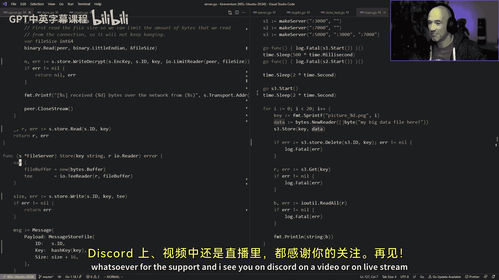

On thisor， on a video or on live stream， Thanks for watching。 Bye bye。

