# 【精译⚡x86汇编语言】nybbles.io p01 p0 x86 ASM： Working on reference code for my ＂Let's Make An Arcade Game in MS-DO -BV1NPr9YKE4b_p1-

Good evening， everybody。就是家。And this is the devils。I know channel on fish。Where ice stream。

Typical Monday through Friday， programming routine。And you can。这也没有。As I struggle to。Finish it。

And remember what I was doing。I'm kind of doing a off the cu stream here for a couple reasons。

I don't typically stream。This time of day。But， I am。Testing some things。So I thought I would do a。

Couple hours here。See how this particular screen turns out， so a couple things that I've done。1。

I have my music streaming。In the background and that is pumping directly through the stream。

I have the volume level set。Somewhere， I think， is reasonable。

But we'll see how that actually turns out in。嘴玩的。嗯。Then I'll make adjustments。嗯。

And for various technical reasons。I cannot hear the music that I'm streaming on my main PC at the moment。

So I'm actually listening to it from a listening to the same sound stream。

 music stream from a different my phone actually。So that I can hear the same thing that everybody else is hearing on this screen。

Of course， you know， I want to hear the music too。I'm experimenting with this， because。

I' trying to get a cleaner。audioud environment。In general。

 and hopefully I'll eventually be able to figure out how to。啊。Support。Capturing。The screen。

 the music stream and  piping that through wire。And also allowing me to hear it through my regular headphones。

張た。One thing at a time。So。哇塞。And tonight。What I'm gonna do。Is。I am going to work on。啊。审。

Things that I'm doing for my YouTube。Educational series， Let's make an arcade game。In MS ya。

The whole thing is being built in。Being written in that city6。And what I'm working on。At the moment。

 is really， I kind of。I have to do a reference implementation。So that I can then properly script。

The episode。嗯。And so I kind of have a rough guide as to where I'm going， because otherwise。

As people who watch my weekly stream。It's not you know bad。Right wrong。But。It's just。

It is what it is。You know， sometimes you go down rabbit holes and you get sidetracked and you end up working on refactors and。

 you know， things that you don't really intend to work， didn't intend to work on on that day。And。

You know， for twitchw streams， you know， I just let it fly， right。

 It's what I would typically do in a working session。 I don't。I don't try to control it， right。

 It's not scripted。 I don't， I don't sit down here thinking， you know。

 this is exactly what I'm going to say。You know， I just。抓我不漂。Because it's just me doing what I do。嗯。

But for these educational videos， it's more script。 Each episode has a very specific goal。Moving。

 you know， the viewer to the next。发生。And。So。You know， I have to， let you say。

 I have to be kind of ahead of the。And。好啊。Dedicated。Effort goes into actually producing。

That kind of content。So。With all that said。嗯。I am going to work on。A couple of small things。

Related to that to night。 So before I get into that， though， I did want saw I streaming the music。

But the streaming music that I'm listening to is going right through the feed tonight。

 The other thing I did is I put some text。On the stream。

I'm going to start experimenting with that a little bit。嗯。And the size of it， and。That sort of thing。

And I think the so。Jumping into what I'm doing。I use do spots。

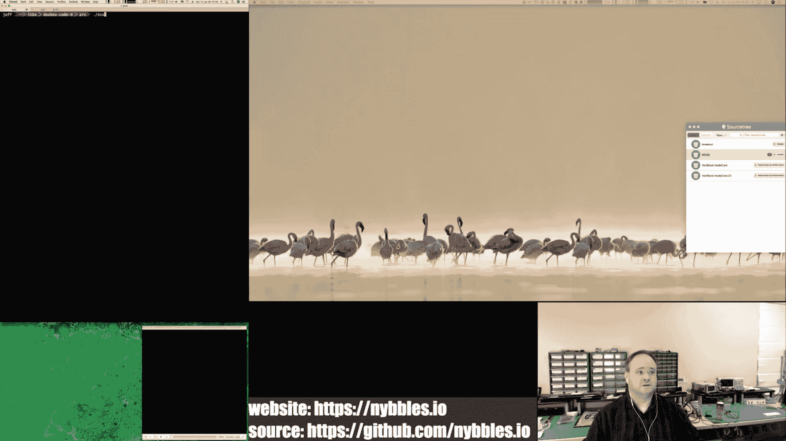

For all of this。And I think this should show up fairly well on the stream because I'm going to be doing this on the landscape monitor because。

The dos box window just works better on that monitor on my typical IdeE monitor。

 which is my portrait display。 I have my music。 So in case you' you want to see what it is in the name of the songs because these are all Japanese pop songs。

 anime， that sort of thing。You can see those， but then also this window here on the left。

 So the standard deployment of DoOS box。Does not include。嗯。A do buner。It's not。 it's。They usually。

 I think when the release builds are made， they strip it out。

Which makes sense because it makes a little bit slower and your typical user has absolutely no use for it。

4。But for somebody like me who is actually using dos box to develop。M do， like software。

Being able to have that。Low level escape hatch comes in handy sometimes now I。I use the turbo。

C plus+ debugger for most of my typical debugging when I'm working on my code。

There are just some cases where。Like if， you know， for whatever reason。

 Trbo debugger doesn't want to cooperate or。あ。I read its another issue because Goss box is not。

By any stretch， the imagination of perfect emulation environment it's。It's， it's really good。

 but it's not perfect。嗯。I will fall back to。OSss box debugger。 So that's always available， you know。

For me。And。So that's what that is over there。So I am running a custom build of do box。

 I took the latest。Storce that was available， downloaded it。

 There's a couple of patches for the debuggger， the other。Folks in the community。

Have have come up with and you know， one I think was。

The functionality that allows you to break into the dos box debuer on int freeze。

Was broken and someone fixed that so I applied that patch and I think it was one other patch。

 but I'm kind of forgetting what that was。And I compiled that and that's what I use。

So then going over to the actual doss environment。On this machine in this virtual environment。

 I have。At tax editor。Installed。It's the somewhere。Text editor TSE Pro， I think。

 is what it's called now， I actually paid them again for this。

I bought a license when I started this project。 I used to use this editor。

 used to be called the Q editor。Years ago， this was like in them。います。嗯。And then they rewrote it。

 and then it became TSE。Which I think just stands for the somewhere。Smware editor， SEM WARE。Yes。

 I recently。嗯。But。Re boughtt a license for it， they're still in business people still use it。

 people still buy it， and I think they have a Windows version now too。I love the editor。

 I mean it's just it's the one I've always used in Dos。So I have that， I have A86。

 and I used A86 for years， just the version that came with the open source distribution， A86 and D86。

 and then I think even later A386 and D386。And I never paid Eric， Isaac S for all those years。

 so I finally， I went ahead and bought， the full thing on his website， paid him for everything。And。

It's a great tool， it's a great asseemmbler， I also have， you know， I have Wacom installed on here。

 I have Ts and I have map。But， you know， honestly。You know， those assembblers are paid in the bike。

Compared 86，86 is just it's a。It's a breath of fresh air as far as asemlerrs go， so like I said。

 I do have the tu C++ install in here。I have Wadcom installed on here， open it's open Wadcom。

 but you can get Tbo C+ plus you can get Turbo Pascal。

 you can get all those that' are available on the internet。哎。

I think the licensing is pretty much open at this point I don't know that there's a gray area there or not。

If， you know。I guess in Barcadero would be the company that owns that stuff now。

 I assume I don't know， but he， I also have deluxe paint on here。

That one's probably a little little gray， but。I have to have my deluxe pain for cause。Let's see。

 Do I have anything else on here of note？嗯。I don't oh， I use。

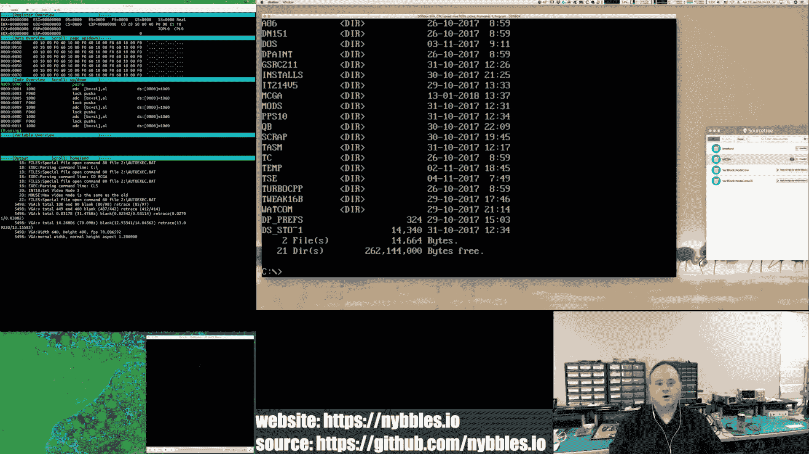

DN for。Just having a little kind of like midnight commander type interface for some file system stuff。

And Dos， I find that。Convenient。I do have a couple of sound trackers， mod trackers on here。

 which do not run very well in Dos box they run。Passively in the non。呃。

The build that doesn't have the debugger。Integrated in the version that I'm running。

 they run horribly， the timing's way off。So。Yeah， once I get more into the music stuff。

 I may have to use。A better emulator there， maybe virtual box， maybe parallels。 I'm not sure。

 but I did。 I started。All of this。Using parallels。 And I even tried virtual box。

 The problem I ran into there is that their emulation。VGA hardware。

 especially when it comes to like VGA tweets and things， it's not， it's not there。

 So Dos box covers all that stuff really well。嗯。By。Ds box has some areas where performance is not。

The best。And the other emulators do a slightly better job。On the performance side。

 being more consistent with performance， but。Yeah， not。Not emulating the hardware as well as the。

As they should。So。ど。Yeah， so that that's kind of a。Little tour。Of。What I've got going here。呃。

Like I say， this is all a friendly language。And if I run。What I have。So， you know。This is。Mode Q。

 So that's。256 pixels horizontally by 256 pixels vertically by 256 color。

 So that's a paletteized color mode。 I have。Pretty much。The video layer， I would say。

 the video generator is， is done， that this doesn't look very impressive。 but， you know。

 this saw just programmer are。Pholder stuff， but the guts of what it needs to do are all there and the performance is is good。

 I think， you know， again， in the lower ring hand corner。Of the window， you can see 44。

 which is the frame rate。 I think on real hardware。

 this would be much closer to the 60 frames the second that I would expect。Now mode Q。

 Dosbox is saying that it's 57。32 frames per second。With a。57。32。Htz refresh rate。

 so I don't know on real hardware how mode Q ends up working out for the refresh rate maybe it's。

Close， but again， again I'm trying to find some old DoOS hardware。

 I still have yet to find some older like a pentium2 type machine。

 maybe pen maybe up to penium4 at the highest end that I could put real MS dos on as a real VGA card has a real sound blaster light card where I could put this code and see like。

Compare apples to apples。On real hardware but my expectation is on real hardware。

 this would run much faster than it's running right now。 Dos box is pretty again。

 it's good for what it is， but it is slow in a lot of areas。 so I take that into account。

 but input management's all working right， I have keyboard ISRrs and I have all that stuff going。

 I have mouse stuff which ironically is one of the things that I wanted to work on tonight for the companion tool that goes with this。

 I have most of the sound code。In place up， which I better change the。嗯。

So this is the editor I was talking about。So yeah， this should be curly。

I was playing around with the mouse stuff earlier today。So， banked。

Is the utility that I'm building that's going to be the companion for。

This game that's being built during this educational series。And of course。

 we build the editor also during the series。This editor。

The idea behind us is this is going to be the thing that allows us to control our member banks。

 which。Is a very generic。Way of referencing like。Being able to edit tiles and sprites， fonts。

You know， and being able to put other raw data in here。It needs to be loaded into the game。

At runtime， music and other data would go in here too now that this is not going to be a music editor or a sound editor。

But it will allow me to import those。Fileles and put them into the banking form。

So they can be loaded into the game of code base， so this was the code that was actually going to work on tonight。

Specifically。What I wanted to work on was getting the。The button stuff。So we can take a look at that。

嗯。So。BaThe bank dot8 file， by the way， the dot8 is a。86 convention。Just， that's the。

Thing that Ericch and always did with his files。You could use dotS。 You could use DoSM。

I just chose to go with the convention that the assembly used。あ。So this is the main program。

Source file for bank Now you can see that I include a bunch of other。Assembly files。

To support this and basically the game and the the tool。

 they more or less use the exact same source for everything。嗯。

So the tool has the same video generator in it that the game does。

 has the same sound stuff in it that the game does。 And that's and fonts as well。

 And that's intentional， because then。If you， when I do like the。Backactground editor。没有。

I want to be able to go into like a test mode where it will show the background layer and the foreground layer and you'll be able to test。

And kind of prove yourself that moves。That。あ。いや。Everything's working correctly。

 And it's the same code， right， So that's， that's pretty critical。For what I'm doing here。什么呀。

Buttons， right。 So I have a。I have a structure。4 buttons in the editor。

And the structure is used to both define what gets drawn。On the screen。And。

My thought was would also be used for。Managing the input part of this。So we have a word。Forour flags。

 we have a word for a pointer to the text。We have we have the word a word that represents the text position。

 so that's two bytes， essentially the X and Y of where the text is going to appear in the button。

The position of the button， so that's the x and y of the upper left point of the button。

 the size is then the width and the height。Then the funk。Here is a pointer to。A callback。

Baically any， any。Address within the code segment， so everything I'm doing here。

 these are comp files。Whi。Are actually， you know， believe it or not， an MO。

People had a hard time understanding the old。Intel。Memory segmentation system。They got it。

Really bad rap。 And I'm not saying， it's， you know， wonderful。It had its downsides to it， like。

Once you really get it， you realize it's not nearly as limited as people assume。

And actually building like comp filess for games and things like that， MSD， a， it's really simple。B。

 its it's really flexible because MS Dos essentially just gives everything in the machine over to you and gets out of your way。

 And you can use any of the segments。嗯。That are available more or less。

 There's a couple of exception areas where you can't go。 but by and large， you know。

You have access to the base memory， the 640K more or less， so you have one segment。

164K segment that's dedicated to your program code。

And then you have all the other segments where you can put any data you want。

 And you can even put code somewhere else， too， right。

 And you can call it to code in a different segment。 So you have to load that yourself。

 You have to get that into the memory yourself。And really， when you get down to it。

 like an executable that's linked。In that in that memory model where you have segmentation。

 that's what， you know， the leaker was doing40， right， It was。

Giving you an automatic mechanism to put code in different segments so that you didn't have to。

 you didn't have to do that later。 But， but the irony is the code necessary to load a block of binary data that happens to be code and then jumping into that is trivial。

 so。So again， that's a mini ran about。 people kind of overlook the comp files a lot back in the day。

 and they're actually pretty pretty flexible。But。That's a long winded way of saying that this。

This address， whatever this is， has to be within our code segment。 Now， right now， the。Again。

Our game is 4K， 5K。And our tool， our editor， is 5K。I'm going to tell you right now。Also。

A good chunk of that is data。Already。Even though for the game engine。I have a， what I call a control。

Block in memory。That essentially has， know， the data structure that points to all the other things that the game engine needs to get to。

 like sprites。Ted， background， tiles， background。Maapps and all that stuff。There is。Some data。

In the code segment， that cohabitates with the code。

Just because it makes writing the code a little bit easier。

So I'm gonna just make a guess without looking at the listing file that， you know。Probably about it。

You know， somewhere between a third and half。Of that size is just data。In the code segment anyway。

 so， you know， even the full game that I think we're going to build。Which is a pattern off of。

Pattered off with the old timber game from Midway， I'm calling it lumberjas。

 it's going to be kind of the same idea。I'm going to be flabbergas。

If our final comp file exceeds 32K， I don't think it will。

So 64K here actually ends up being a lot and keep in mind this is 64K for our code segment。

 it's not this doesn't include you know other data because we're going to be loading other data and we can put that in any part of the remaining 640K so we have lots and lots of flexibility in fact。

I am gonna go sooops。I'm going to go so far as to say。That。That's not the one I wanted。

 let's see what was it oh。嗯。Yeah， so。I'm going to say that。We're using。Control Ram is。16 k。Right now。

And we're going to use a full。Segment for tiles。The spite control table。Is probably what's a sprite。

嗯。The type spray。The spray control table is。Two， four， six， eight， eight times 256。So。That's2。So。

 we're not， you know。We're not using much memory at all。 So really。

 we're going to have lots and lots of memory available for。Tiles。

And we could have multiple segments that have sprite data， tile data and the format that the render。

I is for for that data is actually pretty。Pretty。Compaact is pretty efficient。

 It's not super compressed， but。It is more efficient。It's not a bite for color。我 that。So。So， then。

This type。CYA6说的号。Don't work later in night。But。See if I can。Keep up here。嗯。Right， okay。

 so what I have here。On my buttons。so I have a label here。Because that becomes a pointer。这个我也。嗯所以。

And I have a special。Value here。That represents the last。The last。That's a flag actually。

 it lookss like it's a bit。So。I'll have to reread that code， but。The way I'm reading it， know。

 I'm looking for that bit to be sad。And if that's big set， then that means it's。

That's the last entry。In the the list， in the array。 And then I have specific labels， pointer。

Theyll become pointers to each of them individually so that we can access them in other areas of the code。

But， button death。Is a macro。 So if we， I think I thought that's right here。

And so button depth just managees what thestruct here。Really care for。Quickly here。

 I will explain this BPp thin here， so BPp is a register on X86 on modern processors。

Typically it's EVP。But this is the 16 bit version。It's known as the base pointer。

And the so typically when you create like a stack frame within within a function in assembly。

 BPP is the thing that。Gets， gets the。Pointer to。Your stack。And then， you know。

You can manipulate things from them， but you can also point BP at anything in memory。

 it can be a base pointer to anything and because of that。

 because of that convention 86 will you can create these data structures and if you have this，E。

 P cannotation on in。Whatever you point D P at a address and memory， you can then refer to。

These fields directly。And the asmbler is intelligent enough to know， okay。

 they're pointing BPp at this address in memory。YouThey're treating， they're expecting that。

Block of memory to match up with the structure。And so the， they do。The offsetting for you。

 essentially。Right so this would be 0。 This would be2。 This would be4 or right。 They do that。

 The assemblymbler does that。That' say you happen to do that man。So that's what that refers to。

And then the macro here is just。A convenient way of building the data word。

For the values in this case， right， so then if we look。The first one is our flag。

The second one is a pointer to the text for the label。Stir death is another macro。

What you believe is in spring。So stir death。Creates a Bb。So the asmbler has in macros。

 it has some special syntax for like getting the length。You can do loops and things like that。

 so the pound S1 here is saying， hey， what's the length of the first parameter。

 the literal length of whatever was？No special processing or anything happens on the value that's being passed in。

Its just sort to if it's a string， it has the quotes on it， those quotes are pounded。

 So that's where the the -2 comes in。 right， And so then the asmbler expression evaluator is going to reduce this down to an actual length。

 And then we take the actual argument。 And， And so it's the length。These are like pascal springs。

 which' the length and then the string。In memory。And so。And then there's another one sort of Q。

 which is a string without the quote， so it's the other way。

 so it just depends on which way you want to do it。やま。Fileles。嗯。So stirred up here is， again。

 it's gring。Dvs。Statements。It's basically defining our strings in memory。

And then these become because it has a colon。So the interesting thing is， again， the convention here。

 no colon， this is a variable。So the asseler is going to assume that you want to get the value of when you reference it。

 not the address。Then these would have cons。 The As is going to assume that you want the address。

 not。Not the value。So that's the difference。And there are directives in the assembler。

 I can use the offset directive。To turn one of those variables into a pointer。

 So if I wanted to know if I wanted to say， when is the pointer， the address of Cart Viz。

Or draw flag， I could use the offset operator to do that but。You know。

 that just depends on your usage scenario。 So we have the pointer to the string。

 and then we have the。I believe these would be the yeah。

 this is the coordinates for the text within the button。

 then the next set is the upper left corner of the button。And then we have to width from the hi。

Then we have。Poin the pointer。So zero of course is null。The equivalent to know。And then in one case。

 we have the exit callback because that was the first button。

The exit button that I was going to get working， this sum by operator is a way of handling either nibbles。

So if you have a bite and you have， you know， five and six。

So you say five by six that creates a bite where the upper and lower nibble are set。

If you have a word。Then you know， 8 by 23 is setting the high and lower。

So it's a nice way of doing that。Yeah。You know， a static initialization context like this versus having to in your macro having to write code right。

 that would do that at run time。This is all essentially。Pre run time。

 really the assembblers doing that work for us， which is really convenient。

So this defines all those buttons， right， And then if it's， if it's nas。You can see it。

If it's not enabled， then it's not。So right now， we only see the new load and exit。

So if we run the tool， that's exactly what we see new load and exit。

And there's other buttons on here， but because they're not enabled right now。

 we're not seeing them okay and that's so that's all working correctly now let's go back。

And take a look。Yeah。The code is drawing。O。So right here is where we start。What's review this。

So this draw， this draw function， this is the。This is kind of the overall drawing。

Function for the display。 right。 so this is being called once per。Logical。Frame， meaning that。

You know， between one V blanket and another。Even if we could theoretically draw the frame all the time。

't。 We don't spend CPU view cycles doing that。 We draw at once。 Now。

 update logic might execute multiple the time。Until a V blank。

 then during so show is the function near the bottom that handles doing the。The flt， right。

 So in Ram。In conventional Ram， so in the 640， I have a 64K block。That's allocated。 That is my。

My back buffer。So all the drawing code is going to conventional Ram。 And then during the show。

 we do a flip and the flip is the thing that actually。Quickly copies that bag buffer to the V RamM。

Range in the menu map。You know， in some future stream。I'm going to I'll go through all that plus。

 you know， ultimately I'll have the video series as well right that will be going through all this。

 you know， incrementally so you know， you're looking at my reference implementation here kind of seeing behind the curtains。

Which is you know fits the theme of our stream， right， you know how the sausage is made。But。You know。

 during the educational videos， I actually。We write this code， again。

So I go through and we build it piece by piece again。

And we talk about it as we go and learn things as we go。Like here yeah。

 you're seeing behind a curtain or seeing into。My thought process， so。

So draw base is the thing that draws all the。The rectangles and lines and strings and stuff for the UI。

 for the editor。And that's not particularly interesting for tonight draw carrot。

 this is kind of test code actually because it was just verifying that that in fact worked correctly that's we're going to actually implement being able to edit it。

Tt fields and whatever。 So that is something that。to do。But then this code here。

 part that draws the buttons is actually the interesting card for tonight。So I move the base pointer。

I move the buttons address， remember buttons was a label that points at the beginning of that list of button definitions in memory。

This convention here is Cs in front， you'll see CS， DSSES。In front of some of these instructions。

 so the 86th assembly。Lets you pretendpen。The segment as a part of the instruction。

As part of the op code versus it being in the addressing scheme。Like， you know。

 Tasm or masm or wsm would do。I personally prefer this approach， I think Eric Isaacson had it right。

The more comfortable， meaningful way of doing it because really has it really doesn't have anything to do with the address mode。

Per se。You know， it's your'。The way you're thinking about it is。

This move instruction I wanted to operate only on the code segment。

Or I want to operate on the extended side or whatever。You know， that's what that convention here。

So what we're basically saying is， even if D S。Right， is pointing somewhere else， which in this case。

 it wouldn't be。Here。But if it were， you know， we're telling the asler， no。

 this pointer comes from this segment。嗯。So we're setting that segment into that register。

Sa that address into that register。And then。We're moving button flags。

So whatever the value button flags it is at that address based on that。So， yeah。あ。

If we go back up here， button flags is the first field in that structure。 So we're doing a structure。

Access here。Unmanly。So we're loading up flags into AX。 and then we're seeing if。The bit for。

The end flag is set So the most significant bid， if that's set， then we're going to jump。

We're going to jump to L5。So another convention here is labels that start with a letter。

 and then a number。Are followed by number， are considered local labels。In 86 parls。

 so they're temporary local branching labels。The long here。Is telling the assembler， you know。

 generate the long version of the jump， not the short version， if we take this out。

If it's greater than 120 bytes。It's considered jump instead generating a raw jump instruction。

 most assembblers try to optimize to a branch。If we can。

But most branching instructions on the 16 bed variation of the X86 architecture。

 And this is true of many CPUus from that era。And you can typically branch backwards。

127 bytes and you could branch forward， 128 bytes。So， you know， the long here is saying that。

 you know， you're telling you December and look， I know that。I'm going to pay a price。

 Go ahead and just generate the actual long jump and let it， you know。

Consume a bit more time and a bit more memory。嗯。And so then we come down here， if， if the debug。

We have a preprocessor in here。It's a little bit。Simpr than the。Standard C preprocesor。

 but it's the same idea。嗯。So if we're in the bug mode， which we are right now。

Then when this is built， it will put the code in here to output the frame rate。

So that in our release bill， this code would not be emitted and then finally we have code here that draws the mouse。

嗯。So。So， I was working in。We， we。We bail。So， this jump。0， so if we are at the end。Then。嗯。

If it's we're not at the end。That we're going to jump to this label。

And then we're going to test whether or not we're enabled or not。O。So again。

 we're testing the next bit， which I think the enabled bit is on the other side and we're testing that bit。

Yes。We're not enabled。And we skip down here and we add the size。In bikes of the button structure。

To the Bp pointer。 right， So we're doing a raw pointer。Add here。And so we're moving BPp。

 eight bytes or whatever。Forward to the next。Instance of the truck。And then we jump back up。Here。

 and we move the flags in again。 So that's the outer。Portion of this loop。Then if we did。

Hit a button that was enabled， we move the position into Ax， we move the size into CX。

We clear out BX。I'm trying to remember。Why， why am I clearing it out explicitly。

 Probably just to be on the safe side， I guess。Yeah， probably just to be on the state side。Right。哦。

Oh， I see， no， I'm okay， so I'm clearing it out because so XO on a register like this will make it zero。

U， and the reason you will typically see you'll see two variations of this。

 so there's three ways you can do it。You could， you could you move。0ero into Bx， you could xhor it。

 you could sub。So these are the three variations you will see。Cold。あ。

I would have to look at charts again。My recollection is that。These are mostly equivalent。他的。

Bangrange of processors that we're talking about here。嗯。In了。And the move is the slowest。So X or just。

I think you say。很帅。So the end result is you get a Bx registered has。And then， I'm moving。

So remember on X86。あ。You have your 16 bit registers， you have Ax， Bx，x， DX。And I'm not including。

Index registers。 So you have D I S I， but you can't subdivide those。

 and I'm not including segment registers。 you can't subdivide those either， but A X， B， X， C X， D X。

 you can subdivide。So Ax has HL。嗯。BX has BHDL。C X CHL。DX has DHDL， so。

The X versions are the word versions， the 60 bit versions， the H and L refer to the high and low by。

Of。嗯。Those words。So if you want， if you want an eight bit register。

You can use either the lower high byte in one of the word registers。So in this case I'm moving。

The contents of C。So again， remember that our sizes， our position and sizes， werere using the words。

And we're putting， you know， the width and the height in the by。

 so we're not really viewing it as a word value。In， in whole。

We're using the word to conveniently package two bytes together。So here I'm taking the high bite。

And putting it in DL。And then I'm calling or I'm invoking the FEC。Maatro， which this。

We'll draw a filleded rectangle。He was on passing heyx。Which is the position。Cx。Which is the size。

And then I'm passing in color information。 So I'm saying you use color 9 of palette。啊。yeah。

 color nine app palette zero。Is the way to read that。嗯。The system。The way the video generator works。

 we have 256 color VgaA mode。But the the rendering system is。G can access。Directly。

Those 256 color entries， you access them。A subdivided pallet system。So there are eight。16 color。

Foreground， I'm sorry， background palletettes。 So those pallets are dedicated to。

Text and background rendering。8，16 color。Sprite pallet。

And you refer to the pallet number by index of 0 through7。Refer to your colors。

And each pallet zero through。いをつて。The zero。Excuse me， the zero width index。In every palette。

Regardless of what RGB value。In the actual VGA。Palent is always transparent。So you。

 you technically have。15 colors in each palette， 15 effective colors that you can use。

So then H line will draw a horizontal line again。 So we're specifying the position， the X and Y。

Argon AX。BX。This the web。So this is where。The BL comes from。So。I' the X86 CPU。The stack is wordline。

Which makes sense。And。So to put， you know， if you want to just put a bite on the stack。You。

 you have to put it in some。16 bit packaging somehow。So， in that case。You know， here。

 this is why I'm， I'm， I cleared out B X because。We're not using all of it。

I just want to put the width in the part of the word that the code is expecting to get。

And so that's how I pass that in。 And then we're going to do black。 We're going， in this case。

The zero entry from the palette is actually incorporateded as black。Not transparent。

Because the line drawing and text drawing don't， they don't do transfer。So then we move S。 So again。

 we have two indexing registers on X86。 We have SI， which is the source index D。

 which is destination index。So we're setting SI， we're pointing it at the text。And then we're we're。

Pointing Dx。Or we're moving the text position into the X。 Then we invoke the string macro。

We tell her which font we want to use。You pass in。SI DX， and then again， we're going to do color 7。

 index 7 of pallet 0。This the last value here， I believe， is width spacing， right。

 So the the way the fonts end up working。 if you want to make them not quite so cramped because they're bitm fonts。

This is a way of controlling how much extra space is generated pixel。Space between characters。

 And in this case， this particular fine， it looks a bit better in some cases when there isn't。

Whether they're not right next to each other so it has some extra space。And then we add C。Which is。

可异议。はい。To A， right， So we're moving the position now。And then we're going to。

Draw another horizontal line at the bottom， right， So we have a black line at the top。

 the black line at the bottom。And then we那个 we will。So that's the code that that does the。

Does the drawing。And so then when you look at it again， you know。

 we can see how this ends up working。We draw that first rectangle， which is the colored rectangle。

And you can see the extra space in here。 we're putting an extra pixel in between each。Ftter。And just。

 it makes。T a little easier read。And then we're drawing the black horizontal line on top and the black horizontal line on the bottom。

So， for the mouses。For doing input tracking。不见。Look at the bit flags that we get back。

 So to read the position and the button information。I'm calling a。An MS do。Canter up routine。

That runs a NSR that。Reads the mouse information from the mouse driver and then all' get stuffed into a shared data structure that all the code can look at and inspect for mouse State。

So we can easily read。You know， the flags to see， you know what button got pressed and then the。

You know。The task is， actually。就。C ofD。Hot spot on the mouth pointer。Which in this case。

 I'm going to say is like。The mouse exposition， plus。8， you know， not even8， probably like 4。

And the mouse position， why。Plus，2 or something， right。

 because we want to get basically to the very top of bottomt thats our。You know。You know， that。

 if that guy's out。Right， then he's not。 That's not right there would be okay。

 and all the way down to here would be okay。So that's kind of our hotpot where we're going say， hey。

 is that point？実さ？Our rectangles， so we know。The。Position， we know。The size so we should be able to。

We should be able to do that。Comparison pretty easily。嗯。Essentially， what we want to do。

Is we want to loop through the buttons again。And the way。I want to do it in the draw though。So。

That that I'm a little bit。I would rather do it here in the update。嗯。So， essentially。

We need to do a couple things， right？One thing I would say， is to refactor。This into a draw buttons。

啊。And then call that so it's not。It's not right In the main draw function。

We probably should have another function called。Test funds or。Fire buttons。 Fire activated buttons。

Some of was so nice。For the function。 And then here we call that here。

And it would loop through using the same construct。To then we what we be doing is。Mouse data。

 So if we look at。I'll start 8。Mo屎。对的。Is a mouse state type。Oh。Yeah， so Mil data is is。4 B。

 which represents this。Moile state structure， so one。Word is the position。

 the X and Y of the mouse and the other。Is all the flags。Associated with。嗯。That。

Li the button clicks and all that。So。あ see。Yeah， so， you。The first thing we could check， right is。

His left mouse button even down， right。 And if it's not， we could just bail immediately。

We don't have to do any work if it's not down， right if it wasn't click。I'm going to grab my coffee。

'll be right back。对对对对对。I brewed it and I forgot about it。So let' let's do the first thing。

Let's take this。And let's just。是。And let's。factor that。Thats。I so much nice。哦。So。Some L5 here。あ。

And because this is happening inside of a different function here。那 then。You know。

 86 is smart enough to know that this starts over。It actually， I should remember these。To明。嗯。

And then。so the reason that this long jump is still needed is because there's quite a few macros here。

 the one， two， three， four macro expansions that are happening here。

 which is generating a lot of code， so looks this is very misleading looking here。

 this looks very short but we're getting a lot of macro expansion。

And these macros are wrapping up like lots of stack manipulation。

Lots of pushing and popping and managing SP and all that good stuff。

 So it just makes the code cleaner to read here。 But that's why this is actually a longer branch than it appears at first。

First blush。So let's just verify。That that still works。Yeah， look at that， I broke it。Yeah。

Thankfully， control， delete。In Dos box， I set that up to just do a reset。Getting back to a。

Runable state is no big deal。So。诶。So let's look at it， what did I do？So call draw buttons。呃。Oh yeah。

 that's what I did。I love it。When we want to bail， we want to bail， all right？Not， not keep going。

 So I essentially had a。Infinite loop there。There we go。Okay， so drawing our buttons is。

It's cleaned up。So now we want to do on the update side， we want to do。Firebody。Right。

So what I can do。Here。Is cause I think again， it's。Very similar construct， what we're going to do。あ。

So。We're going to move the pointer。呃。If the。If we had to long， we blew that， if we hit the end flag。

Right or done， otherwise we test to see if it's even enabled， the button's not enabled。

 we go to the next button。嗯。And then what's really going to change here？Is is this stuff right。

 we're not going to。We're not going to draw anything。We're gonna。Do our。Our analysis。

 before we even do that， we'm to look at the mouse data。up here， we're going to check。

We're going to check the mouse data， right， we're going to say， hey。嗯。Let's see。

What was that miles MS buttony？And。Right， that's a。99% positive， that's a big mask。So。

Let's go back to the mouse thing。Let's look at。Mouse。い。M read。Returns miles x and Cx。Right。So。

Let me get a。Burrowser window。ああ。Yeah。Where I buy it。So let's see N glass。And 33。Typically there's。

 here we go。So N 33， function  three。Okay， so button date。Is。Left button is。Bit0。0。

So here's what we want to do and' going to go back over here。And then we just want to say。嗯。Yes。

Thats。One，2， three， four。啊对是。And actually， it's it。Right， so they're only been using。Bids。16 through。

So we could just do AL here。And then that saves us。Some hassle。And we want to test that bit。And so。

 if it's。Not sad。Actually， I'm going to say。It is not said， then branched all zigger。Yeah， L zero。

 otherwise male。Because we don't even care if we come in here。 and the。Le mouse button wasn't。

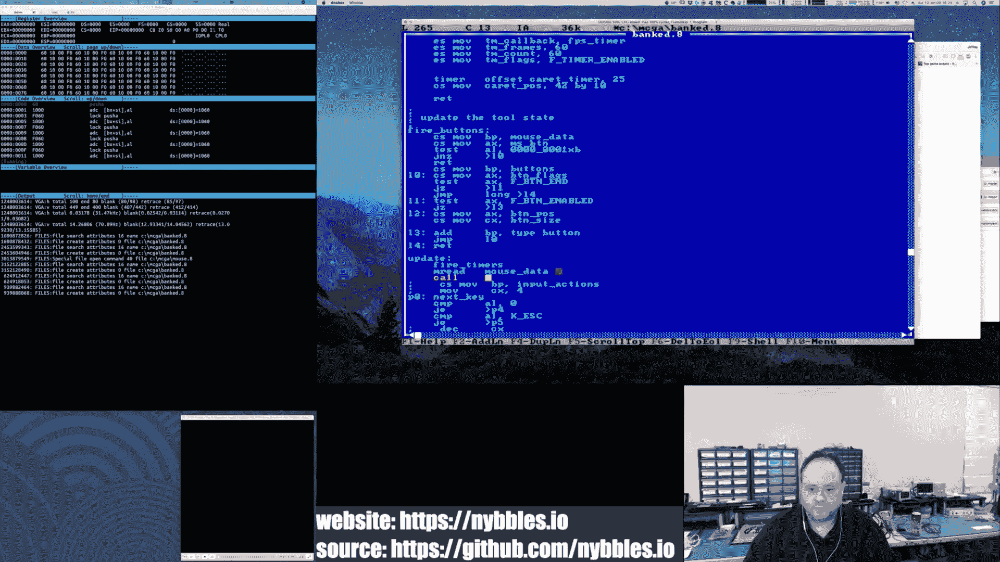

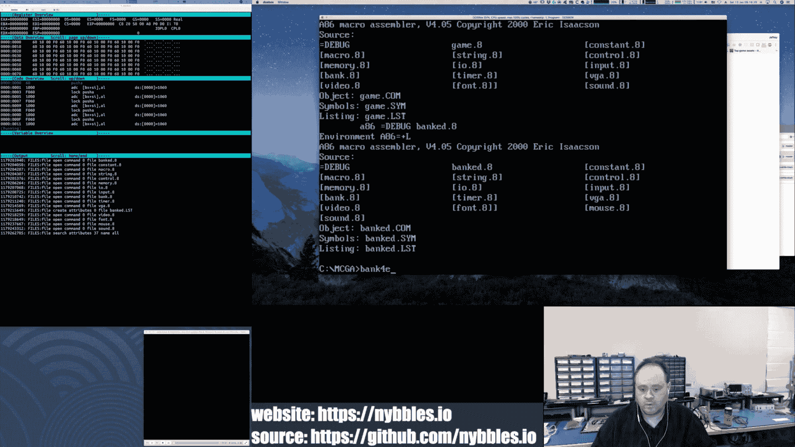

So we're calling that。

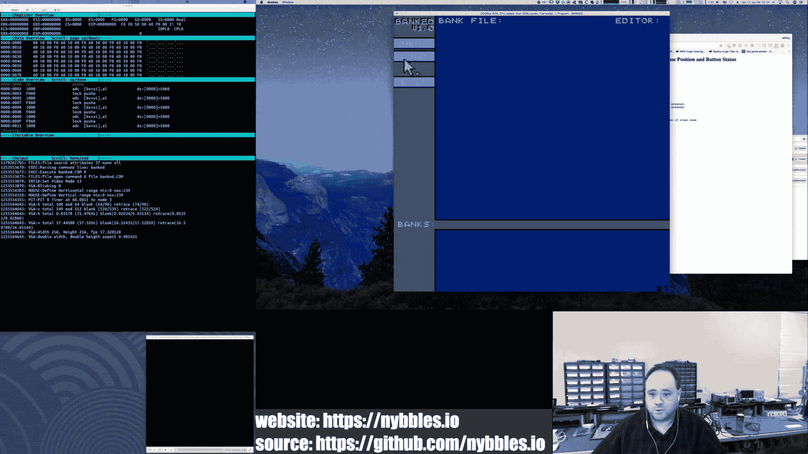

No， we don't， but we don't know。Has we not doing anything。So。Now， one thing we could do here。

And this is what I was saying earlier。Do boxy bugggger kind of comes in a little bit handy。

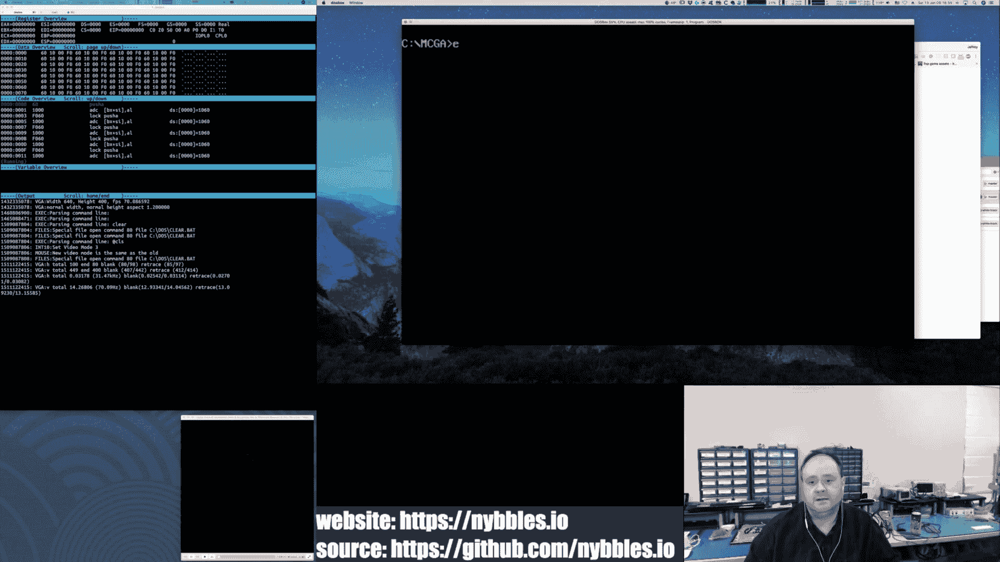

Is if we wanted to test that code。To。See it。It was actually getting here right here。I have a macro。

But I define it just doesn't end。No。No我哪。So I have a brake macro which creates a dump an entry。

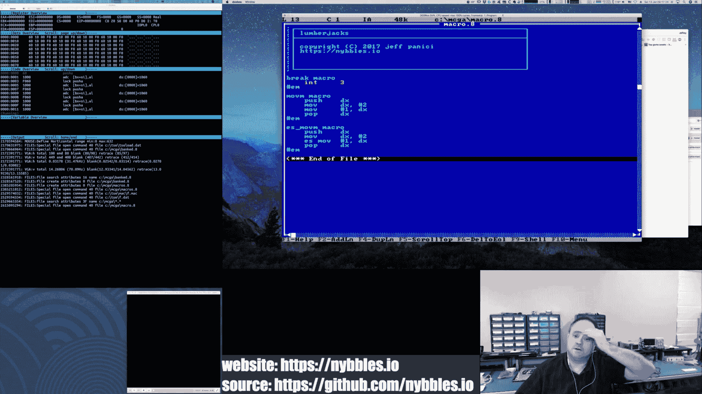

Instruction and in。Historically is。返回。For you buys。So by putting that in there。I can build this。

I can do debug banks。That brings me over here。The you can see here， we are。

At that very first instruction。0，100， which is the。Forigin4。透。And so if I do。いき？I can't remember。

I don't use them that for。Okay。Yeah。被辩认。发で已经天ね。3。Oh， sorry。 Hey hints pretty。Okay。

 so now a break point has been set on any。And3。

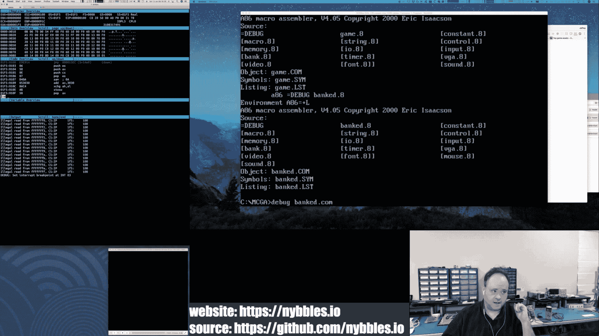

So now， I can just go。So clicking the mouse button now outside of our buttons all day。

Nothing's happening。 We haven't hit a break point。And then I'm客。つない？Sthead that code。

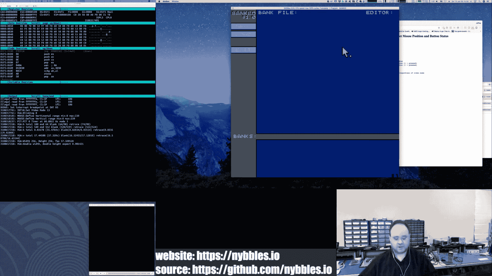

？I am probably not。哦，哈。I so。So yeah， that's a problem， there's two problems。看。对呀。

Pate nine streams for draft。Okay， we'll have to redo our buttons here， but yeah， that was retarded。

 What was I doing？嗯。So。Reseing the wrong。er one is jumping past setting up the。

So， all right。How， I think I've got that。Of course， May was a。Ma开 a。什么呢？My great。So第bu。い。

不然。the window on。Sorry about that。All right， there we go。 Yes， it's working。

So when we hit the left mouse button， we're hitting our brake point。Capture。F10。没有。Al right， cool。

 So I'm gonna run that。 that's， that's good。So now what I'm going to do here。

So I can get back into the command line mode on the。To bugger。那你必比较。是音指费1。所以。Of all of them。完了。Noさ。

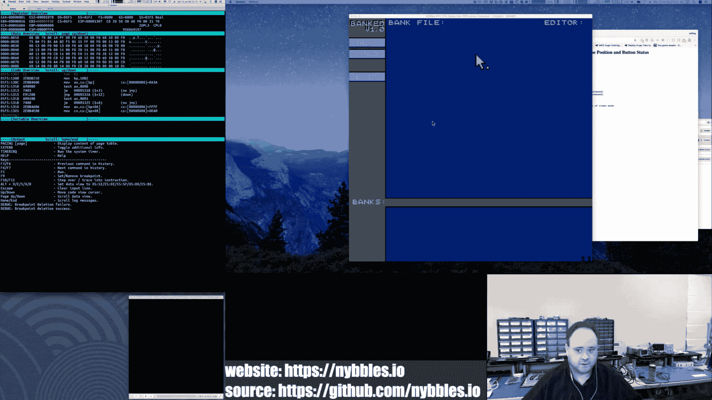

か面女。I think if I run it without。And wants the break。

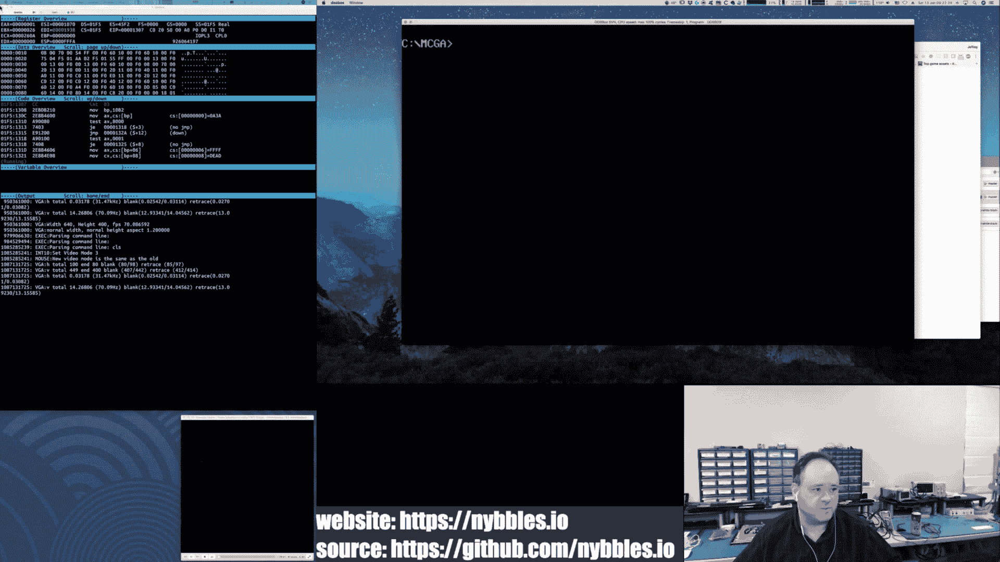

S this。

We'll restart Do five。There's none of that state to saved。To。あです。嗯。可定性能。

So now we go back to our code。Fire。But。When can get rid of the brake。

We kind of proved out that that parts's working。Now we have really horrible。呃。

we don't want to reset Bp。I leave here。Be bad。So， we need to move our。Las up here。Oh my goodness。

Having some typing problems too night。So this is L zero now。So if。你。

If the left mouse button is his head。我れ的す。What' gonna I do to do。Otherwise。

 we're going to fail because whyways kind loop through that data。And again， we're talking about。

Microseconds， probably。 But， you know， why do work we don't have to do。And we're going to test。

是 that。L 2， this is now an L5。And this is L。about。But then， here。

We're going to do the actual check to see if。The mouse。给了。

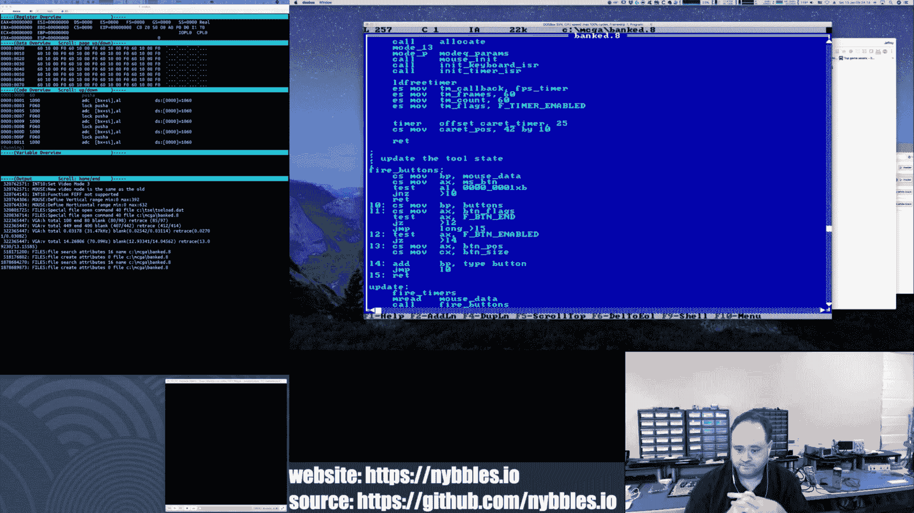

Within。The rectangle of this guy。So let's just。Make sure I didn't。Seriously。看好。Yep。

 see that's why I do these。

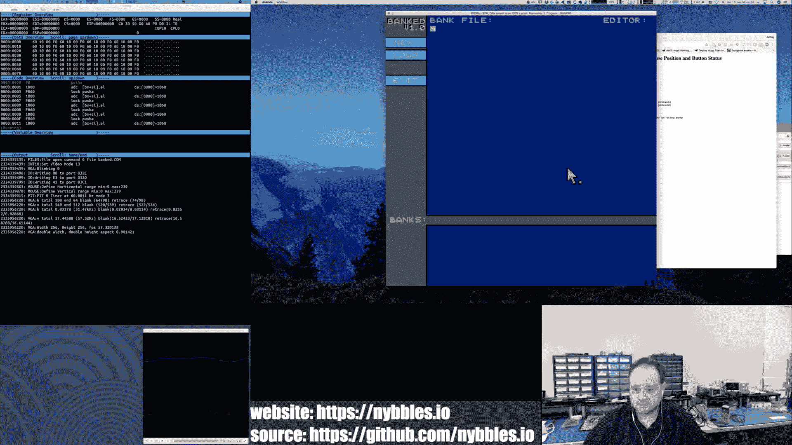

Good evening， everybody。就是家。And this is the nibbles。I O channel on switch。Where I stream。

Typical Monday through Friday， programming routine。優先。这也没有。As I struggle to。Finish late。

And remember what I was doing。

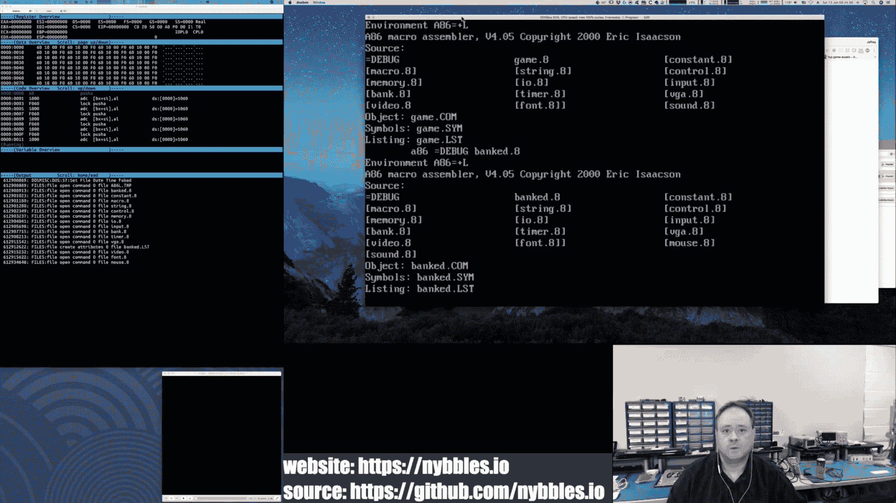

I'm kind of doing a off the up stream here for a couple reasons。

I don't typically stream。This time of day。But I am。Testing some things。呃。So I thought I would do。

Couple hours here。See how this particular screen turns out， So a couple things that I've done。1。

I have my music streaming。In the background。 And that is pumping directly through the stream。

 I have the volume level set。

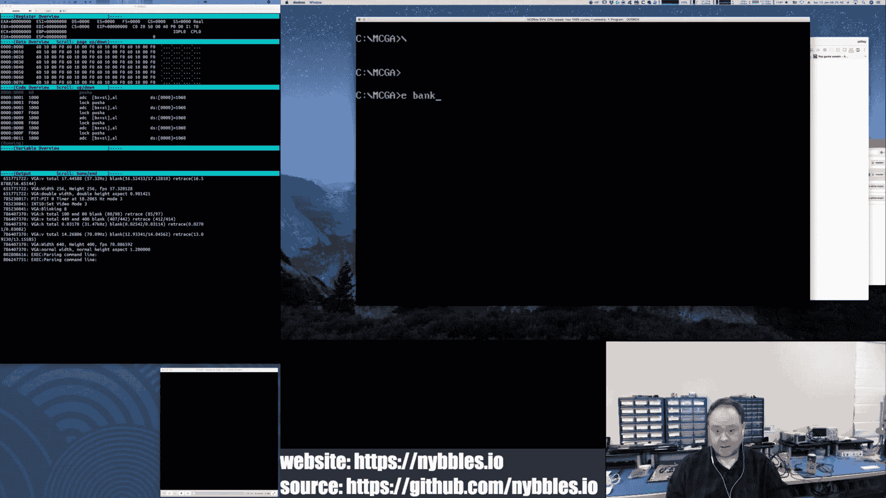

Somewhere， I think， is reasonable。But we'll see how that actually turns out。去玩的。🎼然后。

Then I'll make adjustments。嗯。And for various technical reasons。

I cannot hear the music that I'm streaming on my main PC at the moment。

So I'm actually listening to it from a， I'm listening to the same sound stream。

 music stream from a different my phone accent。So that I can hear the same thing that everybody else is hearing on the screen。

 plus， you know， I want to hear the music too。I'm experimenting with this， because。

I'm trying to get a cleaner。Audio environment in general。

 and hopefully I'll eventually be able to figure out how to。啊。Support。Capturing。The screen。

 the knee extreme and piping that through wire。And also allowing me to hear it through my regular headphones。

But。One thing at a time。So。我's see。And tonight。I think。What I'm gonna do。Is。I am going to work on。啊。

Some。Things that I'm doing for my YouTube。Educational series， Let's make an arcade game。AMS yas。

The whole thing is being built in。Be written in that city6 somewhere。And what I'm working on。

At the moment， is really， I kind of。I have to do a reference implementation。

So that I can then properly script。The episodes。嗯。And so I kind of have a rough guide as to where I'm going。

 because otherwise， as people who watch my weekly stream。It's not you know， bad。R。嗯。But。It's just。

ItIt is what it is。You know， sometimes you， you go down rabbit holes and you get sidetracked。

 and you end up working on refactoring and， you know。

Things that you don't really intend to work didn't intend to work on on that day and。You know。

 for twitchwitch streams， you know。Have one word here。How am I putting glass position。Can I read it。

あ。Okay。Oh， I guess okay。 I see that conce I made because my yes， technically。

The value could overflow。by。But I don't have a， I'm not using a resolution that's high enough for that to be the case。

The largest x value I can have is。256，255。Which fits in a bite。So that's how I was making that work。

That makes sense。That makes sense， so then I can just。Am I using Ax for anything？Musics， again。

MS pods， I think is what it was called。Okay。So now， oh， no， I'm already using。I use DX。嗯。So。这没有。A H。

 also the high bite。Is。The Y position。The low bite is the。我怎么。嗯。By。Okay， so here's what my deal。

I'm gonna make this B X。What I want to do。Is move Dx with。Adds， and then I want to add。The X armor。谢。

🎼，So what I want to do is I want to， I want to get the。I have the left。Ltop。Point。

I want to get to the right bottom of the point。So I have a wreck。Now， of course， the question is。

Do I have those。And。はいウ。Or with height， I don't know。So the really safe way to do this。

For the moment。Would be to add。Deal with。呃。My goodness。What am I doing here？

So Frac is taking the button size。So。あ。So what is Frac？Doing。It's。Yes， they're aligned。 It's Y X。

So it's high y， low x。So。I think that's the case。So actually， I think we can just do the ad。

And then I'm wondering， do I even need to burn？Yeah。O。So now we have。Ax。Which is our left bound。

And Dx， which is our right bound。And so now we can do our comparison。We can say。嗯。Is Bx。

 compare Bx to。A X。这样的。Featter than or equal。2 L6。I to remember these again。Otherwise。

We're just going to go to L four and loop again。Right， because。

If we're not at least equal to or greater than。Where。The left side is。We're not inside the wreck。

And then we want to say compare Bx to Bx and we want to say。Jump less than。To L7 otherwise。By in L7。

This is L 6。And then， here。Is where。你。好。把 he放。But only if。Compare button fun。Zero。Jump not zero。

Otherwise，So。If。So we move AX with the button position， we move Cx with the button size。

Do we use T X anywhere else here， I don't know， we don't。So then the question is， can I just it away？

ForThat， and then we be to register。嗯。And that looks good。嗯。So。We议。Oh， but that's not gonna to work。

Sure。That's not gonna work。Because we get different。We have different base plan air。Contex。So。

We'll stay that way for now， yeah that blows。Okay， so。

We get the button size we get get in the button position， get the button size。

 we save our current base pointer because we want to go back to what we were before。🎼嗯。Yeah。

That means our。But there's some cases where。我要。か。And。So， up here。When we're saying oh， yet， you know。

 the buttons aren't even enabled。Don't worry about it。We're going to jump down here to do our ad。

AndThen jump back up to do the next part。Because we don't want to worry about the pop to restore the stack frame here。

Within in this scenario， right， so we compare the left edge。If we're greater than or equal。

 probably we go to the next one。We compared to the bright edge。

Are we less than an equal to go to the final comparer。Which we're already。Here I would have to。So。

 okay。Yeah， so here。嗯。So， are we。Frier than or equal to the left edge。

 Are we less than or equal to the right edge。Okay， restore our stack frame。Call the button。

Just the button funter。No。If it's。If it's not。我s按の。格子考。And of course， this we need to。Save speak to。

We don't need to rep BP because we know we're going to scratch that anyway anymore。

But we do need to save the other。Please save our other register。porting video。

I don't actually know else if we do。Think he is the only thing that really is staple。

They're reloading everything else。So， yeah， actually。Good evening， everybody。就是家。And this is thes。

I O channel on switch。Where ice stream。Typical Monday through Friday， programming routine。有先な。B也没有。

As I struggle to。finish的的。And remember what I was doing。

I'm kind of doing a off the cu stream here for a couple reasons。I don't typically stream。

At this time of day。But， I am。Testing some things。So I thought I would do a。A hours here。

See how this particular screen turns out。 So a couple things that I've done。1。

I have my music streaming。In the background and that is pumping directly through the stream。

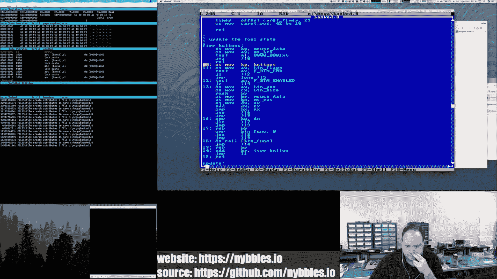

I have the volume level set。

Somewhere， I think， is reasonable。But we'll see how that actually turns out in practice。这完我的。

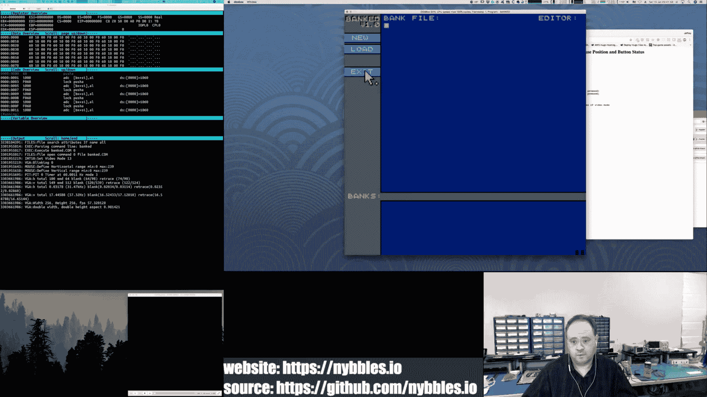

嗯。Then I'll make adjustments。嗯。And for various technical reasons。

I cannot hear the music that I'm streaming on my main PC at the moment。

So I'm actually listening to it from a listening to the same sound stream。

 music stream from a different my phone actually。So that I can hear the same thing that everybody else is hearing on。

Of course， know I want to hear the music too。I'm experimenting with this， because。

I'm trying to get a queen。audioudio environment。🎼In general。

 and hopefully I'll eventually be able to figure out how to。啊。Support。Capturing。The screen。

 the music stream and  piping that through wire。And also allowing me to hear it through my regular headphones。

But。You know， one thing at a time。So。哇塞。And tonight。I think。What I'm gonna do。Is。

I am going to work on。啊。Some。Things that I'm doing for my YouTube。Educational series。

 Let's make an arcade game。In MS ya。The whole thing is being built in。Be written in that 36 December。

And what I'm working on。At the moment， is really， I kind of。I have to do a reference implementation。

So that I can then properly script。The episodes。嗯。And so I kind of have a rough guide as to where I'm going。

 because otherwise。As people who watch my weekly stream。It's not， you know， bad。Gual。But。It's just。

It is what it is。You know， sometimes you， you go down rabbit holes and you get sidetracked and you end up working on refactoring and。

 you know。Things that you don't really intend to work didnn't intend to work out on that day。And。

You know， for twitchw streams， you know， I just let it fly， right。

What I would typically do in a working session， I don't。I don't try to control it， right。

 It's not scripted。 I't I don't sit down here thinking， you know。

 this is exactly what I'm going to say。Yeah， I just。帮瓦不看。Because it's just me doing what I do。嗯。

But for these educational videos， it's more script。 Each episode has a very specific。So， that's our。

Adjusted。We're at 2，6，1 E。It's interesting， though， that Ax。Doesn't have。so it's not。Bx is 4 cd0。

So that's where our mouse is at， which makes sense because I clicked。Somewhere way off here。嗯。

And of course。The debugger messes up the。re。嗯。我 see。What was the。Let's do this one more time。

1，2， F 9。い？Okay， so I only care。What do I care about？I care if I got。I care got here。

That's what they care about。So did I get into， is the button at least active and did I get into。

You know。The scenario where I'm going to do my。My rectangle。And so now at least。

Because it hasn't toggled。I can。Okay， so that。That's right。Because that's an active button。So。

So now we're getting the mouse。嗯。Position。Which is 19 hes， 16。Which is。And my rough。

Conversion my head that looks about right。All right， so then we're getting。Removing Dx with Ax。

Which was the。Position smell， for some reason even Ax is。谢。14。

I'm not sure I understand A X seems wrong。The position seems wrong。I actually no。

 I take that back because the buttons are。They go from zero。And then some why， oh。

 so they actually are flipped。Okay， so that's problem。So makes that's one issue。

So then we're just taking， yeah， so Dx is。あす。Right。Because Dx should be。The size。And the size was C。

 X。 So the size is 26，0 A。啊。😮，No， I mean。Actually， I think that's okay。 I think the issue is。

Coect position in。So then we're saying is。The Mao's position， which is 1916。这认识。Greater than。

1916 is greater than。A X， yes。That's true it is。But is it less than。BX less than。Yeah。Actually。It is。

Okay。So then we're going to compare。Our functer， right， is there anything there？There isn't。Okay。

And we're outside the bounds of the other buttons。Yeah， we're outside on these other buttons。So。

Go go go。And then it's off， okay， so this time。I'm gonna do it。喂。

This time I'm going to put a break point only here。嗯。O。So exit is the one that has a funter in it。

So that's interesting， exit it isn't catching on it。ImNot sure。Not sure why。So。Oh。

 and that could be because， right， that could be because position is flipped。Because I'm I'm doing。

I'm doing some cheating here because of the way that this mode works。嗯。Because it's。Square。🎼。

Turns out that you can。The high and low of， of a word。You know。

 combined that address is the actual pixel position on the screen without having to do any extra multiplies or anything。

Which is really cool， but。You know， it has to be Y and X。And I think。

I think I might actually have one of these flips。It's。So it's like way off。

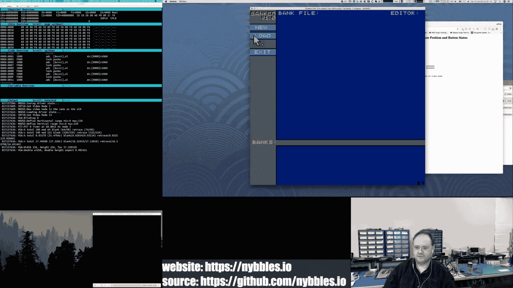

Yeah， it's never。 It's never getting to the call， so。Yeah， okay， so I think my issue there is。

Like I said， AX looks wrong to me。But I'm going to have to also look at that。

So I figured I was going to stream for a couple hours tonight， I think I'm coming up on that。Here。

See。What do we got。Were pretty cool。So， and my brain is rapidly。

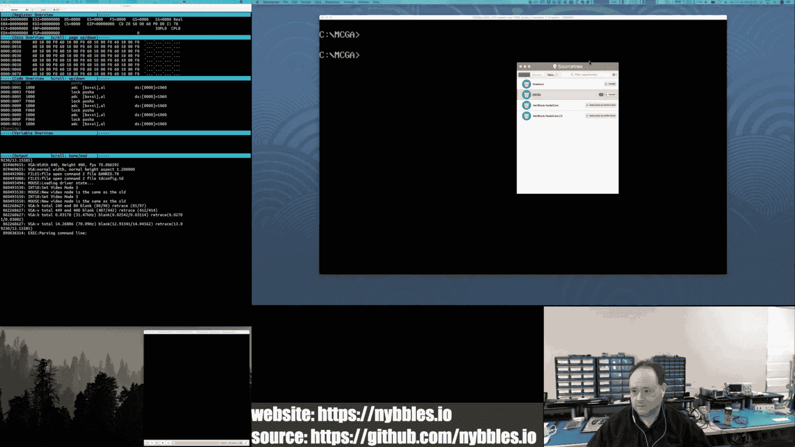

Breaching the end here。But I'm pretty happy， Emily。I was able to。You know。

 refactor this and get most of the core stuff in here。Andだ。I think， you know， I just need to review。

 I think it's the position its mouse pupps them as paw。If I'm， I'm sorry， button pause， button pause。

I just need to make sure that， you know。Everything is the right order that it's always Y X， Yx， Y， X。

 yx。So I just need to review that。And then I think if I fix that。I think the logic here is good。

I probably will revisit this。After I get some sleep。And just look at， you know。

If there's a way I can turn some of the cow， they make it。Sreamlined， but in general。That。

Doesn't look too bad to me。And then I move the button drawing stuff into its own function。

So I draw buttons。And that's nice thanksr now。Fix the pointer， put the pointer back。

Not that that was。

A horrible thing there。谁呀？

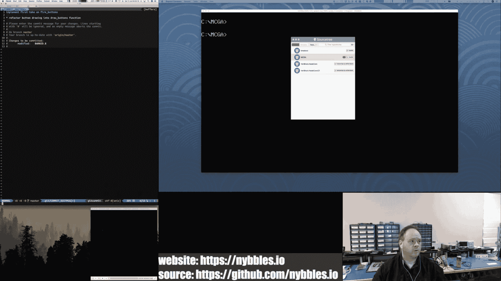

Al right。Okay， yeah， so that about covers what I was going to do tonight。あ。

And I definitely will be reviewing the stream after it's done， and you know。

 I'm probably making more tweaks to it configuration wise and whatever。To try to get things。

 you know。Working the best that I can。嗯。But。Yeah， overall， I mean。嗯。

A little bit at a time getting there。 and I probably will be doing more， more streams of these。

Kind of reference implementations I'm using for， you know some of my educational stuff。

As I go along and。Yeah。Lots more to do。All right guys。

 thanks for watching and I will be back in my regular scheduled time。On Monday at 5 a mountain time。

And we're going to be getting back into review and I did make some progress their help formatting and all that's looking really good。

 although you know， more things have been opened up in terms of you know。

 functionality that needs to be added to the console and things like that， but。All in all， you know。

 Im， I'm really happy with。The way that's going。 And， you know， I， I'm going to make notes， you know。

 a lot of the refactories that need to happen there。 I want to get the project stuff going。First。

 and then we'll come back or offstream。 I'll work on some of those things。 But yeah。

 so thanks for watching。 Hopefully it wasn't too boring。 and I'll see you guys later Min up。

