# 【精译⚡x86汇编语言】nybbles.io p02 p1 FRIDAY： x86 assembly language programming on reference arcade game -BV1NPr9YKE4b_p2-

Okay。Good morning， everybody。This is Jeff on the Nibbles IO。Twitch stream。

Which is my daily stream 5 a to 10 a。Monday through Friday。Where I stream my programming routine。

 my daily programming routine。嗯。So。Let's see today is Friday。And。Fridays are our。Branandom day。Sorry。

 just noticing here。New chatter announcements are now available。

You can now enable new chatter announcements and your channel make it easy to welcome new peoplehuh cool。

take a look at that。嗯。All right。What we are going to do today。Is。嗯。Work on some assembly language。

For five hours。嗯。So。As I've probably mentioned a couple times。

 I am working on several projects at once。One of them is RU， which is what I'm primarily coding。

Day in and day out。Because。系啊。We would like to get that done。

 would like to get that up and running for a couple reasons one。I just really would like to use it。

And we're making great progress in that area， sorry I am just kind of。

Cleaning up a small spill on my desk here。嗯。And。The other reason is I。

We'd like to start taking it to cons。I am scheduled to be at the Portland retro gaminging Expo in。

I think it's September， or maybe October， I don't know the exact dates， but later this year。

And I would like to go to other shows as well with it。

And but I also like to start making games with it， I would like to start using it as a user and start building educational material from it。

But。I also am working on a project that has an educational video series called Let's make an Arrcade game in MS Dos and this particular series is。

Using Ds box and you know， I'm targeting。Up to maybe pentium1， right。

 and we're not using anywhere near。That level of features， but we're using really basic VGA graphics。

 we're going to use adlib sound and sound blaster type wave output。嗯。And。

The idea is if you've never written code before or maybe you have。

 you would like to maybe take a new stab at learning stuff from the ground level。

I'm going to take you from not knowing anything。About software development。Assembly language， games。

 any of that， and kind of step you through it。Step by step until we get to the end of the series and right now you know my my project plan and filming so far have kind of。

indicateddicated we're going to get to about 52 episodes， approximately 30 minutes each。

 and the idea is that they're released once weekly。Probably on a Friday。

So but in order to produce the video material for that series。

 I have to kind of be ahead of the curve a little bit。

And so I have a reference to implementation of the。

Code that I'm I essentially use the reference implementation to guide me。

and producing the videos and how to kind of break the code up and go through things so I use。

 you know， it's like Bob Ross if you've ever watched Bob Ross Bob。

Painted those paintings on screen in real time it's true that he did that。He didn't compose them。

 right， you know on screen in full time， in real time he would paint them prior。

And then he would duplicate the basic ideas， right， so he would spend time at home or whatever。

And he would come up with 13 or 14 paintings for a series and。He would。

He would have an exemplar off camera， which is why if you watch him。

 you'll frequently see that he's kind of head checking to the right。

And that's because he's looking at his example。He's looking at where to take it and it's not that he duplicates them exactly。

 it's that he he has to have some kind of guide right because it can be difficult to think of stuff on the fly。

To be creative and then ats the same time。Being creative is like up here， right， it's this weird。あ。

Activity where you're。You're not thinking about any one particular detail， right？And you can't。

 it's very difficult to describe creativity。 You can't do that。

 but you can describe how you pick up the brush， how you load the brush， how you。

How you apply paint to the canvas， those are very detailed oriented things and those are very training oriented things。

Well so for software it's the same thing right if I if I'm having to kind of you guys watch me on the stream when I'm kind of thinking how to do things。

🎼You know。It'sI don't always say stuff， I don't always do the right thing I don' you know。

 so and it's an entertaining thing to watch。But it's a different thing to watch right when you're watching somebody do their daily thing。

 making the mistakes that people typically make and。

And it's not so much that for the educational material that you want to hide the mistakes。

 that's I don't think that's the idea。The idea， I think is more so。

Logs in and wants to watch a five hour。Programming stream in the background。They're probably not。

 you know， it's not the only thing they're doing。And they know they're kind of signing up for that。

 right？🎼But if。You know I'm an as software developer， I want to learn。A 30 minute video。

 I want it to be。Very information dense。And I don't want 20 minutes of it to be some guy trying to figure out how he messed up something or why he designed it wrong or you know what I'm saying it's so it's kind of just a different。

 it's a different presentation it's a different audience you don't want to waste people's time right do you want to get in you know a 30 minute block and you want to be able to present。

Really good information that takes you from where you were to the next step。

 the next incremental step。So with all that rambling there。

That's kind of what we're going to be working on today。

Quick overview of the screen layout because it's a bit different than our typical screen layout。

Because doOS box。The size of the display is fixed from configuration values。

 so it's scaled here and I can't really fit it on mine。Portrait is play。

 I do all my work in it on the。🎼ラン付け。169 display。So I've moved our。Typical terminal over to the。

Portrait display and I've got chat up at the top。And I've got just a work terminal at the bottom and then I also again。

 I'm using T Mus to manage the virtual portions of the display here in the terminal。 I also have the。

Do box built in debugger running in another terminal window we're not probably going to spend a lot of time in that。

 but it's there in case we need it and I can toggle back and forth。嗯。

So really briefly a little overview of the。Tools so in the left here， this bottom terminal window。

 this is the same directory as what you're seeing in the DoOS box window。

 this is where I manage Gi because I can't do Git from Dos。嗯。So。You know。

 I version control all this and I just do it that from over here。🎼嗯。Then over in the dos box window。

This is the same folder。A couple things I have。I use A86。For the asmbler。This is all X86。16 bit。

 original 16 bit segmented right， so IBMPC， early 1980s。

 assembly language we're building Com files as our target。Not executable。🎼嗯。

And I use the TSE Pro editor for all my， which stands for the Sware editor。🎼嗯。

So I use this for all my editing。🎼嗯。Inside of Dos box and that was the other thing too is you know I could do all the coding in a modern environment and I could you know cross compile or whatever I didn't want to do that I wanted to actually do the work in the old environment。

And I just it just simplifies things a lot。 I have a directory navigator installed on here。

 which I do use occasionally to navigate through the。The file system。

So those are in here and if so if you see me pop into this， that's what that is。

It's like a midnight commander idea for Rigos。I have Turbo debugger installed。

 which I use for most of my debugging sessions where necessary。Sometimes if。🎼You know。

I hit a snag that。Tural debugger doesn't really help me with。

 I may use the built in debugger inside of。Gos box。This thing is not you know， to say that it's。

User interface is horrible， is an understatement。Barely usable。

 but it does help in some rare circumstances。Traping for interrupts。嗯。

seeinging some of the low level stuff the emulators is doing behind the scenes can be helpful at times。

I am using make。For。Assembling and kind of tidying up stuff， very simple make file。

 we use the assembbller to assemble our game and to assemble our tool。嗯。So you'll see me Run make。

Frequently to do the assemblies， the game itself right now。

 what I've got is just a little demonstration so in the game engine I have。

Most of the input stuff working， I have to weave some joystick code in to the input system。

I have the video generator code working。And I have most of the sound code red。

I have to finish the sound code and you know get it integrated fully。

 but I can move my little sprite around here and you can see that。

Text rendered text and graph her like rectangles and stuff rendered on top of the sprite。

We're getting according to。The code， we're getting 44 frames a second。

My experience with DoOS boxox is that it'ss a bit on the slow side。

 so I think in real hardware this would be spot on frame rate and I've tested this with。

Up to 128 sprites on the screen at once。It doesn't phase the CPU on my machine。

 it doesn't phase the frame rate in Do black。You know it's pretty performant。

 those little stripes you see in the back those are actually background tiles and there's two layers there。

 there's a foreground in or a layer one background which is drawn first then the foreground tiles the sprites then background two is drawn on top of that so you can actually have like a you know。

Stuff that looks like it's dimensionally behind something else， pretty simple but effective。

 the render can do fonts that can do。Lines I can do rectangles， as you can see。

So all that stuff works and。Yeah， so if we take a look at。Video。

Because I'm sure these will be some details people have questions about。So， this is a。Moode 13 game。

 VGA mode 13， the VGA adapter， EGA adapter， CGA adapter。Have various mode numbers that MS dos。

 the bios。Has supported going into over the years。And they just kept adding those mode numbers as time went on。

 however， we're not using the plain Jane mode 13， which is 320 by 200 by 256 palletized colors。

Instead， we're doing a mode queue tweet to the VGA registers。

We're putting the VGA controller into a chained mode cubee and what that means change just means that it's not planar。

 so the VGA memory is planer and what that amounts to is there's。

Certainert of control registers on the。Graphics card。And within。He。A bite or you an ape。

 I think it's a four byer and I think it's four bys。

You have to turn on a flag to write the leftmost pixel then the next you have to change the flag to write the next pixel and so on and so forth。

🤧ああ。Now the advantage to that is that you can actually optimize your output to the card because you can write like one you know one chain of pixels all at once right so it's almost kind of like a blind effect if you did it really slowly you would see it fill in parts of the screen you know at different points。

But it's it's a little bit more complex from a coding angle so chain just turns it into a linear address space down the downside to that is if the VGA。

Aapter had like say， 256 k of B Ram。Turning that chain bed on the card then only can present 64K to the outside world。

 but that's okay for what we're doing here so we actually use a mode Q which is 256 by 256 by 256。

One of the awesome things about this mode is that because it's square， we can take a word register。

The upper byte is the Y address and the lower byte is the X offset and we don't have to do any multiplication or anything like that。

 we can just pot a pixel by writing a bite to that location。So that's really， really。Convenient。So。

And then we have a back buffer in conventional RA， so we allocate 64K。In a segment， and we use that。

 we draw to that。That''s where all the video code goes to。

 and then we have one function that takes that buffer and copies it to V RA。🎼Part ofり馆。

And so we do we support 16，16 color palette， we have a 256 color VGA pal。

 but the API here is not that you just zero to 255。Instead， we chunk it up into 16。

 16 colored palettes。The first eight palettes are for the background tiles。

 and the second eight are for sprites。And you can change the hardware palettes anytime you want。

 that's just going to then change the actual colors that live inside of the virtual palettes。

We have today have one or more 64K banks of eight by eight background tiles and each tile can be assigned one of the eight palettes。

So basically background colors， you have 64 colors。That you can work with。あ。Well。Yeah， I mean。

 because really it's 15 because the zeroeth is。嗯。It's 120。

 but I'm going to even go one step lower than that because。嗯。Yeah。

 so maybe like topping out around 90 to 100 active colors because one palette。

Probably going to end up getting a reserve in practice for like text and things that you don't want to change。

 right， colors that you don't want to be fluctuaent。

So theoretically maximum 120 ish colors realistically below that。And then。

We have two backgrounds that are 32 tiles by 32 tiles。

And those are made up of eight by eight tiles in size。Background two is drawn with a higher priority。

 so first we draw background one from memory， then we do our portground tiles。

 then we draw background two。And if two background two is a little bit different if the tile by in the map is a zero。

 then that tile by， the whole tile byte is transparent。

 so we just move on to the next tile and the tiles in the background2 tile map。

The zero with color is transparent in background one， no transparency。I applied。

And then we can support up to 256。16 pixel by 16 pixel sprites on screen color index zero is always。

Transparent。Regardless of what the VGA color is， right？

The way the palting works is it's an offset into the 256 colors。that the VGA supports in the vote。

So the sprite and tile data are always made up of numbers  zero through 15。嗯。

So zero is always interpreted as。あ。Transparent except for background one。

 where it is treated as black and for lines， rectangles and fonts where it's also considered black。嗯。

But in the VGA。You know， the actual color。Registers for that particular pallor offset might have a color in it。

 but we don't draw with that and don't draw with that value。

And so you can assign one of the eight 16 color palettes to。Any of your sprites？

And I'm sure we'll pop into this code。Here and there。嗯。So， that's kind of the。Overview。Oh。

 and so then the thing that I'm actually working on is this。

Little tool that I'm callingBaed。Which is so the idea here is we have to be able to get data into our game。

And we're going to write a data file out that has。Like a record structure and stores， banks。

 or 4K bytes。あ。That's going to allow us to very easily。You know， dynamically load。Chunks of 4K。

Of data from the data file at runtime， the bank editor is going to allow us to edit。

Create Kyle data that creates brightite data。Background like so laying out the what the background looks like。

 the two different layers， and we might have like just a raw memory editor in here。

There's metadata associated with each bank， so there'll be a little metadata editor in here。And then。

This won't happen。Music editor in it， but。It will have the ability to just arbitrarily import binary files and store those in a bank。

Um， so。That's。And that's what this tool is for。And I got a start on this。

And because I'm getting closer to the point in my filming schedule where this needs to work。

And last week I did a test stream on Saturday。Fortunately， the audio was really。

 really bad in that stream。I started working on implementing the mouse capability in that guy。And。嗯。

Ran into a small problem and that's where we're going to pick up where I left off。

Last time we're going to fix that and then we're going to continue working on just getting some of the support functionality working。

 so example。You see I've got a blinking carrot up here， I need to write a function。

 write a little state machine where I can basically call into a function and say， hey。

 here's a pointer to this。You know， text feelstruct。And I want you to go into tech sentry mode。

Here are the keys that I think are valid and you know， fill this you know。

 manage this field for me and when you hit enter or whatever。

 you know then it'll exit out and then the code can use the values that come from。Textentry。

 so that's how that's going to work for you work on that。嗯。So。Believe it or not。

 I mean those two things probably will take us most of the morning， so we will。Get started。

On that stuff here because。🎼This是。The better。Okay， so。Banked。

So there's one main assembly file for each program game。8。Bankked。ache。

Those are the entrytry point files。And everything else is just included into those。

 so I have a bunch of support files that implement。You know， string stuff and。

Control memory and IO and。Timers and VGA and video stuff。

 those all just get included and the tool and the game engine both use the same implementation for。

So that's intentional that way I don't really run into any surprises。Good stuff。

So where we had left off。Was。Whats this。Fire button。

So really briefly let start at the bottom well actually those students。Let's go to this lab。

The very first thing that happens， so this is an MSDOS Com file。Which is a 64K。🎼嗯。

Bank of memory essentially image that can be loaded。The operating system MS Do gets out of the way。

 it gives our program complete control over the machine more or less。

 which you would think might not be the case， but that is actually what happened。MSDs essentially。

Just。Vacates the premises when your program's running， there's a small chunk of memory。

That starts at the 0， with offset。Of your segment and goes to just before your code。

Segment begins that's called the PSP that's a block that the operating system manages for you that's where like if you wanted to parse the command line there are certain interrupt vector offsets in the PSP。

That are duplicated from other parts of memory for convenience sake。Also in case there's a。

An override。There are a couple cases where。Some overr convening。Presently you run your doss。Image。嗯。

So。First thing we got to do though is we so we're at zero，10，0 hacks。The first thing we got to do。

Has jumped to our start。Because we want to jump over all of our data。So start causing it。

And Anne net。Calls allocate this is。So this is。Segmented memory。

Which I know people hated at the time and it does kind of take a little bit of。

Effort to understand the idea， once you do， though， it's really not that bad。

 it certainly doesn't change anything， practically speaking。

 it just you have to kind of go through a lecture dance。To get to different parts of memory。

And All does。Some basic stuff right it allocates some memory for our control ra right。

 so I have a macro that will go。Alloccate to next。Segment for。Size control Ram。

And then I clear that with zeros。And then I move the。

 so then I want to everything else we're going to allocate at that point。We want to update。Excuse me。

🎼嗯，喂。🎼Sイus。🎼嗯。We want to set values now that are in that segment。

 different segment from our code segment， so we have to set the。Extra segment or extended segment。

 register whatever you want to call it with our control ramppointer that we got from our allocate。

我看 of。Set our base pointer to zero so that we can access structures with it。

And then we're going to start allocating， okay， where does our tile bank live？

We put that in a temp pointer， we clear the memory out。

 and then we put that temp pointer into the control structure so if we take a look at。control。

Control。Is this structure right here。So we have a pointer to our Sprite tiles。

 we have a pointer to our background tiles。We have the allocated memory for。嗯。

Or I should say the reserved memory， unassigned reserved memory for our sprites。あ。Same thing。

 so this is the metadata。Around the spray， what's the position。

 what tile is it using so if we go up here。We have this sprright structure so you can define the tile。

 that's a word， you can define the X and Y location， that's the word。

 the palette we're using flags for this sprite and then some user。

So that could be a pointer to another game structure or anything else that we want it to be。

 likewise we have a tile structure， what tile is it， what palette， what flags。

 we have a background so the background is the map right what are the tiles。

 right so it's an array of these？What's the offset of the map when we're rendering it。

 this is not used right now， but in future like post first series we'll extend the engine to support scrolling and things like that and that's where these things come in。

Flags and then just a pad bite so that we haven an even。Sized structure to deal with in memory。

And then we have timers in the control data right a timer so a timer has a pointer to a callback。

 it has a word。How many frames？go bye。Before this time was fire。We have accounts。

W Id have to look at Dako I forget what I'm using that for flags right。

 so here are the flags timer enabled， expired and ready， and then there's a pad bikeking。嗯。

So the control Ram， if you imagine， so you have your comp file which gets loaded into a segment and that's your coat。

 the whole thing it's code and data right it 64K， but we have other memory we can use right。

 we have a full 640K， which believe it or not for an arcade game like what we're talking about here。

That's like tile sprite based is a lot， it's a lot of memory and we can do quite a bit of cool stuff with that so。

And typically， and again， I'm kind of structuring this so there's。There's method to the madness。

I'm doing this MSO series。We're going to build this game。But at the same time， I'm also。

Build the same。We're going to be able to build the same game against a hardware solution that I'm building。

 so I'm building designing an arcade board。🤧That's。

Very much in line with what the hard would look like from， say， the mid-1980s for a game like this。ん。

And so I'm structuring this in such a way that， you know， the concept sort of port。

From one to another， so on the arcade board we have RAM。We have a RA module。あ。That is。

 we call it control rain。So it's a special map。Region of RA that is just， this is the memory mapped。

Part of the hardware， right？Talk to that range and that causes certains of things to happen。

 changing pals， changing。Sprite tiles， and all that good stuff。So。

So that's kind of why I'm structuring it this way。And then also it gives me a jumping off blank。

 it gives me something I can hang a bunch of other pointers off of。

 essentially or allocate chunks of memory。In in that control ramp segment。Because then。

Thanks for joining。Steve。Finlayson。嗯。I have something I can hang off。

So if I allocate additional segments， right， I can put those pointers in one place。

 so I essentially I always have one。One thing that I can always go back to。And I know the segment。

 I have that pointer， so I know what that segment is， I know where I can go for it。

 it's so it's really really。Easy to do so we allocate our background tile。

 we put the pointer you know in the control Ram structure， have my then I allocate my sprite bank。

And then I allocate my。Back buffer？My pseudo V Ram that everything talks to and so that pointer hangs off that control structure well actually no。

 I take that back， he doesn't hang off that control structure， I should probably put it there。

 I didn't。嗯。I just had the back buffer， oh， I know the back buffer lives in the video。

We still have video loaded。So。not butter buffer。I'm not sure where I allocate。嗯，没必。Pro， here it is。

Yeah， okay， so it's in the control file， but it's not in the control structure。

 so it's not living in that segment。It's living in the coach segment。So these two take， you know。

 this is eight bitetes。They come out of。あ你。🎼嗯。Main。Come。64K segment。Which is okay。Again。

 we have we do have data right， these same thing， these are all living inside of the。Coode segment。嗯。

And I think。If we take a look。Our comm files are。So the bank engine or the bank tool is 5 k and the game right now is is almost 5 k。

 so we're hovering around 5 k， and I guarantee。Third of that is probably data。

So very small code footprint so far。So going back to our bank file。

That's what All does right sets all that stuff up， then we go into mode 13 so we go into the standard 320 by 200 by 256 mode in the VGA。

And then。We apply the mode Q parameters， so what does this mean so if we look at the VGA file。

This is the file that has all the code and data structures around manipulating the VGA control registers。

So if you'll notice I have a bunch of constants here。They refer to different parts of the VGA。

But I also have a structure。That has you know allows you to define a register a function of value flags in a pad and then I have this macro。

 well I'm sorry this is not the macro， this is the data， so for modeQ these are the data values。

 the different registers and the different values right that get set that cause the VGA to go into that altered mode。

And then I have。Some helper functions， this thing that I'm using to program。

So mode program does exactly what it sounds like we pass an a pointer to that structure。

To an array of those values and then this loops through that and applies those to the appropriate VGA control register。

Theoretically then if I have the data。Definitions for the different modes。

 all I would have to do is just call this macro which in turn inlines a call to this function and then it would program that mode for us so that's what this does。

嗯。Then I initialize our mouse stuff， I initialize our keyboard。

 interrupt service routine to the way that。You have to。If you want to get。

Really efficient keyboard interfacing in a DoS environment you had to wedge in your own。

Keyboard Inter service routine you can call BiOS functions。To get say okay。

 wait for a key or read whatever's in the keyboard buffer but those are slower and not really what we want to do for games so we have our own keyboard interrupt service routine that wedges in and lets us get at that data as it's literally happening in real time so if I hit keys I get a key make signal from the hardware。

If I let up on that key， I get a key break and then I take that data and I put it into a queue and then I process that queue and then I have some state that I manage in the engine that you know。

 I know that the key is down。I know that it's not down and I can check those very quickly and easily for timers。

 we have to adjust the existing timers。Make them a bit faster so that we can get kind of the precision that we want in a game engine and then。

Then I have a hole。Little framework that's built on top of that that allows me to create a timer。

So actually and I just realized that this is the old way I used to initialize a timer。

 so I have a macro load free timer which just ends up inlining a call to a function in my timer implementation that goes through my timer data structure and tries to find an empty entry for timer to be stored and then sets up those fields now turns out I have a nice even higher level。

60， right？This does the same thing with that。嗯。So pretty nice。Right so what this does。Every 60。嗯。

Every 60 frames。喂。This callback。We'll get fired。And this call back。There's a couple of helpers。

Maac grows that you can use。Reset the timer， cancel the timer。

 so this resets the timer so it happens again。We get our current frame frame rate and we incremented。

And then we update our we call our。Stringwriter， so put deck two is a way of writing a two character decimal value。

And so then we reset our frame rate counter right， and then this whole thing just keeps going same thing with the carrot。

 we reset the timer and then we invert。Our flag saying whether or not our。

Our cars visible and that's what causes it to blink。So that's how timers work really simple。

 all callback based。So。That's the it， well， a covered hack covered everything。And in it。

And then then we fall into the main loop right now keep in mind we're looking at the tool code here。

But game codes vary， it's literally both main files。Very identical with each other。But。

There are some minor differences right， and of course at some point the tool and the game will diverge pretty substantially。

 but these parts of it are all very much the same。So then our main loop is really call update。

 so then what does update do right now update fires our timers， it reads mouse data right。

 and then or I should say it reads the mouse and it puts the data in mouse data。

Which is up here at the。嗯。In our data section here in our， we just reserve two bytes， or I'm sorry。

 we reserve two words， so eight bytes。To store mouse data。嗯。Then we call fire buttons。

 this was the thing that I was working on。And then this is all old code here。

And so I actually want to get rid of this because we're not。We're not doing this anymore。嗯。

And we can rename our local。Branch labels here。So they make more sense and then I also had some。

Dead data， yeah， so I this used to be the data structure that I had for doing input stuff and I' have since。

Significantly enhanced that。So we can clean that up。So update。Again， like I say， so it it。

Fires timers。Reads the mouse data。Callst fire buttons， right。

 so this is if if you click the mouse button in an area that is。Got a hot spot on it。

 Something should happen。 We grab the next key off of our QQ here where this is actually not。

So actually， let's。Let's do that， let's fix that because I had changed all this in the game implementation。

But I hadn't yet gotten to。Gotten this ported over to the。So， if we。

I'm going to copy this over then we're going to kind of。Hack it up a little bit。Okay， so now。

We don't need a game anymore。So we have a pointer， we have a label and a label in asembler typically so what's the difference now this varies from asse to assembler。

In 86。A label with。Welcome， Hell Fire 128。A label with a colon is a。嗯。It's an address， right。

 it's automatically an offset。As where a label without。An identifier without a colon。

 this is just a variable right， so referencing FPS is always going to be the value ofFPS。

Referencing state is always going to be the state of event or the value of state。

Referencing input events is an offset now you can there is a directive in 86 and there's a directive in other asemmblers too where I can force any label say hey。

 I want the offset for it instead of the value but this is a pointer the way to think about this is this is a pointer to this spot in memory and then each one of these these has a pointer to it too has label that points at that。

🎼啊。Structure that gets created so the short description here is I have a macro called death input Even。

And this allows you to say what kind it is， hey， it's a key if it's the escape key。

Or I have a key input it， I want key left， but the same thing。

Is the joystick and it's this value Now right now I haven't fully integrated the joystick stuff yet into the keyboard or the event system。

 but once I do you know moving。Laugh。Can be key left or can be a joystick value moving right can be key right or a joystick value and this is eventually right this is a data structure that I could pop up on a display and you'd be able to change your key assignments and all that so this just defines what events are valid okay now what happens when you do them just。

If this happens I want you to trigger an event now there's actually other data。This structure。

 these are just the user values that are defined for this structure。Inside of the structure。

 so if we go to input。嗯。Inside of the input event structure， we have type and input。

 these are the two things you're seeing in the macro。

 but there's also state and then a couple of extra pieces of data they can track by the framework so that structure that macro is actually filling out that whole data structure so that there's some hidden data there that's being managed by the framework。

When we get down to the zeros that just means we're done， that's how we flag the end of the array。

 you're going to see that pattern a lot， then we have a label input bindings and then we have or a pointer label for each。

Of the bindings right， and so there's another macro that says， okay。

Here's the identifier for this event， for this binding， so we have quit， we have pair player one。

 left， player one， right， player one up， player one down now， we're not going to use these。

🎼In the tool。The tools keyboard input structure。Its different。But we do need to quit。

So we'll start there。And。I want to say。That's constant， yeah。

 so constant's going to have all these enum or these identifier values for things like that。

So that's fine， the tool can share those， the tool in the game can share those because they don't。

We're at the same time。The values don't really matter at the end of the day， just something unique。

So when you look at the binding。It's。The ID for that binding。

 the label right for that binding and that so again。

 you can imagine this is eventually the structure we would walk in some generic key mapping or input mapping code here's the action。

You know here's what it does or here's the event that it ties to and here's what it does kind of deal and then you can see we say okay。

 if this binding gets fired， we call exit。And then there are three， there's room for， I'm sorry。

 four。Unique mappings right so we could say this binding will get triggered if the quit key event is hit or thequi joystick event is hit or the quit mouse event is you know what I'm saying so there's you could have multiple different events that are defined so you could have three different keys that all mean quit。

You could have three different keys or four different keys that all mean move left or whatever。

 so that's how that works。嗯。So then if we go back in game。And we go down to。

I think I actually have it in draw now。嗯。Because。Where did I put it oh here， I put it in show。

Because I wanted to tie it to the frame rate。So basically now。If I go down here。Show。

It's kind of the same thing， right？🤧嗯。I want to tie this strongly to the frame rate。And。

So we have two macros。Update input。Fire bindings right update input is the thing that takes things off of the input queue so and it's actually input cues so you have a keyboard queue。

So you have a 256 byte keyword queue that just keeps that， you know。

 stuff just keeps getting insert into that and then there's so there's an insert pointer and there's a read pointer。

And the two can be synced up or they could be apart from each other eventually like if you're getting a bunch of keyboard input。

 the reef or the right pointer will wrap around right in the buffer。And just start overr stuff。

 which is fine。Now in practice we don't really have that much going on， so it should be okay。

But also we're going to have a buffer for the joystick。Those to this macro。

 which calls a function in input， it basically。Mers all these different input sources we've got。

Keyboard and joystick。Goes through and updates the appropriate input event data structure to indicate whether or not that。

The input event has been triggered。 so if I hit the space bar。I have an input event for that。

This code will go look at the keyboard buffer， we'll go look at the joystick input buffer。

And it will go set a bit in that structure。I let up on the space bar that's going to clear the bit the same thing like if the joystick input's not contiguous。

 it stops， then that bit will be cleared so that's just。

Taking the actual hardware system inputs and updating our internal structure to indicate whether or not that input event is on or off。

Then fire bindings goes through our bindings array right and says， okay。Is。Are any of the events set？

For this event or for this binding， if it is， then you trigger the binding， right。

 this call it callback。嗯。And so that's how that works。🎼嗯。N just compare。Should probably be。

V blanking on the VGA is weird。Welcome。Viands， the unicorn。🎼あ。Yeah， so VJ handling on the。I'm sorry。

 V blind handling on the VGA is weird。So I actually have two different functions， one that says。

 am I in a V blank and I have one that will actually wait。

 will block the CPU to make sure I'm not in a V blank。Or wait until I'm not in a deep blank。

And that just allows me to define the boundaries of the blank itself a little bit better。嗯。

I'm just trying to make these two。That's interesting。So are we in interview blank， no， jump over。

 do the flip， wait until we're out， do our input stuff。Increment the frame counter。嗯。And then。

Re our draw flag。So I actually just made。上明。Change is here， so let's see。It's still running。

Sscape still works good。So now we just replbed。

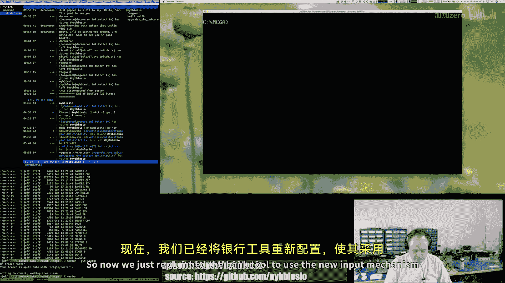

The bank tool to use the new input mechanism that I had done for the game。嗯。

And this is going to be easier to work with， right？

We can define whatever keys are valid and then we can。

Start setting up bindings for them right if that key is hit。

Do this that keys hit do that so like function keys， other keys。

 we can do all sorts of you know cool stuff now。The keyboard。

 or I should say like for the input field， the text field。

 that we're going to just probably go right to the keyboard buffer and we're just going to manage that slightly differently because for like text input。

We don't really want to go through like a binding system。

 we just want to read that data and if it's a valid character for whatever。

 like so if we have a number field and we only support hex， right。

 maybe we would have a data structure that says，系。Fill a buffer that's this size， here's the buffer。

 here's the max size it can be。These are the keys that are valid， right， so zero through nine。

A through F。And then we'll have a routine that just doestyy and then if you hit the cursor keys。

 those let you move in the field， if you hit home and end that let you jump to the beginning and end。

 if you hit you know delete that。Sucks the characters into the left if you hit backspace that deletes whatever is to the left of you right so those will all be kind of hard coded in that。

That function。嗯。All right。Now。So we talked about update what that does。

 we actually kind of refactored and cleaned up some code。We talked draw， let's talk about draw。

 so update。That might run multiple times。Her frame。That's not frame locked。Draw。🎼Is。

You can draw once。🎼Per。You know， frame interlea。Even though draw might be called multiple times。

 so I have a flag here that I basically say，Hey， if we can draw。

They go ahead and go down here and do the drop so we clear the back buffer， the call draw base。

 drawaw carrot， draw buttons， right and there's going to be a bunch of other stuff we'll draw here。

 draw tabs， draw bank data， you know， lots of stuff。But this is where the actual drawing takes place。

🎼And then。If we're in debug build。Which we are at this point。

 then we show that little we draw the string for the frame per second。

Counter and then we draw the mouse cursor Now we have to draw the mouse cursor custom because I can't use the mouse drivers。

Draw routine because the video mode is tweaked。And needless to say， when mouse。com was written。

 nobody was doing MoQ。So that code's all off， essentially。No。

Miles driverver rendering code assumes you're in 320 by 200 mode and it's just the cursors don't come out right。

 so we draw the cursor ourselves， not a big deal。🎼嗯。So that's what draw does。

And then we call show and show is the flipper right， shows the thing it's， hey， are we in a V blank？

If we're in a V blank。Then come down here， do the flip， what is flip do， flip does a word copy。

From conventional RAM。To V RamM。For the。The back buffer。And。It's very， you know。

 so if we look at the。🎼看げ生。🎼そです。WVGA。Forget where I put it now it's in video。Yeah。

So the flip macro puts some stuff on the stack， save our registers， and then we call copy page。

 we move our data segment， register with the。Pointters， the back buffer pointer。

 we move our extended segment with theraM right because that's where we're writing to。

 but so that's our target segment。And we move our source pointer our source index in our destination next to zero。

 we move the number of words。That we want to copy， so in this case it's VRAM divided by two and we have to add two。

And then we clear our direction flag because we want to go。Want to go from zero up。And then we load。

U， a word。And we。Store it and we loop。嗯。And I think technically this could be the reps。ItSoSD。

I think。I think so。So， let's see。Let me look that up here。I forget if this doest implicit load。

I think it does。St is a byte word or double word from the ALX or EX register respectively into destination。

 the destination， Yes， yes， yes， it cannot be overwritten。嗯。Okay， yeah， so this doesn't do。

This doesn't do。 This is if you wanted to store。The same thing。It doesn't do an implicit load。Wait。

 okay， so this。Dos， stove and stoves。 So the store store by store word。

 store D word instructions can be preceded by rep， right？For a block load of ECX bytes。However。

 the instructions are used loop con because Danny's to， yeah。Yeah， okay。

 that's that's what I thought。 So this is correct。 you know。

 if we had like we wanted to like blast zero， right， so up here I'm using the rep。

Because I'm just I'm loading the same pattern in everywhere。 But in this case， we have to load from。

One segment， we have to write to another segment， so we have to do two separate。

Instructions for that so we load a word from the data segment right so again we're loading a word from the back buffer then we're going to store that word into VRAM and then we're going to loop right and load will automatically increment S for us store will automatically increment DI for us so we have to do that and then this just loops and it copies all that information over so that's how that happens that's flip。

And then。Then we wait to make sure we're not。You know we wait until we know we're out of the VB。

 then we do the input handling， I put this here， which seems kind of weird。

 but I put this here because it just makes things a lot easier if the input handling is kind of frame locked。

OnceOnce you're doing like multiple cycles of input handling and then drawing。

 things get out of sync and it's just。You can get really complicated with stuff and I don't want to get that super complicated with it。

 I want to keep it kind of simple again I'm going for。If I were really working on arcade hardware。

 what would that be like， well， what that would be like is I would have some memory mapped areas where I could go check to see if my joystick was up or down or left or right and I would be doing that probably you know once per。

Vertical blanking period， so I just want to keep it you know， about that simple。

 and then I changed the volume。🎼Bron window。🎼嗯。And then I just loop right。

 so this just loop then we'll say。So how do we ever get to exit Well， we saw how we got to exit。

exitit is a callback right and so and this is the interesting thing about assembly that I love。

 right？I mean， high level languages are great。Don't get me wrong。Monday through Thursday。

 I'm writing C++ code。嗯。But。At the same time， I want to say that。

It's liberating to understand that the program counter doesn't care right like there's nothing。

This is not。How am I trying to say this？In a higher level language。

 and it doesn't really matter which one， you have a wild loop， right？

And that' like that's a structured block。And there's certain ways that you exit that block， right？

And it's considered evil by modern standards that go to out of that block。Hey， welcome back。

 Rohallos。Um， so it's considered evil to like do a go to out of that block， you would do a break or。

 you know， you would change the logic condition around your wild loop to exit out of it。

But when you get down to the CPU， you realize it's just a program counter and it's just the program counter is just a number and that number is just a pointer right。

 and so you can really do you do whatever， right？There's nothing here。That。

Just because this is a fixed loop。Once it goes somewhere else。

 you're not in that loop anymore and you can do whatever you want so when we're in our code that's handling you know firing our input binding。

 you know that code is free to call or jump into whatever and。

And we can just change the flow of the program dynamically。🎼So。Welcome to the channeln IXOP。

Thanks for joining。🎼嗯。So anyway， you will find that， you know。

There's a lot of freedom and flexibility。When you're coding this way， right？

And so that really kind of so exit is pretty self-explanatory， we reset our timer ISR。

 we reset our keyboard ISR， so this is essentially putting system level stuff back the way we found it we don't do that then DoOS doesn't work anymore and then we go back to text mode。

 80 column text mode and then this is an MSDs call here and we're basically just telling MSDOS， hey。

 here's our exit code and our exit code， we can change our exit code if we want it's zero all the time right now if we wanted to change it though to indicate hey we exit it in a bad way or something we could do that。

And then the rat here， because we're calling。嗯。Exit。

 we want to make sure the stack gets cleared up and so that just pops the stack。

But because we already have terminated。Then it's you know， that process end。So。

So that kind of covers the structure。Okay， there's some things I didn't talk about like I've got variables。

Stuff up here， let's talk about the mouse button real quick because that's the thing that we're going to work on first。

🎼So。🎼こ你。KeepR this real quick。So buttons are these things over here。

 and there's going to be buttons along over here and the editing area of course will have buttons。

But。These are all being defined by data structure。And so I have some code that goes through that data structure and renders these buttons dynamically and theirs state on them the reason there's a little gap here is because there's a。

There's a button that's not being shown right now， it's not on。And so。

What I want to do is when you click on these， they can get executed。We go back here。

We go down to our buttons array， right so again we have a label here that is it's got a colon so。

It's this is a pointer to this location and memory， and so everything that follows it。

 we can treat it at an array。And then I have a button def macro， so we have a flag。

 is the button enabled or not。So you can see a bunch of a mark that's whether or' not rendering right now。

 and then we have a pointer to the label for that button。

 so this there's another macro string depth that。Puts a length and puts the string in memory。

And so the new label is right here， so we have the word new， that's how that shows up。

And then we have。The X and Y location。🎼And the。🎼With。And I'm sorry， what is this？🎼呃。Well， I'm sorry。

 this is X and Y。This is no。What is the smellC now wants， what do I do？🎼Now。I think it might be。先輩？

Where is But Deaf？Button def is in。Yes， what file is that， please。🎼Oh， was a just。🎼Oh， it's真备。🎼就好。🎼O。

🎼嗯。Right， because I hadn't。🎼Yeah啊， okay。Greatra part， so here's the button structure。🎼Yes。Plags。

So that's enabled disabled all that good stuff。🎼えつ？The text。It's the text position， right？

So this is where the relative to the button。🎼嗯。This is where the text will show up。

🎼Then it's the button position。So x by y。Then it is the palette， I believe， or no， I'm sorry to size。

Guess the size。あ。So then the size， so 38 pixels are crossed by 10 pixels high。

And then then it's the puncter， right， so then it's the pointer to what's going to get called if this button is activated。

Now， let's take a look at。It's a button drawing code。So they called Dr button。

So we move the buttons Ar pointer into the base pointer。🎼嗯。🎼And。Then we move the contents， the first。

 the very first one， we look at button flag， we put that Nax， we say， hey， are we at the last one？

Before'ret the last one。🎼嗯。If we're not at the last one， then go to the next test。

 otherwise we're going to go to the end， we're going to return。🎼嗯。And I guess， you know， technically。

Now I'm wondering why I don't return here。嗯。Instead of doing a long term。🎼And then。🎼嗯。

So the next test is， hey， is this button enabled？If the button isn't enabled。

Then we're going to go down in here， and we're going to add the size of the button structure。

To the base pointer and we're going to go back up。🎼Okay。

And so we just keep looping through until we hit with that end marker。At which point we bail。🎼嗯。

If the button is enabled。Then we're going to move button position。嗯。Welcome Hu Monster。

 thanks for joining。嗯。We're going to move the button position into AX now， so let's talk briefly。

About。Moode Q。 So I don't know if you remember， but。Because mode Q is square。

 so it's 256 pixels by 256 pixels。The stride matches the height。So if I have。嗯。🎼If I have。🎼5，5。

So this is， let's say this is AX。🎼嗯。This is why。This is x， right， because 256 by 256。That means。

We can fit。The whole position ended each bite。AndBecause again， it's square。🎼嗯。This address。

Is the last pixel on the screen， right？This address。I is the very first pixel on the screen。

This address would be。Five pixels down， five pixels over。Right？あ。And the way you can figure that out。

🎼Right， is。You could do the math， right， so five times。256， which is usually。

The usual calculation for like where to find a pixel in a memory buffer is。

Why offset times stride of the buffer plus the act？So that's 1285 and then if we convert 1285。

Two hacks。あ。Sometimes Googles per。さき。Yeah，505。That's exactly what it is。

But we don't have to do that math in this mode in this mode we can just put the Y coordinate and the X coordinate in a register。

But it's always Yx。🎼Okay。Now here's the trick。And this is I think， why my logic in my mouse button。

Detection code's not working。86 has this。By operator that makes it really easy。

To do like nibble or bitete to word combinatorics statically in code without having to write code。

 which is really nice， but I think in some of these areas I've got some things flipped and stuff。Um。

 I'm like。Doing them in order， the wrong order。So。First thing I want to do。Is open up。

And test the manual， no。We'll see it this way。86 manual， okay。So let's search for buy。へ？

Oper and by offering。可以。O。Excuse me。This operator is a bite combination operator returns the word whose high bite。

Is the laptop brand。And whose low bite is the right effort to say this。

 and I think this is the mistake that I make。Because again， just。Years and years of habit。

Of thinking of it as。XY， X Y， X Y， right， and so obviously I have these。I have these back。So。🎼And so。

What's happening then？Is when I'm doing my position check。The fire the mouse buttons。

My logic doesn't work because。The data and the data structure is flipped。Excuse me。🎼嗯ん。

Now I could probably temporarily fix that。By doing an exchange of the high and low bytes in the word。

🎼嗯。🎼So。We're now in fire buttons。And the looping logic here is very。Similar。First， though。

 what we're saying in fire buttons is。We're looking at the mouse data and we're saying hey is a mouse button pressed。

 this is the left mouse button I need to create a。We should turn this into a。Constant。

it reads better， so we're saying， hey， if it's the left mouse button。

Then if it is the left mouse button， then come down here。Set our base pointer to the buttons array。

And this is the same logic here。I'm going to get rid of the long jump and just go to return here。

I don't know why I was doing a long jump。うん。🎼嗯。So really， here is where we come in， okay。

 we're going to move AX with a button position。But the way that the bites are at memory。

They're flipped。🎼啊咁。So AX is going to be XY。And CX is going to be with。

Height now CX is probably we could probably cheat because that's for us， the width and the height。

 we can use that any way we want， but the position。That's got to be。嗯。

That's got to follow that Yx pattern。And then we're storing BPp because we're going to go grab some mouse data。

We're going to get the mouse position。嗯。🤧And you know， interestingly enough， I just realized this。

I could probably really。Do this here。系い。Because。I'm not using Bx anywhere else。

And so that means I don't have to do that anymore。And I don't have to pop。B P。Which is。So nice。

 but I don't have to do that。So that actually is going to simplify things a lot here。

So we're going to set our base planer to myos data。We're going to get our mouse position in Bx。

 we're going to get our mouse button in AX。R a test to see if the left mouse button was hit。

If it wasn't， we bail， if it was hit， we'd come down here。Put our base point around buttons。🎼And。

Because our flags and stuff。And so the bottom line is if the buttons visible， we come down here to。

🎼あ。L 3。And then we move our button position into AX。And I think what has to happen here。

We got to exchange A。🎼现在。They're in the right order。🎼嗯。Size is not a good。🎼我要。

KNonell size is a big deal because we're going to add that into。I'm going to add that into this。So。

actually we'll do so when we're removing the button position， we're getting the size。

 we're making it larger。Right。This is the right edge。

Is really what it comes down to So really we want to do an exchange AX and we want to do an。D X。

No we want to compare。VX， which is the mount position。And then let's go back。Or actually。

 let's do this。mouse。Pohysition data， what is that？嗯。So first， I just want to make sure my。嗯。

I'm going exchange， oh no。I want to do a beast swap。はい。All right， yeah， so it is exchange。

But I just have to specify the same。Excuse me。🎼但是。嗯。So， then。What I'm checking here is I want to see。

呃。🎼If the。So the position is。I think。X position in CX， Y position and DX， so it's actually okay。

's actually the position from the mouse。So MS PARS is actually right， it's Yx。So that's good。

 so we don't have to do anything special with mouth position。BX is correct。So let's review this。

 so we're we're getting our button position from our button structure， we're getting our size。嗯。

Then the question is。Do I need？

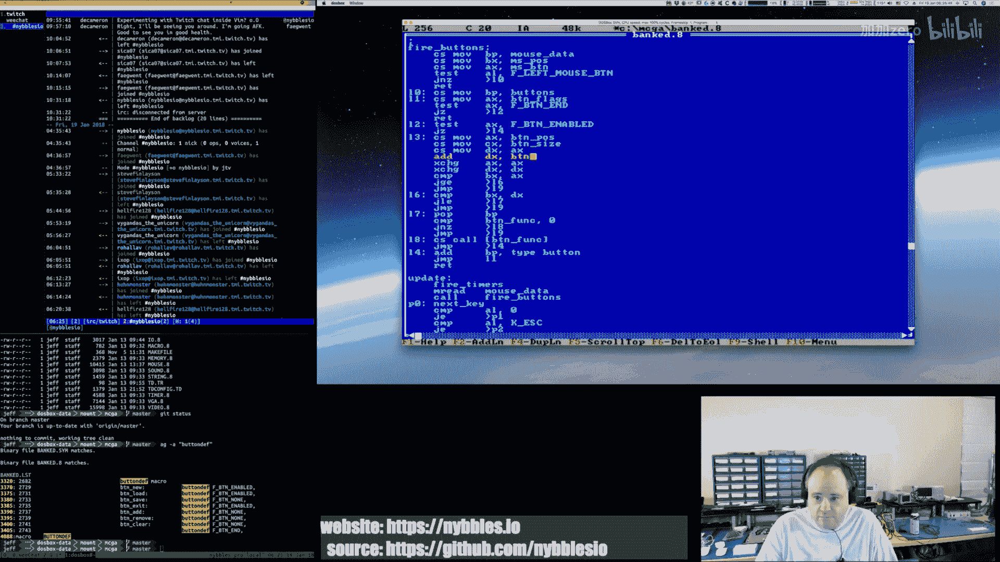

No， I think I do mean that。嗯。Then we're adding。I'm sorry， we're moving。The original。嗯。Button size。

 and then I guess the question is。🎼うんふん。🎼Yeah， okay。Sorry， we're just thinking through this。

 so we're getting the original button， upper left position of the button。

We're getting the size of the button。We're moving DX with the upper left position and we're adding the size to it and again。

Right now， everything is aligned， so it's XY。That's why。So we're adding x to x and y to y。

Then once we've done that， we need to flip them。Because so we need to take the x and the Y bytes and swap them in AX and the same thing in DX because we want to compare the compares have to be Y to Y x to x。

嗯。So then we're comparing。The mouse position to the left point。

And we're going to say if it's greater than。Or equal to that。Then come down here。

I'm going to take this opportunity。To remember this。Otherwise。So what is otherwise we're going to go。

to。mean we're going to go to L9。嗯。So if it's not less than。Then we just want to move on， right。

The test failed。So this is our7。So it's not less than or equal to。I'm sorry。

 I'm comparing the bright edge， so we're comparing the mouse position。To the right edge。

If it's less than or equal to the right edge。🎼で为。🎼We want to go。No， sorry， I'm losing my track here。

We're comparing。The button position， the mouse position with the left point of the map the。🎼Mo。

It's greater than or equal to that。And then we want to come here， that's not。

Then we just want to move to the next button。嗯。Then we're comparing。

The mouse position to the right position of the button， the right edge， right？So here's， it's left。

 right。So if it's less than or greater or I'm sorry if it's greater than or equals to this。

It's less than or equal to this。Then it's somewhere in that rectangle， right？嗯。So。

And if that's if it is。Then we're going to come down here to L5。Otherwise。

 we're going to again skip over。They go to He7。Then go to the next button。🎼So， in L5。

We're going to compare the button punter。🎼嗯。Is it。Do we even have something to do， right？🎼If we。

 if we。We do have something to do。Then we branch to the call。Otherwise， we jump to the next one。

And then here we call。And here we go。🎼we don't need it anymore。So BPP stays constant the whole time。

We're getting the mouse position once up front。Which simplified that code a lot。嗯。And。

And then we had the size of the button to BPP， we jumped out one。

L1 then breathes and we just keep repeating the process。🎼没有。Until we loop through all of our buttons。

🎼Oh。🎼はは。Well， it exited。Okay， so now it's triggering all the time。嗯。So why is it doing that。

 I don't know。So let's do this turbo debuer。うんう。🎼And we want to do。🎼Fire。What。So fire buttons is at。

One，3，4，3。Yep， that looks right。All right。I don't think。The first few tests like is the button down。

Are we at the end， I don't think there's anything wrong there。

I think the part that we really want to look at is this， right？We want it1，368。嗯。1368， right？

There it is。So we want to move。And we want to test， okay。We're going to get the button position。

 we're going to get the button size， right we want to test this loop。🎼That that's the key。🎼O。🎼So。

Let's。Let her rip。And then I'm going to click in the button。Okay， so so it should be right。🎼嗯。Okay。

 so AX is 0014。That's the button position， which makes sense right。

 where the buttons are all starting on the zero with column。And 14 is， you know。About that far down。

CX is the size。So 26。By 10 high。That looks correct， so it's x by y， so it's xy， X Y。

It's XY with height。Right。So we're going to move Dx with。呃。The same value。

We're going to add the width and height to the x。So now the Dx represents the right edge， so it's 26。

Bye。1 E。Which is that looks about right。嗯。Somehow we got a noop in here。So exchanging Dhax。嗯。🎼Oh。

 darn it all。 I see what I did。🎼ステうかスてか。Hello， secret mud。🎼Welcome。O。I'm so not smart。嗯哼嗯。

At least one bug。This is why thinking of why does this snow up， oh yeah。All right。

 now now the false well。🎼So的。Thanks for joining Vinak。没 name。So I click here， nothing happens。

 by click here， nothing happens。Yes， okay， so we're closer。We are much， much closer。🎼嗯。But clicking。

Anywhere over here。Yes， as soon as I get into the exit button。🎼Morning。Sanox。🎼あ。And。

 so as soon as I click on that button。Works。But I also noticed that I got。

🎼Some weird behavior on the。Out of edge， so yeah， my bug was。

I think it's because I was thinking everything else I was doing was。

O the 16 bit registers and then when I was going to do the exchange I just。I wrote， you know。

 I was on autopi and wasnt thinking， I'm like， okay， I want to swap the bites， but I have to。

I have to specify that now so this is kind of a this is。I don't know， maybe I like this。

 maybe I don't， I guess the performance here， you know。

 we're talking about a tool or we're talking about a mouse button check， it's not。I mean。

 this code's running fast， believe me。Even on original。Well， see in this case。

 I have a data structure that the bytes are in the opposite order。And so in this particular case。

 I have to swap the bites to be able to do the test that I'm trying to do。Yeah。So。Yeah。Yeah。

 because the alternative is either I do that here。Or everywhere I am specifying。🎼嗯。

Two bytes that are being combined into a word， I have to swap the order here。

 right so I'd have to swap this 20， 320。I don't know。

 I think the exchange is a fair price to pay here in this particular scenario。🎼嗯。🎼So。🎼Now。This works。

But。I did like I said， I didn't notice this， I thought， some weirdness。🎼Yeah， okay， so that oh。Right。

 right。And that is because。Why is that？Because it's happening on that line。

 so it's like the whole band basically。Actually， let me just verify that because I think that's the case。

嗯。I'm going to chuckle a lot if that is， so I y， that's fine， that's fine。That yeah， okay。

 so it's like the right edge test is not working。So let's just look at that。🎼嗯。So the very first。

So I'm doing a jump JaE or a JE here。I'm wondering though。大。For。Well， yeah。

Here's my philosophy on this this is so I don't know if you saw that you've seen previous dreams or not but。

This project， it's an educational project。🎼And。In one of the introduction videos at the beginning of the series。

Okay， so what I'm doing here。This is a reference implementation。

For a video educational video series I'm doing called Let's make an Arrcade game in MSDs。

It's going to be a 52 video series， one video per week for year。

 and it's going to take somebody from not knowing anything about assembly language， about games。

 about any of this， and kind of step them through building something from scratch now。

In one of the introduction videos to the series。I make the point that。

I would not recommend for anybody that's a professional programmer to go out and write a whole game in assembly age。

 right？But from an educational perspective。I think there's great value in understanding how this stuff works。

In our modern world， we just keep layering stuff on top of the machine itself， right， which is great。

 it helps us get stuff done faster and you know that's all good but。At the same time， you know。

 I think if people understood how this stuff really truly worked。Then。It takes a lot of the。

mystery out of stuff。And then when you're working in JavaScript you know。

 and you're in a way up here， you know in the back of your mind， oh， you know， there's memory。

 there's a CPU， there's instructions， we're doing some math， and we're moving bytes around in memory。

And that's that's basically it right and so I don't know I just from the educational perspective I think there's value in that plus you know there's I think there's a retro aspect to it too。

 I think there's people who really like，They want to understand how some of this stuff work historically and so there there's that side of it as well。

 so anyway that's the goal here。And this stream specifically。

 you guys were just watching me do my daily programming routine， so I would be doing this。

 whether I were streaming it or not， you guys just get to watch me make goofy mistakes and talk to myself so anyway。

Monday through Friday， or I'm sorry， Monday Thursday， if you join。

 I'm writing C++ 17 and I'm working on a game system there。So。

Most of the week I'm working on more modern stuff。Fridays are kind of our， you know。Random day。ああ、いや。

Wondering。うんうん。I think that's I think I was using the wrong。Instruction there。Okay。So。 now。

 still the same thing。嗯。Okay， yeah， this is a good one for。Running it in the old。这吧这瓜根。Because。发个表题。

🎼So。We want to go to。One，368。And we want a big break point。🎼Go。it's actually anything。🎼什么我 are。There。

So。🎼算算刷。So BX。Y 80 x 82。So compare BX to AX。We got an overflow。No carry， no zero。Yes。

 he converts that to J&L。86 is generating the J&L instruction。Why is it making a J&L instruction？

There。It doesn't seem right。Yeah， it's converting it to a greater van。Oh no， that's correct。For that。

 okay I see， it was just taking my greater than and equal。Issuing a J&L。🎼But it is signed。

And these values are never signed。🎼So that， I'm thinking。🎼Yeah。Yeah I。

I should be using the unsigned variant of these because these numbers are never signed。

So that's one problem。So let's see the first one。We want to do greater than or equal to。So。

G above or equal。Is JAE？Okay， so let's exit out of z。それです。🎼Should beJ。

🎼Because we're we're dealing with uns comparisons。 which just。Make sure we use the right variation。

And then unsigned。If not above or equal。So J and A。

Is the unsigned equivalent here what I'm trying to do？All right， then I'm going to run。

Tur it a bugger again。I don't think our addressing scheme changed at all。🎼So， let's go to。🎼One，3，6。

Breakpoint， run it。啊。Well no， okay， I click them out so the debugger should kick off that makes sense。

Okay。All right， so Bx is。The left edge of or I'm sorry Bx is the mouse， so 704D0。AX is the left edge。

 which is 1400， so Yx， that looks correct。So we're going to compare no carry， no zero， no overflow。

So it should skip。🎼We go。Oh。🎼Yeah， see， it should have， to me。🎼Okay。嗯。Well。

 we haven't gone to that but。Next button。Yeah， so。That looked promising。

First my screens going to be all messed up now。One of the downsides to Ter butter。嗯。🎼Okay。

So clicking around this part of the screen。🎼啊。🎼Par it， still in that band。嗯嗯。Welcome finds TV。嗯。So。

 it's。This test is passing。This test is failing。あ。I' capture。嗯。🎼So龙ok， watch。🎼感谢。Jump above。At first。

 you can't succeed。Actually ends up being one less instruction anyway。So I'm just inverting the test。

 I'm actually saying， okay。Actually， let's invert both of them。Let's just say it's。Below this。

So we compared the mouse position with the left。Point， left upper point of the。🎼反正。

If it's below that。Meaning it's somewhere to the left of it。Then we come down here。

 we go to the next place。Then we compare the mouse position with the right lower。Point。Of the button。

 and then we say if it's above it。🎼Then we' just go to the next one。

 right so then we're essentially now we're testing the inverse condition。

 So trying to be inside the button if we're outside the button， don't do anything。

 Otherwise we have to be。Logically， we have to be inside the button space。So then we say， okay。

🎼So we compare button funk to。Z， if its zero， we go to the next button otherwise， we call our funter。

 then we go to the next button。🎼ね so。啊。🎼Wow why why why。🎼Why why why。Welcome。🎼Mesh。🎼Fah Sahi。🎼把新。

🎼Sorry， I'm mispronouncing fan。🎼嗯。🎼喂。🎼11，3，6，8。Actually， I'm just going to put a break point。Here。

🎼看见了。🎼Go。Right there。Okay， we're at our first test。So the mouse position is 3B28。

And our left position is 1400。🎼So。Is。🎼So。🎼Can I see that time。Yeah， okay。I think I might know。

What I'm doing wrong。Hello， Tyre L 22， thanks for joining。Yes。No。嗯。🎼This。🎼嗯。So first comparison。

Second。Go。Right， so it's completely outside， so BX is 68。D8 or 68B8， sorry， and then Bx is one400。So。

Oh， I didn't need to do that。Right。Okay， that looks correct。Yeah， okay， now we go to the next one。

AX is 3，8。We're zero。BX is still。AX 200，0。The exact same thing。嗯。Okay。Let's give that a try。🎼嗯。

So we have a carry flag。We have an nice flag I play。🎼Yes。いかでも。So， this is one。That's new。

What's the data structure look like？So the one we're looking for。One， two， three， four。

 what the fourth one。3。Now， we're on。Now we should be on the exit button。🎼そい。はい。Yes。Maybe。完？

AX doesn't look right。🎼哎했어요。嗯。🎼Maybe。🎼Maybe there's什样的也 here。🎼我 some off。Could be。

That could be a problem。And I'm just looking at。The EX register should be our button。🎼Posicition。

And I'm just comparing it。🎼With。🎼The button position I'm expecting。恐れて。Okay。

 so that is the right one。Okay。So AX is 38，00， Bx is 3B10， so three BX is greater。Then。

Stated a different way， AX is less than， okay， so then I can see the flaw in my logic。🎼O。

So first comes first。Is the mouse。Below。They because below。Below yeah， it below。🎼If it's a about。

It's above here。Then we're。So。Now。啊。🎼我是口。There it is。Okay。So now run。There。So one， two， three。Okay。

So this is the Y and X position of the exit button。Our mouse is。3 F 18。Okay。Which seems about right。

It's a little bit in on the accident it old。A little bit down， couple， what is that 15？嗯。

Seven inch pixels， seven pixels。So， that's。About right。嗯。

So now we're going to compare the mouse position to。🎼，Upper left。🎼Position。The button。

It is not below。Is correct。DX is 4226。🎼Which again， that's about right if we look at the。

Definition of our button， our exit button。The width is。38。By 10 so。That's correct。🎼Okay， and then。

BX is 3F18， which is。Not above。Dx。So do we have a pointer？We do have a pointer。🎼好诶。🎼Go， okay。

Now I'm going to rerun that。🎼Not sure why it keeps。Well， everything I'm doing is。

These are unsigned numbers。🎼啊。So I'm trying to stick with unsigned comparisons but。

I'm just'm trying to make sure that I'm even， you know， that all the data that's coming in is。

Even making it in here the way I think it's supposed to be。🎼嗯。Okay， so now， so we tested it。

The logic seemed correct， all the values seemed to be correct。When I was inside。

 now I'm just going to go outside， but at the same。Why coordinates？So now BX is。3C42。

 I see the issue。Yep， I know why it's not work。Yeah其。I can't compare it the way I'm doing it。

 I was trying to be clever。And now I realize I can't do that。BX is 3C。4，2。Is it below？Hey X。🎼No。

DX is 1 E。2，6。But see， heres heres the here's the issue right 3C is greater than the2E。

 this is the mistake see， I was trying to compare them as words to make the comparisons easier。

 I was trying to avoid saying。🎼Is。🎼The why。The upper left y greater than on the mouse or on the rectangle you know。

 greater than or equal to the y on the mouse is the X greater， you know。

 I was trying to avoid doing all these little。Comparisons。🎼And。But yeah， it doesn't work。

I have to break it down on X and Y。I guess the good news on that is is that the exchanges can come out and then because I don't really need them。

 I can just look at the values。At the eight bit level， so that's why the logic is failing。

I was trying to be clever and。My cleverness failed on me， backfired on me。So。What can you do？🎼Okay。

 so let's。That coats fine。This code。It's fine。Hi， Rachet， 2497， good day。Have you on the channel。

Okay， so what do we got to do first？Is the one compare。The wise。Right， so。Compare。嗯。B， H。With H。No。

 AL because I got their backwards on the AX。If it's。Below。して。Right， so in other words。

 if the Y position of the mouse is below our button， then bale。Then we'll test the opposite。🎼嗯。🎼Yeah。

🎼And we'll say。The bottom line position。Is it？Is it above that？🎼So。

Top and bottom is the mouse above it， is the mouse below it。🎼嗯。

And so actually here this is an ejection scenario completely。嗯。These are injections。It's right。

So is the mouse wide lower than？The rectangles way。Go to the next one， is the mouses Y above。

Otherwise as the mouse is y above the rectangle's bottom， or blow is a down more。If it is。

Baale go to the next button。Then， okay， now we'll do the X's。Is。BL。Compared to the left。

Edge of the button。Is it outside of that？If it is。Go to the next button otherwise。Is。あ。

The mouse is X。🎼Compared to。🎼The。Right X。If it's above that， then bail。Otherwise。

 do we have a funter to call？🎼No。I just。That way。But it need me extra labels。So compare mouse Y。

With rectangle Y。Are we you know as that as the mouse buy less than that， go to the next button。

Compare the mouses Y with the lower。Why of the button if hits above that， go to the next button。

Compare the mouses。X。🎼With the。Buttons， left X。If it's below that。Bale， go to the next button。

 compare the mouse's X with the buttons。Rightite X。If it's above that。Go to the next button。🎼Get out。

I didn't change these。🎼Okay。Clicking outside。Clicking in these buttons here。Yay。

 nothing happens there and it works。あ哈。😊，Oh yeah， see I just， you know。

I was just trying to be too damn clever。Yet again， another brain fort。

I don't know why I thought that would work， but and not like that was really all that bad in the end to do it that way but。

🎼Yeah。There you go， okay。So that works now。🎼あ。Awesome， awesome， awesome。Let's just verify that again。

🎼这是个这的。It's a little close。The hotpot， yeah， that's the other thing on the mouse。

IBecause I'm drawing the mouse myself。The hotpot is probably a little bit off。🎼嗯。

I might have to tweak the mouse。It's a 16 by 16 image。See， right， yeah。

 it's like it's off by just a couple pixels。I think if I look at the mouse bitm。Yeah。

 it's a couple of pixels。It's like two， three pixels， so it's really like。

Three by three should be the hotspot on this。U。So。Yeah， I could probably put。Some metadata in here。

So there's a hotpot adjustment。Because if I change the cursor。You know？🎼I'll have to。Adjust for that。

But yeah， that looks good。All right， rock on。🎼U。Okay， I'm going to put this in。

 I'm going to commit it。Just so that。Because I'm don't go away。 Thank you。とって。对。🎼あ。🎼The。🎼So。

What's the next thing， the next thing that I would？Would like to get going。Is。

That's a good quo I like that。So the next thing I would like to do。Is build up。🎼ところあ。

Text entry functionality。So I've already got the cursor part。

But what's missing is we need a data structure。And a macro row probably to help define it。

Where you'll basically say， here's a text field and what is that going to be？🎼So it's going to be。

A buffer。Of so many bytes， so you'll say， you know。

 I want to get a text field that's 10 bytes because we can do file names 8。3。Here。🎼嗯。🎼And then。

I'm sorry， I love bites a guess， technically。🎼嗯。🎼And then。

You also probably need to be able to tell it。What characters you want to be able to。Support。

Because maybe for a file name。You know， you want to be able to support Alphanumerican dot。

 and that's it， no backslashes， no quotes， so you know。

 you don't want them to be able to put something in and it's going to bite you later。

And for like a number field， like a hex field or a decimal field。You might want to say， okay。

 I just want to。These keys are valid now that and the way in which we're going to define that that scan codes。

Everything is scanned codes here。Not asking you。🎼嗯。🎼So。🎼嗯。🎼Yeah。So I think we you know。

And then I think there's actually probably two。It's probably two different macros and two different data structures in play here one is。

One would be just the definition of valid keys。Because we could do those once， right。

 we could have alpha numeric， we could have file name， we could have hacks， we could have decimal。

🎼Right。🎼Specify those one time。Then in our text entry。Structure。Text field structure。

Vi would just we would have a pointer to the valid keys。Which is just a。Sting of integers， right。

 string of bytes， that's all it is。🎼嗯。And I guess we。Well。I take that back。

 the valid character thing because we have to convert the scan codes for alpha numerics。

Into the ASCI， so it'd be a word， it'd be an array of words。The first bite would be the scan code。

 the second bite would be the ASI equivalent， what it would become when it's added to the string。

And then inside of the text field structure。I guess you would also have like。An offset。

 horizontal offset into the， so what's the X offset？

And you just put that in the structure that way if you had like three text fields on the screen。

 each one of them would know where they're at independently of the others。🎼And。I think that's it。

 you know， then we would just write the。We would write a。🎼Function that we would call。During update。

 much like we're calling all this other stuff。That would。Pull the keyboard buffer。嗯。Looking for。

And so， well and then。If a text field active。🎼Oh no， did I take that dog。Yeah。

 so I think what we would do is。Yeah， you define your text fields。

 there'd be a bit mask on it saying whether it's active or not。And then in the drive。

Update draw process right so if we have an active text field then we process input for it we draw and then we draw it right so like right now the cursor is showing up it's blinking because I was just testing it but really I only want that to show if that text fields acting so we would define where the text fields can go。

And then we would turn them on or off as we need them if the text field's on。Then。🎼第一。

Loop would the state machine would handle that， oh， with text field is active， process input for it。

 that's where the focus is at basically。🎼And then。It would fill the buffer， right？

Logic for that guy which is build the buffer。And then you know the enter key would be accept。

 the escape key would be quit， de activateivate this text field。We do the cursor keys left and right。

 like I said， home and end， we could support that。Backspace and delete。And we just。

 those would just be part of the input handler for。

We wouldn't have to specify those as valid characters。The editor， we just。Do that for us。So yeah。

 I think that's the next step。嗯。I'm going to take a short break。Before I start that。

 and then I will start working on that stuff。🎼And。I think it makes sense to put that into the input file。

 the game itself won't use it， but it's kind of。It is input stuff。

 so I think it makes sense to do that， I don't know， I'm kind of debating on that。あ。And then， yeah。

 this we'll do that， we'll create our data structures。start creating our functions to support that。

 and then we should be able to then we should be able to implement the handler for new or load。

We click new that should。Call our call back， it'll activate the bank file。You know。

 text input you can enter the name， hit enter and then you know。

 then we'll move to the next date right and then weekend from there we should be able to start actually getting some。

Stuff going in the tool itself， so like I say， I'm going to take a quick break。🎼And。🎼Let's see here。

I always love doing this。At some point， you know， I'm going to。Experiment with。

Wirecast I've done a little bit of playing with it。🎼嗯。Where。🎼呃。

I know I can like switch shots around and whatever and I could change what you guys see and I could just bring up like a I'm away for five minutes shot。

Right。Go。

Okay， I will be back shortly。I am brewing a cup of coffee。🎼And then I look back。

I wish my coffee maker brewed a little bit faster。

Oh， 11 minutes。So。I said my condition failed。

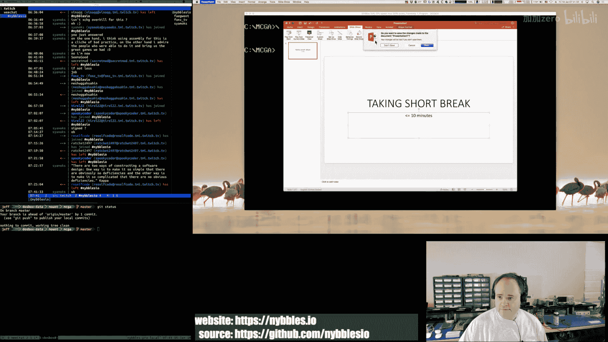

I'm just having that problem today a lot。Oh my呀。Hhhu。All my relational operators are off。Yeah。

 I actually think this tech stuff， text entry stuff will go together pretty。Quickly。

And if we get that working。Then we can start working on like adding like creating a bank。

We can start working on adding in our bank file， I should say。

 and then we can start working on adding the actual individual banks。

 getting that tab thing working at the bottom。Yeah，Progress， yeah， hey， progress。🎼いの。🎼不。

Always good stuff。Coffee makers are almost done。Probably hovering on 13 minute break， sorry。2。🎼Yeah。

🎼咖啡。🎼Yeah后。🎼我有。我用不。Okay。So， what's。I hurt my mouth。Capture。Yep。う。嗯。🎼Okay。Where this going up。

 I'm going to just put it。The tool for now。So what is our text field has？Has。Have。🎼So。Flas。Yes。嗯。

It has a w。Which I think 256 characters is probably more than enough。For this tool。

 what we're using it for， it doesn't have to be anywhere。Generic group。Full feature than that。嗯。

It has the pointer to。The buffer。🎼嗯。It has the。I'm going to call itax。🎼你的是。🤧う。嗯。Yeah。

Does it need anything else？I don't think so， right， so we have flags。You。あ。🎼嗯。So we have flags。

 the size。Pin her to the buffer。Then。Then the question is。

 should it be a pointer to the buffer or should I just？

So I just go ahead and because how many text fields we're going to have？10。Not even that many。

 it's not got to be that many。嗯。So。And I'm kind of thinking like。Just go ahead and put it in line。

No request。 cryon， okay。That case。Keeped the request coming and I'm going to try。some lara here。

And then we need a macro。Oh， we need the valid。We do need a pointer to the valid。🎼Welcome。

41 and beach。🎼He was left。Or。I mean， the one downside of this。🎼And， you know what。这个大位。

🎼We'll just have the buffer。We'll have the pointer。It's easy enough to have a separate buffer。

Dine it's the exact size you want。🎼Actually。You could probably do it in the macro。嗯。嗯う。All right。

 let's start with that。🎼So， now。Text。Fiel。De。So we have the flags。We have the size。🎼We have the。

That we have the pointer to。So I want to get real clever here。So let's do this。

The very first parameter。Is。🎼So，0，2。3。嗯。I going to do like I think guess M3。For size。Oh。

 I'm listening to Lara 6683。🎼One of her streams， she does a。

Huge medley where she plays all this music that people requested。on the music front。

 I have to kind of pick things that。I like， but at the same time also。🎼Don't。

Don't cause copyright issues on YouTube when I export stuff over there。🎼Wonderful， wonderful。YouTube。

Okay。Hey， Cyprus， welcome to the stream and 41 ND welcome。One thing I don't like about Twitch chat。

 there's quite a lag。🎼嗯。🎼所以你。

🎼Ohし。After1。Theres。Thatcros。Oh。I'm just trying to remember some of the magics and for macros here。

I don't want to repeat。は。😊，No， I am a。I am working on a game。

 a reference implementation for an arcade game。🎼嗯。And it is it's using do box for the development the short。

Try to keep this to like 30 seconds， I am working on an educational video series to teach people。

How to program using assembly semi language and the project that we're doing that with is a game。

 it's an arcade game。🎼And。But in order to kind of know where I'm going with filming。

 I have to have a reference implementation for myself so that when I do it on when I film it。

 I actually kind of know where I'm going。So today in the stream， that's what I'm doing。

Working on kind of the next big chunk of stuff for the reference of implementation so that when I film the next set of episodes。

 I kind of know what that's going to look like。🎼Oh， is it。🎼Size S。O。So。🎼这's S 3。

So the first parameter is going to be the name。But that name really only applies to it's going that you use to generate the buffer label。

🎼And then。🎼I觉的。Use that to。🎼Generate the。The buffer definition。So this should be the size。好。

I don't think I need to do that， it's already numbered。Hey Larry Chen， one， two， three， four。

 welcome。🎼And。GagA， lag， Bla， that that's wow。I think Stan Lee would be impressed with that it's both alliteration and。

Rying， that's wonderful。嗯。Okay， so we we' I'm being。But that the thing about this， I'm like， okay。

 I can do this。 So it's really the disappointmenter。🎼嗯。But that pointer is automatically populated。

Because what we do is we create a label here。As part of the macro。

So we're going to create a label that points at the buffer， it'll be the size and initialize to zero。

 and then we have our flags and then we have。the thing I'm realizing here。🎼う。

I want to put this probably down here。🎼嗯。Becauseuse。I want this。

Because is what's going to happen is we're going to have food。

 right and we're going to do text field bath。And we're going to call it you know， bank file name。

 bank file。And then。🎼嗯。Our flags， F text ands。反 then。🎼Size。He said， 11。🎼And that's it。Oh。

 I actually know what I should do。Because just。Make it easier to work with。Yes。

Because the rest of this is all being automatically handled by the macro。

 and then this is going to be。W哦。Chars， file key。Whenever recall that。

 we got to create the macro for that or the structure of the macro for the valley key thing。

 but that's what that's going to look like so then but then when this gets assembled。

This is going to generate these DBs here at that address。And then after it。

 it's going to generate another one。🎼That is the。It's going to generate。🎼This label。

 which is going to point at our allocated。Memory for the string itself。🎼And then。Yes。

 so that looks correct。I think。🎼And so， let's just。Give that a shot。嗯。We're going to call this。なフ。

Feel。So then we're going to have。Yes， so then we have our text field da。Oh。

 welcome to the stream Patson 95。And。And then I'm just going to make the cloud key zero for now because we don't have that yet。

So。No big deal there。Yeah， you got an there。🎼嗯。🎼O。I'd never deleted the original。🎼Oops。O。

So I'm just going to look at the list file then。Because I want to make sure that。

My macro magic here is doing what I think it's doing。🎼嗯。What I call it they file。呃，P。ok。

So here's our field。So this macro becomes。A DB F textex enabled an 11。A pointer to bank file buffer。

 right， so we do a little bit of string magic。And we create a name。And。嗯。没有。

AndThen we have our bank file buffer。So this is the actual stream by fororrgs。

Instead of hard coding it to some fixed size and wasting some space here。

 we're using the macro facility to actually generate the code。

That makes that buffer and that it's the exact size that that guy needs。There you go。

Best of both worlds。All right， so that works。So now。Let's do the valid keys。

Welcome to the string stream。Vomo 28。I love some of these handles， man， for great。So valid。🎼K。

🎼And what is this， This is going to be。🎼嗯。The scan code。And then the ask。And that's it。

And we create a macro Valley key Dev。🎼And this is gonna be。P prettyt easy。

 this is going to be you know。🎼That。

🎼And so， now， we can。🎼Do something like。Valid。File name。E。Deaf valley key。'Not being Greek。

So my naming here， valid Qef。All right， so then it's scan code。

So let me bring up my list to scan codes。Mr。 Anderson， welcome。🎼Okay。So we're going to have。

I code 16。And that's a。1。Go one。To。お。Ha。😊，Thank you。Enjoy。🎼So。26。So like。Unfortunately。

 this is just a wee bit painful。I have to kind of explicitly。Specify each of these。But。

There's only a handful of these。 And once I'm done with it， that's a。We have to do it again。Hello。

 galley from He。Welcome to the stream。A couple more numbers。How are you doing today？

How's everybody that's in chat doing today？It's Friday， so that's always a good thing。🎼哈哈哈。😊，Well。

 you will probably get different here， that's for sure。🎼嗯。I'm a character。

 but I'm not a character like a lot of the people who play games on Twitch。

And if you like watching somebody code。This is a place to be。Okay。

 so those are the numbers and then we're got to do and we don't need to worry about shift and upper case it's just all。

 it's just the key right， case doesn't matter here， it's dos。So。That makes life a little bit easier。

All right， A is1 C。Like B got， was forgotten。Ended up way at the bottom of the chart。

🎼Kind of funny action。Hus。ひテ？おめ。Okay， I'm totally withiffing where the。Oh， there it is。Okay。E is 24。

And just for those that have joined the stream later， these are scanned codes。

From the keyboard interrupt panelr。And these are the ASCQ。It's just easy。

 easiest if I just map them like this。And what I'm doing here。

I'm defining a data structure that so these are the valid keys。For file name。

And then I'll have valid keys for a hex number， valid keys for a deimbel number， and that's about it。

 maybe valid keys for a name。🎼嗯。Welcome to the channel。🎼Nta Rev。I don't know how to say that。🎼呃。

Let's see F。F is for fail。Fantastic。😊，To be。🎼去死。Or。イし？3。🎼I is。🎼Not what you would think it would be。

Iy is 43。J is 3B。K is42。L is for B。🎼are you。There it is。I it all where I thought it was。🎼And。🎼Oh。

🎼Wheres oh。It is。P。4D。🎼Hereers。No。好了，我也不他蛋。🎼R。🎼2D。Welcome back， Mr。 Anderson。Mr。 Anderson。

There it is。Yes。Yeah here， I think I can paste the link in here for you。Lura 6683。

 she's an amazing musician。I highly recommend watching her on Twitch。

And subscribing to her YouTube channel。Absolutely。By the way， is the music volume okay for you guys。

 is it too quiet， too loud？As I switch between different sources of music。

 sometimes I forget to adjust the volume。Good。Thank you。6，1 B。Well， just so you know。

 I had a real hard time for the past two days。I've had a real hard time starting my stream with Twitch。

Today wasn't as bad as yesterday， but yesterday was horrible， it took 15 minutes。

To actually get connected to one of their endpoints。🎼Today。

It took about three minutes to get connected。Once I get connected， it seems to be okay。

It's weird too because like， I don't know。IIt's very strange。

 I keep changing the endpoints to see if I can find one that。🎼嗯。Is more reliable but。

And I have a fiber connection to the internet， so I have a full gig ofit。🎼嗯。But who knows， right？

The routes that you take。🎼21 destination or very。Precarious on the internets。🎼To see。🎼あ。It's 3 C。V。

Is to a。🎼W。X。🎼Where is X。I see why。🎼T。🎼Why。The Z。The end。Almost we got a couple other characters。

So we got to do a dot too， right？For file names。Here we go。49。God。So I think for file names。

That's it， right？Zero through nine。And A through Z。I guess hyphens are valid。Underscores。🎼So。🎼For E。

So I think that worked。And zero。We're just going to call。The end。For that particular array。

And while we're at it， valid。Ex keys。Valid deal keys。This should be super easy， right？

Valid decimal piece。We're not doing floating point。And this valid hex keys is just this plus。

Some alphas。ABC， D F。没有。All right， so now we have。A array that define valid keys for a file name。

 valid keys for hex。And valid keys for decimal。And so then instead of this being a zero。嗯。

This can point at valid F main keys。Like that。And let's take a look at the list file。

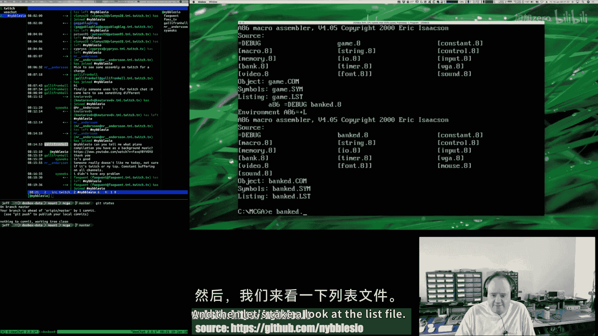

嗯。I only field。嗯。Oh， it was big。File。🎼然后。🎼T포ル片。O。So the macro。For the field itself got got expanded。

 That includes the。File name。Keys， pointer。Okay， and then let's look at our valid key structure。嗯。

That becomes。The number， then the hex value。Zeros for the end， that all looks good。All right。嗯。🎼So。

🎼Let's see。So we don't want it to initially。🎼We get。So there's one other thing we have to do。🎼嗯。

I'm trying to think of how to do this。So in our valid key D。

 so there's some with key scancos so as an example， the left shift is you know 12 hecs。

And what happens is that shows up in the stream from the interrupt handler。

 so you get a 12 meaning the shift keys down。🎼And then， then， you get a。🎼嗯。You get the key code for。

And then you get the deep code for the dash right， so4 E is both the underscore and。🎼The dash。🎼Hey。

 welcome to the。String， stream， I keep saying string jin Gb。Go and Go link。Jingo， bingo。

 jingo bingo link， I get it now。Oh my goodness。 So what I have to do if I want to support keys that are。

Multiple like that。I have to got to have a flag， right？It says that there's a modifier。So。

That's pretty easy though， you think。🎼嗯。So we can just do that with a flag， right， no？

Brong structure，This one。🎼So。Sure give me one second， I'll give you the elevator pitch here。

So for the modD code。Then what's going to happen， right is most of these are going to be。Zero。

 they even no mod code。

But for a couple of them。There's going to be a modD code for shift。

And then in our in our code for our text field processor， right， we'll just have to say， okay。

 you know。If mod code is not zero， then。First， do we see the modifier key？The stream。

And if that's true， then。We pick。The one that's modified， if there is no modifier in the stream。

Then we pick the one doesn。Have one。Which I guess is to say that the scan code could show up twice in the list。

But one of them would be modified， one of them would be not modified。

I thought I could get away with no shifts。But alas。Almost done。 And then I'll。

Do the elevator pitch here。O。So。🎼U。Can I hack Facebook accounts， no， not really。🎼I mean。

 I suppose if I put my mind to it， but I hate Facebook， I actually I'm not on Facebook this okay。

 so here's the elevator pitch。 What I am working on is a。

Game engine and an editing tool This is a reference to implementation that's really primarily intended for myself。

 I am working on producing a video series that's an educational video series I have to film。

52 videos。🎼呃。That take。An absolute beginner in assembly language program in games development and by the end of the 52nd stream。

 they will hopefully be able to understand at least。

The X86 and kind of have built up an understanding of what a CPU is， what memory is， what you know。

 display adapters and how to deal with IO from hardware and all that good stuff so that's kind of what。

What I've got going on here。嗯。

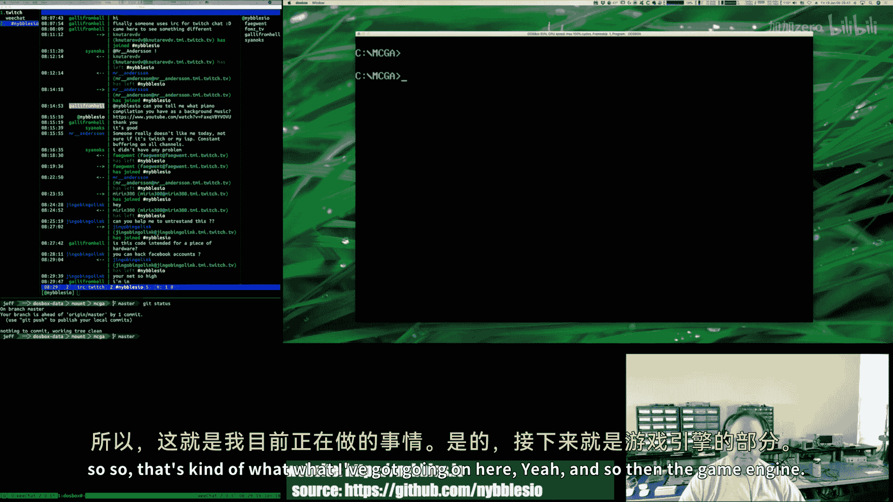

Yeah， and so then the game engine right now I have， like I said， I've got the。

The video subsystem and most of the sound subsystem are coded。

 the input subsystem is done except for joystick support。

 joystick support on classic doOSs is horrible so it's a real pain in the butt to get it to work well。

So that's working what I'm working on today is the editor tool that。

You will use to draw your graphics， lay out your backgrounds， your maps， import binary data。

 and all that good stuff。All the code you saw me working on earlier is to build up to more functionality in that banked tool。

Very cool， yeah。I like Typescriptip， do you have a link to your engine？If I have to write。Javascript。

For I have to be in that world， I would much rather do typescripts。

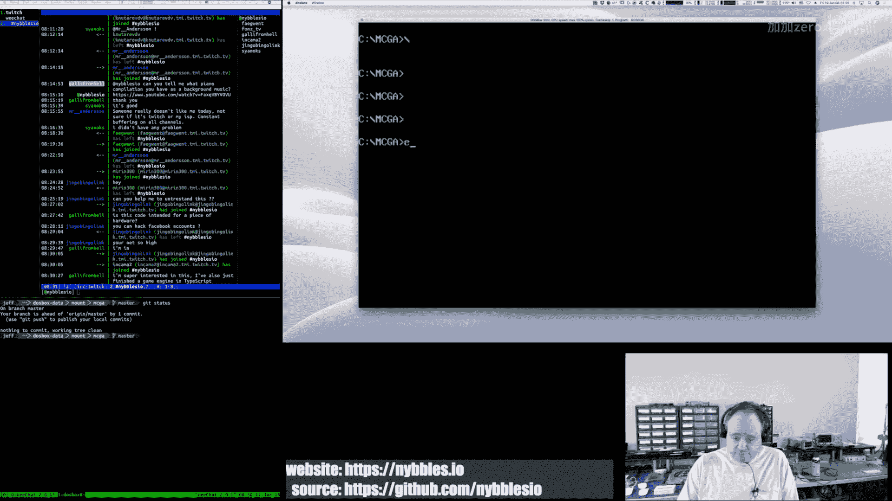

Okay， so for our modified characters or not modified characters， but our modified keys rather。

As an example。We want to be able to do the under。So that one is modified by shift。Which is 12。🎼So。

We go down here。This guy。Becomes that。Well， actually no， sorry， I have to duplicate this。

And then this becomes fun。And then that's underscore school。And of course， now my OCD compels me。

All align all these properly。Yeah。😊，Why would you want to hack a Facebook account anyway， I mean。

 like there's。I don't know。It's been a couple years since I've been on Facebook。

 but last time I was there。It really wasn't anything worthwhile。That I recollect。🎼あ。Oh， sweet。

Let me check this out。

🎼Oh。Nice。2D。Top down Co op action Maze。So is it kind of like an RPG or？嗯。Looks like you have a。

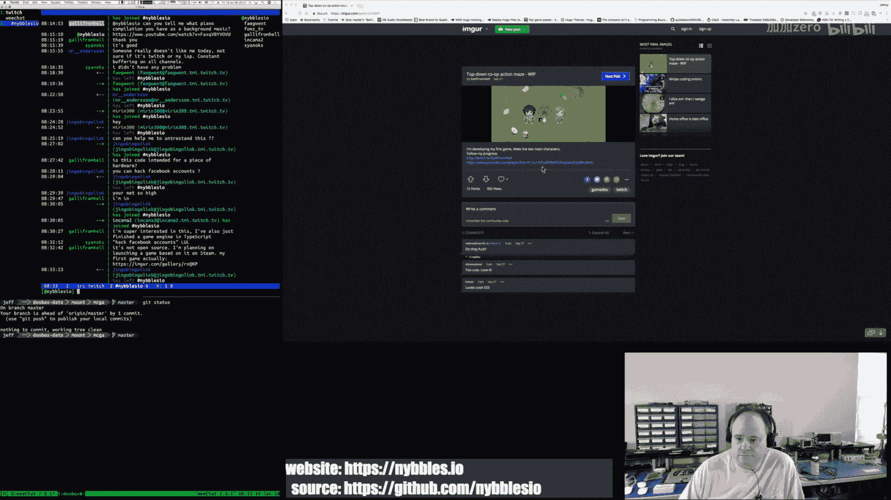

Very cool。Sweet。Very nice， I'm actually， let me go back to your channel here。

Looks like you're on Twitch too solve。IAdd that in so I can keep track of it。

Very nice。いです。Again。I obsess about my formatting。No know why。

I guess it's one of those really small accomplishments in code， you know， and you're like， oh。

 I did that， that's great。Looks like your YouTube channel is pretty nice。

 though you've got quite a bit of content there I'll definitely。Follow you on a Twitch， too。🎼嗯。

So here's the deal， I'm trying to produce most of the footage and get it edited。Before I release it。

Right now， just based on how it takes me。T me about a day， which is kind of scary crazy。

To produce one 30 minute episode from beginning to end。🎼so。

I'm going to say that the series will start officially， probably in March of this year。

I'll start releasing videos， it's going to be one video per week for 52 weeks。

And I'm going to simultaneously release them。For on YouTube and on my nibbles。iel website。嗯。

I don't have a sign up page yet。I should do that， so I'm going to make a note。

To do something like that。That's the plan。Yeah because once I start releasing them。

 I don't really want to worry about producing them you know anymore。

 I would rather just have them all kind of queued up and then just let them go。One per week。

But what you're watching me do here is a reference implementation on the stream。You know。

 I'll do again。In the video series。Yeah， this is really just more kind of my。

 I guess you could consider this research。This is。I likened it earlier in the stream to Bob Ross。

If you've ever watched him paint on his show， he does a full painting， you know。

 in the 25 minutes or whatever。🎼But if you also notice， he often looks off to the right quite a bit。

 and that's because he's looking at his reference painting。

 right so every painting that you see on Bob Ross that Bob Ross does。

 he's actually my recollection is he's painted that three times。

The first time is the reference painting， the second time he paints it for their instructional books。

 and then the third time he does it on TV， so yeah。This is kind of the same thing， right。

 this is my reference that's going to be off on the side and everybody loves Bob Ross。

Come off and I mean， I go to sleep listening to Bob Ross is great。嗯。

Although I am trying to figure out like how I could。Work beat the dev lot of it。

 into into my code here I'm not quite sure。Maybe I guess when you're running at Cuba。デパ。

For a code review， maybe that's when you're beating the dev out of it。Yes， right。

It's all up because you can do it。In your world， you can do anything。Because it's your world。はは。え？

He was an amazing guy。I was thinking about it the other day。Watching him now。

 watching his videos now， I think to myself。He was doing he was doing Twitch。

He was doing YouTube before those things existed， right？Yeah， its just， that's amazing。All right。

So now we have。Our data。🎼And so。Oh， I just realized something。

We need one more thing in our text field， we need to know what the left position of the carrot should be。

🎼For。That。So I'm going to call this off。Because that I like that better。🎼And then。🎼Right。

Because we need to know where to put the carrot on the screen。And where to offset from？🎼嗯。

So our text field now has flags， size， it's going to have。Position。🎼，Valid key buffer。

Realize I have that the wrong spot。Then a pointer to the buffer we create。Thenen a zero。For。then a 0。

4。🎼Those guys。 Okay， so let me just。We have flags on the text field， the size of it。

 which is the size and characters。By the way， we can compute based on our font size what the rectangle size would be。

🎼嗯。Position， this is the left。Upper left P point。X， y， and X of where it's going to be。

A pointer to the Vals for this field。A pointer to the buffer， which we generate as part of our macro。

The offset is the character offset。And maybe call that chart。Char IDX。没有。And then Pat is just。

It's to pad out to the data structure， so you have one， two， three， four， five words。So 10 bytes。

 perfect。And then our macro for our text field is flags。🎼And the size。The position。Make valid。

Key buffer。Then we do some text pasting here in the macro。To create a new。🎼Label name。

And that's the label to the actual buffer that we're going to allocate。🎼men。We have a word。

That fills the index in the pad。Zeros those out。 then we create the label for。Our text buffer。

🎼The third value。The third， yeah， the third value passed into the third parameter passed into the macro is the。

🎼Size。And then we fill that memory with zeros。🎼Okay， so then our text field， we just got to do。如果你别来。

Soagey here。No， I'm going to explain it。 So the reason it's going to be 52 weeks is because about a good。

14t episodes。Is learning assembly language。So， no， I take you through step by step。🎼You know。

Numbering systems， you know， decimal， binary hacks， I take you through kind of understanding。

The principles of what a CPU is， what memory is， what IO is， what the bus is。

Then I explain in groupings instructions on the CPU。

 and we do small examples of those as we go through。

So by the time we actually get to like writing game code。

 you know we've already gone through a whole primer on X86 As language and we've written several small example programs to understand different groupings of instructions and when I say groupings of instructions。

 you know memory access instructions， stack，The ALU， right， so ads multiplies divides， shifts。

Rotates that sort of stuff。Relational instructions， branching instructions， so comparisons branching。

All that good stuff。 So looping， understanding。How memory is laid out， you know。And yeah， so no。

 I assume you don't know anything。Now。What的。Unfortunately。

 I can't recurse all the way down that chain。I do in the introduction video。

 I do kind of go over look。If you're not real comfortable with your computer at all， right。

 if you don't understand at least the basics of your operating system。How to open a file for editing。

 how to install software， you have to be able to install DoOS box， and I take people through that。

🎼But， you know。You can only do so much there， so I do kind of say a prerequisite is that。

You have to understand how to use your computer。Before you can do this right and there are I point people to other tutorials that kind of hopefully cover that stuff。

 how do you install a software in your operating system， how does the file system work， you know。

 so if someone's an absolute newob，I point them to those first and then I say， okay， come back。

 then we can do this。after size。So what do I have this？The care position at right。Very。5ive by five。

🎼Oh， that's just the size。🎼Hey。Xexy Boy， 3000。42 by 10。Okay。So that's not hard coded well。

 still hard coded， but it's in the data structure。Okay。🎼So。Flag size。🎼Location。Vallan keys。

One or two our generated buffer。And zero， perfect。Perfect， perfect， perfect。Okay， so now。

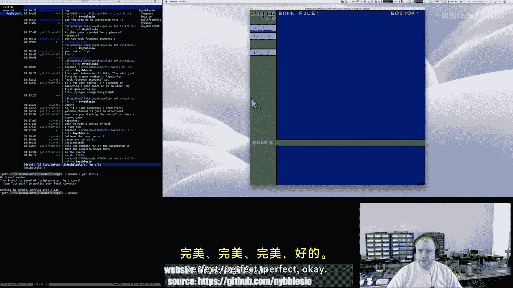

We can actually start working。嗯。Before I do that， though。Make another。Point here。Okay。Now。

Let us look at。What comes next？Okay， so if I look at。Update。And then look at draw， what is draw。

So I've got draw base， draw carrot， draw buttons， so draw carrots。Okay。🎼So I mean。

 I think this would be。The same。The only difference here。Is that we would be。We would be looping。🎼也。

🎼No， see， I think the。Better thing to do here。So the carrot does not enable by default。🎼So。

If the carrot。Is not enabled， we're not going to draw it。But we always will call the Dr carrot。

 you as part of our state machinery， we'll always be calling dry carrot。

Something turns it on when we we're going to add a thing here to， you know。Enable a text box。

 enable a text field， which will turn it on right and that will set the care enabled。

It will set the carrot position and it will set the carrot enabled。Flas， carrot viz。

Is for the blinking。We'll leave that the way that it is because。Yeah。

 I think that's pretty straightforward the way it is right now。🎼嗯。🎼Yeah， so。For the car timer。

 we're just resetting the timer so it executes again and we're inverting that field。🎼So。

I think that's fine。So the carriage should not。Be present。Oh， it is。That's interesting。Oh。But I。

 I think I goofed。

🎼Yeah， okay。So now the carrot's only going to show when we have a valid text field active。Welcome。

 No Landrus。け？So let's actually。Start adding the pieces that tie stuff together so in our button def。

We have a new。🎼晚了。that's for creating a new bank file。🎼嗯。🎼So button。我还。So it's button exit。讲 back。

So we're going to do button new callback。Actually。I drew all these。Cute little。Bax。This is called。

The S Pro。Editor TSE。This was a， well， I thought it was a pretty popular tech editor back in the day。

Welcome to the stream。Canber。It originally was called the Q editor。🎼嗯。And I want to say。

 I don't know， I think I first started using this in like 1988。The Q editor， 1987， maybe。Yeah。

 somewhere in there， 1987， 1988， and then the guy who wrote it。I want to say in the earliest 90s。

 maybe 1992 or 93。He rewrote it。And renamed it to TSE， the Seware editor。🎼嗯。And yeah。

 back in the do days was。This was the editor I used。It's still available， in fact。

 when I started this project， you know， I kind of like said to myself， okay。

 I'm going for the authentic thing here。嗯。🎼So I。I said， okay， I don't。

 I know I had licenses for it at one point and it actually turns out when I ordered it。

 they gave me a price break because I was an existing customer。So。🎼But yeah I。I don't know。

 what am I saying here。I like the editor， it just it's a nice little editor， very low footprint。

It's got some neat little features in it。So anyway， yeah。It's like86。I started using the 86 asmbler。

Like most things back then， I found it Shaware。On some share we're collection disc， I think。

I had been using Masm。嗯。Welcome Kempfer 1488。🎼嗯。The I had been using Masm and hating it。And。

Ran across the 86， and I read the manual for it， and I started using it and。Yeah， I loved it。

 It was great little assembler， very lightweight。 And so I actually also when I started this project。

 I。Bought new licenses for all of Eric Isaacton's stuff related to 86， D86。Yeah。

So we're going to have。你。New button。We have the new button callback。

 we'll have the load button call back。Save， call back。What else we have here。Add， remove clear。So。

Okay。So now we have stubs for our callbacks。And we can now。But new， all back。🎼Button where。🎼然后然后加过来。

Okay。So now those actually go someone， welcome to the stream Toin2。🎼You know what do。

🎼那 should be time。Timer callbacks。

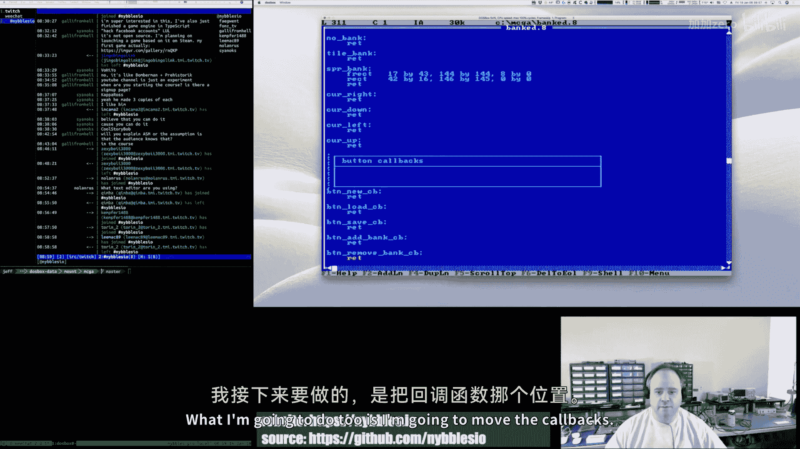

I do twos and。The call back。🎼There we go。Iupp those were part of the old input implementation there。

Dont want to keep those。🎼Then what I'm going to do here is also going to just kind of。

Try to organize things and。As I grow it。loves。All right， so then we can take。

Because I got drawing code。Intermingled with state management code。 I'm trying to。

I want it to be purdy。You know。Purdy is good。Oh， do box slow down。

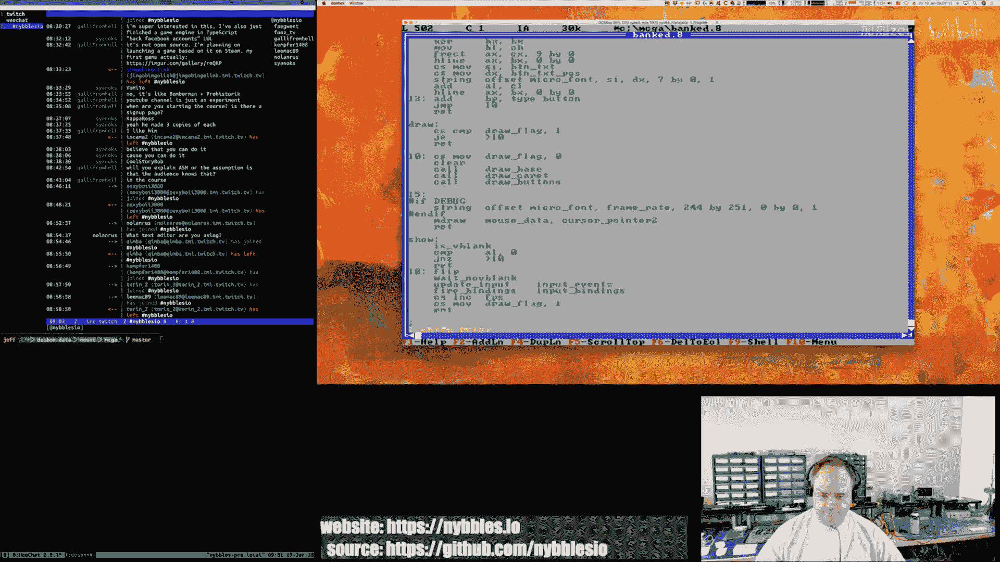

Dos box is very impressive。🎼But it is a little slow sometimes， which， you know。

Considering how much they're trying to emulate。The really impressive level of accuracy they accomplish with what they've got。

🎼Is。It's impressive， right？Occasionally I rag on it a little bit。

I'm only ragging on it because I like it。Okay， so the main engine。So these are states。

I don't know how that's going to actually end up fleshing out。Welcome to the stream。Olivioner。

🎼My team。🎼Mching。🎼Okay。And actually， technically。🎼Exit is。It's a stake callback。What I can do here。

Not that this would ever happen。If for whatever reason。

We ended up at the instruction after this jump， it would just jump to exit and be done。🎼So。

It should never happen。🎼再 say一点一会吃。I feel like I'm missing a lot of people。Joining Chad。

TheDe seems to be really bad here。嗯ん。Sinox， you say， isnn't it slow to avoid game bugs？

Not sure I follow， are you saying that because it's assembly。There would be。

 I would find I'd have more bugs or that they're harder to debug。I'm not sure exactly。

What you mean there。C。Oh yeah， and this what I'm building here too is it's not necessarily different from that。

 there's a little bit of stretch， right？That you can get。If your question is about like emulation。

Typically， what ends up happening right is you just you count clock cycles。🎼And then you have some。

Can sort of emulate specific fudge calculation that you do based on。

What you say the V blank is in your emulator and all that， and then you kind of adjust clock cycles。

 the total clock cycles that you've run so in other words，What I'm trying to say is is that。

E CP modern CPUs megafa， you're emulating of five megahertz。Ancient CPUU from the 1980s。

You let the modern CPU run that emulated CPU as fast as it can up to a certain count of cycles。

 and then you stop。And then you synchronize that with your Vb and any other kind of hardware that you're trying to emulate and then again。

 like I say there's kind of a fudge factor， each emulator does it a little bit differently so but you get you can get pretty close right？

Not perfect， but close。It's like I've said before， dos box is definitely slower。Then。Oh， well。

 I mean it's just it's slower because it's just not the real hardware right。

 so remember like I'm saying。There's these fudge factors everywhere。

 so I'll show you here if you look in the debugger window。嗯。If I scroll up。He's it going to let me。

 oh it's not going to let me because it's not active。🎼嗯。🎼Whats。When it switches video modes actually。

 I know how I can do that here。I'm going to switch to this。

 so now you're looking at the doOS box debugger。In the terminal window。🎼And。When I run this。

 you're going to see in the log output where it shows you how DoOS box's VGA driver is interpreting what just happened right and it's showing you that you know what the blanks are for the H blank and the VB period and it comes out to like 57。

32 hertz which is probably close to what like real hardware would do， but again。

Like the real hardware would probably lock it at 60 hertz。It wouldn't be at that 57。

And the real hardware is is。🎼There's no fudge， right。

 just it does what it does The timing is very exact， it's very specific。

 So those small little things， right， they add up。To。

Just make certain things not as performant as the real deal。🎼嗯。🎼Now， again， it's。It's not that bad。

 really not that bad， but you know， it's just small things that I notice， right？🎼Okay， so。

So our new button should call the new callback。🎼And。What that means。Is。Hello， Dx， K， KX DD。Hello。

Me Rug。Welcome。あ。So just to test that the callback is happening。Let's move carrot。1。

And our car should show up。But only if we click on new， click on load， nothing should happen。

 click on new， carerot shows up， yay， click on exit， leave， okay， so that part's working。

That's not we're not going to leave it that way， but I wanted to test it。嗯嗯。So， now。We need to。

We're going to think about something here because。Here's what's going to happen， right？嗯。

And click on new。We're kind of going into the new state。Which then implies to me。🎼That。Well。

 it could work either way， right， if you click on new then do we let the user。🎼Click onload。Like， oh。

 I clicked new， no， I meant load。🎼Right。So I mean， that could be okay。Welcome Nightmare FH。

kind of the stream。Let's see here。What else can do us？Let's listen to some laser hawk。啊。So。

Where I'm going with this is the following right if we look at our。Fire buttons。

 where are we calling fire buttons？Fire of Bhutan。嗯。So we're doing that and update， okay。

 what I really think probably ought to happen。Is。Absolutely， thanks for stopping by。

 I hope Id see you next week， Monday through Friday， 5 a。m to 70 a。m Mountain time。

 there's a panel on my channel page that will tell you what those times are in your time zone。

🎼Welcome。Have is。Mon Street。Have monsters。I'm horrible with reading annals。And welcome， Dommi Papa。

I like that one。So where I guess I was going with this was。

I think update needs to call the current state。Anular function， right， so。

I had sketched out this data structure here， right？Saying for this state， this is the handler。🎼嗯。

And of course we should probably。Consistent with our other callbacks。Exit。🎼嗯。I'm not seeing an air。

🎼In bank。啊。There it is。All right， right。O。うん。It still work。Okay。Okay。

 so where I was going with this was。🎼I had this array。Welcome， we'll kill you。

Please don't feel me welcome。Sic QV2， welcomescho Lowell。Welcome， George yeah。So let's see here。🎼嗯。

Yeah， so anyway。I guesss what I was saying is。The tool is going to be in a state。

So it's going to be in the state of no file yet， then it's going to be a state of there's no bank。

Then it's going to be a state of you're editing a tile bank and it's going to be a state we move to the different state。

 And I guess what each one of these is going to do is like in this fright case。

 I draw some I drawing some stuff here。And we would call the state handler。

As part of draw or as part of。Update。Right。And then like calling fire buttons。

We definitely would always fire to the timers here。But like reading the mouse data。

Maybe that only applies in certain scenarios， right， because then if you're in a state。

You donMaybe you don't want to be able to fire buttons when you're in that state。嗯。

So then I'm thinking what happens here， right， is this becomes a call。To the current。

State something or other， right？And then this code goes into。That state。Welcome to the。Stream。Mitsy。

 Mitsy。So yeah， that's what I'm thinking here。🎼嗯。So now I have to kind of refresh my memory。

And with state stuff。Why was doing it by was I doing it that way， I don't know。连了。

Understanding why I was doing that。So is anybody referring to？🎼So， I think I'm gonna。🎼Reefine this。

So I would need a macro。🎼嗯。And I can't remember what I was thinking about。嗯。Welcome back， Cyprus。

🎼I don't know why I had the。The code on there， I'm not really sure if I was thinking that was going to be forward。

Debug purposes or。I don't think it's。I think I'm going to be using it as an array。

And I think what's going to end up happening。えす。あき。That kind of end up happening。

Is this is just going to be a pointer。To whatever the current state is。So the default is going to be。

No file。That's where we start。The tool runs， you're in the no file state。🎼Then， you have to。

LoCreate a file， load a file， or exit。他说 지금 게。And so， then。Down here。I think what happens。

What should happen？Right then these guys。Should come up here and in the noll file state be called。

And an update。We just always call。Current state。Right。That now update is polymorphic or you know。

 not really， but it's dynamic， right based on whatever。State we're in， and that means we can vary。

What code is executing？During that state， so in the no file state。We can read the mouse data。

 we can call fire buttons。The。こかて。Is fire buttons。We're can move that up with。🎼よ待って。To much。

That much code。If you go there。O。So when we're in this state， we'll read the mouse data。

We'll call fire buttons。 The update function is going to call the。The pointer。Let's add。

Current state， right， which means then we can in our state handlers， we can move to different states。

So I guess where I'm going with this is。Then we have a state here。嗯。And again。

 like I'm not really sure why。Because I'm not even tracking this。I mean。

 I guess you can get to it through the pointer， right？Oh， and then I realizing。It's a structure。

So that's a problem。And we're going to fix that。Welcome M Fusiki。So we want to get to the structure。

That's it。あ。Third state。Then we want to call。The pointer that is the state。对。That's correct。

Because this。This is a。This is a value， which is a pointer， which points here。

 which is a structure which has。A field on it， which is the callback。So I guess you know， for now。

 I'll keep up the pattern until I remember。What I was doing。State。New file。St。Load file。🎼嗯找少你。

Have forgotten you。🎼Sundayday。I'll control you thats。あん。here。We're going to have。

No file we're going to have new files。We're going to have load file state。In the way the。St的。St。File。

🎼好好 back。🎼お。🎼这边。No files or file。New callback。🎼快哦。我 on that。🎼So。🎼嗯。Welcome， Sentinel 8473。

And Lori Master。🎼So。When the engine starts or when the tool starts up， we're in the null file state。

And the no file state handler。We'll read the mouse and we'll try to fire button handlers。

But once we then once a button happens and we go to the。嗯。But new callback， right， Li。

 so we click on that， we're going to change state， right？So state， current state。

Was going to point at。🎼嗯。New filescape。So that's what the button。

 that's a lot of these button callbacks， that's all it's going to do is just change the state variable。

 the current state variable to point at the next。ステ。

And if we have to do some other transitioning stuff， we could do that， right？

So if we wanted to enable or disable something or turn something on， we could do that here。

Now what happens is when we switch state， then file new callback doesn't do anything anymore。

So our mouse button stuff should not work anymore， so that's kind of the test here。To see if the。

for one that I can remember my own variable names。有切。New file。All back， load file comment back。

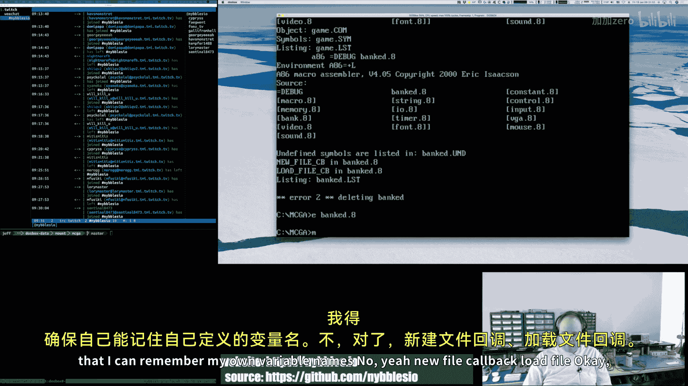

O。So we start off life where the。No file state， if I click New。

Ooh， yes， the mouse is no longer the mouse is no longer doing anything， there you go。It works。

So what we want to do。Is we want to still read the mouse data， we want to update the mouse data。

 we don't want to do fire。We don't want to support firing any buttons， baby， right？🎼嗯。

So this should allow the mouse to still move around。But。None of the buttons will do anything。Hi。

 Wiser Bix under Bar。Okay， so click on here， I can still move around。

 but now the buttons don't do anything because I'm not calling fire buttons。

So you see how the state transition works。And， of course， then。

What that lets us do then is because we're transitioning from distinct handler to distinct handler。

 we can now customize and lock down the behavior of how the editor works in given states okay now I'm kind of thinking here that reading the mouse data is harmless。

🎼So。And by harmless， I mean。Probably something we could do during update all the time。🎼So。

I will put that back here。Because I think that's okay。

The variation becomes whether or not we call fire buttons。Or do something with that data。

 but collecting the data， we want the mouse to always work。

So。Work in the sense that， you know。All right， so we clicked on that， yep。

 should turned off and just to verify that it isn't like broken。

 then I click here see that works great。

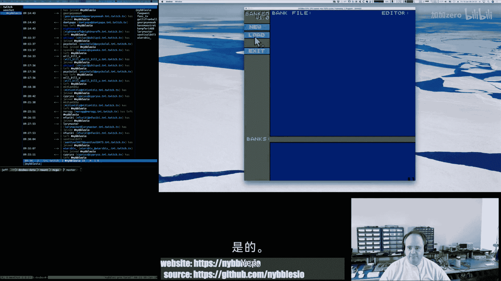

All right。Welcome， Electric。🎼And。🎼せい。🎼Too so。🎼あ。Yeah。Okay。

 so that all looks good and now I feel like。We can properly handle things。Right so as an example。

One of the things we could do here is we could disable。Other buttons。

When we move to the new file state because now you're a new file。If we wanted to do that。🎼So。

Here's what I see happening。So now we've got this going and the state stuff makes sense and I think it' we have a nice little engine that lets us jump around and do that。

🎼嗯。So the next thing is。We need to now write the code。For。🎼Kicking off。The text entry。

 right so we have to basically write the text editor， not a text editor， line editor。

 let's call it that， pretty simplistic line editor。And we so we need to turn on a field。

And then this event handler。I's going to call some update function right on the text entry stuff because it's applicable in this state。

And then so we're going to turn the state on here。So we're going to have some macro that we're going to。

That's going to call function probably， it's going to then， you know， given a text field address。

 we're going to say you know。Enable text field。And then。

That will toggle on the enable bit that'll reset the buffer， that'll reset the offset。And then。

We'll have an update。🎼Function， right， that we'll call a new file。Call back or load file。

 either of these would be the same。🎼And then。That will allow you to do your text entry。

 and then when you hit enter on the text entry that will。And so then I just realized like， okay。

How do we know that the text entry is done？So here。Yeah。

 we need to add another callback on the text field。🎼嗯。Right， so if you hit escape or you hit enter。

This is the callback that's going to get called。That's going to say， oh， you know。

 here's the they hit escape， they hit enter。We're done， right， the text entry is completed。File name。

Call back。🎼Right。Even right here。File name。Call back。So here is where we would say。🎼嗯。🎼Maybe。AX。

🎼Equals。🎼1。If return。Or zero with escape。Process。这的。Pex field buffer。And maybe SI。Points add。

🎼Text field。🎼Or BPP。VP probably would be。Excuse me。BP would probably be better。And so。我给来 call。

🎼Text field。Update function。

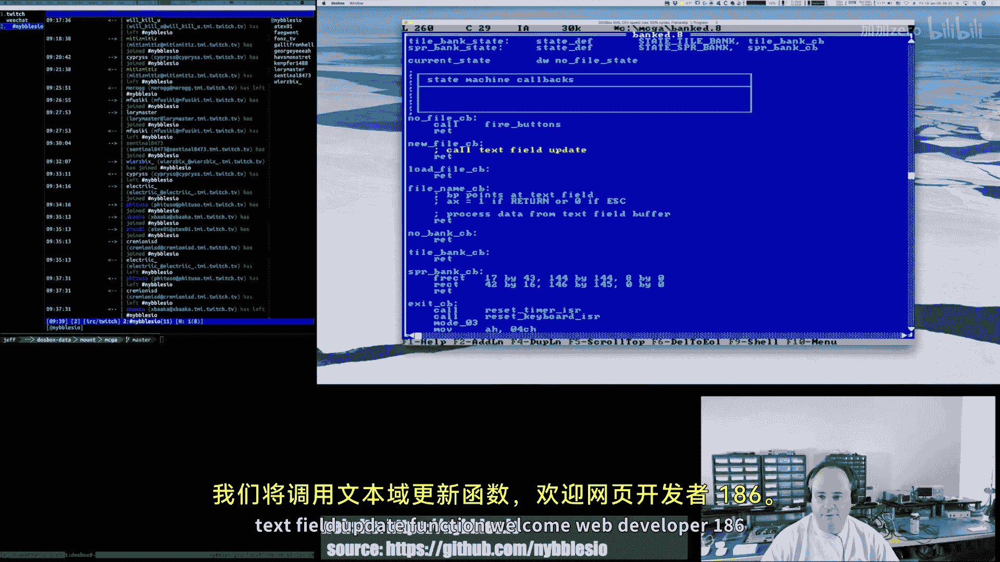

Welcome webDevelop 186。Yeah。All right， I'm shred any。

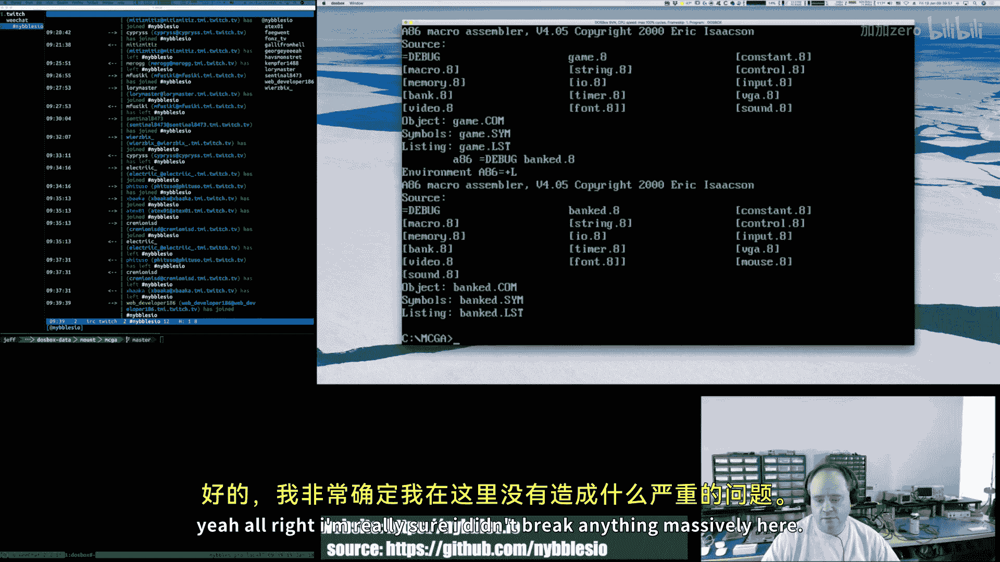

Break anything massively here。🎼Yeah， good。O。I know that's not very impressive yet， but you know。

 for getting there one step at of time。嗯。Oh， hey， De Kamaron， how you doing？嗯。呵は。😊，Yeah， it's close。

🎼あする。🎼Welcome。🎼So， this。🎼Date function。And I guess really what it comes down to is。We'll have a。Draw。

Text field。And this guy will。Check to see if there's an active text field。And if there is。

 he will draw them。🎼あ。And the carrot will just draw。Wherever the current character position is right。

 so our logic for our little text editor line editor， what call a line editor。

 text editor is going to be。You know it's going to be moving the care position around right so the care is pretty stupid。

 it's just it is where it is and we just draw that。

And then the text field is going to be the same thing， right if there's an active text field。🎼嗯。

🎼Then。It'll draw the font where it'll do a string macro essentially。🎼嗯。

And maybe we'll draw a little rectangle or something around it then the question is like okay。

 should this draw text field and I think the answer to this is yes right so I have a pointer to an array。

 potential array of text fields。嗯。So for text field。Probably。Want to do something like this。Hey。

 Pa 420， welcome。So if it's read only。You know。None。

 it doesn't show at all this read only there will display it， but you can't。

 it's like a label at that point enabled。Would be。This is。The somewhere。Editor， this is for DoOS。

There's actually a version of a somewhere editor for Windows as well。

 I believe it's a modern version of this。I will be honest， I haven't used。The Windows version。

 but I'm sure it's very much equivalent to the DoS version now obviously Pra doesn't look as cool as this because what would be cooler than a DoS text editor。

 but yeah， that's what I'm using。So I think I'm going to call this edit instead of a name mold。Hi。

 Bill 6502， all right， hey， FV 4202， welcome。Alas， this is not 6502 assembly。This is X86。

 but I kind of like X86， it's okay。We will definitely do。

Some 6502 in reu when we get reu to the point where all that's， you know。And even better。

You know we're starting with 6809。So， you know。Welcome to the chat， K 0313。R you oh， the text editor。

 yeah， you can just not like dedicated to assembly somewhere text editors just it's just the text editor。

You can use it for anything。嗯。So。Yeah we。I think 86 is going to be okay。Yeah。

 when I'm not doing the do stuff， I use viM and when I'm。When I'm doing my C++ development。

Become kind of accustomed to jet brains， IDs。You know I use C lionion for my C++ development。

 I've been using Rer for dotnet development， I use intelligenttelJ for Java。

I use PhPs To for PhHB and you know again all their IDs use the same core engine。

 so I'm comfortable switching between all the different tools。

 but when I'm doing this you know the DoS stuff you know I wanted to do it all in DoOSS because you know like I could cheat right I could come over here to them and I could you know open up my assembly code over here。

 although I don't get the cool little box characters because DoOS is awesome and you know Unicode is different。

But。Yeah， I mean， I could do it all here， I just thought don't know。

I wanted to have the whole experience， you know？🎼But。🎼Yeah， face出。I guess my question is， will？86。

 let me do that， I think the answer is yes but。Mhy not， am I complain？No， didn you point。All right。

 what？

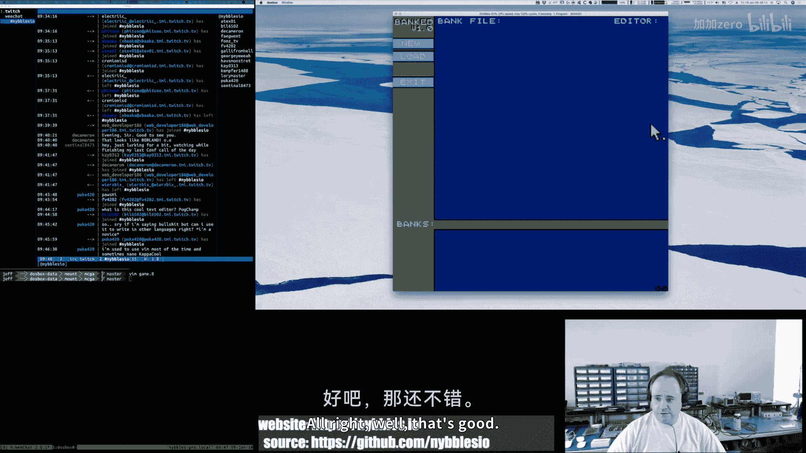

Good。あ。Okay， so then going back to what I was saying before。Now I think， you know， so drawing。

Text field。Is gonna to哇。This draw text field。So this price should be。Pearl。And then update。Should。

 no， no， not a big draw。Backwards。Right。Fiels pll。So I'm just going to make notes to myself here。嗯。

Lad。BP with text field pointer。哇。Field。If F。Next。Wed only。Just。sp。えた？但是。Draw a string。Yeah。

 just drive hell。Drawstr。Great。🎼喂。I think that's what that would end up being basically。

If you want to。So Monday through Thursday， PucA 420。If you want， Monday through Thursday。

 I do C++ 17 development every day on Twitch， so if you're able to join the stream，You know。

 absolutely， you know， you could watch doing C++ development at that time and it's more modern stuff。

Fridays I do different things right， so Monday through Thursday I work on one project consistently and that's reviewU。

And then on Fridays I kind of switch it up。Do different things。 So this Friday， you know。

 I'm working on this。Reference implementation for my other。Video series。Last week on Friday。

Built a breakout game using。The love 2D game engine， and that was written in Ua。

Who knows what we'll do next Friday？So it just kind of depends on what。

What I've got going from week to week。嗯。🎼And， then， I think。🎼We're I them just stand up where。🎼滑死了。

H K0313。That's right， love is awesome。And just so you know。

 there's a link you if guys can see it on the screen if you want to see that。Breakout code。

 it's up there， I mean it's a very primitive I got a basic game working in five hours。

But if we spent another five hours on it， we could probably get it， you know。Very。

 well not very more refined， let's put it that way。Oh， look， I can't spell。哎。And so then。

 we're going to have a。Update text fields。And then that's what we are。That's what we're calling here。

That's what we're going to call here。た？All right。こ。Start。🎼Enable。T field。

And then we'll have an enable。That's field macro。🎼You will just call it。Taxt field。🎼Try to keep the。

🎼おが。🎼Welcome。False Idol 83。Welcome PJ Partridge。お。All right， so let's just make sure。

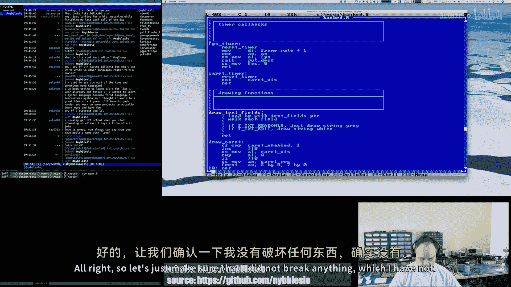

Man。It did not break anything， which I have not。🎼Welcome。Snowy， swayed and。Larry Gaboose。

And I don't think I broke anything here， you know？🎼对。🎼Hello。How are you？All right。Let's commit this。

🎼And actually， I am going to。Open up。Because I do want to， of course， there's always an innovation。

And give me the new version。🎼嘿嘿嘿嘿。😊，Yeah。

It's nice that it's Friday。Definitely。Okay， so now let's do a diff on this。I need to pay for it。

All right， so。🎼Iエル点。State and file， state load file。On the text field flags。

 we've got read only and Ed now。Because we may want to display the content I'm realizing that like once you type in the bank file name。

 we don't want it to disappear， we want it to still show， but it's not editable。So yeah。

We created it。A state death macro。🎼And we。Added a callback to our text field。 So the callback now。

 if you hit escape or you hit enter， those are going to be terminal things in the state engine for。

The text field stuff， and so that I'll envelope the callback so that you can do something。

I got rid of the state variable because that didn't make sense。With what we were doing。

I added a carrot enabled flag。Which defaults to awe。And that's like a global override。

 so if that's false， the carrot doesn't render at all。If it's true。

 then the carrot will blink at whatever position it's at。🎼We updated。Our buttons a little bit。

 we added in the callbacks。For everything。I renamed the exit。

Fun to exit callback because that's really how it's being used。

 it's always a callback for the most part。So I just laugh back the way it is。Renamed it rather。

 sorry。And then on the bank field or bank file field， I added the file name callback。YouRight。

 so this is the text callback。🎼嗯。So you hit at her， you had escape。

That state plus probably a pointer to the current。嗯。File de。Or field def， sorry。

 will be passed in so that you can inspect it and。Do the next state thing。

 and then I redefined how the states are defined， right。We have plans to each of the states。

 and then we have our user macro to define。我哋。The idea of the state is and then what the callback is for that state。

And then there's a new variable current state， which is just a point or two。The start state。

 so when you run the tool the first time it always is in the no file state and then we switch the states as as you go through the tool。

And then I did a bunch of restructuring here to just kind of break things up and make it more reasonable to。

Scroll through the file。So we've got our callbacks。嗯。For the state engine。

And I kind of fleshed out like what the next。Parts are going to be。We've got our exit callback。

Now I moved that from the bottom of the file back up here。And then。Yeah， again， some fleshing out of。

The text。Field processing functions that'll be the next set of things to do。

And then the button handlers。And then。I move the timer callbacks up。

So they're grouped together and it's clear that that's what's going on there。

 I grouped all the drawing functions together。Just to make that easier to breed and then the draw main draw function。

 I'm now calling the draw text fields， it's not doing anything yet。

 but that's the next step is to actually get it doing some work。And。And then just， yeah。

 this all got refactored， because stuff was shuffle around。So very good， very， very good。

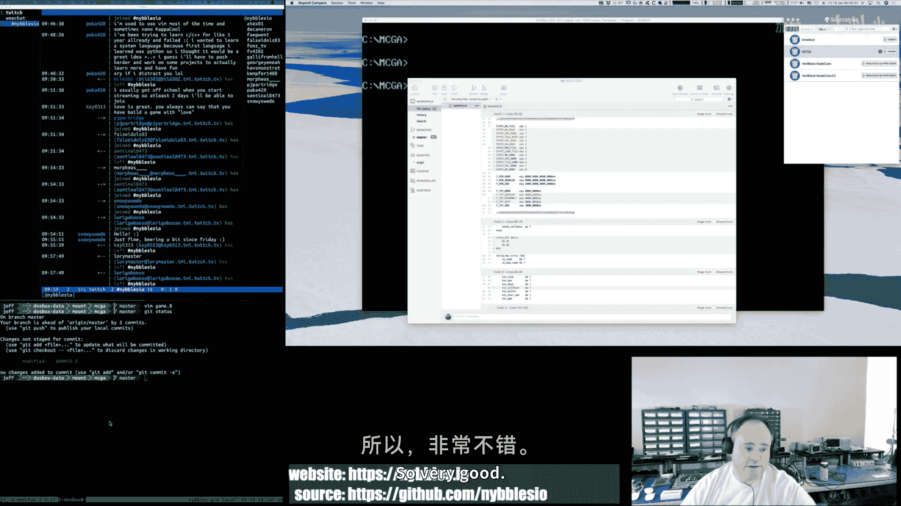

All right。This code by the way， is it is in GitHub， so what you can see on the stream。Is。

You can go to that GitHub repository and there's a or get GitHub account and there's a repository called MS DoOS Arcade。

 I believe。And that's if you want to see this code， if you want to kind of track。嗯。

What I've been doing on it， you can definitely do that。 so everything I do is。

I'm trying to keep it available on GitHub。🎼So。This is the。

That's the address for the source code if you want to look at it。嗯。And。Yeah， so。

We're nearing the end here。🎼But see。Yeah， absolutely。Do check it out。And。

We definitely probably will do more you know。Maybe not next Friday， I don't know。

I will definitely continue working on this。Project is long winded。

 so I'm sure I'll stream more assembly stuff。And if it's really popular， you know。

 I have to say this is probably the most popular stream I've done yet in terms of the number of people who have joined。

 so I don't know， maybe assembly language is more popular than I thought。🎼So。But yeah， just to recap。

嗯。I started the day。Trying to fix my mouse button rectangle checking logic and I was being stupid and doing it in a way that was never going to work。

 so I fixed that and that works now and then we started。Yeah， probably。

I think assembly language programming is awesome。I guess maybe it's the gearhead equivalent in software development。

 I don't know。To me， there's this。It's a。You're dealing with the machine at the machine's level。

And I just I think it's awesome， you know。so。Yeah， I mean， and I don't know。Yes。

 it takes a little bit more time， I guess， to do stuff， although。

Some of it depends exactly on what you're doing right at any one point in time。

Like a lot of the BGA stuff， I got done really fast， a lot of the sound stuff。

 I got done really fast。Probably largely because I've done it before。

The input stuff has been a little bit more。Painful， I guess。But I mean。

 now we're kind of chugging on this， so I feel like I could get， you know。Make more progress faster。

And it's ups and downs， right， you have periods where you've got stuff working and you can add a bunch of stuff and it works great and then you have periods where you hit。

You have to refactor， you have to kind of rethink things。

 or you're not quite sure how you're going to do it and then you know that things slow down and that's true。

The push failed。That's like good。I just noticed that quite the pushvail。Okay。WellThat's a problem。

Could not read。Oh， maybe GitHub's having issues。嗯。I don't think I  typed the。

I think I typepo the URL。Well。ItLooks right to me。Yeah， wrongron folded。Now maybe I did  typepo it。

 I don't know， anyway。Good thing I noticed that now the commits are up there。Yay。

 now the commit up there。🎼All right。嗯。Yeah， that's really weird。I must to type of it smell。🎼Yeah。

 okay。So anyway， good。What was I saying， I don't know。🎼嗯。Yes， anyway。

It seems like everybody's interested in watching assembly， so maybe I will you know。

Carve out more time。And do more streams。You know， with this code， you know。

 the other thing too is the project that I'm working on Monday through Thursday， ReU is a gay engine。

 and it's meant for arcade games for building virtual arcade machines and then implementing games on that virtual hardware and it's all assembly language。

knowInside the engine， right， you write assembly language。The engine itself is written in C++。

 but the purpose is to do retro assembly programming。You know， soon， probably within the next。

30 days。Reuse should be at a point where we have a 6809 and a Z80 CPUU up and running you know。

 emulated and the asmbler can support those and we can actually you know be writing code barriers so definitely I probably will be doing more assembly once you know reu gets to the point where I can actually。

Use the tool completely from end to end to write code and assemble it and run it and all like good stuff so definitely you know。

Stay tuned for that。 that stuff's going to be coming so。Anybody have any parting questions？

I see people joining here at the last minute， but and I do have to。Unfortunately。

 I have to run today I have some other things I have to do this app。I will be back Monday。

5 a mountain time to 10 a。So you know， do please join again if you want to follow my C+ PA development next week。

🎼And。🎼Yeah。🎼So。Awesome， thanks everybody。It was real fun， I feel good about how much I accomplished。

Today， I think I got some really great stuff done。And。Yeah。

 so see you guys on Monday have a great weekend。If you're enjoying a beer or other adult beverage。

 continue to do so， it's Friday。And I will see everybody on Monday。

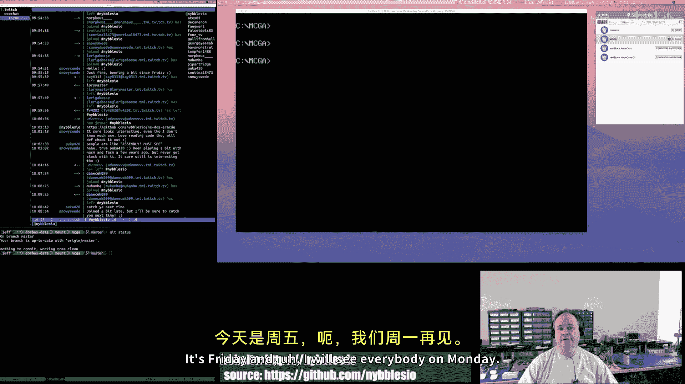

🎼Peace。