# 【精译⚡x86汇编语言】nybbles.io p03 p2 x86 Assembly： Review, TODO, and BANKED tool coding -BV1NPr9YKE4b_p3-

Let's see here， I got lots of new stuff。So。🎼By。you make sure it's all working， right？So far so good。

 though。🎼オッケー？Let's see here。ここ。🎼So。Sorry here。Were blanking out。

 but I made a bunch of changes on the。Back in here， so Im switched to using OBS。Which we'll see。🎼And。

There's a lot of things I like about OBS， there's a lot of things that are kind of a little bit。

And stable with I beliefs on OS10。So far though， it seems to be okay。🎼嗯。Let's see here。

Just waiting yeah， aren beautiful。Just waiting for Twitch to。🎼香米莉亚。Stream metadata。

Make sure that the throughput is good， but good。🎼あ。All right。Let's see82。

LetDo a couple quick things here。Morarning hazard mutation， hey， do me a favor。嗯。How's the volume。

 the sound， the video， everything looking okay？🎼All right。🎼2。Tweetarrow quick。Okay， thank you。

That's what I was looking for。How is that？Let me know if that helps if that's too quiet。🎼Okay。

Or actually， let me。Maybe this way。A little bit more okay。

 here I'm going to make two adjustments here， so bear with me。Because。

This particular volume selection。Controls all of the background sounds that are filtering through。

 so I don't want to make them too quiet but。😀はははは。😊，So let's see， okay。

 so I actually reduced the volume of the music source。

And then I set the volume inside of OBS for that source up just a bit。Again。

 so like if other background sounds come through。Primarily from Lake stream labs。嗯。

So let me know what you think of that if that's still too now if it's too quiet or if it's too loud still。

I knew I was going to have to。Tweak with this a little bit。It's okay， okay， good， awesome。Yeah。

 if anybody notices that I'm either too quiet or the music's too loud or whether let me know because again。

 I had everything kind of pretty much set up on autopilot in Wirecast now I'm having to。

Tweak things a bit to get it to come through right。🎼嗯。In OBS， but okay， awesome。So it is Monday。

 the 5th of March 2018 and excuse me I'm losing my voice。

 this is the Nimbles IO Daily programming stream I stream Monday through Saturday 5 a to 10 a mountain time if you wish to know what that。

Time is in your local time zone you can go to my Twitch channel page which is Twitch。

tv/ nibblesnybblesIO and there's a little widget at the bottom that will show you what the schedule for the stream is in your local time zone this week we are working on X86 assembly language。

In MS DoOS and to accomplish that I'm using DoOS box and which actually works really well。

And the project is the MSDS Arrcade game reference implementation that I'm using for the educational。

Video series that I'm producing， which I'm trying to get that。

 I need to get that wrapped up and I've kind of let this languish and so we're going to spend all week on this and see if we hey Blackbird 1911。

We're going to see if we can get this。Closer to Dunner。

We'll see I was actually looking at some of this code and I was trying to think of what I was thinking of。

 so we may have to。I have have to re educateucate myself what I was thinking when I wrote some of this。

Because I kind of built some stuff and then ended up going off on some different projects and now've somewhat forgotten what I was thinking。

But we're going to go through all of it。Figure out what is what。🎼So。All right。Let's see here。系。

So I created a day to do here。嗯。Of course， we could make this really fancy MSDs to do。🎼Sos。

Maybe do that here。What line type should we use？We'll use double。

This is how he used to do at old school man。This was the thing。We。I do miss this stuff。

 I'll tell you。All right， so then I go that。嗯。小。Then。Be lazy。

It wass going to take me a couple minutes to remember。On my editor。Stuff， different editor。

And realize I'm not in vim。That's going to be。That's going to take a couple minutes。Question。

 I had notes。🎼もなや。🎼你们没事。然后。Look at that now it's a proper。Dos。To do textile。God some fancy in it。

All right。🎼So。I guess I should probably。Give a little bit of background on this here because it's been。

An only covered this， I think， once or twice。On stream。🎼So。If we go all the way back to。

Towards the end of 2017。🎼嗯。Where the Twitch channel came from。🎼嗯。How all this started was。

Ive had several people ask me。To help them learn how to program。

And I kind of started giving the same advice over and over again。

 which as you probably all will know， is to go learn assembly language。🎼And。

But a lot of them came back to me and these were younger folks， you know， late teens。

Pre college or had just applied。嗯。🎼Kin of level。But had no real programming experience。And of course。

 a lot of them wanted to get into games or they wanted to get into。啊。

🎼Embedded systems of some kind and。So I started thinking this would have been， you know。Mid 2017。

 so I started thinking a lot about that， you know， the fact that people were asking me about this and yet they wanted to learn。

And I wanted to help them。And so I went out and kind of hunted on the internet and realized that they're just really。

 there's lots of stuff out there。But it's not in a state where。If you know nothing。

It's going to take you to being able to create a game right。

 or to understand how you would even go about doing it。🎼And。So I then started thinking about。Okay。

 well。And this， I'd already started working on ReU。And I knew where you was going to take。

Take me time to build。I thought， well， if I had reufined， I'd be able to do those。

If I were going to do it some other way， how would I go about doing that。

 So then I started thinking well， I could use。Dos box。And I could make an arcade game in MSDs using。

You know， VGA。256 color mode and write it in X86 and assembly language like I used to。🎼嗯。

And then I could build this video series。When I say video series， you。

 I was thinking very high production values， very polished。

And it follows a curriculum right it's not like streaming where I just kind of dump whatever's going on at that particular moment。

 it's more。More focused and more scheduled。And I got to thinking， okay， well。I could do。

It's going to take a while， right， it's going to take a certain number of videos to get somebody through the topic space。

Especially if I'm literally starting from nothing。嗯。So it's probably going to take like know， a year。

If you did one30 minute video a week， and that was the other thing I started thinking of， okay， well。

 people don't。You know， all you guys like to show up and watch me stream five hours a day。

 but you know that ebbs and flows based on people's schedules。

 which I totally understand and I was starting to think of okay， well， you know。

People who are learning。🎼They。You know， they don't have。Probably。20。

 30 hours a week to dedicate just to this video series watching it， so I have to kind of you know。

Assume they're going to put 30 minutes a week in and then hopefully spend some time on their own。

Outside of that practicing right， so this is the。I'm giving the lesson which is 30 minutes for that week and then it's up to them to find you know。

Five to1 hours a week， maybe right， a couple one hour a day to practice on their own。

So when the next lesson comes around， they're ready。So I thought okay。

 I'm going to probably need about you know a year's worth of these 30 minute videos I'd release them once a week and so I started putting together curriculum and I started producing the videos and when I did that。

I realized what I did not know about video production。🎼嗯。Specifically， like streaming。

 although there's some complexity to streaming and there's some overhead here， you know。

 it takes a little bit of setup。Dealing with things。🎼Its。It's on the fly right。

 I'm not editing anything I don't have to really。Worriry too much。🎼嗯。

About that aspect if something goes awry on stream， well， you know， it's just that streaming。🎼嗯。

But when I started recording these videos and realizing how much。🎼You know。Work was going into it。

🎼Especially on the editing side。I realize it're going to take a long time to get these going。🎼嗯。

And then I realized I had to be ahead， right I had to I had to be ahead of what I was， you know。

 the content I was creating， I had to know where I was going to go because in streaming。

Like with the arm stuff and for you。More or less， you know， when I stream those。

You knowI've put some thought ahead of time into what I'm going to do， but not much。

YouWe talk about what we're going to do and I go do it you know。

 during the stream and sometimes they make wrong turns。

End up in debugging snake pits and all that good stuff and those are things like in you know a specific educational series。

I don't want to get stuck in a 30 minute episode every week I have to kind of know exactly where I'm going to go。

 what I'm going show them and the analogy that I've made is that you know if you watch Bob Ross paint it seems like if you've never seen it before that he is really just painting these things off the top of his head but he's not if you watch him carefully。

 he's always looking off camera because he has a he has a reference that he's already painted now he painted it its you know it's not like he's copying somebody else's work it's just he。

He spent time ahead of time。fiiguring out what he was going to paint what those were going look like。

 does this painting fit into a 25 minute episode， all that good stuff right。

 and then he reddoes it on screen and of course you know if you look on the internet you can see he didn't compare them the one he did ahead of time and the one he did on screen and typically they're very similar the one he does ahead of time is much more detailed you know。

 because he has time he's not under the pressure of having to film something。🎼Now。Bob Ross。

In one sense， is his stuff was more similar to streaming and they didn't cut。

Right during there was no editing on those shows， they just started and he did it and that was it and they had little。

Blipps， you know， over the years where things didn't somebody open and closes a door or whatever。

One of his little animals， you know， comes back to see him while he's painting。🎼U。But again。

 the idea of having that reference of limitation。So that you know where you're going and so then you can。

Build it， you've gone through the you know the experience of building it and then you can start to break that down to produce you know episodes lessons that come out of that and rebuild it right so that's where this came from what I'm working on right now this is that reference implementation。

And most of the videos that I've worked on up to this point， which are not fully edited。

 it's just all raw footage and things that have to be combined at some point is the。🎼呃。

Kind of the early lessons， right where I'm using aid。

Somebody else built a simulator for X86 and it works in Windows。

So I've done a lot of stuff with that。But I'm slowly getting to the end of those you know recording that raw material and going be getting into the game proper and that's where this comes in and so I need to kind of get this finished up and have this off on the side so I kind of know where I'm going with it and what to。

What to present。In this material。Hey。Bineary？Bineary， binaryari。Hope I'm saying that right？🎼Um so。

Here's what I have。

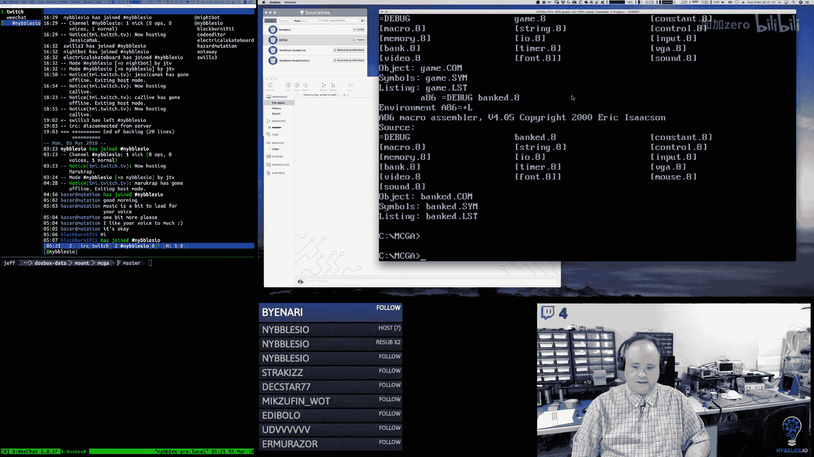

I have a game engine。That does， you know。Most of the basics right so I have a background control layer so those stripes that you're seeing those are background tiles they're very unimaginative right now because I just filled them with a pattern I have a little sprayrite engine and I can。

I can display up to probably 128，16 by 16 sprites without too much problem。

 I have input control and that that's all working this is all the input controls all coming from an interrupt service handler on the keyboard。

And you can see in the lower right corner that's our frame rate now the frame rate is a couple things this' is running in Dos box and while Dobox is pretty awesome。

It's not real hardware， I am still trying to source a decent。Legacy PC with a。Multiync monitor。

From the era so that I can also run this on that hardware to kind of see what the real hardware does。

 I don't have that yet。gotten several pieces of equipment that have not turned out unfortunately。

 but the performance in Dos box is a little bit below what a real machine would be I think comparably so on a real machine I would think this would be pretty much close to。

The 60 hertz。Great。U。But until I get one to test that I don't know for sure， but I can draw fonts。

 I can draw lines and boxes and all that good stuff， so I mean from a game engine perspective。

Minus the sound， which I have。I had started writing most of the low level。

Set up code for the sound hardware， but I haven't quite finished that yet。

 and we'll come back to that。The only thing the game engine is really missing。

To be able to make the game is the sound piece， but we could build pretty much everything without that and then come back and do sound later。

 which we probably is what we'll end up doing。🎼And then。

So this is the game engine and then I have a tool called Bankked。Which is。

This is the thing that would let us edit the data， the underlying data。

For all this because we're going to have。啊。Actually I did。

 so right now I have this configured to do a frame skip of one。If I if I skip more than that。

 it the performance kind of doesn't work as well as it or other things don't work as well as they should on the timing side and then I have a couple of other tweaks and then canfig file for。

Dos box， so I did play with it to try to get the best that I could get out of it。

One of the limitations I have is that on the sound side。

 if I do too much skipping or too much adjusting， the sound timing gets all whacked and things break the performance is not bad I mean so don't assume that it's horrible and you know it's not it's just that comparing it to a real physical machine。

 it's a little bit different which is what I would expect for something like Dos box。

 so I think we're going to be okay。

And like I say， I continue to try to find to source。啊。Hardware that I can attest the sun。

So those are the two major pieces。At this point， because most of the stuff in the game engine is ready to go。

 but I need data。So that we can actually have something besides little colored stripes。On the screen。

 I need to work on this tool。🎼And。So that's kind of， I think where we're going to end up spending。

At least sometime this week， getting that to a point where it actually lets us do what we need to do。

And there's two parts to the tool。There's the UI obviously。

 but then there's the underlying data structure that it needs to operate on。

 which is this concept of bankss。

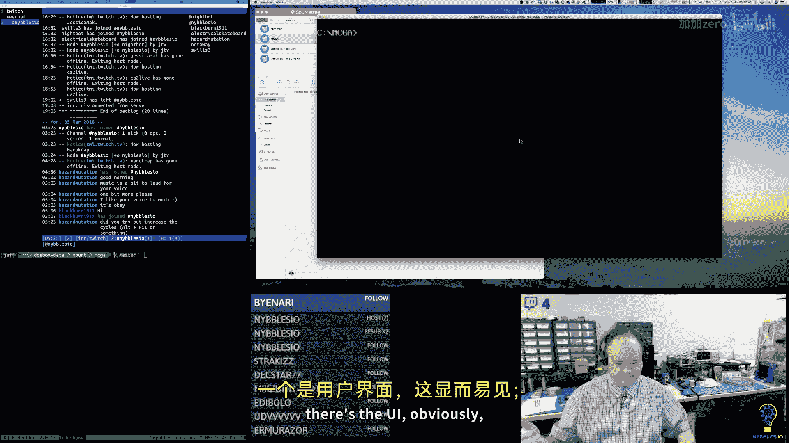

And so we're going to go through this and I'm honestly like had， I remember because。

I know I had thought through this and I thought， okay， cool， I had an answer for this。

 and I kind of vaguely remember where I was going。But I'm going to have to re educateate myself too on what I was thinking。

🎼So。🎼嗯。So let's talk about。🎼This。Oh， so。One of the reasons why I wanted to switch to OVS。🎼Was。

OVS has this really nice。Seecene collection thing。Wirecast。It has sort of kind of something similar。

 but not quite。🎼嗯。And so I can change the layout here very easily on the fly。

 so definitely going to be experimenting with that。嗯。

So what I've got here is a program just called mischief on the Mac and it's just a whiteboarding application。

 I've got my tablet and my stylus here， so I thought instead of always doing ASCIA for everything I'd actually kind of try to draw out some stuff here。

So let's talk about how this thing is structured。🎼嗯。And before I do that。

What's everybody's thought on the volume level。Seems like the music。要。🎼I， I believe you。

Let me know if that feels really off。O。🎼So。Let's see， let me see if I can draw this out。

It looks okay。🎼So on。So we've got a dos。嗯。Tom。🎼Application。Okay。So the way that that worked。

A comp file starts at address。100 hes。🎼And。From zero to 100 is something called here。

 let me actually。Thanks。🎼熱く？で。🎼So， from。Zero。2。🎼100。🎼嗯。Which is 256 bys， this is called the PSP。

And then your program starts。At the 256 bite mark。🎼For pro N data。Up to the end of that segment。🎼嗯。

So that's the end， okay？And this is how much room。You're loaded。File gets。Now。

That may seem really limiting at the beginning。And I'm actually going to try to。

Fix my horrible handwriting up here。🎼See this isn't so ugly。

See if I can write it better the second time。Okay。嗯。So we have dos。Com。过了 better。Okay。

 so this might seem really limiting。And on some levels it is， but this essentially is 64K。For our。🎼아。

 keep hitting them。Stupid button。This is 64K for our program。Which is not。

 it's a little less than that， but it's close。Which is for the code and the control structures around the code。

 believe it or not for the game that we're going to be making。

I don't think we're going to even get very close to this we might make it to。30， 40 k you know。

 into it。嗯。And most of that's going to be data， frame。But Dos actually in this scenario here。Dos。

Gets out of the way。And it has a little shim that it's loaded into high memory。

It gives you control of the entire machine。Which again may not be entirely obvious at the outset。

 but that's what happens。So your comm program actually can access all。

Of the one megabyte of conventional memory that is available。Now it is segmented。

 so you have to adhere to the segmented memory model， but that's actually not that complicated。

Once you kind of understand what's going on， so we have you know， the 604 UK。

Which I know is going to sound really silly。But we have 640 k total to work with。

So one segment is going to be the segment that holds all of our code and a small amount of control data for that。

But then we can start allocating other segments out here。

That allow us to store any other data that we need。嗯。And the game code already stores。A couple。

 it allocates a segment， so we allocate 164K。Segment。🎼For。Back buffer。Because。

The particular video mode。That we're using， so we're using a video mode called mode。🎼H。Which is 256。

By 256。By8 bit。So it's a paletteized color mode。🎼And。But this particular mode is also a。

 it's a linear。Or a fat mode。On the VGA。So even though the VGA has more memory on it。

We're sacrificing some of the memory on the VGA to have a mode。

It is square and is easy to access in memory。嗯。And what that means is we can't access。

Even though the doOS box simulates a VGA with 256k or 1 megabyte of memory。

 we can't get to it because of the way we're configuring the VGA。🤧あ。

So what that means is we have to allocate 64K and conventional memory for a back buffer。

Which is not a big deal， a lot of games in this era。You know， from this era， this is what they did。

 They allocated memory and Ram。 you draw to your back buffer and copy it into VRAM。

 And so the page flip is essentially that one big。Copy into your video buffer。

We also allocate a 64K well。It's not quite 64K， let's look at the code real quick。

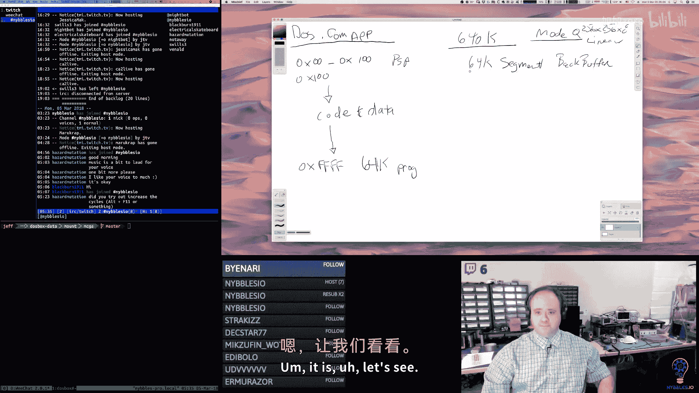

It is。🎼Let's see。 So if I go to。🎼Its。Yeah。I hit control P because I thought， oh。

 I'm using Vim if I go to。手。嗯。So， oh， so let's look at game actually first。So in game。

This is the entry file， so this， you know， if everybody came from the arm stuff。

 this is going to look very similar。And this is the thing about assembly。

 no matter what CPUU you're dealing with， you're going to find that there's variations。

 there's differences。

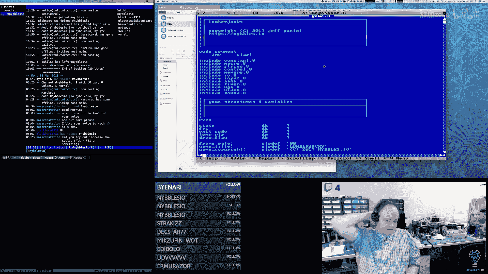

They're not really that。But're really not that big and structurally assembly is assembly。

You know the pneummonics might be a bit different and some of the assembler directives might be a bit different。

 but the concepts are pretty much the same so you know we have the beginning。

 we have our code segment which this again starts at 100 hacks because it's a comp fileile。Excuse me。

 and we don't need an origin we could put an origin statement in here。

 we don't need one because the asmbler knows that we're building a comp file and it just automatically starts us there。

And we include all of our stuff， and then we have our data。

Now this is data that lives in the code segment， that lives in the comm segment now you know。

 some of this data。It's not that big。But we do have to kind of manage how much we put into the comm segment and the trade off is it's going to be easier to access this data in the comm segment。

And the code segment then it is if we put it in a different data segment and then have to deal with switching segment registers and all that it's not the end of the world we do it you know the code does it for other things but it's just it's a decision point right do I want to make this really easy to access or do I want to go through a little extra hoop to get to it So there is some state you know there is some data in here？

🎼嗯。And if we come down to allocate。We have a function here that。

His job is to allocate memory now what does that mean we don't have mallc？So I have a。Macro。

 so if we go in we look at。I think I call it。Oh my mind。I did。

So I have a file here called Meory and it has a couple of BPP indexed structures and we can go we'll go over what that means。

 but you can tell it， you know。Be can call allocate。And you can basically tell it， hey。

 give me this much memory and allocate knows where the next free segment address is。And so。

All this does。Is。Based on what you've asked for。It。Moves up to a new segment。嗯。And gives you。

What you know the amount of paragraphs that you've asked for。嗯。We can talk about what a paragraph is。

It's just a unit that maps to the size of。A segment， excuse me。

And so this just moves this pointer essentially through memory， giving us a new segment。Excuse me。

A new segment value that we can use。And I have a macro around it and then I have a decision Ericric mem set that will fill。

Fillll memory with whatever value we want。嗯。So then back in control， actually back in game。嗯。

So we call this allocate macro， which in turn calls that allocate function。

 we take so we have this thing， we have control Ram right， so if we go back to the control file。

Control ra is。This is 16 k， right？So we're going to allocate a 16 case segment。

For control Ram now control Ram then contains。All this stuff here。

 these all these structures essentially are overlays on top of control RAM and the root of that is this control structure so in control RAM we have a pointer to where the tiles are at。

 we have a pointer to where the background tiles are at。

We have an array of sprite control structures， which are defined up here。

So this bright control structures here， and again， these are going to be very similar to same ideas。

 really， just slightly different implementation to what we've been doing on the arm side。And then。

We have the pointer to the background one map and pointers to the background two map。

 and then we have an array of timers that。Are valid for the entire game engine。嗯。

And then we have inside of the code segment， we have a pointer to the control Ram and we have a pointer to the back buffer。

🎼嗯。う。But then we do have some fonts and right now those fonts are。嗯。Being stored。

I believe they're being stored in the。Code segment right now， which will have to definitely change。嗯。

And then we have a。Yeah， so let's go back to the control Ram， so that's we have 16 k。

So we're allocating 16K on inconventional memory and by allocating， I mean， we're just finding。

 we know where we're at， where we started。And so we're just finding a valid new paragraph pointer and then we're incrementing it to basically reserve out the number of paragraphs and a paragraph is 16 bytes。

 so it's how many of our bytes we want divided by 16。

And then we're going to store that into that control RA pointer。

 so that's going to be the pointer to our new control ramp。And then we clear that with zeros。🎼嗯。And。

And if we go back to our memory code really quickly， you can see。

We set the extra segment register with that。With the segment that we got back， right？

It's this that address that we got， I'm calling it a pointer， but it's actually a segment。

🎼And then the offset is zero right， from within that。嗯。So now notice we have to move that pointer。

If we want to do stuff inside of that memory。We either have to use the data segment register。

 so we have DS and ES。We also have a stack segment， but we don't change that。

So we have to use one of the other segment registers if we want to get to that segment。

So in this case， I'm using ES。And I'm moving the base pointer to zero。

 and then here I'm allocating a tile bank。And。これ本ん。Again。

 this is just going into our our stored segment pointer。

 and it's moving that forward by this number of paragraphs。

And it's putting that value into10 pointer。And we clear it。

And then I use this ES moveM macro that I created that allows me to move things from a segment。

One the ES segment to another location。And what this is doing is its taking that10 pointer that we got。

 and it's putting that value into control memory。And it's setting the seed EG tiles pointer to where that memory is allocated。

So then what that means is that if we go back here and control。This pointer。Now points at a segment。

 the beginning of a segment， that is our free memory for the tile data。

And we also have one for sprites and so here's the one that does sprites。

And I do a bunch of Ms here because I'm filling it with that pattern。は。For a couple of therites。

And then we do the same thing here， we take the temp pointer we got and we put it into the controlled structure。

And then we allocate our back buffer now the back buffer pointer actually lives outside of the control ra it lives in the code segment。

So we just set that directly。So that kind of gives you an idea how memory is being allocated。

 so now if we go back。2。Oh， nope， one。Yeah it's going to take me a couple of。

Days to get used to this。So then， okay， so we have， we know we have our 64K。

AChunk is being allocated for the back buffer。And I say 64 k， it's actually more kind of like。诶。

I think it's just under 64K but it's close， it's more or less one hole segment we're allocating 16。

We're allocating。16 k。嗯。As a short aside， I do think I'm going to。I bought you know。

 a wake tablet that's just like a regular tablet。But they have these ones that have the screens built in tomb。

And I'm beginning to see why the screen is such a nice thing to have。I don't know。

Like visual spatial acuity thing here is just I always seem to be off。

 but if I could look down at the tablet and see what I'm writing。

 then I think this would be like super smooth anyway， so we allocate 16 k for the control rim。テーも？

Okay， and then we allocate a block for tiles， which I think we're allocating。64K。For tiles。

And we're allocating 64K。Forest prices。And then in the control realm。The control Ram points at。

Please。🎼系。So already， right， we have you know 128。诶。

And 64 so 192 or almost 200 k out of this that we've allocated for data okay。

 so even though our program is limited to a 64k chunk in the image right that's all that the operating system will load up for us。

 we can load as much other data as we want， including other code， we can load other code files those。

Are called overlays back in the day。 you used to see this slot， right， You would have a small。

Comm file。Or even executable， it was just one segment。

And used what they called the small memory model or tiny memory model， and it would load overlays。

 which were just you know other binary blobs that had code in them that you assembled and it would load them into some chunk of memory that it allocated and then you could jump to that you know that code will run。

 there's no security or anything here that prevents that from happening。🤧嗯。So okay。

 so now this kind of gives you an idea of。Like sort of the memory map not very well drawn。

 but it gives you an idea of what's going on now what does this banked program do well so。

The banked program。Let me do this， let me create a new。One of these。嗯。Let's save this poet。Go。Every。

Okay， so now。Baaned。Which is a play on words， Frank， bank Ed。What is this guy going to do。

 so we're going to have a file。And that file， and I can't draw a straight line。系呵。That's pretty bad。

That's pretty bad， man， that's horrible。I feel like a kindergarttenner。呵呵。😊，That's hilarious。

Yeah I just can't draw straight， that's hilarious。So we have this bank editor。

 we're going to have a file， so inside of the file。We're going to have banks。

But now so we're doing old school here and so to do old school。诶。That's why I have a computer right。

 I can't draw straight， but it can。The。Wow。Pr is like an indication。

 I have some underlying serious mental condition or something。Because they can't draw straight。

All right， so let's go over here。🎼欢迎。Wine， look at that。Yep。🎼見えると。All right。So inside of our file。

This is going to be a binary file。And we need to make this kind of easy to work with on a couple levels。

So。The first level is we want to be able to append。To this thing。Right。

 so let's see if I can draw this。So it's like an append only file sort of。

We're going to allow updates。In some contexts。So。We need to have some。嗯。

I think the original idea I had was we need to have some overall。Header， right。

 which was typical of files like this。 So we're going to have a little。Magic header here。

 I think the way I have this in the code is。This is two words。This is a like just a。An I。

And this is the size。U。This is the size of what a。Header is now I'm trying to remember what I was thinking here I was thinking count。

🎼Or。Bs I think I was thinking bites， but I don't know。

 we'll come back to that so there's like a little teen tiny initial header。And then after that。

 there's what I'm calling a bank header。Oh， and I can't draw。Straight again。Yeah。

 it's just a ferocious man。Crease the size of that。谢我。け。Bobara Ros probably can draw straight， I can。

Although he does always kind of admonish you when you're doing seascapes not to keep the horizon straight because you don't want the water to run out of your painting。

I don't know。えみな？So let's pick rectangle。Oops。Okay， so we're going to have a。Hettery thing here。And。

あ。So the idea the header。Is。This is going to。Contain metadata about the banks。

The bank blocks that follow， so we're going to have a block header here。

Andre going if I'm remembering my ideas correctly， we're going to have multiple headers。

Based on how many banks。In the banked tool。You can create a， you have a file。

 this is like the container， so the file is just the file doesn't map to a bank or anything。

 it's just the holder for all the different banks that you want。When you create a bank。

 you're going to have a header for it。That's going to have metadata in it and that metadata is going to include things like the kind of bank that it is。

 the name of the bank， the size right， and then then we're going to have fixed size and this is fixed size2 by the way。

 the header is the same size as a block。Which。I believe I was targeting 4096 bytes for a block。

But when I was looking at the code， it's a little off from that， so Ill have to look。嗯。

And then inside of the header。This guy has a bunch of word pointers that point two。

The blockss that heal。So because again remember the idea here is that so then we have a block right。

 so Im going actually， even though these are the same size。

 I'm going to draw several of these that are，Smaller。喂。🎼But let me do that。🎼我没。🎼なる。

 so these are the blocks。🎼And then。And the blocks here， these hold data， right， these are just。

 there's a teeny tiny amount of metadata in here， but primarily they're just 4K of data。

And then this has pointers to them。And by pointer here。

I mean pointer slash offset because what can happen is this files panomly so you could go into the bank tool。

 create a bank for tiles， then you could add some data。

 then you could immediately create another bank and。

So then that would appear sequentially at the end of this file after these blocks。

 so this guy would have to point to the next block that gets created for him， right。

 which is going to be somewhere else。Later in the file。So whenever you add a new banker you add。

New data to a bank。🎼嗯。We're just going to keep appending these blocks to this thing。

If you edit data inside of a block， then we'll update that block。In place we won't。

 because blocks are fixed size， right， they're always 4K in size。🎼So。These don't shift or move。

Once they're in the file， they're in the file， but if you add new data。Then we create a new bank。

 we create a new block， sorry。Now， what if you delete one， what if we delete this data？well。

 we're not going to remove the block。Because that's going to break everything。Instead。

 what we do is we set a deleted bit。In the header。Right and then the tool knows that that。Is gone。

 right？And we can debate whether or not when we delete a block， we probably do。

 we want to free up the pointer here because probably the algorithm we're going to use。

 there's 32 currently in the structure which we can revisit， there are 32 pointers。

In the bank header。To 32 blocks。Which basically means that a bank can be 64K ish is if I remember the math。

 what it works out to is a bank can be up to 64K in size。🎼诶。🎼不去。Fits the size of the segment。

So that means if you load a bank， you're always loading a bank into a full segment。In memory。

And if you want to span segments， then you just。Break your stuff up into multiple banks in the tool。

So pretty easy。So that means if we wanted to have two banks of sprites。

We wanted to have 128K of spray data。We would just have two we'd have Sprright Bank。

 one Sprright Bank two， Td Bank， one， tiled Bank two， right？In the tool。嗯。So yeah。

 I think the algorithm here。It's limit right now at the ideas that would be limited to the header size。

 so the header because again。This is all trying to fit perfectly within the segment structure in the X86 architecture。

 so the header for the bank has enough room in it to point to enough blocks that would fill。

One segment。Um， so。Having a link from one block to the next。I mean we could do that， I mean。

 we're going to sacrifice a little bit of space in the block。嗯。We could say， you know， this block。

Lakes to that block。But the way I was thinking this would end up working is we do one file read of the header。

 which is 4K。Then we have the offsets for all of the blocks for that header， so then we just go boom。

 boom， boom， boom boom， read them， right， sneak into the file， read that 4K。And put it in memory。So。

🎼，Since everything's in the header， we probably don't need to do anything else beyond that now what we will do though is for deleted stuff because what will happen is your file。

 your obtain file， if you're doing a bunch of editing over time。

You're going to end up with a bunch of garbage right inside the file that's just taking up space。

 so what we'll do is we'll write a little utility that is outside of a bank and everything and we'll just call it compact or something。

And it will。🎼嗯。Yeah， like i notess right， I mean you could get really。

 really fancy with it and you could make this a very。

You could make your individual nodes right in the file very generic。So that they don't necessarily。

You don't have like these custom blocks that you have to handle。

 they just are like a linked list between each other。I mean， I guess we could do something like that。

Yeah。Again， because of the way the game is going end up using this， I think， you know。

 we're going to say we want this brightright bank， we want the tile Bank， we want the music bank。

 we want the font bank。And it's just going to go read that header， it's going to find that block。

 the header block， and then it's going to go read the block。

 and then that's going to tell it how to read everything else。嗯。Just changing music here。诶。So yeah。

 so then we'll end up having to write a small little compact utility。That will open the file。

And it'll find header blocks。And then it'll look at all the blocks that the header points at and if it's deleted。

 itll remove it'll basically rewrite the file so that anything is deleted。

 gets compacted out and that'll shrink the file sized down now a file with a bunch of deleted stuff in it is not going to impact the game it's not going to impact memory。

Really， it's just it just makes the file bigger that's all I mean I guess theoretically。

If you deleted enough stuff。You could eventually have offsets that are greater than what。嗯。

You'd want right， because the deleted stuff would be pushing stuff off because these are only the offsets here are only words。

 so they only go up to 64K。So yeah， so you know， you probably will eventually have to use it if you delete enough stuff。

嗯。Okay。So that kind of explains what the banked tool。Is going to do。And so now if we switch back。2。

The code view here。嗯。If I run the banked tool here right quick。呃。I'm not going to say that。

So if we run the banked tool。The idea is that when you click New。

 it's going to ask you for a bank either new or load， it's going to ask you for a bank file name。

And you're going to type that in。And then that's your container again。

 then down here this gray area is actually where some tab little buttons are going to show up。

 these are going to be the names of your banks。So there's going to be an ad bank here。Rename。

 delete whatever。And you'll add a bank， you'll put a name on it。And then you'll pick a type， right。

 what type is it？And and then this is the kind of the viewer window for the bank so if we think about like。

Tiles， tiles are eight by eight， pixel， sprites are 16 by 16。We will show。诶。So this pixel area。

 I'd have to do the math here。Again， I think I had planned this to where。

This basically lets us show。A block。Within this window。And so then if we。Page outside of this。Pain。

 we just going to the next block or previous block。For that bank。嗯。

So actually let's look at that what so this is 256 pixels here at the bottom I can't get my mouse down there。

 that's an interesting point， I have to change my Y clamp on the mouse because I won't be able to get down to the bottom row there。

But if we look at。A bangang。And we look at the drawing code here。So draw base， that's the one。Yep。

 this is X86。MS dos， baby。😀は。😊，I'm using the A86 asmbler from Eric Isaacson。

I believe Eric's still around。I hope he is it's an awesome assembler， I love his tools。

I started using 86 in 1980 something。I can't remember exactly when it was a long time ago。

 but yeah when I knew I wanted to do this I'm like， oh。

 I know what tools I'm going to get TSE Pro for my text editor， I' I paid for it。

 you know I licensed everything all over again because I thought。

 you know what these guys deserve some money。And I bought all of Eric Isaac's stuff。

All over again and yeah。This is TSE Pro。Actually， this editor started life as the Q editor。

And then later somewhere。Rewrote it and they called it the7 weren editor when they rewrote it。

So now it's called。TSE， the Se editor。嗯。But yeah， when I did Do development。This was。

Not the first editor I ever used but。I don't know， I used to get Shaware discs。A lot。

 I would just get stacks。I don't know， one day I went through all these share desks。I found Q editor。

On there and。At the time really liked it because it reminded me of。

The editor I was using at IBM on OS2。And that was just called E， I think。

And that has an interesting history too， and as editors go， that was kind of a neat editor。So。Okay。

 so draw base， we draw our。Labels， tool title， tool version。Here's where our bank label is at。

So the bank label。Is that area P 191？诶。And so the bottom line。Is 198， so it's 198 to 256。

So that's 58 pixels that's kind of odd， so I don't know what I was thinking there。

 58 divided by eight。That would be， yeah， not quite。

So let's let's do this because that should be ideally。

 we should be able to show an even number of rows there， like eight rows。

I'll eat by eight tiles and then if it's。16 by 16， because if that was 64 pixels。

 we'd be able to show exactly eight rows of tiles。Although we're going to have a gap line too， right。

 so really I guess technically it's nine， so I don't know maybe I was thinking about， yeah。

 that's what I was thinking about。So I made it 54 because if you divide it。By nine， that's six rows。

Okay， and then if I did。17， and I'll see that's still odd。うんうん。P Sprites。So if we did 64 by nine。

We'd be able to get seven rows。诶。Yeah， I guess it really doesn't much matter。

Three rows in either case there。And six for the tiles。And then for X， it's starting at 38th。あ。

So 256 minus 38， that's 218。So divided by nine that would give us 24 across for tiles and then。17。

 they give us 12 across for sprites。So 12 times three， it's not too bad。嗯。Yeah， so that'll work。

So anyway， now that's not a whole block。Because a block。🎼So if we do。

So sprites and tiles in this engine are nibble encoded in memory。So that means it's paletteized。

So it again， it's very similar to what I was doing in the arm stuff。

Each pixel can be a color value of zero to f， zero is always transparent。嗯。And。

I pack two colors into one bite。So an eight by eight tile， it would be four bytes across。Times 8。

So a tile is 32 bytes。So in a 4K block。We could fit 128 tiles。That's a lot of tiles。And then。🎼。

Sppriites are the same right， they're nibble packed， right so one bite has two pixels in it。

And so it's  eight times 16， so it's 128 bys per sprite。So 128， so 4096。

 so we could fit 32 of those 16 by 16s price in a bank， in a block。So actually our window is close。

 see that would be the thing， it'd be nice if we could。If we could show。In our little window here。嗯。

If this window down here would show one bank or I'm sorry， I keep saying bank on I mean block。

 one block within a bank， then if we scroll up and down， right。

 we're just changing the block that we're doing。嗯。Instead of having to have logic of， oh， okay。

 now we're spanning multiple blocks。Not that that's a huge deal， but again， the scrolling code。

 we can make it very simple。By just moving a pointer to the next block in memory instead of。Yeah。

 having to like span across blocks because blocks will have headers and you know， they're tiny。

 but there is a little bit of metadata there。嗯嗯。

So yeah， we should size this so that it fits。So I'm going to make a note about that。So。First note。嗯。

Size。Bank。Viewer window at bottom。🎼To show。One block worth of data。So for fonts， tiles。Sppriites。

 which is。Ninety% of what we're doing here。That little viewer is going to show us everything that we need to see and if we're doing backgrounds。

Like if we're laying out a background， that viewer will also show us tiles。

And that'll show us a block at a time for sound。I'm thinking that that little viewer is going to be showing us a list of things instead of he you know。

 so we can make that。We can make that work in the sound case， be a bit different。🎼嗯。Yeah。嗯。

So that's one thing。And then let's look at because again。

 slowly it's coming back to me what I was thinking here。嗯。Yeah。

 so'll see one thing was my block sizes are not exactly 4K。In memory。

 they're slightly larger because I think what I was thinking。

Is that I to have I wanted to guarantee 4K of data in a block。Because that just makes life easy。

 right instead of subtracting out you know， the six bys here。And making this 4，090 bytes。

 which then is weird。That's just weird what that means in practice then is that。

We can have like just slightly less than。All the blocks we would want in a segment。

But I think practically speaking， it's not a big deal。So if one block is the header block。Then。

 you know， for a bank。So the size of this is what's 4，100。Two， is that right， yeah， so 4102 times。

Well， actually， let's just do it the other way， 65536 divided by 1102 so we can fit。

We could evenly fit 15 blocks， you know， and there'll be a little bit of wasted space。At the end。

Of a segment。Yeah， so。Let's do 4102 times 15。65536 minus， so we're going to have 4K of slop。

Not quite sorry， not quite 4K， it's 4006 bytes of slop。At the end of a segment。If we do it this way。

 which。If I were to go talk to my younger self in 1987， I probably would be disappointed。

With myself because it'd be like 4，006 Pis。You're going to waste that。So I， what can we do there？

I mean， I guess what it just means if we make the block size inclusive。

It just means that we won't get。You know， segmented memory never really bothered me that much。

It's weird， I guess， but once you get used to it'。I don't know。

 it's just a different way of looking at it。It is a little bit strange。

In the sense that you have to have different registers， right too。

Address memory but in some ways that can be kind of neat because once you get used to it。

 you're like oh okay， my data segment pointer is pointing here。

 my extra segment pointer is pointing there， my code segment pointer is pointing to this place and now I can swap memory you know between all those so in some ways you know。

Comparing it to CPUUs in the same era， they kind of had some neat。Features there， but。Yeah。

 it was the odd ball right compared to like all the Motorola CPUs of the day and the Mo CPUs。嗯。Yeah。

 I know， I know， it's weird， right？Yeah， it's weird。It's different， it was clever。But， yeah。

It had a one time。It had a one time performance in history。And then it went away。

Which is a good thing。嗯。So。Yeah， I'm kind of thinking maybe I just want to make this inclusive and not be so wasteful。

Because what that ultimately means then is just we don't get an even number of things。In a。Block。So。

We said the sprite was 128 bytes。You know， we can get 31 sprites in a block instead of。32。はい。

I don't know if I'm really going to。Cry over that too much。We get 127 tiles instead of 128 yeah。

I think maybe we will do that， we will make that inclusive。And。So then that changes the math， right？

We can get an exact 16 blocks。Into a 64K segment。Now my younger self is smiling at me。Back in time。

Now we could make this smaller， right because like， okay， got I'm using a word here for block type。

We're not going to have that many block types。I mean， this could be a bite。诶。The ID。

So that's the other thing， right， I mean how many。ははは。😊，嗯。How many blocks can we have we can't have？

You can only have 16。Right， so shoot。And then in flags the same thing。

 I mean how many darn flags can we have， I have three so far。If we had eight flags。

So now that's three bytes。First。You know， what does that really do for us， not a whole lot but？

If anything。Yeah， well， I mean， that now we can get 16 and a fraction so yeah， I mean。I guess。

 you know， so that gives us a little bit of wiggle room right we know that at 4090 bys。

So let's do this， let's just do block。估计是。We know at 4，090 bytes we can get。

This is a 4096 by block here。And we have a little bit of extra room in case we want to add some additional heady stuff。

诶。And again， if we could shrink the data more。It。It just is going to change how much we can get into a given block。

 so if we can fit 16 blocks into a 64K segment。And we can do 127 tiles。

 eight by eight tiles in a block。That means we can have a total of 2032 background tiles。

In a 64K segment。That's a lot of tiles， friends。I had lot tile and clay and then sprites。

 we said we could get 31 per block。And we can have 16 blocks。

 that means we can have a total of 496 sprite images。In a segment so if we wanted。

We wanted more sprites and again， when I say sprites here。

 I'm not talking about like on screen at one time， I'm talking about the number of tile images for a sprite。

For this game， that's like way over what we need。But we could use use two segments， two banks， right。

 so these if we wanted more background tiles， we got plenty of background tiles weighing more than we need to be honest。

嗯。So yeah， we could get。A lot。In there。 so I think that's okay。 So now I do have to kind of look。

 though， because。So the general idea was， again， this bank header， this is the。What was the idea？

This was like the file header， if I remember correctly right。

 so we have this magic word at the beginning and then we have the size of the block。

I think the thought I had here was if I wanted to have。Yeah， I think this was just for the file code。

 right。You know you open up the file are the magic characters there if not， then we can't read it。

 write it， then you look at the block size and this just tells you okay a block is 4K or a block is 8K or a block is 2K or whatever so then the file reading and writing code can adjust if you have a different block size I think that was the idea。

诶。And then everything in the file is a block， right。

 so everything in the file is this and I'm not using VI。So， I got a。

Everything in a file is one of these after this right， so we have six bytes， I'm sorry。

 we have four bytes at the beginning。And then after that， everything is one of these。🎼But。

There is a kind of block。That is a。🎼Ba header block。Which is filled with this metadata。🎼嗯。Rightay。

🎼So。Whenever we create a new bank in the tool。We all create a block。And we will fill it with this。

And that's the header block。And so I'm saying that。It has an ID again。

How many banks are we going to have in a file？Probably not more than 256。Or 255。

 assuming zero is not used。How many bank types are we going to have？Probably not more than 256。

How many flags are we going to have？あなもね。🎼so。Then this was the point your list。

 or this is the offset list。So。This is an array of。16 bit values。

Saying this bank consists of these following blocks。🎼嗯。And then I have an array of these props。

Whi have a name in the data right so this is how we're going to name the bank if there's other special little metadata that we need to put in a particular bank。

 this is how we do that。🎼So。So 64 bytes。Plus three bys。🎼Plus。64 times 60。That's under 4K。So。🎼We can。

🎼Shuffle these with bit。So we could say we could have。Well so first， let's do this。Let's reserve。

Let's make this an even eight bytes。🎼嗯。Just in case。Down the road。I'm like， oh。

I really need another flag or something， I don't know what that would be。

WeI think we have spare room to work with here。So we have eight bytes of header flaggy stuff。

We have 32 times two。Plus， we have 64 times 60。So that's getting us closer。

So now what's our difference here？184 bytes。And those are magical bikes。

So that means we could either have another。🎼嗯。Yeah， we could have a lot of block cornerers， holy cow。

 yeah。But the thing is we know we can only do 16， it only fits 16。In memory。So having more than that。

 I don't know， I think maybe I was assuming。Well。Maybe you want to be able to do more than that。

I don't know， I'm thinking that I probably just would want to make the prop names maybe a bit larger。

嗯。Yeah， that's too big。But if we made that。128 bytes and we said you could have。

32 properties that's much closer。24 properties。30 properties。31。Yeah， that I like。Because again。

We're saying a bank fits into。A segment。If you need more you need multiple tile banks。

You just create multiple banks right， and they're just each going to slot into another 64K。嗯。Yeah。

Okay， so let's do this。Make this 16 because that's how many we know we can have。

And no sense going over that。And then here we can make this。Larger。And then we can have。31 of those。

So。8。Plus 32。Plus。128 times city。🎼Yeah， that's。Pretty close。So now our metadata。Nicely fills up。嗯。

The header， the bank header。Block。And're we have about 80 some bites slop。At the end。

 which is that's okay， I can live with that because again， if we ever had to put， we come back later。

 oh， you know。We really need to put some。Extra metadata in here or whatever。

 we have a little bit of room to play with so we don't spill over。The 4K。Now， then I had these。Hey。

 thanks hazard mutation， I appreciate it。So。Then I had these constants and I'm really not remembering。

So I had size bank headers。So it's saying the size of a bank block。Times 10。

So obviously this was going to be， you know。Cutting out。Memory somewhere at some point。嗯。Okay。

 I think here's what I was thinking yeah， I think I remember this now。Yeah， okay。

What I was thinking was。I would allocate one segment。So 64K。To hold the headers， the bank headers。

And then every， you just know that every 4K you're pointing at a different bank， so that means that。

We technically could have 16 because I fixed the sizes on time things。And this could be 16 too。嗯。So。

so we could fill a segment with the headers。And then so then that means that we could have helper code right that says。

 okay， I want to access tile Sprite， Sprite bank one， right so you can zip through that。

Find the bank that is called， you know。Spring bank one。And then you have your list of pointers here。

嗯。Which when we load the block into memory， we can fix those up to actually point to where those blocks are。

🎼嗯。And then。Then the actual data blocks for a given bank would be loaded into their own segment。

 so when we load a bank file。What would happen is the following。We would have this segment。

Just going to hold the header so we would walk。The bank file。When we hit a bank header。We would copy。

 read that 4，096 bytes in， plunk it into the next spot。In the header segment。Then。

We would allocate a segment for the data because we know that one bank is going to fit exactly into one segment。

And then we would proceed to read the banks。Or the blocks for the bank。

 and we would put those in order。Into the segment that's been allocated for that。That bank。

🎼And then that process would repeat。The next bank block would be found the header。

That would go into the header segment。And then we would allocate another segment。

And load the blocks into that other segment。And so then when you're done processing a file。

You will have。You can have up to 16 banks。And those 16 banks are each 64K which。

Is exactly how much memory we have， so we're not going to have 16 banks we're never going to have that many and we're not right I mean this game。

This game's not going to be that big， this game's going to have one tile bank， one spray bank。

And technically， those don't even have to be a full 64K。And so that's the other thing too， right。

 so when we do the allocation。The bank header。We'll have to have some code。That walks this array。

And says how big is it right， so we would walk these until we hit the first k null。Offset。嗯。

And that's how big it is。And so then we would only allocate a segment big enough to hold those blocks。

So realistically for like the little lumberjacks game。

 we probably the tile and Sprite bankss were probably only going to be。Half。

The size of a full segment。嗯。Because we don't need 2，000 background tiles。We probably need like。256。

 maybe， you know， for sprites， maybe we need 512。Sprightite images， I don't know。

So between the two of them， we're probably looking at about。You know。

 a segment or a segment and a half total。But we're going to have font。

 we're going to move the fonts into this instead of it being an include。

Have sound and music so those you know， so total oh。

 we're going to have the backgrounds right so and the backgrounds are going to be。

A K a piece or something， so they're going to be like one block。In size more or less。🎼嗯。

So that means we're going to have。Let's say we had one sprite bank。🎼That is。I'm just。

Thinking in my mind here。Let's say we have 512 background tiles， I'm overestimating here。Okay。

 so that's one bank。That's one segment。And let's say that we had and actually that。So eight times。

 four times8。So that's background， so that's half。Plus。Let's say we had 512 spread images。And。🎼So。

Yeah， like it's like a segment and a half okay， so we're going to have that and then so' say 81。He。

Plus。We're going to have。Let's say8K for background maps。Background layout data。🎼And。🎼And then。

 let's。Let's say。The font。Is。That。And then music。In sound。I'm going to say。

 let's assume that's another。64K。So that's how much memory。Roughly， right？

We're looking at so 256 kB or less is what we're looking at and so that's。嗯。That's two banks。Three。

 well， actually that's two， let's assume there's like maybe three or four background layouts because tile layouts that we can swap between for like title screens。

You know， the actual game screens。Probably like a credit， you know or high score screen。Yeah。

 so let's say， four of them。So there's two， there's eight。🎼嗯。9ine。10。Right， so we're going to use 10。

Named banks out of the 16， but the total size is going to be quite small。So， yeah。So that works now。

Okay， so then I had some pointers in the code segment。Yeah， so I think I understand。

The only thing I don't is。Okay， so these make total sense right because we're going to have one bank we're going to have one segment that holds all the bank headers。

 so this is going to be that pointer that points at that segment and offset。

 which I guess if we do it that way I don't need this so。So I could just do two words here。

One that points at the segment。One that points at the offset in the segment。

 that is the current header slot right where the next one would go。Now these though。

 don't make sense here because。These would be the pointers for the block。🤢。

You know where are the next block going to go out？Let me restate this this is going to be this would point to the segment of the blocks for this。

Hetter。And。This would point at the offset in that block for where that would go。

But is there's only one of these and that's not going to work。Right。So。

What we would have to have then。And this is maybe where。

We start chewing away memory and we end up with fewer than 16 blocks or 16 banks。呃。

I we almost have to have a structure。It has a couple more words in it。🎼嗯。That it are the offsets。

 right？🎼嗯。Because what you would do is the indexing is through the headers。

 so you would go to the header segment。You'd say which header am I you know which bank am I looking for。

 find that header， okay， oh， that bank says that it allocated in this segment， good morning GM XYZ。

 I allocated this segment that has these blocks in it and this is the current open block。

 this is where the next one would go。🎼So。🎼です。If we want to map structure to structure。

 which I think is probably the easiest。We could take our bank metadata struct here。

And I actually allocated out， I reserved out。enough room for this。So see， good thing I did that。

🎼So this would be the。Block。Segment Quainer。And this would be the block。Off tour。Like that。

Now in the file， these are empty right in the file these are going to be zero。Which is fine。

In memory， these will be set when we loaded in。These will be said appropriately。

And probably I can't just call it secondgging off。Like that。Okay， so then。We have three。And。🎼4。

And so we're off by one。🎼B。So。4our plus four plus。32。2死。128 times。🎼边go。All right。

Now it's making more sense in my head。Now I'm seeing where all the magics can hand them。🎼そしく。

Very good。All right。🎼So， now。Annk it would make sense to start fleshing out。

The implementation for this。🎼And。And again， we're basically going to have。All right， so let's see。

 let's catch this out， what's this going to look like？🎼We need a。Bank ands。

And Bank it is going to what this is going to allocate。🎼Segment。24K segment。For。Bank file headers。

🎼Then， we need a。We're going to need a read。Bank read block。We're going to need a bank。Right挂。🎼And。

Because again， remember everything in the file。After the little teen， tiny header。Is。A block。

 even the bank header， even the bank header is a block， it's just a special kind of block。🎼And。

So this is going to allocate our memory。And。This is going to set these guys。🎼These guys。

 these guys over here。The trouble make us。The real troublemakers。🎼嗯。So this is going to be size。Bank。

Hitters。And this is going to go into。Ba。Heer pointer。🎼And。And I'm clearing out memory here because。

Again， this software is kind of sort of quasi educational in nature。There's some specific。

Lessons I want to have around initializing memory。What the difference between initialized and initialialized memory is。

So when you see me me setting stuff to zero and you think， why is he wasting his time？🎼嗯。

I am working on a reference implementation for a game。

That is being used in an educational series that I'm creating for learning how to program in assembly language from assuming that you've never programmed before。

 you've never written assembly language before。The educational series takes you all the way from beginning to end and I'm using a game as kind of the project because。

It keeps people's interest right it's an interesting topic。

 you get to see cool stuff on the screen and if you follow through the whole thing when you're done。

 you can tell people， hey， I wrote a game， I can write games。So that's why。

And this particular project it focuses on X86 and MS doOS。

 I have other projects I'm doing one is an arm arcade kernel kit in Ar 64 B assembly。

 and then I'm also working on another project called ReU which is a。Y， cool。Yeah。

 So ReU is a kind of a similar but different approach to the same thing。

 but it focuses on older CPUs。And。It's kind of a slightly different target audience， I guess。嗯。

So this is going to be size blank headers。And then we want to move。嗯。Zero into bank headers。か。

Which is our。🎼嗯。You knowActually， I'm just going to call this。

Offset and' like call that segment because。Try to be more consistent here。That's what they are。嗯。

Yeah， actually， I just thought of that I'm going to be backwards for a day or two here。

Because I've been writing arm assembly。And I'm going to get so spoiled again because I'm going to be able to actually like。

 you know。Rightrite to memory。With a move instruction instead of having to do like a four instruction dance。

So yeah， that's going to be funny。嗯。Okay， so that's。What has to happen there？And。Ohello。I broke it。

😀はははは。😊，What did I break？Constant required tonight。Size bank。🎼Letters。Push， yeah。🎼U。🎼真确实。Oh， wait。

I bet。Not them。No。What are you complaining about？Because that should be a constant value。🎼嗯。

Size control， you know what， I bet。嗯。I was going to be another to say I would be surprised。

That would be a problem。Bank Headers segment。🎼Offet。Size control RA divided by 16。

 an offite control point of RA。Size control RA。🎼你回。Control Ram pointer。Just a D word。🎼Okay。

Why are you not happy？Bank headers， segment。Bank headers segment。空去。じん。my mess here。

It's complaining about the constant， but that is a constant。Oh boy。

 this gives to me like three days to not do that。Okay， so it is that。it is， oh， I wonder if it's。

I wonder if it is。No， does's not。Size bank header。P。That's interesting。He does not want to do that。

So I'm using the type directive。To get the size of。🎼，The structure。

 which is kind of a handy little feature。Instead of hard coating it。嗯。And I multiply the darn thing。

In other places。But here it really does not want to do the divide is not like that。I'm not sure。Why？

Keep saying it's not a constant， but it is。🎼东。🎼します。嗯。🎼。🎼，🎼生。Very strange。🎼Oh， I wonder。What。

That is so weird。Hey， I got a list file now。不。🎼是啊。What are you doing？🎼对。Big numb。Okay。🎼很确实。🎼Okay。

🎼I see the issue。嗯。4096 is。This is overflowing。SS， SS。🎼That's why this is。Complaining。

So that means really we want our structure to be。One bite tinier。Yeah。That was it。Okay。

 so we have our bank in it now。We allocate out the number of paragraphs for that。

And that puts the segment into bank header Seg， and then we memet it， we fill it。

And then we move zero into bank headers offset because we're resetting。So then in game in allocate。嗯。

Do we want to do it and allocate or do we want to call a knit on bank probably want to do it？This。

 I think we can make that guy。Just called bank it。So we call allocate。我靠。Bank and it。没有。

Gams still happy。And then in bank。Need to do the same thing。Okay。

 so now we're allocating that memory for our banks。🎼And then。To read and write files。

 I was going to use MSDs。🎼Just是在。Use their file or read and write stuff。

Because we're not doing anything really fancy here'。Reading 4K and writing 4K chunks。Basically。嗯。So。

But before we get to that。I'm thinking。We're going to want to。Bank。Fイ。🎼And。

This one will probably wrap it a macro。う。Co， excuse me， sorry。🎼嗯。

So this is going to start at the top of this。And it's going to walk each block in the headers segment。

And it's going to then look at the metadata。🎼嗯。I guess that's the other thing。

 do we want to search the metadata or do we want to look it up by ID？I want to look it up by ID。

 right？Because that's going to be A easier and be faster。

 the metadata is really for like the tool just so that you can see a nice prena。

And I think probably we want to do。32 here。Just make the value a little bit longer。Okay。🎼So。Yeah。

 this guy is going to。嗯。Well。还为 one。So we can just push。The first argument to the macro。

Onto the stack。Okay， so。So we're going to move E with。Our bank headers。Secondment。🎼And。

🎼We're going to。Move S with zero。So we're looking for。That。So actually， instead of SI。

 let's just use BP。I really only need BPP。Equal to ASP long enough to get this off。

 we've got the value now。🎼And then。Then we can use our structure。To get at everything。

So we're going to compare。MS IDd。🎼With。Ax。And。It's there equal。Then we're going to go to。L zero。

Otherwise， we're going to add。Oh and this needs to be ES。We're going to add。🎼Type of bank block。

🎼To BPP。It's really CX。🎼嗯。All right， so we come in here。We set our base pointer to our stack pointer。

 we grab。We set ES， which is our extra segmenter。Yeah， actually a second register。

Pointing at the value。Of bank headers segment， so we're going to point we now have a pointer that's pointing to the beginning of the segment。

Where our headers are for our banks。We're going to move AX with the value that came in on the stack。

🎼嗯。Which is the ID we're looking for。🎼And。We're going to move cX with 16 because we know Max。

There are going to be 16 headers。In this segment。Then we move BPp with zero。

Which that should actually happen。Once。So again， AV6 has this pretty neat feature。

When you have structures and you can tell them that they're indexed off of BPP。

And so by moving BPP with zero， so that's the zero width offset。

If we then index or we didn't address memory through the ES register。

And we use a field of the structure， it's behind the scenes， the asmbler is doing the BPP。

Offpssets for us。But we can refer to things by their field name。

So we're comparing the ID of the metadata。Which is the data that's inside of this block。

 the header block with the value that came in on the stack， and if we got it。

 then we come down here and move AX with，The BP offset， so BP is just going to increment by 4K， 4K。

 4K 4K。啊。And then。I guess one thing we want to do here。So we have this bank header offset。

That we're going to keep track of this is the pointer we're going to move as we add new blocks to this segment。

So what we can do is we can compare。Yes。With。Or not yes， sorry， we can compare BP。With that value。

And if they're equal， nope， not that。Then。We can go to。L one。

Because if we haven't put anything in here， this is going to be zero。VP zero we zero。

 then we're done， right， there's nothing to search。

Otherwise we're going to compare the ID if it's equal， we're going to bail out。

 otherwise we're going to add BP the size of a bank block， Bade debt to BP。

 and then we're going to loop up。To L0。And we're going to keep going， right？But we actually。

 what we want to do。Is。🎼另完了。我路。0。Because。We have CX loaded with 16。🎼So， even。

So we're checking two things here for an exit condition。

 we're checking to see if we've reached the end of where。We've inserted the end of the list。

 essentially， have we reached the end of where we've inserted to。嗯。

And this is pointing at the next empty， so this is the end。So it's not inclusive。

This is we haven't inserted anything yet at zero， if we inserted one。

 it's going to be pointing at 4096 or 4095。So 1000。Or FffF hes。But there's nothing there yet， right。

 it's pointing at the next empty slot。🤧あ。Excuse me。Yeah， my allergies have just go on haywired。🎼し。

But if we have a whole thing loaded。Then we want to go， we know we want to do 16 of these。And。

I guess technically， for doing the pointer comparison。

But it won't work at the end at the end it's going。We can't increase it beyond the end。🎼So。Yeah。

So then we loop back up here。Until we either find it or we don't and then we return。

And then our macro， we push。Some registers on the stack so we don't trample them AX we're not going to save because。

We're putting our return value in AX。🎼啊嗯。So we save BPEX。We push our value on the stack。

 we call Bank find。And we add4 to SP to take our value off。And we pop。The registers。🎼M Iデ。Oh。

 it's MDID。That's why。It's MDID， not MSID。🎼啊嗯。Yes。Because we are only loading a bite in here。

It's just that we can only push。16 bit values in the stack。So the low register。

NAX has the bite that we've pushed in for the ID， so we're going to compare the bite to the bite。Yep。

All right？嗯。All right， so that allow us to get a pointer， so then AX will be the pointer。

Of the bank header that it found or not。So now。🎼嗯，这。🎼All right， I got to do。C of thing。

Before I do that。嗯。I went over too far。对ふふ。All right， I'm going to take a short break。

And I'll be right back。And we will resume。🎼come losingcy妈妈。🎼い？🎼，🎼It doesn't seem。🎼心。

🎼Express some chin now。🎼Just finishing the。Coffee brewing process here。🎼都回你。🎼All right。That so。

You're welcome。Move Ax 13 x。🎼Yeah。Very welcome。🎼嗯。Let's look at the file stuff。I think we pride one。

🎼Is。🎼那 from。🎼あ。🎼他跑去。So for files。🎼Like I said， we're gonna。Use MSDS。S let me do this。🎼よし。

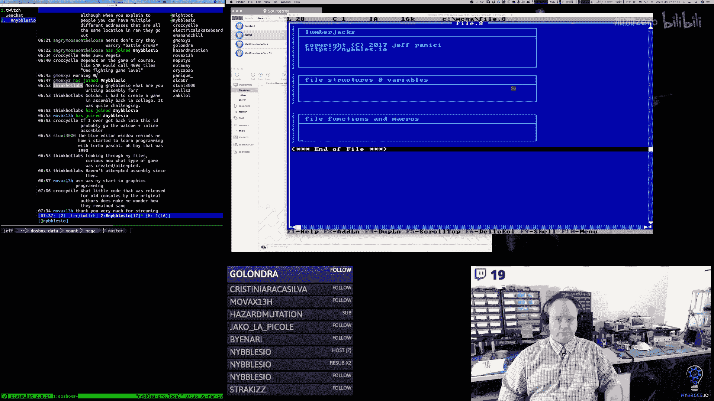

🎼Ohello。The pre file， we're definitely going to want to do that。Close right see。Open read。

We're not going to be creating directories。I think we can skip that part。ははは。Windows for work groups。

All right， so I think。I'm trying to decide how I want to detect if the file exists or not。O。So。

 I think。

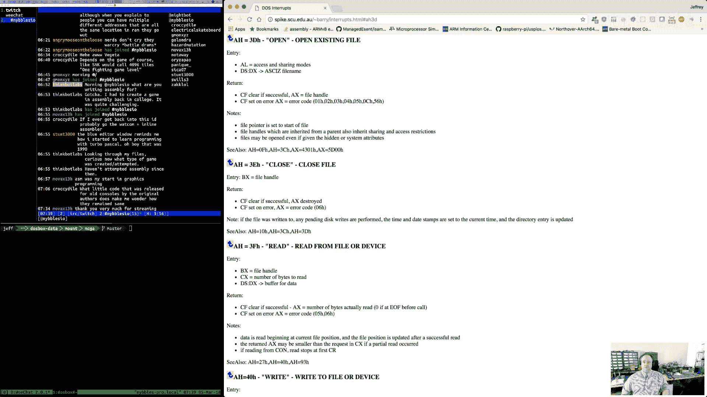

So we're going to have。File open。Iile clothes。え。File， create。So those are our basics。

Now to support that。We have to be able to pass a null terminated。啊。String for the file name。

So I'm going to create a。🎼哎哦。Variable here。And we're going to do。Eight。3， right？11，12。

And then a zero。Well， do we want to do it that way or do we want to just have him pass？Wre。

Maybe we we'll do。Maybe that's what we' do。Let's create a handy Danny macro。They can use。All right。

 so we have a file name Mac bro。That will create the null terminated string。In memory。

And then they can just pass an address to that。And then we should be good to go。嗯。

So clothes is going to be really simple， right， it's AX。Has the file handle in it。Close。BX， sorry。

 Bx has the file handle。So。But we're going to do this through a macro。That's it。嗯。Oh， age has to be。

3 E。So A is 3 E hex and Bx has our file handle。And。If the the， if the Car flag is clear then。嗯。It's。

It's closed。Thank you。Yeah it。It's an awesome project。

I'm really looking forward to getting to the point where。I'm able to build stuff with it。

Because then I want you know， I'll be able to do a bunch of streams around building games using that too。

So yeah， I'm excited we'll be covering for you next week。Yep。

 we will be going back to that for a week。Week at a time here and there。So。

So is a carry flag sat or clear。Harry flags clear。And we're okay。Otherwise。

So I'm just going to move AX with zero。If it's okay。

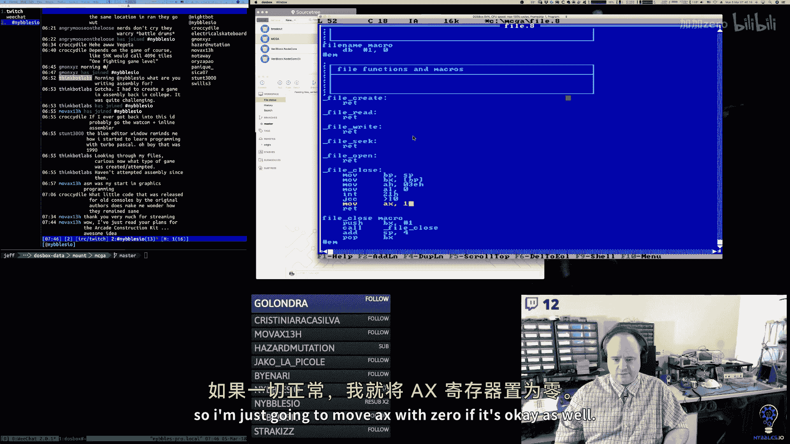

As well。

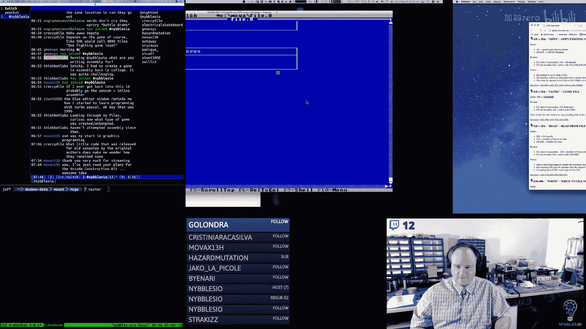

I dont know if it's air， AX has air code6。So I don't even have to touch it。

So I don't even really have attention。Okay。Because we're not preserving hayx。We are preserving。

BP and B。There we go。Alrighty。So that's close。And then。Open， I think is pretty easy， right？诶。

We got to set AH to 3D， A is the access and sharing modes。Which we guess we can look up here。

So this is going to be very similar。嗯。The pointer to the string。Has to go in DSDX。

 which we're going to assume。🎼For this， that。The string is in the。Code segment。嗯。

And the code segment and the data segment by default are the same。For Com files。

 so we shouldn't have to do anything special there。You just have to move。Dx。With the。Address that's。

On the stack。I'm going move H with 03D。Move A with something with to look that up。And 21。

So this is this macro。While open。I's kind of pretty much the same。

We're pushing the address of our file name on the stack for this guy。

 That's the parameter that goes on here is the label of the。Other stack the offset。嗯。

So let's look up those sharing。嗯。And then on the way out， AX has the file handle or it has air codes。

And the carry flag is。Be nice if they put the share flags。And here。Share。Oh， here we go。没呢啊。不行。

In this star 3 dH。哎有。是。AL can be zero file open for reading。Fly open for writing。To file open for。

Reading and writing and I think we want reading and writing。For our。哎。And then。Yeah。

 DSDX pointed a zero terminated string。And if the carry flag is set， then the X has codes， if not。

 it points to the file handle or has the file handle value。Okay。That's pretty easy。

So there's our open。And again， we're not preserving AX， we're assuming AX is passing through。

And then the code immediately after the macro can check the carry flag。Branch on the carryrie flag。

To determine if there's an error。🎼So， seek。🎼嗯。All right。So BX has the file handle。

 A has the kind of move we're making。CX and DX are the distance to move。Right。So BX has the handle。

So it's going to be really very much the same。Just don't need two returns。

One of these days in Minnesota pressing escape。Well， I didn't mean to move it。🎼So， we're gonna。

Push BPP and BX， we're going to call file C。And the parameter that we're pushing on the stack here is。

The offset now。If we do the relative seeking。I don't know that we ever need a value larger than65536。

We may have to come back。So four， two hes。🎼Is。Fction。And AL is one of these modes， right。

 it's either offset from the beginning of the file。Offpset from the current。Pointer。

Or the offset is a negative value from。The end of the file。🎼So。I would say we want to use mode one。

We want to offset from。🎼Our current position。Because again， a bank。Can only be。64K。

Now with deleted stuff。That gets a little bit messy I guess but。We could also read the file。

We don't have to do an absolute jump from the header， right， we could read the header in the memory。

Which we're going to do， right？And then the offsets。We can。We can read the offsets in memory。

 we can move a block at a time right so it's always you we're always doing 4096409640 we're just moving the file pointer 4K ahead every time and if it's an empty if it's a blank or deleted。

 we just just skip over it。So I think this will actually work。诶。

So it's CX dx is the 32 bit combination。That they're using。

But I'm going to say CX for now is always zero。In this case， and Dx will be the value that we're。

We're trying to seek to。Because we can fit。We can fit the entire distance that we want to move here。

Okay， so I think that works。Their sick。And right， I think is probably super simple。So right is 40。

 BX is the file handle， Cx is the number of bytes。DSDX points at the buffer。To write the data。

 which is perfect because we're going to write blocks at a time， so that's beautiful。All right。

 so 40 hacks。So let's do this， let's borrow open。So Dx is going to point at the。

So we're going to have two parameters on the stack for this guy。And then before I move on。

This guy should be saving B，X， CX。And this guy's not popping。Yeah a fix up。

So I want to push two things on the stack here。嗯。And actually。This should be four bytes。

 these should be two。BecauseWe're only pushing one on the sky。So fileSe needs the handle。

And the distance。So。So the file handle。And the distance。That looks better。And then for file right。

 it's going to be the file handle and the pointer。To the。Data block that we're going to write， oh。

 so it's actually a file handle， the data and the size。And this is going to be。B XBP， CX， VX。🎼嗯。

So we're going to get the file handle。We're going to get the number of bites to be red。

We're going to get the。うん。Pointter。Of what we're writing。あの。So then right to file， so 40 hackx。

 BX has the file handle CX is the number of bytes， DX is pointing at the buffer。

AL looks like it just should be zero。In this case。🎼哎。Notm bad。🎼And then。File read。

I'm guessing is very similar。So let's take a look at Re。So it's 3 F， Bx handle Cx number of bytes。

 dx is where it's going to go， yep。So3 F。So file handle。Number or buffer of where it's going to go。

🎼And。Number of bites。To read。We try to read。then。Flow create。Great。So 3C。

This is very much like open path to the file name。CX is the file attributes。

So this guy is pretty much like open。So the function is 3C。🎼And then。

DX is the address of the file name。We just need to pass the address of the file name。And that's it。

 so DX gets that parameter on the stack。We pass 3C into AHAL， I think， is zero in this case， yep。

And CX is our file attributes。I'm not going to be able to pace that。🎼嗯。So A L is zero。

CX is going to be a dead mask。So it's actually C。Let's do this。It's X or CX again。see y'all with。2。

 three， four， five， six， seven。8ight。And the bidm is。🎼Now。Yeah， okay。It is zero。

We don't even need it。Beautiful。嗯。Yeah。Here go。So， now。Game。We're going to include。File。

N do the same thing in。Thanks。Now。And bank。We build these on top of。File stuff。啊。And actually。

 what we can do is。We can。We can create some helper functions here that create the bank file right out the header。

🎼So。We're going to have bank file create。And then file open。And bank cloud flames。

And so we want to do a。Also have a bank New， right？🎼So。And bank new is going to be responsible for。

What。Because there's actually two modes here， kind of two use case scenarios。🎼1 is。🎼When。Let's see。

In the tool。You're going to create a bank。So we're going to have a file。So in the bank tool。

 you're going to go either to newute or load。And if you go to new， it's going to call Bank file Cate。

If you go to open， it's going to call bank file Open。And let's talk about the C case。

It'll create the file， it'll write out this tiny little。Header here。

And that's all we'll have to start with。Because we haven't created any bank yet， so then in the tool。

 the state will change and you'll get new buttons。Over by the bank editor。

And whether you click add bank or new bank or whatever。You'll enter in a name。And then。

What's that going to do that's going to。Called Bank New。来。And。Bank New is going to fill。One of these。

Structures。At。This segment， that address， that offset。And it's going to fill。The very first prop。嗯。

Well it's actually going to set the ID， so the ID， I guess， will just be sequential， right？

It'll start at one and we'll go to 16。And if you delete a bank。just if you add another one。

 you'll just get a break in the ID。Up to 255。か。嗯。Right， and so then the na you type。

 it'll put that in there as a prop。And it will increment the offset by。The size of a block。

 which is 4，095 bytes。And。And that's what it'll do。Now the question is。Okay， did that in memory。

In the tool。Then I'm thinking。You want that block， you want that bank。And the block。

We want the bank back。🎼Right， so if you。You close the tool， the exit bank at that point。

Or are we going to force you to click saveve？So if you don't click save。🎼Then。That bank。

Doesn't get added to the file。You click save。Then we would call。Bank file。Save， I guess。Right。

 so maybe。This is a little bit higher level。so we can create a bank file， we can save it。

 we can load it。And。Yeah， and I thought I had a dirty bit， yeah。For that very idea。

So it would create the bank。Headtter。We put the dirty bit on it because it's never been saved before。

🎼And。And if he hit saved，'re going to。Walk the bank headers in memory if it's dirty。

Then we're going to you know， find that bank header in the file， we're going to save it。

 and that either means they're going to create it for the first time。

Or we're going to update those bites。In place。🎼嗯。Then。If you。Start editing。That bank。

So you create a new tile， say。We're going to have to。The editor is going to say， okay。

 do I have a block to work with？What's the current block？In this bank。🎼And。Right。

 so this bank find is part of that puzzle。So in the editor， okay， this is the bank I'm on。Okay， Mr。

 Bank。What。What block am I working on， Give me back？A pointer to that。

And then the editor will just use that free memory。It's available in that block， same thing。

 the block has flags on it。is itWch would be like the dirty flag or the deleted flag may very well be perpetu unconscious？

So when you create that， total based on money。We create the first tile or the first spread or the first whatever。

Is there a block， no there's no block， tape， I'll go create a block。🎼And。And so this is where。

The tool， I think differs slightly from。The consumer of the game。The tool。Probably。

For expediientency' sake。It's just going to be easier when we create a new bank。

To go ahead and just allocate the entire segment for its blocks。

Because then we don't have to worry about resizing it。It situ。

And if banked burns a little bit of memory。You know， while it's running。

I don't know that that's a big deal。It's just going to make things so much easier to do it that way。

Plus。That also could give us a foundation for like doing a compact。Because。

If we have the whole segment loaded and some of the blocks are mark is deleted。We can just do。

We can just copy things up right in memory and then zero out， you know。

 the remainder update thell offsets。When we write it out to disk。

Now we'd have to do that for every subsequent。Block。🎼Essentially， I think compact what it is is。

It's just going to behind the scenes， it's going to write a new file and then。Rename it。

 so we might have to add rename into our。🎼Our list。Because it'll just be easier to just write。

 just start from scratch， right？And skip over deleted stuff。Or in memory， scrunch up stuff。

So you get rid of the deleted bits。And then。Write out a new file， delete the old file， rename it。

🎼这个呢。🎼嗯。So yeah， I think。I think what happens in Bank New。🎼Is。Fillll in。Ba block metadata。The header。

え。Bank headers offset。Alloccate full。Segment for。Thank blocks。Now。So here's an interesting question。

 okay， so that makes total sense for the tool。But when we're reading from the game。

We don't want to do that， we want to allocate only the amount of memory we need。

Only as big as it really is。So then that means that。What。That this is a parameter。

And so then the tool will always just pass。SSsF。And。The game。When it。Well， no。

 let me think about that because。Load。Is probably going to do。

Bank new is probably something only the tool。Is going to call。And then load can be the more。

Optimized。Version of this， because load is already in line。

 it's just going to fill in the metadata anyway。I don't， I mean。

 I guess you could make the argument that。Load could call new。Successively。

As it goes through the file。But it's probably just going to be easier to do everything in line here。

嗯。So we allocate a full segment for bank blocks。Up fri。IThat makes the most sense。

So save what's Sa going to do？Save is going to call file open。でつかな。Check the header。

Bail its incorrect。It's going to。Will be file open or file create。I guess snow。

Now let's assume that we can only save the files that exist。If the files not there， you have to call。

Create。So check the header the bail if it's incorrect。Otherwise， we'll walk。Each。

Header block in memory。And。Then。Write new or update。Existing header block on this。

So then the question is， okay， when we save。Do we want to be clever or do we want to just？Brw for it。

 meaning。I'm going to go back on what I just said。Maybe save。

could always just write the file from scratch。Every time。And then the compact behavior just is。

Is there？The downside to that is if you open up an existing bank file and you just go and change one tile out of the 2000 that you have or whatever。

嗯。And you save。You know， it's going to rewrite everything that's in memory。🎼But。

We're loading everything in any， it's not a lazy load。When we open the bank， we load the bank file。

Excuse me。We're going to load everything。Again， just for simplicity's sake。All right。

 we'll come back to that meta thought。So write， new or update existing。Haadtter block on disk。Then。

Right。Data blocks。Well， right new or updated data blocks。After header。Yeah。

 so then this implies that we have to。You have to find a header block。In file。And then we have to。

Find。Each data block or create。It's dirty。Something like that。I mean， I don't know。

 and again we're talking about。Let's say we're talking about 512K。🎼て的。It's not。

 we're not talking big data here。Even for MS dos， we're not talking big data， not really。嗯。

I'm really starting to think it just would make sense。To just rewrite the whole thing every time。

And the one nice thing about writing it to a temp and then renaming。You know。

R to attempt leading renaming is if something bad happens in the middle of a right。

The original file up until that point when we delete the original， which literally。

Be like the second to last operation， and be the penultimate thing。🎼嗯。

It's going to die writing to a ten file， not to the original。🎼嗯。

I'm a lot less concerned about reading because readings。Non destructive right。

 I mean we might do something in memory that's bad， but we're not going to do anything to the file。

That's bad。嗯。So yeah， now Im' thinking that。We just。Yeah， exactly we。Create temp file。🎼Yeah。

That's what I'm thinking the same thing to create a ten file。Walk each。Pettter block。And then。

You know，2 a。Right header block。To the right each data block。Skippping， deleted。Same thing here。

🎼And then。3。Would be delete。Last file。Rename temp to proper file。🎼There you go。

That I think that works。Good。Because that now compact and everything that we talked about it's just built in。

 it just works。And yeah， I don't think performance wise is we're going to even notice。So then that。

 you know， bank file create， we can use this。 this just kind of becomes a little。

 this is more of a helper function to。Call file， Cate and write headerbytes。And。Yeah。

 I like that and then load， what does load do load？Yeah。Even then， though， I mean， okay， I mean。

 it might run a little slow but。It'd be period accurate， I guess。嗯嗯。

We'd have to have at least a 10 megabyte hard drive for this。You know， back in the day。

We put the final game on a 360k floppy or a 512K floppy。啊。Or I guess they were 700 k， right。

 a little three and a half inch ones。嗯。So load。Yeah， yes， yeah， the C64 disk drive was。

That was a colossal engineering fail， unfortunately。

Although engineering failed from Commodore's perspective。But。嗯。

The architecture was open enough that third parties were able to work around it， which was。Nice。

So here we're going to call。Open file via。I open。And we're going to。Read each block。

And if it's a header。Fill in at。Bank header offset。To B if。Data block。Add to current。Banks。

Bank headers。Segment offset。3。Close。算了。I think it's really that simple。嗯。

And what's beautiful about this？Doing it this way is now we don't have to do any。嗯。Offset。

Fix up really， we don't have to do any goofy。Because the offsets are always going to be clean from the header location。

嗯。Now。Okay， so that's great， I think that's wonderful， that's going to work。

 and I think that's going to be pretty easy to implement。However。There's one little issue。

In the game。It's a depression。EverybodyWe really want to load。The bank。Data。

Without header information。Because if you look at how the game works。Like the tile data。

In the sprite data， it's contiguous， it assumes it's contiguous。

Because the code is just doing you know， math to offset into。

That array of bites essentially to get to the right image。🎼If we。

If we load the blocks in with the block headers。That's not going to work。🎼嗯。

Then we would have to have a special computation that would say， okay。🎼Tile。

We know we can fit 31 sprites in a bank。Block， therefore。You know， if it's 32， then you know。

 every so many modD 32 or whatever。We'd have to do special computation to offset again。

Which I don't like that。But in the tool， we need to load it the way that it is。

So I'm thinking we need two file loans， right， we need one。That is。One that's meant for the tool。

Which we have here。And one that will。I don't want you to ride。 I don't want you to write to。My。

tell you to write。That will load a given bank， okay， yeah， I think that's what it really should be。

Yeah， so I think what we need is like a special thing that's going to be called。Bank file load。🎼呃。

Data。So this is for use。In banked。This。Is a special function used from？电男军。Where。我看到。Identify。

The file。So file name。The bank ID。And a destination buffer。

And so it's not going to this particular function is not going to load in。🎼，The bank headers。

Or I don't know， maybe it does， maybe we do that。Maybe we filled memory with the bank headers。

 although the game doesn't really need them， so that seems kind of wasteful。

The bank headers are there really for the editor， not for the game。Yeah。

 so the way I'm thinking this ends up working is this is a special function that's used from the game。

That you give it the file name， the bank ID that you want to load。And where you want the data to go。

 And in this case， we seek to that。Bagheadter。We read the blocks。

 but we only grab the part that is the data part， we skip past little headerbytes。

And we just contiguously move that data into the buffer that。The code tells us to。

What that allows us to do。Is that allows us to reuse the memory we've already allocated in。

The control table。All right because in allocate for the game engine， right， we're allocating。

Segments for these already。So。We already have memory setting aside。All readyy to go。

And so we would basically call this when the game loads during a it， we would call this macro。

 we'll create a macro for this， we'll pass in the file name， and it'll be bank ID。

 whatever it ends up being， right？One for tiles， two for sprites。You know， three for background。

 whatever。And we'll pass in the pointers to the destination buffers。

 and this will do a data only load of that bank into that destination。

Because the game never modifies the bank file， it's just read only for it。Yeah。

 so this covers the use cases， I think。嗯。And honestly， like I don't even know if we need。These。

I'm kind of thinking we don't。Because I'm thinking。

Bank file load and bank file saver just going to be calling file write and file read in line。

And we don't need to go through another function。🎼For those。

They already pretty much do exactly what we need them to do。🎼嗯。🎼Okay。Noon beats me。

Welcome noon's Beasby。I like that that's a funny handle。Sorry， guys， holding on one second。嗯。

All right。So。Is there anything else I'm missing？Well。

 one thing we're missing is rename file and delete file， so let's edit。File here。

I'm going to do file name。File deletes。And。

These should be。Pretty simple here， let me， sorry。🎼Me switch to。A better mode for you guys there。嗯。

So where's rename？So rename is 56 hex and we have Dx points at the。

Original and DI points at the noon， so 56。呵呵。Yep。好。So this is the original。This is the。New。

This is 56。Sorry， I'm leaving it on the reading screen just because I'm going to pop back over here a couple times。

So 56 is the function， DX points at our original DI points at our new one。嗯。AL。

 I think it looks like A is zero。诶。Okay。

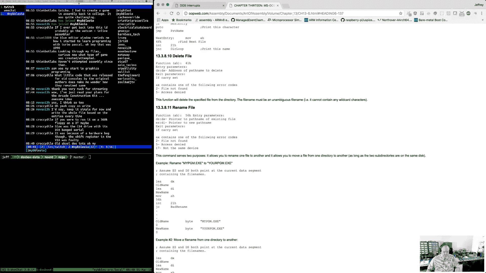

Purtty simple， let me tell you。Hey， noon beats me， I was saying earlier how when you followed how I liked your handle。

 that's pretty good。So we're going to have two parameters here。One is。

The old pointer to the old name and one is pointer to the new name。

I am working on an arcade game in X86 assembly language for MSDOS。

 I'm using DoOS boxox is my virtual machine for MSDOS and the game itself is a reference implementation for me for a video series I'm creating that teaches people how to do this from beginning to you advanced。

The game itself is going to be based on an old Midway game called Timber。🎼嗯。

It's a real simple game and it's I don't know， it's got just the right amount of complexity I think for a beginner project。

 it looks neat， it's kind of cute， it has some fun gameplay in it， it has some interesting mechanics。

 it has timing and some other things in it。But it's not a very complicated game。

 so the game itself will be fairly straightforward。

Right now I'm working on tooling for editing graphics data and other support data for the game。嗯。

So that's going to be four。We want to save。🎼Oh， BX is three。Now there's no file handling this， right？

No file in， just file names。So we're to save DX， DI。🎼All right， so。Our macro for rename。

We push BPDXDI and our parameters on the stack， we call our function。We get the original file name。

Actually， I think I've got these backwards。You get the original file name。

Off the stack and then we get the new name off the stack。We set our function code。

This one has no parameters， we call our interrupt， and we're done。AX will have。

The result state and the carry flag will either be set or clear depending on whether or not at work。

And now that I think about my stack code here。This would be。File read would be。The file handle。

The destination buffer at a size。🎼So， this。His backs。

Right because this is on the top of the size is on the top of the stack。诶。Oh yeah， actually。

 this is way wrong。So， it's。Size。Mffer。田le。There young。Anle is at the bottom。

Destination buffer pointer。And then size。And then。This one's probably backwards too。诶。

Top of the stack。Middle of the stack。Bott of the stick。And this was filed。Excuse me， file handle。

And offset。So this is bottom of the stack， this is top。This one's top， this one's fine。

That one's fine。That's fine。BileCreate has one parameter。The pointer to the。The string。🎼嗯。Perfect。

 all right， so let's do delete。I think delete should be。Easier。awesomesome。Yeah， stick around。

 we're doing X86 coding all week， and then next week we'll be doing C++。And then the week after that。

 we'll be doing arm assemblyly again。Lots of cool stuff。嗯。Deelete。Gee。41 DX has the path， okay。

 so this is like open。Or create action。羊呀。So yeah， Dx here is going to point at this stringringy。

This was 41。And then we need the Mackey Road。🎼あ。Don't need to save BPP need to save BX。

🎼This is great。嗯。And I think this。File create， it should be DP， DX， and CX。This isB。Bx。CxDX。🎼Yeah。DX。

 TX， DX。This one。It's BP， BX， EX， DX。TheX serious。This is why I always review my code。🎼EP BX。

All right， so I think we have all of the。File naming sts。All right。So， now。Let's see。

I want to do the new。And the。Yeah， I want to do the new stuff right because we can wire that up in the tool。

Relative， we can actually wire most of this stuff up in the tool relatively easily。嗯。Of course。

 I say that you know。Won't be so easy。嗯。So this one。We're going to move E with。Our bank headers seg。

And just to be on the safe side， I'll use the CS selector here。So that the assembler knows， I mean。

 to get it from there。🎼And。We're going to move BPp。

well actuallyre going to move BP with bank headers off。Because that's our current starting point。

And then we're going to aEC。嗯。We're I do a hole。A whole deal， right？So。I'll be consistent here。

So we're going to do a size bank blockter。And we're going to put that in。🎼このこ。

So I need to put it in a temporary spot。So I think we'll put this in AX。For now。

Because then what we're going to do is we're going to move。MD， what do I call it。Block， sag。With。AX。

We're going to move MD block offset with zero。嗯。And then we need to set the flags。🎼嗯。Oh。

 and we I said a couple other things， right？So。Let's do this， let's create bank。Ptter。海D。

We'll start him at one。So we'll move metadata ID with Bank。

Header ID will increment bank header ID after that， will move the type。I don't know。🎼Sometimes。

I'm trying to think here whats scripting language if I I do a lot of shell scripting if I do。

Any kind of automation like that at all。So bash。Type scripting。On the scripting side of it， yeah。

 probably Python typically， if I'm going to do something more complex。Sometimes Lua。嗯。So yeah。

 I would say either Lua， Python， probably typically for a lot of things， just shell script。

Depending on what it is。嗯。So bang。Type。Header。Well， so this is bank types so bank type。Srright。T哦。喂。

他可以。Yeah， for now。That's what we know about。🎼嗯。So we're going to have to be told what。

Bank type we have。So bank type。Is that？So our macro， bank new macro。This is going to be。

At least bank type bite。嗯。So we get the bank type， we put it in BX for a short while。

We move yes to our bank header segment。We move BPP at the offset for that。

 wherever our new one is going to be。We allocate the。Segment， the full segment。For our blocks。

 our data blocks， and we put that address into AX。I should say that segment。

then we move that segment into。MD block segment。We move zero into offset。

We have a variable here that tracks our ID。And we just increment that every time。

 so whatever the current one is， we put that in the ID。We incremented then we。We get the type from。

What was passed in？And then our flags， we just want to say that it's dirty， right？🎼嗯。🎼So， this是。

F Bank block 30。🎼And。That's really it。They want to add。🎼嗯。Bank petter offset。With the size。

A bank block。Because we're going to move it。🎼嗯。We're going to move it forward。🎼For the next empty。

Okay， so then let's see Cicero， what are the bad parts of C++ For Jonathan Lo to create J？

I'll answer that question in one minute here。嗯。this， so what am I doing， I don't know。

We want to save。E， BPP。🎼P X。AX。We want to add。2。SP， and then we want to pop an X PX。

How do I know I mess them？あ。嗯。Move MDID with Bank header ID。I heteroer ID。🎼就。Bad money， ever。There。

Okay。Here's my thought on Jay， and I've talked about this before。

 so I'm not going to say anything too new， I don't think。

 although I guess my thoughts on it have refined some a little bit over the。Over the months。

Here's my， my。Here's my thought。When I look at J and I look at how John is using it and again。

 this is just my。This is my impression based on watching him stream， I don't know John Blow。

 he doesn't know me。So it's just， you know。My impression of why he's doing what he's doing and where the benefits might lie。

嗯。My impression。Is that。It's the thing about Jay that is。Better。Then C or C+ plus is。The meta system。

Of the language。So I'll try to explain that， what do I mean by that？What I mean by that is。

A lot of programming。Is repetitious。And。When you start working on really big projects。

And John talks about this frequently， he's working on AAA games， he's working on large projects。

He has a team。And even with a team， even with years of knowledge。嗯。It still takes them seven years。

 eight years， you know， the witness， whatever， to make a game， right？嗯。🎼And。That's a long time。

 right， that's a long time。Believe me。Especially I think he had to borrow money， right。

 I think he had to， I don't think he had investors， but I think he had to borrow money。嗯。And。

It depends on how you borrow money and all that， how expensive that is but that's painful。

It's really painful to have something hanging out there that long。

Where you can't turn it around and make money on it。So。The primary motivation I hear from him a lot。

Is。Speed of development， ease of development and scalability of development so here's where CNC++ fall down right CNncC++ have a crappy macro system they have a crappy preprocessor now C++ is slowly evolving this meta programminggramm thing through templates however like constant expressions and all that stuff however it's a nightmare it's complex it is complex。

And it's just it's not immediately approachable， right？And it's a different。

 it's one of these things again where because they're trying to fit it into the nature of what CNC++ are now。

It's not。It's not quite the same。So you can't just use the knowledge you already have and write things in the language you're already writing things in。

To do meta programming， you have to do this other thing。

 which requires you to understand how that other thing works。

 which is know quite frankly very close to the compiler， and you have to know a lot。

 you have to know a lot about how that stuff's implemented and what the gotchas are to be able to use it effectively。

So。Going back to a lot of programming is repetition， right？And a lot of programming is。

This kind of quasi， recursive。Meta expression。As you get into more complex projects。To scale things。

 to get more people involved， to get more stuff done。

What you want to do is kind of like what I'm doing， you know， in a very small way in an assembler。

 I use a macro asmbler that makes lets me build macros that use macros that use macros。

 I can build abstractions， pure abstractions from the bottom。To create。DSLs。

 right to create expression sub languagegus， if you will， that allow me to define things。

Within the problem space I'm trying to solve。Very directly。Jay。

 when I watch him use it and I watch him talk about it。

The part that I think is like the shining crystal is the fact that J is both an interpreted language and a compiled language and that he can write any meta layer he wants in J。

And run it in J recursively。And so what does that do， that lets you build all this tooling。

In the same language， you don't have to do something different。

 you don't have to use some other tool， you don't have to understand some really weird esoteric you know。

 compilation paradigm。like constant expression and templates and C++ and you can， you know。

 one really， there's two examples that you see on his streams all the time one is his compiler。

 his build system。The build system is written in J。

 so he can change his build by just changing J code。He doesn't have to use make， he doesn't have to。

 you know， he doesn't have to do other things， right everything is in one thing。He also。

 he has reflection information that's built on the fly from his his build system essentially does that right。

 he has these concept of environments and he compiles code and he has special conventions that he looks for in his code because again J understands J so J he can get his AST trees or he doesn't actually used trees。

 he uses lists which just kind of weird but。He can get his AST model and he can inspect that in J as J is compiling more J code。

 and he can create additional J code that gets compiled on the fly。

He can get all the type meta information in his game， he can create like， you know。

 a lot of those 3D engines that they make。They preallocate right， like they say， okay。

 we're going to support you 100，000 entities in our world。

 so they preallocate all these buffers and they put structures and stuff in them exactly Jce and but he can do all that he can write tool code in J that introspects the code。

 his game code that's written in J and he can dynamically generate all this supporting infrastructure in J that gets compiled again by J。

So when you watch him work on that。Socobo game， and he has all that tooling and everything。Like。

 I mean， I'm going to say。Like maybe 60， 70% of that tooling is coming from the fact that he's co generatingrating all this stuff。

He's co generating all these data structures ahead of time。

That allows him to very trivially build an editor UI on top of his game engine because all that data is there。

Doing that in CRC+ plus is non trivial。 It's just it's just not you can't do that can't do it the same way。

 quite frankly， doing that。In most languages is not trivial， even languages like。C Sha and Java。

 right？Because C sharpp and Java and other languages of that Ilk。

They have more reflection capability。But they。They are not 100% self expressive。

 meaning that you can't。You the build system in C Sharer and Java are not built。🎼In。

The same language， right？Yeah， it's a。There's limits， right and。Right， exactly。

 because he's compiling everything， you know， Sojiman's talking about being able to do things across shared libraries。

 well， if you compile all this stuff， if you build all these structures and you can build proxies and shims and whatever you need right。

 so that however you want to structure things， it just works。Versus like in C or C++。Again。

 you can do it， but the amount of effort that it takes to do that is pretty high。

 comparatively speaking。So。To me， when I look at J， that's the killer application of J。

The other parts of the language are just John's particular， that's what he likes， right。

 so the syntax of J。Most of that stuff is。It's not yet okay。

 he's borrowing stuff from other languages to some extent。

 so he's taking C and he's putting some C sharpms and some goisms and some other things like that in C。

 he's making things you look at the syntax， consistency is a big part of the syntax。

So now there's some parts of it that are a little weird to me。

 like he uses the arrow operator for return types， but he defines。Types。

Of variables in a different way， and my thought is。

 well why if you're going to use the colon operator？Just use it everywhere。

 why would you use a different one？He。The whole scoping operator think a bit。Interesting to me again。

The way that function names in the global scope get assigned。

 or I should say in any scope for that matter。He uses the double colon instead of just doing the colon equal。

 you know， there's just small things syntactically that I think， you know。

 and he' said time and time again that the syntax is not finalized。

 it' just what he's using and he's recently I think in some streams talked about how they want to rewrite the parser and the compiler so I think you know there's probably a lot of change is going to happen there。

But really like syntactically， the language， there's， you know， that part of it is。Yeah， I mean。

 that's not really going to make much difference one way or the other。

 so I wouldn't get too caught up on。Like some little syntactical feature in J， right it's。You know。

I don't think it's particularly。Important， the bigger thing is。

Really how the compiler works and the infrastructure around that and the fact that it's self referencing。

 right？Now， with that said。嗯。He has said that Jay will not be self hosting。

Which I find kind of strange， to be honest。Like。So he has the J compiler written in C++。

And then the plumbing after that you know， is all in J， but there is a boundary there and you know。

 I haven't watched enough of his streams to know exactly like where the boundary is at。

 although I have seen some where he like adds new enum capabilities and he has to do that on the C++ side then he has to mirror some stuff on the J side。

To me， like I。I come from the school of thought when you write a compiler for a language。

 you bootstrap， you use some other language or an earlier version of previous your current language。

To write the new version of the compiler and then you bootstrap from there。Because then。You know。

 like the whole craft is is out of the way everything is。Is now in your new language。I don't know。

 so I haven't， again， I haven't watched every single stream of his。

I know he' said he's not going to do selfhosting， I don't know if that's because of time。

 I don't know I don't know what the reasoning there is。

 but again it seems a little bit strange to me but the language isn't self-hosed from a compilation perspective。

 it seems like it would be pretty trivial for that to be the case but。I don't know。

 there might be something， again， maybe the compilation speed thing。

 maybe there's just enough overhead in J itself that if he did the compiler in J that he wouldn't get the performance that he wants。

 I don't know。So anyway， that's my thought on Jay。🎼Yeah。啊。I think it's a cool idea。

I do think that Jay is it's。It's going to be a lot less。Applicable， I think。

 for most folks than they might be assuming。Right。And there's just setting aside technical reasons why you might use one language over another。

 there are sociopolitical reasons why you may or may not be able to use a particular language。Yeah。

Yeah， rest， you know， rest is one of those languages that again。

 I've dabbled with it just ever so slightly and you know， I always kind of。

Feel like it's just not quite there yet， it's not quite baked。

And so I set it aside and then at some point again I play with it again， but yeah。There's。

And if you search you know， on Google， you'll find people who talk about how。

They did Ru free here and they bailed and they went back to see her sequence+ and the reasons why and' you know this is not me saying rust is bad。

 it's not， it's just that it takes you know to get a language to the point where it's a。

It's a full ecosystem。It takes a long time。So， and for us specifically has some extra layers of complexity on it。

 in my opinion， that make that process， you know， is probably going to make that process longer。

🎼Instead of shorter， but。🎼So。I talked on， I think。Maybe it was Friday。Of last week。Maybe yeah。

 Friday or Thursday I can't remember which。And I kind of briefly talked about some other ideas I've been having。

Some of them spawned by you know me seeinging Jay， so I'm not going to say that you know。

 these are original or not。🎼嗯。But again， taking that core kernel of an idea。

Of what we're probably really missing in software development。Is not。

Another imperative alcoholg language。That's not with curly braces， that's not what's missing。

 what's missing is。A fully self referential。Macro system， macro language。

That is it's a macro language that lets you build other languages trivially。Right。

 and complete full feature， not these teeny， tiny little limited things like the real deal。嗯。Because。

In a way， I've been playing with fourth again。And you know， if you read some of Chuck Moore's stuff。

The history of fourth， you know， again， very low level， but the same idea， right？

He would go from system to system and he would have to bootstrap it over and over and over again in assembly language and finally he thought。

 well this is silly， right why do I keep doing this。

 I do the same thing every time why don't I build a language？That lets me quickly and easily。Define。

What it means to run on this architecture。And then I can port that you， slightly higher level thing。

🎼嗯。Wherever I want to go， and so that's kind of the history of fourth。

And that fourth has that really unique kind of bootstrapping capability in it。

Where it needs this very， very thin， tiny implementation in assembly language for any particular you know architecture that you're trying to put it on。

 and then everything else on top of it can be built and forth and，He can't do that。

In a lot of other languages very cleanly。So。诶。Yeah， so I mean， I've had ideas of。🎼You know。

What would it look like to build a language？Whose purpose is really to define other little languages that you're going to use to solve specific problems。

And， you know， that language it would be built within itself， right。

 it would be bootstrapped within itself。So you're truly separating yourself from the legacy of CNC++ and all that other stuff。

嗯。But yeah。Lots of ideas。Very little time。It's always what happens。Okay， so。

So we have bank news sort of。嗯。What's。Let's think through this a little bit， right？

We make VPR stack pointer so we can grab the type off of the stack， that's our parameter。

We moved ES with the bank header segment address that we got。That's the beginning。

And we move BP with the current offset， so this is the offset that's going to keep moving through that segment as we create new banks。

And then we allocate a full segment。For。The bank data， the bank data blocks。呃。And we put that。

Segment and Ax。 and then we move that into our。Our block segment。Field in our data structure。

And then we move the block offset zero because this is a brand new bank。

 there are no data blocks yet。We grabbed the bank。Header。🎼ID。And。Whatever the current value is。

 so it starts at one， and then we increment it after。We set that into the ID for this new bank。

And then we increment beL and then we write it back to memory。And then。And then we set the type，ooh。

 and I'm stomping on， aren't I？Yep， let's do C。没有。So we use CL as a temporary regimen because BL has our type in it。

So we moved， so this should be BL still。So we move our type into the tight field。

 and then we move our flag， our dirty flag into our flags。And then we add the size of a block。

To our bank header offset and that's。🎼嗯。Excuse me， that's it， I say that's it。嗯。

And so now I'm thinking that probably what we want to do。Is we probably。We don't want， let's let's。

Be destructive for ES and AX。Because the return value ought of this。So let's move Ax with BPP。

 let's do the ad against BPP。And then we'll just write that back。Heters offset。Okay， so。Because AX。

 then when this thing is done， so we call this inside of the tool， AX and ES will be set。

It'll be pointing at the header segment， E will be pointing at the header segment and AX will be pointing at the。

Offset。Of where in that segment we created our。嗯。Created our new bank。

So essentially we're going to get back a pointer to that now I'm not returning BPp that way because。

I'm going to let the caller decide like if it wants to swap BP。Then or you know。

 because there may be other， I'm thinking there's going to be other code， right。

 there's probably going to be indexing memory using BP。

AX is probably a safer value or safer registered to turn that in for short term。

Because bikeike Convention AX is typically kind of a return register。嗯。Yeah。

 I think that's a safe bedt。And。Yeah， so we get the BPp value before we add to it。

And then we store the new value back into that field。Okay。

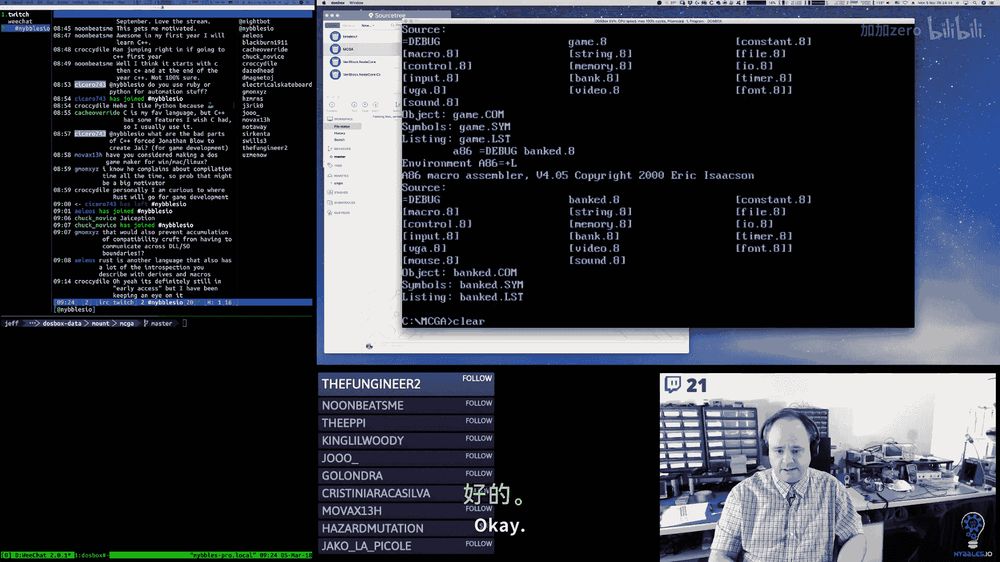

Let's make sure I don't think anything should be bad， but let's just double check。Looks okay。

It's okay。All right。And we're not calling it yet。Just make sure that everything assembles and。

Nothing funky happened here。All right， so there's Bank New。And。🎼So， now。Let's look at Bank Cate。

 what does that look like？So we're definitely going to have a macro for this。

And we're going to want to pass in a pointer to a file name， right？

And we're going to want to pass in。That's it， actually， because this is going to create。The file。Hey。

 D Mag Nij。🎼呃。I am working on an MSDs acade game that is a reference implementation for an educational series that I'm producing。

嗯。Today I started working on。Implementing more of the tool that I'm building to allow me to edit。

The graphics and some of the other supporting data。Specifically right now。

 I'm working on the- so I have this concept of a bank。🎼File that has。For a bank file container。

 the file has a bunch of banks in it that are defined as blocks that are 4K in size。

And so I'm working on the code that's going to ultimately allow us to create those files。

 load those files， save those files on I good stuff。嗯。是。Baannk file create is。

We're going to push this file name pointer around the stack and honestly that's what。

Create file needs， right？🎼So。And the carry clear is good。🎼嗯。E carry flag is clear。Then we're okay。

Otherwise。Bad stuff。🤧。All right， so。🎼Its listed at that。呃。All right， so then we want to write。

The little header， right？We want to write this。This guy right here。嗯。And honestly， you know。

 that's going to be the same every time。So， bank。File header。Is going to be a word。

That is some magic， right？あ。And then the size of。Block。Is that？So then file right。Takes。诶。

🎼This takes the。File handle， right？🎼あ。Takes the pointer to。The bank。File header。

And it takes the size， which。We know is。🎼4 bys。And this is kind of the same if Carrie is set。

Something bad happened。Otherwise。🎼4A okay。🎼よし。Oh， what was it？JNS， oh， is it just JS。

 I that it's just JS。🎼あ。Carrie flag。JB or JC， Ju if gear。这す。So that。All right。Now for errors。

But should come up with something really simple。🎼Here。🎼嗯。So since these are all file system errors。

I'm thinking probably as a to do for tomorrow， what I should do。Is we should probably。

Create table air。🎼To file system。This， I think we can say look to fat。That's done。All right。

 so we're going to end the file， we're going to have to add a little table of error strings。

And a way to look those up， which should be pretty simple， it's going to be， we'll have a macro。

We'll always pass into AX because the air always come back in AX and then we'll have。

We'll probably have to pass like two parameters like what？What were we trying to do and？AX。

 and then it'll be able to figure out which air it should dump。Based on that。

And then my thought here is what it'll do is we'll pass a buffer。🎼To。So we'll have a buffer here。

That gets the value， you know， gets the mean well like we do a pointer。Yeah， maybe a pointer or。

Maybe it's just a raw buffer we copy the error message into it。I don't know。Pointer to air string。F。

Something like that。And then we'll have to come up with what convention we're going to use。

Ourselves for how we check and error， right？嗯。We could use the same convention we could use。

The Car flag。As an error indicator。嗯。Because then in the UI， right。

 we can pop up a little window or something that has the air in it。Or we can write it。You probably。

Could write it。

Here。There's probably enough room we could safely write like a message down here or something。

Or we could draw like a box that has like a button on it。So， you know if there's an air。

 we pop up a box， we show the air， you click OK。And then we make sure that we revert state。

In the editor。🎼嗯。So we have to implement。Yeah， so the air handling。And then we need to， in this。

 we also need to finish。诶。Load and save。And。We also。Need。Add function to get。Current。Or。

New data block。For they。We haven't done that yet。🎼あ。And then we probably should have a help。Yeah。

 really。I think if we do those first thing and then。

That's going to give us everything we need then for banked。To wire up。Wire up new。Wire up load。

And wire up， save。And a wire up。New bank。And I know for these， let's see。

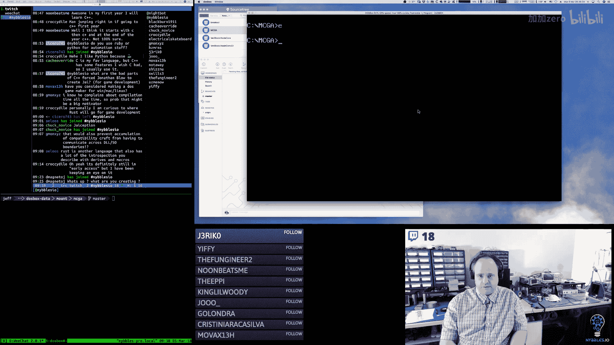

I think if I click new。Or load， now I didn't wire them up。

I think I had started to so we need to wire these up so that it starts the text input process so we can type in a file name。

I think I have most of the code there， so let's take a look at what that is。

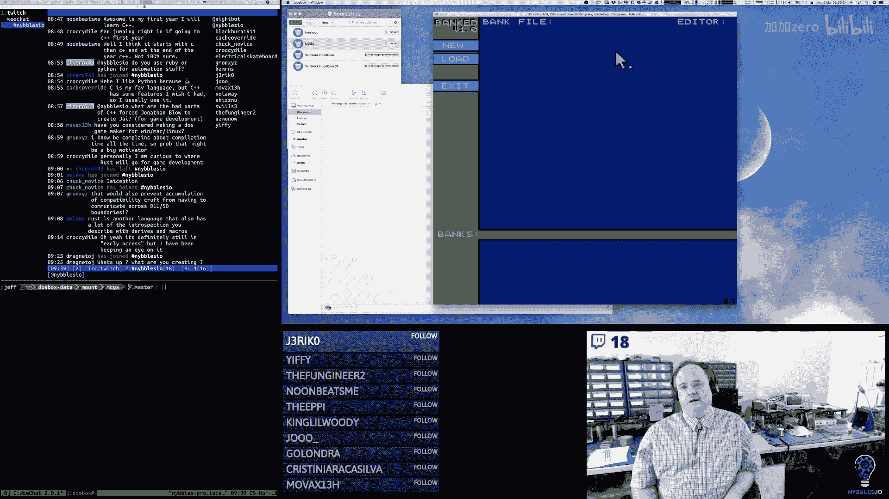

How that's shaping out。嗯。Yeah， so I have this text field structure。So it has flags， it has a size。

The position on the screen， keys， so what keys are valid， callback， buffer， what index are we at？

And then a pad bite， and then I have a macro。It defines one of those。And then。

And Ive for text fields， I have the bank file name。That's what I've got I've got the bank file name。

have valid file name keys and valid or file name callback。嗯嗯。So the file name callback。Yeah。

 it doesn't do anything， yet。So we need to do that。Now I oops。Oh， I remember now this was an array。

these are an array of valid key depths。So these are the keys that you can type for a file name。

These are the keys you can take for hex value and decimal value。Okay。

 so this is a pointer to that array。And then in the text update， text field update code。Yeah。

 this is the part that needed to be written。So that it draws the carry。

 it draws the text and then when it gets a key， it validates it's the right key。It should be。Here。

Text， feel。Processsses。Functions。So we need to get that kind of fleshed out and wired up。

The good news is once we do that then。You can reuse it？Air pop up。Window。With button。哎。Yeah， okay。

So we just need to flesh that out。All right。All right， so let's go over here。And there's my mouse。

🎼Back to， Mr。 Mouse。All right。I love。I use source tree for this because。It's just easier。

So let's add this。🎼And this。All right。We'll bring this up in a diF tool。嗯。

I'm realizing you guys probably can't see that all that well。Let me see if I can change。

The fonts here。Oh my god。🎼That。🎼つきてやる。And I have to reopen it， hold on。

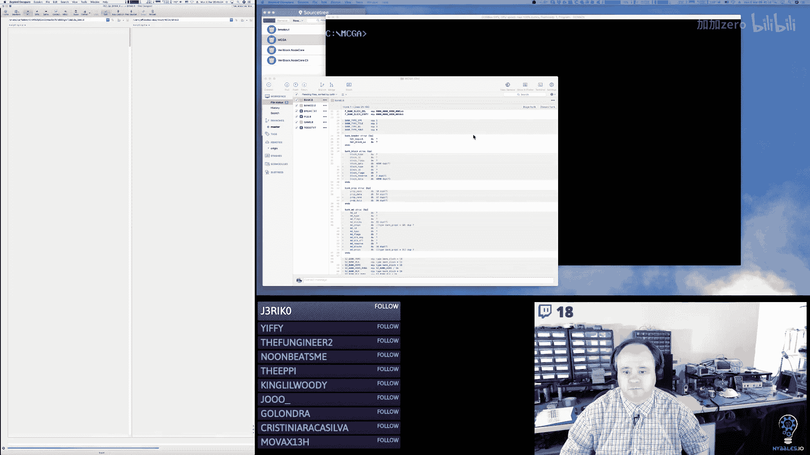

All right。I always hate tools where like I obviously changed the font。Oh， but that was a folder view。

There we go。Hopefully that。Should be pretty good。あん。Okay。Now it should be readable。Okay。

 so in the bank。🤧File。I added。Consts for the different types。We changed the size of our block。

Structure to fit with to be inclusive and to fit within the 4，095 bytes per block。

Because then that allows us to maximize how many blocks we can have in。A segment。

And then the same thing with the metadata， I adjusted this， right， we can only have 16。

Blocks in a 16 blocks total in a given bank。So I just changed that from 32 to 16。

And then I changed the size of some of our。Values here because they're not。

 we don't need two bites for them。🤧う。🎼嗯。And then I added in block segment and block offset。

 this is where the header is going to point at where in memory the segment for the block data lives。

And then there's a reserve bite here。And then I changed the number of props that we can have in a header。

And I adjusted the size of these， so a prop name could be 32 bytes and the link could be 96。

So this nicely fits almost you， I think we have 80 bytes a slo。This fits really nice into one block。

And then I created some additional constants for sizes here， for allocation。

 because the allocator needs to have sizes in paragraph。A number of paragraphs to allocate。

I added the bank header ID， this is a counter that we just keep incring every time we add a new header into the segment。

And then I changed these to be bank headers segment and offset。And then I've got to just。

A standard bank file header structure here because it's always going to be the same so I just define it once and then we just point to it and use it whenever we need it。

And then we've got our bank in it， which so we call this during gaming it or during。

And actually a game in it probably doesn't need to do this。Bankked needs to call this。

 the game really doesn't。So we could change that because you know， the game are going to waste 64K。

 but it doesn't need to waste。The tool， though， does need to do that。Then we have a function here。

🎼That will。Go through the bank header。You know， one block at a time。

 look at the header blocks and try to find the header block that matches the ID that we pass in。

And when it finds it， it returns back， AX has the value points to the offset of the block that it found。

And then we've got a macro that wraps that。And then we've got Bank new。

 so this is in the tool when we click on the new button， you're going to type a file name。

It's going to call create file first or actually。Yeah， do we need to create a file， probably not？

And only create the file。When we save。So yeah， when you click new。

 what's going to happen is we're going to call Bank New， we're going to pass in the type of the bank。

 so when you create a new bank，You're going to have to have。We'll have a little pop up or something。

That lets you pick which type you want right， or we'll pop up a list of buttons and you click on the button of the type that you want。

And we pass that type in。We get the type off the stack。

 we move ES with the segment of our bank headers and then we。

Move BP with the current header offset right so as we add new banks right we're going to be moving down in memory or moving up。

 I should say in memory。Moving that pointer to the next free spot。Until we get to the bottom。

And then we're done and I don't have any clamping code here。We'll add that。And then I allocate。

A full segment， so I allocate a full 64K for the data for that bank's block data right so we can have 16 blocks each 4090 bytes。

Because we have some headerbytes that we have to account for。

 and that's where our data can be stored for that particular bank。

Which for the purposes of what we're doing in this game， is plenty。嗯。

So we get that segment address and we put that in our block segment field。

And then we set the block offset to zero， it's already should be zero。

 but we're going to go ahead and just set it anyway。Then we grab the bank header ID。

We set that into the ID field and then we increment it and then we store it back out of memory。

And then the type。Oops， this is a bug， that should be C。嗯。Its。There you go， that should be C。

And then we write that back out to that field。And then we put the type in the type field。

 and then we put our dirty flag in the flags。And。And then we take our base pointer and we put that in AX because AX is going to be our return type。

 our return value。And then we add。The size of a block， which is 4，095 bytes。To BPP。

 and then we store that in the offset right so now at zero right we have a block that has data in it。

Block header that has data in it， we've moved the pointer now to the next free spot。

And then we return out， we have a macro that wraps calling that up， and we've got file create。

 and all this does is create the file in the file system and write the headerbytes。

 so file save is going to call file create。File Cate uses the underlying file stuff that we did。

Takes the file。The address of the file name off the stack。Calls file create。And if the carry is set。

 that's bad， we come down here to airs。Which we're going to do tomorrow。Otherwise。

 we then called the file right macro with the file handle， so now AX has the file handle in it。

 and then we pass the offset to our bank file header。

And we say it's four bytes and then that's going to write those four bytes to the file。

And that header is always the same， right， it's just a pretty standard header。If that aired out。

 we come down here to the air， otherwise we return back。We've got a macro for that， you know， file。

 save and load we're going to do tomorrow and then for the game engine。

 we're going to have a special version of load。Thatt it doesn't load up that header segment。

 we don't need that and we don't need the header information in the data blocks。

 we just need the data So what this is going to do is we're going to pass the file name。

 a bank ID and the buffer where we want the data to go This is going to open the file it's going to find that header find the bank header。

And then it's going to proceed to read each block。It's going to take the databtes， the 4090 datates。

 and it's going to put them sequentially in that destination buffer。So at the end。

 we're going to have a destination buffer that just has the data from that bank in it without all the metadata and everything。

So that is。What we did in bank。In the tool itself。We didn't do too much。En banked the program， sorry。

 just think you just want to load on the main monitor。So we added the include for the file stuff and。

I think that was pretty much it， really。Yeah， I think that was pretty much it。

So we're going to be doing more in this we added the call to the bank it。

So that's the other piece that we did。And then in game。You know， we can actually。嗯。Baanking it。

We can take that out because game does not need to call that。I added a B text file。

 I added it to do text file。Pretty standard for all the projects that I do we added the。

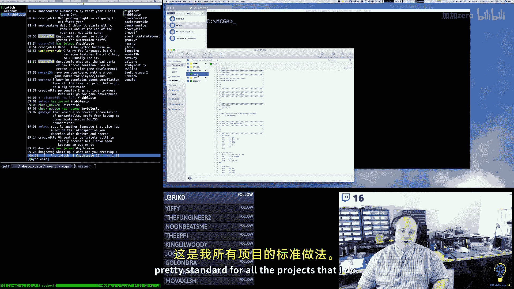

File module。

Which is all new right and this is just all wrappers around MSDs， you know interrupt calls for files。

 so renaming files， deleting them， creating them。Reading from them， writing to them。

 seeking all that good stuff， opening and closing， so pretty pretty bog standard wrappers around interrupt calling for that。

And then in game。Yeah， we just added the include。For the file stuff and。That's it。啊。

We're not doing anything else。All right。So， let me。And those。As ravens。てこに。Eurasian。🎼うんうん。

I'm going to push that up， this code is in the same， it's in a repository called Lumberjas。

 I think or MSD Arcade， I think it might be MS Dos Arcade。Let's look real quick here。

It's called MS do MS dos arcade。So it's in the Nibbles IO account。

And so I'll be pushing stuff to that repository as we go along。And yeah。

 we're coming up to the end here for today。But we're going to resume tomorrow and。

I think we'll make really pretty good progress here with this。And。Yeah。

 we'll get the editor to the point where we can actually start working on the actual tile and Sprite editor。

And the background layout editor， I think those， you know。Those should go fairly quickly， you'll see。

🎼嗯。I always say that and then， you know。Stuff happens， but yeah， I think for the most part。

 we should be able to make some pretty good progress。

And get things to a point where they're working enough at least so that we can use them。🤧。And。

Yeah that's pretty much it， so thanks everybody for stopping by and I will see everybody tomorrow morning at 5 am Mountain Time and we will pick up with more X86 assembly language and keep on trucking。

Have a good afternoon and I'll see you all tomorrow morning， by now。

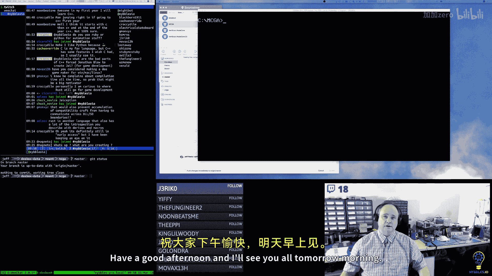