# 【精译⚡x86汇编语言】nybbles.io p04 p4 x86 Assembly： Error messages, bank type selection, bank files -BV1NPr9YKE4b_p4-

Morning， everybody。Okay。That's。嗯嗯。Just trying to gather my thoughts here on what we're going to do this morning。

As usual， I have lots of things I want to do。Okay。Everything we got to do。Okay。It is。

The 7th of March 2018， that's a Wednesday。This is the NiBbble Zo Daily programming stream on Jeff IStam Monday through Saturday。

 5 a to 10 a Mountain time。On my Twitch channel page， you can go to the bottom。That's Twitch。

tv/nibblesIonybbLEIO， and there is a schedule widget that shows my start times and that will translate those to your local time zone。

This week we are streaming about。The MSDs arcade game reference implementation I'm working on for my educational video series written in 100% X86 assembly language I'm using DoOS box as my virtual machine。

To emulate doOS。And so far this week， we've made some good progress around。Text fields and。

Bank files and trying to get the editor。Really doing something。So yesterday。嗯。After the stream。

 I was thinking about。What happens when we hit the escape key or the enter key？In a field。

 and I realized。I have no way of， so we're in。When they。Tool starts were in the no file state。And。

Then when we click on the new button， it takes us to the new file state。

 so current state changes to point to new file。But where we go back to， we don't know where we were。

And。If we go to like。IfWe transition to like an air state or something。🎼Then。

How do we know we go back to the new and so on and so forth？So what we need here is。A stack。

And so my thought here is we would do something like。Pointters， right， so these state。

Poiners that we have。嗯ん。And we wouldn't need。Current state anymore。

 because we could just look at the top of the。State stack。So。Hey， what I need to do here。Is。

Well actually thought current state would be like this state。

This would be this date pointer on the stack。So this is our reservation， so how many do we want？

This its two byspiece。I don't know if we say that we can go 16 states deep。That's 32。Bs。It 16 word。

Pointers。🎼And。This is actually。A pointer to。That place remember。Right so。Just like our regular stack。

 we point at the top。🎼Of the。Memory buffer， realcate the memory。And then the state。

 the stack pointer grows。呃。So actually， yeah， we think this needs to be。Like that。So there's the top。

 there's the bottom。🎼This is gonna be。The bottom。We'll call it state point Earth。🎼嗯。Hey， Wid life。

 how's it going？So the other thing I thought about was。The bank file name。

Probably shouldn't be our scratch buffer。嗯。🎼So， this only one。一会儿白。Yep， doing well。

So what we're going to do。Is。We're going to have a scratch for the field because I think。

That's going to be better and then we'll just copy。We'll copy the real deal into the bank file name。

🎼嗯。🎼That's gonna。🎼别玩。see， for a beginner， what kind of language do you prefer， I mean。

 I think about Java and Z++。All right，🎼Oh， I gotcha。🎼对呀。So let's see here。🎼系啊。

Try to take out of us to answer this question， it comes up a lot， so okay。

So you have to understand where I'm coming from when I answer this。So I started programming。🎼With a。

Machine had。No graphics， no sound。🎼，It was a kit that my dad built。During one of his。🎼Educational。

Courses。And it was a neronnics for anybody， Neronnics Explorer 85。For anybody who's curious。🎼嗯。

Very primitive， it was an 80，85 processor， which was a Z80 compatible processor from Intel。

It had extra IO capabilities。We used a cassette drive， a cassette tape player。One， that was。

🎼Specifically built for data， but。So it was like less noisy， I guess。But it was still a tape player。

I could play audio tapes and it just fine。🎼嗯。🎼For data storage。

And I got really good at using a pencil to。Rewind cassette tapes。Or to move them to just。

The right location。🎼嗯。And I learned assembly language。

 that was the very first thing that I did with computers， so for me。

Programming a CPU directly always has felt like。The right place to start。

And I still think that's true now that doesn't mean that in the modern world。

 I'm going to tell you to go off and build。The next QuickBooks in assembly language or the next。

You know， arcade game， modern AAA arcade game in the semi language。

But I think from a learning perspective， spending some time。At the low level。

 understanding what the CPU is。Understanding what registers are， understanding what。Cash is。

 understanding。What the CPU does， like what an execution cycle looks like for a CPU。

What it means to execute the next instruction， why is caching important in some cases。

 what is why do we have multiple layers of cash？And his CPU。🎼嗯。What's memory？How does memory work？

How does the CPU interact with memory？What are peripherals？You know what's the bus？

How does the CPU interact with all this other stuff that you plug into a computer？

What does that look like？What are the constraints and the complexities around that sort of thing？

I mean， in my opinion， if you're just beginning programming。

You're not wasting your time if you spend a year doing that。Now I'm sure that's going to。You know。

Some folks aren't going to want to spend a year on that。

Everybody wants to jump in and they want to make， you know。

The next thing and they want to ship it you know， next week， but。诶。

If you watch me stream long enough， you know， and I do this every day。嗯。

And I put in the salad five hours more or less every day。It takes time， right。

 even when you know what you're doing， even when you've been doing it for a long time， takes time。So。

Yeah。诶。So I would start with assembly language， I would there's this here and let me grab the URL for you。

And this is by no means the only。It's just one that I found。That I thought it was kind of neat。

 it works in windows。It's for X86。There's that one。There's this one， this is an older2。

 X86 is old too。Win。This is for Motorola 68，000。And here's one， if you want risk。诶。

Let's see what's called Mars。And here's the thing all of these are not， it's not mutually exclusive。

 you don't have to just pick one。These are just different。CPU varieties， different flavors。🎼But。

They're limited， but they're simple okay， you you download these packages。

 you run them and everything that you do is inside of them。

 you don't have to install any extra tools， you don't have to get the new。Tool chain running。

 you don't have to fight with nasm or Faassm or you know， masm or Tasm or any any of the， you know。

 you don't have to worry about make， you don't have to worry about， yeah。You overrun these tools。

 the assemmbler is inside of them， the simulators inside of them。And you can learn。

 you can spend time learning how a CPU works。What it does。

Why it does what it does and how you can program it， how you can make it do things for yourself。嗯嗯。

And in many ways， those tools are very similar to。Kind of the environment I had when I was starting。

 very limited。But you know， still interesting enough that you can。It'll spark some stuff for you。

From there， once you've spent some good time understanding CPUUs。Then I would move on to see。

II would not immediately jump into a language like Java C Sharp， Ruy Python， I would not do that。

I would wait on those。嗯。Stay as close to the machine for a while as you can。Once you've done that。

 once you've been as close to the machine as you can for let's say， a year or two。

Then I would slowly start。Um doing serious work may be in a higher level language just to get experience with that。

 just to see what some of the trade offs are。Um，And what you're going to discover is that like you know。

 you go to Java or you go to C Shaharp， if you go to Ruy or Python or whatever。

 you're going to discover that certain things go，  oh， wow， I'm just like。

 this is going so fast and then bang。You hit wall。Crarap。It's using too much of memory crap。

 it's too slow， crap， it's why is it doing， why can't I do this， why can't I do it that， you know。

 then you start runninging into the limitations of what those environments present to you。🎼So。Yeah。

 that's what I would do。嗯うん。Oops。Okay。Surehor点。Okay。So a little bit tidying up there。天气演。

Because I changed the way that the state stuff works。We need to。Push。initial state on the stack。

Let's do that。This way。So it was no file。St， I think。My memory's horrible。Yeah。

 no file state was our initial state。So we're going to push that onto the top， oh， and it's okay。

 so to do that。We need to make room。On our stack。🎼是是40号兵的兵。Manual stack stuff。

So first step is to subtract。🎼From。State pointer。2。And then we're going to。

Or do I want to make like a little macro？Let's make a little macro。I like little macros。はははは。

Thank you， I'm Lepi。I appreciate it。🤧嗯。It's right， happy little macros。

 like happy little trees for happy little clouds。You' got to have happy little macros。Push。State。

So what's pushed taken to do is kind to subtract。Two from our state Ber。Well， actually。No。

 that's right because we're pointing at the bottom right， so we want to move。

We want to move our pointer。🎼Up to。 And then we want to。🎼嗯。Move。State。Thank you。With。We pass。

🎼And then， we want to do。Cl to this the other way we'll say skate push。给塔。Yeah。I in practice typing。

So pop is simple。State cop。We'll move。What should we do here？We'll move。VP。

To point at the top of our state。That makes sense。PP is very heavily used here so。🎼We'll use。🎼然后。

Like can't I make a choice？Like that house episode， I can't make a decision。嗯。Hepir， full useBP。But快。

All， so that's going to get。Do what Mo AX 13 hex tells you to do。He's right。うんうん。So I think。

I think that's going to be okay。So we push onto the state stack。

 we subtract two from our so our state pointer rank， we I allocated 32 bytes。

So we can have 16 states on our stack。But the pointer is pointing at the bottom of that memory。

So we have to subtract。By two to get to the first ballot slot。

 then every time we push we subtract by two and popping is just adding two to the pointer just going back up。

And then getting the top is just moving that into a valid pointer register that we can use for other things。

嗯。うん。And BPP seems like a pretty。🎼Good breath。All right。So back in a knit。Banks here are。

My construct。诶。It's because of the way in which we have to deal with segmented memory on the X86。

And the fact that we want to have tools that allow us to edit。Data。For a game。

 I have this concept of a bank， and so a bank is。Symbolically， a bank is an ID and a name。And a type。

And then that bank has a number of 4K blocks associated with it that define the data for it。

And it's broken up into chunks like that for the tool， which is what I'm working on now。

 and then game the game engine will just actually suck the data into a raw buffer without all the metadata。

 so all the different little blocks will get compressed into just the data。

So that's what a bank is in this concept now memory banking。If you're talking about bank switching。

In a CPU kind of context that's a little bit different， so if you want me to talk about that。

 I can certainly talk about that too。嗯。So stay push and' going to push。No file。对。That's where we go。

 that's where we start。🎼Then。Our code here。Where so we're we're firing your time those we're reading mouse data。

🎼And then。Yeah see， perfect， I'm already using beef feet for。Yeah， that'll work。

So this is just state。T。And then from there， we're good because BPP has been set to the point or to the structure。

And then we can refer to fields inside of it。And then when we transition states。Okay， so just really。

Yes， you can， really quick reference here， this is MS Dos， this tool hails from 198788。

you can create macros inside of it that will do syntax sort of kind of syntax highlighting syntax highlighting was not that common in this era they had it like Boland had it to some extent in like Trbo。

 Pascal and Tbo C，It was not as common a feature back then as it is today。

 so and I'm using period specific tools， hence why there's no inile。But yeah。

 if I load these up here。If I load these up and vim。

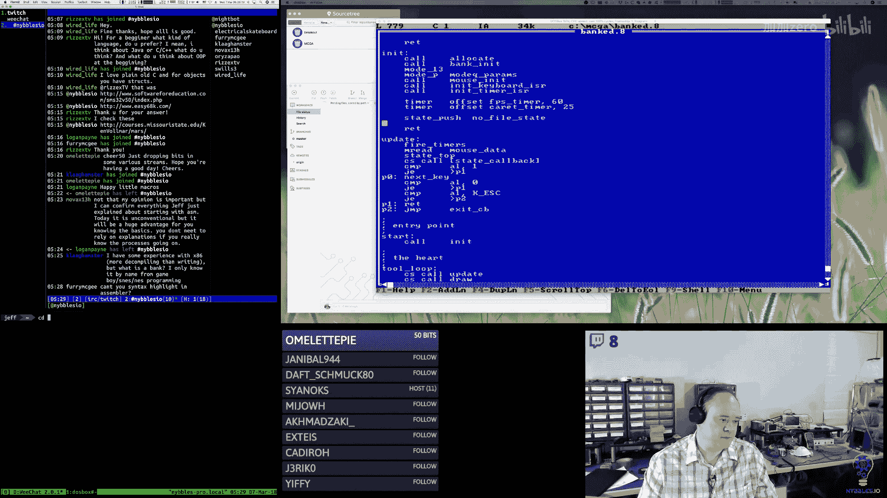

Although them is going to be confused because。🎼Of the extension。And I mustn't。🎼嗯。I can。

Now here we go。Here you go。So them。Then we'll syntax highlight it was fine。But again。

 I've been for this particular project because again。

This is meant for educational things I've been using period specific tools。🎼嗯。All right。

 then when we click on the new button。We don't want to just move well current state doesn't exist anymore anyway。

 we want to push。Our new state。🎼啊。🎼咱这个。We're want to push our new state home to the state stack。

And then。So， now。When we're done we're a state。We can return to whatever the previous state was very simply。

🎼By popping。Stayed off the sta， so here。We're going to do。States。Right， exactly， right？Yeah。

 like the distinction would be maybe like labels。Data directives。Pneummanonics。Maacs。

 you might want to highlight those differently。🎼嗯。Numbers， right， numbers versus text and。

You might want to like it， you know， if you do indexed or indirected addressing， you might want to。

Highlight that differently yeah。less than 10 things， right。

 less than 10 states that you have to handle。So。So in either escape or return。

 we're going to do a steak pop。And we're going to do some other things， right？let's look at those。

So a couple things。I'm just going to borrow this code as reference I'm not necessarily going to。

🎼Keepat a lot of it。 So in。🎼Escape， so you're typing in a text field。Ah yeah。

 I didn't want to do that， it escape， okay， so we're going to pop state。あ。

So BP here is already going to be pointing。诶。The text field。So we move it back to a read only。

And then I think the only other thing that we would want to do。Is。Disable the carrot。没。

And handle it here。And if we had escape。We're going to disable。So we change our field back to。

Read only and then。We disable the carrot and we go back to our previous date。For return。

It's somewhat similar。We want to do these， we wanted to do a state pop but。There is a callback。

Here we need to invoke。嗯。Because you get returned， we want to call a callback。To。You know。

 control state， right。Okay， they hit return， that's an acceptance。

 let's take the value in the text buffer， let's do some stuff， let's copy it into the file name。

 let's do file stuff right， so this is essentially like the event callback。🤧Excuse me。

When you do the okay。And at that is pretty much， I think what those are going to end up looking like。

Now， you know， this carrot enabled thing。We could。パパパパ。You know what。

 let's just automatically manage that because。I think we can do that。Purty。Pretty easily。

So in draw text fields， right， we already have this logic。That。If we fall into this block。

We're doing carrot offsetting stuff。So here we can just turn this on。And at the beginning。

You can disable it。Because again， draw text fields is being called every frame。

🤧So the state is being reset。So we can disable the carrot。

We're going to loop through our fields if one of them is enabled， then we can turn the carrot on。嗯。

All right。So now let me do this。Okay， there's our flag。So yeah， beginning of the draft fields。

 we turn it off。If we did find a field that's enabled， we turned on， that's it。

And then we check it in the loop。that's because I call it states。Fush。Okay？interestingtering。

 it's not， oh， that's because it's all spaces now。The。So now click here。あう。Our code is still setting。

 okay， so our initial code is still setting the length incorrectly， so we need to fix that。

If I hit escape。bad things happen。呃是。Now we're getting somewhere。Let me look at my。

My tiny little macros again。Okay。Hey， Blackburnr in 1911。Okay， so let's see here。First， let fix。

Things here。Yeah， because see I never changed this。🎼嗯。I'm just hard coding it to the end here。

Its actually the right thing to do。Would be a call。Text。The old。男的。Excuse me。

Because we already solved that problem。🎼function。Yt perfect。So I can't curor， but I can start typing。

If I hit enter， okay。O， yeah， I died。Thank you。🎼The tankt。Well， let's figure out what happened。嗯。

So I'm allocating 16 words， which is 32 bytes。Uninitialized。Let's look at the。File。Gosh。

 it's so nice having a list file again。🎼So。This starts at。D8。Oh。🎼脑袋。🎼嗯，没。I guess only showing one。

 two， three， four， five， six。🎼That doesn't seem right。That's 32。O。Well， okay。

 so the listing file is not showing all the data bitetes。But the address is showing that it's。Oh。

 because it's uninitialized， that's probably why。If I had to put zero here。

You probably would dump it out。Okay， so there is 3 there are 32 bites here。

And then we have two bites for our stack pointer。🎼嗯。🎼Okay。🎼You know what I'm going to do。

I make this a little shorter。Because I want to make this state stack。

86 supports symbols that are up to， I believe。3032 characters long individually。Thank。嗯嗯。

So then I got to look for。There。Now our pnemonics fit。

I was just kind of ruining all sorts of my fun shui。うんうん。Now that， excuse me。

 that's the field inside of the structure that BP is pointing at so that should be fine。Although。

That is kind of her bothse。啊。That's going to be all sorts of evil there too。Okay。嗯ん。Sorry。

 I'm on a code cleanup kick here。I've been trying to name my code。

Or name my stuff like module and then the function。🎼Within the module。

Because I think it reads better。🤧。That's kind of oh oh。Mh。😊。

That's going to probably break some stuff。So this will be TM。Fire。So this is now TM。Reeseet。啊。

I guess TM， we could do TM clear CLR， maybe。That's fine。🎼体验了。

We'll have to go off to go through and do a nice school。🎼Name， cleanup。They hit it with sound。

Although this should be like SD。🎼But。🎼啊。SoLet's call it TM。It's funny yesterday I was watching。

What was I watching， I was watching some of them。John blows older streams。

I don't watch them contemporaneously。诶。And it's inside the macro， okay。

Someone he was talking about some global variables。

 he was trying to refactor some stuff into one spot。

And he talked about how he just renames a global variable and then compiles it and see what breaks。

 and then someone in the chat said， you know， don't you have find all references and I thought， well。

 that's the old fashioned find all references。嗯。it's just a little。I'll just call it free。Yeah。

 that's just going to bother me。The idea too， like oh。嗯。Oh， because I got rid of the header lines。

 that's why。Yeah， so the idea is that。86 actually puts error messages in your code。When you run it。

 that's super old fashioned。Let's just make sure。Everything okay。拜了。All right， so back to the tool。

Yeah， so we' just got to figure out。What's going on there？now it's like totally host。Control delete。

Okay， so。I think。These macros look okay。呃。So okay， how many hours do I work？A we。

That's a good question。In some respects。I always like to say because again， like programming。

At least a good chunk of it's going on up in the old meat computer， right？Yes。

 there's the sitting in front of a machine and actually getting stuff done part。嗯。

You're always thinking about things， so in some sense I'm always working。嗯。

It's actually hard for me not to think about。Programming， it's hard for me to put it down。In my head。

And I've never talked about running code in my head。

We'll have to talk about that here in a minute because I've never brought that up on stream and I think that's a。

Interesting segue to that topic because a lot of people have asked about learning today and so I I it's related。

But officially， if we go by you know， wall clock time。I probably put in on my stuff， on my projects。

 I put in about 30 hours a week。🎼Now。Some are going to say， oh， that's not much at all， right。

 like you're not doing enough。And that's probably true on some level。However， for me。

 I've discovered that。I go back to Stephen King， Stephen King has talked a lot in all the different interviews he's done and。

Things that he's written metatopics he's written about writing。And， you know。

 Stephen King works like， I think he works four or five hours in the morning。

And that's it every day he does that fixed amount of time now some authors。

Do pages right I know that Laurel K Hamilton， I think she works on Page count。🎼So。

One day she might work one hour， she might crank out her 20 pages that day。In one hour。

 might just go really fast。Someday she might work 12 because she can't get those 20 pages done。嗯。

Stephen King takes the other approach， he has a fixed hourly window。And he works in that。

 I want to say like John LeClre or。Or maybe it was Tom Plant's Adam one of those guys。

 they kind of did something similar， like they work three hours every morning or whatever。嗯。

So here's what I I've。Found for motivation。For just general attitude。Happiness for myself。

I find that if I just， I know I say to myself， look。

 you're going to get up in the morning and I typically I wake up at 4 a。m you know。

 now these past couple weeks I've had some other things going on with clients and different time zones and。

So I've been getting up really really early， but I try not to make a big habit of that。

 but my regular schedule， you know wake up at four I get ready that takes me about 30 minutes。

 I stream from 5 to 10 am and that's my day I mean that's basically my workday and then you know I do other little things。

Throughout the day， it's not like I just go and sit and watch television for the rest of the day after that and I hate TV so I wouldn't do that anyway but。

呃。The core， the stuff that I really want to get done。That's my thing， that's what I do。

And I feel okay， like I can tell myself， okay， good job。You know you did your time for the day。

 you did your five hours。And you got done， you got done right， and some days it's painful some days。

 you know， I get done what I think I ought to have gotten done other days。

It's I'm disappointed with how much I get done。But the key is。You， know， it just for me， I mean。

 for some people， like maybe a John Carmack or I don't know。Other know， other people。

They can just work more and they can just get more done I've tried that throughout my career several times and it just it doesn't work。

And then I end up depressed and I end up。Really hating myself and it's just not good。So yeah。

 I do the five hours a day。It's like yesterday。I streamed late because I had a scheduled conflict because of。

Clieient stuff。🎼And。And I streamed anyway， and I think hazard mutations said，Gosh。

 don't you just want to take the day off？And you know， again， for me。

 like that's no because even though I did all this other stuff。I don't really consider that my work。

 I don't consider that my day。And so I got to get those five hours in。🎼嗯。🎼And。Yeah。

 I always feel better if I do that， if I at least do that。Every day。

And then it's kind of the hair versus the tortoise， right？Who wins the race？For me。

 I always seem to do better long term if I just make a little progress every day。And yeah。

 somebody else whos working 80 hours a week， maybe they get to that Dunmark know， just a bit faster。

🎼But at what。You at what cost？Now I pushed a little topic on the stack I'll pop it off and that was running code in my head right so a lot of people have asked about what to learn and how to learn。

And one thing I've never talked about， and I probably should。Is。You know。

 you eventually develop the ability at least I did。When you look at code。You can run it in your head。

The reason I can look at each one of these instructions and kind of rattle off。Wech you know。

 whether it's in assemblymb or it's in C++ or whatever。You'll hear me do。

Because I'm running the code in my head。🎼U。Now that's not to say that it's like a perfect em。

 it's not。But because obviously I make mistakes。🎼嗯。And I think every programmer does。

 but at some point you do kind of start to see code and you start to reel out， you know。Oh okay。

 yeah， that's， this is out getting memory and this is copying this to that and this is moving and you like see it。

In your head。And I will take functions， right， I will take things that I'm working on or algorithms I'm trying to tackle。

 and I'll have that code in my head。And I'll be， you know， my little。

Meat simulator will be running that code trying to figure out。

Why it's not working right and that's where my you know I'll get inspirations。

When I'm not sitting in front of the computer， and that's where they come from。And so that's a skill。

 it's very difficult to explain how one would develop that。So I fully admit that， you know。

 that's a tricky one。But at the same time。It is something that。You probably want to。Practice。

 you know？🎼呃。Getting to the point where when you're looking at code。🎼You。You know。

 with without much effort， you can actually kind of sort of。This is what's going to happen。

 this is what it's going to do。🎼あ。Oh yeah， absolutely。Absolutely， yeah。So yeah， it's。

It's really kind of interesting how your brain。Changes in how it all adjusts。All right。

So now back to why my meat simulation is not perfect because this is crashing。🎼嗯。

And what's interesting is both of these crash。The same way， which。Oh， yeah。Interesting。

I might partially know what's going on there。Cause。That's going to return。Wait。

 that's going to return to。That's going to return here。And then this is going to return。Down here。

And then this is going to return。Then we come back。It's when we come back to read the next top。

Something something is not quite right。Okay， so at the very beginning。

 we're doing an ST push of the no file state。And that's the state we're in when we start。

So is that is。So' trackinging two from our state stack pointer。

Which is pointing at the bottom of this 32 by memory range。🤧う。And it's moving。🎼That。🎼Pointter。

So this is a pointer to this structure the state de structure。F by ticket。It has a code， a pad。

 and a callback。cold的。Pad。I'm going to call back。Excuse me。🎼嗯哼。Oh， I wonder。I wonder if it's， yeah。

I'm thinking that maybe it's happening more than once。

So what's happening is we're actually calling pop。Multiple times。Which then is causing us to。

Overflow or underflow。Our stack。Actually， I think I originally thought。Callback would be called both。

So let's look at that。File name， callback。I's just going to call this F name call them。

VP points at the text field， AX is one if return zero for， process the data， right？

So we' just say AL。But that's not what's causing the issue， what's causing the issue is this。

And I believe it's because it's being called。Too many times。Oh yeah， interesting。Thats locking up。

Bank F name CB。🎼Thank Ka see me。🎼So that's interesting。🎼Yeah。

the reason it's crashing like that is because。It's making a call in the main update function。

There is a call to a memory。Address here。So if this is not pointing at something。Valid。

 it's going to go somewhere。Then move the program counter into new and interesting。

Dimenssions and space。Okay， so what we may have to do here。Theres something along these lines。

Let's comment out the calls。And then。We're going to save BPP。

 we're going to do ST top to get our current。What are we？I knew I needed that code for something。

So we're going to compare。St code with。🎼State。No state new file。🎼If it is。Not equal。

We're going to skip past。🎼你的怕。On the state day。This is going to ensure that we only pop the state once。

Versus what's happening now， I think， which is where。Actually doing it multiple times。🎼Okay， so。Now。

 I guess the other thing you could say is， well， why do we have this in two spots？

When we could have it in one。So bank ene call back。So just have this guy do that。

then it's in one spot。Of course， calling our function here causes the problem。

So we'll have to figure that out。Okay， so now our escape key handler and our return key handler。

Basically do the same thing。So what we could just do is call this call a text field。Call back。Oh no。

 but we're doing different AL is different value。诶。We'll burn a couple bites。

Maybe I'll think of a way we can。Nicely collapsed that down。I mean， I guess we could move A here。

 right？嗯。So if we did that。And we'll leave it this way。

All right。So。

I's still doing the same。あん。Of course， I can't see what it says。发为了一点用的。

I keep reformatting this stuff， but I。I think I'm deciding I would prefer it not to be so far。

I think that's looking a little bit better。I'm curious now。

嗯嗯。See啊。AndSo。You want a format of a similar source line page。A就。嗯。

Statements in 86 are line oriented， which means that statements may not be broken across line boundaries。

Okay， so he just， he doesn't have。Like a backslash or anything。No big deal。Okay。

Why why is this broke？I is the callback。Well， actually， okay let's。

It it's not。It's going to call the handler for the key， but that's not going to call the callback。Oh。

Wow。😮。

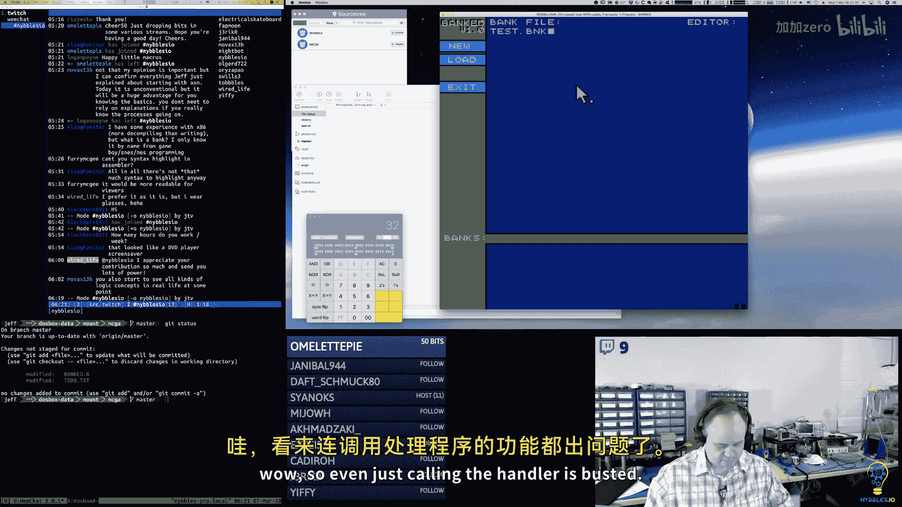

So even just calling the handlers bus。

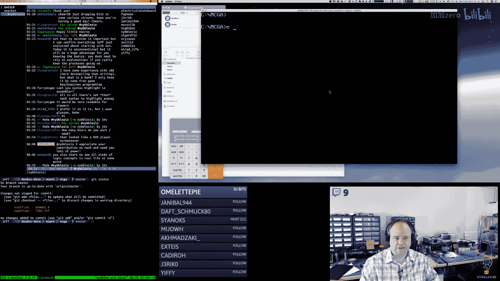

あ。嗯。Oh， is it because I'm doing this？Eventually， we'll get。Down to something that doesn't break。Okay。

 yeah， it's changing it to a read only field that's causing it to hang。All right。

🎼お。Why would that？Oh， wait。これろ。嘘。Doing that， right。

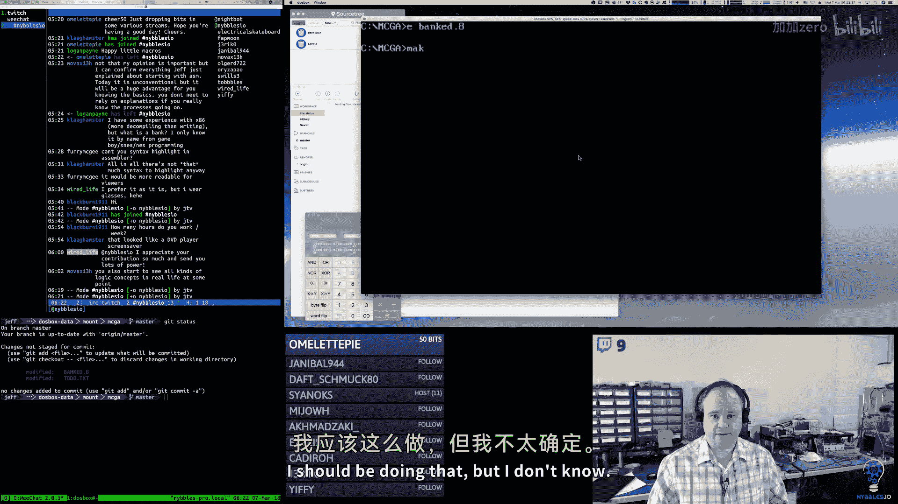

IfThat locks it up tireded in a drum。

Wow。What about that？Caus't that to happen。

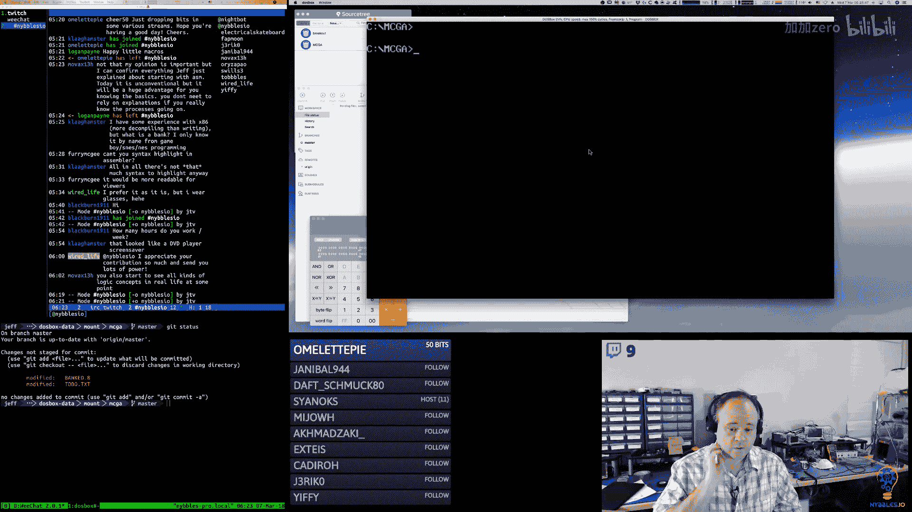

Because it starts off life as read only。All right， so for now。Let's take that out。

And let's try calling our call back and see if it'll change state。

No。All right， something's really out of way。What多呢。

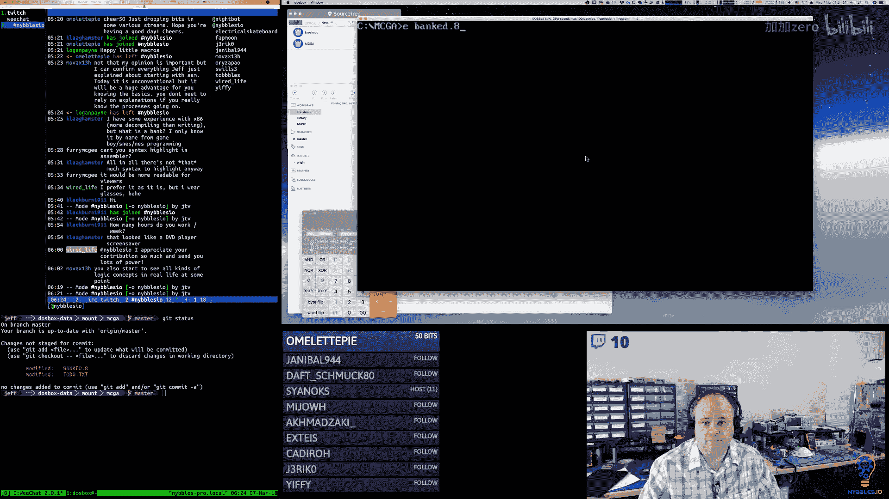

So what assumptions am I making here， I'm assuming。That BPp is。Pointing to。The correct text field。

Which is the assumption that all of these are made。

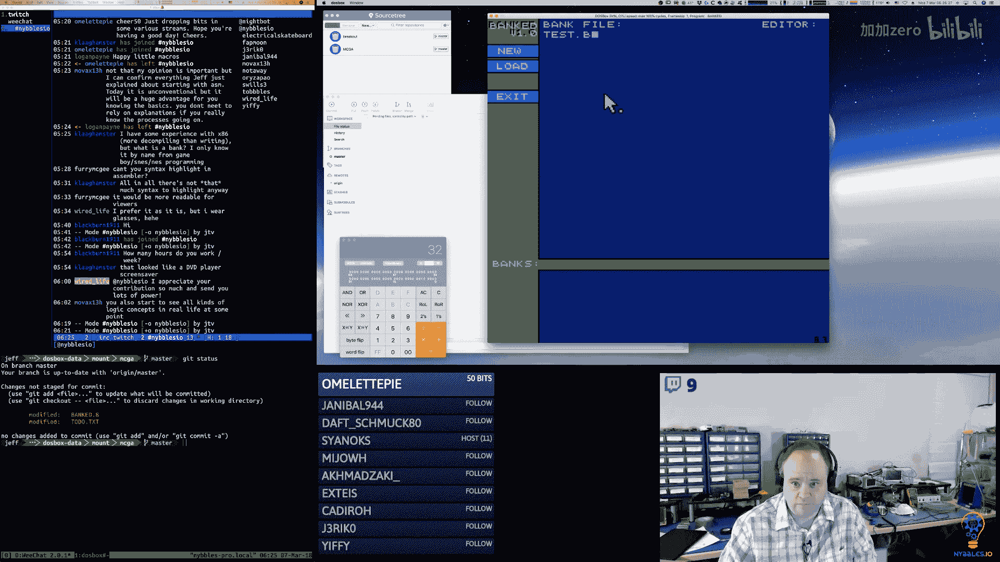

Fix it。就。🎼Why is this going。And so。So if let's escape， we go to L6。All six calls， text field escape。

Or it calls text field return。🎼And then these。Tt field escape。Os L was zero。Calls the call back。

And the callback is here。And all the callback is doing right now。Is。Popping the state off the stack。

If。If we're in the state， we should be into so that we don't do it more than once。🎼然后。

🎼Plan against see the problem。🎼Yeah， I think I see the。🎼あ。Can be。Because this is a variable。

Which is slightly different than a label。The assembler is going to treat this as looking at the value of this。

🎼Not。If this is a colon， that's an address for an offset。It's still an offset。

 but the assembler sees it as a。That's a variable。And it's going to load the value that it has here。

 so the value for this variable。Is the pointer to the bottom of the stack。

But I can't change if the reason that I think things are like dumping。Is I'm changing this。

 I'm actually changing the， I was changing the value of the。Variable itself。

Right in memory that's bad。🎼嗯。So instead I have to load。I have to load the value。At the pointer。

Into a register， then adjust the value。Then indirecting into the value and the same thing here。

This would be。What's the stack pointer value right now？🎼And。🎼To to it。🎼And then。Put the value back。

And this works because。We're just reading the value of the variable， which is a at the beginning。

 it's a valid pointer。Which is interesting， I'm not sure how。Push was ever working。But I do that。

I have to store it back。

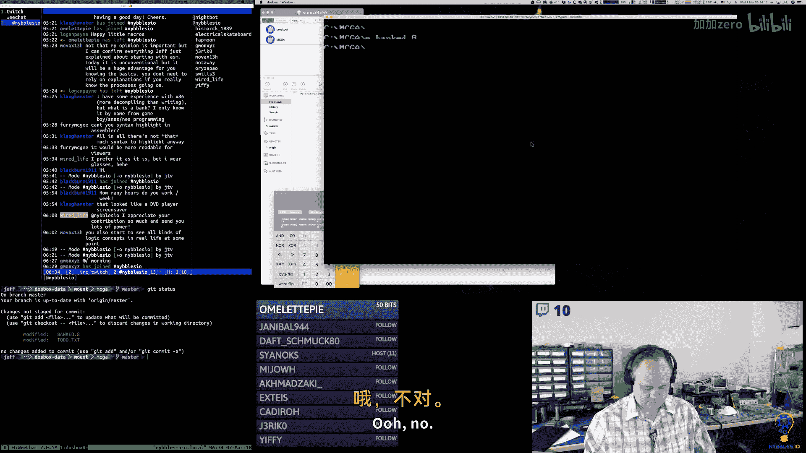

🎼go。🎼Al right， let's。Do this a different way。Let's make this a pointer too。A word。

This now is this is the pointer to that word。That's the actual value。

We we get the address of the stack pointer。🎼MBP。We get the value that it's pointing at。

 which is that's the actual pointer to a Poman's dad。🎼诶。We subtract two from the value。

Then at that location in memory。We put our value。🎼Then。We have to move。The updated address back here。

怕。Is okay， get the address of。Stack  point curve。Get the value。Add。🎼And then move。That value back。

Which makes me think I can just。That。And I can just do。That's。

🎼Oh。

哈。Still is broken。All right。You may have to break out the big gus here。

 may have to go into the turbo debugger。

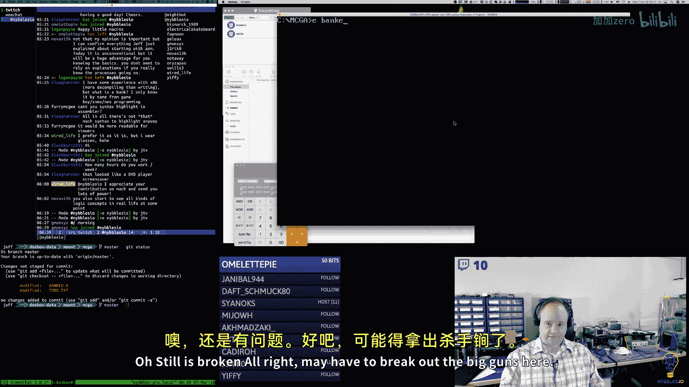

🎼And see what's not。What I'm missing here。One of my missed guys。I say that a lot。So ST stack bot。

Is a pointer to after。然后。I want to leave this planet go。谢着。Okay。

This was pointing to the memory location after these 32 bites。

Was pointing to the memory location after these 32 heights。Hin debt was a little close。

Because even though this word comes after that。I'm pointing back at that location。But I think I was。

I think I was mucking with my own。My own pointer here。So this， I throw an extra word in here。

So that this pointer starts。Well after the stacked。

Because if I was just using a register like the CPU does。It wouldn't be an issue。

But because I'm using another memory variable。To track it。🎼てら？🎼我出来。No。

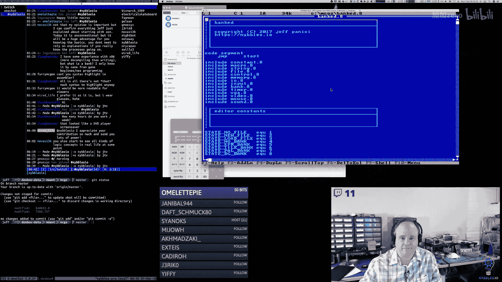

🎼Legal something。🎼我去。

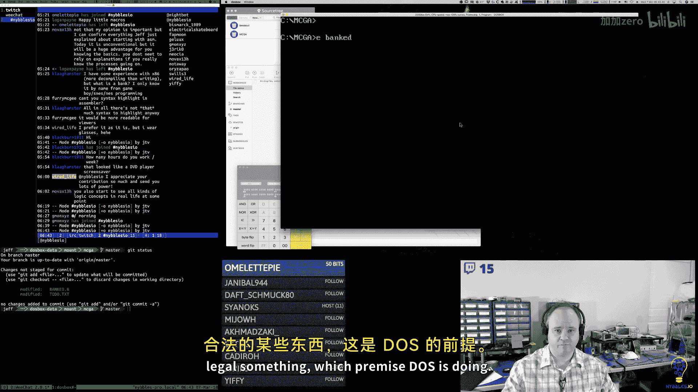

Ps gossip。🎼That accidentの。🎼电子。Amplementation of it。🎼ぐ来不ま。🎼太平雄。I change the value。

Of state's tax pointer。And we want to move。The address。Within State acquainre。This value。Pub。

Two to that memory location or two to the value。いやメを。And then。Top is we want to get。The value。另外一个。

You get。The value of it， what is that pointer value？🎼And put it into。

I mean， the push works。Because we're transitioning states。All right， let's。

Let's look at the list file。And let's go to Trbo debuggger。Well， first。Let's go to state's desktop。

State Sta top is at 13 DE。And see， this is exactly what I thought。Andn it's interesting？系系。So。

Our stack pointer variable。So the value of the address of where we're going to put stuff。It is。

This value is this memory location。It starts life as 13 FEs， so that's exactly what I was thinking。

 however。When we push onto it， we're going to subtract from that。So the first time we call push。

We should be subtracting two from that。So it's going to be 13 Fc。

This is where our first a value is going to go and then 13 FA。A Romania hate。And so on and so forth。

Okay， so let's go， I'm doing good。let's go into the first push， let's go to where's that code at？

We want to look for。ST push， right？So here's the very first one。That generates this code。

It's a macro。So we're subtracting the value， we're subtracting to from the value of this variable。

And then at that memory location that the variable points at。

 we're writing the no file or pushing the no file date。So this is 1AE6，1AE。One。🎼意思。6。

So this should be a sub， yep。rightSo I'll put a breakpoint there。啊。Yeah， see this。That's not right。嗯。

No， it is right。Let's doing this right。There's a memory location that has a value。

 that's our variable。So we're going to subtract two from that value in memory。So here， if we go here。

🎼Go to。One3 FE。So， there's our。There's just some random stuff in memory here。🎼嗯。🎼Which。No。

 actually this is not random， this is holding this holds that memory location right remember when it assembled the top of or the bottom of the stack。

The address was FE13， right？So we should see this be subtracted。Because if we back up。

Here are our zeros， right， here's where memory was。This is 32 bites here。

So the very first stack entry， the very first pointer。We should see show up here in memory。

And then the next one， and then。So run。Okay， so here we go。We're going to subtract two。From Yep。

 so now。This is 13 FC。🎼Which should be。Here。Then we're going to write。Our address into memory。

 which we did。However。No， see you put it in the wrong spot。Yeah， it put it in the wrong spot。

🎼So you put it。Put it here。🎼那。🎼Should have put it up here in the。🎼O。🎼So。🎼有这粉儿。This part's correct。

Can got look at the list file again。Let's keep push。No。🎼5。So now we're at 1AE8。18。1， A， he hates。

Okay， there's our subtract。And then this is still writing into the same place in memory。🎼This is。

🎼Co3 F。🎼O。So there's our free memory。Here's our。Stack pointer。Go。All right。

 we're going to subtract two from the stack pointer， okay， it did。Now we're going to move。

The pointer value that。The address that it's pointing at into Bx。 So now Bx points at。13 Fc。

 which is should be。Somewhere over here。Now we're going to move。That using that pointer。

 we're going to move our new address into there now it shows up in the right spot。

 so we haven't stomped on our stack pointer。Our stack pointer is happy。

An hour of stack contains C613， Hey， Lari Master。ok。So that part looks good now。So， now。Next step。

This is why the initial state was working because those two addresses are close to each other right next to each other。

嗯。We aboard。We're all boy。Okay， so this。We need to load Bx with the stack pointer value or the pointer address。

And then we need to move Bp with。The word。That's in the stack。For the top。Adding so doing a pop。

 this should be fine。Because all we're doing is moving that back。Okay， so now。What's。Reassemble that。

And then let's look at the list file。We want to look at two things。So here's our first one now's。

1AEA。🎼So。First is。Pop does not return to value in this case， P is just moving the pointer。Top。

 if you want to get the value， you can use top before you call P。Okay， so the first one is that 1AEA。

Then you want。S he push。没傻呀。All right， so that's at。15 DF。🎼And then。🎼We want the。

Callback right so that's。Ex field return。So that's at one。🎼For。🎼C。So let's go to the first one here。

🎼1， A E A。Butut a break point， this is writing so our stack is at the same spot。🎼Can to be。One，3 F。

Okay， so this range right here from 13 DE to。13 FF is the range we're interested in。In the code。

 let's go to 15 BF。Put a break point。And then we're going to go to one， four。0，2。was that right。

Or was it one for C2， I'm sorry， one for。Come on， thirdbody bugger。Yeah， so here's what we call。

The callback。I guess I should have put the break point or found the address of the callback。

 but I can trace into this。Okay， so run， all right， so here's where we push the first state。

Address onto the stack。And theyre。Oh， I haven't stepped over it。Okay， there it is 13C6。Okay。Go。

First now are things going to be totally whacked out？All right。

 so that's where I click the new button。So now。Our stack has two values on it。

 so the first state is 13C6。The second state is 13C， so that's the state we're in now。

And I'm going to type。Test， and I'm going to hit enter。Okay， so now we're going to step into。

Our callback for the。🎼Text field。And so this code pushed BP。This is loading。The stack pointer。

It's moving。Right because we're going to check。Is this state the state we want？Yep， it is okay。

 so we're going to add。So our stack pointer here， 13 FAA。Is now going to become 13 FC。🎼M。All right。

Come back up。M up。🎼呃的。Return。Okay， so this is the update function。Is where this goes at。

Now we're back at。15 DF。嗯。Why are we there？15DF is the callback for the button。🎼Oh， well， maybe not。

This is drawing。This is drawing the text fields。Weird。O。AhI'll be right back， guys。

I'm stretching the electrical。Caappabilities of this， yeah。

When the furnace kicks on and the coffee maker kicks on and the fridge kicks on and I have all this stuff in my room。

 the circuit in my room is overloaded。Unfortunately。holdold on， I got to turn my fan and stuff back。

Yeah， at least。Once or twice a week， I pop the breaker in this room。It's very annoying。

 I have everything critical on a UPS。So。It's just。I have to get up and。Deal with it all right。Yeah。

 exactly。All right。What's weird here？Is this work？I guess。I mean， it behaved the way I expect。

 why it？🎼Okay， so now it's not。It's going back into that state though。Okay， so this swell sort of。

🎼No。Actually， no， it's working。Okay， all right， all right， all right， hold on。你呀。

I maybe got it fixed。I know what codes commented out， that's part of it。Yes。Oh yeah。

 and and there's two things， Okay， so one， I know why the carrot is going all the way to the right。

At the beginning。So we want to do two things。 We want to call。We want to call text field home。

And then， end。Because。If the carrot， if we start。Then towards the end。

Then its that call may not work right？But if we go to the left first。Then find the end。

 we should be fine， so that's one thing。嗯。The second is。I have code commented out here。

To disable the field。And。So， new。Whys doing that。Turn， there you go。Now it goes back new， all right。

 so now I just got to figure out why the end does not oh and this escape works。Awesome。I fixed it S。

Long Lou， turbo debugger。All right， why is the end thing not working all of a sudden？

It was working and now it's not。All right， take that out。New。And going it is going to the end。

And then after。嗯。And I got to figure that out。Return。Boom， yes。啊。It works。All right， but。

Itn't it doing here。We push the new file state。We load BP with the pointer to the bank file field。

Which is the one that this is related to。So that works。

We set the flags and then we call text field End。And text field end。

Calls text field B until it clamps， text field B。Calls a clamp。Oh， I think I know what's going on。

Yeah。嗯。Well， first。Yeah， I know a couple couple things。So here's what's going on。Yes。

 we're pushing or we're loading BP。🎼With the。BaSo BP is point at the right thing。But。BL。

Does not have the TXT cha IDX image。So。Which is what this is assuming BL has been said。

Plus clear out the X。I don't think I need to see us selected。So we push the new state。

 we get the pointer to the field， we set the flags， we clear out BX。

 we set BL to the index now this code has what it needs。The function， correct。🎼New， yes。

That's bank enter。2， yep， now it's perfect。All right。Look at that。All right。

Now let's review that real quick。And。And it'll go on to the next thing。So actually。

 before we review it， let's look at to do。We got our state stack done。

After some confusion on my part。🎼嗯。🎼对。All right， now let's do her。🎼Yeah yeah。

Okay。So I renamed the fields and the state action structure to ST underscore to be consistent。

 I also put a padbyte so that we have an even structure size here instead of an odd one。🎼嗯。

And in our macro， I make sure that the pad bitete goes out。There are two。

I just restructured these so they look nicer right。I'll probably do it ten0 more times。🎼可能。

🎼Sometimes， it's just a。🎼That's top my mind。Thinks about things。

So I changed the bank file name field to use a temp string。

Because then we can scan that string and put it into the file name and set the length and the file name correctly and all that instead of the file name being fixed。

🎼And。🎼Li。And then I changed the name of the callback to bank F name callback。

Restructure these just to make them look a bit nicer。

The very first thing we started with this morning was the realization that so in the UI。

 I have these states， right？And the state is just a fancy wrapper around a function that gets called。

So that the program can do different things depending on what mode we're in。

I had a variable which is pointed at the current state。We had no idea where to go back to。

And when we start getting into like little pop ups and errors and all that。

 we might end up like two or three states deep。And so't we can't just store the previous date that's probably not going to work。

 we need to be able to go back to where we were cleanly， so I create a little stack。

It has room for 16 states on it。Which I think for this tool should be plenty。

 but we can always make it larger if we need to。And so then we have a stack pointer。

 a state stack pointer instead of a current state。And then I have some macros around that。

to help us work with that state stack so whenever we want to go into a new state。

 we do an ST push whenever we want to exit the current state we do an ST P。

That just changes the pointer and then if we want to know what the current state is， we do ST top。

And then that loads BP with the pointer to the current state structure。

Which is what was happening before I added the temp F name string。

And then we have the bank file name， the actual file name structure。嗯。And I'm thinking。I might。

Want two different macros， I don't know。For now this award。And then in our new。

🎼I added in the A1 here in our load because we're going to move to that soon。

 and then in our bank file name callback， it pops the state。 that's all it's doing right now。

 but soon we're going to。Inspect this we're going to check the AL flag， hey。

 was it escape or was it return， if it was returned， get the file name and O， okay。

 now go to the try to load the bank or create the bank and。And if that doesn't hair out。

Then we're in the。We have a bank state。We have a bank file state。Or we're in an air state right。

 and so we would push an air state on it。So we're going to start flushing that out。

And then in text field Escape and returnturn， these are the handlers for the keys。

They turn the field off。They set the AL flag and they call the text field callback function。

🎼And then。In our button， so when you click on the new button， this is the function that gets called。

 we push the new state onto the state stack。We clear out BX here。

 we set a BL to the current text field index， and then we call text field end。

 this is how the cursor shows up in the right spot。At the beginning。I rename ther。

 some of the timer macros， I'm trying to slowly rename things so that。the names are like。

Moular group and then the thing that it's doing。The carrot enable and Disable code I moved into the draw text fields。

 so by default， we turn the carrot off。We loop through the fields and if a field is active。

 we turn the carrot on。So it's all auto magic。And then at the very beginning。

 instead of setting the current state manually。I call ST push and I push the no file state。

 that's our beginning state。And then an update， I renamed fire timers to TM Fire。

 and then instead of doing this， you know loading BP with the current state。

 I call STT to get the current state on the top of the state stack。

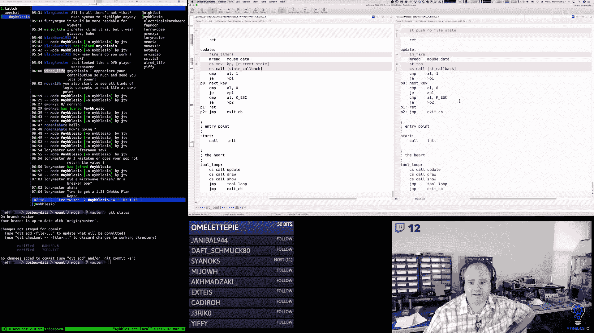

And then everything else after that stays the same。And then in game， this was just going to be。

 this is renames。Because I changed macro names。

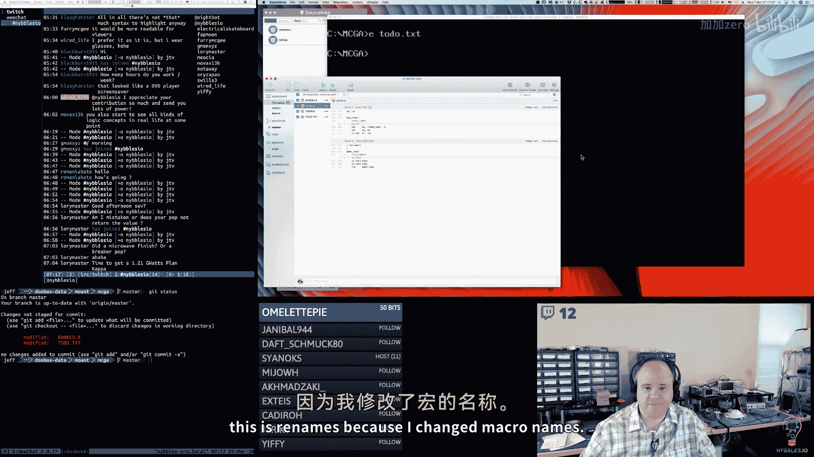

So。Reset timer becomes TM clear。And same TM instead of fire timers is TM fire。

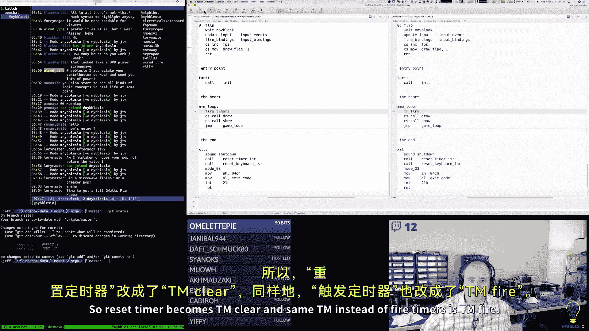

And then in timer， this was all just renames。

It keeps going to the left monitor because that's the primary monitor on the computer。And。Yeah。

 these are all just renames。Again， to try to slowly。Have everything be kind of module。

🎼放群。And then our to do list is pretty much our to do list。St staff。Move between states via ST push。

SV pop。St job。Text field， escape， return。嗯。Or I should say。Bank file name。Esscape return。🎼I train。

20年左南车。Rereenname。Timer， macros。🎼まあ就。放入。Patterns。嗯。Okay， I am going to take a quick break。

They had the family real quick and then。I will be back， I got brew some coffee。

And then what we're going to do is we're going to finish this off。We're going to get the file name。

 we' get the text put it in the file name， we're going to try to create the file。

 we're going to start testing those functions start getting that stuff going and then。Same thing。

We're going to implement our little error pop up。And then go to load。

And then we should be able to do load and it should be able to open the file and again。

 we should get errorss or not errorss。Yeah， so we'll just keep fleshing that out and see how far we get。

 so I will be back shortly。🎼Okay。Grabing my coffee here。Hey， thanks for the resub。I appreciate it。

哎 right。Okay。What we're going to do， I think the next thing we've got to figure out is errorss because。

We're going to start。Working with this file name right， and so to do that we have to。🎼嗯。

We're going to have to have a way to throw。Yes， I have， actually。🎼嗯。

I've seen capacitors get destroyed in all sorts of。Ways。🎼So。Okay， so let's talk about errors because。

probably want to do this。Because if you think about it for their file name thing。

 so now we're transitioning states。And we're going to come into this bank final name call back here。

And we're going to compare A with。0。And if it's zero。We're just going we're going to bail a hole。

Nothing's going to happen。Otherwise， we hit enter。And so。The file name can't be empty。

It has to follow a。Char do。Cha儿。Pattern。And for this tool。

 we could even go so far as to say that the extension has to be。🎼You know。BNK， right？That's just。

And what it has to be。To make life easy。So， okay， so how are we going to do？So let's do the first。

Let's write the code that's going to draw。A little pop up， you know。Draw message。

So we don't have to get real fancy with this。I already have。So if I go to game。

So let's see what that looks like。🎼Okay， so。There's a box。Maybe not 100% centered。

嗯。And maybe we want to make it。All right， so let's do this。Drb message box。嗯。

Let's make it a bit wider。🎼嗯。And let's move it to the left a little。Plus they maybe be 30。

And let's make this a bit wider。75。And that's because where I'm drawing it。that。There。

Now the message box always draws on top。嗯。Maybe 200ish。With the win。

I want to make it big enough that we can fit。Enough in it。Without having to do any fancy。

Scrolling or anything。So I'm doing 30 on the left， so 256， so 226。No， oh， because it's a width。

2 K6 minus 30。Minus。31906。Okay。So then I think we probably want to put like a little bar or a little tile bar up at the top。

嗯。So this one's going to be。31 for maybe even 32 by。35。By 1，90。5。By， I don't know。

 it's a five point font。So if we want to have a pixel on the top and a pixel on the bottom。🎼You know。

7。This could be seven。0。The width is off just slightly。Color， I don't know。

 we' going have to play with the color because。We probably want to use the white。🎼嗯。For the message。

 right？诶。You can use that purple， what is that purple？For the title bar。Exist。

So the button colors are。Let's burden that。Okay， so the button drawing， the colors are fixed。

 let's look at that。🎼Drab bhutans。🎼9。🎼Color 9。🎼Coer 9。And then we probably want to put a nice string。

In the here。Not in them。那是把。🎼Is that what I can。And message box title。Okay， so then。🎼Position。

We want to do something like。One，705。37。看。Okay。Let's do。だただた。I'm not， I'm not。You know。

 I thought a lot about the color change thing and I just。

 I came to the realization that it this doesn't really much matter。We could do a couple things right。

 we could say that pallet zero in the tile bank。By convention has a certain color configuration。And。

If you change it， then it's going to change the tool。嗯。

And don't don't do that right so we could kind of do the windows。

 the windows system color or the Amiga system color thing right where the bottom the bottom palette is kind of you can use those colors in your tiles but。

You know， maybe you shouldn't。That effectively then limits the tile pallet range to seven。Pets。

Of 16 colors each。Is that a great sacrifice， I don't know， probably not。

And if you really needed the eighth palette， you could change it， it just is going to change the UI。

And if you ever use an amiga， right？You know that a lot you know people tools would change。

 colors would change all the time right because people would tweak the palette and it would change the it would change the UI so I'm probably okay with that。

Small sacrifice。So what's 196？マイナ。Six times。12。About 160。That seems really high， though。Yeah。

It's more like。Close。O。So then。Well， I mean I think for the box， that's okay。

 and then we need a button。嗯。In the box at the bottom。You see this is the one downside。🎼嗯。

🎼To this drawing。On top of the buds。🎼啊。Because if I want to reuse the existing button drawing logic。

🎼嗯。Because all I would have to do， right is just add okay cancel buttons。

 put them in the right place on the screen。And they only get enabled when we show it。嗯。

But I'm drawing this on top of the buttons now。But the trade off is if I draw it。

We're going to have to make it smaller。We're either going to have to make it smaller or we're going have to move it over。

So let's just move it over， I think that's probably the easiest。

It'll just will'll center it within the editor section。

Instead of centering it across the entire display。あ。🎼So I'm going to say。

That we need to move this by。对。🎼Pre close。All right。So our mouse paints on top of it。

 I got to move my title though I didn't move the。So I put with 20 pixels， right？Yeah。🎼哎。Right， great。

 now I can use my existing button drawing code。So what we can do is we can create a。But嗯。Okay。

For now， a market enabled。And I don't know， where should it go？嗯。🎼It should go at。🎼I'm going to say。

170 by。65。To start。1，7，My 65。🎼And then this is the。Oh， actually what is that？

Would help if I looked at my。My macro。So it's flags， text， text position， then position。So flags。

 text position。And so this is prouding anyway。Can by。170。And then， this is going to be。

What I say one。70 by 65。And then the size。His。38 by 10， we'll just reuse that and then button。Okay。

 all back。And then button cancel。This is like。This is like 175 by。一せ？

So this is going to be we' start there once' going five。Six。This will be。嗯。150，565。とりえば。And。

But me cancel。So what I need。Button you cancel， call back。And okay。靠呗。Oh and these are actually。

Button and function callback。Here。And then I eat okay， and I need。Button， okay， oh， I just name it。

Oops， I actually name them really funkyy， didn't I？Button okay， call back。Button cancel problem。嗯。

And why aren't we seeing those buttons？Because they should be enabled。Oh。

Because I put them after the end。ははは。😊，呃。Absolutely you can， in fact。

 if you are curious about writing assembly on Raspberry Pi。

I have a I've been doing a whole video series of writing assembly on Raspberry Pi。

Those videos are still on Twitch， you can watch those if you want。

 and I also have an archive that goes on。YouTube。🎼So。And that project is ongoing。So yeah。

 you can absolutely 100%。Write assembly language on Raspberry Pi。Hey， okay。

 there's our cancel button。Which is probably overriding our。Our。Okay， button。So。🎼乖。Oh yeah。

 I definitely would be overriding it。Okay。Oops a little bit too much。So it's like three。🎼Okay。

Getting close。And I just realized that my button drawing logic on the left， it isn't。Yeah。

I think everybody's tired of using windows。I need to move。

Cancel over by one pixel in Indian boot okay over by like 10 pixels。Okay needs to go over 10。

Coancecil needs to move left by one。All right。Those look pretty good huh？All right。

 so now I just realized like I said that on the left when I'm drawing those buttons。

I'm not drawing the black border all the way around them。嗯。Hey， Ethan P。 Morgan。So let's move。

So the far right edge of our message。え。This is Dobox。Which is a pretty faithful emulation of MSOs。

So 246 minus。240。🎼Minus。38。To a 7。🎼Mus。🎼火0。🎼1，67。🎼But how does that。🎼That doesn't even work。🎼My man。

Why do you hate virtual machines？They can be quite useful。This is a game， it's an arcade game。

This is right now I'm working on a tool。For the game。

The reason I'm doing it is for a video series that I am producing that teaches you how to。

Build such things in 100% X86 assembly language， assuming。That。You don't know anything。

 you haven't done any programming before， but you want to learn。

So my series takes you all the way through not knowing anything about a CPUU。

 about memories about computers， about writing this code。

 all the way through to building a game What I'm doing here is I'm building a reference implementation for myself so that I know what。

What I want to cover when I produce the video material。Yeah everything is archived。

 all the videos are archived on YouTube， the source code is all on GitHub if you go to my Twitch page。

Twitch。tv/nydvLESIO you can see the GithHub URL also there is a night bot。

And I have multiple projects that I do on this channel。

 this is just one of them this week I'm covering this project next week we're working on another project that I have called ReU。

 which is a C++ engine game engine slightly different idea and then the week after that we're going to go back to the arm assembly project on the Raspberry Pi3 so yeah lots of stuff going on。

Theラ。Closer。Oops。So actually， I do want to go over there。Okay， that's too much。啊。Pors somewhere。

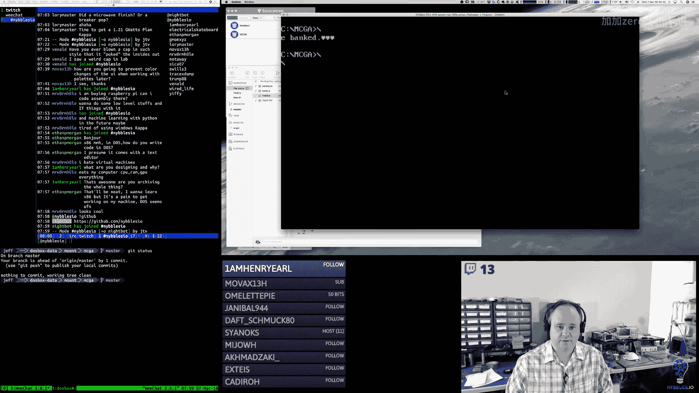

Ooh， time for reboot。

啊。妈妈。Inで。Oh， it's backing up， that's why。Stupid backups。

All right， there we go， so now I just need to move the cancel button over。

2，5 minus。40。Theres one。5。

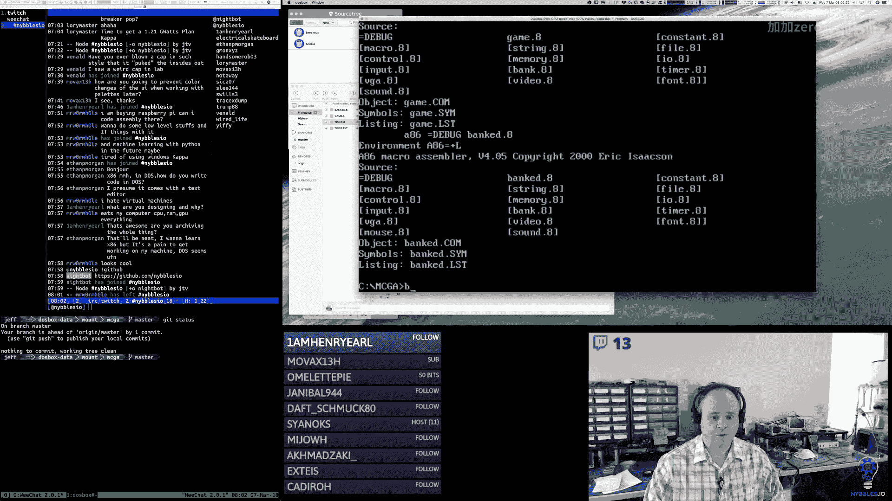

Boom。All right。And the button code already automatically handles this。

 even though these don't do anything。嗯。So I don't have to do anything special for the mouse that's all taken care of。

So I don't know， I think that's for the kinds of errorss and things or messages that we would want to present。

诶。I think that works。And so if we have to ask。Yes， no， do you want to do this， okay， canceled。

m and if it's a， you know， if it's like an error message and cancel doesn't apply。

 we don't have to turn that button on， we can only turn， we only have to turn on the buttons we want。

嗯。So。

Sometimes the music goes really quiet and sometimes it's really loud。Allright， so now。

We have the display， so let's put a little bit of other stuffs around。嗯。Just like with the carrot。

Let's add a。Message box。Enabled。And then。Here， I guess what we can do is just like we do with the message box or with carrot。

One of these days， my brain will go right。We'll compare。Message box enabled。With one。

 if it's not equal。What about L 0。Yeah， so what we can do there is the answer to that is yes。

Flags on the button。That basically whether or not the button is enabled or disabled。So。

What we could do。How could we do that？I mean， I guess if the dialog box， if we pop up the box。

 we could disable。All the other buttons， although that's going to make them disappear。

So I guess what we want on button。Is。We want enabled and we want visible， right？

So we want something like that。If it's visible， we'll draw it if it's enabled。

We'll consider it during the mouse click stuff。So by default， this is。This is enabled and visible。

Actually， I just had a。Right Put idea here。Yeah。It's war， I think。

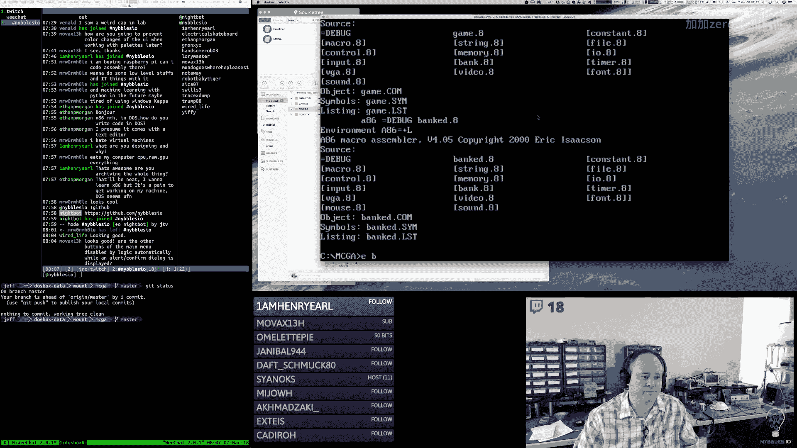

I should trust my instinct。Okay， so what？What I'm going to have to do。For the drop buttons is。If。

It is。Visible。If it's not visible， then we skip it。Otherwise。Enabled。And the text color。

How can we do this？あ。So it looks like I'm pretty much using all my registers。Well actually。

 so let's do this， let's just test that change first。Okay。

 so all the buttons are rendering right now， I haven't enabled the message box， so it's not drawing。

But。So exits enableds。Sade doesn't do anything， he don't do anything。Because they're。

So what I want to do is if the enabled bit is not set， I want to draw the text as darker gray。

So that's the next thing。Well， you could write a。Program to test it。

 but probably the easiest thing to do would be to just。Download an actual。Like Mac， stress tests。

Program， I'm sure there are some out there。Okay， so now in。And fire button。

 we want to test if it's enabled。So that's still okay。It's not enabled。

We're not going to do any button work with it。We're drawing， weve got to do one more thing。

So AX is the button position， Cx the size。BX is being used。Or。The horizontal line。Height。

 right because we draw a line at the top， we draw line at the bottom。But AX。No， Ax is。🎼uous， okay。

 so， but what I can do is。Pushhe X， Pae X。Cs move X， I button quas。Test。AX。F button enabled。Yeah。

 jump not zero to。How4。Okay。So if the button is enabled， we draw it with the lighter font。

 the higher the brighter font。Color， if it's not， we draw it darker。啊。Seriously。Okay。

 let's do it a different way then。There's more than one way。Button the。Okay。

 so button draw is going to be called every time we're actually going to draw a button。🎼And。

We're going to load the button position， load the size。We're going to draw the background of it。

 we're going to draw the top line。嗯。🎼O。🎼So， this is。What it takes to draw an actual button。

Then in the loop。And I'm going他。あ。So we load up the button array。They load up the flags。Hey。

 are we at the end？Then。We're not at the end， go here， otherwise return。

 hey is this button visible if it's not？Go there， otherwise call。Boo and draw。

Add the size of a button structure to BPP， jump back up here， keep doing that until we hit the end。

All right。嗯哦，你看。Because I renamed it。嗯嗯。Okay。All right， these buttons are disabled。

So they draw with the darker font。Wait， actually。That's backwards， I have my logic backwards。

 not a surprise。Why do I。After all these years of typing it。导耶。🎼だ。はいは。There we go。All right。

 so the buttons that are enabled。Our drawing with the brighter font。

 the buttons that are not active are drawing with the darker。Text。

So going back to what Move AX 13 Heck said。You know， now we're going to show all the buttons。

 but the ones that aren't active。They'll render as nonactive。 So when the dialogue pops up， we'll。

Take the active。And the enabled flag off。The button。You can always exit。

I think it makes sense to always let you exit。But yeah， like so if the dialogue pops up。

We don't want these other buttons enabled， we can do that， but they'll still show。🎼嗯。All right。

 and so then if I click new here。To that point， right， we should be stripping the。Enable bit off of。

These so that you can't。You can't click it again。

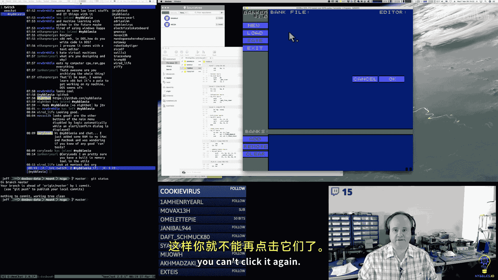

All right。So。🎼あ。

🎼Okay。Nice。嗯。

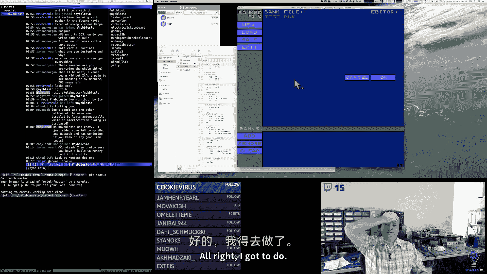

I got to。Okay， so the initial button date is now set for all of these。

The ones that show start off visible， but not enabled and the ones that show。For testing。

 I'm going to reenable my message box。

Okay， so that's what it looks like with the message box， with the buttons。嗯。Now， of course。

 to show the message box， we're going to actually have a state for it。

So then we'll have a transition function that takes us into。That state。

 that transition function will disable all the other buttons。🎼我。

Enable and mark visible the cancelance and OK buttons。

So now the only thing we had left from a rendering perspective。Is the just showing the message right。

 we've got to show the text in here somehow。🎼嗯。

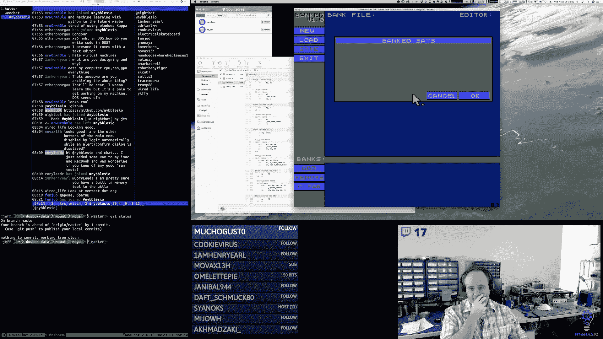

And I would like this kind of like。Relatively easy to work with。🎼So。How can we do this？

So here's what I'm thinking。Lessage box。🎼Lines。And we will have。

I don't know how many characters fit across there。How wide is it， it sounds like 100 something？

So 196 divided by five， not quite 40 characters。And we're not going to want to go all the way across to the edges anyway。

So we'll say it's like 35 characters per line。🎼So。嗯。We'll do 35。呃。Nsage box。🎼Line。🎼Li。35。Message box。

 lines。🎼万円？🎼好。🎼S is 10。So message box line count times。Message box， se length。

And we'll assign space characters to those。Initially。🎼嗯。I don't know， do I like that， I'm not sure。

This might be easier to work with in the long run。So let's just， for now， let's say we have。

We have five lines。So then what that lets me do。So again， in a stirdF macro。

That's creating a string structure that is a length and then the string bys。

 so the very first bite of every one of these is the length of it。诶。So that means。If C is zero。

Otherwise， there's a string here。呵呵。😊，😀Yeah。呃。Thank you。 I am glad that I。😊，Matching。Stereotypes。

Let's do this， let's make。BX， B our position。For。You know what they want to do。

Because we want to have a Sentinel bite here。That is something that we would not typically see。

我 make个。FF for now， I actually make just make it F。

Which that does mean that if we had a string that was exactly that length， that might be bad。

 but I doubt that's going to happen。We're not going to have strings that long there。

So if it's a zero， that just means it's empty， there might be something on another line。So we skip。

And then we jump back De zero。🎼嗯。If it's。Our magic。🎼Then。We're done。

Otherwise we actually have some content in the string so。Move BPP up by one。

 right because again we got to skip past that first bite or no， I'm sorry。

 we don't want to do that here because the string macro assumes that we're giving it a string def like structure。

So that actually works out perfectly。嗯。So we pass in the pointer to the string。

We pass in our position， we pass in our color information， our spacing。We add six to our Y position。

And then。In this case， we want to。Add。🎼The length。Of the string。Plus， one。To BPP。

 to get to the next string。And we jump back to E。That。That will allow us to index into we can encode。

 we can directly edit。Any of those strings。🎼嗯。😀Haはは。😊，Yeah。

 so now we can index into any of those strings directly and put whatever types we want。And actually。

 I think what I might want to do is create a nice little macro that lets us edit a string。

It'll just update the length and update the。The tax now。But here's the bug of boo。

I do have to prepa these。Because if I don't。Yeah， so it's almost like we want to string。

You know what we want。Because that's kind of nasty。I don't like that。Let's do this。Instead。

Let's open up spring。And instead of this， let's do string。Reserve。And it's going to be。The length。

Let you pass in and。We're going to dope。Space bites。For that size。I like that。

So it's compatible structurally。With St death。But we don't have to do goofy spacing and stuff。

So string reserve。We're saying 35 bytes， I thought we said。Beautiful。

And we could actually do the same thing here。🎼We could say that this is。12。🎼啊。🎼嗯。🎼O。

The string reserve， do we want to set the length？To what you pass in。

 or do we want to set it to zero？We're just reserving the space， so by default there's nothing here。

 the string is empty， but we're reserving space for a string up to that size。

And then when we put stuff， we'll have a macro that goes with this that will'll edit that。

Whenever we put text in here。嗯。We'll update the size to match whatever we put in here and we'll。嗯。

Yeah， that would work。So then we could have a macro called St set。And move。

BP with the first thing you pass in。🎼And。We know what the size of that is。Because of macro magic。

So we can move the first bite。At BPP。With the size minus the quotes。🎼And then。

How are we going to do that？Probably better to make it a function huh yeah。So。

So the macro can move BPp。With the address of。How would can do that。All right。

 I'm going to come back to that because there's a couple ways we could do that。

 one we could do a st copy。The other， we could have a macro that creates temporary storage。

Or uses a fixed temporary storage。To do the set。All right， so for now string reserve。

The length is zero。And it reserves the space。For what you pass in， so if you tell it。

 I want 35 bytes。It's going to reserve 35 spaces in memory。35 ASCI spaces in memory。

But the length will be zero and then we'll have to figure out how we're going to edit。That string。

Okay， so this writes the title at the top。We clear out BX， we move BH， which is our x position to 52。

 we move BL with 36， that's our start Y position， we move。BP with the address of our line list。

We load the first bitete。WBut again， these are string structures。Pascal strings， right。

 so these are length prefixed strings。So we look at the length， the zero， we're going to skip it。

Increment BPp by one。And we're going to keep doing that until we hit the magic FE。And at that point。

 we're going to bail。If length is not zero and it's not the magic number。Then we to we're going to。

Render that string to the window。So BPp is now the string pointer。

 which is what the string macro is expecting。BX is the position， we have our color and our spacing。

We add six to the Y position。We move BP up by one because we're going to skip over the length bite。

Then we add the length of the string to BPp because we just rendered the string。

So that moves us to the next string。Then we jump up and we do that until we hit our magic bite。Oh。

Do that every time。Really。😮，嗯嗯。There there's two ways to skin that cat。Oh， my goodness。O。

So a little bit of。B entryry working here， we compare our message box enabled flag。If。

 if it's enabled。We skip over the return otherwise as we return。

And then we render the base of the dialog box。And。And then our loop。

So if we have a zero length string。We skip over down here。We increment BPp， we jump back up。诶。

If we have the magic。If we don't have the magic bite， we skip over the return， we do the rendering。

 we jump back nod to L zero， and jump back to L1。Okay。Oh， look at that。😀哈哈哈哈哈哈。😊，It's not happy。

That was cool。But not what I wanted。You know， so now I'm wondering。If I should just。

Do this because am I making it too kind complicated most definitely？So who cares？If it's。

If it's zero length then the string， we're going to make a call to the string thing。

 it's not going to do anything。It's going to come back。嗯。There's some overhead there， but。

Not a big deal。And if it's an empty string in the sense in all spaces。

I believe string is already drawstring。Is already。Kind of smart。Okay， so we could optimize this。

To skip over。🎼Some stuff。Like as an example， we move BP with SP。We move SiI to point at the string。

We clear out CX and we move C with the length of the string。

But one of the things we're not doing here is。We're not bailing if。The zero。If it's not zero， cool。

 keep going。If the length is zero。没有。There's no point。Okay， so that's one small optimization there。

And then we can also make an optimization in the string inner loop if it's a space。

We can just skip to the next character。嗯。Okay， so we load the length。Is the length of magic thing？No。

 it's not the magic thing， okay， draw the string。Which at this point is going to be a bunch of spaces。

🎼And。And actually， you know what and do。For debugging purposes。We'll put a star in there。Instead。

Just so we see something。Otherwise， oh yeah， we did hit the magic thing bale。Render the string。

 increment our Y position。Increment BPp by one byte past the length。Add the length that we got。

So now we're pointing at the next string， jump back up here。

 do it again until we get to the magic bite。This we don't need。So that just simplifies that。O， yeah。

We're getting there， so it's 32， 35 is too big。But we can。给你吹表演。There we go， so maybe maybe 30。

 I think I should say 32。Then like。I lost the plot somewhere。And then while we're at it。

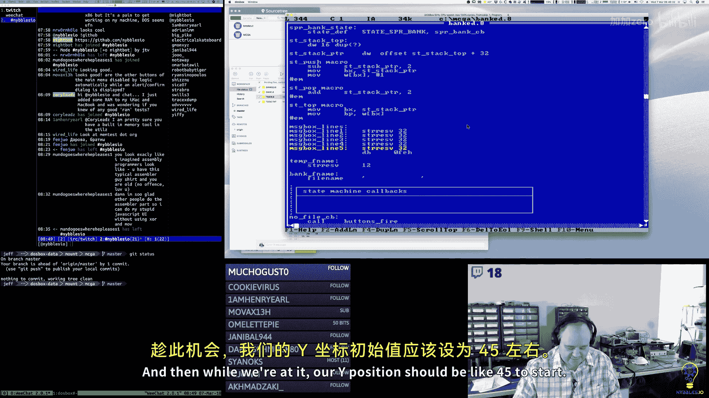

Our why position。🎼是的。Like 45 to start。There we go。All right。

I mean and look our frame rate is still 87 framed a second in this。

 so I mean the fact that we're rendering all that is。Not really。And of course。

 I'm putting asterisks in our temp strings， so our file name has asterisks in it to start with。

 but that's okay。嗯。So I would say we can do one， two， three， four， five。

They would say we can do 10 lines about。That's a lot of text。Let's do this。Line zero through nine。

 so we have 10 lines。320 bytes， well， 320 plus 10。3 30 bytes for that the air section or the message section。

Perfect， so actually I can spooch up to start by two pixels。啊。Better pushing down one。🎼Yeah。

All right。Not bad at all。🎼Okay。And then I would even say the x， the start X。Can move over by a pixel。

 maybe。Here you go。That looks good。We can then we'll create a little macro that doesn't copy。🎼嗯。

And we can fill。These lines with whatever text we want。

And that's what we'll render here when we show the。Dialogue box when you show the message box。

So it'll be up to us to understand。That we have 32 characters per line if we want to wrap stuff。

We have to kind of put it in the right lines right。

 but the nice thing about this is if we want to have a message that has like line breaks or whatever in it。

We can just clear。Wines， right？And。Put stuff where we want it。And it gives us some layout control。

 Yeah， exactly， exactly。Yeah， so it gives us some layout control of what goes in there。嗯。Okay。

 so then。Let me。Edit the string code here。We'll put spaces in there。🎼や。There we go。

 now our rendering spaces。Beautiful， this if I go new。And that's okay， you come back， yep。

 it's still working。🎼你服。All right，🎼嗯。🎼哦哦。I troubled coffee。Within one second。🎼呵呵。😊，It's funny。

The other guy like， oh， you know， you match my。Stereotypical envisionment of an assembly programmer。

And I kind of have to chuckle because。By spilling coffee on myself now I really feel like I fit that。

Description。🎼ふふ。🎼呃。We old people can get away with that stuff。

All right， so now。Let's test。Something。More advanced is。Lets。Not turn on。These bhuons。All right。

 so okayca and cancel are not going to show up by default。Which is what we want。

 we're going to turn off our message box。let's just make sure that that works。あ？

🎼や。All right， no message box， no extra buttons。Now。We're going to add。🎼A new state。To our state。

States here， we're going to call this。Message box， state。Sk death。Greatate message box。Message box。

🎼好白。Right。🎼So， now。In our state machine here， we're going to have Me' Fox called back。

And he's going to call fire buttons。The button's fire， I changed it。🎼Yeah。

While I'm in the mood of renaming things。🎼All right。Okay， so when we。

So we're going to have a transition function。Call message box。し？

What is Message boxox show going to do？🎼嗯。🎼He is going to。🎼Push。The message box。🎼State。

Onto the stack。🎼He's going to。🎼3。Message box enable to one。And then we're going to load。B， P with。

Our。Button， okay。And so this is where for electric the buttons， let's get clever here。嗯。Button。Set。

So， this will。BP with whatever we pass。能。We'll take the。Bututton flags。And set that to。

Whatever we pass in is the second parameter。And。Well be eco friendly。

And we'll preserve BPp in that process。Okay。So now I can do button set。And pass in。Button okay。

And then F button。The label。Or F。あ嗯。这是勾。said。Cancel。Like so。And then。Okay。

He checks to see if he's in the。🤧。Actually， I'm just thinking we don't even probably need to do that。

 we can just pop。And move A with one。So you hit okay。Or nope， you had cancel。There you go。

 and that'll pop that off。And then。嗯。I guess the only other thing we would do here。

Is message box enabled？Zero。And button set。O。行。So。AL is our return code， you hit OK。

 you hit canceled。嗯。Disable the message box。Caisable the buttons。And in this case。

 we don't want to show them or enable them。え all。All right。

Now I guess what can I I got to trigger it off something。What's。Let's trigger it off of。

Load just for testing purposes。So if I click load。What's going to happen。

 What's going to happen is I'm going to call。Message box show。So。Oop， there it is， oh。

 I didn't turn on cancel。h，Okay， that's interesting。Do。And okay is not working。All right。Well。

 let's figure this out。So first。Button cancel。Button set， button cancelance， F button enabled or F。

Oops if I turn on。Okay， so that's one issue。嗯。UThat's not good。Ws to not showing all the text。嗯。

So we have a state death。Message box， state message box， and then message box callback。Message box。

 callback。Calls。Buttons fired。Why is our cancel button getting whacked though？That's disconcerting。

Cancel label。🎼嗯ん。that's strange。So I button， OK， callback button， cancel callback。

But it's like the buttons are not actually getting。We' not being in。Ah， well that could explain。

Partially what's going on。I might be stomping on。Button text。That's a word。嗯う。Okay。

 now let's change our。YouMa I grow a little bit here。We'll push the P& Bx。

We'll use BX to hold the flags。🎼And then we'll put， we'll do a。The reason is too is because。I'm。

 I think I'm setting the bits that make two。So somehow I'm stomping on。I'm sting on there。

Which is not good。Which also means the bits may not be。But see nothing else is working boom。

That was interesting。All right。Why， why， why， why， why are you doing it？Why， why are you doing this？

So let's do。BP， let's do a bike hand。一皮。So we load BP with the address of the button。

A Bx with the flags。 and we're going I'm not even going to use the flu struck stuff。

 I'm just going to write。We BPp points here。

A see， look， it's something。欧嘢啊。Somes all sommpy。嗯。What is going on？Okay， so so far that's all right。

Oh yeah。Wow。What did I do。Okay， so let's。Let's check a couple things here。

But let's not use these macros。Let's just turn knee。Box on。Even that's messing something out。Yeah。

 okay， so we'。So I'm calling messagesage box show。So we click onload。So just like new。

 the new button。Except in this case， I'm calling a function， but you that shouldn't matter。嗯。

I'm calling Messagebox show。We push this message box state。Onto the stack。

We move message box enabled to be one。And then we return and then the other the callback for the button would return。

And now we're in the。Now we're in the message box state。

And the message box call back calls buttons fire。So let's not call that's。啊。Interesting。Okay。

Why would that be？Because it's Navy recursive， I don't know。Surely。All right。

 so let's slowly piece some other stuff together。Put the buttons back。Load， okay， good。So wow。

 it's that。That's。The button。スタ？🎼我 why why why why。O。Well， at least I know what it is。

 it's not my macro。Spending time with my macro， like， why is my macro not working？嗯。Load。Yep。

 all right， beautiful。嗯。First now。I can't call the mouse the buttons to ups。

 so we're going to figure that out。And why does it work here， but not here？So the lus fire。

So we load。BP with our mouse data， we get our mouse position and button。And then。

We test to see if it was the left mouse button it was。Fired。If it was great， otherwise we bail。

We load BP with the start of the buttons array。And we。Get the flags。Fits the last button。Then， we。

We return， otherwise we jump to L2。We test to see if the button's enabled。The button is not enabled。

We jump to L4， we add the size of a button。VP and we come back up to L1。

We load the next flags and we repeat the process。If the button isn' enabled。

We load the button size into AX or position the size into CX。We copy。The position into DX。

Because we're going to get a rectangle， right。This is the code that determines if the mouse。Position。

 the mouse tip is within the button。It is if we ultimately end up here。Then。Is our function， no。

If our callback is null， then we move on Otherwise， we go ahead and we call the。The button callback。

And。We should， yeah。I think I see some problems。So AX。BX。C X， D， X。一平。

And that might be why that callback。Was causing problems was because we were mucking with the state of this。

So before we call the button callback， we save。The registers that we care about。

Then when we come back， we pop them off and so then we're back where we were。Okay。

 I believe that was。The problem。

Even though my macro very kindly saved the state of BP。I was touching other registers too。🎼Loat， no。

Pm。Why。How is it doing that。And like how and now it's very off。But yet。If I do new。That's fine。

And I can toggle back。I want it to be number one。But this， now now it's who took me。

But what's doing it is。Calling this。

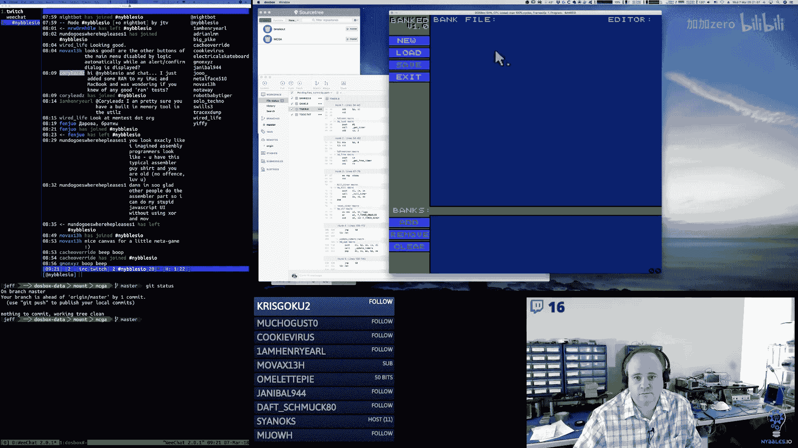

New。Lumbber。Bank， great， oh， I wanted it to be number one。Oh， no， that's not good。Back， okay。

Make it lu1。bk make great， call load。Oh got an air， oh no， it's fine。は。What like。W。

 I really don't know why it's student。你。Okay， so there's one thing， I guess， for sure。

Do we want to continue？Pollling buttons after we've clicked on one， probably not。

 because how are you going to like jump to another location you're not？So。If we fall in。

 we clicked on a button， okay， we call the button， call back。We save State here。

 which I guess now we really don't care about。As much。Okay。

 we return back from the call for the button， you know what we're done。We got a button。

Hit that time through。Let's not try again。Because it'll get called the next frame anyway。

🎼Rightい。So yeah。Pag it， os。6。

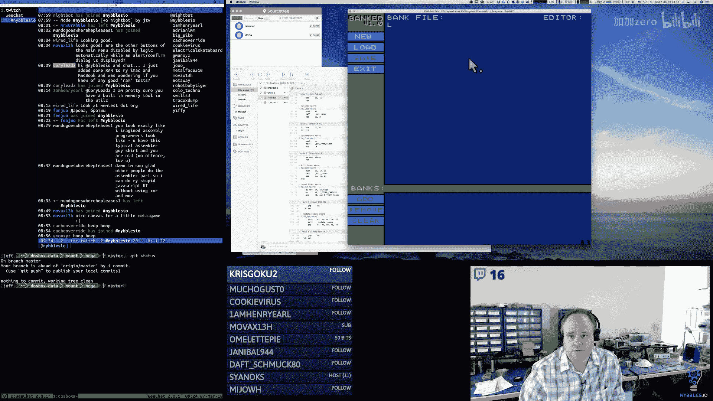

Bumbber UKK。New。Number one。免费。Great load。Okay， I'm not calling it yet。Hey。

 noon beats me I stream Monday through Saturday， the same time range。5 a to 10 a。 except yesterday。

 the occasional day where。My schedule gets really。Wacked out， but yet， I stream six days ago week。

Okay， so now I can。Well， I don't know if I can， I'm going to put the call back in here。I don't。

 you know， because I don't know if it's a situation where because。Something changed。No。Wy。

 what is that。Okay， well， now you know what time it is。All right。

 so what we're going to do is we're going to look for。Message box。Call back in our list file。

Just see what address that's at。Okay， so this is where it's defined the macro， right。

 so this is why list files are so wonderful。I use that macro， this is what it assembled。So four bys。

 which is exactly what I was。Expecting。The I。🎼A pad。 and then。Call back。Which is at 15C8。🎼So。15， C8。

We call buttons Fire。All right， so 15C8。Yep， there's the call。All right， so。Excuse me。Goodness。

 gracious。All right， here we go。🎼Load， all right， so now this is the。

This is the state callback function。🎼So。We're going to call that。so now we're in the fire。Btons fire。

Ooh， that's not right。BP is zero， no。1，1，9，0。Oh， some's getting。S's getting whacked。Well，Okay， yeah。

Because that explains why we're getting。🎼But what's doing the。 maybe we need to go back to the。🎼し。

The stack stuff。And see what's happening when it pushed that state on the stack。嗯。So it was load。

We're actually message box。Show， right？So that's at 159F。One， five，9。Okay。So。

This is the message box show。Function， so we have a function that calls into。嗯。

We click the load button， the load callback。The love button callback calls this。🎼And this does the。

The stack stuff。And so our pointer。For the stack。143，7。🎼啊。Oh right。

 because these are all the buffer lines。So these are all spaces。So these are all of our strings。

That are。The empty spaces for that dialogue box。So here's our pointer to our stack。Here is the stack。

 32 bytes。All right， so run。Load。Okay， so now we're。🎼Here we go。🎼So。We've now subtracted。🎼2 bys。

So we already had。An entry on the stack， 13 FB， which would have been the default state。

 the entry state。And now we're going to move。Yeah， there's our new state。

This is the message box state。Now that's interesting， that value14，1，3。🎼So。One， four， one。

That's not right。One，4， one3 is like。🎼Somewhere in。One， four， one，3。Because the other one is。13 FB。

That's our first date， this can't be before that。Yeah， that's not right。Right。

 because there are no file states here。And this is here。Well， maybe I'm wrong。One， four， one， three。

That is correct。Oh， it's 1413， this is 13 F。B， so yes， this is before， sorry。🎼Okay。

So the stack had appeared to do， the stack was doing the right thing。嗯。So that part's okay。

And what's also strange is that this code is just reading。For memory， it's not， it's not。

ModifyingThe only thing it does is called a callback。啊。So it loads BPp with mouse data。

Moile State is coming from。It's two words。🎼嗯。🎼あ。🎼哎跟你讲子。🎼11。🎼80。🎼There is。嗯。あ。Yeah。🎼That's okay。嗯。

🎼Well。I do not know what's doing that， I got to figure that out。What's interesting is。

Now it just really goes off。So if I don't call that。Load escape escape。You know that worked。🎼嗯。Oh。

🎼完先确行。は。Oh no， I'm not calling Damon。I got too excited。大。Now I got to put the call back。喂嗯。

I was all excited and I'm like，H。Maybe see where the problem is。No。🎼嗯。By。O。🎼嗯。嗯。

I'm going to do a couple things， we won't do this anymore。But I will call。し。诶。Next key。

And I will compare it to。Escape。Yeah。It's not equal。We'll go here。Otherwise。We had escaped。Ms T pop。

嗯。Message box。0。🎼Buttons set。🎼I need the offset。These are already labels。Okay， so hey， blue 87。

So we're not going to call the mouse thing。But you will check for key that's escape。

We set message box enabled zero， we turn our okay and cancel button off， we pop。

We tell the update loop that we're taking care of the keyboard。Load。Yep， look at that。

 that part works fine。No problem。And then if I had escape again。It exits out to doss。🎼New。Number。New。

🎼Number one。Load， state。Okay， so I just got I got to figure out what's up with that mouse code。

 there's just， there's something there。It's obvious and I'm not seeing it。

But I guess that'll be either I can work on that later today。If I have the inkling or。

 we'll pick it up tomorrow， so I think what we do now has got about。15 minutes is。

Is let's do our review here。So we did get some stuff going on。爸爸。Done。🎼And。

still need to have a source of errors for like the file stops， so we still need to do that。

And then we also need to add macro， we need to add a macro function。🎼2。Sad。🎼Contents sent。Lth。

And content of。Stir death。Sre Reve。Ne to do that。Okay， so on the two view side。

 I think that's pretty much that。All right， so let's look at what we got here。

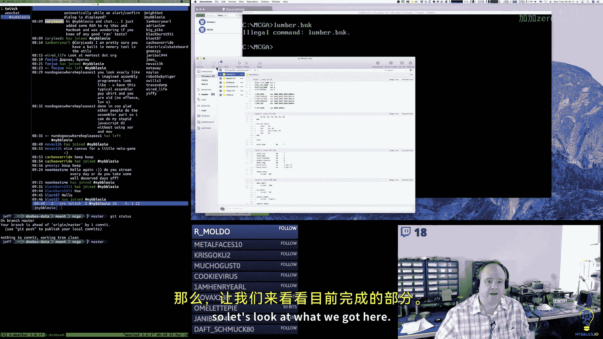

All right。So I added a state message box。🎼Eate。It's nine， I added a new flag for the buttons visible。

Versus enabled， so we render those slightly differently now。🎼嗯。

I added a button set macro that allows us to set the flags for buttons really easily。

I've got a message box enabled flag。So we can turn that drawing on and off。I've got an OK label。

 which is a string for OK and a cancel label which is canceled。Our message box title saysBaed says。

🎼And then we set the。It changed the default state for a lot of these buttons right。

 so they're all visible now。Only the ones that initially should be active。

 enabled are enabled and if they're not enabled they draw the text draws as dimmed。嗯。

And then we added our button。Okay， in our button you cancel。🎼And then。🎼如此。I added a message box date。

🎼Weable。Which is a state de for state message box， the calls messagess box call back。

I put my states Dgpott back in here and change this in case we decide we want to make that bigger。

 then this will just work。In our state push macro， I push BP or I'm sorry。

 push BX onto the stack because we're mutating that。🎼嗯。Pop doesn't change anything。Top I push B X。

And restore it because the only register we want to really destroy is BP。

We've got our message box lines so there's 10 of those sorry。

 and those are each 32 characters long and those are reserved in memory， this is our Sentinel bite。

I changed our temp file name to just be a reserved string as well instead of having the goofy spaces in there。

And then I've got a message box show so if you want to show the message box date。

 you would call this。This pushes the message box stayed on the stack， it sets the enable flag。

 and it turns the OK and cancel buttons on。And then in the callback。I read the key， if that's escape。

 we turn go back to the previous state， otherwise we just keep looping。

I want to be able to do button clicks here， but for whatever reason that's not working at the moment。

 so need to figure that out。Added in the return code here in the callback for the no file state。

Telling the update loop， hey， I didn't do anything with the keyboard， you go ahead and do it。

Change the names of some of these functions。🎼嗯。In the bank file name callback。

 I compare AL with zero so if it was an escape。Then we go to the end and we just exit。Otherwise。

 we're going to do the validation and potentially generate errors and show the message box and all that good stuff。

 but we got to get the mouse clicks work in there。And I have it be trashing memory like it is。

And then in text field update。That was just a rename。

We've got the button OK callback and the button cancel callback。

 so this is when you actually click on them。We set for okay， we set A to one。

 we turn off the message box。We turn off our buttons， we pop the state。

 cancels the same except we set A to zero。嗯。And。And then when we click on load right now。

 it's showing the message box for testing purposes instead of fire buttons， I've got buttons fire。嗯。

I added a return after we call， if we hit a button。🎼嗯。We call the callback， yeah。

 I call the callback for that button， we're done， we don't need to keep scanning all the other buttons。

 so I just return。嗯。This is our code to draw our message box。So if it's not enabled。

 we don't even try， otherwise we draw our rectangles， we draw our header。

 and then we loop through and draw out our airt lines。Rename this to text fieldss draw。Cart draw。

 base draw， button draw。ButD buttons used to be one big monolithic function now I've broken it apart。

So button draw will draw one individual button。Assuming BPp is pointing at the button。Structure。

 button buttons， draw， plural will actually loop through all the buttons considering the。

Visible flag。And only rendering a button that。Should be。These are just renames。Yeah， so that was it。

There。

Break， you don need to talk about that one， external dion string。

 this is where I added the string reserve macro。

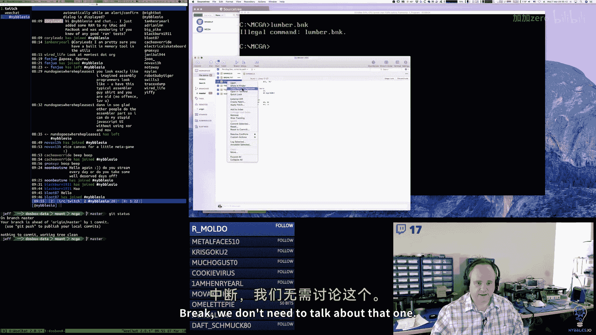

So this is the case where we want something like St deathaf。

 but we just want to reserve the space in memory we don't want to put up， you know。

whole bunch of quoted stuff down there。嗯。So that was all the change there。TD config。

 that's just for turle debugger to do， we talked about that。

In video， the only thing I did here。Was。When we're drawing strings。Yes。

So we push all this stuff comes in on the stack。And so the very first thing that we do is we make BP point at the stack。

And we say， okay， make SI point。The string pointer that comes in on the stack。And then。嗯。

Clear out CX and then load。The low byta Cx width the length of the string， right。

 because remember that first bite is the length of the string。And what I added was， okay。

 if the length is zero， if there's nothing there。Then。mWe're going to bail right， if it's not zero。

 then we'll come down here and do the rest of our stuff。

So that was the only change there and then another optimization in here is when we read。

A bite from the string。We could compare it to a space。And if it's a space。

We could just jump to C two here。Right， because that's the next。We just need to increment。

The width were done。So that's another optimization that we can do for the string rendering。

So that was it。There。All right。I pushed that stuff up to GitHub。And I think that's it for the day。

Thanks everybody for dropping by， I appreciate it。And I will be online again tomorrow morning at 5 am。

Bright and early。And we will pick up where I left off， you know。

Hopefully either I can fix these issues tonight and we'll get a little bit further。The next thing。

 like I say， is to do a little bit of minor validation on the file name， you know。

Populate filing data structure。诶。Then do the bank file create？

And then and then start working on the additional states in the tool right because once we have a bank file。

 then we can start turning on the buttons at the bottom to add。🎼Banks and。Work with banks。And。

Do load and save and you know start getting all that other stuff fired up。

 so we'll just keep pushing forward one little bit at a time。

So thanks everybody and I will see you again tomorrow morning， have a good one， bye。

