# 【精译⚡x86汇编语言】nybbles.io p05 p5 x86 Assembly： Implement more of the editor state machine -BV1NPr9YKE4b_p5-

Good morning everybody， we're going to start here in just a minute。🎼I'm just。

Finishing up a task here。Before I start to stream。Hey Blackburn， how's it going？🎼啊嗯。

Well I'm waiting for this thing to finish。🎼嗯。This I'll do my standard intro。Today is。

I'll answer that real quick here in a minute。Today is Thursday 8 March 2018。

 this is the NiBbbles IO Daily programming Sc stream。

That was kind of like mixed between Sc and stream stream my name is Jeff。

 I stream daily from 5 a to 10 a。 Monday through Saturday Mountain time if you want to see what that time is in what that time range is in your time zone you can go to my Twitch channel page which is Twitch。

tv/ nibbles IO that's nybbvlesIO and at the bottom there's a little widget that will tell you what my daily streaming schedule is and that is in your local time zone this week we are focusing on the X86 MSDs arcade reference implementation for my educational video series。

Um next week we will be returning to Riu and then after that we'll be going back to the arm Arcade Colel Kit。

So lots of cool stuff coming up， so let's see。嗯。Let me see if I can access this link here。Actually。

 you know what， Hol on like here up。Copy that from the Twitch channel。Will'll be easier。

The hidden language of computer and hardware。UThe hidden language of computer hardware and software。

Yeah speak today。From the year 2000。We wrote it。Oh， Charles pencil。

I've probably read this at some point， in fact， a cover of this book。Does look familiar to me。

However。I am not， nothing's like immediately popping into my head。About it。Um。

 but it does kind of sort of。Ring a bell。🎼嗯。I may have only skimmed it。In the day。So yeah。

 it's about all I can say about it。嗯。Unfortunately， I'm sure it's a good book。

 if it's a pet old book， it's a good book。嗯。Again， you know， anything like this。

 it's now 18 years old。You， you know， just have to kind of read it with an eye towards the fact that it it is a little bit old。

And so just， you know。Adjust anything that's said in the book with whatever you currently know。

About how things are， right， that would be my only。Lly caveat hunt it。

But that's true of a lot of things that you read， so you know。

You have to kind of constantly be aware of the fact that some of it may be outdated。あ。Of course。

I ran this thing and then I forgot to check the one thing I wanted to check。No， there we go。

 thank got it。O。I can fix that。Sorry guys， I。Had something he he forgot。Okay。I just。🎼O开。あモスタ。🎼并有。嗯。

🎼山顶路。🎼I的。🎼我s你。Shuut this thing off。And then we will。First。

 we'll talk about the dos box fig a little bit。🎼Because。

Move AX 13 hex mention this and we'll talk about the make file。🎼So， let me。And I guess， okay。

 so let me do this now that I got that done。All right， so first。

 let me talk about the version of DoOS box that I'm using， so I downloaded the code for DoOS box。

I don't know if I kept， if I didn't keep the tar ball， unfortunately。But here's what we'll do。

 so I was even thinking about this a little bit。Let me just。🎼Let's go， find。The latest Go box code。

Because I know I didn't， I just downloaded a tar ball。

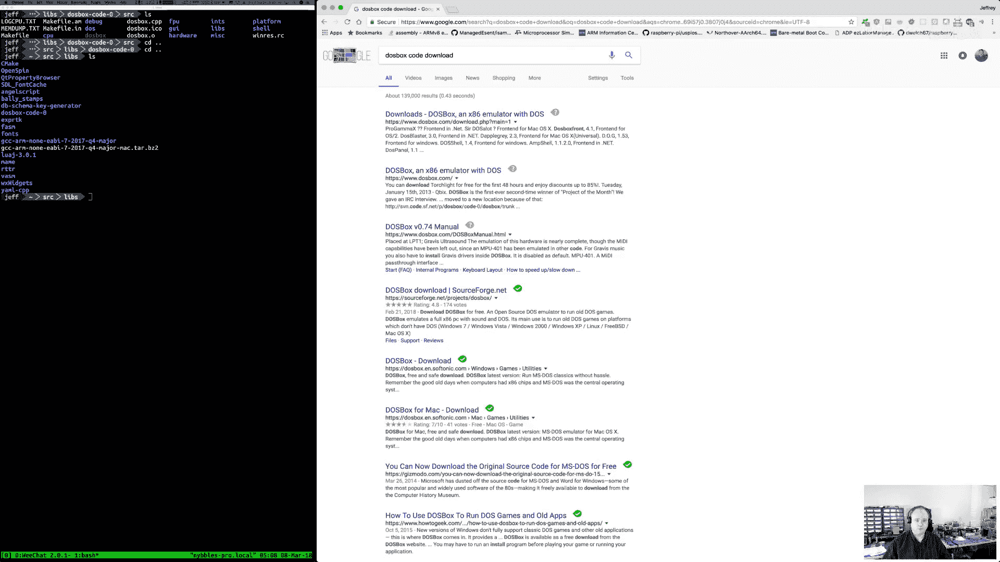

🎼嗯。🎼Let's起。🎼Where did I download。Because what I oh， you you know what。

 though I do remember I had to apply a patch to。🎼I keep the。🎼I may not have。

Let's where would I put that？That's my old stuff。这大。あし。Maybe I put it。So okay。

 I downloaded the DoOS box code from their website。Back when I started this， which would have been。

At this point well over six months ago。At the time， I realized that。So when I first started。I was。

Kind of building my environment and trying different。诶。

Combinations of things and seeing what worked in Dos box and what didn't and also when I first started with this。

 sorry， I'll bring chat back here。嗯。When I first started with this， I also。Didn't initially。

Soolely used dos box when I first started with this I was using a doOS virtual machine in parallels。

 I also tried to doss virtual machine in virtual box because I was basically trying to find you know the best。

Emulator， I could。For this project。You I have a bunch of artwork。🎼I have stuff for the。

Arcade kernelel can。Yeah， I did not。Okay， so。Let's go through the story。So。Eventually。

I tried a bunch of different emulators and I landed on DoOS box。

As the emulator that I was going to use。嗯。Now the version of the source code that they have here。

 this is the same， I think as what I have。

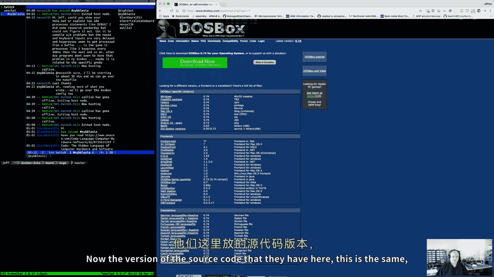

嗯。I don't think it's any different。Dos box hasn't really changed that much。So。

The only piece that I did unique。Was。嗯。When I built Dos box。I built it。To include。They're debugger。

Which is just an option， I believe。In there configure script。嗯。So in their're configure script。

Wow and source spge。

The bane of my existence。

Um。Plus， see there was。Enable yeah， enable debug mode， right so here it is。

So in their Config script for Dosbox， there is a flag that turns on they're built in debugger。

Now they're built in debugger socks， it's not really all that great。

 and to be honest I don't use it that much anymore。So to give a full background story of。

Why I did that。To start with。Tes like this。嗯。I。Originally started， I installed 86。

 86 comes with a debugger， D86。And I like D86， I like A86。However。

D86 does not run properly in Dos box is's just one of those。Few programs that for whatever reason。

 whatever D86 is doing， it doOS box does not emulate it properly。Um， and so。

 and I hadn't really thought about using Trbo debugger。As a fallback at that point。

 eventually that's what I ended up doing and Trle debugger works just fine in Dos box。

And as a debugger， it works just fine too with the exception that the screen stuff is kind of messed up。

And so。In the interim before I had thought about using turwooddybuggger。嗯。

I was using the dos box debugger very early on。And again， it works。It's very primitive。And。

And it's broken， so if you download the code。From their site and you build that code。

The debugger will not break on interrupts properly。

So I found a patch and to be honest I'll have to search for it again， I didn't keep it。

 that was my bad。I thought I had， but I didn't。I searched you know。

 on the internet and I found in one of the doOS box discussion forums。

A patch from another user that fixes the brake on interrupt issue in the DOS box， debugger。嗯。

And again， just for clarification there， typically， like if you put like an in3 in your code。

 most debuggs will that will cause a break in the debugger。And in， you know。

The Dosboxox debugger it should have been but it wasn't and I fixed that patch fixed that that allowed me to do some of the very early debugging painfully eventually it dawned on me that I could use turbo debugger and it seemed to work within Dosbox so I went that route。

Now I still run the version that I built here。Because sometimes it is convenient。

To see you know what the DoOS box debugger is showing me right， they show you file activity。

 they show you， you know look what video mode you're on。

 so there is some useful information in this thing now。A couple things。

Building it with their debugger enabled slows doOS box down and the other day I was talking about the frame rate and that is。

That's one thing that I forgot to mention is that。🎼，By using this build。

 I'm actually running a slightly slower build。Thenhan a default version of dos box that you would get when you download it off the internet without。

嗯。Cool， yeah， if they have one that has that already prebuilt in it， that's great。So。

Now I don't know if that version has the patch in it。

Right if that zip file has the patch for the break on it， and again。

 I don't know if that's particularly important because you really don't。Need to use their debugger。

🎼Now， I'm going to。Drag this over here real quick。So that I can open it。So my。The dos box。There we。

Now you guys aren't going to be able to see this very well， let me see if I can。

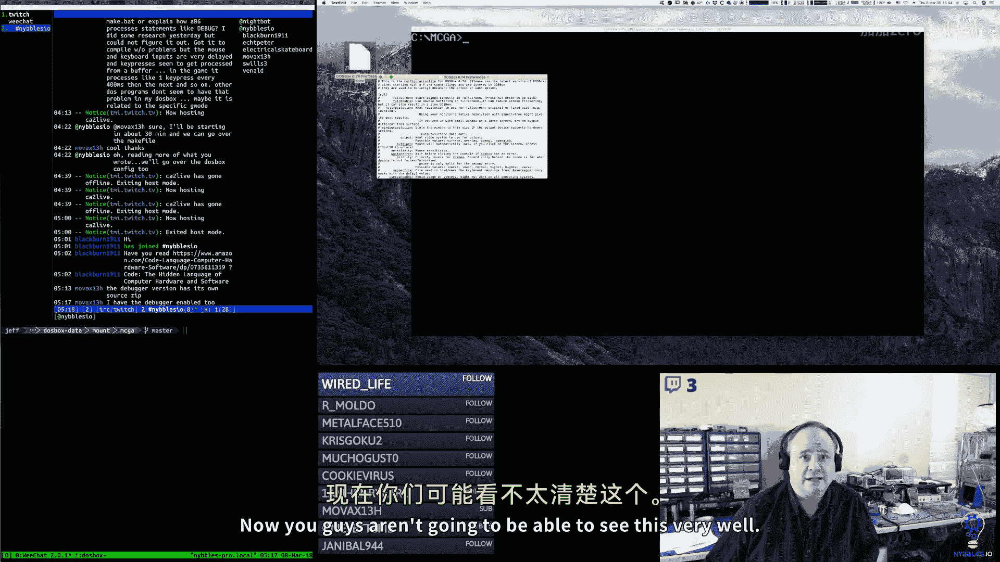

Make it bigger。So。In my DoOS box canfi file。Here is。What I have。

 and I believe this is the one that I am you。Actually， I can tell real'll quick。Yeah。

 I think this is the one。Because my auto exec。🎼You know， I。Set up my mouth， I set up my path。

 I set up other environment variables and then I CD into my MCGA folder。

 which is where my code's at and I clear the screen so I believe this is the one that I'm actively writing okay so let's go through this。

嗯。And what I'll do is later today I will copy the make a copy of this into the code directory and check it in just for reference so that you can look at it so full screen is false。

 full double is false。Full resolution is original my window， I'm assuming a。1920 by 1280。Window。

My output is open GL。🎼嗯。The rest of that， I think， is mostly defaults。I chose a machine。

I chose the SGA S3 machine。Captures are on。MM size is 16 megabytes。Frame skip I have set to one。

I have aspect ratio set to false。So it doesn't。It doesn't try to do any kind of aspect ratio correction。

And my scalar is set as normal 2 x。🎼嗯。🎼Yeah。Because that ended up looking。Pretty good。🎼嗯。

I think3X was。Too large for the screen。If I remember correctly。For core。I have auto。For CPU type。

 I have pentium slow。Because i did not want。I wanted to basically target the original pentium。

Is what I was looking for。🎼嗯。And this is the other reason why like I might have。

 you might be able to play games and use the default config where it just automatically tries to。

Pick the fastest option and then my stuff， if you watch my stuff， like I say， oh。

 my frame rate's lower or it's running a little bit slower because I purposely picked。🎼You know。

 some。Lowers lower settings on cycles， I have it set to max。

 on cycle up it's 10 and cycle down is 20。Those are just settings for what happens when you hit the keys。

For the sound stuff， I don't think I changed anything here。This is all the defaults。Mitdi， I believe。

 is all the defaults。Sound blaster is all the defaults。🎼呃。Gravis ultrasounds， all the defaults。

 the PC speakers defaulted。I believe the joystick is default cereal's default for dos。

I don't think I changed any of this。诶。I think this is all the default stuff。Gotcha， cool， perfect。

 good。Yeah， there was because what you may have been running into is。Some of the if you do auto。

 some of the later CPUUs。Do things like slightly differently because it'll automatically like jump up to you know。

🎼A。A fancier pentium right behind the scenes， I think they like pentium fast or whatever they call it。

And it changes things slightly。Yeah。Anyway， and then。Yeah。

 so I'll make a copy of this I'll check it into the GitHub repository just so people have a reference and then I think it's also probably beneficial talk and I don't think I ever really did this so we can review this what do I have installed right？

🎼So。I have 86 installed。Now again， I actually license 86 so I got a package from。You know。

 Eric Isaacson's website that had all the stuff in it now 86 is free， you can download it。

Shareware you can use it entirely without paying for it。And there's no。

 it's not crippled or anything。You don't get the open source package only includes the 16 bitsembler and debuer。

But that's all I'm using。🎼嗯。He has a 36， you know， he has a 32 bit asmbler and you bugggger。

 but you have to pay for those。诶。🎼DN is that's the。Diectory Explorer thing。

So if sometimes I just use this because it gives me a little visual interface on the file system。🎼嗯。

I have D paint， I found the original。🎼啊。Oh， so the other thing is I copyied Dos。🎼嗯。

Trying to remember exactly what I did here， I got a DoOSS desk image。

 I copied all the programs in here。Because。Goss box does not have everything built into it。🎼嗯。🎼And。

I got deep paint， deep paint works so so in Dos box， I don't use it that much， but I got it just。

In case I needed to add it a bit map or two the GSo 211 that was a sound， that's a sound tracker。

Which does not run super great。Installs these I think were all the files， yeah。

 these were like all my install files。For。TSE and for。86 and for Wacom。🎼嗯。

IT214 that's some impulse tracker， that is this another module。🎼啊。Trackcker program。

 it runs in DoOS box but。🎼Poorly。Now some of that's because I'm using the debug version。

 if I run it in the non debug version， it does run better。The MSCGA folder， that's my code folder。

 mods， that's a directory with a bunch of soundtor files in it， while one， and I deleted the others。

Because I was playing around with different trackers。

PPS 10 was another tracker library that I was playing with。QB is quick basic。Scrap。

 I'm not sure what I put in there。🎼嗯。Well， this might have been my original。Yeah。

 I think this was me playing around。With。Termo C++。🎼H， whites and。The Sc folder。TsM， I found TasSM。

 downloaded it， installed it， that's where I'm getting Trbo debugger from。

I also have Tbal C++ installed， Turbal C++ works， but there are some weird things in the interface with DoOS box。

 I haven't quite 100% figured out what's going on。It might be that file， I downloaded， yeah。

The goblin song。I went to some mod site that has know just a whole catalog of them。

 and I just I wanted to download something that was about 64K because I was playing with memory and seeing what would fit。

TSE is my text editor， that's the Seware editor。诶。Tweak that's a tweak is a neat little program。

This you can run this and。It will let you change VGA registers。

And you can see what happens when you test it。So yeah， this is kind of a neat little thing to have。

Andy。嗯。And then I've got Wacom installed as well。嗯。Because I thought， well， at some point。

 if I did want to do some C C++ code on this， I probably would not use Tbo C++。

 I just use the Wacom compiler。So that covers what I have installed in my DoOS box and of course the way that works is on your host system。

 you have a folder， you tell DoOS box you know you mount your drive to that path。

 so these things are actually on my Mac and then DoOS box just sees those through its mounting system。

So then going into， oh， and I have batch files for clearear and LS because if I don't。

 I'll type them。100 times and all they won't be there。嗯。So then in the actual project itself。

And while I'm at it。Yes。🎼This too or at some point。O。嗯。All right。

 so let's look at what do I have here？So I am using make。Which。I believe does Dos average no。Where。

🎼嗯。I believe it's using make from。UTurbo。第buger。Or from Tasm。So let's see DoOS。

 maybe is' using Wacom。And of course。Let's do it this way。Borland， yeah。

 so this is either coming from Tasm or。Turro C++ one， I think it's coming from Tasm。

Is how I think I have my path set up。诶。So。I'm using their version of May。

And the make file is really simple。 So we're using。86 as the asmbler。So 86 has this some。

So 86 is a little different。In general， asmblerrs work slightly differently than C++ compilers see or C++ compilers。

🎼So。Because again， in this case I'm not building object files and linking them later。

 I'm just making a calm file。And we're making two of them， one for the game engine， one for the tool。

Um so。I have my two targets。And then I just have you know variables you know defined for the source files that they are。

 and then we invoke 86， if you prefix a symbol on the command line like debug for 86。

 this tells 86 to make that a to turn it on as a conditional compilation constant' when it's assembling。

So by doing equal and then debug debug is true then it's defined inside of the assembly and there's a couple spots in the code。

 I think mostly around the frame rate counter where I say you know pound if debug then do this you know and if we wanted to define other compilation you know conditional compilation constants this is the way you would do that and then you just pass in the source now in this case you know this is really simple because each target just has one entry file and that entry file includes everything else into it so it just makes everything really simple so that's how make works and every time I run make it's just is compiling everything because 86 is so blink and fast that it doesn't really it doesn't really make much sense to。

To make it more complicated than that， so when I run make， it compiles both of those。

Obviously if game fails to compile first then I have to go there， fix that。

 then you know banked I have to fix after that and then I have in my environment the 86 environment variables so you can set options for 86 globally so you don't have to set them over and over again on the command line and so I just turned on listing files。

And that's actually in my dos box con。Where that set is。So。Yeah。So anyway， that's how that's set up。

So hopefully that helps。🎼Okay。It's cool someone else has got it up and running though， it's good。

I fixed our bug from yesterday， fixed that last night。🎼嗯。And I felt pretty silly。When I did。Oh。

 a couple other things like。86。Again， it's kind of old school in some ways。嗯。Oh。

 so like Git ignorere and a couple other git related things， so I do use Git。

U but I don't touch it from within DoOS box， I have to do it outside and I try so I try both ways。

When I look at things， you， outside of do box， I try not to save them。Because the anNsI mapping。

 the anNsI code page does not mapped to anything modern Unicode at all， so like if themm。

If I save the file with them or another external text editor。

 it will hose the little box drawing characters and all that stuff。

 I have to fix them likewise for I don't touch any of the get stuff on the dos side at all's there。

Doss sees some of the files， but I don't touch them， and that arrangement seems to be。

Safe seems to be okay。86。It will create air files。When things don't compile correctly， occasionally。

 like I will come in here。No no， make is passing it here。We can look at it again。Its right here。

If you look at the make file， we invoke 86 and then on the 86 command line， we do equal。

 literally it's an equal sign in the command line。And then the constant， the debug constant。

Um that's it so it's not doesn't make any new environment variables。

 this is something specific to 86。When you use the equal sign。You know。

 that's kind of like in modern compilers， you know， you'll have like CC dash， D，F， right。

 dash D bar that defines those symbols， you know in the compilation process。

This is doing that that's， you know， but there's no， you can't assign a value to it or anything。

 it's just on or off， it's just defined or not defined。

So if by putting the equal sign in front of the constant debug。

 then it's defined and it's you can do a shortcut so I could do debug， I could do super feature one。

Or whatever， and this would define all those in one shot。嗯。But。So that's how that works。So anyway。

 occasionally I will come in here and I will clean up some of those stuff that it drops like it will create these old files。

Which。You can't really turn off' no。Feature for that。The list files I typically just leave。

The SIim files。These are 86 symbol files。I've thought about， you know， in the documentation for '86。

 he describes what the symbol table format is， I thought about writing a quick little program。

To convert these into a simple table format that's compatible with Trbo debugger。

 and it might actually do that because。Yeah， and then if there's undefined things。

 it'll create these un files， you can get rid of those， they're just1 files。

They're meant for debugging the TD and the Tr files， these are for。For。Terbodydy bugger。Again。

 like the TD can fig I leave here because otherwise Trbo debugger just recreates it every time。

It's not worth getting rid of the TR files， I think these are like。

When you set break points and other options and stuff， I forget you can get rid of them。

 you don't have to keep them， they're not really important。嗯。

So that outlines the files and then the dot why use8 as the file extension。

 because that's what Eric Isaacson uses in '86， he just chose a different file extension for his assembler to make it distinct from others。

I just followed his convention， so that's why the files have a dot8 extension， you could use dot S。

 you could use dot Sam， I just chose to use the extension that his stuff automatically recognizes。嗯。

Okay。So speaking of that， I broke stuff out a lot yesterday because I was looking at banked the main program file and it was getting pretty crazy。

 there was a lot of stuff in here。And there's stuff we have to have in here and then there's stuff we don't so I wanted to kind of change it or you know。

 I wanted to take stuff out that was。More， you know。Support and not part of the core program。嗯。

And so I kind of clean this up and I put little box headers around in front of all the different functions。

嗯。And so this， you know， I think it reads a little bit cleaner now this way。So what we ended up with。

So far。Is we ended up with carrot， so I moved the carrot stuff out。So carrot。

 I move the variables that are related to it， the other thing I'm trying to do is for each one of these modules。

 I'm trying to use a two character prefix。For public。Facing functions。Public facing variables。

And I'm trying to keep the names relatively controlled some of， you know。

 I'm used to using C++ where I name things with 64 character names。あ。

So I'm trying to keep my names a little bit shorter here because it just makes things easier so now there's a carrot in it that does the timer stuff。

 the draw and the timer callback and all the state variables for the timer are here。

 the one thing I didn't do which I should do。Is。Change the。Let' to see T。

And my thought was eventually， if necessary， I could come back here and put some additional documentation in the headers for like variable。

 you know， parameters that come in or stack state or whatever。嗯。And again。

 I'm putting the little headers on here just because assembly doesn't。

 I would not do this in C or C++ or most other languages， assembly doesn't really have。Especially 86。

 it doesn't have a real flourishy you know structure around functions。

 there's not a lot of meta text that you type， it's just label。

 so by putting a little header on there it kind of helps visually make them easier to read in my opinion。

诶。So that was the carrot file， then I pulled all the button stuff out。So we've got our constants。

 our structure， our macros。And。I should rename， so I tried to again。Do everything to where it was。

This two character。Plus， it makes them shorter。So some of our long lines that are already very long aren't quite as long。

So we have our button def， our button sets。And then functions that have an underscore in front of them。

 I'm kind of treating those as private。They're nods。

 there's nothing special about that it's just I put the underbar in front of it because typically then I have a macro that sits in front of it and that's what you're meant to call so the issue with the button fire thing was well and so it's been refactored a little bit but there were two things one I was on the right track towards the end of the stream yesterday。

The mouse data variable was not being referenced properly。

 so that was one issue and then when I refactored this I made it generic to where。

know we push the mouse data pointer and we push the buttons list pointer onto the stack and so now these things are coming off the stack。

But ultimately it was the way the mouse data stuff was being accessed was not。Correct。

 I had to find it as a variable， not as a label。It just was not addressing it properly。

 so now we call BT fire。If we want to fire buttons， if something has happened。

 there's another related thing to this and we'll talk about that in a second。

That was causing the problem so there are two things were causing a problem yesterday。

 one was how the button or the mouse data was being used。

 the other was just the nature of how the mouse button stuff works and we' were getting recursion on the state stack so we'll go over that but the macro saves state pushes the parameters。

 calls the function clears off the stack button draw。

that this just draws a single button and he's kind of private， he's just used by the larger you know。

 buttons draw， but then I have a nice BT draw macro that save state， you know。

 calls this with the right parameter which is the buttons pointer that you pass to it。🎼嗯。

So this guy's， you know。Good to go， he's working pretty good now。So the next thing。Is text field。And。

Kind of similar。So we have our valid key。Structure we have our Val key macro for definition。

 we have our textal structure and our text seal definition macro and then we have our internal functions here so TXT find key。

 this finds the one that's active， I have a macro for this in case you know other parts of the code want to call this。

 but what we actually should do is call this TF。嗯。P should just call this TF find。

Because that's going to match our pattern here。嗯。And then and so again， like this is private。

 so the private name doesn't really matter all that much。嗯。Then this is the public interface， right。

 that other code would be using to call that。I renamed the clamp thing to just text clamp。诶。

Text escape， text return， text left， right， home， and backspace delete。And then text keys。

 this is the thing that goes through our valid keys loop。Text updateate。

Text update calls text keys and calls these others。And then I've got text field update。

Which calls the text update function。And then texttra。And then T after all。And so that。Is。

Where that stuff went， oops。When you do that。And then I moved the state machine。Machinery。

 I guess you could call it the support implementation。For it into ST machine。And。Yeah。

 we need to do our little。Kind of be consistent here。And then so we have our ST action structure。

 we have our ST dev macro。Then our push pop top， and then check。

 we'll talk about check here in a minute。And then we have our data down here。

We have our stack and the stack pointer。And so for as much as assembly language you can have private things。

 this is kind of how we take that implementation and you know， move it somewhere else。

 and then the message box stuff，嗯。Is very similar。We have our message box enabled。

And then we have our message box。知啊。🎼Which。To be consistent here。

What I'd like to do is do a message box， draw macro。And then this guy can。🎼Save state， right， He can。

地き？スピアス。🎼好。发抓。And then。🎼Oops。And then we can change this to use the macro。So the carrot。

 we should probably do the same thing with carrot to make that consistent。

And so because I'm going to have a macro called CU draw。I'll just make this underbar。次では。

Let's see this guy's touching。And it looks like。There you go。Bs draw。诶。

Lives inside here still because this is kind of sort of related。Directly to the tool。

 we might move this， we'll see。But that's。That then， yeah， so that's everything。

So I pulled out again， support functionality kind of made it parameterized， genericsize some of it。

Cleaed up some stuff。I went through and did some more renaming。

 so like timers now at allTM underscore something。Mouse is MO， something。

 our state stuff is ST something。So just trying to keep it all consistent。嗯。Okay。

And then eventually I need to go through the video generator。And。

Change that like this should be like VG stir。And a couple of will' change some of the other things like instead of is the blank。

 I'll do VG， you know， VBL。VG weight。嗯。🎼So。Okay， so then the other issue。And yeah。

 I just I didn't see it right away yesterday， I didn't think about it。

So what we did was for testing purposes。When you hit the button load。Paul back， I was enabling。

 I was disabling， well actually I wasn't， I was not disabling Lo。In that case。

 I was just calling show message box。But the issue is， is that the state。

So we have this frame loop right and it's running， let's say 50 frames a second ish on average。

Actually， in the case of the editor， it's much faster than that。It's 60 frames a second， let's say。

Fast for what this is。Every frame。I'm calling MO read， which is Mo readed。

 and I'm passing in the pointer to where the mouse data is going to go。And this calls， you know。

 the mouse driver interrupts and says， hey， where's the mouse cursor position。

 what's the mouse button state， so I'm poll the mouse button state。

And I'm writing that state to a variable and then at different points in the program， we're saying。

Hey， you know。Call this button fire thing。And here's the mouse data and here's the list of buttons to check against。

Great。So then we find a button that matches as we had the left click and we you know the mouse cursor inside that button。

That thing's firing。Problem ishu。It takes another frame。For that state to change。And。

What was happening is we were immediately transitioning into a callback。

That continued to call button fire。And because in a sense。It takes time for our button to deou。

If you think of it， do balance a button in hardware。You know， here。

It's kind of the same thing the button is still firing。Even though it's not。

 even though from our perspective it。嗯。That should have been won and done。

There was no plumbing in the system to actually say that that's the case。So two things I did。One is。

🎼When you。And we talked about this a little bit the other day。

We probably would have done this anyway。But because it was a test case， I didn't think about it。🎼嗯。

When you click on the load button now， the very first thing。

That the load button does is disable the button。嗯。So that that。Now。

 even though fire is going to be called multiple times and theoretically that button is fireable。

 we've set disabled a bit that allows it to actually proceed。So the button' is no longer。

So that's one， so we're going to have to do that。🎼Consistently。

The other thing I did was I added this ST check。Macro。

 so basically you follow an ST check and you pass in the state。

But you want to see if you're in that state。And it fills A with。One， if you are in that state。

So this is this message box show function is kind of like our transition function。

 this is the thing that moves us into a new state。Well。As an additional guard， I check right。

 because what was happening， the reason we were getting all locked up and it was bad。

 we were overflowing stack， basically， that's why we were overriding variables and things were disappearing。

So what was happening is。That button was firing 60 times。

 70 times because we were essentially continuously calling button fire and the state hadn't changed yet。

Eventually the button state would change， the button， the mouse driver would say， okay。

 the button's not active anymore。But it's too late for that。Says， hey。

 are we all is the top of the stack already this state if it is， I'm done。

 I don't have anything to do。 And so I think this is just a generally good。

Pattern I'll follow now with all the state transition stuff。

 so whenever I go into a new state I'll first verify， you know。

 hey am I already in that state if I am， then I've got nothing to do？Otherwise， okay。

 now I'll go ahead and push that state on。Now I did debate making ST push。Do this inside of it。

 right， We could do that， right， We could basically say。Push will only push a state on once。Um。

 and if if it ends up getting called multiple times。

 that that stage is already the top of the state stack。It won't do anything again。We could do that。

I think for now though having it be explicit and kind of in my face so I remember is a good thing eventually I might say oh okay。

 you know， I've lived with that long enough， let's just you collapse the two now I wouldn't get rid of ST check I would just have ST push use ST check and then this little you know code。

Wouldd get written into this macro and would just appear in line when it gets expanded。

 it would do the same thing it just would be if I did decide to wrap it。

 and just be pushed in that way。And that was the solution， that is what cleaned up that issue。

So now I can come in here， I can go new I can do lumber bank and then I can go load and oh no。

 it didn't work and cancel and go to see I disabled the load button and nothing turns the load button back on because I was just using load as a test for that。

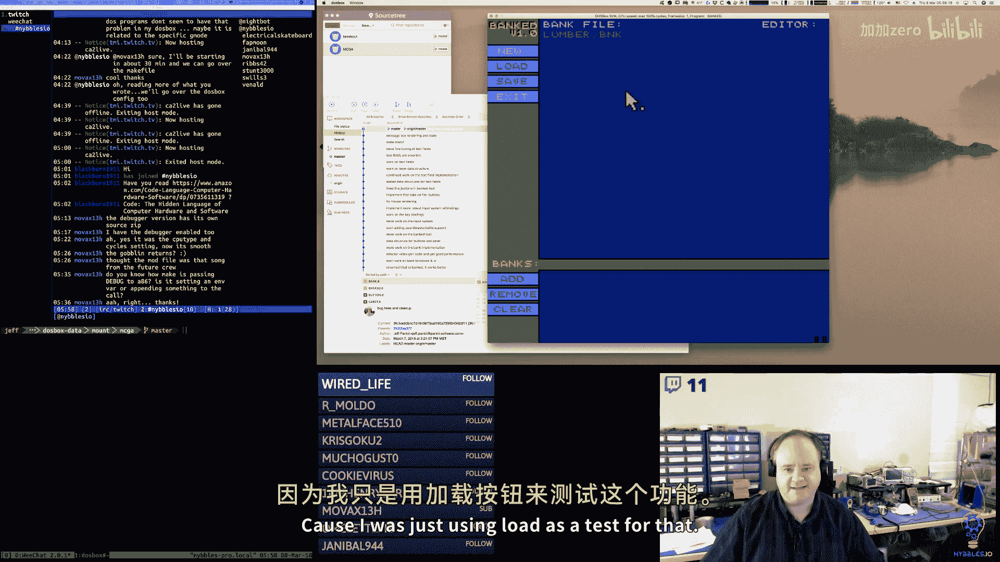

But。We're starting from a good place。🎼So。啊。不。Lots of stuff I thought about。

I don' know if you guys remember me saying that I never really stopped thinking about programming。

 I never really stopped thinking about。The problems I'm working on。

 they're always running in the back of my head。So let's talk about some of those。Shall we。嗯。

All right。So first。I realized yesterday that I buned up。Stack offsets。Because so。In my defense。

 I was coming from arm。And living with a CPU that does not。

 does not push a return address on the stack。It puts it into a register and then it's up to you if you want to stave the linkage state on the stack。

嗯。And I completely wasn't。Connecting that， hey， call actually puts stuff on the stack for us。

In this case， we're pushing parameters here。But when we call call。

 there's going to be an additional thing on the stack。So that means our offsets are just。Up by two。

So and that's the case for everything here。It's a BPp。

The SP pointer is pointing at the return address。All of our other stuff is below it。Or above it。

 however you want to look at it。So that was。Right， so this should be。Two， four， six。为什么。嗯。6ix。O。

So I wanted to do that first。Before I forgot。Oops。And we are going to have variables。Okay， and then。

And go through this process of。Tightiding us up。So。

Let me see if I can talk and copy and paste at the same time here。嗯。

I got to thinking a little bit more about the mechanics of how。

The banks and the bank blocks might work。And。How we're going to implement some of that。嗯。I think。

 you know， we're。Generally close。There's a couple of exceptions， though。Or not exceptions。

 but reasons why maybe we might want to change things slightly。嗯。O。So I wanted to fix that。

 that looks good。🎼We still need to do this。嗯。Okay， so。Where do I want to go with this？First。

I wanted to look at control in the gaming。So in the game engine。Okay， a background。🎼Is。A tile。

 it's an array of these tiles。We're using a word to pick the tile。

 so that means we could theoretically have。64，000 different tiles to choose from for a particular background which。

We know is not。Easily implementable with what we have right now。🎼Because。

We can only have within one bank。We can only one we can only have， I think， about 2000 from tiles。

Eight by eight tiles， just again， that's a lot of tiles， man。🎼嗯。🎼So。

Really this would like a 12 bit value。That would be。Good。

 of course that's not very easy to define here。🎼So。We're not using all 16 bits here。

 but so this is two bytes， this is two bytes， so each tile in a background map。Is currently。Four bys。

And we're saying we're allocating 1，024 of those because。256 divided by 8 is 32。

Then 32 times 32 is 1024。So 32 times 32。Times。F bytes。🎼不。🎼Baocks。Because。

That's not going to fit in one block。That's not going to fit in one block。Now。

 does that and what's worse is that。This is going to be like。So this is 4K。Plus。Another four。

Six bites。So we're， you know。We're like overflowing a block by this minuscule amount。

So now I'm trying to think you're， okay。How could we do this？So I guess， okay。

You got to talk about what that looks like。Because where I'm going with this is I'm trying to figure out。

If it makes sense， we originally said。For the tool。When we create a new bank。

We're just going to allocate a full segment。For the blocks， for that bank。

But for quite a few of our bank types。That's fine for sprites and tiles that makes perfect sense for sprites and tiles for。

Backgrounds and for pals。It doesn't。嗯。For backgrounds and palettes， we only need。Ideally。

 we only need one block， even if we needed two。Which right now we would for backgrounds， sadly。嗯。诶。

You know， allocating an entire segment for that。Does seem like overkill for the tool even。

So then I guess where I'm going with that is。When we create a bank。

We might want to be able to pass a parameter saying how many。How many blocks？Should we allocate a？

🎼Segment 4。Because again， if we say okay， a background needs two blocks。That's say。

So it's the bank header block， which we already have a full segment for those。

And we'll come back to that in a minute。But for yeah， we're going to do two backgrounds。

 then we only need four blocks total for both。嗯。And that's a lot less memory。

Which opens up more memory for other things that we could do with the tool。

 to guess is where I'm going with it。I mean， we could and again。

 very naively just allocate boom your。All this memory， but。I like simple but that seems pretty crazy。

So that's one thing。A sameme thing like palette， right。呃。Three bytes， there's no alpha channel here。

So we have three bys times。155 pallet entries for a grand total of 765 bytes。I mean。

 honestly we could even just stuff that that， the bank header， but we won't go cllugy on it。

 we'll just say we need one block。For palette information。嗯。And。Fs。You know。F， 25 bytes per gph。

Times 255 now see that's over one block， but only slightly， so we would only need two blocks。

🎼In that case。So again， some backgrounds。发子。Two blocks total for a bank。Permanently。

 because that's just what the engine supports。And that that gives us room you know。

 if we want to make backgrounds more complicated if I wanted to put more state in a tile or whatever。

I could do it。We have plenty of room to expand into that second block that we're just like barely spilling over into。

 it would have plenty of room。So。So I think we want to change how that works just a little bit。🎼嗯。

The other thing that occurred to me。Okay， so let's work where I wanted。Let's open up bank。

Those have to happen to those。I think it'll forward right。啊。不す。Would like to put them mold。🎼嗯。Sorry。

 having to do the obligatory。Clean up here。So I think Bank new has to be。

Enhance to not only take a bank type。But also a。Acount size and blocks。

 how many total blocks should I allocate for this？嗯。As the upper limit。Because again， for。

ItsBrites and tiles we can do。We can do 16。 We're good to go for。You know， backgrounds。Palets。法子。

we could allocate two blocks for each of those and we're good。🎼嗯。Sound， sound might， you know。

 that might vary right， some sound banks might have。

There might be all 16 blocks it might be only half， I don't know。

 so I think we'll enhance this right to support saying how big what the upper bound should be。

 but then also we have to talk about，How。The offset stuff is， you， we' got to talk about that。

Because that's probably going to work right。嗯。And。I don't think the solution is a big deal。

 which is have to change it。嗯。So。So in our notes， right， we got bank types。We got。Sppriites。

16 by 16 pixels。Nivebble and coated。So 128 bikes。Tiles。Our eight by eight pixels。Nivebble and coated。

So 32 bytes。嗯。Background。🎼Is。32。Bye。32 tiles。Times。Four bys per tile screw up。Plus。Some overhead。

Talette。🎼Is。200。55 entries times。Three bys。And we'll worry about， oh， in fonts， we have Du font。

Ft is five by five now there's two kinds of font here that I want to clarify。🎼嗯。

This font here is like the system font， this is what drawstring does。🎼In the game。

We might have tiles that make up you know font for like within the game but I'm thinking of those differently right that's game stuff this is like。

Yeah， this is what the engine uses to draw text。🎼嗯。Plus， we do get some freebies here， right？🎼诶。

And then I guess the question is， do we want to make the font sizes fixed here， maybe we don't？

You know， maybe we could go。For now， this is like the fix。So 255 glyphs。Times 25。Okay。🎼So。Full 64K。

 full 64K。Two blocks， one block。Two blocks。So。Let's do this， let's say， 16 blocks。Some blocks。

Two blocks。One block。2多。And this is not full。Lots of extra space。Same thing here。嗯。Now， again。

 from the perspective of the game engine， when we call this you know。

L data thing where we where we're going to walk the blocks and we're going to just read the data and we're going to just append the data into a buffer pointer that the engine gives us。

The wasted space is irrelevant because what's used is what's used。But。From the tools perspective。

 right， we have a little bit of slot。Okay， so now let's talk about。嗯。Flow， right。

 let's talk about what happens here。

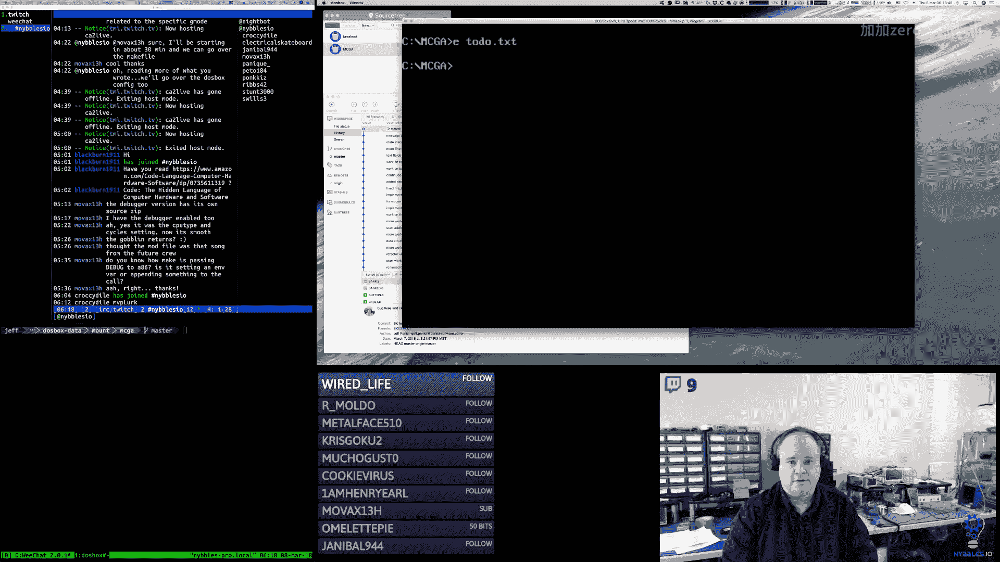

Okay， so we start the tool。Oh okay， I need to create a new bank file， all right， so lumber bank。Okay。

 what happens now？what should happen？Well， first。We're doing a deferred save thing right we're not。

 so we don't need to create the file at this point， we shouldn't create any files。

Because we're just going to recreate the file later， the only thing that will create a file is save。

So。Here， again， what we'll do is when you hit return on this。

We'll validate that the file name looks good， right？And。Maybe。

We'll make a call to check to see if the file you've specified already exists。

 like so if you click new you enter the file name， we'll validate the string。

 does it have a dotb&K extension， you know， does it look okay， generally speaking。

 and if it looks okay if it passes our few checks。Okay， go to the file system。

 hey is there a file that already has that name？And then， you know， I don't think that's an error。

 I think that's a， hey， did you know that this file already exists are you okay。

 this is going to overwrite that？Um， yes， or you know， okay cancel right， if they could cancel。

 we'll just reset state。And go back to the beginning。And they click OK， then we'll go into the， okay。

 we have a bank file state， but we haven't written anything to disk yet。

Because everything's going to be done in memory， right？And it's only when we click save。

That we're going to write things out to disk， so save is essentially like a snapshot of whatever's in memory。

From moment to moment， if you were to edit for a minute， click save， edit for a minute， click save。

 edit for a minute， click save， it would just be taking a snapshot of whatever's in memory at that moment。

Which is fine， that's I think what we want。O。So now let's go to。

 we've got a bank file now these things you know add。Comes alive， we have a brand new file。

 we can add banks。So this little section here， this gray bar。

 my thought is this is where little tabs are going to show up， so zero， one， two。

 so then you know up until。Now I've been saying， oh， when we create a bank。

 we're going to have a name。Well， we don't really need a name。All we need is a type。

And the bank number is just。Or the bank ID is just that ID number that we have in memory that gets associated to the bank。

So what I'm thinking renders on these little buttons， these little tabs。Is going to be the bank ID。

Clon。The type。Right， so Bank ID2， Sprite， Bank ID3 tile， Bank ID4 tile， Bank ID5， PL， bank ID6， Pal。

 Bank ID7， BG。Now we can't fit probably 16 of those here。So we're going to have to have。Away。

Just where I have to have arrow here。A button on the left and a button on the right that's rendered know differently。

That lets us go left and right， and we'll have a keyboard shortcut。That lets us do that， too。So。

I haven't done the math， but。Let's say we can fit。Six or so of these。You know， across here at a time。

Comfortably。嗯。Then that means that。We can cursor write three three ish times。More left， right。

 go back。So that's roughly what that's going to look like。And that's what a does。

Ad's going to go out to。Create that new bank， right？And it's going to say， okay。It originally。

My thought was， okay， we have this variable in memory that is the current offset into the bank。

Header segment。And every time you click add。🎼嗯。Yeah we could eventually do that。

 I think that's kind of a bootstrapping thing once we get the tile editor working。

 then and I can draw an icon， then we could go back and put the icon on there。🎼So。Yeah。

 we could definitely do that， we could have a little graphic right that represents them to make the tabs smaller。

 but you know using text again， if we have to do the left and right scrolling。

Because even with an icon， you know fitting 16 across Max might be kind of challenging。嗯。But。

What we're going to have to do is we click add what originally thought was， okay。

 this offset just shows where the next open slot is and that works。But what happens if you add？

You add four banks and you say， oh crap， I don't want that bank， you know， click remove。Okay。

 now we have a gap。Now in the simplest case， if you remove the one you just added。

 then that pointer goes back， that's okay。But what happens if you had 10 of them and you come back and you remove the third？

Or the fourth。Now you have now that pointer can't really go back because you don't want to overwrite so where I'm going with this is I think that like growing pointer thing that's going to go away。

And instead， we're going to have a function。It basically is going to scan the segment for an open spot。

So when we say at a bank。We'll start at the top and we'll walk and we'll look for one of two things。

 we'll either look for a null bite at the start of the bank header。Or we'll look for the flag。

Saying that it's still been deleted。If it's deleted， then we'll use that slot now here's the other。

Challenge。And this is where the whole memory allocation thing。It gets tricky。嗯。

What if you delete a pallet bank？Well， Po Bank only has。One block associated to it。

So then if you now you create a new bank， but you say that bank is a。This braid bank。Oops。

There's not enough memory， for that。嗯。Now we get into a memory。Allocation problem。

Fragmentation problem， right？嗯。So this then goes back to okay。Do we just want to waste memory？🎼嗯。

Because。If we allocate the full 64K segment。For each bank， regardless of how much it needs。

If you delete a bank。You you can reuse it for anything。I mean， alternatively。

 we could just allocate new memory， right？So you create。Eight banks， you delete Bank4。

 Bank4 was a background bank。It's only had two blocks allocated。So you come back around and。You say。

 oh no， I want to bank again。And then so we scan through the headers and we find that open one。

It's been Marcus deleted。Okay， oh， this is going to be a sprayrite bank now。

And we could just allocate another。Chg。Until we run out of memory。

And then that little block that we had before that。That。8 K that we had allocated for the。

T or the background bank。It's just gone。For that run of the tool。

 maybe you rerun the tool and you reload the file then。It's kind of like garbage collection。

The memory comes back or it gets reallocated more efficiently。

Because we reload the file and we reallocate everything in line。嗯。We could。

I guess that would be an interesting little hackaroo。We could do that。Would that work， so okay。

 create a new bank。Everything's in memory， we have our segment with our headers。I click add add add。

 I add four of them， I delete one。Bnd the scenes。What we do is we。Save the file。

Which will exclude the deleted。Data。We reset state completely internally。And we reload the file。

From the user's perspective。In other words， we shrink our memory pointer back down， right？

As if the engine had or the tool had started from scratch。And。Which is every time you load。

 that's essentially what's going to happen anyway right。

 we're just going to take our segment pointer we're just going to gooo。

 we're just going to shrink it back to where we started。And。

And then we're going to just pretend like we're reloading everything from scratch。

So we could do that if you delete a bank。Behind the scenes that essentially causes the file to be saved。

And hey， cash overr。🎼And。Yeah， so what happened， what happens， we were on a bank， we click remove。

We're going to mark that as dirty， we're going to call save， it's going to ride it out to disk。

Then we're going to reset to hate。Or call load， which is essentially is going to reset date。

's going to reload the file。And by reloading the file。

 it's going to basically do a memory compact on it， it's like you know。

 I'm implementing like the world's cheest malikin free here。So we're coalescing memory。

By reloading the structure。From scratch。So I mean， I think from a usage perspective。

 that's fine and we don't even necessarily in that case have to write it to this file。

 we could use a temp file name for that。嗯。Because the user hasn't explicitly said I want to save。

So in that case， you， we could just write it to some known temp file name。Let writeite it out。

Reset internal state， reloaded。So everything， you know， is reline a lot really theline。

So if we do it that way， then do it， can we just use the？

We can probably keep using the growing pointer thing again， right？

Because then there would never be holes in the memory map， it would just always be contiguous。

 but always be linear。With the only。I guess complexity being we call， we're temporarily saving it。

And reloading it。So it's like swap， it's like dis swap is what it is。That's funny。Okay。

I think that might work and that might keep our implementation basically the way it is。

We don't have to change the offset stuff we don't have to。We't have to create any special， magical。

 findy thing。We can allocate。Banks， we can allocate sizes for banks as appropriate。

And if you you know， it doesn't matter if you delete one。Then。

We essentially clean up the internal data structure。By writing it out and reading it back in。

And that resets everything， right？That collapses everything so if you had。Okay， so we have。Six banks。

The third bank is a pallet bank， so that means there's one block allocated， I delete it。Okay。

 so now what's going to happen， I've marked that bank headter is deleted。I call save to a temp file。

 it's going to write bank one， it's going to write bank two， it's going to skip bank  three。

 it's going to write four and five。And six。Then it's going to internally call load on the temp。

And that's going to load， it's going to say， okay， we need to shrink everything back down。

 reset everything。And。Go through the allocation process of a new。Alloccate our bank segment。Okay。

 now start reading the file。And finding bank headers。Putting those in the segment。

 then loading blocks， then bank header blocks。And we've skipped over that。🎼Partrk that was smaller。

 So now in memory， we have。Five banks。They're all。Next to each other in memory again。No gap。

No little， no little bubble。That we have to worry about， so we're not wasting any memory。

We just keep reusing memory。Just in a more efficient way。Yeah， I think that's what we'll do， okay？

So that answers that question。Okay。And then。All right， so then our little window here。

Where are we going to see？So hidden here。For a tile or a sprite bank。The ideas that you would see。

Rs of tiles or sprites。And then we could navigate from page to page， block to block。And then up here。

 you'd click on one， we'd have a little selection rectangle。

And then up here you would see the larger zoom editor， and then maybe you know。

 you'd have you could pick your palette and can see your palettes。🎼So there then。

You could maybe also see like a real size。Version of the sprite here。

 and then maybe you can see like a repeated pattern of it。So that they're next to each other。

 what does it look like kind of a deal？🎼嗯。Now for a pallet bank。What do you see down here？🎼DC。

Do you see the different pallets？So there'd be 16 entries here if youd see the different palettes。

You click on a palette。And then youd see the 16 colors。For that palate。And then next to each。

 so we'd have like a color swatch here。And then next to that， we have the red green blue。And again。

 we could just make them really easy text fields to begin with that are just numbers。

Eventually we could get fancy and make them ser。And so actually。

Probably what we should do is if okay， so you pick a pallet bank， which you should see here is。

You should see tile pallets。And you should see eight。And he says。

" he's bright palettes and you should see8。And so you know which ones you're picking。And yes。

 if you change。Paalette zero of the tile set。That will change the UI。But that's okay。Okay。

 so that's what we would see for pallets。For background。What would we see？So obviously。

 32 tiles are not going to fit them here。32 by 32 fills this entire screen。So。

This is going to have to scroll up here。Not a big deal， we can do that。🎼嗯。

And then presumably down here you would see a tile bank， you would pick a tile bank。

That you want to use。🎼From。The editor's perspective。He doesn't care what bank you pick。

It doesn't matter。The bank is not。🎼You know。It's really up to the game。Kind of like pallets， right。

 it doesn't really matter which palette。Is active， you pick the palette that you want。

To make it work。Now we could store in one of the properties in the bank header for the background。

 we could store which bank you picked。Which tile bank？

So that when we come back to your background bank。We show you the right， you know。

 it's showing you the right tiles。As far as editing is concerned now and again in the game。

 that's going to be entirely up to the game itself， right？I mean。

 I guess the game could look at the metadata in the bank header and choose to use it or not。

 doesn't really matter。Because all we're storing。In the background is we're storing tile indexes。

So zero through。65535 is what we can store that's data structure。And same thing， right。

 you pick a pallet。The pallet might look one way here and might look a different way because if you change the underlying palette。

 it's going to change what it looks like。嗯。So I think that's how that would work。

When we create a background， we're going to have to have a。So in here。

We're going to have to have a way。Maybe like a button or something where you can choose which tile set you want。

So you click it and then it looks at the banks that are tile banks and it says， okay， pick one。

And you pick that， we write it to one of the properties in the header。And。And then those are the。

You know？So then， okay， so where I'm going with this is I'm trying to think of how this UI should。

 you know， I want to maybe like tweak this a little bit。

Because we have our addd remove clear buttons here。For adding and removing。Banks。

But what I'm wondering is。And then what does clear do？Right。So I guess for。Clear。

It's context dependent， right？For sprites and for tile banks。It would clear。Set everything to zero。嗯。

For。Paalets， I guess it would just reset it to the original VGA pallet。嗯。For backgrounds。

 it would just set everything again， it would just choose tile zero， I guess。For everything。

All right， would just fill that memory structure with。Zeros。嗯。For fonts， same as tiles。

 sounds to zeroes。🎼Yeah。So I'm wondering if we should。Scooch this up a bit。🎼Because then。

WeThat would give us room to have like， it'd be nice if we could have three more buttons down here。

That are like context buttons。For the selected bank。So as an example。If I choose a background bank。

Then I would get a tile set。Button。Would show up。And I click on that and that would let me pick which tile that I'm using。

Also， we need to be able to like。Maybe eventually edit properties or something on the bank。Of course。

 that would be we could do like props。And that would be part of the bank。The bank set of buttons。🎼嗯。

So his background。The only one that。Well， see that's the other like palette。So for a lot of these。

You would want to choose which pallet bank you want to use。And again， that's only for the tool。

Doesn't。The game can pick whichever palette it wants。So for sprites and tiles。

There's going to be a palette button here。For background。There's going to be。

A palette and a tile set。Button here。For pallets， pallets don't reference anything else。

 don't do anything else。For sounds。For music， for track， for modules。

A module might refer to other sound banks。So， yeah， so or samples and everyone column them。

So if I had like a eventually we have module bank。There might be a samples button here so you can pick which samples bank you want。

So I'm just， I'm thinking。Maybe up to three。 so then the question is these are。

These are 10 pixels high， I think。So that's 30 pixels。It's a lot of pixels on this thing。All right。

 so let's do that。What's。Restructure that a little bit。Give ourselves some room。

And I'm only making these nine high。Which that's not going to fit that font very well。

How big could I make the buttons， I think I made the buttons。10 pixels high。So it's at 190。

They'rere going to go smart， I'm going to make this easy to change。That should be。Step1。

And then this can be。Tab bar。Why。Plus。🎼很漂。保证带。Oh yeah， Tarn it。Yeah。

 I tried to move these sort of they were。Fortunately， these do have to go。Okay。

 so we'll shift the buttons later here。right so our bank's label。Because I made that bar， but。Taller。

So we pretty want to offset that。now let's move the bar。Let's move it up。30 pixel。Yeah are， okay。

So that definitely gives us more room。In that。Bottom window。

Because the other thing we're going to need in here too。BecauseWe're going to need paging。Controls。

To move from block to block plus， we probably are going to want to have some text up here all the time that basically says you're in block X of X。

For that bank， right？🎼嗯。Okay， so now let's move our bank。🎼Buttons up。And of course， what I can do。

Getting all clever and stuff。Let's move this up。And then。For these。Cab bar。Why。Plus。Actually。

 let's do this。 Let's do。Have our bot。And instead of height， let's make it H。

And I didn't my buttons are。My text is。I have to adjust the text manually。

I originally thought I could do。An automatic placement of the text。Oh， and actually。Oh， gober。

These were these were the text positions， turn it。So this was about 203。203215。And。🎼227。

So there' is tab R be。Plus。To do。12。And then， this would be。Haveab Rb。3。Oh。Close。🎼嗯。

So this should be like。14。类识比喻。s。The nice thing is now that these are all relative to that value。

I can move。Pretty easily。Okay。The text all needs to get moved。By one。と。7。Owei。Oh I changed。

Keep changing the around behind。Po。🎼。我。2来。17。啊。Thanks。Ryan。Okay， ad looks good。Remove and clear。

🎼Need to be。🎼19。🎼O。Yay， now I can shuffle those buttons around。🎼And。At will。All right。

I think the bank editor。Or the bank level buttons， we need one more。Which is the。Button propped。

So what's the difference， 31 minus 19，12？Button， crap。喂后白。All right， so I need a props label。

And then we need to call back。Okay， so now we should have。Props button。Yep。Okay， now man。

 it does give us very little room， though。So now the question is。Wow， 75 today rocket。嗯。

And so that gives us。Room for I would say。Maybe three buttons。So。

We have palette and tile set for now， we know those are two。嗯。That we need， right？さを。P label。And。

Tile set label。Hey， rocks Tnroe。How's it going。So we can have po。Tile set。

So let's skip one whole button， so this would be 67。79。Before。34。And then this is going to be button。

P。But。太好行。All right。So let's see what that looks like。 yeah， we can't even。It's close。All right， so。

🎼パパパパパパ拜。Time to。So I made them 10 pixels tall。What if I take eight？

Take a couple pixels off because our font is。Thankfully， very small。Intentionally so。

Because we are only working with the 256 by 256 pixel display。So we can actually fit。 Yeah。

 I think that's going to。

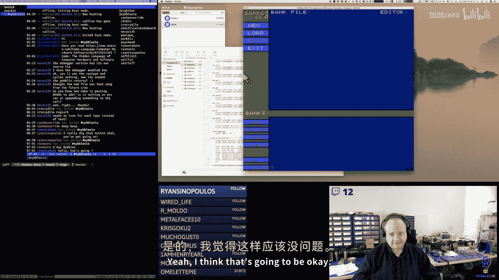

So let's do this。I need to move my font up。Oh， I don't want to change the okay and cancel。Not yet。

 illegal leave goes the way they are。嗯。I guess two。Hey， Romania hate。And I really only wanted one。O。

That works。So now I can move these button。

Hey， GM next way is he？🎼まちょっと。I did the first one， right， but I didn't do the other two。

So remove this space correctly， it's clear and。Take two off。Okay。Two more proud。

🎼And then stuff the front。Okay。I think。Yeah， I mean， they're a little bit smaller。But they work。嗯。

And then that gives us some room， okay， so tile set doesn't fit though。So I'll just call it。系我都就系。

Its call it tiles。And then pallet needs to go in a bit。This one maybe even needs to come back at it。

T。はい。你什 now。I'm going to track。10 years。There we go。

 so there's a gap between the bank related buttons and the context buttons and we could even change the color。

 I guess。You know。The background color maybe。I could make that configurable in the data structure。

And。But we have room for。At least one more context button here。If we need it。Now， all I'm at it。

Let's shrink these up here。So we're consistent。

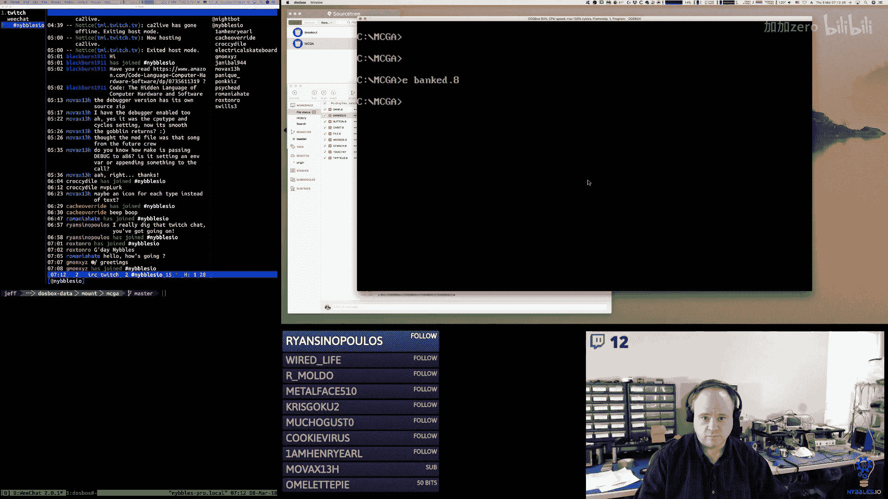

So all the text needs to go up by one。🎼Oops。Okay。And then do the button still work？🎼没有。没有。

And then if I click in between， yeah。Nothing's there。But if I click in the button， it works fine。

🎼Okay， so the。Button code is still good。嗯。

🎼So， let me。Shrinkng the space between those。So you just need to take two off everything， right。

 so 32。然后。Space in between does nothing。Pretty tight。But inside the button。How good。Canceing okay。

 I guess we should price shrink to。Be consistent。Okay。So those fit。

I am going to take a quick break and I'll be right back and when I come back we will。

I would like to write some rendering code for the tabs in the bank bar。

 so we at least have that so we kind of know what it looks like and kind of how many we can fit。

All that good stuff。And also like where the paging button should go。Also then。

 I think inside of the bottom pane。I want to figure out like where。

Where text and navigation stuff and all that should go， so that's what we'll do next。🎼St you。🎼だろ？

🎼いトは？Okay。And。🎼Starting the second pass on the。Ay brewing process。🎼嗯。🎼哎。🎼So， we're gonna do。

More drawing here。てる。Did I go grab for coffee？🎼啊。🎼Oh。Sorry。Where was I at？Okay。

 so I wanted to write drawing code for these tabs here， want to see what that looks like。

So let's try that。Yeah， of course as usual。Start by putting it in here in our program file。

And then I probably will eventually。Refactor it out。But we'll get to that eventually。

So we're going to call this cab draw。And I'll implement the function that just draw one tab first and then we'll。

We'll wrap it up and do a bunch of them。嗯。So we're going to have a fill direct。🎼At some position， so。

🎼Let's say that。We get some stuff on the stacky poo here。🎼嗯。

So we'll say that our position is controlled by Dx。Comes in on the stack here。So the size of it。

What's the biggest bank？Name， type name we've got probably module， right？Sample or module。

Those are the same。Tll。Bright。Pro I can do sprite abbreviated。So actually。Bd sound tile sprayrite。

How。Background。把。So it's looking like we can get away with。F characters。As the max。Plus。A number。So。

One， two， three， four， five， six characters。36 pixels wide。So we'll do the 38， actually。

 the 38 is going to have a little bit of buffer on the sides。And we'll do these ten do。

And we'll do nine。🎼嗯。😀はははは。😊，Oh why am I pushing this， what am I doing， oh my goodness？

You're on spot。So this is our position， we're going to do 38 by 10。Nine by zero。🎼With呃那我。then。

Just for testing。如も这。And then we're going to offset our position。🎼So。🎼I do 2。2。

So we grab the size or I'm sorry， not the size， we grab the location off the stack。

We draw a rectangle at that location， 38 pixels wide by 10 pixels tall， using that purplish color。

As the background， and then we increase our Y and our X。

And because we're going to move the font a little bit inside of the tab。

And then we draw our test label at that location。Using the white。Color。And that's it。Okay。

 so then down here。I can do a TB draw。And。Let's do tabab bar。X plus。2。By tab bar。Why。Yeah。

 let's just try that。And。

I had to screen something。I want to leave this out。Do that every time。Okay。来。Somehow my math is off。

🎼Oh。Wait， I know， how did my man end up so long？Six， one， two， three， four， five。

 six characters times six。36。I was 38， right？That's weird。Favorite most memorable asmbler， oh gosh。

🎼嗯。I mean one of them I'm using right now， I'm using A86， I have a lot of fond memories of A86。🎼啊。

I remember when I。🎼Found it， and。I had been suffering with Mam， actually。And Masm's okay。

 but it's just it'。It definitely had a lot of red tape to it。🎼And。So for X86， I would have to say。

 you know， A86 is my favorite。🎼あ。I like fsm， nasm， you know， they're okay。N， you know。

Mas andantasm I never really was a big fan of， I used him。🎼But。They're painful。On the Amiga。

 I would have to say a M1。Um was。I have a lot of fond memories of a set one。🎼嗯。On the Commodore 64。

 I use so many different asseembllerers I can't。And they all seem to kind of roughly work the same。

Turbo assembly was kind of cool。On calendar 64。But the other。Let's see on the Commod 64。

 I want to say at one point。So I had the Es fast load cartridges。

And I think they had primitive machine monitors in them。But at one point。

 I think it was cinemaware had a fast load cartridge。I think it was c。🎼嗯。

And they had a built in assseembler on that cartridge。Monitor slashassembler， I remember using that。

🎼嗯。And thinking that was just the bee's knees。🎼呃。On the apple。Two。

 I did a lot in the built in monitor actually。Let's see。Yeah， I mean。Those are the ones that。

 you know， are popping up。In my head。I do have to find a way。

To clear out the keyboard buffer and the thing exits。Some of the stuff that I type it gets。

It spills over into the keyboardword buffer when the program terminates。🎼嗯。🎼46。Yeah。

 that's not too bad。You're quite welcome。Now I'm wondering if I should push the text down。

One more pixel。Because it looks like it's。AndJust a bit high。Oh， I don't think that way。🎼嗯。

I just realized I'm passing a parameter of ink， I think。I think 86 converts that into an hand。

 and now I'm curious。然后呢然。あい。🎼제 안 들어。Okay。Yep。No。🎼你就谁？I totally forgot they took it。Oh wait noel。

 I be he is assembling those two heads。🎼Interesting。🎼Very interesting。That's okay。Not a big deal。🎼就是。

It was kind of surprising when I went back to the coat looked。

🎼Yeah that。🎼So I want to go。I've got these back。This is。🎼Yeah， here you go。 Yeah， I don't know。

6ix and one half dozen the other。Fives not really evenly divible by anything though。Yeah。

 DebPAC was a good asr。🎼Yeah。You know Pascal is not a bad language。

 I did quite a bit of it back in the day two modular2， I remember doing a lot of modular I。

I did a bunch with WadcomM too， I mean most of my professional work。Back in the late '80s and '90s。

 early '90s for games and stuff， I was used in Wadcom。A fair amount。All right， so。

I think what I would like to do is make it one pixel shorter。And then we'll increase the。

Why by one there we go now it kind of sort of looks more like a tab。And I don't know， maybe even。

Okay， so now let's see how many of those。We can draw across。Oh， six is too many。Let's do。Yeah。

 four is about。Now I'm putting。Some extra space in there。But。That's about what we're going to get。So。

 actually。Let'sDo this。What。Move this over。A bit， and let's not add quite so much between them。Okay。

So then the question is， what color should we use？🎼嗯。For active versus not active。

Or do we just draw the text？Coor。😀ははは。😊，I drink coffee all day long， man， I'm so addicted to coffee。

 it's horrible， I don't put anything in it， I drink it black。So it's pretty low calorie， but yeah。

 I drink a lot of it。Oh yeah， be careful here with the C64 power supplies。嗯。The old ones。

 I actually had an old amiccus power supply burn out an amiga on me。

 which I still have in a pile over here that I have to fix。嗯。Yeah。It's great running that old stuff。

 but man oh man。Especially those C64 power bricks， they were horrible。It helps if I do it in I order。

And then we need a V line。He eggs。I那。Excuse me。🎼Oh。Oh， I forgot I just。Fri I just about why。

So let's put you。I guess it really doesn't matter。Okay， let me out。Little tabs。And then I think。

And I think that looks better。Andt even think having that one little。

Have the Y off on that right corner。You know， actually， I just thought of that。

 I could do that on both sides。And that would look kind of neat。🎼哦贝。F this hair。This。这野る。🎼う。

I'm just kind of fusin with this rendering here a little bit。Getting stuck in the。ヘクソ。When incr act。

I'm going to draw the horizontal line offset。Then。Increment why？One。

 because we want to draw our first line。Off。Sad。And then we want to increment X。Again， for the font。

 we want to add two more to it。Close。

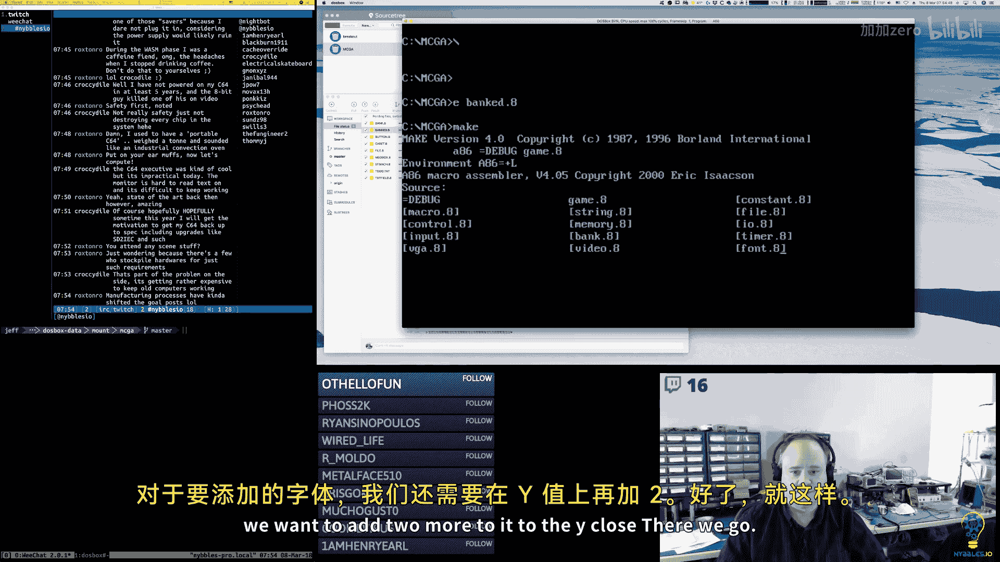

There we go。Now they look like little tabs。In't that neat？And I can move the font over a little bit。

There we hope now it's not right on the。Left edge， okay， now I'm going to move the whole group over。

Another。Because I want to。See if I can fit the left and right。🎼Navigation。

So move that to start at 10 pixels from the left。And it's close。And。🎼그？我。T don end the广 off。

My tab header is off by one。🎼看个。🎼That's good。Yeah， this is actually Mo Q。

 but it's a derivative of the 320 by 2008 bit pixel。Actually， mode Q is even easier than 320。By 200。

 in fact， I don't know if I ever explained how MoQ works。But mode Q is here。Let me do this。

And。Moode Q。Goes。Im like this。🎼A additional tablet， my is。 Cat。🎼The所有。

That's where I fight with this tablet for。🎼Any other。🎼怕了死。It's wireless， but it doesn't really work。

All right。Seriously。那么。Sorry。Now this thing really pusheds me off。Wow， that's really painful。嗯。🎼你道。

I don't know how artists deal with these things。They are so painful， all right， well let's get that。

So I will do this with a mouse that's going to be horrible。So mode。🎼ける。Is 256。By 256。By8 bit。Now。

 because。This is square。We can do something like this， we have AX。Which is a 16 bit register。

So we have AH。Which is the high bite。We have AL。Which is a low bite。This is equivalent to why。

This is equivalent。To X。So all you have to do。To index into。嗯。Mode Q。

Is set the high bite to your y position， set the low bite to your ex position， and away you go。

So you don't even have to do multiplies or anything， right it's really， really。Really， really simple。

Yeah， I don't know why， don know silly tablet。Tricks are for kids。

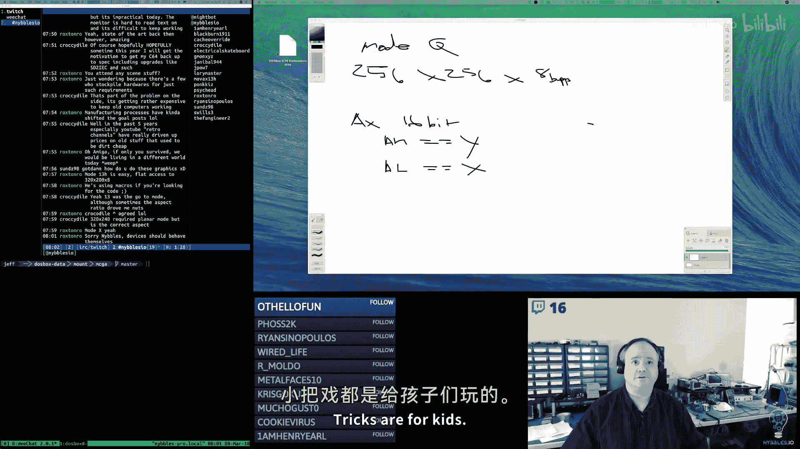

I don't know why it isn't behaving but。I'll figure it out later。🎼So。🎼嗯。Yeah。

 so those tabs look pretty good。The only thing is the。Left upper left pixel。

 I'm drawing the out or I'm drawing the background rectangle。嗯。First， and I'm drawing it a bit large。

So what I。W do。Is shrinked that by one。Increment。There we go。

 now we don't have the extra little blue pixel。Yeahy。All right。So now let's see。

 here's what I would like to do。I want a cheat for the left and the right。Arrows there。

What I would like to do is see if my font has a。A left and a right arrow in it， I think it does。

We'll see though。好す。

我れ也。走然。He did。Moode X， yeah。Moode Q， I'm not sure that came around a little bit later， I think。

From people who continue to kind of hack on the BGA。I tram 509。Okay。

 so here he's got a little reference of his font。Is there a glyph I can use？Sortda。

There's these here。We could use those。Oh wait， I went with where I passed it。They're right here。

So let's see this is zero， one， two， three， four， five，6， seven。IPad。12，3。Con56728。

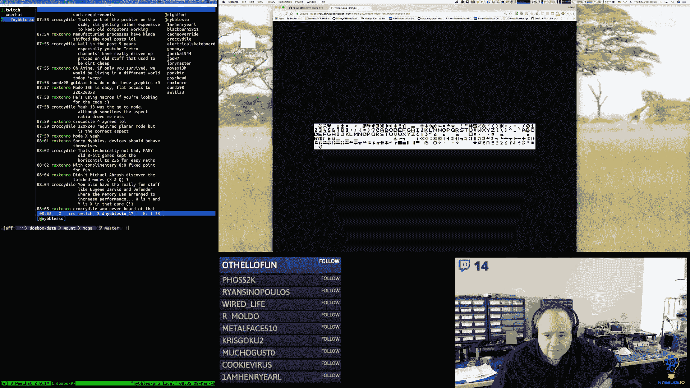

In settlement。Yeah， Jarvis did a whole bunch of interesting stuff on Defer。

That was a 6809 if I remember correctly， and I believe he was one of the first people。

To use the two stack。Poiners on that。On that game。Yeah。interestingteresting， yeah。

 I kind of vague remember。嗯。He did some pretty clever stuff by using both stack pointers on that CPU to move memory around。

St of Q。I think I got rid of。Did。I used to have， you know， I used to have a draw char。

And I got rid of it， I collapsed into this because we were always drawing strings。And it's faster。

Doing it all together。Re're loose and overhead。All right， so what I need to do here。Is。

So St death takes whatever I give it。But it assumes there are quotes around it。我去哎叫我妈。So。

I'm going to have。喂呀。Heero。Cha。And that was。28。And right。We'll do this one at。し。然后。10。

And then this one would be。Like 250。O。I got the right arrow。The leftarrow on the right。呵系。

What that mess up。Left arrow。Right，arrow。Oh， I got back， it's 27 is right。W来干 money？然后。

Really is that。I can't be。I guess that's。Pa bar。What just。是不是？Okay， yeah。I was off a little。

It's a tight fit。Oh， I think I'm one character off。28。欢迎来。No。Heay， there's our arrows。Okay。So。

The left arrow， let's go back。没有。Maybe。So I would say that's about right。

 and then the right one we can even meet。Just pack up a bit。It 248。Perhaps。哎呀。Okay， so I don't know。

 what do you guys think of that， so we got our tile or we got our bank tabs。We can fit four。

Which actually that's beautiful because we can have a total of 16。

 so that means we can have an exact four pages one way or the other。嗯。And then I've got。

 I'll make these buttons。Without it'll just draw the there'll be special buttons。

 we'll just have them draw the text。And then。Okay。

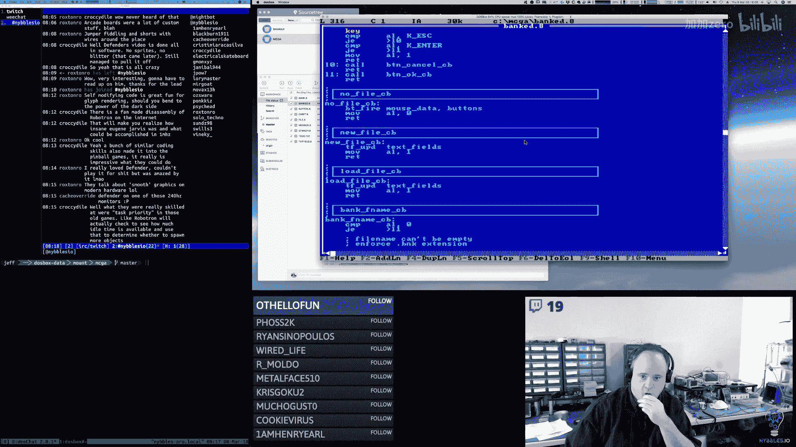

So now inside。Of that bottom pane。We need。So up up and down are just next to。

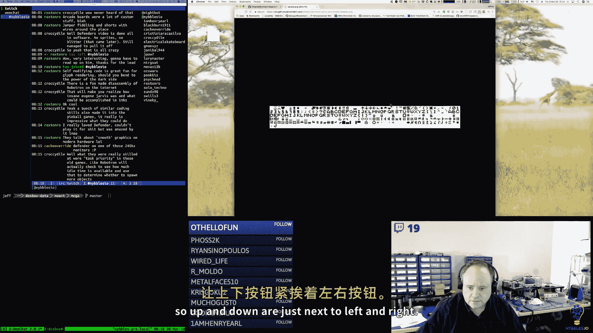

Left and right， so I'm going to put those in here real quick。That's the order。Up and down，什么啊。Okay。

 so then there's our scrolling。From block to block。Up and down。I'll have to move the frame re。

The lower left corner。这是。There's not going to be anything in the lower left corner。嗯。There you。Um。

🎼Okay。🎼So。That's where our。N ends up now I need to show on the top。

 I want to show the text of like where we're at。So they block。🎼Acts of。Total blocks。Of course。

 and then the question is how do we know what the total blocks are？

This is why I wanted to do this because。I knew by doing this I。Flash out。🎼A lot of stuff。🎼喂。

🎼I don't need to use offset。🎼Oh喂。I keep doing this。But we know what。Yeah， let's fix that。So。

 I don't have to。Now I don't have to do it。So this is going to be T Rx。Plus 2。

Hey secret mud going well。Have R Y plus 13。🎼14。Seven by zero。I think that covers。All the calls。🎼3。

When did I times set？🎼有一种趣味的。🎼Un computers。Up。All right。Is。 I not drawn my。My block thing in here。

Tabbar up。There we are。All right， so we're at a block number。A number。

Of。So let's do that。我。Number。Black total number。嗯。嗯。🎼こり。🎼For。🎼白天白晚。Of label。と。はい。Block total number。

So。72。And actually。that's what the font looks like without extra space in between the characters。

Close。There we go。All right。Now， you know， do we want to have it be in the left like that。

 but I think that looks okay。嗯。Make sure this didn works。Okay。嗯。So， then。

So I'm going to move it over just a wee bit。🎼First to。To。2。There we go。还子个。

Like right up against the left edge。Okay， so this will be our status line。

And then we'll render content。I do。🎼嗯。よ。Okay， so now。The next thing to test。

Is how many eight by8 and how many 16 by 16 tiles？We can fit in this little window here。

Because that's going to give us ideally we want to fit exactly what goes into a page or what goes into a block。

So we have 4090 bytes divided by 32， we can fit 127。Tiles evenly there。128 for sprite we can fit 31。

 so let's see what we can do here。嗯。Becauseuse。Now would be the time to kind of adjust the size of all this stuff。

嗯。Let's see， okay， so we're drawing all of our text and。Heads up stuff。🎼So， now。What we want to do。

🎼Is。🎼Let's see。🎼Let's say， you can do。Do eight to start。So this is going to be tab bar。🎼Why。

No X plus。🎼4， USA。We'll try there， let's start the VLB tab R Y+。1。

And then we're going to do a fill rack。Just for testing purposes。8ight by eight。

And we'll make the color。I'llMake something different。Or by zero。And then we're going to add。9。

To the X。我からウ。So we can fit， all right， we're going to be able to fit a fair amount。🎼So， let's say。

🎼Couple of changes。 couple of。Because we don't want it all sooed up。If it doesn't have to。

That's a technical term， scooed。Let's see if we can fit 32。🎼That's a。That's too many， but yeah。

 that's too many。🎼Let's do20。🎼嗯。Early。So if I move our start position back。She has to that it fit。

We need five rows of those。So。Why why am I not seeing？哦。Because I'm silly， silly。I'm so silly， silly。

There we go。Nice， all right， so we actually have some s room here so we don't have to make it so tight。

あ。Okay， so。Let's。Make some adjustments， let's two six。年。Let's do。22 across。

So that's still over what we need。But that should fit。A lot better。Okay。Beautiful。All right。

 so now I'm going to move it back over。So we'll do four。Yeah。All right。

And then I can even move it down a bit， so it's not quite。The start position even quite so。

Close to the status line there。So我。🎼Yeah。🎼Put another。Four pixels up there。Yeah， there you go。

So that's one whole block of tiles， and in fact， that's more。Then we can fit in a block。

 so in reality we're going to show up to somewhere around here and we're not going to you know。

 show the others because we can only fit 127 and this is doing 22 by6。So this is 132。So yeah。

 we're never going to display。This corner down here。that's okay I can live with that。

 but what's nice about this is now when we navigate from block to block。

 we're always showing exactly what's in that block we're not crossing over blocks because that。

While we could do it， you know， it's going to make things harder。Okay。

 so now I'm going to comment this code out。And I'm going to copy it。

And then we'll do the sprite sizes。And see what that looks like。So。If。Tiles。

So we're not going to be able to do six rows， we'll start with three。

We're not could be able to do 22。So， we'll say。12。This would be 16 by 16。This would be 17。

This should be 17。Right。Gosh， I got that pretty close。嗯。Unfortunately， oh no， or that's good。

 that fits good。嗯。🎼So， that's what。🎼DB。66 he prefixes。I'm not sure what you're referring to。

C 4090 divided by。8 times。Yeah， it's 31。え？Yeah。So these last。For we will never show in a block。

Perfect， so I'm going to make a couple of adjustments on this。

so I have them because I'm going to refactor this。Prototy and code。I'm going to move that down。これで？

Oooops， oh， that's because I didn't eat some。啊。🎼아惜。Actually。I'll leave that that way。

I want to move this。Okay， here we go。Yeah。And then， okay， so how this works。

 whether it's the tile or sprite， you click on it， and then the editor will be up here。哎。All right。

🎼Now。🎼I changed。🎼I used to。I mean， this is not March。But I'm curious because。🎼Yeah。Cosh。

 I think I wrote this a long time ago。Okay， so that。Was what I thought the original。Editor window。

Larger editor window for the tile would look like。嗯。All right， so。And then if I click on this。Oh。

 yeah， it just fitshu。Okay， so that's going to add to let's adjust that。So let's go to 18。来了。

I don't know why I chose 145 by。Very strange。O。Now。That fits much better。🎼Okay。And if I did。

I don't know， I mean， as an editing surface， that's a pretty nice size。

I don't know that it needs to be too much larger than that。

Because we're taking this and we're blowing it up。E times。But。

If I want to fit exactly 128 pixels inside。Plus， I have to consider。🎼，Space in between so。

those are going to be big pixels。For the tiles， for the sprites。

 they're still going to be big pixels， not as big。🎼So if I want to do。That's 40。7。9 pixels time。He。

 that's 72， okay。🎼And then。17 times 8， that's 136。So it'll fit。

Now I'm thinking maybe this is where my sizes came from。O。

So I'm thinking that the what will draw individuals。

Eight by eight blocks for the pixels of whatever the color is。In this grid。So if it's for a tile。

 it's not going to fill this entire surface be。Open area。For a sprite。

 it will fill up this whole thing。So let's see what that is going to look like。So new file。

Lumbber bank that fits good， oh， we had an air， bad things happen， crap okay。So far so good。Alright。

 so now。Let's see what？So I'm going to go back to the displaying as if we were editing tiles。And。

And then。So we had eight。withOkay， so this is going to be。Night， no， this is going to be 43。

This is going to be 19。And then， our。Outer loop is going to move CX。8ight。We're in her loop。

 I should say。We're going to draw a rectangle that is eight by eight。With the color。Some看。

We're going to add。9。To x， then we're going to loop。Yeah， I'm happy I'm getting the。

Prototyping done and so then we'll know exactly what all the pieces are and we'll have the code basically for doing all of it we just need to then restructure it so it works off the data structures as the next step。

🎼So。And I think this also is helping to solidify。You know， the understanding of what。

What it is that we have to build。嗯。It's clearing up some questions about what fits and what doesn't。

 and so that's good。Very happy about light。All right， so then we're going to add。Actually。

 I'm in a decrement。The X can add。9，2。Reset X to。3。And then we're going to compare。So we have。

Eight rows。We set our X and our Y。A columns， we're going to draw eight by blocks for each pixel。

We're going to have a space in between each pixel on X and Y。We we'll get to loop on the columns。

 then we're going to add。A row， were going a to reset。The column。The X。

Dctor met the number of rows and keep going until we're done。え？There go。So when you click on。

One of these tiles。This is what it's going to look like。And I don't know。

 I think that's a pretty good。Blow up of it。Those are pretty big pixels。

So and obviously the color of these is going to be whatever is in the bitmap。あ。

And so for tiles and sprites and fonts。This is what this editor grid is going to look like。

And then we'll have over here。Will show。I don't know if we need to show the single case anymore because we're showing it down here。

But maybe what we'll do up here we'll tile them a little bit so you can see what they look like next to each other without a gap。

And then obviously we're going to have to have like a， you know。You're going to pick your color。

 right sore。The palate。You're choosing here。And then you could pick your color。So we'll have to draw。

The color values of the palette。Somewhere over here。

This is letting you pick which palette configuration you want。

Because you could have three pallet banks， right？So which one do you want to be？

The one that's active。And then from there， you can choose。Which palette and then which color。

 you know， the color values are always the same， it's always zero to 15。

But by changing the palette here， you're going to change what this looks like。

And what this looks like down here too。Okay， so that's the tile scenario。So actually。

 what I'm going to do。Is it going to move this up？And then I'm going to move this code。

Along with its cousin for the bottom。So now we're going to have to f that out again。And then。

We're going to spill right。And the only thing that changes here。

As we have 16 and 16 instead of eight and eight。And that should。

Fill the entire editing the surface in this case。Oh， I have to have in both sides。Oh， I'm off。

This is why I tested this。One， two， three， four， five。🎼7 in。🎼9 can。1Well， 13， 14， 15，6 in mymar。🎼So。

Oh away。T do that coat， right。I didn't。Yeah， I didn't。🎼This should be 17， That should be 17。🎼Wow。はは。

😊，Oh no， wait。I misunderstood， yeah， no I had that right。Because our little pixel size is always。

A by8。🎼Yeah。We wont itll be not next week， but the week after we get back to the Arcade kernel kit。

And then I'll have to reactlimate my。🎼好我啊什年。Yeah， I' have to reactlimate myself to arm 64。

 I'm sure I'm going to。Be thinking in X86 again。Okay， maybe what I was thinking。

Is how I was going to have the size of these。We could do it that way。🎼Not this one。Lets home。

I could say it's four by four。This is5 and5。Wow， yeah， that's a lot more。That not too bad。🎼Oh。

Cod looks the same。Yeah， that fits almost。That's not too bad and actually what's nice about that is I can actually shrink in。

The grid then。1，2，3。413 and 6 yeah。Okay， so。I can shave。Eight pixels off the top and the bottom。

Of that。Oh yeah， ironically， it ends up being。It ends up coming back to that 128 by 128。

 which is where I started。It's sometimes I need to trust myself。嗯。Yeah。

 and actually I don't need the extra pixel， I don't need it to be 129 because。In the。There you go。

So if you're editing a sprite， that's what it's going to look like。

 if you're editing a tile it's going to be half that。🎼嗯。Stream buffer。What do you mean？

Relate stream as in like Twitch stream or。Something else。啊。Actually no， I mean on my side。

I'm streaming exactly。🎼嗯。5，000 them。Kab bits a second。🎼Out and。

OBS is showing a green light in terms of the health of the stream， I haven't dropped any frames。So。

On my end。And then I'm also， so I'm streaming out and then on the same connection I'm also streaming it in。

 now there's a delay。I would say the stream for me is delayed by about。10 seconds maybe。Yeah， so。

Yeah， if you're having an issue， it's probably twitchwitch， unfortunately。嗯。Sorry about that。

I know that's a bummer。So now I could build this down。And then。Just。down little bit。

I I want that to be 21。All right， yeah， that looks right。🎼Good。All right。

Let me rerun the tile one because I did bake some。Adjustments。Make sure that's okay。Yeah。🎼Beautiful。

Now， I mean， I could fill the whole grid， I couldn't make the you know， blocks larger。To fill it。

I could make them twice as large as they are now。So。Instead of eight by8， these would be。15 by 15。

And this would be 16。Yeah， there you go。So yeah， maybe I'll go with that， you know？So for the tile。

 it blows up to this size。For this sprite， it blows up， fills the whole thing， but you know。

 the individual pixels are。Half the size of this because of， you know， the sprite sizes larger。Yeah。

Not bad。Our frame rate is now down to about。Where the game engine was at about 44。He that fits。

I guess so to your question， you know it's do I do I want the zoom to fill the whole grid。

 you know the whole box， or do I want the you know zoom to be approximately the same for both。

 but in the case of the tile， it'll only use half of the grid that's here。I don't know。🎼嗯，嗯。

I'm not sure that one， I mean， we can probably experiment with it。Both ways， it's relatively easy to。

 and I'll create constants for all of it。So that it'll be relatively easy for us to change from one to another。

See what we like best。Okay。You什么 do。Let's take a really quick break here。And I'm when I come back。

 we'll review all this stuff。We'll talk about next steps and then。We'll see where that ends us up。

So I'll lay right back。Okay， I'm back。🎼So now it's。Look at our to do list here。嗯。

I have not tried Shenzen IO。Okay， so。ended up spending a lot of time prototyping what the UI is going to look like。

But that's okay， it's good。あ。So there's some things though。That we need to do。

 I need to add to my task list here。嗯。Need to extend the button。Structure。To。Support。

Background and border color。Also。We need probably a different flag。For rendering。Just the text。

Because for our little arrows and stuff。Also。We need a flag。For no rendering。Because for our。

Our tabs。We want to define buttons。But we're drawing them to custom。

So we still want the mouse stuff to be able to see it as a valid button。But not draw。Okay。🎼U。

Now Im just I'm sorry of thinking in here。If there's anything else。Let me look at this again。

So here's another interesting thing， right？Do we treat these as buttons？🎼So。Because again， that code。

 I've got it written。And at the end of the day， the fire button thing。It's looking at， you know。

 the flags is it enabled， is it you know， all that good stuff？And it's doing the rec， you know。

 the point and rec thing。I don't want to rewrite it。And end up with。

Two different kinds of mouseusy things。嗯。Oh， so。You would。You would just say， okay。

 like this is the rectangle to check。And then once okay， yes， I'm inside of it。嗯。

You knowWhere am I at， which block am I on based on my coordinate？Yeah， okay， so what that means is。

 all right， so then I guess if we go that route， then we'll just have。

 I'll have to build a separate piece。That is kind of like a。

Selection surface or drawing surface or whatever we want to call it。🎼And。Actually， I guess， you know。

I could call it like a grid select right or a a grid。Block。Because these both work the same way。

If I click inside of it。Okay， what did I click on？Which。Which index or which row and which column。

 however we want to do it。ablyProbably a Row column， I would think。🎼来。

The other thing we could do there。If we did it that way。

Had a separate structure is that as the mouse moves， you know， if I move the mouse into this region。

I could be doing that row column updating on the fly。And we could show which X and which y is active。

I like that。And then we could probably draw because of that。

 we could draw the little selection highlight on the fly。That would work。Okay。So。Great new structure。

For。Rriid based mouse。Selection。If mouse。Is within。Bounds。Pick。Praper row column。Based on。Fig。Okay。

All right， that'll work。And the course。Probably also want keyboard support for those two。Keyboard。

Interface for。Block。Slowing。You waiting in your face for。Bank selection。Okay。Oh。

 and let me make a note to myself before I forget。🎼Decided to。If deleting。Baang。

Safe to temporary file。Three sets they reload。2。Comppass memory。什么？🎼嗯。Chaangnge bank。er face。哟W。

Specifying Max。Number of blocks。呃。Store。Number of。Max what。Somewhere。In bank header。Okay， I think。

Those are most of my kdos。So let's review code。

Okay。So I changed headers here。This was mostly。Just forting changes。

I added constants for where the tab bar is at instead of it being。As hard coded。

And I probably need to add more constants for some of these。UI elements like the editor。

Some of this other stuff， so it's easier to work with it。We added new buttons。For。

Props and some of the editor specific ones， I'm going to change these。To be not visible by default。

 they'll only enable when they appropriate。Bank type is active。And then。Callback。

 empty callbacks for the new buttons then。Lots of code here for drawing the tabs。🎼Draing。

Adjusting the tab bar。Drarywing the different scrolling arrows。Temporarily drawing the。

Tile slash bright editor surface so we can see what that looks like。And， you know。

Beginning code that I can then take now parameterize。For drawing the tile grid。

 drawing the tile edit。Windll， same thing with the sprite。These were renames changing to the macro。

I change micro font， the different font structures， instead of being variables。

 I change them to labels， so I don't have to use offset anymore。

All over the place that makes those lines just to weave bit shorter。嗯。And then a button。

 I think this was。More。Just code clean up here。Yeah。

 changing the macro to file the naming convention。Getting rid of offset。For the font。Carrot。

 this looks like it was just formatting changes。Renaming formatting。Control。

 this is where I put coal in。On these， so they're already pointers instead of。

Or they're already offsets instead of having to be converted into offsets。File changed the headers。

 and I also change the stack offsets。Unese。Message box， these were just headers。

And looks like I created a macro to call the draw。State machine， just headers。String。

 I added a new macro stir Deaf C。To do， we already talked about text field， just headers。

 and changing the offsets。O。So。Here's my game plan。For the rest of today。

 I think I am going to focus on。Bulking out the bank stuff， the bank interface。

And really starting to now that I've got prototype code for what the different UI parks are going to be。

 I'll update the button stuff to support those new pieces and then。

I to make changes to the bank header。Right， because we want。I have a reserve by here， I can put。

 I can turn this into the number of blocks， you know， the max max block。And that'll tell us， okay。

 so when you created this bank， you said。Only two blocks。Or only 10 blocks or 16 blocks， whatever。

So I'll make that change。I mean， I guess I could do it that way or。Now， yeah。

 we need we need to know what the upper limit is， right？Yeah。So think you know。

 make that change and then I'm going to rework。Some of the interface here around new。

And then I'm going to try to get that。Integrated。So when you do a new bank。

 it'll actually call bank new。You know， depending on the bank type and then on the bank type UI。

I don't know。Really briefly what I was thinking there。Again。So。You're going to click new。

 you're going to give us a name， okay， now we're in the new state。This is going to enable here。

 there won't be any of this up here yet。It'll be empty。You'll click add here。

And what I was thinking would happen is we'd go into the ad state and then I would pop up a little tiny window here。

They would just have buttons like these in it。And it would be。

And it would almost kind of look like a dropdown right or be similar to that。

Where it would pop up next to Ed。And you'd have。Tiles braid， fun。You know， background。Paalette。

 whatever。What our options are。And then you click on that， you click on it。And then you know。

 whichever one you click on， that's the type and it creates a new， then I'll call Bank New。

Pass in the type， passing in the max that we know。For that bank type right so again in the Inter to do list。

 we've kind of enumerated what we think those are。And so， you know， I'll have in the callbacks。

 right， De'll each know。Oh， you picked a fine。🎼嗯。Or you picked tile or you pick Sper。

 you pick palette， or whatever。And so that should work， that should be pretty straightforward。

I'm going to change， you know， like I said， I'll change the structure next。

I''ll work on the UI and try to get that stuff wired up and that's the other thing too。

 like when you click no here。Okay， so this is another question， so what do you guys think？Here。

 let me restart it。嗯。I click new。Should new stay disabled？Or if we click new again。Is that a reset？

RightIn other words。I already have a bank file if you click New。It's going to pop up a warning。

Warning you already have an active bank in memory， are you sure you want to you know restart right。

 or are you sure you want to reset？You'll lose your changes。Okay， cancer。🎼Or。Do we want to just？

Avoid that whole path。And once you've clicked new and you've specified your file。

 this stays disabled until you exit。UYeah， until you rerun it。

 so you basically can create a new bank the first time in。But once you have it。

 either have to save it or you have to bail and restart。I mean it doesn't really。

 I don't think it matters， click new again， show confirm dialogueo， okay yeah， that's fine。

 so that's what I'll do。🎼And。I think load will actually kind of have the same functionality right so if you have an active bank in memory you click load。

 it's going to say， hey， you have something you know active。🎼Are you sure and。

Save won't prompt you for anything， saveve will just save。Exit if you have an unsaved。

Bank exit will prompt you。To make sure that you want to exit。Okay。And。Yeah， and so then get that。

 if I get that stuff going， then what I'll do is take my drawing code here， I'll refactor this stuff。

 and then start getting these tabs。To draw based on what's in the bank headers。

That would be the next step。So you click add。It pops up the little window。

 you pick which one you want。It's going to create the bank in memory。

 it's going to allocate the blocks。And then。And then I'll you know the drawing code here。

We'll actually start rendering tabs based on the banks that are in that。Data structure。

I'm going to have to create a。Mapper of type I。Type number to a string。Now I'll have to do that。

I think we can probably use that exact same map or for the editor label up here。

So I can display like when you choose a bank。It'll show you what editor that is。U。

Or do we even need that， because you already see it on the tile or on the tab？

Tab tells you what it is。So I don't know， maybe this can go away。I don't need it。

Which would be kind of nice because then I have the whole height here to do whatever I want。嗯。Yeah。

Yeah， I think I'll ditch this and we'll get rid of it。Because it's redundant。So yeah。

 that's the rough game plan。I'll see how much of that I can get done today。

But I would like to try to get as much done as I can。And but I think we're getting there， right。

Most of the pieces， the palate stuff， I didn't prototype that， but again。🎼Really。

 if you think about it， like。The palette's going to be very much kind of the same thing， right？🎼要有。

You'll pick a pallet index down here。Up here， you'll have your。Swatch of colors， you'll click on it。

 you'll get your RGB。🎼And。You'll change them。Yeah， so that should be pretty straightforward。

🎼And then。🎼These。So I'm thinking what these arrows are going to do。はははははは。😊，Now。

 I don't want to do that to myself。I think all these arrows are going to end up doing is moving that offset。

 right， moving the current offset。Or。Actually， probably what I'll end up doing is。

I'll have in the code segment， I'll have two other。🎼Pointers。

One that is pointing at the beginning of the page。For the banks。And a page size is four。And。

And then the left and right buttons here will just move that pointer and then of course when the screen when we go through the next refresh cycle。

 it'll just render whatever the next page is。🎼嗯。And the same thing with blocks， right， I'll have a。

Whateverever you pick。A tab。I'll reset a variable that is the pointer to the block。🎼And then。

Or just the block number， and I'll just do the math。To convert that into the offset。

I think that'll make that easier because one way or the other I have to take the either take an offset and divide or take an index and multiply。

 I would rather do the multiply。🎼嗯。So。Yeah， I think that's what I'll do。

And that should make the implementation of these really simple。

Camping them and all that should be really easy。呃。About the only goofiness that I can think of is。

 let's say that you have this tab selected。And obviously， when I draw these。

 I'm going to change these a little bit to where like。

I'm going to draw the disabled ones with this blue background and the darker text。

 so they really show up as disabled and then the active one will be this purple with this lighter color。

Of text。But let's say you have this one picked， okay。

 and you scroll to the next page what do we do right？You have no tab selected at that point。

Which is fine， I mean you know we can have a state where it'll basically write some text here that says。

No active bank or something， right， no selected bank。Pieace of cake。

Or do we leave the one that you had selected active？But you can't see that， right？嗯。

Spites can be 16 pixels by 16 pixels。That's it if you want to gang sprites， you know。

 you can gang them in your game。which was always going to be my my approach for that to make them larger if I needed to。

 the engine can reliably render 128 of these you know at one time。

So you can probably gang quite a few to get larger sprites if you need to。For music editing。

 here's my thought。Its twofold one。嗯。Probably initially what I was thinking we would do。🎼Is。🎼嗯。

The sample and the module bank editor here would just let you pick a file。啊。🎼And。Import it， you know。

 import the data。And。And that's it， probably。Because。If I want to build a whole music editor in here。

Which would be cool。That's going to take some time。嗯。🎼So。I don't know， though， I mean。

 we might be able to build like a really primitive tracker。Without too much effort。

 I don't know so I'm waffling right， I've gone down the road of saying， okay。

 I'll just import the raw data from some other tool like impulse tracker or something or I've gone down the road of saying now I'll screw that。

 you know， I'll do everything in here。So I mean， obviously samples are just going to be。You know。

 wave files or whatever。🎼And。Those will probably always be imported， right？

And the way I'm thinking like a sound bank。Would be kind of sort of like this。Oh， no， no offense。

 I I'm。I was not necessarily thinking I would want to write my own soundter。

I was definitely assuming。I was like 95% sure that， you know， for this， I was basically going to say。

 okay， you can create a sample bank and that just means you can import wave files。And。

You can create a modD bank， and that just means you can import an existing modD file from some other tool。

And then in the game， we'll have player code that can take those and play it， right， and that's it。

I mean， that's absolutely the easiest thing to do for the sound stuff。Because I agreed。

 building a whole tracker。It'd be cool but。It's a lot of work right， yeah， I mean。

 it's a lot of work。I mean we could probably spend a year。

 six months or a year just writing our own tracker right plus the other issue run into is this is all running in conventional memory。

 I mean we could write code to access extended memory， it's not that hard。But。You know。

 as soon as you start getting into late。I'm music。A tracker editor。

You're going to need a lot of memory， right？Oh， I see what you're saying。Yeah， that's a good point。

Yeah， let me make a note of that。No， not this one。嗯。So， we want to say。Add control to show hide。嗯。

Bank。You were。Yeah。So yeah， we can do that。I could have like a little。

I could probably find a little character or something here。That we could use to shrinker。Grow that。

Of course， the only thing is like when you're editing the background。

You're going to want to be able to pick tiles， right and then。Drag them in。

I think my music stream died。No， still going。Just quiet。嗯。Yeah。See you hopefully tomorrow， Rox Tro。

Have a good one。Yeah， I think that's。I think that's doable。Thank you。I need luck。And it's just。

 you know。Perseverance， keep going。Okay， well。Yeah， I think that's a good stopping point for today。

 we got a lot done， I mean， and I just blew my circuit， I'll be right back。呃。I swear this thing。

Such a pain in the blood。嗯。UPS works good though， that's my contingency planning right there。

I blow the circuit breaker in my room。To verify that my UPS works and everything is battery backed up。

It's amazing， you， nothing's keptpped a beat。We should。

 how many times did Jeff's trip the circuit Ber this week that'd actually be kind of funny。🎼嗯。🎼Yeah。

All right， well， awesome。Okay I got。And it's a to do。🎼嗯皮。Fish that up to GitHub。And like I said。

 I am going to definitely make a really strong effort to continue working on this today and try to get more going。

So we pick up tomorrow from a。More progressed state。Because you know， itd be nice if on Saturday。

 you know， I had the editor to a point where。We can。Do some tiles and some palettes and some sprites。

And fonts。And you know， you know， be able to load that in the game。🎼Instead of having the。

Tees little stripes that I've got in there now， that would be a great。

A great place to end it for this week and then when we come back to it， you know。

 we'll be in a really good place to finish off more of the editor and then actually start working on the game itself。

Which I kind of expect a game to go。Pretty quickly， because again。

 the game that I'm making is not that complicated。Not to say it won't take some time， it will。

 but I think it'll go pretty fast。🎼So。Yeah。So I had a good time today。

Anybody have any parting questions or anything， parting comments？Suggestions？Oh， and then， oh。

 I did want to mention so then next week。We're going to be doing BU for the week and I have been。

You know， working on some of the outstanding issues there。And so。Crossing my fingers。

I should have all the pieceace table editor stuff done。

And merged into the Tool branch by the time we start on Monday。And。

And then we'll be picking up that will be beyond that and then we can the tool stuff that we're doing here ironically we can do in ReU it's going to be very similar although in RU we have a lot more。

I have an essentially infinite memory。The tools can be a lot more advanced if we want them to be。

But we'll be doing a tiles spr editor in there， background editor， you know， all that good stuff。So。

So yeah， that's planned for next week。And we'll see how close we get there plus。🎼嗯。🎼I。

Have an almost completed implementation of a fourth。Interpreter in ReU now。

 and I've been kind of debating。How we want to integrate that。🎼あ。So。We can go over that too。Because。

I know really started thinking about macros in the assembler and I thought， you know， gosh。

 if I just。Used forth。If the asmbler could do fourth and fourth could do assembler， you know。🎼I mean。

Now you have a turn completele metal language in your asler。So that could be pre cool。Also。

 we could replace the， you know， potentially either replace the command language with fourth。

 it would be the same it's just that。For a lot of commands， it would be very similar。

It's just that you could also write loops and conditionals and that you could do all sorts of other stuff and you could create you know new words on the fly that wrap up things that you do in the console so those are you know a bunch of things that I've been playing with。

On the side of things。Yeah， that'll be next week。All right guys， have a good one。

 thanks to everybody for dropping by， I really appreciate it。嗯。

That would be cool I will say this so you've brought up Temple OS。

 I really think Temple OS is it's a masterpiece man， Temple or Holy See right is just， it's amazing。

But yeah， there's definitely some inspiration there， but anyway。

 I will see you guys tomorrow morning， have a good one and keep on truck and talk to you then， bye。

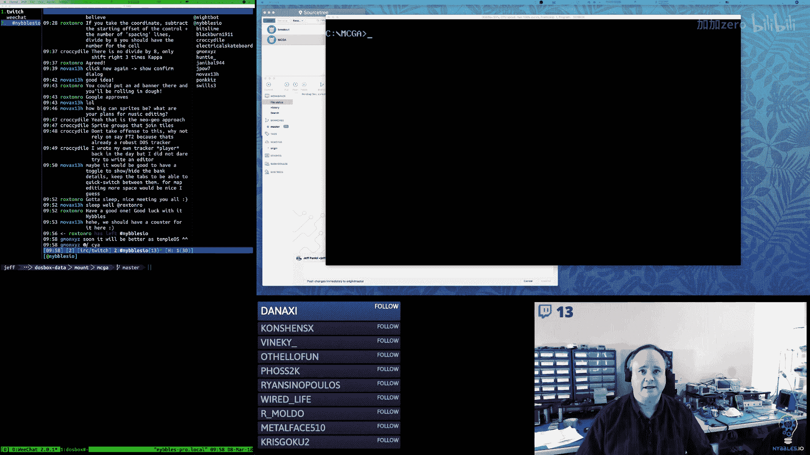