# 【精译⚡x86汇编语言】nybbles.io p06 p6 x86 Assembly： Wiring up banks to the UI -BV1NPr9YKE4b_p6-

Good morning， everybody。

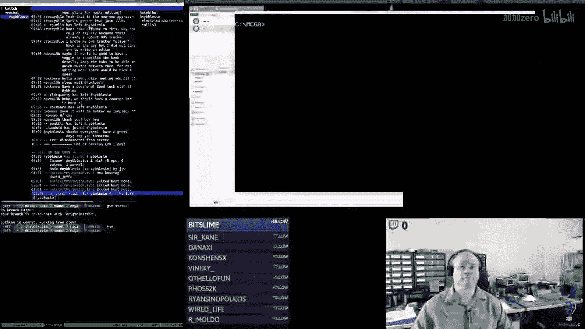

Allright。嗯嗯。Okay， today is the 9th of March。2018。This is the Nimple's IO daily programming stream。

 I'm Jeff。I streamray Monday through Saturday， 5 a to 10am Mountain time。On my channel page。

 you can find a widget near the bottom that will tell you what times those are in your local time zone。

Speaking of time zones。I noticed that the widget is reporting 6 a。m for next week for me。

Because daylight savings time starts。Here soon， I think it's on Monday， actually。I don't know。

 excusecus me。Allergies。I still intend to stream at 5 am， so I'm not sure why it's showing six。

But it will still be 5 am。In the morning， Mountain time。It's just confused， I think。Excuse me。🤧嗯。

I start talking。嗯。Bad。And let's see。Yeah， so today and tomorrow we're going。

Continue working on the MS Dos Arcade project in X86 assemblyse language。

So I already had kind of， I did some cleanup yesterday。Unfortunately， as tends to happen。

Life got away and。I wasn't able to get as much done as I had hoped， I did to however。

 get some work done last night。

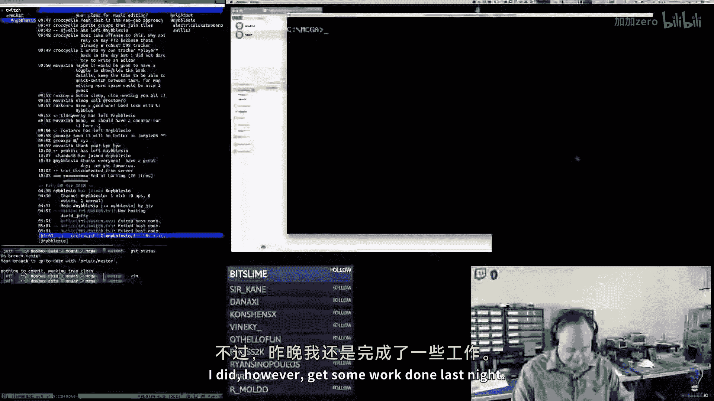

嗯。And I did some small cleanup this morning。Excuse me。I'm going to mute myself for a second here。

Allergies suck。So what I wanted to do today first。He is start plucking apart some of the prototype stuff I did yesterday。

And create some。Hey Blackburn， how's it going？State callbacks and move stuff into that。🤧嗯。

So I have a no bank callback。A tile bank， a sprite bank， let's make。One，4。A pallet bank。And。うんうんうん。

One，4。🤧Excuse me。🤧。Excuse me。OhLet's see here。Background。And thought。🤧嗯嗯嗯。And may think for now。

These are the major types that we're going to be working with。

Eventually we'll have some sound related stuff。Two and okay allergies are kind of。

Geting tune me a little bit but。Otherwise doing all right。So。With all that。

Let's start breaking some of this code into more。Musable stuff here。嗯うん。

So we have a tab draw which draws the individual tab。And then we're going to have tabs。啊。嗯うん。

And then。I think the macro we'll call bank trial。うん。うんうん。Okay， so then our loop to draw tabs。

Can move in here。嗯嗯。🤧。And。I also think what we should probably do is move。う。Greatre a function here。

The draws， the tab。Bar。🤧嗯。张鱼。The TB Ts macro is going to do。🎼The bar。And then the tabs。🤧。🎼O。🎼嗯。Okay。

 so then。We have all this stuff。🎼S the。We have that section inside the tab。

 so what do we want to call that？嗯。Bank viewer。Yeah。So。So we're going to hit。

A function that will draw。Okay， move Ax 13 hecs。🎼So。So there's two parts to the bank viewer。

There's the part that is the all the control stuff。Which will be common。

And so actually this left arrow right arrow that belongs with the tab stuff。

The up and down arrow and the block label stuff。That all belongs。我。The viewer。We we know it's a bank。

Okay， so then。So this is all like the。他们。Functionality of the dealerer。

But the viewer is also going to then need to call。A special callback based on the state we're in。The。

 you know， that gives us the。Distinctive view for that。Tool state， right。

 so if we're editing a tile bank。We're going to be in a you know。Tile Bank stayed。

Then the viewer is going to show。It's going to show this stuff。Or if we're editing sprites。

 that's going to show this stuff。Rreading fonts， it's going to show something slightly different。诶。

Okay， so。他认为我。哎我去。Okay， so let's do it this way。Let's create a。Variable。嗯。

And so let's create a variable that is the pointer to the callback for。The viewer。

We have a state stack when we go into a state for like the Sprite editor or the tile editor。

 they will set a pointer to a function。That is the drawing function for that or the handler function for the zeroer for that state。

That allows the main thing。結構。🎼嗯。To just call to tab viewer。Tab viewer。It's going to call。

That its can draw the support stuff。Properly。And then。It'll call that。

Whatever function it's pointing at。Or the function is null。Then it will just display。Nothing， right。

Or it'll display a message of some kind。So fewerer。Call back。We'll set that to nu。嗯。

So we're going to compare。The viewer。Hallback and zero。If it is zero。We're going to bail early。

We're not going to draw anything。Otherwise， we're going to call。Whatever。That's pointing have。🎼So。

 then。To kind of get her。Prototype code into a spot and a home。We can have。他哦。Viewer callback。

Sprite viewer callback。All right， so then。Don't need to do the Fs anymore。This code。

So we're just doing the code for the bottom part for the viewer right now。

The editor part is a different piece。Hey， Wid life。嗯。なしてき。It's a depression。🎼上一个。All。

 so all this stuff is in the food block here。The' if left out right now is this is for the drawing surface at the top。

 we're we'll move that in a minute。I just wanted the test。What I've kind of refactored out so far。

So by default， we shouldn't see anything in the viewer。Because that callback is。Nll to start with。🎼哦。

看看看。要かえ。I don know啊。Russians and。

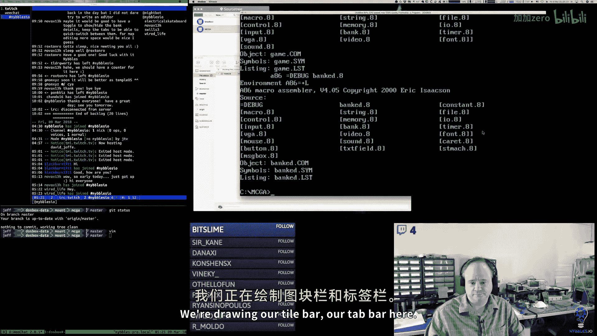

可以。Right， so we're drawing the。Hower support part of it。We're drawing our tile bar。Our tab bar here。

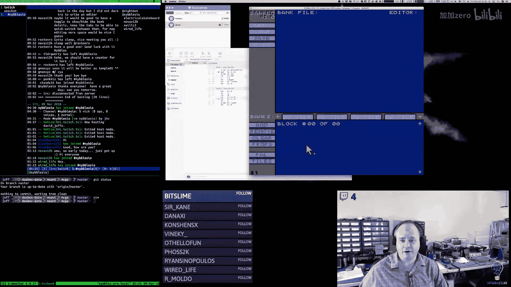

That all still。Is working properly。🎼什 now。The actual。Editor， so。For tiles， sprites， and fonts。

We're going to use the same。🎼Editor。It's going to be the same bitm editor our tool。Just configured。

Slightly differently。🎼In each case。So that all that code is common。So。Oh， we're not drawing as much。

 that's why。

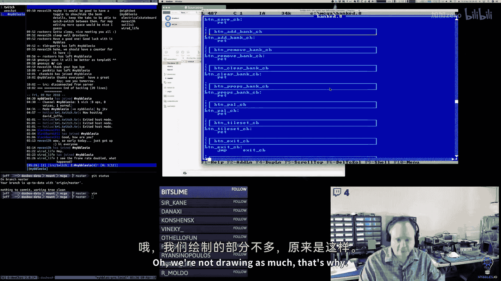

I took a bunch of stuff off the screen， I'm refactoring code into actual places where to live。

So the frame rates high right now because we just we're not filling it with many pixels。

Yeah， unfortunately， you know under Dos， frame rate control was always kind of interesting。嗯。

You have to pull。Fortunately， for the vertical retce。嗯。And。Yeah， so it's not quite an exact science。

 as it should be。And so I'm thinking what I should do here。

Because we can generically call tile Sprites fonts。Those are all tiles。

Different configurations for tiles。So I think what we'll do。Hey， Romania， how's it going？

Is we'll create a tile。While here。男的。So we're going to copy that code over。无敌。

I wantant to keep the return statement。Okay， so。In会。If we're in the no bank callback。We're going to。

Hello。

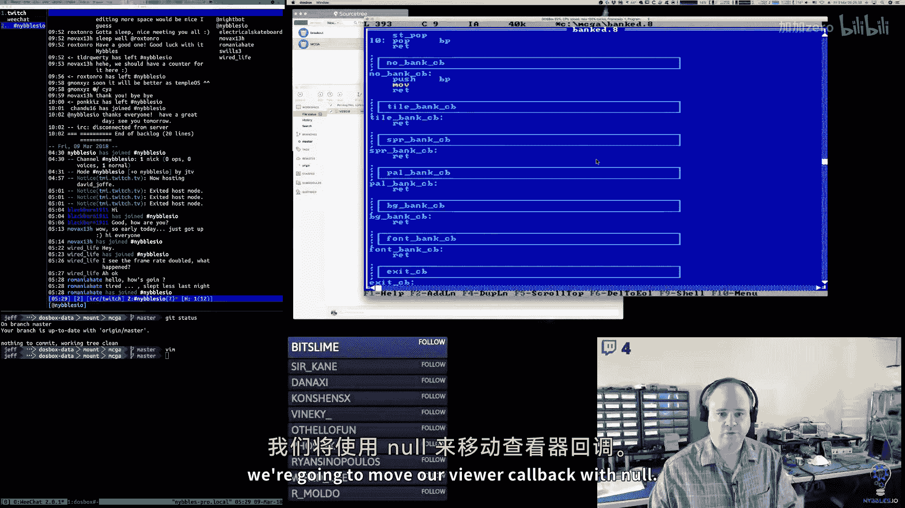

呃。Our viewer。All back。With no。If we're in the。还有。We're going to move it with the。🎼We call it tile。

We were calledback。T beautiful。if we're in the bright one。This will be spray。

So we start life in the no file state。When we hit the new button， we go to the new file state。

When we hit。Return or if we hit load， we'll go to the load file state， which we'll type a name in。

These will transition to the no。Well， this will transition to the no bank state。

 this may transition here if there's no banks in the file。护。嗯。Well actually。

 so this is really like no bank selected state。Is what this is。And then we have。

If you select the tile bank or spray bank。嗯。State power Bank。这B剧本。

And so if you as we pick those tabs。Then we'll toggle if no tab is selected。

 then we're in this state， otherwise we're in one of these。嗯。Should that'sO。Okay。

So let's have what's have let's。う。A function when called。Tiled。知道啊。And we only need one of these。

And we're going to preemprize it。Okay。嗯嗯。哈哈哈哈。😊，You don't like Temple OS。

Where did you go play with it？Temple O is cool。Harry's a genius。He's crazy， but he's a genius。

All right。Yeah， it's amazing。It's got a lot of awesome ideas。And I mean。

 it's got so much blinking in it that it's like， you know。

 it puts you into a hypnotic state when you're using it's great。So we need two values here。First。

 we're never editing anything that is not it's the same size on both sides it'。Eight by age。

 16 to 16， 32 by 32， we're not doing odd sized stuff。嗯。So our。Mac broke for this guy。

So we need to push the size of it。Onm a side。And we need to push the。嗯。The size of the。

Blown up pixel。That we want to use。🎼So we're going to have the。Ps。So to key picks， eyes。🎼Com。なで。🎼ピ。

Tileles。あ。点了。So this is a really cool feature。I use it in some of the code， not all of it， but。

Actually， we use it all over the place， but it's not quite as obvious。

You can create an anonymous structure。And when you set BPp to a pointer， you can。Access that。

You can access memory through that structure。So we don't have to like know， oh。

 it's at offset two or offset three or whatever， so this is the return parameter on the stack。

Problem is is I don't typically name these because if you read。These names have to be unique。

Across the entire assembled thing。So I typically just leave the return value empty。Unnamed。

 I should say。🎼Okay。So then this is going to be。PE tiled dim。And this is。The size is。

I guess we could use AX for that。I'll just use SC。Yeah， so what we want to do。Theres no。嗯嗯。这没 go。

That'll work。So this will load the entire register with this value。

 but this is going to be a byte value， so AL is going to get loaded here with whatever size we put in there。

 but we want both bytes in the word。To have the same value， because that's what we pass in here。

And then。And then it doesn't matter here。Mた。We add the size of the pixel， you know。

 the blown up pixel to our x and our Y， and then we increment an extra。

We could use H for both or A for both because it's always going to be the same amount。🎼嗯。哎等个。Okay。

 so now that's parameterized， so now we can call that we can say it's 8，8 by8。

 we can say it's16 by 16。We say then make the pixels。Each pixel in the grid should be eight by8。

15 by 15 or whatever we want to make it。And obviously， of course， if we make it too big。

 it's going to blow past the bounds on the box， but that's something。

And this is going to grow more as we get going here。But this is like。

The beginning of turning this into something， you know， real。🎼谁。So， then， in。Three of our states。

我 going靠。Now here's the thing， this is kind of a little bit wasteful here。

Because we're constantly resetting a viewer print。Pointter。

And these are going to be called every frame when we're in that state。

We only really need to change the viewer setting one。And that would come from clicking on the tag。

So whatever the button callback is。With that tab。That's the thing it's going to look at。🎼で緒ね。

So again， the way I'm thinking that's going to work。Is I'm going to have four non drawn buttons。

And then。Will。我。each button will know how to map itself to you what bank it represents based on where we're at。

Paging。When you click on it， it calls a callback。It's going to。Say， okay， I pointed this bank。

That is this it's a tile bank， so in that callback that's where we're probably going to want to do these。

嗯。So you know。Let's take that out。And then likewise。

And these guys are going to call tile Spite and font。They're going to call that。Tile editor or draw。

🎼And。The parameters for passing， so for tiles， it's eight。And 15。First Sprites。It's 16 and8。

I'm sorry， it's team7。🎼え。Buts it would be。🎼嗯嗯。🎼5。🎼And。Yeah， we can't quit。🎼So， we'll say。🎼24。

Now that code should be there though。Okay， so now let's do this， let's go to button。🎼Bhutan。And。

 let's say。No准啊。So if it's a no draw button。What does that mean？Really for button fire。

 it should work exactly the same， it doesn't really care。But for button draw。

It has to be both enabled and it has to be a draw button。I actually probably should do these。

The other direction。🎼So。We move the button flags into AX and we test the。Is it a no drop button？

If it is a no drop button， then we just skip， we're not going to do。Oh， of course， though。あ。

I actually want to do this。All the way up here。This is actually just testing inside， okay。

 should we draw it？Dimmed or not。Okay， it's the very first thing we say we killedddle in here to。

Button draw。And then of course。🎼他路。I want to do that even。One of these days。

 I'm going to make up my mind。Because then in the main loop， we're actually testing all this too。

So if it's the end。It's not the end。And。Well， just stay back。Let's go the other way。Okay。

Is it no draw？If it isn't no draw， then continue with the rest of the logic。Otherwise， return。

Thiss is the end。It's not the end。🎼Is it visible。It's not visible。Im sorry， yeah， I know it'。

Not visible， go to the next button。And actually this doesn't， they don't want to。

This we just want to go to the next。So if it's not zero， we're going to go to。O。Lo the flags。

Is it no draw， yep， go to the next button。Is it no drawn， no， it could be drawn。But it's the end。没有了。

Or no， it could be drawn， it's not the end。Is it visible？Yep， draw it。 Otherwise。

 go to the next button。 Okay， so now that will let us have buttons that are。

They behave like buttons in every other way。But there's no drawing to them。

So that allows us to define。Add one。T。で4。So this is an F button。No draw。So if it's not going to draw。

 then we don't need a label。And we don't really care what the。Text position is。

We just care the actual。Button position is and the size and the callback。🎼So。This isn't right。はい。

I'll come back to that。So that's roughly。What these are going to be。🎼嗯。🎼Okay，实 then。

Where are they on the screen？So we start them at。Tabbar X plus 10。We have our Y+ one。

And then we draw each one。🎼Is。45 by nine。49 by nine， right。Excuse me。All， so that's。The first one。So。

 that's。59。But I think we're doing 50 so it's actually。嗯。うんうん。And just for testing。

We're going to mark these enabled now。Okay。うんうん。Okay， so for testing， excuse me。What we can do。

Is that code that I deleted from the other callbacks？I can you can play with that here。

So we'll say this is the。Tile viewer。Is the music too loud， I can turn music down。But no。

 the music is included in the stream on my end。I lowered the volume a little bit。

Sometimes I have to manually adjust the volume because different songs。

 unfortunately they're not all。Level adjusted。Yeah， thank。

We'll say button one is the tile viewer and we'll say button。Just again， this is just purely for。

Testing is the sp viewer。Let's see here。あん。Taking about。The button state。

So I'm going to disable the button after you click on it。I want to do that， though。見とゃ。

We'll try it without， we'll see how it goes。Okay，那。Mmhmm。Okay。Do you still work？Oh好。I think就是 saying。

So you know what， just for。Keep bugging here。 I'm going to actually。

I'm going to take the no draw off out of one of them。Ainil and I just realized。🎼Ha the visible fire。

well。🎼And。🎼哇哦。Yeah， those are huge。How did they end up so big？啊。Yep。Do that every time。

The X and the Y are combined into one word。The buy operator in '86 does that， so high by by low by。嗯。

And I had put a comm in there。I knew there was something there we go。Pohysitionally。

So let me do this。Get rid of the visible on that。And。Oh， w。Okay， perfect。Actually。

 they're probably just a little bit too long。嗯。嗯嗯。So we can probably make them。48 by9。Okay。

 so now they're not going to draw。And now they're not masked。So click， yay， look at that， click。

 there you go。So， that's。How the state's going to change。Now， a couple things。How can we do this？あ。

Because what I would like to do。嗯。We want to draw these。As。Dim， if they're not chosen。

We already have a data structure， we have the button data structure that goes with them。

That tells us。They could tell us whether or not they're。那个。The button's not enabled， though。

And we can't really use that。🎼ふふ。All right， so how can we do this？Let's go to。

The draw function for the tab。So by default， you want to draw them。Yeah， maybe something like that。

So I'm using color7 tab。Hey hazard mutation， thank you。🎼那还厉害。Green。I should probably just。

Set palette instead of。Hunting for it， but。Everybody knows things are bad。It's a depression。

Everybody's out of work。欲しけ。上。我们都不。Really uninspiring color。All right， well， okay。

 so that's disabled， we'll say that's disabled。For now， and when you click on it。

 it's going to go light purple and white。🎼嗯。嗯。Yes， that's correct if you。

 once we get to the point where we're changing pallets in the tool， if you modify pallet zero。

 that will modify the tool colors。I don't want you to。I don't want you to ride。

 I don't want you to write to a Congress。Tell you to write。

I don't know what to do about the depression。随士们。

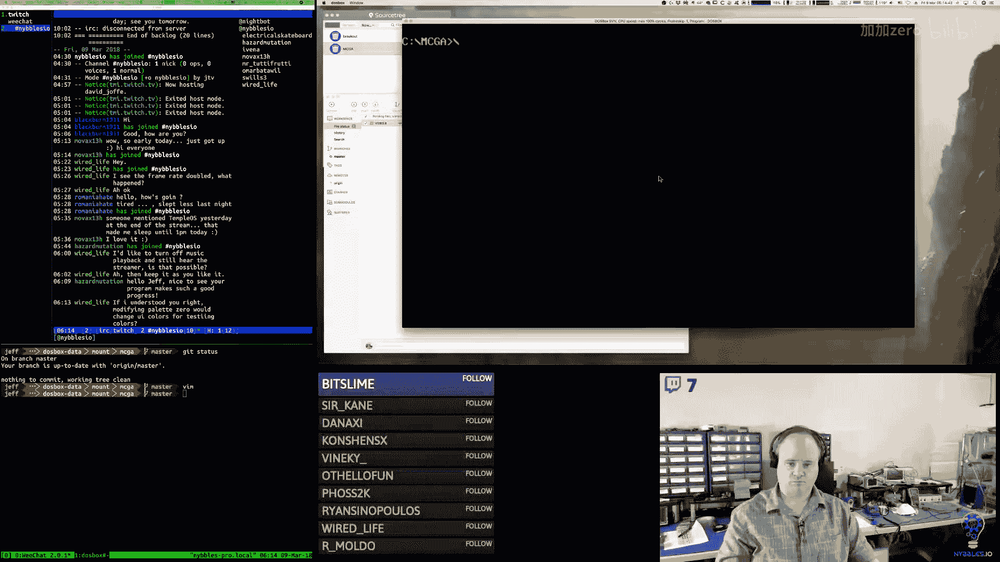

🎼他没人。🎼嗯。嗯，好好好好。So I guess the easiest thing from the perspective of the drawing code。

Is we just want to know out of the port tabs。So zero means nothing is selected。

One through four means that tab is selected。So in button。Tab1。We would move select a tab with one。

Okay， then draw a tab。Or tab Draha。嗯。Thing is， we don't know。So we're being given the position。

 but not like an index of。Which one we are？so AX is going to have our。Tab number， one through four。

BX is going to have our position information。Just like before。嗯。So we start x off as one，6 is four。

We have our wire X， which called draw but position and then。The tab number。

We increment the tab number， the increment our acts， we loop。And then up here。

We get our on the stack， we get our。Tab number in our position。So， then。

We want to draw this based on。Whether or not the selected tab equals。嗯。

So we only need AX long enough to say。Whether or not。So we're going to compare。哎呦。With that。

 and then we're going to set。🎼It based on。🎼It being equal。おに。AhOkay， so I can actually choose。嗯。

I mean， we can really three it to AL， that's fine。嗯。So。We grab the tab number。Off the stack。

We compare that to。The selected tab variable， so whichever one we click on。

That's changing the variable。If it is， if they're equal， then we set this set E。

 what this means is so this could also be set Z。Right。So if these two are equal。

 then zero flag is set。That means that it'll put one back into the AL register if they're not equal to put zero into the AL register。

And we could choose other registers to put it into， but we'll just reuse this because that。

That works。For what we're doing Okay， so now we know， okay， is this the active tab or not？嗯。

Then we need color information， right？嗯。We have two sets of colors。

We have the color for the box and we have the color for the font。So my thought there。

There we can use DAC because we're not using it and I'm already saving the state on the stack。

 so we might as well。We'll put the box color。🎼Into。嗯。🎼Whatれてかてしれ。W， that'll work。

So Dx is going to be1 by zero。If this is the that's deactivated。If A is one。

Then we're going to move dx with nine visor。So this is the dark blue。Background。🎼This is the。

Purplish。Background。And then we replace this with Dx。Then down here。

We're not using A anywhere else so we can safely read。Check it here。We can move Dx again。With850。

Compare A to one。If it's not zero， well skip it otherwise。We're going to move。PX with seven by zero。

This becomes DX。And that's where L1 is。Okay， so。We grab the tab number。

 we compare that to the selected tab。Whi like the tab starts off life is zero。

 so none of them should draw as active。If they match， we're going to set A to the one。

 otherwise it'll be zero。Then we move DX， so Dx is our color， our working color register。

So we default it to the deactivated color and we set it to the active color if it matches。

So the deactivated color for the background is this dark blue。If。We're on the active tab。

Then we set it to。🎼嗯。Purple， the purlish color。Otherwise， we use whatever we had。

 right it skips over that。And then down here， when we're doing the text， we do the same thing。

We move Dx with our defaulted color。In this case， it's the darker gray text。We compare A to one。

Is this the active tab？If it isn't， then。We just jumped down here and use that otherwise we set it to the active or the higher highlighted cover。

Intering。Does it recognize this？嗯。When was that added？This should be a pentium instruction， right？

36 plus barn。All right。Well， we just have to do this。That brand new mon would have been nice。🎼嗯。Okay。

 so we do the compare， we have to toggle it ourselves。I could make a macro of it。I might do that。

It might be kind of convenient， actually。Can we do that？Sa。🎼So if it's。0。Go here。Otherwise。

Move whatever the destination register is。🎼With。🎼10。Return。One return。Oh。

 but I don't want to do a return。🎼Okay， so。My set zm Herow， I pass AI。

So the way this is going to get expanded is。It's going to compare。

The because we have to do the compare。No matter what， so it's going to look at the zero flag。

🎼Were they equal， if they're equal， then move， jump to this。Label here。

And I'm using a different local label because it'll get interspersed into the code here。

 so typically with macros I use M。嗯。So they don't collide。🎼嗯。So we jump to M0。

 we move the destination register that you pass with one。Otherwise。

 we move the destination registered with。Zero and we jump to M1。

So it's doing what I was doing by hand。Now it behaves kind of like what we had before。嗯。

And then I don't need。That label。And then I can ren these。哎呀。See。

This is where the power of macro languages comes in。Because this is letting me treat stuff as raw。

Symbols that I can just kind of mush together however I need to。I can actually。🎼Implement。

🎼Instructions that。We didn't have。And then we could do the opposite here。Set not zero。And actually。

 these are nice and generic， so these can go into our generic macros file。

But let's see if that assembles。It does。乐然。🎼Now。はは。😊，Of course， why would it run？That would be。🎼哦。はい。

哎。So。We get the selected tab off the stacks。We'll get the tab numbers， sorry El yeah。

That's not right。You compareare it to the selected tab。We use our said ZM grow。Teresa A to。う。

One or zero， we set our default color， compare， jump。If it， it's not equal。We skip over。

 otherwise we use the new color。I'm down here。We set our default text color。Are we the active tab？No。

 yes。嗯。All right。Yes， this graphics mode I'm using for two reasons。One， it has square pixels， two。

 it's extremely easy to understand for beginners。Because of the nature of this mode。I can do。Sorry。

Because of the nature of this mode。So it's 256 by 256 by eight bit。🎼And if you。🎼Love。🎼嗯。AX。🎼With。

16 by 16。That literally will put a pixel。Now if I do。You know， move AX with two。

It'll put that color at that location in memory， assuming ES is set so actually a DE move。AX。

So I would write it to the。The graphics display。So it's very simple， right， I don't have to do。

 you know， because otherwise， if I use 320 by 200， I have to do multiplies or shifts。

getI have to take Y， multiply it by the stride， add the X。

I have to do that everywhere if I do any of the mode X modes。

 which technically mode Q is a mode X mode。Like 320 by 240 or 320 by 400。

 then I have to do you know plain setting and that's more complex。So for beginners， I thought。

 you know， because again， this is being targeted towards people learning。Um yeah。嗯。You know。

 I thought this was very easy for people to understand。🎼死号。🎼Okay。Okayay， look at that。

We have tab selection。All right。We're getting there。All right， let me move those macros。

Into my common macro file here。Because those are kind of。Convenient。Just make sure that。

Moving the macros didn't break anything。Shouldn't。🎼He never。All。嗯。Okay， so we can select tabs。

We can change the active viewer， renderer， handler， whatever we're going to call it。

Based on which tap we pick， mean obviously。When we pick a tab。

 we're also going to be able then to look at what bank that is。And then choose the right。

Editor state based on that。🎼嗯。Okay， so now let's do this。嗯。Let's look at our to do list real quick。

🎼嗯。So actually I fixed this yesterday。Let's review that real quick。In B。

I changed the metadata structure a little bit。So I have the ID to type the flags and we have blocked Macs。

 so when we create a bank， if we say hey， this bank type。It only ever needs two blocks， that's it。

So this is where we store that information。And then that allows us to know how many。

Total max we should have。🎼嗯。🎼And then。I reduced the number of props that we had you know， we had 31。

🎼系。Key value pairs in the header and I thought you know that's a lot。

 we're probably not even I lowered it to 24。And realistically。

 that's even probably more than we're ever going to need。But what I did was when I removed those。

 I explicitly exposed the reserve bys that that so before the metadata thing was not like filling all 4。

095 bytes。Of the block。This does now。Which I just think ends up looking a little bit。

A little bit easier to reason about， right？And then if we need more。Room。You know， we can always。

 we can use more of this reserve so we have a 983 byte reserve in the。Thank Heer。Plus。

 if we feel like， you know， hey， we're not even using like four or five properties。

We could reduce this down to 16。Or whatever。Okay， so those changes， I made those yesterday。嗯。Right。

可以。🎼We did。Well， we didn't do background and border color。We did do this。🎼But。

So we have a flag for no rendering， we don't have a flag for just tech。

And we don't have customizable。Colors on the button。

And I think the reason I was thinking about customizable color is because we could make the buttons that are。

The like the。If you pick a bank type and there's specific actions for that bank type。

 we could make those buttons a slightly different color scheme so they stick out。嗯。

So we still need to do those， we still need to do this。O。It's funny， it's like you know。

 I do stuff and then I come in look in here and it's like， man， I didn't do anything。

 I get anything done。That's not true though， we did't get stuff done。All right， so let's review that。

 we'll commit it。嗯。And then we're going to move on and maybe try to。I'll try to knock these out。

In this list specifically。🎼嗯。来。Let's look at。I don't know what I changed。

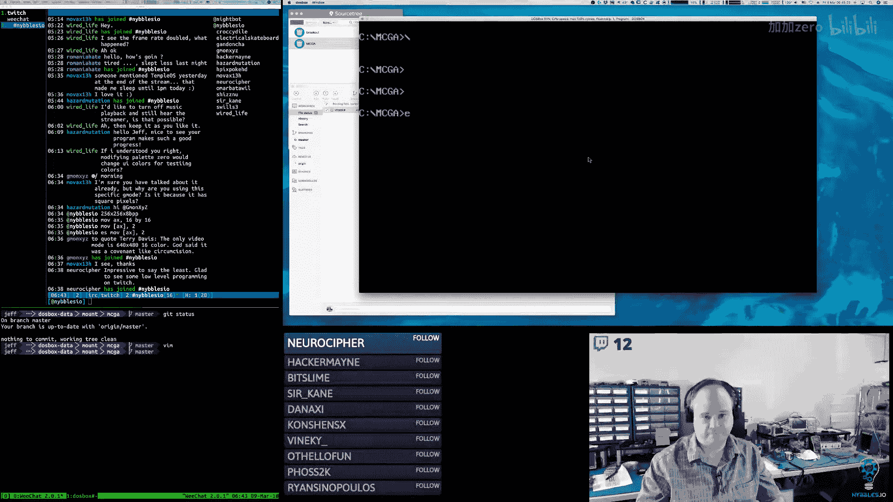

So let's look at these。

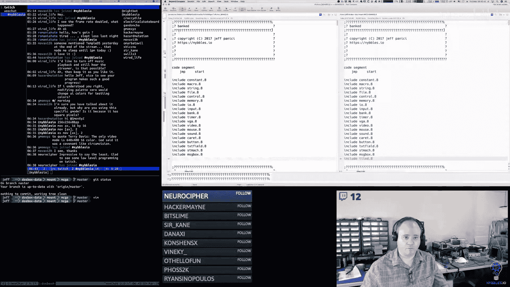

Okay， so we added our new tile tile  Ed。Include file that's going to have all the implementation for that editor。

We added the Fo Bank state。呃。I move my variables down the bottom。

To be consistent with everything else I had down there。

We added the four tab buttons because we can only ever display four tabs at a time。嗯。

So we have buttons now that。Represent that for testing， I currently have them all active。

That's not the way it's really going to work ultimately， but we'll leave it that way for now。

 I added state definitions for palate。State fund， bank state and background bank state。

To kind of finish。Fleshing that out， blew those variables from the top down。

 added the viewer callback。Function pointer。So depending on what state you're in。

What bank you have selected？We can set this variable。And that's the callback。

 that's the handler we call the draws what shows up in that viewer section and we have the selected tab this is one。

Through four。To indicate which tab it is or zero means no tab is selected。And。

So then if we're in the tile bank， we call the TE draw， the tile head draw。Same thing with sprites。

🎼Fs。If tabab button one is set。We're called， we set the selected tab and for right now for testing。

 we're temporarily associating that to the tile viewer。Call back。

 tab twos associating thats the Sprite viewer。Ultimately。

 what's going to happen in these is we're going to look at what that bank is。

 what bank that button is associated to。We're going to look at what that bank type is and then that will determine what we pick here。

🎼嗯。And then I started breaking out stuff。Into functions from that prototyping code I had yesterday。

Then we also extended Tab draw。🎼So。We compare now we get the tab number from。Draw tabs。

so this is the one that draws the individual tab， we have a function that draws all of them。

It now passes the number associated to the tab so one through four。

 we compare that number that we get on the stack to the selected tab variable if they're equal。

 we set AL to1， if not A becomes zero。嗯。This is a macro that I created for this because。

We don't have that instruction。🎼嗯。We set our background color to the default。We're on the active tab。

Then we change the background color， otherwise we use one that the default we grab。

The position of the button。Or the position of the tab， rather off the stack。

We pass Dx as the color here。And then when we get down here to draw the text。

The default is that dark gray， if it's the active tab， we make it the lighter text。

 we use that color。We passed the new parameter on the stack， we clean up the stack。And then we added。

 you know draw， took the draw， the tab bar， drawing code out of that base draw function。

 moved it up into this， and then we have。TV tabs which draws the tab bar draws the tabs now again right now this is still。

Quasi hard coded。This is only going to draw eventually this is going to get enhanced， right。

 it's going to look at the banks。And its it's going to look at a couple things， right。

 what page am I on？And it's going to look at the banks and say， okay。Do I have things to draw。

 Do I have tabs for these， and then we're also probably going to store。yeah。

 somehow we'll figure out what the tab points to， probably based on the page， right。

 there'll be page。啊。🎼Times。4our plus tab， you know。

 thatll tell us which bank in memory you know we want to go to。あ。

Created a macro for Dr off tabs then we've got。Our first。So we have that viewer right。

 so you have the tabs， that thing underneath it， we're calling that the tab， the bank viewer。

And so there's a callback now that renders will eventually render the tiles from the bank。

Right from the blocks。嗯。And we have this bright thing this is the basic looping logic right the only thing that we'll have to change in here is instead of calling FG box or VG box。

 it'll call you know，Draw VG sprite or VG tile or whatever that will draw the tile or the sprayite that we point to in metal。

We already have that code， we might have to tweak it slightly， you know。

 but basically we already have that drawing code we just have to。You know。

 wired it up here once we get all the bank plumbing。Coming through and then we have the。

The viewer drawer so that again that bottom thing， this is like the parent， this draws， the arrows。

 this draws what block we're on， and then if we have a call back。

It will call the call back if we don't， it just will skip it。

And then we have a macro for that and then in the base。

 we moved all this stuff out into other functions， and now the base is just draw the title and stuff and then draw the tabs。

 draw the viewer。A。And yeah， all that code moved。And that was it in that file。And then in Bhutan。嗯。

I like beyond Compare， but I wish I could。Convince it not to move the window。I added a button。

 no draw flag。Which you could say， okay， what's the difference between this and。

 but this is like absolute。So this is like， if this is set， then it absolutely will not draw this。Um。

 even if some code toggles the visible bit on or off， so it's kind of like a fail save。That。

 I guess you could say。And then in buttons draw， I check that flag right away， right。

 this is our escape hatchch。Should we draw this thing at all？

Nope and Valle otherwise do the rest of the logic the way。Okay， and then in macro。I added those two。

And we might add a couple more as time goes on。嗯。X86， the original X86 did not have。Set Z。

 set NZ per set equals， set not equal theirre alias is for each other。Under the covers。

 essentially this is what that mneummonic is doing。And thiss just。

Is a macro version of both of those。So that'll come in handy。And that works。So we're good there。

This is our new file。So this is where all， again， we have。

Three kinds of banks that are all essentially tile graphics， so we have tiles。Sppriites and fonts。

And they all are going to be edited by the same fundamental editor。

 so all that code is going to go in here。And I'm calling it tiled， tile  Ed。And so for now。

 we just have the very primitive prototype code I had for drawing that thing up there at the top。

This is going to grow and we're going to start making it。

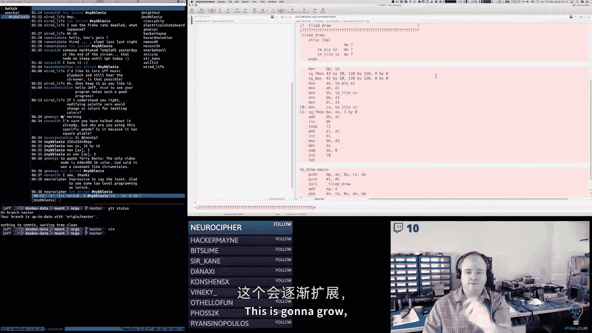

Be more and more data driven as we go along。But at least， you know， this captures the prototype code。

That I did yesterday。And then。

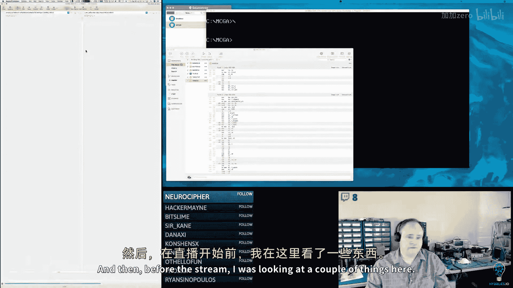

Before the stream， I was looking at a couple of things here。That I had made note of yesterday。

When I was refactoring some things， so the string render。I wanted to。🎼嗯。Make all。

 I had one label here that was S instead of C。So I wanted to rename everything and I wanted to renumber the labels here。

 so they were all sequential。The other thing that I did is I added code。If it's a space character。

I skip over all the drawing code and we just go to the next character。And that's tiny optimization。

 we don't have that many strings that draw spaces， but the pop up dialogue does have quite a few strings that are just they're filled with spaces。

So this will make these loops a little bit shorter in those cases。嗯。And then I was looking at。

A couple of things。Just。Doing an audit on what was going on the stack and coming off the stack with some of these functions and so I cleaned that up。

Yeah， same thing here， I was pushing DX， but we were never using it。

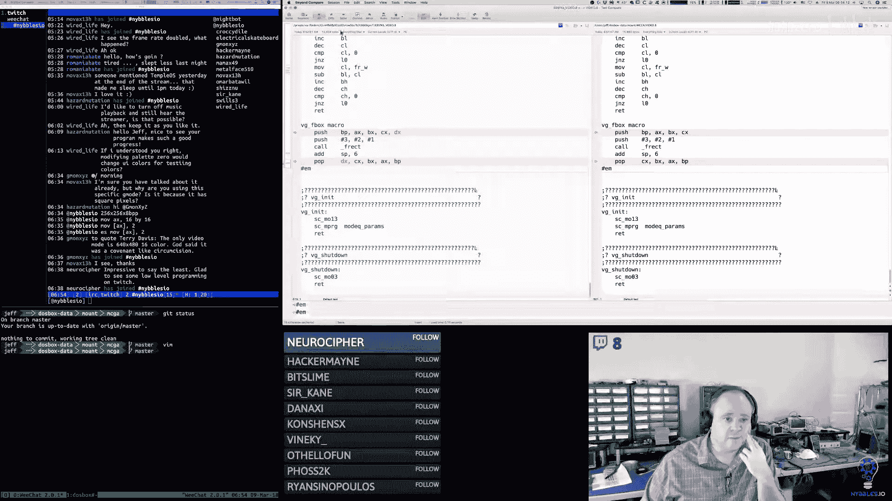

I took that out。🎼Okay。So。🎼哎。Oops helps supply the pipe。All right， so there's that。

So now。🎼Let's do。These changes。Here on the buttons next。

Because then what we can do is instead of just having those fake。You know， draw strings。

For the arrows， we can actually turn those into buttons that draw the same exact string just won't draw the button around it。

🎼嗯。And then those will actually be real buttons at that point。🎼嗯。

And then we can wire up the callbacks for those。And make sure that those at least are working properly。

And then the background color and border color， I think background color is probably really all we need to control for this。

🎼嗯。That should be pretty easy。To extend， and then I think after that， let's get the。

Code that's going to allow us to fill strings or copy stuff into strings。

We'll get those two knocked out。And then after that。

 let's prototype up what the UI would look like for that bank type selection。You know。

 the other day I think we said radio buttons， but I think the easiest thing is going to be just to make like a you know。

 small。Pop up like window。パすね。嗯。Because we have all the pieces to make that work now。诶。So yeah。

 let's try to。It this。です。Move that up。And let's see。

The mouse clipping actually should be pretty easy。To， we can look at that。Yeah。

We's see if we can get those knocked out， I am going to take a really short break here。

And then I will be right back。Get more coffee。Say hi to the family here。

Just going to grab my coffee here。

Okay。70 to gate。Oh my goodness。72 degrees today， partly crowdy。🎼O。So let's talk about strain。We have。

This was kind of a workaround， I have a macro that defines a character， it's a one length string。

So it fits in。🎼嗯。I would think you guys will be warmer in Florida。🎼うん。

Although keep in mind it's currently 43 degrees here， it won't be 70 until about four o'clock。

🎼You know。It'll be pleasant from about noon until about six， and then it'll be cold again。🎼嗯。

But soon， probably within the next I would say 30 days will be up in the 90s。

Permanently until and then it'll go up from there。🎼Until the fall。嗯。That's interesting， yeah。

 we've had a really typically winter cold the cold weather is mostly gone by this time。嗯。I mean。

 we're hitting 70s again， but yeah。It's been unseasonably cool。So then we have the string macro。

 which just takes the quoted string。Adjust the length by taking the quotes off and then。

Dumps the string in there。And then we have string de width。Quotes。This is the opposite of this。

 this is basically you can use this macro， you could pass a string without quotes。

They'll put the quotes around it and the length will be whatever you pass。

 and we have this string reserve。So， this is。You pass a length in。

It specifies the length of the string and then its it puts a string out there with spaces in it for that length。

So what this was talking about was that reserve one。Because we want to be able to pokee。

Strings into that， basically。From other places。嗯。嗯。The question is。So I think what we want to do。

Is have a function。That will do a copy。🎼So。My thought here is。You would pass。A length。A source。

And a destination。On the stack。🎼And then。Something like this is。🎼What we have。For a string cut。

And then we have a macro。So that's the implementation。We'd have a macro。It does the heavy lift。

Bush B PEES。🎼，🎼SIDI。Call oh， and then we want to push。Destination。Source， count。🎼And。Call the copy。

And then two， four， six。And then we're going to pop DIS， I CxA， X， E。Okay， so now with that。

And the nice thing about this is its。嗯。We're specifying the link here so there's no there's no。

Weve pretty much can copy from anywhere to anywhere。

And then I'm thinking it's just going to be up to the collar。To know that， hey。

 if I'm copying into one of these macro macro strings， the first byte is the length。

 so we have to copy to that。Addres plus one。嗯。And then that would let us。

Copy strings into those reserve blocks。So did we eat anything else？

Originally I was thinking about setting the length and all that。I don't think we need that anymore。

Okay， just I needed a way。To copy other strings into an existing。Memory structure。

So I think that's pretty much what that is。Yeah。All right。So now let's looking to do it again。

So the flag for just rendering tax on budget。So this one we definitely。What to do in here。

So let's look at this code， we're getting the button position， the button size。

So this is where it's drawing， so the problem is。ItDwing the box。

Its drawinging the text in the middle of the box。Durang codes， I think we need to kind of。

Restructure this a little bit。So that we can have the code that draws the。The box part。Okay。

 so let's do this。Rewrite this from。Because it's not so bad。嗯。All right， so we're going to move。

慢 position。Putton size。And originally I want to actually draw a full box around it。So let's do that。

 let's just do a VG box。And that's going to be。AX。And Vx。Zero by zero。

And then VGf box is then inside。I boom。There's。🎼That that， that that that that。And。デスピティ。Don。🎼Okay。

And so out the box drawing code。🎼就是。🎼Beautifully。And so then let's look at while we're at it。

 we're in here。We're rewriting it。We have the flags， the text， the text position。No。

 that's built into the asmbler。The buy operator will combine one。One operating with another。

 so one bite with another bite to make a word。Or one nibble with another nibble to make a bite。

Is is what it does？It's kind of it's convenient without having to write code right。

 for constants like that， it will combine them together for you。嗯。So， button。BG color。🎼But。

Burger color。Let's just go whole hog，And then our macro。Is。Flags， text， text position。🎼Position。

Background color， border color。Size。🎼放神。We're going to have to update all our buttons。

 but that's okay。It'll be 100%。Daer driven， daters， daters are good。So Cx。

 we're going to make button。UG color。So this should be Bx， this should be。CX， then we'll move。反正。

Vurgder。Tller。哎。Neat little crocodile there that actually showed up in WeChat， that's kind of cool。嗯。

Okay。So now we now both of those out。Because now I can pretty trivially say。A couple things， right？

Let's actually do this。DX，CX， DX。二。🎼爹。Sometimes I do get little graphics in WeChat， not always。

 and not everything。But sometimes I do get little graphics that show up。

I think it depends on what it is。Where it's coming from or how you're actually specifying the emoji。

Okay， so now I can load AX with。The flags。Yeah， probably。Probably。

You can see it screwed up WeChat a little bit though。You see how the little blue line。

 it caused it to come in by one character。So whatever it's doing， it didn't quite。You know， out。

It doesn't quite handle the output 100% properly。Okay， so here's what we're going to do。

We're going to test。AX Li F button En。黏的。Kind of running out。🎼Okay， so here's what we can do。Yeah。

 that'll work。🎼Okay， so。We do our button we do our flag testing right away and we set。

CL to one if it's enabled。We set CH to one if it's。Excellently。🎼M。All we're going to do is if。

We'll sure we'll check text only first。Go there。Otherwise， we're going to push CX on the stack。

And we're going to pop it。Because we want to stay back。And then down here。We just have to say。🎼Okay。

Is is it enabled？So now the text color， we're still doing that。I'm not customizing that。🎼But。

You know， I guess theoretically we could。Yeah， so we'll just use， we'll use DX for the color。🎼あ。

This will be8 by zero。🎼呃。Okay， so we want to move。SI with the button packs。We want to move Vx with。

But text position。don't care about the flags anymore。And we have our color。Yeah， see that。

Sometimes times you just rewrite it， it ends up better。All right， so let's look at that again。

So we move Ax with our flags。We test for our drawing flags， is enabled， we set CL。

Is it disabled or is it text only we set CH？🎼m， if it's u。Text only。

Then we jump past the button drawing。And we just go right to the text。So otherwise。

 we save CX because we want to check it later。And。We move Bx with the button position。

 Cx with the size。DX with our background color， we draw the filled rectangle。

Weve changed CX to be our border color。And we draw our。Box around it。

 and now we're actually drawing a full black box around or whatever color it is。Around it。

 not just the top line in the bottom line。🎼嗯。So they'll look more like buttons， bs。🎼With pop CX。

 we're done。With that temporary state。For the strain drawing， we move DX， our color。With the gray。

 dark gray text color。We compare C flag， is it enabled or not。With one， if it isn't。

You skip over the part where we change the text color， we move SI with a button text， we move。

BX with the button position。Or the text position， sorry。

And we call the string macro passing in the string pointer， the location， the color。

And if it isn't enabled， we change the color to the lighter color。🎼对 go。So now in bank。

 we're going to have to。Change our button definitions here。Little bit， let but get you there。

So we have text position button position size。あ。Howd this， had this shake out。So the colors。

 background color and the border color come before the size。So you know what。

 I'm actually going to change that because。Yeah， let's do that。It'll be。Size， background border。

 and then the function。So background nine by zero， border zero by zero。

 so we'll just make the buttons look like what we had before。I guess I should have。Captured the。O。

So the buttons should render well， not exactly， because they will have a left and they'll have a full outer box on them now。

But in terms of the color and the position。Should be the same as before。

But now we can customize them。哎。Well。It's interesting。あ。I think I have a condition backwards。嗯。

That's fun。I mean， the buttons still work。They're just。They still work， there's just not to。

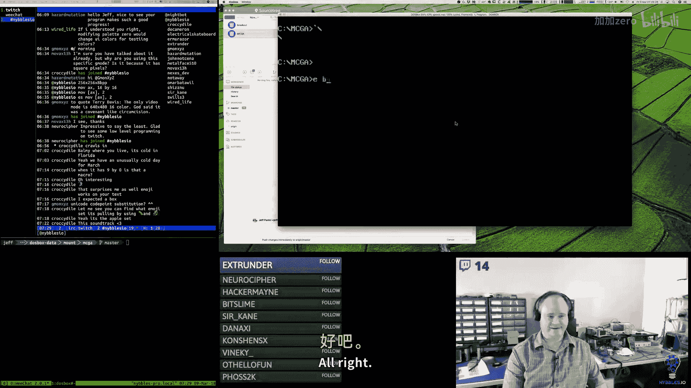

2。I have an inversion。So we're testing。Is it enabled， it's going to set C to one if。It is。

Then we're going to test read only。Oh， you know why。嗯。

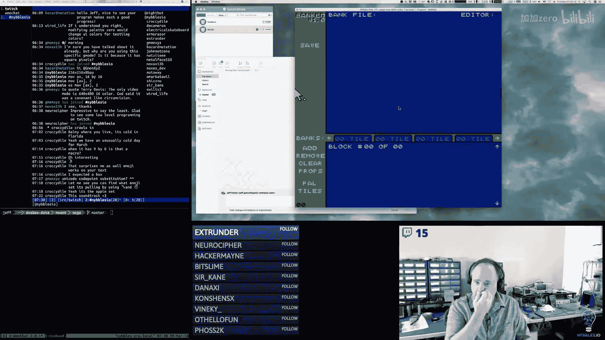

No。啊。Why are they back？Oh， yeah， I know why， I think。I'm doing a big test。いや。So的。Except。Somehow。

Our drawing is all off here。嗯。Oh really。Close， but so far away。What did I do around？Well， okay。

 so there's a couple things。啊， yeah。Ohoops。There you go。耶嘿。嗯。Hey， De Kamaron， how's it going？

All right。🎼But buttons， ya。All right， so that greatly simplified the drawing logic of our batons。

And we can now do the text only versions。So we can replace these， these are just duds。

 these are just strings right now we can replace those with actual buttons that will just display those characters。

And they will actually be buttons。That behave properly。And these two。

 we can change the color out mills。So let's do that。So I don't know。

There are some really crazy colors。But。Whats a6。Let's face it。Now let's。Yeah， well。

At least you're maybe free of it now， I hope。 I hate it when。Work related stuff。Dos my time。

 so now we can change the color of these right and so they stand out。And。You know。

 we can pick a better color。But for now， that gives you an idea。Of what we can do with that。And then。

 yeah， let's do our。Text only buttons。These should be pretty easy to do。N。

So we're going to do button。嗯。Thank。Left。Button bank right。Button block。I actually let do this。

Button bank。对。Next。Butudton bang， button block。という。All right， and then。For the bank。

Here's what we've got。Okay， so。For。Previous， we're going to have the button。It is。Excellently。

And it's left。Parrow cha。Cab bar。🎼バスク。By Camber。W， three。

And we don't really care about the button position because we're not drawing it。Size， we can say。

 is6 by。6。And our color we can make。🎼Well， again。Color doesn't really matter。🎼For those。

And then this is button。Previous callback。So this was 2485。Ha bar Y three。哎。🎼只能。There。

 then I just need to put some callbacks there for。Okay。

 and then we don't want to draw that text anymore。Because。It'll be drawing it twice。

I think I moved them。So that's good。Okay， and then the viewer。We have the。Up and down。

And those actually need to be buttons too。So this is going to be。Aar。And he was。248 by y+ 14。

And this is going to be button block。Previous。Downarrow character， this was。248 by 248。🎼他正是半挂。Next。

All right。So those have then converted into buttons。We're not drawing the fake text anymore。

For testing just now we actually have the buttons。🎼嗯。Oh。They're real buttons。

So I have to make them visit。Oh， okay， yes， so that's the other issue。Just thought of that。

 and see the disabled color on the text is the same as the background here。🎼So。

 they're not gonna to show。It is rendering them the buttons are there， it's just there。

Color is not rained。嗯。嗯。嗯。Which， I don't know， maybe that's okay。They're kind of hidden。

The arrows will show up， you know？🎼When。When you can scroll。So they are there。

 I'm just not going to worry about them for now。🎼Okay。Go back to Purdue。🎼We got these。Good。All right。

 so now picking a bank type UI， let's prototype that guy。You just like yesterday。Oh， you know。

 I wanted to check something real quick。Our banked tool， are you guys ready for this， it's 8K？So far。

 that's how big it is。We are， I don't know。6ix，5， five。3，5 minus256。

That's how many bytes a compfi has free。In memory in the code segment。Minus。842。

 we only have 56 k left。I don't know， I don't know if we can do it or not。

This thing's only I guarantee when this is done， this thing is going to be probably about 20 k or less。

同。Probably a lot of us， somewhere between 16 and 20K would be my guess。O。So now we want to do this。

Selection thing， right？For types。So。What I'm thinking there is。We're going to have a。As。

It's kind of like our little dialogue box actually。So maybe I can just steal that。To start with。

So I don't want it to be so big， so where's the add button？It is。And is。Pab bar B plus4。Okay。

This is like tab bar B。Or this is not going to be this big。This is going to be like。没有了。

We'll say 50 by。We'll do 85 pixels that's fine。And this should be more like fort。

Tab bar fee plus four。O。That's interesting。How is it doing that。Hey， Everx。Pick bang。P type。太多了。对。🎼O。

🎼うん。🎼什 you这样。ごろ？🎼Somethingへ。一ぱ。🎼这 should be。🎼えく？🎼W， okay。诶。So the text has to go down。

A textel and over a couple。That as it goes down。And over。Okay。

And then we will have buttons in here right for the types。So maybe I'll make it。

Another 15 pixels high。Just to give us some room。We'll go up by 10。We'll see how that works。Yeah。

That's pretty good。So we're going to click add。That's going to go into a new state that's going to pop this up。

 it's going to turn on the buttons， so let's do the buttons。

So we're going to have one for each bank type that we're going to support。

And then when you click the button。That's what's going to call。Create or you know。

 will actually do the new on the bank。🎼Okay。🎼Buttons。Thanks， Everex。Gett in there。All right。

 so we're going to have button type。Kyle。But tight。A， that's right。我动 tight。啊。YouT palette。

Background。I'm going to call it a sound bank。And I' mo。So tile sprites， fonts， palettes。

 background sounds， modules。I think that's what we're going to have。

And these are going to be regular old buck。So。はい。哎呦。系。嗯。把。Background。Palard。

Sp font palette background， sound and mo。🎼All right， so now。This is going。Tab bar B。Starts at plus。

I say plus 12， all we'll do plus。好た。🎼我嗯，系。嗯嗯。好梦斯。Then we'll have to。Play the Pixel shuffle game。

 which is always fun。Number， which number？Oh， probably。嗯。Yeah， I was figuring these would be。

Very approximate。Planry。Oh， yeah。没有。Yeah。You're right。しです。🎼可。Okay。

Just got to go create the callback sort quick。Buttton type。T call back button tight。は。Ohep。All right。

That。Okay。So I think we can definitely make them。Blesss wide and。We can also make them。

Closer together。And we could probably make the dialogue。呃。

Wider so that we could stack them next to each other。Instead of having them be all vertical。

Or move it up a little to make it taller。Go either way with it。All right， so。对呀。It works， they fit。

And then I can move the thoughts over a littleign。😀哈哈哈。😊，Got to have coffee。Go。And then。All right。

 let's move them closer to each other vertically。Oh， I didn't mean to move the first swarm。

That one is。Okay。Matzi。Started learning assembly。🎼awesomesome。That's good。

Or people need to learn assembly， man。Probably is we have seven types。呵呵。😊。

So stacking them next to each other。I'm going to have an oddball。🎼So you know what Im。Here's what on。

Yeah had badate type。那个。No， no， that's not right。 I want to go the other way。Im going to go up by。嗯。

This， I want to go。down。喂。上不了。This， I actually want to go。Up。Oh。

Our little arrow is showing up now because the dialog box is hitting it。Okay。

 so here's what we can do。Let's get clever。Pig。Max Y。Is equal to tap bar。B minus。Okay。Get in there。

🎼嗯。Is that the other thing we can do。ケパ。Pick bo is。嗯。4。うん。Yeah。Pick。Fox X。And so now we can move。

Most of it， we' got to adjust the buttons on use the X constant。🎼And。And then when we change that。

 it will change。Okay。🎼不 go。🎼And then。The why we should probably do。The same thing with the。The why。

When I say this， the top was。🎼1。🎼开。🎼然后。🎼换一波。36。せ。And。对。Boxes are right， font are oh did I not。

I I skippped changing the font。Oh， I did too much， that's why。Actually， this should be 40。🎼玻ュ3璃中。🎼22。

12，2。🎼52，6。Hey， okay， so now。Have you worked at one of the big five companies？

It depends on what your definition of work is， I have done contract work for some of these companies。

 I have never been an employee。The United States B E going take。

My merger in 2952 left an unprecedented in advance。Okay， now and I have worked at IBM。

 I was an employee at IBM， that was a long time ago， so but IBM wasn't on one。So now I can。

Pump that down and I can move that。Can天吃。And I think actually four was pride。Good。Yeah。

 no kidding well， and honestly， the IBM of today kind of makes me sad。部。

Not a big fan of their current direction， to be honest。たた。そなす。し。对大。ラすない？Yeah。

So we're going to move the pick box。Down a little bit here。家点。确认。分。あ好。

Can't remain is the most difficult。や。で。There you go Yeah no you're right， IBM is large， very large。

Okay。So there's our pick box。And。Okay， so now I need to move that into a function。🎼And。

Put a macro around it。🎼And then。When we hit the add button。

That will show that'll move into the a state， which we'll then show。🎼です。🎼And。

So it'll enable the buttons。Make them visible。And they'll draw the box。🎼And。

And you click on one of the buttons。And that will actually create the bank。All right。

So let's move it into a function。You'll call this。Pig box。Draw。Okay。Let me， on the buttons here。

 these need to be。Disabled。Until we're ready for them。All right。SoUI should be back to what it was。

But we have that code。It'sAll ready to go。Well， close to it。Let's go back to our。🎼Com。Gosh。

 that's an interesting question。Different， although。So let's see， well。

 how is the web before search engines？🎼怀啊。And I guess， know how far back are you going？🎼嗯。

I remember some very early。Exposure to the internet to the web。 and I mean it was。

Pretty much worthless。嗯。I would say the first time。Maybe 1994 1995， 95， probably。🎼嗯。

Is what I remember。Being told about a website， going to a website。

And getting information now I didn't use a search engine。

I think the first time I used like Alta vista would have been maybe。Sometime in 1996。Possibly。🎼嗯。

🎼Yeah。🎼O。Mouse， yeah， good old alta vista I。I liked Alta Vista， I thought it was good。

 I always thought Yahoo was shit， though， I never cared for their categorization system。Mouse。

Mousetra。Okay， I get it pointer to the bitmap， we get a pointer or we get the position of where we're drawinging it。

🎼And。When move E with the back buffer pointer， that side points to the bitmap。

DI has the position in it。We clear out AX， BX， DX， we move DH with 16。

 which is the size of the pointer。BX is our bit masked。Oh look。

 I put a nice little comment for myself here。🎼嗯。Yeah， I mean， basically。DI has the position， but。

That's not particularly helpful。Why did I do it that way？Yeah。Yeah Alta Vista was。That was the thing。

 man， back then。And then just， you know， Google happened and poof。Disappeared。呵呵。😊。

So I should not be using M here， that's bad。Okay。Luck。Timing。🎼嗯。You know， Google。I don't know。

And it's hard in my mind to separate the way Google works now。

And I'm talking specifically about search， nothing else。🎼嗯。And the way it worked in the beginning。

I think。And here's the thing， like my recollection of Alta Vista was that Altavissta worked。

Quite well。And it I remember it found quite a。Wide variety of sites。And in some ways， I mean。

 maybe I miss remembering Alta Vista but。To me， like Google copied。Alta vista， right？嗯。So。

In many ways。 And so yeah， I think。Google was， I think the simplicity of it like， you know， Mo AX。

Says。I right， I mean in many ways I think it was just。It was just the right time。In the cycle。

 they had something that was really lean and worked well with the internet of that era。

And then marketing and yeah， the mystery。嗯。The mythhoos behind their algorithm， right？🎼嗯。

And then somewhere along the line， Google became what it is today。And it's not， you know。

It's not the same。I using CX set for anything， it doesn't look like it。可以。I am CX free。🎼Okay。

 so what I could do。I could move the X of the。And。Yeah， the speak spell voice。嗯。Is why？Right， okay。

 so。I'm another my macro。🎼Okay， so。I'm using CX as a temporary because DI doesn't have。🎼嗯。

Bight register very incident。So I move it into。CX， I check Y and I say， okay， if we're below to55。

🎼Then。Jump to L1 otherwise bale。あん。And then I check X， and if it's below。255。

 I go into the drawing code。Otherwise I bail。And I believe it's safe to bail at this point。

Then in the drawing code it's pretty much the same， right。

 we read a pixel or read a bite from the bit mask。And we tested against our mask。The rest of this。

Works the same， right， so we only write to video memory。Yes。X and Y are below。255。

 so this will this will allow us to write。You know。Partial。And then bale when we hit the limit。Yep。

🎼almost。Oh， but it's。Yeah， that sucks。It is clipping。It's clipping the wrong part。嗯。It's actually。

 we want to clip on the right side of it。那奴来。O。嗯。So。What they want to do there then。🎼Heres。

We want to add。16。So DI has the y and the X in it。They came from the position that was passed in。

We put that in CX so we can break it into bytes and deal with the different components。

But we want to add 16， the width and the height of the bitmap to that。

 because we want to' want to clip on the right edge， not the left edge。嗯。Then we clip the right edge。

🎼Against those。But。No。Java had really， I don't think it had anything to do with the internet。嗯。

That's kind of a。RettCon， in a way， in my opinion。Because you got to remember Java。

 so we're not talking about JavaScript， we're talking about Sun microcrosystems Java。Came out。For。嗯。

I think its original focus really was desktop application。

 that's what the market was when it came out， the internet was there。

But it wasn't really a thing yet， right， people were not building web apps。Like they are today。

And your default assumption going into building something was not。I'm going to be building a web app。

 right， that was not the default assumption。At that time。Java came out and it。

It was pitched as a better C++。It was pitched as a safer C++。Because again， at that time。

 right so we're talking about。1990。Late 1996， early 1997。🎼Iish。🎼Right。嗯。Maybe a bit before that。

People were building applications in。Delphi。Visual basic。Or C++。

And I'm sure there were other things out there。That was the market that Sun was going after。

And really sun was going after the market of。C++， and it was windows， right？

The cross platform thing was there。It was nice that again， that wasn't the market at the time。

 the market was Microsoft Windows， desktop applications on Windows。🎼嗯。🎼Yeah。Java and again。

 Java just was。Right place， right time， know。It struck a chord， not necessarily。嗯。Yeah， again。

 the internet。What you're talking about， the gold rush of the internet。That really didn't start。

 in my opinion until。You know， 1998，9 maybe late 1997。98。You know， kind of like Bitcoin。

Nobody was talking about Bitcoin。In 2009， right， not really。

 it was this tiny tiny little community and these guys that were using their computers to mine these things。

 right？Bitcoin is a cryptocurrency became a topic。Late last year and it's this year。You know。

 and people forget right how short lived these things are and like where the windows really are。

 but I remember。嗯。Being know watching on the news， watching on CNbC。At that time。You know。

 like so 1997。98， so the late '97， '98 and then on。What I remember was Y2K。And then slowly。

 there were these internet companies that were starting to become a thing。嗯。嗯嗯。Yeah。🎼So。Yeah， Java。

 you know， it was pitched for desktop development。The fact that it later evolved。

To be used as a back end programming language in a web context that happened after the fact。

And that's not what they were。Does anybody remember Java applets？That's what Sun was pushing， right。

 Sun was not pushing HTML。Web browser。Web server， I mean， I think。Like web logic。What？Was that 97，98。

 something I know， like the big containers， they didn't really start rolling out until。

Towards the end of the 90s。And Java had been out for three years， two or three years at that point。嗯。

So anyway， yeah， I don't think。Java succeeded necessarily because of the internet or。You know。Failed。

 it was just， it was there。That happened to be the language that people used。Yeah。

So I do it this way。哎呀 yeah。Yes， so the issue is。I do think that。

Going back to the Java thing for a second。I do think the Java did have an impact on OO。嗯。

I think Java may have been。The thing that created the O craze。As we think of it today。

That I do think Java。Was a direct contributor to。Because I can imagine that if Java had not come along。

And the， you know， noun dot verb。Paraigm。🎼That it was。🎼嗯。Things may have gone down a different track。

🎼Possibly。🎼嗯。Because again， yes， small talk was similar， but it's was a different community。

Was it different？Different mindset， C++。Can be used that way， but again， different community。

 different mindset。嗯。The Java， you know。Mindset。I think is really what kind of spawned the OO。

Paraigm that we have today。🎼不是。Better and worse。So what I want to do here。Is I want to drop。

I want to render。Any row of pixels。🎼That。Or any column of pixels。で。Is not。Beyond the bound。

So I don't want to just return。🎼I want to。I don't just want to。Okay， so。Really。思まれて。So。Wx。

Then what we're going to do is。We're going to。Increment。X。玉げのグープ。Right。

 because it's going to come back here。And then when we are done with X。🎼We're going to。

We're going to implementcrement why。See a weird life。嗯。That's interesting。嘿嘿。Well。

 that's looking closer to what I wanted， but not。Quite right。あ。哦。No。

 because it's accessing memory correctly， it's drawing it in the right five。So that should be fun。

🎼我什么 interesting。We're using DH for the height。You know， again， you know， electron is。

On the one hand， you could say it's clever because。It's。It's an application of the dry principle。

 right？嗯。I'm Slack。I built a web application。That's what I built originally。There's a web app。

I want to make it available on a desktop， I want to make it available on a phone。

 I want to make it available on whatever。And I want to put。

 I want it to feel like it's a desktop application， but I don't want to build a native app because。

You know，Oh， shocking or， you know， we have to have multiple apps or we'd have to use different technologies and that's。

For whatever reason today， that seems to be like a big no no。And so， okay。

 let's take the app that we already have and let's wrap it up in this thing and'll it's the same thing。

 it's a web app and it behaves exactly like what it was just that we're putting it in a native container。

And actually you know， where that started， that whole paradigm wasn't electron。

 it started with the iPhone and it started with Android。Because people had web apps。

They wanted to have a phone app because that was the thing you had to have an app in the app store。

🎼And。And。So what did people do？🎼They。Wrap their web app in a web view and put it in the app store and see。

 look， we have an app。🎼嗯。So again， I mean。Just looking at it in terms of expediency and you know shared resources and not reimplementing something。

 yeah， it's great， okay？You built it once， you put it。Little wrapper around it。

 and you didn't have to。Build it out twice， right？But then the details start to come to light， right？

Web applications aren't desktop applications， no matter how close you make them look like desktop applications。

 they behave differently。Like I can go to the Discord app on my Mac。And you know， I can make it fail。

 I can make it refresh。Because I know under the covers what electron does。And you know。

 where I can double click and make it zoom like a web browser window。

Right accidentally and that's you know， I can't do that in a native Mac application doesn't work that way。

 but because you know， this is an electron appmp I can make it fail。

 I can do weird things with it right I can if I。Do the right right click you know combinations with a key press。

 I can get the web browser you know， context messages show up。嗯。You know， it's。

 so then it suddenly starts to break stuff。Stops working the way you expect for a desktop application and then you get this weird quasi。

 it's a browser thing happening。🎼嗯。🎼医疗。Things change。So I don't think electron has a。

It's currently being used， it allows certain things to happen。I don't think it's a mainstay。

It'll be around for a while and then something else equally horrific。

Or more horrific will come along to take its place。I unfortunately what I think will probably happen。

嗯。So yeah， there you go。And I realized what's wrong here with the clipping， I'm not resetting。🎼C。

Here。So we're only using。We're only using DH for not using DL。So I'm going to move。🎼DL with。🎼嗯。

The original。🎼C。Which is the original exposition like because we're drawing。Like this。

 we want X to go back to where it was。🎼嗯。So we increase。🎼The why。Re move。

The axe with the original acts。🎼Okay咩啊 mean。And it still clips the whole thing， why？🎼嗯。Oh。

 because I'm still returning us。What I want it to do。🎼嗯。Pillis asks about。

Portability of assembly and the difference between x64 and X86。So really briefly。

Let's talk about X86。So X86 has X。BX， CX， EX。🎼Yes， yes， yes。🎼SS。🎼SP。🎼嗯。🎼And PC。AX。

 these are 16 bit registrs。So everything here is 16 bit。These can be broken into。🎼Hi。And low bites。

Oh， and I forgot BISI。So these are what are known as the index Regs。These are 16 bit。

These do not have eight bit counterparts， these are of these segments。Regstrs。

This is the stack pointer。This is the program counter。Or instruction pointer。So。IP。🎼Bし。🎼嗯。So， okay。

 this is the original X86。8088。We call it X86， but it's really 8088。

 so 8088 to 86 386 now once you hit the 386 boundary。He went to 32 bed。So X 386。So then you had EAX。

EBX。ECX。MeD X。He had EDI， ESI。Now the segment register。

 there's a bunch of additional segment registers， I'm going to skip over that because there's a bunch of them and it gets more complicated。

But from the perspective of your code。The stuff that you touch， right？

Assuming here that we're now in the FlAC memory model。Not the segmented memory model anymore。

Which is probably a safe assumption。These go to there。16 bit， you have the 16 bit variations。

And you can still get down to。The low bite， this is kind of similar to like arm。

Where you can get to the lower part of the register。and so on and so forth，🎼嗯。

Then when you get to x64。This is 32 bit， obviously。Then you get RAX。RBX， RCX， RDX。

 and some other register get a bunch more registers， right？嗯。So。To answer your question。

The fundamental model does not change that much。It stays mostly the same。

 the names of the registers change on the Intel lineage a little bit as you move from you know one size of register to another。

The 32 bit once you cross the boundary to 32 bits， there is some more complexity because the CPUs become more complex。

 not necessarily because。The like the assembly language changes it's just there's more features right so now all of a sudden you have CPUs that have rings and they can support nesting of state and so you have global descriptor tables and all this other stuff for multiproces okay those are just new features that were added to the CPU you can ignore that stuff and what I'm doing in here you could do there if you didn't want any of that right now it turns out there's not an operating system like DoOSOS that would let you do that well that's not 100% true there' there's menuA。

Which if you get the 64 bit per version of that， you could do what I'm doing here。

 you could do with menu A because it's a very， you know， it's ring zero， it doesn't add multitasking。

Um， you know。So。Now， from one instruction， from one CPU type to another， you have to figure out what。

The differences in implementation are you have to port your code。🎼嗯。But。Yeah。

 so there's no direct portability between like Intel and Sp or Intel and arm。

 you'd have to rewrite it now conceptually though。A lot of what you're going to learn or use。

It ports， right in your head， it pours。It's just that in code it doesn't directly port。

 you have to reimloment。So， I hope that。It helps a little bit。Yeah， exactly。

The implementation details vary。But the concepts。Are pretty much consistent， register files， stacks。

Instruction pointer slash program counters。Branching。🎼You know。Memory。🎼ずっと。🎼Andello。

What am I not doing right here？just jump above here。is y above。AF， yeah。Just come here。

We're not going to do any of the drawing code， don't draw anything。Let' do the rest of it。

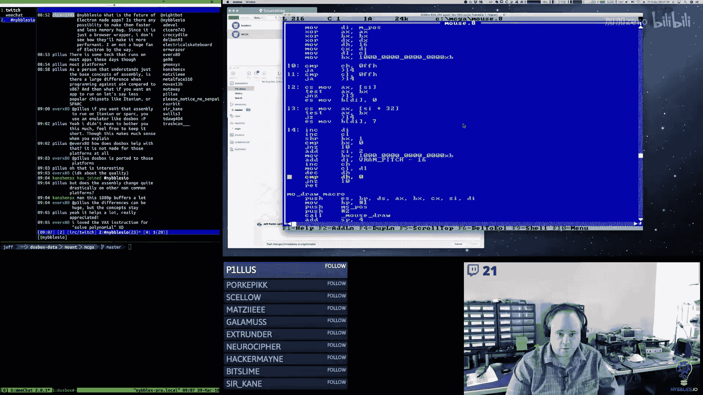

It's tall ends up drying it。Oh，我。Okay， there we go。

That's the windowing behavior I would expect to see。🎼But now。🎼干么啊，拜。😔。

Because it can't be above。あ。🎼One of those。🎼对。

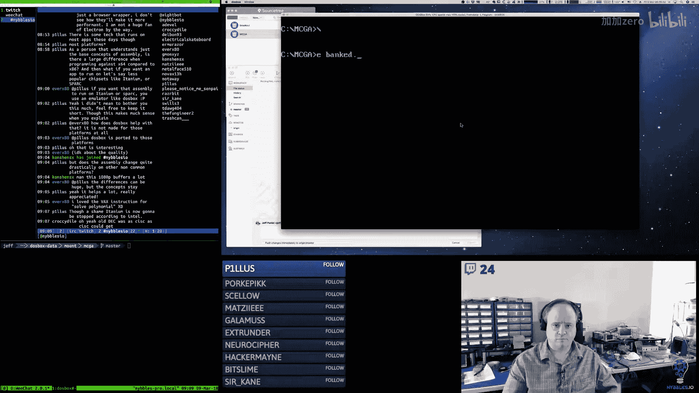

🎼な。

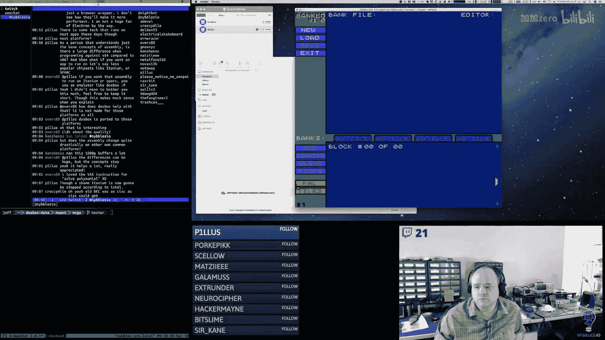

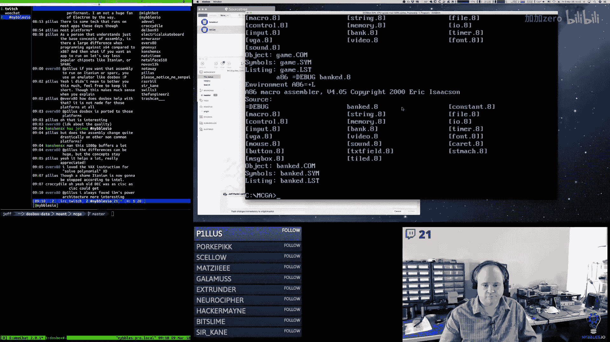

Yeah， what's happening is。

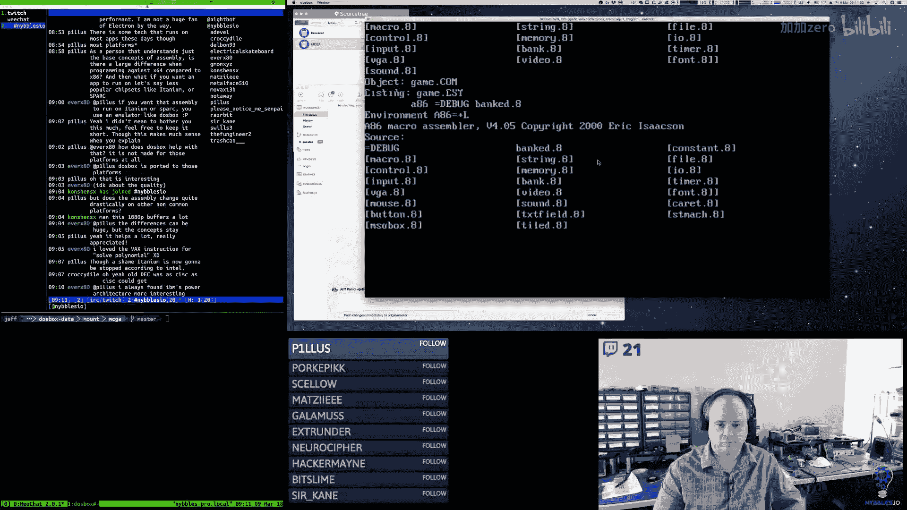

嗯。How那个 do个。ふ嗯ん。Al right， so。I need a temporary register。

I think that's safe because we just reuse Ax here for。The value that's coming from the bit man。

I am working on a tool。For an aracade game that I'm building for a video series that I'm producing。

To teach people how to do this in X86 assembly language from beginning10。That's at Orion 125。

Right now I'm specifically fixing a bug where my mouse。

 the code that draws the mouse cursor is not clipping on the edges of the screen properly。

 that's what I'm working on right now。🎼こ当。I think I see part of the problem。

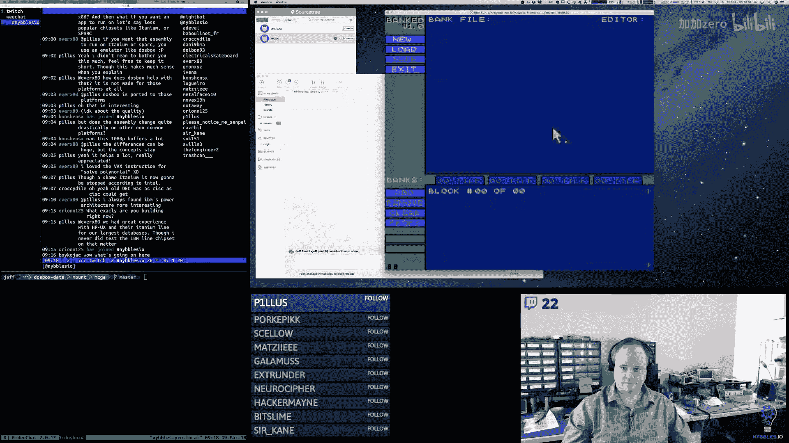

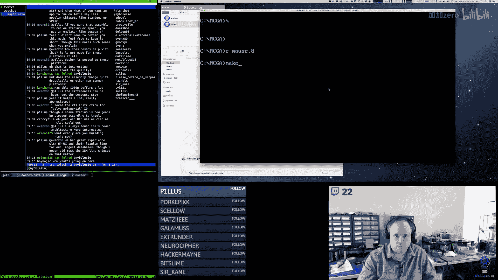

Okay， so itc clips。Eclipse on why correctly。That's exactly what I wanted。But on X。

Oh， I wonder。

So as long as we're below 255。Okay， so on why。Perfect。Okay。

 there's the very little tippy tip of the mouse at the bottom， which is what I wanted。But on X。

What's happening is it's。It's baing。气死了。So for。For now。I'm only going to clip on why。

Not going to clip on X， so y clips beautifully。Yeah， look at that。 Okay， but X， no go。

Yeah， see ax can't。Bale。Why can Vail？

Yeah，I think。I think I may have to rewrite some of this。

Because I think what's going to have to happen is。So if y is below 255？And then we draw。

 otherwise we bail。Because there's no more。There are no more lines to。Reendnder anyway。But x。

 if x is。Equal to 255。We don't want to do any of the drawing code。The rest of this is harmless。

To continue state management。Butれ。Still。Clips on Y does not clip on X， sort ec clips on X。

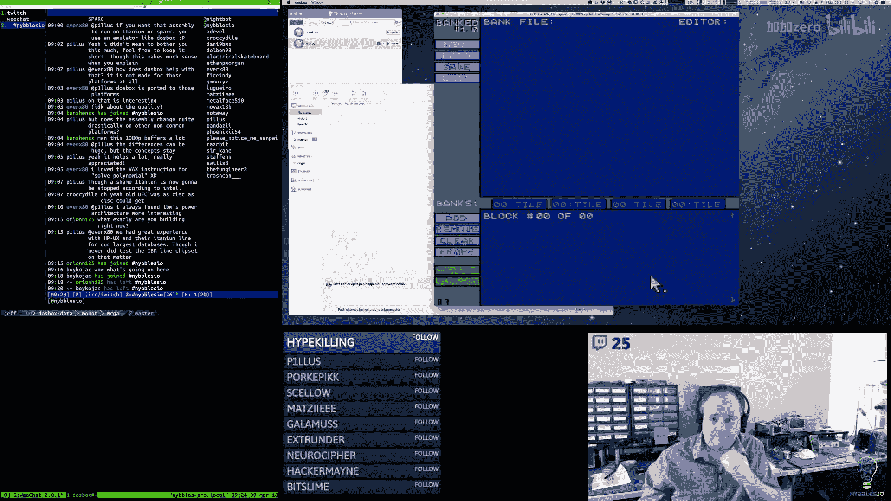

Yeah， it wraps around because of video memory。I mean。

 we're actually not breaking anything with this that the Y clip is really the only one that。

Is absolutely required from a memory safety perspective。嗯。But on the X， I mean。

 the fact that it wraps around the screen， that's just an artifact of the video mode。

But it looks weird。So it'd be nice to fix it。Plus， whatever clipping code I come up with here。

 I can also apply this to Sprites。Because right now our sprites are not clipping either。That's。

That's what I should be doing， it's what the code should be doing but。Missing some subtlety here。嗯。

Oh， here， I think。O little loss。But I think getting closer。

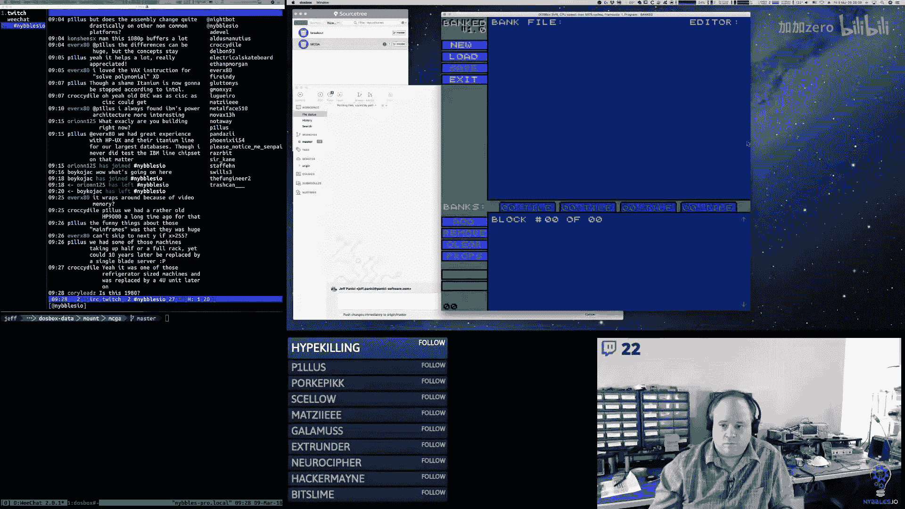

The counter that's off。啊。🎼Yeah， I see the issue。🎼嗯。I'll answer that in just one sec pillaris。

That's actually probably a good 30 minute rant here at the end。🎼嗯。

Let me I'm going to wrap up this and then。I can speak to that。诶。Yes， so the issue is that I'm。

I'm assuming。That I had incremented DI。To。The end of the line。All right。

 so I got to make a note here。All right， so I almost have the clipping done here。I'll finish this。

I need to rework the whole loop， I think， a little bit。Just because I need another state。Variable。

So I can adjust when I clip on the X， but I think I've got it。

 I just need to fix that one thing and it'll be good。So I'll finish that。🎼And then。

I'll say the same thing I said yesterday， I'm going to pick another group of these and see if I can't knock them out and get as much done as I can。

I do stream tomorrow， so I will pick up wherever I leave off tomorrow morning and we'll see how much we can get done。

嗯。But we are making really good progress， so I'm happy。

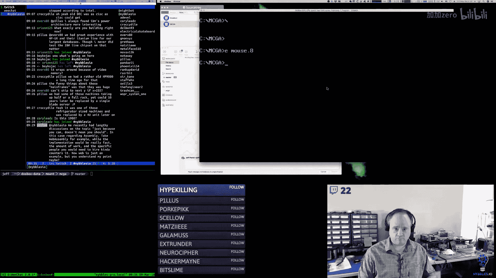

Yeah， see what's happening is really briefly clipping on Y works great on X I almost have it right。

 the issue is is that because I'm jumping past the Y or the X loop。

 X is not getting fully adjusted for the entire length and the Y code。

 the handles on the Y line is not dynamic it doesn't adjust the size based on how many pixels were drawn。

 it just assumes that all 16 were drawn so you get this nice little warpy effect when itlips。So。

Again I know what that is， I think that's going to be easy to fix， I just need to do that。

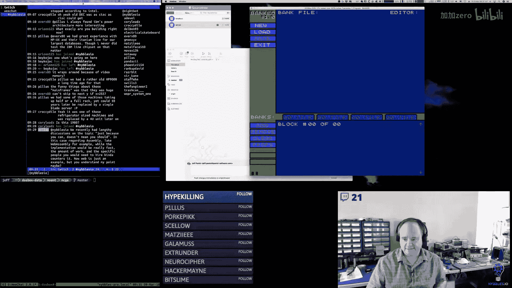

So。Let's go through the code real quick。

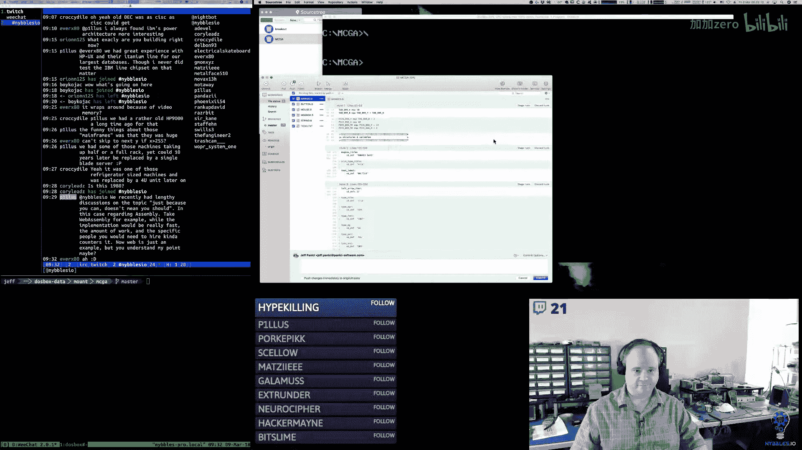

All right。So I added some constants to help， be able to move the pick box and all the related stuff around。

Easily。あ。We added a label for， oh， come on， come back to me。We added the pick type title。

We added all the different type strings。We reworked our buttons because of the change in the macro。

And then we added buttons for the bank。Previous and next arrows and the block。

Previous and next arrows， and then we have buttons for all the different types when the pick box comes up。

🎼And。Then down here， I have a bunch of stub callbacks for all those types。Those are going to be。

 I think， relatively easy to implement。This went away。

 this was just temporary strings that I was rendering， now those are actually buttons。

Same thing here， these were temporary strings， they're now buttons。

We've got the pick box draw now in here and we tested that。So that looks good and then on button。

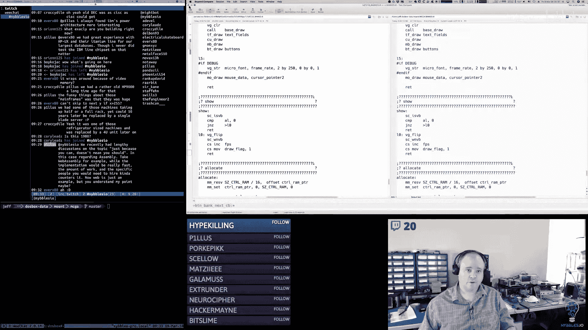

We added the button text only， we added button background color and button border color。

 we changed the button De macro to support that。

And then we rewrote the button draw。So now。It checks for the text only。

 it draws the actual button part， and then it draws the text part。🎼あ。

And then just some tweaks to the macro calls because we're。Using some additional registers now。

 and then in mouse I implemented。Most of the clipping， it's close。

I just need to fix one other part here。To get the clipping to work 100%， but essentially。

YouSo DI gets the mouse position， but DI does not have a。

 I need to use DI to access memory because I want a full word pointer， but。

I also need to be able to get at the individual parts of it so I can adjust the x and Y and check against them individually。

So i'm using a couple extra registers here to do that i've got the code here that checks the does the clamping that's correct the issue now is just right here where we're doing the line adjustment this this needs to be。

You know， fixed slightly and I actually think I have an interesting idea of how to fix it。

 I just you know I'm going to need to restructure the loop slightly。

Fix the macro because now we're using additional registers， so we want to save those。In message box。

 I took off the offset， this was one I forgot to change from。The other day。

We don't need offset anymore on these。So that works fine。String added string copy。

This allows us to fill our message lines from other sources。Veryairly easily。So on the stack。

 we pass in the highs， the length， the source and the destination。And。

And then we just do a string copy。In memory。And then we've got our macro。

 that handles the call for that。And then we've gone through the to do stop。

I I'm going to push that up to GiHub。And then I'm going to take like just a 30 second break and then I'll come back and I'll answer that question that。

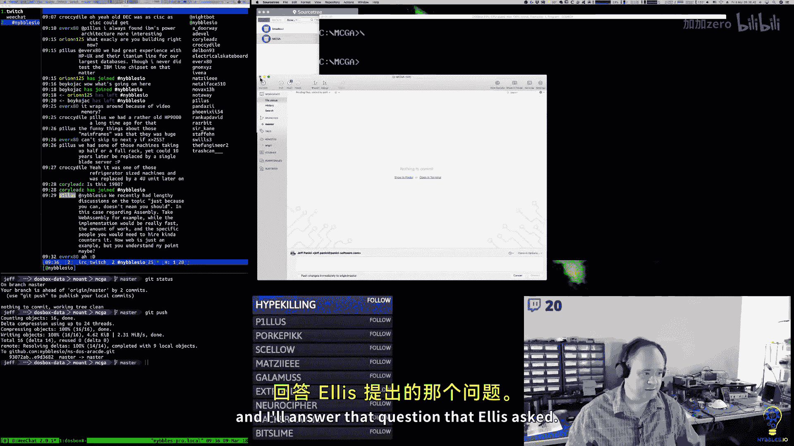

Pyllis asked。I have be right back。🎼Okay。嗯。So the question is。Should you。Even though you can。

And you're talking specifically about web assemblyly。So here's the thing。Again。

This is where our industry is all kind of。Jacked up。嗯。I go back。When I was。Learning all this stuff。

And。Phrases that I heard commonly back in the day were system programmer and application programmer。

Now we don't again today。Seem to have that。Distinction。As strongly as we once did。

About the closest that we have is that some people are embedded。Programmers and some people aren't。

And then by definition， if you do embedded stuff， you're probably doing stuff like this， right？🎼嗯。

But here's the problem。So yes， if you're at Company XYZ and company XYZ says， you know。

 we need to add a new line on our monthly ledger report。嗯。

Or should you write that in assembly language， no， probably not。🎼嗯。You know， we need to change how。

Customer invoices are generated， should you write that in assembly language， probably not？However。

 what's missing there is that you're looking at that as an application programmer。Right。

And depending on your application。You may or may not。

 it may or may not make sense to use a low level language。

Assembly or to use web assemblyly to build something however。

If you're our systems programmer or a tools programmer。

And you're going to build a tool for the application programmer to use。To build。

 to solve those problems。Then absolutely， you might want to target Web assemblyly， right。

 Then Web assemblyly makes absolute total sense。So again， we have this issue where。

I'm going to say like。90% of the paid work。And our industry is。Add this report。To。This you know。

 business application。Add this CRd screen to this business application。

Validate that the customer field， the customer name is not greater than 30 characters。

That's what 90% of programmers are focused on， right？

Web assemblymbly isn't really applicable to that。However。Again， somebody like me maybe might say。

Okay， I want to build a better tool for you。So that tool happens to use Web assemblymbly as a way of delivering something to the end user。

So that's the distinction。That I would draw to answer that question and I think that distinction we're missing that distinction in our industry。

And of course， why are we missing the distinction because nobody pays for system programmers anymore。

 nobody pays。To hire those people。嗯。Those people。The people that do that kind of work。

 they either work at one of the big companies。So they either have a job at。You know。Intel， Microsoft。

 Apple， Google。You know， Facebook， Twitter， whatever。IBM。And maybe they're doing。

That you know doing tooling or building tools for other people， maybe they aren't。嗯。

Or they have to do stuff on their own。And I'm purposely excluding games。Here， games are like。

 you know， that 3% little slice。At the end that they're in their own little world。

And game development， you know。Again， you could draw the distinction。A game play programmer。

Using unity or using some other tooling。Shouldn't necessarily have to worry that。You know。

 this particular blob of code in the engine is written in assembly language because of X， Y， and Z。

 right？However， again， in the game industry， things still to this day work a little bit differently than your typical corporate。

 you know， here's a business application， it moves data from this screen to that database and then from that database to that report。

嗯。But as an industry， right， we really should。Be encouraging people to specialize and allowing people that can do the lower level work to build tools。

To allow people who are building the applications to do it faster and to do it easier and to have more flexibility and more capabilities without having to write。

Tons of be boat。Javascript， CSS， HTML。Whatever， right？嗯。虽然。I guess thats my。

 guess that's my rant on that one。嗯。It could be better。And what it is。

But see you're thinking about it wrong。This is the problem， right， you're thinking about it。嗯。

You're thinking about it as just your company， not as the software development industry。

As a professional body， right？We as programmers， outside of one particular company that might hire somebody。

To do programming and see this is what I mean by。Nobody hires systems programmers。

The reason they don't hire them is exactly what you just said。

 they don't hire them because they don't a， the business people are paying the check。

 cutting the check， they don't care right， they just want their problem solved and you know again I'm not ding business people but these are folks who will build entire applications in Microsoft Excel and they are the most brittle。

 awful， horrible things ever， but it's the only tool they have because it's the only tool that we as an industry and given them。

So that's the thing， right？What's missing here is as a profession， right？🎼We should be。

Building tools for as， not the next 20 JavaScript crap frameworks， right， that's the wrong thing。

We should be building better platforms upon which to solve these problems。

 up to the point that I would argue that typical business applications simply vanish。

From programmers' perspective， right， we just don't see them anymore。🎼U。🎼呃。But again。

You're assuming you're basically looping on the hiring problem。

And what I'm saying is if we do this right， the hiring problem disappears because。

🎼Programmers won't do that work anymore business people will right， that's the reality。

 business applications， crud screens， reports。Tying this system to that system， right。

 we as developers should not be doing that work。That should be something that analysts do again right and again。

 you go back in time it used to be that the people who wrote business applications were analysts。

We've lost that distinction， right， it's just all because it's all kind of become this middle ground of muck。

Where we're all working in these languages that are not。

They're not really targeted properly for what we're using them for。Yeah。

So the hiring problem goes away because technology people， programmers。

We work on whatever level of complexity we need to， right。

 and we all do basically the same thing at that point。This thing that people do today， this you know。

These business apps。That goes back to the business people。

And we give them tools that let them build that stuff。It just does the right thing。

But you can't give them JavaScript， you can't give them CSS， you can't give them HTML。

 you can't give them C sharpp。That's you can't think of it that way。

 We have to give them a modern version of Cobal， and I say Cobal。To represent the concept， right。

 not to represent that I'm going to give them coalbal specifically。

We need to give them something that matches what they can work in。

But it lets them solve their problems， it lets them solve them。

 but it also lets them solve those problems。Without shooting themselves and everybody else on the foot at the same time。

🎼So， again。🎼嗯。It's not so much that you would。Necessarily build these things in assembly language。

 but the distinction。If you had to， if you had to do something low level， do it， right？You know。

 solve the problem and solve it the right way。And build， you know， tools。

 I'm going to avoid the word platform， build tools that allow other people to solve problems in their space without having to come back to you。

 right？Yeah， sure， and again， don't misunderstand me。

I am not saying that I want to go out and solve every problem on the planet by writing assembly。

 I don't。And in Web assemblymbly as a target， you wouldn't write it by hand。

 right you would have tools that generate web assemblymbly code。🎼What I am saying is that。You know。

 there's a difference between solving。🎼The problem。One time。

Using what I'll call some middle level language like JavaScript， C sharpp， Ruby， Python， you know。

HtML CSS combination of Mck and a database or a database in。Got to have a database or。We。

 as you know， engineers should step back and say， you know。

 we keep building basically these same things over and over and over and over and over and over and over and over and why？

Why can we not come up with a way that those people who want these things？Can do that themselves。

 and then we can we can think about other things right Then we can work on AI that then does that。

Does that all anyway， right？We could think of the next big thing。

So and there's a distinction here too， right， I do assembly language programming。On this channel。

And I'm producing educational material using assembly language because I believe that for engineers。

 for software developers。This is knowledge they should possess， right， This is。

 they should understand how this stuff works， not treat it as this。

Dirty little secret that we have in a corner that only you know old fogs like me。

Dre you know spend any time doing anything with that shouldn't be the case， right？

Because what happens is that then creates these mythologies in our industry。

 the mythology that unless you're doing everything in the current version of JavaScript or you know。

 Ruby or Python or some super Uerdoer， you high levelvel language that you're just wasting your time and everything underneath that is so complex that nobody can understand it。

 that's just not true。嗯。And I think those。Those是。Myethologies。

 we have to start breaking those down and removing them from the picture。🎼So。That's why I do this。

And you know， again。In the past， people have asked these questions。And I've kind of said it。

 you know， the same thing， I'm not telling people to go out。And， you know。

 immediately solve their next problem using assembly language， but you should understand it。

 it should not be scary， right？🎼嗯。And you know， I'm trying to demonstrate。You know。

 that you can build。Goies， you can build graphic stuff。And I'm not having to write 20。

000 lines of code to get one pixel on the screen， you know。

 I can get a pixel on the screen with you know probably less than 50 lines of assembly code so and that's true on a wide variety of platforms。

 right？So yeah， it's just really trying to shed light on the topic， know more than anything。🎼So。🎼Oh。

All right。🎼Well。I did get a fair amount done and I'm pretty happy with that and I will continue to。

Pg on it today and like I say I'll be online tomorrow 5 am and I'll pick up wherever I leave off today。

And then you know， we'll come back to this project again in a couple weeks。And pick up。Again。

 and try to get even more done。诶。Anybody else have any last minute questions？

I can afford maybe another five minute rant。Before I have to go。But。

And then just as a reminder on Monday， we are going to be switching back to Reu for the week and work on that that's in C++。

嗯。🎼So。We'll be doing that all next week。And then the following week。

 we will be going back to the arm。嗯。Arcade assembly kit。And I have。Ideas and。

All sorts of other stuff there for fixing the serial terminal stuff。

Being able to get that bootstrapping code finished。啊。Because yeah。

 we're like on the arcade kernel kit， we're right there being able to get the game stuff going and actually。

Get more of the game running。Which I'm anxious to do。Lots of game for written in assembly， right。

 lots。嗯。It's， again， it's。Yet it's a different level of abstraction。

T most people are comfortable with or familiar with。Once you kind of get going。

And if you have a good macro as， macros are a big help， right？嗯。You can get a lot done。🎼Without。

It being too bad in terms of programming overhead。🎼So。And that's the thing。I cream。30 hours a week。

And you know I think I'm on a lot of these assembly projects I think I'm making pretty good progress on these right。

 like on the Raspberry Pi stuff， I mean I think I've got like eight or nine episodes or eight or nine you know。

 videos of working on that that's it I mean for the most part that's all the time I' put into it。

And I've got a serial terminal working， I've got command parsing working， I've got， you know。

 I mean theres。I've got all the graphic stuff going。There's always more stuff to do。

 but you know it's。And this， you know。Just going back to the video。

 if you look at where we were at on Monday and where we're at now。

Would I be further along if I'd written this and see？Maybe a little bit。🎼嗯。But， you know？

Probably not that much further along because a lot of the same design questions come up。

 a lot of the same you know， you still have to do the same things。It maybe takes a slightly。

 you know。Take slightly less code， you could do it like in C or C++。But。I don't know。 I mean。

 a lot of it。We've gotten done in like the drawing code， I mean， I think the drawing code。

Would end up being pretty much the same， you know， in terms of function calls。

 you're pretty much kind of doing the same thing。嗯。So。I have looked at game emulator code。嗯。

And I'm actually building an emulator， it's called ReU。And like I say， next week。

 I will be working on that。嗯。And so that's a full emulator。That emulates CPUs。

 that's going emulate video generation that's going to emulate sound。

 so there's going to be a lot going on there。So。All right， everybody。Well， it's been a good one。

 I'll see everybody tomorrow morning， 5 am。And have a good afternoon。

And hopefully we'll get I'd like to get to the point where we actually have some real data in memory and maybe even write it out to the file system that'd be cool。

 we'll see if we can get there tomorrow。So I'm going to push for it， all right。

 talk to you guys tomorrow， have a good one， bye。

