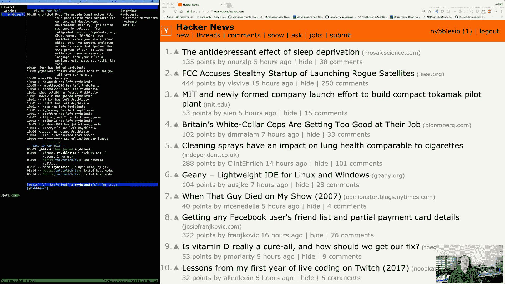
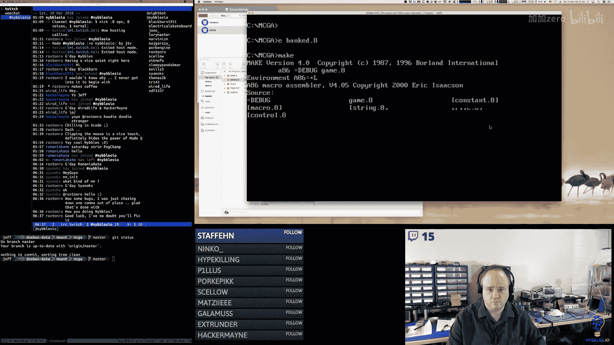
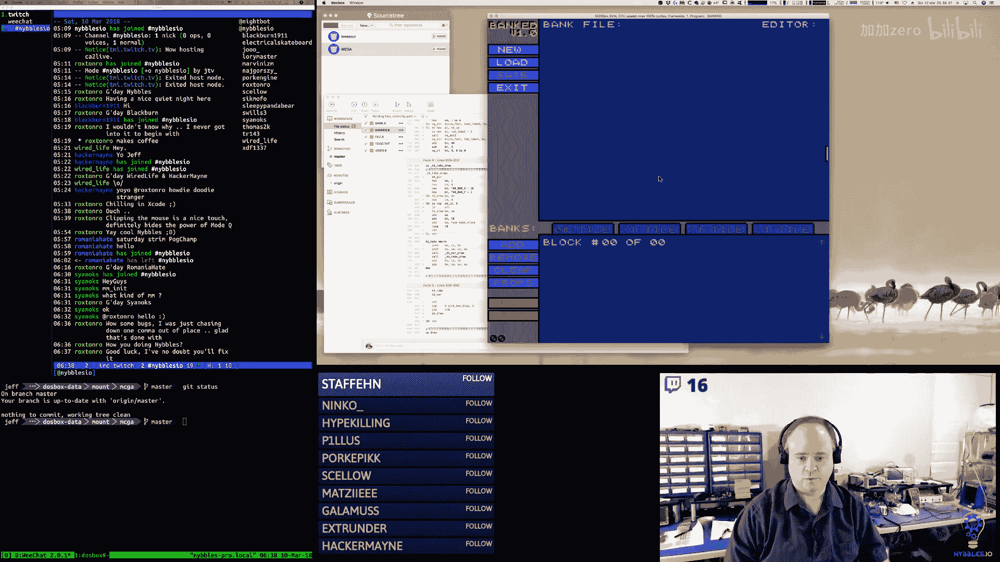
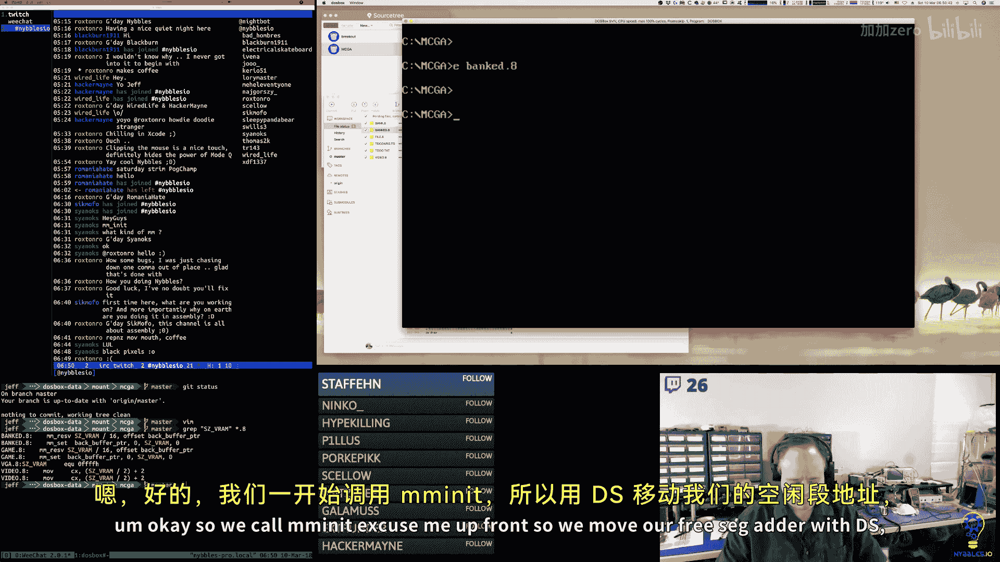
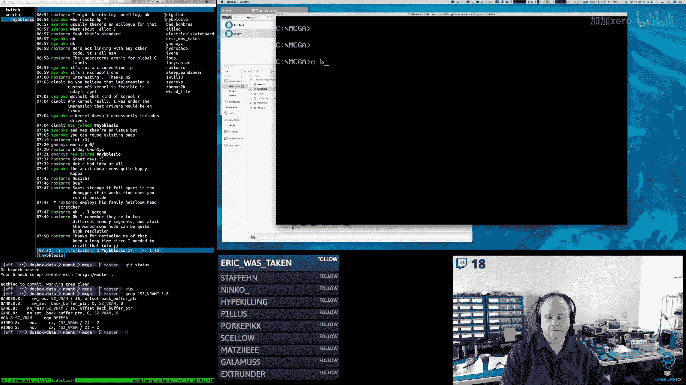
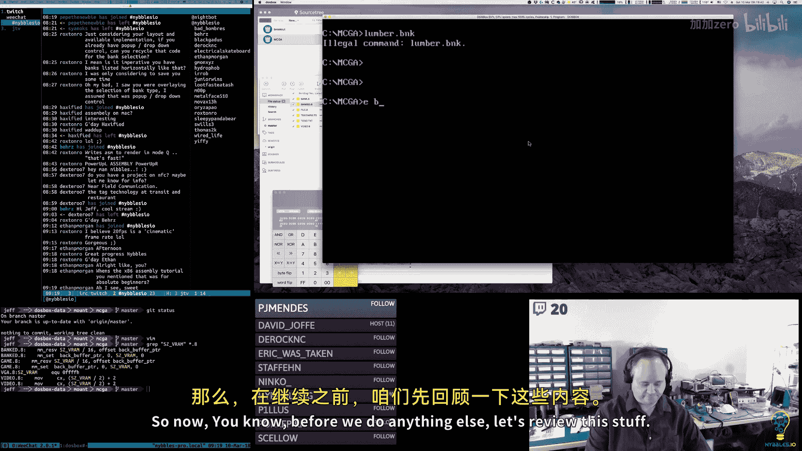
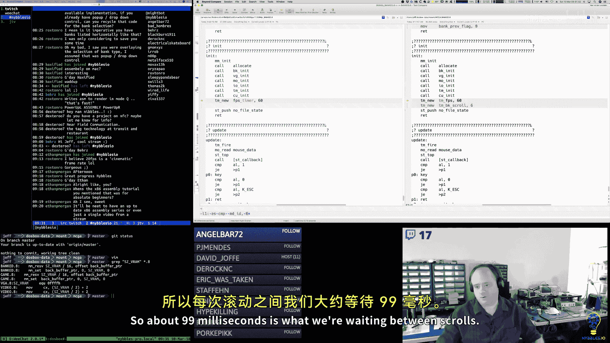
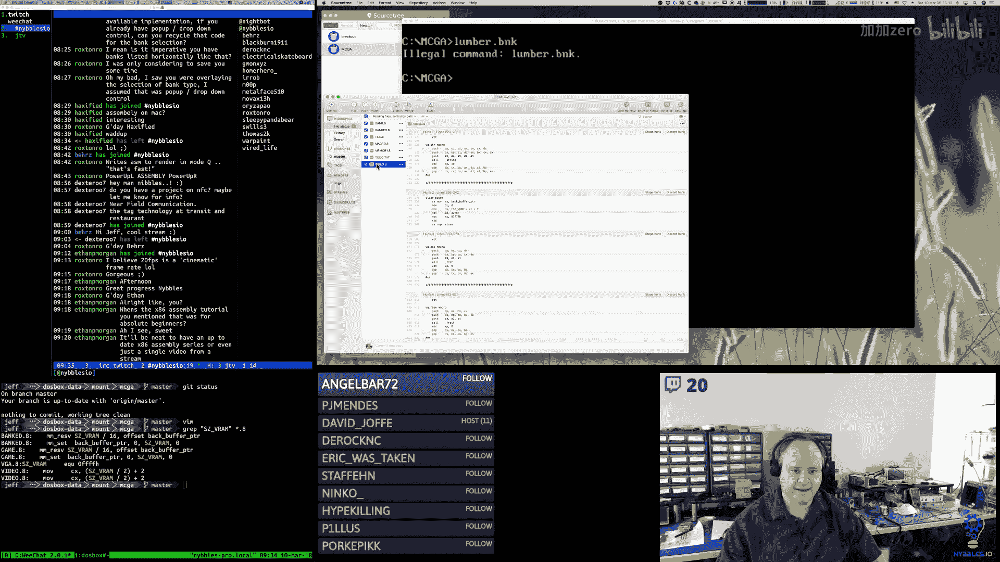
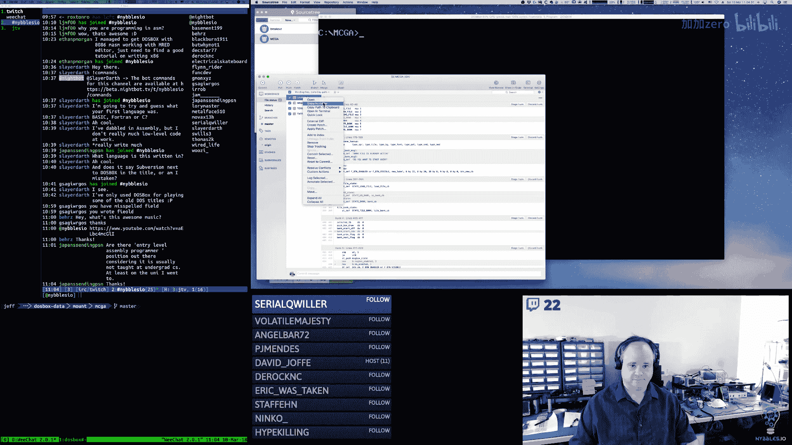
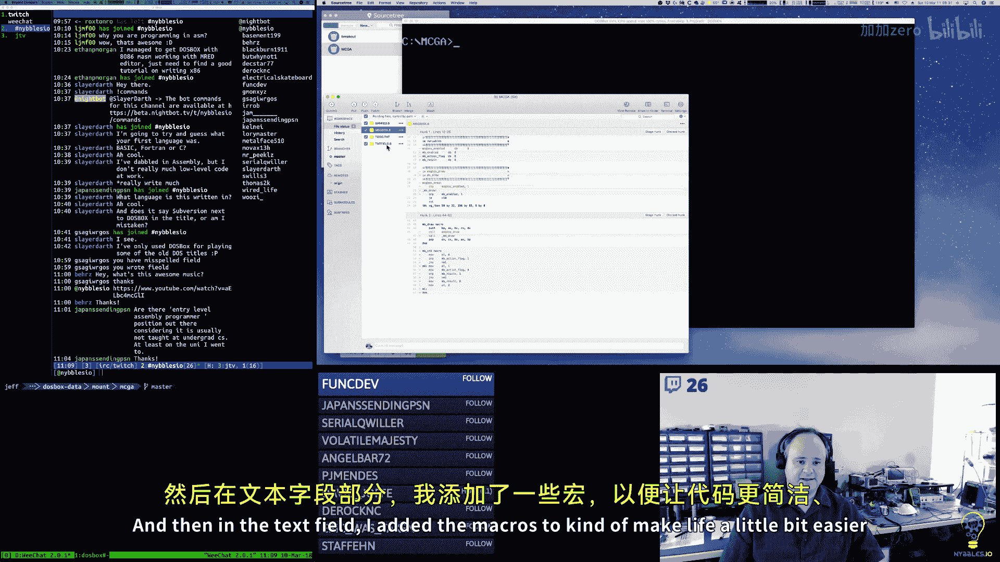

# 【精译⚡x86汇编语言】nybbles.io p07 p7 x86 Assembly： Wiring up banks to the UI (part 2) -BV1NPr9YKE4b_p7-

Morning， everybody。

🎼突。

🎼緊ち。Hi， Rox Tro。🎼二是高温。That's good。Nice quiet nights sir。But they have。Hey， Blackburn。🎼嗯哼。

So I don't know what happened。🎼嗯。Apple has totally screwed the pooch。🤧But。🎼With。

Daylight savings time。My phone changed time three times since yesterday afternoon， the time change。

🎼Okay。I think I have almost appreciate。up here。I'm about ready to give up on Twitter。気じで。

Almost ready to go guys。Alrighty。Today is Saturday the 10th of March 2018。

 this is the Nible ZIO Daily programming stream， I'm Jeff。

And this stream runs Monday through Saturday， 5 am。m to 10am Mountain time。

You can see what that time zone is probably after Monday when all the software gets adjusted to a daylight savings time here in the US。

You can see what that time is in your local time zone if you go to my Twitch channel page， Twitch。

tv/nibblesIo's  NYbbBLESIO。And at the bottom there is a widget that shows the start time for my stream and it should translate those to your。

Local time zone。Assuming the software is working properly。Hey， Wired life， hey， Hecker Maine。

Good to see you guys。嗯。Today is the final day this week of the MSDs Arcade Reference Implementation project。

Monday， we will be resuming work on reU。And we'll be doing that for all next week and then we're returning back to the。

Arm assembly arcade kit。The week after that， and then I need to post a。

 I will probably post a new schedule。🎼嗯。Maybe next week or most likely probably starting the week when we resume the arcade kernel pit。

I'll post a new schedule。For four weeks out after that。🎼So。🎼嗯。🎼Yeah呀。All right。

So yesterday I did get some stuff done。But mostly。Was cleanup bug fixie。And I ended up。

Playing around with the。The frame loop。嗯。Because I don't know， I got to thinking about。

Old projects I had worked on， and then I spoke to a friend of mine。Who said， oh， well。

 I have something for you and I'm like， oh， okay。And so he gave me some code。That I'd written pack。

I't 8788。88， I think。🎼嗯。And so I was looking at how I get it back then。And。Yeah， so。🎼I think I。

I had forgotten some things one was。For DoOSOS games， I think the general rule was。

 and I looked at some other Sherward games from the early 90s to kind of。Confirm this。You basically。

 you would draw to your back buffer and you would copy that to video memory and you would basically do that as fast as you could。

And then the critical thing， because you don't have a， you're not sinking to。

The vertical retrace specifically。You just had to have a good timer， while I have a timer， I'm using。

 you know the timer mechanism。In the machine。So I have an accurate 60 hertz timer for all my timing needs。

So that we're good with that， so what I did was I simplified the frame rate loop。And。By doing that。

 I got the frame rate to jump up to。🎼What。Dost box reports as the actual frame rate pretty close。

So by tidying up that loop and getting some stuff out。

If you look on the left towards the middle of the screen， you'll see that it says， you know。

 VGA width height， 256 pixels and then frames per second， 57。32。And of course now。

 Do box is not active。It's being throttled。But when I make it active again。

 now I have a frame rate that's for around 52 frames a second。So I'm closer。

To what Dos box is reporting now， you know， you do get and then again this。

Seem to be pretty consistent with the era。You occasionally get some sheer。On the screen。

 but it's minor。So that change worked out pretty good。And then banked， you know。

 banked has a frame rate that's。Above 99 frames a second because I basically untethered it from the framema。

The V sink and all that and so I'm not dropping frames anymore， it's just going as fast as it can so。

So I made those changes and then。I also。Worked on bank last night， started working on bank and。

So I've made a couple changes here。I me bring the chat back。So one。

A set of changes I made was in the header for the bag file。I thought， oh， you know。

 we're going to need version information in there。So we used to have the four bytes of magic header。

I'm sorry， the two bys manage。I meant to make this four bites。There we go。

So we had the four bytes of the magic。Flag， we have the version， the revision。

And then the block size。Then the other thing that I did was。I added a new。🎼Function called BK reset。

 So we have BK and knit for banks， so the tool calls this to initialize the memory for the segment or for the。

The bank headers。But at some point we're going to want to readload or you know create a new bank or create a new file essentially。

 and so then we're going to want to call this reset， which just meets that segment and then sets our。

Offset for the bank to zero again。And then it banked new。I created a structure to access the stack。

And then I put the bank type in BH and I put the bank。Block Max in BL。

So we're still passing only one word on the stack。It's just that I'm packing the two bitetes into that word。

And。The rest of this is okay up until here。Where。Before this was just allocating an entire segment。

But now we're passing in what we want the max to be。So I take the max from BL， put it nail。

Because multiplies are A times a specified register， then I put the size of the。Block。Into CX。

And then I multiply Cx by AX。Then I move 16， which is the size of paragraph。Into CX。

 and I divide AX by CX。And then get the we take AX。

 which has now the number of paragraphs that we want， and I put that into CX。And then I call Res。

To get the memory。And then I put the segment and offset， and then now the max number of blocks。

 I put those into this metadata structure。And then the rest of this works pretty much。

🎼The way it did。Okay。🎼牛皮。🎼So this is done。は right。So I think the next thing。Yess。This。All right so。

Here's what I'd like to do， let's get the logic around new and load and add。Going here。

Then right around the time we get here。We can change this to actually be reading from the segment for the。

Bank headers。So new is close。We just need to add the code that deals with the file name when it comes back if you hit return。

 also we need to add code that says， oh okay we already。We have a bank file now。

If you hit new again or you hit load， we're going to prompt you。To say。

 are you sure you want to start over again？And so what's going to happen？Is。Bank file name。

So we compare AL with zero that tells us that we hit escape。And if we did。

 we come down here and we clean up after ourselves。Otherwise。We're going to take that file name。

And we're going to put it into our。Actual file name structure here。So one thing is two。In file。

 let's change this macro。Let's have a file name macro， and let's also have a file。🎼So， this will be。

An S preserve。Of that length with。A no bite。Okay。So， now。We have that string copy。

Which was destination。So that's bank。Flf name plus one。Com们。And。F name。What one卡吗。12。🎼And then。

We want to go into。So I'm wondering， we want to probably exit the current state that we're in。

And then， push the。No bang。State。Because we're in the。We start here in the NO file state。

 then we go here to the new file state。We want to exit that so that we can go into no bank state。🎼嗯。

So。So if we had escape。We're going to jump over all this， we're just going to reset the button。

 pop the state off and we're done。Otherwise， we're going to copy the file from our temp string。

 we're going to copy that into our actual file name string buffer。

And then we're going to pop our current state， we're going to push on our new state。

 which is we're in the no bank， we have a file， we're in the no bank state。嗯。

And then we're going to do the same thing with a button and return。Oh， can I fix the mouse sir。

Butping。So that's working perfectly now。🎼ううん。Wow， bad stuff。ふん。😊，All right， because。

This is like the message box。I know what it is， though。I'm just trying to think of how I can。开手一秒。

Okay， it's pushing the new state。Oh， just kind pushing the wrong thing。No bank。诶。No。Thanks， Dave。

 yes， I was pushing the wrong thing in the stack。There you go。I was looking at the callback。Okay。

 here we go。So now we're in the new bank state， which。还好。Oh， but yeah。

 that callback doesn't do anything。That's fine。Okay， so。We definitely want。Fire。The mouse buttons。

 and we want to。For now， we'll tell the outer update。L that we're not doing any keyboard stuff。

 but that will change。So。Make sure that works。オケ。Now。Here's what we want to do。

Im to create a new function。Called。Enter。No bank。🎼Okay， so。

We're going to get the callback for the file name。Didn't hit a escape。We copy it。

We pop our current state off the stack， we call Enno Bank State。

 this is where we can set up our initial button date and all that good stuff。嗯。

Like when we come into this state， we're probably going to want to move。Selected tab to zero。

Ex me that's where we'll reset that。Turn the button on。嗯。没。Yeah， hey， look at that。All right。

 so now we're in the know bank state and then we can click on this， we'll get our thing to pop up。

And for that。We pretty。Pick box。Show。嗯。いて。So this' is going to call that。

 this is going to set up that state。Reset the select tab， turn on the Add button， the add button。

He's going to call。Pick box show。Which we don't have to change states for that， really。

So what we need there is。So in base draw。We'll compare。Pick box show with one。If it's。🎼奶。Then。

Let's skip to the end。Otherwise， we will invoke the PB draw macro。And that will draw the。The box。

 when we have to。In the show。Pick box here。We have to turn on all of our buttons。

So we're going to move。Pick box。Show with one。We're going to call BT set on。But。Pa요。Tyle Sprite。

Background。Palate font。🎼Sound mod。All right， so that turns on the buttons。And then。

Ass just an initial。Let's do。Pick box hide。So turn that off。🎼Oh， not just。え？です。ね？🎼喂。🎼あお。🎼爱每个神。

Because therere。Next button tight。あ丈。All right。🎼Britney bank。So head， hey。🎼Pick a tie， pick a time。

 Yeah， there we go。All right， we are right there。Okay， for now。We want one of these guys to call。

🎼Bank new。So， we。We hide the box because we， we've picked it。 We know what it is。

And so now we're going to call。て knew。And we're going to pass in the type。It is bank type。아요。

And the max on this is we want to fold。We want a full you。And for Sprite。

It would be bank types break。Same thing。So bank types spray， bank types tile。Pt we need。嗯。So。

Oh in my back back probablyow。These smash so PK find。You new。🤧嗯。🎼一子。嗯嗯。Okay， bank new。We push EP。Hey。

 Romania hate。We push BPX via。🎼Push our one word。Praameter， which is the。Max blocks。🎼By the。睇。

🎼Call Bank new。So our stack is return max type。Move you key with SP， get the type， get the block。

 max blocks。Get her addressing。Clear out AX， move the max into A。

Move the size of a block within the CX multiply and divide。By the side the paragraph。

Move the result in the CX。Because with we're going to call reserve， which is allocate。

And then we're going to pass in the number of paragraphs， and then the results going to go into AX。

And we'll put that in their segment， reset our offset max number of blocks。Get her ID。

Increment the ID， store it。Set our type。Set the dirty flag on the bank。

Move Ax with the BPP pointer because that's our return value。🤧。Sorry， guys， so looks sec here。为什？

And then move Bank header offset。With BPp。No。This should be bank headers。Well。

I'm not sure why I was doing that。Oh， yeah， I remember。This is the next one。🎼会死了。Yeah。Okay。

Adding a bank is going to do something new， new and real， so add tile， okay， put something in memory。

🤧ううん。So now let's change our drawing code here。嗯。To actually look at the real。Bank data。う。All right。

 so we need。In bank。As we need a macro。That will load up some state for us here。

Sos we'll called this Bk load。🎼And what does hope do？Because this is going to be BK。F。

Maybe that should be。隔你天 say。🤧ふふん。Okay， so what this guy's going to do。Because he's going。

Move ES with bank headers segment。And he's going to。BP。🎼Where。Bank headers， wow。

 that would just one zero， right？Because this we want to walk。We want to walk everything。🤧。

And you know what we should do， let's use PS for this。So TV tabs。

We're going to save the data segment， AX， Cx， BX， store those， we're going to call。

TV tab bar drop or， TV bar drop。And then he caasrop。So here we're going to do a Bk pointer。🎼哦。

Do we want to do that， yeah， we do， because we want to get those set。So CX。

 we don't want to set that。For。We want to do this loop。A little bit different。🤧。

So what we're going to do。🎼Here。うん。I we're going to compare。

So we had to do DS compare because the data is。We're pointing to the。Bank header segment through DS。

So we need to determine。🎼251。Are we done so the first thing is we can compare MDID with zero。

Should never be zero， we set it to one or greater for the ID。🎼And。If it's。It is zero， we're done。

Then。🎼嗯。🎼We can。Lad up the flags。🎼And。If it's deleted。Then we're done。

We're not going to display that。Actually。Now， yeah， see if。

Do we even need to worry about the deleted flag because？

The way we're going to do delete is we're just going to yeah， you know what for now？

Let's not worry about that。Let's just。If the first bitete is zero。Then this is。

 that's the end we've reached the end。Otherwise， we're going to call。Draw。

We're going to incr a tab number。We're going to cr our X then。We're going to add to BPp。

The size of a bank block。That's going to move us to the next one。And this is just an arbitrary jump。

This is our exit condition。Now。And tab draw。Cl see， I only access BP。To get the stackg frame here。あ。

So。We're going to push the BPP， which is the pointer to the bank header。🎼么啊。

We're going to push that on the stack real quick。Then， of course， by doing that。

We've now pushed everything off。嗯ん。So we get the number， we get the tab number。

Then we restore our pointer to the bank headter。And then。Is it active？

The rest of this is basically the same。Until we get down here。Then a couple things have to happen。

First。We have to。Put the number。Into our temporary。String buffer here。Block。Yeah。

 we can reuse block number here， I think， safely。🎼For no， let's not reuse that， Let's do。

Here we go test label。嗯。He let's let's use this。Let's call this tab label。

And then we're going to do some memory magic here。So what we're going to do this is tab table。

So we're always drawing the same string。But we're going to poke different bites into it。

We're going to use S dollar deck too。嗯。🎼And。Let me look at how I did that。

So it's expecting the value in A。Which actually works。

Because that is where our block number or that's where our idea is。Well。No， that's not right。

So I got to do this， I got to move A。With MDIE。Here。And then I have to move。All right， D。🎼别所有明星。

So I have to move E eye with。Cab label。Plus one。Then we call deck two。

So what this does is this takes the。Value， the bite value that's in A。

You point to the destination buffer in DI。And。And then this。Turns that number into a decimal。

 two character decimal string。And puts those decimal characters。

 AS characters at that string location。So that's how we're going to get the number。The name。

That's a little bit more complicated。So let's just see if we get the number first。Oh，哎。这 is试方。Oh。

Well， look， it's putting the number in there。Okay， yeah， that's all that stuff。嗯。嗯。T B draw。Oh。

 I was pushing two things on this stack。What的。What was the other thing？Oh， the other thing was this。

 oops。That's why they were all over the place。Okay， so we temporarily store the pointer to the。

Bank header。We move BPp with SP we get。The number， the tab number， we get the。Position。

 then we restore a pointer。We determine if we have the active tab then。Then we do our drawing。

And then we're done。So this should at least now we won't have tabs like， yeah， okay。

We still are drawing way too many of them。So our exit condition is not right。は。うん。Oh。

 that's a mistake too。It should be。歌许给谢S。嗯。え。I'm going to switch to ES。

stringing was the only culprit。🤧It wasn't pushing。But now our numbers are all messed up。

Why am I drawing to？Because the memory should be。Colleen Bk in it。Okay and that。I's allocating that。

Setting it to zero。🎼And then， moving the。Ops that to zero。And then I did just think。Really。O。O。

So if I create a new one。Then I add one。🎼こ中しね。What happens if I had another one？🎼Hello。🎼Yesし。

We went Kabalui。嗯。🎼然ello。🎼Why is this not？🤧。And then I'm allocate in the tool。

I'm allocating all this memory I don't need。I came from the game engine。I do need the back buffer。Oh。

 look at that。There it goes。😀哼哼哼。😊，嗯。Hey， Sinox。Oh， its just。It's very primitive。

 it's not a memory manager。🎼呃。It's a segment allocator。That's all it is。I just。

 I've been trying to come up with two character acronyms for my different modules。

Just to kind of be consistent with stuff， so memory。Memoory Z。🎼Okay， well， let's figure out where。

The rails here。2，4，2，7。That right。嗯呐。🎼可以。Should just call a knit。All right， that is correct。あん。

And it just falls through， okay， two42 so。Okay， so here's where I'm allocating the back buffer。

I'm sorry， this is the memory manager in it。That's a me set。うん。Now it's okay。Oh。

 maybe it was trashed， maybe the previous run where it locked up， it was trashed from。Something else。

🎼No。And it's one of those things where it runs in the debugger， but not in the。Not in real life。

🤧谢 me me。All right， well。Doing good。Just trying to figure out what I broke。🎼万于说。So that's what I had。

🎼Before。🎼That， I don't know why。That would be important。But it is。

There's something that I'm using there。嗯。🎼Thanks。

It's just the control real。Yeah， there's probably something in the air。I just thought of that。

 there's something in the video。🎼That is。It's dependent on the control RA block。But。

 I don't need the。I don't need the other memory， this is not。Okay。I can live with that。

Control Rams tiny。本色的。O。

So now what's going on here？Let's do this， Let's look at。It was file。And。TV。听。They have drive。Yeah。

1 EC CFf。1 ECF。When迎 you see。系。Go。All right。So ESS should be pointing at。Our segment。For our。

Bank headers。Which it's definitely pointing at something。So let's go to ES。There's zeros there。

It isn't scene right。I am working on an arcade game。

Reference implementation for an educational video series that I am making that teaches you how to do this in assembly language from beginning to end。

Assuming that you don't have any experience with assembly language at all and that。You need to learn。

So actually， you know what I put my break point in the wrong spot。This is the one I wanted。So one FF。

And， so actually let's change this to ES。And。Because they're all equal。嗯。慢だ。This is where I want to。

🎼Go。Yeah， that doesn't seem right。嗯。え。So BPp is zero。ES is 3CD。But we're pointing it。

Weird memory here just doesn't look great。🎼Or。Something else。U see A。Yeah呀。

And that explains why we're getting weird。🎼第儿 bench。嗯。🎼Oh。You know where these bikes are coming from？

That's not good。That's a bug。So yeah， okay。Interesting。嗯。Yeah， so。Where would 7F be coming from。

 that's coming from。The clear。Function that clearing the screen。Was clearing the back buffer。嗯。

So let's look here。So the very last。Amount of memory that I reserved。Was the back buffer。

And I'm saying that that is SZV rim size。嗯。Do you believe is in。嗯。Go呀。I have that in control。Or nope。

 is it in video？🎼うんの。Maybe a comes。No，Where did I put it？🎼あ。Oh。Have that here。嗯。🎼Go， it's in VGA。

 of course。And yeah， I think the science is wrong， for sure。🎼Yeah。🎼嗯。Okay， so in EGA。

I'm setting the size for the VRAN to65535。🎼Which。Is actually a bite short。Um well。Now should be okay。

🎼But。Let's go to。My clear。Yep， see it's loading memory with。7 F，7 F。

Why am I adding two extra bites on， I don't know。So I move ES with the back buffer pointer。

 I move DI with zero。And'm to CX with。Six，5，5，3，5。Divided by two。Plus，2。That's weird。

What was I thinking。2 seven，6，7。Because I'm moving a whole word。To clear it。Pre the direction flag。

And。Do a repeat star。Return。🎼Okay。There are two black pixels in the rail red corner。🎼嗯嗯。🎼I。Yeah。嗯う。

🎼So， now， if I。🎼我是TT。One FFF。Not as many。 I took the other two off。🤧。

So that tells me my allocator might be broken。Like I'm not moving ahead enough。

To get to the next segment， so they're overlapping。Good bug to find， though。So it is。

I don't think it's the clear function as it falls。I it gets clearing the right amount， excuse me。

A memory。Actually， it's clearing two bys short。嗯。谁。

Okay， so。We call MM in it。Excuse me。Up front。So we move our free seg adder。With DS。

 which DS CSSES are all going to be SS are all going to be the same。At the start。

And we know that our comm segment is。64K。啊。So that's exactly。🎼4K。So we add 4K。Well， four。We had。

This is paragraphs， right？We're adding 4096 paragraphs。To this。To get to our first。

Free segment address。And then we're moving that value。Into。AX and then we're storing it in the start。

 so we remember。What our very we remember what our base free memory pointer was。

 so when we do a reset。We can go back to that。

Each segment begins at a multiple of 16 bys called a Para from the beginning of the linearier。Yeah。

 that's。That's what I'm doing， I'm just double checking that I'm actually， that's correct。But yeah。

 that looks correct。😀。嗯ん。Okay， so I think I'm accessing it。Or I think I'm doing that。

Computation properly。So then when we say allocate。I grabbed the free segment address。🎼And I add。

The number of paragraphs that you ask for。And then I update。Pre segment address， Ne。

And then I update the output pointer that was passed at me。晚安。Where。Sins who resets BP。It be me。

In this case， the macro。Push his BPp on the stack and then pops it off。Yeah， it's right here。

I do all my prologue and epilogue and my macros that I use to call this stuff。

This nobody calls aec directly， right， they I use this Mac wrote to call it， right？

So the macro has the stack management in it， the function is， that's why the function has the。

Underbar in front of it， it's kind of a。Convention i used to indicate that it's kind of an internal。

Thing。Yeah， and what's misleading here is。Yeah， I'm not following any C conventions here。

I guess it was bad of me to use a。He used the C convention of putting an underbar in front of things。

So this is what this stack frame looks like coming in。🎼On these functions。No number of paragraphs。

I feeleel like I'm off by one somewhere。Certainly seems that way。🎼The sickLA。Because isn't that。🎼啊。

I think I no， didn't want to run it， I wanted to go。The the tudy butter。黏的。🎼Here one。我拜。

The break point。Go。Step。🎼都 dear。Yes。うんいや。One，2， three， four， five。S，8，9， and 11，2， 13， 14，15。Sure。

 why not？I mean， in some ways， building a custom kernel on X86 would be。A lot easier than some other。

Scennaris。So I think I know what's going on。Think。I'm off， it's one paragraph off。And。That。

Math actually ends up working out rain。🎼Thank that。N go。So same address。No。Why is that happening？

🎼嗯んうん。🎼So I want to go to。Yes。There we go。New。And。🎼Tyle。🎼Okay， so it's still not。🎼然后这后这边这。

Now I will look at memory。🎼So， this。啊。One time I don't look at ph change。🎼あ。Haad straw。Now it's at2。

001。ていう church。啊。那我呢。🎼Now。Okay。So E is through CBE。Okay。🎼Yes。Yeah， what was happening is。

Paragraphs are because I was reading that part in that Wikipedia article where。Kry Raser。

They're offset from where you would think they would be。They wrap。So you have to。

You actually had to move one paragraph beyond where you would think you would want to be to point at the next start。

Of what you want， so it's not zero， I guess it's not zero based， it's one based。

 which is kind of bizarre but。🎼嗯。🎼That was what was happening。So essentially。

 all the allocations needed one extra paragraph on them that they didn't have， which is 16 bytes。嗯。

To make that address proper。诶。Okay， so that fixed that problem。嗯。And then。Okay， so now。

The question is。So now we're not rendering anything because there's nothing there to render。

 which is good， that's what we wanted。嗯。Right， so now we don't have。Surious tabs in here。

But when I create one。I'm not getting anything。The buttons are still active。

 so I haven't added the code to。Enable and disable the buttons。With these。We could do that next。

All right， so let's do this， let's put a break point in。Button。T。太哦。So 1 E6D。1 E6。

Oh I'm packing them together， that's right。So it's type2。And it's 16 its6 yet， so it's 16。Max blocks。

 type2， so that's correct。Okay。🎼Go然后。Forgot to take out the other three。诶。Go。You。Add tile， okay。

 here we go。嗯。So this is where。Bank new now。So we should be getting our。BP+3。Oh right。

 because they're bikes，I packed them together。So BL is2， BH is 10， and it's perfect。O。

So now we move ES。To our pointer， to our segment， which is3 CBE。Which that looks correct。Okay。

 when this is all nicely zeroed out。Okay， so this is where I'm computing the size of。

Memory we're going to allocate for the blocks。So A is equal to two no。A is equal to the wrong thing。

 I've got them backwards。Okay， so that's problem number one。So let's fix that。Yeah， let's fix that。嗯。

I've got these backwards。天哪。1 by。1 E6D。1 unit6。🎼へ。Okay， BL。Is the size now。BH is the type， okay。

 good。There's our segment， let's let bring that memory up so we can see it。🎼And then。All right。

 so now A should be equal to 16。嗯。Why is CX？Oh， that's the size of the yes。

 that's the size of the block。Okay。And can multiply。So now AX is FffF0。

And then we're going to move CX with 16， we're going to divide。🎼嗯。And。That doesn't seem quite right。

That's off by one。For paragraphs。Because that should be an even 1，000 hacks。It's off because。Yeah。

 our block size is 4095 bytes。So we got to fix that。Okay， so now we're going to store into。

Memory here。嗯。hIt's not ES coded。Yep。Let do it。Okay， a couple things。All right， so first。而。

This has got to be incremented by one because。It's just the sizes are off。

To get to an even paragraph number。So that's fine。They these need to be。E coded。This one is。Cs coded。

 that's okay。That lives up here。This is ES coded。Oh， it hung up。🎼Yes。

I always feel like I'm accomplishing something and I get to that state。Have mind， reboot。

And now Do box has gone。FPU， Sta Overflow。🎼Yes。🎼awesomesome。

It's always a great day when I can crash dos box completely。So let's do this。Look at Lewis file。

Actually， I don't want that one I want。不嗯系排我讲嘅。1E77。Okay。

 so now we can go through the memory allocation again。あ。🎼嗯。🎼That doesn't seem 말고。Oh。

 I'ming the wrong one， that's why。All right。Okay， so now we're going to see if。🎼Yeahay， okay。

🎼Sort of putting。We're filling our first header here。There's our type。Yeah， and the ID。

So you have the ID， we have the type。We have the segment we have。The max。🎼へえ。Andで。What was that？

Oh flags， that's the dirty flag。Okay， so with the exception of AX being off by one。

After the multiply and divide， which we can fix， I just think recommend' the wrong one。嗯。Oh。

 actually。There's actually two bugs there。Because that segment。

🎼The segment that was returned from the reserve should have been。Like。🎼For something。So the address。

Is not coming back correctly。So that's another bug。🎼Okay。🎼So the data。🎼C fish。

At least we're filling memory now。It's a start。Yeah。

 so this actually needs an address to put it into。So really what I should be doing here。Is moving。

Where。🎼哇塞。最近。Cse。That's not going to work。🎼So I need陪。

So the reserve is going to take the size and it's going to。

Which means I don't have to like do a sppy toggle thing。And just use。X。

But the reserve doesn't know it's not yes aware it's going to want to write to the CS segment。嗯。

So I have to give it a temp pointer and sees to write to。啊。Then， I have the。I do a CS move。Ax with。

The value of that pointer。And then I can move that。That should be the right pointer now。

I'm going to take a quick break and then I come back， I will continue。To deubgorate this， not to do。

I'll be back here shortly， guys。Just waiting for the。Second。Pass on the coffee brew here。And。Okay。

Okay， so。I think I fixed the point to everything there。But。Excuse me， what am I looking for here。

 I want button。1070。Okay。Boom， okay， now Ax is the right size。Now we're going to call reserve。And。

There we go， AX is now for CCE。That looks correct。Okay， let me change my。Data window here。

There we go。对啊，棒慢啊。😔，Okay。So we have the ID， we have the type， we have the flags。

We have the max number of blocks for this header for this bank。We have a pointer。To the segment。

 so 4 CE。And。Go to。4 CCE。Yeah。Oh。That not， right。S。Yeah， that's pointing。Well， actually， no， wait。

🎼What is that something。Oh， that must have been from the text editor。

The text editor must have had that loaded。So yeah， so that shows you， right。Yep。

This was stuff the textet her head loaded。🎼可を。All right。🎼嗯。Actually， you know。

 now that I think about it's。For that very point。I'm going to。Do a mem set on that。

So that it's clear。呃。So I think it's。Size。啊。It's size。Zero x。That's what that would mean。Sorry。🎼It's。

Pointter， oh segment offset。Size value。So's。So it's segment offset。Size。不要了。嗯。O。嗯。

So now I need to look in my list file again。And 295。走。🎼可以。Let me bring up our。Data segment for。🎼嗯。Oh。

 I haven't yeah。🎼喂。Oh， I think I did it too early， yeah。There we go。

 now it's putting at the right thing。可以。We're going to allocate。Then we're going to mend set。Okay。嗯。

啊哦。Oh no， there we go。Oh， crap。没样子。And just meet random memory somewhere。So。We calculate the size。

We moved the size into the CX。嗯。So we can use it again。

So we reserve size to the tip pointer we move the value of the temp。Point your into AX。

 they only call meMSAT with the right。Address in the right size， and then we store the address。1ニな。

Okay， so now AX points at our new segment。So let's actually look at that segment that we're going to。

This is the block segment。So it's filled with memory， other memory from other things。Boom。

 there goes the meet。So now that memory is clear。Okay， so now let's go back to。🎼Our。Yes， it does。

Okay， so now we're store the segment。We store。Yeah， the offset。The max number of blocks。🎼The I。

🎼The type。Flags。There you go。Okay， now all that looks good to me。🎼嗯。And then we come back。Well。

 sort of。Because there's something else going on。Because if I run it outside of the debugger。🎼Well有。

Well。😮，那边。We're still not getting the right。And we're getting too many。All right。

 so now that's the next thing。All， so we get the bank pointer。

Yes should be pointing at see I think I know。🎼Maybe。Oh no， it works fine the debugger。

 the screen always gets all messed up in the debugger。You can't。

 the graphics display doesn't work right and Terwood debuggard。Trbo debugger doesn't understand Mo Q。

So it doesn't know how to switch between it and the standard text mode。If I were using 320 by 200。

 if I were using just boG standard MCGA。Turbo debugger would be able to handle switching between them。

But it doesn't understand mode Q， it doesn't know how to put it back into that mode。

See typically in the old days what you would do。As you would have two monitors。

Attach to your computer， one on the composite and one on the VGA。

 the graphic stuff would go to the VGA。And then all the tech stuff would go to the composite monitor。

So you could have both going at the same time。Okay， let's see。What's wrong here？🎼So。TB。

 let's say do TB。Ts gone。20，29。2，0，2 much。And。Go。All right， so ES is 3 CBE， okay？

Re'removing BPp with zero。AX is the starting tab number， so one through four， we set our x and Y。

 we set our max number of tabs。And then we look at that first bite。Is zero。🎼So。It is。

It's going to skip over it。Okay。It's going to exit。し。Right， because now。I a't crap what I should do。

🎼嗯。Yep。Okay， I'm going to take the break point off。嗯。And then I'm going to set it。Here。

This won't run unless。We actually have。a bank in memory。Okay， so now I hit the break point。Okay。

 so we compared it。There actually was a。Bank and memory。Oh no， don't search。Co2。All right。

 there's our bank。Okay， we're gonna。Step into the draw。Okay， so Ax is one。

 Bx is the position on the screen。We're returning BPp back to the offset。For yes。Yes。

 is still pointing at the right thing。We're comparing AL with the selected tab。嗯。

So it's not to selected tab。We're changing our colors here。Okay， we're going to in our earth。

Each position is going to do the drawing。啊。So that call。Oh wait， it hasn't cleaned up the stack yet。

 and me let it clean up the stack。Yeah， no。That draw call doesn't clean up the stack properly。

It's not saving ES and restoring it。All right， so the very first draw call。

That's probably like an H line or V line or something。DmMS is easy problems to fix。VGF box， okay？

And sure enough， it isn't saving it。嗯。ESBP， Ax， Bx6。EPA， AX， B， X， C， X， E。Yes。what about？This guy。

 now see this guy's a bad， he's a bad， bad function。He's a bad neckack。Vertical line does。🎼BP。AX， BX。

 C，X， D。And Hline does。They're okay， and I know I fixed string。Pix doesn't。

 although we're not really drawing into it， oh， no it does。So the pixel code goes。All right。

 here you go， see slowly but surely these bugs they get。They get fixerated。All right， and tile boom。

😀えへ。😊，Uh I don't know why these little things make me so happy now。

 of course we have to still do the name that's not we're not doing that right。

Because if I had a sprite bank。The number is correct， but the name isn't。

Because I didn't add that code， so we're going to do that next。So。We are getting there。

 ladies and gentlemen。Yes， sir。あ。And then because I still have the button enabled。

These still behave properly。🎼Awesome。Okay， so。🎼Now， let's see。For these names。What can we do？

I'm trying to think of a like clever idea here。嗯。嗯。It's only for。It's only for bites， though。Yeah。

If it would do a word lookup， that would be。That'd be the thing， man。

Because then what I could do is I could just create an array of pointers to the strings。And then。

The type， you know， so the pointer would match up with the type number。

And then we would just take the type number， do an Xlat and then find the pointer and then。

That's the string。It's like a hashm almost。嗯。But。Alas。But I can't use this。

But I could。Do it a slightly different way。Okay， so here's what we could do。どととした。Type。name。Look up。

🎼This is。Pype tile， pipe spray。还要。然。烦。🎼那 mode mud。And let's see， so actually it's bright tile。🎼PG。

Pray。🎼还我BG。🎼Bt pal。🎼Sound， okay。So given a type code。

That is an index into this array of pointers to the strings for their name。

And then what we can do is kind of what I did for set Z and set NZ since we don't have a version of XLt that works the way we want。

We'll just make one。Okay， so。We're going to have in。Hey register。

It doesn't really matter because we can just pass it as a pre here or so。🎼嗯。

Let's say we're going to push something。Restore it。🎼So move。He we know we're getting a bite。🎼Index。

We're move out into A。嗯。And then we want to multiply that by。2。It's actually just one thing。

And then that。Should give us。🎼第一。🎼Opsset。So if my type is one。Multiply by two。But see。

 my types are one based。So I need to some。🤧Excuse me。🎼あ。

You need to subtract one from the type to make it zero based。And just to double check。

 that I don't have any gaps， one， two， three， four no。So we'll make it zero based。

Multiply that by two。Then。Move。DX。With。Our address， what we call it。

 we'll actually just make that number two， that's the table we're looking up from。

And then we'll just add。呃，AX。Excuse me。So now Bx is pointing to the right pointer。🎼And的。🎼We move。SI。

🎼With。What's at the？Okay。So we're going to call Xlat W。And we're going to pass in the type。

 which is h。🎼Do we know what the type is。And this is going to be。拆一个。Name。So now S。

Just pointing at the。The string that is the name for the type。

And we want to copy that using our copy thing。🎼So we' going to do。🎼Happy。And the source is。🎼SI。

The destination is tab tableable， tabab label plus。One plus。So it's one plus one， two， three。3。

I want to leave this planet and。This thing you one。Because all of our names are four characters Max。

Are you asking term on my macro， like why I did an X or AX AX？

So I did this because I'm only moving the low bite and I wanted to clear out the high bite。

So I could have moved AX， I guess， with the value。Yeah， this is just。

 it just a habit that I got into。So you could do it this way where I clear out the register and then move。

The individual bite values into it。Oh no， well， because this is。

The value that's coming in is one based。So I'm decrementing it to make it zero base so I mean technically in my macro。

 if I want to make this macro like super duper。Generic， the right thing to do would be to do this。

 right？That would be better。Because this is one based。Makeake zero based。Yeah。

 number one's an argument， yeah， that's a macro。This is a macro。So the way macros work in X86。

Is its number？It gets hash and then the argument index。

 you don't specify the arguments in the declaration。They're just implied。So here what I'm doing is。

 you know and you could make。I guess the argument that I should just do that。

Because that will trunccate。🎼的海底。So。But actually， what I want to do is that。Yeah。

 it took me about a day and a half to get back into the X86 land。🎼嗯。

And then when they go back to arm。I'm going to be assuming that the stack works differently and it's going to be bad。

It's going to take me like a day or two to get used to it again。🎼My aller is丝袜。

I'm thankful that it's warming up。But。The price I pay is allergies。🎼嗯。🎼Yeah， okay， so。

I move the zero basing out of this， so this is now generic， right？

And I move the parameter that comes in， then I multiply the low by two。And I guess technically。

 since this is truncated， I could just do the whole register。嗯。我就把我。And then。

I move BX with the second argument， which is the address of the lookup table。

And then I add our offset to that。And then I get the value at that word。🎼And。And that's it。

Where were you looking？In the macro。This is shortrkcut syntax at A86 supports。

This is the Asmbler does this。So this is the same as this。

It just helps you not have to type it over and over again， that's all。

If you look at the code it generates。Right， but just to be clear， push。The push instruction。

 that's not a macro。This is just a feature of 86， 86 will let you do a commona separated list。

For push and pop。And it will turn it into N pushes and end pops。For you。

So that's just something the Asmb does。But this is a macro。🎼嗯。How's it going， Laurie Masterster？Okay。

 and then the length is four。Destination， sort， no。Destination。Source。系啊。Oh， it actually is。🎼SI is。

🎼Poin2。We actually want to go past the。I want to go past the length right。Because we know。

Just because that's how I set it out。In this case， that these are all。Well， maybe not。

Sorry about you losing。I think we can afford cheat that way。All right。All right。Yeah。

knew there was a reason I did that。Okay， let's see。🎼And。嗯。🎼2， wait。No。should be doing it， right。Okay。

 so there's a couple bugs。So let's fix bug number one。Bug number one is that。

This should be plus four。没有。ok， there you go。嗯。But it's not the right type。

It's always picking sprite。诶。Okay。W is it doing that？Why are you。Excuse me。然。

Because I'm throwinging it out。🎼Yeah。🎼Spray fun。Well， I haven't wired up those callbacks yet。

But those will be easy to wire up。🎼Okay。🎼へい。Hm， that works。Okay。Now。🎼对。🎼Okay。So I think this is RA。

🎼嗯。🎼The now。Let's wire up at least the types for the other banks。Ft， now fonts， we know。

We only want two。🎼And for。Backgrounds， we only want to。Blocks， pallets， I think are two。Sound。

We'll do all 16。🎼And马子。🎼So this is by by mind。So。Background。Hey， thanks for dropping by Ss。

 by the way， I've been watching some of your videos， your past videos。

 and I think I want to use your kernel to do some stuff， so have a good one。🎼All right。哈哈哈哈。😊，あは。

All right。I'm going to break it。Yeah。Okay。Okay， so I got。All the types wired up。So let's test that。

All， so we're going to add a tile。Us bright。啊翻。A palate。Okay， so now。A BG。

 now there is one out there in memory so let's do the arrows， so let's get that working。Let's see。

So what we need is。We need the tab offset。Or we need the bank offset， which is kind of an odd name。

Right because that's where we're going to start from。And we're doing this because right now。

If we look。嗯。Cabs draw。It loads the bank pointer， but bank pointer BPP is always zero。

So what we want is we want to value。That is。That we can load in here。

And we can control basically the left and the right arrow， that's what that they will control。

 they'll control this offset number。嗯。So bank。Start。Offset。Be 0。And then。We have our button。

Button bank previous button bank next right， so here we're going to compare。嗯。Now let's do this。

 let's load。AX with。嗯。Bank， start off。We're going to compare it with zero。And if it is。

 then we're done。That's our clamp。On the low end， otherwise we're going to subtract。The size。

Of a block。From it。And then the next is the same。Oh， well we got to start too。う？Thanks， start off。

We're going to compare this。This one's more tricky。How are we going to know what the effort was？

I mean， I guess we could do a bank pointer。And we could look， right？But there's a difference between。

Yeah， so okay， I know what we're going to do， we're going to do this。So I'm going to push P。AX。

Down here， over going the park。给。Here， this one's easy。It's always zero。This one。We're going to。

Compare。AX with。MD。Oh no， wait， this is in CS。 I don't even， I don't even need to do this。

This is easy， this is easier than I。Yes。Okay， good， don't need that， don't need that。

Right because it's in。It's this guy right here。Bank headers off。So。We're going to compare。

Our start with。Paders。Oh。And if it is。Above or equal。Then we're done。Otherwise， we're going to add。

The size of the block。To that our AX and then we're going to move that back into our bank start。啊。

Okay， so that's the tab scrolling right there。🎼后 take。嗯。Because this number。Is always pointing to。

The next empty spot， next empty spot。🎼嗯。So this might be off by one。Off by one grouping。

 off by one size， we'll see。Now。In the tab stuff。🎼嗯。Actually， I recycled the button implementation。

So he yeah the bank selection part， that part's working pretty good。

It's actually really simple because it just ends up being a。A button callback。

And then we just we set the， you know。Correct pointer offset for the bank。🎼U。I don't know。

I just think given our screen layout， I don't know how。How else I would do it？

I'd have to come up with some kind of new UI thing。To make it work if I like if I had a drop down。

 I guess I could use a drop down and not have tabs， then I wouldn't need the scrolling。🎼But。🎼嗯。Yeah。

 I probably at this point， I'd have to kind of backtrack and， you know。

 reimplement a dropdown to do that。So what we want to do here。🎼Here。We want to say。

 and this is kind of。I think maybe super cheesy， but。It'll work。We want to compete。That bank。

Headters offset。🎼With。One， six， three，8。So we could this is actually four times the size of。That's。嗯。

🎼And if it， if it's。Below that。Then we're going to skip over what comes next。それの。ワ？2。嗯。So then here。

You can just do a button set。Button bank。Previous。Is F button。This isable。Or F button enable。

And button set。bank next。Just like that。🎼O so。What we're doing here。Its when we draw the tabs。

We're getting the pointer to the。Bank header segment。

We're comparing in the code segment the bank headers's offset variable。Has that grown？Beyond four。

 if it has， then we're going to turn our next and previous buttons on。Otherwise。

 we skip over that part and we do everything else the way we do it。

And then the only other thing we have to do here。And so actually we can move this。And。

What we're going to do is we're going to move。BP with our bank。Start off。Right， that's in the UI。

 that's our button controlled offset where we're going to start viewing the tabs， viewing the bank。

Headers。This is assembly language for MSDS， this is X86 assembly language。嗯。

I am running everything on a Mac， but this is Dos box。And。All right。let's。Let's see what we see here。

Okay， so tile。Right。🎼啊。Paalette， okay。My math is off。🎼嗯。🎼Dad。A background now can I？🎼Now。🎼都会。🎼And。

🎼嗯ん。He had a sound。Okay， soooh。Looks like we're。Gooering memory somewhere here。All right。

So it's actually。Because if I oh， right， because if I do four。Yes， these are all。

It's actually one up。嗯。Because the bank headers's office is pointing at the next free spot。

 not at the last one that was added。嗯。Okay， so now the arrows should only enable。

After I add something past the fourth bank。So tile， sprite。啊。Paalette， okay， still no scrolling。

Now background， now we have scrolling。Except we also have some little splat up here。It's not nice。

Okay。And clicking on these is not changing anymore。So。Button bank previous。啊。

The reason we're getting a little spt is because。When I'm enabling the buttons。

 I am just I'm not oing these into the existing value。I am。Replacing the flags。

And these are text only。And so it's drawing。You know， a black rectangle in the upper left corner。

So that should fix that。Then， add。 okay， yep， no more little splat up there at the top。Okay。

Now let's look at those growing。Dudes。So bank previous。Bank previous， bank next。All right。

 so bank previous。We're saving AX， we move AX with the bank。Start offset。

We compare that to zero if it is。Then。We bail， we pop aex for return。Otherwise， we subtract。

The size of a block， and then we write that back out to that variable。For next。We compare AX with。

 I'm sorry， we move AX with the bank start offset。We compare that with the bank headers's offset value。

There we go。But still。I'm guessing that's。🎼想不能我试啥啊。So palette background。🎼妈的。🎼tailyle。P。Okay， yeah。

 it's still not changing yet。🎼Background。Okay， time for the debuoer。Let's debrate it。Let's check out。

反应。对。Next。That is at1 ECA。1 EC。🎼啊。🎼I you do that。Yeah， rerun。🎼輸入？🎼Tyle。Right。🎼把。🎼然我。Backroom。Click。

Oh， click， click， click。不可。It's no clicky。下一个钟。🎼没不去。Okay， well that would explain why。

It's not calling the callback。🎼You dont know why。🎼Maybe well， maybe， I don't know。あ。

Now I'm calling button fire。So， I am。Setting the read only， visible and enabled flags on all of them。

Butudton Bank previous is But Bank Prebs CV。Butotton bank next is。🎼Button bank nexts。🎼好白。Ah。

 I know what it is。Yes。Oh， funny。The button click code is based on the button location。

Not the text location。So even though we're not drawing the button。

We still need to have the coordinates。🎼So， that。The click code will work。Let's test that。

 but I'm pretty sure that's the case。That's pretty simple。嗯。Yep， wow， look at that。It works。

 it's fast。That's really fast， it's almost too fast。🎼嗯。🎼Oh we go。Look at that。Okay。

 so then we have to do a couple more things here， let's fix the other button。The other two buttons。

Because that's going to pop up and bite me in the bloodt。And I'll forget about it。🎼嗯。

So this should be。248 by tabbb。Y plus。And this should be 2485。Okay， so that fixes those。Then。

We know that we can only have a max。Numb of banks， right， but know we can only have 16 banks。

So when we click on that add button。We need to add some code to that。So。嗯。Yeah。🎼In the。これだかダり。🎼And。

AButed bank callback。So this， what we need to do here is to need to。🎼あ。You need to move Ax with bank。

Pters。🎼Offet， and。Need to subtract。🎼呃。🎼Well。We you do it that way or。No， actually。

 because we know we're allocating an entire。Segment for this， right， so we know if this is。SSF。

That's it， we're done， we can't do anymore。So if we're below that。Or actually。

 let's just say above or equal as we go here。Otherwise， we'll pop up the little。Show thing， Matt。

 but you know what I want toable the button。Let's do with the other pay。

So here we're going to disable。🎼Butotton and。F button。でずも。不得罪。Here。Actually， we can do that down。

So here。We want to do a BT set。But can delete。Because once we've added a bank。

You want to be able to delete it。Remove， I call it remove， of course。Okay。Pt set。O。New bank。

Add some blocks， one。So remove is now active。3。Or。呃。320钟。eight。诶。10。Yep， we got 10 of them。11，12。13。

14。15。16。嗯。Okay， my math is up， my math is off。嗯。Oh no， you know what's going on。It's， yeah。

Hold that on said， guys， I'll be right back。Okay， I'm back。Okay， I think my comparison here。

On the max bound is a little bit sloppy。So let's see if we can fix that。Yeah。

 it's going to roll over actually。So I have to do this in two spots。I can't just do this here。

Or do it there， I have to do it here too。🎼So。🎼I have to。Say is this already at the end？4000。🎼きて？

Six5520。🎼Okay， so that's。6。So 16 times 400，65520。🎼That's going to be。FffF zero。

So that's the last one。But。Yes， no， that's always the last one。So if it's below that。Well actually。

 if it's above or equal。Go。Here。Otherwise。So we won't even touch this。So this is 16 times。はい thanks。

🎼This is 16。あ。はい。What are you going about？Bite sizeized constant。嗯。Six，5， five， two，0， right？🎼Okay。

 that's weird。What was it complain about？So size bank headers， let's just use that kind of thing。

Size3。16 times。🎼The size of带化。I think it was the order and wanted it the other way。Size， bank。哇。

Size bank headers。🎼O。So我们。It a block。K了。Oh man， it goes so fast。So I actually might。

I might actually have to burn some frames on that。To make that go a bit slower。Or use a timer。

 I could use a timer。To control that。That's probably what I'll do。Palette。🎼M的。🎼Sound。Spray。太好了。一倍？

Palate， hot。太好了。Background。And technically， we're probably running out of memory here。🎼たく。But yeah。

🎼嗯。Okay， so ads's done， yeah， we're close。We're close。あ。O。Because we only have 600。As then we have。

632K free。So much is free。🎼So。Was itMm slash all， I think that's all it shows。So yeah。嗯。

Allocating because I've already allocated。We already have 128k。

Out of that so really we probably can't get to 16， actually 16 block or 16 banks。

So probably maybe I should shrink that and say we can do like 14 or something。🎼あ。So in the UI。Hey。

 Dexteru seven， how's it going？So let's set it at 14。And。Do I have a project on NFC？What is NFC。

 sorry？Oh， they actually haven't done anything on near field communication。Recently， so but if I do。

 I'll let you know。Okay， so there's 14， yeah， okay。🎼Oh。Yeah， that's interesting， okay。

 I see the issues。The issue is。It's checking only after。🎼Yeah啊。Interesting， okay。

 so you know what we need to do。Let's make another function here so this can be called in a couple of spots。

And we'll call this。Button， add。Plamp。A limit or call limit。🎼Hey。Beears， thanks， I appreciate it。

Okay， so what we're going to do is。So we're going to push Ax。Move AX with the bank header offset。

 we're going to compare it to what the up to 14 blocks would be。

 that's probably about as much memory as we can maybe。M might even be better to limit it further。

 but for now， I mean， this is fine。And so if we're below that， then we skip over and we exit out。

 otherwise we turn the add button off。And so then here。We're going to call。

 we're going to do our thing， right？🎼嗯。🎼And then。In the callbacks where we actually do the work。🎼嗯。

We're going to call。Button add limit。Just like that。O。

So now what should happen is as soon as I hit the limit after adding that last bank。

 it should trigger that condition。And the add button should be disabled。Should we getting close？

Two more。Yep。There you go。So as soon as we get to the upper limit， then it turns the add button off。

🎼O。Now let's limit the scrollings speed because that's pretty insane。嗯。🎼Yeah， like。

So here's what we'll do。🎼嗯。Let's see， what's the best way to do？嗯。So what we want to do here is。

Start a new timer and have it called。Bank previous。嗯。🎼And then。Let's say that takes。🎼Two frames。

So the timer is a 60 hertz timer。🎼So。That's like。33， 34 milliseconds or so。And we can tweak with the。

The timing。And then we want to do a timer。🎼Q。We don't want it to fire again。So let's look at that。

🎼嗯ん。Yeah， so what it does。Tim Kill， which I wrote， but have never used， I don't think。

It just zeros out because I have a fixed block in memory。Of。Timers。

 so this just zeros out that memory。Yeah， okay， so I think。That should be okay。🎼And then。

then we're going to have。Thank， Nick。And this guy is going to do the same thing。

 he's going to start a new timer。And he's going to weigh two frames。So again。40， 50 milliseconds。

 roughly。I is what that's going to be。嗯。🎼But。嗯。We don't want。

We don't want this to start timers though。That's going to be bad because we only have 32 timers available。

So， really。Okay， so what we want to do here。🎼Is have a。备。Thank for you。Flag。Next flag。

And then in a knit。Itll start。Thank。Thanks for。Three frames。🎼So。If the bank next flag is set。

Then we're going to call。来。And we're going to。Move back next。0。Yes。

Previous and we're in a call meant previous。We're going to move bank previous。

And then these guys don't do anything with timers。And all the buttons do。His move。Bank pre flag1。

By next。Okay， so click on the button。That sets the flag on。That's all the button does。And then。

So it doesn't matter how fast the callback happens or the button that can happen as fast as we want。

Every third frame， every third。S0th of a second。🎼，Bank scroll timer gets kicked off。

He resets himself right， because we want that to just kind of keep ticking at that pace。And。

So he resets himself， he checks，  hey，🎼し。The bank next button get hit。

 Did the bank previous button get hit。If neither of them did。

 then we just return and the next time around， we'll check again。If。The next did， then。🎼嗯。

And then you know， what we'll do is we'll reset both flags in either case。

That's going to prevent the situation where。🎼You click the left， and then you click it。

 go click the right， and then it like， you know， would， would toggle。So。We check for next first。

And if that's the case， we go there， we call back next， that's the thing that does the work。

Then we jump down here to L2， which resets the flags when we return。If the previous flag was hit。

 we go L1 that calls that， resets the flag's return。O。That should。Slow down our。Scrorollies。🎼Yep。

唔 here。And we could probably even make it a still kind of。🎼会。So we could slow it down a little bit。

🎼Even more。I'd say it's not too bad， maybe a little bit just a teen tiny bit smaller。

Like every fifth frame。And what's nice about doing it with the timer is that I'm not。

The main loop continues to function at top speed， right I'm not putting arbitrary pauses or anything in there。

🎼Perfect， now， now it behaves， you know， the way you would expect。 you actually have to click and。

🎼You know。Click click but couple times it'll go a little bit faster。That's pretty manageable。

 and again， we could continue slowing it down by。Just having it weight more frames。

And then I realized our selection logic is not 100%。Because with the scrolling。

 the selection doesn't quite work great。But I think I can fix that pretty easily。Yeah。

 because if I just hold down the mouse button on that。It won't go any faster than that。Hey。

 Ethan Pete Morgan， how's it going？Yeah， we're getting there， hu？I mean。

 it's really starting to come together。We got。🎼Real。I'm doing well。We got real memory or real memory。

 we got real data in memory。🎼Here we go。That feels about right？Yes。This is。

 I'm working on this so I can finish that。呃。If you're talking about my X86。Video series for。

 you know， taking you from beginner to。Advance on assembly language。

 that's the reason why I'm working on this so I can finish those videos。you know when？

Hopefully soonish， you know， I'd like to get it done。Within the next few months， if I can。

 if you guys want a stream。For beginner stuff， I mean we could do that so I could。

We could maybe spend a week and go through basics。All right。So now。

You before we do anything else let's。Let's review this stuff。All right。

 so we added the missing types to bank。I fix the header， this should be four bytes， not two。嗯。

I added the temp pointer。In the bank module for when we do Bank new， I fix the header here。

I've got a macro called Bank Pointer， which sets ES to the header segment and then resets BP。

I renamed my macros to be consistent。And then in Bank New。

 we had some work here around getting to the right size for the paragraphs。

And then the memory allocation， I had to fix this because。

This guy is not aware of the fact that stuff is maybe going to ES。

 he's just all code segment oriented。I have him drop the pointer in the temp variable。

 and then we move that into the register， we call meet on the memory now。

Fix the ES coding on all these， these were not ES coded like they should have been。And then we。

Here we compare to the absolute end of the。Segment， right？嗯。Now the reality is。Again。

We're not going to be able to fit， you know， you could fit 16 pallet banks probably right so you know the combination to some extent depends。

 but this does clamp it at that high end now。Fix the macro name， fix the order of the parameters。

Fix the name of some of these functions。And that was pretty much it for the rest of this。

 just formatting stuff。Because that's the next bit of stuff we have to work on is the loading and saving and all that good stuff。

🎼嗯。And then in the main tool。诶。Change test label to Tab label。诶。And。Change these to be。

 they're all four characters now fixed so that my copying memory copying works right without having to look at the length。

 I guess I'm being lazy there。And then I have my type name look up。

 so this is an array of pointers to these strings。And they're indexed by the type。🎼Id。

 the type number。So Sprite is one， tiles two， BGs3。So we take the。

Type number from the metadata in the。Bank header， and then I do a lookup on this table to get the string。

That is the description of that bank type。And then I fixed these buttons。

 the button logic for the clicking。usess the coordinates for the actual button itself， not the text。

🎼So。I had to fix those。嗯。Change the name of this or use the different macros or we're using F name reserve。

To just reserve 12 bytes， we have some new state variables。

 whether or not we're going to draw the pick box。What our current bank start offset is。

 that's how we're doing the scrolling and our bank previous and next flag。

That gets turned on when you hit those buttons and then we have a timer。

That executes the next or previous， depending on， you know。Its cycle and then it resets those flags。

And then I added a helper function enter O bank state。

So when you create a new file or you load a file。🎼嗯。We should probably change the name of that。

 shouldn't be no bank state， it should just be。You know， enter。Bank， state， you know。

Or active bank state， something like that， because no is not really easy。Yes。

 we don't have a bank but。Really， it's kind of just that we have a bank file state。Yeah。

 so we'll rename that。And then I added some basic logic to the bank file name callback so that we can move on to the next parts of the state machine。

 so I copy the file name from the temp buffer to the actual file name buffer， I pop off the state。

 and then I call enter no bank state so that we go into the new state。🎼嗯。Then in the no bank state。

Firing the mouse buttons and we're telling the main update loop that we're not doing anything with the keyboard and that won't be true long term but。

For now that we know this works that allows the escape key and some other things to function normally。

🎼嗯。And then pickbox， hide and show these are helpers that set the flag and then turn the buttons on or off。

So that that shows up correctly and then I have a helper function button add limit so as you hit add you're adding banks at some point we reached the limit so we check against。

 you know， right now I'm saying up to 14 banks can be added because that's probably about you know。

 it' probably should be 10， 10 10 probably should be the max。But。Once we hit that。

 we turn that add button off and we're done。You can't add anymore。When you click the Add button。

 it calls pick box show， that's all that happens。And it turns that pick box on in those buttons and then when you click one of those buttons。

 then the next thing happens， bank previous， this is the thing that actually changes the offset。

 this is called based on that timer right， so we save state， we get the bank offset。

 we compare it to zero if we're you know above zero。

 then we subtract the size of a bank block from it。And we。You know。

 reset that variable to that new value and then when you click on the previous button。

All that does is set that flag， so then the timer sees that and then does something later。

Same thing with next， we save state， we grab the bank start offs our bank start offset。

 we grab the current bank header offset right so how many you know where are we at？

In terms of what we've added。And then we subtract one block size from that because we don't want to know。

If we've hit， you know because Bank header offset points at the next free slot。

 we want to know if we've reached the actual end， so we subtract one's block size off that number。

 then we compare the two and if we're above or equal then we're done right we don't do anything else。

 we don't scroll anymore otherwise we add the size of a bank block to our offset。🎼And。

The next button sets the flag。Then we have all the buttons for the types in the pick box。

 and so all that does is called pickbox hide。Then it turns the new button or I'm sorry。

 called Bank New， so it creates the new bank in that header segment。And we pass in the max size。

 right， so for tiles and first prites， we allocate a full 64 k。

And we call this button add limit right， so then we enforce our upper limit in the number of banks。

And then we turn the remove button on because we have a bank now。🎼嗯。

And then we have one first sprite font。Backgrounds， palettes。Sound and modules。I rename the frame。

Frames per second timer TMFPS。And then in the tab drawer， cleaned up some stuff here。

Dealing with the stack。🎼And。And then we've got code now this is actually reading from。

The bank header segment， so this is looking at that bank header block。

And it's reading the ID and it's reading the typeout where formatting the ID is a number。

We're getting the type and then we're doing that lookup to find the strength name for it and we copy。

The number into that。Template string and we copy the name into the template string and that's what actually gets drawn out。

And then in tab tabs draw， so this is the thing that draws all the tabs， we say， okay。

Do we have more than？Four right because if we have four banks， then we don't need to show the arrows。

 if we have more than four banks， then go ahead and turn the arrow buttons on。

Then we get the bank pointer and then we move BP with our start offset。

 our scrolled offset right so we have this block of memory。

 every 4095 bytes is another bank header that describes what that tab essentially is pointing at and so when we scroll right or left we're just changing where we start right in that and then we show four from that point。

嗯。And then we have a garden here because we've initialized memory to empty。

 we've initialized everything to zero， where we basically say， you know。

 is the ID zero because a real bank would never have an ID of zero。嗯。

So that's our bail that allows us to try to draw for from our current offset。

 but if there's nothing beyond， say two of them or one of them， we stop。嗯。

And the rest of this loop is basically the same， it's just that you now we're actually adding the size of a bank block to BPP。

 and then we just keep calling our draw macro。🎼嗯。And then。In the base draw。

 I check to see if the pick box should be drawn。And otherwise， we just get past that。And then。

I need the control RA and I realized after looking at the timer code， why it was dying。

 we need the control RA because the timers live in there。So。

But this other ra for the tile banks and the sprite banks， we don't need that。

 that's for the game engine， so I took that out。And then here's our scroll callback， right。

 so every so many frames。This gets called。We reset the timer。

And we check to see if we're going to do a next or if we're going to do a previous and then we reset the flags and that's it we set up that scroll timer so it's every sixth。

S0th of a frame and that's you know， at 60 hertz， that's 16。6 milliseconds。

So about 99 milliseconds is what we're waiting between scrolls。

And that's it。On that file。And then in file， it looks like。Oh yeah。

 I just did that F name and F name reserve macro name change。And then in macro。I added this new。

So the X86 has an instruction called XLAT。Which lets you do a lookup in a lookup table。

 but it's only for bytes， doesn't do words。So I wanted to make one that would do words。And so。

We pass in the index that we're trying to get to in AL。Or you， gets put into A。

 and then we shift that left one that multiplies it by two。And then we take the second parameter。

 which is the point Church， the lookup table。And we put that in BX。

 and then we add our offset to that， and then we get that word and it comes out in SiI。

And that's what allows us to look up our type names really easily。And then in memory。

 there was a bug。嗯。That I hadn't noticed until。We started doing this bank stuff。

So I moved these trucks because these are anonymous trucks that were meant for the stack frame。

 I had them up at the top of the file。They really just should be inside the function to make it clearer。

So that the bug here is that， again， this is kind of one of those weird。

pointAre you pointing at the beginning or are you pointing at the end？So to allocate memory。

Segments are based on paragraphs。And or I should say a segment point here has to start on a paragraph boundary。

So to allocate memory， you move so many paragraphs， so that's blocks of 16 bytes。嗯。In you know。

 in memory。But。You actually。Want to point past the end。Of where you're。Allocating， so it seems weird。

 but you actually end up allocating a paragraph extra。

for it to be the right one because I was reading the Wikipedia article on segments and I read the part where it talked about the rollover and how some developers used to use that and it dawned on me that that was the mistake that I was making so we increase our address by the number of paragraphs you want plus we move it one paragraph more to point past the end of what you're allocating。

嗯。So that was the mistake there。And。And I just cleaned up the macro， so it's consistent。

And same thing here， this just changed the。The stack frame。To do， we haven't updated that much。

 we'll get back to that。 And then in video， there were a couple of。

Functions that we're not preserving ES。Or some things on， I think ES， yeah。

 they weren't preserving ES on the stack。This one。嗯。I need to revisit that， this is okay for now。嗯。

Yeah。These are just things that should have been on the stack that aren't。

And that fixed some state issues there。Okay， so let's。Commit that。Go ahead and push that now。Oops。

All right， I'm going to take a quick break and then when I come back we will do a little bit more I might be able to go in until about 1030 here。

I think my wife's schedule changes a little bit。So。I will be back。handfulful of minutes or so。

We'll review the to do and we'll fix the selection tab selection that should be pretty easy to fix。

And then， yeah， we'll see what else。See it else we can get done in the next hour or so。

I will be back。🎼，🎼，Okay， I'm brewing coffee。And while that's screwing， we can look at the do list。

And。See where we're at with stuff， I think。We're really starting to get。This is how it always works。

Yeah， I always get to a point where there's like lots of awesome stuff going on。那那。You have to stop。

All right， so we wired up new。I would say new more or less works。Now we are missing some validation。

We did wire up New bank。So we have。Load。And save。嗯。So that's kind of a duplicate。

We do need to stop some of this。嗯。Okay， so I think。Fire up， make。

So actually fix bent selection with scroll。Wire up bank selection to editor。Slash。The audit view。

Editor state。Okay， I think that's。It's a big chunk of it。Wire up grid。在。So while we're at it too。

Keyboard， shortcuts。Or。Thanks， drawing。Bank selection。I mean。I think that list is more or less。

We get through that list and I would say we're close to Dun。

So what would be good keyboard shortcuts for the bank scrolling？嗯。

I would like to avoid the cursor keys because I think those are going to。

Need to be used for other things。All right。Let me grab my copy。Alrighty。So our selection。

 our selected tab。Is currently one through four。So what we have to do。Is。So we could either compute。

Based on the bank start offset。In these buttons， right， because we have。Four buttons for these tabs。

And now it's just hard coated one through four， which we could keep。That part of the logic and then。

🎼嗯。And we could move。Saay。Ax with。Thanks， start。Offpset。And then。We could move。CX with。

The size of a bank block。And then we could divide。Now AX is going to be a number。🎼嗯。

That you would add。So we can make this Bx。Like that。But then， so what we almost would need is。

Like a little helper function。🎼Baake。Start。IDX。So AX would be。You call this function。

AX will be the index based on what。And then we can use the same function。In the drawing of the tabs。

So this is for。🎼注。2。Okay， and then。Hin。TV tab bra。We have to do the same。Yep。

 thanks for dropping by Runstonro。Have a good one， see you Monday。🎼So。We get the start index。

 we move that into CX。Because we're going to stomp on。We're going to stomp on AX and BX here。

So then we're going to add。A with C。🎼And that's it。So now。When we click on the tab。

We figure out what our。Start indexes into our headers。And we add。The tab， one through four。

We add that to our start off set， that's the tab that was selected， then here we get the save index。

We temporarily stashshed it with CX。Then when we get down here， we're going to compare it。

 we add that offset to。The tab number one through four。

 but the renderer is passing in here and they say， hey， you know， is this the one？And what I miss？Oh。

🎼太惨了。These numbers are never going to be bigger than 16， right？

Right right。Okay。🎼Oh， no。It locked up。🎼So， let's do。That's what we added here to the draw。

Let's see if it's the draw。お。Nope， not the drop。🎼Tab1。Push BPPBX， new BX with one called BX start。

🎼ID。That pushes CX and DX on the stack。And lose Ax with bank start offset， lose CX with the type。

The size of the bank block。Divdes Ax y。CX。ああ。Divide by zero。Okay。So if it's zero。

We're not going to try doing a divide。诶。And。It just it's zero， the answer is zero。Otherwise。

 we can go ahead and do the divide。Okay。Yeah， actually。Oh， but it reset。I bet there when it died。

 there was a divide by zero exception。In Do box。ね？

给。Okay， not dividing by zero anymore。Okay， but。I got to put my drawing coat back in。Okay。

That back in here。对。There's one， now if I scroll。The selection doesn't follow us。

It stays with one now if I pick this one。Another lockout。What's going on there？

Unhandled interrupt called。呵呵呵。Yeah。We got another。CPU some or other。You know what， so？I originally。

 I thought， oh， I'll do it this way。And then I thought， oh， no， I'll do the math。

Sometimes it's just easier to do。The most bru forest thing you can imagine。See in the end。

 that which is so much easier。呃。So。We don't need to call that function。

 we don't need those thinking functions。Yeah， and then the irony is， is that doing it this way is。

Much faster。🎼没有。Swimple and。🎼To boot。This is going to make the drawing code easier too。

We don't need to make that function call anymore。This is a bite， so I can just do bank start Is。

But I don't have to。🎼I have to。Play around with registers。Okay。

 let's try again now we're not doing any divides。Just。Incrmenting and decrementing。An index value。

Super superper easy， all right， so pick this one。Now it doesn't follow me， pick that one。🎼的是。

Does't follow me with this one。🎼Take一个。🎼Beautiful。🎼你就。I mean， the viewer selection。

 that's hard coded right now for testing。ThatWe're going to fix that， but I knew that。

The selection steps right now， because I can go to the very last one。If that's the one that's picked。

 it's all the way over there。No one has scroll back。The selection follows。🎼Beautiful。Yep。

Sometimes easy is best。All right。Let's see， what else can we do here real quick？あ。I mean。

 the keyboard shortcuts to scroll like the。The banks， I was thinking like the left and right bracket。

For that。Would be a good set of keys。You know， we could you。It can rename that state。

So it's just state bank。🎼O可以。And then instead of enter no bank faith， it's enter bank state。🎼我也么。

Okay。All right。🎼Let's do。Okay， so we created a bank。It's active。

Let's add the code so if you click new again。We check。Are we in the state bank？And if we are。Okay。

 so here's where we're going to go into。We're going to show the message box。

So this gives us an opportunity to test our。The message box stuff。So we're going to have a。

String here。嗯。Existing bank。Hey Frankra。Is already。The bank file is already active。Do you want。🎼To。

Are you sure you want？Start。All right， so those are our two messages。嗯。Which button was I changing。

 I don't like I was changing the right callback。New5 callback。Oh right， this is the wrong one。

I want it on the button。This， this is smart。Okay， so here。不让 call。Message box show。

But before we do that， we're going to copy。Exist。N message one。We're going to copy that into。

Message box lying zero and。🎼Actually， let's do。🎼Why。Three and four。So message box。3。Plus， one。1。🎼え。

😀ははは。😊，I get asked that question a lot。他。So I am working on a reference implementation。For AI。

An arcade game and the tool related to it for a video series that I am producing that takes people from beginning。

They don't know how to do any of this。To you know， 52 ish weeks later。

They will have built a full arcade game in MSDOS with DoOS box and X86 assembly language。

🎼We are going to。We're actually going to load the length of this。So we don't have to hard code it。嗯。

Yeah。So that should work。Okay， so we're going to check to see if we're in the。

We already are in the state where we have a bank。If we are。We clear out CX。

 we load BPP with this strength， this first string， we get the length， we copy it。

 we're going to repeat that process。I'm going to move， BPp。It exists blank message too。

I'm going to move C with。That length。We're going to copy。Just' the line four。🎼And。

We're in a call message box show。Which is going to put us in the message box state。Now that's。

Kind of interesting， because。🎼一嗯。🎼Yeah。So this is where it might be kind of handy on the state structure。

To extend it slightly， to have like a little bit of a。A buffer in there。

 maybe like a little flag or something。Because what I could do is。Because we're。The state we're in。

 which is State Bank。And。Okay， so we're in State Bank。In this scenario。

 we're going to push the message box date。When we come back。

Because we're going to push this on the stack and then we're going to bail， right？

So the result from the message box doesn't come here it。It's going to have to be interpreted。🎼你了。

The bank。State callback right so what we're going to have to do is here。

We're going to have to check some。🎼Wag。On state structure。🎼Or global。To know if a message box。🎼不知道。

D pending。RightBecause then if the message box。Result。If there is something there。Then we check it。

 we say， okay。Is it。You know。Okay or cancel。If it's okay， then we also have to kind of know like。

 okay。What they tried to do was they tried to create a new bank file。

And like this will have to pop his state off。Yeah， so we're going to need some support infrastructure for that。

O。So new。Lumbber。New strings。That was funny。嗯。Yeah stopping up。🎼Well， no。Too long。40。🎼Yeah。

 let's even。没有。Close， so this is about the max。Because there's only 32 characters in there buffer。

Yep， there you go。Bank file is already all in look the cursor stuff like is still working because it's still calling it。

嗯。Oh， which is weird because， oh no， because I think。Is the message box calling？TF update。

It might be。嗯。Well， there you go， there's our first message box。🎼I cancel。

Now that doesn't do anything。🎼Oh， interesting。🎼Oh， okay， yeah。I probably never did any of this。No。

 I am calling DT fire。🎼哦哟。🎼お前。Why are you doing that， I don't understand。

Because we should be returning here。🎼Some new。So now we should be in。We should be in that state。

🎼こっち見る。You know why it's like it。Which is why these aren't doing anything。🎼Because it's。

 it's going into the。So now it works。So yeah， somehow the new state's getting a pushed time。

🎼The heck。How the heck is that happening？That doesn't make any sense because this should be baing right here。

🎼Oh。🎼Yeah。Youre to say。The mouse code is very fast。

So if you don't disable the button state in the handler。It's going to keep， you know。

 it might get triggered multiple times。And the way the logic worked is it was saying， oh。

 am I in the bank state？But once the message box dates on the top of the stack， then。

The next time through， it was putting this back in the edit state。So。All right， so that works。But。

 I'm going have to。Yeah， I'm going to have to enhance some of the。State stuff so that。

Like in this scenario。Because this is almost kind of like a fork， an if statement， if you will。

 on the state deck where I want to say， okay。When this pops off the stack and the previous callback starts executing again。

嗯。He needs to say。You know。🎼嗯。Of course， yeah， there's。That might work too。So we could do this。

Slightly differently。So you click New。I could take you into， I could push。🎼。

Edit or the new file state on the stack because that's what you asked to do so I push that on the stack then I check。

So I checked first， like what state were we in， set a flag， push the new state on， then after that。

 oh， were we in this previous state where we might want to not do something。

 pop up the message box and now the message box is on the top of the stack。Then。

And the message box ends。The message box， we can either do this one in two ways。

 I can add some state。To the state structure。It's like local variables。

 I guess you could look at it that way and sit on that state and so like these states can then put you know。

 values in there。And then， so I pop off。Then the editing for the bank file， that's the active state。

 so that's what you go back to。And then what that guy would do is he'd look at the。🎼嗯。

He'd look at his local state， that's what it would do。

 so the message box wouldn't edit his local state， he would edit。

He would edit his parent on the stack。Or his predecessor on the stack。

 he would put values into the local state。When this pops off in the callback。

For their bank file name。We could be checking that hey。And was I told to cancel？And if that's true。

 then he just pops himself off。You go back to where you were otherwise。If you clicked OK。

Then you go immediately into edit model。I like that because that avoids having to like。Re。

Shuffle the stack。Doing it that way。Okay， so what we're going to do。Is we're just going to swap this。

We're going to check first to say。Is the state that we're at this， you know。

 we're already in a state bank。If it is。Well actually， let's not。

 we don't because we're not touching。He X anymore。So。This code。Can come up here。

We're going to do that。Regardless。Then。After that。We're going to say。

Were we in a condition where we wanted to。Prompt。No， okay。Come down here。We're done。Otherwise。

Then pop up the message box。And message box， rework message box， those buttons。He'll just assume。

That there was always somebody on the stack before him， right。

 you can't just pop up a message box as the initial state， there has to have been a previous state。

He'll look up that previous date。So we'll have to add a new acro to get the previous。

And then he will set values， I'll extend the state structure to have some flags in it some places to put stuff。

And then in the callback。🎼For the new。Bank。🎼ItSo。This。Message box。We'll update fields。You our。

Stake truck。🎼请落。No。If we should。Cancel， pop。So this should actually work in reverse。So new。嗯。Now new。

啊。Oh， probably because something's stomping on。系有。Yep。No。比。And of course， it doesn't。

Honor it because doesn't know about it yet。That's the right idea， right？Now。

 now the message box cleanly just。Returns to the previous date that raised the message box。

And then that previous state can decide， you know， should I continue or not？Now。

I've been designing software for so long。That's multi threaded and stateless。That you know。

 my inclination。Hey， Slayer Darth。🎼That。You knowI want to put the state local。

I want to store the values from this。On the state structure。

 because then it's kind of it's stateless from the rest of the system， right？あ。

But this is not multi threading， it's never going to be multi thread。🎼嗯。

A message box can only be up on the screen once。At a time。I guess theoretically。

You could maybe get into a situation where。🎼嗯。Your。

In a state that raises a message box that's in a state but to see it that we don't do overlapping。

 it won't work。🎼So。Yeah。I'm kind of less。So I guess where I'm going with this is。

I could just have like three variables， global variables。For message box。

It actually doesn't mean three。🎼你这。Was a message box。Did a message box action take place？嗯。

My first language。My first language was assembly language。嗯。On an 8085 CPU。

Which was a Z80 compatible CPU。From Intel that had additional IO capabilities on it。8085s。

 if I remember correctly， were very popular in stop lights。In the 70s and the '80s。🎼嗯。🎼Yeah。

So what I was saying is I could have two global variables， right。

 one bit's a flag which just indicates。Okay， a message box thing happened。

So your state function would have to check for that。If that's true。

 then and we could even wrap that in a macro， we can make that nice and pretty so that。

The state functions could say， you know， MB。Check， right？And that would set AL。With zero or one。

If an action happened， otherwise it's always zero， then nothing ever happened。嗯。

That might be the easiest， I mean， I mean， instead of having to change the stack stuff and all that we。

We allRight。So。createates this bored that we see in the world。May very well be a self perpetuating。

 unconscious form。So we could have M money。This is assembly language。This is X86 assembly language。

And I'm running this in Doss box。So M。Action flag。No was M。🎼对招。Does it say subvert yeah。

 SVN because this was built from their sourcery？🎼呃。

I built a copy of Dos box that I'm running and the 1960s represented the last burst of the human。

F him6。Again。futureture now。they'll simply be。All these robots working。今になって。Yeah。

 then we'd have an MD check。🎼That would。Compare。70 action flag。哎有。Okay。

 so then we have our MB check macro。The only other thing I guess we'd want to do， right， is。

We want to set the action flag back to zero in this case。

So it's essentially kind of like a pending read。嗯。So。If there's something there。

We'll set the AL register accordingly， otherwise， and if we set it。

 we'll reset whatever previous date was there。To clear it out。And that means if no one ever reads it。

 it'll just sit there， but that's okay。So we move Ale with zero， we compare it to the action flag。

 it's not set， we skip over it， otherwise we then compare the result， did we have a result。

 meaning was it okay？Because one's okay zeros cancel。If not， we skip over it。

 otherwise we reset the action flagging Re and we move AL with one。🎼And then。I renamed this。

So I'll rename that。🎼やれ。🎼嗯。🎼Then we have to do the。

Buttons for those right because that's where the other states going to happen。🎼So。

So instead of this setting， you know， AL in line， which isn't really going to help us very much。

We turn on。です。🎼And then。The result should be one here。And this is M enabled。And this is MD action。

Andり。0。Actually， we probably should。To that。嗯。Do is slightly out of order here。Okay， so。

Is the action flag set， yep it's set， okay， turn it off。Is the result set？No。Gap， turn it off。

And then make A equals to one。All right， there we go so that。Is how then our message box works。

Globally。So then。To finish this cycle。For a load。We're going to come up here to the new file callback。

 right？And we're going to call MD check。Which is going to set A。So if that's one。That means。🎼こ？Ah。

 problem is。🎼Like it's always。We need three values。We need three values。

We need to know if there was an action。Zero means nothing happened。1。Means。Something happened。

 but it was a cancel。Two means something happened and it was an okay。

So what we really want to do here。Is compare hail with。One was it canceled。

 did something happen and it was canceled。嗯。And if so。We're going to do some stuff。So here。

🎼We're going to。Pop ourselves off the stack。And we're going to reenable。🎼。

Because we disable it when we come into the button callback。🎼So。Message pass check。A is the zero。

We're going to always skip over this if it's okay， we're going to skip over this。嗯。🎼But。If it's okay。

 we have to call BK a knit。And BK reset to。Reset memory。あ。Okay。是。This should be pretty easy to test。

Create a bank file。Click New， oh， there already is one， cancel。Now I can keep going。No。

 cancel did not work。Oh no， actually it did。It's just that it didn't turn the cursor off。🎼Okay， new。

Okay。Yep。So actually the state worked， it just didn't turn the cur off。O。So let's fix that。

So really probably。The best thing to do。Would be to just call the。A callback on it。没病。No。

 we don't want to do that， we don't want to reenter。I some。How are we doing that？Oh。

 we're not calling。こ来 call了。Update anymore。All right， so when we click on the button。🎼But。没有。

We're enabling the button。Or actually we're disabling the button。We're doing all this stuff。

So we're loading out the bank field。We're setting the state on it。So we got to do that。

If we're going to turn it off。And I just thought， you know what would be， again。

 going back to the state stuff？What I really probably should do is on the state structure。

I should have an enter callback and I should have a leave callback。

 and then I should have an active callback。Because then this sort of stuff would just automatically。

You'd have a callback that would clean up。After the state。

 you'd have a callback that would set up the state instead of kind of the ad hoc transition stuff I'm doing now。

嗯。So that might be a good thing to refactor to。So we just return it back read only。Now。

 the only thing I don't know。No， actually that should be okay because the draw call。

Should take care of that。あ。That should work okay。🎼Okay' some new。🎼没。呃。Cancel。🎼嗯ん。That's like。Oh yeah。

 I locked up good。妈妈。Oh。Because。喂。Yeah。So check。Did something happen， though。

 it didn't go down here do the normal thing。Reentner the fields。

Tell the update function we took care of the keyboard otherwise。Pop the state office stack。

 turn the new button back on。Reset the text field to be read only。I need a little macro for this。

Make this nicer， kind of like I'm doing for。Button set， I need a TF set。And then return。No。

 I don't want to Hey hey there you go， yes， I do through that。That bank gets for。New are you sure。

 no， I'm not， don't do that， okay， it works。There you go。And so while I'm kind of thinking about it。

Let's make some helpers here。Because this does come up。看到。There go。So then。This。Yeah， here we go。

So here I can just do TF set。对。File field。🎼F tax only。And。We can do the same thing。🎼Here。🎼你在。大哦。没有。

Good catch。This is a live stream。あ。I will get you the link here。

The only thing they broke inaddvertent way there。Is I need a Tf。low的。That basically sets。BP。

Probably not。The question is， are there entry level assembly program or positions。

 I mean there might be some。You're probably not advertised that way。

 they're probably advertised as like embedded。Engineer positions。I tell people in general。

 if you want to get into assembly language or you want to work in more low level stuff。

 then you probably need to get your electrical engineer， get your BSEE。

With your under or your what do they call it， your minor in computer science。

 don't do it the other way around， be an electrical engineer。That knows how to program。

Go and look for embedded systems jobs。嗯。at least my impression on the education front。

That would be the better way to go。Plus， I think。🎼That's kind of a。🎼Cooler。It's to study anyway。

 but of course I know， you know。It's very expensive and it takes a lot of time and all that。

Only do it if you can afford to do it。So this is a little bit wasteful but I'm okay living with that because essentially what the code before here was doing is it was setting BP and then it was just letting BP trail because。

🎼嗯。These other functions expect BP to already have been set。🎼あ。So that's okay， that's workable。

 I think。All right， so new。Number。🎼New。Oh， I don't want to yeah， kill it， kill it， kill it。坏了。There。

 there you go， okay。That's good stuff。All right， guys， I got to wrap up here。

 so let's go through a review。And。I guess I didn't really have it to do for that， but I should have。

All right。Let's do our review and。I will commit this stuff。

All right， so what we have here is。I took the word no out because that's kind of confusing。

So it's just state bank。I put my error message text here that we copy into our message box buffer。

And then I've got， yeah， rename this， so it's just bank state。

I agree so to do the tab selection properly。createdated another variable here， BankSt indexex。

 and we just track that along with when we do the offset。

I rename the message box variables to MB to match the module name。And then in the new file callback。

 we do MB check， which goes out and tells us whether or not the message box。

Something happened in the message box？And there's three values there。

 zero means absolutely nothing happened， one means something happened and it was canceled。

 two means something happened and it was okay。I didn't do the OK case here， I'll do that later。

I also created a macro here TF set so we can easily set a text field's flags。But if it was canceled。

 we pop off the state， we reset our button， we reset our text field。

 otherwise we do the normal processing。Renames got rid of the know。Got rid of the knowll。

 got rid of the knowll。Okay， and so then this is how we're doing the button selector the tab selection。

So it's still one through four that's how many buttons we have。But what I do is I get the。

 I set that value and I add。Our start index to it so as we're paging through the tabs as we're paging through the banks。

 I add that offset to the which one you pick and so then that becomes the you know one through 16 or one through 14 value that。

Get selected。And then in the button okay。Instead of just setting AL。

 which goes off into the ether and nobody sees it， we now set these global。State variables。

 so we disable the message box， we set the action flag to one and we set the result to one。

And then for cancel， we turn off the message box， set it to one， and the result is zero。

And then when we click on the new button to do the error checking to check that。

So we can prompt the user and say， hey， you know， warning Will Robinson。

 you might be about to replace the stuff you have in memory， do you want to do that？嗯。We check。

 we call state check， are we in the。State bank already， if we are， then。We well actually sorry。

 let me reachstate that we check and we push that state on the stack because we're going to come back to it so then we go into the。

Edit state for the bank file name。🎼And then。Immediately after that， we check。You know。

Should we prompt the user if we should， then we push the message box date on the stack。

And then if they say， nope， go ahead， you know， I'm okay， I'll do it。

Then they are already in the edit state， they can do their editing and create a new bank file。

 otherwise it'll roll all the way off the stack and go back to the start state。And then down here。

This is where I decrement the Bank start index for the scrolling and increment it for the scrolling。

And then down here is where I add that offset to the tab number one through four that's being passed into the draw function so that we're comparing against the right values。

And that was it in that file。

And then a message box。Renamed the enabled flag， added the action， result flag。

 renamed this function。🎼嗯。Added the message box， check macro。

So that can just be dropped in line wherever we need it。And then in the text field。

 I added the macros to kind of make life a little bit easier and make that code。

Flow a bit better。So TF set is kind of like BT set。This loads up the button。

Once you set the flags and then pops BP back off the stack， and then TF load just loads BP。

And leaves it。Because there's other places that need to use it like that。And that's it。Okay。

So all that code from today is up on GitHub。🎼And。🎼So。This ends this week's journey on the MSDs。

Arcade reference of limitation。Made really good progress。So I think when we come back to this。

 you know。The distance now between。Where the tool is and getting it done is much much shorter I think。

 so another good solid week down the road here and I think the tile bank editor will be running good enough we can actually start using it and then go back to the game code and actually start getting stuff integrated into the game and then work on the game proper。

So I'm super happy with you know what we got done and so on Monday we will be switching to ReU。

And we'll be working on ReU all week。And。Yeah， and so that should be interesting。

 hopefully well get more tooling done on the reuse side， get that further along。

And there's some other ideas that I've been percolating。In my mind about reu。

So we'll probably know get into some of that stuff。

 I've been playing around with a fourth implementation。So there's some cool stuff we can do there。

So we'll be doing that Monday through Saturday next week and then the week after that we will be switching back to the arm assembly for the Arcade Colnel kit and I've also been you know running some ideas in the back of my mind there。

As it relates to。The bootstrapping and how to do that you know given。诶。

Some of the limits of hardware， so I have some ideas on that。And yeah。

So that's where things are going and I won't be online tomorrow， I take one day off。

Um but I'll see everybody on Monday morning 5 a。m and we will pick up from there so have a great rest of your Saturday。

 day or evening， whatever that happens to be， and have a great Sunday and I will see everybody Monday morning。

 5 am have a good one guys， I appreciate everybody who dropped by。See you at Monday， bye。

