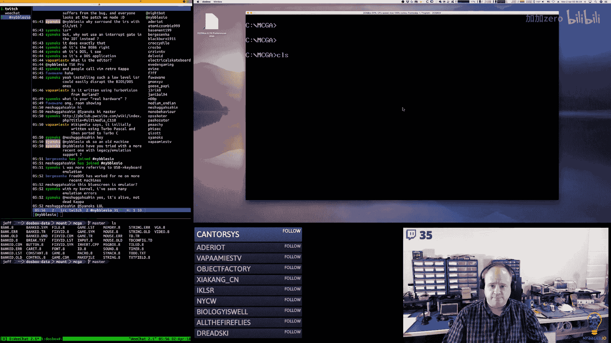
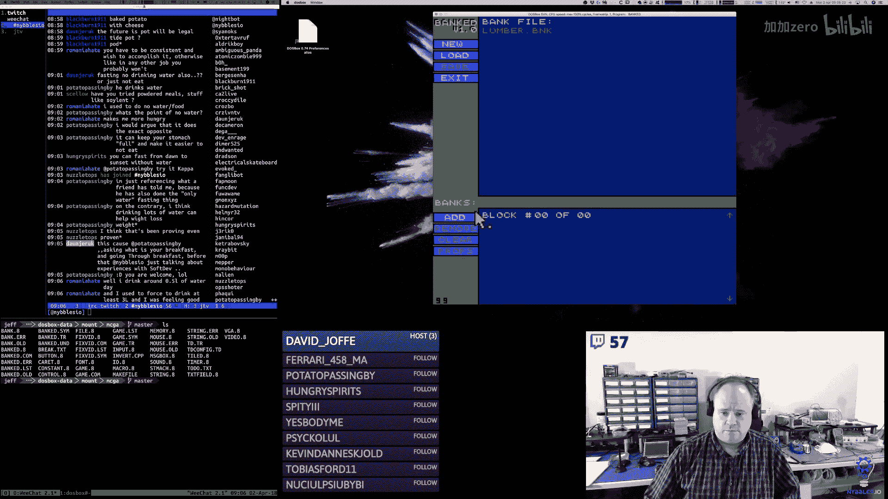
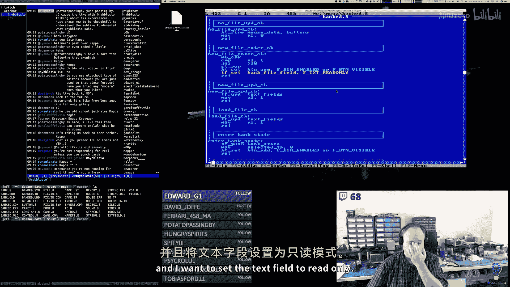

# 【精译⚡x86汇编语言】nybbles.io p08 p8 x86 Assembly： Enhancing state machine to have enter, leave, update callbacks. -BV1NPr9YKE4b_p8-

Good morning。Oh。Okay， today is the  second of April 2018。Our time flies。

This is the Nimbles IIo Daily programming streamre on Jeff。I program every day from 5 a to 10 a。

 I stream it Monday through Saturday。Every week I switch projects。

This week we are switching to the MS Do。Arcade game reference implementation。

To give some background on this project。I am working on another video series that is not streamed。

 is reproduced。And it's a much more structured series。

 you could say that it has a syllabus and I follow that syllabus。🎼嗯。はは。😊，🎼And。

This project is specifically。Kind of my。Background research for producing that series。

And so I'm producing things here that are ahead of what I'm filming。

U although I'm rapidly catching up to you know where we're at with the reference implementation and really the reference implementation is to give me something to kind of。

Aim toward so that。As I plan out filming。The educational series。

 I kind of have a rough idea of where I need to go for each one of those and I can look at my reference。

Excuse me， my reference material。And that saves me from having to go hunt for things while recording something that has a fixed duration and needs to stay on track。

In streams， I can kind of go off and do whatever it is I have to do。

So that's what we're going to be working on this week。

 I think the and primarily what we're working on is the banked tool。

 the game engine itself with the exception of some sound things is pretty much almost done there are a couple of。

Features that aren't there， but again， this is really。More of a reference for me。

And the intention here is not necessarily to build a complete thing that I would do in the actual educational series。

嗯。If you would like to get more information about my channel， what the schedule is。

Different projects that I work on here。嗯。You can go to my Twitch channel page that's twitchwitch。

tv/ nibblesIo that'snybbvleESIO。My daily streaming schedule is also in a little widget panel at the bottom of my channel page。

 if you scroll down below the fold so to speak， you'll see it and it will show you the start times of my stream in your local time zone。

U and it mostly works， it's a stream labs component， sometimes their time zone stuff is a little off。

 but it's close。🤧啊。And so since it's the beginning of a new month。And。

I thought I've been thinking about this。A lot。And。I think。After the current cycle of my schedule。

I'm going to make some changes， I'm going to start tweaking things a little bit again。

 so I wanted to talk about that briefly。嗯。So。Right now we have。Re you。This MS dos reference thing。

The Arrcade kernel kit。I did the Ru Donkey Kong thing。Last week。嗯。And then I have other ideas。

 other things I would like to do。嗯。I have ADHD， so I bore easily， I change focus easily and quickly。

 so it's my natural tendency to want to have 20 plates spinning in the air at one time because it keeps me entertained。

 it keeps me motivated。But from a practical perspective。

 it does make things difficult to get things done， right？So。I think， I think。My current， you know。

 I'm slightly over the hump， you know， over 50% thinking this。

That this will be the last week for this MS Dos arcade reference implementation that will give。

I think we'll have about， I don't know。20ish。Videos on YouTube archived each approximately five hours。

So around 100 hours is of video content on X86 assembly language me working on this thing。

I am producing this other series。And so that will be another。Probably at least。

100 hours approximately of x86 material and。That series will be much more。

Structured right it's going to take things step by step by step。

 it's not just going to be me building stuff and occasionally going on rans。So， you know。

 on my YouTube channel， then I would have between archive streams and this new content somewhere in the neighborhood of 200 some hours of X86 content。

So。And then by finishing this this week or you know。

 taking it off the streaming schedule and then whatever else I have to do to it， you know。

 I'll do as part of the work I do for。Producing。Well， we'll have plenty of rans， hey GM XYZ。嗯。But。

And the reason I want to kind of retire some of these projects is because I want to make room for some other stuff。

Unfortunately， you know， and I'm going to talk about this in a couple of minutes， you know。

 I really need to spend more time on review because I have some。You know。

 some of my own personal goals you know that I want to meet with that and so I need to put more time into it than I am right now。

Then I think with the arcade kernel kit， it's going to be a similar story so the。

I think I may change the schedule slightly because after this week I was going to go back to ReU。

 but I think what I'm going to do instead is I'm going to update the schedule that last week of the current schedule I'm going to switch back to Arcade kernelnal kit。

And that'll be the last。Week of the Arrcade kernel kit for。Current， you know。

 for the foreseeable future。Once I finish this X86 educational series。I have。m。

 I have thoughts that the right thing to do with the arcade Ter kit would be to reproduce。

That also as a structured educational series。嗯。Because I think there's a lot of really neat concepts。

 you know， doing something that's closer to embedded and really bare metal and bootstping things。

 step by step by step。And I think there seems to be a lot of interest in arm 64 good assembly and so I think there'd be。

Some value and again， instead of just mean working on stuff a hoc。

Doing something that's much more okay， let's start from scratch， how does this thing work。

 what do we need to do， you know how do you build this again from a foundation of nothing。🎼And。

So I kind of have a notion to do that。I'm not， you know。

 we'll see that's kind of what I'm roughly planning so by kind of getting those projects to you know。

 as far as the stream is concerned and of a piece of thin wet。Finishing point。

 I guess they're not done， but they'll be off the schedule for a while that opens up the schedule and that leaves reu。

And that leaves。Some other stuff， so why the big focus on reuse？You know， as I've said many。

 many times， it one of the reasons why I started this channel is because I wanted to。Produce。

For lack of a better term educational material， I wanted to produce things that。

People could use to learn this stuff。And。You know， the video format seems to be。

Very accessible for folks， it's easy。Easier to produce for somebody like me， and so I like the idea。

And originally， my thought with the streaming was just that， you know， I would just stream what I do。

What you know if I end up staringing at the screen for five hours every day then that's what I would do and it kind of acts as somebody said this to me the other day。

 it kind of acts as like a boss， you know you guys are my boss in a sense I，I have to。Stay engaged。

 they have to do stuff， right， I can't。I do tend to stare at the screening occasionally。

 but you know I do have to kind of stay engaged and so it kind of keeps me on track。

 but at the same time。Because of my tendency to want to find new shiny things to work on。🎼You know。

I've let you know， my core focus sort of slide a little bit and so why has reuse such a core focus for me。

 well there's a couple reasons one。There's a lot of educational content I want to produce once Re is completed。

 right， I want to go through and build several different kinds of games using that platform as the platform。

 the tool to do it in because，From my perspective as an educator。

 it's wonderful because I can tell people go to this website， download this one tool， you know。

 run the installer or copy it into your applications folder and run it and then you're good you have everything you need now all you have to do is just follow along。

And so for me that's great because that really simplifies their experience。

 my experience of teaching folks， plus I think it's going to be loads of fun and so that's the other thing is I had。

You know。Maybe foolishly I don't know， I tend to do this sometimes where I think okay。

 I'm lazy and I tend to fall off target， so I need to set some hard deadlines for myself。

 some commitments that I need to meet that are external to me， which kind of forces me to， you know。

Keep on track。So last year I went to the Portland Re gaminging Expo。

 my brother went to the the Phoenix， I forget what it's called。

But it's the same idea of Phoenix Re Arrcade Expo， and so we both kind of got experiences at different ones。

 different shows。And I thought this is great， you know。

 I was really impressed with the Portland show and I thought you know。

 okay next year I'm going to get a big booth and I'm going to have reworking and I'm going to。

you know set up some raspberry pies with monitors and keyboard and mouse and you know have the ability for people to come in and sit down and you play with Reu and I'll have some other stuff you know on display probably the MSDs game will be there running on you know old hardware and I'll have probably more than one version of the arcade kernel kit running by that point so there'll be some other demo stuff there but my primary thought was you know to highlight Reu and so I still you know would like to meet that goal and I think there's enough。

Work to be done under reu that。I need to kind of really focus on it。

ca I look at where it's at and I look at how much I'm getting done each time I work on it and it's not much and the problem with cycling projects every week。

 although it gives us something new to do， which again I love that， it keeps me going。

 but at the same time，You know， I got to be in Portland in October。

And so if I'm only doing rigU once every four weeks， you know。

 it doesn't really give me and gives me about a month and a half of actual reallase time to work on that project。

 which unfortunately is just not going to be enough， I probably need you know。

 a solid three months or four months of dev time you know。

 at my five hours a day pace to really get that to where it needs to be。

So I think what I'm going to do is。I'm going to in the short term here and short term meaning the next quarter。

 you know， so the first quarter I started off doing reu four days a week。

And on Fridays I would do something different and then our Friday days， you know， our Friday days。

 our Fridays would open up。嗯。New possibilities， new things， right。

 And so that's where the arm stuff came from。 that's where。A bunch of stuff came from， right？

So then I switched to。Changing projects every week because then I felt like I wasn't really people were really excited about the arm stuff。

And the MSD stuff， and I was you know one day a week was pretty minimal。And。

So I switched it and we did I switched the projects for two months now。

 almost two months that I've been doing that。And again。

 if I didn't have some specific targets that I was trying to hit， right， if I could just， you know。

And I mean I could cancel， right， I could， you know， it's well in advance。

 I could contact the organizer you know， at the Portland Re Expo and I could tell them hey， you know。

No， I probably would show Resy Kong， I think Rusty Kong definitely would be on presentation there。

🎼I think everything that I've worked on would probably be on presentation and here's the thing the retro arcade copyright is there but you've got to remember like this is home to people who reproduce games you know this is what they do right they make clones and reproductions and things so there's guys there that have you know they've hacked Nintendoos and you know sneces and nestces and all these machines and they've reproduced games and tweaked them and so I wouldn't be worried about that at all and again like Ruy Kong if I change a little bit。

 you know and I have kind of that barrier of。Education。

You know I'm never going to sell rusty Kong right that's not its point of existing。

 I think I'll be okay and that's why I like the retro space a lot because，Even though it's Nintendo。

Again， unless I'm like really pushing it as， you know I'm selling it and I own it and whatever。

 I don't think Nintendo' is really going to care， I certainly wouldn't be their biggest you know violator in that regard。

 what I would really love to do but I have you know space issues here。

Is I would really love to build a coin op。Cabinet， you know spill a couple of custom cabinets。

To put like the arcade kernel kit into and to put the MSO game into。

Because I think that would really present well， it would be really cool， but unfortunately。

 I don't and my son would love that he loves woodworking， he loves to build things with his hands。

But。Yeah， we need to move into a larger house。啊。And I just don't have room to put cabinets in here。

So that limits me a little bit on that front。But like I was saying， I could cancel， right？Say okay。

 you know， I don't， I'm not going to make it in time。

 but then that kind of bothers me because I think， well， I have enough time to do it， I think。嗯。So。

I would really like to make that show， I would like to be able to present all this stuff plus if some of you are in the states or feel like traveling to the states and going to Portland and I'll warn you。

It's pretty rainy in October， but you know， the weather's not horrible， horrible。

 and Portland's a neat city。Out of all the cities you could go to in the US， it's not a bad one。

I typically drive there because it's not that far from where I live in Utah takes me about。啊。

15 hours， maybe。To get there by car。嗯。Which I'm sure for， you know。

 my European viewers seems crazy and I typically drive that straight through。

We' we don't stop much here in the US when we drive sometimes。

 but maybe like every 12 hours or something。嗯。But。Yeah。

 I would like to make the show and so then that you know what that means。

 unfortunately from a practical perspective is I need to。

Really focus on reuse so I think what I'm going to do is after we get through this cycle of the schedule and like I said。

 I'm thinking of making next week the Arcade kernel kit updating that。

So we get another week of that in because I would like to get some game stuff going on that and I feel so tantalizingly close to being able to do that with that codeb。

 I would like to get that working and probably won't be able to finish the entire game。

But get some of it going。And that would be good， that'd be a good stopping point for that code。

For the time being and then。Then that leaves for you and that leaves my compiler ideas。

And I am very motivated on the compiler front for a variety of reasons。嗯。

So I think what I would like to do is。Well。Dedicate like a week。To the compiler。

And then we'll dedicate the other three。Roughly right you know， not all the months are the same。

 but give or take to reu that is going to give me you know some solid time in on reu I feel like you know even just one real solid month。

20 some days， right？We can make some really good progress on the reu front。And again。

 I think like all these projects。I'm building lots of infrastructure and reuse。Having to you know。

 debug it and refine it as it go along， but once a lot of that stuff has been。

We've kind of gotten a first pass on all of it， I think subsequent cycles of adding new things are going to go much faster。

 right like you know， the last cycle I was adding in machine editors and you know I'm building UI components for the first time and。

You know， it's slow going， right？But once I get past all those and I get that stuff。Duck taped。

 you know， bug fixed， however you want to put it， you know， then I。I should be able to make。

More rapid progress without constantly having to rework things。So much。At least that's the idea。

 that's the theory。And I'm always much more optimistic in terms of what I think I can get done versus what I actually do get done。

And I always think about that like you know， this is why I can't estimate things。

 even though I've been doing this sort of stuff forever， I always seem to get。呃。

What's the old saying， you know？You know， your eyes are bigger than your stomach。

You think you want all this food。But， you really can't eat it。And for me， it's kind of the reverse。

 you know， I want all this， I want to do all this， I want to build all this。

But my eyes are bigger than my。My brain， I guess。To extend the analogy。So yeah， so I think that's。

You know， probably what I'm going to end up doing and then on the compiler side。

I think you guys are going to maybe。Like this idea or not， I don't know。

 but you know I've talked several times about。🎼My。🎼By thought that。So I have this categorization。

 I call them boring business applications， what's a boring business application。

 a boring business application is it has a database， it has some tables。It it has screens。

 it has security， it has permissions and access controls and it's crud， right it's create， read。

 update， delete， find all that stuff right。You know。

A lot of the contracting work I've done over the years has been for boring business applications and the other thing that I find interesting about。

Boing business applications is that they they almost typically have no real domain behavior right there's very little。

You have all these books right and all these guys who have spent time talking about domain driven design and all the complexities of this stuff and then。

 but when you're the person actually building these applications you realize there's nothing there right there's data here。

And you take that data from the database and you put it on the screen。

And then they change it on the screen， and then you put it back in the database。And that's it， right？

Sometimes very rarely， there is some interesting behavior that happens somewhere， right。

 but typically it's in batch， typically it's not real time you。So that class of applications， right？

Sorry， I'm trying to formulate my thoughts as I'm talking。

A lot of web application development today is that。In fact， I would speculate。That。A good。60 to say。

Maybe even 80% i'm not sure exactly what。That number is， but I think it's large。Is， you know。

 I would say most working programmers right if you are not doing embedded systems and you are not doing systems programming of some kind。

Then you're doing this， right？And this includes things like reporting portals and intra portals and you know。

Things that people build at corporations。嗯。So anyway， I love this firm belief that。Somebody。

 and it might as well be me， or at least I'll try。Is going to build。

This killer application that will make it so that building these applications becomes a non event。

and ideally， I mean， from my perspective， I want to focus on really you know real technical stuff。

 I don't want to focus on those things anymore， so my my conception is I want to build a tool that will allow business people to build their own tools。

And what？What do business people use today， they use Excel， they use Microsoft to access。

 typically like those are the two big ones。And the reason that they go to IT。

To get an application developed internally。So there's politics， but there's also。

 oh well it has to be web based and then as soon as that happens， you know。

 access and Excel don't fit that mold and I'm not you know， yes。

 access can do this really weird publishing to the web through SharePoin thing， I'm not。

I'm not including that as legitimate and speaking of which like you know， SharePoint。Enough said。

 right， that that piece of shit needs to die， a horrible。

 horrible death a million times over in the deepest darkest recesses of Hades that we can find because yeah。

 it deserves it。So。Yeah。And as usual， right， my ambitions are large and a lot of this stuff takes a long time。

But it is an abomination， SharePoint is an absolute hoid disaster。I cannot believe。

Cannot believe the companies actually entertain using the thing， which。Gives me hope。

Because it makes me think that， gosh， if I just build something。

Even like 50% of what I think I should be building。

 it's going to be so much better than what's out there that you know。

People would be falling all over themselves to get access to it。🎼嗯。

So my conception or target of what I would like to do is the following I would like to build this compiler。

 I would like to build this language。That lets us build languages。🎼And。you know。

 I understand that that's really meta and recursive and those are that's difficult to。

Really enunciate and articulate what that means verbally even written I mean I think it's difficult it's just something that I'll have to like try to dump into functionality and then we can talk about you know where it goes from there but I want to build this compiler I want to build languages that solve this problem space and I want to build a。

A platform， I guess， for lack a better term， a tool set。

That includes a runtime component and a target， a compilation target of WASM。And you know。

 so my thought is that it should be completely possible to you know。

 build these boring business applications and you can deploy them on the web right， using WASM。

And you know， from everybody's the end user's perspective， it's web right now whether I actually。

 the engine uses the DOm。Or。We do something native。You know， where we just draw the UI ourselves。

 I don't know， I haven't really。Thoughought too much through that point yet， I mean， I've seen WSm。

I've seen see implementations that target wASm that generate。You know， they interact with the dom。

 so that's certainly a possibility。I'm not a big fan of the Dom。But in that particular case。

 I'd be okay with it because I'd be doing it once so I never had to do it again。And。So。You know。

 that's kind of my evil plan， my pinky in the brain。That I'm I don't know。

 dreaming about with this thing and of course， like this compiler would not be limited to that right that's the whole idea。

 this would just be the first。Problem space that I would want to try to tackle with it。🎼嗯。And so。

🎼Yeah。That's some。Kind of what I'm thinking。🎼You know， in， in。Interest of full disclosure。

My thought is。Right now with the compiler。All the compiler tooling and everything would be completely 100% free open source。

 MIT license， DSSD， whatever， we'll pick something that's really， really liberal。

I you know as far as the compiler is concerned， I want people to be able to use it and change it and whatever。

 so I wouldn't put too many restrictions around that Hey Jericho。🎼呃。🎼です。

Borring business app thing that I'm talking about。I think I would build it on stream。Because again。

 I don't really think there's really。Ideas or ideas， right。

 you guys could go off and do the same thing if you wanted to put the time into it。嗯。

But I don't think I would make that code。For all of it， I haven't quite decided。

Available because I do kind of feel like I ought to。Great corporations for this thing。

And I think I should。Charge for it。I think whatever this thing is that I ultimately build this tool。

 I don't think it should be a freebiee。But again， I'm not 100% certain。

Obviously there's open source things that are charged for and let's face it like， you know？

Most corporations wouldn't， hey sign up。Most corporations wouldn't。

You know whatever they wouldn't spend the time on it right。

 but I so I'm still kind of evolving my thought process on exactly how。That's going to be structured。

🎼嗯。How that's going to look。It might also be a situation where maybe。And again。

 I don't want this to seem like it's a money grab because it's not， it's more of me trying to。

Just control you know access to it a little bit， maybe if you subscribe on Twitch or something。

 then I'll give you access to the repo， that sort of thing I don't know we'll see。

But that would only be。Yeah， I've really thought about GPL version3 right for this particular tooling right because then it forces corporations to stop and say oh shit。

 you know if we okay yes we can pull the code and we can do this ourselves and we don't have to pay for it but if we do that it's going to infect everything and do we really want that and most corporations legal departments will say no。

 we don't want to deal with that， just pay for it。I definitely have considered that as an option as well。

So。呃。Gman says， so a runtime framework shared between Re， no review is definitely going to be。

Were you？That's its own thing。And then this other project is this compiler。

 so it's going to start off as just the compiler。And this meta language。

And that will evolve to this other stuff that I'm talking about， right。

 like once the compiler is good enough。U。And that's to be determined right of when we hit that。Then。

You know， I would start officially trying to spend most of my time instead of spending it on the compiler。

 I would be spending it on you know， building this boring business app tooling。But again。

 rough sketches of a madman。Between here and there， you know， who knows。

 I doubt it's going to be a strictly linear path。But。So oh yeah， Sox。

 we have to provide modified source code no way， y， exactly， we have to get back。

We have to have people do work and give it to other people， no。Never。嗯。Yeah， you know in a sense。

 I guess this really just popped in my head。And this isn't even a great analogy， but you know。

 I just thought like unity for business applications and unity is still pretty low level in my opinion。

But unity does abstract certain。Repetitive elements of game design so that you're not having to do them over and over and over again。

🎼So。Anyway， that's kind of my thoughts on the future。So。We'll see where it goes。嗯。

So one thing I did right away because I did yet。呃。An old Packard bell。It's a penium too。

 and I was able to run。The MSDs game engine on it， and I was able to run the banked tool on it。

And they both run。The only issue that I ran into on real hardware was that the keyboard ISR that I had written。

It worked fine for like a couple seconds and then the keyboard buffer was filling up。

And so I realized that I was probably doing something bad。In my keyboard ISR implementation。

 and I think what that was。🎼Is。I was calling the old ISR。In MS DoOS。

 you can replace the interrupt service routine for a variety of different things。

One of them being the keyboard interrupt service routine。So this is the low level。

 here's a scan code， here's a scan code， here's a scan code interface。And the bioOS has a buffer。

 I believe it's a 256 mi buffer， I'd have to look it up。

 it's not huge and that buffer is actually directly accessible in memory if you want to you know read from it。

嗯。So you have to prevent recursive interrupts from being generated with ISRRS。So at least in MSDOS。

 this was the case， so this is here because I don't want any other interrupts to happen while my ISR is running。

 so I clear the interrupt flag and then I set the interrupt flag at the end。And that prevents。

 because there's if remember correctly like the keyboard and the timer。

 there's a couple of them where if you get a recursive interrupt for whatever reason，Again， the。

I can't change the interrupt descriptor table here。This is the ABI that I'm given at this level。

This is not protected mode right， I don't have GDTs and IDTs and all that stuff here。

 none of that exists at this level of programming on the X86 is got remember this is like 1980s。

Intel programming。The interrupt descriptor table is fixed mostly between。

The bioOS and DoOSOS now if you go into protected mode on the CPU， so like 386 and later right。

 this is x86， this is not 386 or newer right， but if we were doing 386 or 46 and we went into protected mode。

 what some people call you know linear mode or long mode flat mode，Yes， then you get GDTs， IDTs。

 and you can set all that， yes， this is a DoS application， 100%。The editor is called TSE。嗯。PSSE Pro。

Which you can still buy licenses to。嗯。And。And why do I use TSE。

 it's just because this was the editor I predominantly used on PCs in the '80s and the early 90s so when I started doing this I just。

Went back and got the tools that I was familiar with。

So that's why I clear the interrupt flag and reset it。Inside of the ISR。So。What I was doing was。

I was calling， I was chaining what they call chaining。嗯。The old ISR for the keyboard。

 so I was doing my thing and then I was calling BOS。

 the problem is by doing that nothing was ever reading from the BOS because I was always emptying the buffer at a time。

 but it was causing this really weird situation and I looked at some other examples and they don't call the old ISR they just replace it and then at the end of the program they reset it back to the old ISR and in DoOS box。

I was always getting junk。So if I run the game here。

I was getting a junk that would show up on the keyboard。After doing this， right？嗯。So if I escape now。

 though。No junk， no garbage。So that's exactly what I would expect to see。

 I have not tested this on the actual。Physical hardware yet， but I'm guessing that it's okay。

So because I'm not getting any junk now when I exit the application。

 so I think that fixed that issue。嗯。No， I think TSE was written in C。

 I don't know if they use Boland or WacomM or what compiler they used。嗯。So。嗯。But it's not turbo。

 I don't believe it's turbovis and TSE just say no。The default color scheme is kind of that Boland。

you know， blue white thing， but you can change that to any color scheme you want that just I always happen to use the native one so and I think it reminds people of the Boland tool chain。

 but it's yeah it's not。I do use Turbo debugger。So this is what a Boland tool looks like。嗯。

From that era， they actually had like little text based windows and stuff。

TSE is a little bit different。So I think I fixed the keyboard ISR。

And that was the only thing on physical hardware， real hardware that was problematic。

 everything else works fine， and the performance on real hardware I could report is astronomical。

 it's super fast。Which is really kind of funny because it's 133 megahertz CPU。

The video hardware is very fast and the frame rates are they're well above 100 because I cap the frame rate counter at 99 and yeah it's。

Blazingly fast on real hardware， and it's not too bad on Dos box， right。

 but it's really fast on real hardware。🎼So。I originally thought about the idea。

For the state machine structure that I've done now in rust and in the arm assembly。

I just took the idea that I was going to implement here and I did it there。嗯。

The real hardware is a Packard bell。Here。哦好'll。I don't have the other camera set up。So bear with me。

It's right there。So it is a Packard bell。诶。And I believe I'll get the name here。

It's a multimedia C110。It has a pentium to 133。嗯。嗯。Megaertz CPU in it。You know it's blazingly fast。

 right？Goash。I think it has 16 megs of RA。🎼And。It hasnt， you know， whatever VGA。

Graphics adapter in it。So guys。It's old。Yeah， it's an old machine。It's a period piece。

A and sugar Sahiin。I have tried with a， I have another PC it's over here on the floor。

I have tried it， the issue I run into with some of the more modern PCs。

Where like if I try to put DoOSOS on them， they don't DoOSOS does not run 100% properly on some of the most recent hardware。

I can certainly emulate it like again， DoOS box， it runs just fine。

 I can set up a emulator in virtual box。And in VMware and put Doaws in there and it will run。

 it's slow， those virtual machines are not very optimized for this sort of thing。

 but they do emulate the hardware properly， it does run。嗯。So yeah。

Probably the best range in terms of hardware would be hardware that。It may be up until about 2002。

 2003。Maybe as late as 2004。That's probably about the tail off。🎼嗯。🎼Oh。

I don't know about USB keyboards other than the fact that， I mean， obviously through DoOS box。

 this is a USB keyboard， it does the transliteration on physical hardware， I don't know。Again。

 I'd have to try to find a computer from like the 2000。🎼嗯。For。2003。

 2004 era to see if like a USB keyboard。Worked properly， I doubt it， but it might。嗯。嗯。So。Yeah。

 so for my state machine you know。啊。All right。What I was thinking of doing。

Was extending this to have the three callbacks like we're doing with the other implementations of this。

Because。In the banked tool， it was already getting kind of crazy。

I was already having to create little like helper functions to transition between states。

Like this message box， there's a show message box show。🎼嗯。And。Yeah， there isn't really 100% clean。

Transitions in and out of these。Yeah， so like the enter is the thing that actually is doing the push。

For the state， not the thing that's called when we enter the state。So I'm wondering if， you。

 it makes sense to tidy some of that up。Before continuing on。嗯嗯。

So what this would end up looking like is。Something like this。

I'm going to leave this one name as it is。So。Things don't break right away。So that'd be enter leave。

Actually， you know what I should do？Let's make it。Like that。And let's see。Yeah。Okay。

 so that should be all right。Yeah。嗯。Okay， so。

So the part that calls， oop's not them。那点。The part that calls the call back。🎼Is update。

That's based on BPP。That's loaded in ST top。So I'm trying to think of how I would do。

We don't have a really well structured state transition thing here， so like in the arm code。

The update function for the state machine actually managed。Transitioning the state。嗯。

I don't have that here。In this implementation， the way it is right now。

So I would have to do something。So ST push。What that's doing is that's pushing the pointer to the stack structure。

For the state structure。Yeah， I've never like it seems like it's kind of random but。

I wish I understood better like how Twitch decided I should get transcoding。They they kind of。

Give ominous。Hins in their documentation that there's a criteria that you have to meet and I don't know what it is。

So I guess。What did we do here？啊， gotcha。So I'm wondering if I can just change my ST push macro。

And my ST pop macro。Because I don't think it'll be a significant amount of extra code。

So for like ST P。I'm always going to call leave。So essentially ST P would be an ST top plus a pop。

After that。This is assembly language， this is X86 assembly language。So I would load the current。Here。

 and then I would compare。ST leave。Call back。With zero。It it is zero。I would smell this is in macro。

I would skip over this。And then otherwise I would call。ST leave callback。So whatever's on the top。

Of the stack。And with P。We're guaranteed that there's always something。嗯。

Even if it's the very last state。Yeah， so。We load the stack pointer， we get the pointer2。That value。

 the value at that point or rather put that in BPP。We use BPp to address the state structure。

We look at the state leave callback if it's null。Then we skip over the call and we just。

Remove the entry from the stack and we move on。Otherwise， we call the leave callback。And。

And then push。Would be pretty simple。So actually。ST。Move。That's the exit。STM。Yeah， I mean， to me。

 X86 includes the original 816 bit。The 32 bit， and then if I want to refer to the 64 bit。

 I'll say x 8664。I have been coding for more years than I should count。Potato passing by。H， potatoes。

😀嗯哼嗯。😊，Oh。Gotta change my music。Allright， so。There we go。I started coding。

About 10 years earlier than that crossbow。I would say。Around 1977， 1978。Sure， ourmanz are are4。

 go ahead。这是。What was the most demanding time consuming program project you've ever worked on。

 oh my gosh？🎼Okay， so。Story time。🎼Yeah。Story time。You guys asked。Two of them come to mind。

So for a time I was employed by RedBox。Those of you in the US would be familiar with RedBox。嗯。

Let's see here。I'll get a link。So for a time I worked for this company。

And that was from 2007 until about000 the end of 2010。And。When I join that company。

 I'm going to try not to give away too much proprietary information since they're still operating。

But when I joined that company， that the rough story is。U oh you can't access that URL seriously wow。

 oh， but you're in Turkey right， so yeah you may not be able to get to it。嗯。So。Anyway， the company。

 Red Doox Automated retailtail had started it was a。You can't either， really， wow。

I'm surprised they restrict access like that。嗯。Seriously。That is so weird。Well。Here， let me do this。

啊。Wow。😮，That's really interesting。Yeah， no， this is。This is the right URL here。

 here's what I'm going to do。Give me one second。I'm going to take a picture of this and then I'll get you guys a link to the picture。

诶。🎼我。🎼这个这个。Betiful。Hey， Blackburn。Okay， so we're going to go to desktop。

And where's my screenshot from today， there it is。咖py。隔 b隔 b。And I'm gonna。Yeah。Okay。

 and I'm going to。Copy the link to that。Okay， try to access that picture。はは。😊。

And that at least give you an idea of what it looks like its a so what Red box is is they're a rental company。

 a movie rental and game rental company， and they have kiosks all over the US and I believe they still have some in Canada。

And。When I joined the company， they were not， the intention was not to be a movie rental company at all。

They were supposed to be an automated grocery store。And they had done some prototyping in Washington。

 DC area。If I remember correctly， but it didn't go over， it didn't work。

 they didn't get enough business and on a lark they decided to test。Sort of it's it's online。

 but it has rental kiosks， so you have to go to you have to go to like grocery stores or McDonald's or。

You know， gas stations， they're gas stations， they're everywhere and they're big red kiosks and you walk up to them and you can interact with them on a touchscreen and you can choose which things you want to rent and there's robotics inside that grab the product and you know vent it to you their vending machines right that's their primary business you can reserve things you know online and you go get them you know at the machine but really they primarily。

People， it's all passive traffic， right people walk by and use them， right， Walmarts have them。

 and the key historical piece of information here is that Red boxox was started by McDonald's。

You know the fast food restaurant they are the ones that started this company and so anyway at a lark they decided to try this DVD rental thing because there was another company called DVD Now。

 which is now defunct and they were doing this and they were having some success and so RedBox you know borrowed some machines from them essentially how they managed to make that arrangement I have no idea and you know put them in some McDonald's restaurants and the idea kind of took off。

Well， in typical corporate fashion， they didn't want to spend any time on R&D and development。

 so what they did instead was there was a ironically German company that had a prototype kiosk that did this。

 the big Red kiosk that RedBox has now。and had software。

 you prototype software that they were using to test it。

 so anyway McDonald's acquired this company and started rolling these things out and needless to say the software that they had writing on these things was atrocious。

 it was written in visual basic and it was just it was a nightmare and when I joined you they were already having problems。

 changing the software， being able to keep up with the demands of the business。

And it's a retail industry so they always want to test things， they always want to try campaigns。

 they always want to tweak this， tweak that color， move that button。

 you know do all these little things right and only in this particular location and only you know during these times of the day so anyway I worked on that project and I came up with an architecture and a design that would allow the business to change things at the rate they wanted but the you know。

It wasn't really technical challenge， it was just political。

 social political challenge within the organization， and it was a very long。Project and。

And I put in a lot of hours。So。That was one， another was back when I was still in the game industry。

This would have been in the。95， 96 timeframe and。I worked at a company。

And they were trying to like everybody。They were trying to do 3D and 3D was just not a thing。

This is not a thing yet。And。So fixing somebody else's bad program is not the problem， right。

 I was more than happy to do that。嗯。But what。What challenging was。嗯。Yeah， the non technical folks。

Were。Again， the company just never was of the mindset。That。嗯。

They were a software house and the fact that they had to do software development was。

A antheote to them and。It just created a lot of friction， right。Yeah。

 it wasn't so much the technical thing that was the challenge it was。Everything else around it。

Anyway， the game part。You know that era 1995 to 1997 was a very challenging time period in the games industry。

 in fact， if you watch some interviews with Jonathan B。

 he even talks about the same time period because he started Game studio in 1996 and he ran into the same problems the reality was there were about two companies on the planet。

Maybe it's a grand total of four or five individuals that knew how to build 3D games at that time on the hardware that existed and it just wasn't a common。

 the knowledge was just not commonplace yet， and hardware acceleration was not an option even the PlayStation one and the Sega Saturn which were the predominant。

Gaming platforms at the time， home gaming platforms at the time。

 getting good performance out of them was nontrivial and having it look decent， you know。

 not looked like trash and so I remember that period being very stressful and having worked a lot to get stuff going。

Yeah， sign know。I was。Talking about this the other day with somebody else and。嗯。You know。

It's my impression and I remember。There was an essay written by somebody years back。🎼And。

The title of the essay was。Software developers， software development is a low prestige industry。And。

I'm not sure what this trend is， right？For a long time， I used to just say that in the United States。

Our culture was just inherently anti intellectual。Right， I mean。

We had movies made in the 1980s called Revenge of the Nds。And those movies are fictional。

 but if you watch them and you're a nerd， they're not fictional。

If you watch them and you identify with that kind of person and I certainly did， I thought， my gosh。

 this is you know， this is what actually happens and you know so at least here in the US。

 I don't know if this is true in other，Countries， but you know， certainly at colleges， high schools。

 colleges， it seems like the jocks， the athletic folks， the people who play， you know， football。

 basketball， whatever， you know， athletic thing。They are exalted and they are heralded as heroes。

People who are quiet and introverted and choose to pursue academic pursuits of any kind。

Are derided and put down。And it certainly seems like。You know。

 my anecdotal experience that when you go into the professional world。And you're like that。

 you're treated somewhat the same way。And this is why leadership doesn't。

Work for our industry because they don't respect us， I mean， fundamentally they don't。嗯。Yeah。

 they don't。See what we're doing as valuable for them。And I've often， again， I've been a contractor。

 independent consultant for a very long time。嗯。And my experience is I have friends that are lawyers and accountants and actuaries。

 and they can go into a company and they can charge a retainer。You know。Companies love it。🎼But。

If you're a software developer and you go in。Your。Kind of dismissed。And so yeah。

 I think that's the reason that software developers run into this。I did see your questionRman 004。

 if you or maybe I didn't。嗯。I agree with you， Sinox， but again， this is where。Like for some reason。

唉系。They love to take their time and their energy and work contrary to those goals。

 right it's like again， if you watch that movie， revengenge in the nerds。

It's a movie about the jocks。Going out of their way to make the nerds' lives miserable when you know you could make the rational argument of why should they care。

 they're already the popular ones， they're already the ones on the top just you know ignore the nerds。

 but they won't do that well it's kind of the same thing you know management leadership they won't ignore people like us right it's like they go out of their way to make things as complicated for us as it can be。

嗯。So。And I'm not sure why I'm not sure what the no， I know I actually。Moneyball is a great story。

Yeah， it is a good movie yeah。嗯。I don't know， it isn't 1984 anymore， that's true。

But at the same time， it's worse。In my opinion， it's worse。I don't agree。

 I don't think times have changed at all。嗯。If anything like I said。

 my impression is that a programmers standing socially。

 culturally within an organization is in a worse position today than it was in the 1980s because I can tell you right now。

 like I worked at companies in，The early 1990s and I had a better experience， I mean。

 I think of those days more fondly than I think of anything I've done in the past 10 years。Right。

Those。Those companies at that time， the interface between me and management of those companies was so much better。

 so much more respect。But that just simply doesn't exist anymore。So and again。

 I don't know that I have the answer as to why that's changed， but it definitely has changed。So。

Hey Rman 004， if you had a question， let me know， I didn't see you respond to me there。

I'm looking back through chat history to see if I can find your question。But I'm not seeing anything。

哦。phase of Zder， yeah， usually。I do write code most of the stream。

 but today we've kind of gotten into talking about stuff。🎼So， I。sometimes that happens。

And typically if people have questions， I try to answer them。So， oh， our man。

Okay here we go you were wondering about gaming engines like Con2 and stencil and Gamemakerr Oh so yeah。

 let me answer that really quick first I think construct is cool。

 I have not used stencil gamemaker is fine I mean again I've said this before if if。

If the game that you can make will fit inside of an engine and you like that engine， use it。

I don' don't think there's any issue with that right you don't have to use Neity。

 you don't have to use Unreal Engine for， you don't have to write something from scratch so if you like those and the game you're trying to make will fit。

Into you one of those engines and then your question about is programming needed？I would say。Yes。

 right in gamemaker you're going to need to write some code。But。You know， it's not horrible。嗯。

So let's see what's going on， Sanox is saying I have to mo people now， so Eric X to X。

 I'm going to answer your question in a moment。Jiccho is a communist， hate， you know？Whatever。

 everybody can think whatever they want。See， and that's one thing I will say like like I don't like knee jerkrk responses。

 especially here in the US， like this happens all the time。

 if you say socialist or you say communist， like people here will just boom， you know。

 they will react instantly and you know， I think it's too knee jerkrk。I think， you know。

 Marxism has faults。But I'm not going to fault individuals for thinking the ideas are interesting。

And okay， so then people are arguing about communism。诶。Okay， so Eric。X2 x asked me about。No， I agree。

 Sina， because I mean people should， let's get along and I'm not saying who's right or wrong。

 I am not。I'm not taking any positions on these。Because quite frankly。

 I don't think there is one right answer right now on any of it。So yeah， you know， let's not fight。

Be grown ups Eric X2X asked about Bitcoin so I'll give my typical answer to Bitcoin， it is a scam。

Byer beware。I do not see both Bitcoin and blockchain people keep talking about blockchain as if it's like this miraculous thing。

 it's not， it's a linked list of hashes I just。I don't know。You know。

 I would not put your money or your time into。To Bitcoin at this point， I just wouldn't。Oh， oh。

 slayer death。You're going there， that is the most political topic ever。Ha呵。😊。

Comparing women and EMs， actually I take that back， if you had talked about tabs versus spaces。

 that would be the most political。So。I like mechanical keyboards only because I grew up with them。

 and if my keyboards don't make massive amounts of noise when I type something feels off。🎼So。

And I like the feel。あ。Tabs versus space is tabs for I'm just kidding， ironically Douglas Crckford。

He has a talk and one of the things in his most recent talk is he talks about all the things that should go in JavaScript。

 it's an interesting talk， but one of the things he talks about is tabs versus spaces and how it was like a total accident of history the tabs versus spaces turned out the way they did。

 so but yeah， it's not worth debating it。I mean， again， like。

Within the context of how Bitcoin is structured。The hashing， the proof of work has a purpose。

The problem is。嗯。It's trivial to。Game that system right。

 it's trivial to get a monopoly on that system。And so to me， a lot of the things that。Bitcoin。

E spouses as being its virtues。I haven't really， I don't see that in practice， right？

I see some very powerful groups that are manipulating that space because they have money。

Because they have power and you know as long as that's the case。

 I don't think it really the values that people ascribe to it， I don't think they exist。

Arman 004 last question，Will those engines kill jobs for game programmers？🎼嗯。I know。

 I don't think those engines will kill jobs for game programmers in the near term。

 I do think middleware engines like Unity and onreal  four are changing things。And。🎼Byい。You know。

 I think for。Probably the next 10 years realistically maybe a little less。

 there will be a space for people to write games， lower level game stuff， however。

 again I do see that already shifting right there's already amazing games that are being created with unreal and with unity and you know I see that increasing not decreasing so there's a transition period right？

Are there a lot of jobs in programming？Gosh， don't get me started， that's a whole topic。🎼Gsh。

I'm going to come back to that one are there jobs in programming。

 I'm going to come back to that one because I have a unique perspective on that。

Jericcho says we're going towards a more philosophical side of discussion。

I did not grow up with teletype terminals Slayer Darth， but I was close。let's put it this way。

 my very first interfaces with computers were not much fancier than a teletype terminal。

 a little bit fancier， but not much， and I certainly was around them。

In some capacity in my early years， but I didn't really do any professional work with them。

Do I have the opinion on star citizen confused says？I'm not familiar with that game。

You know what confuse， I'll look up that game offstream today and I'll do some research on it and ask me that again tomorrow because I don't really know。

 I don't have a good answer for you right now。Let's see here。Could somebody give me a brief synopsis？

Of star citizen what is the？The key idea behind the game。Well Slayer Darth， I will say this。嗯。

I personally have a lot of nostalgia for the early years of computers。But only for parts of it。

 not all of it， I mean I like modern computers too。

 and I probably really wouldn't want to go back to the way things were。

 but there were some the simplicity of it was wonderful， right？Oh okay。

 it's the 180M crowdrowfund is based in with persistentent Uni。Again。

 I'm going to have to look into it， but you know， to confuse this question and G gave a little bit of detail on it。

My thought is。St citizen of the crowdfunded game has been delayed multiple times and they sell ships for oh。

Oh， okay， yeah， so I'll do some reading on that but if that's the case， that sounds scammy to me。

YOS tenants Center the Linux practicality。OS 10 is just that。

Slightly little edge above Linux in terms of me being able to just plug shit into this and you know install some software and it works with Linux。

 it's just not quite there yet， it's close， it's closer than it's ever been。

 but it's just not quite there yet。And I do use Linux by the way， I'm not against Linux。

 I wish Linux were I wish that gap would close because I probably would switch to Linux full time if I could。

 but it's like I said it's just for software development it's fine I do everything I need to do for software development and Linux no problem it's everything else it's hooking up cameras。

 it's hooking up tablets， it's hooking up you know all the other crap that I have to do。

That doesn't work 100% fluidly yet， and I don't want to spend hours and hours and days and days trying to get that stuff to work。

I don't want to spend the time on it。Okay， so。Let's talk about blockchain for a second， right？Again。

 there's the data structures。And then there's Bitcoin。But right now。

 the data structures don't live apart from。Bitcoin really。Let me just say this。Blockchain。

The data structures， A， they're not extremely complex。Merkel roots are not Merkle trees。

 Merrkkle roots are not difficult to understand。As I said， it's essentially a linked list of。

It's a linked list， it's just a linked list with pointers that are hashes。

 so as a software developer。We're spending a lot of time talking about a data structure that is not interesting。

 right at all。Really from my perspective， it's not interesting and the fact that there's a mekel root。

So that you can ensure that things order the same way。What do you do right， okay。

 so let's get that out of the way。Does everybody agree that that's all it is， Okay。

 now proof of work has nothing to do with the data structure？

Proof of work is something that was introduced。To。You know， allow you to hash things。So。But again。

 that's actually。You're talking Bitcoin。You're not talking so Eric X2 X， you're talking Bitcoin。

 you're not talking the data structure， the data structure has no connection to the internet whatsoever。

 how that's how Bitcoin uses it okay so fine if we're going to talk about Bitcoin great but。

Here's the thing。TheSeveral things， one。嗯。Mining is the way proof of work is constructed in Bitcoin today。

 there are two issues I see with it one。It's extremely expensive。

To do and it will only become more so unless somebody makes a breakthrough with quantum computing and yada gotda yada and then everything will change anyway and then the vulcans will come visit and we have first contact and then we'll be in you know a Star Trek post scarcity world but you know that's all fiction at the moment so the reality is right now。

The cost of mining is increasing， the cost of doing proof of work is increasing。嗯。At some point。

Mining will cease because there will be no economic incentive to do it， then what？And you can say。

 oh， well they'll change it or oh they'll do lightning or but that's not what Satoshi Nakamoto released。

All this new stuff。That's not Bitcoin， what Sattoshi Nakamoto released is what he released。

And you have to assume that his intention of having an ever escalating cost of proof of work was that at some point it would end。

At some point there would be a stop。So。So again， I see two major issues with Bitcoin。

Just in the mining part， right？At some point A， if you have enough money， if you have enough power。

You can control mining， okay， two， mining is inherently configured to end。

 it's inherently configured to blow up。So at some point， and I'm not going to say when that is。

 I don't know。But it's not that far off， in my opinion。Right。

Bitcoin mining is going to cease being a profitable activity and if you can't mine。There you can't。

Close transactions， right， so fundamentally。I disagree Eric X2 x I don't think miners will always make some money。

 yeah exactly， I don't think there will always make money， you can already see that that's not true。

 you can already see that's not the case that's only true in our current hyper bubble environment where Bitcoin's going through the roof right and of course it's not going through the roof anymore so yeah。

So just looking at it technically， not looking at the economics， not， you know， oh。

 and not looking at oh， but if they change this and oh if they change that and know if they fork this and oh if they fork that。

 you know， to me those are all。What if scenarios？嗯。

I just I don't I don't see it right now with all that said。

 if you have a bunch of mining rigs and you're making money with Bitcoin more power to you。You know。

 again。I think it has a limited time horizon and I think we're already seeing。

We're already seeing that we've passed over that horizon。嗯。

I don't think Bitcoin will ever be a means of。Widespread。Payment， right。

 it's just the expense is way too high。嗯。呃。Here's the things La。

 and I'm going to repeat something I've said before on this stream about cryptocurrency。

 and this includes Bitcoin and everything else first。First and foremost， do any of you believe？

That any sovereign government is going to allow。Currency out of their purview。

The answer to that question is no。And the fact that governments have only t been enforcing。🎼You know。

Restrictions on cryptocurrency is thats。That's an artifact it's not the reality the reality is is that if a cryptocurrency took off like everybody believes that it would and it became this third party thing that was outside of every government。

You would see the biggest government crackdown you could possibly imagine overnight。

 so I do not believe for a second that any large sovereign government。

I is going to allow a bunch of hackers essentially a bunch of programmers to control currency is that's fairy tales right it's never going to happen so even if the technology allows it to happen。

 it's never going to happen right they will pass laws to make it so that it cannot be。

So that's number one， right？Number two。Is I have yet to you know see a cryptocurrency that I don't feel is in some way inherently underhanded。

嗯。And right now I'm not going to debate whether or not government issued currency is legitimate。

 right， it is what it is， we all live within our government， our respective governments。

 and they're the ones that control currency and they will do so， I mean。

 case in point in the United States， the Constitution specifically enunciiateates that the Congress is in charge of the currency。

So unless you change your。And unless we change the Constitution in the United States or。

The Congress says， you know， okay， we're going to tell the Federal Reserve that you shall then manage cryptocurrency。

In the United States it's technically illegal， right， you cannot replace the US dollar。

Or coinage with cryptocurs， you can't do it。Right。So the government's never going to be。

Alligned with this， right， it's never going to be aligned with it。Eric X2X in principle。

 I would say I'm not going to forget you Rman 004。In principle， you're right in practice。

 that's not what happens。Again， lots of what is being said in this chat is what I would call you know。

 principal arguments and there's a difference between first principles and reality and often。

Like the way that things were meant。To be。They aren't going to be。Just because just because people。

 just because humans， just because politics。Right， so。Until the Vulcans visit us。

 we have first contact and we become enlightened， you know until that fiction comes to be we're stuck。

 right we're a bunch of apes that throw stones at each other and we don't use our rational brains to make decisions in these contexts。

嗯。So yeah， we're stuck with it being the the worst is better， right？So。A man 004。

 can you remind me really quickly what was the question that I didn't answer， was it about the jobs。

 are there a lot of jobs， I think that was the one okay so。嗯。Well。

 I think this is the talking the most chatting we've ever done this street。So。Okay， the jobs。

All right， I'll tell you what， I'm going to make a deal， I have to use the restroom real quick。

I'm going to take a really short break。嗯。And I will be right back and when I come back。

 I will answer Army Aors for about programming jobs oh let me ask you real quick Army Aor for where are you at in the world you don't have to tell me specific just the country。

 what country are you in and then I'll be right back。Okay。I'm going to brew some fresh coffee。Okay。

Did our man tell me what country he's in？United States， okay， awesome。

You know can I'm going to use the US because that's what I'm familiar with， my coffee's brewing。

 that should be done here in just a second。嗯。ちっとこと。啊。Okay。

 I'm going to do the second round of brewing here and then I'll be ready。Okay。

 the second round is running。嗯。There's lots of stuff that interests me。I try to keep my focus。

 on things that I can do well。I like natural languages， actually。

 language learning has always been something I enjoy doing， I'm not particularly good at it。But。

That's another area that's not related to programming per se。Okay， so。Give me one sec。哎。Okay。

 I will answer that， Decicaary， and give me just one second。うんうん。Sorry， I'm kind of。Fighting with。

Twitch here。Toれるとう。I thought pretty helpful。Thank you for the chair。Okay， guys。Sinox is a moderator。

And。I'm not against， you know。Talking a little bit of politics because it's the nature of things but。

You know， let's keep it civil。And you know inherently， we have to accept， right that。

These things just turn into flame wars ultimately。Well， hey， you know， no rain of terror。

I'm the one that made him a moderator， if I don't like what he does， then you know， I will。

So all right， that's out of the way。嗯。The question about jobs。

 so this is going to take me a while so if people ask me other things I might miss it。

 you might have to remind me so heres here I go， this is going to take me a minute to answer。

To get my thoughts out there， so here's how this works。嗯。And again。

 I'm going to speak about the United States because I don't know other countries。But。

It may be similar， it may not。Here it goes。In the United States today。

 let's talk about the way things are today。What you have is。Most。Yeah， let's。Neto Geason。

 let's kick off the， you know。War politics and stuff。It's not a very happy topic。We all know that。

Shit could happen there。嗯。I'm kind of in agreement there， let's not talk about it。Yeah。

 and that's the other thing too， if you guys want to get on Discord and you guys want to talk about this stuff on Discord。

 I'm all for that。I mean， by all means join the Discord。

 if you guys want to talk about this stuff there， let's do that。嗯。And I can create rooms， yes。

 and I might， you know， I'll look into doing that。嗯。But also， like I said。

 if you guys want to join my Discord server， you're more than welcome to do that and I can create like a。

 you know。Politics， you know chat channel there and if you guys want to go at it there。

 we can do that too， I'm all for of that。But like this stream。

 let's try to keep it focused on technology and stuff， right？So。Okay， jobs。

So in the United States today， what exists， very common。Is that。

With the exception of very small companies， very small， like I'm talking。

Probably less than $5 million dollars U in revenue per year。Or very big companies。

 So these are your top fives， your Microsoft， Intel or your Microsoft， Google， Facebook， Oracle。

 Intel。You know， I guess top 10， right， the really big companies， they're kind of slightly different。

But not much and the very bottom is slightly different， but everything else in between。

Has been coopted。Intentionally， this by design， in my opinion。And here's what's happened。

 a lot of these companies have polluted。And they have shifted the market。

To what are called vendor management systems。So if you are， you have a choice either。You。

Are going to become an employee and you go down the employee road。

Or you're going to be an independent。But what's happened is these companies have changed their internal policies and they have adopted vendor management systems such that they only elect a handful of vendors that are software consulting vendors okay and typically these are body shops。

 they're body placement companies， they're you know，Staff augmentation companies。嗯。

And it can be very difficult， if not impossible。To actually get。

Yourself added to a company's vendor management system。嗯。So what's happened is。

We're talking about software development， right， software programming jobs。诶。So。

That could be web development， that could be embedded systems。

 that could be a whole variety of things here， okay DevOs。Database doesn't really matter to me。

 in my experience， this covers the gamut of IT。And again。

 I'm talking specifically about the United States， I'm not necessarily talking about what's happening in other countries because I don't have experience there。

 so I can't really speak to it， it may be similar， it may not be。嗯。

So there has this artificial barrier to entry has been created and what happens is for independents like me where I used to be able to meet people and you know meet managers within groups within companies and they liked what I had to offer and then I could get work from them that sort of model has greatly shifted and it's made it very difficult to get into companies and to you know get work because。

You have to go through these vendor， approve vendors。

And then you have to go through the vendor management company。

 so you automatically end up in this subcontractor to a subcontractor to a subcontractor kind of situation。

 which is very horrible in my opinion， so I'm talking about you know if you're an independent。But。

ItIt's nasty right， it's really really bad and to me it's intentional right the companies have colluded to do this because what it does is it allows them to control yeah exactly everybody takes their cut and it's really painful and so。

And then what's happening is you're dealing with some vendor management company and vendor management is they don't typically have。

呃。嗯。The technical prowess to know whether or not you know what you're doing so you're dealing with some recruiter or some broker or some salesperson and you're trying to get into a company and you know the conversation becomes dulled down because now I can't talk with my client I can't I can't figure out what it is they're trying to do we can't negotiate properly because there are all these middlemen you know all wanting to take their cut in the middle so that hurts rates so。

So that's my experience and this also applies to employment in the US as well so if you're trying to get a software job again I'm talking about this middle section。

 the big companies they do their own thing because they're so big they have their own recruiting they have their own ways of dealing with the outside world and then tiny companies they're really tiny companies they are also different right because they're so small they can't afford to do vendor management or it doesn't make sense for them they haven't gotten bureaucratic enough for that to happen but I mean this covers the vast majority of the market for folks right because let's face it most people are not going to get a job at Google。

 Facebook you know Twitter， Microsoft oracle， IBM rights。

Your chances statistically of getting a job at those places is relatively low。So。嗯。

Now in the United States， it gets a little bit more insidious， in my opinion。

The reason the companies， I believe， have colluded on this level is because。

What they're really doing。Is they're really advertising for visas。

Meaning that companies will put out job applications。嗯。

Because legally they have to show that they have a need。And。Once they have shown that there's a need。

 but they can't fill it。Then they're allowed to dip into the pool。The visa pool。

 and so for a very long time here， there has been a push。🎼To， you know。嗯。Bring in outside talent。

🎼And。My experience and I've been in some conversations。

In companies where they've discussed this stuff openly， which shocked me。But I just。

 I know from personal experience that these companies really do not want to hire people from the US to do these jobs。

🎼Because。🎼The cost of living here is very high and you know， they don't want to pay those salaries。

 companies are deathly afraid of the costs involved in software development。 They don't like it。

 They don't like。They don't like having to pay high salaries for software developers and so any technique they can use to kind of ameliorate that is something that。

They would do。And。So this all combines。To create a big problem。

And there's still a very big push here。In companies to offshore， they really want to。

🎼Push this activity out。To somebody else， they don't want to do it here。嗯。

So the answer to the question， are there a lot of jobs？Is it depends。🎼Are you young。

Did you just graduate college， right？Or are you about to graduate university？If those two are true。

 then your job market is much larger than mine。嗯。As I mentioned earlier， there's a。

The perception of software developers。And by software developer again here。

 I'm talking DevObs software database， you name it。嗯。

I think there's just a lack of respect in the industry， but at the same time。嗯。There's also。

Software developers， our industry is not helping itself， right？Other industries matured。

 they got standards bodies。 they became they had licensing。

 This automatically gives you some respect， right in。Your。

Your space and the software development just hasn't gotten there yet。

 and I think unfortunately it's going to have to before long， because if it doesn't。

 I think we're going to be all in trouble and。So and when I say it's partially our fault right。

 is that， you know， here's the comparison， again， I pulled this from this essay I read years back。

 it was calledSoftware development is a low prestige job。And the guy who wrote the essay。

 and I can't remember his name， I don't typically remember details like that。呃。

He was comparing software development to things like law and accounting and financial management。

 and you know the point that he made is that if you're a lawyer， the longer you are a lawyer。

 the more respected you become if you're a doctor， the longer you are a doctor。

 the more respected you become if you're an accountant and you've been doing accounting for years。

The more sought after you are， and the reason for that。

 his explanation was is that the knowledge capital in those industries does not depreciate。You know。

 lawyers are still using Black's law dictionary， which I believe started publication in the 1500s in a different country。

you know， accountants and financial advisors and and things like that， lawyers， doctors。

 they're all referring to a very old corpus of knowledge that they still use they refine it they add to it but that old knowledge is not obsoleteted but in our industry we don't do that right and I think that's again that's intentional you have companies like IBM and Microsoft and Oracle and you name it and it's in their best interest to keep us all in a treadmill it's in their best interest to not solve problems and to keep redoing things new。

 new， new， new， new， new new because by doing that。You are。呃。You're controlling right that industry。

 you're controlling the guy like me who has 30 plus years of experience， how much you know， oh。

 but he doesn't know this little tidbit right， you don't know this little detail and because you don't know that little detail。

You know。You don't count right， even though you know everything that you've done in the 30 years prior is equivalent to that little detail。

 it doesn't matter。 We're going to use that little detail as a way of filtering you out， right。

And that's the other thing that I see a lot of today is I see this。

Job hunting and trying to get work becomes this。啊。Here's a template that we have cut out。

 and it's an extremely intricate template。And unless you match that template perfectly。

 then you aren't a match， it doesn't matter that some of those edges in the template are。

Unimportant right to the job， we've said that you have to match this template。And。

 and that creates a challenge， right， because nobody has all of the little details， right， that。

These templates require。So。It limits how much。You can get。

And how easy it is for you to get in the door。嗯。And I only see it getting worse， unfortunately。

And so。These big companies。 Let's talk about the really big ones for a second。 Okay， the big ones。

Are different in a different way， right， So they may may not be。

 they don' may not use vendor management systems。 They may have their own internal thing。

But what they do is they actually are all about pedigree。Right so big companies。

 if you want to work at Google， Microsoft， you know， Apple， Oracle， IBM， Intel， all these companies。

 you have to have the right pedigree for them， so that means that you went to a top 10 university in the US that means that you had a。

You know， you had a phenomenal GPA that means you did all the right extracurriculars。

 that means you knew all the right people and that's what they're looking for and you know I think even Sanox has said this he wants to find a developer that he can mold。

And correct me if I'm wrong on that point， Sionox， but these big companies， okay。

 that's the way they think。The way they think is。I want to hire a young kid and I want to mold them into what I want right so by the time they've been at my company for five years or 10 years or whatever they're a Microsoftie they're an Appleler。

 they're a Googler， they're whatever right and so it's a very different。That's pretty good cax。

 so it's a very different setup， okay？😊，And。A lot of the big big companies。

 they have limitations on contractors， consultants， right。

 so I have done some work for Microsoft in the past。

They only let you do it for a very short period of time and then you have to go on a hiatus and then they can't use you you know for years and then you can maybe come back so there's all sorts of limits that are being imposed on these kinds of relationships so。

哎。In the US， it's my contention that there aren't that many jobs， to be honest。

It's my contention that there's a lot of advertising going on， but if you dig。

 you can discover that a lot of that advertising is。About。Visa manipulation and offshoing。

And less about actual work that needs to be done。And of those jobs that are real where companies actually need somebody。

They have created so many barriers and。Incorrect filtering mechanisms that people like me who have nontraditional histories and who have been doing this for a very long time。

 we have a very hard time finding work and I'm not the only one right I've spoken to many people that I know in my network and there's a lot of people that are having a very hard time finding work right now and it's a cognitive disconnect because on the one hand you hear that there's lots of work。

And then on the other hand， you can't get it so you become confused like why can't I find work。

 everybody tells me there's all this work， but every time I go and I try to get something it's not there so that's my experience here in the US and as I said I see it only getting worse unfortunately。

嗯。And。Yeah， so I wish I had a better。View of the market and and I was more positive on it。

 but I'm unfortunately not。So Jericho says， unless you're like me and you do whatever you do。

Theyre just for the money and focus more on your own stuff。

 can't become a Microsoft or your Google or whatever when you don't give a shit about their products。

 Well， and that's the other thing， too， Here's so。Well， and here's what I would say。

 Jericho and everybody else。There is a certain。Reality to age。I'm not going to save my age。

 but I'm way over the hill。And。I'm not a kid anymore。And I've had my as beat。For years。

 right I've been through all the shit， I've put in tons of hours。

 I've listened to people tell me that this shit has to happen and you know it's all。

 if we don't get this done， the company's going fold and I've heard all that crap right And so the one thing I will say about age is that I certainly put up with a lot less bullshit and I certainly call bullshit when I see it or smell it。

And kids don't necessarily do that， right， and when I say kids here。

I have a son that's approaching adulthood。He's still a kid to me right at 20s， you're still a kid。

I think back in my late teens and 20s， I think Jesus Christ， how did I even manage anything。

 I was a freakricking idiot。So when I say kid， that's what I mean and I apologize if that's you know。

 I'm not trying to put people down in that bracket。

 but there's just a lot of life experience that you haven't had right and some of that is being duped right some of that is you know believing the hype you know drinking the cool aid and putting in tons of hours and killing yourself and thinking it matters and then you realize by the time you're 35 that none of that shit matters and it's all garbage and nobody else cares and the reason that you were the only person that was working that night or you and your buddies is because you know they convince you to do it you know。

And eventually you stop doing that right Eventually you get to the point where you realize。Well。

 Sanox， you're a little bit different， you know， I think you probably were born with that you know。

Really high level of discernment that a lot of us weren't and you French， so you that adds to it。See。

 the French automatically have that cynicism。Built1 I think that a lot of us don't we have to learn it。

 I don't know what it is there， but I think the French have that by default hey ever X80。So。Yeah。

 so I do think there is an element of as you get older。You don't put up with all the crap。嗯。

Citnicism plus plus。呃。嗯。Oh yeah， absolutely。Yeah， I mean， a lot of things in our world are。

Corrupted to some extent， because our systems are not perfect。And that's on some level。

 you have to expect that。But here's the issue I have if we're going to do capitalism and I don't want to get into capitalism versus Marxism versus socialism versus there's isms。

 right？But what I want to say is that most of us live in some。

Market manipulated capitalist environment， right？And because of that， we have to make a living。

 we have to make money to survive。And and all my point is， right。

 is if that's those are the rules fine， then don't cheat those rules， let people do their thing。And。

If people have to work until they're 50 or 60 or 70， let them do it， right。

 let them have the opportunity to make the make a living and be successful， right。啊。We。

Don't seem to be going in that direction， right， if anything， it seems to be。嗯。

Going to be a combination of。Technology and automation are going to get rid of a lot of jobs。

And then。Really heavy handed market manipulation is going to make it so that a bunch of other jobs are not available so。

Anyway， you know， that that's kind of my。My take on all that。 let's see Sox， Yeah。

 he told me he had cynicism plus plus。Deca Marin says reminds me the pharmaceutical industry companies do not want you to get well。

 they want you to have the illusion of getting well， so you'll buy their products， yes。Jericcho。

 me too， my managers already know I go down hard on the product development team with some heavy arguments they know I don't fear them at all and that's because I'm so familiar with their tools and they can't get anyone to replace me because the tool is very important for them。

And that's a good position to be in， right， if you have knowledge。Knowledge that others。Don't have。

 then that's value， right？Frari， I'm looking for the original。AFinanc industry， okay？

So Ferrari 450 at MA， if you don't mind me asking， do you do like？

Do you do trading trading systems or？Something along those lines。Yeah。😊，Yeah， you know。

Have I moed games？Can you explain what you mean confused， I'm sorry， I'm not sure what you mean。Oh。

 like Quake or something or changed a game， an existing game， you know， actually。

 I never really got into moing existing stuff。I，I mean， obviously， as you guys can tell。

 I will look at existing things and I will。I will try to reproduce them if I find them interesting。

 but no， I never have done modding a whole lot。是。I was always impressed， though。

 with I's approach to motting in the early days， that was very uncharacteristic。Um。

 although I guess technically Tim Sweeeney built， you know， beat them to it with ZZZ Tt。But yeah。

 I mean， you know that stuff's always been cool and you know。

 ironically modding features have in a way kind of directed how engines have been built ever since。

 so it's an important aspect。To design， in my opinion。I hope that answers that question。嗯。

He remaining a hate。Yeah， so I think somebody asked me about aging and software development。

You know the thing that I would say again， gosh， how do I explain this because it it's？

I have all these tenuous thoughts in my brain， but they're not very well organized。嗯。

Potato passing by asks when I was a kid。Did you want to have managed by now as in i'm assuming being like a manager have you made it so first off I have been a manager in several positions throughout my career and I can tell you that I do not enjoy it at all it's not something。

I enjoy at all， I can do it， but it's not a skill set that I care about and to this point I think this question actually highlights。

Where I wanted to go with this。Partially。嗯。There seems to be this impression。In in。Amongst folks。

 right amongst people that software development is a lowly aspiration。And again。

 when I say software development， software engineering。I include in that， you know。

 electrical engineering， database， DevOs， a whole suite of things， right， but there seems to be this。

Belief。That if you're really， if all you ever want to be。

Is a software engineer and that makes you happy that somehow that that is not a high enough goal。

In our world。And certainly in the US， that impression is true， right， you're kind of driven。

To do something else， to go somewhere else， to become a manager， to become a director。

 to become a VP， to become a CX， something or other。And again， you know。

 I'm not necessarily talking about people who are independent。

 who are consultants or contractors that can be a little bit different， but even then right。

 I have people say to me，You still write code？And I always respond with， you know well。

 this is what I do well， right？I've tried to do things， I don't do well。And I've failed at them。

And so I always。Come back。🎼To the things that I do good， you know， I do well。

 And I'm a good software developer。 That's what I do。 That's what I'm。I guess gifted in， you know。

 to use a term that's probably not accurate， but know for lack of anything else。

I was able to pick this up。And become very proficient。🎼But。To the question of， you know。

 am I successful or did I get to where I wanted to be？I mean， as a software developer。

 as an engineer， I would say yes， I mean I feel very。Confident for the most part， in my skill set。嗯。

And I enjoy what I do。And to me， that's not too bad。But。At the same time， you know。That's。

Within the skill set， right， that's within the domain。When you talk about making money。

That's a whole different kind of being successful。And that that you know。

 has been an up and down ride right I've had some good luck in some areas。

And I've had bad luck in others。But what I was going to say about getting older and software developing。

Is that again， we seem to have this。Mentality。In the marketplace that and again。

 maybe it's just because。We're all diluted。And we think that software development has value and everybody else doesn't。

It certainly seems that way。🎼But。What I've noted right again is that。Experience。

In software development does not accumulate the way that we would expect it to。

So even though I've been doing this for a very long time and I've seen a lot of different systems。

 a lot of different hardware gone through a lot of different situations。

 and you know I assume that that has value in it because I can design things maybe avoid a bunch of shortcuts or a bunch of shortcomings and pits that you beginners might not be able to avoid。

That only assumes that the people who are paying for it。Care about such things。And you know， again。

 hating to have that cynicism， that edge there。I do feel like they're。Their perception。

 the people who are paying。嗯。I feel like。TheyThey don't view the quality aspect of it。嗯。And really。

 if you think about it， that's what an older developer has to offer， right。

Quality to offer a project。At probably the same schedule or a better slightly better schedule than maybe someone who's less experienced。

嗯。But that quality metric doesn't translate， right， it's quality for us。

 but it's not quality for them。Because they don't know how to read the code。

 they don't know how to understand the difference between what you've just done and what a bunch of new grads have just done to them。

 it's the same。And。See Sinox， that's good， right， so Sinox has a job at a company where。

They seem to understand what's going on， right they've got the right idea。A lot of folks though。

 unfortunately。Aren't so。Aren't so blessed。Yeah， you definitely want to have bosses that are technical you want to have a boss that is not a micromanage。

 you don't want somebody who's gonna to because they can code。

 they think they know better than you and can do it and they want to jump in and take over all the time but you want somebody who understands where you're coming from right and lets you do your thing。

And doesn't want to argue with you about everything， right？U。Or if they want to argue。

 they want to argue the technical merit of your approach， which to me is legitimate。

 they don't want to argue over well， if you just cut this corner and you just hack this and you just cut and paste that。

 can't you just get it done today because I got to go show this to my boss？

Those are my least favorite conversations on the planet。Oh， I see what you're saying。

 potato passing by。Wow， lots of lively conversation today， it's great。

Our PM doesn't know where China is on a map。I don't find that difficult under to believe actually。

Yeah， sometimes they come through if the Uniicodedy moats match up with the apple。Emooticons。

 then they'll show， I think somebody figured that out a while back。Yeah， so while we're in Q&A mode。

 if anybody has any other questions， feel free to shoot in my way。Ill be more than happy to answer。

Also for all the folks that joined the。Discord， I've given you guys the base rules。I need to。

 there's an off topic channel you guys all should have access to。

 but if you want me to create other channels for different topics， let me know。

 I can certainly do that。Oh， Slayer Darth， that is， so see， I brought this up before。

This is my point， right？Why is it in software development？嗯。Do you want to， do you want to。

Not be a Moni more canox。あはは。😊，Oh， no worries。No worries， you're all fine。嗯。No。

 so Slayer Darth says something that I think really hits a point， right？

Doctors are not going to ever be。Managed by a bartender， it's never going to happen。

Lawyers are never going to be managed by a bartender。It's never going to happen。

Accountants are never going to be managed by a bartender。It's not possible。

But for software developers， it's 100% possible， not only is it 100% possible。

 it's actually highly likely， highly probable that you will have， you will interface with management。

That used to wax cars or be a bartender， right？And again， this， I have to say guys。

 this is our failing， not theirs， this is our fault。We as software developers need to。

And it scares me， look， okay。I'm going to admit something。I have imposter syndrome。

People talk about this all the time。And here's my imposter syndrome， okay。

 here's how it manifests for me。I became a software developer through。A quirk of history。Right。

My dad was an electrical engineer。And。He was into this stuff。

And so and I happened to be there at that moment。And I。I learned。

And it turned out that I had an affinity for it。But as a student。I was horrible。I was a horrible。

 horrible student。And， you know， there were years in my young childhood when， you know。

 I seriously thought that everybody telling me that I was retarded。

And that I couldn't do anything was the truth。I thought that I was just permanently broken mentally because I could not do what other kids could do。

It did not come easily to me， but if you put me in front of a computer。I could do that， I could type。

I mean， I remember to this day。There was a teacher know for the few years that I went to public school here in the United States。

That was trying to teach me English and you know， she would let me you know。Play on something。

 That was。Kind of computer like it really wasn't a computer by a modern standards。

She couldn't understand how I could intuit and use that machine when she didn't understand it at all。

 but yet grammar completely confounded me at the time。And so I became a programmer。By just doing it。

 not by getting any kind of credentialing， I never went to school for it。

 I never you know took any certifications for it because again， I'm a horrible student。

 I have a horrible memory， I can't take tests， I can't do that stuff I mean。

 even if I push myself and I try really hard。I will。I will fail right， I just don't do it well。

On the one hand。嗯。I I think we need to be standardized， I think we need to be have an industry body。

 I think we need to be accredited， you know license all that good stuff。

 but my imposter syndrome does kick in when I think about that。

 it worries me because I think I'm a self-taught programmer。

I'm going to be the one category they try to get rid of。

I'm going to be the one category that doesn't make it because I never went to university。

 I never got a degree， I never got the credentialing。

 I have no pedigree and what you tend to see if you look at industries that are licensed and accredited and all that good stuff。

That's what they have， they have pedigree， they have credentialing now you could make the argument that you know。

 okay， in the beginning， a bunch of old farts like me are going to get grandfathered in。

And that's the best I could hope for is that I would get grandfathered in。嗯。

But I think there's a lot of self taughtaught programmers that are just like me。

 and I think if you look at the programming industry at large。

 the vast majority of us are self taught。yes， there's a bunch of people who are going to CS programs now or going to colleges now。

 but that's not。You know， it's number wise， there's still more of us than there are of them。

And so I get it as somebody who's self educated， somebody who's self taught。IIt scares me to think。

 okay， we're going to have to have some kind of regulation。

 we're going to have to have licensing because again， like I said。

 the best I could hope for is that I would get grandfathered in。Um。

 and I think most self taught programmers would think the same， gosh， you know。

 I how am I going to do that because？They're going to set rules that basically exclude me， right？嗯。

But at the same time， I think if anybody who writes code wants to have a future doing it。

It's something that has to happen right and so all of us self taughtaughties right we're going to have to suck it up and we're going to have to find a way to you know hopefully maneuver the system in the direction of allowing us to be grandfathered in。

And and then， you know， and then we can， you know， hopefully have a voice in defining what。

What that looks like for future developers， right， and hopefully not making it so onerous。

And maybe opening the door for people who are self taught still to be able to get in， right？嗯。

So lots of comments here。Yeah。Lots of diamond a dozen dev shops， lots of。

Lots of people who really don't know what they're doing。

You know and the thing about imposter syndrome is it's irrational right like I look at what I do。

 I compare it to things I see from other programmers and I think okay， that's not so bad。

 you know what I'm doing is pretty darn good， but you can't help。But think that sometimes right。

 you can't help but think， oh but look at all these credentials they have and who am I。

 I have no credentials other than I've just been slogging through this for a very long time。Right。

Fwawami hits the nail on the head， I think whatever standardization we go with。

 we want to still leave the door open for people who train themselves who teach themselves。

So there has to be a way for them to prove themselves。And it has to be realistic， right。

 it can't be regurgitate the entire you know the art of computer programming by nuth。From memory。

 you can't do that， right， it has to be something pragmatic。嗯。

But the thing that licensing is going to give us then， right。

 is you don't ever have that situation again， you don't， if we do licensing。

 a or're a professional body。We can control what we do then， right。

 companies who want to use people who are licensed。Programmers， licensed software engineers。

Licensense electrical engineers， whatever， however we do it。嗯。

Then it's our standards that count not theirs， right？

And then you're never going to be managed by a bartender again。

 you're never going to be managed by a guy who used to be a beach bum right and I'm not putting down bartendders and I'm not putting down beach bumps but they have no place managing programmers unless they're self-taught and they can do the same thing I can do and I have some respect for them right then okay maybe we talk about it but the problem is the reason we're talking about these anecdotes is that this happens a lot and they don't have the experience and you don't respect them。

嗯。You know the irony too is that when I was a kid， I had a very hard time learning language and in later years I became obsessed with learning languages and although I don't learn languages as easily as other folks do。

 I still think I've done pretty well learning some foreign languages over the years。

 Eric X2 X ask if I believe in any particular religion， I do not I live in Utah， but I am not LDS。

And I am not any other kind of religion。And my attitude there is， you know。

 go with what works for you， you know， spiritual， I think spirituality is a personal thing and everybody's approach to that sort of thing is different。

What I'll say is I don't know the answers to anything， you know， I don't pretend to。I feel like。

This is it。I feel like this is what we get。And the one complaint。

 if I were to lodge any complaint against religions， now not all of them， but quite a few of them。

Is that they tend to cause you to focus on what you do when you die。Which then， to me。

 automatically causes you to diminish your time here on Earth。And so I kind of tend to think。

 like I said， this is my one ride。And so I want to make the most of whatever I do while I'm here。

I don't always succeed， but that's kind of my philosophy， right？And if it turns out。That。You know。

 there's another being that is uberpower and would decide to judge me， then I would hope that。

 you know， I can have a conversation with that entity and explain my position。

 not that I would need to， they would already know and understand it。

 which leads me to think that there really wouldn't be any punishment there because if you're a parent and you have children。

Although you can be pissed at them and you can think that you know what they did was stupid。

 you're not going to hurt them unless you're demented， right， you're not going to hurt them。嗯。🎼So。

Yeah。And if it turns out that you get multiple spins， you know， on the ride， well。

 you get multiple spins on the ride， I mean， you just get to do it more， that's all。

But I don't think that's the case， right my personal opinion。Engineer， so dev。Crap。

I got to go back to Twitch chat because it's scrolled off。So let's see。あ。Deev， somebody here。

Come on Twitch chat。Somebody said that they thought engineer was a reserve word in the US。 it is。

 if you are a professional engineer， however， professional engineering in the US。

 only includes physical sciences， so that means construction， that means like bridge design。

 civil engineering， that sort of thing。It does not include。

 although I guess some electrical engineers have gotten their PE in the United States。

 it's not the PE is not really generic enough for what we need it's it's maybe a foundation。

 but I don't think it's。I don't think it's the right designation for。

 or if it is that designation needs to be modified。So Fume。

 I have studied Japanese for a number of years， I have studied Italian， Spanish， French。

 I can read most romance languages， I probably can even read Romanian， I can't speak it for crap。

 Japanese， you know， I can speak so so， I can read Japanese。

You know my ability to speak languages is somewhat minimized， I'm not sure why。

 but I can read and write most of them， I tend to pick up grammar rules， which is ironic。

 but I tend to pick up grammar rules relatively fast。嗯。Thank you， NoC 32。

 not sure what you were agreeing with， but I appreciate the camaraderie there。嗯。Yes。

 body me says what motivates you， I'm not sure if that was question to me， but if it was。

 I would just say that。I have had periods of no motivation and I have had periods of a lot of motivation and what I've discovered is two things。

Agency。And。Doing things that you like。So agency is。That you are in control of what you're doing。

And you can make decisions about what you're doing。And it's not designed by committee， it's not。

 you know， I have to go ask 25 people to give me their opinion before I write one line of code。

For better or worse， I can do what I need to do to accomplish my goals。And then at the end of it。

 you know I can solicit feedback or you know people here on chat can say whyhy the hell are you coding it like that。

 Jeff， that's stupid， and I can either accept that or I can reject it right， but that's agency。

The second is you have to do something that you enjoy， right？

If you're building something that you don't want to build that you're not interested in。

 then you're not going to be motivated to do it， and I think that's true of anything。

 whether it's software or you're trying to physically build something or you're drawing or painting or whatever it is you're doing or you're learning a language。

 if it's not something you really want to do， then you're not going to do it。

It's just that simple right and you know so when people say well they're not motivated at their job or they're not motivated by what they do at work。

 I'm not surprised by that right a lot of people do things they don't want to do that's the kind of the definition of a job right is that it's a job you just have to do it that that's difficult right that you have to kind of kind of play games with if you can to try to wrap what you're doing that you don't want to do into something that you do and that could be challenging。

 it's not necessarily an easy task。So。Yeah， Buddhism has some nice ideas in it。

 right and as far as religions go， Buddhism in my opinion is probably like one of the more benign religions out there。

呃。Deev cynical， that's interesting British Comput Society to look that up。

But you say it doesn't carry much weight， that's kind of a shame。嗯。Yes。

 see somehow we have to find a way to do that that kind of an idea right and have it carry weight and of course part of this is and this is very detestful for us programmer types。

 us introvert types but，Part of licensing is also dealing with the government right and lobbying to get laws passed right。

 because that's the other part of it is when you're licensed， you have law， you have statutory law。

In most of our Western countries that says。Thou shalt right follow these licensing laws and that applies to both。

The licensed and the people who are using those licensed services。嗯。But at the same time。

 in the United States， we have appraisers， real estate appraisers， and they are licensed。

But the licensing laws aren't followed， so sometimes it works and sometimes it doesn't。VBA， so Kevin。

Dans。Joold says I use VBA at work， he's telling Jericho that I think a lot of people use VBA。

 VBA is still an extremely integral part。Of most business environments， believe it or not。嗯。I run。

I'm running some projects in parallel， yes， body me， but I'm。

I'm trying to reduce the number of those I talked about that at the beginning of the stream today because I do need to kind of focus a little bit more and try to get like my one core project。

 which is reU。Try to get that to the finish line， at least version one。And then。

 and I kind of define version one as something that's usable by the general public。Doesn't crash。

 has all the features that the base implementation should have。I'm sorry。

 I'm just reading through chat here。啊。Interesting。Hey hackcker Maine， I haven't seen you in a while。

 thank you， I appreciate that。Cool。Wow， yeah， who knew？😮，嗯。Yeah。

 so now I want to talk more than I want to code。That happens， my brain switches modes， you know。哦。

 yeah。Are you in the US Hackerman？🎼嗯嗯ん。Australia， okay。Very cool。🎼哼哼。😊。

So does anybody else have any other questions， any other topics I can rant on？Exsboundund on。🎼嗯。

I did， Cr， I'm sorry， what was your question？Chat's been scrolling by so fast today。嗯。

I have used Temple OS。I love Holy See。Which is a wonderful play on words， by the way。Terry is。

 he's so underrated。I'm looking for your questions Cicero and chat history。Trying to find it here。

Yes， I have seen that。Yeah， go ahead and link it， I have seen it though。

And that project is a good example of what I think you know Web assemblymbly is going to allow us to do because if I'm correct。

 this is the one where you can do WPF。Using mono， I think。

So how did I end up doing game development or？Y， I've seen this， yeah， Cicero， this is cool stuff。

Yeah。This is actually not the one I was thinking of， but it's similar。Yeah， I'm telling you， I think。

 you know。Web developers don't realize it， but we're。We're on the cusp of。The death of JavaScript。

 in my opinion。Which is， you know， can't happen fast enough。We had Temple OS。

 so Mepper asks about Temple OS， I have played with it， like I said。I like。A lot of the ideas in it。

There's lots of really cool stuff in there and again， if you get past kind of some of the。Blinkky。

 flashy stuff。Whichhich one？Blazed her？Jericcho， I'm not sure which one you're referring to。Yep。

 I was going to say in the financial industry， the way that a lot of stuff gets done is through Excel and VBA and probably some Microsoft access。

嗯。But interestingly enough， the reason that is is because the people who are doing the work are typically analysts。

 they're not really developers per se。It's just that they know how to develop software in those tools。

You know， I don't know that much about Blaazer， Jericho， it could be as bad as J2 or J Java EE。

 maybe I don't know， my impression of it was though that it was you could build more kind of like event based。

Web apps， kind of like allla Vi basic N sharp without having to worry about all of the web plumbing。

 but again， I haven't。Played with it that much， so I don't know。

All the details I'd have to really sit down and go through it， it could be bad， I don't know。🎼嗯。

But when I read about it and I briefly skimmed it， it looked promising。Oh yeah， I I think。Again。

 a lot of these big companies， they know。🎼What's going to happen， right， they know that。

Web assembly is going to replace is going to become the predominant way in which。

Web applications are built right。It's why it was created in first place。Um， so yeah， I don't。

 it's not going to surprise me at all if all these big guys start targeting it。🎼嗯。

It's going to happen。And then JavaScript will die bye bye JavaScript。The end。All right。😀呵呵呵。😊，Oh。

 JavaScriptscript should not rest in peace， it should rest in hell。🎼So。

Danu Jarick says how you see the future from your own perspective？

Consider the JS with drowning at future。Okay， so I think I've mentioned this several times before。

 but you know I'll repeat it and I talked about this a little bit at the beginning of the stream today。

Around some of the ideas I have for things that I want to work on。Specifically around that space。

I mean， look， let's face it， right？I think everybody can agree。

That building applications in a static document language， in a browser。

That was meant to show you static documents and link between them。

 it was never intended to do what we're doing with it today and it's just through a bunch of hacks and patches and workarounds that we've managed to get it to do what it does right and it works but it's not a good foundation to build on it really isn't。

And no matter how much hacking and patching and。You know， crap that we do to it it's still。

It's never going to be anything but what it is a workaround so but web assemblyly。

Is an example of an escape hatch， in my opinion， of saying， well， okay， look。

People want to be able to deploy their applications。Using the web。

And they want to be able to access them through a browser。

But they don't want to have to build it on web technologies， right。

 they don't want to have to be tied。To the dam and to all this stuff。

And so my opinion is the future is that web applications and web documents are going to segregate。

Sites， you still have sites and they you know design and things like that will still live in that space and JavaScript will probably be used for that sort of stuff right so animations and tweing and you know fancy little gigaws on your web pages。

But it will be limited to that， in my opinion， people who build web applications will use some other platform to build the application。

 it will get compiled to web assemblymbly and either you know transparently or through some other rendering means right because with a web assemblyly implementation。

 you don't have to use the DOm， you can if you want， which you don't have to。

The application will run within the browser frame， within the Chrome of the browser。

 but it will be a standalone application just as if you had built a desktop application using Coco or cute or WX widgets or whatever and of course the irony is you could use you could use cute and WX widgets to build a WASM application and have it run inside of the browser。

The future I see is that you know running applications over the transom。

 over the web will it'll be just like running desktop applications。

 you'll click on an icon or you'll start some little app on your operating system and behind the scenes that'll be a browser application。

But the browser won't you won't go to an address， you won't go to a。

 it'll just open up an app on your desktop， just like I open up DoOS box or I open up IT and from your perspective it'll just be an appd。

The fact that the bits are being delivered to you you know over the internet is who cares， right。

 that's just how you happen to get the app。That's what I see happening。So。Potato passing by。

JavaScriptscript is just。It's just。It's one cl on top of another really there's just a lot of little things。

 they've improved it， you know I'm not trying to be completely negative on it but there's just a lot about the language that's you know it's not ideal there are better options in my opinion it's just that JavaScript continues to be so prevalent because it's in the browser that's what's there so everybody's kind of forced into it and you know things are improving and there's standards around it but。

It's like anything instead of it becoming simpler and better。

 it's just kind of stuff patched on top of stuff because they have all this legacy they have to maintain so that's my you know and web development specifically you know building apps with JavaScript where you're constantly。

Having to， again， use the static rendering technology that was meant for documents， static documents。

You have to use that to build your application no I just don't want to go there and so that's why I dislike JavaScript I just it represents a space that I think is just so poorly designed and so poorly。

Architected， it just needs to die， right that whole thing just needs to go away and we need to get something better。

嗯。I probably shouldn't be so evil and mean to JavaScript but。🎼Yeah。I can't help myself。And you know。

 JavaScript has kind of spawned this really。I don't know what you would call it。🎼嗯。🎼Designer E。

 I suppose。Set of things that have happened。Because you have a lot of。Non programmers。

That have kind of come into the space。And they're primarily designers。

 and so they're operating in that。From that perspective。嗯。

And I think it just makes it worse instead of better。

Not many lines of code have been rid this stream。Negative 10， yeah。

I think I maybe have a net of five or six lines of code。This entire stream。Which is okay， you know。

 the conversation's been good， so I'm not too down on it。Um。

 but now I'm trying to think of what I was doing， I can't remember。

So I know I created a leave and an enter macro。🎼And。Yeah， I think I had coded this。

This looks reasonable。This is assuming BPp is already set， but I think。In the case here。It would be。

Then， I think。This should probably。嗯。Yeah， what I should probably do here。The Ste ST top。

That way the leave macro can be used in both contexts where BP is already loaded and where it's not loaded。

And I need to use different labels for these because if I use both macros。In push。

 they have to have different labels for them。Hco says。

Does Web assembly mean there would be an app without a dom， I think so I mean I think。Again。

 you could use the DOM， I think the idea is the DOM would be there if you want to use it。

But I think a lot of applications would choose to not use it again， it's a it a it's a choice。

 it's a tool in your toolbox， it's not the requirement you don't have to use。嗯。你。

The dom if you don't want to。Romania hate as if functional programming will get to rise in the near future。

Again， it depends what you mean by functional programming。嗯。To me， functional programming。Represents。

No mutable state， basically。Now I realize that's an overgeneralization。

Because obviously you have lisp and。Closure and all sorts of other languages that do allow。You know。

 mututable state in some cases。But。嗯。For functional programming， I think to really。

Be the thing that's done on a regular basis。The big benefit is that。No mutable state， right。

 or very controlled mutable state。And if you look at like closure。

 closure tries to accomplish that in some interesting ways， right？

Rich Hickey created that transactional memory thing， which I didn't originate with him。

 but I think he actually has built something that's pragmatic around those ideas。

But there are issues there， right， there's performance issues。It's just it's not there yet。

Maybe it will be， you know， in 10 or 20 years， I don't know。

But there is a performance penalty there today， there's a performance penalty and there's a memory penalty。

嗯。Eric X2 X。Asks， would you ever rely about your skills to get a job？

I think it depends on your definition of lie。嗯。There's。Actually telling a falsehood。

And then there's omission。And I think。The reality is， is that。You could call lying by omission lying。

And I guess maybe technically and strictly speaking， it is。

but from a practical perspective and a sociopolitical perspective， let's face it。

 we all lie by omission in some cases， right， do I look good in this， you know。

 who hasn't had a significant other ask than that？Maybe you just don't answer or maybe you nod。

 or maybe you say something that's oblique。You're not trying to purposely be。Untruthful。

 but you're omitting things， right？And so I do think in the job hunt。

You have to first understand the engagement， right， What are the rules of。

How you're interfacing with the other party， are they going to mislead or omit details， you know？

To you。I think in most cases， you can affirmatively answer that question。

You know that the employer and the recruiter and other people involved。

 they're not going to tell you everything。They are going to have。

 there's already information asymmetry there。They already know more than you do。

Um so and they're not going to volunteer it now you you know you could say， well， that's not lying。

 that's them not volunteering it， but likewise for you。I think as a candidate。

 you have to kind of learn to understand what information is valuable and that you should volunteer and what information really has no bearing on the conversation。

嗯。And the other thing too， is sometimes giving information opens the door to a question， right？

And I don't know that I consider it lying to just forestall that part of a conversation by not offering the door。

Right。You don't have to put dates on your resume。You don't have to put things in chronological order on your resume。

 those are conventions right those are things that people and where did those conventions come from。

 those conventions came from the people doing the hiring。

 those came from the people who want to manipulate the situation to their advantage。Right。

 and as much as companies want to flaunt， you know， capitalism and it's just business and all that。

 as soon as you try to do the same thing， then you're a liar。I don't see it that way right。

 I see it as use the same tools and techniques they use to your advantage and if you run into a company that has a problem with that。

You don't want to work for them， right， you don't want to have a job there anyway because they're going to be held to work with。

🎼So， again。You don't have to put everything out there。

 you don't have to put all your cards on the table。啊。But again。If you're the hiring person， yes。

 of course， you want all the information you can get， tell me how much money you're making， you know。

 tell me how many jobs you've had， tell me how much time in between， of course。

 the more information you can give an employer。The happier they're going to be because that gives them。

More information from which to negotiate from to make decisions from。 But again。

 you have to understand that your' they're not your friend， per se， I know this is really difficult。

Um to get across， but you know， it's not adversarial， but at the same time， you know， it is。

It is a negotiation right， and it is a business relationship， even if you're an employee。Right。

It's like my favorite question to dison。For interviewing is people ask。

 why do you want this job or why should I hire you？

That is the most asinine question that you can ask。And if I hear that question。

 I will typically discontinue interacting with those people， and here's why。Because that question。

Is that just shows right there that they fundamentally don't understand the market。

Why do I why should I hire you because I want money because I need a job。

 why do I want this job because I need a job？There shouldn't be any other answer required there。

You shouldn't have to blow smoke up their ass about how wonderful their company is and that you love them and you think everything that they do is the best that it's ever could be and you love them。

 no。It's because you certainly know they don't feel that way about you。

RightThat's just not the situation。嗯。So automatically there， that question is a filtering question。

 right， I view those kinds of questions， there's no other purpose for that question than to find a way to exclude you。

So by answering that question， they are hoping that you say something that gives them the opportunity to exclude you。

Just don't answer it， right， or you know。Again， answer it truthfully。

Why do you want this job because I need a job？It's that simple。This is how the free market works。

 you need something。Demand。I offer something supply。If you feel that my supply of your demand。

Meets your requirements therefore we have a transaction where there you go， that's the free market。

 that's what's supposed to happen， there isn't anything else that you know needs to happen there。

yeah， all this other sycohanny bullshit that companies make people go through， it's just crapab。

 right？Just like that company has customers。They're doing the same thing。

 you're doing the same thing and again， if you run into a company that has an issue with that。

 then run away in my experience that if they can't understand that's your perspective because that's business。

You're in trouble， right， you're going to be in for a hell of a ride with that engagement。

 whatever that is。U， yeah。So Spitty， I think is how you say it says， what am I making。

 I am working on an MS Dos。Arcade game， engine and tooling， reference implementation。

 today's stream has kind of become just a big open discussion。Typically I code most of these streams。

 but today we've been talking about a lot of different stuff。

 so slightly different flavor today than the usual stream。But Eric x2 x。Okay， fine。Isn't that a lie？

WhatWhat if what if you take the jab or what if you say to them， oh。

 I really appreciate working with you， I'm not hostile towards you， but why are you hostile。

 are they hostile towards their customers， if they are trying to go find customers and they're treating their customers as a capitalist interface。

 why can't you treat them the same way， right why are the rules different。

 why are the rules different for the company then they are for you。

 they shouldn't be this is my point about all this stuff？It's the same thing。It's the same thing。

 right， so I shouldn't have to lie to a hiring manager。That， oh。

 I love your company and I love you and I appreciate you that， what， no， do you need my services？Yes。

You feel like I can do what you need me to do， yes。Okay， great。

And I realize that if you find somebody better。Then maybe you'll go with them， right。

 and that's just the way it is because that's how customers do it。はい。I mean。

 I don't understand why we have to go through these rituals of bullshit， right。

 it doesn't make any sense。and if you truly do like the company and you truly do enjoy the environment。

 then it will be a spontaneous utterance， you will say I really love your stuff。

 I really would want to work for you because I really like you and blah， blah。

 blah blah blah then it's truthful right then it's honest。

 truthful is not the right thing right it's it's it's genuine right。Oh yeah。

 where do you see yourself in five years， not here？Well， and isn't that the odd， you know？

In the most literal interpretation of that question， where do you see yourself in five years。

 not here， I won't be in this position in five years physically。I'll be somewhere else， you know？

Now you could interpret that， right？In a variety of ways。🎼Again。I don't know， see to me。

 those kinds of things are I see those questions as。Manipulation。🎼And， and。Filtering questions。

 they're trying to find a way。To get an answer so that if later they need to filter you for whatever reason。

 they have a legitimate way of saying well。They said X and they said Y， those， you know， to me。

 those questions don't。And if they're asking the question to Eric X2 X's point。

 they're asking that question to see if you'll play political ball。Andan I don't know。

 will you kiss my ass， will you kiss my ass for this job？I don't know。

 see I have a hard time with that。Because again， let's face facts。

I have done so many projects in my career I've been at so many companies。

 do you know what happens to most of the projects that I work on， they get canned？Not because of me。

 but because shit at the company， management changes。The market changes， the stock market crashes。

 who the hell knows， right， but most of the things I do。

 I've done over my career for other companies。The importance of that thing is like nothing。 you know。

 it just doesn't have the。The o and the importance that you think it should。

And the reality is is that you are probably not going to be engaged with company X。In five years。

 you're going to be somewhere else， you're going to be doing something else， they know that。

You know that， right？So why be disingenuous about it， why hide that reality， why pretend right。

 that you're going to be there and that you're going to be sucking there but。

 you know for that entire time， I don't understand that， you know。

 it's just not true and they know that the reality is the irony is is that the person who's interviewing you probably won't be there in 12 months anyway。

They'll be somewhere else or they'll be promoted and they'll have other concerns。

This is the part about it that it's like， know。This whole dance that we do is just， it's very， very。

It's convoluted right and it doesn't， it's not very efficient。It's not efficient at all。

So basement 199 asks， have I encountered any ageism and the answer to that question is yes， I have。

 most definitely。It manifests in a variety of ways。It's not always the same。

But I have run into ageism。And truthfully。What I just said。See， when I say I don't take bullshit。

Or I kind of call bullshit on the carpet when I see it， its that's that kind of crapab right。

 I don't play those games I used to when I was a kid， I used to。Because I didn't know any better。But。

But then I got my ass handed to me， you know， over the years a number of times and you know you。

My dad always said I had to learn things the hard way， you know， well， I learned the hard way， right？

So。And once you learn， I mean， what's the point of learning if you don't change your behavior？Right。

嗯。So from an ageism perspective， right， that's certainly like why old farts like me have a hard time getting work because we're not sick of fans right。

 it's very， you know， you don't typically find guys like me who believe all the hype and bullshit。

 right？Don't tell me all that crap， right？It's like， as an example。

 you guys are probably going to be surprised by this。

 but I have done contracting work in the cryptocurrency space I have written。

Full blockchain implementations。And I've had guys from those companies and they want to。

Throw bullshit at me and it's like， dudeude。Don't do that， right？

I'm not going to disrespect your intelligence， don't disrespect mine。嗯。So。

But they don't want to hear that， right， they want young kids。That。Don't know any better right。

 they want 20 somethings that， you know， they're trying to impress their parents。

 they're trying to get their job， their first job， they're trying to keep their first job。

They want to impress their peers， you know they're being motivated by a bunch of other things that you know。

They'll realize later， you know， none of that really matters so gives us shit。

But that's they'll play along， right？And they'll deal with that stuff。Older guys and girls， right。

 but not sex related， just older folks in general， right？I don't have time for that shit。

 right I have my life。And my job， whatever I do to make money， that is not my life。

That's just what I do to make money。Just like they do， right。

 that's the irony just like their company does。They have to make money。

The people who run that company at the top， that's not their life， that's their company。哎。Oh。

 that's the mouse cursor。In Dos， yeah， that's what the mouse cursor used to look like。

Sorry about that， yeah。That's what it looked like。Back in the day， a brown cursor。嗯。So yeah。

 ageism exists， it's there and of course the way that they've。Manage we've talked about this。

 you know， the whole vendor management， the whole structure around how people get jobs has kind of been。

 you know。Created and managed around that。Wanting to limit letting older folks in。嗯。And that rigid。

 oh， you have to map。You have to have all these little itty bitty details that we want and if you don't。

 then you don't match right that whole model is geared around filtering out for older folks， right？嗯。

Yeah。😊，呃。I never realized the mouse cursor was so annoying， I'm sorry about that。嗯。Yeah。

 it's depressing， right， it really is。Whi is why I kind of do my own things。

 you know I keep myself busy and happy by doing my own projects and you know I try to find things that I enjoy first and foremost and then secondly try find I try to find things within that space that I feel are going to have value for other people even if a tiny amount of value right。

Because I can't necessarily make everybody happy with what I do。

 but if I can get a subset of folks happy about something that I do， then that's great， you know？嗯。

And there's this。You're very welcome potato passing by， I hope all this rambling has been。

Enlightening for some folks。I certainly， you know， I can talk forever。However。

 I do have to take a short break。So I will be right back。And we can continue。I feel like I'm。

I'm falling down at the job， I've only had two cups of coffee。He had two cups of coffee today。

 so I think I need a third one here。My body's like， you know？

Where does all this caffeine usually give me？So I'm going to brew that here。嗯。

I have been Ferrari 45 MA asks， how long have I been developing？

I have been developing professionally， I say over for 30 years， really。That's about right。

 it's a little bit longer。Probably because I'm embarrassed to say 35。It's it's been。

In that range a long time。The very first software I was paid to write was written。

On long dead hardware。🎼In。An assembly language that people don't use anymore。嗯。And yeah， so I mean。

 I've seen。Quite a bit of stuff。Bidden， you know。Through a lot of different phases in the industry。嗯。

And I certainly。It's my impression over all these years that the industry does go through these kind of repetitive cycles of。

reinventing itself over and over and over and over again and of course it's that treadmill because the companies at the top they have to keep selling stuff。

 they have to keep growing， they have to do more steady state is an athema in our economic systems so as where all of us would probably be happy with steady state they can't be so you know things tend to churn needlessly over and over again。

Yeah， well， like I said， I hope some of it's interesting and helpful。嗯。And you know。

 I don't claim that I'm。Right。In an objective sense。

 right these are all just my experiences with this stuff。Everybody has different experiences。

And certainly there are folks that have experience that is。Very positive， right。

 they hit a particular。Vararianance pocket is what I call it where。

 they don't run into some of these problems， right？嗯。But。

My experience overall is that when I meet developers。

 even developers I consider to be very successful。These topics are not unfamiliar to them， you know。

 it does impact everybody on some level。About the only exception to that is if you're Uber。Famous。

 right？Like a guy like John Carmack could do anything， could go anywhere， not that he would。

 but he certainly wouldn't have any issues， I don't think。Because at that point。

 he's not selling his technical prowes， he's selling his reputation。Well， yeah。

 I had to pick somebody right that had like this， you know， unassailable。Record。

 and I think he probably。You know， meets that criteria。

You know I learn mostly by reading code examples are wonderful in any language。

If I can see a coding example， you know， I'm typically good to go。嗯。But yeah。

 I would say reading things is top， you know， video can be good for me in some cases。

Especially if I'm trying to figure out like unity。Unity is one of those things where there's so many little。

Dials and things。嗯。Just seeing somebody use different parts of it is helpful。

But once I'm familiar with it， then I probably would switch to reading things。More。嗯。So yeah。

 I would say that's the case。Right， you know， so that's the other thing too is that software developers。

🎼You know。We're always constantly having to do something new， right？

We're always having to learn a new thing， even though the new thing is。

Very much like the old thing right I've said this several times but。

If you get past the tribalism part of it， what's the difference between Python， Ruby， go？You know。

 pick your language， it doesn't matter。We have so many of these languages that are。

These languages and frameworks and tools and they're all the same， right， they all， if you can。

 get rid of the tribalism。嗯。Then。You realize that。They've got us running on the treadmill。

That we can't like， I don't know if anybody's seen that black mirror episode where they bike。

 you know， they generate energy so that they can。They can survive when I saw that episode， I thought。

 oh my gosh， this is like a metaphor for the software industry， you know。In more ways than one。

 right， because how does the main guy in the story。

 he kind of escapes that monotony by becoming a celebrity， by becoming a persona。And。You know。

 we had the same thing。If you're popular， it doesn't matter what you do。How you do it。

 you're popular。But see again， as an introvert and somebody who thinks that like marketing and branding is black magic。

I。I just， I feel like。It shouldn't be that way。And I realized that I'm。Tilting at windmills， I guess。

You know， I feel like。I should just be able to be good at what I do。And people who need that ability。

Are going to want to。Use my skills。But in our world， it isn't that way， right。

The fact that you're a software developer is irrelevant。

What's relevant is how good of a salesperson you are or how good of a marketer you are or how much you can hype yourself。

To people， we've talked about like Ty Lopez and all these guys， right？

But why is it I have to be like that。To become successful， I don't want to do that。🎼嗯。

I don't want to have to。Talk about things that I'm not good at。To do the thing that I'm good at。

 it's like， I don't know， you know， Patrick McKenzie。Who is a， I believe he works for。Stripe now。

 the payment processing company。But for a while， he was independent and he wrote a lot of stuff about his bingo card creator and hit some of his consulting。

And he's kind of been a staple on hacker news， and Ive loved reading his stuff。

But the thing that I always， it kind of his stuff always depresses me。Because。When I read it。

 I read his advice， here's how you sell yourself， here's how you make money。

 here's how you get big bucks。Basically what he tells you is stop being a programmer。

 don't ever tell anybody that you write code， don't do that。

Because as soon as you tell them you write code， you're doomed right instead go in there and be a business consultant and tell them how you're going to increase their sales throughput or you're going to you know get more eyeballs on their side or you're going to you know increase clickthroughs or whatever right Well okay。

 I get it I understand。But。You know， going back to like when you're interviewing and blowing smoke up people's ass。

 why do I have to diminish my skill set？Because no one cares about it， right。

 or as soon as you mention it。Then it's like you've automatically cut your worth。By 90%。Like， oh。

'm going to do， I'm going to increase your you know， your click through rates on this and McKenzie。

 Patrick McKenzies。Like I said， I think he works for Spe now and you know I don't know Patrick。

 I just have read his stuff。And I use him as an example that's all。

Just because he's publicly written about these things。And so that's why I used him as an example。

But yeah， it's like。There's an implicit undercurrent admission there that there is no。嗯。

There's no value。In the technical part of it， right the only way you can do anything。

 make any money or do anything of value is if you sell something businessy， right， something scammy。

Because that's the thing I never cared about。I cared for it with that stuff is because I feel like。

 well， I can't， I don't know how to do that right， like I don't know how I can say it right。

 but I don't know what that is。You know。And I'm analytical。

 so to me like if I say I'm going to increase you know your clickthrough rate or your sign up rate or whatever I'm going to do。

 that's going to be some kind of X improvement， I feel like I have to do that but to me all that stuff is black magic right like all that stuff is you can say it but there's no concrete guaranteed way that you're going to deliver right at least I've never found one。

嗯。🎼Right。People care more about soft skills， they care more about。Relationships and。And you know。

 my brothers and I always。Joke around， you know， hey Bob， hey Bob， hey Bob。

 how's it going did you go to the， hey， I did an 18 hole yesterday and such and such and you know。

 I got a 71 oh fantastic， you know， kind of making fun of that。Ting。Because again， like。

Teies don't go， don't do that。Analytical people don't work that way。あ。

When we talk about code or we talk about things that we're doing， we're much more concrete， right？

Yeah it's a disconnect right and I've always felt like， okay， aren't there some people like Bob。

 Bob and Bob who， you know？Love to go play golf and love to you know glad hand people and love to do all that stuff and they're okay you know。

 coming and talking to me and saying， you know I'm going to hey。

 can you do this for me and we negotiate and yeah I can do this and then they go do that stuff right they go sell that stuff but you would think that would be the case。

 but it doesn't really exist right？嗯。So。Yeah。The industry is definitely going to go through some growing pains is how I would describe it。

 I think。I'm not exactly sure what form they're going to take。

 but they're definitely going to be growing pains。Okay， so。Before we。Push。

The new state onto the state stack。We want to。Get whatever's on the top。

And we want to call leave on it。Then we push the new state on。And after we push the new state on。

We want to call。Enter。So that's push so when we push a new state on if there's a state that's already on the stack。

 which there always will be a state that's on the bottom of the stack or the top depending on you want to look at it。

We're going to get the reference to that， we're going to call leave on it。

Then we're going to put the new state pointer onto。re going to yeah。

 we're going to add the pointer to the new state on the stack。We're going to call En。

Because En just uses whatever the current。嗯。Although this does not set。B皮。So I guess。です。

And that'll be fine。So we don't have to call top here。Because this top would be discarded。Anyway。

And then P is going to take whatever the current entry on the stack is。And yeah。

Then I just realized we have to do。ST top again and ST enter， right？Because we're。

We're leaving whatever that we're taking the top entry on the state stack。We're gettingt rid of it。

 So we're calling leave on that。We're decrementing the stack pointer now the new top。

 we have to call ahead on it again because we're coming back into it。So。This should。Work。哈哈哈现在。😊，No。

Oh， that's funny。Probably because， oh yeah because。Because because because the first one。Is。

My usual breakfast。Food and I have this really interesting relationship。嗯。就。

I'll be completely honest。If I get stressed。I get into these cycles where I eat McDonald's a lot for breakfast。

 or I'll go to like here in the US we have Denny's and Ihop and things like that so I'll go to like。

What I would generally call like a greasy spoon to get breakfast， so I love eggs。

 I'll typically have eggs， I love bacon， I'll get bacon。嗯。But I really try not to do that as much。嗯。

For a while this year。Up until about， I don't know， well I got sick and whenever I get sick。

 it's really hard for me to do， but I had been fasting。Two days a week。

 so since I want to say when did I start I started。

I think I want to say I started in October of last year。嗯。And。ISo Mondays and Thursdays。

 I would fast all day。I lost 70 pounds about。Doing that and。But then I got sick again。

And for some reason， whenever I start taking antibiotics。It messes everything up。

I found it very difficult to stay on the fasting。嗯。And so I kind of fell out of it again。And。

Then I kind of sort of。Like I said。My habits went back to my。Stressed norm。

 and so the stress here just being sick and having to take antibiotics and deal with a lot of that crap。

was really more or less what I'm thinking。But yeah， you know， so I and of course today's Monday。

 I should have gone back to fast and that I didn't。嗯。🎼So。I really keep trying to reprogram myself。

 but it's strange right， like once I get into the fasting and I get past。The initial hurdle of it。

 it's okay， like I do all right with it。And I feel better generally speaking， and I know that。

Consciously and rationally。But it's very difficult to convince my body that I want to make the transition。

嗯。So that's kind of， you know。Yeah， and it's not so much pain。It's。It's an annoyance， right？

'The first few days that you do it， you're hungry。And if you're not going to die， again。

 you know rationally。That you' not， you're okay， but。You have other things go。

 you know what I find in my brain is。I'll think okay。

 I need it fast and then I think oh but I have this going on and I have that going on and I just like I don't mentally want to deal with it。

 I don't mentally， I'm not fortified enough mentally， I guess I'm a lightweight right， mentally。

 I can't。Get myself in the right place。To be willing to， you know。

Deal with the signals right that I'm getting from my body constantly of you know， oh you're hungry。

 you're hungry， you want to eat， you want to do this， you want to do that。Yeah。

 so hopefully one of these days， I'll be able to like。

fortify myself to get back into it because again， like I said I do feel much better and you know I lost a bunch of weight。

 I'm right around 220 right now， which for me is still about 50 pounds overweight。m。

If I got back into it again， I probably could lose， you know。

 the other 50 pounds starting at a lower。Point， I just， again， I haven't been able to。

Cajole myself into getting back into it， so I wish I could， though， I really do。嗯。

And the rules that I follow when I fast are very simple。I don't， you know so。My brother and my dad。

 you know they're very much into trying to lose weight and fitness and all that， and it's fine。

But they always like to me they do it the hardest way possible， like they go to the gym。

 they do all this， you know， and like if I work out， it just kills me and it's less to do。

 I have medical conditions， you know， it's just very difficult for me to do that。

But and the other thing too， is like。You can say okay。

 well you shouldn't eat any of these kinds of foods right but the problem you run into there is that that's like doubly hard if you're saying okay。

 all you should ever eat is kale and you know。Kinnoa and I don't know。

 pick whatever you think is like the healthiest thing on the planet。

You just like quintupled your mental burden of trying to do that so my fasting rules are very simple。

 right I take supplements， so I take mineral and vitamin supplements， I take electrolyte supplements。

So there's my nutrition。And then on a fasting day。I don't eat。

 I drink water and I drink non caloric beverages， so coffee。I can drink sugar free drinks。

 like I'll drink the Pert water， or whatever。Because there's no calories or they're not impactful because they're synthetic。

Flavings and whatever。And then on days that I eat， I just eat what I normally would eat。

And and that allows me to get through the fasting right because then I can tell myself typically on a fasting day。

 if I think about something like， oh， I really would like ae。

 I really would like meat loaf or I really would like whatever， I just tell myself， okay。

 you can have that and can have it tomorrow。And that so far has worked。And then my thought was， well。

 once I reach my ideal weight or get close to it。Then， okay， now I've accomplished that goal。

So I'm going to have the positive impact of accomplishing the goal to fortify my mental abilities。

 you know， my ability to keep up with it， but then at the same time I also，Could start。

Restricting things right or changing what I eat right now， okay。

 let's slowly start changing the eating habits themselves so that， you know。

 maybe I don't eat meat loaf。That frequently or I don't have pizza all the time， right？So that's。

Yeah， so that's always been kind of my philosophy on it， but it's tough， it's really， really tough。

You know。I've had people suggest， oh you know you should do pot。

 you should smoke pot instead of food because then you know replace one with the other and if it were legal everywhere。

 I'd probably consider it， but it's not so。 meatloaf。

 I'll how can you go wrong if it's a nice firm meat loaf， I mean， how can you go wrong？

Mash potatoes or even a baked potato， I go for that。And so that's the other thing too。

 I grew up in the US， you know， I grew up in an era where my mother。I mean， you know。

 meat and potatoes it's not an exaggeration， right like that。

Those are the things that imprinted on my brain。And yeah， it's hard to。Yeah， potato passing by。

 There you go。 Hey， man， potatoes are good。 I don't smoke pot because it's not legal here where I'm at and I just don't want to deal with the hassle。

 It's too much risk。 If I were single， if I didn't have a family， I might consider doing it， but I I。

I do too much risk。But here's my theory， at some point， right。

 it's going to be legal everywhere in the US more or less， so I just wait for that to happen。

I'm telling you， man， potatoes are awesome。I love potatoes， which is probably why I got fat。You know。

 Italians have no key。Which is a potato dumpling。And I grew up eating those。

 my grandmother would make them。Oh my gosh。嗯。Now I'm thinking about Noki， you know？啊。Yeah。

Let's see that's the thing it's like， you know， I look at like weight loss and I think。嗯。And I think。

 you know， if it were simple， everybody would be successful with it。There's， you know。

 obviously stuff that people miss that。Yeah， exactly， I mean， I think at some point。

Po's going to be legal everywhere。Yeah， when we hit that time， you know， then it's safe， you know。

 then I could。Consider doing it， but。Okay， so the issue， the reason this is hanging is because。

The very first time in。There's nothing here。A tide pod， oh god， no。That was the dumbest thing ever。

 wasn't it？I didn't get that at all。The thing for me is I always have to remind myself that I do feel better when I'm fasting。

I mean， objectively， I feel better， I have less inflammation。I don't get as many headaches。あ。

I don't retain as much water。 I mean just in general， it's I do feel better when I do it， but again。

 it's this。Your brain man， it's so good at like you say， it knows there's a pain threshold there。

 it knows there's a transition point， the other challenge that I have with fasting。

Is that when I fast， I'm cold， like all the time。 I'm always cold。 Now， I've looked this up。

 and evidently， this is a common occurrence。 It's not， it's not a bad thing， but it is uncomfortable。

 right， I mean like。It'll be 80 degrees or whatever today， and if I were fasting， I mean。

 I'd have to go like staying in the sun。To feel warm。

So it's just it's minor things like that and again it's like that anticipatory。

 I know that if I do it， that's what's going to happen。And again， it's like， I don' know。

 I don't know why。え。I should just suck it up， right， but it's， I don't know。It's weird。

 I wish I really understood。This I really wish I understood like why some of this is so hard to do but。

And I will say this that whole you know do do anything for 20 days or 30 days no I drink water。

 I drink water， I drink coffee， it's just no calories。

 The idea is when I fast no calories so technically I think black coffee has like。

I think it has like five calories per eight ounce cup or something， I don't know。

 it's very minuscule number of calories， so I take my medications。I take， I drink coffee。

 I drink water。So in a given day on a fasting day， technically I might be consuming like 50 calories or something。

 but it's no more than that， right？Yeah， I mean， I couldn't。

 I don't think I could do a no water thing。I've tried soent， I could not swallow it。

 I mean oh my gosh， it was horrible。呃。I， I am。I'm trying to remember the brand。

 I don't have any of them on Amazon， I found these vegetarian。Again。

 not that I think vegetarian is special but。I found these vegetarian shakes that are high protein。嗯。

And。I've been buying those as a supplement and so typically like before I'll do it fast。

 I'll consume like 40 grams of protein or something。That way。So that， well。

 the only thing about water is again， like I retain water because I have。

Some medical conditions sometimes like I don't want to have extra water on my body。

 I want my body to get rid of it。 so for me that would be like one reason why I might want to control my fluid intake but。

For me， drinking doesn't really impact my hunger levels all that much so I just go ahead and drink the fluids。

 I will say this。You know， fasting， you know， if you have no food。By about the 15th hour。

 15th or 16th hour， it is an amazing diuretic， like you will shed fluid。Absolutely。

 you will shed fluid。Yeah， and there's certainly there's religious reasons why people don't drink fluids right during the day。

 right I know I think like。Islam and I think you know Judaism both have certain kinds of fasting periods where you're not allowed to eat food or drink anything until sundown right。

 I can't remember the names of those specific。Holidays， but I know they're there。But I'm not。

 you know， for me， the fluid， I take the fluid because。

That doesn't really seem to impact weight loss or anything。All right。What's programming？

Do I do programming？I don't even know。My brains mush。So where do I do， oh， it's not viM？ST push。

 where do I push the first one on here？Okay， so it's in a net。So this is where we do our first。

 which is why it's hangingging right away。Because we're trying to call leave on something that's not there。

So what I could do。Is can I compare stack？Catet pointer two。🎼State stack bottom。

So if we're at the bottom of the stack， then。We're going to jump over。い。There we go。Wow， yeah。

 I can still code。All right。Hey， look at that， all right。

Good， all right， now。Yeah， well， you know， like I say， people ask questions。I mean， believe me。

 if it's something I don't want to talk about， I won't talk about it。I mean， you know。

 people ask questions。I feel like I owe an answer， sometimes you know my answers are long winded。

 I tend to ramble。But。Yeah。Ha。😊，I feel like it's to answer questions。

You have to give enough context around it for it to be meaningful， you know。

 if you just give a really terse， simple answer。Then it's not。It doesn't do anybody any good。嗯。

All right。Thanks， Deccaerin。I appreciate it。I try。I think， you know， again， like recursion。

 the idea of like。Hitting a topic and then recursing into it and then hitting another topic point。

 recursing into it for software developers that comes very naturally。And other people are like， a。

 what are you doing？Just's the answer to my question。

But you don't understand your question has 25 dependencies， we have to go through all of them。

I can't just tell you the answer， that's too easy。嗯。All right。

 so I think I've got the state machine mechanics here adjusted to where we can start adding in actual callbacks for these。

And every time I do this， I say， I'm not going to do this again， but I'm going to。

Kind of line this up a little bit here。Because it's easier to。Read this way。

At least in the short term。Okay， so we have these states in the tool right now。

The no file state is the starting state。Yes。Thank。Yes， the no file state is the starting state。So。

😀は哈哈は。😊，嗯。Dude， I have a stack but。I dump stack and then it's like， I'm lost。For the day， you know。

 like if I'm working on something and something unexpected causes me to dump cash。

 like I am so fucked for the day， it's not funny and it like seriously it，It depresses me。

Because I was on a track。And then something happened that causes me to dump。State in my brain。

 and it's like。哦。It's horrible， it's absolutely horrible and you know。My poor wife， you know。

 over all the years we've been married， which I think is now we're getting on 26 years， I think。

 getting close。I think that's right。She's kind of learned over the years， you know？

How to approach me， you know so that。These things don't I don't lose my train of thought。

 but sometimes she can't help it。It's just， it's so distracting， it's so disappointing。But。😀ははは。😊。

Yeah， I guess there is some definite meness to what I've said。嗯。So where's S file combat？怎慢人。Hey。

 Cyionox， welcome back。You missed it all man， we talked about weight loss and we talked about fasting and we talked about。

 I mean， you know。Yeah。Yeah， I even did write a little bit of code， which is。You know。

 saying something for this stream today。嗯。Although these changes were pretty easy to make。

 so I'm happy about that。😀Ha哈。😊，So I think。It makes sense to have like just a simple noop。

I of like what I did in the arm version。🎼嗯。It's like no op callback。It just does nothing。

And we guess we could even have it be a no op。Itn't really matter。嗯。That way。

 I at least have something that I could put in here。So we're going to have。

It always takes me like a day。Maybe two。To get used to the editor changes。

And then I get used to the new editor。And I have to go back。This is called TSE Pro。

There is a Windows version of it by the way， TSE I'm using the DoOS version which was the Le version。

 they have a Windows version， it works it looks and works exactly like this。

 it just is a Windows application。Alright， so let's。Let's test this。

Because now we actually have callbacks。Thank that bank。Okay， so that looks all right。Okay。So。

So let's look at new file。Right， so the mouse check stuff， whether or not like the message box。

Was active。That would be something we would do in the En， not in the update。

 right because the rest of this stuff。Yeah， so this would all be the enter。

And then the update would be really simple and then the leave would be。

Do you use old school type of vet because you were just used to that since forever？

WellI use some modern editors， I mean I use IDEs。For a lot of stuff。

 and I would consider those to be modern editors。The answer as to why I'm using an old editor like this like as an example。

 I could really be doing all this。You know， at OS10， I could be using them or a whole bunch of stuff。

I don't actually have to do the work in DoOS box。I just when I thought about this project。You know。

 I'll admit it was definitely like there was some nostalgia here。And I thought， okay。

 I'm going to use A86， I'm going to use you know TSE Pro。

 I'm going to use you all the tools that I used to use and you know it was really just to kind of recapture the experience of doing it。

 I guess。So that was the reasoning， yeah。But I could do this in Vim and it would work， I just。

 it's not as much fun。But like I said， it takes me into aso to get get。My head reoriented to。Okay。

 so。嗯。Right。し。し。So this is all reset。If we told the if we said in the message box。Hey。

 I don't want to no， I don't want to rewrite it。Or override it。

Maybe one day I'll be able to speak here。嗯。Because the update is pretty simple， right？

The update just calls text field updateate。And that's it。So， this is。For now。

 we'll say this is no op callback。This is new file update callback。This is you file En。All back。Okay。

 so。In the new file En， we do the menu or not menu， we do the message box， check。If it's one then。

That is。Okay， essentially， we want to continue。嗯。I'm not sure why I said I had to do more state cleanup here。

But then if it's canceled。Then I want to pop the state， I want to turn the new button back on。

And I want to set the text field to read only so L zero here。

Is just jumping straight to the return。Which。I think that's correct。Okay， so new。Lumbber。

And if I do new again， okay， good。There's already one do you want to overrideite it， no I don't。

 he yes that didn't work。Why didn't that work？So， new。Because if I say cancel。

 then it should take me completely out of the edit mode。But it's not doing that。

Right now I'm listening to， yeah， this is Daniel Deluxes Ar。Is the name of the song？Specifically。

 this is the video that it's a part of on。On YouTube， I just。

 I've been using the prime Tattose as a source of music for the stream。

 I like the music and it seems to fit in the background pretty well。Yeah， it's good music， I miss。

You knowI wish Prime would。Do another stream， I miss his streams。

Because the stream makes it really simple。Because I rarely disagree with his choice of tracks。嗯。

ACo of them I'm not a big fan of， but most of them I like。AndWhat is。Check do again。

So Em check starts AL off as zero。🎼And。Compare the action flag to one。And if it's not one。

Are you throwing a bunch of kappas on my head here？🎼いや。Button， okay， button cancel， so。

Just to call back， but okay you call back。AllOkay， so action flag is if something happened。

Then the result is。One is。嗯。So if something happened。🤧嗯。We fall through， we set a L of one。嗯。So okay。

 the result is one， otherwise it's zero。So that's two。ううん。Right， okay， so if it's， if it's。

Anything other than。Excuse me。🎼This is在海。

That excited。嗯。然后。嗯。嗯可以。So， I think。That should be okay。Thank you， Mr。 Kaarick。Appreciate it。🎼K。

 okay， so。I start off。No file。So we push no file state， that's the initial state。And then from。

No file state。🎼So it doesn't do anything。But， I would think。When we come into the state， right。

 we're going to enable button new。We're going to set the。Bank file field to read all the money。

I don't know what I have on the default of those， though。So button new。Yeah， I kind of have those。嗯。

あ。So when we enter the base state。🎼L的。I could write a book， maybe it might take me a while。

see it's not calling enter。Okay。然ICV issue。Okay。嗯んう。

🎼Because the very first thing that we push on the state stack。

 nothing happens because it's the first。 So the call， the code that would call the。Is that right？

Should call En， though。やつは。Caient。Okay。嗯嗯。F state。花在。Oops。No。So。So okay。

 what we had before was I was pushing the no file。嗯。State as the initial state。

 but that's not really accurate because。You may， you know， that's a state you'll be in but。

Once you've specified a file。Then you're not in the no file state again， so when we pop off of that。

New file。Or load file， you're not really going back to the no file state。

 you're going to the bank state。So we need a base state that's going to look at some information and decide whether or not we should go to one of the different states。

 so ultimately this is going to need to check。嗯。If we have a file。And。Push appropriate。State， E。Bank。

 state or。No file state。But。That's all great， the enter isn't being called。嗯。

So I got to figure out why。That is。So when we call push， the very first thing that we do here。

I we compare the date stack pointer to the bottom of the stack because that's where it starts off life。

And。If it is the same。Then we don't have anything。 There's no。There's nothing on the stack yet。

 this is the first one， so we push that onto the stack then。And we load that into BPp。

And then we call。St enter。Or I should say queen in bed as he enter。What。

What duplication are we talking about？Oh， the comments， yeah。

 it's really just kind of a visual separator for me。More than anything。

I don't even really consider these comments。Like I said， it gives me something visually to。海安。

So I can see things a little bit easier if that's about it。I wouldn't put anything else in here。

I could。 I mean， again， I just。Did the little。You know， antsy art thing because。

It reminded me of the good old days。ピさ。No question it's inefficient， it is。

So SBP should be pointing at the new。嗯。M。Yes， technical。I don't think that's the issue。Oh， wait。

 do I least。I probably do。I'm so stupid。いep。I don't know why I was thinking that way。Yeah。

 there you go， helps if I have them in the right order。Okay， so that's still not working。嗯。Okay， so。

We come into the new file state。And we click the new button。嗯。お。Let me it call白。嗯んうん。

So we checked to see if we're in the bank state。Yeah， this is where we already put。

We put the message box up。嗯。Again， I would just say that it doesn't necessarily。

Matter so much what CPU you learn， you could learn。You know。The 6502， you could learn the 68。

000 you could learn the X 86。 What I would suggest， though， is whichever CPU you choose。

 you could yeah there's。There's good risk CPU emulators out there。

 I would find one though that has an emulator。That you can a simulator that you can download and it'll let you write code inside of that and。

And you can then learn kind of in a safe， incremental way。

 once you've kind of learned one architecture， a lot of the concepts are portable now there's differences。

 but you know again， the hardest part is that first thing that you learn and kind of getting your head wrapped around。

How a CPU works。 But once you understand register files and you understand flags and you understand。

The program counter or the instruction pointer and you understand the stack and you understand memory then you know。

To me。You can port that knowledge to and then any architecture that you want， so start simple。

 find something that you can get an emulator for whether that's arm or risk or X86 again。

 there's several tools out there that let you do that and that's where I would start。That's why。🎼嗯。

Yeah， I would say so。There's arm CPUs in your iPhone or your Android phone and the Raspberry Pi。

 they're you， typically in smaller devices。So no one's calling it。There it is。All that works。

Interesting。It's going to figure out why that'。to cancel that well。No， I think it did work that time。

🎼それ。All right， so I set。Great new bank。If I click new again and I say cancel。啊，O。来了。

But it's going back to。In this case， it's going back to。🎼The bank state。So。This works。Do it again。

Cancel， there we go yep。Now it's working correctly。Yeah。Thanks， Sionox。Appreciate your help。嗯。

I have to go to everybody， boy， time has flow today。嗯。Let's take a look at stuff here。嗯。

We'll use good old source tree here。

And。All right。What I set out to do today was to enhance the state。

Machine so that the state a state has a leave callback。

 an update callback and an enter callback so that。We can kind of code the state transitions more cleanly。

And I got there。There's a little bit more to be done to get everything wrapped up to the new implementation。

 but it's close so what I did in the banked main tool file is I set the new button and the load button and the exit button as just visible。

And then the states are responsible are going to be responsible for setting those on or off I added a base state so instead of having the no file state be the entry state I have this base state that allows me to fork you know to the correct next state and then we're always coming back to that base state which decides where to go after that and then I started defining the enter and leave callbacks for all the states and so we just have to continue with that。

I added a no op callback just as a placeholder so that things that need to have a callback。

But it does nothing this can be used for that purpose。I started setting up the base callbacks。嗯。

Updated the no file enter callback。Or I should say created it。

 and then it sets the states on the button on the buttons properly。In the field。

And then I took the in the new file callback instead of having everything wrapped up in the update handler。

 it's now broken apart right so when you enter the new file state it checks to see if the message box was active and if there's a flag there and it tries to do the correct thing and then we have the bank。

State， so once you have a file， you either create new one or you loaded one。

 you're now in the bank state and so we have an enter and update and a leave for that。

And that's about as far as I got。Today。And then down here。

 instead of pushing the no file state as the initial state， I push the base state。

And then in。IO I fixed the keyboard ISR so that it does not chain to the original ISR。

 which was incorrect。So I just commented out the calls to the original ISR and I put the code in here to reset the p。

Controller so that the keyboard interrupt or keyboard。Input controller。

 which also is what raises the interrupts。🎼嗯。And then in the state machine。

🎼Hい。

Enhanced everything here， so the estate machine action has an enter。It has a callback。

 it has a leave， well eventually I'll rename callback here to the update but。

And then I updated the macro。To define the data for the state and then the push macro。

 the enter and leave or new， so push checks to see if we're at the beginning of the stack if we are。

 we don't try to call leave。After we've put the entry on the stack， we call En on it。

Enter checks to see if there is a callback there if it's non null， it calls it otherwise it skips it。

 leave is the same， it checks to see if there's a non null callback and if there is it calls it otherwise it just skips over it and then ST Pop。

Now when we pop a state off the stack， we have to call leave on that。

 then we change the stack pointer， right， we add it back。

 and then we call whatever is now on the top， we call Enter on whatever's the top of the stack。

And that was it。🎼For the day。🎼So。I will push that up to GitHub。And that'll do it for today。

I will be online tomorrow morning at 5 am。So hope to see some of you back tomorrow。

 everybody have a great day。You know， we'll continue on。Tomorrow morning， 5 a。Thanks everybody。

 have a good one， bye。

