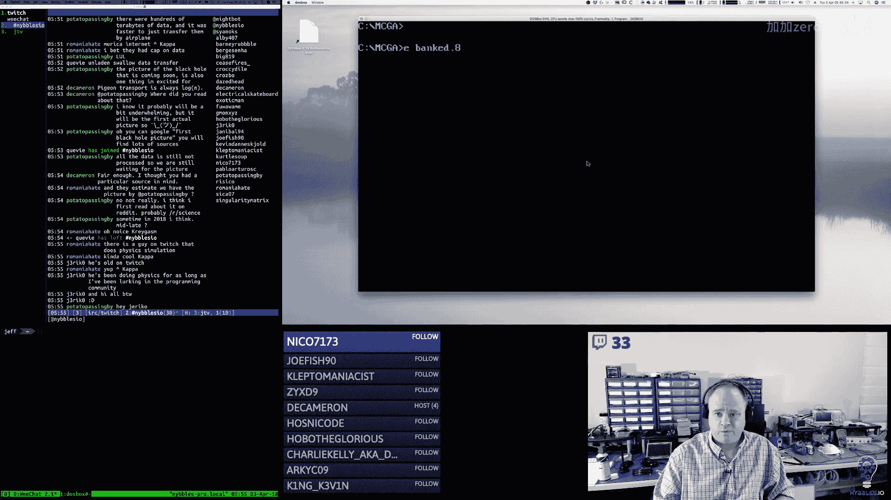
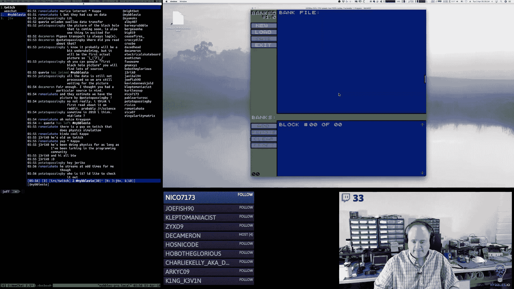
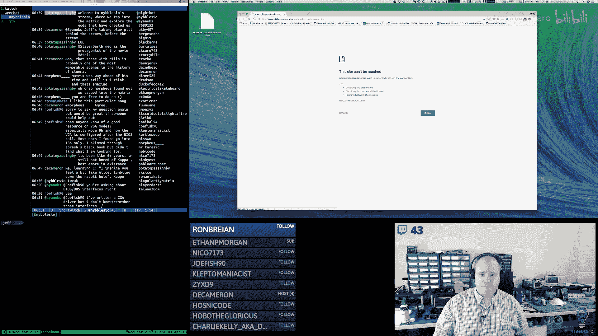
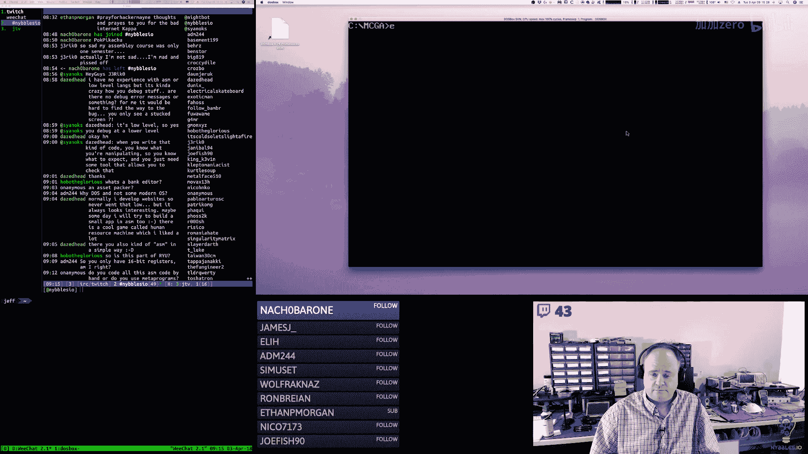
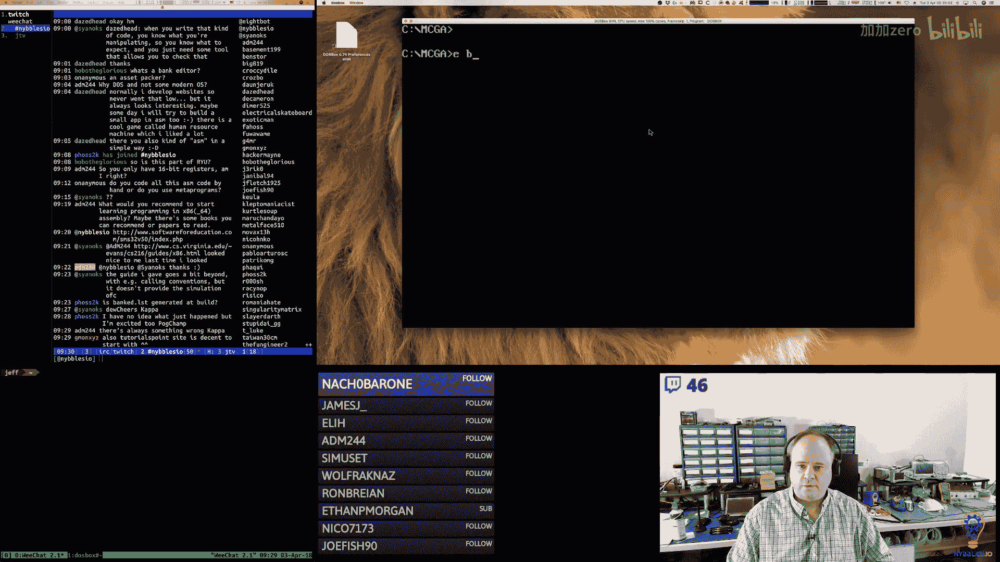
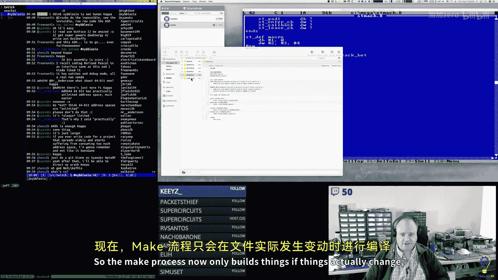
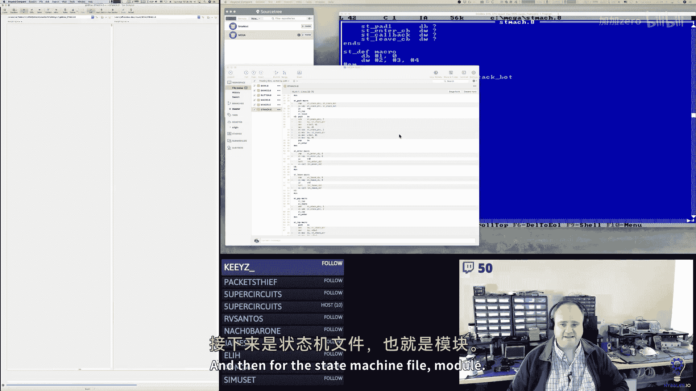
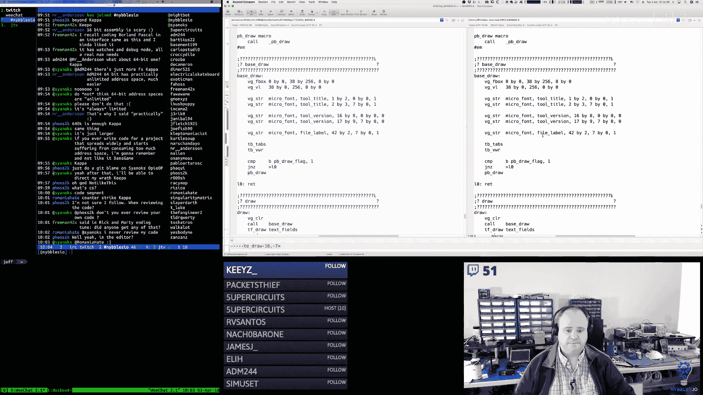

# 【精译⚡x86汇编语言】nybbles.io p09 p9 x86 Assembly： Bank editors -BV1NPr9YKE4b_p9-

Good morning。Yeah， there's nobody here yet， unfortunately。

The transcoding stuff won't probably kick in until the audience gets larger。嗯。

That seems to be what enables and disables it。So。Okay。Today is。Last now cur。

Today is the 3rd of April 2018， this is the Nibbles IO Daily programming stream。I'm Jeff。

And I code every day from 5 a to 10 a。And I streamed that live Monday through Saturday。

This week we are wrapping up the MSDs acade reference implementation。🎼嗯。Okay， sounds good。🎼啊。

And next week we will。I think transitioning to the final segment on the。🎼嗯。

Arm 64 bit assembly arcade kernel kit。And then we will be transitioning to a new project schedule which I have yet to 100% decide on。

🎼嗯。yeah， so yesterday I left off。I was working on the refining the state machine a little bit here。

In the bank editor tool。And so I'm going to continue on with that today。At this point。

 I've got the actual implementation changes made， at this point it's largely just going through。

Mechanically changing a lot of this。And a lot of these aren't implemented， so what's left here is。

Just shs for the most part， so the message box one is a bit different。🎼So。AG Min X Y Z。Hey。

 Roman hate。Hobo the glorious， welcome。Do you work for yourself， yes， right now I do work for myself。

I am self employed。As they say。As soonon as the battery is connected to make a complete。

The electricity， the wire。🎼后面关。And we see。P of thin way。Okay， so that refactoring is done， I think。

We've transformed the state machine to support， enter， update， and leave callbacks。

 and I've got functions for all those。🎼。So the next thing that we need to do here is。The bank。

Update mode。For the bank state。So we haven't picked a bank yet， but when we pick a bank。

That's when we're going to。Transition to one of the different bank states。嗯。

And then in these bank states。🎼嗯。🎼So。And I'll make sure we check for the mouse buttons in each of them。

We'll have to go through each one and implement keyboarding individually。That's okay。

So in the button， tab， one， two， three， and four。We have to figure out what kind of bank it is。

Which we already have code to do that， I think。In the code that draws the tabs。🎼So， I think。

I need to refactor out。Some of this code into a helper function。Because I need to be able to get。

Based on the selected。Tab need to be able to get。🎼BP assigned to。The right。

Pointing at the right bank structure。So I can get the type。So it looks like I might already。

So I already have the index， so really。What I need is a macro， I think。Would'd be the most logical。嗯。

I would pass the index。Here。Hey， Deica Marron。Okay， I'm doing it all right。🎼嗯。Okay。

But I want to change Bank point2。Or do I want to create a new？好。Hey， potato pass bye。🎼Okay， so。

We moved ES with the segment for the bank headers。We move BX with the macro parameter we pass in。

 we move AX with the size of a bank block， we multiply AX and BX together so that's going to。

🎼You know。Offet us into the headers。🎼诶。And then we move BPp with。BX。

So now BPP is pointing at the block that is the header for that bank。And in the。

One use case where I'm already using this。I just pass zero。嗯。

Right now I'm working on enhancing the when you click on the bank tabs。

 want to actually get the I want to get the pointer to that bank header so that I can get the information about that and set the correct state so that when we click on like a tile tab。

A tile bank， we go into tile mode， when we click on a Sprite bank。

 we go into Sprite state and so on and so forth。嗯。So this is the equivalent of what I had before。

 this just gives me the base pointer to the beginning of the bank's segment， the bank header segment。

And then in the tab buttons。So there's four of these。嗯。

And so now BPp is pointing at that bank header。Which means I can now。Oh， potato pass。

Are you working on a see project potatota passing by？The now。And so then。Thinking。Cool。

So I'm just thinking right now I have a type in AL。🎼呃。

And there are so many different ways in assembly language to do a switch statement。

So I'm just trying to think of how I could do it， should I use a lookup table？

With pointers to functions， or should I just。🎼Becauseuse。Yeah， I mean， that'd be one way。

Another would be I could create a macro， I could actually create a macro。To wrap this whole thing up。

And so here。I say tab go。And pass in。聊。So then here I can do。Compare all with。没。た。Right。There are。

 and there's a lot of ways you can do it。You can do it like what I'm doing now with like a compare ladder or you could。

Like I said， you can do。A little。Data table that。Does jumps。So if we did it the data way。🎼嗯。Yeah。

 typically， C compilers do a jump table。That's how they do it。So I'll do the jump table。

 so this is typically like what a compiler would。You know，R speaking what a compiler would produce。嗯。

So bank。Select。Jumps， jump table， right？So then I would have。嗯。Sprite bank。Selected。

Tile Bank selected。Background bank selected。Obviously。

 a C compiler isn are going to make nice pretty labels like this。The idea is the same。Hey。

 I'll be 407 I am working on。🎼嗯。An MS DoOS arcade game engine written in 100% X86 isem language。

It is for a it's a reference implementation for me for an educational series that i'm working on right now I am specifically working on the。

The bank editing tool for the game engine， that was going to let us draw sprites and tiles and fonts and change pallets and all that good stuff。

And yeah， so that's what I'm working on right now。All right。

 so these are all going to be then these are all labels。That our callback function。Like I say。

 obviously a C compiler， when it does this， it just keeps track of where it generates code。

And it doesn't generate labels， and although I guess it depends right。

 on how exactly their pipeline works。Like if they generate assembly and then。

They assemble the assembly， then perhaps they do something similar to this。Although again。

 the names are not going to be the names are going to be some muned。Weird。Scope thing， right？

My names are nice and pretty because。I'm doing it by hand。So this is the jump table。

These are the pointers to the functions。And so what we do is we have the offset now。

 this is a bite that is an offset into this array。And so then what I can do is I can load that array。

🎼嗯。If I can move BX。🎼With。嗯。Offet well I even need offset bank select jump table that I can add。🎼嗯。

AL BX， which this needs to be AX。And so now， oh and actually， this isn't quite right。This should be。

I need to shift this。嗯。To the left。Because I want to multiply it by2。

Because the size of a word is two bytes here。And this is just a bite， so I need to take。

TheWhatever number it is， so our types are one， two， three， four， five， six， seven。

 oh and actually that's one based。So I have to e that。Before I shift it。嗯。To make it zero based。

 so I make it zero based， I shift at left one spot that multiplies it by two。

And so now we have the type times2 that points us into this array。

so now I move BX with the address of that jump table， I add the new adjusted offset to that。

 so now BX is pointing at one of these callbacks and I can just do this。Iin't that's5iffy。Now。

 you know， what's kind of interesting here is a guy probably could spend some time and make a macro that would do this for you。

like you could make a macro that would generate this so that you didn't have to manually write this every time。

Yes， it's spiffy。🎼50。So then all we have to do now in our individual tab callbacks。

Is use the tab go macro and pass BL into it。Just like that。Of course， I got something wrong。

I had to get something wrong。🎼然后。Of course。Minor， minor。No way didn't hung up yay。

 I got something wrong。🎼あ玩哦。Forgot to compare。That's not right。嗯。Still not right。Okay， so。

The button call VX， they only directly modified BX。

 so I only I changed the stack management on those to only push BX and pop BX on exit there。And then。

The TBP go macro， it pushes all the registers that it modify， so it's using ES，BP。

 AX and DX so I save those and restore those after。嗯。And the BT set macro was already pushing。

Restoring and restoring the registers that it was modifying。嗯。

What I'm expecting to happen here is actually nothing。

I'm expecting that I can just click on these and then it'll just let me keep clicking on them。

That's not happening。So something's out of way。H。😊。

Romania hate asks is RPC still use or would you use an RPC implementation rather than employing your own protocol it depends on what you mean by RPC RPC to me is just a concept so there are a variety of。

RRPC flavors。So it just depends on which one。You're talking about， but yes， I mean。

 RPCs are used all the time。嗯。So。I mean， the concept of a remote procedure call。

Still exists just you know， then the question is which particular implementation are you talking about？

And whether or not that's still widely used or not。Okay， so we call Bank pointer。And bank pointer。

On that call bed。He's moving yes with the bank header segment。

 he's moving BX with the parameter that we pass， which in this case is something we pass into this macro。

 which is BX here， which is the selected。U melt， that should be okay because I'm moving the whole register。

🎼嗯。Well， no， I mean， HTTP is RPC。The way applications use HTTP， that's a flavor of RPC。

Remote procedure call， again， it' just a concept。HTTP is a transport。

So don't don't confuse those two， just like if you use UDP to make the call or you use TCP。

 those are just transport mechanisms。It doesn't you could make an RPC using。

A CSV file if you wanted to， no one does that， but you could if you wanted to。I mean。

 you could use doRPC by email。Actually， people used to do that all the time。

But they do that less now。So again， RPC is the concept of there's a procedure。

 there's a code procedure on another machine somewhere。And I want to call it。How you do that。

 the transport between those two machines。That's just an implementation detail， and that could be。

 like I said， that could be carrier pigeon。 It doesn't matter。So there's nothing special about HTTP。

Now if you're talking about rest。That's stupid， I mean， I mean I can go on a rant about rest。

That's a different thing。Because technically， rest is not RPC。But。The way RE is typically used。

 it is an RPC。🎼哈哈哈はは。😊，Yep。Data transfer by Carrier Pieon。

Now you think about it if you gave a carrier pigeon， a 256 gigabyte memory stick。

And they're trained to fly from， you know， like， say， one building。You know。

 five miles down the road to another building。You know。

 they might actually be transferring data faster， who knows？So I wonder if。

Okay， so it was the call。This is not。Pointing at the right thing。嗯。嗯。Look how I ahead that macro。

I forgot I had that macro。W it really does not like。🎼What am I music saying。

Hey， Jericho。🎼Oh，喂。

诶，好。Sa second one， man。あさ。Mountain time。哦。What's crazy？Yeah， I actually start at 5 a。 my time。

It's quiet。I am working on a tool。Here's what it looks like。嗯。This is a， it's a bank editor。

Hey Blackburn。And specifically right now， I'm working on the code that's going to。

Change the state and the state engine， the state machine when I click on one of the I am a Twitch affiliate。

 I am not a partner。But my coat is a little janky at the moment here。And I think I know why。Okay。

Now there are three levels。Twitch has。Toch you could just be a regular streamer。

 so you're not an affiliate， you're not。A partner。Once you reach certain milestones。

 you become an affiliate。And for all intents and purposes， affiliates can do almost everything。

Well you need certain requirements。🎼嗯。To become an affiliate too。

 but there reduced requirements compared to a partner， the other thing too is。Well。

 I guess that's not true anymore， but yeah。So when you hit certain milestones。

 you can become an affiliate if you want， and it's up to you， you don't have to do it。

 they offer it to you and if you want it you can accept it。

 and then once you meet additional criteria， then you can become a partner。あ。

The difference between partner and affiliate is not that great。Really， I mean。

 there's a couple of perks to being a partner。🎼But。For the amount of。

Work you have to do to become a partner， I don't know that perks are really all that worth it。Okay。

 so I think this is a confusion for folks。So if you are a partner。

Then you have complete control over transcoding options。If you are an affiliate。

Twitch will magically grant you transcoding options on the fly。Depending on that particular stream。

At that particular time。Now they don't tell you。What？That magic criteria is。Sometimes。🎼You know。

 you can。Sometimes you at this point， I would have transcoing options available sometimes I don't。

So it just all depends on their algorithms behind the scenes and how they decide to allocate it。

But if you're a partner。You do have transcoding options available all the time。🎼So。

I guess that's one of the first。Is it 50， yes， I've looked on their site。

 I've never found anything where it's。You know， exactly enunciated what the criteria is。

 they just say they have criteria。Maybe in practice it is 50。Which if you think about it。

 I guess from Twitch's perspective makes sense， right， if an audience gets to a certain size。Then。

It makes sense for them to start allocating additional resources to that stream。Um。

 but if the audience size doesn't reach what they consider to be like minimally viable。then。You know。

 they won't do it。But like Crosbow says， even if I had 50 people watching or say 60。

But they were busy serving a bunch of other partners at that moment then。You know。

The partners would get it and I wouldn't。Hey， Sinox。🎼え。Did I get it right this time？I think so。

All right， yeah， I was。Multiple one base。Adjustments had to be made， okay， so then here。嗯。嗯。Yep。Yeah。

😊，Yeah， you do that at your own risk， my friend。I probably do it more than I should。Well。

 what I said was。All right， so first off， let's clarify。Bullshit as it relates to your profession。

Um so。Again， I think somebody yesterday and I can't remember who said that they one of their managers was an X bartender。

You know， if an exp bartender started making technical decisions。

That would bother me right now as to whether or not you immediately how you deal with that situation in that context that's。

That's a challenge right， I guess yesterday what I was saying is that I probably would be I personally would probably be too blunt in that situation。

But。You know what you should actually do。Is。Perhaps a different story。Compare it。晚安。W。

If we're transitioning to these states。Why aren't I getting anything done？RightThere。Sure， go ahead。

Yeahはは。嗯。Let's see okay， so the question is how do all these instructions binary and assembly translate to hardware level。

 it's all about sending high voltage impulses to transistor gate，'s not high voltage。🎼嗯。I mean。

 old fashioned TTL would be five volts。And technically the transition voltage is。

 there's a range there， it's not absolutely binary。Modern。Cmoss level。Hardware is 3。3 volts nominal。

For a binary true transition on a transistor or a gate。so。I mean to answer your question。

 if you look at the dye of a CPU。There's a huge hayte layerer Darth。

 there's a huge state machine essentially that's built in there。

And the state machine is pulsed by a clock。Okay， and the clock。Runs the entire state machine。

And there's memory， there's little bits of memory internally in a CPU that are used transiently to manage state。

 so the instructions that you're talking about our data。

 so the CPU is wired up to a bus and it expects to be able to go out and access external memory。

 again， you know it depends on the hardware， maybe the CPU expects to talk to a memory management unit。

 maybe it expects to talk to static RA， maybe it can talk to dynamic Ram。

 but there has to be something else in between it to manage the dynamic you know RAM，So。诶。

The state machine inside of the CPU， right when it。

Goes through a reset cycle right it resets its internal state and the CPU knows that the very first thing it has to do is start fetching instructions right typicallyy most CPUs。

 that's what they do Now again， that varies some CPUs。If they're a microcontroller。

 they might go through a variety of startup phases， not necessarily a simplistic startup phase。

If we just take like a simplistic CPU。嗯。You know。It'll go through its reset cycle and during the clock cycles after the reset。

It will go out to memory on its address pins。And then try to fetch on its data pins。

The first instruction from some known address right so the CPU will say perhaps try to access high memory。

 a lot of CPUs start。Trying to execute instructions almost at the end of the memory map。

 some start at the bottom of the memory map。It just depends right on the CPU。

 but then it's going to fetch those bytes from memory， those instruction bytes from memory。

 those go into a internal buffer inside of the CPU， typically a latch。And of some kind， right。

 and again， we're talking about stuff that's。Microoscopic， but it's the same concept， just very。

 very small。And then there's an execution unit inside of the CPUU and so the state machine you know goes through cycles right so during one cycle it fetches instructions during the next cycle it  lates those into an internal latch then during another cycle it the execution unit can then read the latch and can decide what it needs to do and then internally they have what amounts to a huge lookup table essentially now。

You know， it's not a lookup table。Exactly the way you would think of it in code。

 but it's a similar concept。🎼嗯。And so。🎼And then。You know， once the execution unit has。

Enabled the gates that match the。🎼嗯。Selected instructions。And that's exactly what ends up happening。

 right， is a series of gates。Become toggled based on what was selected。🎼嗯。

Then that leads to the next execution path which。Again， you can get really， really。

 this stuff gets really complicated right those things are。

Can be passed off to ALUs and to other execution units and all this other great stuff。🎼So。🎼呃那。

Really current， no。It's voltage， it's currents fairly constant。In most of these circuits。呃。And yeah。

 you know， digital circuits are not。They may burn a certain amount of。

Current because of resistance characteristics of the component itself。But yeah。

It's all voltage and again we're talking about modern electronics。

 modern digital electronics is low voltage， it's 3。3 volts。嗯。Now you can get confused because。🎼Like。

Your computer or your laptop or， you know， a lot of electronics might have a high voltage rail on it。

 It might have like a 20 volt rail， or it might have a。You know， might have a 12 volt rail。

 but those are typically used for either displays or those are used for charging circuits。

 those are used for power right for other things that's not used for the digital stuff。

The digital stuff is it's all low voltage。🎼So。Hey deck of Doom 12。Yeah。

 when I always think of voltage， I always go back to Kom。And。Think of it that way。嗯。

Which I don't know， maybe it's the right way to do it or not but。

I would not typically think of digital circuits。嗯。Again， there are some exceptions。

But I would not think of。Them is high power。Drains。嗯。That's hey cicero。

 that's a cox question because he's riding a kernelel， I believe in C。But。Yeah， and C++。You know。

 again， what does C++ have？The sea doesn't。To me， I'm sure there's a lot of things you could enumerate。

 but to me the two most important。R。🎼Templates for。

All of their flaws and it has an enhanced type system。

That enhanced type system if you use it properly。🎼嗯。Can help abstract a lot of commonality。🎼嗯。

🎼That that would be the。🎼Yeah。That would be the advantage in my mind。

So it could result in less code is the way I would put it。In the hands of the correct practitioner。

 it could result in less code。Yeah， namespaces are important too， I mean I'll give that one。

I like using namespaces in C++。I don't see how C++ can be slower than C because。How C++。

 if you just write C like code in C++， it is just C。So why would that matter？

I think what people will say， right is。If you have a bunch of。V table based calling。In a C++ program。

 that perhaps might be slower， right， but again that's a very specific usage scenario。So in the main。

 I would not say C++ is slower or faster than C it's the same。

I got to take a really short break here，'ll be right back。🎼。🎼Oh。O。Thank you for the sub。

 Was that Ethan P Morgan， thank you。Thank you， sir， I appreciate it。🎼2，0， these。🎼啊， why。🎼ち気に。🎼哦后。

🎼G okay。 I know what that is。🎼This is updating。🎼Stayates that。は。😀Ha。😊，Yeah。

The matrix was coming alive。What's going on。So it's making it all the way through this。

It looked like it was calling the state enter。

哦。I forgot how they're going。But that's sort of the bottom。Vier called back。那他了。嗯。Joe F。

 you want to look up the program called Tweak。And it'll help you do what you're trying to do。

I know Ive found it somewhere， but I can't remember where I found it。Not there。

Hey， move， how's it going？Okay that。🎼So的。W go。あ。I think I know what's going on。原来上去。All right。

 but I so there's another problem。There you go。That'll give you an idea of what the original game looked like。

Okay， so I rolled this up into a macro。嗯。So I check the state if we're in the bank state。

 which means we haven't chosen a tab。We haven't done something else。

Then we don't pop the current state off otherwise。I'm assuming here that we've selected。One of our。

Bank editing states by choosing a tab。Because we won't get the bank go here。

Unless you choose one of those tabs。🎼嗯。Then we check the state against the state that we're trying to go into。

 this is to prevent。嗯。Button bouncing， essentially。

So if we're already in the state we're trying to go to， we don't go there again。Otherwise。

 we then push the new state on the state stack。And then our jump table callbacks that makes those pretty simple。

Implement that macro with the correct parameters。Because what was happening is I was never popping。

Editor state， the tab state off the state stack。 so if I clicked on the tile tab。

 it would go into that state and then if I clicked on another tab it would go。I mean。

 that should be okay， but we don't want to recursive， we don't want to keep going deeper and deeper。

On the state stack， we want to come out of the state we were on。So if I go into tiles。

 then if I go into oh， no it's not。Something's not working。Maad bro。🎼え。

But it should come out of that state。Clean up the tile editing state and then go into the sprite editing state。

So on and so forth。But this is outside of our。🎼不。The first we see if we're。

In the state we're trying to go to， that's our guard。If we are， the we're done。Otherwise。

 we check if we're in the。Base state for the bank editing。If we are。Then we skip over the pop。

And we just push the new state on the state stack， otherwise we pop whatever current state we're on and then push the new state on。

Ch。No。The bank editor is just a way of it's a banks or a memory structure that I devised。

 a memory and file system structure that I devised， the editor is just a way of editing。

 you can think of it as like a tile editor， a sprite editor， a palette editor。

 it's just a gay editor， it's an editor for the engine。

I just happen to structure it around the concepts of banks in memory because this is old MS dos。

 right， this is segmented memory。For all intents and purposes kind of like banked memory。

And so things have to be structured in a certain way in order to。Fit。Nicely in that model。

And so that's why the tool is called Bank Ed。はいはいは。も？あた。然后。That's a problem。Hey， Wolffor Naaz。

 how's it going？Welcome。Hey， city set。Welcome。I see the problem。🎼Maybe。In place， but why is it not？

Any。あ。Fra。Okay， so we do a stay top。We moved DI with the address of the string。UnCl AX reset set。啊。

不再上。We call strange decimal Tu character。And then we render it。Oops， I make it。Okay。

So we're in state number two。Which is。No new file。Then we should go to three。

 then we should go to five。We're in three。Now we're in five。Now we're in six。We're still in six。

So we're coming， we're never going back down to five。And。So why are we never going？嗯。

I'm explicitly coding these for a code segment。Because I now have。The extra segment in the mix here。

So I'm just trying to。Just for my own documentation purposes。

 I don't know that I strictly need this but。It helps me。Yes。Remember。I don't think that's an issue。

🎼因为开始也是。🎼反。没有。球ちで。あや。定 only我系。Yeah， I。I hear that sort of story all the time， Dr Marion。I am。

I don't know why that happens， right？嗯。スピ？I mean， I have all sorts of theories， none of them good。

All of them highly cynical。And negative。Yeah， I mean， I definitely。Have seen that sort of behavior。

🎼And if a。Competdent developer the question I would ask in that situation is。

And I have to believe that this was the case。What about the competent developers that did apply and did interview for that job。

 why didn't they get hired？That's the question I have to ask in that situation。🎼嗯。

But it's even more insidious than that。🎼嗯。Because。The company actively is looking for somebody。

 presumably that can do that work。And the fact that they settled for someone who。Can't do that work。

What is again， why， why， because you can't tell me that he was the only candidate now maybe he was maybe it was a friend of a friend hire or something like that。

 yeah， maybe he was cheaper。嗯。We don't know all the details， right？You know。

 just making some basic assumptions that the company was legitimately looking。

That they interviewed multiple people， that there were at least some qualified candidates that were interviewed。

Why weren't they hired？Is it because this person who was hired was a fast talker。

 a good talker because they were a salesperson because they were extroverted。

 was it because the qualified candidates were quiet and sat there？Kind of mumbled， I don't know。

But those are the things that go through my mind。Now it's the music。

Some of these songs have interesting environmental sounds in them。🎼M。🎼Why is this not working？嗯。🎼T。

Thanks， Decaerron， have a good one。🎼は。オッケ。Okay， and that work。So it is picking the right one。🎼Well。

🎼然在。It's picking the rights。🎼电影。Spread is six， tile is7。Or backwards。Sprite is one， tile is two。

🎼Sright time。So it is picking the right。🎼才。It's calling the right lookup。

A the right entry in the jump table。But then if I pick a different one。🎼Why。Why are you not working？

Oh， I'll get you some twitchy modes， Ethan。He if you want to create some ems for me。

Potato passing by that'd be cool， I have absolutely no idea what kind of ems you guys would want。

 so if you have ideas。Send them to me。What are the size limitations on the emOs？🎼嗯。That's actually。

Pretty deep， is it 28 by 28，ooh， that's pretty small。by 128， that's not bad。🎼啊。Well。

 they've got a 112 by 112。Those are kind of odd sizes though， it's interesting。No powers of two。

 unacceptable。Unacceptable！That's right， no power is a two， man。Hey， snow， snacks。Welcome。

🎼I don't think that's the issue。Hey， Hack Remaine。Yep this is MS DoOSs running in DoOS box。

 and this is X86 As Laage。100%， no sea or anything else here。Okay， yeah， so it wasn't that。🎼嗯。Sure。

 why not？You guys can throw my head around the screen。That'll be fun。

Get a nice Kappa picture of me somehow。Lift one from a stream。気。Yeah yeah。喂喂喂。🎼呵。😊，Oh yeah。

Oh yeah阿 beyond安。🎼So， we need the position。And now button we test for the left。It's set。Then。

We come down here。And we update that back to zero。And because it just raates it。The next。

Neing to come up with a better way to do that。Okay， so that works。Does。Check to it。But， it's still。嗯。

啊。🎼Not them。All right， so here's what I have to。Need to add new flag。好的。硬白。

When you click on a button。I add that flag in。Then。Yeah。诶。Button is marked as de bounce。

I need to remember it。O。🎼あ。So if the left mouse button is down， we come here， otherwise we return。

The address to the button structure and we get the flags if it's the last button。我单。嗯。

So we return otherwise they come here。We test the flags for the de bounced flag。嗯。Actually。

I don't think this is going to work right？I think what we need is another function。

When the mouse button is not presseded， we would then loop through all of them and de know turn off the de bounce flag at that point。

Because we could go through several frames where the button is still being reported。Yeah。O。

Get the left mouse button。Is down to come to L zero。嗯。Otherwise， we bail。We set up our frame。

 we get the flags。So for the current button， we get the flags， is it the last one， if it is。

 we return otherwise we come here and we test if it's enabled。If it's not enabled to come down here。

 we go to the next button， we jump back up to L1， we repeat that until we get to the end。

🎼Then we move。Yeah， we do the rest of our rectangle comparison。

These all bail down for the next button。嗯。And then when we get to a button that is。

It has passed the hit test。Or in the de bounce flag， we update the flags we call the function。

 but we're going to need a。Separate。我的옛 another function。无法听。that。🎼And this guy。Okay。

 so to reset the button de bouncece。Recall that if the left mouse button is not detected。

We can just share the same stack。Frame for that。So we get the flags for the current。Button。

 we test that if it's the end， if it's the end， we go。It's not the end we go to。

Here we test for the debalance flag if it's not a debalance， we go to the next button。

Otherwise we hand out the inverted de bounce flag， we update the flags， we go the next button。

 we do that till we get the be end button so any if the mouse button's not set or yeah。

 the mouse left mouse buttons not clicked and we do the，Reet。Otherwise we see which one we hit。

 when we hit one， we turn the de bounce on。And so that button won't fire again until the left mouse button is no longer recorded as being down and we reset the button。

So it's going to chew up at least。One frame in between depouncing it。And。Resetting it。

 if not more or probably more。I need to take a short break。I'll be right back。嗯。What do I think？嗯。

What am I looking at here？Haackcker Maine says open question is a computer engineering diploma worth doing？

If I wanted to get into electrical engineering and if I wanted to study software engineering after the diploma。

 is that a transferable option？🎼嗯。Hack remain， you're in the US， correct？🎼嗯。No， you're Oussie， okay。

 how does university work in Australia， is it free or do you have to pay for it？Or。

Is the cost extremely minimal？I should say。Not sure if he's having a。Connectivity issues， but。

I'm going to assume that in Australia， university is probably nominal cost。

 it's probably not very expensive。And so in situations like that。

 I always tell people the same thing。If the cost to you personally is very low。

Then you're probably going to get an ROI on it。And if you want to study software development and electrical engineering。

 then。You know， I don't。I don't know about transferability， I mean that's a specific question for。🎼。

Universities that you would be going to。🎼嗯。But I mean。

 I think it's not going to hurt you at all if you get an EE。And then also get a CS degree， I mean。

 I don't think that's going to hurt you。It might， I guess， possibly， but however。

The caveat I would throw on that if you're in the US and you just heard me say that。

I'm not talking to you if you have to pay for it and by paying for it。

 that means borrowing tens of thousands， if not hundreds of thousands of dollars， then don't do it。

I don't think it's worth it。But if you can do it for let's say。5，000 you know， US dollars or less。

 which I think for like most Europeans， it's either free or maybe a couple thousand euros tops。

And again， I'm not sure about Australia。But if it's relatively inexpensive， then I would say。

Go for it。Because you're。Your opportunity cost， in my opinion。

 is really not you're not losing that much。Especially if you're younger。🎼嗯。But here in the US。

 to do that， to get an EE and a CS。You're probably looking at a。

School with some cachet you're probably looking at， you know。70 or $80，000 plus probably $100。

000 plus realistically here in the US unless you have phenomenal academic credentials and you can get grants and and。

Scholarships and things of that nature to cover it here in the US， that's a lot of money。And。

You're going to be in a really big hole when you graduate。A hole in my opinion。

 you will not be able to get out of。And do not forget for those of you in the US。

Thanks to our government， student loan debt is not。Dischargeable through bankruptcy。🎼So。

You are stuck with it。Forever。Thus becoming a prisoner in a death prison。

I thought we were supposed to have gotten rid of those。Evidently not。That's like I know I put that。

What's that？🎼Da of them。Oh yeah， I mean， most Europeans。Anybody in the European Union。

 I think the cost very slightly， yeah， I'm going to say that the cost very slightly。

 I know because of course I'm potentially going to be relocating to Italy next year and you so I've looked into a lot of this stuff and you know the cost for tuition is like 2。

000 euros， something like that， 1，500 euros， whatever 1200 euros to me that's very nominal。

That's affordable， that can be doable。But。Yeah， here in the US， no。It doesn't work that way。嗯。

Somehow it's still getting in here。Multiple times。哦。是啊。It's a macro。And of course。Seeing a matter。

Yes in this situation， going does。So。We get whatever's on the top of the stack。

 we compare that to the bank state。If it is。🎼はい。Isn't the bank state？とでやるばいね。

If it is the bank state then。Then we checked to see if we should push on a new state。

Which we should in this case， because。It's the bank state。Otherwise， we pop whatever state。

We're in offwe， and then we go into the new state。That locked up fit in the drum。2， four beasts。

X is0。🎼That doesn't seem。No眼在上。等下。アスタ。Two， four piece。It's one。Acrament。🎼Sttororyable。Okay。

 this is the segment of the header。That's fine。That's the size of the block。🎼But why。Oh。

I see the issue。是。Okay。嗯。You're going to pick a different registertry。偶尔。Before I stomp on AX。

There we go home。🎼然后。So that fixed that problem one。な。我。The other thing。

Right now we're in the bank state。I haven't selected anything。Now we're in the tile state。

 although the selectedor is whacked out。Oh， you know why。呃Y。あ。I've been drinking again。They work。

It helps if you check。The devou flag。And， you know， if it's set。Don't do anything。ああ。別べ？

If it's in deep bounce mode， then we're going to skip。Oh。No， now it's the other way。I had it right。

I dont trust my CEO。Oh， it's not debal him。It's not reset。Okay。🎼なんだバんん。So。If。

The left mouse button is not pressed。We call button reset。And by doing that。

Moves BPp with the pointer to the。Beginning of the buttons array。

And then we get the button flags if it's the last button then。We return， otherwise we come to L1。

We test。For the button deep bounce。And。If it's not set。And we go to the next button。

And we come back up and we repeat the process otherwise。We and。Out。The de balance。And then we update。

The flags。And then we go to the next one。You should use Bang instead of the not operator and conditional assembly。

🎼嗯。啊。No。おち？そしたんな。And works。🎼That one头松。🎼Now it's。All right， let's walk through this， I guess。

🎼Oh shit。🎼Yes。🎼I know what's wrong。🎼，你看。And it helps if you know you。Okay。

 so now there's something else。嗯。Allい。All right， so the debaluncing is actually working。

But we're still having some issues。And so is the issue？All right， so we're in。State5。

 now we're in state seven。🎼We the states now something else coming。呃，完的。そすな。This start the pop。

Excuse me。嗯ん。I think， I know。🎼Maybe。Let's coach。白。Oh helps if I spell it。Now typically。

Typically I just think through it when I debug this stuff。sometimes I use the debugger。

Although there's limits with the debugger because of the video mode that I'm using。

 the debugger doesn't。Integrate with it quite 100%， so I'm a little bit restricted on what I can do。

A lot， yeah， I。This sounds kind of。Woo woo， but some of it's just intuition， right。

 Like I know the I know what I'm working on and I know so I。With assembly language。

 I very carefully control what I change。So I know what area I'm working in and I know what's going on roughly and when things lock up or don't behave the way I expect。

 I kind of roughly know you know， where。That's probably going awry。Not always。But usually I know。

Yeah。🎼You be。A bank editor is， is it just， so I have for my game engine。

So this is MS DoOS X86 segmented memory model and so I have to。

 the way I get data into the engine the game has to be kind of around the segmented memory model and so I have a bank structure。

 banks are 4095 bytes apiece and I can fit。You know， 16 banks in a segment， a bank editor is just。

 it's a tool around which it manipulates that bank。

Data model and it lets you create tiles and sprites and fonts and pallets and backgrounds。

 and it fits within that data structure， so that's what the bank editor。Sort of， there's no packing。

There's no compression or anything， but it is an asset manager， you could think of it that way。🎼嗯。

Because DoS is simple so that again what I'm building here is a reference implementation。

 I'm also working on another series that takes people from。You know， the very beginning。

 not knowing any assembly language， not knowing how to do any of this。

 and step by step takes you through you know， a process of learning how to do this。

And the reason I chose MSOS for this particular project is because it's simpler。

 right there's a lot fewer moving parts。You have complete control over the machine。

 so there's a lot less standing between you and understanding how to manipulate things if I were to do this in a modern operating system it would be much more complex。

🎼So。You know， I also have a version sort of of this that's running on the Raspberry Pi3 and that's written in arm assembly language and that's you know。

More complex right there's I have to have a terminal serial terminal in that and you know there's more going on there。

 not it's not horrible， but it is more complicated。嗯。So that's why I chose this to。Oh yeah。

 I meant to check。🎼FF。🎼S。Oht know， that's staing， that's right。1，2。That doesn't seem my。

Could be part of the。No， this is not reU， so I have multiple projects。嗯。That is correct。

 these are only the largest they are 16 bit。Registers。This is a separate project。

 so I have multiple projects， ReU is my， I guess you could call it my core project。

This a this is for a video series calledLet's make an arcade game in MSDOS。

 and I've been cycling this in and out of the schedule weekly for a while now as I try to finish the reference implementation。

I have another project。That is called Arcade Colonel Pitt。

 which is the Ar 64 B assemblysely Language Raspberry Pi3 project。嗯。

So both this MS DoOS project and the Raspberry Pi3 project I'm going to be wrapping up so the MS Dos thing I'm working on this week and I'm going to rotate it off the schedule and the arm thing I'm also going to be rotating off the schedule in the short term。

And so that I can focus on reu and some other projects， so yeah， so reu is something different。

A lot of similar concepts， but it's different。I wrote all this by hand。嗯う。

I actually changed that point， oh look， they work。That works。up until a point。

Something is something is overrunning something。嗯好。Oh， look at that。

Why see， that's what's so weird。Like those two。They're the same state， they're not。

Ever going into a new state。

But when I was doing the th。But I took。怕吧。我确认。打龙？🎼So do。🎼Very simple。🎼发体。太了。Okay。

 so why is the selected？Getting whacked。That doesn't。Makes sense。Okay。

 so the hang was because we were overflowing the state stack。So that's cool。

But I'm not sure why the selection doesn't。If I had a spray。Lets see tile。

And Sprite are picking the same state， which is wrong。It some it's really weird。That's not right。啊。

啊我比我。🎼O。That makes sense。When you pop the state， it goes back into the En。For the bank。

And it waxs selected。🎼嗯。Okay， so that's why the selecteds not。Apparently， working。Font tile。

Not tile fine， okay， that fix is selected。Okay。And if I add palate。Yeah， see it's picking the wrong。

🎼O。So our indexing code seems to be off。What would you recommend to start learning at programming？

X 86 assembly。I mean， there's tons of books out there。I have a link here to a。Simulator program。

You can use this。For learning。So I think that one。Getit rid of。You're welcome。大开了。Yes。

 it's generated at build time。顺便开。😔，But。2，4， B6。2， five。🎼For。🎼2，5，9。🎼对不起。To fire面具。🎼You。Okay。

 so I'm going to use number three。🎼そそれでねや。So AX is two。🎼2。One FF。Sounds about right。That wast escape。

Oh。O。It's using the wrong register。よし。🎼你呀。I've been drinking again。🎼Theで。🎼对对。I super smart。

I'm super smart。Look at that now it works because I'm not。Doing dumb shit。Oh my goodness， okay。

Look at that。State  seven， state  six， state 1， state  eight， that's what I want to see。

And then if I scroll here。State nine， state 11。🎼嗯， hell楼。Why can't I get to that one oh thumbs off？

🎼十五岁。Oh。Closer。Yeah， this is usually what happens。I usually make a bunch of changes。

 break a ton of stuff。And then I fix it。🎼嗯。So what's happening is I'll actually go through this because we've got about 30 minutes left。

I'll talk about the changes I made， I think there's probably an offset issue。

With the scrolling would be my guess。Although that looks okay。🎼And。No， yeah， that looks okay。

So I could have something。A miss because the sound and mod stuff I haven't really done much with。🎼So。

 I might have。

I might host some up there。Yeah， sound and mod， there are no ops right now。So I don't know。

 there might be some。Sudtly not working right there。

So I'm actually going to take just a really short break and then I come back and we'll walk through everything。

And。I'll be right back。Okay。I just have to put my jacket on because I'm freezing。Okay。

Let's go through this。Okay， so what I've been working on today。Is。

Wiring up the bank selection to the state machine。So yesterday。嗯。I enhanced the state machine。

So let's look at the state machine。So we have a structure in memory called a state action。

 it's kind of a bad name but。It has a code， so that's just a number。

 there's a pad byte in here for making things align on two byte boundaries。

And then there's an enter callback。The main callback， that's the update callback。

 I still need to rename this。And then there's a leave callback so if you imagine we have a bunch of statess。

And you can transition between those states。And when you enter a state。

 the enter callback is called if it's not null， right， so that's true of everything。

While you're in the state。The engine calls the callback over and over and over again。And if you。

 if a new state is added or。That state is removed from the state's D， then leave is called。

So this allows a state to prepare itself。This is what actually runs when the state's active。

 and this allows the state to clean up after itself if it's no longer active。U。

So we have a macro that lets us define this data structure。In code。

And then we have a bunch of macros that help us deal with the state stack。

 so the state stack is very simple， it's an array of 16 words。So a word is two bytes。

 so we have 16 of those， so we have 32 bytes of memory that's allocated each word。🎼Is。1。Pointer。

Within a segment。To a callback。Or to a state， rather sorry。So what we put on the stack。Is a pointer。

2。State itself， the state structure itself。So we have a state stack， this is the actual data。

And then we have a state stack pointer。嗯。And so the steak stack， oh that's a tongue twister。

 the state stack pointer。Starts off life pointing at the bottom。🎼Right， of。This the stack。

So as you push things onto the stack， we subtract two from that pointer until we get。

Until we overflow， right， which sometimes it happens。We could make this stack bigger。

We could probably double it or triple it， but we don't you know。This is Dos。

 we have 640k of conventional memory， so I'm trying not to waste too much memory。嗯。Okay。

 so that's the stack structure。嗯。And then。We have a push。

When we want a state to become the thing that's active， we push it onto the state stack。

There's some code in here to check。If the state stack。Pointer is equal to the bottom。

That means that nothing has been pushed onto the stack yet， and so we don't try to do a leaf。

Because there's nothing there to leave from。So this jumps over these two here。🎼嗯。🎼So。We subtract to。

From our pointer， right that。The pointer starts life。At beyond the end。

 if you want to look at it that way of the stack。So the first subtraction moves it to the first slot at the bottom of the stack。

 it's valid。We load the。Address of where we take the state stack pointer value。

 put that in BX because BX a is a basic， it's an indexing register on the X86。

 which what that really means is that it can be used。嗯。As a pointer， essentially， Ill the sort。

And so then what I do is I the brackets here。Just mean that I want。

 I'm putting something I'm dereferencing it， I'm putting something inside the box。

What I'm putting in there is the address of the state structure。That I want to go on the stack。

And then finally， I assign that address to the BPP register， which is the base pointer。

 which serves a whole slewuth of purposes on the X86。And then I call enter on that new state。Enter。

Checks， so because BPp is set okay， 86 automatically will do the necessary offsetting。

On our structure here。So by accessing ST enter CB886 knows oh okay BPp must be set so I'm going to it'll assemble this so if we take a look at。

An example of this。Brain fart。So ST enter。So let's find an occurrence of this where it's actually assembled。

There we go。嗯。Well， it doesn't actually show what it translates it to if we were to look at these op codes。

 we would discover that this is really like a CS comp WBP。

Bracket some offset right is really what this is so so the offset is here。嗯。

So that's what886 is doing。Behind the scenes with that。And so if it is， in fact。Zero。

 then we're not going to do anything， we just skip over the call， otherwise we call the call back。

And so that's push， that's what puts something on the stack。The state stack。

 when we want to leave a particular state， it's the same as enter。

 we check to see if the state callback is null， if it's null， we skip it， otherwise we call it。嗯。Pop。

So ST top， what does that do， that loads Bx with a state stack pointer and it dereferences the value at that pointer。

Which gives us another point here。Which goes into BP right so now BP is pointing at one of those state structures that we define in the program。

And so then when we do a leave。Because we're already pointing BPP at one of the state structures。

 we can then dereference， we can get to its different fields。

 and so we can look and see if it has a leave callback and if it does we can call it。

Um to pop something off the stack， you just add two to the pointer and that's it。It it goes away。

 doesn't really go away， the values still there， but that's okay。

 but that's how the CPU stack works too， it doesn't clear that it just moves the pointer because next time when you push something you subtract。

 you're going to update the value at that location。Um sortr of virtual functions。

 these are callbacks I wouldn't consider them to be OO， but yeah， I mean， in a sense， this。

 if you wanted to do OO， it would be basically a hop skipping a jump from this to do that。

This is you know。This is the foundation of how you would do it。Yeah， these are just callbacks。

Right now， but again， if we had a metadata structure， that was a type。And。You know。

 we had other types that had that as pointed to that as a parent， we could implement， you know。

 the same idea， it would take some more code， but we could do it。嗯。So once we pop。

Whatever's on stack， we have to look at the top of the stack again。And we have to call En。

And then if enter is defined for that particular stack entry。And then we have a macro called check。

So basically you can pass in the state。Eumeration value the code。

 and if the top of the stack is that value， then this returns back one in AL or otherwise it returns back zero。

So that's the state stack， that's how that works。And so here are the code values for all the different states that we have。

And then here are。The macro definitions for each state。So we have a label。For the state。

 we have the macro and we have the code， and then we have the callbacks。Which are just labels。

 potentially in the assembly work。嗯。So。What I specifically was doing today was a lot of that stuff that we just reviewed。

 I changed that yesterday to support the En and leave piece it already had the update piece。

But we in the tool right， we have those tabs as you add banks。

 those tabs are related to a a block in a segment of memory that is the。Bank header。

For that particular tab that you see and。Um， what I want to do is I actually want when you click on the tab button。

 I want to transition the state machine into that state that's related to the type of that block。

 you know， that bank。So if it's a Sprite bank， I want to go into the Sprite state。

 if it's the sprite editing state， if it's a tile bank。

 I want to go into the tile editing state and so on。嗯。So。What I had。

At the beginning of the day was these four callback functions。 So we have those tabs are。

Buttons in our system and when you click on the button。

 it calls one of these callbacks for that button。And previously what it was doing was just setting the selected tab number based on which tab you picked and it was changing the state of these other buttons。

What I added was this TB go， which is tabab go macro and that macro。Save some state on the stack。

 it takes the macro value that you pass in， which is the tab number。

Right and I have to zero base that because the tab number I'm picking is one based。

 so I decrement one from the value that comes in and then I use this bank pointer macro。

 which what that does。Is that takes a number， a zero base number that represents the bank that you want to get a point or to。

And so what this does is this moves the extra segment register with the bank headers segment。

Pointter value。And then you move CX with。The number right。

 so what what bank number are we trying to access so each tab。

It shows up in order and that number that's next to that that's the bank number that it relates to and so we then move AX with the size of a bank block。

USo this is going to be 4095， this is going to be like zero through 13 or whatever 14。

And then we multiply AX and CX together。The result goes back into AX and we take AX and assign it to BPp。

 so now BPp is pointing at within the。🎼嗯。Bank header segment。

 it is pointing at the start of that bank。Header block。🎼And。🎼嗯。So then now BPPES and BPP are set。

And that means that we can get to the data of that block in memory。

So I clear out AX because the bank metadata type is a bitete and so I can't。

I don't want the high bitete of AX to have anything in it， so I just clear out the entire register。

And then I load using the ES segment selector。The type from the bank block in memory。

 then we have the same situation again， the types are one based， the enums for them are one based。

 and so I decrement one from the type to make it zero based。So then I have a macro that is a。

 so there there's an instruction on X86 called XLt or translatelate， but it only does bytes。

So I actually wrote one that does words。And what that macro does is kind of very similar to that bank pointer macro。

I save some states， I clear out the high register of AX。And I assign the value。

 the byte value that we're using to index into our word array， I load that into the low byte of AX。

 I multiply the low byte of AX by 2 because each slot in the array is two bytes because it's their words。

And then I。Move BX with the address of the table right that we want to index into。

 and so then I add this multiplied value。To BX so Bx is pointing at the base of the array Ax is now。

It had a bite value。And it's been multiplied by two， we add that to BX。

And then we use that so the brackets again that means look into that memory location and give me what's at that memory location。

 so BX is a pointer and I'm dereferencing the pointer and I move that into the SI register and then I restore state。

So then when I come back out of this。Here。诶。SI register is now pointing at。

The value that was in the lookup table， so in this concrete example， here's the lookup table。

So I just have a bunch of words and each one of those points at a function。嗯。

And so if we have a sprite type。We're going to get this one and we're going to get this pointer in SI。

 we can call the function that way and so on and so forth。Um， so then for each one of the tabs。

 I use this TB go macro passing in the number that was computed for that selection。嗯。And then。

This then calls， looks it up， calls the call back， you know。

 this is like a jump table right so earlier in the day you know we were talking about switch statements and you know this is what a switch statement becomes essentially this is a jump table。

It's notI'm not strictly jumping to this， although I could， I'm calling it as a function。

 so something the return address is going on the stack。You know。

 the code executes return is popping the return address on office stack and you know。

 going back to that location in memory。So each one of these is very simple。

 this just uses the bank a go macro， which I just created。

And what that does is that looks at the top of the state stack and it says are we in the state bank mode。

 so basically at the very beginning， you're in a no file mode。

So either you create a new bank or you load a bank or you exit。And so when you。

When you pick one of those willll obviously exit the program ends if you do a new。

 which is what I've been doing to test or you do a load， you're going to go。

Into a bank intoto the state bank mode。Which is kind of this interstitial state， right？

And so if we're in that state， then we don't want to pop anything off the state stack because we're already kind of at that base state。

 what we want is to push the new state onto the stack。

 otherwise that you know if we're not in the state bank。

 that means we're in one of the states related to editing a particular bank so or some other state。

So what we want to do is pop that state off the state stack。

And then push the new state back up So if you think of it，s here's the base state we push you know。

 the tile editor on。And then we choose a different tab that gets popped off and then we push on the next one and that gets popped off and so on and so forth。

And so this is。Prety much what I've done today， that covers everything。🎼嗯。Oh， and then buttons。

Btons have been kind of a。Small pain in my rear。For a little while because。This shits fast， right。

 believe it or not， like this thing's running really， really fast。

And our update loop is screaming right， I mean， if you look at the frame encounter counter。

 we're cranking out like。Well over 100 frames a second， typically。

 So what happens is you push the mouse button。And it takes a little bit of time。

For the operating system， the mouse driver to update its state and tell you that， okay。

 that button's not pressed any longer。But we're clipping along so fast we're executing so many frames per second that we hit that Mi state call。

 we're getting the same value over a large number of frames。

 so what I had to do previously in callbacks and stuff I was checking using that state check to determine if I'd already made a transition and if I didn't want to make that transition again。

 which that works up to a point but ultimately what has to happen and you do this in hardware too。

 it's called debouncing right when you hit a momentary switch or something in hardware it's not if you look at it on a scope。

It's not a clean square wave right it's not a clean transition。

 it's a bunch of you know noise right so in hardware you have to deouunnce the switch right deouunnce the button well we're doing the same thing here it's just we're debouncing it over a number of frames essentially。

So we only want to。We only want to record。The button press essentially once。

 even if the API to the mouse is telling us this button still press this button still we don't care。

Because we're not doing dragging or anything like that yet， so and I don't think we will be。

So what ended up happening is I changed the button fire call。To。

If the mouse left mouse button is not pressed。Then we call this reset， this button reset。

 so what that does is it loops through all the buttons in the structure。

 the array that you pass into this。So what this is doing here。

 this is assigning BP with the value of the stack pointer。

 then we're using BP to index into itself because there's a pointer inside there that is pointing at the array of buttons。

So that's what happens here。And then we in a loop， we load the flags for the button。

 we see if it's the last button in the array， if it is。

 then we return otherwise we come down here and we say okay。

 is the de bounceun flag set if the debo bit is set。Then we。And。

We disable that bit right so the way you disable that bit is you invert everything and and it out so that essentially that one bit。

 if you think of it like kind of like a little sieve，This bit falls， doesn't fall through。

 all the ones fall through and this one doesn't and so then AX has any bits that were set except。

For the de bounce bit， and then we update the button flags field on the button structure。

 and then we keep looping until we're done。And then what happens in the button fire is if the left mouse button is depressed。

 then we come in here and we're doing the same thing we're looping over all the button structures if we're at the end of the array then we're done otherwise we check to see if the button is marked as being de bounced if it's marked as being de bounced。

 then we skip it we don't do anything。If the button isn't enabled， we skip it as well。嗯。

Then the rest of this codes pretty much the same， this is the code that does the rectangle detects whether or not the mouse pointer is in the rectangle of the button。

If it is， then we grab the flags again， we or in our de bounceunce flag and we store that back out to the button structure。

 and then we call the button callback。And so all those changes。Allow the button。

 we only get one callback if the button is clicked is what that does for us。嗯。

And so those were the two big changes。Today。And now that。あ。

I can transition into the editing states for the different kinds of banks。

 now we can actually start fleshing out those individual implementations。🎼嗯。So。

And they just do a quick little。Review here， make sure I didn't miss anything。嗯。好吧。Yeah， yeah。Okay。

 so。So the bank pointer used to be really simple， it was just being used in one spot。

 and I've enhanced it to be usable in different scenarios by passing in a。

Index into the bank segment。And then it gives me a pointer to that。And then let's look at button。

🎼Next。So I added the de bounce bit。Flag。I added the button reset function。

Which we talked about and then I updated buttonton Fire to integrate the de bouncing and reset behavior。

Which we talked about。

And then in macro。嗯。What do I do here， oh， I put a CS selector on here。🎼Just。CS is the default。

 but I'm just paranoid so I put it on here， it doesn't change anything。🎼嗯。

And then I did update the make file for this project。

Before the make file was always compiling everything， every time， and so I enhanced it to where。

The targets are now the actual comp fileses and the sources now have all the sources for the entire。

Program and so the target you know now lists out all the dependencies and then I call A86 with just the entry files for those。

 so the make process now only builds things if things actually change。

 which is what you would expect。

And then for ST， the state machine file。

麻jo。We went through these， I had the CS selector again because now'm I've got stuff that's in the extra segment。

 I've got stuff that's in the。codeode segment and so I just want to make sure I'm highlighting my intention。

 really， this is more for me and less for the computer just so that when I look at this code it's like。

 oh yes， okay， I'm trying to access this in the code segment and。It's just explicit。

 which makes it a little easier。

When I look at it later。And then the banked tool itself。嗯。

So this is a lot of little changes right， so I added in the missing state enums here。嗯。

I added in a state number string so that I could take the actual state value itself and convert it into a decimal string so I could draw it on the screen。

嗯。And so then for a bunch of these states， right， I just fleshed out。嗯。

The enter and the leave and the update callbacks so with the exception of the soundbank state and the mod bank state。

 everything's defined， those are no ops right now。Those are going to be like the very last thing I do and then I kind of ti up the structure of some of this code so things were kind of grouped together a little bit better。

And yeah， just created the En and leave。And。Okay， so then we get into the bank enter。诶。

The restructuring around that， I added a bunch of new ones here for all the states that we hadn't really done any work on yet。

嗯。And then for the bank selection， we talked through this right， so this is my jump table。

 this is my macro that you know pushes the correct state onto the stack based on whichever callback happened。

Um， and I've got my tab go， which based on whichever tab was selected， you know。

 looks up the correct bank。Pointer in the segment and gets the type and then calls the appropriate callback for that type。

And then each one of these tabs， callbacks。Uses the tab go to do that work。And then down here。诶。Yeah。

 so bank Pointer used to not take a parameter now it takes a parameter in this context passing a zero。

 it works exactly the way that it used to， so that was a pretty easy change and then I added the code。

I had the code to draw the you know， editor stuff。In the viewer implementations for the tile viewer and the sp viewer。

 so that's like the next area where we have to work basically is to get those flushed out。

And that's it。

That was everything。

This is Do box。Okay。And so you guys were surprised that I reviewed the code。

Or that I use a diff view for it。嗯。Because yeah， I mean， you would definitely want to do like a diff。

If you can。Believe me， like people who have been watching me for a while。

 they know like I find stuff every time I review my own code， I find stuff。

Okay well thank you everybody for dropping by today yeah I'm pretty happy there's still a couple little rough edges on it but I think it got to the point where。

It's at least it's working the way I expect， I think the sound and mod stuff is flaky because it's just shims right now I got to look at that but I think I fixed most of the bugs and so then tomorrow the thing the next thing to do like I said will be to start really working on。

The editor state within each of these different bank types。And so you know， picking。

 instead of having that hard coded you know rendering I'm doing now， I actually want to you know。

 render the real deal and have the little tile editor and everything try to get that working properly with the keyboard in the mouse。

So yeah， so that would be the next step。呃。So then， that's what we'll do tomorrow morning。

All right everybody， have a good day evening and I will see everybody 5 a Mountain time tomorrow morning for more X86 assembly language。

All right guys， see you tomorrow bye。