# 【精译⚡x86汇编语言】nybbles.io p10 p10 x86 Assembly： Palette bank editor -BV1NPr9YKE4b_p10-

Good afternoon。🎼Oh。Hey， potato passing by， Blackbird， how's it going？Itjiman， how's it going？

I'm doing okay。Even though my schedule got all messed up， I'm okay。Oh。Yeah。

A little bit hectic this morning。I hate last minute' stuff， you know？Never been a big fan of like。

Doing things based on crises， you know？It's very stressful， very stressful for me。🎼I don't like it。

🎼哼哼ふ哼。😊，🎼一。I get up early， I like to do things early in the morning。When my brain is， you know。

🎼Frash and。Once I hit that， I don't know， that fatigue point。I start drooling。

I lose about 100 IQ points。All right。So today is。Wednesday， the 4th of April 2018。

 this is the Nibbles Ohio Daily programming stream I'm Jeff， I program every day， well。

 almost every day。From 5 a to 10 a。Mountain time and I stream it Monday through Saturday today was an exception。

 Im streaming at one o'clock pm mountain time until I fall over and die。Probably about five o'clock。

 I imagine， at that point my brain will well and truly be toasted for the day。

This week we are working on and kind of wrapping up the MSDS arcade game reference implementation。

 I still will have more to do with this offstream， but as far as it being part of the streaming schedule。

 this will be the last week for this。And I am working still on the bank editing tool。

 made some decent progress yesterday， finally got the bank selection tabs wired into the state machine and fixed a bunch of state machine issues。

 and that's all happy now。And so I think you know， today， what I would like to do。

 I had something come up this morning and I had to attend to it， so I had to change my schedule。

It happens every now and again it happens。I try to avoid it， but。Can't always do that。

So I thought today the first thing that we could do would be the palette editor。

Just because I haven't really spent a lot of time on pallets and it's an important element and the data structure is actually pretty simple and it's one block and so there's a lot of things about it that are kind of nice as they first go around with this implementation。

Let's see。お。呃。Yeah， today was one of those I was kind of forced。

 I didn't have much of a choice had to。Take care of it。Okay， so when we're in pallet mode。嗯。I think。

The way it's going to work is here， let me out。The way it's going to work is。

When you choose a pallet bank。In this section down here。I'm going to show the 16。诶。

I'm going to show 16 selections。嗯。Probably just numbered。You know。

 zero through 15 or something when you click on it。The section up here will show the。Palette entries。

And then we'll have RGB values。Next to each one and。诶。

You can change the values and then it'll change the palette entry on the fly。And yeah。

I think that's pretty much。How that'll work。嗯。Yeah， so let's。I'll add some code in to draw。

🎼Our selections。 And to set the。Block。We have the header。But I don't think we have the data block。

So this will be like the first。Chance we get。So when we create a new pallet， we do a bank new。

Bank type palette， we say two blocks。So let me just refresh my memory here。All right， okay。

 so this actually does reserve the。Yeah， okay， so this actually is。嗯。Reserving actual blocks in the。

Block segment。So we're calling MM Reserve， which gives us a new segment。

For the size that we requested。We put the pointer into the bank1 pointer。We move that into AX。

We memory set。呃。The bank temp pointer with zero for the size。Then we said。The banks。

 the block segment for this bank header。To AX， we set the offset to zero。

 we set the max blocks to what we passed in。Right， okay。

So we actually have memory and everything already good to go。Okay， so now。Oops。

For the palette viewer。So when you pick a state。Part of the rendering infrastructure is I have a callback pointer that you set。

To a what I call the viewer function， the viewer callback。

 and that's what draws in the bottom and the top part。Okay， so one of the things we have to do。

🎼When we come into this。Actually， any of these is we have to go figure out how many blocks total we have。

And update that string。🎼嗯，我再考我。Pal bank。こ the上げれ rightい。And I'm doing that enough。

That I want to create macro for it。Much nicer。Okay， so now we have a。

When we come into the pallet Bank。State。We look up the selected， well。

 actually first we set the viewer function to be the palette viewer。

 which right now is not rendering anything we're going to do that next。

We clear out ax and we move the selected tab into the lower bite of that。We call bank or not call。

 we use the bank pointer。Macro， which is going to set BPP for us。And now we can look at。🎼，呃。

We're going to look at the metadata for the bank header。嗯。🎼The。呵呵。Hey， beat us。

So this is going to be blocked。南倍な。🎼Bla。This is going to be metadata block。🎼Max。哎。🎼你。MD blacknes。

🎼And then， we。Convert that integer into a decimal string， two character decimal string。

So and I'm almost thinking that。I would like to macroize this。

One step further because it's always kind of the same thing。Okay。

 so now I should be able to do S dollar。Deimal to lock total number。And the value is。M the block Max。

Hey， Roman hate。It's going。Yeah， I am。Aay， the macro works。🎼嗯。🎼啊。That's great。I have been to Seattle。

 yeah。Yeah。Okay。Hey， Rox Tro， how's it going？Hey， Crrasbo。I am looking for a pixel artist。Dandaama。

I have so much pixel art， so many pixels for you to move around。We'll keep you busy。Hey， Tanamar。

 are you able to join my Discord server， if so， then we can chat there？Yep。

 I see that you just joined。啊し。うふふ。I love it， 1983， that's perfect。That's a good year。In fact。

 some of the games that I'm making。🎼Our。They're based on games that were from that exact timeframe。

So tannimar。I am working on。Educational content for programming and I'm using games as kind of a medium to do that and one of the games that I picked for。

Reference implementation is timber， which was a Ba Midway arcade game。嗯。From， I believe， 1983。

So this is the game。And I've been using the artwork from that game as kind of a placeholder until I can get a pixel artist。

On board， and。Come up with a new design， but the gameplay and what I'm looking for is basically in that vein。

Maybe with some changes and some enhancements， but graphically it's kind of the same idea。诶。哈哈哈哈哈哈哈哈。

😊，Yeah， Tapper， that all those games， Tapper， Domino man and timber。So tananemmar。

 I created a channel。Under general on the Discord server called Pixel art。And you should have a。

The ability to get in there。🎼嗯。Hopefully I set up the permissions， right？All right。We pixel art。

I think I messed up the permissions there you go now the permission should be correct。

You should be able to access it now。Thats channel。🎼O。🎼Oh。I remember what I was doing。呵。啊。🎼Okay。

 so now I got to get the。Block number。

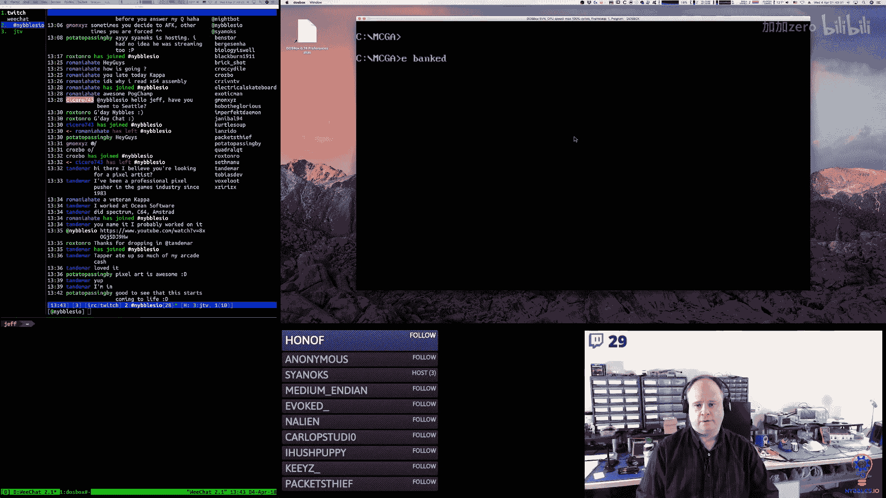

我。The total block number。No。Packet see， you should definitely write。An accounting system in Colbal。

I'm sorry， I had to say that， you know， I had to。I don't know why I said that， no， don't do that。

Don't write accounting system in Colbal。Again， I'm going to recommend to you the same thing I recommend to everybody。

I think everybody should learn。Assembly language， even if you don't use it， you know。

 in your day to day。Professional programming， career， still spending some time with it。嗯。And。

So this is a tool that's an example one of many， this is for X86。

 there's I have one in here somewhere for。Mps as well。And the key is less like which one you pick。

And just pick one and spend some time with it。And the problems。

 you know the programs that you write don't have to be fancy。

 the key is is to try to explore all the different things that you can do。

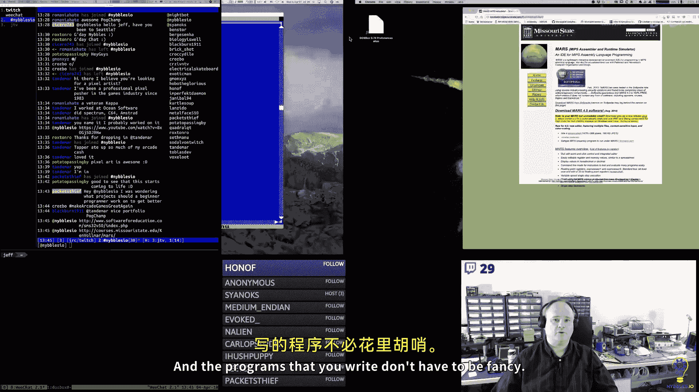

With a CPU。And then you'll be able to。Move on to bigger and better things。

 that's what I would recommend。But I'm biased， I like bent twiddling。Oh yeah， tanandemama。

 I love your art。Dude。Name your price。Yes。Love it。Love it， love it。Hey， Brianden。

What are we going it do today？What we do every night， pinky。Try and take over the world。うふふ。Perfect。

 so am I。I'm super old school。Are you on the Discord server， potato passing by？This is OS 10 yes。

The host operating system is OS10。あ这요。Well， I'm running Dos B。So it's in the doOS box emulator。

I'm old school， but I'm not like not pragmatic， I realize I still have to have a modern operating system。

We'll be here。All right， why isn't that working？🎼No。That worked。That doesn't seem， right？完来。哈。Okay。

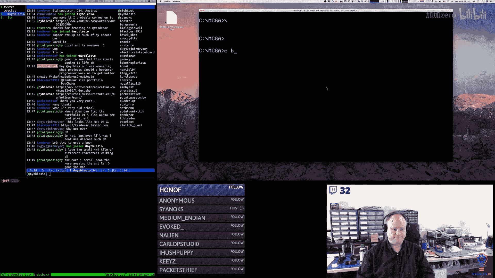

1， FF5。Yes， exactly， that's the idea， beautiful pixels。I love beautiful pixels。Okay。Yes。

That's the mistake。That's why it's。Yes。I don't do dankest memes。I do dankest games， Dannkest retro。

Oh they。I bet you did。Did you do graph paper？I did graph paper back in the '80s。In the 70s was fun。

You do your graph paper， you get out your calculator， you turn it into。Bineary or hes。

How long did it take to learn assembly language， I always tell people about 10 years。

I started when I was five。And by the time I was 10， I would say that I was pretty proficient with it。

And then it probably took me another 10 years to become。Really， really good。Yay， now it works。

This should be。Oh， I haven't done it now yet。哎。Yeah， I mean。

 I don't say 40 years because that kind of scares me。I usually say over 30。

 but you caught me element HTTP， you caught me。呃。You know， I was watching。

The video from the other day when I was reviewing the code and I didn't really pay attention to chat while I was doing that。

But。All you guys were like talking about how I wasn't human because I was talking about assembly language as if it was native。

Yeah， I guess it is a little scary huh？嗯嗯嗯。He hits his scenes。You know。

 there's a tomato throwing extension in Twitch。I've been tempted to turn it on just to see who throws tomatoes at me。

😀はは。😊，呃。Hell man， I'm hoping that it takes me out。If something bad happens。That'll be。

 that'll be that， you know？And I can take the。The permanent nap。It's so funny， my daughter。

She hates naps， the idea of it， she just detests it。And she catches me napping。She yells at me。

It's kind of amusing。She was like that from birth， basically， I don't know why。She does evidently。

But yeah， I keep telling her like naps are wonderful。If I had an option， like， what would I do？

I'd take a nap。I mean， you just you really can't go wrong almost。

Every now and again you have one of those naps where you wake up feeling worse than we。Started。

Or at least I do。But those are rare。ふ哼ふふ。没 I can才。Come on。Yes， I have to have my。

If you guys hadn't noticed， I'd go all in for the period theme， you know？🎼不言。Sth wave is awesome。Two。

16， two yay look at that， we're getting there all right， and I think I had set font to two。All right。

Now I got to do the block number itself。Which。Okay， so。Every time we pick a bank。

I'm going to have it reset。Block index。Because。And actually， it's going to have to do it in the end。

G guess I should have just copied the whole thing please。Okay， and then yes says。对。Not比 were。さ？

I've tried polyphasic sleep before。I， it really messes me up。In fact， I think in the past。

 having tried polyphasic sleep， it kind of permanently messed with my head a little bit。

Fs when it comes to sleep。160 pe， my gosh， I thought 360 was bad enough。

Every time you guys talk about that， I feel really bad。Because I have a fiber connection。gigab it。

なのはです。I know I just。I feel bad， you know。Everybody should have a gigabit connection。You know。

 all the bits have to flow on internet freely， fast。It's very important。Yeah。

 somebody put me up to that element HTTP， I could do it。嗯。I don't know if I actually， you know。

That'd be pretty painful。A turtle bit。All right。Jesus 160 P。

 like that's like CD ro quality back in the back in the day you a little。

People saw a little teen title of postedage stamp video， full motion video playing in their game。

At 320 by 200 resolution， you know。Eight bit color， heavily compressed。

 so there's artifacting everywhere。嗯。So can I just？Find you on your。Tumbr page， Tandndamar。

Or can I ping you on？My Discord channel and you can get back to me。

 we can sync up when you have time。I see you haven't asked me anything。🎼Gotcha， okay。

I will look for you there， thanks for dropping by。拿量。Not that necessarily IoT， some of this stuff。

I'm doing in electronics is again， kind of related to。UArcades。

 and I'm using that as kind of a common through line with a lot of the stuff that I'm doing。

I have done some IoT stuff， although not recently。So but yeah。

 I've got my scope and my signal generator。Ciddering， I've got a newpro burner。Got my fluke。

IGo another fluke， I think my son took it。🎼嗯。I need to get a better soldering iron。

 I don't like the aco very much。It doesn't transfer heat as nicely as I'd like。

You can never have too many meters。I have a bunch of those cheapy ones too， for like。

 if I want to set up different， you know voltage measurements on the circuit if I have different rails。

But。Believe me， I've been shocked plenty of times in my life。In fact。

 the very first time I ever programmed on a computer。

 I received a really nice shock from a flyback transformer around a monitor， that was great。

So we're going to reset it to zero， we're going to update the string。Update block number。Okay， now。

All the different bank types should report。The correct max。🎼16，16，2，2。16 and 16。🎼Yeahえ。All right。

😀呵呵呵呵呵。😊，Yeahや。Button block previous。🎼嗯。What kind of a similar are you actually using saw this J& Z with angle brackets push pop with multiple arguments？

Okay， so I'm using an asmbbller called A86。There is a variant also called A386。嗯。

The push and pop thing that you're seeing where I can pass multiple arguments， that is a feature。

Of 86， the assembler just turns that into。And pushes and end pops for you automatically。

You mentioned angle brackets or I'm sorry greater than or less than on the jumps on the branches。

 what that means is this is a forward declared branch。You can also do a less than。

 although you don't have to do the less than， that's a reverse branch。

So that's like a hint to the asmbler that the label is coming later。嗯。And so that's what that is。诶。

And。Is there， I don't see him。I have to switch windows to see them hold on。Oh， yeah。Okay。

 you guys have got to try to get him to hit my head。There's a lady who streams on Twitch。

She's working on an iOS game。And she has this really cool plugin where when she types。

 all the stuff that she types falls down and hits her head。I thought that was really neat。

Unfortunately， a lot of the plugins for like OBS and stuff， yes， Jessica Mack， thank you。Yeah， no。

 I think it's Jessica Mack， yeah。I'm horrible with names guys。I forget things。So easily。Yeah。

 so the keyboard thing I always thought that was cool。

 but I think it's like an OBS plugin and there's like no OBS plugins for OS10。

There's kapps invading me。No。The campusas are following a sine wave。It's the sign of the apocalypse。

Yeah， I really like watching her stuff， and she kind of reminds me of me though。

 because she jumps around a lot and changes her focus frequently。Which I find。Similar。ど対象だて。はは。😊。

Oh no， this existed back in the '80s。And the 90s。Oh did she make the plugin。

 oh cool I'll have to often check that out。Hey， Mr。 karsick。🎼Say。

I'm not sure what about tools on Dos box。Are you asking like？What I'm using or how to do it。

 I'm not quite sure what the question is。I mean， as far as that goes， Dos box is basically doss。

 it's not 100%， there's some stuff it doesn't。Do。But。Oh no。

 there's a lot of artists that are programmers， there's a lot of musicians that are programmers。

 and in my experience， especially musicians， seem to make very good。

Programs as far as how to use DoOS box， it's actually pretty straightforward you know what you do is you bring up。

My terminal here。And。Hey packetett， Steve， I am working on。

An arcade game and tool set reference implementation。For an educational series that I'm making。

 this is DoOS boxox and I am writing everything in X86 as family language。So on my machine。

I have a folder here called DoOS box data。And。There's a folder underneath that called Mount。

And this is where I put， this is what dosOS box sees。

 so in the DosS box preferences file you just point it at this path。And as far as， you know。

 at that point， this behaves just as if it were a hard drive on a DoOS PC。

And so everything running in within Dos box just。As long as it's a DoOSs compatible program。

 it'll just。It'll just work。I think anybody can write code。You know。

 everybody's learning experience is going to be a little bit different。But again， in my experience。

Creative types in general have an edge order how to program。Artists。

Are really good at looking at negative space。Altered perceptions of things。

Compared to a typical person。So， I think。Their brain is primed for being able to。Think differently。

 you know， be able to。🎼Start to think， like the machine。And build your algorithmic brain。🎼也不给。

Bunton black Max button black pretty。No， I mean， this is pretty much what I do。嗯。

I guess you could call it a hobby。I do it for enjoyment as well as， I guess， for work。

But it's I look at it more as， you know， this is what I really。Like to do what I enjoy doing and so。

It's just what I do。Okay。It's interesting。 It doesn't draw。Oh， you know what I didn to do， though。

And then why， why， why， why， why， why。Because。Money son。どうして。What。いそ。🎼I missed some。

And gets him the bud definition。あほ。Order color， background color。

No， I think our ends right now， or at least that's the way I read it。

I'm taking a systems class right now， I hate my life。Rest。Rt。Why rust？Yeah， that was a cool demo。

 the composite stuff。No， this is 86 or the assembbller I'm using is 86。

 the text editor that you see here is called TSE Pro。It's not a Boland product。

 although it has similar look and feel to a Bolin product at the time。System。Okay。いから。

And we can change the block number。🎼。😊，Of course that's not right， it should be stopping。Well。

 or I should be displaying a one based index to make it not so confusing。

I think that's what I shall do is。There we go， block one， block  two0。🎼不死了。Block next call back。

That is not right。Oh， because。There we go。Llaock one， block two。I find lie too。One， two， three， four。

 five。All right。We are getting there。🎼O。I have to take a really short break。🎼And then I will resume。

I resumeuming。Okay。That's right， Go a break。And three。

Don't ever say programmers don't have a sense of humor。We have a seriously twist。Okay。

 where was I at， I got the bank。Scroing。For at least the data structure and the buttons turn out and off。

Okay， so now。Let's do。Got all these set up correctly。Okay。

So now we have a macro that will let us get。BP。Based on the selected。Tab。So update block total。

Is being called only an En。Oh， guys。Oh。The tool is almost 13 k。I don't think we can keep going。呃。

I want you to find a program on any modern operating system。This 13 k。And that includes。

And he shared libraries and things that asked to load。Good luck。Okay， that's right， looks right。Okay。

All right， so now。对呵。😊，Oh， you mean？I got one of these。I got a whole bunch of them actually。哎。

256 bys。Yeah， it might be fun。That's tough though，That's like Atari 2，600 tough。Yep。You got it。Okay。

 so。We come into the bank。Set BPP with our tab block macro， so based on whichever tab is selected。

 we get a pointer to that block header。We use the view viewer funk。

Maacro to set the current viewer call back。We reset block index to zero because that's just going to make bounds checking a lot easier when you transition from bank to bank because if you were on a spray bank。

And you were on block， you know， 10。And then you go to a pallet bank， there isn't a ten0。

So it's just easier to reset to zero， we call update block number。

 update block total that sets the strings， so it takes the numeric value。

 turns them into two byte or two character decimal strings。Then we call BT set。

 which changes the button flags。So this is the button block next and previous on the top and the bottom。

🎼嗯。Yeah， 256 man like， I'd really have to sit down and think about that。I mean， it'd be awesome。

 but I'd really have to sit down and think about that。So we turn the buttons on。

When we come into the bank。Then during bank update we do our mouse and eventually we'll add keyboard stuff in here and then when we leave we clear the。

Viewer call back and we turn the buttons off。 They're still visible， but they're not active anymore。

Okay， now。When we draw， we're doing an update。Not them。So TB viewer draw。

This is what draws the block。Label the black number of label total。

And then we moved BP with the viewer。Call back。🎼And。

We compare it to null and if it's null we skip otherwise we call it and you know。

 using BP here is probably a really bad idea。What was I thinking？VX would probably be better。あ。🎼嗯。

🎼嗯好。Why I just tile not howmony？Max。🎼That's not good。啊。Where is it。No， it looks like it's just tile。

Yeah。我いました。Button tile。🎼Button typeile。🎼我来送歌。Srank thought palette。Background， so on。

 they're all fine except that type。🎼Why。Give me one sec， guys。Hello。う。🎼おほほ。🎼。🎼，Wow。

 that was a blast from the past， that was IBM， that was a coworker from IBM from years ago， wow。

The world。Is a small place。It really is。So bear with me here guys。

 I just need to shoot off a really quick email。And then I'll be back to it。Almost done。

Could anybody tell me why YouTube doesn't give people vanity URLs unless you meet some really serious？

I don't know， magic criteria， they don't。Really advertise anymore I just don't understand it like it's the most awkward。

 their channel names are so awkward。They're worthless。Okay。Sorry about that。

But it was an interesting conversation。Not one I was expecting at all。Okay， what the heck is I doing？

はははい。😊，🎼呃。Does it there's probably a reason， right， but？I don't know。Oh I remember what I was doing。

 I was going to try to figure out why。Creating a new bank for tiles。Isn't setting the max。🎼嗯。🎼Oh。喂。

That's not。That was really bad。mSaving BPPCX BX。And then restoring them。

 and then I was pushing one word， two bytes。Onto the stack， but I was adjusting SP by four。

But thing it。The thing gets me about that is why can Twitch get away with giving you a valid handle and you know。

 YouTube， I don't know， like YouTube doesn't I don't get it。I don't get a lot about YouTube。

 to be honest。Yeah， that's interesting。I'm really amazed that that didn't like blow up。

A lot sooner。

But that's still not right。🎼嗯。🎼W。あ我。All right， well， let's do this。Bank new。

Is at。4 E8。可。

It it was tile that was the problem， right？So BL should be the max。Yeah， which is 16。Okay。

So so far so good， yes is pointing at。3 CBE。啊。Okay， so now BPP is pointing at zero。

And we're going to clear out AX， we're going to move。The count。Just 16 into AL。

 we're going to move the size of the structure into CX， we're going to multiply。你声。うごかな。

Weve CX with 16， we're going to divide by 16。That's the size one by one。

 that's the number of paragraphs。Okay， yeah， so this is us allocating memory。

This is us clearing memory。So。Okay， so。We've put。うん。The segment address in our。Hetter。

We're moving zero into。Now here's where we' live in DL。Yes is right there。There's 16。That's it。

So that header record looks。Correct。There was one thing that looked off， maybe。Yeah， I mean。

 it's not getting stomped or anything。There's the matrix。And it looks okay。Why。I don't get that。

So specifically I'm looking at this bite here。This is 16。That's the max。This is the segment。

And this is the current offset。嗯。🎼You're not sure。What's going on there， there is one thing though。

🎼嗯。And that looks okay。One， two， three four， yeah。OhYeah。Okay， that's all right。🎼嗯。

So let's look at it from a different perspective。Let's look at updates。No， that's not right。

 let's look at them。Yeah， update。哇。Overer。1 DBC。🎼万比比斯。🎼2デ beasts。No， no， not there here。🎼Okay。Oh。

 I still have the break point for。Crarap。嗯。Okay now。So we're moving。The block number。

This is where we're going to put it into。🎼中球鞋。I just maybe forgot something。Yeah。

 because this just loads blackmcks。Yeah， so obviously this is not pointing at。

BP's not pointing at any。Because I forgot it。ああ。Yep， that'll do it。Tile， perfect， good， all right。🎼O。

Okay， so that fixed that issue， I fixed the stack issue in the bank。New， that was bad。

That probably would have eventually resulted in weirdness。あ。Okay， so how do I want to draw this？

For tiles。🎼Okay， so。We're going to have 16。Paalets。I think I can。🎼Maybe fit。A across me。Oh no。

 that's。That's the number of lines， and I want two lines。And I want to eat across。

And I want to make these 16 by 16。And I'm going to add 17。And 17。Pette， okay， boom。

 and I want to put a number in each one of those。And。No， I've bought the mic specifically for this。

This is a Sennheiser all on the。🎼ああ。One moment。This is acentheiser excess wireless tube。

So there's actually a receiver unit that's plugged into the computer。And then this is wireless。

 this takes two AA batteries， which I have a rechargeable set of batteries I cycle through。

I can get about six hours on。Fresh batteries， freshly charged batteries。🎼嗯。It took a little bit of。

you know，Ftzsing around with it， but once I got it all configured properly， it's a really goodmic。

 I mean it actually picks up a lot， a lot more than I expected it to。🎼嗯。

I have other microphones here that are fixed position， microphones and directional。🎼嗯。

But they don't let me move around freely， so that's why I went with a lapel mic。🎼嗯。🎼So anyway， yeah。

Do that， really。You what I should do。 Oh， yeah that'd be cool。 Yeah， that'd be cool。Sorry。嗯。

This is what happens when I stay up past my bedtime。Okay。

I have an idea of how I want to render these that makes them look better， but I'll do that later。

So the next step is I want to put the pallet number and then at we got to implement the code that's going to let us。

Pick these and then when we pick this， it's going to show the entries in the palletette so there's going to be 16 of them so what we can actually do just to kind of roughly get an idea of what that's going to look like。

So this is code that draws the。The palette。Pets in the block。And okay。

 so I want to get the number in there， so let me do that。Paalette number。And we're going to do。

Can I do AX， I'm not using A。🎼Okay。So， I need to。Really pick a better color。Color。

 we'll go back to the red。It stands out for now。Not quite that much。Okay。

So I'd say down another on why back。Two on next。Here we go。That's such too bad， okay。

 so those are our pals。And we click on these to select them。嗯。You can ask questions if you want。

I mean， one of the main reasons why I'm doing this。Is for educational purposes。You're welcome。

 Moral Rita。How are you doing by the way？🎼5。Not quite enough room for that。Hi， how you doing。

 I'm streaming。🎼It's okayッ say hi o hi。滚该爷。Hオ。I'll be done soon， all right？Love you too。Oh， 22 45。

 dude， go home， yes， that was my daughter。Thank you。She always gets so shy。

When she knows the camera's on。Kind of funny。😀M。😊，Yeah， I do lose my place if I talk a lot。

Me and my horrible short term memory。No。Hey， worship the sofa。Do you take a lot of naps， yes。

 I would have to say that。I'm most at home with assembly language。I really enjoy。

Working at this level， I like C and C++2。But like。This is home for me， definitely。

And I always feel like in assembly language。Nothing is。🎼Be possible。I could do anything I want。

And nothing， you know， assembly language isn't standing in my way， the assemblyler isn't saying no。

 you can't do that， no you can't code it that way， no， you know it's。If you can think about it。

And you know how the machine works。You can make it happen。And that's true of C2。But NC+ plus。

But there are certain things you can't do there。And then， of course。

 other languages that that restriction just gets worse and worse and worse。

Ever dream about bouncing between registers， I probably have， yeah。Yeah， you got to have naps， man。

 I mean， seriously。🎼Oops。There you go， I like that， that looks pretty good， okay？Fills it up。Now。

 so let's do because so each one of these is going to have 16 colors in it。

 and there are 16 of these， that's 256 colors。The zero with pallet is special。

 it is the system pallet， but you know。I think for most games， we can probably avoid that。Safely。嗯。

Okay， so the top part。We're going to do。いう。我看么。So 43 and 21。

So potato passing by asked a common question， isn't it slow to write things in assembly language。

 so I don't know， I mean my take on that is yes it is probably slower sometimes。嗯。But。

I also feel like I get things done relatively quickly in Sun language too。

And the amount of code that I have to write。Paradoxically is not as much as you would humh。

Lo how much you would assume。So。So yeah， I mean。I don't know， it's a tough one because。

There are some cases where I think some of the language is。Going to be more difficult。

 but at the same time too， if you use your macros， if you use the asmbler to its fullest。

You can lever up。Your ability to get things done faster。I don't know。I get the end。

The difference between。My throughput or my productivity with assembly language and like with C。

In this case would be。They'd be pretty close。You know， assembly language would be a little slower。

Productivity wise， but。You know， not that much slower。Okay， and so then I need。Well， I mean。

 I've been coding in sea for almost that long too， actually。Longer than that， but you know。

It isn't some， yeah。There's an HCF instruction technically on the Motorola 6809。嗯。

There's a halt instruction on the X86， actually those instructions are somewhat misunderstood。

What those instructions typically do is what they call a matrix probe in the execution pipeline。

Because if you look at how at the digital electronics level， these things are built， they're。

They're a net or they're a matrix of sorts of gates that。Get masked off， you know。

 to when you look at the execution engine， like what state？Within a particular instruction。

 are you because of instruction？Can be multiple states。

 can be multiple steps to get an instruction done and of course on modern CPUs it's even more complicated because you have parallel ALUs and you have parallel execution engines and all this other stuff。

 but the short and sweet of it is is that HCF， which for those that don't know。

It's supposed to stand for halt and catch fire。What those instructions typically were used for or the hardware engineers would。

Put the machine into a halt condition， which would cause the machine to either strobe you know ra in a certain pattern or it would cause the execution engine to cycle through a bit pattern so that they could actually debug the execution engine and op code fetch implementations so they' really make the machine catch fire they just。

Put it into a you know what you would consider to be like a locked state。

 but it's not really locked if you have scopes and other tracing equipment hooked up to it。

 you can see it doing certain things that from a hardware perspective allow you to troubleshoot。

 you know。How all that stuff is working。What issue are you having with GLFW？Meug Sahi。

 one of these days， I'm going to be able to say that。Ooh， too big。Okay。Okay。

 now we're getting closer。I do worship the sofa， but give me one moment before I answer that question。

嗯。Worship the sofa。And its his handle。Two comments above the one that you just made。Just under Voxel。

Voxute。My man you missed。Worship the self。That stuff， right？That's like the coolest handle yet。

🎼Oopps。run that。🎼Okay， so now。That's roughly what I want。

 but I think I'm going to have to split it up into two。Two groups of eight。

To make it fit on the screen。あ。😀。That's why the handle is so perfect， I mean because you know。

I think everybody does。🎼嗯。Yeah， I know， I got to fix that。That's going to be true in every palette。

I'll have to put a background around the color or something。Or around the tax rather。In my head。

 it made sense。I'm going to take a quick break and then I'm going to answerWship the So's question。

🎼No， break。All right， I'll be right back， Kayson。あ了。Okay。Okay， so worship the sofa。

 let me ask you a question。嗯。When you say you feel like。You have come to a stagnation point。

Describe it to me。🎼いや。Okay， that's what I kind figured。That's typically where programmers。

Get stuck at some point early on。Because what happens is you reach a。

The kinds of problems that you're trying to solve become。

Larger and more complex than what you're used to and that you feel like you're kind of constantly struggling at that point。

And。I can definitely。Relay to that， so here's going to be my prescription for you。My advice。So first。

 what you have to do。Is。🎼You have to。And this is going to probably feel really weird for a while。

It's going to feel like it's not right but。It is。Typically when a programmer learns to program。

They learn the imperative。Aspects of the machine first。They learned the proceduralism。

So you learn that if you assign a value to a variable。What that means， if you change a value。

 what that means， you learn that a loop will do whatever's inside of the block。

That many times you learn that calling a function or calling a procedure。What that means。

And a lot of early programmers。Their solutions are very。I wouldn't even necessarily call them。

Algorithmic， I would say they're very procedural in nature and I'm going to make guess that it probably feels very comfortable if you can break problems down into step one I do this。

 step two， I do that， step three， I do this because then that allows for a transliteration of sorts into code。

And again， this is a very common thing I don't。It''s very。

It's very common when you're learning a program。So the transition point is what I call out developing your algorithmic brain。

And what that is is a combination of data structures。And the code that goes with that data structure。

And so the part that is going to feel weird is I'm going to suggest to you that you need to。

Begin to stop thinking about the language。That you're using。

Don't focus on the minutia of the language anymore。What you should focus on is what is the problem？

And then you have to think about the concepts。Of that problem， concept， space of that problem domain。

What data structures， what？嗯。What data structures in？Definition。

 definition is maybe not the right word。嗯。Trying to think of a good word here。嗯。

Implementation is so heavily overloaded。You know what data structures and what？

Instaniation for lack of a better term。Would best fit the problem space。

 but not don't think of it in terms of。Oh， I'm using language X and language X does this this don't think of it that way。

 start to divorce your brain from whatever programming language you're using instead think of it as you know this is what the data looks like for this problem is。

What？A particular。嗯。Embodiment there you go， that's what they use for patents， right。

 a particular embodiment of that。Data。In an algorithmic sense。

 what would that look like and you know， doodle on paper， draw things out。

 use a whiteboard that's not cheating， that's normal。And。Realize that。There are cases in code。

 right where it is just all about increment this variable， set this thing， changed that bit。

What I would call mechanistic code， boilerplate code code。

But when you are trying to solve a complex problem。It's all about the data structures。

And notice I'm saying data structure， I am not saying class。Or class hierarchy or。

Any of that nonsense， don't do not。Start going down if you've already started going down a heavy O path。

 stop。Turn back。Forget that shit。Don't worry about that。Instead， again。

 focus on what are the data structures and what does that look like？And an abstract sends。

AndAnd notice I'm not saying abstraction， I'm just saying。Conceptually， what does that look like。

 then once you have gotten familiar with or you become comfortable。

Thinking of things in terms of the data structures。For that problem domain。Then go the next step。

And think of what。Functions would need to exist to operate upon those data structures。

To yield a particular end result。嗯。And this is why I say don't do the OO thing because OO tends to force you。

 oop tends to force you into the mindset of there is one。You know，I have a player， I have a block。

 I have a whatever， and it is itself。The problem with that thinking is that's not typically how you really want to implement solutions in software。

 you want to implement if there's one， there's many。

And so you want to think of your solution space in those。🎼Ways。And by doing that。

 you will automatically get。🎼Good O， big O。Performance。

Characteristics without having to work so hard because you're automatically thinking of things in the whole。

 not as atomized things。🎼And and。Not in a， I guess I would say a fake or false way either。

 right O content to oop content to make you think of things。Too narrowed down and that is not。

Reality in the machine right， reality in the machine is that you have these big blocks of memory and you're chunking through these things where you should be and that's。

That's the way you should be thinking about it。So avoid putting too many extra layers of。

Implementation abstraction into your thinking。Just think about the data structures and the functions that would operate on those。

And。Do that for a while as you're solving problems， focus on it that way。If you。Are working in。

An obligatory O language。Do the OO stuff last？solve the problem procedurally。嗯。

I should say in procedural code， right data structures， right functions， keep them separate。

And then if you have to oop it， because that's what your job makes you do or something。

Do that as a last step。And typically， if you've done the first things properly。

Finding encapsulation boundaries is typically。🎼Relatively easy。Not always but。Typically。Now。

 but knowing full well that by introducing those encapsulation boundaries。

 you're probably going to have some performance。Hits with that。And that could be okay。I mean。

 it's not。We're talking about lots of little performance hits tiny little things。Cash misses。

 you know， cash inefficiency， that sort of stuff。But they can add up over time。

 so it just depends on what you're doing。嗯。And。Yeah， I mean。

 I think that's probably what I would recommend。And I think if you do that long enough， again。

 don't approach。I hate to say don't。Think very carefully。

When you're going to brute force something and that's what I call it。

 like if I'm going to implement something and it's not。

 there's no data structures and it's just I'm just going to force it right I'm just going to write some for loops or some while loops or a bunch of garbage to get something done。

 I always kind of say to myself I'm brute forcing this。If you're。Aware of it。

 if you're cognizant of it， then it's okay， right？You're implicitly acknowledging that there's probably a better solution for what you're doing。

With the with data structures and with support functionality around them is just that。

Maybe in the short term， you want to get it。Working， you need to get done fast or whatever。嗯。

I hope that was helpful。Yeah， it definitely takes a while to。Grow your algorithmic brain。

And really good reading would be newth， honestly， like it's dense and it's all an assembly language。

But like the art of computer programming really is。A fantastic reference。

And you can expose yourself to a lot of。Ideas， a lot of algorithmic and data structure ideas by reviewing that。

 and I don't think there's any specific order or anything iss just。You know。

 pick something and start going through that as just an exercise right to become familiar with those sorts of things。

Okay。🤧嗯。嗯。嗯。OhY， just fits perfect。And then I think I'm going to make them a little more narrow because I got to have the values next to them。

There we go。All right， so I'm going to move the text down。More pixels， I think。Yeah呀。Maybe not quite。

I might Ill get back by one。Oops。There we go。Not too bad。Okay， so now before I do the second column。

 what I want to do is put the text fields in here。呃。Yeah。Color。🎼Pettes。We're so close。Okay。

 so now just test。嗯。Let's go to palette number one。嗯。That's not right。Not at all。嗯嗯。

And I think that's because， yes， see， I've been a little inconsistent on some of these。🤧给。

That's not right。Okay， so I think。I think I to pretty out。Yeah， there we go，oo， but that oh yeah。

Yeah， fix that。This should be D L。Why thank you， Deb Levy？I am。Okay， so I think it。

So I'm going to do pallet two now。That doesn't seem right。

Although the default VGA palette is kind of。No， but it's not changing， it should be changing。

So the top colors I'm expecting them to shift based on the pallet。

That I select so I'm essentially by encode code， I'm emulating what would happen if you picked the buttons at the bottom。

To get the code working so that we can actually see that correctly。But yeah。

 that's not working with parents。🎼So， video。So position， size and color。Position， size and color。

So we load AL with the pallet。Which should be the high bite。Of that word。This is Do box。

So there's three words here， you know？Okay， so the high bite should be the palate。

 the low bite should be the color。Which is what we've got。So we take the high bite。

And we multiply it by 16。🎼And。🎼My。Math is horrible， so let's do this。Yeah， you can pretty much。

 you can run almost everything from the dosier in Dos box。You can run Turbo， Pascal， Turrbo Base。

 or Turboc， Turbo C++。You can run the WacomM stuff， you can run DJ， it was a DJ， GPP， I mean。

 all of it runs。I mean， there's a couple things that。Are incompatible。

 but there are few and far between。So if we choose palette one。And we shift left。One， two， three。

 four。Yeah， that's 16。Right。Okay， so I got the math， right？Okay， so we multiply。

The palate number by 16。And we add the color。To that。

So that sounds right because the color is going to be zero through F。And。Yeah。

 so that should be okay。嗯嗯。うん。It， let's pick。Palette。Let's click palliate。🎼Oh。

Typing doesn't bother me。I'm so used to doing it now。嗯。Okay， so now。🎼I wonder。Ooh， look。

 that broke it。可。Now I'm curious， though， because。Yeah， oh okay。I didn't think so， but。

I'm just not understanding why the colors aren't coming out of the way I expect them to。

You the last sentence， right。あ。I thought about that。 I thought about having。Multiple。

I actually wouldn't even really technically need to do remote bugging， I believe you can set it up。嗯。

So that doOS box will generate a window for the composite output。

And then the main window is for the standard output。Because a lot of games back in the '80s and '90s。

 what they used to do is you could hook up two monitors to your video card。

Typically they had a composite output and they had a VGA or you know some other。CGA EGA type output。

 and if you hook both of them up。If you output text。Because the text buffer at B8。

 what is it B800 or whatever？It's independent of the VGA mode or the EGA area。

 and so you could actually have text coming out of your code at the same time as you had your graphics coming out。

So。So that was a very typical way of doing it and I've seen some folks online who have done that withOS box I don't I have to research the steps that they go through though to figure that out。

But that would be pretty cool。Because then I could actually write code in here to output debug information to the。

Text segment， right and。We could see the debug data alongside of the engine and the tool。Yeah。

 it's B8。BA00 I believe， is where the tech segment's at and A000 is the VGA， EGA VGA segment。

They're independent of one another。嗯。うんふん。Okay， what am I doing here？AndI want to debug this because。

I want to see why the numbers aren't coming out the way I thought they should。I mean。

 it's sort of kind of working， but not really。嗯。Address， 10，17。Okay。So here's our color information。

🎼嗯。There we go。う嗯。啊。O。Why is？That a problem。Caalette IDX is a bite。Oh， I bet。🎼阿北。You one time。

 I don't do it。No。しかもなね。哦。Oh Jeffff。Jeff。Why are you so stupid job？Helloello， are you see。I think好对。

Stopping so stupid。Okay， it works。It helps if I do it in the right spot。

 I completely forgot that I had added that initialization code in there。Ive。Okay。

 so the palace stuffs working Ray。嗯。Time for bed。I think。Okay， it's working。Very， good。

That's what I wanted to test。So now we will set it to zero and be happy with that。All right。

 so now I'm out of time。So let's review what I've got。And。Thanks， Rox Sandro， I appreciate it。I try。

O。Al right， let's whoops， strong shortcut key。load up source tree here and we'll do our。Review。Okay。

 in bank。I fixed a。

really bad stack adjustment here。

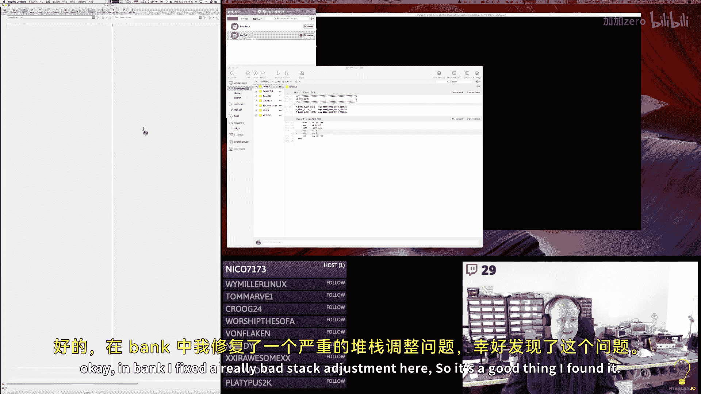

So it's a good thing I found it。🎼Yeah。So we're only putting one value on the stack here and I was adjusting it by two words。

That's bad and good， so I fixed that。嗯。So yeah， that was that。

嗯。And then in video， I changed， there was a bug here where I obviously raped and pasted some code at some point。

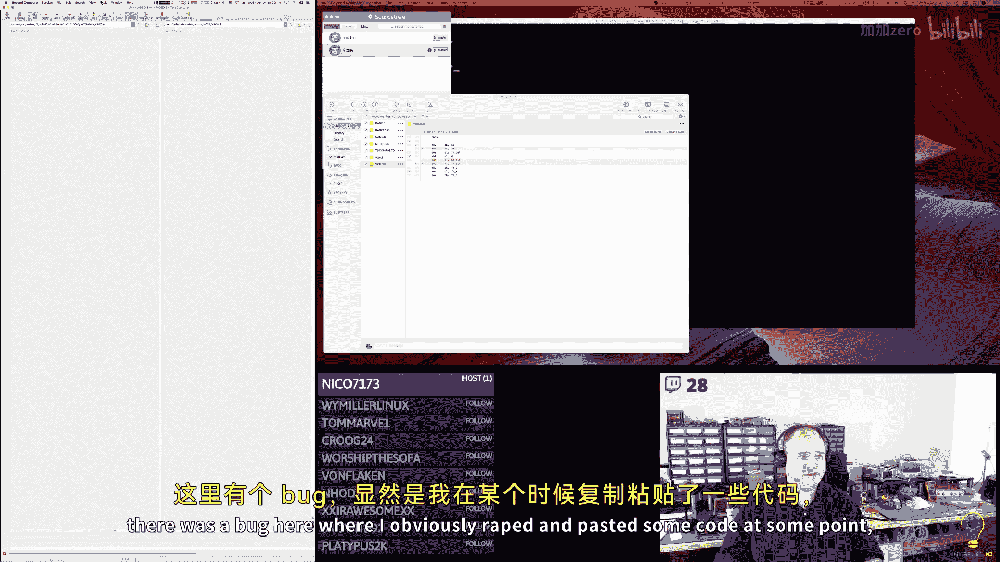

But I didn't update。So I added in a clear for the AX register here。

I don't really know that it's necessary。In the debugger。

 I was seeing that the high bite of AX was random stuff。ISo I thought okay。

 I'll just clear it more for my just clarity of thought than anything and then I wasn't accessing the。

Correct variable from the rightstruct here， so I fixed that。

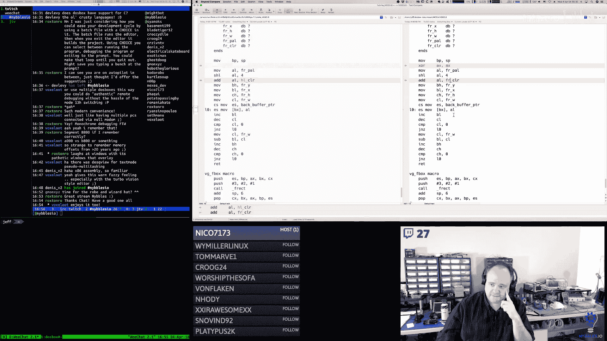

嗯。And that was it there。In video， I made some changes early on before the stream to the pallet stuff。

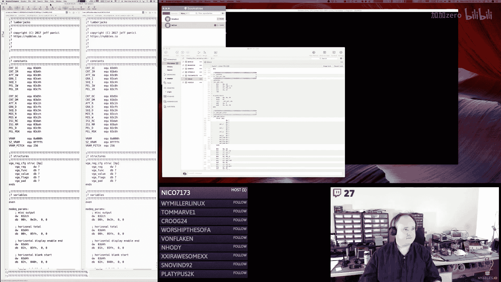

🎼诶。Which we're gonna。We're going to be calling tomorrow。So originally I had one monolithic。Function。

 I changed that， so now I have a set palette index。

Wwhich sets the correct hardware register to the right pallet index。

 and then I have a set pallet RGB， which and I just realized that macro is not right。🎼So。

 this should be。Zero，1 and。3， two。O。Thats better。

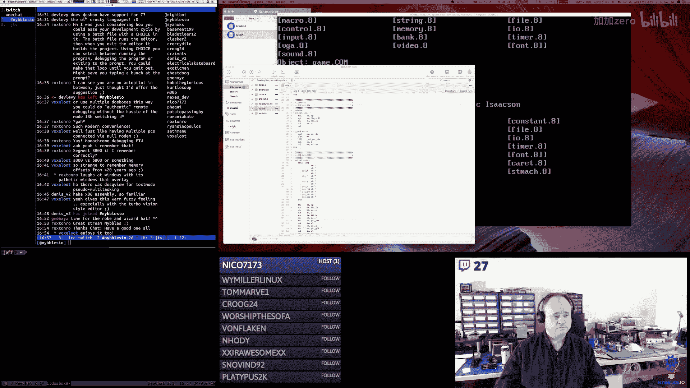

🎼Yeah， so that。There's two of them now。You pick which pallet register palette index you want then you call set RGB The reason I did that is because I realized when you want to load the entire pallet。

 you set the index to zero and then you just load the RGB triplets you know in order for all 256 slots。

So this ended up being a better， I think， implementation for this than what I had before。

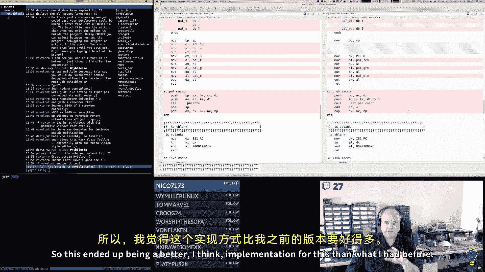

Plus it's all macro magic now， so that's I don't want to create a patch。

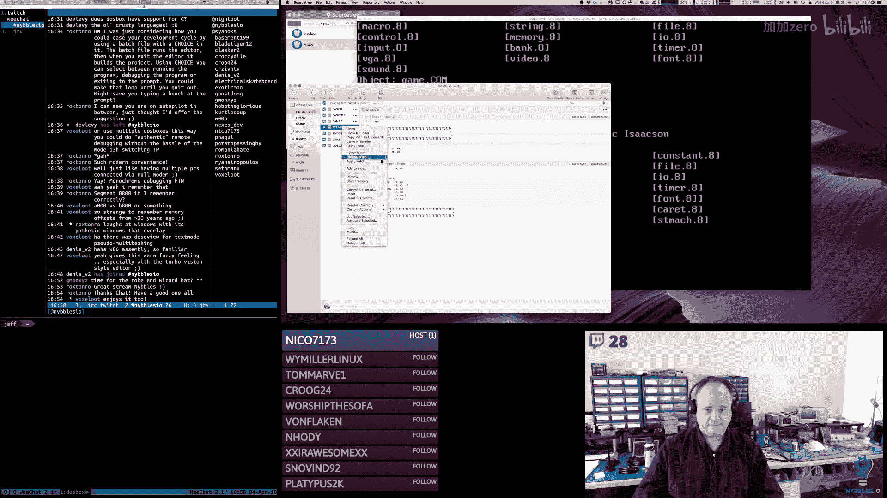

🎼And then。For string， I added the， so I changed the S dollarll deck2 to be kind of a private function and I created a macro for it that just kind of wraps up using it because I was having to cut and paste the same coat over and over again and it was just getting kind of nasty so I cleaned that up。

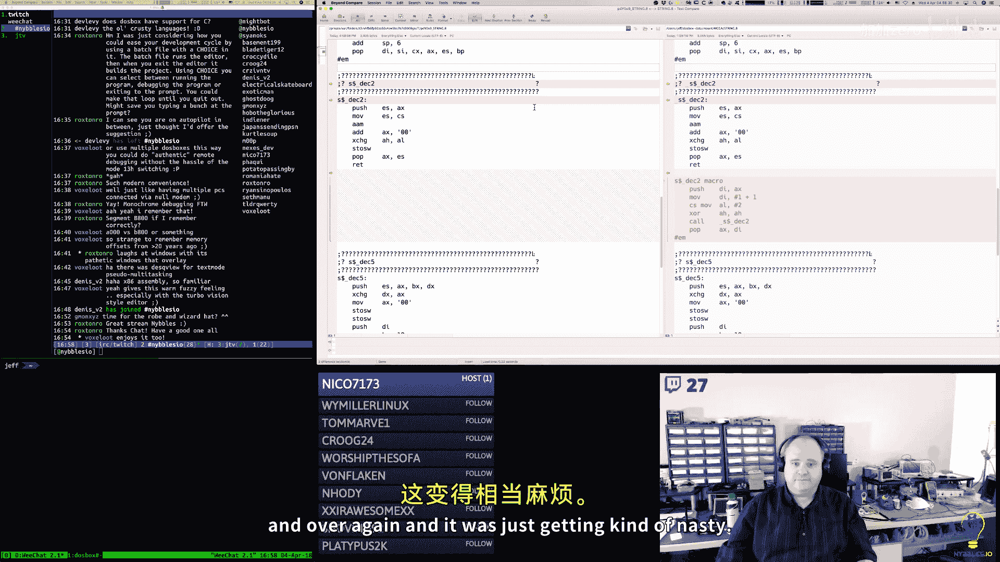

And then game， this was a change for that S dollar deck2。

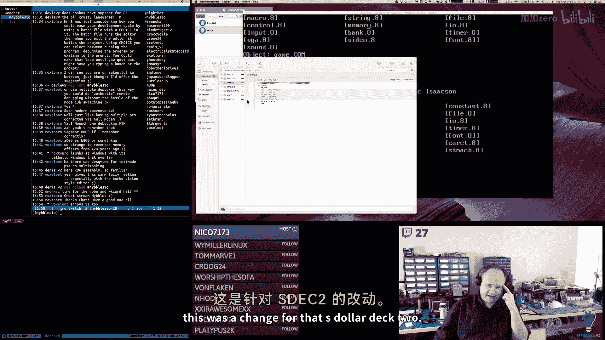

So instead of calling the function it's using the macro now。

 which makes the code the call site code look so much nicer right。

 so you pass in the pointer to the string structure that's going to get the。

Two decimal digits and you pass in either a register or a variable。

 a byte variable that has the value in it。

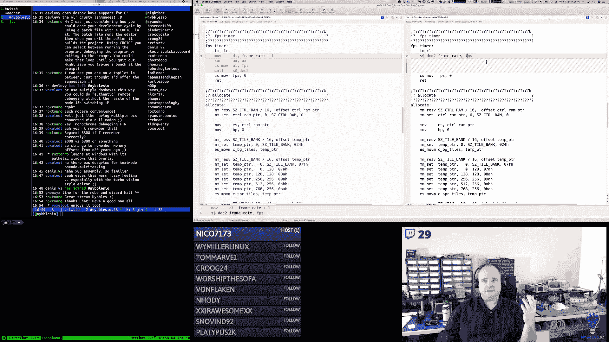

So much nicer。And then in bank。哎。Changed one thing。Oh yeah， we already talked about this was。

Stack thing that was all bad。

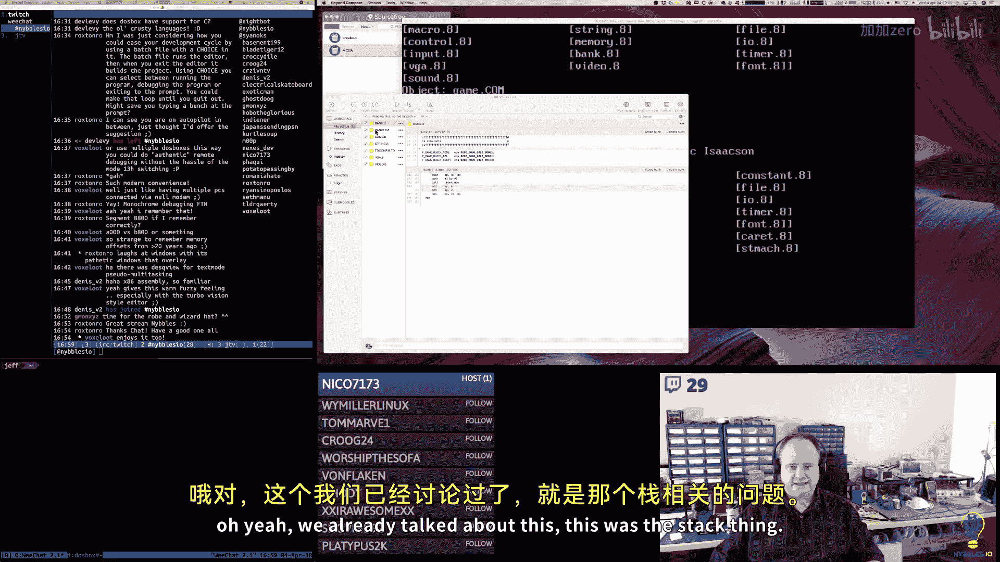

And then in banked， the actual tool， Bank Ed。

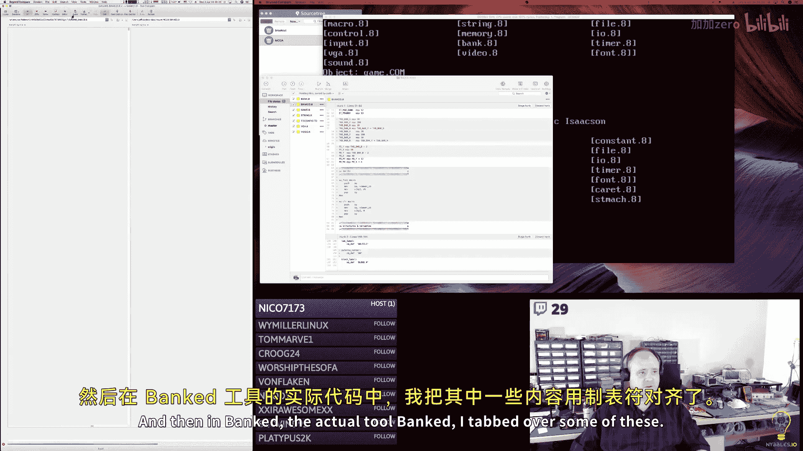

哎。呃。Tabbed over some of these， I'm not sure why did that project。Because I thought it looked better。

 added a couple macros， one to set the viewer callback function and one to clear it because I was doing this over and over again and so a macro made sense there。

Paalette number is used when rendering in the pallet， so the viewer part and the editor part。

 so just gives me a two digit decimal number string。嗯。

And then I fleshed out the bank callbacks for the soundbank of the mod Bank。

 they still are no ops but the update does call the mouse the button fire stuff so that if you click on one of those the app doesn't seemingly hang the app really wasn't hanging it just wasn't calling button fire so none of the buttons we' working after that block index and block Max this allows the up and down arrow scrolling inside of the block viewer to function properly and then I've got a bunch of helper functions for updating the block number string。

 the block total string， I have a tab block macro， this takes the selected tab number and uses the block pointer macro to get me to set BPP pointing at the correct block header。

Tab go， I just moved this up from where it was in the file。

 so it's kind of together with the same stuff。嗯。And then in each of the enters。

 so I call a tab block to get BPP assigned to the correct。Location。

 I call the VW Fk to set the viewer Fk callback， I reset the block index， I update the strings。

 I turn the up and down arrows on。And then when we leave。

 we clear the viewer callback and we disable the previous and next for the block and that's pretty much true for all these。

 these are all the same。嗯。And then I add， like I said， I added the sound bank and the mod bank。

Hallbacks。So that's all the callbacks now for all the different states are fleshed out。

I just have where I should say they' were there， now they just have to be flushed out。嗯。And。

I implemented the button block previous and button block next。So that actually works now。嗯。And。Yeah。

 the frame rate stuff just uses the macro S dollar deck2 now。嗯。Same thing with the tab drawing。And。

Then these are all of our。🎼Viewer callbacks and I started implementing the palette viewer callback and I mean。

 this is looking pretty good。 what's next is I need to put the fields。

 the red green blue fields on the right and then I need to do the second column so we have all 16 colors on there and then we just need to implement the。

We just need to hook up the text fields essentially there's already code that does all that。

 I just we just have to put the data structures in there， put them in the right place。

 turn them on and we should be good to go。🎼嗯。🎼And。Yeah， this was just changing to use the macro。

And that's it， that's what I got done。So not too bad。

Right。I'm going to push that up and yeah it's 504。So that's going to do it for me today。🎼I。

Appreciate everybody who dropped by。And I will see everybody tomorrow morning at 5 a my normal time。

 I don't anticipate there being any major schedule changes tomorrow。

 so we'll get back on our regular。Bat schedule， regular bat time and regular bat channel。

So I will see everybody tomorrow morning， have a good evening， morning， noon。

 whatever time of day it is for you。And I will see you tomorrow morning， thanks a lot。🎼来い。

