# 【精译⚡x86汇编语言】nybbles.io p11 p11 x86 Assembly： Palette bank editor (part 2) -BV1NPr9YKE4b_p11-

Good morning。🎼嗯嗯。Hey Gman， how's it going？Got to have coffee， man。Absolute necessity。うん。うううん。

All hail of Vigarten。Yes。All right。Good morning everybody today is the 5th of April 2018。

 this is the Nibbles Iio Daily programming stream， my name is Jeff I program every day from 5 a。

 to 10 a。I stream it Monday through Saturday here on Twitch。

 I archive all of my videos on my YouTube channel for those of you who do have some trouble receiving the 1080P stream。

You can always watch it at your leisure on YouTube and you can also jump around if certain parts are boring or you really don't like to listen to me talk。

🎼嗯。This week we are working on the MSDs Arcade game reference I for the let's make an Arrcade game and MSDs educational series that I am filming this is the last week that this project will be on the schedule。

in the foreseeable future， because I'm getting to the point where I will be wrapping up the actual video series that I'll be releasing on YouTube and once that's done then you guys can watch that series if you want and that'll be。

At least 52 videos that will be released over a period of a year。

 my intention is to release one video per week。And the videos are。

 I'm still kind of fussing a little bit with the actual format。

 but the videos are probably going to settle right around 30 minutes apiece。Because again。

 this video series is more based around like a syllabus or a lesson plan and my intention is to teach people how to actually do things。

 not just have people watch me code，嗯。You know， try to absorb it you know。

 as they're watching me so it's much more deliberate。

 much more structured and about 30 minutes of new information per week is probably， you know。

What most people are going to be able to comfortably absorb so that's roughly what that's going to look like。

Today， specifically， I'm continuing to work on the palette editor。

In the bank Ed tool and right now what I'm doing is I am trying to， I want to populate the block。

So we have a pallet bank that has one block。And I want to populate the VGA palette data。

That that's already preset I want to put that into the block and then we'll change that data and that will be the data that sets the pallet。

But I'm trying to remember some of what I was doing here。🎼嗯。So。That's where I'm at right now。Okay。

 so I think what I've done here is I've satisfied myself that。This is not。

This is allocating the segment for the blocks， so you create a bank。So we have two。

 we have multiple segments， right， so we have one segment。That is just header blocks for the banks。

And we can have up to 16 of those。嗯。And then a bank's header。Points at a different segment。

 which represents the actual block data for that bank。And quite a few of these banks are very small。

 they're one or two blocks a piece， so actually the pallet data。

 I don't know why I was allocating two blocks， it's really only one。嗯。So pride cut and paste。

At some point， but because palette data is 768 pallet entries。I think this。Yeah。

 there's 768 pallet entries， so it's 768 bytes。嗯。And we have 4，090 bytes free within a block。

So once you take the header information and stuff out， that's what happens。

That's how much you have left。So I have plumbing in， you know the bank。呃 moduleule。

To create a new bank。To find a bank， to get a pointer for a bank， to reset all of the banks。

But I don't have anything to do blocks yet。 havenn't gotten that far。

 So I think this is going to be our first。And I have some of the file stuff sketched out， but it's。

It's mostly just notes。So what I need now is the ability to create a new block within a bank。Okay。

 so we're going to have a block new。And。So。The way this ends up working。

Is I'm going to assume this bank， this block new is going to assume that you already have selected a bank with Bank Pointer。

And then I think we'll have a。BL。没。And this macro that I created up here。那条。嗯。那有。

I think I'll call this BL。Pointer。Its a BK is bank， BL is block。Okay， so。To create a new block。Again。

 we already assume that。We've done。Beak a puter。To get an address of a bank header。

And then we're going to push on。嗯。What。I guess nothing really。

 because if you're creating a block for an existing bank。We're getting all the information from。

 we're getting the type from the bank。The ID is we already have a generic ID that just keeps counting up。

 so we'll use that。Although。Yeah， I probably should create a second one， right？So。Bank block ID。

Hey Romania hate， how's it going？最。Thank we needs。Pass anything else in， right。

 we just we do a Bk puter。That selects our bank， we say we want a new block within that bank。

And that's going to initialize based on what our current block offset is。🎼In the。嗯。

In that segment for that bank header。嗯。🎼嗯。Okay。So we want to ES move。We want the type。

Now the question is。We have bank types here。But what are our block types I thinking that it's really not？

For block types， there's just a。A data type， right？

I don't know if there's another kind of block that we would have。So actually， yeah， ironically。

 we probably don't other than the segment offs that we probably don't need much from the。Parent。

So yeah let's do that， what do we need from the parent we need？The current。

Block offset so let's move that into BX for now so that BMD block off。And。

So what we want to do here is we want to push ES and we want to push BP。

Because at some point down here， we're going to pop them。

Because we want to we want to save the context of the bank header。Because。

We want to be able to update data in the header after we're done creating new stuff here。嗯。Of course。

 if we do it that way。Oh don't know， you know， I can do what I did for the bank header。

It can move Ax with。BP， when we're all done here。🎼嗯。Okay， yeah。

 so what am I rambling about so I'm going to get？I'm going to say ESNBP。

 I'm going to move the from the bank header， I'm going to move the block offset value。

 so again you have a segment， a block is 4095 bys， the block offset just tracks like where we're at so we have a max。

As we create new blocks， we're just moving that pointer down or up in memory however you want to look at it。

Up。🎼So。This is the location of the new block。Okay， but ES， we have to access this all through ES。

So I do this move， this one move because I need to access the bank header through ES first。

Then I'm going to change yes。By moving the empty block segment， right。

 so because each you have a header。That lives in its own segment。

 that header points at another segment that has all the blocks for that bank。嗯。

And so we want to update ES to point at that new segment。嗯。And。

Now I'm thinking I can probably just set BP to this right off the bat。If I do no I can't do that。

 I have to do that after this。Now I can move。🎼Okay。So then now ES points at the blocks segment。

BP points at the current start position of the next available block in that segment。

So now we can do an E move。嗯。Block type。Is going to be。Block type data。And。Block IDD。Is going to be。

Make block海的。So we have a global variable。Ca Bank B ID。

 which is a by so you can have 256 values to it。That starts off as one and just kind of increments as we go along。

 so I move this into a register。So now I can ES move that into。

This block so now the block has a type has an ID and then for flags。We're just going to do F block。

Dirty， I think。🎼Is。F bank blocklock 30。🎼And。And that's really it for the header。More or less。

 all that's necessary to initialize。The block， the data is already zeros。

Because we've already emptied， we've already initialized the segment to zeros when we allocated the memory for it。

嗯。So this is really it oh， the only other thing I do I've got to increment the ID and I've got a store。

The ID back in memory。🎼嗯。So before I change BP。And update this segment。Right。

So I'm going to save the current BP into AX， so AX will fall through this call。

And so the caller knows the Ax， it has the pointer。In that segment to。The block。嗯。

And I got to think about that because。WhatWhat would be ideal here？Is that BPp and ES would be set？

And the way out。Because then you could call block BL new， and then right after that you'd be done。

 ES and BPP would be pointing at your new block and you could just start filling data。嗯。

So I think what I'd have to do is this kind of backwards， maybe。嗯。

So we load the block offset set into BX， okay， so now we've gotten the old block offset from the header。

Now we just want to add。Type of Bkok。Because we want to move the。For the bank header。

 we want to move its offset to the next available slot。🎼嗯。Yeah。I think that makes the most sense。

So we've updated the header， we're done with the header， we don't have to do anything else there。

About the only other thing we could do in the header is market is dirty， which we should probably do。

So to do that。See， I don't want to change Bx。O。So we put the current block offset into BX。

We add the size of a bank block to the offset， put that back in the header。

We load the flags into AL from the header， we orient the bank block dirty flag and we write it back out to the header。

And now we're done with the Heer， so now we can take the block segment， move that into yes。

Move BPp with whatever our offset was from BX。Then we can start manipulating the bank block itself。

And then when we're done。BP and ESS are pointing at our new block。

And the macro saves AX and BX because those register those are our temp registers。

 we want to put those back the way they were， so the only registers that are changing here are，TheBp。

 and。🤧。So when we call Bank New。嗯。Think new。啊。Right， so we're returning the offset in oh you know。

 we're returning BP in AX。🎼And。ES is already set。We're not reverting that or anything。

We reset BP to what it was in the context of the bank header。And then we want to call。Block new here。

We don't pass anything to that， so now BP and ES are pointing at our brand new block。And。

And that's actually really convenient because then I can do a move BI with BPP。And so。This thing。啊。

Move up。So button add limit is。Using AX， but it's restoring it。

It's moving AX with the bank headers offset。And comparing it to the。Maximum size of blocks。

In that segment， we're saying we can do 14 and that was a， you know， that was an approximation。

But if it's below that， then we're okay， otherwise we disable the add button。🎼O。

So then for the palette type。We hide the pick box， we create the new bank。

One block because that's all we need， it's more than we need for pallet。🎼嗯。We live at the add button。

We moved BPp with AX， which came from。🎼嗯。The bank knew。We call block New。

That sets BPP and ES to point at the new data block。We move DI。With BP。

 because we're going to do a Sow SB here。Repeatedly。So and DI SSB uses ESS， so ESDI is the pair。

 so we're already ESS has already said it's already pointing at the right spot。

🎼CX is going to be our counter， so we have two macros。 There's actually two pairs of macros。

 one for readeds and one for rightss for the palate。 So there's S SC P R， which is。

Set the palette read register。And so that's zero through。255。Then there's SC RGB R。

 which is read the next RGB， or read the RGB triplet for that palette index。

Color temp is just it's a three byte structure。Um， so。This reads in red green blue。

 so we're going to read it in red green， blue， red， green blue， leg， blah， blah， blah。

 and then what we want to do here。Is we want to do。Move L with。Color temp actually。

How do I want to do this？走开。We're going to push。Do we need to push B？Yeah我自己る。

So we're going to say BPp real quick， we're going to move BPp with。The color ten。Structure。

 the address of that。Because then what that allows us to do is this， now we can say move A color。

 red。Sow SB， Blue， L， color， green。So。🎼嗯没。没有。St SB。那个。So。🎼We。Read， we set the pallet index。

 read index。This is talking to the VGA hardware。Hardware。嗯。We read the color triplet。At for that。

So this populates this memory location with red， green blue。

We temporarily say BPP because we're going to change it to point at that color structure。

We move AL because StoSB is going to read from AL， that's where the value comes from。

 so there's an implicit register。Usage here。So we're going to load the red value， store it。

 load the green value store it， load the blue value store， and this instruction canfer DI。🎼嗯。

So every time we use。Store string bite。🎼嗯。It's incrementing DI here， so DI is moving through。Memory。

 and actually I just realized this should be blocked data。🎼Is what that should be。Block data， yep。

So BP at this point is pointing at the top， the beginning of the block data structure。

The data itself is a little bit down from the header values。

 so because BPP is already pointing at that， I can use block data here。To get the。

To get that address。I thinking I want to do。Offset， though。

I want the assembler to turn that not into a access of that。Location。

 I wanted to turn it into an address of that location。嗯。Etter Rulo askeds what in my programming。

 I am working on a tool right now。Of course， it's not assembling。嗯。

You'll be able to see it here in a moment。Hey， Jericho。嗯。Oh， it's because I did CLR。

So this is the tool I'm working on right now， I call it Bank Ed。

It is for a game engine that I am writing that is for a video series that I'm creating to teach people how to write。

Assembly language to make a game in assembly language using MSDs。So that's what I'm working at。

So actually that code didn't blow up。So that's good。嗯。Well， no， it just blew up。

that didn't take too long。All right。Okay so。I don't no， not that。Okay。I think that's right。Hey， Pua。

So this is being encoded as。Yeah， that's not right。Okay。

 so I'm going to have to do this a different way。这这儿。嗯。Yep， I sure do。And curses is fun。

Terminals in general are fun。呃。It depends on what you're trying to do， pua， I mean， in my opinion。

And curses probably would be。Easier， but。Maybe not if you're trying to do things that don't fit into a terminal。

 then you're going to be unhappy all the time。嗯。So yeah。

 it really depends on what you're trying to do。here。Also。N curses is very low level。No。Yeah， I mean。

 if you're going to make a gooey。For a chat app， I think you're probably going to want to use QT。

 you're going to want to use cute。I would。Unless you're really dead set on doing a terminal thing。

 I would just useC。🎼うんうんうん。嗯。I'm not storing it。That's a problem。要哪玩呀。对。So I load DS with。

That's problem。啊，我不知道是谁的面。Hey potato passing by。EP A XGA。🎼A还是不。🎼this。Futton type pallet callback。

This what we're interested in starts at。Well， I guess were interested。2 C D0。嗯。O。R now。🎼Okay。

So DI is。A palette is a collection of colors。And then you reference a color by its index within the pallet。

🎼He。Nice。No， it's not a Bland editor。It's called the TSE Pro。

I guess I really don't need to save theP in this move。I don't really care。Because at this point。

 DI is really pointing at where I want stuff to go。InMeory。2 seat0。So ESS is 3DCE。Okay， so we've put。

Here's our header bites。So we're like one， two， three， four， five。Is our。So DI is 1 DFE RB。

That doesn't seem。🎼How did that happen？Because it's being pushed here。This was BP。Okay， so BPp。

Yes sorry。That now。嗯。S。I don't know。 That might be okay。And but DI is not right？BP may be okay。

That's probably pointing 1 DF7。Yeah， that's pointing at that structure， so that's good。

That's correct。But DI is wrong。DI should not be that number。Okay， so that's where the issues at。Why。

 though。Because BP。🎼Should be。After BL knew， BPp should be pointing at。All right。

 so here's where we're setting DI。是。DI is。Five， okay， perfect。啊。That's where so DI is not being yes。

 I know what it is now。I know how it。Okay。So now DI is pointing at five。Store。

Now we're not getting any colors， though。And we're not getting any the palette colors they're all zero。

All right。Yeah， they're always zero。All right。One day mess up here。Oh， wow， that's， yeah。

That's a problem。That's not going to work。Evan knows where that was going to。Ah。

 now we're getting some。Okay， here we go。Maybe。🎼So， this should be。There we go。

 now we're getting validin data。🎼耶我觉得。😊，All right。Okay， so this will fill up our。

Fill up 768 bytes in our block。And that so that whatever the VGA pallet is when we create a pallet bank that gets copied into the bank is the starting data。

And then we manipulate that data from that point。嗯嗯。All right。So now。

I'm trying to think of how I'm going to do。Because we need two columns here。

Zro through seven and8 through 15， and the next to that we need RGB text fields for each one of these and they all have to be unique。

So then I'm wondering。🎼Do I want to do it that way or。Wow， that's a lot of CPU usage。

How do I want to do this Well let me get the second column on there。Okay开。text us off。Okay。

Tax is mess。Well。Keeping track of this account。There already I already have a project kind of operating around this。

 like I said I'm producing educational videos， this is my reference implementation for that process。

 so there already is a project around this one。If that's what you were referring to。

 I'm not sure exactly what you mean by project， but I'm assuming that's what you mean。啊。

I know that's a problem。Okay。There we go。啊は。🎼So。🎼Okay。Hey， hey， look at that。🎼呜。🎼哎。Gett in there。

 now I got to implement a mouse version of that， I also need to do up and down so we can skip up and down in the list here。

嗯。Oh crap。I got to explicitly handle it now。🎼あ。Who wrote this thing？哼是。Suree。Hey， canax。All right。

 so I have full cursor navigation。Oops， oh。🎼呃呃。うんうんうん。LookOh，'。Oh， there we go。There's the bug， yes。

 colors。O。There go， that's fixed。All right。So now I have to do the mouse version of this。Hello。

Oh I got an air app y。And there too， so it's right on the edge there。嗯嗯。🎼这30。嗯Okay。

I think it's good now。I got to take a short break here， and'll be right back guys。Need more coffee。

Ce round two。哎呀，妈。Okay。😀ふへへ。😊，阿肥。Gotta have coffee。Wly important。

Thank you。It works。I like it。야。That's right， 80 columns enforced。

60。And six half。Bututton block。Welcome， Jules 64。Oh， I'm calling the wrong thing。No， it's right now。

Button block previous button block。All， it must be using the wrong scan code。That。

So it's saying 49 and 50。Yeah， that's。There we go。All right， good。It works。Now I've done。

I've got the general keyboarding， I think， for quite a few of these。But it's ugly a shit。

And I don't really want to cut and paste it 20 times。So now I'm trying to think of how I can。

Turn this into。Something a bit nicer。Because each one of these like。The tile font， sprayrite。

Paalette。Probably even the background， really because the bottom's going to be tiles。嗯。

These are all going to be。Very similar。But yeah， I mean， you know。This is nasty。So。

This is the kind of code a compiler would generate。

 probably even this horrible compared to what a compiler would generate。Because if this was a switch。

Then I'd have a jump table。うんはははい。So if I turn this into。max。Okay， so we define a jump table。Sort of。

 it's like a map jump table。Because we can't easily。Unless we put a bunch of emties in， right。

 we can't line these up to indexes in an array like we've done in previous cases。So。And I mean。

 what this thing。Do。Is use key and then。Ale is populated with a value。So。We move BPp with。

Our jump table， and。はいそ。嗯。No namespace collisions there。So if we get a。Keyboard code is zero。

 we jump to the end of the macro。Otherwise， we compare the key that we got from the keyboard buffer to code in the table。

And if they don't match。Then we're。If they match， we'll go here。Otherwise， we will。Do it this way。

If they don't match， then we're going to add E。G add three bytes to BPP。え。Let me jump back to M0。

Okay。So then we scan through the table until we find a match。We find a match then。We move。The X with。

嗯。The word following the code。And we call that。So we called Bx。And actually。🎼变。Yeah。Okay， so then。

You want to compare。The second macro parameter with the。Third， which is， this is the。🎼Index variable。

 and。Max。And it's the max。🎼And if it's equal to。🎼The max， then。I want to skip over it。Otherwise。

 we want to increment。Lad variable。And then up is we want to compare。🎼With。The rope size per row。And。

Itit's below that。We want toveil。Otherwise， we want to subtract that variable with that amount。

And then down is the opposite。CompPair。Actually down is。That amount minus one。So at the bs。对呀。🎼Okay看。

And so that。Shibin。🎼I say should be。That is a macroized implementation of the same thing with a nice little。

🤧Jump table。🎼So。The benefits to this are。We won't run into any branch distance limitations right because on this CPU。

 you can branch backwards 127 bytes。You can branch forward 128 bytes。But we're doing calls。

And a call is a 16 bit value offset within a segment。

So we can call anything we want more or less that we generate。And the branches that we do have now。

 these are local to these functions。And 86 we see these as。Functions。

 which is why I can reuse the same local label over and over again here。

The only thing I have to be careful of is that whatever label I use here。

Actually does not conflict with。Labels in the included space， namespace。

The greater than symbol tells the assembler that it is a forward， not a backward。

 so it's kind of a hint to help it optimize its branch prediction or its branch calculation。

 I don't think it moves the label but I do think it changes like。

What path it goes down to decide how it should compute the branch？And so。

This macro does have a jump at the very beginning of it。🎼And。

That jump is essentially to jump over everything。To jump over the date， I should say。嗯。

And now that I think of it， I probably should just put。This。Up here too。So we jump over。

The jump table， we jump over the generated functions。And we come down here。嗯。🎼And。Hey。

 somebody else lost power， not me。Sorry， Pua。诶。Yeah。

 so then we moved BP with the address of the jump table that we generated。We get the。Code byte。

The key codes can't go byte if it's zero。Then we bail， we' done as the end of the array。

 otherwise we compare it to the key that we got if they're not equal。

We had three bites to the current BPP pointer and we jump back up here and go and keep doing that until we hit the end。

If they are equal， I move Bx with the word。Whi is the address of the callback and I call that and then I move A with one indicating that we have handled that key press。

And I jumped down here to the end。Okay， so then in tile。With that。I can get rid of all this stuff。

Now I can do common。And this guy should。Take。🎼A name。So the name of this， this is like tile peas。

🎼And。So that means it's going to be tile keys， underscore， jump table， tile keys。

 underscore escape tile and so on and so forth。嗯。The second parameter is the index variable。

 so tile IDX。🎼呃。The third parameter is the max。So the max tiles per。Screen per per block。Is。

So six rows。So six by 22。So it's 132 is the max。Per block。

So you have to scroll the blocks independent of the。Tile you're selecting in it。So it's 132 max。

 it's 22 per row。So this should actually be。The max。Minus。The row size。🎼マイナ。1。That's it。Of course。

 nothing for。Oh，我草 out。😊，Yes， yes。Okay， so this is where I include the macro。

This is why list files are so handy because you can actually see what it did。

So I created a jump table called tile Key's Ju T。And we have all of our functions here。

Yeah here we go， so this is 132 minus 22 minus1。This is X86 assembly language。Hey， Blackburn。Hey。

 Axanru， how's it going？🎼嗯。Not locked up， but it's not。🎼难度呢，你在。Yeah， it's getting there。

Welcome to Dazzled scarf。No one no one name。🎼No one any。🎼哼哼，我要。So it's moving Vx with。2，1， EC。2，2，5。

6。So we're moving BP with 2204， which sounds about right， that's relative to where we're at。

So that's the pointer two are the data we generated in the macro。We get the bite。So。So zero，01，0，0。

21。That seems a little off。2207。嗯，是。Okay， that looks。Roughly right。Scan code。Pad by address。

Scan code pad by address。🎼Yeah， so that that。This is scan code add by address， all right。

🎼But its yeah。This is not the skin code， is。That's part of the address。Oh， because I'm an idiot。

I added a pad about it。そト呢。No key stuff。呵呵。😊，たったた。Iulation is so much fun。So，2，2，5 D。嗯。There we有。啊。

反正。Okay。40， there we go。Okay。🎼哼哼哼哼。😊，Oh， how did I do that？Do that。 Don't do that。

So it's not okay there and match that。嗯。一回ね。And of course notes。嗯。🎼啊。🎼Interesting。嗯。

I want another time。然我。🎼嗯ん。Why is it not？🎼Maature。🎼你能。🎼嗯。🎼Why why why why why why。🎼2，2，6，3。Okay。

 so we said BPP to 227。🎼Which is。Right here。And this is just this is data， right？Right。

 so here's escape。Pad。Addres。I think this is right pad address， left pad address。All right。

 so we're going to move Bx with the padbyte and our。嗯。What am I trying to say？

Our pad bitete and our actual scan code bite。We're going to compare it to zero， it's not zero。

We're going to compare it to whatever we got from the key macro。Which nothing's been pressed。

 so that makes sense。So like I said that is one optimization we could。Make。

 which might actually make this a little easier to bug。Now that I think about it。

Because key will return。Zero。If it's， if nothing's been。Pressed if there's nothing in the buffer。

It'll skip over it。So then if we put a breakpoint here。We're only going to get there if we hit a key。

 so that could be helpful。So let's look at。So we wanted to do 22，6 B。Perfect。Okay， go。O。

So I'm going to hit the right arrow key， all right， so we actually got a key press Ax is equal。Crap。

O。Yeah， that's the E0， that's the escape key。Or not， it's the escape code for the scan。社补。

So that's obviously not going to match anything。Okay， so now we got C3。So let's look at 220B。へへん。

Okay。So we got scanned code。C3。And we don't have that。4D，4 B，3 a。For a。High3。Yeah。

 we don't have that。All right。The heck is see through。And we keep getting it too。Yeah， so said。

 what I do？🎼In the。Higher level input system。The key binding system。Is I check。If AL is E zero。

And then I just keep reading until it's not。So we probably need to do the same thing here。

So if it's zero， there's nothing to do。If it's E zero。Then， it's a。

It's an escape and we need to keep reading from the keyboard buffer until we get to something。

Interesting。Yeah， there you go， I did it。All right。Now。呃，爷。So I have one bug。The upper， all right。

 should be zero based。🎼嗯。So when we go right。It's the max minus one is what we want to check。Yeah。

Perfect， okay， so I can go， I can't go down here， I can go up， I can't go up anymore。

I can't go left anymore， I can't go down anymore。Perfect。All right。And then if I add in a tile bank。

I should be able to page through the banks， which I can。Now， you know， we're not seeing anything yet。

 but that's okay， now escape is not working。So what did I muck up with escape？

So the escape just moves AO right because I'm an idiot。呃，行。Seeam， I'm hard coding。

Returning A here with one。So I really shouldn't do that。

So I'm going to take this out of here and I'll just put that into the respective。Andlers。

Which makes sense。I was trying to minimize code duplication。All right。

 so now I should be able to do a pallet bank， hit escape， yep， okay。

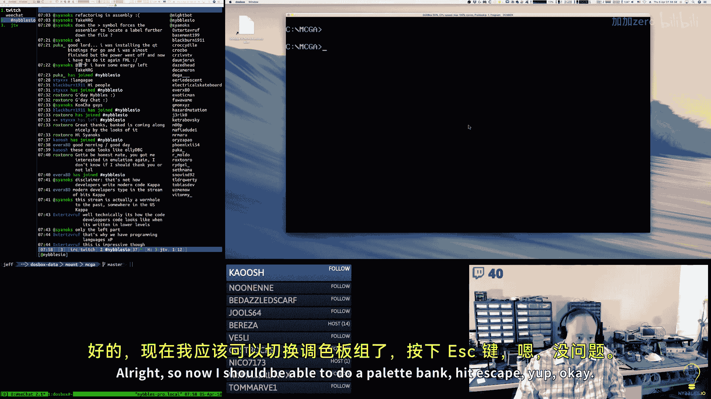

对。All right， so that macro。That's a nice macro， that's an that's a good example。

Of how you can use a macro to generate code to solve a problem。In assembly language anyway。

But that's going to save a shit ton of duplicate code。Right。So now what I want to do。

Is tile viewer combatback。ぱ？あ？So I don't。Have。So what I want to do is I want to compare A to。

Tile index。If they're not equal。Then we just skip over。But if they are equal。

Then I want to draw a non filled box。In the same spot。So that it's highlighted。

 and then we can do the exact same thing with the Sprite viewer。We'll move A with zero。We'll compare。

A with。The sprite come back。If they're not equal， then we'll skip over。Otherwise we'll draw。

A nonfiled rectangle。And then we'll increment al， so then AL represents our。

Linear sprite number or tile number。And if my stars is align properly here， and I'm very lucky。

Then boom， there you go。Now we have。Tile selection。And it's clamped to the block。

so I can scroll around in that。And so then if I add a sprite block。

It's going to be the same thing Oh， but I didn't do the key stuff yet for Sprites， so let's do that。

Sright bank update。Good。So this is going to be key common。Site keys。Srite index。

Therere so sprites are， I need to go look at the drawing function for this。嗯。

Site view will call back。So I do。Three rows with 12 across。36， I said 12 across， right？So。怎么着？嗯，没有很难。

Not saving again anyway。All right。So now boom boom， there you go。Okay。Font is the last one。

 we we is Du fontt。It's very similar。And' I， oh oh。Oh。🎼What did I do？It blew up on me。Don't do that。

Oh yeah， that's good。I have a feeling。I bet I know， let me test this。Before I change anything。

 I think I might know what it is。

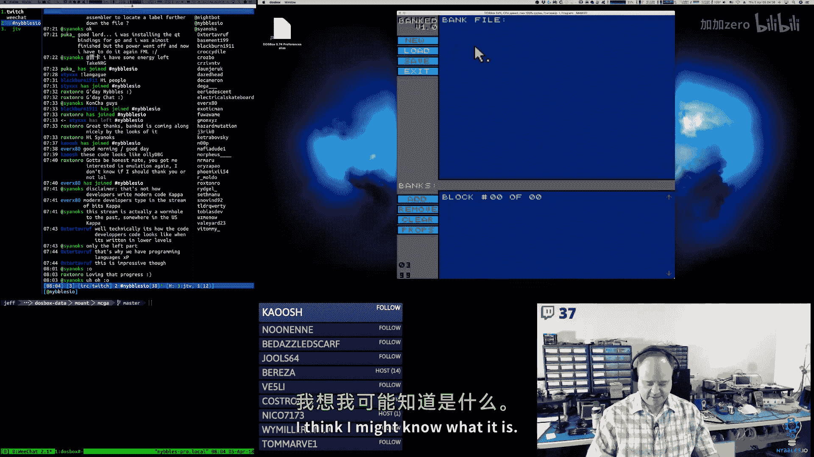

If I pick tile。No， it has the same issue。

amm I mapping the because it's doing an exit？That's a clean exit， that's not a crash or anything。

So I'm thinking maybe something's not assigned， right？Okay， so it's fine for the pallet。

So if I add a tile bank。If I scroll what happens if I scroll， that's fine。And it's paged down。

It's not right。Page up is okay。Actually， didn't want。🎼我 me。Let's go to bank。16。

Or should I said block？Okay， so page App works just。Well。Mostly works just fine。嗯。Oh，' an。

 I'm an idiot， I'm an idiot。😀呵。😊，Im。And times。🎼Oh my God， why am I so stupid。It know what's wrong。

I know it's wrong。嗯。AL is being set to two。Somewhere， you know， at some point。

 and that code AL is being changed。And when there it's being changed。

It's causing the program exit because that's what it does when ails do。When it comes out of this。

So I was trying to be clever and just call the existing callback。But that's not going to work。

 really。But that's the beauty of this。Is now that's fixed well。Naming。Okay。

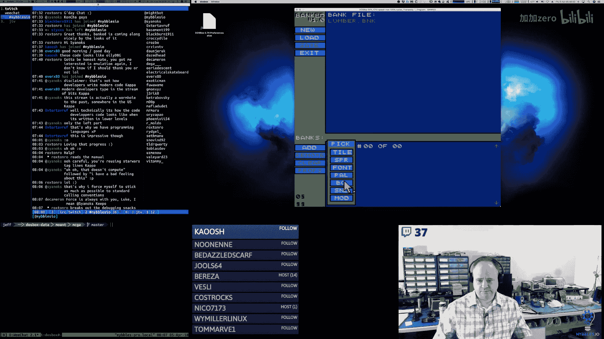

Pain't， no issue there。Okayay， look at that， it works。All right。Andan it works here。Okay， beautiful。

Beautiful， my precious。Yeah。Okay。So now。The very bottom number is the frame rate。

 the 99 that's the frame rate， the 08， that's the current stack。m。

 or that's the current state on the stack is what that is。Okay， so。So right now。

 our tile and our sprite renderer。Or you know， for the viewer。Iile viewer， I'm like。

 it's just drawing an arbitrary box， which is not what we want， we want to actually render。

Whatever that tile is in the bank， so I think that's our next I'd like to do that。

That's our next step， which means that when we create kind of like what we did with pallets。

When we created a palette， so pallet。我 was谁。Button type palette。好吧。So here。

 this is where we allocate。The new block。For the pallet bank。

 we go through the VGA pallet and we copy those values into our actual block。So for。The tile。

We're going to get all clever like。We'll do it with one block and then we'll figure out what to do after that。

Willll set。🎼，So we'll get the new block。And。We want to point。At the data itself。你开。

And if I am bright， then this should look like a pretty little dither pattern。

But it didn't work well。No， we that。It died a horrible death。A death of memory failure。

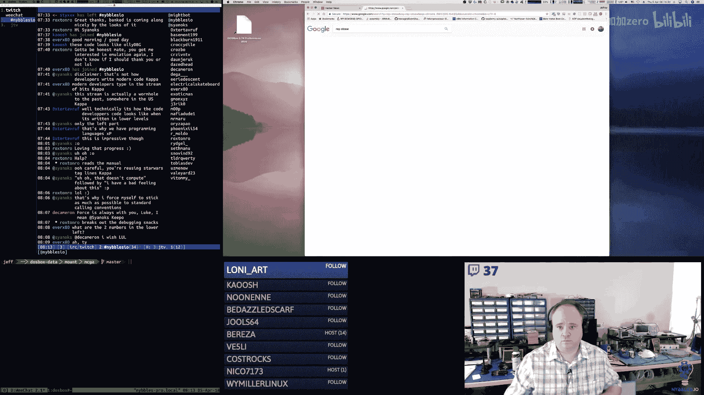

Store， a bitete word or double word for mail EX， guation operating and memory location is ESEDI or ESDI。

 which is what I've got。The segment cannot be overridden okay。🎼Makes sense。

So if it's the implicit AX or EAX or the Sun treat sourceopran。Okay， so that all seems sprite。

And for rep， I'm pretty sure it's。🎼C呀。🎼Right。Yeah， so instruction of campaign is receipt by a RE prefix for blockloads of ECX or CX bytes。

Words are double words。So， I'm setting。Yeah， it's CX。So I'm setting Cx to the size。The data。Oh， yeah。

I'm the fact that there's a high bite and a low bite and all these I'm pretty much。

I think that way typically。2045。So 2045 words。Where the word is。0， zero， zero7。

And then I'm going the that。DI is pointing at。The data portion of the block。Yeah。Should be okay。But。

 no。

It is very unhappy about that。

Okay， so allocating the block is okay。

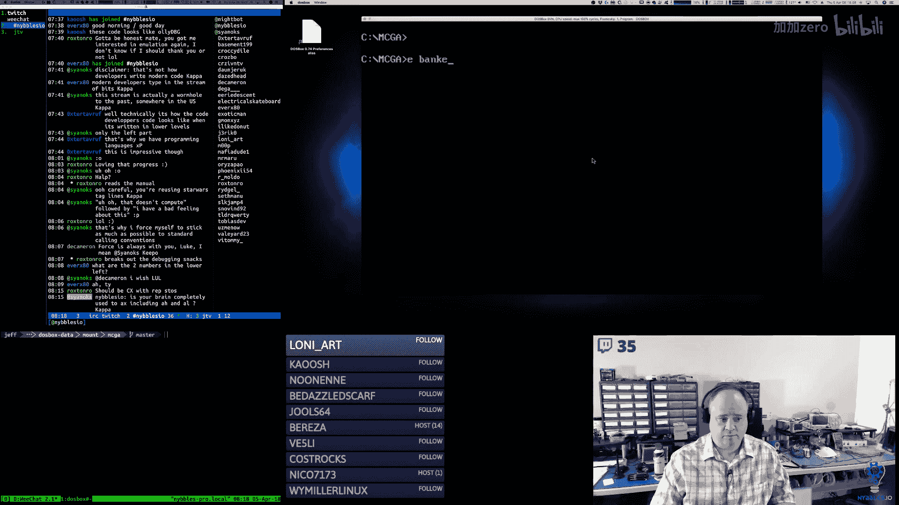

な。All right。Time to whip out thebuer。So2， E4 B。

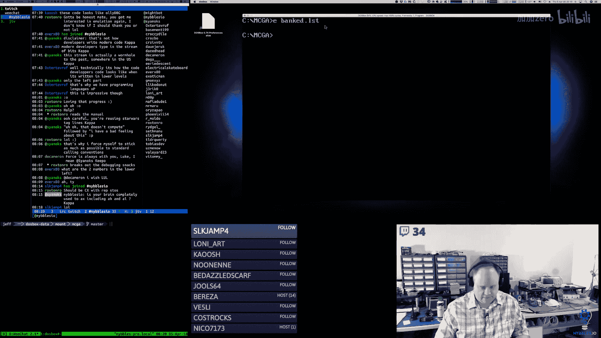

気ち。

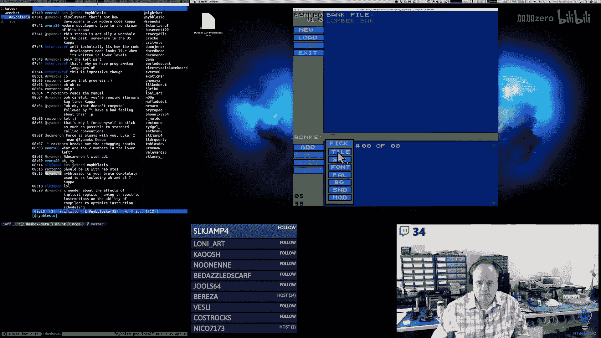

All right， so we clear the direction flag。We move CX with。2045 words。The ail was zero story。

Mo ail a seven story。In fact。呵。Com门。Interesting。Yes， it does。Thank you for the subscription。

 King Kevin， I appreciate it。2 E5，8。

2。2 E5B。🎼But it， wow， yeah。🎼I think。That's so cool。I think we have a bug in Bo box。

Because I guarantee you on real hardware， that probably would work。I'm not seeing why it wouldn't。So。

I can do this manually。The loop instruction appears to be。🎼嗯。

Something weird is happening with the loop instruction， it's not working correctly。嗯。Rep rep。

Store word isn't working quite correctly either。嗯。I'm trying to do it in a loop。

 I'm trying to do a repetition of store。Right， and the。Dos box is。It's act and funky。

And I'm not sure， I mean I cleared the direction flag DI is set to a valid value。Well。

 so let's do this， let's manually control the loop。I'm not using SI in this situation。

 I'm manually loading AL with the values I want to store。So I'm not doing， I'm not doing a load。

I'm setting or AL， and then I'm just doing a store。So， okay， so I move。

CX with 2045 and move AL with  zero， store it， move AL with seven store it， decrement CX。

 compare it to zero， and then if it's not。Zero， I branch back。In， it does behave differently。

Okay。2 E，5，8。

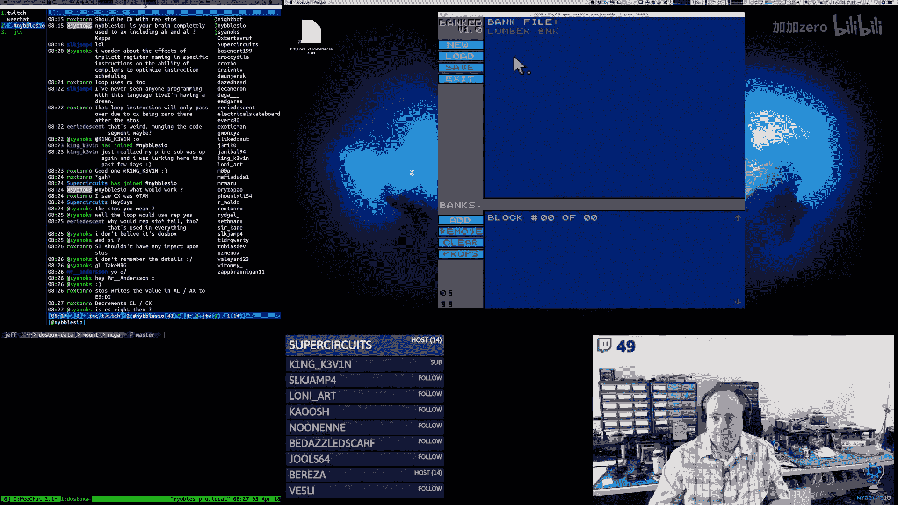

Okay。CX is 7 FD。AL store it。AL story， CX is still 07 FD， I decrement it， it's now 07 F。

I'm comparing it to zero。It's not zero。I'm now going to branch up to 2E5B。Yes， yes， is zero。

How did that happen？Something。Okay， now I've got to rerun it。

But I want to look。Slightly earlier。2 E for B。2， E，4， B。

This should be the call to block new。🎼Intering。ES is not being set properly。In B new。🎼Okay， so now。

Zero， five， seven， one。啊。I think I know what the problem is。Yeah。That's the problem。

Bank New returns the offset in the segment in AX。And it resets BP。So you have to reset BPp。

Then we can call。Block new。Yep， okay。Now。啊，嗯牌。Ca back。Y， okay， so now。What I want to do。

🎼Is want to go to。Here。So we want to select。Tab block。And then。We want to do block pointer。😀Haはは。😊。

That's awesome， Mr。 Anderson。That's great。Trying to think of how I want to do this because。Yeah。

 using that black magic man， I'll tell you。Have be careful。🎼嗯。Those are segment selectors， ES。

 a code segment， CS， ES is extra segment。DS is data segment。Oh， this is just， well no， it's not true。

 like if you do Intel or like Masim and Tasm， the way they did it was you would put the selector over here。

So if you were doing like a CS move or something， it would be on the right。But。In。86。

The 86 has a feature where you can pick your segment selector and use it as part of the pneummonic。

It's just a prefix because technically that's how it's encoded and the guy who wrote the asmbler preferred that approach。

So。So like， you know， Mam Tasm would be move E。You know， DS or CS right over here。

Instead of it being on the left， so it's just a difference in assembler。🎼のくふ。Okay。

 so we're going to load。The source bitete of the tile data from the block。In the DS segment。

We're going to split it。Into nibbles because。Sprite data here is encoded， is nibbbble encoded。嗯。

E is pointing at。VGA buffer， the back buffer。So。We load。Position into BX from the stack。

 we load the pallet。From the stack， we shift the pallet。Multiply it by 16。CX is our width and height。

We load。A bitete from the source data。嗯。Which you know sorry， this made me just think of something。

🎼My button。Com like。This should really be。13。That's what I wanted。Because that's black， white， black。

 white。Or background white， background white， whatever those colors actually up being。Okay， so。

So we split it into the nibbles， we render out the colors there。We increment our X。

 we increment our source pointer。We decrement our width。

And we jump back up until we're done for that。Line that row。And we move our X。嗯。

We resets x to the width of the tile， we increment our y。Move our。X location。We subtract。

Why are we subtracting？All right， because。We want to move X back。And increment， y。

 we already incremented Y， we move X back。And each bike is two pixels。And we decrement our height。

 and then we jump back。And then we clean up。Okay， so then in tile viewer。

We push the position and the powder information。Which this is wrong。

 we're going to have to fix that potentially。嗯。We call tile draw。We take。

The stack back to what it was prior to the call。And then the rest of this stays pretty much the same。

So it's not drawing anything。They're still there， they're just not drawing properly。Oh， but wait。

Actually， that should be okay because we're rendering them from。

The beginning to the end of the block。So SiI starts off pointing at the beginning of the data。

And then it just keeps incrementing it。嗯。So after we render one block， we should be or one tile。

 we should be SI should be pointing at the beginning of the next tile。

I got to take a really short break and then I will pop up the debugger and see why it's not working。

🎼The final。Okay。Three，2， three，6。That doesn't seem right。Oh。他们爷爷。天行。嗯。Okay。Oh， it's still not right。

Well， actually。No， that might be okay。Yeah， that looks。0。0，007。Well。

 actually know that it doesn't work。It should be 07，07。So DS is pointing at4 CCE。Okay。

 so here's our header。Then we have。You're right， yes is wrong。Yeah， I'll do it so the source data。

Looks correct。This is what we initialized our tile bank to。🎼So， how。See Rockxtown row。How did ES get？

Buged。No， that actually is。I think that's the correct address for， yes， that's just a coincidence。

🎼So。We can double check。Yeah， the pointer at 01 F9。3，6，7， E。Oh， there we go。

But it's drawing it in the wrong spot。🎼Yeah。🎼Okay， and this is because。A one block。

Does not have enough room to store all of these。 So we're actually， I'm actually overrunning it。

 I need to adjust my looping code。We need to stop right here， I believe。

 is how that ended up working out。For tiles and then。So the pattern， I want to change the pattern。嗯。

It's not working the way I want it。An exclusive war with all the bits set。

The problem is that's not going to turn zeros into sevens that's going to turn。🎼嗯。I mean， yeah。

 that might toggle the sevens。I could roll it。Maybe I could shift it。That might work。

But that's not actually what we want。We want to shift the nimbbles over。Yeah。嗯嗯。嗯。Oh， I think系。So。

What I really want to do here。Because it's a nibble packed format。🎼So。This is black， this is white。

 this is black， this is white， but this is in a word。So if there are eight pixels across。

So that means two words gives us one line。Then I want to roll， maybe。But if I do two words at a time。

 then that means I have to cut this in half again。Which doesn't happen。But I'm not trying to。Wow。🎼ふ。

There we go。That looks right。Except we have two issues one。This right。

 so I think this is a legitimate tile。but I'm not going all the way to the end of that so I got to fix my count these are not legitimate I have to change the loop to not include those so this is actually reading。

Pixel data from a block。And rendering here。 So now the only thing I have to do now is we just have to get the we have to update this drawing thing here to set the。

Bigger pixels on or off， so let's do that。I want to fix the end of that。1023 times。4our is 4092。

 that's too much。So。It's like we have to do。One more。Right at the very end。Yeah， yeah。Closer。

So like 22 by 12， sorry right， 22 by 13。4090 divided by four times 8 is 127。Yeah， so it's over。

Just slightly。Last five， so one， two， three， four， five， so this is bad too， okay。

These last ones should not be included。I'm not going to worry about that。And so then in the viewer。

What we've got。Is。You know why that is Blackburn because they don't have knowledge。

They're stuck in their parents' basements， writing JavaScript。knowledgeowledge。Yeah， half the time。

I'm in full on retard mode，😀呵呵。😊，The one person who could follow he left。好。Have it backwards。拜。Oh。

 I love it。Yeah看。I did it backwards。Oops。That's how my brain works。

Permanently has a knot going on there。There we go，Okay， so now let's。Let's get that。

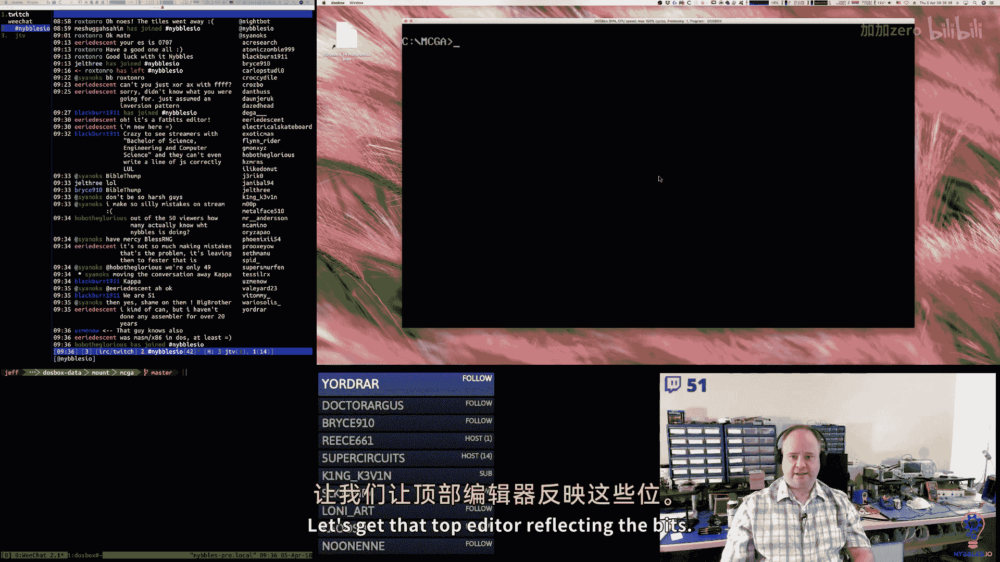

Top editor， reflecting the bits。And I think that's probably going。Do it for the day， but yeah。I mean。

 basically everything I've done for the tile editor。

 the sprite editor and the font editor are going to work exactly the same， just different sizes。嗯。

Okay， so this macro。It is in this module。I think we can make the same assumption。🎼I said assumption。

 that's not good。嗯。DS is pointing at the source data。

I don't need to worry about S in this case because we're basically going to translate the nibbles into。

🎼嗯。The larger blocks。So I'm drawing to the screen。The back buffer， but in an indirect way。

So I have to pass in。Palate information。So it's actually pallet。Size。Exercise。Okay。

 so I get the pixel size。I get the tile size， I get the pallet， I adjust the pallet。B H V L or Har。

 X and Y positions。That we're going to use as we draw our rectangle。

We move Cx with the number of oh see I'm already。I' running out of registers in this one。

But I'm not why did I do that because I'm not using it？I'm loading it， but I'm not doing anything。

🎼Okay。Oh， it was being used by the loop。🎼I see。🎼め茶を。Okay。

 so now the last little piece of this is I have to。I have to formulate。Co。Right。

 so the high bite is going to be the value。Its going to be AL in this case。🎼嗯。What is that right？

It's going to be。DH is Ah。Oh here we go。ButBy doing the A， it blows out。Ah， blows out the pixel side。

All right， let's。Let's reconsider that。Actually。嗯。And we really can't load。

You can't use AX for anything like that。So they load。The palate。Into DAX， but we have to exchange。

DH and DL， because we want the， is that right， No， that's not right。

 We want the pal number and the lower byte。We load the tile size。Into CX， we set our x and Y in BH。

And then at the start of a new row， we reset the。High bite of。嗯。1爱时。And it's not going to work。Okay。

 so every row we reset CH to be。With of the tile。We load a bike from the bank。We split it into。

 so we take A。And we split that into two nibbles， which becomes age nail。啊。

So here's what we're going to have。Because otherwise， this is going to be really painful。

Because I'm trying to do everything with registers and I just I don't have enough。

But if I make these bites。Then。Life becomes a lot easier。Okay， so。We said。C， L 2。

The number of pixels across and we're going to。Subtract that， okay？

BH and BL are our X and Y position。We should move D X。Palさ。So Bx is our。X and Y upper left corner。

 dxs are within height。Then。We just need a。So here's where I can push CX。O see。Move C with。🎼AL。

🎼The move C L where。T跑。And let's become C X。This is actually a H。And then we draw that pixel。

We add to the X locationation。Then we reset， this is AL。And now we draw the second nimbble。

So high bite， little bite， high bite little bite。And then we had。The width， and we pop CX so that。

Yeah， I think that works。So we set up BX at the start， we set at DX to be the size of the larger。

 the fat pixel。Every row we set C to be the number of。Pixels across。We load a pixel from。

The source bank。We split it into nibble， so that takes AL， takes the lower bite。

 keeps it or lower nibble， keeps it nail， takes the higher nibble， puts it in the AH。

We stash CX temporarily， we set the high by of CH2 AH， which is the color。

 we set CL to the pallet number that came in。We call filled box， filled rectangle。

So at this X and Y location for this size with this color information。Then we add the width of a。

🎼핵so。To our current x， then we move the high bite of CX。

With the low nibble that we read from the source Bmap。And then we draw a box again。

 except this time now it's the next pixel over。We add the width to that。We pop CX。

 we subtract two from the width because we just did two pixels for the price of one。

 we compare that with zero， if it's not zero， we go back， we keep doing that。Then we add。

So the Y position。We add DL。And we increment it by one because。We have that。Line in between。

Which that's probably true here。And we move BH with our original。Start， we decrement。🎼See。

So we want the number of rows。So C。Because we're saving CX here。We decrement ch。

As long as we're not zero， we do another row。So it's eight across， the size of the pixel is 15。

And the palette that we're using is。I'm just going to say it zero for now， which is not right but。

O， it's not happy about that。呵呵。All right， well， I'm running out of time today。

 I'm going to have to debug that later。好。Let's go through this。So， in bank。

I added the block type data。Constantance。I added bank block ID so we could count IDs for block separately from their headers。

I added a block pointer macro that will。Assuming you've selected a bank。

 it will get you a pointer to。The blocked number that you pass in。呃。Block new。This， again。

 assuming you have selected a bank。This loads up the。Banks block offset。Adds the right。

 updates the header， so it's pointing at the next free spot。sets the flags to dirty。

 and then we set the block type to block type data and set the we update the ID and we set the flags and that's pretty much ES and BPP come out of here pointing at the new block。

And then in input， looks like I just added some constants。Yep。

So I added page down and page up the scanned codes for those。In VGA。

 is I did some refactoring on the pallet stuff。Because。I needed to add in the reading capability。

So I added a VGA color structure。诶。And then I've got。

There's two different ways to set the pallet index。

So if you call SC PL R thats you want to read the palette。

 if you pass an index to which palette entry you want to read using this macro。

 it sets that up on the hardware。And then I've got the same thing there's a SC palL W so that's you want to write to that pallet entry so it says the hardware correctly in that case。

 then there's an SCRGBR which is read the RGB for the selected index that you've provided and you pass in a pointer to that VGA color structure which is just red green blue as bys。

 and then there's the right， which is what I had yesterday。But I just changed the name of the macro。

 so it's clearer。

And then this is what I just rewrote and I need to debug it， which again， I'm sure I just。

I just need to run through it。Fix it up。So I changed the stack layout a little bit so that I could access the bytes instead of the words directly because I'm kind of running low on registers in this particular scenario。

 so I needed to be able to reaxcess the stack。诶。To reset things。

But the general idea of this is kind of the exact same thing is what I'm doing in the viewer portion at the bottom。

 this just does a larger version of that， so instead of just poking bites directly into video memory。

 I have to take the color information， turn that into a box， you know a filled rectangle。

so we do two of those per byte red from the source data because it's again， it's nibble encoded。

 so like I said， this I just need to put some scrutiny on it。

And I think I actually now just thinking about I think of the two or three things that are probably not right。

 so I'll look at fixing those the stack。Frame needs to be adjusted differently because we're passing more into it now and then in the tool itself。

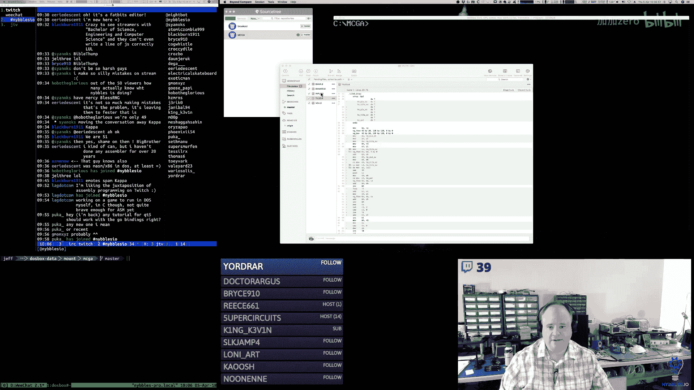

So。

Lots of good stuff here。So I added the key common macro， so again， we have all these editor states。

And a lot of them have the same are going to have the same interfacing mechanism at the bottom you're going to have a selection of all these little tiles that you pick。

And the keyboarding for that is pretty much the same with some small exceptions here and there。

So I implemented one for the palette and one for the tile viewer。But you know。

 it's a little onerous because。You knowThen you're pasting this thing over and over again。

 so I created a macro that would generate the code to do this。So it's much。

 much cleaner doing it that way。🎼And。So， then in。I started adding。

Variables for the different editors right so the palette editor has the palette index and the temp color。

 the tile editor has the tile index， bright editor has the sprite index， so on and so forth。

These are both probably going to have a selected pallet index because you can pick which palette you want to view things with。

 I mean that's the beauty of pallets。So that'll be a next step。For that。嗯。

And then this is what I was talking about with that key common macro。

 so in the tile bank update I can now use key common and pass in the values that generate the correct code to handle the key input。

 keyboard input for the state， same thing with the sprite bank， same thing with the pallet bank。

 so that you know that saved a lot of。At runtime or at compile time， it generates code。

 but the assembler's doing that， we don't have to do that by hand。Anymore。

And then in the bank type callback， so when you add a bank that's a tile type。

 this is what gets' called， so we call blocklock New and we fill that with that checkerboard pattern。

诶。And know I'll be able to take this and。You know， copy this into Sprite and。

Fd and they'll all work basically the same。诶。same thing with pallet。

 this is what gets called instead of allocating two blocks I only allocate one because it only needs one the difference here is I use again those macros to access the VGA hardware。

 get the pallet information and populate the pallet information into the bank block。

Because that's what we're going to modify and when you click on that bank。

 it's going to set the palette based on what's in there。

And that was it。So not too bad。All right， I'm going to push that up to GitHub and that is going to do for me today。

 thanks everybody for dropping by and I will see everybody tomorrow morning at 5 am Mountain Time。

 have a good one。

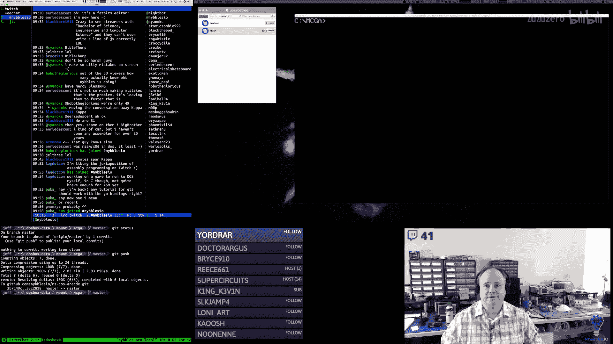

🎼By。