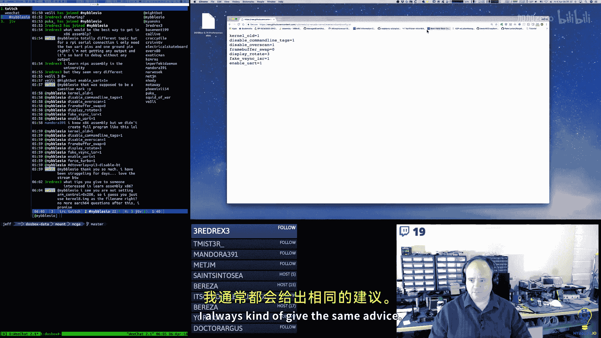
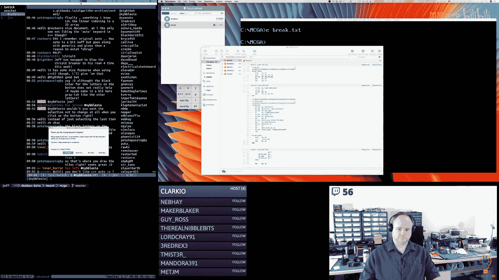
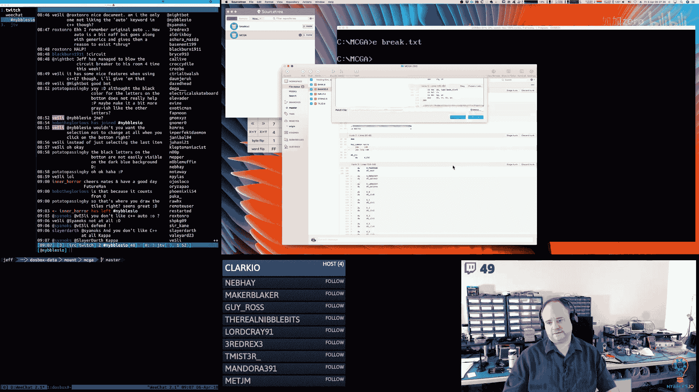
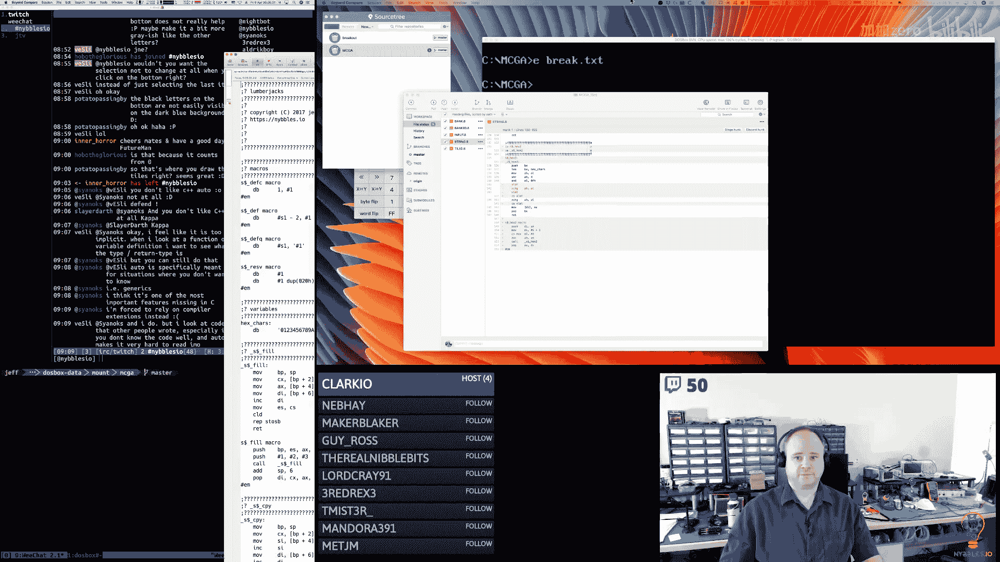
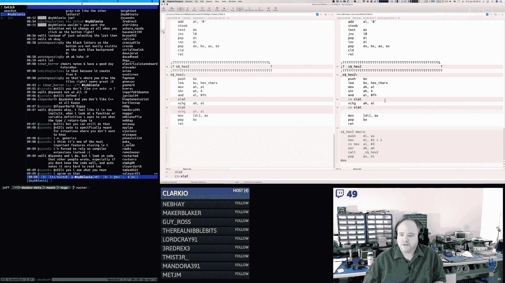
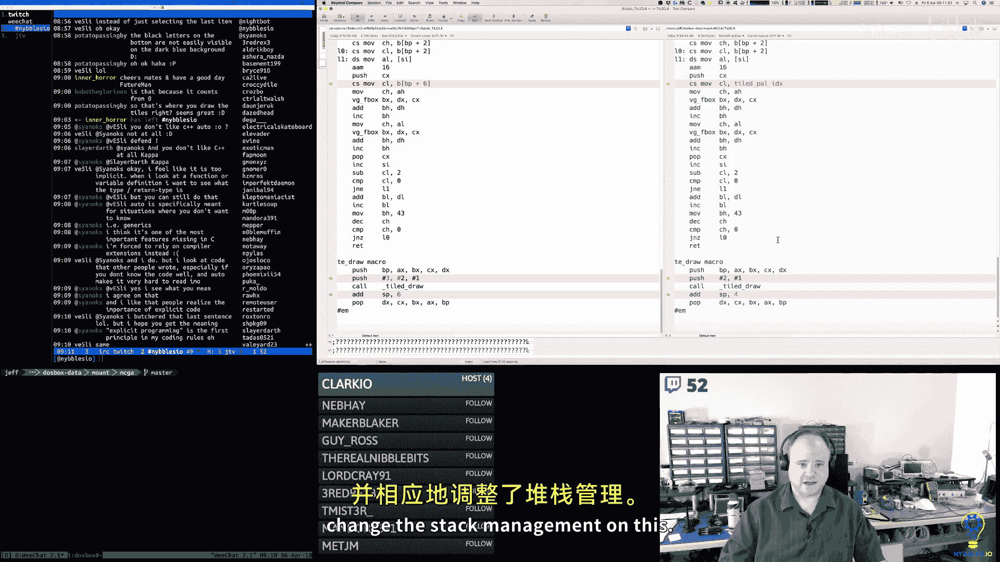
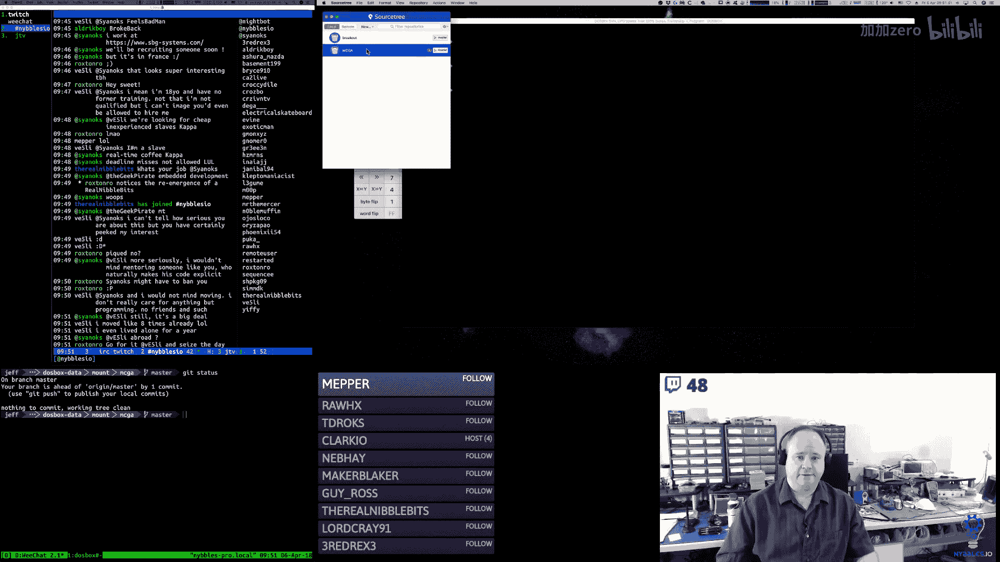
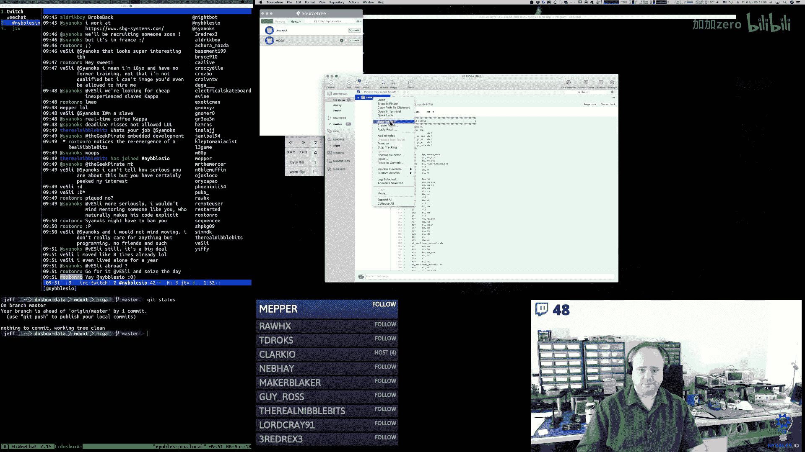
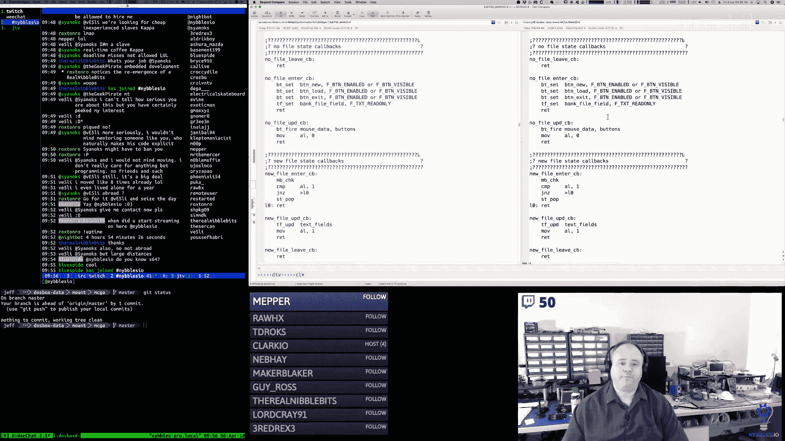

# 【精译⚡x86汇编语言】nybbles.io p12 p12 x86 Assembly： Mouse region selection; fat-bit grids; palettes; backgrounds; -BV1NPr9YKE4b_p12-

Good morning。うんうん。🎼Okay。Today is April the 6th。2018。

This is the NiBbble ZO Daily programming stream on Jeff， I program every day from 5am to 10 AM。

And I stream it Monday through Saturday。Up until recently。

 I've been switching projects from week to week。I think that schedule is going to change a little bit here in the second half of April and going forward。

But this week， we are finishing up well on stream anyway， the MSDs。

Reference implementation for my arcade engine that I'm using。

To guide my lesson plans for my educational video series that I'm creating。🎼啊。

So we'll be working on that today and tomorrow next week。

 the schedule says we're going to do re next week， but I think I'm going to change that。

I'm going to put out a new schedule and we're going to do the arcade kernel kit next week。

And then after that， we're going to be changing gears。🎼嗯。

So that's kind of the housekeeping stuff out of the way yesterday。🎼Offstream， I was able to。🎼嗯。

Fix some things and get a lot more working。So now I have tiles spr palette。So you can now。

The different banks and the fat bit editor shows you。The data。

It's in there same thing with the sprites I don't know why some junk is still in memory I'm a little。

I'm sure why that is but。It actually works out to test that it does what it's supposed to do。

 so get to check our meMSet or something is。Misbehaving and putting stuff in memory here where it shouldn't be。

🎼嗯。So that could be two。And then for pals。I fixed。I didn't think that the palate。🎼嗯。

Offseing code was working properly for the。For this， so I fixed that。

 so now it's actually showing the correct palette values。For the correct palette。And then I've got。

 I put the color options in the。Tile editor。And so it was very close。

 so I think the next step today is I need a function。But I can call。

Give the function a rectangular region。So I would give the function a bound here。

I don't even know if I need to give it a bound，Yeah， I guess I should， right because。

I don't want it to calculate anything over here or down here。So I would give it a bound and。

🎼Tell it that the size of the。Block inside the tile inside is。So， you know， so many pixels wide。

 so many pixels high， and there's this many pixel gap。🎼And。

And then that function would check to see if the left mouse button is down， and if it is。

 it would calculate。You know， the linear index。🎼Of that。Block that square。Within that region。

And I should be able to use that same thing for。know picking things down here。

 picking the color and then changing things over here。

 so obviously whatever color you pick over here is the color that's going to be applied here。

 changing this is going to change video memory or my video memory I'll change block data directly and then by changing the block data that will update both this view and this view。

诶。So yeah， so。For most of these， we're going to have。One， probably three。

 three or four different ranges， we're going to want to ask it。Hey， did the user click on？A square。

 you know， in。One of these areas。And for most of them。The change is going to be pretty simple。

RightBecause if I click on a color。That all that does is change the color index if I change on。

A tile here。All it does is change the tile index or the spread index。Or the pallet index。So。Yeah。

 should be。Pretty easy， I say that， but。も水。See how that works。And then there's a couple of， you know。

Open questions。诶。So I think。Bank new needs to be extended。Because。

It allocates the segment and it zeros out the memory so these are all zeros and this is what I would expect to see。

嗯。But。Really， what it should be is all these should be initialized to this checkerboard pattern。

Because every block should be initialized and ready to go。But。We're not doing that currently。

And I mean， we could。It know。We could change things， right it。Where there's another。Button here。

Or there's buttons down here。To add a block。嗯。So by default。

This would change it'd be block one of one max 16 or something like that。And。

The scrolling would only show you the blocks that you've initialized。嗯。

The advantage of doing it that way。Would be that if you only had， this is 127 tiles。

You only had 127 tiles。If you would only need one block， you'd have a very small data file。Likewise。

 we can fit 31 sprites。In a block。So if all you needed， we're 31。嗯。Then。It would save you。

A lot of overhead， right， because you don't have to ride out a full 64K。For that bank。

Now I think early on， I made the assumption because of。The games I'm making。That。

I'm going to need the whole thing。诶。But because like let's see 127。So that's 2，000 tiles。🎼For。

If you fill an entire 64K bank。嗯。That's 16 blocks full。That's how many tiles you get。

 that's a lot of tiles， that's a lot of tiles。Sppriite， you would get one， you get 31 times 16。

 so you'd almost get 512， not quite。A little shy of 500。Not as many sprites。

But you could always have two sprite banks。You don't have to have just one。嗯。So I don't know。

 part of me says。The right thing to do。Would be to extend this to where like I say。

When you create the type， when you create the bank。

 you get one block automatically because I think that matches。

The expectations of people who would use this tool， but if you want additional blocks。

 you have to explicitly request them up to the maximum that we allow。嗯。Or you know。

 I could just be really super lazy。And like I said， I could change bank new。To take a。

To take a pointer to a function。That。It's like the initialization function for that bank。

And then so we would Bank knew would do what it's doing now。And then it would call。For up to max。

They would call and loop this initialization function or that or maybe even the initialization function would loop through the blocks I don't know either or。

嗯。I it probably makes sense if we're going to do it that way， Bank New just walks through the blocks。

And then calls this function and this function then automatically has， you know。

 BPP is set to the start of the block and then the function can do whatever it needs to do to the block。

🎼嗯。And by doing it that way。You know， the pallet one would do the VGA load。

The spite one would do this checkerboard pattern and the tile one would do a checkerboard pattern。

 and it would set you know all 16 blocks， the pallet would set the one block that it has。

and it just would assume that you're going to use all of it right。

 and if you don't there's just a bunch of extra space。嗯。The right thing to do is like I say。

 is probably to。I mean， the flexible thing to do would be to make it to where you can control which banks have been allocated。

🎼But。Since I'm using this for a very specific purpose。And。I guess the way I think of it is。You know。

 okay， so you're going to have a tile bank and a spray bank。There's 128K。Even in a 640K environment。

That still leaves you a lot of memory， right， and that's 2。

000 tiles and that's almost 500 spite tiles。Right there。So there's a lot of games， right。

 a lot of games that you could fit into。That category right there， you know。

 the palette's not even worth talking you know， palette and the backgrounds are not even really worth talking about right palette is one block。

A background， I think is two blocks max。🎼嗯。So that's 4K and 8K。So， you know。

 if you had 10 backgrounds。That's almost 100 k， but that's a lot of， again。

 that's a lot of backgrounds。嗯。🎼So。And。You know the reason that I wanted to do files a bank file concept anyway was because there's nothing stopping the game engine from loading and unloading assets either。

 being again the memory allocation system with all this is trivial。

So it's really simple to just roll back you know， the segment pointer and just start reinitializing memory again however you want。

嗯。So you could theoretically have。Hundreds of bank files， you know。

 and you could swap between them all you want。To make a really large game if you want to make a really large game。

🎼嗯。So I'm going to be lazy， I'm going to， I think the right thing to do is to extend bank new。

Instead of right now， what's happening is when we click on the。Pick box button here。

This is the code in this is what's initializing that first block， we'll take that out。You know。

 we won't have that anymore。And see this one initialized okay。So I'm not sure they're like。

 what's this pointing at if there's garbage？And again， it should be me setting that。

 so I'm not sure I and it seems to be mem setting everything else， I don't know，m to figure that out。

🎼嗯。Yeah， so I think that's what I'm going to do。So we'll take the code out of that。

 we'll have specific callbacks。But you'll pass into Bank New。嗯。🎼That will。They'll be given。

You know that thing will be called n times where n is the max for that particular bank type。

 so for tiles and sprites it'll be called 16 times and it'll be given BPP will be set ESNBP will be set to point at the correct block each time through and so then you can do your initialization and that includes a consent like the header values and can set。

You know， the data， I mean， really the important ones， the data。For us， but。

If the call back wanted to change a flag or something， it could。I guess in theory。

And then that will ensure that these banks are completely initialized in memory。

 they're 100% ready to go， all the blocks have been created。

And because right now that's not the case， right， there's technically no block here。

I'm looking at that memory in the segment where that block is at。嗯。But it's not initialized。

There's no header information there or anything yet。嗯。So the memory has been reserved and cleared。

But not initialized as blocks yet。So that's the part that's kind of missing。

So I think that's probably the first thing I'm going to do just to kind of get that out of the way。

Because yeah， I would like these to be initialized practice。And then。

Then the next thing will be the mouse。Pick stuff。Getting that to work。And really。

 once we get the mouse pick stuff working。But it should be pretty trivial。

To wire up the part that lets me pick a color if I click on this， change that。

In the block area and that'll， I mean I don't even have to do anything special to reride the next frame。

 it'll just draw the updated data。🎼O， so。I mean about the hardest part is is that you know this is one bite。

 this is one bite， this is one bite， so there's four bites here。So if I change this pixel。

 I'm changing that and I'm changing the low nibble of that bite。But I mean， that's not really。

Even I can do that。🎼Yeah。So I think those two things， getting the bank initialization changes made。

And the mouse stuff。You know。That's probably going to be today and then you depending on how much of that I up getting working。

Tomorrow。🎼You know， then the。I think for tomorrow for cleanup since this will be the last week that this is on stream。

 the next time you see this stuff it'll be in the。Officially released lesson videos。

There's a bunch of little。Details， I guess that I want to make sure consistent across all of them right。

With everything we've built so far， we've got pallets， tiles， sprites， fonts。Those all basically。

 I think， more or less in memory， the editing part we could have working by tomorrow。

Palets I'm still a little bit waffling a little on how exactly I want to do the data input if I just want to click on one of these and that goes into like a little dialogue state that has a red green blue on it and then you click OK or cancel。

 that's going to be a little slower but。It's going to be easier to implement。Um， maybe I don't know。

 because the field stuff， otherwise what I'm going to have to do is I'm going to have to create。

16 times three。🎼Fields。🎼啊。And I'm going to have to， you know when you're in this state。

 I'm going to have to enable them and disable them and when you click on one of these it's going to have to highlight the fields。

 but the other thing I don't have there is and this is even true in the dialog box so I'm not really sure you know this is functionality I'd have to add。

 I don't have tab support right now between。Text fields。

 so I would have to implement Tab to where it would take you from one field to the other。嗯。

I guess that's the other thing too， is that if I just put them on here。You know。

 I could automatically enable the very first one。嗯。And then you could tab through them if you want。

And then alternatively， if you click on one。Then I would just jump to that set。So yeah。

 even though the palette thing is it's close， that data entry part， it's a little bit further off。

Then the tiles based stuff， but the pixel based stuff。

 because the editing on that is it's actually simpler。So。I'm kind of pushing that down the stack。

 I don't know if that's actually going to get 100% done tomorrow we could be close， maybe。But again。

 like I said， there's。Functionality on the text stuff。

 the text field stuff that I just haven't done yet。

And I'm sure that's going to be a small can of worm， not a huge one， but a small one。

That once I get into it and I start putting， you know。What is that？Three times 16， 30。That's more。

48 right。Yeah， 48。48 fields on the screen。I'm going to probably have all sorts of little issues。

 right， but I'm going to have to。🎼Address， so。But sprites and tiles and fonts， they're all the same。

 basically， the only thing that changes are small parameters like the size of the tile itself。

 but everything else stays the same， technically fonts are monochrome。

So there'd only ever be two colors up here， zero and one。嗯。Hey， hopebo with a shotgun。

 thanks for subscribing， assuming that's a YouTube subscription。Appreciate that。嗯。So。Yeah。

 so I think those probably we can get really， really close。So again。

 like I said to my thought tomorrow is between tiles， sprites and fonts。

 making those as consistent as possible。嗯。And。Kind of， I guess。

 verifying that they all edit the correct way and all the good stuff。嗯。🎼But。で。Oh。

 then there is another issue too。And I haven't originally。Yeah。

 Stream Labs will let you take all the different。Like you can do Facebook and you can do。

YouTube and you can do Twitch and you can link them all through you know streamamlabs so those alerts that I get on the screen。

 those all come from them and they don't discriminate。

 they just show it well I guess I could turn it off you know， theoretically but yeah。

I don't bother so the distinction I think I've noticed that when it's a YouTube subscription it says you have subscribed when it's Twitch。

 it says reub all the time so I'm not sure exactly。

What criteria other than is coming from a different channel？🎼But。Yeah。So the other issue。

That I haven't really addressed。And however， I solve this problem， it applies to tile sprites。

Maybe fonts and backgrounds and that is。嗯。Right now。I'm locked into palette zero。For these。And。Again。

 the sprite and the tile data doesn't。Have a palette in it， so nothing's encoded， but in the tool。啊。

You would want to be able to pick the palette that you want to look at。And again， like if you。

Look at some of like the timber artwork and other games from that era。

They would typically with palettes， they'd be able to reuse the same tiles in a slightly different way。

 so they might give a particular character， a green jacket and a blue jacket。

 or they might give a character。Or a monster might appear as like red and gray。

And that's all being done with pallets。And when you're in the tool。You know。

 you would want to be able to just toggle the palette so you can see what it looks like if you're the artist or you're somebody who's trying to figure out。

 okay， I want the guy to have a blue jacket I want them to have a red jacket。

 these are the colors that are changing， does that look right you know？嗯。So。

There's I guess there's a couple things we could do there。Or I guess originally my thought was。

I had some buttons， let me look here。And I'm not really sure if this is even。

The right way of the button pal button pile stuff so I think theoretically。Hey， Ever X 80。

So I think the idea that I originally had。🎼Was。Like when you create a tile bank there's this going to be like these context buttons so and the more I think about it I think these context buttons probably should be down here inside of the。

Area。🎼嗯。🎼But。The thought I had was， okay。In a tile bank or a sprite bank。

 you can pick which palette you want to be active。And I think my。

Train of thought at the time is that this would set a property。In the bank header。That just said。

 you know default palette is this index， right， zero through whatever。And technically。

The way the game engine works。Tiles use pallets zero through8。

And sprites use pallets or zero through seven， sorry， and sprites use eight through 15。They're。

Divided so that you can do like pallet cycling things or pallet changing effects on tiles that don't impact sprites and vice versa。

嗯。So technically， I guess on a tile bank， like if you were to click pallet or something。

 that would pop up a little thing and you'd only be able to enter。You know。

 zero through seven or maybe even one through seven。

We would generally skip zero because zero is the system palette。嗯。But then I'm thinking。I don't know。

 do I even need？A special UI convention there。Could I just have some keys on the keyboard that let you cycle the active palette？

And every time you change it inside of a particular editor。

 I just update the default value in the header for you in the property。

 and then when we come back in，🎼嗯。You know when we do the enter in that editor state。

I look in the bank header， I see if there's a default value if there isn't， I set it to zero。

Otherwise I set it to whatever it is。And then what I could do is I could put like， you know。

 Po and then the number up here。So that you know what palette you have and then。嗯。

Then it's just a question of what keys。Do I use to cycle through those？

And I think having you know shortcut keys there， like for colors。

 what I was going to do is this was going to be zero on the keyboard zero through nine and then you could hit control zero through five and get the last。

Se of them。嗯。I'd still let you mouse click， right。I don't think everything has to have a mouse。

Value on it or you know a mouse input on it and I guess technically we could do the pallet scrolling the same way we do the bank scrolling right I could put a button up here that's the left arrow and the right arrow and you could do it that way or you could use the shortcut keys to scroll through the pallets。

嗯。嗯哼哼。So。Let's do this。嗯。So， I think that。Paalette and tile set。's okay。

 So then the other one I didn't really talk about。Is when you do a background。

You have to pick a tile set now that one， I think is。Probably makes sense to have a button。

Right inside of the bank down there。There'd be a button called tile set。

You click on that and it would pop up a little pick box right that would show you buttons for。

The banks， the tile banks you have in the current bank file。And you'd pick one of them。

 and that'd be the one that would be active。嗯。And obviously， you could change it。So then I think。

 okay， well， maybe it should just work like。The pallet thing then。

 maybe just have a thing up at the top or down and below for。🎼Yeah。And you could just scroll， right？

And whichever one you last picked。That's the default， that's what gets stored in the header。

You guys are hard and could。Even simple ones like this。Okay， so what I would like to do， let's do。

The palette。So we'll have a variable in the tile editor。And we'll have a variable in this pre editor。

That is the。Current。Alllan actually you know what？This is the wrong place for those。Because most of。

Most of that code。Is here。I actually already have it。So。Bm。I don't know， let's see how long it takes。

Becauseuse。I want to add that palette。Char to the UI。

 So I'm going to say it probably going take me about 30 minutes。Maybe。锁性。🎼嗯。啊。HtML bah。Yeah。う。

Here's the difference。Here's the difference。When I get this to work。

I will understand exactly what it's doing。In every regard， I mean。

 I'm the one that is putting the pixels on the screen。So if I want to shift it a little bit。

 if I want to align it a certain way， if I want to whatever， I can do it。

 and I know in my head exactly what to do to make that happen with HTML and CSS。

I would have to go hunt。I think， oh， I'll do it this way and I'll float it and I'll do it that way and I'll align it and then。

I just， I feel like with HTML and CSS。It's like kind of like SQL a little bit。

You don't know what execution plan。The engine's going to come up with。

 which is why you end up oftentimes having to run your SQL statements through you know。

 a plan descriptor that shows you what the thing's actually going to do with it。

And so for HTML and CSS， I feel like that's the case that even though I want to just， you know。

 shift this over it just a teeny tiny bit or I want to center this。I can't。Just do that， right。

 it's I have to kind of。There's this huge level of。诶。

Varariance between what I want to do and how I tell the renderer to do it and then what actually happened。

诶。And then another you take that and you put it in a different browser and it doesn't work。

Or it works just slightly differently。So yeah。I hate that shit。No fun。No fun at all。

So I need to move it back。A little bit。Okay， so it's at two。Okay。

And so then I'm going to put the palette number below that。Okay。So I want to probably scooch it。春节。

So see。Pal is four six。Thiss 24。Minus。2 times 6。Yeah yeah，6。🎼So sick。🎼Okay save me。Yeah。

 then I'll put a left in a right arrow。Button next to it。Hey， Mandora， 391。How's it going？

I am working on。诶。Editing tool for a game engine that is it's a reference implementation for an educational video series that I'm creating that will teach you how to do what I'm doing step by step。

Assuming that you don't know anything， you've never done this before。

 you don't know assembly language or any of it， and I'm going to teach it all to you。

It's a huge series。It's a lot of work。But yeah， this is what。What I'm working on right now。

 that's what I'm doing。啊。Again。嗯。It's Friday。All right， because。They're visible。Okay。

 so then you to move down。Hey， Vsley。哼哼。啊。🤢，Fail in the file name。Okay。

 getting closer so this got to go up a little bit。🎼So。Three picks。I go conservative， go10。All right。

 I think the why is about right， and I need to move。The right one in a little bit。Hey， pua。

Doing pretty good， how are you？And there goes the palate。48 minutes。No， not 40 minutes。

 I started at 530。18 minutes， right？I forget when I started， I thought it was 530。

 but maybe I'm wrong， I don't know。It didn't seem like it took that long。

Of course I haven't done the keyboard shortcut， I got to do that。Nice。Yeah。

 so it's got to be less than an hour， so yeah， I think I started 530。So。行。Now。

I'm noticing something though。So I'm changing the palette。

 which is changing the palette on the right， but it's not changing the palette here。

Because and I remember this now， I have it hard coded， so we got to fix that。

 but before we do that let's。哎。There we go。That looks much better。Okay， that fixes that one。

Because that's exactly what should happen。Okay。But here's what I'm going to have to do。嗨我们哥。

This really should go。In here。Oh， it's just a default pattern。It's not。It's not intended to be。

Anything special， I just use a cherbi pattern for things that haven't been。Edied yet。

So instead of getting the palate from。The stack。We just get it from this variable。

And I'm going to come back and clean up the stack interface。So these should all flash， there it goes。

All right。About 30 minutes。To do that。Now。🎼パパパ。I don't think my mesets's working， right？

Let's look at that because those should all be black， those should all be zero， whatever that is。嗯。

Whether it is the macro tape。

Fresure takes a lot of parameters。嗯。Take the segment， the offset the size， the value。Okay。Vesley。

 so which version of the raspberry pie do you have？

Because the answer depends kind of somewhat on which。Pie of hardware you're using。Three red。Reex 3。

That's cool， MIPS is fun， I like MIps。Okay， so if you have a three then the answer is yes。

 you the very in the upper right corner of your pie， there the very first pin be careful is power。

 you do not want to use that one and then you have a ground pin and then you have the。I think it's。

TXD and RxD and those are the only so ground pin and you can use any of the ground pins。

 it doesn't have to be that one， they're all the same ground。

 just be careful don't hook anything up to plus 5 or plus 3。

3 volt that that's going to cause bad things to happen you can very easilyry fry your pie that way。

But those are the only things that you require， however。

There's a couple things that you may need to do specifically in the。Config。txt， I believe。

 that root file。Next to your kernel， you need to make sure that you have either。

Enable U art set to one。Or。Actually， I think you always need to enable you art and then what I would recommend is make sure your pie has good heat sinks on it。

And just turn on the turbo， I think it's called enforce turbo or something like that。

 because what that does is that turns off。Yeah enable you are equal one。

 you don't need the second equal， but yeah that's。That's it。嗯。And。Yeah。

 the other one is what is the other one， one？I could tell you what I have in mine。It is。这这这这。

So I have， this is what I have in mind。I'm going to do this。There you go。

SoThat's what I have in my configt TxT。嗯。And actually that， it looks like it's missing crap。

Looks like it's missing something。One on a sec， I'll look on the actual SD cardt here。Me。过个年。

I don't update the。Version control。Of this。Okay， yeah cant let me， this is a little bit newer。Okay。

There you go， the second set， that's the most current set。

So the force turbo is the one that locks the CPU and the core。

 which when they say that when they refer to the core frequency they're talking about the。

The GPU essentially， you want that running at the 400 megahertz rate because what that's going to do is that's going to allow your boD rate to be stable on the minior if you don't do that。

 then the CPU and the core frequency will vary based on power and temperature and that will cause your boD rate to fluctuate。

So and be careful with that very last line I haven't commented out for a reason I was experimenting with using the other Uar。

 there are two Uarts on the Raspberry Pi3 and one of them is a full UA which is by default assigned to the Bluetooth module you can turn that off and can then you can program that UA directly but it's a totally separate interface so if you're starting with the mini Uar you know just get that working and then you can always switch to the full Uart just keep in mind you will have to。

You'll have to implement essentially a second driver in your kernel to do that because they are two separate pieces of hardware。

So。Hopefully that helps。Yeah， I think this is the issue here， this was the size。But。

I'm guessing it's not after this。Oh， but it sizeizing bites。

That's why it's not zeroing everything out。Well shared。Um yeah， because Cx is going to be。

This is a number of paragraphs。At that point。This is the number of bites。Then we divide it by 16。

 then we incr out。So the X then should have the size and bytes。物体。

That would explain why it's not clearing it out。Oh， and now it's locked up。へ？😊，Oh right， because。

Because the divide wax it。Okay， do it this way， push sea。拍 c啊。All right。Now。

 it's still not clearing it。Oh， it's keep bother time。杯子。Zero4， E9。Okay， BL is。10，16， right？

So that's correct。AndCX is。我。I doesn't say right。Oh no， it's AX that I want oh Jeff。Dummy， dummy。

 dummy。Yes。Correct。I just use kernellate。img as the file name。That is correct。All， so I push。

The multiplied size， which is Ax onto the stack。Then when we get down here and pop it off into CX。

 that's the size， that should be the entire size。Of that segment。うんうん。Yes， okay。 There you go。

Now it's clearing it out。Its， it's a miracle。Yep。Okay， that's fixed。诶。So。Redrx says， what tips？

You give to someone interested in learning assembly。

 I always kind of give the same advice there is a program here。

That is a simulator for the。8086。And it runs in windows， unfortunately。But。

I always recommend to start small and use that simulator and。Start writing simple programs， you know。

 they give you some things that you can interface with， they give you like a。

Some lights and they give you certain kinds of input controls and they give you a segment to display that's all emulated and you can you know。

Start writing assembly language programs for X86 and get familiar with the architecture。

 and then once you've kind of outgrown that simulator。

Then it's time to move on and build something more complicated。That's where I would start。Okay。

 so I fixed。诶。The mem set on the。And the Sprite bank。我经太。And to。So I want to copy these to。

This spray tank。And I want to copy。He to here。可以。嗯。

They both have their pros and cons right give me a second I'll give you a more。Lello， there goes。

That was weird。Oh， that was my Mac paring。🎼Okay。Bad， we got some pal lets。Okay。

 so now you' just got to wire up key board shortcuts for the pallets growing。🎼And then。

The only other thing I have to do is do I want to save it。

 do I want to save whatever palette you picked as a default in the header， and man。

 I'm thinking I'm being really lazy by saying no， but I'm tempted to say no。However。

 I'm going to take a really short break， I'm going to answer this question about assembly or CPUUs。

When I get back， I'll be raned back。And I'm going to start coffee brewing。Right now。

 so hopefully when I get back， it'll be done。Or close。嗯。🎼。Okay。I am back， hey Sox。嗯。嗯。So。

The question from Wesley was。Do I prefer arm or X86？And what I would just say is they're different。

 and I know that kind of sounds like a cop out answer。But they are， they just they're different。And。

I think the。If I'm comparing like modern X86。So like X8664 to arm 64。You know。

There are just some things that are a little bit。They're easier to do on X86。

X86 does has a flexible encoding standard。Because it's not a risk。

 I guess technically some of the newest Intel CPUs they're risklike， but it's under the covers。

 it's not， you know they still provide that complex instruction set interface you know at the assembly language level。

 so from my perspective as a software developer if I were writing X8664 assembly language。

I don't have encoding problems。🎼I。I mean， there may be exceptions like with some of the maybe the。

Vectctorized stuff or some of the more complex。诶。Or I should say not complex。

 more of the niche instruction sets that do specific things， but in general。

You don't have constant encoding issues on X86。The stack is the stack interface is a little bit nicer on X86 in my opinion。

 a little bit more flexible， more generic， but again that's because one is。You know。

More complex instruction versus。The risk。Honestly， I think like the way。Rings， you know， work。

 exception levels， just off the top of my head。Feel about it equivalently complex to me。

On the two different CPU families。 And again， right now， I'm comparing。Modern。X86 CPUUs。To arm 64。🎼嗯。

You know， obviously like old X86， different story， different era。But。呃。Yeah。I mean。

 that would be kind of my general。Otherwise， everything else that matters is。The same，The syntax。

The assembly language is slightly different between them， but not significantly so。嗯。

There's more implicitness on X86。Then there is。On arm。嗯。I mean， really that would be my take on it。

I'm able to write software effectively on both。🎼So。🎼I， you know。Yeah。Oh。

 one thing I will say about arm that I appreciate， although。

This is less of an issue again on modern X86。You have a pretty good complement of registers to work with。

 although on X86 because of the history， because of all the backward。Compatibility。

There's a kind of a strange lineage of registers in the register file。

I do like Ars register approach， which again is not really all that uncommon for a risk type CPU。

But having approximately 30 registers at your disposal。It's nice， I mean it's a blessing and occurs。

 but it's nice。As we on X8664， you have a lot of registers， but they're very。

Some of them are very much targeted to very specific things。

And which can make your code more explicit。🎼You know， you don't。

General purpose registers are kind of。嗯。You know and they're there， it's just。Like I said。

 you have some registers that are。Very purpose specific， you have some that are general purpose。

 you have some that are。Really niche purposed。嗯。But I again that。Intel， that's more because they've。

Had this long lineage and。A modern xenon processor。

 end processor will run the oldest of X86 code from the 1980s if you ask it to。

And arm doesn't quite have that。Constraint， right？So anyway， that'd be my thought on it。啊。🎼没 we样。🎼He。

tHow that work。は。哎。Yeah， we're getting there， man。は呵は。😊，We are on our way。Okay。

I we it to clean up I think one more stack。Interface。Clean this one up。あ。This guy。🎼也能。🎼Ha the shell。

 this guy。you don't need to pass palette state anymore， the module takes care of it。

Which is altogether nicer。没有。Beautiful。这个好。嗯。So my fairly common pattern with macros。Is I just。Yeah。

 essentially。What I do is。My macros are the things that。

Have the prologue and the epilogue for the stack。So I guess you could say my calling convention is。

Macro controlled roughly where I push， you know， any， any state。That I feel like should be preserved。

By the thing that the macro is going to call or it's going to change， I just push those essentially。

 yeah。Yeah， the one exception to that is like yesterday I created that。Yeah。

 I created this key common macro， so this is like this is one of the most massive ones so far in the project where this thing actually generates a whole slew of code。

嗯。And in terms of this， again， I just kind of like it's convention based。

AX is the only register I essentially let。Kind of slipped through this。嗯。But yeah， I mean it's。

You have to come up with some consistency， I guess。

And then just try to follow that as much as you can。By。And that's where I would think， like you know。

 a modern， a more modern assembler。With nicer macro syntax， you could like say， okay， here's a macro。

 it uses this， this， this and this， and you know the assembler could even then kind of assert certain things for you if you wanted it to。

嗯。All right， so okay， so I cleared up the stack。The parameters I'm passing on those two things that I refactored out sprites and tiles let you change the pallet I'm not going to worry about storing it for now I don't I don't think it's really all that important you know you can always just pick the pallet you want again it's not like it's。

It's not like it's really hard to do。The only thing I would like to do now is I would like to put keyboard shortcuts in for changing palette。

嗯。And this is where that really nice handy dandy jump table comes in。诶。Actually。さし。All right。

But I probably don't。あ外。One， A，1 B。Oop，'s got them backwards。は呵。😊，Not bad。All right。

 I can fix the backwardness though。Question is。Did I got the keys backwards。

 I think I got the keys backwards。Os。Yeah， actually， I don'm get to get the key。呃。Yeah， there you go。

So left and right square bracket。Move through the pallets。And of course。

 you can click on the buttons too if you want。Beautiful， and then technically。

While we're in palette mode。That's you know using those keys is also changing that value。

 but I think that's pretty harmless， I'm not going to worry about that too much。

That's a funky palette。All right。So that's done。Okay， so then selecting those colors。

So I was going to add keyboard shortcuts for those。So。So it's2， zero is the。9ine is a。🎼啊。

🎼I can I just do。One is two。去水波。So。This one。This should be tiled。Color IX。Let me just double check。

Tiled power color。Yeah。I knew that would happen。You have to go the other way。Yeah。So zero， one， two。

 three， four， five， six seven。8ight， nine， okay。So that works。Pallet switch of works。

Same thing in sprites， 012。My highlight rectangle is too tall。That's interesting。Oh no。

 we should be seven。Beautiful。Now it fits。Can能。This should be the same thing because it's the same code。

 it's the same editor， it's just different parameters。Now I got to do 10 through 15。

Go to do some kind of all modifier key。For those。Oh right， we talked about the bank initialization。

 let's do that。All right， so let's look at one of my。🎼It's。Button type pile。So we call Bank New。

And then we call block new and we initialize that one block。

 so what I want to do is I want to take this part。Hey， Cicero。And I want to have it loop through。

The max here。So really like right here。So on the stack。We're going to pass a word。

That is the callback function。yeah黄港 monster。哪啲？🎼My girls。if you can see if that works for you。

That's the playlist I'm using right now。🎼阿0。Super awesome。

RightSo this is the code that does the this is what does that checkerboard pattern for tile。嗯。

And so instead of doing what we're doing here。We're going to go。Pile block。好白。And then。No。

 this is an editor called TSE Pro。And this is DoOS box， this is MS DoOS。🎼Essentially。Not quite。

 but close enough。Yep。Okay， Bill new。Calls black New。O。🎼So， it's。🎼W。B better。Okay。

 so we come into this spot and honestly I'm not even really sure I need to pass Ax out anymore。

That's the beauty of doing this inside here。Because we don't really have to leak any state。

So we move CX with the block max。Which actually。This probably just needs to be C。Yeah。

 because it's just a bite。🎼BL puttter。Setets up the frame for a given block。

So BPP is already pointing at。Oh， and actually what I have to do。Because I want to。I want to restore。

The frame。Of the bank header every time through the loop。So I'm going to save the bank frame。

Im I do my thing。And so here's where。🎼You' going to call。bank。t call back。

And the only register really care about here is CX。Because CX is our loop。🎼对。Otherwise。

 they don't really care。Yes too。I feel as though it's a very low probability。That I got down right。

Oh yeah， macros have to be。One of the few things that have to be defined in order。

Yeah， of course， I didn't get it right the first time。You know。

 the very first versions of the preview versions of。IntelligJ for Java came out in 1999。

 if I remember correctly。And then I think the。First。I want to say it was probably。A year or so later。

So I want to recollect that it was like fall of 2000。

 that Intel Jay idea became like a production product。So that that's。

You know what I was referring to。Let's see here。Okay， so。Let's take a look at the code again。😀嗯哼哼嗯。😊。

😀哈哈哈哈。😊，I guess technically since it's doing a multiply。I am for the debugger。Oh， I crashed it good。

はは。This is a bug。はは。😊，Says。哈哈哈。😊，I love it， I love it when I can crash dos box， it's great。Z，591。

W is E2？That doesn't seem right。Oh， that's not right。当是呢。Hey， almost。Well， sort of。

It's not calling a callback， right？All right， so it's not crashing anymore。

 but it's not doing the right thing。So let's go to tile block and there held back。Okay。

 that looks okay， assuming BPp is correct。Zero， five，91。Right， okay， that looks correct。Right。

 because we're at the。We're at the first one。It makes sense。

So the header of the block has been set up。Okay， so this is where we're going to call our callback。

Ooh， that doesn't look great。Yeah， I didn't look great。Hey， Rox Tro。Oh， I'm an idiot。Yep。

 I'm an idiot。嗯。How am I going to do this？🎼呃。Can I cheat， I want to cheat。But I can't。🎼，看紧继续。Well。

 by cheat， I mean I want to stick the value in a register。I need to load this in the frame of。

The stack pointer。And I'm trying to avoid like I already have。Quite the。

Pushing popping thing going on here， not now， whatever。It is what it is。I mean， I can do this， right？

And I could do。🎼Well。That's what I'm trying to avoid right there。that looks more。

That looks more reasonable。嗯。Still not the right location though。There that looks more。🎼好美丽。あだい。

Where is。Hey， Globe。All right， it's at  three， two， one， four。I am working on a tool。

An asset editing tool for a game engine that I'm working on in MSDs that I'm using has a reference and implementation for an educational series that I am producing。

That teaches you how to learn X86 assembly language。

 how to build this sort of thing from the ground up。And at the moment。Doing what I typically do。

 I'm debugging some of my。Bad code。Three， two， one， four。Is right there。But the offsets are wrong。Oh。

 that's because I asked shit。I have to add。I know what I did wrong here。Okay。

 that looks more reasonable。Yes， now it's hitting the right coat， yay。到。I have no idea what。

That was interesting。Okay。I'm getting there。You know how this stuff goes？Hey， Slayer Darth。

That's not right。That's right。Oh， perhaps the mistake I'm making。There we。Yeah。

And they're all initialized。 Look at that。イ。Yeah， I didn't need block pointer here。Not necessary。

Hterバ。And pallets are still working。I can still pick my color。There we go。

 now let only do a sprite bank。And this should also be completely initialized， which it is。

 excellent。I'm getting closer to my goal of taking over the world。All right。

 pallet initialization seems to be okay。🎼All right。🎼Okay。If need to take another short break。

 I'll be right back。And we shall continue。I'll be right back。

 I just got to do one more thing and then we'll resume。Okay。Okay， so what the next thing is。

Grid selection。All right， so。Like I said at the beginning of the stream， we'll have a function。

I pass in a rectangle， and then I tell it。What the size of the grid is inside and what the spacer is。

And then when I call that， if the left mouse button is down。It will translate the mouse position。To。

诶。A linear index。呢几晚。あ。嗯嗯嗯。😀へへへ。😊，Right now I'm working on I'm going to write it in line in this one spot and then I'll refactor it into a common function。

 but right now I'm writing something that will basically，Given a rectangular region。You know。

 it will detect if a mouse click occurs in that。Spot and then if it does。

 it'll take the X and Y position of the mouse cursor。And。

Divide that by the grid size and give me back a and then do the multiplies to give me back the necessary linear offset。

What do you mean icon， oh， the nibbles icon， it's in the lower right corner of my video？呃。

The mouse stuff is going through the standard Dos mouse driver。

But there's a little bit of abstraction here。At the point where I'm at。

 I have a data structure that I just access。And I just get the data from that。

 So I am using the int 33 stuff， but that's kind of， that's in a different module。

 and that's kind of happening。Behind the scenes。嗯。But yeah，'s fundamentally， that's what's going on。

啊好。啊。哎呀。No， this is allbble the real nibble bits。This is all done by hand。

 I just draw the pixels where I need them。哎。Okay， so if it's 42。Divided by N each。Yes。

 that's correct。Yep， half half byte。🤧。Yeah， potato passing by， a nibble。

So each side of that eight bit。With where the underscore is， that's a nibble。

 so that's the high nibble。And the lo nibble。So if you break that down。

This can be one value and that can be another value。And it's by multiplying them together。

Then you get the bite。So in this case。I do， yes。I have a C++ project that I'm going to be getting back to here shortly called ReU。

The arcade construction kit， and that's all written in C++ 17。Actually。Oh， I didn't like that。

Do you think learning to program efficiently in assembly would help to understand yeah， of course？

Absolutely。I would。I mean， ultimately the machine is what you're programming， right。

 you're not programming。You're not programming C， you're not programming。LispP。

 you're not programming。You have to be careful with abstraction， right？And。So you're not。

 I wouldn't say you're ever programming the abstraction， you're always programming the machine。

There is， but again， like at the end of the day。It's going to run on something， right？

Having some reference。In your mind of what that CPU architecture is capable of。

Is going to help inform you。🎼嗯。When you're writing your code。But you know， to your second statement。

 potatota passing by， where you talk about optimizing your code， you like to make it very efficient。

 that's great。🎼嗯。But just like Sinox put in chat。You know， optimization is something that。

There's two kinds of optimization， right？There's。🎼Design。Having an optimal design and there is。🎼嗯。

And then there's。Local maxa type optimizations， there's tweaking something because you want to cut five cycles off of you know。

 a particular loop or something。So what I would say is。I'm never really a big fan， I mean。

 even in the assembly language I'm writing here， I don't go out of my way。🎼To。You know。

 worry about how many cycles I'm spending and oh， if I use a loop， it's slower than if I do a jump。

 you know， branch myself， I'm not。Concerned with that。So much。嗯。And so then。

The other part of optimization， right， so those fine greed optimizations。

There are probably some cases right， like so I've done some stuff in the cryptocurrency space。

 I've unrolled you know， hashes and done crap like that and so there are cases where yes。

 you probably are going to be very concerned with the exact constructions that your CPUU or your GPU or whatever are executing。

But they're rare， they're very， very rare。What's more important is。The design， right？And so。

The example I always give is if you read。🎼嗯。I forget which book it's in。

 it's probably in one of Michael Arassh's books， I'm not sure。

 but where he actually I know for a fact that，呃。It was in one of his books， wrap the top in my head。

 I can't remember which one but。When he and John Carmack were doing quake one。嗯。And。

They went through all these different iterations， many iterations to try to figure out how to do。

 how to get。The hardware of that day to be efficient。诶。Yes。

 there were some things that they did where they were dealing with。you know。

finine grain performance tuning like optimizing bttting pixels to memory and that sort of thing。

 but what they learned very quickly was that they weren't going to get where they wanted to go with that right what ultimately was the thing that solved their performance problems and got them to what they released was a design change right and so。

My general rule of thumb is that you get。嗯。The most performance bang for your buck。

When you have a good design。And by good design here， I mean。

 you're using the appropriate data structures。You're using the appropriate algorithms for of those data structures。

Now where I would say assembly language is going to maybe help you。Is you're going， you know。

 these guys are chatting about memory and caches and all this stuff。

That's the stuff that I think assembly language is going to do for you right。

 you're going to understand that even though in C or some higher level language。

 you're not seeing it， there there's stuff going on underneath that will or could impact how you would implement your design。

 but again， you're not spending a bunch of time， you know futzing over necessarily one instruction versus the other。

 you're more thinking in the main about how memory， how you're utilizing memory。

 how your structures fit in memory， and you know again。

 you roughly have an idea in your mind of how that's going to impact cash performance are you having to jump around a bunch of different。

Pointers， you know， to get to where you're going that can be。

That could be very damaging for performance on modern CPUUs。So you know， those are the things that。

I would say you want to。You knowF on and from that perspective， that's why I tell people。

I think it's valuable to spend time learning assembly language because it will give you。A framework。

 that bottom level framework of what ultimately the machine is doing。嗯。And so when you need to。

 you can cut through that abstraction and say， okay， this is really what's happening。Also， you know。

 people talk about cross platform。And。You can have kind of an understanding of， okay。

 I have to target。These kinds of CUs。And okay， here are the ones that are very similar。

 here are the ones that aren't so similar， how does that impact my design right？So anyway。

 that's what I would say。2，3，8。哎。Sd。来吧。I mean， I can buy that。系啊。嗯嗯。Okay， so this is 3947。

And if I click outside of that。Doesn't change， so I have to be inside of this。Area here。

Although that's oh， but this is after the。That doesn't seem right to me。然后那里。So this is 39。27。So 57。

🎼まい。39。So what's this saying， 49？This is all Sth wave， this is the playlist I'm using。

This song is called Hearttbursst。From a band called Mental Minity。See the real nibble bits。Thank you。

🎼23。Hey， Blackburnr。Oh， that's like good， I think my hex routine has busted。

How the hell I mess that up。Thanks， in horror。Oh， wait。That's funny， I'm trying on him backwards。

Oh I love it， I love it， I love it， I love it。How the hell did I do that？

I guess I don't need this last one，huh。There you go， now the numbers look right。ああ。That's what it is。

Okay， now the numbers。拜拜。Oh excellent， it is all loadaves of fun， it's great。

I actually made a macro for a word based version， since。The early X86 computers didn't have it。そ now。

So。哎呀。So now， Im。嗯。So I'm getting a divide exception。嗯。There we go， yes。I was a dummy。

I was using the wrong size opera end and the CPU did not like that。Okay， so now I have index。

 I have x and Y。But what I want to do is I want to take then those two values and multiply them。

I have to multiply y times the number。And then add X， that will give me a linear index。Okay。

 getting close。啊。Circuit breaker。Mhhh。😊，あ。不。🤧。There you go， there's our linear offset。

So we finally hook that up。I back， call back。Excuse me。This is going to be tile IDX。迪奥。行。

There you go。🎼We。It works。And if I click outside of it， oops。I click outside of it， the region。

 it doesn't do anything。The only thing I have to do here is。

I had special logic that was clamping for these over here。With the keyboard。In this case。

 I'm just going to have to compare to 127。And say， if it's greater than that。

 just force it to be 127。嗯。So tile bank。い？So。Compare the yellow 127。Its like for。We can just set it。

Otherwise。We'll clamp it to that value。Now that I've written it in one spot though I need to genericize it。

 I need to take that code， I need to turn it into a function and parameterize it， right？

🎼That's interesting。看我ら。PI fixed it。嗯。2，4，0 a。That's what the code does now。

It's just's supposed to be skipping over it。So I compare it to 127 and if it's above that。

 I skip over this。So I don't change it but。It's not working。They're just debug values， you know。

 they're going to go away anyway。They won't stay permanently。啊。I'm off by one。Story of my life。看。

There we go。All right。All good。Look at that we okay， so like I said， now I have to take that。Because。

Yeah， but he to turn that into a function。Look it all nice and prettydy and happy。

And then I can put it in， I can start using it all over。I can use it for this， I can use it for this。

 I can use it for this。See you in her horror。All right。Okay now。Here's what I'm going to do。

 I'm going to take a quick break and thenm when I come back。

 we're going to review this code I'm going to commit it and then I'll work on genericizing that for the last hour here。

And we'll see if I can get that done， so I'll be right back。오케이。

All right， so in bank。系い。Excuse me。Looks like added some more state to the。Block pointer， macro。

 and the I move the block new up because。One of the few things 86 needs to have predefined is。Maros。

 so。And then in Bank New， I pass in the bank and it callback。I fixed the initialization， the meet。

 wasn I wasn't passing in the correct size， so I fixed that。

And then this is the code I added to initialize all the blocks for that bank。And then I fixed。嗯。The。

Prameters and passing on the stack for bank new。That was it for that file。Keep doing that。

I swear I am the most uncoordinated。

Okay， so in。BankThis is the main tool I fixed tabing here。

I had to turn this into a long jump because this is getting bigger the data we're jumping over so I added a bunch of stuff here so the right and left bracket changed the palette keys zero through nine。

 select colors zero through nine I have to add in code to support control zero or control one through five to get the remainder but with the mouse you know we can probably get。

Get those easily enough。Then in the macro， these are the callbacks that get generated。

And then I added some temp number strings so I could output some stuff around the mouse。

Grid selection， I added the palette previous and palette Next buttons。

And then in。So I turned the palette buttons on and I turn them off for like tiles and sprites。

 and then in tile bank update， I implemented the mouse grid selection functionality。

 but I now need to refactor this into something common。嗯。Yeah。

 these are just turning the palette previous and next buttons on and off。In input。

 I added a bunch of constants for the missing keys。In string I fixed my X。I'll put her。嗯。

I goofed and I had an extra。Exchange in there that I didn't need。Yeah。

 so I did a CS selector on the Trans。嗯。Just to make sure that， it was reading from the right segment。

嗯。

And then I got rid of the extra exchange because that was swapping the bites or the nibbles。

Which was generating an incorrect text value。Heck string。And then in the actual tile editor。

麻jo。A lot of just stuff that's been added right so i've got the pallet label。

 I've got the pallet previous and next callbacks。I move the tile draw function from the banked module to this module because it really belongs here。

 and then the palette information is coming from within the module。是。

And then I've got code in the shell that renders out the palette number and the palette label。

 I fixed the size of the selection box with a color。

And then I change the code to refer to the tiled pallet index that's inside the module。

 that's what changing the pallet， that's what it does， is update that variable。

 change the stack management on this。

And that was it。But me。Okay。So that's done。And。Go and with。🎼觉跟我。🎼でさ。Yeah。🎼完全。🎼でし。Okay。

 so this whole thing。Needs to become a function。What are we going to call this thing mouse？Bid。

Select。哼ん。あ。🎼So this whole thing。Let's just call it grid select。🎼All right， so。Everything。Yeah。

 everything here is public。What I'm doing。Okay。All right， so everything is parameterized。

So we pass in the upper left corner。The passing the width and the height。

We pass in the number of columns， there are per rows and the size。Of each column in pixels， right。

 so it's eight pixels。Plus， a separator for the tiles for sprite to be 17。

And then the very last value is a。Is the maximum number？

AM index number that's supported by that particular。Selection。嗯。And I just realized。Yeah， so I think。

I just realized this。Okay， so instead of passing in the max。

Let's do it this way because that's going to make us simpler anyway。嗯。So I'm going to let AX。

Come through on this and then。Instead of doing the clamping here。We'll move A with。

The index that was picked。And then， we'll move the。This belongs to the actual。Coode is calling it。

Which makes sense anyway。So the only thing we have to do though is。嗯，要实频。There we go。

Then each particular。Editor can use this， get the index。

Do its own clamping or its own adjustment if it needs to。All right。I think that's pretty close。Okay。

 I think I have。My。嗯。That's probably backward。2，2，6，1。Okay。AX is 2 aBA。I think that's backwards。

CX is C3， C636 those are our。看。Well actually that's in the right order。🎼1，98， by。54 okay。

 so those are right。M， that's correct。Yeah， that's。Yeah， that's right。Oh'll crap his wrong one。嗯。Mr。

 the Mercer， so what's the point？嗯。I am working on a。

Reference implementation for a game engine and the tool that goes with it。

For an educational video series that I am creating。

CalledLet's make an arcade game in MSDs using X86 assembly language， it's a 100% assembly language。

And the idea of the educational series is that you can start from not knowing how to do any of this。

 and I will take you through from beginning to end。Building all this。

 this is my reference implementation， it helps me。Prepare the series， the video series。

 so I kind of know where things are going。So that's what I'm doing。ち去。🎼啊，好好好好。Yeah， I see the issue。

Oh。😀哈哈哈。😊，I just realized something。よし。Yeah， I'm looking at it。没有。Okay。

 that's the genericized function。

W， look at that， it works。All right。We're getting there。All right。

 so now we can do the same thing in pallet。Oh oh， crap， I forgot to。

I' was going to say， man。Vesley， Sinox needs an intern to make him coffee。

He was talking about that in great detail the other day。哇。1さ。No，25。Man。

 don't make mistakes with French derived words。It's not going to be a good start。Hey， look at that。

 it works。All right。Now I got to do the selection for the color。I don't know。

 I might be able to get that done。And， actually that's probably looked pretty close。

So let's review that。

All right。

🎼So。So I took that。Implementation that I had in the tile update。And。I genericized it。

Been on the stack。I started streaming at the beginning of 2018。So we passed on the stack。

The position， the size， the width of each tile， each grid piece， and the number of columns。And then。

We grab the mouse data right So the very first thing we do is test to see if the left mouse button has been hit。

 If it hasn't， then we return back。An empty AX， so AH in this case means nothing happened。A is。

Just zero。And then if we did have a left mouse button。We grab the position from the stack。

 we grab the size。And then we create our little rectangle。

 so this code here is just comparing the mouse。Point。

To see if it's inside of the rectangle that we're interested in， if it isn't。

 then we come all the way down here and we ba。🎼嗯。And which now I'm just realizing。Thats a small bug。

 I should probably make sure I set AX to zero here because it's got stuff in it。

So yeah I have to look at that。But then I set DX with the position again。

 I clear out the upper bite of CX， I set the lower bite to the width because we're going to divide by that。

For tiles， it's nine pixels for sprites at 17， for pallets， it's 25。And we clear out AX and we move。

🎼，X position of the cursor， the mouse cursor into the low bite of A or AX rather。

 and then we subtract。The upper left corner from that， so we we're basically。

Taking this rectangle region we're determining if we're inside of it， if we are。

 we want to essentially get an origin position as if it were from zero of the mouse cursor and so we subtract and then we divide by that width so if the mouse cursor is at a relative origin of say。

You know， four pixels by two pixels， that's still the zero width tile。

 so the divide ends up being zero there， I do know x64 yes。嗯。So then once we've done that， we take A。

 which is the result of the division， and we put that in DH。We update the string。

Which I'm going to take those out here eventually， but for now I'll leave in。

 I clear out AX again because we're going to do this now for the other。Coordinate， right。

 and so this is now the Y position and。We do the same thing。 We're orienting to the。

Essentially a zero zero coordinate system we divide by the width of the tile vertically。

 which is the same everything here is symmetric hall and then we the result of that we move that into DL so what we end up with is coordinates within the grid we end up with an X coordinate and a Y coordinate within the grid。

But everything else is a linear index， so what we need to do then is take that those two coordinates。

 we need to take the Y coordinate， multiply it by the number of columns。In this grid。

And then we take that and we add the X to it and that gives us our linear index。

 and so then I write that out to a string and that gets displayed on the screen right now。

 and then I set AH to one， which means something actually happened。Something actually was chosen。

 and then I set A to that index value and I returned。

And then we have the macro that pushes the parameters onto the stack， it saves state。

 calls the function at the end， it adjusts the stack and then pops off to restore states to what it was prior。

And then for the tile bank update right this is all the code that got refactored into the common function and so now I just use the mouse grid macro。

 I pass in the upper left corner， I pass in the width and the height。

 I pass in the number of columns and the width of each column and then when that we come back from that if AH is zero。

 nothing happened so when we just bail otherwise we check we clamp it。

 you know did the selected index， is it greater than what this particular editor supports。If it is。

 we bail。Otherwise， we update the variable， whatever that is for this particular editor with the index。

 and then AL here is kind of overloaded， other parts of the code later expect AL to be 0。

1 or two which have certain meanings so I set AL to one here and I return。And that was it。

 and then I updated the Sprite bank。And the pallet bank to use the same thing。嗯。So。Tomorrow。嗯。

And maybe I'll make some progress today as well， I made some progress yesterday。

 but the general idea will be to use this exact in code to handle the color selection and to when know get a index of the big fat pixel grid and those two things combined will allow us to actually edit the bitmaps。

嗯。In memory， right， we still have to would have to implement the file code to write it out to disk。

 but we should then have round tripping。And。You know， the editor is basically the sprite tile font。

 we can get the font stuff up and running pretty quickly， I think tomorrow， and you know。

 those three will work for sure。Paallet's going to be very close。

 pallet's just going to be a question of we'll be able to pick everything。

It's just a question of how I want to get the data， you know， for that。

 do I want to pop up a dialogue， you know， do I want to somehow create a function to generate。

 you know。A whole crap ton of input fields。So yeah。

 pallets probably be the last thing if we can get that， you know。

 everything else working pretty smoothly。And then that leaves backgrounds and sound the sound stuff I'm really less worried about because really the sound stuff is just going to be pick a file and it'll import the bits and put it in there and that's about it with the backgrounds that one I think will be relatively straightforward again。

 the mechanism for picking the tiles we already have that。

It'll be exactly the same the only thing that's different is in the background。

There'll be this precondition where you have to pick which tile set you want to use。Which you know。

 which bank， which tile bank you want to use？啊。But again。

 we could do something very similar to like what I did with the pallet， you know。

 so in the background editor， maybe it won't be up at the top， maybe it'll be down the bottom。

 but you'll see you know tileile bank and you'll be able to pick you know scroll which tile bank you want and you know again the background data format it's just pointers into that so by changing it just like pallets。

It'll just change， you know， all the tiles will change and some of them might look like garbage right。

 you know， some of them aren't going to look right， but the ones that are correct will look proper。

So that's really the only special case with。The background know editor。

 the only other thing that the background editors probably will definitely require is scrolling。

Now I'm not thinking about you know， doing super smooth scrolling on this， you know。

 by scrolling here， I mean， you know， chunky eight pixels at a time to move around the map so that you can fill the whole thing in kind of a deal。

So that really would be the only thing missing is the background stuff。

 and like I say the sound banks I'm less concerned with。あ。But yeah， so I think tomorrow， like I said。

 for sure， we'll probably be able to you know， sprite tile， font， for sure they'll be done。

 they'll work。We won't have the file stuff， but I think that's a small jump at that point。

The pallet stuff we might be able to get done tomorrow。And then backgrounds， you know。

 I think the background editor probably realistically is。

Like a day or two is you know worth of work to get that at least to a primitive point and then the file system stuff is probably like another day。

So。But yeah， so that's where things are at and we will wrap this up， you know。

As much as I can for tomorrow。Okay， so I push that stuff up to GitHub so just a reminder tomorrow is going to be the last day。

For the MSD stuff。🎼嗯。On the stream。And the next time you guys see this stuff。

 it'll be in the video series for it'll be released on YouTube and probably I'm debating like on my channel or on that channel。

 my website， I hate my website right now， I gotta redo it but it will be definitely on YouTube for sure。

So that'll be the next time you'll see it and again， just you know。

 for those of you who are experienced， you're probably going to， you know the first。

Probably the first 20 some videos are not probably going to be that interesting for you because they're all very beginnerary stuff。

 it's very building step by step by step。So getting back into the more heavy duty stuff。

 like what I've been doing on the stream is probably you know。

 six months to a year out in terms of the release schedule for the video series。

 but eventually all that stuff will come out and again。Just to make it explicit。

This is a everything I've done on stream here is a reference implementation。

 which means I am rewriting it again。You know， as I make these videos for this educational series。

 this stuff will be rewritten so。What comes out of the end of that series may be slightly different than what I've done here。

 but the principles will be basically， I think it's going to be very close， but I might you know。

 make small changes here and there as I go along。Especially if I think it's going to be easier for people to learn。

So anyway， that's the housekeeping stuff and yeah I'll see everybody tomorrow morning at 5 a and then next week the schedule says we're going to go back to RU but we're not。

 I'm going to actually release an updated schedule this weekend。

We're going to do Arrcade kernel Ki next week and that'll be the last week for Arcade kernel Ki because when I finished the MSDS series。

 I'm going to do the same thing with the Arcade kernel kit。

 so there'll be a second educational series that starts from scratchrat。

 assumes you've never done this sort of thing before and we will go step by step by step through everything building an entire game Arrcade kernel for Raspberry Pi3 in Ar 64 bit assembly。

But for the stream next week， you know， I think I can get the。I know how to fix the flip issue。

 I think we can get the actor stuff going， you know that just needs to be debugged。

And I think we could probably get some basic gameplay going。And so you know。

 I don't know exactly where we'll end up at the end of next week with the Arcade kernel kit。

 but you know， we'll get it a little bit further along than where it's at we'll get more stuff going on on the screen and then I'm going to take that and that'll be my reference implementation for。

An educational series based around that。🎼嗯。And so then the week after that， the week after next。

 I'll be transitioning back to Riu and Riu probably will be the predominant project on the channel for。

A while until I get it。To a point where until I either get it done or I get to a point where。

I feel likeve I've caught up you know in terms of。诶。Functionality for the first version。嗯。

And I'm still trying to figure out like how I'm going to interleave some other projects in the stream。

 but you know again， I really want to get， you know， review， I want to get version one。

Done and there's it just feels like there's a lot of coding there to do and。

So I need to put the time into it really ultimately to get it there， so anyway。

 that's the game plan and。很好。Everybody have a great day and I'll see y'all tomorrow morning。Cheers。

