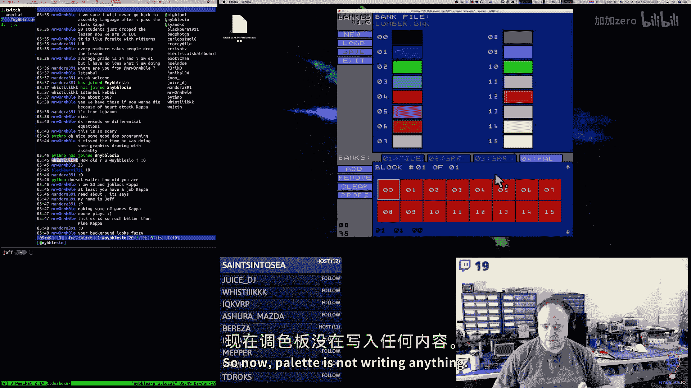
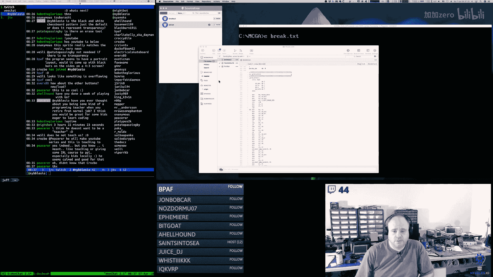
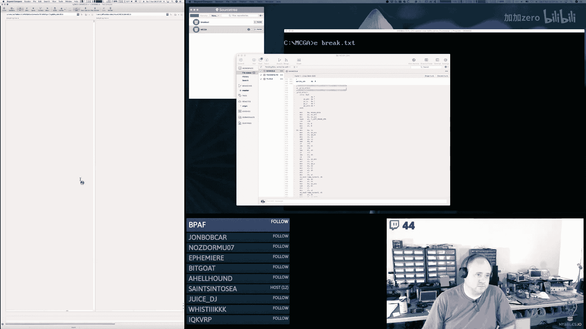
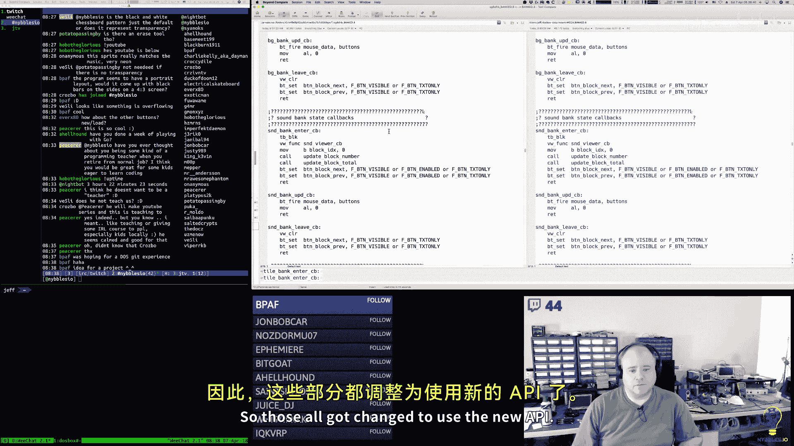
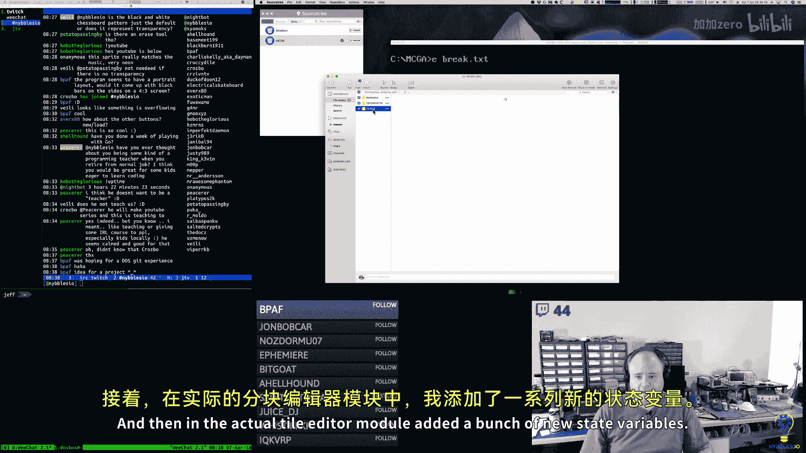
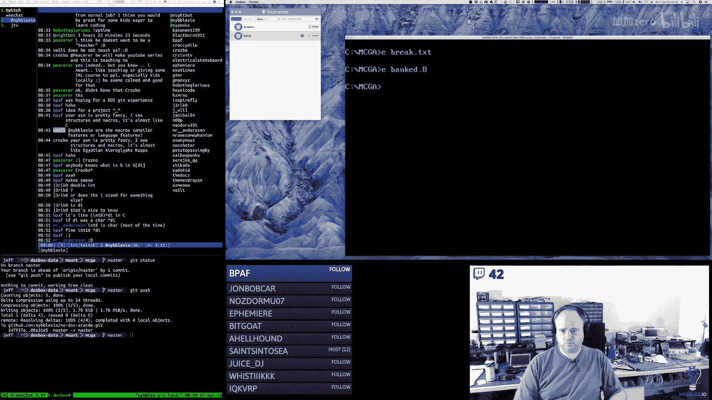
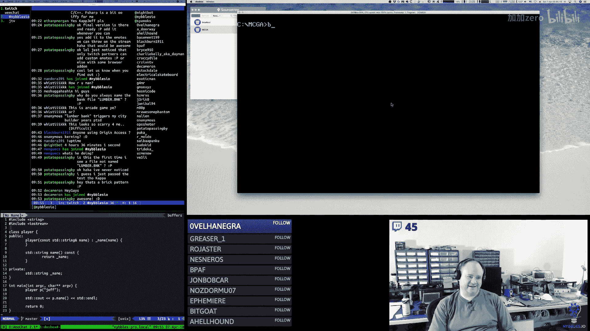

# 【精译⚡x86汇编语言】nybbles.io p13 p13 x86 Assembly： Sprite, tile, and font editor wrap up -BV1NPr9YKE4b_p13-

Good morning。ううんうん。嗯。オッケ。Today is the 7th of April 2018。

 this is the Nimble Zo Daily Program stream on Jeff I program every day 5 a to 10 a。

 and I stream it Monday through Saturday。Today is the last day of the MS Dos Arcade。

Reference implementation， I'm finishing off。Some stuff in the banked editor。Today。

 I think we can get the。Sprite tile and font stuff kind of finished off and mostly working。Paalates。

 we have time， I'll work on those。That would leave backgrounds as the only piece that's not implemented in the tool that's critical。

You know， at the moment， the sound stuff。It is important， but could be done later。嗯。🎼So。

Where I left off was I had implemented the。Grid selection。

 and I had some time to think about this a little bit。

And I think I'm going to tweak it just a little bit because。I would like to move it。

We would like to refactor it to make it even more common。Because。Right now it is。嗯主的。

So really this should live inside of the tile editor module。Like so。

And I had named it with the mouse extension or the mouse module。Pneumonic。

 so I'm going to change that to be the grid。The tile led thing。Because I think that's more accurate。

And then。Sorry， Mike。た。I like the nice weather， but my sinuses don't。对。嗯嗯嗯。So， instead of。Yeah。

 so I think what we're going to do。Because we're going to change the tile。

We're going to change this to take a pointer。🤧To the variable。And we already。

I guess we don't already have the max in there， we had it， but I took it out。

 so we're going to change that。And then here we're going to have。Like that。🤧。🤧嗯。Okay， so。あ。

We don't have to shuffle things into A anymore here。嗯。

So we pass in whatever the max index is for this particular。Grid selection。We do the comparison here。

And then the only difference is。We need to。Move BX with。GS far。Then we can do。あうん。

We'll assume that it's always a by variable。And then we can move the value in there。🤧。嗯。

Excellent working。跑了。No， that should be right。What's weird， Mr。 wormmhol？嗯嗯。Hey， Blackburn。

I'm working on a tool for the game。Eine。This is an asset manager。🤧。🤧哼。🎼那年。🤧。Yeah doesn't。There's the。

There's the entry on the stack。Two， four， six。Good right，Hey， Jericho。🎼Okay， go ahead。🤧。Excuse me。

So it's reading the how。Did I swap， I think I。I saw happened。I think I do this every time。Excuse me。

 my goodness。Here there we go。Okay， so that's been engineering size。

Then I can take it to the next level of。Encapsulation。All right。You do not need a header， no。

If you have an implementation that is entirely private。So this just goes back to sea scoping rules。

If you have an implementation that's entirely private to a particular module， particular unit。

In CRC++ compiler speakak。It can be in your CPP file。It never has to go anywhere else。嗯。

Header files exist。As a way， well。The mechanism has been somewhat overloaded over the years。

Heer files exist to provide the definitions of things。Or the declaration， I guess is the right term。

 definition is in the unit。嗯。And it's meant so that。Other units can share the same declaration。

So back in the olden days when computers were。The size of a room and had the memory of the size of a。

Of an Atari 2600。You know it was much more efficient to have a header file。

That would tell the compiler in a very succinct way。The size of the structure here。

 the data structures， here's the prototypes of the functions。

 so that it knew what the shape of things were without the actual implementation getting in the way。

And then the C files were just the implementation。Now， over the years。

 things like inlining and some other stuff have crept into header files because they're the only。

Truly。I guessible unit or fungible thing between units in the compiler space。

 which is why that ends up happening。嗯。But yeah you could implement an entire separate program in one CPP file and the rest of the other modules would never have to know anything about it。

And Mr。 wormmhol says，Yep， it looks complicated because。You don't understand it。

It's sorry to be so crude， but that's the truth。And if you。You know。

 it's not as complicated as it looks， it just takes some time to get used to it。I cannot read binary。

I can read Hex and decimal and someocal， however。Have to do conversions just like everybody else。嗯。

Yeah， I mean， you could have a program。In fact， a good example of this is。Like if you know。

 if you watched me coding on Ru and I used catch。The unit testing framework for C++。

And the way that that works is。It's all CPP files like the there's only the only header is catch itself and you don't use headers at all for those because of the way it works。

So if you think of it， like when you do unit testing with catch。It's all private， you know。

 like all your unit tests are essentially non visible to the rest of。

Any other modules that you create， it's only because of the catch framework that those things get。

You know， highlighted and used。So。嗯。Okay。うん。Hey Manorra， 391， how's it going？嗯ん。嗯。🎼嗯うん。h。嗯ん。哦。何我也这。

Right， perfect。啊好。对咩。Howな晒。Something is down paymentment on my block。唉不话。

But what's weird is this fright bank didn't overwrite the。Tile bank。Way over the hill。

Let's put it this way。In another couple years， they probably won't have any hair。On my head。Yeahや。

I'm old。哈。God， I wish I were 18 again。Howll I'd even take 33。Boy， something is really stom in that。

Yeah， the jobless thing seems to be pretty constant regardless of age these days。I am a Jeff too。

I didn't want to do that。I wanted to do just spray paints。See， that one looks perfect。太我了。嗯ん。

It looks okay。That still looks okay。That still looks。哦后。🎼So， okay。But if I add a。Poward。Yep。

 I got a bug in my palette code。M it's doing the wrong thing， all right， let's forget it。

Let's just had。So you know what I think do。Thatちた。That's good。足しく。That's good。So， now。

Paalette is not writing any， it doesn't matter。

Interesting， something else。I'm not getting any color information。Because I'm not writing anything。

🤧I'm writing to the wrong palette。 Why am I writing the？For the wrong blockage。

How that hell was happened。Hey， Romania， I hate。Oh， I bet I know why。哈哈哈哈哈。😊，It's easy to test。Okay。

哦。🤧嗯。Careful。Those JavaScript group courses are going to eat up that million dollars super fast。

Kowledge。机。🤧う。是。🤧。嗯。Yeah。🎼There you go。🤧う。ううん。うん。Excuse me。Hey， ourman004。嗯。啊。嗯。嗯。

HaSomething really went over。呃，Okay。So it says zero， zero。嗯。Oh。I don't have the tabs disabled。

 that's why it's doing that。😀哈哈哈。😊，Interesting。嗯。I got to do that， I got to turn those buttons off。

That's why it's doing that， okay。Yeah， the math works as long as they're symmetrical。あはは。😊，Shoot。

Ipe I'm going to do that。I mean， I guess I could do it。And that works。Yeahep， kind of work。All right。

I guess technically they don't really have to be。Any bigger than that。あ？然后。我操高心。Okay。

SoWe can select the colors。Now it's this guy。All right。Okay， so the grid。嗯。Now。43 by 20。Oops。漂亮。Okay。

 let me test the sprite， make sure that works and toggle between them。うん。Very nice。

I got to take a really quick break here。It'll be right back。🎼，🎼，🎼，🎼，🎼No。🎼Now。たいな。🎼まま。🎼跑跑跑跑跑跑。🎼，🎼。嗯。🎼。

🎼。🎼，Okay。Back。啊。Yeah， that's true， although in C++ that's only through a pointer。In PhP。

 the aero operators use all the time。So you can actually write a lot of C++ where you never use the aero operator。

Hey， G。That's a heat allocation。What you probably just want。That's correct。

 but you probably just want。Or what I would say you should strive for is to do something more like。

This。Correct， and you don't have to delete that。The first one you have to delete。

The second one is auto， it's a stack thing， and it's taken care of for you automatically when it leaves scope。

Sure， you could do it the other way if you want。I mean， it just it doesn't really I mean technically。

The first is a constructor， The second is a。Member initialized thing， I mean。

 so there are differences。But I mean， you could do it either way， depends on the structure of your。

Whether you're using astruct or you're using a class with public fields， it just just depends。Yeahep。

Perfect。Okay。啊。Hey， potato passing by。完。😮，그오。Thank you。Mongly for it。

I'm getting the final grid selection stuff wired in。

So I'm getting to the point where I can actually draw on the。Tile surface here。Yep， that is true。

That is true。哎有。Yeah， okay， now I got to do the nibbbble encoding。Oh哇いい。🎼Oh da da da da。嗯。I mean。

 again OpenGL， all those things are just libraries， right， so you're calling functions in C。

That generates a call prolo and an Elo。In asemler， the way you do that is you create macros。So。

You just。Figure out how it is you have to make those calls。

How you have to populate those structures and you just create macros to help you do it。

So we're testing bit one。Oh， I guess that's true。I think about it。But again， that's what I'm saying。

 there would be no verbosity。嗯。You would just have macros right， so just like I use macros here。

And these macros wrap up a lot of that。That noise， you would do that once。

 you'd figure out what all that noise is， you'd put it in a macro， and you'd be done。

And you wouldn't do that again， and then you know in terms of calling those functions。

 those openGL functions， they would look exactly almost exactly like how you would call them in C or C++。

You just would be using macros to do the dirty work for you。

 so I mean I don't know that it would be particularly noisy。呃。

But you would have to go through the effort initially to。To do that。🎼I see。Yeah。Going good。Hey。

 rockx Tro。Hey， ever X 80。My relationship with math。Horrible。I suck it， man。

Programming has absolutely nothing to do with math。嗯。I mean。And you have to be careful， right？

There's computer science。Computer science is。A branch of mathematics。嗯。And。Yes， there is some。

Programming related to computer science but。I would I would。

Venture to say that if you were to talk to most。Computer science professors。

 they would tell you that。Their job is not to say。嗯。To teach you how to program， right。

 that's not what they're going to do。Yes and no Duck of doom。Sort of， I mean。But see。

 mathematical logic and programming logic are not the same thing either。Doing a geometry proof。

And writing a program are two separate things。Geometry proof is supposedly you know to teach you logical thinking。

 but it's a different kind， I would argue it's a different kind of logical thinking for one in math。

 there is no state。Math is all continuous。Right。So， and programming is all stateful， right？

So the way in which you solve a problem with a computer。

Is not the way that you go about solving a problem with math。And so to me。All you could say。

Well you're missing a word， yes， math is like pure functional programming。

not functional because just functional programming could be stateful， math is continuous。

 mathematical functions describe a continuous state， they are not stateful。They don't change， right。

 so it's true what you're saying if you have a pure function。

So if I wrote a function in C that took X and y and multiplied x by y and returned that and didn't do anything else to the machine。

That is the closest you can get on a computer to a mathematical function。嗯。But， again。

There's lots of。Details there。Again， though， that's conceptual state that's not。

Algorithmic or computational state。Right。So I would agree that there is a state of mathematics。

 there is a state of the art of mathematics， but that represents a state of the conceptual ideas that exist in that problem domain。

 not if you were to take one particular scenario and say， okay。

 how would you do this in math compared to a computer， they're not the same right？Long story short。

 this whole thing， look， I grew up in the era。Yes， proving is algorithmic。For the mathematician。

They perhaps will go through a series of steps to solve something。But at the end， I would。

Disagree that a mathematical proof is algorithmic in the way that a computer algorithm is an algorithm。

 right？Again， here's what I would say about math， okay， if you go all the way back to the 70s。

Which is probably well before most of you were around。

Computers were a new thing right and educators in schools。

 they had absolutely no idea what these things were for。

 they didn't get them right and the experts basically said， oh， well， the kids that excel in math。

 they're the ones that can do this right that's my。When I was growing up in that era。

 that is my recollection of what happened right and so then forever more computers became if you're really good at math then you can do computers right and the schools pushed that like they really did push that in the 70s 80s。

 90s that was the mentality right。So and I had math teachers。

That couldn't understand how it was that I could program a computer。And。

But I couldn't do a geometry proof to save my ass， right？嗯。So。I am not dising math。

I'm just saying that math。Ed programming are not the same thing。

And about the only thing that you really need to understand from a mathematical perspective for programming。

 yes， programming is engineering， and the only thing you need to understand are numbering systems。

And you need to understand basic。Basic algebra， right？That's it。If you can do those two things。

Then you can do a great deal of programming Now if you get into specific niches and computers like for instance。

 3D graphics， then you may need to understand trigonometry。

 you're going to need to understand matrix mathematics a bit。嗯。And you may need to understand some。

limmited forms of calculus right but that's a very niche thing and again a lot of those problems are solved in programming you don't have to really write your own vector library or your own Trans library from scratch unless you truly want to right like if you watch Handmade heroro he's basically doing that he's writing all that stuff by hand right but you don't have to do that there are libraries that do that for you and they do it properly and they're fast。

So。Yeah。Just like， you know， electrical engineering is。The practice of electrical engineering。

All the things that you do on a day to day basis， the math has been solved， right。

 there are programs that you draw your schematics in or you do your simulations in。

 the math is done for you。You have to conceptually understand the map。

 you have to understand the reason why it's happening or why they're using a particular equation or they're doing a particular kind of computation。

 but you don't have to do it yourself right nobody derives。You know， things every day。I mean。

 unless you're a mathematician， right or you're a student being tortured。嗯。That stuff's done。

And so yeah， I don't。I would tell people are not good if you're not good with math and then the other thing is。

 right， and so I have a brother who is has two master's degree mathematical branches。嗯。

And he often will make the statement，Arithmetic is not math。You know。And we make。

Math as a mathematician understands it is all symbolic notation， right， it's all abstract thinking。

Arithmetic is a small subset of mathematics。But we all grow up doing this computational crap。

And we all suck at it because you know， humans are not。Computers， right， our brains don't。

Do that sort of stuff without tons and tons and tons and tons and tons of training， right？

And then by the time you're in your teens or whatever， and you get into symbolic mathematics。

You've been so fed on doing arithmetic。For how many every years， 10 years。呃。

And hating every minute of it， right， because who wants to do you know， long division？You know。

100 long division problems， five days a week， nobody。So and again， the practicality of it is。Yeah。

 I could get into a hole。Diatribe about how math。Is poorly， poorly taught， right today？

And there's these falsehoods that。To be a programmer， you have to be a mathematician。

 somebody up here earlier said that programming trick。

Never said math is to programming like spelling writing grammar is to writing a novel， I disagree。

It's actually programming is like。Writing a novel。Writing a large program is like writing a novel and I would argue that programming is more linguistic in nature than it is mathematical in nature。

 and yes， math is a language but it is a different kind of language。

Which is why my experience throughout years and years of programming is that I don't run。

 I almost never run into programmers who are hardcore mathematicians， it almost never happens。

 you know who I run into， I run into musicians， I run into painters， I run into carpenters。

 I run into guys who，were creative in some capacity and were good at building things and so they went into programming and they became quite good at it right and typically they're self taught right。

It's very where you're going to find all the CS grads is they all you know。

A groupro together in San Francisco at Facebook， Google， you know， Twitter， Microsoft。

 you know those companies， right that's where we're going to find them mathmaticians。嗯。So yeah。

 I would say 90% of the professional programmers you meet in your life。They're not mathematicians。

 and they may have a CS degree， but they were horrible at it。They hated it。So。Yeah， finteech， right。

 sure。Because again， if you look at computer science， not programming。

 because programming is not computer science。What do computer scientists do， they do statistics。

 they they do numerical analysis of things。Yes of course， I mean it's not surprising。

 I would argue that a true computer scientist is more akin to an actuary in practice than a programmer right the fact that they might might write some software is actually tangential to the fact that they're going to have a paper that has a whole bunch of statistical probability analysis in it right that's what they do and so that's why I say like。

The math has nothing to do with the programming and the programming has nothing to do with the math。

 Now there are computer scientists like Nuth。ho。Do focus more on what I would consider like the engineering aspects of computer science。

 so it's difficult to paint everybody with a broad brush but and you know。

But those guys are few and far between in my experience。嗯。Yeah。Yeah， I mean， again。

 some people really like the scienceency part they really like。

Like you're going to do any kind of science right you're going to come up with a hypothesis。

 you're going to test that hypothesis， you're going to collect a shit ton of data on that and then you're to write you're going to do all this multivariate regression analysis and you're going to write papers if that's what you like to do then become a mathematician。

 become a computer scientist if what you want to do is write games or you want to write software。

Okay， maybe you go and study computer science because that's the pedigree that is required。

 but just you know， make sure you keep it clear in your mind right， that one is not the other。

Correct， Mr。 Anderson， I would agree with that。You have a really good knack of using matrix analogies in your comments。

 that's good， I like that。嗯。So again， like machine learning， okay。And this is where I think the。

Disconect comes from like earlier I was talking about how when I was younger， you know， in the 70s。

 80s。Educators really didn't understand computers。 They didn't know how to educate people。

 They didn't know what programming was。 They didn't know what computers were good for。 Okay。

 so let's talk about machine learning and let's talk about why。There's math there， right。

 and I'm not saying there isn't math， but。That's because。What's happening and this goes in cycles。

 right， is that computer people， programmers。They go and they hunt for interesting models。In。Math。

That might be able to be turned into functional programs to solve certain problems。

 and so then you have things like back propagation and all this stuff。

That started life as a mathematical thing， right， And so then some programmers took that and turned it into functional things。

嗯。And so you have this divide， right， you have this。

Thing where it feels like more math than it does programming。

 but my position would be that those things go in cycles right and so it starts purely you know as this bridge of oh here are some mathy things I'm going to implement those over here。

And then on the computer side and the engineering side， things are， they evolve。And they become。

They become something different。is where I would go with it and ultimately right here's what I would say I think AI and machine learning are ultimately going to come back to a lot more of just。

Routdimentary programming stuff。And less May stuff。

Me that ultimately you want a machine that's able to write its own programs。

 you want a machine that's able to self modify， and those topics become more engineering and less math。

And perhaps there's know some math。Constructs， right just like all algorithms， all data structures。

Have some， you know。Level of provability to them， I suppose， at a mathematical level。You know。

You're going to have these things that come from pure academia math that drive certain kinds of implementations。

And then they're going to spin off and go somewhere else。

Potato baing by the short answer I can give to you on what the difference is。

Between computer science and what I'm doing is I am programming。

I am writing software and that is a distinct activity from what a computer scientist does。

And what a computer scientist does is exactly what I told you a computer scientist is a kind of mathematician really technically right so that a kind of mathematician that does computation on a machine as part of their math as part of their science so what a computer scientist is going to do is they're going to look at some problem space they're interested in and like a postdoc you know or a postgraduate student in computer science is going to have some theory。

 some hypothesis they're working on right a computer I can never prove the halting problem because blob right and they're going to write papers and they're going to do statistical analysis and all that good stuff right that's what they do。

🎼はい。A computer scientist in their professional capacity is not going to write a game like I'm doing。

Unless it fits into there。Mlieu unless it fits into the kind of problem they're trying to prove。

 the kind of whether the theory they're trying to prove or hypothesis they're trying to prove。me。

 I'll just do whatever， I'm just building things here。

So I'm not trying to prove anything one way or the other。嗯。A Hellhound says。

 So what subfield would you recommend to get into for the best jobs？Okay so hellllhound。

 I have some bad news for you here， I don't really have a good answer to that question。Man。

 I feel really bad， I've had these conversations a lot， not just on stream。

 I've talked to several you know past colleagues who are looking for work and。い know。

And I had a conversation with who was it。Can't remember now。 That's how bad my memory is。

 but I was talking with someone the other day and。You know， the topic of。

The stream came up and you know I mentioned you know I get a lot of questions and often it's younger folks who are trying to study and trying to get a job and ultimately right。

 what's everybody's first motivation is you got to eat， you got to sleep。

 you got to have a place to live。You want to buy some things and have a little bit of fun。

 So everybody wants a job right everybody wants to and they want stability right they want。

Something that's going to last， but my， you know。I feel really bad implying even that there's a future in any of this。

I don't know， and I don't think anybody ever really knows。But， you know。You have to be very。

 very careful。Scrruptinizing a field for employment reasons， right don。How do I want to phrase this？

Don't get into something just because of money。That's a recipe for disaster。嗯。

And understand especially in the technology spaces， in the software space， and the computer space。

Things change， they change a lot。And there is no， I've talked about this before， but in our field。

 there is no accumulation of knowledge capital。It doesn't matter。😡，How good you become at something？

With rare exceptions。啊。The deeper and more educated or talented you become in a particular genre。

The less likely you are to be honored by that。嗯。So。In our field， right。

 that's different in other fields。🎼It's just the truth in ours Now again， there are some exceptions。

 but the exceptions have nothing to do with。Programming and computers and science。

 And they have everything to do with notoriety and marketing， right。 So if you become popular。

 if you become。Famous。Then。The fame or the popularity can lend you the credibility that you need。

And oh， by the way， he happens to write code， right？John blowlow。If John B had made games。

That hadn't become hits and hadn't kind of propelled him into。

The notoriety he has today and I'm not dising that or anything I'm using him as an example right for every Jonathan blow。

 there are 10，000 programmers that nobody knows about and who are probably just as good if not better。

at what he does， but for whatever reason he released products that became very popular。

 became very noteworthy， and that popularity changed his profile。

 but it had nothing to do with his skill set。Then， you know。

 you could argue his skill set was the thing that allowed him to create the game。

 I would argue he did the right game at the right time。

And that could have been anybody right so and he's even in some interviews he's even said when I think I watched them interviews years back after B came out and he made a bunch of money and he was somewhat kind of。

Surprised by that right like how you can go from not having anything to having a lot and what changed。

 you know so anyway， that's all to say， you know， be very careful when you're looking at career things and schooling。

 especially if you have to pay lots and lots of money for school。Please， please。

 please spend the time to be very objective and rational。Do the best you can。You know， just well。

 and you know， so A helllohound says， you know， you're not looking for the highest paying subfield。

That's the real shit of it is that it doesn't even matter how much you get paid。

 right stability seems to be a very fleeting thing in our world these days。Like I say。

 be prepared to have to shift a lot throughout your career。嗯。Potato passing by， yes。

 that's true because a programmer is just given they either selfdirect for something they want to do or they're given a task and there isn't scientific rigor attached to what they're doing a scientist is by definition a scientist they must follow the scientific process。

That is what they exist to do。嗯。So yeah， by definition， one is rigorous， one is less so。

And you could argue about how much rigor a programmer should apply。But in reality。

 most programmers are not rigorous with what they're doing。嗯。Yeah， again， logic。

 I got to be careful because mathematical logic。And logical thinking。Are not。

I know that like teachers have said this shit for years。

 like you learn math because it makes you a better thinker。Maybe。In some ways。

 I'll agree with that statement。When you guys are saying logical thinking。

 what I really think of is common sense。And。And again， here's the comparison I would make。

If you compare a novelist。To a programmer， there are a lot of similarities。Okay。

A novelist has to tell a story， a story has to make sense。It has to。

 you have to be able to read the text and you have to walk away with some semblance of who the actors were。

What the plot was and what the sequence of events were。Now。

 some novels are very flowery and very complex and very difficult to you know。Digest。

 those are lisp novels。😀呵呵呵。😊，You know， to make a programming analogy。Some novels are very quick。

 very fast directly to the point， the plot and the characters and all the interactions are they come across very cleanly right that those are C novels or assembly novels。

嗯。So in the sense that a software developer has to。Build this whole thing and it has to make sense。

 it all has to come together， it has to run， it has to do something。嗯。

So that concept of having all these ideas。Putting them into some textual representation。

 which makes sense。They go into your brain in some way and they make sense and they come out the other side and do something。

 there's a lot of similarities there。And again， I would argue many more similarities there。Then。

A mathematician， what a mathematician produces what Einstein produced。Is not a novel。

It's just a different thing， right？And Ru novels are those are the trash novels。

Those are the dive novels with all the sexy， sexy in them。嗯。Because of course。

 isn't that what rest is all about nowadays is it's the hype。Packets thief says。

 what do you think of Stephen Wilkm's statement that math is a sub of computation？I don't know。

 I mean， again。When I look at math and again， for clarity， when I say math。I don't mean two plus2。

 I don't mean binary versus hex versus decimal。Continuous function， continuous equations。

And heavily symbolic。You know， representations of things。Number theory， set theory。

 that sort of stuff is that a subset of computation。

 so Wolfram's whole thing is that the universe is one big simulation and we're all just a bunch of cellular automata that are running and that if you have a bunch of cellular automata and you have bajillions of them right？

They can all be individually very simplistic， but the fractal nature of them creates all this complex stuff。

Maybe that's true again， like do we live in a simulated reality I mean to me that's the bigger question for Wolffrram right is not is math a subset of computation because truly if you are in a simulation。

 everything is a subset of computation Yes， so the real question then is are we in a simulation？

Not is math a subset of it。So。Yeah， I don't know beyond that。

 I really don't have much of an opinion there， do we live in a simulation？Again。

 defininging simulation， perhaps we do。I don't know。

Are bare metal developers something that companies are looking for a lot know。They are not。

Here's what I would say about bare metal programming。It is a niche， it is a very， very small niche。

🎼呃。There obviously there are companies like Apple and Google and you， Valve and。

A bunch of other companies like that that occasionally need people to work very low level。

But we're talking like probably。Hundreds。Of such positions， not anything more than that。

 and those probably cycle and change over time。嗯。I think。There are vetted positions。

Our embedded programming positions of a wide variety， but a lot of them you're going to find are not。

They're less bare metal than you would assume。And often that's because。

You're being told how to do things by management， right。

 you're being told that the company you're working for is saying， you know， thou shalt do X， Y and Z。

 whether that makes sense or not is a different topic。But。诶。Yeah， it's a very small niche。

 very small niche。Hobo the Glor asked， how did I get started， what type of companies did I work for。

 I got started in a very strange and no way I suppose compared to today。

My dad was studying digital electronics。And at the time he was building， he decided to build a kit。

There was a company called Nettronics that had a machine called the Exploror85， which was a kit。

 you ordered it， they sent you the parts and you had to put it together。So he did that。

And I watched for a number of years and slowly became more and more interested in it and then started。

 you know， writing assembly code on it。 that's how I got started in terms of。Jobs I have worked。

And all sorts of I've done games， I've done boring business applications， I've done financial stuff。

 I've done insurance， you know， built a lot of systems for the insurance industry。

 I've done embedded systems for little toys and other things like that。

 I've done embedded systems for garage door openers， you know。

 so I've worked for quite a few companies and I've done several different things throughout my career。

So hopefully that answers that question。Yes， Ruby JavaScript novels are comic books。

 I would agree with that。Not in colored。Yeah，R novels are pictures of books。

 now rust novels are dust covers。Four books， that's all you get because the actual book would require state which you can't have。

🎼嗯。This is just more like a Q&A segment， some folks ask me some questions and sometimes I go off on rants so it happens。

Roxton Ro says。I just want to throw in the idea that a bunch of highly paid well regarded CSG has great data for speculation only and make their money by guessing it's close to say hi again。

 like okay， yes， I mean we can get into a whole discussion as to。Like how legitimate science is。

The politics behind it and all that stuff。I don't disagree with that sentiment。Yeah。

 I guess the other thing though， is obviously right， if we are in a simulated world。

 and none of this is real。In the sense of what we would consider real。嗯。

Now we could adjust our conception of what real is。喂い。You understand that， if we're in a simulation。

 if we're in a hollowdeck， we don't have brains。We don't have anything here， right。

 everything that we have is a proxy。That appears to be real。Right， and so that's。

What we would consider again， reality。So to me， if we say we're in a simulation。

What does that really mean， right？I go back to the， it's a wonderful little episode where。

In Star Trek， the next generation， data accidentally creates moreriarty。Because he askeds the or no。

 Jor asks the computer for an opponent that's capable of defeating data。

 well the computer then has to essentially create an artificial intelligence。

that can learn and grow and you know to be able to beat data because data has that you capability now of course the irony of that episode is you know the writers didn't stop to think about this in the Star Trek universe data is supposed to be unique right his ability to do what he does with his Positronnic brain is supposed to have been you know something that people had worked for for you know hundreds of years and finally Ny and soon did it yet you know all they had to do is ask the enterprise computer。

To create a character and of course it did the same thing in you know microseconds。

 but my point is not that。There are pla holess everywhere。

 my point is that you know the Moriaric character in the later episode， not the first one。

 he wants to leave the Hollodeck， he wants to become real right。He。They trick him right in the end。

 they trick him， hopefully this doesn't spoil it for anybody。

 but they put him in a non physical holodeck。Where his program is running。

And from his perspective everything is physically real but it's not right it's not materialized matter。

 it's just a simulation in the computer and they give him lots of memory。

 they give the little simulator tons of memory so that he can have an entire lifetimes full of experiences and so from his perspective he's real right well okay。

 and then of course the real he is is that。At the end。

 Picard makes some comment about what if we're all in a simulation and then of course Barcley says at the very end computer end program。

 expecting the Hollodeck to appear but if you think about it。

 there are certain things there that I think are interesting so if we're in simulation， right？

We may not even really be corporeal in the sense that we think of as corporeal。Yeah。

 so there's a whole rabbit hole with that and to me like a lot of what Wolferm says。

 if you read a new kind of science which I struggled through back when it came out and I found a lot of it interesting。

 but you know， ultimately I'm like， you know，Okay， so we're all these cellular automatta。

What does that do， I mean， what does that mean， I mean。

 it ultimately just means that there's something somewhere。That can push a button， right？

And you know， those programs stop or change， so there you go。Well。

 so Vsley says simulator or not isn't everything data。I mean。

 this is the whole idea of information transfer in physics， right。

 I mean I think technically one photon is considered information， it's considered data。

Which is why you can know it can't travel faster than light because of causality and yada， yada。

 yada， right， so then it just depends on what your definition of data is。It is。If it's binary， then。

There's lots of things I think at the lowest physical reality that could be considered representations of that or whatever the base code of the universe happens to be。

Right。Well， so Robblx。I think the idea is that again， it's more of it's one of these。

 what I would call。Positional theories right in physics or in science where you're trying to make this fundamental statement about reality now。

 you know， does that mean that。Like let's say that Wolfram were proven。You know。True。

 like his theories were proving true， what changes， well， probably nothing， right？

The people who have power and who want to control everybody still have power and still want to control everybody。

Everybody still has to get up and go get go to their job and make money。

 so I mean in that strictest pragmatic sense， nothing changes right The only thing that changes is that in the back of your head。

 you know you're in the matrix。that's all it changes。Do I believe I'm in a simulation， no idea？

I don't know， I mean， I don't even know how you would know， right？嗯。

The only thing that I would say is that。So。Was it Hendland， I think it was Heinland。Now I'm curious。

诶。Multiple， yeah。Yeah， Heinland was a novelist， right？And in his later years， Heinland。

Made some really strange claims。嗯。And so I'm sure you guys have all heard of the Mandela effect。

 right？But what I found interesting about Heinland was。He actually testified before Congress。

 I believe， about some of this。You know。The gist of it was is that Heinland。

Basically said that all the ideas for his books came from。Experiences that he。

Relived as sort of dejau moments。And so the only thing that I would say is that， you know， not often。

 maybe， I don't know， a dozen times in my life， I've had these intense dejavou moments。Where。

Like in that instant， and I'm sure everybody has had this， right， to some extent， I have felt like。

I'm literally。Everything that's happening is exactly as it's happened before。

 like I'm stuck in a time loop， right？嗯。And I'm always curious about what would cause that， right？嗯。

I don't have an answer for it， but。You know， certainly if we were in a simulation of some kind。

Then that sort of experience。Where you feel like you're in a loop or you feel like you're doing the same things over and over again。

 you could kind of understand why that might be possible， I guess。

 but again that's a very layman's common man's you know， experience around that sort of thing， right？

But if you're really curious， some of the stuff Heinland has said， you should look that up。

 it's bizarre， but it's interesting。嗯。He's got a computer in her dent sitting watching us with Pepsi Doritos。

You know so。It's interesting I watched。An interview with Neil Degraasses Tyson and。Somebody。

I can't remember who he was talking to， but it was recent and oh， he was talking with Sam Harris。

 that's what it was， he was talking with Sam Harris。So。And of course。

 the topic towards the end of the talk。It came up with Fermi's paradox and alien life and whatever。

And so， you know， Neil goes on to describe。You know。

 our closest relative here on earth genetically are chimps right， and you know。

 originally people used to say it was like a 3% DNA difference now it's like down to。

Even less than that， I think it's like one some percent DNA difference， I mean we are very， very。

 very genetically similar to chimps and you know， we are closer。Invariance to chimps。

 then chimps are much different than apes。And even the difference between mice and rats is more significant。

The whole point of that。Was AB path， typically I'm writing code。

 but somebody started asking questions and I went off on a rant。

 so I just have to roll with it sometimes。And so。But then Neil starts talking about， okay。

 how often do we think about what chimps are thinking about？

How often do we think about what ants are doing？we don't。And chimps are our closest genetic relative。

So then if you think about。Aliens， right， some extraterrestrial life or。

Some entity that is running a simulation that could terminate it at any moment。

And let's say they're 50% divergent from us。In what way are we ever going to share commonality。

 right， if we don't think about， care about or try to communicate with our closest genetic relative on this planet。

 right？What。What chance is there of us you having any kind of commonality or even posing an interest ultimately？

嗯。To some other being， right， some other form of life that's different， vastly different than ours。

So anyway， to that point， who knows， right？It's so difficult to。Yes， right， about any of that that。

It's probably that we're thinking about too much。I have not heard of field theory， Vsley。

 I'm not sure what that is。嗯。I used to date a girl， I'm pretty sure was a chip， that's nice。

Ass decades of programming made you Rich know。It has not， unfortunately。诶。Here's what I can tell you。

呃。Pierce sir。I have made a lot of money at discrete pointss in my career， however。

For whatever reason， right？For me， the programming field has never been 100% consistent right there's been these huge。

Pes and troughs。And so you can make a ton of money on a peak。

 but if you have this huge trough that you have to ride out， then。You know， it doesn't。

You have to have a continuous peak right， or you have to have a huge peak and then a relatively shallow trough。

To make that work out， and that's for my case， that's not what happened。So I am working on right now。

'm working on an editor。And。What I was about to code here。So I had coded my tiles are nibble encoded。

 so here I'm basically testing to see if the index I'm on is even or odd。If it's odd。

 I'm going to change the low nibble if it's even I'm going to change the high nibble。

So for the high nibble， I'm taking。你。Color value， and I'm shifting it to the left by one nimbble。

 I'm ending off。The bits on the bottom nibble。诶。So were。The original value， right， so essentially'm。

I'm clearing out the original low nibble， and then I'm oring in the new value and then for the high nibble。

I'm not sure what I was going to do for the high name。You' way。Yeah， this was the high nipple。

 This is the low nipple。Oh。Yay， look at that work the first time， oh my gosh， it's a flippan miracle。

Holy shit。I would not have expected to get that right the first time。Yeah。

 this is all assembly language。嗯。Yep， make on Doss，P source says， are you rare these days。

 I mean assembly programmer， I think yes， I mean assembly language is not as common。Today。

 it's certainly。O， kboon。I know why that happened though。Because that was an exit。

That wasn't a crash。诶。Yeah， we can draw pixelel right now， mostly。I think I。Have something up here。

Somehow A is leaking out。诶。Because。Yeah， I think I know why。Okay， I got to fix that。That's easy。

 I think I can fix that。So look， I can draw。耐裤。However， nope， no， it's correct。

I just realized though， my little selection thing is I should draw the box on the outer edge。

So let me fix that。诶。see。What's really cool is I actually got that nibbleent coating right the first time。

I figured that that was not going to work。The first time。嗯。Oh no， this is all from scratch。

Everything handwritten。Okay。嗯。Yeah， it's a pretty awesome gamer， I'm happy about that。So all right。

 so I got to make a change because the selection。嗯。Is。

The selection rectangle is obscuring some of the pixels。In the tile so I want to fix that。嗯。

The editor is called TSE Pro。All right， so let's see how that looks。There we go。

 now the selection rectangle is around the tile， then if I do an outer color right。

 so now you can see the outer edge of it， that was the reason I changed that。🎼嗯。Look at that。

 isn't that just so cute？All right。There you go。明go。So。Okay， so now I got to do the same thing。

 though with。Spites。嗯。So we're going to push the X， we're going to pop the X。

I don't want to permanently。Change it。I decrement， and then this is going to be seven。

And let's add a tile bank， let's add a sprite bank。Okay， so that looks okay。And sprites， yeah。

 he hey， look at that， that looks correct too。All right， and then so for sprites。

 I can do the same thing。There you go。We have liftoff。やった。ふふん。So Charlie Kelly， AKA Dayman asks。

 are you doing this project for fun learning， I am doing this to help other people learn。

 I'm doing it for fun for myself， I've been doing this for a very long time and although I occasionally surprised myself with something I don't know。

 it's pretty rare these days。So yes， I am doing this to help other people。呃。Yeah。🎼Yeah。🎼素晴らしい。Yes。

 the black and white checker board pattern is generated by code。

That's just me filling the block data with a pattern so that I can see it in the tool。

 otherwise they just show up as black， which is kind of boring。🎼嗯。Well。

 so transparency is done at runtime， so color zero is always transparent。

 so even though the tool it shows up is black。Or whatever color that color is。

 that's the zero width color is always transparent。

And so that's what it looks like when you switch pallets。So yeah。Hza。So palette。

 it's the only thing I got to do here。HaI don't know why I got to figure that out and I create the palette。

It's whacking。The sprite bank。That's not good， okay？This is actually a， yeah on a。No， well。

That's a difficult question to answer on a multisync monitor no it would not so back in the era when this was created。

 this would have filled the entire screen on a multisync CRT on a modern screen like an LCD or whatever that is not able to change frequencies then。

It would show up with black bars。

Just make the selection box consistent here。So they all work the same way。Now， so。

W to see if I funny？I bet I can， is it two or is it three， one of these？

It was going to cause an exit。Because AL is populated with that value。

Or did I no I accidentally hit exit， that's what I did the first time。That's what I did， okay。Yeah。

 the grid being right next to exit is maybe a little dangerous。

 maybe I should move the exit button down here so that when you're drawing you're not tempted to。

Or you can't hit the buttons easily。Because that's what happened。So。All right。Yes。

 I want to commit that and I'm pretty happy with that。

I have not a hellhound and in the short near term I probably won't be doing that because I have some core projects that I need to get。

The ReU project they really need to get done。And so。I probably won't do any new series， you know。

 week long projects like I did with Rust until I get re a little bit further along。All right。

 I have to take a quick break。And then when I come back， we'll review this， we'll commit it。And then。

Yeah， I think probably spend the remaining time working on the pallet stuff。

Trying to figure out why it's whacking memory。See if we can get more of that editor working。

All right。So Pier have you ever thought about being some kind of programming teacher that's actually what I'm doing here。

 this what I'm building right now is a reference implementation for a series video series that I'm creating that will take you from the beginning you not knowing anything about how to write a assembly language or write a game engine or anything like that all the way through to。

buing kind of what you're seeing me build now， it'll probably be slightly different because I'm going to end up writing it again。

 but it'll be close， very close， so that's the intention of all this。嗯。In real life。I。

I haven't really thought of it too much， I haven't tried。You know， I suppose I could。

 I just really haven't。Taking any steps to do that。Okay。Let's review this。いep。

Okay， in the main banked module， this is the entry module for the tool。

 I copied this grid Select code into the tiled module because it really should live there。

And I refactored a lot of these instead of this code。Being here。🎼嗯。Yeah。

 you really can't do get in Dos it。To my knowledge， there isn't a port for it there。🎼嗯。

So I took the grid stuff， I' moved it into the tiled module， then I created a tiled update。

That our tile update that takes the。Pameters it needs to customize the experience for that particular editor and they also created a tile editor config so you tell it what the size of the pixels are and pixels are not pictures and what the max index is。

🎼And。Same thing for sprite， same thing for palate， so those all got changed。

To use the new API。And then in the actual tile editor module。

I added a bunch of new state variables， so the fat size， this is the size of the pixel on the side。

 so in that big fat grid， this tells me how many pixels that。

Pixels to increase the size of the actual pixel fat width and fat height。

 that's the width and height of the big editor grid。Fat index。

 that's the index that's been selected when you choose a position in the grid by the mouse。

But this is a index for the grid that index has to be converted into。A nibble index。

 which we'll go through that code here in a minute。

The max is the max index for that particular fat grid。🎼嗯。

And the flag indicates whether or not a selection， you know。

 a pixel change has occurred in the fat grid。And this is the grid select step that I moved from the other module。

 I'm passing in more state now because I had to make it even more generic。

So it actually updates the index variable and it does that by you pass in a pointer to that variable。

 and then it edits that in memory。And。Then in the shell。

 I changed the rendering of the color selection area because the way the grid selection thing works。

 it has to be。It has to be a uniform grid， meaning it has to be the same size horizontally as it is vertically。

 so I adjusted the rendering of those color blocks a little bit so that。That logic would work。

And then in the drawing for the big grid， the fat grid。So this is a little bizarre。

I did it this way because it was just the most expedient and the state was where it needed to be。

So we're going to come back to this。But what happens is so here's the tile config。

 you're basically you go into an editor like the tile editor。

 the sprite editor or the font editor and you tell this this is the size of an exploded pixel。

 this is how wide and how high the grid is， this is the max index。

 and then it sets those state variables for you。And then everything else depends on those Then I added this tiled update right so now the tile bank callbacks。

 Sprite bank F bank， they can call this and it takes care of that whole editor basically for them the individual bank states don't have to do a whole lot of work。

嗯。Which you know， is what you would expect from a。Reusable component。So the first grid here。

 this is the。Color grid， then we've got。Yeah。I'm sorry。

 the first one is the selection grid at the bottom。The next one is the color selection。

Then the last one is the fat grid right， and with the fat grid we so the TE grid returns sets AX。

 AX is either A is either zero or one， if it's zero， nothing happened， we didn't pick anything。

If it's one， something happens， so then what we do is I set the tile fat flag to one。

And so then we can go up here to this draw。And so the way the draw works is I check that tile fat flag。

 if it's one， then that means you click somewhere in the grid okay and so then what I do is I reset that flag right away。

I grab the index right that was stored from the selection right so when you click in that big grid。

 the function that's checking if you're in the grid and you clicked。

 it sets that tiled fat IDX to an index， so zero through something right but。

The tiles are nibble encoded， which means that。The grid index that we get needs to be divided in two。

So what happens is I take that index and then I shift it right by one spot， that's a division by two。

The beauty of shifting versus doing a divide is there is no divide by zero here。

 meaning that if it's all zeros and you shift it right， it's all zeros right so it's beautiful。

 there's no bounding or you know you can't do anything bad here。

So once I've or divided it rather by two， I move the source index of our data so SI here is pointing at the start。

Of our。Our tile data down in that little in the block。 Okay。

 so I move I copy that into D because I'm going to manipulate that pointer So I take that pointer and I add our index to it。

 So I took the。Bite based index divided it by two。I add that to the pointer into the actual data。

For this particular tile。So now I'm at the byte， so I'm at the right byte， but I need to for pixels。

 I need to be able to tweak either the upper nimbble or the lower nimbble。

 depending on which index specifically I clicked on。And the way that you look at that is。

One is even one is odd right， so what I do next is I take my adjusted pointer and I load from the data segment。

 I load that byte from the tile data。And then I load from the code segment our tiled palette color。

 so whatever color on the right we've picked， and I load what the index again that was clicked on right so this is the nondivided index。

So then what I do is I test bit one of the nondivided index。

 what that tells me is if it's even or odd， if the bit is set， it's odd。If the bid is not set。

 it's even。If it's odd， I jump down here。We'll talk about that case in a second if it's even。

That means that it is the high nimbble that's been。Clicked on。

So then what I have to do is I have to take this value， this color value。

 so you have an eight bit value。The upper bits， the upper four bits are。

The lower four bits are set to as a zero through F value or 0，0，0 through 1111 value， okay。

 if you think about it in binary。But what I have to do is I want to change the upper nibble of the target register in this case。

 so what I have to do is I have to shift those over。And I shift those。For four bits。

 that moves them into the upper nibble， so now the lower nibble is all zeros and the upper is one。

In the target register， I and off。呃。Only the lower nibble。

So what that and is doing is that and is saying， I want the lower nibble bits。

Discard the upper ones because I'm going to replace them， Okay， and then I or in。🎼My new upper bits。

 upper nibble bits with the lower。 So what happens is you have lower ones that are set to some pattern and you have the new pattern that I'm providing and I or that in in the combined。

As a bite that has two nibbles in it。Each nimbble can be zero through F。

And I'm updating that one independently and so after I do that I jump over down here。

 this does the actual update in memory that updates the pixel， the byte in the block in memory。

If it's odd， it's a little easier， right， if it's odd， it's the low nibble。

So all I have to do here is discard the upper four bits of that bite。And then or in。嗯。Wait。

 am I doing that right， yeah， no， that's right。I'm sorry。

 but's yet I'm discarding the lower for bits， my bed， I'm keeping the upper for。

 and then I'm oing in the lower for。And I store that。And that's it， that's how that works。

So those were the changes to get all that working。呃。干嘛。AAicans。🎼So we think。All， so there's that。

啊 let's see。Your assignment is it's pretty fancy， I see structures and macros， it's almost like C。

Macros， Vly， macros are an asmbler feature。They're not really part of the language per se。

 each assembler has its own macro facilities typically。The lowercase B in the BDI means bite。

So I'm telling the asmbler that because DI is a word， it's two bytes。And so I'm telling the asmbler。

 I'm indexing into this and I want the byte at that address， not the word。Double int。

I'm not sure I understand Jericho。Oh， no， DI is destination index。SI is source index。嗯。

Those are the names of the register。So that's what it's short for。But it's a 16 bit register。

That you can use right， it does have some specific purposes。

So DI and SI get paired with the string functions or the string instructions in the CPU。

But you can use them for really anything you want。The only downside to DI and SI is that they don't have Bte complement registers。

 they're just 16 bit registers。So there's no high bite low bite there you'd have to。

Move them into some other register and you'd have to pull the high by and low bike from there or vice versa。

 right？Sort of。Yeah。Technically。Yeah， that would be correct。哎上。嗯是是。It's 38 by160。なる。やれた？It's 33。你看。

哎。I'm not sure I follow Jericho。Can you paste an example？A simple example of what that looks like。

What you're doing。No， it would just be。This。I'm not sure why。

Yeah I'm not sure what the C++ path is there。Oh， don't let its autocomple。Don't do that。

 just ignore it， do the right thing， put just put it poundling include string in air。Sea lion is not。

 you know， some of its autocomplete stuff is not perfect。So yeah， I wouldn't trust it。如此。Bron window。

いや。You don't really need this。啊 so。Sure。Are you on the discord。

 potato passing by that'd be the easiest。嗯。So Jericho， let me bring up here。ああうん。I say。Oh。

 did that one expire？A crap。Here， let me see if I get you anyone。我 see。Here you go。

So I don't know if you can see that， Jericho。I'll leave that up， that's what you're looking at。

I have four hooked up。Right now。I'm looking at your link right now， Pua。Cool！呵呵。Nice。I like that。

Very cool。😀哈哈哈哈哈。😊，I' on OS。I'm on was 10。Not sure if that was to me or somebody else。Oh。

 I forget PA's username is different。Yeah， that's actually like I think the real name。

 but if you know in the terminal， I can't， I don't see that for some reason I just see his Latin。

Username。Okay， I'll take a look here。Oh， that's pretty funny。诶。Yeah。😊，Yeah that's a good Jeff Kappa。

😀Yeah。I like that。Mhh。😊，太好。Hey， Ethan P Morgan。那玩。Hopefully it doesn't demoralize you yeah。

If you want to see a bunch of examples， again， like the reuse source code is full of examples that you can use。

嗯。Okay， so it's the viewer that's the problem。Yeah that的粉。はいはい。Kampa Jeff。O。Nice。Yeah， I like that。

So I'll see what I can do。I upload it so you guys can throw my head at me。呵呵。😊，嗯。あ。嗯。

I think I can add some limited ems but I'd have to， I haven't really looked into it much。

 I know I have some options in the dashboard， I just。

 like I say I haven't really looked at it very much。I'm not sure why。嗯。Oh。O。Hey， W stick。

I'm doing good， how are you？Just have it。Easy for me to remember。

Right now I'm working on an asset management tool for the game engine。

 the game engine itself is mostly ready to go， although I haven't actually started。

 I haven't built any game implementation yet。嗯。There we go。Oops。嗯。哎呀。Right。Fits。Okay。All right。

 so I just got to turn the。Very will。Fance。B。Oh。I'm not passing the right values。password away。Oh。

 a little bit too big。There we go。As a thought editor。嗯。AhNope， no curning。No， no。W。That's not right。

欧 yeah。There's a bug there。very interesting。哈。え。All right。

 there's something up with the sprayrite banks， I'm not sure what。嗯。

AllI'm going to have to figure that out。Yeah， there's something up with that。What is that？

I'm sure when I find it， I'm going to feel really stupid。No。

 I've been changing it to fo every now and again。Just to see if you guys are paying attention。Yeah。嗯。

This is about my speed for art programs。This is what I can do this。🎼别了。All right， well， I mean。

 I would say that I kind of。Got to where I thought I would。The all the tile editing stuff work。

 so background tiles， bright fonts， now there is a yep， there's a brick pattern。啊。

There's some bugs with the pallet and the font banks， somehow stuffs getting overwritten。

 it may not be bank specific， there's just maybe a bug， a subtle bug in there somewhere。嗯。

So I need to look at that。But and pallets， you know， like I say pallets are close。

 the editor there is roughly what it needs to be， what's missing at this point is I'm going to have to spend some time。

With the tech sent stuff。But yeah， I'll be doing that off screen and finishing that stuff up and then。

嗯。Something's definitely barfing on that memory segment there。Not sure what。So I guess， yeah。

Few minor issues I got to sort out。🎼But。Yeah， like I said the next time you guys see this。

 it'll be part of that。Video series that I'll be releasing on YouTube。And by then， you know， well。

You'll see me finish the whole thing from a start to finish。

And since I already kind of know what I'm doing。It'll go a lot faster in that series。

 and I won't have to ser around quite as much。So yeah。It's come a long way。And then in the editor。

 I had to make fonts six by six because。If I want to reuse the same code。

 if I wanted to create a completely different editor for the fonts。Because the fonts。

 the way they are now， like the fonts you see on the screen here， this is a it's a binary font。

 so it's one byte。Pot。And the pixels are turned on and off at the bit level。

This editor is a nibble encoded editor， but it does support pals。So， you know， and honestly。

 the five by five。Font is probably just on a bit on the small side because when I render these。

 I'm actually adding an extra pixel in between them anyway。So I probably will just change。

 I'll go with this and then I'll add something to import the binary format that I have into this。

 which would be pretty easy。嗯。And then going forward， the fonts would be using this model。

Instead of what I've gotten now。Yeah， and then I got to figure out the memory。The memory issue。

Not sure what's causing that。I hit exit。

I got to fix that too， I got a oops。I got a。I don't know， either move the buttons or I don't know。

 I'm going to do something because。When you're drawing， it's pretty easy to。Run into them。You knowop。

 and thenre just you're right there。But yeah， it's。It's pretty good。All right。

I think for the MSDs arcade。Stuff on stream that wraps it up。I'm a shitty artist。Yeah。So。Okay。So。

 I'm going to。Check this stuff in。And like I say。This is the last day that this project will be onstream and I'm going to finish up。

 put the time into finishing up the series and that start getting that released。诶。Yeah。

m to or EmX to vim is probably。Probably a struggle。嗯。And。Oh， the music is here， I'll give you。Yeah。

 I'm not going to support Chinese， sorry。No Asian languages for the DoOS games， I'm afraid。

If I had to do you know Chinese or kanji， I would just。I would probably just use tiles you know。

 and draw across multiple tiles。But。Which is what they did back in the Nintendo days and all that good stuff。

嗯。So anyway， next week， I'm going to change the schedule。

 I'm not going to be doing reviewU next week。I'm going to be doing the arcade kernel kit。

And so that'll be the last week。For the acade kernelel kit， and like I said I think。

We can probably get some。Some gameplay you know going and I can get the you know tile flip stuff fixed。

 I can get the a stuff going and we'll see how much we'll just really focus on you know gameplay and animation and stuff and we'll try to wrap that up next week and well I guess we will wrap it up next week。

 I might do some additional things with it offstream but then I'm going to use that as。

A reference implementation for a video series after I finish the MSDOS one。

 I'm considering doing the same thing for the Arcade kernel kit and I'll do the same treatment right we'll start from scratch。

 I'll assume you don't know anything about assembly language and all that on you know arm and I'll take you through step by step how to get all that stuff working so and now that I have you know I've gone through the experience of building it once doing it again should go more smoothly so。

And then after that， the week after next we'll go back to Ru and then I think that'll probably be the reU and the compiler。

 which I'm still the language stuff， I'm still thinking about that will probably be the。

The two main projects， how I'm going to split the time up though， I'm not really sure probably。

I don't know， we'll see， I really haven't decided yet。That's the game plan。So anyway。

 that is it for the day。Thanks everybody for dropping by and I will see everybody on Monday morning。

 5 a。m。Have a good one。