# 【精译⚡x86汇编语言】nybbles.io p14 p14 x86： -An Assembly Interlude- How to use mode 13h -BV1NPr9YKE4b_p14-

Hello， this is Jeff and this is going to be。And。Interlude in assembly was actually。

An idea that was requested by a viewer。And the question was around。They're using DoOS box。

 they're writing X86 assembly code under DoOS box and they want to just do some simple graphics programming and I suggested that you know mode 13 hex was。

The MCGA mode 320 by 200 by 256， this was kind of like the easiest thing to get into and to work with。

so。I wanted to。Do a really simple program。And we'll just。We'll call this GFX 8。

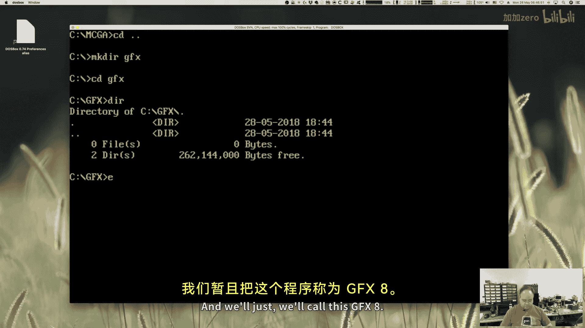

And the first thing that we want to do。 So okay， we got to talk about。The PC， and again。

 this is for legacy PCs tough so this is for。Things that would have been prevalent in the 1980s and the early 1990s so if you're looking to write code。

 assembly code or C code or some other kind of language maybe tupapascal or something in DoOS box。

 then this would be applicable for modern you PCs， you have things like SDL and。

Other other libraries that you can use， so this would not be applicable in that environment。

So briefly。PC Vira right had your X86 CPU， which would have been an 8088 or an 8286， or a 386。

 May 486。Penttium1， something like that。嗯。And they all were kind of essentially the same thing just faster and as you got up。

 you know， once you hit the 386， they had enhanced capabilities for。Multiitasking operating systems。

 pre multitasking operating systems and。Flat memory spaces they。

It gaveave you the ability to move away from segmented memory。

but what you're most likely going to be doing in a real mode language programs。

 like a comm file or even a very simple， small mode， executable file。

Is you're going to be working with segmented memory。The VGA。Controller。Is。

Or I should say the VGA video RA。Is located at。A0，0，0 hex now this is the。Segment。Paragraph address。

Okay。And the offset starts from zero and it's know 320 by 200， so it's literally 64，000。so let's。

Gringing up my handy dandy calculator here。64000。In hex is FA00。So。This is the is the offset。Range。

Within that segment。Okay。So。Moode。13 hacks。3，20 by 200 by 256。This is colors and it's paletteized。

Okay。ModModern displays， modern graphics cards。Our real color displays。嗯。

I would say almost predominantly right， which means that you're not going to an indirect table and looking up a color and then the hardware displays that instead you just tell video hardware this is the exact color combination I want so this is where things like 16 bit。

 24 bit， 32 bit color come in and you know I'm using OS 10 everything on this displays 32 bit color and modern GPUs can crunch through those extra large numbers without much problem at all。

But back in the day。Having， you know。A red， green， blue alpha。啊。

Combination where each one of these is a byte， so you have a 32 bit value here。

If you had to move for bites for every single pixel back in the day， that wasn't going to work。

So in this mode， every pixel。Is one byte， okay？So the value for that can be zero。嗯。

Should do this right way two。FF。Those are your possible values。

And those index into the pallet and the pallet is configured with the red ring blue pairs， triplets。

 There is no alpha。For this hardware， if you wanted alpha effects。

 you had to do that yourself and most games of this era did not do that because you had to read the pixels。

 you had to do the math， you have to reapply them， it's expensive right some games may have done it for some simple special effects and certain transition scenes。

 but typically for the game itself， they would not be using alpha type effects。

So how do we plot a pixel in this mode， Okay， so in graphics programming。

 and this is still true today， you're going to hear。The width of the display。

Is not always the same as the pitch。Of the display。Now in this old hardware。The two R equivalent。嗯。

So sometimes they're not the same。嗯。Right。So in other words， what does that mean？Okay。

 so let's talk about modern hardware。啊。You would have。A width of。320 pixels， okay， but。A pixel。

Is four bytes in size。So， the pitch。Is equal to。320 times4 or 12，80。Right。

Because that's how big the other term for this would be strideide。

So either of those terms you might see in documentation or you might see people referring to that。

Okay。So logically， the display is 320 pixels wide。But physically。

 it's 320 times 4 or 1280 bys across now this。This is just as。An explanation here。

Of how we're going to do this computation， because you can take this example and you can apply this to modern hardware。

 You can apply this to like an SDL application or you know。

Probably a whole variety of other things that you might build with modern hardware。

 but you have to remember on modern hardware， the stride or pitch of a line。

Or a screen or a texture or buffer is probably going to be different than the actual display width in this case。

So with old hardware。And， especially。Moode 13 hacks。The width。Is equal to the stride is equal to 320。

 because it's one byte。So。How do we plot a pixel？Well。The location。

Well I should say let's just call it offset is equal to。The Y position。

Times the width plus the exposition。That's how we compute a pixel and what we do is we write a byte at that location。

 at that offset。Now， this is segmented memory。 So how do we do that， Well。

 we have to set the segment register to。The segment that we want to write to。

 and then we need to do a segment prefix when we write our assembly code and we need to put the bike into memory at that location。

So first， but before we do with that， we got to go into graphics mode， so the way to do that is。

And the asmbler I'm using is 86 and 86 will automatically origin this properly and create a comp file for me I don't have to。

It's not like Masm， I don't have to put a bunch of garbage in here to get it to do what I want。

We're going to move H with zero， and we're going to move A with 13 hes。

 and we're going to call interrupt 10 now。And then I think before we do anything else， let's do this。

We're going to move H with 0。 We're going to move A with 3。 and we're going to call intent 10。

 So what what， what's happening here。 So this is our start label。 This is just for us。

 It doesn't really mean anything beyond that。We're going to go into mode 13 hex， which is。

MCGA 32200256。And then this code down here。I's going to go back to text mode。Which is 80 by。

I guess 25。By 16。Right。嗯。And technically to exit this cleanly。

 there's a doS interrupt call we should make， we're not going to worry about that for the purposes of this。

So if we。If we save this。

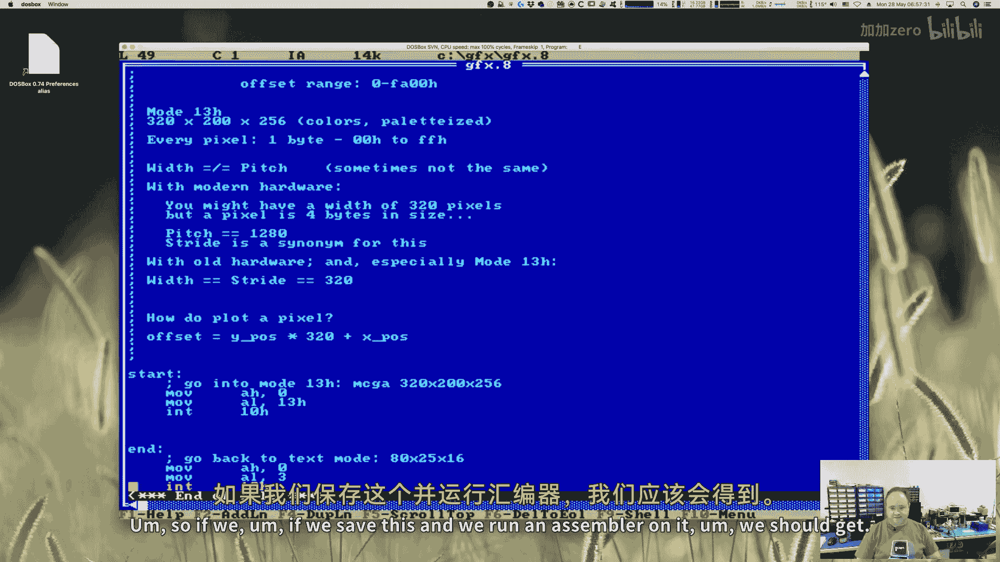

And we run an assembler on it。Um， we should get， yeah。

 it should just clear the screen because what it did was it very quickly went into graphics mode。

 very quickly came out of graphics mode。嗯。

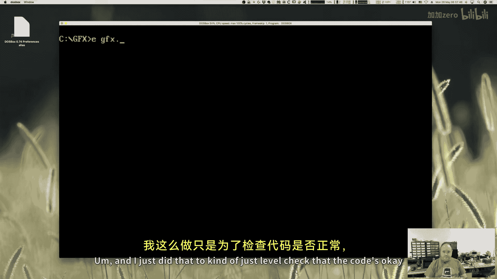

And I just did that to kind of just。Level check that thecodes okay and it's compiling and you know we're assembling。

 I should say we're going in the right direction now before I go any further， what's happening here。

 Okay， so first， what's age， what's A So on the old 16 bit CPUs。You had the AX register。

And AX could be。A H。This was the high bite。Or A， this was the low bite。There's BX。

 which has BH and BL， there's CX， which has CH and C。There's Dx。Which has DH and DL。

There's the stack pointer。This does not subdivide。There's the destinationation index register。

This does not subdivide。There's the source index registerister。This does not subdivide。There's CS，DS。

 and ES。 These are the segment registers。These are the segment prefix registers。

These do not subdivide。Okay。嗯。So I think I cover everything Ax， B，x，x Dx。Stack pointer， DIS I。

 CSDSES， these are our registers。Now these are your general purpose registers， Okay。

 so these registers here。Our。How you。Store temporary things that aren't in memory now you can also store things in memory。

And so you could， you know， there's an expense to that。Because， you know。

 the X86 family did not have like a zero page， like maybe。

 say the 6809 or the 6502 or the 65816 where there was optimized access to a specific low memory range which you could almost kind of consider a separate register file that doesn't really exist on the CPU。

So for maximum performance， these are the registers you have available to you， so you have four。

 16 bit registers。You have those subdivide into the high and low bytes。

 so if you deal if you're dealing with just bytes， then you can typically use one of the one half of the 16 bit register to do what you need to do if you're dealing with a full 16 bit word then。

You can use one of the 16 bit registers。The stack pointer is fixed and function。

 it points to the stack， and that's what it's used for。

The Destin index register and the source index Reg can be used as temporary 16 bit registers。However。

 they do have a special purpose as it relates to certain kinds of memory operations and we're not going to get into that too much here。

But you know， just know that you can temporarily use them， there is one register I forgot。

The base pointer。So。And that's an important register。

The base pointer is a 16 bit register it cannot be subdivided， however。

 it is a it's a special register in the sense that，With the BP register。

 the assembly length or the instruction and codingd for the CPU allows for the base pointer register to have offsets that are slightly more complex the BX register also has behavior around that where you can do。

Certain kinds of offsetting and indexing with that register that you can't do with others。

So that's something to keep in mind。Okay， so we're going to go into graphics mode， right and。

But here's the problem where you think， okay， I'm in graphics mode， how do I write something？

To memory， how do I put something out there？Well。啊。You could say， oh， well。

 I know that video memory is at this segment。 Okay， so now I'm going to。Do this。

And I'm going to also then say this is。啊。Kind of asmbler specific。 So technically speaking。嗯。

The CPU does not support what I just wrote here directly， the asmbler here in this case。

Has a convenience mechanism where it recognizes that I'm trying to move an address into a segment register directly。

And what ends up happening is the asmbler converts this into。

 I believe it converts this into a push and a pop if I'm not mistaken actually。

It might be a mover pushing a pop， we'll see， so let's save this。And。

We'll assemble it now we'll look at the list file。Which is the file that the asmbler creates to show you what it's doing。

Here。We can see that this is a lot more complicated than just what I wrote yeah。

 so if you look the machine code that got generated here， there's actually two instructions。

Not just one and if we wanted to go one step further with that。We could load up turbo debuer。

On the comp file okay and okay， so see here's what happens。

 we can't move the value directly into ES that's not permitted by the architecture。

 it doesn't support that as a constant value and why is that you might say why can I move it into this but not that？

Well， this just comes again， it's instruction and coding and so if。With the segment registers。

You can， they can either。So what are we doing here we're right。

 so we're pushing AX to save whatever's in AX， we're moving the value， the constant value into AX。

 which。The move with AX or BX or CX supports that encoding okay we're then moving that register's value into ES。

 then we're popping AX so actually to change a segment register is kind of expensive on this architecture because we have to go through behind the scenes 86 did this work for us and so sometimes youll look at assembly code from this era and you'll see macros especially like in MaSm I don't believe MaSm will do this automatically for you so you'll often see macros right that will do this combination of instructions for you。

So that's something to keep in mind if you try to transliterate the code exactly as I'm writing it here。

 unless you're using86， it may not work。

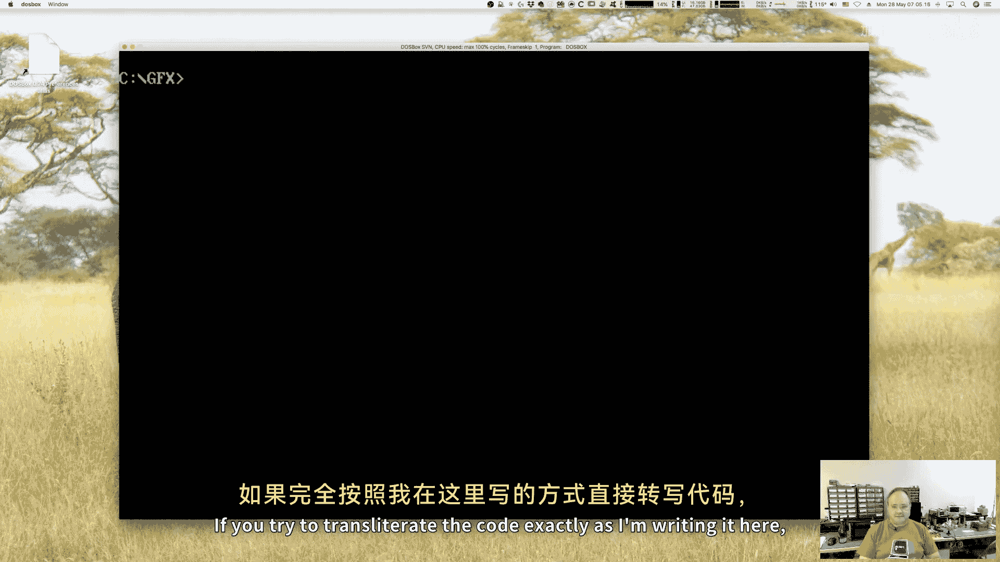

Exactly as you're expecting。 so I'll just make a note here。Maazin is probably pretty dumb。

And needs a macro。Okay， so just remember that。And I haven't checked Masm in years。

 so it might be that Masm does this too。R the top of my head， I don't know。So。Now we have the ES。

register， which is a segment register。 and remember， there's the code segment data segment。

There is the stack segment。But。Again， we're not really doing anything。

Where that needs to be different。And then there's the extra segment register or extended segment register。

 whichever particular。Document you happen to read and how they refer to it。

 extended segment register or extra， you they could in a variety of different ways。So again。

 segmented memory is it sounds more complex than it really is。

Just there's a prefix value that moves through memory 16 bytes at a time and of course any multiple of 16 is a valid segment register and I mean just or segment value and just to like verify that that's the case if we divide this by 10 hes right we get2560 right so that is a that's the number of paragraphs to get to that location in memory okay when paragraph is 16 bytes so。

That's all a segment is， it's just a special way of dealing with limitations of the hardware at that time。

 and the way to think about segments is that you're indexing into memory。

And then you have an offset from that location that can always be 64K。And segments overlap。

 but don't let that confuse you。In practice， they almost never do okay and the reason that segments could overlap is because of memory allocations for hardware interfacing reasons again。

 practicality wise。In the dos world。Segments almost never overlapped and if you're allocating memory or you're dealing with memory in a segmented architecture。

 you can very easily write your code so that your segment start address is always you know。

At the end of some other segments so that they don't overlap。Anyway。

The video hardware is fixed in memory， and it's at this segment。

 So now let's just do something really， really simple。 let's。Let's just put a pixel。

Right into memory。 So how would we do that？ Well， so we have the Es。诶。Register set。

So now we want to do an E move。Now what is this， this is what's known as a segment prefix on the instruction。

 so again。你。Machine code on the X86 allows you to tell certain instructions。

 essentially any instruction that would access memory。Hey。

 this is the segment register I want you to use。When you access memory。And the CS segment。

 which stands for code segment， is implied。So within a comp file in the tiny or small memory model。

 which is what we're using here。Your move instructions， a instructions， in， subinions， mo。

 div and all that， they're all going to assume the code segment。By default and in this model。

 CS is equal to DS is equal to ES is equal to S， right， they're all the same。To start with。

 but that you can change those right， you can change the data segment。

 you can change the stack segment。 you can change any of them and there's really no limitation there。

 The only limitation that the comp filele model has is within the code segment itself。

 But even there you can load code into different areas of memory and jump to them and you can do all sorts of cool stuff。

 So。Anyway， by doing the prefix or telling the CPU， okay， this is the segment。

And then we're going to offset from that location， okay now。How。How are we going to do this。

 we need a pointer， don't we just like you wouldn't see？So what we're going to do。

Is we're going to move Bx with0。That's our offset， Okay， and we're going to use brackets。

 What does the bracket mean， Well， the bracket means that I'm going to index。诶。ok。

If I just refer to the register itself。Then I get whatever value。Is in the register in this case。

 zero。so there's no special meaning there， it's just a number。

And remember a 16 bit value could be zero to Fff FF。嗯。But if I put the brackets in front of it。

What that's telling the asmbler is， hey， I don't want to treat this value like a pointer into memory。

And。Literally in a segmented architecture， what we're telling the asemmbler is I want this to be a pair right。

 So in other asemmbblers。This is what it looks like。Typically， right。

 it's segment colon and then the offset。 Now we want to plot a point。

 So we're just going to write some value。 I don't know if I can do。I't think so。We'll move A。With7。

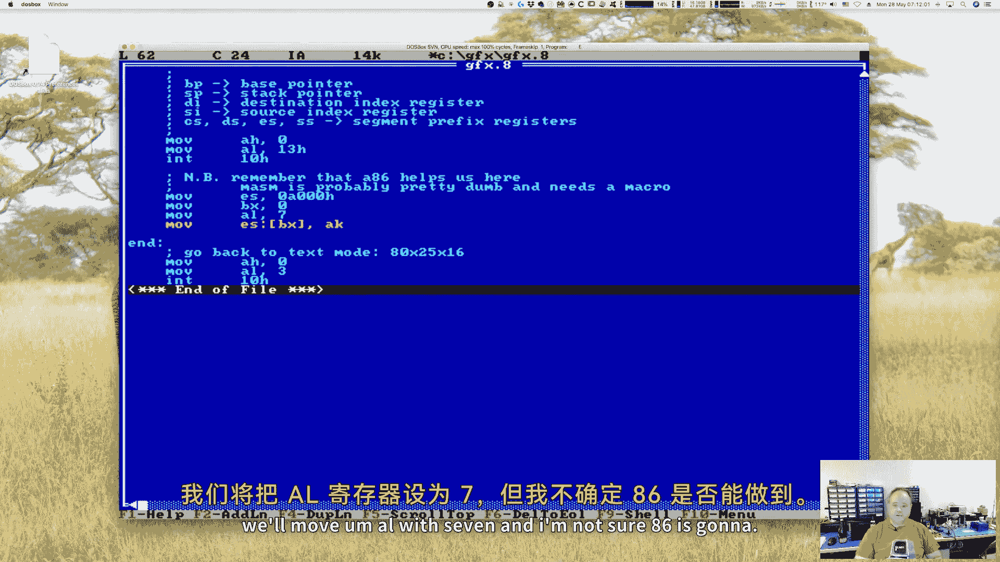

And。Nush 86 is going。ItT it。ななの。

Okay。So BX is our pointer within the segment and remember。呃。

320 by 200 mode doesn't quite eat up an entire segment。 It's not 65，5，3，5 bytes， it's 6，4，0，0。

0 bytes。So it fits right， FA 00 was our range， right， well that will fit。

Very nicely inside of this 16 bit register， so that means we can address every single pixel on the screen。

And I just moved the color value， the index value into AL。

I always forget if。Yeah， no， it doesn't like that you can't use a constant there。

You know， one of the things you run into with assembly language。

Is where you can use constant values and where you have to encode registers because again。

 you have to remember that memory was a premium and even on modern processors， this is true。

嗯。

So it's much cheaper memory wise to encode registers because there's a limited set of them。

Then it is to encode random arbitrary。16 bit constant values。

 so in this case we have to put our color value in a different register so we can code the register pair。

Now I actually kind of prefer X86's approach to segment prefixing because technically this is really what the instruction set looks like doesn't look like the other thing the other thing is something that I think Microsoft mostly pioneered in syntax。

 I don't even think it was an Intel thing， maybe it was I think it might have been an Intel thing。

 but yeah， you'll see you'll see the other one with the segment colon and the offset Now what we're going to do is we're just going to。

Take off the code that puts us back into text mode。Instead， we're just going to run this。

Which I'm going to have to restart， that's okay。Okay， so if youll look very carefully。

 there's a pixel in the upper left corner。Now we're going to do something a little bit faster in that because that's。

 I actually have a program here。B fix。Called fixed bid。Here we go。Actually let me do this。

 I'm going to copy fix F。Up to my。TFX。There。Now we have a little program that will just take us back to text mode so we can kind of fus around without losing our display。

诶。Okay， so we plotted a pixel， but it's kind of worthless right， This is not an X and a Y。

So let's think about it。The X can go up to。320 now。Bad thing about that is 320s greater than 255。

But our Y can always be within an8 byte value。But， you know。嗯。To do multiplies。

 we have to use several registers。嗯。So。What we want to do is we want to get an offset value。

 which again was this equation here， was y position times 320 plus x position， so let's do that。

 let's figure that out。So if we move。嗯。2。Let's use。AX。诶。And。We'll move Ax with what's 320？116。

And we'll move。あ。And see， it's a real bummer that we have to burn。So much here。So let's say。

 can we get to 320？So can we get what is 160。Ooh， what's 80？

And so I'm just trying to think if there's a way we can shift to it because again。

 you don't have to necessarily use the CPUs multiply， you can shift。To get values that are close。Um。

 but not all values can be， you can't shift。To a multiple of two。

And then or a power of two and then get to the other， so it's 320 I choose to do6， be 64。

 I don't think we'd be able to do it cleanly。嗯。So we'll move Ax with this will be our x position。

Or actually， let's make this our wild yeah。Make that our wide position。And then we'll do CX。

 and that'll be our x position。So we'll just put that right in the middle。Okay。

 now we have to multiply。嗯。So。The mo instruction。Is。AX times the register we pass。If we pass CX here。

This is actually going to update。AX with the result。And Dx。I believe is touched here too。诶。

I'd have to look at the instruction。Encoding information again。

 I'm pretty sure Mal touches DX as well。But we're going to ignore that for now。

 So what's going to happen is we're going to multiply oh， and actually， this is wrong， right。

Weve got to do this in two steps， so first we want to， this is our stride。With。The screen， right。

 So we're going to multiply the y position times the stride width。 So now Ax is going to be。

320 by 160。5ive， one， two， zero， zero， okay？Now we just want to add X。

So now we can just add the exposition， actually wanted to say this was 100 and the exposition was。

That's our expertise。Right， so。嗯。Then。This is kind of wasteful so we could just do this with Bs see we can't do it with BX。

 This is where things get fun right because the mall instruction is implicitly AX times the register that you pass。

And so AX has the result in it。So unfortunately， we have to then move AX。Bx with Ax here。

 because we can't。Index into AX like this， we can only do this with BX or BP。Now， at this point。

AX and CX are free again。We can do whatever we want with them。

Because we use them to get our BX value。So if I did all this right。A， it should assemble。But B。

 it should put the pixel。Right in the middle of the screen， which it does。

Okay。Now。You want to draw more than that， you want to draw a line， you want to draw a box。

 you want to draw whatever circles and arcs and things those start to get more complex and arbitrary lines。

 meaning any from any X Y point to any X Y point the。Branham。Line drawing algorithm。嗯。You know。

 can be converted obviously to assembly language， it's， you know。

 I would say it's like an intermediate。Level task to do that， however。

 drawing horizontal and vertical lines is actually very easy。You can also draw。

Exactly diagonal lines in either direction， very easy because you can just step on X and Y。

 when it's when things are not you know。Corner to corner exactly that the line drawing algorithm has to be more complex。

Okay， so now we've got this code。

That puts a pixel on the screen。But。Really we would like to。Have a function。So how can we do that？

Let's。Copy this block of code。And let's move it up here。And。

So now we have a function that doesn't take any arguments right now。U。

 and I actually probably should take the comment with it。And if we just。Call。Qut。

So what did I just do here， I created a label。I moved the code that we just had up underneath that label。

 so what is that I just moved it in memory， essentially this just keeps track of where in memory that happened to be why did I put this jump start here well because this code can't really run。

Yet。嗯。So what I'm doing is I'm jumping over all these definitions to start and then this code is the code we want right this code puts us into graphics mode。

This calls our pixel plotting function， which right now is not parameterized。

 but we're going to get there。And then this code， which we'll eventually put back in。

 would take us back to text mode。So let's assemble that。Let's ruin it， boat and it hung out。

That's okay。We're going to definitely have to I keep doing that。

You may have to have some mistakes here， right？

Okay， so where did I mess up？

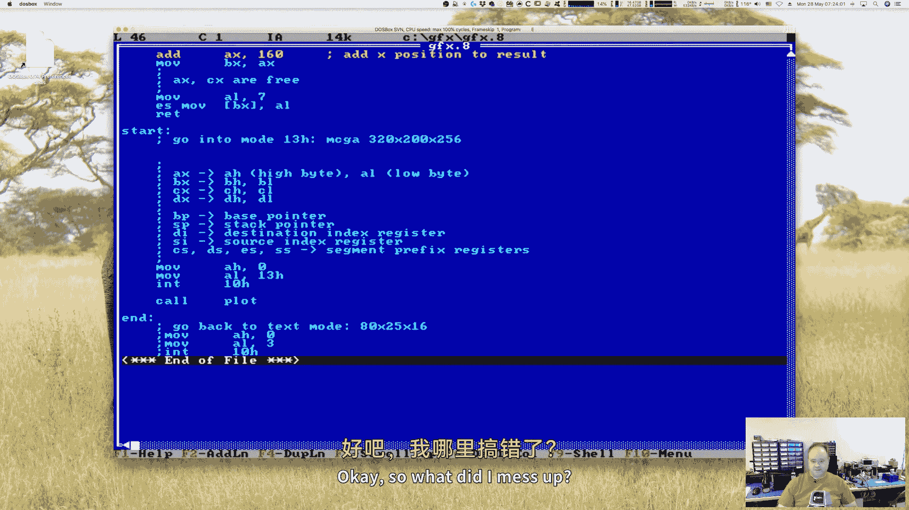

Well， let's do this。Let's run it through。Cbody buger。And。let's just run it。嗯。Well， actually， okay。

I terminated， so the very first I have a jump。The very first instruction。Which jumps to 011 D。

 which is 011 d is right here。And then we call back up to 0103。Which is right here。It's interesting。

 where did our jump instruction go？So I'm just going to check the。So， I。

Adddres 0100 which is correct， this is the origin， the default origin for comp fileses。

 we have a jump start。Jump third。And then so we jump down here to start。

Which the very first instruction is at 011 D。And。Then we call plot。And plot。Is at 0103？

Which I think that might be。是应该。So the even instruction， what does that do？Or the even directive。

If we look at the graphics list file now， we should see that。Yeah。

 we should see that the asmbler burned an address for us。

And the code itself actually now starts at a。A word boundary instead of at an odd location like this。

And occasionally， again， alignment。Is something that you have to keep in mind。

But we're still locked up， so what's on there？嗯。What did do wrong。あん。Let's see here。Oh， yeah， okay。

 that might be。嗯。Oooops。Helps if you can type two。嗯。Hello。No， that would be an issue。

 but it might be。No。Okay， good thing that restarting dos box is easy。All right。Let's see。

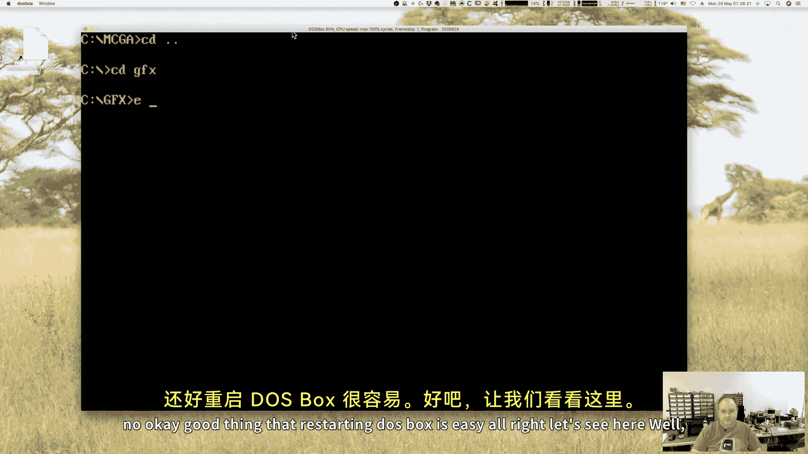

We don't want to this， so let's take a call。Out。No。Boy， it really doesn't like that。嗯。Oh， different。

 different during direct。So it's not alignment。Let's going on。That's bizarre。

嗯。What did I do that was silly？Sly， really。You know me。Okay， it doesn't need that。嗯。

I'm really confused。ok。Weird。There's something address related there and I'm not really。I thought I。

Saw that the alignment wasn't that bad， but。Okay， well， the real test would be。

Once I did， yeah， I must， I don't know。Okay， anyway。

 I'm going to have to revisit the mystery of what I messed up there。嗯。

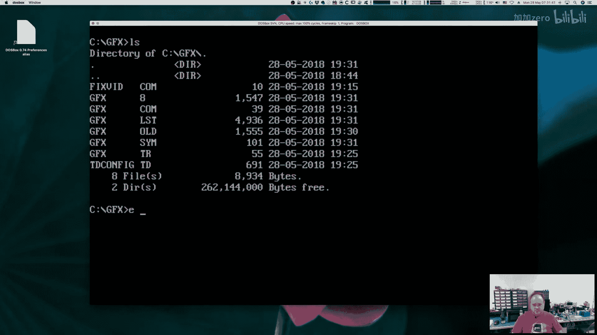

So we have the start， we don't have to do the jump anymore because this is the actual code we want to run。

So。And then I just move the function to the end of the file。

 The only thing I had to do there then is I had to make sure that。We when we call through。

 when we fall through here， I have to make sure the X register is zero and then call RE because this is the end of the program and we have to essentially give control back to the operating system here and now this is again not。

Officially the right way to do this， there's a Dos interrupt that you have to call to you know。

 tell Dos the exit code and things like that， but this works。In a pinch。

And so this is our plotting function again I would normally have this up above and I'd have the dark code below。

 but that's okay。 this works， I'm not sure why that jump wasn't working I'm going to look at that again。

 it price something is really simple， I'm just not seeing it。

So we want to parameterize this so how would we do that Well again we obviously don't have a lot of registers。

 we have you know four general purpose 16 bit registers， we have you know eight8 bit registers。

 but you can see here we're pretty much working with 16 bit values for the most part with the exception being the color so the way we would do this is we would pass values on the stack。

Now。I'm going to put an underscore in front of our plot function here， and I'm going to make a macro。

And。In 86。You give the macro a name， use the macro identifier。

 and then the end of the macro block is a pound EM， syntax is a little strange。

But you get used to it eventually。And then in this case， what we want to do is we want to。

Take some parameters are going to come into the macro。 macro parameters are just pound 1，2，3，4。

5 up to， I believe。20 or something。And thosell just get substituted as text。

 there's no magic or anything that happens there， whatever the value of the macro parameter is gets inserted into the macro in place。

And so what？We're going to do what we're going't want to do。Is we're going to want to。Push。

Our parameters here。So。We know and again， the stack on the CPUUs well。

The 8088 and 286 and in real mode is a it's a word size stack， so 16 bit values that you put on here。

So we want to push。Why position？Px position。And we want to push the color。Now， unfortunately。

 the color is kind of， this is going to burn an entire 16 bit value。If we had some other parameters。

 you maybe could combine them， you know， two bytes into a word， sometimes you can do that。

In this case， we're not going to be able to get away with that very easily then we want to call。Our。

Our plot function。And that's。That's it， and then the only thing we have to do is we have to clear off the stack。

So we have two， four， six。Bs， right， that needs to come off。A stack， why six because again。

16 bit values， two bytes each。So two， four， six bytes， adding to the stack pointer。

 freeze memory off the stack， subtracting from the stack pointer。Gives you memory。

 allocates memory from a stack。So this is an example of how you would call a function like this。

Passing parameters in now within our plot。What we need to do here is we need to move the base pointer with the stack pointer so why do we have to do that well because we can't index the stack pointer。

You know， we can't do anything fancy with it， we can't treat it like a structure directly。

 the CPU just doesn't support those kinds of encodings。So。

Here we're using the base pointer to do that， to allow us to get to certain points within the stack directly to get values out now it just so happens that you know 86 has a pretty nifty feature where you can create a structure so we can do a structure。

And we can tell it that it's a BPp based。structureucture。And the ends。

Statement ends the structure definition。 Now the very first value is a burner value。

 it's it's the return value actually that's on the stack。 We don't care about that。

 We don't want to touch that。Then we want to actually have。This is going to be our y position。

Actually， I'm sorry， so this would be color。Wait， I'm pushing。So mean Y x color。Yeah。

 so actually this will be my position。Exposition。And color。And where we can do color。Is。诶。

We can do a pad。Bite。And a color bite。So we take that word and we we tell the asmbler， hey。

 break it down this way for us。 Okay， now here's the really cool bit by。呃。

Moving BPp point at the stack point here。We now have access to these pseudo variables， right。

 The asmbler kind of intelligently knows that I can access。Things from BPp， right。

I can access the Y position this way now。And I can access the。Xposition。

And I can access the and actually we don't even need to。I don't think we need to load that there。

 we can just do that directly right from。BP at that point。嗯。Now there's a couple other things here。

 right？we're starting to sttomp on some registers。So we probably want to save some other state right。

 so we should probably push BPp。ES， AX， CX， DX， Cg， we should do AX， B X， X， DX。

 if we wanted to save all register state right， this would be the way to do it and remember you would pop them off。

In reverse order。From how you put them on， right？So what this does。

 well we just what we've built here with this macro is this macro creates this epilogue called prologue code for us every time we want to call this function instead of us having to do that ourselves every single time we didn't use the macro。

 we'd have to write that code and every single call spot and you know that's errorprone。

 you're going to forget。So now we can plot， this is why。This is X， and this is the color we had。

 right？

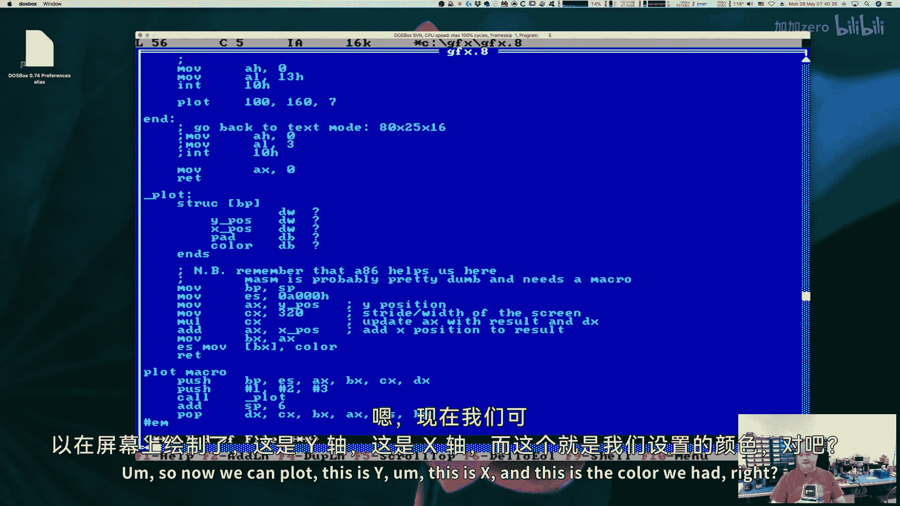

And。Of course， had to have some airs。

That's just how it works。诶。Okay， yeah， I can do that。See， I thought I could be all clever。

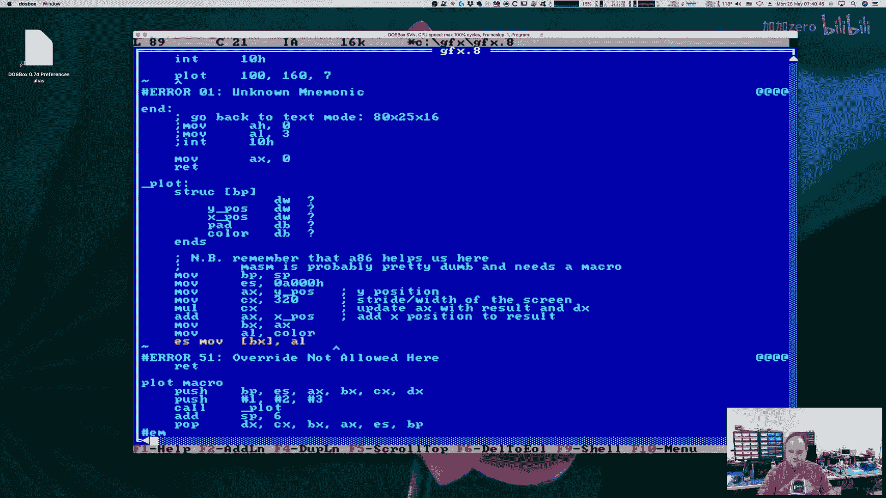

没呀。

What else do I get？Oh， right， so macros are one of those things in X86。

That does have to be defined in order。嗯。In general， most assembblers are not order specific。呃。

Some parts of them can be， right， in this case， macros。

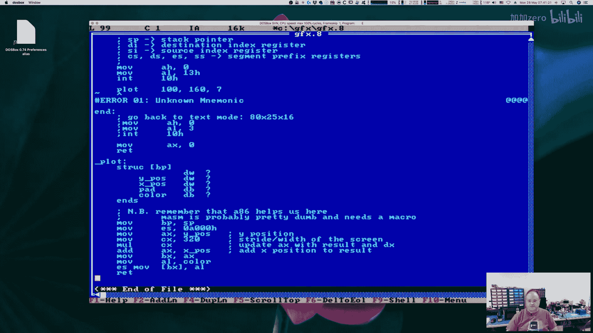

The macro actually has to be defined。Ahead of time。So in that sense， it's kind of like C。

 the macro has to be predefined。But the code actually。

 the labels don't because that gets fixed up later。So we call this。Did we get our pixel。

 we didn't get our pixel？

So let's take a look out and you know。Guaranteed I got the stack order wrong。嗯。

So let's see we're pushing。So why？X。Color。Return value。So。よし。So， it's color。X， Y。

 so it's return value color X Y。Is the order。

嗯。Maybe not okay so let's do。

Turbo debuer。And let's come right here， okay， so you see here we're pushing our values。

And we're making our call。And so the call is going to be down here。Right here。

So let's put a break point。Right there。Let's call it。Okay， and we're going to step。And actually。

 let's。Okay， so。So we're moving ES with the right segment。And that's correct now in the debugger。

 right？And now we're going to load from Bp plus 6。 So Bp， if we come down here to our。Data thing。

And go to。BP。And we can see， okay， so here's what's on the stack。Essentially， so one， two， three，4，5。

 six。 so it's FB。 So if we go back in our code view。What did we push？It doesn't look right。

 we pushed。S，4， a0 and 007。So if we look down here。Where's64， I'm not seeing it。

So once BPP is pointing at FFEA， then the stack pointer is pointing at FFEA。嗯。

So it's like something clbbered。Our stack value maybe。So six， four。Easier， yeah。

 I'm not seeing those on the stack。Well， actually， they are over here on the。Okay。My bad。

 I got that backwards didn't。嗯。So BPp is pointing， okay， yeah， so on the stack。So， it's one。To。

Where are we at here？

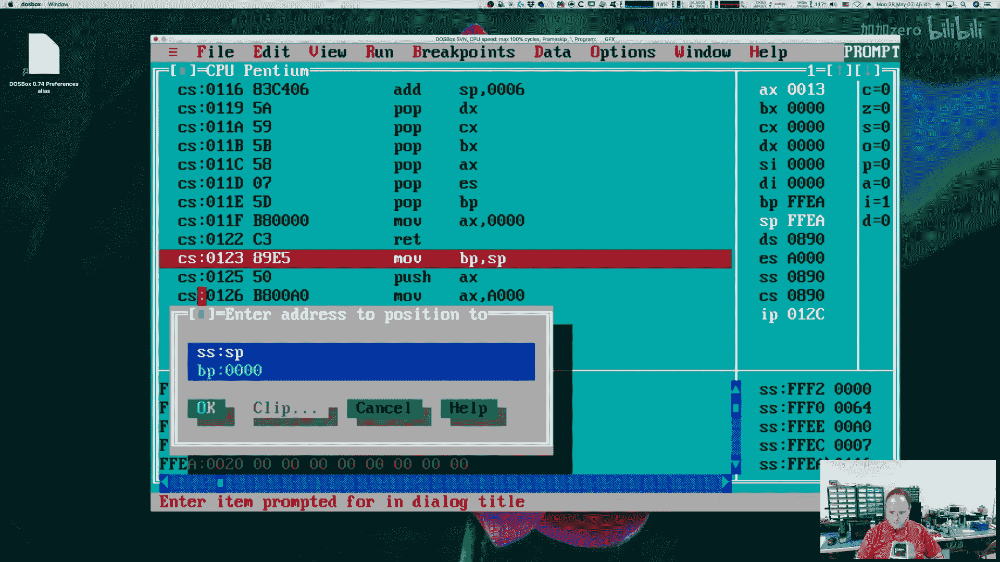

There we go， okay。So there's。6， four there's a0。There's 07。So these are 16 bit values。So。

And here this is actually the return address。Where we're going to go back to。

So this is where we're at right now， so we're going to go one。Two， three， four， five， six。Is。

Pay zero。Which。That sounds right。Ki。So we've multiplied。A0 times 140。These are hex values。So。A0。

 which should be 160。Times。140 that gives us C6 c or 3180。嗯。That doesn't seem right。

 because we have 700 in。So we had a0 times0，1，4 to0。C As are there we go。Right， okay。

Did I do an an already？No。Okay， that seems off。Okay， let's do this。Lets。Stop。O。

So let's try this again。Okay。So。So AX is6，4。AhThat's why the values are different。Yeah。

 that seems wrong。I I got my order rolling again。Yep。They're backwards。O。So， let's。

Fix that。So I'm going to guess that these are backwards too。Oh， you know what。Backwards。

That I almost guarantee that's what I got backwards。The color in the pad。

Yes。Little Indian。嗯。Yep， okay， except okay， y and X are。啊。

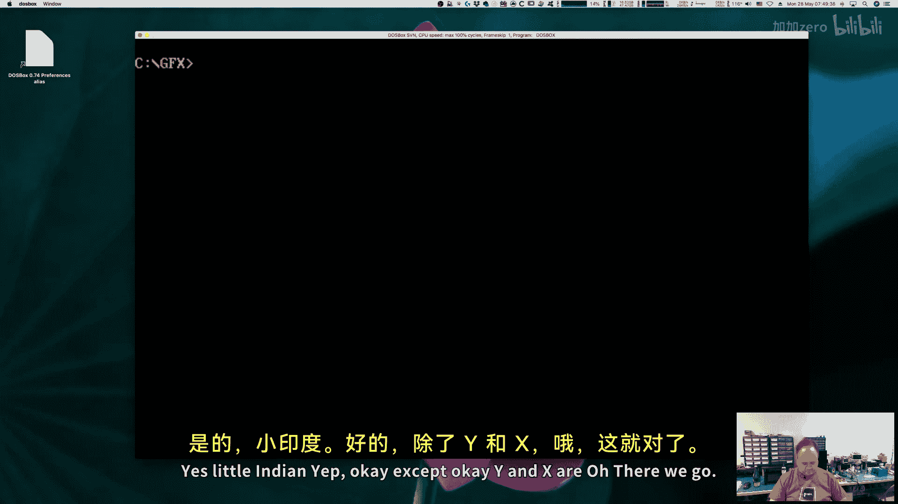

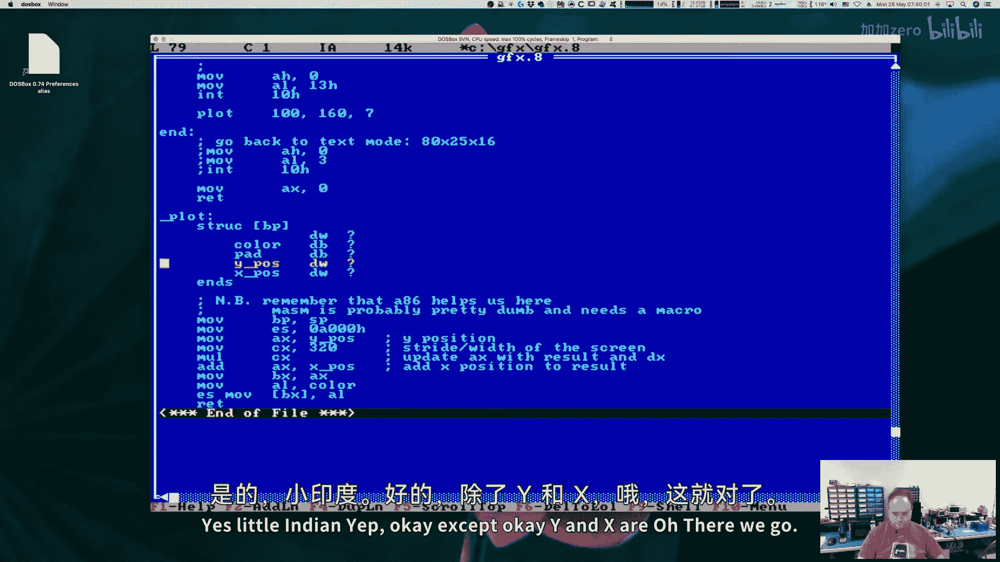

There we go， yeah， I had it right and then I had the pad swapped。Okay， so。If we look at this。

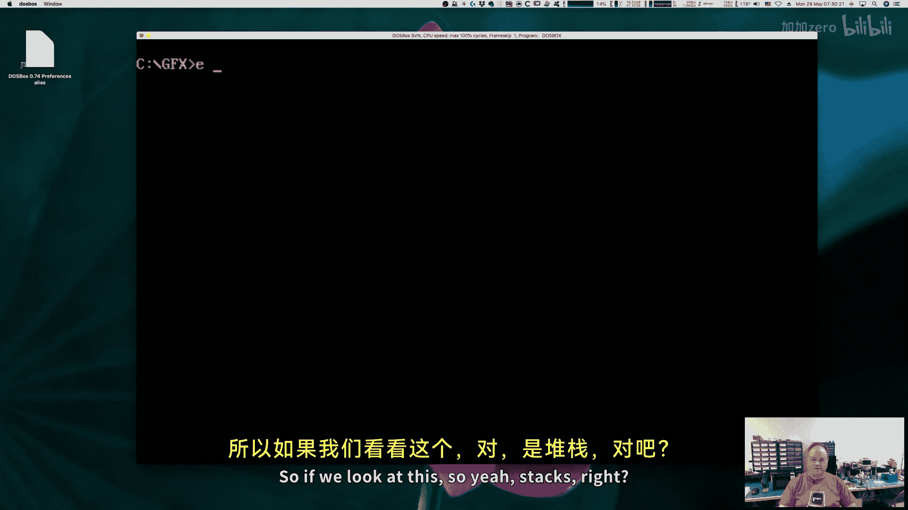

So yeah， your stacks， right， you have to remember that things are backwards and。嗯。

And you had to remember the Indianness of your architecture， right， So in this case the。

Low bite right is or what we would think of as the low bite as stored in memory。

In the high position right， so you have to keep that in mind and that's so I made that mistake。

So this this little dandy here is really convenient because we could do this the old fashioned way。

 meaning that instead of doing y position here， I could do， you know， I could figure it out。

 I could say BPP plus you know， whatever， so it's be 2，4。Six， right， I could do that myself。

That's a way of doing it， but this is much， much nicer。

Because you can refer to these things with names and again。

 Masm has similar features with structures and offsetting it's been a number of years since I've used Masm's features I'd have to review those again。

 but the principles are the same and again behind the scenes。

 what's happening is the asmbler is just saying okay， this variable，Is in this structure。

 And by the way， these symbols here are global， so they have in this asmbler。

 these symbols have to be unique。They can't be they're not namespace right so technically I probably should be calling these plot color plot pad plot X right so that if I had other things in the future they would not you know。

Cide with this set of variables and so that's how the assembler it's just matching the unique symbol and saying oh okay。

 I know what this structure looks like， I know how this is supposed to work。

So we've taken this function。Or taking this code that used to plot a pixel in the screen in a fixed position。

 now we've moved it into a function。It takes parameters on the stack。

 it saves the stack state or saves the register state to the stack as well now。

This is a lot of registers， right， This is a lot of stack manipulation。 Now， this is Uber safefe。But。

 you know， you might be able to optimize some of these away。 You probably definitely want to。

Save and restore ES。You may want to save and restore some of the other registers。

 I'm doing the most safe thing here， which is just saving all state and restoring all state。

 but you can optimize that as you need to and again it's based on you you're going to know what you need to do within your code。

To make this work now， because we're saving all that register state。

 that means that in the call site where we're using this macro。

 we essentially have all of our registers available to us again。嗯。

Obviously at a little bit of a cost right， stuff's being put on the stack。

 taken off the stack to make that happen， but what we can do is we can now say， okay， AX。

 or actually let's even just be really simple， let's do this let's move H with0。

 let's move A with0 and's move CH。With twoActually， let's do this， 320 minus 256。64 divided by no。

 no， no。Yeah， so this would be 32。This would be actually， let's make this y， let's make this X。

We'll make CH 250s。We'll make C200 and we'll make C 256。

And then what we're going to do is we're going to have a label here now again。

 86 supports these local labels， which are a single character and a single digit followed by a cone。

 and then our color value once move and let's move BL。Let's use deal with one。So Alan。

 we actually should。Let's clear out。Dx。嗯。Because again。

 remember we have to pass the 16 bit value here。We can't just pass an aB register。

So this is going to be a， well， will that work。No， that won't work。嗯。Yeah， crap。

 so here's what we got to do。Well no， that'll work， I can do that。We want to do。

We said Ah was x or y rather， right， so Ah by zero。This is again， this is a number， another。

This is A by zero。

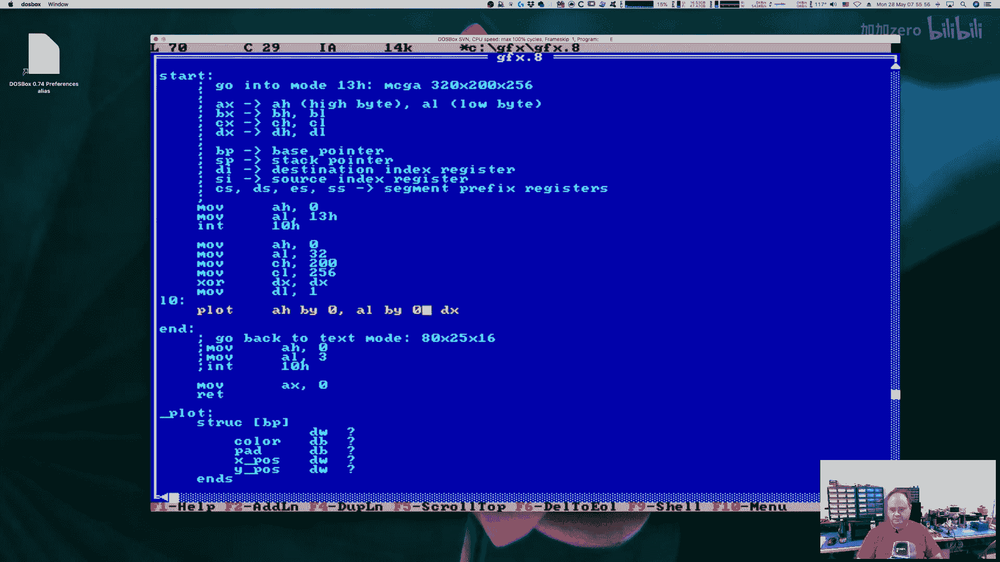

And this would be DL by zero。Let's just make sure that I'm thinking about that right？

Maybe not。啊。

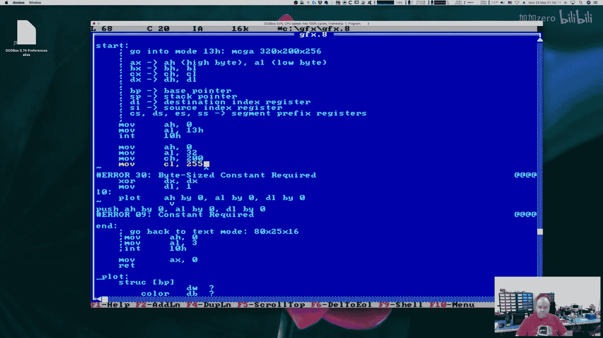

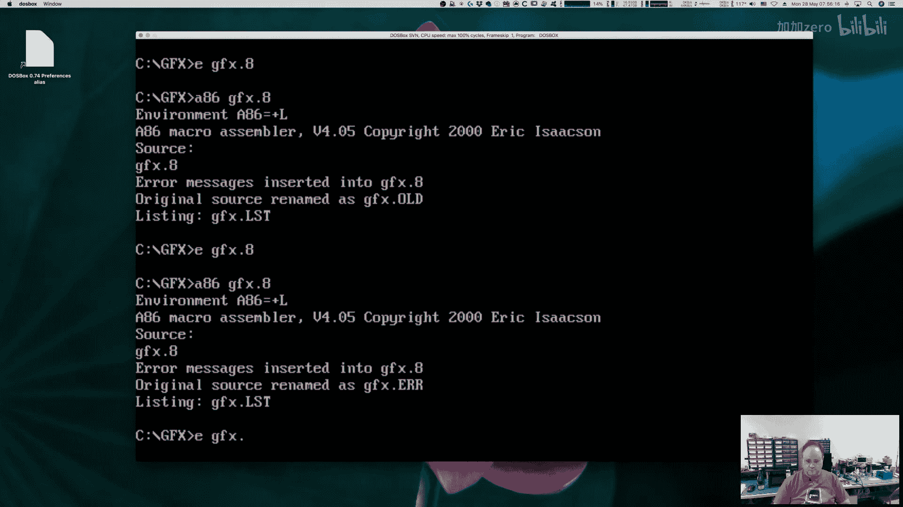

Yeah， I won't do the。Yeah， crap。All right， now get a burn。Or burn much。So we'll use AX as y。

We'll use BX。As X。 so this is y。This is X。Oh set， yeah， do that。And then。

And then we'll use Dx as the color。Because again， these have to be 16 bit compatible values。嗯。

So Y x color， okay？And what we're going to do is we're going to ink。AX。I'm sorry， Bx。

We're going to ink。Dx。And the beauty here is that。Well， I shouldn't say the beauty。

We're going to ink DL。And what's going to happen is this is an a register， it's going to overflow。

And when it overflows， it's going to go back to zero。So what we can do here。Is。That actually。

 we'll just let it overflow to 0。 That's fine。 This， we're going to increment Bx。

That's our y position。 We're going to compare that。Or actually， we should do that prior。

 we should compare Bx to 320。嗯。If it's not equal to that， we're going to go here。So。

 and that's to the next increment。Otherwise， we're going to come here and we're going to move。

BX was zero and we're going to ink。AX。And here we're going to compare Ax with。200。And if it is 200。

We're going to go。L2， the greater than symbol just means that the。Jump is ahead of us。

 it's happening。Further down in the file。It just kind of is a hint to the asmbler so that it knows that it's。

Not behind it。So we have our Y， our X and our color， we call plot， which is our macro。

 which expands into those pushes and pops and calls and all that。Passing in the y， the x， the color。

We compare the x value to 320 if it is， if it's not。320。Then we come down here。

 we increment the x value increment。The color。And we。Jump。Back to L0 here。

And instead of jumping to L2， we'll just jump to end here。Okay， and。Let's see。Yeah。

 so we compare to 320 if it's not， we increment X， we increment the color。

 remember we're implementingcrementing the lower8 bit register on that。

 so which is the only part of it that matters and that's going to go up to 255 and it's going to roll over to zero and we just it's just going to keep doing that and that's fine。

Then we're going to jump back up here。If we do equal 320。

 which means we've hit the right hand side of the screen。Then we're going to reset the x to zero。

 we're going to compare the y to 200。And if we've hit the hit the bottom of the screen。

 then we're going to jump down here to end， otherwise we're going to increment the Y position and。

And then here we want to jump back up。So that's our little loop。

And if I did this right。

我也去。对亮。

Oh white doesn't， it won't do that that way。And that's what we get and that's actually correct。

 that's what I expected to see。Except。It locked up， so yeah to figure that out。嗯。

呃。Rronnder。Okay。嘟嘟嘟嘟嘟嘟嘟嘟。But you can see right， were cycling through the color palette and we're moving along the screen。

And our plot is。Let's do this， let's compare。Let's just do half the screen。

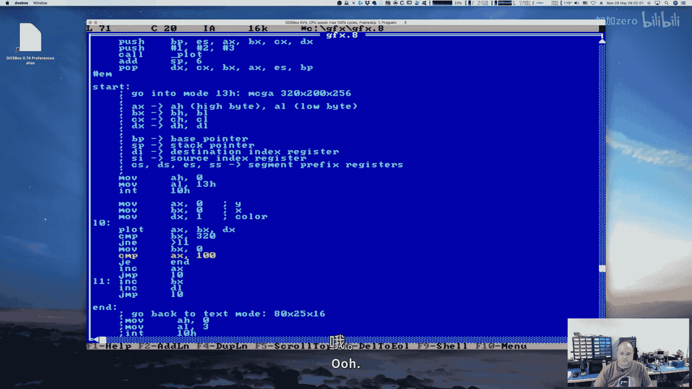

Bh， yeah， that's not good。Okay。

三子。Let's take a look。Let's make sure I got this right。嗯。BP， E， S， A X， B， X， X， Dx， Dx， C， X， B X。Pi。

That looks okay。嗯。

All right， let's do this。Let's just。We on her through the old debuuger。Oh yeah。

 so you can see what the macro does， right？So here's all the state we're saving。

 we're calling our function， we're clearing up the stack。嗯。And then we're restoring the state。Okay。

 so。That's interesting。All right， so。BX is zero。We're going to increment B extra tocrement the color。

We're going to jump back up。And do the whole thing all over again。So let's put a break point。Here。

And let's take this one off。Okay， so Bx is 140，320。We're going to reset it。

 we're going to compare AX with C8。And。It's not equal。

So we're going to increment it and then we're going to jump back up。Do that again。Yep。

 so we're going now Ax， we're going through all the rows。So now what we want to do is if it's equal。

We're going to branch down here。Okay。So。Now。Let's take this one off。Okay， so now we're at the end。

So I think actually are graphics codes okay。I think it's the way we're exiting now is not。

In't that right？So this really is。The right way to exit this program is AH。This is 4 C。Hail 0。

And then it's int 21。

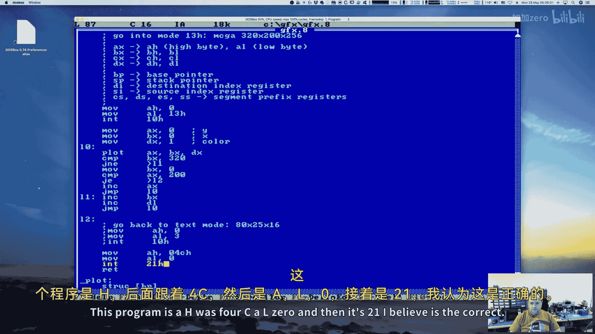

I believe is the correct。Yeah。There you go。I kind of figured that was eventually going to catch up with us。

 you know， you have to call the correct exit code。Or exit termination。Dos call。But there you go。

 there's our color and we're filling the whole screen。And that gives you an idea of how you can loop。

And reuse that function to populate the screen。Now。Let me see， I get a look up real quick。Let's。あし。

There's a oh here it is， this will do it。诶。Okay， so we're going to do is。I just looked up there。

Bios call， we can use。To just wait on a key。

And that's pretty much what we want right， so we're going to put our mode reset code back in。Yeah。

So what we'll do here is。We're going to move。A X with zero。And we're going to call int 16 hacks。

And if the result of that。Is zero， then we're going to go to L2。All right， and this。喂。

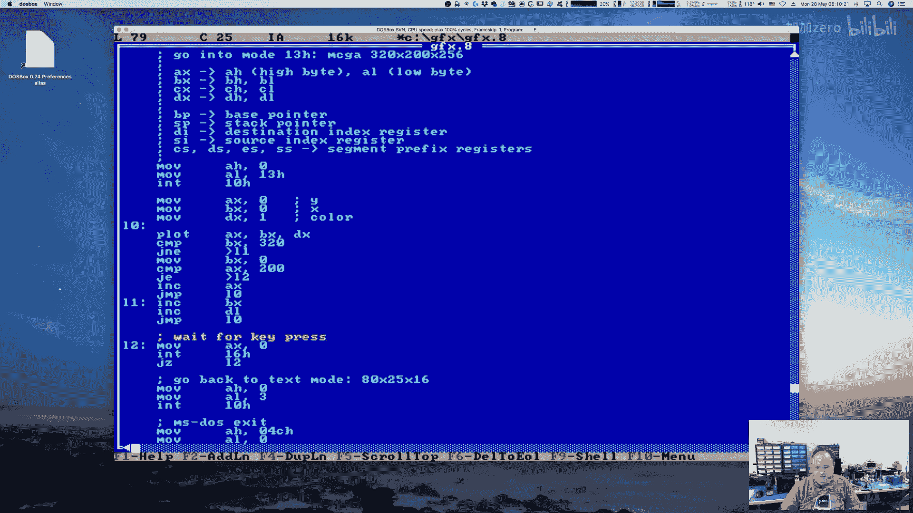

美。no。啊。I was pretty sure that code worked。I probably messed it up somehow。

I'm on a roll doing that tonight。

Okay。Oh I do wrong。当だな。I want to say。Let's， let's look this up。 What does it say。It's 16。Yeah。

 AH is zero， A returns。The ASI character。If no。Key is available。

 this waits for a keystroke if you want to avoid the weight。Right。Oh， wait， okay。Because that waits。

 right？

Yeah。Yay， there you go。Okay， so。诶。As is typical when I write assembly code。

 it never works the first time。But you keep playing on it。

 know you keep working on it and eventually it gets where you want it to be。But this shows you。

How this works。And with this。Basic approach。

You can now build you could build sprite renders， you could build tile renders。

 you know most of this is all now relatively very straightforward because you have the basics now there's a couple things here right like do we have to set ES every time you know。

You could optimize this。 You could start to pull things apart and maybe make it a bit smarter so we could move。

We can set the ES segment once。嗯。Before our rendering code， right。

 so maybe what we do here is we push E。And then we're going to do this rendering code。

And when we're done with the rendering code。We we pop ES right because we're。

We don't need to do that every single time the way if you' were going to write something efficiently。

You would probably。Maybe optimize it that way， another thing that we could do to maybe optimize it one more。

Way would be， you know， hey， we know we're going to call this thing in a loop and we're not doing anything with BPp inside the loop other than you know this plot function right so maybe we could push ES and BP here and we could pop it here。

And then we don't。 So we're going to do that once before we do all of our rendering for the screen。

 and then we reset it after。 and then we don't have to。

Put that state on the stack every single time we call our plot function。

So these are the kinds of things you can do。To start optimizing your code。

 right now what what difference does that make， You know that it's it's we're shaving cycles here and there。

 Okay， probably microseconds， it's not， it's not making huge。Difference， but， you know。

 these are things you can do。

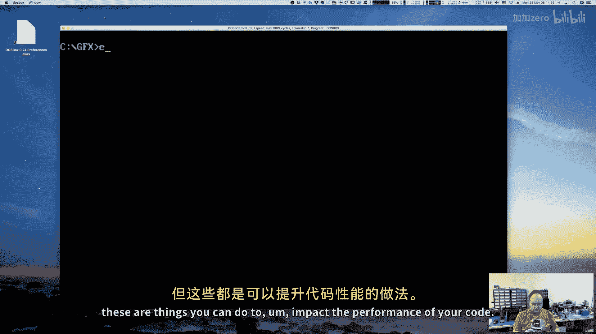

To。Impact the performance of your code， right？嗯。So anyway。I think that covers really。The basics。

How do you get into mode 13？What does memory look like， what registers do you have available。

 what's the stack？How does the stack work， How can you use the stack to your advantage to pass parameters。

 wrap things in macros so that you know this sort of stuff where you have to do your you know your prologue。

 your call， your epilogue， you don't want to have to do that by hand every single time So macros are your best friend。

 Masm has macros， Tasm has macros。Their syntax is a little bit different， read your manual。

 they'll show you how you use those， but the gist is the same， right？And。So again。

 to look at the code top down， you know， we talked about kind of what memory looks like。

 how we calculate positions in this mode， I have a macro here that makes a call to our plot function。

We have our start。For our program， we go into mode 13 through the bioOS。

We save the state of the extra segment register and the base pointer。

 we move the extra segment register with the segment address of the VGA video Ram。

AX is going to be our Y position， Bx is our x position and Dx， technically DL。

 so right the lower by of DX is so another way we could do this right is we do we could X or this guy and then we could move DL。

 right？Since we're just manipulating the lower part。 so we're clearing out the all register。

 we're moving the lower part with。You know one we could do it either way right they both kind of accomplish the same goal。

 this is maybe making your intention just a wee bit clearer。And。We call our plot macro passing in Ax。

 Bx and Dx， again， AX is y， Bx is X， dx is the color， they have to be 16 bit values here right？嗯。

We compare our x to 320 if it's 320。Then we're going to reset it。

 we're going to compare our y to 200， and if we're at that， then we're done。Otherwise。

We increment our X and we increment our color， and now we could do just as another little quick。

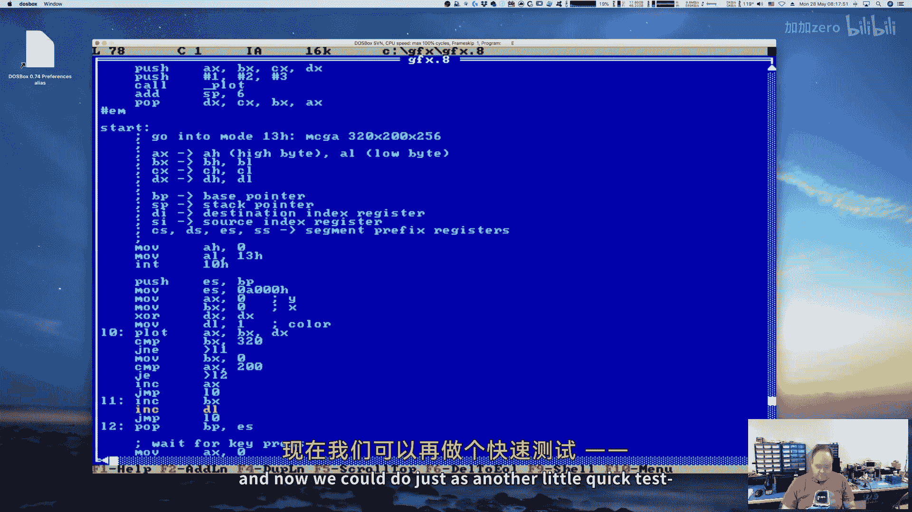

Pest， we can move our color increment here。Just to make a bit different， right？

Now we get some nice striations。Because now we're changing the color only when we go to a new line。

And there's 200 lines， not quite。All the lines we need。For color change， for all the colors。

 but we cover most of the palette。 Now again， this is the default palette。

 you can change the palette to be whatever you want it to be。But again。

 for purposes of demonstration， this shows you what's happening。

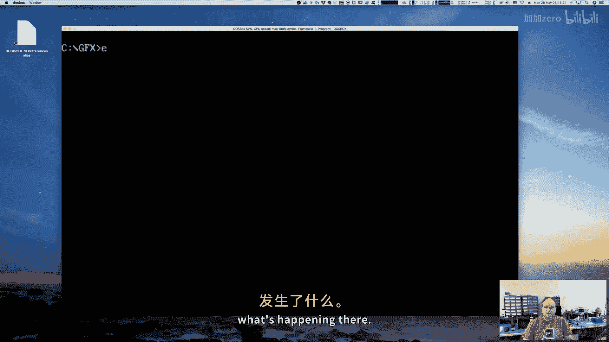

So。嗯。Right， so if we're not at。If we are not at the right edge of the screen， then we come down here。

 we increment the X， we come back up here， we plot the next pixel。

 if we do hit the right edge of the screen， we go back to the left edge of the screen。

 we compare our Y position with 200， if we are at the end， we come down here。

 we pop our registers off， we wait for a key press， and we reset our screen to text。

 and then we call the appropriate MS Do exit function so that it doesn't hang。

And then our plot function down here is we have a structure here。

 that allows us to access the stack cleanly。And so this very first word is unidentified because it's the return address right and we don't really care about that we're just going to ignore that we our color is always a bite and again。

 this is a little ending in architecture so that。Bite is actually。The first bite in the sequence。

 unlike what you might think with a big Indian would be what you would assume。嗯。

And so we have the color and the padbyte， and then we have our X position and our Y position。

We move BP with the stack pointer， so the base pointer now is equal to the stack pointer。

 why do we do that because the base pointer in this architecture allows us to index， right。

 allows us to do offsetting and things。We move AX with the Y position， right， so by doing this。

86 is smart now and when it sees this symbol it says， oh okay， well whatever BP's pointing at。

 that's that location plus this offset right and how does it get the offset well this is two bytes。

 this is one byte， one by， two bytes， so on and so forth。

We move Cx with 320 which is the stride of the screen， we multiply 320 times the y position。

 we add the x position to that so that's going to get our pixel to the right location in video memory。

 we have to move the resulting AX value into BX because we have to index into memory。

 we have to treat that as a pointer and BX is kind of like BPp it' a base it's called the base register and it can support certain kinds of pointering and offsetting behavior similar to BPp。

 we could use BPp in this case here too， but we're already using BPp to deal with the stack so we're point into video memory because we're doing an ES segment select here and we're saying we're going to write to this offset we're going to write this color value and then we're done。

 we return。In the macro that adds six bytes to the stack pointer， so we erase all that data。

 this data that we put on the stack， nobody's popping this， it's just sitting there。

So this erases that stack frame and then we pop the registers off that we had pushed on。

 we went through a cycle where we kind of optimized that a tiny bit and got rid of some of the registers。

You know， we're using A X， B， X， and D， X here， right， So technically， we don't have to push C， X。

 although。I would say it would just be safe to do that。And that's it， that's all it took。

About an hour and a half and a couple of debugging sessions and there you go and like I said。

 now fundamentally you have the code that you need you can build anything you want on top of that so anyhow。

 I think that will cover。What I wanted to do in this video and hopefully that will help folks who are trying to you know learn this stuff and。

Build things， you know， in doOS box with assembly language。 and again。

 the principles here would apply to assembly language。 they would apply to a phone call。

 they would apply to。死。or pascal tuurbopascal or even basic， I mean most of what I've described here。

 the hardware doesn't change right， the memory addresses don't change the model in which you access it doesn't change the language features are different right with assembly language obviously being the lowest level but you know the way you do it go about doing it is the same So anyhow I think that'll about do it and。

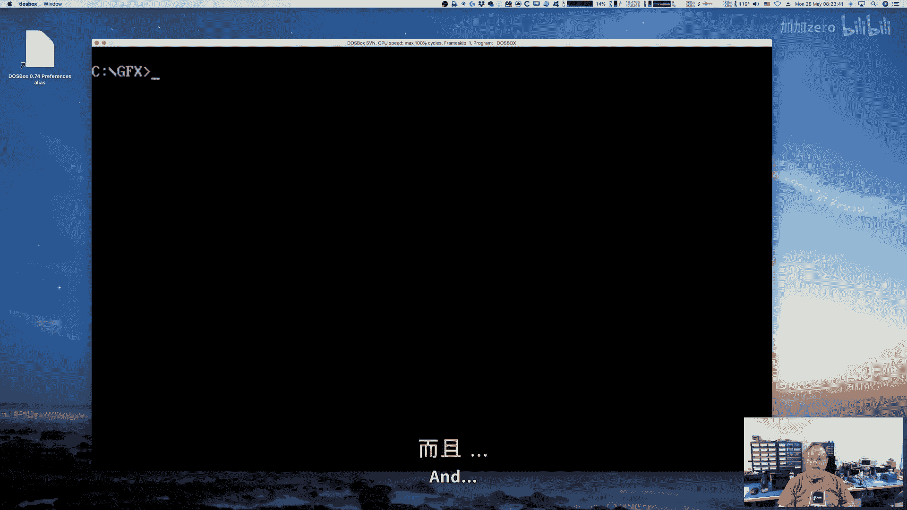

Thanks for watching， bye。