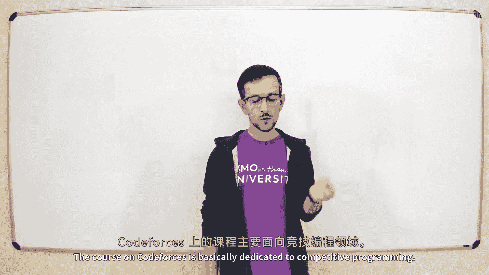
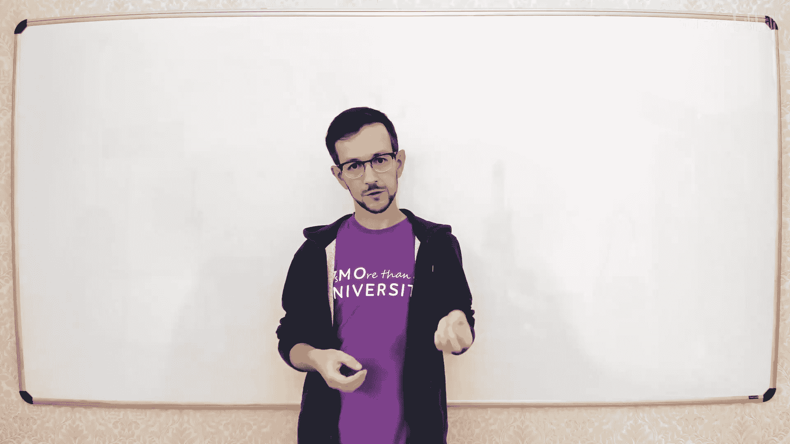
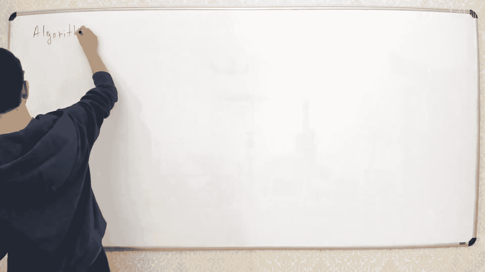
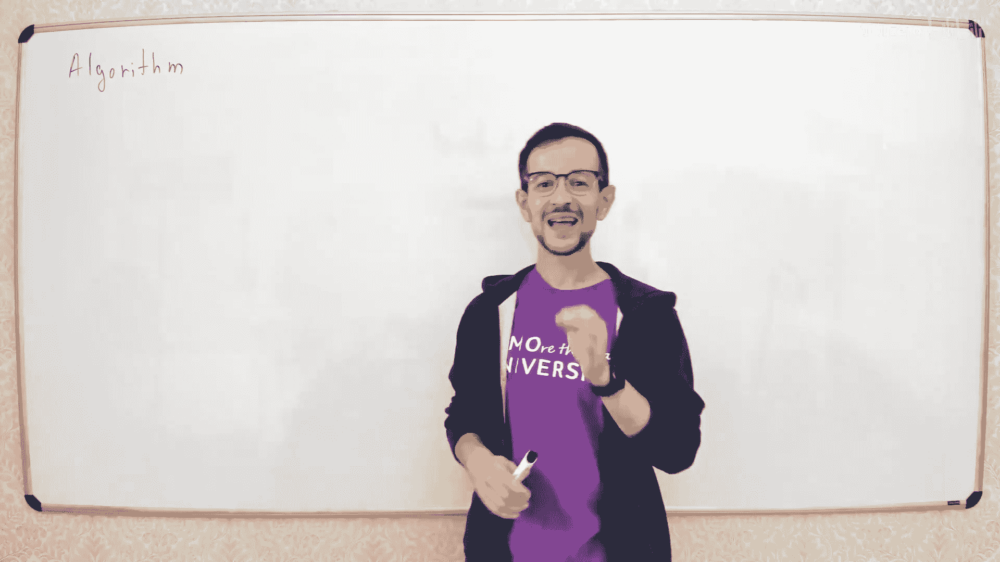
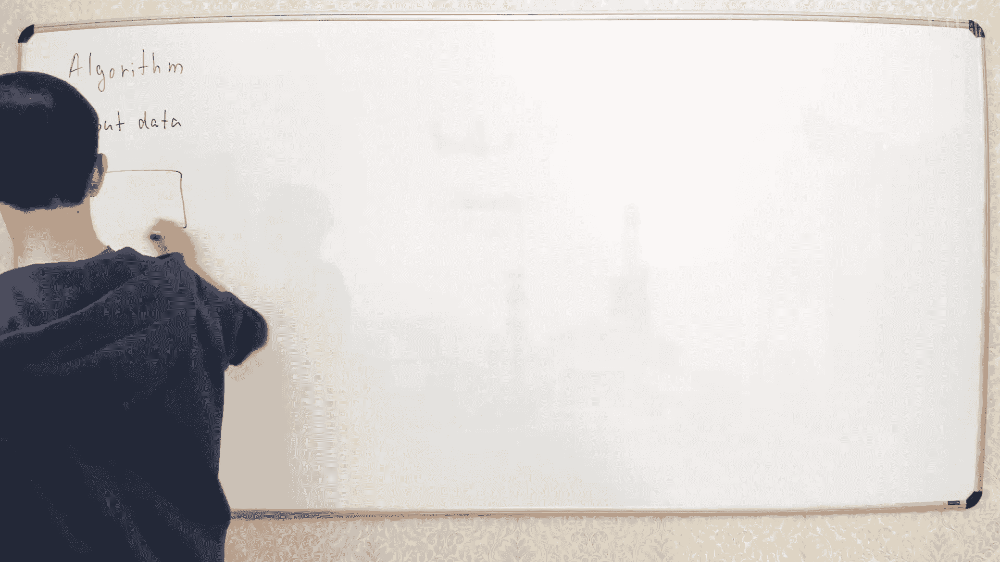
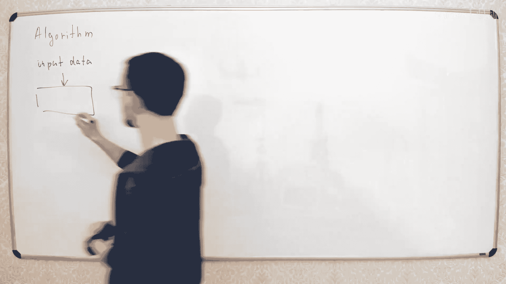
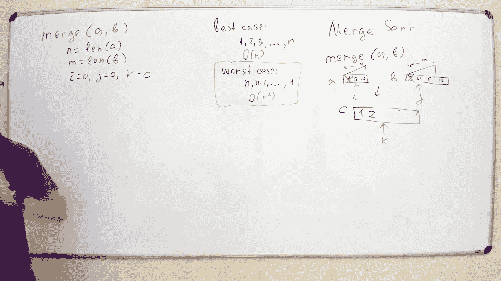

# 【精译⚡算法与数据结构】PavelMavrin p01 p0 A&DS S01E01. Algorithms. Time complexity. Merge sort. -BV1NLB8YfEMq_p1-

，🎼都是继冲冲。🎼The。So welcome， everybody， welcomelcome to this course。啊。

This course is a little bit different from what we have on court forces。

 So I think most of you come from court forces side。And we have。

Algoths course and codefors the course on codefors is basically dedicated to competitive programming。

 so we talk about some practical algorithms and some tricks you can use in contests and this course is very different so in this course we will talk about fundamental stuff so it's mirror of my ITO course about algorithms and data structures。

So we will talk about some theoretical aspects of algorithms and data structures。

 discuss some different fundamental algorithms and so on。The course is very long。

 so this course is four semesters， so we have two years of lectures。

So I am not sure if everyone is ready for this， but。But we'll see。We'll have streams。

Probably every Friday at this time maybe I'll change it。

 I'll have another post and call forcess if I change anything and you can look up for a Google calendar in the bottom so there is an actual calendar of my lecture so you can just adjust your schedulettle。

O。I'm not sure about practice， so I plan to have some practice tasks， but not like。

Maybe we'll have some contests， like。When you need to program some algorithmments。

And maybe we'll have some theoretical problems。So maybe I will post some theoretical problems and then you submit your solutions and then I will read these solutions and discuss them on some different stream。

I'm not sure yet， but well see。Well see how it will go。Okay， so everybody hearing him。

 everybody read。거。

So today's the first lecture， we will talk about very basic stuff。

 we will talk about what is an algorithm and how to measure its efficiency。So what is number。

ね。

Yeah。

I don't like the smarter。Sorry， technical difficulties。I后拍 lot marker。

Once again。

We'll start with very simple things， so we' tell us what is an algorithm how to measure its efficiency。

😊，So what is now。Algorithm is basically some formalized way to solve some problem。

 so you have some problem and you need to formalize the solution of this problem。

 so you split the solution into some elementary steps and so the solution is just set of simple operations。

It's very widely jobs， so it is used in various different。

Disciline so in this course we will mostly talk about like data processing algorithm so in most cases the algorithm will work like this。

 so you have some input data。

It is loaded by your algorithm。

Okay。And it processes that somehow and produces some outputd。And again。

 if you are familiar then with code forces site， then it's basically how most of the code forces problems work。

 so in force problem， you load some data， do something and produce some result。

That's how most of the algorithms in this course will work。嗯。Good。For example。

 let's see something simple。 Sorry， for example， if we have。The problem， like。

 calculate the sum of the。InNumb in the rate。Let's see， so you have input data。

We need some array of integers。 Please say so。It's right。す。

So you need to read this data and calculate the sum of all elements。こ。

So to produce this sum from this rate， we need some algorithm， so let's just write this algorithm。

To right algorithmgraph we will use some pseudo code。

 so we will not use any real quote in any real language because all real languages are different and its all them some have different good things different bad things。

 so instead of using some real language we will use some pseudo language。Let's say， for example。

 here we can write something like， so we need some variable S。We calculateculate the sum。

 Then we need to iterate all elements of the。 Let's use for cycle， like。And most of languages。

Or I from 0 to n -1。And just add this number to this S S。What equal AI。And in then。

 we need to output so that's pretty test。This language is more like Python， but not exactly Python。

 for example， this for cycle is not written like a in Python because I personally prefer this way so。

 so I think this is more clear to understand than the Python way to express the cycles。

 So this is algorithm which calculates the sum of all elements of the array。

The you I will upload this lecture on YouTube after the lecture。 So you。

 it will be available on my site on my channel on YouTube。 So link is again。나 거。Okay， let go so。

 so we have this algorithm。How to see if the algorithm is good or better。

 So some algorithms are better than other elevations。So to see if algorithm is good or bad。

 one of the main characteristics is the time complexity。

 so it's basically the time spent by your algorithm。そと。Yes。Again， time complexity。

It's basically the time that you all spent to solve the problem。Please， don't spam in the chat。

We need。 We need some。Moerators in the chat， I think。Okay now。How to measure the tank complexity？

Time complexity is the time spent by your algorithm。嗯。Is the time spent by your algorithm？

So in physics， for example， time is measured in seconds。Yes。

Why can't we measure time in seconds when we talk about algorithms。

 why can they say that this algorithm spends like five seconds and so on？Why can't they do it。

Any guesses。Just print in the chat。This child does it。

Especially for your questions and for answers to micro questions。

Why don't we usually measure the time complexity in seconds？Yes， oh good。 some feedback。 nice。

 So we don't measure time complexity seconds because all the computers have different efficiencies。

 So， for example， different processors have different speed。

 So if we want to calculate time complexity in seconds。

 we need to fix the the processor We're working with it。😊。

And it's complicated because real processors， even if you fix the real processor。

 like less maritime complexity on some， I don't know。

Intro corere I7 processor like this exactly processor， it will be different。

 it will be it will difficult to calculate the time correct because it depends on very different details of your hardware and environment and stuff。

So it is different to measure time complexity for real processor。

 so instead of measuring tank complexity in seconds for the real processor。

 we will measure the number of operations。Coect is number of operations。W。Where off。以个。My curs。なけ。

If you want to measure number of operations。😊，You need to fix the set of operations。

Like what what operations are here， I don't know。 Maybe Maybe this one operation。

 maybe it 10 operations， we not。So to measure number of operations。

 you need to fix the environment you're going with。 So this environment is called a。Computal model。

Yeah。Yeah。So computational model， it is a mathematical abstraction that you use to calculate the time complexity and not only time complexity。

 but memory complexity and so on， so you analyze your algorithm using some computational model。

 it's a mathematical model that works kind of like a real processor but not exactly like very simplified version of the processor。

And there are different computational models。And we will discuss different models during this course。

 a very basic retention model， which is like the most common one， is called the RAM model。

 so it's RAM machine or RA model。R model is basically the model which simulates the usual processor you have in your computer。

 So it's somehow the simplified version of the regular。Procesor。So how it works。

 You have some memory。Now let's ask here Does anyone know what what is RamM stands for， so so。

So this letters are I M M。 what are this stands for。嗯。

Random access memory good So simple random access memory， What does it mean。

 it means that you have memory and you can access any cell of that memory in constant time。

 So let's see if this is our memory， so this is memory。It。と。

We will think about memory like one big array， so we have one big array， it's split in some cells。

 so each cell have some address so the the ver from0， let's take M minus-1。

Like am is the total memory， so。In one operation， you can get any element from your memory so you can。

By this number I， you can go to memory and take this value from the memory。

 and you can put value in the memory。 So in one operation you can take any element from the memory or put any element to the memory。

So this cost one operation。啊。And this this is the most fundamental stuff about remember。

 Not not not all computational model have these operations to the memory。

 So in some different models， you may not have access to any element in constant time。

But in this model， you have。啊，那。Besides this memory operations。

 you have some regular operations like you have all the let's say， arithmetic operations。

 you have cycles， ifs and so on so all usual operations you have in your programming languages。

 we will not specify it exactly， but it's kind of intuitive so。Y。If you， if， if。

 if you are good or so。Actually。If you are very， to be very precise， when you specify the model。

 you need to specify all the。Types of operations you can use in your program。But in RAM model。

 you just can use any operations you have in any like regular programming language。

 so we' will not specify this exactly， but we will just think about like a usual program you have in your favorite programming language。

嗯嗯嗯。I don't know what's book。If it is buffer， maybe the video quality is too big。

 I'm not sure how which works。Tkture about this。My channel seems good。 So I， if it's buffer。

 it's something your side， I think。Good。闹。We have this computational model，'s。

Go back to this algorithm and calculate its time complexity。そう。

Time complexity and it's the number of operations your algorithms spent to solve the problem。

This number of operationss depend on the input。So if this array is big。

 then the time will be bigger so when you increase the size of the array。

 the time will be increased as well， so time you order spend is some function of input。

Let's see so if we have array of size n， so we have n elements in the array。

What will be the total number of operations here。Lets go。 So what is the total number of operation。

 So here we have one operation to initialize the variable S。Here we have cycle。

What number of creations we need to go to the next situation of the cycle， Let's see we have here。

It may be different， again。WithSome detail。 So here we need to increase the value of I。

 then compare I to n。 check if I is less than n and then go solve。Let's say， two operations percycls。

2 elibs spent here。Here we have some plus equal。 It means we need to load this element from the array。

 then calculate this sum and then put this sum into variable S。

So let's say we have like three operations per cycle， so on each iteration。

 we spend three operations here。嗯哼。So total number of operations we spend here will be free。上诉了一费。

And finally， we need other operations to output。So the total time。

Complex of this algorithm will be the function of M。And it will be like1，2 plus 5 m。F and it's just。

Maybe we need to load this from array， then calculate this sum and then put this sum into variable S back。

 so we like about three operations。It's not very important we'll talk it that。Yeah， so。

When we calculate the number of operations， we have something like that。

So this is some function which explains how the time grows when you increase the size of the input。

Now let's take this formula and remove everything which is not important。Let's look。For example。

 this plus 2 is not important， white is not important because this 5 n is much bigger than this two。

嗯h。😊，We will talk about master theem in the end， but not now。 This 5 n is much bigger than this tool。

So this two is not very important。Let's go more。Now， let's look at this 5 n。

In this five and this constant 5。Is actually not very important。 Why it is not important。

 because it actually depends on very different details。

So this5 may be different if we fix another set of operations。

 So if let's say we have operation plus equal in one operation， we'll have not3 n but n here。

 So it will be not5 n but say free n and so on。 So so this constant 5 is not the property of the algorithm is property of its realization。

So if we make this cycle in very some different way， we will， we may have different constant here。

 So this constant。Is not the property of the algorithm。 It's just how good we are in programming。

So it is not popular。I get the remote。But this M。This n is important because this n is a property of algorithm。

 So if you make slightly different cycle and like calculate it in different。In different order。

 and so on。You still will have some function which has this n。

 You might have different constant here， different constant here， but this n stands the same。

And to describe situations like this， there is a special theory。So it's written like this is。

 we go of。啊。You may see this。 So again， if you take part in programming competitions and you read some editorials。

 you might be familiar with this。Sine big O。 So what this big O stands for。

 big O is stands for this following。 So it's just the short。嗯。

Syimple to describe the following situation。 So if one function。I big O of another function。

What does that actually mean， it means that after some value and0。I will use some quantity。

So it means exist。 So so that exist some constant。And 0 and some points in see。Such that after0 n0。

 So if so for all n greater equal than n 0。This function error。

E is no more than C multiplied by function。Again， this is the formal definition of this big osine。

 So when whenever we use this big osine， we actually mean this。Mm哼。So。For example。嗯，哼哼。

I don understand send。Okay， I don't see any questions here again。诶哼。If you have any questions。

 just post them in the chat， so。Don't spam too much but if you have questions。

 just post it immediately。Let's prove that this function is actually a big O of n。Let's do it。

So let's， let's go here。So we want to prove that 2 plus5 m。He is a bigger vocal。How to prove this。

We need to find some constants and0 and C。Such that this cult。Okay。Any guesses。Try。

 try to find values of N 0 and C for these functions。Again， here。Function F is 2 plus 5 n。

 and function G is simply n。And we need5 prime constant and0 and c such that for big nu values of M。

F of n like this function is no more than C multiplied by geo。嗯哼。Come on， let guesses。

So we need to find value earns zero。And pressure also。5 for forward variables。 O。

 we have two consequence and 0 and C。5 is a good number， but。Forward， forward constant。Sequl to5。

 and equal to one。 Let's check one s to 5。Let's check， so we need to prove this。

2 plus 5 n is less or equal than constant C which 5。Mulultiply by function J， which is n。

That's obviously an not。So2 plus 5 n is greater than 5 n。So this。Quair of constant just doesn't work。

N equal to5 s equal to2。Now， if， if， if you have sequel to2。Then you have constant2 here。

That's even worse。 So now you have two plus n less than 2 n。 but if n is big。

 then this is actually much bigger than this。Again， it stopped working。Yeah。

 if equal to 6 is much better than so if s to 6。Let's sing。So if we take c equal to6。

 then we have this in equation in this in equation。

 let's just decrease so let's move it to the right， remove this， we will have something like。

AndSo if we take n0 equal to 2。We will have the true in equation， so again。

 if n is greater or equal than2。There we have this in equation。

This 2 plus 5 n is less or equal than 6 n。So if you take these two constants。

You have the correct proof。Order can oh yes， you you can take one and7。's let's all it also works。

Consts 1 and 7， all sorts。Okay， now we proved our first time0 complexity。

 So10 complexity of this algorithm is。Big O of good。Now let's move to something these friends。嗯。

What I want to talk about。This big orientationation is actually the upper bound of the complexity。

 So it's not the real value ofquex， but upper bound， for example。

 let proof that n is big O of n squared。Yes。Let's cook this。No， it's easy。 So， for example。

 let's take。And0 equal to1， C equal to1。So， we have。N is less or equal than n squared。

That is true if。N is greater equal than 1， so if n is greater equal than 1。

 then n is less or equal than n squared。So。Forly M is big O of n square。

So this big oneation shows not the real asymptotics， but the upper bound of the asymptotics。

So when you prove that your algorithm works in be of n time。

 you prove that your algorithm is not slower than big of n。Sometimes。Let's it kill。

So when you want to prove your algorithm is fast enough。

 you say you prove that your algorithm works working time is big， O of some function。Sometimes。

You want to prove that your algorithm is not fast enough。

 so you want to show that that time complexity is big。For these cases。Thereive some annotation。

 Anotation is not big O， but big omega。So sometimes we need to use like this。你お米が。

Big omega is the same thing， but not less or equal， but greater or equal。 So it is， again。

 that exists on constant n0 and c， for all N absolute N。

F of n is greater equal than C multiplly by real。嗯哼。そう。

This big O is an upper bound for the complexity and this big omega is the lower bound of the complexity。

For example， let's show for the same function。The time complexity of this algorithm is big omegaogram。

Again， let's guess some numbers and 0。 So we need to fix numbers and 0 and。And see。

Such that 2 plus 5 m is greater equal than some constant。Multi glide white now。Any guess again？At新。

One and one good。One and one works。 So if you have one here， one here。

 then you need to prove that2 plus 5 n is greater click n。That's obviously true。Cool。

 so now we proof that the time complexity。Is a big  of n and the time complexity is big omega of n。

And when you have citation like this， like you have the same upper and lower bound on the complexity。

They have a special symbol for this song。When you have。So these two questions， then you have。

Seeァにとたいだった。哦。So that's a special silo， which means that you have lower asymptootic bounds are the same。

G。So if you read some special articles about algorithms。

 then usually when someone inventedvent a new algorithm。

They try to not only prove the upper bound but also prove lower bound。

 so the real result of the real article usually something like that。嗯哼。😊。

But in this course I will almost never use lower bound。

 I will usually I will prove only the upper bound of the complexity。

Just because to make the course more simple， because it it is more important to prove the upper bound。

When you again， when you prove the upper bound。You show that your algorithm is fast enough。

When you prove the lower bounds？You show that your algorithm is not is。Not fast enough。

 so it's slow enough。Oh。And usually when you design algorithm。

 you want't prove your algorithm is good， so to prove your algorithms good。

 you need only upper or bound。So in this course， I will mostly always prove only the upper bound。

 but in real words you。1。In most cases， you want to prove both this bounds。

 just if you're writing the real article， you want to prove both bounds and get something like this。

Good。うん，那。HowHow to calculate this number of operations for your algorithm。

 there are different cases。So sometimes it's very simple， for example， if you have like two cycles。

 you have cycle I from0 to l minus1 and then inside you have cycle J。What is the time complexity？

H square so time complexity to this algorithm is n squared。That's quite trivial because this line。

Is executed exactly n squared time， so we have n square time executed in this type。

If you have something more complicated， let's say we have not to n minus1， but to I -1 here。

If you have something like this， let's again we can just calculate the number of times we execute this line this line will be executed so on the first situation is good once then if you have two times and so on so the number of times you execute this line is like one plus2 plus and so on plus and minus1。

And minus。And and。はい。用系蚊虫。Because this from  zero from zero。So on the when I equal to0。

 you have zero iterations here。So this sum is actually n multiplied by n minus1 divided by2。嗯哼。

So this is， again， its big O of Nco。So when you have four cycles， it's usually simple。

in your algorithm， you have only four cycles。4our cycles are very easy。

It's a little bit more complicated when you have wild cycles and usually you have some of Amazon。

 for example， let's say。Let's say we have I equal to0 and while。

I multiplied by I is less than n i plus plus。What will be the time complexity here？

So in this algorithm， you increase the value of I。Until I squared will be greater equal than n。Yeah。

 good， so the number of iterations， so you will end this cycle when I square。

So you end the cycle when I square will be greater equal than n means that I will be greater equal than square root of n。

And each time you increase the value of high。So the total time you increment the value of I will be up to square root of n。

 so complexity of this order will be square root of n。Good。Now， let's make something。嗯。Let's say。

 let's make something like this。Let's say we have equal equal to 1 and while y less than n multiplied by 2。

So we just increase the value of height twice on each iteration。

Until I will be be greater or equal than L。What is the time complexity of this order。

Go here we have a look again， we will end the cycle then two in power of。If we have， if， if we make。

Kay iterations， let's see。对。You durations。I will be equal2 in power of k。

So the number of iterations will be such that 2 in power of k is greater radical n。

It means that K will be equal to2 logar of。没度。So the total number of federations will be up to。

A friends。 So time complex， you will be like this。Good。Now， when you have logarith in yourynotics。

 I will usually not write this base of the logarithm， so I will usually write something like this。

That's basically because this constant。doesn't affect theyotics。 So if you put any other base here。

 it only affects the constant， not theyotics， so。For example。嗯。

So you have something log base a of N is big of。Log base B of head。

For any A and being greater equal greater。I then want。啊。So all logariths only change by the constant。

 so they all grow in the same speed。 So when I will write in the future。

 when I will write some big O of some logarithm， I will adjust emit this base of the logarithm。Who。

Yeah有。ナスタイ so。Next。啊。Now let's talk about a recursive algorithms。啊。

Some algorithms will talk about even in this lecture， are recursive。

 so they have some function which calls itself。So let's write something。For example。

 let's say we have。If。Of friends。Like and bite them sit。So we have some function。And eat。

Do something like this up。 Lets see if。And equal to 0， then just。그죠。And if it is greater than0。

 then we will call。F of n minus-1。So what happened if we call F of n？

Now to calculate time complexity of the recursive algorithm to calculate complexity of recursive algorithm。

 we need to calculate the number of times you call the recursive function and for each call of recursive function at the time you spend when you make this recursive function so now each call of its recursive function works in constant time we don't have any cycles here so this all works in constant time。

beside this。This all works in constant time。So to calculate the total complexity into total number of operations。

 we need to calculate the number of times we call this function。So what will be total time。

 So when we call F of n。What will happen， we call F of n， it will call F of n minus1。

It will call F of I minus1。And so on。Until we call F of 0。

So the total number ofilisive calls will be answered。And because， of course。

And each recursive call costs you a constant number of operations。

 so the total number of operations will be linear。Yes clear enough， someone。Again。

 if you have any questions， just。Ask them immediately。ど。Now。

 let's make something more less real if you have， let's see。Here， if you have not n -1。

 but let's say and divideoid2。对。What we will be thankful， let's say this integer division。

 so you divided life integers。JustWithout the。Here again， what happened， you call F pen。Now。

 from F of n， you call F of n over2。From this， you call F of l over4。And so on。

So until you got F of 0。And when you make integer divisions each time。

 the total number of divisions you can have until you reach zero will be up to low red。This。

The pro will be located。Send base to， just phone。Pなさ。

Again total number of operations here will be up to again。ok。And now finally。

 let's make that more interesting， let's add more here so。

Let's have two re of calls over two and another and over two。哦。Now what will happen here。

Now it was a bit more more complicated。Now you have not the sequence of recursive calls。

 but some trigger recursive calls。So you have some main recur call F of M。对。From this call。

 you have two independent recursor calls。So you call F。Of N over， and then again， whole F of N over。

Now， each of these recursive calls will also make two recursive calls。So from here。

 you have call of N。Or before and。And here。And so on here you have another two holes。

Huming chemicals。So we have these three of recursive calls。

Let's calculate the total number for cursor calls。How to calculate the total number of recursive goals。

 we need to calculate number of nodes in this tree。To calculate number of notes of this tree。

 we need to know its length。So， what is the height of history tree？ So what is。

What will be the height of this3， the height of 3 will be the deepest recursive code。

 so the number of recursive coal in every branch of this three will be up to log n like before yeah。

 so we'll make F of n， F of N over2 and over 4 and so on until we reach F of 0。And这。おこ。So， so number。

Calls on each branch of the street will be logan。And now you want to calculate the number of nodes in the tree of height equal to loggan。

What is the number of threelets distance H equal to？So if you have three of8 H。

What will be the total number of elements in this tree， It will be about two in a power of loggan。

 So total number of elements here。Will be two in power of age。So this height of the tree is logan。

 so we need to put this logan here， so total number of elements in this tree。

Will be two in the power of loggan base2。Which is M？So the1 complexity of this algorithm is linear。

You clear。So this happens sometimes， so we have some strange recursive function and when you calculate a total number of recursive callss。

 you have something similar in them。啊。You don't ask questions that make me suspicious。

 You don't understand same thing。Well， that's a question， okay。If you don't ask any questions。

I don't understand if you。Reve me or not。So。Let's see。If you have three， so we have some first layer。

 second layer。F layout and so on。So on the first layer you have one node on the second node layer you have two nodes。

 you have four nodes here， eight nodes here and so on， so in the last level。

You will have two power H nodes。Now we need to calculateulate sum of all these elements。

 so we need to calculateulate sum1 plus 2 plus 4 plus and so on plus 2 in power of H。

This is done sum of geometry progression。 So the sum of。

These powers of two will be like  two in power H-1，-1。Mhmm。And this is big O of to power of age。

都不错不错。So when I have three of H2 power of H， total number of elements in this tree will be the O of2 power of H。

Is it more clear now？Okay， hope now is more clear。And now here the height is loggraph base 2。

 So if you have two in the power of loggraph base 2 of n， you will have n。kuu。こ。W， well。

 that's was's complicated a little bit more。's what's said like。F all， Why not。

What happened if you add field recursive call here？Okay， see what your like。

Try to do everything the same， but with three recurss， what will happen？我问 work。

We call f of n and then we have three decursive calls here， each hole is n over2。Then again。

 we have three recursal calls here free recursal calls here and have three，33。

 free free recursal calls。And over for here， and on。Yes， the height of the three will be the same。

 the height is log base 2 of m。Cool， but yes the height will be the same。

 but the number of elements will be different because the branch in factor is not true but free。

 so in the bottom layer we have note not2 in a power of H but three in a power of H because each time we split into three branches。

手都的那。Operations here will be3 and power of H。And now we need to calculate free in power of log base2。

It's not end because this base is different， so。This actually will be equal to。And in the power。

 a lock base 2 or3。So this number is bigger than n， but less than n squared。So。

 so we have N in some strange power。 So what， what is the logo of free by storage s。

 It's about one point。7even， I think。It's about one point。Maybe less。No no no no。It's about 1。7 and。

 not the exact。So it is n in some strange power， so it's not linear， not10 square。

 but something in the middle。And actually， sometimes it happens off。

 we will discuss some others which have some strange complexity like this。He。

 it will be log base too because each time we splitten to so we have each time we have n over2 here。

So each time n is decreased twice。Yeah， and that's a good question since let's I'll add this in the in the。

Practice section。That's nice exercise， try to。不去。Oh， we're spending a whole hour okay。

Now let's move to some real algorithms， so now we will talk about certaining algorithms。

That all involves like introduction about how to measure the complexity of the algorithms and so time complexity of the algorithms measures something like that。

まあ。Let's move to some real that's not all， that's not all。

We need to discuss one more thing and we'll do it now。Now we will talk about sorturcing algorithms。

What is the sourcing algorithm is basically the algorithm you take the array and you return the sorted array。

You kind of input。Like RAM。诶。And output。Let's say， RB。Same as is。Mそ。嗯。Okay。

 and the first sorting algorithms I want to talk about is the insertion sort。

The insertion software getting works like this， you have summary array。

And you move from left to right and try to put each element in its correct place。

 So you move from left to right on each step， you have some sorted。P fix。You take the next element。

And move it to the left until you reach its perfect position。

 so you take this element and then try to move it to the left。

Until it finds the correct position of this element。Gu。Let's go。 So let's write the code。 So we have。

 let's say we have。For I from 0 to n minus-1。 let's say this element is in the time。

And now we need to move this element to the right。我 the。How we'll do it。 let's say。

 let's say J is the index of the current element we are moving。 So first it's I。

And now we move it to the left until we reach the left border of or we reach element。

 which is less than on and so。While。J is great at than0。And。

WeWe can move it to the left if it is less than element to the。

 if this element is less than element to the left。We will move this element one position to the left。

 So we s。Element A J with element， A J，-1。And and the Christ。으 응。Looks fine。

So this is the basic insertion sort algorithm。Is it clear it's working or should we prove it。

let's proof the algorithm box。 So how to prove the algorithm box。

We will prove it using the volume invari， so we will prove that after each iteration of this cycle。

 we have the sorted pre of the array。So here。Here we have sorted。Elements。From0 to I。

Let's prove this works。If it was sorted on previous duration， then on the next duration。

 what happens， we take the next element， move to the left until。We have situation like this。

 So we move it。Somewhere here。And if this vi stops， it means that。This is Jay。

This Aj is greater equal than previous amount so it's greater equal than this。

And since we moved it on the previous duration， it means that we have less here。

So we have less or here， we have less here。And this part sorted， this part is sorted。

 so we have these all elements in sorted order， so this as sorted， this assorted， this is less real。

 this is syn。这种。It's quite easy。啊。Now let's talk about what is the time complexity of this algorithm？

To calculate time complexity， we need to calculate the number of operations which algorithm makes to sort the array。

And what is the tricky part， The tricky part is that the number of iterations。Depends on the input。

嗯哼。So for some reason。This algorithm may work much longer than for other arrays。

What is the best case for these organ source？What is the best array of this algorithm？

Again to the proof no again， lesss proof by induction sorry。

Let's prove it in the end of this iteration。 So after iteration I。

 you have the sort prefix of elements from 0 to I。Why is it sorted。

 Because it was sorted It was on the previous situation， we have sorted elements from 0 to i minus1。

So on the next situation， we take this element。This element。And move it to the left to some position。

We have this part sorted， this part sorted and here since we stop moving。

 we have less or equal here and we have less here。So the call is pres sorted。

So when you move from iteration I minus1 to iteration I， you have the salt pre of then I。

So in the end， after a last duration， you have sorted。Prefis of the whole race all array sorted。

Hello。Yeah。What I want to talk about the time complexity of this algorithm actually depends on what input you give to them so for some inputs it's first for some inputs it's slow。

What is the best case， The best case is when the array is all is sorted。 So if you have a like this。

哦。What will be the total number for directions。Now let's see， so each time you go into this one。

You check that element is less than the previous element。Have fools here。

So you don't go inside this cycle。So on each iteration， you make only constant number of operations。

And move to the next generation。So the total time complexity for sort array will be linear。

And what is the worst case？Okay。The worst case will be that will have the same array battery reverse。

Yes， okay when we have array n and -1 and so on1。Then we each time we go into this vi and make this swap。

So we first move this element to the left。 This element moved twice。

 This element moved three times and so on。 Last element will be moved to the first position。

 So the time complexity here will be un。Yeah。And for。For the most obvious talk in this course。

 things like this， there are some good cases and some bad cases。And to analyzeies。This is important。

 but to analyze the time complexity of the algorithm， we will talk only about worst case。

 So in most for the most algorithm， for some algorithm will be different， but。Most of the time。

 we will talk only about the worst case。そ。So if I don't specify any different。

When I talk about time complexity algorithm， I talk about the worst dynamic time complexity。

 so we find the worst possible input and calculate the time complexity on this worst possible input。

Okay， so time complexity of insertion salt is n squared。

It means that there's time complexity in the worst case。Okay。good主。嗯。然后我 was moved我跟你。Finally， let's。

Finally， let's somethingken interesting something finally， let's talk about Microsoft。

Now we're finally ready to make something。Not that trivial wrong。 Okay， not something。

We are sort another sorturing algorithms with time complexity less than n squared。Spoilers。

So how does the me work so you， the central element of the me solve algorithm is the me operation。

Now separation work like this， you have two sort arrays， let's make sort array。A， salted and B。

To save space let's move here。So you're given two sotories。

And it outputs the merged version of this array， So we have all elements of this arrays。

 We merge into one big sort array。Let's say， C。So let's put some real elements here。

 So we have some elements and 1，5 and。Then here and some2，4， and。Ss hill。

So and then we'll have something like one，2。4，5，6， and1。Non decreasing。s it's like small details。

 if you have non decreasing or increasing。ItDoes't affect anything， I will say increasing。

 but it's actually the same if you have non degreesso， if you have equal elements。

 it doesn't affect algorithm as well。How to merge two sort tray into one sort tree。嗯。Let's let's see。

You have two sorttories。D is little bit bigger。And you want to put all these elements into one big array insert other。

Let's go from left right。Let's go from left to right， we'll talk about quick sort on next lecture。

 not next in the lecture in two lectures， I think， so we'll talk about not today。

 Quicksort is in the plan， but not today。Again， we want to merge these two arrays into one degree。

What happens， So what let's find the first element we need to put in in this mery。

So this leftmost element must be the minimum elements of all bothfe。 So we have some elements here。

 some elements here， you need to find the minimal element and put it in the first position。

So how can we find the minimal element， Min element is in this element or this element？

So this is the minimal element in the first array， this is the minimal element in the second rate。

 if you want to find the minimal element more first， you'll take the minimum of these two elements。嗯。

So let's take minimum of these two elements。 It will be one。

And take this one and put it on the first position in the re。Now we'll remove this one。

And do the same again now to find the second element。

 we need to find the minimum of these two elements。So we take minimum of2 and 5， see that2 is less。

 so we take this two， put it on the second position。I remove this homework。And so on。

 each time we have two elements in the race， one1 element in the first array。

 one element in the secondary， we take the minimal element and move it on the next position in racing。

Yeah so。嗯 응 응。Well， let's write the coordinate。If you have the same elements。

 you can pick any elements。 so if you have same elements in left or side。

 you could take any elements， so they will be equal so you can put them in any order。诶。

Let's see so we'll have。Free variables。 So first variable will be the index of the first element of the first ratio。

Here we have index。J， it will be the index of the first element in the secondary and we'll have this index K。

Will be the first empty position in racing。으제디디즈 디템티요。Good。Let's say n is the length of a。

And M is the land land。Of be。So this is length of this， so this is array of size M。

 or this is a array of size M。Now let's initialize our variables。

 So we have I equald in the beginning， we have I equal to0， J equal to0 and k equal to 0。

They might have different size。That's thatま。That's fine。

 If they these two arrays may have different size， it。到时没。诶。I discuss the quick sort。

 Quick short we will discuss not today， but。In the future， lectures。

 we'll discuss quick short on how to pick the pivotel and and so on。啊。那。

We need to merge these to array so we take each time we take the minimum of these two elements and put them into racing。

Let's see。So there are different ways to implement is I will implement like this while both horizontal empty。

Not less M or j is less than M。So why I have more elements。I will put one element from a right here。

Let's say。 so when I need to move element from the first array。

 I need to move element if second array is empty。So if B equal to M。Or。Eve。

Firstt element is less than this element。So or if I less than an and。I is less than me。嗯。哼。

Spend too much space on this on this boat。Go， so if we have something like this。

 so if we have secondaryaries empty or if the first element is less than second element。

 then we move this element from RA A to RA C。Let's say C。K plus plus equal to a。Bye， plus， plus。

Here I use plus plus like and C plus plus there's no plus plus in Python。

 but I like how it works when you add element into array， so I will use plus plus。

In this field code this code is just a combination of all good techniques in different programming languages。

Cool， so we move this element to a A C and increment。K and implementcrement I。Else。

We need to move element from ra so we can do the same move element。Fromra。一从。Yes， we can， yes。

 we don't talk about memory complexity here， yes， here we need sort to merge this to the array。

 we need to create another big array。This is not exactly optimal way to do it。

 You can do the same without additional memory， but we will not talk about it today。

It's kinda complicated。So we will create another array and just put these elements into different array。

 just spend another and memory to create another array。It's not optimal， but final today。嗯哼哼嗯哼喂。😊。

Xiggu。I didn't create a RA， but I think you need to create a of size n plus comm。Somewhere here。

 sea is already。Of size， N plus M。上诉的分。Just rate。 There initialized the zero sample。嗯。C is there lit。

 you need to initialize that somehow it is。I agree agree。5。Now。

Let's go collect the time complexity of this algorithm。Now it's a bit more tricky again。

 when you have a wild cycle， it's usually more tricky to calculate the1 complexity to calculate1 complexity。

 you need to calculate the number of iterations of this cycle。

And usually the best way to calculate numbers is to make some half variables。

 so let's look on some value which increases every time you make another directions of the cycle。

 for example， in this cycle， each time if you look on the value I plus J。And on each duration。

 you either increase I or J。So on each duration， this sum will increase by one。And in the beginning。

 you have i plus j equal to0。 in the end， you have i plus J equal to n plus y。And on each duration。

 this sum hypopoology increase by1。So the total number of itgererations will be equal to n plus m。

I believe there is easier way to prove this。 but more intuitive way to to prove this is like every time you pick the element from the array move。

 So total number of element is n plus M。 So if you take。If you remove one element each time。

 the total La of itgererations will be n plus1。It's not's not not that difficult action。Okay。

 so we can merge to erase A and B of size N and M。In total time and what。嗯。That's pretty good code。

 you can program it like this is。It's actually pretty efficient。都。Okay。Now。B called Em。

 where it should be called Em？A look be， that's my but。J款。My bread。で one。Of course。 Of course。Yes。

J I， I， J， that's right。嗯。Small bug。Okay。Actually， thank you for pointinging。Good。Now。

 what we need to do， we need to using this procedure， make a sorting algorithm。

How to create a sorting algorithm when you can merge to sort traces。

You can do it however we will make the algorithm using the divide and Con technique。啊。

It's special name for for this techniques。Okay， how to solve the， so you have error。This is not。

 this is so。short very8。We have everything A and we need to sort it。

How divided and conquer works you have some array and you need to from some precision。

 you split this array into several parts in our case in two parts。

 so we'll split this array into two holes， Let go。Let's call them the B and C。Just。

For simplicityimplic。So B is the left part of the ring， and C is the right part of the ring。Now。

 will call the same。A recursive function for both hals of the array。

 So we will call a operation source for AB and operation source for ABC。So we'll have two sorties。

Strayby and saltre。And in the end， we will merge this two array into one bigger array。

 so we will call this mech precision。And merge this to erase。Into one degree。

So we'll have one big solidary。That's the one。Again， what what is the plan。

 I'll just write the quote to cure。It will be very easy。So you have array A。

 you split it into two halves， let's say B is left half say A from 0 to n divided by2 -1 and C is the right box is a from n divided by 2 to n minus-1。

So these are two， these two houses。Now we call the same function for these two。嗯。

And then we merge these two house into one degree。Oh， my but up。If you make function like this。

 it will never end so if you make recursive function。

 you need to stop it somehow here I always have these recursive calls so this recursion will never stop。

 you need to stop the recursion at some point。And here， let's say E。Fix， small fix。好。

I will say if length of every A is less than two， then just it， Ok。Now， it's fine。It's okay。

 how it works if。If array a is small， it one element or it's empty。 We just return the same element。

 It's all resort。If it has at least two elements， we can split it into two parts so we split in left half and right here。

Then we sort both house using the same algorithm， just call this function sort is the same as this function。

 so we could just call the same function here。And then merge these two arrays into one degree。Gu。

Looks fine。有串。Good， and final thing， let's go create time complexity。Now， using all we learn today。

 we need to calculate the total。A number of operations of all these recursive function together in thista。

So how to calculate the time complexity of this function again， this is a recursive function。

 we already did similar thing， so we have recursive function， we have two recursive calls。

Let's see that。ティ of m。It is the time complexity of array of size n。So what happened here here。

Here we have。Two recursive goals。But each recursive coal have array of twice smaller size。

 so we have two recursive callss each hole。Spend time T of n over2 have T1 over2 here T of N2。

And now let's calculate the time complexity of all other lines here。

So we need to split array here and we need to return north share。

 So time complexity of all other ones is linear， so we need to spend。

Big O of end time here to calculate this much and we need to spend big O of end time here just to make the splits。

So total time complexity。Will be。To multiply by n over2。Plus， some linear stuff here。 So plus。

 let's say some sea multi by end。Good。Yeah， we， we had almost the same recursive function before。

 But what different here here is this par。 So here we have additional linear。

Processing time in each recursive course， so again， what's happened？我下。

So what's happening in here So， we have a recursive code of order array of size n。

And then we have two recursive callss of size n over two。

 then we have four recursive callss of size n over4。元爽。

But now we need not to calculate the number of recursive calls。

 but we need to calculate the total number of spent in all recursive calls。

 and in each recursive course we spend not the constant time but linear time。少。

So in this in the main recursive call， we make these two recursive callss and then spend another end time to calculate this merge。

嗯哼。Now we make two recursive calls in each call， we spend another n over time or n over two time。

To calculate merge in each two sections。 So we calculate node here in n over to time。

 calculate merge here in over 1。 So we spend an over2 time here and over and over1 here。

 So we need not to calculate the number of nodes here， but calculate the sum of all elements here。

So let's conclude sum of all numbers in this。How to go this sum。

easiest way is just to look on this three and calculated it。 So on each level。

 the sum of all numbers is n。 so we spend n time on this level。Here， we have an an to here。

 and an order to here。 the sum is N。Here we have。F recursive calls。

 each recursive call make n over four operations， so a total number of operations in all these four recursive calls will be n and so on。

So on each layer， we have some of all these recursive pole will be in。

And the total number of these layers will be。So the sum of all these layers will be air multiplied by a log。

It means the total complex is and loggan。呼。Anotherももも。

If if you're more mathematician than I am sorry this is like more intuitive approach to calculate the complexity。

 you can perform more mathematical， mathematical approach to calculate the complexity and you can do it using the mathematical induction。

 So how to calculate let's prove by induction that。T of n is less or equal than。We have see here。

 Let's lose another constant。And let's say says C and。

Let's prove that tank complexity is no more than C multiplied by egan。Let's grow it by induction。

So suppose it is correct for the smaller M， how to prove it for a big M。

 We need to make a transition from small n to big M。 So we put this。And into here。Weve had D of M。嗯。

T of L is。不单是。T of n over 2。 T of n over2 is。So we have two multipplied by this time。

 so C n over2 log of n over 2。B C。And now just simplify this so we， we can include these tools。

 log of n over2 is。And  -1。So， we have C of C。More grand-1 plus C M。Then you simplify this。

 you have C N log n minus Cn plus plus C， So it is in。So you can prove it like this。Just。

 just by induction， you suppose it's working for small and and then。My my my proof for the begin。

And Logan is bigger than N。 That's correct。O。嗯呵。6スフイ。Oh yeah。

 it's perfect timing in yesterday I plan to end about this time， so any more questions？Okay。

 the final thing I want to talk about is。About most of here， I'm just to mention it。そう。

The form was like this。Usually happening when you have algorithm which divides the input in some parts and call the regresssive function。

 So there are a lot of algorithms which use the。Divide and conquer technique。

But there's some different constants， let's right here。嗯哼哼哼哼。Icomd the book。 I don't know。 Good book。

 There is a Corman book， classicalical corman book about algorithm spot。Not something wrong。

Let's get going exercise。We'll talk about code exercises。I think I will make a post of code forces。

 and will discuss。What is the best way to make purchase。五？Final thing。

 So we have foremost like this in the various different algorithms。 So when you have algorithm。

 which splits the input into。Let's say。B chunks and then make a recursive calls。So your say。

 let's see algorithm'll get like this。You've given some input of size n。You split it into B part。

And make8 of course。 So you have。You have eight cur goals here。

And usually a is bigger than B because when you split the input。

 you need to make at least one degree control， but not always， but usually a is bigger than n。Now。

 in the end， you make。SomeSome additional operations just to combine all these results and this costs you。

I hope you have F。Let's the name the function？I won't do his African。And in the end。

 you spend another time just to combine these results and do one， so you have some F n here。Mmhm。哦。

Now how to calculate time complexity of such algorithms？What is the time of is algorithm。

 let's say T of M？So we have a recursive calls。Of size n over B。

 So we have a multiplied by T of n over B。Plus， South African。

So situations like this happens all the time，So they make a special theorem about stations like this。

 I called the master theorem。 master theorem is the theorem of which。

Calculate the time complexity of algorithms of this form。Lets搞送。Let's start from the simple cases。

 So if， if。Oh cool。 So if you remove this f of n， so if you if you say f of n equal to1。说吧。

What will be the time complexity？Again， what will happen。 You have。You have some tree。

Which have branch factor equal to a， so each time you have a decursive calls。Yeah。Thank you。

So each time you have a recursive calls and the height of the three will be equal to log ns base B。

 right？So the total number of elements in this three will be a power log B like this。

It's equal to N in power log， B， A。Again， we will discuss this like we discussed when you have B equal to 2 and a equal to 3。

 but it's just generalization this， so when you have branch factor equal to 2 and you divide input by B。

 then the height of this three will be equal to log base B and total number of recursive calls will be n in the power of log base B of a。

And now， no， no， no， no， no。What the theorem says， theorem says that if this function F。

Is much less than this。And the power of probability B， for example， E F of N。Is big ball of。Again it。

 it will be very simplified version of master theorem。我 just。Do not try to make make no difficulty。

 Also let's see if FF N is big O of hand in power。Like here， the log。Brace B of a minus epsilon。

So it is some them。polynoal of power less than a log of a or base B。

So it is much less than a v amount。Then。The time complexity。Well be。てい。Basically。

 what happens then this number of。A recursive course just is much more than the total time you need to spend on this F function。

So the most time you're going to spend is just making this recursive course。On the other hand。

 if N N is。Big O of some bigger function。 So it's log。Let's say plus absolutely。

So if this function F is much more than this function。

Then the time complexity will be the same as function F。It's not exactly it's true。응 네 네。But。

 but better like this。small。So time complexity will be the same as the function。And finally。

 if the complexity function F is the same as this。Then the total complexity of the algorithm will be like here it will be multiplied by algorithm。

こちこ？So this is basically how the master theoryorem works。

 so if this function F is slower than these recursive callss。

Then the total complexity will be the same as this function error。

 if it is faster than this recursive calls， then the complexity will be the same as this recursive calls without fast function。

 If it is the same as this recursive calls， then you will add log factor here。

That's basically all animal more questions。No， no more questions。

How to let's use master master theum to call ktan complexity of the。Offf that。不要吃到我的。So in our case。

 what happens， So you have function like this with a equal to2 and B equal to2。 So we have。Aゴート2ビゴト2。

So we have N in power of law of A and ways B。L of A， B H B。Equal to one。

 because it's log from2 base 2。So we have this third case and this function F。E C multiplied by M。

And this function N。Here big goal end。So we have this third case and about of one。Yesす。ち部。

So we have this third case。So in the first case， the time complexity will be n in the power of and n the power of1 multiplied by log。

 so time complexity。Will be and in the power one multipied variable movement。Should your yes。

 you can use data here。Like I said in the beginning of the lecture， I will most usually。

Use big O instead of bigteta just because I'm lazy and I don't want to prove lower bounds。But yes。

 in the regional master theorem， you can use data here in all places。

 it will be even more accurate if that's correct。That's great。Okay， thank you for watching Seoul。

 let's all for today， see you next week， I will make a special post。

About this course on the court forces and we'll discuss the best format for the practice problems。

Okay， so see you next week。