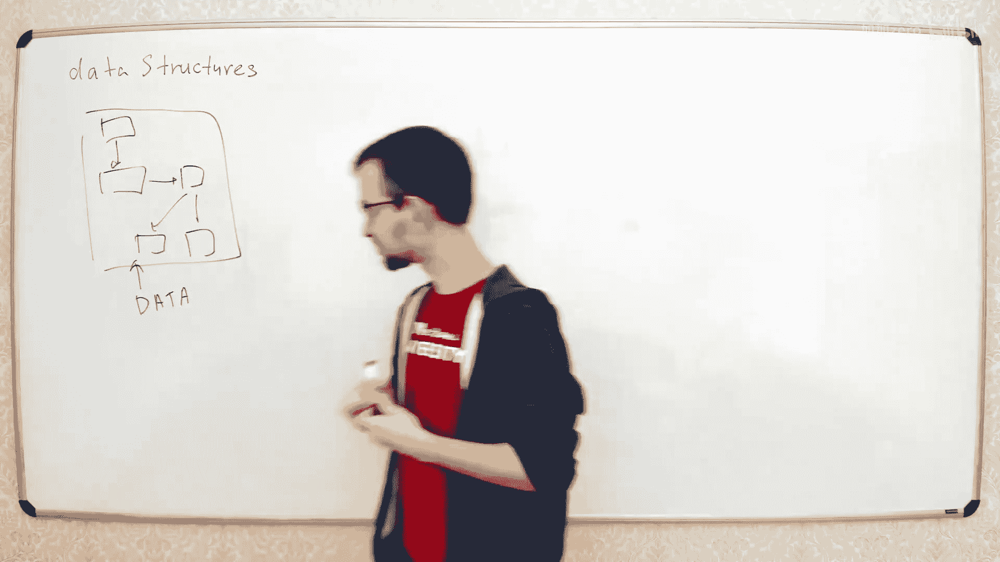
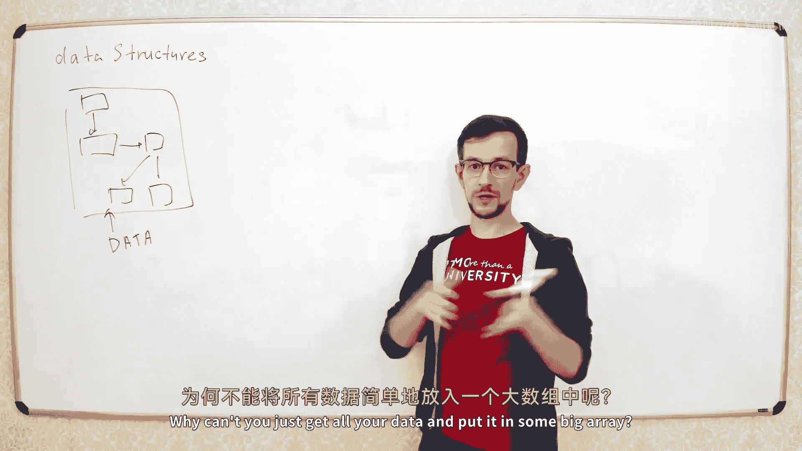
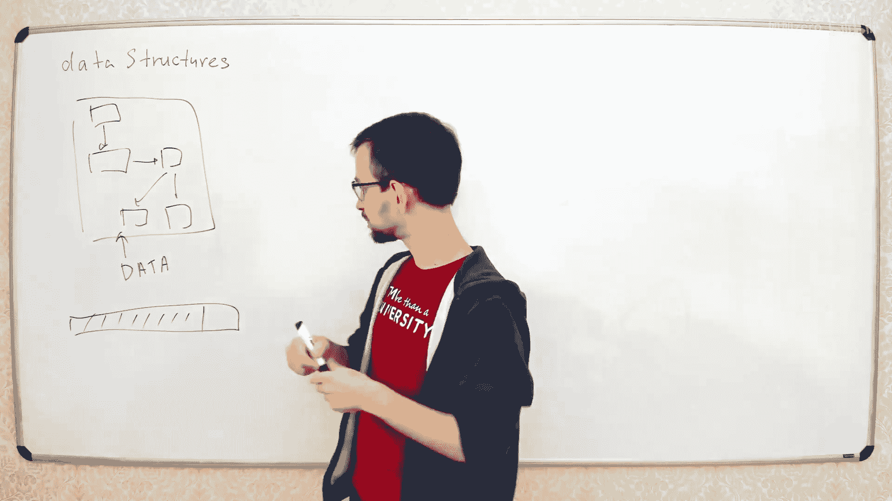
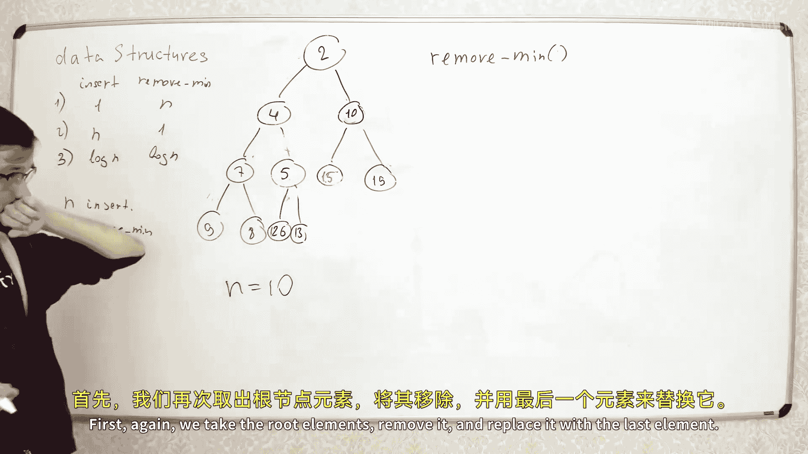

# 【精译⚡算法与数据结构】PavelMavrin p02 p1 A&DS S01E02. Data structures. Binary Heap. Heap sort -BV1NLB8YfEMq_p2-

🎼，🎼追错。🎼一人人。🎼The。So this is the second lecture of our course today we'll talk about data structures。

 so our course is about algorithms and data structures last time we talked about algorithms today we'll talk about data structures。

。嗯。Yes。

So what is the data structure， data structure and according to his name。

 data structure is some structure that contains some data。

We have some， I don't know， something like this， some structure。三千百六十个嚟得。

And this structure contains some。good day。

here。

This structure may be very different from one data structured structure。

 so they all add very different and what is the common thing that is structured and they've convey some data。

U why do you need some structure for your data， why can't you just get all your data and put it in some big way？

Create a big grade。Just just encode your data in some form and just put it in the bigger ring。

Why you may need some structure。That's basically because you want to access your data。

 so you want to perform some operations。

啊，别人。哦。For example， if you want to build some database。

 you may want to find some element in the database by your request， or if you create some。

 I don't know。Some application and you want to show to your user some statistics like show me the average income for the last year。

 so you want to be able to get these statistics first so you want to just look on your data structure and find these statistics。

So these operations may be very different and actually these operations define what data structure do you need so before you want to choose what data structure do you need in your algorithm you want to decide which operations do you need so first you decide what operations do you need then you decide what data structure do you need。

那 no no no得不是。And all data structures are like split divided in some classes。

And each class is specified by the operations that are possible to make in the data structures of this class。

For example， let's say， let's say simple， let's say array array is a very simple little structure。

It's not exactly data structure， but let's say it is data structure。All right。Okay。

what operations can you do in red in red you can like。

What element in sum by index should have index I？You can put element by the index and you can get element by index。

 let's say get element。By index I and put element。啊媳不 you。So the separation is simple。Return。

In I this operation is a I equal to。そです。It's very simple data structures。

 actually not exactly the structure more like a primitive part。不点。那。

When you want to create a data structure， you specify theations you need in your data structure。

And when you analyze your data structure， you want to analyze the time complexity of each operation。

So for each operation separately， we will calculate the time complexity。For example， in this case。

 we have two operations get element and code element。And each operation。Actually。

 it's wrong in constant time， so for both the separation， the time complexity is because of one。

That' all that's the first data structure we show。Now。

 data structures and algorithms are strongly related to each other because when you create data structure。

 you want to make operations and when you make operations。

 you use some algorithm to make this first operation。And when you design the algorithm。

 you may use some data structure just to make your algorithm faster， so I want data structure。

 we will learn them in parallel because they' very closely related each。Root。

And today we will learn our first day instruction first stretch will be a binary hip。Yeah。ね。

So what is the binary hip？So hips。啊，s sheep。哦。ItSometimes schools it's。Hos code。嗯。

the second name is the。う。So hipaps of priority cus are the class of data structures。

That can be the full alters。So it contains some set of elements。And you can do two operations？

Sometimes free or further， but today we'll learn only two operations just for simplicity。

 sometimes you can make some additional operations we'll learn two operations first operation is in certain element。

Yeah。And the second operation will be remove the minimal element from the hip。Gore move。Miニ mobile。

AMinimal element means that you can compare to elements。

 so you have some compator that can compare to elements and there is always one element which is minimal in this set。

So we want to make these two versions。嗯哼哼。Any questions by now？哦对。不。Now， first。

 before we will learn how to make a right binary heap。

 we will learn how to make like simple data structures which can do these two operations。啊。

First attempt will be to use the simple array。这实得。Let's use just a simple array。哦。And say。

 let's say this array is big enough， so we always have enough room to put all elements of our set in this array。

So we use first。Let's see first。First L M elements of this array two。

So contain this elements of this set。So this first n elements from zero to n minus1。

Contain the elements of this set。Now let's just implement these operations so first operation is insert certain elements。

 so we need to insert a new element into our array easiest way to do is is just insert it in the last position so we will。

This element X put in the last position here。And increment the size of a red。X。

like this put it into position M。And then increment the size for it。こ。Now the second operation。

 second operation we need to remove the minimal element， to remove the minimal element from array。

 we need to find this minimal element first。So how to find the ni element in the race。

I hope you know how to do it。So to find the minimal element。

 let's just iterate all elements and find the minimal ones。

Let's say J is the index of the minimal element。 so first J equal to0。

 then we iterate our all elements from1 to n minus1 and see if this element。

Is less than at this element than updating dating more。嗯。😮，It looks fine。

 so now we found the minimal element in， let's say eats somewhere here。

Just somewhere here is the minimum element of the ring。Now we need to remove this element from the。

And when we remove this element， there will be a hole here so we want always to keep all elements close to each other so if we just remove this element。

 there will be some empty space here。To fill this empty space， we can， for example。

 swap this element with the last one， so well swap element J of the last element of the array。

And then they remove the last element from battery。嗯，哼嗯。Let's say swap。嗯。A j of8 n minus1。でパか。

And then just remove the last element， let's see。elseAnd then return。啊。Its correct。Looks fine。

So we found that first the minimal element， then swap the minimal element， the last element。

 now the last element is the minimal one， so we decrease n and return this last removed element。Good。

You can see something in charge from time to time just。Do keep it alive。Okay。

So this is the first simple implementation of the hip data structure。

 so it is the correct hip data structure we can insert elements we can remove the minimal element。闹。

Let's calculate the time complexity of this the。In this as a structure。

 10 complex is different for these operations。So this separation costs your constant time。嗯。

Why would it on AN because we decreased that so？Let me， let me show here。

So weve had RA A here we have L and G。And weve had elements from0 to n minus1。

So this was the minimum element。Now we swapped this element with the last one。

 so we swap these two elements。行，那我就开。Elements。From0 to n minus1， and this is an email element。

Now we decrease M。So we have peace theory。And the main government this year。So in the end。

 we want to return this minimal element。So minimal element has index n。Yeah。😊，闹的唠别自己挤。

This needs to be a compromise between spaming in the chart and be quite too much。就是。Don't spendm。

 but not to be very quiet。 There's not so many of you though。I hope it will be fine。红。Now。

 what is time complexity of three separation？In in this separation you need to make this side this for loop and this for loop its over all elements of the array。

 so the time complexity of this part of deperation is linear so the total time complexity。

Of this operation will be big of。So this is the example of data structure where they have two operations and they have different complexity。

 so this separation have time complexity we of 1 and this separation have time complexity because of n。

Sometimes it's happens。Okay， let's try another one， so if。

If we want to perform this separation first， or if we want to remove the minimal element feta than just in linear then。

What can we do for example， we can maintain this sorted order in our so if you keep the re sorted。

Then it's easier to find the minimal element because minimal element will be always in the end of the rate。

Let's try。So second attempt would be to have not just array， but a sorted array。共。

So if we want to be able to remove the minimum。啊。It's。Better to have solidary in this or。

Have array A sorted in by in decreasing order。So the minimum element will be the last one。授業と円マソン。

TheM element will be always here。Now it's easier to make this three move mean because we can just skip this part。

Minimal element is always in the end。So we just decrease energy treatment。啊はは。Yeah。

Now when I decrease that， no， the minimal element has index n minus1。So after I decrease n。

The minimum element will have index M。I have indice from 0 to n minus1， so it was n minus1。

 then I decrease n， now it is index n。R， so we can easily remove the minimal element from the he。

And now we need to be able to insert your element。And this is comp because we need to keep the restart sorted when we add element X here。

We need to put it in the correct position， so we need to put it in such position that the array remains sorted。

No， let's say easiest way to do it is like like we did in a previous lecture。

 like when we had insertion sort， we'll put it here and then move it to the left until it reaches the correct position。

let's see。So we put it in the last position。And then move it to the left。

Let's see I equal to n minus-1。 So I it's the index of element X and now while。

I is greater than0 and。It this。It is greater than the previous element。😊，I just swap them。

And decrease height。Again， this procedure is the same as we used in previous lecture when we had an insertion sort。

 we put the new element and then move it to the left until we had element that is greater than this element so after this while this array will remain sort。

不。过と。So what is time complexity？Here， the time complexity of remote mean is。Overこさ。

But now the tank complexity of this insert is big because here you need to make this while and the tank complexity of this while is again linear。

 so least time complexity is here。Okay， now we have two options， we can make fast insertion。

 but slow removal。AndOr we can make firstly remove， but slow insertion。

InIn the real algorithm from you。And choose between this structuress。

But actually the they are both pretty slow because in the real algorithm you have a big number of insertions and big number of removals。

 so the total time complexity of the algorithm if you use these data the pressure will be slow。

So now we will implement。The first version the correct version， the correct binary here。

And in the correct binary here， we'll have both these10 complexities less than big of n。And actually。

 the tank complexity here will be go of all of elements。数5条。So we have two versions。야쪽 보면면？

Firstorth notion this one。And social， can constant time this M。

 second version is n here and one here。And now we'll make the correct binary he and correct binary hipap。

 we have both separation working in log container。表是。This we will discuss it now。

 so both these it will have logan time。It's hard to compare to data structures， so for example。

 if you compare this data structures， so this separation is faster， but this separation is slower。

That's usually what happens when you compare to this structure。

 but when you decide what the structure you can use in your algorithm。

 you need to calculate the number of operations you need to for them if you want to make an operation。

 let's say。Let's say we have data some algorithm and we need to perform like end insertions。

And the removals。对。Then what will be the tank complexity。So in this case， we have n insertions。

 it costs you n time。And then you have N removals each cost you N them so total 10 of will be n plus n squared。

And here you have n in social so we have n squared here plus n。

And here we have Nloggen plus enloggen。Okay。Yeah。And now you see that this data structure is better than this data structure because here we have nloggenon complexity here and here we have Ncurum complexity。

 so if you have this number of operations you can compare and see which data structure is better。

Usually you have like a situation like this so this is the common situation usually you have。

About equal number of insertions and removals。So that's usually what happens。

 so usually they rushes be on this time。Because when you insert the element in the hip。

 usually you need to remove it at some point， usually you have the same number of insertions and removals。

オ。No questions by now okay。Let's go， so now we will discuss the binary hip。

The binary heap looks like this， you have a binary tree。嗯。谢。嗯，好容易到。啊。It's enough。Let's for one more。

おそ。我的道。You have a binary tree， what is a binary tree， it is the set of nodes。

 so each node have at most two children notes， so we have one child is left child and another child is the right child。

And this binary tree for the binary hip will always look like this， it will be almost complete。

 so all layers of the binary tree will be full except maybe the last layer。In the last layer。

 you have some elements from the left。But maybe not all elements to the right。

Just because you don't have enough elements in your， So for example， if you have one to three seven。

 if you have 10 elements in your hip。The binary theory will always look like this。

So the structure of binary3 is fixed by this number m if you have 10 elements。

 you will always have binary 3 like this。嗯。Now， each node of this tree contain one element of the set。

So you have you have 10 elements in the set， you have。This three and each node contains one element。

啊。哎呀，我就去去就去姐去。It is maybe be hard if you don't know how program product。

So if you're new to programming， maybe first thing you need to do is to learn some programming language。

And just learn how to get the simple algorithms。And learn how to solve some simple problems。五。

So now each node of the three should contain one element of the set。

And we want to be able to find the minimum。So to be able to find the minimum。

 we will keep this tree in some almost sorted order。啊。This is called the H。Property。

So the property of the hip is that each element is less or equal than it is children element。

These elements are both on this element and this element and this element and this element。

And this are these ones。Which program in language should they begin with this doesn't matter personally。

 you can choose any programming in language and just。スタッ doなちですよ。

It's more than enough information in the internet， how to learn programming languages。嗯。个。そう。

Now we want to put our elements in this tree。So that for each pair of nodes。

 these elements will be less or equal than this element。For example， let's put some elements here。

 let's say we have two， five，10。啊就 know。7。哪里？啊。手机用。eight。206。And。15 here and19 here。

So this is the correct binary he， we have all 10 elements。In this nodes of the binary。

 and for each node， it is greater or equal than the parent node。Nice。特别。Now。

How can we store the element in our programming language？There are different ways to store there。

Bary three in the programming language， usually when you have binary three。

 you have something like this， you have like class node and you have like pointers to the left child and to the right child。

So we have some complicated data structure。But。In our case， this。Structure of the tree is fixed。

 so the tree of size 10 is always looked like this。

 so we don't need to just remember which element is the sound of which element because we always have this tree looks like this。

So instead of having some complicated。ASt of nodes。

 we will just enumerate all the nodes in the right orso。

 well enumerate all the nodes from top to bottom from left。So this node will have index 0，1，2。Three。

 four， five， six。7分。A m米。And now we'll just simply create an array of size 10 and put these elements in this array using these indices。

So let's have this array， and we have elements。2，5， then。7，30。フティないてま。96。IPhone26。

S9 and1 it doesnt matter so we only。The relation between element and transparent。

 so these two elements have no relation， so they must may be in any order。

And like any other sort the this element and this element。might go in different and so on and so on。

 so we only need to maintain the relation between the element and experiment。🤧。Sorry。O。Now two。

 start selling this tree in the programming language， we'll have this one array。

Let's call it ray page。From the hip。And to access the element of the tree。

 we just get its index so for example， we want to access this element。It has index form。

 so we go into this array， find the fourth element on。有病。This is element F form。

 we just take this index， go into to array， find the element of this index。

 and this is the element of this node。こ。Now， we will need two traity。

 so we need to move to the parent or move to the child notes， so how can we move？

Around the three using this array。That's quite simple。So for example， if we stay in some node。

 so we stay in some node， I。And we want to move to the left child of this note。😡，But this not。

We don't have the link， so we don't have the pointer from this node to this node。

So instead of having pointers， we just calculate the index of this node。If we stay in node I。

 the index of the left child will always be equal to 2 i+1。

And the index of the right child will always be equal to2 i plus2。谢谢。

You can prove it to using a mathematical induction， I will not do it。

 but if you want for the exercise， you can try just to prove it that for any node I。

 the left child always have index2 I+ 1 and the right child always have index to i+ 2。

This is true because the tree is complete because all layers of the tree are complete from left to right。

 so you have two in power of eye elements on the layer I。好没瞧。嗯，嘿嘿嘿嘿。😊，嗯。For example。

 if you stay in note， let's say let's say you stay in note one， so you stay you' stay in here。

 this is I。And you want to move from this node to this node。So you only know the index of the node。

 so you know the index is one， so you stay here。And you want to move to the left note of this element。

So you calculate2 i plus  one， it will be2 multiplied by  one plus one will be free。

 so you know that the index of the left channel is free， so you move from this node。Two of is not。

And this note will be the left child of this note。不。And sometimes we want to move to the parent node。

 so let's see what is the index of the parent node of the node I。嗯。Basically， if it is a left node。

 we need to calculate i minus1 divided by 2， and if it is right node， it is I minus2 divided by 2。

It can be simplified like this will say that the index of the parent is i minus1 divided by 2 and round the down。

So if this even。Then will have。Andro down to2 I if if it is odd again we'll have I minus2 divided by2 will equal to I so from here you will have i plus 0。

5 so it will round the down to I from here you have I so it will round the down to I。

So this is the correct formula for both cases。Okay， any more questions by now？哼ふふふ哼。

Don't see any questions， okay？I think it's all preparations now were reason to make operationss。

First， let's learn how to insert elements。So when we need to insert new element in the binary hip。

did you come of this。Let's see you insert some new element。呃。It's four， so so it's rounded down。对。

So let's say we want to insert new elements in the binary here， would say you insert new element。

What is this？啊啊。我 say唔服。So we want。We want to insert new element4 in ion binary hereap。

So what is the easiest place to insert a new node in the binary dream？

To insert new element in the binary tree， the easiest way to do is insert inserted here。

 so we'll create a new node in the last layer which is not full in the leftmost position。

We salt it here。ポと。So it has index1。Now we have a good binary， so again。

 we have all layers full except the last layer last layer have some full elements from left and some empty elements to right。

And now we just need to maintain this property because this property that each element is greater equal than transparent。

Is broken here， so for this element。We have element， which is。Less than it's better。

So here is the problem and we need to fix it。Let me just write the cool details here。

You have been searched。Thanks。So first we put element in the last position。

 last position has index n， so again we will say H。And equal to x and plus plus。你。Age。This is M。

 this is H。This is H， this is kind。Now we put this element here。

And now we need to fix this broken property because for these two elements we have。

Lower elements less than its bare。How can we fix this property very easily。

 we just will swap these two elements。啊。And we。So if we swap this to elements。

When we move this protein down。没有说啊。Now what happens？

These property satisfied because we have big element here， now we have smaller element here。

 so this property is still satisfied。This property now is satisfied because we move the smaller element up。

 so this property now is satisfied。hear careful listen。

So now the only broken property here may be in this node， so for these two nodes。

We may have the broken property of the heat。So now we have this element less than this sum。

So this is the only place in the hip where we can have a problem。All other ages are satisfied。故。

Now again we need to fix the property for these two elements。Again。

 we'll just swap these two elements。So fire goess down。This four goes on。

Now we have this property satisfied， this property is satisfied。

 the only property that may break is for these two node。

 so this is the only place where have a broken property， we check the property for these to node。

 see that this node is greater or equal and transparent。So here is satisfied here is satisfied here。

 so for all node the property is satisfied， so we have the correct binary hipap。

So that's how you insert new node in the binary hip， you insert in the last layer。

 and then move it up until you have the satisfy property for this element in its parent。

So let's just write the cold。h， let's say， let's say again， I is the index of there。Eleement X。So。

 first we record position n increase n I equal to n 1。

 so now I is the position of the element x of the new added element in n minusq。

And now just move it up so while。While we can move it up。

 we can move it up if it is not the first element， so if I is greater than zero。

And it is less than the experiment。嗯。こく。Less than its0 and parameter have index I minus1 over2。

If it is less than the parent， then we swap these two elements。すご。I。あ昧の質なかった。

And continue to do the new position。I you hope to eye as well。有的怂。Let's insert。

 let's insert another element， so let's insert another element。For example， only have elements do。

Well you might have equal elements that's not a big problem。

 let's insert one more element let's insert one or more element。

 so new element must be the next element in the last layer。

 so next element will be the left child of these 15。So we insert new element here。

 it will be the left child of man it's wasn enough room here， so let's let's move to left。it 26 okay。

Let's insert more element here， so we's insert new element like two here。

Now look on this property here， it's broken， so we swap this to elementss。も服。给叮当。我と up。Now we say I。

 so I was here， now we swap element I and element I I minus1 over2。We swap this to elements。

And say I equal to 1， so I moved here。Now again， we compare element I and its parent。

This element is less than parent element， so again we swap these two elements。两去。누구 계시게요。

And move eye to the bar。I now is here。And now again， we compare element I。

 the dispar see it is greater or equal because they're equal， so this port is satisfied。

 everything is satisfied， so it's fine。Now again， we have the correct binary hip， so for any element。

 we see that it is greater equal than transparent element， so we have a correct binary hip。哦。别从。

Now let's go quite time complexity of this algorithm。

So what is that complexity and complexity will equal to the number of iterations of this well。

 so we need to go the number of iterations here。Here on every duration。

 we move to the next layer of the tree。So we start on the bottom layer of the tree。

 and then each time we move to the next layer of the tree。

The number of layers of this3 will be equal to logarative of M。送不开。

At most local from n number of interactionserations here。

So total time complexity of this function will be big overall flow。That started。哦。

So that's how we insert new element in binary heap in lower different plan。

And now we need to learn how to remove elements。Let me check if you have any questions。嗯，哼哼嗯哼哼。😊，No。

 I don't see any marketing questions。거。Now let's see how we remove elements from the binary here。

First， again， we need to remove the minimal element from the binary hip。

 how to find the minimal element of the binary hip。That's quite easy because。

For each element we know it is less or than its children。

 so the minimal element of the binary hip must be in the root， so minimal element is always here。

Okay。So we don't need to spend any more additional time to find the minimal element。

We always know that minimal element is in the root of the three and the root of the three have positioned zero in the array。

 so just this first element of the array will always contain the minimal element of the binary here。

肉。So now we're located at the minimal element it position。

 now we need to remove this minimal element。And that's a little a bit more complicated。啊。

If you just remove the root element from the three。

The three will break in the two parts willll have left sub， right sub3。

 and we need somehow combine these two subs in one victory。This。Not as if I think you do。

 so instead of just removing it in this node， so we just we need to remove this node。

 so let's remove this。When you remove the road node， you have two independent sub。

 let Supremepre right su。And to combine it in the one pixel that we will do the wrong。

 we'll take the last element of the tree， this is 15。And put this 15 as new root of the tree。

 just here。And move을都懂。そ。So this is the new element。一定。We just remove everything unnecessary。します。

Everything just to keep the picture simple。啊，哈哈哈哈哈哈。😊，啊。

So we removed the minimal element it was in the root of the tree。And replace it with last element。

 we take this last element from the bottle of mallay。And what did。In the place where little was。ゴ。

Now we have the correct binary tree。So we have， again。

 we have all layers filled except last layer and so on。

And now instead the only problem we have that we have this property of the hip is not satisfied。

 it is not satisfied for these two nodes so here we have less and here we have less。

So these two node are broken， so here for these two notes we have elements which is less than the para。

嗯嗯哎嗯嗯。嗯。嗯。共。So how can we fix this property？To fix the property for both these notes at the same time。

 we'll do the following， we'll take one of the children actually the minimum of children。

 so we look on both children。See which which child is minimum one and swap this route with the minimum of the children。

 so this two is less than four， so we swap this 15 of these two。So 15 goals here。

 like two goals here， 15 is 15 goals， right？And 15 row here。嗯哼。😊，So again， we had two children。

 one was four， another was two。And we need to satisfy this to node at the same time to do this。

 we take the minimum of two children and swap our element with this minimum。O now。

These two properties are satisfied， so here we have a lesser recall， here we have a less wrinkle。

And now we may have these two properties broken， so now we have， for example。

 these properties broken， these properties， now we have heres。嗯。

No matter which element we put the new root along the above of the dry yes。

 it does not matter which element moves to the root。

 but it's easier to move the last element because when you remove the last element you have the correct binary tree so if you move element from the middle of the tree you have hole here so it will be not correct binary tree so the easiest way to remove element from the tree so keep it the correct balance binary tree like we want all layers to be filled except last layer so this element is just easier to remove you can move any element to the root but if you remove like this element you have hole here and we don't want to have any empty spaces in our binary。

Yeahや， we can take any 있어요。And now now we have a problem here。

 we have this element less than these element， so again， if we have a problem like this。

 we just slope these two elements。Like we did before。そうで勤公式な。ょっとしたかし。So now this is satisfied。

 this is satisfied， I have' been satisfied， so we have the correct binary here。嗯。嗯。

not enough space from this port。I need to realize this。Hope you don't have any questions。

Hope your doctor so I't justize this。ぶ理さし。う？好し。五。So let's write the quote。

 removing the minimal elements。对。First again， we take the root elements remove it and replace it the last element。

嗯。How can we do it？Let's just simply swap this to elements just。Yeah。

 let's just swap these two elements like first element and the last element。そ。It was not8。

 it was age。Let us's swap the first element with the last element and now we remove the last element。

嗯。あ。Okay， now we have this last element in the root of the three and we just move it down。

That's a little bit more complicated than before because in the previous separation when a certain moment we on this。

😊，We only swapped the parent and we have only one parent when we look on the children。

 when we have zero children， we have one child， we have。Two children。

So the quote will be a little bit more complicated。I'll try to make it as simple as possible。

Let's see， so I is the index of the new element。So again， like before。

 I is the index of the broken element， so this broken element may have incorrect properties for these two children notes。

Let's see。So each time we will find the minimum of these two children and try to swap this minimal chart。

we will build sorting algorithm butulator we' are talking about binary hips by that。

Well create it over。啊。Letず go。We will look on both children， let's say， well， just see World2。Oh。Now。

Let's see why I have at most at least one child， so let's move element down until I reach the bottom of layer so when I have at most at least one child when。

So if I have left left child in the two i+ one。So while2i plus1 is less than n。行。So面。

At most one child， at least it is one child。Now， we need to take minimum of this two kilo。

Let's say J is the is the minimum J equal to。呃 do I equal one。哦。

If the right child is less than left child。If I have do I try？So if two bike was two。Use less than M。

And this child is less than this child。Not a but H。H。2 i plus 2 is less than HG。打回。

Nothing saying very hope to do。So now J is the index of the minimum of two two childrengrams this child also。

あ。Now let's see if this。If this minimum is greater than the element I。

 it means that both children are greater or equal than the element I。

 it means that this both properties as satisfied so。Hj is greater or equal than H by。

It means that both children are correct， so we just can return here， let's break here。每女。

We can just break from this cycle。And now。E it is less。Then we make this work。Let make soup。II的。二十。

sayあこ。Work fine。😀呵呵。😊，あいい。Yeah。And this lecture is full of jokes about parents and and children。嗯。酷。

I think that's fine， so sorry。Again， we fine minimum of these to chill so we take the left child if we have right child and right child is less than left child then J equal to right child now J is the index of the minimal child we just see if it is correct。

 we break if it is not correct， we swap with the minimal child and then move the mu child。O fine。

Now in the end， we need to return the least remove the minimal elements so in the end we just return。

HM。ho。looks fine。While the vi tour because we need to make this vial only until we reach the bottom layer so if。

2 I plus1 greater equal to n， it means the left child is outside of the tree。

 so we don't have the left child if we don't have left child。

 we don't have the right shell because right child have big in。

So it means we have at least one child here。If we don't have any children。

 then all properties are satisfied。Because property is only broken when we have the element I and its children。

Yes， it is the index of the left child if the left child is less than n， it means left child exists。

Now， we already discussed this that these three represent the memory， like in the big array。

 so we have index of each element。こしからワと。And so on。

And we just put these elements using these indices in array H。

 we have this array H contain all these elements。Us these indices。嗯嘿嘿嘿嘿。😊，No no easy。

 you don't use linked list here， so the linked list is not in linked list。

 you can't access element bys in this。In operation。

So we use like a normal normal array system of not any lists or something。It's just a race。Okay。

Now let's calculate time complexity time complexity here will also be benefit because again。

 each on each duration of the cycle， we move one to the next layer of the three。

We have at most brief number of layers， so the total time complexity here also will be again。嗯哼。😊。

Oh that's basically all now we have both operations。

 we can insert elements in logaric time and we can remove minimal elements in logarification time。5。

够。No。Now what we will do， we will use this。Binary hip。To create a short algorithm。

Like I said in the beginning of lecture， you can use data structure to make some first algorithms。

And now we'll make。The sourcing algorithm using this data structure。おですか。

So this sort thing algorithm is's just called hip sort。Because you sort a array using a hip。In色。哦。嗯。

我操我自己 look careful。Yeah。F sort， which takes3。So how can you sort the right using binary hip actually very easily？

You take all elements of your array。Insert them in into the hip。

And then remove elements from the hip width one by one， so first you will remove the minimal element。

 then you remove the second minimal element and so on。

 so you remove the elements of the array in increasing order。

So we'll just put all elements in the binary here。哦不。不不不。Yeah。

And then let remove all elements from the binary hip。嗯嗯。お。

That' all so when you have the correct data structure。

 some objects may be very simple so just add all elements then remove all elements and in the end you have the sort array。

Nice。What is the time complexity of this sorturcing algorithm？Al's quite easy to complete。

 so each operation costs your organ time。We have any iteration here， an iteration here。

 so we have total2 n iterations， each operation costs your loggan time。

 so total time complexity here will be enloggan。Yes。

So time complexity is the same as in the me salt property we discussed in the previous lecture。嗯呵呵。😊。

My questions。Now let's make some improvements， so this is the correct sourcing algorithm。

 we can use it。Now let's try to improve it a little bit。They improved with the following。

 so let's try now if we implement it like this。We need to have two arrays。哦。Just。オです。

So imagine we have summary。Yes， you can do the same using binary research tree， yes， that's correct。

Bu the research tree it' is a little bit more complicated that the structure will discuss it in the next semester。

Yes， you can do the same using。Any binary research stream。啊。Now what we what what's what's happening。

 We have A A。And we need another array H。So if you want to sort the array of size n。

You need to create another array says M just to put all to use it as binary here Now you take all elements of your array。

Move them to the binary hip。And when you move all elements by the hip。

 you need to move them back to RA A。So you need to create another array of the same size。

That may be too much because sometimes you have not enough memory because sometimes if your raised is big。

And fills almost all your memory， you don't want to create another array。

So how can we do hips or without creating a new array of the same size？

Let's see what what's happening。 So we have RA8。いって。I still so what's happening， you have RA。

You move from left to right and take elements from array A and insert them into array H。そう。

You already inserted this element into age and now you have only these elements remaining。In array H。

 you have only this part of RA H is field， so the number of elements in array H is the same as the number of elements you removed from array A so here you have the。

So that's what's happening， so you take one element from array A insert it into array H。

Using binary hip algorithm， now we take this next element move it here and so on。嗯，哼哼。😊，没得。

We'll add morequez in there。Now what will， how can we improve it， let's see。

 we use only this part of RAA and only this part of RA H。Now。

 let's combine these two parts into the ones in the same array， so instead of having two arrays。

We will have only one rate。The same array we take for the source and so we take this array A。

And use its left part as a binary hip， so we'll split it into two parts。Here we'll have my hipap。

And here we have the rest of the egg。嗯哼。So now on issue generation， what happens？

You need to take the next element from the array A。And insert into binary hipap。

So how to insert new elements of binary hip， you put it in the last position of the binary hip and then move it up to the three。

 it it called si up operation， so when you have the element in the bottom layer and then move it up using the insert insertion procedure this separation called sift up in the binary hip and this expression called sift down in the binary hip。

So when you add this new element in the binary heap。

You add it in the last position in the last layer of the binary here and then si it up to the row。

So if we use the single array， we just look on this element。

 we need to put it in this position of rate H， but it's already in the correct position。

 so we just take this element from this position here。Imagine it is now in the binary hip。

 so we just increase the size of a binary hip to here。And see it up to the root of the binding chain。

That' all。So in the end， you will have the whole array A as the array of the binary hipap。

YeahThat's right。So we go from left to right， then take each element and sift it up to the root point of the binding here see it。

U up快。Sft up is again， Si up is this part of the insert operation when you have while and move elements absolutely。

那。In the end， you will have the whole array be the array of the binary hip。

And now you need to remove elements， so when you remove the element from the binary he what happens。

Let's show it in dynamic so so first you have RA A。Now you add elements one by one。

 so you have hip here。And each time you add one more element to the binary he pencil。So in the end。

 you will have whole array equal boundary here。So whole element， whole array is a binary here。

And now you remove elements from the binary here， so each time you remove element。

And put it in the end of the era。嗯，哼哼。😊，It。So first you remove the first element。

 put it in the last position， then you remove the next element， put it here。

 remove the next element and so on。You remove elements in increasing order。

 so this element will be put here in some decrease orso some selecteds。嗯。Again。

 this is the first elementary move， this is the second elementary move console so。So in the end。

 you have。They are very sort in the piece order。Yeah。Then you can just reverse the array。

Or you can modify your binary he to remove not the minimal element but the max element if you want to sort in increasing order。

 you can just remove not the minimal element but the max element。嗯嗯嗯。

So we just go from right to left。对。嗯，动时工。And say that a I equal to remove。嗯。うん。Right I don't know。嗯好。

W if I just use it， I want to use only this work of them。It's the sit down precision。我去。

So I' will just swap this element to the last one， so I take this element， swap this element。

This is the minimal element I swap them and then seep down this on it。后。啊啊。啊啊。嗯。シフトの。

that's how you make the hip sort without creating this additional array。

 so you only use the array that is given you as array A， so you take this array A。

 make this array a array of the binary hip and then remove this elements from the binary hips and put it in the same array to create the sort array。

Oh， that's basically all。Any more questions by now？我。Mis the cr onoid， but let's do some。もす。嗯。Next。嗯。

Yes， it may be a bit more complicated， little bit too complicated if it's the first algorithm you learn。

I think it's quite clear about。No。The final thing I want to discuss is how to create a binary hip in linear time。

And know。Oh。That's strange。Okay， let's try try one more thing。😊，Okay， take two so what I want to do。

 I want to improve this part of the algorithm。I want to create the binary hip from the given elements in linear time。

What happens now now we add elements to the binary hip one by one。

 so first we add these two element when we add these two elements and these four elements and so on。

How much standards does take to add element it depends on the height of the tree so this first element we can add in one it so we just add this element and we don't si it up because it is the root of the tree。

 so we spend like zero time to see this element。Now for these two elements。

 we may want to sift it up to the root， so for each of this element we spread to one operation to sift it up to the root。

Now for this。Elements with spend two operations for these elements with specific three operations。

And so on so， if could help。More layers in the last layer with spend log operations。

또 shiftfted up to the road。So the total time complexity will be something like this。

 it will be the sum for all layers， let's say we have k is the number of the layer from0 to log n。

And for layer K， we have two in power k。Elements。And for each element。

 we need to spend key operations too sifted up to the root。冇key喂问。This sum is big。

Why is the summer as big because？Basically， we host on the bottom layer of the tree。We have。

Big number of nodes and for each node we need to spend log n operations to sift it up so in the worst case we have all elements all small elements in the bottom of the tree and we need like to sift all these elements in the bottom layer to the root。

One by one， so each this shift app operation goes to log n time and have n。

Over two elements in the bottom layer。So least this is。this is only嗰份。How can we improve this part。

 this con we will try to move elements not up to the tree， but down， so instead of sift up operation。

 we'll use sift down operation。啊。How can we go from bottom to top？And each time we have some。

Something like this。This bottom part is correct， so here we have。All properties are satisfied。

Now we take the next element， take the next element。And try to satisfy these two properties。

To do this， we make the same operation as when we remove the minimal element。

 so we make the seep down operation， we just seep this element down to the bottom of the tree。没有。

So this element will be again， this will be curve so after each iteration。

 we have this part this bottom part of contain the correct part of the binary hipap。

What will be the difference， difference will be the following now we have。

Many elements in the bottom layer， but it's easier to sift down these elements because they are already in the bottom so。

We have different situation here， so in the bottom layer， let's see。

 let's say we only have this number of layers， so for these elements。When you sift down them。

 you just spend zero operations。For this element， you spend one operation， for this elements。

 spend two operation and three and so， so for the route you spend loggan operations。Okay。

 so we will not shiftft the up to the root but down to the bottom。

What will be time complexity if we do it this way？嗯。🤧嗯。我去。Time complexity will be it will be。

This sum for k from0 to again。So again， in layer key， we have。哦。然。

What is the easiest way to to calculate this？Let's say it's2 in power K elements on layer k and the number of durations is。

Let's say whatgan minus k。嗯哼哼。看。我。Now， let's show this function is be。

How to show this let's calculate this this sum in different way。

 let's calculate for each layer the number of swaps we need to make to sift all elements from the bottom so let's see let's see if we have layer key。

Let's calculate the number of swaps you need to make to sift all elements。

From this layer down in the layer more than K。So each element from this top part will be sifted down to this part at most once。

So for layerK， we need to make at most two in power case laws。From where to K+1。

We make no more than two power of casewalks。嗯哼。So the total number of slopes in all sit down operationss will be the sum of from zero to again。

ここ。And the sum is the sum of geometrical progression。

 so this sum equal to2 in power of k plus one and minus1。呃，终西把我那废了给我改了，我干。我你把我老。Lber N plus one。

And this is equal to two multiplied by n minus1， this is the girlfriend。Again， what is the idea。

 the idea is we have a big number of elements in the bottom of the tree and small number of elements in the top of the tree。

So we tried to make first operations for this。Big number of notes。

And have small directions for this top part of the tree。So we have big number of elements here。

 but they are fast to sit down and we have a sit down here。

 but the are small number of elements here， so the total time complexity will billion。Okay。

 that's basically all I want to talk to today， any more questions。🎼ううん。🎼う。

