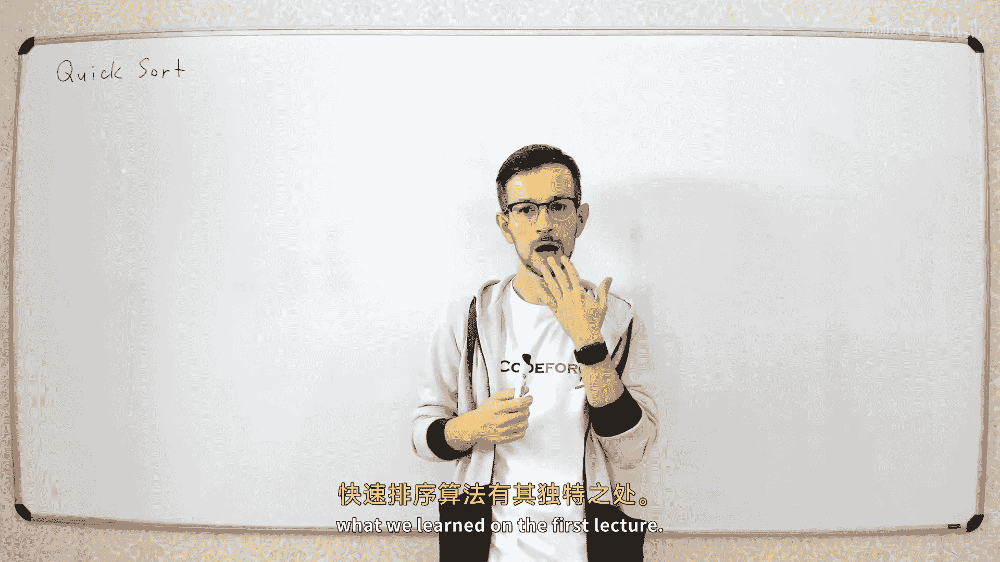
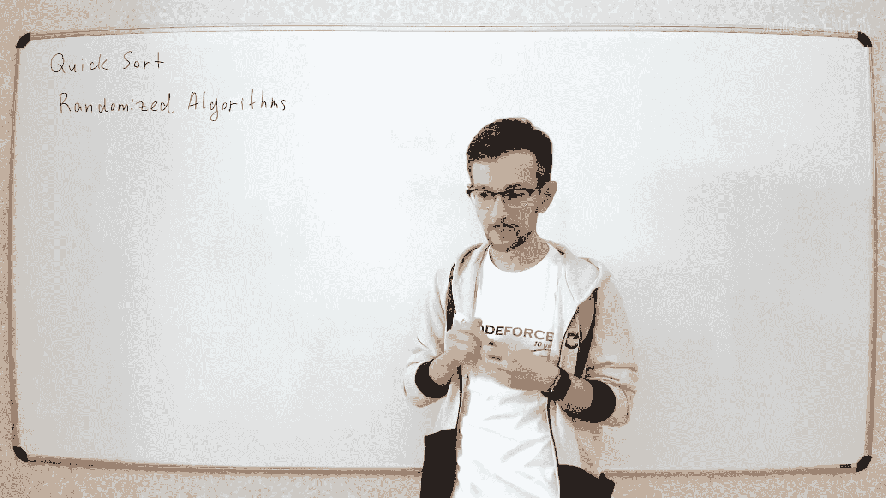
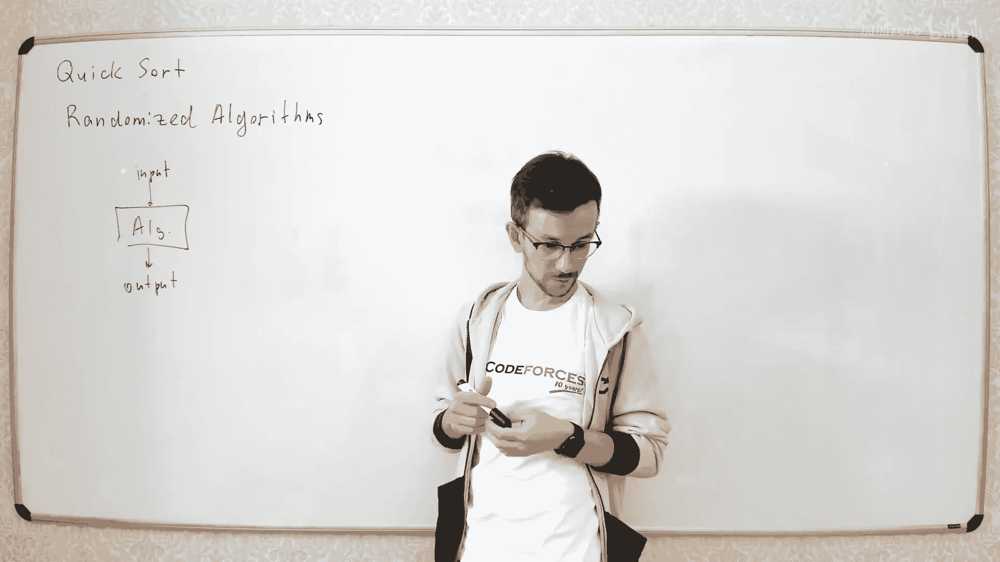
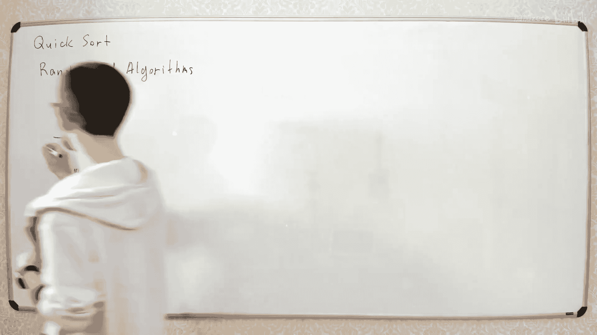
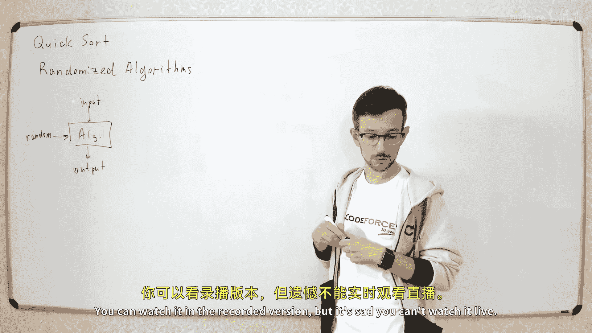
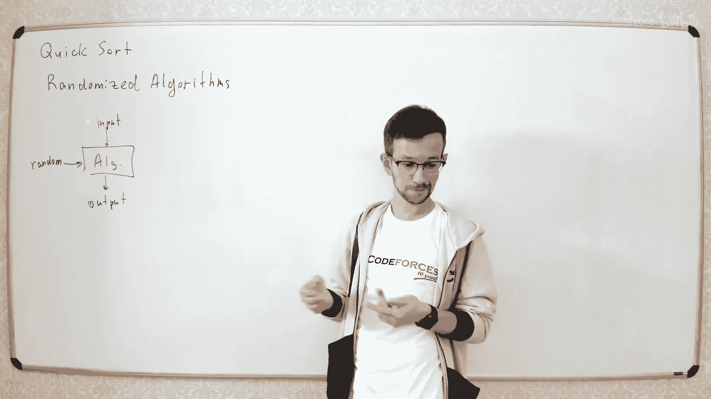

# 【精译⚡算法与数据结构】PavelMavrin p03 p2 A&DS S01E03. Quick sort. Order statistics -BV1NLB8YfEMq_p3-

，🎼嘟吹冲嘟。🎼，So this is the third lecture of our course。

Today we'll talk about one more sourcing algorithm， we'll talk about quick source algorithm。

And quick sort algorithm is a little bit different from what we learned on the first lecture it's different because it is randomized so first we will talk about what is randomized algorithm and how to measure the aized algorithm then。

はい。Yeah。不。对。安。

So what is the randomized algorithm？What usually happens， Usually you have some algorithm。

Like we didn't make the first lecture。Oh。It has some input data and some output data。

 so you have some input here。Like for sorting algorithm， you have some array for input。

And some output。Again， in softing algorithm， you input the array and you output the same array in the soft order。

What happens when you have randomized algorithmphone， you have another source of input。

 So you have another input here。And that input gives you some random numbers。

。I don't know why it's not working for you all。Thats said。Maybe have some problem with to which。

 I don't know。

The which is strange？Okay。You can watch it in recorded version both。

Said you can't watch life。Okay。So you have some input data， some output data。

 and additional input source of input which gives you some random numbers。

And the interesting thing is that random data may help you to solve a problem faster。

So sometimes it happen that these random numbers。Can I help you to solve the problem。啊For example。

 so以 will learn the first randomized algorithm， it is quick Start algorithm。

So how the quick sort algorithm looks？Then you have some area。So we have some early。No。

And we want to sort this array in increasing order。So what we can do。We will do the volume。

 we will pick the random element of this array， let's pick some element index。嗯，是然他。うんぽ。嗯。

And then we'll split the array into parts。Was said left part and。In the left part。

 we will put all elements which are less than x， so going to put all elements less than x in the left part。

And in the right part， we'll put all elements which are bigger than n。

 so greater say greater equal than x x。Let's see。I then we can split array into two parts in linear time。

 so how to split array A into parts and linear time， we simply go from left to right。

And just look on each element， we take this element see if this element is less than x。

 we put it in the left part， if it is greater equal than x， we put it in the right part。

So in linear time， we will get these two areas。五。Now， what we can do we can。

Call the same algorithm recursively for these both parts， so we call again for this part again。

 we pick some random element， split into two parts， again pick some random elements。

 split it into parts and so on。Until we have a array of size one。

 when the cover array of size one is already thought。Let's走。

That's how the quick soft algorithms folks。Should we write the code。

 let's write the code and it will visible simple。First， let's。啊。Let's upgrade it a little bit。

Instead of having。A new era is each time？We can upgrade it by using the same array for these two halves。

Splittting array into two arrays， we will use the same array。But just split it。And we so well。嗯哼。😊。

We'll use the same array A， just put the elements less than x in the left half of p array and elements。

Greater equal toex in the right part of the array。And then call the same procedure for this both parts。

嗯哼哼嗯哼。嗯嗯。If we yes， we pick element framework， so sometimes we can pick the bad element。

 so this element is not always the good element。In this picture， we split them。

Very in almost in house， but。In reality， you may pick some wrong element。

 so the array will be splitted not in equal path， so it may happen。嗯，哼哼。😊。

Its yes it's more like me sort but in merge sort we first split array then merge them together and here we just split arrays and then in two holes which are first elements are less than second elements and then called the reversecur procedure it's like merge procedure in the reverse。

 so inmer sort we first。Split array call recursive calls and then merge this two arrays into one and here we just pick the element split arrays in split array into parts and then call the recursor procedure for this part。

Yes， we can pick the same element several times， that's fine。Yes， we'll discuss why。Why is。

 Why first we just a little bit。啊，累的。So let's just write the quote。I like to write the quote。

So every time you call the recurs procedure result。

Every time you give the recursory procedure some segment of the ray。

 so the segment is defined by its borders， so we'll have left waters and dried waters up。

So we need to sort all elements from L to r minus1。嗯，Yeah。Nice。し。まずかフュス。

If the size of this part is less circle than once。Our minus spell is less or equal than the one。

Then we have either empty array or array of size one， so it's all sorted。So we just that。

If the size of ray is at least two。啊， then。We pick the random element。おこ。こ。아 그럼 해 또바죠。嗯嘿嘿嘿嘿。😊。

Asks about home tasks you can ask in comments on court forces。I think it's better to discuss that。等。

But you can ask it now， maybe someone will answer it。过。So we picked the random element。

And now we need to split array into two parts。So how can we do it？We'll go from left right。

And maintain the following property we go from left to right。

And each time well split this prefis into two parts， so these elements will be less than x。

 and these elements will be crable。嗯。So this will be from。L to M。This is power。 This is I。走够。

From left to right in this rail。Take next element， this element。

If this element is greater or equal than x， then it stays in place。If it is less than x。

 then it will split this element to this element。And increase。They' a variable M。

Let's see where it go from。So let's say M equal equals to and then go for。はい、この one。

Take next element， see if this element。Use the less than this。Then I move this element to position M。

All right， shall we smoke。배 번만 한번만 더주실세요？And in Greecetown。嗯哼。That that's all a spliting procedure。

 go from left to right， take the element， put it here。嗯哼。So in then end， well have。

The array is split into the parts so we have。These elements less than x。

 these elements greater than x。This is L， this is M， this is R。

And now we simply call the sample procedure device so we call。Sot from out end。And sort。啊。

That's basically all implementation of the Quick sauce。It's not the best implementation。

 I will discuss why it's not the best implementation but。嗯。是不な。那。

Did anyone find anyone find something strange about this procedure。

 this procedure sometimes doesn't work。So sometimes for some race。We have very strange situations。

Can you find out what is？And for some many instructions why isn't unsuit？嗯。嗯。It's not snap's fault。

So。嗯。Yes， the biggest problem of this implementation is because because is that it doesn't work when you have equal elements。

So， if you have several。Equal elements。In your。두 두 애죠。Spe swaps simply swaps two elements。

 so we take elements AI。And elements A， and we just swap these two elements。These ones go here。

Can I illustrate okay，s let's illustrate it on example with？Let's have summary。Let's favor right。

 let's say three， five， two， six， four。And let's say x equal to I know。5。So what happens we have L。

 L here and here and R here now we go from left to right。Each time we take elements。

E itt is less than x。Then we swap it into position m， so now m equal to L， so it stays in place。

 so this element is less than x。Now we move to the next element to see if this element is not less than x。

So it stay on in the same place， so this element is greater than thecomp。あエ式。

Now we take the next element， see this element is less than x。

So we swap this element to the last element。Here， so let's swap this two elements。

It was here if I was here。Now we have two elements， these two elements are less than x。

 and this element is greater than equal。And air is moved to the right。

And so we take take the next element see if this element is greater or equal than x。

 then it states in the same place， so these elements are greater than with x。

Now with the next element， if it is less than x and this swap it this position M。

 so we swap these two elements。four goals here。5s here。Move M to the right。And now in the end。

 we have these three elements less than x and these three elements greater complex， that's all。买啥菜。嗯。

哼哼。😊，No， I will not have spms in Spanish。Sorry。It actually will be cool to learn Spanish， I think。

Not this year。This year was recording streamsson English。Maybe later。公。So again， what is the problem。

 The problem is when you have several elements of all。

The problem is when you have several equal elements， so if you end up in the performance duration。

So we have L here， R here。So you pick。A random element， so all elements are equal。

 so you pick x equal to 2。Now you try to split arrays into parts elements less than two and elements greater than2。

 so you have no elements less than  two， so you have empty set of elements less than x and all elements。

Greatトピ goldenす。You call the same procedure you have the same array。

 so each time you have the same array you can split these elements into two groups because they are all equal。

So how can we improve this precision？how can we。Improve it to be able to solve problems like this when you have equal elements。

Just check with if it's actually。Yeah， this one solution， you can check with all elements are equal。

But it's not the best solution。Because if all elements are equal， but one is different。

 like we have many tools， but one ones。Okay， there are different points how to solve this。

One of the simple way to solve this is to split array not in two parts button in three parts。

 you can split array in three parts， you can have elements less than x here equal to x here and greater than x here。

So split right into three parts。And then call the recursive procedure for this household。

So elements equal to eggs stays in place。So you only need to sort this two parts of the array。给。

That's one of the way to solve this。A problem。Nice。

That's so that's how the quicks are talking going to work。No。

Let's think about how to measure its time complexity。So on the first lecture。

 we was talking about time complexity。And we decided that we will。

Only they learn how to measure that complexity in the worst case。傻。Each time when we calculate that。

Time up extra of the algorithm will find the worst possible case。

And calculate the number of operations in the worst possible case。

So what is the worst possible case for this algorithm？What can go wrong？So let's say look at R A。

What element can we pick？啊。That will be the worst possible。Random element。えじが。

A zero maybe be good dos。嗯，哼哼。😊，嗯嗯哼。Yeah， the problem is when you pick the element。

 which is minimum possible or maximal possible， so if you pick minimum possible element。

So if each time you pick as x the minimal element， so you split array like minimal element and all other elements。

And they again name element animal elements。两手啊。Yes。Okay。So every time you split。

Theyre in two like very un paths。What will be the time complexity of this algorithm in this case？Yes。

 today's only English lecture。嗯。Yeah， time complexity will be elsewhere。Again。

 like we discussed in the first lecture， here we spend end time。and minus-1 here， and minus-2 here。

 and so on so this。Total number of fractions will be the O of n squared。够。And actually。

 this implementation may grow even worse， so in this implementation， we may have a。

Even even more situation。So what happened in this implementation if we pick a minimal element as x？啊。

What is strange training for equipment？So in this implementation， if we pick minimal element as x。

 we'll split ring into two parts， so we have elements less than x and greater or equal than x。

But x is the minimal element， so we have empty array here and all elements in the right part。

So each time the size of array is not decreasing， so each time you have a array of size M。

So the total number of pressures will be infinite， so this procedure will infinitely call itself in agroline。

说算。Wororst possible case may be infinite， so sometimes this。Our doesn't finish。Is it a problem。

 it looks like a slightly major problem， but actually it's not。Why it's not a big problem because。

We pick a random element。And the probability that each time we'll pick the minimum element is very small。

Actually， it's infinitely small， so if you pick。The first element on each it in infinitely。

 the probability of this situation is zero。Quick sort is actually pretty quick yes it's called Quick sort because it's pretty quick comparing to merge sort and especially comparing to hip so。

We'll talk about little this later。So in worst case。

 this procedure may work efficientlyly and if you fix it like we did， so if you pick。The element。

Equal to x here and greater than x here。Then time complexity in the worst case will be n square。Nice。

そう。啊。To measure the time complexity of the randomized algorithm。

 we'll use slightly different technique。Because it's fundamental。

So to measure the complexity for the randomized algorithm we measure not the worst game temporal complexity。

 but the mathematical mean of the m complexity will measure not the number of operations because number of operations is some random function。

So we'll calculate the estimated meaning of this random fraction of。啊。Lets make go meat on of there。

Think of the number of preparation， which algorithmgress will take。

And this mathematical outage is completely this full and so it's just link。嗯。

Let's say it's just some of。我爸爸啊好好。不死。X multiplies the probability here that's time equal to x。こ。没。

And it helps a lot because the probability that your algorithm works very slow is very small。

So if you have。And square iterations， it means that each time you pick the minimum element。

The probability that each time you will pick the minimum element is very small， so big as your。

 the small is the probability。So when we calculate when we multiply these big number of iterations by the small probability。

 well get some something good。嗯嗯嗯哈哈哈。😊，🤧过。Now， let's prove that for quick sa there。

Mathematical average of there。Of the time is actually emlogan。How can we prove this？嗯。Let's see。

 so we cover right8。Each time we pick some random elements， split array into two parts。嗯。

Truly you believe in this this is the standard form from mathematical。明啊哈哈。好好好。Okay。

So let's calculate the mathematical average of this time complexity。We have summary。

We picked some random elements。So what we need to see the probability that they pick each element。E。

So for each element X。The probability of the third peak element x is 1 divided by n。Right。

So let's see if we pick， let's say， K elements to the left part。너는 다음 콤플렉 시츠。Will be so we split。

Need to split elements into two parts。In linear time。And them。We make two recursive calls here。First。

 recursive call。Is T of k， and second， because of curl is T of。I amマ好き。Okay。

Now this K is random so we can pick all elements with equal probability so to calculate the estimated value of T。

 we actually need to find the sum。Of these multiplied by one order。Okay， from。0と8 minus one。太不了了。

Yeah， this is his。Everyever。And just remove this。失ねそう。

So every rate is an estimated value of the time。啊哈哈啊哈好。嗯哼。Now how can we solve this。

 the easiest way to solve this is by doing the following solve？あ。

Let's say that if we pick element from this middle。

 so if we pick one of the elements from this middle third of the element。It is good。

 so if we pick one of the elements in the middle of the array and over three elements here。

Then we make a good split， so we'll split elements in not half， but。Close。

 the sizes of both parts will be close to each other。嗯哼哼。嗯哼嗯。嗯哼够。

So what is the probability which will pick one element from this group？It is。啊， one over one票。

That's's the move this。So you probably see one here。We will pick one of the elements from this group。

If we pick one of the elements in this group， then k will be from n of a3 to to n over3。

 so size of each of these parts will be no more than2/ third of n。So this sum will be no more。

 let's see it is no more。Then。啊，哈哈。T of n over three。pl的啊对。Its。

So this happens if you pick one of the elements from this middle group。

And if you pick one of the elements from this outer group。

 you will split the array in some not very equal groups。

 so if you pick one element here you will split you will split your array very badly。

 so you will split it somehow。We will say this is the bed split so in the bed case。

Which happens in two thirds of the case？You will split something like that and we will say the worst possible case it when we going split elements into groups like1 and minus1。

So we'll just， it's no more then let's say T of1。So this is the goose split， let's see。

This is the good split。This is the best split。I lost plus啊 plus。Yes。嗯，哼。😊。

So this happens when you pick one of the elements in the middle group。

And this happens when you pick one element in these groups。So it happens for probability1 third。

 this happens for probability2 first。Now let's just use this formula。

 so what happens we move this to the left so we had。one over three here， just remove this。嗯哼哼。

Let's multiply everything by free。So we have T of n， no more than3 n plus。T of n over3 plus。

He of two and of。あ、さなくですよ。And now we just proved by induction that this actually is engan。5프。

Let's prove that t of n is no more than c multiplied by n log n。

It's like we did on the first lecture。So谓 have。And number three is smaller than 3。

 this is smaller than n， so we use this formula for these two parts。

 so we'll have something like T of n is no more than 3 m。Plus， C and over free。

Look and over three months。シードフクド。And now just well like we did in the again。

 like we did in the first lecture， we use this logarith， C n logarithm of n over3 is。

Log n minus log3 here we have。Log n minus log。フ워痛。So there we'll have something like。嗯。

There's too much mathematics for one like direction on that。

That will be last formal in this lecture I promise， so we have this。Let's just remove n from this。

 so we have N。Multipliied by three。Plus， here we have C and over3 multiplied by loggans。

 we have plus。嗯嗯。Log and gloss。ああ。Plus， this C2 N03 much by belowgram。

And then minus this and minus this。Minus or c in over3 multi log。No。

 I moved N the same I moved n here， so it's one here。Sorry。😔，M C multiplied by log free， right？

And minus c。我 but do but free我 more free我 do。酷。Yeah， it looks fine。送。

Now we simply move these two close together so。The sum for these two is C multiplied by logan。So。

 we have this equal to。C and log n plus something， something like n like3 minus these this3 log。Free。

us33 log free。And now we just pick the big value of C， so we say if C is big enough。So if C is big。

 then。This is less than zero。So this is less or equal than s loggan。W。

You master theorem is you can use something like master theorem because you have。22 seconds でか？

Two re of course of different。Argument。So masterterem is not very good for this。Okay。

 it's good enough。It's not seven where we can see no no it's free， free， free free。

 where do you see selling， it's two？And this is true。My writing is off pretty good。

It's not a big deal， so you have some constants here， so you have some constant here。

 some constant value here， so if C is big enough。Then。This bracket is less than zero。如。

Another maybe more natural way to think about this is like the so you may think about this。

Ibody like this。So what actually happens？Let's see， we have RA A。

Let's say if we take one of the element from the middle group by random so we pick some random element。

 maybe we will pick a good element， let's say if we pick element from this middle group， it is a way。

 it is a good way。This happens。In every third case， so every third time we pick element from array。

It belongs to this middle group。我说。Let's say， everything。我。啊，一く。We pick element from this book。俺退。

And when we pick elements from this middle group。We'll split array into two parts and both parts。

Will have size no modern。都 feel soft。嗯哼。😊，So every third split。

Will decrease the size of the array by at least two first。嗯哼。😊。

So the therefore of the recursion will be again look good evening so you have this be right。Now。

 after about。Free random picks， you will split the arrays into tops。

 so each part will be at most two third of end。然我点幽没给点。Here we will freeze。

You make free Olympics and then you make a good pick。Next again。

 you take this part and again after about three peaks。

So you have some bread pigs and then you have good picks so a big element in here。

 just split element in。And so on， so each time after some。A small number of picks about three ps。

 you will have a good split， so some splits will be good and each good split will decrease the size of array by some constant factor。

So the depth of physical equation。We don't build这。Yess actually。The depth discussion will be about。

 let's say free multiplied biity from of M。Base free。Something like that。

So that's more intuitive way to think about this。And if the depth of recursion is logarithmic。

 then the total time complexity will be n log n because on each layer of the recursion。

 the total time complexity of all the recursive callss will be n like in the sort。共。

time time so let's talk about the following。He what happens in practice listen？

Quick start is quick because it's。But relatively good in practice。So what might happen in practice？

In practice， what happens， you pre random elements， sometimes you split elements。

 you split array in a good way， sometimes you split ray in the bad way。To increase efficiency。

 to to decrease this constant。We can find a way to pick the better element with better probability。

And it will not beyically better， but it will decrease this constant factor。

In practice you not only think about the asymptootics， but also you think about the constant factor。

 so in practice you may want to decrease this constant factor。How can you do it。

 you can pick the element in the middle with better probability。So how to pick elements？

From the middle group with big probability。One of the way to do it is to pick not one element。

 but let's say three elements， let's pick three random elements from the right element。不让们整不了。

Then look on these three elements。And pick the needle one S X。

So we sort these three elements random elements。And pick the middle one。

And if you pick three elements and take the mediumn。

You'll have the better probability that this element will be closer to the center of the array。嗯。

SoAnd if this probability is bigger， then this constant factor will be smaller。

 so the total time complexity will be slightly smaller， it will still be n log n。

 but this constant will be smaller。Alternatively， you can pick not three elements。

 but let's say five elements， you can pick five elements and pick the middle one。

You will have slightly better performance and so on。嗯。I think it's fine， so this is how how you。

Measure the time complexity of a randomized algorithm and how to measure time complexity of the qui algorithm。

One other thing I want to notice is that we measure the time complexity in the worst case。

But these worst case is all over the inputs， so we take the worst possible input。イポ。Hiss worst case。

But random is random。So we take each input。And calculate the average time complexity for this input。

And then takes the worst possible input， so we take the input。

 which have the worst possible average time complexity。

So again can we measure time complexity in the worst case。

 but the worst case is not over these inputs， not over these random values。

 so random values are some random values。it is bit emistic and we use the Gaussner you can use Gauss and probability because you want the probability over the sort array。

 but you didn't sort array， so you have this array， not in sort other buttons sound random order。

So you can't pick up the middle element of gauss and probability。

Basically when you give a summary array， all elements are equal for you。

 you don't know any relations between these two elements。So。It's strange to pick some non。

Long uniform distribution。So if you pick elements of different probabilities。In the worst case。

 the wrong element will be picked through the bigger probability。

The best thing you can do is just pick all elements。With equal probabilities。共。So let's move next。

Next， we will move not to the sorting algorithm， but we will discuss something similar to the sorting algorithm。

 we will discuss the auto statistics problem。嗯。Aistics。Opture boats。好吃吧点该是。So what is the problem？

Clearly。So if you have the phone problem， you're keeping some array。And you need to find the element。

 which will be。It would give an index， array and the index K。

You need to find the element of index K in the sorted array， so if you sort this array。

And pick the element index K。That is the element you want to find。嗯哼。😊，This is。The case of these。啊。

 please。Ex射。ほ。English is difficult。I think it's all statistics，はい、五度ナ。

So you want to find these element in the sort array。も。What is the obvious solution。

 obvious solution is just to sort the array and then pick the element。

That will cost you analogloggan time。Just salt and pig。Okay。

And the interesting fact is that you can do it actually faster。

 you can find the element of index K without sourcing the whole array。

 so you can find this element and do not sort the whole array。お。Now I will discuss the Rend by S。

 which work faster than least time complexity。哦。The algorithm work like this， so you have the RNA。

Again， like in quick sort algorithm， let's pick some random element。

 we pick some random element text。Pick this element X and split it into the box， so let's split it。

Less than x。被度了一口X。And now let's look， where is the element of index K。

 so if k is less than the size of the left part。Then we only need the left button， So if case here。

Then we don't need these elements in the right part， we only need these elements。

So we call the same recursive procedure， but only for this left part of the array。So I can take this。

Now again， we pick some random elements split it into two house。I to say this and this。

See where is element K pick this part against splitted， pick one part against split。

 pick one part and so in the end we have only one element in this array。That's's strange what。Yes。

For some reason， T is not working for someone。I don't know。Maybe I have some wrong settings。

ItsI need to investigate this not。That's all， that's how that algorithm works each time you pick the random element。

 split right into the parts。Then pick one of the part， which contains the element K。

And so on in the end， you have。The area of size one。

 this small array contains this element you want't find。Should write the quote。

 let's write the quote。嗯嗯嗯嗯。Again， let's have about the cur procedure。Simified。Again。

 we have elements from L to R。嗯。Yeah， we need to find it one key。嗯，哈哈哈哈哈哈。😊，哇哈。Yes。

 and we will maintain the invari that k is between l and r so k is greater or equal than L and less than1。

Now we see if this red have size one。If I minus solid go to one， but then we return。あ我なだけ。

If it is more than one， we will split this array so we say x is the random element。Yes。Now again。

 we do the same， we make this split so we split elements from L to M。ですとか。Should代边 to the game。Okay。

 let's do it again， sore going m equal to L for I from L to power minus1。

 if element is less than x with slope。嗯 Christian。Okay。

So we split right into the past less than x and greater points now we now we see which part contain element K。

 so if k is less than m。And then well make a curs call for the left part。啊。

And if it's greater than oracal pick the M， then we make recursive call for this rip part。Okay？我。

That's all， that's all about， that's the whole algorithm。

What is the difference from the previous algorithm。

 so it is it looks almost the same as the Quick sort algorithm。

 so Quick sort algorithm has time complexity and loggan。

And I claim that these algorithm have we that time complexity here。

Why it is different from the quick Soogram， what is the key difference？No。

 it operations almost so this part is actually equal to the same we have the same part in the quick sort。

 we just split around two parts。But it has one big difference from the Quickword algorithm。有。

The key difference is we make only one recursive call and quick sort， we make two recursive calls。

We make recursive calls for left part and recursive cost to rapid here we make only one recursive course。

 we go to the left part or to the right part。We have these recursive calls or these recursive calls。

 we never have these two recurs of calls at the same time。That's better。走我就害不。

Whyite and complexity Ubettan song， what happened we pick random element and then pick one of the two house。

そ飲き？Every third time we'll have good split and the good split。

Will decrease the size of array to like2 third of n。

 so we have total length time complexity here will be n on the first it， then we make a good split。

 we have like two/ third of n。Then after another a good split。

 we have four nines of n plus and so on。And what is the sum of this？serious don分。Yeahや自己。

So same we have only one recursive code， so each time we have not the sum of these recursive calls。

 but only one recursive code and one recursive code costs you two first of them。So this sum equals 2。

P呀。So dont time up will be in here。That's all that's how you find that。

Element in the sort order without sorting the whole array so you just split the array and then just remove one of the particless you don't need to sort these elements and only make a curs of call in one hole and so on the total time complexity will be you。

That's all。有。Any more questions point now？Yes， I will applaud it to you， as always。Okay。

And the final one， and the final one， final one。啊。One more algorithm。啊，我 what。

Why do people use randomized algorithm There are many。

Reasons first reasons is these algorithms sometimes are faster than the usual algorithms。

 So for example， this is quick sort。I already era this a quick sort algorithms Coult quick because it's actually pretty quick comparing to。

 for example， hip sort。😊，Because hips are just big random elements and quicks or ghost from left to right and sping caing and so on。

Ill do in the second。And so sometimes。A randomandomized algorithmbriium have better asymptotic st complex。

It happens for some problems， we know the first randomized algorithm。

 but we don't know the first deter algorithm。そう、三タムす。

Scientists have found some good randomized algorithm。

 but we didn't found a good determined algorithm。That happens。So the next will。

 the final thing we will do in this lecture， we will show how to。

Achieve the same asys using the determined algorithm without any organization。

They asked me to repeat this， let's repeat this once again， so what happens here？We split。

 we pick the random element and split around two parts。And this probability about one third。

 we will split the array into parts， essentially that both parts will have size at most2 third of n。

The probability of this is about1 third。So after you have the size decrease to the first of n。Again。

 you will have some random pick and after some random picks， you will have four lines of hand。

And because you have only one recur of code here。The total time complexity will be some of this series。

So the sum of series3 is 3 m， so it's linear， so it's just sum of some geometrical progression。我哼。

Its actually， this happens a lot in computer science。

 you have some algorithm which decreases the size of input by some constant factor。

And the sum of all these recursive coal will be linear。It's not happens not only in this algorithm。

 it happens so actually， when you have some linear algorithm which works like this。

 you have some big input。Then you do some magic stuff and decrease the size of input by constant factor。

So encode same the same algorithm for this smaller input。

 so the total time complexity your billion in this case。We're good， so again， again， the final thing。

 we will show how to achieve the same time complexity using determined algorithm。过去。

Let's just raise this。What is the idea？So why do we need randomization because we want to pick some good element X？

So the idea is order to pick some good element X and then split right into two parts。

And to pick the good element X we just pick the random element。

 random element will be good with some good probability。Let's try to pick the good element。

 this probability one， like find the determined way to pick the good element。嗯。Yeah。故。

This is the alleg from five people this Bloom Flod Pride River Center B。Floyd。lookです。哇，对大呀。

So we need like five people to invent this algorithm。够。How down it hook？是我这赛季我 do。Everything is same。

 but they pick this element x， not in random way， but in the German way。

 so we need to find the determined way to find the good element X。上好。

Everything else will be the same。So how to pick good element X？You do it in the following way。

 you take the array A。😡，And you split it into groups of five elements。

So we will have add over five groups。我死了。嗯哼。Let's draw it like this。

It's easier to show it when you have so we have。Yes。So these are blocks。

 so each block have size  five and you have。I got the fireworks。喂我客是。This is already8。

Now what you can do， you can find the medium element in each block， so you take each block。

 sort elements inside this block and take the medium element。So take this medium element。

 this element is， let's say greater than this element and smaller than this element。

So this is the medium element from these five elements。Okay。

And you do it in each group in each block。You sort these five elements and take the middle one。えうこ。

嗯哼。Let's notice we can do this in linear time。So we can in linear time。

 we can split array in the blocks and in linear time， we can find the medium in each group。即。

Because the size of group is constant， so we can sort this element using any sorting algorithm。

And then take the middle element。It will cost you some n multiplied by the size of the block。Nice。

And then we'll do the following， we'll take this mediumn elements from each block and find this mediumn of all mediums。

 so we'll take these elements。And find the medium of this elements。Again， we' have eight blocks list。

 let's have nine。So if we have nine blocks， we need to find this owner。And this element will be a。

That's the whole outcome。Again， what we do， we' take the array A split it into blocks of size five。

Then find the medium in each block。And then find the medium of these mediums。

And say that this medium of mediums is x。And now we do everything。给他走。That's the whole algorithm。Yes。

 that's a good question to find this medium of mediums， we need to sort this。elementslements。

 but actually we don't need to sort them， we only need to find the medium and to find the median element。

 we can use the same algorithm recursively。So what can we do？哎，我这这反应。First。

 we spend some linear time to make all this。Just to find all these media and so on split everything。

Now we take these mediumn elements and call the same algorithm to find the mediumn of all these mediums。

So we'll spread t of n over 5 l time。This is profound li。Yeah好。Now， if we use QuickSot here。

 we'll spend and log in time， we don't want to spend and log in time。嗯哼。😊，Okay。Yeah。

 these are all people that I'm very famous about get。All these names may be familiar for you。2。

now with they。We make the decursive call to find this median element。

And now we split around into the path and make recursive coal in the path which contain element k。

So what be the size of this what may be the maximal size of this group？

So make another recursive call of this。Part with contains element K。Let's see。For example。

 we pick the left part， so we pick the left part。These are elements less than pixel。

What will be the maximal number of elements less than x in this array， let's see。

Where are the elements less than x， so these elements are less than x。の？

And these elements are less than these elements and they are less than x。

 so these elements are also less than x。What other elements can be less than x actually？

Also these elements can be less than x because if we have x here here we have some elements less than x and we here are some elements more than these elements。

 so these elements also could be less than x so these elements also could be less than x。

And the same thing here， so these are some elements which are less to some elements which are greater than x。

 so these elements also can be less than x。And thiss all。

All elements here can be less than x because these elements。

A greater than x and these elements in the bottom are greater than these elements。

 so each element in this part of this recangle are greater than x。嗯哼。

So these are all the elements which could be possibly less than x。

What is the total number of these elements so we pick all elements here so over to here and like two of the five in each block here so we have。

Let's say， we have colorful elements here。And we have half of elements and from each block。

 we have two of five elements， is two of five elements。原个我错。我 if you just is this is。

This is N number 5 plus N over2。All right it's seven angle。

So the maximum possible size of this plot is。7even unorten。そ。That's all。

And now I claim that if you have this current formula， then the time complexity is linear。不不。

Let's prove this。Well again， how to prove this， we use mathematical induction。

I promised it was the last four months， but okay， this is the last four months。啊。

So we want to prove that t of n is no more than c but play by n。Now we use this。

We use T of n is no more than n plus c and over 5 plus C 7 over 10。I will just send it and here。

What we have here， we have1 plus C multiplied by n over 5 plus0 n。N and remove the one end here。ちょっと。

我 done。Right。奥さ。嗯。嗯嘿嘿。😊，Yes， no， no， we use the same procedure for every recursive code。

 so every time on each recursive code， we use this procedure we split the array into blocks。

 find medium， find medium of medium， and so on。This happens in inche skull。

So here we have the same recursive call and here we have the same recursive code。And finally。Now。

 what we need to do， we need to find C such that this。Should be less or equal than C multiplied by n。

So it's just divided by n， we have one plus。And then我 not咁事。Just move this to the right。

What you have see what we done here， multiply this by1。So this is true， then C is at least 10。

Now we pick now we pick c equal to 10。And we have。The correct proof。And thats all。

Again the algorithm is basically the same as the randomized one。

 the only difference is that we pick the element not in random fashion but in justmin fashion so we find the medium and find the medium of medium and we claim that this element is the good divider。

So we pick this element x， divide the array using this element X。

And then each half will be at most seven and over them。So total't that complexity we billion。Oh。

 that's聪。Okay， I think it's all for today， thank you for joining me today， thank you for watching。🎼。

🎼。🎼。🎼。🎼う。🎼。