# 【精译⚡算法与数据结构】PavelMavrin p04 p3 A&DS S01E04. Lower bounds for sorting. Radix sort. Sorting networks -BV1NLB8YfEMq_p4-

。🎼嘟推痛头。🎼。🎼The。Today is the final lecture about sortcing algorithms。So we here。

Free lectures about certains and algorithms today will be the final one。Today we'll talk about。

Why the sourcing actually works in analog loggan time。

 So we learned three different sourcing algorithms we learned the merge sort algorithm。

We learn heaps of algorithmul。

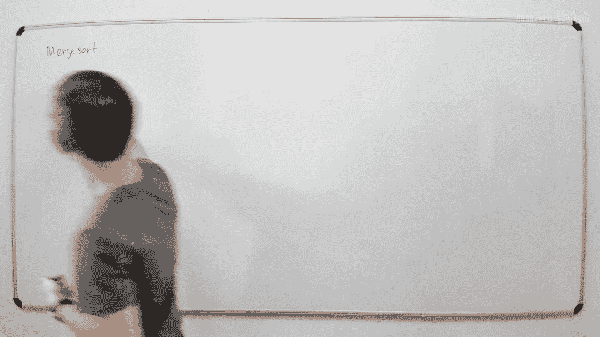

And quick circle。

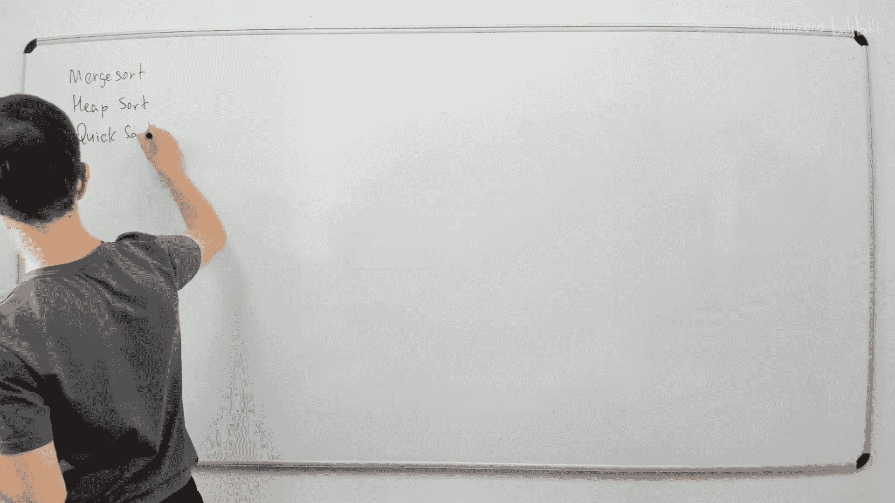

So。And all these three sorting algorithms was very different， so we used different ideas。

 we used different techniques， we used like different codes sub1 algorithms randomized here。

 we used some hip data structure here we use some divide and conquer technique。

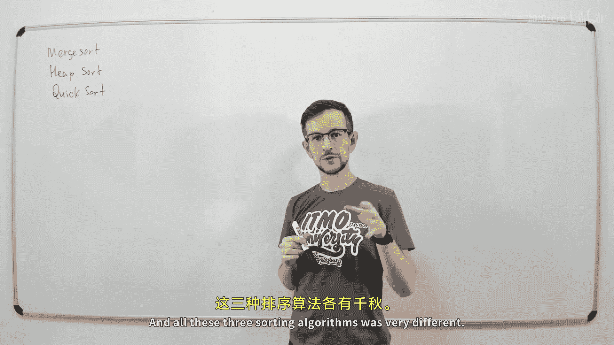

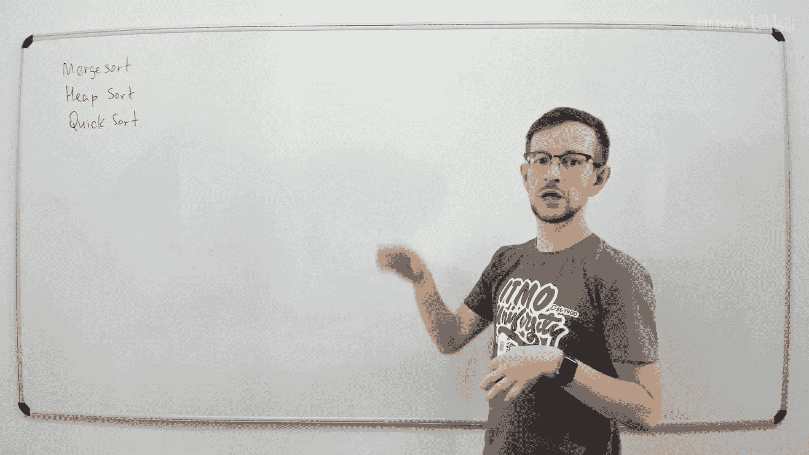

But all three different algorithms work in analog time。

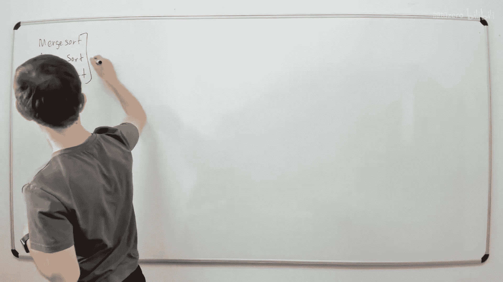

嗯。

I don't know。 What's the problem。You guys have have some problem with switch。嗯。

Okay。🤧K。So。We had three different certaining algorithms。

 and all three different sort algorithms worked in analogloggan time。

Let's think about the following so is it possible to have certain an algorithm which works faster than analog time？

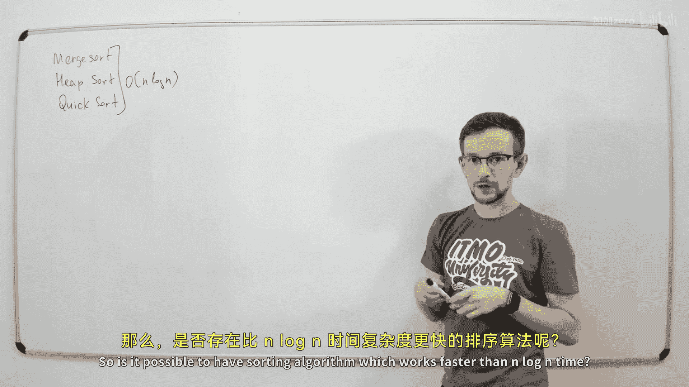

And。

Interest fact that his idea is that it's not possible。 So for for a social algorithm。

 it's not possible to achieve the。

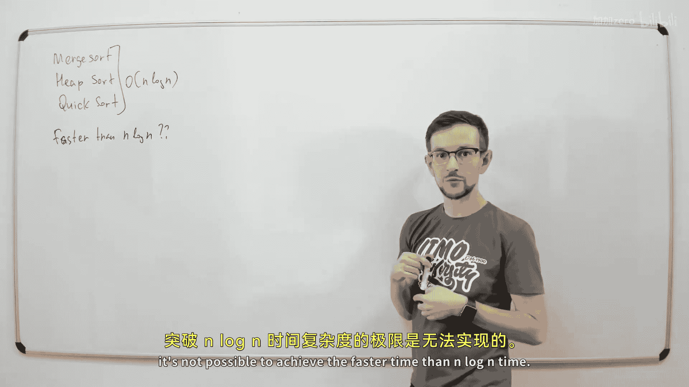

F time， then end logan time。Let's talk about why it's happening。

To prove that it's not possible to get a certain algorithm which works faster than analog n time。

We need to some some to fix the set of operations we can do with the elements of the array。

 So we have array。

Of some elements。And to prove that something is not possible。

 we need to fix the set of operations we can do with these elements。

嗯题。When these create certain algorithms， they all operation we need。

Is to compared to elements。

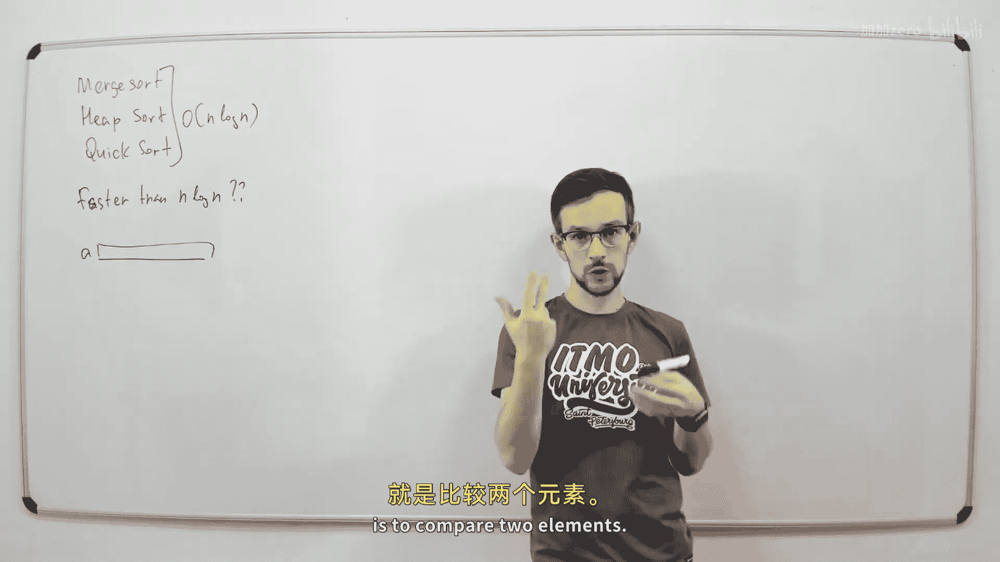

So the all liberation we need。To get these sort of algorithms is to compare to elements。

 so we need to。To be able to check if one element is less than another element。

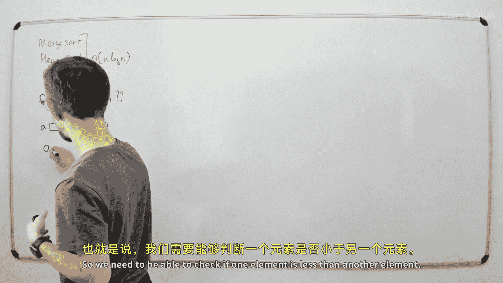

If they can compare to elements， we can。Make any of these sorting algorithms， for example。

 in nu sort。When we merge to arrays， we take first elements of each array。

 compare these two elements。Get the minimum one and move to the next one and so on。

 So the only operation we need is to be able to compare to elements。

The same thing with the hip sort when you have hip data structure。

The only decoration you need to do the elements is to compare to elements。 So you insert new element。

 compare this element to the parent element if it is less than apparent element。

 you swap them and so on。 So you only compare two elements with each other， each other。

嗯，哈哈。😊，嗯哈哼。😊，Just chicken the chat。

Okay。Now， let's prove that。

If the only operation we can do the elements is to compare to elements。

It is not forcible。To make the sorting algorithm from press that then end loggan time。

How to prove this。It's kind of tricky， so if you want to prove that some problem is not possible to solve first algorithms。

You need somehow to show that any first algorithms ist。

So somehow you need to show that all first algorithms do not solve your problem。

And how to do this in this case。 So this is one of the easiest case。嗯。For thing algorithms。

 it is known that it's not possible to solve fast at an analoggan time。

How will Viple is？Ah，Let's do it in the following way。嗯。Let's see so。Let's build the relevant tree。

 For example， let's have three elements。 Let's say we have three elements， X， Y。点字。

And we want to sort this element in increasing order。

And the only operation we can do is to compare to element with each other。So how can we do it？

Let's say， for example。

First， let's say we compare x and y， so we compare x and y。Let's see if X。诶呀。

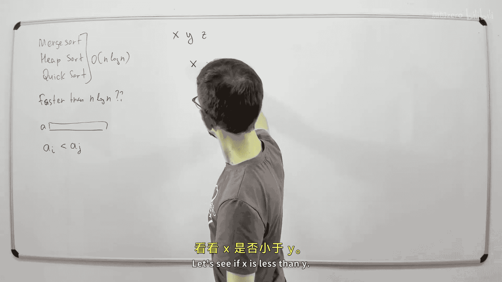

Is less than white。So if x is less than y。Then let's compare x and Z。We compare x on that。

If x is less than y and x is less than z。Then x is the minimal element。Now。

 we know that X is the minimum element。 we need to compare Y and Z。

So we compare Y and Z。If why is less than that。Then we know that the minimum element is x。

Next element is y， and next element is it。So谓。

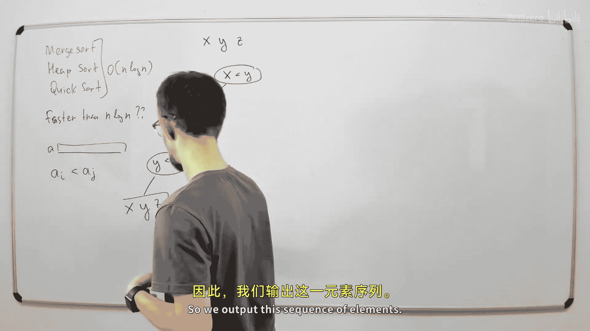

I would put this sequence of。Evins。So this sequence is inserted order。If y is greater than that。

 its less， this is greater。Then x is the minimal element。 then is Z and then y。

Now what happens in this branch so if x is less than y， but x is greater than that。呃。

Then that is the minimal element。So x is greater than that。B it is less than white。

So this is the only possible answer。

And so on。 So in in the right range， we have the following。 So if x is greater than than Z， then y。

 then we compare。 let's see Y is the minimal element。 So we compare y live。That。

If y is less than Z and y is greater than no。SoNow if y is less than z and y is less than x。

 then we need to compare x and Z。If it is less than a Y than X than z。

If it is greater than we have Y than the z than x。And finally， here， if x is。Greater than white。

 but white is less。Then zip。What does it mean。嗯。嗯嗯。す分。Or didn something strange yes。I you was that？

Then y， then X， right？嗯。也是他。Okay， looks white。So this is whats happening with your algorithm。

And actually， you can build S3 for any sorturcing algorithm。So what happens in your algorithm。

 in your algorithm， it works something like you do some operationss。

Then you make some comparison of two elements， so you compare some element A I with some element AJ。

So if for this list。You do some up some operations here。 If it is greater。

 you do some operations here。 and so， so。

🤧爱你。Any comparison of two elements will create two branches， like if it is greater， we go here。

 if it is less we go here。So for any source and algorithms， we can build a tree like this。

Now let's look on this stream。啊， what is？だフイト不つ。The height of this tree is the number of comparisons you need to make to achieve the goal。

So if， for example， if you start from here。You compare these elements， compare these elements。

 compare these elements， and go here。So， the number。Of preparations you make。

To get here is the height of history tree。对。So this height is equal to the time of your algorithm。嗯。

ないことな。It's a little bit too dark in this area， but。嗯。那。What is the number of nodes in this？

Let's look on the leaf nodes。 on this these leaves。 So we have one，2， three。4，5，6。

So these leave node are the different outcomes of your algorithm， so you're on your algorithm。

And in the end， you can get。One of these results。So what is the number of different results you can get after your sorting summary？

Any ideas？You have to quite totally。Too quiet。Say something。N factorial good。

 So the number of leaves in this tree is equal to the number of different peruts of N elements。

 So when you sort the array， you can get any perutation of its elements。And we have un factortoial。

Different pres。Right。So now let's go Kuwait。The minimum possible height of this tree。

 So the height of this tree。Is greater or equal？Then the log of the number of elements。

 So we have n factorctorial elements in this tree。 So the minimum possible height is。Hello。

 Gar from based two of F。Right。Now， what is log and factorial its？嗯。

Let's log of one multipied by 2 multiplied by 3 and so on to M。

 It's equal just to sum of log I for all life。So it's log of product。 It is equal to sum of logs。

And this sum is。Be Cor明个 friendloggan。That's all。The head of this tree。Is not less than enloggan。

 multiply to some constant that matter。能从。And the height of this three equals to the time complexity of your algorithm。

So you can again can't you make why can't you sort the algorithm first to them in Nloggan time because to sort the algorithm to sort the array。

You need to guess one of the perutations of its elements。And to guess one of the permutations。

 you need to make at least n log n comparisons。You can think about the information theory。嗯。Yes。

 it's very of the number of leaves。So the height is not less than logative of the number of leaves of the tree。

Because every compression here give you two branches so on each next level。

 you have twice more elements than on the previous level。Once again。

 you can think about this as in in in terms of information theory。 So if。

 if you need to guess one of the perutations。You need to guess one of in factorial numbers。

And to guess one of the integral numbers， you need at least this number of。Bs。Of information。

And every compassion give you one bit of information。

So in order to get all this n factorial information。

 you need to get at least logar of n factorial bits。

So this is minimal number of comparisons you can make。诶，呵呵。😊，No， this is。This is the lower bound。

 actually。Yes， we， we say that time cannot be less than and again。Okay， again。そう。

The number of leavess in this street is inctorial。Mmhm。😊，So the height of this tree。

 height is the number of nodes on the path from the root to the leaf。

 so when you go from root of the tree to the leaf of the tree， so you go here， here here。

 the number of elements you visit is the height of the tree and it's equal to time complexity so when you go to here you need to make these comparisons of elements。

The number of elements is n factorial， so that the height cannot be less than loative of n factorial。

Right。Again， why why is it so So if you make， this is the binary tree。

 So you start from the road here you have one node。 Here we have two nodes。

 Here you have four nodes and so on。So on level K， you have two in the power of k notess。いい吹きでてきしけ。

So if we want to get n factorial node on the bottom layer。We need to we need to have the height。

 at least logative of n factorctorial。嗯。Yes， we have enecrle leaves。That's right。

Total number of nodes may be greater than effect， but we have great roarchical。Yes。

 total number of nodes may be even bigger than factorial。That's all。こ。送。We just proved。

That it's impossible to make the sort press at the analog and time。

But this proof only works when you have some。Ubstractt elements。That you can only compare each other。

If you have something more interesting， so。In real problems。

 sometimes you have not just abstract elements， so you can not only compare to elements but make some more interesting operationss。

And in this case。Sometimes it's possible to get certain an algorithm， which is faster time。And first。

 we will learn。The following let's say we have。Let's say we have a right A。

And it contains only small integer numbers。So all elements are integers。嗯。From0 to m minus1。

And M is some small number。Oh， we need someone that I run the chat。Anyone wants to be a moderator。う。

こ。嗯。Yes welcome to the关。Okay， I think there is enough。Okay。ok走 we have everything。

It contains only small integers， so we have integers from 0 to m minus1。

How can we sort this out this array first than in agenide？Let's see。you whiteboard。

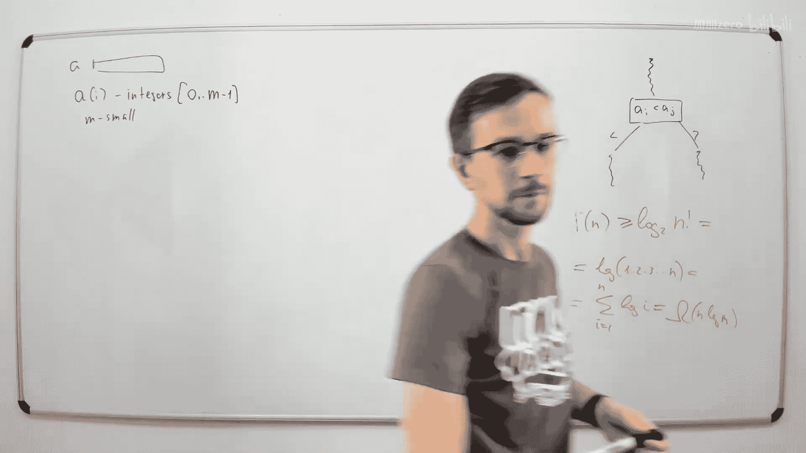

For example， let's say m equal to three。

And we have the right age。Something like。And no1，0，1，2。2，0，1，1，2，0。Let's say I really like this。

And we want to sort this rate。

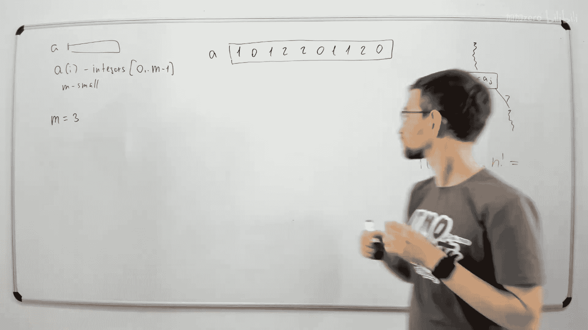

How can we do it faster than in enloggenine？

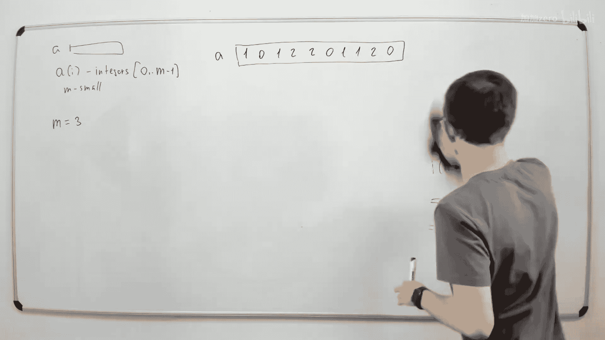

Yes。The simple idea is just to count the number of occurrence of each element。

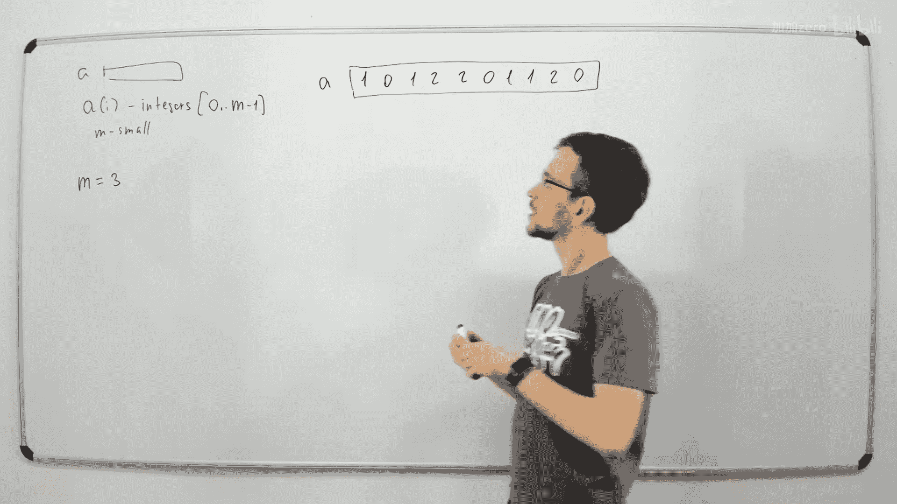

So we create a array， let's say， C。And we will just count the number of electron each volume。

So we'll count number of zeros， number of ones a number of twos。

How can we count the number of elements in linear time so we just go from left to right and each time we increment the corresponding encounter so initially we have all counter equal to 0。

Now we go from left to right。Take this element， increase this counter。クレスですか本当。

Then see the zero and create this counter。See another one increase again。And so on。

 we go from left to right， each time we see the element。

 go to this counter and increase the counter by one。So in the end。

 we'll have something like some have pre zeros。喂喂喂喂。Okay for once and。Freeer。F。とフートさ。Okay。嗯哼。

So we can go from this array to this array in linear time。

 so we just go from left to right and each time we in the respond spaing encounter。

This transformation is done in time and to us。So n is the number of elements in array。

 and M is a number of different values we can have in our array。こう。Now。

 when we calculated the number of each element， how can we get the sort array？Let's create。

The sort of version for。A prime and just put the this number of each value in this resource。

 So we here here we see we need to get three zero。 So just put three zeros here。Then， put four ones。

And then， frees。嗯哼ん。And this will be the sort version of this。

And these transformation also can be done in linear time。对。

So the total time complexity is linear。Let's right here。

It's called the counting sort。And it's done in linear time。Can to ask can。

嗯。Nice。What next？啊。Let's improve this others a little bit， so usually what happens？White's plus M。

Plus M， because we need to create this right。And the size of this ray is M。So this array is size L。

 So we need to create， at least we need to create this array。And now when we go from this radio。

If you can create empty array in constant time， you don't need plus elements in this transformation。

 but in this transformation， you need to look on each。Element of this array。 So。

 you have M difference。Elements here。 So you need to look on all of them。

So you need your kind need plus I here。Now time complexity is n plus M。 again。

 how how to go from this array to this array。From array of counters to array rate to the source version of AA。

よよと一曲。Possible value。 see what is in the number of elements of this value and。

Create least number of elements here。So you need to it all elements of this array and here you have M elements。

ItIt's n plus M。 sometimes it's important if M is bigger than M。

Then sometimes its important is plus M。有时于嗯。When you use count insert sort N and M Eom。

 so it doesn't matter。 So usually you have like n elements and each element is from0 to n minus-1。

But sometimes in some strange situations， you may have different values on and NM。

And it's important to keep in mind that it's N plus MO。

So it's linear for both the size of ray and the number of different elements。In practice。

 usually m equals n。Usually， when you use count sort。

 M equals to n because it is used in some different situations like。

Usually count soft is used when elements of array indices。

You have indices in the array and you want to sort this indices and indices are from 0 to n minus1 and you have n elements。

So this is how it usually works。N plus M is the same as maximum That's correct。

 N plus M is the same as maxim。You can prove it just by the definition of big O。Yes。N plus M。

 let's say n plus M is not bigger than 2。Maximum N plus M N N N M。

So you just change one of the elements of the maximumim one。 So this is not bigger than this。

 and this is bigger of this。That's correct。くん？Okay。A missed what else was talking about？啊，いや。

Let's improve the algorithm a little bit。What happens in real life so in real life you usually sort not the integers。

 but some objects。So each object has a key， which is the integer。 So， for example。

You have something like。You havestructs。Oh，Some item。And thestruct have some key。しい。

Which is from 0 to L -1。And some， I know data。Something like this。So you have some objects。

Each object has some important information here。And you want to sort these objects。Byイ this key。

So this is the key， and you want to sort these objects using this key。When you compare two objects。

 you compare these keys。嗯。And。嗯。Here is not very clear。 So usually when you make sort。

 you just compare to elements and then swap them and so on。 But in this sort。

 it's not very clear how to use do it because here we just create this array。

 Here we lost all information about objects。 Here we know only in the number of。

H key of of of each earlier。So how to get from this array to this array is not， not， no， not， not。

 not very trivial well。So， let's see。不刚我我我我我。Let's use some letters for each object。

 so we have object A， object B。😡，C，D。いエ。不是搞是。So we have 10 different objects，10， Yes。

 so we have 10 different objects， and these objects have these keys。嗯m哼。For example。

 object F has the key S0 and object C has the key equal to1 and so on so so we have an array of 10 objects。

And these are the keys of these objects。Clear了。And now we want to make a array of the same objects sorted by the keys。

嗯。What is the idea， So let's create a three different buckets。 so we'll create three buckets。

Bucket for objects of k equal to 0， bucket for the objects equal to1 and bucket of the objects that key equal to22。

So let's create free buckets。And now move these objects into this bucket。 So have object A。

 look on the key， the key equals to one。嗯。Yeahや， that that that's that's what we want do。そう。Well。

 you will use three different buckets for for three different keys。

Aray of sets is a little bit too much。 we need array of verex。But even this is too much fun。

Let's create three different vectors。So we look on object A， Ob A has the key equal to1。

 so we take this element A and put it into this bucket。Now， object B has key equal to zero。

 so we move into this bucket。So C moved here。 D moved here。E moved here。F moved here， G moved here。

 H moved here。 pi moved here， and J moved here。This is Jake。And now to sort this element。

 we simply concatesulate all these lists。So create the final array a。As the concateation of this。

 So first， we have all orbit extra of key equal to 0。 So we move。This B， F and J here。

 So these are zeros。Now we move these elements， AC， G and H。And now we move these elements。

So here we cover the sorted version of the same array。Yeah。いや、 that's。O。

That's a little bit complicated because here we need to have M different vectors。

So here have M different values。 So we need M different vectors。

So we need to initialize these vectors， we need somehow to increase the size of the vector so if we don't know the size of the vector we need to initialize M different arrays and each time when we add new element we need to increase the size of arrays so on so it's complicated。

But it's still working。 So if if you have like C plus plus vector， you can do it like this。啊。

Actually actually we can do it even simpler。 so how to do it the same thing without creating M different arrays。

We can do it in own way， so we can instead of creating M different arrays。

We can split the final array into M segments and use these segments as M buckets。

 So instead of creating free。Bike it's in separate arrays。We will create。と。

So we will create the final array。Of the same size。And then split it into three segments。

 So we have first segments of size3。So here， here we will put all elements of k equal to 0。

 Now we have the second。Segment of size 4， and here we'll put all elements of k equal to1。

And we have the final segment of size three。And here we'll put all elements with key equal to 2。

So again， we had this array。We calculated the number of of elements with each value of the key。

And now we just create this array and split it into three segments。

And each segment is used as a bucket， so now we just iterate over all elements of our initial array and put these objects into corresponding buckets。

So we take this element A C， that key equal to one。

 So we put it in the first position of the bucket one。 soll put a here。

Now we'll take the second element B moved here。Take the first one C moved here and so on so。

 each time we take the next element。Find the first empty position in the bucket。

And put this element in the first enterprise。How can we do it first very easily， We just。

Remember the first empty position in each bucket。 So we just remember these positions。

For each bucket。This will be position 0。 This will be position 1。 This will be position 2。

And now we' take next element。See， its value is is 2。So we go to the bike2。

 look on the first empty position in the bucket2， put this element here。

And then move this point or one position to direct。ちょっ。Yes。

 that will happen because we know the sizes of this。

 So here we calculated the number of elements with any radio of the key。

 And now we know the sizes of this buckets so we can reserve this number of elements for each bucket。

Yes， you can do it， you can use the previous version。

 but just reserve the number of elements for each verter， but again。

 you need to create M different vectors。It's much easier to create one big vector than create M different vectors。

 especially when M is big。Good。So a little let's finish this， so we'll go this Ds here， es here。

F goes here， G goes here。 H goes here， I goes here， and J goes here。And in the end。

 we have the sorted array。Thats all that's how the contents are close。You create， you。

 you get the initial array， get the array of counters。

 get the result array and then put the elements into corresponding buckets of the result array。

 That's all。Total working time is endless。go。Now。Yeah、 thatこ。

So we learned how to sort the array of small integers。 So if you have array of small integers out to。

M -1。 then you can sort them using the count and sort in n plus N time。Where is this， iss this？Now。

 what happens if you have a little bit bigger integer？ So for example。

 if you have integers up to M squared minus-1。For example， if m equal to three。

 you have in up to8 from 0 to 8。嗯。What can be limit of and it depends on situation。

 So if you have only one certain other， it depends on what how much memory do you have。

If you need to make it once。Then you can use like all your memory to create this big array ca counters and so on。

If if you want to do it multiple times， then again。

 usually if you want to choose the good number for M， you want to be this M to be equal to M。

Because it's m plus m。 so if M is smaller and then this is。

The bigger And is because then you just spend too much time on creating this array。 So usually if。

 if you want to choose the correct number of M， M should be about the same as M。我都 was这个 moment啊，没事。

そう。If the numbers are up to m squared。What can we do。Not all elements， but。No。

 we don't assume that all elements are at least once。 so some element made have so but。

M squared may be greater than n that's that's fine， so some elements。I don'm not in the other array。

嗯。わってないと。We can know the following。We can split each element into two parts。If you have some number。

From 0 to m square -1。You can split it like this。 You can say x equal to。Let's see。W。

Multipliied by m plus。And both why and Z。From 0 to M-1。不清。嗯嗯嗯嗯嗯嗯嗯。Mm哼。

That's like if you're using MR if you use the。嗯。House cold。I know the correct inlish。 but if if。

If you use the Arthmetics of base M， then you have two digits integer， like if， for example。

 if m equal to1。So what we're doing here is just split the number into two digits。

So we have numbers from 0 to 99。And this is just split the number into two digits who have higher digits and lower digit dig。

Okay。And now。We will take all integers in our array and split each integer into two parts。そう。

Will take the array 8。And split it over， say， RAB。Multipied by M plus。そう。

And now instead of sorting the big integers， we will sort the pairs of small integers。そ啊。

When we need to compare。Some where you end。Will your J。Is the same？As if we compare the pairs。

So we compare pairs B I， C。And where B。You see Jane。That's all trick。 So now， instead of。

Instead of one big number， we have two small numbers。 Well Again， let's show。 So for example。

 you you have。If you have M equal to 10。A cool， let's cut。LetLet's have summary right here。

Let's have again M to free。And we have a a of elements up to8。Let's have something like 6，2。41。7，2，3。

For。Goodナフゴナフ。So we take each number from this list。And split it using this technique。

 So so what is6，6。Is。Free multiplied by 2 plus 0。So we take this and replace it with pair 2 and0。Now。

 this two is a0 multiplied by3 plus2。So， big 4 is。我的 one。This is 0 and1。 This is2 and1。嗯。0， two，1。

 zero，1，1， and two， zero。Now， instead of sorting this integer， we will sort these pairs。

We sort the pair by the first element and then by the second element。Mmhm。😊，Again。

 here when you compare to pairs， you compare the first element。 If there。

 if first elements are equal， then you compare the second elements like usual。

When you compare two pairs， you compare the first element and the second of one。Good。

So now how to sort this rate。 we need to sort this array by the first element and then by the second element。

啊，受。The first idea is to make counts and sort twice So sort by the first element and then sort block by the second element。

 So the first idea is to make。Like free blocks。Here put all elements of first element equal to zero so。

0 and something put here， one and something put here and two and something put here。And then。

 sort each block。But if you do it like that。You will get this plus M in both with in all box。

 So So here， if you have some。Let's say we have n0 elements here and one elements here and and two elements here。

 So what will be will be the time complexity of all this sortcing。 So to sort this array。

You will need N0 plus m operations。You will have N1 plus amateurations here and and two plus amateurations here。

And this plus M ends up to all the cat complexity of each block。

So total time complexity will be like some of all these ns will be n plus m squared。

That's not what you want。So instead of doing it like this。

 you can improve it to work an end for some time， but it's complicated。

 The easiest way to solve this problem is to do the following。嗯。Let's do it in the opposite order。

I'll zero this is what because we have M blocks。And we have plus M for each block。 We have M blocks。

And we have like N0 plus M and1 plus M and so on。N M minus-1 plus m and this plus M。

Adds to the complexity of the accounting sort for each block。So we have this plus M M times。

 so it will be n squared。So what is the correct approach。

 the easiest approach is to do the following， well do the count sort twice。

First time we will do count and sort using the second element as a key So First we' will sort the array by the second element and then by the first element。

So， let's see。We make an accounting sort and we sort these pairs by the second element of the pair。

So we look on these second elements。And make the counting sort。

How can we make accountors like before we create a rate of the accounts。啊。え。

Count the number of each keys。 So we have0，0 we have three zeros。We have 1，1，1，1，4， one。

 and we have two，2， and two。嗯。Look fine。对。And now again， again。

 what we can do we create the same array split it into three buckets。 We have bucket of size 3。

 bucket of size 4 bucket of size 2。And put this person to these buckets。 So we have 20 putted here，1。

2 put it here。1，1 put it here， a 0，1。Ped here to one。Here 0，2 here。ワンゼロワンワンエントゼロ。です。ここし。Okay。

So here we have the same array sorted by the second element of the bear。Yeah， that's why stability。

And now we make again the counting sort， but sort these pairs by the first element of the pair。

 so we look on the first element of each pair。And like the contents of the game。So again。

 we create an array of counters。countun the number of each key。 so we have one two three zeros again。

Okay， we have one， two， three ones。And we have 1，2， those， Okay。スタビティ。Okay， so what happens now？

We create the same array， split it into three buckets of size3。Yeah。So we have three elements here。

 free elements。ち。And the prepare record客很 much。啊。啊嗯。And now we' put these pairs into this new array。

Again， we go from left to right and put each pair into corresponding buckets。

 so we take these two0 into buckets2。One zero in bucket at one。あとゼロ円パケット。11。0，1。one one one。

ああ、ゼロとエゼロと。응 좀 좀。嗯。That's all and now we have a source array。Why this is sorted no？嗯。

Should do I move together。Yeah  zero ones here。你し 왕제를どじ。Don't get what question。Here。

 here we sorted elements by the by the second element of the pair。

So here we have elements of second element equal to one。 and here element， second element equal to 2。

 So 01 goes here and 0 to goes here。So we sort this array by the second element of each pair。Okay。

Why the array is sought after the second iteration of the countertonor。

But because these elements are sorted by the first element。Elements softwareて。

This array is sorted by the first element of the pair because we just sorted by the first element of the pair。

And in each bucket。All elements are sorted by the second element of the pair。

Because the count sort is stable。What does it mean， It means that in this bucket。

 all elements go from this array。In the same order， we are， we have them in this array。

 So if we have element 1，0 and 1，1， then 1，0 goes from。Here andワ1。 Lets see here goes from here。

So these three elements。Go from。These three places of the previous array and in this array。

 these buckets was sorted in increasing order。 So first we'll have all elements from from this bucket。

 then all elements from this bucket and then all elements from this bucket。

 So first we'll have all elements with the second key equal to0 then we'll have all elements second key equal to one and then from second key equal to2。

So inside each bucket， the pairs will be sorted by the second element of the pairs。That' so。

So here after two iterations of the countinger who have the sort array of pairs。That's all。

 so what will be the total income complexity， so we have two iterations。

 each iteration work in n log and n plus n time。We have n plus M E and M N plus M Q。

So total than ofplex0 be n plus7。H does， you can submit Hoas。 Yes。

 we'll have again have discussion to tomorrow。You can submit the home task。7 좀 모르。Morning。

I think even even。Any time before the stream， it will be good enough。🤧啊。Will it be。

 what happens in practice， will it be fast than an the usual start or not。

 it depends on what situation you have。啊。So in breakfast， things are a little bit different。

 Sometimes even the algorithm which have。W can time asymptootics。

On practice may work even faster than algorithm with medicine。 So these algorithms。

Good in theory in practice。 it's not usually the best way to sort out sort arrays。

 It's a good way to sort when you， when you have very big number of kind of very big number of M。そ。

If you have pretty small number of an， then it's usually not good enough because。Again。

 you need to create another array。 so you need to spend another memory for this array。

 And you then you， you need even two arrays。 You need of counters。 You need the resulting array。

 So you have。To create these to erase， spend more more money。And then that。

Cashching is not very good because you need to put elements in some random points of this array。

 So it's not very good for caching。 So in practice， it's not。

 usually it's not the best algorithm you want to use。But in theory， it means that you can。

The idea that sometimes you can sort the array in linear time is good。

 so in some algorithms we will use the technique that we can sort the array in linear time instead of analog loggan time。

NowIn practicing can be good。 So you always need to check in your situation， what is better。If n is。

 I think， for n up to。A million， I think。I think for about a million it it it will be faster than standard sort。

Not checked。No， by my intuition， I think is if。For N and M about a million。

 it should be a little bit faster than the standard sort。Of C plus plus。I think。Not sure about this。

Now， if you're interested you can make some experiments， so you can implement this。

 get a standard C plus plus style sort and then compare them for different values on n and M and see when one sort is better than another sort。

So it's。Programming is experimental science， So sometimes you just need to experiment with。

Different practice。Appaches。And the final thing I was talking about is what happens next。そ。

We just cheated a little bit。 So we're saying if Emmas if。Have numbers up to M square。

 then time complexity is still m plus M。And it looks like the time complexity is the same。

 So when we have numbers up to M。We have time complexity m plus M。

 Now we have M square and time complexity is still m plus M。

So it looks like we can just put a number here and it' still be n like and and n plus M。

 that's not exactly the true， but but let's see what if we have numbers up to M same power of k。

Then we can do the same trick。But we need to run counting sort not two times， but k times。

 So we split each integer into K parts， like in K digits。And then make K duration of count sort。2。啊。

Sort these vectors of K digits。So total time complexity will be multiplied by K。

 so total time complexity。Will be K multiplied by n+ app。So if you pick this k big enough。

You can actually have。那。Big time complexity because just this K will be multiplied by the time complexity of the counteract。

Okay， these all method called the red sir。 let's put somebody here。

It's quite important method for further algorithms we will discuss。嗯ん。我也个 not吃。Not quite soon。

 but at some point we'll discuss some address in which we will use aic salt as the importanted detail。

嗯。I think it should be enough for today。Should do we discuss something more？Actually。

 we delay little bit。There is one more thing I I I want to， I want to discuss， actually。

You're still here。O。One more thing I willll discuss is the certain networks。Yes。

 if you don't how to make a rate， that's。When we used the Redixor。Okay。

 the last thing I won' to ask about the sortings is about sorting networks。

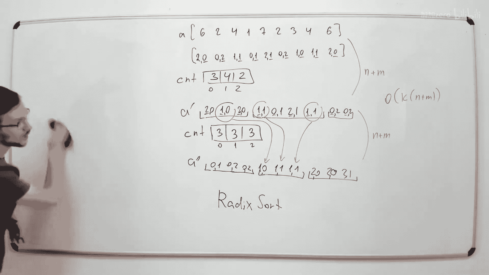

Let's talk about certain networks a little bit。So what does the substance network work？

Imagine you want to sort the array。嗯。But呃。

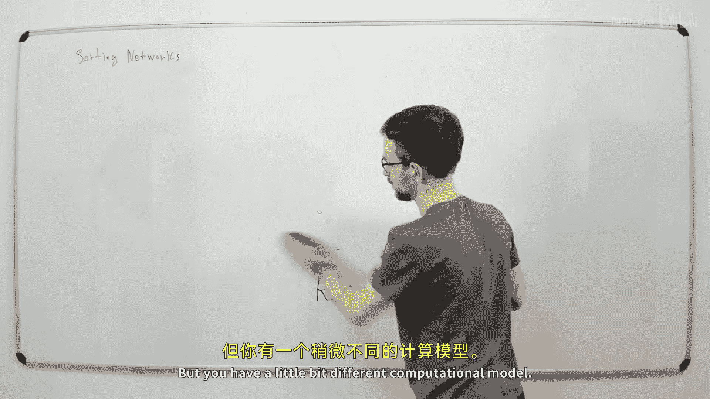

You have a little bit。Different computational model。 So the only operation you can do the array。

Is to compare to elements and swap them。So we have operation， like say C。

Of I N G。嗯。And it's。

Trasor is false， you say if。AI is bigger than a。Jae， then we swo。These two elements。 and。

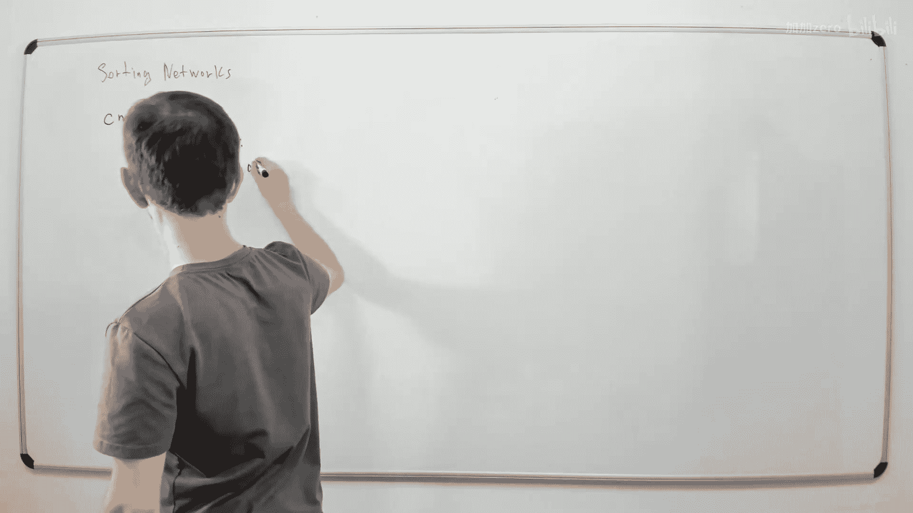

嗯。So imagine this is the only operation you have。

So we have like the only access to the array is to call this。コンプ。

This comparator will compare two elements， and if they are in the different order， it will swap them。

And you want to make a sorting algorithm using only this separation。

You will not want to do anything but to call this separation multiple times。

How to create certain algorithm which use only this operation Now for example。

 let's say you have three integers。Like， you have a array of size free。

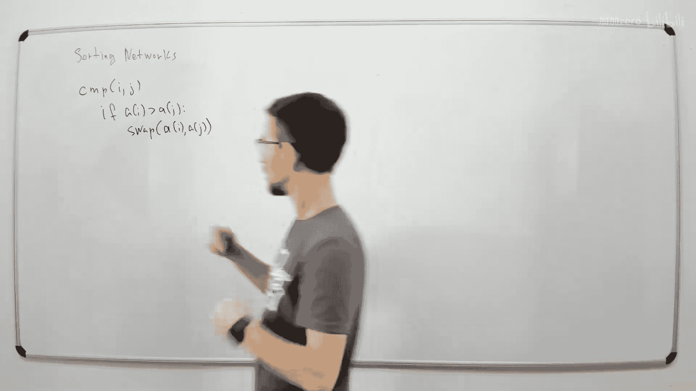

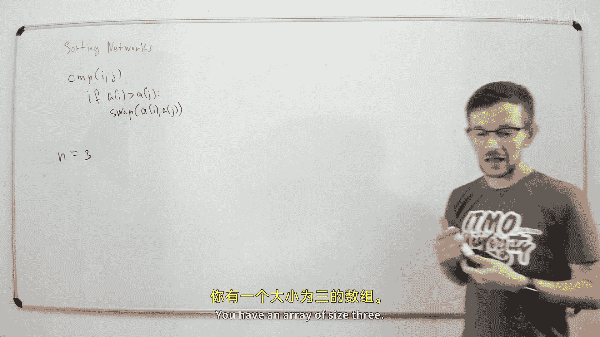

Let's implement， for example， insertion sort。How to make the insertion so。

Okay， we have， we have three elements。If you want to make insertion salt， then first。

You compare these two elements。 And if a second element is less than the。First element。

 you swap them。Thatワ0 one andと。So first， you quote C from 0 and1。

And now you need to insert the element2。 So first you compare to the element one。F the same P of。

1 and 2。And then you compare if it is less than element1。

 you will move it to position1 and now you need to compare it to position zero。

 so you need to call CMP of zero and1 again。

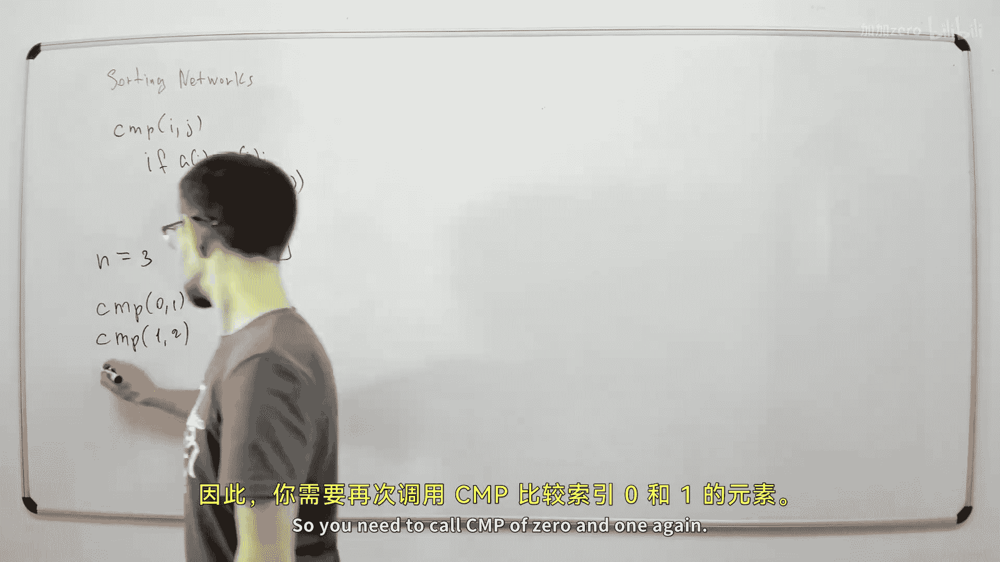

Okay。

So this program will sort the array of free elements。

こ。

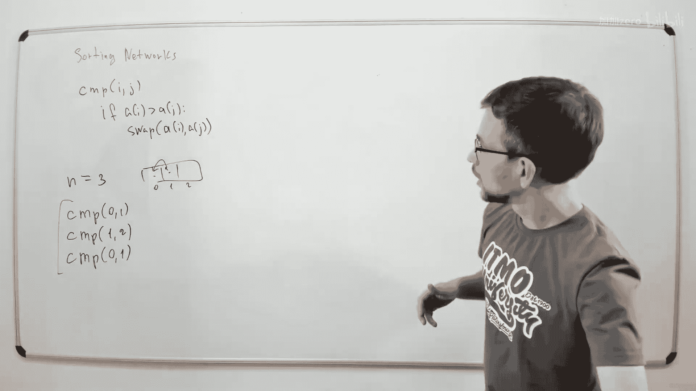

嗯。Usually instead of writing this program， because this program is。

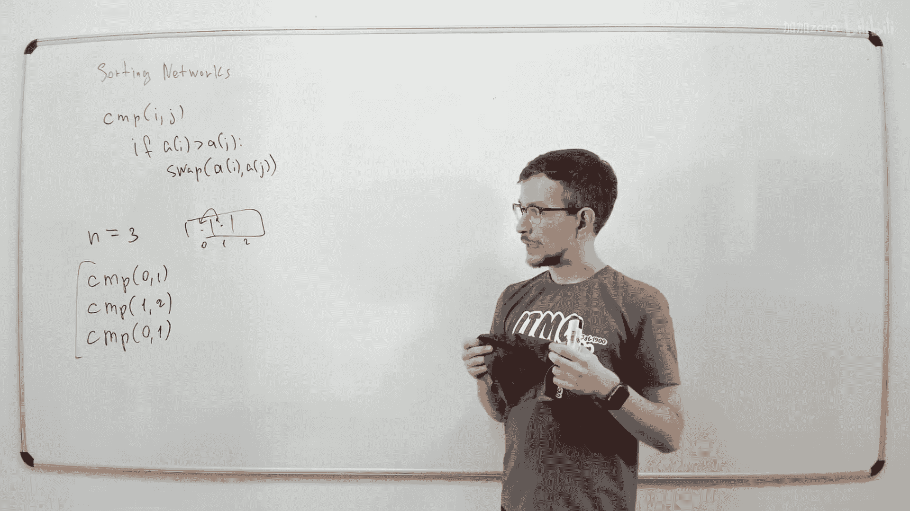

🤧simple to use domain。And South right in this program。

 where there is a much more visual representation of this program is to create this。Skim like this。

 So。 Let's say we have three elementsmonds。 So These three elementsmons will be like three lengths。

So this will be the element a0， this is a1， and this is a2。Here this it。The time。

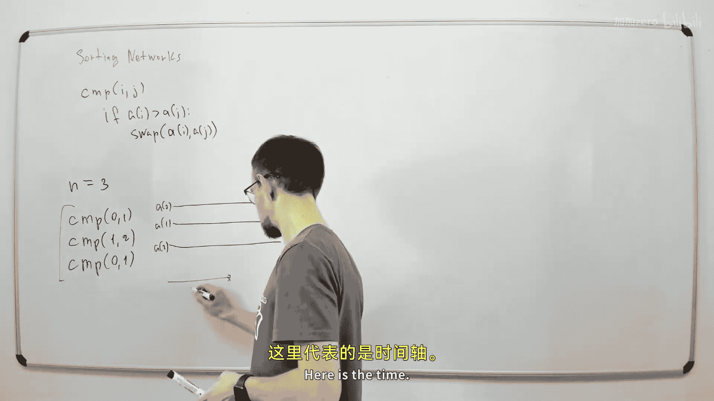

I'm both from left to right。

And each compator is drawn like a arrow from one element to another。Here we。Call it like this。

Now we compare element  one and two， draw it like this。

 and now again we'll compare on the development。Like this。

So this is the insertion sort of three elements。嗯。Nice。Now， let， let's draw， for example。

 let's draw the insert software for something bigger。 So let's say we have。へ。

Let's say we have five elements。Let's see how the insertion sort works for five elements。

So when we have five elements， and first， we compare this element。Then again， we have second element。

 we compare it here， we compare it here。Then we have short element。

 we compare the second element then here and then here。

And then we have fourth element we compare here， here， here and here。So this is the insertion server。

For the array of five elements。嗯。How to analyze the complexity of the sourcing networks？

There are two parameters we won't optimize。 First parameter is the number of compators。For example。

 in this count， in the insertion sort， the number of comparators is en loggan。

 So the number of these arrows， when we can call this comparator is en loggan。

Another property we want to optimize is the depth of this of this network。

 So we want to optimize the。This a beef of this narrow report。啊。To optimizeimize this。

 we will allow concurrent calls of different comparisons。 if we can， if。

 if they don't interact sharp， for example， if you want to make。

If you want you want to call comparator twice， you call comparators for elements0 and1 and then call comparator for elements2 and3。

This。Two calls do not interact with each other。 So this call only uses elements 1 and 0。

 and this call only uses elements 2 and3。So we can do them simultaneously， so we'll call it。

This comparator and this compator using different like processor cores。 So if you， if you have。

 for example， multi corere processor。You can do it in different。Threads of your program。

 so you can make two workers， one worker changes these elements。

 and another worker changes these elements。こ。Now how will we change this scheme if we are allowed to make？

Simobane calls of different compators。啊。是。So let's draw it like this。

Again， first， we have this comparator， and then we need first this comparator。

And now we can make these two conversions。Ais and Ais。We can make at least。

To call this to competitors us simultaneously。So in one operation。

 well call this comparator and this comparator so in line。Now we call this comparator， and now again。

 we call this comparator。Andスレートおあど。3是。给是な了吗。We can call this comparator。

And this comparators simultaneously。So， I'll just。Take these two compators and。那个皮。And so on。

 I will take these two compators put them here。This comp put here， and this put here。

So this is the same certain of networks， but here we allow multiple compators to be called simultaneously。

Okay。Let's see。 what is the depth of this net。 So， let's calculate。The numberオフ。

Concurrenring calls in this situation。And the number of concur calls we need to make is about。About。

 So are like2 n about stuff of that。先 big go girlfriend。So we have n squared， now let's see。

So we have n squared。ああ、コンポート。But the if we allow to call multiple compators simultaneously。

 then the total like time complexity not time complexity， but it's like Kangcurara time complexity。

 so total number of Kcur calls will be up to n。So these are the two two parameters who want't optimize。

 wantt optimize the number of different。콤포 애들어。And the total number of these cancur calls。共。Okay。

 the final thing I'll discuss today is how to make better。Concurrent by a software network。

ForFor this computational model。🤧。Okay。嗯。First of all。It is。It is possible to make certain a network。

It is possible to make certain network which uses analoggan compators。And have depth of to。Lloggram。

But this algorithm is too too complicated， and the constant is too big， it's not for practical use。

So we will discuss a little bit different algorithms， it's not that optimal。

 but it's much better than typical insertions of。Team。小さん。懂。Just some goes听。嗯。Let's go。Firstt， first。

First we'll prove some small feeling。The small theorem is like this the source。

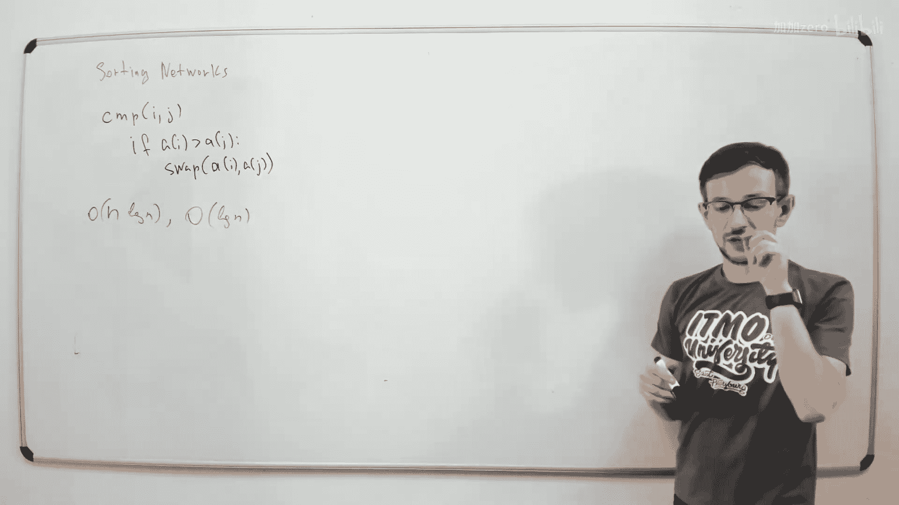

The pyraem is like this if you have the sort network。

And it sorts any array of zeros and ones。Ntwork。あAに。There is source engineering。

So its the only property we need for the source network to sort any array is to be able to sort any array of zeros and ones。

Let's prove this。No no let's say， for example， we have this sort network。 So we have。哦啊。

Let's it okay like。5 inputs。Then we have some sorting network。Here we have five adultss。

And we know that this sort network sorts any array of zeros and ones。我's you。

Let's prove that the source nu sorts any array。Let's see。 So let's look on the input rate。

 So here we have some input。 Let's look where is the minimum element of the rate， for example。

 a minimal element is here。Let's prove this is minimal element。

Well be in the first position after it's sorted by this network。How to prove this。

 Let's look on the following array of zeros and ones。Let's have this array of zero and one。

 all position equal to0 or equal to1， but this position equal to0。そ哦。Again， here。

Here this array is the inputter elect license x6。都。火。呃，发一个。So let's take the minimal element。

Minimal element of the input array。And make another array of ones and zeros with all elements equal to1。

 but this minimum equal to 0。そう。This array。Will be sorted by this sorting network。

 So after the sorting procedure we'll have array 0，1，1，1 and1。

So this zero will be moved by this network to this position。 So this zero starting from here。

 it will go somewhere in this sort of network and go to this position。But this minimal element。

 this one。When we sort this array。Well use the same path because each compression in this array is the same as in necessary array。

So， this one。We'll also use the same path。And go into this position。Okay。

So we proved that the minimal element will go in the first position in the re。

Now let's take the next element。 so next element is like two。Let's prove this。

 These two will go on the second position。 How to prove this。

Let's make another array with with zeros someposition here and position here。So。

When we sort this rate。This is the array of ones and zeros， so it will be solved by this network。So。

 we will have。This area。Now， in the second， the comparison between these elements and all other elements are all the same。

 So these two elements are less than all other elements。So。

These two elements will move to the same positions as these two zeros。So。We will have one。And two。

 in the first two positions of the results。But we already know that one will be on the first position。

So case， the only position for two is the second position。Again。

 we first prove that one will be on the first position。

 then we prove that one and two will be on first two positions。So one is here， so two must be here。

And so on， each time we take the next element。Builduil vary ones and zeros。Show that this first。

Elements must be on these first positions， and we already know the positions of this element so for the next added element。

 the only position is this next position and so on。Is it clear enough？嗯。So， next I have。

I cannot count。 I cannot count。 So this is almost。Yeah。So next， we will prove that this free。

If we remove this one and say 0。So we'll prove that one。

 two and three must belong to these three positions， so we know one and two are here。

 so these three must go here。And so on， then we take this four prove that it must be here。

 take this five prove it must be here。So we proved that this array will be sorted by this sorting network。

🤧少人。あ。は。Okay， the final step。Now we'll make the correct binary the correct source network。

To build the optimal network。Will use the social algorithm， which called the。Beトビビビト 있어。ビート。ネク？So。呵呵。

Okay。We don accept this kind of special algorithm。Which is used in different situations like that it's used mostly for some parallel algorithms。

I don't know。 I know some different。Topics were used by Bionic sort， and they all some around some。

パパ stuff。So let's。Whatすベターに来そ。So what is the Binic sequence？とニ sequence。Let's have RA A。

And it is Bionic。 if it is look something like that。 it must be。Something like that。そう。So。

 there is some。Interval， when the air is increasing。And some intervals swim are raised decreasing。

And if we look on the cyclic shift of the array， so if we just take this decrease in prefix and move it here。

Okay。So this is the array。 and let me just move this preex here。

Then here we will have the decreasing in segment。🎼So if we look on the array。

 like on the cyclic sequence。🎼It should be split into some two parts。

 One part is increasing and another part is decreasing like here we have increasing part and decreasing part and it is like。

Cyclic sequence。If you have a already like this， it is the Bionic array。别走。

So Bionic salt is the special sort， which sorts the bonic sequence。

Bonic sequence can be sorted in some special algorithm， which is called Bionic sort。共。

So now we'll create the sorting network。Which sorts their Bionic sequence。来ice。For example。

 let's write some Bionic sequence， for example， we have RA A。So we have some decreasing part。

 let's say free。呃，都。That's good enough。 So now we have some increasing part， let's say，4，6， then25。

 And then decreasing in part， like 17。IAnd should be decreased up to since3。 So it's 70。

 And I don't know，11，8，6。

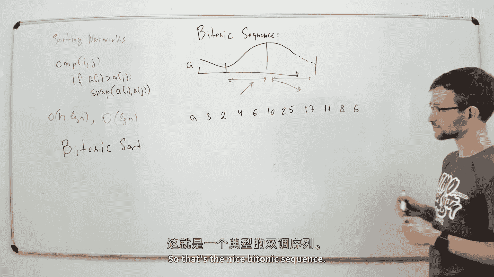

So that's the nice Binic sequence。So we have this part from two from two here we have less， less。

 less， less， so。Here we have the increasing part。And here we have greater。嗯，ぐれトぐト。

And if we put this frame to here。Here we will have the decrease in pump。

So this is the plaonic sequence。Only one we should have only one increasing。

 only one increasing part and only one decrease in part。That's why we be done so and2。

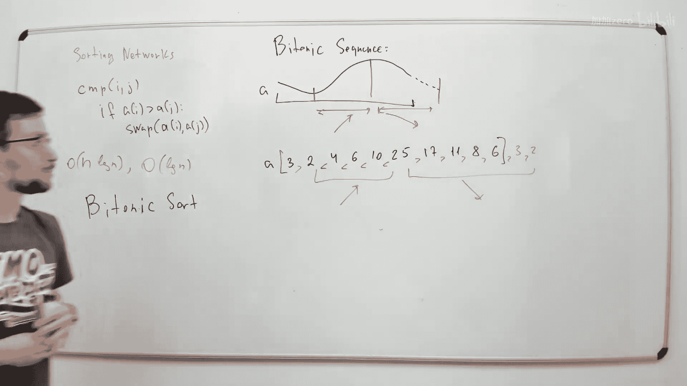

Cool， now we will build the sort network。Which will sort the baonic sequence。

To sort the Bionic sequence。if we're building the software network。

We only need to be able to sort all the bonic sequences of zeros and ones。

What is the plaonic sequence of 0 and 1。B do sequence。Of zeros， and。Onces。

So if your sl only consists of zeros and one， and this beonic。Its。Look， it looks something like that。

 so we we have。Buts say we have some array of zeros and here here we have some segments and ones。

So it always looked like this， so we have like all elements equal to0。

 and in the middle we have some elements equal to one。

Or we opposite or we may have all elements equal to1 and in the middle sum segment equal to zero。

What， what， what， one numbers。So Bi sequence rate looks like this。啊。How how to sort this three？嗯。

嘿哼哼嘿。I have not enough space on this box。 So let's， let's raise this。啊，这下的 thing。

Just sort it is not that。 So you， you need just。Just two sorts of the array。

 you need to find the minimal value and to find the minimal value you need。

 you need to run this component we're working in this this special model but this is the one operation we can make。

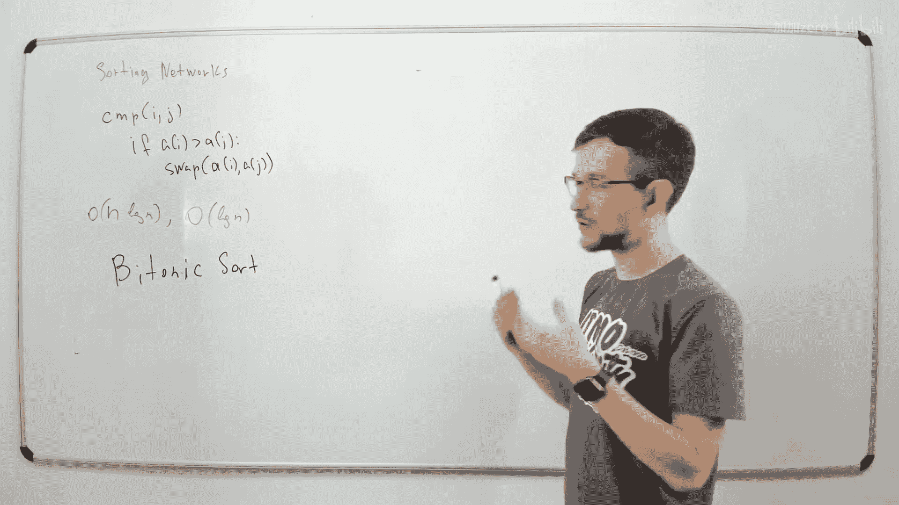

And to rotate the array， we need to find the minimal element。

 and we can find the minimal element because this is the only operation we have。Yes。Yes， in the。

 in the usual computational model。You can just find the minimal element， and then rotate the ray。

And then merge these two parts， yes， you have one increasing part one decreasing part。

 you can just use the mech so to merge these two parts into one array in linear time。

 but here we work in this special model here we're building not the usual program。

 but we're building the socing network。

So we can just run just make bitter stuff with these elements of the the only operation of elements we can make is to call this comparator and to compare this element and swap them this is the only operation we have。

Okay。

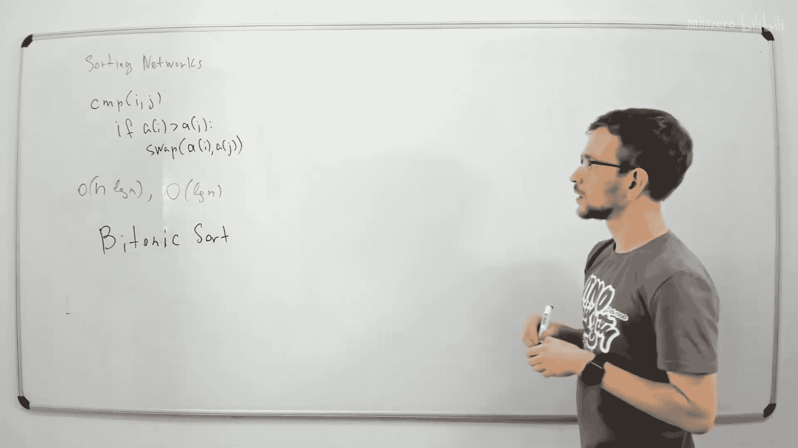

Now， how to sort the be sequence？ア、ビードにクしていくんです。Imagine what here。

Let look here for array of size equal2 in the power of k。Let's do the so。

 Let's split this array into two parts。 Let's say we have。

Left part twin empower power k minus1 here and twin in power of k minus1 here。

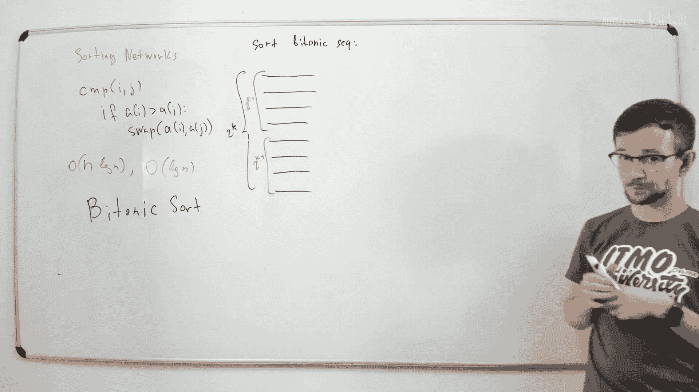

And now we'll call the comparator for each pair of elements here。 So we'll compare first element of。

This part， the first element of this part called this comparator， now we call this compator。

 now we call this compator。And then call this comp。So we compare each element of the left part。

 the corresponding element of the right part。But for example， let's have some array of length8。

 So we have some0。0，0，1，1，1。ジロジロ。So we have Ar like this。After we're on this arm。

 So we have what wrong。Wake up for like zero is zero zero。11，1，0，0。So after we on these comparators。

We will have a already like this。 so they we compare。はよし。Drrow everything here。 So we have here。

 the third part is the。Now we compare this element of this element。

They are in the good in the good stage， so this element is less in this element。

 so we don't swap them。Now we compare these elements， I compare this elements and so on。

 The only elements are in in the best state are this one and this when we have this one compared with the0。

 this one is greater than the0， so we swap them。So then we'll have something like 0，0，0，0，1，1，0，1。

And the interesting property is the following。Now I want to prove the following。

 I want to prove that after I make this transformation。I will get。Two houses， each house。

Is aonic sequence and all elements here are less or equal in all elements here。

Let's prove the following。 So let's prove that boths are Bionic。 So this is Bionic。And this is Biica。

And all elements here are less or equal than all elements here。Like in quick sort， in quick sort。

 we split into parts and all elements in the first part are less than all elements in the second part。

W let's prove this？So what happened the city， again， we have some array we split it into two parts。

This rate is Bionic from of zeros and ones。So。It is some array of zeros with some segment of ones。

 Let's look on where is the segment of ones。 If the segments of ones is。In one hope the ready。

 then after the sort， after the separationperation。We will have。Here， well compare this。

Once were these zeros。So this array of zeros will move to here。收度。Have this zeros。 Oh。

 these ones will be here。こ。So if this segment of ones is in the one half of the array。

 then in the end we'll have one part full of zeros and another part with this segment of ones。Now。

 both housealves are。But bit beonic。Because this this of content， this ra binic。

So we have two halves， each half is plaonic， and first half is less or equal than the second half。

Now， if this segment belongs to both house， if we have segment like this。这这这 천。

If we have segment like this。That what happens。Then we'll compare this once。The zeros。

So these ones will move to these positions。So we'll have these ones here。왜。And now again。

 both puffals are bonic and this half is less or than this half Here we have only zeros。

 and here we have zeros。And once。I lost the signal。こ。And finally， if we have many， many ones here。

 so we have。Big number of ones。Then these ones will be compared to these zeros。And move to the right。

 And these ones will stay in place。 So in the end， we'll have this。Bk full of one。

 And here we have one in the middle。And here again， we have both parts， Bionic and these house。

 all elements are less or equal elements in this half。That's all。No。

This separation split one bitonic sequence into two bitonic sequences。

Let's call it recursively on both bonic sequences。 So we have two bonic sequences of size 4。

Let's do it the same。 So let's split each house into two parts of size 2。And do the same trick。

So we have these two houseves。 let's compare this element of this element， this element。

 this element， this this。Now we'll get four bnic sequences of size 2。And now again。

 we have Bionic sequence of size 2， we will split it into two bonic sequences of size1。嗯。

So we call this compator this compator this compator and this compator。No， here we have two。

 I want to claim that this valve is binic and this valve is binic。The whole array is not Bionic。

 but this part is Bionic and this part is Bionic。Yeah。

So the idea of the algorithm is to split the bonic sequence into two bonic sequences。Of。

 of smaller size and so on。That's all。 That's the whole algorithm。 So how。How many comp do they need。

 So on each。So we have N log if iterations。On each duration， we have n compators。

 so a total number of compators is n loggan。Here， we have N loggan。Comparators。

And what is the depth of this network， So what is the total number of concurrent calls。

Let's see I'll on each step。All these comparators can be run simultaneously。

 They don't depend on each other。 So we compare these elements with these elements。

 all these four comparators can be run simultaneously。So， we need。One concurrent here。

 another here and another here， so the total number of these concurrent costs will be loggan。

This number of iterations is loggan。 So total number of of piece con calls will be loggan。Yes。嗯。

If we can run comparators in parallel， then this will number of these parallel runss。Thats all。

 that's how you sort the Bionic sequence。But how to use this sort when you need to sort some ob。嗯。

This is how you sort the Bionic sequence， but you need to sort some a bitter eraser。

 so given some array and you need to sort it。 This array is not Bionic， usually。

So how to sort the array， which is not Bionic。you can do it using the following techniques。

 So imagine you have some array again of size8。 so you have some eight elements。嗯。うんはい。えい？

So we have some array of eight elements。How to sort this array using Bionic sort。Lis look。Let's have。

That each pair of government forms some small Bionic sequence。So let's call this Meonic salt。

To sort the array of size， too。And we will sort this array in increasing order。

 and this in the decreasing， this will be increasing， this will be decreasing。

So we make pairs of elements and shortage pair。あ、なお。We will look on each four elements。

 so look on these four elements and these four elements。These four elements form some bonic sequence。

So we can call the Bionic sword。To sort these four elements。Now。

 we sort these four elements in increasing order。And then call the bit sort to sort these elements in decreasing water。

And now we have the cho array Bionic because we have in the whole array。

 we have some increasing sequence and then decreasing sequence。 So the whole L elements。

8 elements are bonic sequence。 So we call bonic sequence on the whole array and sort the ho array in increasing。

嗯嗯。怎。Okay。同。So this is how you sort the given array， so you're given some array。

You split that right into single elements。Call the bonic sort to make the arrays of size 2。

 Then call the bonic sort to make the array of size a of size 4。

 Then call it again to make a array size of size 8 and so on。

 So after logarithm of calls of bonic sort。You will get the solitary。

Each coal is the coal of Bionic sort。So you have log n calls of Bionic sort。

So the total complexity will be in total， you will have N log square compators。

And the total depth will be equal to log squared because you have logar of iterations on each iteration。

 you call the。Bonic sort， the death ofcon between sort is logarm。

 So we need to make logarm times depth of logarith。 So total， total death will be look squared。There。

 so any questions？うんふんふん。呵哼。😊，Why these elements are Binic because any two elements forms Bionic sequence if you take any area of size 2 is Bionic。

😡，Just by definition of petonic sequence。So you can take any two elements。Like。嗯。Fi， friends。2。Here。

It's greater than this， so you have here you have segment when it is increasing and here。哎诶诶。And。

Decrease。And here you have the segment where is increasing。Any array of two elements is Bionic。

 So here you have any pair of elements， if it's Bionic， you call Bionic sort， sorted elements。Well。

 theonic sort of two elements is simple， just one comparator。

 just compare these elements and put them in the correct order。

 Here you call theonic sequence of size 2onic sequence of size 4 and so on。Okay。

 I think it's all for today。 sorry for the leg in。🎼ううん。🎼う。🎼，🎼。🎼。🎼う。🎼。🎼うんん。ううん。🎼。🎼。🎼う。🎼，🎼う。🎼う。🎼う。🎼The。

🎼。🎼うん。🎼，🎼う。🎼うん。