# 【精译⚡算法与数据结构】PavelMavrin p06 p5 A&DS S01E06. Stacks. Queues. Amortized cost -BV1NLB8YfEMq_p6-

🎼，🎼追错。🎼一人人。🎼The。They will talk first we'll discuss two data structures， very simple data structures。

 but very widely。

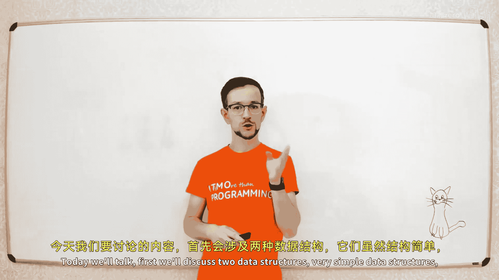

It's stack and cues。So what is stack？

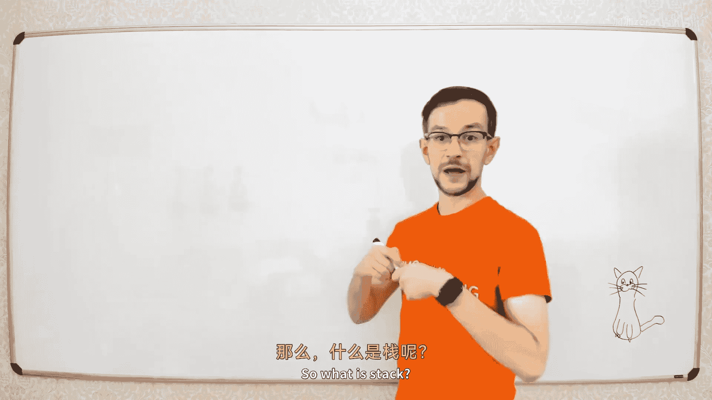

Step is very simple structure。

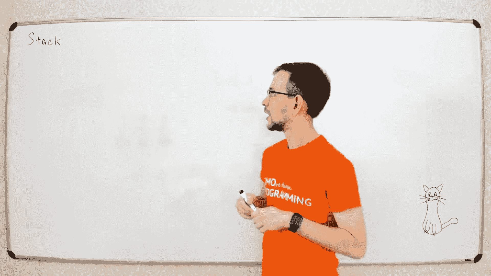

It looks like。This。the marker。

And you put elements in this。

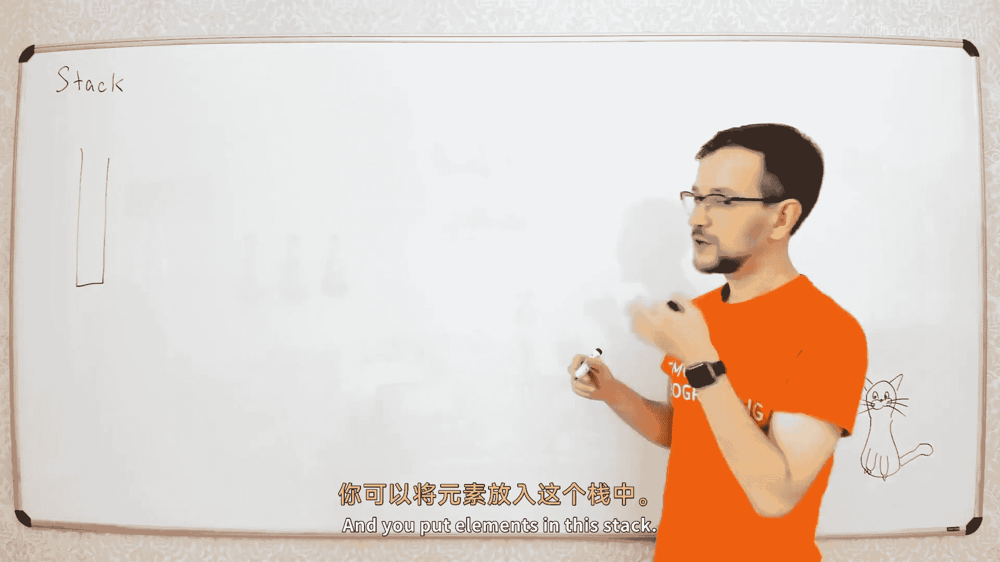

啊 step。Please。

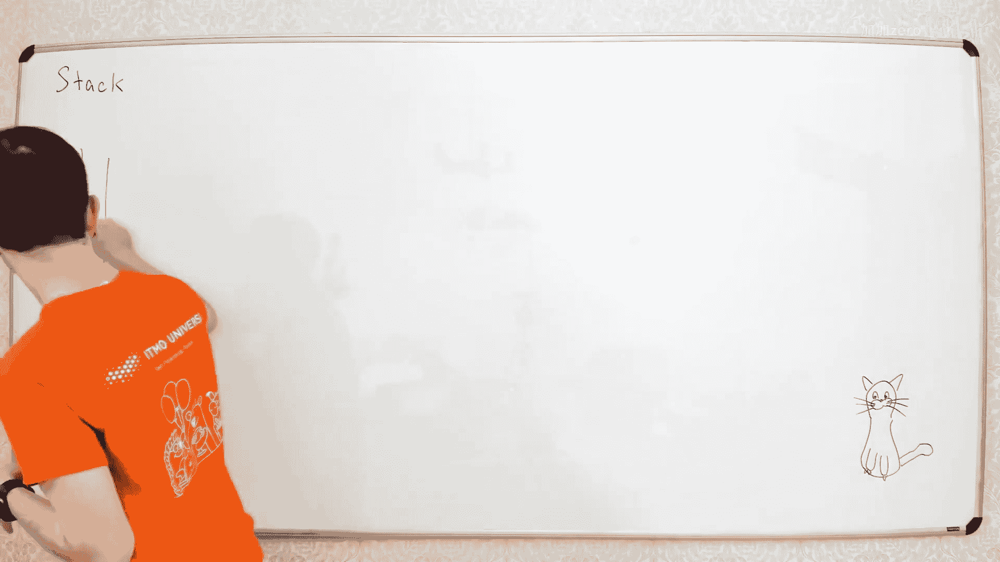

And you have two operations， you can put a new element on top of this stack。

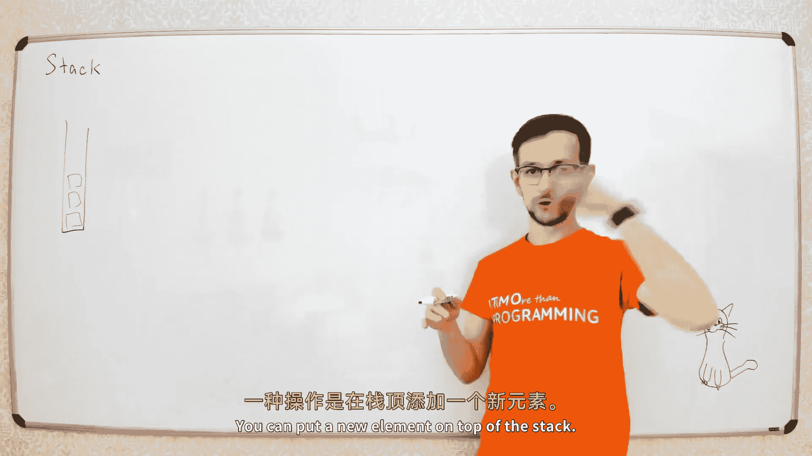

The separationper called push。哦。

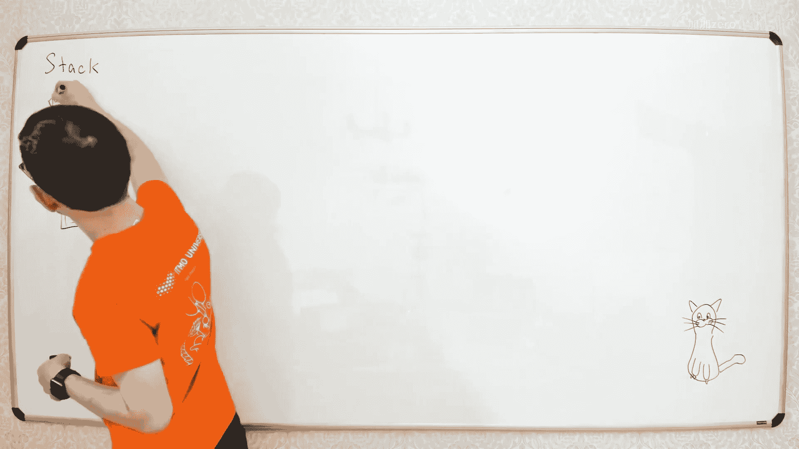

And you can get element from the top of the sec。

It's called the Po。

What is the name of the kid， I don't know。

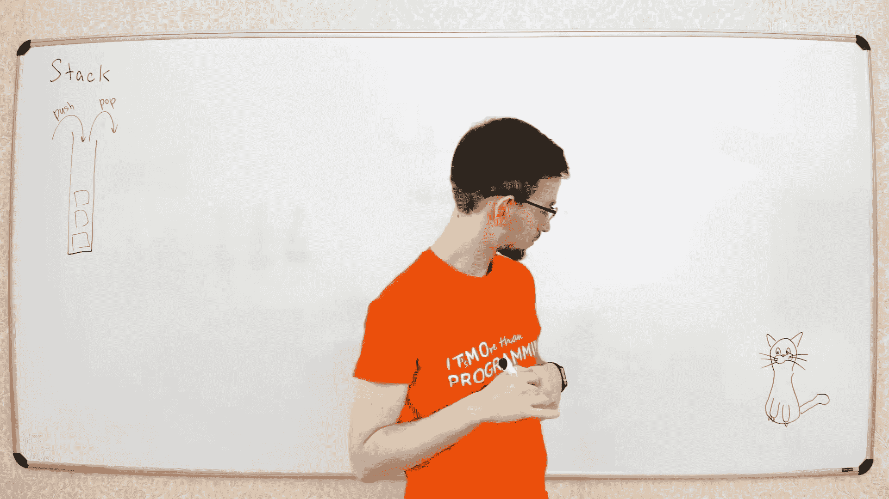

It's you decide。

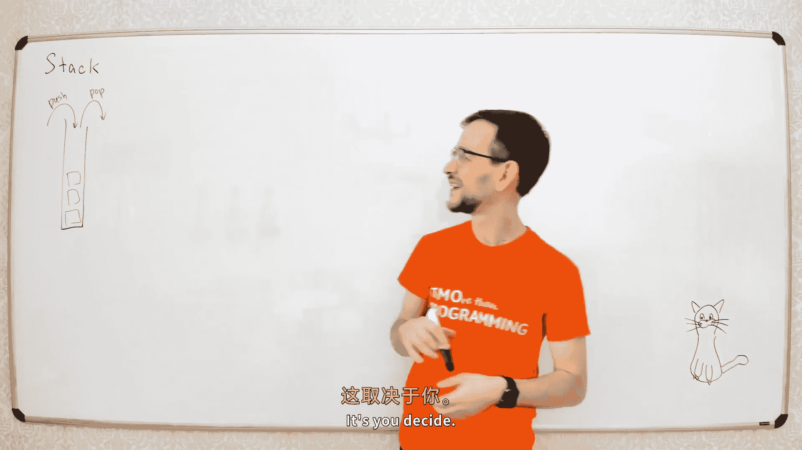

啊。For example， we have three elements， we have A， B and C。

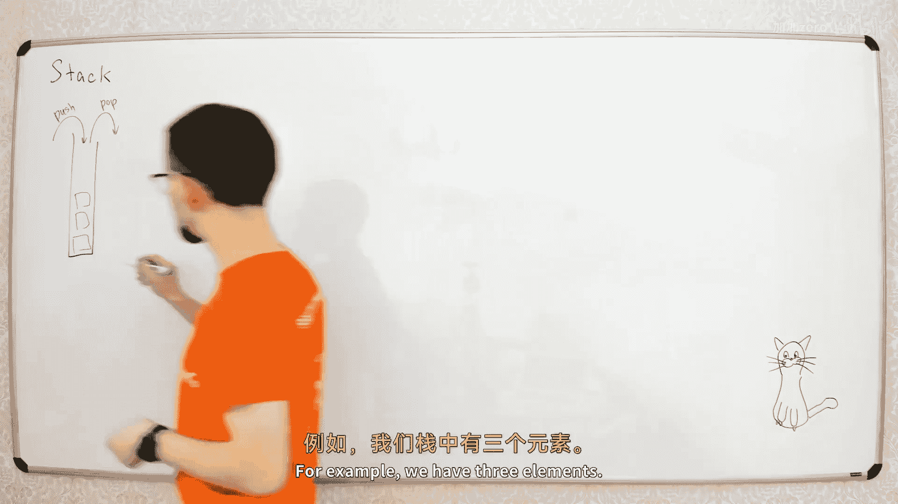

So well push this element， like we say， push。A then。Be， and then。

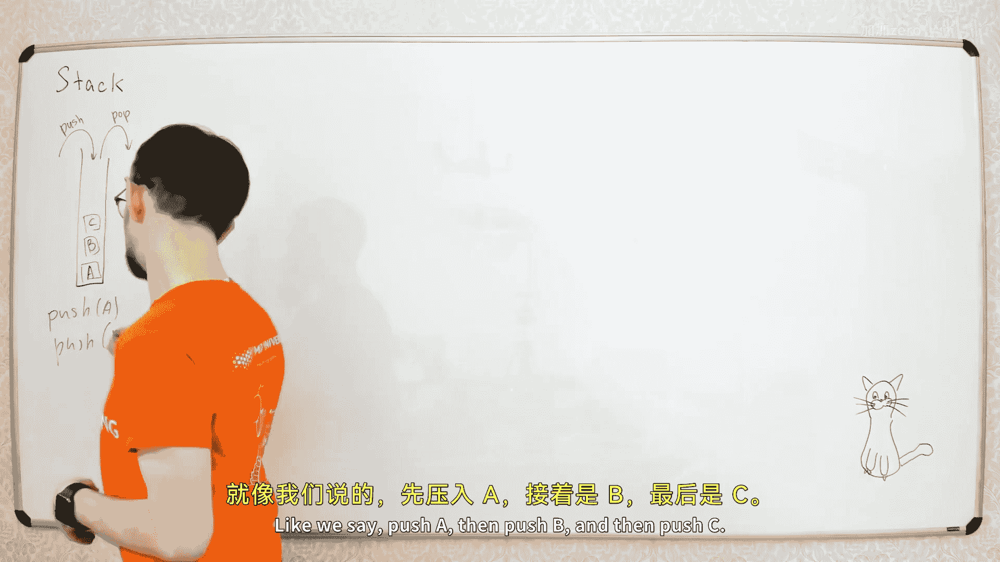

四。And then when you pop the element， you get the topmost element of this text。

 So when you pop the element。

Yes。You will get this element C。

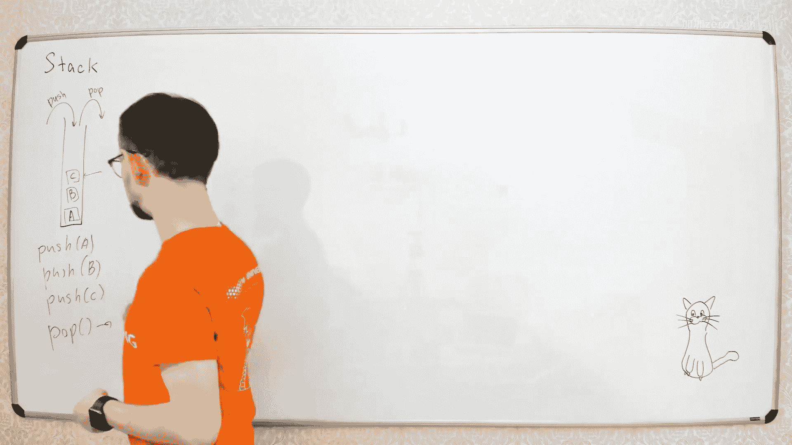

And element C will be removed from the steps。So this function returns the element C and removes this element from the stick。

AT， why not。

嗯。是。那么。How to implement the data structure？It's。Very simple when you have a big array。

 let's say we have array of in infinite sides。手不开。In canrate。You can include array。

 let's call it array A。I always call arrays A when I can， if I have two arrays。

 I call an A and B usually。I'm not ready。Creative from this point。Okay。

 and we will put this element from the left of this rate， so the indexes of this element will be 0，1。

2， and so on。

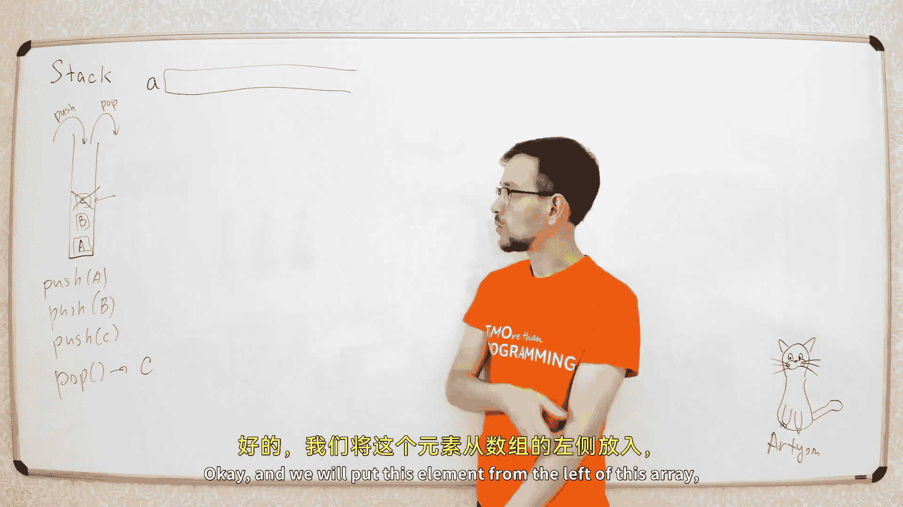

So we put element A here， element B here， element C here。一'走。

Let's look on the indices of this element， so if we have n elements on this step。

 they will have indices so if we have n elements here。They will have indices from 0 to n minus1。嗯。

That's basically the whole plan。 Now， let's implement these two functions function push。

Next。So when you insert new element。In this stack， you put this element in this position。

这有的问。And increase n， so we need to put new element to position n and then increase n。

 so I'll say just a， let's say that n plus plus equal x。That's exactly like we did when we had。

Binary hipaps like you put the element on the last position of the rib。And when you pop the element。

We need to simply return the last element of the stack and decrease and so let's see2。诶嗯我你是。

That's that's a whole step。So it's a really simple data structure。

 but it's widely used in various different problems。For example。

 even if you didn't implement the stack by yourself never。

 so you may use stacks when you have any recursive procedure。

 so when you implement recursion in your program like you say，So you have like function F。Oh。

 let's say again。Okay。And somewhere here， you have Hall of F from M minus。

And some more here here every time。Something like that when you have a function which calls it itself。

So what happens when computer tries to implement your program， what happens？

It starts from function F， so it remembers the state of variable n， so's。We say off them。どとか。

So the computer should remember that the value of n equals to n equals to1。

And you may have some local variables， like we have like I equal to n plus5 and so on。

So you have some local variables here， so your computer needs to store these values of the local variables as well。

 so you need。Remember that i equals to 15 and so on so you remember all the values of all the local variables。

And now when you make the call of f of n minus1， you make another curve of call so you have f of 9。

And for this incursive call， you also need to store all the values of these local variables。

 so here you have another in equals to 9， i equals to 14 and so on。

And then you go back from this recursive call， you need to go back to these values of all the local variables。

 so the computer needs to store all the values of local variables for all the recursive calls。

And the computer does it using stack， so we have a stack of these blocks called stack fragment。

A stack of blocks of values of local variables。And when you go deeply in the recursion。

 you push another block of these variables in the stack and when you return from the recursive procedure。

 you go back to this block of variables and so on。啊。No。

 the computer only lost these variables when you return from the function。

 when you return from the function， you lost this book。But you need to go back to the previous book。

 so if you call this recursive function from this recursive function。

 you need to go back from this recursive call to the initial call of recursive function。

 so you need to go back to these values so you can just lose that。

That's basically how also you need yes yes， also you need to get the pointer to the position when you go back so you need to get this position and store this position P to somewhere。

So when you go back to recursion， you need to know from which point of the procedure to continue the execution of order。

That's how it works。So even if you didn't implement stacks by yourself。

 you did use stacks when you use recursive procedures。欢。Now， the next data structure is Q。

Yours again， a very simple structure。So it's just the list of elements， let's say ABC。

And you put the elements from one end。呃。I'll just call it end。There are different names for this。

Function， I'll just call it Ed because I cannot pronounce most of them this add this simple name。

 and you remove elements from here。Yeah。Okay here， for example， you will end。A， then you add。Be。

 then you add。See this too much。And then you remove。🎼When you remove the element。

 you remove the first element which you add in the set in the cube。

 so you will remove this first element A。And return this element。That's all。啊。

So these two ends of the Q are usually called head and tail of the Q， so this end。

Called the head of the queue here at the。Yeah。And these arent the colds the tail of the cure。哎よ。

Problem with letters today。That's anatomically speaking it's kind of strange so you add elements to the tail and you remove elements from the head。

 but this just names from the queue like when you have a queue to the shop or something like that so you have。

啊。我这孩子。You have like a shopping shopping window here and you have the queue of people who wants to buy something。

 so your new element will be added to the tail of the queue and when you。

Then it's your turn you just take the first person in the queue and remove this person from the queue。

 that's all。That's all the queue is mostly used when you need a queue。 So for example。

 if you have some。Task queue so you have some tasks and you have some workers。

 so there are workers who will take the tasks from the queue and execute these tasks and there are some other elements of your program who will add the tasks to the queue。

So you have some workers who will process those tasks and some other。

 let's say workers who will add new tasks to the queue。はい。So， how do。

So how to implement this Q using arrays。Again， we will have a big array。

s let's say we have very big array like of infinite size。And we will have two pointers in this sorry。

 first pointers will point the head will point to the first element。O thank you。

And tail will be a pointer to the first empty element of the kilo。

 so head is points to this element and tail points to this element。That's so。Yeah。

 so elements of the Q have indices from head。Twoて minus-1。That so。

Now let's just implement these two functions， so we need add L and remove can here。Yeah。

 I think it's enough here。So how to add。How to add element to the cube。

 so the new element we should add to this position。

Of the Q to deposit position tail and then increase tail。So let's say a。Tale plus plus equal to x。

That's very it simple you。And how to remove elements。嗯。So to remove element from the cube。

 we just need to take this first element with position head。

 remove this element and move head to the next position。嗯。嗯 응。H plus plus friend。嗯。That's all。Nice。😊。

That's all data structures for the day basically。Today we will learn two bigs， stacks and cues。

 that's all。😊，啊。Actually， also we have decks like in fuel。

There is another special data structure it's called deck。

It's like the Union Office of Data structuresucs。 So imagine you have。You have elements in the list。

And you can add add and remove elements from both ends of this error so so you can add and remove elements from here。

 you can add and remove elements from here。For example， in C++， you have like this batch。

 you can make deck of something and you will have these four procedures like。啊。To the left。

 it's forward， I think。不说。哦。播放。AndHere have pushback。X。And here before。So， when you。

When you're not sure what the structure you need， you may just use deck so you can add and remove element from both ends of this list。

Who's France， guess my？えと？그。Thanks。啊。哦。Also you have in simple+ again。

 you have data structure vector。And for vector the vector is basically a stack。

 so you can push back and pop back and you don't have these procedures。So if you have SLs+。

 you don't need to implement all this， which it's not a big problem to implement this。

 but even even if you don't want to implement this， you can just use this as structure。

Oh that's basically at all。No。What will we talk about？坐定。あ。

When we was implementing these data structures。I said that I will imagine that they have an in rate。

And infinite arrays usually don't exist， usually in the real program。

 you don't have any infinite array， so you have some array of fixed size。でかえな。

It's kind of complicated what to do when you have only a array of the fixed size。For example。

For the stack， it's a little bit smaller problem because for the stack。

 if you know the maximal size of the stack， you will have in your program。

 you can reserve the amount of memory。Equal to the maximal possible size of the stack。For the queue。

 it's a little bit more complicated because even if you know the maximal possible size of the queue。

啊。Then when you execute these two procedures， the Q will move to the right。So you have this array。

So you reserve some bigger array。But then you add elements to the tail and remove elements from the head。

And this Q will move to the right。So we will add elements here remote。

 so at some point you will reach the right border of the array。thing is you never use text， but them。

Yes， you can use data instead of stacks everywhere。If you know how to implement decks。

 you can just use deck， that's right。And you can use deck instead of Q。I think next， next。

Next lesson we will talk about while sometimes sometimes you need simple data structure so sometimes it's good to have more simple data structure because it's easier to analyze data structure it's easier to make some implicationss and so sometimes it's good thing to have simple data structure instead of complicated data structure so sometimes you actually want to use stack instead of deck because stack is simple and you know what's happening in a stack and you like don't really know have in tech so if you want to add some additional operations you may want to use stack instead of decks。

But if if you just need just normal stack， you can use deck and stack and that will be fine。

 you just don't use these operations， that's all。Whatever second so so if if you use this big array for the Q。

 the Q will move to the right border of the array and so at some point you will reach this border end you will have some array index auto bound exception or something。

How it's called in C++ signal？So you will go beyond the size of the array。So how to fix this？

It's actually pretty simple， you can make verycyclic。So， when you。

So let's see you add some elements here。Then remove elements to the left。

 then add more elements here and elements here and elements here。So at some point。

 you reach the right border of your array。You can just go to the beginning of the array and continue to add elements to this part。

啥东西。可。哦。Well your friend is here。And your famous here。哦。The changes are pretty simple。

 I don't want to do mixes。Can you implement by yourself， it's pretty simple。

 so when you move these pointers。You just need to get them model n so model a size of the array so if the size of the array you here you have plus plus and then take it model the size of the array。

エ티広そ。That that's how you solve the problem with the Q so the Q is moving， it's not a big problem。

 so if your queue is moving， you just need to make the recycl so the size of the rate should be equal to the maxim possible number of elements in the queue。

こ。嗯。Now let's go to the bigger problem。What is that the deck deck is a like mix of stack in the queue right here。

 here is that。So you can add and remove elements from both ends of the deck。啊。

Next is did by basically a double ended queue。So you can add the remove element from bottom end。嗯。

Now let's go to the major problem the major problem is that usually you don't know the maximal possible size of the stack。

 let's go back to the stacks。So you won' to implement this stack。

But you don't know how many elements you will be pushed in this stack， so you cannot reserve an a。

 And even if you know the maximum possible size of the stack。

 you usually don't want to spend these many memories。 So so usually usually what。

You know that the size of the stack will be no more than， let's say， thousand0 elements。

But that's the totally maximal possible size of the stack。

 but usually the size of the stack is about 10 elements。

 so if you reserve thousand elements for your array you will always have most part of the array empty that's include that's not efficient for the memory so what you want to do is to have small array when you have small number of elements and big array when you have big number of elements。

How to implement that Oh that that's an exercise for you That's quite simple。

 you just combine these two techniques。 No you do the same。

 but you have this tail length here and you have you need to have two additional functions here one when you want to push front。

 you just move head to the left and put element here when you pop from the front。

 you take element when you no I have pop front I don't have pop back when you pop element from the back。

 you just move tail and pop this element。That's an exercise for you。Yeah。Now we will talk about。啊，别哭。

But if you have veteran C++， for example， or you have lists in Python and something like that。

 in most。Common programming languages， you have some way to implement the stacks in also you can append elements to the list and it will be increased。

You can implement this using linked list but we will talk about next time yeah yes another way to solve it it is to use linked list。

 we will talk about link lists next lecture they will talk about how to implement and using arrays。

Let's go back So when you have vector n plus plus。打。

It somehow changes the size of the array based on the number of elements in the stack。

So how vector works？It works pretty simple。Let's。Let's say something。Let's believe something。诶嘿嘿嘿嘿。

ます。Let's do in following me， let's have the smaller array， let's have， for example。

 array of size two for。IReserve two elements for the way。

Now we will push elements in a let's implement on the push operations， we'll talk about pop later。

 so let's have push operation。O。So you push the first element in this stack。So now these element is。

Occuped， now you push another element in this stick。

And now when you push the third element in the stack， you see that the array is full。

 so you have no empty space for the next element。So what you will do？You will create another array。

 let's at this array A。Let's create another array。A of bigger size。Oh。Yeah。

And then you copy the elements from the previous array， so you copy these elements。Do the you early。

And now， you have。Space for the next element to push， so we push the next element。

 you push the element here。That all that's what happened when you push the element in the vector。

And theyre full， so it actually works like this。Great new area。

It copies the element from this array to the new array and then add the new element here。Now。

 what should be the size of this new area？Let's say the size of li array was M。

 what should be the size of li array？For example， what happens if you increase size by one， okay。

 it's logically you need one more element in the array？So if you make a range of size n plus one。

What will happen。Any thoughts？Okay。Yeah， that's correct。Yes。

 the problem is when you if you increase the size by one。

 you will need to increase the size on each call of push separation。

 So each time you push a new element， you need to increase the size of the array。

 so each time you need to copy all elements to the new array， so all callss。Of push will cost you。

우리 그 오 애 다어。So each time you need to copy these elements here。

 that cost a linear number of operationss。Oh，So it's not good。Instead of making at possible。

 we will say we a have a of size。😊，Let's say together。2 n is actually not。😡，In practices。

 sometimes make your array not to n， but 1。5 and something like that。Okay I'll say we'll have two n。

 So it's， it's enough to increase the size by some constant factor。 So say they increase n。

 but by multiplying the size by some constant。Do一次呢。Let's， let's just write the code。

 So what we have， we have this。Number N， so if the race full。If and equal to size of the array。

Then we will create a new area。This。Let's create new array。嗯。No。嗯。Of size to m。

Then copy all elements from a to。Okay， right， let's see corpy。Se this from A。嗯。

Let's write that like this， let's say a prime from0 to n minus1 equal0 to。

It like special preparation to copy this part of the rig。And just assign it to a。

So that's how you extend the size of the array。And now you this。

 you have this to push this element an x， let's say a and plus plus equals x。

That's all that the modified push operation。F， now what is the time complexity of this function？

In the worst case again。嗯。Windows kernel that you need to do it manually Windows kernel will allow you to get this array。

Of size to end pretty fast。It will not increase the sizeway。So you need to do it mentally。

Maybe there is a way to make the windows。To do it for you， I'm not sure about this。Well。

 I don't think Leos can do it automatically。Oh， because you need to change the position。 Yeah。

 I think Windows  will not do it automatically。Again， what is the time complexity？And again。

 worst time complexity will be a big of so this。This part works in linearly。

And this part works in constant time。So in the worst case， then array full。

 you need to spend linear your time of operation to insert new elements in the stack。But。

This happens so very often。Let's think about it？You increase the size of array224 now you add these two elements。

To to the step， and then you need another extension of the authority， so youll create another， right。

Of eight elements。There's eight elements。You copy these elements here。And so on。

 so the picture is like this if you look on the time of each operation。It works like this。

 so you have here you have tworanspirations。Then you have one slow operation。Then you can， again。

 you have。Another two fs。Then one slow operation， then you will have another for fast operations。

And then one slow version and so on。So some operations are slow and some operations are fast。あそ。

And what we want， we want to analyze。It's kind of like that there are slow operations。

 but they are pretty rare， so sometimes you need to make slow operations， but not all the time。

So what we want is to analyze like the average time of operation。

So if we look on the average time of operations。It should be pretty small。Kind of。

 it's kind of's just want to give you some intuition about what we're doing here。

 We want to calculate like the average time of operation。 So， for example， if you make n operations。

If you make。4 I from 0 to n -1。都是哎。What will be the total time of all these separations so if you make a big number of operations。

 what will be the total time of all these separations and to analyze data structures like this。

Wwhichch have some sometimes fast operations， sometimes four operations。

 there is a special technique， which is called a mar analysis。Let's。不听。Okay。Thenos right？Go船。有。

I can spell it right。So what is the idea。What is the idea？Let's look on our structure。

 so each each operation in our structure have some working time of so this have some real time complexity let's this of operation。

It's real different complexity。And we will add one more function， let's say。

 let's say this amortized to。It will be the amort stand。

Mize time is something that you need to just get by yourself it's not the property of of the real operation。

 it's like more virtual thing so you need to get。さ一sさ。呃 let's say some。

Some upper bound on the average time of deation， so you need somehow to put some function here and then to prove this function is right。

What doesn't mean that this amortized time is right？

The matter time is right where the common property satisfied if you have。

Like a big number of operations， so you have empty data structure and then you perform some number of operations。

We have some operations or1 or two， or three， and so on， let's say M operations。Yeah。What you need。

 you need to total real time。The sum of all your time。Be no more than the total amort test。Yeah。

For example， let's go back here。AlsoSo if this is the real time。This is the orchestra。

So what we want to do is like the even the all times of all these operations。

 so we want to like make something more evenly distributed， so we have some what is number like 234。

5，6，891012。So what you want to have something like that？

And if you look on each prefix of this sequence， like here you have five operations here。

 so if you have these five operations and you have these five operations P of5。This song。

Should be no more than this some。For all prefies of this sequence。

If this property if this property is satisfied， we will see that。This am time is good。Okay。

And so so what we'll do， We will look on our function。

And we will say that we think that ammart time should be about like this。

And then we will prove that this property is satisfied and if this's property satisfied。

 you will say， okay， this is the right lifetime time of this person。别走。啊。こまか。

What I want to prove now now let's prove that we can assign some constant amort time to the function push and it will be great。

So let's prove this for this function， we can say that the amorized time。そし。For this function。

 let's prove that the amountized time。He is constant。好。How to prove this to prove this。

 we need to prove this property， so we need to prove that for each graphicx。

 if we make some sequence separations， the total total time of these separation for I from。

0 to m minus1 same。The total pay should be no more。Then some constant so。 So again。

 if we want to prove that ammar time is is constant， it should be。知。No more than。姓。

Let's say just' equal S let's equal S。诶，行。So if I want to prove that amorized time of the push equal to c。

I need to prove that for。Each sequence of consecutive operations。

The total time of these separations will be no more than this sum。

 and this sum is just sum of M times each equal to C。 So this sum equals to C multiplied by。

So if I want to prove that the time complexity， amortized time complexity of this function is constant。

 I just need to prove this fact， I need to prove that for each sequence of m operations total time complexity will be no more than c multiplied by M that's all that's just by definition of amortized okay。

啊啊啊啊啊啊。Sigma， I don't need any sigmas here。嗯。嗯。嗯。I don't that I don't have any stigma here。

I don't get it。 I don't have any this。That's fine。That's right。Yes。My red， I forgot this song。

mean know more than this some。Thank you for pointing， yeah， but that's。That's all， let's prove this。

There are different ways to analyze the am markedorized cost of data structures。啊。The most。

Nive way to analyze the structure is just by definition， so let's just look on our function。

 use this definition of demoized cost and prove that we can assign this constant。

Aortized calls to operation push so that this sum will be no more than single play by M。To do this。

 let's just look on this Samsung。Look on our function and calculate the total number total time of M operations so if we let's so if we perform M operations on our data structure。

 what will be the total time at most of operation？Let's go create the total time of emigrations。

Well let's say if we push M elements in the stack one by one， what will be the time complexity chain？

嗯。Let's say well spend。M operations here。We move face through。So here we will spend like ems。

 so each time we will go to this line and insert new elements in the stack。We can see 2 m。

 like if we have two operations， but constant factor is not important。

 so let's say we have M operations here。Hello。Plus。

 we have some operations here to copying elements to the new array。

So how much time do we spend when we copy elements to the new array？Now， let's look。

So each type so we start from this rare source of seasonal well。

Now we increase the size and copy this。Element here。 Now we increase the size。

And court be leads two elements here。是。And now again， we increase the size。

And the core before comments here。So how much time do we spend on this copying of the elements？

So we spent one operation here， two operations here， four operations here。

咁 it'食 and so on this will be the final state of the rate。So in the final copy rules。

I don't want to make it do long。Let's just say please。It's strong power of care。哦。Yeah冇。

So first time when we expand the size of array with went one direction just to copy one element。

 then we need to copy two elements， then' going need to copy four elements and eight elements and so on。

So these are the course of this coating function， this of this。啊。

So what will be the sum of this copying So， so we need to calculate the sum of these。

One plus 2 plus 4 plus and so one plus12 power of king。Well the simple。

 this is the sum of generator progression， it' will equal to2 power k plus 1 minus1。Now。

 how this K corresponds to the value of n。そか。So how would correspond to this number of operations we need to when we increase S to these number of elements in the array。

 let's see， so when we make this last copying of the array。We have all these elements full。

So the number of operations in this number of elements in this stack。

Will be at least2 in a power of k。Oh。So this two。Do in the power of k plus one？

Hes no more than an to end， right？Oh。Y N a M。哼。M， okay， I have emigrations。Right， that's better。

So the total total number of operations we spend on copying this element to two new array equal2 there no more than 2M。

So this sum will be normal。Then M plus 2 m。呢个都 free啊。Thats all。

 so now we'll go back to what we need to prove if we take c equal to3。嗯。

Then we need to prove that the sum is no more than 3M， we just proved this。嗯。

That's all any questions by now？Okay。Y 3 m because m plus 2 m equal goes to 3M。Again。

 this M comes from this part。We each time we call push。

 we need to call this line and this line just spends a constant number of operations。

 so we spent like M operations just。Excuting this line and to you to this line。

 we need like anrations。So the total number of operations we spend here。Aストや。こくや。はい。

So that's the first way how to， how you prove that your amortized。Cost of operationsations。啊。

The space makes it more and pretty will calculate the voltage cost。What is Beijing。

You mean that we cannot just allocate this rate or？Yeah。

Now here I assume that I can allocate the array of any size in constant time in practice it's not exactly the tru。

I just assume that I can make this operation constant time。不。嗯。That's almost true。Almost。不。

But Ill think that I can allocate any array in constant time just and I will not think about this。

Nextice。So this is the first way how to improve your Mar cost。

 but it's not very comfortable comfortable technique because if this function is very simple that we just need to analyze very simple data structure if data structure is more complicated。

You need and you try to calculate this sum。It will be a mess so there are more comfortable and useful way to analyze the me cost of your data structure。

啊。啊。Firstly。Let's let's store something here。嗯嗯嘿。What can I erase。诶嘿嘿。嘿嘿嘿。😊。

which lines have M complexity of the total block？Make up to M。嗯。I don't get it。

So this line takes constant number of operations each time。そう。

Total number of executing this line will be M。The creation of new array is cost you the sum of this geoal progression。

 so this sum is no more than 2M。So the total time you spent on copying elements to the new array is no more than 2 m。

So we have M here and2 M here。Yeah， I calculate the total time of all calls of the push function。

 so I call push function M times。And I want to calculate the total time complexity of these m callss。

So I calculate not a single execution， but the sum of all executions， so if you call pushush m times。

You will need to extend a race。This many times， so the total time you need to spend to exp the size of a oh fine。

Thanks。Next。So the next technique， very useful technique。And we will use it later in more。

 much more complicated data structures。It's called the。不ten， we need do。え。嗯嗯嗯。Whatch their move。

Let's move please。Actually， I can remove this code there， thank you。

I don't think you need this called toize the data structure， it's too simple。

Can you use in multivential array， you can use the same technique in multi multiventional array。

It's a little bit more tricky， but yes you can。You need think what actually you need to do with the multidimensional array。

Like when you increase the size of the multi dimensional array。

 you need to increase the size by one dimension， you can do it in the same way。마디。

Basically you can do it in my multidial array， but you'll need to think what you actually plan to do with the multidisionals。

啊。嗯。またします。Let's add some special potential function to our data structure this potential will be some value assigned to the current state of the data structure。

It will be simple will。So we perform these operations on data structure， so again。

 let's look at the same operations。꼭两こ。So before the first separation。

 we have some value of the potential， so it's value of the empty data structures here。Heres physical。

Now we make the first operation and we have another state of the data structure so we have。

Potentiialally equal to Phi1 here have p2， phi3 and so on here will have p L。对。そう。

So this potential factor corresponds to the current state of data structure。😡。

It somehow express how bad is your state of data destruction， something like that。This。

 we will have two properties on potential function。

 we will say that the initial value of potential equal to zero。

And potential will always be the negative。对。Again， this potential is not the property of your program。

 so you can just get this potential from your program。

 you need to somehow get this potential from your head so you just。You just look on this program。

 see what may be the potential function， and then use this potential to prove your hour test cost。Ro。

Go to just very very。What is the plan， The plan is。When you fix your potential function。

You go here and you say let the markedize cost of de。Will be equal to the sum of two倍 to the。

The real cost of separation。Plus， the change of the potential。

This equal to philosophy of5 plus1 minus。Oh。That's all。

And now let's prove that if we have this potential function and we just define the ammarase cost using this formula。

We will get the correct Am Marized cost of separation。

So if if you fix something like that and you use amor code like that。

You don't need to prove this inequality because this inequality will satisfy。😡，Why。

 let's go back to this inequality， let's see what is the sum of the Ammaros scores？是。

So let's see what is the sum of the Mar coast of all directions？This will be the sum of。realコ。哦。

Last change of the potential。Now， if you sum all changes of the potential function。

 you will have their final change of the potential functions。

This will equal to the sum of gold real cost plus。This change。Andマイナ。이 지 형。

And these really non negative。So we just prove that the total amortized cost is greater or equal than total real costs。

 that is exactly what we need to prove here。잘라 안 해줄게요。Okay。嗯哼。So again， what is this technique？

Instead of just。Put in some amortized time and then proving this sum。

You think some potential function。And then use the summer test costs。

And then you don't need to prove this inequality because it will be satisfied。でスト。Okay。

 how to find a good potential function？That's the most important question so if you want to analyze the amtized cost of your data structure。

 you need to find some good potential function， so if you feel like your data structure is working good on average you need to find some where which can be assigned to the potential such that if you get these amorized cost it will be small。

そ you又。That' thing intellectual part， so you need to get some intuition about what happens to your data structure to find the good potential function。

For example， in our step， what happens？How to find a good potential function， very simple。

Let's look what happens when you have some slow， so when we have some slow direction。

Happen something like that。 We have some。Full array， and then we copy elements to this array。

So we copy with these elements here。So we spent like1 operationss to copy this element。

And if we want to amortize cost to be small， so we want this amortized cost to be small。

And the t equals to M。So we want this sum to be small。啊。

So we want this change of potential be about minus 10。不分。So， if we have。

Let's say here we have like fear。One， here we have think too。

This change of potential this phi 2 minus phi1 should be about n。ま有三。

Just to compensate this real time， so here we have again again this equal to n。

This should be no more than some constant。So we need to add something to this M to have some constant failure。

 so this change of the potential should be about minus n。不om告诉。Now。

 how how to find the good potential function， we need to look on this picture。And see。

 so we need some function， which。In this case， it's big。そうそ。We need something with here is big。

And here' is small。Mhmん。😊，So that this difference will be about minus n。

That' kind of intuition you want to have when you want to find the good potential function。Oh。

 let's fine。So we need to again again how to find a good potential function。

 you just look on this picture and find something which is small here， but big here。

And if you look on this picture long enough。You kind of figure out that in this picture。

 you have empty space here。And then this picture you don't have empty space here。

 so let's look on the right part of this array， so let's look on this part of the array。

In this situation， this right part is filled with elements and in this situation it's empty。嗯哼。

So if we say that the potential equals to number of elements。Yeah。In the right part of the the array。

Like him this part。So， here we have。About n over two elements here， and here we have zero elements。

嗯哼。😊，So this change will be about minus n over 2。But we need to make it minus n。

 so it's quite simple， so how to make it minus n， we just multiply it by2。Just multiply this by two。

And this will be our potential function， so now if we use this function as our potential function。

 what we'll have in this situation we have again， you our error。

We have time equal to n and change of potential equal to minus n。

So we spend n operations to perform this copying of elements and we decrease the potential by n。

So this amortized cost will be constant。That's all basically。 that's how potentials work。Again。

 we will use potentials later in this course。Pretty often。

 so it's a very powerful technique when you need to analyze the cost。

You just get this potential from somewhere and then prove that if you use this potential。

 then the am Mar cost will be small。Very nice technique think。不。

The only problem is to find the good potential function and that's how you do it basically you try to find the function which is decreasing when you make some slow operation。

That's that needss kind of intellectual work。肺。And now that let's let's。

That's very powerful technique， but it needs some。Some insight about how to get this potential function。

There is another technique， that rest basically does the same。

 but it's kind of more visual so it's kind of easier to think about it when you knew about amized data structures its called。

I don't know what I determine in English， it's like like them。バンクカウンテクニクなね。

Sorry I just Googled the right job in English。嗯哼哼哼哼哼哼。Just don to tu to to。嗯。

It's called a counter method， bunker method， okay。I까 to it， okay， nice。

I didn't know the right jump in English sorry。So it's called a Meod。Now let's raise something。

Can I write this， I don't need this because I need this an equation， but I don't need that。

Just write this in equation again here。佢。嗯。You remember the in equation， right？ち。啊，看我进来。不。

What is the idea？😡，Imagine you have some bank account。And you can just put some time in this account。

So have some。Two operations， just。To put the coin in your account。啊。这我C屏。That's sign。엔 둘 먹을 거예요。Okay。

So you have some account which stores your leisure time。And you have two additional operations。

 you can reserve some time for future。To deserve some time you spend this time like。

So for this operation， the advertise cost is。And you can get some time from your reserve by bank account so you can go to your bank account and say I reserved some time before I need this time to make this loan de so you use this reserve time to make loan des。

저기 개 혼까。So the amortized cost of re separation will be minus1。很错。And again， this myth is very visual。

I'll just draw a picture and I'll draw a coin of size T for any operation put coin。Let's go big here。

嗯。뭐 왜 film 키。I'll just draw the same picture again， actually。Oh。How it works。So you have again you。

 you have some。Let's see。 Let's start with array of size  one。 So we have a array of size  one。嗯哼。😊。

We put the element X here。And let's it。Some putpoint here。不po。小位。

Each time we put new element in the stack， let's save some time for future。

So put the coin of size one here。Now， when we need to add one more element here。

We need to copy this element to the new array so we get the new array。

And we need to copy this element to this array。And we copy this element using this resort time so we go to the bank account。

 take this time from the bank account。And to use it this time to copy this element here。

So we spend this coin and copy this element to the new array。Now we add another element here。

And都 we put知 another的 coin here。嗯哼。Now it's a little bit more tricky。

 so we need to use this coin to copy these two elements， so we will put coin of size2。

Let just always put coin of size two， just press some listing。

So we use this coin and copy these two elements。Do this new eras are sizeful。

Then we use this coin to hear a thing。getcoin。ます。Yeah。ACoin of size and。

So we take these two elements and copy them here。Oh。And so on。

 Now each time we add new elements to the stack。We add these coins on top of each element。

And now when we need to copy this rate to the new rate， we reserve。

Here we have reserved n over two coins of size2 of size2。嗯。I don't know what happened。Sorry。

 when it happened。I can。H pretty。So what happens each time we add new element to the stack。

 we put a coin of size two on top of this element using this project。

And now when we need to copy these elements to the new array。We have n over two coins of size two。

 so we have n total coins。Stored in our bank account。

 we just take this n time and use this n time to copy elements to the new earth with。

Here we take these coins and copy elements to the new area， so here we have。And the durations。

And we make these operationss using these coins so we take these coins from a bank account and use this save time to copy elements to the U。

 that's all。Let's how simple it works。Now， let's analyze the orco。again， here we have we spent。

Here we expand anyliberations， and here we have gettcoin， which costs minus anyliberations。

Here we span two operations a here since one operation。So the total amortized cost of this push。

Well be free。What like before。别总。If you compare this technique。

 with the potential technique for you before。Kind of the same So if you look about what function we had as a potential before again we used the function。

 which is was the number of elements in the right part of the array multiplied by two and here we have about the same thing here we have on each element in the right part of the array we have coin of size2 so the total number of these coins will be two multiplied by the number of elements in the right part of array so we just did the same thing as we did before using the potential。

But the technique with potentials is a little bit more universal。

Because here you need to put some coins somewhere， so you need to remember which parts of your data structure have some coins in the significant creds you can use。

Even non integer potentials， so we will talk about data structures。

 we have non integer potential function。So this potential function just a function of the current。

 its just describe the current state of your data structure， so it shouldn't be in。

 it shouldn't be put in some parts of your data structure。

just some function of your current state here you have some more visual thing， you have some coins。

 you know where are the coins in your data structure so you can just analyze how you operate these coins。

 where you get them and when you put them and so on so it's it's。Just very very visual technique。

 it's not that universal but it's。It can be used in most cases when you need to analyze standard cost of this structure。

Yeah。Oh。Okay'。Okay， let's have some final words。C。We analyzed only the push function of the stack。

 but we also have the pop function so this is the push function and we also have the pop function。

How can we implement the poor function？First idea is you can implement function a profile point like before。

 so you can just say two。マイバス。で。You can do it like this， and it will。Action work。So。

 you just take the last element， remove it from array and so on。But。The problem is， again。

 well you have a lot of empty space in your array， so if at some point you push too many elements in your stack。

 you increase the size of the array too much。And then you pop all this elements from this stack。

 so you have elements only here。And here we have a lot of empty space in jewelry。This may happen。

So to avoid situations like wh， we need sometimes not only to increase the size。

 but sometimes you need to decrease the size of the array。

 so we need some technique to get from bigger rate to smaller rate。How do。Okay。

No let's say we have something like this， so let's remove the element from this stick。啊。嗯。嗯啊。Okay。

So in then there will return。And heres thing。So here what I want to do is to look if the size of the stack is too small。

Then I will decrease the size of the ra if n is less than something。

I want to create the smaller array， so I will create the array。嗯。Twice as small as a current says。Oh。

嗯。Let's see。嗯A size。어。And then again， the copyed the elements。그。嗯。Likeで。

So I want to decrease the size of the range twice。This viery。I want to move through this smaller。哦。

And the interesting part is what condition we need to help you。So if I have something like that。

 so if I say that if number is smaller than the size of the rate。我。

So if I have less than a half of elements of the rate。Fel good elementsil。And。

I will just create the array of twice smaller size and copy this elements here。我怎么开不呢？Oh。

What will happen if I have these two procedures？嗯え。Many guesses？嗯。我。Yeah。

The inverse what happened before， but what happened before。I want what do want。

 I want both operations。😡，To have amortized amortized constant equal to some constant。

 So I want the amortized cost of both operations。Be constant。

And amortized cost of power operations to be constant。

Will the amortized scores be constant for these two functions if I have this condition here？嗯。

Actually， it won't be constant。Why it happens Because you may have situation when all operations。

Take linear time， so you have the sequence of operations and each operations。

 each con operations need you either to increase the size of ray or to decrease the size of ray。

So if you have the number of elements about the middle of the size of the array， so here。

You take from this writer here。Now， you make pro duration through you end。So here you have pop brush。

Now you make push operation， you add these elements here， you have not enough space here。

 so you need to increase the size of the ray back。So， you need to spend。

Spend another end time to copy elements here。So if the number of elements is about this point when you need to change the size of the array。

 then each time pop or each push or pop will cost your n operations。

So the amortized cost will not be constant because all operations cost your N。Andspirations。

So what we need to do what we need to do is to make some。Gap between these two events。

 So what's the problem Probably you have the same position when you need to extend and when you need to decrease the size of the rate so that。

The good implementation is to have two different words you increase the size when it's about the half of the array and you need to decrease the size when it's not the half of the array。

 but let's say one fourth of the array。Now what will happen when you decrease the size of it。

 you have not the size of what you have。One fourth of all elements of the rest here here hand。

Then it's about a quarter of the size of the array now when you decrease the size of the rain。

 you have only。谢。Only half of the ray fields。So when you will need to extend the back again。

 you need to add these n elements here。So you need to add another an elements。

To get to this point when you need to increase the size of theory。

So you have about any operations between any two consecutive changes of the size of the array。

So if you decrease the size of ray， next time you need to increase the size of ray after the next n operations。

我可。Let's analyze it using the coins， for example， So how to analyze it using the accounting method。

Now， let's prove that if we have these two functions。

 the amortized cost of both functions will be constant。Let's see。Again。

 let's put coin in somewhere so when we add elements to the stack。

We will put coins on top of each element。On each element we will put。Coin sub2。

So when we need to increase the size of the ring， we know that this right part is fool tooth coins。

 so we have n over two coins of size2， so we have n saved1。

 so we use these coins to increase the size of the ring。Now。

Now we need to save some coins we need when we need to decrease the size of the rate。

 so when we decrease the size of rate here again。We need to spend and coins here。

So how to save another end coins， we will save these coins when we have pop。

 so each time we pop elements from this stack， we will save some coin so when we pop these elements from this stack。

Hope， pop。We will put coins here。And we need to have enough columns to copy these elements。

To the next array。 So we we'll have n coins here。 well have n element excuse coins of size 1 is enough。

 So we have coins of size 1 on each empty element after we pop some element in there。

 So we saved n coins here。 We just use these coins。读。Copy these two elements to thisery。That's all。

So we put coins when we push element to the stack， we put coins when we pop elements from the stack。

 and when we need to increase the size of the or decreaseory。

 we use these saved coins just to make this operation in zero1。不错。

Sometimes it happens when we have more coins when we actually need。

 so the total time complexity may be even negative。It's okay if the ammarttan complexity is negative。

It's totally fine because it's virtual aort time is something you come out of this。

 so it not the function of your program， it's just something you just put so it's okay if it's negative if it's negatives again it's constant。

あそう。吴魁。Let's get the final thing I want to box， it's the final， final final， very final。

Last thing I want talk about is how to make stacks of how to make Q of two stack。Okay。嗯。

What book do you recommend， I don't know any of books by now。

 so there is a classical book about quoma albums， I'll get some analysis this。It's kind of outdated。

 but it's good enough you can already carbon is nice。Okay。I'll put a link in description。

 or something like that。啊。Final thing。Imagine you have two steps。烦死。Stnick1 and step 2。

You just bought them on some sale on Aliexpress， something like that， so you just have them。

But you need a cure for your algorithm。Youll somehow need to implement the queue。

So lead us to two steps， you can put elements here and you want to be able to put elements here and they won't over here。

And you want to do something to make a cu from these two steps。And。Very practical engineering。

 how to make this from this。Slit it in half。And say these are two steps。

 this left thing is the stack， this right thing is a stack。So I will have two steps。

And I get them from these two sticks。That's the idea。我 task we have task速。We have tasks every week。

And we will discuss the tasks tomorrow。Let's vote as planned。So how do you make it。

 let's split the Q into how。We use。One step here and another step。

And so how to add elements to the Q。If you need to add element to the queue。You simply need to edit。

To the stack2。哦。Next。Sorry' at El name。That's the one that's exactly what we will do。

now you push the elements here， they are in the correct order。

 now we need to pop elements for remove elements from the queue。

So how to remove elements from the queue， we need to remove the from one。If stack1 is not empty。

 we just remove the topmost element from the stack1 if step  one is empty。

We need somehow to put all elements from step two to step one。

 so we need to get these elements and put them here。嗯。Now just do it。

 Let' just put all elements from this stack to this stack， how to do it we。

Pop the elements from stack2 and push them into step1， so we pop element C， push it here。

 then pop element B， push it here， then pop element A， push it here。

So we just moved all these elements from this deck to this deck in the corrector。I a while。

 not as too empty。just push as one push。Let do。Likes。So let's move all elements from this to biistic。

And now simply push the first element from the step one。ピック。Let's's a hope one。对。What's a cure。

Now let's analyze this time complexity here again， some operations in this implementation are slow。

What operations are slow， these operations are slow。This will sometimes work in linear time。

 so if you push too many elements in stack 2 and then call remove。

 you may need to transfer all these elements to stack one。And then this cost you a lot of time。

But let's prove that ammartized cost of both separation is constant。

So let's prove that amortized cost。Of both operation is constant。How to prove it No。

 the easiest thing is to prove using the。啊까じめだ。I just raise it。Let's use accounting method。

We need to put some coins somewhere。And then use these coins to make this one operation。Okay。

So we need to look on this long operation， so what is this long operation。

 long operation is when you take elements from step two and transfer them to step one。

To make these separations， we need to reserve some time。

 so we need to have some coins in our bound account and then use these coins to make this long operation。

So where should we put this elite thesecos？more part。哦。

Let's just put these coins on these elements of the sector2。

 So when we push new element into sector2， let's reserve some coin。Here。On each element。

So this push here will cost you。Two operations， first operation is to push element and another operation to reserve this coin。

So here ammart style is。Now here啊 here。We transfer these elements from here to here using these coins。

So here all operations are free， we just take this coin， have some times to sort in our bank account。

 use this time to move this element here， so here we spent zero time。

and here it's spend another constant time。That so the total amortized time of both operation is constant。

And you may think about it using the potential method。

 so you can say that the potential function of this structure is just the size of the stack tool。

You what you think about basically this， So we say the potential is there。Size of the spect。

Then each time you decrease the size of the stack2， so you decrease the potential and use this。

The deelta Vito2 transfer the element to the first array。아 더 참。that's the same thing。嗯。

I think that's enough for today。🎼The。🎼。🎼。🎼。🎼う。🎼，🎼，🎼The。🎼。🎼あ。🎼，🎼，🎼。🎼。🎼。🎼う。🎼。🎼。

