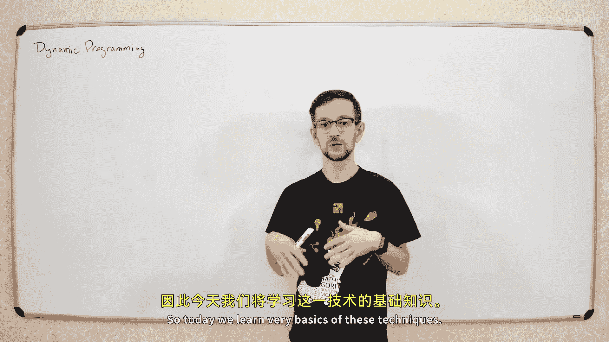

# 【精译⚡算法与数据结构】PavelMavrin p10 p9 A&DS S01E10. Dynamic programming -BV1NLB8YfEMq_p10-

🎼，🎼追错。🎼一人人。🎼The。So today we'll start a new topic today well talk about dynamic programming。Oh。

こか？Dynamic programming is a very important topic。 It's one of the basic techniques used in algorithm theory。

 it's not like。it's not an algorithm， it's not a data structure， it's like a common technique。

 and this technique is used in various different algorithms and alone to solve the various different problems。

So today we learn very basics of these techniques， we learn very simple problems。

 some very simple cases， and we will spend few more lectures like three of even four lectures when we'll discuss some more complicated stuff。

Today we just has some very basics of the dynamic programming。Okay。

 let's start from very simple problem， very simple problem。

So let's try to calculate the fibonat numbers， so imagine we want to calculate the fibon number what is the fibonat number fibonat numbers defined like this。

 we have the first and second fibonat numbers equal equal to1。

And each next fimination number is the sum of two previous fi numbers。

FN is sum of n and minus1 and F and minus2，2，2。Let's do。Very simple。

So what happens if you want to calculate these fiA dimension numbers using the simple recursive algorithm like you make a recursive function？

啊，你方式。Which works like this like using this definition like if and。Is less or than two of end return。

1 else。こりちん。F of n minus1 plus f of M minus1。What will happen if you。Try to run program like this。😡。

It will calculate the fibon number that's correct this is absolutely correct program if you run it for number and it will return the amphibonation number as expected。

But the problem is that time complexity of this program is too big because if you try to calculate time complexity。

 we at how we can calculate the time complexity for recursive functions。😊，We calculated like this。

 So what is same complexity phone number N。 So if we are on this program， this parameter n。

 it will make some。Constant number reflections here。Last two recursive calls。

 so this recursive call will cause through t of n minus1。

And this recursive call will cause the T of M byome。

Okay so this exactly like we did on the first lecture。

 this mostly like the master theum but not exactly because we here we have different arguments here we have n minus1 here we have n minus2。

 but it's not a big deal so it， it's basically the same as we did on the first lecture。

 very first lecture and we discussed the time complexity of the recordingcursive procedures。Now。

 what is same complexity here， it's easy to see that。

This number is growing basically the same as the Fibonme numbers themselves。I do friend。

He is like greater or equal than F。We also have plus one， but it makes this even bigger。

 so it's not less than the three dimension numbers。And from the nuts numbers。

 then grows exponentially。 So this is greater equal than some。What's it feeling program。

For some positive constant， for some， for some。You can calculate this number feed。

 not it's not limited。Maybe It know how the fi numbers grows。

It's not the topic of this lecture the important part is this number grow exponentially so this。😊。

algorithmgorithm has exponential den complexity and this bed we don't want some algorithm to have exponential tank complexity。

 so how can we fix this？Let's put what's happening when we run this recursive function， for example。

 if we run recursive function F with parameter ofa in。🤧嗯。What's happening？

We started this this recursive call now we make two recursive calls， first recursive call is。

With parameter9 and second with parameter8。And each of these two recordss of calls make an outcurs of calls。

 so we have here we have two records of calls of8 and。F of7。And here we have F of7 and f of6。Council。

어 그 때。Now， let's look what we can improve here。 Let's look on the following。

Let's look on this recursive code， for example， and this recurive code。

These two recursion costs calculate the same value twice， so here all this。

We do to calculate the eighth Fibonac number。And then we go back here。

 we calculate the same number again。These two recurs of callss calculate the same fibonish number twice。

So basically， we can call the eighth definition number not once， but twice。But twice it's not big。

price is not big dealそ。The worst thing happened when we go to the next number， for example。

 from the seventh number， we calculated it here。Here we calculate f of7 here we calculate f of 7 again and。

Here。We calculate f of seven the third time so seven formation numbers calculated three times it's calculated here。

 here and here again。And the next one， if you try to calculate a number of times。

 you calculate the six financial numbers， it calculated five times you calculate here， here， here。

 here， and here。So each each next fi number is calculated much more times than the previous financial number。

Let's try to fix this， let's try to calculate each much each fi number only once。

How can we do this well use the basic technique which costs memorization。We will。

Save the results of this function for each number N， and if we already calculated this number before。

 we'll just use this。Memorized answer and returned it immediately。So let's improve this。

Let's say something like this。と。We will use some array which stores all the calculated values。

 so if value is already calculated， so if we have result。For his help。Already starting this right。

 So if this oh。ち意。If we have result。For this anological plate， let's say not equal to。

It means that we order to calculate the distributionmination number， we can just return this number。

ってく。And if not， then we do the the same as we do here。 So we see if。And use lesser children to。

Then the fi number is one。Oh。Yes。It will be sum of pair of n minus1。Plus f of n minus。Yes。

 the same as here， just use the same quote from this function。And in the just returned this result。

Pice。that's all the improvement again， what we did here， instead of just getting this number。

 we put this number in the array。😡，Here， we use this three。

To store all the previously calculated financial numbers。And here we。

Here we use these precalculate numbers to not plateton twice。

 so if we logical plate at this value before， then we just take this number from the array and return immediatelyly。

 that's all。Yes it yes the。啊。Here we actually use an additional array of size N， Yes， so we use。

 we need additional memory。Yes， yes， if we want to calculate the0 by number。

 we need to have an array of size 100。We will not improve this today but you can think about how to improve this。

 it's not the today's topic， you can actually get rid of this array but not today here。

So lets now what we wanted is to improve the time complexity because time complexity of this function is exponential and we want to find a way to improve this。

 so we want to improve the time complexity， not the memory complexity okay。そあ。

What is the type complexity of this in you improved？A歌是放。啊，Let's see。Each time when we enter this。

Function， we do one of two things if the result is already calculated。

Then we spend constant time here we spend constant time。

Just we' just going into this ortic as a result in return ands all。

 and if the result is not calculated， it wasn't calculated before。Then we need to do all this stuff。

But we do all this stuff only once for each very L。So this code is。

Decut exactly onces for each value of。Okay。嗯。ですか？那ち。So total time complexity will be linear。

this code。Is only executed once for each different value of n， so we have n different values。

 so we can execute it called only one so the total time complexity of all these recursive cos will be linear。

Let's look what's happening this this。But3， so what's happening？Here when we go to the left bridge。

 then we go back， go to this branch， this f of7 is already calculated here。In this range。

 we don't go deeper so we stop here and go immediately go back。

And the same thing goes here so when we try to calculate this eighth fi number for the second10。

 we already calculated it here， so here we just go in this section and return this result which we calculate here so here we don't do this。

And so， so the three of the will look like this。We only have the left branch and right branches is always like this。

Apple six。Yeah。还有そ不错。So it looks kind of like this。It will look like this。

And the total number of elements。Es linger。So we have n elements here。

 plus n elements here with two n elements。Total number regard control will be like 2 m。嗯。诶，谢谢谢谢。Oh。

 it's to your friend。So the time we need to spend for this number n is linear from the number N。オ。

Let's all。Now。This program is a little bit over complicated。

 we can do the same thing without any recursion。If you think about it what are we doing here here。

 we go deep into this recursion and now when we go back from the recursion， we calculate fi numbers。

 so when we go from the recursion， we take these two numbers calculate it into recursive callss add them to each other and put the result in this position。

 so each time we go back from the recursion， we sum these two numbers and calculate next exponential numbers。

We can do the same using basic for cycle。Let's make improved procedure here。 What， What can I do。

 We can just assign。First， to。Where you to one？And then make a simple four cycle forprint called English is different for call I from3 to M。

We just take two previous numbers， send them and put him。

rest of I equal to rest of I -1 plus rest of I minus-2。That's the code code we need。

 So what are you doing in this code， we just create this array。😡。

Of precalulated values for each Fibon number。And then calculate the subation numbers one by one。

 so each time we try to calculate the if vanish number。

 we already calculate two previous subation numbers。

 so we take sum of two previous sub numbers and put them in this cell。And we going one by one。

 after we reach the last cell of the array， we will find the an number of this what we try to achieve。

不总。And this same complexity is obviously linear as well， because we have only one loop。

 so we have any iterations here sos。Obviously， the girlfriend。By the way。

 you can calculate fiation numbers even faster if。If you are interested in Fibonage numbers。

 they can be calculated first because its Fibonage numbers actually。Well， researched。

 so there are different techniques to cognitive bunch numbers， the stuff like this。

But that's not the topic of today the。Now we。Now we learned how to calculate the Fibonish numbers。

 that's kind of interesting for somebody， but not very practical so in practice。It's strange。

 why do you need to calculate by national analysis looks like？Not very real topic。

The interesting part that you can use the same technique to solve some allic problems which are much more close to real life。

We will not have real life problems today we'll learn only the very simplified problems。

 but the problems like these we will have the similar problems a little bit more complicated later in this person today we have very simple problems very simplified specifically to learn some basics。

For example， let's pull from what piece。Well。Problem， let's have。Let's go on the right。と。

Let's have some strip of some squares。And。So this squares number from0， let's say2 n。-1。그것 새 마너 한다。

你有。So important。And。There is a small grasscopper living on the leftmost cell industry。It's a cute cr。

嗯，哼哼。嗯。啊。Looks fine。I'm not sure why it's Gscope， but it's some classical problem in Russian program in school。

 I'm not sure where it's come from but。😊，The first classical problem of div programming was about Gcoer so that's kind of。

It's kind of Russian tradition to learn the name programming。

So there is a small grassco living on the leftmost cell of this already。And he want to。

Get to the right most of Israel， so he want to move from this cell to this cell。

And he can make jumps。He can make jumps and he only make jumps to the next cell and to the cell after the。

If hes standing in South I。He can make jump to sell i plus one and to sell i plus2。

There are two types of jumps， small jumps。And big jump。OhThere's a froggging educational commitment。

 that's fine。😊，I don't know in Russian tradition， this， the rose was a grass crop， I don't know why。

That's the way I learned the name program and the way I think the people before me learn I know where it's come from。

Now， we want to move from here to here。Using these for jobs。For example， let's see。ラトマニサス。嗯。

For example， we can make jumps like here then we're going step from zero， move to two then to three。

 then to four then to six。そう。That's one of the possible ways to get from。sellゼロと sell9。

That's not the only way there are many different ways to get from this cell today cell， for example。

 we can take another path so we can start here， or let's say we can jump to cell one。

 then to sell three， then to sell five， then to sell six。Oh。That's another possible path。

 so there is one possible path， another possible there are many different ways to get from first salted was。

So problem is to calculate the number of different paths from the first cell of the array to the last cell of the array。

It's to express it。How can we calculate this hour？Let's see。

Maybe we want to calculate the number of ways to get to the last cell。

 so we have this last cell with index 9 and we want some path which ends in the cell 9 so if we ends in the cell 9。

Let's look what was the last jump before we reach the cellbank？

We can make the last jump either from the cell8， so the last jump。Maybe from so 8。Like this。

That's the case one。Or we can reach the cell 9 from cell 7， so we can。Perhaps something like this。

Now let's calculate number of pers like this and number of paths like this。

How to calculate number of pests like this？So what's happened， we start from cell zero。

And we make some jumps。チョンクチンクチンクチンク。And we end in the cell 8。

 and then we make the last jump to the cell9。And here with the waist of the same。

We start from self zero， then make some jumps。And we end in the cell cell。

So if we want to end in the cellai。We need to get some of this。Two numbers。

 we need to get the number of pes to the cell8。And number of pairs to the cell7。

So first number will be number of pes like this and the second number will be number of pes like this。

If we have。Let's say D of n is numbers。O。我要s。Les。Do sell M。We can calculate it like this。

诶 we can take。The number of paths like this。These are the cells again。

 these pairs are the cells which have the previous cell is the cell n minus1。

 so we need to get from cell zero to cell n minus1 and make plus one step here。

To the number of paths like this will be d of n minus1。

And number of pests like this will be d of n minus2。ち。And if you look here。

 you have the same formula as we use in fiation numbers。We can calculate these numbers。

Using the same technique we used when we calculate the fibonation numbers。Jska same to me。嗯。

s write the so it be simple。How to write the code， we complete the first values。Like here。

Luckily the first value is just by hand， let's say d of0 will be1。O。

 let's do in simple weight and D of one equals to1。And now we iterate our all values。

From other01 we have。From2 to and -1。And use this formula to calculate the next value of each versus d of I。

Theality of I1 plus of n constant。That's the whole program。Okay。Again。

 let's make an example so let's talk。 what am I doing？We make this I。

And calculate the number of pathways。To get to the cell number N。

And well calculate from left to right， so first we can these two numbers so we have only one way to get here。

 only one way to get here Now for this cell， there are two possible ways to get to the cell。

For this cell， there are three possible ways because one way is to reach cell one and then jump here and there are two ways to get to cell two and then jump from 240。

 so we have three different ways to go here。And so on so here we go 5 to8， 13 and so on。こ。嗯。

Can we say that that William was built。Yeah， so that's exactly what we're doing with only two ways to get to the cell 9 from cell 8 and from cell 7。

So if we want to calculate the number of pairs like this。

 we need to calculate number of ways to cell eight this is in this ce。

 if we want to get from here the R of n minus2 race， that's the same as you said。故。Again。

 this problem looks kind of。No no no。Not very natural it's kind of strange you want to calculate a number of ways to get from from one point to another there are situations when it。

But comes strange editions when you need to calculate a number of ways to get from point to another。

 But it's not usually what happened in real life。 What may happen in real life。

 St like this in is when you need to calculate a number of some。Commenlooleical objects。第 example部。

ここ。For example， let's say you have。Bullion vectors of size n。か。So it's rate of ones and zeros。

And in this vector， you don't allow to have two ones in the neighboring positions so there is。

No two one next to each other， for example， make have something like zero，1，0， zero，1， zero，1。

Like these。And you want to calculate a number of different vector like this。

How you can calculate this using the same technique？Let's see。 We have this vector。Let's look。

 for example， on the rightmost position， what' happening in this last cell of this vector。

There are two two variant， we have one or we may have zero。If we have zero in loss position。Okay。

Here in the first n -1 positions， we may have any combination of ones and zeros without two ones next to each other。

 So here we have。And minus-1 elements。And we can put any combination of quantity at in zeros。

 which specify this row。So what is the number of these combinations。

 these combinations is this is the same problem， but for n minus1。If we have this D of N。

Is the number of different vectors for M， then if the last element is 0。

 the number of sat vector is d of m minus1。蚂蚁就么。말어。And if and if the last one of this。

If the last element is a one。Then what's happening if last element is one。

 then the previous element should be zero because we can't put two ones next to each other so this element is one。

 that's on than zero。And these elements。We have any combination again any combination of ones and zeros about two two ones next to each other。

 so here we have n minus1 minus2 elements。And we can put any valid combination of ones and zeros。

 so number of combinations like this is the of milestonestone。

Then so now all we need is to get some of these two combinations。

 so all vectors of size n can be split into two separate sets。

 vector with last element equal to 0 and vectors with plus element equal to 1 and d of n minus1。

 vectors like this and d of n minus2 vector like this。So to calculate number of factors like。

Of size L， we just have the sum of these two。Yeah that's really a result and again。

 we have the same formula as we used here。So each next element is just some of two previous elements of the array。

So we use the same code to calculate the same values here。Maybe different starting values， yes。

 it will be d of 0 will be equal to 1 and d of 1 will be equal to 2 because there are two variant for one element。

こ。没错。This also looks not for natural。😡，It's kind of strange you want to calculate the number of different commal objects。

This may happen at some point， for example， if you are using some。嗯。For example。

 in some coding theory， if you have some message and you want to encode this message using vectors like this。

 so there is some strange channel which allows you only to use vectors like this to transmit your message and you want to complete the amount of information you can store in one message like this。

So the amount of information you concerned this is this walkry from off the number of。

Different combinations， calculate number of combinations， calculate logo different of this。

 it will be the number of bits you can store in this one message。That sounds like。It's kind of。

More practical， but not exactly。嗯。Let's go back here for a little， I want to show you some more。

 some more problems。Let's change something little bit adjust。Just to play that it a little bit more。

What will be changed if we have some strong grasscopper and he can jump？Two cells one i plus one。

 i plus two， and also i plus3。So he went to the gym。 so he。

 his muscles are more stronger now so he can jump to the cell eyela here。

What will be changed in our program？😡，Not very much actually。There will be the short case。

Before we had only two cases， we can take get from cell i minus1 and i minus2。And now。

We had the third case we can get to sell n from the cell n minus-3。So we need to add another7 here。

 so here will be also。Plus d of I minus-5。诶。Now we need to actually in this code。

 this code is not good because here， if we start from cell2， we need to access cell I minus3。

 so we need to access cell minus1， it's not good。So we need to add another so we need to start from some free。

And look like first free cells by hand。And for the second cell， the number of ways will be 2。

So it's little it started to became a little bit more complicated here we have three values calculated by hand and we have cycle starts from three and if n is less than three we have some special cases。

 too many special cases is always bad。And if you extend it a little bit more。

 So if you allow the gasco to jump， let's say， K cells。So he can jump to the cell I plus1。

 i plus2 plus 3， and so on to the cell。I plus K。Then it becomes a little bit more complicated。

 so you need to go create the first case cells by hand and you don't know the value of k stations like this usually can be optimized like this。

Let's call only the first by hand。And make the cycle from the second。못 것 돼。Let's get rid of this。

So what we need to do here， we need to calculate the sum of K previous values， right？😡。

I all is this I started from cell3 because I use three previous values so not dot have the inte do not area out of all exceptions so when I go to cell from cell2 if I go to cell at2 minus-3 I go to cell minus-1 I don't have cell minus1。

没有。Will approve it。Right right now。So how to improve this？

Well make a cycle or it's called looppinigns。Even language， okay， make us a look for j from1 to k。

And this will be the length of the last jump。Have cell I and we jumped from cell。アイマイス。

And this last jump had the man。And now here I will make an if statement so if。

I minus j is very equal to0。Then I have this cell， so this is the possible jump。

And I just add this value to my variable。不'错。That's the whole program。

 that's how we calculate the number of ways to get to the La if you can make jumps to12 and so 1 to k if the maximum length of the jump is key。

の。Actually， this program is。Quag and complexity here we spent and multiplied by heat and complexity。

You can easily improve it。😡，To be linear。Any ideas how to do this？Any ideas？ Any ideas？ Any ideas。

 Any ideas。Here I have two loops， I have first loop iterating all the cells。And the second loop。

 I use this loop to calculate the sum tu of primphers。When I populate this element。

I need some of K previous letters， I need to get some from i minus k to i minus1。

So I need to calculate this sum。So there's easy way to calculate the sum on the segment in the radio just calculate the previous sums。

So when you need to calculate this sum， you get。This perfect sum minus this perfect sum。

 and you get the sum of on this segment。 so we can get rid of this second loop。

 and here we just get the。this pres sum minus three perfect sum and get the sum on the second。

If you do this， type pressure will be linear。や。お。と。I just penned almost none of this。Good。Now。嗯。

Let's go next。Okay， this。All， all problems which cast by now was about。Calculating the number of sum。

Something we calculate number of such some paths， we calculate number of some commical objects。

 something like this these are one of the types of the dynamic programming so some sometimes dynamic programming used to calculate the number of some something number of sum。

Strange objects。In practice。It's not very common， so in practice， like if you're writing some。

Real project， you don't usually want to calculate the number of something。

 sometimes you need to do this， but not usually the more common application of the nam programming is when you optimize something。

So we have some optimization problem， let's write some。Let's make some optimization for。は。

Let's have a risk score again it jumps to one or two cells forward like the first problem we had。

And now we need to pay for each seller we visitor， so we start from the first song we end here。

And for each cell visited， we pay some amount of money so。Oh's say you would have。3ワ6。呃。1，5，4，3。

What it what school。Le two cells will be occurring。Each cell has some cost。If we jump on this cell。

 we pay this cost to somebody， I know。It's strange who owns their sales of this， right？I don't know。

Maybe some other crisp what's happening in the insects world， I don't know。

Give your words to the bucket layer。It。I think some big grasp for person， no， last was bad。

R ends and grassworks， yes， yeah。Notally， so what happens？啊 you want to go play。

You want to find the path from here to here。And to spend the minimum possible amount of money。

Now this looks like something very important practical problems。

 so in various different problems in real life， you want to calculate something which cost you the minimal possible amount of money。

So there are some other problems with there are some other problems when you need to optimize something。

 you want to find best objects of all possible objects。Stuff like this stuff stuff like this。哇。

So how can we do this？Using dynamic programming。We can do it in the same way。

We did calculate this number of pes in the previous problem， so again。

 let's split all the possible pes to two different sets。So if we want to reach the cell。

 the last answer。Then the last jam was from the cell n minus1 or from the cell n minus1。我这这这。Good。

Now， what happened once we need to calculate？Optimal pipe from this group。

Opt graph in this group is composed like this， we start from to sell zero。Then we'll make some jumps。

 we'll make some jumps。We each the cell n minus1？And then make one more jump to sell them。

So if we want to calculate the minimum sum on this path。

We want to find the optimal per from cell to cell m minus1。And then make one more jump to sell M。

So optimal path here， let's see。K there is this guy？I don't use the same array。

So if we say that d of n is the minimal cost。We want to pay to reach the cell end。Okay。Okay。

Then in this case， we need to reach the cell n minus1 with minimal possible cost plus make this one jump。

 so the minimum cost here will be d of n minus1。And minus1。Plus， cost of cell N。

In the same wing here， if we want to reach it from cell n minus2， we need first reach cell n minus2。

With minimum possible total cost and then make this jump。Now we need to find the optimal path。

So we need to get optimal path。From this group， an optimal back from this group。😡。

And that will take the just minimum of this tool。So this D of n。Will be minimum。Of these two。Options。

 so we either start to we go to sell n minus1 plus this one jump or we go to sell n minus2 and then make one more jump。

我走。You can put the C out of this minimum。To good enough for this day， I think it's more visual here。

So again， what we're doing， we try to find the optimal path to sell n。

There are two cases we can go to cell n from cell n minus1 or from cell n minus2。In both cases。

 we want to optimize the path to the previous cell because the sum is minimized when both。

Elements are minimized。That that's basically because the sum is a good function。

 If you want to minimize the sum， you want to minimize both the sums of。一十。酷。For example。

 in this case， so again what were we doing？We create this already。

create LED and go from left to right and calculate this。Aray， using this formula。

 just go for my tray。Again， for4 first， so we will be zero here， real three。

Now for each next cell we take minimum of these two values so for to this cell we can go from cell0 or from cell1 here the cost will be2 here the cost will be5 take minimum of these two so minimum cost will be5。

Anl。Here， the me post will be3+6。29。Heing growth is 5 plus7 to the 12， human go the all the10。Here。

 the minimum cost will be minimum of 12 and 10 plus p5 it will be 15。Here will be 14。

 here will be 14 plus free。7。Athmatic is difficult and here will be 14 plus4。と。

Should I write the code do you need the code， I think the code is pretty simple but。

I like me write this。哎も 옷是来天der。Yeah。The code is pretty simple。Again， here I use two previous values。

 so I will calculate two first values by hand。D of zero。No， no the border worked。

D of0 is 0 and D of1 equal to c of。Again， we will avoid with this situation later。

Usually you don't want to initialize more than one initial state。Yeah it's funny。

And now we iterate all values of n。ついて。Or I do from to。嗯。And calculatelate。オアはははははい。Youre fun。Is。

Let me put this C of L out of there。So it's me。Of d of n -1 and d of n minus-2。Plo seal。Not I， not n。

 not n， it's I。 That should be I。내 준비 아이 안데。I-1 and I -2 plus c of5。Why is it？기다피。嗯。Looks fine。

 looks fine。嗯嘿嘿。😊，哦哦。My butt， my bet， my butt。Here should be not five part2， right？啥呀听得说。

Let's just change it quickly。嗯。哎，卖几块的。That's the easiest views。一。共。Now。What was talking。Okay。

 let's update it again。What happened if you want to make jumps， not one and two。

 but to all lengths from one to K？So if you're making jumps。From some I to all cells。

From E plus1 to E plus k。If you want to make jumps like this。嗯。How can we change our program？

Quite easily， if you want to do this， you need to have minimum not of two previous values。

 but of K previous values。홍보롱롱。So when do you get to sell I。呦。

Move from one official from i minus k to i minus1。So bring yourself was one of。But these cells。

What you want to do is take not of these two cells， but of K previous cells。Let's modify our program。

hI didn't answer one。W only DPI from previous index DpiI from previous pre clip difference。

I don't get your question， sorry。😔，嗯。So you have two dimensional array。

 why do you need two dimensional array？So I don't get it。

We'll discuss it after the end of the lecture okay。It's kind of complicated。

There are different techniques to implement dynamic programming， maybe your technique is also good。

 I just implement my technique and if your technique is good also we will test it after the end of edge。

啊。Yes， what do we what do we need to do。We need to get minimum not of two previous values。

 but of K previous values。Okay， let's make the second cycle。

So how do you calculate minimum of weight of k elements usually initialized minimum of plus infinity？

And then each time you relax this minimum with the new area。lea off by。Equal to plus infinity。

 lets start from one， I' remove this。Then I only want to initialize the first element because it's much more comfortable to initialize only one element。

And now we make the second blue。From 1 to k， if we have this element。

 if I minus j is greater or than zero。Then it's possible to jump from i minus j to I。

 so I update my minimum。To D of I and。The of。I minus J glass。なです。Yeah， again。

 this program runs in Con here again we have time complexity and multipied my key。

It also can be improved to billionaire。😡，It's a little bit more complicated you can't make prefix minimums because you can get minimum on a second from two prefix minimums。

So it's not like in perfect sum， but it can be done。

So you need kind of sliding window and calculate the minimum in this sliding window。

 you can do it by using the， for example， you by using cube of minimums like we discussed when we discussed。

Sts and Qs， you may have a queue and calculate minimum in this queue using Q on based on two stacks。

It was。It was long time ago， but maybe you remembered。

 so you can make a queue and you may know the current minimum in your queue when you make Q based on two steps。

 for example。So if you do it like this， then you can calculate the neon of K previous elements in a constant time。

So this can be provedably linear， but I will not do it。ho。coolol cool对对对对对对。Thanks。No。那我弄弄弄。啊。

This is not all。Of course。My program。Only calculate the value of the optimal answer。

So if you're on this program， you will know that the optimal path。

 if you want to go from cell zero to cell N， you need to spend minimum 14 pointss。

That's a good result， so if someone came to you and said I need to get from here to here with minimum possible cost。

And you like。To talk to him like， you can do it spending 14 points， he said。

Thank you for information but how and youll say no I don't know how。

 but somehow you can get the optimal path of 14 coins。

 I have no idea how you can do it but it will cost you for 14 coins。That's not exactly what you want。

 usually， usually you want to find the path itself。😡，嗯。

So how to calculate the path when you calculated these values？P자이즈。Let's's see。

 so we want to get here spending 14 quas， so how can we do it？What's see。

How did we get here span 14 qua， we jumped from this cell？OkayTo hear。

So we spent 14 coins to get here and then make this jump。 So the last jump was the。

Now how did we get here spending 14 coins we jumped from here to here， spent 10 coins here。

 plus four coins here， so the video jump was from this cell。And so on， how did you get here。

 we jumped from here。And how did we get here we jumped from？That's worry。Yeah， this都 the great。

We always have jumps off。なと。That's not usually what happened。it's a boringing example。

 but okay at this fine。So again， we's start from the last cell？

And each time we try to get the previous cell in this path。How can we do it。

 We just find how did we get this value of D so we get this value of d by adding this 14 and this0。

 so the previous cell must be this and we get here。By adding this1 in this4 so。

 the previous cell was here and so on， so we jump from the end to the beginning and restore this path。

あ。Actually， if you want to implement this in practice， like in contest。

 most of you came from coal forcess。The much more easy way to do this is not because you need to do kind of the same thing twice。

You first you calculate this D and then you make the same thing each time you take the minimum of this two various and so on you can just save this value that you used when you calculate the minimum value of D。

Instead of just restoring it by this already， if you have enough memory。

 if you can make another array， you can create another array and in this second array。

 calculate the previous element in the PE。그 not 왜。And this speak。Will be previous。啊， sell。嗯。これ。

Do sell and。So we'll go from left to right and calculate two arrays in the same time。

OkayWe start from left to right。So we take move this will be my so this will be for trust element whereas no previous element for this is0 now for this element which are from here。

 so the value will be 5 and the previous element will be0。Now for this element， which I'm from here。

 so the value will be 3 plus6， it will be9， and the previous will be things elements1。嗯。Here。

 which I from here， so it will be 12 previous one will be。2 and so on。 here it will be。Then will be1。

2，1，0，1，2，3。And someone here will be 15， people I be。Qu right。不错。So you just maintain two arrays。

 first array calculate the optimal value and the second array calculate the previous element to achieve this optimal value。

Let's update Ill the little bit。So what's happening here。

 we say that if the yourvari is less than the previous element。

 so if this d of I minus j plus c of I is less than the current element of I。

Then we update this minimum。And save the previous element。 We save the way。 How。

 How did we get this minimum。So we get this minimum of I by moving from cell I minusgen。嗯。그 거 같아。Oh。

And now in the end， we just move from the last cell to the first cell using this。ポイントters。嗯嗯。

What about two to0， two20。Well， if you have two same elements。

 we can move from either them and we will get the same sum。So if we have to two equal elements。

So the minimum is one of them， we can move from any of them。一。

You will get the same result by moving from both results。So if you just want to find any。

 if there are possible several possible optimal answers。

You will find one of them if you just follow one of these links。我我这啊まま。So in the end， if you want to。

Restore this path， you just start from the last vertex。From last cell， graph。

 its not the graph let's say x equal to n。And then use these links again， again， we start from the。

Qustel and then use these links。To restore the path， so this value of x。

 and then we move x to the previous element in the path。嗯。And we have 0。 Let's put -1。我是没清。Yeah。

Like this。Yes， the path will be reversed， so we need to reverse the bathroom things。Yeah。Yeah。

That's all。That's how you calculate the optimal answer we find the value of optimal answer very from the optimal sum。

And then we use these links to find the path itself。别吵不上。お。거 맞 그것。I wantt to raise something。

I have any more questions before I erase everything？オ。Let's move next。No。嗯，这不就就不告。

Now they will cover only the basics of dynamic programming。We'll cover some more。

Complicated topics in the next few lectures， we have like three or four lectures about the programming。

Now。You can do the same technique in various different problems， which looks kind of like this。

 for example， if you have， let's say， let's say you have。诶。Square table like this。Yeah。

And there is some。Again， in the restoration there is total here， I don't know why but。

Let's it view the chartle。This this是 totaltle。So it's moving from here to here and each time puts to the right or right or down。

 so only he tries to get from here to here in shortest path， so shortest path。

These n minus1 plus M minus1 steps。我さからです。So he can only move to the right or down。And。Again。

 let's say that in each cell of this array， there is something。Let's say something good。

What a total slide？Let's see we have some grass in each in each cell we have some amount of。

Very tasty grass， so he moves from here to here and each step when he steps on this cell。

 he can eat all the grass in this cell。So we have different demographs of three。We1，6。お生とま。Do。嗯。猪。

So思。Yeah。So your task is to go from here to here， moving only right and down and calculate the maximum possible sum。

哎嘿嘿嘿。😊，因为上次上没有。Its strangerange why you want to sum all the juiceiness of the grass。哦。

And know why you just want to calculate this maximumim possible sum of it。Now。

 how can you do this using D programming in the same way we use we did here。

 we will calculate the optimal way to reach each cell of this。Rectangle there， the table。

 so for each cell we' calculate the optimal way to reach this cell。

But here it's the two dimensional problem， so we' will have a two dimensional array。

 so we'll have Tj equal the maxim sum。Through each cell。排整。A and。야そ。

How to calculate this exactly the same。How it's working。You have some states of your name program。

In our case， state is just the sale we want to get to。And for each state， you want to calculate。

 how did you get to this state so if you end up in the cell IJ。

What was the previous cell on your path？In our case， if we're moving only right and down。

 then the previous cell was one of these two cells。

 so we moved either from this cell I mine I J minus-1。Or from this cell， this is I minus1 andng。嗯哼。😊。

So the last step was from here or from here。And if you want to find the optimal path to this cell。

 you need to find the optimal path to here， So we have some path to here plus this。

Move or some path to here plus this move。Now we have optimal path from this。

 an optimal path like this， take minimum or maximum of these two pairs。And go create the result here。

Okay，It' does the same idea， but we have two dimensional cases and one dimension case。

But the code will be the same， just we have two loops instead of one loop because it's two dimensional。

But the idea is absolutely the same， you do just the same thing。Butly in this case。Basically。

 if you're familiar with the graphs， you can do the same thing on。嗯，诶你。any acycl graph。

 so if you have a cycle graph。And。You have some graph like this。Yes。

We will talk about graph algorithms in the third semester， it will be in a year after that。

If you just know how the graphs work， if you have somecycl graph。

 you can do the same on thiscyclgraph just。You go into political order and calculate the value for each vertex from left to right。

It's just the same。Root。And the final one。The final one， the final problem I want to discuss today。

Is the following in now。Let's add some more complications to the grassco problem I just I don't want to clear on this。

Let's move back to the Russian。Let's add some more complications， let's say the following。

 let's say if we have some sequence of jumps。Each next jump。Can it be shorter than the previous job。

If we jump。黄灯。Let's sayケ。Then the length of nextectgen should be at least K。ho be at least a king。

Let's say were can break just。The brakes are broken， so he just cannot stop immediately。

If you get some velocity。啊。And let's solve all the previous problems。

 so we can calculate the number of ways to get from first cell to the last cell or we can calculate the optimal path。

 something like this， so let's solve all the same problems but these complications so each next jump should be not less than the previous jump。

예很什么面毒요。How to solve this？Again， what is the idea， let's look on the current position of the grass。

There are two ways of thinking about this the first way of thinking about this is like this。

 let's try to solve the problem so we want to get here so we want to get get do the cellM。

Let's look on the last jump， the last jump was from cell from this cell。And minus K and his left K。

嗯嗯嗯。嗯。我这就怪是家嗯嗯哼。So what I lost a question， I lost a question。Sorry， can you ask it together？嗯。

What's happening？If we need to get to sell in。We look on the previous cell。

 so we jumped from cell n minus k。Now what is the optimal path we need to find to sell M minus k？😡。

Now what we need to find， we need to find the optimal path to cell n minus k。

 but not all the path are exactly the same because we need to get to this cell n minus k。

With the last jump。A less or equal than k。So this jump should be less or equal than k。

So we kind of reduce our problem to the following problem， so when we need to reach the cell N。

 we reduce the problem when we need to reach the cell m minus k。

 but we have a restriction that the last jump should be no more than k。诶。

When you think about it like this。And now all your problems looks like this。

 so you need to get to some cell。😡，With the restriction that last jump should be no more than k。

 so you have two parameters of your problem。You have first parameter is the cell you need to reach and the second parameter is the length of the last jump。

응 응 그。If negative values， I think nothing changes if negative values。嗯嗯嗯嗯嗯好好。

I believe in this realization nothing changes if I have negative points。Because I have雰 here。Right。

 I don't see any problems with negative values。The the matrixs problem。

also don't see any problems of negative for。this suggest just some sums will be negative。

Now you have maximum of these radioius。Okay， maximum of to2 negative numbers。I believe I don't use。

No negativity in this case， I think negative numbers are fine and all problems we discussed today。

Whatever so your problem has two parameters， the cell you need to reach and the length of last jump。

Another way thinking of thinking about this like is like this， let's try to。

Someone described the current state so。Reum process， yes， re process。

 you need to get from this state to this state， so your system kind have some states。

That's such way of thinking about dynamic programming。

And you want to describe your state in minimum number of variables。

So which variables describe your current state your current state is。Where do you stand？

And what was the last jump you make？嗯。So you have two parameters of your current state。

 what is your current cell？And what was the last jump you made because this jump restricts your next jump？

So these two variables just like fully describe your current state of your system。And in this system。

 you kind of need to get from initial state to the final state。Sounds like that。How is' working？

If you kind of feel you need two parameters in your system。

 so kind you need to have two dimensional array。You need to describe all the states of your system and for each state of your system find the optimal answer。

So what's happened in for example in this bag？Lets look like this？Let's say that d of n and the K。

Es the optimal answer。what want to do？What we will calculate the optimal number of pers。

 what do you like？let's go the。거 미ニーコト。I mean minimum course will be just to jump here。

It's put funny。 Let's go call it number of ways。そ。呃。Do sell。Withve last jump。Yeah。嗯。

What do you want to do equal to K or less little to k？

A lot two ways you can make class jump equal to k or less or equal to k。嗯。Let's make list again。

It's actually we be first on this way。口？Possible then you don't want again。

 you want to make the number of states less is possible because if you make the number of jumps in your current state。

 the number of states will be too big and you want to number of states to be small number of states is state is something that describes what you can do in your system。

So if you if you stand here in last， if you stand here and last jump was cap。

Then you can make jumps from starting from K from k to K plus1 and so on。そ。

So these two numbers really describes what you can do next in your system。That's what we going。

how我做 usually working。Because minimum cost is just jump from here to here。

 I don't restrict the length of jump。So the optimal path will be just to jump to the final cell。

It's not that fun， but if you have negative numbers here it may be fun。

 but if all numbers are positive， it's kind of strange。哦。Now how to cook latest this animal？Yeah。

快点我 let's let's let's look here。So this is。嗯。て。So we have cell M。And the last chunk has less。

As at most came。Let's reiterate all possible values of the last jump。

 so last jump happens value you less or to k， so please J let circle  to k。So we have this cell。

That might is straight。And this jump was less or equal to J， right？我 can jump from here to here。

of themJ。So we need to get to sell n minus J with the last jump at most J， right？

So let's like this we need to sum， I want to write the code okay。

 so you can write a code that's simple。We need to sum all the ways for all J。From one to K。

we need to find the number of ways to get to sell n minus3。With the last chunk， be no more。Okay。

Or calls for reading。Cool。No one ever rated me before。Hello的吧。No。Again。

 the programs will be very simple， we just need to calculate these numbers using this formula。

 so you make two loops over n and over k。And they then make another loop or J and to create this sum。

Lets stuff like this one you should make this for n from one to n I you have here。For k from。

It was no more than N， I think1 N。And then calculate this  for J4 1，2 k。

 and then calculates this sum。So it's something like that。It's not exactly but kind。

 I don't have to write the complete code I write， I don't do do too much code。Let's all。Now。

 if you want to。Find the。The path if you have optimization problem and you want to find the optimal path。

 you do the same， so you start from the last state of your system and for each state you know the previous state on this path so you follow this path。

From the last state， so last state is when n is the final verex and the initial state is when n equal to0。

 so start from the last state and follow these links to the first state and then you like reverse this pair and get the optimal path from here to here。

That从。嗯。哎，服我咋开。Yes， you clip can this。Again， this quote works in N square time。です。

And you can easily update it use to work in it works in N cube time。

 you can easily update it to work n square time。You can do this just by calculating this sample。

The sum is not exactly the perfect sum， but it's kind of the perfect sum。 So its if you look on the。

On this already。What you need to call collate is to calculate collate the sum of sequences like this。

 so we have n minus J and J so if you start from some vectorls。What is M。You need to find the sum。

Of sales like this。And these sums also be kind calculate like perfect sums。You can calculate。

Sounds like this。In two dimensional array， using the same principle as a perfect sums or complete sum like this using this sum plus this element。

So you can you can easily update it。To work in1 square time。And square time。

I believe it's so I plan to discuss today。Y， so thank you for joining。

 thank you for writing me today。That was fun， so we will see you Sharon next week and discuss more complicated problem。

 more real life problem of dynamic programming。🎼。🎼あ。🎼。🎼，🎼う。🎼，🎼う。🎼。🎼。아。🎼あ。아。🎼，🎼。🎼，🎼，な。Yeah。🎼。🎼う。🎼，🎼あの。

🎼ど。🎼い。🎼，🎼，Yeah。🎼。🎼。🎼。🎼The。🎼。🎼，🎼Yeah。🎼う。🎼あ。🎼，🎼う。🎼，🎼。🎼。🎼。

