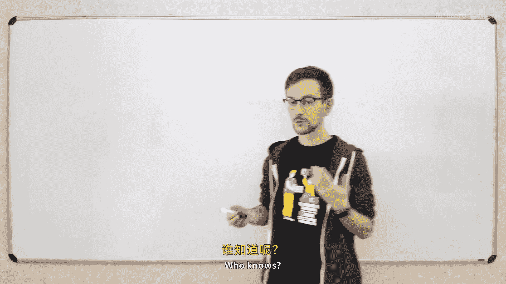
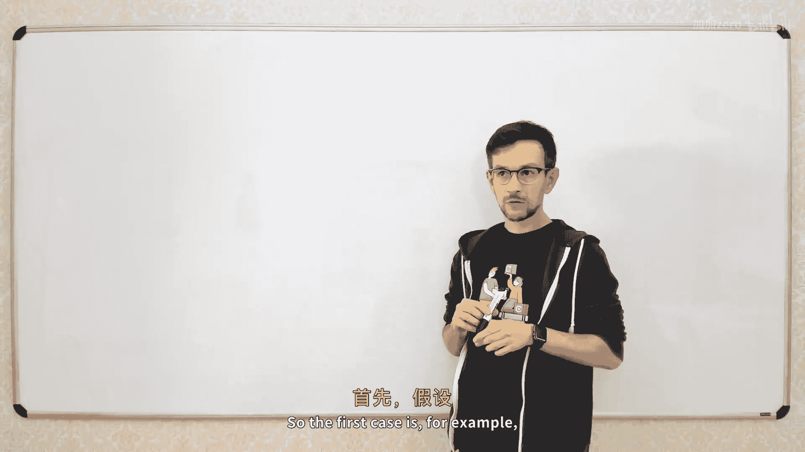
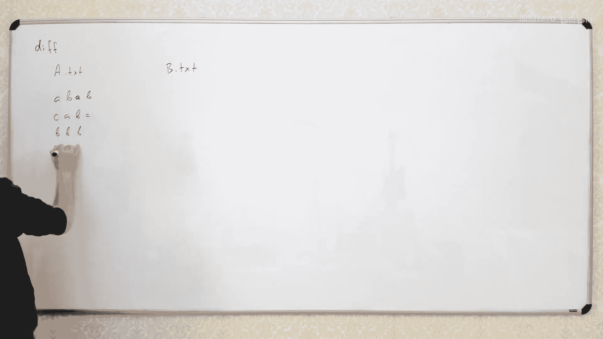
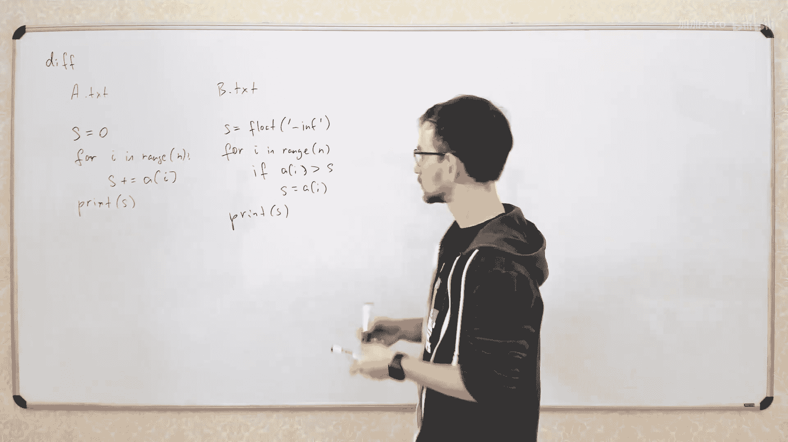
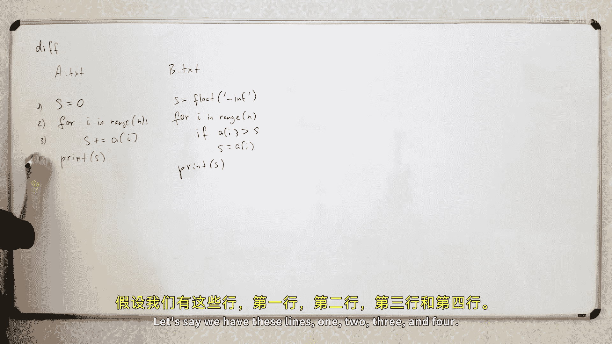
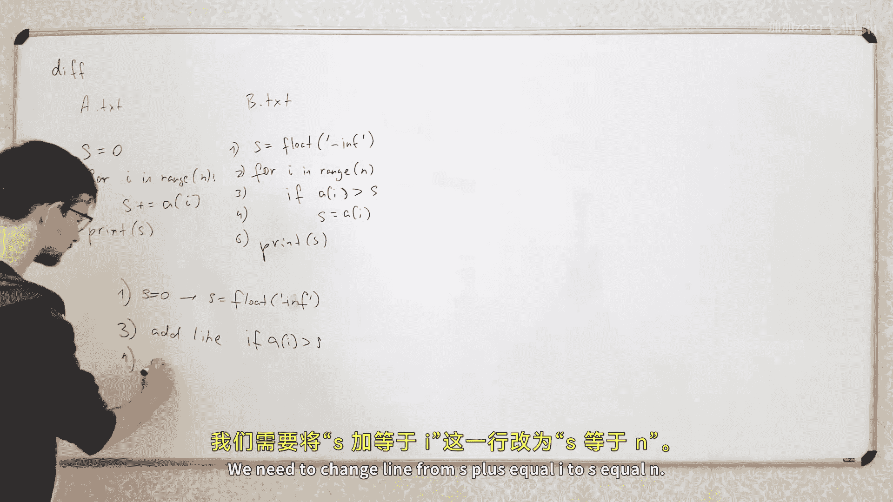

# 【精译⚡算法与数据结构】PavelMavrin p11 p10 A&DS S01E11. Dynamic programming. Part 2 -BV1NLB8YfEMq_p11-

🎼，🎼追错。🎼一人人。🎼The。So today we continue to talk about dynamic programming。

 we will discuss a few more problems。whichhi can be solved using dynamic programming and today I will try to solve some more practical problems like the problems you actually may face in some of your projects。

 maybe or not。

So the first。Case is， for example， you want to build a system which make the difference of two files like the DF utility。

。そウ。Stendlar utility because goes teeth， it works like this。You have two text files。

Tile A and file B。快嗰边。And this utility shows you the difference between the files it's very useful。

 for example， when you have something like a version control system。

So you have， you had some version of this file。Let's build some file。So what things do。

 Let's some some random stuff here。Some stuff here。

。Anw。That's boring， let's make some real。That's too boring。Let's make that things we're seeing song。

Let's say。Let's say you have a program which calculates the sum of gals of the race so the sum weve got those0 then。

For。I。In range。And you'll do something like。S plus equal。Aはい。So like this。啊。

And then you decided that you only want to calculate。诶。嗯。What won't go great？

Let's say you want to change this program to calculate the maximum in your program so you will change。

This。Or something like that。Okay。To0 then 4。아 예。咩醒我。Winness infinity here。

 I don't know how it's golden。What is the constant for minus afffinityity in Python。

 there is no minus afffinity in Python right？

Does' matter。 So you iterate all elements and check if。Eleement is。Great then。S then S equal to a。

Like this。Flo。Makes sense。嗯。So this is the first version and this is the second version。

 and you want to find what changes was applied to this program。

So what changes let's say we have this slide， two， three。

24 and 6。So which changes should we apply to make this program from this program。

 we need to change the first line， so first line was changed from S equal to0 to S equal to lower。

Of my infinity。一分。Then we need to add these two lines here， so we need to add new line free。

So feel And we need to add。Clying。哦啊啊啊啊。If I any got more comments。

And then we need to change this line。for to change。

A line from S plus equal I。读S。Eal嗯。Yeah，'s that's all yeah， that's all。In드 왜。

You don't have any German value in bid。Bing into your satellite。And here size。It's not a big deal。

 something like that。Again， what about doing， I want to look at two files。

 this first file and the second file。And produce this list of differences so I produce like the list of re。

Which should apply to this file to produce this file？So how this utility works。啊。

kind it's not that trivial because this utility doesn have the list of does have the change log。

 it only have two versions， version one version2， and it somehow need to produce the list of the list of operations which should be applied to the first file to Pri the second file。

 so it's not that trivial。So how does how does work。It works in following away。Of course。

 the answer is not unique。There is a different way to produce this file from this file， for example。

 you can just erase all lines from here and add all lines from here。But that's not optimal。

 so the differential tries to produce the minimum possible list of changes。

You want to produce the list of changes， which is minimal possible web。

So if two files are roughly the same， but you just made some minor changes in different parts of the file。

 then you will produce something like。The short list of changes which should apply applied。

So how can you do it using dynamic programming？Let's try。

First let's move to a slightly different problem but it's actually the same problem we'll talk about Listein distance。

Let's the forward。 Let's， let's get to。Stringings， for we have string A and string B。

It's always different， I need two words which are roughly the same man。嗯。嗯。

Can you suggest me two words？変ばことなみょ。Apple and apples doing man。I like Apple， but not。

 it's too too boring and it's not exactly the same。They need to be little different， but。No。

 apple and apples。Now， these pairs are just too close to each other。To hold your an。

I even can pronounce this。Ill bind an Bible， nice， nice， thank you，Let's say apple。And。I。啊。Let's say。

 let's say you have two， two words and。You want to create again， you want to do roughly the same。

 you want to make second board from the first four using the minimum number of operations so what operations can we prevent for we will have three types of operations First operation is to change letter。

Second or second。Second operation is to add a new later。Okay。And the third is to remove the light。Oh。

嗯。And we want to produce the second word from the third word using the minimum number of operations like this。

 for example， here what we can do。Okay can do like they saw had this apple。We can。What does the mean。

 we can remove this P change this P with L。Yeah， so we can change this P to L。

Then we need to remove this L。And to add I here。And here and I and that。Okay。

So we need like four gras。To get this work from this work， and we change this letter with L。

 we remove L and add add letters I and N here。This minimum number of operation is called11thstein distance of the world。

네 이네。当然。Like this。Oh。I think for this。Yes， Sam is added a success， Le understand。My bit。

It is the area sometimes called edit distances the same。啊，说。

It's sometimes it's a little bit different。 Sometimes you have different cost of different operations。

 Sometimes you have some different， slightly different set of operations， so its。

We'll fix this set of operations and we will say that the cost is the same for operations。

 so which is the top number of operations。Just the simplest version of this。オッケ。嗯。Now。

 how to how to find the level chain distance between。Do what。it sound like this。Yes， yes。

 before I era this， let's see that our problem is exactly the same。 We do the same trick。

 but instead of。Individual letters， we here have lines of code。

 so each if you were represent each line or separate letter。

 it will be just the same programs so so we have。Just the same problem。 So we have some lines， some。

 some。List of liness code of code and here we have some another list of lines if we just replace each line that due the letter。

 we will have the same problem as here。そう。啊。Yeah， how we consider this。How to solve this problem。

 Let's look Now you have these two so I have two points to。Some， that's some。

Let's look on the last character of both the strings。

 so let's look on this character and this character if they have two same characters in the last position。

 so we have some character X here。And some later。Then what can we do？

We can leave this X in the same place so we can just。Leave this X here。So we don't touch it。

 so this x become this x in this string beam。And then we reduced our problem to the following。

 We need to produce。Please。Shorter string like B without less character on this shorter string a。

So we need to somehow produce。This swim from this stream。

It is the same problem but of smaller size like we did in the last lecture。

 so we try to reduce our problem to the same problem but of the smaller size。

If the glass character is the same， then we can leave this character and then have the same problem but of smaller size。

 so we need to get this string from this string。Now， what happens if the last character is different？

二つ。Okay here。Let's see here of x。And here we have boy。So one character is different。

Then we actually need to do something， so there should be at least one operation which somehow changes the last character of the string a。

 so if it was x and in the end it is white， so we need at least to do at least one operation which do something with this character X。

So what what are the options， First options is simple。

 We can change the character So this the first version。 we can change x with y。

 so we can make change。 So x became y。And now what we need to do， we do the same。 so this x became y。

 and now we need to get this again。We need to get this string from this string。

So we need to produce this short synchron this short string。

 and again we have the same problem of smaller cells。The next option is simply。And we have that here。

 We have white here。Next option of what can we do we can remove character X。

We have character X in the end of this string A， we can remove this character。

And we'll get some other character in the string。 maybe we need to remove some several times， but。

If there was x here， but here is not x， maybe we just removed this x。

 so the end of the string changed。So if we removed， this character is。嗯。

Then what we have to do if we remove this character X。Then after this。

 we somehow need to produce this whole trend B。From this shorter string a。So I like that。

 so we need to produce this whole string from this short string in。And again。

 it is the same problem of smaller size， we reduced this problem to the same problem of the smaller size because we decrease the size of the first string by one。

And the final。Final case， when we have x here we have y。What the final option we have is to。In short。

 character white。我想。And we can add this character like here。So we had here we have character X。

 and in the end we have character Y， so maybe we just inserted this character Y。こて。嗯，好呵。有。

So if we insert this character away。But then what's left？Before wind， maybe after insert。

 windsor is character Y we need to produce this。String。From string A， so we have the whole string A。

And we need somehow produce。This thing be without last character。

That's all that's basically all the options we have。

 if we have one character X here and character y here， we get one of these preparations。

We either change X is Y。 We either removed X or we add character Y。In all this。Free options。

 we reduce our problem to small problem。So if for example if we remove this then we need to produce this string from this string and so on。

 so each time we remove which time we reduce our problem to some smaller problem of the same of the same type so the problem is always the same we need to find the minimal number of operation to get the this string from this string。

But the size of the problem was decreased。So let's just try to solve all possible sub problems we'll have in this recursion。

 so each time we remove some characters from the end of the string。

 so each time the current string A and current string B is some prefix of the initial string A and the initial string B。

So we will all need to solve the following problems， let's solve problem D and I and J。

We need to find the minimum number of operations。2 here from string A。From0， let's say to I -1。

 so we take first I characters of the string a。And。We want to produce。F。J characters of the string B。

Good。没种。No。We'll try to solve all the problems like this。😡，And by solving， I mean。

 we will use the solution of the smaller problems。For example。

 what happened here if the last character is the same？

Then we may left this character at this place and then create this string from this string。

 It is the same problem， but of size decrease by one。 So the solution to this problem。

 the minimal solution is stored in the。A D I-1， J-1。Yes， it's two dimensional rate what happens。Yes。

Yesよ有。You might write it like this？😡，Most of programming languages。

It's just too complicated for the whiteboard， I I'll write it like this， it's two dimensional ors。

On here。Again， what is the minimum number of operations we make one operation to changes x to y。Plus。

 we need to get this string from this string and the minimum number of operations to produce this string from this string is against stored in the。

Cll I-1， G-1。我从。Now here， if we remove character X， we perform one operation to remove the character。

And then we need to get this string from this string， this string has length I minus1。

And these drink Atlantic。And the same here here， we have one operation plus D of I and J on top。

So here we have the swing of size I here we have s of size I and Jman as well。

That's all so how do we calculate the answer， we just take all the options and get the minimum possible option。

呃。Let's the code， so what will be the code， let's just it。For I from 0 to length of a。

For J from 0 to then for。We need to initialize the border values because if one of the string is empty。

 then we don't have this last character。 I want to check the last character。

 And if one of the string is empty， I don't have the last character。 So I will check if。

One of the string is empty if I equal to0 or b equal to0 or 11 J equal to 0。

If one of the shrink is empty， then the number of person just。

The length of the string of the is same deal。爱这一个多。I plus J。对。It's little bit cheese button now。

 good enough。I already like this song。This is like the base of your dynamic programming。

 so you need to initialize some base solutions to make next solution use these previous solutions of the small problem so this is the base basically if one of the string is empty then we know the number of operations。

Now， if both things are not empty， then if the last character is the same。

I minus-1 equal to B J minus1。Then we just use this formula， see the。

It's actually not why it is optimal。We may actually use one of these。

I believe you can prove that it's always optimal to leave the last character in the place if the last character is the same。

 it's always optimal to just leave it。At least if all costs are the same。嗯，然后就去了。So's D minus1。

 J minus1。Else？Yeah。You need to take minimum of these free options and you just write this。

DIG is minimum。All these three options so we pick。My what D I-1， J-1 D I-1 J and D I， J minus-1。

-1 and。我操。Why is Simon minus 1 because I inated the to y 1 here？I use0 indexation so。で characterさ。

It migrate it from0 to i minus1。Okay， I need to check the last character。

 the last character have index I minus1。不可以。let's how we quicklylate then。11 interesting distance。

 I think in the adjust print。Theer of。Lth of a and length of B。Yeah。That's the length of the string。

不起。I think it's clear enough。If forgot plus one， I don't think plus one here。

Here I don't need plus one because I don't perform ex separationpo here this is the case when we have two same characters here。

 if we have the same character， we don't need one expoation。

So we get this string from this string and we don't perform a here。

And here I have plus one and then end I get minimum least plus1。

you may write it like minimum of these three functions。

 but all functions have plus one so you can get this plus one out of bracket。That's all。

 that's how your colene litacy distance。嗯。Let's write on this example。 So this example， for example。

 what what what what we have。 We have first string of length 5 and another string of length 6。

 So we need array， like 5 by 6。I plus ones' have6 by7 or not。You have0， one， two， three， four。

 five here and0， one，2。4，5，6 here。So this is already。这里面熟ry。Let's write it's let those hero。

To make it more clear， so we have Apple here。And we have。

And now we simply go row by row and fill this table again， each cell of this table。

Contains the result of the solution of the problem for the given prefix of the string A and given pre of the string J of the string B。

 so we take this prefix of string A， this prefi of string B and calculate the optimal number for these two prefixes。

啊。そい。Again， this first first row and the first column of the string is pretty simple。

 so you have just。Ofmost。Here we call0，1，2，3，4，5，6。

Again again here you just use this if because one of the string is empty so it's obviously how to prefer how to get empty string from the given string is very simple just remove all the characters and if you have empty string and you need to produce this string you just add all the characters of this。

These numbers are pretty trivial。And now， each time。You use this formula if you have same character。

 you use this formula， if you have different characters use this formula， so go from left right。

 you take this cell， you have character A and character A。

 you have the same characters so the number of operation is the same is here so carefully here you have zero operations。

Here we have different characters， we have A here and L here。

So how to calculate the minimum number of operationss。

 you need to take minimum of these free solutions。This solution， this solution， this solution。

In our case， optimal will be the solution。And we one moderation， have one。

And so each time you take the minimum of these three cases and add three options and get the minimum option and put this solution here here we have different characters here we have two free45 here we have P it's not equal so here we have1。

It's not equal here， Q1 here it's equal， so we have character P here and R P again。

This self correspond to the following problem， we have。

First two characters of string A and first three characters of string B。我。

So we need to find the number of operations to get this string from this string。

How to calculate this， we look on the last character， it is the same。

So the solution is the same is just get a string A from string A。The solution of this problem is one。

 so the solution for this problem is also one， so we need one operation。It's clearer。

Hope it's clear enough。 and， and so on。 Now， each time we take， we take next circle。

 So here we have different characters。 So have 2，3，4。Here again we have this P equal to this P。

 so it will be。To here， to here and here we have the same character。 So here。

 the answer will be same as here。 So it will be one， well。

And so here have different characters have three different characteristics three you have four。

And yes here we have here we have the same character， so here we will have two is again。

 we have minimum， we take minimum of these three options。And make plus one operation。

 so it will be free here。Here we have the same character L here and L here。

 so answer will be the same as this answer。 it will be 2。And so here will have， two， three。

3 go here we have two。ヘロキト。My本。Here me almost one， so it's two here and three here and four here。

Right。What did I miss？I believe so。I believe it was four operationss。I need  one，2。

Free four operationss。How did I get free operations in the end？嗯。In three versions， yes。

 I can remove this L， I can change L to I and then add M， so I need threes。

This program is smarter than the new Okay， so here I will have different characters。

 so it will be minimum of this free， it will be three plus one，4 free free。F here and free here。

 and here I have the same characters E and E， so answer will be the same as here be free。

So that's the final answer。如。Now， what if you want to actually output the change lock。

 so want if you writing a real Dutility， you need to not only find the minimal number of operations。

 but you want to output preparations themselves， so you don't only want to calculate this number three。

 but you want to output three operations which produce this string from this string。

How can you make this using this table again this' the same basically like we did in the previous lecture like like when you go from the last state of the dynamic programming and each time you move back to find the optimal way you achieve this final state of your dynamic programming。

For example here， I end the top of value free here。 How did I get this value free， Very simple。

 I had this two characters same， so I obtained this。Val you free by going from this cell。都行。

And how did I obtain this number three it's pretty easily I got from this， for example。

 you can go from left or from from this from one of these two cells。Let's say we both from this side。

So we go from this cell。To this cell with the make plus one。And how did I get these two， Well。

 I go from from here。And how do I get this one， I have the same characters here。

 so I just go from here。And here go重 here here and here go重 here。

So this is the optimal path to get from this cell to this cell。

 it means it is an optimal path from the problem when I have two empty strings to the problem when I have two the full strings。

嗯。And how to how to find operationsations themselves。

 that's easy let's also when you move through this path。

 let's find the operations we need to make to make jump from one problem to another problem。

 What we here we move from these two to these three。We perform operationss when we move from。

 this is the case when we go from what this is this case。

So we go from cell I J minus1 here we go from cell I J minus1。

 and we need to perform a operation end。我。Here， we need to end。Character M， right。And here。

 when we move from here to here， we need to change L to I。Here。We need to change。

so onSo each time you move from the character when you perform separation operation。

 look which option did you use and write the corresponding operation here here。

Here we need to make one more operation， so we need to go from here to here， change B to L。Okay。

And that's all again， so you move from the last state of your dynamic programming using this。

Lis and each time when you move to the previous state and you need to perform separation to testing。

 you just output this separation。嗯哼ふふふふ哼。😊，I try to calculate the minimum number of expressions to get from string A to string B actually these formulaly symmetrical if all costss are the same。

 then it is reversible so you can use the same program to go from string B to string A so lely distance is symmetrical the distance from A to B and from B to a is the same you can make the same operations by reverse one so instead of adding characters you remove characters and so on。

 so the distance is both race the same in lely distance。

But I tried to perform production from A to B。😡，But you can do the same in the opposite way。O。

So that's how we calculate emission distance。What is the time complexity， time complexity？😊。

What is the time complexity of this program No it's trivial we have two loops。

 so total number of operations here is that size of this table is length of a multiplied by length of B。

It's quite three million， yes。Is it good enough for practical use and it depends if you have short files？

we have two files of。Thouousand0 lines of code it's actually usually good enough so we have towers that you have 1000 here one house like million operationss it's usually good enough if you have two very big files like you have two files of each file have million lines of code。

Then you have million square， million square is too much。

 so the actual D works a little bit differently。So when it has some really big files。

It makes some additional  heistics to make make work fast。Will not discuss it today， I believe。

 but the idea is pretty much the following so if。If you have two big files。

 but the difference is pretty small。What you you may do is to maintain not the whole table。

 but only the table when the difference is small， so if the difference in some position is too big。

 you actually't don't need this position because it's。Usually it's not optimal。

So what you going do is to have the tail， but only remember the minimal value in each string and something around it。

You don't build the whole table， but only build the part of the table around the main digonlon something like that。

The answer is may so。呃。If you have two completely different files of million lines of code。

 the di utility will usually not works。Good love source。

 sometimes it's not fine it does find the optimal way。NoNo， no， but。

If you have two files which are long， but they are roughly the same。

Then usually it will work correctly。😡，So here you have some trade off between the optimality and time complexity。

收甩一。啊。Okay， that was the first problem for today。One of the good example of practical use of dynamic nano programming。

 is the actual problem when you actually need。To perform some dynamic programming solution。 again。

 it's one of the problem about optimality。 It's， it's roughly the same as we discussed in previous lecture when we have like。

Turtle moving from this position to this position。You may find it it's about the same。

 but the cost of moving is a little bit different， so the cost of moving from one cell to another depends on these characters。

But。The solution is about the same。The problem is different， but the solution is practicing same。

these solutions are to the correct， so if if you can spend this much time。

You can solve the problem through collections， this solution is what。

 it always finds the minimum possible of number of operations。嗯。Yeah。

 you usually you use D when files are about the same， so。That's like an internal behavior of D。

 so if you try to make D of two files which are completely different， then it might be your problem。

 not the di problem。O。5。Next problem。快とね。Next we'll talk about tech justification problem。

What's the problem out， Imagine you have some tax processor。

So you have some text and you want to put this text on like print this text on a a4 sheet or something like that。

I don't want to I don't want to create some real text， let's do something so you'll have some text。😊。

No， I will not use the real text， let's use it We only need to have the roughly size of the text。

 not the real text。The words themselves don matter so。

The only thing that matters is the length of each world。 So thats kind of composed to some words。

 So each word has some milk。The life of the world is double0， let's see， is double0。灰是到有忘了。

I is that what you do， and so on。系咪一十。So there is text。And we know the width of each word。

What we want to do， we want to print this word these sort， So we have this sheet of paper。

Which have beef。Well，'s。And we want to put this version onto this list to put this one to split them into some lines。

So take the first word put it here and then second word put it here。P的都看。あそ。Okay。

Sometimes it may happen that you place the words not optimal and。

This send that you have some big gaps between the words。 For example， here if you have。

 if the next word is。Too long here。 Well let's say it's worked。0，1，2，3，4，5。

If the next word is long in a， it doesn't fit here。So you want to move this word to the next line。

Okay。So here you will， you will have a big gap。And big gap reverse doesn't look nice。

You kind of want all these gaps to be justified evenly so you want all the gaps to be small。

 usually because if you have this big gap， it means that the text is not readable because you need to open here the cookie then line。

And and then you need to go to the next place also， so this doesn't look nice。啊。

What you need what you want to do， for example， in this case， you may reassign。

The works to nice in different in different society we can move this warp4 to the next line and this work two to the next time。

 so we have one zero here。What one here。Oh。我中。嗯。Do I want to align into the left or justify by this。

That should doesn't matter。Let's align them to the left， for example。W。So we move to here。

 then we have free here。Let move forward here， like five here， make this。In this case。

 all the gaps are small enough。 so we have all these gaps and we don't have't don't have this very big gap。

 So here we have some very small gaps and then one very big gap and here we have three gaps of。Well。

 the same size。Pro。嗯。嗯。嗯。こ。So what you want to do， you want to find a way to print the text such that it looks nice。

So this looks nice， this doesn't look nice。So this is good。And this is where。

And you want somehow to get。Good looking and text rather than bad looking text。And actually。

 when Donald Tt was。Implementing his。Tep tech processor。 He faced a problem like this。

 So he kind of tries to solve this problem when he was。According to his tech positionor。

So how do you solve this？も。消失。We need to decide。What does it mean to have good looking text and what is bad looking text。

 so we need to some measure which allows you to measure how good is your text。

It can be done in different ways。One of the ways。You can do it。Ease。

What do you need to do you need to somehow explain what does it mean bad looking text here so here we for example we talk that if you have big gap it means the text is bad looking so we need somehow to measure that if you have a a big gap then you have big cost of this of this learning so let's say。

Let's say for example， that if you have a table。Of size x。Then the badness of this gap。I badness。

Will be equal to x cubeuls。き？It means that if gap is roughly bigger than usual。

 then this cost will be increased dramatically so。This is some very。

So we need some function which is growing fast but not fast enough so you may put exponential function here。

 it the code will be the same， but here you kindly need to make good function the empirical so you need to find some。

How cold。Some some heuristics which will give you the result you need。

 So this function is actually is not from the program。 It's it's kind of you need to。

Experiment little and fine。The function， which works good in your case in this case。

And decided that X cube is the good function。It will allow you to make gaps。

 but the cost of the gaps will will will be increased fast when you decrease the size of the gap。

 So it will kind of。嗯。It will kind of allow you to big giftss， but the cost will be big for its Gi。

What we need to do now， what problem we need to solve。 We want to solve the problem problem。

 We have this。E I workss？And we want to put these words。

On the ship is in such a way that the sum of bright of all gaps is minimal possible。

And if you solve this problem， you will end up with something looks like it looks pretty nice。Okay。

 it's one of the way how do you solve problems which are not。

So sometimes problems which you face are not well hard。Not not all formalized。

 So sometimes you need to find so we need to find a good looking in text。

 It's not a formal statement of the problem。 So sometimes you need to。

Experiment and find the good good formal definition of what what is the growth function in this case。

 we decided that the good look and text is the text which minimize this function sum of cubes of all gaps。

Okay。こ？No。Let's see if we have out text。What we're looking for。

 we're looking for some split of this array into some segments and each segment of the text is put on a separate line。

 for example here what we're doing is we just put these two words on the first line then two words on the second line。

Line 1， this is real line 2。So we need to split the array of wordss into some segments and each segment is placed on a separate line。

Now let's calculate。Let's make the function which calculates for the given segment。

 the total badness it produces。So if we， for example， let's say we have this R W。

And we take all words from L to r minus1。So if we put all these words in a single line。

What will happen？Let's call it。不的。From both are。What better will produce that let's say the length of the line is L。

So the gap in the end will e be equal to L minus。Some。Of W I from L to r minus1。キ。Like。嗯。

So this is the function whichifies what badness will produce if you put words from L to r minus1 on a single line of text。

Okay。And you actually you you， you can change it a little bit。 It does matter。 So for example。

 if you want to justify text by with you will do the format。 So if you have。If you have this gap。

 not in the end of the text， but between the words evenly。嗯。

So we' have all the gaps of the same size。That's another variant。 you can do it like this。

 You can justify the text by the bit。 So you can you can say that all gaps have the same with。

 So what will be the badness in this case。In this case。

 the bedness will be something like so the total length is L。So we need to have L minus。

That some of these。Okay。不对。So this is the total size of all gaps。

 we need to split these gaps into equals so divided by the number of gaps。

 number of gaps is error minus l minus1。So this is the size of one gap， we need to put Q。

And multiply by the number of gaps again。So that's another option。

 you may use this function instead of this if you want to put text like this。O。こ。Now。

 now let's solve， let's solve the initial problem。What we need to do。

 we need to split our array of words into some segments。

Such that the sum of bread that is produced by each segment is minimal possible。

 so we need to minimize this sum。How can we do it using dynamic programming pretty simple let's see so we have this AW。

Let's look on the last segment， so let's decide which romen we put on the last line of the text。嗯。

So we have this last one。If we decided which words will we be put on the last line of the text？

And then we'll calculate the badness for this segment。

And we will reduce our problem to the we need to assign these previous words to some previous lines。

To minimize the total cost for these previous words。 so we had。So we have the same problem。

 but again it will be reduced to smaller size。嗯哼。So okay， what we'll do， we need to assign this。

 we need to split this whole array into some segments and put this segment in separate way。

Let's find the last segment。 Last segment is just some end of this array。

 Let's era all possible cases。 So let's trade over the size of this second。 this segment says size K。

Now we need to put these words in a separate line and then we'll have the same problem but of the smaller size。

 so we need to assign these words to some previous segments。

To minimize the total badness of these previous seconds， that's all。So how was solve this？Let's say。

Again， we'll have。The LED。Let's see each time we reduce the problem which is some prex of the array yes so each time we remove some end of this array so we end up to some prefi of this array。

 so we will have all of times who the current state of the dynamic program is some prefix of your whole arrayW。

Let's say D will be the minimal。Totalbers。4 words。From 0 to like -1。Cool， so how do we look this？

We retro all the number of horses in the last。In in the last segment， so here we have index I。

 so this index will be I minus k。So in this case， we need to put this segment on super。

 it will be bent。From i minus k to I。And then， plus。The minimum cost for this pre plus。D ofア skin。

And now we simply trade over all possible values of k and find the minimum options will be minimum。

Of this for all case。And this will be equal to yourself。Liip本。So do how do we solve the problem。

 we have some prefix of the AWing of bit this is AW， we have some pres。

We need to split this first eye。Words into some segments。We certainly length of the last segment。

Now we need to put this segment on separate flight， it will work to cost you this。

And then we have this problem， we need to split all the previous words into some segments。

 and the me close this。Now we take minimum of all possible options and this will be resolved for all these perfect。

Who do you write the code？What's I took all this。嗯。嗯。どういう風うに捉えていこう？Okay， let's do it so。

 I will write the code and I will do it in a slightly different way。 I'll try to calculate this sum。

just to improve there。Time capacity。 Ill try to calculate this sum on the fly。 So what's going on。

 So we。Ittraate from a。Let's say d0， equal to0， then we get our all i from1 to n。

Then I need to calculate this validity of I， let's see when we calculate minimum。

 we just initialize with plus infinity and then each time we relax the signal。it was an afinity。

When we iterate all possible case。So， it should be from。1，2， I， come。Now I willulate this sum。

Here would have S equal to0 as was equal。eight， it's double。W I minus king。嗯。Now。

 this sum is calculated in this variable S。So this badness will be。L minus S or let's say let's say。

 let's say if S is greater than L within than brick。

Will not allow to total length of force the bigger than1 of the line。

 And here we just update minimum。We need D I minus k the loss。Plus these L minus S。So。Almost fit。

I almost fit in the。Okay。Why is d0 called0 what is d0 again what is d0 iss the solution of the problem when you have zero words if you have zero words。

 you don't need to split them， you just do nothing and the total bed will be0。こ。Again。

 the when you think about this problem， like about grassco。

 we just was discussed on the previous lecture， so what actually happens？

There's a like if you like to think it in in these terms。

 what happens youre standing in this position？And each time you make a jump to the next position。

 so by making jump， I mean you put some lines or some words in the next line of your text。

Like you're standing here， then you maybe jump from here to here。And when you make this jump。

 you actually put these lines over these words in the next line of text。

And so and so now you assign some costs to each jump and all you need to do is to jump from here。

To the ends of the array。With minimal total cost， so it's done exactly like we did when we discuss the grassco problem。

Last thing。No， if you have a zero or， you need zero lines， you don't need a separate empty line。

또 도라이な 그런 거。It's all， it's hard solid。Again， if you want to find not。

 basically you don't only want to calculate here， I only calculate the minimum total badness。

An actual problem， you also need to calculate the way to achieve this minimum auto events。

 So you need to align your text or somehow。 So what you need is again， you go from the end。

From the final state of your dynamic programming and each time you go to the previous state of the dynamic programming which gets you this optimal answer。

 so you get from here you get to the left and each time you get the new line of the text。Yeah。

 it's not difficult than problem， it's just just some today today we discuss some more practical dynamic problem no no no no it's not difficult。

 I believe these two problems are pretty much the same difficulties as we discussed on in previous lecture。

 but they are kind of more practical ones。都，可以。I need forget something let's talk about time0 complexity here。

So what about time complexity here here I basically have two loops so in worst case time complexity is n squared。

But actually it is slightly different because if you think about this it's quite practical algorithm because actually this second loop。

 each time it adds one new word to the line。So the number of iterations here is no more than the maximum possible number of words in a single line。

So。So number。我。Whats。因为。So for example， if you have a4 paper and you have like font and know 12。

You may have like up to， I don't know， 50 words in a single line。I don't know exact number of it。

So actually the number of iterations we cycle in practical use is pretty small。

So it will be n multiplied by this small number， so it's quite practical algorithm even even that in the worst case。

 theoretically it's n squared， it's n square when if if this L is too big。

 so if if this L is big so the number of iterations here will be too big and so on but in practical in practice。

 this L is usually not very big， so it's just the size of your text of your sheet so it's。

This second the second loop make some small number of duration section。乌可乌愧乌可。Do we have time too。

 let's catch up one more problem。Let's have one more problem， it's a little bit less。

What a bit less practical but。Okay the to this break or some more optimistic about than the recovery。

結構ら。Let's talk about early incoing。What is it？It's like， you usually one to do a six if you have。

 you have a string， if you have。Several consecutive actor of the same character。

 then you can just look like like you have three A A a。B？

You can change this free A tool by satellite type free A plus B。Yeah。

Let's allow to do some more complicated stuff， so let's allow to make it recursive。For example。

 if you have。Something like that。 Let's see A， A， A B， and then I get A A A。

So let's allow to write it like this。So we have two times。Strering free A。嗯。

So what if we allowed to make constructions like this？

What is the minimum possible length of the string， so what is the optimal encoding for the given string。

 so given string S？What is the minimum size？多分高的。らの recordingです。It's not in classical early years。

 you don't love something like this。In this case it's more interesting to do about this。

I don't know if， if， maybe they have some。Maybe they have some names for this。挨了说ft就收了。

I would not use something like that， but maybe it has some name and it's useful not sure about this。

Okay let let's get but some encoding problems optimal encoding problems are widely useful so there are very various different types of compressing the data and so you may sometimes face a problem when you need to find the optimal way to compress your data so this is one of this as simple as I don't think you will use something like that as a compression algorithm everything but。

구릎 아프 볼。This is good enough to show you some things。不。So go。What在バト돔。

I want to solve the problem I I was given a string S。

And I want to find the optimal way to compress this string。How can I do it？Again。

 I will do it using dynamic program， I will try to reduce my problem to the same problem of a smaller size。

Okay，How to do it？Andm might you have think。嗯哼。How can we encode the string S。

 let's hook on the first character of the string S。This first character， for example， is a。

There are two ways。How how this character A is encoded， it can be encoded as a single character A。

 so we can encode this in as S a。Plus， something which encodes the string S。嗯。フロン。1，2， n -1。0。走。

How can we encode this thing as we may leave this character A。

 so we have character A and then something。Which encodes the string from1 to n minus1。

This is the first option， first option is just the leaf first character recipes。

The second option is to make some petitionition like this。So what we can do。Please to have。

Some string， which is repeated several times。ちです。So we have like key repetitions of the same。

Strering。And let's have the length of this string。Equal to x。

So how can we encode this sprinkle in this case？We will have something like this。

 We need to strike K repetitions of string。呃S。From0 to x -1。This is again。

 this is summary something which encodes the strings from0 to x minus1。And then we need something to。

谁你 here。First， we need two and called this string。Then make K repets of this。

And then encode this tail， it will be something which encodes。Like this。

 something which encode string from S。2 K X，2 m -1。Sounds like that。

That's so then basically two options， what we have。Okay。

 first option is just to leave the first character as this。

 and the second option is to move the first character essence as a part of some repetitive string。

嗯。熟。Now， each time， again， each time we use our problem to the same problem of the smaller size。

In this case， we have this problem for the whole string。

And here we have the same problem for this part of the stream。

And here we have the problem for hosting and we' reduce it to the same problems we need to have solve the same problem for this part and to solve the same problem for this part。

Each time the string we are working on is some substr of initial string S。

So each time each of these problems。Is some sub string of the string S。

 so what we'll do will solve the problem。For the hope for all possible sub strings of string S。

That' what of L to R。Will be the minimum。In the国里。For swing。嗯，S from L to。Let's say R minus-1。2。

And now let's solve first case， we leave the first screen address this。And and， and what。

And solve the same problem here。 so in the first case。We have one character here。

Plus solution for the same problem from L plus1。と。And the second case。For given chi and x。

 we need to have。こな。We need to find length of cake。Let's say we need to learn okay？Plus two brackets。

Plus these two res of control so this。Part will be from L to L plus X。おお？And this part will be。

From L plus K X2。Yeah。Also， you need to check that these strings are equal。

This can be done using some string algorithms we'll discuss them next year， it can be done。

 it's not hard。So you need to check that all these free strings are the same。

You can do it using some string covers like note more Pra， Z algorithm stuff。Yes。

 next all three algorithms we'll discuss next year in the field semester。嗯。别错。

So basically you do the same thing， you make this。😡。

Two dimensional array of all the results for your problems for different substrate strings。

And for to calculate optimal result， you get one of these two options。

Each each time you also need to iterate all possible case and all it's not optimal solutions actually。

 it's polynomial， but not optimal and never mind。 So you reiterateerate all these solutions and find the minimal possible option。

 So each time you will get the minimal result。很丑。Two other foot brackets， also in this case。

I need to go I this number K， I need two brackets， so this is two。And this is Li。

It may change something depending on what details in your program。

 I don you need to specify the details， what costs for the brackets and what costs are for this number。

Ro。And so now two details， two details。啊。First detail is that here。哎又。So L plus one。

 that's kind of strange， but not what we have the before。

 We usually here when we have this regression， we have the。L minus1， something that song。

 least here we have L plus1。So to get the solution for this cell。

 we actually need solution from this cell。So we need to calculate this bottom cell before we calculate this cell of the radiation if this is an ID。

This cell must be calculated before this cell because we use it here。

So actually what you need to do is to calculate this array not up to bottom， but bottom to up。

Let's see here you need calculate this in here you need calculate was L L so sorry you need to calculate this cell and also you need to calculate this cell this S L。

 this is R， this is L。No， no， no， no， no， my my wait， my。 plus L plus x is less than a。

Let's write it write it correctly， this is R， this is l plus x， right？This is L plus Kx。哎，好好去了。Yeah。

Yeah，So if you calculate a this cell。What cells do you use， you need to use this。

You need to call use this cell。And you need to use。没什么？

So you need these three cells to be calculatedd before your cell。You can do it pretty easily。

 you just go from bottom to top and from left to right。算了。So when you need to calculate this cell。

 you already have all these cells calculateded。That how that's the easiest way to do this Another way to do is is to calculate the cells in theagonal by by increasing the size of the segment。

 so each each each of these problems have is the segment of the smaller size so you can trade by the size of the segment so it trade by increasing。

R minus L。I'll like it。再送再冲。Another detail is what what is different in this problem from the problems we discussed before is that we here when we calculate this state。

 we use two previous。solutionsution。In all previous problems， we use only one。

A result here and here we just use two solutions starting our array to calculate one next solution here have。

Two things， that's the first time won't happened now in our lectures。啊。What does it mean。

 It means that your。Your current state， so this is the state of your dynamic name of program and this is like El and out。

I have two previous states。So when you need to calculate these states。

 you need to calculate it like two states before。그게십 돼。And L Skype X。Sounduths like that。

And when you when you will try to to build the final answer in the end here again。

 I will only calculated the value the minimum possible value and if you want to calculate the this。

Strink itself。How you do it， you do it the same， you start from the end。

And each time you try to build this string and you build this string by making two recursive calls in previous problem。

 we make only one recursive code so we go from the end and use these pointers to maintain the path from the end to the beginning and here is a little different here to build this optimal string。

Here， to build this optimal string， we need to build optimal string for this substr and optimal string for this substr。

So we'll have two recursive calls。To build this optimal strength， one here and one here。

So it's slightly different than before。But the idea is the same。

 you go from the final state of your dynamic name of programming。

 and each time you go to the previous states。Trying to build your optimal solution。

 but here you move not one previous state back to previous states。

 and you need to visit them both to build optimal solution here， Op solution here。Okay。

 that's all for today。 Thank you for dreaming。