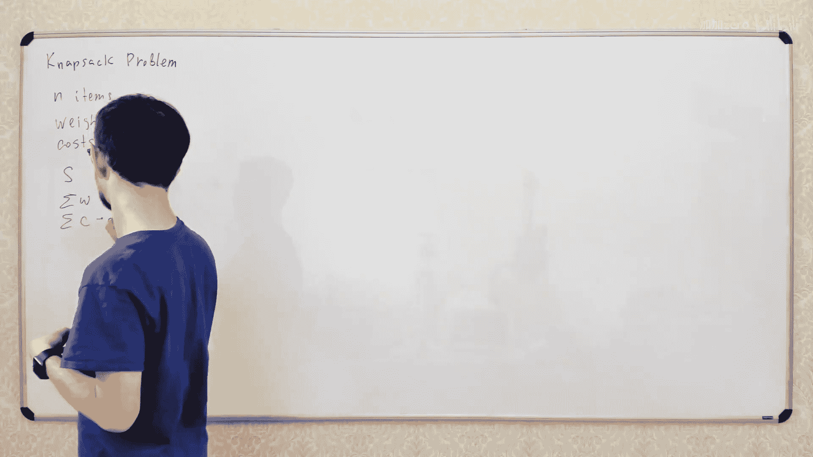
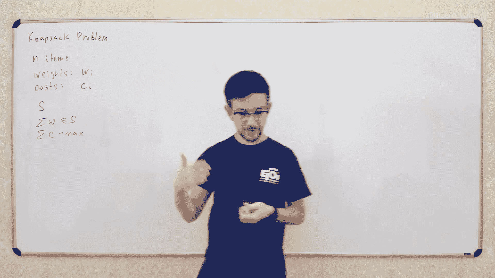
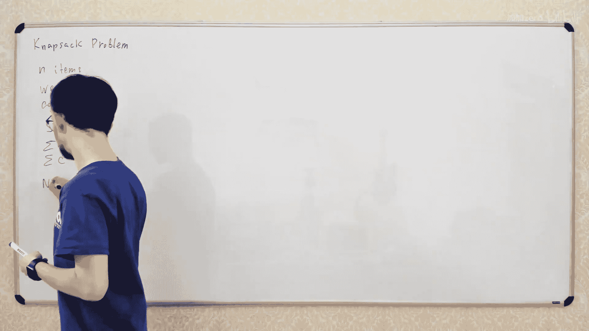
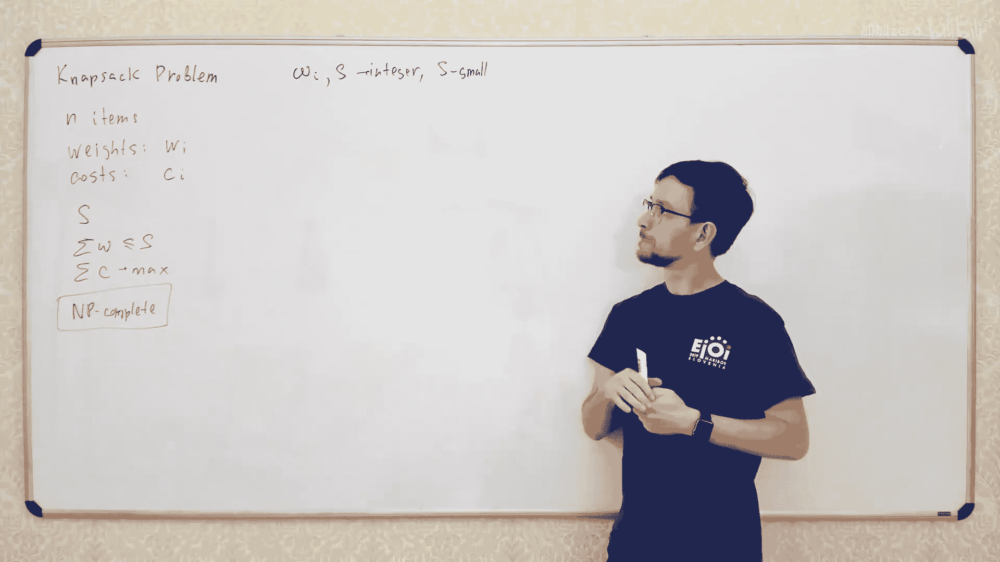

# 【精译⚡算法与数据结构】PavelMavrin p12 p11 A&DS S01E12. Knapsack Problem -BV1NLB8YfEMq_p12-

🎼，🎼追错。🎼一人人。🎼The。So today we talk about Napsack problem Napsack problem is one of the important problem in algorithmt's theory because it's quite simple and it may occur in some various situationss so it looks so simple so you can face it in very real programs like you have real project you need to optimize something and the way you need to optimizes it look exactly like in NApsA problem so it's a good thing that you can recognize the NApsick problem and you know what you can do to solve the NApsI problem and maybe even more important what you can do to solve the NApsI problem so what is a classical NApsack problem。

うこ。啊。Everything。啊。Classical problem looks like this， you have an items。

Each item has some weight and some cost。So we types different ways。And different course。

And we have anpsick and the size of thisnpsick has some constant test。

What we want to do is we want to put some of the items in in this snapack so that the total cost is maximizeizing。

 So what it will be， let's say， we take some items such that the total weight。

Of this id is no more than S and the total cost is maximized。

See have the code of the home task I read this comment， but Im not sure what。

What shoulder the courto talking about。Can you write me what exactly silicon cord do you need。

 I'll send it to you？In direct message。What。😡，So this is the classical entry problem。

 you have some items you want to take some subset of these items。

Such that the total weight is no more than S and total cost is maximized。

Something likeて。And the most important thing you'll need to know about that's the problem that it is an emptycomple。

こ。What does it mean， we will discuss in the future lectures。

 what does it mean exactly for today's lecture is not that important the important thing that inP completete is something that we don't know how to solve。

We actually don't know if it is possible to solve it。

 so there is no proof that it is impossible to solve and there is no proof that it's possible to solve。

 So it's kind of strange class of problems， but。For today's lecture， we will not talk about this。

 We'll just say that it's some class of problem which we don't know how to solve yet and。

I think it's most possible that we will not allowed how to solve them because it will be some kind of disaster。

嗯。送。IfIf you have some problem like that。And there is no additional constraints on anything that most possibly that your problem is not solvable。

But looks's at this thing。The good thing that in some situations may actually be solvable。

And one of them。One of the important situations that makess problem solvable is when everything is integer and small。

 so if all these numbers add small integer numbers。Let's see。衣服。If， for example。

 of all ways an injured。And。Let's say S is small。By small。

 I mean that you can have a array of size s actually， so S around a million is usually fine。

まち気ちいい。Just for reference is like's say about6。It's usually good enough。嗯，好好好好好好。😊。

We'll talk about form desk discussion tomorrow， but let's talk about lectures today okay。啊。那。

If this if it is true， so if all weight are integer and the total size of the Nepsack is pretty small。

Then what you can actually do， you can put the total weight of your elements。

As a parameter of your dynamic program。What well do， we will use the following dynamic programming。

It was the full dynamic program。Maybe' also some more simple task。Let's go back。 Let's。

 let's solve some more simple task before， before we start this problem。

 Let's solve some more simple task。 So let's solve some more easy task。 Let's say that。

There is no costs， we just want to maximize the total weight。upそです。For example， if if course。

Are just equal to weights， then we won just to have the total weights no more than S and total rates is maximized。

So， even。Let's solve this problem first。This problem is also tocomplete。

Just for you to know so if you have problem like this that costs。

 but you just have Web dates and you want to maximize double weights。

 but the things shouldn't exceed the size of the ownep。Then even in this case。

 the problem is going be complete， so let's solve this problem first， what you can do。

 you can do the following， let's say that。D of， for example， I and J。Will be the Boolean value。

 which says if this' possible。Yeah。都快要。ど。Subcept。Of。Items from0 to i minus1。

With've total weight equal to J。So we have all these items。

 we take only first eye items from this list and try to make a subset with sum equal to J。

Let's go some items。So these are items。We take。ILet's say frost。I of them from zero to I。And from。

From these elements， we take some subset。Well let's take， for example， like these elements。

And the sum of weight of thisal should be go to drink。So in this array。

 we'll have some boolean value which answers the question。

 is it possible to take some except this exactly this sum？No。嗯。

I'll finish this and then the'll draw okay， okay？So how to calculate these values？

Let's see how you do it in dynamic programming， you kind of try to reduce a problem to the same problem of the smaller size。

 so what you can do so if you want to have the sum equal to J from the first I elements。

Let's hook on the last element on this element， I minus1。There are two possible cases。

 first two possible cases if。This set we're looking for contains element i minus1。

If our set contains this element， I minus1。Then what we're need to do， so we take this element also。

And the total sum of all these elements equal to J。Then let's remove this element from the set。

So we'll end up to some set of first I minus1 elements。

And the total weight of all these elements should be equal to j minus rate of this element。

 so if total weight of this element is J， then total rate of all these elements will be J minus weight of a minus1。

あ's前没说。If it contains this element， then we need to take。From the first i minus1 elements。

 some subset with sum equal to J minus weight of I minus1。我从。

And what if said doesn't contain informed。嗯。Com thing。没错。哦。Then if this element is not in the set。

すいて。Then we need to have some subset of first i minus1 elements or sum equal to J。

 so this sum just equal to J。Right。So the answer will be in D I minus1 G。

And so now each time we just let us。For possible cases。

So we just cover all possible cases for the solution of the problem。

Well because the last element is either in the set or not in the set。So we in both these cases。

 we have the same problem of smaller size， we already solved it in the previous durations of dynamic dynamic programming。

So we have solution of the first problem here， solution of second problem here。

 now we just combine these two solutions and get the solution of our problem。So。

The solution of our problem， the IH。Will be equal to this solution or this solution。嗯。Or。没错。嗯。

 should the write the code。That's actually mostly all the code so just need to have。

Two more loops here for I for J and so on。It's basically the whole coordinate unit。啊。Now let's。

 let's come。 let's have some example。 For example， we have some items， let's say。

So the weights of the items will be。It's always hard to get a good example for the NA problem。

Let's say we have I say5。3。诶。2 and6。And the size of Napsick uses。There are all possible cases， right？

I have two，3。아 great 뜻。I three here。That's your size is nine。Yeah。なことなそな。What we're doing here。

 we just have these two dimensional， right？你冇啲。嗯哼。So the first index is the number of elements。

 it's from zero to4。어。And the second index is just the weight of the elements。 So the weight is。呃。

From0 to S， we don't need any to be more than S。 So the second dimension of this array should be more than S。

确定。F， six， seven，8，9 hospital。Now。We start from the first row of disabled table now the first row is simply the problem when you have no elements so in the first row here I equal to0 so you have no elements so the only case the only subset of empty set is empty set so in empty set the total weight is0 so for the problem which I equal to0 we have solution when j equal to 0 and we have no solution if j is more than0。

那就 ok啊。We have plus and minus plus is true and minus is false。And fall here。No啊。For I equal to one。

 so what are we doing？Iter all values of j and for each j。

 we use this formula to calculate the answer for example here if the j equal to0。

 so we want to have the subset of beta equal to 0 from first one element we can do it we just don't take this element if we don't take the first element well have the same problem as before so here we have true because we have true here。

不 here。And here what we have， we have this element of wave pipe。

So we cant take this element because we need the total weight to be equal to1。

 so one is less than5 so we can take this element， so we have no this part of the equation and in for this part we'll have。

呃visa。So we want to take zero elements and have weight equal to1 and it is not possible。

 so here will be minus。And also here minus here here here will be the first plus because here what we're doing we have we want to have the total variable equal to5 from the first one element。

 we can take this element， so we'll have this。Butrk， and we need to take the some subset of。

First zero elements， if not way equal to zero， it is possible because here it is。So here该不。

And here the whole bunch。Oh， plus is true minuses is false。I think it's kind of。

More good looking than the zero some ones。哎。Okay。Now for the second element， we' do the same。

 we just go from left to right。So each time we're looking on to a supply。

So when we look on this cell， we try gl two cells in the previous row so here if we don't take this element。

 we have this element。And we take the element， we have that position I minus1 and J minus this one。

So this so this is J， this is J minus。So when we construct the second row。

 the weight of element is free， so we look on two elements。

 net elements just above and element three position to the left。

 so here will be plus minus minus here will be plus because here is plus is minus plus minus minus plus。

Yeah。And so I'm going to continue the same process to take the element of vertical 2。

 do the same here， and one plus plus。And plus plususe plususe minus。

And the last one here was freeze minus。六 분。Here告。嗯。Looks fine now， the only new weight is6， right。

We don't。 we don't have four。 We don't have。W， and we don't care。Looks fine。

Now how to solve the initial problem， so if we want to find the maximal total rate。

 which is no more than s， we just find the right most true in the last row of the signals。

This will be the maximal。多 go位，你什么跟他去。没错。That's how you solve an next problem if the S is small。

Now what what does mean again， what does mean what does mean this plus。

 this plus means that it is possible to have some subset of our elements。The total sum equal to 8。

Is the maximal weight less than s？呃，我扫一图。我。こ。Now， if you want to actually get construct the set。

 so if you just this plus just tell you that it is possible to have this subset。

 but what if you want to construct this set？You'll do it the same way as we did in the previous lectures you just go from this last state of your dynamic programming and use the background links let's just to get the previous state in the dynamic program so how did this class get here it may get so it's free it may get from here or from here two possible things here and here for example let' let's see。

Come from here， just for simple。To make it more interesting。And these plus。Goes from。Here or here。

어 부모님이 벌써 배워 되지。And this goes from here， this goes from here。嗯。

So what does it mean it means that you。To to get this sum， you need to take these three elements。

 so yeah need to get this element free， this element two and this element。诶，可。昨さ will be거と。8ight。

There are un possible ways， Yes， you you can you can go， for example， from here and here you go from。

Here from here。That's all possible way， so you can take this element to five and element 3。

It's also a very dancer。You can calculate the number of possible answers like we did before just in each in each position you calculate not the bullet value。

 but the integer， which is the number of ways to get into this state so it will in the end you will have the number of possible subsets with this sum。

感松。So you can apply all the techniques we used before just to this problem。不去。

Now let's move through the neutral problem， let's move through this problem。So what if we have costs。

 we just do the same but we just add the costs to the state of Al and programming。

So instead of having the Boolean value， which says is possible or not。We will use the。

Number which is the maximum possible total cost。Of the subset with this sum， let's change this。뚜こ。

Let's say this is the maximal。Toalコスト。For subset。Of elements from 0 to i -1 with total weight and we。

多多 wait wait。Equal to J。And now you use the same approach， which just have these two cases。

For this new element is' either in the set or not in the set。If it's not in the said。Here。

 if it's not in the set， then we just have subset of i minus1 element of sum equal to j and if the last element is in subset。

 then we have this maximal sum for all elements。Here， and plus the last element。こ。So in the end。

 we'll end the aang， so now which I just take maximum for these two radius once。はいです。

Maraxum of the I-1。J loss 8， I-1。Last C， I-1 and。The find when small。嗯这反。こ。

And let's give an name example， Let's have another example， for example，'s。Some costss。Well。

 let's accept some special cost that have list cost three， list cost one。It's freeze freeze st。

What do I want to this cost we？I want these costs to be more than these costs。Yeah。

I we'll have some small numbers here， I like five0 places will be。嗯。不だ。いことだ。Now for some state。

 it is impossible to reach the state。 so for some state。

 it's just impossible to get any subset with this sum for these subsets。

 can you can do it in different ways。 you can you can make some special mark that it is impossible to reach the state or you can put some special value just not like minus infinity。

To the positions which are not a from the starting position。So if some problem， if this set is empty。

 if there is no subset with sum equal to J， you just put minus infinity because minus infinity is neutral element for the maximum direction。

Small tricks。そう。不。You must go from right again you'll go from top to bottom from right left to right and just fill the table with these values again the first row is just the empty set of elements so you can get sum equal to zero。

They total cost they equal to zero。And all other states are impossible。

 so you should just push minus infinity in all these positions。Pャマイ 。Wus pen。조금 더 깨뜯도록。嗯。来走。No。

Here we go， you just use this formula to calculate the solution to your problem。

Just go from let right again， go co each time to take the cell just above。

And the cell double positions here and don't forget to add this value when you go from this position because here you add one or more items so you need to add the cost of this item to your total cost。

IIt's also from here。에 그 또어  중 중 free。对对对。Now we have item pretty equal to three and cost equal to2 so022。

读。P。초 중 중청。は系い。I'm very bad in the reform section。No。

Now we have item of cost two weight equal to two and co five， so we're starting right here。

that was complicated here we have five。We have住 here。Here we'll have the minimum of two values。

 we can either get this value so get this value free or we can get this value plus wave2。

what will the maximum maximum be from here so here we have co 2 plus this element will be cost equal to7。

77 so here the maximum of three and7 it will be 7。Pl， let go。Here， here's。8。5。And the final。

 let's finish this， so it's free and free sources。0 minus5 here。Maxim is three。

 we have two here and three here。Now here here we can go from here。Itll be five plus reads， eight。

 it's more than7。Here we have two plus for5。Here， we have。Ohh。8， right？

Here we have five or seven plus three instead。Looks funny。So the answer is1。Again。

 how to find the answer for this problem is it's slightly different here we need to find the maximumim possible sum of total total cost。

 so to find this total cost you just need to it our all values。

Of the total weight and find the maximumimal value in this。 So we just take the maximumimal value。

In the last straw and。あたたたた。Or O of J from euro。And again， how how to find this subset。

 you do it is the same where you go from the last state of your dynamic programming and it's right to the first state of your programming and when you go back。

 you find the items you need to take to get into this state so to get into this state。

 we go from this state。To get into this state， we go from this state。To get here we go from here。

 here we go from here。So to get this sum equal to 10， we need to take this item。

 this item and this items will be these three items。And total is total cost is actually 10， yeah。

 it's good。No， this was that was pretty fast， cool。So that's the first。

Of the problem this first situation when you can solve the problem when you face the problem of NApsA problem。

If all weights are integer and the total total weight is small， then you can just yeah。

 what is the trick trick is very simple。Nonow that this， this total bit is small so here。

Total weight is small because the totaltal weight shouldn't exceed S and we this integer。

 so not so many cases， so for this total sum， there is not so many different cases so we can just have array of the size equal to S and find the answer for all possible total weights from0 to S。

And if as a small integer， it will be good now。Let's conclude time complexity the time complexity will be something like something like something like。

Something like。So we just serve all recent la and calculate in constant type right so it will the n multiplied by S。

没错。故。why did I say first that it is can be completele。

 so it is kind of impossible to solve the rest because you can easily make a big number。

 so if number S is big。h then you kind of don't， you can do it because you cant make a array of size S。

 you cant spend S time to go your problem and it's quite easy to make a big number。

You can just say that S equal to。You manyに。It's quite easy to write the big number。You're just。

We don't write many zeros and numbers is very big。In the problems we discussed in previous lectures。

 we have opposite situation。The complexity of the program depends only on the size of the input。

 So if you， if you have like。Like， in the。No problem。What are we talking about？

We talk about deification end。嗯。Leverish in distance， right， for leverage in distance。

 when you need to go away leverage the DC you need to go damn complexity depends on the size of these two strings you have two strings。

And time complexity is just multiplication of the sizes of this string。

 you can't make string of this size。So in the previous problem。

 if you have one of the parameter to big， it means that you actually press the big array to your program。

So you can， you can't pass2 to2 big array to your program because you don't have enough space to write for。

 but it， you can easily get one big number。 It's easy to pass you a big number。

 but it's hard to pass you a big array。 That's basically the difference between why why this program is。

Called slowlow and this program is called Fest。again。

 we'll discuss some topics about time complexity and complexity classes in one of the future lectures。

 not sure in this semester next， but at some point we'll discuss what is it and why one problem is considered to be good another problem is considered to be better。

Not late。Any more questions， B now？不知道上害。I promise you to know。你错感觉。嗯。그な。啊。Okay， you still here？

Let's too quiet on the chat。Good。No。那。너무 별없요 너무 별 없다다요。

I'm not sure you have enough time well talk about in the home desk and here and another important case is for example。

 if you have the weights， if weights are big or weight are not injured， but these costs are small。

 so if the total costs，I just mentioned it and we' will discuss it in the home does。So for example。

 if this total cost is pretty small， so if this total cost is small integer。And course the integer。

Then it's also possible to solve。There， that's a problem efficient thing。

Let's leave it the home task because it's kind of。It's not that important。

 but it's kind of interesting to discuss it for you in the practice basically you need to do the same thing。

 but instead of having the total weight as a state of your dynamic program。

 you have this total cost as the state of your dynamic program。And then you solve the problem。

in the same way。So I will leave a go for it as an exercise and Ill just move to the next topic。Now。

 what is the next important topic I want to discuss is what to do if you have problem with all costs。

Like all weights are not integer or if weights too big to have this array of this size。啊。

 what you can do。Several different things。First what they want装 about。He to about today？

Is what you can do if the number of items is very small。So if hand is very small。Again。

 we got two quiet。Can you write something in the trap just？In 30 seconds。

 just keep sure that every 30 seconds something is going on in the chat。Because。

Last time when chat was frozen it。It was because I lost the internet connection so'm just。

I need to have some indicator that everything's working。 Okay。

 let's go back so what happens if n is very small， what I mean by very small for example， if。

Toing power of health is。Some was more smallだ。그 how 그。そう。我就更毒。Well， let's say， for example。

 if Anne is about， I don't know。25 then2 in power of and will be out them50 millions。没什。つもな。

It depends on what what do you mean by small， so if you have a nice computer and you have few days to solve your problem。

 then you may say that N is about I know。About 40， I think for about 40， you can spend。Few hours。

 I think， on the regular computer on， a few minutes on the good computer。

So it depends on what computer do you use。About this。

So what you can do to solve a problem it's quite easy， you can just iterate all possible subsets。

Of your items。So iterate to all possible subset， there are two in power of n possible subsets。

 you iterate all of them and take the optimal one。That what they can do。No。

How to iterate all possible subsets there are various different ways to just iterate all possible subsets of the given set。

 one of the way is to make a recursive procedure。Really talk about this ster。

It's quite common way to generate something， you make it like better so you guys they like。

Take two possibilities， you take the element or you don't take the element and then you recursively call the same procedure for the rest of the elements。

I will not talk about this much more， but what I want to discuss today is the easiest way to try all subsets is just enumerate all subsets because it's very easy to enumerate all the subsets。

How to inerate all subsets， let's make a project between the subsets。Of elements from0 and minus1。

And in the。From 0 to to to over minus one。The subsets are very easy to inrate。

How to evaluate the subset， let's take a。Let's take a number like this。ItIt has some bits。

 so you have n bits in your number。So here have。Let's give a sub x equal to and elements。One，2， and4。

How will get the integer which corresponds to this subset？Very easy we will build a。Bit number。

 which have three bits。Equal to one in these positions， if you look on bit number。Ex。

Let's have its has some end bits。We'll say that all beats。0ero except this three。

 so we have this be in position 4， this beat in position 2， this beat in position one like this。

The positions of bits usually come from right to left because。

 that's how numbers are right right so so this is this is the least significant bit。

 this is the most significant bit。Like it's this like it's user done so numbers are for bits are usually from right to left。

 so this is bit 0，1，2， and so one， this is bit n minus1。Yeah， so this subset。

Okay to this individualteger number， so this individual number， let's say it is。2 plus，4 plus。16。

20度会。对吧。まト。嗯。那。Again， you stop， you stop posting anything in the chat， you forgot how to do it。

Let's exercise， well， write something in the other。Good， keep doing it like every 50 seconds。Now。

 let's。Let's try to， make all。Common subsepars using these bit numbers。

What you can do when you want to operate some sets。You basically have some。Basic operationss。

 let's say how to create a subset of one element。 So if you have if you want to create set of element。

 I。Yeah。How you do it using this？Before representation， that is principle。

 you need to make an integer with1 bit equal to one in position I。IIn most languages。

 it's done like this， you just have。One shift that left。To eye positions。

So what else For if you want to。Make a union of two sets。X， usually like with y。

How you do it in this， but bit by representation， quite simple。 you need to make the。

B number which have bits in the positions when at least one of these number have one。

 so you have the bit should be equal to1 if at least one bits in x or y equal to1。

's just just the bit twice operation。So like x or y look this。

It's slightly different in different programming languages， usually it's like this and C++ like this。

The simple intersection， you need to intersect x and y in the same place， x and y。

This difference is slightly different。 So if you want to have x minus y。し。

So you need take all element of x， except all elements which are in y。You can do it。

The easiest way I know how to do it is like this X and not y this。But in some simple cases。

 for example， if y is subset of x。是这。So if， if y is subset of x。Then you can do it in more easy way。

 You can do it like this。 You can say。X like minus y like this。

Because you have one only in positions when you have x once and x。

So if you just subtract one number from another， you will have the correct difference of the。

 or you can say x or y， that also works。It's about the same time， so it's not a big difference。

 just what do you prefer， I usually prefer to have minus just because it's like more。

Nature have I need to have the difference of two arrays of two subsets so x minus5。

Is the difference of this to era？What else do you need？Also。

 we need to check that element is in the subset， so how to check if element I belongs to subset X。

easiest this way to check this。Well like two schools of this， I usually do it like this。

 I just check that I have x and I intersect X with。诶 i诶 one诶。So what I want to do。

 I want to intersect the set x with the element of one this one element， so I intersect x with。

The set containing on the element I。So if this intersection is not emptying。Then element I do。

Another way of doing instance like this， you' going I meet this great if you're writing in S post history。

 you can just say x and1。Something another way of thinking about this is less because you can take now the speedway x。

 then shift it right。By positions。And then， and the。ぱ？That's， thats， that's your like。Pov。

Preferences。Decide which one do you like most of it and use it this。

That time is about the same for both these operations。only your personal taste。Good。

I think it's good not。No。How to solve the problem？Again。

 we just simply rate all possible subsets of an element and for each subset， we the total weight。

 total cost and get the maximum。I am drinking tea now。What it's do early up。嗯。

So we iterate all subsets， it's just easy to iterate all possible sets。😡。

You just track all numbers from 0 to2 micro electrons， so for x from 0 to2 in power n minus1。

I we take this set。And then we total sum calculate veryです。

not's say what this equal to0 say equal to0， then it all elements。A，ch衣服。I belongs to X then。啊。

Like this。嗯。Here Ill write a something like it。So just for simplicity places yourself。

 So they represent oil。哦。So here use the same just。To make sure the problem for the white voice。

 I'm sorry here you just need to check the element belongs you just use one of these。

I foremost to check that Elvin belongs to this subset。

And that's all now we calculated the total weight and total cost。 you check if。

If total weight is no more than S， more。And then you update your answer。some result。Okay。Like please。

嗯。よ。I it's pretty nice program。No。What is the time complexity？

Time complexity is quite simple here we have a loop of two power of entering here we have loop of n durations。

 so no any brace here so the time is always the same。

 the time complexity of this program is two power of n by n。まあ慢下。そうあ。In this in complexes like this。

 usually what you want optimize to your on list left particles。

If you have non polynomial time complexity like expansion。

 usually you care only about this exponential part because the polynomial part is usually small。

 not always but usually。So usually you don't care about this n because n is small， something like125。

But this left part is what you usually want to optimize。

If you have another solution with better ass here， it will be just better than any solution with any polynomial here。

So let's write the solution， let's write the about solution。

So what can we do in this program to have a bad solution？One of the approaches。🎼You want。

 you can make is to。do the following。Sped codes meet in the middle， what are you doing。

 you have these n items。What you want to do is to split this and items into two groups。

 let's have this left group。Out here。About， I think。And도 number시앤앤도 number。

Now you split each subset into two parts， left part and right part。

So imagine you want to have the subset of some elements here。And some elements here。

 I need another color， for example， please。그건 삼섭 세 해。So I just split it into house。And for each half。

はい。Have these elements so these marked elements are the elements I want to be in my subset。

 this is the optimal answer。Let's split the knee in the left elements and right elements。

Let's see elements in the left part are X。喂。HePlease upset his white。Now， what I want to do。

 I want to iterate separately， I want to it all possible access， iterate all possible ways。

And do it in two separate loops。Now， what do you need to do？

I want to have these two subset and I can rewrite this。Constraints and formulary。

 I need some of all elements。Belonging to X。Let's call it Sx。Whatち。ItIt's too complicated。

That's a Wx， it will be the sum of all weight of elements in the subset X here。Plus。

 sum of all elements in subset Y should be no more than s。

N cost in x plus cost in y should be no maximized。But I don't like this。Let's go with S1 and this S2。

It's rate to all possible subsets X。😡，And put this total weight in some array。So let's say。

V1 of x plus。W two of y。There is no mobile business like this。

So this is the total rate of elements in subset x， this is the total rate of elements in subset y。

 the sum of this should be no nice。Right。You forgot to to post。谁。Now。

And the total cost should be maximized。C1 of x。Plus C two ofY。そでマしす。That's what we want to do。And。

So we want to find a pair。X and y， such that that this sum is no more than S and this sum is maximal possible。

 How can we do it without it in all possible ways if we try to over all possible pair。

We'll have again， we'll have two in power of and over to here and two in power and over here。

A product of these two will be two in power of n， so it'll be the same time complexity。

But I want to optimize this novel way， I want to not to iterate all possible pairs。

 but somehow to find for each x， the optimal y。When I just skip the part I can this summer so you can this summer using the sameテ。

But what should you do know next？What should you do next？I want to do the problem。

I want to iterate all possible xs， so I iterate x for4。你知路都都唔包了 again。Over to 1。And for each x。

 I want to find the optimal one。How to find an optimal button。 Let's。

 let's look if we fix the value of x。 What constraints What do we have on the。安为。Let's see。

 move from the first。In equation， we have something like。So I fixed the value of x。

 so I need to have。W2 of Y B no more than S minus w1 of x。その。And from the second constraint。

 I just need to maximize the value of it。어。Yeah， this called myth in the middle。

Now let's think can we solve？But this problem， first than just director or all possible wise。

 is there a way to solve this problem？First for each x。actually isbo。There are two possible ways。

 actually， one of the ways is to sort both arrays and have the pointer met time with this。

 or you can have a binary research。What do you what what what what what you doing？

 You find all the value software why。Then put this values in summary array。

 so you put these pairs with total weight and total cost in summary and sort this array by W2。뭐 수。

Okay。Why is。Bye。然我就种。Then in this software。Here you will need some pres of this array。

 so here you will have some elements。With w two no more than this S minus1。So here you always live。

Available set of why is always the specificx of this array。何とか。And for this prefis。

 you can find this pre use binary research， yes， we discussed it in lecture by binary research。

 you can find this prefis using the standard binary research。

And now you just need to find the maximumimal value on this prefix。When you can do it。

 you can preculate the maximal value for each prefix。

So now you just use binary research to find this prex。

And take the precalulate value of this prefix of maximum value on this prefix。你说。

So you're do the binary the research in log from and then just take the maximum weight。

So what will be10 complexity，1 complexity will be。Basically， you need to have this already。

You need to have this already of size。To in power of M overcome。

And then you need to sort this array to sort the array， you need n loggan time。

 but n is equal to2 power of n over2， so logarith of this is N。So time complexity sort and will be。

And also this， you need another logger from here to find that this projectss used in binary search。

 binary search works and log from time log from scan。That's much better than the previous algorithm。

 again， the difference is huge， actually。So we get from this algorithm。都得上。So we decreased。

 we optimized the part of this time complexity， which was non exponential， was exponential。

So it's it's usually a big difference， for example。

 in here now we can solve the problem for much bigger， for example， for N equal2。5。

No also percent or even even up to 10， hundreds bigger。No。

 you don't have to build the way of size to North 50。But2 power30 is absolutely good enough。

How many data you can put in the one for？Let's say you have to robot hard drive。You can put about。

If you have four bytes for integer。You have like。200 billions of elements， right。

So we need logar if of 200 billions， it's like。The。About 37，48。对。嗯。Questions， questions， questions。

W 2 is the total total weight of all these elements。 So the total weight here is W 2。

So iterate all elements in this right half of this array。

All subsets here and for each subset calculate the total weight just by simple iteration and put this answer into this area。

Yeah， you can wrote your lecture about binary research。

Minary research is one of the most important algorithm of information。

So if you don't know how to use binary research。That's one of the first things you need to learn。重。😡。

对对对不对。Now， the final problem I want to talk about is a little bit different。😡，Let's remove face。

 remove face。Yeah， you're sort twice by this village。You have a race of all possible wise。 So why is。

So you iterate through all possible y so pi is here from0 to to2 power anywhere to minus1。

 so you get all possible subsets of the right half terrain for each subset you calculate its total weight and its total cost。

Put the pairs into big array and then sort this array。

By the key forsort is this value of weight because you want to have some preferences here。

So we need to array sources by the total weight。Yeah，可了。嗯。😊，Hes clear enough。你点螺去度皮。First。

 you it all possible values of y。For each value of volume again。

 y is subset of the right half of the element？You it to all possible subsets for each subset。

 you calculate the sum of W and sum of C， it will be the total rate and total cost。

You put these two sum in two separate and W2 and C2。嗯哼m。Now you sort this race。

Byu the value of total bit。And now you it all possible values of x and for each x。

 you can find this prefix of the secondary。Just by binary the research， so you know。

 so here in this pre， you have all valid subsets。Off the right half already such subsets。

 which you can add to your subset X。So that the total total sum will be no more than x or no more than S。

First， again， we have two in the power of n over2 elements here and two in power N over2 elements here。

嗯哼。So first， we do it here。Again， number directions are the same， then they sort this array。

 we have again thistime complexity and then we do here。そう。We have two separate loops。

 First loop is to try all elements here。And after this， we integrate all subset here。嗯哼。😊，Right。

 like two different first。doSo first you for all y from0 to to in power of and 2， minus1。

 do something。Then you sort something and then you make the second form like this。

So I not nest so you have。You have two in power of and over to here and another two in power cancer。

 So they are not multiated。 You have one section and then another section。不。No。

The final problem I want to talk about is somehow， I think as we kind of bridge to the next lecture。

 we will talk about。那放到这吧。Problem， so again， you have an items。They have different weights。

And you have a。Like you have infinite number of Nepsex。And each stem is size x。

And you want to put all your items， all your items。😡，In minimum possible number of nepsons。ああ。

writing is difficult。Again， there is no cost that are just items。

 you want to minimize the number ofnepsickix。R is equal to， let's say2，5，3，1，4。

8 and the S equal to let's say9。Then you made， for example， put。Items。嗯。Let's say five and four here。

Items 8 and one here， and items。Chum， and two for here going。So innick。

Total sum is no more than test。えす。그。This不。そ。This is like multieppsite problems。

 you have multiplenypsex and you won't kind of feel all of them in optimal way。

The interesting part about problems like this， it is usually not solvable at all。

 so it I mean not solvable in the first brain even if this ratess are small。

 so even if ratess are small individual numbers， it's kindness hard to solve it。

Just because you can have this sum as your state because you have several different Neps and you kind of want to remember the sum in all Nepsex。

 thecurrent weight in all Nepsex not in what when you have oneec you can put the total the current weight as the state of your dynamic programming。

 but here you have multiple Nepsex so you kind of want to remember the state of each Nepsex so the total number of states in your dynamic programming is gross exponential even if this。

Waits so small。So how can you solve it， let's solve it for small and again again if n is very small。

道。What I want to do， I want to put this。I want to put this subset as。Pimeter of my dynamic program。😡。

That's slightly different from what we did before。So I want to pair up this。D off。X。Be the minimum。

Number。Of from up sex。네 글쎄 아이 있나。とbos。U elements。Wwhichch belong to set x。

 so x is some subset of elements that is slightly different from what did before。Now， we use this。

A bit by representation of subset as an index in the array。That's。开开开个 different。

But the idea is the same we use because n is very small， we can iterate all possible subsets。

And use this subset as index in our array of dynamic programming。

 so use this x as a parameter of our dynamic programming。到。How do we solve the problem。

 It's quite easy。So how the software problem， you have this。Subet X。

You want to put all elements in this set in some mappsex。

So let's our elements which you put in the last article， let's say you have some elements。嗯咩。嗯。

Let' it all talk like these settings？So you have severalnsicks。

schematic and here you put all elements of set X。Let's iterate all elements which you put in the last steps step。

 so let's say that here you put all elements。Offset why。Let's it all possible sets Y。

 which you can put in this last website。Then how many Nepsack do you need。

 Then you need onenapsack for this last。W？But lets。ょし。They like please。

The will be minimum for all subsets subsets。For all subsets of x。

 such that sum of all elements in subset Y is no more than S。So we just it all possible subsets of X。

 which you can put in one single message。Now you put these elements in one symbol insectec and now what you get the rest of the elements。

 you need to put in some other M。But it is the same problem of the smaller size。

So the answer to this problem is one for this plus d of x。M-1。Like these。嗯。

So that's how we will solve this。Yeah， it's slightly different than you before。

We use this subset as a parameter of ourdynamicic programming。And here I use this D of some。

Ic X is a set of elements。But we just enumerate all the sets with integer numbers so we can use this set as an index in。

And here we just rec this value using which all some subsets of x。Now， let's see。

Let's write the simple program。 but yeah， let's try the program with going do it all X from。

We need some here。So let's say d of0 equal to 0。는 입니다。Yeah。

 it's quite important to see difference between problems you can solve and problems you can solve。

That's actually one of the most important things you need to learn from this course is that some problems you can solve efficiently and some problems you can solve efficiently。

Yeah， that's。It's actually important though。Now， let's say straight through all。Aes。

 so we have the likes start from one one minus1。Here I inter reiterateerate all subsets。

 and I'll do it in simple way， I just iterate all。Y is from1 to 2 power from minus1。

 Check if y is subset of x。And。Some of all elements。In y is no more than S。

 I'll just skip this part right， you can prelate all these sums before。

So I'll just for for I'll skip this， you can precoulate the sum of rates for all sets in another loop。

啊。And then you do use this formula， you question is model。sビオにこと mean。X plus。Look plus。

And D of x minus y。我操。거。That's that's a solution for the problem。こ。

So what is the complexity of this solution now？It's quite simple again we have two loops of size to empower of end。

 so we have two empower and here to empower pen， total10 complexity will be。4人爆分。

That's not very good。Two foreign power1 is much worse than two in power1。Yeah。

 so if for two in power frame， we can have solution for n， let's say up to up up up to 30。

 here we have solution for n up to N0 15。That's that's kind of， that's kind of sad。

You see the size of the problem you can solve is just decreased。But we can optimize this。

 let's optimize this。The first thing we will optimize is the following。啊。Here。

 we optimize the second loop in the second loop， we need to deter all possible sets。

We need to iterate all only for the subsets of x。 So here we need only the sets y。

 which are the subsets of x。Let's try to iterate mod， not for all elements。

 not for all possible sets here， but only for subsets of x。

Will it improve our time complexity note's chair？So if we hear， it's right。Not for all subsets。

 but only it for all subsets。Change these s。Subsets of x。对。I need to take that。For y。

 such that y is the subset of X right click please。Cl enough and here I want to check that again。

 some of y is normal investment。嗯。Will it improve the time complexity if I change it like this or not。

 it turns out it will white， because let's check what is the total or possible number of pairs X Y。

So here I it all possible pairs。Next1。Such that y is subset of effects。

So what is the total number of pairs like this？ let's check。

So we need to have some set X and some set Y。And y is a subset of x。Let's look on every element。

SoX have some bits here。And why you have some other bits？Something like that。

So this is the bit representation of x， this is the beat representation of y。For each bit。

What we can have。We can have two zeros。We can have two ones。And we can have one and zero。

That's all there three possible cases for each bit each bit is either not sorry what does it mean it means that the bit equal to1 bit in element means that element is in the subset so each element is either in none of the subset or in both subsets or it is in subset of x but not the subset Y。

 there are three possible cases for each element。よ。

So if there is three possible case for each element。

 then there are three in power of n possible variances to construct these two bit vectors， right？

So the total number of factors like this is free in power plant。

So if we somehow manage to it not for all sets， but only for subsets of X。

We can improve this time complexity from full frameworkbar。If we subset， we can intersect them。

Not sure what do you mean。너 don't 게 됐지。All right don't I don't get one doing mean。嗯。

How do we translate on all possible subsets of X？Okay。The easiest way now is the following。So let's。

That's right。I don't want to erase the cat just erase this。Get is more important than this。嗯。

So we have this number X。Change。And you want to it all possible subsets of x。

 it means you want to it all possible bit numbers which have once only in these four positions。

 right？So let's try to iterate these numbers from largest to smallest， so I will iterate why。

So the largest number is obviously x。I say next。And then I'll go from the largest and most。

 so the smallest will be zeros。And I will try to move from here to here each time decreasing the number。

How can I do this Socraization and so here， what is this next maximumim possible number which is the subset of x？

Quite easily， you need to take again， like like you decreasing the bit number。

 you can you should find the right most one and decrease by one。So next number will be。지 거。

And now again， you need to move to the next subset。In decreasing order， right？

So you need to take the last one here， decrease it by one。嗯。自。

And then from this position to the right， you add all once in positions when the right， once in exit。

괜 좋은。Now you'll take get rid of this one。And put this one's back。要走啊。So again。

 how do you get from one number two to the next time， you do the bowling？Where is this？とも。Yeah。

So I have this X。And you have the current value， you want to move to the next value of light。

What you need to do is to find the right most one。啊。で。嗯。

And what we need to do is to change this one to zero。So in this position， you want to put zero。

This pre is the same。This practice stays the same。Okay。

In thin position you want to put zero and in these positions you want to put all ones like you decrease number by one。

 you get the last one decreased and here you have all ones。But now you don't want to have all ones。

 but you only have ones in positions where there are positions in x。 So here you have。아빠 아빠빠。

So you just transfer all ones from x to here。Okay。Like it。

So what is the easiest way to calculate this new wire from the previous wire， that's quite simple。

You just have number y minus1。In number y -1， you have。The zero here and all ones here。

And now you want from these ones， you want only the ones which have ones in position in the same positions of x。

 so you want this this y one from x transferred to here is just simply by ending these two numbers。

Wh -1 and and。Prof X I dont。クさ。That so that's how you move from one way to the next one。

And you will only trade our all subsets of X。きるよ。You just write something like this。

let's write it then see pass pass way you do it like y equal to x， then y。그라겠다던 지 오 너무덥。

And then you move by simplyizing y is y minus1， minus1 and X。That's how I usually write it。

That's actually work cool。嗯。Why do you need two end sign in2 ends， it's bit by n。Yeah。Cool。

So in this way， you solve the problem in kind complexity is free in power。

And that's better than4 in power fan， but still worse than two in power fan。But if matrix is a。

Nice sense。嗯。Can we improve them more？It turns out somehow we can improve it even more， for example。

 in this problem， we can do even better algorithm， it's not always happening。

 but in this problem it's true， we can do even more efficient algorithm to this problem。

But this technique is quite universal when you want to split some set into some subset to maintain some property。

You can do it like this。Through creating a universal way to solve problems like when you have a subset。

 you need to split some set into some subsets in some way。啊。诶 또奔뽀奔 또 뽑。Yeah。

 but in this problem you can do even better how can you solve the problem with them before you talk about what how can we improve this。

 let's talk about why it is so slow it is so slow because because number of states the number of states here is two in the power of。

 right？The number of states of dynamic programming is too in power of hand。

 but time complex is free in power of hand， that's because we have too many transitions from one state to each other and because on each step on each step here。

The number of transitions， number of previous states of the name program is too big because we just iterate over the whole set when we move from one state of the name program to another state。

 we make very， very very big steps， we just add a lot of elements。On， on the single step。

And to improve time complexity， we want to get rid of this。

 we want to on each step of the name programming we want to add only single element。

 so we want to here we add elements in groups， so each time we have a group and add the whole group to the current state and I want to add elements one by one so when I transfer from one state to each other。

 I want to add only one element to the subset。뚝 또 또。酷。So how can you do this？

You will do is if you add elements one by one。Then what will you have？そう。

Let's say you add this subset X。2 some nasix。So you add some elements here。Now you stop this。

 add some elements here， add some elements here and some elements elements comes here。

So the Nepsex are full， so you just close them。This is the course websiteps looks going a strange rock。

It's kind that it's done number run。Let's not how the closed not looks。高三は。But this one is open。

 so you put the next elements here until it is full。When it's full。

 you close it and move to the next step。嗯。So what， what do you need to know about your current state when you have a。

Stationerson likes like this。You want to know the total number of napsix you used。

And the total size of elements you put in the last1 six， okay。

 you need to actually have two parameters。是。What is this。Here we have two parameters。

 short parameters。The number of Nepsex here。What isA。

It is a number of mapps stack you used to put all these elements。

 and the second parameter is the number the total weight of elements here。干醋。

Each subset X will have this pair。第等比。Yeah。嗯。Again， for each set X， we will remember the pair of。

Integers first integer is the number of Nepsack we used。

And the second integer is the total weight of elements in the last snappsick。

So the last namesec is not full yet， we can add more elements into that lastnepsec。

But thesenaack are already full and we close them and stripped them so these k snapsick are full you own cat can add elements in this lastnack。

文松。Now， how to make transitions， and it's quite simple。

Imagine you need to make transition from one state to each other to two to another state so you have。

You have some subset a X， and you want to make a transfer from some cell subset from X without number。

Doop elementd I。So you want to take this subset and element I and then get to this subset。

How to make this transfer， you get this state。Get this pair to then try to add to this situation。

 one element I。You add this element I in the lastna set if this na set is full。

 so you close thisnack。And create another mapps and put this one element in the next map。Okay哼。😊。

So when you approve the element it' like this， so if。B plus rate of I is no more than S。

Then you move to the state。啊啊啊啊啊A等。B plus the weight of I。And if it is more than S。

Then you create a new。So we have8 plus one Nepsex。And put this one single element in this custom section to me。

So this is the transition。It's kind of more complicated you have two numbers now you need to make some strange code to make transition from make another if here to just check which state you are and。

But。You have only two transitions not to empower fundizations so the total number of transitions in yourdynamic programming transition from one state to each other。

都 do一偷偷他对到了。Is decreased。Yeah。Little。Why do it要赢 yeah yeah yeah， yeah。I forgot to mention this whole。

不是。We be都不对。Here I want to optimize two variables， let's say at the same time。

 I want to have the smallest possible number of map from one and on the other hand I need I want to have the minimal possible sum in the last map so I kind of want to optimize both these numbers sometimes it's happening sometimes you kind of want to you have two。

요 없지만 both of them。And usually it turns out that you kind of do it because you kind of。

 if you optimize this， this will be large， if you optimize this， this will be large。

In this situation， in this situation。It's actually possible in this situation。

You can say that you won't optimize a。Number of Neps sex。

 but if you have the equal number of Neps sex， you won't optimize the parameter B。

 so you kind you want to minimize this pair， you want to minimize a and then minimize B。

Why is it true？Because。Let's see what what does mean that we have the better situation。

how do we compare presentations？어 아 왜。What situation Y1， B1， B1 and。呃A do一度。Let's听啊。Sple case。

 So if we have smaller number of Nepsex and smaller amount in last Nepsex。

 then it's absolutely a better situation here。 So if a1 less than a 2 and a and P1。single。

Be1 less equal than B2。 Then obviously， this situation is better。おった？有。

We have less number of knpss and less amount in the lastnpsick。啊。

If if it is the same and it I is included this。啊。What if this does holes what called it means that？

For example， beef。One is less than this。But now that he is great， that't makes it。系。어。

Which situation is better， it turns out that this situation is always better。

Why is this true no simply because？The following， let's look on the first situation。

 you have some number of Nepsix。Yeah。A1， and in the second situation， you have some another number。

 which is greater than。こでで。What we can do in this situation， we can just close this websites。

And have another empty em。哎这小。And my situation will be better than that situation。

 so my situation AY， B， A1， B1。Is better than separation a1 plus1 is0。

Just because I can close the last Nepsick， I have one emptyick， I have one more Eick。

But the last time seconds empty， so I can get from my solution to this very easily。

So my situation is simply better in this situation。

And this situation is obviously better than this situation because a2 is greater than a1。

This is correct one。내 좀 불 좀。Let上。So that's not very usual case， but sometimes it's happening。

 so you have two parameters optimize and you have some priorities so you want optimize first parameter and optimize the second parameter just because you can compare two pairs。

Because for each two pairs you can check which pair is better it's not always true sometimes you have one pair with one better parameter another pair with not a better parameter and you can compare them because each of them may be optimal in the future depending on what's going next。

But in this case， it's true。And now we just again， let's finish this。

 So now write simple dynamic programming for each set to calculate this pair。

 which check on previous states， use this format to calculate next pair and so on each time we find the minimal possible pairs。

 so well have。Two in the power of states for each state， we trade all elements in this state。

 so we'll have total complexity， something like。Do the bar分 multipleば。

And that's obviously better than all we did before， it's much better than foreign power fail。

Much better than free power frame。Okay， that's all for today。See you next Friday。

