# 【精译⚡算法与数据结构】PavelMavrin p13 p12 A&DS S01E13. DP on subsets, DP on profiles -BV1NLB8YfEMq_p13-

。🎼嘟推痛头。🎼。🎼The。So today the final lecture about dynamic programming。

 today well talk about dynamic programming on subsets and dynamic programming on profiles。What is it？

Time we kind of talked about a dynamic programming on subsets。 What does it mean。

 It means that you have a subset as one of the parameter of your dynamic programming。

 so you have something like。

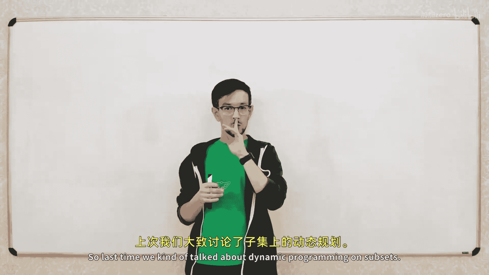

D of x and this x is actually a subset， not a number， but the subset。

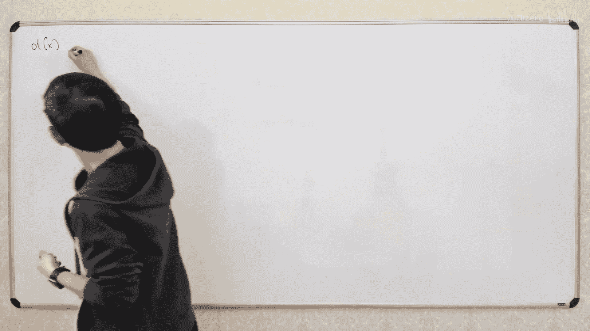

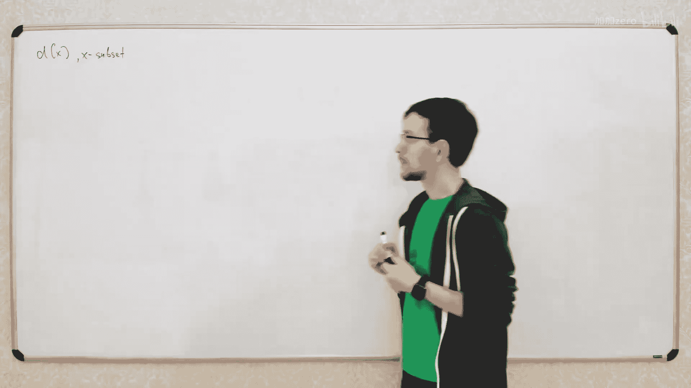

And we discussed that if the number of elements is small， so if M is small。

Then doing the power of n is also small。

Yes。Pretty small， let's see。Like say， if's about like 20。

 then they have like millions of possible subsets and millions。Quite a good number。

 so you can make an array of size million and it will be fine。啊。

Today we'll talk more about some problems which you can solve using the same approach。

One of the most classical problem is to find there。

A meial cycle of minimal weight is known as travel and sales problem。What is the problem。

 You have some graph。

Oh。Let's say like please。

And this is like this is like the cities and this is the are the cities and edges are the roads between the cities and for each road。

 you know， like the distance you need to travel along this road， the length of this road，6745，2，3，47。

3。😊。

0，3，5，6，7。8。哦。And you need to visit all the cities starting from some cities。

 you have some starting cities this starting cityS。

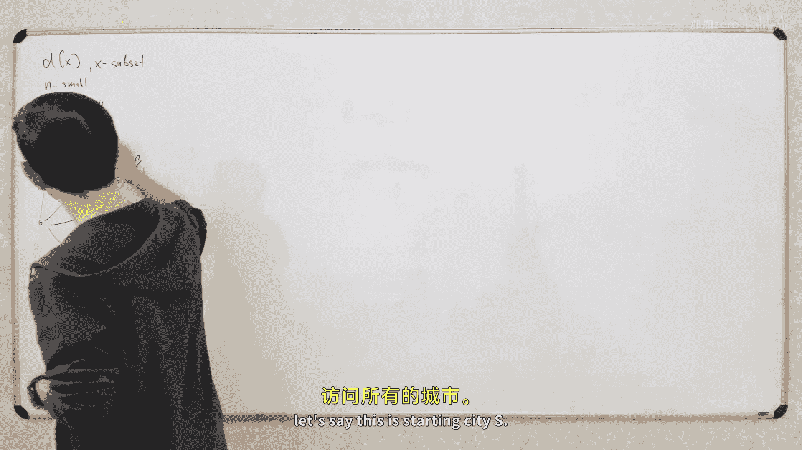

You need to start in CS and visit all other cities in some order and to minimize the total distance you travel。

 for example， you can start here。

And， let's say here， then here， then here and here。 then let's say here and here and here。Oh。

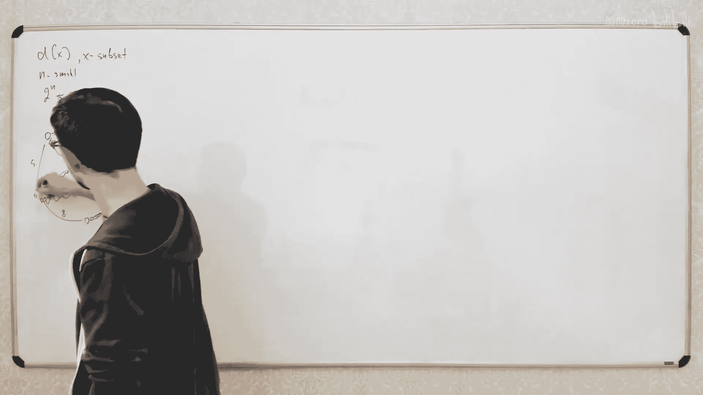

はぱす。He in graph theory， it's called the Hamiltoniltonial Perth， so it's Perth。

 which visits all the vertices exactly ones。And what we want to do， we want to find this path。

 which minimize the total distance retrie， for example， in this path here3 plus2 plus2 plus3，1 1521。

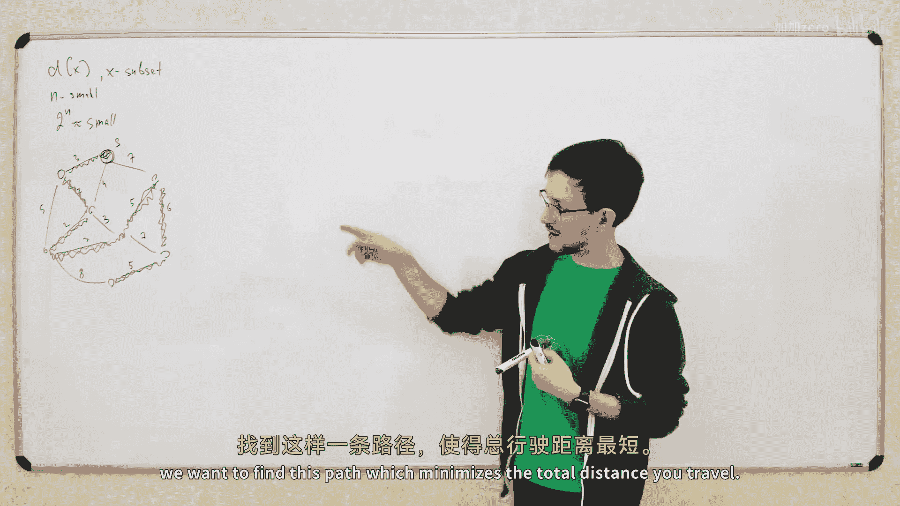

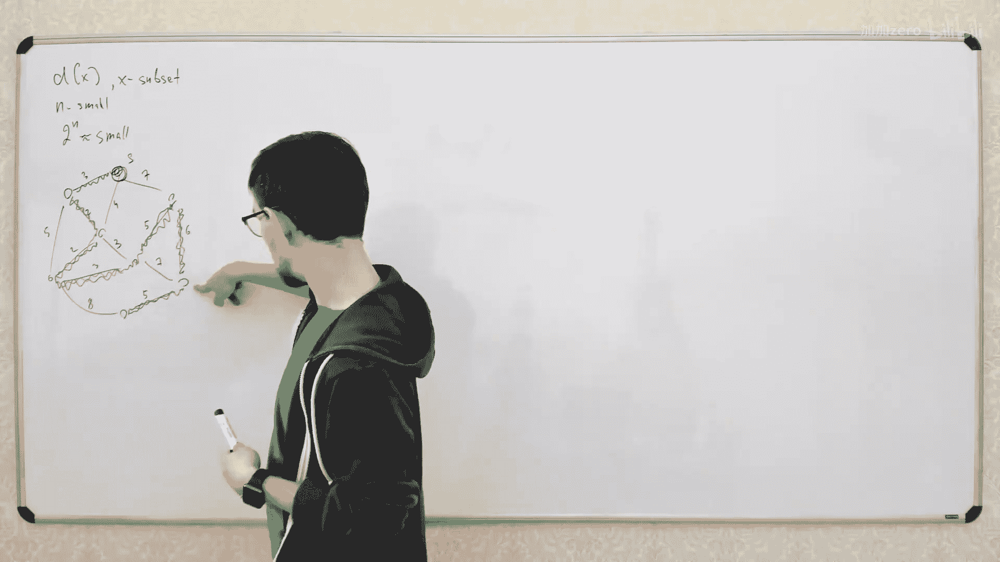

26。So the total length。

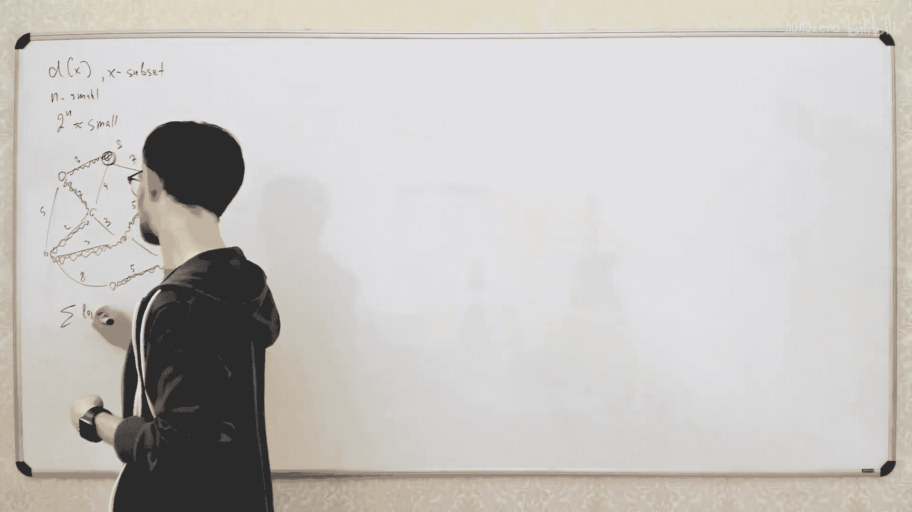

Hes 26。嗯。So this is the classical problem about cross。Given some graph again。

 you want to build this shortest path。How to solve this pay。

 this problem is also known as to be an NP complete。

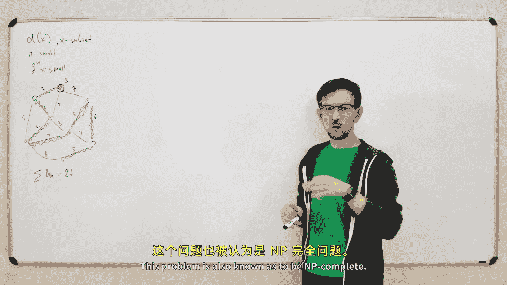

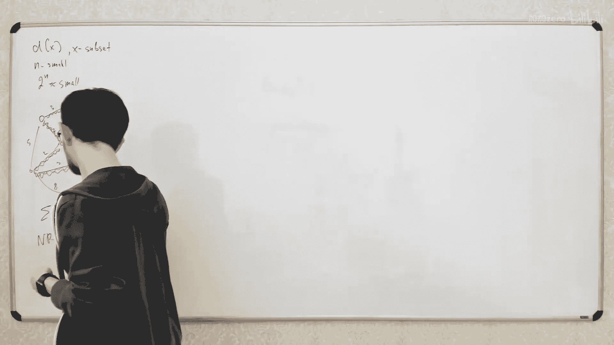

Again， we will talk about what does it mean exactly in the future lectures。

 I think I usually talk about this in the last lecture of the second semester when we just discuss more data structures and more algorithm we'll discuss what does it mean that the problem isn't be completelete。

And。It basically means that we don't know how to solve it efficiently because。

We'll plan top it on a second lecture。

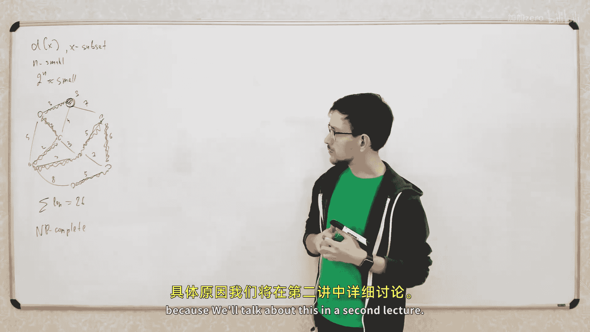

But if the number of vertices is small， you can use an approach which is not phenomenanol， but。

Good enough for small values of n， for example， if and is small。

 you can make an algorithm which works in time to empower of n， it will be small enough。

And it is actually faster than just its original or all possible paths。

 because if you just check all possible paths which visit all vertices。

 the number of such paths is about an。

Okay。And factor is much bigger than two empower fan。Thus this is some gra of noneff algorithms so。

 some efficientff algorithms like polyennomial algorithms and some non poly algorithms。

 but you can distinguish between between different kinds of non optimalmal algorithms。

To in power of n is much less。我 then单发漂亮。basicallyically， for n equal to 20。

 twin power of n is like a million and 20 factorial is。I'm not sure how much。

 but it's much bigger than medium。

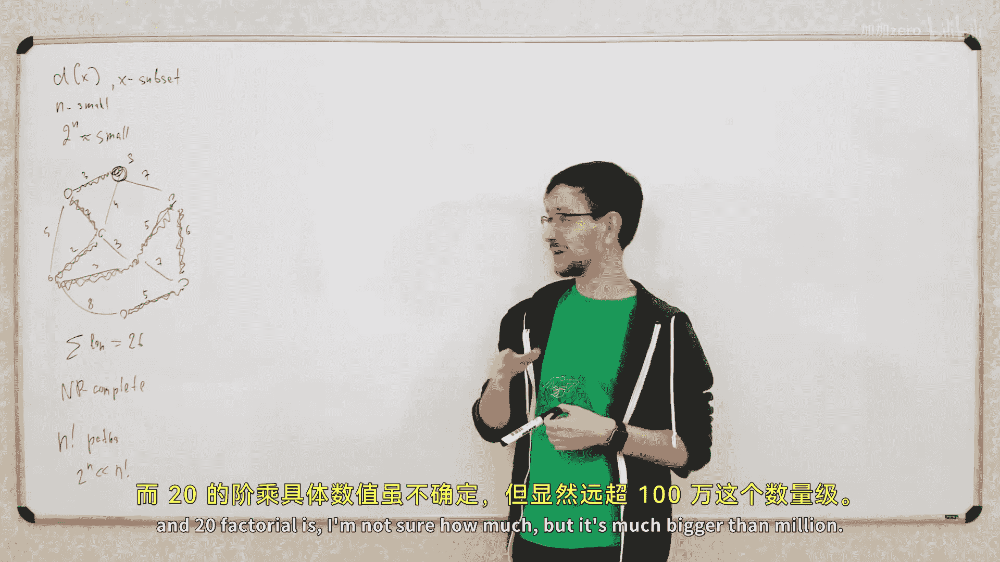

So if we manage to have an algorithm which works in this time。

 it will be much better than if we have algorithm which just iterate all possible paths。

Do we need to understand the start point it actually doesn't matter there are different variations of this problem in some variations we we should finish in the same point。

In the same ver the vertex s in some variations it doesn't mean you need to return you can finish in any vertex different variations they all are and be complete and they actually are pretty the same you can easily。

Move from one problem another problem， so if if you consult problem which force you to finish in vertex S。

 you can easily solve the problem when you don't need to finish in vertex S or just add some one additional vertex。

And edges。Of course，0 to all vertexes。 And you need to start in this additional vertex and then it to over vertes and then go back。

So then you will have the same problem as here， so it's so these all variations are basically the same。

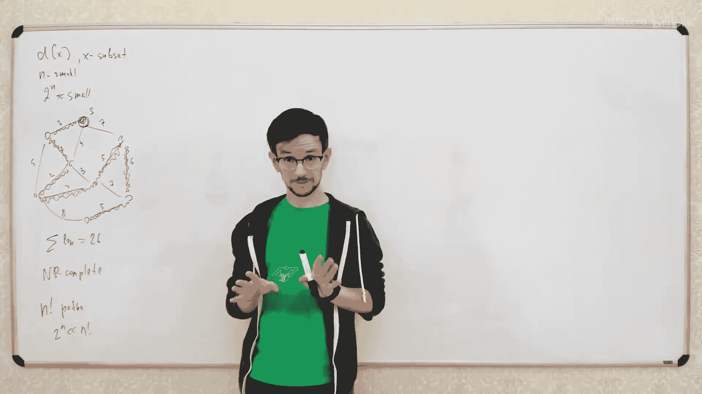

T from it， there's different kind of different fraction is when you need to calculate the number of paths。

 when you need to check if there is a path which with all exactly one and so on and so。

Many different variations of a trail salesman problem and they basically all are empty complete。

 so I will I will just use this variation because it's。

Kind of more natural robot。You can can do the same for all variations of travel and salesmen problem。

So how do you solve this problem using dynamic program？It looked like this。

We will build this path one by one。

Mine you stopping in do X S。And then have some you go here， here here。And this is the opportunity。

Again， again， how do you。How do you build the solution based on dynamic programming approach。

 You kind of want to。Find what is the current state of your dynamic programming？

So in the sum middle of your there is a process of building your solution。

 so you build your solution just by iterating through this path and what is the middle state of your dynamic programming。

 middle state does mean that you already build this part of the path and you're standing here so you're standing in SanxV。

And this is the beginning of your path， what should you remember about the beginning of your path to be able to construct the end of your path？

Actually， what what you need know about this spell is only the subset of visit vers。

 So we'll say we only need to know。This subset， we don we don't need to know the order of the vertices in this subset。

 we just want to remember that these vertices are visited and these veres are not visited。5。

So let's fix this subset。 let's say this subset is x。

And now our state is fully described by two variables， first variable is this subset X。

 this is the subset of vertices which are already visited by the pen and this last vertex。

These last mes。Is where were standing now？So we'll say we have D of x and D。Will be the memo cost。

To visit。Subset。X and n。嗯。6스。あ。It's very finish。그 늦서 더。在。Yeah。咩。五。

So this is the current state of dynamicmic program。Now you need to make a transition yeah。

 so how to make a transition in dynamic programming you just want to for your current state to find there are two possible ways you either want to find all previous states or youre might to want to find all next states。

Depends on how to implement any program， let's make the dynamic program forward so let's find for our current state。

 all the next states we can go from this current state。

What may be the next state of the dynamic programming？If we're standing in LoxV。

 we may go through some edge。有飞。You。So from state X V。We may use this edge。啊、フ。

So what will be the next state in the next state will have the set of Vi verex will be the same plus vertex u。

So we have x plus vertex u。And the finalerics will be you。

So these are the transitions of your dynamic programming。

So each time you iterate all possible edges from vertex v。

And make a transition from this state to this state and rec the current minimum。In this state。

You should be closest， not exactly， you should be an element some into it rate all possible edges。

So you iterate all edges going from vertex v and check all these vertices。

And for each vertex' rec the minimum in this state。Yeah， this is the basically there。

A method of dynamic programming， how does this work， it you get to current State。

 its or all possible ways。To get to the next state and for all possible states。

 we calculate the value or when you do it backwards。

 you just have the current state and it's right to all previous states。

yes this is the last vertex guess， so we have some pen we start in vertex S and finished vertex v so this is the all path constructed and we want to add one more edge to this path。

や。Let's write the code， the code is actually pretty simple， so how to implement this。

You start by doing some base of your dynamic programming so you need to start some starting state of your dynamic programming what is the start state of your dynamic programming starting state is when you have projects S。

啊， so有客。嗯，X。Is the set of one element， one element is vertex S。let's write the actual code。

 so we need to make a set of one element is just one shifted left to s。

And we stay in the Noric space。And the cost is zero because we just started the path we're standing here。

 this is the only vertex we visiteded， so the total cost by now is zero。啊。こられる。Shorly distanceです。

mean course mean mean distance let's。It depends on what you're talking about。

 so usually all distance is called the cost of the ages。嗯。No。We need to make these transitions。

 so it'serate to all possible states and for each state， make these transitions。

How to interact order for all possible stages， quite simple， which just iterate for all xs from0 to。

呃。2 power l minus1。And it' you ready for O。V from 02 and micro。Now we get this state。

And we want to render all possible， so we have all possible edges。And for each age。

 we complete this transition。LetsLet's tra all possible edgesV。It's clear enough。

 I'm using kind of strange codinging here， but here I iterate all possible edges going from Norex speed。

Yeah。What's that like is。아따 우리。Oh that three is。The set of all edges going from V steam。

And here we need to check if the ctex U is outside of set X。How to check in series outside of X？

What may be like this。 Let's say X and y。今 equalと zero。So。Again， we discussed it last time。

Here I check that vertex U is not in the set。手游。Is not answer。Again， how I do it。

 I make a set of one element。Make an intersection of this to set and check that this intersection is empty。

3。We discussed last time and then now we make this transition。So微。Let's say。

Why will be the set textot element to here？You're going to have plus or。

B device or it doesn't matter because u is not inside x so can I can have plus here just make it more clear but you can have binary or here instead and now so this is why。

And now we move from this state to this state。Again， when we move to the next stage。

 we update the dynamic programming in value in this state， so we'll update value in Y U。做咩冇。

In O value y u and the new value and the new value will be value here plus this one edge so it will be。

V you for X v plus this edge。我去 length of video。어케 어。So this is the length of this one edge。

So the total length of this path will be all this length plus this egg。That's all's the whole code。

And now in the end， you just check what does。In the end， you iterate our all final values。

And find the minimal result so you check in which in which you end your path and say something like。

result will be minimum。Of result。 and the。So when it set of all vertices。

 it's like one restricted down to n。-1 and or0。喂。嗯。어 어。Great。Looks fine。

So we just interpret all possible last vertices of the path and the state when we visited all the vertices and we finish these verttices is just this is the set of all vertices。

So it's 2 power of n minus1， so it's all in binary representations there's all one and here is the last ver and which get the minimum of all possible options。

그죠。Again， this is one of the possible problems which can be solved using dynamic programming by the subsets。

There are various of such problems again， how to know that your problem can be solved using this approach。

 basically what you need to know is in the current state all you know about the current state is some subset of elements if this is the only thing you care about like the subset。

 not the internal structure of this。Constructed prefis， but only the subset which it doesn't matter。

 then you can encode this subset as a parameter of geodynamic programming and you will have like2 part of n possible elements in this array。

不从。酷。H， anythingth else？I think it's good enough。Now， what I want to do next is to talk about。

A kind of similar approach for dynamic programming， but slightly different。

 it's called dynamic programming on profiles。嗯嗯嗯嗯嗯。Any problem and cons。

 you can find millions of problem cons which uses this approach。

I don't have any problem set about this exactly， but yeah。I believe I。

 I believe you can found a lot of problems like this。

 You can cause Google dynamic programming on subset in the。In task in。こコとして通りす。

And you will find a lot of problems like this。嗯。Yeah。

 so next the next topic I will talk about is the dynamic name programming in all profiles。It。

 it is kind of similar because it's also known polynomial。 So there will be some beat masks and so。

 but。It's slightly more specific about the structure of the problem。告诉 what's嗯。間違か。

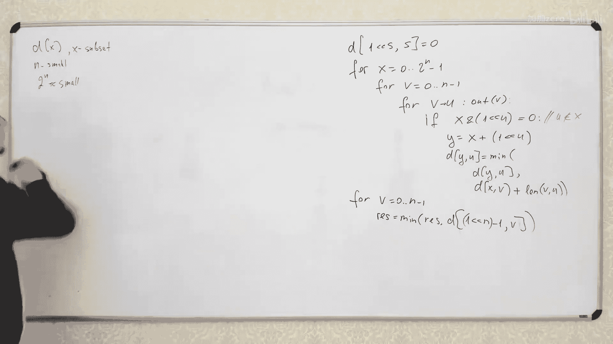

In Russian programming in school， Im not sure how how。

How it's happened in all other world of competitive programming。

 but in Russian competitive programming， it all started with some problem from。Some ancient Russian。

Ain Per， I believe it's。In， in some middle 90s。It was about the phone problem。You have a rectangle。

And by down。And you want to fill this rectangle with some small rec tangs of science one by two。嗯。

It was called a parque problem。Its something like this。Something like these。嗯。啊。我。T7月。させなくて。难熟啊。哦。没。

So I could six， yes， six by something。1ant， to free。AndThat's it is slightly of here。需要。

And something here say。싸 분 많이 근데。I good。And here I have my do's in case。Okay。

 not the flavors picture， but the good enough。And in that problem。

 you needed to calculate the number of possible ways to fill the rectangle n by M by rectangles2 by1。

It was called the pocket problem。Like。One of the most。Classical problems in Russian programming omps。

あ、 schoolあ。How it solve how it's supposed to solve its problem？Actually fun fact later。

 it turns out that it's possible to solve this problem in polynomial time just using some mathematical approach。

 so if you just need to calculate the number of ways to fill their tangle it's possible using some。

Strange algebra things。

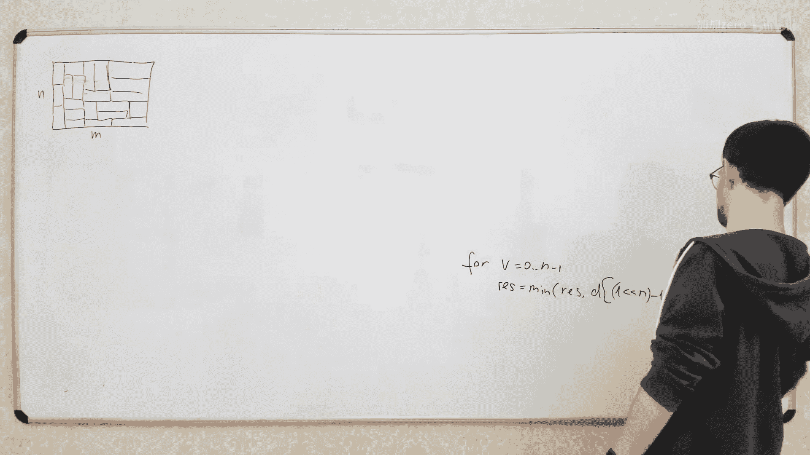

哇。好啊。So how would you solve this？Let's feel this rectangle column by column。

 so let's go from left to right。

And try to field columns one by one。So at some point， what is the current state of the process？

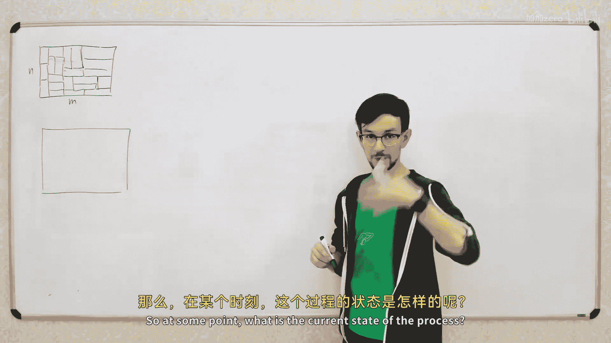

Currency for the process is when you already field。

First， let's say i columns of the rectangle， so you feel columns from0 to i minus1。

So this left part is already filled with this。How to call them。Tileles。Itpo tiles。

 so you somehow feel all this。啊。A left part sunk thes to2 by one。Now。

 what do you need to know about this left part to be able to feel this right part？

You need to know which of these tiles are going out of this left par。There are some tiles。Which are。

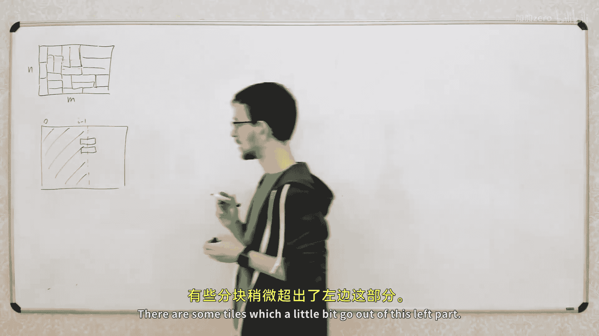

A little bit go out of this leard something like that。

And what you want to know is。啊。Which on which rows we have this tile。

 which is going out of this left part。有。Makes sense。Sounds like个。

There will be empty space too what are be empty space， No this part already feel so。

All this left part is field。With these tires。

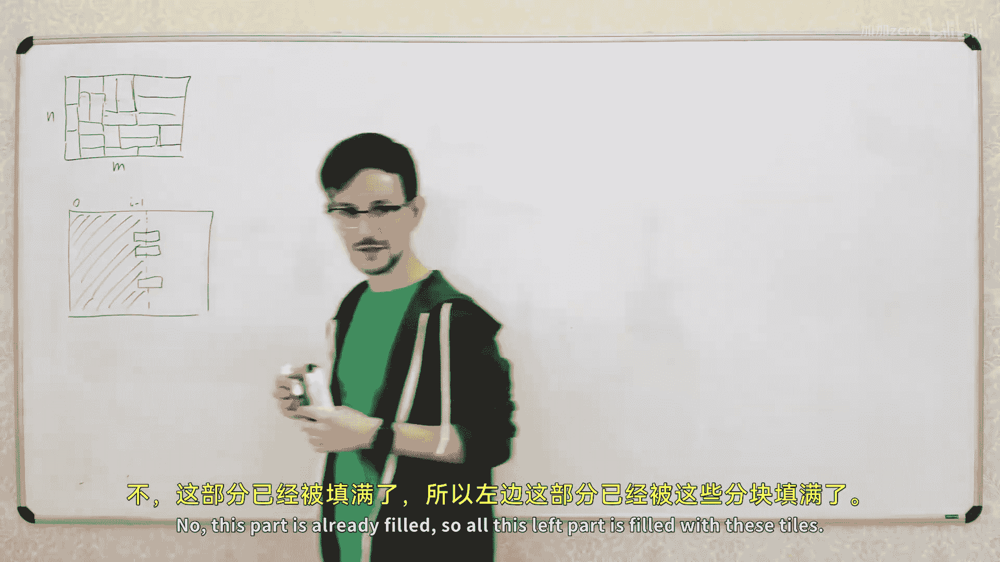

So sometimes tile do not go out of this line So here we have some something like that here have something like that。

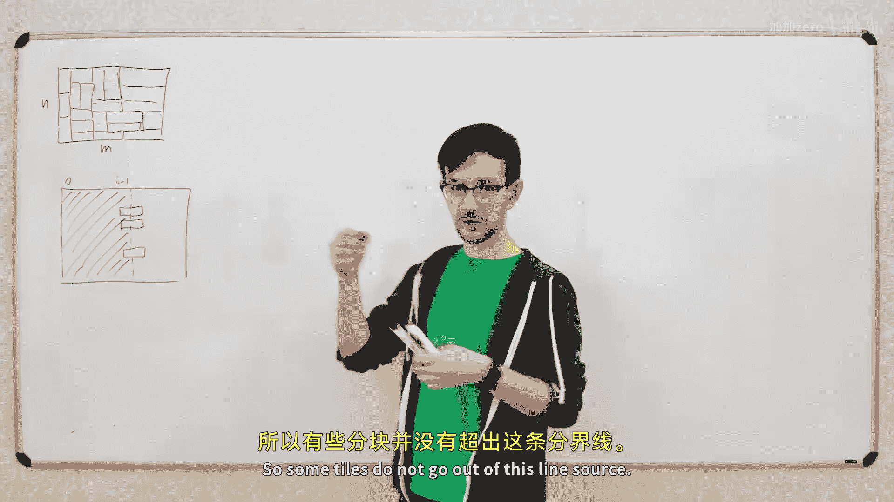

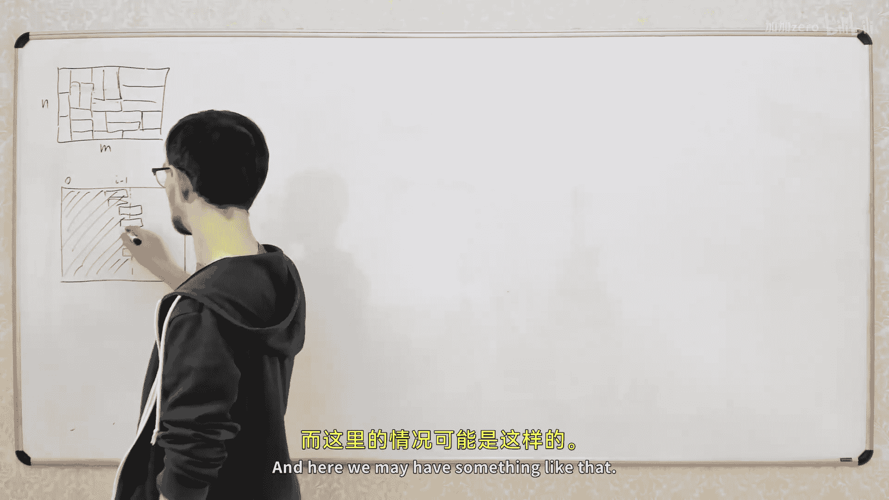

But some tile stretch out。And we want to somehow remember in which shows we have these tiles which go out of this。

Fielt left part。Does make sense。

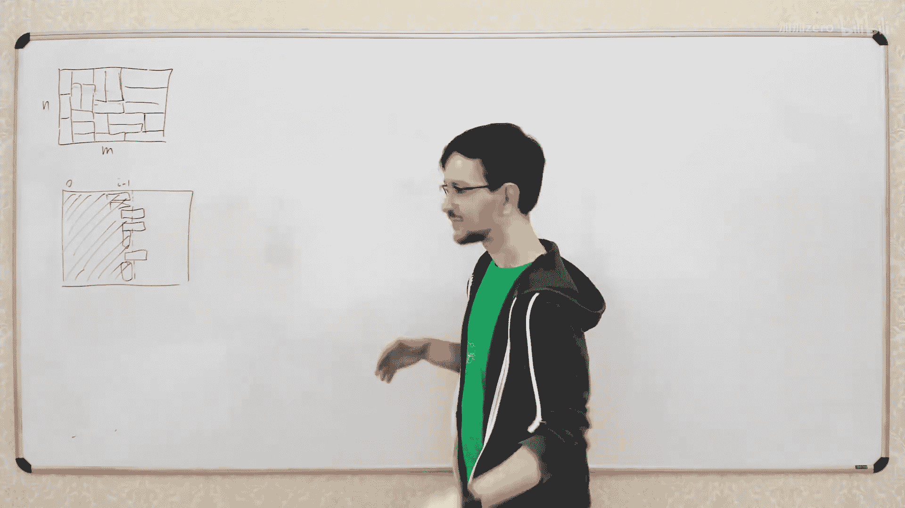

So how do we remember this？Basically what we need to do for each row。

 if there is this tile going from this left part corner。Let's surf some like these。

そう。This is basically how the so this is basically where this work profile came from So you want to remember this like broken light so this this profile of your dynamic programming。

How to encode this this profile Oh exactly like we did with the subsets。 So for each row。

 we will remember。

We have zero if we have no time and we have one。

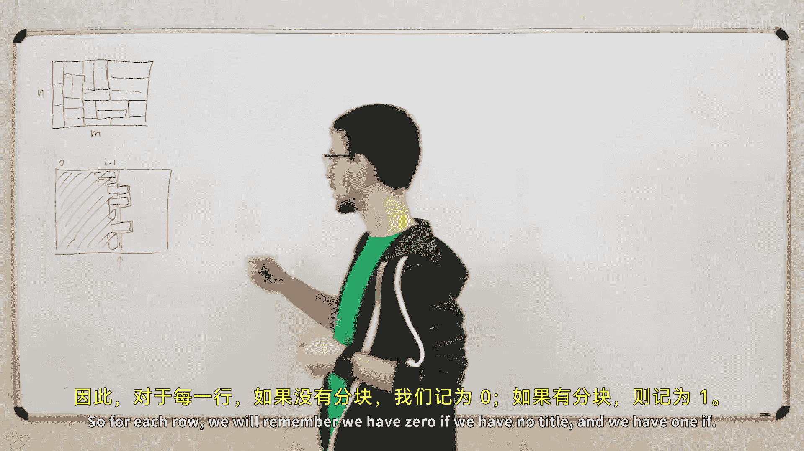

Okay。like this。

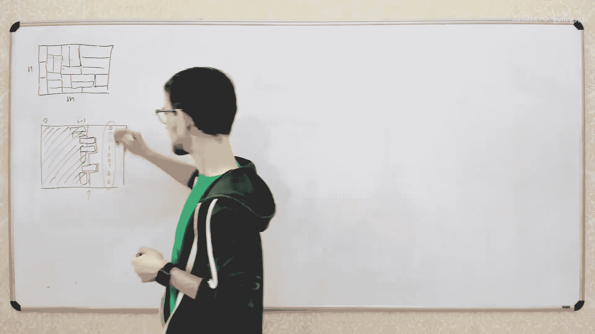

So this n beat number。We'll specify in which shows we have this one extra square in this right part。

That's all and now you just encode this number as integer P。And we have the name programming。

 so this is the current state of the name program we already field these first I columns and the profile is P。

So we have be I。It is a number of ways。不需用。G。Up eye colds。We broke。

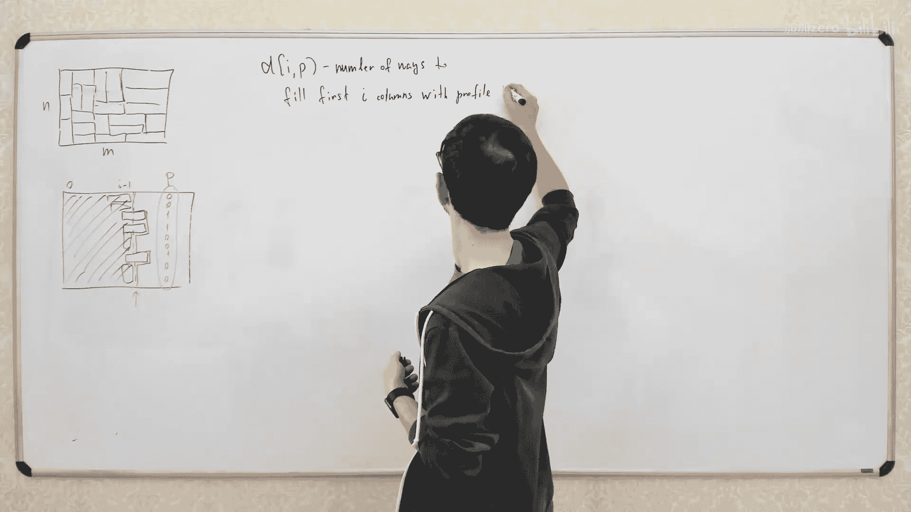

没错。上面。Now we fixed what is that state of the programming， we need to make transitions。

So we need somehow to remind from the current state IP what will be the next state？

So how to find the next state of the dynamic program。And you have this current profile。Like here。

 let's go some zero， zero， one，1，0， zero， one， zero zero。Okay。

So here are all comes from0 to i minus1。And we want to move from from I to i plus1。

 so to move from I to i plus one， we need to feel all this。marketing。We need to feel all this。

Not field。Squares in the column I so when we move from I to I plus1。We want somehow to feel all this。

M just square。How to feel them in a possible ways。 So for example， here you may add。Like。

Two horizontal tiles。 And here you may add one vertical tile。

 and here we may add one horizontal tile and so。So when you feel these empty squares。

 you will end up to receive a different profile。Let's have the new profile will be。This。

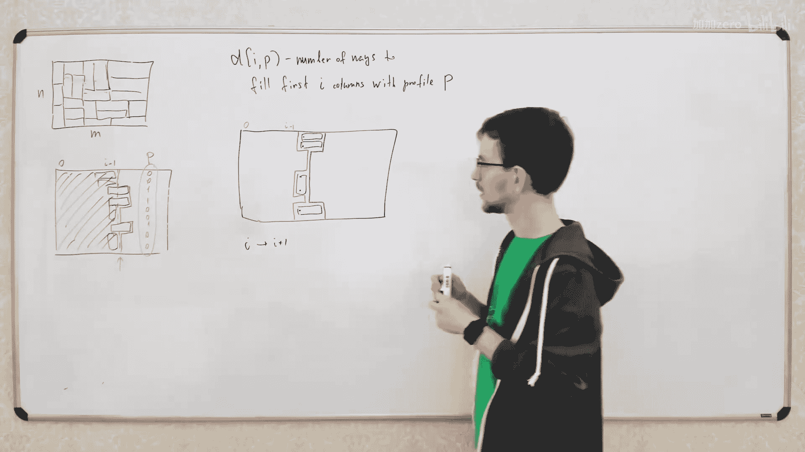

So we have this first profile it was 0，011。0 zero one zero。This was profile P。

And we have some new profile。11 zero zero zero zero zero one say profile  queue。

And if we fix the how we feel all these empty squares， we will move from state IP。Two state。

 i plus1 and Q+1。

那Q把Q just是Q。Cool。Now how to check if it is possible to go from profile P to profile Q。嗯。Totly simple。

 if you have profile P and Pro Q， you have some space between them。So if you fix two profiles。

You have all this space between them。And all you need to do is to check if it is possible to feel all this space wave tiles2 by one。

If it is possible， then you can go from Pro P to Pro Q。

It's not always possible for some pair of profiles。

 it's not possible to go from one profile to another。But you can write it。

Simple function that checks。that is possible。 Go from P to Q。It is a B Russian I'。

Im'm not sure what is the story about this naming？I believe I first I saw this problem in the Russian Olympic。

 so maybe it's。Kind the origin of this term is Russian， but I'm not sure about this。

 maybe it was some different contests。When we have the same approach， we use different terms。I know。

 I just learned these terms when in 90s when we had rational impact。

Maybe it's not the original impression。没有。I'm not good in history。

How to handle the N case it's quite simple， we' will talk about N case in there。

First let's write the code and then we'll talk about what is the last case， and it will be simple。

Let's do it like please。So again， how do make the dynamic programming program。

 you start from the first state， What is the first state of your dynamic programming。

 First state is when you didn't feel anything。 So when you start from feeling zero。こ。

And the profile is simple when you didn't feel anything， the profile is empty Yeah。

 so you don't have any of these squares， so the profile will be all zero， so it's just zero。

 so starting state will be like this。And we have one possible。Way to feel。Empty space y。

Now you make these transitions。

你 start的干方。From like to 0 to n-1 is M-1。And minus-1。

And you would get to all possible profiles from  zero to。嗯。

AndNow you make these transitions to make these transitions， I will write simple code。

Now just it all possible Qs from zero to2 power frame plus and then I check if it is possible to go from this state to this state。

I'll just use some procedure。衣服。Let's say these two profiles are compatible if you can go from one profile to another profile。

예 그럼 바디로。哎，不知道啊。So if you can go from this profile to this profile。

Then you move from this state to this state。So you simply make the。I plus1 Q plus equal。I遍。

That's the whole code Now in the end， how do we finish the dynamic window in the end you feel the whole rectangle yeah。

 so what what would will be the final state。The final state will be when you feel all the rectangle and you have no these styles out of the rectangle。

 so the final state is when you feel everything so you feel all。嗯。Cos， and you don't have any。

These styles which stick out of this rectangle。So the profile will be zero。你。快走。Yes。

 you also calculatedated some。Strange states when you have all the columnlogs and some tiles are out of this rectangle。

 but that's fine you just don't use these states you only use you only need this statement basically。

Yeah， so when I equal to m minus1， you actually don't need all the state Q。

 you only need stateq equal to zero。But it's it's。一次。What am I in optimization。可 clearな你 clearな。嗯哼。

Now let's talk a little bit about this。😡，about these。

F which checks this possible go from one state to another state， so how do you check？Okay。

How do we share that dis possible go from profile P to profile Q？there are different ways to do it。

 you can do it just by rating over rows。And just putting all the tiles in the place there's a unique way to fill the tiles。

 if it's possible to fill all these empty spacer tiles。

 it is actually a unique way so you start from top to bottom。

 see if the space is empty and if you have zero here and one here。

 it means that you need to place the horizontal tile here。If you have zero here and zero here。

 it means that you need to placed vertical tail here。

So you just iterate allarrows from top to bottom and just place the tile。

 there is only only one way to do it if this possible， it may be not possible， for example。

 if you have zero here and zero here you need to put this vertical tile and this space is not empty。

IfIf you have to put a vertical tile and this space is not empty。

 it means that it is impossible to do。But I want to talk about a little bit about some， again。

 about some bitvo tricks to do it in constant time just。Just to make it a b bit more interesting。

 so let's use some bit magic。To calculate this function in constant time。嗯嗯嗯。

No why should it depend on I？Because each tile is only two squares。In width。

 so it only depends on the previous column， so only the previous column may somehow distract this next column。

Because all tiles are just have weight with equal to 2 so if we want to fill this column we only affect the biggest column。

Make sense。So we need we need only the previous cons。Only column I minus-1。嗯。Okay。

 so how to check if two profiles are compatible。Let's see。First， what is impossible state。

 impossible state， for example is。When you have。In profile P， you have one， see。

 it means you have something like this in profile P， you have this profile P。

 this profile if here you have one。And in profile Q， you also have one。It is impossible state， yes。

Because if you have one， it means you have a horizontal tile here。

 but you can place the horizontal tile because this square is not empty。So， let's find。

If we have situation like this， that's find if we have some bit。

In which you have both ones in profile P and in profile Q。かる。

ButWe want to find the situations like this， we have two profiles， B and Q。

These profiles are actually n integers， we have this integer。And this in。

And if we have one in the same position。We have some here。And one in the same position here。

So then these two profiles are not compatible because we cant fill this squarere feeling in this square。

 we need to place horizontalxonal here and it's impossible because this square is required。

So how to check if do。Numbers in the levels have。The same bit， one in the same position。Any ideas？

Let's make it a little bit more interactive。Just say any ideas。Let's。Not a trick。Again。Again。

 what I want to check， I want to check that I have this bit。Equal to1 in both P and Q。

 if there is at least one such B， it means that these two profiles are not compatible。嗯。やこ。

Yhy not be just be。Okay。😊，Because。😊，Yeah， okay， do answers。Actuallycellent。You both are quite close。

 but not exactly how you do it， you you calculate a bit twice end of these two numbers。

 so calculate this number。BMQ。It's one am person here because it I want to make bit twice or end。

 not the logical end。And it it will check if we have this bit in simulation issue。So if we have this。

 we have one here。So if this number is not equal to0。

It means that we have at least one bit with two ones。Let's check this扫衣服。衣服。B and Q。

I make equal to0 a reinforce。Yeah。こう。Now。What else do we need to check？不钱。そう we have。

So what else do we left if we have one in one that's。It's already for if we have。0 and one。

 So if profile P， we have one， let's see。 and in profile Q， we have。The zero。

It's always fine because if you have one here and zero here means this square was occupied by some time and we just don't do anything。

In this row， we don't put anything just this。Square is already filled with some previous style。

 so we just left it as this and we have profile zero in the next column， right？So this is over there。

So here we have false。And here we have two。What are the situations left？We might have。系啊。

Zero here and one here。ビビ？ like， like here。So we capture to zero here and one here。

What does mean it means that we need to place a horizontal tile here。

 so place a horizontal tile here。It is always possible， right if we have。Be zero here and beat1 here。

 we can always place this horizontalal tile and it's fine。

 it is the only way to get this beat equal to one Yeah， so so this combination is always fine。

And the final combination is0 and 0。啊。So we have the zero here。And。洗肉 here。Like here have0 and 0。

It actually means that we need to place vertical tail here， so we have this vertical tail。

So we get from state  zero to state  zero。有。Go it。Again。

 just say something in the chat if everything is clear or if not everything is clear also。

Because sometimes my shot。It is frozen available measures。Fross。Freezees。It difficult language。

哎哎哎哎哎哎哎。We can check two conditions if I will be0 and then if I is the design。

Now the second condition will be a little bit more complicated。

 so what should we check here when we place vertical tile？We actually need two rows。

 two consecutive rows to have zero and0， so we need to have zero and0 here。

And also have zero and0 here。Oh。So all these combination zero and zero should shoot come in pairs。

 Yeah you kind of need to split all these zero， zero pairs in。不要是。here has 0，0， hereが00。

And this is what you need to check， you need to check if all zero， zero bears。嗯。Yeah。

 they a common pairs。Why the answer is M。But no it times zero right start from zero。

 I start from zero and the end of the time。L， it's quite fun。Okay。So this is nothing called。

Cross I columns from0 to i minus1。So in the end， they fill all m columns from0 to m minus1。

Well no this part is pretty fine and I am quite quite sure about this。😊，Again。

 this's usually how do you write the dynamic programming you start with from0 and end at M。

So you make emiturerations from here to here， so you feel all M cool。啊。嗱一。

I will go what I want to check。 I want to check that if I have zero here and0 here。

 then all these bits can be。Split it in some pairs of two consecutive rows。how how can I do this？

First， let's beat the following， let's build the number， which contains once in these positions。

 so I want to build the number like this。SoI want to play one。In the same positions。

 when I have0 in P and0 inq。How is' possible to build this number？No， it's quite simple。

 I need to have 0 here and 0 here。 So Ill make note P and note Q。 and then end this two。Breakfast。

 let's， let's。Let's name it text。So let's say x equal to。Not B。Or not kill。

It may have some extra big chargess ended with one1 minus1。That's fine。

So I just I have all all zero bits here， all zero bits here， and then I end them。P port them。

 need end on hand。外门。Yeah， you should do it the opposite， you may do the opposite。

 you may do or and then make not。😡，That's what they always think about in some of this you may write a not or B or Q。

 it is the same thing。啊。Now you make this bitwa number x and in this bitwise number x。

 you want to be able to split all once in pairs。So you have this number X。所的。どしよ。龙意识咩？

You hear this number X。If you can zero and once。And I need to check that I may split all these ones in pair office。

Oh。How can I do it again using some arimetic operations and B device operations？嗯。Oh。Yeah。

 we a little bit out of time。 Okay， cool， so the easiest way to check this。

Is to make the following is to divide x by free， because this one1 is free in the binary。

 so if you just。Have X divided by3。Then each of display pair will become just one。again。

 this pair is 11 in binary， so it's free， so if you divide it by free， you will have。网心儿网心儿。完了。

Well I'm here all。For each such pair， you will have one bit here。哦。Again。

 if x is not divisible by free。Then it's false。Let let's say white。

And the final thing you need to check is to check that in this number Y this。

Ones are not next to each other， so if you have two ones next to each other in number1。

It means that in number X， you have these two pairs overlapping。

You don't want this to to have two pairs overlap each other。

 so now you need to check them in number y in this number。There is no two consecutive ones。

How to check if number do not have two consecutive ones， it's easy， you take this number。

 shift it left by one， and end with itself。So。You check the number one。

And it was number Y shifted left one。If this is not zero。

It means there are two consecutive ones in number one。And if it happens， you just return pause。

If none of this happens， it means that it's possible to get from profile Pto profile。

Let let's all the districts。I want to try it。Yeah， it's kind of complicated， but all operations。

Quite fast。 So you don't have any cycles here。 so don't have any looks here。

 just have some bitwise operations， operations can we had。The division。

 it's not the face the arithmetic operation。But again。

 it's all fast than than adjusted rate over all beats with some fur loop or stuff like this。Okay。

 but maybe it will behave helpful for you at some point and not sure if it's。

There are situations when you need to do some tricks like this to make your program works a little bit festival。

オ。嗯。Now。Let's talk about time complexity what is the time complexity of this program if you write this exactly like this then it's quite simple you have a iterations here。

 two power of entriess here， two power of entrieserations here。

 so total number of iterations of these three loops will be M multiplied by two power of and2 power of entriesroids four power of。

嗯。If you do it a little bit more carefully， so if you hear。Iterate not for all possible values of Q。

 but only for compatible values or Q， so for each profile P。

 you generate all the compatible profiles Q。そ衣服そうヒ。Here I make pretty simple。

Cold I just insert for all profiles and check it it this compatible or not。

If you do it more carefully， you can generate all compatible profiles。

And it's very order for these profiles。It will be faster。Let's see， for example。For each be。

 there is no combination one and one。So there is no more than three in power of n combinations speaker。

It's actually a little bit less because you also don't allow to have combinations like 0，0。

 So if all zeros and zeros should come in pairs， this also decrease the number of。🤧嗯。

Possible pairs of compatible profiles。So the tank complexityity is at most。And for freedom。

 but actually actually less。So it's actually2 point something in powerifying。

I'm not sure what is exact。 Im sure what what exactly the constant should be here， but。

We've got to think about this。How to think about this。

 you need to calculate the number of pairs of possible profiles in some just kind formulaly you can can you can write this formula for number of possible pairs of MB profiles。

And then get the correct asymptotics from this。And we do this as an exercise。啊。Again。

 youll look words， say something and I'm a little bit nervous when the chat is empty。

I think that something's wrong。Now， let's go next。How to make this。

 how to make this program even faster。To make this program investor and actually now I will make the tank complexity better and also I will make the code more simple because this part is actually quite complicated。

So now we will solve two problems， we first we will improve the time complexity and we will make the program more simple。

Let's go。そ。Why that complexity is better again？Why the time complexity is bad because we have too many transitions。

The number of states is pretty small， so the number of states is actually 2 in power of n。

But the number of transitions is big， so in the final syms， we have not two in power frame。

 but something like foreign power， if not careful， well if you do it very carefully you'll have some two points something in powerF。

So this content is bigger than two because we have many transitions from each state。

 we have many transitions。あ。So to improve time complexity。

 what you need to do is to find some another way to make the state of your dynamic programming such that the number of transitions is small。

Coop。Why， why the number of transitions is big because on each transition we actually。

Trying to do a lot of thing so when they transition from I to I plus one。

 we need to fill the whole new column and there are many ways to fill this new column。

So the number of possible ways is big， so number of transitions is big， so it works slow。

How to avoid this let's make very small transitions let's try to add only one square on each new iteration so here from when we move from I to I plus one。

 we add n new squares to our field part let's try to add squares one by one。对出出죠。違。

So what happens if you add squares one by one， then we grow。

 let's say from left to right from top to bottom？Okay。

And the current state of our dynamic programming is like this， we already feel closed。

I squ eye colorss。From0 to i minus1 and also we field first J squares of the new column。

from0 to J minus1。So again， we go from left to right from top to bottom each time we fill one new square of our square of our rectangle。

Now呃。What we need to know about this feeling， we need to know which again。

 we sometimes when stick out of this field part。So wait。 So's like this we here here。And here。

So again， for each row， we will remember if there is one extra rectangle field by this tile。

 which is stick out of this field box。 We have profile like this on 1，1，00。有一会。Like this。算播翻点。

Next song。Now our state of dynamic programming is described by three numbers。

 the number of columns we already in field with number I。

 the number of squares in the next column we already field with number J and this profile P。

D B means dynamic programming。Well， so we start from the so the current state is we field eyes here。

And J squares here。And have prop。A number of ways。To seeよ。First。My calls。Whats three squares。We pro。

It looks a little bit more complicated because first we had two dimensional array here。

 we have three dimensional array， but actually it's。It's。It's more。右手手臂。It looks more complicated。

 but transitions will be much simpler， so the whole code will be much simpler。个。

So how to make transitions， again transitions。You need to。

 you need to feel one more square of your rec thing， I woulds say this square。

We need to feel this one square of your rectangle if you feel this one square。

 you move from state Ij to state Ij plus one okay。So kind to move one to move from Ij to Ij plus one。

And see how the profile changes when we move from Wednesday to another。ち。啊。

So we have this profile here。And we want to move to this profile。Right。So this is I， this is。走。

Let's look on this one square， we need to fill this one square are two possible cases。

 this square may be already filled or it is empty。How to check if this square is all different away and we have this profile P。

If in the profile P， we have one in this bit。 So if if this bit is one。

 it means that this square is already field or some tile。

 so we have some tile which stick out of this left part and already field this profile。

 So if this bit is one。Then we just go through。B， this is what will be cute。

That way if people like like before， this is the previous profile， this is a new profile。😊。

So if in profile P， we have one in this bit。It means this square is already filled and we just skip this square and go to the next tail。

 so we go from state IJ to state IJ plus 1 and in profile Q we have0 in this speed。So again。

 for profile P， we have this profile， so we have this square out of this flip part。

And when we go through this profile， we don't have this square field some previous style。

 so here we have one and here we have zero。中冲冲冲冲冲冲。But's that。 that's right。 So so if B。Of J거と one。

Then we move from IJ。B。2 I D plus1 Q。And Q will be the same as P but in position J。

 it will have zero。little don wants。누거가？If this bit is zero。If this beat is0。

It means that this square is empty。So this square is empty。

 so we need to put some tile in this square， there are two possible cases we can put a horizontal tile if we put horizontal tile here then we'll have one in profile Q。

Right。锁衣服。BJ is0。Then we move from IJP。To state i J plus 1。Q and Q will be the same as P。

 but this beat will be zero， sorry Q in state in P G will be1。ほ。And finally。

 we can put a vertical tile here。 What happens when you place a vertical tile here？First。

 we need both these squares to be empty， so we need to have zero here and zero here。In profile view。

And what well have in profile Q and Pro Q？We will have zero in this position because we don't have this square and we'll have one in this position。

Because this square is now occupied by this time。So the second thing is when we have Pj equal to0 and p。

J plus 1 equal to0， Then we need to make transition from IJP again。

2 state I J plus 1 Q and Q is the same as P， but in position J plus 1， it is1。

Q and position J plus one equal to1。嚯。That all that's all all the options we had。

But let's write the program， the program will be very simple。そち。We don't need this big magic。

All these tricks。我非先。Okay， so what is the first state of dynamic programming？

We started with the state well we didn't feel anything， whether it felt， so we filled zero homess。

 zero squares in the first column， and the profile is zero。

And now we just move from one state to another， so we try all possible states。For what from02。

レアンマイナスワン。For from。For0 to n minus one for all the profiles。그。And make these transition。Let's go。

 So how to check if the bit is one。 again， like like we did before， we see if this P and。one， three。

go zero， it means that there's one。We make this transition。So we'll have Q。

Equal this Q must be the same as P， but this bit must be turned to 0。 so  Q will be P minus。뭐 왜지。

And we'll have Dj plus1。Q plus equal D I JB。Likeです。Then so that's the first option。

 so if this squares is not empty， we just move to the next profile and set this bit to0。Now， here。

We we do it but basically the same。See yes。So if this bit is zero， then make this transition。

In this transition， we have profiled U the same as P， but we've won this extra bit and again。

That's just， that's just the same code。And finally this we need to check the two of these bits equal to0。

 we only check the bit j， so we need to check that bit j plus  one equal to0。

We also need to check that J is not the last。I beat。 so let's see if J is less than n minus1 and。

We need to check the last page。And one and three plus one。一国都自よ。Sounds like this。

So this is when we need to place this vertical tile， if j is the lost。Oh。😮。

then we can place this vertical tile here。So we check that J is not the last and both these squares are empty。

Looks fine， so make this transition。お。嗯。Our cases for J is not continuous included。

 What does mean J is not continuous？嘿嘿嘿嘿嘿。😊，嘿嘿嘿。す。嗯。嗯哼哼。😊，Not sure what do you mean here。

I have three cases。 first case is when this query is not empty。I check it here。

So here this square is not empty， so I just move to the next state and modify my profile here if this square is empty。

 then I can place there horizontal horizontal horizontal tile here。Or if both squares are empty here。

 then I can place the vertical time。嗯。😊，嗯。Did it masks。That's what we're talking about。

 we're talking about beat masks and stuff。嗯，不懂了。Now that's that that's， that's not all。

 That's not all。 Here we make。Here we make transitions from。IJ to Ij plus  one。

 but we also need to make transitions to I plus 1， we need to somehow move from this column to the next column and this transitions is pretty simple。

So we need transitions from I to i plus1。How to make transition to the next column node？

Let's see we have state this。So this state is I and M。So here j equal to1。

And let's look on this state。どこ？So this profile is I and N， and this profile is i plus 1 and0。

And it's basically the same profile here we have first i columns field and here we have first first icons plus n squares in the next column and here we have first i plus one columns field it is the same so we just move from state I。

And。B。2 i plus10， and the profile will be the same because in these both situations。

 we have the same profile here。 So here it is in both these picture pictures。

 we need to care about this and square so the profile will be the same。

that so we need to have it somewhere。そうこ。ID plus 10。B the same as D I and。That's so and in the end。

 what we need to have in the end， in the end we need to have forjima。G。M zero zero。

 this will zero is off。啊。そう。The result will be in the number of ways to fill all armed homess。

We have zero extra here and the profile equal to zero。That's so。 that's how you。

That's how you make this this technique is called dynamic programming on Bro profile because here I kind of have the profile。

 but this line is not disc great， but it's broken here。It's called the broken profile。啊。Again。

 in what situations can you use techniques like this？

Basically it is situations when the structure of your program is some kind of layered when you have different layers。

And when you build the next layer of your solution。

 you only need to know the state of the previous layer of your solution。Yeah。So。啊。Yeah。

Usually these questionss， when you have something like to two dimensional grid and you need to feel it like layer by layer and you only care about the previous layer。

 not only precision what schools， you need to do something on two dimensional。Gre。

 and when you feel this。Next layer you only need to find the state of the。

 you don't care about what happens here， you only care about the state of the previous layer of your structure。

What's this， I'm not sure what's this。啊。This may happen in various different situations。

 mostly it happens in in two dimensional cases here when you need to build some two dimensional structure which optimizes something here a complete number of ways。

 but it is the same when you need to find the minimum something， maximum something and so on。

For the you you， you might， for example， you may want to。

You want to assign some costs to all different positions of these tiles and minimize the total cost of all these styles。

And so on。そう。You may have some optimization problem， which solves in a different way。啊。

In the same way。Right。I believe it's I believe。It's enough for this。A lesson maybe we talk about。

Well， let's discuss one more problem。And a little bit out of1， but。我 just得吃我空。啊。

OneAnotherOne classical problem which illustrates the same method is the following。

 you we need to build having again you have this rectangle and by M。Okay。

And you want to paint all the squares black or white inside your way that there is no square two by 2。

 which is colored in the same color， so let's say you。This。And these and something these。

And this and something like。So there is no。Square2 by 2。Which is the whole white or if it is。Black。

Sorry you want to find the coloring of this n by M rectangle in such a way that there no situations like this。

Again， how to find out that this problem can be solved using the image program on the profiles。

 you look on the problem and you see that each when you feel this rectangle，Yeah。

Like column by column from left to right。呃，When you already field this。

The last part of your redangle。And you want to fill this one new column of your thingangle。

 you only need to know the state of the previous column So the only thing you need to know is to know the state of this column。

Because this is the only part when you can have some squares2 by  two if if by filling this new column。

 you get square2 by  two in painted in the same color。

 it means that you have one of these parts must be in this new column Yeah。

 so another part must be in the last column of the field part。

 So only need to you you only need to remember the state of this previous column。

And if we just encode this state of the previous column as some profile P。We will have， again。

 we will have the problems that we have field first。

First I column cones and the state of the last column is P。

So this p only describe the coloring of this last column。Can we do greed？No。

 if you just it depends on what problem you talk about， for example， maybe some different situations。

 for example， some， let's say some。Squarees already have some colors and you need to color all other squares so if for some squares you already know some fixed colors or you won't calculate the number of colorings or you need to find some optimal coloring let's say for each square we have some different code to print it black or to print white so maybe some different situations when you can do it grizzly because of different restrictions you have in your problem。

Yeah， if you just want to find any good coloring， you can just make a chessboard like coloring and it will be fine there's no in a chessboard you don't have situations like this。

啊。Again， this is how you make the name program on profiles。

 you make the following state of your name program。

 you also feel first I columns of your rectangle and the state of this last column is encoded in this profile P。

And if you want to make it on a broken profile， you'll do it like this。い。そち。こい？

If you want to use broken profile because it is first。

 the time complexity is better and second the code will be much simpler if you use broken profiles。

what happens and you'll have the column profile like this？And you want to move。The profile like this。

So need度。Paint  one square。And how to check if it is possible to paint this square， white or black。

 You need to know this。Colors of these free squares。So in in your profile。

 you need to encode the state of。These squares。So the current color of this states will be encoded in your profile P。

And again， your current state this is your wildlife， this will be J， so your state will be again A。

Well I is the number of columns you field， j is the number of squares and next column you field。

 and b is the number which encodes the state of these n plus one squares。

So when you move to the next state， you need to paint this one square and you check if you can paint it white。

Or you can paint the black if。These three squares have the same color if these three square square paint paint white。

 then you can paint white this and similarly what it would like。

Thats all that's how you move from one state to another and in the end again。

 we need to move to the next column so move from state like I amM to start a state I plus1。0。

But you have basically the same code it's a little bit different because you need to have n plus one squares here in previous problem we have n bits here you need to have n plus one bits because you need to have this one extra square here or have this like corner。

别从。What's great about this topic， I don't do really。It's complicated， but it's not like。

There is no books about these topics， I believe， so there are a lot of different。Posts。

 believe you can code forces blogs or stuff like that。そうだら。Thatラ三。

Post about dynamic programming on profiles and on subsets on beat masks that stuff like。

 but it's not common topic for algorithmic books。Again， if， if you。

 if youre a competitive programmer， then you mostly need to rely on not on books。

 but on some posts in。Cold forces blocks and stuff like that because it's much more close to the actual computer combative programming stuff。

Books are more more about。B academic stuff like。Go more about theory， and if you want to。고전。

Conests you mostly。Should rely on some more。Compet stuff。Okay， that's solve for today。🎼う。🎼，🎼The。🎼。

🎼The。🎼，🎼。