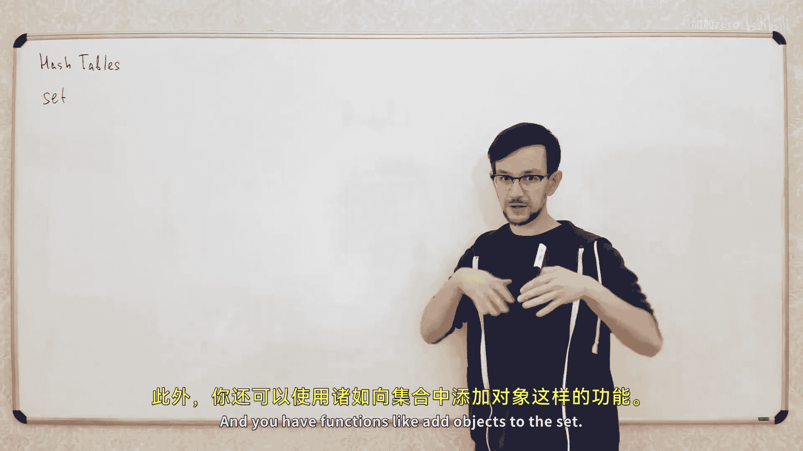
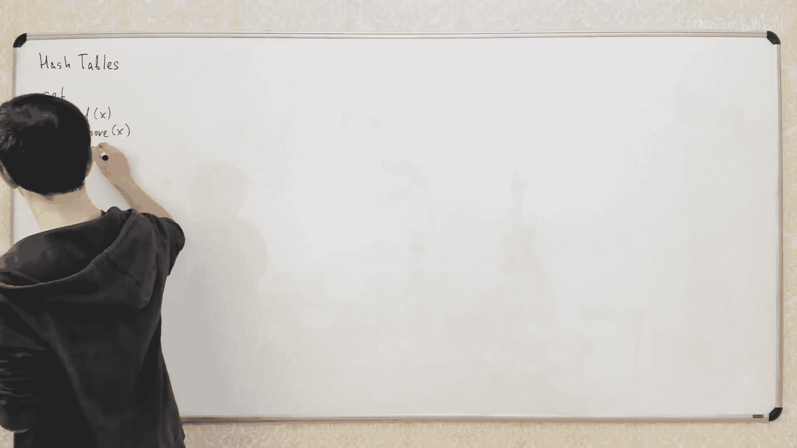
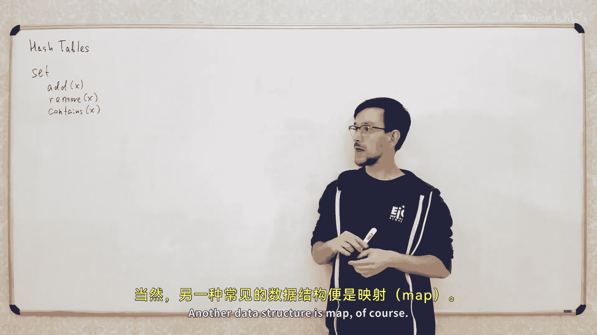
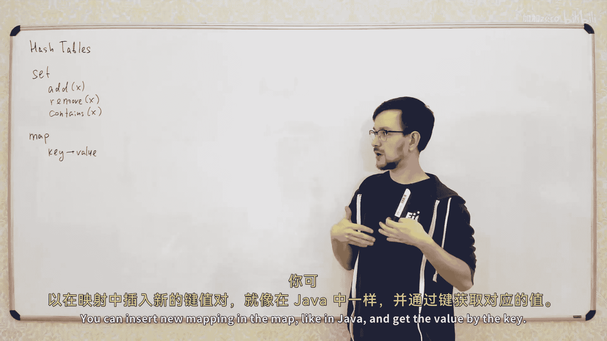
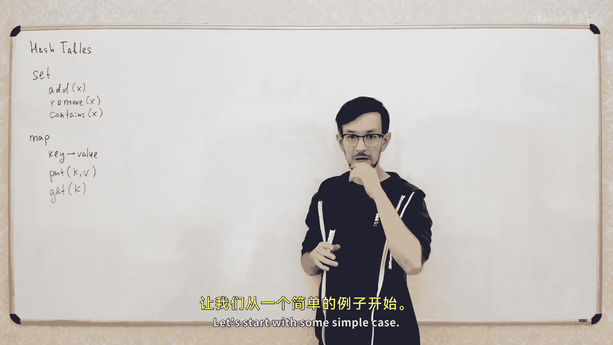

# 【精译⚡算法与数据结构】PavelMavrin p14 p13 A&DS S01E14. Hash tables -BV1NLB8YfEMq_p14-

，🎼中。🎼The。So today we talk about hash tables。What is a hash table， Why do you use hash table？こか。Oh。

Hsh tables a very powerful data structure is kind of strange because it's randomized。

So it may cause some problems in some strange situations， but it's widely used。

 so we'll discuss it and well these guys what to do with hash tables and what not to do with hash tables and so on。

So two major data structures based on hash tables are sets and maps。

So what is a set set is basically safe explaining， so set is some set of objects。And you have。

Functions like add objects to the set。

What's it and。X， remove orbit from the set。And check that objects is in the set of companies。

그。Very basic， the structure is widely used in various different situations like you want to calculate the number of unique objects in your list。

 you put them all in the set and then check the number of elements in the set and so on。あ。

Now that structure is my purpose。

Map is basically like mapping from some objects to another object they call the key object and the value object。

 so it's mapping from key to variables。

It's basically like an array， but as the key， you use an object。诶。

So what what are the base preparations with maps like？要跟。

In short new meeting in in the map。谁 put。语音。Like in Java and get the value by the queue。

嗯。不的だ。So these two are very primitive， very widely used in various different algorithms and various different real projects two very important instructions。

Good so how we implement the data structures using hash tables let's start with some simple case the the simplest case is when the key is a small interteger number。

そび吹き。Is a small， let's say integer number from 0 to m minus1 and M is just some small integer。

So how do you implement， for example， map if you want to have mapping from small integer to some object？

Yeah， yeah， this is called in dictionary in for example William。It's the same destruction。

So how to implement my prediction dictionary if the key object is just a small integer number。

 basically what you can do is just to take an array and use this key as an index in your array。

 so you create an array。

We'll say every a。Op size L。And use your key as an indexing this array。我手出然骨と。啊对。Just simply say hey。

 it think can go to be and well you need to get。By index K， you simply don't。In。

That's all that's the most simple case， how to implement a map when you have small keys。

Now what happens when you when the key is not a small integer， for example。

 if key is this big integer， let's say。嗯，Let's say， let's say key。He's an integer。

 but from some people。B range for you。 And you is big。What you can do？啊。

 what you can do is to make some function。

Which takes a big number and returns a small number and use this small number is an index in your array。

 So we'll do the same。Approach， but instead of using key。As an index。

We will calculate some function from this key and use this function as a key in our array。

 so let's say we a function a from K。And this will be a function from。

Big range to U minus-1 to small range。Oh， for example， let's say。H of k equal to k modular M。嗯。こ。

Nice方。And now how we implement these functions？I'll do it in the wrong way。 we will fix it later。

 So what is the main idea， We will do it something like that K we willll say。

We will calculate this function。From the key and put the value V here。

So now we change this index here。 the key is small。 So we use this key is an index。

 and here that is big so calculate this function get a small number and use this small number as an index in this area。

こ。And when we calculate gear from key， we just return。The same volume。So let's catch some example。

 for example， work out of this array。Sa if size5。Oh。And we could make。不も吃。Let's see， for some 47。

 where。Free。So what will happen we will calculate this function from this number。

 we will have 37 model of5 hits2。れOkay。啊， so it's do。And a rule。

Put this value in the cell corresponding to this hash functions are at 572。

 so we take this second element in our array and put。Com。

I quick a from 37 equal to 2 and we use this as index and this。

And when we need to have to get value from 37。We will calculate the same function。

 get the same value here， so we'll get the same index in the array。

 we will look in the same cell of the array and take the same value which we put here so here what is the idea the hash function is always the same for this hash table。

So here and here we calculate the same function， so we'll get the same result。

 so this index here and index here will be the same。 So here we put this value in some。

So of our A and here well look in the same cell， so we'll take the same value as we put here。Okay。

 that's basic canon， that's the whole idea about fresh tables。

Now let's look what problems we'll have。啊。Rer number one。If you try， for example， Gi。嗯。Let's see。50度。

我够害。You will calculate the same result or the same function from this key。咁 great。한 페지。

It'll be 5052 model of5， it will be again too。So you will look in the same cell。

And get the result to free。That's not correct。Yeah， this freak responds to key 57， not to key 52。

So you can you。Get the wrong result， because you just these two numbers have。The same hashback。

That's called the collision。A lesion is a situation and you have tools， different objects。

 which have the same。还是放式吧。Objects x not equal to y， but they have。Same hasush function。

That sometimes happens that definitely happened because here you have my main numbers here you have a small number of items and。

like if you have mapping from a big range to small range， you will have some collisions。Yes。

喂 호 principle요。オ。So how， how will we fix this first， first。Let's fix our， alright。So。

We need some way to。No which key correspond to this value free， so which we can just put free here。

 We need to remember the key which corresponds to this value free。 So instead of this free。

 well put a pair of two numbers。 We'll put here a pair。 let's see。hir7 entry。

So now our array contains pairs of numbers， pair is key and value。And。

Here we will look at this in this cell but see that this key is different。

 so here have key 52 here we have key57 so we see that the key is different。

 so this value is not the very well looking form。嗯哼。😊，That's the wholeidial。And the second idm。

 Second second idiom。再看到一点啊，what happens。What happens is if you if you want to put another value in the same cell of the array。

 if you want here， for example， you want to put。Valume， let's say again， 52 key 52 value。

 let's say 5。So again， you want to have a map from integer to integer you need integer 47 to map to3 and 50 to map to 5。

嗯。But these two keys have the same。还说哩。So you look in the same cell of this array。

So we somehow need to store these two values in the same cell。

And the easiest way to handle this is just to make a note in each in each。

So of the right make not not one pair， but the list of pairs， so we'll just go in the same。

Soderrate and add this pair to the list of these pairs。So here we have one pair。

 so we'll put another pair here。And now this cell contains two pairs。过渡。好。

How we will implement this get operation very simple， we calculate this spec function。

 go into this cell， look on this list， it's read a whole list。And find the pairish response Ill keep。

Let's back simple implementation。So when we put new pair into our hash map。

 we simply calculate this hash function。Get this sale。And， and。Ber。Can。

So we just add this pair to the list of pairs in this set and when we make the the。

We simply iterate our all pairs。啊。Where do you like this？I'm not sure what lambishes is but。

So I try to iterate all pairs in this cell and put these pairs as X Y。嗯。And if x equal to。

Then I have the parish correspond to this key， so I just returned white。Yeah。If I don't find the。

My key in this list， it means there is no key K in this list， it means that I surely dont know。

This this is very simplified implementation because usually when you put the maybe for some key。

 if you already have this key in your hashmap， you kind of want to remove it and put the new keyback。

So if you already have key this key cap。In your has table， you kind of want to replace it。It's。Just。

 just have a comment here。Okay。So this code is fine if this key is not yet in the old has table。

 so just put this new pair and it's fine。If it may be in your has table。

 you need to find the pair and replace the value。Co。没错。Now let's talk about time complexity。

That's complicated。WellThe time complexity of food is basically constantly because I don't because because again it this simplified version。

 I don't look for this key， I just add a new pair in this list。What about this get？

The worst case time complexity is definitely linear。And。Its actually may be in Europe。そ、もかったんです。

If you have some fixed has function here， so if if you have some fixed has function like here。

 so if I just define this。Fsh fashion is the reason。So create a hash table。

 use this hash function and think everything it will be good。

 but in practice if someone tries to break your program and even if function is simple like this。

 this may happen just randomly。Just because some data is not very random， so your data may be。

Somewhat。Structurized， structuralized so。Sometimes it happens， you may have a lot of keys。

 which have the same cache value it happens， it happens。How do you boy do that？Yeah，不准不叫不叫不叫。Yeah。

 you might try to want to use some。More complicated has function like like these has functions。

 it will not promise you anything。Again， if you use some fixed hash function。

Then someone may generator a lot of objects with the same cache value it's always possible because you have。

if this range is big and this range is small， there are a lot of objects of the same hash value。

 so someone could find a way to generate a lot of objects of the same has value。

And you will try to put all objects in the same cell of the array。

 so you have a list of objects in the cell。This actually happens if you look in the Java code in Java they have some fixed has functions for standard objects。

 so if you have some strings or strings I don't know， longs。

What are the standard objects they have if you look on the realization of hash code methods in the standard Java objects。

 they use some fixed hash function。So it happens you may have situations where you have a lot of objects and you try to put them in a cell。

 same cell three。It's a normal solution。啊。Actually， in Java based。

 they managed to use some different approach they they kind of use。

he used the binary research three instead of the least。To have this have worst case。

 longer time in this case， but not today we talking commit today different stuff。What 어떻게けば啊。

How can you fight these situations like this by you want to use not some fixed hash function。

 but use some random hash function。Let's say for simplicity， for simplicity。

Let's say that hersh function is just a random function。

From us from all possible functions from this to this。So， we use all。Possible has functions。

 What is the number of has functions， we have M power U。Possible functions， right right。

 so we have u values each from a range of M Yeah， so we have M power U possible functions， right？

So let's say we just generate some function randomly from the whole set of all possible functions。

那多菜了。嗯。What's题。What will be the expected of time complexity of this get operation？

Oh see if we pick some key。Complete this has function of K。What will be expected length？Of this list。

嗯。So I'm of。I expect very off this time。啊。Will be equal to the size of this list。

 So what is the expected size of the list？WellLet's see it is the expected number of elements。

Which have has function equal to K。Right。This list contains all the keys in your hash map。

 which have hash function equals to key。And what is this expected number？Let's see for each。For each。

Element。For each element the probability that。嗯，Okay。For each element。

 the probability that h of k equal H， if they're not equal。送衣服。X not equal to K。

Then probability that they have equal h codes。一左会。Why it is so because the function is random if we take so random function this by symmetry。

 we have this probability equal to one over。嗯哼。😊，Is it clear enough？You can prove it more formally。

 but I think it's kind of intuitive。行。Why is N U partial， course what what is random function， wrong。

 How function from， from this range to this range。 So how to define the and how。

 how to define the function。 You need to define values。H of0， H of one， H of2， and so on。

 H of U and all this， all these elements are range from0 to m -1。

So there are M options for each radio and you have U values。

 so the total number of different functions is empower。Mh哼m。😊，酷。Now。

 if this probability equal to one over M。Then to calculate this expected value。

 we just need to have some of all these probabilities and so this will be equal to this。

So itll be n multiplied by one or。And over。So that's the final probability， that's the expected now。

 that the expected size of the list， which we are looking for here。O。So if we have the size of array。

About。And。But then they expect that time complexity will be constant。哦。我。Okay。making questions。

Everything I do is on the board right now， so I just。

I didn't trace anything by now so that's the whole story。By now。嗯。Cool， let's。That was it so。

 so again， if you if you take some random function。And use the random function for your hash table。

 then the expected size of each list will be constant。

So both these functions will work in constant time expected。那。

What if I don't like the collisions if you don't like the collisions？

And you want to avoid collisions。嗯。Is it possible to have a big array？我。哎呀。そ。

What if I don't like the collisions and I want to avoid the collisions？

Is it possible to have an array of big or to have big array。

Such that the probability of collision is less than epsilon。I want to have some pig array。哦。

And make it such big that the probability of the collision is less than some epsilon。嗯。My kids。嗯。

谢谢谢谢谢谢谢谢谢谢谢。😊，嘿嘿嘿嘿嘿嘿嘿嘿嘿嘿嘿。😊，Not sure what youre talking about。

Can shift from one if there is big enough。Okay。No， I want to I want not to shift from one。

 I want to shift to Epsilon。 I want the probability of collision B like as small as possible like if you have。

Oh， it doesn't matter if this e is less than one， it's good enough here， see。If this epsilon is 0。

9 it will be enough for me， I will just run the same program nine times and I will get the array of our collisions。

But。What should be the size of the ray so that the probability of collision is less than some epsilon？

It was， for some absolute。为什么？啊。And if you think about it。

 the problem is that if you want the probability collision be small。

 you need to have the array of size about and squared。

The answer is that the size of the rate should be。About and square。

Why is this happening no basically because what's probabilitybil of collision。

 is it is a probability here that there are two elements， the same cache value。

And if you have an elements。看。Then you have n squared pairs of elements。Where about that square。

Or I can square over two some me。And each bear may have a collision。With probability。

So we have n square pairs。And they have col the probability。呃，我 over啊。

So to have this probability of having at least one collision be less than epsilon。

 you need this M you need this。And be about and square。That sometimes。Thoses the products yeah。No。

 that's kind of strange， mainly the idea is that if you have a group of let's say， 30 people。

Then usually you have two people with the same birthday。你没在还不在就在下班。33 hundred then。诶。

65 days in the year， but usually 30 people is enough to have two people with the same building。Yeah。

 it's not in squares n multiplied by n minus1 divided by two， something like that。

 it doesn't matter because we talk about asyotics， sorry I just get rid of four constants。Cool。

So why you talking about this？That's the problem you kind of can't avoid collisions without spending too much memory if you want to avoid collisions completely。

 you need the array of size and square and if you have million of elements in your hash table。

 you need kind of million square size of the array a million square is too much。

 you don't want to have array of size million square。So for big values of N， you just can do it。

But for small values iss okay， it's actually kind of。

The cacaine available sometimes if you have small hash tables， you can do it like this。

We'll talk about this in next lecture so sometimes you can do it。

 but usually if the size of a has table is big， you're not allowed to spend this amount of memory。故。

동보름보름 조금。不no no no no no no no。空那。This all。我是够吃 you嘞。But in practice， in practice。

You can pick the random function from all possible functions。Yeah。

How can you do it in practice you cant do it in practice。Maybe you can do in practice。

 but I don't know how because not just to beat random values， just to save which way you do pick。

 you need some logo of of this number of bits to store the your hassh function so you have something like。

You lookM。Beats。Yeah， and you don't want to spend your log M bits because because U is huge so this number U is huge so you don't want to spend your logM bits。

That's it， so all this here。Was working when we have some completely random hash function。

But in practice， you can have completely random cache function。Because number of function is to big。

 you can pick random function。That's it， so what do you do in practice？哦。You do things like that。

We will pick H not from the set of all possible functions， but just from a small subset of functions。

We will pick some a small set of good functions。And each time we'll pick some random function from this set of functions。

Let me what I'm talking about。Let me show so。Let's use only functions like this。

Let's see look at function from K equals something like that， let's see。

okay multiplied by some number a。Don't take it more like pig。난 take more 해。

And let these A and P are parameters of this function。嗯。And let's take bees。Is it just big。Randma。嗯。

B brown。No， it's his friend of what's right。嗯。So0 is kind of strange。you may pick zero。

 it will be better than cash functional。That's fine， the probability here the pick0 is quite small。

So let's use this set of hash functions。Again， where each cache function is defined by two integer numbers。

 first integer number is P is some big prime number。And second function is。哎。

It's just a random number from0 to p minus。It's all。

And now when we try to generate some random function， we just generate these two numbers。

 so shall we generate big prime number， we generate big MR。

Why is it prime my eye bit further explain about that。

And we use this the numbers P and A as parameter2 function。Whats again， what happens？

We try to have some random function， but we cannot take absolutely random function because the two many functions we cant pick the random function from the whole set of functions。

So we'll use only this small subset of all possible functions， only functions like this。

And each time we will pick some function from this small set。

And now we'll see if it is enough to have the same time complexity。In everything。go？啊。那。

In parts like this， you kind of need to be careful。

You kind of need to be careful and to see what what actual properties of your functions you need to have your proof of your tangplex in this proof the only property of the hash functions is this。

So this is the only thing we used about our hash functions。

So these all just these are just simple transitions and here we just use the some property of our has function。

 this is the property of our function being random yeah。ちょ。Electrocon， no。

 it's not about comm about the script thematics， it's only the algorithms here here。

We will not talk about commenters。That's not the topic of this course。啊。送そ是什么不能能。

So this is this is the property we need to make this proof。

 let's see if this property is true for this。Set of random functions。What so what do we need we need？

To calculate the probability that for two different。嗯。Ks。아 뚜쭉쭉뚜。Or excellent equal to Y。呃。

Pro should be about one over过来。If we prove this。We will use this fact here and have the same proof。

 so we have the same time complexity here。嗯哼。😊，그。O， let's prove this。Yeah，Lets proof。

So let's see put h of x， h of y put it here， so we have x a modular B。Moular M equal to Y A。

 modular P， modular M。Now we'll move this to the left。And since I have the same model here。

 I can just have this minus inside brackets。So if I put this to the left and simplify this。

 I will get x minus y。Multipliied by a。M do itピ？モドはエ equalと0。哎哎哎哎哎哎哎哎哎哎。So。

 this model M guarantees you that the values are from under end。

 but this probability may be bigger than that。This property is kind of that you if you have two different keys。

That they will put in different brackets。Or different buckets of your。Firstても。啊。

No钱 whyhy this is true。Now let's see what we have here。So here we have some number。

 which is mobile m equal to zero， it means that this number x minus y。A呃 more B。Equal to sum number。

 which is divisible by M sorry sum K multiplied by M。嗯。Now let's see what number maybe be this。

 this is one of the possible so it's M2 m，3 m， and so on。

And this number should be from 0 to p minus sub from0。From0 toピ minus-1。啊。

What is total number of total number of numbers， how many numbers are in range from0 to p minus1 and are divisible by M？

Basically， there are。B over M possible numbers。Right。嗯嗯。

Here from here to here here what I I say that this number model of m equal to zero what does mean it means that this number is divisible by M。

喂。Here just just the same thing。 So this number。Is divisible by M。

I just rewrite it in a different way。Again what is model at am means that you have some number minus something multiplay by M。

诶，咩。If you okay of a model a B。It's a minus k multi by。

I just here here I just minusche play by M and then move it to the right， sorry。

 I make I make two moves。啊。啊啊。Soそ this thing。Should be equal to one of these P or L numbers。Great。啊。

But。If P is prime， you actually， there is a unique number， which you can。This number is not zero。

Because action Y different。So for each number Km， there is unique number A。

 which gives you this product model P。For each。KL。There is only one。A， that gives you。

X minus-1 a equal 2 km。That's basically because P is prime， you can divide。By prime model。

 we will talk about this in the future semesters just how to do it now it's not that important。

what's important that again， if you。Can I write like this song， for example， if P equal to。

 let's say7。And x minus y equal to 2。And so you have equations something like this equal 2 multiplied by a equal to。

Let's say free。我都系。Yeah。And questionss like these always have unique solution。Because。

Because this number is prime。嗯哼。😊，Well， in this case， okay。A equal to four， right？

So equal to four is the only number which you can multiply by two and get the result equal to three model of five。

There will be eight model of violence free， right？So for each number here。

 you have only one possible number a。So this equation holds if a is one of these。

A P over M possible number， so you have kind of P over M bed numbers a。

So let's say if this equation false， it means we have a collision here or we have a collision here。

 so it means that。A is one of these bad numbers we have。These many bed values for a。

And scene a is random。What is probability that you pick one of the bed numbers。

 the probability that a is bad？Equal to P or L。Divided by total numbers of patients。

 over so it one word。Actually， its slightly bigger because heres I need to have sailing of this。😊。

Plus one， doesn't matter。It's about。Slightly better， but it's not important。文聪。

So we just proved that if we pick one of the random functions like this。

Then the probability of this will be about this。That's exactly what we need in this proof。Good做。And。

Again， let's talk about this， but you kind of need to be very careful when you work with hash functions。

Because。Sometimes you need different properties from your hash functions。For example。

 let me show your chest。A simple example。So I era this， I era this。To equal to different model of5。

 equal to3， Yeah equal to4， Yeah you have two multiplied by4， it's8 model of5 is3。Looks fine。啊。

我腿有去啊看。Let's imagine。That we have some random hash functions。And this function。

 we have some different set of has functions and this set。

Satiisticfiies the following property this property property that for each the property the probability that。

Cresh function equals to I equal to 1 over m for all i from 0 to m minus1。Because。

 let's imagine we have some different set of hash functions。And we pick some random has function。

And we know that this property is satisfied。It looks kind of natural。 What is this property。

 This property says that for each。For each key。The probability of that has function equals to I。

Equals to one orura。So it's kind of if you take one key。

 the probability that you put it in each bucket of your has table is equal。Looks kind of nice short。

 right？Is this property enough to have this time complexity。确实。拿我钱况。そ。

Is this property enough to achieve the same time complexity so if we pick some different set of functions and again。

 we will pick some random function from this set。And this set of functions will satisfy this property。

Is it enough to have the same time complexity here？ふ呵。😊，You're thinking about should we borrow this。

This just the simple numbers here。It's not important for this lecture。It's justね。

You're thinking too much about this， if you're not good about the numbers theory。

 you're just watching other lectures about numbers filter rates。It's not that complicated section。

 we use very， very primitive。啊。Ts。Now let's go back， don' go， let's go back again， again。

 what I was thinking about。If you have some set of hash functions。

And you pick some random function from this set。And you prove that you have these properties。

So for each key， the probability what you will put。This key into each bucket is equal to one order。

So for example， this kind of symmetrical so you may put your element in each bucket with equal probability。

Is it enough to have this time complexity on？Let's have a vote。水 theアフなント。啊。It's just。

Stop thinking about this that's not as important as just。Just， just some。just some simple math。

 actually。对。啊。Again， we have， okay， we have one more four four， we have one more four yes。

The answer is no why it is not enough， because， for example， let's。

Let's have a set of set functions like this。Let's have a function H of x， which is equal to I。

If you have a set of set function， hash functions like this。

And each time you just pick the random function from this set，So you may pick any。

 any function from the set of equalco probability。嗯。So for each key x。

 the probability that it will this function will put you in this bucket is equal to1 orm。

But what is the problem， the problem is this function is the same for all keys。😡，So you have。

You have this three a。And if you use one of these cache functions。

 it will try to put all your elements in the same bucket。

So you have one big list and all will be empty。The probability of each list will be the same。

 so each each list will maybe be full with equal probability。😊，So it's kind of symmetrical。

 but that doesn't give you anything。Because that's what we need。

 you need this property and you always need to be careful about this because for different data structures。

 you may need different properties from your has functions in this data structure all we need is this property so it's satisfied here so it's good enough。

In different structures， you may suck up some different properties。

Sometimes pretty complicated purposes actually。But here'sこ。O。这么多会客哦，不行。쭉쭉쭉쭉쭉쭉 좀。Oh no。

 I don't talk about this， I don't want to talk about some complicated data structure sectioning。No。

 I'm not ready to talk about this。Maybe next time， maybe next time。啊。

Now what want talk two of things I want to talk about。Firsting is。

How to use hash tables when you have not integer values， but some different values。

If you use hash tables and your keys are not integers， but some different objects。

Basically what you need is to make something like that。You want to have some function。

 some set of hash functions。Wech have some random parameters like this。

And you these hash functions use these random parameters to calculate your hash functions and you kind of want to prove something like that。

We'll talk about this in。In home duk next week。How to calculate different has functions。

 what are actually has functions looking in Java and Python and sub？嗯。There was something milk。嗯。

Okay， let's move to open。あ。TheNext thing I was I want to talk about is。

A little bit different approach to handle the collisions。So here what have， again。

 collisions happens， you can avoid the collisions if you want to avoid collisions。

 you need to have a array of size n square， you can have an array size n square。

 you kind of need to have some mechanism to de withte the collisions。There's one possible strategy。

 You can create a list in each in each bucket。 You create a list of。

All possible keys in this bucket and if you add one more key in this bucket you just add to the list and so on。

ThatThat's nice it's working， the tank of is good， so everything's good here。

 but there are different approaches。And now we'll talk about different form。

 it's called open resting。哦。Aresing， is it， is it is it very。I think it's。그 correct。

I'm not both with English termss。I think it's fine， yeah。Yeah。H。😊。

It looks like USB circuit is broken at this pipe。Let's很穷啊。No， I see I feel some。No。

 it's definitely something with UB shortage。Okay， we'll fix it later， we will fix it later。啊。

I was talking about open addressing。Open listening is another strategy to deal with。Collions。

What is the idea， Okay， you have， you have an array and you put again。

 you do do base you have this value。 you calculate let's。make it a bit。Of I have these pairs。做备我人。

Okay。So again the ID is the same， you get get this pair， you calculate the hash code。

 pull this pair in the cell discussion code here。I'm getting you a go this question for you。그 그것도 또。

Go here and put this variation。嗯。No no。有。Try to put the same in this audienceium 52 and5。So again。

 you go quickly。P。Pro this is 52。Go to the same cell， and try to put。

Wry to put this pair in the same cell。The algorithm， very simple。can。

 if you try to put some value in the cell but the cell is occupied。

 you just go to the right to the next empty cell and put this pair in the closest empty cell to the right。

 so start from here， go to the right until you find the next empty cell。

And then put this pair in this engine。That's all， that's the whole idea。Let's。

Let's write some simple implementation， so what happens when you quote somewhere？Again。

 let's go plate the fish。From this key and go to the right until we find them。Empty cells。

 So while AI is not not。We just go to the right？Go to the right。Let's do it in cycle。

 so we say I equal to i plus1。만 거 돼 안。어。Just make the cyclic array right。

 so so when you reach the right border， you just start from the beginning。So you find the nearest。

Empty cell and just put your prayer in this empty cell。북 북 북 북。Like this。我 know and how you made it。

嗯。😊，嗯。嗯。Tfer， is this key in this value？We're making map， so that's the key。Let's do。Now。

 how to make the get operation， What happens when you make get？So again， you make gi of K。

 you calculate the hash volume。So we calculate the fresh are you okay？

You find some position in your area。Now you try to find the pair which have k equal to k starting from this position。

 so where maybe this pair with key equal to k its either here or two there， so you you go here。

And start to look。For some pair， which have the keyboard。When do you stop your search？

They stop your search when you reach some empty cell。

 so if you go to the right and then find some empty cell。

It means that there is no K in your hash table。So if you start from here。

 go to the right to the right to right， so these cells contain some pairs which is not k and this cell is empty。

哎，嘿嘿。Yes， they have the same hash value so again you try to put them in the same cell when you put the first one。

 you just occupy this cell， when you put the second one， you start on this position。

 go to the right until you find the next empty cell and then you put the pair in the next empty cell so you find the closest empty cell you' at。

Yeah， hash pop is simple and over here。Is a array of thumb。Tricks， let's say。あ。Everything is。

 so if you look at any structure， you'll find some array point or stuff like this。

There's no some strange magic about data structures， they use some arrays， point or stuff like that。

Everything don' thing is simple actually。啊。Yes， and at all array just stored in the transistors and stuff like that。

Computer is not full of magic， it's full of technology as well all technology is kind of when you go to the bottom it's something like that。

 so there's some basic primitive。objectsject。And then you have some complicated algorithms on top of these basic structures。

 so you have some complicated structures。嗯。Tru is not an array， everything， everything is an array。

 if your memory is an array， you have random access memory， random access memory is an array。

 basically you use them。You can ask it for value in some position in some index of your re。

 and you will get the value in this position。So inside the computer everything is basically in the right。

Not exactly but'm very close to this。嗯。Now I what I was talking about， so here's the put operation。

 here's the expression， how to make get operation。You want to get the value by your key。

 you calculate the hash of your key， find this position in your array now you go to the right trying to find the pair which contains the key key。

Go two possible cases， if your key is actually in the hassh table then you will go to the right and eventually you will find the pair which contains your key if key is not in your hash table and then you go to the right and eventually you will find some empty cell if you find some empty cell。

 it means there is no key in your hash table。Because if there will be K in your her table。

Then okay again if case somewhere here。So we have this so emptyn case here， this should happen。

Because how did add that here when we add when we put k in our trash table。

 we try to find the closest position to the right closest empty position to the right so the closest empty position to the right from here is this position y k is here。

 it shouldn't be here。So if you go to the right and find the empty cell。

 it means there is no K in your。Fしても。こう。So let's let's implemented something like that。

 So we complete F function and then。Again， why it's not known。We look at this cell I see if， if。嗯。

Cst。First， equal go to k， and then we will return。So it means we will find the pair， which have KK。

if not。If we reach some empty to cell？It means that there iss no key， let me return now。

That's basically the whole implementation of the open Raing heshma。Looks like this。No。

Let's talk about time complexity and the size of the array。嗯。嗯。Yeah。

 we need to store the pair of key and value because when you try to when you make get。

 you don't know which key response to this value。So if you have different keys with the same hash value。

 you go to the same cell and you don't know this very correspond to this key or this key。

So kind of need these pairs if you're weing it to map。

And if you have collisions and if you don't have collisions， you actually don't think this。

 if you have collisions， you need some way to distinguish different keys。啊。Now。

 so if you have cache table of1 elements。What should be the size of the rate？我吃衣衣服。

If we have the size of the rate equal to n， what will happen？Some strange things are all happening。

Well think about it a little。You have a array of size n， you put n values in this array。

 so all cells are occupied。不能。嗯。What trick， What trick。 What trick。Whatち去とかな。Let's get here。

 here we have array array of size5。What will happen if you put five values in this array？没有。

No simple thing will happen， all cells will be occupied。

You you put this if you make another three puts。Put something， Put something， and put something。

In this array， then all cells will be filleded with some element。So we have no empty。

No empty elements of hearing。啊，那。What。What will this virus do if all cells are occupied。

 it will work infinitely because you start off some cell and you try to find the closest empty cell。

And you can find a empty cell， so if you call this gear operation with some key。

 which is not in your press table。Then this while we work in Finland。

So your program just dependss up。how to fix this， and you fix this very simple。

 you make really not of size n but size 2M。Actually， I think 1。5 should be enough noted。

 not sure about this， I will not talk about this to end。Yeah，昨 I am now都 have。

ここ quite good hash table。So what happens if you have m equal to n。

 it means that about half of your cells of your A empty seeing。So we have something like this。

So kind of the at sense10 and some five elements are all the way。Something like that。

So there are many empty cells in your area。And if you start at some position。

 you go right to the closest cell and closest empty cells will be quite close。

Because there are a lot of empty cells in the U。嗯。Okay， let's like， let's do this。 Let's do this。

 It circle here。 get it circle here and it circle。嗯。嗯 he right， I didn't move the eye。い。

And you didn't know this。嗯。啊。Again见啊。Time complexity depends on number of steps of this while， right？

And this while。So a number of steps of these vials depends on the distance to the closest empty cell to the right。

 so you start in some position， you start in some position。I have the same pictures there okay。

And try to find the closest empty cell right。And the time complexity depends on the number of steps you need to make to find the empty cell。

嗯哼。Well， let's think。If服。All empty cells are somehow randomly distributed so。

 if you have some random function， it's kind of。It's almost true these empty cells are evenly distributed because among all the cells of the array。

So each cell may be empty the probability like a half。Probability that a pi equal to nu。

equal거 to one。Yeah because we bit of high， half of salsa filled， half of salsa are empty。嗯。特し。Here。

 you continue your while if the cell is not normal。

 so the probability of you will go on the next step of your loop is one half。So what is。

 if we say that it's this true， it's so always true。

 what will be the expected number of steps until you find the empty cell？嗯。

It will be so if you make each next step of probability12。Then。The number of steps。Re bin。W， right。

So expect the number of steps。都被往回。Which is one step of probability。

 one over two plus two steps of probability， one over four plus three steps probability one over8 to us and so on。

 we go to。走。那我在什么时。Go shoot that let's me to zero on it zero step probably one，아 그。N忘。Like this。

You're going to think about a little bit different， so what is the expected number？

So make the first step， the probability in one over two。

We make the second step with probability 1 over4。First step one。There's definitely one。嗯。那。

That's almost true， not exactly what is the problem that these probabilities are not independent。So。

呃。Because of the way， how do you put these elements in your array。

 there may be some clusters of field cells。What happens when you use open addressing hashmap is like this。

If you have some series of occupied cells。Some big cluster of occupied cells。

There is a big probability that the next element you will put in your has table will be put in this cluster。

 so you try to put the next element and you go into here。

And if your hash function is inside this cluster， then you will put your value in the next element right here。

And you will extend this cluster even more。 So what happens in open addressing hassh mapps is that this。

Clusters have tendency to grow if you have some big cluster of occupied cells and they have big probability。

 will it will be in it will lower them， it will be expanded even more。嗯。This may happen。

 this happens sometimes。That's fine。The probability of this is if you calculate a probability good enough。

 I believe for chemical 2 n。The problem the expected。Time complexity of get is still constant。

I'm pretty sure this I didn't check。I didn't sure。Well， it must be constant。

I don't know how to prove this exactly。Because this。That's not that trivial to prove。

 that's not trivial to prove because of this cluster and stuff and so on。

 but I'm pretty sure it's still constant，'s not that important for this lecture。

You only try to find the correct proof。What's good about open addressing。

 let's talk about what is good about open addressing and why I love open addressing why it's used sometimes it looks like it's kind of overcompated stuff right so why do you use open addressing when you can use just simple lists？

And we prove that the tankkerplex is good， there is no magic like this， no clustering。

 no stuff like this。The good thing about an arrest is about it's quite efficient。

 you don't need to have this list。List actually uses some memory you need some additional memory to store this lists。

And if you use， for example， linked list you need to have additional pointers to each element like how does your link list you have a pointer to the next element。

 so for each element you need to have an additional pointer to the next element。And。😊，And also。

 it's not good for cashing。If if you have linked list。Then when you iterate a limb list。

 you need to jump over the memory in a random order and it's not good for caching。

And if you use openland dressing， it's very good in procusion because you iterate。

It's some continuous segment of your。And。Your memory works like works that way。

 so if you have some continuous access to your memory。

 it's very fast because the ca works pretty fast。If you load one element of your array。

 the cache will lose the block of elements。We will talk about this in the future election。

In practice， this may be equal。More efficient than the approach of theses we discussed before。

So it's kind of cool stuff for breakfast。啊。H。What provided with vegetables table empty in。

No problem we go here， it is now， so we jump here， I don't know if cache table is empty。

 then all cells are now。So we go here， see it is now， go here， we don't know。No problem。Mmhm。😊，啊。

Finally， what can you do with this problem like this how can you avoid situations like this。

 there are several approaches which help you to avoid clustering like this。Basic approach is。Here。

 what we did here， when we find this this cell is empty and we go to the right with step equal to one。

 so each time we step one cell forward into to the right。You can。

 that's not exactly you can do it in different ways。 For example。

 you can make each each next step bigger than previous step， you can make step one， then make step。

Two cells to the right then make three cells to the right。And so。So if you start here。

And you find this block。You first go one photo item and and you go to the same cell。

Let's have more bite cells。So first you move one into write。

 then two cells to write and three cells to write one to three。能不去会就行。Okay。

That will somehow decrease the number of the size of these clusters。啊。Also。

 you you can do even more you can make each next step equal to。So if you make step step I。

 you make jump on I square， so you make first jump of one cell to the right then four cells to the right。

F。错错错 true。Let me jump here。Then jump nine， cells first jump one， then jump two。

 then jump nine to four and so。そうヒヒヒですねそうヒヒる。Here we're on the jump jump one cell to the right。

You can change this， you can jump to， you can make a jump of different length。It。

AsSo as you have the same jumps for the same value okay。 So for， for same value okay。

 you need to make the same jumps here and。Here， so here and here。

You need to make the same jumps because when you put the value and when you get a value。

 you need to visit the same cells。Yeah， good。呃。Yeah finally。

 what you can do is to make jumps make make the length of your jump also random you may have jumps of size。

ちょポンポポン。So you start from here and make jumps of some length。

 you make this length equal to another hash functions and has hash two of K。So go82 has functions。

First has functions you use to find the initial index in the array and second has function you used to make these jumps。

And again， this function， this second cache function will be the same here and here。

 so you will visit the same cells in both these functions it means if you put something in the h table you will find it in the same place。

Thats thing。Okay， but khemi is not as good here here， if this hash function is big。

 then you have problems with， you have a lot of cache misses。

 basically every time you go you have a khemi。Yeah。So let's kind of trade off between this and this。

啊。Now， final few thoughts about hash tables first。Again， how do you implement hash table？

G a hash function from some set of random functions， some sort of left。

You pick a random function from some set of functions and use this as your hash function。

Now you create all this algorithm and so on。啊。And if your function is actually random。

 then actually everything is good。But what may happen， what may happen if you use some。

 you choose some random function trivial set。Starting from this point。

 everything everything is not random， so the only random point is when you pick your hash function after this everything is determinedtri。

Everything after this point is not random。So what going happen？啊。What may happen。

 it may happen that you pick some random function and create your hash table and then somebody find out what hash function do you use。

唱好还怎 know。And he start to gives you the values which have the same cache function。So yeah。

 if someone knows what F function do you use？He might give you a lot of keys with the same has function。

What can you do so？Can you have some， you have some。We have some cache function。

 so we have this value。And someone gives you some direction to put some key on。オートケトオートケーフレンス。

And they all have the same。

V of edge。How can you avoid situations like this？First， how， how to。

 how can you detect situation like this。 It's very simple。 You can detect this。 So if some bucket is。

To too big。 So if you check check the sizes of buckets in each cell of your array if one bucket is。

Too big， it means that something is going wrong so we just proved that the expected size of bucket should be constant。

 so if one bucket looks too big， it means that something is wrong。

You kind of make this check like each， let's say， thousand operations。That some bucket is too big。

 it shouldn't be that big。And if one bucket is too big。

 what you can do is to get another random function from your set。So again。

 you look to your set of random functions， pick another random function。

 then throw away your previous hash function， use the next hash function and recreate the whole hash table from scratchch。

 so again you get all elements from your hash table。

 create another hash table and put your elements in the new hash table with the new hash function。

And if all these keys have the same hassh function here for the new hassh function。

 it will again be be random。Because we take the new hash function。

 so they all have different hash values。So again， all these probability stuff works。

 so again if you find out that something is strange。

 you might pick another hash function and rehesh everything。That's one of the way to deal with this。

啊，I'm not sure about properties of these functions。That must be a complicated proof。

I think there is no easy proof for this。I'll check and never' try to prove of this section。

I'm not sure which properties do you need to have this。Not sure about this。That's all， so again。

 what you have if you if you see something wrong， you may throw away your hash function。

 pick a new hash function， and re hassh everything。あ、あれて。

Creating the has table from given elements focus in linear time because if expected linear time。

 so if you make it。From time to time it's okay， so if every n operations you rehash everything。

 you spend another n operations， so again the amortized time will be constant。And in the same way。

 what happens when you。Whenally you have this what was usually happening。

 you have some hash table yeah and you like put a new wireless in your hash table and you actually don't make this area of fixed size if from the beginning you know that you will put like n elements in your hash table you can create narrative size n。

Yeah。And put an elements in this array。But in practice。

 you usually don't know how many elements will be in this array。

So you create some summary and try to put these elements what happens when you have too many elements in your hash table like in vector。

 you throw away your current hash table， create a new array twice bigger than the previous array and put all your elements from previous hash table to the new hassh table。

Again， it works in linear time and if you make it when you increase the size twice。

The amort time will be constant like in vector。You need a generator of， yes。

 you kind of need some way to generate a new random function。Again。

 in the random function we discussed， we have only two random parameters。

 so we kind of need to generate these two numbers。Yeah， you may create nu function。

 which gives you a new hash function。So goods nice。Why should you financial your students。

 that's a nice question。We will talk about binary research trees in the next semester。

 it is another data structure used for。My absence assets。two possible。

are two things why why it may be better than use vegetables， first thing of course。

 because it is not randomized， that time complexity of binary search tree will be always slogan。

 in worst case， there is no magic in balance search trees is very simple very robust data and。嗯。

The second， why will we use binary search trees because there are many more operations in binary search trees and hash tables。

 basically binary search tree allows you to have some sorted list。

Here here we have some set of elements and then by we have them in some linear ordering so we can go to the next element to the previous element。

Find maximum meaning， and so on。So we'll discuss all this in the next semester。Binary research trees。

Looks kind of the same because they use for maps and sets。

 but they also value a lot of different operationss， which are not。May be implemented in Hersht。

So cache sets， just give you a set and a mark。So you can have the set of elements and check that element is in your set or you have a map and get the value by the key and that's basically all you can do about hash tables and in binary search trees you can have the order of elements so you can find previous elements。

 next elements and so on。🎼不走。🎼。