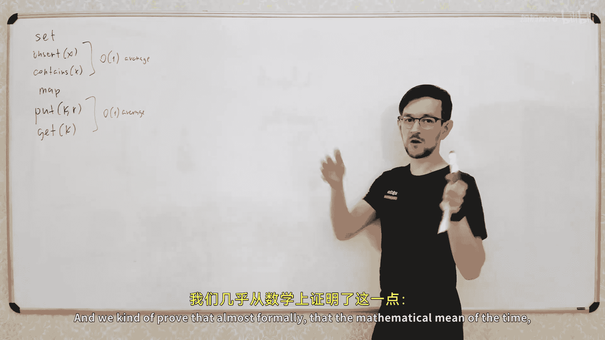
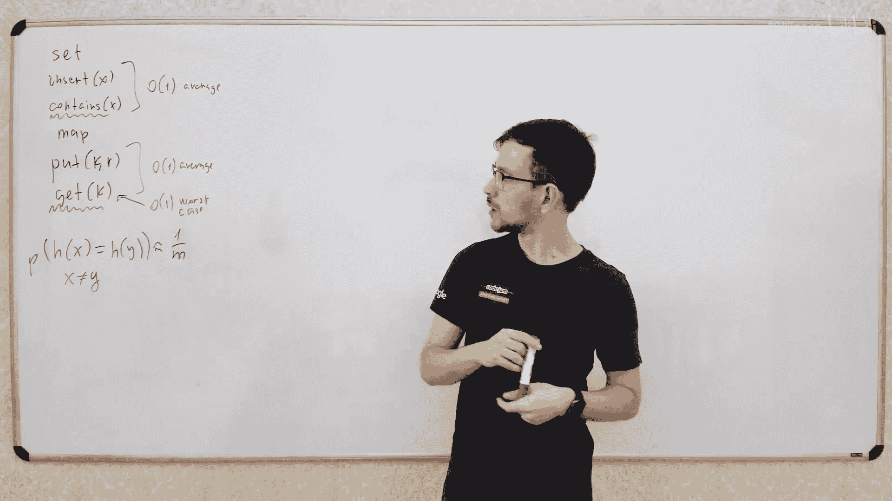
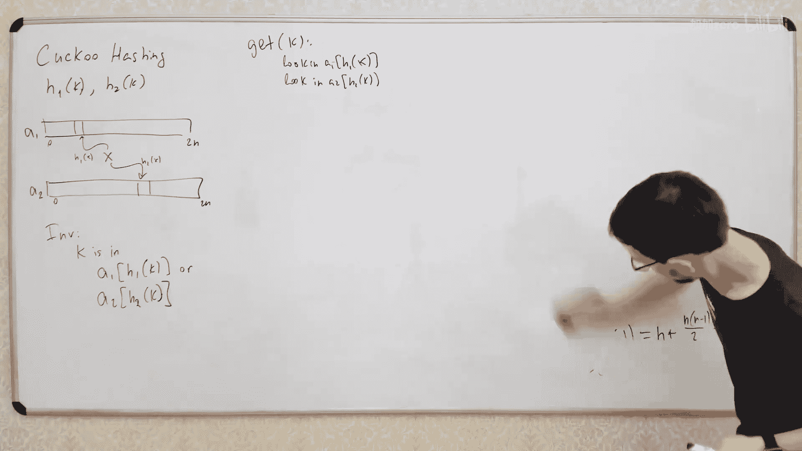
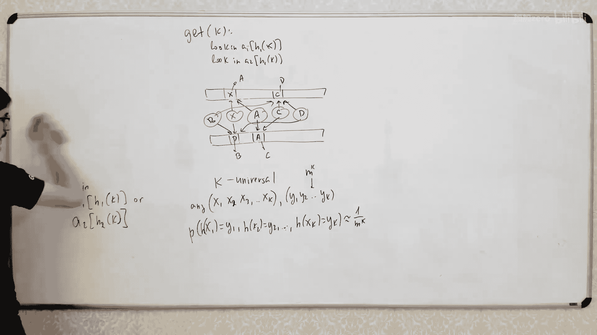
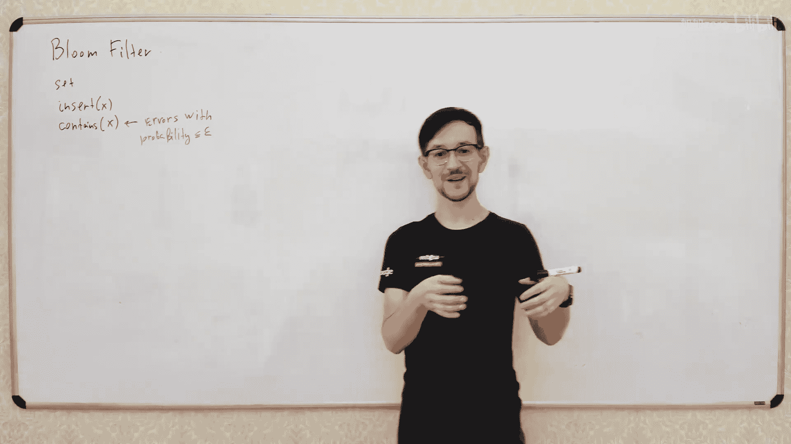

# 【精译⚡算法与数据结构】PavelMavrin p15 p14 A&DS S01E15. Perfect hashing, cuckoo hashing, Bloom filter -BV1NLB8YfEMq_p15-

，🎼中。🎼The。So today's the final lecture of the semester， we will continue to talk about hash tables。

 we'll discuss a few more techniques， how to can you get a hash table and also discuss a blue filter。

 so let's go。

啊。First， what we discussed last time， was family we talking about hash tables。

And we build a hash table which gives us a like which has two types of that structures for sent。

Re operationss like insert and remove。I just let only insert the these discuss move much and to come things。

And the second type of the structure was map。And for my map is like mapping from some set of keys to some set of values。

So we have two operationss like food very key value and get value by the key。

And we learn how to do both these data structures with。Let's see with average time。啊。B of one。그。

And what kind of proof that that did？Almost formally， that the。啊。

My mathematical meaning of the time of the complexity of both the separation is constant if we have a good cache function and the good cache function is which gives you something like that。

 so if we have some cache function which gives you something like that with probability of collision。

Is about one over L。For x not equal to y。Then we have some stuff like this for the complexity。不ご。嗯。

So what we'll discuss today， first Sc will build another type of hash table with the following property。

 sometimes you want your hash table to be able to answer your requests in constant time in worst case。

 not in average but in worst case。Well， it's quite obvious you can that build the has table with both inspiration。

 working in constant time in worst case kind of because you there is a big set of keys and you kind of want to。

Cculate some function from these keys and you cannot do it without collisions so you can avoid collisions completely but what we willll do we will try to avoid collisions when you get value。

 so when you put value in your hash table you still may have some collisions and you need to deal with these collisions。

But when you make this get direction。All these campaigns。对。We want to avoid the collisions。

 so we want this get and this contains working constant time and worth days。

W may you want something like this， Because in in some cases， you kind of use this。

You make some preparation， you create your hash table and then you use this hash table a lot。

 so you want to spend some time to prepare a good hash table and then you have a lot of requests to this hash table and you want these request to work in constant time in the worst case。

 so you want to guarantee that all these getss work in constant time。

 but you kind of may spend some time to prepare so this function works on average so you may spend more than constant time to make this puts but you make all these puts on average you spend like linear time of time to put all elements in your hash table and then you make a lot of gis and all the getss working in constant time in worst case so this gi is guaranteed to work in constant time。

Yeah上回准。아두두름쭉쭈두름쭉춤。对。

So we will add this one property to the hash table we get the property that this get operation so operations which doesn't。

Change the state of the Htoro。So this get doesn't change this and this contained operation does change the state of the hash table it's only makes a request so you go to has table entry。

 return somewhere you don't change the state of the hash table。

 so these operationss should work in course some time always。开这种。L two techniques。啊。

Which gives you this result first technique is。Caold perfect cash。그。

let's see so let's remember how did we build this hash table in last lecture we did something like that。

 we create an array。系。of size L。And when we make this。부。Okay。

 we calculate the hash value of this key let's say I equal to hash of this key。

And then we add this pair to the corresponding bucket of this， right。WeGo to this cell I。

In each cell， we have some list。Of all keys， which goes into this bucket and we just add this pair kv to this bucket。

过。And how we make this get operation， where we make this get operation， we calculate the same。

Hsh value from the key。And iterate all hold this list to find this pair of K and V。

 so we iterate all this list。Find this pair and get this video。Yeah。

 that's what we discussed last time。Now let's try to improve this。HowHow will improve this。

 why it's not working constant time always， why it might work in linear time because if you have a long list。

Then you need to iterate all elements of this list。

 we prove that the average length of the list is constant。

 so on average it is working in constant time。But in worst case。This list may be long。

 and if you actually calculate the the mean the meaning of the。

The mean value of the longest list in the hash table， it will not be constant。

Like if you like if you randomly put values in end buckets。

And then look on the longest on the largest bucket。

 the number of element in the largest bucket is not constant like roommate。

It's's not it's not that simple it's kind of。ItsIt's not the simple to prove but you can do it you you cant read that it read but it it's not the topic of this lecture so on average the length of the longest list so again the length of the average length of the list is constant but the length of the longest list is not constant。

啊，不。Get a hash of hash of hash for some reasons，For some reasons， you can。Now。

 how can we improve this， we will improve this in the following one。Let's see what we do while we。

And how people we do get the version？Oh， let's see what this is。And。Thisキ it。啊，How you。

How you make get operation， you then you calculate this hash value。And then you find。This key in。

In this bucket。That's what we's what were looking now let's try to change this list。

This sum another data structure， which allow us to find this key in this bucket firstta。

 then just by generating all all elements。So this time complexity is not wasn't constant because if this list is long。

 then we need to spend some time to find this element in this list because you cannot find the element in the list in constant time。

 obviously。So let's try to change this list of some data structure。

 which will allow you to find the value in this bucket in Constantine。Now。

 what data structure can we use to find elements in the set in constant time？嗯。嗯。Any thoughts？

如我有就是块水。Instead of having the list of all elements in the same bucket。

 we will have a hash table of all elements in the same bucket。Yeah。

 we will push hash tables inside the has tables。West Coast customs approved。What now。again。

 we'll do the same， we'll calculate this hash value， go to this bucket。

 and find this key in this small hash table inside this bucket。So we have one big hash table。

And in each bucket of this vegetable table， we have a small vegetable table。こ？Yes。

 we need another hash function right if we use the same hash function for this small hash hash table we will have problem because all these elements here have the same hash value so we will use a hash table another hash function also we will use different hash function for every bucket。

😊，So let's see。So in bucket， I will have。Csh stable。With has function。We。hassh function。 let's see。

 G I of。Okay。So we'll create。We have a lot of different hash functions we'll use one hash function for this big hash table。

And a small hassh function for every bucket of this big hassh table。こ。Yeah， that's a good question。

 what will happen if in this small hash table we have another collision？😊，Again。

 we try to use hash table because we try to avoid the collisions， but in this small hash table。

 we still may have some collisions。So what we'll do to avoid the collisions in this smoke stable？

One way is to create other small hash tables in each bucket of this small has table。

 but we need to stop some is at some point because if you create a hash table on each layer of your hash table。

 at some point you will have a lot of layers of hash tables and these number of layers will not be constant。

So。We will try to work differently， we will solve this problem one way we will try to create a small hash table without any collisions。

 so we'll make this hash table collision free let's let's see we have no collisions in this hash table。

How can we create a has table of collisions No we discussed it on last lecture it's possible to create a hasable without collisions if you have an array big enough so if the number of buckets is big enough。

Then you may create the cache table without the collisions。And to do this。

 you need a number of buckets be about。N squared yeah。If this m is about 1 squared， first of all。

 let's say this size of this voltage cache table， sorry here， let's say m equal to n。

So this hash table will be of size M， it will be enough。

 and these small hash tables will have size equal to square of the number of elements in this bucket。

So if跟 I。Its那。Of elements。In bark I。Then we have the size of this bucket equal to m squared。

If you make the number of buckets equal to n squared。

You will have quite big probability that you will have no collisions at all。

What happened if you have a collision， if you have a collision。

 you just get another hash function and again drag it dragon again until you find a hash function which has no collisions。

At some point， you will find the first function which have no collisions because if you have。

Size of n square， then the probability of the have collisions is about。王好。嗯。So about after about two。

Trice， you will find the has function which have no collisions。有。Multiplyly degrees public students。

you need to have some set of has like we discussed last time。

 you need to have some set of hash functions。With this property。

So we will take this cache function from some it's called universal set of has functions standard so you need some universal set of has functions。

 so each time you take this GI from some set。H， let's see， it's big H。

So it is some set of hash functions。Each time you take the random function from this set。

And with good probability， you will have no collisions in your hash table。Why you have no collisions。

 no because let's calculate the average number of collisions。So the average number of collisions。

Will be。how to calculate the average number of collisions。

 you need to calculate the probability for each pair of keys to have a collision。

 so we'll have let's say n and minus1 or two number of pairs and for each pair you have a collision with probability1 over m。

So if size is n squared。Then with probability1 over n square， you have a collision。

So it is about one half。So we。Again， this is the estimated number of collisions in yourre table。

So if the estimated number of collisions is 1 high， then probability。The number of collisions。

Is at least one is no more than one half of this one， right。It itとす。Again。

 this is the estimated number of collisions，😡，So you may have zero collisions， one collision。

 two collisions， and so on。You have probability to have each number of collisions。

So estimated number of collisions is12。So if estimated number is 12。

 then probability the number of collisionss greater or equal than the1 should be less equal than12。

はい。It's a tough。So there's a good probability， you have a hash table without any collisions。

So after this is the real probability， so take if you take the element from this universal set。

 so you're taking a cacheh function from this set。You have a du ability。

 having no collision in your stable。So after a few tries。After about two triess actually。

 you will find the hash function， which have no collisions。Yeah。Okay。

 I think guess it should be quite clear by now。It's not it's。And yet， it's kind important。

If you're still not good about probabilities， I think you kind you need to just。I just believe then。

Again。I guess what？What is the idea if the size of hash table。

 so if number of buckets is about 10 square， then probability of your ca at least one collision is less than1 half。

And if it is less than a half， you can try。New hassh functions until you find a hash function。

 which have no collisions。And it will happen quite soon because you have a good big probability here that you have no hash fund and no collisions。

うって。🤧别走。That all that's how you do it so again for each bucket。

 we have some elements in this bucket and we will try new hash function until we find hassh function which have no collisions。

It will have a one， so for each bucket we will create a hash table without collisions。This后盾。

And now now this get worse in constant time because here we just calculate the hash function and now we find this value and it works in constant time in worst case。

 because this hash table have no collisions。That's all， that's the hope one。

The probability of collision is greater than half one half probability that you have collision is less than common health。

 then probability that you have no collision is greater than one half yeah。This dependent type of。

 hash tables always depend on theh on the hash functions you use。

You need to have a good has function and you always need to take care about how good your has function is。

 so you kind of need to think what properties of your we discussed last time just repeat。

 you need to kind of look what properties do you need to have of your hassh functions of the set of hassh functions you use。

In this case， this is the property unit， you need the property that。It has some name actually。

 I'm not sure about understanding。工。It's pretty simple property and the probability that two different elements have the same hash value is less is about one divided by section elements。

 let's have it something like this。That's more formally， what do we need？So we need。

The probability in that two elements have the same fresh value be less than some constant constant over the size of this has table。

Yeah， let's talk about my， now let's talk about memory， why didn't we do it last time。

 why can't we just create a one big has table without the collisions？😡。

Because we discussed at last time， if we create one vegetable with the dark collisions。

 we need to spend n square memory。And that's not what you need。

 You usually don't want to spend and square memory for your hash table。

 it's too much but in this case， in this case， we create hash tables only for this small hash table。

 so this hash table have size and n。And this small has table have size equal to an square。

So the total size of this has table is some of this an ice square。お。

So let's see what is the average size of this big hassh table。

 so some of all these sizes of all small hassh table。呃， if。Again， if your hash functions are good。

Then let's look on this value， what is this value， this value is the sum of squares of sizes of each bucket of your big has table。

嗯嗯嗯嗯。The historicaltor is the same。Yes， if you want to make I will talk about static data structure。

 so you kind of first you insert all elements into your hash table and then you make your gis。

If you want to mix this separation so you add some element and get。

 then again put some another element and again get。

 so if you want to make dynamic data structure you need some adjustments。

I mostly talk about static destruction because it's mostly how it's used mostly it's used like this first you add a lot of elements to your hash table and then you make a lot of getss so first you make inserts then you make getss that's how it's usually work if you need to make dynamic destruction then you need some way to relocate this hash tables when you change something so if you insert new elements in the hash table if you have a collision you need to rehsh this small hash table and if the size is too small you need to locate。

The bigger array for this small has table and re has again needs。Small adjustments， but。

I will mostly talk about state static the structure when you add all elements before and then get。

Some values from this festival。や。Now let's talk about both sides。

Let's talk about the total size of this data structure。

So total size will be equal to an I square for each small cache table。

 so total size will be some of all these sizes。Let's calculate the average value of this sum。

 so what will be the average value of this sum？嗯。I will make some magic stuff right now， but。

It's the easiest way to prove this。It is the easiest the easiest way to prove this is to look on this N square like the number of so N what is n square n square N square is the number of pairs of elements in the same bucket。

不起无所危险。An I square。Equal to number。Of prayers。X y， such that fresh function of x equals to I and fresh function of y equals to I。

요。that's kind of strange we had some simple stuff and now we have some complicated stuff。

Okay so I change some simple， some complicated。It looks strange for the proof。

 but let's what this is the easiest way to prove this。🤧啊。

AndNow what happened if we sum all these values so if we sum all values n I square thinking about n square n squared like the number of pairs key with hash value equal to I。

 so what will happen if we sum all these values so if for all I we sum the number of pairs with hash value equal to I what will happen？

Again， if you think about this number， like a number of prayers。

And you sum all these values for all values of I。So if you have this。诶。

Now you sum all this for all I from zero to n minus1。What will you have？

Well let's see if I equal to zero， then we have number of pairs with hash code equal to zero if I I equal to one。

 we have all pairs with hash code equal to one and so on。So why we sum all these valuess？

We'll have the total number of elements of the same crash code。や number good냐。So，那 we have。嗯嗯。

We have a total number of elements number。Of bears。X， Y。Such that。H of x equal to h of1。嗯。有。Good and。

Now let's remove from this set， this is the set of all possible pairs and the collision is its not all the collisions。

 that's all the pairs， so sometimes x equal to y。So collision is when x not equal to y but has code equals so we want to remove from the set all pairs with equal keys。

 what pairs of equal keys do we have， we have equal keys when x equal to y we have n such pairs。血肉开。

哎。And pairs with x equal to y plus。诶。So here we have number of pairs x1。

So x not equal to y and h of x equal to h of y。Right。

So I just removed these pairs of equal elements from this set here， we have n such pairs。

And now I left only these collisions and these are collisions。Again。

 what is the average number of collisions in the hash table？

Average number of collisions in the cash table again。わか？

Cloby n plus plus this n and minus1 over two pairs。

 and for each pair we have collision with probability1 over n， let's see。こ。

I will say one over and I'll just keep this constant So look have some constant from this。

 so usually it's about one if you have a good hster。啊。That so we have n plus n square over n。

 so let'ss speak over。嗯。That's all， so what we just proved。

 we just proved that the average size of average total size of all these small hash tables。一一す了。아。

Let送。So what you can do， what you can do。This is the average size。 so if you're not lucky。

 you may have a bigger total size， but if the average size is M， again。If the average size。is。

Let's say C multiplied by M， then probability that size。Will be bigger than 2 C is less than 10。嗯。

Again， with good probability here， your size will not exceed this two seamless by variance。

 it will be not twice bigger than the average value of this size。嗯， makes sense。

So what you going do有。You get some hash function。From your universal hash function set。

 so you get some some hash function from the set random， some random function from this set。ます。

got this age also。From this set， so you take some function from this universal set。

 calculate the sizes of each small has table， calculate the total size of these sizes。

If it is too big， then your hash function， hash function H may be not good。

 so you throw away this small hash function， get another hash function from this universal set and again calculate this total size。

And with good probability here， you have this total size be small enough。

 so it will be level up linear from the number of elements。And when it is linear。

 you create all the small hash tables without collisions again。

 taking the hash functions from this universal set until you find the good hash function。

 and then you create this small hash function v collisions。Andでそ。Now， in the end， you have。

You have this big hash function， these small hash functions and calculation collisions。

 so this get works in constant time。And the total size is linear。嗯。这样。Good错。Okay。

 this is how you build the buffer cash and cache table。Good。哦。And 14 million summs。

Now let's talk about different techniques。This technique is quite universal in theory。In practice。啊。

You usually don't want to something like this so in some strange situations you may want to do something like this。

 like if you really if you really need this get to works in constant time you in worst case。

 you may want something like this， but in general you kind of okay if it's worked constant time on average。

But the constant factor here is much bigger than in the hash tables we discussed on previous lecture。

 so it is constant but it is kind of slow and it uses a lot of memory because you need to have this size is n square so it is linear but this constant factor is bigger than normal hash tables。

And you need to save all these small hash functions。

 so for each hash function you need to save this coefficients for this has function and so on and so it is linear。

 it is working in constant time， but the constant factor of this attack complexity is pretty big so。

In practice， you usually don't want to use this， but at some points you may。嗯。

So now we'll discussing that no， no， a little later。 I want to discuss one more technique。

 which is kind of。It's kind of black magic， but it's。It achieved the same result for some situations。

 so achieve the same sources with work constant time while local up but。

The cost factor will be much smaller both for the size and for for the 410 complexity of this so the size will be much smaller and this look up will be fasterer。

Let's talk about Coooing。 Cockoo hasing is。Very cool toす。诶。C。How do来です。How do you spell Coco？こs空啊。

はいです。Yeah。あ。哎。What is the idea？What。What's happening？啊，我开了。We have some gifted subscription。

 O I get it。

固分。🤧啊。Let's go。So what is the idea let's have two hash levelss。我开。我sistic。

Two different has functions， has functions are each one。And cash function2。Yeah。And have。Two eras。

I believe if we couldn't do it one with a single array but that's classic more classical way to do is to build through arrays。

 so let's have two arrays。Yeah。C A1 and A2。And now let's say。

 let's say the size of both arrays is about， let's say to N。唉。And now we'll make the following trick。

We will allow each element to have two possible positions or each element or invari will like this。

Eement K。Is in one of two possible positions in this hash table。

 first position is in first array with index equal to first hash function。

Or E in the secondary with position equal to second has function。こ。こです。So for each element。

 we have two possible positions of this element X。It may be somewhere here。

All work maybe some work here。So this position is H1 of x， this position is H2 of x。よ。Very simple。

 very simple。Well， first of all， how if somehow we maintain this event？Then。

HowHow you implement the get operation？How you implement get version。

 if you need get where you buy this skin。So you just look up in these two cells， you look up。

 you look here and you look here， if you find element K， then you find your value zone。Look in。

A one I a one of H one of。K。에 애 녹。그야。They do age two of。

So if you don't find your element in both these cells。

 it means you don't have this key in your has table because each key happens only two possible positions。

 so you look here， you look here， if you don't find element， then there's another。🤧Yeah。嗯。

いやいやややいやいやいやいや。😊，Why is this now I'll explain right now。Now。

 now the interesting thing happens when you insert new elements in your threshold。也行。

It works exactly like you explain。

So how do you insert new elements in your hash table， so have these two areass。

And you try to insert value x， so you have two possible positions。if one of these positions is empty。

 then you just put your element in this empty position。And you done so if one of these。

If one of these cells is empty， you just put your element accent in this empty cell， that's all。ピぺ。

Interest interestingtering thing happens when you then both these elements are occupied。

 so you have some element here and some element here。And you want to insert new element X。

What will you do？Let's see。啊。Yeah。不什么。What do you do？You take one of this element， for example， a。😡。

And like remove it from from this position and add X instead。 So youll just remove this I。Yeah。

 that's whatcuber are doing when they're trying to put their egg in some another nest。

So you put your x in this nest。And kick this a out of this desk。And now you have its element egg。

유닛ト 포듯3わ？But for element A， there are two possible positions， so we have element A。

It may be here or it may be somewhere here。So let's try to put this element A in the second possible position。

But it may be occupied if this position is occupied by some element C。Then you do the same thing。

 you put your element A here。And you throw la elementsmonency。And so on。

 you put this element C you have two possible positions at some point you may find the empty position if at some point you find the empty position here。

 then you just put your element in this empty position and that's all。So again。

 this like the sequence of operations， you try to put x， but these positions are occupied。

 so you put X here and remove a， now you need to put a， you put a here and remove C。

 now you need to put C， you put C here and so on， at some point if you find the empty cell。

 you just stop， you put your element here and stop the process。That错。What may go wrong？啊。

It's possible， it's possible， then you have some cycles。🤧咳。

You may have some cycles in this situation， so if for example， you start here， use some element D。

Which was here and the second position for D， let's say it is。Here。So you put C here。

 you remove element D， now second position for element D is here， so you remove element B。Put D here。

Yeah。And the second position for element B， let's say is a piece。

So now you have kind of you have a cycle， yeah， you try to put B here， you have C， you put C here。

 you have D and so on。You can't put all elements because you have this cycle。That happens。

 That happens。Can you avoid this snow， you cannot。啊，he。Let's prove that in this situation。

 we cannot put all elements in these cells no matter what we do。

 so we just cannot maintain this invariant in this case。

know why it is so no why because we have five elements， which at least five elements。

And these five elements want to live in these four cells。

 so we have four cells and five elements we can put these elements in these four cells。都北都北。

So situations like this happens。Sometimes you may do something and have a cycle and understand that you cannot maintain this environmentvari。

So what you do if you can maintain this invari first。

 how can you check that you have a situation like this are two possible case are two possible ways to detect situation like this first you can detect the cycle like in any cycle detecting algorithm you get。

You go and you find the same situation twice you have a cycle second option is just to have a counter number of iterations and if you make like hundreds of iterations。

It usually means you have a cycle， but because normally you may not have more than few tens of iteration。

 so if you have hundreds of iterations， usually you have a problem， you have a some cycle。

You may change hundreds of thousands if you doesn't matter。Big number of iterations。

 it usually means your h table is not good， you cant maintain this variant。

So what you do when you have expression like this， pretty simple you take。other hash functions。

 so you choose another two hash functions from the same set。

And recreate all the hash table from the scratch， so we would just remove all elements from your hash table and put them back one by one。

And probably you will not have situation like this again。😡，Probably。

Now how to prove that the probability that you don't have like this is pretty big。

 that's a kind of black magic。So。I saw the proof them they kind of prove that you have a small probability of these type of collisions。

 then the set of these fetch functions is loggan universal。I will not quite。So again。

 what is K universal set of again the set of has functions k universal？

It means that if you take any K values， so you have some keys x1， x2， x3。嗯。And so one x K。Y。

 and some set of values， y1， y2， and so1 y K。Then probability that you have these values of these hash functions。

That X。1 equals to y1 and h of x2 equals to y2 and so on and h of x K equal to Y k。

Its about one over M。Baically what does mean， it means that if you take any K possible sets or rather the point of possible keys。

But you take some vector of k keys and some vector of k values。

And probability that you have these values for these keys is almost the same for all possible set of values。

So here you have M power K possible values。いそいい。啊。Basically。

 what does this mean that all possible vectors of K values are equally probable。About。Okay。

 I think you。I think you answered with your questions。

So what people proved that this data structure have this situation with more probability if the set of your has function is loggan universal。

 so if for any logan keys you have equal。Probability for any log n values of the hash function。

They prove it is enough to have small probability of this situation。

But they kind of claim that maybe that's to to her hard property moment， maybe it is some。说了的。

So more weak properties should be enough to prove the same result。In practice。

 it usually work pretty good。So if you have some。Kind of good has functions now is the field of black magic。

 so if you have some kind of good has function， the probability of situation like this is pretty small。

In practice you kind of can feel it， so if you use this hair function。

 then it's either working or not， so usually if you see that sometimes it's working too slow。

 it means that your her function may be not that good。But you need to be careful about this。

 sorry if you find out that your function is good when you order in production and the production is。

 let's say you have some， I don't know you。You create some。Autopilot for the planes。

And in production， you find out the function is good and the plain autopilot is not working。

 it's not what you want to do， so you kind of need to be careful about black magic when you use it。

's that's my point， but sometimes it's pretty good so what's good about him but let's see look up look up1 complexity is constant yeah when you when you make get you just look in these two cells and it's done so look up look up is always constant good there。

😊，amount of memory used is pretty small， so here。I claim here I say 2 n， 2 n is actually sleep。

Too big if you。You you may have a small and I'm sorry you need you need the size of already bigger than n because you need to have some empty spaces in this festival。

 The2 n is too much actually actually actually n is n is not because because you have n elements。

 you have two n possible cells。 actually N is。And this to be。

You might have smaller size of this arrays， so the total size of these two arrays should be greater than n。

So if you have let's say， if you have said say。嗯。Let's say 1。6 n should be。Should be enoughs again。

 this is a trade off when if you have big array， you have small probability of this situation。

The bigger area you have， the small probabilities。So if you increase the size of your data structure。

 you will decrease the probability of situations like this so will decrease the average time complexity of insert operation。

But if you don't care about insert operations， if you care only on get operationss。

 you might have very small arrays。Then spend a lot of time to insert all these values to find the good has functions。

And then after you build this array， the kits always work and cost some time in worst case。Again。

 if you prepare if you first you prepare this data structure and then you use it， then you may。

Spend some time to prepare this data structure， to prepare it as a good fresh table。

And then you use this search， you make all the gets and gets work can cost time always cool。Who。ho。那。

No， usually I'm kind of I'm trying to scare you to use a black magic， but usually in most cases。

 the problems with software are with some simpler bug， not bug like this。

Usually you have some very stupid bugs which cause big problems。

But it's just kind of scary stories yeah。嗯。Now。走。마스타커 맛눌러봅습니다。

Now we'll talk about something different。 We will talk about Bloom filter。 Bloom filter is kindness。

Different data structure， but it's very close to all this hash table。过气。

So what is the bloom filter， Blo filter is data structure like this， you have some set of elements。

Your website。Okay。And I get forai you want to have like insert remove and we will will not use remove we' only insert。

 so you want to insert elements。And check if film contains contains。

So we want to be able to insert element in our set and check if element X in our set。

And we want to implement this structure using as low memory as possible。 So we we try to。

Use a very small amount of memory。So we'll optimize the memory as consumption of this discussion。

And usually how to implement sets like hash sets like we discussed customer。

 you have an array and this array you have the elements elements of your set so the amount of memory you use is at least。

The total size of the elements of your set Yeah， so you kind of remember all the elements of your set and when you when you make these containss。

 you look in this cell of your。Hresh table and check if the element in this hash table equals to your element X。

 right？So the amount of memory is at least the total size of all elements。In your set。

What we want to do is to make this amount of memory even smaller。

 so we want to spend small amount of memory than the total size of all elements in the set。

If they think about it it's a little， it you find out it is impossible。いつ。

It's obviously impossible to have that structure like this。

 so if you want that structure to maintain some set。😡。

And you want to check if element X is in your set。Then you need to spend at least amount of memory and the total size of all elements because you can check if elements。

 you said until you compare to elements。With each other and if you can compare this to elements。

 you can check that your element is in your set。But sometimes it's possible。What we'll do？

We will allow this data structure to make mistakes so sometimes will this data structure will give you a wrong result so you check if element and x is in your set and it tells you yes it is in the set。

 but actually it is not in the set so sometimes this contains。Make errors。Yeah。With。我把威 team。

No more than some epsilon。So we will fix some value of epsilon and allow these containers to make mistakes with some small probability。

 no more than epsilon。And so the size of the data threshold will depend on this probability。

So if you allow very small probability， the size will be bigger。

 if you allow some big probability then the size will be small。

 well there will be a trade off between the probability of mistakes and the size of the date structure。

으르르る。별 뭐 응 뭐。Oh， it can be used in various different situations some in some situations。

 you actually don't care this much world small mistakes。 So if you create some I know。

Some website or some online shop。And you have some。

 I don't know predictions of what you want to buy in your shop so sometimes like once in a month it will give you some strange predictions。

Okay， that doesn't make any difference。Some I know。No， you move think about this。

 Sometimes you make not very important。Peace of course， let's see。

So it gives you some good results sometimes， but sometimes it's not giving you good results that's fine so if it's course working in like 99。

9% of cases， it's still fine。It will give you good profit， it will give you good results and so on。

Once in a month it will not give Google result， that's fine。嗯。啊。

So how do you implement structures like this， how to implement the search like this？Let's see。

 let's see。So let's start with simple destruction。Let's try more simple de。

 let's have set of one element' let's try to maintain set of one element， so we have one element X。

And you want to be able to check if the given element equal to x。

嗯。そ。No。Just make a glass like this。Very simple， right？So youll have this one fixed element X。

And you want to answer the  queryries I give you the element y and you check that y actually equals equals to x。

Pretty simple。So now what I want to do is to optimize the memory cost because in this data structure。

 I spend some memory to save this value of x， so if x is big， so it's such as some big object。

Then I spend a lot of memory to save this big object。

And what I want to do is to avoid flashren like this， so how can I avoid variationren like this？

Very simple。I will not save the value of x。 I will save only the hash value of x。 So instead of。

Saving this value of x， I will save only hash of this x， so get I will take some random function H H。

And save this value， H x with be H of x。Mhm。😊，And now I don't need this value X。

 I only need this hash value。W is some finger toprint of this element。

Now how can I check that y equal to x， I will calculate。A cash radio for one。And then， check。

Then they have the equal hash register。

别葱。Again。What is the probability of error When do we have the result。

 we have the wrong result if y is not equal to x。But h of y equals to h of x。This is K。

If we have a good has function， the probability of collision。If y not equal to x。你是网过的。

So if you have M possible。What was a blessing So if， if M。Is some， let's say， K beat number。

About two power of killing。Then probability of collision will be one over2 power k。

And the amount of memory。Will be kbits。으。Yeah。Yeah。

 you can find the good examples of application of this bone filter in the Wikipedia。

TheQPT is a nice source of information。哎。That's all that's all now again what we have here。

 we have some trade off between the memory and probability of error， so if we spend k bits of memory。

 we can achieve this probability of error。으哼。Okay， that was quite quite simple Now let's try。

Let's try to make it some more complicated so we will try to use kind of the same idea。

 but to maintain this set of elements。And bloomlo filter works very simple Blo filter works like this you have this。

Let's have a。Of size spa。And this will be a array of bits， so every element is 001。

And we will fix some K different hash functions。So we'll find H1， H2， and so on。

 Hk with a different has function。Now how will insert the elements， we will insert the elements？对。

We'll simply calculate all these hash functions。And put once in the positions of this has function。

 so for I from1 to k， we'll say I of H of x。都多は。回去。So get this value x。

 you calculate collect all these hash functions。Find some positions。And put once in these positions。

That song。And how you check that element is your。Oh。in the same way。

 you just check all these positions and check you have ones in these positions。

 so again you reiterate。For all12 k， if you have zero in this position。Your return false。Oh。The。

And if all positions contains once。耳图。그죠？Very simple distortion， very simple distortion。No。

When you have mistakes， sometimes you make have mistakes。Because you check these key positions。即。

And it may happen that you have all this position， you have one in this position。

 but you don't have x in your set。because you add these once。

 when you insert some another element so you insert some another element， let's say A。

 you put some once in you put this one and you insert another element B and you insert these one and you insert another element C and you showcase it so you have once in these positions。

But you don't have element X because you just add this once when you insert some other elements。

It make。Yes， you have we spend M bits of memory， exactly M bits of memory， yeah。No。

 what is the probability？It depends， it depends。Let's think about the probability of mistake when you fix some element K and fix some element M。

嗯。Let's try opt this again， when you want to optimize the。The memory complexity。

 you kind of want your array to be as regular as possible。

 so you kind of want the number of zeros and ones be the same because you think about information theory。

 right？呃，衣服。if the information is。How高不。So if probability of 1 is0 is equal to12。

 then the amount of memory you get from one bit is as big as possible。Again。New。This。れ again thisす。

Some thoughts about information theory， so if you one bit of if you have one element use zero or one。

So if usually the amount of memory is like logar reform of probability。

 you have one and log of probability， you have zero， right？

And this sum is maximized when you have equal probability of ones and zeros。

So if you want to have as much information in your array。

 if you have M beaten of if you have M bit array of。Of memory。

 if you want to fit as much information in these M bits as possible。

 you want the probability of 1 and0 be equal。Makes sense。

So we kind of want the half of this array be filled with zeros and half of this array be filled with ones。

Yeah， that's what like to say yes if you if try to maximize the amount of information in your array。

 you need to have equal distribution of one to zero scan， that's what I I was trying to say。😊，あで。

That's kind of trivial， but if you want to walk deeply inside it。

 you need to look at some information to your books。Notトあそ。我死。

If we have about the same number of one to zero， so if probability so if you look in some random cell of your array。

 you will find zero and one with equal probability。Let's say the probability of I equal1。冇同好。啊。很烦。

What we if we have if x is not in the array？😡，Then what is the probability that you will have one in each position of H of of x。

 then each time here we have one with probability12。

Then what's the proation each time we will find one？Probability will be about one over2 working。

Not very formal but good enough， good enough。啊。So if the probability is this and we want this probability to be about epsilon。

 then again， no it's like here。Then we need k again。

 we need k to be a logarithm of one over epsilson。嗯哼。And how this is how you fix the value of k。

 So first when you build the bloom filter， you want to fix the probability of error。

 when you fix the probability of error， you fix the value of k。

 Now let's try to fix the value of M So M should be such that。

The number of one is zero is about the same， so the number of ones in this array。

 so each for each n elements we add k1， so total number of one is about n multiply by k。

So if we want to have equal probability of ones and zeros， we should have M is about 2 km。

It's actually a little bit small， it's actually 1。4 km because when you。

Some of these ones just collide。So these two are if all ones。

 except some total number of ones will be smaller than2 than km because some of these ones are in the same positions。

So the actual constant here is small intro。Last什么。This one actuallyly about 1。4 km。

I don't think about whether the real constant doesn't matter that。That's all。

That's how you choose a constant for the balloon filter。

 so you want to choose k such that the probability here will be no more than epsilon and you want to choose M such that the number of one and zero is about the same。

不得不得不得。Let's all， let's the boom fieldド。And again， again。

 there is a trade of between space and probability of error if decrease if you want to decrease the error factor。

 so if from decrease this error probability you will increase this k， if you increase this k。

 you will increase this M， so the size of this data structure will be increased。

And if you spend more space， you will have less probability of error。这别别别别别别。

Now there are a lot of practical applications of Blo filter。えとロ。Let's actually use data structure。啊。

Let's see， for example， let's see。 Let's see。 you have like。You have some set of， let's say。你老。三天。

So you have million of objects， they are large objects。

 you want to put them in some set and check that your object is in your set。

And you won't check the probability here。So you want the probability be less。诶。

So you allow one of million operations to fail。Again， again， sometimes you can allow this。

 sometimes you can， it depends on your Twitter situation。

What will be the amount of memory say K should be about。To8。 And so M should be about。Do dance生。

It amount of bits， bits。So that so。So， it's like。2。5 mebytes， right？Great。😊，跟你个过。Works right。

So you have a million of some big objects。And you just spend 2。

5 megabytes of data to have this set and you have error probability no more than one of a million。

 one of the mill duration willfa。ofIt's very compact， very compact。

We compare data structure to describe some set of elements。

You cannot do it without a mistake if you don't have any probability of mistake。Just by again。

 just by pigonhole principle， if youre covering a big set of elements。

And you small amount of data if you have， if amount of data is small than longer of number of elements。

 you can distinguish all elements from one of each other Again， let's go back here。 So if this X。

From some set of let's say0 to U minus1， so if two possible values of x。

You kind of need logo of your memory to distinguish all elements from each other， right？

So if you don't allow any mistakes， you at least you need Lo U。

Memorory to distinguish all elements one from each other。Mmhm。😊。

So if the possible set of all elements is big， you kind of need this amount of memory。

And in this situation， I try to decrease the number of memory， but I will allow some mistakes。

That's how it's working。뭐 그 뭐 그 뭐 그。Oh， you here your weight going to deeper but your weight allows let's say。

Let's say 2 in minus-2。I know want to point you。我子。Mus 18， let's see。I won't be by free。

So K is about 160。So here I have six。Okay three times once。Thank you sir。Yeah， it looks fine。Again。

 you can have this probability of mistake。This is quite small probabilitybil。

 you will most probably will never face any mistakes。And the amount of memory is still pretty small。

You can achieve 00% accuracy in Canada。If number of memories is smaller than lower of possible number of values。

 you cannot make 10% accurate。So you kind you have to like two shares can save all the you can use the same amount of memory as you need to save your object。

Or you allow some mistakes。Yeah。Okay， let's have the final one， final one， final one， final one。啊。

我我哎我。There is another is another implementation of the same idea is using some。

Using Coo hassh tables together with some ideas from Bloom filter。

So let's try to merge the idea of cuckoo hassing an idea of blue filter into one big idea。아 저꿋고 수다。

Let's see。A very simple idea。First， when you。When you add the element in your hash table。

 you calculate the some hash value of this element。Let see insert。네 명 하는 거。Okay。

So first we'll calculate some hash of this value it's called fingerprint。Let's say我 do还手。

It's called fingerprint of this element， so it is some。So F is a K bit。finger果print子。Of x。

Pingterprint is just the fancy name of theh of the hash radio， it's not something interesting。啊。

And now we will use。This F。To put the element in the cuoo hassh table。哦。しか。So will be化 angle。诶。我。

我猜不起。Like this。Just to see that it is someone related to X。啊。6。Right。不错。

Now we will put for each element x， well have two possible positions again the H1 of x and H2 of x。

And if invariant will be the following， if x is in the set。

 then in one of these positions we will have the fingerprint of x so some we will have。Oh。

Then a1 of H1 of x or。A two of H2 of x。Welcome then。They think the brink of X。B' the whole idea。

 Best the whole idea。Now， how do you check that your element is in your set？You get your element X。

You calculate these two hash values of x， you check these two positions。

If you find the fingerprint of x in one of these positions， then most probably x is linear your set。

Sometimes you make mistakes， sometimes two different elements have the same fingerprint it happens then you don't have a mistake the probability of mistake again will be1 over two in power of k actually you check two elements so it will be twice bigger that' so you need K plus one bit actually fingerprints to make the probability equal to this you need k plus1 actually because because you check two positions not one position。

你等会。Now， how you insert elements in this set in the same way you insert elements in the Kooer table。

But little bit different， white is a little bit different because when you insert an element in what happens when you insert element in the hash table you check these two positions。

If they both are occupied， you need to like take one element and replace this will okay if you try to put X here and you already have。

Like some fingerprint here， some fingerprint here。Then you try to put x here and then remove this a and relocate this a into another position so for this position a。

You have these two positions。So if you put this element X here。Then you have mis。

And now you need to find another position for this element A。

 but the problem is you don't know the element A。You know only the fingerprint of element A。Okay。

So what you can do？Is to modify these hash functions in the following way。

 we'll use the first hash function is the similar hash function。

And second has function will be equal to first has function。Soore。This is a bity so。

 some hash function。Of x prime。Okay。So we'll take the same position here， but sort it。😡。

With hash value of the fingerprint。我我我我我。What's changed it changes the following we when we。

Move X in this position and remove the element A， we don't know the element A。

 we know only the fingerprint of element A。But we can calculate this position。

So if this position is I。Then this position will be Ixor hassh。Of element a pro。

And we know this fingerprint so we can calculate this hash。And calculate this position。

 So if we know one position of element A， we know another position of element A。

So we can when we put element8 x here， we remove element A。

 we know the second position for element A so we can move element A from here to here and it will be the correct position of element A。

That's all。아 좀식 비삐삐삐삐삐삐삐삐삐삐삐삐삐삐。Yes， removing from b filter is kind of complicated。

 it's very complicated to remove element from the B filter， that's fine， that's true。I don't know。

 maybe some modification of plum filter， which allows you to remove elements。

I am not sure about this。I not sure about。Maybe you can mag balloon filter list。

 but you can count each you can get not bit by a vector but the counter vector。

I think it will be not good。No， I don't know how to modify B filter easily to maintain removals。

I don't know。嗯。Now let's calculate that again， let's calculate the efficiency of this data。So again。

 if you want the probability of error B epsilon， then you need to have k about。

Ler if of one over epsilon plus one because you have these two comparisons。

 So the total size of this data structure will be。About K by n。Divided by。Ohof。

But it was a lot factor。Because to maintain this cuoo has table， we need to have some empty spaces。

So it cannot be absolutely filled， so we need to allow some empty spaces in this vegetable。

But it's still little bit better than in the bloom filter。

 so the efficiency of this data structure is a little bit better than in Blo filter。

 but it's not that much so it's about the same。嗯哼ふ哼。嗯哼哼哼。😊，Okay， I think it's all for today。😊。

And it's all far this semester。So you again the February。🎼う。

